# VLA-Cache 상세 해설: 시간축 시각 토큰 KV 재사용의 원리, 구현, 수식, 실험을 끝까지 읽기

<a id="scope"></a>

## 0. 문서의 범위와 검증 기준

### 0.1 검증된 서지 정보

| 항목 | 확인 결과 |
|---|---|
| 제목 | **VLA-Cache: Efficient Vision-Language-Action Manipulation via Adaptive Token Caching** |
| 저자 | Siyu Xu, Yunke Wang, Chenghao Xia, Dihao Zhu, Tao Huang, Chang Xu |
| 소속 | University of Sydney; Shanghai Jiao Tong University |
| 학회 | 39th Conference on Neural Information Processing Systems, **NeurIPS 2025** |
| arXiv | arXiv:2502.02175, v1: 2025-02-04, v2: 2025-10-21; 첨부본은 생성 시각과 내용상 v2/NeurIPS 2025 판과 대응한다. [arXiv 서지와 버전 이력](https://arxiv.org/abs/2502.02175) |
| 첨부 파일명 | `NeurIPS-2025-vla-cache-efficient-vision-language-action-manipulation-via-adaptive-token-caching-Paper-Conference.pdf` |
| 첨부 파일 크기 | 6,110,568 bytes |
| SHA-256 | `068AE82F8A2DAEA8EC0121C7797848091E64A6AE8C304C67D6524FC1DBE1E7F5` |
| PDF 쪽수 | **26쪽** |
| 페이지 규칙 | 이 문서의 `PDF p.N`은 PDF 뷰어의 1-based 물리 페이지다. PDF p.2부터 인쇄 쪽번호 2가 보이며 서로 일치한다. 첫 장은 인쇄 숫자가 생략됐지만 논리적으로 p.1이다. |

읽은 범위는 PDF p.1-12의 본문, 참고문헌, PDF p.13-19의 NeurIPS paper checklist, PDF p.20-26의 Appendix A-E 전체다. 별도 파일로 분리된 supplementary는 제공되지 않았고, **첨부 PDF 내부 부록이 모두 포함**되어 있다. 수식, architecture, 알고리즘, 표가 있는 p.3-9와 p.20-25는 텍스트 추출에만 의존하지 않고 렌더링 이미지로 재대조했다. 원본 PDF는 변경, 이동, 삭제하지 않았다.

보조 검증에는 저자 [프로젝트 페이지](https://vla-cache.github.io/)와 [공개 코드 저장소](https://github.com/siyuhsu/vla-cache)를 사용했다. 검토한 저장소 스냅샷은 2026-09-07의 `main` commit `a4909880573868dee2769343d52e793c0341678b`, 저자 `transformers` fork의 `vla-cache-openvla` commit `2302fce58afa3a4f8461625b1394f9e9c8a7f1ea`다. 이는 첨부 논문의 보충 증거이지 PDF를 대체하는 출처가 아니다. GPU 학습이나 추론은 실행하지 않았다.

**원문 도판·수식 이미지 안내.** 아래에는 원문 Figure 1-7의 PNG 7개와 수식 PNG 21개(번호 식 Eq. (1)-(18) 18개, 비번호 정의 4개를 담은 발췌 3개)를 해당 해설 옆에 배치했다. 모든 이미지는 첨부 PDF의 해당 영역을 216 DPI로 렌더링한 것이며 재작성한 그림이 아니다. 편집 가능한 LaTeX와 기존 상세 해설은 보존했으므로, 원문 표기와 리뷰어의 해석·교정을 대조할 수 있다. 성능·ablation 수치는 원문의 Table에 있으므로 기존 Markdown 표를 유지했다.

**출처·권리.** Siyu Xu, Yunke Wang, Chenghao Xia, Dihao Zhu, Tao Huang, Chang Xu, *VLA-Cache*, NeurIPS 2025. [공식 공개 PDF](https://proceedings.neurips.cc/paper_files/paper/2025/file/f062da1973ac9ac61fc6d44dd7fa309f-Paper-Conference.pdf). 공식 공개 PDF와 첨부본의 byte 수 및 SHA-256 일치를 확인했다. 그림·수식의 권리는 원 저작권자에게 있으며, 이 문서에는 교육·연구 해설과 비평을 위한 원문 발췌로 수록했다. 별도 CC-BY 허가를 주장하지 않는다. 출처 파일명·해시, 원문 쪽수, top-left 기준 PDF point 좌표, 픽셀 크기 및 자산 해시는 [publication_assets.json](assets/01_VLA_Cache/publication_assets.json)에 기록했다.

### 0.2 증거 라벨

- **[저자 보고]**: PDF 또는 공식 프로젝트가 직접 말하는 내용.
- **[재계산]**: 표의 공개 숫자로 이 리뷰가 산술 검산한 내용.
- **[공개 코드 확인]**: 위 commit의 소스를 정적으로 읽어 확인한 내용. 실행 검증이 아니다.
- **[리뷰어 해석]**: 수식과 구현에서 논리적으로 도출한 해석 또는 비판.
- **[논문 미기재]**: 재현에 필요하지만 첨부 PDF에 없는 정보.

### 0.3 목차

1. [한눈에 보는 결론](#executive-summary)
2. [문제의식과 motivation](#motivation)
3. [핵심 주장과 증거 지도](#claims)
4. [선수 지식, notation, shape 사전](#notation)
5. [원문 순서 상세 해설](#section-walkthrough)
6. [수식과 알고리즘을 연결한 한 샘플 forward pass](#forward-pass)
7. [학습, 데이터, frozen/trainable 파라미터](#training)
8. [실험 표와 그림의 수치 검산](#experiments)
9. [효율 지표를 혼동하지 않는 법](#efficiency)
10. [비판적 검토와 재현 체크리스트](#critical-review)
11. [Jetson AGX Thor 후속 최적화 계획](#thor)
12. [학습자가 자주 오해하는 점과 Q&A](#qa)
13. [Coverage checklist](#coverage)

<a id="executive-summary"></a>

## 1. 한눈에 보는 결론

VLA-Cache의 핵심은 **현재 프레임의 모든 시각 토큰을 없애는 것**이 아니다. 매 로봇 제어 시점마다 이미지는 여전히 비전 백본과 projector를 통과한다. 그 뒤 LLaMA 계열 언어 decoder에서, 직전 시점과 거의 같은 위치의 시각 patch 중 task relevance가 낮은 patch의 layer별 K/V를 직전 캐시에서 가져와 해당 토큰의 decoder 계산을 건너뛴다. 따라서 정확한 명칭은 "교차 프레임 시각 토큰의 decoder KV 부분 갱신"이다. [PDF p.2-6, Fig. 1-2, Eq. (4)-(10); PDF p.20-21, Appendix D]

방법은 세 단계다.

1. 원시 RGB patch의 코사인 유사도로 정적인 후보를 찾는다.
2. 직전 시점 decoder attention이 중요하다고 본 patch를 후보에서 빼서 다시 계산한다.
3. 레이어별 attention entropy로 재사용 비율을 바꾼다.

가장 설득력 있는 결과는 OpenVLA의 decoder CUDA latency가 51.91 ms에서 31.83 ms로 줄어든 것, 즉 **1.631x speedup / 38.68% 감소**다. FLOPs는 1.864 T에서 1.355 T로 **27.31% 감소**했고 평균 성공률은 75.0%에서 74.7%로 **0.3 percentage point** 낮아졌다. [PDF p.8, Table 2; 재계산]

그러나 주장보다 강하게 읽어서는 안 된다.

- CUDA latency는 논문 공개 코드상 LLaMA decoder 구간에 CUDA event를 둔 값이며, 카메라 획득, 이미지 전처리, 비전 tower, CPU patch matching, 로봇 통신을 모두 포함한 end-to-end latency가 아니다.
- control frequency는 CUDA latency의 역수가 아니다. OpenVLA-OFT는 action chunk를 실행하므로 action 실행 Hz와 policy refresh Hz가 다르다.
- "training-free"는 **VLA-Cache 자체를 학습하지 않는다**는 뜻이다. 실기기 OpenVLA는 LoRA로 50,000 step fine-tuning됐다.
- 논문 식과 공개 구현 사이에 중요한 차이가 있다. Eq. (6)의 attention 축, Eq. (9)의 entropy schedule, task-relevance threshold 대 top-k, static-token budget 값이 그대로 일치하지 않는다.
- 실기기 Table 11의 성공 횟수 합은 baseline 81/100, cache 84/100이므로 pooled success rate는 81.0%, 84.0%다. 표의 Total SR 82.1%, 84.6%는 네 task rate의 비가중 평균이다. "100 trial 전체 평균"이라는 부록 문장은 산술적으로 맞지 않는다.
- 동적 배경 Table 7에 대한 본문 "FLOPs 42%, latency 35% 감소"는 표의 수치로 재현되지 않는다. 실제 감소는 각각 29.44%, 25.84%이며 speedup은 1.417x, 1.348x다.

즉, 아이디어와 4090 decoder 구간 가속 증거는 유의미하지만, 위치 정합성, 장기 stale cache, 통계적 유의성, 실제 control-loop end-to-end 성능은 후속 검증이 필요하다.

<a id="motivation"></a>

## 2. 문제의식과 motivation

### 2.1 기존 VLA의 계산 흐름

일반적인 closed-loop VLA는 환경 시점 $t$마다 다음을 반복한다.

$$
I_t \rightarrow \text{image preprocessing} \rightarrow \text{vision tower}
\rightarrow H_t^{\mathrm{vis}} \rightarrow \text{projector}
\rightarrow \text{LLM decoder} \rightarrow a_t\ \text{또는}\ a_{t:t+C-1}.
$$

여기서 $I_t$는 카메라 프레임, $H_t^{\mathrm{vis}}$는 시각 토큰, $a_t$는 한 action step, $C$는 action chunk 길이다. 로봇과 탁자 배경 대부분은 $t-1$과 $t$에서 거의 같아도 decoder는 모든 시각 토큰의 Q/K/V, attention, MLP를 다시 계산한다. 생성형 텍스트 모델의 보통 KV cache는 **동일한 prompt 안에서 과거 토큰을 재사용**할 뿐, 다음 카메라 프레임이라는 새 query가 시작되면 시각 prompt를 다시 prefill한다. [PDF p.2-3, Fig. 1, Sec. 3.1]

### 2.2 기존 가속법의 구체적 한계

저자는 기존 접근을 네 부류로 나눈다. [PDF p.1-3, Sec. 1-2]

- 경량 architecture, quantization, early exit는 모델 구조 변경이나 재학습이 필요할 수 있다.
- FastV, SparseVLM, ToMe, PuMer, MADTP 같은 intra-frame token pruning/merging은 한 이미지 안의 중복을 줄이지만, 제어에 필요한 작은 물체나 gripper 경계를 영구히 제거할 수 있다.
- action chunking과 asynchronous decoding은 action 실행 빈도를 높이지만, 매 policy refresh 때의 language decoder prefill 병목은 남는다.
- 일반 VLM 가속은 긴 텍스트 출력을 전제로 이득을 얻는 경우가 많다. OpenVLA처럼 출력 action token이 약 7개면, 생성 단계보다 첫 action token을 만들기 위한 multimodal prefill 비중이 크다.

Table 4가 실패 사례를 수치화한다. 100개 토큰을 줄일 때 SparseVLM은 성공률 84.4%에서 74.6%로, 단순 static reuse는 Table 1에서 74.2%로 떨어진다. 200개를 줄이면 VLA-Cache도 68.3%까지 무너진다. "배경처럼 보이는 patch"와 "행동 결정에 필요 없는 patch"는 같은 집합이 아니다. [PDF p.4, Table 1; p.8, Table 4]

### 2.3 한계에서 연구 질문으로

연구 질문은 다음 연결로 이해하면 된다.

> 인접 프레임의 공간적으로 대응하는 patch가 거의 같다면, 그 patch의 decoder 표현도 다시 계산하지 않아도 되는가? 단, pixel 수준으로 같아 보이지만 task에 중요한 patch는 어떻게 복구하며, 레이어마다 다른 attention 집중도를 어떻게 반영할 것인가?

저자의 가설은 세 부분이다.

1. temporal continuity 때문에 많은 patch는 다음 제어 시점에도 decoder KV를 재사용할 수 있다.
2. 직전 decoder의 text-to-vision attention은 "시각적으로 정적이지만 행동에는 중요한" patch를 찾는 저비용 proxy가 된다.
3. attention이 집중된 레이어일수록 더 많은 비중을 재사용해도 action 품질을 유지할 수 있다.

설계 선택은 각각 raw-patch cosine similarity, attention 기반 task-critical eviction, entropy 기반 layer-adaptive schedule로 대응한다. 이 중 1번과 2번은 Table 1의 단계적 ablation이 직접 지지하지만, 3번의 수학식과 공개 코드 구현은 서로 다르므로 별도 검증이 필요하다.

<a id="claims"></a>

## 3. 핵심 주장과 증거 지도

| 주장 | 근거 | 범위 | 검토 |
|---|---|---|---|
| training-free, plug-and-play decoder 가속 | Sec. 3-4, Alg. 1-2, 공개 코드 | 기존 VLA weight를 추가 학습하지 않음 | 캐시 지원을 위해 Hugging Face `transformers` fork와 LLaMA forward 수정이 필요하므로 "모델 weight/architecture 불변"과 "software stack 무수정"은 다르다. |
| static token reuse만 하면 품질이 크게 하락 | Table 1: 84.4 -> 74.2 | OpenVLA, LIBERO-Spatial | task relevance 필터 후 82.6, adaptive 후 83.8로 회복. 단계적 증거가 비교적 명확하다. |
| OpenVLA에서 1.63x CUDA speedup, 27.31% FLOPs 감소, 작은 성공률 손실 | Table 2 | RTX 4090, BF16, LIBERO | 재계산과 일치. 다만 decoder CUDA 구간이지 전체 robot-loop latency가 아니다. |
| OpenVLA-OFT와 additive | Table 2 | action chunking VLA, LIBERO | 65.10 -> 78.98 Hz, +13.88 Hz / +21.32%. action chunk와 refresh 주기가 명시되지 않아 제어 의미 해석에 주의. |
| CogACT에도 적용 | Table 3 | SIMPLER Matching/Aggregation | CUDA latency 약 1.37x, 성공률 -0.4 pp/+1.0 pp. 공개 저장소에는 CogACT 경로가 없어 첨부만으로 완전 재현하기 어렵다. |
| 실기기에서도 성능 유지 및 가속 | Table 5, 7, 11, Fig. 6-7 | Kinova Jaco2, RTX 4090 | task별 결과는 긍정적이지만 pooled rate 표기 오류, confidence interval 부재가 있다. |
| 동적 배경에서도 효율 유지 | Table 7, Fig. 4(b) | PickPot 한 task | 성공률 80% 유지. 저자 본문의 42%/35% 감소는 표 산술과 불일치한다. |
| layer entropy가 안전한 reuse 비율을 정함 | Eq. (9), Fig. 2(b), Table 1 | LLaMA2 decoder | adaptive 추가가 82.6 -> 83.8이지만 단일 ablation이고, 논문 식과 코드 schedule이 다르다. |
| permutation invariance가 partial KV update의 타당성을 보장 | Appendix D | cache slot을 위치로 갱신하는 decoder | 과도하게 단순한 설명이다. self-attention은 입력 순열에 equivariant할 수 있지만 RoPE, causal mask, slot 위치는 순열 불변이 아니다. 구현은 원래 `cache_position`을 보존하기 때문에 성립하는 것이지 임의 순열 허용 때문이 아니다. |

주장의 안전한 범위는 **LLaMA2 계열 OpenVLA/CogACT/OpenVLA-OFT, 224 px/256-token 설정, RTX 4090, 논문에 나온 task**다. Gemma2 기반 $\pi_0$, standalone diffusion policy, Jetson/Thor, TensorRT, 장시간 연속 cache, 대규모 카메라 ego-motion에 대한 결과는 논문에 없다. [PDF p.20, Appendix A; p.23, Appendix E.3]

<a id="notation"></a>

## 4. 선수 지식, notation, shape 사전

### 4.1 단위부터 분리하기

| 단위 | 의미 | 혼동 방지 |
|---|---|---|
| frame $I_t$ | 카메라가 관찰한 한 이미지 | frame index $t$는 생성 token index가 아니다. |
| visual patch/token | 224x224 이미지를 14x14 patch로 나눈 16x16=256 위치 | 원시 RGB patch와 vision-projector 출력 token은 같은 위치 index를 공유하지만 feature space는 다르다. |
| text token | instruction/prompt의 subword token | 논문/코드는 OpenVLA 약 35개, OFT 약 34개의 고정 범위를 가정한다. 문장 길이가 바뀌면 주의해야 한다. |
| action token | OpenVLA가 autoregressive하게 생성하는 이산 token | 논문은 예로 약 7개라고 말한다. 로봇 환경 step과 1:1이라는 보장은 없다. |
| action step | 로봇에 적용하는 하나의 $[\Delta x,\Delta\theta,\Delta\mathrm{Grip}]$ 명령 | OpenVLA-OFT는 여러 action step을 chunk로 한 번에 예측할 수 있다. |
| environment step | simulator/실기기가 한 action을 적용하고 다음 observation을 만드는 step | policy refresh마다 여러 environment step을 open-loop 실행할 수 있다. |
| CUDA latency | 지정 CUDA event 사이 GPU kernel 시간 | end-to-end inference 또는 제어 주기와 같지 않다. |
| control frequency | 논문이 보고한 행동 실행 반응성 지표 | 계산식, wall-clock 경계, chunk normalization이 명시되지 않았다. |

### 4.2 통합 기호와 shape

아래에서 batch size는 $B$, attention head 수는 $h$, head 차원은 $d_h$, hidden width는 $D=h d_h$, decoder layer 수는 $\Omega$, FFN intermediate width는 $M$이라 쓴다.

| 기호 | 의미와 shape |
|---|---|
| $I_t \in \mathbb{R}^{H\times W\times 3}$ | 시점 $t$의 RGB 이미지. 공개 경로는 $H=W=224$. 실제 저장 dtype은 보통 uint8이고 모델 입력에서 BF16 tensor로 변환된다. |
| $p$ | patch 한 변 길이. 공개 구현은 14 pixel. |
| $N=H/p=W/p$ | 한 축 patch 수. 224/14=16. |
| $L_v=N^2$ | visual token 수. 256. |
| $P_t^{i,j}\in\mathbb{R}^{p\times p\times3}$ | 위치 $(i,j)$의 원시 RGB patch. cosine 계산 때 $D_{\mathrm{patch}}=3p^2=588$ vector로 평탄화. |
| $H_t^l\in\mathbb{R}^{B\times L_l\times D}$ | layer $l$에 들어가는 현재 활성 token hidden state. 캐시 생략이 진행되면 $L_l$이 감소할 수 있다. |
| $X\in\mathbb{R}^{B\times L\times D}$ | Sec. 3.1의 일반 self-attention 입력. |
| $W_Q,W_K,W_V\in\mathbb{R}^{D\times(hd_h)}$ | Q/K/V projection. 단순 표기에서는 출력 폭도 $D$. |
| $Q,K,V\in\mathbb{R}^{B\times h\times L\times d_h}$ | head로 reshape한 query/key/value. |
| $A^l\in\mathbb{R}^{B\times h\times L_q\times L_k}$ | layer $l$ attention probability. PDF Eq. (6)은 batch 축을 생략해 $\mathbb{R}^{N_{heads}\times N_{tokens}\times N_{tokens}}$로 쓴다. |
| $\mathcal P_{\mathrm{static}}$ | pixel similarity와 top-k를 통과한 위치 index 집합. |
| $\mathcal P_{\mathrm{task}}$ | attention상 task-critical인 위치 집합. |
| $\mathcal P_{\mathrm{reuse}}=\mathcal P_{\mathrm{static}}\setminus\mathcal P_{\mathrm{task}}$ | 캐시 재사용 후보. |
| $K_t^l,V_t^l\in\mathbb{R}^{B\times h\times L_{\mathrm{cache}}\times d_h}$ | 시점 $t$, layer $l$의 KV cache. slot index는 원래 multimodal sequence position과 맞아야 한다. |
| $E^l$ | layer $l$ attention entropy. 논문은 명시적 entropy 식과 정규화 축을 쓰지 않았다. |
| $R^l=(E^{l-1}-E^l)/E^{l-1}$ | 인접 layer entropy 상대 감소율. 양수면 더 집중됐다는 해석. |
| $\alpha^l$ | layer $l$에서 후보 중 재사용할 비율. 논문과 코드 정의가 다르다. |
| $\tau$ | pixel cosine similarity threshold. Appendix D 기본값 0.996, 실기기 0.85. |
| $\tau_{\mathrm{task}}$ | 논문상의 task relevance threshold, 기본 0.5. 공개 코드는 threshold가 아니라 attention top-k를 사용한다. |
| $k$ | **중복 기호**. Eq. (5)/Table 9에서는 static-token budget, Eq. (9)에서는 entropy 누적값의 scale hyperparameter다. 두 의미를 구분해야 한다. |

### 4.3 KV cache가 왜 가능한가

한 layer에서 token $i$의 key/value는 그 token hidden state의 선형 projection이다. 과거 autoregressive token의 $K,V$를 보존하면 새 query만 계산해도 과거 전체에 attention할 수 있다. VLA-Cache는 이 아이디어를 한 prompt 안의 시간축이 아니라 **새 카메라 frame 사이**로 확장한다. 단, 두 frame에서 patch index $i$가 같은 물리/화면 영역을 가리키고, 그 token의 현재 hidden representation이 과거 것과 충분히 비슷하다는 추가 가정이 필요하다.

<a id="section-walkthrough"></a>

## 5. 원문 순서 상세 해설

<a id="abstract"></a>

### Abstract [PDF p.1]

초록은 계산량 문제, temporal continuity, static KV reuse, task-relevant recomputation, layer-adaptive ratio, 실험 결과의 순서로 논문 전체를 압축한다. "up to 1.7x"는 Table 1의 51.56/31.03=1.662x를 한 자리로 반올림한 값에 가깝다. "15% control frequency 증가"는 어느 한 표의 최대값은 아니다. Table 2의 OpenVLA는 +8.51%, OFT는 +21.32%, Table 3은 +17-18%, 실기기는 +4.73%다. 따라서 여러 설정의 대표적 요약으로 읽어야 하며 단일 재현 target으로 쓰기 어렵다.

<a id="sec1"></a>

### 1 Introduction [PDF p.1-2]

첫 문단은 RL/imitation learning의 robustness와 generalization 문제에서 VLM 기반 VLA로 넘어간 배경을 제시한다. 중요한 전환은 "VLA가 좋아졌다"가 아니라 "큰 VLM을 매 camera step마다 실행해야 한다"는 비용 구조다.

둘째 문단은 generic compression이 task 구조를 사용하지 않는다고 비판한다. Figure 1은 $t-1$과 $t$의 visual token을 static/dynamic으로 나누고, static token의 decoder cache를 다음 step prefill에 재사용하는 개념도다. 그림이 말하지 않는 점은 비전 tower 자체가 생략되는지 여부인데, 공개 구현은 현재 이미지 전체를 vision backbone과 projector에 통과시킨다. 그러므로 그림의 "Tokenize" 이후 decoder cache 재사용으로 읽는 것이 정확하다.

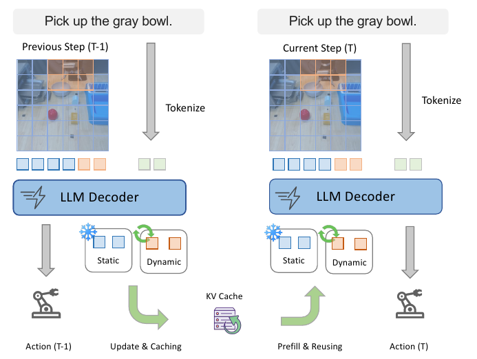

Figure 1. 이전 관찰의 static visual token KV를 다음 step에 재사용하는 개념. [PDF p.2, §1] [원문 PDF](https://proceedings.neurips.cc/paper_files/paper/2025/file/f062da1973ac9ac61fc6d44dd7fa309f-Paper-Conference.pdf#page=2).

셋째 문단은 naive static reuse의 failure mode를 강조한다. gripper나 target object는 픽셀 변화가 작아도 접촉 직전/직후의 상태 차이가 행동을 바꾼다. 이 patch를 static으로 잘못 분류하면 stale K/V가 action에 들어간다. 저자는 decoder attention으로 이를 제외하고, 레이어별 entropy로 reuse 비율을 조절한다.

마지막 문단은 세 VLA, 두 simulation suite, 한 실기기에서의 일반성을 주장한다. 이 "일반성"은 backbone이 모두 LLaMA2 계열이라는 Appendix A의 제한 안에서 이해해야 한다.

<a id="sec2"></a>

### 2 Related Work [PDF p.2-3]

**VLA models.** RT-2, OpenVLA 등은 vision-language 표현을 action으로 확장한다. action을 language-like token으로 이산화하는 계열과 diffusion policy head를 붙이는 계열을 함께 배경으로 둔다. VLA-Cache가 action head 자체를 바꾸지 않고 그 앞의 language decoder를 겨냥하는 이유다.

**VLM acceleration.** quantization/pruning과 FastV, SparseVLM, ToMe, PuMer, MADTP를 intra-frame 방법으로 묶는다. 이들은 현재 frame의 token 수를 줄이지만 과거 frame의 계산 결과를 이용하지 않는다. RoboMamba/TinyVLA/QAIL/DeeR-VLA는 구조 또는 학습 절차를 바꾸는 반면, VLA-Cache는 weight update 없이 cross-frame cache를 삽입한다. $\pi_0$-FAST, HiRT, OpenVLA-OFT의 고주파화와는 경쟁 관계보다 직교 관계라고 주장한다. 다만 standalone diffusion policy처럼 VLM decoder가 없는 모델에는 직접 적용되지 않는다. [PDF p.23, Appendix E.3]

<a id="sec3"></a>

### 3 Methodology [PDF p.3-6]

<a id="sec31"></a>

#### 3.1 KV Cache for VLA Token Reusing [PDF p.3]

##### Eq. (1): Q/K/V projection

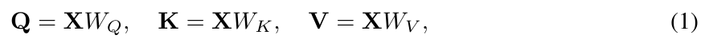

원문 Eq. (1). [PDF p.3, §3.1] [원문 PDF](https://proceedings.neurips.cc/paper_files/paper/2025/file/f062da1973ac9ac61fc6d44dd7fa309f-Paper-Conference.pdf#page=3).

원문:

$$
Q=XW_Q,\qquad K=XW_K,\qquad V=XW_V. \tag{1}
$$

- $X$의 각 token row $x_i\in\mathbb{R}^{D}$가 세 projection을 지난다. 단일-head 단순화에서는 $W_Q,W_K,W_V\in\mathbb{R}^{D\times d}$, $Q,K,V\in\mathbb{R}^{L\times d}$다. multi-head 구현은 총 폭 $h d_h=D$로 projection한 뒤 $[B,h,L,d_h]$로 reshape한다.
- 연산 순서는 token embedding/이전 layer 출력 $X$를 받은 뒤 세 GEMM을 수행하는 것이다. VLA-Cache가 token $i$를 재사용하면 현재 $x_iW_K$와 $x_iW_V$뿐 아니라 공개 구현상 그 token의 현재 layer forward 자체를 생략한다.
- 학습에서는 $\partial\mathcal L/\partial W_Q,W_K,W_V$가 attention과 loss에서 역전파된다. 그러나 VLA-Cache는 inference-only라 모든 weight가 frozen이고, cache tensor는 gradient graph를 만들지 않는다.
- 작은 예: $x=[1,2]$, $W_K=I$면 $k=[1,2]$다. 다음 frame에서 $x'=[1.01,2.00]$인데 과거 $k$를 재사용하면 projection 오차는 $[0.01,0]$다. deeper layer의 비선형 상호작용 때문에 pixel 오차와 KV 오차가 선형 비례한다는 보장은 없다.
- edge case: token 위치가 카메라 이동으로 다른 물체를 가리키면 같은 index의 $K,V$를 재사용해서는 안 된다. Eq. (1) 자체에는 공간 정합을 보장하는 장치가 없다.

##### Eq. (2): scaled dot-product attention

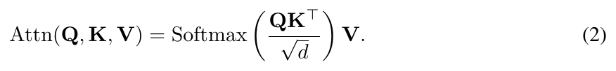

원문 Eq. (2). [PDF p.3, §3.1] [원문 PDF](https://proceedings.neurips.cc/paper_files/paper/2025/file/f062da1973ac9ac61fc6d44dd7fa309f-Paper-Conference.pdf#page=3).

원문:

$$
\mathrm{Attn}(Q,K,V)
=\mathrm{Softmax}\!\left(\frac{QK^\top}{\sqrt d}\right)V. \tag{2}
$$

1. $QK^\top$는 query마다 모든 key와의 내적을 계산해 $[B,h,L_q,L_k]$ score를 만든다.
2. $\sqrt d$로 나누는 이유는 $d$가 커질 때 내적 분산이 커져 softmax가 지나치게 포화되는 것을 막기 위해서다. 정확히는 multi-head에서 $d=d_h$로 읽는다.
3. causal/padding mask가 있다면 softmax 전에 허용하지 않는 score에 큰 음수를 더한다. 원문 식은 mask를 생략했다.
4. 마지막 $\cdot V$는 확률 가중합이며 출력은 $[B,h,L_q,d_h]$다.

수치 예로 한 query의 scaled score가 $[2,0]$이면 softmax는 약 $[0.881,0.119]$다. 첫 token의 stale key가 score를 2에서 1로 낮추면 분포는 $[0.731,0.269]$가 되어 작은 feature 오차가 행동 관련 value 혼합을 크게 바꿀 수 있다.

VLA-Cache의 절감은 재사용 query token의 attention row와 projection/MLP 계산을 생략하는 데서 온다. 그러나 현재 활성 query는 캐시의 전체 key/value slot에 계속 attention해야 하므로 비용을 단순히 "남은 token 수의 제곱"으로만 모델링하기 어렵다.

##### Eq. (3): 보통 autoregressive KV append

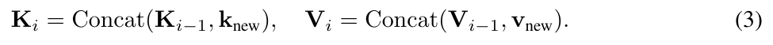

원문 Eq. (3). [PDF p.3, §3.1] [원문 PDF](https://proceedings.neurips.cc/paper_files/paper/2025/file/f062da1973ac9ac61fc6d44dd7fa309f-Paper-Conference.pdf#page=3).

원문:

$$
K_i=\mathrm{Concat}(K_{i-1},k_{\mathrm{new}}),\qquad
V_i=\mathrm{Concat}(V_{i-1},v_{\mathrm{new}}). \tag{3}
$$

$i$는 여기서 robot timestep이 아니라 **생성 token step**이다. 과거 cache $[B,h,i-1,d_h]$ 뒤에 새 $[B,h,1,d_h]$를 붙여 길이 $i$로 만든다. VLA-Cache의 cross-frame 갱신은 append가 아니라 기존 slot의 `index_copy_`에 가깝다. 공개 `DynamicCache.update`는 여러 현재 position이 들어오면 그 position만 덮어쓰고, autoregressive 1-token이면 뒤에 append한다. [공개 코드 확인]

edge case는 두 종류다. 첫 frame에는 과거 visual cache가 없으므로 full prefill이 필요하다. 반대로 action token을 모두 cache에 남긴 채 다음 observation을 시작하면 sequence가 계속 늘어나므로, 공개 OpenVLA wrapper는 action token 부분을 crop하고 prompt/visual cache 길이만 남긴다.

<a id="sec32"></a>

#### 3.2 Temporal Redundancy in Robotic Perception [PDF p.3-4]

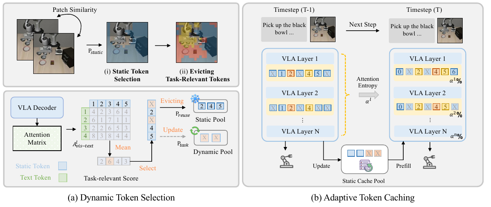

Figure 2. dynamic token selection과 layer-adaptive token caching의 전체 구조. [PDF p.4, §3.2-3.4] [원문 PDF](https://proceedings.neurips.cc/paper_files/paper/2025/file/f062da1973ac9ac61fc6d44dd7fa309f-Paper-Conference.pdf#page=4).

Figure 2(a)의 왼쪽은 대응 patch의 유사도로 static pool을 만들고, 오른쪽은 decoder attention으로 task-critical patch를 evict해 dynamic/recompute pool로 보내는 흐름이다. 이때 "static"은 세계 좌표에서 물체가 정지했다는 뜻이 아니라 **같은 화면 grid 위치의 RGB 방향이 유사하다**는 뜻이다.

##### Eq. (4): raw-patch cosine similarity

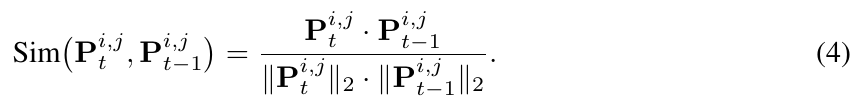

원문 Eq. (4). [PDF p.4, §3.2] [원문 PDF](https://proceedings.neurips.cc/paper_files/paper/2025/file/f062da1973ac9ac61fc6d44dd7fa309f-Paper-Conference.pdf#page=4).

원문:

$$
\mathrm{Sim}\!\left(P_t^{i,j},P_{t-1}^{i,j}\right)
=\frac{P_t^{i,j}\cdot P_{t-1}^{i,j}}
{\lVert P_t^{i,j}\rVert_2\,\lVert P_{t-1}^{i,j}\rVert_2}. \tag{4}
$$

- 두 $p\times p\times3$ patch를 길이 $D_{\mathrm{patch}}=3p^2$ vector로 편 뒤 내적한다. 공개 설정 $p=14$이면 588차원이다.
- 값은 이상적으로 $[-1,1]$이지만 RGB가 음수가 아니므로 보통 0 이상이다. 1에 가까울수록 두 vector 방향이 같다.
- 절대 밝기 배율에는 둔감하다. 예를 들어 $[10,20]$과 $[20,40]$의 cosine은 1이므로, 두 배 밝아져도 static으로 본다. 반대로 작은 물체 경계가 patch 일부에서 이동하면 cosine이 임계값 아래로 떨어질 수 있다.
- 공개 코드는 분모에 $10^{-8}$을 더한다. 두 patch가 모두 완전 검정이면 내적과 norm이 0이라 similarity가 0이 되어, 동일한 검정 patch가 오히려 static 후보가 되지 않는 edge case가 생긴다.
- $\tau=0.996$은 매우 엄격하지만 adjacent-frame drift만 검사한다. 매번 cosine 0.997인 작은 변화가 여러 step 누적되면 cache가 마지막 recompute 시점에서 크게 낡을 수 있다.
- 이 선택은 discrete/no-grad 제어 로직이다. 학습 gradient는 없다.

##### Eq. (5): threshold 후 top-k

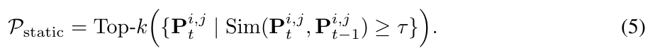

원문 Eq. (5). [PDF p.4, §3.2] [원문 PDF](https://proceedings.neurips.cc/paper_files/paper/2025/file/f062da1973ac9ac61fc6d44dd7fa309f-Paper-Conference.pdf#page=4).

원문:

$$
\mathcal P_{\mathrm{static}}
=\mathrm{Top\text{-}k}\!\left(
\left\{P_t^{i,j}\mid
\mathrm{Sim}(P_t^{i,j},P_{t-1}^{i,j})\ge \tau\right\}
\right). \tag{5}
$$

먼저 threshold로 후보를 만들고, 그 안에서 similarity가 큰 순서로 최대 $k$개를 고른다. 후보가 $k$보다 적으면 실제 수는 더 적다. 공개 구현은 $16\times16$ grid를 row-major index $16i+j$로 만들고 내림차순 정렬한다.

예를 들어 similarity가 $[0.999,0.997,0.990]$, $\tau=0.996$, $k=1$이면 후보는 앞의 두 개이고 최종 static은 0.999 patch 하나다. $k=0$은 논문 식상 아무것도 재사용하지 않는 baseline이지만, 공개 layer code는 선택 수를 `max(1, ...)`로 제한하는 곳이 있어 완전한 zero-reuse 경로는 별도 플래그로 처리해야 한다.

중요한 불일치가 있다. Appendix D는 기본 static top-k=100이라고 쓰지만 공개 OpenVLA evaluation wrapper는 130, OpenVLA-OFT의 두 camera 각각은 150을 넘긴다. Table 9의 $k$와 공개 main result가 동일 설정인지 PDF만으로 확정할 수 없다. [PDF p.21, Appendix D; 공개 코드 확인]

<a id="sec33"></a>

#### 3.3 Retaining Task-Relevant Information [PDF p.4-5]

Table 1은 motivation을 ablation으로 확인한다.

| 구성 | SR | CUDA latency | 이전 단계 대비 해석 |
|---|---:|---:|---|
| OpenVLA | 84.4% | 51.56 ms | full recompute |
| + Static Token | 74.2% | 31.03 ms | -10.2 pp: pixel-static만으로는 위험 |
| + Evict Task-Relevant | 82.6% | 31.03 ms | +8.4 pp 회복; 표의 반올림 해상도에서는 latency 변화 없음 |
| + Layer Adaptive | 83.8% | 32.22 ms | +1.2 pp 추가 회복; static-only보다 1.19 ms 증가 |

이 표는 task-critical recovery가 단순 장식이 아니라 성공률 손실 대부분을 되돌리는 요소임을 보여준다. 다만 각 행의 trial 수와 variance가 Table 1에 없고 error bar도 없으므로 1.2 pp adaptive 이득이 통계적으로 안정적인지는 알 수 없다.

##### Algorithm 1: Dynamic Token Selection

원문 Algorithm 1의 각 줄을 계산 순서로 풀면 다음과 같다. [PDF p.5]

1. 입력은 인접 frame $I_{t-1},I_t$, pixel threshold $\tau$, task threshold $\tau_{\mathrm{task}}$, hyperparameter $k$다.
2. 출력은 재사용 index $\mathcal P_{\mathrm{final}}$이다. 본문 Eq. (8)의 $\mathcal P_{\mathrm{reuse}}$와 같은 역할이지만 이름이 통일되지 않았다.
3. 두 frame을 동일한 grid로 patchify한다. crop/resize가 달라지면 index 대응이 깨지므로 같은 전처리를 적용해야 한다.
4. 각 동일 위치 patch의 Eq. (4) similarity를 계산한다.
5. $\tau$ 이상만 $\mathcal P_{\mathrm{static}}$에 넣는다.
6. similarity top-k로 예산을 제한한다.
7. 직전 decoder의 attention에서 task relevance를 얻는다.
8. $\tau_{\mathrm{task}}$ 이상 patch를 $\mathcal P_{\mathrm{task}}$로 고른다.
9. 차집합 $\mathcal P_{\mathrm{static}}\setminus\mathcal P_{\mathrm{task}}$만 재사용한다.

공개 코드는 한 step 이전 attention을 사용하므로, 현재 frame에서 갑자기 중요해진 물체는 attention proxy가 한 step 늦을 수 있다. 또 PDF는 threshold를 말하지만 OpenVLA 공개 경로는 layer 15의 attention 상위 120개, OFT는 camera당 상위 100개를 task-relevant로 간주한다. [공개 코드 확인]

##### Eq. (6): attention submatrix - 원문 축 표기에 주의

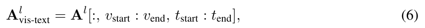

원문 Eq. (6). [PDF p.5, §3.3] [원문 PDF](https://proceedings.neurips.cc/paper_files/paper/2025/file/f062da1973ac9ac61fc6d44dd7fa309f-Paper-Conference.pdf#page=5).

원문:

$$
A^l_{\mathrm{vis\text{-}text}}
=A^l[:,v_{\mathrm{start}}:v_{\mathrm{end}},
t_{\mathrm{start}}:t_{\mathrm{end}}]. \tag{6}
$$

원문은 $A^l\in\mathbb{R}^{N_{\mathrm{heads}}\times N_{\mathrm{tokens}}\times N_{\mathrm{tokens}}}$라고 한다. 표준 attention tensor의 마지막 두 축을 $(\text{query},\text{key})$로 읽으면 Eq. (6)은 **vision query가 text key를 보는** $[h,L_v,L_t]$ slice다. 그러나 본문은 이를 "text-to-vision" attention이라 부르고, 공개 코드는 실제로 `attn[text_query_positions, vision_key_positions]`를 뽑는다. 즉 코드의 shape은 $[L_t,L_v]$이고 방향은 text query $\rightarrow$ vision key다. 원문 Eq. (6)의 두 slice 축은 표준 관례와 공개 구현을 기준으로 서로 뒤바뀐 것으로 보인다. 이 리뷰는 원문을 조용히 고치지 않고 다음처럼 구분한다.

- **원문 표기 그대로**: $A^l[:,\mathcal I_v,\mathcal I_t]\in\mathbb{R}^{h\times L_v\times L_t}$.
- **의도/공개 코드 해석**: $A^l[:,\mathcal I_t,\mathcal I_v]\in\mathbb{R}^{h\times L_t\times L_v}$.

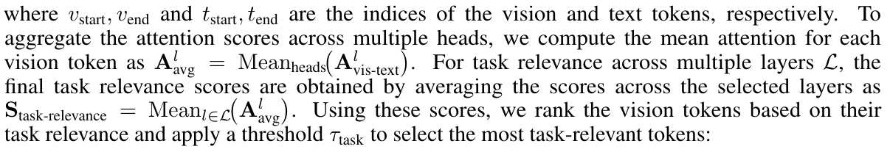

원문 비번호 식: attention 집계. head 축 attention 평균과 선택된 layer의 task-relevance 평균. [PDF p.5, §3.3] [원문 PDF](https://proceedings.neurips.cc/paper_files/paper/2025/file/f062da1973ac9ac61fc6d44dd7fa309f-Paper-Conference.pdf#page=5). 두 식이 본문 행에 삽입되어 있어 해당 집계 설명 문단을 함께 발췌했다.

그다음 원문은

$$
A^l_{\mathrm{avg}}=\mathrm{Mean}_{\mathrm{heads}}
\left(A^l_{\mathrm{vis\text{-}text}}\right)
$$

라고만 쓴다. head 평균만 하면 아직 $L_t\times L_v$ 또는 $L_v\times L_t$ matrix다. "각 vision token의 score"를 얻으려면 text query 축도 평균/합해야 한다. 공개 코드는 head 평균 후 선택된 text query row를 다시 평균해 길이 256 vector를 만든다.

**[해설용 수식] 의도에 맞춘 완전한 집계**는 다음과 같다.

$$
s_i^l
=\frac{1}{hL_t}
\sum_{r=1}^{h}\sum_{q\in\mathcal I_t}
A^l_{r,q,i},\qquad i\in\mathcal I_v.
$$

여러 layer 집합 $\mathcal L$을 쓰면

$$
s_i=\frac{1}{|\mathcal L|}\sum_{l\in\mathcal L}s_i^l.
$$

그러나 공개 OpenVLA/OFT 코드는 여러 layer 평균이 아니라 기본 `layer_id=15` 한 layer를 사용한다. text position도 OpenVLA에서 257-291, OFT에서 513-546으로 고정되어 있어 prompt token 길이가 달라질 때 범위가 맞는지 확인해야 한다.

작은 예로 두 text query가 세 vision token에 $[0.6,0.3,0.1]$, $[0.2,0.7,0.1]$을 준다면 평균 relevance는 $[0.4,0.5,0.1]$다. 두 번째 patch가 가장 task-relevant다. edge case로 instruction이 길어 고정 text range 밖으로 나가면 일부 query가 누락된다. attention을 얻기 위해 `output_attentions=True`를 켜는 비용과 memory도 end-to-end 비교에 포함해야 한다.

##### Eq. (7): task-critical set

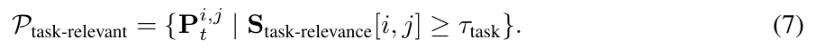

원문 Eq. (7). [PDF p.5, §3.3] [원문 PDF](https://proceedings.neurips.cc/paper_files/paper/2025/file/f062da1973ac9ac61fc6d44dd7fa309f-Paper-Conference.pdf#page=5).

원문:

$$
\mathcal P_{\mathrm{task\text{-}relevant}}
=\left\{P_t^{i,j}\mid
S_{\mathrm{task\text{-}relevance}}[i,j]\ge\tau_{\mathrm{task}}
\right\}. \tag{7}
$$

score map shape은 $[N,N]=[16,16]$이며 set 원소는 patch 또는 그 index다. threshold가 높을수록 task-critical로 보호되는 patch가 줄어들고 재사용은 늘어난다. Table 10에서 $\tau$를 0.2에서 0.7로 높일수록 FLOPs/latency가 단조 감소하는 이유가 이것이다. 다만 Table 10은 relevance threshold도 $\tau$로 표기해 pixel threshold $\tau$와 충돌한다.

예를 들어 relevance가 $[0.7,0.4,0.1]$이고 $\tau_{\mathrm{task}}=0.5$면 첫 patch만 보호한다. 모든 score가 threshold 아래면 task 보호 집합이 비어 static 후보를 과도하게 재사용할 수 있고, 모두 위면 안전하지만 가속이 사라진다. 이 set 선택은 inference-only라 threshold를 통과하지 못한 score에 gradient가 흐르는 문제는 애초에 없다.

score가 확률 attention이면 0.5라는 절대 threshold는 256 vision key 분포에서 매우 높아 보인다. normalization과 aggregation 후 값 범위가 명시되지 않아 Appendix D의 $\tau_{\mathrm{task}}=0.5$를 그대로 구현하기 어렵다. 공개 코드가 top-k를 사용한 사실은 이 불명확성을 더 중요하게 만든다.

##### Eq. (8): 안전한 재사용 차집합

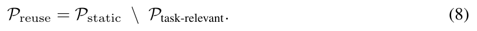

원문 Eq. (8). [PDF p.5, §3.3] [원문 PDF](https://proceedings.neurips.cc/paper_files/paper/2025/file/f062da1973ac9ac61fc6d44dd7fa309f-Paper-Conference.pdf#page=5).

원문:

$$
\mathcal P_{\mathrm{reuse}}
=\mathcal P_{\mathrm{static}}
\setminus\mathcal P_{\mathrm{task\text{-}relevant}}. \tag{8}
$$

네 경우를 구분하면 직관적이다.

| pixel-static? | task-relevant? | 처리 |
|---|---|---|
| 아니오 | 무관 | 현재 frame으로 재계산 |
| 예 | 아니오 | cache 재사용 후보 |
| 예 | 예 | 후보에서 evict하고 재계산 |
| 아니오 | 예 | 이미 dynamic이므로 재계산 |

예를 들어 static 집합이 $\{1,2,3,8\}$, task 집합이 $\{2,7,8\}$이면 reuse는 $\{1,3\}$다. 이 연산 자체는 loss나 gradient가 없으며 inference control flow만 바꾼다.

##### Algorithm 2: Adaptive Token Caching

원문 Algorithm 2는 layer마다 $\alpha^l$로 $\mathcal P_{\mathrm{final}}$의 subset $\mathcal P_{\mathrm{reuse}}$를 정하고, token $i$가 subset이면 $(K^l_{t-1}(i),V^l_{t-1}(i))$를 그대로 쓰며 아니면 현재 $H_t^l(i)$에서 projection한다. 핵심은 **cache slot $i$를 유지하면서 일부 slot만 overwrite**한다는 것이다.

알고리즘에는 두 정보가 빠져 있다.

- 어떤 후보를 먼저 선택하는지, 즉 $\alpha^l|\mathcal P|$개의 ordering 기준이 없다.
- 이전 layer에서 생략한 token을 이후 layer에서 다시 recompute하려면 현재 $H_t^l(i)$가 필요한데, 그것을 어떻게 복원하는지 쓰지 않았다.

공개 구현은 reusable index를 정렬된 공간 index 순으로 자르고, layer 2, 6, 9, 11에서만 더 많은 token을 제거한다. 이미 제거한 hidden state를 되살리지 않도록 실질 reuse set은 단조 증가하는 방향으로만 작동한다. 이는 Figure 2의 layer마다 자유롭게 비율이 변하는 인상보다 제한적이다.

<a id="sec34"></a>

#### 3.4 Layer Adaptive Token Reusing [PDF p.5-6]

원문은 초반 layer의 attention이 분산되고 깊은 layer에서 집중된다는 관찰을 재사용률에 연결한다. 분포 $p_i^l$의 entropy가 작을수록 소수 token에 집중했다고 해석한다. 다만 원문에는 entropy 자체의 번호 식이 없다.

**[해설용 수식]** 일반적인 attention entropy는

$$
E^l=-\sum_i p_i^l\log p_i^l
$$

이며, uniform $p_i=1/L$이면 $E=\log L$, 한 token에 확률 1이면 $E=0$이다. 실제로는 어느 query/head/token 축에서 $p$를 만들고 어떻게 평균하는지가 필요하다. PDF는 "Eq. (6)과 같은 mean attention"만 말할 뿐 이 축을 완전 명시하지 않는다.

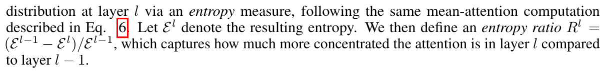

원문 비번호 식: entropy ratio. 상대 entropy 감소율의 두 줄에 걸친 문장형 정의. [PDF p.6, §3.4] [원문 PDF](https://proceedings.neurips.cc/paper_files/paper/2025/file/f062da1973ac9ac61fc6d44dd7fa309f-Paper-Conference.pdf#page=6). 정의가 두 줄에 걸쳐 있으므로 연결된 인쇄 문맥을 포함했다.

번호 없는 원문 정의:

$$
R^l=\frac{E^{l-1}-E^l}{E^{l-1}}.
$$

$E^{l-1}=2.0$, $E^l=1.6$이면 $R^l=0.2$로 20% 상대 감소다. $E^l>E^{l-1}$이면 음수다. $E^{l-1}=0$이면 정의되지 않는다.

##### Eq. (9): 누적 entropy 감소에 따른 reuse ratio

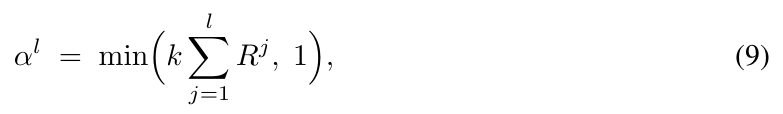

원문 Eq. (9). [PDF p.6, §3.4] [원문 PDF](https://proceedings.neurips.cc/paper_files/paper/2025/file/f062da1973ac9ac61fc6d44dd7fa309f-Paper-Conference.pdf#page=6).

원문:

$$
\alpha^l
=\min\!\left(k\sum_{j=1}^{l}R^j,1\right). \tag{9}
$$

- $\sum_{j=1}^{l}R^j$는 layer 1부터 $l$까지 상대 entropy 감소를 누적한다.
- $k$는 민감도 scale이다. 여기의 $k$는 Eq. (5)의 token budget $k$와 다른 의미인데 같은 문자를 쓴다.
- `min(...,1)`은 상한만 보장한다. 누적합이 음수면 $\alpha^l<0$이 될 수 있으므로 실제 reuse ratio라면 $\max(0,\cdot)$ 하한도 필요하다.
- 예: $R^1=0.1,R^2=-0.05,R^3=0.2,k=2$이면 $\alpha^1=0.2$, $\alpha^2=0.1$, $\alpha^3=0.5$다. ratio가 감소할 수 있어 이전 layer에서 생략한 token을 다음 layer에 다시 넣는 문제가 생긴다.
- edge case: 모든 layer entropy가 동일하면 모든 $R^j=0$, 즉 adaptive reuse 0이다. 후보가 많아도 이 식만 따르면 재사용하지 않는다.

**논문-코드 불일치.** 공개 `get_layer_mask_schedule`은 Eq. (9)를 구현하지 않는다. 각 layer entropy를 전체 layer의 최소/최대로 정규화한 뒤

**[공개 코드의 실질 식]**

$$
\widetilde E^l
=\frac{E^l-E_{\min}}{E_{\max}-E_{\min}+10^{-10}},\qquad
\alpha^l_{\mathrm{code}}=1-\widetilde E^l
$$

를 사용하고, reuse가 증가하는 step만 증가량에 0.55를 곱해 완화한다. Eq. (9)의 $R^l$, 누적합, scale $k$는 없다. 따라서 논문 식의 작은 수치 예를 코드 결과 예측에 직접 사용할 수 없다.

<a id="sec4"></a>

### 4 Implementations [PDF p.6-7]

<a id="sec41"></a>

#### 4.1 Cross-Frame Visual Token Caching [PDF p.6]

##### Eq. (10): layer별 partial KV overwrite

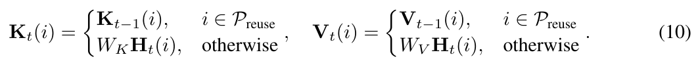

원문 Eq. (10). [PDF p.6, §4.1] [원문 PDF](https://proceedings.neurips.cc/paper_files/paper/2025/file/f062da1973ac9ac61fc6d44dd7fa309f-Paper-Conference.pdf#page=6).

원문:

$$
K_t(i)=
\begin{cases}
K_{t-1}(i), & i\in\mathcal P_{\mathrm{reuse}},\\
W_KH_t(i), & \text{otherwise},
\end{cases}
\qquad
V_t(i)=
\begin{cases}
V_{t-1}(i), & i\in\mathcal P_{\mathrm{reuse}},\\
W_VH_t(i), & \text{otherwise}.
\end{cases} \tag{10}
$$

실제로는 모든 decoder layer에 적용되므로 $K_t^l,V_t^l,W_K^l,W_V^l,H_t^l$로 읽어야 한다. cache tensor shape이 $[B,h,L_{\mathrm{cache}},d_h]$라면 token position $i$는 세 번째 축의 한 slot이다.

연산 순서는 다음과 같다.

1. 현재 frame의 활성 token $H_t^l(i)$만 K/V projection한다.
2. 그 결과를 `cache_position=i`인 기존 cache slot에 덮어쓴다.
3. reuse token slot은 덮어쓰지 않아 이전 값이 남는다.
4. 현재 활성 query는 갱신/재사용이 섞인 full cache K/V를 읽는다.

작은 예: cache position $[0,1,2,3]$에서 reuse가 $\{1,3\}$이면 현재 layer는 position $[0,2]$의 새 $K,V$만 계산하고 slot 0,2를 overwrite한다. slot 1,3은 과거 값을 유지한다. 중요한 것은 $[0,2]$를 압축해 새 position $[0,1]$로 재번호화하지 않는 것이다. RoPE와 causal mask는 원래 position 0,2를 사용해야 한다.

**stale edge case.** token 3을 $t=1,2,3$에서 계속 reuse하면 $K_3(3)=K_2(3)=K_1(3)=K_0(3)$가 된다. Eq. (10)은 매번 $t-1$이라고 쓰지만 실제 정보 나이는 3 step일 수 있다. adjacent-frame similarity만으로는 이 누적 age를 제한하지 못한다. max-age 또는 keyframe refresh가 필요할 수 있다.

**gradient.** inference cache는 detached/no-grad 상태다. VLA-Cache를 학습에 그대로 쓰면 skipped token으로 gradient가 흐르지 않지만, 논문은 그런 학습을 제안하지 않는다.

<a id="sec42"></a>

#### 4.2 Theoretical Analysis of Computational Complexity [PDF p.6-7]

##### Eq. (11): baseline 한 Transformer layer 비용

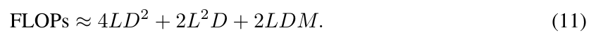

원문 Eq. (11). [PDF p.6, §4.2] [원문 PDF](https://proceedings.neurips.cc/paper_files/paper/2025/file/f062da1973ac9ac61fc6d44dd7fa309f-Paper-Conference.pdf#page=6).

원문:

$$
\mathrm{FLOPs}\approx4LD^2+2L^2D+2LDM. \tag{11}
$$

항별 의도는 다음과 같다.

- $4LD^2$: Q, K, V, output projection 네 번.
- $2L^2D$: $QK^\top$와 attention-value 곱 두 번.
- $2LDM$: 일반적인 두 linear FFN.

$L=300,D=4096,M=11008$을 대입하면 항은 각각 약 20.13B, 0.737B, 27.05B, 합 47.92B가 된다. 이는 matrix multiply 한 multiply-add를 1 operation처럼 센 convention에 가깝다. 엄밀한 FLOP convention이 multiply와 add를 각각 1로 세면 계수가 두 배가 될 수 있다.

또 OpenVLA의 LLaMA2 MLP는 gated SwiGLU라 $D\rightarrow M$ projection 두 개와 $M\rightarrow D$ projection 한 개, 즉 약 $3LDM$이 더 자연스럽다. 공개 FLOP counter도 $3n d m$을 사용해 위 예의 합은 약 61.45B가 된다. Eq. (11)의 $2LDM$과 공개 계수는 일치하지 않는다.

##### Eq. (12): 논문이 말하는 layer 절감량

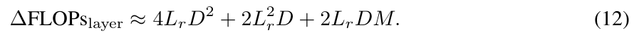

원문 Eq. (12). [PDF p.6, §4.2] [원문 PDF](https://proceedings.neurips.cc/paper_files/paper/2025/file/f062da1973ac9ac61fc6d44dd7fa309f-Paper-Conference.pdf#page=6).

원문:

$$
\Delta\mathrm{FLOPs}_{\mathrm{layer}}
\approx4L_rD^2+2L_r^2D+2L_rDM. \tag{12}
$$

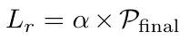

원문 비번호 식: 재사용 token 수. 원문의 재사용 token 수 정의; 집합 기호 문제는 기존 해설 참고. [PDF p.6, §4.2] [원문 PDF](https://proceedings.neurips.cc/paper_files/paper/2025/file/f062da1973ac9ac61fc6d44dd7fa309f-Paper-Conference.pdf#page=6).

원문은 $L_r=\alpha\times\mathcal P_{\mathrm{final}}$이라고 쓰지만 집합에 scalar를 곱할 수 없으므로, 의도는 $L_r=\alpha|\mathcal P_{\mathrm{final}}|$인 **재사용 token 개수**다. 이 식은 남은 비용이 아니라 생략되는 token의 비용을 "절감량"으로 표현한다.

주의할 점은 attention 항이다. $r=L_r$개 query를 생략하되 활성 query $q=L-r$개가 full $L$ key cache에 attention하면 현재 attention 비용은 대략 $2qLD$, 절감은 $2rLD$다. $2r^2D$는 key와 query가 모두 $r$ 길이인 독립 block을 제거하는 모형이며 partial update의 실제 구조를 충분히 반영하지 못한다. 정확한 식은 cache layout, causal mask, FlashAttention kernel이 불규칙 query 길이를 어떻게 처리하는지에 달려 있다.

작은 비율 예로 $L=300,r=100$이면 원문 attention 절감항은 $2\times100^2D=20{,}000D$지만 full-key 모형은 $2\times100\times300D=60{,}000D$다. 어느 쪽이 실제 kernel 절감과 가까운지는 구현 계측이 결정한다. $r=0$이면 절감은 0이어야 하고, $r=L$이면 현재 query가 하나도 없어 action/text 출력을 만들 수 없으므로 식의 최대값을 실제 정책에 그대로 허용할 수 없다. Eq. (12)는 실행 연산이 아니라 inference 비용 추정이므로 gradient 경로는 없다.

##### Eq. (13): overhead를 뺀 총 절감

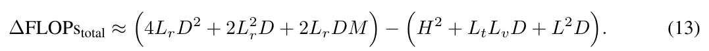

원문 Eq. (13). [PDF p.7, §4.2] [원문 PDF](https://proceedings.neurips.cc/paper_files/paper/2025/file/f062da1973ac9ac61fc6d44dd7fa309f-Paper-Conference.pdf#page=7).

원문:

$$
\Delta\mathrm{FLOPs}_{\mathrm{total}}
\approx
\left(4L_rD^2+2L_r^2D+2L_rDM\right)
-\left(H^2+L_tL_vD+L^2D\right). \tag{13}
$$

첫 괄호는 decoder에서 생략한 계산, 둘째는 patch similarity, relevance filtering, entropy 계산 overhead다. 양수가 되어야 순절감이 있다.

기호가 과도하게 재사용된다. 마지막 $L^2D$의 $L$이 sequence length인지 layer 수인지 불명확하고, Appendix C의 Eq. (16)도 같은 문제가 있다. 공개 구현은 이미 생성된 attention tensor를 평균하므로 relevance/entropy aggregation의 추가 비용에 $D$가 반드시 곱해지는 것도 아니다. 반면 `output_attentions=True`로 attention matrix를 materialize하는 실제 memory/latency 비용은 이 식에 나타나지 않는다.

예를 들어 gross decoder saving을 20 G operation, 세 overhead 합을 1 G라고 재면 순절감은 19 G다. 반대로 작은 모델/동적 장면에서 gross saving 0.5 G보다 selection overhead 1 G가 크면 Eq. (13)은 -0.5 G가 되어 가속이 아니라 손해다. 이 음수 edge case를 runtime이 감지해 cache를 끄는 정책은 논문에 없다. Eq. (13)도 학습 loss가 아니라 inference budget accounting이다.

<a id="sec5"></a>

### 5 Experiment [PDF p.7-9]

Sec. 5는 OpenVLA/OpenVLA-OFT를 LIBERO에, CogACT를 SIMPLER에 적용하고 모두 RTX 4090에서 평가한다. metric은 success rate, FLOPs, CUDA latency, control frequency 네 가지다. 이 네 metric이 서로 다른 질문에 답한다는 점이 핵심이다.

<a id="sec51"></a>

#### 5.1 Experiment Setup [PDF p.7]

비교군은 OpenVLA에서 SparseVLM과 FastV다. baseline weight와 task는 같아야 하지만, token pruning 방법이 요구하는 attention materialization이나 gather/scatter overhead가 CUDA latency에 포함됐는지 세부 timing boundary는 PDF에 없다. Appendix E.1은 BF16, single RTX 4090을 명시한다.

<a id="sec52"></a>

#### 5.2 Evaluation Benchmark [PDF p.7-8]

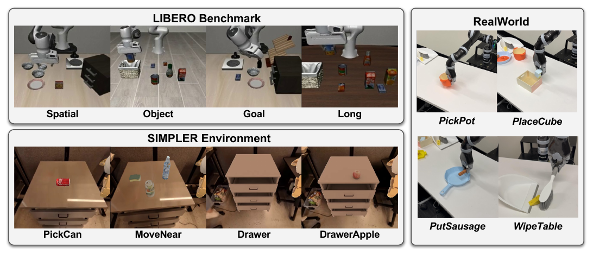

Figure 3. LIBERO의 네 task suite, SIMPLER 조작 과제, 실기기 과제. [PDF p.7, §5.2] [원문 PDF](https://proceedings.neurips.cc/paper_files/paper/2025/file/f062da1973ac9ac61fc6d44dd7fa309f-Paper-Conference.pdf#page=7).

- **LIBERO**: Spatial, Object, Goal, Long 네 suite, suite당 10 subtask. OpenVLA와 OpenVLA-OFT official weights/setup을 따른다.
- **SIMPLER**: Google robot, Visual Matching과 Variant Aggregation, PickCan/MoveNear/Drawer/DrawerApple 네 task. CogACT diffusion head를 쓴다.
- **Real robot**: Kinova Jaco2, front-facing camera, PickPot/PlaceCube/PutSausage/WipeTable. teleoperation data는 task당 150-200 trajectory라고 본문이 요약하며, Appendix E.4는 정확히 218/212/219/187 demonstration을 준다.

split, seed, simulator episode 수의 완전한 정의, latency warm-up/repetition 수, CPU 사양, GPU power mode, peak memory는 **논문 미기재**다.

<a id="sec53"></a>

#### 5.3 Results on Simulation Environment [PDF p.8-9]

Table 2-4의 상세 검산은 [8절](#experiments)에 모았다. 문단 논리는 다음과 같다.

1. OpenVLA에서 VLA-Cache는 평균 성공률을 거의 유지하면서 FLOPs/CUDA time을 낮춘다.
2. OFT에서도 control frequency가 약 14 Hz 늘어 action chunking과 함께 쓸 수 있다.
3. SparseVLM/FastV는 spatial fidelity를 손상하거나 gather/scatter overhead 때문에 실제 latency가 개선되지 않는다.
4. 50/100/200 token ablation은 과도한 reduction이 모든 방법의 성공률을 해친다는 것을 보인다.
5. Figure 4는 static=blue, task-relevant=yellow, overlap=red overlay를 LIBERO, 동적 실기기, primary/wrist camera에 보여준다. 색은 segmentation ground truth가 아니라 방법 내부 선택을 시각화한 것이다.

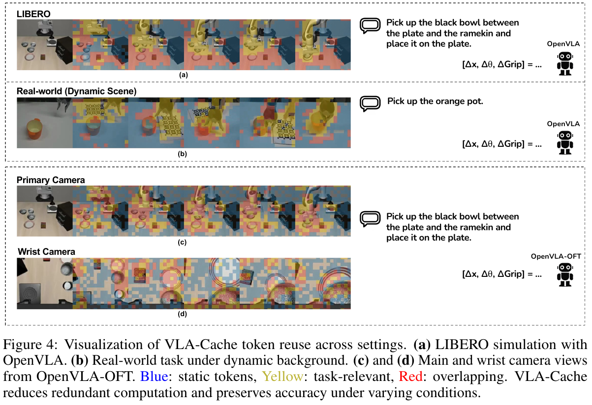

Figure 4. attention과 static/task-relevant token 선택의 정성 시각화. [PDF p.9, §5.3] [원문 PDF](https://proceedings.neurips.cc/paper_files/paper/2025/file/f062da1973ac9ac61fc6d44dd7fa309f-Paper-Conference.pdf#page=9). 색상 범례를 보존하기 위해 원문 캡션도 포함했다.

SIMPLER에서 CogACT Matching 성공률은 74.8 -> 74.4로 0.4 pp 하락하고 Aggregation은 61.3 -> 62.3으로 1.0 pp 상승한다. 저자의 "comparable"은 표와 대체로 맞지만 error bar가 없어 우열을 주장할 수는 없다.

<a id="sec54"></a>

#### 5.4 Results on Real Robot [PDF p.9]

PickPot은 95.0 -> 90.0으로 떨어지고 나머지 세 task는 상승한다. 저자는 redundant token이 오히려 방해해 평균 성공률이 높아졌을 가능성을 제시하지만, 이는 causal하게 검증된 결론이 아니라 해석이다. Table 11의 count와 pooled rate 불일치 때문에 "평균 +2.4%"도 정확한 집계 정의를 다시 확인해야 한다.

동적 배경 PickPot은 baseline 95%, noise 80%, noise+cache 80%다. VLA-Cache가 noise로 잃은 15 pp를 회복한 것은 아니다. **noise 조건의 성공률 하락을 추가 악화하지 않으면서 계산을 줄였다**가 정확한 해석이다.

<a id="sec6"></a>

### 6 Conclusion [PDF p.10]

결론은 static selection, task-critical filtering, layer-adaptive reuse와 세 모델/두 simulation/실기기 결과를 다시 묶는다. "1.7x speedup while maintaining performance"는 가장 좋은 decoder CUDA 사례의 반올림이다. 모든 setting에서 1.7x가 아니며, end-to-end robot loop 1.7x도 아니다.

Acknowledgments는 ARC 지원과 reviewer/area chair 감사를 기록한다. References는 39개이며, 본 리뷰는 요청 범위에 따라 참고문헌별 서평은 하지 않았다. 다만 관련 연구의 역할은 Sec. 2 설명에 반영했다.

<a id="checklist"></a>

### NeurIPS Paper Checklist [PDF p.13-19]

저자 답변의 실질 내용은 다음과 같다.

- claims, limitations, theory, reproducibility, open code/data, experimental details, compute, ethics, broader impacts, licenses, new assets는 `Yes`라고 답했다.
- statistical significance는 반복 실험 비용을 이유로 `No`라고 명시했다. 이 답은 표의 작은 SR 차이를 해석할 때 가장 중요한 제한이다.
- safeguards, crowdsourcing, human subjects, IRB는 `NA`다.
- LLM은 core method가 아니라 문장 다듬기/문법 검사에만 썼다고 선언했다.

비판적으로는 compute 질문에 `Yes`라고 했지만 PDF는 GPU 종류/precision 외 CPU, memory, run time, 총 compute를 주지 않는다. experimental details도 optimizer나 seed가 VLA-Cache에는 불필요하더라도 real-robot LoRA 재현에는 부족하다. checklist의 자기평가를 재현성의 독립 증명으로 취급해서는 안 된다.

<a id="appendix-a"></a>

### Appendix A. Limitations [PDF p.20]

저자가 인정한 제한은 두 가지다.

1. 배경이나 물체 motion이 크면 dynamic token이 늘어 acceleration gain이 줄어든다. 정확도보다 먼저 "재사용할 것이 없어지는" graceful degradation을 기대할 수 있지만, 잘못 static으로 판정하면 stale 오류가 생길 수 있다.
2. 평가한 세 architecture가 모두 LLaMA2 decoder 기반이다. Gemma2 기반 $\pi_0$나 더 복잡한 VLA로의 일반화는 열린 문제다.

저자가 직접 쓰지 않은 추가 제한은 장기 cache age, 카메라 calibration/ego-motion, attention proxy의 one-step lag, fixed token-range 가정, error bar 부재다.

<a id="appendix-b"></a>

### Appendix B. Impact Statement [PDF p.20]

저자는 동적 조건에서도 견고하다고 요약하면서 실제 로봇에는 지속 모니터링과 안전성, 해석 가능성, 신뢰성 확보가 필요하다고 한다. 이 문단은 구체 safeguard나 fail-safe 설계를 제공하지 않는다. 캐시가 불확실하면 full recompute로 돌아가는 runtime guard, 최대 stale age, emergency stop과 독립 safety controller가 후속 배포에 필요하다.

<a id="appendix-c"></a>

### Appendix C. Complexity Analysis Details [PDF p.20]

##### Eq. (14): static similarity 비용

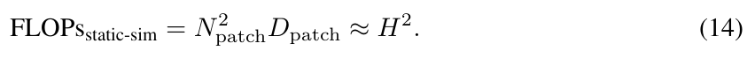

원문 Eq. (14). [PDF p.20, Appendix C] [원문 PDF](https://proceedings.neurips.cc/paper_files/paper/2025/file/f062da1973ac9ac61fc6d44dd7fa309f-Paper-Conference.pdf#page=20).

원문:

$$
\mathrm{FLOPs}_{\mathrm{static\text{-}sim}}
=N_{\mathrm{patch}}^2D_{\mathrm{patch}}\approx H^2. \tag{14}
$$

Appendix는 $N_{\mathrm{patch}}=H/p$라고 하므로 이는 한 축 patch 수다. 전체 patch 수는 $N_{\mathrm{patch}}^2$. $D_{\mathrm{patch}}=3p^2$라면 실제 dot/norm 계산 크기는 상수항을 빼고 $3(H/p)^2p^2=3H^2$에 비례한다. 따라서 $\mathcal O(H^2)$ scaling은 맞지만 Eq. (14)의 "FLOPs" 등호는 채널 수, norm, division 상수를 생략한 근사다.

$H=224,p=14$이면 256 patch, patch당 588 성분이다. 단순 dot만 150,528 multiply 정도이며 7B decoder와 비교하면 작다. 그러나 공개 구현은 NumPy/CPU patchify와 정렬을 하므로 GPU FLOP가 작다는 사실이 wall-clock overhead가 항상 작다는 뜻은 아니다.

##### Eq. (15): task filtering 비용

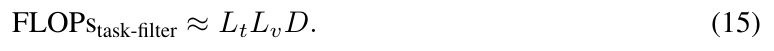

원문 Eq. (15). [PDF p.20, Appendix C] [원문 PDF](https://proceedings.neurips.cc/paper_files/paper/2025/file/f062da1973ac9ac61fc6d44dd7fa309f-Paper-Conference.pdf#page=20).

원문:

$$
\mathrm{FLOPs}_{\mathrm{task\text{-}filter}}\approx L_tL_vD. \tag{15}
$$

$L_t$ text token, $L_v$ vision token, $D$ feature width로 cross-modal dot product를 새로 계산한다면 가능한 근사다. 하지만 방법은 decoder가 이미 만든 attention을 집계한다고 설명하며, 공개 코드도 저장된 attention을 head/text 축으로 평균하고 top-k sorting한다. 그 경우 추가 집계는 대략 $\mathcal O(hL_tL_v)$이고 $D$ projection/dot 비용은 decoder attention 또는 `output_attentions=True` 비용에 이미 들어간다. 뒤따르는 sorting은 원문대로 $\mathcal O(L_v\log L_v)$로 보는 편이 자연스럽다.

$L_t=35,L_v=256,D=4096$를 원문 식에 넣으면 약 36.7 M operation이다. 이미 attention이 있으면 head가 32일 때 집계 대상 원소는 약 $32\times35\times256=286{,}720$개로 훨씬 작지만, attention tensor를 생성/보존한 비용은 따로 든다. text token이 0이거나 고정 index range가 실제 prompt와 어긋나면 평균이 비거나 잘못된 query를 집계하는 edge case가 생긴다.

##### Eq. (16): entropy 비용

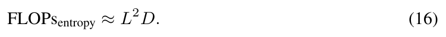

원문 Eq. (16). [PDF p.20, Appendix C] [원문 PDF](https://proceedings.neurips.cc/paper_files/paper/2025/file/f062da1973ac9ac61fc6d44dd7fa309f-Paper-Conference.pdf#page=20).

원문:

$$
\mathrm{FLOPs}_{\mathrm{entropy}}\approx L^2D. \tag{16}
$$

여기서 $L$이 sequence length라면 full attention matrix를 만드는 비용과 비슷하지만, 이미 attention probability가 있으면 entropy $-p\log p$ 집계는 layer당 $\mathcal O(hL_qL_k)$이며 $D$가 직접 등장하지 않는다. 공개 구현은 각 layer attention을 head 평균, row normalization, log/sum, query 평균한다. attention materialization memory는 $\mathcal O(\Omega hL_qL_k)$일 수 있다.

$L=300,D=4096$이면 원문 식은 약 368.6 M operation이다. 반면 $h=32,\Omega=32$인 full attention element를 전 layer에서 한 번씩 훑는다면 약 92.2 M element다. 모든 layer entropy가 같으면 공개 min-max 분모가 0이지만 $10^{-10}$을 더해 NaN을 피한다. Eq. (16)은 선택 overhead 추정이며 gradient를 계산하지 않는다.

##### Eq. (17): Appendix의 reuse ratio

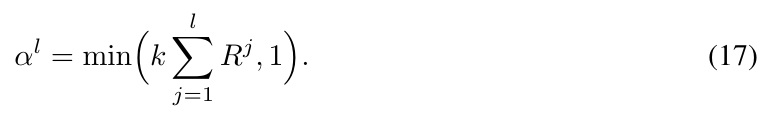

원문 Eq. (17). [PDF p.20, Appendix C] [원문 PDF](https://proceedings.neurips.cc/paper_files/paper/2025/file/f062da1973ac9ac61fc6d44dd7fa309f-Paper-Conference.pdf#page=20).

원문:

$$
\alpha^l=\min\!\left(k\sum_{j=1}^{l}R^j,1\right). \tag{17}
$$

Eq. (9)의 반복이다. 번호만 새로 붙었으며 새 유도나 안정성 proof는 없다. 하한 clamp와 $E^{l-1}=0$ 처리가 여전히 빠져 있다. "theory assumptions and proofs"라기보다 heuristic complexity accounting이다.

Eq. (9)의 예처럼 $R=[0.1,-0.05,0.2],k=2$면 세 layer ratio는 0.2, 0.1, 0.5다. 음수 누적합 edge와 이미 제거한 token 재도입 문제도 그대로다. 이 식은 no-grad inference schedule이다.

##### Eq. (18): layer 합

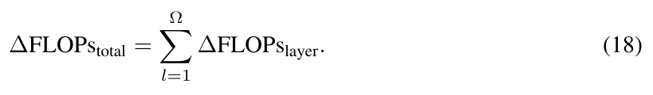

원문 Eq. (18). [PDF p.20, Appendix C] [원문 PDF](https://proceedings.neurips.cc/paper_files/paper/2025/file/f062da1973ac9ac61fc6d44dd7fa309f-Paper-Conference.pdf#page=20).

원문:

$$
\Delta\mathrm{FLOPs}_{\mathrm{total}}
=\sum_{l=1}^{\Omega}\Delta\mathrm{FLOPs}_{\mathrm{layer}}. \tag{18}
$$

$\Omega$는 decoder layer 수다. layer마다 active token 수가 달라질 수 있으므로 엄밀히는 $\Delta\mathrm{FLOPs}_{\mathrm{layer}}^l$로 써야 한다. 단순 합 자체는 맞지만 Eq. (12)의 layer 절감 모형과 overhead 중복 계산이 정확해야 총합도 의미가 있다.

예를 들어 세 layer 순절감이 1.0, 2.0, 1.5 G이면 합은 4.5 G다. 한 layer에서 overhead가 saving보다 커 음수가 되면 그 음수도 합에 들어가야 한다. 모든 layer가 같은 절감이라고 가정해 $\Omega$를 곱하는 것은 adaptive schedule을 무시한다. Eq. (18)은 계산 보고용 합이며 학습 gradient와 무관하다.

<a id="appendix-d"></a>

### Appendix D. Inference Detail of VLA-Cache [PDF p.20-21]

이 부록은 논문의 핵심 구현 세부를 짧게 설명한다.

**Position and attention masking.** `cache_position`은 현재 recompute할 원래 sequence position을 보존한다. 예를 들어 전체 position이 $0,1,2,3,4$이고 1,3을 reuse하면 현재 hidden state는 세 token만 남아도 position id는 $[0,2,4]$다. causal mask도 query row를 같은 mask로 줄여야 한다. 공개 LLaMA fork는 `torch.isin(cache_position, selected_reusable_patches)`의 반대를 사용해 query/hidden row를 제거하고 남은 position을 정렬한다.

**RoPE.** Rotary positional embedding은 query/key의 위치에 따른 회전을 적용한다. recompute token은 원래 `cache_position`으로 새 RoPE를 적용한다. reuse token의 cached key는 과거에 같은 slot position으로 이미 회전돼 있으므로 다시 회전하지 않는다. 카메라 frame index를 RoPE position으로 추가하지 않으므로, cache는 시간 차이를 표현하지 않는다.

**Dynamic cache update.** 공개 `DynamicCache`는 multi-token 갱신이면 `index_copy_(sequence_axis, cache_position, new_states)`로 해당 slot만 바꾸고, action autoregressive 1-token이면 뒤에 concat한다. action 생성 후 wrapper가 action 부분을 crop해 다음 camera step에서 prompt/vision slot을 다시 쓸 수 있게 한다.

**"Permutation invariance" 문장의 교정.** 원문은 Transformer의 permutation invariance 때문에 partial update가 valid하다고 한다. positional encoding 없는 self-attention은 token 순열에 대해 equivariant하다고 말할 수 있지만, RoPE와 causal mask가 있는 LLaMA는 임의 순열 불변이 아니다. partial update가 가능한 이유는 **순서를 바꾸기 때문이 아니라 원래 position index와 mask를 보존하며 같은 cache slot만 overwrite하기 때문**이다. slot을 압축 재번호화하면 동일하지 않다.

**가장 큰 이득이 첫 action token에 생기는 이유.** camera step의 첫 action token 전에는 multimodal prompt/visual prefill이 필요하다. 이후 2-7번째 action token은 일반 autoregressive KV cache로 한 token씩 decode하므로 VLA-Cache의 cross-frame visual reuse가 추가로 줄일 부분이 작다.

**Appendix D 기본 설정.** OpenVLA 256 visual token, $\tau=0.996$, static top-k=100, $\tau_{\mathrm{task}}=0.5$; real Jaco2는 $\tau=0.85$; LoRA fine-tuning 50,000 step; 평가 GPU RTX 4090. 공개 wrapper 값과 다른 항목은 재현 시 반드시 config dump로 확정해야 한다.

<a id="appendix-e"></a>

### Appendix E. More Experiment Results [PDF p.21-26]

#### E.1 Simulation Experiment [PDF p.21]

LIBERO의 네 suite는 spatial variation, object picking, drawer 조작+object, shared-object goal을 다룬다. SIMPLER는 Pick Coke can, Move Near, drawer open/close, drawer+apple을 Visual Matching/Variant Aggregation에서 평가한다.

CogACT/SIMPLER는 single RTX 4090, BF16, DDIM 10 step, CFG 1.5다. OpenVLA/LIBERO도 single 4090 BF16이다. batch size, input text 길이, warm-up, timing 반복 수, CUDA graph 여부, peak memory는 없다.

#### E.2 Additional Simulation Results [PDF p.21-22]

Table 6은 LIBERO-Spatial의 10 subtask를 보여준다. 각 row 평균은 모두 재계산과 일치한다. VLA-Cache가 task 2에서 baseline과 같은 90, task 3에서 84 -> 88, task 8에서 76 -> 84인 반면 task 5는 70 -> 66, task 6은 90 -> 84, task 9는 82 -> 76이다. 일부 개선은 token 제거가 distractor를 줄였을 가능성을 시사하지만, task별 50회인지 여부와 uncertainty가 표에 없어 우연 변동을 배제할 수 없다.

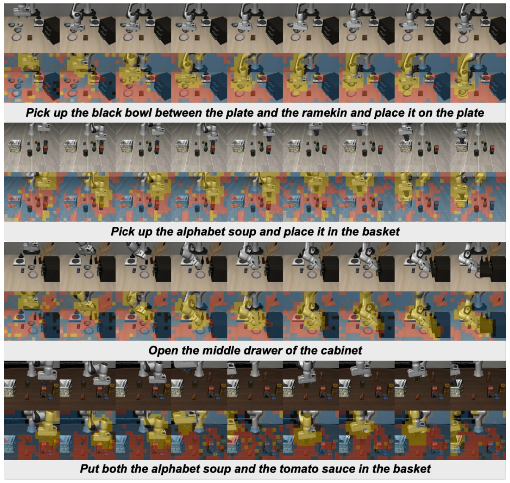

Figure 5. 네 LIBERO 조작 과제의 연속 관찰과 token overlay. [PDF p.22, Appendix E.2] [원문 PDF](https://proceedings.neurips.cc/paper_files/paper/2025/file/f062da1973ac9ac61fc6d44dd7fa309f-Paper-Conference.pdf#page=22).

Figure 5는 네 LIBERO rollout의 연속 frame과 attention/token overlay를 보여준다. 정성적으로 robot/object 주변이 강조되지만, 선택 mask의 precision/recall을 측정할 ground-truth task relevance는 없다.

#### E.3 Additional Ablations and Comparisons [PDF p.22-23]

Table 8은 attention proxy와 Efficient Track Anything object mask를 비교한다. object mask는 SR 87.4%로 크게 떨어지고 latency도 87.49 ms로 baseline 78.35 ms보다 느리다. segmentation/tracking model overhead와 작은 접촉부/context 누락이 원인 후보다. attention 방식은 98.3%, 61.12 ms다. 다만 object-mask baseline이 같은 compute budget/동일 token 수인지 충분히 명시되지 않아 "attention 자체의 우월성"과 "외부 mask model overhead"가 섞여 있다.

Table 9는 static-token budget $k$를 50-180으로 늘리며 효율은 개선되고 SR은 100-150 이후 완만히 하락함을 보인다. Table 10은 relevance threshold를 0.2-0.7로 높이며 보호 token을 줄일수록 효율이 개선되는 양상이다. 두 표의 자세한 수치는 [8.6절](#sensitivity-tables)에 기록한다.

마지막 문단은 standalone diffusion policy에는 직접 적용되지 않고, VLM+diffusion head hybrid인 CogACT에는 적용 가능하다고 선을 긋는다. RDT/DiT 같은 다른 temporal model과의 통합은 **future direction**이지 검증 결과가 아니다.

#### E.4 Real Robot Experiment [PDF p.24-26]

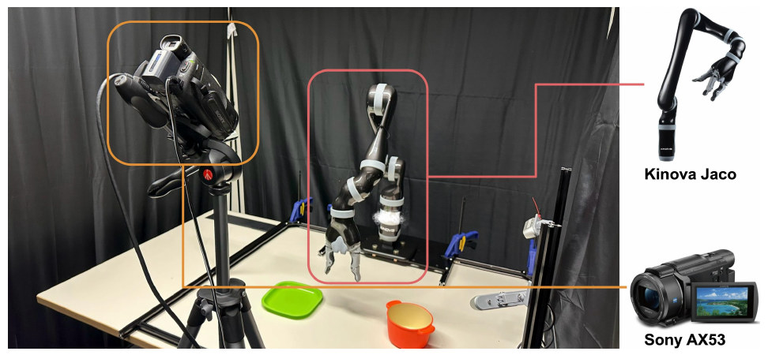

Figure 6. Kinova Jaco 실기기와 Sony AX53 카메라 구성. [PDF p.24, Appendix E.4] [원문 PDF](https://proceedings.neurips.cc/paper_files/paper/2025/file/f062da1973ac9ac61fc6d44dd7fa309f-Paper-Conference.pdf#page=24).

Figure 6의 장비 설명은 본문 heading에서 "Franka Robot"이라고 쓰고 바로 다음 문장에서 Kinova Jaco라고 한다. 사진/캡션/논문 전체는 **Kinova Jaco2/Jaco 6-DoF**이므로 "Franka"는 문구 오류로 보인다. Sony AX53 camera가 정면에서 table을 촬영한다.

데이터 수집은 CLVR_Jaco_Play 기반이며 Xbox controller의 $\Delta x,\Delta y,\Delta z$를 PyBullet IK가 joint velocity로 바꾸고 10 Hz로 실행한다. 관찰은 front camera, end-effector Cartesian pose/velocity, joint position 네 종류다.

전처리는 1280x720을 center crop해 912x720으로 만든 뒤 224x224로 resize한다. 250 step 초과 episode와 action이 전부 0인 step을 제거하고 수동 시각 검사로 episode를 선별한다. 이 수동 selection criterion과 제외 수는 미기재다.

task와 demonstration 수는 다음과 같다.

| task | 성공 조건 | 유효 demonstration | evaluation trial |
|---|---|---:|---:|
| PickPot | orange pot을 table에서 완전히 들어 올림 | 218 | 20 |
| PlaceCube | blue cube가 terminal에 container 안에 있고 튀어나오지 않음 | 212 | 30 |
| PutSausage | sausage가 terminal에 pan 경계 안에 안정적으로 놓임 | 219 | 20 |
| WipeTable | 지정 물체가 모두 fixed dustpan 영역 안에 들어감 | 187 | 30 |

trial마다 초기 robot/object 위치를 bounded region에서 randomize하고, fixed horizon single attempt, 중간 human intervention 없음, binary outcome만 기록한다. bounded region 크기, horizon, random seed, evaluator blinding 여부는 미기재다.

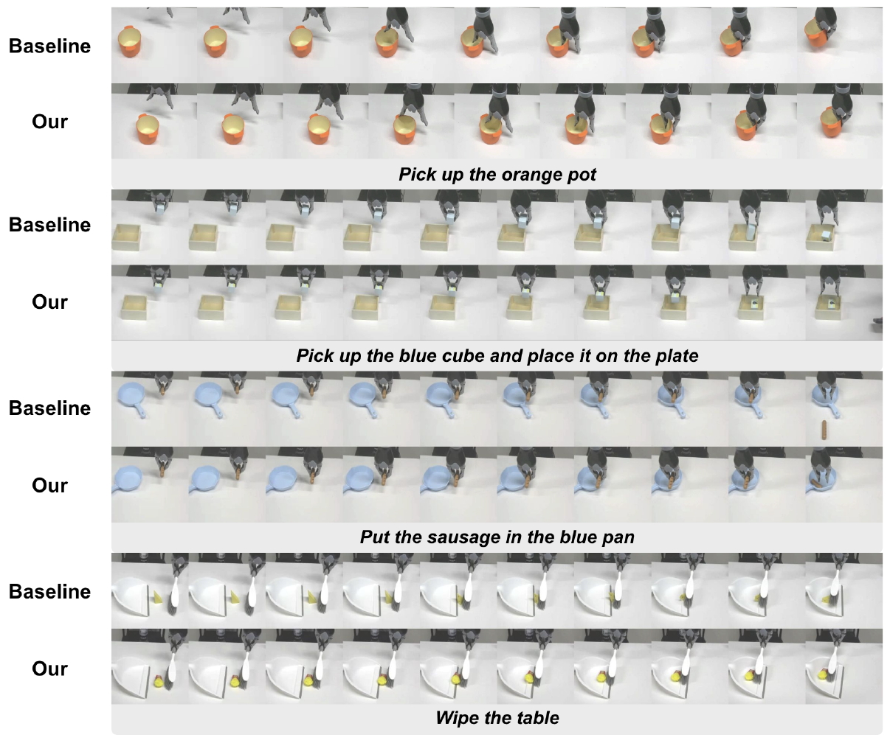

Figure 7. 네 실기기 과제에서 baseline과 VLA-Cache rollout 비교. [PDF p.26, Appendix E.4] [원문 PDF](https://proceedings.neurips.cc/paper_files/paper/2025/file/f062da1973ac9ac61fc6d44dd7fa309f-Paper-Conference.pdf#page=26).

Figure 7은 baseline/cache의 네 실기기 rollout frame을 나란히 보이지만, 통계 표를 넘어선 정량 정보를 추가하지 않는다.

<a id="forward-pass"></a>

## 6. 수식과 알고리즘을 연결한 한 샘플 forward pass

다음은 OpenVLA, 224x224 단일 camera, 256 visual token, batch 1을 가정한 **구체적이되 논문에 없는 hidden dimension은 symbolic으로 유지한** 예다. 공개 OpenVLA architecture는 DINOv2 ViT-L/14와 SigLIP ViT-SO/14의 같은 16x16 위치 feature를 channel 방향으로 concat하고 projector로 LLaMA2-7B hidden width에 맞춘다. [공개 코드 확인]

### 6.1 첫 observation $t=0$

1. RGB $I_0\in\mathbb{R}^{224\times224\times3}$를 processor가 DINO/SigLIP용 tensor로 바꾼다.
2. 두 vision tower가 각각 256 patch feature를 만들고 channel concat한다. projector가 $H_0^{\mathrm{vis}}\in\mathbb{R}^{1\times256\times D}$로 바꾼다.
3. prompt token embedding 앞의 BOS 뒤에 visual token 256개를 삽입한다. text token 수를 $L_t=35$라 두면 대략 $L=1+256+35$ 이상의 multimodal sequence가 된다. 정확한 special token 수는 tokenizer/prompt variant에 따라 달라진다.
4. 모든 $\Omega$ decoder layer에서 full Q/K/V, attention, MLP를 계산한다.
5. 약 7 action token을 autoregressive하게 생성하고 이산 bin을 normalized action으로 바꾼 뒤 dataset statistics로 unnormalize한다.
6. 각 layer prompt/visual KV와 첫 generation attention을 보존하고, action token으로 늘어난 cache 끝부분을 crop한다.

이 첫 step에는 비교할 과거 frame이 없어 VLA-Cache 이득이 없다.

### 6.2 다음 observation $t=1$

가정: raw similarity threshold/top-k 후 static index가 $\{2,5,9,10,20\}$이고, 직전 attention의 task-critical index가 $\{5,20,77\}$다. Eq. (8)에 따라 후보는 $\{2,9,10\}$이다.

1. $I_1$도 **전체 vision tower/projector를 통과**해 256 current visual embedding을 만든다.
2. layer schedule이 layer $l$에서 $\alpha^l=2/3$이면 후보 중 두 개를 reuse한다. 어떤 두 개를 택하는지 논문은 미기재다. 공개 코드는 정렬 index prefix라면 $\{2,9\}$가 된다.
3. 현재 decoder hidden sequence에서 position 2,9 query row를 제거하고 나머지는 원래 `cache_position`을 유지한다.
4. position 10을 포함한 활성 token의 current $K_1^l,V_1^l$만 계산해 cache slot을 overwrite한다. 2,9 slot은 $K_0^l,V_0^l$을 유지한다.
5. 활성 query는 갱신된 전체 cache에 attention한다. reuse token 자체의 새 output hidden state는 만들지 않으므로 이후 layer에서 이 token을 다시 활성화하기 어렵다.
6. 첫 action token을 얻은 뒤 나머지 action token은 일반 autoregressive decode를 한다.
7. 현재 attention과 cache를 다음 frame용으로 보존한다.

### 6.3 위치, mask, cache의 불변식

구현이 맞으려면 다음 invariant가 필요하다.

$$
\text{cache slot index}
=\text{multimodal sequence position}
=\text{RoPE position id}.
$$

patch grid index $r\in[0,255]$는 BOS 뒤에 삽입되므로 OpenVLA 공개 코드에서 visual token position은 $r+1$이다. OFT의 두 번째 wrist image는 첫 image 뒤에 오므로 position 257부터 시작한다. 이 offset을 빠뜨리면 다른 token의 KV를 덮어쓴다.

causal mask의 query 축은 활성 position만 남기되 key 축은 cache 전체 길이를 유지해야 한다. text/action query가 vision cache를 볼 수 있어야 하고, 미래 action token은 보지 못해야 한다. padding이 있으면 padding mask도 같은 original position 체계로 결합해야 한다.

### 6.4 추론 의사코드

```text
state:
    prev_frame = None
    prev_attention = None
    kv_cache = empty DynamicCache
    cache_age[visual_position] = 0

for each policy refresh timestep t:
    frame = capture_observation()
    current_visual_embeddings = vision_tower_and_projector(frame)  # full 256 tokens

    if prev_frame is None:
        reusable_candidates = empty
        layer_reuse_schedule = zeros
    else:
        sim = cosine_per_same_grid_patch(frame, prev_frame)
        static = top_k(indices where sim >= pixel_threshold)
        task_critical = relevance_from(prev_attention)
        reusable_candidates = static minus task_critical
        layer_reuse_schedule = schedule_from(prev_attention)

    for decoder layer l:
        reuse_l = choose_subset(reusable_candidates, layer_reuse_schedule[l])
        recompute_positions = all_positions minus reuse_l

        preserve original cache_position for recompute_positions
        apply RoPE using original positions
        compute current Q/K/V and MLP only for active query rows
        overwrite K/V at recompute_positions
        keep old K/V at reuse_l
        attend active queries to the valid full K/V cache

    generate first action token from refreshed multimodal state
    autoregressively generate remaining action tokens with ordinary KV append
    decode/unnormalize action or action chunk
    crop action-token cache tail, retaining reusable prompt/vision slots

    prev_frame = frame
    prev_attention = current_attention
```

위 의사코드의 `cache_age`는 리뷰어가 안전성 검증을 위해 추가한 state이며 원 논문/공개 코드에는 max-age guard가 없다.

<a id="training"></a>

## 7. 학습, 데이터, frozen/trainable 파라미터

### 7.1 VLA-Cache 자체

| 단계 | frozen | trainable | loss/gradient |
|---|---|---|---|
| VLA-Cache inference | vision tower, projector, LLM decoder, action head의 모든 기존 weight | 없음 | 없음. pixel similarity, set difference, attention entropy/top-k는 no-grad 제어 로직. |
| cache update | weight 변화 없음 | 없음 | tensor slot overwrite. 과거 cache로 gradient를 전파하지 않음. |

따라서 "training-free" 주장은 이 범위에서 맞다. 다만 `transformers`의 cache/LLaMA forward를 수정하므로 engineering integration은 필요하다.

### 7.2 평가에 사용된 base policy의 학습

- OpenVLA/OpenVLA-OFT/CogACT simulation은 공개 pretrained/fine-tuned weight를 사용한다고 한다. 이 논문이 base model을 새로 학습한 recipe는 아니다.
- 실기기 OpenVLA는 LoRA로 50,000 step fine-tuning한다. 데이터는 위 네 task의 836개 유효 demonstration 합계다.
- LoRA rank/alpha/dropout, target module, optimizer, learning rate, batch/gradient accumulation, augmentation, checkpoint selection, validation split은 첨부 PDF에 없다.
- CogACT inference는 BF16, DDIM 10 step, CFG 1.5다. diffusion training loss와 base training recipe는 CogACT 원 논문에 위임된다.

### 7.3 action representation

Figure 4는 출력 역할을 $[\Delta x,\Delta\theta,\Delta\mathrm{Grip}]$으로 그린다. OpenVLA 공개 wrapper는 생성된 action token ID를 vocabulary 끝쪽의 bin index로 변환하고 $[-1,1]$ bin center로 바꾼 뒤 dataset norm stats로 unnormalize한다. 정확한 7차원 ordering과 각 축 단위는 첨부 논문에 완전히 명시되지 않았다. 실기기 수집 설명은 controller 입력으로 $\Delta x,\Delta y,\Delta z$를 말하지만 orientation/gripper 수집 mapping은 상세히 쓰지 않는다.

<a id="experiments"></a>

## 8. 모든 주요 실험 표와 그림의 수치 검산

### 8.1 공통 실험 조건과 미기재 항목

| 항목 | 공개됨 | 미기재/주의 |
|---|---|---|
| GPU | single NVIDIA RTX 4090 | CPU, RAM, GPU clock/power, driver/CUDA version |
| precision | BF16 | 일부 auxiliary CPU/FP32 연산의 precision |
| batch | 평가 특성상 공개 코드는 1을 가정 | 표에 명시적 batch size 없음 |
| visual input | OpenVLA 256 token, 224 px; OFT primary+wrist 시각화 | model별 정확한 total token/prompt 길이 |
| output | OpenVLA 약 7 action token 예시; OFT action chunk | chunk 길이/실제 실행 step은 PDF 미기재; 공개 LIBERO script 기본은 8 open-loop step |
| latency | CUDA latency/inference time 표기 | timing boundary, warm-up, 반복 수, percentile, CPU 포함 여부 |
| success | task success rate | simulation episode 수 일부 미기재, seed/CI 없음 |
| memory | 없음 | peak allocated/reserved, KV cache 증가량 없음 |

### 8.2 Table 1 - core selection ablation [PDF p.4]

Baseline 대비 최종 VLA-Cache는 SR -0.6 pp, latency 51.56 -> 32.22 ms다. latency reduction은 37.51%, speedup은 1.600x다. static-only가 가장 빠른 31.03 ms이며 1.662x지만 SR -10.2 pp다. 이 표가 보여주는 trade-off는 "최대 속도"보다 "보호 필터로 정확도를 회복"하는 것이 목적임을 말한다.

### 8.3 Table 2 - LIBERO main result [PDF p.8]

| model | metric | baseline | +Cache | 재계산 |
|---|---:|---:|---:|---:|
| OpenVLA | suite 평균 SR | 75.0% | 74.7% | -0.3 pp; 상대 -0.40% |
| OpenVLA | FLOPs | 1.864 T | 1.355 T | -27.3069%; 1.376x |
| OpenVLA | CUDA latency | 51.91 ms | 31.83 ms | -38.6823%; 1.631x |
| OpenVLA | control frequency | 4.23 Hz | 4.59 Hz | +0.36 Hz; +8.51% |
| OpenVLA-OFT | 평균 SR | 96.8% | 97.4% | +0.6 pp |
| OpenVLA-OFT | FLOPs | 4.013 T | 3.097 T | -22.8258%; 1.296x |
| OpenVLA-OFT | CUDA latency | 79.05 ms | 62.59 ms | -20.8223%; 1.263x |
| OpenVLA-OFT | control frequency | 65.10 Hz | 78.98 Hz | +13.88 Hz; +21.32% |

OpenVLA suite 평균은 $(84.4+86.6+75.6+53.2)/4=74.95\rightarrow75.0$, cache는 74.70으로 표와 일치한다. 저자 문장의 "0.3% drop"은 엄밀히 0.3 percentage point다.

SparseVLM은 FLOPs를 24.5% 줄이지만 latency가 51.91 -> 83.39 ms로 악화되고, FastV는 FLOPs 표가 baseline과 같은 1.864 T이며 latency도 53.28 ms로 악화된다. token count만 줄여도 gather/scatter, attention 추출, 불규칙 shape가 kernel 효율을 해칠 수 있다는 사례다.

### 8.4 Table 3 - CogACT/SIMPLER [PDF p.8]

Matching은 FLOPs -19.00%, latency -27.00% / 1.370x, control Hz +18.04%다. 평균 SR은 74.8 -> 74.4로 -0.4 pp다. Aggregation은 FLOPs -17.38%, latency -26.95% / 1.369x, Hz +17.15%, SR +1.0 pp다.

"약 20% FLOPs, 1.37x latency"라는 본문 요약은 대체로 맞다. 다만 공개 repo에는 CogACT/SIMPLER 구현과 실행 script가 포함되지 않아, PDF 조건만으로 이 표를 완전 재현하기 어렵다.

### 8.5 Table 4 - token 수 ablation [PDF p.8]

| 줄인/재사용 token | SparseVLM SR / ms | FastV SR / ms | VLA-Cache SR / ms |
|---:|---:|---:|---:|
| 50 | 79.8 / 88.08 | 84.6 / 53.10 | **85.4 / 33.43** |
| 100 | 74.6 / 61.01 | 83.4 / 45.72 | **83.8 / 31.29** |
| 200 | 44.4 / 57.42 | 72.8 / 45.19 | 68.3 / **30.29** |

VLA-Cache도 200 token에서 baseline 대비 -16.1 pp다. latency는 100에서 200으로 더 많이 reuse해도 1.00 ms만 줄어 saturation한다. token 수와 wall-clock은 선형이 아니다.

### 8.6 Figure 1-4 [PDF p.2, p.4, p.7, p.9]

- **Figure 1**: 직전 frame static KV를 현재 frame prefill에 재사용하는 개념. causal/cache slot 세부는 생략.
- **Figure 2**: (a) static selection + task eviction, (b) layer-adaptive reuse. 색/숫자는 개념 예시이며 정량 결과가 아니다.
- **Figure 3**: LIBERO 네 suite, SIMPLER 네 task, 실기기 네 task의 시각적 범위를 보여준다.
- **Figure 4**: blue static, yellow task-relevant, red overlap. red는 Eq. (8)에서 재사용 후보에서 제거돼야 한다. wrist-camera처럼 ego-motion이 큰 입력에도 작동한다고 주장하지만 mask 품질 정량 metric은 없다.

### 8.7 Table 5와 Table 11 - real robot 집계 오류 [PDF p.9, p.25]

Table 5/11의 task rate 비가중 평균은 다음과 같다.

$$
\frac{95.0+83.3+80.0+70.0}{4}=82.075\%\rightarrow82.1\%,
$$

$$
\frac{90.0+90.0+85.0+73.3}{4}=84.575\%\rightarrow84.6\%.
$$

따라서 표의 82.1/84.6은 맞는 **task-macro average**다. 그러나 trial 수가 20/30/20/30으로 다르고 Table 11 성공 횟수는 baseline $19+25+16+21=81$, cache $18+27+17+22=84$다. pooled 100-trial rate는 81.0%, 84.0%다. Appendix의 "Average success is computed across all 100 trials"과 Total row의 82.1/84.6은 함께 참일 수 없다.

- macro 기준 차이: +2.5 pp, 상대 +3.05%.
- pooled 기준 차이: +3.0 pp, 상대 +3.70%.
- 본문 "2.4%"는 반올림된 표시값 84.6-82.1=2.5 pp와도 정확히 맞지 않는다.

표본이 작아 1-2회 성공 차이가 5 pp(PickPot/PutSausage) 또는 3.33 pp(30-trial task)를 바꾼다. confidence interval 없이 cache가 성공률을 향상한다고 결론 내리기보다 "관찰된 표본에서 악화가 뚜렷하지 않았다"가 안전하다.

### 8.8 Table 6 - LIBERO-Spatial subtask [PDF p.22]

각 10개 숫자의 평균은 baseline 84.4, SparseVLM 79.8, FastV 83.4, VLA-Cache 83.8로 모두 일치한다. 이 표의 CUDA time 52.37/32.22는 Table 2의 전체 suite 평균 51.91/31.83과 다른 범위이므로 직접 혼합하면 안 된다. Table 6은 Spatial 한 suite다.

### 8.9 Table 7 - dynamic background 문장 검산 [PDF p.22; 설명 p.9]

noise baseline과 noise+cache를 비교하면:

$$
\text{FLOPs 감소}=\frac{1.807-1.275}{1.807}=29.44\%,\qquad
\text{speedup}=1.417\times,
$$

$$
\text{latency 감소}=\frac{68.22-50.59}{68.22}=25.84\%,\qquad
\text{speedup}=1.348\times.
$$

따라서 본문 p.9의 "FLOPs 42%, latency 35% 감소"는 표로 재현되지 않는다. 42%, 35%가 별도 기준이나 다른 run을 가리킨다는 설명도 없다. 성공률은 두 noise 조건 모두 80%다.

<a id="sensitivity-tables"></a>

### 8.10 Table 8-10 - relevance proxy와 sensitivity [PDF p.23]

Table 8:

| 방법 | SR | FLOPs T | latency ms | Hz |
|---|---:|---:|---:|---:|
| OpenVLA-OFT | 97.8 | 3.99 | 78.35 | 65.44 |
| + Cache attention | 98.3 | 3.04 | 61.12 | 81.67 |
| + Cache object mask | 87.4 | 3.15 | 87.49 | 64.78 |

object mask가 attention보다 FLOPs는 조금 많고 latency는 훨씬 크므로 external tracker overhead/실행 위치를 분리해야 공정한 proxy 비교가 된다.

Table 9 static budget:

| $k$ | SR | FLOPs T | latency ms | Hz |
|---:|---:|---:|---:|---:|
| 50 | 97.6 | 3.332 | 66.82 | 77.23 |
| 80 | 97.8 | 3.226 | 66.55 | 78.66 |
| 100 | 98.2 | 3.156 | 64.88 | 79.88 |
| 120 | 98.0 | 3.109 | 62.99 | 80.56 |
| 150 | 97.4 | 3.043 | 61.12 | 81.67 |
| 180 | 96.6 | 2.936 | 60.46 | 82.51 |

Table 10 relevance threshold:

| threshold | SR | FLOPs T | latency ms | Hz |
|---:|---:|---:|---:|---:|
| 0.2 | 95.6 | 3.384 | 66.93 | 76.74 |
| 0.3 | 96.2 | 3.283 | 67.03 | 79.31 |
| 0.4 | 98.0 | 3.204 | 66.38 | 79.79 |
| 0.5 | 98.2 | 3.156 | 64.88 | 79.88 |
| 0.6 | 98.6 | 3.131 | 64.27 | 81.98 |
| 0.7 | 98.4 | 3.068 | 63.12 | 82.96 |

FLOPs/latency의 큰 방향은 단조 개선하지만 Table 10 latency는 0.2의 66.93보다 0.3의 67.03이 0.10 ms 느려 엄밀한 단조 감소는 아니다. 저자의 "monotonically"는 측정 noise 해상도에서는 대체로 그렇다는 뜻으로 완화해야 한다.

또 동일한 LIBERO-Spatial/OFT로 보이는 default 근처 값이 Table 2(3.097 T, 62.59 ms, 78.98 Hz), Table 8(3.04 T, 61.12 ms, 81.67 Hz), Table 9/10의 $k=100,\tau=0.5$(3.156 T, 64.88 ms, 79.88 Hz)로 다르다. run 조건/집계 범위 차이가 명시되지 않아 오차막대 없는 수치를 지나치게 정밀하게 비교하면 안 된다.

### 8.11 Figure 5-7 [PDF p.22, p.24, p.26]

- **Figure 5**: 네 LIBERO task의 rollout+heat map. method 내부 mask를 보여줄 뿐 task relevance 정답과의 정량 일치는 검증하지 않는다.
- **Figure 6**: Kinova Jaco setup, Sony AX53 camera 위치. 본문 첫 문장 "Franka"는 캡션/사진과 불일치하는 오탈자다.
- **Figure 7**: 네 실기기 task에서 baseline과 cache rollout의 정성 비교. 성공 횟수 증거는 Table 11이 담당한다.

<a id="efficiency"></a>

## 9. 효율 지표를 혼동하지 않는 법

### 9.1 FLOPs/token 감소

FLOPs는 알고리즘이 이상적으로 생략하는 산술량이다. token을 줄이면 QKV/MLP와 일부 attention 연산이 줄지만, 실제 kernel launch, memory gather/index copy, attention map 저장, CPU sorting은 반영하지 못한다. Table 2에서 SparseVLM이 FLOPs를 1.864 -> 1.407 T로 줄이고도 latency가 51.91 -> 83.39 ms로 늘어난 것이 대표 반례다.

VLA-Cache의 "token 감소"도 sequence에서 token을 영구 삭제한다는 뜻이 아니다. active query/hidden row의 계산을 생략하면서 full cache slot은 유지한다. 따라서 cache memory 자체가 reuse token 수만큼 바로 줄어드는 것도 아니다.

### 9.2 CUDA latency

공개 LLaMA fork는 decoder layer loop 직전에 `torch.cuda.synchronize(); start_event.record()`하고, loop 뒤에 event와 synchronize를 둔다. 비전 tower/projector는 그 이전에 실행된다. 그러므로 적어도 OpenVLA 공개 경로의 값은 **language decoder CUDA 구간**으로 해석해야 한다. CPU patch similarity, attention top-k, camera, simulator/robot, action unnormalization을 포함한 wall-clock 전체가 아니다.

Table 2 OpenVLA에서 $1000/51.91=19.26$ Hz, $1000/31.83=31.42$ Hz인데 보고 control frequency는 4.23/4.59 Hz다. 이 불일치 자체가 CUDA latency와 control loop가 다른 경계를 측정함을 보여준다.

### 9.3 inference latency, TTFT, throughput

- **TTFT에 대응하는 구간**: 한 camera observation에서 첫 action token을 얻기까지의 vision+multimodal prefill+첫 decode. VLA-Cache 이득이 가장 클 것으로 저자가 말한 구간이다.
- **후속 token latency/TPOT**: 두 번째 이후 action token의 autoregressive 1-token decode. 일반 KV cache가 이미 적용되고 cross-frame cache의 추가 이득은 작다.
- **throughput**: batch당 초당 처리 observation/action 수. 논문은 batch=1 robot control 중심이며 throughput을 별도로 보고하지 않는다.
- **peak memory**: attention output 저장, full KV cache, 두 frame 이미지, vision feature가 얼마나 필요한지 논문에 없다.

따라서 "1.7x speedup"을 TTFT, end-to-end inference, throughput, peak memory 모두의 개선으로 확장하면 안 된다.

### 9.4 action chunk, control frequency, policy refresh

action chunk 길이를 $C$, 한 번 policy inference wall time을 $T_{\mathrm{policy}}$, action 실행 간격을 $T_{\mathrm{act}}$라 하면 다음 세 빈도가 다르다.

**[해설용 수식]**

$$
f_{\mathrm{refresh}}\approx\frac{1}{T_{\mathrm{policy}}},\qquad
f_{\mathrm{execute}}\approx\frac{1}{T_{\mathrm{act}}},\qquad
f_{\mathrm{amortized}}\approx\frac{C}{T_{\mathrm{policy}}+CT_{\mathrm{act}}}
$$

실제 loop가 inference와 실행을 동기/비동기로 겹치면 식은 달라진다. OpenVLA-OFT의 65-79 Hz는 79-63 ms CUDA latency의 단순 역수 12.65-15.98 Hz보다 훨씬 높다. 여러 action을 chunk로 실행한 효과가 포함됐음을 시사하지만, PDF는 control frequency 산식과 $C$를 명시하지 않는다. 공개 LIBERO-OFT script의 기본 `num_open_loop_steps`는 8이지만, 이것이 Table 2 run과 정확히 동일했다고 PDF만으로 단정할 수 없다.

로봇 안전 관점에서 실행 Hz가 높아도 $C$가 크면 새 observation을 보는 policy refresh는 느릴 수 있다. 갑작스러운 장애물에는 refresh age가 중요하다. 보고해야 할 값은 action command Hz뿐 아니라 observation-to-first-action latency, chunk horizon, refresh Hz, 가장 오래된 open-loop action의 age다.

### 9.5 학습 효율 대 추론 효율

VLA-Cache는 학습 step, optimizer memory, 학습 wall time을 줄이는 방법이 아니다. base VLA training/fine-tuning은 그대로이고 inference에서만 decoder 계산을 줄인다. 실기기 LoRA 50,000 step 비용은 cache와 무관하다.

<a id="critical-review"></a>

## 10. 비판적 검토와 재현 체크리스트

### 10.1 강점

1. closed-loop VLA의 adjacent-frame redundancy라는 task-specific 구조를 직접 사용한다.
2. static-only failure를 숨기지 않고 Table 1로 task-critical recovery 필요성을 보여준다.
3. OpenVLA, OFT, CogACT와 simulation/real setting을 함께 다뤄 action head에 대한 범위를 넓혔다.
4. FLOPs만이 아니라 CUDA time과 control frequency를 같이 보고했다.
5. dynamic background와 two-camera wrist view를 포함해 단순 고정 카메라만 테스트하지 않았다.

### 10.2 가장 중요한 기술적 위험

#### A. stale cache가 여러 frame 누적될 수 있다

Eq. (10)은 $t-1$ cache라고 쓰지만 reuse slot이 갱신되지 않으면 실제 provenance는 $t-m$일 수 있다. adjacent similarity는 $I_t$와 $I_{t-1}$만 비교하므로 작은 변화의 누적을 감지하지 못한다. cache entry마다 `last_refresh_step`을 두고 다음 중 하나를 강제해야 한다.

- 최대 age $A_{\max}$를 넘으면 full recompute.
- 현재 frame을 직전 frame뿐 아니라 cache provenance frame과도 비교.
- 일정 keyframe 주기마다 모든 visual slot refresh.
- action uncertainty/attention 변화가 크면 cache flush.

#### B. task relevance가 one-step 늦다

현재 frame에서 처음 등장하거나 갑자기 중요해진 물체는 직전 attention에 없을 수 있다. pixel 변화가 크면 dynamic selection이 잡아주지만, 시각적으로 미세한 접촉 상태 변화는 놓칠 수 있다. current cheap feature나 object motion cue와 prior attention을 결합하는 guard가 필요하다.

#### C. 위치 대응은 같은 grid index에 의존한다

camera ego-motion, crop jitter, rolling shutter, wrist camera 회전은 동일 grid가 다른 3D 영역을 보게 만든다. 단순 cosine이 높아도 texture 반복 영역에서는 잘못 대응할 수 있다. optical flow/feature correspondence를 쓰면 정확도는 늘지만 overhead가 생긴다. 공정한 비교에는 correspondence 비용까지 포함해야 한다.

#### D. attention은 완전한 task importance가 아니다

attention weight가 causal importance와 동일하다는 보장은 없다. head/layer 평균은 특정 head의 작은 물체 신호를 희석할 수 있고, fixed top-k는 장면 복잡도에 적응하지 못한다. attention rollout, gradient-free perturbation, action-logit sensitivity와의 상관을 정량 평가할 필요가 있다.

#### E. partial KV 혼합은 근사다

한 token의 layer-$l$ hidden state는 이전 layer에서 다른 모든 token과 상호작용한 결과다. raw patch가 같더라도 주변 dynamic token이 바뀌면 현재 $H_t^l(i)$는 달라질 수 있다. 과거 $K^l,V^l$를 재사용하면 이 context 변화가 반영되지 않는다. task-critical filtering이 경험적으로 완화하지만 이론적으로 동일 output을 보장하지 않는다.

#### F. "permutation invariance"는 근거가 아니다

RoPE/causal mask가 있는 decoder는 위치를 사용한다. correctness는 original `cache_position` 보존과 cache slot overwrite invariant에 달려 있다. position/mask 단위 테스트가 필수다.

### 10.3 논문과 공개 코드의 차이

| 항목 | PDF | 공개 코드 스냅샷 | 재현 영향 |
|---|---|---|---|
| static budget | Appendix 기본 top-k=100 | OpenVLA 130, OFT camera당 150 | main table의 정확한 config 불명확 |
| task relevance | 여러 layer 평균, threshold $\tau_{task}=0.5$ | layer 15 하나, OpenVLA top 120/OFT top 100 | 보호 token 수와 장면 적응성 다름 |
| Eq. (6) 축 | vision slice 후 text slice | text query row, vision key column | 원문 식을 그대로 코딩하면 방향 반대 |
| adaptive schedule | $R^l$ 누적 Eq. (9) | layer min-max entropy normalization + growth factor 0.55 | 이론식과 실제 결과 연결 불가 |
| 적용 layer | per-layer로 서술 | pruning location `[2, 6, 9, 11]` | 계산량/성능에 직접 영향 |
| 후보 subset ordering | 미기재 | sorted spatial index의 prefix | similarity/relevance 순 우선이 아님 |
| FFN FLOP | $2LDM$ | $3nDM$ | 표의 FLOP 산식 provenance 확인 필요 |
| text token range | index만 기호화 | OpenVLA 257-291, OFT 513-546 고정 | prompt 길이/두 camera 구조 변경에 취약 |

공개 코드가 존재한다는 사실은 장점이지만, paper-to-code configuration manifest가 있어야 Table 1-10을 정확히 재현할 수 있다.

### 10.4 통계와 수치 보고의 제한

- NeurIPS checklist가 error bar/통계 검정을 하지 않았다고 명시한다.
- real robot task당 20 또는 30 trial이라 1회 결과가 3.33-5 pp를 바꾼다.
- Table 11의 macro average와 pooled total을 혼동했다.
- Table 7 설명의 감소율이 표와 맞지 않는다.
- 같은 듯한 OFT Spatial 설정의 값이 Table 2, 8, 9/10에서 다르고 run variance/조건 차이가 없다.
- latency는 평균만 있고 p50/p95/p99, warm-up, JIT, frequency throttling 정보가 없다.

### 10.5 재현 체크리스트

#### 환경과 provenance

- [ ] 첨부 PDF/코드 commit/model checkpoint SHA를 기록한다.
- [ ] Python, PyTorch, CUDA, cuDNN, FlashAttention, custom `transformers` fork 버전을 고정한다.
- [ ] GPU 이름, memory, driver, power mode/clock, CPU/RAM을 기록한다.
- [ ] OpenVLA, OFT, CogACT 각각의 exact checkpoint와 norm stats를 기록한다.
- [ ] episode 시작, instruction 변경, camera 변경 시 cache를 완전히 reset하는지 확인한다.

#### 알고리즘 설정

- [ ] image crop/resize를 현재/직전 frame에 동일 적용한다.
- [ ] patch size=14, visual grid=16x16, position offset(BOS + camera별 offset)을 assert한다.
- [ ] $\tau$, static top-k, task threshold 또는 task top-k, relevance layer, adaptive schedule, pruning layer를 config dump로 저장한다.
- [ ] candidate가 비거나 all-black patch일 때 동작을 테스트한다.
- [ ] cache age와 provenance frame을 로깅하고 장기 reuse 분포를 측정한다.
- [ ] Eq. (9) 버전과 공개-code schedule 버전을 별도 ablation한다.

#### cache correctness unit test

- [ ] 첫 frame은 baseline full forward와 cache-enabled full forward logits가 tolerance 안에서 같은지 확인한다.
- [ ] reuse set이 empty일 때 baseline과 action/logit이 같은지 확인한다.
- [ ] 한 slot만 recompute해 `index_copy_`가 정확한 layer/position에 쓰는지 확인한다.
- [ ] RoPE position id가 압축 index가 아니라 original index인지 확인한다.
- [ ] attention mask query/key shape와 padding/causal 조건을 작은 toy sequence에서 brute-force 비교한다.
- [ ] action token 생성 후 cache crop 길이와 다음 frame visual slot 정합을 검사한다.
- [ ] 여러 frame 연속 reuse 후 cache entry가 몇 step 전 것인지 확인한다.
- [ ] batch>1, prompt 길이 변화, 두 camera 입력은 지원 범위를 명시하거나 fail-fast한다.

#### 공정한 정확도 평가

- [ ] baseline/cache가 같은 initial state, instruction, seed를 쓰는 paired trial을 구성한다.
- [ ] LIBERO suite별 subtask/episode 수를 공개한다.
- [ ] success rate에 paired bootstrap 또는 task/seed별 CI를 제공한다.
- [ ] real robot은 macro average와 pooled success를 둘 다 쓰고 분모를 명시한다.
- [ ] sudden task relevance, camera shake, lighting drift, repetitive texture, occlusion, long-horizon 1000+ step stress test를 추가한다.
- [ ] static-only, +task filter, +adaptive, max-age, keyframe refresh를 같은 token budget으로 비교한다.

#### 성능 계측

- [ ] 최소 20 warm-up 후 충분한 반복, CUDA synchronize 경계를 명시한다.
- [ ] $T_{camera}$, $T_{preprocess}$, $T_{vision}$, $T_{selection}$, $T_{decoder}$, $T_{head}$, $T_{post}$, $T_{robot\ I/O}$를 분리한다.
- [ ] decoder CUDA와 observation-to-action wall-clock을 함께 보고한다.
- [ ] mean뿐 아니라 median/p95/p99, jitter를 보고한다.
- [ ] TTFT, 후속 action-token TPOT, policy refresh Hz, action execution Hz, chunk length를 분리한다.
- [ ] peak allocated/reserved memory, KV cache bytes, attention-map memory를 보고한다.
- [ ] FLOP convention(MAC=1인지 FLOP=2인지)과 gated MLP 3 projection을 명시한다.
- [ ] baseline과 cache에서 `output_attentions=True` 비용을 동일하게 처리하거나 별도 계측한다.

<a id="thor"></a>

## 11. Jetson AGX Thor 최적화와의 연결: 검증된 이식이 아닌 후속 연구 계획

이 절은 논문 결과가 아니다. 저자는 RTX 4090에서만 평가했고 Jetson/Thor/TensorRT 수치를 보고하지 않았다. 아래는 **후속 연구 제안**이다.

NVIDIA의 현재 공식 제품 정보상 Jetson AGX Thor 개발 키트는 Blackwell GPU, 128 GB memory, 40-130 W power 범위를 제공한다. 이는 7B급 VLA와 camera/robot stack을 한 edge 장치에 통합할 여지를 주지만, FP4 peak 수치가 BF16 irregular-cache latency를 예측하지는 않는다. [NVIDIA Jetson 개발 키트](https://developer.nvidia.com/embedded/jetson-developer-kits) 공식 문서는 JetPack을 통해 CUDA 계열 software stack을 제공한다고 설명한다. [Jetson AGX Thor user guide](https://docs.nvidia.com/jetson/agx-thor-devkit/user-guide/latest/)

현재 NVIDIA migration 문서는 Jetson Thor/JetPack 7.x에서 TensorRT 11.2.1이 지원되지 않으며 JetPack이 제공하는 TensorRT 10.x에 머물라고 안내한다. 따라서 desktop용 최신 TensorRT API를 가정한 이식 계획은 위험하다. [NVIDIA TensorRT Jetson migration 안내](https://docs.nvidia.com/deeplearning/tensorrt/latest/api/migration/tensorrt-10x-to-11x-jetson.html)

### 11.1 단계별 gate

**Gate 0 - 기능 호환성.** Thor native PyTorch/BF16에서 OpenVLA baseline을 먼저 실행하고, custom `transformers` fork의 `DynamicCache.index_copy_`, attention output, RoPE/mask가 aarch64 stack에서 동작하는지 확인한다. 성공하기 전에는 TensorRT 변환으로 넘어가지 않는다.

**Gate 1 - 수치 동등성.** reuse empty, 한 slot reuse, full configured reuse에 대해 4090/PyTorch reference와 Thor/PyTorch의 logits, action bin, 최종 unnormalized action 차이를 측정한다. exact equality가 아니라 dtype에 맞는 tolerance와 success parity를 정의한다.

**Gate 2 - end-to-end 계측.** MAXN 한 모드만 보고하지 말고 목표 power mode별로 10분 이상 thermal steady state를 만든 뒤 위 재현 체크리스트의 구간별 latency/p95, memory, power, refresh Hz를 측정한다. camera ingest와 robot I/O를 포함한다.

**Gate 3 - engine 최적화.** vision tower/projector와 LLaMA decoder를 따로 profile한다. VLA-Cache는 현재 full vision tower를 그대로 실행하므로 decoder만 빨라져도 E2E 비중이 Amdahl 법칙에 제한된다. TensorRT는 vision 쪽 고정 224x224 engine에 먼저 적용하고, decoder partial KV update는 다음 두 경로를 비교한다.

- 고정 shape를 유지하고 reuse query를 mask하는 단순 경로: kernel shape 안정성은 좋지만 산술 절감이 작을 수 있다.
- compact active-query tensor + 원래 cache slot scatter/index update 경로: 산술은 줄지만 dynamic shape, gather/scatter, graph 재캡처 비용이 생긴다.

TensorRT-LLM은 paged KV cache와 quantization 기능을 제공하지만, 이 논문의 **교차 frame 동일 slot overwrite**를 그대로 지원한다고 가정해서는 안 된다. custom plugin이나 runtime 수정이 필요할 수 있으며 실제 지원 여부를 target JetPack/TensorRT-LLM release에서 검증해야 한다. [NVIDIA TensorRT 문서](https://docs.nvidia.com/tensorrt/)

**Gate 4 - 정확도/안전성.** BF16 baseline, BF16 cache, quantized baseline, quantized cache를 같은 task/seed에서 2x2로 비교해 caching 효과와 quantization 효과를 분리한다. sudden obstacle에서는 chunk를 즉시 폐기하고 full refresh하는 guard를 둔다.

### 11.2 Thor에서 우선 측정할 병목

1. CPU NumPy patchify/cosine/top-k가 ARM CPU에서 decoder 절감보다 커지는지.
2. `output_attentions=True`가 optimized attention kernel fallback을 유발하는지.
3. active token 수 변화가 CUDA Graph/TensorRT profile을 과도하게 늘리는지.
4. `index_copy_`가 unified memory bandwidth와 cache locality를 해치는지.
5. KV/attention/vision feature의 peak memory와 memory bandwidth.
6. 40-130 W mode별 thermal throttling과 p99 latency.
7. action chunk $C$에서 실제 refresh age와 장애물 반응 시간.

### 11.3 합격 기준 예시

이는 목표 예시이지 논문 결과가 아니다.

- 같은 power mode에서 baseline 대비 observation-to-first-action p95가 유의하게 감소.
- 모든 task의 paired success CI가 사전 정의된 non-inferiority margin 안에 있음.
- cache age 상한 위반 0건, episode/instruction 전환 때 stale slot 0건.
- decoder CUDA 개선뿐 아니라 camera-to-command E2E, refresh Hz, peak memory, energy/action을 모두 보고.

<a id="qa"></a>

## 12. 학습자가 자주 오해하는 점과 Q&A

### Q1. VLA-Cache는 vision encoder도 건너뛰는가?

아니다. 공개 OpenVLA forward는 현재 frame 전체를 vision backbone과 projector에 통과시킨 뒤 LLaMA decoder의 일부 visual token 계산을 생략한다. 논문의 주된 가속 대상은 language decoder다.

### Q2. static patch이면 값이 완전히 같은가?

아니다. Eq. (4)는 raw RGB vector 방향의 cosine이 threshold 이상임을 말할 뿐이다. 밝기 변화에는 둔감하고, context가 바뀌면 deeper hidden/KV는 달라질 수 있다.

### Q3. task-relevant token을 "evict"한다는 것은 버린다는 뜻인가?

cache 재사용 후보에서 뺀다는 뜻이다. 즉 오히려 현재 frame으로 **재계산해 보호**한다.

### Q4. Eq. (6)을 그대로 구현하면 되는가?

주의해야 한다. 표준 $A[h,q,k]$ 기준으로 원문 slice는 vision-to-text이고, 의도와 공개 코드는 text-query-to-vision-key다. query/key 축을 확인해야 한다.

### Q5. attention이 큰 patch가 정말 causal하게 중요한가?

보장되지 않는다. 이 논문에서는 유용한 heuristic proxy로 작동했다는 ablation이 있을 뿐이다. perturbation 기반 action sensitivity와의 검증은 없다.

### Q6. layer-adaptive Eq. (9)가 공개 코드에 그대로 있는가?

아니다. 코드는 layer entropy의 min-max normalization과 0.55 growth smoothing을 사용한다. 재현 시 "paper schedule"과 "released schedule"을 구분해야 한다.

### Q7. cache는 항상 바로 전 frame 정보인가?

논문 표기는 $t-1$이지만, 같은 slot을 연속 reuse하면 마지막 recompute가 여러 step 전일 수 있다. 공개 코드에 명시적인 max-age는 보이지 않는다.

### Q8. 1.7x면 로봇이 1.7배 빠르게 반응하는가?

그렇지 않다. 가장 좋은 decoder CUDA 구간의 반올림 speedup이다. Table 2 OpenVLA control frequency 증가는 8.51%이고 E2E timing은 별도로 필요하다.

### Q9. OpenVLA-OFT 78.98 Hz는 매 12.66 ms마다 새 이미지를 보는가?

PDF만으로 그렇게 말할 수 없다. OFT는 action chunk를 사용하며 policy refresh와 action execution 빈도가 다르다. CUDA latency도 62.59 ms라 단순 역수와 맞지 않는다.

### Q10. 실기기 성공률은 실제로 82.1 -> 84.6인가?

task별 비가중 평균은 그렇다. 그러나 100 trial을 합친 pooled rate는 성공 횟수상 81/100 -> 84/100이다. 보고 단위를 명시해야 한다.

### Q11. 동적 배경에서 FLOPs 42%, latency 35% 감소가 맞는가?

Table 7 숫자로는 아니다. noise baseline 대비 각각 29.44%, 25.84% 감소다. 42/35의 별도 산식은 논문에 없다.

### Q12. 이 방법은 standalone diffusion policy에도 적용되는가?

직접 적용되지 않는다. VLM language decoder가 있는 hybrid CogACT에는 적용됐지만, RDT/DiT 일반화는 후속 제안이다.

### Q13. cache가 memory도 줄이는가?

계산은 줄지만 full visual slot의 KV를 보유하고 attention을 저장하므로 peak memory 감소는 자동이 아니다. 논문은 memory를 보고하지 않는다.

### Q14. "training-free"면 아무 코드 변경도 없는가?

weight 재학습이 없다는 뜻이다. 공개 구현은 custom Transformers fork의 cache update와 LLaMA forward 수정이 필요하다.

<a id="coverage"></a>

## 13. Coverage checklist

### 13.1 원문 섹션과 부록

| 원문 위치 | 리뷰 위치 | 상태 |
|---|---|---|
| Abstract, PDF p.1 | [5 Abstract](#abstract), [1 결론](#executive-summary) | 완료 |
| 1 Introduction, p.1-2 | [5.1](#sec1), [2 Motivation](#motivation) | 완료 |
| 2 Related Work, p.2-3 | [5.2](#sec2) | 완료 |
| 3 Methodology, p.3 | [5.3](#sec3) | 완료 |
| 3.1 KV Cache for VLA Token Reusing, p.3 | [5.3.1](#sec31) | 완료 |
| 3.2 Temporal Redundancy in Robotic Perception, p.3-4 | [5.3.2](#sec32) | 완료 |
| 3.3 Retaining Task-Relevant Information, p.4-5 | [5.3.3](#sec33) | 완료 |
| 3.4 Layer Adaptive Token Reusing, p.5-6 | [5.3.4](#sec34) | 완료 |
| 4 Implementations, p.6 | [5.4](#sec4) | 완료 |
| 4.1 Cross-Frame Visual Token Caching, p.6 | [5.4.1](#sec41), [6 Forward](#forward-pass) | 완료 |
| 4.2 Theoretical Analysis, p.6-7 | [5.4.2](#sec42) | 완료 |
| 5 Experiment, p.7 | [5.5](#sec5), [8 실험](#experiments) | 완료 |
| 5.1 Experiment Setup, p.7 | [5.5.1](#sec51), [8.1](#experiments) | 완료 |
| 5.2 Evaluation Benchmark, p.7-8 | [5.5.2](#sec52) | 완료 |
| 5.3 Simulation Results, p.8-9 | [5.5.3](#sec53), [8.3-8.6](#experiments) | 완료 |
| 5.4 Real Robot, p.9 | [5.5.4](#sec54), [8.7-8.9](#experiments) | 완료 |
| 6 Conclusion, p.10 | [5.6](#sec6) | 완료 |
| Acknowledgments/References, p.10-12 | [5.6](#sec6) | 참고문헌별 서평 제외, 범위상 완료 |
| NeurIPS checklist, p.13-19 | [Checklist](#checklist) | 16개 답변의 실질 내용 완료 |
| Appendix A Limitations, p.20 | [Appendix A](#appendix-a) | 완료 |
| Appendix B Impact Statement, p.20 | [Appendix B](#appendix-b) | 완료 |
| Appendix C Complexity, p.20 | [Appendix C](#appendix-c) | 완료 |
| Appendix D Inference Detail, p.20-21 | [Appendix D](#appendix-d), [6 Forward](#forward-pass) | 완료 |
| Appendix E.1 Simulation, p.21 | [Appendix E](#appendix-e) | 완료 |
| Appendix E.2 Additional Simulation, p.21-22 | [Appendix E](#appendix-e), [8.8](#experiments) | 완료 |
| Appendix E.3 Ablations, p.22-23 | [Appendix E](#appendix-e), [8.10](#sensitivity-tables) | 완료 |
| Appendix E.4 Real Robot, p.24-26 | [Appendix E](#appendix-e), [8.7](#experiments) | 완료 |

### 13.2 수식

| 원문 수식 | PDF 위치 | 리뷰 위치/추가 검증 |
|---|---|---|
| Eq. (1) Q/K/V | p.3, Sec. 3.1 | [Eq. (1)](#sec31): shape, projection, gradient, 예시 |
| Eq. (2) attention | p.3, Sec. 3.1 | [Eq. (2)](#sec31): mask, scaling, stale sensitivity |
| Eq. (3) append cache | p.3, Sec. 3.1 | [Eq. (3)](#sec31): generation step 대 frame step |
| Eq. (4) patch cosine | p.4, Sec. 3.2 | [Eq. (4)](#sec32): 588-D, zero norm, brightness, drift |
| Eq. (5) static top-k | p.4, Sec. 3.2 | [Eq. (5)](#sec32): threshold 순서, 후보 부족, config 차이 |
| Eq. (6) attention slice | p.5, Sec. 3.3 | [Eq. (6)](#sec33): query/key 축 불일치와 코드 해석 |
| 비번호 $A^l_{avg},S_{task}$ | p.5, Sec. 3.3 | [Eq. (6) 뒤](#sec33): 누락된 text/layer 평균 축 보완 |
| Eq. (7) task set | p.5, Sec. 3.3 | [Eq. (7)](#sec33): threshold/top-k 차이 |
| Eq. (8) set difference | p.5, Sec. 3.3 | [Eq. (8)](#sec33): 네 경우와 수치 예 |
| 비번호 entropy와 $R^l$ | p.6, Sec. 3.4 | [Sec. 3.4](#sec34): 해설용 entropy, zero/negative edge |
| Eq. (9) adaptive ratio | p.6, Sec. 3.4 | [Eq. (9)](#sec34): 중복 $k$, 하한 누락, 코드 불일치 |
| Eq. (10) partial KV | p.6, Sec. 4.1 | [Eq. (10)](#sec41): layer/slot/age/gradient |
| Eq. (11) baseline FLOPs | p.6, Sec. 4.2 | [Eq. (11)](#sec42): 항별 의미, 숫자, gated MLP 차이 |
| Eq. (12) layer saving | p.6, Sec. 4.2 | [Eq. (12)](#sec42): 집합 cardinality와 attention 비용 비판 |
| Eq. (13) total saving | p.7, Sec. 4.2 | [Eq. (13)](#sec42): overhead와 기호 모호성 |
| Eq. (14) static cost | p.20, App. C | [Eq. (14)](#appendix-c): $3H^2$ 상수와 CPU wall time |
| Eq. (15) task cost | p.20, App. C | [Eq. (15)](#appendix-c): 이미 계산된 attention 집계 비용 |
| Eq. (16) entropy cost | p.20, App. C | [Eq. (16)](#appendix-c): 축/attention materialization |
| Eq. (17) ratio 반복 | p.20, App. C | [Eq. (17)](#appendix-c): Eq. (9) 반복, proof 부재 |
| Eq. (18) layer 합 | p.20, App. C | [Eq. (18)](#appendix-c): layer별 token 수 |

### 13.3 알고리즘, 그림, 표

| 원문 항목 | PDF 위치 | 리뷰 위치 | 상태 |
|---|---|---|---|
| Algorithm 1 Dynamic Token Selection | p.5 | [Sec. 3.3](#sec33) | 모든 줄 설명 |
| Algorithm 2 Adaptive Token Caching | p.5 | [Sec. 3.3](#sec33), [6](#forward-pass) | 모든 줄, 누락 ordering/복원 문제 설명 |
| Figure 1 | p.2 | [Sec. 1](#sec1), [8.6](#experiments) | 완료 |
| Figure 2 | p.4 | [Sec. 3.2-3.4](#sec32), [8.6](#experiments) | 완료 |
| Figure 3 | p.7 | [Sec. 5.2](#sec52), [8.6](#experiments) | 완료 |
| Figure 4 | p.9 | [Sec. 5.3](#sec53), [8.6](#experiments) | 완료 |
| Figure 5 | p.22 | [Appendix E](#appendix-e), [8.11](#experiments) | 완료 |
| Figure 6 | p.24 | [Appendix E.4](#appendix-e), [8.11](#experiments) | Franka/Jaco 문구 불일치 포함 |
| Figure 7 | p.26 | [Appendix E.4](#appendix-e), [8.11](#experiments) | 완료 |
| Table 1 | p.4 | [Sec. 3.3](#sec33), [8.2](#experiments) | 단계별 차이 재계산 |
| Table 2 | p.8 | [8.3](#experiments) | FLOPs/latency/Hz 재계산 |
| Table 3 | p.8 | [8.4](#experiments) | 두 SIMPLER 설정 재계산 |
| Table 4 | p.8 | [8.5](#experiments) | 50/100/200 전체 수치 |
| Table 5 | p.9 | [8.7](#experiments) | macro/pooled 차이 검산 |
| Table 6 | p.22 | [8.8](#experiments) | subtask 평균 검산 |
| Table 7 | p.22 | [8.9](#experiments) | 42/35% 불일치 검산 |
| Table 8 | p.23 | [8.10](#sensitivity-tables) | proxy 비교 전체 수치 |
| Table 9 | p.23 | [8.10](#sensitivity-tables) | $k$ sweep 전체 수치 |
| Table 10 | p.23 | [8.10](#sensitivity-tables) | threshold sweep 전체 수치 |
| Table 11 | p.25 | [8.7](#experiments) | trial count와 Total 오류 검산 |

### 13.4 남은 실제 한계

누락된 원문 실질 절, 번호 수식, 주요 비번호 식, Algorithm, Figure, Table은 확인되지 않았다. 남은 한계는 자료 자체의 미기재 사항이다. 정확한 main-run config, seed/episode 수, timing protocol, memory, real LoRA recipe, CogACT 공개 실행 경로가 첨부 PDF에 없고, GPU 실행을 금지한 요청에 따라 결과를 독립 재현하지 않았다. 공개 코드 분석도 위 두 commit의 정적 검토이며 실행 정확성을 보증하지 않는다.
