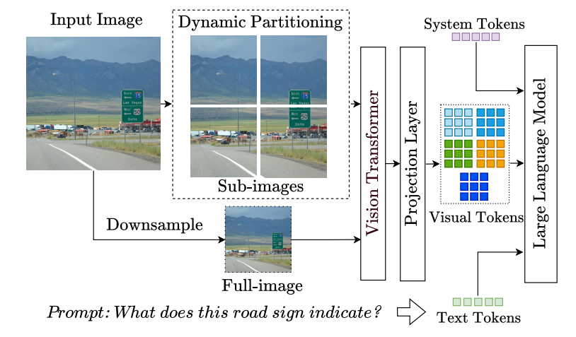
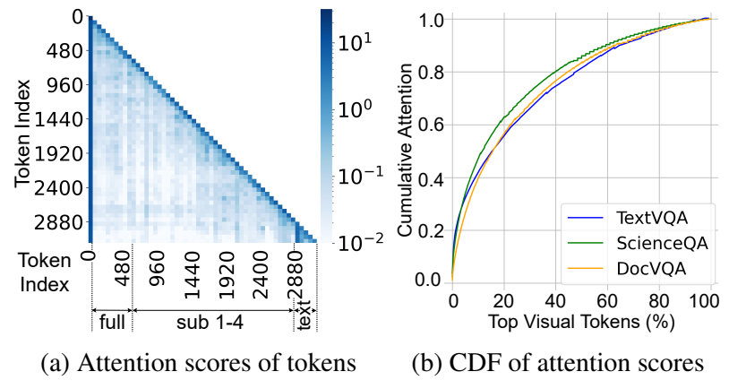
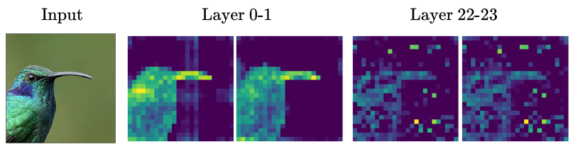
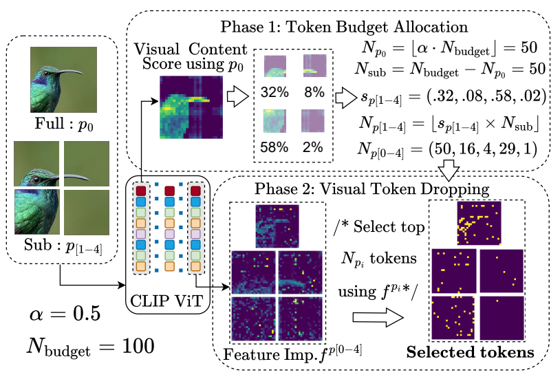
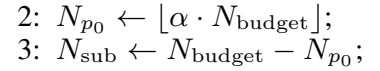
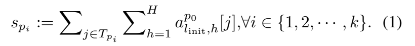
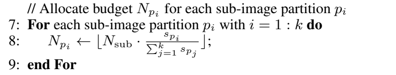
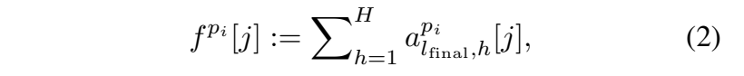
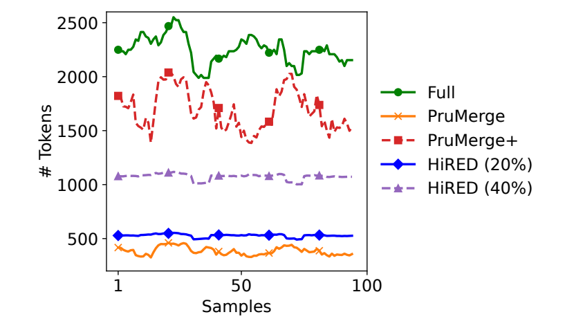
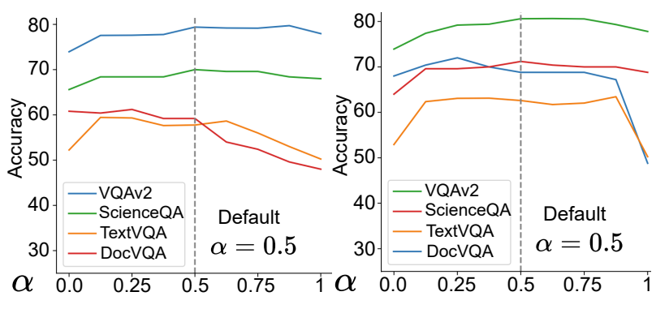

# HiRED 상세 해설: 고해상도 VLM을 위한 CLS-attention 기반 시각 토큰 예산 배분과 조기 제거

> 대상 논문: Kazi Hasan Ibn Arif, JinYi Yoon, Dimitrios S. Nikolopoulos, Hans Vandierendonck, Deepu John, Bo Ji, **"HiRED: Attention-Guided Token Dropping for Efficient Inference of High-Resolution Vision-Language Models"**, AAAI-25.
>
> 이 문서는 초록을 줄여 쓴 서평이 아니라, 논문의 계산 흐름, 식, 알고리즘, 실험을 원문 순서에 맞춰 다시 가르치는 학습용 해설서다. 아래에서 **[저자 보고]**, **[리뷰어 재계산]**, **[리뷰어 해석]**, **[논문 미기재]**, **[공개 코드 확인]**을 의도적으로 구분한다.

<a id="toc"></a>

## 목차

1. [검증된 서지정보와 읽은 범위](#bibliography)
2. [한 문장 요약과 문제의식](#motivation)
3. [핵심 주장, 근거, 주장 범위](#claims)
4. [선수 지식과 통합 notation/shape 사전](#notation)
5. [원문 순서별 상세 해설](#section-walkthrough)
6. [수식과 Algorithm 1 완전 해설](#equations)
7. [한 샘플의 end-to-end forward pass](#forward-pass)
8. [학습 상태와 추론 의사코드](#training-inference)
9. [실험 설정, 표와 그림, 숫자 재검산](#experiments)
10. [효율 주장을 올바르게 읽는 법](#efficiency)
11. [비판적 검토](#critique)
12. [재현 체크리스트](#reproduction)
13. [Jetson Thor 최적화와의 연결](#thor)
14. [오해하기 쉬운 점과 Q&A](#qa)
15. [Coverage checklist](#coverage)

<a id="bibliography"></a>

## 1. 검증된 서지정보와 읽은 범위

### 1.1 PDF 자체에서 확인한 정보

| 항목 | 검증 결과 |
|---|---|
| 첨부 원본 파일 | `HiRED-AAAI 2025.pdf` |
| 제목 | *HiRED: Attention-Guided Token Dropping for Efficient Inference of High-Resolution Vision-Language Models* |
| 저자 | Kazi Hasan Ibn Arif, JinYi Yoon, Dimitrios S. Nikolopoulos, Hans Vandierendonck, Deepu John, Bo Ji |
| 학회/연도 | The Thirty-Ninth AAAI Conference on Artificial Intelligence, AAAI-25, 2025 |
| 출판 정보 | *Proceedings of the AAAI Conference on Artificial Intelligence*, Vol. 39, No. 2, pp. 1773-1781 |
| PDF 실제 쪽수 | 9쪽 |
| 인쇄 면수 | 1773-1781 |
| PDF 메타데이터 생성 시각 | 2025-04-06 UTC 표기 |
| PDF 버전 | PDF 1.5, letter size, 암호화 없음 |
| 코드 링크 | 논문이 직접 제시한 [공식 HiRED 저장소](https://github.com/hasanar1f/HiRED) |
| 공개 원문 | [AAAI 논문 페이지](https://ojs.aaai.org/index.php/AAAI/article/view/32171), [출판본 PDF](https://ojs.aaai.org/index.php/AAAI/article/download/32171/34326) |

이 문서에서 `PDF p.1`은 파일 뷰어의 첫 번째 쪽이며 인쇄 면수 1773과 같다. 따라서 대응은 `PDF p.N = 인쇄면 1772+N`이다.

### 1.2 실제로 읽고 대조한 범위

- PDF p.1-9 전체를 읽었다. 본문은 Abstract, §1 Introduction, §2 Related Work, §3 Key Insights, §4 Our Design: HiRED, §4.1, §4.2, §5 Evaluation, §5.1-5.3, §6 Conclusion, Acknowledgments, References로 구성된다.
- 첨부본에는 별도의 appendix나 supplementary section이 없다. 공식 저장소에도 별도 supplementary PDF는 확인되지 않았다. 그러므로 이 리뷰의 "부록 미포함"은 누락이 아니라 첨부본의 구성 자체다.
- 식 (1), 식 (2), Algorithm 1, Figure 1-6, Table 1-6이 있는 모든 페이지를 180 dpi PNG로 렌더링해 추출 텍스트와 시각적으로 대조했다.
- 공개 코드는 2026-09-07에 공식 저장소 HEAD `c5978a580c88596699c9067ebed031fe4647e818`을 읽기 전용으로 확인했다. 이 코드는 PDF 이후에도 바뀔 수 있으므로, 아래 코드 관찰은 반드시 이 커밋에 한정된다.
- GPU 학습이나 추론은 실행하지 않았다. 모든 성능 수치는 논문 표의 **저자 보고값**이며, 이 리뷰의 계산은 표 수치의 산술 검산뿐이다.

<a id="image-provenance"></a>

### 1.3 원문 이미지 발췌와 출처

이 리뷰의 Figure 1-6, 원문 Eq. (1)-(2), Algorithm 1의 예산 배분식 이미지는 첨부 출판본 PDF의 해당 영역을 PDFium으로 240 DPI 렌더링한 발췌다. 그림을 다시 그리거나 수식을 재조판하지 않았으며, 기존 편집 가능한 LaTeX와 해설을 함께 유지한다. LaTeX를 표시하지 못하는 뷰어에서도 인쇄된 기호와 원래 식 번호를 확인할 수 있다. 비번호 식은 Algorithm 1의 원래 줄 번호로 식별한다.

모든 발췌 이미지의 저작권은 원저자 및 해당 권리자에게 귀속된다. 첨부본은 © 2025 Association for the Advancement of Artificial Intelligence (AAAI), All rights reserved를 명시한다. 이 문서에서는 독립적인 학습·분석 해설에 필요한 영역을 출처와 함께 발췌했으며, 이미지에 CC-BY 등 별도 재배포 라이선스를 부여하거나 그러한 라이선스가 있다고 단정하지 않는다. 공개 출처는 [AAAI 출판본](https://ojs.aaai.org/index.php/AAAI/article/download/32171/34326)이다.

원본 파일의 SHA256은 `220553c67eddbfda3aa7a45185fd3ddbb9dfca861e99e31a436145e73ac85121`이다. [출판 이미지 manifest](assets/02_HiRED/publication_assets.json)에 실제 사용하는 PNG 10개만 기록했다. 좌표는 페이지 왼쪽 위가 원점인 PDF point 단위(1 point = 1/72 inch)의 `[x0, y0, x1, y1]`이며, 1-based PDF 페이지와 인쇄면수를 함께 보관한다. 그림과 수식의 번호 및 페이지는 재번호화하지 않았다. 모든 이미지 경로는 이 Markdown을 기준으로 한 상대 경로다.

<a id="motivation"></a>

## 2. 한 문장 요약과 문제의식

### 2.1 한 문장 요약

HiRED는 고해상도 이미지를 global full-image와 여러 local crop으로 나누는 VLM에서, **full-image의 초기 ViT 층 CLS-to-patch attention으로 crop별 예산을 정하고, 각 partition의 마지막 ViT 층 CLS-to-patch attention으로 그 예산 안의 patch token을 고른 뒤, LLM에 넣기 전에 나머지를 제거하는 학습 없는 추론 기법**이다. [PDF p.2-5, §1, §4.1-4.2, Eq.(1)-(2), Fig.4, Algorithm 1]

### 2.2 기존 고해상도 VLM의 계산 흐름

LLaVA-NeXT 계열의 전형적인 고해상도 경로는 다음과 같다. [PDF p.1, §1, Fig.1]

1. 원본 고해상도 이미지의 종횡비와 해상도에 맞춰 여러 저해상도 crop을 만든다.
2. 전체 장면 문맥을 보존하기 위해 원본을 하나의 저해상도 full-image로도 축소한다.
3. full-image와 모든 crop을 같은 ViT에 각각 통과시킨다.
4. 각 partition에서 나온 patch feature를 projector로 LLM embedding 차원에 맞춘다.
5. 모든 visual token을 system token, prompt text token과 이어 붙인다.
6. 긴 multimodal prefix 전체를 LLM이 prefill하고 autoregressive text를 생성한다.

예를 들어 정사각형 이미지가 `full + 2x2 crop`으로 구성되고 CLIP이 partition당 576개 patch token을 내면, visual token 후보는 `5 x 576 = 2880`개다. 논문은 고해상도 VLM이 저해상도 VLM보다 보통 3-10배 많은 visual token을 만든다고 지적한다. [PDF p.1-2, §1]

### 2.3 구체적인 실패 모드

**실패 1: LLM prefill이 visual prefix에 압도된다.** Visual token이 전체 입력의 80-90%가 될 수 있다. Decoder-only LLM의 causal self-attention과 MLP는 이 긴 prefix에 대해 계산되고, 각 layer의 KV cache도 그 길이에 비례해 커진다. 저자들은 Figure 2에서 이 많은 visual token 중 상위 20%가 visual attention 질량의 약 60%, 상위 40%가 약 80%를 담당한다고 보고한다. 즉 토큰 수와 이용되는 정보량의 분포가 매우 불균등하다. [PDF p.3, §3, Fig.2]

**실패 2: 모든 crop에 동일한 예산을 주면 장면 내용의 불균형을 무시한다.** 도로 표지판처럼 특정 crop에 질문 답변의 핵심이 몰린 이미지에서 빈 하늘 crop과 문자/객체가 밀집한 crop을 똑같이 취급하면, 같은 총예산에서도 중요한 crop을 과도하게 자를 수 있다. Table 2의 예시에서 상위 visual token은 bottom-right crop에 126개 또는 234개가 몰리고 top-left crop에는 12개 또는 40개만 있다. [PDF p.3, §3, Table 2]

**실패 3: 기존 압축 축이 실제 병목과 맞지 않는다.** 양자화나 weight pruning은 파라미터 저장과 GEMM 비용을 줄일 수 있지만 visual prefix 길이를 직접 줄이지 않는다. FastV처럼 LLM 중간 layer에서 늦게 token을 건너뛰면 초기 LLM layer는 여전히 긴 입력을 처리한다. 반대로 ViT 내부만 sparse하게 만들면 거대한 LLM 부분의 prefill/KV 비용은 그대로다. [PDF p.2-3, §1-2]

**실패 4: adaptive method가 평균적으로 작아도 최악 샘플의 메모리를 보장하지 못한다.** PruMerge류가 이미지에 따라 다른 수의 token을 남기면 평균 token 수는 작아질 수 있지만, 자원 제약 시스템이 원하는 것은 종종 per-sample 상한이다. Figure 5에서 Full, PruMerge, PruMerge+의 token 수는 샘플별로 요동하지만 HiRED 20%/40%는 대체로 고정된 띠를 이룬다. [PDF p.6, §5.2, Fig.5]

### 2.4 한계에서 연구 질문, 가설, 설계로

| 논리 단계 | 내용 |
|---|---|
| 기존 한계 | 고해상도 crop은 세부 정보를 보존하지만 visual prefix와 KV cache를 크게 만든다. 균일 제거는 내용이 몰린 crop을 해칠 수 있고, adaptive 제거는 hard budget을 보장하지 못한다. |
| 연구 질문 | LLM을 실행하기 전에, 총 visual-token budget을 엄격히 제한하면서 중요한 crop과 patch를 어떻게 남길 것인가? |
| 가설 A | ViT 초기층의 CLS attention은 local object/content 위치와 더 잘 정렬되므로 crop별 "내용량"을 추정할 수 있다. |
| 가설 B | ViT 마지막층의 CLS attention은 고수준 feature가 모인 patch를 가리키므로 partition 내부 token 중요도 순위에 쓸 수 있다. |
| 설계 선택 | 초기층 attention은 **partition 간 예산 배분**, 마지막층 attention은 **partition 내부 token 선택**이라는 서로 다른 역할에 배치한다. |
| 시스템 목표 | training/architecture change 없이, LLM 이전 visual prefix 길이를 줄여 TTFT, throughput, memory를 개선한다. |

이 두 수준을 섞지 않는 것이 논문의 핵심이다. "고해상도 partition별 budget allocation"과 "partition 내부 top-token selection"은 서로 다른 입력 attention, 서로 다른 normalization 범위, 서로 다른 실패 모드를 가진다.

<a id="claims"></a>

## 3. 핵심 주장, 근거, 주장 범위

| 저자의 주장 | 직접 근거 | 정확한 범위 | 주의할 한계 |
|---|---|---|---|
| HiRED는 high-resolution, controllable token budget, early dropping, wide task coverage를 동시에 만족한다. | Table 1, 관련 연구 비교 [PDF p.2, §1-2] | 저자가 선정한 네 가지 속성과 비교 방법에 한정 | "최초"는 저자의 literature claim이다. 모든 동시대 방법을 이 리뷰가 독립 검증한 것은 아니다. |
| 초기 ViT layer CLS attention은 visual content 분포와 정렬된다. | Figure 3, Table 5의 allocation layer ablation [PDF p.4, p.7, §4.1, §5.3] | 사용한 CLIP ViT/LLaVA 구성 및 네 ablation benchmark | attention이 보편적으로 causal explanation이라는 증거는 아니다. |
| 마지막 ViT layer CLS attention은 informative token 선택에 유리하다. | Figure 3, Table 5의 drop-layer ablation [PDF p.4, p.7] | layer 0/11/22 비교 | layer 22가 모든 vision backbone의 "마지막층"은 아니다. 코드가 22와 16 heads를 hard-code한다. |
| 20% budget으로 VQA 정확도를 대체로 보존하고, 40%로 transcription 성능을 더 잘 보존한다. | Table 3 [PDF p.5-6, §5.1] | LLaVA-NeXT 7B/13B, 8개 benchmark | DocVQA/ChartQA 손실은 여전히 크다. "comparable"은 task에 따라 폭이 다르다. |
| batch 1, 20%에서 throughput 4.7배, TTFT 78% 감소, memory 14% 절감이다. | Table 4 [PDF p.6, §5.2] | Tesla P40 24 GB, LLaVA-NeXT-7B, 저자 benchmark | 논문 본문에는 precision, 출력 길이, warm-up, run 수가 없다. 공개 script는 fp16, `max_new_tokens=100`, 1 run이며 CUDA synchronization이 보이지 않는다. |
| batch 4에서 Full은 OOM이나 20%는 16.99 GB로 실행된다. | Table 4 [PDF p.6] | P40 24 GB, 해당 입력/코드 | OOM인 Full의 실제 peak가 없으므로 "30% memory reduction"은 Full 대비 직접 계산할 수 없다. |
| 고정 budget을 샘플별로 지킨다. | Algorithm 1, Figure 5 [PDF p.4, p.6] | visual token selection 이후 LLM 입력 상한 | floor와 capacity clamp로 실제 합이 budget보다 작을 수 있다. "정확히 동일"보다 "상한 이하"가 안전한 표현이다. |
| low-resolution VLM에도 적용된다. | Table 6 [PDF p.7, §5.3] | LLaVA-1.5-7B, ShareGPT4V-7B의 단일 partition | 이 경우 Phase 1은 사라지고 마지막층 top-k만 남는다. 고해상도 budget allocation의 검증은 아니다. |

### 3.1 저자 보고와 리뷰어 계산의 분리

- **[저자 보고]** 2.30 vs 0.49 tokens/s, 4.21 vs 19.49 s, 13.76 vs 16.04 GB.
- **[리뷰어 재계산]** `2.30 / 0.49 = 4.694`, `(19.49-4.21)/19.49 = 78.40%`, `(16.04-13.76)/16.04 = 14.21%`. 따라서 반올림한 4.7배, 78%, 14%는 산술적으로 맞다.
- **[저자 보고]** batch 4에서 20%가 memory를 30% 줄인다고 서술한다.
- **[리뷰어 재계산]** Full이 OOM이라 비교 분모가 없다. `1 - 16.99/24 = 29.21%`는 24 GB 용량 대비 남은 headroom일 뿐 memory reduction이 아니다. 그러므로 30% 절감 주장은 표만으로 재현되지 않는다.
- **[논문 미기재]** confidence interval, 여러 seed/run의 분산, latency percentile, power, energy, kernel breakdown은 없다.

<a id="notation"></a>

## 4. 선수 지식과 통합 notation/shape 사전

### 4.1 반드시 구분할 단위

| 용어 | 단위와 의미 |
|---|---|
| image partition | 한 번의 ViT 입력이 되는 full-image 또는 한 crop |
| patch | ViT 입력 이미지의 비중첩 공간 블록. CLIP 예시는 24x24 = 576개 |
| ViT token | CLS 1개와 patch token들. 논문의 `N_ViT=576`은 보통 CLS를 제외한 patch token 수 |
| visual token | ViT patch feature를 projector로 LLM embedding 공간에 옮긴 token. HiRED가 LLM 입력 전에 줄이는 대상 |
| text/system token | tokenizer가 만든 prompt/system token. HiRED budget에 포함되지 않는다. |
| generated token | LLM이 autoregressive decode에서 출력한 text token. Table 4 throughput의 분자 |
| batch size | 한 generate 호출에서 병렬 처리하는 이미지-프롬프트 쌍 수 |
| model parameter | ViT, projector, LLM weight. HiRED는 이를 새로 학습하지 않는다. |
| hyperparameter | `token_budget_rate`, `N_budget`, `alpha`, `l_init`, `l_final` 등 추론 정책 값 |
| action/control step | 이 논문에는 존재하지 않는다. 로봇 VLA나 action chunk 논문이 아니라 정적 이미지 VLM 논문이다. |

따라서 "20% budget"은 LLM이 20%의 답변 token만 생성한다는 뜻이 아니다. drop 전 visual token 후보의 20%를 상한으로 남긴다는 뜻이다. prompt text와 output text token은 별도다.

### 4.2 기호와 shape

| 기호 | 뜻 | 전형적 값/shape |
|---|---|---|
| `p_0` | downsampled full-image partition | 1개 |
| `p_i`, `i=1,...,k` | i번째 local sub-image/crop | 정사각형 예시에서 `k=4` |
| `k+1` | 전체 partition 수 | 예시 5 |
| `N_ViT` | partition당 patch token 수, CLS 제외 | CLIP 예시 576 = 24x24 |
| `N_budget` | 모든 partition을 합친 visual-token 총 budget | 예: 100, 576, 1152 |
| `alpha` | full-image에 우선 배정하는 총 budget 비율 | 기본 0.5 |
| `N_{p_0}` | full-image token budget | 정수, `<=N_ViT`여야 함 |
| `N_sub` | 모든 crop이 나눠 갖는 budget | 정수 |
| `N_{p_i}` | crop `p_i`의 정수 token budget | `0...N_ViT` |
| `T_{p_i}` | full-image 24x24 grid 중 crop `p_i`와 공간적으로 대응하는 token index 집합 | 부분집합 |
| `L` | ViT transformer layer 수 | 논문 일반 기호 |
| `H` | attention head 수 | 공개 LLaVA-NeXT 구현은 16 |
| `l_init` | budget allocation용 초기 layer | 논문/코드 0 |
| `l_final` | token selection용 마지막 layer | 논문/코드 22 |
| `a_{l,h}^{p_i}[j]` | partition `p_i`를 ViT layer `l`에 넣었을 때, head `h`의 CLS query가 patch `j`에 주는 softmax attention scalar | 스칼라, 무차원, `[0,1]` |
| `s_{p_i}` | crop `p_i`의 visual content score | head와 공간 위치에 대한 attention 합 |
| `f^{p_i}[j]` | partition `p_i` 안 patch `j`의 feature importance score | head attention 합 |
| `d_v` | ViT hidden width | 모델 의존, 논문 미기재 |
| `d_LLM` | LLM embedding width | 7B Vicuna 계열 공개 코드 주석은 4096, 논문 미기재 |

### 4.3 CLS attention은 어떻게 생기는가

ViT self-attention의 한 head에서 입력 hidden state를 `X in R^{(N_ViT+1) x d_v}`라 하자. 첫 행이 CLS, 나머지가 patch다. [해설용 수식]

```math
Q_h = XW_h^Q,\qquad K_h = XW_h^K,
```

```math
A_h = \mathrm{softmax}\left(\frac{Q_hK_h^\top}{\sqrt{d_h}}\right).
```

`A_h`의 shape은 `(N_ViT+1) x (N_ViT+1)`이다. 이 중 논문이 쓰는 값은 CLS가 query이고 patch `j`가 key인 행 원소다.

```math
a_{l,h}^{p_i}[j] = A_{l,h}^{p_i}[\mathrm{CLS},j].
```

행 softmax이므로 CLS 행 전체 합은 1이지만, patch 부분만 떼면 CLS-to-CLS 질량을 제외해 합이 1보다 작을 수 있다. 여러 head를 **더한다**는 것은 평균과 ranking이 같지만 score의 절대 범위는 달라진다. 모든 head를 같은 양의 상수 `1/H`로 나누더라도 Eq.(1)의 비율과 Eq.(2)의 top-k 순위는 변하지 않으므로, 합과 평균은 이 두 용도에서 이론적으로 동등하다. 단, "No agg"처럼 한 head만 쓰거나 head별 선택을 별도로 하는 것은 동등하지 않다.

### 4.4 계산량 직관

LLM prefix 길이를 `S = S_text + S_visual`이라 하면 dense prefill self-attention의 score 계산은 layer당 대략 `O(S^2 d)`이고, MLP 및 projection 부분은 `O(S d^2)`다. decode 시 새 token 하나의 attention은 cached prefix에 대해 `O(Sd)`이며 KV cache 저장량은 대략 다음에 비례한다. [해설용 수식]

```math
M_{KV} \propto 2 \times L_{LLM} \times B \times S \times d_{KV} \times \text{bytes-per-element}.
```

HiRED는 `S_visual`을 줄여 LLM prefill, decode attention, KV cache를 줄인다. 하지만 **모든 partition의 ViT는 원래 길이로 이미 실행된다.** 그러므로 "전체 모델 FLOPs가 80% 감소"라고 읽으면 틀리다. 어느 부분이 얼마나 지배적인지는 모델, 이미지 partition 수, output length, kernel 구현에 달려 있다.

<a id="section-walkthrough"></a>

## 5. 원문 순서별 상세 해설

### 5.1 Abstract

초록은 문제, 해법, 시스템 결과를 한 번에 압축한다. 고해상도 VLM은 세부 정보를 잃지 않기 위해 여러 partition을 encode하지만 visual token이 폭증한다. HiRED는 고정 budget 안에서 CLS attention으로 partition의 content를 평가하고, partition별 중요 token만 LLM에 보낸다. 저자는 LLaVA-NeXT-7B, P40 24 GB, 20% budget에서 throughput 4.7배, response latency 78% 감소, single-inference memory 14% 절감, batch 4 OOM 회피를 전면에 둔다. [PDF p.1, Abstract]

여기서 "response latency"라는 표현은 본문 §5.2와 Table 4에서는 TTFT로 구체화된다. 즉 4.21초를 전체 응답 완료 시간이라고 단정하면 안 된다. 공개 성능 script는 `model.prefill_time - start_time`을 기록하므로 저자가 의도한 것은 first-token까지의 prefill 지연이다.

### 5.2 §1 Introduction

#### 첫 논리: 고해상도가 필요한 이유

<a id="source-figure-01"></a>



Figure 1. Full-image와 crop을 ViT와 projector로 처리한 뒤 LLM에 전달하는 경로. [PDF p.1, §1; 출판본](https://ojs.aaai.org/index.php/AAAI/article/download/32171/34326#page=1)

기존 low-resolution VLM은 입력을 낮은 해상도로 압축해 작은 문자, 표, 미세 객체를 잃는다. 동적 partition은 원본을 여러 crop으로 보아 세부 정보를 되찾고 full-image로 전역 문맥도 남긴다. Figure 1은 input image에서 dynamic sub-images와 downsampled full-image가 갈라져 동일 vision transformer/projector를 지나 visual token이 되고, system/text token과 함께 LLM으로 들어가는 흐름을 그린다. [PDF p.1, Fig.1]

#### 둘째 논리: 정확도 향상의 대가

partition 수만큼 ViT forward와 visual token 수가 늘어난다. 저자는 336x336에서 1344x1344로 높였을 때 특정 선행연구에서 정확도가 15% 개선된 예를 들지만, 동시에 visual token이 3-10배 늘어난다고 설명한다. 이 숫자는 HiRED 자체의 ablation이 아니라 인용된 선행연구 맥락이다. [PDF p.1, §1]

#### 셋째 논리: 네 가지 설계 요구사항

저자는 좋은 token-dropping system의 기준을 네 가지로 정의한다. (i) high-resolution VLM에 plug-and-play로 붙고 학습/architecture change가 없을 것, (ii) resource에 맞춰 token budget을 제어할 것, (iii) LLM generation보다 일찍 drop할 것, (iv) VQA, captioning, document understanding 등 넓은 task를 다룰 것. Table 1은 FastV, FlexAttention, TokenCorrCompressor, PruMerge가 이 네 축 중 일부만 만족하고 HiRED만 모두 체크된다고 주장한다. [PDF p.2, Table 1]

이 표의 체크는 계산 결과라기보다 저자의 taxonomy다. 예컨대 PruMerge의 high-resolution 지원을 `x`로 둔 것은 원 설계 대상이 low-resolution VLM이기 때문이며, 이 논문의 실험에서는 비교를 위해 각 partition에 PruMerge를 적용한다.

#### 넷째 논리: 두 attention 역할의 분리

초기층 CLS attention은 object와 background를 구분하는 content proxy, 마지막층 CLS attention은 정보가 응축된 feature proxy로 쓴다. 이 때문에 HiRED의 Phase 1과 Phase 2는 같은 "attention top-k" 한 번이 아니다. 먼저 global full-image에서 crop별 quota를 구한 뒤, 각 crop 자체의 마지막층 attention으로 quota만큼 고른다. [PDF p.2, Contributions]

### 5.3 §2 Related Work

#### Lightweight Architectures

LLaVA-Phi, TinyLLaVA, MobileVLM처럼 LLM 자체를 줄이는 방법은 메모리와 계산을 낮추지만 reasoning capacity 손실이라는 다른 trade-off를 가진다. 양자화/weight pruning도 parameter 측을 줄이지 visual-token length를 직접 제어하지 않는다. Q-Former, Matryoshka Multimodal Models, Abstractor 같은 learned compression은 추가 학습이 필요해 "training-free plug-and-play" 목표와 다르다. [PDF p.2-3, §2]

#### Sparse Attention Computation in LLM and ViT

FastV는 LLM 초기 layer에서 importance를 보고 이후 layer token을 생략한다. 이미 LLM에 긴 visual prefix를 넣은 뒤라 earliest LLM 비용과 initial KV overhead는 남는다. FlexAttention은 high-resolution을 지원하지만 저자 기준으로 resource-driven exact token count control이 없다. DynamicViT, PuMer, EViT류의 ViT 중심 최적화는 큰 LLM이 병목일 때 E2E 이득이 제한될 수 있다. [PDF p.3, §2]

#### Early Dropping of Visual Tokens

TokenCorrCompressor는 document image의 반복 whitespace를 token cosine similarity로 찾아 줄이므로 task coverage가 좁다. PruMerge는 CLS attention이 높은 token을 남기고 낮은 token 정보를 merge하며, PruMerge+는 spatially uniform sample을 보강한다. 그러나 원래 single-partition low-resolution VLM용이고 exact hard budget이 없다. HiRED는 이 지점에서 high-resolution partition-aware allocation을 차별점으로 삼는다. [PDF p.3, §2]

### 5.4 §3 Key Insights

#### Insight 1: visual token sparsity

<a id="source-figure-02"></a>



Figure 2. (a) 토큰 attention map과 (b) 상위 visual token 비율에 따른 누적 attention. 원문의 subplot·색상 범례·축을 보존했다. [PDF p.3, §3; 출판본](https://ojs.aaai.org/index.php/AAAI/article/download/32171/34326#page=3)

Figure 2(a)는 LLaVA-NeXT-7B의 LLM generation attention map에서 visual token이 수적으로 대부분이지만 system/text token보다 attention이 낮음을 보인다. Figure 2(b)는 visual token을 attention 순으로 정렬했을 때 상위 20%가 약 60%, 상위 40%가 약 80%의 누적 visual attention을 차지한다고 보고한다. [PDF p.3, Fig.2]

이 관찰은 "상위 20%만 남겨도 항상 정확하다"는 정리가 아니다. 질문과 decode step에 따라 attention이 달라질 수 있고, low attention이 causal irrelevance를 의미하지도 않는다. 저자는 가능성을 발견한 뒤 실제 task accuracy로 정책을 검증한다.

#### Insight 2: partition별 content amount 차이

Table 2는 Figure 1의 다섯 partition에서 LLM attention 상위 10%와 20% visual token이 어디서 왔는지 센다. [PDF p.3, Table 2]

| budget | Full | TL | TR | BL | BR | 표기 합계 | 리뷰어 합계 |
|---|---:|---:|---:|---:|---:|---:|---:|
| 10% | 37 | 12 | 29 | 84 | 126 | 288 | 288 |
| 20% | 94 | 40 | 61 | 148 | 234 | 576 | **577** |

**[리뷰어 재계산]** 20% 행은 `94+40+61+148+234=577`로 caption의 576보다 1 크다. 원문 숫자를 조용히 고치지 않는다. tie 처리, 집계 경계, 표 오탈자 중 무엇인지는 논문에 설명되지 않는다. 더 중요한 정성적 결론은 BR에 informative token이 몰리고 TL에는 적다는 불균형이다.

### 5.5 §4 Our Design: HiRED

§4의 전환 논리는 명확하다. LLM에서 사후적으로 중요 token을 찾는 것은 이미 긴 prefix 비용을 낸 뒤이므로, importance proxy를 ViT 안에서 찾아야 한다. HiRED는 ViT attention을 이용해 LLM 전에서 결정을 내린다. [PDF p.3-4, §4]

### 5.6 §4.1 CLS-attention Pattern in ViT

<a id="source-figure-03"></a>



Figure 3. 입력 이미지와 초기층·후기층 CLS attention map. [PDF p.4, §4.1; 출판본](https://ojs.aaai.org/index.php/AAAI/article/download/32171/34326#page=4)

Figure 3의 hummingbird 예시에서 layer 0-1 attention은 새의 몸체와 부리 같은 subject 영역에 비교적 집중하고 background를 무시한다. 반면 layer 22-23 attention은 subject와 background 여러 위치에 흩어진 밝은 patch를 보인다. 저자는 deeper ViT가 local feature 관계를 통합해 일부 background patch에도 global feature를 저장할 수 있다는 register-token 관련 관찰을 인용한다. [PDF p.4, Fig.3]

따라서 역할은 다음처럼 분리된다.

- 초기층: "어느 공간 영역에 눈에 띄는 visual content가 얼마나 있는가?"를 추정한다.
- 마지막층: "이 partition representation에서 어떤 token이 feature를 많이 담는가?"를 추정한다.

Figure 3은 대표 사례의 visualization이지 정량적 일반성 증명은 아니다. 정량 근거는 Table 5의 layer ablation이다.

### 5.7 §4.2 HiRED Design

<a id="source-figure-04"></a>



Figure 4. 초기층 content score를 이용한 예산 배분과 후기층 feature importance를 이용한 token 선택. 그림에 인쇄된 100-token 수치 예시도 그대로 보존했다. [PDF p.4, §4.2; 출판본](https://ojs.aaai.org/index.php/AAAI/article/download/32171/34326#page=4)

Figure 4는 `alpha=0.5`, `N_budget=100`의 장난감 예시를 완전한 파이프라인으로 보인다. full-image가 50개, crop 전체가 50개를 받고, 초기층 content 비율 `(0.32,0.08,0.58,0.02)`에 따라 crop budget이 `(16,4,29,1)`이 된다. 이후 각 partition은 자체 마지막층 feature importance 상위 token만 남긴다. [PDF p.4, Fig.4]

Algorithm 1은 이 과정을 두 phase, 15줄로 명시한다. Eq.(1)은 crop-level score, Eq.(2)는 token-level score다. 자세한 줄별 설명은 [§6](#equations)에 둔다.

### 5.8 §5 Evaluation: 공통 설정

모델은 LLaVA-NeXT 7B/13B, low-resolution robustness용 LLaVA-1.5-7B와 ShareGPT4V-7B다. 성능 측정 GPU는 NVIDIA Tesla P40 24 GB다. 여덟 benchmark는 다음 세 범주다. [PDF p.5, §5]

- Visual QA: VQA-v2, ScienceQA.
- Transcription: TextVQA, DocVQA, OCRBench.
- Others: MME, POPE, ChartQA.

Primary early-dropping baseline은 PruMerge/PruMerge+이며, high-resolution 실험에서는 각 image partition에 그 전략을 적용한다. Spatial pooling도 포함한다. TokenCorrCompressor는 당시 code 비공개라 직접 비교하지 않았고, FastV/FlexAttention은 early dropping이 아니므로 accuracy/performance table의 직접 baseline이 아니다. [PDF p.5-6, §5]

### 5.9 §5.1 Accuracy

Table 3은 task마다 "높을수록 좋음"인 기본 LMMS-EVAL metric을 보고한다. 다만 OCRBench와 MME는 수백/천 단위 score이고 나머지는 백분율형 score라 단순 평균해서는 안 된다. [PDF p.5, Table 3]

저자의 핵심 해석은 두 단계다.

- 20% budget은 object-level VQA에서 Full과 가까운 성능을 보인다.
- 작은 글자/문서처럼 fine-grained token이 중요한 transcription에는 40%가 더 안전하다.

실제로 7B에서 Full 대비 HiRED-20%의 DocVQA는 73.4에서 60.8로 12.6 point 떨어지고 ChartQA는 54.8에서 42.0으로 12.8 point 떨어진다. 따라서 "20%가 정확도를 보존한다"는 주장은 모든 task에 동일 강도로 적용되지 않는다.

PruMerge+는 transcription 평균 token 비율이 55%인데도 HiRED-20%보다 TextVQA와 DocVQA가 낮다. 저자가 말한 11%, 26% lower는 상대 감소다. [리뷰어 재계산]

```math
\frac{61.4-54.4}{61.4}=11.40\%,\qquad \frac{60.8-44.6}{60.8}=26.64\%.
```

PruMerge 10%도 각각 `13%`, `37%` lower라는 서술과 맞는다.

```math
\frac{61.4-53.5}{61.4}=12.87\%,\qquad \frac{60.8-37.8}{60.8}=37.83\%.
```

### 5.10 §5.2 Inference Efficiency

Table 4는 batch 1/2/4, Full/40%/20%에 대해 throughput, latency, peak allocated GPU memory를 보고한다. 본문은 latency를 TTFT라고 정의한다. Figure 5는 TextVQA 100 samples에서 sample별 visual-token count를 비교한다. [PDF p.6, Table 4, Fig.5]

HiRED의 강점은 평균 token 절감뿐 아니라 예산 상한이다. 그러나 Figure 5의 20% 선도 정확히 576에 고정된 것이 아니라 약 500대에서 조금 변한다. 원본 any-resolution processing의 unpadding, partition 수, floor 때문에 "maximum fraction"과 최종 packed token 수가 완전히 같은 개념이 아니기 때문이다.

### 5.11 §5.3 Ablation Study

#### Figure 6: alpha

`alpha=0`이면 full-image를 하나도 남기지 않고, `alpha=1`이면 모든 budget을 full-image에 준다. 20%와 40% budget 모두 중간값, 특히 `alpha=0.5` 근처가 대체로 좋다. 이는 global context와 local detail 중 하나만 남기는 극단이 불리함을 지지한다. 다만 모든 task의 정확한 최적 alpha가 0.5인 것은 아니다. 저자는 공통 default로서 0.5를 선택한다. [PDF p.7, Fig.6]

#### Table 5: layer와 head aggregation

초기 layer 0으로 budget을 배분하는 것이 even allocation이나 layer 22 allocation보다 전반적으로 낫다. 실제 drop ranking은 layer 22가 layer 0/11보다 낫다. 모든 head를 더하면 aggregation하지 않은 설정보다 낫다. [PDF p.7, Table 5]

리뷰어가 표에서 계산한 개선폭은 다음과 같다.

- layer 0 allocation vs even: SQA +0.8, VQA-v2 +4.4, TextVQA +2.6, DocVQA +10.4 point.
- layer 0 allocation vs layer 22 allocation: +3.2, +9.1, +17.5, +5.2 point.
- layer 22 dropping vs layer 11 dropping: +0.4, +1.6, +2.9, +7.2 point.
- head addition vs no aggregation: +1.2, +1.1, +4.3, +6.8 point.

하지만 sample 수, seed, variance가 없어 이 차이의 통계적 유의성은 판단할 수 없다. 또한 "No agg"가 어느 한 head인지, head별 선택 후 union인지 본문은 설명하지 않는다.

#### Table 6: single-partition VLM

LLaVA-1.5-7B에서는 HiRED-40%가 VQA-v2, TextVQA, DocVQA에서 Full보다 각각 +2.4, +0.9, +1.3 point다. 하지만 ScienceQA는 -2.3이다. ShareGPT4V-7B에서는 40%가 네 task에서 Full과 대체로 가깝고 모두 조금 낮다. [PDF p.7, Table 6]

single partition에는 crop 간 allocation이 없으므로 이 결과는 Eq.(1)이 아니라 Eq.(2)의 last-layer top-k만 검증한다.

### 5.12 §6 Conclusion과 limitation

결론은 high-resolution detail과 visual-token explosion 사이 trade-off를 다시 정리하고, HiRED가 fixed budget allocation, informative-token selection, pre-LLM dropping으로 throughput/latency/memory를 개선한다고 요약한다. [PDF p.7, §6]

저자가 명시한 limitation은 spatial information 손실이다. 선택된 token을 압축해 LLM sequence로 만들면 원래 2D 인접 관계가 약해지고, 언어용 positional encoding은 visual 2D geometry를 충분히 표현하지 못할 수 있다. ChartQA가 대표적인 취약 task다. 저자는 drop 뒤 2D positional encoding을 넣는 방향을 future work로 제안한다. 이는 구현·검증된 결과가 아니다.

### 5.13 Acknowledgments와 References

Acknowledgments는 NSF grants, Commonwealth Cyber Initiative, Sony Faculty Innovation Award, Northern Ireland Department for the Economy, Science Foundation Ireland 지원을 밝힌다. [PDF p.8]

References는 PDF p.8-9에 있다. 이 리뷰는 참고문헌별 서평을 만들지 않지만, 본문 논리에서 실제 역할을 한 계열은 §5.3의 Related Work 해설에 반영했다. 첨부본은 References로 끝나며 appendix가 없다.

<a id="equations"></a>

## 6. 수식과 Algorithm 1 완전 해설

### 6.1 Algorithm 1의 입력 줄

Algorithm 1 line 1의 입력은 다음과 같다. [PDF p.4, Algorithm 1]

```math
N_{\mathrm{budget}},\ N_{\mathrm{ViT}},\ \alpha,\ k,\ l_{\mathrm{init}},\ l_{\mathrm{final}},\ H,\ T_{p_i},\ \{a_{l,h}^{p_i}[j]\}.
```

- `N_budget`: 이번 sample이 LLM에 보낼 수 있는 visual-token 총 상한이다.
- `N_ViT`: partition 하나의 후보 patch token 수다.
- `alpha`: total budget을 full-image와 crops 사이에 먼저 나누는 비율이다.
- `k`: crop 수다. 전체 partition 수는 `k+1`이다.
- `l_init`, `l_final`: content allocation과 feature selection에 각각 쓸 ViT layer index다.
- `H`: attention head 수다.
- `T_{p_i}`: full-image grid에서 crop `p_i`에 해당하는 index 집합이다.
- `a`: 각 layer/head/partition/token의 CLS-to-patch attention이다.

### 6.2 Algorithm line 2: full-image budget

원문 비번호 식은 다음과 같다. [PDF p.4-5, §4.2, Algorithm 1 line 2]

<a id="source-equation-budget-full-sub"></a>



원문 비번호 식. Full-image 예산과 crop 공동 예산을 정하는 Algorithm 1 lines 2-3. 다음 §6.3의 뺄셈도 함께 발췌했다. [PDF p.4, §4.2; 출판본](https://ojs.aaai.org/index.php/AAAI/article/download/32171/34326#page=4)

```math
N_{p_0}=\left\lfloor \alpha N_{\mathrm{budget}}\right\rfloor.
```

**연산 순서:** 실수 비율 `alpha`와 정수 총예산을 곱하고 floor로 내린다. `alpha=0.5`, `N_budget=101`이면 `N_{p_0}=floor(50.5)=50`이다.

**왜 필요한가:** crop content만으로 전체 예산을 나누면 global overview가 완전히 사라질 수 있다. 이 항은 full-image에 예약 몫을 준다.

**가정과 edge case:** 원문 수식에는 `min(N_ViT, ...)`가 없다. `N_budget`이 전체 후보 수 이하라도 `alpha N_budget > N_ViT`일 수 있으므로 구현은 full-image capacity로 clamp할 필요가 있다. 공개 코드는 실제로 `min(int(...), num_vision_tokens)`를 쓴다.

### 6.3 Algorithm line 3: 모든 crop의 공동 budget

```math
N_{\mathrm{sub}}=N_{\mathrm{budget}}-N_{p_0}.
```

이 값은 특정 crop의 budget이 아니라 `p_1...p_k`가 나눠 갖는 pool이다. 위 101-token 예에서는 `51`이다. 이 뺄셈 덕분에 full-image floor로 사라진 0.5가 정수 budget에서 유실되지 않고 crop pool로 간다.

### 6.4 식 (1): crop visual content score

원문 식 (1)은 다음과 같다. [PDF p.5, §4.2, Eq.(1)]

<a id="source-equation-01"></a>



원문 Eq. (1). Crop별 visual content score의 인쇄 수식과 식 번호. [PDF p.5, §4.2; 출판본](https://ojs.aaai.org/index.php/AAAI/article/download/32171/34326#page=5)

```math
s_{p_i}:= \sum_{j\in T_{p_i}} \sum_{h=1}^{H} a_{l_{\mathrm{init}},h}^{p_0}[j], \qquad \forall i\in\{1,2,\ldots,k\}. \qquad\text{(1)}
```

#### 항을 한 줄씩 읽기

1. `a^{p_0}`의 superscript가 **p_i가 아니라 p_0**다. 모든 crop을 각각 다시 보고 content를 비교하는 것이 아니라, full-image 한 장의 초기층 attention map을 공간 구역으로 나눈다.
2. 안쪽 `sum_{h=1}^H`는 같은 full-image patch `j`에 대한 모든 head의 CLS attention을 더한다. shape `[H] -> scalar`다.
3. 바깥 `sum_{j in T_{p_i}}`는 crop `p_i`가 차지하는 full-image 영역 안의 patch score를 더한다. `|T_{p_i}|`개 patch에서 scalar 하나가 나온다.
4. 결과 `s_{p_i}`는 token count가 아니라 nonnegative attention mass다. 이후 모든 crop score의 합으로 나누어 비율로 만든다.

#### 왜 초기층인가

저자의 가설은 초기층 attention이 object/background 같은 local visual content에 더 직접 정렬된다는 것이다. 마지막층 attention은 정보가 몇 patch로 이동/응축될 수 있어 "공간 영역의 내용량"을 재는 데 부적합하다고 본다. Table 5의 layer 0 allocation 성능이 이 선택을 뒷받침한다.

#### 작은 수치 예시

Figure 4의 normalized score를 그대로 쓰면 다음과 같다.

```math
(s_{p_1},s_{p_2},s_{p_3},s_{p_4})=(0.32,0.08,0.58,0.02).
```

합은 1이며, `N_budget=100`, `alpha=0.5`이면 `N_sub=50`이다. 각 crop quota는 다음 절의 비번호 식으로 나온다.

#### edge case

- 모든 `s_{p_i}=0`이면 normalization denominator가 0이다. softmax attention이 정확히 모두 0일 가능성은 수학적으로 낮지만, masking/precision/구현 오류까지 포함한 guard는 논문에 없다.
- crop 면적이 다르거나 `T_{p_i}` cardinality가 다르면 단순 합은 큰 영역에 더 큰 score를 줄 수 있다. LLaVA-NeXT partition grid에서는 crop들이 같은 ViT input 크기로 정규화되지만 full-image의 대응 영역 분할 방식은 aspect ratio에 의존한다.
- 질문 text를 보지 않는 image-only score이므로 같은 이미지라도 "하늘 색은?"과 "도로 표지 내용은?"에 동일한 allocation을 쓴다.

### 6.5 Algorithm line 8: crop별 정수 budget

원문 비번호 식은 다음과 같다. [PDF p.4-5, §4.2, Algorithm 1 line 8]

<a id="source-equation-budget-partition"></a>



원문 비번호 식. Algorithm 1 line 8의 정수 예산 배분. Crop 반복문의 범위를 보여 주는 원래 주석과 lines 7-9를 함께 발췌했다. [PDF p.4, §4.2; 출판본](https://ojs.aaai.org/index.php/AAAI/article/download/32171/34326#page=4)

```math
N_{p_i}:=\left\lfloor N_{\mathrm{sub}}\cdot \frac{s_{p_i}}{\sum_{j=1}^{k}s_{p_j}} \right\rfloor.
```

`j`가 Eq.(1)의 patch index와 재사용되어 혼동될 수 있다. 여기 denominator의 `j=1...k`는 **crop index**다.

Figure 4의 예에서는 다음과 같다.

```math
\begin{aligned} N_{p_1}&=\lfloor 50\cdot0.32\rfloor=16,\\ N_{p_2}&=\lfloor 50\cdot0.08\rfloor=4,\\ N_{p_3}&=\lfloor 50\cdot0.58\rfloor=29,\\ N_{p_4}&=\lfloor 50\cdot0.02\rfloor=1. \end{aligned}
```

합이 정확히 50이라 예쁘게 맞지만 항상 그렇지는 않다. `N_sub=10`, 세 crop 비율이 `1/3`씩이면 모두 3이 되어 합은 9다. [해설용 수식]

```math
\sum_i\left\lfloor N_{\mathrm{sub}}r_i\right\rfloor\le N_{\mathrm{sub}}.
```

**[논문 미기재]** 남은 1개를 largest-remainder 방식으로 누구에게 줄지 정의하지 않는다. 따라서 Algorithm 1이 엄밀히 보장하는 것은 `sum_i N_{p_i} <= N_sub`, 즉 상한 준수이지 exact utilization이 아니다. 공개 코드도 `.int()` truncation 뒤 remainder를 재배분하지 않는다.

또한 한 crop quota가 `N_ViT`를 넘으면 top-k가 불가능하다. 공개 코드는 `clamp(max=N_ViT)`하지만 초과분을 다른 crop으로 다시 주지 않는다. 그래서 capacity saturation에서도 unused budget이 생긴다.

### 6.6 식 (2): partition 내부 feature importance

원문 식 (2)는 다음과 같다. [PDF p.5, §4.2, Eq.(2)]

<a id="source-equation-02"></a>



원문 Eq. (2). Partition 내부 feature importance의 인쇄 수식과 식 번호. [PDF p.5, §4.2; 출판본](https://ojs.aaai.org/index.php/AAAI/article/download/32171/34326#page=5)

```math
f^{p_i}[j]:= \sum_{h=1}^{H} a_{l_{\mathrm{final}},h}^{p_i}[j], \qquad\text{(2)}
```

```math
\forall i\in\{0,1,\ldots,k\},\qquad \forall j\in\{1,2,\ldots,N_{\mathrm{ViT}}\}.
```

#### Eq.(1)과 다른 점

- Eq.(1)은 모든 crop quota를 **full-image p0의 초기층 map**에서 만든다.
- Eq.(2)는 각 partition `p_i`를 그 partition 자신의 ViT에 넣은 **마지막층 map**에서 token별 score를 만든다.
- Eq.(1)의 출력은 crop당 scalar 하나, Eq.(2)의 출력은 partition당 길이 `N_ViT` vector다.
- Eq.(1)은 partition 간 resource allocation, Eq.(2)는 partition 내부 ranking이다.

#### 작은 수치 예시

어떤 partition의 token A에 대한 네 head attention이 `(0.40,0.10,0.05,0.25)`, token B가 `(0.10,0.20,0.15,0.10)`이라면 다음과 같다.

```math
f[A]=0.80,\qquad f[B]=0.55.
```

budget이 1이면 A를 남긴다. 실제 H는 공개 구현에서 16이고, `topk`로 가장 큰 `N_{p_i}`개 index를 선택한다.

#### tie와 순서

동점에서 어느 index가 선택되는지는 원문이 정하지 않는다. 공개 PyTorch 코드는 `Tensor.topk` index로 boolean mask를 만들고 원본 feature를 boolean indexing한다. 따라서 **선택 판정은 importance 순위**지만, 최종 sequence는 score 내림차순이 아니라 원래 spatial flatten order가 유지된다. 이는 position semantics를 완전히 파괴하는 것을 조금 완화하지만, 빠진 token 사이의 2D 거리 정보가 연속 sequence로 압축되는 문제는 남는다.

### 6.7 Algorithm line 10-15: 최종 선택

각 partition `i=0...k`에 대해:

1. `j=1...N_ViT` 모든 patch score `f^{p_i}[j]`를 계산한다.
2. score가 가장 큰 `N_{p_i}`개를 고른다.
3. 나머지 patch token을 LLM input에서 제거한다.
4. 남은 visual token을 system/text token과 concatenate한다.

이 알고리즘은 attention score에 gradient를 흘려 새로운 selector를 학습하지 않는다. top-k는 non-differentiable이지만 inference-only라 문제가 아니다.

### 6.8 공개 코드에서 확인한 실제 attention 추출

**[공개 코드 확인, commit `c5978a...`]** LLaVA-NeXT 구현은 ViT encoder layer 0과 22의 `q_proj`, `k_proj`에 forward hook을 단다. Q/K를 `[B_partitions,H,N_all,d_h]`로 reshape한 뒤 다음 attention을 재계산한다. [공식 구현 lines 46-96](https://github.com/hasanar1f/HiRED/blob/c5978a580c88596699c9067ebed031fe4647e818/transformers/src/transformers/models/llava_next/modeling_llava_next.py#L46-L96)

```math
A=\mathrm{softmax}\left(QK^\top d_h^{-1/2}\right).
```

그 뒤 `[:, :, 0, -N_ViT:]`를 취한다. 즉 query index 0인 CLS 행, 마지막 576 key 위치인 patch 부분이며, head dimension은 합산한다. layer index는 정확히 0과 22, head 수는 16으로 hard-code되어 있다. Figure 3은 `Layer 22-23`을 함께 시각화하지만 Algorithm 1과 공개 코드는 selection에 **layer 22만** 쓴다. 따라서 본문의 "final layer"는 느슨한 서술이며 "물리적으로 가장 마지막 index 23을 쓴다"고 바꾸어 읽으면 안 된다. PDF p.5의 문장도 `(l_final = 22` 뒤 닫는 괄호가 빠진 듯 조판되어 있는데, 원문 표기는 그대로 두고 Eq.(2)와 코드가 지시하는 해석을 채택한다. [공식 구현 lines 535-563](https://github.com/hasanar1f/HiRED/blob/c5978a580c88596699c9067ebed031fe4647e818/transformers/src/transformers/models/llava_next/modeling_llava_next.py#L535-L563)

### 6.9 논문 식과 공개 구현의 중요한 불일치

이 부분은 재현에서 가장 중요하다.

**논문 Eq.(1):** 초기층 attention 값을 head와 영역에 걸쳐 직접 합산한다.

**공개 LLaVA-NeXT 코드:** full-image의 초기층 aggregated attention에서 상위 100개 patch만 `True`인 binary mask를 만든 뒤, 각 crop 대응 영역에 들어간 `True` 개수를 세어 budget ratio를 만든다. [공식 구현 lines 557-559](https://github.com/hasanar1f/HiRED/blob/c5978a580c88596699c9067ebed031fe4647e818/transformers/src/transformers/models/llava_next/modeling_llava_next.py#L557-L559)

즉 코드가 실제로 쓰는 content score는 다음에 가깝다. [해설용 수식, 원문 식 아님]

```math
\tilde{s}_{p_i}= \sum_{j\in T_{p_i}} \mathbf{1}\left[j\in\mathrm{Top100} \left(\sum_h a_{l_{init},h}^{p_0}\right)\right].
```

이는 raw attention mass가 아니라 "초기층 top-100 salient 위치 중 이 구역에 몇 개가 있는가"다. 두 방법은 ranking과 분포가 달라질 수 있다. 예를 들어 한 crop에 매우 큰 attention 하나가 있고 다른 crop에 중간 attention 여러 개가 있으면 Eq.(1)과 binary count가 다른 quota를 줄 수 있다. 리뷰는 이를 조용히 동일시하지 않는다.

또한 코드 주석은 `top_layer=0`, `bottom_layer=22`라고 이름 붙이는데, 의미상 초기/마지막층이다. 이름만 보고 top을 deep layer로 오해하면 안 된다.

<a id="forward-pass"></a>

## 7. 한 샘플의 end-to-end forward pass

다음은 정사각형 이미지 한 장, 2x2 local crops, CLIP 24x24 patch grid, HiRED-20%, `alpha=0.5`를 가정한 구체적 흐름이다. 모델 고유 hidden width는 불필요하게 추정하지 않고 기호로 둔다.

### 7.1 입력 전처리

1. 원본 이미지 `I`와 prompt text를 processor에 넣는다.
2. any-resolution policy가 low-resolution `p0`와 `p1...p4`를 만든다.
3. pixel tensor는 개념적으로 `[5,3,336,336]`이다. 336과 14-pixel patch는 24x24=576을 만드는 CLIP 예시와 공개 코드의 hard-coded 24x24에서 유도된다. 단, 논문 본문은 exact preprocessing interpolation/normalization을 적지 않는다.
4. text tokenizer는 prompt를 `S_text`개 token으로 만든다. 이 길이는 visual budget에 포함되지 않는다.

### 7.2 ViT forward

모든 5 partition을 full ViT에 통과시킨다. 각 layer의 hidden shape은 대략 `[5,577,d_v]`이며 577은 CLS 1개와 patch 576개다. layer 0과 22의 Q/K hook은 `[5,16,577,577]` attention을 재구성할 수 있다.

중요하게도 HiRED는 ViT layer 0에서 crop을 잘라 이후 ViT layer 계산을 생략하는 DynamicViT 방식이 아니다. 최종 layer attention이 필요하므로 모든 partition이 layer 22까지 간다.

### 7.3 feature 선택과 projection

LLaVA-NeXT는 configured `vision_feature_layer`의 hidden state를 고르고 default strategy에서 CLS를 제거해 `[5,576,d_v]`를 얻는다. 공개 코드에서는 이를 projector에 먼저 넣어 `[5,576,d_LLM]`을 만든 다음 mask를 적용한다. [공식 구현 lines 981-1019](https://github.com/hasanar1f/HiRED/blob/c5978a580c88596699c9067ebed031fe4647e818/transformers/src/transformers/models/llava_next/modeling_llava_next.py#L981-L1019)

따라서 공개 high-resolution 구현에서 실제 drop 위치는:

```math
\begin{aligned} \text{full ViT} &\rightarrow \text{feature layer selection}\\ &\rightarrow \text{projector for all tokens}\\ &\rightarrow \text{HiRED mask} \rightarrow \text{LLM}. \end{aligned}
```

논문 Figure 1/4의 개념도만 보면 patch 선택을 projector 전에 할 수도 있어 보이지만, 공개 LLaVA-NeXT 코드는 projector 뒤다. 반면 공개 low-resolution LLaVA 구현은 selected ViT feature에 mask를 적용한 뒤 projector를 실행한다. 구현 경로별 차이를 기록해야 한다.

### 7.4 총 budget과 full/crop 분리

drop 전 후보는 `5x576=2880`개다.

```math
N_{budget}=\lfloor 2880\times0.2\rfloor=576.
```

```math
N_{p_0}=\lfloor576\times0.5\rfloor=288, \qquad N_{sub}=288.
```

full-image는 layer 22 aggregated CLS attention 상위 288개를 남긴다.

### 7.5 crop별 quota

논문 식을 따르는 예시로 normalized content ratio가 `(0.32,0.08,0.58,0.02)`라면 다음과 같다.

```math
(N_{p_1},N_{p_2},N_{p_3},N_{p_4}) =(92,23,167,5),
```

왜냐하면 `(floor(92.16), floor(23.04), floor(167.04), floor(5.76))`이기 때문이다. 합은 287이므로 1 token이 floor 때문에 사용되지 않는다. 최종 selected count는 `288+287=575`, budget 576 이하가 된다.

공개 코드를 그대로 재현하면 raw ratio 대신 초기층 top-100 binary count에서 ratio를 계산하므로 quota가 달라질 수 있다.

### 7.6 crop 내부 top-k와 packing

각 crop `p_i`의 layer 22 CLS attention을 head 합산하고 quota만큼 top-k index를 mask한다. packing은:

1. full-image selected feature를 원래 index 순서로 취한다.
2. crop feature를 2x2 partition와 각 24x24 spatial grid로 reshape한다.
3. mosaic 순서로 재배열하고 original aspect ratio에 맞게 unpad한다.
4. mask를 같은 방식으로 reshape/unpad한다.
5. boolean mask로 selected crop feature만 뽑는다.
6. full selected sequence 뒤에 crop selected sequence를 concatenate한다.

공개 코드에서는 `image_newline=None`이므로 이 HiRED 경로에서 별도 newline embedding을 넣지 않는다. [공식 구현 lines 789-867](https://github.com/hasanar1f/HiRED/blob/c5978a580c88596699c9067ebed031fe4647e818/transformers/src/transformers/models/llava_next/modeling_llava_next.py#L789-L867)

### 7.7 LLM prefill과 decode

selected visual embeddings가 prompt의 image 특수 토큰 위치에 삽입되고 system/text embeddings와 합쳐진다. attention mask와 position IDs가 새 길이에 맞춰 다시 만들어진다. LLM은 이 shorter prefix를 prefill해 KV cache를 만들고, 이후 text token을 autoregressive하게 생성한다.

HiRED는 output vocabulary, decoding algorithm, LLM weights를 바꾸지 않는다. 따라서 효과는 primarily prefix length reduction에서 온다.

<a id="training-inference"></a>

## 8. 학습 상태와 추론 의사코드

### 8.1 frozen/trainable parameters

| 구성요소 | HiRED 적용 시 상태 | 근거 |
|---|---|---|
| ViT weights | frozen/기존 pretrained weights 그대로 | plug-and-play, no training [PDF p.2, §1] |
| projector weights | frozen/기존 weights 그대로 | architecture change 없음 |
| LLM weights | frozen/기존 weights 그대로 | inference-only evaluation |
| CLS-attention selector | 학습 parameter 없음 | attention 합, floor, top-k 규칙 |
| `alpha`, budget rate | 사용자가 정하는 inference hyperparameter | Fig.6 ablation으로 default 0.5 선택 |

이 논문은 새 training objective를 제안하지 않으므로 optimizer, learning rate, epoch, training batch, training dataset, loss recipe가 없다. "미기재"가 아니라 **HiRED 자체 학습 단계가 없음**이 핵심이다. 단, 기반 LLaVA/CLIP/ShareGPT4V의 사전학습 recipe는 각 원 논문의 범위다.

### 8.2 gradient 경로

Inference에서는 `torch.inference_mode()`를 쓰므로 gradient graph가 없다. 만약 학습 중 그대로 사용한다면 `topk`와 boolean mask 때문에 selection boundary는 미분 불가능하며 dropped token으로 gradient가 가지 않는다. 논문은 differentiable training extension을 제안하지 않는다.

### 8.3 논문 알고리즘을 충실히 옮긴 의사코드

```text
function HIRED(image, prompt, budget_rate r, alpha):
    partitions = make_full_and_dynamic_crops(image)
    # p0 is the downsampled full image; p1..pk are crops.

    vit_outputs, attn_init, attn_final = ViT_with_CLS_attention(partitions)
    patch_features = remove_CLS(select_feature_layer(vit_outputs))

    N_vit = number_of_patch_tokens_per_partition
    N_budget = floor((k + 1) * N_vit * r)
    N_p0 = floor(alpha * N_budget)
    N_sub = N_budget - N_p0

    for each crop i in 1..k:
        T_pi = full_image_indices_corresponding_to_crop(i)
        s_i = sum(attn_init[p0, all_heads, CLS, T_pi])
        N_pi = floor(N_sub * s_i / sum_j(s_j))

    for each partition i in 0..k:
        f_i = sum_over_heads(attn_final[pi, :, CLS, patch_indices])
        keep_i = indices_of_top_k(f_i, N_pi)
        selected_i = patch_features[i, keep_i in original spatial order]

    visual_embeddings = project_and_pack(selected_0..selected_k)
    prefix = merge(system_tokens, visual_embeddings, prompt_tokens)
    return LLM_generate(prefix)
```

주의: 위 의사코드는 **논문 수식**을 따른다. 공개 high-resolution 코드는 top-100 binary content count와 project-before-mask를 쓴다. 재현 논문과 재현 코드를 따로 실험해야 한다.

<a id="experiments"></a>

## 9. 실험 설정, 표와 그림, 숫자 재검산

### 9.1 공개된 것과 공개되지 않은 것

| 항목 | 논문에서 확인 | 공식 코드에서 추가 확인 | 남은 미기재/불명확 |
|---|---|---|---|
| accuracy framework | LMMS-EVAL | task names: `scienceqa_img`, `vqav2_val`, `textvqa_val`, `docvqa_val`, `chartqa`, `ocrbench`, `mme`, `pope` | 정확한 framework commit, dataset revision |
| accuracy batch | 본문 미기재 | shell script `--batch_size 1` | 모든 표 값이 이 script와 동일 run인지 증명 없음 |
| model | LLaVA-NeXT 7B/13B, LLaVA-1.5-7B, ShareGPT4V-7B | HF IDs와 일부 model revision 확인 | checkpoint checksum 전체 |
| performance GPU | Tesla P40 24 GB | `cuda:0` | driver, CUDA, clocks, power mode |
| precision | 본문 미기재 | performance script `torch.float16`, quantization False | TF32, attention backend, kernel versions |
| input | 본문 미기재 | batch script는 1000x1000 random image와 고정 prompt | Table 4가 이 exact input인지 별도 manifest 없음 |
| output length | 본문 미기재 | batch script `max_new_tokens=100` | EOS로 실제 생성 길이가 달랐는지 |
| repetitions | 본문 미기재 | performance shell `num_runs=1` | warm-up, variance, percentile |
| memory | GPU memory usage | `torch.cuda.max_memory_allocated()` | reserved memory, host memory, fragmentation |
| latency | TTFT | host `time.time()`과 model field | explicit CUDA synchronize 없음 |

공식 benchmark script의 소스 근거는 [multi-batch performance script](https://github.com/hasanar1f/HiRED/blob/c5978a580c88596699c9067ebed031fe4647e818/run_HiRED_sys_report_multibatch.py)다.

### 9.2 Table 1: 속성 비교

Table 1은 다음 qualitative matrix다. [PDF p.2]

| 방법 | High resolution | Token budget | Early dropping | Task coverage |
|---|---:|---:|---:|---:|
| FastV | x | check | x | check |
| FlexAttention | check | x | x | check |
| TokenCorrCompressor | check | x | check | x |
| PruMerge | x | x | check | check |
| HiRED | check | check | check | check |

검증 관점에서 "task coverage"와 "high resolution"의 operational definition이 수치화되어 있지 않다는 점을 기억해야 한다.

### 9.3 Table 2: top token의 partition 분포

§5.4에서 20% 행 합계 577 문제를 확인했다. 이 표는 HiRED가 만든 quota가 아니라 LLM attention 상위 token의 출처를 세어 motivation을 만드는 분석이다. 따라서 Table 2의 Full=94를 HiRED-20%의 full-image budget 288로 혼동하면 안 된다.

### 9.4 Table 3: 전체 정확도

#### LLaVA-NeXT-7B

| 방법 | Budget | VQAv2 | SQA | TextVQA | DocVQA | OCRBench | MME | POPE | ChartQA |
|---|---:|---:|---:|---:|---:|---:|---:|---:|---:|
| Full | 100% | 80.3 | 73.2 | 64.8 | 73.4 | 501 | 1519 | 87.6 | 54.8 |
| Spatial | 40% | 77.7 | 68.0 | 57.0 | 58.9 | 369 | 1401 | 87.2 | 39.0 |
| PruMerge | 10% avg | 75.6 | 66.8 | 53.5 | 37.8 | 336 | 1393 | 85.0 | 28.8 |
| PruMerge+ | 55% avg | 78.0 | 68.2 | 54.4 | 44.6 | 365 | 1474 | 87.9 | 30.2 |
| HiRED | 20% | 77.5 | 73.4 | 61.4 | 60.8 | 475 | 1483 | 87.0 | 42.0 |
| HiRED | 40% | 78.8 | 73.8 | 63.6 | 68.7 | 488 | 1474 | 88.2 | 46.5 |

#### LLaVA-NeXT-13B

| 방법 | Budget | VQAv2 | SQA | TextVQA | DocVQA | OCRBench | MME | POPE | ChartQA |
|---|---:|---:|---:|---:|---:|---:|---:|---:|---:|
| Full | 100% | 80.9 | 73.6 | 66.9 | 77.5 | 508 | 1572 | 87.1 | 66.2 |
| Spatial | 40% | 79.1 | 73.0 | 58.8 | 61.3 | 390 | 1529 | 87.2 | 42.6 |
| PruMerge | 10% avg | 74.1 | 69.2 | 54.4 | 45.9 | 381 | 1471 | 84.9 | 31.0 |
| PruMerge+ | 55% avg | 79.1 | 70.7 | 55.9 | 45.9 | 381 | 1480 | 87.5 | 31.0 |
| HiRED | 20% | 77.9 | 71.9 | 63.6 | 64.3 | 462 | 1545 | 86.7 | 48.9 |
| HiRED | 40% | 79.3 | 73.2 | 65.2 | 72.5 | 491 | 1570 | 87.7 | 53.7 |

#### Full 대비 주요 delta

- 7B HiRED-20%: VQAv2 -2.8, SQA +0.2, TextVQA -3.4, DocVQA -12.6, OCRBench -26, MME -36, POPE -0.6, ChartQA -12.8.
- 7B HiRED-40%: -1.5, +0.6, -1.2, -4.7, -13, -45, +0.6, -8.3.
- 13B HiRED-20%: -3.0, -1.7, -3.3, -13.2, -46, -27, -0.4, -17.3.
- 13B HiRED-40%: -1.6, -0.4, -1.7, -5.0, -17, -2, +0.6, -12.5.

OCRBench/MME delta는 다른 metric scale이므로 다른 열과 평균하지 않았다. 가장 일관된 패턴은 OCR/문서/차트 같은 fine detail 및 spatial reasoning이 aggressive dropping에 더 민감하다는 것이다.

### 9.5 Table 4: 효율

| Batch | Budget | Throughput (tokens/s) | TTFT (s) | Peak allocated (GB) |
|---:|---:|---:|---:|---:|
| 1 | Full | 0.49 | 19.49 | 16.04 |
| 1 | 40% | 1.40 | 6.91 | 14.33 |
| 1 | 20% | 2.30 | 4.21 | 13.76 |
| 2 | Full | 0.66 | 44.37 | 21.84 |
| 2 | 40% | 2.04 | 14.31 | 16.81 |
| 2 | 20% | 3.68 | 7.89 | 15.07 |
| 4 | Full | - | - | OOM |
| 4 | 40% | 2.22 | 26.38 | 20.36 |
| 4 | 20% | 4.28 | 13.60 | 16.99 |

#### 리뷰어 재계산

| Batch/Budget | Full 대비 throughput | TTFT 감소 | memory 감소 |
|---|---:|---:|---:|
| 1/40% | 2.86x | 64.55% | 10.66% |
| 1/20% | 4.69x | 78.40% | 14.21% |
| 2/40% | 3.09x | 67.75% | 23.03% |
| 2/20% | 5.58x | 82.22% | 31.00% |

batch 4는 Full baseline이 수치 없이 OOM이므로 speedup/reduction을 계산하지 않았다. 20%가 40%보다 throughput `4.28/2.22=1.93x`, TTFT `1-13.60/26.38=48.45%` 감소, allocated memory `1-16.99/20.36=16.55%` 감소다.

### 9.6 Figure 5: 100 TextVQA samples의 token count

<a id="source-figure-05"></a>



Figure 5. Full, PruMerge, PruMerge+, HiRED 20%/40%의 샘플별 visual token 수. [PDF p.6, §5.2; 출판본](https://ojs.aaai.org/index.php/AAAI/article/download/32171/34326#page=6)

Full은 대략 2000-2500, PruMerge+는 대략 1400-2000, PruMerge는 약 300-500, HiRED-40%는 약 1000-1100, HiRED-20%는 약 500-550 범위로 보인다. 그래프에서 exact per-sample raw values는 제공되지 않아 digitization 없이 더 정밀한 통계를 주장하지 않는다. [PDF p.6, Fig.5]

중요한 공정성 쟁점은 PruMerge 10%, PruMerge+ 55%가 **평균 budget**이고 HiRED는 fixed maximum이라는 점이다. accuracy만 비교할 때 동일 token 수가 아닌 행도 있어, method quality와 budget 차이가 섞인다. 논문은 이 차이를 표시하지만 matched-budget PruMerge/PruMerge+ 전체 곡선은 제공하지 않는다.

### 9.7 Figure 6과 Table 5: ablation

<a id="source-figure-06"></a>



Figure 6. 예산 배분 비율 alpha ablation: 왼쪽 20%, 오른쪽 40% budget. 두 패널은 범례의 task별 색상 대응이 다르므로 각 패널의 원래 범례를 기준으로 읽어야 한다. [PDF p.7, §5.3; 출판본](https://ojs.aaai.org/index.php/AAAI/article/download/32171/34326#page=7)

Figure 6은 20%와 40% budget에서 `alpha`를 0부터 1까지 바꾼 accuracy curve다. 곡선의 개별 raw point 표, error bar, seed는 없다. 따라서 0.5가 절대 최적이라기보다 네 task를 함께 고려한 안정적 default로 보는 것이 맞다. [PDF p.7, Fig.6]

Table 5의 수치는 §5.11에서 개선폭까지 재계산했다. 이 ablation은 allocation layer, selection layer, head aggregation을 각각 바꿔 두 attention 역할이 단순한 서사가 아니라 성능 차이를 만든다는 것을 보인다. 그러나 simultaneous interaction ablation, 예컨대 `(allocation layer 22, drop layer 0)`의 전체 factorial grid는 없다.

### 9.8 Table 6: low-resolution VLM

| 모델 | Budget | SQA | VQA-v2 | TextVQA | DocVQA |
|---|---:|---:|---:|---:|---:|
| LLaVA-1.5-7B | Full | 69.5 | 76.6 | 46.1 | 28.1 |
| LLaVA-1.5-7B + HiRED | 40% | 67.2 | 79.0 | 47.0 | 29.4 |
| LLaVA-1.5-7B + HiRED | 20% | 66.4 | 74.7 | 44.2 | 24.6 |
| ShareGPT4V-7B | Full | 68.4 | 80.6 | 50.7 | 26.76 |
| ShareGPT4V-7B + HiRED | 40% | 67.2 | 79.0 | 50.0 | 25.97 |
| ShareGPT4V-7B + HiRED | 20% | 66.4 | 74.7 | 49.3 | 24.76 |

이 표에서 LLaVA-1.5와 ShareGPT4V의 HiRED 행 일부 숫자가 동일하다. 특히 SQA 67.2/66.4와 VQA 79.0/74.7이 완전히 같다. 우연인지 복사 오류인지 원문만으로 판단할 수 없다. 재현 시 raw logs를 요구해야 하는 이유다.

<a id="efficiency"></a>

## 10. 효율 주장을 올바르게 읽는 법

### 10.1 token 감소와 FLOPs 감소는 같은 말이 아니다

HiRED-20%는 LLM으로 들어가는 visual token 상한을 drop 전 후보의 약 20%로 낮춘다. 이것이 전체 E2E FLOPs 80% 감소를 뜻하지 않는다.

- image preprocessing은 그대로다.
- 모든 full/crop의 ViT layer는 그대로 실행된다.
- 공개 high-resolution 코드는 projector도 모든 token에 먼저 실행한다.
- 줄어드는 핵심은 LLM multimodal prefill, KV cache, decode attention이다.
- selector 자체의 QK attention 재구성, head sum, top-k, packing 비용이 추가된다.

논문은 FLOPs를 보고하지 않는다. 따라서 "FLOPs/token 감소율"은 **논문 미기재**다.

### 10.2 TTFT, response latency, throughput

- **TTFT:** input preprocessing + ViT + projector + selection + LLM prefill + 첫 decode token까지의 지연이어야 한다.
- **response completion latency:** 마지막 output token까지의 시간이다.
- **throughput:** 저자 script는 batch 전체 generated token 수를 start-to-end wall time으로 나눈다. 이는 steady-state decode tokens/s와 다르다.

Table 4의 latency column을 본문이 TTFT라 부르지만 초록은 response latency라 부른다. 공개 code는 `prefill_time`을 first decode forward 진입 시각으로 잡는다. explicit `torch.cuda.synchronize()`가 없기 때문에 GPU 비동기 실행에서 device-complete TTFT가 정확히 측정되었다고 단정하기 어렵다. 또한 processor time을 start 이후에 포함한다.

### 10.3 peak memory

공개 script는 `torch.cuda.max_memory_allocated()`를 사용한다. 이는 PyTorch allocator가 tensor에 실제 할당한 peak이지 `max_memory_reserved()`, NVML process memory, 전체 device used memory와 다르다. 논문은 단순히 GPU memory usage라고 표기한다.

KV cache 절감은 batch와 output length가 커질수록 커질 수 있으나, model weights는 budget과 무관한 고정 비용이다. 그래서 batch 1에서 memory는 14%만 줄어도 throughput/TTFT는 훨씬 크게 개선될 수 있다.

### 10.4 action chunk와 control frequency

이 논문에는 action chunk, policy refresh, control frequency, environment step이 없다. static image와 textual answer를 다룬다. 따라서 VLA 배포로 연결할 때 다음을 새로 정의해야 한다.

```math
f_{control}=\frac{1}{\text{per-policy-call latency}/C}
```

여기서 `C`는 한 policy call이 내는 action chunk 길이라는 [해설용 수식]일 뿐 HiRED 원문 식이 아니다. HiRED의 TTFT 개선을 곧바로 robot control Hz 개선으로 바꾸면 안 된다.

### 10.5 학습 효율과 추론 효율

HiRED는 추가 학습이 없으므로 training compute 절감 결과를 보고하지 않는다. 논문의 efficiency는 inference-time visual prefix reduction이다. 만약 HiRED를 training에 넣으면 gradient discontinuity, selector bias, representation drift를 새로 검증해야 한다.

<a id="critique"></a>

## 11. 비판적 검토

### 11.1 강점

1. **병목 위치가 정확하다.** 큰 LLM 앞에서 visual prefix를 줄여 prefill과 KV cache를 직접 겨냥한다.
2. **두 수준을 분리한다.** crop quota와 crop 내부 ranking을 따로 설계해 high-resolution의 구조를 이용한다.
3. **training-free control knob이 명확하다.** `budget rate`와 `alpha`만으로 resource/accuracy trade-off를 조절한다.
4. **task 폭이 넓다.** object VQA뿐 아니라 OCR, document, hallucination, chart까지 포함해 약점도 드러낸다.
5. **실제 저사양 GPU 결과를 제시한다.** P40 24 GB에서 batch OOM 회피와 peak memory를 보고한다.

### 11.2 가장 중요한 약점

#### 논문-코드 algorithm mismatch

Eq.(1)의 raw attention mass와 공개 코드의 top-100 binary count는 동일하지 않다. 재현자가 논문 식을 구현하면 공식 결과와 달라질 수 있다. top-100이라는 추가 hyperparameter도 논문 Algorithm 1 입력에 없다.

#### fixed budget의 엄밀성

floor와 capacity clamp 뒤 remainder redistribution이 없어 exact budget utilization이 보장되지 않는다. 표현은 "fixed upper bound"가 더 정확하다. 코드의 binary top-100가 특정 grid에서 한 crop에 0개를 줄 수 있으며, 모든 count가 0일 때 division guard가 없다.

#### speed benchmark의 측정 엄밀성

논문에 warm-up, repetitions, variance, CUDA synchronization, software stack, clocks가 없다. 공식 shell은 `num_runs=1`이고 fixed random synthetic image와 prompt를 쓴다. 비동기 GPU timing을 host timestamp만으로 재면 TTFT가 왜곡될 수 있다. 4.7x가 방향성 있는 결과일 수는 있어도 production-grade latency characterization으로는 부족하다.

#### baseline 공정성

PruMerge 10%, PruMerge+ 55%, Spatial 40%, HiRED 20/40%가 한 표에 섞여 있다. 동일 token count 또는 동일 memory/latency에서 accuracy를 비교한 Pareto curve가 필요하다. 또한 FastV/FlexAttention과 E2E 성능 직접 비교가 없다.

#### prompt-agnostic saliency

visual content가 많은 crop과 질문에 필요한 crop은 다를 수 있다. full-image 초기 CLS attention은 image-only이므로 질문 조건부 중요도를 반영하지 않는다. OCR 질문에서 작은 한 글자 영역이 낮은 visual mass를 가져 잘릴 위험이 있다.

#### 2D geometry 손실

저자가 limitation에서 인정하듯 token을 뽑고 1D sequence로 압축하면 거리/행/열 관계가 약해진다. ChartQA의 큰 손실이 이 우려와 일치한다. 단, 원인-결과를 분리하는 2D positional ablation은 없다.

#### ViT 계산은 줄지 않는다

마지막층 attention을 selection에 쓰므로 vision tower 전체 계산은 필수다. partition 수가 매우 많고 LLM이 작거나 output이 짧으면 selector overhead와 ViT가 병목이 되어 E2E speedup이 줄 수 있다.

#### hard-coded backbone assumptions

공개 high-resolution 코드는 24x24 grid, layer 0/22, 16 heads를 가정한다. 다른 CLIP/SigLIP/EVA backbone, non-square patch grid, no-CLS architecture에서는 그대로 plug-and-play가 아니다.

### 11.3 저자의 주장 밖으로 나가면 안 되는 부분

- TensorRT, TensorRT-LLM, Jetson Thor, INT8/FP8, FlashAttention, paged KV cache 결과는 없다.
- energy/power, sustained throughput, multi-user serving, p95/p99 latency는 없다.
- video temporal consistency, frame reuse, VLA action success rate는 없다.
- attention score가 causal feature importance라는 이론적 보장은 없다.

<a id="reproduction"></a>

## 12. 재현 체크리스트

### 12.1 알고리즘 결정사항

- [ ] 논문 Eq.(1) raw attention sum과 공식 코드 top-100 binary count를 **별도 variant**로 구현한다.
- [ ] `l_init=0`, `l_final=22`, `H=16`이 backbone config와 맞는지 assert한다.
- [ ] CLS index와 patch index slicing이 정확한지 unit test한다.
- [ ] `T_{p_i}`가 full-image 2D grid와 crop layout에 정확히 대응하는지 colored-grid test로 검증한다.
- [ ] partition 수, aspect ratio, unpadding 뒤 실제 후보 token 수를 기록한다.
- [ ] floor remainder policy를 명시한다: drop, largest remainder, round-robin 중 하나.
- [ ] partition capacity `N_ViT`를 넘는 quota의 재배분 정책을 명시한다.
- [ ] `sum_i N_{p_i} <= N_budget`와 실제 packed length를 sample마다 assert/log한다.
- [ ] top-k tie에서 결정론을 요구하면 stable tie-break `(score,index)`를 정의한다.
- [ ] selected token이 importance order인지 spatial order인지 기록한다.

### 12.2 모델과 데이터

- [ ] exact HF model ID, revision, tokenizer/processor revision, SHA/checksum을 고정한다.
- [ ] official LMMS-EVAL commit과 task YAML, split 이름을 고정한다.
- [ ] VQA-v2 val, TextVQA val, DocVQA val 등 실제 split을 표에 명시한다.
- [ ] sample count와 filtering/limit을 기록한다. 공개 shell의 `limit=250`은 주석 처리되어 실제 적용 여부가 불명확하다.
- [ ] generation config, prompt template, max_new_tokens, EOS, beam/sample 여부를 저장한다.
- [ ] accuracy metric 구현과 aggregation을 raw logs와 함께 보관한다.

### 12.3 성능 측정

- [ ] GPU model, VRAM, driver, CUDA, PyTorch, Transformers, attention backend를 기록한다.
- [ ] precision과 quantization을 기록한다. P40에서는 fp16 tensor core 특성이 최신 GPU와 다르다.
- [ ] warm-up 후 최소 수십 회를 측정하고 median, p90, p95, p99를 보고한다.
- [ ] timing 직전과 직후 `torch.cuda.synchronize()` 또는 CUDA event를 사용한다.
- [ ] image preprocessing, H2D transfer, ViT, projector, selector, LLM prefill, decode를 따로 profile한다.
- [ ] TTFT와 full response latency, TPOT/ITL, steady-state decode throughput을 분리한다.
- [ ] output length를 고정한 실험과 natural EOS 실험을 모두 둔다.
- [ ] `memory_allocated`, `memory_reserved`, NVML process memory를 함께 기록한다.
- [ ] batch 4 Full OOM은 최대 allocatable batch/sequence와 error log를 남기고, OOM 대상과 숫자 없는 "30% 감소"를 구분한다.

### 12.4 공정한 baseline

- [ ] 동일 visual-token budget에서 Spatial, PruMerge, PruMerge+, HiRED를 비교한다.
- [ ] 동일 TTFT 또는 동일 peak memory에서 accuracy Pareto frontier를 비교한다.
- [ ] FastV/FlexAttention처럼 drop 위치가 다른 방법도 동일 runtime stack에서 E2E 비교한다.
- [ ] selector overhead를 포함한 HiRED-on/off kernel trace를 제공한다.
- [ ] alpha를 task별 tune한 결과와 global default 0.5 결과를 분리한다.

### 12.5 필요한 ablation

- [ ] raw attention vs top-100 binary count.
- [ ] top-100의 `K in {25,50,100,200,576}`.
- [ ] sum vs mean vs max vs entropy-aware head aggregation.
- [ ] prompt-agnostic vs question-conditioned allocation.
- [ ] post-drop 2D positional encoding.
- [ ] layer pair의 full factorial grid.
- [ ] projector 전 drop vs projector 후 drop.
- [ ] 20/40%뿐 아니라 accuracy-latency-memory 전체 curve.

<a id="thor"></a>

## 13. Jetson Thor 최적화와의 연결

아래는 **검증된 이식 결과가 아니라 후속 연구 제안**이다. 논문은 Jetson Orin NX를 motivation에서 언급하지만 Jetson Thor나 TensorRT 결과를 제시하지 않는다.

### 13.1 이식 가설

Thor 같은 edge platform에서는 memory bandwidth, KV cache, power budget이 중요하므로 LLM prefix를 줄이는 HiRED의 방향은 유망하다. 그러나 P40 결과를 Thor로 외삽할 수 없다. Thor에서는 vision encoder, projector, selector, LLM의 상대 비중과 지원 kernel이 다르다.

### 13.2 단계별 최적화 계획

1. **정확성 parity gate:** PyTorch FP16/ BF16에서 Full과 HiRED 20/40% accuracy를 먼저 재현한다.
2. **algorithm parity gate:** Eq.(1) variant와 official top-100 variant를 둘 다 구현해 token masks가 reference와 일치하는지 확인한다.
3. **static-shape strategy:** dynamic top-k 결과를 ragged tensor로 pack하면 TensorRT engine shape와 gather overhead가 문제가 될 수 있다. budget별 optimization profile을 만들고 padded fixed-length와 compact gather를 비교한다.
4. **plugin/kernel:** Q/K hook 전체 attention matrix를 materialize하지 않고 CLS query와 all patch keys만 곱하는 kernel로 바꾼다. 필요한 것은 한 행뿐이므로 `[N,N]` 전체 score는 낭비다.
5. **projector-before/after 비교:** Thor에서는 selected ViT token만 projector에 넣어 projector GEMM도 줄이는 경로가 유리할 수 있다. high-resolution 공개 코드와 output parity를 검사해야 한다.
6. **KV cache 측정:** batch, prompt length, output length별 peak allocated/reserved/NVML과 TTFT/TPOT를 동시에 측정한다.
7. **power/thermal soak:** 1회 latency가 아니라 sustained run에서 clocks, temperature, power, throttling을 기록한다.

### 13.3 통과 기준 예시

- correctness: task별 Full 대비 허용 accuracy delta를 사전 지정한다. OCR/ChartQA는 별도 더 엄격한 gate가 필요하다.
- budget: 모든 sample에서 packed visual token 수가 configured upper bound 이하.
- timing: synchronized median TTFT와 p95, TPOT가 모두 개선.
- memory: NVML와 framework peak가 모두 감소하고 fallback/OOM이 없음.
- deployment: TensorRT unsupported op이나 silent PyTorch fallback이 없음.

이 gate를 통과하기 전에는 "Thor에서 4.7x"라고 말할 근거가 없다.

<a id="qa"></a>

## 14. 오해하기 쉬운 점과 Q&A

### Q1. HiRED-20%는 모든 연산을 80% 없애는가?

아니다. LLM에 들어가는 visual-token 후보를 약 20% 상한으로 줄인다. ViT full forward는 그대로고, 공개 high-resolution 코드는 projector도 drop 전에 전부 계산한다.

### Q2. 초기층 top-k token을 그대로 남기는가?

아니다. 초기층은 crop별 budget만 정한다. 실제 남길 token은 각 partition의 마지막층 attention으로 고른다.

### Q3. full-image와 crop을 합쳐 한 번 top-k하면 되지 않는가?

그렇게 하면 한 partition이 budget을 독점하고 global/local 균형이 무너질 수 있다. HiRED는 `alpha`로 full-image 몫을 먼저 예약하고 나머지만 crop content에 비례 배분한다.

### Q4. alpha=0.5가 수학적으로 최적인가?

아니다. Figure 6의 네 task 실험에서 대체로 좋은 empirical default다. task/image 조건별 optimum은 다를 수 있다.

### Q5. Eq.(1)의 score는 질문에 따라 달라지는가?

아니다. ViT image CLS attention만 사용하므로 prompt-agnostic이다.

### Q6. head sum 대신 mean을 쓰면 다른가?

고정 H에서 모든 score에 `1/H`를 곱하는 것뿐이라 Eq.(1)의 normalized ratio와 Eq.(2)의 ranking은 같다. 한 head만 쓰는 "No agg"는 다르다.

### Q7. budget 576이면 정확히 576 token을 남기는가?

반드시 그렇지 않다. partition별 floor와 capacity clamp 때문에 더 적게 남을 수 있다. official code도 remainder를 채우지 않는다.

### Q8. Table 2의 20% 합이 왜 577인가?

원문 값의 산술 합이 577이다. 표의 budget label은 576이다. 원문은 이유를 설명하지 않아 오탈자 또는 집계 경계 문제로 남겨 둔다.

### Q9. token은 attention 순서로 LLM에 들어가는가?

공개 구현은 top-k index로 boolean mask를 만들고 원래 spatial flatten 순서로 feature를 꺼낸다. 중요도 내림차순으로 재정렬하지 않는다.

### Q10. 제거는 vision tower 전인가 후인가?

후다. final-layer attention이 필요하므로 ViT 전체를 돈다. 공개 LLaVA-NeXT 경로는 projector까지 돈 뒤 mask/pack한다. low-resolution LLaVA 공개 경로는 ViT 뒤, projector 전에 mask한다.

### Q11. 4.7x는 decode-only throughput인가?

공개 script의 throughput은 generated token 수를 preprocessing부터 generation 종료까지의 wall time으로 나눈 값이다. 전형적인 steady-state decode-only tokens/s와 동일하지 않다.

### Q12. latency 4.21초는 전체 답변 시간인가?

본문은 TTFT라고 한다. 초록의 response latency라는 표현은 넓고 모호하다. 전체 100-token completion time으로 읽지 말아야 한다.

### Q13. 왜 ScienceQA/POPE에서 Full보다 좋아지는 경우가 있는가?

불필요한 visual token이 attention을 분산하거나 noise처럼 작용했을 가능성이 있다. 하지만 seed/variance와 causal ablation이 없어 regularization 효과로 확정할 수 없다.

### Q14. 왜 DocVQA/ChartQA가 더 많이 떨어지는가?

작은 문자와 2D 관계가 중요해 dense local evidence를 많이 필요로 하기 때문이다. 이 해석은 표의 경향과 저자 limitation에 부합하지만 task별 error analysis가 없어 완전한 인과 증명은 아니다.

### Q15. HiRED를 video/VLA에 바로 쓸 수 있는가?

아니다. frame 간 consistency, state-transition frame 보호, action success, policy refresh, control frequency를 새로 검증해야 한다. 이 논문에는 해당 실험이 없다.

<a id="coverage"></a>

## 15. Coverage checklist

### 15.1 원문 섹션/부록 대응

| 원문 위치 | 이 리뷰의 대응 위치 | 상태 |
|---|---|---|
| Abstract, PDF p.1 | §5.1 | 완료 |
| §1 Introduction, PDF p.1-2 | §2, §5.2 | 완료 |
| Contributions, PDF p.2 | §3, §5.2 | 완료 |
| §2 Related Work, PDF p.2-3 | §5.3 | 완료 |
| §3 Key Insights, PDF p.3 | §5.4 | 완료 |
| §4 Our Design: HiRED, PDF p.3-5 | §5.5-5.7, §6 | 완료 |
| §4.1 CLS-attention Pattern in ViT, PDF p.3-4 | §5.6 | 완료 |
| §4.2 HiRED Design, PDF p.4-5 | §5.7, §6 전체 | 완료 |
| §5 Evaluation, PDF p.5-7 | §5.8-5.11, §9 | 완료 |
| §5.1 Accuracy, PDF p.6 | §5.9, §9.4 | 완료 |
| §5.2 Inference Efficiency, PDF p.6 | §5.10, §9.5-9.6, §10 | 완료 |
| §5.3 Ablation Study, PDF p.7 | §5.11, §9.7-9.8 | 완료 |
| §6 Conclusion and limitation, PDF p.7 | §5.12, §11 | 완료 |
| Acknowledgments, PDF p.8 | §5.13 | 완료 |
| References, PDF p.8-9 | §5.13 | 완료, 참고문헌별 서평은 요구 범위 밖 |
| Appendix/Supplementary | 첨부본에 없음 | 누락 없음 |

### 15.2 식/알고리즘 대응

| 원문 식/알고리즘 | 이 리뷰의 대응 위치 | 상태 |
|---|---|---|
| `N_{p0}=floor(alpha N_budget)`, 비번호, PDF p.4-5 | §6.2 | 항, 순서, 예시, capacity edge case 완료 |
| `N_sub=N_budget-N_{p0}`, 비번호, PDF p.4-5 | §6.3 | 완료 |
| Eq.(1), PDF p.5 | §6.4 | 기호, shape, 단위, 연산, 가정, 예시, edge case 완료 |
| `N_{pi}=floor(N_sub s_i/sum s)`, 비번호, PDF p.4-5 | §6.5 | rounding/remainder/capacity 완료 |
| Eq.(2), PDF p.5 | §6.6 | 기호, shape, ranking, 예시, tie/order 완료 |
| Algorithm 1, PDF p.4 | §6.1-6.7, §8.3 | line별 역할과 inference pseudocode 완료 |
| CLS attention 계산, 원문 설명 기반 주요 비번호 식 | §4.3, §6.8 | [해설용 수식]으로 분리 완료 |
| LLM compute/KV scaling, 해설 보충 | §4.4 | [해설용 수식] 표기 완료 |

### 15.3 Figure/Table 대응

| 원문 항목 | 주장 | 이 리뷰 위치 | 상태 |
|---|---|---|---|
| Figure 1, PDF p.1 | dynamic partition inference pipeline | §2.2, §5.2 | 완료 |
| Table 1, PDF p.2 | 네 desired properties 비교 | §5.2, §9.2 | 완료 |
| Table 2, PDF p.3 | partition별 top-token 불균형 | §5.4, §9.3 | 완료, 577 합계 오류 지적 |
| Figure 2, PDF p.3 | LLM visual attention sparsity/CDF | §5.4 | 완료 |
| Figure 3, PDF p.4 | initial/final ViT attention pattern 차이 | §5.6 | 완료 |
| Figure 4, PDF p.4 | two-phase design와 100-token 예시 | §5.7, §6.4-6.5 | 완료 |
| Table 3, PDF p.5 | 8 benchmark accuracy | §9.4 | 전체 숫자와 delta 완료 |
| Table 4, PDF p.6 | throughput/TTFT/memory | §9.5, §10 | 전체 숫자 재검산 완료 |
| Figure 5, PDF p.6 | sample별 token count 안정성 | §5.10, §9.6 | 완료 |
| Figure 6, PDF p.7 | alpha ablation | §5.11, §9.7 | 완료 |
| Table 5, PDF p.7 | layer/head ablation | §5.11, §9.7 | 개선폭 재계산 완료 |
| Table 6, PDF p.7 | low-resolution robustness | §5.11, §9.8 | 전체 숫자 완료 |

### 15.4 최종 독해 요약

HiRED의 진짜 기여는 "attention이 높은 token을 자르지 않는다"는 흔한 아이디어 하나가 아니다. 고해상도 VLM의 `full + crops` 구조에 맞춰 **partition 간 resource allocation**과 **partition 내부 feature selection**을 분리하고, 이를 LLM 앞에 배치해 hard resource upper bound를 제공한 데 있다. 가장 설득력 있는 결과는 P40에서 LLM prefix를 줄였을 때 TTFT와 batch memory가 크게 개선된다는 방향성이다. 가장 조심해야 할 지점은 Eq.(1)과 공개 코드의 구현 차이, exact budget rounding 부재, 그리고 충분히 엄밀하지 않은 성능 측정 protocol이다.

### 15.5 원문 이미지 coverage

| 원문 항목 | 이미지 및 해설 위치 | 확인한 범위 |
|---|---|---|
| Figure 1 | [§5.2 원문 Figure 1](#source-figure-01) | 구조도 전체, prompt, arrows, labels |
| Figure 2 | [§5.4 원문 Figure 2](#source-figure-02) | 두 subplot, attention colorbar, CDF 범례와 축 |
| Figure 3 | [§5.6 원문 Figure 3](#source-figure-03) | 입력 및 Layer 0-1/22-23의 모든 map |
| Figure 4 | [§5.7 원문 Figure 4](#source-figure-04) | 두 phase, 비번호 수치 예시, 화살표, selected tokens |
| Figure 5 | [§9.6 원문 Figure 5](#source-figure-05) | 다섯 방법의 곡선, 범례, 두 축 |
| Figure 6 | [§9.7 원문 Figure 6](#source-figure-06) | 20%/40% 두 패널, 각각의 범례와 alpha=0.5 표시 |
| Eq. (1) | [§6.4 원문 수식](#source-equation-01) | 합산 범위, 하첨자/상첨자, 정의역, 식 번호 (1) |
| Eq. (2) | [§6.6 원문 수식](#source-equation-02) | head 합, 하첨자/상첨자, 식 번호 (2) |
| 비번호 full-image/crop 공동 예산식 | [§6.2 원문 Algorithm 1 lines 2-3](#source-equation-budget-full-sub) | 두 예산식, floor, 원래 줄 번호 |
| 비번호 crop별 예산식 | [§6.5 원문 Algorithm 1 lines 7-9](#source-equation-budget-partition) | 분수와 floor, 반복 범위, 원래 줄 번호 |

합계는 Figure 이미지 6개와 원문 수식 이미지 4개(번호 식 2개, 비번호 예산식 발췌 2개)다. 비번호 발췌 2개에는 세 예산식이 들어 있다. 추가된 이미지는 모두 해당 해설 곁에 배치했으며, [manifest](assets/02_HiRED/publication_assets.json)의 PNG 목록과 일치한다. 첨부본에는 부록이 없고, 리뷰어의 설명용 식을 원문 수식 이미지로 만들지 않았다.
