# FEATHER 상세 해설: 시각 토큰 프루닝에서 "무엇을 남기는가"가 왜 중요한가

> 대상 논문: Mark Endo, Xiaohan Wang, Serena Yeung-Levy, **Feather the Throttle: Revisiting Visual Token Pruning for Vision-Language Model Acceleration**, ICCV 2025.
>
> 이 문서는 초록 요약이나 짧은 서평이 아니다. 첨부된 본문 PDF 10쪽과 CVF가 별도로 공개한 공식 보충자료 5쪽을 절·수식·그림·표 단위로 대응시키고, 모델의 입력부터 출력까지 계산 흐름을 학습용으로 풀어 쓴다. GPU 학습·추론은 실행하지 않았으며, 모든 성능 수치는 저자가 보고한 값이다.

---

## 문서 사용법과 근거 표기

이 리뷰는 다음 표기를 엄격히 구분한다.

- **[저자 보고]**: 논문 또는 공식 보충자료가 직접 서술하거나 표에 제시한 사실.
- **[공식 코드 확인]**: 저자 공식 저장소의 현재 공개 구현을 읽어 확인한 사실. 논문 본문보다 구현 세부가 많지만, 논문 실험 당시와 완전히 동일하다고 자동으로 간주하지 않는다.
- **[검산]**: 공개 표의 숫자 또는 수식을 이 리뷰에서 다시 계산한 결과.
- **[리뷰어 해석]**: 원문 근거를 토대로 한 해석·비판. 저자의 주장과 동일하지 않을 수 있다.
- **[미기재]**: 원문과 보충자료에서 확인할 수 없는 사항.
- **[후속 연구 제안]**: 논문이 검증한 결과가 아니라 재현·배포·Jetson Thor 적용을 위해 이 리뷰가 제안하는 항목.

인용 위치는 `[PDF p.N, §X, Eq.(Y), Fig.Z/Table Z]`처럼 쓴다. 여기서 `PDF p.N`은 PDF 뷰어의 1부터 시작하는 실제 파일 쪽수다.

---

## 0. 검증된 서지정보와 읽은 범위

### 0.1 첨부본

| 항목 | 확인 결과 |
|---|---|
| 첨부 파일명 | `Endo_Feather_the_Throttle_Revisiting_Visual_Token_Pruning_for_Vision-Language_Model_ICCV_2025_paper.pdf` |
| 제목 | *Feather the Throttle: Revisiting Visual Token Pruning for Vision-Language Model Acceleration* |
| 저자 | Mark Endo, Xiaohan Wang, Serena Yeung-Levy |
| 소속 | Stanford University |
| 학회·연도 | Proceedings of the IEEE/CVF International Conference on Computer Vision (ICCV), October 2025 |
| proceedings 쪽수 | 22826–22835 |
| 실제 PDF 쪽수 | 10쪽 |
| 버전 성격 | CVF Open Access accepted-version 계열. 첫 쪽 워터마크는 워터마크를 제외하면 accepted version과 동일하다고 명시한다. |
| 읽은 범위 | Abstract, §1–§5, Acknowledgments, References까지 전부 읽음 |
| 첨부본 내 supplementary | 없음. PDF p.8 뒤에는 Acknowledgments와 References가 이어진다. |

PDF 쪽수와 인쇄 쪽수의 대응은 `PDF p.1 = proceedings p.22826`, …, `PDF p.10 = proceedings p.22835`이다. 본문 §5까지는 PDF p.1–8이고, Acknowledgments와 References는 PDF p.9에서 시작해 p.10까지 이어진다.

서지정보는 첨부 파일명이 아니라 PDF 메타데이터·첫 쪽·[CVF 공식 논문 페이지](https://openaccess.thecvf.com/content/ICCV2025/html/Endo_Feather_the_Throttle_Revisiting_Visual_Token_Pruning_for_Vision-Language_Model_ICCV_2025_paper.html)를 교차 확인했다.

### 0.2 별도 공식 보충자료와 공식 코드

- CVF 논문 페이지에는 첨부본과 별도의 [공식 supplementary PDF](https://openaccess.thecvf.com/content/ICCV2025/supplemental/Endo_Feather_the_Throttle_ICCV_2025_supplemental.pdf)가 있다. 실제 5쪽이며 A1–A5.2, Table A1–A3, Figure A1–A4를 모두 읽고 렌더링해 확인했다.
- [arXiv:2412.13180v2](https://arxiv.org/abs/2412.13180)는 2025-07-31 개정본이며, ICCV 본문과 보충자료를 한 묶음으로 제공한다. 수식의 검색 가능한 텍스트는 [arXiv HTML v2](https://arxiv.org/html/2412.13180v2)와 대조했다.
- [공식 프로젝트 페이지](https://web.stanford.edu/~markendo/projects/feather.html)와 [공식 코드 저장소](https://github.com/markendo/FEATHER)를 읽기 전용으로 확인했다. 이 리뷰에서 확인한 저장소 스냅샷은 커밋 `c2a09b2765967601054c7b1fd513ac3e94ee4fc9`이다.
- PDF 텍스트 추출만으로 수학 기호를 확정하지 않았다. 본문 10쪽과 보충자료 5쪽을 모두 144 DPI PNG로 렌더링했고, Eq.(1), Eq.(2), Figure 1–5, Table 1–2, Figure A1–A4, Table A1–A3를 원래 페이지 이미지와 시각적으로 대조했다.

### 0.3 범위 제한

- 참고문헌 44편의 개별 서평은 하지 않는다. 다만 §2의 분류와 FEATHER의 위치를 이해하는 데 필요한 선행 방법의 역할은 설명한다.
- 본 논문은 단일 이미지 VLM 추론 연구다. 비디오의 프레임, 로봇의 행동 step·환경 step, action chunk, control frequency는 실험 변수로 존재하지 않는다. 관련 항목은 “해당 없음”과 “VLA로 확장할 때의 주의”를 구분해 적는다.
- 저자 수치를 재현하기 위한 GPU 실행은 하지 않았다. 문서의 재계산은 산술 검산과 공개 구현의 정적 분석에 한정된다.

### 0.4 원문 이미지 출처와 추출 방식

본문 Figure 1–5와 공식 보충자료 Figure A1–A4를 원본 PDF의 그림 영역에서 직접 렌더링해 삽입했다. 본문의 번호 수식은 Eq. (1), Eq. (2) 두 개이며, 이 두 식과 방법 이해에 필요한 비번호 식 7개도 원문 인쇄 형태로 발췌했다. 공식 보충자료에는 추가 번호 수식이 없다. 설명을 위해 이 리뷰에서 유도한 식은 기존 LaTeX로 유지하며 원문 이미지로 표시하지 않는다.

그림은 216 DPI, 수식은 240 DPI의 PNG다. 원문 subplot·범례·축·라벨을 포함한 영역을 PyMuPDF로 결정론적으로 crop했고, 수식에는 읽기 편하도록 흰 여백 8px를 덧붙였다. 재그림이나 생성형 이미지가 아니다. 문장 속에 인쇄된 비번호 식은 주변 문장을 제외하고 식 자체만 발췌했으며, 아래 편집 가능한 LaTeX·기호 해설과 함께 읽을 수 있다. LaTeX가 표시되지 않는 환경에서도 원문 수식 PNG를 볼 수 있다.

각 그림과 수식의 저작권은 원저자 및 해당 출판사·권리자에게 귀속된다. 본 문서는 독립적인 기술 해설과 검토를 위한 발췌이며, 공개 열람 가능하다는 사실을 CC-BY 등의 재배포 허가로 해석하지 않는다. 원문 공개 주소는 각 캡션에 표시했다. 본문 쪽수는 첨부 ICCV PDF의 1-based 쪽수이고, 보충자료 쪽수는 별도 PDF에서 다시 1부터 센다. Figure/Eq 번호는 재번호화하지 않았다.

원본 파일명·SHA256, 공개 URL, crop 좌표와 단위, 최종 픽셀 크기는 [출판 이미지 manifest](assets/03_FEATHER/publication_assets.json)에 기록했다. 모든 이미지 경로는 이 Markdown 파일 기준 상대경로다. 원문 그림을 대조하며 확인한 기존 해설의 Figure 1·3 subplot 표기, Figure 2의 축, Figure 5의 역할, Table 2 및 보충 Figure A1의 위치·설명도 아래에서 바로잡았다.

---

## 1. 한 문장 핵심과 전체 계산 지도

**FEATHER는 학습된 VLM을 다시 훈련하는 방법이 아니라, 추론 중 LLM 내부에서 시각 토큰을 고르는 점수만 고친 training-free 프루닝 규칙이다.** 마지막 프롬프트 토큰이 각 이미지 토큰에 주는 attention을 사용하되, *선택 점수를 계산할 때만* RoPE를 빼서 raster-scan 순서에 따른 하단 편향을 줄이고, 초기 단계에는 균일 표본을 합쳐 전체 화면을 덮으며, 더 깊은 단계에서 훨씬 공격적으로 줄인다. [PDF p.6–8, §4.1–4.3]

전체 흐름은 다음과 같다.

1. 이미지 한 장을 SigLIP ViT-SO400M이 패치 특징으로 바꾼다.
2. GELU MLP adapter가 시각 특징 차원을 Llama 2 7B의 hidden dimension으로 투영한다.
3. `[BOS; image tokens; prompt tokens]` 순서로 LLM에 넣는다.
4. 초기 LLM 층은 모든 시각 토큰을 처리한다.
5. FEATHER 첫 프루닝 직전에 마지막 프롬프트 토큰의 query와 모든 이미지 token key로 RoPE-free attention score를 한 번 계산한다.
6. 그 top-k와 stride-3 균일 격자 토큰의 합집합만 남긴다.
7. 중간 층을 통과한 뒤 두 번째 RoPE-free 점수로 남은 시각 토큰을 더 강하게 줄인다.
8. 이후 LLM 층과 autoregressive decoding은 축소된 시각 토큰/KV 상태를 사용한다.

중요한 구분은 다음과 같다.

- **LLM의 실제 forward에서 RoPE를 제거하지 않는다.** 제거되는 것은 토큰 선택용으로 별도 계산하는 한 번의 attention score뿐이다.
- **시각 encoder를 건너뛰지 않는다.** 모든 이미지 패치를 먼저 인코딩한 뒤 LLM 내부에서 프루닝한다.
- **“64% FLOPs 감소”는 논문이 정의한 이미지 토큰 관련 이론 FLOPs 감소다.** vision encoder, adapter, 텍스트 토큰, autoregressive decode, top-k, gather/scatter 비용을 포괄하는 end-to-end FLOPs 또는 latency가 아니다.
- **보충자료의 L40S GPU-hours는 실제 벽시계 총 실행시간에 가까운 자료지만**, 요청당 latency, TTFT, TPOT, throughput, peak memory와 동일한 지표가 아니다.

---

## 2. 문제의식과 motivation: 기존 계산 흐름에서 실패 사례까지

### 2.1 기존 adapter-style VLM의 병목

고해상도 이미지를 패치로 나누면 패치 하나가 LLM 안의 시각 토큰 하나가 된다. 토큰 수를 $`n`$, LLM hidden width를 $`d`$라 하면 self-attention의 핵심 행렬곱은 토큰 수에 대해 대략 $`O(n^2d)`$이다. MLP와 projection도 $`O(nd^2)`$ 또는 $`O(ndm)`$이므로, 이미지 토큰이 수백 개 추가되면 LLM prefill의 모든 층에서 큰 비용이 든다. [PDF p.1–3, §1, §3.1]

FastV가 취한 계산 흐름은 단순하다.

1. 얕은 LLM 층까지는 모든 이미지 토큰을 계산한다.
2. 마지막 text token이 이미지 토큰에 주는 attention을 중요도로 간주한다.
3. 중요도가 낮은 $`R\%`$의 이미지 토큰을 제거한다.
4. 나머지 깊은 층은 $`(1-R)n`$개만 처리한다.

이 방식이 여러 VQA benchmark에서 성능을 거의 유지하자, “이미지 토큰은 매우 중복적이며 초기에 절반 이상 버려도 된다”는 인상이 강해졌다. 그러나 저자들은 여기서 평가의 역문제를 제기한다. **점수가 유지된 것이 올바른 시각 정보를 남겼기 때문인가, 아니면 benchmark가 정밀한 시각 grounding을 요구하지 않기 때문인가?** [PDF p.2, §1]

### 2.2 구체적인 실패 사례: Figure 1

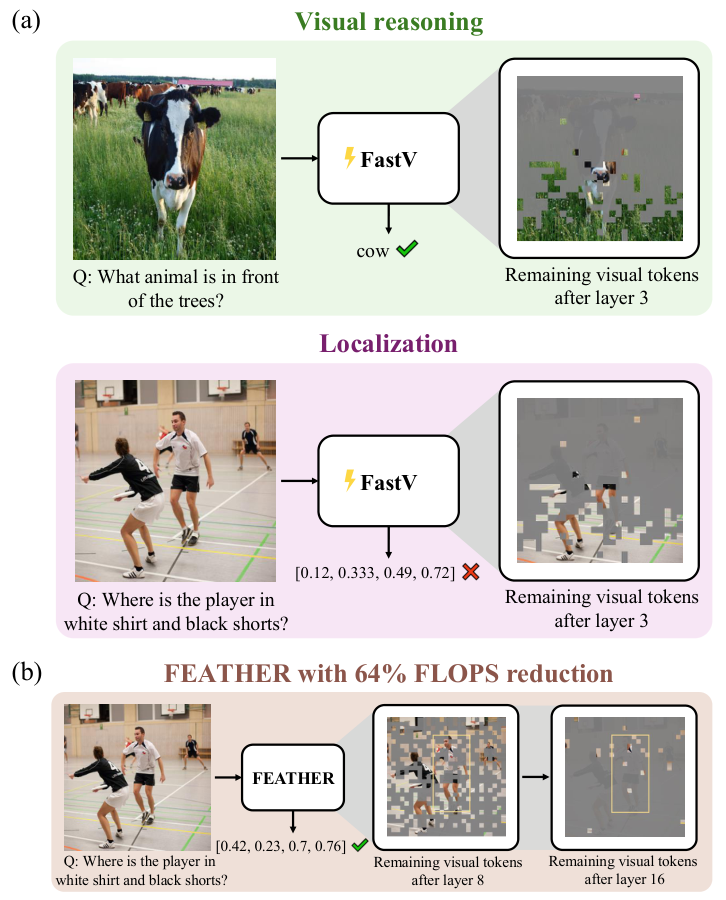

Figure 1. VQA·localization 실패 사례와 FEATHER 개요. [PDF p.1, §1; 원문 PDF][feather-main]

Figure 1(a)의 첫 예는 “나무 앞에 있는 동물은 무엇인가?”라는 일반 VQA다. FastV는 이미지 위쪽 토큰을 대부분 버려도 소(cow)의 일부 토큰과 언어적 단서만으로 `cow`를 맞힌다. 출력은 한 단어 범주이므로 나무의 정확한 경계나 모든 물체 위치를 보존할 필요가 없다. [PDF p.1, Fig.1(a)]

둘째 예는 “흰 셔츠와 검은 반바지를 입은 선수는 어디에 있는가?”라는 localization이다. 정답은 `[x_min, y_min, x_max, y_max]` 꼴의 경계상자다. FastV가 위쪽 토큰을 체계적으로 버리면 해당 선수의 상체·상단 경계가 사라지고, 범주를 짐작하는 것만으로는 IoU 기준을 통과할 수 없다. Figure 1의 FastV 예측 `[0.12, 0.333, 0.49, 0.72]`는 실패하고, FEATHER 예측 `[0.42, 0.23, 0.7, 0.76]`는 정답 영역을 훨씬 잘 덮는다. [PDF p.1, Fig.1(a–b)]

이 대비가 논문의 핵심이다.

- 일반 VQA는 **정답에 필요한 최소 의미 단서**만 살아 있어도 맞을 수 있다.
- localization은 **대상의 의미와 위치·범위**를 함께 보존해야 한다.
- 따라서 같은 토큰 제거율도 task의 시각적 충분조건에 따라 전혀 다른 오류 곡선을 만든다.

### 2.3 한계 → 연구 질문 → 가설 → 설계 선택

| 연결 단계 | 내용 |
|---|---|
| 기존 한계 | 얕은 층 attention score가 실제 중요도를 잘 나타낸다는 보장이 없다. 그럼에도 benchmark 점수가 유지되면 선택 규칙의 결함이 가려진다. |
| 연구 질문 1 | early pruning의 영향은 모든 vision-language task에서 비슷한가? |
| 관찰 | 75% 프루닝에서 대부분 benchmark는 작게 하락하지만 TextVQA와 localization은 크게 붕괴한다. |
| 연구 질문 2 | localization 붕괴는 단순히 토큰 수 부족 때문인가, 잘못된 토큰 선택 때문인가? |
| 관찰 | 얕은 층에서 남은 토큰이 이미지 하단에 몰리고, 깊은 층일수록 편향과 성능 손실이 줄어든다. |
| 저자 가설 | raster-scan된 이미지 토큰 뒤에 text가 오므로, 마지막 text query와 위치상 가까운 하단 이미지 토큰이 RoPE의 장거리 감쇠 때문에 과대평가된다. |
| 설계 선택 1 | 선택 점수 계산에서만 RoPE를 빼는 $`\phi_{-R}`$를 사용한다. |
| 설계 선택 2 | 초기 attention이 아직 의미적 localization에 충분하지 않을 수 있으므로 stride 기반 균일 표본을 합쳐 전역 coverage를 보장한다. |
| 설계 선택 3 | 깊은 층에서 attention criterion이 좋아진다는 결과를 이용해 두 번째 단계에서 더 공격적으로 줄인다. |

이 설계는 “early pruning을 포기하고 늦게만 자르자”가 아니다. 초기에 비교적 완만하게 줄여 계산을 아끼되, 의미적 선택이 성숙한 뒤 더 세게 줄이는 것이 제목의 “feather the throttle” 비유다. [PDF p.2, §1; p.7, §4.2]

---

## 3. 저자의 핵심 주장, 근거, 범위와 한계

| 주장 | 핵심 근거 | 주장 범위 | 검토 |
|---|---|---|---|
| early visual token pruning의 효과는 task마다 크게 다르다. | Figure 2의 $`K=3`$, $`R\in\{0.25,0.5,0.75,0.9\}`$ sweep. 75% 제거 시 localization 4종은 86.0–91.0% 상대 하락, 비-localization 다수는 0.1–7.9% 하락. | 단일 Prism-SigLIP/Llama-2-7B 계열과 12개 benchmark. | [저자 보고] 강한 현상 기술. 다른 VLM·해상도·prompt 형식으로 자동 일반화할 수 없다. |
| 초기 attention criterion은 이미지 하단 토큰을 편향적으로 남긴다. | $`K=3,R=0.75`$에서 평균 선택 y 위치가 이미지 높이의 80.7%, chi-square $`p\lt 0.05`$; Figure 3(b) heatmap. | 평가한 모든 dataset 예시를 평균한 분포. | [저자 보고] 비균일성은 확인하지만 검정 통계량·자유도·bin·표본 수가 없어 효과 크기와 검정 설계를 재현하기 어렵다. |
| 하단 편향의 원인은 RoPE 장거리 감쇠다. | raster 순서 논리, 얕은 층의 단거리 강조 선행연구, $`\phi_{-R}`$ 개입 후 $`K=3`$ localization 평균 5.9→16.7, 깊은 층에서 편향 감소. | 마지막 text token attention을 criterion으로 쓰는 이 구조. | [리뷰어 해석] 인과 근거는 중간 이상이지만 완결적이지 않다. scan order 반전, text/image 순서 교환, RoPE 주파수 sweep 같은 직접 대조가 없다. RoPE 제거는 위치 감쇠 외의 attention geometry도 바꾼다. |
| 일반 VQA의 높은 점수는 얕은 층 정보 전달보다 benchmark의 낮은 fine-grained grounding 요구에서 온다. | 원래 FastV가 남긴 토큰만 입력 전부터 제공한 조건과 얕은 층 후 pruning 조건의 성능이 거의 같음(Figure 4). text-only와는 다수 task에서 차이가 남음. | 평가한 benchmark와 저장된 선택 mask. | [리뷰어 해석] “해당 benchmark의 이 모델·prompt에서 fine-grained 정보가 추가로 필요하지 않았다”는 결론은 강하다. benchmark 전체가 본질적으로 무의미하다고 확대하면 안 된다. |
| RoPE-free criterion과 uniform ensemble은 초기 프루닝을 개선한다. | Table 1: $`K=8`$ localization 평균 $`\phi_{-R}=27.3`$, uniform=30.3, ensemble=35.6. 보충 Table A1의 DINOv2+SigLIP에서도 같은 방향. | 두 vision encoder 설정, 12 benchmark. | [저자 보고] 방향성 재현은 좋다. 그러나 seed·오차막대·통계검정·hyperparameter 선택 절차는 미기재다. |
| FEATHER는 비슷한 이론 FLOPs에서 FastV보다 localization 평균이 5배 넘게 높다. | FastV 5.9 vs FEATHER 39.3, 이론 감소 68% vs 64%; PyramidDrop 28.9 at 65%. [Table A2] | 저자 모델과 평가 protocol. | [검산] $`39.25/5.9=6.65\times`$이다. “5× improvement”는 배수 표현이라 낮은 FastV 분모의 영향을 크게 받는다. 절대 차이 `+33.35`점도 같이 보는 편이 정직하다. |
| 64% FLOPs 설정에서 layer 16 뒤 원래 시각 토큰의 3.3%만 남겨도 baseline 대비 localization 평균 하락은 26%다. | baseline 53.2, FEATHER 39.3; Figure 1, §4.3. | 후반 16개 LLM 층에 대한 token 비율. | [검산] $`(53.225-39.25)/53.225=26.26\%`$. “3.3%”는 모든 층 평균 token 비율이 아니라 두 번째 프루닝 뒤의 비율이다. |
| 실제 실행시간도 개선된다. | 보충 Table A2/Figure A1: L40S 전체 suite GPU-hours baseline 20.3, FEATHER 15.7(64% FLOPs), 16.5(48%). | 한 L40S에서의 총 평가 runtime. | [저자 보고] end-to-end성 단서는 있으나 요청당 latency·TTFT·TPOT·throughput·peak memory가 없고 반복 측정도 없다. “서비스 latency 64% 감소”로 바꿔 말할 수 없다. |

---

## 4. 선수 지식과 통합 notation/shape 사전

### 4.1 토큰과 step의 단위

| 기호/용어 | 뜻 | shape·단위 | 주의 |
|---|---|---|---|
| $`x_{\mathrm{img}}`$ | 입력 이미지 | 논문은 단일 샘플; 구현상 $`[B,3,H,W]`$ | 기본 모델은 384px naive resize를 사용한다고 공식 설정에 기록되어 있다. |
| $`x_{\mathrm{prompt}}`$ | 텍스트 prompt token id | $`[B,L_t]`$ | $`L_t`$는 dataset 질문과 prompt template에 따라 달라진다. |
| $`f`$ | pretrained vision backbone | SigLIP ViT-SO400M | 본문 기본 실험. 보충 A1은 DINOv2+SigLIP. |
| $`z_{\mathrm{img}}`$ | vision feature | $`[B,n,d_{\mathrm{vision}}]`$ | 논문 식은 batch 차원을 생략한다. |
| $`p`$ | vision-to-LLM adapter | 마지막 차원 $`d_{\mathrm{vision}}\to d_{\mathrm{text}}`$ | 본문은 “one-layer MLP with GELU”라고 쓴다. 공개 구현의 `MLPProjector`는 Linear–GELU–Linear다. 용어 차이를 §10에서 다룬다. |
| $`h_{\mathrm{img}}`$ | projected image embeddings | $`[B,n,d]`$ | $`d=d_{\mathrm{text}}`$. |
| $`h_{\mathrm{prompt}}`$ | prompt embeddings | $`[B,L_t,d]`$ | image tokens 뒤에 이어진다. |
| $`n`$ | 최초 image token 수 | token/sample | SigLIP 384px, patch-14 설정과 stride-2가 196개라는 원문을 종합하면 $`27\times27=729`$개다. 이는 [공식 코드/구성으로 확인한 해석]이며 본문이 $`n=729`$라고 직접 쓰지는 않는다. |
| $`T`$ | LLM transformer layer 수 | layer | Llama 2 7B 표준 설정은 32층. FEATHER 논문은 기호만 정의하고 숫자를 본문에 쓰지 않는다. |
| $`K`$ | 프루닝 위치 | LLM layer index | 본문은 “after layer $`K`$”. 공식 구현은 해당 layer를 실행하기 직전에 이전 layer 상태로 점수를 계산한다. 0/1-based 표현을 재현 시 확인해야 한다. |
| $`R`$ | 제거 비율 | fraction 또는 percent | $`R=0.75`$이면 75% 제거, 25% 유지. 코드의 `fastV_ratio` 입력은 제거율이지만 내부 변수는 `1-R`, 즉 유지율이다. |
| $`\hat n`$ | 1단계 뒤 image token 수 | token/sample | $`(1-R)n`$; 정수 top-k에서는 내림이 들어간다. |
| $`d`$ | LLM hidden width | feature | Llama 2 7B checkpoint 기준 4096. |
| $`m`$ | FFN intermediate width | feature | Llama 2 7B 기준 11008. 논문 Eq.(1)은 고전적 2-linear FFN 비용으로 근사한다. |
| $`B`$ | batch size | sample/batch | 논문 미기재. 공개 평가 코드 기본값은 device batch size 1. |
| $`H_a`$ | attention head 수 | head | 논문 미기재; 점수는 head 평균을 취한다. |
| $`d_h`$ | head dimension | feature/head | $`d/H_a`$. |
| $`\phi`$ | pruning criterion | 규칙 | 점수 함수 자체 또는 규칙을 가리킨다. |
| $`g_\phi`$ | criterion에 따른 ranking 함수 | image token index 순위 | top-k 결과가 실제 keep mask가 된다. |
| $`\rho_i`$ | KNN local density | scalar/token | 정확한 정의와 neighbor 수는 본문에 없다. |
| $`\delta_i`$ | 더 높은 density 토큰까지의 거리 지수 | squared feature-distance | Eq.(2). |

**단위 분리:** 이 논문에서 `token`은 시각 patch token 또는 text token이다. `frame`은 없다. `action step`, `environment step`, `action chunk`, `policy refresh`도 없다. LLM의 autoregressive decoding step은 출력 text token 하나를 생성하는 step이지만, 논문은 이를 별도 latency 지표로 분석하지 않는다.

### 4.2 RoPE와 raster-scan이 만나는 지점

2D 이미지 패치를 1D 토큰 열로 만들 때 보통 위에서 아래, 각 행은 왼쪽에서 오른쪽인 raster-scan 순서를 쓴다. 이미지 토큰 뒤에 prompt token을 붙이면 마지막 prompt token의 위치 인덱스는 모든 이미지 토큰보다 크다. 따라서 하단 행의 패치는 상단 행보다 마지막 prompt token과 1D 위치 거리가 짧다.

RoPE는 query와 key를 위치별 회전행렬로 변환한다. 위치 $`a`$의 query와 위치 $`b`$의 key의 내적은 다음 상대 위치 형태로 쓸 수 있다.

```math
\tilde q_a^\top \tilde k_b = (R_a q_a)^\top(R_b k_b) = q_a^\top R_{b-a}k_b.
```

이 식은 **[해설용 수식]**이다. FEATHER의 번호 수식이 아니다. $`R_{b-a}`$ 때문에 score가 상대 거리 $`b-a`$의 영향을 받는다. 저자들이 인용한 장거리 감쇠 관점에서는 얕은 층일수록 멀리 떨어진 상단 패치가 불리하고, 가까운 하단 패치가 의미와 무관하게 유리할 수 있다. [PDF p.5–6, §3.3–4.1]

단, “RoPE이면 언제나 모든 query-key 쌍에서 attention이 거리와 함께 단조 감소한다”는 정리로 이해하면 안 된다. 실제 score는 content vector, head별 주파수, 학습된 projection과 softmax 경쟁의 함수다. 논문의 주장은 평균적 장거리 감쇠가 이 특정 ranking rule에 구조적 bias를 만든다는 경험적 설명이다.

### 4.3 localization metric이 더 엄격한 이유

RefCOCO 계열 구현은 예측 box와 정답 box의 IoU가 0.5 이상이면 정답으로 센다. OCID-Ref는 clutter 때문에 표준 protocol상 IoU 0.25 이상을 사용한다. [공식 코드 확인]

```math
\mathrm{IoU}(B_p,B_g)=\frac{|B_p\cap B_g|}{|B_p\cup B_g|}.
```

이 식은 **[해설용 수식]**이다. 예를 들어 정답이 이미지 상단에 있고 하단 token만 남으면 물체 종류를 맞히더라도 $`B_p`$의 위치가 틀려 교집합이 작아진다. 반면 “무슨 동물인가?”는 `cow`라는 category evidence 하나만 남아도 맞을 수 있다. TextVQA 역시 OCR-system token을 prompt에서 제거했기 때문에 특정 글자 영역을 직접 읽어야 하며, 그래서 일반 VQA보다 localization과 비슷한 민감도를 보인다.

---

## 5. 원문의 모든 수식과 계산 역할

### 5.1 §3.1의 비번호 VLM 식: 입력에서 출력까지

#### 식 A: vision encoding

[PDF p.3, §3.1, 비번호 식]

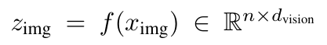

원문 비번호 식. Vision feature와 차원. [PDF p.3, §3.1; 원문 PDF][feather-main]

```math
z_{\mathrm{img}}=f(x_{\mathrm{img}})\in\mathbb{R}^{n\times d_{\mathrm{vision}}}.
```

항별 의미는 다음과 같다.

- $`x_{\mathrm{img}}`$: 전처리된 이미지.
- $`f`$: frozen pretrained vision backbone.
- $`n`$: 패치 토큰 수.
- $`d_{\mathrm{vision}}`$: vision encoder feature dimension.
- $`z_{\mathrm{img}}[i]`$: $`i`$번째 패치의 시각 feature vector.

연산 순서는 `resize/normalize → patchify → ViT blocks → patch features`다. 논문은 class token 포함 여부, 어느 SigLIP layer의 feature인지, $`d_{\mathrm{vision}}`$ 값을 본문에 쓰지 않는다. 공개 Prismatic 코드에서 선택된 backbone의 intermediate patch feature를 쓰지만, 논문만으로는 정확한 차원을 복원할 수 없다.

학습 시 $`f`$는 frozen이므로 loss gradient가 $`z_{\mathrm{img}}`$까지 계산될 수는 있어도 $`f`$의 parameter는 갱신하지 않는다. 공식 구현은 `torch.set_grad_enabled(vision_backbone_requires_grad)`로 frozen 단계의 graph 생성도 피한다. FEATHER 추론에서는 전체가 inference mode이므로 gradient가 없다.

#### 식 B: adapter projection

[PDF p.3, §3.1, 비번호 식]

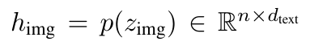

원문 비번호 식. LLM 차원으로의 투영. [PDF p.3, §3.1; 원문 PDF][feather-main]

```math
h_{\mathrm{img}}=p(z_{\mathrm{img}})\in\mathbb{R}^{n\times d_{\mathrm{text}}}.
```

$`p`$는 각 패치 feature를 독립적으로 LLM embedding space로 보낸다. token 축 $`n`$은 유지되고 feature 축만 $`d_{\mathrm{vision}}\to d_{\mathrm{text}}`$로 변한다. 공개 구현의 기본 `MLPProjector`는 다음과 같다.

```math
h_i=W_2\,\mathrm{GELU}(W_1z_i+b_1)+b_2.
```

이 식은 **[공식 코드 기반 해설용 수식]**이다. $`W_1\in\mathbb{R}^{d\times d_{\mathrm{vision}}}`$, $`W_2\in\mathbb{R}^{d\times d}`$다. 논문이 “one-layer MLP”라고 부른 표현과 두 Linear layer 구현 사이에는 용어상 불일치가 있다.

작은 shape 예를 들면 batch를 포함해 $`z`$가 `[1,729,d_vision]`이면 $`p(z)`$는 `[1,729,4096]`이다. $`p`$는 token 간 정보를 섞지 않고 각 token의 channel만 바꾼다. 따라서 spatial mixing은 이미 vision encoder 또는 뒤의 LLM attention에서 일어난다.

#### 식 C: text embedding과 LM 입력

[PDF p.3, §3.1, 비번호 식]

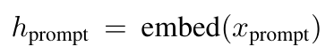

원문 비번호 식. Prompt embedding. [PDF p.3, §3.1; 원문 PDF][feather-main]

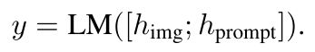

원문 비번호 식. 시각·텍스트 embedding 결합과 출력. [PDF p.3, §3.1; 원문 PDF][feather-main]

```math
h_{\mathrm{prompt}}=\mathrm{embed}(x_{\mathrm{prompt}}), \qquad y=\mathrm{LM}([h_{\mathrm{img}};h_{\mathrm{prompt}}]).
```

세미콜론은 sequence 축 concatenation이다. 공개 구현은 첫 BOS embedding 뒤에 projected patch embeddings를 삽입하고 나머지 prompt embeddings를 붙인다. 즉 보다 정확한 구현 순서는 `[BOS; image patches; rest of prompt]`다. image patch 위치의 label은 `-100`으로 mask되어 language-model loss를 직접 받지 않는다.

학습 loss는 다음 next-token cross entropy다.

```math
\mathcal L_{\mathrm{LM}} =-\sum_{t\in\mathcal T_{\mathrm{answer}}} \log p_\theta(x_t\mid x_{\lt t},x_{\mathrm{img}}).
```

이 식은 **[해설용 수식]**이다. 논문은 별도의 FEATHER loss를 제시하지 않는다. FEATHER의 top-k는 inference-time discrete selection이므로 이를 학습시키는 gradient path가 없다.

### 5.2 attention criterion: 원문 설명을 tensor 연산으로 풀기

원문은 $`\phi_{\mathrm{original}}`$을 “마지막 text token이 받은/보낸 attention score”라는 문장으로 정의하며 별도 번호 식을 주지 않는다. 공식 구현을 기준으로 정확히 쓰면 pruning 직전 hidden state $`H\in\mathbb{R}^{B\times L\times d}`$를 input RMSNorm한 뒤 다음을 계산한다. [PDF p.3, §3.1; p.6, §4.1]

```math
\begin{aligned} Q&=\mathrm{reshape}(HW_Q)\in\mathbb{R}^{B\times H_a\times L\times d_h},\\ K&=\mathrm{reshape}(HW_K)\in\mathbb{R}^{B\times H_{kv}\times L\times d_h}. \end{aligned}
```

GQA의 key/value head는 `repeat_kv`로 query head 수에 맞춘다. 마지막 text query만 $`Q_{:,:,-1:,:}`$, image token key만 $`K_{:,:,\mathcal I,:}`$로 뽑는다.

```math
\begin{aligned} s_i^{(h)} &=\frac{\tilde q_{\mathrm{last}}^{(h)\top} \tilde k_i^{(h)}}{\sqrt{d_h}},\\ a_i^{(h)} &=\mathrm{softmax}_{i\in\mathcal I}(s_i^{(h)}),\\ \phi_i&=\frac1{H_a}\sum_{h=1}^{H_a}a_i^{(h)}. \end{aligned}
```

모두 **[해설용 수식]**이다. shape은 score가 `[B,H_a,1,n]`, head 평균 후 `[n]`이다. 구현은 image token 사이에서만 softmax한 뒤 head 평균을 취하고 top-k를 고른다. value vector는 이 ranking score 계산에 사용하지 않는다.

- $`\phi_{\mathrm{original}}`$: $`\tilde q=R_{p_q}q`$, $`\tilde k_i=R_{p_i}k_i`$로 RoPE 적용.
- $`\phi_{-R}`$: $`\tilde q=q`$, $`\tilde k_i=k_i`$로 **선택용 score 계산에서만** RoPE 미적용.
- 실제 decoder layer forward: 두 경우 모두 원래 RoPE를 적용한다.

작은 예에서 세 이미지 token의 content score가 RoPE 없이 `[1.2,1.0,0.8]`이고 위치 효과가 `[−0.8,−0.3,+0.4]`처럼 더 가까운 뒤쪽 token을 밀어준다면, 원래 score는 `[0.4,0.7,1.2]`가 되어 의미상 가장 강한 첫 token 대신 마지막 token을 고른다. $`\phi_{-R}`$는 `[1.2,1.0,0.8]` 순위를 회복한다. 이는 작동 원리를 보여 주는 **설명용 예시**이지 논문이 측정한 attention 값이 아니다.

edge case는 다음과 같다.

- 마지막 prompt token이 질문의 핵심 단어가 아닐 수 있다. 그러면 RoPE를 제거해도 query 자체가 task relevance를 충분히 표현하지 못한다.
- head 평균은 일부 localization head의 강한 신호를 다수의 비관련 head가 희석할 수 있다.
- softmax 이전/이후 평균, head max, 여러 text query 평균은 서로 다른 순위를 만들지만 논문은 비교하지 않는다.
- 동점 top-k의 결정 규칙과 attention implementation 차이가 결과를 조금 바꿀 수 있다. 공식 README도 attention implementation에 따라 수치가 약간 달라질 수 있다고 경고한다.

### 5.3 Eq.(1): 이론 FLOPs 감소식

#### 원문 표기

[PDF p.3, §3.1, Eq.(1)]

한 Transformer layer에서 시각 토큰 관련 FLOPs를 다음으로 근사한다.

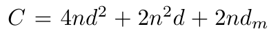

원문 비번호 식. 단일 layer 비용 $`C`$. [PDF p.3, §3.1; 원문 PDF][feather-main]

원문 인라인 식의 마지막 항은 인쇄상 $`2nd_m`$처럼 $`m`$이 아래첨자로 내려가 있다. 같은 문단이 $`m`$을 FFN 중간 차원으로 정의하고 Eq. (1)의 분자는 $`2\hat n d m`$으로 인쇄되어 있으므로, 아래 기존 해설·검산은 곱 $`2ndm`$으로 해석한다. 원문 이미지는 이 표기 차이까지 그대로 보존한다.

```math
C=4nd^2+2n^2d+2ndm.
```

그 뒤 원문 Eq.(1)은 다음과 같이 인쇄되어 있다.

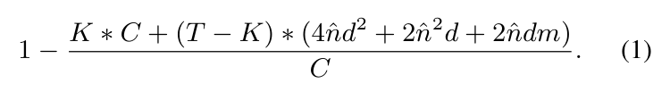

원문 Eq. (1). FLOPs 감소율. [PDF p.3, §3.1; 원문 PDF][feather-main]

```math
1- \frac{ K C+(T-K)(4\hat n d^2+2\hat n^2d+2\hat n d m) }{C}.
```

표기: 1, 원문 표기.

여기서 $`\hat n=(1-R)n`$이다. 원문에는 `(1-R%) * n`처럼 쓰였지만, $`R=0.75`$를 쓰는 실험 문맥에서는 제거율 fraction으로 해석해야 한다.

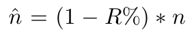

원문 비번호 식. 남은 시각 토큰 수 $`\hat n`$. [PDF p.3, §3.1; 원문 PDF][feather-main]

#### 각 항의 계산

1. $`4nd^2`$: self-attention의 $`Q,K,V,O`$ 네 projection. token마다 $`d\times d`$ 행렬곱 네 번이다.
2. $`2n^2d`$: $`QK^\top`$와 attention-weighted $`AV`$ 두 행렬곱.
3. $`2ndm`$: 고전적인 two-linear FFN의 $`d\to m`$와 $`m\to d`$ projection.
4. $`KC`$: 프루닝 전 $`K`$개 층의 full-token 비용.
5. $`(T-K)C(\hat n)`$: 프루닝 뒤 나머지 층의 reduced-token 비용.
6. `1 - reduced/full`: 감소율.

#### 반드시 알아야 할 원문 불일치

**[검산] Eq.(1)의 분모 $`C`$는 그대로는 잘못이다.** $`C`$를 “한 layer의 FLOPs”라고 바로 앞에서 정의했으므로, $`T`$개 층의 baseline은 $`TC`$다. 인쇄식대로라면 $`K\gt 1`$에서 분자가 이미 $`C`$보다 커져 감소율이 큰 음수가 된다. 표의 68%, 56% 값을 재현하려면 다음처럼 읽어야 한다.

```math
\boxed{ \mathrm{Reduction}_{\mathrm{1stage}} =1- \frac{KC+(T-K)C(\hat n)}{TC} } \qquad\text{[해설용 교정식]}
```

원문을 조용히 수정한 것이 아니라, **원문 표기와 표 수치를 동시에 만족하는 가능한 해석**을 분리해 적은 것이다.

또 다른 근사 한계가 있다.

- 실제 Llama 2 FFN은 SwiGLU 계열로 gate/up/down 세 projection을 사용하므로 고전적 $`2ndm`$보다 항이 하나 더 필요하다. 논문 식은 구현의 정확한 Llama FLOPs라기보다 공통 Transformer 근사다.
- text token 수가 식에 없다. 실제 self-attention은 image와 text를 합친 $`L=n+L_t`$에 작용한다.
- vision encoder, adapter, lm_head, KV cache, autoregressive decoding, 선택 score, `topk`, `unique`, gather/scatter 비용이 빠져 있다.
- “FLOPS” 대문자 표기는 연산량을 뜻하지만, multiply-add를 한 번 또는 두 FLOP로 세는 convention도 명시되지 않았다. 비율에서는 일부 상쇄되지만 절대 FLOPs에는 중요하다.

#### 숫자 예시와 표 재현

Llama 2 7B의 $`T=32,d=4096,m=11008`$, SigLIP의 $`n=729`$를 넣고 논문 근사를 그대로 사용하면:

```math
C(729)=119{,}015{,}350{,}272,
```

```math
C(0.25\times729)=28{,}937{,}544{,}192.
```

$`K=3,R=0.75`$에 대한 교정식은

```math
1- \frac{3C(729)+29C(182.25)}{32C(729)} =0.6859\approx68.6\%.
```

이는 Table 1의 68%와 rounding 범위에서 일치한다. $`K=8,R=0.75`$이면 56.76%로 Table 1의 56%와 일치한다. 따라서 분모가 $`TC`$여야 한다는 해석은 단순 추측이 아니라 표 숫자로 검증된다.

edge case도 교정식으로 확인할 수 있다.

- $`R=0`$: $`\hat n=n`$, reduction $`=0`$.
- $`K=T`$: 마지막 층 뒤에 잘라도 계산을 이미 끝냈으므로 reduction $`=0`$.
- $`R=1,K=0`$: 이 근사에서 image-token LLM 비용이 모두 사라져 reduction $`=1`$이지만, 실제 시스템의 vision encoder/text/decode 비용은 남는다.
- $`n`$이 작고 $`d,m`$이 매우 크면 linear-in-$`n`$ projection/FFN 항이 지배해, token 수 75% 감소가 FLOPs 75% 감소보다 작을 수 있다.

#### FEATHER 2단계용 일반화

첫 프루닝을 $`K_1=8`$, 둘째를 $`K_2=16`$이라 하고 실제 남은 token 수를 $`n_1,n_2`$라 하면:

```math
\mathrm{Reduction}_{\mathrm{2stage}} =1- \frac{ K_1C(n)+(K_2-K_1)C(n_1)+(T-K_2)C(n_2) }{TC(n)}. \qquad\text{[해설용 수식]}
```

공식 FEATHER script는 $`R=0.7`$, stride 3을 사용한다. 첫 단계 top-k는 약 $`0.3n`$, 균일 격자는 $`9\times9=81`$개이며 중복을 제거한다. top-k와 균일 표본이 무작위 독립이라고 단순 가정한 기대 합집합 비율은

```math
0.3+\frac19-0.3\cdot\frac19=0.377\overline7.
```

따라서 $`n_1\approx275.4`$이고, 둘째 단계가 그중 $`0.3^2=0.09`$를 남기면 $`n_2\approx24.8`$, 원래의 약 3.40%다. 이를 위 식에 넣으면 64.13%가 되어 저자 보고 64%와 맞는다. 실제 $`n_1,n_2`$는 top-k와 stride 표본의 중복 및 정수 내림 때문에 샘플별로 달라질 수 있다.

### 5.4 Eq.(2): KNN density peak의 거리 지수

[PDF p.6, §4.1, Eq.(2)]

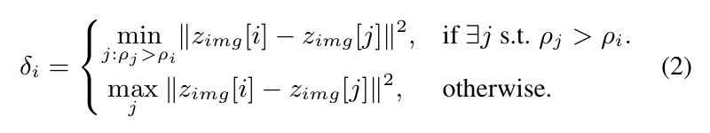

원문 Eq. (2). Density peak 거리 지수. [PDF p.6, §4.1; 원문 PDF][feather-main]

```math
\delta_i= \begin{cases} \displaystyle \min_{j:\rho_j\gt \rho_i} \left\lVert z_{\mathrm{img}}[i]-z_{\mathrm{img}}[j]\right\rVert_2^2, & \text{if }\exists j\text{ such that }\rho_j\gt \rho_i,\\[8pt] \displaystyle \max_j \left\lVert z_{\mathrm{img}}[i]-z_{\mathrm{img}}[j]\right\rVert_2^2, & \text{otherwise.} \end{cases} \qquad\text{(2)}
```

한 줄씩 해석하면 다음과 같다.

1. $`z_{\mathrm{img}}[i]\in\mathbb{R}^{d_{\mathrm{vision}}}`$는 $`i`$번째 visual feature다.
2. $`\rho_i`$는 K-nearest neighbors로 구한 local density scalar다.
3. 자신보다 density가 높은 token이 있으면, 그중 feature space에서 가장 가까운 token까지의 제곱거리를 $`\delta_i`$로 쓴다.
4. 자신이 최고 density라서 더 높은 token이 없으면, 전체 token 중 가장 먼 점까지의 제곱거리를 준다.
5. 최종 중요도는 $`\rho_i\delta_i`$다. density가 높으면서 다른 고밀도 군집과 멀리 떨어진 “density peak”를 선호한다.

shape과 단위는 $`\rho_i,\delta_i,\rho_i\delta_i`$ 모두 token당 scalar다. $`\delta_i`$의 단위는 embedding coordinate의 제곱 거리다. embedding scale을 두 배로 하면 $`\delta_i`$는 네 배가 되므로 feature normalization 여부가 중요하지만 원문은 명시하지 않는다.

작은 예를 들자. 세 token A, B, C의 density가 `[0.9, 0.7, 0.4]`, 제곱거리가 $`d^2(A,B)=1`$, $`d^2(A,C)=9`$, $`d^2(B,C)=4`$라 하자.

- A는 더 높은 density가 없으므로 $`\delta_A=\max(1,9)=9`$, score $`=0.9\times9=8.1`$.
- B는 A가 더 조밀하고 가장 가까우므로 $`\delta_B=1`$, score $`=0.7`$.
- C는 더 조밀한 A/B 중 B가 가까우므로 $`\delta_C=4`$, score $`=1.6`$.

따라서 A와 C가 서로 다른 대표 군집 중심처럼 먼저 선택될 수 있다.

원문의 재현 한계는 분명하다.

- $`\rho_i`$의 정확한 수식이 없다.
- KNN의 $`k`$, 거리 normalization, self-neighbor 포함 여부가 없다.
- 동일한 최대 density가 여러 개일 때 `>` 조건 때문에 모두 두 번째 branch로 가는지 tie-breaking이 없다.
- Table 1에서는 196개 token을 선택한다고만 하며 계산 비용 자체는 FLOPs 표에 거의 반영되지 않는다.

### 5.5 균일 표본과 ensemble의 비번호 규칙

$`\phi_{\mathrm{uniform}}`$은 2D grid에서 고정 stride로 뽑는다. 27×27 grid에 stride 2면 행·열 인덱스 `0,2,…,26`을 선택해 14×14=196개다. coverage는 보장하지만 특정 작은 물체 주변을 조밀하게 남기는 능력은 없다. [PDF p.6, §4.1]

ensemble은 score를 더하는 방식이 아니라 **index set의 합집합**이다.

```math
\mathcal I_{\mathrm{ens}} =\mathrm{TopK}(\phi_{-R},k) \cup \mathcal I_{\mathrm{stride}}. \qquad\text{[해설용 수식]}
```

공식 구현은 `torch.cat → torch.unique(sorted=True)`로 중복을 제거한다. 따라서 이름의 `+`는 score addition이 아니다. text-conditioned top-k가 좁은 중요 영역을, uniform subset이 화면 전체의 안전망을 제공한다.

두 번째 단계의 원문 표현 “retain $`(1-R)^2\%`$ of the remaining tokens”는 문자 그대로 읽으면 $`R=0.7`$일 때 0.09%라는 잘못된 뜻이 된다. 공식 코드는 `current_count × (1-R)^2`, 즉 **남은 token의 9%**를 선택한다. 원래 token 대비 비율은 첫 단계 합집합 크기에 0.09를 곱한 값이다. [PDF p.7–8, §4.2; 공식 코드 확인]

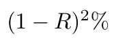

원문 비번호 식. 두 번째 단계의 유지 비율 표기. [PDF p.8, §4.2의 계속; 원문 PDF][feather-main]

---

## 6. 원문 순서대로 읽는 상세 해설

### 6.1 Abstract

초록은 기존 token pruning 연구가 주로 VQA accuracy를 유지한다는 사실을 강조했지만, 시각 정보가 실제로 얼마나 보존됐는지는 충분히 보지 않았다고 문제를 제기한다. 저자들은 visual localization을 더 엄격한 probe로 사용해 early-layer pruning이 매우 해롭고, 그 원인이 RoPE가 섞인 attention criterion의 spatial bias라고 주장한다. 해법 FEATHER는 RoPE-free attention과 uniform coverage를 결합하고, layer가 깊어질수록 pruning을 강화한다. 결과 문구인 “over 5× improvement”는 새 정확도를 기존 정확도로 나눈 배수이며, §8에서 절대점수 차이와 함께 다시 계산한다. [PDF p.1, Abstract]

### 6.2 §1 Introduction

Introduction의 논리 구조는 세 단계다.

1. 이미지 토큰 때문에 LLM 계산량이 커지므로 training-free pruning이 매력적이다.
2. 기존 결과가 좋은 이유를 “토큰이 정말 중복적이어서”라고 해석하려면, 위치·경계를 요구하는 task에서도 정보가 보존돼야 한다.
3. 실제로 localization에서는 성능이 붕괴하므로 criterion 자체와 benchmark choice를 다시 봐야 한다.

Figure 1은 이 문제와 제안법을 한 장에 묶는다. (a)는 FastV의 VQA 성공과 localization 실패, (b)는 FEATHER의 box output과 layer 8·16 뒤 keep mask를 보여 준다. Figure 1에 (c) subplot이나 layer별 토큰 수 곡선은 없다. Introduction의 기여는 task-dependent 분석, RoPE bias 진단, benchmark 한계 확인, criterion 개선과 coarse-to-fine FEATHER로 이어진다. [PDF p.1–2, Fig.1, §1]

### 6.3 §2 Related Works

§2는 선행연구를 두 축으로 나눈다.

- **efficient VLM**: 작은 언어모델, 효율적인 vision encoder, instruction tuning, dynamic resolution 같은 모델 설계·학습 축.
- **visual token pruning**: similarity, attention, learned selector, token merging, pyramid schedule 등 추론 중 token 수를 줄이는 축.

FEATHER의 위치는 후자 중에서도 **LLM 내부, training-free, attention-based pruning criterion 교정**이다. 새로운 vision encoder나 learned gate를 훈련하지 않고 기존 Prism checkpoint의 decoder 실행을 수정한다. FastV와 같은 단일-stage attention pruning, PyramidDrop 같은 multi-stage pruning, KNN density와 uniform sampling을 직접 비교한다. [PDF p.2–3, §2]

이 절이 해 주지 않는 것도 중요하다. 각 선행 방법과 동일한 kernel fusion·memory allocation을 보장하는 시스템 비교가 아니며, mobile/edge 런타임이나 VLA control 논문과 비교하지 않는다. 따라서 FEATHER의 novelty는 “최초의 token pruning”이 아니라 **RoPE-free criterion을 이용해 early attention의 공간 편향을 교정하고, coverage와 depth schedule을 함께 구성한 것**에 있다.

### 6.4 §3.1 Preliminary

§3.1은 $`f\rightarrow p\rightarrow\mathrm{LM}`$의 adapter-style VLM을 정의하고 Eq.(1)로 한 transformer layer의 image-token 관련 비용을 근사한다. 이후 pruning framework는 layer $`K`$ 뒤에 criterion $`\phi`$로 token ranking $`g_\phi`$를 만들고, 하위 $`R\%`$를 버리는 것으로 설명한다. [PDF p.3, §3.1]

여기서 “image-token 관련”이라는 수식 범위를 놓치면 안 된다. 실제 sequence에는 prompt token도 있고 generation이 시작되면 KV cache와 새 text token이 추가된다. Eq.(1)은 이를 생략한 정적 prefill 근사다. 또한 $`K`$ 이전 layer는 full $`n`$, 이후 layer는 $`\hat n`$이라는 piecewise schedule을 가정한다.

### 6.5 §3.2 Task-dependent 성능 분석

저자들은 Prism-SigLIP+Llama-2-7B에 FastV를 넣고 $`K=3`$, $`R\in\{0.25,0.50,0.75,0.90\}`$를 sweep한다. 네 localization dataset과 여덟 non-localization benchmark를 비교한 Figure 2에서, 75% 제거 시 localization은 baseline 대비 86.0–91.0% 상대 하락한다. 반면 대부분의 non-localization task는 0.1–7.9% 하락이고 TextVQA만 42.0%로 크게 떨어진다고 본문은 보고한다. [PDF p.4, Fig.2, §3.2]

TextVQA가 예외인 이유에 대한 저자 설명은 외부 OCR token을 prompt에 넣지 않았기 때문에 local text region을 시각 토큰에서 읽어야 한다는 것이다. 이 결과는 “VQA 대 localization”이라는 이름보다 **정답을 만들기 위해 얼마나 세밀한 공간·문자 정보가 필요한가**가 더 근본적인 분기임을 시사한다.

다만 Figure 2는 한 모델, 한 prompt/evaluator, 한 $`K`$에서의 상대 변화다. 각 점의 seed 분산이나 신뢰구간이 없으며, 90% 제거에서 생성 포맷 실패가 localization 하락에 얼마나 기여했는지도 분리하지 않는다.

### 6.6 §3.3 Attention criterion의 spatial bias

Figure 3(a)는 “a bowl of blueberries”를 대상으로 $`K=3,8,16,24`$에서 남긴 토큰의 실제 위치를 그린다. Raster-scan 뒤 마지막 prompt query와 1D 위치상 가까운 image 하단이 RoPE 때문에 유리할 수 있다는 가설은 §3.3 본문의 설명이다. Figure 3(b)는 실제 $`K=3,R=0.75`$ keep frequency가 하단에 몰리는 것을 보여 주며, 선택 token의 평균 y 좌표는 이미지 높이의 80.7%다. 저자는 균일분포와의 chi-square test에서 $`p\lt 0.05`$라고 보고한다. [PDF p.4–5, Fig.3, §3.3]

Figure 3(c)의 위·아래 plot은 각각 localization과 non-localization 평균 정확도 대 FLOPs 감소율이며, Figure 3(b)의 heatmap은 $`K`$를 뒤로 옮길수록 spatial bias가 약해짐을 보여 준다. Figure 3에 (d)는 없다. 이는 더 깊은 representation이 semantic relevance를 잘 표현한다는 해석과 맞지만, 동시에 $`K`$가 커질수록 pruning 전 full-token 계산이 늘어 FLOPs 절감이 줄어드는 trade-off가 있다.

검정 해석은 제한적으로 해야 한다. $`p\lt 0.05`$는 “균일하지 않음”에 대한 증거이지, 편향의 크기나 RoPE가 유일한 원인임을 증명하지 않는다. bin 수, 자유도, 검정통계량, 관측 독립성, 총 sample 수가 기재되지 않아 정확한 통계 재현도 어렵다.

### 6.7 §3.4 왜 VQA 점수는 살아남는가

Figure 4의 핵심 대조는 다음 세 조건이다.

1. 정상 FastV: full visual sequence가 layer $`K`$까지 흐른 뒤 선택한다.
2. **pre-prune control**: 정상 FastV가 선택했을 바로 그 token subset만 입력 시점부터 제공한다.
3. text-only: 시각 토큰을 제거한다.

pre-prune과 정상 FastV의 성능이 거의 같다는 결과는, 버려진 token의 정보가 초기 layer에서 남은 token으로 충분히 전달돼서 성능이 유지됐다는 설명을 약화한다. text-only보다 시각 token subset이 대체로 낫기 때문에 완전한 언어 prior만으로 설명할 수도 없다. 가장 타당한 범위의 결론은 **이 모델과 benchmark에서 선택된 희소 시각 단서만으로도 답을 만들 수 있었다**는 것이다. [PDF p.5, Fig.4, §3.4]

VizWiz·AI2D 같은 일부 task의 작은 차이는 plot 해상도와 evaluator noise까지 고려해야 하며, 이 control 하나로 모든 VQA benchmark가 fine-grained vision을 요구하지 않는다고 일반화할 수는 없다.

### 6.8 §4.1 Improved Visual Token Pruning Criterion

이 절은 세 criterion을 비교한다.

- $`\phi_{-R}`$: 마지막 text query–image key attention을 계산할 때 RoPE만 제거한다.
- $`\phi_{\mathrm{KNN}}`$: vision feature의 density peak score $`\rho_i\delta_i`$를 쓴다.
- $`\phi_{\mathrm{uniform}}`$: 27×27 grid를 stride 2로 샘플링해 196개를 남긴다.

Table 1은 같은 $`K`$에서 이들을 평가하고, $`\phi_{-R}+\phi_{\mathrm{uniform}}`$의 index 합집합이 localization과 non-localization 사이에서 가장 좋은 균형을 보인다고 보고한다. KNN은 content 다양성을 노리지만 localization에서 uniform보다 약하고, 정확한 density 구현이 논문에 빠져 있어 재현성도 가장 낮다. [PDF p.6–7, Eq.(2), Table 1, §4.1]

### 6.9 §4.2 FEATHER: Coarse-to-fine Pruning

FEATHER의 layer schedule은 $`K_1=8`$, $`K_2=16`$이다. 공식 평가 설정은 첫 단계에서 제거율 0.7의 RoPE-free top-k와 stride-3 uniform indices를 합치고, 둘째 단계에서 남은 token 수에 $`(1-R)^2=0.09`$를 곱한 개수만 RoPE-free top-k로 남긴다. [PDF p.7–8, §4.2; Fig.1(b), PDF p.1; 공식 코드 확인]

Figure 1(b)와 보충 Figure A4의 FEATHER 열에서 첫 단계는 foreground 후보와 전역 grid를 함께 남기는 **coarse coverage**, 둘째 단계는 deeper attention으로 세밀한 relevant region을 고르는 **fine selection** 역할을 확인할 수 있다. 이 설계는 두 개의 독립 predictor를 학습하는 coarse-to-fine detector가 아니라, 같은 LLM의 서로 다른 depth에서 두 번 index selection을 수행하는 것이다. Figure 5는 이 설계의 성능을 FastV·PyramidDrop과 비교하는 그래프다.

### 6.10 §4.3 FEATHER Evaluation

저자들은 FEATHER를 FastV, PyramidDrop과 비슷한 이론 FLOPs 감소 구간에서 비교한다. 본문은 FEATHER가 FastV 대비 localization 5배 이상, PyramidDrop 대비 36% 상대 향상을 보이며 non-localization 평균은 각각 7.8%, 1.5% 높다고 요약한다. 보충 Table A2에는 모든 dataset과 실제 GPU-hours가 실린다. [PDF p.8, Fig.5, §4.3; Supplement PDF p.1, Table A2]

여기서 §4.3이 보고한 3.3%는 layer 16 뒤 남는 원래 image token 비율이며, Fig.1(b)는 그 mask 예시를 보여 준다. 전체 32층에 3.3%만 사용한다는 뜻도, vision encoder가 96.7% 덜 계산된다는 뜻도 아니다. 첫 8층은 100%, 중간 8층은 첫 합집합, 마지막 16층만 약 3.3%를 쓴다.

### 6.11 §5 Conclusion, Acknowledgments, References

결론은 두 메시지를 반복한다. visual token pruning은 benchmark에 따라 정보 손실이 가려질 수 있으므로 localization 같은 fine-grained task로 평가해야 하고, criterion의 positional bias를 고치면 비슷한 계산량에서도 정보 보존이 개선된다. [PDF p.8, §5]

Acknowledgments는 NSF Grant No. 2026498, Stanford AIMI-HAI Partnership Grant, 그리고 M.E.에 대한 NSF Graduate Research Fellowship Program Grant No. DGE-2146755 지원을 밝힌다. [PDF p.9] 참고문헌은 PDF p.9–10에 44개 항목이 있으며 FastV, PyramidDrop, PruMerge, VisionZip, FasterVLM, RoPE 관련 연구와 VLM benchmark를 포함한다. 별도 supplementary가 첨부본 안에 이어지는 구조는 아니다.

---

## 7. 입력 한 샘플의 forward pass, 학습 상태와 의사코드

### 7.1 한 샘플이 실제로 지나가는 경로

예시 입력을 이미지 `I`, 질문 “Where is the player in a white shirt and black shorts?”라고 하자. batch size 1, 384×384 입력, 729개 image token이라는 공식 설정 기반 예를 쓴다.

1. **전처리**: 이미지를 384×384로 naive resize하고 정규화한다. shape은 $`[1,3,384,384]`$.
2. **vision encoder**: SigLIP ViT-SO/14가 patch representation $`z_{\mathrm{img}}`$를 만든다. 예시 shape은 $`[1,729,d_{\mathrm{vision}}]`$.
3. **projector**: Linear–GELU–Linear adapter가 $`h_{\mathrm{img}}\in\mathbb{R}^{1\times729\times4096}`$로 맞춘다.
4. **텍스트 결합**: BOS·image embeddings·prompt embeddings를 이어 $`[1,1+729+L_t,4096]`$ sequence를 만든다. attention mask와 position ids도 같은 길이로 만든다.
5. **layer 0–7**: 모든 image token을 포함해 정상 Llama decoder block을 실행한다.
6. **layer 8 직전 선택**: 이전 hidden state를 layer norm한 뒤 $`q=W_qh`$, $`k=W_kh`$를 계산한다. 마지막 text token query와 image key의 $`qk^\top/\sqrt{d_h}`$에 softmax를 취하고 head 평균을 낸다. 이 **선택용 경로에는 RoPE를 적용하지 않는다**.
7. **첫 keep set**: score 상위 약 $`0.3n`$와 2D stride-3 grid를 합치고 중복을 제거한다. non-image token은 전부 유지한다. index를 정렬해 raster/text 상대 순서를 보존하고 hidden state, mask, position ids를 동일하게 gather한다.
8. **layer 8–15**: 축소 sequence를 정상 decoder block—실제 RoPE 포함—으로 처리한다.
9. **layer 16 직전 선택**: 다시 현재 hidden state에서 RoPE-free score를 계산한다. 현재 image token 수의 $`0.09`$개만 top-k로 유지하며 이번에는 uniform set을 합치지 않는다.
10. **layer 16–31와 생성**: 더 작은 visual context로 남은 prefill을 끝내고, autoregressive하게 text/좌표 token을 생성한다. 공개 평가 wrapper는 기본적으로 `do_sample=False`, 최대 생성 길이 128이다. [공식 코드 확인]

이 경로에서 token score는 prune event마다 한 번만 계산된다. score tensor의 개념적 shape은 $`[B,H_a,1,n_{\mathrm{current}}]`$, head 평균 뒤 $`[B,n_{\mathrm{current}}]`$이다. keep indices는 sample마다 달라질 수 있지만 공개 구현과 평가 기본값은 batch size 1이어서 variable-length batch packing 문제를 피한다.

### 7.2 학습되는 것과 고정되는 것

FEATHER 자체는 **추론 시점 규칙**이므로 추가 dataset, loss, optimizer, backward pass가 없다. 기존 Prism checkpoint 학습과 FEATHER 실행을 분리하면 다음과 같다.

| 구성요소 | 기반 VLM 학습 | FEATHER 적용 시 |
|---|---|---|
| SigLIP vision backbone $`f`$ | frozen | frozen, 하지만 모든 patch를 정상 인코딩 |
| MLP projector $`p`$ | trainable | checkpoint 고정 |
| Llama 2 7B | trainable/fine-tuned | checkpoint 고정 |
| RoPE-free selection | 없음 | 학습 parameter 없음 |
| top-k / stride union | 없음 | 비미분 결정 규칙 |
| 새로운 loss·gradient | 기반 instruction-tuning loss | 없음 |

공개 registry는 `prism-siglip-controlled+7b`를 SigLIP ViT-SO/14 @384px, Llama-2-7B, LLaVA-v1.5 instruction data, single-stage 1 epoch 구성으로 기록한다. 공개 `finetune.py` 경로는 vision backbone을 얼리고 projector와 LLM을 학습한다. 다만 논문 본문은 이 모든 optimizer·batch·학습 seed를 재기술하지 않고 Prismatic VLM 설정을 인용한다. [PDF p.3, §3.1; 공식 코드 확인]

따라서 논문의 “training-free”는 **기반 VLM도 훈련하지 않았다**는 뜻이 아니라, 이미 학습된 VLM 위에 FEATHER를 붙이기 위해 별도 학습이 필요 없다는 뜻이다.

### 7.3 논문과 공개 구현을 합친 의사코드

```text
function FEATHER_FORWARD(image, prompt, R=0.7, K1=8, K2=16, stride=3):
    z_img = frozen_vision_encoder(image)
    h_img = trained_projector(z_img)
    h_txt = token_embedding(prompt)
    h, mask, pos = concat(BOS, h_img, h_txt)
    image_idx = indices_of_image_tokens(h)

    for layer in decoder_layers:
        if layer.index == K1:
            score = rope_free_last_text_to_image_attention(layer, h, image_idx)
            k1 = floor(len(image_idx) * (1 - R))
            semantic = topk(score, k1)
            coverage = raster_grid_indices(stride)
            keep_img = sort(unique(semantic union coverage))
            h, mask, pos, image_idx = gather_all_consistently(keep_img)

        if layer.index == K2:
            score = rope_free_last_text_to_image_attention(layer, h, image_idx)
            k2 = floor(len(image_idx) * (1 - R)^2)
            keep_img = sort(topk(score, k2))
            h, mask, pos, image_idx = gather_all_consistently(keep_img)

        h = normal_decoder_layer_with_RoPE(layer, h, mask, pos)

    return greedy_autoregressive_decode(h, max_new_tokens=128)
```

`gather_all_consistently`는 선택된 image token뿐 아니라 BOS·text token은 유지하고, hidden state와 attention mask, position ids를 같은 index로 줄여야 한다. 하나라도 어긋나면 score 문제와 무관한 위치·마스킹 버그가 된다. 실제 구현은 sorted unique index를 사용해 원래 sequence order를 지킨다. [공식 코드 확인]

---

## 8. 실험 설계, 데이터셋, 표와 그림의 전체 해석

### 8.1 공통 실험 protocol

기본 모델은 SigLIP ViT-SO400M vision encoder, GELU MLP adapter, Llama 2 7B를 결합한 Prismatic VLM이다. 본문은 single-stage 학습을 사용했다고 밝힌다. 공개 평가 script의 대표 설정은 precision `bfloat16`, device batch size 1, seed 21, greedy decoding이다. [PDF p.3, §3.1; 공식 코드 확인]

| 범주 | 데이터셋 | 공개 평가 split/규모 | 평가량 | 해석 시 주의 |
|---|---|---:|---|---|
| Localization | OCID-Ref | val; 총 수는 논문에 통합 기재되지 않음 | Acc@IoU 0.25 | clutter 환경이라 threshold가 낮다. |
| Localization | RefCOCOg | composite val | Acc@IoU 0.5 | referring expression grounding. |
| Localization | RefCOCO+ | composite val | Acc@IoU 0.5 | 위치어 제한이 있는 표현 분포. |
| Localization | RefCOCO | composite val | Acc@IoU 0.5 | 생성된 좌표의 parse 성공도 영향을 준다. |
| Open VQA | TextVQA | val, 5,000 | VQA accuracy | 외부 OCR prompt token을 쓰지 않는다. |
| Open VQA | GQA | testdev_balanced, 12,578 | accuracy | balanced compositional QA. |
| Open VQA | VQAv2 | val, 214,354 | VQA accuracy | language prior와 soft scoring의 영향 가능. |
| Open VQA | VizWiz | val, 4,319 | VQA accuracy | 저품질 사용자 이미지. |
| Challenge | POPE | 3개 subset × 3,000 | accuracy 계열 | object hallucination probe. |
| Challenge | TallyQA | test; 총 수 미통합 | counting accuracy | simple/complex 구성의 집계 방식 확인 필요. |
| Challenge | VSR | zeroshot-test, 1,222 | accuracy | spatial relation reasoning. |
| Challenge | AI2D | eval; 총 수 미통합 | accuracy | diagram QA. |

규모는 공개 평가 adapter에서 직접 확인되는 항목만 숫자로 썼다. 논문은 12개 dataset의 seed별 반복 수, sampling 여부, confidence interval, hardware software stack을 한 표에 통합하지 않는다. 절대 재현을 위해서는 dataset version과 annotation 변환, prompt template, output parser까지 고정해야 한다.

### 8.2 Figure 2: pruning ratio별 task 민감도

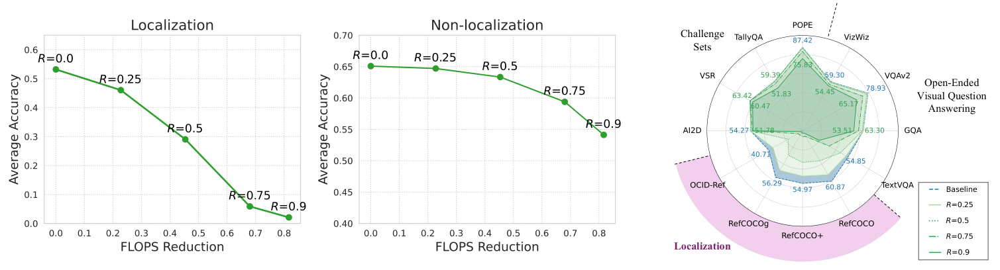

Figure 2. Pruning 비율에 따른 정확도와 데이터셋별 변화. [PDF p.4, §3.2; 원문 PDF][feather-main]

Figure 2의 왼쪽·가운데 plot은 x축 **FLOPs 감소율**, y축 **그룹 평균 정확도**다. 각 점에 제거율 $`R`$을 별도로 표시한다. 오른쪽 radar plot은 12개 dataset의 점수를 baseline 및 각 pruning 비율별로 비교한다. $`K=3`$을 고정하고 $`R=25,50,75,90\%`$를 비교하며 localization 평균은 가파르게 떨어지는 반면, non-localization 평균은 75%까지 완만하다. TextVQA가 두 군 사이의 예외다. 앞서 인용한 상대 하락률은 §3.2 본문의 비교값이며 plot의 y축 자체가 상대 하락률인 것은 아니다. [PDF p.4, Fig.2]

- 원문이 강조한 $`R=75\%`$: localization 상대 하락 86.0–91.0%, 일반 benchmark 다수 0.1–7.9%, TextVQA 42.0%.
- 이 그림은 **같은 FLOPs 절감이 같은 정보 손실을 뜻하지 않는다**는 핵심 증거다.
- 오른쪽 radar에는 baseline의 데이터셋별 점수가 인쇄되어 있다. 서로 다른 지표의 절대점수와 상대 하락률을 함께 읽어 낮은 분모 효과를 확인해야 한다.
- error bar가 없으므로 작은 차이를 통계적 우열로 읽으면 안 된다.

### 8.3 Figure 3: 공간 편향과 layer 깊이

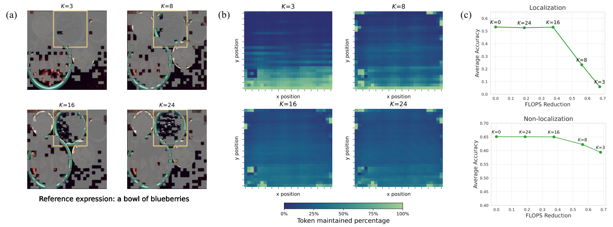

Figure 3. Pruning layer에 따른 선택 위치와 성능. [PDF p.5, §3.3; 원문 PDF][feather-main]

Figure 3(a)는 $`K=3,8,16,24`$의 retained-token 예시, (b)는 각 layer의 선택 빈도 heatmap과 공통 colorbar, (c)는 localization·non-localization의 정확도 대 FLOPs 감소율을 보여 준다. 모든 조건에서 $`R=0.75`$를 사용한다. [PDF p.5, Fig.3]

평균 y=80.7%는 선택 질량이 이미지 높이의 약 4/5 지점에 있다는 뜻이다. 이는 좌표계가 위에서 0, 아래에서 1일 때 강한 하단 편향이다. 그러나 평균 하나는 bimodal 여부나 dataset별 차이를 숨긴다. heatmap의 색상 빈도와 chi-square $`p\lt 0.05`$가 함께 방향을 지지하지만, per-image 분산·effect size·검정 상세가 없다.

### 8.4 Table 1: SigLIP에서 criterion ablation 전체 수치

아래 값은 모두 저자 보고 점수이며, `Avg`는 각 4개 dataset의 산술평균이다. `FLOPs↓`는 Eq.(1) 계열 이론값이다. [PDF p.6–7, Table 1]

#### Localization

| $`K`$ | Criterion | FLOPs↓ | Avg | OCID-Ref | RefCOCOg | RefCOCO+ | RefCOCO |
|---:|---|---:|---:|---:|---:|---:|---:|
| 3 | $`\phi_{\mathrm{original}}`$ | 68% | 5.9 | 5.7 | 5.1 | 6.1 | 6.7 |
| 3 | $`\phi_{-R}`$ | 68% | 16.7 | 22.9 | 15.1 | 13.3 | 15.3 |
| 3 | $`\phi_{\mathrm{KNN}}`$ | 66% | 23.9 | 15.1 | 24.9 | 26.0 | 29.6 |
| 3 | $`\phi_{\mathrm{uniform}}`$ | 66% | 28.0 | 20.6 | 28.6 | 29.7 | 33.3 |
| 3 | $`\phi_{-R}+\phi_{\mathrm{uniform}}`$ | 61% | 27.2 | 29.1 | 27.2 | 24.7 | 27.7 |
| 8 | $`\phi_{\mathrm{original}}`$ | 56% | 23.3 | 19.4 | 23.5 | 24.0 | 26.3 |
| 8 | $`\phi_{-R}`$ | 56% | 27.3 | 27.1 | 26.7 | 26.4 | 29.2 |
| 8 | $`\phi_{\mathrm{KNN}}`$ | 55% | 23.6 | 15.4 | 24.4 | 25.2 | 29.4 |
| 8 | $`\phi_{\mathrm{uniform}}`$ | 55% | 30.3 | 24.6 | 31.0 | 30.9 | 34.8 |
| 8 | $`\phi_{-R}+\phi_{\mathrm{uniform}}`$ | 50% | 35.6 | 32.0 | 35.9 | 35.4 | 38.8 |

#### Open-ended VQA

| $`K`$ | Criterion | Avg | TextVQA | GQA | VQAv2 | VizWiz |
|---:|---|---:|---:|---:|---:|---:|
| 3 | $`\phi_{\mathrm{original}}`$ | 54.8 | 31.8 | 58.4 | 72.7 | 56.3 |
| 3 | $`\phi_{-R}`$ | 59.0 | 41.6 | 61.2 | 76.0 | 57.3 |
| 3 | $`\phi_{\mathrm{KNN}}`$ | 58.4 | 39.9 | 60.9 | 74.4 | 58.4 |
| 3 | $`\phi_{\mathrm{uniform}}`$ | 59.0 | 41.4 | 61.8 | 75.9 | 57.1 |
| 3 | ensemble | 61.2 | 46.6 | 62.3 | 77.4 | 58.4 |
| 8 | $`\phi_{\mathrm{original}}`$ | 59.8 | 45.0 | 60.3 | 76.1 | 57.8 |
| 8 | $`\phi_{-R}`$ | 61.4 | 49.0 | 61.5 | 77.4 | 57.8 |
| 8 | $`\phi_{\mathrm{KNN}}`$ | 58.6 | 40.2 | 61.1 | 74.5 | 58.5 |
| 8 | $`\phi_{\mathrm{uniform}}`$ | 59.3 | 42.2 | 61.8 | 76.0 | 57.4 |
| 8 | ensemble | 62.7 | 51.7 | 62.4 | 78.1 | 58.6 |

#### Challenge sets

| $`K`$ | Criterion | Avg | POPE | TallyQA | VSR | AI2D |
|---:|---|---:|---:|---:|---:|---:|
| 3 | $`\phi_{\mathrm{original}}`$ | 64.0 | 83.2 | 57.1 | 63.3 | 52.4 |
| 3 | $`\phi_{-R}`$ | 64.7 | 85.2 | 58.2 | 62.2 | 53.2 |
| 3 | $`\phi_{\mathrm{KNN}}`$ | 62.8 | 81.2 | 55.9 | 61.5 | 52.8 |
| 3 | $`\phi_{\mathrm{uniform}}`$ | 64.6 | 85.2 | 58.1 | 61.9 | 53.0 |
| 3 | ensemble | 65.4 | 86.0 | 58.9 | 62.7 | 54.0 |
| 8 | $`\phi_{\mathrm{original}}`$ | 64.6 | 85.4 | 57.5 | 62.6 | 53.0 |
| 8 | $`\phi_{-R}`$ | 65.5 | 86.7 | 58.6 | 63.0 | 53.7 |
| 8 | $`\phi_{\mathrm{KNN}}`$ | 62.9 | 81.4 | 56.2 | 60.9 | 53.0 |
| 8 | $`\phi_{\mathrm{uniform}}`$ | 64.4 | 85.3 | 57.9 | 61.0 | 53.2 |
| 8 | ensemble | 66.0 | 87.4 | 59.1 | 63.6 | 54.0 |

재계산과 해석은 다음과 같다.

- $`K=3`$에서 RoPE 제거의 localization 상대개선은 $`(16.7-5.9)/5.9=183.05\%`$다.
- $`K=8`$에서는 $`(27.3-23.3)/23.3=17.17\%`$다. 편향이 깊은 층에서 이미 약해진다는 가설과 맞는다.
- $`\phi_{-R}`$만 비교해도 $`K=3\rightarrow8`$은 $`(27.3-16.7)/16.7=63.47\%`$ 개선이지만, FLOPs 절감은 68%에서 56%로 줄어든다.
- $`K=3`$ ensemble은 $`\phi_{-R}`$보다 62.87% 높지만 uniform보다 2.86% 낮다. 반면 $`K=8`$ ensemble은 $`\phi_{-R}`$보다 30.40%, uniform보다 17.49% 높다. 즉 두 cue의 보완성이 깊은 층에서 더 분명하다.
- ensemble은 union 때문에 더 많은 token을 남겨 FLOPs 감소가 작다. 같은 $`K`$ 행의 criterion끼리도 비용이 정확히 같지 않으므로 성능만 비교하면 불공정하다.

### 8.5 Table 2: 선택 token의 early information transfer control

Table 2는 RoPE-free criterion $`\phi_{-R}`$가 $`K=3`$ 또는 $`K=8`$에서 선택한 token을 각각 layer 0부터 넣는 조건의 localization 결과를 비교한다. 표의 목적은 depth별 criterion의 선택 품질을 비교하면서 “좋은 token이 얕은 층을 지나며 버린 token 정보를 흡수했기 때문”이라는 가설을 분리하는 것이다. 이는 Figure 4의 FastV control과 관련되지만 동일 criterion 실험은 아니다. [PDF p.7, §4.1, Table 2]

| 선택 mask의 원래 layer | OCID-Ref | RefCOCOg | RefCOCO+ | RefCOCO | Avg |
|---:|---:|---:|---:|---:|---:|
| $`K=3`$ mask를 입력부터 사용 | 23.8 | 16.2 | 14.5 | 16.3 | 17.7 |
| $`K=8`$ mask를 입력부터 사용 | 26.7 | 29.8 | 26.8 | 29.8 | 28.3 |

깊은 층에서 고른 subset 자체가 더 좋고, 그 subset을 처음부터 써도 낫다. 따라서 layer depth 효과의 상당 부분은 버려질 token이 남은 token으로 정보를 전달한 결과보다 **ranking criterion의 성숙도**로 설명된다. 다만 $`K=3`$과 $`K=8`$ hidden state에서 얻은 서로 다른 mask를 비교하므로 동일 mask·동일 계산량의 완전한 인과 실험은 아니다.

### 8.6 Figure 4: 정상 pruning, pre-prune, text-only

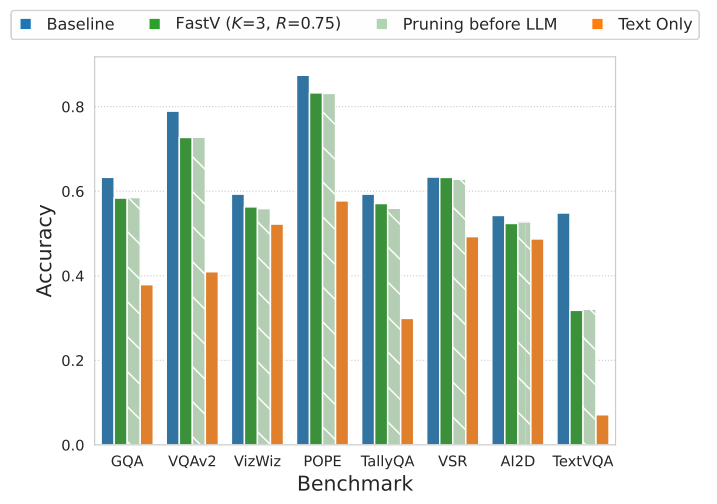

Figure 4. 초기 layer의 정보 전달 가설 대조. [PDF p.5, §3.4; 원문 PDF][feather-main]

Figure 4의 막대/점은 여러 non-localization task에서 정상 FastV와 pre-prune 조건이 거의 겹치고 text-only는 대체로 낮음을 보여 준다. 이는 “초기 layer의 token-to-token 전달이 점수 유지의 주원인”이라는 설명을 반박하는 negative control이다. [PDF p.5, Fig.4]

정량 표가 별도로 제공되지 않고 plot만 있어 세부 소수점 재계산은 불가능하다. pre-prune 입력은 정상 입력보다 sequence 길이·position context 자체가 달라질 수 있으며, 동일 token subset이라도 position-id를 어떻게 유지했는지가 중요하다. 이 구현 세부는 본문에 충분히 적혀 있지 않다.

### 8.7 Figure 5: FEATHER·FastV·PyramidDrop의 성능 비교

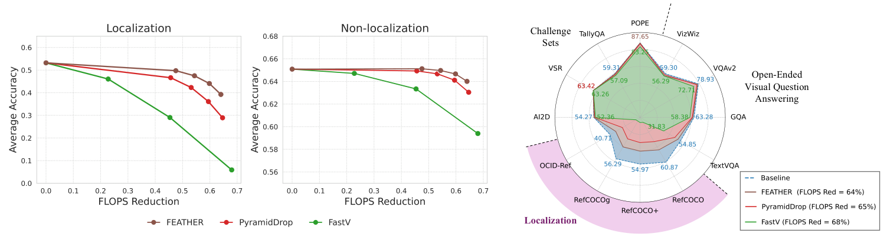

Figure 5. FLOPs 감소율별 성능과 데이터셋별 비교. [PDF p.8, §4.3; 원문 PDF][feather-main]

Figure 5의 왼쪽·가운데 그래프는 각각 localization·non-localization 평균 정확도 대 FLOPs 감소율이다. 갈색 FEATHER, 빨강 PyramidDrop, 초록 FastV가 비슷한 계산 절감에서 어떤 정확도를 유지하는지 보여 준다. 오른쪽 radar는 baseline과 FEATHER 64%, PyramidDrop 65%, FastV 68% 절감 설정을 12개 dataset에서 비교한다. 특히 localization 영역의 차이가 크다. [PDF p.8, Fig.5]

두 단계 mask의 시각화는 Figure 1(b)와 보충 Figure A4에서 확인한다. 첫 단계의 RoPE-free high-attention region과 uniform grid 합집합은 배경까지 규칙적으로 남겨 공간 coverage를 확보하고, 둘째 mask는 객체/질문 관련 영역 주변으로 모인다. 이 mechanism 설명과 Figure 5의 정량 비교를 연결해서 읽어야 한다.

그림은 직관을 주지만 selection quality의 정량 metric—정답 box 내부 keep recall, mask entropy, connected component, per-object coverage—은 본문에 없다. 보충 Figure A2–A4의 사례도 cherry-picking 가능성을 배제할 샘플링 규칙을 밝히지 않는다.

### 8.8 Supplement A1 / Table A1: DINOv2+SigLIP encoder 대조

보충 §A1은 vision encoder를 DINOv2+SigLIP 조합으로 바꾸고 $`K=3`$ criterion 실험을 반복한다. 방향은 기본 SigLIP 실험과 같다. RoPE 제거는 original attention보다 localization을 27.2→37.2로 올리고, uniform은 38.3, ensemble은 46.3이다. [Supplement p.1, Table A1]

#### Localization

| Criterion | FLOPs↓ | Avg | OCID-Ref | RefCOCOg | RefCOCO+ | RefCOCO |
|---|---:|---:|---:|---:|---:|---:|
| $`\phi_{\mathrm{original}}`$ | 68% | 27.2 | 21.9 | 27.7 | 27.8 | 31.1 |
| $`\phi_{-R}`$ | 68% | 37.2 | 37.0 | 38.7 | 34.9 | 38.1 |
| $`\phi_{\mathrm{KNN}}`$ | 66% | 20.5 | 13.4 | 22.1 | 22.0 | 24.6 |
| $`\phi_{\mathrm{uniform}}`$ | 66% | 38.3 | 32.7 | 38.8 | 38.8 | 42.7 |
| ensemble | 61% | 46.3 | 41.6 | 47.3 | 46.0 | 50.1 |

#### Open-ended VQA

| Criterion | Avg | TextVQA | GQA | VQAv2 | VizWiz |
|---|---:|---:|---:|---:|---:|
| $`\phi_{\mathrm{original}}`$ | 56.6 | 35.6 | 59.1 | 74.0 | 57.7 |
| $`\phi_{-R}`$ | 60.1 | 45.4 | 60.4 | 76.5 | 58.2 |
| $`\phi_{\mathrm{KNN}}`$ | 54.2 | 29.9 | 60.0 | 70.2 | 57.0 |
| $`\phi_{\mathrm{uniform}}`$ | 58.3 | 37.6 | 61.9 | 75.8 | 58.0 |
| ensemble | 61.3 | 46.8 | 62.0 | 77.7 | 58.7 |

#### Challenge sets

| Criterion | Avg | POPE | TallyQA | VSR | AI2D |
|---|---:|---:|---:|---:|---:|
| $`\phi_{\mathrm{original}}`$ | 66.1 | 84.6 | 60.2 | 67.1 | 52.7 |
| $`\phi_{-R}`$ | 66.3 | 85.9 | 61.1 | 65.1 | 52.9 |
| $`\phi_{\mathrm{KNN}}`$ | 60.5 | 77.7 | 51.9 | 61.9 | 50.7 |
| $`\phi_{\mathrm{uniform}}`$ | 65.8 | 85.9 | 60.2 | 65.0 | 52.2 |
| ensemble | 66.8 | 86.9 | 61.6 | 65.4 | 53.3 |

이 encoder에서는 original $`K=3`$ localization이 이미 27.2라 기본 SigLIP의 5.9보다 훨씬 높다. 즉 bias의 심각도는 vision representation에도 의존한다. 그럼에도 같은 encoder 내부에서 $`\phi_{-R}`$와 coverage가 개선되는 것은 criterion 효과의 외적 타당성을 조금 넓힌다. 단, 서로 다른 encoder 간 절대점수 차이는 tokenization, feature dim, pretraining과 VLM 학습 전체가 달라 원인 하나로 귀속할 수 없다.

### 8.9 Supplement A2 / Table A2: FEATHER와 baseline의 전 dataset 비교

Table A2는 두 계산 예산 구간에서 FastV, PyramidDrop, FEATHER를 비교하고 단일 NVIDIA L40S에서 전체 suite를 실행한 GPU-hours를 함께 보고한다. [Supplement PDF p.1, Table A2]

#### 비용과 그룹 평균

| Method | FLOPs↓ | GPU-hours | Localization Avg | Open VQA Avg | Challenge Avg |
|---|---:|---:|---:|---:|---:|
| Baseline | 0% | 20.3 | 53.2 | 64.1 | 66.1 |
| FastV | 68% | 15.1 | 5.9 | 54.8 | 64.0 |
| PyramidDrop | 65% | 15.7 | 28.9 | 60.8 | 65.3 |
| FEATHER | 64% | 15.7 | 39.3 | 61.9 | 66.1 |
| FastV | 45% | 16.8 | 29.1 | 61.0 | 65.7 |
| PyramidDrop | 46% | 16.8 | 46.6 | 63.7 | 66.2 |
| FEATHER | 48% | 16.5 | 49.7 | 63.9 | 66.3 |

#### Localization 상세

| Method / FLOPs↓ | OCID-Ref | RefCOCOg | RefCOCO+ | RefCOCO |
|---|---:|---:|---:|---:|
| Baseline / 0% | 40.7 | 56.3 | 55.0 | 60.9 |
| FastV / 68% | 5.7 | 5.1 | 6.1 | 6.7 |
| PyramidDrop / 65% | 24.0 | 29.2 | 29.7 | 32.9 |
| FEATHER / 64% | 33.1 | 40.1 | 39.7 | 44.1 |
| FastV / 45% | 17.5 | 29.5 | 33.1 | 36.1 |
| PyramidDrop / 46% | 37.4 | 48.3 | 47.8 | 53.0 |
| FEATHER / 48% | 39.3 | 52.1 | 50.9 | 56.7 |

#### Open-ended VQA 상세

| Method / FLOPs↓ | TextVQA | GQA | VQAv2 | VizWiz |
|---|---:|---:|---:|---:|
| Baseline / 0% | 54.9 | 63.3 | 78.9 | 59.3 |
| FastV / 68% | 31.8 | 58.4 | 72.7 | 56.3 |
| PyramidDrop / 65% | 47.1 | 61.2 | 76.9 | 57.9 |
| FEATHER / 64% | 51.4 | 61.8 | 77.9 | 56.5 |
| FastV / 45% | 45.8 | 62.3 | 77.4 | 58.4 |
| PyramidDrop / 46% | 53.8 | 63.1 | 78.7 | 59.1 |
| FEATHER / 48% | 54.6 | 63.2 | 78.8 | 59.0 |

#### Challenge 상세

| Method / FLOPs↓ | POPE | TallyQA | VSR | AI2D |
|---|---:|---:|---:|---:|
| Baseline / 0% | 87.4 | 59.3 | 63.3 | 54.3 |
| FastV / 68% | 83.2 | 57.1 | 63.3 | 52.4 |
| PyramidDrop / 65% | 86.6 | 58.2 | 63.4 | 53.1 |
| FEATHER / 64% | 87.7 | 59.1 | 63.4 | 54.2 |
| FastV / 45% | 86.8 | 59.2 | 63.3 | 53.5 |
| PyramidDrop / 46% | 87.5 | 59.4 | 63.5 | 54.3 |
| FEATHER / 48% | 87.7 | 59.2 | 64.0 | 54.6 |

주요 수치를 다시 계산하면 다음과 같다.

- 고절감 구간에서 FEATHER/FastV localization 비는 $`39.25/5.9=6.65\times`$, 절대 차이는 약 `+33.35`점이다.
- FEATHER와 PyramidDrop의 상대 차이는 $`(39.25-28.95)/28.95=35.58\%`$로 본문의 “36%”와 반올림상 일치한다.
- baseline 대비 FEATHER localization 상대 하락은 $`(53.225-39.25)/53.225=26.26\%`$다.
- FEATHER 고절감 설정은 baseline 대비 GPU-hours가 $`(20.3-15.7)/20.3=22.66\%`$ 줄었다. 이 값은 이론 FLOPs 64% 감소와 크게 다르다.
- FastV 고절감은 15.1시간으로 FEATHER 15.7시간보다 빠르지만 localization은 5.9 대 39.3이다. 효율성 비교는 단일 scalar ranking보다 품질 제약 아래 최소 runtime으로 보는 편이 맞다.
- 저절감 구간은 FLOPs가 45/46/48%로 완전히 같지 않다. FEATHER가 성능과 GPU-hours 모두 유리하지만 반복 측정 분산이 없어 0.3시간 차이의 통계적 안정성은 알 수 없다.

### 8.10 Supplement Figure A1: L40S 실제 총 runtime

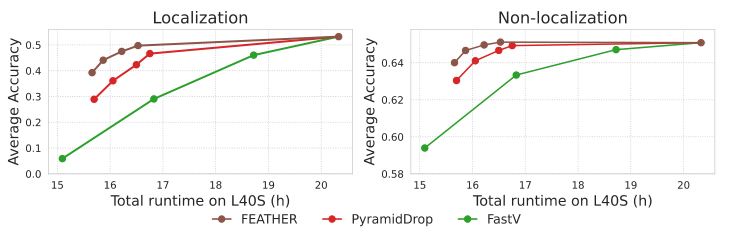

Figure A1. L40S 총 실행시간과 정확도. [Supplement PDF p.1, §A2; 원문 보충 PDF][feather-supp]

Figure A1은 x축 total runtime on L40S (hours), y축 평균 정확도로 방법별 점을 놓는다. 왼쪽은 localization, 오른쪽은 non-localization이며, 세 곡선은 FEATHER·PyramidDrop·FastV다. DINOv2+SigLIP criterion 비교 그림이 아니며, 그림 자체에 (a)/(b) subplot 번호는 없다. Table A2의 GPU-hours와 함께 읽는다. [Supplement PDF p.1, Fig.A1]

이 그림은 이론 FLOPs만 제시한 것보다 낫다. 그러나 측정 단위가 전체 suite GPU-hours라 다음은 알 수 없다.

- 단일 request의 median/p95 latency, time-to-first-token(TTFT), inter-token latency 또는 tokens/s
- prefill과 decode의 분리 시간
- vision encoder, projector, criterion, top-k/gather, LLM 각 구간 시간
- peak allocated/reserved memory, KV-cache 크기, power/energy
- warm-up/JIT/compile, CPU preprocessing와 data loading 포함 여부
- 반복 횟수, error bar, 동일 GPU의 clock/power state

따라서 “FEATHER가 L40S 전체 평가를 더 빨리 끝냈다”는 말은 가능하지만 “요청 latency가 64% 줄었다”거나 “edge 실시간 제약을 충족한다”는 말은 불가능하다.

### 8.11 Supplement A3–A4 / Table A3: 다른 방법과 position shuffle

보충 §A3는 FasterVLM과 VisionZip을 추가한다. SigLIP에는 `[CLS]` attention이 없으므로 FasterVLM은 VisionZip이 제안한, 모든 token이 각 token에 주는 attention 평균으로 대체한다. 저자들은 두 방법이 일부 benchmark에서는 비슷하지만 localization에서는 매우 낮다고 보고하며 position 정보 유지 문제를 원인으로 추정한다. [Supplement p.2, §A3]

Table A3의 전 수치는 다음과 같다. `pos shuffled`는 image token의 positional embedding을 섞은 ablation이다. [Supplement p.2, §A4, Table A3]

#### 그룹 평균과 localization

| Method | FLOPs↓ | Loc Avg | OCID-Ref | RefCOCOg | RefCOCO+ | RefCOCO |
|---|---:|---:|---:|---:|---:|---:|
| Baseline | 0% | 53.2 | 40.7 | 56.3 | 55.0 | 60.9 |
| Baseline, pos shuffled | 0% | 8.0 | 9.0 | 7.8 | 7.1 | 8.0 |
| FasterVLM | 65% | 5.7 | 8.0 | 5.9 | 4.2 | 4.7 |
| VisionZip | 65% | 8.5 | 7.3 | 9.0 | 8.1 | 9.5 |
| FEATHER | 64% | 39.3 | 33.1 | 40.1 | 39.7 | 44.1 |
| FEATHER, pos shuffled | 64% | 5.3 | 5.3 | 4.8 | 5.2 | 5.8 |

#### Open-ended VQA

| Method | Open Avg | TextVQA | GQA | VQAv2 | VizWiz |
|---|---:|---:|---:|---:|---:|
| Baseline | 64.1 | 54.9 | 63.3 | 78.9 | 59.3 |
| Baseline, pos shuffled | 59.2 | 44.1 | 60.3 | 75.8 | 56.8 |
| FasterVLM | 60.9 | 50.9 | 59.9 | 76.5 | 56.4 |
| VisionZip | 61.1 | 50.8 | 60.2 | 76.7 | 56.7 |
| FEATHER | 61.9 | 51.4 | 61.8 | 77.9 | 56.5 |
| FEATHER, pos shuffled | 57.8 | 41.7 | 58.9 | 75.0 | 55.5 |

#### Challenge sets

| Method | Challenge Avg | POPE | TallyQA | VSR | AI2D |
|---|---:|---:|---:|---:|---:|
| Baseline | 66.1 | 87.4 | 59.3 | 63.3 | 54.3 |
| Baseline, pos shuffled | 63.3 | 86.6 | 55.3 | 59.2 | 51.9 |
| FasterVLM | 66.6 | 85.2 | 62.6 | 63.7 | 54.7 |
| VisionZip | 66.5 | 85.3 | 62.9 | 63.7 | 54.3 |
| FEATHER | 66.1 | 87.7 | 59.1 | 63.4 | 54.2 |
| FEATHER, pos shuffled | 63.2 | 86.0 | 55.7 | 58.8 | 52.5 |

position shuffle의 상대 하락은 baseline localization에서 $`(53.2-8.0)/53.2=84.96\%`$, FEATHER에서 $`(39.3-5.3)/39.3=86.51\%`$다. TextVQA는 각각 19.67%, 18.87% 하락한다. 다른 VQA/challenge 평균은 훨씬 덜 하락한다. 위치 정보가 grounding에 필요하다는 결론은 매우 강하지만, 이 실험은 **RoPE 장거리 감쇠의 원인 검증**과는 다르다. 위치를 무작위화하면 위치 의미가 파괴되는 것은 당연하며, RoPE-free *selection score*가 하단 편향을 만드는 정확한 경로는 별도 ablation이 필요하다.

FasterVLM/VisionZip에 대해 저자는 “positional information is not maintained”라고 설명하지만, 이들 방법의 공식 구현을 동일 저장소에서 완전히 재구현했는지, 각 방법의 최적 hyperparameter를 어떻게 선택했는지, position ids를 유지한 대조 버전을 만들었는지는 보충자료에 충분히 기재하지 않는다.

### 8.12 Supplement A5 / Figures A2–A4: criterion·방법별 qualitative mask

- **Figure A2**: $`K=3`$에서 original attention, RoPE-free, KNN, uniform, ensemble의 keep mask를 여러 이미지에 겹쳐 보인다. original은 하단 집중, uniform은 전역 격자, ensemble은 foreground 집중과 coverage를 함께 보인다. [Supplement p.3, Fig.A2]

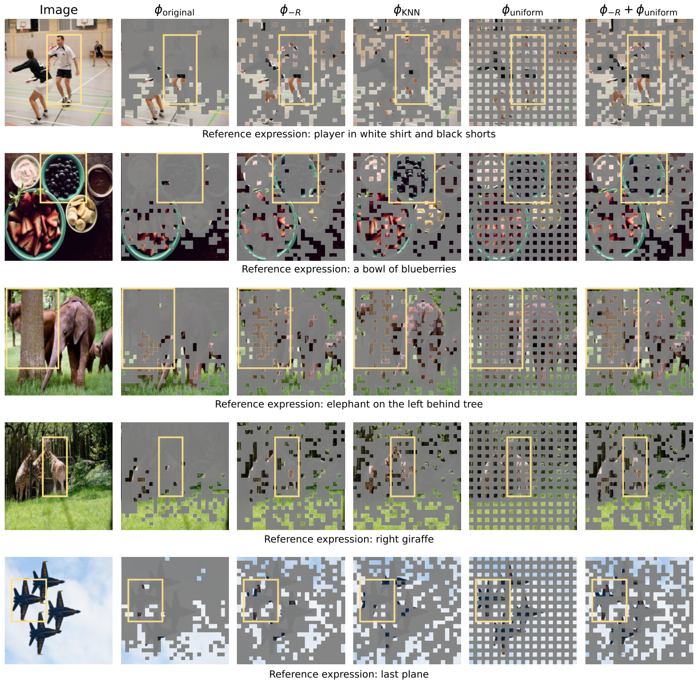

Figure A2. Layer 3 criterion별 토큰 선택. [Supplement PDF p.3, §A5.1; 원문 보충 PDF][feather-supp]

- **Figure A3**: 같은 비교를 $`K=8`$에서 반복한다. deeper attention의 foreground 집중이 더 뚜렷하고 original의 하단 bias가 완화된다. [Supplement p.4, Fig.A3]

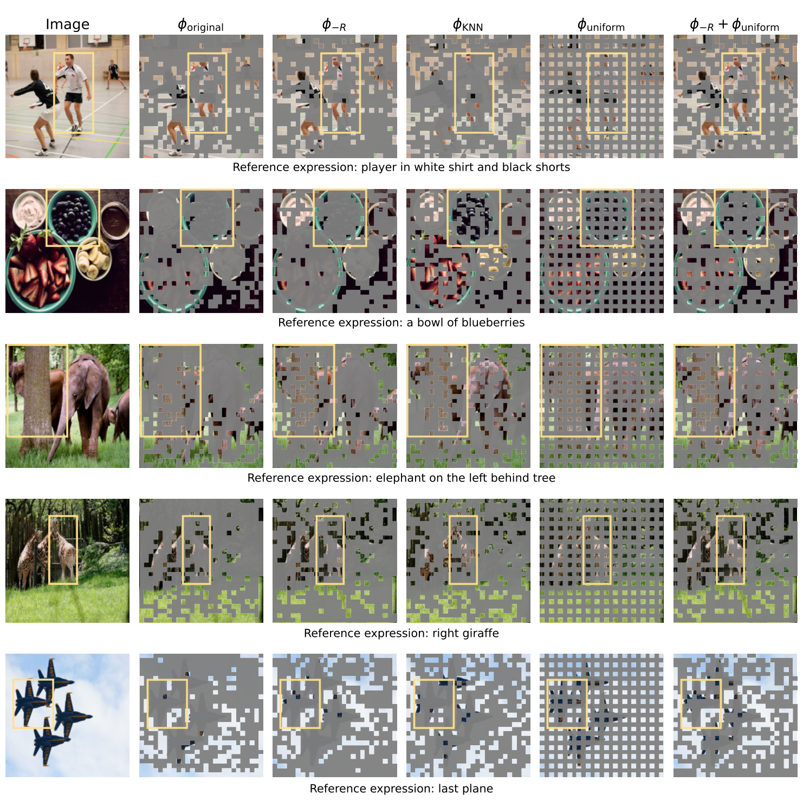

Figure A3. Layer 8 criterion별 토큰 선택. [Supplement PDF p.4, §A5.1; 원문 보충 PDF][feather-supp]

- **Figure A4**: FastV, PyramidDrop, FEATHER의 최종 mask를 정답 box와 함께 비교한다. FEATHER가 box 내부와 주변을 더 많이 유지하는 사례를 보여 준다. [Supplement p.5, Fig.A4]

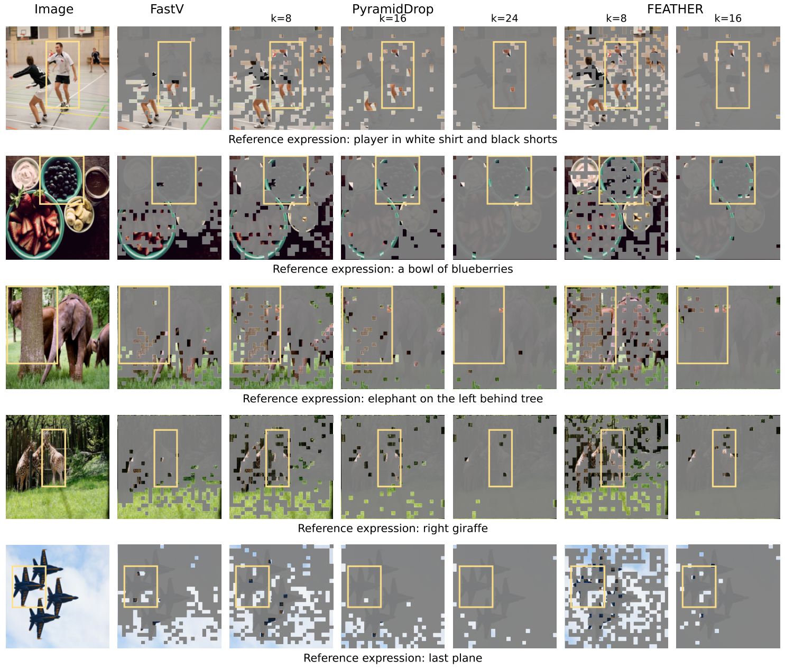

Figure A4. 세 방법의 단계별 토큰 선택 비교. [Supplement PDF p.5, §A5.2; 원문 보충 PDF][feather-supp]

세 그림은 mechanism과 failure mode를 이해시키는 데 유용하지만 정량 증거를 대신하지 않는다. 무작위 표본인지, 성공·실패 사례 비율이 얼마인지, box 안 token recall과 box 밖 redundancy가 얼마인지가 없다. 후속 재현에서는 전체 validation set에 대해 `keep recall@GT-box`, `kept-token precision@GT-box`, 공간 entropy, 객체 크기별 곡선을 계산하는 것이 좋다.

---

## 9. 이론 FLOPs, 실제 latency, memory를 분리해서 읽기

### 9.1 논문이 실제로 측정한 것

| 지표 | 논문 제공 여부 | 의미 |
|---|---|---|
| image-token LLM 이론 FLOPs 감소 | 제공 | Eq.(1)의 근사와 layer별 token schedule로 계산 |
| 전체 benchmark L40S GPU-hours | 보충자료 제공 | 전체 평가 workload의 wall-clock 합계에 가까움 |
| 요청당 E2E latency | 미제공 | preprocessing부터 최종 token까지 한 요청 시간 |
| TTFT | 미제공 | 이미지 입력부터 첫 출력 token까지 |
| TPOT / inter-token latency | 미제공 | decode 단계 token 간 시간 |
| throughput | 미제공 | requests/s 또는 output tokens/s |
| peak GPU memory / KV cache | 미제공 | 실제 배포 용량과 batch 한계 |
| power·energy | 미제공 | W, J/request, J/token |
| tail latency | 미제공 | p95/p99 안정성 |

FEATHER가 줄이는 핵심은 LLM prefill의 image-token 길이다. Vision encoder는 pruning 전에 full image를 처리하므로 줄지 않는다. Autoregressive decode에서는 각 새 text query가 더 짧은 visual KV cache를 읽어 이득이 있을 수 있지만, 논문 식과 runtime 분석은 이 구간을 별도로 분리하지 않는다.

### 9.2 FLOPs가 latency로 곧장 이어지지 않는 이유

실제 시간은 대략 다음처럼 분해해야 한다.

```math
\begin{aligned} t_{\mathrm{E2E}} &=t_{\mathrm{preprocess}}+t_{\mathrm{vision}} +t_{\mathrm{adapter}}+t_{\mathrm{LLM\ prefill}}\\ &\quad+t_{\mathrm{criterion}}+t_{\mathrm{topk/gather}} +t_{\mathrm{decode}}+t_{\mathrm{postprocess}}.\\ &\qquad\text{[해설용 수식]} \end{aligned}
```

Eq.(1)이 크게 줄여도 고정비인 vision encoder와 CPU 전처리가 크면 Amdahl의 법칙 때문에 E2E 개선은 제한된다. token 수가 작아지면 GEMM의 arithmetic intensity와 GPU occupancy가 떨어질 수 있고, 동적 `topk/unique/gather`는 메모리 이동·kernel launch·graph break를 만든다. batch size가 커지면 sample별 서로 다른 keep 길이를 padding해야 해 절감이 희석될 수도 있다.

반대로 KV cache의 image token 수가 줄면 decode의 attention read traffic과 memory footprint가 줄어, 생성 길이가 긴 workload에서는 논문 Eq.(1)이 포착하지 못한 이득이 생길 수 있다. 그러므로 prefill-heavy 짧은 답변과 decode-heavy 긴 답변을 분리해 측정해야 한다.

### 9.3 논문 수치로 본 Amdahl형 경고

FEATHER 고절감 설정의 이론 FLOPs 감소는 64%지만 L40S GPU-hours 감소는 22.66%다. 전체시간 $`t`$ 중 Eq.(1) 대상 구간 비중을 $`s`$라 하고 그 구간이 이상적으로 64% 단축된다고 단순화하면 최대 전체 speedup은

```math
S=\frac{1}{(1-s)+s(1-0.64)}. \qquad\text{[해설용 수식]}
```

실제 20.3/15.7=1.293배를 그대로 이 식에 대입하면 $`s\approx0.354`$다. 이는 정확한 profiler 분해가 아니라 “이 workload에서는 이론 대상 외 비용이 상당하다”는 감도 해석일 뿐이다. FastV와 FEATHER의 overhead 차이, I/O, cache, dataset별 출력 길이가 섞여 있으므로 시스템 구성비로 단정하면 안 된다.

---

## 10. 비판적 검토: 잘 증명된 것, 덜 증명된 것, 원문·코드 불일치

### 10.1 증거가 강한 부분

1. **task dependence**: 같은 model/pruning ratio에서 localization과 일반 VQA의 하락 폭이 크게 다르고, 12개 benchmark에서 일관된 군집 차이가 있다.
2. **spatial bias 현상**: 하단 선택 heatmap, 평균 y=80.7%, 깊이에 따른 완화가 한 방향을 가리킨다.
3. **criterion 개입 효과**: RoPE-free와 uniform이 original criterion을 개선하고, DINOv2+SigLIP에서도 방향이 반복된다.
4. **fine-grained position의 중요성**: position shuffle가 localization과 TextVQA를 크게 무너뜨린다.
5. **실제 총 runtime 절감의 존재**: L40S GPU-hours가 baseline보다 작아 이론 FLOPs만의 주장은 아니다.

### 10.2 아직 인과적으로 부족한 부분

1. **RoPE가 유일한 원인인가?** RoPE-free scoring은 positional distance뿐 아니라 score geometry 전체를 바꾼다. scan order 역전, serpentine/random order, image/text 순서 교환, RoPE base·dimension sweep가 없다.
2. **마지막 text token이 최선인가?** 여러 질문 token 평균, noun/grounding token query, learned pooling, head 선택 대조가 없다.
3. **uniform의 개선이 단순 token 수 증가인가?** ensemble은 union으로 token 수가 늘어 FLOPs가 61/50%로 달라진다. 동일 실제 token count의 random·stratified·uniform·semantic mask 대조가 필요하다.
4. **두 단계 schedule 자체의 효과인가?** 동일 layerwise token-area-under-curve를 맞춘 one-stage·multi-stage schedule과 비교가 충분하지 않다.
5. **통계적 안정성**: seed 반복, confidence interval, bootstrap, per-image paired significance가 없다.
6. **일반화**: 한 LLM family, 주로 한 vision encoder, 단일 이미지, batch size 1 중심이다. 동적 해상도·멀티이미지·비디오·VLA에서는 검증되지 않았다.

### 10.3 원문 내부 또는 원문–공개 구현 차이

| 항목 | 원문 | 검토 결과 |
|---|---|---|
| Eq.(1) 분모 | 한-layer $`C`$ | 표를 재현하려면 $`TC`$여야 한다. 인쇄상 오류로 판단된다. |
| FFN 비용 | $`2ndm`$ | Llama 2 SwiGLU는 gate/up/down 세 projection이라 exact 구현 FLOPs가 아니다. |
| adapter | “one-layer MLP with GELU” | 공개 `MLPProjector`는 Linear–GELU–Linear. “한 hidden layer”라는 의미일 수 있으나 표현은 모호하다. |
| second stage | “$`(1-R)^2\%`$ of remaining” | 공개 코드는 fraction $`(1-R)^2`$를 곱한다. $`R=0.7`$이면 9%, 0.09%가 아니다. |
| layer $`K`$ | “after layer $`K`$” | 구현은 target layer 실행 직전에 이전 hidden state로 선택한다. index convention을 고정해야 한다. |
| KNN density | $`\rho_i\delta_i`$ | $`\rho_i`$ 수식, $`k`$, normalization, tie 처리 미기재. |
| runtime | Figure A1/Table A2 | hardware는 L40S지만 software versions·warm-up·반복·분산 미기재. |

### 10.4 공정한 비교를 위해 더 필요한 control

- 모든 방법의 **실제 sample별 layerwise token count**를 기록하고, 평균 FLOPs가 아니라 동일 `token-layer area` 또는 동일 measured latency로 맞춘다.
- 동일 checkpoint, prompt, evaluator, output length cap, precision, attention backend, batch, power/clock 조건을 사용한다.
- pruning 없음, random, uniform-only, RoPE-free-only, original attention, oracle GT-box mask를 포함한다.
- 위치 인덱스를 원래 좌표로 유지하는 조건과 재압축하는 조건을 분리한다.
- 정확도만이 아니라 invalid box rate, box size별 IoU, GT-box token recall, question type별 결과를 보고한다.
- 평균뿐 아니라 per-example paired bootstrap 95% CI와 seed 반복을 제시한다.

---

## 11. 재현성 체크리스트와 실패 진단

### 11.1 필수 환경·artifact

- [ ] 논문/보충자료와 공식 저장소 커밋을 고정한다. 이 리뷰의 정적 확인 커밋은 `c2a09b2765967601054c7b1fd513ac3e94ee4fc9`.
- [ ] `prism-siglip-controlled+7b` checkpoint와 tokenizer hash를 기록한다.
- [ ] CUDA, driver, PyTorch, Transformers, FlashAttention/SDPA backend, `timm`, Prismatic revision을 기록한다.
- [ ] dataset version, split, image checksum, annotation 변환, prompt template와 evaluator를 고정한다.
- [ ] precision, batch size, seed, `max_new_tokens`, sampling 옵션을 기록한다.
- [ ] $`K_1,K_2,R`$, stride, top-k rounding, union 중복 제거, position-id 처리, padding 방식을 config로 저장한다.
- [ ] 원시 prediction, keep indices, layerwise token count, timing trace를 보관한다.

### 11.2 최소 기능 검증

1. **no-prune parity**: pruning을 끈 수정 모델이 원본 logits/생성 결과와 허용 오차 내에서 같아야 한다.
2. **$`R=0`$ identity**: FEATHER 경로를 켜되 $`R=0`$으로 두었을 때 token 손실이 없어야 한다.
3. **index integrity**: BOS와 모든 text token이 유지되고 image token 순서가 오름차순인지 assert한다.
4. **mask/position alignment**: hidden, mask, position ids의 sequence dimension이 항상 같아야 한다.
5. **RoPE isolation**: selection score 경로만 no-RoPE이고 실제 decoder attention은 baseline RoPE와 동일한지 unit test한다.
6. **token-count test**: 27×27에서 stride 2는 196, stride 3은 81임을 확인한다. union과 중복 때문에 최종 수는 단순 합보다 작거나 같아야 한다.
7. **Eq.(1) audit**: 실제 keep count로 교정식을 다시 계산하고 보고된 68/56/64%와 허용 범위 내인지 확인한다.
8. **output parser audit**: invalid/malformed box를 accuracy 0과 별도 집계해 model localization과 formatting failure를 분리한다.

### 11.3 결과가 다를 때 우선 확인할 순서

1. attention backend가 eager/SDPA/FlashAttention 중 무엇인지 확인한다. 저장소 README도 구현별 작은 수치 차이를 경고한다.
2. 마지막 text token index가 padding이 아닌 실제 마지막 prompt token인지 확인한다.
3. image token span에 BOS/특수 토큰이 섞이지 않았는지 확인한다.
4. pruning 전후 position ids를 재번호화했는지, 원래 값을 보존했는지 확인한다.
5. top-k ratio가 제거율 $`R`$인지 유지율 $`1-R`$인지 확인한다.
6. stage 2가 `current_count × (1-R)^2`인지, 원래 $`n`$에 곱했는지 확인한다.
7. dataset evaluator threshold—OCID 0.25, RefCOCO 계열 0.5—와 좌표 normalization을 확인한다.
8. generation length와 prompt template를 확인한다. 정답 의미가 같아도 box 문자열 parser가 실패할 수 있다.

### 11.4 권장 재현 결과 파일

| 파일 | 최소 컬럼/내용 |
|---|---|
| `environment.json` | git hash, model hash, driver/CUDA/framework/backend, device |
| `run_config.yaml` | dataset, split, seed, precision, batch, $`K_1,K_2,R`$, stride |
| `predictions.jsonl` | sample id, prompt, target, raw output, parsed output, metric |
| `token_trace.jsonl` | sample id, layer, before/after count, keep indices, criterion time |
| `timing.jsonl` | preprocess, vision, adapter, prefill segments, prune, decode, total |
| `summary.csv` | method, FLOPs proxy, quality, latency percentiles, memory, energy |

---

## 12. Jetson AGX Thor에서의 실행 가능성 및 후속 연구 계획

### 12.1 현재 공식 사양을 근거로 한 가능성 판단

2026-09-07 기준 NVIDIA 공식 페이지는 Jetson AGX Thor Developer Kit(T5000)에 2560-core Blackwell GPU, 128GB 256-bit LPDDR5X, 273GB/s 메모리 대역폭, 40–130W 전력 범위, 최대 2070 FP4 TFLOPS(sparse)를 기재한다. [NVIDIA Jetson Thor 공식 사양](https://www.nvidia.com/en-eu/autonomous-machines/embedded-systems/jetson-thor/) 최신 JetPack 7 계열은 Thor를 지원하며, 공식 archive에는 JetPack 7.2.1/L4T 39.2.1이 열거되어 있다. [NVIDIA JetPack](https://developer.nvidia.com/embedded/jetpack) · [JetPack Archive](https://developer.nvidia.com/embedded/jetpack-archive)

**메모리 용량상 Llama-2-7B+SigLIP의 BF16/FP16 단일 모델 추론은 충분히 현실적**이다. 7B weight 자체가 약 14GB이고 128GB unified memory가 있기 때문이다. 그러나 2070 FP4 TFLOPS는 sparse·저정밀 peak 수치이며, 논문 checkpoint를 그대로 BF16 실행할 때의 성능이나 PyTorch dynamic gather 속도를 뜻하지 않는다. FEATHER의 실제 가치가 compute 절감인지 memory-traffic 절감인지, ARM CPU 전처리와 동적 index 연산이 병목인지 반드시 측정해야 한다.

NVIDIA 문서는 `nvpmodel`로 power mode를 확인·변경할 수 있고, Thor reference profile이 40/75/95/120W 및 MAXN 계열임을 설명한다. MAXN은 장시간 heavy workload용 최고성능 보장 모드가 아니며 thermal throttling 가능성이 있다고 명시한다. [Jetson Thor 전력·성능 가이드](https://docs.nvidia.com/jetson/archives/r38.4/DeveloperGuide/SD/PlatformPowerAndPerformance/JetsonThor.html)

### 12.2 단계별 실행 계획과 gate

#### Phase 0 — 소프트웨어/모델 호환성 preflight

1. `nvpmodel -q`, JetPack/L4T, CUDA, driver, PyTorch와 attention backend를 기록한다.
2. 원본 Prism-SigLIP checkpoint를 BF16, batch 1로 로드한다. CPU offload 없이 peak memory와 첫 forward 성공 여부를 확인한다.
3. 작은 고정 샘플 20개로 baseline을 20회 반복해 OOM, NaN, malformed output, hang, thermal throttle 여부를 검사한다.
4. FEATHER를 켠 no-prune parity와 $`R=0`$ identity test를 통과시킨다.

**Gate 0:** baseline/FEATHER가 같은 evaluator에서 결정론적으로 실행되고, 20회 연속 오류가 없으며, logits 또는 생성 parity test가 통과해야 다음 단계로 간다.

#### Phase 1 — 논문 재현성 최소 세트

1. OCID-Ref, RefCOCOg/+/RefCOCO, TextVQA의 작은 stratified subset으로 baseline, FastV, PyramidDrop, FEATHER를 실행한다.
2. 논문과 같은 `K1=8,K2=16,R=0.7,stride=3`을 먼저 고정한다.
3. prediction·parser·keep mask를 저장하고 paper directionality—FastV localization 붕괴, FEATHER 회복—를 확인한다.
4. subset을 통과하면 네 localization validation split 전체와 TextVQA 전체로 확장한다.

**Gate 1:** 절대점수 동일성보다 방법 순서와 상대 격차의 재현을 먼저 본다. evaluator/attention backend 차이를 문서화한 뒤에도 FEATHER가 동일 비용대 baseline보다 localization에서 안정적으로 우위여야 한다.

#### Phase 2 — Thor의 실제 성능 프로파일

각 방법에 대해 warm-up 후 최소 100 request, 5회 반복을 권장한다. CUDA event로 GPU 구간을, monotonic wall clock으로 E2E를 측정하고 Nsight Systems/PyTorch profiler trace를 일부 sample에 수집한다.

| 구간 | 필수 지표 |
|---|---|
| 전처리 | CPU ms, resize/tokenize ms |
| vision encoder | ms, GPU utilization, DRAM traffic |
| LLM prefill | layer 0–7, 8–15, 16–31 ms |
| criterion | Q/K projection, softmax, head-reduce ms |
| selection | top-k, unique, gather, mask rebuild ms |
| decode | TTFT, TPOT, output tokens/s, 생성 길이 |
| 전체 | E2E p50/p95/p99, throughput |
| 자원 | peak allocated/reserved memory, power W, 온도, clocks, throttling |
| 에너지 | J/request, J/correct-answer 또는 J/quality-constrained request |

전력은 Thor의 on-board power monitor와 `tegrastats` 계열 telemetry를 사용하되 sampling interval과 rail 범위를 기록한다. 각 run 전후 power mode, fan, ambient temperature를 고정하고 steady-state 구간만 비교한다.

**Gate 2:** FEATHER가 정확도 제약—예: baseline localization의 90% 이상—을 만족하면서 baseline 대비 E2E p95, peak memory 또는 J/request 중 사전 지정한 최소 하나를 유의미하게 개선해야 “Thor 배포 이득”이라고 부른다. 이론 FLOPs 감소만으로 통과시키지 않는다.

#### Phase 3 — 공정한 최적화 비교

1. BF16 eager를 correctness 기준점으로 둔다.
2. 동일 attention backend/compile 조건에서 baseline과 모든 pruning 방법을 비교한다.
3. TensorRT-LLM 또는 정적 graph 변환을 시도할 때 dynamic token length가 engine re-build를 일으키지 않도록 길이 bucket을 설계한다.
4. FEATHER의 sample별 길이를 padding하면 절감이 사라질 수 있으므로 batch 1, homogeneous bucket batch, ragged/paged kernel을 별도 비교한다.
5. INT8/FP8/FP4 quantization은 **별도 축**으로 ablation한다. baseline과 FEATHER 모두 같은 정밀도로 맞추고 pruning 효과와 양자화 효과를 교차표로 분리한다.
6. 출력 길이 16/64/128, prompt 길이, 이미지 해상도, batch 1/2/4, power mode를 sweep한다.

### 12.3 RoPE 원인 가설을 더 강하게 검증하는 실험

| 실험 | 고정할 것 | 바꿀 것 | 예측되는 결과 |
|---|---|---|---|
| scan-order reversal | content, model, token 수 | top↔bottom raster order | original criterion의 편향 방향도 뒤집히면 위치거리 원인 증거 강화 |
| serpentine/random order | 같은 2D patch | 1D 배열 순서 | 편향이 1D distance를 따라가면 RoPE 설명 강화 |
| image/text order swap | prompt·image 내용 | `[image;text]` ↔ `[text;image]` | text에 가까운 가장자리로 편향 이동 예상 |
| selection-only RoPE sweep | decoder forward 유지 | RoPE base/dim 또는 거리 scaling | 편향·localization이 연속적으로 변하면 dose-response 증거 |
| multi-query criterion | 같은 layer/cost | last token vs noun tokens vs all-text mean | 마지막 token 선택의 특수성 검증 |
| count-matched coverage | 실제 keep count 동일 | random/uniform/stratified/ensemble | token 수 증가와 coverage 효과 분리 |
| GT-box oracle | 같은 keep count | box 내부 우선 mask | criterion 개선의 상한선 측정 |

각 조건에서 평균 y뿐 아니라 2D Wasserstein distance to uniform, GT-box recall, localization accuracy, criterion overhead를 paired sample 단위로 보고해야 한다.

### 12.4 VLA/로봇으로 확장할 때의 추가 상태 단위

원 논문에는 비디오 frame이나 action이 없으므로 FEATHER를 VLA에 그대로 적용했다는 주장은 할 수 없다. 확장 시에는 적어도 다음 상태를 분리해야 한다.

- `camera frame`: 센서가 들어오는 이미지 단위
- `vision refresh`: vision encoder/FEATHER를 다시 실행하는 주기
- `policy inference step`: observation에서 action chunk를 생성하는 호출
- `action chunk`: 한 번에 예측한 연속 action 묶음
- `environment/control step`: 실제 actuator가 갱신되는 주기

VLA에서는 프루닝 mask가 시간에 따라 흔들리면 action jitter가 생길 수 있다. frame별 mask IoU, object track recall, action deviation, success rate, intervention rate, worst-case control latency를 함께 재야 한다. 충돌 회피·grasp boundary 같은 safety-critical 영역에는 uniform coverage가 충분하지 않을 수 있으므로 detector/segmentation 기반 보호 mask와 fallback-to-full-tokens 조건도 설계해야 한다.

---

## 13. 자주 생길 오해와 짧은 답

### Q1. FEATHER는 vision encoder FLOPs도 줄이는가?

아니다. 모든 patch를 SigLIP으로 인코딩한 뒤 LLM 내부에서 줄인다. 줄어드는 주 대상은 visual-token LLM 계산과 후속 KV traffic이다.

### Q2. “RoPE 제거”는 Llama의 positional encoding을 없앤다는 뜻인가?

아니다. token **선택 점수**를 계산하는 보조 attention에서만 RoPE를 빼고, 실제 decoder layer forward는 RoPE를 유지한다.

### Q3. FEATHER는 96.7%의 토큰을 처음부터 제거하는가?

아니다. 첫 8층은 전부, 다음 8층은 첫 합집합, layer 16 뒤에서만 원래의 약 3.3–3.4%가 남는다.

### Q4. 64% FLOPs 감소면 64% 빨라지는가?

아니다. L40S 전체 suite GPU-hours는 20.3→15.7, 약 22.7% 감소였다. 요청 latency는 따로 보고되지 않았다.

### Q5. 일반 VQA는 이미지가 필요 없다는 결론인가?

아니다. text-only보다 선택된 시각 token이 대체로 낫다. 결론은 해당 benchmark가 이 설정에서 **아주 세밀한 공간 정보**를 충분히 요구하지 않을 수 있다는 것이다.

### Q6. $`\phi_{-R}`$이 항상 최선인가?

아니다. $`K=3`$에서는 uniform이 localization 평균 28.0으로 $`\phi_{-R}`$ 16.7보다 높다. FEATHER는 의미 score와 coverage를 조합하고 깊이별 schedule을 쓴다.

### Q7. ensemble은 두 score를 더한 것인가?

아니다. 공식 구현은 RoPE-free top-k index와 uniform grid index의 **합집합**을 취하고 중복을 제거한다.

### Q8. KNN 결과를 논문만 보고 완전히 재현할 수 있는가?

어렵다. density $`\rho_i`$의 정확한 계산식, neighbor 수, normalization과 tie 처리가 빠져 있다.

### Q9. localization 향상 5×는 어떤 뜻인가?

고절감 설정에서 FEATHER 39.3을 FastV 5.9로 나눈 상대 배수다. 실제 검산은 6.65×이며 절대 향상은 약 33.35점이다. baseline 53.2에는 아직 못 미친다.

### Q10. Jetson Thor에서 바로 TensorRT engine으로 만들면 같은 이득이 나는가?

보장되지 않는다. 동적 top-k와 sample별 sequence 길이는 정적 shape, batching, kernel fusion에 불리할 수 있다. correctness parity 후 구간별 profiling과 length bucketing이 필요하다.

---

## 14. 최종 평가와 완전성 점검표

### 14.1 종합 판단

FEATHER의 가장 중요한 공헌은 더 복잡한 selector를 만든 것이 아니라 **기존 효율성 평가가 놓친 정보 손실을 localization으로 드러내고, 그 실패를 positional mechanism과 연결해 작은 추론 규칙으로 고쳤다**는 데 있다. Table 1의 criterion ablation, Table 2/Figure 4의 정보전달 control, 보충 Table A1의 encoder 대조, Table A3의 position shuffle가 하나의 서사를 만든다.

그 서사는 “spatial bias가 존재하고 RoPE-free scoring이 개선한다”는 수준에서는 설득력이 높다. 반면 “RoPE 장거리 감쇠가 유일한 원인”, “64% FLOPs가 실제 배포 속도 향상”, “다른 VLM/VLA에서도 같은 schedule이 최적”이라는 더 강한 주장은 아직 증명되지 않았다. 특히 Eq.(1)의 분모 오류, Llama FFN 근사, KNN 정의 누락, runtime protocol·통계 분산 부재는 재현자가 명시적으로 보완해야 한다.

실무적으로는 FEATHER를 `정확도 손실 없이 무조건 빠른 모듈`로 취급하기보다, **quality constraint를 먼저 정하고 실제 target hardware에서 token schedule·latency·memory·energy를 함께 최적화하는 inference policy**로 보는 것이 정확하다.

### 14.2 원문 커버리지 체크

- [x] Abstract
- [x] §1 Introduction와 Figure 1(a–b)
- [x] §2 Related Works와 FEATHER의 선행연구상 위치
- [x] §3.1 Preliminary의 세 비번호 식, pruning framework, Eq.(1)
- [x] §3.2 Task-dependent analysis와 Figure 2
- [x] §3.3 spatial bias와 Figure 3(a–c)
- [x] §3.4 early information transfer와 Figure 4; §4.1 criterion 선택 품질과 Table 2
- [x] §4.1 $`\phi_{-R}`$, KNN Eq.(2), uniform, ensemble, Table 1
- [x] §4.2 coarse-to-fine FEATHER와 Figure 1(b), Figure A4
- [x] §4.3 evaluation과 Figure 5, 핵심 재계산
- [x] §5 Conclusion, Acknowledgments, References 범위 확인
- [x] Supplement §A1 / Table A1
- [x] Supplement §A2 / Table A2 / Figure A1
- [x] Supplement §A3–A4 / Table A3
- [x] Supplement §A5.1–A5.2 / Figures A2–A4
- [x] 입력→출력 forward, shape, layer/token 단위
- [x] 기반 VLM의 frozen/trainable 구분과 FEATHER의 training-free 의미
- [x] 모든 번호 수식과 비번호 핵심 수식의 항별 해설·edge case
- [x] 이론 FLOPs와 E2E latency/memory의 분리
- [x] 공식 코드 정적 대조, 원문 불일치, 재현성 checklist
- [x] Jetson AGX Thor 실행 가능성, 단계별 gate와 profiling 제안

### 14.3 출처 우선순위

수치와 주장 확인에는 첨부 ICCV PDF를 최우선으로, 본문에 없는 확장 결과에는 CVF 공식 supplementary를, 구현 세부에는 공식 FEATHER 저장소를 사용했다. Jetson Thor 계획의 하드웨어·소프트웨어·전력 정보는 NVIDIA 공식 문서만 사용했다. 이 리뷰의 산술식과 비판은 `[검산]`, `[해설용 수식]`, `[리뷰어 해석]`, `[후속 연구 제안]`으로 원문 주장과 분리했다.

[feather-main]: https://openaccess.thecvf.com/content/ICCV2025/papers/Endo_Feather_the_Throttle_Revisiting_Visual_Token_Pruning_for_Vision-Language_Model_ICCV_2025_paper.pdf
[feather-supp]: https://openaccess.thecvf.com/content/ICCV2025/supplemental/Endo_Feather_the_Throttle_ICCV_2025_supplemental.pdf
