# FastV 상세 해설: 왜 layer 2 뒤에서는 이미지 토큰 절반만으로도 충분한가

> 저장소 원문: [주 PDF](papers/04_FastV.pdf) · [ECCV 2024 supplementary](papers/04_FastV_Supplement.pdf) · [전체 목록](README.md)

> 대상 논문: Liang Chen, Haozhe Zhao, Tianyu Liu, Shuai Bai, Junyang Lin, Chang Zhou, Baobao Chang, **An Image is Worth 1/2 Tokens After Layer 2: Plug-and-Play Inference Acceleration for Large Vision-Language Models**, ECCV 2024.
>
> 이 문서는 초록 요약이나 짧은 서평이 아니다. 첨부된 ECCV 본문 PDF 18쪽과 ECVA가 별도로 공개한 공식 보충자료 3쪽을 절, 수식, 그림, 표 단위로 대응시키고, 한 샘플의 입력부터 출력까지 FastV의 계산을 학습용으로 풀어 쓴다. GPU 학습이나 추론은 실행하지 않았으며, 성능과 latency 수치는 모두 저자 보고값이다.

---

<a id="sec-reading-guide"></a>

## 문서 사용법과 근거 표기

이 리뷰는 근거의 성격을 다음처럼 구분한다.

- **[저자 보고]**: 첨부 논문 또는 공식 보충자료가 직접 서술하거나 표에 제시한 사실.
- **[공식 코드 확인]**: 저자 공식 저장소의 공개 구현을 정적으로 읽어 확인한 사실. 논문 실험 당시의 비공개 환경과 완전히 같다고 가정하지 않는다.
- **[검산]**: 공개 수치 또는 식을 이 리뷰에서 다시 계산한 결과.
- **[리뷰어 해석]**: 원문과 코드에 근거한 해석, 비판, 또는 더 엄밀한 표기. 저자의 주장과 동일하지 않을 수 있다.
- **[미기재]**: 첨부 본문과 공식 보충자료에서 확인되지 않는 사항.
- **[후속 연구 제안]**: 논문이 검증한 결과가 아니라 재현, 배포, Jetson Thor 이식을 위해 이 리뷰가 제안하는 항목.

출처 위치는 `[PDF p.N, §X, Eq.(Y), Fig.Z/Table Z]`처럼 쓴다. `PDF p.N`은 PDF 뷰어에서 1부터 세는 실제 파일 쪽수다. 공식 보충자료는 `[Supp. p.SN, §A/B/C, Fig.Z]`로 구분한다. 첨부본의 인쇄 쪽수와 실제 PDF 쪽수는 모두 1-18로 일치한다.

---

<a id="sec-bibliography"></a>

## 0. 검증된 서지정보와 읽은 범위

### 0.1 첨부본

| 항목 | 확인 결과 |
|---|---|
| 첨부 파일명 | `FastV ECCV 2024.pdf` |
| 정식 제목 | *An Image is Worth 1/2 Tokens After Layer 2: Plug-and-Play Inference Acceleration for Large Vision-Language Models* |
| 저자 | Liang Chen, Haozhe Zhao, Tianyu Liu, Shuai Bai, Junyang Lin, Chang Zhou, Baobao Chang |
| 소속 | Peking University National Key Laboratory for Multimedia Information Processing; Alibaba Group |
| 학회와 연도 | European Conference on Computer Vision, ECCV 2024 |
| proceedings | *Computer Vision - ECCV 2024*, LNCS 15139, Part LXXXI, pp.19-35 |
| DOI | [10.1007/978-3-031-73004-7_2](https://doi.org/10.1007/978-3-031-73004-7_2) |
| arXiv | [arXiv:2403.06764](https://arxiv.org/abs/2403.06764), 최초 제출 2024-03-11 |
| 실제 PDF 쪽수 | 18쪽, letter size, 암호화 없음 |
| 첨부본 SHA-256 | `EC315D529C51BA2053795B46DAB9B71459268D10AC78156D3714F5F6656DFB58` |
| 첨부본 범위 | Abstract, §1-§6, Acknowledgments, References 전부 |
| 첨부본 내 supplementary | 없음. PDF p.15-18은 Acknowledgments와 References이며 부록은 합본되어 있지 않다. |

제목, 저자, 학회, DOI, proceedings 쪽수는 PDF 첫 쪽과 [Springer 공식 chapter](https://link.springer.com/chapter/10.1007/978-3-031-73004-7_2), [ECVA 공식 PDF](https://www.ecva.net/papers/eccv_2024/papers_ECCV/papers/10478.pdf)를 교차 확인했다. Springer 페이지의 서지 형식은 chapter를 2025로 표기하는 항목도 있지만, 학회와 proceedings 연도는 ECCV 2024다. 이 리뷰에서는 학회 논문 연도를 2024로 쓴다.

### 0.2 별도 공식 보충자료와 공식 코드

- 첨부 본문은 Figure 7, Figure 8, Section A를 “supplement material”이라고 가리킨다. [ECCV 공식 발표 페이지](https://eccv.ecva.net/virtual/2024/poster/2009)에 연결된 [공식 supplementary PDF](https://www.ecva.net/papers/eccv_2024/papers_ECCV/papers/10478-supp.pdf)는 실제 3쪽이다. Figure 7, Appendix A, Appendix B, Appendix C, Figure 8을 모두 읽고 렌더링해 확인했다.
- 별도 공식 supplementary PDF의 SHA-256은 `58692CC0B0D016A0EE17AE9ACD6938B1F83BE534B31EE01520EDB92239B01076`이다.
- PDF 텍스트 추출만으로 수학 기호와 표를 확정하지 않았다. 첨부 18쪽과 보충자료 3쪽을 모두 144 DPI PNG로 렌더링했고, Eq.(1)-(5), Figure 1-8, Table 1-7을 원래 페이지 이미지와 대조했다.
- [공식 코드 저장소](https://github.com/pkunlp-icler/FastV)를 읽기 전용으로 확인했다. 정적 분석 스냅샷은 커밋 [`d1659729b5bf1be225e99ee15783deeea80f63b1`](https://github.com/pkunlp-icler/FastV/tree/d1659729b5bf1be225e99ee15783deeea80f63b1), 커밋 시각 2025-01-04다. 이는 ECCV PDF 이후에 추가된 Hugging Face/KV-cache 통합도 포함하므로, “논문 방법”, “현재 공식 구현”, “논문 이후 구현”을 섞지 않는다.
- 참고문헌 49편은 개별 서평하지 않는다. 다만 §2가 FastV의 위치를 설명하는 데 사용하는 선행 연구 범주는 빠짐없이 다룬다.

### 0.3 범위 제한

> **원문 발췌 이미지 안내.** 이 문서는 학술적 설명·비평을 위해 Figure 1–8과 번호 수식 (1)–(5), §4.2의 비번호 식 2개를 원본 PDF에서 직접 발췌했다. 도형·문자·수치를 재제작하거나 수정하지 않았다. 권리는 원저자·출판사에 있으며, 공개 접근 가능 여부를 CC-BY 등 재사용 허가로 간주하지 않는다. 재배포자는 적용되는 이용조건과 권리 요건을 별도로 확인해야 한다. 기존 장문 해설 및 LaTeX는 보존했다. 출처 URL, 원본 SHA-256, PDF 페이지, crop 좌표·단위·해상도는 [자산 manifest](assets/04_FastV/publication_assets.json)에 기록했다.

- GPU 학습, GPU 추론, benchmark API 평가는 실행하지 않았다. 재계산은 산술과 식의 정적 검산뿐이다.
- 논문은 이미지/비디오 질의응답 연구다. 로봇 policy의 실제 action step, environment step, action chunk, control frequency, policy refresh는 실험하지 않았다. PCA-Bench의 `Action` 점수는 텍스트 답변의 행동 추론 정확도이지 폐루프 로봇 제어 주기가 아니다.
- 실험 precision, batch size, 소프트웨어 버전, 일반 성능 실험의 GPU, seed, confidence interval은 논문과 보충자료에 대부분 기재되어 있지 않다. 공개 코드의 기본값을 논문 실험값으로 소급하지 않는다.

---

<a id="sec-one-sentence"></a>

## 1. 한 문장 핵심과 전체 계산 지도

**FastV는 이미 학습된 LVLM의 앞쪽 $`K`$개 LLM 층에서는 모든 시각 토큰을 처리하고, 그때 얻은 attention으로 이미지 토큰을 순위화해 $`R\%`$를 제거한 뒤, 나머지 깊은 층에서는 줄어든 토큰 열만 계산하는 training-free 추론 규칙이다.** [PDF p.8-10, §4.1-4.2]

핵심 계산은 다음 순서다.

1. 이미지 또는 비디오 프레임을 vision encoder가 patch feature로 바꾼다.
2. projector가 vision feature의 마지막 차원을 LLM hidden width에 맞춘다.
3. `[system prompt; image tokens; user instruction; generated tokens]` 순으로 decoder-only LLM의 한 토큰 열을 만든다.
4. 처음 $`K`$개 transformer block은 전체 열을 처리한다.
5. 경계층에서 attention head를 평균하고, 이미지 key 구간의 중요도만 뽑는다.
6. 중요도가 큰 $`(1-R)V`$개 이미지 토큰과 모든 text token을 남긴다.
7. 이후 $`T-K`$개 층은 줄어든 열로 MHA와 FFN을 계산한다.
8. LLM head가 다음 text token을 고르고 autoregressive generation을 계속한다.

여기서 즉시 기억할 구분은 네 가지다.

- **학습이 아니다.** FastV의 $`K`$, $`R`$, top-k에는 gradient나 새 loss가 없다. 초록의 “learning adaptive attention patterns in early layers”는 기존 모델이 이미 학습해 가진 attention pattern을 이용한다는 뜻으로 읽어야 한다. FastV 자체의 재학습을 뜻하지 않는다.
- **마스킹과 실제 삭제는 다르다.** attention mask만 씌우면 성능 ablation은 할 수 있지만 sequence tensor 길이와 FFN 계산은 그대로여서 실제 속도 향상이 없다. 물리적으로 hidden state를 gather해야 FLOPs와 latency가 줄 수 있다.
- **prefill과 decode는 다르다.** 식 (5)는 길이 $`n`$의 전체 열을 모든 층에서 다시 처리하는 형태의 계산식이다. KV cache를 쓰는 정상 decode에서는 새 query 길이가 1이므로 $`n^2`$ prefill 식을 TPOT에 그대로 적용할 수 없다.
- **이론 FLOPs와 실제 속도는 다르다.** 논문의 대표 45%는 MHA+FFN 근사 FLOPs 감소다. Table 4만 단일 A40 실제 시간을 보고하며, 그 설정은 attention-ranked $`K=2`$가 아니라 $`K=0`$ random pruning과 한 토큰 답변이다.

---

<a id="sec-motivation"></a>

## 2. 문제의식과 motivation: 기존 계산 흐름에서 설계 선택까지

### 2.1 기존 token-based LVLM의 비용 경로

LLaVA류 모델은 이미지를 한 개의 압축 벡터로 만들지 않는다. 예를 들어 $`336\times336`$ 입력을 CLIP ViT가 $`24\times24=576`$ patch token으로 만들고, projector가 각 token을 LLM hidden dimension으로 보낸다. 672 해상도로 토큰 grid의 각 축이 두 배가 되면 $`48\times48=2304`$로 네 배가 된다. [PDF p.4, §2]

decoder layer 하나에서 전체 sequence length를 $`n`$, hidden width를 $`d`$, FFN width를 $`m`$이라 하면 논문이 세는 주요 비용은 다음 세 덩어리다.

```math
C(n)=\underbrace{4nd^2}_{Q,K,V,O\ \text{projection}} +\underbrace{2n^2d}_{QK^\top\ \text{and}\ AV} +\underbrace{2ndm}_{\text{FFN}}
```

시각 토큰이 수백 또는 수천 개이면, 출력 답변이 한 글자여도 prefill에서 모든 LLM 층이 이 긴 열을 처리한다. 여러 이미지나 비디오의 여러 프레임은 시각 토큰을 더 늘린다. Video-LLaVA 예시는 8프레임을 프레임당 256개로 만들어 2048개를 LLM에 보낸다. [PDF p.9, Fig.5]

### 2.2 구체적 실패, 또는 “왜 이 계산이 낭비일 수 있는가”

저자들은 LLaVA-1.5-7B의 1000개 응답에서 출력 token query가 네 종류의 prefix에 주는 attention을 측정했다. 평균 token 수는 system 35, image 576, instruction 135, output 150이다. 이미지가 전체 896개 중 64.3%를 차지하지만 깊은 층에서 받는 attention mass는 약 3%뿐이다. 반대로 system prompt는 35개뿐인데 85%를 받는다. [PDF p.6-8, §3.2-3.4, Fig.3-4]

이는 두 종류의 비효율 가능성을 만든다.

1. 이미지 token은 수가 많아 MHA와 FFN 계산을 크게 만들지만, 깊은 층의 출력 query가 실제로 읽는 mass는 매우 작다.
2. 얕은 층에서 일부 text “anchor” token으로 이미지 관련 정보가 모였다면, 깊은 층이 원래 이미지 token을 계속 운반하는 것은 중복일 수 있다.

두 번째 설명은 **저자의 가설**이지 인과적으로 증명된 정리가 아니다. vertical attention stripe와 선행 정보흐름 연구에 부합하지만, 특정 이미지 token을 제거했을 때 anchor token의 정보가 어떻게 변하는지를 직접 측정하지는 않는다.

### 2.3 한계 -> 연구 질문 -> 가설 -> 설계 선택

| 논리 단계 | 내용 |
|---|---|
| 기존 한계 | text LLM 최적화는 많지만, LVLM의 수백 visual token이 깊은 층에서 실제로 얼마나 필요한지 거의 측정되지 않았다. |
| 관찰 | 깊은 층에서 image token의 token당 attention efficiency가 system prompt의 약 $`1/472`$다. |
| 연구 질문 | 앞쪽 층이 시각 정보를 어느 정도 통합한 뒤 원래 image token을 제거해도 답변 품질을 유지할 수 있는가? |
| 저자 가설 | 얕은 self-attention이 instruction-specific visual feature를 소수 anchor token에 모으므로 깊은 층의 원래 visual token은 중복적이다. |
| 설계 선택 1 | 이미지 token만 대상으로 삼아 text token의 attention-sink 역할을 보존한다. |
| 설계 선택 2 | 고정 위치가 아니라 sample별 attention 순위로 남길 image token을 고른다. |
| 설계 선택 3 | 제거를 한 번만 수행해 구현을 단순화하고 이후 MHA와 FFN 모두에서 sequence를 줄인다. |
| 설계 선택 4 | $`K`$와 $`R`$로 정확도-비용 곡선을 조절한다. $`K=0`$에는 attention이 없으므로 random ranking을 쓴다. |

FastV의 “dynamic”은 $`K`$와 $`R`$이 입력마다 자동 최적화된다는 뜻이 아니다. $`K`$와 남길 개수는 사용자가 고정하고, **어떤 이미지 위치를 남기는가**만 입력과 prompt의 attention에 따라 달라진다.

---

<a id="sec-claims"></a>

## 3. 저자의 핵심 주장과 근거, 범위와 한계

| 주장 | 근거 | 범위 | 검토 |
|---|---|---|---|
| 이미지 token은 깊은 층에서 attention 대비 수가 지나치게 많다. | 1000개 LLaVA-1.5-7B 응답, Eq.(2)-(4), Fig.3-4/7. | 선택한 네 task 혼합과 한 모델. | [저자 보고] 강한 기술 통계다. attention이 낮다고 인과적 중요도가 낮다는 것은 별도 가정이다. |
| layer 2 뒤 이미지 token 50%를 제거해도 대표 네 task 평균은 거의 유지된다. | Table 1: LLaVA-13B baseline 73.6, $`K=2,R=50\%`$ 73.6; FLOPs 154.6B -> 84.6B. | Nocaps, Flickr30k, A-OKVQA, MMMU의 비가중 평균. | [검산] 네 점수 평균은 둘 다 73.55다. 서로 다른 metric의 단순 평균이므로 통계적 종합점수로 과해석하면 안 된다. |
| 같은 원리가 여러 LVLM과 video QA에도 적용된다. | LLaVA-7B/13B, QwenVL-Chat-7B, InstructBLIP-Vicuna-13B, Video-LLaVA; Table 1-3,5-6. | 공개된 모델과 task에 한정. | InstructBLIP는 같은 $`K=2`$에서 더 크게 하락하며 $`K=5`$가 필요하다. “모든 LVLM에 동일 설정”은 아니다. |
| token을 직접 삭제하므로 sparse attention보다 FFN도 절약한다. | §1, §4.1, Eq.(5). | 실제 sequence gather 구현일 때만. | [공식 코드 확인] mask-only ablation 경로는 FFN을 줄이지 않고 속도 향상도 없다. |
| 13B FastV는 7B보다 빠르면서 정확하다. | Table 4: 13B FastV 0.341s/80.5, 7B baseline 0.344s/76.7. | A-OKVQA, single A40, 한 option token 출력, $`K=0,R=50\%`$. | [검산] 13B FastV는 약 0.9% 빠르고 +3.8점 높다. 그러나 advertised $`K=2`$ attention ranking과 장문 decode의 증거는 아니다. |
| 높은 resolution을 유지한 채 깊은 층 token만 줄이는 편이 처음부터 낮은 resolution으로 재학습하는 것보다 낫다. | Table 7: retrained baseline, 50% pooled-token training, FastV 비교. | 저자가 재학습한 LLaVA-1.5-7B 두 모델. | FastV 자체를 재학습했다는 뜻이 아니다. 학습 recipe 세부와 training compute는 미기재다. |
| Video QA는 중복이 더 커 FastV가 점수를 약간 높이기도 한다. | Table 6: 평균 Acc 0.48 -> 0.49, GPT score 3.3 -> 3.3/3.4. | 각 dataset 첫 1000개, GPT 평가. | seed, 오차막대, evaluator variance가 없어 작은 상승을 일반적인 개선으로 확정하기 어렵다. |
| 비용-성능 trade-off는 조절 가능하고 Pareto-efficient하다. | Fig.1, Fig.6, Fig.8, Table 1. | 보고된 discrete $`K,R`$ 조합. | “Pareto”는 그 후보 집합 안의 경험적 표현이다. 모든 baseline과 시스템 비용에 대한 엄밀한 Pareto frontier는 아니다. |

---

<a id="sec-notation"></a>

## 4. 선수 지식과 통합 notation/shape 사전

### 4.1 데이터, 모델, token 종류

| 기호 | 뜻 | shape 또는 단위 | 주의 |
|---|---|---|---|
| $`d`$ | Eq.(1)의 이미지 입력 | image/sample | Eq.(5)에서는 같은 문자 $`d`$가 hidden width다. 원문 기호 중복이다. 이 리뷰는 이미지를 $`x_{\mathrm{img}}`$, width를 $`d_h`$로도 보조 표기한다. |
| $`t`$ | 사용자의 text instruction/question | text/sample | tokenization 전 문자열 또는 문맥. |
| $`M`$ | LVLM | 함수/모델 | vision encoder, projector, decoder LLM을 포함하는 개념적 모델. |
| $`\hat y_i`$ | $`i`$번째 생성 output token | token/decoding step | action step이 아니다. |
| $`N`$ | Eq.(1)에서는 답변 길이 | output token | §3.2에서는 sample 수 1000에도 $`N`$을 재사용한다. |
| $`B`$ | batch size | sample/batch | 논문 미기재. 수식은 batch 축을 생략한다. |
| $`S,V,I,O_i`$ | system, image, instruction, 현재까지 output token 수 | token/sample | Fig.3 평균은 각각 35, 576, 135, 150. |
| $`n`$ | 문맥에 따라 답변 token 수 또는 transformer input 길이 | token | Eq.(3)-(4)의 $`n`$은 응답 길이, Eq.(5)의 $`n`$은 LLM sequence length다. |
| $`D`$ | attention 분석 sample 집합 | $`\{(d^1,t^1),\ldots,(d^N,t^N)\}`$ | 네 task 혼합에서 무작위 1000개. task별 비율과 seed는 미기재. |
| $`\hat Y`$ | 1000개 생성 응답 집합 | $`\{\hat y^1,\ldots,\hat y^N\}`$ | Eq.(1)의 단일 sequence $`\hat y`$와 다르다. |

### 4.2 hidden state와 attention tensor

| 항목 | 엄밀한 shape | 역할 |
|---|---|---|
| vision feature | $`[B,V,d_v]`$ | CLIP-ViT 등의 patch feature. |
| projected image embedding | $`[B,V,d]`$ | projector가 LLM hidden width $`d`$에 맞춘다. |
| text embedding | $`[B,S+I+O_i,d]`$ | system, instruction, 이미 생성한 output. |
| 전체 hidden state | $`H^{(\ell)}\in\mathbb{R}^{B\times n\times d}`$ | $`n=S+V+I+O_i`$인 layer 입력. |
| head별 query/key/value | $`Q,K,V\in\mathbb{R}^{B\times H_a\times n_q\times d_k}`$ 등 | prefill은 보통 $`n_q=n_k=n`$, cached decode는 $`n_q=1`$, $`n_k=n_{\mathrm{cache}}+1`$. |
| attention probability | $`A^{(\ell,h)}\in[0,1]^{B\times n_q\times n_k}`$ | key 축 softmax라 각 query row 합이 1. causal mask로 미래 key는 0. |

| 기호 | 뜻 | shape/단위 | 역할과 주의 |
|---|---|---|---|
| $`\alpha_{c}^{i,j}`$ | output step $`i`$, layer $`j`$가 token class $`c`$에 주는 mass | scalar, 무차원 | $`c\in\{\mathrm{sys,img,ins,out}\}`$. head 축은 표기에서 생략된다. |
| $`\lambda_c^j`$ | layer $`j`$에서 class $`c`$가 받은 총/평균 mass | scalar | Eq.(3)은 합, Fig.3은 네 class 합이 1인 평균처럼 표시되어 표기 불일치가 있다. |
| $`\epsilon_c^j`$ | class $`c`$의 token당 attention efficiency | attention mass/token | 서로 다른 class의 token 수를 보정한다. |
| $`K`$ | filtering layer | layer count/index | $`K=2`$는 처음 두 block을 full token으로 처리하고 세 번째 block 전에 자르는 의미로 구현되어 있다. |
| $`R`$ | filtering ratio | 제거 fraction | $`R=0.50`$이면 이미지 token 절반 제거. |
| $`f_\phi`$ | ranking function | index permutation | $`\phi_{\mathrm{attn}}`$ 또는 $`\phi_{\mathrm{rand}}`$. 새 neural network가 아니다. |
| $`q`$ | 유지할 image token 수 [해설 기호] | token | 이상적으로 $`q=(1-R)V`$; 정수 rounding은 원문 미기재, 현재 HF 코드는 `round`. |
| $`T`$ | LLM transformer layer 수 | layer | LLaVA-1.5-7B는 32, 13B는 40으로 표 수치가 재현된다. |
| $`d`$ | Eq.(5)의 hidden width | feature/token | LLaMA-2 계열 7B 4096, 13B 5120을 사용하면 표와 맞는다. |
| $`m`$ | FFN intermediate width | feature/token | 7B 11008, 13B 13824를 사용하면 표와 맞는다. |

### 4.3 attention을 “받는다”는 말의 정확한 의미

한 head에서 output query $`q_i`$가 key $`k_r`$에 주는 attention은 다음과 같다.

```math
A^{j,h}_{i,r} =\mathrm{softmax}_{r}\!\left( \frac{Q^{j,h}_{i,:}(K^{j,h}_{r,:})^\top}{\sqrt{d_k}}+M_{i,r} \right).
```

이는 원문 번호가 없는 **[해설용 수식]**이다. $`M_{i,r}`$는 causal/padding mask다. 이미지 class가 받는 mass는 이미지 key index 집합 $`\mathcal I_{\mathrm{img}}`$에 대해

```math
\alpha_{\mathrm{img}}^{i,j,h} =\sum_{r\in\mathcal I_{\mathrm{img}}}A^{j,h}_{i,r}
```

로 만들 수 있다. head 평균을 취하면 원문의 $`\alpha_{\mathrm{img}}^{i,j}`$에 대응한다. 따라서 “attention을 적게 받는다”는 것은 output query가 그 key 위치를 softmax 후 낮게 가중한다는 뜻이다. 다음 명제는 자동으로 따라오지 않는다.

- 해당 token의 hidden state에 시각 정보가 없다는 뜻이 아니다.
- 해당 token을 지웠을 때 출력이 변하지 않는다는 인과적 보장이 아니다.
- 낮은 attention이 gradient나 attribution이 작다는 뜻이 아니다.

FastV는 이 상관적 신호를 pruning criterion으로 사용하고, 실제 downstream 표로 유효성을 확인한다.

### 4.4 token, frame, decoding step, action step의 단위 분리

- LLaVA 이미지 한 장은 대표 설정에서 576 **visual token**이다.
- Video-LLaVA 예시는 8 **frame** $`\times`$ 256 visual token/frame = 2048 visual token이다.
- output token 하나를 생성하는 것은 LLM **decoding step** 하나다.
- PCA-Bench의 `P/C/A`는 Perception/Cognition/Action 정답 점수다. 실제 robot **action step** 수가 아니다.
- 논문에는 action chunk length, environment step duration, control frequency, policy refresh interval이 없다.

---

<a id="sec-section-walkthrough"></a>

## 5. 원문 순서대로 읽는 상세 해설

<a id="sec-abstract"></a>

### 5.0 Abstract

초록은 관찰, 방법, 결과, 배포 함의를 한 문단에 압축한다. 관찰은 “깊은 층의 visual attention computation이 비효율적”이라는 것이다. 방법은 얕은 층의 attention pattern을 이용해 깊은 층 visual token을 제거하는 FastV다. 대표 결과는 LLaVA-1.5-13B의 이론 FLOPs 45% 감소와 네 task 평균 유지다. [PDF p.1, Abstract]

문구상 주의할 점이 있다. “learning adaptive attention patterns in early layers”를 FastV가 새로운 attention module을 학습한다고 읽으면 틀린다. §4.1은 training 없이 기존 attention을 사용한다고 명시한다. 실제 재학습은 §4.3/§5.4의 비교 baseline 두 개뿐이다.

<a id="sec-introduction"></a>

### 5.1 §1 Introduction

첫 문단은 LVLM의 응용 범위를 captioning에서 web/phone agent, 현실 의사결정까지 넓힌다. 이 응용 확대가 중요한 이유는 image token 증가가 단순 benchmark 비용을 넘어 edge deployment 비용으로 이어지기 때문이다. [PDF p.1, §1]

둘째 문단은 병목의 구조를 짚는다. 대부분의 LVLM은 이미지를 수백-수천 sequential token으로 바꾸고 LLM에 넣는다. LLM 성능을 얻기 위해 backbone 규모도 커지므로, “긴 visual prefix”와 “큰 decoder”가 곱해진다. 저자는 여기서 두 질문을 낸다. LLM은 이미지를 실제로 어떻게 처리하는가, 그리고 LLM에 집중된 효율화 연구를 LVLM에 어떻게 옮길 것인가다. [PDF p.2, §1]

셋째-넷째 문단은 핵심 현상과 가설을 제시한다. captioning에서 layer 2 이후 image token의 token당 attention efficiency는 system prompt의 0.21%뿐이고, 처음 두 층에서는 약 50%다. 저자는 얕은 층이 instruction-specific image feature를 비-image anchor token에 집약하고, 깊은 층은 anchor를 읽는다고 추측한다. 0.21%는 $`1/472\approx0.212\%`$라는 Fig.3의 상대값과 일치한다. [PDF p.2-3, §1, Fig.3]

다섯째 문단은 방법의 최소 설계를 설명한다. 한 층 전까지 정상 계산하고, 그 지점에서 image token이 받은 평균 attention으로 순위를 다시 매긴 뒤 낮은 token을 이후 층에서 제거한다. “threshold”라고 서술하지만 실제 알고리즘은 고정 비율 top-k이므로 절대 attention 임곗값이 아니다. [PDF p.3, §1; p.8-9, §4.1]

여섯째-여덟째 문단은 효율성과 성능 범위를 확장한다. 직접 token을 없애면 MHA뿐 아니라 FFN 입력 행도 줄어든다. LLaVA/Qwen-VL, caption/VQA/OCR/embodied/video/fine-grained benchmark에 적용하며, A-OKVQA에서는 13B를 7B 수준 latency로 만든다고 주장한다. 이어 “처음부터 resolution을 낮추는 학습”보다 높은 resolution으로 학습한 뒤 깊은 층만 줄이는 방식이 낫다는 ablation을 예고한다. [PDF p.3, §1]

기여 세 가지는 다음과 같다.

1. LVLM의 비효율적 visual attention 현상을 측정했다.
2. 이를 바탕으로 plug-and-play FastV를 제안했다.
3. 여러 task와 model, ablation으로 비용-성능 trade-off를 검증했다.

<a id="sec-related-work"></a>

### 5.2 §2 Related Work

#### Large Vision-Language Model

저자는 visual prompt generator가 vision embedding을 LLM이 읽을 sequential prompt로 변환한다고 정리한다. LLaVA 336 입력은 576 token, 672 입력은 2304 token, Fuyu 1080 입력은 1296 token 사례를 든다. 여러 이미지와 비디오는 token 수를 더 늘리고, VideoPoet/Unified-IO2, Gemini/LWM의 긴 context 흐름으로 연결된다. [PDF p.4, §2]

여기서 “해상도 두 배 -> token 네 배”는 2D patch grid의 두 축이 모두 두 배가 되기 때문이다. sequence length 증가는 FFN의 선형 항뿐 아니라 self-attention의 $`n^2`$ 항을 키운다.

#### Inference Optimization for LLM

관련 연구를 두 갈래로 나눈다. FlashAttention, vLLM, RingAttention은 exact attention의 memory/I/O와 serving을 최적화해 결과를 바꾸지 않는 방향이다. StreamingLLM, FastGen은 관찰된 attention pattern에 따라 일부 계산/KV를 줄이는 근사 방향이다. FastV는 두 번째 방향에 가깝지만 visual token이라는 modality-specific redundancy를 대상으로 한다. [PDF p.4, §2]

LLaMA-VID는 video frame을 cross-attention으로 두 token에 압축하지만 추가 fine-tuning이 필요하므로, 기존 LVLM에 training 없이 삽입하려는 FastV와 대비된다.

#### Token Reduction for VLMs

EViT, SPViT, Pumer, PYRA 등 ViT/VLM token pruning과 merging을 선행 범주로 든다. 저자의 novelty 주장은 LLM 내부 신호로 LVLM visual token을 줄이고, video QA 및 종합 LVLM benchmark까지 training-free로 검증한 첫 사례라는 것이다. [PDF p.4-5, §2]

“어떤 LVLM에도 적용”은 개념 수준이다. 실제 구현은 system/image token 경계를 알아야 하며, 공식 코드의 LLaVA 경로는 35/36 system token과 576 image token 같은 길이를 설정값으로 받는다. Q-Former처럼 image token 수와 구조가 다른 InstructBLIP는 $`K`$를 조정해야 했다.

<a id="sec-inefficient"></a>

### 5.3 §3 Inefficient Visual Attention in LVLMs

#### 5.3.1 §3.1 Preliminaries와 Eq.(1)

원문은 이미지-질문 쌍 $`(d,t)`$에 대해 LVLM $`M`$이 답변 $`\hat y=M(d,t)`$를 autoregressive하게 생성한다고 쓴다. 이어 Eq.(1)을 제시한다. [PDF p.5, §3.1, Eq.(1)]

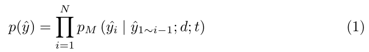

*원문 발췌 — Eq. (1), 본문 PDF p.5, §3.1. [원문 PDF](https://www.ecva.net/papers/eccv_2024/papers_ECCV/papers/10478.pdf). 아래 LaTeX·해설은 원문 이미지와 구분해 읽는다.*

```math
p(\hat y)=\prod_{i=1}^{N}p_M\!\left(\hat y_i\mid \hat y_{1\sim i-1};d;t\right). \qquad\text{(1)}
```

한 줄씩 풀면 다음과 같다.

- $`\hat y=(\hat y_1,\ldots,\hat y_N)`$은 길이 $`N`$의 생성 답변이다.
- $`p_M(\hat y_i\mid\cdot)`$는 이전 output token, 이미지 $`d`$, instruction $`t`$가 주어졌을 때 $`i`$번째 token의 조건부 확률이다.
- 곱셈은 chain rule이다. decoder가 한 번에 독립적으로 $`N`$개를 고르는 것이 아니라 앞에서 고른 token에 조건을 건다.
- 단위는 확률이므로 무차원이며 shape는 각 step의 vocabulary 분포 $`[B,|\mathcal V|]`$에서 선택 token 위치의 scalar다.
- 실제 계산에서는 확률 곱이 underflow하기 쉬워 로그를 더한다. 그러나 FastV는 이 likelihood로 새 학습을 하지 않는다.

**[해설용 유도]** Eq.(1)의 로그는

```math
\log p(\hat y)=\sum_{i=1}^{N}\log p_M(\hat y_i\mid\hat y_{\lt i},d,t)
```

다. supervised training이라면 음의 로그를 loss로 삼을 수 있지만, FastV inference에는 backward/gradient가 없다.

작은 예로 답변 token이 `A`, `<eos>`이고 조건부 확률이 0.8, 0.9라면 sequence 확률은 $`0.8\times0.9=0.72`$다. FastV가 일부 image token을 제거하면 조건부 분포가 바뀔 수 있지만, 논문은 재학습으로 이를 보상하지 않는다.

edge case로 $`N=0`$인 빈 답변의 빈 곱은 수학적으로 1이지만 실제 generation protocol에는 의미가 없다. 또 원문은 뒤 §3.2에서 dataset sample 수도 $`N`$으로 재사용하므로 두 $`N`$을 혼동하면 안 된다.

이 절은 vision encoder feature $`[B,V,d_v]`$를 spatial 축에서 펼치고 linear/projector 또는 cross-attention으로 LLM width $`d`$에 맞춘다고 설명한다. text는 tokenizer와 embedding lookup을 거친다. 이후 “visual/text token”은 이산 ID만 아니라 그 ID/patch에서 나온 embedding row를 뜻한다. Figure 2는 system-image-instruction-output의 causal decoder 흐름을 그린다. [PDF p.5-6, Fig.2]

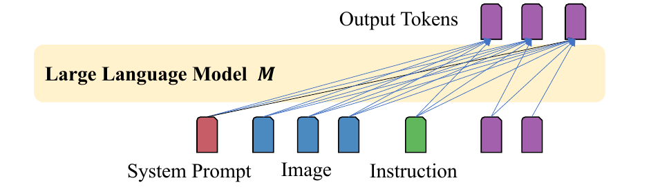

*원문 발췌 — Figure 2, 본문 PDF p.5, §3.1 Preliminaries. [원문 PDF](https://www.ecva.net/papers/eccv_2024/papers_ECCV/papers/10478.pdf). 아래 LaTeX·해설은 원문 이미지와 구분해 읽는다.*

#### 5.3.2 §3.2 Experiment Settings와 Eq.(2)-(4)

저자들은 Flickr30K, PCA-Bench, A-OKVQA, MMMU 혼합에서 $`N=1000`$ image-text pair를 무작위로 뽑아 LLaVA-1.5-7B 응답을 생성한다. generation setting은 원 LLaVA 논문을 따른다고만 하고 max tokens, precision, seed, task별 표본 비율은 쓰지 않는다. [PDF p.6, §3.2]

출력 step $`i`$, layer $`j`$에서 query가 네 token class에 나눈 attention mass를 $`\alpha`$라 두면 Eq.(2)다.

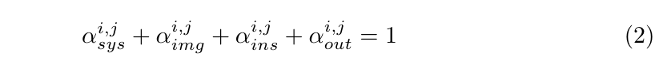

*원문 발췌 — Eq. (2), 본문 PDF p.6, §3.2. [원문 PDF](https://www.ecva.net/papers/eccv_2024/papers_ECCV/papers/10478.pdf). 아래 LaTeX·해설은 원문 이미지와 구분해 읽는다.*

```math
\alpha_{\mathrm{sys}}^{i,j} +\alpha_{\mathrm{img}}^{i,j} +\alpha_{\mathrm{ins}}^{i,j} +\alpha_{\mathrm{out}}^{i,j}=1. \qquad\text{(2)}
```

각 항은 해당 class의 모든 key 위치 attention을 합한 scalar다. 네 class가 접근 가능한 모든 key를 정확히 분할하고, head별 softmax row가 1이라는 가정에서 성립한다. padding이나 특수 separator가 별도 class로 남는다면 분할 정의가 더 필요하지만 원문은 이를 네 class 안에 포함한 것으로 본다.

예를 들어 한 query가 system 네 token에 합계 0.2, image 여섯 token에 0.3, instruction 두 token에 0.1, 이전 output 세 token에 0.4를 주면 합은 1이다. 이미지 token이 여섯 개라서 mass 0.3이 크더라도 token당 평균은 0.05다.

system prompt가 layer $`j`$에서 받은 total allocation은 Eq.(3)이다. [PDF p.6, Eq.(3)]

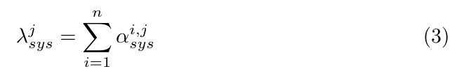

*원문 발췌 — Eq. (3), 본문 PDF p.6, §3.2. [원문 PDF](https://www.ecva.net/papers/eccv_2024/papers_ECCV/papers/10478.pdf). 아래 LaTeX·해설은 원문 이미지와 구분해 읽는다.*

```math
\lambda_{\mathrm{sys}}^j=\sum_{i=1}^{n}\alpha_{\mathrm{sys}}^{i,j}. \qquad\text{(3)}
```

- 여기서 $`n`$은 transformer input length가 아니라 한 응답의 output token 수다.
- 연산 순서는 각 output query에서 system key mass를 합한 뒤, 모든 output step에 다시 합하는 것이다.
- 따라서 원문 식 그대로면 네 class의 $`\lambda`$ 합은 1이 아니라 $`n`$이다.
- 그러나 Figure 3의 allocation 0.85+0.03+0.02+0.10은 1이고, caption은 average allocation이라 부른다.

**[원문 표기 불일치]** Figure 3을 만들려면 Eq.(3) 뒤에 output step 평균 $`1/n`$ 또는 dataset/응답 길이 정규화가 암묵적으로 들어가야 한다. 가능한 엄밀 표기는 다음 **[해설용 수식]**이다.

```math
\bar\lambda_c^j=\frac{1}{n}\sum_{i=1}^{n}\alpha_c^{i,j}, \qquad \sum_c\bar\lambda_c^j=1.
```

원문을 조용히 고쳐 읽으면 안 되므로, 이후에는 식 자체를 말할 때 $`\lambda`$, Figure 3의 0-1 비율을 말할 때 $`\bar\lambda`$라고 구분한다.

image attention efficiency는 Eq.(4)다. [PDF p.6, Eq.(4)]

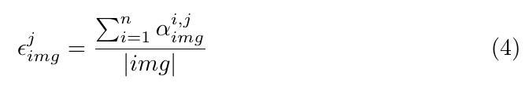

*원문 발췌 — Eq. (4), 본문 PDF p.6, §3.2. [원문 PDF](https://www.ecva.net/papers/eccv_2024/papers_ECCV/papers/10478.pdf). 아래 LaTeX·해설은 원문 이미지와 구분해 읽는다.*

```math
\epsilon_{\mathrm{img}}^j =\frac{\sum_{i=1}^{n}\alpha_{\mathrm{img}}^{i,j}}{|\mathrm{img}|}. \qquad\text{(4)}
```

- 분자는 응답 전체에서 모든 image key가 받은 mass다.
- $`|\mathrm{img}|=V`$는 image token 개수다.
- 결과는 “image class 전체 mass/token 수”이므로 token 하나당 받은 누적 mass다.
- 다른 class와 ratio를 취하면 응답 길이 $`n`$이 상쇄되므로 Figure 3의 상대 efficiency를 비교할 수 있다.

작은 예에서 output step이 4개이고 매 step image mass가 0.24, image token이 6개라면 $`\epsilon_{\mathrm{img}}=(4\times0.24)/6=0.16`$이다. 같은 mass를 token 12개가 나누면 0.08로 절반이 된다. 이 metric은 “token 수가 많은 class가 총 mass가 커 보이는 문제”를 보정한다.

edge case로 $`|\mathrm{img}|=0`$이면 정의되지 않는다. output 길이가 길면 누적값도 커지므로 서로 다른 응답 길이를 직접 비교하려면 $`n`$으로도 나누어야 한다. 논문은 dataset/head 평균 방식의 정확한 순서와 variable-length weighting을 기재하지 않는다.

#### 5.3.3 §3.3 Results와 Figure 3 검산

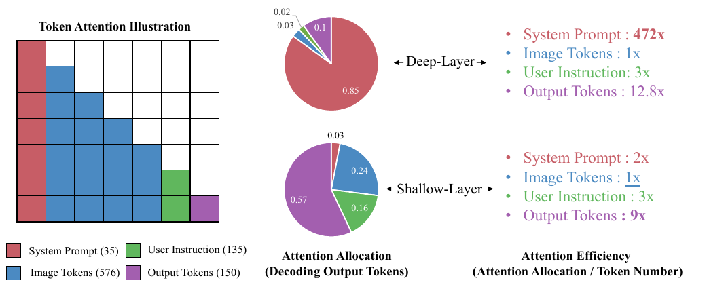

*원문 발췌 — Figure 3, 본문 PDF p.7, §3.3 Results. [원문 PDF](https://www.ecva.net/papers/eccv_2024/papers_ECCV/papers/10478.pdf). 아래 LaTeX·해설은 원문 이미지와 구분해 읽는다.*

저자들은 layer 1-2를 shallow, 나머지 30개를 deep으로 정의한다. 이는 분석 모델 LLaVA-1.5-7B의 32개 decoder layer와 맞는다. Figure 3의 값은 다음과 같다. [PDF p.7, §3.3, Fig.3]

| 구간 | System $`S=35`$ | Image $`V=576`$ | Instruction $`I=135`$ | Output $`O=150`$ |
|---|---:|---:|---:|---:|
| shallow allocation | 0.03 | 0.24 | 0.16 | 0.57 |
| deep allocation | 0.85 | 0.03 | 0.02 | 0.10 |
| shallow efficiency, image=1 | 2x | 1x | 3x | 9x |
| deep efficiency, image=1 | 472x | 1x | 3x | 12.8x |

**[검산]** rounded allocation으로 token당 비율을 다시 계산하면 shallow는

```math
\frac{0.03/35}{0.24/576}=2.06, \quad \frac{0.16/135}{0.24/576}=2.84, \quad \frac{0.57/150}{0.24/576}=9.12
```

로 Figure의 2x, 3x, 9x와 맞는다. deep은

```math
\frac{0.85/35}{0.03/576}=466.3, \quad \frac{0.02/135}{0.03/576}=2.84, \quad \frac{0.10/150}{0.03/576}=12.8.
```

472x와 466.3x의 차이는 pie chart의 0.85/0.03이 반올림된 값이기 때문으로 해석할 수 있다. 원자료가 공개되지 않아 472를 정확히 재계산할 수는 없다. $`1/472=0.212\%`$라서 Introduction의 “image efficiency가 system의 0.21%”와 일치한다.

관찰의 핵심은 총 allocation과 token당 efficiency가 모두 깊이에 따라 불균형해진다는 것이다. shallow에서는 output이 이전 output에 많이 주고, deep에서는 system prompt로 mass가 이동한다. image는 두 구간 모두 token당 최저다.

#### 5.3.4 §3.4 Insights, Figure 4, Supplement Figure 7

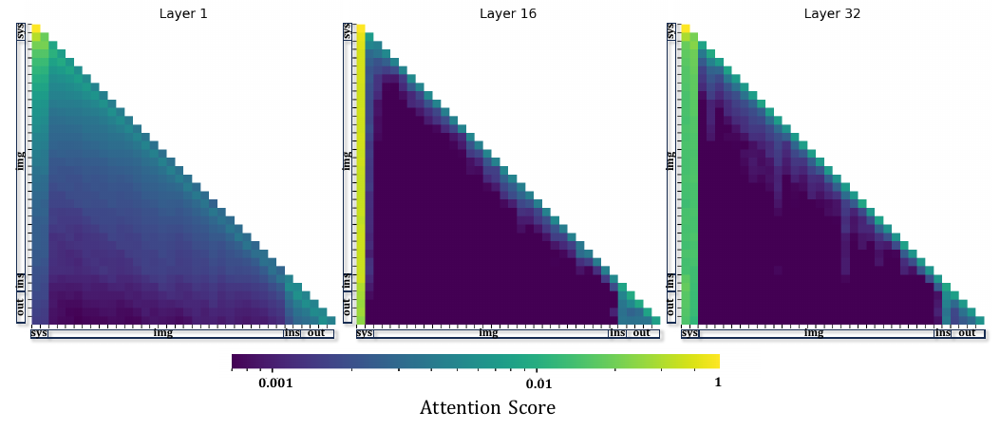

*원문 발췌 — Figure 4, 본문 PDF p.8, §3.4 Insights. [원문 PDF](https://www.ecva.net/papers/eccv_2024/papers_ECCV/papers/10478.pdf). 아래 LaTeX·해설은 원문 이미지와 구분해 읽는다.*

Figure 4는 한 응답의 layer 1, 16, 32 attention map을 보여 준다. causal mask 때문에 오른쪽 위가 비어 있는 삼각형이고, shallow layer는 비교적 넓게 퍼지지만 deep layer는 system/instruction/output 위치의 세로 stripe가 강해진다. [PDF p.7-8, §3.4, Fig.4]

세로선은 여러 query가 같은 key token을 반복해서 읽는다는 뜻이다. 저자는 이 token을 anchor라고 해석한다. Supplement Figure 7은 32개 layer 전부를 보여 주어 layer 3-5부터 왼쪽 system 영역의 세로선이 강해지는 질적 패턴을 보완한다. [Supp. p.S1, Fig.7]

제약도 분명하다.

- Figure 4/7은 한 model response의 시각화다. 1000개 통계의 분산이나 대표성 증거가 아니다.
- 공식 시각화 코드는 head 평균 후 attention map에 kernel/stride 20의 2D average pooling을 적용한다. 따라서 작은 구조는 평활화된다.
- attention color는 log normalization을 사용한다. 색 차이를 선형 배수로 읽으면 안 된다.
- vertical stripe가 정보 집약을 시사하지만, anchor에 실제 visual semantic이 보존됐는지 probe하지 않는다.

<a id="sec-fastv"></a>

### 5.4 §4 FastV

#### 5.4.1 §4.1 Dynamically Prune Vision Tokens

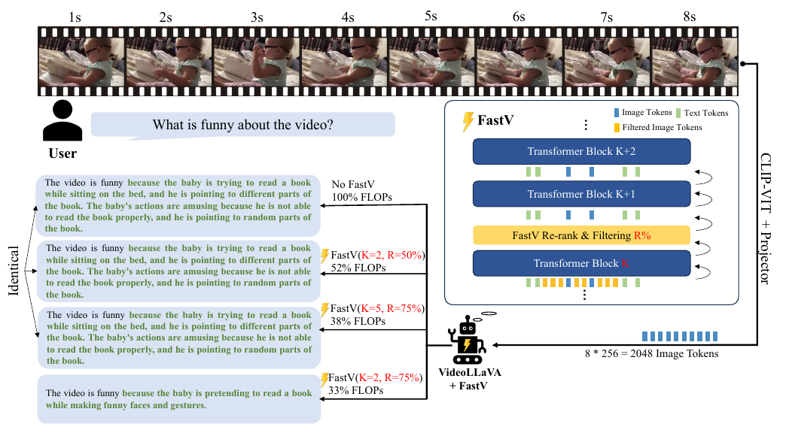

*원문 발췌 — Figure 5, 본문 PDF p.9, §4.1 Dynamically Prune Vision Tokens. [원문 PDF](https://www.ecva.net/papers/eccv_2024/papers_ECCV/papers/10478.pdf). 아래 LaTeX·해설은 원문 이미지와 구분해 읽는다.*

FastV는 ranking function $`f_\phi`$, filtering layer $`K`$, filtering ratio $`R`$로 정의된다. $`K`$까지 정상 계산하고 image token의 중요도를 매겨, 낮은 $`R\%`$를 이후 층에서 제거한다. [PDF p.8-9, §4.1, Fig.5]

원문 설명을 수식으로 명확히 쓰면 다음 **[해설용 수식]**이 된다.

```math
\begin{aligned} s_r&=f_{\phi}(A^{(K)})_r,\\ \mathcal K_{\mathrm{img}}&=\mathrm{TopK}\left(\{s_r:r\in\mathcal I_{\mathrm{img}}\},q\right),\\ q&\approx(1-R)V. \end{aligned}
```

```math
\begin{aligned} \mathcal K &=\mathcal I_{\mathrm{sys}} \cup\mathcal K_{\mathrm{img}} \cup\mathcal I_{\mathrm{ins}} \cup\mathcal I_{\mathrm{out}},\\ H^{(K+1)}&\leftarrow H^{(K+1)}[:,\mathrm{sort}(\mathcal K),:]. \end{aligned}
```

text token은 전부 유지하고 image top-k만 남긴다. keep index를 다시 정렬하는 이유는 중요도 순으로 token을 재배열하지 않고 원래 spatial/raster 순서와 position ID를 보존하기 위해서다.

원문은 $`\phi_{\mathrm{attn}}`$을 “한 token이 모든 다른 token으로부터 받은 평균 attention score”라고 설명한다. 하지만 현재 공식 LLaVA 구현은 다음과 다르다. [공식 코드의 해당 구간](https://github.com/pkunlp-icler/FastV/blob/d1659729b5bf1be225e99ee15783deeea80f63b1/src/transformers/src/transformers/models/llama/modeling_llama.py#L737-L754)

1. head 축을 평균한다.
2. 평균 attention 행렬에서 마지막 query row `[-1]`만 고른다.
3. 그 row의 image key span만 잘라 top-k한다.

즉 코드는

```math
s_r^{\mathrm{code}}=\frac{1}{H_a}\sum_{h=1}^{H_a}A^{(K,h)}_{q_{\mathrm{last}},r}
```

에 가깝고, 모든 query 평균

```math
s_r^{\mathrm{paper}}\stackrel{?}{=} \frac{1}{H_a n_q}\sum_h\sum_q A^{(K,h)}_{q,r}
```

과 같지 않다. 두 식은 모두 **[해설용 수식]**이며 원문 번호가 아니다. 이 불일치는 [공식 issue #14](https://github.com/pkunlp-icler/FastV/issues/14)에서도 제기되었다. 재현자는 “논문 문장”과 “공개 코드 결과” 중 어느 protocol을 따르는지 명시해야 한다.

prefill에서 마지막 query는 대개 user instruction 또는 assistant prefix의 마지막 token이다. output을 한 token씩 생성하면서 KV cache를 쓰지 않고 전체 prefix를 재계산하면 매 step 마지막 output token이 query가 되어 선택이 다시 달라질 수 있다. 논문은 이 query 선택과 재-pruning 주기를 명시하지 않는다.

$`K=0`$이면 LLM attention이 아직 없으므로 $`\phi_{\mathrm{rand}}`$로 image token을 무작위 제거한다. 이는 content-adaptive FastV의 극단 설정이 아니라 별도 random baseline에 가깝다.

Figure 5의 Video-LLaVA 예시는 8초 영상에서 8프레임 $`\times256=2048`$ image token을 만든다. baseline 100%, $`(K=2,R=50\%)`$ 52%, $`(K=5,R=75\%)`$ 38%는 같은 긴 답변을 내고, 더 공격적인 $`(K=2,R=75\%)`$ 33%는 “pretending to read”라는 다른 짧은 답변을 낸다. 한 사례의 동일 출력은 correctness 보장이 아니라 작동 예시다. [PDF p.9, Fig.5]

#### 5.4.2 pruning과 masking 구현을 구분하기

**Mask-only 경로.** 공식 README는 OCR-VQA $`K,R`$ ablation 편의를 위해 discarded token을 deep layer에서 mask하며, 이 구현은 “no speed up”이라고 명시한다. [공식 README](https://github.com/pkunlp-icler/FastV/blob/d1659729b5bf1be225e99ee15783deeea80f63b1/README.md#L95-L105) 코드상 hidden state shape $`[B,n,d]`$는 유지되고 image key의 attention mask만 0이 된다. 모든 query row와 모든 token의 FFN은 계속 계산되므로 Eq.(5)의 비용 감소가 실현되지 않는다.

**In-place 삭제 경로.** hidden state를 `hidden_states[:, keep_indices, :]`로 gather하고 position ID와 causal mask를 갱신한다. 이후 layer의 MHA와 FFN은 실제로 짧은 $`n'`$를 받는다. 원 구현의 CLI 설명은 이 경로가 KV cache를 지원하지 않는다고 명시한다. [공식 구현](https://github.com/pkunlp-icler/FastV/blob/d1659729b5bf1be225e99ee15783deeea80f63b1/src/transformers/src/transformers/models/llama/modeling_llama.py#L726-L763)

**논문 이후 static KV-cache 경로.** 현재 README의 HF 통합은 initial forward에서 한 번 pruning한 뒤 모든 decode token이 같은 image token 집합을 읽는다고 명시한다. 원래 매 forward 재-pruning과 약간 다르다. 이는 실용적이지만 ECCV 본문의 검증 결과와 동일 구현이라고 가정할 수 없다.

#### 5.4.3 §4.2 Computing Cost Estimation과 Eq.(5)

한 transformer layer의 근사 비용은 원문 비번호 식이다. [PDF p.9, §4.2]

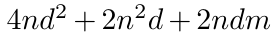

*원문 발췌 — 비번호 식: layer 비용, 본문 PDF p.9, §4.2. [원문 PDF](https://www.ecva.net/papers/eccv_2024/papers_ECCV/papers/10478.pdf). 아래 LaTeX·해설은 원문 이미지와 구분해 읽는다.*

```math
C(n)=4nd^2+2n^2d+2ndm.
```

항별 의미는 다음과 같다.

- $`4nd^2`$: $`Q,K,V`$ 세 projection과 attention output projection 한 개. 각자 $`n\times d`$와 $`d\times d`$의 곱이다.
- $`2n^2d`$: $`QK^\top`$로 score를 만드는 항과 $`AV`$로 value를 합치는 항.
- $`2ndm`$: $`d\to m`$과 $`m\to d`$인 두 FFN linear.
- 이 식은 multiply-add를 1회로 세는 관례에 가깝다. multiply와 add를 각각 FLOP 1로 세면 상수 2가 달라질 수 있지만 감소 ratio는 같다.
- causal triangle, GQA, RoPE, normalization, activation, residual, LM head, vision encoder/projector, top-k/gather, memory traffic은 포함하지 않는다.

원문은 $`\hat n=(1-R\%)n`$이라 두고, 전체 $`T`$층의 감소율을 Eq.(5)로 쓴다. [PDF p.9, Eq.(5)]

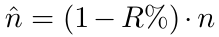

*원문 발췌 — 비번호 식: pruning 후 길이, 본문 PDF p.9, §4.2. [원문 PDF](https://www.ecva.net/papers/eccv_2024/papers_ECCV/papers/10478.pdf). 아래 LaTeX·해설은 원문 이미지와 구분해 읽는다.*

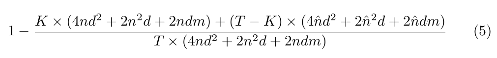

*원문 발췌 — Eq. (5), 본문 PDF p.9, §4.2. [원문 PDF](https://www.ecva.net/papers/eccv_2024/papers_ECCV/papers/10478.pdf). 아래 LaTeX·해설은 원문 이미지와 구분해 읽는다.*

```math
1- \frac{ K\left(4nd^2+2n^2d+2ndm\right) +(T-K)\left(4\hat n d^2+2\hat n^2d+2\hat n dm\right) }{ T\left(4nd^2+2n^2d+2ndm\right) }. \qquad\text{(5)}
```

연산 순서는 다음과 같다.

1. full sequence 비용 $`C(n)`$을 계산한다.
2. 앞 $`K`$개 layer 비용 $`K C(n)`$을 더한다.
3. pruning 뒤 비용 $`C(\hat n)`$을 계산해 나머지 $`T-K`$개에 곱한다.
4. 이를 baseline $`T C(n)`$으로 나눠 “남은 비용 비율”을 구한다.
5. 1에서 빼 “감소 비율”을 얻는다.

**[원문 표기 모호성]** FastV는 image token만 $`R`$ 비율 제거하므로 전체 sequence length의 정확한 식은 $`\hat n=(1-R)n`$이 아니라 다음이어야 한다.

```math
\hat n=n_{\mathrm{text}}+(1-R)n_{\mathrm{img}} =n-Rn_{\mathrm{img}}. \qquad\text{[해설용 수식]}
```

Table 1의 수치는 실제로 이 해석을 사용한 것으로 보인다. LLaVA의 system 36개와 image 576개만 세어 $`n=612`$, $`R=0.5`$이면 $`\hat n=36+288=324`$다. instruction/output 길이를 절대 비용에서 제외한 이유는 논문에 설명되지 않는다.

Eq.(5)는 다음처럼 간단히 변형할 수 있다.

```math
\mathrm{Reduction} =\frac{T-K}{T}\left(1-\frac{C(\hat n)}{C(n)}\right). \qquad\text{[해설용 유도]}
```

이 형태는 직관을 준다. $`K`$가 커지면 절약 가능한 layer 비율 $`(T-K)/T`$가 줄고, $`R`$이 커져 $`\hat n`$이 작아지면 층당 절약이 커진다.

**13B 수치 예시.** $`T=40,d=5120,m=13824,n=612,\hat n=324,K=2`$를 넣으면

```math
C(612) =64.173\mathrm{B}+3.835\mathrm{B}+86.633\mathrm{B} =154.642\mathrm{B},
```

```math
C(324) =33.974\mathrm{B}+1.075\mathrm{B}+45.865\mathrm{B} =80.914\mathrm{B}.
```

```math
\begin{aligned} \frac{2C(612)+38C(324)}{40}&=84.60\mathrm{B},\\ \frac{84.60}{154.64}&=54.71\%,\\ \mathrm{Reduction}&=45.29\%. \end{aligned}
```

Table 1의 154.6B -> 84.6B, FLOPs ratio 55%와 일치한다. [검산]

여기서 또 하나의 중요한 단위 문제가 드러난다. Table 1의 `FLOPs(B)`는 $`T`$층 전체 합이 아니라 Eq.(5)의 layer 평균처럼 수치가 맞는다. 13B baseline 전체 MHA+FFN 근사 합은 $`40\times154.64\mathrm{B}=6.19\mathrm{T}`$이고 FastV는 약 $`3.38\mathrm{T}`$다. ratio에는 영향이 없지만 절대 FLOPs label은 불충분하게 설명되어 있다.

edge case는 다음과 같다.

- $`R=0`$: $`\hat n=n`$, 감소율 0.
- $`K=T`$: 줄인 뒤 처리할 layer가 없어 감소율 0.
- $`K=0`$: 모든 layer가 짧은 열을 받지만 attention ranking은 불가능해 random selection.
- $`R=1`$: 원문 단순식이면 $`\hat n=0`$이지만 실제로는 text token이 남는다. 전체 sequence를 0으로 두면 안 된다.
- $`V=1`$, $`R=0.5`$: 유지 개수가 정수가 아니므로 floor/round/ceil 정책이 필요하다. 원문은 미기재다.
- $`n\ll d,m`$: projection/FFN 선형 항이 지배해 sequence를 절반으로 줄여도 층 비용이 거의 절반이다. $`n`$이 매우 길어 $`n^2d`$가 지배하면 attention 항은 더 빠르게 줄지만, 실제 kernel과 memory 병목은 별도 측정이 필요하다.

Supplement Figure 8은 $`K=0`$-30, $`R=0`$-1에서 이 theoretical reduction을 heat map으로 보인다. 왼쪽 아래 $`R=0`$은 0, 오른쪽 아래 작은 $`K`$/큰 $`R`$이 가장 밝고, $`K`$가 깊어질수록 절약이 줄어든다. [Supp. p.S3, §B, Fig.8]

#### 5.4.4 §4.3 Comparison: Training With Less Visual Tokens

대안은 vision encoder 뒤에서 token을 pooling해 처음부터 적은 token으로 LLaVA를 학습하는 것이다. 이 경우 vision detail을 LLM이 보기 전부터 잃는다. FastV는 높은 resolution feature를 처음 $`K`$층에 전부 보여 준 뒤 깊은 층에서만 줄인다는 차이가 있다. [PDF p.10, §4.3]

공식 코드의 비교 model projector는 token 축을 channel로 바꾼 뒤 `AvgPool1d(kernel_size=stride)`를 적용해 stride 2에서 576 -> 288로 줄이는 구조다. 이는 2D spatial pooling stride 2로 576 -> 144가 되는 방식과 다르다. 본문 문장만으로는 축이 모호하지만 공개 구현은 1D token-sequence pooling이다.

<a id="sec-experiments"></a>

### 5.5 §5 Experiments and Results

#### 5.5.1 §5.1 Evaluation Tasks와 Supplement Appendix A

본문은 image captioning, VQA, multimodal reasoning, video QA, fine-grained benchmark를 사용하며 모든 실험을 greedy search로 수행한다고 명시한다. 세부는 공식 Supplement Appendix A에 있다. [PDF p.10, §5.1; Supp. p.S2-S3, §A]

| 범주 | dataset/split | metric | prompt와 protocol | 표본 수 |
|---|---|---|---|---:|
| Image captioning | Nocaps, Flickr30k; split 미기재 | CIDEr | `Describe the image in one sentence.` | 미기재 |
| VQA | A-OKVQA development | multiple-choice accuracy | 이미지 분석, question/options, 정답 letter만 출력하도록 지시 | dev 전체로 보이나 명시적 개수 없음 |
| VQA/OCR | OCR-VQA test | Rouge-L | dataset 기본 question | 미기재 |
| Multimodal reasoning | MMMU development | multiple-choice accuracy | 공식 dataset 기본 prompt | 미기재 |
| Embodied reasoning | PCA-Bench open/closed test | Perception, Cognition, Action, Genuine PCA | 공식 dataset 기본 prompt, autonomous driving/domestic robot/open-world game 평균 | 미기재 |
| Video QA | TGIF-QA, MSVD-QA, MSRVTT-QA | accuracy, ChatGPT score | Video-LLaVA 기본 question; Video-ChatGPT GPT 평가 pipeline | 각 dataset 첫 1000개 |
| Fine-grained | MME | 14 category score와 total | 상세 prompt/split 미기재 | 미기재 |
| Fine-grained | SeedBench | score | 상세 prompt/split 미기재 | 미기재 |
| Science QA | SciQA-IMG | score | 상세 prompt/split 미기재 | 미기재 |
| Integrated capability | MMVet | score | free-form 평가 세부 미기재 | 미기재 |
| Diagram | AI2Diagram | score | Table 2에는 있으나 Appendix A의 별도 설명 없음 | 미기재 |

CIDEr는 caption 후보와 여러 reference caption의 n-gram 합의를 재는 지표다. Rouge-L은 longest common subsequence 기반이다. A-OKVQA/MMMU의 accuracy와 CIDEr/Rouge-L은 단위와 범위가 다르므로 Table 1의 `Avg`는 편의적 비가중 평균이지 하나의 공통 확률이 아니다.

PCA-Bench의 Genuine PCA는 한 example에서 P, C, A를 모두 맞혀야 1점을 얻는다. 따라서 개별 평균보다 엄격하다. 이것도 실제 환경에서 연속 행동을 수행했다는 뜻은 아니다.

Video QA의 ChatGPT score는 상용 API evaluator에 의존하고, API 예산 때문에 각 dataset 첫 1000개만 쓴다. sampling이 random이 아니므로 dataset 전체 대표성과 evaluator version 재현성이 제한된다.

#### 5.5.2 §5.2 Model Settings

image task에는 LLaVA-1.5-7B/13B와 Qwen-VL-Chat-7B, video에는 Video-LLaVA, 추가 비교에는 InstructBLIP-Vicuna-13B를 쓴다. baseline 설정은 각 원 논문을 따른다고만 한다. [PDF p.11-12, §5.2-5.3]

| 실험 요소 | 논문에서 확인된 내용 | 확인되지 않은 내용 |
|---|---|---|
| decoding | 모두 greedy search | temperature의 실제 값, stopping rule, max new tokens |
| image token 수 | LLaVA 576; Video-LLaVA example 2048 | Qwen-VL/InstructBLIP 실험의 정확한 token 수 |
| model | 이름과 7B/13B 규모 | 정확한 checkpoint hash, tokenizer revision |
| hardware | Table 4의 single A40 | 나머지 성능 실험 GPU, CPU, interconnect |
| precision | 미기재 | FP32/FP16/BF16/INT8/4-bit 여부 |
| batch | 미기재 | micro/global batch, padding 방식 |
| 길이 | attention 분석의 평균 S/V/I/O=35/576/135/150; Table 4는 option 한 token | task별 실제 input/output length 분포 |
| runtime stack | 미기재 | PyTorch/CUDA/cuDNN/Transformers 버전, fused attention kernel |
| 통계 | single table 값 | seed, 반복 수, 표준편차, confidence interval, 유의성 검정 |

따라서 이 논문은 algorithmic effectiveness를 넓게 보이는 데는 강하지만, deployment latency를 재현하는 system paper 수준의 환경 기술은 부족하다.

#### 5.5.3 §5.3 Main Results - Table 1과 Figure 1

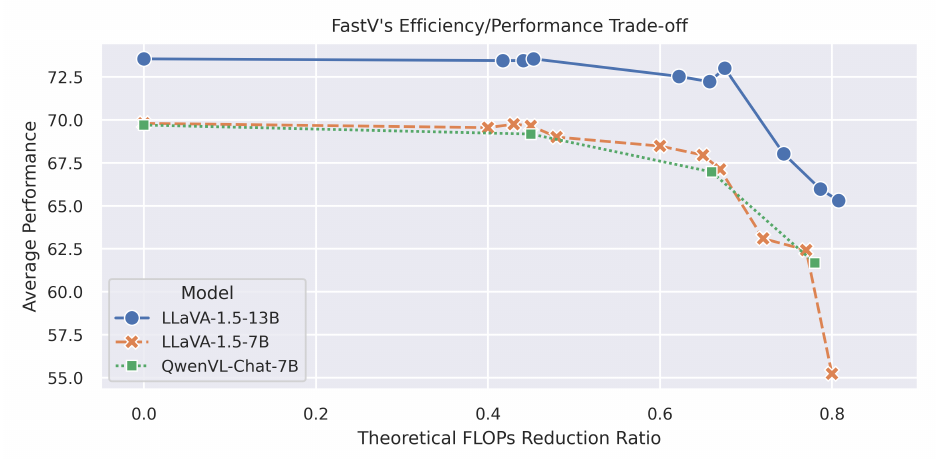

*원문 발췌 — Figure 1, 본문 PDF p.2, §1 Introduction. [원문 PDF](https://www.ecva.net/papers/eccv_2024/papers_ECCV/papers/10478.pdf). 아래 LaTeX·해설은 원문 이미지와 구분해 읽는다.*

Table 1의 전체 결과를 모델별로 옮기면 다음과 같다. 모든 수치는 **[저자 보고]**다. `FLOPs ratio`는 baseline 대비 남은 이론 비용이며, 감소율은 $`1-\mathrm{ratio}`$다. [PDF p.10, Table 1]

**LLaVA-1.5-7B**

| $`K`$ | $`R`$ | FLOPs(B) | ratio | Nocaps | Flickr30k | A-OKVQA | MMMU | Avg |
|---:|---:|---:|---:|---:|---:|---:|---:|---:|
| baseline | - | 99.3 | 100% | 99.8 | 67.9 | 76.7 | 34.8 | 69.8 |
| 2 | 90% | 19.9 | 20% | 72.1 | 43.7 | 70.1 | 35.0 | 55.2 |
| 2 | 75% | 32.8 | 33% | 94.6 | 63.6 | 75.5 | 34.8 | 67.1 |
| 2 | 50% | 54.6 | 55% | 99.7 | 67.5 | 77.0 | 34.4 | 69.7 |
| 3 | 90% | 22.8 | 23% | 87.2 | 55.8 | 71.9 | 34.8 | 62.4 |
| 3 | 75% | 34.8 | 35% | 98.0 | 65.0 | 74.7 | 34.1 | 68.0 |
| 3 | 50% | 56.6 | 57% | 99.7 | 68.3 | 76.7 | 34.3 | 69.8 |
| 5 | 90% | 27.8 | 28% | 88.6 | 59.3 | 70.6 | 33.9 | 63.1 |
| 5 | 75% | 39.7 | 40% | 98.5 | 66.3 | 74.8 | 34.3 | 68.5 |
| 5 | 50% | 59.6 | 60% | 99.2 | 67.9 | 76.8 | 34.3 | 69.6 |
| 0 | 90% | 18.9 | 19% | 7.0 | 53.2 | 66.8 | 34.7 | 40.4 |
| 0 | 75% | 28.8 | 29% | 27.2 | 61.4 | 72.8 | 35.1 | 49.1 |
| 0 | 50% | 51.6 | 52% | 100.9 | 65.5 | 75.3 | 34.3 | 69.0 |

**LLaVA-1.5-13B**

| $`K`$ | $`R`$ | FLOPs(B) | ratio | Nocaps | Flickr30k | A-OKVQA | MMMU | Avg |
|---:|---:|---:|---:|---:|---:|---:|---:|---:|
| baseline | - | 154.6 | 100% | 102.8 | 73.0 | 82.0 | 36.4 | 73.6 |
| 2 | 90% | 29.7 | 19% | 87.9 | 62.0 | 75.0 | 36.3 | 65.3 |
| 2 | 75% | 50.2 | 32% | 100.5 | 72.5 | 80.9 | 38.1 | 73.0 |
| 2 | 50% | 84.6 | 55% | 103.1 | 73.4 | 81.0 | 36.7 | 73.6 |
| 3 | 90% | 33.0 | 21% | 90.2 | 63.6 | 75.2 | 34.9 | 66.0 |
| 3 | 75% | 52.9 | 34% | 100.9 | 72.1 | 79.5 | 36.4 | 72.2 |
| 3 | 50% | 86.4 | 56% | 102.7 | 73.4 | 81.3 | 36.4 | 73.5 |
| 5 | 90% | 39.6 | 26% | 93.5 | 67.4 | 75.8 | 35.4 | 68.0 |
| 5 | 75% | 58.4 | 38% | 101.4 | 72.5 | 80.0 | 36.2 | 72.5 |
| 5 | 50% | 90.1 | 58% | 102.5 | 73.5 | 81.2 | 36.6 | 73.5 |

**QwenVL-Chat-7B**

| $`K`$ | $`R`$ | FLOPs(B) | ratio | Nocaps | Flickr30k | A-OKVQA | MMMU | Avg |
|---:|---:|---:|---:|---:|---:|---:|---:|---:|
| baseline | - | 71.9 | 100% | 94.9 | 72.5 | 75.6 | 35.8 | 69.7 |
| 2 | 90% | 15.8 | 22% | 81.9 | 61.5 | 68.5 | 35.3 | 61.7 |
| 2 | 75% | 24.4 | 34% | 90.5 | 67.0 | 75.1 | 35.3 | 67.0 |
| 2 | 50% | 39.5 | 55% | 94.4 | 71.4 | 75.3 | 35.6 | 69.2 |

주요 패턴은 세 가지다.

1. $`R=50\%`$에서는 세 모델 모두 ratio 55-60%에 평균을 거의 유지한다. 13B $`K=2`$는 baseline과 소수 첫째 자리까지 동일하다.
2. $`R=75\%`$는 13B에서 평균 -0.6, 7B에서 -2.7, Qwen에서 -2.7로 model별 내성이 다르다.
3. $`R=90\%`$는 caption 성능을 크게 무너뜨린다. 특히 7B $`K=0`$ Nocaps 7.0은 random pre-LLM 제거가 visual evidence를 잃는 edge case다.

**[검산]** 13B baseline 평균은

```math
(102.8+73.0+82.0+36.4)/4=73.55\rightarrow73.6
```

이고 $`K=2,R=50\%`$도

```math
(103.1+73.4+81.0+36.7)/4=73.55\rightarrow73.6
```

이다. task별로는 A-OKVQA가 -1.0점, Nocaps +0.3, Flickr +0.4, MMMU +0.3이므로 “모든 task에서 손실 0”이 아니라 비가중 평균 유지다.

Figure 1은 x축을 theoretical FLOPs reduction, y축을 네 metric의 평균으로 해 각 model curve를 그린다. $`K,R`$가 다른 여러 점 중 대략 45% 감소까지 평평하고 이후 급격히 하락한다. [PDF p.2, Fig.1] 이 그림은 직관적 frontier이지만, metric scale normalization, uncertainty bar, 실제 latency 축이 없다.

#### 5.5.4 Table 2-3: 더 많은 model과 fine-grained benchmark

Table 2는 다음과 같다. [PDF p.11, Table 2]

| Model | AI2Diagram | SciQA-IMG | SeedBench | MMVet | MME |
|---|---:|---:|---:|---:|---:|
| LLaVA-1.5-13B | 59.45 | 72.99 | 68.23 | 30.55 | 1827.75 |
| + FastV $`(K=2,R=50\%)`$ | 58.96 | 73.23 | 68.03 | 31.25 | 1849.68 |
| InstructBLIP-Vicuna-13B | 45.46 | 61.15 | 52.11 | 24.19 | 1143.5 |
| + FastV $`(K=2,R=50\%)`$ | 43.12 | 61.23 | 50.41 | 22.15 | 1129.8 |
| + FastV $`(K=5,R=50\%)`$ | 44.39 | 62.33 | 51.69 | 23.51 | 1140.5 |

**[검산]** LLaVA FastV의 변화는 AI2Diagram -0.49, SciQA +0.24, Seed -0.20, MMVet +0.70, MME +21.93이다. InstructBLIP $`K=2`$는 -2.34, +0.08, -1.70, -2.04, -13.7이고, $`K=5`$는 baseline 대비 -1.07, +1.18, -0.42, -0.68, -3.0이다. Q-Former가 이미 image token을 압축한 InstructBLIP는 추가 early pruning에 더 민감하다는 저자 해석과 맞는다.

Table 3 MME를 metric별로 전사하면 다음과 같다. [PDF p.11, Table 3]

| MME category | Baseline | FastV $`K=2,R=50\%`$ | 변화 |
|---|---:|---:|---:|
| Existence | 185.00 | 185.00 | 0.00 |
| Count | 155.00 | 155.00 | 0.00 |
| Position | 133.33 | 133.33 | 0.00 |
| Color | 170.00 | 175.00 | +5.00 |
| OCR | 125.00 | 132.50 | +7.50 |
| Poster | 160.72 | 159.77 | -0.95 |
| Celebrity | 152.54 | 153.15 | +0.61 |
| Scene | 161.25 | 161.75 | +0.50 |
| Landmark | 170.50 | 168.25 | -2.25 |
| Artwork | 118.50 | 117.00 | -1.50 |
| Commonsense | 128.41 | 126.43 | -1.98 |
| Numerical calculation | 42.50 | 42.50 | 0.00 |
| Text translation | 77.50 | 82.50 | +5.00 |
| Code reasoning | 47.50 | 57.50 | +10.00 |
| **Total** | **1827.75** | **1849.68** | **+21.93** |

**[검산]** 14개 category 합은 baseline 1827.75, FastV 1849.68로 total과 정확히 맞는다. 일부 하락과 일부 상승이 상쇄되므로 total 상승만으로 모든 시각 능력이 좋아졌다고 말할 수 없다.

#### 5.5.5 Table 4: 실제 latency와 memory

Table 4는 단일 A40에서 A-OKVQA option 한 token만 출력해 output length 영향을 줄인 실험이다. [PDF p.12, Table 4]

| Model | Total time | GPU memory | Score | latency/example |
|---|---:|---:|---:|---:|
| LLaVA-1.5-7B | 6:34 | 19G | 76.7 | 0.344s |
| + FastV $`(K=0,R=50\%)`$ | 4:23 | 16G | 75.3 | 0.230s |
| LLaVA-1.5-13B | 10:17 | 38G | 82.0 | 0.539s |
| + FastV $`(K=0,R=50\%)`$ | 6:30 | 30G | 80.5 | 0.341s |

**[검산]**

- 7B latency 감소는 $`1-0.230/0.344=33.14\%`$, speedup은 $`1.50\times`$, memory 표기 감소는 15.8%, score는 -1.4점이다.
- 13B latency 감소는 $`1-0.341/0.539=36.73\%`$, speedup은 $`1.58\times`$, memory 표기 감소는 21.1%, score는 -1.5점이다.
- 13B FastV 0.341s는 7B baseline 0.344s보다 약 0.9% 빠르고 score는 +3.8점이다.
- total seconds를 per-example latency로 나누면 네 행 모두 약 1144-1145 examples가 되어 내부적으로 일관된다.

그러나 이 표는 강한 제한이 있다.

- $`K=0`$이므로 §4.1에 따라 attention ranking이 아니라 random image-token 제거다.
- 답변이 한 option token이라 긴 autoregressive decode, TPOT, KV-cache 성장, end-to-end 대화 latency를 평가하지 않는다.
- `GPU-Memory`가 peak allocated인지 reserved인지, 측정 API와 시점이 무엇인지 미기재다.
- precision, batch, warmup, 반복 횟수, 동기화 방식, CUDA/kernel/software version이 미기재다.
- 따라서 45% 이론 FLOPs 감소와 33-37% 실제 latency 감소를 같은 숫자로 취급하면 안 된다.

#### 5.5.6 Table 5: PCA-Bench와 OCR-VQA

Table 5는 13B FastV의 fine-grained perception/cognition/action과 OCR을 보여 준다. [PDF p.12, Table 5]

| Model | FLOPs | Open P | Open C | Open A | Open G-PCA | Closed P | Closed C | Closed A | Closed G-PCA | OCR Rouge-L |
|---|---:|---:|---:|---:|---:|---:|---:|---:|---:|---:|
| LLaVA-1.5-7B | 99.3B | 0.493 | 0.353 | 0.433 | 0.263 | 0.513 | 0.387 | 0.450 | 0.277 | 0.51 |
| LLaVA-1.5-13B | 154.6B | 0.530 | 0.460 | 0.503 | 0.333 | 0.563 | 0.550 | 0.573 | 0.353 | 0.55 |
| 13B FastV $`(K=0,R=50\%)`$ | 78.9B | 0.490 | 0.395 | 0.443 | 0.292 | 0.519 | 0.450 | 0.512 | 0.283 | 0.49 |
| 13B FastV $`(K=2,R=50\%)`$ | 84.6B | 0.533 | 0.423 | 0.513 | 0.340 | 0.581 | 0.545 | 0.580 | 0.368 | 0.55 |
| 13B FastV $`(K=2,R=75\%)`$ | 50.2B | 0.513 | 0.417 | 0.483 | 0.320 | 0.523 | 0.510 | 0.533 | 0.323 | 0.54 |

$`K=0`$은 13B baseline보다 크게 떨어지지만 $`K=2,R=50\%`$는 Open C와 Closed C를 제외한 여러 항목에서 동등하거나 높고, OCR은 0.55를 유지한다. 이는 “처음 두 층이 중요 visual information을 다른 token에 전달한다”는 가설과 양립한다. 다만 차이가 작고 반복 통계가 없어 실제 개선이라기보다 성능 유지 증거로 보는 편이 안전하다.

#### 5.5.7 Table 6: Video QA

| Model | TGIF Acc | TGIF Score | MSVD Acc | MSVD Score | MSRVTT Acc | MSRVTT Score | Avg Acc | Avg Score |
|---|---:|---:|---:|---:|---:|---:|---:|---:|
| Video-LLaVA, FLOPs 100% | 0.18 | 2.5 | 0.70 | 3.9 | 0.56 | 3.5 | 0.48 | 3.3 |
| FastV $`(K=2,R=50\%)`$, FLOPs 52.3% | 0.21 | 2.6 | 0.71 | 3.9 | 0.55 | 3.5 | 0.49 | 3.3 |
| FastV $`(K=5,R=50\%)`$, FLOPs 57.1% | 0.20 | 2.6 | 0.71 | 4.0 | 0.57 | 3.5 | 0.49 | 3.4 |

[PDF p.13, Table 6] $`K=2`$의 이론 감소는 47.7%, $`K=5`$는 42.9%다. 평균 accuracy는 +0.01, GPT score는 0 또는 +0.1이다. 저자는 video의 중복이 커 pruning이 regularization처럼 작용했을 가능성을 제시하지만, 각 dataset 첫 1000개와 GPT evaluator의 noise를 고려하면 “FastV가 일반적으로 video 성능을 높인다”는 강한 결론은 이 표만으로 부족하다.

#### 5.5.8 §5.4 Ablation Studies, Figure 6, Table 7

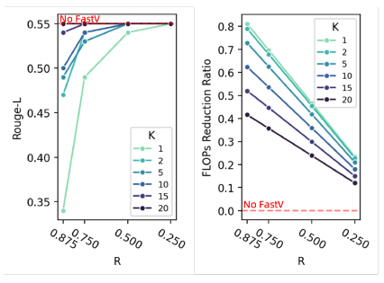

*원문 발췌 — Figure 6, 본문 PDF p.13, §5.4 Ablation Studies. [원문 PDF](https://www.ecva.net/papers/eccv_2024/papers_ECCV/papers/10478.pdf). 아래 LaTeX·해설은 원문 이미지와 구분해 읽는다.*

Figure 6은 LLaVA-1.5-13B OCR-VQA에서 $`K\in\{1,2,5,10,15,20\}`$와 제거율 $`R\in\{0.875,0.75,0.50,0.25\}`$를 sweep한다. [PDF p.13, Fig.6] 작은 $`K`$에서는 $`R`$을 낮추면 Rouge-L이 크게 회복되는 반면, 큰 $`K`$에서는 $`R`$ 변화의 영향이 작다. 깊은 층일수록 image redundancy가 크다는 저자 해석이다.

주의할 표현이 있다. 원문은 “when $`K`$ is small, lowering $`R`$ improves performance with a smaller FLOPs reduction”이라고 한다. 여기서 $`R`$은 **제거율**이므로 낮추면 더 많은 image token을 남긴다. `retention ratio`로 반대로 읽으면 곡선을 거꾸로 해석한다.

Table 7은 세 종류의 질문을 분리한다. 처음부터 적은 token으로 재학습할 것인가, 어떤 modality를 자를 것인가, attention rank가 random보다 나은가다. [PDF p.13-14, Table 7]

| 설정 | Nocaps | Flickr30k | A-OKVQA | MMMU |
|---|---:|---:|---:|---:|
| LLaVA-1.5-7B retrained baseline | 100.3 | 70.2 | 78.5 | 34.5 |
| (a) train with 50% image tokens | 98.5 | 68.5 | 76.8 | 33.5 |
| (b) FastV $`(K=2,R=50\%)`$ | 100.1 | 70.0 | 78.4 | 34.6 |
| (c) FastV $`(K=2,R=50\%)`$, random | 99.5 | 68.3 | 78.2 | 34.2 |
| (d) FastV, prune system prompt | 89.2 | 64.3 | 69.2 | 33.8 |
| (e) prune first half system prompt | 17.5 | 27.8 | Failed | Failed |
| (f) FastV, prune instruction | 77.3 | 50.1 | 56.5 | 29.5 |
| (g) StreamingLLM | 13.2 | 21.4 | Failed | Failed |

**Training with less tokens.** 두 LLaVA-1.5-7B를 원래 pretraining과 SFT protocol로 재학습하고, 하나만 CLIP 뒤 1D average pooling stride 2로 image token을 절반으로 만들었다. pooled model은 네 task에서 모두 낮아졌다. 반면 FastV는 full-resolution representation을 처음 두 층에서 사용하고 baseline을 거의 유지했다. 정확한 trainable/frozen parameter, dataset mixture, batch, optimizer, learning rate, GPU-hours는 FastV 논문에 없다.

**Ranking ablation.** attention rank (b)는 random rank (c)보다 Nocaps +0.6, Flickr +1.7, A-OKVQA +0.2, MMMU +0.4다. attention criterion의 이득은 있으나 거대하지 않고 seed 분산이 없어 유의성은 판단할 수 없다.

**Text token pruning.** system 또는 instruction token은 수가 적어도 제거 시 큰 성능 손실이 난다. 특히 system prompt의 앞 절반을 자르면 두 multiple-choice task가 evaluation 형식을 따르지 못해 `Failed`다. 이는 attention sink와 초기 token의 중요성을 보고한 StreamingLLM과 일치한다. 그러나 StreamingLLM 규칙을 LVLM에 그대로 적용하면 역시 `Failed`가 난다. visual token과 text token은 같은 비율로 일괄 pruning할 수 없다는 증거다.

<a id="sec-conclusion"></a>

### 5.6 §6 Conclusion과 Acknowledgments

Conclusion은 깊은 층의 visual attention 비효율을 관찰하고, attention ranking으로 불필요 image token을 제거해 inference cost를 줄였다는 주장을 반복한다. [PDF p.14, §6] 새 limitation이나 future work는 본문 결론에 없고, 실제 system 한계는 Supplement C에 있다.

Acknowledgments는 reviewer와 중국 국가자연과학기금 grant 61936012, 61876004를 언급한다. [PDF p.15] 참고문헌은 PDF p.15-18의 49개 항목을 확인했으며, §2와 본문에서 호출된 역할만 이 리뷰에 반영했다.

<a id="sec-supplement"></a>

### 5.7 공식 Supplement 전체

#### Figure 7: 32개 layer의 full attention map

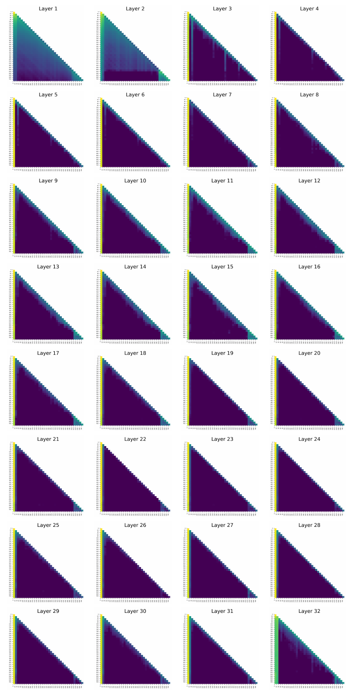

*원문 발췌 — Figure 7, 공식 Supplement PDF p.1, 32-layer attention maps. [원문 PDF](https://www.ecva.net/papers/eccv_2024/papers_ECCV/papers/10478-supp.pdf). 아래 LaTeX·해설은 원문 이미지와 구분해 읽는다.*

Supplement p.S1 한 쪽 전체가 LLaVA 32개 layer heatmap이다. layer 1-2는 분포가 넓고, layer 3 이후 왼쪽 system 영역 세로선이 두드러지며, layer 32는 local/diagonal 구조도 다시 강하다. 이 그림은 “after layer 2”라는 제목의 시각적 동기지만 한 example의 질적 사례다. [Supp. p.S1, Fig.7]

#### Appendix A: Evaluation Tasks Description

Nocaps/Flickr30k prompt, A-OKVQA dev와 exact instruction 형식, OCR-VQA test, MMMU dev, PCA-Bench open/closed, video dataset 첫 1000개 및 GPT 평가, MME/SeedBench/SciQA-IMG/MMVet의 성격을 설명한다. 위 §5.5.1에 모두 대응시켰다. [Supp. p.S2-S3, §A]

#### Appendix B: Computing Cost Estimation

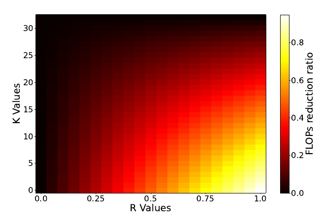

*원문 발췌 — Figure 8, 공식 Supplement PDF p.3, Appendix B. [원문 PDF](https://www.ecva.net/papers/eccv_2024/papers_ECCV/papers/10478-supp.pdf). 아래 LaTeX·해설은 원문 이미지와 구분해 읽는다.*

Figure 8의 $`K,R`$ heatmap만 있고 새 수식은 없다. Eq.(5)의 단조 관계를 시각화한다. 위 §5.4.3에서 edge case와 함께 설명했다. [Supp. p.S3, §B, Fig.8]

#### Appendix C: Limitations

저자 스스로 theoretical FLOPs ratio가 실제 inference cost와 다르며 inference framework optimization, CUDA kernel, hardware에 좌우된다고 명시한다. vLLM 같은 주류 framework 통합을 future work로 든다. [Supp. p.S3, §C] 이는 이 리뷰가 Table 4 외의 45% 수치를 latency로 부르지 않는 직접 근거다.

---

<a id="sec-forward"></a>

## 6. 한 샘플의 입력부터 출력까지 구체적 forward pass

아래는 LLaVA-1.5-13B, $`K=2,R=50\%`$를 사용한 **[해설용 예시]**다. paper Table 1의 수치 관계를 따르지만, instruction 길이 20은 shape 설명을 위해 가정한 값이며 실제 dataset 평균이 아니다.

### 6.1 입력과 multimodal embedding

1. 이미지 $`x\in\mathbb R^{1\times3\times336\times336}`$를 CLIP-ViT에 넣는다.
2. patch feature 576개를 얻어 $`Z_v\in\mathbb R^{1\times576\times d_v}`$로 둔다.
3. projector가 $`d_v\to5120`$으로 바꿔 $`E_v\in\mathbb R^{1\times576\times5120}`$을 만든다.
4. system 36 token과 instruction 20 token을 embedding해 각각 $`E_s\in\mathbb R^{1\times36\times5120}`$, $`E_i\in\mathbb R^{1\times20\times5120}`$을 만든다.
5. 이어 붙이면 prefill 입력은

```math
H^{(0)}=[E_s;E_v;E_i]\in\mathbb R^{1\times632\times5120}.
```

vision encoder/projector 계산은 FastV로 줄지 않는다.

### 6.2 처음 두 LLM block

block 0과 block 1은 632개 token 전체를 처리한다. 각 층의 conceptual attention은 head 수를 $`H_a`$라 할 때 $`[1,H_a,632,632]`$다. 실제 fused kernel은 전체 행렬을 materialize하지 않을 수 있다.

block 1의 출력 attention을 $`A^{(1)}`$라 하자. 공개 코드 재현 protocol은 head 평균 후 마지막 instruction query의 image key 구간을 쓴다.

```math
s\in\mathbb R^{576}, \qquad s_r=\frac1{H_a}\sum_h A^{(1,h)}_{631,36+r}, \quad r=0,\ldots,575.
```

### 6.3 top-k와 gather

$`R=0.5`$이므로 score가 큰 288개 image index를 구한다. 예를 들어 toy score가 image 6개에 `[0.10,0.05,0.40,0.20,0.15,0.10]`이고 3개를 남기면 top-k index는 `[2,3,4]`다. importance 순서는 `[2,3,4]`지만 전체 keep index를 sort해 원 spatial 순서를 유지한다.

system 36, image 288, instruction 20을 합치면

```math
H^{(2)}_{\mathrm{kept}}\in\mathbb R^{1\times344\times5120}.
```

block 2부터 block 39까지는 344개 row만 처리한다. 제거된 image token은 뒤 layer의 query도 key/value도 FFN row도 아니다. 이것이 true pruning이다.

### 6.4 다음 token과 autoregressive 반복

마지막 instruction 위치의 final hidden state에 LM head를 적용해 vocabulary logits $`[1,|\mathcal V|]`$를 얻고 greedy argmax로 첫 output token을 고른다.

KV cache를 사용하는 static 변형이라면 다음 decode step의 새 query shape는 각 층에서 $`[1,H_a,1,d_k]`$다. 앞 두 층은 full-image cache를, 깊은 층은 reduced-image cache를 가질 수 있다. 이 경우 visual token 제거는 deep layer에서 attention key/value 길이와 KV memory를 줄이지만, 과거 token FFN을 다시 계산하지 않으므로 Eq.(5)의 $`2ndm`$ 전체 감소를 매 decode step에 반복 적용하면 안 된다.

원 공개 in-place 경로처럼 `use_cache=False`이면 매 output token마다 전체 prefix를 다시 prefill하고 재-pruning할 수 있다. 이는 선택이 동적으로 바뀌지만 정상 cached decoding보다 baseline 자체가 비효율적이다. 논문은 두 의미를 분리해 보고하지 않는다.

### 6.5 gradient 경로와 parameter 상태

FastV inference에서는

- vision encoder: 기존 weight, optimizer 없음;
- projector: 기존 weight, optimizer 없음;
- LLM: 기존 weight, optimizer 없음;
- $`K,R`$: 사용자가 지정하는 hyperparameter, gradient 없음;
- top-k/gather: discrete inference operation, backward 없음;
- 추가 loss/data: 없음.

따라서 “frozen/trainable”을 묻는 가장 정확한 답은 **학습 단계가 없으므로 모든 weight를 읽기 전용으로 사용한다**는 것이다.

별도 “train with 50% image tokens” ablation은 두 LLaVA model을 pretraining/SFT protocol로 재학습했다. 어떤 stage에서 vision encoder, projector, LLM을 각각 freeze했는지는 FastV 본문/보충자료가 재기재하지 않으며 원 LLaVA protocol을 참조한다. 이를 FastV의 training recipe로 쓰면 안 된다.

---

<a id="sec-pseudocode"></a>

## 7. 추론 알고리즘 의사코드

```text
input:
    image_or_video x
    system prompt s
    user instruction t
    pretrained LVLM with T decoder blocks
    filtering layer count K
    removal ratio R

visual = vision_encoder(x)                 # [B, V, d_v]
visual = projector(visual)                 # [B, V, d]
text = embed(tokenize([s, t]))             # [B, S+I, d]
h = concatenate([system, visual, instruction], dim=token)

if K == 0:
    keep_visual = random_subset(V, round((1-R)*V))
    h, positions = physically_gather_text_and_keep_visual(h)
else:
    for layer in 0 .. K-1:
        h, attention = decoder_block[layer](h, return_attention=True)

    # 논문 문장: visual key가 모든 query에서 받은 attention을 평균
    # 공개 코드: head 평균 뒤 마지막 query row 하나만 사용
    score = mean_over_heads(attention) [last_query, visual_key_span]
    keep_visual = topk(score, round((1-R)*V))
    keep = system_indices + keep_visual + instruction_and_output_indices
    keep = sort(keep)                       # 원래 token/position 순서 유지
    h, positions = gather(h, keep), gather(position_ids, keep)

for layer in K .. T-1:
    h = decoder_block[layer](h, positions)

next_token = argmax(lm_head(h[last_query]))
repeat autoregressively until stop
```

실제 배포 의사코드에는 다음 결정을 추가해야 한다.

- pruning을 prefill 한 번만 할지 output step마다 다시 할지;
- early layer와 deep layer KV cache 길이를 어떻게 관리할지;
- fused attention이 attention probability를 반환하지 않을 때 score를 어떻게 싸게 계산할지;
- batch 안에서 sample별 keep index가 다를 때 padding/bucketing을 어떻게 할지;
- position ID를 원래 absolute index로 보존할지 압축해 재번호화할지.

논문은 이 system-level 선택을 고정하지 않는다.

---

<a id="sec-efficiency"></a>

## 8. 효율성 주장을 정확히 분해하기

### 8.1 이론 FLOPs/token 감소

FastV $`K=2,R=50\%`$는 image token을 정확히 절반 남긴다. 그러나 전체 token 수와 전체 FLOPs가 정확히 절반이 되는 것은 아니다.

- text token은 모두 남는다.
- 처음 두 layer는 full token이다.
- vision encoder/projector는 그대로다.
- top-k와 gather 비용이 추가된다.

Table 1의 13B는 decoder MHA+FFN 근사 layer-average가 154.6B -> 84.6B, 즉 45.3% 감소다. 이 수치가 논문의 대표 “45%”다.

**[추가 검산: Table 1의 한 이상점]** 같은 $`n=612`$, 7B $`T=32,d=4096,m=11008`$ 해석은 $`K\gt 0`$인 표 값을 반올림 오차 안에서 재현하고, $`K=0,R=50\%`$는 약 51.8B, $`K=0,R=75\%`$는 약 28.6B로 보고값 51.6B/28.8B와 가깝다. 그러나 $`K=0,R=90\%`$의 식 기반 값은 약 14.8B인데 표는 18.9B다. 공식 script에는 576개 중 72개를 남기는 설정을 $`R=87.5\%`$라고 적은 흔적도 있으나, 이것만으로 Table 1의 18.9B를 완전히 재현하지 못한다. 따라서 해당 셀은 원문 계산 조건 미기재 또는 표기 불일치로 남겨야 하며 조용히 수정하면 안 된다.

### 8.2 실제 latency와 TTFT

Table 4의 `latency/example`은 A-OKVQA에서 option 한 token을 얻는 시간이다. prompt prefill과 첫 token 생성이 대부분이므로 TTFT에 가까운 workload지만, 논문은 TTFT라고 정의하거나 tokenizer/image preprocessing 포함 범위를 밝히지 않는다. 그러므로 **one-token end-to-end example latency**라고 부르는 것이 안전하다.

실제 감소는 7B 33.1%, 13B 36.7%다. 이론 45%보다 작은 이유 후보는 vision encoder, projector, LM head, launch, memory movement, top-k/gather, 비최적 kernel 등이다. 어떤 항의 비중인지는 profile이 없어 확정할 수 없다.

### 8.3 decode TPOT/ITL과 throughput

- TPOT 또는 inter-token latency: 미기재.
- 긴 응답의 평균/꼬리 latency: 미기재.
- requests/s 또는 tokens/s throughput: 미기재.
- concurrent serving/batching: 미기재.
- p50/p95/p99: 미기재.

KV cache를 쓰면 decode step은 과거 token의 FFN을 재계산하지 않는다. image KV를 줄이는 이득은 deep layer attention의 key/value 길이와 cache memory에서 나타난다. 반대로 full attention matrix를 꺼내 top-k하기 위해 fused kernel을 끄면 절약을 상쇄할 수 있다.

### 8.4 GPU memory

Table 4는 7B 19G -> 16G, 13B 38G -> 30G를 보고한다. `G`가 GiB인지 GB인지, peak allocated/reserved 중 무엇인지, model weight와 activation/KV 중 어느 부분인지 미기재다. $`K=0`$에서 입력 전 image token을 줄이면 activation과 일부 KV가 감소할 수 있지만, weight memory는 변하지 않는다.

### 8.5 학습 효율과 추론 효율

FastV core는 training-free라 추가 training cost가 0인 대신, training throughput을 개선하는 방법도 아니다. pooled-token retraining은 학습 token을 줄일 가능성이 있지만 논문은 train FLOPs, GPU-hours, memory를 보고하지 않는다. Table 7은 품질 비교일 뿐 학습 효율 비교가 아니다.

### 8.6 frame, action chunk, control frequency

Video-LLaVA의 여러 frame은 한 번의 QA prompt 안에서 visual token으로 펼쳐질 뿐, streaming control loop가 아니다. action chunk length와 policy refresh도 없다. 따라서 “token 50% 감소 -> robot control frequency 2배”라는 결론은 성립하지 않는다.

폐루프 VLA로 옮긴다면 **[해설용 관계]**로

```math
f_{\mathrm{refresh}} \le \frac{1}{t_{\mathrm{sensor}}+t_{\mathrm{vision}}+t_{\mathrm{prefill}}+t_{\mathrm{decode}}+t_{\mathrm{control}}}
```

를 실제 측정해야 한다. action chunk $`H_a`$개를 한 번에 내면 actuator command frequency와 policy refresh frequency가 달라진다. FastV 논문은 이 어느 것도 측정하지 않았다.

---

<a id="sec-code-audit"></a>

## 9. 공식 코드 정적 분석: 논문과 같은 것, 다른 것

### 9.1 같은 핵심

- 경계층 이전 attention을 사용한다.
- attention head 평균을 취한다.
- image token span에서 top-k를 고른다.
- system과 뒤 text token은 모두 유지한다.
- keep index를 sort하고 hidden state를 gather한다.
- $`K=0`$ mask path는 random image mask를 만든다.

### 9.2 논문 문장과 다른 세부

| 항목 | 논문 | 공개 코드 |
|---|---|---|
| query aggregation | “all other tokens에서 받은 average attention” | 평균은 head에만 적용하고 마지막 query row 사용 |
| integer keep count | 미기재 | 원 LLaVA fork는 `ATTENTION_RANK` 정수 직접 입력; HF 통합은 `round(V*(1-R))` |
| token boundary | 일반적 설명 | `SYS_LENGTH`, `IMAGE_TOKEN_LENGTH`를 설정하며 script는 36, 576 사용 |
| performance ablation | token pruning으로 설명 | README의 OCR $`K,R`$ sweep은 mask-only, no speedup |
| real speed path | 직접 token 제거 | in-place gather; 원 경로는 KV cache 미지원 |
| decode re-pruning | 미기재 | 원 경로는 매 full forward 재선택 가능; 후속 HF static cache는 prefill 한 번 선택 |

### 9.3 배포에서 생기는 추가 비용

top-k 자체는 $`V=576`$에서 작지만, attention probability를 받기 위해 `output_attentions=True`를 켜면 memory-efficient fused attention 경로가 바뀔 수 있다. 더 좋은 구현은 경계층의 마지막 query $`q_{\mathrm{last}}`$와 image key만 사용해

```math
s=\mathrm{softmax}\left(q_{\mathrm{last}}K_{\mathrm{img}}^\top/\sqrt{d_k}\right)
```

를 별도로 계산하고 전체 $`n\times n`$ probability를 materialize하지 않는 것이다. 이는 **[후속 구현 제안]**이며 논문 검증 결과가 아니다.

batch에서 sample마다 keep index가 다르면 ragged sequence를 그대로 dense GEMM에 넣기 어렵다. 동일 $`R`$이면 길이는 같아도 gather index가 달라지므로 batched gather는 가능하지만, 여러 $`R`$/해상도를 섞으면 padding이나 bucket이 필요하다. 이 overhead는 Eq.(5)에 없다.

---

<a id="sec-critical-review"></a>

## 10. 비판적 검토

### 10.1 강점

1. **관찰에서 설계가 직접 나온다.** attention class 통계 -> anchor 가설 -> image-only late pruning의 연결이 단순하고 검증 가능하다.
2. **training-free다.** checkpoint를 다시 만들지 않고 $`K,R`$만 바꿔 여러 비용점을 얻는다.
3. **FFN까지 겨냥한다.** true sequence deletion이면 attention sparsity만 주는 방법보다 절약 범위가 넓다.
4. **task와 model 범위가 넓다.** caption, knowledge VQA, OCR, multimodal reasoning, PCA, video, fine-grained benchmark를 포함한다.
5. **text pruning과 random selection ablation이 있다.** 단순히 “아무 token이나 줄여도 된다”는 설명을 배제한다.
6. **이론과 실제의 차이를 limitation에서 인정한다.** CUDA/kernel/framework 의존성을 명시한다.

### 10.2 핵심 한계

1. **attention은 인과적 중요도가 아니다.** 낮은 softmax weight라도 value norm이나 여러 층의 경로를 통해 중요할 수 있다. 삭제 intervention의 평균 성능이 이를 경험적으로 보완하지만 per-example certificate는 없다.
2. **attention 정의가 논문과 코드에서 다르다.** 모든 query 평균인지 마지막 query인지가 재현 결과와 공간 선택을 바꿀 수 있다.
3. **Eq.(3)의 normalization이 불완전하다.** 식은 합인데 Figure는 평균/비율처럼 표시한다.
4. **Eq.(5)의 $`\hat n`$ 표기가 부정확하다.** image token만 제거하는데 전체 $`n`$에 $`(1-R)`$을 곱한다고 쓴다. 표는 text token을 남긴 계산과 맞는다.
5. **absolute FLOPs 단위가 모호하다.** Table 1 값은 전체 $`T`$층 합이 아니라 layer 평균과 맞는다. vision encoder, projector, LM head도 제외된다.
6. **대표 latency가 $`K=0`$이다.** headline $`K=2`$ attention-guided FastV의 실제 A40 latency를 Table 4가 직접 검증하지 않는다.
7. **장문 decode와 serving 지표가 없다.** TTFT/TPOT/throughput/tail/batching/KV cache가 분리되지 않았다.
8. **실험 환경 기술이 부족하다.** 일반 표의 hardware/precision/batch/software, latency의 warmup/sync/repeats가 없다.
9. **통계적 불확실성이 없다.** seed와 오차막대 없이 작은 +0.1, +0.3을 개선으로 해석한다.
10. **“dynamic” 범위가 제한적이다.** token identity만 sample-adaptive이고 $`K,R`$, keep count는 고정이다.
11. **anchor 가설이 직접 검증되지 않는다.** anchor token의 visual information을 probe하거나 ablate하지 않는다.
12. **모델별 최적 $`K`$가 다르다.** InstructBLIP는 $`K=5`$에서 회복되므로 제목의 layer 2는 보편 법칙이 아니다.

### 10.3 주장별 안전한 표현

| 과한 표현 | 근거에 맞는 표현 |
|---|---|
| “FastV는 latency를 45% 줄인다.” | “MHA+FFN 이론 FLOPs를 약 45% 줄였고, 별도 $`K=0`$ A40 실험의 one-token latency는 33-37% 줄었다.” |
| “이미지는 layer 2 뒤 필요 없다.” | “평가한 설정에서 image token 절반을 layer 2 뒤 제거해도 평균 성능이 유지됐다.” |
| “FastV가 attention을 학습한다.” | “이미 학습된 attention을 inference-time ranking signal로 사용한다.” |
| “Video 성능을 향상한다.” | “첫 1000개/GPT 평가에서 평균이 소폭 높았지만 불확실성은 보고되지 않았다.” |
| “PCA Action 점수가 곧 제어 성능이다.” | “PCA-Bench의 텍스트 행동 추론 점수다.” |
| “마스킹 구현도 빨라진다.” | “mask-only는 성능 비교용이며 실제 speedup이 없다.” |

---

<a id="sec-repro"></a>

## 11. 재현 체크리스트

### 11.1 문서와 코드 provenance

- [ ] 첨부 ECCV PDF와 별도 official supplement를 모두 보존한다.
- [ ] 공식 repository commit을 고정한다. 이 리뷰가 읽은 것은 `d1659729b5bf1be225e99ee15783deeea80f63b1`이다.
- [ ] 원 LLaVA fork, HF static KV-cache 변형, mask-only 경로 중 무엇을 재현하는지 명시한다.
- [ ] checkpoint/tokenizer/vision tower/projector revision을 기록한다.

### 11.2 token boundary와 shape

- [ ] 실제 prompt template에서 system token 수를 tokenizer로 다시 센다. 35/36을 고정 가정하지 않는다.
- [ ] image token start/end, special image start/end token 포함 여부를 확인한다.
- [ ] LLaVA 576, Video-LLaVA 2048 등 모델별 $`V`$를 assertion으로 검증한다.
- [ ] $`q=\mathrm{round}((1-R)V)`$의 rounding policy와 최소 유지 token 수를 기록한다.
- [ ] gather 뒤 position ID, causal mask, rotary position, KV-cache index가 원 token과 일치하는지 검사한다.

### 11.3 ranking protocol

- [ ] head 평균만 하고 last query를 쓸지, 모든 query도 평균할지 선택하고 보고한다.
- [ ] 경계 attention이 block $`K-1`$ 출력인지 block $`K`$ 출력인지 0/1-based indexing을 명시한다.
- [ ] tie score에서 `topk`의 deterministic behavior를 확인한다.
- [ ] $`K=0`$은 random이며 seed를 고정한다.
- [ ] attention-ranked, random, spatial-uniform baseline을 같은 keep count로 비교한다.

### 11.4 correctness

- [ ] $`R=0`$에서 logits/output이 baseline과 tolerance 내 동일한지 확인한다.
- [ ] mask-only와 true gather가 같은 keep set에서 output을 일치시키는지 확인한다.
- [ ] $`K=2,R=50\%`$에서 image token 576 -> 288, 전체 length $`n\to n-288`$인지 확인한다.
- [ ] caption, OCR, small object, spatial relation, long answer를 따로 평가한다.
- [ ] failed formatting을 오답과 분리해 센다.
- [ ] 최소 3 seed 또는 bootstrap confidence interval을 제공한다.

### 11.5 성능과 system 측정

- [ ] vision preprocessing, vision encoder, projector, LLM prefill, first-token head, decode를 구간별 CUDA event로 잰다.
- [ ] warmup/JIT 후 동기화하고 p50/p95/p99를 보고한다.
- [ ] TTFT, TPOT/ITL, output tokens/s, request throughput을 분리한다.
- [ ] batch 1뿐 아니라 serving batch sweep을 한다.
- [ ] peak allocated, peak reserved, KV-cache bytes, model weight bytes를 구분한다.
- [ ] attention extraction/top-k/gather overhead와 fused-kernel fallback을 따로 잰다.
- [ ] mask-only를 latency 표에 넣지 않는다.
- [ ] theoretical FLOPs와 실제 wall-clock을 같은 축 이름으로 부르지 않는다.

### 11.6 dataset protocol

- [ ] Nocaps/Flickr30k split을 명시한다.
- [ ] A-OKVQA dev, OCR-VQA test, MMMU dev, PCA open/closed를 그대로 사용한다.
- [ ] video는 “첫 1000개” 순서를 dataset revision과 함께 고정한다.
- [ ] GPT evaluator model/version/prompt/temperature/date와 비용을 기록한다.
- [ ] CIDEr, Rouge-L, multiple-choice parsing script version을 고정한다.

---

<a id="sec-thor"></a>

## 12. Jetson Thor 최적화와의 연결

이 절은 전부 **[후속 연구 제안]**이다. FastV 논문에는 Jetson Thor, TensorRT, TensorRT-LLM 실험이 없으며 검증된 이식으로 해석하면 안 된다.

### 12.1 가장 먼저 확인할 deployment 가설

Thor급 edge 환경에서 유망한 부분은 LLM deep layer의 sequence 길이와 KV traffic 감소다. 위험한 부분은 attention probability를 꺼내는 순간 fused attention이 해제되고, dynamic gather와 shape 변화가 graph/kernel 효율을 떨어뜨릴 수 있다는 점이다.

다음 네 구현을 같은 checkpoint/quality로 비교해야 한다.

| 구현 | 목적 |
|---|---|
| Baseline fused attention + KV cache | 기준선 |
| Mask-only FastV | correctness parity 확인; 속도 기준으로 사용하지 않음 |
| True gather, no cache | 논문 원형과 가까운 upper-bound/diagnostic |
| Prefill-once selection + static pruned KV cache | 실제 배포 후보 |

### 12.2 kernel 친화적 설계

1. 경계층 전체 attention map을 반환하지 말고 마지막 query와 image key의 score만 별도 kernel로 계산한다.
2. top-k 결과를 GPU에서 유지하고 hidden/KV gather를 fused한다.
3. $`R\in\{0,0.25,0.5,0.75\}`$처럼 소수의 고정 length bucket으로 engine/profile을 만든다.
4. sample별 index는 달라도 bucket별 sequence length를 같게 해 dense GEMM 효율을 유지한다.
5. early $`K`$층 full cache와 deep $`T-K`$층 pruned cache의 layer별 길이를 명시적으로 관리한다.
6. original position ID 보존과 compressed position ID를 각각 정확도 ablation한다. 논문 수치를 재현할 때는 original index 보존이 우선이다.

### 12.3 측정 gate

**Gate 0 - parity.** $`R=0`$ logits parity, mask/gather output parity, token boundary assertion을 통과하지 못하면 성능 측정을 중단한다.

**Gate 1 - kernel.** attention-score 추출로 fused kernel이 fallback하지 않는지 profiler trace로 확인한다. top-k+gather 시간이 deep layer 절약보다 크면 해당 $`V,K,R`$에서는 FastV를 끈다.

**Gate 2 - phase timing.** 이미지 전처리, vision tower, projector, prefill, first token, cached decode를 각각 측정한다. 논문 식은 prefill LLM 일부만 예측한다.

**Gate 3 - serving.** batch/동시성별 TTFT, TPOT, tokens/s, p95, peak memory, energy를 본다. 이론 FLOPs가 줄어도 throughput이 줄면 배포 승인이 아니다.

**Gate 4 - quality.** OCR, 작은 물체, spatial relation, long caption, video temporal QA를 $`K,R`$별로 평가한다. 평균 하나로 guard하지 않는다.

### 12.4 VLA/control로 확장할 때

FastV를 VLA에 넣을 경우 image token pruning 주기와 policy refresh 주기를 분리해야 한다.

- camera frame rate: sensor가 들어오는 빈도;
- vision encode rate: 새 frame을 visual token으로 바꾸는 빈도;
- FastV selection rate: 새 observation/prompt마다 keep set을 고르는 빈도;
- policy refresh rate: 새 action chunk를 추론하는 빈도;
- low-level control rate: chunk 내부 action을 actuator에 보내는 빈도.

예를 들어 action chunk 8 step을 한 번에 생성했다고 해서 policy가 매 control step 새 이미지를 본 것은 아니다. FastV가 TTFT를 줄여도 chunk horizon이 길면 closed-loop responsiveness가 그대로일 수 있다. PCA-Bench `A` 점수로 이 trade-off를 대신할 수 없다.

---

<a id="sec-misunderstandings"></a>

## 13. 학습자가 오해하기 쉬운 점과 Q&A

### Q1. 제목처럼 layer 2 뒤에는 항상 이미지 token 절반이면 충분한가?

아니다. LLaVA/Qwen의 보고된 평균에서는 강하지만 InstructBLIP는 $`K=5`$가 더 안전했다. OCR/아주 공격적인 $`R=90\%`$에서도 손실이 크다. 제목은 대표 경험칙이지 정리나 보편 상수가 아니다.

### Q2. $`R=50\%`$는 50%를 남긴다는 뜻인가, 버린다는 뜻인가?

논문에서 $`R`$은 filtering, 즉 제거 비율이다. $`R=50\%`$는 절반 제거, 절반 유지다. 공식 script의 `ATTENTION_RANK=288`은 576개 중 유지 개수다.

### Q3. $`K=2`$는 두 번째 layer 안에서 자르는가?

개념적으로 앞 두 layer를 full token으로 통과한 뒤 세 번째 layer 전에 자른다. 코드의 zero-based `idx==AGG_LAYER`에서 이전 `layer_outputs`를 사용한다. 재현 보고에는 “after two completed blocks”라고 쓰는 것이 가장 명확하다.

### Q4. FastV가 새 attention network를 학습하는가?

아니다. $`f_\phi`$는 ranking criterion 표기이며 trainable network가 아니다. 초록의 “learning”은 pretrained model이 가진 attention pattern에 관한 표현이다.

### Q5. 낮은 attention token은 쓸모없는 token인가?

항상 그렇지 않다. attention은 한 query의 convex weight다. value norm, residual path, 다른 query/layer를 반영하지 않는다. FastV는 평균 benchmark로 heuristic의 유효성을 보여 줄 뿐 sample별 무해성을 보증하지 않는다.

### Q6. 논문은 모든 query의 attention을 평균하는가?

문장은 그렇게 읽히지만 공개 코드는 head 평균 뒤 마지막 query 하나를 쓴다. 이 둘은 다르므로 protocol을 명시해야 한다.

### Q7. attention mask만 적용해도 Eq.(5)만큼 빨라지는가?

아니다. mask-only는 sequence tensor와 FFN row를 유지한다. 실제 gather/compaction이 필요하다. 공식 README도 mask ablation은 speedup이 없다고 쓴다.

### Q8. 45% FLOPs 감소가 45% wall-clock speedup인가?

아니다. 실제 Table 4는 33-37% latency 감소이며 설정도 $`K=0`$이다. vision tower, top-k, memory, kernel, runtime overhead 때문에 비율은 달라진다.

### Q9. Table 1의 84.6B는 13B model 전체 forward FLOPs인가?

표 수치는 Eq.(5)의 layer 평균과 맞고, 40 layer 전체를 합치면 약 3.38T가 된다. 무엇을 “FLOPs(B)”로 normalize했는지 본문 설명이 불충분하다. ratio가 더 신뢰하기 쉬운 항목이다.

### Q10. prefill과 decode 중 어디가 더 빨라지는가?

논문은 분해하지 않는다. prefill은 deep layer의 긴 sequence MHA+FFN을 모두 줄일 수 있다. cached decode는 과거 token FFN을 원래 재계산하지 않으므로 주로 deep attention key/value 길이와 KV memory가 줄어든다.

### Q11. $`K=0`$도 FastV인가?

표에서는 FastV 극단 설정으로 부르지만 attention이 없어서 random pruning이다. content-adaptive 핵심을 검증하는 설정은 아니다.

### Q12. Video-LLaVA에서 frame 자체를 제거하는가?

아니다. 여러 frame을 모두 vision encoder로 처리해 2048 visual token을 만든 뒤 LLM 내부 token 일부를 제거한다. frame decoding/vision encoding 비용은 그대로다.

### Q13. Table 7은 FastV를 재학습한 결과인가?

아니다. retraining은 “처음부터 50% image token으로 학습”하는 대안 baseline을 만들기 위해 수행했다. FastV row는 inference-time pruning이다.

### Q14. MME total이 올랐으니 모든 능력이 좋아졌는가?

아니다. OCR, color, code 등은 올랐지만 landmark, artwork, commonsense 등은 내렸다. single-run 변동 가능성도 있다.

### Q15. PCA-Bench Action을 유지했으니 로봇 배포가 안전한가?

아니다. 이는 benchmark 답변 점수이며 closed-loop control latency, collision, recovery, action chunk 안정성을 검증하지 않는다.

---

<a id="sec-coverage"></a>

## 14. Coverage checklist

### 14.1 본문과 보충자료 절 대응

| 원문 위치 | 원문 내용 | 리뷰 위치 | 상태 |
|---|---|---|---|
| Abstract, PDF p.1 | 관찰, FastV, 45% FLOPs 주장 | [§5.0](#sec-abstract) | 완료 |
| §1, PDF p.1-4 | motivation, anchor 가설, 기여 | [§2](#sec-motivation), [§5.1](#sec-introduction) | 완료 |
| §2 Large Vision-Language Model, PDF p.4 | visual token 증가 | [§5.2](#sec-related-work) | 완료 |
| §2 Inference Optimization for LLM, PDF p.4 | exact/memory와 sparse/pruning 계열 | [§5.2](#sec-related-work) | 완료 |
| §2 Token Reduction for VLMs, PDF p.4-5 | ViT/VLM pruning과 novelty | [§5.2](#sec-related-work) | 완료 |
| §3.1, PDF p.5-6 | autoregressive LVLM, tokenization | [§5.3.1](#sec-inefficient) | 완료 |
| §3.2, PDF p.6 | 1000 sample, $`\alpha,\lambda,\epsilon`$ | [§5.3.2](#sec-inefficient) | 완료 |
| §3.3, PDF p.7 | shallow/deep 통계 | [§5.3.3](#sec-inefficient) | 완료 |
| §3.4, PDF p.7-8 | anchor 해석 | [§5.3.4](#sec-inefficient) | 완료 |
| §4.1, PDF p.8-9 | $`f_\phi,K,R`$, Figure 5 | [§5.4.1-5.4.2](#sec-fastv) | 완료 |
| §4.2, PDF p.9-10 | FLOPs 계산 | [§5.4.3](#sec-fastv) | 완료 |
| §4.3, PDF p.10 | 낮은 resolution 학습 비교 | [§5.4.4](#sec-fastv) | 완료 |
| §5.1, PDF p.10 | task 범주, greedy search | [§5.5.1](#sec-experiments) | 완료 |
| §5.2, PDF p.11 | model 설정 | [§5.5.2](#sec-experiments) | 완료 |
| §5.3, PDF p.11-12 | image/video/fine-grained 결과 | [§5.5.3-5.5.7](#sec-experiments) | 완료 |
| §5.4, PDF p.12-14 | $`K,R`$, training/token modality ablation | [§5.5.8](#sec-experiments) | 완료 |
| §6, PDF p.14 | 결론 | [§5.6](#sec-conclusion) | 완료 |
| Acknowledgments, PDF p.15 | 지원 정보 | [§5.6](#sec-conclusion) | 완료 |
| References, PDF p.15-18 | 49개 참고문헌 | 개별 서평 제외, §2 역할만 반영 | 요구 범위에 따라 완료 |
| Supp. Fig.7, p.S1 | 32 layer attention map | [§5.3.4](#sec-inefficient), [§5.7](#sec-supplement) | 완료 |
| Supp. Appendix A, p.S2-S3 | task/split/prompt/metric | [§5.5.1](#sec-experiments), [§5.7](#sec-supplement) | 완료 |
| Supp. Appendix B, p.S3 | FLOPs heat map | [§5.4.3](#sec-fastv), [§5.7](#sec-supplement) | 완료 |
| Supp. Appendix C, p.S3 | theoretical vs actual limitation | [§5.7](#sec-supplement), [§8](#sec-efficiency) | 완료 |

### 14.2 수식 대응

| 수식 | 위치 | 리뷰 위치 | 추가 검증 |
|---|---|---|---|
| $`\hat y=M(d,t)`$, 비번호 | PDF p.5, §3.1 | [§5.3.1](#sec-inefficient) | model/function 의미 |
| Eq.(1) | PDF p.5 | [§5.3.1](#sec-inefficient) | 항, shape, chain rule, log 유도, 수치 예, $`N=0`$ edge |
| $`D=\{(d^1,t^1),\ldots\}`$, $`\hat Y=\{\hat y^1,\ldots\}`$, 비번호 | PDF p.6, §3.2 | [§4.1](#sec-notation), [§5.3.2](#sec-inefficient) | $`N`$ 기호 중복 지적 |
| Eq.(2) | PDF p.6 | [§5.3.2](#sec-inefficient) | class partition, shape, 작은 예 |
| Eq.(3) | PDF p.6 | [§5.3.2](#sec-inefficient) | 합/평균 불일치와 보충식 |
| Eq.(4) | PDF p.6 | [§5.3.2-5.3.3](#sec-inefficient) | token 수 보정, 472x 검산, edge |
| ranking/top-k, 비번호 설명 | PDF p.8-9, §4.1 | [§5.4.1](#sec-fastv), [§7](#sec-pseudocode) | 논문 query 평균과 code last-query 차이 |
| $`C(n)=4nd^2+2n^2d+2ndm`$, 비번호 | PDF p.9, §4.2 | [§2.1](#sec-motivation), [§5.4.3](#sec-fastv) | 항별 FLOPs와 counting convention |
| $`\hat n=(1-R)n`$, 비번호 | PDF p.9, §4.2 | [§5.4.3](#sec-fastv) | $`n_{text}+(1-R)n_{img}`$로 엄밀화 |
| Eq.(5) | PDF p.9 | [§5.4.3](#sec-fastv) | 단계 유도, 13B 84.60B 재현, edge |

### 14.3 Figure/Table 대응

**이미지 삽입 검수:** Figure 1–8 전부(8개), 번호 수식 (1)–(5) 전부와 §4.2 비번호 식 2개(7개), 합계 15개 원문 발췌를 해당 해설 옆에 삽입했다. Table 1–7은 기존 Markdown 표와 수치 검산을 유지한다. 보충자료 그림 7·8은 본문 PDF와 구분한다. 모든 최종 crop의 기호·번호·축·범례·패널 경계를 개별 확인했으며, Figure 7의 작은 token label은 원래 다중 패널 크기에 따른 제약이 있어 원본 이미지/PDF 확대가 필요하다.

| 항목 | 위치 | 핵심 주장 | 리뷰 위치 |
|---|---|---|---|
| Figure 1 | PDF p.2 | FLOPs-performance trade-off | [§3](#sec-claims), [§5.5.3](#sec-experiments) |
| Figure 2 | PDF p.5 | LVLM token/causal generation 구조 | [§4](#sec-notation), [§5.3.1](#sec-inefficient) |
| Figure 3 | PDF p.7 | allocation/efficiency 불균형 | [§5.3.3](#sec-inefficient) |
| Figure 4 | PDF p.8 | layer별 anchor stripe | [§5.3.4](#sec-inefficient) |
| Figure 5 | PDF p.9 | Video-LLaVA FastV 흐름과 사례 | [§5.4.1](#sec-fastv) |
| Figure 6 | PDF p.13 | $`K,R`$ OCR ablation | [§5.5.8](#sec-experiments) |
| Figure 7 | Supp. p.S1 | 32 layer full attention maps | [§5.3.4](#sec-inefficient), [§5.7](#sec-supplement) |
| Figure 8 | Supp. p.S3 | theoretical reduction heat map | [§5.4.3](#sec-fastv), [§5.7](#sec-supplement) |
| Table 1 | PDF p.10 | 세 model의 $`K,R`$ trade-off | [§5.5.3](#sec-experiments) |
| Table 2 | PDF p.11 | 추가 model/benchmark | [§5.5.4](#sec-experiments) |
| Table 3 | PDF p.11 | MME 세부 | [§5.5.4](#sec-experiments) |
| Table 4 | PDF p.12 | A40 one-token latency/memory | [§5.5.5](#sec-experiments), [§8](#sec-efficiency) |
| Table 5 | PDF p.12 | PCA/OCR | [§5.5.6](#sec-experiments) |
| Table 6 | PDF p.13 | Video QA | [§5.5.7](#sec-experiments) |
| Table 7 | PDF p.13 | training/ranking/modality ablation | [§5.5.8](#sec-experiments) |

### 14.4 실제 남은 한계

- 첨부본에는 supplementary가 합본되어 있지 않아 ECVA 공식 3쪽 보충자료를 별도로 사용했다. 두 source를 명확히 구분했다.
- 공식 repository는 ECCV 이후 변경을 포함한다. 정적 분석 commit을 고정했지만 논문 당시 정확한 비공개 실행 commit은 확인되지 않는다.
- 원문이 제공하지 않은 seed, precision, batch, 일반 실험 hardware, software version, 정확한 split 일부는 추정하지 않고 미기재로 남겼다.
- GPU 학습/추론을 실행하지 않았으므로 이 문서의 속도와 성능은 재현 결과가 아니라 저자 보고 및 산술 검산이다.

---

## 최종 정리

FastV의 가장 중요한 통찰은 “시각 정보가 필요 없다”가 아니라 **시각 token의 원래 개별 위치를 깊은 LLM 층까지 모두 운반할 필요가 없을 수 있다**는 것이다. 처음 두 층이 full visual context를 처리한 뒤 prompt-conditioned attention으로 절반을 고르면, 보고된 여러 benchmark의 평균은 거의 유지되고 decoder MHA+FFN 근사 비용은 약 45% 줄었다.

동시에 논문의 가장 중요한 검증 경계도 분명하다. headline은 theoretical FLOPs이고, 실제 A40 latency 표는 $`K=0`$ random/one-token 설정이다. 논문 문장과 공개 코드의 query aggregation도 다르다. 따라서 FastV를 연구나 edge 배포에 사용할 때는 true token gather, KV-cache 전략, fused-kernel 유지, TTFT/TPOT/throughput/peak-memory 측정을 별도로 검증해야 한다.
