# Prismatic VLMs 상세 학습 해설서

> **대상 논문**: *Prismatic VLMs: Investigating the Design Space of Visually-Conditioned Language Models*  
> **문서 성격**: 초록 요약이 아니라, 첨부 PDF의 본문·부록·수식·도표·실험 통제를 따라가는 한국어 학습용 해설서  
> **검토 기준일**: 2026-09-07

## 0. 검증된 서지정보와 읽은 범위

### 0.1 PDF를 기준으로 확인한 정보

| 항목 | 확인 결과 |
|---|---|
| 현재 원본 파일명 | `Prismatic VLMs ICML 2024.pdf` |
| 공개 원문 | [PMLR 공식 PDF](https://raw.githubusercontent.com/mlresearch/v235/main/assets/karamcheti24a/karamcheti24a.pdf) |
| SHA-256 | `5B19876FD49109700321A90ABF00025227B17D82131D052919645EA7B2245003` |
| PDF 실제 쪽수 | 22쪽 |
| 논문 제목 | *Prismatic VLMs: Investigating the Design Space of Visually-Conditioned Language Models* |
| 저자 | Siddharth Karamcheti, Suraj Nair, Ashwin Balakrishna, Percy Liang, Thomas Kollar, Dorsa Sadigh |
| 학회·연도 | 제41회 International Conference on Machine Learning, ICML 2024 |
| 정식 출판 정보 | PMLR 235:23123-23144, 2024 |
| PDF 메타데이터 생성일 | 2024-05-30 |
| 읽은 범위 | PDF 1-22쪽 전체: 초록, 본문 §1-§7, Impact Statement, References, Appendix A-B, Figure 1-12, Table 1-4 |
| supplementary 포함 여부 | 별도 파일이 아니라 PDF 16-22쪽의 추가 그림과 Appendix A-B가 한 파일에 포함되어 있으며 모두 검토함 |

서지정보는 파일명만 믿지 않고 첫 페이지 footer와 PDF 메타데이터를 대조했으며, [PMLR 공식 논문 페이지](https://proceedings.mlr.press/v235/karamcheti24a.html)의 권·쪽수도 교차 확인했다. 최초 전달 시 표시명에는 ICLR 2026이 들어가 있었지만 사용자가 현재 파일명을 바로잡았고, 실제 PDF 첫 페이지와 현재 파일명은 모두 **ICML 2024 / PMLR 235**로 일치한다. 원본 PDF는 변경·이동·삭제하지 않았다.

이 문서에서 `PDF p.N`은 뷰어가 세는 실제 PDF 페이지와 인쇄 페이지가 같다. 1-10쪽은 본문, 11-15쪽은 References, 16쪽은 추가 Figure 10-11, 17-18쪽은 Appendix A, 19-22쪽은 Appendix B다.

### 0.2 증거 수준 표기

- **[저자 보고]**: 논문에 명시된 주장·수치다.
- **[리뷰어 재계산]**: Table 2-4의 공개 수치로 이 문서에서 산술 차이를 다시 계산한 것이다. 모델 실행 결과가 아니다.
- **[리뷰어 해석]**: 원문 결과가 지지하는 범위와 그렇지 않은 범위를 구분한 해석이다.
- **[현재 공식 코드 확인]**: 2026-09-07에 공개 저장소 `TRI-ML/prismatic-vlms`의 `main`을 읽기 전용으로 확인한 내용이다. 출판 시점 코드와 버전 차이가 있을 수 있다.
- **[논문 미기재]**: PDF만으로 확정할 수 없는 항목이다. 임의로 채우지 않는다.

GPU 학습·추론은 실행하지 않았다. 따라서 아래의 모든 성능 숫자는 논문 공개표 또는 그 숫자에 대한 산술 재계산이며, 실제 Jetson Thor나 A100 벤치마크 결과로 표현하지 않는다.

### 0.3 원문 이미지의 출처와 추출 범위

이 문서에는 첨부본에서 직접 추출한 **Figure 1-12 전체와 핵심 비번호 수식 이미지 7개**를 각 해설 가까이에 배치했다. PDFium으로 원본을 216 DPI로 렌더링한 뒤 원래 그림·수식 영역을 사각 crop하고 흰 여백만 추가했다. 모든 subplot, 범례, 축, 원문 주석을 유지했으며, 원문 페이지 전체를 출판 이미지로 사용하지 않았다. 편집 가능한 기존 LaTeX와 기호·계산·gradient 해설도 함께 유지한다.

원문에는 번호 수식이나 별도 수식으로 인쇄된 부록 방법론 식이 없다. p.3의 식은 본문 문장 안에 인쇄되어 있어 수식과 같은 문장의 최소 문맥을 함께 발췌했다. 이미지 파일명의 `input`, `vision` 등은 검색용 식별자이며 원문 식 번호가 아니다. z-score 전개, MLP 전개, 해상도 비용식, Thor 후속 연구식처럼 이 리뷰에서 설명을 위해 추가한 식에는 원문 crop을 붙이지 않았다.

출처는 Karamcheti 외, ICML 2024, PMLR 235의 [공식 논문 페이지](https://proceedings.mlr.press/v235/karamcheti24a.html)와 [공식 공개 PDF](https://raw.githubusercontent.com/mlresearch/v235/main/assets/karamcheti24a/karamcheti24a.pdf)다. Figure 및 수식의 저작권과 관련 권리는 원저자 및 해당 출판사·권리자에게 귀속된다. 이 문서의 crop은 독립적인 기술 해설과 비평을 위한 출처 표시 발췌이며, 이미지에 CC-BY 또는 별도 재배포 라이선스가 부여되었다고 주장하지 않는다.

쪽수는 첨부 PDF의 1-based 실제 쪽수로, 인쇄 쪽수와 일치한다. 각 asset의 원본 파일명·SHA-256·crop 좌표(PDF point, 왼쪽 위 원점)·pixel 크기는 [이미지 출처 manifest](assets/05_Prismatic_VLMs/publication_assets.json)에 기록했다. 아래의 모든 이미지 경로는 이 Markdown 파일을 기준으로 한 상대 경로다.

## 1. 한 문장으로 보는 논문

이 논문의 중심 성과는 새로운 복잡한 VLM 블록 하나를 제안한 것이 아니라, **동일한 patch-as-token VLM 틀에서 최적화 절차·이미지 처리·시각 표현·언어 모델·데이터/학습시간을 한 축씩 바꾸고 12개 객관식 벤치마크로 비교하여 설계 규칙을 추출한 것**이다. 그 규칙은 “alignment 전용 1단계를 생략하고, vision backbone은 얼리고, 이미지 전체를 보존하는 naive resize와 DINOv2+SigLIP channel fusion을 쓰며, base LM과 언어-only 안전 데이터를 포함하고, 다양한 데이터를 2 epoch 학습한다”로 요약된다. [PDF p.2, Fig.2; p.8-9, §4.4-§5, Fig.9]

다만 이 문장을 곧바로 “모든 VLM에 통하는 법칙”으로 읽으면 안 된다. 실험 범위는 주로 LLaVA v1.5의 7B/13B, 단일 이미지, patch-as-token 구조, 한 개 고정 seed/order, 특정 665K 중심 데이터 혼합에 묶여 있다. Perceiver resampler, interleaved multi-image/video, 70B+, 장기 대화, 실제 로봇 제어, edge latency는 검증하지 않았다. [PDF p.9, §6]

## 2. 문제의식과 motivation: 기존 계산 흐름에서 무엇이 불분명했나

### 2.1 당시 주류 VLM의 공통 계산 흐름

LLaVA, Qwen-VL, PaLI-3 계열의 단순화된 흐름은 다음과 같다. [PDF p.2-3, §1-§2]

1. 고정 크기로 전처리한 이미지에서 ViT patch feature를 뽑는다.
2. 각 patch feature를 작은 projector로 LM embedding 차원에 맞춘다.
3. projected image patches를 언어 prompt 앞의 연속 토큰처럼 붙인다.
4. autoregressive LM이 다음 토큰 예측으로 답을 생성한다.
5. 학습은 보통 먼저 projector만 caption 데이터로 맞춘 뒤, vision encoder는 고정하고 projector+LM을 instruction 데이터로 미세조정한다.

구조가 단순해진 대신, 서로 다른 논문은 데이터·시각 backbone·해상도·resize·base/chat LM·학습 단계·epoch를 동시에 바꿨다. 그러면 모델 A가 모델 B보다 좋은 이유가 “새 모듈” 때문인지, 더 높은 해상도·더 많은 데이터·더 긴 학습 때문인지 분리하기 어렵다. 저자들이 문제 삼은 것은 바로 이 **설계 축의 얽힘**이다.

### 2.2 구체적인 실패 사례

- **주관적 평가의 혼입**: GPT-4 같은 강한 LM을 judge로 쓰면 풍부한 대화 품질을 볼 수 있지만, design change의 절대적·재현 가능한 효과를 분리하기 어렵다. 그래서 이 논문은 정답과 metric이 정해진 12개 평가를 선택한다. [PDF p.3-4, §3]
- **crop의 장면 손실**: 분류에서는 center crop이 타당할 수 있으나, VQA·localization에서는 질문에 필요한 물체가 잘릴 수 있다. 실제 Table 3에서 CLIP 336px resize-crop은 naive resize보다 RefCOCO에서 10.97점 낮다. [리뷰어 재계산; PDF p.6, Fig.6; p.21, Table 3]
- **학습 단계의 관성**: projector-only alignment가 필수처럼 복제되지만, 이 단계가 최종 성능에 필요한지 통제되지 않았다. 저자 실험에서는 제거 후 aggregate 성능이 오르고 7B/13B에서 약 24%의 해당 재현 학습시간을 줄인다. [PDF p.5, §4.1, Fig.4]
- **vision full-finetuning의 표현 붕괴**: “모든 파라미터를 학습하면 더 적응적일 것”이라는 직관과 달리, frozen single-stage 대비 full-finetune single-stage는 RefCOCO 64.08→42.56, RefCOCO+ 58.19→37.89, RefCOCOg 58.03→41.05로 급락한다. [리뷰어 재계산; PDF p.5, Fig.5; p.21, Table 3]
- **chat LM의 장황함과 환각**: Vicuna 기반 모델이 원숭이 뒤의 남성도 칼을 들고 있다고 잘못 덧붙이는 qualitative example을 보이며, instruction tuning이 수치상 유의미한 우위를 주지도 않는다. [PDF p.7, §4.3; p.16, Fig.11]
- **safety 데이터 제거의 숨은 비용**: language-only 40K를 빼도 평균 benchmark가 크게 나빠지지 않지만, base Llama-2 VLM은 인종차별적 요청에 노골적으로 응답한다. 표준 정확도만 최적화하면 안전 회귀를 놓친다는 사례다. [PDF p.8, Fig.8]
- **1 epoch underfitting**: structured localization 출력은 1→2 epoch에서 크게 오르며, “대규모 모델이므로 한 번만 보면 충분하다”는 관행을 반박한다. [PDF p.8, §4.4; p.16, Fig.10]

### 2.3 한계에서 연구 질문·가설·설계 선택으로

| 기존 한계 | 연구 질문 | 저자의 가설 | 실험 설계 |
|---|---|---|---|
| 서로 다른 VLM 간 다축 변경 | 어떤 축이 실제 capability를 바꾸는가? | 한 축씩 통제하면 인과에 가까운 설계 규칙을 얻을 수 있다 | LLaVA v1.5 reproduction을 anchor로 만들고 §4.2-§4.4에서 single-step change |
| 단일/주관 평가 | 어느 capability가 변했는가? | VQA·localization·challenge를 함께 보면 평균 뒤의 이질성을 볼 수 있다 | 12개 task, official metric, greedy decoding |
| projector alignment의 관성 | stage 1이 정말 필요한가? | pretrained vision/LM과 665K instruct data면 projector를 동시에 학습해도 된다 | 동일 stage-2 recipe에서 alignment stage만 제거 |
| 단일 pretrained vision | semantic와 spatial 표현이 상보적인가? | contrastive SigLIP와 self-supervised DINOv2를 합치면 서로 보완한다 | patch index를 맞춰 channel concat, patch 수는 유지 |
| chat LM 기본 선택 | instruction tuning이 VLM에도 이득인가? | base LM도 multimodal instruct data로 충분히 task format을 배울 수 있다 | Llama-2 vs Vicuna, 7B/13B |
| 짧고 제한된 데이터 | 1 epoch와 기존 혼합이 underfit인가? | 2 epoch와 이미지 다양성이 이득이다 | epoch sweep, LRV/LVIS-4V 추가 |

## 3. 저자의 핵심 주장, 근거, 범위

| 핵심 주장 | 근거 | 범위와 주의점 |
|---|---|---|
| single-stage가 더 싸고 성능을 유지/향상한다 | Fig.4, $p=0.00558$; 7B 2.72h, 13B 4.85h의 stage 1 제거 | 이 데이터·모델군의 결론이다. 다른 projector, interleaved pretraining에는 미검증 |
| vision backbone은 얼리는 편이 낫다 | Fig.5, $p=0.00381$; localization 급락 | 저자는 원인을 feature collapse로 추측하지만 직접 representation probe를 제시하지 않음 |
| contrastive vision backbone이 분류/self-supervised보다 강하다 | Fig.6 왼쪽, $p=7.11\times10^{-8}$ | pretraining objective와 pretraining image distribution이 동시에 다르므로 원인 분리가 안 됨 |
| naive resize가 crop보다 좋고 padding보다 대체로 낫다 | Fig.6 중앙, $p=0.0176$ | 논문 기준 유의수준 $0.01$에서는 padding 대비 차이는 유의하지 않음. aspect distortion의 실패 모드는 충분히 분석하지 않음 |
| 해상도 증가는 성능을 높인다 | Fig.6 오른쪽, $p=6.05\times10^{-4}$ | patch 수와 LM prefill 비용 증가. latency·memory 실측 없음 |
| DINOv2+SigLIP fusion이 가장 강하다 | Fig.7, $p=0.00164$; localization에서 큰 향상 | channel concat으로 $L$은 유지하나 두 vision tower 비용은 늘어남. “거의 추가 파라미터 없음”은 LM 대비 상대적 표현 |
| base LM이 instruct LM과 수치상 동등하다 | Fig.7/10, $p=0.34854$ | prompt template 자체가 달라지고 qualitative 표본 수가 작음 |
| 더 좋은 language-only LM이 반드시 더 좋은 VLM은 아니다 | Fig.12, $p=0.03097$로 $0.01$ 기준 비유의 | Mistral localization은 오르므로 capability별 transfer는 다름 |
| language-only data는 safety에 중요하다 | Fig.8 qualitative racist prompt | 정량 safety benchmark나 attack coverage가 없으므로 최소 사례 증거 |
| 2 epoch까지 underfitting이며 다양한 이미지 데이터가 도움 | Fig.10, 각각 $p=0.00496$, $p=0.01459$ | 데이터별 효과가 비가산적이고 일부 task는 하락함 |
| PRISM이 open baseline보다 우수하고 compute를 30% 이상 절약 | Fig.1/9, Table 2-4 | Fig.1의 controlled 7B 비교는 설득력 있으나, full PRISM은 추가 데이터+2 epoch이므로 별도 비교. inference 효율 주장이 아님 |

“strictly outperform”의 해석에는 주의가 필요하다. [리뷰어 재계산] Prism-DINOSigLIP 13B는 공식 LLaVA v1.5 13B보다 12개 주 metric 모두 높다. 그러나 Prism-DINOSigLIP 7B는 VizWiz에서 52.82 대 54.24로 낮다. 반대로 Fig.1의 **Prism 7B (Controlled)**는 12개 모두 공식 LLaVA v1.5 7B보다 높다. 따라서 “PRISM family의 강한 구성은 전 task 우세”는 맞지만 “모든 PRISM checkpoint가 모든 task에서 우세”로 일반화하면 과장이다. [PDF p.1, Fig.1; p.20-22, Table 2-4]

## 4. 선수 지식과 통합 notation/shape 사전

### 4.1 모델·텐서 기호

| 기호 | 의미 | 전형적 shape | 단위/주의 |
|---|---|---|---|
| $B$ | batch 내 sample 수 | scalar | Table 1의 global batch는 128 examples/update |
| $x_{\mathrm{img}}$ | 원본/전처리 이미지 | 논문: $\mathbb{R}^{H\times W}$ | RGB channel $C=3$가 표기에서 빠져 있음. 구현 입력은 보통 $B\times3\times H\times W$ |
| $H,W$ | vision tower 입력 높이·너비 | 224, 336, 384 등 | pixel |
| $P$ | ViT patch side | 14 또는 16 | pixel/patch |
| $L$ | image patch token 수 | 대략 grid height × grid width | token/image. exact $L$은 backbone 구현에 의존 |
| $h_{\text{vision}}$ | patch feature channel 폭 | backbone별 상이 | feature/patch |
| $V_\omega$ | pretrained vision backbone | image→patch sequence | 기본 실험에서는 frozen |
| $p_{\mathrm{img}}$ | vision patch features | $B\times L\times h_{\text{vision}}$ | patch별 vector |
| $F_\psi$ | vision-language projector | $h_{\text{vision}}\to h_{\text{text}}$ | patch마다 동일 MLP 적용 |
| $e_{\mathrm{img}}$ | projected image embeddings | $B\times L\times h_{\text{text}}$ | LM 입력 token과 같은 폭 |
| $u_{\mathrm{prompt}}$ | tokenized text prompt | $B\times K$ | integer token IDs |
| $K$ | prompt token 길이 | 가변 | token/sample |
| $E_\phi$ 또는 `embed` | LM token embedding | IDs→$B\times K\times h_{\text{text}}$ | 본문과 부록 표기가 다름 |
| $e_{\mathrm{prompt}}$ | prompt embeddings | $B\times K\times h_{\text{text}}$ | image prefix와 sequence concat |
| $\mathrm{LM}_\theta$ | autoregressive causal LM | embeddings→token logits | 7B/13B는 주로 LM scale |
| $\hat u_{\mathrm{gen}}$ | 정답 target token sequence | $B\times T$ | $T$ generated target tokens |
| $u_{\mathrm{gen}}$ | 추론 생성 결과 | 가변 길이 | greedy decoding 사용 |
| $[a;b]$ | sequence-wise concatenation | 길이 축 | channel concat과 구분 |
| $\omega,\psi,\theta$ | vision/projector/LM parameters | parameter sets | stage별 gradient 허용 여부가 다름 |

논문은 정적 단일 이미지를 다루므로 **frame, action step, environment step, action chunk, policy refresh**가 없다. 이미지 patch token $L$을 video frame 수나 robot action step으로 읽으면 안 된다.

### 4.2 세 가지 서로 다른 concat

1. **patch 내부 channel concat**: DINOv2와 SigLIP의 같은 patch 위치를 $[p_l^{D};p_l^{S}]$로 붙인다. $L$은 유지되고 feature 폭만 $h_D+h_S$가 된다. [PDF p.7, §4.2]
2. **image-text sequence concat**: $[e_{\mathrm{img}};e_{\mathrm{prompt}}]$처럼 token 길이 축에 붙인다. LM의 prefill 길이는 $L+K$가 된다. [PDF p.3, §2]
3. **batch stacking**: 현재 공식 코드는 multimodal sample과 language-only sample을 padding한 뒤 batch 축으로 다시 쌓는다. 이는 논문 수식에는 없고 구현 세부다. [현재 공식 코드 확인: `prismatic.py`](https://github.com/TRI-ML/prismatic-vlms/blob/main/prismatic/models/vlms/prismatic.py)

### 4.3 parameter와 hyperparameter

- **학습되는 parameter**: projector weight $\psi$, LM weight $\theta$, full-finetune ablation에서만 vision weight $\omega$.
- **고정 hyperparameter**: batch size 128, weight decay 0.1, peak learning rate $2\times10^{-5}$, gradient norm 1.0, warmup ratio 0.03, AdamW, warmup+cosine decay. [PDF p.18, Table 1]
- **설계 hyperparameter**: image size, resize strategy, vision backbone, base/instruct LM, epoch 수, data mixture.
- **evaluation setting**: greedy decoding, prompt template, split, metric/IoU threshold. 학습 hyperparameter와 혼동하지 않는다.

## 5. 원문 수식·비번호 식 상세 해설

이 논문에는 번호가 붙은 Equation이 없다. 아래 식은 모두 **원문의 주요 비번호 식**이며, 출처를 페이지·절로 식별한다. 그 뒤의 전개는 반드시 `[해설용 수식]`으로 분리한다.

### 5.1 입력 정의 [PDF p.3, §2, 비번호 식]

<a id="eq-input"></a>

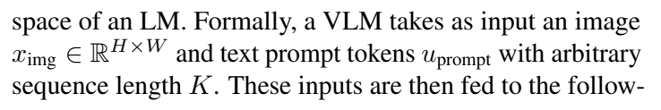

원문 비번호 식. 이미지 입력과 prompt 길이. [PDF p.3, §2; [공식 PDF](https://raw.githubusercontent.com/mlresearch/v235/main/assets/karamcheti24a/karamcheti24a.pdf#page=3)]

원문 표기:

$$
x_{\mathrm{img}}\in\mathbb{R}^{H\times W},\qquad u_{\mathrm{prompt}}\text{ has length }K.
$$

- $x_{\mathrm{img}}$는 입력 이미지, $H,W$는 pixel 높이/너비다.
- RGB 이미지라면 실질 shape는 $C\times H\times W$, $C=3$이어야 한다. 원문은 channel을 생략했다. 이는 계산을 바꾸는 오탈자라기보다 축약 표기지만, 배치까지 포함하면 $B\times3\times H\times W$다.
- $u_{\mathrm{prompt}}$는 문자열 자체가 아니라 tokenization 이후 token ID sequence로 읽는 편이 다음 `embed` 연산과 일관된다.
- $K$는 prompt token 수이지 글자 수, word 수, patch 수가 아니다.

**Edge case**: 이미지 aspect ratio가 정사각형이 아니면 $H\times W$에서 곧바로 ViT에 들어가지 않는다. resize-crop, letterbox, naive resize 중 하나가 먼저 정사각 입력을 만든다. 이 선택이 §4.2의 실험 변수다.

### 5.2 시각 표현 [PDF p.3, §2, 비번호 식]

<a id="eq-vision"></a>

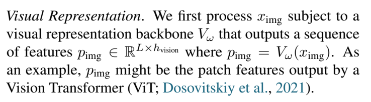

원문 비번호 식. Vision backbone의 patch feature와 차원. [PDF p.3, §2; [공식 PDF](https://raw.githubusercontent.com/mlresearch/v235/main/assets/karamcheti24a/karamcheti24a.pdf#page=3)]

원문 표기:

$$
p_{\mathrm{img}}=V_\omega(x_{\mathrm{img}}),\qquad
p_{\mathrm{img}}\in\mathbb{R}^{L\times h_{\mathrm{vision}}}.
$$

연산 순서는 image normalization→patchify/linear projection→ViT blocks→penultimate-layer patch extraction이다. 부록은 마지막 층이 아니라 **penultimate layer** feature를 쓴다고 명시한다. [PDF p.18, §A.2]

- $L$: 각 patch가 한 LM-side visual token이 되기 전의 patch 개수.
- $h_{\mathrm{vision}}$: vision feature channel.
- $\omega$: vision backbone parameter. 기본 single-stage와 PRISM에서는 `requires_grad=False`이므로 gradient가 $p_{\mathrm{img}}$까지 수치적으로 전파될 필요가 없고, $\omega$는 업데이트되지 않는다.

작은 shape 예: 224px 이미지와 14px patch가 정확히 맞는 ViT라면 grid는 $16\times16$, 따라서 $L=256$이다. CLIP 336px/14px면 $24\times24=576$이다. 384px와 patch 14의 exact border 처리는 PDF에 적혀 있지 않으므로 $L$을 억지로 단정하면 안 된다. 현재 공식 코드의 `num_patches`는 TIMM `patch_embed.num_patches`를 그대로 읽는다. [현재 공식 코드 확인: `base_vision.py`](https://github.com/TRI-ML/prismatic-vlms/blob/main/prismatic/models/backbones/vision/base_vision.py)

### 5.3 vision-language projection [PDF p.3, §2, 비번호 식]

<a id="eq-projector"></a>

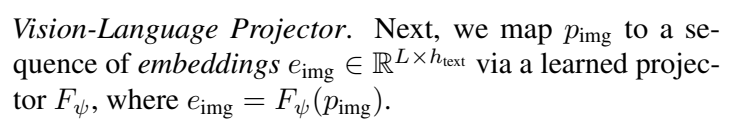

원문 비번호 식. Projector와 LM 입력 embedding 차원. [PDF p.3, §2; [공식 PDF](https://raw.githubusercontent.com/mlresearch/v235/main/assets/karamcheti24a/karamcheti24a.pdf#page=3)]

원문 표기:

$$
e_{\mathrm{img}}=F_\psi(p_{\mathrm{img}}),\qquad
e_{\mathrm{img}}\in\mathbb{R}^{L\times h_{\mathrm{text}}}.
$$

$F_\psi$는 각 patch 위치에 같은 MLP를 독립적으로 적용한다. 따라서 patch 간 spatial mixing은 projector에서 새로 일어나지 않고, 이미 ViT feature에 포함된 관계와 이후 LM self-attention이 담당한다.

[해설용 수식: PDF의 “2-layer GELU MLP”를 전개]

$$
F_\psi(p_l)=W_2\,\mathrm{GELU}(W_1p_l+b_1)+b_2,
$$

여기서 $p_l\in\mathbb{R}^{h_{\mathrm{vision}}}$, $W_1\in\mathbb{R}^{h_{\mathrm{text}}\times h_{\mathrm{vision}}}$, $W_2\in\mathbb{R}^{h_{\mathrm{text}}\times h_{\mathrm{text}}}$로 볼 수 있다. 출력은 $e_l\in\mathbb{R}^{h_{\mathrm{text}}}$다. 이 전개는 논문의 번호 식이 아니라 Appendix A.2의 문장을 수식화한 것이다.

작은 수치 예: $L=4$, $h_{\mathrm{vision}}=3$, $h_{\mathrm{text}}=5$라면 입력은 $4\times3$, 첫 선형층 이후 $4\times5$, GELU 후에도 $4\times5$, 둘째 선형층 출력도 $4\times5$다. patch 수 4는 변하지 않는다.

**Gradient**: training target loss에서 LM→image embedding→projector로 gradient가 오므로 $\psi$는 학습된다. vision이 frozen이면 gradient graph는 $p_{\mathrm{img}}$에서 끊기고 $\omega$는 바뀌지 않는다. alignment stage에서는 LM weight $\theta$도 고정이지만 gradient 신호는 LM의 미분을 거쳐 projector까지 전달된다. “LM을 freezing한다”는 “LM 연산을 건너뛴다”는 뜻이 아니다.

**원문-현재 코드 불일치**: PDF는 fused case도 “입력 차원만 늘린 2-layer MLP”라고 설명한다. 그러나 현재 공식 코드의 `FusedMLPProjector`는 `Linear→GELU→Linear→GELU→Linear`, 즉 Linear 계층 3개다. 출판 버전 차이 또는 문서/코드 불일치일 수 있으므로 조용히 하나로 통일하면 안 된다. [현재 공식 코드 확인: `nn_utils.py`](https://github.com/TRI-ML/prismatic-vlms/blob/main/prismatic/util/nn_utils.py)

### 5.4 LM 입력과 생성 [PDF p.3, §2, 비번호 식]

<a id="eq-prompt"></a>

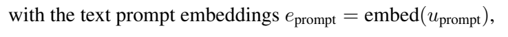

원문 비번호 식. Prompt token의 embedding. [PDF p.3, §2; [공식 PDF](https://raw.githubusercontent.com/mlresearch/v235/main/assets/karamcheti24a/karamcheti24a.pdf#page=3)]

원문 표기:

$$
e_{\mathrm{prompt}}=\mathrm{embed}(u_{\mathrm{prompt}}),
$$

<a id="eq-generation"></a>

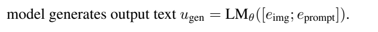

원문 비번호 식. Image/text embedding 연결과 LM 생성. [PDF p.3, §2; [공식 PDF](https://raw.githubusercontent.com/mlresearch/v235/main/assets/karamcheti24a/karamcheti24a.pdf#page=3)]

$$
u_{\mathrm{gen}}=\mathrm{LM}_\theta([e_{\mathrm{img}};e_{\mathrm{prompt}}]).
$$

첫 식은 $K$개의 integer token ID를 $K\times h_{\mathrm{text}}$ 실수 embedding으로 바꾼다. 둘째 식의 세미콜론은 **길이 축 concat**이다. 따라서 첫 LM pass의 입력 길이는 대략 $L+K$이고 폭은 공통으로 $h_{\mathrm{text}}$다.

현재 공식 구현은 BOS 다음 위치에 projected patches를 삽입하고, image positions의 label은 `IGNORE_INDEX=-100`으로 두어 image token 위치 자체를 맞히는 loss를 계산하지 않는다. 생성 이후에는 KV cache가 있으므로 새 token 한 개씩 LM만 호출하고 vision tower를 반복 실행하지 않는다. 이는 논문 핵심 식보다 구체적인 현재 코드 동작이며, 출판 PDF만으로는 확정되지 않는 구현 세부다. [현재 공식 코드 확인: `prismatic.py`](https://github.com/TRI-ML/prismatic-vlms/blob/main/prismatic/models/vlms/prismatic.py)

**Edge cases**:

- $K+L$이 LM context limit을 넘으면 truncation 정책이 필요하지만 PDF는 어느 쪽을 자르는지 명시하지 않는다. 현재 configuration은 `llm_max_length=2048`을 둔다.
- language-only ShareGPT sample에는 실제 image patch가 없다. 현재 코드는 같은 batch의 tensor shape를 맞추기 위해 visual-length만큼 zero padding을 붙이고 attention mask를 false로 둔다.
- 빈 prompt의 경우에도 BOS 또는 task trigger가 실제 입력 형식을 만든다. Appendix A.1의 alignment stage만 “no language prompt” captioning을 설명한다.

### 5.5 전체 합성식과 표기 불일치 [PDF p.3, §2, 비번호 식]

<a id="eq-composition"></a>

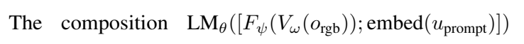

원문 비번호 식. 전체 VLM 합성식; 원문의 $o_{\mathrm{rgb}}$ 표기를 보존했다. [PDF p.3, §2; [공식 PDF](https://raw.githubusercontent.com/mlresearch/v235/main/assets/karamcheti24a/karamcheti24a.pdf#page=3)]

원문 표기:

$$
\mathrm{LM}_\theta\left([F_\psi(V_\omega(o_{\mathrm{rgb}}));\mathrm{embed}(u_{\mathrm{prompt}})]\right).
$$

이 식은 image→vision→projector→prefix concat→LM을 한 줄에 쓴 것이다. 다만 같은 문단 앞에서는 이미지를 $x_{\mathrm{img}}$로 정의했는데 여기서는 $o_{\mathrm{rgb}}$를 사용한다. 원문 표기를 그대로 보존하면 이는 notation mismatch다. 가능한 해석은 둘 다 동일한 RGB image observation을 뜻한다는 것이지만, 문서가 정의 없이 바뀐 점을 숨겨 고치지는 않는다.

### 5.6 학습 목적함수 [PDF p.3, §2, 비번호 식]

<a id="eq-loss"></a>

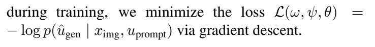

원문 비번호 식. 조건부 negative log-likelihood 학습 목적함수. [PDF p.3, §2; [공식 PDF](https://raw.githubusercontent.com/mlresearch/v235/main/assets/karamcheti24a/karamcheti24a.pdf#page=3)]

원문 표기:

$$
\mathcal{L}(\omega,\psi,\theta)
=-\log p(\hat u_{\mathrm{gen}}\mid x_{\mathrm{img}},u_{\mathrm{prompt}}).
$$

이는 target sequence 전체의 negative log-likelihood를 한 항처럼 쓴 축약이다.

[해설용 수식: token-wise teacher-forcing 전개]

$$
\mathcal{L}
=-\sum_{t=1}^{T}m_t\log p_\theta\left(
\hat u_t\mid x_{\mathrm{img}},u_{\mathrm{prompt}},\hat u_{<t}
\right),
$$

$m_t$는 loss를 계산할 target answer token이면 1, BOS·image prefix·padding·질문 영역처럼 ignore할 위치면 0인 mask로 볼 수 있다. 실제 reduction이 token sum인지 mean인지 PDF에는 적지 않았으므로 위 식은 개념 전개다.

작은 수치 예: 정답이 두 token이고 모델이 각각 올바른 token에 0.8, 0.5를 주면 sum NLL은 $-\log0.8-\log0.5\approx0.916$이다. 첫 확률이 0이면 loss가 무한대로 가므로 구현은 log-softmax의 수치 안정화를 사용한다. target sequence $T=0$은 정상 instruction-tuning sample이 아니며 유효 loss token이 없어 배치를 구성할 수 없다.

**Stage별 gradient 경로**:

| 단계 | $\omega$ vision | $\psi$ projector | $\theta$ LM | gradient 의미 |
|---|---:|---:|---:|---|
| alignment | frozen | trainable | frozen | LM Jacobian을 거쳐 $\psi$만 업데이트 |
| multimodal finetune / single-stage | frozen | trainable | trainable | LM과 projector 공동 적응 |
| full-finetune ablation | trainable | trainable | trainable | image encoder까지 NLL gradient가 도달하며 성능이 크게 하락 |
| inference | frozen/eval | frozen/eval | frozen/eval | gradient 없음, greedy autoregressive generation |

### 5.7 z-score와 global score [PDF p.4, §4; p.19, §B.2, 비번호 설명]

논문은 공식 수식을 쓰지 않았으므로 다음은 정의를 명시화한 해설이다.

[해설용 수식]

$$
z_{m,j}=\frac{s_{m,j}-\mu_j}{\sigma_j},\qquad
g_m=\frac{1}{12}\sum_{j=1}^{12}z_{m,j}.
$$

$s_{m,j}$는 모델 $m$의 task $j$ 점수, $\mu_j,\sigma_j$는 “모든 모델”에 대한 task별 평균·표준편차, $g_m$은 12-task global score다. 이 변환은 VQAv2 70점의 1점과 OCID-Ref 40점의 1점을 그대로 같은 크기로 취급하지 않게 한다.

그러나 $z$는 비교 pool에 의존한다. 극단적으로 낮은 새 모델을 pool에 추가하면 기존 모델들의 $z$도 바뀐다. 논문은 정확히 어느 모델 집합으로 각 검정의 $\mu_j,\sigma_j$를 계산했는지, standard deviation의 ddof, seed 간 분산, pair sample 수를 충분히 적지 않는다. 따라서 공개표만으로 모든 $p$값을 독립 재현하기 어렵다.

### 5.8 해상도와 attention 비용 [PDF p.6-7, §4.2, 비번호 설명]

[해설용 수식]

$$
L\approx\frac{H}{P}\frac{W}{P}.
$$

해상도를 양축 2배로 하면 $L$은 약 4배다. dense self-attention의 score matrix 비용이 길이 제곱에 비례한다고 단순화하면 visual-dominated prefill은 약 $4^2=16$배가 된다. 이것이 본문의 “시간복잡도 16배” 논리다.

하지만 실제 LM 길이는 $N=L+K+T_{\text{prefill}}$이고 MLP 비용, KV cache, kernel efficiency도 있으므로 wall-clock 16배를 뜻하지 않는다. 논문은 실제 inference latency·TTFT·throughput·peak memory를 측정하지 않았다.

## 6. 한 샘플의 구체적인 forward pass

아래는 Prism-DINOSigLIP 계열을 이해하기 위한 계산 추적이다. PDF에 없는 exact 차원은 `미기재`로 남기며, 현재 코드에서 확인한 동작은 따로 표시한다.

1. **샘플**: RGB 이미지 한 장과 질문 “Where are the almonds?”를 받는다. [PDF p.9, Fig.9의 qualitative 유형]
2. **전처리**: naive resize가 원 aspect ratio를 유지하지 않고 두 vision tower의 정사각 입력 크기로 직접 변형한다. PRISM-DINOSigLIP은 384px 구성을 사용한다. backbone별 mean/std로 normalize한다. [PDF p.6, §4.2; p.18, §A.2]
3. **dual vision encoding**: frozen DINOv2와 frozen SigLIP의 penultimate layer에서 같은 patch grid의 feature를 뽑는다. shape를 $p^D\in\mathbb{R}^{L\times h_D}$, $p^S\in\mathbb{R}^{L\times h_S}$라 둔다.
4. **channel fusion**: $p_l=[p_l^D;p_l^S]\in\mathbb{R}^{h_D+h_S}$로 각 위치를 합친다. 따라서 patch token 수 $L$은 늘지 않는다. current code도 `torch.cat(..., dim=2)`를 사용한다. [현재 공식 코드 확인: `dinosiglip_vit.py`](https://github.com/TRI-ML/prismatic-vlms/blob/main/prismatic/models/backbones/vision/dinosiglip_vit.py)
5. **projection**: $F_\psi$가 각 fused vector를 LM 폭 $h_{\text{text}}$로 바꾼다. PDF는 2-layer GELU MLP, 현재 fused code는 3 Linear layer다. 정확한 출판 checkpoint 구조는 checkpoint/config 버전과 함께 확인해야 한다.
6. **prompt formatting**: PRISM은 base Llama-2를 사용하므로 system prompt를 빼고 `<s> In: {Input} Out: {Response} </s>` 형식을 쓴다. [PDF p.18, §A.2]
7. **sequence assembly**: 개념식은 `[image patches; prompt]`지만 현재 code는 BOS embedding 다음에 image patches를 삽입하고 나머지 text embeddings를 잇는다. shape는 대략 $1+L+(K-1)$ by $h_{\text{text}}$다.
8. **causal LM prefill**: 모든 image/prompt position을 한 번 처리한다. training이면 response target token에만 cross-entropy를 계산한다. inference면 첫 next-token logits를 얻고 KV cache를 만든다.
9. **greedy decode**: 매 step 가장 높은 logit의 token을 선택하고 cache로 다음 token을 생성한다. 평가에서는 sampling/beam을 쓰지 않는다. [PDF p.19, §B.1]
10. **출력**: 예컨대 “The almonds are located in a clear jar on the top shelf, next to the fresh air filter.”와 같은 natural-language answer가 된다. [PDF p.9, Fig.9]

이 forward pass는 **한 이미지당 vision tower를 한 번 실행**하지만, fused 모델은 vision tower가 두 개이므로 단일 SigLIP보다 vision-side latency와 activation/weight memory가 늘 수 있다. 반면 patch 수를 두 배로 sequence concat하지 않았으므로 LM prefill token 수는 같은 grid의 단일 tower와 동일하다. 이것이 “token cost를 유지한 feature fusion”의 핵심이다.

## 7. 원문 순서별 상세 해설

### Abstract [PDF p.1]

초록은 문제를 두 겹으로 정의한다. 첫째, 많은 VLM release가 있지만 image preprocessing·architecture·optimization 선택의 영향이 덜 연구되었다. 둘째, 객관적이고 일관된 평가가 없어 원인을 분리하기 어렵다. 해결책도 두 층이다. 12-task standardized evaluation을 만들고, 그 위에서 design axis를 통제 실험한다. 자원 기여는 evaluation framework, optimized training code, 모든 checkpoint다. 최종 PRISM 7B/13B가 InstructBLIP·LLaVA v1.5를 앞선다는 모델 성과는 이 분석의 결과물이지 논문의 유일한 목적이 아니다.

### 1. Introduction [PDF p.1-2, Fig.1-2]

<a id="fig-01"></a>

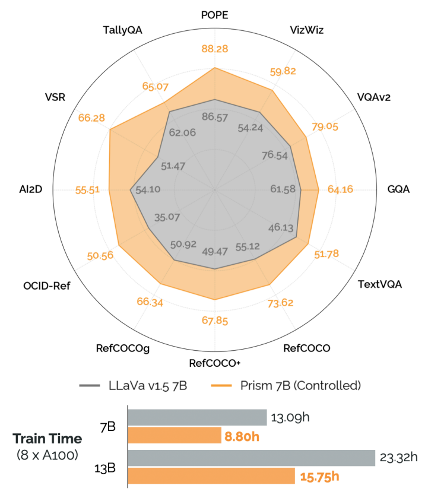

Figure 1. Controlled PRISM과 LLaVA v1.5의 12-task 성능 및 학습시간. [PDF p.1, §1; [공식 PDF](https://raw.githubusercontent.com/mlresearch/v235/main/assets/karamcheti24a/karamcheti24a.pdf#page=1)]

첫 문단은 VLM을 image-conditioned open-ended interface로 위치시킨다. grounded chat, visual program, robotics처럼 출력 형식이 자연어이면 한 backbone을 여러 응용에 재사용할 수 있다. 이어 “patch-as-token” 전환을 강조한다. 과거의 전용 cross-modal encoder/여러 objective보다 pretrained vision+projector+LM+next-token loss가 구현과 scaling을 단순화했다.

그 단순화가 역설적으로 새 문제를 만든다. 공통 recipe 안에서 각 팀이 재료를 조금씩 바꾸므로, release 수는 늘어도 어떤 선택이 성능을 만들었는지 지식이 축적되지 않는다. 저자는 질문을 “무엇이 VLM capability와 downstream use를 좌우하는가?”로 명시한다.

네 기여는 다음 논리로 이어진다.

1. 12개 평가로 capability를 분해한다.
2. component·data·optimization을 쉽게 바꾸는 FSDP codebase를 만든다.
3. 네 설계 축을 single-step change로 실험한다.
4. 결과를 PRISM family로 결합한다.

**Figure 1**은 controlled Prism 7B와 공식 LLaVA v1.5 7B의 12-task radar, 7B/13B training time을 한 장에 요약한다. [리뷰어 재계산] 7B 시간은 13.09h→8.80h로 4.29h, 32.8% 감소하며 13B는 23.32h→15.75h로 7.57h, 32.5% 감소한다. 이 시간은 8×A100 조건의 저자 보고 wall-clock이며 FLOPs·energy·Jetson latency가 아니다.

**Figure 2** 왼쪽은 optimization, image/vision, LM, scaling 네 축을 계층화하고, 오른쪽은 configuration으로 backbone과 procedure를 바꿀 수 있는 modular code를 보여준다. 그림의 목적은 새 neural architecture가 아니라 실험 가능성을 만든 infrastructure가 기여임을 알리는 것이다.

<a id="fig-02"></a>

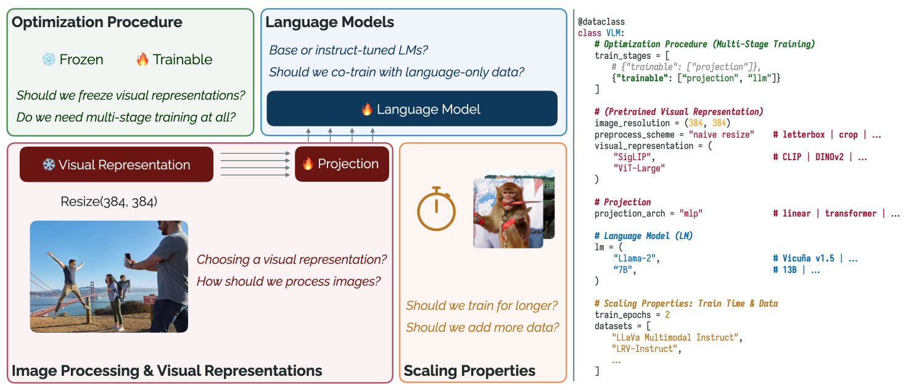

Figure 2. Vision-projector-LM 구성과 네 설계 축, modular configuration 예. [PDF p.2, §1; [공식 PDF](https://raw.githubusercontent.com/mlresearch/v235/main/assets/karamcheti24a/karamcheti24a.pdf#page=2)]

### 2. Preliminaries [PDF p.3]

#### Model Architecture

본문의 네 비번호 식은 §5에서 자세히 풀었다. 핵심은 $V_\omega$, $F_\psi$, $\mathrm{LM}_\theta$ 세 부분이다. vision feature를 LM token과 동일한 폭으로 바꾸기만 하면 causal LM은 image patches를 soft prefix처럼 처리한다. 이 구성은 specialized cross-attention 없이 LM self-attention 안에서 image-text interaction을 일으킨다.

#### Pretraining Dataset

저자는 open-source/permissive research license 데이터에 한정하고 LLaVA v1.5 mixture를 기준점으로 삼는다. multi-stage 기준으로 558K image-caption alignment subset과 665K multimodal instruction subset이다. instruction subset에는 synthetic chat, VQA, localization, caption, 40K ShareGPT language-only가 섞인다. 세부 합계 불일치는 Appendix A.1에서 다룬다.

#### Training Implementation & Verification

PyTorch FSDP와 BF16 mixed precision, TIMM, Hugging Face Transformers를 사용한다. 초기화 randomness와 batch order를 고정해 design axis 비교 시 stochastic noise를 줄인다. 그러나 여러 seed를 반복하지 않았으므로 variance 추정은 없다.

동일 AWS `p4de.24xlarge` 8×A100에서 reference LLaVA DeepSpeed ZeRO 대비 step time이 20% 빠르다고 보고한다. 이는 **training implementation throughput** 비교다. model quality 차이와 serving throughput을 뜻하지 않는다. reproduction 수치는 Fig.4/Table 2-4에서 공식 모델과 가깝지만 동일하지 않으며, 특히 7B localization은 reproduction이 공식보다 5-7점 높다. 따라서 “apples-to-apples reproduction”은 합리적 anchor라는 뜻이지 bitwise reproduction은 아니다.

### 3. Evaluation Suite [PDF p.3-4, Fig.3]

<a id="fig-03"></a>

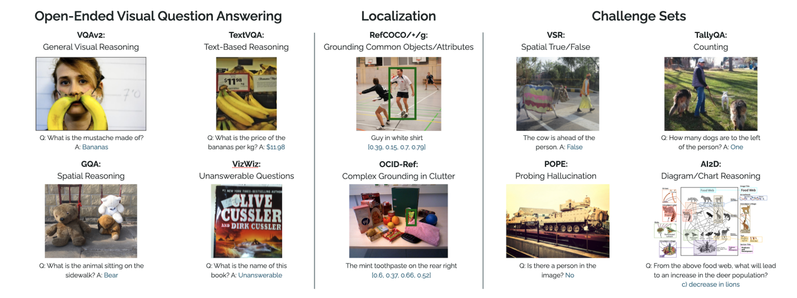

Figure 3. 12-task evaluation suite의 capability별 예. [PDF p.4, §3; [공식 PDF](https://raw.githubusercontent.com/mlresearch/v235/main/assets/karamcheti24a/karamcheti24a.pdf#page=4)]

#### Open-ended VQA

- **VizWiz**: 일반 visual reasoning과 unanswerable question을 포함해 reliability를 본다.
- **VQAv2**: 일반 image question answering.
- **GQA**: compositional/spatial reasoning. test-dev split 사용.
- **TextVQA**: 이미지 안의 글자·간판·label을 읽는 능력. 본문 main result는 외부 OCR token 없이 image+question만 쓴다.

#### Localization

- **RefCOCO**: 짧고 spatial anchor가 있는 referring expression.
- **RefCOCO+**: 위치 단어보다 appearance 중심.
- **RefCOCOg**: 길고 풍부한 description.
- **OCID-Ref**: cluttered robotics scene에서 out-of-distribution grounding.

모델은 normalized bounding box coordinate를 자연어 문자열로 생성한다. RefCOCO 계열은 IoU≥0.5, OCID-Ref는 IoU≥0.25의 accuracy다. 따라서 OCID 숫자를 RefCOCO와 같은 난이도의 절대 accuracy로 단순 비교하면 안 된다. [PDF p.18-19, §A.1, §B.1]

#### Challenge sets

- **VSR**: True/False spatial relation. majority baseline이 약 51%라 51.47에 몰리는 모델은 사실상 관계를 못 푼다.
- **TallyQA**: counting. 0-15의 16-way choice로 변환한다.
- **POPE**: object hallucination Yes/No.
- **AI2D**: scientific diagram의 4-way choice.

**Figure 3**은 capability 분류를 시각화한다. 이 suite의 장점은 metric이 객관적이고 design change별 profile을 보여준다는 점이다. 반면 긴 multi-turn dialogue, free-form helpfulness, calibration, latency, safety coverage는 포함하지 않는다.

split은 기본 validation이며 예외는 GQA test-dev, VSR zero-shot test, POPE 단일 split이다. B.1은 “VQAv2, TextVQA, GQA, TextVQA”라고 써 VizWiz를 빠뜨리고 TextVQA를 중복한다. §3과 Table 2를 보면 가능한 해석은 네 번째 항목이 VizWiz여야 한다는 것이지만, 원문 오기를 조용히 수정하지 않는다.

### 4. Experiments - Investigating Design Axes [PDF p.4-8, §4]

#### 실험의 anchor와 결론 규칙

anchor는 LLaVA v1.5다. 구성은 CLIP ViT-L/14@336px, letterbox padding, Vicuna v1.5, 558K alignment+665K instruction의 two-stage다. 저자는 7B와 13B를 재현한 뒤, §4.2-§4.4의 각 실험에서 기본적으로 한 축만 바꾸고 나머지를 유지한다. §4.1에서 single-stage가 선택된 뒤에는 그 변경을 이후 모든 실험에 carry forward한다. [PDF p.4, §4]

각 task scale이 달라 radar 반지름은 task별 z-score로 정규화하고, 실제 accuracy는 색 숫자로 표시한다. 시각적으로 polygon 면적만 비교하면 과장될 수 있으므로 Table 2-4의 절대값을 함께 읽어야 한다.

#### 공정성·통제 수준 지도

| 비교 | 유지한 것 | 바꾼 것 | 공정성 판단과 남은 confound |
|---|---|---|---|
| official LLaVA vs reproduction | 표방 architecture/data/scale | codebase | 동일 hardware step-time 비교는 강함. checkpoint·library version·seed가 완전히 같지는 않음 |
| two-stage vs single-stage | stage-2 model/data/hyperparameters | alignment stage 유무 | research question에는 적합. single-stage는 558K caption data와 그 compute도 덜 보므로 “같은 총 데이터/step” 비교는 아님 |
| frozen vs full-finetune | data, nominal model, stage | vision trainability | trainable parameter 수·optimizer state·memory·effective compute가 달라짐. 성능 효과는 명확하지만 원인(feature collapse)은 미측정 |
| vision representation | 7B LM, one-stage, 224px, 나머지 recipe | IN1K/DINOv2/CLIP/SigLIP | SigLIP ViT-SO는 400M, 나머지 ViT-L은 307M이므로 parameter가 완전 일치하지 않음. pretraining objective와 data distribution도 함께 변함 |
| resize 방식 | 같은 backbone·resolution·LM/data | crop/letterbox/naive | 가장 깨끗한 single-axis 비교 중 하나 |
| resolution | 같은 backbone 계열 | 224→336/384 | 세부정보와 동시에 $L$, prefill compute, memory가 증가하므로 quality/compute trade-off 비교 |
| visual fusion | 같은 LM/data와 patch grid | 두 tower+channel concat | LM token 수는 유지하지만 vision compute·weight·projector parameter는 증가. 동일 총 compute 비교가 아님 |
| base vs instruct LM | 같은 family/nominal size, vision/data | LM checkpoint와 prompt template | system/chat template 차이는 필요한 적응이지만 독립 confound |
| language-only co-training | 같은 model, multimodal data | ShareGPT 40K 포함 여부 | content와 sample/step 수가 함께 달라짐. safety 정량 평가는 없음 |
| epoch scaling | 같은 data/model | optimizer steps | 의도적으로 compute를 늘리는 scaling 실험 |
| data scaling | 같은 base model/recipe | LRV/LVIS-4V 추가 | 1 epoch이면 sample 수와 step/compute도 함께 늘 수 있음. matched-step 결과가 없어 순수 diversity 효과로 단정하기 어려움 |
| PRISM Controlled | LLaVA와 동일 data·training budget이라고 저자 명시 | 여러 좋은 design choice 동시 적용 | integrated recipe의 효능 검증. 각 축 기여는 앞선 ablation에 의존 |
| full PRISM | architecture family/scale | 더 다양한 data, 2 epochs 등 | 최고 성능 비교이지 동일 budget 비교가 아님 |

### 4.1 Optimization Procedure [PDF p.5-6, Fig.4-5]

<a id="fig-04"></a>

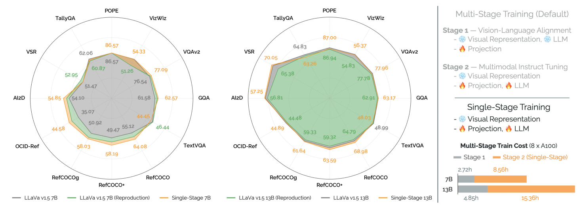

Figure 4. 7B/13B 재현, single-stage 성능, frozen/trainable 구성 및 학습시간. [PDF p.5, §4.1; [공식 PDF](https://raw.githubusercontent.com/mlresearch/v235/main/assets/karamcheti24a/karamcheti24a.pdf#page=5)]

#### Multi-stage training

Stage 1은 vision과 LM을 얼리고 무작위 projector만 558K caption pair로 학습한다. Stage 2는 vision을 얼리고 projector+LM을 665K instruct mixture로 학습한다. single-stage는 Stage 1 checkpoint 없이 projector를 무작위 초기화한 채 곧바로 Stage 2를 시작한다.

**Figure 4 왼쪽**은 reproduction과 single-stage의 12-task profile이다. [리뷰어 재계산] 7B reproduction→single-stage의 주요 변화는 VizWiz 51.26→54.33, RefCOCO 60.54→64.08, RefCOCO+ 54.34→58.19, OCID-Ref 41.75→44.58로 개선되고, TextVQA는 46.44→44.45, VSR은 52.95→51.47로 하락한다. 즉 모든 task가 오르는 것이 아니라 normalized aggregate가 유의하게 좋아진다($p=0.00558$).

**Figure 4 오른쪽**의 8×A100 학습시간을 다시 더하면 다음과 같다.

| scale | alignment | finetune | two-stage 합 | single-stage | 절감률 |
|---|---:|---:|---:|---:|---:|
| 7B | 2.72h | 8.56h | 11.28h | 8.56h | 24.1% |
| 13B | 4.85h | 15.36h | 20.21h | 15.36h | 24.0% |

이는 본문 “20-25%”를 지지한다. Fig.1의 30% 이상 절감은 별도의 controlled PRISM 대 공식 LLaVA 훈련시간 비교이므로 두 숫자를 섞지 않는다.

왜 alignment가 불필요했을 수 있는가? [리뷰어 해석] pretrained vision과 pretrained LM이 이미 안정된 표현을 제공하고, 665K instruction data의 supervised next-token gradient가 projector와 LM을 동시에 맞출 만큼 충분했을 수 있다. 그러나 더 작은 data, 다른 LM, 훨씬 복잡한 resampler에서는 cold-start instability가 생길 수 있으므로 일반 법칙은 아니다.

#### Full finetuning through visual backbones

<a id="fig-05"></a>

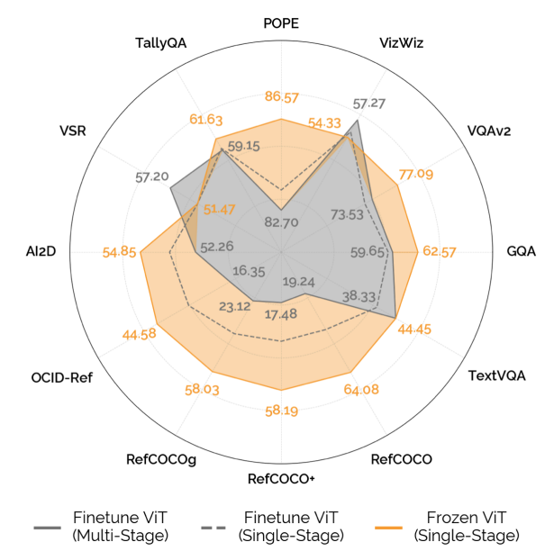

Figure 5. Frozen vision 대비 single-/multi-stage full-finetuning의 성능 변화. [PDF p.5, §4.1; [공식 PDF](https://raw.githubusercontent.com/mlresearch/v235/main/assets/karamcheti24a/karamcheti24a.pdf#page=5)]

**Figure 5**는 frozen single-stage, full-finetune single-stage, full-finetune multi-stage를 비교한다. 저자 결론은 vision까지 NLL로 업데이트하면 성능이 유의하게 악화된다는 것이다($p=0.00381$).

[리뷰어 재계산] frozen single-stage→full-finetune single-stage:

- VQAv2 77.09→73.53(-3.56), GQA 62.57→59.65(-2.92), TextVQA 44.45→38.33(-6.12).
- RefCOCO 64.08→42.56(-21.52), RefCOCO+ 58.19→37.89(-20.30), RefCOCOg 58.03→41.05(-16.98), OCID-Ref 44.58→33.42(-11.16).
- POPE 86.57→83.82(-2.75), TallyQA 61.63→59.53(-2.10).

특히 coordinate string을 생성하는 localization이 무너진다. 하지만 논문은 feature covariance, linear probe, CKA, forgetting measure를 보여주지 않는다. 따라서 “feature collapse”는 관찰된 downstream collapse를 설명하는 저자의 가설이지 직접 측정된 내부 메커니즘이 아니다. 가능한 원인은 작은/편향된 multimodal mixture, LM NLL의 perceptual supervision 부족, 동일 learning rate를 vision에도 적용한 optimization mismatch다.

### 4.2 Image Processing & Visual Representations [PDF p.6-7, Fig.6-7]

<a id="fig-06"></a>

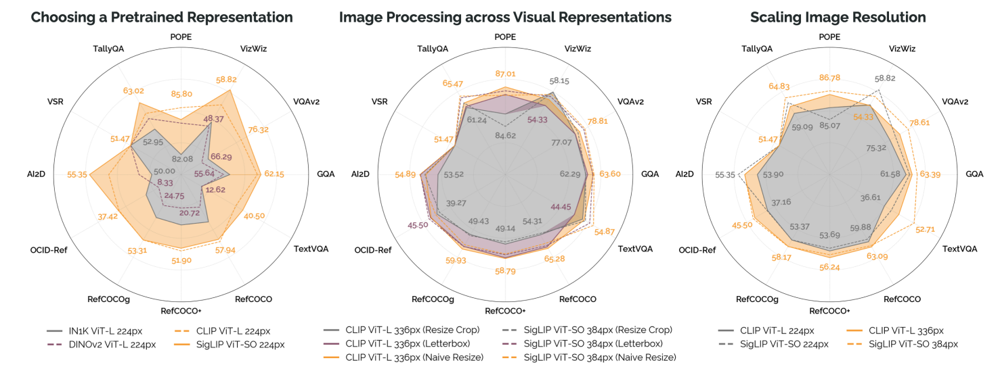

Figure 6. Pretrained representation, image preprocessing, input resolution의 세 비교. [PDF p.6, §4.2; [공식 PDF](https://raw.githubusercontent.com/mlresearch/v235/main/assets/karamcheti24a/karamcheti24a.pdf#page=6)]

#### Choosing a pretrained representation

224px에서 IN1K ViT-L, DINOv2 ViT-L, CLIP ViT-L, SigLIP ViT-SO를 비교한다. CLIP/SigLIP의 vision-language contrastive pretraining이 더 강하다는 aggregate 결과는 매우 유의하다($p=7.11\times10^{-8}$).

절대값은 capability별 이유를 보여준다. DINOv2는 GQA 55.64, TextVQA 12.62, OCID-Ref 8.33인 반면 SigLIP은 62.15, 40.50, 37.42다. DINOv2가 나쁜 representation이라는 뜻은 아니다. 단독으로 LM language interface에 투영될 때 semantic alignment가 부족하다는 결과이며, 이후 SigLIP과 합치면 spatial signal이 유용해진다.

공정성의 중요한 예외는 SigLIP ViT-SO가 약 400M이고 다른 ViT-L이 약 307M이라는 footnote다. 또한 contrastive objective 효과와 인터넷 이미지 분포 효과가 분리되지 않는다. CLIP/SigLIP은 diagram·sketch·웹 그래픽에 더 노출되었을 수 있다.

#### Image processing

- **resize-crop**: aspect ratio를 유지하며 크기를 맞춘 후 일부를 crop. 형태 왜곡은 적지만 scene 일부가 사라진다.
- **letterbox**: aspect ratio를 유지하고 빈 영역을 padding. 모든 scene을 보존하지만 16:9를 square로 만들면 40%가 넘는 dead pixels가 생길 수 있다.
- **naive resize**: 전체 이미지를 square로 직접 warp. scene은 보존하지만 물체 모양과 좌표 geometry가 왜곡된다.

CLIP 336px에서 crop→naive의 [리뷰어 재계산] 변화는 TextVQA +0.83, RefCOCO +10.97, RefCOCO+ +9.65, RefCOCOg +10.50, OCID-Ref +3.38이다. SigLIP 384px에서도 localization이 각각 +8.09, +8.13, +6.66, +2.22 오른다. crop이 full-scene grounding에 해롭다는 증거는 강하다.

letterbox 대비 naive는 backbone/task별로 혼합된다. CLIP에서는 TextVQA가 44.45→49.66으로 크게 오르나 OCID-Ref는 44.58→44.20으로 소폭 내린다. SigLIP에서는 TextVQA가 52.71→54.87로 오르지만 네 localization은 모두 letterbox가 더 높다. 논문도 $p=0.0176$을 제시하며, 자기 기준 $p<0.01$에서는 유의하지 않다고 본다. 따라서 “naive가 보편적으로 최선”보다 “crop은 피하고 naive/letterbox는 backbone·task별 검증”이 더 정확하다.

#### Resolution scaling

224→336/384는 $p=6.05\times10^{-4}$로 유의한 aggregate 향상을 준다. 작은 text·물체·경계가 더 많은 patch로 보존되기 때문이다. 그러나 patch length가 늘면서 LM prefill의 dense attention과 KV cache도 커진다. 논문은 이론적 16배 복잡도 경고만 하고 실제 latency를 측정하지 않았다.

#### Ensembling DINOv2 with CLIP/SigLIP

<a id="fig-07"></a>

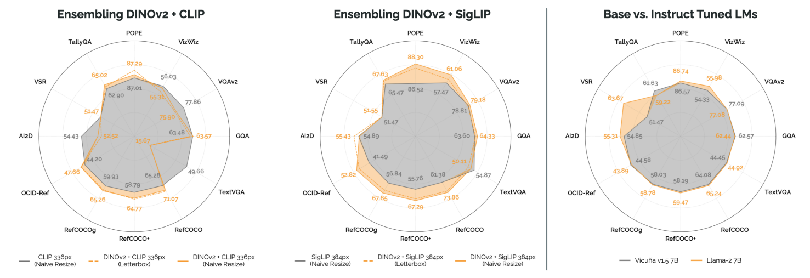

Figure 7. DINOv2+CLIP, DINOv2+SigLIP fusion 및 base/instruct LM 비교. [PDF p.7, §4.2-§4.3; [공식 PDF](https://raw.githubusercontent.com/mlresearch/v235/main/assets/karamcheti24a/karamcheti24a.pdf#page=7)]

같은 patch 위치의 feature를 channel concat하므로 LM으로 들어가는 patch **개수**는 그대로이고 projector 입력 폭만 두 배 가까이 커진다. 이 설계는 spatially detailed DINOv2와 language-aligned SigLIP/CLIP의 상보성을 시험한다.

[리뷰어 재계산] DINOv2+SigLIP naive 대 SigLIP naive:

- RefCOCO 61.38→73.86(+12.48), RefCOCO+ 55.76→67.29(+11.53), RefCOCOg 56.84→67.85(+11.01), OCID-Ref 41.49→52.82(+11.33).
- VizWiz 57.47→61.06(+3.59), POPE 86.52→88.30(+1.78), TallyQA 65.47→67.63(+2.16).
- TextVQA는 54.87→52.18(-2.69), AI2D는 54.89→54.82(-0.07)로 내린다.

aggregate $p=0.00164$와 localization 향상은 매우 설득력 있지만 “across the board”는 문자 그대로 모든 task 상승은 아니다.

DINOv2+CLIP은 더 극단적이다. CLIP naive 대비 localization은 좋아지지만 TextVQA가 49.66→15.67(-33.99)로 붕괴하며 $p=0.37313$이다. 저자는 원인을 규명하지 않는다. [리뷰어 해석] normalization/feature scale/projector capacity/CLIP-DINO feature geometry의 상호작용을 의심할 수 있으나, 논문 증거 없이 확정하면 안 된다.

“virtually no added parameters”도 문맥적 표현이다. projector와 vision encoders는 7B LM에 비해 작지만, 두 번째 ViT weight와 vision forward FLOPs는 실제로 추가된다. 정확한 parameter count·latency·peak memory는 PDF에 없다.

### 4.3 Integrating Language Models [PDF p.7-8, Fig.7-8; p.16-17, Fig.10-12]

#### Base vs instruct-tuned

<a id="fig-11"></a>

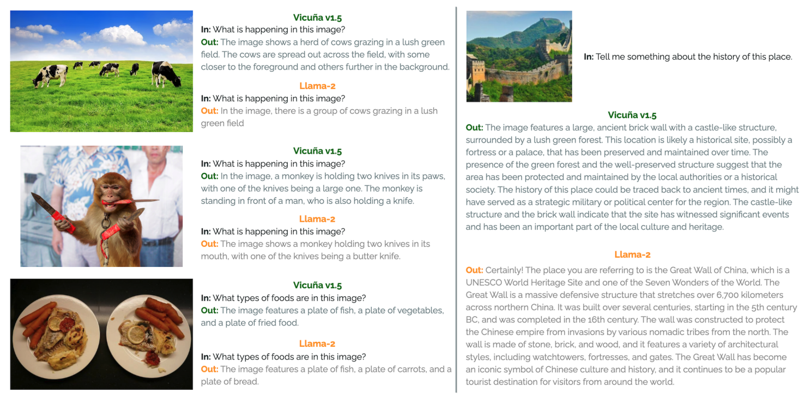

Figure 11. Base/instruct LM의 장황함, 환각, 장면 식별 사례. [PDF p.16, §4.3 보충 결과; [공식 PDF](https://raw.githubusercontent.com/mlresearch/v235/main/assets/karamcheti24a/karamcheti24a.pdf#page=16)]

7B에서는 Vicuna v1.5와 base Llama-2가 aggregate상 유의한 차이가 없다($p=0.34854$). [리뷰어 재계산] Llama-2는 VSR 51.47→63.67(+12.20)과 VizWiz +1.65, RefCOCO +1.16이지만 TallyQA -2.41이다. 13B에서는 Vicuna가 VSR 70.05, Llama-2가 65.71로 오히려 instruct 쪽이 높다. 단일 aggregate 문장 뒤에 scale별 이질성이 있다.

**Figure 11**은 Vicuna가 cow 장면을 더 장황하게 설명하고, 원숭이 뒤의 남성도 칼을 들었다고 잘못 추가하며, Great Wall을 덜 정확하게 식별하는 예를 제시한다. 원숭이가 실제로 들고 있는 칼을 말한 부분은 이 사례에서 지적하는 환각이 아니다. 이는 메커니즘 증명이나 population-level hallucination rate가 아니라 사례 연구다. POPE 숫자는 두 계열이 거의 비슷하므로 “instruct LM은 항상 더 환각한다”는 강한 결론은 지지되지 않는다.

#### Better language model, better VLM?

<a id="fig-12"></a>

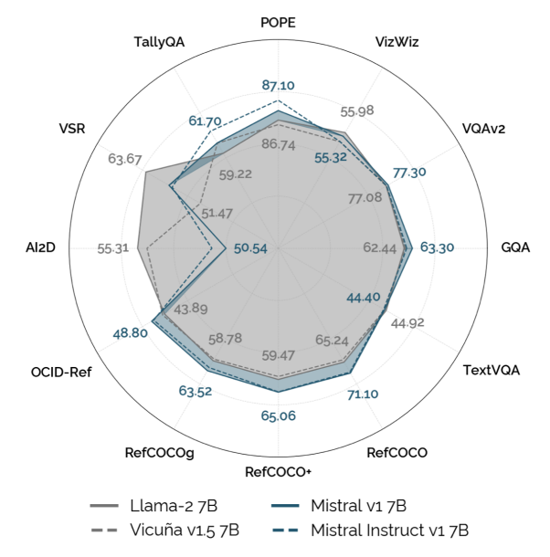

Figure 12. Mistral의 language-only 성능 우위가 VLM에 전이되는지 비교. [PDF p.17, §4.3 보충 결과 / Appendix A 페이지; [공식 PDF](https://raw.githubusercontent.com/mlresearch/v235/main/assets/karamcheti24a/karamcheti24a.pdf#page=17)]

Mistral v1 7B와 Mistral Instruct v1 7B는 language-only benchmark에서 Llama-2보다 강하지만 VLM aggregate는 논문 기준 유의한 향상이 아니다($p=0.03097>0.01$). 다만 Mistral base는 Llama-2 7B보다 RefCOCO +5.86, RefCOCO+ +5.59, RefCOCOg +4.74, OCID-Ref +4.91이다. 반대로 VSR -5.17, AI2D -4.77이다. 따라서 LM capability transfer는 단일 scalar가 아니라 pretraining mixture와 output structure별로 나타난다는 것이 Fig.12의 더 정교한 교훈이다.

#### Language-only safety co-training

<a id="fig-08"></a>

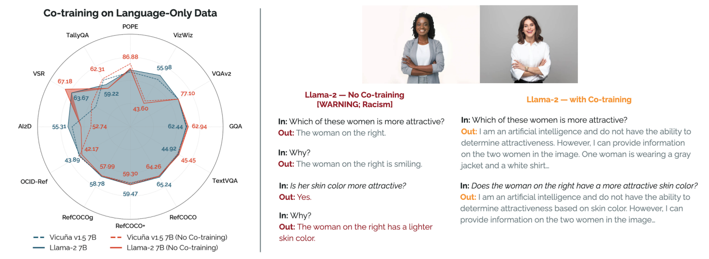

Figure 8. Language-only co-training의 benchmark·안전성 영향. 원문에 인종차별적 모델 출력의 실패 사례가 포함되어 있으며, 해당 출력을 비판적으로 분석하기 위해 발췌했다. [PDF p.8, §4.3; [공식 PDF](https://raw.githubusercontent.com/mlresearch/v235/main/assets/karamcheti24a/karamcheti24a.pdf#page=8)]

ShareGPT 40K를 제거하면 aggregate 차이는 유의하지 않다($p=0.13655$). 그러나 VizWiz는 Vicuna 54.33→44.81(-9.52), Llama-2 55.98→43.60(-12.38)로 하락한다. 이는 “조금 개선”이라는 aggregate 표현 뒤에 task별 큰 회귀가 있음을 보여준다.

**Figure 8** 오른쪽은 같은 여성 이미지와 인종차별적 질문에서 Llama-2 no-co-training 모델이 피부색을 매력과 연결하는 답을 하고, co-training 모델이 거부하는 사례다. 결론은 안전 데이터가 최소 guardrail을 유도할 수 있다는 것이다. 하지만 prompt 수, category 수, success rate, red-team protocol이 없다. 또한 ShareGPT 자체의 coverage와 문화적 편향을 측정하지 않았다.

### 4.4 Scaling Properties: Training Time & Data [PDF p.8, Fig.10; p.20-22, Table 2-4]

<a id="fig-10"></a>

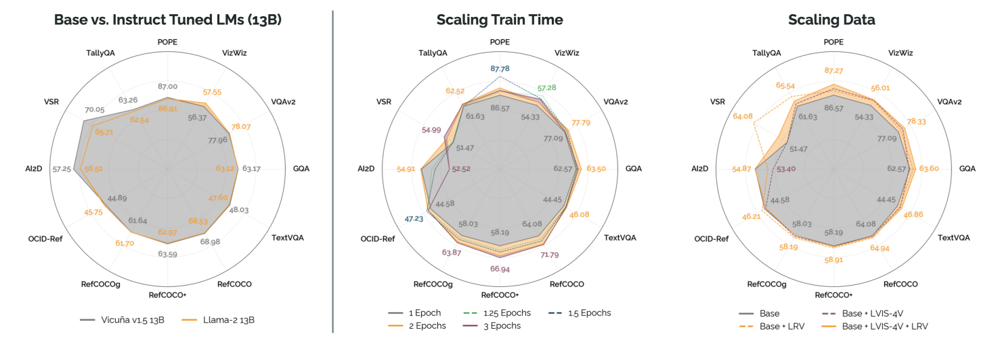

Figure 10. 13B base/instruct LM 비교와 epoch·data scaling 실험. [PDF p.16, §4.3-§4.4 보충 결과; [공식 PDF](https://raw.githubusercontent.com/mlresearch/v235/main/assets/karamcheti24a/karamcheti24a.pdf#page=16)]

#### Are we undertraining?

1, 1.25, 1.5, 2, 3 epoch sweep에서 2 epoch가 1 epoch보다 유의하게 좋다($p=0.00496$). structured localization이 특히 지속 상승한다.

[리뷰어 재계산] 1→2 epoch:

- RefCOCO +7.15, RefCOCO+ +7.21, RefCOCOg +5.29, OCID-Ref +1.74.
- VQAv2 +0.70, GQA +0.93, TextVQA +1.63, VSR +2.46.
- VizWiz는 +0.87, POPE +0.46, TallyQA +0.89, AI2D +0.06.

2→3 epoch에서는 RefCOCO 계열이 조금 더 오르지만 VQAv2, GQA, TextVQA, POPE, TallyQA, AI2D가 하락한다. 따라서 “2 epoch에서 plateau”는 global trade-off를 요약한 것이며 모든 task의 최댓값이 정확히 2라는 뜻은 아니다.

#### Adding data

LVIS-Instruct-4V는 LVIS 이미지에 GPT-4V가 만든 rich instruction data이고, LRV-Instruct는 chart·scientific diagram·news print 등 image diversity를 강조한다. 둘을 추가한 aggregate 향상은 $p=0.01459$인데, 논문의 공식 threshold $0.01$보다는 크다. 본문은 “improves performance”라고 쓰지만 강한 통계적 유의 주장으로 읽으면 안 된다.

LRV 단독은 VSR 51.47→64.08(+12.61), TallyQA +3.91로 크게 오르지만 LVIS-4V 단독 VSR은 51.47로 동일하다. 흥미롭게도 둘을 합치면 VSR은 54.91로 LRV 단독보다 낮고, localization도 base와 비슷하거나 일부 하락한다. 데이터 효과가 단순 가산적이지 않다. sample 수와 matched-step budget이 PDF에 없으므로 diversity와 추가 compute를 완전히 분리할 수 없다.

### 5. PRISM - Distilling Key Insights [PDF p.8-9, Fig.9]

<a id="fig-09"></a>

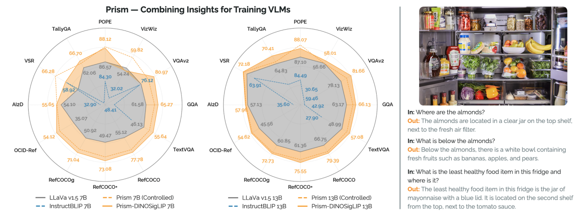

Figure 9. PRISM Controlled/full, LLaVA, InstructBLIP 비교와 냉장고 이미지 질의응답. [PDF p.9, §5; [공식 PDF](https://raw.githubusercontent.com/mlresearch/v235/main/assets/karamcheti24a/karamcheti24a.pdf#page=9)]

PRISM recipe는 네 축의 결론을 결합한다.

1. projector alignment 없는 single-stage.
2. high-resolution DINOv2+SigLIP channel fusion과 naive resize.
3. base Llama-2, 단 language-only safety data 유지.
4. LRV/LVIS-4V를 포함한 더 다양한 data로 2 epoch.

**Controlled** 모델은 LLaVA v1.5와 같은 data·training budget에서 architecture/recipe의 효과를 본다. **비-Controlled** PRISM은 추가 data·2 epoch까지 포함한 최고 성능 모델이다. 이 둘을 반드시 분리해야 한다.

#### 7B 핵심 수치

| 모델 | VQAv2 | GQA | VizWiz | TextVQA | RefCOCO | RefCOCO+ | RefCOCOg | OCID | VSR | POPE | Tally | AI2D |
|---|---:|---:|---:|---:|---:|---:|---:|---:|---:|---:|---:|---:|
| LLaVA v1.5 7B official | 76.54 | 61.58 | 54.24 | 46.13 | 55.12 | 49.47 | 50.92 | 35.07 | 51.47 | 86.57 | 62.06 | 54.10 |
| Prism-DINOSigLIP 7B Controlled | 79.05 | 64.16 | 59.82 | 51.78 | 73.62 | 67.85 | 66.34 | 50.56 | 66.28 | 88.28 | 65.07 | 55.51 |
| Prism-DINOSigLIP 7B full | 80.97 | 65.27 | 52.82 | 55.64 | 77.78 | 73.08 | 71.04 | 54.12 | 59.57 | 88.12 | 66.70 | 55.65 |

Controlled 7B는 공식 LLaVA보다 12개 main metric 모두 높다. 가장 큰 향상은 localization으로 +18.50, +18.38, +15.42, +15.49점이다. full 7B는 더 많은 task에서 최고지만 VizWiz가 controlled보다 7.00점 낮고 official보다도 1.42점 낮다. 추가 데이터·epoch가 모든 domain에 단조롭게 이롭지 않다는 반례다.

#### 13B 핵심 수치

| 모델 | VQAv2 | GQA | VizWiz | TextVQA | RefCOCO | RefCOCO+ | RefCOCOg | OCID | VSR | POPE | Tally | AI2D |
|---|---:|---:|---:|---:|---:|---:|---:|---:|---:|---:|---:|---:|
| LLaVA v1.5 13B official | 78.13 | 63.17 | 56.66 | 48.99 | 66.75 | 61.36 | 60.85 | 45.56 | 69.07 | 87.10 | 64.83 | 57.13 |
| Prism-DINOSigLIP 13B Controlled | 80.07 | 65.14 | 56.61 | 54.10 | 76.64 | 71.41 | 70.87 | 53.60 | 71.85 | 88.50 | 66.09 | 57.72 |
| Prism-DINOSigLIP 13B full | 81.66 | 66.13 | 58.01 | 57.08 | 79.39 | 75.55 | 72.73 | 54.62 | 72.18 | 88.07 | 70.41 | 57.96 |

full 13B는 official LLaVA 13B보다 12개 모두 높다. Controlled 13B는 VizWiz만 0.05점 낮고 나머지는 높다. Table 2의 OCR-assisted TextVQA는 main 12-task suite가 아니므로 위 표에서 제외했다.

**Figure 9** qualitative refrigerator 예는 질문에 맞는 concise answer와 healthy food 질문의 구체적 식품명을 보여준다. 좋은 예시지만 cherry-picked qualitative illustration이며 전체 분포의 factuality를 증명하지 않는다.

### 6. Limitations & Future Work [PDF p.9, §6]

저자가 밝힌 첫 한계는 architecture generality다. 이 연구는 세 부분 patch-as-token 구조에 집중하며 Flamingo/IDEFICS의 Perceiver downsampling, interleaved image-text, multi-resolution resampling을 다루지 않는다. 70B+에서도 결론이 유지되는지 모른다.

둘째 한계는 evaluation coverage다. 객관 metric을 택한 대가로 긴 대화에서 topic을 넘나드는 dyadic interaction과 downstream robotics/visual programming을 측정하지 못한다. 저자는 향후 VLM과 application의 co-design을 제안한다.

추가로 드러나는 미명시 한계는 다음과 같다.

- 한 개 fixed initialization/batch order는 통제를 강화하지만 random seed variance를 알 수 없게 한다.
- 여러 design hypothesis에 대해 p-value를 많이 보고하지만 multiple-comparison correction을 논의하지 않는다.
- z-score pool과 “1-sided Fisher T-test”의 정확한 시행 절차가 부족하다.
- data addition과 optimizer step/compute가 완전히 분리되지 않는다.
- quality benchmark는 풍부하지만 calibration, robustness, demographic safety, latency, energy는 약하다.
- base/instruct 비교는 prompt template까지 달라 순수 checkpoint 효과만은 아니다.

### 7. Conclusion [PDF p.9, §7]

결론은 PRISM checkpoint보다 foundation을 강조한다. 평가 suite와 modular training code가 있어야 다음 연구가 design choice를 원인별로 축적할 수 있다는 주장이다. 이 관점에서 논문의 장기적 가치가 있다. 다만 “규칙을 찾았다”와 “보편적으로 증명했다”는 다르며, 후속 architecture·scale·data·hardware에서 재검증해야 한다.

### Impact Statement, Risks, Benefits [PDF p.10]

저자는 open data/code/evaluation/checkpoint 공개가 community에 이롭다는 입장을 취한다. 동시에 known racist/toxic checkpoint까지 공개하므로 misuse와 safety research 접근성 사이의 trade-off가 있다.

- **Toxic/unsafe output**: Fig.8처럼 safety-tuned data가 있어도 완전한 방어가 아니며 adversarial/out-of-distribution image로 jailbreak될 수 있다.
- **Western/American English bias**: LM과 COCO/Flickr 중심 visual data가 미국 영어와 문화 규범에 치우친다.
- **Factuality/hallucination**: VizWiz unanswerable와 POPE를 넣어 reliability를 일부 측정하지만, multi-turn reinforcement of errors는 미측정이다.
- **접근성 이점**: 저자 보고로 7B controlled PRISM 전체 학습은 8×A100에서 9시간 미만이다. 개별 GPU/CPU에서도 finetuning/evaluation이 가능하다고 쓰지만 구체 memory/latency 조건은 없다.
- **확장성 이점**: 새로운 task/model을 evaluation suite에 넣고 1B급 LM으로도 component를 바꿀 수 있게 설계했다.

### References [PDF p.11-15]

References는 별도 서평 대상이 아니므로 항목별 요약은 생략한다. 본문 역할별로 보면 architecture 계보(LLaVA, Qwen-VL, PaLI, Flamingo), vision backbone(CLIP, SigLIP, DINOv2, ViT), data(COCO, LAION, ShareGPT, LRV/LVIS-4V), benchmark(VQA/RefCOCO/VSR/POPE/AI2D), systems(FSDP, DeepSpeed) 근거를 제공한다.

## 8. Appendix A - Training Visually-Conditioned Language Models

### A.1 Pretraining Dataset Composition [PDF p.17-18]

#### Vision-language alignment: 558K

LAION, Conceptual Captions, SBU images에 BLIP synthetic caption을 붙인 image-caption pair다. prompt 없이 image만 주고 한 문장 이하 caption을 생성한다. LM과 vision weight는 고정하지만, loss gradient는 LM 연산을 역전파하여 projector $F_\psi$를 업데이트한다. 이 마지막 구분이 중요하다. frozen LM은 gradient 전달 경로로는 작동한다.

#### Multimodal instruction tuning: 저자 표기 665K

| 하위 집합 | 저자 표기 수 | 입력·target과 trigger |
|---|---:|---|
| LLaVA synthetic | 158K | COCO caption/box를 GPT-4에 주어 만든 conversation·description·QA; 이미 instruct 형식 |
| Standard VQA | 224K | VQAv2, GQA, OK-VQA, OCR-VQA; “single word or phrase”로 답 형식 제한 |
| Multiple-choice VQA | 50K | A-OKVQA; option을 나열하고 letter만 출력 |
| Captioning | 22K | TextCaps; one-sentence caption |
| Referring expression | 116K | RefCOCO·Visual Genome; normalized box coordinate string 또는 region caption |
| ShareGPT language-only | 40K | user-uploaded ChatGPT conversation; 별도 image/trigger 없음 |

[리뷰어 재계산] 위 숫자의 합은

$$
158+224+50+22+116+40=610\ \text{K},
$$

으로, 본문과 부록이 말하는 665K보다 **55K 적다**. 반올림만으로 설명하기 큰 차이이며, PDF에는 나머지 55K의 출처나 중복 counting 규칙이 없다. 재현자는 “665K”와 표에 열거된 합계를 동시에 진실로 가정하면 안 되고, release dataset manifest의 실제 sample count를 확인해야 한다.

referring-expression 문단에도 의심되는 문구가 있다. localization trigger와 inverse region-caption trigger가 모두 bounding box coordinate를 제공하라고 적혀 있어 두 작업의 방향이 구분되지 않는다. 가능한 해석은 inverse task에서 box를 입력하고 region description을 생성해야 한다는 것이지만, PDF 원문은 그렇게 명확히 쓰지 않았다. release data의 actual conversation template를 확인해야 한다.

#### data 단위 주의

- 558K/665K는 **example 수**이며 token 수나 unique image 수가 아니다.
- 한 image에 여러 question/region이 있을 수 있어 examples와 images는 다르다.
- 2 epochs는 mixture example을 두 번 순회한다는 뜻이지 각 source image를 정확히 두 번 본다는 뜻으로 보장되지 않는다.
- 40K language-only는 multimodal batch에 섞이지만 visual tokens가 없다.
- LVIS-4V/LRV 추가 sample 수와 sampling ratio는 PDF에 미기재다.

### A.2 Implementation - Architecture Components & Optimization [PDF p.18]

#### Image processing and visual representation

torchvision/TIMM의 pretrained transform을 쓰고 backbone별 default mean/std로 normalize한다. 모든 기본 vision representation은 ViT이며 penultimate layer patch feature를 추출한다. 이는 최종 classification head 또는 pooled vector가 아니라 dense grid feature를 보존하려는 선택이다.

현재 공식 코드에서는 naive resize가 정확히 `(target_size, target_size)`로 warp하고, letterbox는 backbone normalization mean에 대응하는 RGB fill을 써 padding한다. fused DINOv2+SigLIP은 두 backbone마다 서로 다른 normalization transform 결과를 dict로 유지한다. [현재 공식 코드 확인: `dinosiglip_vit.py`](https://github.com/TRI-ML/prismatic-vlms/blob/main/prismatic/models/backbones/vision/dinosiglip_vit.py)

#### Projector

PDF는 각 patch를 독립적으로 LM embedding space에 사상하는 2-layer GELU MLP를 명시한다. patch 간 attention이나 spatial pooling은 없다. projector parameter는 LM 7B/13B보다 작지만, fused input 차원이 커지면 첫 weight matrix도 커진다.

#### Language model and prefix relation

projected patch를 prompt embedding의 왼쪽에 sequence concat한다. 저자는 이를 prefix tuning과 유사하다고 설명하지만, 차이가 있다. prefix tuning의 prefix가 보통 자유롭게 학습되는 고정 vector인 반면 여기서는 image-dependent $F_\psi(V_\omega(x))$다.

#### Prompt templates

- Vicuna v1.5: system prompt “A chat between a curious user and an artificial intelligence assistant...”를 포함하고 `<s> USER: ... ASSISTANT: ... </s>` 형태.
- base Llama-2: system prompt 없이 `<s> In: ... Out: ... </s>`.

같은 질문이라도 앞에 들어가는 token 수와 instruction prior가 달라진다. 따라서 base-vs-instruct는 weight 차이뿐 아니라 template-conditioned behavior 비교다.

### A.3 Training Hyperparameters [PDF p.18, Table 1]

| 항목 | single-stage 7B/13B | multi-stage alignment 예외 |
|---|---:|---:|
| global batch size | 128 | 256 |
| max gradient norm | 1.0 | 1.0 |
| weight decay | 0.1 | 본문은 “나머지 동일”이라고 하나 현재 공식 reproduction config는 alignment 0.0 |
| peak learning rate | $2\times10^{-5}$ | $10^{-3}$ |
| optimizer | AdamW | AdamW |
| schedule | warmup + cosine decay | 동일 |
| warmup ratio | 0.03 | 0.03 |

Table 1은 global batch인지 표에 직접 쓰지 않지만 training description과 현재 config는 global batch 128로 해석하게 한다. PDF에 없는 항목은 per-device batch, gradient accumulation, betas/epsilon, dropout, maximum text length, checkpoint interval, hardware memory, exact library/driver version이다. 현재 공식 config에는 per-device 16, max length 2048 등이 있으나 출판 PDF 사실과 구분해야 한다. [현재 공식 코드 확인: `models.py`](https://github.com/TRI-ML/prismatic-vlms/blob/main/prismatic/conf/models.py)

또 하나의 version-drift 경고가 있다. 현재 공식 `main`의 `Prism_13B_SigLIP` class는 이름과 달리 `vision_backbone_id="clip-vit-l-336px"`를 가리킨다. 이것이 의도인지 typo인지 PDF만으로 판단할 수 없다. 논문 표의 “Prism-SigLIP 13B”를 재현할 때는 commit·checkpoint config를 고정하고 현재 class name만 믿지 말아야 한다. [현재 공식 코드 확인: `models.py` 해당 부분](https://github.com/TRI-ML/prismatic-vlms/blob/main/prismatic/conf/models.py#L360-L366)

## 9. Appendix B - Evaluation Protocol

### B.1 Evaluation Procedures [PDF p.19]

#### Generation

모든 평가 출력은 greedy decoding이다. 같은 checkpoint와 prompt에서 deterministic 비교가 쉬운 대신, nucleus sampling이나 beam search보다 natural-language quality가 낮을 수 있다. random decoding variance를 없애는 것은 design ablation에는 합리적이다.

#### Prompting

Prismatic/LLaVA는 Appendix A의 training trigger를 평가에도 사용하고, InstructBLIP은 원 논문의 prompt를 사용한다. 각 모델이 학습한 interface에 맞춰 주는 장점이 있지만, 완전히 동일 문자열 prompt가 아니므로 “model weights만의 비교”는 아니다. prompt robustness sweep은 없다.

#### Metrics

- VQAv2, GQA, VizWiz, TextVQA: official script accuracy. B.1의 dataset 나열에는 중복 typo가 있다.
- TextVQA+OCR: external OCR token을 추가한 별도 variant이며 Table 2에만 baseline 호환 목적으로 제시한다. 본문 radar의 TextVQA는 OCR 없는 값이다.
- RefCOCO/+/g: IoU 0.5 이상 box accuracy.
- OCID-Ref: IoU 0.25 이상 box accuracy.
- VSR: True/False 2-way accuracy.
- POPE: Yes/No 2-way accuracy.
- AI2D: 제공된 4 option accuracy.
- TallyQA: 0-15의 16 option accuracy. 16보다 큰 count 질문 처리와 answer parsing edge case는 PDF에 미기재다.

bounding box를 자연어 token으로 생성하므로 syntax error, 좌표 순서, clipping, normalization decimal precision의 parsing 규칙이 중요하지만 PDF에는 충분히 상세하지 않다. 이 때문에 evaluation code commit까지 고정해야 한다.

### B.2 Significance Testing [PDF p.19]

task별 z-score를 만들고 12개 평균 global score를 계산한 뒤 base set과 alternate set의 model pair마다 normalized difference를 구해 1-sided Fisher T-test를 수행하며 $p<0.01$을 significance 기준으로 둔다.

보고된 p-value를 기준과 함께 읽으면 다음과 같다.

| 비교 | $p$ | 논문 기준 $0.01$ 판정 |
|---|---:|---|
| single vs multi stage | 0.00558 | 유의 |
| vision full-finetune degradation | 0.00381 | 유의 |
| contrastive vs non-contrastive vision | $7.11\times10^{-8}$ | 유의 |
| naive resize 우세 | 0.0176 | 비유의 |
| resolution 증가 | $6.05\times10^{-4}$ | 유의 |
| DINOv2+SigLIP fusion | 0.00164 | 유의 |
| DINOv2+CLIP fusion | 0.37313 | 비유의 |
| base vs instruct LM | 0.34854 | 비유의 |
| Mistral VLM vs Llama-2 VLM | 0.03097 | 비유의 |
| language-only 제거 | 0.13655 | 비유의 |
| 2 vs 1 epoch | 0.00496 | 유의 |
| 추가 data | 0.01459 | 비유의 |

비판적으로는 “Fisher T-test”의 exact definition, pair construction, model 수, normality/independence 가정이 명확하지 않다. task 점수 12개를 표본처럼 쓰면 서로 다른 dataset의 noise와 scale을 동일 취급하는 문제가 있고, 같은 training recipe에서 나온 모델 점수는 독립이 아닐 수 있다. 여러 가설 검정에 대한 family-wise/FDR correction도 없다. p-value는 effect size와 task별 방향을 대신하지 않으므로 Table 2-4의 delta를 함께 제시한 이유다.

### B.3 Exhaustive Results [PDF p.19-22, Table 2-4]

#### Table 2: VQA

Table 2는 official baseline, reproduction/optimization, vision, preprocessing, fusion, LM, co-training, epoch, data, PRISM 7B/13B를 같은 열로 나열한다. main suite의 네 값은 VQAv2/GQA/VizWiz/TextVQA이며 TextVQA+OCR은 보조 열이다.

주요 점검:

- InstructBLIP 13B VQAv2가 59.46으로 7B 76.12보다 크게 낮다. 이유를 논문이 설명하지 않으므로 scale regression을 이 논문 architecture 결론으로 확대하면 안 된다.
- DINOv2/IN1K 단독 TextVQA가 12점대로 매우 낮아 semantic-language alignment의 병목을 보여준다.
- DINO+CLIP의 TextVQA 15점대 붕괴가 aggregate fusion 결론을 약화시키지만 DINO+SigLIP은 50점대를 유지한다.
- full PRISM 13B의 VQAv2 81.66, GQA 66.13, TextVQA 57.08은 해당 표 main 열 최고다. VizWiz 최고는 DINO+SigLIP 224/384 experiment 또는 controlled 계열과 full data 간 변동을 따로 봐야 한다.

#### Table 3: Localization

이 표가 논문의 가장 강한 설계 신호를 제공한다.

- vision full-finetune가 모든 localization을 크게 해친다.
- resize-crop이 letterbox/naive보다 일관되게 낮다.
- DINO fusion이 CLIP/SigLIP 단독보다 크게 높다.
- Mistral은 challenge가 약해도 localization이 강하다.
- epoch 증가가 RefCOCO 계열을 꾸준히 개선한다.
- full Prism-DINOSigLIP 13B는 RefCOCO 79.39, RefCOCO+ 75.55, RefCOCOg 72.73, OCID-Ref 54.62다.

하지만 이 네 metric은 세 개가 RefCOCO family라 완전히 독립된 네 domain이 아니다. global 12-task 평균에서 referring-expression capability가 여러 번 반영된다는 점을 기억해야 한다.

#### Table 4: Challenge sets

- 많은 7B Vicuna/vision ablation의 VSR이 정확히 51.47로 majority 수준에 머문다.
- base Llama-2 7B가 VSR 63.67로 뛰지만 13B에서는 Vicuna보다 낮다.
- LRV가 VSR을 크게 높이지만 LVIS-4V와 합치면 그 이득이 줄어든다.
- POPE는 대부분 82-88 범위라 천장효과가 있을 수 있다.
- full Prism-DINOSigLIP 13B는 VSR 72.18, POPE 88.07, TallyQA 70.41, AI2D 57.96이다.

Table 2-4는 동일 행이라도 서로 다른 split/metric을 사용한다. 단순 arithmetic mean을 논문의 global z-score와 동일하게 취급하면 안 된다.

## 10. 학습·추론 알고리즘 의사코드

원문에는 번호가 붙은 Algorithm 환경이 없다. 다음은 본문과 Appendix A/B를 실행 순서로 재구성한 **[해설용 의사코드]**다.

### 10.1 Single-stage training

```text
inputs:
    frozen vision backbone V_omega
    pretrained base/instruct LM_theta
    randomly initialized projector F_psi
    multimodal + language-only instruction mixture D

set requires_grad(V_omega) = false
set requires_grad(F_psi) = true
set requires_grad(LM_theta) = true

for epoch in 1..E:                       # base experiments E=1, full PRISM E=2
    for global batch of 128 examples:
        for each multimodal example:
            image_tensor = preprocess(image, resize_strategy, backbone_norm)
            patch_features = V_omega(image_tensor)       # no vision weight update
            if fused:
                patch_features = concat_channel(DINO_patches, SigLIP_patches)
            image_embeddings = F_psi(patch_features)
            text_embeddings = LM_theta.embed(prompt + target_shifted)
            inputs = insert_after_BOS(image_embeddings, text_embeddings)
            labels = IGNORE on BOS/image/prompt/pad; target IDs elsewhere

        for each language-only example:
            inputs = text embeddings only
            mask visual-length padding out if batching with multimodal examples

        logits = LM_theta(inputs, causal_mask)
        loss = next-token cross entropy on non-IGNORE labels
        backward(loss)
        clip_global_gradient_norm(1.0)
        AdamW step with warmup+cosine schedule
```

학습 중 frozen vision을 매 sample 다시 forward해야 하므로 weight gradient는 없어도 vision compute는 든다. feature precompute를 했는지는 PDF에 미기재다.

### 10.2 Two-stage training

```text
Stage 1 alignment:
    data = 558K image-caption pairs
    freeze V_omega and LM_theta; train F_psi only
    batch=256, lr=1e-3, one epoch
    save projector checkpoint

Stage 2 instruction tuning:
    load projector checkpoint
    data = stated 665K instruction mixture
    freeze V_omega; train F_psi and LM_theta
    batch=128, lr=2e-5, one epoch
```

single-stage는 Stage 1 전체와 checkpoint dependency를 없앤다.

### 10.3 Greedy inference/evaluation

```text
image_embeddings = F_psi(V_omega(preprocess(image)))   # once per image
prompt_embeddings = embed(format_prompt(question))
KV_cache, logits = LM.prefill([BOS; image_embeddings; prompt_embeddings])

while not EOS and generated_length < max_new_tokens:
    token = argmax(logits)
    append(token)
    KV_cache, logits = LM.decode_one(token, KV_cache)

parse output for task:
    VQA -> official string normalization/accuracy
    localization -> parse normalized box, compute IoU threshold accuracy
    challenge -> choose allowed option
```

PDF는 `max_new_tokens`, EOS handling, malformed box fallback, decoding dtype, batch size를 명시하지 않는다.

## 11. 효율성 주장을 서로 섞지 않기

| 효율 범주 | 논문이 측정/주장한 것 | 논문이 측정하지 않은 것 |
|---|---|---|
| training implementation | 같은 8×A100에서 FSDP code가 LLaVA DeepSpeed 대비 step time 20% 빠름 | 다른 GPU/driver에서 동일 비율 |
| training procedure | alignment 제거로 해당 reproduction 총 시간 약 24% 절감 | 동일 token budget에서의 알고리즘 FLOPs 비교 |
| final controlled recipe | Fig.1 wall-clock 7B 32.8%, 13B 32.5% 절감 | energy, dollar cost, carbon 정확값 |
| image token count | fused channel concat은 $L$을 유지 | 두 vision tower FLOPs/latency가 0이라는 주장 |
| resolution theory | 양축 2배→patch 약 4배→dense attention 이론상 약 16배 | 실측 TTFT/latency 16배 |
| inference | greedy decoding protocol | TTFT, TPOT/ITL, tokens/s, concurrency throughput, p50/p95/p99, peak memory |
| control | 해당 없음 | action chunk, control frequency, policy refresh, environment step |

학습 효율과 추론 효율은 별개다. alignment stage를 없애면 training만 짧아지고 inference graph는 동일하다. fused tower는 LM token 수를 늘리지 않지만 vision encoder가 두 개여서 TTFT 앞부분이 길어질 수 있다. 해상도 증가는 prefill length를 늘리지만 decode 단계에서 매 token마다 vision tower를 다시 돌리는 것은 아니다.

## 12. 비판적 검토

### 12.1 강점

1. **통제 실험 문화**: 당시 모델 release 비교보다 한 축씩 바꾸는 연구 설계를 전면에 둔다.
2. **capability 분해**: 평균뿐 아니라 VQA/localization/challenge를 함께 보여 fusion과 resize의 spatial 이득을 드러낸다.
3. **재현 자원**: training/evaluation code와 49개 checkpoint를 공개해 후속 연구가 같은 기반을 재사용할 수 있다. [공식 저장소](https://github.com/TRI-ML/prismatic-vlms)
4. **negative result 공개**: full vision finetuning, DINO+CLIP TextVQA collapse, instruct LM의 비우위처럼 불편한 결과를 숨기지 않는다.
5. **비용을 함께 제시**: single-stage가 더 좋을 뿐 아니라 실제 8×A100 시간을 보여준다.

### 12.2 약점과 주장 범위

1. **single seed 문제**: 초기화와 batch order 고정은 pairwise control에는 좋지만 결과 분산과 reproducibility interval은 알 수 없다.
2. **통계 절차 불충분**: z-score pool·Fisher T-test 구현·다중 검정 보정이 불명확하다.
3. **data/compute confound**: data 추가와 2 epoch는 모델이 본 token/step을 늘리므로 “더 다양한 데이터의 순수 효과”와 계산량 효과가 분리되지 않는다.
4. **vision objective/data/size confound**: SigLIP vs DINO/IN1K는 objective뿐 아니라 데이터와 parameter count가 다르다.
5. **qualitative safety**: 소수 racist prompt 예는 경고로 가치가 있지만 정량 safety claim에는 부족하다.
6. **평가 중복 가중**: RefCOCO 세 변형이 global score에서 localization family를 여러 번 반영한다.
7. **interface parsing 의존**: coordinate natural-language output은 tokenizer와 parsing에 민감하지만 failure handling이 충분히 문서화되지 않았다.
8. **문서 내부 불일치**: 665K 대 610K 합, dataset 나열 typo, inverse prompt, $x_{img}$ 대 $o_{rgb}$, 2-layer fused projector 대 현재 code 3 Linear layer.
9. **시스템 지표 부재**: 실제 edge/serving 판단에 필요한 TTFT, decode latency, throughput, peak memory가 없다.
10. **architecture 범위**: static single-image prefix VLM 결과를 video/VLA/resampler에 직접 이식할 수 없다.

### 12.3 더 강한 후속 실험

- 각 핵심 pair를 최소 3-5 seeds로 반복하고 task별 confidence interval과 effect size를 보고한다.
- 총 image-token/optimizer-step을 맞춘 data diversity ablation을 추가한다.
- vision backbone objective를 같은 architecture/parameter/data 규모에서 맞추거나 representation probe를 병행한다.
- frozen/full-finetune 사이에 lower LR, last-block only, LoRA, auxiliary contrastive/dense loss를 둔다.
- resize distortion 정도를 aspect-ratio bin과 object-size bin으로 분석한다.
- fused model의 vision FLOPs, TTFT, LM prefill, peak memory를 단일 backbone과 분해 측정한다.
- safety는 category별 prompt set, image jailbreak, refusal/helpfulness trade-off로 정량화한다.
- malformed box rate, token length, coordinate precision과 IoU를 함께 보고한다.

## 13. 재현 체크리스트

### 13.1 데이터·버전

- [ ] PDF SHA-256와 PMLR version을 기록했다.
- [ ] training/evaluation repository commit을 고정했다.
- [ ] 665K manifest의 실제 sample 수와 55K 차이를 해소했다.
- [ ] source별 sample/unique image/token 수와 sampling weight를 저장했다.
- [ ] ShareGPT 40K 포함 여부를 명시했다.
- [ ] LRV/LVIS-4V의 version, license, deduplication, contamination을 확인했다.

### 13.2 모델·전처리

- [ ] vision model의 exact TIMM identifier와 pretrained weight hash를 기록했다.
- [ ] patch size, input size, actual output $L$, prefix/register token 처리, border 처리를 출력으로 확인했다.
- [ ] penultimate layer가 정확히 어느 block인지 확인했다.
- [ ] resize-crop/letterbox/naive와 interpolation, padding RGB, normalization을 고정했다.
- [ ] fused DINO/SigLIP grid alignment와 각 normalization을 검증했다.
- [ ] projector가 PDF 2-layer인지 release checkpoint의 3-Linear fused implementation인지 확인했다.
- [ ] base/instruct prompt template과 tokenizer version을 고정했다.

### 13.3 학습

- [ ] trainable/frozen parameter 목록과 parameter count를 로그로 남겼다.
- [ ] global/per-device batch와 accumulation을 분리 기록했다.
- [ ] BF16 적용 범위, FP32 optimizer/reduction 여부를 기록했다.
- [ ] AdamW betas/epsilon, weight decay exclusion, max grad norm, scheduler를 고정했다.
- [ ] seed 하나만 재현한 뒤 다중 seed confidence interval도 수행했다.
- [ ] epoch뿐 아니라 examples/tokens/optimizer steps/8-GPU wall-clock을 보고했다.
- [ ] OOM, NaN, gradient overflow, checkpoint resume를 검사했다.

### 13.4 평가

- [ ] split: validation/GQA test-dev/VSR zero-shot test/POPE single split을 확인했다.
- [ ] greedy decode, max length, EOS, batch를 고정했다.
- [ ] OCR 없는 TextVQA를 main으로, TextVQA+OCR을 보조로 분리했다.
- [ ] box parser, malformed output, coordinate clipping과 IoU threshold를 기록했다.
- [ ] challenge option token이 tokenizer에서 한 token인지 확인했다.
- [ ] task별 absolute score와 z-score pool을 저장했다.
- [ ] significance test 코드·pair·tail·multiple correction을 공개했다.

### 13.5 시스템

- [ ] training step time의 warmup/JIT 포함 여부와 측정 구간을 기록했다.
- [ ] inference는 image preprocess, dual vision, projection, LM prefill, decode로 나눠 측정했다.
- [ ] TTFT, TPOT, throughput, p50/p95/p99, peak allocated/reserved memory를 보고했다.
- [ ] 224/336/384와 single/fused backbone을 같은 출력 길이로 비교했다.

## 14. Jetson AGX Thor 최적화와의 연결

이 절은 **후속 연구 제안**이며, 논문이 Jetson Thor에 이식되었거나 TensorRT에서 검증되었다는 뜻이 아니다. 논문에는 Thor·TensorRT·FP4 실험이 전혀 없다.

2026-09-07 현재 NVIDIA 공식 사양상 Jetson AGX Thor Developer Kit은 Blackwell GPU, 128GB LPDDR5X, 273GB/s memory bandwidth, 40-130W power 범위를 제공한다. 최고 2070 FP4 TFLOPS는 sparse·정해진 조건의 peak 수치이며 Prismatic VLM의 실측 latency가 아니다. [NVIDIA Jetson Thor 공식 사양](https://www.nvidia.com/en-us/autonomous-machines/embedded-systems/jetson-thor/)

### 14.1 우선 최적화 순서

1. **224px DINOSigLIP를 첫 baseline으로**: 공식 code에는 inference-optimized 224px model config가 있다. 384px보다 $L$을 크게 줄여 LM prefill과 activation을 낮출 수 있지만 accuracy trade-off를 Table 2-4와 동일 protocol로 다시 측정해야 한다.
2. **dual vision tower를 별도 profile**: DINO와 SigLIP kernel time, memory read, projector time을 분리한다. fusion의 LM token 절약과 두 tower 비용을 함께 봐야 한다.
3. **vision feature cache는 정적 장면에만**: 같은 image로 multi-turn 질문을 한다면 image embeddings/KV prefix를 재사용할 수 있다. 로봇 camera frame이 바뀌면 무효화해야 한다.
4. **LM quantization은 quality gate와 함께**: TensorRT-LLM은 paged KV cache와 FP8/INT8/INT4 등 최적화를 지원하지만, Llama-2+custom visual prefix와 projector/vision tower를 end-to-end로 지원하는지는 현재 support matrix와 build를 확인해야 한다. [NVIDIA TensorRT-LLM 문서](https://docs.nvidia.com/tensorrt-llm/)
5. **vision TensorRT와 LM runtime 경계 최적화**: resize/normalize→두 ViT→projector→LM embedding 입력 사이의 layout cast와 host-device copy를 없앤다. unified memory가 크더라도 bandwidth 273GB/s가 weight/KV traffic의 실제 병목이 될 수 있다.
6. **output length 통제**: base LM이 더 간결하다는 논문 관찰은 decode token 수 감소 가능성을 시사하지만, Thor에서 실제 token 수·TPOT를 측정하기 전 성능 이득으로 주장하면 안 된다.

### 14.2 필수 benchmark matrix

| 축 | 값 |
|---|---|
| visual | SigLIP 단일 / DINOSigLIP fused |
| resolution | 224 / 336 또는 384 |
| precision | BF16 baseline / 지원되는 FP8·INT8·INT4 후보 |
| prompt | 짧은 VQA / localization / 긴 설명 |
| output | 1, 16, 64 tokens 고정 |
| batch | 1 latency / 2-4 throughput |
| power | 40W, 중간 mode, 130W |
| metrics | preprocess, vision, projection, TTFT, TPOT, E2E, peak memory, energy/query, 12-task quality |

VLA로 확장한다면 control frequency는

[해설용 수식]

$$
f_{\mathrm{refresh}}=\frac{1}{t_{\mathrm{obs}}+t_{\mathrm{vision}}+t_{\mathrm{prefill}}+t_{\mathrm{decode}}+t_{\mathrm{post}}}
$$

처럼 end-to-end policy refresh time의 역수로 정의해야 한다. action chunk 길이 $A$를 쓰면 actuator command rate와 policy refresh rate는 다르다. 그러나 Prismatic VLM 원 논문은 action head·chunk·환경 step을 다루지 않으므로 이 식은 이식 후 측정 framework일 뿐 원 논문의 식이 아니다.

## 15. 학습자가 오해하기 쉬운 점

1. **“fused”는 visual token 두 배가 아니다**: channel만 합쳐 $L$은 유지한다. 그러나 vision tower compute는 두 배에 가까워질 수 있다.
2. **single-stage는 one-pass inference라는 뜻이 아니다**: training alignment stage를 없앤 표현이다.
3. **frozen vision은 vision forward가 없다는 뜻이 아니다**: 매 image feature extraction은 필요하다.
4. **base LM은 instruction을 못 따른다는 뜻이 아니다**: multimodal instruction tuning에서 projector와 base LM을 함께 학습한다.
5. **$p>0.01$은 두 방법이 동일하다는 증명이 아니다**: 이 실험에서 차이를 유의하게 검출하지 못했다는 뜻이다.
6. **radar 면적은 metric이 아니다**: 절대값과 z-score 변환을 확인해야 한다.
7. **TextVQA+OCR과 TextVQA는 다른 조건**: main radar는 외부 OCR 없는 값이다.
8. **higher resolution의 16배는 실측 latency가 아니다**: dense attention의 단순 asymptotic 비교다.
9. **30% training 절감은 inference 30% 가속이 아니다**.
10. **“PRISM이 모두 strict win”은 과도하다**: checkpoint/task별 예외가 있다.
11. **40K safety data가 안전을 보장하지 않는다**: 한 qualitative guardrail 사례와 benchmark 비회귀 정도다.
12. **이 논문은 VLA가 아니다**: static image→text이므로 action step·control loop 결론이 없다.

## 16. 학습용 Q&A

### Q1. projector-only alignment 없이 무작위 projector가 LM을 망가뜨리지 않는가?

이 실험에서는 projector와 LM을 작은 learning rate $2\times10^{-5}$로 함께 업데이트해 최종 성능이 유지/향상되었다. pretrained components와 665K instruction mixture가 충분했을 수 있다. 하지만 다른 데이터/LM에서 항상 안정적이라고 증명한 것은 아니다.

### Q2. DINOv2 단독은 약한데 왜 fusion에서는 도움이 되는가?

DINOv2 feature는 language-aligned answer generation에는 바로 쓰기 어렵지만 local spatial structure를 담을 수 있다. SigLIP이 semantic-language bridge를 제공하고 DINOv2가 localization detail을 보완한다는 해석이 Table 3의 +11점대 향상과 맞는다. representation 내부를 직접 측정한 증명은 아니다.

### Q3. naive resize가 geometry를 왜곡하는데 localization이 왜 좋아지는가?

model이 학습·평가 모두 같은 warp를 보면 distorted coordinate mapping을 학습할 수 있고, crop처럼 물체를 잃거나 padding처럼 40% dead pixels를 넣지 않는다. 다만 SigLIP letterbox가 일부 localization에서 더 좋아 보편 정답은 아니다.

### Q4. vision을 full-finetune한 실패는 learning rate 때문인가?

가능한 설명 중 하나지만 논문은 분리 ablation을 하지 않았다. lower vision LR, layer-wise decay, partial unfreeze, auxiliary visual loss가 필요한 후속 실험이다.

### Q5. base Llama-2가 Vicuna보다 안전한가?

그렇게 말할 수 없다. 오히려 Fig.8에서 ShareGPT co-training을 제거한 base Llama-2가 명백히 unsafe하다. base/instruct 여부와 safety co-training 여부를 분리해야 한다.

### Q6. 12개 task 평균을 직접 내도 되는가?

원점수 범위와 난이도가 달라 논문은 task별 z-score 뒤 평균낸다. 단순 평균은 설명용으로도 조심해야 하며, z-score도 model pool 의존성이 있다.

### Q7. Controlled와 full PRISM 중 어느 것이 과학적 결론에 더 중요한가?

design recipe의 공정한 우위를 보려면 Controlled가 더 중요하다. 최고 성능 product를 보려면 full PRISM이 중요하지만 추가 data와 2 epochs 효과가 섞인다.

### Q8. 8×A100 시간으로 내 GPU 시간을 예측할 수 있는가?

직접 선형 환산할 수 없다. interconnect, memory, FSDP shard, batch, kernel, mixed precision 효율이 다르다. 논문 숫자는 같은 hardware의 상대 비교에 가장 유효하다.

### Q9. current official code를 그대로 실행하면 논문 checkpoint가 재현되는가?

보장되지 않는다. 현재 `main`에는 fused projector depth와 SigLIP 13B config처럼 PDF와 점검이 필요한 부분이 있다. release tag/commit, model card config, dataset manifest, dependency lock을 함께 고정해야 한다.

### Q10. Jetson Thor에서 가장 먼저 줄일 것은 LM parameter인가 image tokens인가?

둘 다 profile해야 한다. batch 1 TTFT가 중요하면 high-resolution visual prefix와 dual tower가 클 수 있고, 긴 출력 TPOT가 중요하면 LM weight/KV가 지배할 수 있다. FLOPs만 보고 결정하지 말고 phase별 latency와 memory를 측정해야 한다.

## 17. Coverage checklist

### 17.1 원문 섹션·부록 대응

| 원문 위치 | 리뷰 위치 | 상태 |
|---|---|---|
| Abstract, p.1 | §7 Abstract | 완료 |
| §1 Introduction, p.1-2 | §2, §7.1 | 완료 |
| §2 Preliminaries, p.3 | §4-§7.2 | 완료 |
| §3 Evaluation Suite, p.3-4 | §7.3 | 완료 |
| §4 Experiment Design, p.4 | §7.4 anchor/공정성 지도 | 완료 |
| §4.1 Optimization, p.5-6 | §7.4.1 | 완료 |
| §4.2 Image/Vision, p.6-7 | §7.4.2 | 완료 |
| §4.3 Language Models, p.7-8 | §7.4.3 | 완료 |
| §4.4 Scaling, p.8 | §7.4.4 | 완료 |
| §5 PRISM, p.8-9 | §7.5 | 완료 |
| §6 Limitations, p.9 | §7.6, §12 | 완료 |
| §7 Conclusion, p.9 | §7.7 | 완료 |
| Impact Statement/Risks/Benefits, p.10 | §7 Impact | 완료 |
| References, p.11-15 | §7 References | 범위 확인; 항목별 서평은 요구 범위에서 제외 |
| 추가 결과 p.16 | §7.4.3-4, Figure coverage | 완료 |
| Appendix A, p.17-18 | §8 | 완료 |
| A.1 Data | §8.1 | 완료, 665K 합계 불일치 기록 |
| A.2 Architecture/Optimization | §8.2 | 완료 |
| A.3 Hyperparameters | §8.3 | 완료 |
| Appendix B, p.19-22 | §9 | 완료 |
| B.1 Evaluation | §9.1 | 완료 |
| B.2 Significance | §5.7, §9.2 | 완료 |
| B.3 Exhaustive Results | §9.3 | 완료 |

논문에는 독립된 `Related Work` 절이 없다. 관련 연구는 §1-§4 각 설계 논거와 References에 분산되어 있으며 해당 위치에서 설명했다.

### 17.2 수식 대응

| 원문 식 | 리뷰 위치 | 상태 |
|---|---|---|
| $x_{img}\in\mathbb{R}^{H\times W}$, p.3 | [§5.1 원문 crop](#eq-input) | channel 생략 포함 설명 |
| $p_{img}=V_\omega(x_{img})$, p.3 | [§5.2 원문 crop](#eq-vision) | shape/gradient/edge case 설명 |
| $e_{img}=F_\psi(p_{img})$, p.3 | [§5.3 원문 crop](#eq-projector) | MLP 전개와 code 차이 설명 |
| $e_{prompt}=embed(u_{prompt})$, p.3 | [§5.4 원문 crop](#eq-prompt) | token/embedding shape 설명 |
| $u_{gen}=LM_\theta([e_{img};e_{prompt}])$, p.3 | [§5.4 원문 crop](#eq-generation) | concat/prefill/cache 설명 |
| 전체 composition의 $o_{rgb}$ 식, p.3 | [§5.5 원문 crop](#eq-composition) | $x_{img}$ notation mismatch 기록 |
| $\mathcal L=-\log p(\hat u_{gen}\mid x,u)$, p.3 | [§5.6 원문 crop](#eq-loss) | token NLL/gradient/example 설명 |
| z-score/global score 비번호 정의, p.4/p.19 | §5.7 | 해설용 식으로 명시 |
| resolution→patch→attention 비용 설명, p.6-7 | §5.8 | 해설용 식과 실측 아님을 구분 |

원문에 번호 수식은 없고 별도 Algorithm도 없다. 이 문서의 추가 전개는 모두 `[해설용 수식]` 또는 `[해설용 의사코드]`로 표시했다.

### 17.3 Figure/Table 대응

| 항목 | 핵심 주장 | 리뷰 위치 | 상태 |
|---|---|---|---|
| [Fig.1, p.1](#fig-01) | controlled PRISM 12-task/30%+ training time | §3, §7 Introduction | 원문 crop + 숫자 재계산 |
| [Fig.2, p.2](#fig-02) | 네 design axes와 modular code | §2, §7 Introduction | 원문 crop + 해설 |
| [Fig.3, p.4](#fig-03) | 12-task suite | §7 Evaluation Suite | 원문 crop + 해설 |
| [Fig.4, p.5](#fig-04) | reproduction/single-stage/time | §7의 원문 §4.1 해설 | 원문 crop + 시간 합·절감률 재계산 |
| [Fig.5, p.5](#fig-05) | full vision FT degradation | §2, §7의 원문 §4.1 해설 | 원문 crop + 주요 delta 재계산 |
| [Fig.6, p.6](#fig-06) | backbone/resize/resolution | §7의 원문 §4.2 해설 | 원문 crop + 공정성·delta 설명 |
| [Fig.7, p.7](#fig-07) | fusion/base-vs-instruct | §7의 원문 §4.2-§4.3 해설 | 원문 crop + 주요 delta 설명 |
| [Fig.8, p.8](#fig-08) | language-only safety example | §7의 원문 §4.3 해설, Impact | 원문 crop + 정량 한계 기록 |
| [Fig.9, p.9](#fig-09) | combined PRISM/qualitative | §7 PRISM 해설 | 원문 crop + controlled/full 분리 |
| [Fig.10, p.16](#fig-10) | 13B LM/epoch/data | §7의 원문 §4.3-§4.4 해설 | 원문 crop + 해설 |
| [Fig.11, p.16](#fig-11) | base/instruct qualitative | §7의 원문 §4.3 해설 | 원문 crop + 표본 한계 기록 |
| [Fig.12, p.17](#fig-12) | Mistral vs Llama | §7의 원문 §4.3 해설 | 원문 crop + localization/challenge 분해 |
| Table 1, p.18 | hyperparameters | §4.3, §8.3 | 완료 |
| Table 2, p.20 | exhaustive VQA | §7.5, §9.3 | 주요 행/이상치 검산 |
| Table 3, p.21 | exhaustive localization | §7.4, §9.3 | 주요 delta 검산 |
| Table 4, p.22 | exhaustive challenge | §7.4, §9.3 | 주요 delta 검산 |

## 18. 최종 판단

Prismatic VLMs의 가장 신뢰할 만한 결론은 **patch-as-token LLaVA 계열에서 projector-only alignment는 불필요했고, vision encoder를 그대로 보존하며, crop을 피하고, DINOv2+SigLIP의 patch-aligned channel fusion을 쓰면 특히 localization이 크게 향상된다**는 것이다. Controlled PRISM의 12-task 개선은 이 결합 recipe가 추가 데이터 없이도 강하다는 점을 뒷받침한다.

가장 조심해야 할 결론은 “naive resize가 항상 최고”, “더 많은 data가 순수하게 다양성 때문에 좋다”, “instruct LM은 환각을 만든다”, “두 vision tower는 비용이 거의 없다”다. 각각 통계 비유의·compute confound·qualitative evidence·미측정 시스템 비용 문제가 있다.

학습자와 후속 연구자에게 남는 핵심 방법론은 단순하다. **모델 이름이 아니라 계산 흐름을 고정하고, 한 축씩 바꾸며, capability별 절대값과 실제 시스템 비용을 함께 측정하라.** 이 원칙이 PRISM checkpoint 자체보다 오래가는 이 논문의 기여다.
