# X-VLA 상세 학습 해설

> **대상 논문**: *X-VLA: Soft-Prompted Transformer as Scalable Cross-Embodiment Vision-Language-Action Model*  
> **읽는 목적**: 초록 요약이 아니라, 문제 설정부터 수식, 텐서 흐름, 학습/추론, 실험 근거와 재현 한계까지 원문 순서대로 복원하는 학습용 해설

## 0. 문서 사용법과 판정 표기

이 문서는 다음 네 종류의 진술을 의도적으로 구분한다.

- **[저자 보고]**: 첨부 PDF에 직접 적힌 주장·설정·수치이다.
- **[리뷰어 재계산]**: PDF에 공개된 숫자로 이 문서가 산술 검산한 결과이다. GPU 학습이나 추론은 실행하지 않았다.
- **[리뷰어 해석]**: 원문의 계산 흐름을 이해하기 위해 풀어 쓴 해석이다.
- **[논문 미기재]**: 논문만으로 결정할 수 없는 값이다. 임의로 메우지 않는다.
- **[공식 코드 확인]**: 논문 외부의 공식 저장소를 읽기 전용으로 확인한 결과이다. 논문과 코드가 다르면 둘 중 하나를 조용히 정답으로 만들지 않고 차이를 그대로 기록한다.

본문의 `[PDF p.N, §X, Eq./Fig./Table]`는 **첨부 PDF의 실제 페이지 번호**를 가리킨다. 이 파일은 표지·초록이 PDF p.1이자 인쇄 p.1이므로 두 번호가 끝까지 일치한다.

---

## 1. 검증된 서지정보와 읽은 범위

| 항목 | 검증 결과 |
|---|---|
| 첨부 파일명 | `17755_X_VLA_Soft_Prompted_Tran ICLR 2026.pdf` |
| 첨부 파일 크기 | 12,455,292 bytes |
| SHA-256 | `E5843AA4BF8804DE0C1F50F06E1379B7E1634CD774A931091249C17E0FEDA39A` |
| PDF 총쪽수 | 27쪽 |
| PDF 표시 상태 | 각 페이지 상단에 “Published as a conference paper at ICLR 2026” |
| 학회/연도 | International Conference on Learning Representations, ICLR 2026 |
| PDF 메타데이터 | pdfTeX 1.40.26 생성, 생성/수정 시각 `2026-02-28 08:34:46Z`; 제목·저자 메타 필드는 비어 있음 |
| 논문 버전 표기 | 별도 버전 번호는 없음. 이 리뷰는 첨부된 **ICLR 2026 published conference paper**를 기준으로 함 |
| 저자 | Jinliang Zheng, Jianxiong Li, Zhihao Wang, Dongxiu Liu, Xirui Kang, Yuchun Feng, Yinan Zheng, Jiayin Zou, Yilun Chen, Jia Zeng, Ya-Qin Zhang, Jiangmiao Pang, Jingjing Liu, Tai Wang, Xianyuan Zhan |
| 소속 | Tsinghua University, Shanghai AI Laboratory, Peking University |
| 읽은 범위 | p.1-10 본문 전부, p.11-17 참고문헌, p.18-27 Appendix A-M 전부 |
| supplementary 포함 여부 | 별도 파일이 아니라 같은 27쪽 PDF의 Appendix A-M으로 포함되어 있으며 모두 확인함 |

공식 외부 교차확인은 [ICLR 최종 PDF](https://openreview.net/pdf/d44409f253fba9242cb42be37ae0150dd3e01ddb.pdf), [프로젝트 페이지](https://thu-air-dream.github.io/X-VLA/), [arXiv 레코드](https://arxiv.org/abs/2510.10274), [공식 코드 저장소](https://github.com/2toinf/X-VLA)를 사용했다. 코드 해석은 `main`의 커밋 [`6bc2513f5f1cbec715cc668b414392a6cae5c671`](https://github.com/2toinf/X-VLA/tree/6bc2513f5f1cbec715cc668b414392a6cae5c671), 커밋 시각 2026-01-28을 고정 스냅샷으로 삼았다. 저장소의 현재 체크포인트 수치 일부는 첨부 논문과 달라졌으므로, **실험 결론은 첨부 PDF 수치가 기준**이다.

참고문헌 p.11-17은 인용 관계와 관련 연구 위치를 확인하는 데 사용했지만, 사용자 요구대로 참고문헌 한 편씩의 서평은 하지 않는다.

---

## 2. 한 문장 핵심과 문제의식

X-VLA의 핵심은 “서로 다른 로봇 데이터를 한 모델에 넣을 때 생기는 차이를 출력 action head에서만 처리하지 말고, **데이터 소스별 학습 가능한 토큰을 입력 초기에 넣어 공유 Transformer가 처음부터 어느 하드웨어·카메라·제어 체계의 샘플인지 알게 하자**”는 것이다.

### 2.1 기존 계산 흐름의 구체적 실패

기존 cross-embodiment VLA를 단순화하면 다음과 같다.

1. 여러 로봇의 이미지, 언어, proprioception을 하나의 공유 표현으로 변환한다.
2. 공유 backbone이 이 표현을 처리한다.
3. 맨 끝에서 데이터셋 ID에 따라 서로 다른 action projection/head를 선택한다.

이 방식은 action 차원 불일치에는 대응한다. 예를 들어 단일 팔의 7자유도 명령과 양팔의 14자유도 명령을 서로 다른 head로 내보낼 수 있다. 그러나 공유 backbone이 처리해야 하는 앞부분에는 다음 충돌이 그대로 남는다.

- 같은 픽셀 위치의 물체라도 head camera, top camera, wrist camera에서는 기하학적 의미가 다르다.
- 같은 “앞으로”라는 언어 지시도 base frame, end-effector frame, 카메라 frame에 따라 행동 의미가 달라진다.
- Franka, UR5, AgileX, AgiBot은 reachability, 관절 한계, 그리퍼 의미, 제어 주파수가 다르다.
- 수집자가 만든 미세한 지터, 시점 선택, 과업 분포가 데이터셋마다 다르다.

출력 head는 이미 공유 backbone의 추론이 끝난 뒤에만 개입하므로, “어떤 관측을 어떤 몸의 관점에서 해석할지”를 초기 self-attention에 알려 주지 못한다. 저자들의 실험에서 custom LR만 적용한 단일/적응 모델은 Simpler-WidowX 39.6이었지만, 이 상태에서 heterogeneous pretraining을 단순 추가하자 25.0으로 **14.6%p 하락**했다. 즉 “데이터가 많으면 무조건 좋아진다”가 아니라, 정렬되지 않은 이질성이 negative transfer를 일으킨다는 것이 실제 출발점이다. [PDF p.7, §4.2.2, Table 1]

### 2.2 한계 → 질문 → 가설 → 설계 선택

| 연결 단계 | 내용 |
|---|---|
| 기존 한계 | domain-specific action head는 출력 공간만 분리하며 카메라·작업 분포·몸체 의미의 차이는 공유 backbone 내부에 남긴다. |
| 연구 질문 | “하드웨어/수집 도메인의 차이를 아주 적은 추가 파라미터로, 표현 융합 초기에 주입할 수 있는가?” |
| 저자의 가설 | 데이터 소스마다 별도의 learnable embedding sequence를 주면 그것이 하드웨어 설정의 잠재 코드처럼 작동하고, backbone은 공통 지식을 더 안정적으로 학습한다. |
| 설계 1 | source/dataset ID로 soft prompt를 조회해 multimodal/control token과 함께 self-attention에 투입한다. |
| 설계 2 | main view+language와 빠르게 변하는 auxiliary view를 서로 다른 경로로 encoding한다. |
| 설계 3 | 서로 다른 action을 EEF xyz + Rotate6D + binary gripper로 정렬한다. |
| 설계 4 | 원시 15/30 Hz 궤적 전체가 아니라 향후 4초의 30개 anchor로 intention을 추상화한다. |
| 설계 5 | 새 몸체에는 새 prompt를 먼저 warm-up한 뒤 backbone을 함께 적응시킨다. |

여기서 중요한 제한은 soft prompt가 **하드웨어 사양 문자열을 입력으로 받아 생성되는 함수가 아니라 dataset ID로 조회하는 학습 파라미터**라는 점이다. 그러므로 `source-specific`과 `embodiment-specific`은 완전히 같은 말이 아니다. DROID의 같은 Franka라도 left-view와 right-view가 서로 다른 prompt를 갖는다. prompt는 로봇 형태뿐 아니라 카메라, 수집 절차, 작업 분포 같은 데이터 소스의 모든 상관 요인을 흡수할 수 있다. [PDF p.4-5, §3, Fig.2-4]

---

## 3. 저자의 핵심 주장과 증거·범위

| 주장 | 주된 근거 | 범위와 한계 |
|---|---|---|
| Soft prompt가 heterogeneous pretraining을 안정화한다. | Fig.4의 validation curve, Table 1의 error `0.053 → 0.041`과 적응 성공률 `64.6 → 73.8` | 동일 preliminary recipe 내 ablation에는 설득력이 있다. 다만 curve에 seed/오차막대가 없고, Table 1은 여러 변경을 순차 누적한 경로라 각 효과의 독립성이 완전하지 않다. |
| X-VLA는 모델·데이터 소스 수·데이터 양에 따라 계속 좋아진다. | Fig.6: 0.9B, 7 sources, 290K 부근까지 validation error 감소 | 관측 범위 내 추세이다. “포화가 없다”는 더 큰 규모에서의 보장이 아니다. 반복 실험/신뢰구간과 GFLOPS 산정법이 없다. |
| 0.9B 모델이 6개 simulation과 3개 real robot에서 폭넓게 강하다. | Table 2, Fig.8, Tables 13-18 | 종합 평균으로 5개 simulation benchmark에서 최고이나 CALVIN은 4.43으로 기존 4.53보다 낮다. cross-paper baseline은 데이터·튜닝 예산이 통제되지 않았다. |
| 9M만 조정해도 강한 PEFT 성능을 얻는다. | Table 3, Table 8 | 9M은 soft prompt 자체가 아니라 LoRA를 포함한다. prompt-only 32K는 Table 8에서 성공률 0이다. “prompt만으로 충분”하다는 결론은 성립하지 않는다. |
| prompt가 embodiment 구조를 학습한다. | Fig.9 t-SNE에서 같은 Franka left/right가 섞이고 single/dual arm 군집이 나뉨; Fig.10 transfer curve | t-SNE는 정성적 투영이며 clustering metric, seed, perplexity가 없다. 데이터 소스의 다른 confounder를 학습했을 가능성도 배제하지 못한다. |
| 1,200 demonstrations로 cloth folding에서 33 folds/hour를 달성한다. | Fig.8, Fig.11-12, Appendix F | 이는 task throughput이지 neural inference throughput이 아니다. 실시간 지연, policy refresh rate, 실패 정의와 반복 통계가 충분히 보고되지 않았다. |

### 3.1 저자 보고와 리뷰어 재계산의 예

- **[저자 보고]** LIBERO 평균 98.1. **[리뷰어 재계산]** `(98.2+98.6+97.8+97.6)/4 = 98.05`, 소수 첫째 자리 반올림 시 98.1로 일치한다. [PDF p.27, Table 15]
- **[저자 보고]** Simpler VM/VA/WidowX 평균 80.4/75.7/95.8. **[리뷰어 재계산]** 각각 80.35, 75.725, 95.825로 표의 반올림과 일치한다. [PDF p.27, Table 14]
- **[저자 보고]** RoboTwin-2.0 Easy/Hard 평균 70.0/39.0. **[리뷰어 재계산]** Table 18의 50개 공개 행을 단순 평균하면 70.1/38.2이다. 평균 정의가 별도로 적혀 있지 않아 Hard의 0.8%p 차이는 해소되지 않는다. [PDF p.27, Table 18]
- **[원문 표기]** Fig.6의 model-size 회귀 옆에 `R² = -0.925`가 적혀 있다. 일반적인 절편 포함 최소제곱 회귀의 결정계수 $R^2$는 음수가 될 수 없으므로, `r=-0.925`를 잘못 표기했거나 `R²=0.925`에서 부호가 잘못 들어갔을 가능성이 있다. 이 문서는 원문을 `+0.925`로 몰래 고치지 않는다. [PDF p.8, Fig.6]

---

## 4. 선수 지식과 통합 notation/shape 사전

### 4.1 단위부터 구분하기

| 용어 | 이 논문에서의 뜻 | 혼동하면 안 되는 것 |
|---|---|---|
| raw frame/sample rate | 원 데이터가 기록된 15 Hz 또는 30 Hz | 모델이 초당 몇 번 추론하는지와 다름 |
| environment step | simulator/robot이 action 하나를 적용하고 상태가 바뀌는 한 단계 | flow integration step과 다름 |
| action step/anchor | action chunk 안의 한 미래 목표 pose | 원시 프레임 한 장과 1:1일 필요 없음 |
| action chunk | 한 번의 policy 호출이 예측하는 미래 action sequence | X-VLA 공개 config는 30 actions이지만 실제로 몇 개를 실행한 뒤 재계획하는지는 evaluator별로 다름 |
| flow time $t$ | 데이터 시간과 무관한 생성 ODE의 가상 시간, $t\in[0,1]$ | 로봇의 물리적 초(second)가 아님 |
| integration/denoising step | flow time을 나누어 Transformer를 반복 호출하는 횟수 | action chunk 길이 30과 다름 |
| training iteration | global batch 하나로 한 번 optimizer update | episode 수, environment step 수와 다름 |
| task throughput | cloth를 시간당 몇 장 접었는가 | samples/s, tokens/s, policy Hz와 다름 |

### 4.2 핵심 기호

| 기호 | 의미 | 전형적 shape/단위 |
|---|---|---|
| $M$ | trajectory/episode 수 | 정수 |
| $\tau_j$ | $j$번째 expert trajectory | 길이 $N_j$의 시퀀스 |
| $o_n$ | step $n$의 multimodal observation | 이미지·문장·proprioception의 묶음 |
| $a_n$ | expert action | 로봇별 원시 차원; 정렬 뒤 single arm 10-D, dual arm 20-D |
| $A_n$ 또는 $A$ | 미래 action chunk | $[T_a,D_a]$; 공개 코드 기본 $T_a=30,D_a=20$ |
| $A^0$ | Gaussian noise chunk | $[T_a,D_a]$, $\mathcal N(0,I)$ |
| $A^t$ | flow time $t$의 중간 action | $[T_a,D_a]$ |
| $v_\theta$ | 논문이 정의한 conditional velocity field | 입력 $[T_a,D_a]$와 관측, 출력 $[T_a,D_a]$ |
| $D_i$ | $i$번째 데이터 소스 | trajectory 집합 |
| $h_i$ | 그 소스의 하드웨어/수집 설정 | 카메라, 로봇, 제어 interface 등 |
| $p_i$ | $i$번째 source prompt | 엄밀히는 $[N_p,d]$; 논문은 이를 $\mathbb R^k$로 납작하게 표기 |
| $N_p$ | soft-prompt token 수 | X-VLA-0.9B에서 32 |
| $d$ | policy Transformer hidden size | X-VLA-0.9B에서 1024 |
| $H$ | heterogeneous source 수 | pretraining에서 7 |
| $B$ | batch size | pretraining global 1024 |

### 4.3 파라미터와 hyperparameter의 구분

- **모델 파라미터**: Florence-2-Large encoder, multimodal projection, 24-layer Transformer, positional embedding, action input/output projections, soft prompts. gradient로 값이 바뀐다.
- **도메인별 파라미터**: prompt와 action input/output projection. source ID로 해당 묶음을 고른다. [PDF p.5, Fig.5]
- **공유 파라미터**: Florence/Vision encoder와 standard Transformer의 대부분. 모든 source가 업데이트 신호를 공유한다.
- **hyperparameter**: 24 layers, hidden size 1024, prompt length 32, batch 1024, LR $10^{-4}$, weight decay 0.01, 200K iterations 등. 실험자가 정한다.

X-VLA-0.9B의 “0.9B”와 prompt/PEFT 숫자는 다음처럼 분리해야 한다.

| 숫자 | 뜻 |
|---|---|
| 0.9B | 저자가 이름 붙인 전체 모델 인스턴스 규모. 공유 backbone을 포함한다. |
| 32K | 새 domain 하나의 prompt-only 파라미터 수. 공식 config의 $32\times1024=32{,}768$과 맞는다. |
| 약 70K | Table 8의 prompt + “linear head” 설정. 정확한 포함 모듈별 산식은 PDF에 없다. |
| 9M | LoRA를 포함한 X-VLA PEFT trainable parameters. prompt 자체의 크기가 아니다. |
| 25M | 마지막 layer까지 추가로 푸는 Table 8 설정. |

**[공식 코드 확인]** 공개 config는 hidden 1024, depth 24, 16 heads, prompt 32, action 30개, 최대 action dimension 20을 기본값으로 둔다. 한 domain의 prompt는 32,768개 scalar이다. 공개 코드의 domain-specific action encoder/decoder까지 산술로 합치면 기본 20-D EE6D 설정에서 약 128,020개/domain이지만, 논문 Fig.5의 “0.04%”가 어떤 모델 크기와 library 할당 수를 분모로 했는지는 명시되지 않는다. 따라서 0.04%를 0.9B에 곱해 임의의 정확한 파라미터 수로 해석하면 안 된다. [공식 config](https://github.com/2toinf/X-VLA/blob/6bc2513f5f1cbec715cc668b414392a6cae5c671/models/configuration_xvla.py#L33-L56)

---

## 5. Abstract 해설

[PDF p.1, Abstract, Fig.1]

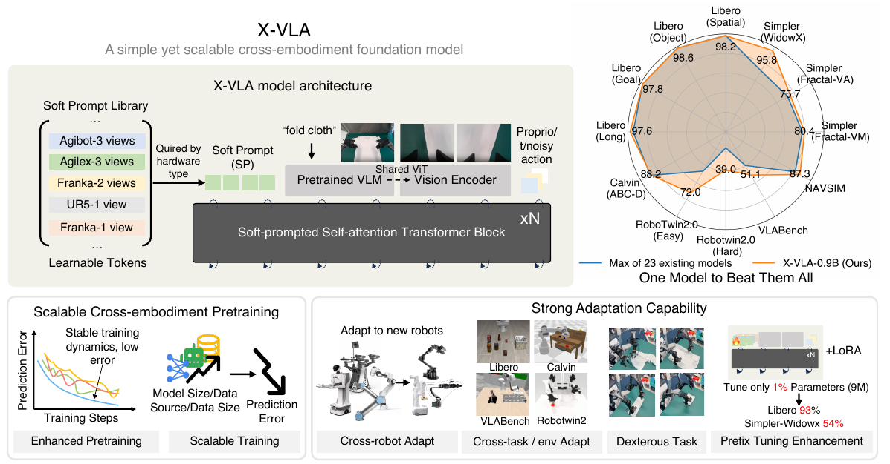

Figure 1. 전체 방법과 성능 개요. [PDF p.1, Abstract] · [원문 PDF](https://openreview.net/pdf/d44409f253fba9242cb42be37ae0150dd3e01ddb.pdf#page=1)

초록은 세 단계 논리를 압축한다.

1. 범용 VLA는 다양한 로봇 데이터로 학습해야 한다.
2. 그러나 이 데이터의 이질성이 오히려 pretraining을 방해한다.
3. 데이터 소스마다 별도 soft prompt를 두고, standard Transformer encoder와 flow matching을 결합하면 구조를 단순하게 유지하면서 규모 확장이 가능하다는 주장이다.

Fig.1은 논문의 전체 약속을 한 장에 배치한다. 위쪽은 pretrained VLM, soft prompt, proprio/$t$/noisy action이 반복 self-attention block으로 들어가는 구조이다. 아래쪽은 ① 7 source pretraining, ② 새 로봇 적응, ③ model/data scaling, ④ LIBERO 93%·Simpler-WidowX 54%를 9M PEFT로 얻는다는 결과를 연결한다.

“One Model to Beat Them All”이라는 시각적 문구는 마케팅적 요약이다. 실제로는 target domain별 prompt와 action head가 있고, downstream fine-tuning도 필요하다. Appendix C도 plug-and-play zero-shot generalist가 아직 아니라고 인정한다. [PDF p.19-20, Appendix C]

---

## 6. §1 Introduction

[PDF p.2-3, §1]

### 6.1 문단별 논리

첫 문단은 robotics의 장기 목표를 두 축으로 둔다. 자연어 지시를 유연하게 따르는 능력과, 서로 다른 환경·몸체에서 정교하게 조작하는 능력이다. LLM/VLM의 표현 능력에 action modality를 붙인 VLA가 이 두 축을 결합할 후보라고 본다.

둘째 문단은 대규모 heterogeneous pretraining이 필요한 이유와 동시에 위험한 이유를 설명한다. OOD adaptation은 데이터 다양성에서 이익을 얻지만, hardware, action space, camera, visual domain, task distribution의 차이가 representation을 서로 다른 방향으로 끌 수 있다. 기존 방법은 action decoder 분리에 집중했지만, proprioception-aware reasoning과 camera-conditioned geometry는 그보다 앞에서 해결되어야 한다.

셋째 문단은 soft prompt 가설을 제안한다. 하드웨어 구성을 “task-specific feature”처럼 보고, source마다 learnable embedding을 할당한다. 이 토큰이 feature fusion 초기부터 self-attention에 참여하면 backbone이 domain을 구별하면서도 공통성을 공유할 수 있다는 생각이다.

넷째 문단은 아키텍처 약속이다. X-VLA는 flow-matching action generation을 쓰되, 복잡한 전용 cross-attention decoder 대신 standard self-attention Transformer encoder를 쌓는다. 단순함과 scaling이 주장 포인트다.

다섯째 이후는 실험 약속이다. 290K episodes, 7 setups, 5 arm types로 pretrain하고, 새 domain은 prompt warm-up 후 full/PEFT adaptation한다. 6 simulation+3 physical platforms, cloth folding, 9M PEFT 성능을 제시한다.

### 6.2 이 도입부가 증명하지 않는 것

- “embodiment-agnostic backbone”은 직접 측정된 불변성 정리가 아니다. 여러 domain에 공유된 파라미터가 transfer에 유용했다는 경험적 명칭이다.
- prompt가 실제 kinematic parameters를 복원한다는 실험은 없다.
- unseen robot에 prompt retrieval만으로 zero-shot 배치한 결과는 없다. 새 prompt 학습과 demonstrations가 필요하다.
- 실제 inference latency와 robot control frequency는 도입부의 “quick adaptation”이나 “throughput”으로 대체할 수 없다.

---

## 7. §2 Preliminary: 모든 원문 수식 해설

[PDF p.3, §2]

이 논문의 명시적 수식은 대부분 이 절에 모여 있다. 원문에는 equation number가 붙어 있지 않으므로, 이 문서도 가짜 번호를 만들지 않고 페이지·절로 식별한다.

### 7.1 Trajectory와 behavior cloning

원문 비번호 식:

$$
\mathcal D=\{\tau_j\}_{j=1}^{M},\qquad
\tau_j=\{(o_n,a_n)\}_{n=1}^{N_j}.
$$

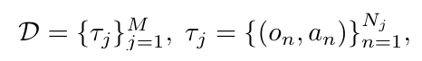

원문 수식 (비번호). dataset과 trajectory 정의. [PDF p.3, §2] · [원문 PDF](https://openreview.net/pdf/d44409f253fba9242cb42be37ae0150dd3e01ddb.pdf#page=3)

항별 의미:

- $M$: episode 수이다.
- $N_j$: episode $j$의 environment/action step 수이다.
- $o_n$: step $n$의 관측. 한 tensor가 아니라 multi-view image, language instruction, proprioception을 묶은 조건이다.
- $a_n$: 같은 step에서 expert가 수행한 action이다.

연산 순서는 “episode를 선택 → 그 안의 time index를 선택 → 관측과 미래 action target을 만든다”이다. 이미지/언어는 action을 생성하는 조건이고, expert action은 label이다.

원문 비번호 식:

$$
A_n := [a_n,a_{n+1},\ldots,a_{n+T}].
$$

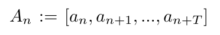

원문 수식 (비번호). action chunk 정의. [PDF p.3, §2] · [원문 PDF](https://openreview.net/pdf/d44409f253fba9242cb42be37ae0150dd3e01ddb.pdf#page=3)

여기에는 작은 표기 문제가 있다. 원문은 $T$를 chunk size라고 부르지만 양 끝을 포함한 위 표기는 $T+1$개 action을 갖는다. 구현 관점에서는 horizon을 $T$라고 할지 마지막 offset을 $T$라고 할지 정의가 필요하다. 공식 코드는 현재 state를 포함한 `num_actions+1`개 anchor를 만든 뒤 첫 원소를 proprioception으로 떼고, 나머지 **30개**를 action target으로 사용한다. 따라서 공개 코드의 실제 target shape는 $[B,30,D_a]$이다. [공식 data slicing](https://github.com/2toinf/X-VLA/blob/6bc2513f5f1cbec715cc668b414392a6cae5c671/datasets/domain_handler/base.py#L148-L167)

원문 비번호 식:

$$
\mathcal L_{\mathrm{BC}}(\theta)
=
\mathbb E_{(o_n,A_n)\sim\mathcal D}
\left[
\ell\!\left(\pi_\theta(o_n),A_n\right)
\right].
$$

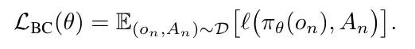

원문 수식 (비번호). behavior-cloning loss. [PDF p.3, §2] · [원문 PDF](https://openreview.net/pdf/d44409f253fba9242cb42be37ae0150dd3e01ddb.pdf#page=3)

한 줄씩 풀면 다음과 같다.

1. dataset에서 $(o_n,A_n)$ 쌍을 뽑는다.
2. policy $\pi_\theta$가 현재 관측 $o_n$만 보고 미래 chunk 전체를 출력한다.
3. supervised loss $\ell$이 예측 chunk와 expert chunk를 비교한다.
4. 모든 샘플 평균이 behavior cloning 목적이다.

Gradient는 loss → action output → policy Transformer → visual/language encoder와 prompt까지 역전파된다. 다만 frozen phase에서는 optimizer가 backbone을 업데이트하지 않고 새 prompt/action head만 바꾼다.

작은 예: 1-D action에서 expert chunk가 $[0.2,0.4,0.6]$, 예측이 $[0.1,0.5,0.5]$라면 MSE는 $(0.01+0.01+0.01)/3=0.01$이다. 실제 X-VLA는 xyz·rotation과 binary gripper를 같은 방식으로 처리하지 않는다. 연속 성분은 MSE, gripper는 BCE를 쓴다.

Edge case:

- episode 끝에 가까우면 미래 $T$개가 없다. 논문은 padding/masking을 설명하지 않는다. 공개 loader는 마지막 시간에 clamp/interpolation하거나 후보 index를 앞에서 잘라낸다.
- 길이가 다른 episode를 batch로 묶을 때 target chunk는 고정 30개 anchor로 만든다.
- action coordinate frame과 scale을 통일하지 않으면 동일 MSE가 물리적으로 다른 오차를 뜻한다.

### 7.2 Flow-matching path와 ODE update

원문 비번호 식:

$$
A^0\sim\mathcal N(0,I).
$$

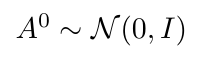

원문 수식 (비번호). Gaussian initial action. [PDF p.3, §2] · [원문 PDF](https://openreview.net/pdf/d44409f253fba9242cb42be37ae0150dd3e01ddb.pdf#page=3)

$A^0$는 expert action과 같은 shape $[B,T_a,D_a]$의 Gaussian noise이다. $I$는 각 scalar가 단위분산이며 독립이라는 표기이다. 실제 action이 meter, rotation, binary를 섞으므로 normalization이 없다면 단위 Gaussian의 의미가 성분마다 달라진다. 정확한 normalization 통계는 PDF에 없다.

원문 비번호 식:

$$
A^{t+\Delta t}
=
A^t+v_\theta(A^t,o,t)\Delta t,
\qquad t\in[0,1].
$$

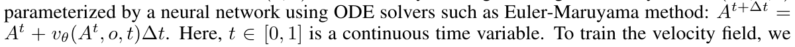

원문 수식 (비번호). 두 줄에 걸친 Euler update와 flow time. [PDF p.3, §2] · [원문 PDF](https://openreview.net/pdf/d44409f253fba9242cb42be37ae0150dd3e01ddb.pdf#page=3)

계산 순서는 다음과 같다.

1. 현재 중간 action $A^t$와 observation $o$, flow time $t$를 network에 넣는다.
2. network가 action space에서 어느 방향으로 얼마나 이동할지 나타내는 velocity $v_\theta$를 예측한다.
3. step size $\Delta t$만큼 이동한다.
4. $t=1$까지 반복해 noise를 action으로 운반한다.

원문은 이를 “Euler-Maruyama”라고 부르지만 식에는 stochastic diffusion term $g(t)dW_t$가 없다. 적힌 식 자체는 deterministic ODE의 **forward Euler** update이다. 확률항을 생략한 것인지 용어를 넓게 쓴 것인지 논문은 밝히지 않는다.

### 7.3 OT linear path와 flow-matching loss

원문 핵심 비번호 display 식:

$$
\mathcal L^{\mathrm{FM}}_{\mathrm{BC}}(\theta)
=
\mathbb E_{t\sim\mathcal U(0,1),(o,A)\sim\mathcal D}
\left[
\left\|
v_\theta(A^t,o,t)-(A-A^0)
\right\|^2
\right],
$$

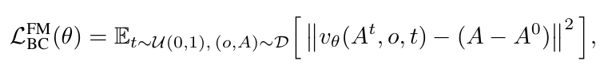

원문 수식 (비번호). flow-matching behavior-cloning loss. [PDF p.3, §2] · [원문 PDF](https://openreview.net/pdf/d44409f253fba9242cb42be37ae0150dd3e01ddb.pdf#page=3)

$$
A^t=(1-t)A^0+tA.
$$

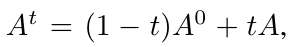

원문 수식 (비번호). OT linear interpolation path. [PDF p.3, §2] · [원문 PDF](https://openreview.net/pdf/d44409f253fba9242cb42be37ae0150dd3e01ddb.pdf#page=3)

유도는 한 줄이다.

$$
\text{[해설용 수식]}\qquad
\frac{dA^t}{dt}
=
\frac{d}{dt}\big((1-t)A^0+tA\big)
=
A-A^0.
$$

따라서 직선 OT path를 정확히 따라가려면 중간점 어느 곳에서도 velocity가 $A-A^0$이어야 한다. loss는 network의 velocity와 이 정답 벡터를 squared norm으로 맞춘다.

항별 shape:

- $A^t,A,A^0\in\mathbb R^{B\times T_a\times D_a}$.
- $t\in\mathbb R^B$이며 각 batch sample에 broadcast된다.
- $v_\theta(A^t,o,t)$도 $[B,T_a,D_a]$.
- norm은 보통 action/time 축을 합산 또는 평균한 scalar가 되지만 reduction 방식은 PDF에 없다.

작은 수치 예: 1-D에서 $A^0=-1$, expert $A=3$이면 $A^{0.25}=0$, 정답 velocity는 $4$이다. network가 $3.5$를 내면 한 점의 squared error는 $(3.5-4)^2=0.25$이다. Euler step $\Delta t=0.1$이면 현재 값을 약 $0.4$ 증가시킨다.

Edge case:

- $t=0$: 완전 noise이다. observation conditioning이 없으면 어느 action mode로 갈지 알 수 없다.
- $t=1$: 완전 data이다. 이상적으로 더 움직일 필요가 없다고 생각하기 쉽지만, 이 parameterization의 target velocity $A-A^0$는 0이 아니다. ODE는 경로의 접선장을 학습하는 것이지 residual-to-target을 직접 학습하는 것이 아니다.
- $A=A^0$: target velocity가 0이다.
- 유한 integration step에서는 network error와 Euler discretization error가 누적된다.
- 기대값 표기에는 $A^0$에 대한 sampling이 명시적으로 들어가 있지 않지만, 앞 문장에서 noise를 sample한다고 했으므로 암묵적으로 포함된 것으로 읽어야 한다.

### 7.4 논문 식과 공개 코드의 중요한 불일치

**[공식 코드 확인]** 현재 공개 코드는 training에서

$$
\text{[코드 동작을 옮긴 해설용 수식]}\qquad
x_t=t\varepsilon+(1-t)A
$$

를 만들고, Transformer 출력 자체를 clean action $A$와 MSE/BCE로 비교한다. 즉 PDF의 $A^t=(1-t)A^0+tA$와는 $t$ 방향이 반대이며, target도 $A-A^0$ velocity가 아니라 clean action이다. inference 역시 Euler 누적이 아니라, $t=1,1-1/K,\ldots,1/K$에서 현재 clean-action 예측을 다시 혼합해 반복 갱신한다. [공식 training/inference 구현](https://github.com/2toinf/X-VLA/blob/6bc2513f5f1cbec715cc668b414392a6cae5c671/models/modeling_xvla.py#L148-L220)

가능한 해석은 두 가지다.

1. 공개 구현은 flow-matching 논문식과 다른 **iterative denoising/clean prediction parameterization**이다.
2. authors가 velocity를 clean target으로 재매개변수화했지만 PDF와 코드에 그 변환식을 쓰지 않았다.

현재 자료만으로 2를 증명할 수 없으므로, 재현자는 “논문식 구현”과 “공개 코드 구현”을 별도 실험으로 비교해야 한다. 이 차이는 loss, integration, step 수 민감도에 직접 영향을 준다.

### 7.5 Heterogeneous dataset 표기

원문 비번호 식:

$$
\mathcal D^H=\{\mathcal D_i\}_{i=1}^{H},
\qquad h_i\in\mathcal H.
$$

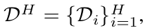

원문 수식 (비번호). heterogeneous dataset mixture. [PDF p.3, §2] · [원문 PDF](https://openreview.net/pdf/d44409f253fba9242cb42be37ae0150dd3e01ddb.pdf#page=3)

$\mathcal H$는 가능한 hardware setup의 공간이다. 저자는 arm kinematics, control interface, camera setup, deployment scenario를 포함시킨다. 이 식은 $h_i$를 관측 가능한 숫자 벡터로 정의하지 않는다. X-VLA는 $h_i$ 자체를 입력받지 않고 dataset ID를 통해 prompt row를 고른다.

---

## 8. §3 Heterogeneous Soft Prompt Learning

[PDF p.4-5, §3, Fig.2-4]

### 8.1 공정 비교를 위한 preliminary setup

저자들은 Florence-base 계열 VLM + DiT-base action decoder의 dual-system을 출발점으로 삼고, AGIBOT-beta, DROID, RoboMind를 섞는다. 총 약 290K episodes, 7 hardware/data setups, 5 robot/arm types이며 preliminary 비교는 같은 recipe를 사용한다고 명시한다. 구체적 학습은 Appendix I에서 8 A100, global batch 256, 200K iterations, Florence-Base, 12-layer hidden-768 AdaLN DiT-Base로 제시한다. [PDF p.4, §3; p.24-25, Appendix I]

Fig.3의 source 구성:

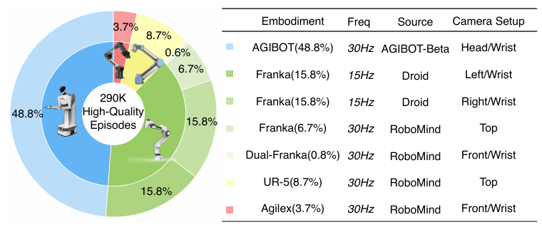

Figure 3. heterogeneous pretraining 데이터 구성. [PDF p.4, §3] · [원문 PDF](https://openreview.net/pdf/d44409f253fba9242cb42be37ae0150dd3e01ddb.pdf#page=4)

| setup | episode 비중 | raw frequency | source | camera |
|---|---:|---:|---|---|
| AGIBOT | 48.8% | 30 Hz | AGIBOT-Beta | Head/Wrist |
| Franka, DROID-left | 15.8% | 15 Hz | DROID | Left/Wrist |
| Franka, DROID-right | 15.8% | 15 Hz | DROID | Right/Wrist |
| Franka | 6.7% | 30 Hz | RoboMind | Top |
| Dual-Franka | 0.8% | 30 Hz | RoboMind | Front/Wrist |
| UR-5 | 8.7% | 30 Hz | RoboMind | Top |
| AgileX | 3.7% | 30 Hz | RoboMind | Front/Wrist |

반올림 비중 합은 100.3%이며, Appendix Table 10의 trajectory 수 합은 288K이다. 따라서 “290K”는 반올림된 총량으로 읽는 것이 안전하다. 또한 Table 10은 두 번째 DROID 행도 `Droid-Left`라고 인쇄했지만 Fig.3과 Table 12에는 left/right가 각각 존재한다. 두 번째는 `Droid-Right`일 가능성이 매우 높다. [PDF p.4, Fig.3; p.24, Table 10; p.25, Table 12]

### 8.2 네 가지 heterogeneity 처리법

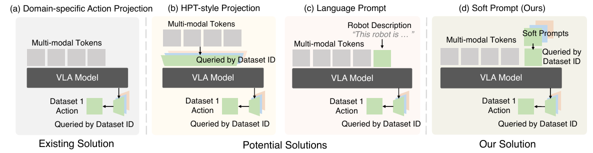

Figure 2. 네 가지 heterogeneity 처리법. [PDF p.4, §3] · [원문 PDF](https://openreview.net/pdf/d44409f253fba9242cb42be37ae0150dd3e01ddb.pdf#page=4)

#### (a) Domain-specific action projection

출력에서 source ID로 action head를 선택한다. 장점은 action 차원과 분포를 분리하는 것이다. 단점은 image/language/proprioception을 해석하는 공유 backbone이 domain 정보를 받지 못한다는 것이다.

#### (b) HPT-style projection

입력 observation token을 domain-specific projection/resampler로 공통 space에 맞춘다. 이론상 modality 분포를 먼저 정렬할 수 있다. 저자들은 pretrained VLM feature를 중간에서 바꾸어 representation을 손상시키고 학습이 불안정해졌다고 보고한다. Fig.4의 orange curve는 크게 출렁이며 최종 error도 soft prompt보다 높다.

#### (c) Language prompt

“Embodiment: Single Franka, Camera Setup: Left/Wrist, Freq: 15Hz” 같은 사람이 쓴 문장을 task instruction에 붙인다. 해석 가능하지만, 새 hardware마다 정확한 description template를 설계해야 하고 숫자/좌표계의 의미를 자연어가 충분히 담는다는 보장이 없다. Table 12에 7개 template가 공개된다.

#### (d) Soft prompt

원문 비번호 식:

$$
\mathcal P^H=\{p_i\}_{i=1}^{H},
\qquad
p_i\approx\Phi(h_i),
\qquad
\Phi:\mathcal H\rightarrow\mathbb R^k.
$$

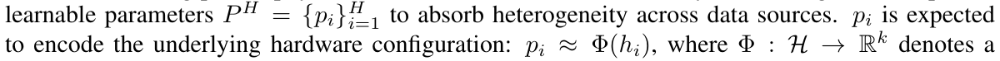

원문 수식 (비번호). soft prompt library와 hardware-to-prompt mapping. [PDF p.4, §3] · [원문 PDF](https://openreview.net/pdf/d44409f253fba9242cb42be37ae0150dd3e01ddb.pdf#page=4)

정확한 tensor 표기로 풀면 다음이 더 가깝다.

$$
\text{[해설용 수식]}\qquad
p_i\in\mathbb R^{N_p\times d},
\quad N_p=32,\ d=1024,
\quad k=N_pd\ \text{로 납작하게 볼 수 있다.}
$$

$\Phi$는 별도 neural network가 아니다. 각 $p_i$를 무작위 초기화하고 end-to-end loss로 직접 최적화하므로, 구현상 embedding lookup table이 $\Phi$ 역할을 한다.

Gradient 경로는 다음과 같다.

$$
\text{[해설용 수식]}\qquad
\frac{\partial\mathcal L}{\partial p_i}
=
\frac{\partial\mathcal L}{\partial X^{(L)}}
\prod_{\ell=1}^{L}
\frac{\partial X^{(\ell)}}{\partial X^{(\ell-1)}}
\frac{\partial X^{(0)}}{\partial p_i}.
$$

현재 minibatch에 source $i$가 있을 때만 그 row가 선택되어 gradient를 받는다. self-attention 때문에 prompt의 key/value/query가 image, language, proprio, action token과 상호작용한다. 따라서 단순 label보다 깊게 조건화된다.

작은 예: `DROID-left`와 `DROID-right`가 같은 Franka kinematics를 공유해도 서로 다른 camera geometry 때문에 다른 prompt를 쓴다. backbone은 두 prompt의 공통 gradient를 통해 Franka 조작의 공통성을, prompt는 시점 차이를 흡수할 수 있다. 반대로 prompt가 데이터 수집자나 배경색 같은 spurious cue를 저장할 수도 있다.

### 8.3 Fig.4의 실제 의미

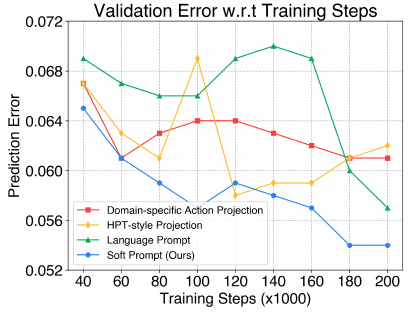

Figure 4. heterogeneity 처리법별 학습 곡선. [PDF p.4, §3] · [원문 PDF](https://openreview.net/pdf/d44409f253fba9242cb42be37ae0150dd3e01ddb.pdf#page=4)

40K-200K training steps 구간에서 soft prompt의 validation error는 대체로 약 0.065에서 0.054로 내려가며 가장 낮고 안정적이다. HPT-style은 중간에 약 0.069까지 튀고, language prompt도 후반 급락 전에는 0.066-0.070 부근에서 머문다. domain-specific action projection은 약 0.061에서 마무리된다. curve에는 seed 반복, confidence band, 정확한 validation sample 수가 표시되지 않으므로 “이 한 recipe에서 soft prompt가 가장 안정적이었다”가 적절한 범위다.

---

## 9. §4 X-VLA: Soft-Prompted Transformer Enhanced VLA Model

[PDF p.5-7, §4, Fig.5, Table 1]

### 9.1 §4.1 Architecture: modality를 어떻게 토큰으로 만드는가

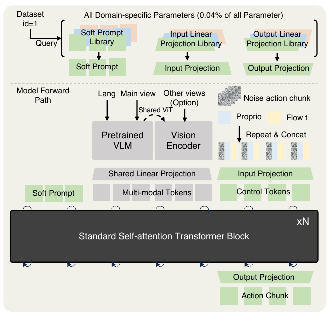

Figure 5. X-VLA architecture. [PDF p.5, §4.1] · [원문 PDF](https://openreview.net/pdf/d44409f253fba9242cb42be37ae0150dd3e01ddb.pdf#page=5)

#### 9.1.1 High-dimensional observation stream

입력은 language $L$과 multi-view images $\mathrm{Img}=\{img_i\}$이다. 저자는 모든 view를 language와 함께 VLM에 밀어 넣지 않고 역할을 나눈다.

- **main/fixed view + language**: Florence-2-Large의 vision-language encoder로 보낸다. 고정 시점은 scene과 task의 고수준 의미를 안정적으로 제공한다.
- **auxiliary view**: wrist처럼 빠르고 noisy하지만 fine manipulation에 중요한 view는 shared vision backbone으로 별도 encoding한다.

**[공식 코드 확인]** 공개 `forward_vlm`은 모든 valid image를 동일 Florence image encoder `_encode_image`로 처리한다. 첫 view만 language embedding과 merge되어 Florence language encoder를 통과하고, 나머지 view feature는 flatten되어 auxiliary visual tokens가 된다. 즉 Fig.5의 “Shared ViT”는 별도 학습된 두 vision tower라기보다 같은 Florence vision encoder의 공유 사용으로 구현되어 있다. [공식 VLM 경로](https://github.com/2toinf/X-VLA/blob/6bc2513f5f1cbec715cc668b414392a6cae5c671/models/modeling_xvla.py#L104-L146)

#### 9.1.2 Low-dimensional proprioceptive-action stream

각 미래 action index마다 다음을 concatenate한다.

$$
\text{[해설용 수식]}\qquad
c_j=[\widetilde a_j\ ;\ r_t\ ;\ \gamma(t)].
$$

- $\widetilde a_j$: flow의 noisy/intermediate action, shape $[D_a]$.
- $r_t$: 현재 proprioception, 모든 미래 index $j$에 repeat, shape $[D_r]$.
- $\gamma(t)$: sinusoidal flow-time embedding, shape $[D_t]$.

공개 config의 EE6D 기준 $D_a=20,D_r=20,D_t=32$이므로 한 control token의 linear input은 72-D이고 1024-D hidden으로 project된다. 논문은 이 세부 차원을 주지 않으므로 이는 코드 스냅샷 정보이다.

#### 9.1.3 Soft prompt와 전체 self-attention

source ID가 prompt library와 action input/output projection library를 함께 query한다. multimodal tokens, 30개 control tokens, 32개 prompt tokens를 한 sequence로 만들고 24개의 standard self-attention blocks를 통과시킨다.

논문에 없는 Transformer 내부를 이해하기 위한 식:

$$
\text{[해설용 수식]}\qquad
Q=XW_Q,\quad K=XW_K,\quad V=XW_V,
$$

$$
\text{[해설용 수식]}\qquad
\mathrm{Attn}(X)
=
\mathrm{softmax}\left(\frac{QK^\top}{\sqrt{d_h}}\right)V.
$$

$X\in\mathbb R^{B\times S\times d}$, 16 heads인 공개 config에서는 $d=1024,d_h=64$이다. attention matrix는 head마다 $[B,S,S]$이므로 prompt는 모든 image/language/control token을 읽고, 반대로 action token도 prompt를 읽는다. causal mask가 없으므로 action chunk의 미래 anchor들끼리도 동시에 상호작용한다.

한 block은 공개 코드상 pre-LN residual 구조이다.

$$
\text{[해설용 수식]}\qquad
X' = X+\mathrm{MHSA}(\mathrm{LN}(X)),
$$

$$
\text{[해설용 수식]}\qquad
X^{+}=X'+W_2\,\mathrm{GELU}(W_1\mathrm{LN}(X')).
$$

공개 구현은 MLP ratio 4, attention/MLP dropout 0.1을 쓴다. PDF에는 head 수, dropout, norm 위치가 없다. [공식 Transformer](https://github.com/2toinf/X-VLA/blob/6bc2513f5f1cbec715cc668b414392a6cae5c671/models/transformer.py#L252-L403)

#### 9.1.4 Universal/shared와 source-specific 모듈

| 모듈 | 공유 여부 | 역할 |
|---|---|---|
| Florence-2-Large vision-language encoder | 모든 source 공유 | main view+instruction의 semantic/spatial encoding |
| auxiliary view vision encoder | 모든 source 공유 | wrist/other views의 visual token화 |
| visual projections | 기본 X-VLA에서는 source 공유 | Florence output을 policy hidden 1024로 정렬 |
| standard Transformer 24 layers | 공유 | 모든 modality/action anchor의 joint reasoning |
| soft prompt | source-specific | dataset/hardware/camera context를 token으로 제공 |
| action input projection | source-specific | noisy action+proprio+$t$를 control token으로 변환 |
| action output projection | source-specific | 첫 30개 token을 해당 action space로 복원 |

Fig.5의 0.04%는 마지막 세 source-specific 묶음이 전체에서 차지하는 비율이라고 설명한다. 반면 Table 3의 1%/9M은 LoRA PEFT까지 포함한다. 두 수치를 섞으면 안 된다.

### 9.2 §4.2.1 Pretraining and finetuning pipeline

#### Phase I: heterogeneous pretraining

**[저자 보고]** shared backbone $\pi_\theta$와 source prompts $\mathcal P^H$를 $\mathcal L^{\mathrm{FM}}_{\mathrm{BC}}$ 아래 함께 최적화한다. vision-language module과 prompt에는 더 작은 learning rate를 주어 pretrained representation drift를 줄인다고 한다. 정확한 LR multiplier는 PDF Table 9에 없다. [PDF p.6, §4.2.1]

#### Phase II-1: prompt warm-up

새 hardware $h_{new}$에 새 prompt $p_{new}$를 무작위로 만들고 pretrained backbone을 freeze한다. prompt가 backbone의 기존 representation을 이용할 수 있는 시작점으로 이동하도록 먼저 학습한다.

#### Phase II-2: joint policy adaptation

warm-up prompt와 backbone을 함께 풀어 target domain에 특화한다. language model을 VLM으로 적응시킬 때 projector를 먼저 맞추는 철학과 비슷하다고 설명한다.

Appendix H는 첫 1,000 iterations에 “soft prompts **and action heads**”만 update한다고 더 구체화한다. 즉 본문의 “prompt warm-up”을 prompt-only로 읽으면 안 된다. 이어지는 1,000-iteration LR warm-up 동안 joint training으로 넘어간다. [PDF p.24, Appendix H]

**[공식 코드 확인]** README 예시는 `freeze_steps=1000`, `warmup_steps=2000`, `learning_coef=0.1`이며, 코드 기본값도 warmup 2,000이다. 첨부 PDF의 “1,000-iteration warm-up”과 공개 예시는 다르다. 실행 시 어느 recipe가 paper result를 만든 것인지 config/checkpoint별로 고정해야 한다. [공식 training 예시](https://github.com/2toinf/X-VLA/blob/6bc2513f5f1cbec715cc668b414392a6cae5c671/README.md#L263-L287)

### 9.3 §4.2.2 Enhanced data processing

#### 9.3.1 Aligned action representation

한 팔의 정렬된 action은 다음 10차원이다.

$$
\text{[해설용 수식]}\qquad
a^{arm}=[x,y,z,r_1,r_2,r_3,r_4,r_5,r_6,g]\in\mathbb R^{10}.
$$

양팔은 left/right를 붙여 20-D이다. single arm은 남는 팔 10-D를 zero padding하는 것이 공식 코드/README의 interface다.

- $(x,y,z)$: Cartesian EEF position. 대부분 downstream은 absolute EEF.
- $(r_1,\ldots,r_6)$: 3D rotation matrix의 첫 두 basis vector를 나타내는 continuous Rotate6D.
- $g$: binary gripper state.

Rotate6D를 회전행렬로 복원하는 이론:

$$
\text{[해설용 수식]}\qquad
b_1=\frac{a_1}{\|a_1\|},\qquad
b_2=\frac{a_2-(b_1^\top a_2)b_1}{\|a_2-(b_1^\top a_2)b_1\|},\qquad
b_3=b_1\times b_2,
$$

$$
\text{[해설용 수식]}\qquad
R=[b_1\ b_2\ b_3]\in SO(3).
$$

Euler angle은 $2\pi$ 경계에서 같은 자세가 멀리 떨어진 숫자가 되고, unit quaternion은 $q$와 $-q$가 같은 회전을 나타내는 이중성 때문에 regression이 불연속적일 수 있다. 6D는 두 벡터를 연속적으로 회귀한 뒤 Gram-Schmidt로 직교화한다.

Edge case는 두 입력 벡터가 0이거나 거의 평행할 때 분모가 0에 가까워지는 것이다. 논문은 안정화 $\epsilon$을 말하지 않는다. 공식 공용 utility도 분모에 epsilon이 없지만 일부 evaluator는 epsilon을 더한다. 이는 배포 시 NaN 검사 대상이다.

Loss는 position/rotation에 MSE, gripper에 BCE를 쓴다.

$$
\text{[해설용 수식]}\qquad
\mathcal L
=
\lambda_{xyz}\|\hat p-p\|_2^2
+\lambda_R\|\hat r-r\|_2^2
+\lambda_g\,\mathrm{BCEWithLogits}(\hat g,g).
$$

PDF에는 $\lambda$ 값과 flow velocity loss와의 결합법이 없다. 공개 코드에서는 clean action을 직접 target으로 두고 EE6D에 `XYZ_SCALE=500`, `ROT_SCALE=10`, `GRIPPER_SCALE=1`을 사용한다. 이것은 논문의 velocity-field 식과 맞지 않는 부분이다. [공식 action loss](https://github.com/2toinf/X-VLA/blob/6bc2513f5f1cbec715cc668b414392a6cae5c671/models/action_hub.py#L101-L174)

#### 9.3.2 Intention abstraction by temporal downsampling

원시 15/30 Hz의 매 step pose를 모두 예측하지 않고, 현재부터 향후 4초를 30개 anchor로 resample한다. 목표는 human jitter와 너무 세밀한 correction보다 trajectory의 고수준 의도를 학습시키는 것이다.

논문 문장만 보면 30개 점이 양 끝을 포함하는지 불명확하다. 공개 pretraining loader는 현재를 포함한 31개 시각을 `linspace`로 만든 뒤 첫 점을 proprioception으로 떼어 30개 future action을 사용한다. 따라서 full 4초 window에서는 anchor 간격이 $4/30\approx0.133$초, 약 7.5 anchors/s이다. 이는 raw logging rate 15/30 Hz와 다르다.

episode 끝에서는 `min(cur+qdur, end)`로 window가 줄어들어 30개 점의 물리 시간 간격이 더 촘촘해질 수 있다. mask가 따로 보고되지 않으므로 끝부분 sampling 정책은 재현에 중요하다.

#### 9.3.3 Balanced data sampling

저자는 round-robin 대신 domain 간, trajectory 간을 모두 shuffle하고 sampling weight를 둔다. Appendix Table 10의 weight는 `0.40,0.15,0.15,0.10,0.03,0.10,0.07`로 정확히 1.0이다. 자연 episode 비중과 다르게 설정해 큰 AGIBOT의 독점을 줄이고 작은 dual-Franka를 상대적으로 더 자주 보게 한다.

### 9.4 §4.3 X-VLA-0.9B implementation

[PDF p.7, §4.3]

- VLM encoder: Florence-2-Large.
- policy backbone: standard Transformer, 24 layers, hidden size 1024.
- soft prompt length: 32.
- pretraining data: 약 290K episodes, 7 sources.
- 논문 미기재: attention head 수, MLP ratio, dropout, 정확한 Florence checkpoint revision, tokenizer max length, normalization statistics, sequence token 수.
- 공식 코드 보충: 16 heads, MLP ratio 4, max sequence 512, language max length 50, 최대 3 views, action chunk 30, EE6D 20-D. 이 값은 paper PDF가 아니라 고정한 코드 스냅샷 정보다.

---

## 10. 입력부터 출력까지 한 샘플의 구체적 forward pass

다음은 논문 구조와 공개 코드 shape를 결합한 **설명용 한 샘플**이다. Florence가 이미지 한 장을 몇 token으로 만드는지는 checkpoint 설정에 따라 달라 논문 미기재로 남긴다.

### 10.1 입력

- batch $B=1$.
- language: “fold cloth”, tokenizer output $[1,L]$, 공개 processor는 $L=50$으로 pad/truncate.
- images: main/front/wrist 중 최대 3장, resize 뒤 $[1,3,3,224,224]$.
- image mask: 실제 view를 표시하는 $[1,3]$ boolean.
- proprio: dual-arm EE6D $[1,20]$.
- noisy/intermediate action: $[1,30,20]$.
- flow time: $[1]$.
- domain ID: scalar `AgileX/SoftFold`에 해당하는 integer.

### 10.2 Florence/visual encoding

1. 세 view를 batch 축으로 펴 $[3,3,224,224]$.
2. 같은 Florence image encoder로 valid view 각각을 $[N_v,D_f]$ token으로 변환한다.
3. 첫 view의 image tokens와 $L$개 text embeddings를 Florence encoder에 merge해 $[1,T_{vlm},D_f]$를 얻는다.
4. 나머지 두 view는 $[1,2N_v,D_f]$로 flatten한다.
5. source-shared linear projection으로 두 stream을 hidden 1024로 맞춘다.

### 10.3 Control token

각 $j=1,\ldots,30$에 대해 noisy action 20-D, 반복된 proprio 20-D, sinusoidal time 32-D를 이어 72-D를 만든다. domain-specific input projection이 이를 1024-D control token으로 바꾼다.

### 10.4 Joint sequence

prompt 전 sequence 길이를

$$
\text{[해설용 수식]}\qquad
S_0=30+T_{vlm}+2N_v
$$

라 두면, 32 prompt를 붙인 최종 길이는 $S=S_0+32$이다. 공개 코드는 $S_0\le512$인지 검사한 뒤 positional embedding을 먼저 더하고 prompt를 append한다. 따라서 현재 코드에서 prompt token에는 같은 positional table이 직접 더해지지 않는다.

### 10.5 Transformer와 출력

24개 pre-LN self-attention block이 $[1,S,1024]$를 처리한다. 마지막에 처음 30개 control-token 위치만 잘라 layer norm하고, domain-specific output projection으로 $[1,30,20]$ action을 얻는다. gripper logit은 sigmoid 후 확률이 되고 evaluator가 0.5/0.7/0.8 같은 threshold로 binary command로 바꾼다. threshold가 evaluator마다 다른 점도 재현 변수이다.

---

## 11. §5 Experiments

[PDF p.7-10, §5, Table 1-3, Fig.6-10]

실험 질문은 원문이 명시한 세 가지다.

1. model capacity, data diversity, data volume을 늘릴 때 scaling trend가 있는가?
2. 새 embodiment/environment/task로 잘 specialize되는가?
3. soft prompt가 heterogeneous source의 의미 있는 구조를 담는가?

### 11.1 Table 1: 누적 ablation path

| 단계 | 추가한 요소 | PT validation error | Simpler-WidowX AD success | 직전 단계 대비 |
|---|---|---:|---:|---:|
| baseline, pretraining 없음 | Florence-base + Standard DiT-base | - | 4.1 | - |
| custom LR, pretraining 없음 | custom LR | - | 39.6 | +35.5 |
| heterogeneous PT | mixed 7-source pretraining | 0.110 | 25.0 | -14.6 |
| data processing | action alignment + intention abstraction + balanced sampling | 0.077 | 50.0 | +25.0 |
| architecture | DiT → Transformer encoder | 0.071 | 47.9 | -2.1 |
| architecture | encoding pipeline | 0.053 | 64.6 | +16.7 |
| architecture | soft prompt | 0.041 | 73.8 | +9.2 |
| scale | larger model | 0.032 | 89.6 | +15.8 |
| adaptation | two-step adaptation | 0.032 | 95.8 | +6.2 |

해석의 핵심은 세 가지다.

- naive heterogeneous PT는 실제로 성능을 떨어뜨린다. 이 논문이 해결하려는 failure가 Table 1 안에 있다.
- error가 낮아지는 누적 경로와 downstream success가 대체로 함께 좋아진다. 그러나 `Transformer encoder` 단계처럼 error는 0.006 낮아졌는데 success는 2.1%p 낮아진 예외도 있다.
- 각 행은 하나의 독립 factorial ablation이 아니라 앞 변경을 누적한 경로이다. 예컨대 soft prompt의 +9.2%p는 완성된 encoding pipeline 위에서의 조건부 효과이지 모든 architecture에서 보장되는 단독 효과가 아니다.

### 11.2 §5.1 Scaling experiments와 Fig.6

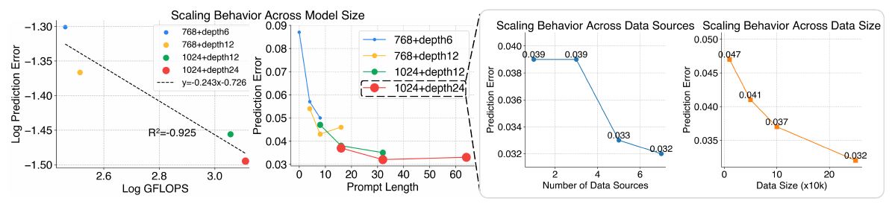

Figure 6. model, prompt length, data source 및 data size scaling. [PDF p.8, §5.1] · [원문 PDF](https://openreview.net/pdf/d44409f253fba9242cb42be37ae0150dd3e01ddb.pdf#page=8)

평가 metric은 held-out validation set에서 flow denoising 후 예측 action과 ground truth의 $\ell_1$ error이다. training loss의 MSE/BCE와 validation metric $\ell_1$은 서로 다르다.

#### Model capacity와 prompt length

Fig.6의 네 configuration은 `768-depth6`, `768-depth12`, `1024-depth12`, `1024-depth24`이다. log GFLOPS가 증가할수록 log prediction error가 감소하며 figure에는 회귀선 `y=-0.243x-0.726`이 표시된다. 앞서 지적했듯 `R²=-0.925` 표기는 표준 결정계수로는 이상하다.

같은 panel의 prompt-length sweep은 prompt 0에서 error가 가장 크고 8-16 부근까지 급감한다. 1024-depth24는 16 token에서 약 0.037, 32에서 약 0.032, 64에서 약 0.033으로 보이며, 32를 default로 정한다. 따라서 “prompt는 길수록 무조건 좋다”가 아니라 32 부근 이후 수익이 거의 포화된 결과다.

#### Data-source 수

표시된 값은 source 수 1/3/5/7에서 각각 약 `0.039/0.039/0.033/0.032`이다. 1→3에서는 개선이 없고 3→5에서 큰 개선이 있다. 어떤 source 조합을 어떤 순서로 추가했는지와 반복 seed는 논문 미기재이므로 “diversity 자체의 보편적 scaling law”보다는 이 subset 경로의 관측치다.

#### Data volume

데이터 크기 축은 `×10K episodes`로 표시되며 약 `0.047 → 0.041 → 0.037 → 0.032`로 감소한다. 마지막 0.032는 약 250K-290K 범위의 점으로 보이지만 정확한 x좌표 목록은 본문에 표로 주어지지 않는다.

#### 계산량 주장 범위

Fig.6은 GFLOPS와 error의 관계를 보여줄 뿐, FLOPs/token 감소나 wall-clock latency 개선을 보여주지 않는다. 오히려 32 prompt tokens는 self-attention sequence를 늘린다.

$$
\text{[해설용 수식]}\qquad
\frac{\text{attention score cost after prompt}}
{\text{before prompt}}
\approx
\frac{(S_0+32)^2}{S_0^2}.
$$

따라서 soft prompt의 장점은 parameter-efficient conditioning과 학습 안정성이지 계산량 감소 자체가 아니다.

### 11.3 §5.2 Adaptation experiments와 Fig.7

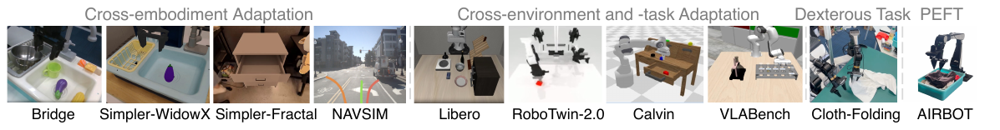

Figure 7. adaptation 평가 환경. [PDF p.8, §5.2] · [원문 PDF](https://openreview.net/pdf/d44409f253fba9242cb42be37ae0150dd3e01ddb.pdf#page=8)

Fig.7은 평가 범위를 다음처럼 분류한다.

- **cross-embodiment**: Bridge/WidowX, Simpler-WidowX, Simpler-Fractal, NAVSIM.
- **cross-environment/task**: LIBERO, RoboTwin-2.0, CALVIN, VLABench.
- **dexterous task**: Soft-Fold cloth folding on AgileX.
- **PEFT**: AIRBOT cloth pick.

NAVSIM은 자동차 embodiment라 manipulator와 action semantics가 크게 다르다. 이 결과는 architecture의 범용 conditioning 가능성을 보여 주지만, manipulation pretraining의 zero-shot transfer라는 뜻은 아니다. downstream adaptation이 수행된다.

### 11.4 Table 2: simulation benchmark 종합 비교

Table 2가 제시하는 X-VLA 결과와 “Maximum of Existing SOTA” 행을 직접 비교하면 다음과 같다.

| benchmark/metric | 기존 최대 | X-VLA-0.9B | 차이 | 판정 |
|---|---:|---:|---:|---|
| Simpler Google VM | 78.0 | 80.4 | +2.4 | 최고 |
| Simpler Google VA | 72.7 | 75.7 | +3.0 | 최고 |
| Simpler WidowX | 71.9 | 95.8 | +23.9 | 최고 |
| LIBERO Spatial | 98.4 | 98.2 | -0.2 | 최고 아님 |
| LIBERO Object | 98.8 | 98.6 | -0.2 | 최고 아님 |
| LIBERO Goal | 97.9 | 97.8 | -0.1 | 최고 아님 |
| LIBERO Long | 94.5 | 97.6 | +3.1 | 최고 |
| LIBERO Avg | 97.1 | 98.1 | +1.0 | 최고 |
| CALVIN ABC→D | 4.53 | 4.43 | -0.10 | 최고 아님 |
| RoboTwin Easy | 46.4 | 70.0 | +23.6 | 최고 |
| RoboTwin Hard | 16.4 | 39.0 | +22.6 | 최고 |
| VLABench Avg | 39.7 | 51.1 | +11.4 | 최고 |
| NAVSIM PDMS | 81.7 | 87.3 | +5.6 | 이 표의 기존 generalist 값보다 높음 |

저자들이 말한 “FIVE benchmarks SOTA”는 대체로 Simpler, LIBERO 평균, RoboTwin-2.0, VLABench, NAVSIM을 가리킨다. CALVIN은 제외해야 정확하다.

비교표의 주요 baseline 범위:

- small/specialized policies: LBP 0.2B, MoDE 0.4B, SuSIE/GHIL-Glue 1B.
- 4-9B VLA: SpatialVLA, TraceVLA, ThinkAct, FPC-VLA, MemoryVLA, OpenVLA/OFT, DD-VLA, UniVLA.
- generalist flow/diffusion 계열: Octo, RDT, FLOWER, GR00T-N1, $\pi_0$, $\pi_0$+FAST.

하지만 각 baseline은 서로 다른 pretraining data, checkpoint, fine-tuning recipe, image 수, evaluation budget을 사용한다. Table 1의 내부 ablation처럼 fully aligned control이 아니다. 모델 크기 대비 강함은 분명하지만, Table 2만으로 soft prompt 하나가 모든 격차의 원인이라고 할 수 없다.

### 11.5 Fig.8: real-world 세 플랫폼

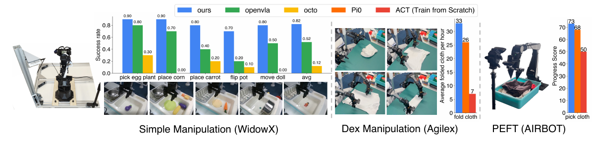

Figure 8. 세 real-world robot의 성능. [PDF p.9, §5.2] · [원문 PDF](https://openreview.net/pdf/d44409f253fba9242cb42be37ae0150dd3e01ddb.pdf#page=9)

#### WidowX simple manipulation

각 task는 Appendix J에 따라 10회 평가한다. Fig.8의 막대 수치를 그대로 옮기면 다음과 같다.

| task | X-VLA | OpenVLA | Octo |
|---|---:|---:|---:|
| pick eggplant | 0.90 | 0.80 | 0.30 |
| place corn | 0.90 | 0.70 | 0.00 |
| place carrot | 0.80 | 0.40 | 0.20 |
| flip pot | 0.70 | 0.20 | 0.10 |
| move doll | 0.80 | 0.50 | 0.00 |
| average | 0.82 | 0.52 | 0.12 |

평균은 각각 `(0.9+0.9+0.8+0.7+0.8)/5=0.82`, `(0.8+0.7+0.4+0.2+0.5)/5=0.52`, `(0.3+0+0.2+0.1+0)/5=0.12`로 일치한다. 10 trials/task이므로 개별 성공률의 표본 오차가 크며 confidence interval은 제공되지 않는다.

#### AgileX dexterous cloth folding

시간당 완성된 cloth 수는 X-VLA 33, $\pi_0$ 26, ACT-from-scratch 7이다. X-VLA는 $\pi_0$보다 7 folds/hour, 약 26.9% 높고 ACT보다 약 4.7배이다. 다만 task throughput은 inference latency와 별개다. 한 policy call이 느려도 긴 action chunk를 실행하거나 물리 동작이 병목이면 folds/hour가 달라질 수 있다.

#### AIRBOT PEFT

200 demonstrations로 cloth pick을 적응시킨 progress score는 X-VLA 73, $\pi_0$ 68, ACT 50이다. progress score의 세부 rubric, trial 수, 분산은 논문 미기재이다.

### 11.6 PEFT: Table 3과 Table 8을 함께 읽기

Table 3:

| method | trainable/model parameter 표기 | Spatial | Object | Goal | Long | 평균(재계산) | Simpler-WidowX |
|---|---:|---:|---:|---:|---:|---:|---:|
| $\pi_0$ | 3B | 96.8 | 98.8 | 95.8 | 85.2 | 94.15 | 55.7 |
| X-VLA LoRA | 9M | $95.8\pm0.4$ | $96.3\pm0.3$ | $95.2\pm0.8$ | $83.7\pm0.5$ | 92.75 | 54.2 |

본문의 “93% on LIBERO”는 92.75를 반올림한 값이다. 3B/9M은 약 333배지만 저자는 “300× fewer”로 반올림한다. 더 중요한 것은 비교 단위이다. $\pi_0$의 3B는 전체 모델 크기/fully tuned parameter로 쓰였고 X-VLA의 9M은 trainable adapter 수다. inference 때는 X-VLA 0.9B backbone 전체를 여전히 실행한다. 9M은 runtime model이 9M이라는 뜻이 아니다.

Table 8은 soft prompt 단독의 한계를 직접 보인다.

| adaptation 설정 | trainable params | Simpler-WidowX success |
|---|---:|---:|
| prompt only | 32K | 0.0 |
| + linear head | 70K | 8.3 |
| + LoRA | 9M | 54.2 |
| + unfreeze last layer | 25M | 68.9 |

따라서 soft prompt는 cross-source pretraining의 conditioning 장치로 유용하지만, 새 domain을 높은 성능으로 specialize할 때는 backbone/LoRA capacity가 필요하다는 것이 저자 데이터 자체의 결론이다.

**[공식 코드 확인]** 공개 `peft_train.py`는 LoRA rank 8, alpha 16, `all-linear`를 target으로 하고 prompt/action encoder/action decoder를 `modules_to_save`에 넣는다. PDF는 X-VLA LoRA rank/alpha를 공개하지 않는다. [공식 PEFT 구성](https://github.com/2toinf/X-VLA/blob/6bc2513f5f1cbec715cc668b414392a6cae5c671/peft_train.py#L193-L206)

### 11.7 §5.3 In-depth analysis: Fig.9와 Fig.10

#### Fig.9 t-SNE

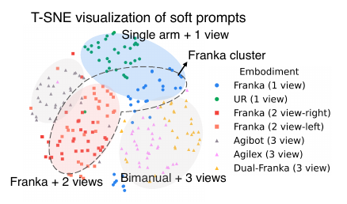

Figure 9. soft prompt t-SNE. [PDF p.10, §5.3] · [원문 PDF](https://openreview.net/pdf/d44409f253fba9242cb42be37ae0150dd3e01ddb.pdf#page=10)

7 source의 각 32 prompt token을 한 점으로 놓는다. single-arm+1-view, Franka+2-view, bimanual+3-view 군집이 시각적으로 나뉘며 DROID-left/right의 Franka token은 서로 섞인다. 저자는 이를 prompt가 dataset을 단순 분할하는 것이 아니라 embodiment similarity를 이용한다는 근거로 해석한다.

그러나 t-SNE는 전역 거리와 군집 크기를 보존하지 않으며 seed/perplexity에 민감하다. silhouette score, linear probe로 hardware attribute 예측, held-out source retrieval accuracy가 없으므로 “hardware semantics를 인과적으로 학습했다”보다는 “prompt embedding의 2-D 투영에 구조가 보인다”가 정확하다.

#### Fig.10 prompt transfer

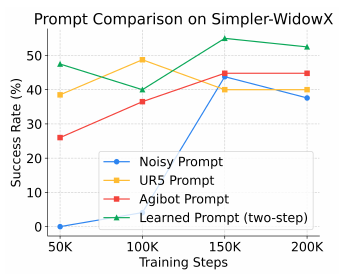

Figure 10. prompt별 PEFT 학습 곡선. [PDF p.10, §5.3] · [원문 PDF](https://openreview.net/pdf/d44409f253fba9242cb42be37ae0150dd3e01ddb.pdf#page=10)

WidowX PEFT에서 네 조건을 비교한다.

1. random/noisy prompt frozen.
2. bimanual AgiBot pretrained prompt frozen.
3. single-arm UR5 pretrained prompt frozen.
4. learned prompt with two-step adaptation.

UR5 prompt는 초기 50K-100K에서 AgiBot/random보다 빠른 transfer를 보이지만, 최종적으로 learned two-step prompt가 약 50%대로 가장 높다. 이는 가까운 hardware prompt를 initialization/retrieval에 쓸 가능성을 제시하지만, 실제 unseen robot zero-shot 성공을 입증한 실험은 아니다.

---

## 12. §6 Conclusion

[PDF p.10, §6]

저자들은 X-VLA를 soft-prompted cross-embodiment generalist VLA로 정리하고, 0.9B/290K/7-source까지 model/data diversity/data volume scaling이 포화되지 않았다고 주장한다. 9M PEFT가 full fine-tuning에 근접하고 폭넓은 benchmark에서 기록을 갱신했다는 것이 결론이다.

보수적으로 다시 쓰면 다음과 같다.

- soft prompt + encoding/data recipe가 동일 preliminary framework의 heterogeneous learning을 안정화했다.
- 0.9B 범위까지 validation error는 감소했다.
- 5개 simulation benchmark의 대표 aggregate에서 기존 보고값을 넘었고, CALVIN은 최고가 아니었다.
- prompt-only가 아니라 LoRA 9M이 강한 adaptation을 만들었다.
- latency, memory, zero-shot new embodiment, larger-than-0.9B scaling은 후속 검증이 필요하다.

---

## 13. Appendix A: LLM Usage and Ethics Statement

[PDF p.18, Appendix A]

저자들은 LLM을 글 다듬기에만 사용했고 기술 내용, 결과, 결론 생성에는 사용하지 않았다고 밝힌다. 윤리 위험은 대규모 robotics data의 개인정보와 bias이다. AGIBOT, RoboMind, DROID, Open-X 계열의 공개·peer-reviewed 데이터만 썼기 때문에 위험을 줄였다고 주장하지만, 공개 데이터라는 사실만으로 개인정보/편향이 제거되지는 않는다. deployment에서 카메라가 사람·사적 공간을 촬영할 수 있고, 특정 lab setup/robot morphology 편향이 남을 수 있다.

---

## 14. Appendix B: Related Work

[PDF p.18-19, Appendix B]

### 14.1 Vision-Language-Action Models

기존 VLA는 VLM의 visual grounding과 language reasoning을 action generation에 연결한다. 최근 연구는 generic VLM과 embodied reasoning의 간극을 3D spatial priors, instruction following, history, modality injection, domain data, 추가 supervision, specialized model로 줄인다. X-VLA는 이 흐름에서 architecture를 복잡하게 늘리기보다 input stream을 분리하고 soft prompt를 주입하는 쪽을 선택한다.

### 14.2 Heterogeneous Pretraining

기존 해결은 action space reshape, 별도 action head, latent/universal action representation에 집중한다. 저자들은 action label alignment만으로는 “관측이 이 몸에서 어떤 행동으로 이어지는가”라는 proprioceptive-aware mapping이 정렬되지 않는다고 본다. HPT처럼 observation projection을 domain별로 만드는 방법과 달리, X-VLA는 backbone 앞에 가벼운 prompt token을 놓는다.

### 14.3 Soft Prompt Learning

NLP의 prompt tuning은 pretrained model 전체 대신 입력에 붙인 embedding만 학습하는 PEFT였다. X-VLA는 이를 robotics의 domain carrier로 재해석한다. 중요한 차이는 downstream prompt tuning만이 아니라 **heterogeneous pretraining 중 source마다 별도 prompt를 동시에 학습**한다는 점이다. 각 prompt는 특정 source의 variation을 담고 shared backbone은 공통 패턴을 학습한다는 분업이다.

---

## 15. Appendix C: Limitations and Future Works

[PDF p.19-20, Appendix C]

### 15.1 더 큰 data/model scaling

0.9B는 language/VLM foundation model보다 작고, high-quality robot data도 부족하다. 저자들은 더 강한 VLM과 넓은 robot corpus를 후속 방향으로 든다. 현재 Fig.6은 네 model configuration과 290K 이내의 관측이므로 새로운 scaling law의 지수나 compute-optimal frontier를 제공하지 않는다.

### 15.2 supervision signal의 정보 부족

저차원 action label은 high-level intent, subgoal, multi-step dependency를 충분히 표현하지 못한다. 4초 downsampling은 noise를 줄이는 heuristic이지 정보를 새로 추가하지 않는다. 3D spatial cues, physics/dynamics, intermediate subgoal, raw-stream self-supervision이 제안된다.

### 15.3 seamless deployment가 아님

새 robot마다 demonstrations와 post-training이 필요하다. 저자 스스로 arbitrary downstream task에 engineering/retraining 없이 배치하는 목표는 미완성이라고 인정한다. universal kinematic descriptor나 physics-informed prior로 prompt를 직접 생성/검색하는 방향이 제안되지만 실험되지는 않았다.

---

## 16. Appendix D: More Results

[PDF p.20-21, Appendix D]

### 16.1 D.1 Alternative architectural designs, Table 4

| backbone | validation error | X-VLA 대비 해석 |
|---|---:|---|
| Standard DiT | 0.077 | X-VLA 0.041은 46.8% 낮음 |
| MM-DiT | 0.140 | X-VLA는 70.7% 낮음; modality별 parameter 분리가 오히려 불안정 |
| $\pi_0$-style | 0.056 | X-VLA는 26.8% 낮음; parallel action expert보다 단순 encoder가 이 recipe에서 우세 |
| X-VLA | 0.041 | 최저 |

저자 설명:

- Standard DiT는 VLM condition 아래 action denoising을 하는 직접 baseline.
- MM-DiT는 modality별 parameter를 분리해 attention으로 결합하지만 heterogeneous setting에서 불안정했다.
- $\pi_0$-style은 VLM 옆에 MLP-Mixer action module을 병렬 배치해 action의 compactness를 이용하지만 복잡도가 늘어난다.

세 모델 모두 Appendix I와 같은 preliminary setting이라고 한다. parameter count, wall-clock, seed는 표에 없다.

### 16.2 D.2 Cross-embodiment joint adaptation, Table 5

| metric | single-domain FT | multi-domain FT | 차이 |
|---|---:|---:|---:|
| LIBERO-Long | 97.6 | 98.1 | +0.5 |
| Simpler-WidowX | 96.0 | 93.8 | -2.2 |
| CALVIN | 4.42 | 4.32 | -0.10 |

LIBERO에는 positive transfer가 있으나 나머지 둘은 소폭 하락한다. 따라서 “동시 적응이 가능하며 대체로 성능을 유지한다”가 타당하고, 모든 domain에 complementary transfer가 생긴다고 일반화하면 과하다. joint mixture는 LIBERO, BridgeData, CALVIN-ABC로 두 embodiments/세 hardware setups를 포함한다.

### 16.3 D.3 Data-efficient adaptation, Table 6

| demos | Spatial | Object | Goal | Long | Avg |
|---:|---:|---:|---:|---:|---:|
| 50 (full/default) | 96.6 | 95.4 | 95.0 | 84.2 | 92.8 |
| 10 | 95.2 | 94.2 | 93.6 | 81.5 | 91.1 |

평균은 각각 92.8과 91.125→91.1로 일치하며, 40 demos 감소에 평균 1.7%p 하락이다. 다만 본문은 “finetune on Libero-Goal”이라고 쓰면서 표는 네 LIBERO suite를 모두 보고한다. 네 suite 각각 10/50 demos인지, Goal로 학습한 한 모델을 다른 suite에 평가한 것인지 문장만으로는 결정할 수 없다. 재현 전 authors/config 확인이 필요하다.

### 16.4 D.4 Prediction-window ablation, Table 7

| pretraining window | PEFT Simpler-WidowX success |
|---:|---:|
| 1 s | 0.00 |
| 2 s | 8.30 |
| 4 s | 29.16 |
| 8 s | 27.08 |

조건은 Florence-base + 약 100M self-attention block의 0.3B X-VLA, curated mixture 100K iterations이다. 서로 다른 window의 validation loss는 target 자체가 달라 직접 비교할 수 없어 downstream PEFT success로 선택한다. 4초가 8초보다 2.08%p 높고 2초보다 20.86%p 높다. 긴 horizon은 의도를 담지만 너무 길면 세부 동역학/다중 mode 때문에 다시 어려워진다는 trade-off다.

### 16.5 D.5 PEFT methods, Table 8

Table 8은 §11.6에서 수치와 의미를 분석했다. Appendix 문장은 tunable parameter 수가 adaptation에 중요하다고 결론내린다. prompt-only 0%가 있으므로 “pretrained prompt가 새 robot을 바로 제어한다”는 오해를 막아 주는 핵심 표다.

---

## 17. Appendix E: Failure Attempts for Absorbing Heterogeneity

[PDF p.21-22, Appendix E]

### 17.1 Heterogeneous LoRA adapter

source마다 LoRA-style adapter를 shared backbone과 병렬로 둔다. 의도는 prompt보다 큰 domain capacity로 variation을 흡수하는 것이었다. 저자들은 adapter와 backbone의 optimization dynamics가 충돌해 instability와 generalization 하락이 생겼다고 보고한다. 정량 표, rank, insertion point, LR은 없다.

### 17.2 Heterogeneity-guided MoE

embodiment cue로 sparse expert를 고르는 router를 시도했다. router collapse로 몇 expert에 입력이 몰렸고, load-balancing regularization을 넣자 expert가 빠르게 전환되어 학습이 불안정해졌다고 한다. 정량 결과는 없다. 본문 인용 위치에 `( ?)`가 그대로 남아 있어 unresolved citation 표식으로 보인다. [PDF p.22, Appendix E]

실패 사례의 교훈은 domain-specific parameter가 많을수록 좋은 것이 아니라는 점이다. prompt는 shared attention 안에서 작은 continuous context로 작동해, 별도 adapter/expert 경로가 만드는 optimization discontinuity를 피했을 가능성이 있다. 그러나 이 설명은 reviewer 해석이며 논문이 gradient conflict를 직접 측정한 것은 아니다.

---

## 18. Appendix F: Soft-Fold

[PDF p.22-23, Appendix F, Fig.11-12]

### 18.1 데이터 수집 설계

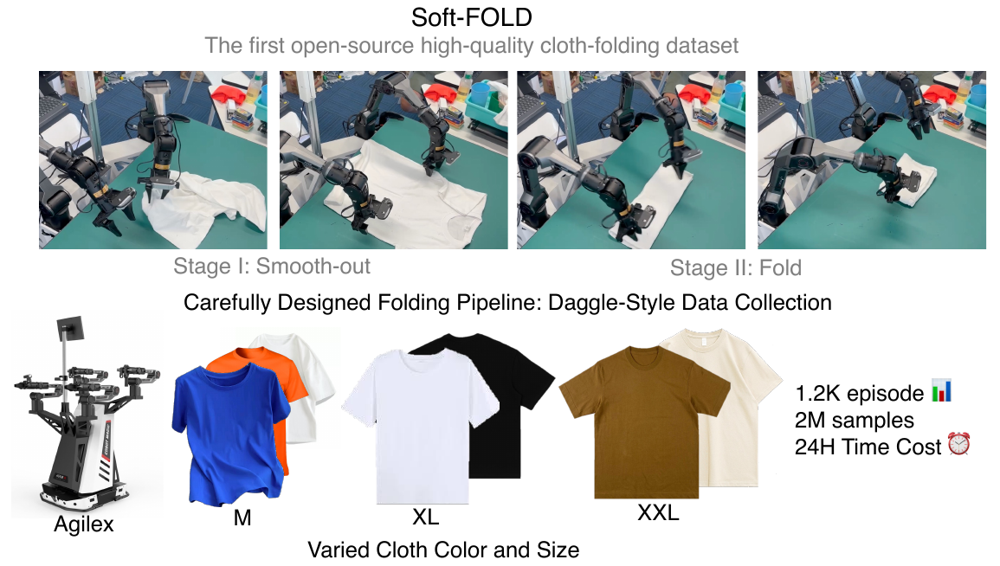

Figure 11. Soft-Fold 데이터 수집. [PDF p.22, Appendix F] · [원문 PDF](https://openreview.net/pdf/d44409f253fba9242cb42be37ae0150dd3e01ddb.pdf#page=22)

cloth folding은 같은 초기 상태에서도 많은 valid strategy가 있어 multimodal behavior가 생긴다. 이를 줄이기 위해 두 단계로 고정한다.

1. **Stage I smooth-out**: 무질서한 cloth에서 두 corner/end 같은 keypoint가 보일 때까지 반복적으로 펼치고, 그 뒤 swing motion으로 평탄화한다.
2. **Stage II fold**: 정리된 cloth를 일정한 방식으로 접는다.

Stage I에서 사람이 임의 전략을 쓰면 policy가 서로 모순되는 mode를 평균내어 다음 단계로 못 넘어갈 수 있다는 것이 구체적 failure rationale이다.

### 18.2 DAgger-style targeted collection

100 episodes를 모을 때마다 ACT를 다시 학습해 failure mode를 찾고, 그 failure를 보강하는 demonstrations를 추가한다. 엄밀한 online DAgger처럼 현재 policy state distribution에서 expert action을 매 step query했는지는 설명하지 않아 “DAgger-style”이라고 부른다.

### 18.3 데이터 규모 산술 점검

- 최종 1,200 episodes.
- episode 하나 평균 약 1.5분.
- reset/실패 폐기 포함 시간당 20-25 episodes.
- Fig.11에는 `2M samples`, `24H Time Cost`가 표시된다.

**[리뷰어 재계산]** 1,200 episodes를 20-25 episodes/hour로 모으면 48-60 collector-hours가 필요하다. 순수 1.5분×1,200도 30시간이다. Fig.11의 24H가 wall-clock 병렬 수집, 순수 successful motion time, 또는 다른 정의인지 논문은 설명하지 않는다. 이 숫자들은 그대로는 일치하지 않는다.

### 18.4 Fig.12 qualitative result

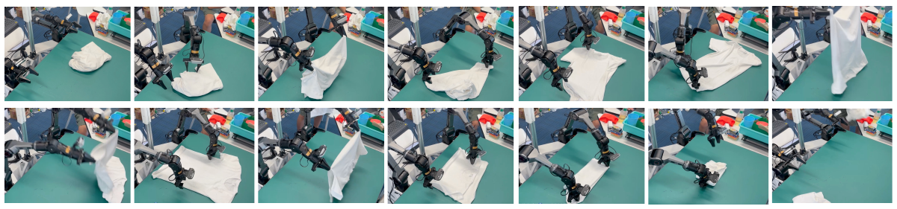

Figure 12. cloth-folding 실행 과정. [PDF p.23, Appendix F] · [원문 PDF](https://openreview.net/pdf/d44409f253fba9242cb42be37ae0150dd3e01ddb.pdf#page=23)

한 episode에서 localization, pick, place, high-dynamic swing을 거쳐 접는 frame sequence를 보인다. 이는 기술 다양성을 보여 주지만 success distribution이나 failure mode 통계는 아니다. Fig.8의 33 folds/hour와 함께 봐야 하며, “nearly 100%”의 정확한 trial count는 PDF에 없다.

---

## 19. Appendix G: Pretraining Details

[PDF p.23-24, Appendix G, Table 9-10]

### 19.1 compute와 optimizer

| 설정 | 값 |
|---|---|
| hardware | 64 NVIDIA A100 GPUs; memory capacity 미기재 |
| wall-clock | 약 4일 |
| global batch | 1024 |
| iterations | 200K |
| optimizer | AdamW |
| learning rate | $1\times10^{-4}$ |
| betas | $(0.9,0.95)$ |
| weight decay | 0.01 |
| precision | bfloat16 |
| image | 224×224 |
| augmentation | ColorJitter(0.2, 0.2, 0.2, 0) |

**[리뷰어 재계산]** 64 GPUs×4 days = 약 6,144 GPU-hours이다. 200K×1024 = 204.8M sample draws이다. 한 episode에서 많은 time index가 나오므로 204.8M/290K를 “706 epochs”라고 부르면 안 된다. episode와 training sample 단위가 다르다.

정확한 per-GPU batch는 global 1024/64=16으로 나누어지지만, gradient accumulation 여부는 논문 미기재이다. A100 40GB/80GB, interconnect, software version, throughput, peak memory도 없다.

### 19.2 validation set

AGIBOT-beta의 train-excluded trajectories에서 189 tasks×3 trajectories/task = 567 trajectories를 구성한다. 예측과 GT trajectory의 평균 $\ell_1$ error를 보고한다. 이 validation이 다른 6 source를 직접 포함하지 않으므로, 낮은 error가 모든 source의 균등 generalization을 보장하지 않는다. 저자들은 held-out AGIBOT로 cross-source sharing을 proxy한다고 본다.

### 19.3 Table 10 sampling recipe

| source | trajectories | sampling weight |
|---|---:|---:|
| AGIBOT | 141K | 0.40 |
| DROID-left | 45K | 0.15 |
| DROID-right로 추정되는 원문 두 번째 `Droid-Left` | 45K | 0.15 |
| RoboMind-Franka | 19K | 0.10 |
| RoboMind-Dual-Franka | 2K | 0.03 |
| RoboMind-UR | 25K | 0.10 |
| RoboMind-AgileX | 11K | 0.07 |
| 합 | 288K | 1.00 |

trajectory count와 290K 표기는 약 2K 차이가 난다. 데이터 버전/필터링/반올림을 명시한 manifest가 필요하다.

---

## 20. Appendix H: Finetuning Details

[PDF p.24, Appendix H, Table 11]

공통 optimizer는 pretraining과 같은 AdamW, betas, weight decay 0.01, bf16, LR $10^{-4}$이다. 첫 1,000 iterations에는 prompt+action heads만 학습하고 나머지를 freeze한다. 이어 LR을 복구하며 joint training한다.

| benchmark | control interface | batch | steps | augmentation |
|---|---|---:|---:|---|
| CALVIN-ABC | Abs EEF | 128 | 60K | ColorJitter |
| LIBERO | Abs EEF | 128 | 60K | 없음 |
| RoboTwin-2.0 | Abs EEF | 128 | 60K | ColorJitter |
| VLA-Bench | Abs EEF | 128 | 60K | ColorJitter |
| BridgeData | Abs EEF | 128 | 60K | ColorJitter |
| FractalData (`FactalData`로 인쇄) | Rel XYZ + Abs Rotation | 256 | 50K | RandomResizeCrop + ColorJitter |
| SoftFold | Abs EEF | 256 | 400K | ColorJitter |
| PEFT experiments | Abs EEF | 128 | 40K | ColorJitter |

Simpler-Google/Fractal은 camera setup 변화에 absolute position이 민감해 relative xyz + absolute rotation을 쓴다. 이것은 “모든 embodiment를 완전히 동일 action semantics로 통일했다”는 단순화의 예외다. Table 11에는 `RobotWin-2.0`, `FactalData`라는 철자 오류가 있다.

downstream training hardware, gradient accumulation, checkpoint selection, seed 수, exact demonstration 수(일부 benchmark 제외)는 논문 미기재이다.

---

## 21. Appendix I: Preliminary Experiment Details

[PDF p.24-25, Appendix I, Table 12]

- Florence-Base.
- Standard DiT-Base: 12 Transformer layers, hidden 768, AdaLN conditioning.
- curated heterogeneous mixture.
- 8 A100 GPUs, global batch 256, 200K iterations.
- 나머지는 Appendix G와 같다고 한다.

HPT-style baseline은 domain마다 cross-attention resampler와 action head를 두고 core Transformer는 공유한다. language-prompt baseline은 다음 문장을 task instruction에 붙인다.

| domain | language prompt 요약 |
|---|---|
| RoboMind-Franka | Single Franka, Top View, 30 Hz |
| RoboMind-UR | Single UR, Top View, 30 Hz |
| DROID-left | Single Franka, Left/Wrist, 15 Hz |
| DROID-right | Single Franka, Right/Wrist, 15 Hz |
| AGIBOT | AGIBOT, Head/Wrist, 30 Hz |
| RoboMind-AgileX | AgileX, Head/Wrist, 30 Hz |
| RoboMind-Dual-Franka | Dual Franka, Front/Wrist, 30 Hz |

이 baseline은 camera와 frequency는 기술하지만 좌표계, link length, joint limits, controller gain은 담지 않는다. soft prompt가 이보다 낫다는 결과는 “learned latent가 hand-written coarse description보다 낫다”이지, 충분히 정교한 structured kinematic input보다 낫다는 비교는 아니다.

---

## 22. Appendix J-K: Real-world Evaluation과 Baseline Training

[PDF p.25-26, Appendix J-K, Fig.13-14]

### 22.1 Appendix J setup

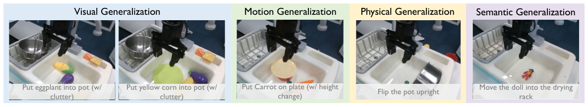

Figure 13. WidowX generalization task. [PDF p.25, Appendix J] · [원문 PDF](https://openreview.net/pdf/d44409f253fba9242cb42be37ae0150dd3e01ddb.pdf#page=25)

- **WidowX**: BridgeData-finetuned X-VLA를 직접 배치. Fig.13의 5 tasks가 visual, motion, physical, semantic generalization을 검사하며 task당 10 trials.
- **AgileX**: wrist cameras가 있는 bimanual dexterous cloth folding.
- **AIRBOT**: pretraining에서 보지 않은 embodiment. cloth picking 200 demonstrations로 PEFT.

Fig.14는 WidowX wrist/front/left-side view, AgileX 양 wrist/top view, AIRBOT front/top 계열의 서로 다른 camera setup을 보여 준다. camera 수·위치가 다르기 때문에 source prompt가 embodiment와 sensor configuration을 동시에 식별한다.

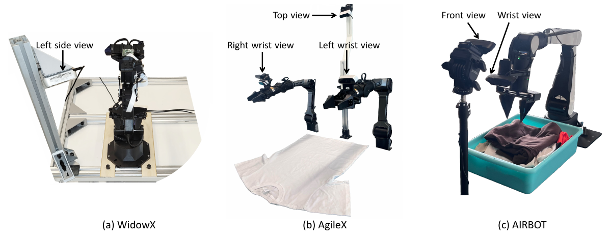

Figure 14. real-world hardware와 camera 배치. [PDF p.26, Appendix J] · [원문 PDF](https://openreview.net/pdf/d44409f253fba9242cb42be37ae0150dd3e01ddb.pdf#page=26)

### 22.2 Appendix K baseline compute

| baseline/task | initialization/tuning | hardware | batch | steps/time |
|---|---|---|---:|---|
| $\pi_0$ cloth folding | official base, Soft-Fold full FT | 4 A100 | 32 | 150K, 약 60h |
| $\pi_0$ PEFT | official base LoRA; PaliGemma attention+FFN rank16/alpha16, action expert rank32/alpha32 | 4 A800 | 32 | 30K, 약 7h |
| ACT cloth folding | scratch, Soft-Fold | 8 A100 | 256 | 약 1M steps |

X-VLA의 real-world finetuning wall-clock/hardware는 같은 표에 없어 training-cost fair comparison은 완전하지 않다. Fig.8의 task 성능 비교는 가능하지만, compute-efficiency 비교는 이 정보만으로 결론내리면 안 된다.

---

## 23. Appendix L: NAVSIM

[PDF p.26-27, Appendix L, Table 13]

공식 closed-loop simulator와 public test split을 사용한다. PDM score는 다음 요소를 종합한다.

- NC: no collision.
- DAC: drivable-area compliance.
- TTC: time-to-collision safety.
- C: comfort, acceleration/jerk constraint.
- EP: ego progress.

| method | NC | DAC | EP | TTC | C | PDMS |
|---|---:|---:|---:|---:|---:|---:|
| Transfuser | 97.7 | 92.8 | 79.2 | 92.8 | 100.0 | 84.0 |
| UniAD | **97.8** | 91.9 | 78.8 | **92.9** | **100.0** | 83.4 |
| UniVLA | 96.9 | 91.1 | 76.8 | 91.7 | 96.7 | 81.7 |
| X-VLA | 97.5 | **96.5** | **82.2** | **92.9** | **100.0** | **87.3** |

X-VLA는 기존 최고 PDMS 84.0보다 3.3점 높다. Table 2의 “Maximum of Existing SOTA” NAVSIM 값은 81.7로, Appendix의 specialized Transfuser 84.0을 포함하지 않는다. Table 2 maximum은 그 표에 나열한 VLA rows의 maximum으로 제한해 읽어야 한다. X-VLA는 Appendix 비교에서도 여전히 최고다.

PDMS의 결합 공식과 scenario별 분산은 PDF에 없으므로 component 평균에서 87.3을 재계산할 수 없다.

---

## 24. Appendix M: Robotics Simulation Detailed Results

[PDF p.26-27, Appendix M, Table 14-18]

### 24.1 Table 14 Simpler

| suite | task scores | 평균 보고 | 평균 재계산 |
|---|---|---:|---:|
| Google Visual Matching | Coke 98.3, Near 97.1, Open 69.5, Put 56.5 | 80.4 | 80.35 |
| Google Visual Aggregation | Coke 85.5, Near 79.8, Open 61.9, Put 75.7 | 75.7 | 75.725 |
| WidowX Visual Matching | Spoon 100, Carrot 91.7, Blocks 95.8, Eggplant 95.8 | 95.8 | 95.825 |

### 24.2 Table 15 LIBERO

Spatial 98.2, Object 98.6, Goal 97.8, Long 97.6이며 단순 평균은 98.05→98.1이다.

### 24.3 Table 16 CALVIN

연속 성공 단계별 비율은 1/2/3/4/5 task에 `97.1/92.6/88.5/84.4/78.8`이다. standard CALVIN 평균 sequence length를 표시된 숫자로 계산하면 합/100 = 4.414인데 표는 4.43이다. 원래 unrounded trial counts에서 계산했을 수 있으므로 단정적 오류라기보다 공개 반올림 수치로는 정확히 재현되지 않는다고 기록한다.

### 24.4 Table 17 VLABench

In Distribution 67.8, Cross Category 25.1, Common Sense 48.2, Semantic Instruction 63.1이며 평균 51.05→51.1이다. 가장 약한 축은 cross-category이고 가장 강한 축은 in-distribution이다. 51.1이라는 평균만 보면 semantic generalization의 편차를 놓친다.

### 24.5 Table 18 RoboTwin-2.0 전체 task

50개 task의 Easy/Hard를 모두 보존한다.

| task | Easy | Hard | task | Easy | Hard |
|---|---:|---:|---|---:|---:|
| Adjust Bottle | 97 | 56 | Open Microwave | 85 | 57 |
| Beat Block Hammer | 78 | 18 | Pick Diverse Bottles | 27 | 25 |
| Blocks Ranking RGB | 79 | 26 | Pick Dual Bottles | 30 | 27 |
| Blocks Ranking Size | 42 | 9 | Place A2B Left | 62 | 21 |
| Click Alarmclock | 96 | 69 | Place A2B Right | 54 | 17 |
| Click Bell | 100 | 61 | Place Bread Basket | 75 | 39 |
| Dump Bin Bigbin | 94 | 59 | Place Bread Skillet | 82 | 17 |
| Grab Roller | 99 | 66 | Place Burger Fries | 98 | 47 |
| Handover Block | 27 | 30 | Place Can Basket | 58 | 18 |
| Handover Mic | 100 | 38 | Place Cans Plasticbox | 100 | 85 |
| Hanging Mug | 34 | 15 | Place Container Plate | 98 | 60 |
| Lift Pot | 99 | 75 | Place Dual Shoes | 98 | 28 |
| Move Can Pot | 50 | 44 | Place Empty Cup | 98 | 34 |
| Move Pillbottle Pad | 52 | 29 | Place Fan | 72 | 27 |
| Move Playingcard Away | 94 | 57 | Place Mouse Pad | 19 | 3 |
| Move Stapler Pad | 58 | 35 | Place Object Basket | 50 | 0 |
| Open Laptop | 85 | 73 | Place Object Scale | 39 | 13 |
| Place Object Stand | 78 | 33 | Place Phone Stand | 80 | 9 |
| Place Shoe | 70 | 51 | Press Stapler | 70 | 13 |
| Put Bottles Dustbin | 0 | 1 | Put Object Cabinet | 78 | 82 |
| Rotate QRcode | 78 | 52 | Scan Object | 60 | 44 |
| Shake Horizontally | 99 | 100 | Shake Bottle | 99 | 99 |
| Stack Blocks Three | 22 | 15 | Stack Blocks Two | 87 | 55 |
| Stack Bowls Three | 80 | 42 | Stack Bowls Two | 83 | 10 |
| Stamp Seal | 52 | 13 | Turn Switch | 40 | 13 |

**[리뷰어 재계산]** Easy 합 3,505/50 = 70.1, Hard 합 1,910/50 = 38.2이다. 원문 Table 18의 마지막 행은 70.0/39.0이다. task weighting이나 별도 precision을 설명하지 않았고 개별 값은 정수이므로 특히 Hard 평균은 표 내부 수치와 불일치한다.

Hard에서 80 이상인 것은 Put Object Cabinet 82, Place Cans Plasticbox 85, Shake Horizontally 100, Shake Bottle 99 정도다. 많은 compositional/precision task가 Easy 대비 크게 무너진다. aggregate 향상만으로 robust bimanual control이 해결됐다고 볼 수 없다.

---

## 25. 학습 시 무엇을 학습하고 무엇을 고정하는가

이 절은 본문 §4.2와 Appendix G-H를 하나의 실행 순서로 다시 조립한다. 특히 “prompt를 쓴다”와 “prompt만 학습한다”는 서로 다른 명제다.

### 25.1 단계별 파라미터 상태

| 단계 | soft prompt | action input/output heads | shared policy Transformer | Florence VLM | 목적 |
|---|---|---|---|---|---|
| Phase I heterogeneous pretraining | 학습 | 학습 | 학습 | 학습, 더 작은 LR | 7개 source의 공통 정책과 source별 조건화 동시 학습 |
| Phase II 초기 1,000 steps | 새 prompt 학습 | 새 heads 학습 | 고정 | 고정 | 새 domain interface를 기존 latent space에 정렬 |
| Phase II full finetuning | 학습 | 학습 | 학습 | 학습, 작은 LR | target domain에 전체 정책 특화 |
| Phase II LoRA PEFT | 학습 | 학습 | LoRA 부분만 학습 | 설정된 LoRA 부분만 학습 | 9M trainable parameters로 적응 |
| inference | 모두 고정 | 모두 고정 | 모두 고정 | 모두 고정 | observation에서 action chunk 생성 |

**중요한 원문 해석**: 본문은 warm-up을 “new prompt를 먼저 최적화한다”고 요약하지만 Appendix H는 이때 prompt와 action heads를 함께 학습한다고 명시한다. action 차원과 좌표계가 바뀌는 새 robot에서는 head를 함께 맞추는 편이 계산상 자연스럽다.

**[공식 코드 확인]** optimizer는 VLM, Transformer core, soft prompts, action heads 네 parameter group을 만든다. 처음 freeze steps에는 VLM/core LR만 0이고 prompt/head LR은 0이 아니다. 이후 VLM과 prompt에는 base LR에 learning coefficient를 곱하고 core/head에는 base LR을 쓴다. 이 동작은 [공식 train.py의 optimizer와 scheduler](https://github.com/2toinf/X-VLA/blob/6bc2513f5f1cbec715cc668b414392a6cae5c671/train.py#L116-L172)에서 확인된다.

### 25.2 논문식 flow-matching 학습 의사코드

아래는 §2의 식과 §4의 heterogeneous prompt를 그대로 결합한 **논문 논리 의사코드**다.

~~~text
입력: source별 데이터 D_1 ... D_H
파라미터: shared theta, prompt P_i, action encoder E_i, action decoder G_i

반복:
  1. sampling weight로 source i와 trajectory tau를 뽑는다.
  2. 시점 n의 observation o_n과 future action chunk A를 만든다.
  3. A0 ~ Normal(0, I), t ~ Uniform(0, 1)을 샘플한다.
  4. A_t = (1 - t) A0 + t A를 만든다.
  5. image/language/proprio, A_t, t, source i를 model에 넣는다.
  6. v_hat = v_theta(A_t, o_n, t; P_i, E_i, G_i)를 얻는다.
  7. target velocity u = A - A0를 만든다.
  8. ||v_hat - u||^2를 역전파한다.
~~~

이 버전에서는 모델 출력이 velocity이며, $A_0$도 loss의 확률변수다. 원문 loss의 기대값 첨자에는 $t$와 $(o,A)$만 쓰였지만 실제 Monte Carlo 학습에는 $A_0$ 샘플링이 반드시 포함되어야 한다.

### 25.3 공개 코드가 실제로 계산하는 학습 의사코드

공개 구현은 interpolation 방향과 예측 target이 다르다.

~~~text
입력: ground-truth action A, observation o, domain i

1. t를 batch-stratified uniform 방식으로 만든다.
2. noise eps ~ Normal(0, I)를 만든다.
3. x_t = t * eps + (1 - t) * A를 만든다.
4. A_hat = Transformer(x_t, proprio, t, VLM(o), prompt_i)로 clean action을 직접 예측한다.
5. xyz/rotation에는 가중 MSE, gripper에는 BCEWithLogits를 적용한다.
6. 총 loss를 역전파한다.
~~~

즉 공개 코드는 $t=0$이 data이고 $t=1$이 noise인 convention을 쓴다. 더 중요한 차이는 $A-A_0$라는 velocity를 예측하지 않고 clean $A$를 예측한다는 점이다. 그러므로 PDF 식을 그대로 구현한 실험과 공개 checkpoint를 재현하는 실험은 별도 branch로 관리해야 한다.

### 25.4 loss와 데이터 처리의 실제 결합

한 batch에서 필요한 순서는 다음과 같다.

1. dataset-specific raw pose를 absolute/relative xyz, Rotate6D, gripper로 변환한다.
2. single-arm action을 20-D interface로 padding하고 proprio/action을 동일 규칙으로 정규화한다.
3. 4초 구간에서 30 future anchors를 구성한다.
4. main view와 auxiliary views를 224×224로 전처리한다.
5. domain ID로 prompt와 action heads를 선택한다.
6. 논문식이면 velocity loss, 공개 코드 재현이면 clean-action composite loss를 쓴다.
7. source sampling weight를 적용하되, batch마다 실제 source histogram을 기록한다.

정규화 통계의 산출 split, clipping 범위, missing proprio 처리, episode 말단의 짧은 horizon 처리까지 checkpoint와 함께 저장해야 한다. 이 네 항목은 paper result를 재현할 때 optimizer 이름보다 더 쉽게 결과를 바꿀 수 있다.

---

## 26. 추론 알고리즘: 논문 수식과 공개 코드의 두 버전

### 26.1 논문에 적힌 ODE 해석

PDF §2를 문자 그대로 구현하면 noise에서 data 쪽으로 $t:0\rightarrow1$을 적분한다. $\Delta t=1/K$인 explicit Euler 의사코드는 다음과 같다.

~~~text
F = encode_images_and_language(o)       # 캐시 가능하다고 가정한 설명
A = Normal(0, I)

for k = 0 ... K-1:
  t = k / K
  v = policy_velocity(A, proprio, t, F, prompt_domain)
  A = A + v / K

return postprocess(A)
~~~

원문은 이를 Euler-Maruyama라고 부르지만 표시된 update에는 확률 미분항이 없다. 식만 보면 deterministic Euler ODE solver다. 진짜 Euler-Maruyama라면 일반적으로 $\sigma(t)\sqrt{\Delta t}\,\xi$ 같은 noise increment가 추가되어야 한다.

### 26.2 공개 구현의 iterative clean prediction

[공식 generate_actions](https://github.com/2toinf/X-VLA/blob/6bc2513f5f1cbec715cc668b414392a6cae5c671/models/modeling_xvla.py#L181-L220)은 다음 계산을 한다.

~~~text
F = forward_vlm(images, text)           # 한 번만 계산
x1 = Normal(0, I)
action = zeros_like(x1)

for i = K ... 1:
  t = i / K
  x_t = t * x1 + (1 - t) * action
  action = Transformer(x_t, proprio, t, F, prompt_domain)

return action_space.postprocess(action)
~~~

여기에는 velocity, $\Delta t$, 누적 Euler update가 없다. 직전 clean-action estimate를 같은 초기 noise와 다시 섞어 재예측하는 deterministic loop다. 기본 API/README 예시는 $K=10$이며, 이는 **공식 코드 기본값**이지 PDF에 보고된 latency-optimal 값이 아니다.

### 26.3 두 알고리즘이 같지 않은 이유

| 질문 | 논문식 | 공개 코드 |
|---|---|---|
| $t=0$의 의미 | noise | data |
| network target | velocity $A-A_0$ | clean action $A$ |
| update | 현재 state에 velocity를 누적 | fixed noise와 직전 예측을 재혼합 |
| explicit step size | $\Delta t$ 있음 | 없음 |
| stochastic increment | 표시된 식에는 없음 | 없음 |

둘이 특정 parameterization 아래 관련될 수는 있지만, 동일한 학습 target과 동일한 sampler라고 단정할 수 없다. 최소 재현 실험은 같은 데이터/초기화에서 두 objective를 각각 학습하고 validation L1, task success, $K$별 latency를 비교해야 한다.

### 26.4 추론 edge cases

- $K=1$: 공개 코드는 순수 noise에서 clean action을 한 번 예측한다. one-step distillation을 별도로 하지 않았으므로 성능 저하 정도는 실측 대상이다.
- 잘못된 domain ID: 다른 camera/action distribution의 prompt와 heads를 고르므로 shape가 맞아도 의미가 틀릴 수 있다.
- view 누락: image mask와 view order를 함께 검증해야 한다. 첫 view만 language encoder에 들어가므로 순서 교환은 단순 permutation이 아니다.
- Rotate6D 두 벡터가 0/평행에 가까움: 정규직교화에서 NaN 가능성을 확인한다.
- gripper threshold: evaluator별 0.5/0.7/0.8 차이가 success를 바꿀 수 있다.
- padded arm: dummy 10-D가 loss와 postprocess에서 실제 joint command로 새지 않는지 검사한다.
- episode 말단: 짧아진 physical horizon을 30 anchors로 재보간하는 policy가 train/eval에서 같아야 한다.
- precision: 공개 model constructor가 Florence를 float32로 올리는 경로가 있으므로, bf16 checkpoint라고 해서 inference 전체가 자동 bf16인 것은 아니다.

---

## 27. 온라인 로봇 제어에서 실제로 일어나는 일

### 27.1 한 번의 policy refresh

1. camera frame 최대 3개와 현재 proprioception을 timestamp와 함께 취득한다.
2. resize, color conversion, text tokenization, normalization을 수행한다.
3. Florence image encoder를 모든 view에 적용하고, 첫 view+language만 Florence language encoder로 융합한다.
4. 동일 observation feature를 유지한 채 policy Transformer를 $K$회 실행한다.
5. 30×20 action chunk를 denormalize하고 Rotate6D를 회전으로 복원하며 gripper를 이산화한다.
6. evaluator/controller가 chunk의 일부 또는 전부를 실행한다.
7. plan이 소진되거나 replanning 조건을 만나면 새 observation으로 다시 요청한다.

이때 “30개 action을 한 번에 출력한다”는 말은 control frequency가 30 Hz라는 뜻이 아니다. 30은 chunk의 anchor 수이고, 물리 실행 주파수와 실행할 prefix 길이는 controller가 별도로 정한다.

### 27.2 공개 evaluator가 보여 주는 chunk 실행 차이

| evaluator | 한 요청 뒤 plan 사용 |
|---|---|
| CALVIN | 첫 20개 action을 queue |
| LIBERO | 변환된 30개 action을 queue |
| Simpler-WidowX | 반환 chunk 전체를 queue |
| Simpler-Google | 대체로 매 두 번째 anchor를 취해 최대 10개; 일부 place-in 코드는 최대 6개 |
| VLA-Bench | 변환된 chunk를 queue |
| RoboTwin-2.0 | sequence를 environment 쪽에 전달 |

따라서 benchmark success는 모델만이 아니라 receding-horizon 길이 $C$, sub-sampling stride, gripper threshold의 함수다. 이 값들을 통제하지 않은 모델 간 비교는 동일한 closed-loop feedback budget을 보장하지 않는다.

### 27.3 latency와 control rate의 관계

제어 주파수를 $f_c$, 한 번에 실제 실행하는 action 수를 $C$, observation-to-plan latency를 $L$이라 두자. 새 plan이 필요한 시간 간격은 대략

$$
\text{[해설용 수식]}\qquad D_{\mathrm{refresh}}=\frac{C}{f_c}.
$$

stall 없는 동작의 필요조건은 $L<D_{\mathrm{refresh}}$지만 충분조건은 아니다. camera timestamp 지연, network jitter, controller queue, action interpolation까지 포함한 p99가 deadline보다 작아야 한다. $C$를 늘리면 추론을 amortize하지만 오래된 observation에 기반한 open-loop 실행이 길어지고, $C$를 줄이면 반응성은 좋아지지만 추론 deadline이 짧아진다.

---

## 28. 효율성 분석: training cost와 inference cost를 분리하기

### 28.1 공개된 것과 공개되지 않은 것

| 항목 | 논문/코드에서 확인되는 값 | 판정 |
|---|---|---|
| pretraining compute | 64 A100 × 약 4일 = 약 6,144 GPU-hours | training cost |
| pretraining sample draws | 200K steps × batch 1024 = 204.8M | training schedule |
| model size | X-VLA-0.9B | storage/forward 규모의 간접 지표 |
| PEFT trainable params | 9M, 약 1% | optimizer state와 backward cost 감소 |
| source prompt params | length 32 × hidden 1024 = source당 32,768 | 매우 작은 adaptation state |
| inference denoising count | 공개 코드 기본 10 | forward 반복 횟수 |
| GFLOPs/TFLOPs per observation | 미기재 | 이론 연산량 불명 |
| measured single-pass/10-step latency | 미기재 | 실제 latency 불명 |
| observation-to-first-action p50/p95/p99 | 미기재 | real-time성 불명 |
| steady-state actions/s, plan refresh Hz | 미기재 | throughput 불명 |
| peak device/unified memory | 미기재 | 배포 적합성 불명 |
| energy per plan/thermal steady state | 미기재 | edge 효율 불명 |

9M만 학습한다고 해서 inference가 300배 빨라지는 것은 아니다. PEFT는 저장할 gradient/optimizer state와 업데이트 파라미터를 줄이지만, frozen 0.9B backbone의 forward는 여전히 실행한다. 논문의 “300× fewer parameters”는 $3\mathrm{B}/9\mathrm{M}\approx333$인 **학습 파라미터 수 비교**이지 inference FLOPs나 latency 배수가 아니다.

### 28.2 Transformer 계산 구조

sequence 길이를 $S$, hidden을 $d$, layer 수를 $N$, denoising steps를 $K$라 하면 policy core의 대략적인 항은

$$
\text{[해설용 수식]}\qquad
\mathrm{Cost}_{policy}
\sim
K N\left(c_1 S d^2+c_2 S^2d\right).
$$

$Sd^2$에는 QKV/output projection과 MLP가, $S^2d$에는 dense attention이 들어간다. 여기에 observation refresh마다 Florence vision-language encoding 비용이 더해진다. 공개 구현은 VLM feature를 denoising loop 밖에서 한 번 계산하므로 $K$배 반복하지 않는다.

그러나 policy Transformer는 bidirectional self-attention으로 static visual/prompt tokens와 매 step 바뀌는 action tokens를 함께 업데이트한다. 따라서 autoregressive LLM처럼 static token의 모든 layer KV를 그대로 캐시하는 것은 의미 보존이 자동으로 보장되지 않는다. 안전하게 재사용 가능한 것은 현재 구현처럼 **VLM encoder 출력**이며, deeper KV cache는 attention 구조 변경과 parity 검증이 필요한 새 방법이다.

### 28.3 반드시 따로 측정할 latency

- camera capture 완료부터 tensor 준비까지의 CPU preprocessing
- H2D 또는 unified-memory page migration
- main/aux image encoding과 text-image fusion
- policy Transformer 1회와 $K$회 누적
- Rotate6D/gripper postprocess
- RPC serialization/network round trip
- controller enqueue부터 actuator command timestamp까지
- cold start/JIT/engine build와 steady state
- p50뿐 아니라 p95, p99, max, deadline miss rate

결론적으로 이 논문은 **정확도와 trainable-parameter 효율**에는 강한 자료를 주지만, **실제 on-device inference latency**를 입증하지 않는다.

---

## 29. 비판적 검토

### 29.1 강점

1. **heterogeneity를 fusion 초기부터 다룬다.** action head만 나누는 기존 관행과 달리 prompt가 image/language/proprio/action token 모두와 self-attention하도록 만들어, camera·hardware·data-collection 차이를 high-level representation에도 전달한다.
2. **구조가 단순하다.** 새로운 거대한 expert/router보다 standard Transformer와 작은 prompt library를 사용한다. Appendix E의 LoRA/MoE 실패까지 공개해 왜 이 선택을 했는지 설득력을 높인다.
3. **누적 ablation이 좋다.** Table 1은 learning recipe, action alignment, downsampling, sampling, backbone, encoding, soft prompt, scale, two-stage adaptation을 한 경로에서 쌓아 올린다.
4. **평가 범위가 넓다.** 5개 manipulation simulation suite, NAVSIM driving, 3개 real robot을 포괄한다. 특히 Soft-Fold는 bimanual dexterity와 data-collection 문제를 함께 드러낸다.
5. **적응 비용을 별도 실험한다.** Table 3/8은 prompt-only, prompt+head, LoRA, last-layer tuning을 구분해 trainable parameter와 성능의 trade-off를 보여 준다.
6. **공식 코드와 evaluator를 공개했다.** 논문 수식과 코드 차이는 남아 있지만, 실제 tensor path와 benchmark별 chunk policy를 감사할 수 있다는 점은 큰 장점이다.

### 29.2 internal validity: 정말 soft prompt 때문인가

Table 1의 soft-prompt 단계는 validation error 0.053에서 0.041, adaptation success 64.6에서 73.8로 개선된다. 같은 누적 경로에서 prompt 추가 전후를 비교했으므로 직접 증거는 있다. 다만 다음 질문은 남는다.

- source ID가 동시에 prompt와 action heads를 선택하므로 prompt 단독 기여와 head specialization의 상호작용이 완전히 분리되지 않는다.
- prompt length/parameter budget을 맞춘 learned domain embedding, FiLM, AdaLN, low-rank conditional bias와의 동등-budget 비교가 없다.
- HPT/language prompt baseline이 표현할 hardware metadata의 양이 soft prompt보다 제한적이다.
- prompt의 random-seed 분산과 여러 pretraining seed가 보고되지 않는다.

따라서 “soft prompt가 이 recipe에서 효과적”은 지지되지만, “동일 파라미터 예산의 모든 조건화 방식보다 본질적으로 우월”까지는 입증되지 않는다.

### 29.3 construct validity: 무엇을 측정했는가

- pretraining scaling의 주 지표는 held-out AGIBOT trajectory의 평균 L1이다. 이는 7개 source 전체의 균등한 representation quality나 closed-loop success와 같지 않다.
- Fig.9 t-SNE cluster는 시각적 탐색 결과다. silhouette score, linear probe, mutual information, cross-seed stability가 없어 prompt가 hardware factor를 disentangle했다고 증명하지 않는다.
- Fig.10에서 유사 robot의 prompt가 early PEFT에 유리한 현상은 transfer prior의 증거지만, prompt distance가 kinematics distance를 정량적으로 반영하는지는 평가하지 않는다.
- real-world WidowX task당 10 trials는 표본이 작다. 예를 들어 8/10의 95% Wilson interval은 대략 0.49-0.94, 9/10은 0.60-0.98로 넓다. 0.8 대 0.9의 차이를 정밀한 순위로 읽으면 안 된다.
- folds/hour와 success rate는 다른 construct다. 속도가 빠르더라도 fold quality나 intervention rate가 나쁠 수 있으므로 함께 보고해야 한다.

### 29.4 external validity: 어디까지 일반화되는가

pretraining은 7 sources/5 arm types로 넓지만 prompt는 source ID lookup이다. 새 robot에 descriptor만 넣어 zero-shot prompt를 합성하는 구조는 아니다. AIRBOT 결과도 200 demonstrations로 PEFT한 적응 결과다. 따라서 “새 embodiment로 빠르게 적응”은 지지되지만 “unseen hardware에 out-of-the-box deployment”는 별도 주장이다.

또한 source prompt는 embodiment만 표현하지 않는다. 같은 Franka라도 DROID-left/right가 다른 prompt를 쓰며 camera 위치, dataset, task distribution, logging rate가 함께 묶인다. 이 entanglement는 성능에는 유용할 수 있지만, prompt를 순수한 robot morphology representation이라고 부르는 것은 과도하다.

### 29.5 비교의 공정성

- Table 2는 각 benchmark의 공개 최고치와 X-VLA를 모은다. baseline별 pretraining data, parameter count, observation history, action horizon, controller, evaluation version이 완전히 일치하지 않는다.
- 저자의 “5개 manipulation benchmark SOTA” 범위에서는 CALVIN 4.43이 $\pi_0$ 4.53보다 낮다. 원문은 대체로 five benchmark 문구에서 CALVIN을 성능 주장 범위 밖으로 두지만, 독자는 6개 모두를 이겼다고 확대 해석하면 안 된다.
- Table 3의 9M 대 3B는 trainable parameters 비교다. total executed parameters, wall-clock, memory, inference latency의 공정 비교가 아니다.
- Appendix K에는 $\pi_0$/ACT baseline compute가 있으나 X-VLA downstream wall-clock이 같은 형식으로 없다.
- benchmark별 chunk prefix/stride가 다르므로 closed-loop feedback 횟수를 맞춘 추가 실험이 필요하다.

### 29.6 통계와 보고의 한계

일부 LIBERO/PEFT 결과에는 ± 값이 있지만 전체 benchmark의 seed 수와 그 값이 표준편차인지 표준오차인지 명시가 일관적이지 않다. real-world는 per-task 성공 횟수를 보여 주지만 confidence interval과 operator/intervention protocol이 없다. 290K mixture의 license, exact episode IDs, filtering manifest, normalization statistics도 결과 재생성에 부족하다.

### 29.7 문서 내부 및 논문-코드 불일치 목록

| 위치 | 관찰 | 영향 |
|---|---|---|
| §2 action chunk | $[a_n,\ldots,a_{n+T}]$를 chunk size $T$라 부름 | 표기대로면 $T+1$개인 off-by-one |
| §2 flow loss | 기대값 첨자에 $A_0$ 샘플이 생략됨 | 실제 stochastic training 정의가 불완전 |
| §2 solver | noise term 없는 식을 Euler-Maruyama로 지칭 | ODE Euler와 SDE solver 혼동 |
| Fig.6 | 선형식과 함께 $R^2=-0.925$ 인쇄 | intercept를 둔 표준 OLS의 $R^2$로는 불가능; correlation $r$ 오기 또는 $R^2=0.925$ 가능성 |
| Table 6 문장/표 | 본문은 LIBERO-Goal 50/10 demos를 말하나 표는 4 suites | 어떤 data subset을 줄였는지 모호 |
| Table 10 | source 합이 288K, 본문은 약 290K | 데이터 manifest 필요 |
| Table 10 | DROID-left가 두 번 인쇄 | Fig.3과 설명상 두 번째는 DROID-right로 추정 |
| Appendix H 대 README | PDF joint LR warm-up 1,000, 코드 예시/default 2,000 | recipe version 고정 필요 |
| PDF flow 대 공식 코드 | velocity prediction 대 clean-action prediction | objective/sampler가 다름 |
| Table 18 | 행 재계산 Easy 70.1/Hard 38.2, 인쇄 70.0/39.0 | 집계 규칙 또는 표 수치 오류 |
| Appendix 표기 | FactalData, RobotWin-2.0, unresolved (?) citation | 구현 대상/참고문헌 확인 비용 증가 |

이 불일치들은 논문의 큰 실험 결과를 자동으로 무효화하지는 않는다. 다만 독립 재현자는 “PDF 충실 구현”과 “공식 checkpoint 충실 실행”을 같은 실험으로 취급하지 않아야 한다.

### 29.8 종합 판정

가장 강하게 지지되는 결론은 다음이다.

> source-specific soft prompt와 action interface를 작은 전용 상태로 두고, 나머지 multimodal policy를 공유하면, 이 논문의 heterogeneous recipe에서 pretraining 안정성과 downstream adaptation이 크게 좋아진다.

반대로 다음은 아직 지지되지 않는다.

- soft prompt가 hardware factor를 해석 가능하게 disentangle한다.
- 9M PEFT가 3B full tuning보다 inference도 300배 효율적이다.
- X-VLA-0.9B가 실제 edge controller deadline을 만족한다.
- 새 robot에 demonstration 없이 즉시 deploy된다.
- PDF의 flow-matching 식과 공개 checkpoint가 같은 objective/sampler를 사용한다.

---

## 30. 재현성 체크리스트와 권장 실행 순서

### 30.1 공개 상태 감사

| 재현 항목 | 상태 | 필요한 조치 |
|---|---|---|
| PDF/서지/페이지 | 확인 가능 | 첨부 PDF SHA-256 고정 |
| 공식 code | 공개 | commit 6bc2513 고정 |
| pretrained/fine-tuned checkpoints | README에 링크 | artifact hash와 revision 기록 |
| 전체 290K training data | 여러 외부 dataset 조합 | exact episode manifest와 license 확인 |
| source sampling weights | Table 10 공개 | 288K/290K 차이 해소 |
| architecture 핵심 | 공개 code로 확인 | Florence checkpoint/config hash 저장 |
| optimizer 핵심 | Appendix G-H 공개 | gradient accumulation, scheduler flag 확인 |
| random seeds | 불충분 | train/data/eval/noise seed 모두 기록 |
| normalization stats | 논문 미기재 | source별 파일과 산출 split 저장 |
| flow objective | PDF-code 불일치 | 두 mode를 명시적으로 이름 붙여 분리 |
| action execution policy | evaluator별 상이 | chunk prefix/stride/threshold manifest화 |
| latency/memory/power | 미보고 | 별도 benchmark harness 필요 |
| real-world protocol | 일부 공개 | camera sync, safety controller, intervention log 추가 |

### 30.2 최소 실험 manifest

~~~yaml
paper_pdf_sha256: E5843AA4BF8804DE0C1F50F06E1379B7E1634CD774A931091249C17E0FEDA39A
repo_commit: 6bc2513f5f1cbec715cc668b414392a6cae5c671
objective: paper_velocity_flow | official_clean_prediction
checkpoint_sha256: REQUIRED
florence_revision: REQUIRED
domains:
  - id
  - dataset_manifest_sha256
  - sampling_weight
  - camera_order
  - action_mode
  - normalization_stats_sha256
train:
  seed: REQUIRED
  precision: bf16
  batch_global: 1024
  steps: 200000
  freeze_steps: 0_for_pretrain_or_1000_for_adapt
  warmup_steps: RECORD_EXACT_VALUE
infer:
  denoise_steps: 10
  chunk_predicted: 30
  chunk_executed: RECORD
  stride: RECORD
  gripper_threshold: RECORD
metrics:
  - validation_l1
  - task_success_with_trial_counts
  - latency_p50_p95_p99
  - peak_memory
~~~

### 30.3 단계별 재현 gate

1. **Data gate**: 100개 random samples를 사람이 시각화해 camera order, current proprio, 30 future anchors, unit/coordinate frame을 확인한다.
2. **Shape gate**: batch 1/2, view 1/2/3, single/dual arm에서 모든 tensor와 mask shape를 unit test한다.
3. **Loss gate**: fixed seed의 작은 batch에서 CPU/GPU 또는 reference implementation 사이 loss를 비교한다. 이 리뷰에서는 GPU를 실행하지 않았다.
4. **Overfit gate**: 32-128 samples에 과적합해 end-to-end gradient와 domain head routing을 검증한다.
5. **Pretrain proxy gate**: full 64-A100 run 전에 Florence-Base/DiT-Base preliminary setting으로 Table 1 방향성을 재현한다.
6. **Checkpoint gate**: official checkpoint로 공개 evaluator의 raw action output과 task score를 먼저 재생한다.
7. **Statistical gate**: 최소 3 seeds, real-world task별 trial count와 Wilson interval, paired scenario seed를 보고한다.
8. **Deployment gate**: latency, memory, thermal steady state, controller deadline miss를 success와 함께 측정한다.

---

## 31. Jetson AGX Thor 후속 최적화 실험안

이 절은 **논문에 없는 후속 제안**이다. X-VLA를 Jetson AGX Thor에서 실행하거나 latency를 측정하지 않았으므로 아래 숫자는 결과가 아니라 실험 설계다.

### 31.1 hardware premise와 해석 한계

2026-09-07에 확인한 [NVIDIA 공식 Jetson Thor 제품 페이지](https://www.nvidia.com/en-us/autonomous-machines/embedded-systems/jetson-thor/)는 AGX Thor Developer Kit/T5000에 128 GB 256-bit LPDDR5X, 273 GB/s, 40-130 W, 최대 2070 FP4 TFLOPS sparse를 명시한다. 이 peak FP4 수치는 X-VLA가 실제로 내는 FLOPs, dense attention latency, camera-to-action latency가 아니다. kernel 지원, precision fallback, memory bandwidth, dynamic shapes, thermal/power mode가 실제 속도를 결정한다.

0.9B parameters의 **가중치만** 단순 계산하면 BF16/FP16 약 1.8 GB, FP8/INT8 약 0.9 GB, 4-bit 약 0.45 GB다. 이는 activation, attention workspace, Florence intermediate, runtime engine, camera buffers, allocator fragmentation을 제외한 하한이다.

### 31.2 배포 그래프 분할

| stage | 우선 backend | 핵심 확인 |
|---|---|---|
| image resize/normalize | CUDA/VPI 후보 | CPU copy와 color conversion 제거 효과 |
| Florence image encoder | TensorRT FP16 기준 | 1/2/3 view dynamic shape 또는 profile 분리 |
| main-view text fusion | TensorRT 가능성 검증 | unsupported op와 mask semantics |
| shared projection + 24-layer policy | TensorRT FP16 기준 | $S$ 고정, prompt/domain gather, attention kernel |
| $K$-step loop | host loop 뒤 CUDA Graph 후보 | launch overhead와 fixed shape |
| Rotate6D/gripper/postprocess | fused CUDA 또는 CPU | NaN, threshold, controller format parity |

VLM feature는 $K$회 loop 밖에서 한 번만 계산한다. 반면 policy Transformer의 layer-wise KV cache는 static token도 action token을 양방향으로 읽기 때문에 그대로 재사용하지 않는다. KV cache를 도입한다면 cross-attention 형태로 재설계한 별도 모델로 취급하고 재학습/성능 검증한다.

### 31.3 실험 축

| 축 | 후보 | 고정해야 할 것 |
|---|---|---|
| denoise steps $K$ | 10, 6, 4, 2, 1 | 동일 noise seeds, checkpoint, controller |
| precision | FP16 기준; BF16, FP8, weight-only INT8/4-bit 후보 | calibration set/source 비율 |
| views | 3, 2, 1 | camera order와 task set |
| image resolution | 224 기준; auxiliary 192/160 후보 | main view는 별도 ablation |
| executed chunk $C$ | 1, 5, 10, 20, 30 | control Hz와 stride |
| backend | eager PyTorch, compiled PyTorch, TensorRT | 동일 preprocessing/postprocess |
| power | 장치가 제공하는 고정 power mode들 | clocks, fan, ambient temperature |

precision은 한 번에 전부 낮추지 않는다. prompt/action heads, input/output LayerNorm, Rotate6D 직전 출력은 FP16/BF16로 남기고 큰 GEMM부터 낮추는 mixed-precision ladder를 권한다. source별 action distribution이 다르므로 calibration set도 Table 10 비율만 복사하지 말고 target deployment domain을 충분히 포함해야 한다.

### 31.4 측정 harness

각 configuration에서 다음을 저장한다.

- 50회 warm-up 뒤 최소 1,000 policy requests의 p50/p95/p99/max
- CPU timestamp 기준 camera-ready to first-action
- CUDA event 기준 preprocessing, VLM, policy 1회, $K$회, postprocess
- cold-start model load/engine build와 steady-state를 분리
- actions/s와 plan refresh Hz
- peak unified memory, page migration/fault, OOM 여부
- 평균/최대 module power, temperature, clock throttling
- normalized action MAE/max error, physical xyz/rotation error, gripper bit disagreement
- simulation success와 실제 robot success, intervention, safety stop
- deadline miss rate와 frame age

제어 deadline은 임의의 “30 Hz 모델” 가정 대신 §27의 $D_{\mathrm{refresh}}=C/f_c$로 정한다. 제안 gate는 p99 end-to-end가 $0.8D_{\mathrm{refresh}}$ 이하이고 deadline miss가 0.1% 이하인 configuration만 physical pilot로 넘기는 것이다. 이는 논문 기준이 아니라 안전 margin을 둔 **제안 기준**이다.

### 31.5 순차 최적화와 중단 기준

1. **Parity baseline**: workstation과 Thor FP16에서 동일 1,000 observations, 동일 noise seed의 action을 비교한다. shape/mask/gripper bit가 다르면 최적화를 중단한다.
2. **Profile baseline**: $K=10$, 224, 3 views, eager와 TensorRT 후보의 component latency를 잰다. 병목을 측정하기 전에는 quantization을 시작하지 않는다.
3. **Step sweep**: $K=10\rightarrow6\rightarrow4\rightarrow2\rightarrow1$. latency 감소와 validation/simulation success를 함께 그린다.
4. **Precision ladder**: 큰 linear/attention부터 FP8/INT8/4-bit 후보를 적용하고 layer-wise cosine error와 최종 action error를 확인한다.
5. **Visual ablation**: auxiliary resolution/view 수를 줄이되 wrist-dependent fine manipulation task와 scene-level task를 분리한다.
6. **Scheduling**: fixed shapes, CUDA Graph, preallocated buffers, camera double buffering, controller thread 분리를 적용한다.
7. **Thermal soak**: 목표 power mode에서 30분 이상 반복하고 clock/latency drift를 기록한다.
8. **Closed-loop pilot**: simulation/hardware-in-the-loop 뒤 low-speed real robot, safety cage, workspace limit, emergency stop 순으로 확장한다.

각 최적화는 FP16 baseline 대비 연속 action 오차, gripper disagreement, task success 차이의 95% interval을 보고한다. 제안상 normalized continuous max error $10^{-3}$과 gripper bit 완전 일치를 먼저 software parity gate로 쓰되, 실제 허용 오차는 robot의 단위·controller resolution·safety envelope에 맞춰 다시 정의해야 한다. success가 2 percentage points 이상 낮아지거나 interval이 사전 허용치를 벗어나면 해당 optimization을 채택하지 않는다.

### 31.6 가장 가능성 높은 우선순위

1. 공개 코드에 이미 있는 VLM-once 재사용을 보존한다.
2. fixed input shapes와 TensorRT-compatible attention/GEMM을 먼저 검증한다.
3. $K$ 감소가 가장 직접적인 policy 반복 비용 절감이므로 accuracy-latency frontier를 먼저 얻는다.
4. source prompt 자체는 32K parameters라 압축 우선순위가 낮다.
5. LoRA merge는 runtime graph 단순화에는 유리할 수 있지만 total backbone forward를 줄이지는 않는다.
6. Python HTTP/JSON image serialization이 남으면 accelerator 최적화 뒤에도 end-to-end가 느릴 수 있으므로 shared memory 또는 in-process API를 별도 비교한다.

---

## 32. 학습자가 자주 오해할 지점과 Q&A

### 32.1 핵심 오해 12가지

1. **“soft prompt는 robot 설명 문장이다.”**  
   아니다. 학습되는 연속 벡터 32개이며 tokenizer vocabulary의 단어일 필요가 없다.

2. **“robot 한 종류당 prompt 하나다.”**  
   논문 구현에서는 source/dataset ID 단위다. 같은 Franka도 DROID-left, DROID-right, RoboMind-Franka가 서로 다를 수 있다.

3. **“prompt만 source-specific이다.”**  
   아니다. action input projection과 output projection도 source-specific이다.

4. **“모든 robot의 action 의미가 완전히 같다.”**  
   20-D interface로 맞추지만 single-arm padding이 있고, Fractal/Simpler-Google은 relative xyz + absolute rotation 예외를 쓴다.

5. **“30 future actions이므로 30 Hz다.”**  
   아니다. 4초 구간의 30 anchors는 약 7.5 anchors/s에 해당하고, evaluator가 다시 stride/prefix를 바꿀 수 있다.

6. **“PDF의 flow matching과 공개 코드가 동일하다.”**  
   아니다. PDF는 velocity target과 Euler update를 쓰고, 코드는 clean-action target과 반복 재예측을 쓴다.

7. **“Euler-Maruyama라고 했으니 매 step noise가 추가된다.”**  
   표시된 원문 식과 공개 sampler에는 stochastic increment가 없다.

8. **“9M parameters면 모델 크기가 9M이다.”**  
   아니다. 0.9B base 중 9M만 trainable한 PEFT 설정이다. inference 때 base forward는 남는다.

9. **“0.04%와 1%는 같은 숫자의 반올림이다.”**  
   아니다. Fig.5의 source-specific prompt+action projections와 Table 3의 LoRA 포함 trainable set은 범위가 다르다.

10. **“Fig.9 cluster가 hardware disentanglement를 증명한다.”**  
    아니다. t-SNE는 neighborhood 시각화이고 정량 disentanglement test가 아니다.

11. **“SOTA라고 했으므로 모든 suite의 모든 지표를 이겼다.”**  
    아니다. CALVIN은 $\pi_0$보다 낮고, 각 benchmark 비교 조건도 완전히 동일하지 않다.

12. **“standard Transformer라서 edge에서도 빠르다.”**  
    아니다. simplicity는 구현 장점이지만 0.9B, multi-view VLM, $K$회 policy pass의 실제 latency는 측정해야 한다.

### 32.2 개념 확인 Q&A

**Q1. soft prompt가 action head보다 앞에서 heterogeneity를 처리한다는 의미는?**  
A. prompt가 전체 self-attention sequence에 들어가므로 image/language/control representation이 fusion되는 동안부터 source context를 제공한다. action head는 마지막 출력 변환만 바꾼다.

**Q2. prompt $P_i\in\mathbb R^{32\times1024}$가 “hardware”만 담는가?**  
A. 보장되지 않는다. source ID와 함께 변하는 camera, scene, task, controller, sampling frequency도 담을 수 있다.

**Q3. $A^t=(1-t)A^0+tA$에서 target velocity가 왜 $A-A^0$인가?**  
A. $t$로 미분하면 $\frac{dA^t}{dt}=A-A^0$이기 때문이다. 직선 OT path에서는 $t$와 무관한 일정한 velocity다.

**Q4. behavior cloning과 flow matching은 경쟁하는 별개 목표인가?**  
A. 여기서는 flow matching이 action-chunk behavior cloning을 구현하는 생성 parameterization이다. demonstration의 conditional action distribution을 noise-to-action flow로 학습한다.

**Q5. 왜 action token 30개가 causal mask 없이 서로 attention하는가?**  
A. 전체 chunk를 동시에 생성하는 non-autoregressive policy이므로 미래 anchor 간 trajectory consistency를 함께 모델링한다.

**Q6. auxiliary wrist view를 Florence language encoder에 넣지 않는 이유는?**  
A. 저자는 main view+language에 high-level semantic fusion을 맡기고 auxiliary view에는 fine manipulation visual detail을 맡긴다. 다만 이것이 최적이라는 독립 ablation은 제한적이다.

**Q7. prompt length 32가 보편적 최적인가?**  
A. 아니다. Fig.6의 이 model/data regime에서 32 이후 이득이 포화된 결과다. hidden size, source 수, task complexity가 바뀌면 다시 sweep해야 한다.

**Q8. prediction L1이 낮으면 robot success도 반드시 높은가?**  
A. 아니다. Table 1에서는 상관이 있지만 multimodal action, compounding error, controller, contact dynamics 때문에 open-loop L1과 closed-loop success는 다르다.

**Q9. LoRA 9M이 prompt 32K보다 항상 낫나?**  
A. Table 8에서는 성능이 크게 높지만 비용도 커진다. 목표가 몇-shot adaptation인지, 저장/학습 예산이 얼마인지에 따라 prompt+head가 더 나을 수 있다.

**Q10. multi-source pretraining은 모든 downstream에서 single-source보다 좋은가?**  
A. Table 5에서는 LIBERO-Long에 소폭 이득, Simpler와 CALVIN에는 소폭 손해다. transfer와 negative transfer가 동시에 존재한다.

**Q11. Soft-Fold의 1,200 episodes는 적은가 많은가?**  
A. 범용 pretraining 290K보다는 작지만 real-world bimanual demonstration으로는 수집 비용이 크다. 20-25 episodes/hour와 1.5분/episode 표기의 산술 차이도 있어 총 인력 시간을 단정하기 어렵다.

**Q12. 논문을 구현할 때 어떤 버전을 먼저 따라야 하나?**  
A. published claim을 검증하려면 PDF식 velocity flow branch와 official-checkpoint code branch를 둘 다 유지한다. checkpoint 재생이 목적이면 먼저 commit-fixed 공개 코드를 따른다.

---

## 33. 원문 전체 coverage checklist

### 33.1 section과 appendix

| 원문 | PDF page | 이 리뷰 |
|---|---:|---|
| Abstract | 1 | §5 |
| §1 Introduction | 2-3 | §6 |
| §2 Preliminary | 3 | §7 |
| §3 Heterogeneous Soft Prompt Learning | 4-5 | §8 |
| §4 X-VLA | 5-7 | §9, §10, §25-27 |
| §5 Experiments | 7-10 | §11 |
| §6 Conclusion | 10 | §12 |
| References | 11-17 | 인용 관계 확인에 사용; 참고문헌 항목별 요약은 하지 않음 |
| Appendix A LLM Usage and Ethics | 18 | §13 |
| Appendix B Related Work | 18 | §14 |
| Appendix C Limitations and Future Works | 18 | §15 |
| Appendix D More Results | 19 | §16 |
| Appendix E Failure Attempts | 20 | §17 |
| Appendix F Soft-Fold | 21-22 | §18 |
| Appendix G Pretraining Details | 23-24 | §19 |
| Appendix H Finetuning Details | 24 | §20, §25 |
| Appendix I Preliminary Experiment Details | 24-25 | §21 |
| Appendix J Real-world Evaluation | 25-26 | §22 |
| Appendix K Baseline Training Details | 26 | §22 |
| Appendix L NAVSIM | 26 | §23 |
| Appendix M Simulation Detailed Results | 27 | §24 |

### 33.2 원문 수식

원문은 equation number를 부여하지 않는다. PDF p.3, §2의 수학 표현을 등장 순서대로 모두 다뤘다.

- dataset/trajectory 정의 $\mathcal D=\{\tau_j\}$와 $\tau_j=\{(o_n,a_n)\}$: §7.1
- action chunk $A_n=[a_n,\ldots,a_{n+T}]$: §7.2
- behavior-cloning loss $\mathcal L_{\mathrm{BC}}$: §7.3
- Gaussian initial action $A^0\sim\mathcal N(0,I)$: §7.4
- velocity field $v_\theta(A^t,o,t)$: §7.4
- Euler update $A^{t+\Delta t}=A^t+v_\theta\Delta t$: §7.5
- OT interpolation $A^t=(1-t)A^0+tA$: §7.6
- flow-matching BC loss $\mathcal L^{\mathrm{FM}}_{\mathrm{BC}}$: §7.7
- heterogeneous mixture $\mathcal D^H=\{\mathcal D_i\}$와 hardware mapping: §7.8, §8

그 밖의 attention, Rotate6D, loss decomposition, sequence length, latency/deadline 식은 원문 누락 부분을 설명하기 위한 **해설용 수식**으로 각각 표시했다.

### 33.3 Figures 1-14

| figure | 핵심 내용 | 이 리뷰 위치 |
|---|---|---|
| Fig.1 | 전체 concept, scale/adaptation/PEFT 결과 | §5, §6 |
| Fig.2 | action projection, HPT, language prompt, soft prompt 비교 | §8.1 |
| Fig.3 | 7-source/5-arm heterogeneous mixture | §8.2, §19 |
| Fig.4 | heterogeneity method별 training curve | §8.3 |
| Fig.5 | X-VLA architecture와 0.04% source-specific modules | §9.1 |
| Fig.6 | model/data/source/prompt scaling | §11.2 |
| Fig.7 | adaptation evaluation axes | §11.3 |
| Fig.8 | WidowX, AgileX Soft-Fold, AIRBOT real-world | §11.5 |
| Fig.9 | 7-source prompt t-SNE | §11.7, §29.3 |
| Fig.10 | prompt initialization에 따른 PEFT curve | §11.7 |
| Fig.11 | Soft-Fold data collection/setup | §18.1 |
| Fig.12 | folding progress sequence | §18.4 |
| Fig.13 | WidowX 5-task setup | §22.1 |
| Fig.14 | WidowX/AgileX/AIRBOT hardware와 camera | §22.1 |

### 33.4 Tables 1-18

| tables | 내용 | 이 리뷰 위치 |
|---|---|---|
| Table 1 | 누적 ablation | §11.1 |
| Table 2 | 6 simulation benchmark 종합 | §11.4 |
| Table 3 | 9M PEFT 대 $\pi_0$ | §11.6 |
| Table 4 | DiT/MM-DiT/$\pi_0$-style/ours architecture | §16.1 |
| Table 5 | multi-source 대 single-source | §16.2 |
| Table 6 | 50 대 10 demonstrations | §16.3 |
| Table 7 | prediction window | §16.4 |
| Table 8 | prompt/head/LoRA/last-layer PEFT | §11.6, §16.5 |
| Table 9 | pretraining hyperparameters | §19.1 |
| Table 10 | source trajectories와 sampling weights | §19.3 |
| Table 11 | downstream finetuning settings | §20 |
| Table 12 | preliminary experiment prompts | §21 |
| Table 13 | NAVSIM benchmark | §23 |
| Table 14 | Simpler detailed results | §24.1 |
| Table 15 | LIBERO 4개 suite score | §24.2 |
| Table 16 | VLA-Bench categories | §24.3 |
| Table 17 | RoboTwin-2.0 50 tasks aggregate | §24.4 |
| Table 18 | RoboTwin Easy/Hard task pairs | §24.5 |

---

## 34. 출처, 검증 범위, 남은 불확실성

### 34.1 직접 읽은 1차 자료

- 첨부 최종 PDF: 27 pages, SHA-256은 §1에 기록. p.1-10 본문, p.11-17 references, p.18-27 Appendix A-M을 모두 확인했다.
- [OpenReview 공개 PDF](https://openreview.net/pdf/d44409f253fba9242cb42be37ae0150dd3e01ddb.pdf)
- [공식 project page](https://thu-air-dream.github.io/X-VLA/)
- [공식 arXiv record](https://arxiv.org/abs/2510.10274)
- [공식 GitHub repository](https://github.com/2toinf/X-VLA), 이 리뷰의 코드 확인 기준 commit은 6bc2513f5f1cbec715cc668b414392a6cae5c671이다.
- Jetson 후속안의 hardware ceiling은 [NVIDIA 공식 Jetson Thor 페이지](https://www.nvidia.com/en-us/autonomous-machines/embedded-systems/jetson-thor/)만 사용했다.

### 34.2 검증 방법

PDF 27쪽 전체를 text extraction하고 144 DPI로 렌더해 페이지 구조를 확인했다. 작은 표와 곡선이 있는 p.4, p.5, p.8, p.9, p.10, p.27은 300 DPI render로 다시 읽었으며 p.20-21, p.24-25도 표/부록 배치를 시각 확인했다. 공식 코드는 repository를 읽기 전용으로 고정해 model forward, action loss, Transformer config, training LR groups, evaluator chunk handling을 대조했다.

이 작업에서는 GPU 학습·추론, benchmark rollout, robot deployment를 실행하지 않았다. 따라서 성공률과 training 시간은 저자 보고이고, 표의 합계·parameter 산술만 리뷰어가 재계산했다.

### 34.3 남은 진짜 불확실성

- 공개 checkpoint가 PDF velocity-flow objective의 어느 private training revision에서 만들어졌는지
- exact dataset episode manifest, filters, normalization statistics, license aggregation
- Figure/Table의 모든 result에 사용된 seed 수와 variance 정의
- downstream X-VLA의 hardware, wall-clock, peak memory
- inference step 수를 포함한 benchmark별 exact server configuration
- real-world control Hz, camera-to-action latency, safety/intervention protocol
- Fig.6의 음수 $R^2$, Table 6의 대상 suite, Table 18 집계 차이의 저자 의도

따라서 이 리뷰는 **논문의 구조·수식·보고 수치와 공개 코드의 실행 의미를 분리해 이해하기 위한 상세 해설**이며, 미보고 deployment 성능을 보충해서 주장하지 않는다.

### 34.4 원문 이미지 출처와 재사용 범위

Figure 1-14 총 14개와 핵심 비번호 수식 9개를 첨부 PDF에서 216 DPI로 직접 crop 렌더링했다. 원문에는 번호가 붙은 수식이 없으며, equation_01-09는 파일 식별자일 뿐 원래 식 번호가 아니다. §2의 dataset/action chunk/BC loss/Gaussian initialization/Euler update/flow loss/OT path/mixture와 §3의 soft prompt mapping을 원문 이미지로 보존했다. 부록에는 이 방법을 정의하는 별도의 번호 수식이 없다. 기존 편집 가능한 LaTeX 및 기호별 해설은 그대로 유지한다.

이미지는 독립적인 학습·비평 설명을 위한 원문 발췌이다. 저작권은 원저자 및 해당 권리자/출판사에 귀속되며, 별도 재배포 라이선스가 확인되었다거나 CC-BY라고 주장하지 않는다. [공개 원문 PDF](https://openreview.net/pdf/d44409f253fba9242cb42be37ae0150dd3e01ddb.pdf)의 PDF page와 인쇄 page는 일치한다. 두 줄에 걸친 inline Euler update와 prompt mapping은 원래 줄 배치를 보존하기 위해 필요한 주변 문장도 포함했다.

[출판 이미지 manifest](assets/06_X_VLA/publication_assets.json)에 원본 파일명·SHA-256, 원문 label, 1-based PDF page, top-left 원점의 PDF point crop 좌표, DPI와 pixel size를 기록했다. 모든 이미지 경로는 이 Markdown 기준 상대 경로이며, 전체 페이지 진단용 이미지나 외부 workspace 자산을 참조하지 않는다.

이미지 coverage: [Figure 1](#figure-1), [Figure 2](#figure-2), [Figure 3](#figure-3), [Figure 4](#figure-4), [Figure 5](#figure-5), [Figure 6](#figure-6), [Figure 7](#figure-7), [Figure 8](#figure-8), [Figure 9](#figure-9), [Figure 10](#figure-10), [Figure 11](#figure-11), [Figure 12](#figure-12), [Figure 13](#figure-13), [Figure 14](#figure-14). 수식 coverage: [dataset과 trajectory 정의](#equation-1), [action chunk 정의](#equation-2), [behavior-cloning loss](#equation-3), [Gaussian initial action](#equation-4), [두 줄에 걸친 Euler update와 flow time](#equation-5), [flow-matching behavior-cloning loss](#equation-6), [OT linear interpolation path](#equation-7), [heterogeneous dataset mixture](#equation-8), [soft prompt library와 hardware-to-prompt mapping](#equation-9).
