# Fast-in-Slow 상세 해설: 느린 추론 안에 빠른 제어를 넣은 이중 시스템 VLA

> 저장소 원문: [주 PDF](papers/07_Fast_in_Slow.pdf) · [전체 목록](README.md)

<a id="reading-record"></a>

## 0. 문서 성격과 판독 기록

이 문서는 짧은 서평이 아니라, 논문의 문제 설정, 계산 그래프, 수식, 실험, 부록을 원문 순서에 맞추어 다시 구성한 학습용 해설서다. 논문의 문장을 그대로 옮기기보다, 각 설계가 어떤 실패를 겨냥하며 실제 forward pass에서 무엇을 계산하는지 설명한다. 수치와 주장은 다음 표기를 엄격히 구분한다.

- **[저자 보고]**: PDF가 직접 주장하거나 표에 싣는 내용.
- **[재계산]**: PDF 표의 공개 숫자로 이 문서가 산술 검산한 내용.
- **[코드 확인]**: 공개 저장소의 읽기 전용 코드 감사에서 확인한 내용. 최종 논문 실험과 완전히 같은 실행이었다는 보장은 없다.
- **[리뷰어 해석]**: 원문과 코드에서 합리적으로 도출되지만 저자가 직접 말하지 않은 해석.
- **[논문 미기재]**: 판단에 필요한 정보가 PDF에 없다.

### 0.1 검증된 서지정보

| 항목 | 확인 결과 |
|---|---|
| 첨부 파일 | `NeurIPS-2025-fast-in-slow-a-dual-system-vla-model-unifying-fast-manipulation-within-slow-reasoning-Paper-Conference.pdf` |
| PDF 기준 제목 | **Fast-in-Slow: A Dual-System VLA Model Unifying Fast Manipulation within Slow Reasoning** |
| 저자 | Hao Chen, Jiaming Liu, Chenyang Gu, Zhuoyang Liu, Renrui Zhang, Xiaoqi Li, Xiao He, Yandong Guo, Chi-Wing Fu, Shanghang Zhang, Pheng-Ann Heng |
| 학회/연도 | 39th Conference on Neural Information Processing Systems, NeurIPS 2025, Main Conference Track; proceedings volume 38 |
| DOI | 10.52202/085713-3276 |
| PDF 총 쪽수 | 35쪽 |
| 파일 크기/해시 | 7,519,347 bytes; SHA-256 `5F963A134CFE9A1C8A4C2AAFC15C3F5E4D9FA24CC406CDA8231219E47E6F8FC4` |
| 읽은 범위 | PDF p.1-10 본문, p.11-18 References, p.19-25 NeurIPS checklist, p.26-35 Appendix A-E 전부 |
| supplementary 포함 여부 | 첨부 PDF 안에 Appendix A-E가 합본되어 있다. 별도 supplement를 가정하지 않고 이 합본 전체를 판독했다. |

PDF 물리 페이지와 인쇄 페이지 번호가 같다. 즉 이 문서의 `PDF p.N`은 뷰어의 N번째 페이지이자 논문 하단의 인쇄 번호 N이다. 본문은 p.1-10, 참고문헌은 p.11-18, 체크리스트는 p.19-25, 부록은 p.26-35다.

최종 출판 정보는 [NeurIPS proceedings](https://proceedings.neurips.cc/paper_files/paper/2025/hash/8cf3760422b9d4505589a97c8f9569e7-Abstract-Conference.html)에서 대조했다. [프로젝트 페이지](https://fast-in-slow.github.io/)와 [arXiv](https://arxiv.org/abs/2506.01953) v1 계열은 제목에 **Foundation Model**을 쓰지만, 첨부된 학회 최종본은 **VLA Model**을 쓴다. 이 문서는 첨부 PDF를 기준 버전으로 삼는다. 공개 구현은 [공식 저장소](https://github.com/CHEN-H01/Fast-in-Slow) commit `14f73b3e6ebe5e44464e7958b4d086e7dda21941`을 읽기 전용으로 확인했다.

### 0.2 목차

1. [한눈에 보는 결론](#executive-summary)
2. [문제의식과 motivation](#motivation)
3. [핵심 주장과 증거 지도](#claims)
4. [선수지식과 notation/shape 사전](#notation)
5. [원문 순서별 상세 해설](#section-walkthrough)
6. [모든 수식의 줄별 해설](#equations)
7. [한 샘플의 end-to-end forward pass](#forward-pass)
8. [학습 recipe, gradient 경로, 추론 의사코드](#training-inference)
9. [실험과 모든 표/그림 검산](#experiments)
10. [117.7 Hz를 정확히 해석하기](#timing)
11. [비판적 검토와 재현 체크리스트](#critique)
12. [Jetson AGX Thor 후속 최적화 계획](#thor)
13. [학습자 Q&A](#qa)
14. [Coverage checklist](#coverage)

### 0.3 원문 이미지 출처와 보존 방식

이 문서에는 [NeurIPS 2025 공개 원문 PDF](https://proceedings.neurips.cc/paper_files/paper/2025/file/8cf3760422b9d4505589a97c8f9569e7-Paper-Conference.pdf)의 **Figure 1–12 전체와 원문 수식 이미지 7개**를 해당 해설 위치에 발췌했다. 수식 이미지는 번호식 Eq. (1)–(3)과 비번호식 네 항목(imitation objective, visual feature dimensions, point-cloud definition, diffusion noising)이다. Appendix A–E에는 추가로 번호가 붙은 방법 수식이 없다. 원문의 inline 수식은 기호가 잘리지 않도록 필요한 인접 문장을 함께 남겼으며, 이 리뷰에서 도출한 설명용 수식을 원문 이미지로 만들지 않았다.

모든 PNG는 첨부된 35쪽 합본 PDF의 지정 영역을 Poppler로 **216 DPI에서 직접 렌더링**했다. Figure의 subplot·범례·축·라벨·주석을 유지했고, 수식의 인쇄 기호와 원래 식 번호를 보존했다. 수식 crop에는 읽기 편한 흰 여백만 덧붙였으며, PDF 링크의 화면용 주석 테두리는 수식 렌더링에서 숨겼다. PDF 물리 쪽수와 인쇄 쪽수는 일치하며 페이지 재번호화는 하지 않았다. 아래의 편집 가능한 LaTeX와 기호별 해설은 그대로 유지되어, LaTeX 렌더링에 문제가 있어도 원문 PNG를 확인할 수 있다.

각 Figure 및 원문 수식 이미지의 저작권은 **원저자 및 해당 출판사/권리자**에게 귀속된다. 여기서는 독립적인 기술 설명과 원문 대조를 위한 발췌로 수록하며, 이미지에 CC-BY 등 별도 재배포 라이선스가 있다고 단정하지 않는다. 원본 파일명·SHA-256·쪽수·crop 좌표·단위·픽셀 크기는 [이미지 출처 manifest](assets/07_Fast_in_Slow/publication_assets.json)에 기록했다. 모든 이미지 경로는 이 Markdown을 기준으로 한 상대 경로다.

<a id="executive-summary"></a>

## 1. 한눈에 보는 결론

FiS-VLA의 핵심은 “큰 VLM 하나와 작은 정책 헤드 하나”를 병렬로 붙이는 기존 dual-system 구성을 바꾸는 데 있다. 32개 LLaMA2 블록을 가진 Prismatic VLM에서 앞 30개 블록이 느린 시각-언어 문맥을 만들고, 마지막 2개 블록을 빠른 행동 생성 경로에서도 **같은 파라미터로 재사용**한다. 느린 경로가 만든 layer-30 latent를 캐시하고, 빠른 경로는 매 정책 호출마다 최신 RGB, point cloud, robot state, diffusion timestep, noisy action을 넣어 마지막 2개 블록만 통과시킨다. System 1은 별도 Transformer가 아니라 System 2의 끝부분이다. [PDF p.4-6, Fig.2, §3.2-3.4]

성능 측면에서 저자는 RLBench 10개 과제 평균 성공률 0.69, CogACT 대비 +0.08 절대 퍼센트포인트, 실제 두 로봇 8개 과제 전체 평균에서 약 +0.106 절대 퍼센트포인트를 보고한다. chunk 1에서는 RTX 4090에서 21.9 Hz, chunk 8에서는 117.7 Hz를 주장한다. 그러나 부록은 117.7 Hz를 명시적으로 **theoretical control frequency**라고 부른다. chunk 8에서 정책 호출 1회가 8개 행동을 내므로, 이 수치를 역산하면 chunk당 약 67.97 ms, 정책 refresh는 약 14.71 calls/s다. 117.7은 새 관측으로 정책을 117.7번 다시 계산한 비율이 아니다. [PDF p.7, Table 1; p.29, §B.1, Fig.7]

논문의 가장 설득력 있는 증거는 다음 세 가지다.

1. 마지막 2개 블록 공유형이 독립 복제형보다 RLBench 평균 0.69 대 0.61/0.59로 높다. [PDF p.30, Table 6]
2. System 1에 robot state, 최신 RGB, point cloud를 순서대로 보태면 평균 성공률이 크게 오른다. [PDF p.8, Fig.3; p.31, Table 9]
3. $`L_{\mathrm{slow}}`$를 제거하면 0.69에서 0.62로 하락하고, 언어 sub-task plan 감독을 쓰면 0.73으로 오른다. 이는 느린 문맥 감독이 행동 경로에 유용하다는 간접 증거다. [PDF p.8, §4.2]

가장 중요한 한계도 세 가지다.

1. 117.7 Hz의 timing protocol, CUDA synchronization, warm-up, 전처리 포함 범위, p95/p99 jitter, 실제 actuator 주기가 없다.
2. “System 2 reasoning을 보존했다”는 주장은 독립적인 VQA/언어 계획 평가가 아니라 downstream 성공률 변화로만 뒷받침된다.
3. 비교 모델과 FiS-VLA의 입력 modality가 완전히 맞지 않아, SOTA 격차에는 구조뿐 아니라 point cloud와 robot state 이점도 섞여 있다.

<a id="motivation"></a>

## 2. 문제의식과 motivation: 기존 계산 흐름의 어디가 막혔는가

### 2.1 단일 대형 VLA의 계산 병목

전형적인 VLM 기반 VLA는 매 제어 시점에 다음을 반복한다.

```math
\begin{aligned} (I_t, l, r_t)&\rightarrow \text{vision encoder} \rightarrow \text{projector}\\ &\rightarrow \text{LLM}_{1:L} \rightarrow \text{action tokens or action head}. \end{aligned}
```

여기서 $`I_t`$는 영상, $`l`$은 언어 지시, $`r_t`$는 robot state, $`L`$은 수십 개 Transformer block이다. 매 관측마다 수십억 파라미터의 LLM 전체를 실행하고, 행동을 autoregressive token으로 한 개씩 생성하면 두 가지 지연이 겹친다.

- 영상 인코딩과 전체 LLM prefill이 매번 반복된다.
- 행동 차원 또는 행동 시퀀스를 autoregressive하게 내면 토큰별 직렬 decode가 발생한다.

이 지연은 단순 throughput 문제가 아니다. 로봇이 물체와 접촉하는 동안 관측이 바뀌는데 정책 갱신이 늦으면, 이전 장면에 맞는 행동을 계속 실행하게 된다. 얇은 수건의 높이를 놓치거나 두 팔이 접근하는 동안 충돌을 수정하지 못하는 식이다. 실제로 저자 부록의 실패 사례에는 양팔 충돌, 수건 접촉 높이 오류, 바나나 위치 오인, handover 회전 오류가 나온다. [PDF p.35, §D, Fig.12]

### 2.2 기존 dual-system의 계산 흐름과 구조적 한계

기존 동기식 dual-system은 대개 다음 흐름이다.

```math
z_t = \mathrm{VLM}(I_t,l), \qquad a_{t:t+H-1}=\mathrm{PolicyHead}(z_t,I_t,r_t).
```

System 2인 VLM이 semantic latent $`z_t`$를 만들고, 별도 diffusion/flow 정책이 System 1로 행동을 만든다. 비동기 버전은 $`z_t`$를 여러 빠른 호출 동안 캐시한다. 계산량은 줄지만, 저자의 문제 제기는 “새로 붙인 System 1이 인터넷 규모의 VLM pretraining을 직접 물려받지 못한다”는 것이다. System 1은 $`z_t`$라는 좁은 인터페이스만 보고, VLM 내부의 계층적 표현 변환을 자체 파라미터로 소유하지 않는다. [PDF p.2-3, Fig.1(a), §1-2]

구체적인 실패 가능성은 다음과 같다.

- System 2가 “와인병을 랙과 평행하게 놓아라”라는 관계를 latent에 압축해도, 독립 행동 헤드가 그 latent 좌표계를 충분히 학습하지 못할 수 있다.
- 작은 System 1이 새로운 물체/배경의 의미를 처음부터 robot data만으로 배워야 하면 pretraining 지식의 전달이 약하다.
- System 2와 System 1을 따로 최적화하면 latent 분포가 변할 때 조건-정책 정렬이 깨질 수 있다.

### 2.3 연구 질문, 가설, 설계 선택의 연결

논문의 연구 질문은 다음처럼 정리할 수 있다. [PDF p.2, §1]

> VLM을 로봇의 중앙 의사결정기로 쓴다면, 같은 pretrained model 안에서 느린 문맥 추론과 빠른 행동 실행을 구성할 수 있는가?

저자의 가설은 네 단계다.

1. **마지막 LLM 블록은 행동 생성에 재사용할 수 있다.** 중간 표현이 이미 semantic context를 담고 있으므로 마지막 몇 블록만으로 빠른 반응 경로를 만들 수 있다.
2. **같은 블록을 공유하면 feature alignment가 보존된다.** 별도 복제본보다 원래 layer-to-layer 계층을 유지한다.
3. **두 경로의 역할이 다르므로 입력과 주기도 달라야 한다.** System 2는 저주기 RGB+language, System 1은 고주기 RGB+point cloud+state를 받는다.
4. **행동 loss만 쓰면 VLM의 autoregression이 망가질 수 있다.** diffusion denoising loss와 next-token cross-entropy를 함께 써야 한다.

이 연결이 FiS의 설계 선택이 된다.

| 기존 한계 | 연구 가설 | 설계 선택 | 검증 |
|---|---|---|---|
| 독립 System 1의 pretrained 지식 부족 | VLM 마지막 블록을 직접 재사용 | blocks 31-32를 공유 System 1로 사용 | Table 6 공유 대 복제 |
| 전체 VLM의 낮은 호출률 | 고수준 latent는 여러 step 유지 가능 | blocks 1-30 latent를 1:$`n`$ 주기로 갱신 | Fig.3, Table 10 |
| 오래된 latent만으로 반응하기 어려움 | 저수준 상태는 매번 새로 관측해야 함 | System 1에 RGB, PC, state 제공 | Fig.3, Table 9/12 |
| diffusion fine-tuning의 catastrophic forgetting | AR 감독이 문맥 능력을 붙잡음 | $`L_{\mathrm{fast}}+L_{\mathrm{slow}}`$ | §4.2 training ablation |

<a id="claims"></a>

## 3. 저자의 핵심 주장과 증거 지도

### 3.1 주장 1: System 1을 System 2 안에 넣으면 성능과 속도를 동시에 얻는다

- **[저자 보고]** 32-block LLaMA2 전체는 System 2로 유지하고, 마지막 2개 block을 System 1에서도 재사용한다. [PDF p.4-5, Fig.2, §3.2]
- **근거**: RLBench 평균 0.69, 21.9 Hz at chunk 1; CogACT 0.61/9.8 Hz, $`\pi_0`$ 0.55/13.8 Hz. [PDF p.7, Table 1]
- **범위**: RLBench 10개 single-arm task와 두 종류 dual-arm robot의 8개 task.
- **한계**: 동일 입력 modality, 동일 action representation, 동일 diffusion step 수로 통제된 구조-only 비교가 아니다. 속도 측정 프로토콜도 없다.

### 3.2 주장 2: 부분 파라미터 공유가 독립 복제보다 낫다

- **[저자 보고]** 마지막 2개 block을 독립 복제한 Experiment 1은 0.61, 4개를 복제한 Experiment 2는 0.59, 공유형은 0.69다. [PDF p.30, Table 6]
- **저자 설명**: 원래 31번째 layer는 layer 30 출력을 받도록 pretrained됐는데, 독립 branch에서는 System 2 layer 32 출력을 새 layer 31에 넣어 계층 정렬이 깨진다.
- **[리뷰어 해석]** 이 ablation은 “공유 여부”와 “어느 layer의 출력을 branch 입력으로 쓰는가”를 동시에 바꾼다. 따라서 0.08 차이를 순수 파라미터 공유 효과로만 귀속할 수 없다. 복제 layer 31-32가 원래처럼 layer 30 출력을 받는 통제가 추가되어야 한다.

### 3.3 주장 3: 이종 관측이 정확한 빠른 제어에 필요하다

- **[저자 보고]** System 1이 slow latent만 볼 때 보고 평균은 0.22, state와 RGB를 더할수록 0.44/0.61, point cloud까지 포함하면 0.69다. [PDF p.31, Table 9]
- **[재계산 경고]** Table 9의 마지막 행 10개 task 숫자를 그대로 평균하면 $`(0.50+0.30+0.15+0+0.65+0.05+0.55+0.45+0+0)/10=0.265`$로, 표의 0.22와 맞지 않는다. Figure 3 막대는 약 0.22다. 셀 중 하나 이상의 오탈자 또는 mean 오탈자가 의심되며 조용히 수정할 수 없다.
- **한계**: point cloud는 RGB-D front camera와 calibration에 의존한다. depth noise, calibration drift, point tokenizer latency에 대한 민감도 실험은 없다.

### 3.4 주장 4: 1:4 비동기 주기가 가장 좋다

- **[저자 보고]** System 2:System 1 주기 비율 1:1, 1:2, 1:4, 1:8의 평균은 각각 0.60, 0.63, 0.69, 0.61이다. [PDF p.8, Fig.3; p.31, Table 10]
- **해석**: 너무 자주 slow path를 계산하면 빠른 이점이 줄고, 너무 오래 latent를 재사용하면 scene/task context가 낡는다. 1:4가 이 데이터에서 최적이다.
- **한계**: task별 최적 비율은 다르다. 예를 들어 `Frame off hanger`는 1:8이 0.85로 최고지만 `Wine at rack`은 1:8에서 0.15로 급락한다. 평균 하나로 동적 위험을 가릴 수 있다.

### 3.5 주장 5: dual-aware co-training이 reasoning을 보존한다

- **[저자 보고]** $`L_{\mathrm{slow}}`$ 제거 시 RLBench 평균 0.69에서 0.62로 하락한다. discrete action 대신 Gemini 생성 후 수동 검증한 task plan으로 System 2를 감독하면 0.73이다. [PDF p.8, §4.2]
- **[리뷰어 해석]** 이는 느린 branch의 supervision이 좋은 conditioning을 만든다는 증거다. 그러나 일반 VLM reasoning 보존을 직접 측정한 것은 아니다. pre/post VQA, language planning accuracy, perplexity 또는 instruction following 평가가 없다.

### 3.6 주장 6: 일반화와 실제 로봇 성능이 높다

- **[저자 보고]** AgileX 평균 0.68 대 $`\pi_0`$ 0.59, AlphaBot 0.74 대 0.61. [PDF p.9, Table 2]
- **[재계산]** 8개 real task 전체 평균은 FiS $`0.70625`$, $`\pi_0`$ $`0.60000`$, 차이 $`0.10625`$, 즉 반올림한 +11 **절대 퍼센트포인트**다. 상대 향상률은 약 17.7%이므로 abstract의 “11%”는 상대 percent가 아니라 absolute point 차이로 읽어야 한다.
- **[저자 보고]** 두 과제에서 object/background/lighting 변화를 줬을 때 FiS의 하락폭이 대체로 $`\pi_0`$보다 작다. [PDF p.10, Table 3]
- **한계**: 두 robot의 각 한 task, 세 수동 perturbation만으로 open-world generalization을 주장하기는 어렵다.

<a id="notation"></a>

## 4. 선수지식과 통합 notation/shape 사전

### 4.1 시간 축을 먼저 분리해야 한다

이 논문은 같은 “step”이라는 말을 세 축에 쓴다. 혼동을 피하려면 다음처럼 분리해야 한다.

| 기호/용어 | 의미 | 단위 |
|---|---|---|
| $`t`$ | 로봇/환경의 제어 시점 | environment step 또는 action index |
| $`k`$ | 이 해설에서 쓰는 System 1 정책 호출 index | policy call |
| $`n`$ | System 2:System 1 주기 1:$`n`$의 재사용 횟수 | fast policy calls per slow update |
| $`H`$ | 한 정책 호출이 예측하는 action chunk 길이 | actions per policy call |
| $`\tau`$ | diffusion noise timestep | diffusion index, robot time과 무관 |
| $`T`$ | training diffusion step 총수, 논문은 100 | diffusion steps |
| $`D_t`$ | Eq.(2)의 target token 개수 | language/action tokens; environment time이 아님 |

원문은 $`a_{t:t+H}`$라고 써서 끝점을 포함하면 $`H+1`$개처럼 보이지만, 부록의 “chunk size $`H`$=1,2,4,8”과 공개 코드의 tensor shape `[B, action_chunk, action_dim]`은 $`H`$개 행동으로 구현한다. 따라서 이 문서에서는 실제 실험의 chunk를 $`a_{t:t+H-1}`$로 해석하되, 원문 표기는 따로 보존한다.

### 4.2 모델 및 관측 notation

| 기호 | 뜻 | shape/범위 | 비고 |
|---|---|---|---|
| $`\mathcal D`$ | heterogeneous robot demonstration dataset | sample 집합 | trajectory와 frame을 구분해야 함 |
| $`l`$ | language instruction | token sequence $`[B,N_l]`$ | 문자열 자체와 token ids 구분 |
| $`o_{t-1}`$ | Eq. 문제설정의 multimodal observation | RGB, point cloud, state | 본문 prose는 $`t`$ 시점 관측도 말해 index가 일관되지 않음 |
| $`I_t^{(v)}`$ | view $`v`$의 RGB | $`[B,3,224,224]`$ after resize | real robot은 3 views |
| $`P_t`$ | point cloud | $`[B,N_p,3]`$ | RLBench는 $`N_p=1024`$로 downsample |
| $`p_i`$ | 한 3D point | $`\mathbb R^3`$ | camera intrinsics/extrinsics로 depth를 역투영 |
| $`r_t`$ | robot proprioceptive state | $`[B,1,D_a]`$로 embedding 전 | 정확한 구성은 embodiment별 상이 |
| $`f^{\mathrm{SigLIP}}`$ | SigLIP image feature | $`[B,N_v,1024]`$ | [PDF p.5, §3.2] |
| $`f^{\mathrm{DINO}}`$ | DINOv2 image feature | $`[B,N_v,1152]`$ | [PDF p.5, §3.2] |
| $`f^{\mathrm{vis}}`$ | channel concat feature | $`[B,N_v,2176]`$ | 이후 projector가 LLM width로 사상 |
| $`d`$ | LLaMA2 hidden width | 4096 | 7B backbone의 코드와 표준 구성; PDF는 직접 수치 미기재 |
| $`z_s`$ | slow System 2 intermediate latent | $`[B,N_s,d]`$ | 기본 FiS는 block 30 뒤 hidden states |
| $`\tilde a`$ | clean continuous action chunk | $`[B,H,D_a]`$ | $`\tilde{}`$는 정규화된 action으로 해석 |
| $`\eta`$ | Gaussian noise | $`[B,H,D_a]`$ | $`\mathcal N(0,I)`$ |
| $`\tilde a_\tau`$ | noised action | $`[B,H,D_a]`$ | diffusion input |
| $`\pi_{\theta_f}`$ | fast denoiser/System 1 | output $`[B,H,D_a]`$ | noise $`\eta`$를 예측 |
| $`\theta`$ | 전체 FiS-VLA parameter | 전체 집합 | $`\theta_f\subseteq\theta`$ |

$`N_v`$의 정확한 값은 PDF가 명시하지 않는다. 공식 코드 registry는 DINOv2 ViT-L/14와 SigLIP ViT-SO/14 at 224 px를 가리키므로 순수 patch grid는 흔히 $`16\times16=256`$이지만, CLS/register token 처리와 feature 선택에 따라 최종 $`N_v`$가 달라질 수 있다. 따라서 **PDF 확정 shape는 $`N_v\times1024`$와 $`N_v\times1152`$까지**다.

### 4.3 action space

| 환경 | 제어 차원 | 원문 설명 |
|---|---:|---|
| RLBench, Franka Panda | 7 | relative position $`[\Delta x,\Delta y,\Delta z]`$ 3, Euler rotation 3, gripper open/close 1 |
| AgileX dual-arm | 14 | end-effector pose control. 팔별 7차원으로 보이지만 PDF는 14차원의 세부 ordering을 명시하지 않음 |
| AlphaBot dual-arm | 16 | joint position control. 두 7-DoF arm과 gripper를 합한 것으로 해석 가능하나 PDF는 세부 ordering 미기재 |

SE(3)는 3D translation과 rotation의 결합군이지만, 논문은 rotation을 Euler angles로 회귀한다. Euler 표현은 singularity와 wrap-around를 가질 수 있다. normalization 범위, 각도 convention, 좌표계, degree/radian, left/right ordering은 PDF에 없다.

### 4.4 필요한 선수지식

1. **Behavior cloning/imitation learning**: demonstration의 조건부 action likelihood를 최대화한다.
2. **Decoder-only Transformer**: causal attention으로 이전 token/embedding을 조건으로 다음 token을 예측한다.
3. **Diffusion action policy**: action sequence에 noise를 넣고 noise 또는 clean action을 역추정해 연속적·다봉 분포를 모델링한다.
4. **Action chunking**: 한 번의 정책 호출로 여러 미래 행동을 예측한다. 호출당 계산을 분할상환하지만 chunk 내부 feedback은 줄어든다.
5. **Farthest point sampling + kNN**: 공간 coverage를 유지하며 point 수를 줄이고, 주변 point를 묶어 local geometry token을 만든다.
6. **Asynchronous hierarchy**: 느린 latent를 캐시하고 빠른 정책이 여러 번 재사용한다. 이 논문 구현은 동시 병렬 실행이 아니라 서로 다른 **호출 주기**를 가진 직렬 스케줄이다.

<a id="section-walkthrough"></a>

## 5. 원문 섹션 순서별 상세 해설

### 5.1 Abstract [PDF p.1]

초록은 문제를 “generalization”과 “execution efficiency”의 양축으로 둔다. 대형 VLM은 상식과 시각-언어 정렬을 주지만 느리고, 별도 System 1은 빠르지만 pretraining 지식을 충분히 물려받지 못한다. 해결책은 부분 파라미터 공유, 이종 modality, 비동기 주기, dual-aware co-training이다. 수치 주장은 simulation +8 point, real +11 point, chunk 8에서 117.7 Hz다.

주의할 점은 “117.7 Hz control frequency”가 초록에서는 실제 제어율처럼 쓰이지만 부록 §B.1에서는 “theoretical control frequency”로 한정된다는 것이다. 이 차이는 [§10](#timing)에서 계산한다.

### 5.2 §1 Introduction [PDF p.1-3, Fig.1]

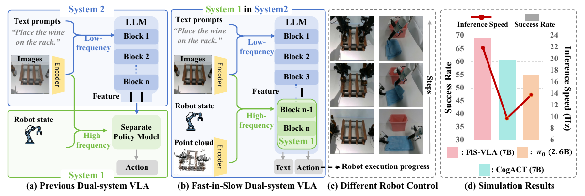

Figure 1. Dual-system 구조 비교, 로봇 동작 및 성공률·속도 요약. [PDF p.2, §1; 원문](https://proceedings.neurips.cc/paper_files/paper/2025/file/8cf3760422b9d4505589a97c8f9569e7-Paper-Conference.pdf#page=2)

첫 문단은 sensory data와 instruction을 control signal로 바꾸는 문제를 정의하고, VLM fine-tuning으로 생긴 VLA 계열의 장점과 병목을 제시한다. billion-scale parameters와 autoregressive action generation이 closed-loop responsiveness를 제한한다.

둘째 문단은 Kahneman의 System 1/2를 기능적 비유로 가져온다. 여기서 인지과학적 동일성을 주장하는 것이 아니라, “빠른 반응 경로”와 “느린 숙고 경로”라는 engineering abstraction을 쓴다. Figure 1(a)는 독립 policy head, (b)는 마지막 LLM block 재사용을 대비한다.

셋째 문단은 설계의 핵심이다. System 2는 저주기 2D+language를 읽어 latent condition을 만들고, System 1은 고주기 state+2D+3D를 읽는다. 3D point cloud는 별도 대형 3D encoder 대신 tokenizer 후 공유 vision encoder로 처리한다.

넷째 문단은 학습을 연속 action diffusion과 discrete autoregression의 병합으로 설명한다. pretraining은 860K+ trajectory, fine-tuning은 RLBench와 self-collected real data다. 마지막 문단과 contribution bullet은 architecture, modality/frequency, co-training의 세 축을 다시 고정한다.

Figure 1의 네 패널은 다음을 말한다.

- (a) 기존: VLM 전체가 low-frequency feature를 만들고 separate policy가 high-frequency action을 낸다.
- (b) FiS: VLM 마지막 block이 System 1에 포함되어 별도 policy model을 줄인다.
- (c) 여러 robot embodiment/control mode에서 같은 원리를 쓴다.
- (d) success-rate 대 inference-speed 위치에서 FiS가 우상단에 있다는 요약 도식이다. 정확한 수치는 Table 1이 근거다.

### 5.3 §2 Related Work [PDF p.3]

`Vision-language-action models` 단락은 robot learning의 계보를 proprioception 기반 RL, vision imitation, VLM-conditioned VLA로 이어 간다. autoregressive action은 불연속과 저주기 문제가 있고, diffusion/continuous policy head가 이를 완화한다. 3D observation과 large-scale pretraining은 spatial accuracy와 generalization을 높이는 별도 흐름이다.

`Dual-system design in VLA` 단락은 동기식과 비동기식을 구분한다.

- 동기식: System 2 latent와 System 1 action head가 같은 빈도로 호출된다.
- 비동기식: System 2를 덜 자주 호출하고 System 1이 latent를 재사용한다.
- FiS의 차별점: System 1 Transformer를 새로 붙이지 않고 System 2의 끝 block을 공유한다.

이 related-work framing은 novelty를 “dual system 자체”가 아니라 **파라미터가 공유된 nested dual path**에 둔다. 다만 3D tokenizer, diffusion action generation, action chunking, asynchronous reuse 각각은 기존 기술이다. 논문의 새로움은 이 조합의 연결 구조와 공동 최적화에 있다.

### 5.4 §3 Fast-in-Slow Dual-System VLA 개요 [PDF p.3-4, Fig.2]

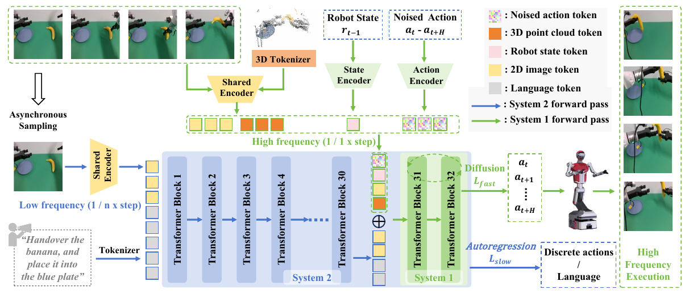

Figure 2. 비동기 관측, modality별 encoder, 공유 Transformer suffix와 두 학습 목적. [PDF p.4, §3; 원문](https://proceedings.neurips.cc/paper_files/paper/2025/file/8cf3760422b9d4505589a97c8f9569e7-Paper-Conference.pdf#page=4)

Figure 2를 왼쪽에서 오른쪽으로 읽으면 다음과 같다.

1. 저주기 RGB와 language가 shared encoder/tokenizer를 거쳐 LLaMA blocks 1-30으로 간다.
2. block 30 출력 $`z_s`$가 느린 comprehension latent다.
3. 고주기 RGB, point cloud, robot state, noisy actions가 각각 shared vision encoder, 3D tokenizer, state/action MLP를 거쳐 token sequence에 삽입된다.
4. 결합 sequence가 **같은 LLaMA blocks 31-32**를 통과한다.
5. diffusion head는 continuous action chunk를, autoregressive head는 discrete actions 또는 language plan을 학습한다.

파란 화살표는 full System 2 path, 초록 화살표는 fast System 1 path다. “System 1 in System 2”는 block 31-32가 물리적으로 두 복사본이라는 뜻이 아니다. 하나의 weight가 slow full pass와 fast suffix pass에서 재사용된다는 뜻이다.

### 5.5 §3.1 Problem Formulation [PDF p.4]

저자는 heterogeneous demonstrations에서 observation과 instruction을 조건으로 temporally extended action sequence를 최대우도 학습한다. 자세한 식은 [§6.1](#eq-imitation)에서 해설한다. 중요한 index 문제는 Eq. prose가 $`o_{t-1}`$을 쓰지만 §3.3은 time $`t`$의 instruction/scene이 미래 행동을 안내한다고 쓰는 점이다. 이는 한-step 지연을 엄밀히 정의한 것이 아니라 dataset alignment 표기의 느슨함으로 보인다.

### 5.6 §3.2 FiS-VLA Architecture [PDF p.4-5]

#### Vision encoder

224×224 RGB를 SigLIP와 DINOv2에 동시에 넣는다. SigLIP의 $`1024`$ channel은 semantic alignment, DINOv2의 $`1152`$ channel은 local/detail representation 역할로 설명된다. 같은 token index에서 channel concat하면 $`2176`$-dim feature가 되고, pretrained vision-language projector가 LLM hidden width로 사상한다.

#### Point cloud encoder

depth와 camera calibration으로 $`P=\{p_i\in\mathbb R^3\}_{i=1}^{N_p}`$를 만든다. 세 3D tokenizer block 각각이 FPS로 대표점을 고르고, kNN으로 local neighborhood를 모으고, learnable linear layer로 feature를 바꾼다. 그 token을 shared vision encoder와 projector로 통과시킨다.

여기서 “shared encoder”의 장점은 3D token을 pretrained 2D visual space를 통해 LLM 공간에 맞춘다는 것이다. 그러나 3D point를 2D ViT가 처리할 수 있게 만드는 정확한 token layout, 각 stage의 point count/k, feature dimension은 PDF에 없다.

#### LLM backbone과 부분 공유

LLaMA2-7B는 32개 decoder block이다. 기본 FiS는 앞 30개가 slow latent를 만들고, 마지막 2개가 fast path의 계산 core다. 동시에 System 2의 autoregressive output을 낼 때는 32개 전체가 필요하다. 마지막 2개를 “System 1로 떼어냈다”가 아니라, **System 2의 일부인 상태로 fast execution에도 재사용**한다.

#### MLP components

논문이 명시하는 보조 MLP는 다음과 같다.

- vision-language projector: 2D/3D feature를 LLM text embedding space로 투영.
- state encoder: proprioception $`r_t`$를 token embedding으로 투영.
- timestep encoder: diffusion $`\tau`$를 embedding으로 투영.
- action encoder: noised action $`\tilde a_\tau`$를 continuous token으로 투영.

공식 코드에서는 action/state embedder가 $`D_a\rightarrow4096\rightarrow4096`$ MLP이고, diffusion timestep은 sinusoidal 256-d feature 뒤 4096-d MLP, final head는 RMSNorm+MLP로 4096에서 $`D_a`$로 간다. 이는 [코드 확인]이며 PDF가 layer width와 activation을 모두 명시한 것은 아니다.

### 5.7 §3.3 Dual-System Coordination [PDF p.5-6]

#### Asynchronous frequency design

System 2는 instruction과 slow RGB를 block 30까지 처리해 $`z_s`$를 만든다. 이 latent는 다음 $`n`$번의 System 1 정책 호출에 재사용된다. System 1은 매 호출마다 최신 observation을 읽고 action chunk를 다시 생성한다. 저자는 $`n\in\{1,2,4,8\}`$을 실험하고 $`n=4`$를 선택한다.

중요하게도 논문은 robot hardware가 두 GPU 병렬 inference를 지원하지 않아 Helix처럼 두 시스템을 병렬 배치하지 않았다고 밝힌다. 따라서 “asynchronous”는 wall-clock 동시 실행이 아니라 호출률 분리와 latent reuse를 뜻한다. slow refresh가 있는 호출은 blocks 1-30도 먼저 실행하므로 latency spike가 생길 수 있지만 평균/꼬리 지연은 보고하지 않는다.

학습에서는 오래된 slow latent를 fast path가 해석하도록 asynchronous sampling을 사용한다. 그러나 sample offset 분포, 같은 trajectory에서 slow/fast frame을 고르는 규칙, 최대 staleness는 PDF에 없다. 공개 loader는 이미 `image_head_slow`와 `image_head_fast`로 저장된 필드를 읽으며, offset 생성 자체는 공개 경로에서 명확히 드러나지 않는다.

#### Heterogeneous modality input

System 2는 internet image-text pretraining과 맞는 language+2D를 받는다. System 1은 반응 제어를 위해 최신 2D, robot state, 3D point cloud를 받는다. 이렇게 역할과 입력을 맞추는 논리는 타당하다.

- language/slow RGB: 무엇을 해야 하는가, 어느 물체가 관련 있는가.
- fast RGB: 장면이 방금 어떻게 변했는가.
- state: 팔/그리퍼의 내부 상태와 시간 연속성.
- point cloud: 접촉 높이, 거리, orientation과 같은 metric geometry.

다만 RGB와 point cloud의 sensor timestamp 동기화, camera latency, extrinsic calibration 업데이트는 미기재다.

### 5.8 §3.4 Training Objective and Recipe [PDF p.6]

System 1은 Gaussian noise prediction diffusion을 학습하고, System 2는 discrete action token 또는 language plan의 next-token prediction을 학습한다. 두 loss를 가중치 없이 더한다. 자세한 줄별 해설은 [§6.3-6.5](#eq-fast)에서 한다.

pretraining은 OXE, DROID, RoboMIND 등을 섞은 860K+ trajectory, 36M frames, 5 epochs다. 구조 차이를 피하려고 single-view RGB만 쓴다. subgoal language가 없으므로 System 2는 discrete action sequence로 감독한다. downstream fine-tuning에서는 수동 annotation과 자동 augmentation으로 sub-task language plan을 추가할 수 있다.

여기서 “두 system input이 single image”라는 말은 pretraining modality가 downstream의 full RGB+PC+state와 다르다는 뜻이다. point cloud tokenizer와 real multi-view branch가 언제 어떤 데이터로 충분히 학습되는지, pretraining 단계에서 trainable/frozen 모듈이 무엇인지는 PDF에 완전히 적혀 있지 않다.

<a id="equations"></a>

## 6. 모든 수식의 줄별 해설

<a id="eq-imitation"></a>

### 6.1 비번호식: imitation-learning objective [PDF p.4, §3.1]

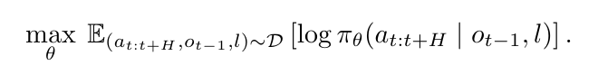

원문 비번호식. Demonstration의 조건부 action likelihood 최대화. [PDF p.4, §3.1; 원문](https://proceedings.neurips.cc/paper_files/paper/2025/file/8cf3760422b9d4505589a97c8f9569e7-Paper-Conference.pdf#page=4)

원문 식:

```math
\max_{\theta} \mathbb E_{(a_{t:t+H},\,o_{t-1},\,l)\sim\mathcal D} \left[ \log \pi_{\theta}(a_{t:t+H}\mid o_{t-1},l) \right].
```

줄별 의미:

1. $`\theta`$는 정책의 학습 파라미터다. 최적화는 demonstration action의 조건부 확률을 크게 만든다.
2. 기대값의 sample은 action sequence, 직전 관측, 언어 지시의 묶음이다. trajectory 전체가 아니라 학습 window가 한 sample이 될 수 있다.
3. $`\pi_\theta(a_{t:t+H}\mid o_{t-1},l)`$은 미래 action chunk의 joint conditional density/likelihood다. continuous diffusion에서는 이를 직접 normalized density로 계산하지 않고 denoising score/noise loss로 대체한다.
4. 로그는 trajectory likelihood의 곱을 합으로 바꾸어 최적화를 안정화한다.

**shape**: batch 기준 $`a\in\mathbb R^{B\times H\times D_a}`$로 보는 것이 구현과 맞다. 원문 $`t:t+H`$의 inclusive 표기는 $`H+1`$개처럼 보이는 표기 모호성이 있다.

**작은 예**: 상태와 지시가 같을 때 정답 action chunk A에 0.6, B에 0.3을 부여했다면 A sample의 log-likelihood는 $`\log0.6\approx-0.511`$이다. 최대화는 이 값을 0에 가깝게 만든다.

**edge case**: multimodal demonstration이 서로 다른 embodiment/control space를 가지면 같은 $`a`$ 좌표가 다른 의미를 갖는다. 논문은 action reformulation과 normalization을 언급하지만 embodiment id, exact mask, coordinate convention을 식에 넣지 않는다.

### 6.2 비번호식: vision/point/action 정의 [PDF p.4-5, §3.1-3.2]

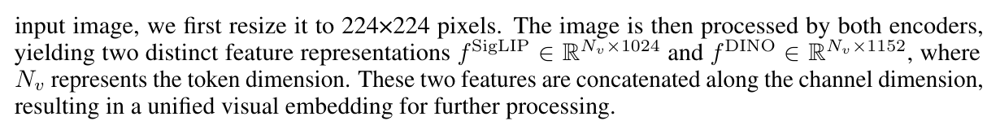

원문 비번호식. 두 vision feature의 차원 표기를 포함한 인쇄 문장 발췌. [PDF p.5, §3.2 Vision encoder; 원문](https://proceedings.neurips.cc/paper_files/paper/2025/file/8cf3760422b9d4505589a97c8f9569e7-Paper-Conference.pdf#page=5)

원문의 주요 inline/display 관계를 합치면 다음과 같다.

```math
f^{\mathrm{SigLIP}}\in\mathbb R^{N_v\times1024},\qquad f^{\mathrm{DINO}}\in\mathbb R^{N_v\times1152},
```

```math
f^{\mathrm{vis}}=\mathrm{Concat}_{\mathrm{channel}} \left(f^{\mathrm{SigLIP}},f^{\mathrm{DINO}}\right) \in\mathbb R^{N_v\times2176}.
```

두 feature는 token 축이 아니라 channel 축으로 붙는다. token 위치가 대응한다는 가정이 필요하며, 서로 다른 encoder의 patch ordering/resolution을 같은 $`N_v`$로 맞춰야 한다. projector는 이를 $`N_v\times d`$로 바꾼다.

point cloud 정의:

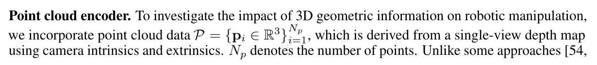

원문 비번호식. Point cloud 집합과 점 개수의 정의를 포함한 인쇄 문장 발췌. [PDF p.5, §3.2 Point cloud encoder; 원문](https://proceedings.neurips.cc/paper_files/paper/2025/file/8cf3760422b9d4505589a97c8f9569e7-Paper-Conference.pdf#page=5)

```math
P=\{p_i\in\mathbb R^3\}_{i=1}^{N_p}.
```

$`p_i=(x_i,y_i,z_i)`$는 camera 또는 robot/world 좌표계의 점이다. depth pixel $`(u,v,z)`$에서 intrinsics $`K`$를 쓰면 [해설용 수식]

```math
p_i^{\mathrm{cam}}=z_iK^{-1}[u_i,v_i,1]^\top, \qquad p_i^{\mathrm{world}}=T_{\mathrm{cam}\rightarrow\mathrm{world}}p_i^{\mathrm{cam}}.
```

이 식은 이해를 위한 표준 역투영이며 원문 번호식이 아니다. calibration 오차가 있으면 point token 자체가 체계적으로 이동한다.

RLBench action은 [해설용 표기]

```math
a_t=[\Delta x,\Delta y,\Delta z,\phi,\theta,\psi,g]\in\mathbb R^7,
```

로 읽을 수 있다. $`g`$는 open/closed다. rotation의 Euler order와 단위는 미기재다.

### 6.3 비번호식: diffusion forward noising [PDF p.6, §3.4]

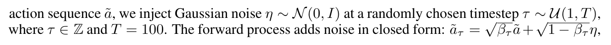

원문 비번호식. Noise/timestep sampling과 forward noising을 포함한 두 인쇄 줄. [PDF p.6, §3.4; 원문](https://proceedings.neurips.cc/paper_files/paper/2025/file/8cf3760422b9d4505589a97c8f9569e7-Paper-Conference.pdf#page=6)

원문 식:

```math
\tau\sim\mathcal U(1,T),\qquad \eta\sim\mathcal N(0,I),\qquad T=100,
```

```math
\tilde a_\tau=\sqrt{\beta_\tau}\,\tilde a+ \sqrt{1-\beta_\tau}\,\eta.
```

연산 순서:

1. clean normalized chunk $`\tilde a`$와 같은 shape의 Gaussian noise $`\eta`$를 뽑는다.
2. robot time과 무관한 diffusion index $`\tau`$를 뽑는다.
3. clean action은 $`\sqrt{\beta_\tau}`$, noise는 $`\sqrt{1-\beta_\tau}`$로 scale한다.
4. 두 tensor를 elementwise 더해 noised action token을 만든다.

**표기 주의**: 표준 DDPM은 보통

```math
x_\tau=\sqrt{\bar\alpha_\tau}x_0+\sqrt{1-\bar\alpha_\tau}\epsilon
```

이라고 쓴다. 원문은 이 clean-signal 누적계수를 $`\beta_\tau`$라고 부르지만, 통상 $`\beta_\tau`$는 한 step의 noise variance를 뜻한다. 공개 코드는 실제로 `sqrt_alphas_cumprod`와 `sqrt_one_minus_alphas_cumprod`를 사용한다. 따라서 원문의 $`\beta_\tau`$는 구현상 $`\bar\alpha_\tau`$에 대응하는 것으로 보는 것이 맞다. 원문 표기를 조용히 $`\bar\alpha`$로 고치면 안 된다.

**수치 예**: $`H=2,D_a=1`$, $`\tilde a=[0.2,-0.4]`$, $`\beta_\tau=0.64`$, $`\eta=[1,-0.5]`$라 하자. $`\sqrt{0.64}=0.8`$, $`\sqrt{0.36}=0.6`$이므로

```math
\tilde a_\tau=0.8[0.2,-0.4]+0.6[1,-0.5]=[0.76,-0.62].
```

**edge cases**:

- $`\beta_\tau\rightarrow1`$: 입력은 거의 clean action인데 target은 여전히 noise다. 작은 noise를 정확히 분리해야 한다.
- $`\beta_\tau\rightarrow0`$: 입력은 거의 pure noise이며 condition $`c`$가 행동 구조를 복원해야 한다.
- 논문은 schedule을 “predefined”라고만 한다. 공개 코드는 cosine `squaredcos_cap_v2`를 사용하지만 최종 실험 PDF의 확정 조건으로 단정할 수 없다.

<a id="eq-fast"></a>

### 6.4 Eq.(1): fast diffusion loss [PDF p.6, Eq.(1)]

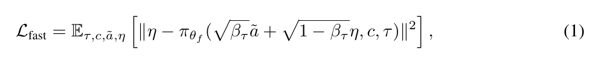

원문 Eq. (1). Fast diffusion의 noise-prediction objective. [PDF p.6, §3.4; 원문](https://proceedings.neurips.cc/paper_files/paper/2025/file/8cf3760422b9d4505589a97c8f9569e7-Paper-Conference.pdf#page=6)

원문 식:

```math
\mathcal L_{\mathrm{fast}} = \mathbb E_{\tau,c,\tilde a,\eta} \left[ \left\| \eta- \pi_{\theta_f} \left( \sqrt{\beta_\tau}\tilde a+ \sqrt{1-\beta_\tau}\eta, c,\tau \right) \right\|_2^2 \right]. \qquad\text{(1)}
```

각 항:

- $`\pi_{\theta_f}`$는 noised action, condition, timestep을 받아 noise를 예측하는 System 1이다.
- $`c=(z_s,x_f)`$로 볼 수 있다. $`z_s`$는 저주기 System 2 latent, $`x_f`$는 고주기 RGB/PC/state condition이다.
- 출력 shape는 $`\eta`$와 같은 $`[B,H,D_a]`$여야 한다.
- $`\|\cdot\|_2^2`$는 모든 action/time coordinate의 squared error다. 공개 코드는 전체 원소 mean을 취한다.

왜 noise를 예측하는가? 여러 가능한 action mode를 평균 action 하나로 회귀하지 않고, random noise에서 조건부 action sample로 가는 역과정을 배울 수 있기 때문이다. training에서 임의 $`\tau`$ 한 지점을 학습하면 전체 reverse chain을 근사할 수 있다.

앞 예시에서 모델 예측이 $`\hat\eta=[0.9,-0.4]`$라면

```math
\eta-\hat\eta=[0.1,-0.1],\qquad \mathrm{MSE}=\frac{0.1^2+(-0.1)^2}{2}=0.01.
```

**gradient 경로**: detach가 없다면 $`\mathcal L_{\mathrm{fast}}`$는 final action MLP, blocks 31-32, action/timestep/state encoders, fast RGB/point encoders뿐 아니라 $`z_s`$를 만든 blocks 1-30과 slow visual path에도 흐를 수 있다. 이것이 “fast가 slow 안에 있다”는 학습상의 의미다. 다만 freeze 설정에 따라 실제 update되는 모듈은 달라진다.

**edge cases와 미기재**:

- gripper binary dimension에도 Gaussian diffusion/MSE를 그대로 쓰는지 별도 weighting은 PDF에 없다.
- translation, rotation, gripper의 단위가 달라 normalization이 필수지만 scale 통계는 미기재다.
- action mask/padding 처리, loss coordinate weight, EMA model 사용 여부가 미기재다.
- inference reverse solver와 step 수는 본문에 없다. 공개 test script는 DDIM 4 steps를 예시로 쓴다.

### 6.5 Eq.(2): slow autoregressive loss [PDF p.6, Eq.(2)]

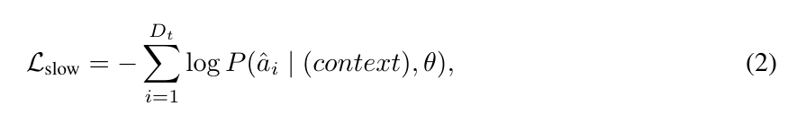

원문 Eq. (2). Discrete action 또는 language-plan token의 autoregressive objective. [PDF p.6, §3.4; 원문](https://proceedings.neurips.cc/paper_files/paper/2025/file/8cf3760422b9d4505589a97c8f9569e7-Paper-Conference.pdf#page=6)

원문 식:

```math
\mathcal L_{\mathrm{slow}} =- \sum_{i=1}^{D_t} \log P(\hat a_i\mid \mathrm{context},\theta). \qquad\text{(2)}
```

각 항:

- $`D_t`$는 discrete action target 또는 language plan의 token 길이다. diffusion $`T`$나 robot $`t`$가 아니다.
- $`\hat a_i`$는 $`i`$번째 ground-truth token이다. language plan을 쓸 때 기호가 action처럼 보이지만 실제 target은 wordpiece일 수 있다.
- `context`는 language prompt, slow RGB, 앞선 target token과 필요한 multimodal embedding을 포함한다.
- $`P`$는 LLM softmax가 주는 next-token probability다.

Autoregressive factorization을 펼치면 [해설용 수식]

```math
P(\hat a_{1:D_t}\mid c)= \prod_{i=1}^{D_t}P(\hat a_i\mid c,\hat a_{\lt i}),
```

이고 음의 로그를 취하면 Eq.(2)의 합이 된다.

**수치 예**: 두 target token의 확률이 0.8, 0.5면 sum loss는

```math
-\log0.8-\log0.5\approx0.223+0.693=0.916.
```

token mean이면 0.458이다. 원문 식은 sum을 쓰지만 공개 Hugging Face `output.loss`는 보통 valid token mean이다. 이 정규화 차이는 Eq.(3)의 상대 가중치에 영향을 주므로 재현 시 확인해야 한다.

**gradient 역할**: blocks 1-32와 LM head가 next-token 예측을 유지하도록 압력을 준다. 특히 shared blocks 31-32가 diffusion 전용 표현으로만 변하는 것을 막는다. 그러나 이 loss가 internet-scale reasoning 전반을 보존한다는 보장은 없으며, robot-domain token prediction을 보존하는 직접 목적이다.

### 6.6 Eq.(3): 전체 dual-aware objective [PDF p.6, Eq.(3)]

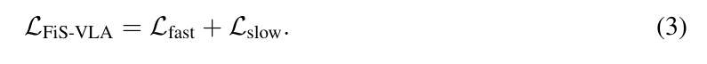

원문 Eq. (3). 두 objective를 합친 dual-aware training loss. [PDF p.6, §3.4; 원문](https://proceedings.neurips.cc/paper_files/paper/2025/file/8cf3760422b9d4505589a97c8f9569e7-Paper-Conference.pdf#page=6)

원문 식:

```math
\mathcal L_{\mathrm{FiS-VLA}} =\mathcal L_{\mathrm{fast}}+\mathcal L_{\mathrm{slow}}. \qquad\text{(3)}
```

두 objective의 coefficient가 모두 1이다. 공개 training loop도 diffusion MSE에 `output.loss`를 그대로 더한다. [코드 확인] 따라서 실제 균형은 각 loss의 reduction, token 수, repeated diffusion samples에 의해 암묵적으로 정해진다.

더 일반적인 [해설용 수식]은

```math
\mathcal L=\lambda_f\mathcal L_{\mathrm{fast}}+ \lambda_s\mathcal L_{\mathrm{slow}}
```

이지만, 논문은 $`\lambda_f,\lambda_s`$ sweep을 하지 않는다. 한쪽 scale이 지나치게 크면 다음 문제가 생긴다.

- $`\lambda_f`$ 지배: action은 맞지만 AR language/discrete generation이 망가질 수 있다.
- $`\lambda_s`$ 지배: VLM token loss는 좋아도 continuous control gradient가 약해질 수 있다.

Eq.(3)은 단순 합이지만, 같은 blocks 31-32에 두 gradient가 들어간다는 점이 방법의 중심이다. gradient cosine similarity나 conflict 완화는 분석하지 않는다.

<a id="forward-pass"></a>

## 7. 실제 forward pass를 tensor 단위로 추적하기

이 절은 Fig.2와 공개 구현을 함께 읽어, 그림의 화살표가 실제로 어떤 tensor를 만들고 어디에 재사용되는지 복원한 것이다. 아래 shape에서 $`B`$는 batch, $`N_v`$는 image patch token 수, $`N_p`$는 point token 수, $`L_s`$는 slow sequence length, $`H`$는 action chunk 길이, $`D_a`$는 한 step의 action 차원, $`d`$는 LLM hidden size다. 논문은 모든 중간 shape를 숫자로 명시하지 않으므로, 명시값과 기호값을 구분한다.

### 7.1 Slow/System 2 경로: language와 RGB로 latent를 만든다

1. **입력 구성**: instruction $`l`$, 저주기로 갱신되는 slow RGB image $`o^{2D}_{t-1}`$, 필요하면 teacher-forced discrete action 또는 language-plan token을 준비한다.
2. **이중 vision feature**: 224×224 image를 SigLIP과 DINOv2에 각각 넣어 patch당 1,024차원과 1,152차원 feature를 얻는다. 같은 patch 위치끼리 concatenate하여 $`[B,N_v,2176]`$을 만든다.
3. **projector**: MLP가 2,176차원을 LLM embedding 차원 $`d`$로 사상한다. text embedding과 함께 한 sequence로 배치되므로 slow transformer 입력은 개념적으로 $`[B,L_s,d]`$다.
4. **blocks 1-30**: LLaMA2-7B의 앞 30개 block이 전체 slow context를 처리한다. 공개 구현에서 `llm_middle_layer=30`일 때 이 지점의 hidden tensor가 slow latent $`z_s`$다.
5. **blocks 31-32 + LM head**: System 2의 autoregressive branch는 같은 $`z_s`$를 마지막 두 block에 계속 통과시켜 language plan 또는 discrete token을 예측한다. Eq.(2)가 이 branch를 학습한다.
6. **latent 보관**: 비동기 실행에서는 $`z_s`$를 여러 fast call 동안 재사용한다. 이것은 attention key/value cache라기보다 **30번째 block까지 계산된 hidden sequence cache**다.

중요한 해석은 System 2가 “앞 30개 block”만을 뜻하지 않는다는 것이다. 완전한 slow autoregressive 모델은 32개 block 전체를 사용한다. System 1이 그 안의 마지막 2개 block을 다시 사용하므로, 집합 관계는

```math
\text{System 1 blocks}=\{31,32\}\subset \text{System 2 blocks}=\{1,\ldots,32\}.
```

이다. 제목의 *Fast-in-Slow*는 이 포함 관계를 가리킨다.

### 7.2 Fast/System 1 경로: 최신 상태와 noisy action을 suffix에 주입한다

한 diffusion denoising step에서 fast branch는 다음 입력을 조합한다.

- cached slow latent $`z_s\in\mathbb R^{B\times L_s\times d}`$,
- 최신 fast RGB embedding $`e^{2D}_t\in\mathbb R^{B\times N_v\times d}`$,
- point-cloud embedding $`e^{3D}_t\in\mathbb R^{B\times N_p\times d}`$,
- robot state token $`e^s_t`$,
- diffusion timestep token $`e^\tau`$,
- noisy action-token sequence $`e^a(\tilde a_\tau)\in\mathbb R^{B\times H\times d}`$.

공개 구현에 대응시키면 concat 이후의 개념적 tensor는

```math
x_f=\mathrm{concat} (z_s,e^{3D}_t,e^{2D}_t,e^s_t,e^\tau,e^a_\tau) \in\mathbb R^{B\times L_f\times d},
```

```math
L_f=L_s+N_p+N_v+N_s+N_\tau+H.
```

이다. 이 sequence를 새 32-block VLM에 처음부터 통과시키지 않고, 공유된 blocks 31-32에만 넣는다. 마지막 action 위치의 hidden을 MLP로 투영해 $`\hat\eta\in\mathbb R^{B\times H\times D_a}`$를 예측한다. Eq.(1)이 이 값을 실제 Gaussian noise와 맞춘다.

### 7.3 “공유”의 정확한 뜻

공유 대상은 같은 모양의 별도 copy가 아니라 **동일한 마지막 두 transformer block parameter**다.

- slow loss는 blocks 1-30 → shared blocks 31-32 → LM head를 사용한다.
- fast loss는 cached $`z_s`$ + fast tokens → shared blocks 31-32 → action head를 사용한다.
- 따라서 blocks 31-32는 언어적/고수준 표현과 연속 제어 표현을 동시에 받아야 한다.
- 공개 코드에서 fast loss 경로의 $`z_s`$에 명시적 `detach`가 보이지 않으므로, joint full fine-tuning이라면 fast gradient가 blocks 1-30에도 도달할 수 있다. 다만 이는 공개 snapshot을 읽은 결론이며 논문 본문이 gradient graph를 명시한 것은 아니다.

Table 6의 independent-copy 변형은 이 마지막 block들을 복제해 fast 전용으로 만든다. 하지만 copied block이 원래 학습 때 보던 layer-30 hidden 대신 System 2의 더 뒤 출력에 가까운 입력을 받을 수 있어, 그 비교는 “공유 유무”뿐 아니라 **입력 분포의 정렬 정도**도 함께 바꿀 가능성이 있다. 따라서 .69 대 .61/.59를 순수한 weight sharing 효과로만 읽는 것은 과하다.

### 7.4 한 control cycle의 구체 예

$`H=8`$, slow:fast ratio가 1:4, DDIM step 수가 4라고 하자.

1. fast call 0에서 slow RGB와 instruction으로 $`z_s`$를 갱신한다.
2. 현재 fast RGB, point cloud, state를 token화한다.
3. $`[B,8,D_a]`$ Gaussian noise에서 시작해 shared blocks 31-32/action head를 4번 호출하며 DDIM reverse update를 한다.
4. 얻은 8개 action을 환경에 순차 실행한다.
5. fast call 1-3에서는 $`z_s`$를 그대로 쓰고 최신 관측으로 action chunk만 다시 만든다.
6. fast call 4에서야 System 2를 다시 호출해 $`z_s`$를 갱신한다.

공개 시뮬레이션 loop에서는 counter가 **chunk 실행 뒤에** 증가하고 slow refresh가 `slow_cnt % ratio == 0`일 때 발생한다. 따라서 $`H=8`$이면 최대 4 chunks, 즉 32 low-level actions 동안 같은 slow latent가 유지될 수 있다. 이는 “1:4”가 robot servo tick 네 번이 아니라 **policy invocation 네 번**이라는 뜻이다. [고정 commit의 실행 loop](https://github.com/CHEN-H01/Fast-in-Slow/blob/14f73b3e6ebe5e44464e7958b4d086e7dda21941/scripts/sim.py#L209-L260)

### 7.5 경계 조건과 실패 가능한 shape

- $`H`$가 바뀌면 action-token 수와 action-head 출력 shape가 함께 바뀐다. padding/mask 규칙이 필요하지만 논문은 상세히 쓰지 않는다.
- $`z_s`$의 sequence length가 instruction 길이나 image tokenization에 따라 달라지면 compiled static engine에서는 bucket 또는 padding이 필요하다.
- point-cloud tokenizer가 1,024 raw points를 그대로 1,024 LLM tokens로 만드는지는 명시되지 않는다. FPS/kNN block의 downsample schedule이 재현에 필요하다.
- fast RGB와 point cloud의 timestamp가 어긋나면 동일 장면의 2D/3D token이라는 가정이 깨진다. hardware synchronization 오차는 보고되지 않았다.
- 오래된 $`z_s`$와 최신 $`e^{2D}_t,e^{3D}_t,e^s_t`$가 모순될 때 어떤 token을 우선하는지 명시적 gate가 없다. shared attention이 암묵적으로 해결해야 한다.

<a id="training-inference"></a>

## 8. 학습과 추론 알고리즘을 분리해서 읽기

### 8.1 학습 sample 구성

한 학습 example은 대략 다음 묶음이다.

```math
(l,o^{2D}_{t-1},o^{2D}_t,o^{3D}_t,s_t,a_{t:t+H},y^{slow}).
```

$`y^{slow}`$는 discrete robot-action token 또는 language-plan token이다. 논문은 slow와 fast 관측 시점을 일부러 다르게 뽑아 비동기 실행을 흉내 낸다고 설명하지만, offset 분포, 최대 지연, 동일 trajectory 안 sampling 규칙은 주지 않는다. 이는 구현 복제에서 가장 큰 숨은 변수 중 하나다.

학습 절차는 다음으로 복원된다.

1. slow RGB와 language를 blocks 1-30에 넣어 $`z_s`$를 계산한다.
2. $`z_s`$를 blocks 31-32/LM head에 넣어 slow target의 cross-entropy $`\mathcal L_{slow}`$를 계산한다.
3. action chunk를 정규화하고 $`\tau\sim U\{1,\ldots,T\}`$와 $`\eta\sim\mathcal N(0,I)`$를 뽑아 $`\tilde a_\tau`$를 만든다.
4. $`z_s`$, 최신 fast multimodal tokens, $`\tilde a_\tau`$, timestep을 blocks 31-32/action head에 넣어 $`\hat\eta`$를 만든다.
5. $`\mathcal L_{fast}=\mathrm{MSE}(\eta,\hat\eta)`$를 계산한다.
6. 두 loss를 합해 한 번 역전파한다.

공개 training strategy에서 실제 합은 diffusion loss에 Hugging Face `output.loss`를 더하는 형태다. [공개 training loss 합산](https://github.com/CHEN-H01/Fast-in-Slow/blob/14f73b3e6ebe5e44464e7958b4d086e7dda21941/training/strategies/base_strategy.py#L298-L313) 논문 Eq.(1)의 합과 코드의 `.mean()` MSE, Eq.(2)의 합과 framework token mean 사이에는 reduction 차이가 있으므로 같은 coefficient 1이더라도 gradient scale은 식만 보고 재현할 수 없다.

### 8.2 initialization과 fine-tuning

- backbone은 Prismatic VLM이며 vision tower는 SigLIP+DINOv2, language backbone은 LLaMA2-7B다.
- fast branch용 last-$`K`$ transformer는 별도 random module이 아니라 pretrained block을 공유한다.
- point tokenizer, state/timestep/action encoders와 action head는 VLA adaptation을 위해 붙는 모듈이다.
- 본문은 RLBench에서 full-parameter fine-tuning, 300 epochs, AdamW, mixed precision, 8×A800을 보고한다.
- 공개 `train.sh` snapshot은 `--unfreeze_llm True`, `--unfreeze_vision True`, learning rate $`2\times10^{-5}`$, per-device batch 6, 8 GPU, action chunk 1, repeated diffusion sampling 4, language subgoal 사용을 예시한다. 이는 **공개 기본 script**이지 모든 논문 표의 정확한 실행 manifest임을 보장하지 않는다. [공개 train script](https://github.com/CHEN-H01/Fast-in-Slow/blob/14f73b3e6ebe5e44464e7958b4d086e7dda21941/train.sh)

보고된 global batch를 script 그대로 해석하면 gradient accumulation이 없을 때 $`6\times8=48`$이다. 그러나 effective batch, optimizer betas/weight decay, scheduler, warm-up, seed, checkpoint selection rule, 학습 시간과 peak memory는 PDF에 충분히 고정되어 있지 않다.

### 8.3 추론: diffusion reverse process

논문은 forward noising을 주지만 reverse update의 식, solver 종류, inference step 수를 본문에 고정하지 않는다. 공개 RLBench test script는 $`T=100`$ training diffusion steps와 DDIM 4-step sampling, `ratio=4`, `llm_middle_layer=30`, fast point cloud/state 사용을 예시한다. [공개 test script](https://github.com/CHEN-H01/Fast-in-Slow/blob/14f73b3e6ebe5e44464e7958b4d086e7dda21941/test_rlbench.sh)

DDIM 4 steps는 action을 네 번 실행한다는 뜻이 아니다. 같은 observation/action-noise bundle을 대상으로 neural network를 네 번 평가해 **하나의 action chunk**를 복원한다. 공개 diffusion implementation의 forward sampling은 standard cumulative-$`\alpha`$ 계수를 사용한다. [공개 `q_sample`](https://github.com/CHEN-H01/Fast-in-Slow/blob/14f73b3e6ebe5e44464e7958b4d086e7dda21941/models/diffusion/models.py#L205-L230)

### 8.4 비동기 실행은 병렬 실행과 다르다

논문의 asynchronous는 두 시스템의 **update frequency가 다름**을 뜻한다. Fig.2의 시간축에서 slow latent가 유지되는 동안 fast action은 여러 번 갱신된다. 공개 평가 loop는 한 GPU에서 slow call이 필요한 경우 먼저 끝낸 뒤 fast diffusion call을 수행하는 순차 구조다. 따라서 다음을 구분해야 한다.

- **multi-rate/asynchronous semantics**: System 2는 매 $`r`$번째 policy call에만 갱신한다.
- **hardware concurrency**: 두 GPU stream/device가 동시에 계산한다.

논문은 앞 항목을 구현·평가했으며 뒤 항목은 입증하지 않았다. System 2 refresh가 있는 call은 없는 call보다 느릴 가능성이 크므로 평균 action/s 하나로는 control jitter를 알 수 없다.

### 8.5 open-loop chunk 실행의 의미

공개 `sim.py`는 policy가 반환한 `actions`를 `for action in actions` loop로 모두 실행한 뒤 다음 perception/policy call로 넘어간다. 따라서 $`H\gt 1`$에서는 chunk 내부 action 사이에 새 image/point cloud를 받아 재계획하지 않는다. 이 선택은 effective action throughput을 높이지만 접촉·충돌·물체 미끄러짐 같은 빠른 외란에 대한 closed-loop bandwidth를 낮춘다.

또한 공개 loop의 `cur_robot_state`가 chunk 실행 과정에서 predicted target/action으로 갱신되는 부분은 실제 센서에서 매 action 뒤 읽은 state와 동일하다고 단정하기 어렵다. 실제 로봇 deployment에서는 measured joint/EEF state의 timestamp와 command state를 분리해 검증해야 한다.

### 8.6 재현 가능한 의사코드

```text
initialize slow_cache = None, policy_call = 0
while episode_not_done:
    obs = get_synchronized_rgb_depth_state()

    if slow_cache is None or policy_call % r == 0:
        slow_tokens = tokenize(language, slow_rgb(obs))
        slow_cache = LLM_blocks_1_to_30(slow_tokens)
        slow_logits = LLM_blocks_31_to_32_then_LM_head(slow_cache)

    fast_tokens = tokenize(fast_rgb(obs), point_cloud(obs), state(obs))
    noisy_actions = normal(shape=[1, H, Da])

    for tau in ddim_schedule:              # public example: 4 evaluations
        eps_hat = shared_blocks_31_to_32(
            concat(slow_cache, fast_tokens,
                   timestep(tau), action_embed(noisy_actions)))
        noisy_actions = ddim_update(noisy_actions, eps_hat, tau)

    action_chunk = denormalize(noisy_actions)
    for action in action_chunk:             # open loop within the chunk
        send_to_robot(action)

    policy_call += 1
```

이 의사코드는 개념 전달용이다. collision check, termination detector, gripper threshold, observation normalization, latency deadline, emergency stop 같은 실제 deployment 항목은 반드시 별도로 넣어야 한다.

<a id="experiments"></a>

## 9. 실험·부록 전수 해설과 수치 검산

### 9.1 §4 Experiments의 평가 질문

실험은 네 질문으로 구성된다.

1. RLBench에서 기존 VLA보다 성공률과 inference rate가 모두 높은가?
2. fast block 수, modality, slow:fast ratio, slow loss가 실제로 필요한가?
3. 두 종류의 실제 양팔 로봇과 서로 다른 action representation에서도 작동하는가?
4. 보지 못한 object/background/lighting 변화에 일반화하는가?

이 구성은 방법의 주요 구성요소를 폭넓게 건드린다는 장점이 있다. 반면 baseline과 FiS의 wall-clock 조건, variance 산출 방식, 동일 seed·동일 data-order, latency warm-up/동기화 같은 공정성 정보를 충분히 주지는 않는다.

### 9.2 §4.1 Simulation Experiment [PDF p.7, Table 1]

#### 데이터와 protocol

- 환경: CoppeliaSim 기반 RLBench, Franka Panda arm.
- 과제 10개: Close box, Close laptop lid, Toilet seat down, Sweep to dustpan, Close fridge, Phone on base, Take umbrella out, Frame off hanger, Wine at rack, Water plants.
- 관측: front-view RGB와 point cloud. FiS RGB는 224×224, point cloud는 1,024 points로 downsample한다.
- 수집: predefined waypoint와 OMPL을 이용하고 prior work의 keyframe/frame sampling을 따른다.
- 학습량: 과제당 100 trajectories, multi-task setting.
- FiS 학습: 300 epochs, AdamW, mixed precision, 8×NVIDIA A800, full fine-tuning.
- 평가: latest epoch checkpoint로 task당 20 rollouts를 수행하고 이를 세 번 반복한다고 쓴다. 즉 방법당 nominal 600 rollouts지만, 표의 `±`가 세 반복의 표준편차인지 표준오차인지 명시하지 않는다.
- 속도: RTX 4090, action chunk $`H=1`$. batch size, precision, diffusion steps, CUDA synchronization, warm-up, image/point preprocessing 포함 여부는 표 캡션에 없다.

#### Table 1 전체 결과

| 모델 | Close box | Laptop | Toilet | Sweep | Fridge | Phone | Umbrella | Frame | Wine | Water | 평균±표기 변동 | 속도 |
|---|---:|---:|---:|---:|---:|---:|---:|---:|---:|---:|---:|---:|
| ManipLLM | .50 | .80 | .40 | .20 | .80 | .35 | .10 | .25 | .15 | .20 | .38±.04 | 2.2 Hz |
| OpenVLA | .65 | .40 | .75 | .50 | .80 | .20 | .35 | .15 | .10 | .10 | .40±.04 | 6.3 Hz |
| $`\pi_0`$ | .90 | .80 | .95 | .30 | .85 | .30 | .30 | .70 | .10 | .30 | .55±.03 | 13.8 Hz |
| CogACT | .90 | .80 | .95 | .50 | .85 | .50 | .55 | .45 | .30 | .25 | .61±.04 | 9.8 Hz |
| **FiS-VLA** | **1.00** | **1.00** | .95 | **.55** | **.90** | .50 | .50 | **.70** | **.55** | .20 | **.69±.03** | **21.9 Hz** |

직접 산술평균하면 FiS는 .685, CogACT는 .605이며 표의 두 자리 반올림 .69와 .61에 맞는다. FiS의 절대 차이는 CogACT 대비 8.0 percentage points, 상대 증가는 약 13.2%다.

다만 본문 표현 “10개 중 8개 task에서 superior”는 엄격한 `>`와 `≥`를 구분해야 한다.

- 각 task의 최고 baseline보다 **엄격히 높은 것**: Close box, Laptop, Sweep, Fridge, Wine의 5개.
- 최고 baseline과 **동률 이상**: 위 5개에 Toilet, Phone, Frame을 더한 8개.
- 뒤지는 것: Umbrella(.50 vs CogACT .55), Water(.20 vs $`\pi_0`$ .30/CogACT .25).

따라서 가장 정확한 문장은 “5개 strict win, 3개 tie, 2개 loss”다. `superior`를 strict 우월로 읽으면 과장이고, top-performing을 tie 포함으로 읽으면 8/10이다.

속도 배율은 $`21.9/13.8=1.59\times`$ 대 $`\pi_0`$, $`21.9/9.8=2.23\times`$ 대 CogACT다. 하지만 서로 다른 architecture의 parameter 수, diffusion evaluations, preprocessing scope가 한 표에 고정되지 않아 **시스템 수준 동등 조건 속도 비교**로는 불완전하다.

### 9.3 §4.2 Ablation Study [PDF p.8, Fig.3; Appendix Table 8-10]

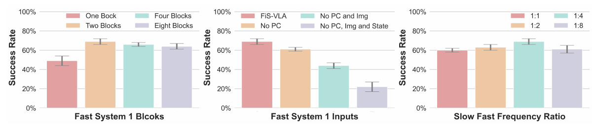

Figure 3. 세 ablation의 성공률과 원문 error bar·범례. [PDF p.8, §4.2; 원문](https://proceedings.neurips.cc/paper_files/paper/2025/file/8cf3760422b9d4505589a97c8f9569e7-Paper-Conference.pdf#page=8)

Fig.3은 세 막대그래프와 본문 training-strategy ablation을 통해 구조의 핵심을 나눈다.

#### (1) fast System 1 block 수 — Table 8

| 공유 suffix block 수 | 평균 성공률±표기 변동 | 해석 |
|---:|---:|---|
| 1 | .49±.05 | capacity가 부족하거나 interface adaptation이 부족 |
| **2** | **.69±.03** | 기본 FiS, 최고 |
| 4 | .66±.02 | 더 깊다고 자동 개선되지 않음 |
| 8 | .64±.03 | 계산 증가와 task interference 가능 |

저자는 두 block에서 성능이 포화된다고 설명한다. 실제 수치는 2에서 정점을 찍고 이후 하락하므로 “포화”보다 **작은 non-monotonic optimum**이 더 정확하다. 파라미터 수·latency를 x축에 함께 보고하지 않아 Pareto curve를 완전히 재구성할 수는 없다.

#### (2) fast input modality — Table 9

| System 1에서 제거한 입력 | 평균 성공률±표기 변동 | FiS 대비 변화 |
|---|---:|---:|
| 없음: FiS | .69±.03 | 기준 |
| point cloud | .61±.02 | -8 pp |
| point cloud + image | .44±.03 | -25 pp |
| point cloud + image + state | **표 기재 .22±.05** | 표 기재상 -47 pp |

순차 제거 결과는 geometry, current image, proprioception이 모두 유용하다는 방향을 지지한다. 그러나 단독 modality의 독립 기여나 상호작용을 알려면 모든 조합의 factorial ablation이 필요하다.

더 중요한 원문 수치 오류가 있다. 마지막 행의 task별 값은

```math
.50+.30+.15+.00+.65+.05+.55+.45+.00+.00=2.65,
```

따라서 평균은 $`2.65/10=.265\approx.27`$이다. Table 9와 Fig.3은 .22로 표시한다. 행 값, 평균, 그래프 중 무엇이 맞는지 원자료 없이는 결정할 수 없다. 재현 시 반드시 authors의 raw evaluation log로 정정해야 한다.

#### (3) System 2:System 1 빈도 — Table 10

| slow:fast ratio | 평균 성공률±표기 변동 |
|---:|---:|
| 1:1 | .60±.02 |
| 1:2 | .63±.03 |
| **1:4** | **.69±.03** |
| 1:8 | .61±.04 |

1:1보다 1:4가 좋은 점은 단순 계산 절약만으로 설명되지 않는다. 저자는 fast module에 더 빈번하고 정보가 풍부한 observation을 주는 효과를 말한다. 다만 모든 ratio에서 총 action update 수·wall-clock·data sampling이 같은지, System 2 refresh 시점의 lag가 어떻게 생성되는지 불명확하다. 1:8 하락은 stale high-level latent의 위험을 보여 준다.

#### (4) dual-aware training과 plan supervision

- $`\mathcal L_{slow}`$ 제거: .69 → .62, -7 pp.
- discrete-action supervision: .69.
- Gemini가 자동 생성하고 사람이 검수한 task-plan supervision: .73, +4 pp.

이 결과는 slow auxiliary target이 fast policy를 돕는다는 evidence다. 그러나 “reasoning capability 보존”을 직접 측정한 VQA/language benchmark, plan accuracy, forgetting metric은 없다. 또 Gemini plan에는 외부 model 지식과 사람 검수 비용이 들어가므로 discrete target과의 비교는 label-information budget이 다르다. plan 생성 prompt, verifier 기준, 수정 비율도 미기재다.

### 9.4 §4.3 Real-World Experiment [PDF p.8-9, Table 2, Fig.4]

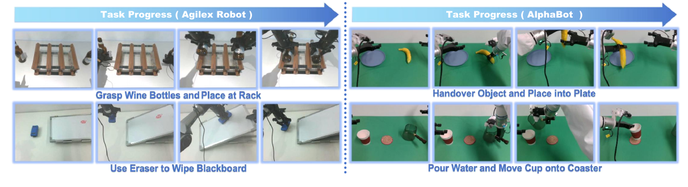

Figure 4. Rack placement, wiping, handover, pouring의 실제 로봇 keyframes. [PDF p.9, §4.3; 원문](https://proceedings.neurips.cc/paper_files/paper/2025/file/8cf3760422b9d4505589a97c8f9569e7-Paper-Conference.pdf#page=9)

#### 로봇·과제·데이터

각 platform에서 네 과제, 과제당 100 demonstrations를 master-puppet teleoperation으로 수집한다. 물체 위치를 바꾸고 세 camera view를 쓴다.

- **AgileX**: Pick objects and place in basket; Lift ball and place in basket; Place bottles at rack; Wipe blackboard. 14-DoF end-effector action representation.
- **AlphaBot**: Pick bowl and place object; Handover object and place; Pour water and move cup; Fold towel and place in bucket. 16-DoF joint-position representation.
- 평가: final checkpoint, task당 20 rollouts, table-top positions 변화. 본문은 실제 로봇 평가 반복 횟수와 confidence interval을 주지 않는다.

#### Table 2 결과와 검산

| Platform | 모델 | Task 1 | Task 2 | Task 3 | Task 4 | 평균 |
|---|---|---:|---:|---:|---:|---:|
| AgileX | $`\pi_0`$ | .70 | .75 | .55 | .35 | .59 |
| AgileX | **FiS** | **.80** | .75 | **.70** | **.45** | **.68** |
| AlphaBot | $`\pi_0`$ | .65 | .75 | .65 | .40 | .61 |
| AlphaBot | **FiS** | **.80** | **.80** | **.75** | **.60** | **.74** |

원시 평균은 AgileX FiS .675, $`\pi_0`$ .5875; AlphaBot FiS .7375, $`\pi_0`$ .6125로 표 반올림과 맞는다. 8과제를 합치면 FiS .70625, $`\pi_0`$ .60000, 차이는 **10.625 percentage points**다. 본문의 “11% improvement”는 상대 17.7%보다 **약 11 pp 절대 향상**으로 읽는 것이 자연스럽다.

Fig.4는 두 platform의 task 진행 keyframe을 보여 정성적으로 action sequence가 성립함을 보인다. 그러나 성공 기준, partial credit, 안전 개입 횟수, reset 조건, operator blinding, 실패 동영상 전체 공개 여부가 없어 정성 그림만으로 robustness를 판단할 수는 없다.

### 9.5 §4.4 Generalization Experiment [PDF p.9-10, Table 3, Fig.5]

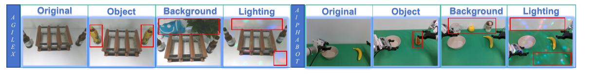

Figure 5. 원 조건과 일반화 평가 조건; 빨간 상자는 원문의 변화 표시다. [PDF p.10, §4.4; 원문](https://proceedings.neurips.cc/paper_files/paper/2025/file/8cf3760422b9d4505589a97c8f9569e7-Paper-Conference.pdf#page=10)

`Place bottles at rack`과 `Pick bowl and place object` 두 과제에서 각각 unseen object, background, lighting 조건을 만든다. Fig.5의 red box는 학습 조건과 달라진 요소를 시각화한다. Table 3은 $`\pi_0`$와 FiS의 원 조건 성능 및 변화 조건 성능/하락폭을 비교한다.

| 과제/로봇 | 조건 | FiS | $`\pi_0`$ |
|---|---|---:|---:|
| Bottles/AgileX | Original | .70 | .55 |
|  | unseen object | .55 (-21%) | .40 (-27%) |
|  | complex background | .50 (-29%) | .35 (-36%) |
|  | lighting disruption | .50 (-29%) | .40 (-27%) |
| Bowl/AlphaBot | Original | .80 | .65 |
|  | unseen object | .65 (-19%) | .40 (-38%) |
|  | complex background | .60 (-25%) | .40 (-38%) |
|  | lighting disruption | .55 (-31%) | .35 (-46%) |

이 실험의 장점은 성공률 자체만 아니라 in-distribution 대비 drop을 함께 보는 점이다. 원문에 보고된 각 drop의 산술은 일관된다. FiS가 대체로 더 높은 절대 성능과 더 작은 하락을 보인다는 결론은 표 범위 안에서 지지된다.

다만 일반화 범위는 두 과제, 단일 변화 축에 제한된다. object와 lighting을 동시에 바꾸는 compositional shift, camera calibration shift, clutter, language paraphrase, dynamics/payload 변화는 시험하지 않는다. 각 조건 20 trials 수준이라면 한 번 성공의 증감이 5 pp이므로 작은 차이는 높은 불확실성을 가진다.

### 9.6 §5 Conclusion [PDF p.10]

결론은 세 기여를 재강조한다: intact VLM reasoning path, 그 안의 lightweight shared fast path, 서로 다른 주기와 modality의 coordination. 저자가 직접 적은 한계는 fast 공유 block 수와 collaboration frequency가 static하다는 점이며, task/environment complexity에 따라 이를 동적으로 바꾸는 것을 후속 과제로 든다. 시뮬레이션과 실제 양팔 결과는 유망하지만 `foundation/generalist`라는 넓은 표현에 비해 검증은 주로 18개 지정 manipulation task와 제한된 shift에 머문다. zero-shot 새로운 task, open-vocabulary instruction following, long-horizon replanning, 공개 foundation benchmark는 없다.

### 9.7 References [PDF p.11-18]

참고문헌은 VLA foundation models, dual-system robotics, diffusion/flow policy, 3D manipulation, action chunking, RLBench 및 vision-language backbone 계보를 폭넓게 잇는다. 본 리뷰에서 읽어야 할 prior-art 축은 다음과 같다.

- **대형 단일 VLA**: OpenVLA, RT 계열 등 generalization과 계산비의 trade-off.
- **dual-system VLA**: $`\pi_0`$, CogACT 등 reasoning/planning과 action expert 분리.
- **action generation**: diffusion policy, action chunking/ACT.
- **3D 관측**: point-cloud 기반 geometry grounding.

FiS의 novelty는 이 부품 각각이 새롭다기보다, pretrained VLM의 마지막 block을 fast system으로 **부분 공유하고 multi-rate latent reuse로 연결한 구조적 조합**에 있다. 따라서 novelty 평가는 “dual system을 처음 제안했다”가 아니라 이 공유 topology와 학습 방식이 기존 분리형 expert보다 어떤 이점을 주는지에 집중해야 한다.

### 9.8 NeurIPS paper checklist [PDF p.19-25]

체크리스트는 claims/limitations, reproducibility, compute, statistical significance 등에 대체로 `Yes`라고 응답하고 이론적 증명은 해당 없음으로 둔다. 그러나 독자가 실제로 얻는 정보에는 간극이 있다.

- compute hardware는 A800×8과 4090 정도만 있으며 총 GPU-hours, training time, energy, peak VRAM은 없다.
- 결과의 `±` 정의, seed, rollout independence, hypothesis test/confidence interval은 없다.
- inference speed protocol의 warm-up, synchronization, preprocessing/robot I/O 포함 범위가 없다.
- “core method development does not involve LLMs” 취지의 답은 LLaMA2가 핵심 구조라는 본문과 직관적으로 어긋난다. 체크리스트 문항의 “LLM을 연구 과정에서 보조 도구로 사용했는가”라는 좁은 해석일 수 있으나, 독자는 architecture 사용과 연구보조 사용을 분리해 읽어야 한다.

체크리스트의 `Yes`는 항목이 완전히 재현 가능하다는 인증이 아니라 저자 self-report다.

### 9.9 Appendix A: Implementation Details [PDF p.26-29, Table 4-5, Fig.6]

#### A.1 large-scale robotic pretraining

저자는 37개 공개 robot dataset을 혼합해 860k trajectories, 36m frames 규모로 pretraining했다고 보고한다. 서로 camera 수가 다른 dataset을 맞추기 위해 pretraining에서는 single-view image만 사용하고, downstream real-robot fine-tuning에서 multi-view로 확장한다. 이 선택은 heterogeneous dataset 결합을 쉽게 하지만, pretraining 단계에서 stereo/multi-view consistency를 직접 배우지는 않는다.

Table 4에는 37개 dataset과 sampling weight가 나온다. 그런데 숫자로 명시된 weight만 합쳐도 **101.8%**이고, 여기에 5개의 `<0.1%` 항목이 더 있다. 따라서 표를 그대로 probability distribution으로 normalization할 수 없다. 반올림 오차만으로 보기에는 1.8 pp 초과가 크므로, 원 weight 또는 정규화 전 계수 공개가 필요하다. 이 오류는 dataset contribution과 재현 가능한 sampling mixture를 흐린다.

또한 다음이 빠져 있다.

- 각 dataset의 robot/action space를 공통 representation으로 바꾸는 구체 mapping,
- image frame와 action timestamp alignment,
- action normalization 통계와 outlier 처리,
- trajectory/frame 중 무엇을 먼저 sample하는지,
- 중복·실패 trajectory 제거 규칙,
- train/validation split 및 contamination 검사.

#### A.2 실제 로봇 setup — Table 5와 Fig.6

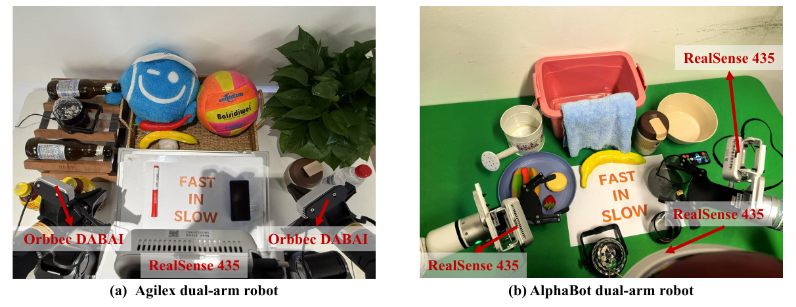

Figure 6. 두 양팔 로봇의 실험 물체 및 wrist/exterior camera 배치. [PDF p.28, Appendix A; 원문](https://proceedings.neurips.cc/paper_files/paper/2025/file/8cf3760422b9d4505589a97c8f9569e7-Paper-Conference.pdf#page=28)

Fig.6은 두 platform의 외형, camera 배치를 보여 주고 Table 5는 joint 수와 range를 정리한다.

- **AgileX**: mobile base 위 6-DoF arm 두 개, 총 12 arm joints이지만 end-effector pose+gripper를 합친 14-DoF action으로 제어한다. 양 wrist에 Orbbec DABAI camera 두 대, overhead/exterior에 RealSense camera 한 대.
- **AlphaBot**: mobile base 위 7-DoF arm 두 개, joint-position+gripper를 합친 16-DoF action. left wrist, right wrist, exterior에 RealSense 435 세 대.
- camera stream은 30 Hz로 설명된다.
- fast point cloud는 exterior camera의 depth에서 구성한다.

Table 5의 joint range는 안전 clamp와 normalization에 직접 쓰일 수 있지만, velocity/acceleration/jerk/torque limit, gripper calibration, extrinsic calibration, depth filtering은 없다. camera가 30 Hz인데 Appendix B가 117.7 Hz를 말하므로, 후자는 새 visual feedback 빈도가 아니라 action-chunk 기반 **유효 command rate**임을 다시 확인할 수 있다.

#### A.3 task definition

Appendix는 각 실제 과제가 평가하는 능력을 설명한다. basket/rack 과제는 placement와 spatial relation, blackboard는 지속 접촉, handover/pour는 양팔 순서 의존성, towel folding은 deformable-object coordination을 요구한다. 다만 성공 predicate가 수치 threshold로 정의되지 않아 같은 task 이름으로 독립 재평가하기 어렵다.

### 9.10 Appendix B: Additional Quantitative Results [PDF p.29-31, Fig.7, Table 6-12]

#### B.1 action chunk size — Fig.7 left, Table 11

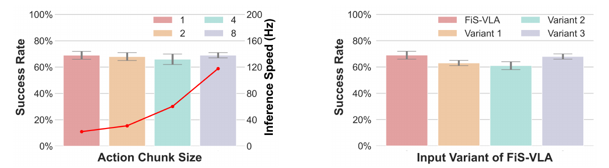

Figure 7. 왼쪽은 chunk size와 성공률·속도, 오른쪽은 multimodal input variants. [PDF p.29, Appendix B.1–B.2; 원문](https://proceedings.neurips.cc/paper_files/paper/2025/file/8cf3760422b9d4505589a97c8f9569e7-Paper-Conference.pdf#page=29)

| $`H`$ | 평균 성공률±표기 변동 | 핵심 의미 |
|---:|---:|---|
| 1 | .69±.03 | 완전 빈번 재관측 가능, 21.9 action/s |
| 2 | .68±.03 | 거의 동일 |
| 4 | .66±.04 | 소폭 하락 |
| 8 | .69±.02 | 평균 회복, 117.7 effective action/s |

평균 성공률은 비교적 안정적이지만 task별 변화는 크다. 예를 들어 $`H=8`$의 Close box는 1.00→.70으로 떨어지는 반면 Water plants는 .20→.65로 오른다. 평균만으로 chunk robustness를 일반화하면 이 이질성이 가려진다.

저자는 chunking이 decision point와 compounding error를 줄이고 temporal consistency를 높인다고 설명한다. 반대로 chunk 안의 closed-loop correction 기회도 줄기 때문에 외란이 많은 접촉 과제에서는 trade-off가 있다. 117.7 Hz는 Appendix 문구에서도 `theoretical control frequency`다. 이 값을 sensor-feedback rate로 부르면 안 된다.

#### B.2 multimodal input variants — Fig.7 right, Table 12

| 구성 | System 2 입력 | System 1 입력 | 평균 |
|---|---|---|---:|
| Original FiS | language+2D | slow latent+2D+3D+state | .69±.03 |
| Variant 1 | language+2D+3D | slow latent+2D+state | .63±.02 |
| Variant 2 | language+2D+3D+state | slow latent+2D | .61±.03 |
| Variant 3 | language+2D+3D | slow latent+2D+3D+state | .68±.02 |

Variant 3이 원형과 거의 같다는 것은 3D 정보를 slow에도 추가해도 크게 해치지 않음을 뜻한다. Variant 1/2 하락은 point cloud나 state를 저빈도 System 2에만 두면 빠른 feedback이 약해짐을 시사한다. 다만 입력 추가는 token length와 latency도 늘리므로 success뿐 아니라 실제 속도/VRAM도 같이 보고해야 배치 선택을 결정할 수 있다.

#### B.3 parameter sharing — Table 6

| 모델 | fast branch | 평균 |
|---|---|---:|
| Experiment 1 | last 2 blocks 독립 복제 | .61±.03 |
| Experiment 2 | last 4 blocks 독립 복제 | .59±.05 |
| **FiS** | last 2 blocks 공유 | **.69±.03** |

저자는 independent copy가 System 2의 32번째 layer output을 pretrained 31번째 layer copy에 넣어 hierarchy를 깨뜨리는 feature misalignment를 원인으로 든다. 이 설명 자체가 중요한 confound를 인정한다. 공정한 “sharing 자체” 비교라면 copy branch에도 FiS와 동일한 layer-30 latent를 넣고, parameter count와 training compute를 맞춘 뒤 shared/unshared만 바꿔야 한다.

#### B.4 작은 LLM — Table 7

| backbone | 평균 성공률±표기 변동 |
|---|---:|
| Phi-2 2.7B | .62±.03 |
| LLaMA2 7B | .69±.03 |

같은 assembled robotic data로 2.7B variant를 pretrain했다고 보고하며 backbone 일반성을 일부 보인다. 다만 vision tower, tokenization, pretraining compute, parameter-efficient 여부와 inference speed가 같이 제시되지 않는다. “작아도 satisfactory”는 가능하지만, 작은 모델의 speed/accuracy Pareto 이득은 아직 정량화되지 않았다.

#### B.5 fine-grained tables — Table 8-12

Table 8-12는 Fig.3/7의 평균 막대를 10개 task별로 풀어 둔 부록의 핵심 재현 자료다. 앞 절에서 평균과 주요 task 이질성을 분석했다. 이 표들 덕분에 arithmetic 검산은 가능하지만, trial-level binary outcomes, seed별 결과, checkpoint별 curve는 없어 sampling uncertainty를 독립 계산할 수 없다.

### 9.11 Appendix C: Additional Visualizations [PDF p.31-34, Fig.8-11]

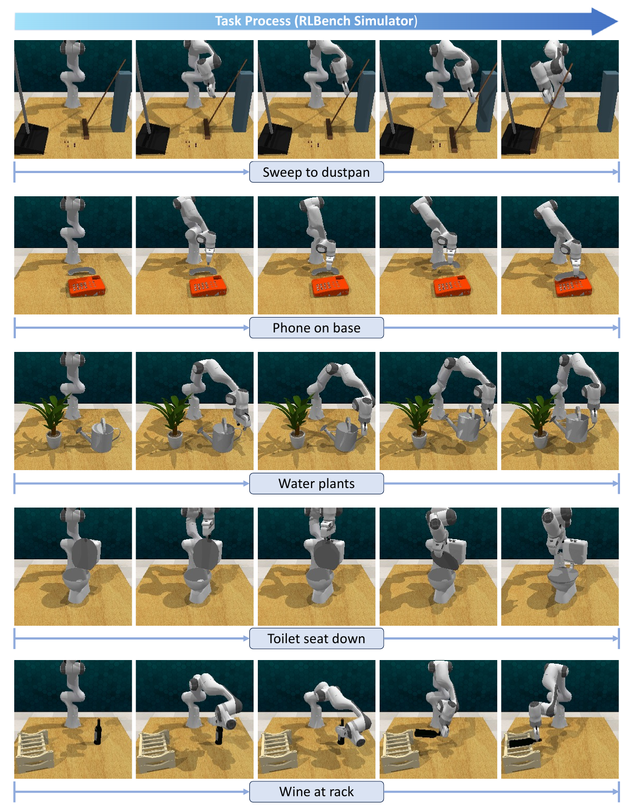

Figure 8. Sweep, phone placement, watering, toilet seat, wine-rack 과제의 진행. [PDF p.32, Appendix C; 원문](https://proceedings.neurips.cc/paper_files/paper/2025/file/8cf3760422b9d4505589a97c8f9569e7-Paper-Conference.pdf#page=32)

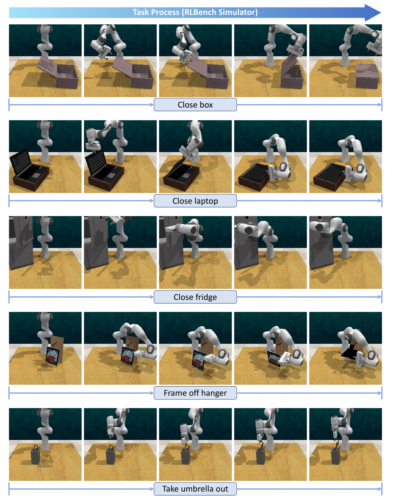

Figure 9. Box/laptop/fridge closing, frame removal, umbrella removal의 진행. [PDF p.33, Appendix C; 원문](https://proceedings.neurips.cc/paper_files/paper/2025/file/8cf3760422b9d4505589a97c8f9569e7-Paper-Conference.pdf#page=33)

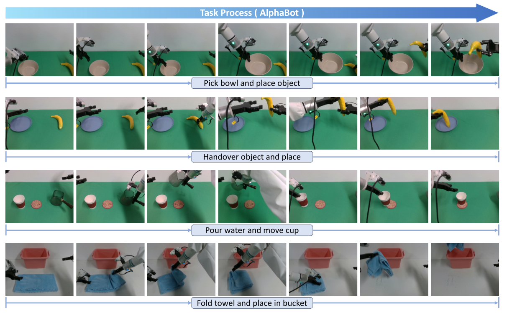

Figure 10. 내부 banner는 AlphaBot, 원문 caption은 AgileX로 표기되어 있다. 그림 내용을 그대로 보존했으며 아래에서 caption 불일치를 설명한다. [PDF p.34, Appendix C; 원문](https://proceedings.neurips.cc/paper_files/paper/2025/file/8cf3760422b9d4505589a97c8f9569e7-Paper-Conference.pdf#page=34)

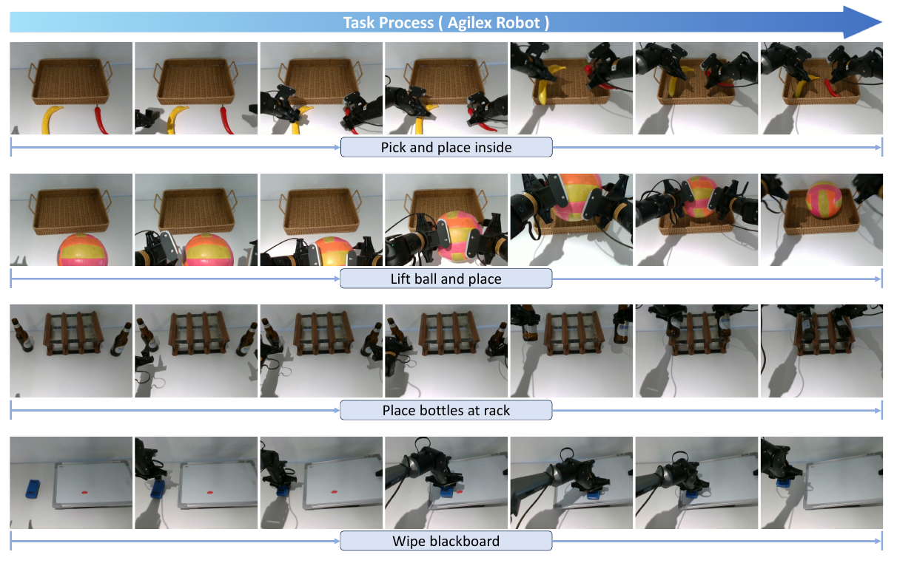

Figure 11. 내부 banner는 AgileX, 원문 caption은 AlphaBot으로 표기되어 있다. 원래 Figure 번호를 유지했다. [PDF p.34, Appendix C; 원문](https://proceedings.neurips.cc/paper_files/paper/2025/file/8cf3760422b9d4505589a97c8f9569e7-Paper-Conference.pdf#page=34)

- **Fig.8**: RLBench task 일부의 keyframe sequence. Franka arm의 approach, grasp, transport, placement와 gripper state 전환을 정성 확인할 수 있다.
- **Fig.9**: 나머지 RLBench task의 keyframe sequence로 Fig.8과 합쳐 총 10개 task를 보여 준다.
- **Fig.10-11**: 두 실제 robot의 8개 task sequence. 양팔 handover, pour, rack placement, wiping, towel folding 같은 장기 순서를 보여 준다.

여기에는 원문 편집 오류가 있다. PDF p.34의 **Fig.10 내부 banner/image는 AlphaBot 과제**처럼 보이는데 caption은 “Agilex robot task execution visualization”이라고 쓰고, **Fig.11 내부 banner/image는 AgileX 과제**인데 caption은 “AlphaBot...”이라고 쓴다. 과제 목록과 robot 외형을 대조하면 caption 두 개가 서로 뒤바뀐 것으로 판단된다. 이는 리뷰어의 시각적 판독이며, 원 source figure의 확인이 필요하다.

성공 사례 keyframe은 mechanism의 가능성을 보여 주지만 전체 평가 분포를 대표하지 않는다. 동일 trial의 연속 video, 실패 trial sampling 규칙, frame 간 시간 간격이 있어야 실제 smoothness와 recovery를 판단할 수 있다.

### 9.12 Appendix D: Failure Cases [PDF p.34-35, Fig.12]

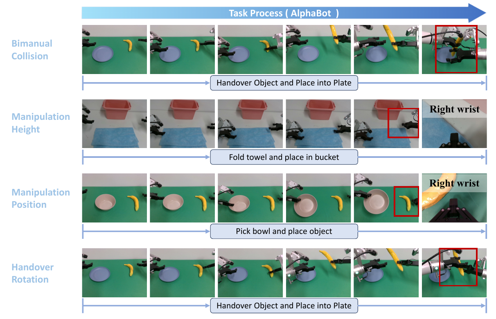

Figure 12. 네 실패 유형과 원문 red bounding box, right-wrist 관측. [PDF p.35, Appendix D; 원문](https://proceedings.neurips.cc/paper_files/paper/2025/file/8cf3760422b9d4505589a97c8f9569e7-Paper-Conference.pdf#page=35)

Fig.12는 네 실패 유형을 명시한다.

1. bimanual coordination 중 arm collision,
2. 잘못된 manipulation height,
3. 잘못된 manipulation position,
4. handover 과정의 부정확한 object rotation.

이 실패들은 공통적으로 high-level task 이해보다 geometry, calibration, contact-aware feedback, collision constraint가 병목일 수 있음을 보여 준다. 특히 현재 구조는 learned diffusion output에 명시적 collision-free projection이나 model-predictive safety layer가 없다. 향후에는 실패 빈도, 충돌 severity, 어느 system refresh에서 회복했는지까지 taxonomy별로 보고해야 한다.

### 9.13 Appendix E: Broader Impacts [PDF p.35]

저자는 고속 robot control에서 collision·unsafe motion 위험, instruction 오해로 인한 unintended behavior를 인정하고 safety constraint와 operating boundary를 권한다. 이는 타당하지만 추상적이다. 실제 deployment에는 최소한 다음이 필요하다.

- joint/EEF workspace hard limit와 velocity/acceleration/jerk clamp,
- self/environment collision monitor,
- stale sensor/slow-latent timeout,
- uncertainty 또는 out-of-distribution 시 safe stop,
- human-accessible emergency stop과 watchdog,
- command logging, replay, failure attribution,
- plan refresh가 늦어진 frame에서 보수적 action policy.

논문 성능표는 이 안전장치를 평가하지 않았으므로 21.9/117.7 action/s를 곧바로 안전한 실제 제어율로 해석하면 안 된다.

<a id="timing"></a>

## 10. 속도 주장을 배포 관점에서 다시 계산하기

### 10.1 다섯 개의 서로 다른 “Hz”

이 논문을 실무에 옮길 때 가장 먼저 분리해야 할 지표다.

| 지표 | 뜻 | FiS에서의 예 |
|---|---|---|
| sensor rate | 새 RGB/depth/state가 도착하는 빈도 | camera 설명은 30 Hz |
| policy-call rate | 새 관측으로 action chunk를 재추론하는 빈도 | $`H=8`$ 수치에서 약 14.7 calls/s로 역산 |
| effective action rate | chunk의 action 수 ÷ 한 chunk 생성시간 | 저자 보고 최대 117.7 actions/s |
| slow-latent refresh rate | blocks 1-30을 다시 실행하는 빈도 | ratio 1:4라면 약 3.68 refresh/s로 역산 |
| actuator servo rate | low-level controller가 command를 적용하는 빈도 | 논문 미기재; 위 네 지표와 별개 |

### 10.2 $`H=1`$ Table 1 수치

21.9 Hz를 policy call당 평균 wall time으로 역산하면

```math
\bar L_{H=1}=\frac{1}{21.9}=0.04566\text{ s}=45.66\text{ ms}.
```

이때 action 하나를 예측하므로 policy-call rate와 effective action rate가 수치상 같다. 그러나 실제 45.66 ms에 image resize, depth→point cloud, point downsampling, host-device copy, robot communication이 포함되는지는 미기재다.

### 10.3 $`H=8`$ Appendix 수치

117.7 actions/s가 한 call에서 8개 action을 내는 theoretical effective rate라면

```math
\bar L_{chunk}=\frac{8}{117.7}=0.06797\text{ s}=67.97\text{ ms},
```

```math
f_{policy}=\frac{1}{0.06797}=14.71\text{ calls/s}.
```

즉 neural policy가 새 observation을 117.7번 읽는 것이 아니라 평균 초당 약 14.7번 chunk를 만든다. 그 chunk 안의 8개 command를 순서대로 방출해 117.7 actions/s를 얻는 계산이다.

기본 slow:fast ratio 1:4를 그대로 적용한다고 가정하면 [리뷰어 추정]

```math
f_{slow}=\frac{14.71}{4}=3.68\text{ Hz},\qquad \Delta t_{slow}\approx272\text{ ms}.
```

또한 slow latent 하나가 최대 $`4\times8=32`$ low-level actions에 걸쳐 재사용될 수 있다. 이 값은 저자가 직접 benchmark한 System 2 latency가 아니라 **보고된 평균과 공개 loop semantics로부터의 환산**이다.

### 10.4 평균 latency가 감추는 refresh jitter

fast-only call latency를 $`L_f`$, slow refresh의 추가 latency를 $`L_s`$, ratio를 $`r`$이라 하면 long-run 평균은 대략

```math
\bar L=L_f+\frac{L_s}{r}.
```

하지만 시간열은 균일하지 않다.

```text
call:       0             1       2       3       4
compute:  slow+fast      fast    fast    fast    slow+fast
latent:     z0            z0      z0      z0       z4
latency:   high           low     low     low      high
```

robot 제어에서는 평균보다 refresh-call의 p95/p99 deadline miss가 더 중요할 수 있다. 논문은 $`L_f`$, $`L_s`$, first-call/JIT, p50/p95/p99, jitter histogram을 분해하지 않는다.

### 10.5 실제 측정에 필요한 timing boundary

최소 다음 timestamp를 같은 monotonic clock으로 기록해야 한다.

1. camera exposure 또는 frame arrival,
2. depth alignment/point-cloud 생성 시작·끝,
3. CPU→GPU transfer 끝,
4. slow vision tower와 blocks 1-30 시작·끝,
5. fast RGB/point encoders 시작·끝,
6. DDIM 각 step 시작·끝,
7. action head 및 denormalization 끝,
8. safety filter 통과,
9. command 송신,
10. actuator acknowledgement/실제 motion onset.

CUDA event만으로는 GPU kernel time은 얻지만 sensor-to-actuator E2E는 얻지 못한다. 반대로 Python wall clock은 비동기 CUDA를 동기화하지 않으면 짧게 측정될 수 있다. 두 계층을 모두 기록해야 한다.

### 10.6 빠진 serving/deployment 지표

- slow-refresh call과 reuse call 각각의 p50/p95/p99 latency,
- batch 1 steady-state throughput과 cold-start/JIT time,
- DDIM step별 latency 및 fast encoder 중복 계산 여부,
- GPU/CPU utilization, power, thermal throttling,
- allocated/reserved/peak device memory,
- point-cloud FPS/kNN CPU fallback 여부,
- dropped camera frames와 observation age,
- action queue depth와 deadline miss,
- TensorRT/ONNX unsupported op fallback,
- $`H`$, ratio, solver step에 따른 success-latency-safety Pareto.

따라서 현재 증거로 말할 수 있는 것은 “저자가 정한 4090 protocol에서 $`H=1`$ FiS가 표의 baseline보다 높은 action-generation rate를 보였고, $`H=8`$에서는 theoretical effective action rate가 117.7에 도달했다”까지다. robot E2E closed-loop 117.7 Hz를 입증한 것은 아니다.

<a id="critique"></a>

## 11. 비판적 평가와 재현성 감사

### 11.1 강점

1. **topology가 명료하다.** 별도 거대 action expert를 붙이지 않고 pretrained hierarchy의 suffix를 공유한다는 핵심이 간결하다.
2. **계산을 시간축에 맞춘다.** language-level reasoning과 visuomotor correction이 같은 빈도를 요구하지 않는다는 robot-control 가정을 architecture에 반영한다.
3. **heterogeneous modality의 위치가 설득력 있다.** language는 slow, geometry/state는 fast에 두어 제어에 필요한 최신 정보를 우선한다.
4. **simulation에서 real bimanual까지 폭이 있다.** Franka 단일팔뿐 아니라 서로 다른 DoF/action representation의 두 실제 platform을 평가한다.
5. **구성요소 ablation이 비교적 풍부하다.** blocks, modalities, ratio, slow loss, plan supervision, chunk size, sharing, model size를 건드린다.
6. **실패와 broader impact를 숨기지 않는다.** 충돌·높이·위치·회전 실패를 그림으로 제시한다.

### 11.2 주요 한계와 왜 중요한가

#### A. 속도 benchmark의 정의가 부족하다

21.9 Hz와 117.7 Hz가 모델-only인지 E2E인지, 어떤 precision/solver/warm-up을 썼는지 불명확하다. multi-rate model에서 평균만 보고하면 slow refresh jitter가 사라진다. 이 문제는 논문의 “fast” 주장에 직접 관련된다.

#### B. 통계적 불확실성이 충분히 보고되지 않는다

task당 20 rollouts는 성공률 resolution이 5 pp다. 세 반복을 했더라도 seed와 `±` 정의가 없다. paired evaluation, confidence interval, significance test 없이 .69와 .61의 일반적 우월성을 정량 보증하기 어렵다. 실제 로봇 표에는 변동량도 없다.

#### C. baseline 공정성 정보가 불완전하다

각 baseline의 공식 fine-tuning recipe를 따랐다고 하지만 parameter count, image/point input, diffusion/action chunk, update rate, hardware utilization을 동일하게 맞춘 표가 없다. 성공률과 속도를 동시에 비교하려면 data, observation, action representation, chunk, precision, sampling steps, timing boundary를 맞춰야 한다.

#### D. “reasoning 보존”은 간접 evidence다

$`\mathcal L_{slow}`$ 제거 성능 하락과 plan label 향상은 slow supervision이 유용함을 보인다. 그러나 language reasoning accuracy, plan correctness, catastrophic forgetting을 직접 평가하지 않는다. 그러므로 “inherent reasoning capability를 preserved”했다기보다 “slow autoregressive auxiliary loss가 downstream success에 기여했다”가 증거에 맞다.

#### E. parameter-sharing ablation에 interface confound가 있다

독립 복제 branch가 pretrained layer hierarchy와 맞지 않는 입력을 받는다면 공유뿐 아니라 feature alignment도 달라진다. identical interface/parameter budget의 unshared control이 필요하다.

#### F. 사전학습 mixture와 action normalization을 재현하기 어렵다

Table 4 weight 합 불일치, dataset mapping·timestamp·normalization 미기재는 860k-trajectory pretraining을 독립 복제하기 어렵게 한다.

#### G. 높은 chunk rate와 closed-loop robustness의 trade-off가 덜 분석됐다

$`H=8`$ 평균 성공률은 유지되지만 task별 변동이 크고 chunk 내부는 open loop다. 외란 주입, latency spike, camera drop, contact perturbation 실험이 필요하다.

#### H. 표·그림 품질 오류가 있다

Table 9 마지막 행의 평균(.22 vs task값 평균 .265), Table 4 sampling-weight 합, Fig.10/11 caption swap은 결과 해석 신뢰를 낮춘다. 원 raw data/source figure로 정정해야 한다.

### 11.3 claim별 최종 판정

| 주장 | 판정 | 이유 |
|---|---|---|
| RLBench 평균 SOTA | **표 범위에서 지지** | .69로 비교 4모델 중 최고 |
| 10개 중 8개 우월 | **표현 수정 필요** | 5 strict win + 3 tie |
| parameter sharing이 독립형보다 낫다 | **현재 변형에서는 지지** | .69 vs .61/.59, 다만 interface confound |
| reasoning capability 보존 | **간접 지지** | slow loss/plan ablation은 있으나 reasoning metric 없음 |
| 117.7 Hz high-frequency closed-loop | **입증 안 됨** | theoretical effective action rate, chunk 내부 open loop |
| actual robot generality | **부분 지지** | 두 platform·8과제, 새로운 task zero-shot은 아님 |
| Foundation/generalist model | **과도하게 넓음** | 대규모 pretraining은 있으나 범용 benchmark 부족 |

### 11.4 공개 코드 감사

공식 [GitHub repository](https://github.com/CHEN-H01/Fast-in-Slow)와 이 리뷰에서 고정한 commit `14f73b3e6ebe5e44464e7958b4d086e7dda21941`을 읽었다. 확인된 사항은 다음과 같다.

- [`fisvla.py` slow/fast 경로](https://github.com/CHEN-H01/Fast-in-Slow/blob/14f73b3e6ebe5e44464e7958b4d086e7dda21941/models/vlas/fisvla.py#L671-L911)는 slow latent를 반환하고 fast 입력에 최신 RGB/PC/state/noisy action/timestep을 합친다.
- [`prismatic.py` split](https://github.com/CHEN-H01/Fast-in-Slow/blob/14f73b3e6ebe5e44464e7958b4d086e7dda21941/models/vlms/prismatic.py#L1056-L1259)은 기본 split 30으로 앞 30 block과 마지막 2 block을 나눈다.
- 평가 loop는 slow cache를 ratio에 따라 갱신한 뒤 chunk 전체를 순차 실행한다.
- 공개 test script는 DDIM 4-step과 ratio 4를 보여 준다.

코드 공개는 큰 장점이지만, script가 논문 각 표에 사용된 exact commit/config/checkpoint를 cryptographically 연결하지는 않는다. 본 리뷰는 GPU 학습이나 robot inference를 실행하지 않았으므로 **source-level audit**이며 runtime reproduction은 아니다.

### 11.5 최소 재현 패키지 체크리스트

#### 데이터

- [ ] 37개 dataset의 원 ID/version/license/checksum
- [ ] normalized sampling probability의 정확한 합 1.0 manifest
- [ ] camera/action timestamp alignment와 keyframe extraction code
- [ ] robot별 action definition, coordinate frame, quaternion convention
- [ ] state/action mean, std, min/max와 gripper encoding
- [ ] train/validation/test split 및 trajectory 중복 검사

#### 학습

- [ ] exact git commit, environment lock, CUDA/cuDNN/PyTorch 버전
- [ ] 모든 optimizer/scheduler/warm-up/weight-decay/gradient-clip 값
- [ ] global/effective batch, accumulation, seed, data-worker seed
- [ ] asynchronous offset distribution과 $`z_s`$ detach 여부
- [ ] loss reduction, mask, $`\lambda_f/\lambda_s`$, repeated diffusion 의미
- [ ] total steps/GPU-hours, peak memory, checkpoint selection

#### 평가

- [ ] task별 raw binary rollout results와 seed
- [ ] success predicate 및 human intervention log
- [ ] 세 반복의 정의와 평균/SD/SE/CI 구분
- [ ] paired bootstrap 또는 exact binomial CI
- [ ] baseline별 동일 observation/action/chunk/sampling 조건
- [ ] cold/warm latency, p50/p95/p99, preprocessing·I/O 포함 범위

#### 안전

- [ ] joint/workspace/velocity limit와 collision filter
- [ ] observation-age/slow-cache-age watchdog
- [ ] action-chunk cancel/replan 경로
- [ ] emergency stop·fault injection·recovery protocol

<a id="thor"></a>

## 12. Jetson AGX Thor 이전안: 논문 후속 실험으로 구체화

### 12.1 하드웨어 현실부터 보기

2026-09-07 기준 NVIDIA 공식 사양에서 Jetson AGX Thor Developer Kit/T5000은 최대 2,070 FP4 sparse TFLOPS, 128 GB LPDDR5X, 273 GB/s memory bandwidth, 40-130 W power 범위를 제공한다. 이는 marketing peak이므로 FiS의 BF16/FP8/FP4 transformer, attention, point-cloud op가 같은 비율로 빨라진다는 뜻은 아니다. [NVIDIA Jetson Thor 공식 사양](https://www.nvidia.com/en-us/autonomous-machines/embedded-systems/jetson-thor/)

LLaMA2-7B weight만 BF16이면 대략 14 GB, FP8이면 약 7 GB, 4-bit이면 약 3.5 GB의 raw weight가 필요하다 [리뷰어 근사; runtime workspace/vision tower/KV·activation 제외]. 128 GB capacity상 적재 가능성은 높지만 273 GB/s shared memory, power/thermal envelope, unsupported point op가 latency를 좌우한다.

### 12.2 추천 deployment topology

초기 버전은 **한 process, 한 GPU context, 공유 weight 유지**가 적절하다.

```text
camera/depth/state
      │
      ├─ preprocessing stream ─ RGB tokens / PC tokens / state token
      │
      ├─ slow stream (매 r call) ─ blocks 1..30 ─ slow latent cache
      │                                      │
      └─ fast real-time stream ──────────────┼─ blocks 31..32 × DDIM ─ action
                                             │
                                      cache version/age guard
```

MIG로 slow와 fast를 분리하면 isolation은 좋아질 수 있지만, 동일 suffix weight와 slow latent를 partition 사이에서 복제/전송해야 해 Fast-in-Slow의 공유 이점을 깎을 수 있다. 먼저 단일 process에서 priority stream과 deadline 측정을 하고, interference가 실제 병목으로 확인된 뒤 MIG를 실험해야 한다.

### 12.3 단계별 최적화 순서

#### Gate 0 — correctness baseline

- Jetson에서 PyTorch/eager BF16으로 $`B=1`$, RGB 224, PC 1,024, $`H=1`$, DDIM 4를 먼저 실행한다.
- x86/4090 reference와 slow latent, $`\hat\eta`$, denoised action을 layer별 비교한다.
- deterministic sample/seed에서 max/mean absolute error, action sign/quaternion/gripper parity를 저장한다.
- 한 episode가 아니라 20-step 이상 반복해 memory leak, NaN, stall, cache-version error를 검사한다.

**통과 기준 예시**: unsupported op 없음, 20-step crash/NaN 0, action normalized-space MAE가 사전 합의 threshold 이하. threshold는 robot별 tolerance에서 역산해야 하며 임의로 정하면 안 된다.

#### Gate 1 — 정확한 profile

NVTX range를 vision slow, blocks 1-30, PC tokenizer(FPS/kNN), fast vision, blocks 31-32, action head, 각 DDIM step, H2D/D2H에 붙인다. slow-refresh와 reuse call을 별도 trace로 수집하고 p50/p95/p99를 보고한다.

이 단계에서는 FLOPs보다 다음을 본다.

- attention/GEMM Tensor Core utilization,
- shared-memory bandwidth와 DRAM bytes,
- point-cloud gather/scatter 및 CPU fallback,
- kernel launch 수와 작은 MLP overhead,
- DDIM 네 step에서 fast visual/point feature를 다시 계산하는지,
- thermal steady-state에서 clock/power 변화.

#### Gate 2 — 중복 계산 제거

한 policy call 안의 DDIM step 동안 RGB, point cloud, state는 변하지 않는다. 공개 호출 구조상 매 denoising step에 model kwargs가 전달되어 encoder 재실행 가능성이 있으므로 profiler로 확인한 뒤 다음을 cache한다.

- `fast_rgb_features`, `point_features`, `state_embedding`,
- attention에서 solver step과 무관한 projection,
- slow latent의 versioned device-resident buffer.

action/timestep embedding과 noisy-action-dependent attention만 step마다 갱신한다. 변경 후 반드시 full-output parity와 episode success를 다시 측정한다.

#### Gate 3 — TensorRT/compiled fixed shape

- 우선 고정 shape: $`B=1`$, RGB 224×224, PC 1,024, $`H\in\{1,8\}`$, DDIM 4, 제한된 text-length buckets.
- vision tower, blocks 1-30, suffix blocks, action MLP을 각각 engine/profile 단위로 나눠 cache lifecycle을 보존한다.
- FPS/kNN/point grouping이 TensorRT에서 지원되지 않으면 custom CUDA/TensorRT plugin을 만들거나 해당 전처리만 최적화된 CUDA/PyTorch로 남긴다.
- CUDA Graph는 reuse call의 고정 address/shape에 먼저 적용한다. slow refresh처럼 sequence length가 변하는 경로는 bucket별 graph가 필요하다.

#### Gate 4 — 정밀도 저하를 단계적으로 적용

1. BF16 reference.
2. vision/linear FP8, sensitive normalization/softmax/head BF16.
3. blocks 1-30 weight-only 또는 FP4 후보.
4. 마지막 shared 2 blocks와 action head는 마지막에만 저정밀화.

마지막 두 block은 language와 diffusion의 공용 interface이고 action 오차가 직접 나가므로 가장 보수적으로 다뤄야 한다. calibration set은 pretraining image가 아니라 실제 두 robot의 RGB/depth/state/action 분포를 포함해야 한다. perplexity만 보지 말고 success, collision, action jerk, denoising error를 본다.

#### Gate 5 — real-time scheduler와 안전

- fast inference thread에 높은 priority를 주되 camera ingestion과 watchdog을 굶기지 않는다.
- slow job이 deadline을 넘으면 오래된 결과를 뒤늦게 적용하지 말고 version/timestamp를 검사한다.
- slow latent age, camera age, point-cloud age가 threshold를 넘으면 chunk를 축소하거나 safe stop한다.
- contact/high-curvature 구간에서는 $`H=1`$ 또는 2, 자유공간 이동은 $`H=8`$로 바꾸는 adaptive chunk를 비교한다.
- slow refresh 직후 action queue를 취소/재계획할 수 있어야 한다.

### 12.4 Thor 실험 matrix

| 축 | 값 |
|---|---|
| precision | BF16, FP8, mixed FP8/BF16, 후보 FP4 |
| action chunk | 1, 2, 4, 8 |
| slow:fast | 1:1, 1:2, 1:4, 1:8 |
| DDIM evaluations | 2, 4, 8 |
| power mode | 40 W, 중간 mode, 130 W |
| engine | eager PyTorch, compile, TensorRT/custom plugin |
| condition | slow refresh, latent reuse, thermal cold, thermal steady |

각 cell에서 success rate만이 아니라 sensor-to-command p50/p95/p99, deadline miss, policy-call Hz, effective action/s, slow refresh Hz, peak memory, mean/peak power, temperature, collision/jerk를 수집한다.

### 12.5 단계별 go/no-go 기준

- **G0 기능**: 모든 op 실행, parity 통과, leak/NaN/stall 없음.
- **G1 성능**: slow-refresh/reuse latency가 각각 정의된 deadline을 p99에서 만족.
- **G2 품질**: 4090 BF16 reference 대비 task success 하락이 사전 정의 margin 이내.
- **G3 안전**: collision, joint-limit, stale-cache fault injection에서 watchdog이 항상 개입.
- **G4 지속성**: 목표 power mode에서 장시간 thermal steady-state로 deadline 유지.
- **G5 공정 비교**: 같은 $`H`$/ratio/DDIM/timing boundary에서 4090과 Thor를 비교.

이 과정을 통과하기 전에는 “Thor에서 117.7 Hz”라고 쓰지 말고, **모델 kernel latency**, **policy refresh**, **effective chunk action rate**, **robot E2E rate**를 각각 보고해야 한다.

<a id="qa"></a>

## 13. 학습자·발표자 Q&A

### Q1. 한 문장으로 이 논문의 아이디어는 무엇인가?

큰 VLM의 앞부분이 만든 느린 문맥 latent를 캐시하고, 그 VLM의 마지막 두 transformer block 자체를 빠른 diffusion action generator로 공유해 최신 2D/3D/state만 자주 갱신하는 구조다.

### Q2. 왜 이것이 기존 System 1 + System 2 병렬 구조와 다른가?

기존 분리형은 VLM planner와 별도 action expert가 각자 parameter를 갖고 interface로 plan/feature를 넘긴다. FiS는 System 1 parameter가 System 2의 suffix와 동일하다. parameter sharing, pretrained hierarchy 보존, joint gradient가 동시에 핵심이다.

### Q3. System 2는 앞 30개 block만인가?

아니다. System 2의 완전한 autoregressive 경로는 32개 block 전체다. 앞 30개를 slow-prefix 계산으로 보고, 마지막 2개가 System 2의 끝이면서 System 1에도 재사용된다.

### Q4. slow cache는 KV cache인가?

공개 구현상 핵심 cache는 앞 30개 block이 출력한 hidden sequence다. 토큰 생성 가속용 표준 autoregressive KV cache와 개념이 다르다. 최적화 구현에서 KV를 추가로 쓸 수는 있지만 논문의 핵심 공유 객체는 slow latent다.

### Q5. System 1이 정말 “fast”인 이유는 무엇인가?

매번 32개 LLM block을 돌리지 않고 마지막 2개만 돌리기 때문이다. 하지만 최신 RGB의 vision encoder, point-cloud FPS/kNN/encoder, diffusion 여러 step은 여전히 필요하다. “2 blocks”만 보고 전체 fast-path latency를 판단하면 안 된다.

### Q6. point cloud는 왜 fast branch에 들어가는가?

grasp/placement는 metric geometry와 depth relation이 중요하고, stale slow image만으로는 현재 gripper/object 관계를 놓칠 수 있다. Table 9에서 PC 제거가 .69→.61로 내려가는 결과가 이를 지지한다. 다만 point cloud 자체의 compute cost도 함께 측정해야 한다.

### Q7. $`o_{t-1}`$와 $`o_t`$ 표기는 정확히 한 step 차이인가?

개념적으로 slow 관측이 fast 관측보다 오래됐다는 뜻에 가깝다. ratio 1:4에서는 실제 cache age가 여러 policy call일 수 있다. 학습 asynchronous offset의 정확한 분포가 없어 $`t-1`$을 물리적으로 항상 한 frame 전이라고 보면 안 된다.

### Q8. Eq.(1)의 $`\beta_\tau`$는 일반 diffusion의 beta인가?

식의 역할은 보통 $`\bar\alpha_\tau`$가 맡는 cumulative signal-retention coefficient와 같다. 일반적인 per-step noise variance $`\beta_\tau`$와 표기가 충돌한다. 공개 코드는 cumulative-alpha 계수를 써 standard forward noising을 구현하므로, 재현자는 이름보다 코드의 schedule 의미를 따라야 한다.

### Q9. Eq.(3)에 loss weight가 없는데 정말 동일 중요도인가?

coefficient는 1:1이지만 numerical scale은 reduction에 따라 다르다. 코드 MSE는 element mean이고 language loss도 token mean일 가능성이 높으며, repeated diffusion sample 수도 영향을 준다. raw loss와 gradient norm을 기록해야 실제 균형을 안다.

### Q10. language plan이 runtime에 반드시 text로 생성되어 fast branch에 들어가나?

논문의 핵심 fast conditioning은 slow hidden latent다. Eq.(2)의 plan/discrete target은 그 latent를 학습시키는 auxiliary supervision이다. text plan을 매 fast call마다 생성·파싱해 action module에 문자열로 넣는 분리형 pipeline으로 이해하면 잘못이다.

### Q11. 왜 ratio 1:1보다 1:4의 성공률이 더 높은가?

가능한 해석은 slow context를 안정적으로 유지하면서 fast branch가 최신 observation에 집중해 temporal smoothing이 생긴다는 것이다. 그러나 총 compute budget, 학습 sampling lag, random variation이 얽혀 있어 “reasoning은 정확히 4배 느려야 한다”는 보편 법칙은 아니다. task/dynamics/latency에 맞춰 다시 tune해야 한다.

### Q12. 21.9 Hz와 117.7 Hz는 모순인가?

아니다. 전자는 $`H=1`$에서 action 하나/호출의 보고값이고, 후자는 $`H=8`$에서 chunk 하나가 8 actions를 내는 theoretical effective rate다. 후자를 역산한 policy-call rate는 약 14.7 Hz다.

### Q13. $`H=8`$이면 완전한 117.7 Hz closed loop인가?

아니다. 공개 loop는 8개 action을 모두 실행한 뒤 새 observation을 받아 policy를 다시 호출한다. chunk 내부는 open loop이므로 feedback 관점의 policy rate는 약 14.7 Hz이고 camera는 30 Hz다. actuator의 내부 servo는 별도다.

### Q14. Table 1이 구조의 우월성을 완전히 증명하는가?

아니다. 평균 성공률과 저자 protocol의 속도에서 좋다는 evidence는 주지만 FiS는 point cloud/state 같은 추가 modality를 활용한다. 같은 입력·solver·chunk·precision·timing boundary의 matched-budget comparison이 필요하다.

### Q15. 0.69±0.03의 `±`는 무엇인가?

PDF는 평가를 세 번 반복한다고 하지만 `±`가 run SD, task variance, standard error 중 무엇인지 명시하지 않는다. 원 raw logs 없이 confidence interval로 읽으면 안 된다.

### Q16. 실제 로봇 결과의 가장 큰 장점과 약점은?

장점은 AgileX end-effector 14-DoF와 AlphaBot joint 16-DoF라는 다른 제어 표현, 양팔·deformable/long-horizon 과제를 모두 다룬 것이다. 약점은 task당 trial 수가 작고 variance·명시적 성공 predicate·안전개입 통계가 없다는 점이다.

### Q17. parameter sharing ablation에서 무엇을 더 해야 하나?

unshared fast branch에도 정확히 동일한 layer-30 latent를 입력하고, depth/width/parameter count/optimizer/compute를 맞춰야 한다. 그 상태에서 shared와 copied weight만 바꾸고 representation similarity와 gradient conflict를 측정해야 한다.

### Q18. 이 모델이 진짜 foundation model인가?

860k trajectories/36m frames pretraining은 foundation 방향의 강한 출발점이다. 그러나 새로운 instruction/task의 zero-shot 범용성, 넓은 robot embodiment transfer, language/VQA reasoning 유지가 충분히 측정되지 않아 final conference title의 더 절제된 “VLA Model”이 증거에 잘 맞는다.

### Q19. 가장 먼저 고쳐야 할 논문 표 오류는?

Table 9의 `No PC, Img and State` 행이다. task별 합은 2.65이므로 평균 .265≈.27인데 .22로 인쇄됐다. 다음은 Table 4 sampling weights 합과 Fig.10/11 caption 대응이다.

### Q20. Thor에서 가장 큰 병목은 마지막 2 LLM block인가?

측정 전에는 알 수 없다. fast image tower, DINO/SigLIP concat/projector, point-cloud FPS/kNN의 irregular memory access, 4회 DDIM 호출, host preprocessing이 모두 후보다. peak FP4 TFLOPS만으로 결정하지 말고 component-level trace를 봐야 한다.

### Q21. Thor에서 가장 안전한 첫 최적화는?

같은 policy call의 DDIM step 사이에서 변하지 않는 RGB/point/state feature를 cache하는 것이다. precision을 낮추기 전에 중복 compute를 제거하면 numerical behavior를 덜 바꾸면서 latency를 줄일 가능성이 있다. 다만 실제 중복 여부를 profiler로 먼저 확인해야 한다.

### Q22. 이 논문의 다음 연구로 가장 가치 있는 실험은?

동일 input/parameter/solver budget의 shared-vs-unshared control, timestamped real-robot E2E latency와 jitter, 외란을 넣은 chunk/ratio Pareto, independent reasoning-retention benchmark의 네 가지다. 이 조합이 architecture 이점과 deployment 이점을 가장 깨끗하게 분리한다.

<a id="coverage"></a>

## 14. Coverage checklist: 원문 요소 누락 확인

### 14.1 본문·부록 섹션

| 원문 요소 | 이 문서의 해설 위치 | 상태 |
|---|---|---|
| Abstract | §5.1 | 완료 |
| §1 Introduction | §2, §5.2 | 완료 |
| §2 Related Work | §5.3, §9.7 | 완료 |
| §3 Method overview | §5.4 | 완료 |
| §3.1 Problem Formulation | §5.5, §6.1-6.2 | 완료 |
| §3.2 Architecture | §5.6, §7 | 완료 |
| §3.3 Coordination | §5.7, §7.4, §8.4-8.5 | 완료 |
| §3.4 Training | §5.8, §6.3-6.6, §8 | 완료 |
| §4.1 Simulation | §9.2 | 완료 |
| §4.2 Ablation | §9.3 | 완료 |
| §4.3 Real-world | §9.4 | 완료 |
| §4.4 Generalization | §9.5 | 완료 |
| §5 Conclusion | §9.6 | 완료 |
| References | §9.7 | 완료 |
| NeurIPS checklist | §9.8 | 완료 |
| Appendix A | §9.9 | 완료 |
| Appendix B.1-B.5 | §9.10 | 완료 |
| Appendix C | §9.11 | 완료 |
| Appendix D | §9.12 | 완료 |
| Appendix E | §9.13 | 완료 |

### 14.2 수식

| 수식 | 위치 | 포함한 검토 |
|---|---|---|
| 비번호 imitation objective | §6.1 | 조건부 분포, index ambiguity, 예시 |
| image/point/action 정의 | §6.2 | shape, 좌표계, action DoF |
| diffusion forward noising | §6.3 | 계수 의미, 표기 충돌, edge case |
| Eq.(1) fast MSE | §6.4 | shape, 수치 예, gradient, reduction |
| Eq.(2) slow NLL | §6.5 | AR factorization, 수치 예, token reduction |
| Eq.(3) joint loss | §6.6 | shared gradient와 암묵적 scale |

원문의 번호가 붙은 식은 Eq.(1)-(3) 전부다. 나머지는 원문 비번호식을 별도 항목으로 다뤘다. 이 문서의 latency/일반화 수식은 `[해설용]` 또는 `[리뷰어 추정]`으로 구분했다.

### 14.3 Figures

| Figure | 내용 | 해설 위치 |
|---:|---|---|
| 1 | 기존 dual-system과 Fast-in-Slow 개념 비교 | §5.2 |
| 2 | 전체 architecture, slow/fast 입력과 주기 | §5.4-5.8, §7 |
| 3 | blocks/modality/frequency ablation | §9.3 |
| 4 | 실제 AgileX/AlphaBot qualitative result | §9.4 |
| 5 | object/background/lighting generalization setting | §9.5 |
| 6 | robot와 camera hardware setup | §9.9 |
| 7 | action chunk/input variant ablation | §9.10 |
| 8 | RLBench keyframes 일부 | §9.11 |
| 9 | RLBench keyframes 나머지 | §9.11 |
| 10 | real-robot keyframes, caption 대응 오류 의심 | §9.11 |
| 11 | real-robot keyframes, caption 대응 오류 의심 | §9.11 |
| 12 | 네 failure cases | §9.12 |

### 14.4 Tables

| Table | 내용 | 해설/검산 위치 |
|---:|---|---|
| 1 | RLBench baseline success와 speed | §9.2, §10.2 |
| 2 | 두 실제 robot에서 FiS 대 $`\pi_0`$ | §9.4 |
| 3 | unseen object/background/lighting | §9.5 |
| 4 | 37 pretraining datasets와 sampling weights | §9.9; 합 불일치 지적 |
| 5 | AgileX/AlphaBot hardware·joint range | §9.9 |
| 6 | independent copied blocks 대 sharing | §7.3, §9.10 |
| 7 | Phi-2 2.7B 대 LLaMA2 7B | §9.10 |
| 8 | fast block 수 task별 결과 | §9.3, §9.10 |
| 9 | fast modality task별 결과 | §9.3; 평균 오류 검산 |
| 10 | slow:fast ratio task별 결과 | §9.3 |
| 11 | action chunk task별 결과 | §9.10 |
| 12 | multimodal input variants | §9.10 |

### 14.5 최종 독해 결론

Fast-in-Slow의 가장 중요한 기여는 “큰 VLM을 매번 돌리지 않는다”는 일반론이 아니라, **VLM의 pretrained layer 순서를 유지한 채 layer-30 hidden을 시간적으로 재사용하고 마지막 두 block을 언어와 diffusion 양쪽에서 공유한다**는 구체적 계산 그래프다. RLBench와 두 실제 robot의 결과는 이 설계가 유망함을 보여 준다.

동시에 현재 논문은 세 경계를 넘지 않는다.

1. 성공률 우위가 architecture만의 효과인지 추가 modality와 학습 recipe의 효과인지 완전히 분리하지 못했다.
2. reasoning preservation을 독립적으로 측정하지 않았다.
3. 117.7은 sensor-to-actuator closed-loop 실측이 아니라 $`H=8`$의 theoretical effective action rate다.

따라서 후속 작업의 올바른 목표는 표의 Hz를 그대로 이식하는 것이 아니다. 동일 조건의 structural ablation, component/E2E timing, stale-latent와 open-loop chunk의 안전성, Thor에서의 수치 parity를 단계별 gate로 통과시키는 것이다. 그 검증을 거치면 Fast-in-Slow는 단순한 “dual system” 명칭을 넘어, 제한된 edge compute에서 reasoning과 control 주기를 분리하는 실용적인 VLA deployment pattern이 될 가능성이 있다.
