# FASTer 상세 학습 해설서

> **대상 논문:** *FASTer: Toward Efficient Autoregressive Vision Language Action Modeling via Neural Action Tokenization*  
> **성격:** 초록 요약이 아니라, 본문과 동일 PDF에 포함된 Appendix를 섹션·수식·알고리즘·도표 단위로 따라가는 한국어 학습용 해설서  
> **증거 표기:** `[저자 보고]`, `[리뷰어 재계산]`, `[리뷰어 해석]`, `[논문 미기재]`, `[후속 연구 제안]`을 의도적으로 구분한다.

## 목차

1. [서지·버전·읽기 범위](#1-서지버전읽기-범위)
2. [한눈에 보는 문제의식과 해법](#2-한눈에-보는-문제의식과-해법)
3. [핵심 주장과 증거 지도](#3-핵심-주장과-증거-지도)
4. [선수 지식과 통합 notation/shape 사전](#4-선수-지식과-통합-notationshape-사전)
5. [원문 순서 상세 해설](#5-원문-순서-상세-해설)
6. [수식·알고리즘 집중 해설](#6-수식알고리즘-집중-해설)
7. [한 샘플의 end-to-end forward pass](#7-한-샘플의-end-to-end-forward-pass)
8. [학습 단계, gradient, frozen/trainable 범위](#8-학습-단계-gradient-frozentrainable-범위)
9. [실험 설계와 수치 재검산](#9-실험-설계와-수치-재검산)
10. [효율 지표를 서로 섞지 않고 읽기](#10-효율-지표를-서로-섞지-않고-읽기)
11. [비판적 검토](#11-비판적-검토)
12. [재현 체크리스트](#12-재현-체크리스트)
13. [Jetson AGX Thor 최적화와의 연결](#13-jetson-agx-thor-최적화와의-연결)
14. [학습자가 오해하기 쉬운 점과 Q&A](#14-학습자가-오해하기-쉬운-점과-qa)
15. [Coverage checklist](#15-coverage-checklist)

---

## 1. 서지·버전·읽기 범위

### 1.1 PDF를 기준으로 확인한 정보

- **최종 제목:** *FASTer: Toward Efficient Autoregressive Vision Language Action Modeling via Neural Action Tokenization*
- **저자:** Yicheng Liu, Shiduo Zhang, Zibin Dong, Baijun Ye, Tianyuan Yuan, Xiaopeng Yu, Linqi Yin, Chenhao Lu, Junhao Shi, Luca Jiang-Tao Yu, Liangtao Zheng, Tao Jiang, Jingjing Gong, Xipeng Qiu, Hang Zhao
- **게재 표기:** PDF 모든 쪽 머리말에 `Published as a conference paper at ICLR 2026`가 있다. 따라서 이 해설서는 첨부본을 **ICLR 2026 conference-paper 버전**으로 취급한다. [PDF p.1]
- **공식 공개 위치:** [OpenReview forum](https://openreview.net/forum?id=k6nTUFoqeT), [OpenReview PDF](https://openreview.net/pdf?id=k6nTUFoqeT). arXiv에는 [2512.04952](https://arxiv.org/abs/2512.04952)로도 공개되어 있다.
- **첨부 파일명:** `487_FASTer_Toward_Powerful_and ICLR 2026.pdf`
- **PDF 총 쪽수:** 23쪽. PDF 파일 쪽수와 각 페이지 하단의 인쇄 쪽수가 모두 1-23으로 일치하므로, 아래의 `[PDF p.N]`은 둘 다 같은 번호를 뜻한다.
- **파일 무결성 식별자:** SHA-256 `C15FEA59339B00893CE6A9C87E4388CCAEB8C01BA4C25DAA400B710D204B4176`
- **PDF 생성 메타데이터:** UTC 기준 2026-03-02 17:04:00. 다만 메타데이터의 Title/Author 필드는 비어 있으므로 제목과 저자는 첫 페이지 인쇄 내용을 기준으로 확인했다.

### 1.2 제목/버전 차이

로컬 파일명에는 `Toward_Powerful_and`라는 이전 또는 축약 표기가 남아 있고, 공개 추천 목록에도 *Toward Powerful and Efficient ... with Learnable Action Tokenizer and Block-wise Decoding* 형태의 구제목이 유통되었다. 그러나 첨부 PDF 첫 페이지와 현재 OpenReview PDF의 최종 제목은 위의 **Toward Efficient Autoregressive ... via Neural Action Tokenization**이다. 이 문서는 파일명이나 추천 목록의 문자열을 서지 사실로 사용하지 않고 **PDF 첫 페이지의 최종 제목**을 채택한다. 내용상 다른 논문이라는 뜻이 아니라, 제출/프로그램/카메라 레디 과정의 제목 표기 차이로 본다. [PDF p.1]

### 1.3 실제로 읽은 범위

- 본문: Abstract, §1 Introduction, §2 Related Work, §3 Method, §4 Experiments, §5 Conclusion, §6 Ethics Statement, §7 Reproducibility Statement를 전부 읽었다. [PDF pp.1-11]
- References: 전 목록이 실린 pp.11-15를 확인했으나, 요구 범위에 따라 참고문헌별 서평은 하지 않는다.
- 부록: 같은 PDF에 붙은 Appendix A.1-A.6 전체를 읽었다. [PDF pp.16-23]
- Figure 1-15, Table 1-10, Algorithm 1, 번호 수식 Eq. (1)-(4), 그리고 방법 절의 주요 비번호 display/inline 식을 렌더링 페이지와 대조했다.
- **Supplementary 범위:** 별도 supplementary 파일은 첨부되지 않았고 별도 파일의 존재도 이 작업에서 확인하지 못했다. 따라서 “supplementary 포함”은 **동일 PDF에 포함된 Appendix A.1-A.6까지 포함**한다는 뜻이며, 별도 보충자료를 읽었다는 뜻은 아니다.
- 원본 PDF는 읽기 전용으로 사용했고 변경·이동·삭제하지 않았다. GPU 학습/추론 실험도 실행하지 않았다.

### 1.4 원문 이미지·수식 발췌와 출처

이 문서는 원문 **Figure 1–15 전부와 수식 이미지 13개(번호 식 4개, 주요 비번호 식 9개)**를 해당 해설 옆에 배치한다. 이미지는 위 SHA-256의 첨부 PDF를 PDFium으로 렌더링한 뒤 해당 영역을 직사각형으로 크롭한 것으로, 재작성·재도식화하거나 원문 내용을 수정하지 않았다. 바깥쪽에는 흰 여백만 추가했다. 이미지 아래 한국어 캡션은 리뷰어가 작성한 안내이며 원문의 영문 캡션을 번역·전재한 것이 아니다. 편집 가능한 LaTeX와 기존 상세 해설도 함께 유지한다.

각 이미지의 원문 쪽수, 공개 URL, PDF 좌표계의 crop box, 렌더링 해상도, 픽셀 크기, 파일 SHA-256은 [이미지 출처 manifest](assets/08_FASTer/publication_assets.json)에 기록했다. 이미지와 manifest는 이 Markdown 기준 상대경로를 사용하므로 `assets/08_FASTer/`를 함께 보관해야 한다. 공개 출처는 [논문 PDF](https://openreview.net/pdf?id=k6nTUFoqeT)이며, 링크의 향후 버전 변경과 구분하기 위해 실제 추출본의 파일 해시를 남겼다.

원문 그림·수식의 저작권은 논문 저자 및 각 권리자에게 있다. 이 발췌는 독립적인 한국어 학습·비평 해설을 위한 출처 표시이며, 원문에 CC-BY 등의 재배포 라이선스가 있다고 주장하거나 새로운 이용 허락을 부여하지 않는다. 비번호 식에는 임의의 논문 수식 번호를 붙이지 않았다. 해설용 유도식·예시는 원문 이미지와 구분한다.

---

## 2. 한눈에 보는 문제의식과 해법

### 2.1 기존 autoregressive VLA의 계산 흐름

전형적인 autoregressive VLA는 다음 순서로 동작한다.

1. 카메라 영상 $`I_t`$, proprioception $`s_t`$, 언어 지시 $`l`$을 VLM context token으로 만든다.
2. 연속 행동 chunk $`A_{t:t+H}`$를 직접 회귀하지 않고, tokenizer가 만든 이산 action token $`c_1,\ldots,c_N`$을 언어 token처럼 생성한다.
3. AR decoder가 $`c_1`$을 생성하고 이를 다시 입력에 붙여 $`c_2`$를 생성하는 일을 반복한다.
4. 모든 token을 얻은 뒤 action decoder가 연속 행동 $`\hat A_{t:t+H}`$로 되돌린다.
5. 로봇은 chunk의 일부 또는 전부를 실행하고, 다음 관측에서 policy를 다시 호출한다.

병목은 2-4단계의 **action representation과 순차 깊이**다. token 수 $`N`$이 많으면 VLM의 큰 transformer를 여러 번 호출해야 한다. token 수를 억지로 줄이면 원래 연속 궤적의 미세한 위치·회전·그리퍼 정보를 잃는다. 즉 압축률과 복원 정확도 사이에 직접적인 긴장이 생긴다. [PDF p.2, §1; p.4, §3]

### 2.2 논문이 제시하는 구체적 실패 사례

[저자 보고] FAST tokenizer는 2초 동작을 나타내는 데 150-200 token이 필요하고, 이것이 약 3초의 추론 지연으로 이어진다. 행동보다 추론이 더 오래 걸리는 이 사례는 “AR가 이론적으로 느리다”가 아니라 **로봇 제어 loop가 실시간성을 잃는 구체적인 실패**다. 고자유도 whole-body control일수록 행동 차원이 늘어 token 열이 더 길어진다. [PDF p.4, §3]

또한 저자는 여러 VLM 초기화 실험에서 가변 길이 code를 학습하는 것이 고정 길이 표현보다 어렵다고 보고한다. 구체적인 곡선이나 독립된 표는 없으므로 이 문장은 [저자 보고]이지 별도 검증된 결과는 아니다. [PDF p.4, §3]

### 2.3 “좋은 action tokenizer”의 네 조건

§1은 설계 기준을 네 가지로 세운다. [PDF p.2, §1]

1. **높은 압축 효율:** 긴 행동 chunk를 적은 token으로 표현해야 AR step이 줄어든다.
2. **높은 복원 충실도:** token 수가 적더라도 정밀 제어에 필요한 정보를 잃지 않아야 한다.
3. **2D 구조 모델링:** 행동은 단순 1D 문자열이 아니다. 한 축은 시간, 다른 축은 서로 다른 물리 의미를 가진 action dimension이다.
4. **유연성:** backbone, task, embodiment, action representation이 달라도 tokenizer를 재사용할 수 있어야 한다.

여기서 가장 중요한 구분은 다음과 같다.

> **FASTerVQ는 visual token pruning 기법이 아니다.** 카메라 image token을 삭제하거나 attention mask로 시각 token 계산을 줄이는 것이 아니라, **연속 action chunk를 이산 code로 양자화하고 압축**한다. Eq. (1)의 reconstruction/commitment loss도 action quantization을 위한 것이며 visual-token 중요도 loss와 무관하다.

### 2.4 연구 질문 → 가설 → 설계 선택

| 연결 단계 | 내용 | 설계로 이어지는 이유 |
|---|---|---|
| 기존 한계 | scalar binning은 차원별 token 수가 많고, DCT+BPE는 가변 길이이며, 기존 VQ는 복원 오차/코드 활용 문제가 있다. | token 수만 줄이거나 reconstruction만 맞추는 단일 목표로는 부족하다. |
| 연구 질문 | 행동의 시간축과 물리 차원축을 함께 보존하면서 고정·짧은 code를 만들 수 있는가? | 행동을 1D 문자열이 아니라 single-channel 2D signal로 다룬다. |
| 가설 1 | 물리적으로 비슷한 action dimension을 묶고 시간축을 patchify하면 분포 불균형과 시간 중복을 동시에 줄일 수 있다. | action patchifier와 TAAE를 사용한다. |
| 가설 2 | RVQ의 coarse-to-fine residual code가 적은 token으로 미세 동작을 보존할 수 있다. | 3단 residual codebook, EMA update, dead-code reinit를 사용한다. |
| 가설 3 | 시간영역 L1과 DCT영역 L1을 함께 쓰면 국소 step과 전역 추세를 같이 복원한다. | Eq. (1)의 두 reconstruction 항을 사용한다. |
| 가설 4 | action 차원 code의 약한 결합을 이용해 한 block을 병렬 예측해도 coherence를 유지할 수 있다. | BAR loss, block-wise causal mask, codebook-first/horizon-first 내부 순서를 사용한다. |
| 가설 5 | 언어/시각 backbone과 action generation 경로를 완전히 같은 파라미터에 억지로 담지 않으면 간섭을 줄일 수 있다. | 작은 action expert를 추가한다. |

---

## 3. 핵심 주장과 증거 지도

| 저자의 핵심 주장 | 직접 근거 | 범위 | 이 해설의 판정 |
|---|---|---|---|
| FASTerVQ가 압축률-복원 충실도 trade-off를 개선한다. | Fig. 5, 6, 13, 14; Table 6, 10; Eq. (1) | 선택한 dataset, normalization, tolerance $`\sigma`$ | 정량 근거가 강하지만 Figure 6의 원시 수치와 compression-ratio 정의가 본문에 충분히 명시되지 않았다. |
| 큰 데이터에서 tokenizer가 scaling한다. | FASTer(S/L/XL), Fig. 5, 8, 13; Table 3 | 제시된 mixture와 action type | L/XL이 더 좋다는 경향은 보이지만 실제 trajectory 수와 총 token 수가 없어 compute/data scaling law로 보기는 어렵다. |
| tokenizer가 task/embodiment/action type을 넘어 일반화한다. | Fig. 8, 13, 14 | normalized action space의 Droid, Galaxea, Agilex, XArm, Widow 등 | 여러 OOD 조합에서 지지된다. 다만 normalization 통계와 held-out 구성 상세가 부족하다. |
| FASTerVLA가 LIBERO와 Simpler-Bridge에서 SOTA다. | Table 1 | 표의 recipe와 평가 프로토콜 | LIBERO 평균 97.85→97.9, Simpler 평균 87.925→87.9는 재계산과 일치한다. “second-best보다 12.9%” 문장은 표와 불일치한다. |
| BAR가 정확도를 유지/향상하며 latency를 줄인다. | Eq. (3), Fig. 3, 7, 12; Table 2, 7 | PyTorch, RTX 5090, 특정 backbone/길이 | single-arm에서는 $`N=21,B=7,J=3`$이 일관된다. WBC의 block size/forward count는 문서 내부 표기가 충돌한다. |
| action expert가 성능을 높이고 pretrained VLM 간섭을 줄인다. | Fig. 3; Table 7 | LIBERO, Simpler-Widow | 성능 ablation은 지지하지만 “간섭 완화” 자체의 forgetting/representation 측정은 없다. |
| 다양한 VLM backbone에 적용 가능하다. | Fig. 7; Table 9 | Qwen2.5 0.5/1.5/3B, InternVL3.5-2B, PaliGemma2-3B | 모든 평균이 개선되고 특히 InternVL은 +17.30 pp다. tokenizer 교체와 전체 framework 효과의 분리는 일부만 제시된다. |
| autoregressive VLA가 diffusion/flow VLA와 속도·성능에서 경쟁 가능하다. | Table 1, 2, 5; Fig. 4 | RTX 5090 및 제시된 benchmark | LIBERO에서는 FASTer 112 ms 대 $`\pi_0`$ 176 ms지만 WBC에서는 237 ms 대 225 ms로 $`\pi_0`$가 약간 빠르다. 범용적 우위로 확대하면 안 된다. |

---

## 4. 선수 지식과 통합 notation/shape 사전

### 4.1 핵심 개념

**Action chunking.** 한 시점에 행동 하나만 내지 않고 앞으로 $`H`$ step의 행동을 묶어 출력한다. 장점은 policy 호출 횟수 감소와 시간적 일관성이고, 단점은 chunk를 오래 실행할수록 새 관측에 반응하는 policy refresh가 늦어진다는 점이다.

**Vector Quantization (VQ).** 연속 latent vector를 codebook의 가장 가까운 벡터로 치환하고 그 index를 token으로 쓴다. 압축 후 token은 이산적이므로 언어 모델의 softmax로 예측할 수 있다.

**Residual Vector Quantization (RVQ).** 첫 codebook이 큰 구조를 근사하고, 다음 codebook은 남은 residual을 다시 근사한다. 합 $`Q_1(r_1)+Q_2(r_2)+\cdots`$가 원래 latent를 점차 정밀하게 복원한다.

**Straight-through estimator (STE).** nearest-neighbor/argmin은 미분 불가능하므로 forward에서는 양자화 벡터를 쓰고 backward에서는 encoder 쪽으로 identity에 가까운 gradient를 전달하는 우회법이다.

**DCT.** 시간 신호를 cosine basis 계수로 바꾼다. 낮은 주파수 계수는 전체 추세, 높은 주파수 계수는 빠른 변화에 대응한다. FASTer는 DCT 자체로 token을 만들지 않고, **복원 loss의 두 번째 관점**으로 쓴다.

**Teacher forcing.** 학습 때 이전 token으로 모델 자신의 샘플이 아니라 정답 token을 준다. 학습은 병렬화하기 쉽지만 추론에서는 자신의 오류가 다음 step의 조건에 들어가는 exposure bias가 남는다.

### 4.2 notation과 shape

| 기호 | 뜻 | shape/단위 | 주의점 |
|---|---|---|---|
| $`t`$ | 현재 환경/정책 시점 | 정수 index | 물리 시간 초와 다르다. |
| $`I_t`$ | RGB 관측 | $`\mathbb{R}^{H_I\times W_I\times3}`$ | 원문은 영상 높이에도 $`H`$를 써 action horizon과 충돌한다. 이 해설은 $`H_I`$로 바꿔 구분한다. |
| $`s_t`$ | proprioceptive state | $`\mathbb{R}^{d_s}`$ | joint angle/EEF pose 등의 실제 구성과 양자화 bin은 미기재다. |
| $`l`$ 또는 $`x`$ | 언어 지시 | 문자열/token 열 | Eq. (2),(3)은 $`x`$, 문제정의는 $`l`$을 쓴다. 같은 instruction으로 해석된다. |
| $`a_t`$ | 한 control step의 연속 행동 | $`\mathbb{R}^{D}`$ | translation(m), rotation(rad), gripper/state 등 이질 단위가 섞일 수 있다. |
| $`A_{t:t+H}`$ | $`H`$개 행동의 chunk | 원칙상 $`\mathbb{R}^{H\times D}`$ | 표기는 $`t:t+H`$지만 실제 나열은 $`t`$부터 $`t+H-1`$까지다. |
| $`h`$ | 한 temporal patch 길이 | action step 수 | $`m h=H`$인 것으로 읽히나 나누어떨어지지 않을 때 padding은 미기재다. |
| $`m`$ | 시간 그룹 수 | 개수 | 보통 $`H/h`$. |
| $`n`$ | 물리 의미별 action 그룹 수 | 개수 | 구체적 grouping table은 미기재다. |
| $`d_{pad}`$ | 가장 큰 action group 너비 | action scalar 수 | 원문은 $`d`$를 쓰며 Appendix의 latent dimension $`d=128`$과 기호가 충돌한다. |
| $`a^P_{t:t+H}`$ | patchified action | $`\mathbb{R}^{(mn)\times(hd_{pad})}`$ | 앞서 padding된 2D single-channel action matrix를 patch sequence로 편 결과다. |
| $`\phi_{enc},\phi_{dec}`$ | TAAE encoder/decoder | trainable network | layer 수, head 수, convolution stride 등은 미기재다. |
| $`z`$ | encoder latent | 원문 $`\mathbb{R}^{C_h\times C_a}`$ | 실제 VQ에는 벡터 축이 필요하다. Appendix의 latent dim 128을 결합하면 $`C_h\times C_a\times128`$일 가능성이 높지만 이는 [리뷰어 해석]이다. |
| $`d_z`$ | latent code vector 차원 | 128 | Appendix는 다시 $`d`$라고 표기한다. 여기서는 충돌 방지를 위해 $`d_z`$로 쓴다. |
| $`N_c`$ | RVQ residual level/codebook 수 | 기본 3 | Table 6에서 1,2,3,8을 ablate한다. |
| $`Q_i`$ | $`i`$번째 residual quantizer | vector→code vector/index | codebook이 stage별 독립인지 token ID를 어떻게 공유하는지 완전히 명확하지 않다. |
| $`K`$ 또는 $`\lvert\mathcal Z\rvert`$ | codebook vocabulary size | 기본 4096 | 본문은 $`\lvert\mathcal Z\rvert`$, Appendix는 $`K`$를 쓴다. |
| $`r_i`$ | RVQ stage $`i`$ 입력 residual | latent와 같은 shape | $`r_1=z`$. |
| $`z_q`$ | 모든 stage 양자화 벡터의 합 | latent와 같은 shape | decoder 입력. |
| $`C`$ | 이산 action-code tensor | $`\{1,\ldots,K\}^{N_c\times C_h\times C_a}`$ | $`\lvert C\rvert`$가 sequence length인지 vocabulary인지 문맥상 모호한 부분이 있다. |
| $`N`$ | 한 action chunk의 총 code token 수 | $`N=N_cC_hC_a`$ | LIBERO는 $`3\times1\times7=21`$. |
| $`B`$ | BAR block 크기 | token 수/block | Table 4와 본문 WBC 표기가 충돌한다. |
| $`J`$ | BAR block 수 | $`J=N/B`$ | 나누어떨어지지 않을 때 padding/마지막 block 처리는 미기재다. |
| $`p_i`$ | RoPE에 넣는 action-token position | 정수 position | 학습 중 spacing jitter, 추론 중 고정 gap을 쓴다. |
| $`\sigma`$ | VRR 허용 오차 | m 또는 rad라고 설명 | mixed action vector에 Eq. (4)를 그대로 적용하면 단위가 섞이므로 실제 group별 계산 여부를 확인해야 한다. |

### 4.3 파라미터와 hyperparameter를 구분하기

- **학습 파라미터:** TAAE encoder/decoder 가중치, action expert 가중치, VLA의 fine-tuned 부분, action-token embedding. 정확한 전체 범위는 논문에 다 나오지 않는다.
- **EMA 상태:** RVQ codebook vector는 gradient loss 항으로 직접 갱신한다고 쓰지 않고 EMA로 갱신한다. 일반 trainable weight와 업데이트 방식이 다르다.
- **주요 hyperparameter:** $`H`$, $`h`$, $`m`$, $`n`$, $`d_{pad}`$, $`C_h`$, $`C_a`$, $`N_c`$, $`K`$, $`d_z`$, $`B`$, $`k`$-spacing jitter, top-$`k=50`$, temperature 0.8, loss weight $`\lambda`$ 또는 $`\beta=0.25`$.
- **학습 단위:** optimizer step, epoch, sequence batch, demonstration/trajectory 수를 섞지 않는다. 예: LIBERO 30k optimizer steps와 Bridge 4 epochs는 직접 동일한 compute로 비교할 수 없다.
- **실행 단위:** environment step, action step, action chunk, policy refresh, token decoding step도 다르다. chunk size 20은 “20 Hz”가 아니며 control period가 따로 필요하다.

---

## 5. 원문 순서 상세 해설

### Abstract [PDF p.1]

초록은 문제를 “AR VLA 자체”보다 **action tokenization의 충실도-효율 trade-off**로 좁힌다. FASTer는 두 층으로 구성된다. FASTerVQ는 action chunk를 single-channel image처럼 보고 neural tokenizer로 압축한다. FASTerVLA는 이 code를 BAR와 action expert로 생성한다. 초록의 “superior”, “near-lossless”, “state-of-the-art” 같은 표현은 각각 뒤의 VRR, success rate, latency 표에 의해 제한해서 읽어야 한다. 특히 “faster inference”는 모든 환경에서 $`\pi_0`$보다 빠르다는 뜻이 아니다. WBC Table 5에서는 237 ms 대 225 ms로 $`\pi_0`$가 조금 빠르다.

### 1 Introduction [PDF pp.2-3]

첫 문단은 diffusion/flow 계열과 AR 계열 VLA를 대비한다. 저자의 관점은 diffusion 계열이 정밀 조작에는 강하지만 언어·시각 cue 활용의 약점이 보고되었고, AR 계열은 instruction following, scene generalization, commonsense transfer 및 VLM checkpoint 호환성이 장점이라는 것이다. 이 비교는 모든 diffusion VLA의 보편 법칙이 아니라 인용한 선행 결과를 바탕으로 한 연구 위치 설정이다.

둘째 문단은 tokenizer quality가 LLM/Speech-LLM의 상한을 정한다는 관찰을 robotics로 옮긴다. 행동은 시간축 중복과 차원별 물리 의미를 동시에 가지므로 단순 scalar binning이나 1D 압축만으로 충분하지 않다는 논리다. 여기서 네 설계 조건이 나온다.

셋째 문단은 각 조건을 FASTer의 구성요소에 대응시킨다.

- non-uniform action grouping → 차원별 분포 불균형 완화
- hybrid transformer encoder → 전역 시간-차원 관계와 convolutional local/downsampling 결합
- RVQ → coarse-to-fine code와 짧은 고정 code 길이
- time L1 + DCT L1 → local step과 global trend 동시 복원
- BAR → action-dimension 내부 병렬성 사용
- action expert → VLM 표현과 control 표현의 modality gap 완화

기여 세 항목은 tokenizer, BAR/action expert, 폭넓은 benchmark다. “four real robots and four simulated environments”, §4.1의 “nine benchmarks/five embodiments”, Figure 1 caption의 “eight real and simulated embodiments”는 서로 다른 집계 단위를 섞어 쓴 것으로 보이며 재현 시 정확한 platform-task 목록으로 다시 세어야 한다.

### 2 Related Work [PDF p.3]

**Vision-Language-Action models.** 연속 action을 diffusion/flow로 생성하는 계열과 이산화 후 AR로 생성하는 계열을 구분한다. FASTer는 후자의 언어-model 호환성을 유지하면서 token granularity를 줄이려 한다.

**VQ Tokenizer.** image/video/audio/graph의 VQ 선행연구를 나열한 뒤 action과 audio의 공통점을 끌어온다. 두 신호 모두 짧은 변동, 긴 추세, 주기성과 비균일 정보 밀도를 가진다는 유비다. 이 유비는 TAAE+RVQ의 영감이지, robot action이 audio와 동일한 확률과정을 따른다는 이론적 증명은 아니다.

**Action tokenization.** 초기 차원별 직렬화, chunk flattening, relative/delta action, binning, DCT+BPE, VQ를 비교한다. 저자가 진단하는 실패는 under-compression, over-fragmentation, reconstruction fidelity 부족이다. FAST의 DCT+BPE와 FASTer의 DCT loss를 혼동하면 안 된다. FASTer에서 최종 token은 RVQ index다.

**Block-wise generation.** video, speech, language의 chunk/block generation과 robot action chunking을 연결한다. FASTer의 차별점은 연속 action 자체가 아니라 **RVQ discrete code tensor 위에서 block-wise AR**을 수행한다는 것이다.

### 3 Method [PDF pp.4-6]

#### Problem Formulation [PDF p.4]

policy 입력은 RGB $`I_t`$, proprioception $`s_t`$, language $`l`$이고 출력은 $`H`$개 action이다. tokenizer가 action chunk를 $`z_1,\ldots,z_N`$ code로 바꾸고, VLA는 관측 조건부로 code를 AR 생성하며, decoder가 연속 행동으로 복원한다.

저자는 attention 때문에 token 길이에 대해 inference latency가 quadratic하게 증가한다고 쓴다. 이는 전체 self-attention 계산량 관점의 설명이다. KV cache를 쓸 때 한 decoding step의 과거 token attention과 context 재사용 방식에 따라 실제 latency 함수가 달라지므로, 이론적 $`O(N^2)`$를 곧바로 측정 latency 배수로 바꾸면 안 된다.

#### 3.1 FASTerVQ - Action Patchifier [PDF pp.4-5; Fig. 2a]

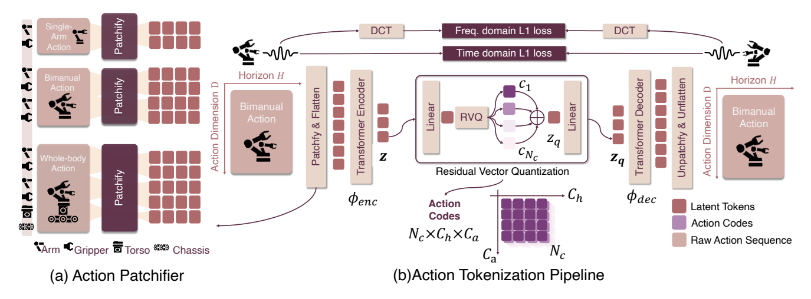

그림 2. 원문 Figure 2 — (a) action patchification과 (b) TAAE·RVQ 기반 토큰화 및 복원 경로. [PDF p.4, §3.1; 원문 그림 발췌] · [논문 PDF](https://openreview.net/pdf?id=k6nTUFoqeT).

원래 action chunk는 $`H\times D`$ single-channel 2D 배열로 볼 수 있다. “single-channel action image”는 RGB 영상을 action으로 합성한다는 뜻이 아니라, **시간을 한 축, action coordinate를 다른 축으로 둔 1-channel 수치 격자**라는 뜻이다.

시간축은 길이 $`h`$의 $`m`$개 그룹으로 균등 분할한다. action축은 end-effector position, orientation, gripper, arm, torso, chassis처럼 물리 의미가 비슷한 $`n`$개 그룹으로 비균등 분할한다. 작은 그룹은 가장 큰 너비 $`d_{pad}`$에 맞춰 padding한다. 그 뒤 $`h\times d_{pad}`$ patch를 $`mn`$개 만들고 flatten한다. binary gripper와 대부분 0인 mobile-base dimension이 연속 arm coordinate의 통계를 압도하는 문제를 사전 grouping으로 줄이려는 의도다.

중요한 미기재 사항은 실제 embodiment별 grouping, padding 값/mask, $`h`$, convolution stride다. 따라서 논문만으로 raw $`H\times D`$에서 정확히 어떤 patch 배열이 나오는지 bit-exact 재현할 수 없다.

#### 3.1 FASTerVQ - TAAE와 RVQ [PDF p.5; Fig. 2b; Algorithm 1]

TAAE는 transformer의 global receptive field와 convolution의 local relation/downsampling을 결합한다. encoder가 patch sequence를 $`z`$로 줄이고, $`N_c`$개의 residual quantizer가 순서대로 residual을 근사한다. 초기 codebook은 큰 저주파 구조, 후속 codebook은 잔여 고주파 세부를 담당한다는 coarse-to-fine 해석을 제시한다.

Algorithm 1의 encode는 residual $`r`$과 $`z_q`$를 초기화하고, 각 $`Q_i`$의 nearest code vector를 $`z_q`$에 더하면서 residual에서 뺀다. 선택 index $`c_i`$를 모아 $`C`$를 반환한다. decode는 index lookup 결과들을 합산해 $`z_q`$를 만들고 TAAE decoder와 UnPatchify를 적용한다.

#### 3.1 FASTerVQ - 목적함수 [PDF p.5; Eq. (1)]

첫 L1은 원래 시간영역 action을 step별로 맞춘다. 두 번째 L1은 DCT coefficient를 맞춰 장기 추세와 주파수 성분을 보존한다. 세 번째 commitment 항은 encoder 출력 $`z`$가 선택한 양자화 합 $`z_q`$ 근처에 머물게 한다. codebook은 EMA로 업데이트하고 쓰이지 않는 dead code는 재초기화한다. Eq. (1)의 $`\lambda`$와 Appendix의 commitment cost $`\beta=0.25`$는 같은 역할로 보이지만 기호가 일치하지 않는다.

#### 3.2 FASTerVLA - Architecture [PDF pp.5-6; Fig. 3a]

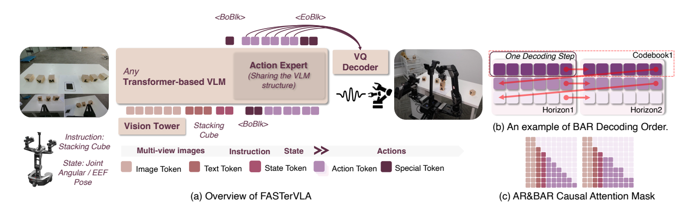

그림 3. 원문 Figure 3 — VLA 구조, codebook·시간·action 차원의 생성 순서, AR와 BAR의 attention mask를 함께 보여준다. [PDF p.6, §3.2; 원문 그림 발췌] · [논문 PDF](https://openreview.net/pdf?id=k6nTUFoqeT).

vision tower, projector, transformer language backbone은 일반 VLM checkpoint와 호환되는 형태를 유지한다. action code용 embedding slot을 추가하고 proprioception은 integer로 discretize한 뒤 text token처럼 넣는다. 그러나 state 범위, bin 수, special-token 직렬화 형식은 미기재다.

RoPE에는 spacing augmentation을 적용한다. 학습 중 인접 action token position gap을 1, 2, 3 등으로 흔들고, 추론 때 gap 2로 고정한다. $`\epsilon\sim U[0,2]`$이면 기대 gap이 2이므로 train-test 평균 간격을 맞추면서 절대 위치 암기를 어렵게 하는 셈이다.

action expert는 VLM backbone과 구조적으로 맞추되 더 작은 별도 경로다. backbone은 multimodal context를 한 번 encode하고 expert가 action token을 decode한다. parameter 수, layer mapping, cross-attention/weight sharing 방식은 나오지 않는다. 따라서 “sharing the VLM structure”는 **구조 공유**로 읽어야지 weight를 전부 공유한다고 단정할 수 없다.

#### 3.2 FASTerVLA - BAR [PDF p.6; Eq. (2),(3); Fig. 3b,c]

표준 AR은 각 $`c_i`$가 모든 이전 code $`c_{\lt i}`$에 조건부인 next-token cross entropy다. BAR는 $`B`$개 token을 한 block으로 묶고, 현재 block의 각 token을 이전 block들 $`C_{\lt j}`$에만 조건부로 동시에 예측한다. block 내부 attention을 허용하는 mask와 `<BoBlk>`, `<EoBlk>` control token으로 일반 text AR와 block mode를 한 sequence 안에서 전환한다.

decode 순서는 code tensor $`N_c\times C_h\times C_a`$를 그대로 임의 flatten하지 않는다. 한 codebook에서 horizon 0,1,...,$`C_h-1`$을 진행한 뒤 다음 residual codebook으로 넘어간다. 각 block은 주로 action-dimension 쪽 token을 함께 예측하는 것으로 그림이 설명한다. 이 순서는 coarse codebook을 먼저 생성해 fine residual의 조건으로 제공한다.

Fig. 3c가 intra-block attention을 허용한다고 하면서 Eq. (3)은 current block의 ground truth에 조건부가 아니라고 쓴다. 학습 입력을 어떻게 shift하고 대체 입력 token을 어떻게 배치해야 target leakage가 없는지 논문만으로 완전히 확정하기 어렵다. `<BoBlk>` 복제 설명은 첫 block 시작만 구체적이다.

### 4 Experiments [PDF pp.6-10]

#### 4.1 Experiment Setups [PDF pp.7,16-18]

저자는 tokenizer 질문과 full-policy 질문을 분리한다. tokenizer는 reconstruction/VRR, compression, data scaling, cross-embodiment를 본다. VLA는 ID/OOD task 성능, backbone 호환성, latency를 본다. 주요 baseline은 flow matching $`\pi_0`$, FAST tokenizer 기반 $`\pi_0`$-FAST, OpenVLA 계열, 기존 VQ tokenizer들이다.

대부분 model은 robotics-pretrained checkpoint에서 시작하지만 Bridge/Droid는 같은 dataset에서 VLM initialization부터 pretrain해 zero-shot을 비교한다고 쓴다. Table 1에는 외부 논문 보고값과 본 논문의 훈련값이 함께 들어 있어 모든 행이 동일 코드·동일 seed·동일 compute에서 재실행된 것은 아니다.

#### 4.2 FASTerVQ Results [PDF pp.8-9; Eq. (4); Fig. 5,6,8]

L1 reconstruction만으로는 sensor/motor noise까지 과도하게 벌할 수 있다는 문제의식에서 VRR을 정의한다. 오차가 허용치 $`\sigma`$보다 작은 action 비율을 세며, $`\sigma`$가 작을수록 더 엄격하다. Fig. 5의 평균 curve와 Fig. 13의 dataset별 heatmap은 FASTer(L)가 $`10^{-3}`$에서 가장 높고 FASTer(S)도 같은 규모 비교의 FAST보다 높다는 것을 보인다.

Fig. 6은 action horizon이 Bridge 5, LIBERO 10, XArm 15, R1Lite 30으로 길어질 때 compression-reconstruction trade-off를 비교한다. FASTer가 긴 horizon에서 유리하다는 정성 주장은 보이지만 축 정의와 원시 숫자가 표로 제공되지 않아 정확한 배수를 재계산할 수 없다.

Fig. 8은 single-arm delta EEF로 학습한 tokenizer를 Droid joint velocity, R1Lite absolute joint position, Agilex delta joint position에 적용하고 FASTer(S)→FASTer(L) scaling gain을 각각 +0.394, +0.261, +0.264로 표시한다. 이는 normalized action space의 공통 구조라는 가설을 지지하지만 normalization을 동일하게 만드는 절차가 재현의 핵심이다.

#### 4.3 FASTerVLA Results [PDF pp.9-10; Table 1,2; Fig. 4,7,9,10]

ID에서는 LIBERO, VLABench, GalaxeaManipSim, XArm, R1Lite bimanual/WBC를 평가한다. Table 1의 FASTer LIBERO 평균 97.9%는 네 suite 평균과 일치한다. Figure 4는 추가 embodiment에서 $`\pi_0`$-FAST보다 FASTer가 대체로 높고, VLABench에서는 $`\pi_0`$가 약간 높다는 본문 설명을 시각화한다. 정확한 bar 숫자는 별도 표가 없다.

OOD에서는 VLABench perturbation, Bridge→Widow/Simpler, Droid→Franka를 본다. Figure 10에서 FASTer/Fast+가 Widow와 Droid task progress에서 FAST/π0보다 높다. Table 1의 Simpler-Bridge 평균은 87.9%다. 다만 본문 “second-best보다 12.9%”는 표의 second-best 76.5%와 계산상 맞지 않는다. 차이는 11.4 percentage point, 상대 개선율은 약 14.9%다.

code distribution 분석은 vocabulary usage, 최대 token 빈도 $`F_{max}`$, normalized entropy를 본다. FASTerVQ는 Bridge에서 4096 code를 모두 사용하고 $`F_{max}=1.35\%`$, normalized entropy 0.91이라고 보고한다. 이것은 분산된 code 사용의 증거지만 code balance가 task generalization의 원인이라는 인과를 직접 증명하지는 않는다.

cross-backbone 실험은 Qwen2.5, InternVL3.5, PaliGemma2 모두 평균 개선을 보인다. 가장 큰 변화는 InternVL3.5-2B의 79.35→96.65, +17.30 pp다. Fig. 7에서는 FAST→FASTerVQ 교체가 대부분의 이득이고 BAR의 추가 이득은 작다고 해석한다.

latency는 RTX 5090 PyTorch 단일 측정 환경으로 보고된다. Single/LIBERO의 FASTer 총 112 ms, WBC의 237 ms다. image encoder와 observation forward가 88 ms 및 128 ms로 큰 비중을 차지하고 VQ detokenization은 2.7/7 ms다. 이는 “action tokenizer가 가볍다”는 근거지만 TTFT, TPOT, tail latency, batch throughput, peak memory는 측정하지 않았다.

#### 4.4 Additional Studies [PDF p.10]

본문은 tokenizer architecture, codebook size, residual depth, action expert, BAR ablation이 Appendix A.3에 있다고 안내한다. 독립적인 새 결과는 없고 Fig. 15의 rollout 이미지로 연결한다.

### 5 Conclusion [PDF p.10]

결론은 세 아이디어를 재강조한다: codec-inspired RVQ, BAR, lightweight action expert. “mixture-of-experts VLA”라는 표현이 나오지만 router/load-balancing이 있는 전형적 MoE 정의는 제시되지 않는다. 본문 그림상으로는 modality-specific expert 경로에 가깝다. pretrained VQ를 downstream에 재사용할 수 있다는 결론은 여러 dataset/backbone 실험으로 지지되지만, 모든 embodiment에서 retraining이 전혀 없었던 것은 아니다. VLABench primitive tokenizer나 Galaxea mixture처럼 환경별 선택도 있다.

### 6 Ethics Statement [PDF p.11]

저자는 human subject, sensitive data, direct ethical concern이 없고 모든 dataset이 public이라고 쓴다. 그러나 Appendix는 “newly collected” XArm/Widow 및 real-world demonstration을 언급하며 공개 URL/라이선스를 주지 않는다. “모든 dataset 공개”를 독자가 검증하려면 실제 release 링크가 필요하다.

### 7 Reproducibility Statement [PDF p.11]

저자는 publication 시 source code 공개를 약속하고 §3, §4, Appendix에 설정을 제공한다고 쓴다. 이 PDF 자체에는 공식 code URL이 없다. 현재 문서만으로는 TAAE layer spec, patch grouping, state discretization, action expert size/freeze map, BAR tensor layout가 빠져 있어 완전 재현은 어렵다.

### References [PDF pp.11-15]

VLA, VQ codec, action tokenizer, block generation의 근거 문헌을 확인했다. 참고문헌별 서평은 하지 않는다. 표기상 Parker et al.의 동일 제목이 2024 arXiv와 2025 ICLR 항목으로 중복 수록되어 있는데, 본문은 두 연도를 모두 사용한다.

### Appendix A.1 Detailed Evaluation Setups [PDF pp.16-17; Fig. 11]

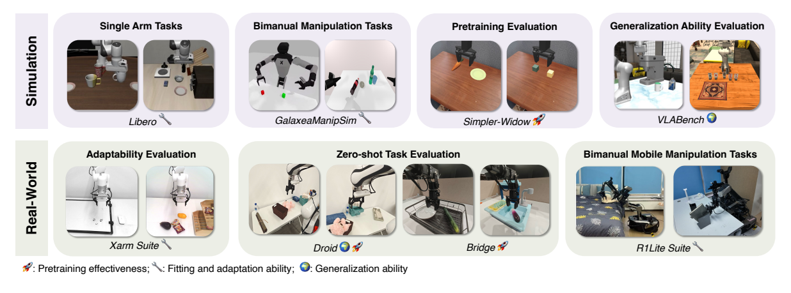

그림 11. 원문 Figure 11 — simulation·real-world benchmark와 평가 목적의 대응 관계. 성능 수치가 아니라 실험 범위를 보여주는 그림이다. [PDF p.16, Appendix A.1; 원문 그림 발췌] · [논문 PDF](https://openreview.net/pdf?id=k6nTUFoqeT).

Fig. 11은 simulation/real-world를 나누고 pretraining effectiveness, fitting/adaptation, generalization 목적을 아이콘으로 표시한다. 구체 recipe는 다음과 같다.

| Suite | 데이터/과제 | 훈련 recipe | tokenizer/평가 |
|---|---|---|---|
| LIBERO | 4 suites, 40 tasks, task당 50 examples | 30k steps, global batch 32, augmentation off, 8×H100 | FASTerVQ(S), 한 policy로 4 suites, pretrain+FT와 scratch 설정 |
| Simpler-Widow | Bridge-trained model의 pretraining 평가 | 4 epochs, global batch 128, augmentation on, 8×H100 | FASTerVQ(S), task당 120 trials로 확대 |
| VLABench | 10 tasks, 5,000 examples | 30k steps, batch 32, augmentation off, 8×H100 | primitive dataset으로 tokenizer 별도 훈련 |
| GalaxeaManipSim | 7 dual-arm tasks, 7,000 examples | 4 epochs, batch 128, augmentation on, 8×H20 | head+양 wrist 3 views, Galaxea Open tokenizer, post-training 없음 |
| XArm Suite | 5 tasks, 500 real episodes | 30k steps, batch 128, augmentation on | FASTerVQ(L); GPU 수/precision은 이 bullet에 미기재 |
| R1Lite Suite | cube 200 demos, table/desk 200 demos, bed 1,000 demos | 8 epochs, global batch 256, 64×H20 | Galaxea Open tokenizer, post-training 없음 |
| Bridge | 60k+ trajectories | Simpler와 같은 checkpoint | Widow250s zero-shot |
| Droid | 90k+ trajectories | 3 epochs, 64×H200, per-GPU batch 16, global 1024 | joint-velocity control, zero-shot evaluation |

XArm bullet은 “500 episodes”와 “500 samples”를 혼용한다. episode가 sample 하나인지, segment를 여러 sample로 잘랐는지 확인이 필요하다.

### Appendix A.2 Implementation Details [PDF pp.17-18; Table 3-5]

**Data mixture.** Galaxea/Droid 전용 mixture 외에 S/L/XL이 있다. S는 LIBERO:Bridge를 5:1로, L은 여기에 Kuka/Fractal/Droid(EEF)를 1씩, XL은 다시 Droid(joint velocity)/Galaxea를 1씩 더한다. Ratio는 sampling weight이지 절대 trajectory 수가 아니다.

**FASTerVQ.** AdamW, lr $`10^{-4}`$, weight decay 0.1, $`(\beta_1,\beta_2)=(0.9,0.95)`$, cosine decay, warmup 1,000, gradient clip 1.0, bf16, 8×H100, 300k steps다. single-arm tokenizer는 8M params, batch 512 sequences, sequence length 21 tokens이고 full-body는 13M params, batch 2048, 같은 token length라고 쓴다. $`K=4096`$, $`d_z=128`$, commitment cost $`\beta=0.25`$다.

“all policies”라고 쓰지만 문맥은 FASTerVQ tokenizer 학습이다. 또한 full-body의 “length 21 tokens”는 Table 4의 WBC code 길이 $`3\times2\times21=126`$과 맞지 않아, 21이 raw action DoF/다른 batching unit인지 확인이 필요하다.

**FASTerVLA.** AdamW, lr $`2.5\times10^{-5}`$, weight decay $`10^{-10}`$, cosine, warmup 1,000, bf16, attention dropout 0.0. 추론은 top-k 50, temperature 0.8, conditioning window 1, output clip $`[-1,1]`$. 본문 prose는 WBC/bimanual block size 8, single-arm 7이라고 하나 Table 4는 모든 suite에 7을 적는다.

Table 4의 shape를 적용하면 LIBERO는 $`C_a=7,C_h=1,N_c=3`$이라 $`N=21`$이고 block 7이면 3회 forward다. R1Lite WBC는 $`21\times2\times3=126`$ token이다. Table 2는 12 BAR forward를 보고하므로 본문의 block 8($`\lceil126/8\rceil=16`$)도 Table 4의 block 7($`126/7=18`$)도 12와 맞지 않는다.

### Appendix A.3 Ablation Study [PDF pp.18-20; Fig. 12; Table 6,7]

Table 6에서 TAAE는 CNN/Transformer보다 SR 97.9, L1 0.0021로 가장 좋다. codebook은 4096에서 SR 97.9/utilization 99.6으로 최고이고 8192에서 SR 96.3/utilization 95.1로 내려간다. 이를 저자는 codebook collapse onset으로 해석하지만 utilization 95.1%만으로 collapse를 확정하려면 frequency/entropy와 여러 seed가 더 필요하다. residual level은 1→2→3에서 93.4→95.5→97.9, 8에서 96.6이다.

Table 7에서 pretrained AE는 LIBERO 97.9, Simpler 87.9이며 no-AE는 95.5/75.6이다. AE no-pretrain은 94.8/23.6으로 특히 Simpler에서 collapse한다. BAR는 token-wise AR의 95.5, 323 ms를 96.7, 140 ms로 바꾸고 BAR+AE는 97.7, 140 ms다. Table 1의 최종 97.9와 Table 7의 97.7이 다른 이유/seed는 설명되지 않는다.

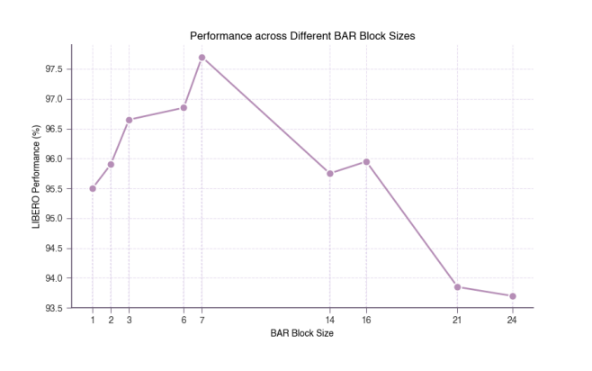

그림 12. 원문 Figure 12 — BAR block size를 바꾸었을 때의 성공률. 원문 curve의 정점은 block size 7이다. [PDF p.20, Appendix A.3; 원문 그림 발췌] · [논문 PDF](https://openreview.net/pdf?id=k6nTUFoqeT).

Fig. 12의 block-size curve는 7에서 약 97.7로 정점이고 21/24에서 약 93.9/93.7로 떨어진다. action-dimension code length와 block size가 맞을 때 좋다는 주장과 일치한다. 다만 curve에 error bar가 없다.

### Appendix A.4 Different VLM Backbones [PDF p.19; Table 9]

PaliGemma2-3B, InternVL3.5-2B는 원 VLM checkpoint, Qwen2.5 0.5/1.5/3B는 LLaVA v1.5 data로 vision tower/projector가 붙은 VLA-OS checkpoint를 사용하고 LIBERO에서 scratch training한다. 따라서 backbone 비교는 “동일 pretraining history” 비교가 아니라 각 계열의 이용 가능한 VLM initialization 비교다. 모든 평균은 FAST 대비 +1.30에서 +17.30 pp 개선된다.

### Appendix A.5 Qualitative Analysis [PDF pp.20-22; Table 8,10; Fig. 13,14]

MiniVLA는 공식 LIBERO/Bridge VQ weight를, VQ-VLA는 저자가 1:1 LIBERO+Bridge, H200 1장, batch 1024, 800k steps, lr $`5\times10^{-5}`$로 재훈련한 weight를 쓴다. Fast+는 1M real-world trajectory universal tokenizer다. 비교 model마다 training recipe가 동일하지 않으므로 결과는 “현재 공개/재현 가능한 강한 버전 비교”로 읽어야 한다.

Fig. 14는 red ground truth, green reconstruction, red tolerance band 0.01을 겹친다. MiniVLA/VQ-VLA는 spike가 많고 OOD XArm/Widow에서 band 이탈이 늘며, Fast+/FASTerVQ는 더 안정적이다. 99th-percentile normalization clipping 때문에 green horizontal line이 생길 수 있다고 저자가 명시한다. 이 선을 decoder collapse로 오인하면 안 된다.

Table 10에서 256-size VQ들은 256개를 모두 activate하지만 높은 빈도 token 하나에 쏠린다. Fast+는 Bridge 1175/2048, XArm 1067/2048 active이고, FASTerVQ는 두 곳 모두 4096/4096 active다. 그러나 $`\gt 10^{-3}`$ 빈도 token은 FASTer가 Bridge 162, XArm 38이므로 “모두 사용”과 “균등 사용”은 같은 말이 아니다.

Appendix prose는 Fig. 5 threshold를 $`\theta`$라고 부르지만 Eq. (4)와 Fig. 13은 $`\sigma`$다. 기호 오탈자로 보이며 원문 표기를 조용히 통일해서는 안 된다.

### Appendix A.6 Use of LLM [PDF p.21]

저자는 LLM 사용을 grammar, sentence structure, clarity polishing에만 한정했고 연구 개념·방법·결론은 저자들이 만들었다고 밝힌다.

### Figure 14-15 전용 페이지 [PDF pp.22-23]

Fig. 14는 네 tokenizer×네 dataset의 다수 action coordinate trace를 한 페이지에 모은 정성 비교다. 작은 패널이라 개별 수치 판독보다 band 이탈·spike·추세 겹침을 본다. Fig. 15는 Simpler, Galaxea, Widow, Droid, LIBERO, XArm, whole-body bed-making 등 실제 평가 장면의 rollout frame을 보여준다. 성공률 계산 방식이나 failure taxonomy를 추가하지는 않는다.

---

## 6. 수식·알고리즘 집중 해설

이 절은 원문 수식을 다시 모아 “무엇을 계산하는가 → shape/단위 → 왜 필요한가 → gradient/추론 역할 → 작은 예시 → edge case” 순서로 설명한다. 원문에 번호가 없는 보충 유도는 반드시 `[해설용 수식]`이라고 표시한다.

### 6.1 문제 정의의 비번호 식 [PDF p.4, §3]

원문 입력은 다음과 같다.

```math
I_t\in\mathbb{R}^{H_I\times W_I\times3},\qquad s_t\in\mathbb{R}^{d_s},\qquad l\in\mathcal L.
```

- $`I_t`$는 한 시점의 RGB image다. multi-view 실험에서는 실제로 여러 image가 들어가지만 위 식은 view 축을 쓰지 않는다.
- $`s_t`$는 robot state vector다. 상태의 각 성분과 단위는 embodiment마다 다르다.
- $`l`$은 자연어 instruction 공간 $`\mathcal L`$의 원소다.

출력 chunk는 다음처럼 정의된다.

```math
A_{t:t+H}=(a_t,a_{t+1},\ldots,a_{t+H-1}),\qquad a_t\in\mathbb{R}^{D}.
```

표기 $`t:t+H`$는 종종 끝점을 포함하는 것처럼 보이지만 실제 tuple은 정확히 $`H`$개다. 한 action의 물리 단위는 좌표별로 다를 수 있고, 논문은 최종값을 $`[-1,1]`$로 clip한다고만 명시한다.

tokenizer 이후 policy target은 $`(z_1,\ldots,z_N)`$이라고 쓰지만 뒤에서는 $`z`$가 연속 latent, $`c_i`$가 이산 code다. 따라서 이 첫 문단의 $`z_i`$는 일반적 “discrete code” 표기이고, RVQ 절의 continuous $`z`$와 기호가 충돌한다. 이후 식을 일관되게 읽으려면 policy target을 $`c_1,\ldots,c_N`$으로 보는 편이 맞다.

### 6.2 Patchifier 식 [PDF pp.4-5, §3.1]

시간축을 $`m`$개 길이-$`h`$ group, action축을 $`n`$개 물리 group으로 나누고 각 action group을 폭 $`d_{pad}`$로 padding하면 중간 격자는 다음 shape다.

```math
(m h)\times(n d_{pad}).
```

$`mh=H`$라면 첫 축은 원래 horizon과 같다. action 쪽은 padding 때문에 $`nd_{pad}\ge D`$다. 각 $`h\times d_{pad}`$ tile을 펴면 원문 patch 식은 다음과 같다.

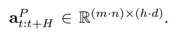

원문 비번호 식 — patch tensor의 shape. 원문의 $`d`$는 아래 해설에서 padding 폭을 분명히 하려고 $`d_{pad}`$로 쓴다. [PDF p.4, §3.1] · [논문 PDF](https://openreview.net/pdf?id=k6nTUFoqeT).

```math
a^P_{t:t+H}\in\mathbb{R}^{(mn)\times(hd_{pad})}.
```

연산 순서는 (1) action coordinate를 물리 그룹별 재배열, (2) 각 그룹 padding, (3) 시간 구간 분할, (4) 각 tile flatten이다. non-overlapping convolution과 유사하다는 말은 receptive-field/stride 관점의 비유다.

**작은 예시 [해설용].** $`H=4,D=3`$이고 action coordinate가 position 2개와 gripper 1개라고 하자. 시간 patch $`h=2`$라서 $`m=2`$, action group $`n=2`$, 가장 큰 폭 $`d_{pad}=2`$다. gripper group은 한 칸 padding한다. 중간 격자는 $`4\times4`$, patch는 $`mn=4`$개, 각 patch vector 길이는 $`hd_{pad}=4`$다. 원래 scalar는 $`4\times3=12`$개지만 padding 격자는 16개다. 압축은 padding 단계에서 생기는 것이 아니라 **뒤의 encoder downsampling/VQ**에서 생긴다.

**Edge cases.** $`H`$가 $`h`$로 나누어떨어지지 않거나 physical group의 padding mask가 없으면 zero padding을 실제 “정지 action”으로 오인할 수 있다. 논문은 처리 방식을 명시하지 않는다.

### 6.3 RVQ 비번호 식 [PDF p.5, §3.1]

원문은 encoder 출력을 다음처럼 둔다.

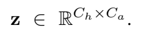

원문 비번호 식 — encoder latent의 명시된 shape 부분. 마지막 vector 축을 생략한 원문 표기 자체를 확인하기 위한 발췌다. [PDF p.5, §3.1] · [논문 PDF](https://openreview.net/pdf?id=k6nTUFoqeT).

```math
z=\phi_{enc}(a^P_{t:t+H}),\qquad z\in\mathbb{R}^{C_h\times C_a}.
```

nearest code vector를 고르려면 각 위치에 $`d_z`$차원 vector가 있어야 한다. Appendix의 $`d_z=128`$을 사용하면 구현 shape는 $`C_h\times C_a\times d_z`$일 가능성이 높다. 다만 원문 식에는 마지막 축이 없으므로 이것은 [리뷰어 해석]이며 공식 코드로 확인해야 한다.

RVQ residual recurrence는 다음과 같다.

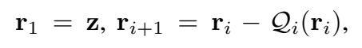

원문 비번호 식 — 초기 residual과 단계별 잔차 갱신. [PDF p.5, §3.1] · [논문 PDF](https://openreview.net/pdf?id=k6nTUFoqeT).

```math
r_1=z,\qquad r_{i+1}=r_i-Q_i(r_i),\qquad i=1,\ldots,N_c.
```

- $`r_1`$은 원래 latent다.
- $`Q_i(r_i)`$는 $`i`$번째 codebook에서 각 위치의 residual과 가장 가까운 code vector다.
- 다음 residual은 아직 설명되지 않은 오차다.
- 각 stage가 완벽하면 $`r_{N_c+1}=0`$에 가까워진다.

양자화 합은 다음과 같다.

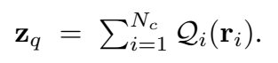

원문 비번호 식 — 각 RVQ stage에서 선택한 vector를 더해 $`z_q`$를 만든다. [PDF p.5, §3.1] · [논문 PDF](https://openreview.net/pdf?id=k6nTUFoqeT).

```math
z_q=\sum_{i=1}^{N_c}Q_i(r_i).
```

위 recurrence를 전개하면 다음 관계가 생긴다.

```math
\text{[해설용 수식]}\qquad z-z_q=r_{N_c+1}.
```

즉 최종 residual norm이 작을수록 latent 복원이 좋다. 각 stage의 nearest-neighbor 선택은 다음 식이다.

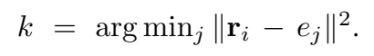

원문 비번호 식 — codebook에서 최근접 vector의 index를 선택한다. 원문은 norm에 **아래첨자 2가 아니라 위첨자 제곱**을 쓴다. 아래 LaTeX는 이 인쇄 표기에 맞췄다. Euclidean norm으로 읽을 때 norm과 squared norm의 최소화 index는 같지만, 표기와 해석은 구분해야 한다. [PDF p.5, §3.1] · [논문 PDF](https://openreview.net/pdf?id=k6nTUFoqeT).

```math
k=\arg\min_j\lVert r_i-e_j\rVert^2.
```

$`e_j\in\mathbb{R}^{d_z}`$는 codebook vector다. $`\arg\min`$은 index $`k`$만 반환한다. 실제 quantized vector는 $`e_k`$다. 모든 위치와 stage의 index를 모으면 다음 code tensor다.

```math
C\in\{1,\ldots,K\}^{N_c\times C_h\times C_a},\qquad N=N_cC_hC_a.
```

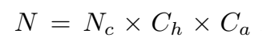

원문 비번호 식 — 전체 token 수 $`N=N_c\times C_h\times C_a`$. 위 code tensor shape 해설에 연결되는 원문 §3.2의 개수 식이다. [PDF p.6, §3.2] · [논문 PDF](https://openreview.net/pdf?id=k6nTUFoqeT).

**작은 예시 [해설용].** 한 위치의 latent가 $`z=(1.20,-0.30)`$라고 하자. Stage 1이 $`(1.00,-0.50)`$를 고르면 $`r_2=(0.20,0.20)`$. Stage 2가 $`(0.25,0.10)`$를 고르면 $`r_3=(-0.05,0.10)`$. Stage 3이 $`(-0.05,0.10)`$를 고르면 $`r_4=(0,0)`$이고 세 vector 합은 정확히 $`(1.20,-0.30)`$이다. 실제로는 모든 $`C_hC_a`$ 위치에 이 연산을 병렬 적용한다.

**Edge cases.** 두 code가 같은 거리에 있으면 tie-breaking이 구현 의존적이다. later-stage residual이 codebook 범위 밖이면 error가 남는다. 한 code만 반복 선택되는 collapse가 생기면 높은 $`K`$가 있어도 실제 정보량은 작다.

### 6.4 Eq. (1): tokenizer 학습 objective [PDF p.5, §3.1]

원문 Eq. (1)은 다음과 같다.

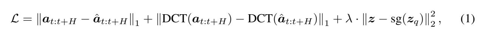

원문 Eq. (1) — 시간영역 L1, DCT 영역 L1, commitment loss의 합. 인쇄된 식 번호까지 포함한 원문 발췌다. [PDF p.5, §3.1] · [논문 PDF](https://openreview.net/pdf?id=k6nTUFoqeT).

```math
\begin{aligned} \mathcal L &=\lVert a_{t:t+H}-\hat a_{t:t+H}\rVert_1\\ &\quad+\lVert\mathrm{DCT}(a_{t:t+H})-\mathrm{DCT}(\hat a_{t:t+H})\rVert_1\\ &\quad+\lambda\lVert z-\mathrm{sg}(z_q)\rVert_2^2. \end{aligned} \qquad\text{(1)}
```

#### 첫째 항: time-domain L1

```math
\lVert a-\hat a\rVert_1=\sum_{u=1}^{H}\sum_{v=1}^{D}|a_{u,v}-\hat a_{u,v}|.
```

- 입력/출력 shape는 $`H\times D`$다.
- 각 action step의 절대 오차를 직접 줄인다.
- L2보다 outlier의 제곱 증폭이 없어 noisy real-robot action에 강하다는 것이 저자의 선택 이유다.
- mean인지 sum인지 Eq. (1)에 명시되지 않았다. batch/shape가 바뀌면 loss scale과 $`\lambda`$ 의미가 달라질 수 있다.

#### 둘째 항: frequency-domain L1

시간축별 DCT라고 해석하면 각 action coordinate의 길이-$`H`$ 신호를 cosine coefficient로 바꾼다. constant/slow motion은 저주파, 급격한 jerk는 고주파에 반영된다. DCT 축, normalization(`ortho` 여부), padding 처리는 미기재다.

시간 L1과 DCT L1은 서로 중복처럼 보이지만 같은 오차를 다른 basis에서 벌한다. L1 norm은 회전 불변이 아니므로 orthogonal DCT라도 두 L1 값이 같지 않다. 따라서 두 항을 동시에 쓰는 것이 특정 주파수 분포에 추가 inductive bias를 준다.

#### 셋째 항: commitment

$`\mathrm{sg}`$는 forward 값은 그대로 두되 그 인자 방향 gradient를 0으로 만든다.

```math
\begin{aligned} \frac{\partial}{\partial z_q}\lVert z-\mathrm{sg}(z_q)\rVert_2^2&=0,\\ \frac{\partial}{\partial z}\lVert z-\mathrm{sg}(z_q)\rVert_2^2&=2(z-z_q). \end{aligned}
```

이 항은 encoder latent를 선택 code 근처로 끌어가지만 codebook을 gradient로 끌어오지는 않는다. codebook은 논문 설명대로 EMA로 별도 갱신된다. Appendix가 $`\beta=0.25`$라 부르는 값이 Eq. (1)의 $`\lambda`$와 같은 것으로 보이지만 [논문 표기 불일치]다.

#### STE gradient 경로

원문은 STE를 쓴다고만 설명한다. 전형적인 구현은 다음과 같다.

```math
\text{[해설용 수식]}\qquad z_{ST}=z+\mathrm{sg}(z_q-z).
```

forward 값은 $`z_q`$지만 $`\partial z_{ST}/\partial z=I`$다. 따라서 reconstruction loss의 gradient가 decoder→$`z_{ST}`$→encoder로 흐를 수 있다. nearest-index 선택 자체에는 gradient가 없다.

#### 작은 수치 예시

**[해설용]** 길이 2, 한 coordinate에서 $`a=[0.10,0.20]`$, $`\hat a=[0.12,0.18]`$이면 time L1은 $`0.04`$다. orthonormal DCT-II를 가정하면 두 신호의 DC는 같고 다른 계수 차이가 약 $`0.0283`$이다. $`z=(1.2,-0.3)`$, $`z_q=(1.0,-0.5)`$, $`\lambda=0.25`$이면 commitment는 $`0.25(0.2^2+0.2^2)=0.02`$다. 총 예시 loss는 약 $`0.0883`$이다. 실제 논문의 DCT normalization과 reduction이 미기재이므로 이 값은 원문 재현값이 아니다.

#### Edge cases

- binary gripper의 작은 오차와 translation meter 오차를 같은 L1에 합칠 때 coordinate scale이 중요하다.
- DCT loss가 너무 크면 noisy high-frequency까지 맞출 수 있다. 두 reconstruction 항 사이 별도 weight가 없다.
- dead-code reinit 시 EMA state와 optimizer/분산학습 sync가 일치하지 않으면 code usage가 흔들릴 수 있다.
- $`z_q`$가 decoder가 복원할 정도로 좋더라도 discrete code 분포가 VLA가 예측하기 어려울 수 있다. reconstruction과 language-model predictability는 별개다.

### 6.5 Spacing augmentation 비번호 식 [PDF p.5, §3.2]

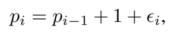

원문 비번호 식 — 학습 중 position 간격에 jitter $`\epsilon_i`$를 더하는 부분. 분포 설명은 원문에서 인접 prose로 주어진다. [PDF p.5, §3.2] · [논문 PDF](https://openreview.net/pdf?id=k6nTUFoqeT).

```math
p_i=p_{i-1}+1+\epsilon_i,\qquad \epsilon_i\sim U\{0,1,\ldots,k\}.
```

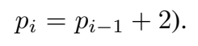

원문 비번호 식 — 추론에서는 gap 2의 고정 spacing을 사용한다. 오른쪽 괄호·마침표는 원문 inline 식의 문장부호다. [PDF p.5, §3.2] · [논문 PDF](https://openreview.net/pdf?id=k6nTUFoqeT).

$`k=2`$이면 gap은 1,2,3이고 기대값은 2다. 추론에서는 $`p_i=p_{i-1}+2`$를 쓴다. 예를 들어 $`p_0=10`$, $`\epsilon=[0,2,1]`$이면 다음 position은 11,14,16이다. gap이 항상 1 이상이라 token order가 뒤집히지 않는다.

gradient 관점에서 position sample은 학습 데이터 augmentation이고 $`\epsilon`$으로 gradient가 흐르지는 않는다. RoPE의 phase만 바뀌어 모델이 고정 horizon의 절대 위치 shortcut에 덜 의존하도록 한다. 긴 jitter가 VLM context maximum position을 넘는 경우 처리나 seed는 미기재다.

### 6.6 Eq. (2): vanilla autoregressive loss [PDF p.6, §3.2]

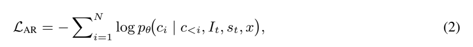

원문 Eq. (2) — 이전 action code 전체에 조건부인 token-wise AR objective. [PDF p.6, §3.2] · [논문 PDF](https://openreview.net/pdf?id=k6nTUFoqeT).

```math
\mathcal L_{AR}=-\sum_{i=1}^{N}\log p_\theta(c_i\mid c_{\lt i},I_t,s_t,x). \qquad\text{(2)}
```

- $`c_i`$는 $`K`$개 action code class 중 하나다.
- $`p_\theta`$의 출력 shape는 보통 각 target 위치에서 $`K`$ 또는 special token을 포함한 vocabulary 크기의 categorical distribution이다.
- 학습 때 teacher forcing으로 모든 위치의 logits를 병렬 계산할 수 있지만 causal mask가 미래 token을 가린다.
- 추론 때는 $`N`$번 순차 sampling이 필요하고, top-k 50/temperature 0.8이 적용된다.

**작은 예시 [해설용].** 정답 세 token의 조건부 확률이 0.8, 0.5, 0.25이면 sum loss는 $`-\log(0.8\cdot0.5\cdot0.25)=-\log0.1\approx2.3026`$이다. Eq. (2)는 평균이 아니라 합으로 쓰였지만 구현에서 token mean을 쓸 가능성은 있다.

**Edge cases.** 중간 token 하나가 틀리면 이후 condition이 training과 달라진다. `<eos>`를 너무 일찍 내면 fixed-length code tensor를 완성하지 못한다. 논문은 fixed-length action code와 `<eos>` 종료를 모두 언급하지만 invalid length 복구 규칙은 쓰지 않는다.

### 6.7 Eq. (3): block-wise autoregressive loss [PDF p.6, §3.2]

먼저 sequence를 $`J`$개 block으로 나눈다.

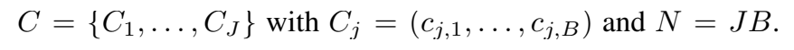

원문 비번호 식 — 전체 sequence $`C`$, block $`C_j`$, $`N=JB`$ 관계를 한 줄로 정의한다. [PDF p.6, §3.2] · [논문 PDF](https://openreview.net/pdf?id=k6nTUFoqeT).

```math
C=\{C_1,\ldots,C_J\},\qquad C_j=(c_{j,1},\ldots,c_{j,B}),\qquad N=JB.
```

BAR objective는 다음과 같다.

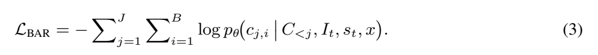

원문 Eq. (3) — 현재 block의 각 token을 이전 block들에 조건부로 예측하는 objective. [PDF p.6, §3.2] · [논문 PDF](https://openreview.net/pdf?id=k6nTUFoqeT).

```math
\mathcal L_{BAR}=-\sum_{j=1}^{J}\sum_{i=1}^{B} \log p_\theta(c_{j,i}\mid C_{\lt j},I_t,s_t,x). \qquad\text{(3)}
```

Eq. (2)와의 핵심 차이는 같은 block의 $`c_{j,\lt i}`$가 조건식에 없다는 점이다. 현재 block의 $`B`$개 categorical prediction을 한 forward에서 얻어 순차 깊이를 $`N`$에서 약 $`N/B=J`$로 줄인다. 대신 같은 block 안 token의 직접적인 autoregressive dependence를 포기하거나, shared hidden interaction으로만 모델링한다.

**작은 예시 [해설용].** $`N=6,B=2`$이면 $`C_1=(c_1,c_2)`$, $`C_2=(c_3,c_4)`$, $`C_3=(c_5,c_6)`$이다. 첫 forward는 context만 보고 $`c_1,c_2`$를 동시에, 둘째는 $`C_1`$을 보고 $`c_3,c_4`$를, 셋째는 $`C_1,C_2`$를 보고 $`c_5,c_6`$를 예측한다. 6회가 3회가 된다.

**Mask/누설 edge case.** teacher forcing 입력에서 current block의 정답 token을 그대로 서로 보게 하면 Eq. (3)과 달리 target leakage가 생긴다. Fig. 3의 intra-block attention과 `<BoBlk>` 대체 입력을 어떻게 조합하는지 정확한 shifted-input tensor가 필요하다. 공식 구현이 나오면 첫 검증 대상이다.

**나누어떨어지지 않는 경우.** $`N\bmod B\ne0`$이면 padding mask 또는 작은 마지막 block이 필요하지만 논문은 명시하지 않는다. WBC 표기 충돌 때문에 실제 규칙이 특히 중요하다.

### 6.8 Eq. (4): Valid Reconstruction Rate [PDF p.8, §4.2]

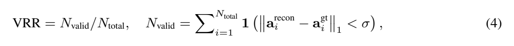

원문 Eq. (4) — threshold 아래의 reconstruction error를 갖는 sample 비율. 원문의 norm 아래첨자와 본문 거리 설명 사이의 차이는 아래에서 별도로 검토한다. [PDF p.8, §4.2] · [논문 PDF](https://openreview.net/pdf?id=k6nTUFoqeT).

```math
\begin{aligned} \mathrm{VRR}&=\frac{N_{valid}}{N_{total}},\\ N_{valid}&=\sum_{i=1}^{N_{total}} \mathbf 1\left(\lVert a_i^{recon}-a_i^{gt}\rVert_1\lt \sigma\right). \end{aligned} \qquad\text{(4)}
```

- 각 sample/action $`i`$의 reconstruction 오차가 threshold 아래인지 0/1로 센다.
- VRR은 $`[0,1]`$ 범위이며 높을수록 좋다.
- $`\sigma`$가 작아지면 valid set이 줄므로 동일 데이터에서 VRR은 비증가해야 한다. Fig. 13 값도 이 성질을 만족한다.
- indicator 때문에 VRR은 tokenizer training loss로 미분해서 쓰기 어렵고 평가 metric이다.

**작은 예시 [해설용].** 네 action 오차가 0.002, 0.009, 0.012, 0.004이고 $`\sigma=0.01`$이면 세 개가 valid라서 VRR은 $`3/4=0.75`$다. threshold 바로 아래 0.00999와 바로 위 0.01001이 완전히 다른 1/0이 되는 discontinuity가 있다.

**단위 문제.** 본문은 EEF translation의 $`\sigma`$는 meter Euclidean distance, rotation/joint는 radian angular error라고 쓴다. 그러나 Eq. (4)는 $`\lVert\cdot\rVert_1`$이고 $`a_i`$를 한 vector처럼 쓴다. translation 3D의 Euclidean norm은 L2이며 mixed translation/rotation vector에 한 norm을 쓰면 단위가 섞인다. 실제로 group별 VRR을 계산했는지, normalize 후 계산했는지 원문만으로 확정할 수 없다.

### 6.9 Algorithm 1: FASTer Tokenizer를 실행 순서로 풀기 [PDF p.5]

```text
ENCODE(action_chunk):
    patches = Patchify(action_chunk)
    z = encoder(patches)
    residual = z
    quantized_sum = 0
    codes = []
    for stage i in 1..Nc:
        code_index, code_vector = nearest_code(Q_i, residual)
        quantized_sum += code_vector
        residual -= code_vector
        codes.append(code_index)
    return codes

DECODE(codes):
    quantized_sum = 0
    for stage i in 1..Nc:
        quantized_sum += Q_i.lookup(codes[i])
    reconstructed_patches = decoder(quantized_sum)
    return UnPatchify(reconstructed_patches)

VQ_TRAINING(action_chunk):
    reconstructed = DECODE(ENCODE(action_chunk))
    update encoder/decoder with Eq. (1) and STE
    update codebooks by EMA; reinitialize dead codes
```

원문 pseudocode는 `C.append(c_i)`를 쓰지만 $`Q_i(r)`$ 호출이 index $`c_i`$를 어디에서 반환하는지 명시하지 않는다. 또한 quantized sum을 encode 중 계산하지만 반환값은 $`C`$뿐이고 train pseudocode는 다시 lookup한다. 구현에서는 encoder output, indices, quantized vectors, commitment statistics를 함께 반환하는 편이 자연스럽다.

---

## 7. 한 샘플의 end-to-end forward pass

LIBERO/Franka 설정을 사용하면 Table 4에서 $`D=7`$, action chunk $`H=20`$, $`C_a=7`$, $`C_h=1`$, $`N_c=3`$, BAR block size $`B=7`$이다. 아래는 논문에 나온 차원만 확정하고, 나오지 않은 차원은 표시한 forward pass다.

1. **관측 수집**  
   두 camera view의 RGB image, 7-DoF 관련 proprioception, language instruction을 받는다. image resolution, state vector의 정확한 $`d_s`$, control rate는 [논문 미기재]다. [PDF p.10, §4.3; p.18, Table 4]

2. **Context encoding**  
   vision tower가 각 image를 visual token으로 만들고 projector가 VLM hidden dimension에 맞춘다. instruction은 text tokenizer를 거치고 state는 정수화 후 text token처럼 직렬화한다. view별 token 수, VLM hidden size, state bin 수는 backbone/논문 구현 상세가 없어 확정하지 않는다.

3. **정답 action의 tokenizer 경로 - 학습 시**  
   $`A\in\mathbb{R}^{20\times7}`$을 single-channel action image로 본다. 실제 $`h,m,n,d_{pad}`$ grouping은 미기재라 patch shape를 수치로 채울 수 없다. TAAE encoder가 latent grid를 만든다.

4. **RVQ**  
   latent grid의 $`C_hC_a=1\times7=7`$ 위치마다 128차원으로 추정되는 vector가 있다. 3개 residual level이 각 위치에서 $`K=4096`$ 중 index를 고른다. 결과는

```math
C\in\{1,\ldots,4096\}^{3\times1\times7},\qquad N=21.
```

이 21개가 한 action chunk의 discrete supervision이다. stage 1의 7개가 coarse code, stage 2/3이 residual refinement다.

5. **Position과 sequence 구성**  
   multimodal context 뒤에 `<BoBlk>` 등 action-generation control token을 둔다. 학습 중 action token position gap은 1-3으로 jitter한다. exact serialization과 `<EoBlk>/<eos>` 순서는 [논문 미기재]다.

6. **BAR action generation**  
   $`B=7`$이라 codebook/horizon의 한 행에 해당하는 7 action-dimension code를 한 block으로 볼 수 있다. 세 forward pass가 stage 1,2,3 block을 순서대로 생성한다. 각 위치에서 vocabulary logits를 temperature 0.8로 나누고 top 50 후보 중 sampling한다. 논문은 greedy/seed/repeated-sampling 여부를 더 밝히지 않는다.

7. **VQ decode**  
   각 stage/location index로 128차원 code vector를 lookup하고 stage별 vector를 합쳐 $`z_q`$를 만든다. TAAE decoder가 patch를 복원하고 UnPatchify해서 $`\hat A\in\mathbb{R}^{20\times7}`$을 얻는다.

8. **후처리와 실행**  
   action을 $`[-1,1]`$로 clip한다. 20 step 전체를 실행하는지, 일부만 실행하고 replan하는지, temporal ensemble을 쓰는지는 [논문 미기재]다. 따라서 chunk size 20만으로 policy refresh frequency나 actuator control Hz를 계산할 수 없다.

9. **측정 latency**  
   RTX 5090 single setting에서 image encoder 16 ms, observation forward 72 ms, BAR $`7.4\text{ ms}\times3`$, detokenization 2.7 ms, total 112 ms로 보고된다. camera capture, host preprocessing, actuator transport가 포함되었는지는 명시되지 않는다.

---

## 8. 학습 단계, gradient, frozen/trainable 범위

### 8.1 Stage A - FASTerVQ tokenizer pretraining

**입력/target:** normalized continuous action chunk가 입력이자 reconstruction target이다. language/image는 필요 없다.

**업데이트:**

- $`\phi_{enc}`$: time/DCT reconstruction gradient가 STE를 통해 흐르고 commitment gradient도 받는다.
- $`\phi_{dec}`$: 두 reconstruction loss의 gradient를 받는다.
- codebook $`Q_i`$: 저자 설명상 EMA로 갱신하고 dead code를 재초기화한다.
- VLM/vision tower/action expert: 이 단계에는 참여하지 않는다.

**recipe:** AdamW $`10^{-4}`$, wd 0.1, betas 0.9/0.95, cosine, 1k warmup, clip 1.0, bf16, 8×H100, 300k steps. 하지만 EMA decay, dead-code threshold, DCT 구현, action normalization은 미기재다.

### 8.2 Stage B - FASTerVLA action-token 학습/사전학습

관측과 instruction으로 Stage A가 만든 discrete $`C`$를 예측한다. tokenizer encoder는 label 생성에, decoder는 최종 action 복원에 쓰인다. Eq. (2) 또는 Eq. (3)의 cross-entropy가 VLA/action expert/action embedding을 학습한다.

Appendix A.3은 “AE를 VLM 안에서 먼저 pretrain하고, 그 뒤 partial freezing으로 joint fine-tune”하는 2-stage schedule이 안정적이라고 설명한다. 그러나 다음은 [논문 미기재]다.

- vision tower가 완전 frozen인지 LoRA/부분 update인지
- language backbone의 어느 layer를 freeze하는지
- action expert의 layer 수, hidden size, initialization, parameter 수
- TAAE decoder를 VLA 학습 때 freeze하는지 joint update하는지
- codebook과 tokenizer encoder를 downstream에서 freeze하는지
- loss가 action token CE만인지 text/vision auxiliary loss가 있는지
- gradient accumulation, seed, scheduler 최종 lr, training VLA parameter 수

따라서 “frozen/trainable parameter 표”를 정확히 완성할 수 없다. 재현 시 저자 코드를 확인해야 하며, 이 문서가 임의로 freeze map을 만들지 않는다.

### 8.3 논문에서 확정 가능한 단계표

| 단계 | 입력 | objective | 확정 가능한 trainable/update | 확정 가능한 frozen | 미확정 |
|---|---|---|---|---|---|
| VQ pretrain | action chunk | Eq. (1) | encoder, decoder; codebook EMA | VLM 전체는 사용 안 함 | grouping, EMA decay, normalization |
| VLA pretrain | image/state/text + VQ code | Eq. (3) 중심 | action expert/VLA 일부가 학습됨 | 정확한 목록 없음 | backbone freeze map, tokenizer joint update |
| downstream fine-tune | suite별 multimodal episode | BAR CE | partial freezing을 둔 joint FT라고 서술 | 정확한 목록 없음 | layer별 lr/adapter |
| inference | 현재 관측 | 없음 | 없음 | 모든 weight | sampling seed, invalid code/length 처리 |

### 8.4 추론 알고리즘 의사코드

```text
INPUT: current multi-view images, proprioception, instruction
OUTPUT: continuous action chunk

context = VLM.encode(vision_tower(images), tokenize(instruction), discretize(state))
generated_blocks = []

enter block mode with <BoBlk>
for residual_stage in 1..Nc:
    for horizon_group in decoding_order:
        block_inputs = repeat(<BoBlk or block input token>, B)
        logits = action_expert(context, generated_blocks, block_inputs,
                               blockwise_attention_mask)
        codes = top_k_sample(logits, k=50, temperature=0.8)
        generated_blocks.append(codes)
exit block mode with <EoBlk>

C = reshape_codes(generated_blocks, [Nc, Ch, Ca])
zq = sum(Q_i.lookup(C[i]) for i in 1..Nc)
actions = UnPatchify(phi_dec(zq))
return clip(actions, -1, 1)
```

`horizon_group`, 마지막 block, special token, KV cache update는 논문만으로 확정되지 않아 의사코드가 구현 사양은 아니다.

---

## 9. 실험 설계와 수치 재검산

### 9.1 무엇을 공정하게 비교했는가

논문은 크게 세 층을 비교한다.

1. **Tokenizer-only:** continuous action을 encode/decode하고 VRR, L1, compression ratio, code usage를 비교한다. VLA task success와 다른 층이다.
2. **같은/유사 VLM에서 tokenizer·BAR·AE 교체:** Figure 7, Table 7, 9가 이에 가깝다.
3. **전체 VLA system:** Table 1, Figure 4, 9, 10, Table 5가 여러 선행 model과 비교한다.

공정성은 층마다 다르다. tokenizer 비교에서 VQ-VLA는 저자들이 공개 framework로 재훈련했고 MiniVLA는 공식 weight, FAST+는 공개 universal tokenizer를 사용한다. full-policy Table 1은 외부 보고값과 본 논문 실행값이 섞인다. 따라서 “동일 recipe 통제”는 ablation에 가장 강하고, 전체 SOTA 표에는 상대적으로 약하다.

### 9.2 Figure 1 - 논문 전체 주장 그림 [PDF p.1]

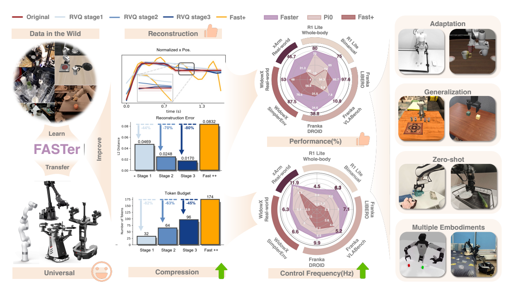

그림 1. 원문 Figure 1 — embodiment 전이, reconstruction·compression, 제어 성능·빈도의 세 메시지를 요약한다. 아래의 숫자 해석은 이 overview와 뒤의 정량 실험을 구분한다. [PDF p.1; 원문 그림 발췌] · [논문 PDF](https://openreview.net/pdf?id=k6nTUFoqeT).

Figure 1은 세 메시지를 한 장에 압축한다.

- **Learn/Transfer/Universal:** wild robot data에서 학습한 tokenizer의 embodiment transfer
- **Reconstruction/Compression:** RVQ stage를 추가할수록 reconstruction error가 0.0469→0.0248→0.0170으로 줄고 token budget은 32→64→96으로 늘어나는 coarse-to-fine trade-off. 비교용 Fast++ 막대는 error 0.0832/token 174로 표시된다.
- **Performance/Control frequency:** 여러 robot/task radar에서 FASTer가 $`\pi_0`$-FAST/FAST+ 대비 성능·제어 빈도를 함께 높인다는 요약

이 값들은 overview graphic의 대표 예시이며 dataset/metric 정의가 바로 옆에 없으므로, 정량 결론은 뒤의 Table/Figure를 기준으로 삼아야 한다.

### 9.3 Table 1 - LIBERO와 Simpler-Bridge [PDF p.7]

원문의 핵심 숫자를 그대로 옮기면 다음과 같다. 단위는 success rate(%), `-`는 미보고다.

| Model | L-Spatial | L-Object | L-Goal | L-Long | L-Avg | S-Spoon | S-Carrot | S-Block | S-Eggplant | S-Avg |
|---|---:|---:|---:|---:|---:|---:|---:|---:|---:|---:|
| Diffusion Policy | 78.3 | 92.5 | 68.3 | 50.5 | 72.4 | - | - | - | - | - |
| Octo-Base | 78.9 | 85.7 | 84.6 | 51.1 | 75.1 | 12.5 | 8.3 | 0.0 | 43.1 | 16.0 |
| SpatialVLA | 88.2 | 89.9 | 78.6 | 55.5 | 78.1 | 16.7 | 25.0 | 29.2 | 100.0 | 42.7 |
| $`\pi_0`$ | 96.8 | 98.8 | 95.8 | 85.2 | 94.2 | 66.7 | 58.3 | 58.3 | 88.3 | 66.7 |
| $`\pi_{0.5}`$ | 98.8 | 98.2 | 98.0 | 92.4 | 96.8 | - | - | - | - | - |
| OpenVLA-OFT | 97.6 | 98.4 | 97.9 | 94.5 | 97.1 | 12.5 | 4.2 | 8.3 | 0.0 | 6.25 |
| UniVLA | 96.5 | 96.8 | 95.6 | 92.0 | 95.2 | 54.2 | 66.7 | 50.0 | 4.2 | 43.8 |
| OpenVLA | 84.7 | 88.4 | 79.2 | 53.7 | 76.5 | 32.0 | 30.0 | 18.0 | 38.0 | 29.5 |
| PaliGemma + Naive Tokenizer | 55.8 | 64.8 | 64.4 | 31.2 | 54.1 | 66.7 | 29.2 | 12.5 | 54.2 | 40.9 |
| MiniVLA | - | - | - | 77.0 | - | 68.0 | 44.0 | 70.0 | 14.0 | 49.0 |
| VQ-VLA | - | - | 75.2 | 60.0 | - | 12.5 | 8.0 | 6.0 | 0.0 | 6.3 |
| $`\pi_0`$ FAST-R | 96.4 | 96.8 | 88.6 | 60.2 | 85.5 | 29.1 | 21.9 | 10.8 | 66.6 | 32.1 |
| $`\pi_0`$ FAST-D | 96.6 | 97.2 | 96.0 | 86.8 | 94.2 | 77.5 | 88.3 | 68.3 | 71.7 | 76.5 |
| FASTer w/o BAR | 99.4 | 98.8 | 94.8 | 88.6 | 95.4 | 97.5 | 83.3 | 65.0 | 78.3 | 81.0 |
| FASTer | 98.0 | 99.4 | 98.6 | 95.4 | **97.9** | 91.7 | 93.3 | 67.5 | 99.2 | **87.9** |

**[리뷰어 재계산]**

- FASTer LIBERO: $`(98.0+99.4+98.6+95.4)/4=97.85\rightarrow97.9`$로 표와 일치한다.
- FASTer Simpler: $`(91.7+93.3+67.5+99.2)/4=87.925\rightarrow87.9`$로 일치한다.
- FASTer w/o BAR LIBERO: 95.4로 일치한다. Simpler는 $`81.025\rightarrow81.0`$으로 일치한다.
- $`\pi_0`$ FAST-D Simpler: $`76.45\rightarrow76.5`$로 일치한다.
- FASTer와 표의 차상위 FAST-D 차이는 $`87.9-76.5=11.4`$ percentage point다. 상대 증가는 $`11.4/76.5\approx14.9\%`$다. 본문의 “12.9%”와 어느 방식으로도 일치하지 않는다.

BAR가 모든 suite에서 항상 좋아지는 것도 아니다. Spatial은 99.4→98.0, Spoon은 97.5→91.7, Block은 65.0→67.5처럼 항목별 방향이 다르고 평균에서 개선된다.

### 9.4 Figure 4 - 여러 embodiment의 ID performance [PDF p.7]

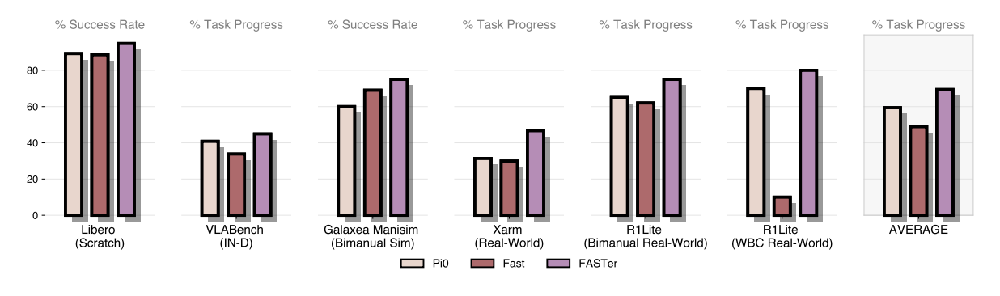

그림 4. 원문 Figure 4 — single-arm, bimanual, whole-body 환경의 ID 성능 비교. 서로 다른 task metric과 평균의 해석에 주의해야 한다. [PDF p.7, §4.3; 원문 그림 발췌] · [논문 PDF](https://openreview.net/pdf?id=k6nTUFoqeT).

LIBERO scratch, VLABench ID, GalaxeaManipSim, XArm real, R1Lite bimanual real, R1Lite WBC real과 평균을 $`\pi_0`$, FAST, FASTer로 비교한다. FASTer bar가 대체로 가장 높고 VLABench에서는 $`\pi_0`$가 약간 높다. bar 위 정확한 수치와 trial/CI는 없으므로 그림에서 픽셀을 재어 수치를 만들지 않았다. metric도 일부는 success rate, 일부는 task progress라 평균 막대가 이질 metric의 산술 요약임에 유의해야 한다.

### 9.5 Figure 5, 6, 8, 13, 14 - tokenizer quality [PDF pp.8-9,20-22]

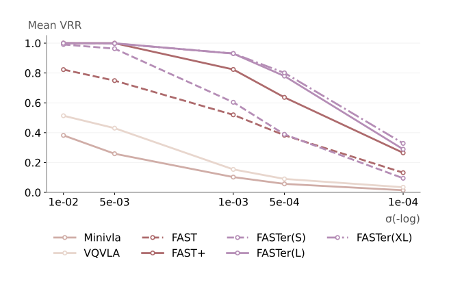

그림 5. 원문 Figure 5 — reconstruction 허용오차가 엄격해질 때의 평균 VRR 변화. [PDF p.8, §4.2; 원문 그림 발췌] · [논문 PDF](https://openreview.net/pdf?id=k6nTUFoqeT).

**Figure 5.** $`\sigma=10^{-2}`$에서 $`10^{-4}`$까지 평균 VRR을 그린다. threshold가 엄격해질수록 모든 curve가 내려가고 FASTer(L/XL)가 상단을 유지한다. FASTer(XL)은 Figure 13의 상세 heatmap에는 포함되지 않는다.

**Figure 6.** horizon 5/10/15/30의 compression ratio와 $`\sigma=10^{-3}`$ VRR trade-off를 함께 표현한다. FASTer의 긴 horizon 이점은 보이지만 compression ratio의 정확한 공식/부호 표현과 원시값이 없다.

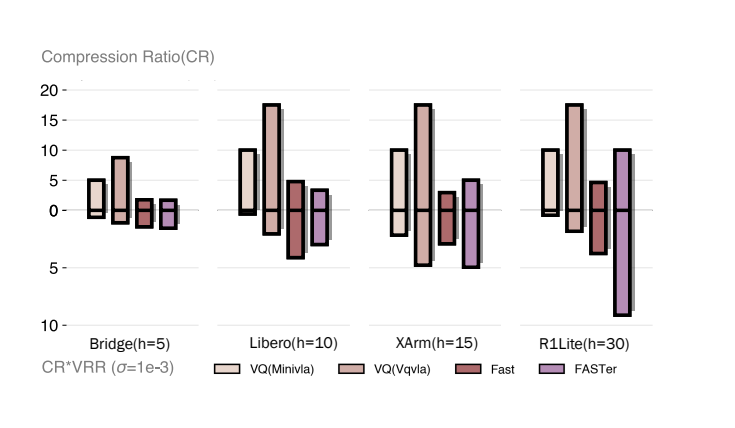

그림 6. 원문 Figure 6 — action horizon에 따른 compression ratio와 VRR의 관계. 원문의 축·범례를 보존했다. [PDF p.8, §4.2; 원문 그림 발췌] · [논문 PDF](https://openreview.net/pdf?id=k6nTUFoqeT).

**Figure 8.** S→L data mixture 확대에 따른 $`\sigma=10^{-3}`$ VRR gain은 Droid joint velocity +0.394, R1Lite absolute joint +0.261, Agilex delta joint +0.264로 표시된다.

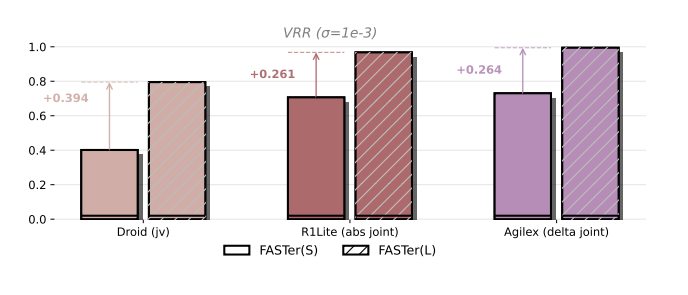

그림 8. 원문 Figure 8 — 서로 다른 action representation에서 FASTerVQ(S)와 FASTerVQ(L)를 비교한다. [PDF p.9, §4.2; 원문 그림 발췌] · [논문 PDF](https://openreview.net/pdf?id=k6nTUFoqeT).

**Figure 13.** 가장 엄격한 $`\sigma=10^{-3}`$에서 dataset 네 개 평균을 직접 재계산하면 다음과 같다.

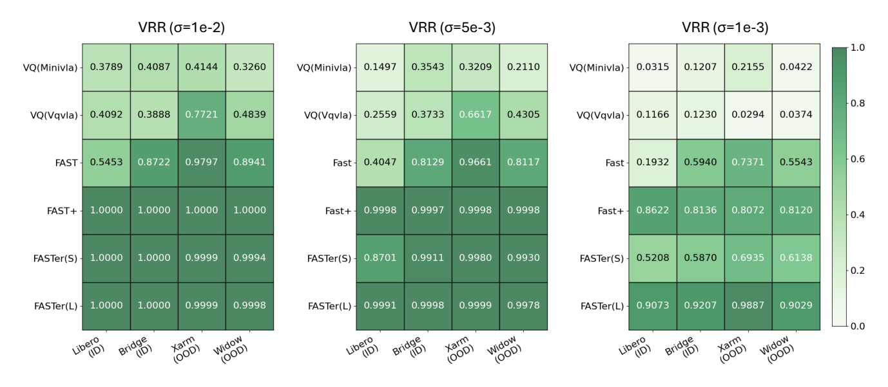

그림 13. 원문 Figure 13 — 세 reconstruction threshold에서의 VRR 상세 heatmap. 아래 표는 이 원문 cell 값의 일부와 리뷰어가 재계산한 평균을 구분해 기록한다. [PDF p.21, Appendix A.5; 원문 그림 발췌] · [논문 PDF](https://openreview.net/pdf?id=k6nTUFoqeT).

| Tokenizer | LIBERO | Bridge | XArm | Widow | 평균 [리뷰어 재계산] |
|---|---:|---:|---:|---:|---:|
| MiniVLA-VQ | 0.0315 | 0.1207 | 0.2155 | 0.0422 | 0.1025 |
| VQ-VLA | 0.1166 | 0.1230 | 0.0294 | 0.0374 | 0.0766 |
| FAST | 0.1932 | 0.5940 | 0.7371 | 0.5543 | 0.5197 |
| FAST+ | 0.8622 | 0.8136 | 0.8072 | 0.8120 | 0.8238 |
| FASTer(S) | 0.5208 | 0.5870 | 0.6935 | 0.6138 | 0.6038 |
| FASTer(L) | 0.9073 | 0.9207 | 0.9887 | 0.9029 | **0.9299** |

$`\sigma=5\times10^{-3}`$에서 FASTer(L)은 0.9991/0.9998/0.9999/0.9978이고, $`10^{-2}`$에서는 1.0000/1.0000/0.9999/0.9998이다. “near-lossless”는 이 정규화와 threshold 정의 안에서의 표현이다. exact equality나 task execution 완전 보장을 뜻하지 않는다.

**Figure 14.** 빨강 ground truth, 초록 reconstruction, 빨강 shaded $`\pm0.01`$ tolerance를 비교한다. MiniVLA/VQ-VLA의 spike와 OOD XArm/Widow 성능 저하, FAST+/FASTer의 안정적 overlap을 시각화한다. 99th-percentile normalization clip 때문에 수평 초록선이 나타날 수 있다는 저자 설명은 “실제 로봇 action이 일정하다”가 아니라 plotting/normalization artifact일 수 있음을 말한다.

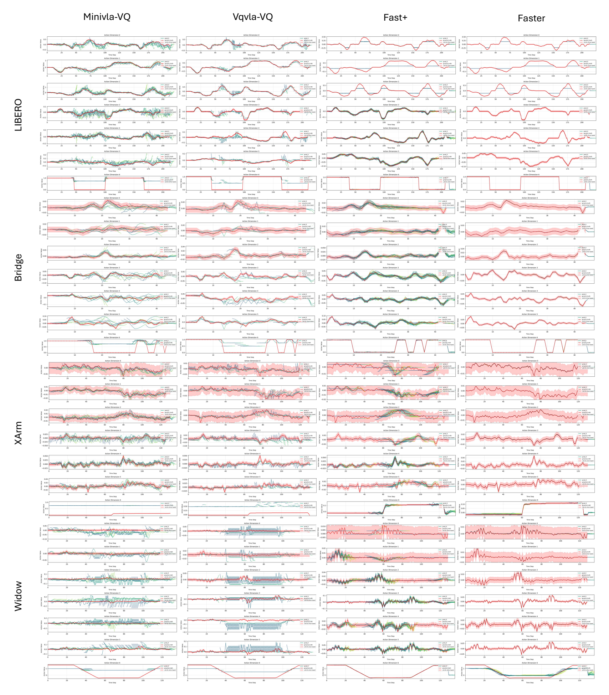

그림 14. 원문 Figure 14 — LIBERO·Bridge·XArm·Widow에서 ground truth와 reconstruction을 비교한 전체 패널. 작은 축·범례 확인을 위해 300 dpi로 추출했으며, [원본 크기 PNG](assets/08_FASTer/figures/figure_14.png)로 확대해서 볼 수 있다. [PDF p.22, Appendix A.5; 원문 그림 발췌] · [논문 PDF](https://openreview.net/pdf?id=k6nTUFoqeT).

### 9.6 Table 2와 Table 5 - latency [PDF pp.10,18]

| 구성 | Single/LIBERO | WBC/R1Lite |
|---|---:|---:|
| image encoder | 16 ms | 23 ms |
| observation forward | 72 ms | 105 ms |
| vanilla AR | $`6.4\times21=134.4`$ ms | - |
| BAR | $`7.4\times3=22.2`$ ms | $`8.51\times12=102.12`$ ms |
| FASTerVQ detokenization | 2.7 ms | 7 ms |
| reported total | 112 ms | 237 ms |

**[리뷰어 재계산]** BAR 경로 합은 Single $`16+72+22.2+2.7=112.9`$ ms, WBC $`23+105+102.12+7=237.12`$ ms다. 반올림하면 WBC는 237과 맞고 Single은 일반 반올림이면 113이지만 표는 112다. component가 반올림된 값이라면 가능한 차이다.

Table 5의 system 비교는 다음과 같다.

| Environment | FASTer | $`\pi_0`$ | $`\pi_0`$-FAST |
|---|---:|---:|---:|
| LIBERO | 112 ms | 176 ms | 197-556 ms |
| R1Lite-WBC | 237 ms | 225 ms | 1,100-3,000 ms |

**[리뷰어 재계산]**

- LIBERO에서 FASTer는 $`\pi_0`$보다 $`176/112=1.57\times`$ 낮은 latency, 즉 36.4% 감소다.
- LIBERO에서 FAST 대비 $`1.76\times`$-$`4.96\times`$다.
- WBC에서는 $`\pi_0`$가 225 ms로 FASTer 237 ms보다 약 5.1% 빠르다. 반면 FASTer는 FAST보다 $`4.64\times`$-$`12.66\times`$ 빠르다.
- 동기식으로 policy가 끝나자마자 바로 다시 호출된다는 **이상적 상한**은 Single $`1000/112\approx8.93`$ Hz, WBC $`1000/237\approx4.22`$ Hz다. camera/CPU/actuator 지연이 제외되면 실제 refresh는 더 낮다.

논문의 latency는 RTX 5090/PyTorch 결과다. H100/H20/H200은 학습 hardware이고 latency hardware가 아니다.

### 9.7 Figure 7과 Table 9 - cross-backbone [PDF pp.9,19]

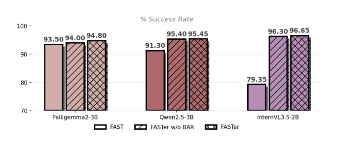

그림 7. 원문 Figure 7 — 여러 backbone에서 tokenizer 교체와 BAR의 성능 기여를 비교한다. 아래 Table 9 재계산과 구분해서 읽는다. [PDF p.9, §4.3; 원문 그림 발췌] · [논문 PDF](https://openreview.net/pdf?id=k6nTUFoqeT).

| Backbone | FAST 평균 | FASTer 평균 | 변화(pp) |
|---|---:|---:|---:|
| Qwen2.5-0.5B | 84.15 | 87.00 | +2.85 |
| Qwen2.5-1.5B | 90.45 | 92.25 | +1.80 |
| Qwen2.5-3B | 91.30 | 95.45 | +4.15 |
| InternVL3.5-2B | 79.35 | 96.65 | +17.30 |
| PaliGemma2-3B | 93.50 | 94.80 | +1.30 |

각 평균은 Spatial/Object/Goal/Long 네 값의 산술평균과 일치한다. Fig. 7은 일부 backbone에 FASTer w/o BAR도 보여 tokenizer 교체가 주 개선이고 BAR는 작은 추가 개선임을 시사한다. 다만 backbone별 parameter count 이외 hidden size/vision token 길이/학습 throughput은 보고하지 않는다.

### 9.8 Table 6, 7 - ablation [PDF p.19]

**Tokenizer architecture:** CNN 96.2/L1 0.0027, Transformer 95.3/0.0036, TAAE 97.9/0.0021. TAAE가 둘 다 가장 좋다.

**Codebook:** 512→1024에서 SR이 95.4→93.2로 오히려 떨어지고, 4096에서 97.9로 오른 뒤 8192에서 96.3으로 내려간다. 따라서 “size가 4096까지 단조 개선”이라고 읽으면 안 된다. utilization은 512/1024가 100, 4096이 99.6, 8192가 95.1이다.

**Residual depth:** 1/2/3/8 stage의 SR은 93.4/95.5/97.9/96.6이다. 세 stage가 선택점이다. 하지만 각 열의 실험에서 나머지 요소가 어떤 값으로 고정됐는지 caption 이상의 완전한 조합표는 없다.

**AE/BAR:** pretrained AE의 큰 이득은 Simpler에서 특히 크다. BAR의 323→140 ms는 56.7% latency 감소이고 SR은 +1.2 pp다. BAR+AE는 BAR-only 대비 +1.0 pp이며 latency는 같다.

### 9.9 Figure 9, 10 - OOD generalization [PDF p.10]

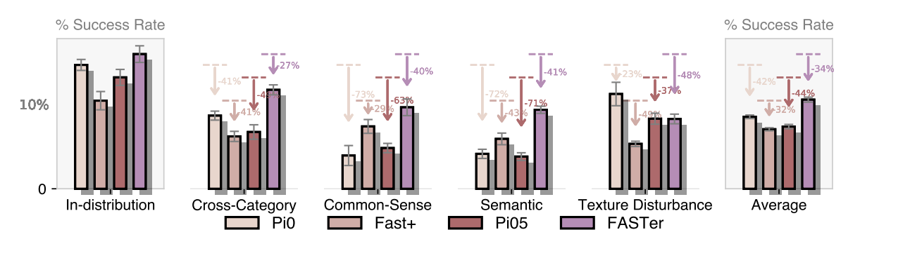

그림 9. 원문 Figure 9 — VLABench OOD 조건별 성능과 원문에 인쇄된 drop annotation. 아래에서 본문 서술과 Average annotation의 불일치를 짚는다. [PDF p.10, §4.3; 원문 그림 발췌] · [논문 PDF](https://openreview.net/pdf?id=k6nTUFoqeT).

Figure 9는 VLABench의 cross-category, commonsense, semantic, texture disturbance를 ID와 비교한다. 그림의 Average 위 drop annotation을 시각 대조하면 $`\pi_0`$ -42%, Fast+ -32%, $`\pi_{0.5}`$ -44%, FASTer -34%로 읽힌다. 본문은 FASTer가 “lowest relative drop 29%”라고 써서 서로 맞지 않는다. 29%는 그림의 commonsense 영역 Fast+ annotation에 나타난다. raw table이 없어 오타의 정확한 원인은 확인할 수 없다.

Figure 10은 Widow와 Droid zero-shot task progress에서 FASTer와 Fast+가 높은 bar를 보인다. 정확한 숫자/오차막대/trial 수는 제공하지 않으므로 정성 순위 이상을 만들지 않는다.

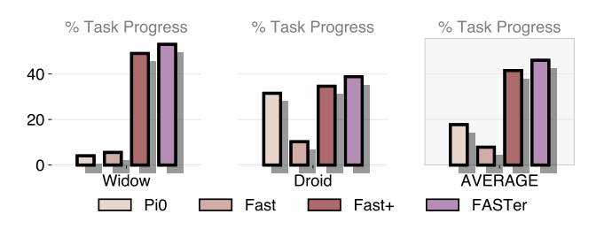

그림 10. 원문 Figure 10 — 두 zero-shot 환경의 task progress 비교. [PDF p.10, §4.3; 원문 그림 발췌] · [논문 PDF](https://openreview.net/pdf?id=k6nTUFoqeT).

### 9.10 Table 8과 Table 10 - code usage [PDF pp.20-21]

Table 8의 Bridge 통계는 다음과 같다.

| Metric | FAST | FAST+ | FASTerVQ |
|---|---:|---:|---:|
| vocabulary | 2048 | 2048 | 4096 |
| usage | 48.39% | 57.37% | 100.0% |
| $`N_{active}(\sigma=10^{-2})`$ | 8 | 16 | 3 |
| $`F_{max}`$ | 9.63% | 1.82% | 1.35% |
| normalized entropy | 0.69 | 0.77 | 0.91 |

$`N_{active}`$는 이름과 down-arrow만 보면 “threshold보다 높은 고빈도 token 수”에 가까워 보이나 정의가 없다. 이 표의 $`\sigma`$가 VRR 거리 threshold인지 token frequency threshold인지도 설명되지 않는다. Table 10은 frequency $`10^{-3}`$와 $`2\times10^{-2}`$를 별도로 쓰므로 기호 재사용 가능성이 있다.

Table 10에서는 FAST+가 Bridge 1175/2048, XArm 1067/2048 code를 활성화하고 FASTerVQ는 둘 다 4096/4096이다. $`10^{-3}`$ 이상 빈도의 code는 FAST+ 200/216, FASTer 162/38이다. 모든 code를 한 번 이상 쓴 것과 빈도가 균등하다는 것은 다르며, normalized entropy 0.91이 이 차이를 보완한다.

### 9.11 Figure 11, 12, 15 - setup과 qualitative evidence

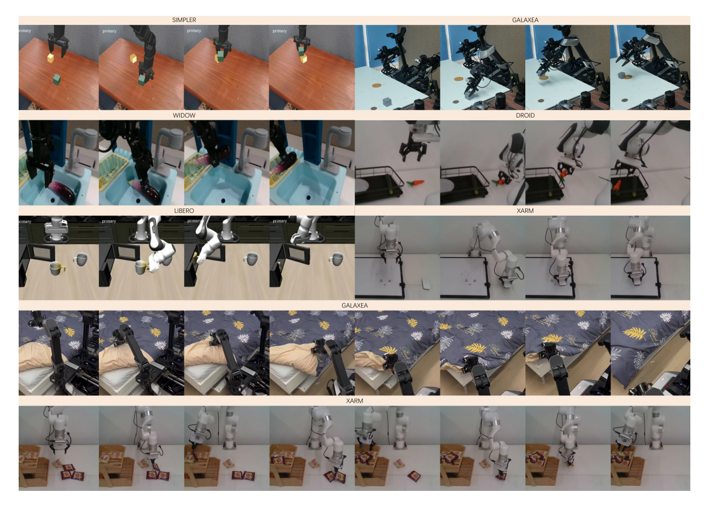

그림 15. 원문 Figure 15 — 여러 로봇·시뮬레이터의 task rollout 사진. 원본 내 작은 camera-view label과 사진 해상도는 그대로이며, 완전한 실행 trace나 성공률을 대신하지 않는다. Figure 11과 12의 원문 이미지는 각각 §5의 Appendix A.1, A.3 해설 옆에 배치했다. [PDF p.23; 원문 그림 발췌] · [논문 PDF](https://openreview.net/pdf?id=k6nTUFoqeT).

- Figure 11은 benchmark를 simulation/real-world와 pretraining/adaptation/generalization 목적에 매핑한다. 성능 결과가 아니라 실험 범위 그림이다.
- Figure 12는 BAR block 1,2,3,6,7,14,16,21,24를 비교하고 7에서 최고다. irregular granularity 14/16 이후 하락이 보여 무조건 큰 block이 좋은 것이 아니다.
- Figure 15는 task rollout 사진이다. 실제 robot과 simulator 다양성을 보여주지만 성공/실패 frame, 시간축 전체, 안전 개입 여부는 제공하지 않는다.

### 9.12 보고 여부 matrix

| 항목 | FASTerVQ 학습 | FASTerVLA 학습 | RTX 5090 추론 |
|---|---|---|---|
| optimizer/lr/wd | 보고 | 보고 | 해당 없음 |
| precision | bf16 | bf16 | 미기재 |
| batch | 512/2048 | suite별 일부 보고 | 1로 추정하면 안 됨; 미기재 |
| 입력 image resolution | 해당 없음 | 미기재 | 미기재 |
| action chunk/code 길이 | 일부 보고 | Table 4 | Table 2에 Single/WBC |
| GPU | 8×H100 | H100/H20/H200 혼재 | RTX 5090 |
| wall-clock training time/energy | 미기재 | 미기재 | 해당 없음 |
| latency p50/p95/p99 | 해당 없음 | 해당 없음 | 평균/대표값 성격, 통계 미기재 |
| TTFT/TPOT | 해당 없음 | 해당 없음 | 미기재 |
| throughput | 해당 없음 | 해당 없음 | 미기재 |
| peak allocated/reserved memory | 미기재 | 미기재 | 미기재 |
| compile/JIT warmup | 해당 없음 | 해당 없음 | 미기재 |
| trial 수/seed/CI | tokenizer test 표본 수 미기재 | Simpler 120/task만 명시적 | latency 반복 수 미기재 |

---

## 10. 효율 지표를 서로 섞지 않고 읽기

### 10.1 Token 수/FLOPs와 실제 latency

BAR는 이론상 sequential forward 수를 $`N`$에서 약 $`N/B`$로 줄인다. 그러나 한 BAR forward가 token-wise forward보다 비싸다. Single에서 per-step은 6.4 ms(AR) 대 7.4 ms(BAR)다. 따라서 speedup은 단순 $`B=7`$배가 아니라 action decode 부분에서 $`134.4/22.2\approx6.05\times`$, end-to-end에서는 observation 88 ms 때문에 훨씬 작다.

논문은 전체 FLOPs나 FLOPs/token을 직접 보고하지 않는다. “token 감소”를 “FLOPs가 정확히 같은 비율로 감소”라고 바꾸면 안 된다. block logits, attention mask, KV cache, memory movement가 달라진다.

### 10.2 TTFT, TPOT, throughput, tail

- **TTFT:** 관측이 들어온 뒤 첫 action block까지의 시간. 논문은 total observation+전체 decode만 주고 첫 block 시점은 주지 않는다.
- **TPOT/ITL:** block 사이 시간은 Table 2의 7.4/8.51 ms가 근사할 수 있지만 측정 정의가 없어 공식 TPOT가 아니다.
- **Throughput:** 여러 episode/batch를 초당 처리하는 양. 실시간 로봇 batch=1 latency와 다르며 미보고다.
- **Tail latency:** p95/p99가 없으므로 112 ms가 deadline 보장을 뜻하지 않는다.
- **Peak memory:** model resident weight, KV cache, vision activation, tokenizer decoder를 포함한 peak가 없다.

### 10.3 학습 효율과 추론 효율

FASTerVQ 8×H100 300k step, R1Lite VLA 64×H20, Droid 64×H200은 상당한 학습 자원이다. 적은 inference token과 빠른 RTX 5090 latency는 **학습 비용이 낮다**는 증거가 아니다. 반대로 큰 pretraining 비용을 한 번 지불하고 tokenizer를 여러 task에 재사용하면 amortization 이점이 생길 수 있지만, 그 break-even 분석은 없다.

### 10.4 Action chunk와 control frequency

구분해야 할 빈도는 세 가지다.

1. **Low-level actuator frequency:** servo가 초당 action point를 소비하는 빈도.
2. **Policy refresh frequency:** 새 image/state를 보고 새 chunk를 만드는 빈도.
3. **Chunk nominal horizon:** $`H/f_{actuator}`$초 분량.

chunk size 20을 20 Hz라고 읽을 수 없다. 예를 들어 [해설용] actuator가 20 Hz이고 20 step 전체를 실행하면 horizon은 1초다. policy latency 112 ms여도 새 policy를 매 1초만 호출하면 1 Hz refresh다. 반대로 4 step만 실행하고 replan하면 5 Hz다. 논문은 execution stride/temporal ensemble/asynchronous overlap을 명시하지 않는다.

### 10.5 Reconstruction과 task performance

낮은 Eq. (1) loss, 높은 VRR, 높은 code entropy는 좋은 tokenizer의 서로 다른 측면이다. 어느 하나가 곧바로 task success를 보장하지 않는다. Table 7/9의 downstream ablation이 연결 증거를 제공하지만, tokenizer metric과 success의 sample-level correlation/causal intervention은 없다.

---

## 11. 비판적 검토

### 11.1 강점

1. **병목을 정확한 층으로 좁혔다.** visual encoder를 건드리는 논문이 아니라 AR action representation과 decode depth를 함께 다룬다.
2. **2D 행동 구조를 명시적으로 활용한다.** 시간 중복과 action-coordinate 이질성을 동시에 모델링한다.
3. **Tokenizer와 policy를 분리 평가한다.** VRR/usage와 task success/latency를 모두 제시해 한 지표만으로 결론 내리지 않는다.
4. **범위가 넓다.** single arm, bimanual, WBC, simulation/real, ID/OOD, 여러 backbone을 포함한다.
5. **실제 component latency를 나눈다.** observation encoding이 병목이라는 사실과 VQ detokenization 비용이 작다는 것을 보여 후속 최적화 우선순위를 준다.
6. **Ablation이 설계와 직접 연결된다.** TAAE, codebook, residual depth, AE, BAR, block size를 따로 본다.

### 11.2 가장 중요한 한계와 내부 불일치

1. **WBC code shape/block/forward 수가 동시에 맞지 않는다.** Table 4의 $`N=126`$, block 7은 18 blocks이고 prose의 block 8은 16 blocks인데 Table 2는 12 forward다.
2. **commitment weight 기호가 $`\lambda`$와 $`\beta`$로 다르다.** 같은 값 0.25인지 코드 확인이 필요하다.
3. **latent vector 축이 식에서 빠졌다.** $`z\in\mathbb R^{C_h\times C_a}`$만으로 128-D codebook nearest neighbor를 표현할 수 없다.
4. **patchification 재현 정보가 부족하다.** embodiment별 group, padding mask/value, temporal patch $`h`$, exact TAAE architecture가 없다.
5. **BAR target leakage를 배제할 입력 shift가 불명확하다.** Eq. (3), intra-block mask, BoBlk 복제를 구현 수준에서 연결하지 않는다.
6. **Simpler 개선 수치가 불일치한다.** 12.9%가 아니라 표 기준 11.4 pp 또는 14.9% relative다.
7. **VLABench OOD drop 서술이 Figure 9와 불일치한다.** 본문 29%/lowest와 그림 Average -34%가 맞지 않는다.
8. **VRR norm/단위가 불명확하다.** Eq. L1과 prose Euclidean/meter/radian 설명이 충돌한다.
9. **reproducibility 핵심이 미기재다.** exact freeze map, action expert 구조, state discretization, serialization, normalization, seed가 없다.
10. **성능 통계가 약하다.** 많은 bar에 trial 수, seed 분산, confidence interval이 없다. Simpler만 120 trials/task가 명시적이다.
11. **latency 범위가 제한적이다.** RTX 5090 PyTorch 한 환경, precision/batch/warmup/repeat/tail/memory 미기재다.
12. **비교 recipe가 완전히 통일되지 않았다.** Table 1은 외부 reported baseline과 자체 실행이 혼합되고 backbone 초기화도 계열별로 다르다.
13. **codebook 의미가 모호하다.** $`Q_i`$별 codebook이 독립인지 shared인지, embedding table에 $`K`$개 또는 $`N_cK`$개 ID를 더하는지 확정하기 어렵다.
14. **action expert 용어가 흔들린다.** Method는 action token decoder expert인데 Appendix A.3은 “responsible for action tokenization”이라고 써 tokenizer와 expert 역할이 섞인다.
15. **“all datasets public” 검증 링크가 없다.** newly collected XArm/Widow/real robot set의 공개 상태와 license를 확인할 수 없다.

### 11.3 주장 범위를 안전하게 다시 쓰면

이 논문이 강하게 보인 것은 다음의 제한된 문장이다.

> [저자 보고 + 표 재계산] 제시된 normalized action data와 benchmark에서 FASTerVQ는 기존 비교 tokenizer보다 높은 thresholded reconstruction과 code usage를 보였고, 이를 사용한 FASTerVLA는 LIBERO/Simpler 및 여러 backbone에서 높은 평균 성능을 보였다. RTX 5090 PyTorch 측정에서 single-arm은 $`\pi_0`$보다 낮은 latency였고, WBC는 $`\pi_0`$와 비슷하지만 FAST 기반 AR보다 크게 낮았다.

다음 문장은 아직 증명되지 않았다.

> 모든 robot/action space에서 near-lossless이고, 모든 hardware에서 diffusion/flow보다 빠르며, 높은 code entropy가 generalization을 인과적으로 만든다.

### 11.4 추가로 필요한 실험

- 동일 backbone/checkpoint/data/seed에서 tokenizer만 바꾼 3-5 seed 비교와 paired confidence interval
- $`\lambda_{DCT}`$, $`\lambda_{commit}`$ 분리 ablation; DCT 축/normalization 공개
- action group/padding ablation 및 single-channel 2D 구조를 단순 1D sequence와 matched-parameter 비교
- BAR 입력 shift/mask unit test와 block 내 mutual information별 성능
- WBC exact code layout/12-pass 재현
- VRR와 실제 rollout failure의 calibration curve
- code entropy를 조절하는 intervention과 task success 인과 분석
- synchronized end-to-end camera-to-actuator p50/p95/p99, peak memory, power, batch=1
- chunk execution stride를 바꿔 refresh rate-성능 trade-off 측정

---

## 12. 재현 체크리스트

### 12.1 데이터/전처리

- [ ] 각 dataset URL, version, license, exact split, trajectory count를 고정한다.
- [ ] S/L/XL ratio를 sampling probability로 해석하는 정확한 loader를 확인한다.
- [ ] absolute/delta/joint velocity/EEF representation을 dataset별로 기록한다.
- [ ] action normalization 통계가 train-only인지, percentile 99 clip이 학습에도 쓰이는지 확인한다.
- [ ] translation/rotation/gripper의 단위와 loss weight를 기록한다.
- [ ] chunk extraction stride, episode boundary padding, missing observation 처리를 기록한다.
- [ ] multi-view camera resolution, crop, augmentation, synchronization을 기록한다.

### 12.2 FASTerVQ

- [ ] embodiment별 action grouping과 coordinate order를 공개한다.
- [ ] $`h,m,n,d_{pad}`$, padding value/mask, patch order를 고정한다.
- [ ] TAAE transformer/convolution layer, width, head, stride, activation, norm을 기록한다.
- [ ] latent 실제 shape와 $`d_z=128`$ 축을 확인한다.
- [ ] $`N_c=3`$, $`K=4096`$이 stage별 독립 codebook인지 확인한다.
- [ ] nearest-neighbor distance와 mixed-precision 처리, tie rule을 확인한다.
- [ ] DCT axis/type/normalization과 loss reduction을 확인한다.
- [ ] Eq. (1)의 $`\lambda`$가 Appendix $`\beta=0.25`$인지 확인한다.
- [ ] EMA decay, distributed sync, dead-code threshold/reinit seed를 기록한다.
- [ ] tokenizer checkpoint별 실제 training sample/token 수와 wall-clock을 기록한다.

### 12.3 FASTerVLA/BAR

- [ ] backbone exact revision과 vision tower/projector checkpoint를 고정한다.
- [ ] action embedding vocabulary가 $`K`$인지 $`N_cK`$인지 확인한다.
- [ ] proprioception quantization bins/range/text format을 공개한다.
- [ ] multimodal sequence template와 special token ID를 기록한다.
- [ ] spacing jitter RNG, $`k`$, base position, inference spacing을 고정한다.
- [ ] action expert layer/width/weight-sharing/parameter count를 기록한다.
- [ ] stage별 frozen/trainable layer와 optimizer parameter group을 기록한다.
- [ ] block-wise attention mask와 shifted target tensor를 unit test한다.
- [ ] $`N\bmod B`$ 처리와 `<BoBlk>/<EoBlk>/<eos>` state machine을 기록한다.
- [ ] WBC의 $`C_a=21,C_h=2,N_c=3`$, block size, 12 forward 관계를 해소한다.
- [ ] top-k/temperature sampling seed와 invalid code/early eos 복구를 기록한다.

### 12.4 평가/성능

- [ ] success/task-progress 정의, timeout, human reset/intervention을 공개한다.
- [ ] task별 trials, seed, mean/SD 또는 CI를 보고한다.
- [ ] 외부 reported baseline과 동일 재실행 baseline을 분리한다.
- [ ] VRR을 group별 meter/radian norm으로 계산하는지 확인한다.
- [ ] compression ratio 공식을 token count/raw scalar/bitrate 중 무엇인지 명시한다.
- [ ] latency에 preprocessing, camera copy, tokenizer, sampling, actuator I/O가 포함되는지 명시한다.
- [ ] warmup/JIT 후 반복 수, CUDA sync, batch, precision을 기록한다.
- [ ] TTFT, block ITL, total, p50/p95/p99, throughput, peak memory, power를 함께 잰다.
- [ ] action chunk 실행 step 수와 실제 policy refresh frequency를 보고한다.

---

## 13. Jetson AGX Thor 최적화와의 연결

> 이 절은 **[후속 연구 제안]**이다. 논문은 Jetson AGX Thor에서 실행하지 않았고 TensorRT/TensorRT-LLM 결과도 없다. 아래 수치나 절차를 FASTer의 검증된 Thor 이식 성능으로 읽으면 안 된다.

NVIDIA의 현재 제품 페이지는 Jetson AGX Thor 계열에 최대 128 GB 메모리, 40-130 W 구성, 최대 2070 FP4 TFLOPS를 명시한다. [공식 Jetson module 사양](https://developer.nvidia.com/embedded/jetson-modules) 기준 수치이며 실제 dense/sparse 형식, clock, power mode, kernel 지원에 따라 달라진다. JetPack 7.0 계열 release note는 CUDA 13, cuDNN 9.12, TensorRT 10.13 조합을 명시한다. [Jetson Linux r38.2 release notes](https://docs.nvidia.com/jetson/archives/r38.2/ReleaseNotes/Jetson_Linux_Release_Notes_r38.2.pdf) 최신 TensorRT 11.x 문서를 그대로 설치하는 것이 아니라 해당 JetPack이 제공하는 지원 버전을 따라야 한다. [TensorRT Jetson migration guidance](https://docs.nvidia.com/deeplearning/tensorrt/latest/api/migration/tensorrt-10x-to-11x-jetson.html)

### 13.1 먼저 최적화할 곳

Table 2에서 observation 경로가 Single 88 ms, WBC 128 ms로 가장 크다. 그러므로 FASTerVQ decoder 2.7-7 ms만 최적화해도 end-to-end 이득은 작다. 우선순위는 다음이 합리적이다.

1. vision tower + projector
2. multimodal observation backbone forward
3. action expert의 3/12회 BAR decode와 KV cache
4. FASTerVQ lookup/decoder
5. host preprocessing와 camera/actuator I/O

### 13.2 단계별 이식 gate

**Gate 0 - 정확성 기준선.**

- 공개 코드/checkpoint와 RTX 5090 또는 지원 GPU에서 원 논문 LIBERO sample의 action code와 decoded action을 저장한다.
- Thor bf16 PyTorch에서 code index exact match, action MAE/VRR, task success를 비교한다.
- WBC 12-pass 불일치를 코드로 먼저 해결한다.

**Gate 1 - 정적 shape와 memory.**

- suite별 $`(C_a,C_h,N_c,B)`$ engine profile을 분리한다.
- max image views, sequence length, BAR block size를 고정하고 buffer/KV cache를 사전 할당한다.
- unified memory가 128 GB여도 bandwidth와 page migration이 무료가 아니므로 peak allocated/reserved와 CPU/GPU copy를 측정한다.

**Gate 2 - precision.**

- bf16을 parity baseline으로 둔다.
- vision/VLM/action expert를 FP8 또는 지원되는 4-bit weight/activation 경로로 낮출 때 layer별 calibration과 action success를 검증한다. Thor가 FP4 연산을 지원한다는 제품 사양만으로 임의 PyTorch/TensorRT graph가 FP4 fast path를 탄다고 가정하지 않는다.
- codebook lookup과 마지막 TAAE decoder는 절대 오차에 민감할 수 있어 bf16 유지와 저정밀을 비교한다.

**Gate 3 - graph/kernel.**

- vision tower와 fixed-shape expert를 JetPack 호환 TensorRT engine으로 검토한다.
- BAR step을 CUDA Graph로 capture할 수 있는지, top-k sampling과 dynamic special token이 graph break를 만드는지 profile한다.
- $`B`$개 logits의 fused top-k/sampling, codebook gather, residual-stage sum, UnPatchify를 각각 profile한다.
- TensorRT-LLM은 지원 모델/연산/JetPack 조합을 확인한 뒤 사용한다. 논문에 없는 TensorRT latency를 미리 적지 않는다.

**Gate 4 - robot E2E.**

- timestamp를 camera arrival, preprocess end, vision end, observation forward end, 각 BAR block end, VQ decode end, command send, actuator apply에 둔다.
- p50/p95/p99와 deadline miss를 측정한다.
- policy refresh와 low-level servo를 분리하고, double-buffer/asynchronous execution으로 새 chunk 생성과 이전 chunk 실행을 겹칠 때 stale-action 안전 규칙을 둔다.

### 13.3 Thor용 최소 성능 보고표

| 항목 | 반드시 보고할 값 |
|---|---|
| 모델 | backbone, expert params, tokenizer params, checkpoint hash |
| runtime | JetPack/CUDA/cuDNN/TensorRT/PyTorch 버전 |
| hardware | Thor module, power mode, clocks, memory, thermal state |
| 입력 | views, resolution, text/state length, action shape |
| precision | subsystem별 bf16/fp8/fp4/int8 및 calibration |
| latency | vision, observation, block별 BAR, VQ, E2E p50/p95/p99 |
| efficiency | policy Hz, actuator Hz, throughput, peak memory, average/peak power |
| quality | code match, action L1/VRR, task success/CI |
| fallback | unsupported op, CPU fallback, graph break, recompilation 횟수 |

### 13.4 성공 판정

Thor 이식의 성공은 “engine이 실행됨”이 아니다. 최소한 (1) 원 checkpoint와 action parity가 허용 범위 안이고, (2) real E2E p95가 control deadline 안이며, (3) task success 저하가 사전 허용치 안이고, (4) peak memory/power/thermal 지속성이 충족되어야 한다. 이 네 조건 전에는 “FASTer가 Thor에서 실시간”이라고 주장할 수 없다.

---

## 14. 학습자가 오해하기 쉬운 점과 Q&A

### Q1. single-channel action image는 camera image인가?

아니다. $`H\times D`$ action 수치 행렬을 2D 1-channel signal처럼 취급한다는 뜻이다. visual token을 재구성하거나 줄이는 방법이 아니다.

### Q2. FASTerVQ의 DCT가 FAST tokenizer처럼 DCT+BPE token을 만드는가?

아니다. FASTer의 discrete token은 RVQ code index다. DCT는 Eq. (1)의 reconstruction loss에만 들어간다.

### Q3. RVQ stage가 3이면 action token이 세 개뿐인가?

아니다. 각 stage에 $`C_hC_a`$개 위치가 있다. 총 token은 $`N=N_cC_hC_a`$다. LIBERO는 $`3\times1\times7=21`$개다.

### Q4. codebook 4096이면 embedding slot도 무조건 4096개인가?

본문은 action embedding을 $`|C|`$만큼 늘린다고 하지만 stage별 codebook ID namespace를 명확히 쓰지 않는다. shared ID면 4096, stage-specific ID면 최대 $`3\times4096`$이 필요할 수 있다. 공식 구현 확인이 필요하다.

### Q5. BAR block 안 token은 독립인가?

Eq. (3)의 확률분해상 current block token끼리는 autoregressive condition이 없다. 그러나 shared context/hidden computation과 block mask로 상관을 모델링할 수 있다. 정확한 intra-block input은 미기재다.

### Q6. BAR가 block size $`B`$배 빠른가?

항상 아니다. decode 순차 step은 약 $`B`$배 줄지만 각 block forward가 더 비싸고 observation encoding은 그대로다. Single action decode는 약 6.05× 줄지만 total은 $`\pi_0`$ 대비 1.57× 수준이다.

### Q7. 높은 VRR이면 rollout success도 높은가?

필요조건에 가깝지만 충분조건은 아니다. VLA가 code를 정확히 예측해야 하고, 작은 reconstruction 오차가 contact-rich task에서 크게 증폭될 수도 있다.

### Q8. $`\sigma=10^{-3}`$은 언제나 1 mm인가?

translation이 meter 단위라면 1 mm지만 rotation/joint는 radian이다. normalization 후 값이라면 다시 달라진다. 논문의 group별 계산 상세가 부족해 모든 cell을 1 mm로 읽으면 안 된다.

### Q9. “near-lossless”는 bit-exact인가?

아니다. threshold 안에 들어오는 비율이 거의 1이라는 뜻이다. Eq. (1) loss와 실제 값은 0이 아닐 수 있다.

### Q10. FASTer가 $`\pi_0`$보다 항상 빠른가?

아니다. LIBERO에서는 112 대 176 ms로 빠르지만 WBC에서는 237 대 225 ms로 조금 느리다. FAST 기반 AR보다는 두 환경 모두 크게 빠르다.

### Q11. action chunk 20이면 20 Hz인가?

아니다. chunk length는 step 수다. actuator Hz와 한 chunk 중 몇 step을 실행한 뒤 replan하는지가 있어야 policy/control frequency를 계산할 수 있다.

### Q12. action expert는 tokenizer decoder인가?

아니다. action expert는 multimodal context에서 discrete action token logits를 내는 transformer 경로다. FASTerVQ decoder는 code를 continuous action으로 복원한다.

### Q13. tokenizer pretraining 때 VLM gradient가 필요한가?

아니다. Eq. (1)로 action autoencoder/RVQ를 먼저 학습할 수 있다. VLA 단계에서는 tokenizer가 만든 code가 supervision이다.

### Q14. 논문만으로 구현을 완전히 재현할 수 있는가?

아니다. 핵심 아이디어와 많은 training hyperparameter는 있지만 TAAE architecture, grouping, freeze map, state serialization, BAR shift/mask, WBC block layout가 부족하다.

### Q15. Figure 9의 29% OOD drop을 그대로 인용해도 되는가?

주의해야 한다. 본문 29%와 Figure 9 Average annotation -34%가 충돌한다. raw result나 저자 정정 전에는 둘을 함께 명시해야 한다.

---

## 15. Coverage checklist

### 15.1 원문 섹션/부록 → 이 리뷰 위치

| 원문 위치 | 원문 내용 | 리뷰 대응 | 상태 |
|---|---|---|---|
| p.1 | Title, authors, Figure 1, Abstract | §1, §5 Abstract, §9.2 | 완료 |
| §1, pp.2-3 | Introduction | §2, §5 §1 | 완료 |
| §2, p.3 | VLA/VQ/action tokenization/block generation | §5 §2 | 완료 |
| §3, p.4 | Problem Formulation | §4, §5, §6.1 | 완료 |
| §3.1, pp.4-5 | Patchifier | §5, §6.2 | 완료 |
| §3.1, p.5 | TAAE/RVQ/Algorithm 1 | §5, §6.3, §6.9 | 완료 |
| §3.1, p.5 | Training Objective | §5, §6.4, §8.1 | 완료 |
| §3.2, pp.5-6 | VLM, state, RoPE spacing, action expert | §5, §6.5, §8 | 완료 |
| §3.2, p.6 | AR/BAR and decoding order | §5, §6.6-6.7, §7-8 | 완료 |
| §4, pp.6-10 | Experiment questions/results | §5, §9 | 완료 |
| §4.1, p.7 | setups/baselines/training | §5, §9.1 | 완료 |
| §4.2, pp.8-9 | FASTerVQ analysis | §5, §6.8, §9.5 | 완료 |
| §4.3, pp.9-10 | ID/OOD/backbone/latency | §5, §9.3-9.10 | 완료 |
| §4.4, p.10 | Additional Studies | §5, §9.8 | 완료 |
| §5, p.10 | Conclusion | §5, §11 | 완료 |
| §6, p.11 | Ethics | §5, §11.2 | 완료 |
| §7, p.11 | Reproducibility | §5, §12 | 완료 |
| References, pp.11-15 | bibliography | §5 References; 개별 서평 제외 | 요구상 완료 |
| A.1, pp.16-17 | evaluation setups | §5 A.1, §9.11 | 완료 |
| A.2, pp.17-18 | mixtures/implementation | §5 A.2, §8, §9 | 완료 |
| A.3, pp.18-20 | ablations | §5 A.3, §9.8 | 완료 |
| A.4, p.19 | VLM backbones | §5 A.4, §9.7 | 완료 |
| A.5, pp.20-21 | qualitative tokenizer analysis | §5 A.5, §9.5, §9.10 | 완료 |
| A.6, p.21 | Use of LLM | §5 A.6 | 완료 |
| pp.22-23 | Figure 14-15 full-page figures | §5, §9.5, §9.11 | 완료 |

### 15.2 수식/알고리즘 → 이 리뷰 위치

| 원문 식 | 위치 | 리뷰 대응 | 포함 내용 |
|---|---|---|---|
| 입력/출력 비번호 식 | p.4, §3 | §4.2, §6.1 | shape, horizon 표기 충돌, 단위 |
| patchifier 비번호 식 | pp.4-5, §3.1 | §6.2 | shape, 연산 순서, 예시, padding edge case |
| $`z=\phi_{enc}(a^P)`$ | p.5 | §6.3 | 누락 latent-vector 축 지적 |
| $`r_1,z,r_{i+1}`$ recurrence | p.5 | §6.3 | residual 유도와 toy example |
| $`z_q=\sum_iQ_i(r_i)`$ | p.5 | §6.3 | coarse-to-fine 합, final residual |
| nearest-code $`\arg\min`$ | p.5 | §6.3 | code vector/index, tie/collapse |
| code tensor $`C`$ | p.5 | §4.2, §6.3, §7 | $`N_c\times C_h\times C_a`$, LIBERO 수치 |
| Eq. (1) | p.5 | §6.4 | 세 항, shape, gradient, STE, 예시, edge cases |
| position jitter 비번호 식 | p.5 | §6.5 | train/inference gap, 예시 |
| Eq. (2) | p.6 | §6.6 | token CE, teacher forcing, 예시, eos edge |
| block partition 비번호 식 | p.6 | §6.7 | $`N=JB`$, last-block 문제 |
| Eq. (3) | p.6 | §6.7 | block CE, mask/leakage, 예시 |
| Eq. (4) | p.8 | §6.8 | indicator, 단위/norm, 예시 |
| Algorithm 1 | p.5 | §6.9 | encode/decode/train pseudocode와 누락값 |

### 15.3 Figure/Table → 이 리뷰 위치

| 원문 항목 | 리뷰 대응 | 핵심 확인 |
|---|---|---|
| Figure 1 | §9.2 | 전체 주장, 대표 error/token budget |
| Figure 2 | §5 §3.1, §6.2-6.4 | action patchifier, TAAE, RVQ, dual loss |
| Figure 3 | §5 §3.2, §6.6-6.7, §7 | VLA, decode order, AR/BAR mask |
| Figure 4 | §9.4 | ID multi-embodiment, mixed metrics |
| Figure 5 | §9.5 | tolerance별 평균 VRR/scaling |
| Figure 6 | §9.5 | horizon별 compression-reconstruction |
| Figure 7 | §9.7 | backbone, tokenizer vs BAR 기여 |
| Figure 8 | §9.5 | cross-action scaling gain |
| Figure 9 | §9.9, §11 | VLABench OOD drop 불일치 |
| Figure 10 | §9.9 | Bridge/Droid zero-shot ranking |
| Figure 11 | §5 A.1, §9.11 | benchmark/evaluation taxonomy |
| Figure 12 | §5 A.3, §9.11 | block size 7 정점 |
| Figure 13 | §9.5 | VRR cell과 평균 재계산 |
| Figure 14 | §5 A.5, §9.5 | reconstruction qualitative/OOD |
| Figure 15 | §9.11 | task rollout montage |
| Table 1 | §9.3 | 전체 주요 수치와 평균/gap 재계산 |
| Table 2 | §9.6 | component latency와 합 재계산 |
| Table 3 | §5 A.2 | FASTerVQ data mixture |
| Table 4 | §4.2, §5 A.2, §7 | suite별 $`D,H,C_a,C_h,N_c,B`$와 충돌 |
| Table 5 | §9.6 | RTX 5090 model latency/speedup |
| Table 6 | §5 A.3, §9.8 | tokenizer/codebook/residual ablation |
| Table 7 | §5 A.3, §9.8 | AE/BAR performance/latency |
| Table 8 | §9.10 | Bridge vocabulary distribution |
| Table 9 | §5 A.4, §9.7 | cross-backbone 전체 평균 |
| Table 10 | §5 A.5, §9.10 | Bridge/XArm activation count |

### 15.4 실제 남은 한계

- 별도 supplementary가 제공되지 않아 같은 PDF의 Appendix 밖 자료는 coverage 대상이 아니다.
- 공식 code URL이 PDF에 없고 이 작업의 검색에서도 저자 공식 repository를 확정하지 못해, 구현으로 식/표 충돌을 해소하지 못했다.
- Figure 4, 6, 9, 10, 12의 raw numerical table이 없어 시각적 bar/curve를 임의 digitization하지 않았다.
- GPU 학습/추론을 실행하지 않았으며 모든 실험값은 저자 보고 또는 명시된 산술 재계산이다.
- references는 모두 확인했지만 요청에 따라 문헌별 비평은 생략했다.

### 15.5 원문 이미지·수식 발췌 coverage와 검수

- **Figure 15/15개:** Figure 1–15를 빠짐없이 추출하고 각 그림의 방법·실험·부록 해설 옆에 삽입했다. Figure 14는 전체 16개 패널을 유지했다.
- **번호 수식 4/4개:** Eq. (1)–(4)를 인쇄 식 번호까지 포함해 추출했다. 기존 편집 가능한 LaTeX, 항별 해설, tensor shape, gradient, 예시와 한계 설명을 함께 유지한다.
- **주요 비번호 식 9개:** patch shape, latent shape, RVQ residual recurrence, RVQ vector 합, 최근접 code 선택, 학습 spacing, 추론 spacing, BAR block partition, 전체 token 수를 발췌했다. 이는 주요 식의 선택 발췌이며 모든 inline notation을 이미지화했다는 뜻은 아니다.
- **원문/해설 구분:** 모든 이미지에 원문 Figure·Eq. 번호 또는 비번호 식 표시, PDF 쪽수, 출처 링크가 있다. 해설용 파생식·toy example에는 원문 이미지 번호를 새로 부여하지 않았다.
- **검수:** PNG 28개를 각각 열어 글자·축·범례·수식 위/아래첨자와 이웃 문장 혼입을 확인했다. 이미지 상대경로, manifest의 page/crop box/pixel size/해시, UTF-8, Markdown의 수식 경계·표·목차 링크도 검증했다. 원본 PDF의 SHA-256은 추출 전후 동일하다.
- **표기 교정 범위:** 원문 대조에 따라 최근접 code 식의 제곱 표기, spacing 식의 수식 간격 명령 오탈자, Figure 12 정점의 근사 판독값(97.7)을 바로잡았다. 표 안의 집합 원소수 기호는 표의 열 구분자로 오인되지 않는 수학 기호로 정리했고 수학적 의미는 유지했다. 작은 raster label의 원본 해상도 한계는 재작성으로 감추지 않았다.
- **배포 단위:** 이 Markdown과 `assets/08_FASTer/` 전체, 특히 [publication_assets.json](assets/08_FASTer/publication_assets.json)을 함께 보관한다. Git commit·push 및 공개 저장소의 실제 렌더링 확인은 이 이미지 보강 작업에서 수행하지 않았다.

---

## 최종 학습 포인트

FASTer의 핵심은 “VLA를 더 작은 model로 바꾸는 것”이 아니라 **action을 어떻게 token으로 만들고, 그 token을 몇 번의 순차 step으로 생성할 것인가**를 함께 설계한 데 있다. FASTerVQ는 2D action structure와 RVQ로 짧고 복원력 높은 고정 code를 만들고, FASTerVLA는 그 구조를 BAR로 병렬 생성한다. 가장 설득력 있는 증거는 엄격한 VRR에서 FASTer(L)의 높은 평균, 여러 backbone의 일관된 평균 상승, Single에서 21 token을 3 block으로 줄인 component latency다. 가장 큰 재현 위험은 WBC block 수 불일치, 누락된 patch/TAAE/freeze/mask 사양, 그리고 일부 본문 주장과 figure/table 숫자의 충돌이다.
