# CogVLA 상세 학습용 해설서

<a id="scope"></a>

## 0. 문서 범위와 판독 원칙

이 문서는 짧은 서평이 아니라, **CogVLA의 입력에서 행동 청크까지의 계산을 직접 따라갈 수 있도록 만든 한국어 학습용 해설서**다. 본문 1-10쪽, 참고문헌 10-15쪽, NeurIPS 체크리스트 15-21쪽, 첨부된 Appendix A-E 22-30쪽을 모두 읽었다. 수학식과 표는 텍스트 추출본만 믿지 않고 PDF p.3-9, p.22, p.24-30의 렌더링을 원본과 시각적으로 대조했다.

여기서 페이지 표기 `PDF p.N`은 PDF 뷰어의 1-based 물리 페이지 번호다. 이 파일은 표지부터 인쇄 쪽수 1이 시작하므로 **PDF 쪽수와 인쇄 쪽수가 같다**. 식과 그림의 출처는 `[PDF p.N, §X, Eq.(Y), Fig.Z/Table Z]`로 적는다.

해석의 증거 수준은 다음처럼 구분한다.

- **[저자 보고]** PDF 또는 공식 프로젝트가 직접 주장한 내용.
- **[리뷰어 재계산]** 공개된 숫자에 산술 연산만 적용한 값. 새 실험이 아니다.
- **[리뷰어 해석]** 식·그림·공개 코드에서 읽어 낸 계산 의미.
- **[공개 코드 확인]** 2026-06-18 현재 공식 저장소의 커밋 `9dc707f53ee6b19b19e06dfbddbf8e4b0aa351e5`를 읽기 전용으로 확인한 내용. 이 코드는 2025년 PDF와 버전이 다를 수 있다.
- **[논문 미기재]** PDF만으로 확정할 수 없는 사항. 임의로 채우지 않는다.

GPU 학습·추론이나 로봇 실행은 하지 않았다. 본문의 모든 성능 수치는 논문/공식 저장소의 공개 수치이며, 이 리뷰의 실행 결과가 아니다.

### 목차

1. [서지정보와 버전](#bibliography)
2. [문제의식과 motivation](#motivation)
3. [핵심 주장과 근거](#claims)
4. [선수 지식·notation·shape 사전](#notation)
5. [원문 순서 상세 해설](#section-walkthrough)
6. [한 샘플의 end-to-end forward pass](#forward-pass)
7. [학습·손실·파라미터 경로](#training)
8. [추론 알고리즘과 제어 주기](#inference)
9. [실험·표·그림 재검산](#experiments-audit)
10. [비판적 검토와 재현 체크리스트](#critical)
11. [Jetson Thor 후속 최적화 제안](#thor)
12. [학습 Q&A](#qa)
13. [Coverage checklist](#coverage)

---

<a id="bibliography"></a>

## 1. 검증된 서지정보와 버전

| 항목 | 확인 결과 |
|---|---|
| PDF 표지 제목 | *CogVLA: Cognition-Aligned Vision-Language-Action Model via Instruction-Driven Routing & Sparsification* |
| 저자 | Wei Li, Renshan Zhang, Rui Shao (교신), Jie He, Liqiang Nie |
| 소속 | Harbin Institute of Technology, Shenzhen, School of Computer Science and Technology |
| 학회 | 39th Conference on Neural Information Processing Systems, NeurIPS 2025 |
| 프로시딩 | *Advances in Neural Information Processing Systems 38*, Main Conference Track |
| DOI | `10.52202/085713-4594` |
| arXiv | `2508.21046` |
| 첨부 파일명 | `NeurIPS-2025-cogvla-cognition-aligned-vision-language-action-models-via-instruction-driven-routing-sparsification-Paper-Conference.pdf` |
| 첨부 PDF | 30쪽, Letter, PDF 1.5, 10,388,730 bytes |
| 첨부 PDF SHA-256 | `2923F4EDE2A3B01EE1331B07A9A7ED84A2FB9356FB69D8773A3ABA464771FDB4` |
| 읽은 범위 | PDF p.1-30 전체. 본문, References, NeurIPS Paper Checklist, PDF 안에 합본된 Appendix A-E 포함 |
| 별도 보충물 | 공식 프로시딩은 Supplemental ZIP을 별도로 연결하지만, 이 작업에서는 첨부 PDF에 합본된 Appendix A-E만 정독했다. ZIP 안의 MP4 원본은 첨부되지 않아 프레임별 검증 대상이 아니다. |

서지정보의 기준은 파일명이 아니라 PDF다. 파일명에는 `Models` 복수형이 들어가지만 PDF 표지 제목은 `Model` 단수형이다. 공식 NeurIPS 프로시딩의 HTML 제목은 다시 `Models` 복수형을 쓴다. 따라서 이 문서에서는 **PDF 표지의 단수형 제목**을 주 제목으로 사용하고, 검색·인용 시에는 이 불일치를 주의한다. 공식 항목은 [NeurIPS 프로시딩](https://proceedings.neurips.cc/paper_files/paper/2025/hash/c9028f7874df04843e7bf435ee4cd3c3-Abstract-Conference.html), 공개 코드는 [공식 GitHub 저장소](https://github.com/iLearn-Lab/NeurIPS25-CogVLA)에서 교차 확인했다.

PDF 메타데이터의 `/Title`과 `/Author`는 빈 문자열이다. 따라서 서지정보는 PDF 첫 페이지의 인쇄 내용과 공식 프로시딩을 함께 사용했다. 원본 PDF는 변경·이동·삭제하지 않았다.

### 원문 시각 자산의 출처와 사용 범위

이 해설서에는 위 SHA-256의 원본 PDF에서 직접 추출한 **Figure 1–8의 PNG 8개와 번호 수식 Eq. (1)–(21)의 PNG 21개**를 관련 설명 옆에 넣었다. 원본 PDF를 216 DPI로 렌더링한 뒤 해당 영역만 사각 crop했으며, 다시 그리거나 생성형 이미지로 변형하지 않았다. Figure의 subpanel·범례·축·프레임은 유지하고 본문 문장과 원문 caption은 crop에서 제외했다. 아래 한국어 caption은 리뷰어가 붙인 설명이다.

수식 이미지는 원문의 인쇄 번호와 표기를 그대로 보존한다. 특히 Eq. (10), (13)은 원문 두 줄을 각각 하나의 이미지로 담았다. 해설의 LaTeX에 쓰인 `(10a)/(10b)`, `(13a)/(13b)`는 설명을 위해 줄을 나눈 표기이며, 원문에 별도의 번호가 존재한다는 뜻이 아니다. 원문과 해설식의 표기 차이·오탈자·shape 문제는 기존 분석에 명시했으며, 원문 이미지 자체를 교정하지 않았다. 편집 가능한 LaTeX와 텐서·forward-pass 해설도 함께 유지한다.

- 출처: [NeurIPS 2025 원문 PDF](https://proceedings.neurips.cc/paper_files/paper/2025/file/c9028f7874df04843e7bf435ee4cd3c3-Paper-Conference.pdf). 각 caption의 링크는 해당 물리 페이지를 가리킨다.
- 재현 정보: [publication_assets.json](assets/09_CogVLA/publication_assets.json)에 원본 파일명·SHA-256·공개 URL, 각 이미지의 상대경로·종류·번호·1-based 페이지·crop 좌표·픽셀 크기·이미지 해시를 기록했다. crop 좌표는 PDF 좌측 상단을 원점으로 한 point 단위이며, 수식 둘레의 9 px 흰 여백도 별도로 기록했다.
- 권리: 원문 Figure와 수식의 저작권은 원저자 및/또는 출판사 등 해당 권리자에게 있다. 독립적인 교육·비평 해설을 위한 필요한 부분의 발췌이며, 이 문서가 원문 자산의 재이용 허락을 부여하거나 CC BY 라이선스를 주장하는 것은 아니다.
- 표시: 자산 경로는 모두 이 Markdown 기준의 상대경로다. 작은 Figure 범례와 instruction은 이미지를 확대해 읽을 수 있으나, 원본에 포함된 raster 자체의 해상도 한계는 남는다.

---

<a id="motivation"></a>

## 2. 문제의식과 motivation: 왜 세 단계가 필요한가

### 2.1 기존 VLA의 실제 계산 흐름

OpenVLA 계열 7B VLA를 단순화하면 다음 순서다.

1. 한 개 이상의 카메라 영상에서 두 비전 백본(SigLIP, DINOv2)이 많은 patch token을 만든다.
2. 두 백본 특징을 projector로 LLM hidden dimension에 맞추고, instruction token과 연결한다.
3. 7B LLM이 긴 `[vision, language, action]` sequence를 여러 층 처리한다.
4. 원래 OpenVLA식 이산 행동 표현은 행동 한 step의 각 차원을 순차 token으로 생성한다. 논문 예시처럼 7-DoF라면 step마다 7개, 길이 $K$ 청크라면 $K D$개의 의존적 예측이 생긴다.
5. 로봇은 얻은 action 또는 action chunk를 실행하고 새 관측을 받는다.

이 흐름의 병목은 단순히 “7B가 크다”가 아니다. patch token 수가 attention의 sequence 축을 키우고, instruction과 무관한 patch에도 같은 계산을 쓰며, action을 autoregressive하게 내면 한 번의 정책 갱신에 여러 serial forward가 필요하다. 저자는 7B VLA의 LIBERO 단일-task action-chunk fine-tuning이 80GB A100 기준 600 GPU-hour 이상이라는 사례를 든다. 이는 CogVLA 자체 측정치가 아니라 선행 연구 사례로 제시된 값이다. [PDF p.2, §1]

### 2.2 기존 효율화가 놓친 것

저자가 비판하는 기존 방향은 크게 두 부류다. [PDF p.2, §1; PDF p.10, §4]

- **LLM 중심 절감:** Mixture-of-Depths, layer skipping, early exit, sparse MoE. LLM 내부 FLOPs는 줄일 수 있지만, 어떤 시각 정보가 instruction/action에 필요한지 비전 단계와 공동으로 판단하지 않는다.
- **vision 중심 절감:** patch similarity, cropping, 별도 compression module. 토큰 수는 줄지만, “빨간 컵”의 색·정체성이나 “왼쪽/뒤” 같은 관계가 action 결정에 필요한지 모른 채 제거될 수 있다.

논문의 구체적 실패 서술은 세 가지다.

1. **encoder compression 실패:** task-relevant fine detail을 버릴 수 있다.
2. **LLM token skipping 실패:** reference resolution에 필요한 문맥 연결을 끊을 수 있다.
3. **action generation 실패:** 압축된 perception을 받아도 action 간 temporal/causal consistency가 보장되지 않는다.

Fig.1은 “장난감을 서랍에 넣고 주황색 큐브를 접시에 두라”는 장면에서, 일반 압축이 instruction-irrelevant 객체를 남기고 OpenVLA/OpenVLA-OFT가 목표 간 논리적 이동을 놓치는 예를 시각화한다. 다만 이는 선택된 정성 예시이며 실패율의 통계적 증거는 아니다. [PDF p.1, Fig.1]

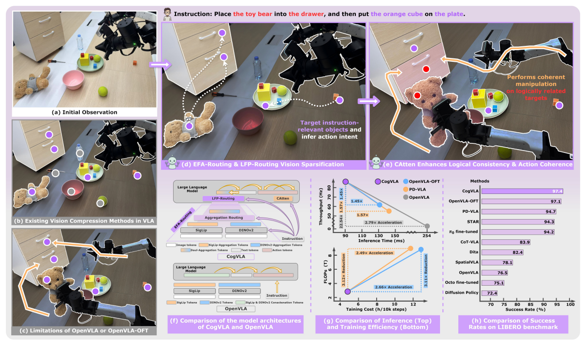

Figure 1. instruction 관련 시각 선택과 행동 일관성의 동기, 구조·효율·성공률 요약. subpanel (a)–(h)를 모두 유지했다. [PDF p.1, Fig.1] · [원문 PDF](https://proceedings.neurips.cc/paper_files/paper/2025/file/c9028f7874df04843e7bf435ee4cd3c3-Paper-Conference.pdf#page=1)

### 2.3 연구 질문 → 가설 → 설계 선택

| 연결 고리 | 내용 |
|---|---|
| 연구 질문 | 계산을 줄이면서도 perception-language-action의 의미 연결을 유지하거나 더 강화할 수 있는가? |
| 가설 1 | instruction을 vision encoder 내부에 먼저 주입하면, 무조건적인 patch pruning보다 필요한 시각 정보를 aggregation token에 보존할 수 있다. |
| 설계 1 | **EFA-Routing:** FiLM으로 instruction-conditioned vision encoding을 하고, 각 백본의 64 aggregation token만 남긴 뒤 instruction-conditioned gate로 두 백본을 융합한다. |
| 가설 2 | Stage 1 뒤에도 남은 시각 token의 층별 유용성은 다르므로, LLM 내부에서 instruction을 다시 사용해 계산할 token을 고르면 추가 절감이 가능하다. |
| 설계 2 | **LFP-Routing:** instruction-conditioned FiLM router와 shifted-cosine retention schedule로 visual token의 layer computation을 top-k 선택한다. |
| 가설 3 | 강한 압축 뒤에는 action token끼리 서로 보지 못하는 순수 causal mask가 청크 일관성을 해칠 수 있다. |
| 설계 3 | **CAtten:** vision-language는 causal 구조를 유지하고, action block은 bidirectional하게 열어 $K D$ action placeholder를 한 번에 예측한다. |

VAS-SMA-PMC 대응은 설계를 이해하기 위한 생물학적 비유다. VAS는 task-relevant visual focus, SMA는 intention-guided filtering, PMC는 visuomotor planning에 대응한다. 그러나 뇌 영역의 활성이나 신경과학 데이터로 모델을 검증한 것은 아니므로 “인지적으로 증명된 구조”가 아니라 **인지 연구에서 영감을 받은 engineering inductive bias**로 읽어야 한다. [PDF p.2-3, §1; PDF p.26-28, §E.1]

---

<a id="claims"></a>

## 3. 저자의 핵심 주장, 근거, 범위

| 주장 | 직접 근거 | 산술/범위 판정 |
|---|---|---|
| LIBERO 평균 SR 97.4%로 표의 최고 평균 | Table 1, Table 7 | Table 1의 네 값 평균은 $(98.6+98.8+96.6+95.4)/4=97.35\%$, 1자리 반올림 97.4%. [리뷰어 재계산] |
| real-world main tasks 평균 70.0% | Table 2 | 세 복합 task의 최종 성공 횟수 $8+7+6=21$회/30회로 70.0%. 중간 subtask 전체 평균이 아님. [리뷰어 재계산] |
| OpenVLA 대비 inference latency 2.8배 개선 | Table 3 | $0.254/0.091=2.791$. 동일 장비/설정이라고 서술하지만 warm-up, 반복 수, precision은 PDF 미기재. |
| OpenVLA 대비 training cost 2.5배 절감 | Table 3 | $11.7/4.7=2.489$. 단위는 `h/10k steps`; 총 학습 시간이나 GPU-hour와 구별해야 한다. |
| OpenVLA 대비 FLOPs 3.12배 절감 | Table 3 | $8.48/2.72=3.118$. FLOPs 감소가 동일 비율 latency 감소를 보장하지는 않는다. |
| OpenVLA 대비 throughput 22.54배 | Table 3 | $87.9/3.9=22.538$. 이 값은 action-Hz 성격이다. OpenVLA는 $1/0.254\approx3.9$, chunk 모델은 $8/0.091\approx87.9$이므로 policy refresh Hz와 동일하지 않다. |
| OpenVLA-OFT보다 inference time 31% 감소 | Fig.4, Table 3 | $(0.132-0.091)/0.132=31.1\%$. OpenVLA 대비 2.8배와 비교 대상을 혼동하면 안 된다. |
| EFA+LFP의 8배 vision sparsification이 성능을 유지/개선 | Tables 4-6, 9 | Spatial ablation에서는 4×-2× 배치가 98.6%. 다른 suite별 sparsity ablation과 OOD 장면은 미제시. |
| 세 모듈이 상호보완적 | Table 4 | full 98.6, Stage 2 제거 92.0, Stage 3 제거 92.0, instruction-guided pruning 제거 96.2. 단일 suite(Spatial)에서의 ablation이다. |
| instruction-relevant region을 본다 | Fig.7 | 64 aggregation token 중 17개의 heatmap을 시각화. 정성 증거이며 선택 기준·정량 localization metric은 미기재. |

주장 범위는 LIBERO 네 suite와 ALOHA 기반 5개 real-world task다. unseen manipulation category, OOD instruction, 다른 로봇 embodiment, 안전-critical 환경, Jetson/Thor 배포는 검증하지 않았다. 저자도 Appendix E.2에서 fixed sparsity와 OOD 미평가를 한계로 인정한다.

---

<a id="notation"></a>

## 4. 선수 지식과 통합 notation/shape 사전

### 4.1 먼저 구분해야 할 네 종류의 길이

- **vision token 수 $M$:** 한 번의 정책 호출에 LLM으로 들어가는 시각 token 수. 원본 patch 수, Stage 1 뒤 aggregation token 수, LFP가 특정 층에서 실제 계산하는 수가 서로 다르다.
- **text token 수 $T$:** tokenizer가 만든 prompt/instruction token 수. “평균 10.48 words”와 token 수 $T$는 같지 않다.
- **action step 수 $K$:** 한 policy call이 예측하는 미래 환경 행동의 개수. LIBERO $K=8$, ALOHA $K=25$.
- **action dimension $D$:** 한 환경 step의 연속 제어 벡터 차원. PDF 예시는 $D=7$; 공개 코드는 LIBERO $D=7$, ALOHA $D=14$다.

따라서 $K\times D$는 **환경 step 수가 아니라 action-coordinate placeholder 수**다. LIBERO는 $8\times7=56$개, ALOHA는 $25\times14=350$개다. 공개 구현은 여기에 stop token 1개를 더한다.

### 4.2 기호와 shape

| 기호 | 의미 | 엄밀한 shape/단위 |
|---|---|---|
| $B$ | batch size | scalar count |
| $I^{(i)}$ | $i$번째 vision encoder가 받는 관측 | 보통 $B\times3\times H\times W$; 다중 카메라일 때 image별 처리 |
| $N$ | vision encoder branch 수 | CogVLA는 2: SigLIP, DINOv2 |
| $P$ | encoder당 원본 patch token 수 | 공개 OpenVLA 경로는 image당 256; PDF 본문에는 숫자 미기재 |
| $Q$ | encoder당 aggregation token 수 | PDF/실행 스크립트는 64 |
| $d_v^{(i)}$ | $i$번째 vision hidden width | branch마다 다를 수 있음; PDF 미기재 |
| $d$ | LLM hidden width | OpenVLA 7B 계열 공개 코드 주석은 4096; PDF 본문 미기재 |
| $t_r$ | routing용 instruction summary | 개념상 $B\times d$; 공개 구현은 prompt language embedding을 token 축 평균 |
| $v_{\mathrm{agg}}^{(i)}$ | branch $i$의 aggregation representation | 엄밀히 $B\times Q\times d_v^{(i)}$ 또는 projection 뒤 $B\times Q\times d$; 논문은 단수 “token”처럼 표기 |
| $\alpha_i$ | branch $i$의 routing weight | $B\times1\times1$, $\sum_i\alpha_i=1$ |
| $Z_l$ | LLM layer $l$의 visual hidden states | $B\times M\times d$ |
| $t_l$ | layer $l$의 text hidden states | $B\times T\times d$ |
| $A_l$ | layer $l$의 action-placeholder hidden states | 구현상 $B\times(KD)\times d$; 환경 action은 $B\times K\times D$ |
| $R_l^j$ | visual token $j$의 router score | 논문은 scalar; 구현은 2-class softmax의 “keep” 확률 |
| $\beta_l$ | layer $l$의 retention ratio | 무차원 $[0,1]$; percentile 표기에는 원문 모순이 있음 |
| $\gamma,\beta$ | FiLM scale/shift | 마지막 hidden 축과 동일, token 축으로 broadcast |
| $\mathbf M$ | additive attention mask | 허용 0, 차단 $-\infty$ |
| $\mathbf a_k$ | 환경 step $k$의 action | $D$-차원 연속 벡터; LIBERO는 translation 3 + rotation 3 + gripper 1 |

### 4.3 필요한 연산 개념

**FiLM.** 조건 벡터 $c$에서 scale $\gamma(c)$와 shift $\beta(c)$를 만들고 feature $x$를 $(1+\gamma)\odot x+\beta$로 바꾼다. $1+$를 쓰면 초기 $\gamma\approx0,\beta\approx0$일 때 원래 pretrained feature를 거의 보존한다.

**aggregation token.** patch를 평균내는 고정 pooling이 아니라, 학습 가능한 query token이 self-attention을 통해 patch에서 정보를 모은다. 최종 patch를 버리고 query만 남기면 bottleneck이 된다.

**top-k routing.** router가 token별 점수를 내면 높은 점수 $k$개에만 attention/FFN 계산을 적용하고 나머지는 residual 경로로 건너뛴다. hard top-k index 자체에는 일반적인 미분이 흐르지 않지만, 선택된 token의 score가 계산값을 곱하면 선택된 router score에는 gradient가 갈 수 있다.

**causal vs. bidirectional mask.** causal은 query 위치가 미래 key를 못 본다. bidirectional은 같은 block 안 모든 token이 서로 본다. CogVLA는 V-L prefix는 causal로 두고 action block만 bidirectional로 연다.

---

<a id="section-walkthrough"></a>

## 5. 원문 섹션 순서 상세 해설

### Abstract [PDF p.1-2]

초록의 논리는 “대형 VLM post-training 비용 → 기존 sparsification의 cross-modal 단절 → instruction을 세 단계에서 재사용 → 성능과 효율 동시 개선”이다. 핵심은 독립적인 세 trick의 나열이 아니라, Stage 1의 압축 결과를 Stage 2가 다시 고르고, Stage 3가 그 압축된 context로 action chunk를 함께 생성한다는 연결이다. 보고 수치는 LIBERO 97.4%, real-world 70.0%, OpenVLA 대비 training cost 2.5× 및 inference latency 2.8× 개선이다. 이 수치의 조건은 §9에서 분해한다.

### 1 Introduction [PDF p.2-3]

첫 문단은 RT-2, Octo, OpenVLA, $\pi_0$, $\pi_{0.5}$를 통해 pretrained VLM을 robot control로 확장하는 흐름을 잡는다. 두 번째 문단은 문제를 memory/FLOPs/training time으로 구체화하고, 단일 stage 효율화가 세 modality 사이 의미 연결을 보존하지 못한다고 주장한다.

세 번째 문단의 VAS-SMA-PMC 비유는 다음 기능적 분해를 제공한다.

- VAS: instruction에 필요한 색·형상·공간 위치를 먼저 본다.
- SMA: “무엇을 할 것인가”라는 action intent로 현재 시각 feature를 걸러낸다.
- PMC: perception과 language를 action trajectory로 결합한다.

마지막 두 문단은 이 비유를 각각 EFA, LFP, CAtten으로 매핑하고 세 contribution을 선언한다. “biomimetic”이라는 말은 구조적 유사성을 뜻할 뿐 생물학적 동등성을 뜻하지 않는다.

### 2 Methods

<a id="sec-21"></a>

#### 2.1 Preliminary: Parallel Decoding in Action Chunk [PDF p.3-4]

##### Eq. (1): action chunk의 객체

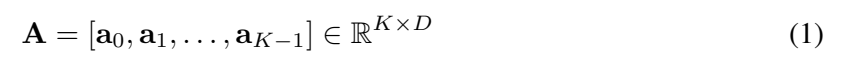

원문 Eq. (1). action chunk의 정의. [PDF p.3, §2.1] · [원문 PDF](https://proceedings.neurips.cc/paper_files/paper/2025/file/c9028f7874df04843e7bf435ee4cd3c3-Paper-Conference.pdf#page=3)

$$
\mathbf A=[\mathbf a_0,\mathbf a_1,\ldots,\mathbf a_{K-1}]\in\mathbb R^{K\times D}.
\tag{1}
$$

- **각 항:** $\mathbf a_i\in\mathbb R^D$는 미래 $i$번째 환경 step의 atomic action이다. $K$는 chunk horizon, $D$는 step당 actuator coordinate 수다.
- **연산 순서:** $D$차원 벡터 $K$개를 시간축으로 stack한다. 결과의 첫 축은 time, 둘째 축은 action coordinate다.
- **왜 필요한가:** 한 번의 정책 호출이 하나의 action이 아니라 짧은 trajectory를 내도록 문제를 정의한다.
- **작은 예:** $K=2,D=3$이고 $\mathbf a_0=(0.1,0,1)$, $\mathbf a_1=(0.2,-0.1,0)$이면 $\mathbf A$는 $2\times3$ 행렬이다. LIBERO에서는 $K=8,D=7$이라 56 scalar를 낸다.
- **gradient/추론:** 학습 때 ground-truth $\mathbf A$와 예측 $\hat{\mathbf A}$의 L1 loss가 모든 $KD$ 성분에서 action head와 upstream LLM으로 역전파된다. 추론 때 $K$개를 모두 실행할지 일부만 실행할지는 별도의 control 정책이다.
- **edge case:** $K=1$이면 chunking 이점은 사라지지만 action-coordinate parallelization은 남을 수 있다. 큰 $K$는 policy 호출당 처리량을 늘리지만 open-loop horizon도 늘린다.

##### Eq. (2): autoregressive baseline

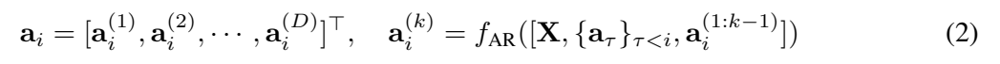

원문 Eq. (2). autoregressive action prediction. [PDF p.3, §2.1] · [원문 PDF](https://proceedings.neurips.cc/paper_files/paper/2025/file/c9028f7874df04843e7bf435ee4cd3c3-Paper-Conference.pdf#page=3)

$$
\mathbf a_i=[a_i^{(1)},a_i^{(2)},\ldots,a_i^{(D)}]^\top,\qquad
a_i^{(k)}=f_{\mathrm{AR}}\!\left([X,\{\mathbf a_\tau\}_{\tau<i},a_i^{(1:k-1)}]\right).
\tag{2}
$$

- **첫 줄:** 하나의 action vector도 $D$개 scalar/token으로 분해한다.
- **둘째 줄:** 좌변 $a_i^{(k)}$를 예측할 때 관측·instruction context $X$, 과거 환경 step의 모든 action, 현재 step에서 이미 생성한 coordinate를 조건으로 쓴다.
- **계산 역할:** strict AR이면 새 token마다 다음 logits가 필요하므로 논문 서술상 $K D$번의 serial forward가 필요하다. KV cache를 쓰더라도 dependency chain 길이는 $KD$다.
- **작은 예:** $K=2,D=3$이면 $a_0^{(1)}\to a_0^{(2)}\to a_0^{(3)}\to a_1^{(1)}\to a_1^{(2)}\to a_1^{(3)}$의 6단계다.
- **가정:** action coordinate가 token 순서를 가져도 된다고 본다. 회전·이동·gripper의 인위적 순서가 물리적 동시성과 같지는 않다.
- **edge case:** teacher forcing 학습은 병렬화할 수 있어도 실제 생성은 sequential하다. 따라서 “$KD$ forward pass”는 생성 관점이며 training FLOPs 설명과 동일시하면 안 된다.

##### Eq. (3): parallel placeholder sequence

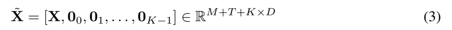

원문 Eq. (3). 병렬 예측의 placeholder sequence. [PDF p.4, §2.1] · [원문 PDF](https://proceedings.neurips.cc/paper_files/paper/2025/file/c9028f7874df04843e7bf435ee4cd3c3-Paper-Conference.pdf#page=4)

$$
\tilde X=[X,\mathbf 0_0,\mathbf 0_1,\ldots,\mathbf 0_{K-1}]
\in\mathbb R^{M+T+K\times D}.
\tag{3}
$$

- **원문 의미:** $M$개 vision 위치, $T$개 text 위치 뒤에 $K D$개의 action 위치를 붙인다. $\mathbf0_i\in\mathbb R^D$는 $i$번째 action step을 위한 빈 위치 묶음이다.
- **shape 주의:** $X$는 실제로 token sequence이고 각 token은 hidden width $d$를 갖는다. 그러므로 엄밀한 embedding tensor는 $B\times(M+T+KD)\times d$다. 원문의 $\mathbb R^{M+T+K\times D}$는 sequence length만 쓴 축약 표기다.
- **구현 확인:** 공개 코드는 `ACTION_DIM * NUM_ACTIONS_CHUNK`개의 placeholder token id를 붙이고, embedding을 0으로 만든다. stop token 1개도 추가하므로 실제 길이는 $M+T+KD+1$이다. [공개 코드 확인: `modeling_prismatic.py`의 `_prepare_input_for_action_prediction`](https://github.com/iLearn-Lab/NeurIPS25-CogVLA/blob/9dc707f53ee6b19b19e06dfbddbf8e4b0aa351e5/prismatic/extern/hf/modeling_prismatic.py#L818-L839)
- **작은 예:** $M=64,T=20,K=2,D=3$이면 논문 sequence length는 90, 코드식 stop 포함 길이는 91이다.
- **edge case:** padding이 있으면 action block은 각 sample의 실제 끝 직전에 위치해야 한다. 공개 CAtten 구현은 padding 수를 세어 bottom-right block 위치를 보정한다.

##### Eq. (4): 단일 병렬 호출

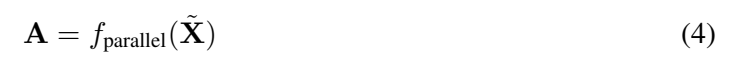

원문 Eq. (4). 단일 병렬 action 호출. [PDF p.4, §2.1] · [원문 PDF](https://proceedings.neurips.cc/paper_files/paper/2025/file/c9028f7874df04843e7bf435ee4cd3c3-Paper-Conference.pdf#page=4)

$$
\mathbf A=f_{\mathrm{parallel}}(\tilde X).
\tag{4}
$$

- **연산:** 한 번의 LLM pass가 모든 action placeholder의 hidden state를 만들고, action head가 이를 $K\times D$ 연속값으로 변환한다.
- **필수 조건:** action token끼리 causal 차단되어 있으면 뒤 action이 앞 action만 보고 앞 action은 뒤 action을 못 본다. CAtten은 action-action mask를 bidirectional로 열어 상호 일관성을 학습하게 한다.
- **gradient:** 모든 미래 action의 loss가 한 computation graph에서 공유 vision/language context와 action-action attention으로 흐른다.
- **작은 예:** 위의 6개 AR 단계 대신 6개 placeholder hidden state를 한 번에 계산한다.
- **한계:** “한 pass”는 latency가 0이라는 뜻이 아니다. vision encoding, long-sequence LLM prefill, action head, 전처리·통신은 남는다.

<a id="sec-22"></a>

#### 2.2 CogVLA: Framework [PDF p.4-5, Fig.2]

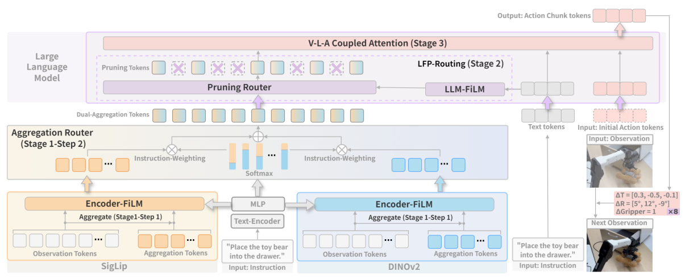

Figure 2. 두 vision encoder의 aggregation부터 LLM 내 routing, CAtten, action chunk와 다음 관측까지의 전체 경로. [PDF p.4, §2.2] · [원문 PDF](https://proceedings.neurips.cc/paper_files/paper/2025/file/c9028f7874df04843e7bf435ee4cd3c3-Paper-Conference.pdf#page=4)

Fig.2는 전체 데이터 흐름을 가장 잘 보여 준다. 두 encoder에 image와 text-conditioned FiLM이 들어가고, branch별 aggregation token이 instruction gate로 합쳐진다. 이 token은 LLM 앞/내부의 LFP router를 통과하고 CAtten으로 action chunk를 낸다. 공개 LIBERO 설정은 두 카메라 image, ALOHA 설정은 세 카메라 image를 입력한다. 각 image가 SigLIP/DINOv2 양쪽에 들어간다는 점과 “dual encoder”를 “dual camera”로 혼동하지 않아야 한다.

##### Eq. (5): branch별 Encoder-FiLM

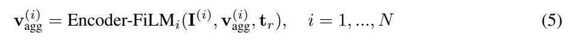

원문 Eq. (5). branch별 instruction-conditioned encoding. [PDF p.4, §2.2] · [원문 PDF](https://proceedings.neurips.cc/paper_files/paper/2025/file/c9028f7874df04843e7bf435ee4cd3c3-Paper-Conference.pdf#page=4)

$$
\mathbf v_{\mathrm{agg}}^{(i)}=
\mathrm{Encoder\!\text{-}\!FiLM}_i
(I^{(i)},\mathbf v_{\mathrm{agg}}^{(i)},t_r),\qquad i=1,\ldots,N.
\tag{5}
$$

- **입력:** image patch $I^{(i)}$, 학습 가능한 aggregation query $\mathbf v_{\mathrm{agg}}^{(i)}$, instruction summary $t_r$.
- **출력:** 원문은 단수 token처럼 쓰지만 실제로는 branch당 $Q=64$개의 token 집합이다.
- **연산:** 각 ViT block에서 patch와 query가 함께 self-attention하고, instruction에서 생성된 FiLM scale/shift가 hidden channel을 조절한다.
- **필요성:** query가 모든 patch를 보되 instruction에 따라 어떤 channel을 증폭/억제할지 달라진다.
- **예:** “red cup” instruction이면 색/용기 관련 channel의 effective gain이 커질 수 있다. 이것은 해석 예시이며 실제 channel semantics를 논문이 측정한 것은 아니다.
- **gradient:** action L1 loss가 aggregation query, FiLM projection, encoder 안의 LoRA/학습 가능 경로로 흐른다. hard patch deletion은 encoder 마지막 뒤에 일어나므로 query는 삭제 전 patch 전체에서 정보를 모을 수 있다.

##### Eq. (6): branch fusion

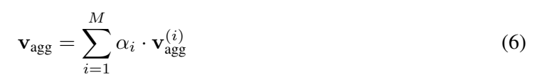

원문 Eq. (6). aggregation token의 branch fusion. [PDF p.4, §2.2] · [원문 PDF](https://proceedings.neurips.cc/paper_files/paper/2025/file/c9028f7874df04843e7bf435ee4cd3c3-Paper-Conference.pdf#page=4)

$$
\mathbf v_{\mathrm{agg}}=\sum_{i=1}^{M}\alpha_i\mathbf v_{\mathrm{agg}}^{(i)}.
\tag{6}
$$

- **원문 불일치:** 바로 앞에서 encoder 수를 $N$이라 했고 Eq. (7)의 $\alpha$도 길이 $N$이다. 합의 상한 $M$은 vision token 수와도 충돌하므로, 문맥상 $\sum_{i=1}^{N}$가 자연스럽다. 원문을 조용히 고치지 않고 이 오탈자 가능성을 명시한다.
- **shape:** projection 후 두 branch가 모두 $B\times Q\times d$여야 elementwise weighted sum이 가능하다. $\alpha_i$는 $B\times1\times1$로 broadcast된다.
- **작은 예:** SigLIP/DINO token 한 성분이 각각 2와 5이고 $\alpha=(0.7,0.3)$이면 fused 성분은 $0.7\cdot2+0.3\cdot5=2.9$다.
- **edge case:** 한 branch가 유용하지 않아 $\alpha_i\approx0$이면 그 branch로 가는 gradient가 작아질 수 있다. soft routing이므로 완전한 compute skip은 아니며 두 encoder 계산은 이미 수행됐다.

##### Eq. (7): instruction-conditioned routing weight

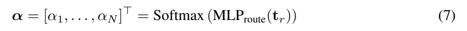

원문 Eq. (7). instruction-conditioned routing weight. [PDF p.4, §2.2] · [원문 PDF](https://proceedings.neurips.cc/paper_files/paper/2025/file/c9028f7874df04843e7bf435ee4cd3c3-Paper-Conference.pdf#page=4)

$$
\boldsymbol\alpha=[\alpha_1,\ldots,\alpha_N]^\top
=\mathrm{Softmax}(\mathrm{MLP}_{\mathrm{route}}(t_r)).
\tag{7}
$$

- **연산 순서:** instruction summary $t_r$ → MLP logits $B\times N$ → encoder 축 softmax → 합이 1인 mixture weight.
- **왜 softmax인가:** scale이 임의로 커지지 않는 convex combination을 만들고 branch 사이 상대 선호를 학습한다.
- **작은 예:** logits $(1.2,0.2)$면 $\alpha\approx(0.731,0.269)$다.
- **gradient:** softmax와 MLP는 미분 가능하므로 downstream action loss가 gate를 학습한다.
- **edge case:** 두 logits가 같으면 0.5/0.5. 매우 큰 logit 차이는 사실상 한 branch만 통과시키지만 encoder FLOPs 자체는 줄이지 않는다.

##### Eq. (8): layer transition의 요약식

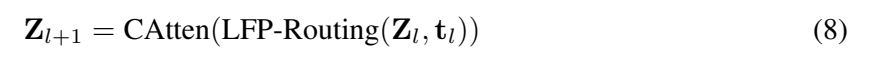

원문 Eq. (8). LFP-Routing과 CAtten의 layer transition. [PDF p.4, §2.2] · [원문 PDF](https://proceedings.neurips.cc/paper_files/paper/2025/file/c9028f7874df04843e7bf435ee4cd3c3-Paper-Conference.pdf#page=4)

$$
Z_{l+1}=\mathrm{CAtten}(\mathrm{LFP\!\text{-}\!Routing}(Z_l,t_l)).
\tag{8}
$$

- **논리:** Stage 1의 compact visual state $Z_0=\mathbf v_{\mathrm{agg}}$가 LLM에 들어가고, layer마다 LFP가 계산 token을 고른 뒤 CAtten mask 아래 transformer 연산을 한다.
- **shape:** $Z_l$의 저장 shape는 $B\times M\times d$다. 공개 코드는 선택하지 않은 token을 sequence에서 영구 삭제하지 않고 unchanged state로 scatter-back하므로 다음 layer의 후보 수 자체는 유지된다.
- **작은 예:** $M=64$, retention 0.5면 해당 layer attention은 32 visual token과 모든 text/action token을 처리하고, 나머지 32 visual state는 residual 그대로 남는다.
- **표기 한계:** 원문은 CAtten이 LFP 출력 전체에 적용되는 것처럼 쓰지만, 구현은 Llama attention forward를 전역 교체하고 LFP target layer에서 선택 sequence를 만들어 호출한다.

##### Eq. (9): 최종 action chunk

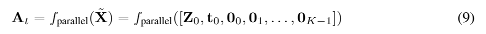

원문 Eq. (9). 최종 action chunk 예측. [PDF p.4, §2.2] · [원문 PDF](https://proceedings.neurips.cc/paper_files/paper/2025/file/c9028f7874df04843e7bf435ee4cd3c3-Paper-Conference.pdf#page=4)

$$
\mathbf A_t=f_{\mathrm{parallel}}(\tilde X)
=f_{\mathrm{parallel}}([Z_0,t_0,\mathbf0_0,\mathbf0_1,\ldots,\mathbf0_{K-1}]).
\tag{9}
$$

- **입력:** 현재 정책 갱신 시점 $t$의 compact vision, instruction, $K$개 action-step placeholder 묶음.
- **출력:** 환경 action $K\times D$.
- **작은 예:** LIBERO는 현재 두 image와 instruction에서 8개의 7-DoF action을 예측한다.
- **주의:** 우변에는 $Z_0$가 쓰였지만 실제 action hidden state는 32개 LLM layer를 통과한 최종 hidden에서 읽는다. $Z_0$는 입력 visual token이라는 의미다.
- **edge case:** scene이 청크 중 급변해도 이미 낸 $K$개 action은 바뀌지 않는다. 중간에 재관측해 재계획할지는 evaluator의 `num_open_loop_steps`가 결정한다.

<a id="sec-231"></a>

#### 2.3.1 Encoder-FiLM based Aggregation Routing [PDF p.5-6, Fig.3(a)]

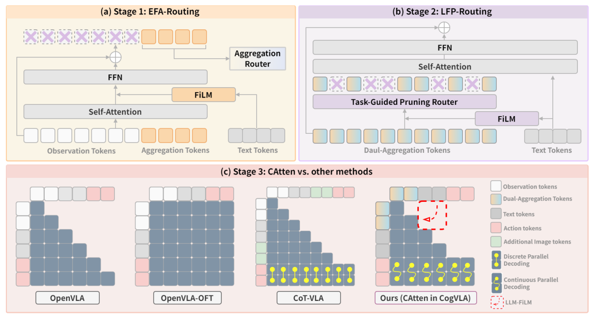

Figure 3. (a) EFA-Routing, (b) LFP-Routing, (c) CAtten과 기존 VLA의 attention mask·행동 decoding 비교. 아래 §2.3.1–2.3.3은 이 세 subpanel을 순서대로 해설한다. [PDF p.5, §2.3] · [원문 PDF](https://proceedings.neurips.cc/paper_files/paper/2025/file/c9028f7874df04843e7bf435ee4cd3c3-Paper-Conference.pdf#page=5)

##### Eq. (10), 첫 줄: intra-encoder FiLM attention

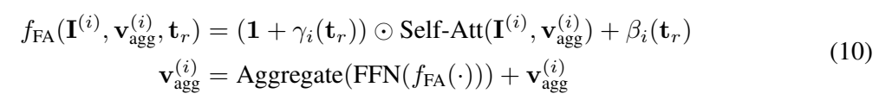

원문 Eq. (10). Encoder-FiLM과 aggregation 갱신의 원문 두 줄. [PDF p.5, §2.3.1] · [원문 PDF](https://proceedings.neurips.cc/paper_files/paper/2025/file/c9028f7874df04843e7bf435ee4cd3c3-Paper-Conference.pdf#page=5)

$$
f_{\mathrm{FA}}(I^{(i)},\mathbf v_{\mathrm{agg}}^{(i)},t_r)
=\left(1+\gamma_i(t_r)\right)\odot
\mathrm{SelfAtt}(I^{(i)},\mathbf v_{\mathrm{agg}}^{(i)})
+\beta_i(t_r).
\tag{10a}
$$

- **concatenation 해석:** `SelfAtt(I,v)`는 patch와 aggregation token을 함께 넣은 self-attention의 축약이다. output은 $B\times(P+Q)\times d_v^{(i)}$.
- **FiLM:** $\gamma_i,\beta_i\in\mathbb R^{B\times d_v^{(i)}}$를 token 축으로 broadcast한다. 따라서 patch 위치별 다른 scalar가 아니라 모든 위치에 공유되는 channel-wise 조건이다.
- **작은 수치 예:** 한 channel의 attention output이 2, $\gamma=-0.25$, $\beta=0.1$이면 $0.75\cdot2+0.1=1.6$.
- **필요성:** pretrained attention 구조를 유지하면서 instruction에 따라 channel gain과 bias만 바꿔 낮은 추가 비용으로 top-down conditioning한다.
- **gradient:** scale/shift projection과 self-attention 경로 모두 action loss를 받는다. $1+\gamma$ 때문에 초기 identity 근처에서 안정적으로 시작할 수 있다.
- **edge case:** $\gamma=-1$이면 원 feature가 사라지고 shift만 남는다. 큰 $|\gamma|$는 feature 폭발 위험이 있지만 clamp/regularizer는 PDF에 없다.

##### Eq. (10), 둘째 줄: aggregation token 갱신

$$
\mathbf v_{\mathrm{agg}}^{(i)}
=\mathrm{Aggregate}(\mathrm{FFN}(f_{\mathrm{FA}}(\cdot)))
+\mathbf v_{\mathrm{agg}}^{(i)}.
\tag{10b}
$$

- **연산:** FiLM-conditioned token을 FFN에 통과시키고 그중 aggregation 위치만 취해 기존 query에 residual add하는 것으로 읽힌다.
- **공개 코드 대조:** 구현은 `[patch, aggregation]`을 ViT block attention에 넣고 attention residual 뒤 **전체 token**에 FiLM을 적용한 다음 FFN residual을 수행한다. 마지막에 patch 위치를 잘라 aggregation 위치만 반환한다. 따라서 Eq. (10b)의 `Aggregate`는 별도 pooling 연산이라기보다 output slicing에 가깝다. [공개 코드 확인: `vit_wrapper_reg.py`](https://github.com/iLearn-Lab/NeurIPS25-CogVLA/blob/9dc707f53ee6b19b19e06dfbddbf8e4b0aa351e5/prismatic/models/vit_wrapper_reg.py#L42-L83)
- **작은 예:** $P=256,Q=64$이면 block 내부에서는 320 token이 상호작용하고, encoder 끝에서는 64 query만 남아 4× token reduction이 된다.
- **edge case:** query 수가 너무 작으면 여러 객체/관계를 한 token에 혼합해 정보 병목이 생긴다. Fig.7은 64개 query가 서로 다른 영역을 보는 예를 보이지만 coverage 보장은 아니다.

##### Eq. (11): 두 encoder의 scalar gate

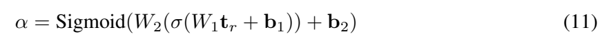

원문 Eq. (11). 두 encoder의 scalar routing gate. [PDF p.6, §2.3.1] · [원문 PDF](https://proceedings.neurips.cc/paper_files/paper/2025/file/c9028f7874df04843e7bf435ee4cd3c3-Paper-Conference.pdf#page=6)

$$
\alpha=\mathrm{Sigmoid}\!\left(W_2(\sigma(W_1t_r+b_1))+b_2\right).
\tag{11}
$$

- **연산 순서:** instruction $t_r$ → affine $W_1t_r+b_1$ → GeLU $\sigma$ → affine → sigmoid.
- **shape:** 두 branch 전용 scalar gate라면 최종 output은 $B\times1$. 중간 hidden width는 PDF 미기재.
- **작은 예:** 최종 logit 1.386이면 $\alpha=0.8$.
- **왜 sigmoid인가:** $N=2$일 때 한 scalar로 SigLIP 비중 $\alpha$, DINOv2 비중 $1-\alpha$를 만들 수 있다.
- **gradient/edge:** sigmoid가 0/1 부근에서 포화하면 gate gradient가 작아진다. Eq. (7)의 2-way softmax와 기능적으로 동등하지만 parameterization은 다르다.

##### Eq. (12): SigLIP-DINOv2 dual aggregation

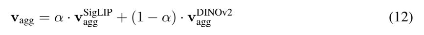

원문 Eq. (12). SigLIP-DINOv2의 dual aggregation. [PDF p.6, §2.3.1] · [원문 PDF](https://proceedings.neurips.cc/paper_files/paper/2025/file/c9028f7874df04843e7bf435ee4cd3c3-Paper-Conference.pdf#page=6)

$$
\mathbf v_{\mathrm{agg}}
=\alpha\mathbf v_{\mathrm{agg}}^{\mathrm{SigLIP}}
+(1-\alpha)\mathbf v_{\mathrm{agg}}^{\mathrm{DINOv2}}.
\tag{12}
$$

- **전제:** 두 branch의 $Q$개 위치가 대응하고 LLM width $d$로 projection되어야 한다.
- **작은 예:** $\alpha=0.8$, 두 branch token 성분이 1과 4면 fused 값은 $1.6$.
- **해석:** SigLIP의 language-aligned semantics와 DINOv2의 dense visual structure를 instruction별 비율로 섞는다.
- **중요한 효율 구분:** 이 gate는 두 encoder 중 하나의 실행을 생략하지 않는다. Stage 1 효율의 주원인은 branch 선택이 아니라 256 patch를 64 aggregation token으로 줄여 LLM 입력을 축소하는 데 있다.
- **공개 구현:** `MoEAggregator`는 instruction mean embedding으로 $B\times2$ softmax를 만들고 각 branch의 모든 $Q$ token에 sample-wise scalar를 곱해 합한다. [공개 코드 확인](https://github.com/iLearn-Lab/NeurIPS25-CogVLA/blob/9dc707f53ee6b19b19e06dfbddbf8e4b0aa351e5/prismatic/models/router.py#L21-L60)

<a id="sec-232"></a>

#### 2.3.2 LLM-FiLM based Pruning Routing [PDF p.6, Fig.3(b)]

EFA는 patch를 query에 모으지만, 64개 query 전부가 모든 LLM layer에서 똑같이 유용하다는 보장은 없다. LFP는 각 layer에서 instruction과 현재 hidden state로 “이번 layer에서 계산할 visual token”을 다시 고른다. 공개 구현을 보면 영구 token deletion보다 **layer-wise conditional computation**에 가깝다.

##### Eq. (13), 첫 줄: LLM-FiLM과 prune

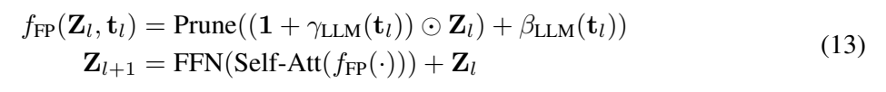

원문 Eq. (13). LLM-FiLM/prune 및 transformer 갱신의 원문 두 줄. [PDF p.6, §2.3.2] · [원문 PDF](https://proceedings.neurips.cc/paper_files/paper/2025/file/c9028f7874df04843e7bf435ee4cd3c3-Paper-Conference.pdf#page=6)

$$
f_{\mathrm{FP}}(Z_l,t_l)
=\mathrm{Prune}\!\left((1+\gamma_{\mathrm{LLM}}(t_l))\odot Z_l
+\beta_{\mathrm{LLM}}(t_l)\right).
\tag{13a}
$$

- **원문 조판:** PDF에는 `Prune((1+γ)⊙Z_l)+β)`로 읽힐 수 있는 닫는 괄호 불일치가 있다. 문장 설명은 scale과 shift 모두 instruction-conditioned modulation이라고 하므로 위처럼 shift 뒤 prune으로 해석하는 것이 자연스럽다.
- **shape:** $Z_l\in\mathbb R^{B\times M\times d}$, $\gamma,\beta\in\mathbb R^{B\times d}$이며 visual token 축으로 broadcast된다.
- **작은 예:** 두 visual token의 한 channel이 $(1,3)$, $\gamma=0.5$, $\beta=-0.5$면 modulated 값은 $(1,4)$. router가 둘째를 더 relevant하다고 판단할 수 있다.
- **공개 코드의 실제 역할:** FiLM-modulated visual state는 router logits 계산에만 쓰고, 선택된 token의 transformer 입력은 원래 `hidden_states`다. 즉 FiLM이 $Z_l$ 자체를 영구 변환하는 것이 아니라 **선택 점수의 조건화** 역할을 한다. text summary는 BOS 뒤 visual block 다음부터 action/stop 전까지의 hidden을 평균한다. [공개 코드 확인](https://github.com/iLearn-Lab/NeurIPS25-CogVLA/blob/9dc707f53ee6b19b19e06dfbddbf8e4b0aa351e5/prismatic/models/modeling_llama.py#L161-L199)
- **gradient:** 선택된 token의 router keep probability는 뒤 Eq. (15)의 weighting을 통해 gradient를 받는다. hard top-k 경계 자체는 불연속이라 threshold를 간신히 넘나드는 token은 수치 변화에 민감할 수 있다.

##### Eq. (13), 둘째 줄: transformer layer 갱신

$$
Z_{l+1}=\mathrm{FFN}(\mathrm{SelfAtt}(f_{\mathrm{FP}}(\cdot)))+Z_l.
\tag{13b}
$$

- **원문 의미:** 살아남은 token에 attention+FFN을 수행하고 residual로 원래 state를 더한다.
- **구현상 더 정확한 순서:** pre-norm → 선택 token끼리 self-attention → residual → post-attention norm → FFN output에 router score 곱 → residual → 원 sequence 위치에 scatter. 선택되지 않은 visual token은 해당 layer에서 unchanged다.
- **작은 예:** $M=64$에서 32개만 선택하면 해당 layer의 attention sequence에서 32개 visual token만 Q/K/V를 만들지만 text/action token은 강제 유지된다.
- **edge case:** 선택되지 않은 token도 다음 layer router 후보로 다시 나타날 수 있다. 따라서 “한번 버리면 끝”인 pruning과 다르다.

##### Eq. (14): token relevance score

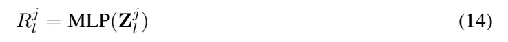

원문 Eq. (14). token relevance score. [PDF p.6, §2.3.2] · [원문 PDF](https://proceedings.neurips.cc/paper_files/paper/2025/file/c9028f7874df04843e7bf435ee4cd3c3-Paper-Conference.pdf#page=6)

$$
R_l^j=\mathrm{MLP}(Z_l^j).
\tag{14}
$$

- **입출력:** visual token $Z_l^j\in\mathbb R^d$에서 scalar relevance를 만든다는 축약식이다.
- **공개 구현:** linear layer가 2-class logits $B\times S\times2$를 내고 softmax의 class 1 확률을 keep score로 쓴다. LFP-FiLM을 켜면 router 입력 앞에서 visual state만 instruction-conditioned scale/shift한다.
- **작은 예:** logits $(0.2,1.2)$면 keep score는 $e^{1.2}/(e^{0.2}+e^{1.2})\approx0.731$.
- **forced tokens:** 공개 코드는 BOS와 visual block 뒤의 모든 text/action/stop token score에 $+\infty$를 더해 top-k에 반드시 포함한다. 실제 경쟁은 visual token 사이에서만 일어난다.
- **한계:** 별도 router supervision이나 auxiliary classification loss는 공개 코드에서 주석 처리되어 있다. action loss만으로 간접 학습된다.

##### Eq. (15): keep/skip update

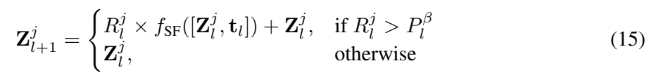

원문 Eq. (15). keep/skip conditional update. [PDF p.6, §2.3.2] · [원문 PDF](https://proceedings.neurips.cc/paper_files/paper/2025/file/c9028f7874df04843e7bf435ee4cd3c3-Paper-Conference.pdf#page=6)

$$
Z_{l+1}^j=
\begin{cases}
R_l^j\, f_{\mathrm{SF}}([Z_l^j,t_l])+Z_l^j,&R_l^j>P_l^\beta,\\
Z_l^j,&\text{otherwise.}
\end{cases}
\tag{15}
$$

- **첫 branch:** relevant token이면 self-attention/FFN 계산 $f_{\mathrm{SF}}$을 하고 router score로 gate한 뒤 residual을 더한다.
- **둘째 branch:** skip token은 identity path로 통과한다. 이것이 computation sparsity의 근거다.
- **percentile 모순:** 원문은 $\beta$를 retention ratio라 부르면서 $P_l^\beta$를 “$\beta$-th percentile”이라 하고 $R>P_l^\beta$를 유지한다. 일반 percentile 정의면 유지 비율은 $1-\beta$다. 공개 구현은 `topk(int(num_visual_tokens * router_factor))`로 **$\beta$를 직접 keep fraction**으로 사용한다. 따라서 식의 percentile 문장은 threshold를 $(1-\beta)$ percentile로 쓰거나 부등호/정의를 바꿔야 일관된다.
- **작은 예:** 점수 $(0.1,0.4,0.8,0.9)$에서 keep ratio $\beta=0.5$면 구현은 top-2인 $(0.8,0.9)$를 고른다. 그러나 문자 그대로 50th percentile 초과도 우연히 같은 결과다. $\beta=0.75$에서는 구현은 3개를 유지하지만 75th percentile 초과는 1개만 유지해 차이가 드러난다.
- **구현 차이:** Eq. (15)는 $R$이 attention+FFN 전체를 곱하는 듯 보이나 공개 코드는 **FFN branch에만** keep probability를 곱하고 attention branch에는 곱하지 않는다. hard selection은 attention과 FFN 모두의 계산 여부를 결정한다. [공개 코드 확인](https://github.com/iLearn-Lab/NeurIPS25-CogVLA/blob/9dc707f53ee6b19b19e06dfbddbf8e4b0aa351e5/prismatic/models/modeling_llama.py#L249-L376)
- **position/mask:** 선택된 index를 원순서로 정렬하고 attention mask의 해당 row/column만 gather한다. position id는 원 index를 gather하지 않고 $0,\ldots,k-1$로 다시 부여한다.
- **edge case:** 경계 점수가 동률이면 top-k tie-breaking에 따라 token set이 달라질 수 있다. 공식 저장소도 BF16 rounding, GPU, CUDA/kernel 차이가 threshold 근처 선택을 바꿔 성능 분산을 키울 수 있다고 후속 공개 메모에서 인정한다.

<a id="sec-233"></a>

#### 2.3.3 V-L-A Coupled Attention [PDF p.6-7, Fig.3(c)]

CAtten의 요점은 세 종류 token을 완전히 같은 attention 규칙으로 다루지 않는 것이다. perception/language prefix는 방향성을 유지하고, action block만 서로 모두 보게 한다. 이를 “unidirectional V-L + bidirectional action + action이 V-L을 참조”하는 prefix-LM mask로 이해하면 쉽다.

##### Eq. (16): multimodal sequence

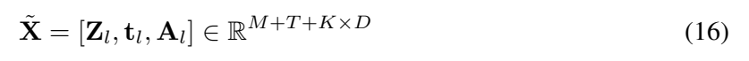

원문 Eq. (16). vision-language-action sequence. [PDF p.6, §2.3.3] · [원문 PDF](https://proceedings.neurips.cc/paper_files/paper/2025/file/c9028f7874df04843e7bf435ee4cd3c3-Paper-Conference.pdf#page=6)

$$
\tilde X=[Z_l,t_l,A_l]\in\mathbb R^{M+T+K\times D}.
\tag{16}
$$

- **원문 의미:** layer $l$의 visual, text, action token을 연결한다.
- **shape 교정 해설:** $A_l=[a_0^l,\ldots,a_{K-1}^l]$라고 쓰지만 LLM 안에서 각 action coordinate가 별도 token이므로 구현상 $A_l\in\mathbb R^{B\times KD\times d}$다. 전체 hidden은 $B\times(M+T+KD)\times d$. 원문의 $\mathbb R^{M+T+K\times D}$는 hidden 축을 생략해 차원 의미가 섞인 표기다.
- **작은 예:** $M=64,T=20,K=8,D=7$이면 action block 56, 총 140 token(코드의 stop 포함 141)이다.
- **edge:** text padding은 실제 mask에서 제외되어야 하며 action block의 시작점도 sample별 padding 수에 맞춰야 한다.

##### Eq. (17): causal vision-language attention

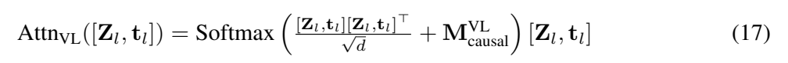

원문 Eq. (17). causal vision-language attention. [PDF p.6, §2.3.3] · [원문 PDF](https://proceedings.neurips.cc/paper_files/paper/2025/file/c9028f7874df04843e7bf435ee4cd3c3-Paper-Conference.pdf#page=6)

$$
\mathrm{Attn}_{VL}([Z_l,t_l])=
\mathrm{Softmax}\!\left(
\frac{[Z_l,t_l][Z_l,t_l]^\top}{\sqrt d}
+\mathbf M^{VL}_{\mathrm{causal}}
\right)[Z_l,t_l].
\tag{17}
$$

- **한 줄씩:** token matrix와 전치를 곱해 pairwise similarity → $\sqrt d$로 scale → 허용 0/차단 $-\infty$ mask 추가 → row-wise softmax → value와 가중합.
- **원문 단순화:** 실제 transformer는 $Q=XW_Q,K=XW_K,V=XW_V$와 multi-head를 쓰지만 식은 projection을 생략하고 $Q=K=V=X$로 적었다.
- **mask:** lower triangular이면 위치 $q$는 $k\le q$만 본다. vision이 text 앞에 놓인다면 visual token은 뒤 instruction token을 직접 보지 못한다. 그러나 EFA에서 vision이 이미 instruction FiLM을 받았다는 것이 저자의 보완 논리다.
- **작은 예:** VL 길이 3이면 허용 행렬은 `[[0,-∞,-∞],[0,0,-∞],[0,0,0]]`.
- **gradient:** text/action loss는 causal 경로로 앞선 vision과 text value, EFA-conditioned vision 표현에 흐른다.
- **edge:** vision token 내부 순서에도 causal 제약이 걸린다. 모든 patch/query끼리 bidirectional하게 보는 일반 VLM projector 이후 attention과 다를 수 있으나, vision encoder 자체에서는 이미 bidirectional aggregation이 끝났다.

##### Eq. (18): bidirectional action attention

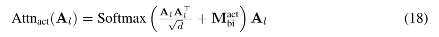

원문 Eq. (18). bidirectional action attention. [PDF p.7, §2.3.3] · [원문 PDF](https://proceedings.neurips.cc/paper_files/paper/2025/file/c9028f7874df04843e7bf435ee4cd3c3-Paper-Conference.pdf#page=7)

$$
\mathrm{Attn}_{\mathrm{act}}(A_l)=
\mathrm{Softmax}\!\left(
\frac{A_lA_l^\top}{\sqrt d}+\mathbf M^{\mathrm{act}}_{\mathrm{bi}}
\right)A_l.
\tag{18}
$$

- **mask 의미:** action-action block에서 모든 pair를 허용하므로 $\mathbf M^{\mathrm{act}}_{\mathrm{bi}}$는 유효 위치에 0인 행렬이다.
- **효과:** 앞 action coordinate도 뒤 action coordinate/미래 step placeholder를 볼 수 있어 청크 전체의 상호 일관성을 한 pass에서 조정한다.
- **작은 예:** $K=2,D=1$이면 두 action token이 서로를 본다. causal이면 첫 token은 둘째를 못 본다.
- **공개 구현:** stop token까지 action block에 포함해 $KD+1$개의 bottom-right mask 값을 0으로 바꾼다. [공개 코드 확인](https://github.com/iLearn-Lab/NeurIPS25-CogVLA/blob/9dc707f53ee6b19b19e06dfbddbf8e4b0aa351e5/prismatic/models/modeling_llama.py#L85-L115)
- **edge:** bidirectional placeholder는 ground-truth action을 입력으로 주는 것이 아니다. 공개 L1 경로는 action embedding을 0으로 만들므로 label leakage가 아니다.

##### Eq. (19): unified attention

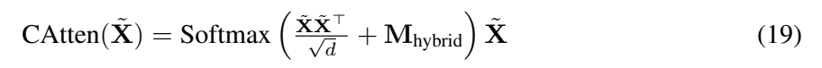

원문 Eq. (19). CAtten의 unified attention. [PDF p.7, §2.3.3] · [원문 PDF](https://proceedings.neurips.cc/paper_files/paper/2025/file/c9028f7874df04843e7bf435ee4cd3c3-Paper-Conference.pdf#page=7)

$$
\mathrm{CAtten}(\tilde X)=
\mathrm{Softmax}\!\left(
\frac{\tilde X\tilde X^\top}{\sqrt d}+\mathbf M_{\mathrm{hybrid}}
\right)\tilde X.
\tag{19}
$$

- **역할:** Eq. (17)과 (18)을 하나의 attention call/mask로 구현한다.
- **작은 예:** VL 3 token, action 2 token이면 $5\times5$ mask 하나로 prefix causal + action full을 나타낸다.
- **계산량:** dense implementation이면 허용 edge 수가 줄어도 $S\times S$ kernel 자체는 dense일 수 있다. CogVLA의 실제 FLOPs 절감은 Stage 1/2 token 수 감소가 주축이고, CAtten의 action bidirectionality는 serial decode 제거가 latency 이점의 주축이다.
- **주의:** 이 식만으로 CUDA kernel, FlashAttention 사용 여부, memory traffic은 정해지지 않는다.

##### Eq. (20): hybrid mask

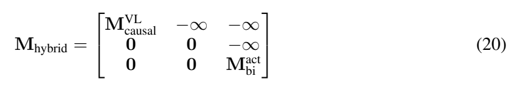

원문 Eq. (20). 원문 hybrid attention mask. [PDF p.7, §2.3.3] · [원문 PDF](https://proceedings.neurips.cc/paper_files/paper/2025/file/c9028f7874df04843e7bf435ee4cd3c3-Paper-Conference.pdf#page=7)

PDF 원문은 다음 3×3 block 모양으로 인쇄한다.

$$
\mathbf M_{\mathrm{hybrid}}=
\begin{bmatrix}
\mathbf M^{VL}_{\mathrm{causal}}&-\infty&-\infty\\
0&0&-\infty\\
0&0&\mathbf M^{\mathrm{act}}_{\mathrm{bi}}
\end{bmatrix}.
\tag{20}
$$

- **원문 표기의 문제:** $\mathbf M^{VL}_{\mathrm{causal}}$가 이미 $(M+T)\times(M+T)$라고 정의됐는데 3×3의 첫 block에 놓이면 나머지 vision/language block과 차원이 겹친다. 식의 block 크기가 명시되지 않아 그대로는 shape-consistent하지 않다.
- **문장과 공개 코드에 맞는 2-block 해설용 식:** 아래는 원문 번호가 아닌 해설이다.

$$
\left[\mathbf M_{\mathrm{hybrid}}\right]_{\text{해설}}
=
\begin{bmatrix}
\mathbf M^{VL}_{\mathrm{causal}} & -\infty_{(M+T)\times KD}\\
0_{KD\times(M+T)} & \mathbf M^{\mathrm{act}}_{\mathrm{bi}}
\end{bmatrix}.
\qquad\text{[해설용 수식]}
$$

- **행=질의, 열=key 해석:** VL query는 action key를 못 본다($-\infty$). action query는 모든 이전 VL key를 본다(0). action query끼리도 모두 본다($M_{bi}=0$).
- **작은 예:** VL 2, action 2면 허용 mask는 `[[0,-∞,-∞,-∞],[0,0,-∞,-∞],[0,0,0,0],[0,0,0,0]]`.
- **gradient 방향:** action loss는 VL representation으로 흐르지만 action 정보가 역으로 같은 layer의 VL token representation을 오염시키지는 않는다.
- **구현 한계:** 공개 코드는 causal mask bottom-right만 0으로 덮어쓰는 방식이다. SDPA custom mask를 쓰며 `is_causal=False`; FlashAttention 2 경로는 LFP 코드에서 지원하지 않는다고 assert한다.

<a id="sec-3"></a>

### 3 Experiments [PDF p.7-9]

§3.1은 hardware와 데이터 설정, §3.2는 성능, §3.3은 효율, §3.4는 정성 사례, §3.5는 ablation을 제시한다. 숫자별 재검산은 §9에서 모아 다룬다.

- **hardware:** PDF는 “모든 실험 4×A800 80GB”라고 쓴다.
- **LIBERO:** Spatial/Object/Goal/Long 각 10 task, task당 50 demonstration. 평가 500 trial/suite.
- **real world:** ALOHA에서 main paper는 Object Placement 45 demos, Drawer 45, T-shirt 30. Appendix는 Task 4/5까지 포함해 45/45/30/30/45 demos라고 명시한다.
- **fairness 주장:** efficiency 비교용 OpenVLA, OpenVLA-OFT, PD-VLA는 CogVLA와 같은 fine-tuning/inference 설정에서 재현했다고 한다. 하지만 PDF는 precision, batch, warm-up, 반복 횟수, measurement boundary를 상세히 적지 않는다.

### 4 Related Work [PDF p.10]

VLA 역사와 효율화 문헌을 두 축으로 정리한다. CLIPort/PerAct는 language-conditioned manipulation, RT 계열은 action tokenization과 scaling, Octo는 multi-robot dataset, OpenVLA는 open VLA backbone, $\pi$ 계열은 heterogeneous co-training으로 위치시킨다. 효율화는 LLM-centric(MoD, dynamic depth, MoE, lightweight backbone)와 vision-centric(token selection, crop, compressor)으로 나누고, CogVLA의 차별점은 **instruction을 두 compression stage와 action mask까지 관통시키는 joint design**이라고 주장한다. 관련 연구의 개별 성능을 재평가하는 절은 아니다.

### 5 Conclusion [PDF p.10]

결론은 세 모듈을 다시 묶어 vision sparsification과 coherent cross-modal reasoning을 동시에 달성했다고 요약한다. 이 결론의 실증 범위는 LIBERO와 제한된 ALOHA task이며 OOD/open-world 일반화를 증명하지 않는다.

### Acknowledgement [PDF p.10]

중국 국가자연과학기금, 광둥성 자연과학기금, 선전 과학기술 프로그램 지원을 명시한다. 방법·실험 해석에 직접 영향을 주는 추가 수식은 없다.

### References [PDF p.10-15]

88개 항목을 수록한다. 사용자 요구에 따라 참고문헌별 서평은 하지 않는다. 다만 본문 주장의 기반 축은 OpenVLA/OpenVLA-OFT, parallel decoding(PD-VLA), visual token pruning(FastV/SliME), FiLM, MoD 계열, LIBERO/ALOHA다.

### NeurIPS Paper Checklist [PDF p.15-21]

체크리스트도 PDF 범위에 포함해 확인했다. 저자는 claims/limitations/reproducibility/experimental details/statistical significance/compute/ethics/broader impact/safeguards/licenses/new assets에 `Yes`, theorem/proof·human-subject·IRB·core-method LLM usage에 `NA`, submission 당시 open data/code에는 `No`라고 답했다. 특히 “세 seed와 error bar를 appendix에 보고했다”는 답변은 Table 7과 연결되지만, error bar 계산법·평가 stochasticity·seed별 raw result는 충분히 공개되지 않았다. submission checklist의 “code/data는 acceptance 후 공개” 상태는 현재 공식 저장소 공개로 바뀌었으므로 시점을 구분한다.

<a id="sec-app-a"></a>

### Appendix A: Implementation Details [PDF p.22-23]

#### A.1 Model Details와 Eq. (21)

EFA는 각 encoder에 64 aggregation token을 사용해 원래 256 token 대비 25%를 남긴다. $\gamma_i,\beta_i$는 text embedding의 linear transform, 두 encoder routing weight는 2-layer MLP로 만든다.

LFP의 layer별 retention schedule은 다음과 같다.

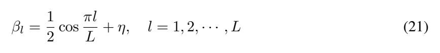

원문 Eq. (21). LFP의 shifted-cosine retention schedule. [PDF p.22, Appendix A.1] · [원문 PDF](https://proceedings.neurips.cc/paper_files/paper/2025/file/c9028f7874df04843e7bf435ee4cd3c3-Paper-Conference.pdf#page=22)

$$
\beta_l=\frac12\cos\frac{\pi l}{L}+\eta,\qquad l=1,2,\ldots,L.
\tag{21}
$$

- **항:** $L=32$는 LLM layer 수, $l$은 layer index, $\eta=0.5$는 곡선을 위아래로 이동시키는 shift다.
- **연산:** 얕은 층에서는 cosine이 1에 가까워 token을 많이 유지하고, 깊은 층으로 갈수록 0을 거쳐 -1로 가므로 retention을 줄인다.
- **PDF clamp:** $[0.05,0.85]$. 예를 들어 $l=1$ raw 값은 약 0.9976이라 0.85, $l=16$은 0.5, $l=32$는 0이라 0.05가 된다.
- **왜 필요한가:** 초반 layer는 low-level/cross-modal grounding을 충분히 처리하고, 후반에는 task-relevant state에 계산을 집중한다.
- **gradient:** schedule 자체는 hyperparameter라 학습되지 않는다. router score와 선택된 branch의 parameters만 학습된다.
- **edge:** 낮은 $\beta_l$에서 중요한 token 하나를 놓치면 후반 reasoning이 크게 흔들릴 수 있다. fixed schedule은 instruction 난이도에 적응하지 않는다.
- **공개 코드 차이:** 현재 스크립트는 `shiftedcos_decay_0.85_0.15`라 최솟값 0.15를 쓰고, 0-based $l=0\ldots31$ 및 분모 $L-1=31$을 사용한다. ratio가 0.85 이하인 layer 8-31만 LFP layer로 바꾸며 앞 8개 층은 full compute다. 전체 32층의 effective retention 단순 평균은 약 0.5375다. 이는 PDF의 clamp $[0.05,0.85]$와 정확히 같지 않다. [공개 코드 확인](https://github.com/iLearn-Lab/NeurIPS25-CogVLA/blob/9dc707f53ee6b19b19e06dfbddbf8e4b0aa351e5/prismatic/models/modeling_llama.py#L392-L439)

LFP FiLM의 scale/shift는 PDF상 hidden 2048의 2-layer MLP다. 공개 코드는 LLM hidden 4096 → 2048 → 4096의 GeLU MLP 두 개를 만든다.

#### A.2 Training Details

- **LIBERO PDF 설정:** OpenVLA backbone, $K=8$, LoRA rank 32, $\alpha=64$, 60K steps, global batch 64, initial LR $5\times10^{-4}$, 10K마다 평가 후 best checkpoint 보고.
- **real-world PDF 설정:** $K=25$, LoRA rank 32, $\alpha=64$, batch 32, 80K steps, initial LR $5\times10^{-4}$, 50K 뒤 $5\times10^{-5}$, 60K부터 10K 간격 평가, best checkpoint 보고.
- **논문 미기재:** optimizer, weight decay, gradient clipping, exact data augmentation parameters, precision, per-GPU batch, seed list, loss normalization 세부는 PDF에서 완전하지 않다.
- **현재 코드와 차이:** 공개 LIBERO shell은 4 GPU×per-device batch 16=64, 80,005 steps, 2 image를 사용한다. 코드 본문은 AdamW, BF16, 2K linear warm-up 뒤 80K cosine decay를 사용한다. PDF 60K/LoRA $\alpha=64$와 달리 dataclass default $\alpha=16$이고 shell은 `lora_alpha`를 넘기지 않는다. 현재 코드를 2025 PDF의 exact recipe로 간주하면 안 된다.

<a id="sec-app-b"></a>

### Appendix B: Experimental Details [PDF p.23-24]

#### B.1 LIBERO

LIBERO의 평균 instruction 길이 10.48 words를 RLBench 3.34와 비교해 language grounding 시험의 적합성을 주장한다. Spatial은 동일 객체의 상대 위치, Object는 object category/속성 변화, Goal은 같은 장면에서 목표 의미 변화, Long은 multi-step planning을 시험한다. OpenVLA와 같은 setting으로 훈련·평가했다고 서술하지만 dataset version/commit과 MuJoCo version은 PDF에 없다.

#### B.2 Real-World Setup

- Task 1: cube→plate 뒤 toy→bowl, 좌/우 arm 순차 2단계, 둘 다 성공해야 task 성공.
- Task 2: drawer open→toy place→drawer close, 3단계, 모두 성공해야 task 성공.
- Task 3: T-shirt 3-step fold, 세 단계 모두 성공해야 task 성공.
- Task 4: red cube→plate, big cube→bowl의 color+size grounding.
- Task 5: left cube→plate의 egocentric spatial grounding.

object size/color와 spatial layout을 바꾼 moderate augmentation을 썼지만 분포와 횟수는 미기재다. raw image는 480×640에서 256×256으로 줄이는 절차가 현재 공개 ALOHA 문서에 있으나 PDF 자체의 명시는 아니다.

<a id="sec-app-c"></a>

### Appendix C: Supplementary Quantitative Analysis [PDF p.24-25]

#### C.1 Multi-Seed Evaluation

네 suite 각각 3 independent seed의 mean±standard deviation을 보고한다(Table 7). CogVLA는 98.5±0.5, 98.8±0.4, 96.5±0.6, 95.2±1.1이다. 본문은 표준편차 범위를 0.2-0.6%라고 쓰지만 **CogVLA Long은 1.1%**이므로 문장과 표가 불일치한다.

#### C.2 Extended Real-World Results

Task 4/5에서 CogVLA는 각 표시 column 8/10, 7/10, 8/10이며 Table 8은 76.7%를 적는다. 성공 정의대로 Task 4의 두 subtask를 모두 완료해야 한다면 task-level final은 7/10, Task 5는 8/10이므로 두 task 평균은 75.0%다. 76.7%는 세 표시 column의 단순 평균 $(8+7+8)/30$이다. Table 2의 70%가 복합 task별 final success를 평균한 방식과 집계 정의가 다르다.

#### C.3 Extended Ablation

4× total의 2×-2×는 96.4%, 3.87T FLOPs; 16×의 4×-4×는 93.2%, 2.30T; 같은 8×에서도 2×-4×는 94.6%, 4×-2×는 98.6%다. early EFA에서 더 많이 압축하고 LFP는 덜 공격적으로 하는 편이 좋다는 근거다. 이 절 첫 문장의 “As shown in Tab.3”은 내용상 **Table 9**를 가리켜야 하는 cross-reference 오탈자다.

<a id="sec-app-d"></a>

### Appendix D: Supplementary Qualitative Analysis [PDF p.25-29]

Fig.5는 Task 1-5의 실행 흐름을, Fig.6은 third-person lab 장면을, Fig.7은 instruction-to-observation attention을, Fig.8은 LIBERO 네 suite의 선택된 성공 궤적을 보인다. Fig.5에서 Task 1만 front/left wrist/right wrist 세 view를 나란히 보여 주고 Task 2-5는 clarity를 위해 front view만 표시한다. 이것은 시각화 방식이지 실제 모델 입력 camera 수를 모두 의미하지는 않는다.

Fig.7은 “black bowl between plate and ramekin” instruction에 대해 DINOv2/SigLIP × main/wrist 4조합에서 64 aggregation token 중 17개 heatmap을 제시한다. 서로 다른 query가 bowl, plate, 주변 물체를 다양한 정도로 보는 것은 aggregation query의 역할을 직관화한다. 그러나 17개 선택 기준, head/layer aggregation법, attention rollout 방식, 정답 mask와의 IoU는 미기재라 interpretability의 정량 검증은 아니다.

<a id="sec-app-e"></a>

### Appendix E: Discussion [PDF p.26-30]

#### E.1 Supplementary Motivation

intuitive physics/causality/theory-of-mind 같은 structured inductive bias에서 출발해 VAS→Encoder-FiLM, SMA→LLM-FiLM, PMC→CAtten의 대응을 확장한다. 이 대응은 각 module의 기능을 설명하는 narrative다. VAS/SMA/PMC를 제거한 neuroscience control이나 human behavior comparison은 없다.

#### E.2 Limitation and Future Work

저자가 인정한 한계는 두 가지다. 첫째, predefined sparsity ratio와 fixed pruning schedule이 instruction complexity/scene difficulty에 적응하지 않는다. 둘째, OOD instruction과 unseen manipulation category를 충분히 평가하지 않았다. 후속으로 uncertainty-conditioned adaptive sparsity, lifelong/online adaptation, haptic/force feedback을 제안한다.

#### E.3 Broader Impact and Potential Risk

assistive robotics, household automation, industrial assembly의 계산 접근성을 장점으로 들고, ambiguous instruction 오해, unpredictable environment 실패, training-data bias amplification, physical harm를 위험으로 든다. robust evaluation, transparency, human-in-the-loop를 완화책으로 제시하지만 구체적 runtime safety shield, emergency stop policy, uncertainty threshold는 설계하지 않는다.

---

<a id="forward-pass"></a>

## 6. 한 샘플의 end-to-end forward pass

여기서는 공개 LIBERO 설정을 따라 $B=1$, front image+optional wrist image의 2개 camera, instruction “검은 그릇을 집어 접시 위에 놓아라”, $K=8$, $D=7$인 샘플을 추적한다. 명시되지 않은 image resolution/hidden width는 계산 예시를 위해 임의로 채우지 않는다. OpenVLA 계열 코드에서 확인되는 $d=4096$, image당 원 patch 256은 **공개 코드 기준**으로만 쓴다.

### 6.1 입력과 instruction summary

1. 두 camera image가 processor를 거쳐 SigLIP용 3채널과 DINOv2용 3채널 입력으로 준비된다. image당 두 encoder를 모두 사용한다.
2. prompt/instruction은 tokenizer와 LLM embedding을 거쳐 $E_t\in\mathbb R^{1\times T\times4096}$가 된다.
3. EFA용 $t_r$는 공개 구현에서 token 평균 $\bar e_t=T^{-1}\sum_qE_{t,q}\in\mathbb R^{1\times4096}$이다. raw instruction word만이 아니라 prompt template token까지 포함될 수 있다.

### 6.2 Stage 1: EFA-Routing

4. image 1의 SigLIP branch는 256 patch 뒤에 64 learnable aggregation token을 붙인다. sequence는 대략 $1\times320\times d_v^{S}$.
5. 각 ViT block에서 self-attention residual을 수행하고, $\bar e_t$에서 만든 $\gamma^S,\beta^S$를 320개 token 모두에 channel-wise broadcast한 뒤 FFN residual을 수행한다.
6. encoder 마지막에는 앞 256 patch를 버리고 64 aggregation token만 취한다. DINOv2 branch에도 같은 과정이 독립 width로 진행된다.
7. 두 branch의 64 token을 각각 projector로 $1\times64\times4096$에 맞춘다.
8. $\bar e_t$에서 gate logits 2개를 만들고 softmax해 $\alpha_S,\alpha_D$를 얻는다. 대응되는 64개 위치를 $\alpha_SV_S+(1-\alpha_S)V_D$로 합쳐 image 1의 64 token을 만든다.
9. image 2에도 4-8을 적용한다. 결과를 image 축으로 concatenate하면 visual token은 $M=2\times64=128$개다. 여기까지 원 patch $2\times256=512$개 대비 4× 감소다. 공개 설정은 proprio projector의 1 token도 붙여 LLM 앞 visual/proprio prefix가 129개가 된다.

여기서 “dual aggregation”은 두 encoder 출력을 **token 수 128로 붙이는 것**이 아니라, 같은 aggregation slot끼리 soft mixture하여 64개로 유지하는 단계다. camera가 둘이면 그 결과가 camera별로 64개씩 이어진다.

### 6.3 placeholder와 CAtten 입력

10. instruction prompt 뒤에 $KD=56$개 action placeholder token과 stop token 1개를 붙인다. action 위치 embedding은 0으로 만든다.
11. LLM 입력 순서는 개념상 `[BOS, 128 visual, 1 proprio, T text, 56 action, 1 stop]`이다. padding이 있다면 실제 mask가 padding을 차단한다.
12. 기본 causal mask에서 마지막 57×57 action+stop block만 0으로 열어 CAtten mask를 만든다. 그 결과:
    - VL token은 미래 action을 못 본다.
    - action query는 모든 앞선 vision/language/proprio token을 본다.
    - 56 action placeholder와 stop은 서로 모두 본다.

### 6.4 Stage 2와 Stage 3의 layer별 상호작용

13. LFP target이 아닌 얕은 layer는 128 visual token을 모두 계산한다. PDF schedule과 현재 코드 schedule의 exact layer는 다르므로 재현 시 config를 기록해야 한다.
14. LFP target layer에서는 현재 text hidden을 평균해 $t_l$을 만들고, visual hidden에 FiLM을 적용한 뒤 2-class keep score를 낸다.
15. BOS, text, action, stop은 강제 유지한다. visual 128개 중 $\lfloor128\beta_l\rfloor$개 top-k만 뽑아 해당 layer의 attention+FFN을 계산한다.
16. 선택 sequence에 CAtten mask의 row/column subset을 적용한다. 즉 LFP가 계산 node 수를 줄이고, CAtten이 남은 node 사이 허용 dependency를 정한다. 두 모듈의 역할은 겹치지 않는다.
17. 계산한 hidden을 원 위치에 scatter하고 skip visual token은 이전 state를 유지한다. 다음 layer router는 128개 visual 후보를 다시 평가할 수 있다.

### 6.5 action head와 출력

18. 마지막 LLM layer에서 action 위치 hidden은 $H_A\in\mathbb R^{1\times56\times4096}$다.
19. 공개 L1 head는 이를 $1\times8\times(7\cdot4096)$로 reshape한다. 즉 각 환경 step에 대응하는 7개 placeholder hidden을 concatenate한다.
20. 2개의 residual MLP block을 가진 head가 step마다 7차원 normalized action을 내어 $\hat A\in\mathbb R^{1\times8\times7}$을 만든다.
21. LIBERO의 q01-q99 bounds 통계로 $[-1,1]$ 값을 실제 action scale로 되돌린다. ALOHA는 absolute joint angle을 보존하기 위해 min-max bounds 방식을 사용한다.

이 forward에서 세 module의 상호작용을 한 문장으로 요약하면: **EFA는 LLM에 들어갈 정보의 표현과 token 수를 바꾸고, LFP는 각 LLM layer에서 실제 계산할 visual token을 선택하며, CAtten은 선택된 multimodal sequence 안의 정보 흐름과 병렬 action decoding을 정의한다.**

---

<a id="training"></a>

## 7. 학습 단계, frozen/trainable parameter, loss와 data recipe

### 7.1 PDF가 명시한 recipe

| 항목 | LIBERO | ALOHA real world |
|---|---:|---:|
| backbone | OpenVLA 7B | OpenVLA 7B |
| chunk $K$ | 8 | 25 |
| action $D$ | PDF 예시는 7; 공개 코드 7 | PDF 미기재; 공개 코드 14 |
| LoRA | rank 32, $\alpha=64$ | rank 32, $\alpha=64$ |
| steps | 60K | 80K |
| global batch | 64 | 32 |
| LR | initial $5\times10^{-4}$ | $5\times10^{-4}$, 50K 뒤 $5\times10^{-5}$ |
| checkpoint selection | 10K 간격, best | 60K부터 10K 간격, best |
| demos | suite당 10 task×50 demos | Task 1-5: 45/45/30/30/45 |

### 7.2 공개 코드로 보충되는 학습 graph

공개 training entry point는 continuous action용 `use_l1_regression=True`, diffusion off, proprio on을 사용한다. RLDS dataset은 현재 관측에서 미래 $K-1$개까지 action window를 모으고, image augmentation을 켠다.

$$
\mathcal L_{\mathrm{L1}}
=\frac{1}{BKD}\sum_{b=1}^{B}\sum_{k=0}^{K-1}\sum_{j=1}^{D}
\left|A_{bkj}-\hat A_{bkj}\right|.
\qquad\text{[해설용 수식]}
$$

이 식은 논문에 번호로 제시되지 않았고 공개 코드의 `torch.nn.L1Loss()`를 풀어 쓴 것이다. ground-truth action과 predicted continuous action의 모든 성분 평균 절대오차다. action head → action hidden → LLM/CAtten/LFP selected paths → vision projector/router/EFA로 gradient가 흐른다.

### 7.3 frozen과 trainable

| component | 상태 | 근거와 역할 |
|---|---|---|
| pretrained SigLIP/DINOv2 base weight | 기본적으로 frozen | PEFT가 base weight를 고정. 이후 wrapper가 기존 module을 감싼다고 base weight의 `requires_grad`를 되살리지 않는다. |
| vision FiLM scale/shift | trainable | wrapper를 PEFT 적용 뒤 새로 만들며 action loss로 학습. |
| 64 aggregation query/branch | trainable | 새 `nn.Parameter`. |
| SigLIP/DINO projector | trainable | `featurizer_proj`, `fused_featurizer_proj`를 명시적으로 unfreeze. |
| cross-encoder aggregation router | trainable | 명시적 unfreeze. |
| LLM base linear weights | frozen | LoRA adapter를 제외한 base weight 고정. |
| LLM LoRA adapters | trainable | 특수 router/scale/shift/projector를 LoRA target에서 제외하고 일반 linear에 adapter 삽입. exact target list는 code-discovered. |
| LFP token router + LFP FiLM MLP | trainable | name에 `router`가 포함된 LFP component를 명시적으로 unfreeze. |
| CAtten mask | non-parametric | mask pattern 자체는 학습 parameter가 아님. 같은 LLM/LoRA attention weight를 다른 허용 edge에 사용. |
| proprio projector | trainable | 별도 initialized module. |
| L1 regression action head | trainable | $7d\to d\to D$ MLPResNet, 두 residual block. |

이 상태는 [현재 공개 `finetune.py`](https://github.com/iLearn-Lab/NeurIPS25-CogVLA/blob/9dc707f53ee6b19b19e06dfbddbf8e4b0aa351e5/vla-scripts/finetune.py#L957-L1094)를 코드 읽기로 정리한 것이다. PDF는 “LoRA rank/alpha” 외에 위 frozen/trainable 목록을 완전하게 적지 않는다.

### 7.4 gradient 경로의 중요한 세부

1. **EFA query/FiLM:** patch를 버리기 전에 action loss가 query-attention을 통해 필요한 patch feature를 모으도록 학습한다.
2. **aggregation gate:** softmax mixture이므로 두 branch에 모두 gradient가 가지만 작은 $\alpha$ branch는 gradient가 약해진다.
3. **LFP hard top-k:** index 선택은 불연속이다. 공개 코드에는 router auxiliary loss가 없고, 선택된 token의 keep probability가 FFN output을 곱하는 경로로 router를 학습한다.
4. **skip token:** 해당 layer의 attention/FFN gradient는 없지만 identity state가 다음 layer로 전달되어 나중에 다시 선택될 수 있다.
5. **CAtten:** mask는 미분 대상이 아니며, action loss는 허용된 attention edge를 통해 앞선 VL state와 모든 action state에 흐른다.

### 7.5 학습 재현에서 확정할 수 없는 것

PDF에는 weight decay, optimizer betas, gradient clipping, 정확한 prompt template, data sampling weights, seed 세 값, evaluation initial-state list/version, augment parameter가 없다. 공개 코드는 AdamW와 seed default 7을 보여 주지만 PDF 실험과 동일 commit인지 증명되지 않는다. best-checkpoint selection을 test success에 직접 사용했다면 model-selection bias가 생길 수 있으나 validation/test 분리 방식은 충분히 설명되지 않는다.

---

<a id="inference"></a>

## 8. 추론 알고리즘과 control-frequency 해석

### 8.1 논문/공개 구현을 합친 의사코드

```text
function COGVLA_POLICY(observation, instruction, proprio):
    text_ids, text_emb = tokenize_and_embed(instruction)
    t_route = mean(text_emb over prompt tokens)

    per_camera_visual = []
    for image in observation.cameras:
        sig = SigLIP_with_64_queries_and_FiLM(image, t_route)
        din = DINOv2_with_64_queries_and_FiLM(image, t_route)
        sig = project_to_llm(sig)      # [64, d]
        din = project_to_llm(din)      # [64, d]
        alpha = softmax(route_MLP(t_route))  # [2]
        per_camera_visual.append(alpha[0] * sig + alpha[1] * din)

    visual = concat(per_camera_visual)       # [M, d]
    visual = append_proprio_token_if_used(visual, proprio)
    actions = zeros([K * D, d])
    hidden = concat(BOS, visual, text_emb, actions, STOP)
    mask = causal_mask(hidden)
    mask[action_and_stop, action_and_stop] = ALLOW_ALL

    for layer l in 0..L-1:
        if l is an LFP target layer:
            score = keep_probability(FiLM_router(hidden, mean(text_hidden)))
            keep all nonvisual tokens and top-k visual tokens by beta[l]
            update only kept tokens with masked attention + gated FFN
            scatter updated tokens back; skipped visual tokens stay unchanged
        else:
            hidden = standard_transformer_layer(hidden, mask)

    h_action = hidden[action_positions]       # [K*D, d]
    h_step = reshape(h_action, [K, D*d])
    normalized_chunk = L1_action_head(h_step) # [K, D]
    return unnormalize(normalized_chunk)
```

### 8.2 policy refresh와 action throughput은 다르다

Table 3의 CogVLA 0.091 s와 87.9 Hz는 $8/0.091=87.9$로 정확히 연결된다. 따라서 87.9 Hz는 **한 초에 산출한 action step 수**이고, 새 관측을 받아 정책을 다시 호출하는 최대 rate는 $1/0.091\approx11.0$ policy calls/s다. 공개 LIBERO evaluator는 8개 action을 queue에 넣어 모두 open-loop 실행한 뒤 다시 관측/호출한다. [공개 코드 확인](https://github.com/iLearn-Lab/NeurIPS25-CogVLA/blob/9dc707f53ee6b19b19e06dfbddbf8e4b0aa351e5/experiments/robot/libero/run_libero_eval.py#L297-L345)

이를 구분하면 다음과 같다.

| 개념 | CogVLA LIBERO 공개 수치/설정 | 의미 |
|---|---:|---|
| chunk inference latency | 0.091 s | 한 관측에서 $K=8$ action을 만드는 model call 시간 |
| action production throughput | 87.9 action/s | $8/0.091$; 환경 실행 rate와 반드시 같지 않음 |
| policy refresh ceiling | 약 11.0 call/s | preprocessing/통신/환경 step 제외한 역수 |
| open-loop horizon | 8 env steps | evaluator default가 full chunk를 실행한 뒤 requery |
| actuator control frequency | 논문 미기재 | simulator/robot step duration이 필요 |

ALOHA의 $K=25$에서도 같은 구분이 더 중요하다. 25 action을 병렬 생성해도 25 step 동안 관측 feedback 없이 실행하면 disturbance 대응성이 낮아진다. action chunk의 일부만 실행하고 재계획하면 closed-loop성은 올라가지만 model call이 증가해 throughput 이점이 줄어든다. 논문은 이 trade-off curve를 보고하지 않는다.

### 8.3 무엇이 측정됐고 무엇이 측정되지 않았나

- 보고됨: FLOPs, 평균 inference time으로 보이는 단일 값, action throughput, h/10k training cost.
- 미보고: TTFT 정의, TPOT/ITL, p50/p95/p99 latency, warm-up 횟수, batch 1 여부, preprocessing 포함 여부, CPU-GPU transfer, camera capture, network round trip, actuator loop, peak allocated/reserved memory, power/energy.
- Appendix p.22는 demo가 remote communication으로 chunk마다 지연되고, 향후 20GB 초과 GPU memory의 로컬 장치(예: RTX 4090 24GB)에서 돌리고 싶다고 명시한다. 따라서 영상에서 보이는 반응 지연과 Table 3 model latency를 동일시하면 안 된다.

---

<a id="experiments-audit"></a>

## 9. 모든 주요 실험 표와 그림: 설정·수치·재검산

### 9.1 공통 실험 조건과 빈칸

| 차원 | PDF가 밝힌 것 | 여전히 미기재/불충분한 것 |
|---|---|---|
| dataset/split | LIBERO 4 suites, suite당 10 task×50 demos; ALOHA 자체 teleop demos | exact dataset commit, train/validation split, real-world episode initial-state 분포 |
| model | OpenVLA backbone, CogVLA 3 modules | base checkpoint hash, 총/추가 parameter 수 |
| hardware | 4×A800 80GB | CPU, storage, interconnect, power mode, CUDA/cuDNN/driver |
| precision | PDF 미기재 | 공개 코드는 BF16이나 논문 측정과 동일한지 미확정 |
| batch | training global 64/32 | inference batch, timing 반복 횟수 |
| input | LIBERO instruction 평균 10.48 words, multi-camera는 공개 코드에서 2/3 images | timing 시 text token 수, image resolution의 PDF 명시 |
| output | LIBERO $K=8$, real $K=25$ | action execution period, chunk overlap/ensemble 여부 |
| metric | SR, rank, latency, action-Hz, FLOPs, h/10k steps | latency percentile, energy, peak memory, confidence interval |

### 9.2 Table 1: LIBERO simulation 성능 [PDF p.7]

| Method | Spatial | Object | Goal | Long | 표의 평균 |
|---|---:|---:|---:|---:|---:|
| Diffusion Policy | 78.3 | 92.5 | 68.3 | 50.5 | 72.4 |
| Octo fine-tuned | 78.9 | 85.7 | 84.6 | 51.1 | 75.1 |
| OpenVLA | 84.7 | 88.4 | 79.2 | 53.7 | 76.5 |
| $\pi_0$ fine-tuned | 96.8 | 98.8 | 95.8 | 85.2 | 94.2 |
| $\pi_0$-Fast | 96.4 | 96.8 | 88.6 | 60.2 | 85.5 |
| $\pi_{0.5}$-KI | 98.0 | 97.8 | 95.6 | 85.8 | **96.0** |
| OpenVLA-OFT | 97.6 | 98.4 | 97.9 | 94.5 | 97.1 |
| SpatialVLA | 88.2 | 89.9 | 78.6 | 55.5 | 78.1 |
| PD-VLA† | 95.5 | 96.7 | 94.9 | 91.7 | 94.7 |
| STAR | 95.5 | 98.3 | 95.0 | 88.5 | 94.3 |
| Dita | 84.2 | 96.3 | 85.4 | 63.8 | 82.4 |
| CoT-VLA | 87.5 | 91.6 | 87.6 | 69.0 | 83.9 |
| **CogVLA** | **98.6** | **98.8** | **96.6** | **95.4** | **97.4** |

`†`는 저자 재현 결과다. 500 trial/suite라고 했으므로 10 task에 균등하면 task당 50회와 맞지만, suite별 성공 수 raw log는 제공하지 않는다.

- CogVLA 평균: $389.4/4=97.35\%\to97.4\%$. [리뷰어 재계산]
- OpenVLA 대비: $97.4-76.5=20.9$ percentage point. 이 차이는 architecture뿐 아니라 action-chunk continuous head/training recipe 차이를 포함할 수 있다.
- OpenVLA-OFT 대비: $+0.3$ pp로 작다. seed variation을 고려하면 통계적 우월성을 판단할 raw paired trials가 필요하다.
- **표 오류 의심:** $\pi_{0.5}$-KI의 네 suite 단순 평균은 $(98.0+97.8+95.6+85.8)/4=94.3\%$이지 96.0%가 아니다. 평균 산법이 별도라면 논문이 설명하지 않는다.

### 9.3 Table 2: ALOHA main real-world 성능 [PDF p.7]

각 cell은 10회 중 해당 단계 성공 횟수다.

| Method | Task 1 단계 | Task 2 단계 | Task 3 단계 | 표의 평균 SR |
|---|---|---|---|---:|
| VQ-BeT* | 5, 3 | 4, 3, 1 | - | 20.0 |
| QueST* | 6, 4 | 3, 1, 0 | - | 20.0 |
| STAR* | 8, 6 | 6, 4, 3 | - | 45.0 |
| PD-VLA† | 8, 7 | 6, 6, 4 | 7, 6, 4 | 50.0 |
| OpenVLA-OFT† | 8, 7 | 8, 6, 5 | 7, 7, 5 | 56.7 |
| **CogVLA** | **9, 8** | **8, 7, 7** | **9, 8, 6** | **70.0** |

`*`는 원 논문 보고, `†`는 CogVLA 저자 재현이다. CogVLA의 70%는 모든 intermediate cell의 평균이 아니라 각 composite task의 final completion인 8/10, 7/10, 6/10을 합친 $21/30$이다. sample 수가 task당 10으로 작고 confidence interval/error bar가 없다. 동일한 physical reset, operator intervention, failure taxonomy도 미기재다.

### 9.4 Table 3: efficiency [PDF p.8]

| Method | Inference time | Throughput | FLOPs | Training cost | LIBERO SR |
|---|---:|---:|---:|---:|---:|
| OpenVLA† | 0.254 s | 3.9 Hz | 8.48 T | 11.7 h/10k | 76.5 |
| OpenVLA-OFT† | 0.132 s | 60.6 Hz | 8.45 T | 12.5 h/10k | 97.1 |
| PD-VLA† | 0.143 s | 55.9 Hz | 8.48 T | 11.7 h/10k | 94.7 |
| **CogVLA** | **0.091 s** | **87.9 Hz** | **2.72 T** | **4.7 h/10k** | **97.4** |
| w/o Stage 1 | 0.162 s | 49.4 Hz | 5.38 T | 8.4 h/10k | - |
| w/o Stage 2 | 0.117 s | 68.4 Hz | 3.52 T | 5.3 h/10k | - |

재계산:

- OpenVLA 대비 latency speedup $0.254/0.091=2.79\times$.
- OpenVLA 대비 action throughput $87.9/3.9=22.54\times$. AR 1-action call과 8-action chunk를 action/s로 비교한 수치다.
- OpenVLA 대비 FLOPs 절감 배율 $8.48/2.72=3.12\times$, 절대 감소율 67.9%.
- OpenVLA 대비 training wall-time 배율 $11.7/4.7=2.49\times$.
- PDF 60K step를 단순 외삽하면 CogVLA $4.7\times6=28.2$ wall-clock hour, OpenVLA $70.2$ hour. 4 GPU가 전시간 사용됐다고 가정한 파생 GPU-hour는 각각 112.8, 280.8이다. 이는 표가 직접 보고한 총시간이 아니며 통신/평가 overhead 일정 가정이 필요하다.
- OpenVLA-OFT 대비 latency 감소율 31.1%, throughput 배율 1.45×, FLOPs 배율 3.11×, training time 배율 2.66×.
- Stage 1을 빼면 full 대비 latency가 $0.162/0.091=1.78\times$ 느려지고 FLOPs가 97.8% 늘어난다. Stage 2를 빼면 1.29× 느리고 FLOPs가 29.4% 늘어난다. 두 절감 효과는 단순 가산적이지 않다.

가장 큰 해석 한계는 측정 boundary다. throughput 열은 chunk 모델에서 `K / latency`이고 OpenVLA에서 `1 / latency`이므로 batch throughput이나 policy refresh throughput이 아니다. FLOPs가 3.12× 줄었는데 latency는 2.79×인 것은 router/top-k/gather/scatter, memory movement, kernel launch 같은 비-FLOP overhead가 남는다는 정상적인 결과다.

### 9.5 Figure 1-4 [PDF p.1, p.4-5, p.8]

- **Fig.1:** 기존 vision compression의 distractor 보존, CogVLA의 instruction-relevant selection, CAtten의 action coherence, 효율/성능 요약을 한 장에 묶는다. 선택 사례+개념도+bar chart이므로 causal evidence는 Tables 3-6에서 찾아야 한다.
- **Fig.2:** EFA 두 branch, aggregation router, LFP, CAtten, action chunk, 다음 관측의 feedback loop를 연결한다. action 예시 $\Delta T=[0.3,-0.5,-0.1]$, $\Delta R=[5^\circ,12^\circ,-9^\circ]$, gripper=1을 보여 주지만 dataset-wide 단위 convention은 아니다.
- **Fig.3(a):** patch+aggregation self-attention 뒤 FiLM/FFN과 query 유지. **Fig.3(b):** dual-aggregation token 중 layer computation 선택. **Fig.3(c):** OpenVLA causal, OpenVLA-OFT action chunk, CoT-VLA discrete parallel, CogVLA continuous parallel+LFP를 mask 그림으로 비교한다.
- **Fig.4:** LIBERO/ALOHA의 선택된 성공·실패 sequence와 Table 3 수치를 시각화한다. “31% inference time 감소”는 OpenVLA-OFT 기준, “3.1× FLOPs/2.7× training”도 OpenVLA-OFT에 대한 값이다.

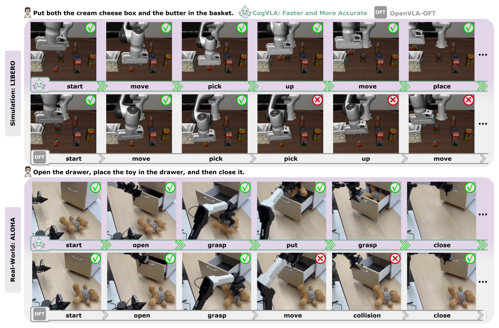

Figure 4. LIBERO 시뮬레이션과 ALOHA 실물 환경에서 선택된 실행 sequence 비교. 성공·실패 표시와 단계 이름을 모두 유지했다. 속도 관련 수치의 기준은 위 Table 3 해설과 함께 읽어야 한다. [PDF p.8, §3] · [원문 PDF](https://proceedings.neurips.cc/paper_files/paper/2025/file/c9028f7874df04843e7bf435ee4cd3c3-Paper-Conference.pdf#page=8)


### 9.6 Table 4: module ablation [PDF p.9]

모든 행은 overall 8× sparsification이고 Spatial suite만 평가한다. `Pruning`은 instruction 없는 LFP score, `TG-Pruning`은 instruction guidance 추가를 뜻하므로 둘이 함께 체크될 수 있다.

| EFA Step 1 | EFA Step 2 | Pruning | TG guidance | CAtten | Spatial SR |
|---:|---:|---:|---:|---:|---:|
|  |  | ✓ | ✓ | ✓ | 91.2 (-7.4) |
|  | ✓ | ✓ | ✓ | ✓ | 96.0 (-2.6) |
| ✓ |  | ✓ | ✓ | ✓ | 95.2 (-3.4) |
| ✓ | ✓ |  |  | ✓ | 92.0 (-6.6) |
| ✓ | ✓ | ✓ |  | ✓ | 96.2 (-2.4) |
| ✓ | ✓ | ✓ | ✓ |  | 92.0 (-6.6) |
| ✓ | ✓ | ✓ | ✓ | ✓ | **98.6** |

해석:

- EFA 전체 부재와 LFP 전체 부재는 각각 -7.4, -6.6 pp.
- EFA에서 Step 1/intra-encoder를 제거하면 -2.6 pp, Step 2/cross-encoder를 제거하면 -3.4 pp.
- LFP instruction guidance를 제거한 generic pruning은 -2.4 pp.
- CAtten 제거는 -6.6 pp로 가장 큰 단일 저하 중 하나다.
- ablation은 한 suite, 한 sparsity budget, error bar 없음. “시너지”를 지지하지만 전 task 일반성이나 interaction significance test는 없다.

### 9.7 Table 5와 6: sparsity allocation과 다른 compressor [PDF p.9]

Table 5:

| Stage 1 | Stage 2 | total | Spatial SR |
|---:|---:|---:|---:|
| 1× | 8× | 8× | 91.2 |
| 8× | 1× | 8× | 92.0 |
| 2× | 4× | 8× | 94.6 |
| **4×** | **2×** | **8×** | **98.6** |

같은 최종 token budget에서도 어디서 줄이느냐가 중요하다. 8×를 한 단계에 몰아넣으면 91-92%지만 EFA 4× + LFP 2×는 98.6%다. 다만 Table 5의 `Stage 1=8×, Stage 2=1×`가 64 aggregation-token 기본 설계와 어떻게 구현됐는지 세부 query 수는 미기재다.

Table 6은 8× 시각 압축 비교로 읽힌다: FastV 88.2, SliME 77.6, CogVLA Stage1+2 98.6. 차이는 +10.4/+21.0 pp다. 그러나 두 baseline의 hyperparameter tuning, instruction conditioning adaptation, 동일 FLOPs 여부가 표에 없어 “압축 알고리즘만의 순수 차이”로 확정하기 어렵다.

### 9.8 Table 7: three-seed simulation [PDF p.24]

| Method | Spatial | Object | Goal | Long | Average |
|---|---:|---:|---:|---:|---:|
| OpenVLA | 84.7±0.9 | 88.4±0.8 | 79.2±1.0 | 53.7±1.3 | 76.5±0.6 |
| SpatialVLA | 88.2±0.5 | 89.9±0.7 | 78.6±0.6 | 55.5±1.0 | 78.1±0.7 |
| STAR | 95.5±0.6 | 98.3±0.2 | 95.0±0.7 | 88.5±0.3 | 94.3±0.1 |
| CoT-VLA | 87.5±1.4 | 91.6±0.5 | 87.6±0.6 | 69.0±0.8 | 83.9±0.6 |
| **CogVLA** | **98.5±0.5** | **98.8±0.4** | **96.5±0.6** | **95.2±1.1** | **97.4±0.4** |

표의 `±`는 3 seed standard deviation이다. CogVLA Long의 1.1은 다른 suite보다 큰 변동이다. 표시 mean 네 개의 단순 평균은 97.25이므로 97.4는 표시된 1자리 값만으로 정확히 재현되지 않는다. raw unrounded seed score의 평균일 가능성이 있지만 논문은 공개하지 않는다. seed별 paired test나 confidence interval도 없다.

### 9.9 Table 8: extended real-world [PDF p.25]

| Method | Red cube→plate | Big cube→bowl | Left cube→plate | 표의 평균 |
|---|---:|---:|---:|---:|
| PD-VLA† | 7/10 | 5/10 | 6/10 | 60.0 |
| OpenVLA-OFT† | 7/10 | 6/10 | 6/10 | 63.3 |
| **CogVLA** | **8/10** | **7/10** | **8/10** | **76.7** |

표의 평균은 세 column mean이다. 그러나 Task 4가 두 subtask 모두 성공해야 완료라면 Task 4 final 7/10, Task 5 final 8/10이므로 task-level 평균은 75%. Table 2와 동일한 “composite task final” 정의를 적용한 값과 1.7 pp 차이가 난다.

### 9.10 Table 9: extended sparsity [PDF p.25]

| Stage 1 | Stage 2 | total | Spatial SR | FLOPs |
|---:|---:|---:|---:|---:|
| 2× | 2× | 4× | 96.4 | 3.87 T |
| 4× | 4× | 16× | 93.2 | 2.30 T |
| 2× | 4× | 8× | 94.6 | 2.72 T |
| **4×** | **2×** | **8×** | **98.6** | **2.72 T** |

4×→8×로 갈 때 best allocation 기준 96.4→98.6으로 오히려 성능이 오르므로 token 수 자체보다 instruction-conditioned stage allocation이 중요한 결과다. 16×는 8× 대비 FLOPs를 15.4% 더 줄이지만 SR은 5.4 pp 떨어진다. Pareto 관점에서는 4×-2×가 높은 성능, 4×-4×가 더 낮은 FLOPs 지점이다. latency/memory는 이 표에 없다.

### 9.11 Figure 5-8 [PDF p.26-29]

- **Fig.5:** Task 1-5 실제 robot workflow. 여러 frame은 completion 가능성을 보여 주지만 trial sampling과 failure example이 없어 robustness 통계는 Table 2/8에 의존한다.

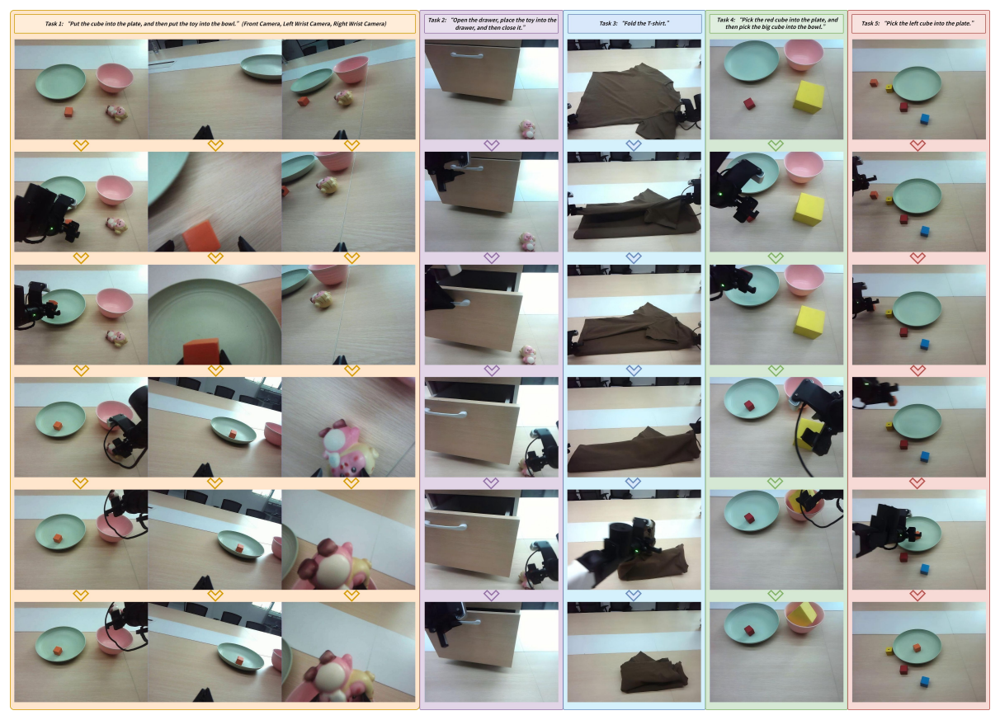

Figure 5. 실제 로봇 Task 1–5의 workflow. Task 1의 세 camera view와 각 task의 순차 프레임을 원래 배열대로 유지했다. [PDF p.26, Appendix D.1] · [원문 PDF](https://proceedings.neurips.cc/paper_files/paper/2025/file/c9028f7874df04843e7bf435ee4cd3c3-Paper-Conference.pdf#page=26)

- **Fig.6:** gripper를 붉은 원으로 표시한 third-person 실행. 별도 MP4가 supplemental에 있다고 하나 이 작업의 첨부 PDF에는 영상 파일이 없다.

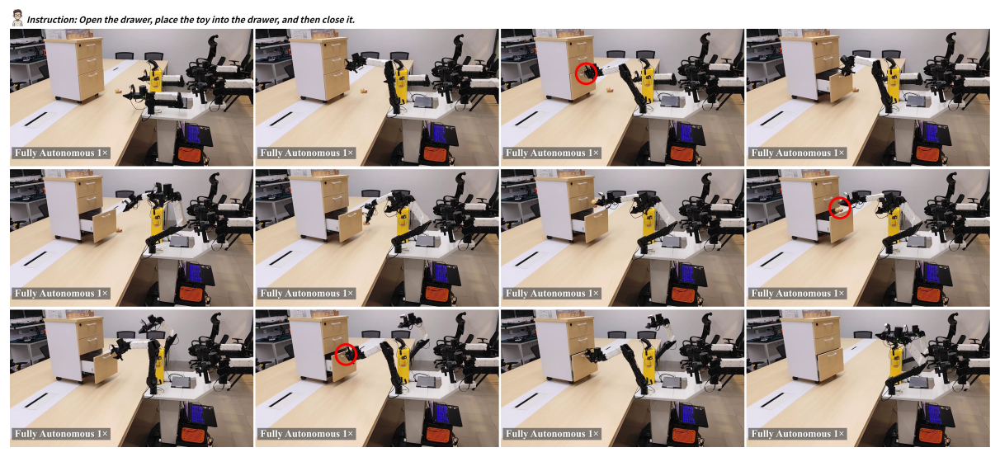

Figure 6. 서랍을 열고 장난감을 넣은 뒤 닫는 task의 third-person 시점 정지 프레임. 원문에 표시된 붉은 원과 `Fully Autonomous 1×` 표기를 보존했지만 영상 재생 속도를 독립 검증한 것은 아니다. [PDF p.27, Appendix D.1 관련 Figure] · [원문 PDF](https://proceedings.neurips.cc/paper_files/paper/2025/file/c9028f7874df04843e7bf435ee4cd3c3-Paper-Conference.pdf#page=27)

- **Fig.7:** 17/64 aggregation-query heatmap. instruction target과 주변 관계 객체에 attention이 모이는 qualitative evidence.

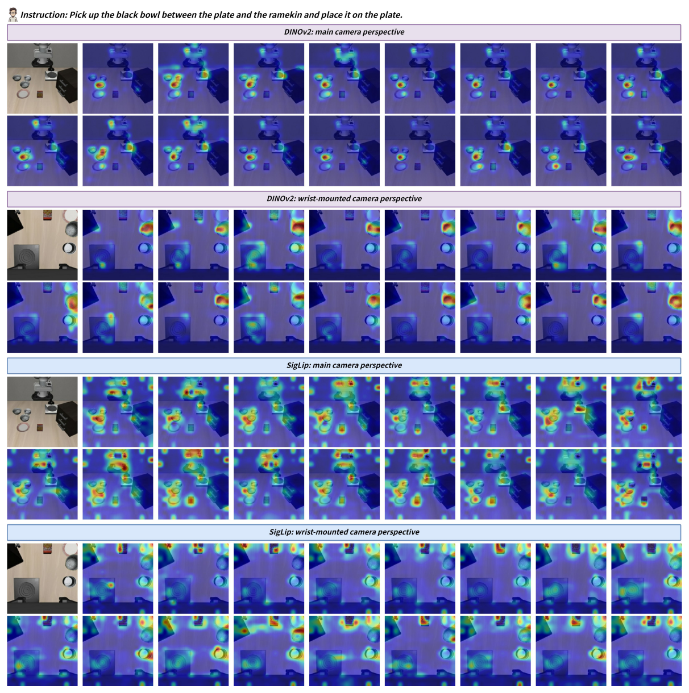

Figure 7. DINOv2/SigLIP 및 main/wrist camera의 네 그룹에 대한 attention heatmap. query별 차이를 읽을 수 있도록 전체 격자와 그룹 제목을 유지했다. attention의 시각적 집중은 그 자체로 인과적 기여도 측정이 아니다. [PDF p.28, Appendix D.2 관련 Figure] · [원문 PDF](https://proceedings.neurips.cc/paper_files/paper/2025/file/c9028f7874df04843e7bf435ee4cd3c3-Paper-Conference.pdf#page=28)

- **Fig.8:** LIBERO-Spatial/Object/Goal/Long의 성공 sequence. 선택된 trajectory이므로 평균 SR이나 causal mechanism을 독립 검증하지 않는다.

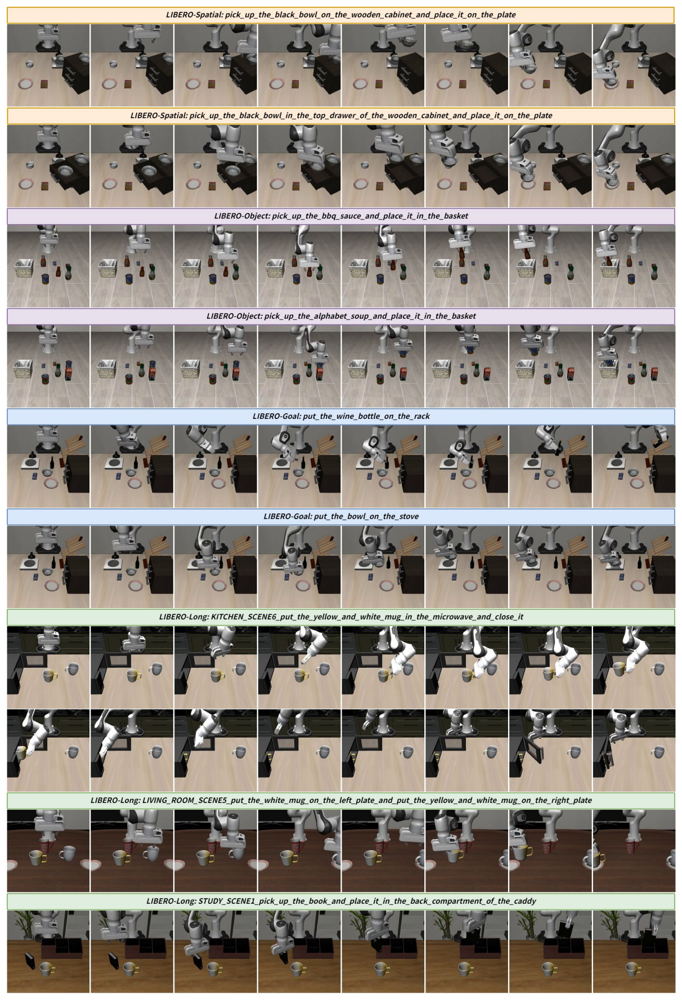

Figure 8. LIBERO-Spatial/Object/Goal/Long의 선택된 성공 trajectory. task instruction과 순차 프레임을 모두 유지했으며, 높이가 긴 그림이므로 확대해서 읽는 것이 좋다. [PDF p.29, Appendix D.1 관련 Figure] · [원문 PDF](https://proceedings.neurips.cc/paper_files/paper/2025/file/c9028f7874df04843e7bf435ee4cd3c3-Paper-Conference.pdf#page=29)


---

<a id="critical"></a>

## 10. 비판적 검토와 재현 체크리스트

### 10.1 강점

1. **병목을 pipeline 전체에서 본다.** vision token 수, LLM layer computation, action decoding dependency를 한 프레임으로 묶었다.
2. **동일 8× budget에서 allocation 효과를 보였다.** Table 5/9는 단순히 token을 덜 쓰는 것보다 early aggregation과 late pruning의 역할 분리가 중요함을 보여 준다.
3. **성능-효율을 함께 보고한다.** SR만 높이는 것이 아니라 FLOPs, latency, training wall time을 제시했다.
4. **parallel action decoding의 계산 의미가 명확하다.** CAtten은 action block을 열어 continuous chunk를 한 pass에 생성하고, 공개 evaluator도 full chunk queue를 사용한다.
5. **simulation과 physical robot을 모두 포함한다.** ALOHA에서 multi-arm, articulated object, deformable object까지 제한적이나 다양한 task를 시험했다.

### 10.2 기술적/이론적 약점

1. **Eq. (6) index, Eq. (13) 괄호, Eq. (16)/(20) shape가 불명확하다.** 특히 Eq. (20)은 정의된 block 크기로는 그대로 조립되지 않는다. 공개 코드가 사실상 2-block prefix/action mask임을 보여 주지만 PDF만으로 구현을 완전 복원하기 어렵다.
2. **Eq. (15)의 percentile 정의가 retention ratio와 반대다.** 공개 코드는 top-k keep fraction으로 동작하므로 원문 수학 정의를 수정해야 한다.
3. **“prune/discard” 표현이 구현을 과도하게 단순화한다.** 공개 코드는 token을 영구 제거하지 않고 layer-local compute를 건너뛴 뒤 scatter-back한다. 이는 representation loss와 compute accounting 해석에 중요하다.
4. **FiLM의 역할도 식과 코드가 다르다.** LFP에서 modulated feature는 routing score를 만드는 데 쓰이고, retained representation 자체는 원 hidden이다. Eq. (13)만 보면 FiLM feature가 transformer로 들어가는 것으로 오해할 수 있다.
5. **생물학적 alignment는 검증된 메커니즘이 아니다.** VAS/SMA/PMC 대응은 좋은 설계 비유지만 neuroscience experiment나 human behavior alignment metric이 없다.
6. **이론 보장은 없다.** 어떤 sparsity에서 task-relevant 정보가 보존되는지, router threshold perturbation에 대한 안정성, closed-loop error bound를 증명하지 않는다.

### 10.3 실험/통계 약점

1. **비교 구성의 confound:** CogVLA는 vision sparsity뿐 아니라 continuous action head, action chunk, CAtten을 함께 바꾼다. Table 4가 일부를 분리하지만 OpenVLA 대비 20.9 pp 전체 향상을 routing만의 효과로 돌릴 수 없다.
2. **single-suite ablation:** 모든 component/sparsity ablation이 Spatial SR 중심이다. Object/Goal/Long과 real robot의 module별 효과가 없다.
3. **best-checkpoint selection:** 10K 간격 best checkpoint를 보고하지만 어떤 validation 기준으로 골랐는지, test와 분리됐는지 불명확하다.
4. **작은 real-world N:** task별 10 trial이라 한 번 성공/실패가 10 pp다. confidence interval과 evaluator blinding이 없다.
5. **Table 불일치:** $\pi_{0.5}$-KI 평균, Table 7의 표준편차 범위 문장, Table 8의 평균 정의, Appendix C.3의 Table cross-reference가 맞지 않는다.
6. **latency protocol 미완전:** 평균인지 median인지, warm-up/JIT, sync, batch, preprocessing, network, camera/robot loop 포함 여부가 없다.

### 10.4 공개 이후 재현성 신호

공식 저장소는 커뮤니티가 보고한 Spatial 91.6%, Object 98.2%, Goal 96.6%, Long 89.2%가 논문보다 평균 약 3.5 pp 낮았다는 사례와, checkpoint·seed·hardware·precision·MuJoCo version 민감성을 설명한다. 저자 자체 후속 측정에서도 MuJoCo 2.3.7/3.3.6/latest에 따라 Spatial이 약 97.8/98.6/95.0으로 변했고, Long은 구버전에서 1-2 pp 높았다고 보고했다. 이는 PDF Appendix E.2의 OOD 한계보다 더 구체적인 **routing threshold 및 simulator-version robustness 문제**다. [공식 저장소의 reproduction note](https://github.com/iLearn-Lab/NeurIPS25-CogVLA#representative-issue)

2026-06 공개 update는 8×96GB RTX Pro 6000, batch 64, 80K steps 약 32시간/run, 세 evaluation run 평균 98.5±0.1/98.6±0.2/97.7±0.3/95.0±0.6을 제시한다. 이것은 2025 PDF의 4×A800·60K 설정을 대체하는 동일 조건 재측정이 아니라 **후속 코드/체크포인트 결과**다.

### 10.5 재현 체크리스트

#### 환경·버전

- [ ] PDF 기준 실험인지 2026-06 공개 코드 기준인지 먼저 고정한다.
- [ ] CogVLA commit, OpenVLA base checkpoint hash, processor/tokenizer hash를 기록한다.
- [ ] Python 3.10, PyTorch 2.2.0, Transformers 4.40.1, Tokenizers 0.19.1, TIMM 지원 버전을 맞춘다.
- [ ] CUDA, driver, cuDNN, attention backend, BF16 여부, GPU model을 기록한다.
- [ ] LIBERO와 MuJoCo exact version을 고정하고, 가능하면 2.3.7/3.3.6/현재판을 분리 보고한다.

#### 데이터·입력

- [ ] `modified_libero_rlds`의 revision과 네 suite sampling 비율을 기록한다.
- [ ] image crop/resize/random augmentation 및 evaluation center crop을 동일하게 한다.
- [ ] LIBERO 2-camera, ALOHA 3-camera ordering과 missing camera 처리 규칙을 확인한다.
- [ ] proprio dimension/normalization을 LIBERO 8/Q01-Q99, ALOHA 14/min-max로 구분한다.
- [ ] prompt template, tokenizer max length, padding side를 보존한다.

#### 모델

- [ ] encoder당 aggregation query 64, image당 최종 fused token 64인지 tensor assertion을 넣는다.
- [ ] SigLIP/DINOv2 projector 뒤 shape가 같고 $\alpha$ 합이 1인지 검증한다.
- [ ] EFA FiLM이 모든 ViT block/hidden channel에 broadcast되는지 확인한다.
- [ ] LFP schedule의 index convention, max/min clamp, target layer 8-31 여부를 로그로 남긴다.
- [ ] BOS/text/action/stop이 강제 keep되고 visual token만 top-k 경쟁하는지 확인한다.
- [ ] LFP 뒤 sequence length를 줄였다가 원 위치에 scatter하는 동작과 position id 재부여를 unit test한다.
- [ ] CAtten action+stop bottom-right block은 0, VL→action은 차단, action→VL은 허용인지 mask unit test를 한다.
- [ ] LFP 경로에서 FlashAttention 2 assert와 SDPA fallback을 확인한다.

#### 학습

- [ ] PDF recipe: LIBERO 60K/global 64/LoRA r32 α64와 공개 script: 80,005/α default16의 차이를 해결한다.
- [ ] frozen/trainable parameter 이름과 개수를 checkpoint와 함께 저장한다.
- [ ] action L1 head, proprio projector, EFA/LFP/router, LoRA가 optimizer에 실제 포함되는지 확인한다.
- [ ] LR warm-up/cosine schedule과 checkpoint step을 기록한다.
- [ ] 세 개 이상의 training seed를 사용하고 seed별 raw curve를 남긴다.
- [ ] best-checkpoint 기준은 held-out validation으로 정하고 test rollout과 분리한다.

#### 평가·효율

- [ ] suite당 10 task×50 trial, initial state 목록, success 판정을 고정한다.
- [ ] `num_open_loop_steps`를 1/2/4/8로 바꿔 SR-재계획주기 trade-off를 보고한다.
- [ ] model-only latency와 camera→preprocess→model→unnormalize→network→actuator E2E latency를 따로 잰다.
- [ ] CUDA synchronize, warm-up, 반복 수, batch=1, p50/p95/p99를 기록한다.
- [ ] action-Hz, policy-call Hz, actual control Hz를 별도 열로 쓴다.
- [ ] FLOPs뿐 아니라 peak allocated/reserved memory, energy, router/gather/scatter overhead를 측정한다.
- [ ] real-world는 task-level final success와 subtask success를 둘 다 보고하고 평균 정의를 통일한다.

---

<a id="thor"></a>

## 11. Jetson Thor 최적화와의 연결: 검증되지 않은 후속 연구 제안

이 절은 CogVLA가 Jetson Thor에서 이미 동작하거나 논문의 A800 speedup이 그대로 이전된다는 주장이 아니다. 논문에는 Thor, TensorRT, TensorRT-LLM, FP4 결과가 없다. NVIDIA 공식 사양상 Jetson T5000은 128GB LPDDR5X/273GB/s, 최대 2070 FP4 TFLOPS(sparse), 40-130W를 제공한다. 이 peak FP4 수치는 CogVLA의 BF16 dynamic routing kernel latency를 보장하지 않는다. [NVIDIA Jetson Thor 공식 사양](https://www.nvidia.com/en-gb/autonomous-machines/embedded-systems/jetson-thor/), [TensorRT-LLM 공식 문서](https://docs.nvidia.com/tensorrt-llm/index.html)

### 11.1 예상 병목

- 두 ViT는 patch+query 320-token attention을 image×encoder 수만큼 수행하므로 Stage 1이 LLM token을 줄여도 vision encoder cost는 남는다.
- LFP의 dynamic top-k, mask row/column gather, attention, scatter-back은 irregular memory access와 kernel launch를 만든다.
- CAtten은 custom 4D mask와 action block patching을 필요로 한다. 표준 causal-only optimized kernel에 바로 맞지 않을 수 있다.
- $K=25,D=14$인 ALOHA는 action+stop block이 351 token이라 CAtten bottom-right 면적이 LIBERO보다 훨씬 크다.
- unified memory 128GB는 모델 수용에는 유리하지만 LPDDR bandwidth와 power mode에 따라 latency가 크게 달라진다.

### 11.2 단계별 포팅 gate

1. **정확성 baseline:** Thor의 native PyTorch BF16에서 checkpoint를 로드하고 A800과 동일 입력에 대해 aggregation weight, top-k index, action output 차이를 저장한다. success 평가 전 tensor parity부터 통과해야 한다.
2. **정적 부분 분리:** SigLIP/DINOv2와 projector/action head를 TensorRT engine 후보로 분리하고, dynamic LFP+CAtten LLM은 우선 PyTorch/SDPA로 유지한다. E2E boundary를 잃지 않도록 stage별 CUDA event와 wall clock을 함께 측정한다.
3. **CAtten kernel:** prefix-causal/action-bidirectional mask를 지원하는 attention implementation을 만들고 reference SDPA와 output/gradient parity를 검사한다. 단순 causal TensorRT-LLM engine에 mask 의미를 억지로 맞추지 않는다.
4. **LFP fusion:** router softmax→top-k→gather→attention/FFN→scatter를 가능한 한 fused/custom plugin으로 묶는다. token FLOPs 감소와 별개로 routing overhead가 얼마인지 Nsight Systems로 측정한다.
5. **정밀도 실험:** vision/LLM matmul은 BF16→FP8/INT8/FP4 후보를 비교하되, router logits·FiLM·top-k threshold는 BF16/FP32 유지 실험을 먼저 한다. threshold margin $|R_{(k)}-R_{(k+1)}|$을 로깅해 quantization이 token set을 바꾸는지 확인한다.
6. **KV cache 재검토:** CogVLA L1 path는 한 번의 parallel prefill이 중심이라 AR decode 최적화의 이점이 제한적이다. TensorRT-LLM의 paged KV cache보다 custom prefill/mask와 vision token 경량화가 우선일 수 있다.
7. **제어 gate:** $H_{exec}\in\{1,2,4,8\}$ action만 실행하고 재계획하는 실험으로 SR, collision, disturbance recovery, policy-call Hz를 함께 본다. fastest action-Hz가 최선의 closed-loop policy는 아니다.
8. **최종 승인 조건:** 동일 LIBERO initial states에서 SR 열화 ≤사전 기준, p95 camera-to-action latency, peak memory, 평균/최대 power, thermal throttling, 30분 지속 실행을 모두 통과해야 “Thor 이식 성공”이라 부른다.

### 11.3 공정한 Thor 비교표 설계

| 실험군 | vision | LFP | CAtten | precision | 반드시 보고할 것 |
|---|---|---|---|---|---|
| OpenVLA baseline | 원본 | 없음 | causal AR | BF16 | 1-action latency, SR |
| OpenVLA-OFT baseline | 원본 | 없음 | parallel | BF16 | chunk latency, action-Hz, refresh-Hz |
| CogVLA reference | EFA 4× | LFP 2× | hybrid | BF16 | stage breakdown, top-k stability |
| CogVLA static-only TRT | EFA TRT | PyTorch LFP | PyTorch CAtten | BF16/FP8 | engine boundary overhead |
| CogVLA full optimized | EFA TRT | fused plugin | custom hybrid | 여러 precision | accuracy/latency/memory/power Pareto |

이 표를 채우기 전에는 “A800의 2.8×가 Thor에서도 유지된다”, “FP4 peak로 7B가 실시간이다” 같은 결론을 내리면 안 된다.

---

<a id="qa"></a>

## 12. 학습자가 오해하기 쉬운 점과 Q&A

### Q1. EFA가 patch 75%를 그냥 버리나?

처음부터 버리지 않는다. 각 ViT block에서 256 patch와 64 learnable query가 함께 attention한 뒤, 마지막에 query 64개만 남긴다. 따라서 information bottleneck은 있지만 query가 삭제 전 모든 patch를 읽을 기회가 있다.

### Q2. 두 encoder의 64 token을 붙여 128개가 되나?

같은 camera 안에서는 아니다. 두 branch를 instruction-conditioned scalar weight로 elementwise 합쳐 64개를 유지한다. camera가 두 개면 camera별 64개를 붙여 128개가 된다.

### Q3. LFP가 고른 token은 다음 layer에서 영구히 사라지나?

공개 코드에서는 아니다. 선택된 token만 계산한 뒤 원 sequence에 scatter하고, skip token은 그대로 남는다. 다음 layer router가 다시 고를 수 있다.

### Q4. $\beta_l=0.8$이면 80th percentile 이상만 남기나?

원문 문장대로면 상위 20%가 남아 retention 0.8과 모순된다. 공개 구현은 top-k 80%를 남긴다. 재현은 코드의 keep fraction 정의를 써야 한다.

### Q5. CAtten에서 action이 미래 vision을 보나?

한 policy call에는 현재 관측의 vision-language prefix만 있다. action token끼리는 미래 chunk 위치를 서로 보지만, 아직 존재하지 않는 미래 camera frame은 보지 못한다.

### Q6. bidirectional action attention이 ground-truth leakage인가?

아니다. L1 경로에서 action placeholder embedding은 0이다. 서로 보는 것은 label 값이 아니라 학습되는 placeholder hidden state이며, ground-truth는 loss에만 사용된다.

### Q7. 87.9 Hz로 robot policy를 87.9번/초 갱신하나?

아니다. $K=8$ action을 0.091초에 만들어서 87.9 action/s다. model-only policy call은 최대 약 11회/s이고 공개 evaluator는 8 action을 모두 실행한 후 requery한다.

### Q8. FLOPs 3.12× 절감이면 latency도 3.12× 빨라야 하나?

아니다. top-k, gather/scatter, memory bandwidth, kernel launch, vision preprocessing은 FLOPs와 비례하지 않는다. 실제 보고 latency speedup은 2.79×다.

### Q9. 97.4%가 모든 task에서 거의 실패하지 않는다는 뜻인가?

네 suite 평균이다. Long은 95.4/95.2 수준이고 seed 표준편차도 1.1로 더 크다. simulator version에 따른 후속 공개 변동도 있다.

### Q10. CogVLA의 성능 향상이 sparsity 때문인가?

단정할 수 없다. instruction FiLM, dual-encoder routing, layer compute selection, CAtten, continuous action head, chunking이 함께 바뀐다. Table 4가 component 기여를 보여 주지만 단일 Spatial suite다.

### Q11. training cost 4.7 h/10k는 4.7 GPU-hour인가?

표의 표현은 wall-clock hour/10k steps로 읽는 것이 자연스럽다. 4×A800 전체를 썼다면 단순 GPU-hour는 18.8/10k가 되지만 논문이 GPU-hour로 명시하지 않았다.

### Q12. Fig.7의 attention map이 올바른 causal explanation인가?

아니다. target 근처 attention은 관련성의 정성 단서지만, causal intervention이나 segmentation 정답과의 정량 일치가 없다. 64개 중 17개 선택 기준도 없다.

---

<a id="coverage"></a>

## 13. Coverage checklist

### 13.1 원문 section/appendix → 리뷰 위치

| 원문 | PDF | 리뷰 위치 | 상태 |
|---|---:|---|---|
| Abstract | 1-2 | §5 Abstract | 완료 |
| 1 Introduction | 2-3 | §2, §5 Introduction | 완료 |
| 2 Methods | 3-7 | §5 Methods, §6 | 완료 |
| 2.1 Parallel Decoding in Action Chunk | 3-4 | §5.2.1, Eq.1-4 | 완료 |
| 2.2 CogVLA: Framework | 4-5 | §5.2.2, Eq.5-9 | 완료 |
| 2.3 3-Stage Progressive Design | 5-7 | §5.2.3.1-2.3.3 | 완료 |
| 2.3.1 EFA-Routing | 5-6 | §5.2.3.1, Eq.10-12 | 완료 |
| 2.3.2 LFP-Routing | 6 | §5.2.3.2, Eq.13-15, §7 | 완료 |
| 2.3.3 CAtten | 6-7 | §5.2.3.3, Eq.16-20, §8 | 완료 |
| 3.1 Experiments Setting | 7-8 | §5 Experiments, §9.1 | 완료 |
| 3.2 Performance improvement | 8-9 | §9.2-9.3 | 완료 |
| 3.3 Efficiency Optimization | 9 | §8, §9.4 | 완료 |
| 3.4 Qualitative Analysis | 9 | §9.5 | 완료 |
| 3.5 Ablation Studies | 9 | §9.6-9.7 | 완료 |
| 4 Related Work | 10 | §5 Related Work | 완료 |
| 5 Conclusion | 10 | §5 Conclusion | 완료 |
| Acknowledgement | 10 | §5 Acknowledgement | 완료 |
| References | 10-15 | §5 References | 개별 서평 제외, 목록 역할 확인 |
| NeurIPS Paper Checklist | 15-21 | §5 Checklist | 완료 |
| Appendix A.1 Model Details | 22 | §5 Appendix A.1 | 완료 |
| Appendix A.2 Training Details | 22-23 | §5 A.2, §7 | 완료 |
| Appendix B.1 Simulation Benchmark | 23 | §5 B.1 | 완료 |
| Appendix B.2 Real-World Setup | 23-24 | §5 B.2 | 완료 |
| Appendix C.1 Multi-Seed | 24 | §5 C.1, §9.8 | 완료 |
| Appendix C.2 Extended Real-World | 24-25 | §5 C.2, §9.9 | 완료 |
| Appendix C.3 Extended Ablation | 25 | §5 C.3, §9.10 | 완료 |
| Appendix D.1 Visualizations | 25-26 | §5 D, §9.11 | 완료 |
| Appendix D.2 Attention Maps | 26, 28 | §5 D, §9.11 | 완료 |
| Appendix E.1 Motivation | 26-27 | §2, §5 E.1 | 완료 |
| Appendix E.2 Limitation | 28 | §5 E.2, §10 | 완료 |
| Appendix E.3 Broader Impact | 30 | §5 E.3 | 완료 |

### 13.2 식 → 리뷰 위치

| 식 | PDF | 리뷰 위치 | shape/예/gradient/edge |
|---|---:|---|---|
| Eq.1 | 3 | §5.2.1 action chunk | 완료 |
| Eq.2 | 3 | §5.2.1 AR baseline | 완료 |
| Eq.3 | 4 | §5.2.1 placeholder | 완료, shape 불일치 지적 |
| Eq.4 | 4 | §5.2.1 parallel call | 완료 |
| Eq.5 | 4 | §5.2.2 branch EFA | 완료 |
| Eq.6 | 4 | §5.2.2 branch fusion | 완료, $M/N$ 지적 |
| Eq.7 | 4 | §5.2.2 route softmax | 완료 |
| Eq.8 | 4 | §5.2.2 layer transition | 완료 |
| Eq.9 | 4 | §5.2.2 final chunk | 완료 |
| Eq.10 | 5 | §5.2.3.1 | 두 줄 분리 완료 |
| Eq.11 | 6 | §5.2.3.1 | Eq.7과 함께 gate 계산 설명 |
| Eq.12 | 6 | §5.2.3.1 | fusion 수치 예 완료 |
| Eq.13 | 6 | §5.2.3.2 | 두 줄 분리, 괄호/코드 차이 지적 |
| Eq.14 | 6 | §5.2.3.2 | 2-class code shape 완료 |
| Eq.15 | 6 | §5.2.3.2 | percentile 모순·top-k 예 완료 |
| Eq.16 | 6 | §5.2.3.3 | $KD$ token vs hidden width 완료 |
| Eq.17 | 6 | §5.2.3.3 | QKV 생략·mask 예 완료 |
| Eq.18 | 7 | §5.2.3.3 | action bidirectional 예 완료 |
| Eq.19 | 7 | §5.2.3.3 | unified 계산/FLOPs 구분 완료 |
| Eq.20 | 7 | §5.2.3.3 | 원문 3-block 문제와 해설용 2-block 완료 |
| Eq.21 | 22 | §5 Appendix A.1 | schedule 값·clamp·코드 drift 완료 |
| 주요 비번호 loss | 공개 코드 | §7.2 [해설용 수식] | 완료 |

### 13.3 Figure/Table → 리뷰 위치

원문 시각 자산 보강: **Figure 1–8 전부와 Eq. (1)–(21) 전부**를 위의 해당 설명 위치에 삽입했다. 표는 기존 편집 가능한 Markdown과 재계산 분석을 그대로 유지한다. 자산 29개 각각의 원본 페이지·crop 좌표·크기는 [manifest](assets/09_CogVLA/publication_assets.json)에서 확인할 수 있다.

| 항목 | PDF | 리뷰 위치 | 상태 |
|---|---:|---|---|
| Fig.1 | 1 | §2.2, §9.5 | 완료 |
| Fig.2 | 4 | §5.2.2, §6 | 완료 |
| Fig.3 | 5 | §5.2.3, §9.5 | 완료 |
| Fig.4 | 8 | §9.5 | 완료 |
| Fig.5 | 26 | §5 D, §9.11 | 완료 |
| Fig.6 | 27 | §5 D, §9.11 | 완료; MP4 미첨부 명시 |
| Fig.7 | 28 | §5 D, §9.11, §12 Q12 | 완료 |
| Fig.8 | 29 | §5 D, §9.11 | 완료 |
| Table 1 | 7 | §9.2 | 전 행 및 평균 오류 점검 완료 |
| Table 2 | 7 | §9.3 | final-task 평균 재검산 완료 |
| Table 3 | 8 | §8, §9.4 | latency/throughput/FLOPs/training 분리 완료 |
| Table 4 | 9 | §9.6 | 7 ablation 행 완료 |
| Table 5 | 9 | §9.7 | 4 allocation 완료 |
| Table 6 | 9 | §9.7 | 3 method 완료 |
| Table 7 | 24 | §9.8 | mean±SD 및 문장 불일치 완료 |
| Table 8 | 25 | §9.9 | 평균 정의 불일치 완료 |
| Table 9 | 25 | §9.10 | SR/FLOPs trade-off 완료 |

### 13.4 실제 남은 한계

- 별도 Supplemental ZIP의 MP4 영상은 입력으로 제공되지 않아 재생·프레임별 판독하지 않았다. PDF 안의 Appendix와 정지 Figure는 모두 확인했다.
- 공개 코드는 2026-06-18 commit 기준이며 2025 PDF 생성 시점 코드와 동일하다고 보장할 수 없다. 차이는 본문에 분리 기록했다.
- GPU/robot 실행을 하지 않았으므로 latency, memory, SR은 독립 재현값이 아니다.
- PDF가 공개하지 않은 raw seed result, exact timing harness, checkpoint-selection split은 추정하지 않았다.

### 13.5 원문 이미지·Markdown 검증 결과

- **시각 검증:** Figure 8개와 수식 21개의 최종 PNG를 각각 열어 잘림, 이웃 본문 혼입, 인쇄 번호, subpanel·범례와 가독성을 확인했다. Eq. (15), (18), (19) crop의 위쪽에 남은 이웃 글자 조각은 경계를 조정한 뒤 재확인했다.
- **본문 보존:** 보강 전 1,311줄의 분석·표·수식 내용과 비교해 삭제가 없음을 확인했다. 기존 LaTeX Eq. (5), (21)의 `qquad` 앞에 빠진 역슬래시 두 곳만 표시 오류 수정으로 복구했다.
- **구조 검증:** 이미지 29개와 manifest 항목이 일대일 대응하고, 모든 상대경로·명시적 목차 anchor가 존재한다. 원래의 Markdown 표 20개는 parser 기준으로 구조가 동일하다.
- **수식 검증:** 기존 display math 25개와 inline math 304개가 로컬 KaTeX 구문 검사를 통과했다. 원문 번호와 해설용 분할 번호는 유지했다. 이는 로컬 parser 검사이며 실제 GitHub에 게시한 뒤의 렌더링 검사는 아니다.
- **원본 검증:** 추출 전후 원본 PDF의 SHA-256이 동일하다. PDF 수정·이동·삭제와 GitHub 게시·git 작업은 수행하지 않았다.

---

## 한 문장 결론

CogVLA의 실질적 기여는 “instruction으로 두 번 줄이고, action block만 서로 열어 한 번에 낸다”는 것이다. 다만 수식의 shape/percentile 정의와 공개 구현 사이 차이, best-checkpoint·simulator version 민감성, action-Hz와 closed-loop refresh의 혼동 가능성을 통제해야 97.4%와 2.8×를 공정하게 재현·이식할 수 있다.
