# VLA-Adapter 상세 해설: 작은 VLM에서 VL 표현을 행동으로 옮기는 법

> 저장소 원문: [주 PDF](papers/10_VLA_Adapter.pdf) · [2509.09372v2](papers/10_VLA_Adapter_arXiv_v2_With_Appendix.pdf) · [전체 목록](README.md)

> 대상 논문: Yihao Wang et al., **“VLA-Adapter: An Effective Paradigm for Tiny-Scale Vision-Language-Action Model”**, AAAI-26.
>
> 이 문서는 초록 요약이나 짧은 서평이 아니다. 첨부된 AAAI 출판본 9쪽과 출판본이 공식 Appendix로 지시한 arXiv v2 28쪽을 함께 읽고, 문제 설정, 계산 경로, 수식, 실험, 부록, 공식 코드의 실제 텐서 흐름과 재현 한계를 학습용으로 풀어 쓴 독립적인 해설서다.

---

<a id="toc"></a>

## 목차

1. [서지정보, 읽은 범위, 버전 규칙](#bibliography)
2. [한 문장 요약과 먼저 알아둘 결론](#executive-summary)
3. [문제의식과 motivation](#motivation)
4. [핵심 주장, 근거, 주장 범위](#claims)
5. [선수 지식과 notation/shape 사전](#notation)
6. [원문 순서 상세 해설](#section-walkthrough)
7. [모든 수식의 단계별 해설](#equations)
8. [한 샘플의 실제 forward pass](#forward-pass)
9. [학습 경로, frozen/trainable 경계, 데이터 recipe](#training-boundary)
10. [추론 알고리즘과 action chunk의 제어 의미](#inference)
11. [주요 실험과 수치 재검산](#experiments)
12. [효율 주장: FLOPs, latency, throughput, memory, control frequency](#efficiency)
13. [부록 A-I 상세 해설](#appendix)
14. [공식 코드 대조: 논문 그림과 실제 구현의 차이](#code-audit)
15. [비판적 검토와 재현 체크리스트](#critical-review)
16. [Jetson Thor 최적화와의 연결](#thor)
17. [오해하기 쉬운 점과 Q&A](#qa)
18. [Coverage checklist](#coverage)

---

<a id="bibliography"></a>

## 1. 서지정보, 읽은 범위, 버전 규칙

### 1.1 검증된 서지정보

| 항목 | 확인 결과 |
|---|---|
| 제목 | *VLA-Adapter: An Effective Paradigm for Tiny-Scale Vision-Language-Action Model* |
| 저자 | Yihao Wang, Pengxiang Ding, Lingxiao Li, Can Cui, Zirui Ge, Xinyang Tong, Wenxuan Song, Han Zhao, Wei Zhao, Pengxu Hou, Siteng Huang, Yifan Tang, Wenhui Wang, Ru Zhang, Jianyi Liu, Donglin Wang |
| 학회/권호 | The Fortieth AAAI Conference on Artificial Intelligence (AAAI-26), *Proceedings of the AAAI Conference on Artificial Intelligence*, 40(22) |
| 출판 연도/일자 | 2026, 공식 페이지 게시일 2026-03-14 |
| 페이지 | 인쇄 쪽 18638-18646, 첨부 PDF 9쪽 |
| DOI | [10.1609/aaai.v40i22.38931](https://doi.org/10.1609/aaai.v40i22.38931) |
| 공식 출판 페이지 | [AAAI 논문 페이지](https://ojs.aaai.org/index.php/AAAI/article/view/38931) |
| 첨부 파일명 | `07654-AAAI26.WangY-IR.pdf` |
| 첨부본의 공개 원문 | [AAAI 공식 PDF](https://ojs.aaai.org/index.php/AAAI/article/download/38931/42893) — 첨부 파일명과 해시로 대조 |
| 첨부본 SHA-256 | `4A579929DBD521F62708262A2AB072703D30FAF5161BD2F56A32AB900D03810D` |
| 첨부본 PDF 메타데이터 | 제목과 AAAI-26 subject 확인, 9 pages, letter 612×792 pt, PDF 1.5 |
| 공식 부록 소스 | [arXiv:2509.09372v2](https://arxiv.org/abs/2509.09372), 28쪽, 2025-09-22 갱신 |
| 확인한 arXiv v2 PDF SHA-256 | `1D8E99058DCDA68865735FD14EF09B5E3D61137F51192945C857FD1701487153` |
| 공식 프로젝트/코드 | [프로젝트 페이지](https://vla-adapter.github.io/), [OpenHelix-Team/VLA-Adapter](https://github.com/OpenHelix-Team/VLA-Adapter) |

공식 AAAI 페이지는 출판 서지를 `40(22), 18638-18646`으로 명시한다. 첨부본 첫 쪽도 “The Fortieth AAAI Conference on Artificial Intelligence (AAAI-26)”와 인쇄 쪽 18638을 표시한다. 따라서 파일명이나 arXiv 연도만 보고 “2025 논문”이라고 부르는 것은 정확하지 않다. **출판 논문은 AAAI 2026**, 공식 공개 preprint는 arXiv v2(2025-09-22)다.

### 1.2 읽은 범위와 페이지 표기

- **주 기준본**: 사용자가 첨부한 AAAI 출판본 전 9쪽. 본문, Figure 1-8, Table 1-8, 식 (1), Acknowledgments, References까지 읽었다.
- **공식 supplementary**: 출판본 첫 쪽이 “Appendix — https://arxiv.org/pdf/2509.09372”를 직접 가리키므로, 공식 arXiv v2 전 28쪽을 추가로 읽었다. 부록 A-I, 식 (B-1), (B-2), 주요 비번호 노이즈 식, Table B1/C1/C2/D1/F1/F2/I1, Figure A1/B1/E1/G1/G2/H1을 포함한다.
- **공식 코드 대조**: 저장소 `main`의 확인 시점 commit `23fa0c9c159e2aa04341cdd3e924f44061311060`을 읽기 전용으로 확인했다. 논문 시점과 저장소 현재 구현이 같다고 가정하지 않으며, 코드에서 확인한 내용은 `[코드 확인]`으로 별도 표시한다.
- **실행 범위**: GPU 학습/추론은 실행하지 않았다. PDF 렌더링, 표 산술 재계산, 소스 정적 검사만 수행했다.

이 문서의 출처 표기는 다음과 같다.

- `[첨부 PDF p.N, 인쇄 p.18xxx, §X, Fig./Table/Eq.]`: 9쪽 AAAI 출판본의 실제 PDF 쪽과 인쇄 쪽.
- `[공식 arXiv v2 PDF p.N, Appendix X]`: 28쪽 공식 preprint/부록의 실제 PDF 쪽. arXiv 파일은 인쇄 쪽도 1-28이라 둘이 일치한다.
- 출판본과 arXiv v2의 수식 번호가 다르면 **버전과 번호를 함께 쓴다**. 예를 들어 출판본 식 (1)은 L1 학습 목적이고, arXiv v2 식 (1)은 Bridge Attention 결합식이다. 번호만 쓰면 서로 다른 식을 혼동하게 된다.

### 1.3 근거의 종류

문장 앞의 표시는 주장의 출처와 강도를 구분한다.

- **[저자 보고]**: 논문/부록에 적힌 주장 또는 수치.
- **[재계산]**: 표의 공개 수치로 이 문서가 산술을 다시 한 결과.
- **[코드 확인]**: 위 공식 저장소 commit의 소스에서 확인한 구현.
- **[리뷰어 해석]**: 원문과 코드로부터 도출한 해석. 저자의 직접 주장과 동일시하지 않는다.
- **[논문 미기재]**: 재현에 필요하지만 논문/부록에 없는 정보.
- **[후속 연구 제안]**: 본 논문에서 검증되지 않은 확장 또는 배포 제안.

### 1.4 원문 이미지와 출처·권리 안내

아래 해설에는 AAAI 출판본 Figure 1–8, 공식 arXiv v2 부록 Figure A1/B1/E1/G1/G2/H1의 원문 영역 14개와 수식 영역 7개를 함께 실었다. 모두 PDF의 해당 영역을 240 dpi PNG로 직접 렌더링한 발췌이며, 그림을 재작성하거나 수식의 오탈자를 이미지에서 수정하지 않았다. 원문 그림 내부의 축·범례·하위 패널·지시문은 보존하고, 원래 caption 대신 이 문서의 한국어 설명과 원문 페이지 링크를 덧붙였다. 비번호 noisy-action 식과 누적곱 식은 같은 문단 안에 있어 하나의 발췌 이미지로 보존했다. 기존 LaTeX와 항별 해설은 그대로 유지한다.

그림과 수식의 권리는 원저자 및 해당 출판사·권리자에게 있다. 이 문서의 원문 이미지는 연구·교육 목적의 비평과 해설을 위한 발췌이며, 원문이나 이미지에 새로운 이용 허락 또는 CC-BY 라이선스를 부여한다는 뜻이 아니다. 원출처는 [AAAI 공식 PDF](https://ojs.aaai.org/index.php/AAAI/article/download/38931/42893)와 [arXiv v2 PDF](https://arxiv.org/pdf/2509.09372v2)다.

모든 이미지 링크는 이 Markdown을 기준으로 한 상대 경로다. 배포 시 `assets/10_VLA_Adapter/`를 함께 유지해야 한다. [자산 출처 manifest](assets/10_VLA_Adapter/publication_assets.json)는 게시된 PNG만 대상으로 원문 파일명·SHA-256·공개 URL·PDF 페이지·crop 좌표·해상도·픽셀 크기를 기록한다. 좌표는 PDF 왼쪽 위 원점의 `[x0, top, x1, bottom]`, 단위는 point(1/72 inch)다.

---

<a id="executive-summary"></a>

## 2. 한 문장 요약과 먼저 알아둘 결론

**한 문장 요약**: VLA-Adapter는 24층의 작은 Prismatic VLM에서 매 층의 일반 hidden state와 64개 학습 가능한 ActionQuery hidden state를 꺼내고, 같은 깊이의 24층 행동 Policy가 이를 Bridge Attention으로 받아 8×7 연속 행동 chunk를 L1 회귀하도록 만들어, 로봇 사전학습이 없는 0.5B 언어 backbone에서도 높은 LIBERO/CALVIN 성능을 내도록 한 **VL-to-action 연결 방식**이다.

먼저 결론을 정확히 제한하면 다음과 같다.

1. **0.5B는 전체 모델 크기가 아니다.** Table 5/6의 `Params=0.5`는 backbone scale이다. DINOv2, SigLIP, multimodal projector, ActionQuery, Policy를 모두 합친 전체 추론 파라미터 수는 논문이 보고하지 않는다. 부록 F2는 Policy trainable 97.3M, VLA-Adapter 전체 trainable 197.2M을 별도로 보고한다.
2. **“로봇 사전학습 없음”은 “로봇 데이터로 학습하지 않음”이 아니다.** Qwen2.5-0.5B 기반 Prismatic VLM은 대규모 embodied/robot pretraining을 받지 않았지만, 각 downstream LIBERO/CALVIN 로봇 demonstration으로 최대 150,000 step fine-tuning한다.
3. **기본 action head는 flow matching이 아니다.** 출판본의 선택 모델은 L1 regression Policy다. 부록 B는 noise-prediction diffusion/DiT 대안을 짧게 다루지만 성능이 낮아 채택하지 않았다. 공식 저장소도 flow matching을 향후 업데이트 항목으로 둔다.
4. **219.2 Hz는 로봇 제어 loop 주파수로 읽으면 안 된다.** 8-step chunk를 0.0365초에 생성했기 때문에 $`8/0.0365=219.18`$ action-vectors/s가 된다. 한 chunk를 만드는 policy refresh rate는 $`1/0.0365=27.40`$ calls/s이며, 실제 servo 주파수와 chunk를 몇 step 실행한 뒤 재계획하는지는 보고되지 않았다.
5. **Bridge Attention의 핵심은 두 condition의 역할 분리다.** ActionQuery+proprioception은 완전히 주입하고, Raw branch만 $`\tanh(g)`$로 0에서 시작해 선택적으로 연다. 이 설계가 Table 8에서 95.0%로 가장 좋다.
6. **“all-layer가 좋다”는 LIBERO-Long의 이 실험 범위에서의 결론이다.** 다른 로봇, 카메라 수, action horizon, VLM 깊이에서도 항상 이긴다는 증명은 없다. all-layer hidden tap이 만드는 메모리와 bandwidth 비용도 별도로 측정하지 않았다.

---

<a id="motivation"></a>

## 3. 문제의식과 motivation

### 3.1 기존 VLA의 계산 흐름

논문이 문제 삼는 일반적인 VLA 계산 흐름은 다음과 같다.

1. 카메라 영상과 언어 지시를 큰 VLM에 입력한다.
2. 로봇 데이터로 VLM 자체를 대규모 사전학습해 시각-언어 표현을 행동 도메인에 적응시킨다.
3. VLM의 마지막 층 또는 일부 중간 층 hidden state를 Policy/action head에 넘긴다.
4. Policy가 이 condition을 연속 행동 또는 action token으로 바꾼다.

이 방식에서 “VLM이 충분히 크고 로봇 데이터로 이미 적응됐다”면 마지막 층 표현 하나만 읽어도 행동과 가까운 정보를 얻을 수 있다. 그러나 backbone을 줄이고 로봇 사전학습도 제거하면 마지막 층은 주로 언어적/의미적 요약에 치우칠 수 있고, 위치·접촉·정밀 자세처럼 행동에 필요한 세부 정보를 충분히 유지하지 못할 수 있다. 저자는 이 상황에서 성능 병목이 단순히 모델 크기가 아니라 **어느 층의 어느 토큰을, 어떤 방식으로 Policy에 건네는가**에 있다고 본다. `[첨부 PDF pp.1-3, §1-3.2, Fig.1-4]`

### 3.2 구체적인 실패 사례

Figure 1과 Table 2가 motivation을 수치로 보여 준다.

- OpenVLA-OFT식 last-layer ActionQuery bridge를 Qwen2.5-0.5B Prismatic VLM(B1)에 쓰면 LIBERO-Long 성공률은 85.8%다.
- 같은 backbone에 VLA-Adapter bridge를 쓰면 95.0%로 9.2 percentage point 오른다.
- LLaMA2-7B 기반이지만 로봇 사전학습이 없는 B2에서도 87.5%→95.2%, +7.7 pp다.
- 이미 로봇 사전학습된 OpenVLA-7B(B3)에서는 94.5%→95.4%, +0.9 pp에 그친다.

즉 bridge의 이익이 **작고 로봇 비사전학습인 backbone에서 가장 크다**. 저자의 인과 설명은 “로봇 사전학습을 거친 마지막 층은 이미 action domain에 적응했지만, 일반 VLM의 마지막 층 하나만으로는 action mapping이 부족하다”는 것이다. 이는 완전한 인과 증명이라기보다 Table 2 패턴에 대한 저자 해석이다. `[첨부 PDF p.5, 인쇄 p.18642, §4.1, Table 2]`

Frozen 설정은 더 날카로운 실패를 보인다. 같은 LIBERO-Long에서 backbone을 모두 고정했을 때 OpenVLA-OFT는 0.0%, SmolVLA는 77.0%, VLA-Adapter는 86.4%다. 부록 H에 따르면 비교 OpenVLA-OFT의 L1 경로는 action 위치를 0 embedding으로 마스킹하고, frozen VLM에서는 그 interface 자체가 학습되지 않는다. 반면 VLA-Adapter는 VLM 본체가 frozen이어도 새로 삽입한 ActionQuery embedding과 Policy를 학습한다. 따라서 이 결과는 “어떤 frozen VLM도 OFT로는 안 된다”가 아니라, **학습 가능한 interface를 어디에 두었는가가 frozen 실험의 성패를 좌우한다**는 사례다. `[첨부 PDF p.5, Table 3; 공식 arXiv v2 PDF pp.24-25, Appendix H]`

### 3.3 한계에서 연구 질문으로

기존 방법의 한계와 연구 질문은 다음 연쇄로 연결된다.

| 관찰된 한계 | 연구 질문 | 저자의 가설 | 설계 선택 |
|---|---|---|---|
| 마지막 층 raw feature만으로 작은 비로봇 VLM의 action mapping이 약함 | 어느 VLM 층이 Policy에 가장 유효한가? | raw feature는 중간 층에 세부 정보가 더 남는다 | single-layer와 all-layer raw condition 비교 |
| raw feature는 task-relevant 정보의 선택이 어렵고 sequence가 김 | 학습 가능한 ActionQuery가 더 좋은 interface인가? | 깊은 ActionQuery가 앞선 시각·언어 문맥을 모아 action-oriented summary가 된다 | 64개 ActionQuery를 입력 sequence에 삽입하고 매 층 hidden state를 추출 |
| raw와 ActionQuery 중 하나만 쓰면 특정 hard task에서 손실 | 둘을 어떻게 함께 쓸 것인가? | ActionQuery는 항상 강하게, raw는 필요한 만큼만 주입해야 한다 | 두 cross-attention+self-attention, raw branch에 zero-init $`\tanh(g)`$ gate |
| 큰 VLM/로봇 pretraining은 비용이 큼 | bridge를 개선하면 작은 backbone으로 성능을 유지할 수 있는가? | action interface가 충분하면 0.5B backbone도 경쟁 가능 | Qwen2.5-0.5B Prismatic VLM, 24-layer Policy, LoRA fine-tuning |
| diffusion head는 반복 denoising으로 느릴 수 있음 | 단순 회귀 head로 충분한가? | downstream fine-tuning action은 중복이 적어 L1이 유리할 수 있다 | 주 모델은 1-pass L1 Policy, DiT는 부록 비교로 제한 |

### 3.4 논문의 실제 연구 질문

원문은 §3.2에서 Q1.1-1.2, §4에서 Q2.1-2.3을 직접 적는다.

- **Q1.1**: VLM의 어느 층 feature가 Policy에 더 유효한가?
- **Q1.2**: ActionQuery feature가 raw vision-language feature보다 나은가?
- **Q2.1**: VLA-Adapter가 다른 bridge paradigm보다 어떤 장점이 있는가?
- **Q2.2**: 기존 방법과 비교한 전체 성능은 어떤가?
- **Q2.3**: ActionQuery 수, condition type, injection degree 가운데 무엇이 중요한가?

다만 프로젝트 페이지는 ActionQuery 개수와 Policy의 condition 활용법까지 Q1.3-1.4로 더 명시한다. 출판 PDF의 번호 체계에는 Q1.1-1.2만 있으므로 이 문서도 원문 번호를 추가로 만들지 않는다.

---

<a id="claims"></a>

## 4. 핵심 주장, 근거, 주장 범위

| 핵심 주장 | 근거 | 가능한 범위 | 중요한 제한 |
|---|---|---|---|
| 중간 raw layer가 깊은 raw layer보다 대체로 낫다 | Fig.4, Table C1: layer 9 평균 89.8, layer 24 평균 85.8 | LIBERO-Long, 이 backbone/Policy 설정 | layer 13은 88.4이고 layer별 변동이 task-dependent하다. 다른 benchmark 검증 없음 |
| 깊은 ActionQuery가 얕은 ActionQuery보다 대체로 낫다 | Table C2: layer 1 78.2, layer 24 90.2 | LIBERO-Long, 64 ActionQuery | layer 13이 76.6으로 layer 1보다 낮아 단조 증가가 아니다 |
| all-layer condition이 single-layer보다 낫다 | raw 90.6, ActionQuery 92.6; 결합 95.0 | 통합된 24-layer Policy, LIBERO-Long | all-layer의 메모리/대역폭/latency 비용을 분리 측정하지 않음 |
| raw와 ActionQuery를 함께 쓰되 raw만 learnable gate로 조절하는 것이 최선 | Table 8: $`\tanh(g),1`$이 95.0; $`1,1`$은 91.4 | LIBERO-Long | gate가 왜 안정성을 높였는지 gradient/statistics 분석 없음 |
| 작은 0.5B backbone으로 대형 방법과 유사한 성능 | Table 5: 97.3 vs OpenVLA-OFT 97.1 | LIBERO 평균 success rate | `0.5B`는 전체 VLA 파라미터가 아니라 backbone label. baseline training budget 통일 여부 불충분 |
| 로봇 사전학습 없이도 높은 성능 | B1/B2와 VLA-Adapter, Table 2 | backbone의 **사전학습**에 embodied data가 없음 | downstream robot demonstrations로 150k-step fine-tuning은 수행 |
| frozen backbone에서도 강함 | Table 3: 86.4, SmolVLA보다 9.4 pp | LIBERO-Long | 비교 OFT의 interface가 frozen일 때 학습 불가능한 구조라 공정성 논쟁 가능 |
| 빠른 추론 | Table 4: 0.0365 s/chunk, 219.2 action steps/s | 저자 측정 환경, H=8 | 장치, batch, precision, warm-up, p50/p95, 전처리 범위 미기재. 실제 servo Hz 아님 |
| real-world 일반화가 좋음 | Fig.7, 4종 task×10회 | 단일 Synria Alicia-D setup과 물체 위치 randomization | 총 시행 수가 작고 exact protocol/CI/seed 공개 부족 |
| DiT보다 L1 Policy가 낫고 빠름 | Table B1: 95.0 vs 91.6, 저자의 throughput 서술 | LIBERO-Long fine-tuning | DiT schedule/step/solver/latency 수치 미기재; flow matching 비교가 아님 |

주장의 강도를 정리하면, **가장 잘 지지된 부분**은 통일된 framework 안에서 condition type과 gate를 바꾼 LIBERO-Long ablation이다. **가장 조심해야 할 부분**은 “가장 빠른 VLA”, “single consumer GPU 8시간”, “SOTA” 같은 넓은 효율/우월성 표현이다. 측정 조건과 baseline별 동일 예산이 충분히 공개되지 않았기 때문이다.

---

<a id="notation"></a>

## 5. 선수 지식과 notation/shape 사전

### 5.1 필수 선수 지식

#### VLM과 causal multimodal sequence

Prismatic VLM은 vision encoder가 만든 patch feature를 LLM embedding 차원으로 projection하고, 이미지 토큰과 언어 토큰을 하나의 sequence로 처리한다. 이 논문은 DINOv2와 SigLIP 두 vision encoder의 feature를 사용하는 fused vision backbone을 전제로 한다. DINOv2는 객체/공간 구조에 강한 self-supervised visual feature, SigLIP은 이미지-텍스트 정렬 feature를 제공한다고 이해하면 된다. `[첨부 PDF p.2, §3.1]`

#### Cross-attention

행동 latent $`X`$가 condition $`C`$를 읽을 때의 표준 multi-head cross-attention은 다음과 같다.

```math
\begin{aligned} &\mathrm{CA}(X,C)\\ &\quad=\mathrm{Concat}_{h=1}^{n_h} \left[ \mathrm{softmax}\!\left( \frac{(XW_Q^{(h)})(CW_K^{(h)})^\top}{\sqrt{d_h}} \right)(CW_V^{(h)}) \right]W_O. \end{aligned}
```

이 식은 **[해설용 수식]**이며 원문 번호가 아니다. Query 길이는 행동 horizon $`H`$, Key/Value 길이는 condition token 수다. 결과 길이는 다시 $`H`$이므로 “각 미래 행동 step이 어떤 visual/language token을 읽을지”를 학습한다.

#### Action chunking

한 번의 policy 호출에서 현재 action 하나가 아니라 미래 $`H`$개를 예측한다.

```math
A_t=[a_t,a_{t+1},\ldots,a_{t+H-1}]\in\mathbb{R}^{H\times D_a}.
```

이 역시 **[해설용 수식]**이다. 이 논문에서 LIBERO/CALVIN은 $`H=8`$, $`D_a=7`$이므로 출력은 $`8\times7=56`$개 연속값이다. “8-dim chunk”라는 Figure 1의 표현은 action dimension 8을 뜻하는 것이 아니라 **8-step chunk**를 뜻한다. 각 step의 action dimension은 7이다.

#### LoRA와 frozen backbone

LoRA는 원 weight $`W`$를 직접 전부 갱신하는 대신 낮은 rank 보정 $`\Delta W=BA`$를 학습한다. “LoRA fine-tuned”는 base weight가 고정돼도 VLM 계산 경로에 trainable adapter가 있다는 뜻이다. 반면 Table 3의 “Frozen”은 저자 설명상 backbone 쪽을 모두 고정하고 ActionQuery와 Policy만 학습하는 더 강한 제약이다. 두 설정을 혼동하면 안 된다.

### 5.2 통합 notation/shape 사전

아래 shape는 논문이 명시한 값과 공식 코드에서 확인한 값을 분리한다. `B`는 batch 크기다.

| 기호/용어 | 의미 | 논문/부록 shape 또는 값 | 단위와 주의점 |
|---|---|---|---|
| $`t`$ | 현재 환경 timestep | scalar index | VLM/Policy layer index가 아니다 |
| $`M`$ | VLM과 Policy의 layer 수 | 24 | 부록 F2. Qwen2.5-0.5B 설정 |
| $`\tau`$ | L1 Policy layer index | $`0\le\tau\le M-1`$ | 부록 B에서는 diffusion timestep에도 $`\tau`$를 재사용해 과적재됨 |
| $`X_t^v`$ | third-view RGB | LIBERO/CALVIN $`224\times224\times3`$ | 한 환경 시점의 이미지 |
| $`X_t^g`$ | wrist/gripper RGB | LIBERO $`224\times224\times3`$, CALVIN $`84\times84\times3`$ | 코드 전처리 뒤 backbone 입력 크기는 별도 resize 가능 |
| $`L_t`$ | 언어 지시 | token sequence, 길이 미기재 | LIBERO/CALVIN prompt template은 부록 A/E에 공개 |
| $`AQ_t`$ | 입력 sequence에 삽입되는 학습 가능한 ActionQuery embedding | $`N_{AQ}=64`$, hidden $`d=896`$ | 환경 action token이 아니라 interface token |
| $`C_t^R`$ | VLM 각 층의 Raw condition | $`[B,N_R,d]`$, $`N_R`$ 논문 미기재 | 저자는 vision-language representation이라 부름. 현재 코드는 vision-patch prefix를 추출 |
| $`C_t^{AQ}`$ | 각 층의 ActionQuery hidden states | $`[B,64,896]`$ | 깊은 층일수록 앞선 문맥을 더 많이 집계한다는 가설 |
| $`P_t`$ | proprioceptive state | 논문 차원 미기재 | 현재 LIBERO/CALVIN 코드 상수는 $`D_p=8`$ |
| $`\sigma_0(P_t)`$ | 2-layer MLP로 만든 proprio token | $`[B,1,896]`$로 해석 | Policy condition에 이어 붙임 |
| $`H`$ | action chunk horizon | 8 | action step 수. 환경 step과 동일한 간격인지는 task wrapper가 결정 |
| $`D_a`$ | action vector 차원 | 7 | Franka 제어값. 각 성분의 물리 의미/단위는 논문 미기재 |
| $`A_t`$ | GT action chunk | $`[B,8,7]`$ | 8 future steps, step마다 7 continuous values |
| $`A_t^0`$ | L1 Policy 초기 행동 | all zeros | 원문은 $`H`$-step zeros라고만 표현 |
| $`\widetilde A_t^\tau`$ | Policy layer $`\tau`$의 action latent | $`[B,8,896]`$로 해석 | 현재 코드는 step마다 7×896을 flatten한 뒤 896으로 projection |
| $`\widehat A_t^\tau`$ | Bridge Attention 출력 | 원문 concat이면 $`[B,8,3d]`$ 가능 | 후속 projection 축이 원문에 명시되지 않음. 현재 코드는 joint attention으로 $`[B,8,d]`$ 유지 |
| $`g`$ | Raw branch gate parameter | scalar, 0으로 초기화 | 현재 코드는 block마다 하나씩 있어 24 scalars |
| $`d`$ | hidden size | 896 | 부록 F2 |
| $`n_h`$ | attention head 수 | 8 | head dimension $`d_h=896/8=112`$ |
| $`\theta`$ | 학습 파라미터 집합 | 정확한 포함 범위 식에서 미기재 | fine-tuned setting에서는 Policy+ActionQuery+LoRA 등을 포함한다고 해석 |

### 5.3 모델 파라미터와 hyperparameter를 분리하기

- **모델 파라미터**: Policy의 Linear/LN weight, attention projection, gate $`g`$, ActionQuery embedding, LoRA matrices, proprio MLP 등 gradient로 학습되는 값.
- **hyperparameter**: $`H=8`$, $`N_{AQ}=64`$, $`M=24`$, head=8, batch=16, learning rate $`10^{-4}`$, max step 150k, warm-up 10% 등 연구자가 정하는 값.
- **backbone scale 0.5B**: Qwen2.5 언어 backbone의 등급 표기. Policy 97.3M이나 vision encoders를 포함한 전체 VLA size가 아니다.
- **전체 trainable 197.2M**: 부록 F2가 보고한 fine-tuning 중 gradient 대상 합계. 전체 resident parameter와 다르다.

---

<a id="section-walkthrough"></a>

## 6. 원문 순서 상세 해설

### Abstract

초록은 문제, 방법, 효율 목표를 압축한다. 기존 VLA가 큰 VLM을 robot data로 pretrain해 VL-A 간극을 줄이는 대신 비용이 크다는 문제를 제기하고, condition 종류를 체계적으로 비교한 뒤 Bridge Attention Policy를 설계했다고 주장한다. 성능 문구의 핵심 qualifier는 “0.5B-parameter **backbone**”과 “without robotic data **pre-training**”이다. 전체 VLA가 0.5B이거나 robot data를 전혀 보지 않았다는 뜻이 아니다. 출판본은 single consumer GPU에서 train 가능하다고만 하고, arXiv v2 초록은 “8 hours”를 추가한다. 그러나 부록 실험 장비는 4×H100이며, single-GPU 8시간의 GPU 모델·dataset·step·precision은 제공하지 않는다. `[첨부 PDF p.1; 공식 arXiv v2 PDF p.1]`

### §1 Introduction

첫 문단은 instruction-driven robot control의 발전을 VLA의 등장과 연결한다. 두 번째 문단은 전형적인 파이프라인을 “large embodied data로 VLM을 task-adapt → Policy가 action decode/generate”로 정리한다. 세 번째 문단에서 계산 비용, VRAM, throughput 병목을 제시하고 “VL을 A로 어떻게 더 효과적으로 bridge할 것인가?”를 핵심 질문으로 바꾼다.

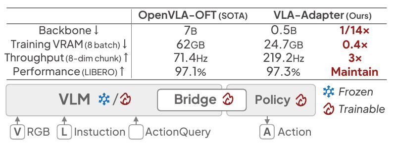

원문 Figure 1 — OpenVLA-OFT 대비 요약과 VLM–Bridge–Policy 연결. 수치의 분모와 frozen/trainable의 의미는 아래에서 구분한다. 출처: [AAAI PDF p.1, 인쇄 p.18638](https://ojs.aaai.org/index.php/AAAI/article/download/38931/42893#page=1).

Figure 1은 OpenVLA-OFT와 VLA-Adapter를 네 축으로 비교한다.

- backbone: 7B vs 0.5B, 약 1/14.
- training VRAM(batch 8): 62GB vs 24.7GB, 약 0.4×.
- LIBERO 평균: 97.1% vs 97.3%, 사실상 유지.
- 8-step chunk throughput: 71.4 vs 219.2 action steps/s, 약 3×.

여기서 “Frozen/Trainable” 색은 큰 backbone 전체와 새 Policy/ActionQuery의 학습 경계를 개념적으로 그린다. 하지만 본 실험의 default는 LoRA fine-tuning이며, frozen 성능은 Table 3의 별도 setting이다. Figure 1만 보고 모든 실험에서 backbone이 frozen이라고 읽으면 틀린다. `[첨부 PDF pp.1-2, Fig.1]`

기여 문단은 (i) bridge paradigm 분석, (ii) 충분한 multimodal condition의 Policy 전달, (iii) 성공률/규모/튜닝비/추론속도 개선을 주장한다. “first systematic analysis”는 저자 주장으로, 모든 contemporaneous work를 이 문서가 독립적으로 novelty search한 결과가 아니다.

### §2 Related Work

#### §2.1 Vision-Language-Action Models

VLA는 사전학습 VLM을 robot control에 사용하고, Open X-Embodiment 같은 embodied dataset으로 적응한 뒤 Policy와 결합한다. dual-system VLA는 느린 semantic reasoning system과 빠른 action system 사이에 latent token/interface를 두고 비동기적으로 연결할 수 있다. 이 문단의 역할은 VLA-Adapter를 새 VLM backbone이 아니라 **두 공간을 잇는 interface/Policy 설계**로 위치시키는 것이다. `[첨부 PDF p.2, §2.1]`

#### §2.2 Bridging from Perception to Action Space

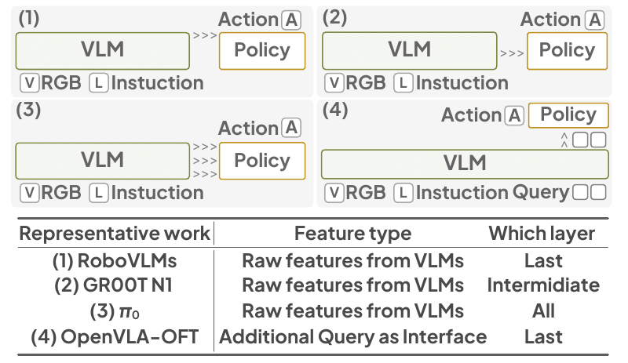

원문 Figure 2 — 네 하위 패널과 representative-work 대응표를 함께 보존했다. 출처: [AAAI PDF p.2, 인쇄 p.18639](https://ojs.aaai.org/index.php/AAAI/article/download/38931/42893#page=2).

원문은 두 축으로 기존 bridge를 분류한다.

1. **Raw features from VLMs**: 마지막 층(RoboVLMs), 중간 층(GR00T N1 style), 모든 층($`\pi_0`$ style). 마지막 층은 task semantics가 강하지만 정밀 시공간 정보가 약해질 수 있고, 중간/다층은 세부 feature를 보존할 수 있다는 논리다.
2. **Additional Query as Interface**: learnable query가 VLM sequence에서 multimodal 문맥을 모아 Policy로 간다. OpenVLA-OFT가 대표 style이다.

Figure 2는 이들을 네 개 그림으로 나열한다. 이 그림은 각 원 방법 전체 architecture를 동일 구현으로 재현한 것이 아니라 **condition의 type/layer 선택을 대표 work 이름으로 요약**한다. 뒤의 Table 7도 같은 의미다. 그러므로 90.6이라는 “$`\pi_0`$ style” 수치를 실제 공개 $`\pi_0`$ checkpoint 성능과 동일시하면 안 된다. `[첨부 PDF p.2, Fig.2; p.7, Table 7]`

### §3 VLA-Adapter Methodology

#### §3.1 Preliminary

한 시점 $`t`$의 입력은 third-view $`X_t^v`$, wrist/gripper-view $`X_t^g`$, instruction $`L_t`$, ActionQuery $`AQ_t`$다. DINOv2와 SigLIP이 두 이미지를 embedding하고, instruction은 tokenized된다. $`M`$층 VLM의 지정 layer에서 일반 hidden state $`C_t^R`$와 ActionQuery 위치 hidden state $`C_t^{AQ}`$를 추출해 Policy condition으로 보낸다. `[첨부 PDF p.2, §3.1]`

backbone 비교는 다음 세 가지다.

- B1: Qwen2.5-0.5B 기반 Prismatic VLM, robot-data pretraining 없음.
- B2: LLaMA2-7B 기반 Prismatic VLM, robot-data pretraining 없음.
- B3: OpenVLA-7B, robot-data pretraining 있음.

성능 증가가 B1/B2에서 크고 B3에서 작았으므로 default는 효율을 위해 B1이다. 그러나 이는 “scale이 전혀 중요하지 않다”가 아니라 이 bridge와 benchmark에서 0.5B→7B의 추가 이익이 작았다는 뜻이다.

#### §3.2 Which Condition Is Essential for Bridging from Perception to Action Space?

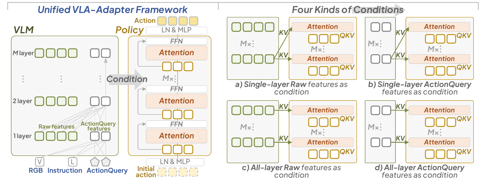

원문 Figure 3 — 왼쪽의 층별 VLM–Policy 대응과 오른쪽의 (a)–(d) condition 구성을 함께 읽는다. 출처: [AAAI PDF p.3, 인쇄 p.18640](https://ojs.aaai.org/index.php/AAAI/article/download/38931/42893#page=3).

Figure 3의 왼쪽은 통합 framework다. VLM 24층과 Policy 24층을 대응시키고, 각 Policy block의 action query가 condition에 cross-attention하고 자기 action sequence에 self-attention한다. 오른쪽은 2×2 ablation이다.

| layer 사용 | feature type | 실험 의미 |
|---|---|---|
| single-layer | Raw | 하나의 VLM layer $`C^R_i`$를 모든 Policy layer가 재사용 |
| single-layer | ActionQuery | 하나의 $`C^{AQ}_i`$를 모든 Policy layer가 재사용 |
| all-layer | Raw | Policy layer $`i`$가 VLM layer $`i`$의 $`C^R_i`$ 사용 |
| all-layer | ActionQuery | Policy layer $`i`$가 VLM layer $`i`$의 $`C^{AQ}_i`$ 사용 |

출판본 Figure 3의 caption에 따르면 single-layer는 (a),(b), all-layer는 (c),(d)다. 그런데 본문은 single-layer를 “(a),(c)”, all-layer를 “(b),(d)”라고 참조한다. 이는 각각 Raw 열/ActionQuery 열을 묶은 조합이므로 **본문 cross-reference 오류**로 보인다. 핵심 비교는 위 표처럼 layer 축과 type 축을 분리해야 한다.

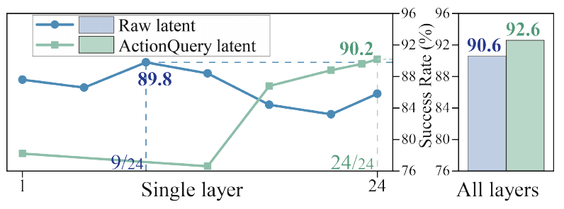

원문 Figure 4 — 단일 층 곡선과 all-layer 막대의 축·범례·수치 label을 보존했다. 출처: [AAAI PDF p.3, 인쇄 p.18640](https://ojs.aaai.org/index.php/AAAI/article/download/38931/42893#page=3).

Figure 4와 Appendix C가 세 finding을 뒷받침한다.

- raw single-layer 최고는 layer 9의 89.8%; 마지막 layer 24는 85.8%다.
- ActionQuery single-layer는 얕은 layer 1의 78.2%에서 깊은 layer 24의 90.2%로 대체로 개선된다. 단조적이지는 않다.
- all-layer raw 90.6%, all-layer ActionQuery 92.6%로 각 single-layer 최고보다 높다.

Table 1은 평균만 보면 가려지는 hard-task 상보성을 보여 준다. Subtask 7은 raw layer 9가 90, ActionQuery 계열 최고가 76이다. Subtask 9는 raw layer 13이 84, ActionQuery layer 24가 84이며 all-layer ActionQuery는 78이다. 따라서 ActionQuery만 쓰지 않고 raw knowledge도 일부 주입한다. `[첨부 PDF p.3, Fig.3-4, Table 1; 공식 arXiv v2 PDF p.20, Tables C1-C2]`

#### §3.3 Policy with Bridge Attention

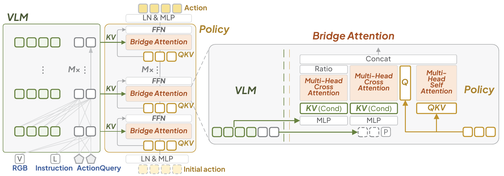

원문 Figure 5 — Raw branch의 Ratio, ActionQuery+proprio branch, action self-attention의 Q/K/V 경로를 확인할 수 있다. 이 개념도와 공식 코드의 차이는 §14에서 따로 다룬다. 출처: [AAAI PDF p.4, 인쇄 p.18641](https://ojs.aaai.org/index.php/AAAI/article/download/38931/42893#page=4).

Policy 입력은 $`\{C_t^R,C_t^{AQ},A_t^{\tau=0},P_t\}`$다. $`A_t^0`$는 $`H`$개의 zero action이며 LN+MLP로 hidden sequence $`\widetilde A_t^0`$가 된다. $`P_t`$는 2-layer MLP $`\sigma_0`$로 하나의 proprio embedding이 된다. 각 Policy block은 Bridge Attention과 FFN으로 구성되고, 24번 반복한 뒤 LN+MLP가 $`8\times7`$ action chunk를 낸다. `[첨부 PDF p.4, §3.3, Fig.5]`

Bridge Attention의 세 경로는 다음과 같다.

- Raw cross-attention: $`Q`$는 action latent, $`K,V`$는 $`\sigma_1(C_t^R)`$. 출력에 $`\tanh(g)`$를 곱한다.
- ActionQuery+proprio cross-attention: $`Q`$는 action latent, $`K,V`$는 $`\sigma_2([C_t^{AQ};\sigma_0(P_t)])`$. gate 없이 완전히 주입한다.
- action self-attention: $`Q,K,V`$ 모두 action latent. 8개 미래 step 사이의 일관성을 학습한다.

$`g=0`$ 초기화는 학습 초기에 raw branch를 닫아 안정적인 ActionQuery branch에서 출발하게 한다. 하지만 $`\tanh(g)\in[-1,1]`$이므로 이것은 0-1 convex gate가 아니다. 음수가 되면 raw output의 부호를 반전할 수 있다.

Figure 5는 “세 attention output을 concatenate”하는 개념도를 보여 주지만, feature dimension을 다시 896으로 줄이는 projection은 본문에 명시하지 않는다. 현재 공식 코드는 세 key/value group을 이어 붙인 뒤 **하나의 softmax**를 적용해 output dimension을 896으로 유지한다. 이 차이는 [§14 코드 대조](#code-audit)에서 상세히 다룬다.

주 모델은 L1 regression Policy다. DiT-based 대안은 Appendix B에 있으며, LIBERO-Long에서 91.6%로 L1의 95.0%보다 낮고 반복 denoising으로 더 느리다는 이유로 채택되지 않았다.

#### §3.4 Training

출판본 식 (1)은 예측 chunk와 GT chunk의 L1 거리를 최소화한다. “end-to-end”라는 표현과 함께 Policy는 scratch에서 학습된다. Table 2 fine-tuned row와 Appendix F는 VLM 쪽에는 LoRA가 쓰인다고 명시한다. 따라서 default setting의 gradient는 Policy/ActionQuery에만 국한되지 않고 LoRA parameter에도 흐른다. 별도 frozen setting에서는 backbone gradient가 차단된다. 상세 수식은 [§7](#equations)에 있다.

### §4 Experiments

원문은 모든 실험을 4×NVIDIA H100 server에서 수행했다고 적고, LIBERO-Long으로 bridge 필요성과 ablation을, LIBERO 전체/CALVIN/real-world로 overall performance를 본다. Appendix F의 batch=16, 150k steps, AdamW, learning rate $`10^{-4}`$, warm-up 10%가 공통 설정으로 제시되지만, batch가 global인지 per-GPU인지와 정확한 precision은 논문에 없다. `[첨부 PDF pp.4-7, §4; 공식 arXiv v2 PDF pp.21-22, Appendix F]`

#### §4.1 Necessity of VLA-Adapter

Table 2는 backbone scale/robot pretraining과 bridge 효과를 교차한다. 개선 폭이 B1/B2에서 크고 B3에서 작은 결과를 통해, 로봇 사전학습 없는 backbone에 sophisticated bridge가 특히 중요하다고 주장한다. Table 3은 frozen backbone에서도 interface token을 학습할 수 있으면 86.4%를 달성한다고 보인다. Frozen 문단이 “results are shown in Table 2”라고 쓰지만 실제 표는 바로 아래 **Table 3**이므로 또 하나의 cross-reference 오탈자다.

Table 4는 H=8 chunk의 latency 0.0365 s와 throughput 219.2 Hz를 보고한다. 출판본은 OpenVLA-OFT 71.4/0.1120과만 비교한다. arXiv v2 Table 4는 OpenVLA 4.2/0.2396, 입력에서 wrist/proprio를 뺀 fastest OFT 109.7/0.0729도 추가한다. 최종 출판본에 없는 행은 이 문서에서 arXiv v2 차이라고 표시한다.

#### §4.2 Overall Performance on Various Tasks

LIBERO Spatial/Object/Goal/Long 각 10 task를 task당 50회 반복하고 success rate를 보고한다. VLA-Adapter는 97.8/99.2/97.2/95.0, 평균 97.3이다. Pro는 99.6/99.6/98.2/96.4, 평균 표기 98.5다. 상세 분석은 [§11](#experiments)에 있다.

#### §4.3 Performance on Generalization Tasks

CALVIN ABC→D는 A/B/C 환경에서 학습하고 D에서 평가한다. 1,000개의 5-subtask chain을 순차 실행하며, 앞 subtask를 성공해야 다음으로 간다. 따라서 column 5는 다섯 개를 모두 완주한 chain 비율이고 Avg. len은 평균 완료 subtask 수다. VLA-Adapter는 1-5 prefix 성공률 99.1/94.6/88.8/82.8/76.5, Avg. len 4.42다. 이는 무작위 instruction이 아니라 사전에 정의된 1,000 sequence에서의 평가다.

#### §4.4 Performance on Real-World Tasks

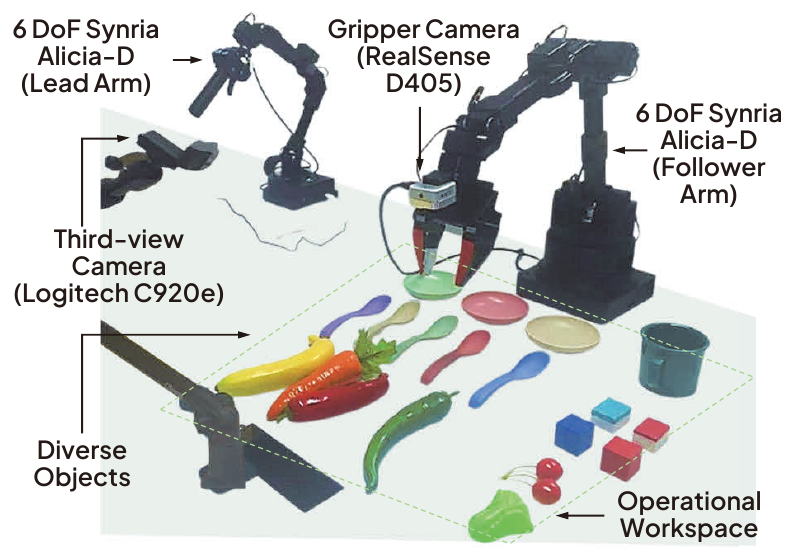

원문 Figure 6 — lead/follower arm, 두 카메라, 물체와 작업 영역의 label을 포함한 실제 평가 장치다. 출처: [AAAI PDF p.7, 인쇄 p.18644](https://ojs.aaai.org/index.php/AAAI/article/download/38931/42893#page=7).

6-DOF Synria Alicia-D arm과 1-DOF gripper, Logitech C920e third-view, RealSense D405 gripper camera를 사용한다. pick, lateral move, stack, long-horizon 네 범주에서 test-time object position을 randomize하고 각 결과를 10회 평균한다. Figure 7 막대를 읽으면 ACT는 대략 40/40/30/20, 0.5B+OFT는 60/70/50/30, VLA-Adapter는 80/90/60/50이며 평균은 각각 32.5/52.5/70.0이다. 막대에 숫자 label이 없으므로 이 값은 10회 단위 눈금에 맞춘 **그래프 판독값**이다. seed, 실패 정의, 속도, safety intervention은 미기재다. `[첨부 PDF pp.6-7, Fig.6-7]`

#### §4.5 Ablation Experiments

ActionQuery 수는 1,4,8,16,64,128,256,512를 비교한다. last-layer ActionQuery만 쓴 파란 선은 256에서 더 높아 보이지만, raw까지 결합한 full VLA-Adapter red star는 64에서 95로 선택된다. “64가 최적”은 query-only curve만이 아니라 전체 시스템의 성능/효율 균형에 대한 선택이다. 512에서는 redundancy로 성능이 떨어진다는 저자 설명이 있지만 attention entropy나 mutual information 분석은 없다.

Table 7은 last raw 85.8, last ActionQuery 90.2, intermediate raw 88.4, all raw 90.6, all ActionQuery 92.6, all raw+ActionQuery 95.0으로 condition의 누적 이익을 보여 준다. Table 8은 gating asymmetry가 중요함을 보인다. raw와 AQ를 모두 1로 주입하면 91.4, raw=1/AQ gated이면 91.0, 둘 다 gated이면 92.6, raw gated/AQ=1이면 95.0이다.

### §5 Conclusion

결론은 raw와 ActionQuery latent를 함께 사용해 작은 backbone에서도 성능·VRAM·throughput 장점을 얻었다고 요약한다. 그러나 출판본 결론의 “SOTA performance”와 “low VRAM/high speed”는 보고된 benchmark/환경 안의 표현으로 제한해야 한다. 전체 VLA 파라미터, FLOPs, edge-device latency, real-world multi-robot generalization은 결론에서 확장해 읽으면 안 된다. `[첨부 PDF p.7, §5]`

### Limitations의 버전 차이

첨부 AAAI 9쪽에는 별도 `Limitations` 절이 없다. 공식 arXiv v2에는 §6 Limitations가 있으며 세 가지를 인정한다.

1. robot pretraining이 없고 규모가 작아 real-world generalization을 더 개선해야 한다.
2. action quality가 VLM condition의 품질과 사용 방식에 의존한다.
3. 학습이 단순하며 RL 같은 복잡한 후속 학습을 탐색할 수 있다.

따라서 이 문서의 Limitations 해설은 **첨부본에 없는 공식 arXiv v2 내용**이다. `[공식 arXiv v2 PDF p.11, §6]`

---

<a id="equations"></a>

## 7. 모든 수식의 단계별 해설

### 7.1 버전별 수식 번호 지도

| 식 | 위치 | 역할 |
|---|---|---|
| 출판본 Eq.(1) | 첨부 PDF p.4, 인쇄 p.18641, §3.4 | L1 action regression objective |
| arXiv v2 Eq.(1) | 공식 arXiv PDF p.5, §3.3 | 세 Bridge Attention branch 결합 |
| arXiv v2 Eq.(2) | 공식 arXiv PDF p.6, §3.4 | L1 action regression objective; 출판본 Eq.(1)에 해당 |
| Eq.(B-1) | 공식 arXiv PDF p.18, Appendix B.1 | DiT의 conditional AdaLN-Zero modulation |
| 주요 비번호 식 | 공식 arXiv PDF p.19, Appendix B.2 | forward diffusion의 noisy action 구성 |
| Eq.(B-2) | 공식 arXiv PDF p.19, Appendix B.2 | DiT noise-prediction MSE objective |

출판본은 지면 압축 과정에서 Bridge 결합식을 번호식으로 싣지 않았고 L1 loss를 Eq.(1)로 다시 번호 매겼다. 아래에서는 버전을 반드시 붙인다.

### 7.2 arXiv v2 Eq.(1): Bridge Attention 결합식

원문은 세 attention 결과를 다음처럼 적는다.

```math
\begin{aligned} \widehat{A}_t^\tau=\Big[& \mathrm{CA}_1\!\big(\widetilde{A}_t^\tau,\sigma_1(C_t^R)\big)\cdot\tanh(g),\\ &\mathrm{CA}_2\!\big(\widetilde{A}_t^\tau,\sigma_2[C_t^{AQ},\sigma_0(P_t)]\big),\\ &\mathrm{SA}\!\big(\widetilde{A}_t^\tau,\widetilde{A}_t^\tau\big) \Big]. \end{aligned}
```

표기: arXiv v2 Eq.1.

`[공식 arXiv v2 PDF p.5, §3.3, Eq.(1)]`

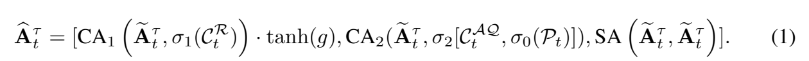

원문 수식 대조 — [arXiv v2 PDF p.5, Eq.(1)](https://arxiv.org/pdf/2509.09372v2#page=5)의 세 attention 결과와 결합 대괄호를 그대로 발췌했다. AAAI 출판본 Eq.(1)과는 다른 식이다.

#### 기호와 shape

- $`\widetilde A_t^\tau\in\mathbb{R}^{B\times H\times d}`$: layer $`\tau`$의 action latent. 기본값은 $`H=8,d=896`$.
- $`C_t^R\in\mathbb{R}^{B\times N_R\times d}`$: 대응 VLM layer의 raw condition. $`N_R`$은 논문 미기재다. 현재 코드는 두 이미지의 512 patch position을 사용한다.
- $`C_t^{AQ}\in\mathbb{R}^{B\times64\times d}`$: 64 ActionQuery 위치의 hidden state.
- $`\sigma_0(P_t)\in\mathbb{R}^{B\times1\times d}`$: proprio token.
- $`[C_t^{AQ},\sigma_0(P_t)]\in\mathbb{R}^{B\times65\times d}`$: token 축 concatenate.
- 각 cross/self attention의 출력은 통상 $`B\times8\times896`$이다.
- 마지막 대괄호가 feature-axis concat이라면 $`\widehat A_t^\tau`$는 $`B\times8\times2688`$이 된다. 그러나 어느 축으로 concatenate하는지, 다시 896으로 줄이는 projection이 무엇인지는 원문 식에 없다.

#### 연산 순서

1. 현재 8개 action latent를 Query로 만든다.
2. 첫 번째 cross-attention이 긴 raw token 집합을 읽는다.
3. 두 번째 cross-attention이 64 ActionQuery와 proprio token을 읽는다.
4. self-attention이 8개 미래 action step끼리 상호작용하게 한다.
5. raw 출력에만 $`\tanh(g)`$를 곱한다.
6. 세 출력을 결합해 다음 FFN에 보낸다.

#### 왜 raw만 gate하는가

Table 1/C1/C2의 논리는 다음과 같다. ActionQuery는 Policy를 위해 scratch에서 학습되는 압축 interface라 평균적으로 강하지만, 일부 hard task에서는 중간 raw feature가 더 낫다. 그래서 ActionQuery를 기본 통로로 두고 raw는 필요한 만큼만 열어 상보 정보를 얻는다.

#### $`g=0`$에서 gradient가 흐르는 방식

raw branch 출력을 $`R_\phi=\mathrm{CA}_1(\cdot)`$라고 하면 전체 raw 기여는

```math
Y_R=\tanh(g)R_\phi.
```

**[해설용 수식]**으로 미분하면

```math
\frac{\partial Y_R}{\partial g} =(1-\tanh^2 g)R_\phi, \qquad \frac{\partial Y_R}{\partial\phi} =\tanh(g)\frac{\partial R_\phi}{\partial\phi}.
```

$`g=0`$에서 $`\partial Y_R/\partial g=R_\phi`$이므로 gate는 첫 update부터 학습할 수 있다. 반면 $`\partial Y_R/\partial\phi=0`$이라 raw branch 내부 projection은 gate가 0이 아닌 값으로 움직이기 전까지 gradient를 받지 못한다. 이것이 zero-init의 안정화 효과이자 초기 학습 지연이다.

#### 작은 수치 예시

한 action position에서 raw/AQ/self branch가 각각 스칼라 $`0.8,0.4,-0.1`$을 냈다고 하자.

- $`g=0`$: raw 기여 0, 결합은 $`[0,0.4,-0.1]`$.
- $`g=0.5`$: $`\tanh(0.5)\approx0.462`$, raw 기여 $`0.370`$.
- $`g=-0.5`$: raw 기여 $`-0.370`$. raw를 “덜 사용”하는 데 그치지 않고 부호를 뒤집는다.
- $`|g|\to\infty`$: $`\tanh(g)\to\pm1`$이고 gate gradient는 0에 가까워져 saturation한다.

따라서 $`\tanh`$는 폭주를 제한하지만, attention weight 자체를 확률적으로 섞는 0-1 gate는 아니다.

#### edge case와 미기재점

- $`C_t^R`$가 noisy하면 초기에는 차단돼 안정적일 수 있다.
- ActionQuery가 실패하는 task에서는 raw gate가 열릴 수 있지만, $`g`$가 layer별인지 global인지 원문은 모호하다. 현재 코드는 block마다 scalar 하나다.
- 모든 attention output을 단순 concat하면 parameter/memory가 늘고 후속 projection이 필요하다. 원문은 생략한다.
- 현재 공식 코드의 실제 구현은 세 output concat이 아니라 key/value group concat 뒤 joint softmax다. 따라서 위 식은 architecture intent를 설명하지만 코드의 정확한 계산식은 아니다.

### 7.3 출판본 Eq.(1) / arXiv v2 Eq.(2): L1 action objective

출판본의 원문 식은 다음과 같다.

```math
\begin{aligned} &\min_\theta \mathcal{J}(\theta)\\ &\quad= \mathbb{E}_{A_t,C_t^R,C_t^{AQ},\sigma_0(P_t)} \left[ \left\| \pi_\theta\!\left(A_t^\tau,C_t^R,C_t^{AQ},\sigma_0(P_t)\right)-A_t \right\|_1 \right]. \end{aligned}
```

표기: AAAI Eq.1.

`[첨부 PDF p.4, 인쇄 p.18641, §3.4, Eq.(1)]`

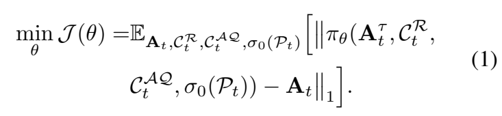

원문 수식 대조 — [AAAI PDF p.4, 인쇄 p.18641, Eq.(1)](https://ojs.aaai.org/index.php/AAAI/article/download/38931/42893#page=4). 두 줄과 식 번호를 함께 보존했다.

arXiv v2 Eq.(2)는 입력과 expectation subscript에 Policy/diffusion과 혼동되는 layer index $`\tau`$를 추가한다.

```math
\begin{aligned} &\min_\theta \mathcal{J}(\theta)\\ &\quad= \mathbb{E}_{A_t,C_t^R,C_t^{AQ},\sigma_0(P_t),\tau} \left[ \left\| \pi_\theta\!\left(A_t^\tau,C_t^R,C_t^{AQ},\sigma_0(P_t),\tau\right)-A_t \right\|_1 \right]. \end{aligned}
```

표기: arXiv v2 Eq.2.

`[공식 arXiv v2 PDF p.6, §3.4, Eq.(2)]`

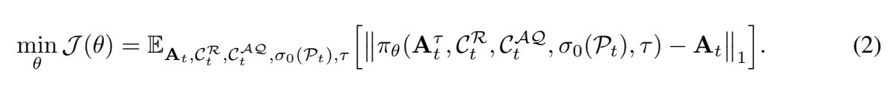

원문 수식 대조 — [arXiv v2 PDF p.6, Eq.(2)](https://arxiv.org/pdf/2509.09372v2#page=6). 출판본 Eq.(1)과 expectation 및 network input의 표기 차이를 직접 비교할 수 있다.

#### 항별 의미

- $`A_t\in\mathbb{R}^{B\times8\times7}`$: dataset의 ground-truth action chunk.
- $`A_t^\tau`$ 또는 $`\widetilde A_t^\tau`$: Policy 내부 layer $`\tau`$에서의 latent. L1 모델의 입력은 $`A_t^0=0`$이다.
- $`\pi_\theta(\cdot)\in\mathbb{R}^{B\times8\times7}`$: predicted normalized action chunk.
- $`\|X\|_1=\sum_i|X_i|`$가 수학적 표기지만, code의 `torch.nn.L1Loss()` default는 전체 원소 **mean**이다. constant scale 차이는 optimum은 같지만 learning-rate 해석에 영향을 준다.
- expectation은 training example과 condition, arXiv 식에서는 layer/timestep index에 걸친 평균을 뜻한다. 실제 mini-batch estimator가 사용된다.

#### 왜 L1인가

L2는 큰 오차를 제곱해 outlier에 민감하고, L1은 각 성분의 절대 오차를 동일한 선형 비중으로 다룬다. behavior cloning에서 demonstration의 일부 급격한 action이나 label noise가 있을 때 L1이 비교적 robust할 수 있다. 원문은 주로 OpenVLA-OFT의 경험적 결론, 즉 downstream fine-tuning action은 diffusion pretraining 상황보다 덜 redundant해 L1이 유리하다는 설명을 따른다.

#### gradient

예측값 $`\hat a`$와 GT $`a`$ 한 성분에 대해

```math
\frac{\partial |\hat a-a|}{\partial\hat a} = \begin{cases} +1,&\hat a\gt a,\\ -1,&\hat a\lt a,\\ [-1,1],&\hat a=a. \end{cases}
```

이는 **[해설용 수식]**이다. autodiff framework는 $`\hat a=a`$에서 보통 0 subgradient를 택한다. gradient는 output MLP→24 Policy blocks→Bridge Attention으로 역전파되고, default LoRA setting에서는 condition을 만든 VLM의 LoRA와 ActionQuery embedding에도 간다. Frozen setting에서는 VLM weight로 가는 경로가 끊기지만 ActionQuery embedding과 Policy는 계속 갱신된다.

#### 작은 수치 예시

간단히 $`H=2,D_a=2`$라 하고

```math
A_t=\begin{bmatrix}0.0&0.3\\-0.2&1.0\end{bmatrix},\qquad \hat A_t=\begin{bmatrix}0.2&-0.1\\-0.1&0.7\end{bmatrix}.
```

절대 오차는 $`0.2,0.4,0.1,0.3`$이다. 합은 1.0, mean L1은 0.25다. PyTorch code의 loss는 0.25에 해당한다. action 성분별 물리 단위가 다르면 정규화가 필수이며, 현재 코드는 각 dataset의 q01/q99 범위를 $`[-1,1]`$로 매핑한 뒤 loss를 계산한다. 논문 본문은 이 정규화 식을 설명하지 않는다.

#### edge case

- gripper open/close처럼 사실상 이산적인 축과 연속 pose 축을 같은 L1 평균에 넣으면 축별 중요도가 동일하다고 암묵적으로 가정한다.
- temporal smoothness나 collision penalty가 없으므로, self-attention이 시간 상관을 학습하더라도 loss가 직접 jerk를 벌하지는 않는다.
- multi-modal action 정답이 여러 개인 상황에서 point regression은 median 쪽으로 수렴해 평균적이지만 실행 불가능한 action을 낼 수 있다. diffusion을 고려한 이유가 될 수 있으나, 이 논문은 L1이 실험상 더 좋았다고 보고한다.

### 7.4 Appendix B 비번호 식: noisy action

부록은 먼저 다음 forward-noising 식을 서술한다.

```math
A_t^\tau=\sqrt{\bar\alpha_\tau}A_t+ \sqrt{1-\bar\alpha_\tau}\,\epsilon, \qquad \epsilon\sim\mathcal{N}(0,I).
```

표기: Appendix B, unnumbered.

`[공식 arXiv v2 PDF p.19, Appendix B.2, 주요 비번호 식]`

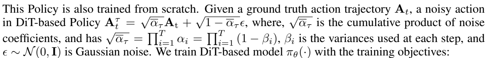

원문 비번호 수식 대조 — [arXiv v2 PDF p.19, Appendix B.2](https://arxiv.org/pdf/2509.09372v2#page=19). noisy-action 식과 누적곱이 본문 안에 조판되어 있어 관련 네 줄을 함께 발췌했다. 제곱근과 product 상한을 임의로 고치지 않았으며, 아래에서 원문 표기와 통상 표기를 구분한다.

신호 계수 $`\sqrt{\bar\alpha_\tau}`$는 diffusion timestep이 커질수록 줄고, noise 계수 $`\sqrt{1-\bar\alpha_\tau}`$는 커진다. $`\bar\alpha_0\approx1`$이면 거의 clean action, $`\bar\alpha_T\approx0`$이면 거의 Gaussian noise다.

그러나 원문 다음 문장은 시각적으로 다음처럼 적혀 있다.

```math
\sqrt{\bar\alpha_\tau} =\prod_{i=1}^{T}\alpha_i =\prod_{i=1}^{T}(1-\beta_i).
```

표기: 원문 표기, 비번호.

통상 DDPM notation은 다음과 같다.

```math
\alpha_i=1-\beta_i,\qquad \bar\alpha_\tau=\prod_{i=1}^{\tau}\alpha_i,\qquad \sqrt{\bar\alpha_\tau}\text{가 clean-signal 계수}.
```

표기: 해설용 표준 표기.

원문은 (i) product upper bound에 현재 timestep $`\tau`$ 대신 전체 $`T`$를 쓰고, (ii) product가 $`\bar\alpha_\tau`$인지 그 제곱근인지 혼동한다. 이는 표기상 오탈자 가능성이 높지만, 이 문서는 원문을 조용히 고치지 않는다.

### 7.5 Eq.(B-1): conditional AdaLN-Zero

원문은 첫 DiT block을 예로 다음처럼 쓴다.

```math
\begin{aligned} \widetilde A_t^1 &=A_t^1+\alpha_\tau\odot \varepsilon\!\left(\gamma_\tau\,\mathrm{LN}(A_t^1)+\beta_\tau\right)\\ &=A_t^1+\sigma_2'(C_t^M)\odot \varepsilon\!\left( \sigma_1'^{(2)}(C_t^M)\,\mathrm{LN}(A_t^1) +\sigma_1'^{(1)}(C_t^M) \right),\\ [\beta_\tau;\gamma_\tau]&=\sigma_1'(C_t^M). \end{aligned} \qquad\text{(B-1)}
```

`[공식 arXiv v2 PDF p.18, Appendix B.1, Eq.(B-1)]`

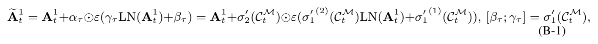

원문 수식 대조 — [arXiv v2 PDF p.18, Eq.(B-1)](https://arxiv.org/pdf/2509.09372v2#page=18). 원문의 한 줄 전개와 오른쪽 아래 식 번호를 보존했고, 위 LaTeX는 읽기 좋게 줄만 나눈 것이다.

또한 앞 문장은

```math
C_t^M=\sigma_1'(C_t^R)+\sigma_0(P_t)
```

표기: Appendix B.1, unnumbered.

라고 한다.

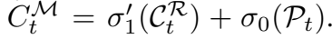

원문 비번호 수식 대조 — [arXiv v2 PDF p.18, Appendix B.1](https://arxiv.org/pdf/2509.09372v2#page=18)의 condition 정의를 발췌했다. 이 식에 원문에는 없는 번호를 붙이지 않는다.

#### 의미

- LN으로 noisy action latent의 scale을 정규화한다.
- $`C_t^M`$에서 나온 $`\gamma_\tau`$와 $`\beta_\tau`$가 channel별 scale/shift를 만든다.
- $`\varepsilon(\cdot)`$는 원문 정의상 self-attention+projection module이다. Gaussian noise $`\epsilon`$과 비슷한 글자를 써서 혼동하기 쉽다.
- $`\alpha_\tau`$는 residual gate로, condition이 현재 block update를 얼마나 강하게 주입할지 정한다.
- $`\odot`$는 elementwise multiplication이다.

shape를 $`A_t^1\in\mathbb{R}^{B\times H\times d}`$라고 하면 $`\beta,\gamma,\alpha`$는 최소한 $`d`$ channel로 broadcast 가능한 $`[B,d]`$ 또는 $`[B,1,d]`$여야 한다. $`C_t^M`$에서 token dimension을 어떻게 pool하는지는 원문이 설명하지 않는다.

#### 원문 내부 불일치

Eq.(B-1)의 두 번째 줄은 residual gate를 $`\sigma_2'(C_t^M)`$로 쓴다. 바로 다음 쪽 prose는 “$`\alpha_\tau=\sigma_3'(C_t^M)`$”라고 쓴다. 둘 중 무엇이 실제 모듈인지 논문만으로 확정할 수 없다. 또 Eq.(B-1)은 generic block index $`\tau`$를 쓰면서 left-hand side는 $`\widetilde A_t^1`$로 고정되어 있다. 첫 block 예시라면 맞지만 “모든 block에 반복”하는 일반식은 아래처럼 쓰는 편이 자연스럽다.

```math
\widetilde A_t^\tau =A_t^\tau+\alpha_\tau\odot \varepsilon\!\left(\gamma_\tau\mathrm{LN}(A_t^\tau)+\beta_\tau\right).
```

표기: 해설용 일반화.

### 7.6 Eq.(B-2): DiT noise-prediction loss

원문 PDF의 식을 그대로 구조화하면 다음과 같다.

```math
\begin{aligned} &\min_\theta\mathcal{J}(\theta)\\ &\quad= \mathbb{E}_{\substack{A_t,\epsilon\sim\mathcal N(0,I),\\C_t^{AQ},\sigma_1(P_t),\tau}} \left[ \left\| \pi_\theta\!\left( \begin{gathered} \sqrt{\bar\alpha_\tau}A_t+\sqrt{1-\bar\alpha_\tau},\\ C_t^{AQ},\sigma_1(P_t),\tau \end{gathered} \right)-\epsilon \right\|_2^2 \right]. \end{aligned}
```

표기: B-2, 원문 표기.

`[공식 arXiv v2 PDF p.19, Appendix B.2, Eq.(B-2)]`

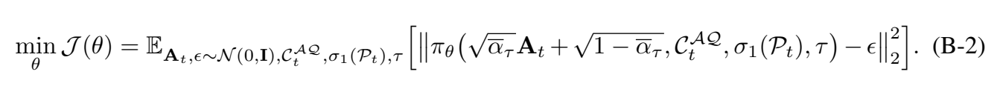

원문 수식 대조 — [arXiv v2 PDF p.19, Eq.(B-2)](https://arxiv.org/pdf/2509.09372v2#page=19). network input의 noise 곱 누락으로 보이는 부분까지 원문 그대로이며, 아래의 해설용 보정식과 혼동하지 않아야 한다.

#### 중요한 표기 누락

앞의 noisy-action 정의에는 두 번째 항에 $`\epsilon`$이 곱해지지만 Eq.(B-2)의 network input에는 $`\sqrt{1-\bar\alpha_\tau}`$ 뒤의 $`\epsilon`$이 보이지 않는다. 통상적인 noise-prediction 목적은 다음과 같다.

```math
\mathbb{E}\left[ \left\| \pi_\theta\!\left( \begin{gathered} \underbrace{\sqrt{\bar\alpha_\tau}A_t+ \sqrt{1-\bar\alpha_\tau}\epsilon}_{A_t^\tau},\\ C_t^R,C_t^{AQ},\sigma_0(P_t),\tau \end{gathered} \right)-\epsilon \right\|_2^2 \right].
```

표기: 해설용 표준 noise-prediction 식.

원문 B-2는 (i) input noise $`\epsilon`$ 곱이 빠지고, (ii) architecture 설명에서는 쓰는 $`C_t^R`$를 expectation/network argument에서 생략하고, (iii) proprio projector를 본문의 $`\sigma_0`$ 대신 $`\sigma_1`$로 표기한다. 실제 의도는 앞선 noisy-action 정의와 Figure B1을 고려할 때 표준식에 가까울 가능성이 크지만, 공식 부록만으로 정확한 학습 코드를 재구성할 수 없다.

#### loss와 추론 역할

학습 때는 무작위 $`\tau`$와 noise $`\epsilon`$을 뽑아 noisy action에서 noise를 맞힌다. 추론 때는 Gaussian action에서 시작해 여러 denoising step을 반복한다. L1 head가 한 번의 forward로 chunk를 내는 것과 달리, DiT는 solver step 수만큼 Policy가 반복 호출돼 latency가 늘 수 있다. 논문은 Table B1 성능만 수치로 주고 diffusion step 수, noise schedule, DDIM/DDPM solver, latency를 주지 않는다.

#### 작은 예시

$`A=0.6`$, $`\bar\alpha_\tau=0.81`$, $`\epsilon=-0.5`$라면

```math
A^\tau=0.9\times0.6+\sqrt{0.19}\times(-0.5) \approx0.54-0.218=0.322.
```

network는 condition과 $`\tau`$를 보고 $`-0.5`$를 예측한다. Eq.(B-2) 원문처럼 $`\epsilon`$을 input에서 빼면 두 번째 항은 단지 $`+0.436`$ 상수가 되어 noise sample과 무관하므로 noise prediction 문제가 성립하지 않는다. 이 점이 단순 표기 누락으로 보는 강한 근거다.

### 7.7 수식에 없는 중요한 계산

#### action unnormalization

공식 코드는 LIBERO/CALVIN action을 q01/q99 기준으로 $`[-1,1]`$에 정규화하고, 추론 후 다음 역변환을 한다.

```math
a_{\mathrm{phys}} =\frac{\hat a+1}{2}(q_{0.99}-q_{0.01}+10^{-8})+q_{0.01}.
```

표기: 해설용, 코드 기반.

outlier dimension을 mask할 수 있다. 이 단계가 빠지면 L1 output을 곧바로 robot command로 해석하게 되어 단위가 틀어진다. 논문은 q01/q99나 각 7 action component의 의미를 적지 않는다.

#### CALVIN Avg. len

prefix success rate를 $`p_k=P(\text{at least }k\text{ subtasks complete})`$라 하면 expected completed count는

```math
\mathbb E[L]=\sum_{k=1}^{5}p_k.
```

표기: 해설용 수식.

VLA-Adapter는 $`(0.991+0.946+0.888+0.828+0.765)=4.418\rightarrow4.42`$로 Table 6과 일치한다. 이 관계는 “Avg. len”을 단순 다섯 성공률의 산술평균으로 오해하지 않게 한다.

---

<a id="forward-pass"></a>

## 8. 한 샘플의 구체적 forward pass

아래는 LIBERO의 “Put both moka pots on the stove” 한 시점을 예로 든다. 논문 정보와 현재 공식 코드 정보가 다를 때 표시한다.

### Step 0. 관측과 목표

- third-view RGB $`X_t^v`$: $`224\times224\times3`$.
- wrist RGB $`X_t^g`$: $`224\times224\times3`$.
- instruction: `In: What action should the robot take to put both moka pots on the stove?\nOut:` 형태. 부록 A의 원문 template은 `instruction.lower()`를 삽입한다.
- proprio $`P_t`$: `[논문 미기재]`; 현재 LIBERO 코드에서는 8 values.
- 목표 action chunk $`A_t`$: 8 steps×7 dims.

### Step 1. 두 vision encoder와 projector

DINOv2와 SigLIP이 이미지를 patch feature로 바꾸고 Prismatic projector가 이를 Qwen hidden size 896으로 맞춘다. `[코드 확인]` 현재 224px 모델은 이미지당 256 patch position을 사용하고 두 view이므로 512 visual positions가 된다. 두 encoder feature의 fusion 세부 방식과 각각의 exact checkpoint size는 이 논문이 표로 주지 않는다.

### Step 2. multimodal sequence 구성

언어 instruction을 tokenize하고 64개의 placeholder/action 위치를 sequence 끝에 둔다. 이 위치의 embedding을 별도 `nn.Embedding(64,896)`인 ActionQuery로 교체한다. ActionQuery weight는 0으로 초기화된다. `[코드 확인]` BOS 뒤에 512 projected vision tokens를 삽입하고, 이어 language tokens, 64 ActionQuery, stop token 순으로 처리한다.

### Step 3. 24-layer VLM

Qwen2.5-0.5B 기반 VLM이 sequence를 24층 통과시킨다. 각 layer $`i`$에서 두 condition을 꺼낸다.

- $`C_{t,i}^{R}`$: 논문은 raw vision-language latent라 표현.
- $`C_{t,i}^{AQ}\in\mathbb{R}^{1\times64\times896}`$: ActionQuery 위치 hidden state.

`[코드 확인]` 현재 action head 경로는 각 layer에서 **처음 512 vision-patch positions**를 `task_latten_states`로 잡고, ActionQuery 64 positions를 따로 잡는다. instruction token positions를 raw branch에 직접 넘기지 않는다. ActionQuery는 sequence 후반에 있으므로 앞선 vision/language 문맥을 attention으로 모을 수 있다. 이 구현은 원문의 “raw vision-language representation”보다 구체적이며 다소 좁다.

### Step 4. Policy 초기 action latent

개념상 $`A_t^0`$는 8-step all-zero action이다. `[코드 확인]` 실제 현재 L1 head는 먼저

```math
\begin{aligned} 0\in\mathbb{R}^{1\times(7\cdot8)\times896} &\longrightarrow \mathrm{reshape}\in\mathbb{R}^{1\times8\times(7\cdot896)}\\ &\longrightarrow \mathrm{LN+Linear+ReLU}\in\mathbb{R}^{1\times8\times896} \end{aligned}
```

로 만든다. 즉 각 미래 step은 7 action channel×896을 flatten한 6,272-dimensional vector에서 시작한다. Training phase에는 각 step/feature에 Gaussian 초기화된 perturbation을 더하는 코드가 있지만, forward 안에서 새 `nn.Parameter`로 생성되어 module parameter로 등록되지 않으므로 optimizer가 지속적으로 학습하지 못한다. 논문에는 이 perturbation이 없다.

### Step 5. 24개 Bridge block

Policy block $`i`$는 다음 token group을 본다.

- self action: 길이 8.
- ActionQuery+proprio: 길이 $`64+1=65`$.
- raw visual/task: 길이 512.

head=8, head dimension=112다. 각 action step의 query가 총 585개 key position을 경쟁적으로 읽고 output $`[1,8,896]`$을 만든다. raw group score만 block별 $`\tanh(g_i)`$로 scale된다. residual+FFN을 거쳐 다음 block으로 간다. VLM hidden layer $`i+1`$과 Policy block $`i`$가 대응한다.

### Step 6. continuous action output

마지막 LN과 Linear가 $`[1,8,896]\to[1,8,7]`$을 만든다. 학습 때는 GT와 mean L1을 계산한다. 추론 때는 dataset q01/q99로 7개 축을 unnormalize한다.

### Step 7. robot execution

8개 action을 simulator/robot wrapper에 넘긴다. **몇 개를 실제로 실행한 뒤 새 observation으로 다시 계획하는지**는 논문이 명시하지 않는다. 8개 전부를 실행하면 policy call당 8 environment steps를 open-loop로 commit하고, 일부만 실행하면 receding-horizon control이 된다. 이 차이는 장애물 변화에 대한 반응성과 compute load를 바꾼다.

---

<a id="training-boundary"></a>

## 9. 학습 경로, frozen/trainable 경계, 데이터 recipe

### 9.1 기본 fine-tuned setting

| 구성요소 | 초기화/사전학습 | 기본 학습 경계 |
|---|---|---|
| DINOv2+SigLIP vision backbone | generic visual pretraining | 논문은 세부 frozen/LoRA 범위를 명확히 분해하지 않음 |
| Qwen2.5-0.5B Prismatic VLM | generic vision-language model, robot pretraining 없음 | LoRA fine-tuning이라고 보고 |
| 64 ActionQuery embeddings | 0에서 scratch | trainable |
| proprio 2-layer MLP | scratch | trainable로 해석 |
| 24-layer Bridge Policy | scratch | trainable |
| final continuous action layer | scratch | trainable |

Appendix F2의 저자 보고는 Policy 97.3M trainable, 전체 VLA-Adapter 197.2M trainable이다. 단순 차이는 99.9M이지만 이것을 모두 LoRA라고 단정할 수 없다. ActionQuery, proprio projector, VLM LoRA와 기타 trainable projection의 세부 breakdown이 없다.

### 9.2 frozen-backbone setting

Table 3 설명은 backbone을 고정하고 **ActionQuery latent와 Policy만 scratch에서 학습**한다고 적는다. 여기서 “ActionQuery latent를 학습”한다는 말은 매 sample의 latent 자체를 parameter로 저장한다는 뜻이 아니라, 입력 ActionQuery embedding과 이를 읽는 Policy가 gradient를 받아 latent가 유용한 표현이 되도록 한다는 뜻이다. frozen VLM의 attention 연산은 여전히 수행되며, 그 weight만 갱신되지 않는다.

### 9.3 no robotic pretraining의 정확한 뜻

| 단계 | robot data 사용 여부 |
|---|---|
| Qwen/Prismatic backbone 사전학습 | B1/B2에는 embodied robot pretraining 없음 |
| downstream LIBERO fine-tuning | robot demonstrations 사용 |
| downstream CALVIN training | ABC environment demonstrations 사용 |
| evaluation | LIBERO 각 task 50 rollouts, CALVIN D 1,000 chains, real-world 범주별 10회 |

따라서 “no robotic pretraining”은 비용이 큰 범용 robot foundation pretraining을 건너뛴다는 장점이다. downstream imitation learning까지 없애는 zero-shot policy가 아니다.

### 9.4 Appendix F recipe

- optimizer: AdamW.
- scheme: LoRA.
- batch size: 16.
- max training steps: 150,000.
- learning rate: $`10^{-4}`$.
- scheduler: cosine annealing with warm-up이라고 prose에 서술.
- warm-up: 전체 step의 10%.
- ActionQuery: 64.
- VLM/Policy layers: 24.
- hidden size: 896.
- heads: 8.
- action chunk: 8.
- intermediate layers: 1-24.

`[논문 미기재]` batch 16이 GPU당인지 global인지, weight decay, Adam $`\beta`$ 값, gradient clipping, seed, data sampling 비율, evaluation checkpoint selection, exact precision, augmentation recipe는 부록 표에 없다.

`[코드 확인]` 현재 저장소의 README/finetune defaults는 paper recipe와 달라졌다. 예를 들어 공개 training command는 learning rate $`2\times10^{-4}`$와 Pro version을 사용하고, 소스에서 활성 scheduler는 `MultiStepLR`, cosine scheduler는 주석 처리돼 있다. 따라서 현재 repo command를 그대로 실행한 결과를 출판본 재현이라고 부르면 안 된다.

---

<a id="inference"></a>

## 10. 추론 알고리즘과 action chunk의 제어 의미

논문에는 번호가 붙은 Algorithm environment가 없다. 다음은 본문과 공식 코드에서 복원한 **[리뷰어 작성 의사코드]**이며 원문 Algorithm 번호를 만들지 않는다.

```text
Inputs:
  third-view image Xv_t
  wrist/gripper image Xg_t
  instruction L_t
  proprioception P_t
  VLM with M=24 layers
  L1 Bridge Policy with M=24 blocks
  H=8, action dimension D_a=7, ActionQuery count N_AQ=64

1. Format instruction prompt and tokenize it.
2. Encode Xv_t and Xg_t with DINOv2 and SigLIP.
3. Project fused visual patches to d=896.
4. Insert 64 learned ActionQuery embeddings near the end of the multimodal sequence.
5. Run the VLM once and request all hidden layers.
6. For each VLM layer i=1..24:
     C_R[i]  <- raw/task token hidden states
     C_AQ[i] <- 64 ActionQuery hidden states
7. Initialize 8-step action latent from zeros; project to [B, 8, 896].
8. Project P_t to one proprio token.
9. For each Policy block i=1..24:
     self branch <- attend action queries to action keys/values
     AQ branch   <- attend action queries to concat(C_AQ[i], proprio)
     raw branch  <- attend action queries to C_R[i], scaled by tanh(g_i)
     action latent <- residual FFN(combined attention)
10. Final LN + Linear -> normalized action chunk [B, 8, 7].
11. Unnormalize each action dimension with dataset statistics.
12. Execute k actions, where 1 <= k <= 8, then acquire a new observation.
    The paper does not specify k.
```

### 10.1 Policy refresh와 control frequency

정책 latency를 $`T_p`$, 환경 servo frequency를 $`f_e`$, 한 번에 실제로 실행하는 action 수를 $`k`$라 하면 다음을 구분해야 한다.

```math
\begin{aligned} f_{\mathrm{policy,max}}&=\frac{1}{T_p},\\ f_{\mathrm{action-throughput}}&=\frac{H}{T_p},\\ f_{\mathrm{refresh,execution}}&=\frac{f_e}{k}. \end{aligned}
```

표기: 해설용 수식.

- 논문 수치 $`T_p=0.0365`$s, $`H=8`$이면 compute-only 최대 policy call rate는 27.40 Hz다.
- action-vector throughput은 $`8/0.0365=219.18`$ vectors/s로 Table 4의 219.2와 일치한다.
- 실제 robot이 20 Hz로 움직이고 $`k=8`$을 모두 실행한다고 **가정**하면 action chunk가 0.4초를 덮고 새 policy refresh는 2.5 Hz다. 20 Hz는 논문 값이 아닌 설명용 가정이다.
- $`k=1`$로 receding-horizon 실행하면 매 environment step마다 재계획하지만 계산이 servo deadline을 만족해야 한다.

즉 219.2라는 숫자는 실제 폐루프 반응 빈도나 안전 제어 빈도를 직접 말해 주지 않는다.

### 10.2 L1과 DiT 추론의 차이

L1 head는 step 7-10을 한 번 수행한다. DiT head는 Gaussian action에서 시작해 여러 diffusion timestep을 반복해야 한다. 부록은 `T`나 sampling solver를 공개하지 않아 DiT의 실제 policy latency를 계산할 수 없다. flow matching ODE step도 논문/코드에 없으므로 “flow-matching action head가 빠르다/느리다”는 결론은 이 논문으로 낼 수 없다.

---

<a id="experiments"></a>

## 11. 주요 실험과 수치 재검산

### 11.1 실험 조건 총괄

| 항목 | LIBERO | CALVIN ABC→D | Real-world |
|---|---|---|---|
| 입력 영상 | third+wrist, 둘 다 224×224×3 | third 224×224×3, gripper 84×84×3 | C920e third+D405 gripper; resolution 미기재 |
| 언어 | task instruction prompt | task instruction prompt | 영어 task command 예시 |
| 출력 | 8×7 continuous action chunk | 8×7 continuous action chunk | 7-DOF system action; exact convention 미기재 |
| 데이터/split | Spatial/Object/Goal/Long, 각 10 tasks | train A/B/C, zero-shot eval D | test object position randomization |
| 반복 | task당 50 rollouts | 1,000 five-subtask chains | category 결과당 10 executions |
| metric | success rate, suite average | prefix success 1-5, Avg. len | category success rate, average |
| hardware | 저자: 모든 실험 4×H100 | 저자: 모든 실험 4×H100 | 같은 문구의 범위로 보이지만 robot inference GPU 세부 미기재 |
| precision | 논문 미기재 | 논문 미기재 | 논문 미기재 |
| batch | training 16, global/per-GPU 불명 | training 16, global/per-GPU 불명 | online batch 미기재 |
| 길이/예산 | 150k steps, H=8 | 150k steps로 해석; baseline OFT는 arXiv가 150k 재현 명시 | episodes 길이/timeout 미기재 |

### 11.2 Table 2: bridge 효과

| Backbone | OFT | VLA-Adapter | 절대 차이 | 상대 개선 |
|---|---:|---:|---:|---:|
| B1 Qwen2.5-0.5B Prismatic, no robot pretrain | 85.8 | 95.0 | +9.2 pp | +10.72% |
| B2 LLaMA2-7B Prismatic, no robot pretrain | 87.5 | 95.2 | +7.7 pp | +8.80% |
| B3 OpenVLA-7B, robot pretrained | 94.5 | 95.4 | +0.9 pp | +0.95% |

`[첨부 PDF p.5, 인쇄 p.18642, Table 2]`

원문의 `Δ 9.2%` 표기는 산술상 **percentage point**다. 상대 개선률은 위 마지막 열처럼 다르다. B1에서 bridge 교체가 큰 효과를 내지만, OFT와 VLA-Adapter의 trainable parameter 수/학습시간을 동일하게 맞췄는지는 표에 없다.

### 11.3 Table 3: frozen backbone

| 방법 | LIBERO-Long SR |
|---|---:|
| OpenVLA-OFT | 0.0 |
| SmolVLA | 77.0 |
| VLA-Adapter | 86.4 |

VLA-Adapter−SmolVLA는 정확히 +9.4 pp다. 그러나 OpenVLA-OFT 0.0은 interface token이 zero-mask이고 backbone이 frozen이라 학습 경로가 막힌 특정 구현의 결과다. “OFT family 전체가 frozen에서 0”으로 일반화해서는 안 된다. `[첨부 PDF p.5, Table 3; 공식 arXiv v2 PDF pp.24-25, Appendix H]`

### 11.4 Table 4: latency와 throughput

| 방법 | Throughput (action steps/s) | Latency (s/chunk) | 재계산 $`8/T`$ |
|---|---:|---:|---:|
| OpenVLA-OFT | 71.4 | 0.1120 | 71.43 |
| VLA-Adapter | 219.2 | 0.0365 | 219.18 |

`[첨부 PDF p.5, Table 4]`

- latency 감소: $`(0.1120-0.0365)/0.1120=67.41\%`$.
- throughput 배수: $`219.2/71.4=3.070\times`$.
- 두 열은 독립 측정이라기보다 $`H=8`$로 서로 정확히 변환된다.
- arXiv v2 Table 4에만 OpenVLA 4.2/0.2396, fastest OFT without wrist/proprio 109.7/0.0729가 추가돼 있다. 출판본 최종 표에는 없다.

### 11.5 Table 5: LIBERO 전체

첨부 출판본의 비교표를 그대로 구조화하면 다음과 같다. `Params`는 저자가 명시한 **backbone billion scale**이다.

| Scale | Method | Params (B) | Spatial | Object | Goal | Long | Avg. |
|---|---|---:|---:|---:|---:|---:|---:|
| Large | UnifiedVLA | 8.5 | 95.4 | 98.8 | 93.6 | 94.0 | 95.5 |
| Large | OpenVLA | 7 | 84.7 | 88.4 | 79.2 | 53.7 | 76.5 |
| Large | OpenVLA-OFT | 7 | 97.6 | 98.4 | 97.9 | 94.5 | 97.1 |
| Large | UniVLA | 7 | 96.5 | 96.8 | 95.6 | 92.0 | 95.2 |
| Large | CoT-VLA | 7 | 87.5 | 91.6 | 87.6 | 69.0 | 81.1 |
| Large | WorldVLA | 7 | 87.6 | 96.2 | 83.4 | 60.0 | 81.8 |
| Small | SpatialVLA | 4 | 88.2 | 89.9 | 78.6 | 55.5 | 78.1 |
| Small | $`\pi_0`$ | 3 | 96.8 | 98.8 | 95.8 | 85.2 | 94.2 |
| Small | $`\pi_0`$-FAST | 3 | 96.4 | 96.8 | 88.6 | 60.2 | 85.5 |
| Small | SmolVLA | 2.2 | 93.0 | 94.0 | 91.0 | 77.0 | 88.8 |
| Small | GR00T N1 | 2 | 94.4 | 97.6 | 93.0 | 90.6 | 93.9 |
| Tiny | Seer | 0.57 | - | - | - | 78.7 | 78.7 |
| Tiny | VLA-OS | 0.5 | 87.0 | 96.5 | 92.7 | 66.0 | 85.6 |
| Tiny | Diffusion Policy | - | 78.3 | 92.5 | 68.3 | 50.5 | 72.4 |
| Tiny | **VLA-Adapter** | **0.5** | **97.8** | **99.2** | **97.2** | **95.0** | **97.3** |
| Tiny | **VLA-Adapter-Pro** | **0.5** | **99.6** | **99.6** | **98.2** | **96.4** | **98.5** |

`[첨부 PDF p.6, 인쇄 p.18643, Table 5]`

재계산:

- VLA-Adapter 평균: $`(97.8+99.2+97.2+95.0)/4=97.30`$.
- Pro 평균: $`(99.6+99.6+98.2+96.4)/4=98.45\rightarrow98.5`$.
- OpenVLA-OFT 평균: $`(97.6+98.4+97.9+94.5)/4=97.10`$.
- VLA-Adapter와 VLA-OS의 Long 차이: $`95.0-66.0=29.0`$ pp. 원문 주장과 일치한다.
- VLA-Adapter와 OpenVLA-OFT 평균 차이는 +0.2 pp로 매우 작다. 50회/task의 discrete success와 seed variance를 고려하면 “동급”은 말할 수 있어도 통계적으로 우월하다고 확정할 근거는 없다.

arXiv v2 Table 5는 FlowVLA, TraceVLA, MolmoAct, ThinkAct, PD-VLA, 4D-VLA, NORA, GraspVLA를 더 포함한다. 이는 2025-09-22 preprint 표와 2026-03-14 출판본 표의 baseline selection이 다름을 뜻한다. 이 문서는 첨부 출판본을 주 비교표로 삼았다.

### 11.6 Table 6: CALVIN ABC→D

| Scale | Method | Params (B) | ≥1 | ≥2 | ≥3 | ≥4 | 5/5 | Avg. len |
|---|---|---:|---:|---:|---:|---:|---:|---:|
| Large | UniVLA | 7 | 95.5 | 85.8 | 75.4 | 66.9 | 56.5 | 3.80 |
| Large | OpenVLA | 7 | 91.3 | 77.8 | 62.0 | 52.1 | 43.5 | 3.27 |
| Large | OpenVLA-OFT | 7 | 96.3 | 89.1 | 82.4 | 75.8 | 66.5 | 4.10 |
| Large | RoboDual | 7 | 94.4 | 82.7 | 72.1 | 62.4 | 54.4 | 3.66 |
| Large | OpenHelix | 7 | 97.1 | 91.4 | 82.8 | 72.6 | 64.1 | 4.08 |
| Small | DeeR | 3 | 86.2 | 70.1 | 51.8 | 41.5 | 30.4 | 2.82 |
| Small | VPP | 1.5 | 95.7 | 91.2 | 86.3 | 81.0 | 75.0 | 4.33 |
| Tiny | SeerLarge | 0.57 | 96.3 | 91.6 | 86.1 | 80.3 | 74.0 | 4.28 |
| Tiny | MoDE | 0.44 | 96.2 | 88.9 | 81.1 | 71.8 | 63.5 | 4.01 |
| Tiny | **VLA-Adapter** | **0.5** | **99.1** | **94.6** | **88.8** | **82.8** | **76.5** | **4.42** |
| Tiny | **VLA-Adapter-Pro** | **0.5** | **98.5** | **95.0** | **90.5** | **85.3** | **80.0** | **4.50** |

`[첨부 PDF p.6, Table 6]`

VLA-Adapter의 공개 rounded prefix rates 합은 4.418로 4.42와 맞는다. Pro는 4.493이라 일반적인 half-up rounding이면 4.49인데 표는 4.50이다. underlying unrounded rates로 계산했거나 Avg. len을 episode별로 직접 평균했을 수 있다. 표만으로는 확정할 수 없다. VPP도 rounded prefix rates 합이 4.292인데 Avg. len 4.33이므로 baseline 값은 서로 다른 정밀도/출처에서 왔을 가능성이 있다.

### 11.7 Figure 7: real-world

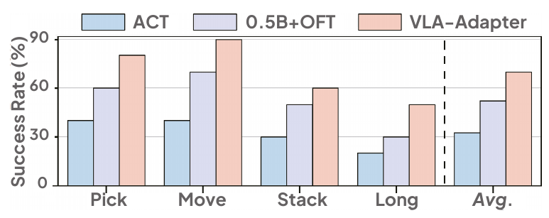

원문 Figure 7 — Pick/Move/Stack/Long과 평균 막대, 세 방법의 범례를 함께 보존했다. 개별 막대에 수치 label은 없다. 출처: [AAAI PDF p.7, 인쇄 p.18644](https://ojs.aaai.org/index.php/AAAI/article/download/38931/42893#page=7).

10회/category이므로 각 category success rate의 최소 간격은 10 pp다. graph reading 기준 VLA-Adapter의 80/90/60/50은 성공 횟수 8/9/6/5에 해당하고 총 28/40, 평균 70%다. 95% binomial confidence interval은 각 category에서 매우 넓다. 예를 들어 5/10은 exact interval이 대략 19%-81% 수준이다. task category 간 난이도도 다르므로 40회를 동일 Bernoulli로 단순 합치는 해석은 제한적이다.

### 11.8 Figure 8와 Table 7/8

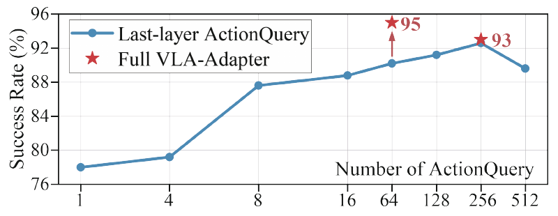

원문 Figure 8 — 파란 곡선과 full VLA-Adapter의 빨간 별은 서로 다른 설정이다. 64/256 위치의 95/93 label을 포함한다. 출처: [AAAI PDF p.7, 인쇄 p.18644](https://ojs.aaai.org/index.php/AAAI/article/download/38931/42893#page=7).

Figure 8의 파란 curve는 last-layer ActionQuery only다. 정확한 숫자 label이 모든 점에 없으므로 시각 판독만으로 소수점 수치를 만들지 않는다. 확실한 결론은 1→256에서 대체로 상승, 512에서 하락, full model의 64-query red star가 95, 256-query red star가 93이라는 그림 표기다.

Table 7의 정확한 condition 결과:

| Layer | Raw | ActionQuery | Representative style | SR |
|---|---:|---:|---|---:|
| Last | ✓ | ✗ | RoboVLMs | 85.8 |
| Last | ✗ | ✓ | OpenVLA-OFT | 90.2 |
| Intermediate | ✓ | ✗ | GR00T N1 | 88.4 |
| All | ✓ | ✗ | $`\pi_0`$ | 90.6 |
| All | ✗ | ✓ | N/A | 92.6 |
| All | ✓ | ✓ | VLA-Adapter | 95.0 |

Table 8의 gate 결과:

| Raw injection | ActionQuery injection | SR |
|---|---|---:|
| $`\tanh(g)`$ | 1 | **95.0** |
| 1 | 1 | 91.4 |
| 1 | $`\tanh(g)`$ | 91.0 |
| $`\tanh(g)`$ | $`\tanh(g)`$ | 92.6 |

raw를 무조건 1로 주입하면 −3.6 pp, ActionQuery를 gate하면 −4.0 pp다. 둘 다 gate하는 것보다 raw만 gate하는 것이 +2.4 pp다. 이 결과는 bridge의 방향성, 즉 **selected raw + full ActionQuery**를 직접 지지한다.

---

<a id="efficiency"></a>

## 12. 효율 주장: FLOPs, latency, throughput, memory, control frequency

| 효율 지표 | 논문 보고 | 해석 |
|---|---|---|
| Backbone parameters | 0.5B vs 7B | 전체 VLA parameter가 아님 |
| Policy parameters | 97.3M trainable | Appendix F2. 현재 코드 정적 재계산은 decimal 102.13M, binary-million으로 97.40 Mi |
| Total trainable | 197.2M | 전체 resident/inference parameters와 다름 |
| Training VRAM | batch 8에서 24.7GB vs 62GB | Figure 1. 측정 precision/checkpointing/optimizer state 범위 미기재 |
| Latency | 0.0365 s per 8-step chunk | batch/device/warm-up/전처리 범위 미기재 |
| Throughput | 219.2 action steps/s | $`H/T`$로 재계산 가능. policy refresh는 27.4 calls/s |
| FLOPs/MACs | 미기재 | all-layer bridge의 추가 attention 비용도 미기재 |
| TTFT | 미기재 | autoregressive text generation이 아니므로 action-head latency가 더 직접적이나, first-call/JIT는 여전히 분리 필요 |
| p50/p95/p99 latency | 미기재 | 실시간 제어에는 tail이 중요 |
| peak inference memory | 미기재 | Figure 1은 training VRAM만 제시 |
| energy/power | 미기재 | edge deployment 주장에 필요 |

### 12.1 학습 효율과 추론 효율을 분리하기

- **학습 효율**: trainable parameter 수, optimizer states, activation memory, batch/step, wall-clock time. 논문은 trainable count와 한 VRAM point를 주지만 학습 samples/s나 총 GPU-hours는 상세히 주지 않는다.
- **추론 효율**: resident model weight, vision/VLM/Policy latency, action chunk throughput, tail latency. 논문은 chunk latency 하나만 준다.
- 작은 trainable count는 optimizer memory를 줄일 수 있지만, frozen weight도 추론/forward에는 resident해야 하므로 전체 inference memory가 같은 비율로 줄지는 않는다.
- all-layer hidden state를 Policy에 넘기면 마지막 층만 쓰는 것보다 activation materialization과 memory traffic이 증가한다. 이 비용과 성능 이익의 Pareto curve가 없다.

### 12.2 all-layer hidden storage의 설명용 규모

현재 코드처럼 두 이미지 512 raw positions, 64 ActionQuery, 24 layers, hidden 896, BF16이라 가정하면 condition tensor만 대략

```math
24\times(512+64)\times896\times2\ \text{bytes} \approx23.6\ \text{MiB}
```

다. 이는 **[해설용 계산]**이며 autograd buffer, QKV, attention score, VLM 내부 activation, allocator overhead를 포함하지 않는다. 학습 중 실제 peak memory는 훨씬 크다. 이 계산은 all-layer tap이 무료가 아님을 보여 줄 뿐, 논문의 측정값을 대체하지 않는다.

### 12.3 “가장 빠르다”의 제한

Table 4는 일부 baseline만 동일 표에 두고 측정 protocol을 공개하지 않는다. batching, image encoding 포함 여부, model warm-up, compilation, precision, H100 한 장/네 장 사용 여부, CPU preprocessing, camera I/O가 불명확하다. 따라서 **저자 보고 환경에서 OFT보다 3.07× 높은 action-vector throughput**이라고 말하는 것은 가능하지만, 모든 공개 VLA 중 절대적으로 가장 빠르다고 독립 확인된 것은 아니다.

---

<a id="appendix"></a>

## 13. 부록 A-I 상세 해설

### Appendix A. Setup Details of LIBERO Simulation Benchmarks

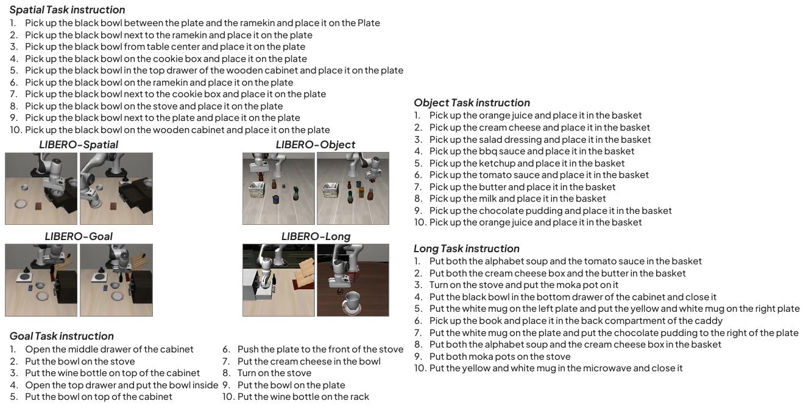

원문 Figure A1 — 네 suite의 장면뿐 아니라 그림에 포함된 지시문 목록도 보존했다. 출처: [arXiv v2 PDF p.18, Appendix A](https://arxiv.org/pdf/2509.09372v2#page=18).

LIBERO는 Spatial, Object, Goal, LIBERO-100으로 구성된다. 앞 세 suite는 각 10 tasks, LIBERO-100은 90 short-term과 10 long-horizon tasks로 나뉜다. 이 논문은 네 비교 열을 Spatial/Object/Goal/Long으로 보고하며, task별 50회 반복한다. `[공식 arXiv v2 PDF p.18, Appendix A, Fig.A1]`

Figure A1이 보여 주는 task 구분은 condition 분석과 연결된다.

- **Spatial**: 같은 검은 bowl을 plate/ramekin/cookie box/stove/drawer 등 서로 다른 위치 관계에서 집는다. fine spatial grounding이 중요하다.
- **Object**: 서로 다른 물체를 basket에 넣는다. object identity가 중요하다.
- **Goal**: drawer 열기, stove 위에 bowl 두기처럼 goal semantics가 달라진다.
- **Long**: 둘 이상의 물체와 순차 goal을 포함한다. condition ablation이 이 suite에서 수행된 이유다.

입력은 third-view와 wrist 모두 224×224×3 RGB다. prompt template은 다음과 같다.

```text
In: What action should the robot take to {instruction.lower()}?
Out:
```

출력은 “7-dimensional action vector”라고 적는다. 한 policy call이 8-step chunk를 내므로 전체 tensor는 $`8\times7`$이다. “7-DOF Franka Emika Panda”라는 부록 표현은 robot actuation과 output dimension을 연결하지만, translation/rotation/gripper의 component order와 단위는 공개하지 않는다.

### Appendix B. DiT-Based Policy Network

#### B.1 Overall Architecture

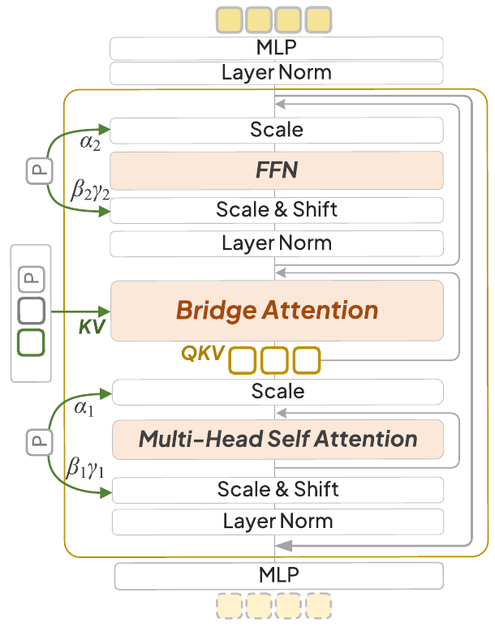

원문 Figure B1 — 아래의 초기 action에서 위의 출력으로 흐르는 DiT 구조와 scale/shift·residual 경로다. 출처: [arXiv v2 PDF p.19, Appendix B.1](https://arxiv.org/pdf/2509.09372v2#page=19).

Figure B1의 DiT block은 conditional modulation→Bridge Attention→conditional FFN의 세 부분이다. noisy action $`A_t^1`$을 AdaLN-Zero로 modulate하고, $`C_t^R`$와 proprio에서 $`C_t^M`$을 만든다. action latent는 self-attention의 QKV, $`C_t^R`$와 $`C_t^{AQ}`$는 Bridge Attention의 KV다. $`M`$개 block 뒤 LN+MLP가 action chunk를 낸다. Eq.(B-1)의 표기 불일치는 [§7.5](#equations)에 정리했다. `[공식 arXiv v2 PDF pp.18-19, Fig.B1, Eq.(B-1)]`

#### B.2 Training

GT action에 Gaussian noise를 섞고 network가 noise를 예측하도록 MSE를 쓴다. Appendix는 DDPM류 설명이지만 exact schedule, timestep 수, solver, $`x_0`$-prediction 여부를 주지 않는다. Eq.(B-2)의 noise 곱 누락과 condition 표기 불일치 때문에 부록만으로 실행 가능한 구현을 만들 수 없다.

#### B.3 L1 vs DiT

| Task 1-10 | 1 | 2 | 3 | 4 | 5 | 6 | 7 | 8 | 9 | 10 | Avg. |
|---|---:|---:|---:|---:|---:|---:|---:|---:|---:|---:|---:|
| L1 | 96 | 96 | 100 | 98 | 100 | 100 | 84 | 96 | 84 | 96 | 95.0 |
| DiT | 96 | 92 | 98 | 96 | 90 | 98 | 82 | 100 | 74 | 90 | 91.6 |

`[공식 arXiv v2 PDF p.19, Table B1]`

재계산 평균은 각각 950/10=95.0, 916/10=91.6으로 맞다. DiT가 이긴 것은 task 8(100 vs 96) 하나, 동률은 task 1, 나머지는 L1이 높다. 단, 한 configuration만 비교해 “모든 diffusion policy가 L1보다 나쁘다”고 결론 내릴 수는 없다.

### Appendix C. Detailed Comparison Results of Different Conditions

#### Table C1: Raw feature layer

| Raw layer | T1 | T2 | T3 | T4 | T5 | T6 | T7 | T8 | T9 | T10 | Avg. |
|---|---:|---:|---:|---:|---:|---:|---:|---:|---:|---:|---:|
| 1 | 78 | 96 | 94 | 100 | 96 | 98 | 62 | 90 | 68 | 88 | 87.6 |
| 5 | 82 | 94 | 84 | 98 | 94 | 96 | 68 | 94 | 66 | 90 | 86.6 |
| 9 | 94 | 94 | 84 | 94 | 90 | 98 | 90 | 90 | 74 | 90 | 89.8 |
| 13 | 90 | 94 | 86 | 92 | 86 | 100 | 82 | 96 | 84 | 74 | 88.4 |
| 17 | 82 | 92 | 92 | 96 | 92 | 90 | 66 | 72 | 62 | 86 | 84.4 |
| 21 | 78 | 94 | 98 | 90 | 68 | 92 | 66 | 94 | 78 | 88 | 83.2 |
| 24 | 84 | 96 | 94 | 94 | 94 | 100 | 64 | 88 | 56 | 88 | 85.8 |
| all 1-24 | 92 | 98 | 96 | 100 | 84 | 94 | 76 | 96 | 84 | 86 | **90.6** |

#### Table C2: ActionQuery layer

| AQ layer | T1 | T2 | T3 | T4 | T5 | T6 | T7 | T8 | T9 | T10 | Avg. |
|---|---:|---:|---:|---:|---:|---:|---:|---:|---:|---:|---:|
| 1 | 28 | 50 | 98 | 96 | 80 | 92 | 76 | 94 | 78 | 90 | 78.2 |
| 13 | 16 | 52 | 98 | 94 | 94 | 100 | 66 | 98 | 62 | 86 | 76.6 |
| 17 | 90 | 94 | 86 | 88 | 82 | 100 | 74 | 100 | 58 | 96 | 86.8 |
| 21 | 88 | 92 | 94 | 98 | 92 | 92 | 70 | 96 | 72 | 94 | 88.8 |
| 23 | 92 | 98 | 94 | 96 | 96 | 100 | 70 | 98 | 72 | 82 | 89.6 |
| 24 | 92 | 88 | 100 | 98 | 90 | 96 | 74 | 98 | 84 | 82 | 90.2 |
| all 1-24 | 92 | 94 | 96 | 98 | 100 | 98 | 76 | 98 | 78 | 96 | **92.6** |

`[공식 arXiv v2 PDF p.20, Tables C1-C2]`

세부표는 평균 finding을 정교하게 제한한다.

- raw “middle is best”는 layer 9의 평균에 근거하지만, T6는 layer 13/24가 100, T3는 layer 21이 98이다. 최적 layer는 task-dependent다.
- AQ “deep is best”도 단조적이지 않다. layer 13은 shallow layer 1보다 평균이 낮다. 큰 도약은 13→17에서 생긴다.
- all-layer는 평균 최고지만 모든 task 최고는 아니다. raw all-layer T7=76은 layer 9의 90보다 낮다. 여러 layer를 주면 항상 각 task의 최적 layer를 자동 선택하는 것은 아니다.
- C1/C2의 각 값은 50회 평가라 2 pp 간격이다. 1-2 pp 차이는 한 번의 success 차이일 수 있다.

### Appendix D. Performance on LIBERO Subtasks

Table D1은 네 suite의 40 task를 요약한다.

| Suite | T1 | T2 | T3 | T4 | T5 | T6 | T7 | T8 | T9 | T10 | Avg. |
|---|---:|---:|---:|---:|---:|---:|---:|---:|---:|---:|---:|
| Spatial | 98 | 100 | 100 | 90 | 96 | 100 | 100 | 100 | 98 | 96 | 97.8 |
| Object | 98 | 98 | 100 | 100 | 98 | 100 | 98 | 100 | 100 | 100 | 99.2 |
| Goal | 92 | 100 | 98 | 96 | 100 | 98 | 94 | 100 | 98 | 96 | 97.2 |
| Long | 96 | 96 | 100 | 98 | 100 | 100 | 84 | 96 | 84 | 96 | 95.0 |

`[공식 arXiv v2 PDF p.21, Table D1]`

모든 행 평균을 다시 계산해 일치함을 확인했다. Long T7/T9가 84로 가장 낮고, 이는 본문 Table 1에서 condition 상보성을 따로 조사한 두 task와 정확히 대응한다.

### Appendix E. Setup Details of CALVIN

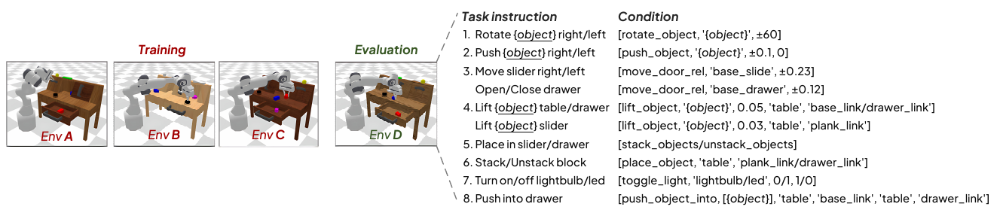

원문 Figure E1 — 환경 분할과 오른쪽의 task instruction/condition 대응을 함께 보존했다. 출처: [arXiv v2 PDF p.21, Appendix E](https://arxiv.org/pdf/2509.09372v2#page=21).

CALVIN은 A-D 네 환경, 약 2M human demonstration trajectories/약 6시간, 34 subtasks를 포함한다. 합리적인 5-subtask 조합 1,000개를 만들어 A/B/C에서 학습하고 D에서 평가한다. Figure E1은 drawer/slider 이동, object lift/place/stack, light toggle, rotation/push 조건을 나열한다. `[공식 arXiv v2 PDF p.21, Appendix E, Fig.E1]`

입력은 third-view 224×224×3, gripper 84×84×3이며 prompt는 다음 형태다.

```text
In: What action should the robot take to {Task instruction}?
Out:
```

출력은 7D action이다. 각 chain에서 현재 subtask 성공 전에는 다음 instruction으로 진행하지 않는다. 따라서 후반 prefix rate가 앞 rate보다 높을 수 없고, Table 6은 이 monotonicity를 만족한다.

### Appendix F. Training and Hyperparameters

Table F1/F2는 [§9.4](#training-boundary)의 recipe를 준다. 중요한 추가 해석은 다음과 같다.

- hidden 896/head 8이므로 head dimension 112.
- “Layer $`(\tau/M)=24`$”는 VLM과 Policy가 모두 24 layer라는 뜻으로 읽힌다.
- total trainable 197.2M은 Policy 97.3M보다 약 2배다. 0.5B backbone 표기와 별개의 quantity다.
- Paper의 “cosine-annealing scheduler” prose와 현재 code의 활성 MultiStepLR이 다르므로 version pinning이 필수다.

### Appendix G. Execution Examples

Figure G1은 real-world의 long-horizon spoon→cup→plate, red-on-blue stack, blue block right move, duck→plate를 프레임 sequence로 보여 준다. Figure G2는 LIBERO 네 suite와 CALVIN 5-subtask chain의 성공 example을 보여 준다. `[공식 arXiv v2 PDF pp.23-24, Fig.G1-G2]`

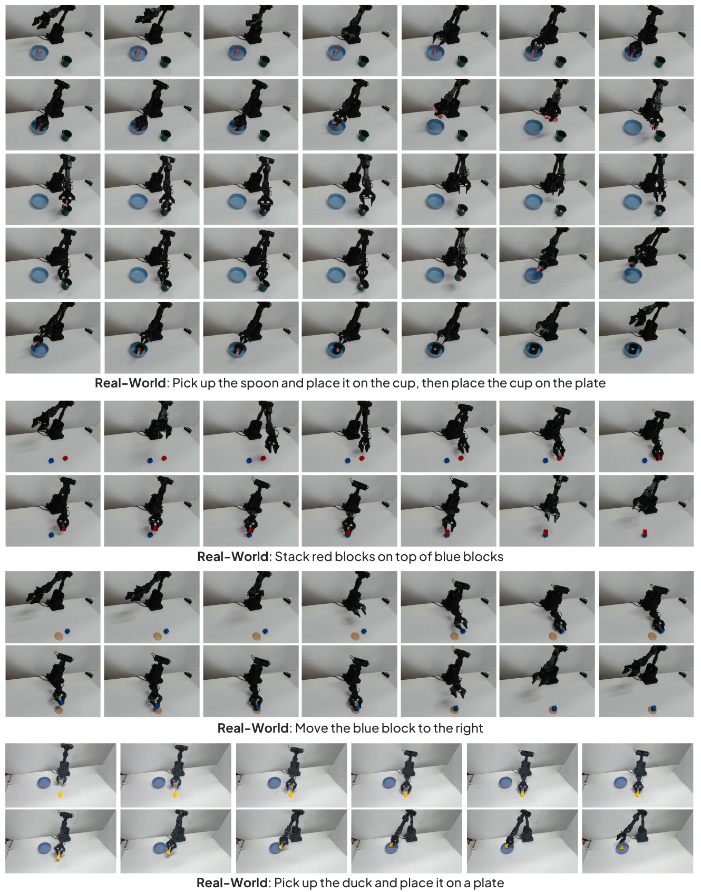

원문 Figure G1 — 네 real-world task의 모든 행과 각 지시문 label을 포함한다. 출처: [arXiv v2 PDF p.23, Appendix G.1](https://arxiv.org/pdf/2509.09372v2#page=23).

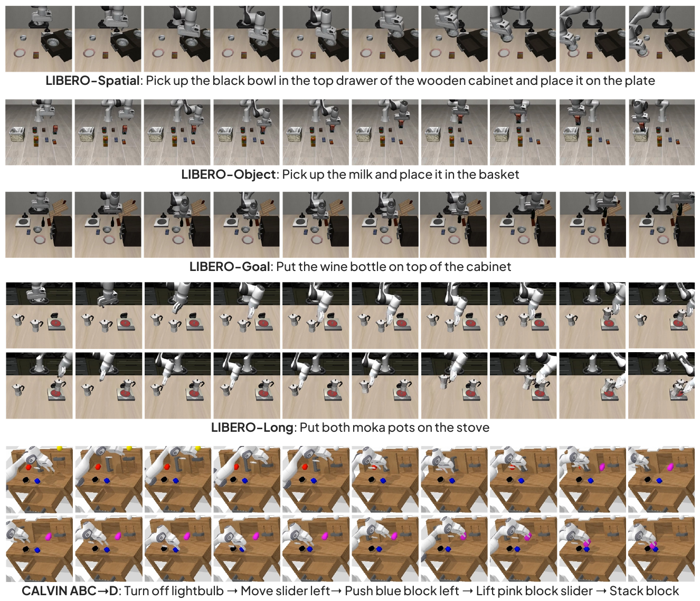

원문 Figure G2 — LIBERO 네 suite 및 CALVIN ABC→D의 실행 예시를 한 그림으로 보존했다. 출처: [arXiv v2 PDF p.24, Appendix G.2](https://arxiv.org/pdf/2509.09372v2#page=24).

이 figure는 qualitative sanity check에는 유용하지만 cherry-picking 가능성을 통제하지 않는다. 실패 video, action trace, intervention, timing이 없어 quantitative Figure 7을 대체할 수 없다.

### Appendix H. Frozen Backbone Analysis

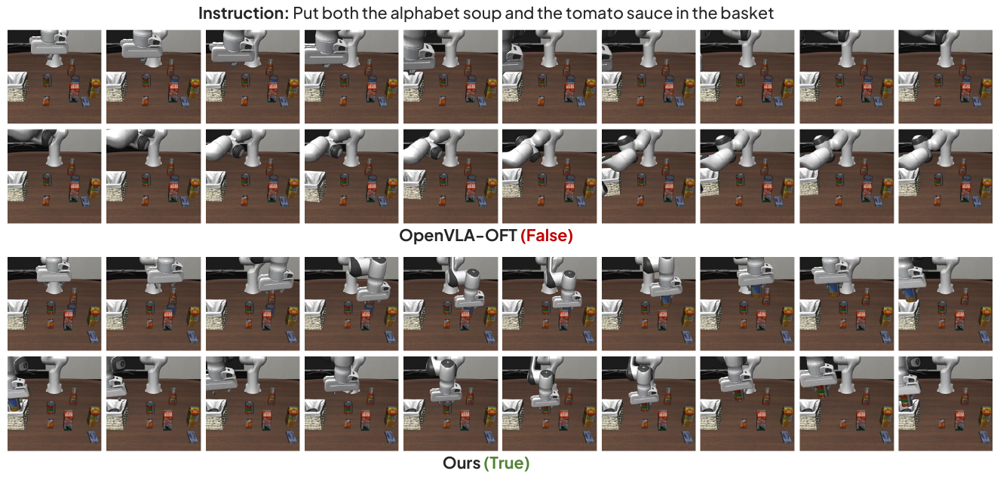

원문 Figure H1 — 동일 지시문, OpenVLA-OFT의 False 및 Ours의 True label과 전체 실행 행을 보존했다. 출처: [arXiv v2 PDF p.25, Appendix H](https://arxiv.org/pdf/2509.09372v2#page=25).

Appendix H는 OpenVLA-OFT L1 path가 action token embedding을 zero mask로 치환하는 code와, VLA-Adapter가 64개 trainable ActionQuery embedding을 실제 sequence 위치에 삽입하는 code를 대비한다. frozen VLM에서 전자는 새 interface가 학습되지 않지만 후자는 ActionQuery parameter가 학습된다. Figure H1은 alphabet soup와 tomato sauce를 basket에 넣는 task에서 OFT 실패, VLA-Adapter 성공 frame을 보여 준다. `[공식 arXiv v2 PDF pp.24-25, Appendix H, Fig.H1]`

이 분석의 올바른 결론은 “frozen backbone에는 **trainable interface token**이 중요하다”다. 비교 OFT에도 별도 learnable query를 허용하면 gap이 줄어드는지 실험하지 않았으므로, architecture family의 절대 우열로 읽으면 안 된다.

### Appendix I. VLA-Adapter-Pro

원 version은 self/AQ/raw attention group의 projection을 공유한다. Pro는 Q를 제외한 각 group의 K/V projection을 분리하고 Q/K에 RoPE를 추가한다. 부록은 original “97MB”, Pro “207MB”라고 부르지만 문맥상 parameter count를 binary-million 방식으로 표현한 것으로 보인다. `[공식 arXiv v2 PDF pp.25-27, Appendix I]`

공개 code의 논리:

1. action latent $`x`$에서 shared Q를 만든다.
2. self, ActionQuery+proprio(adapter), raw/task condition마다 별도 K/V projection을 쓴다.
3. self Q/K와 condition K에 RoPE를 적용한다.
4. self/AQ/raw score를 token 축으로 concat한다.
5. raw/task score에만 $`\tanh(g)`$를 곱한다.
6. **하나의 joint softmax** 후 concat된 V를 weighted sum한다.
7. output projection, residual, FFN을 적용한다.

Table I1 결과:

| Suite | VLA-Adapter | Pro | 차이 |
|---|---:|---:|---:|
| Spatial | 97.8 | 99.6 | +1.8 pp |
| Object | 99.2 | 99.6 | +0.4 pp |
| Goal | 97.2 | 98.2 | +1.0 pp |
| Long | 95.0 | 96.4 | +1.4 pp |
| 4-suite 평균 | 97.3 | 98.45→98.5 | +1.15 pp |

`[공식 arXiv v2 PDF p.28, Table I1]`

세부 task에서는 Pro가 항상 이기지 않는다. 예를 들어 Spatial T2 100→98, Goal T3 98→94, Long T1 96→92/T3 100→98/T4 98→96/T5 100→94다. 평균은 개선되지만 regression task가 남는다.

---

<a id="code-audit"></a>

## 14. 공식 코드 대조: 논문 그림과 실제 구현의 차이

확인한 저장소는 [공식 GitHub](https://github.com/OpenHelix-Team/VLA-Adapter)의 commit [`23fa0c9`](https://github.com/OpenHelix-Team/VLA-Adapter/commit/23fa0c9c159e2aa04341cdd3e924f44061311060)이다. 출판 실험 당시 exact commit이라는 보장은 없으므로, 아래는 재현 보조이자 version-drift 점검이다.

### 14.1 ActionQuery와 hidden extraction

- [`modeling_prismatic.py`](https://github.com/OpenHelix-Team/VLA-Adapter/blob/23fa0c9c159e2aa04341cdd3e924f44061311060/prismatic/extern/hf/modeling_prismatic.py#L374-L376)는 64×896 embedding을 만들고 0으로 초기화한다.
- multimodal forward에서 placeholder action positions를 이 embedding으로 교체한다.
- training path는 각 hidden layer에서 vision patch prefix와 64 ActionQuery positions를 꺼내 Policy에 넘긴다.
- instruction hidden states는 raw branch에 직접 포함되지 않는다. 따라서 raw가 “vision-language”라는 논문 용어는 VLM을 지난 feature라는 넓은 의미일 수 있고, 실제 slice는 vision patch positions다.

### 14.2 L1 action head의 정확한 구조

[`action_heads.py`](https://github.com/OpenHelix-Team/VLA-Adapter/blob/23fa0c9c159e2aa04341cdd3e924f44061311060/prismatic/models/action_heads.py#L21-L121) 기준:

- zero tensor: `[B, 7×8, 896]`.
- reshape: `[B,8,7×896]=[B,8,6272]`.
- input LN+Linear+ReLU: 6272→896.
- 24 `MLPResNetBlock`.
- output LN+Linear: 896→7 per step.
- 최종: `[B,8,7]`.

각 original block은 shared $`Q,K,V,O`$ projection과 one-layer residual FFN을 갖는다. Pro는 self/AQ/raw K,V를 분리한다.

### 14.3 논문 Eq.(1)과 코드 attention의 차이

원문 개념식은 raw cross-attention output, AQ cross-attention output, self-attention output 세 개를 concatenate한다. 현재 code는 각 group의 **attention logits**와 V를 concatenate해 하나의 softmax로 경쟁시킨다.

**[해설용 코드 대응식]**은 다음에 가깝다.

```math
S=\frac{1}{\sqrt{d_h}} \left[ QK_{self}^\top, QK_{AQ+P}^\top, \tanh(g)QK_R^\top \right],
```

```math
Y=\mathrm{softmax}(S) \left[V_{self};V_{AQ+P};V_R\right]W_O.
```

독립 attention 세 개라면 각 branch softmax가 각각 1로 정규화되지만, joint softmax에서는 self/AQ/raw token이 동일 확률 질량을 놓고 경쟁한다. 이 차이는 gating의 실제 의미를 바꾼다. 특히 $`g=0`$이면 raw logits가 0이지만 raw V가 완전히 제거되는 것은 아니다. softmax에서 $`e^0=1`$이므로 다른 score에 따라 raw positions가 확률을 받을 수 있다. 원문처럼 **output에 0을 곱하는 gate**와 같지 않다. 이는 중요한 implementation/paper mismatch다.

### 14.4 parameter count 재계산

현재 code의 $`d=896,D_a=7,H=8,M=24`$를 그대로 세어 보면:

- original L1 head: 102,129,695 parameters = 102.13 decimal million = 97.40×$`2^{20}`$ units.
- Pro L1 head: 217,864,223 parameters = 217.86 decimal million = 207.77×$`2^{20}`$ units.

논문의 97.3M/207M은 decimal million보다 $`2^{20}`$로 나눈 값에 가깝다. 저자가 “M parameters”를 binary-mega 단위로 계산했을 가능성이 높다. 이는 architecture 규모의 대략 비교에는 작지만, exact parameter count를 보고할 때는 구분해야 한다.

### 14.5 training code와 paper recipe의 drift

- [`finetune.py`](https://github.com/OpenHelix-Team/VLA-Adapter/blob/23fa0c9c159e2aa04341cdd3e924f44061311060/vla-scripts/finetune.py#L330-L418)는 VLM all hidden states를 모아 `torch.nn.L1Loss()`를 쓴다.
- current config는 BF16 autocast를 사용한다. 이는 paper 표가 명시한 precision이 아니라 **현재 code 정보**다.
- current README command는 LoRA rank 64, learning rate $`2\times10^{-4}`$, Pro version을 권장한다. Appendix F의 $`10^{-4}`$ original recipe와 다르다.
- source에서 활성 scheduler는 `MultiStepLR(gamma=0.1)`, cosine annealing은 주석 처리돼 있어 Appendix F prose와 다르다.
- LoRA target은 `all-linear`; ActionQuery는 명시적으로 `requires_grad=True`로 다시 켠다.
- 현재 `use_fz` flag는 run name/checkpoint saving에 쓰이지만 확인한 경로에서 backbone `requires_grad=False`를 실제 설정하지 않는다. README도 frozen 실험 추가 공개를 TODO로 둔다. 그러므로 Table 3 frozen experiment의 정확한 script/config는 현재 repo만으로 완전 재현되지 않는다.

### 14.6 flow matching 검증

공식 저장소 README는 “diffusion transformers and **flow matching** policy networks”를 향후 업데이트 TODO로 둔다. code에는 `use_diffusion` flag와 오래된 DDIM 관련 comment가 남아 있으나, 확인한 `action_heads.py`에는 실행 가능한 DiffusionActionHead/FlowMatchingHead class가 없고 기본 경로는 L1이다. 따라서:

- 본 논문의 선택 action head: L1 regression.
- 부록 실험 대안: DiT noise-prediction diffusion.
- flow matching: 논문 실험/공식 현재 구현에 없음.

flow matching 결과나 구조를 이 논문의 성과로 설명하면 사실과 다르다.

### 14.7 코드에서 드러난 추가 재현 위험

- training phase의 `learnable_random_perturbations`는 forward 안에서 새 `nn.Parameter`를 만든다. module에 등록되지 않아 optimizer가 지속적으로 갱신하지 않는다. 이름과 실제 optimizer semantics가 다르다.
- inference helper comment는 “action_dim×chunk placeholder”라고 하지만 실제 placeholder 수는 고정 `NUM_TOKENS=64`; $`7×8=56`$과 다르다. 64는 ActionQuery 수다.
- raw/task token 기본값 `num_task_tokens=512`는 두 224px view×256 patches를 가정한다. 카메라 수나 patch grid를 바꾸면 이 hard-coded split을 함께 검증해야 한다.
- Pro의 FiLM module은 선언돼 있으나 forward 적용은 주석 처리돼 있다. model parameter에는 포함될 수 있지만 계산에는 쓰이지 않는다.

이 항목들은 paper contribution을 부정하는 것이 아니라, exact reproduction과 deployment 전에 code path를 단위시험해야 함을 뜻한다.

---

<a id="critical-review"></a>

## 15. 비판적 검토와 재현 체크리스트

### 15.1 강점

1. **좋은 질문 분해**: backbone 규모보다 VL-to-A interface를 독립 변수로 보고 layer×feature type을 2축으로 분해했다.
2. **hard-task를 숨기지 않음**: 평균상 ActionQuery가 좋더라도 Long T7/T9에서 raw가 상보적임을 Table 1로 보여 주고, 이를 gate 설계로 연결했다.
3. **frozen과 robot-pretrained를 분리**: B1/B2/B3, fine-tuned/frozen을 나눠 bridge가 언제 큰 이득을 내는지 탐색했다.
4. **simulation+real-world**: LIBERO, CALVIN zero-shot environment, 실제 arm까지 범위를 넓혔다.
5. **비교 가능한 simple head**: L1과 DiT를 최소한 동일 framework 안에서 비교해 주 모델 선택 근거를 제시했다.
6. **작은 backbone의 실용성**: Policy가 추가되더라도 7B VLM 의존을 낮추고 action generation을 one-pass regression으로 만든 방향은 edge deployment 연구에 유용하다.

### 15.2 핵심 한계

#### 실험 설계

- condition ablation 대부분이 LIBERO-Long 한 suite에 집중돼 finding의 외부 타당성이 제한된다.
- all-layer가 single-layer보다 좋다는 결론에 compute/memory-matched control이 없다. 예를 들어 all-layer가 더 많은 parameter/projection 또는 activation을 사용하는지 공정 비교가 필요하다.
- Table 7의 RoboVLMs/$`\pi_0`$/GR00T N1/OpenVLA-OFT는 전체 원 모델이 아니라 condition “style” 비교다. 이름만 보고 원 논문보다 우수하다고 읽기 쉽다.
- baseline result가 원 논문 또는 다른 published reproduction에서 왔고, 모두 동일 codebase/augmentation/seed/training budget으로 재실행된 것은 아니다.
- 50 rollouts/task에 confidence interval, seed variance, significance test가 없다. per-task success rate의 분해능은 2 pp다.
- real-world는 10회/category라 표본이 작고 failure distribution이 공개되지 않는다.

#### 방법/수식

- Eq.(B-1)/(B-2)에 명백한 표기 불일치와 noise 항 누락이 있어 DiT를 재현하기 어렵다.
- Bridge Attention의 concat 축과 output projection이 본문에 없다.
- $`\tanh(g)`$가 음수일 수 있는데 이를 “injection degree”라고만 표현하고 sign inversion 의미를 논의하지 않는다.
- all-zero action initialization에서 8 future step을 구별하는 positional mechanism이 출판본 original model 설명에 명확하지 않다.
- L1 loss가 action 축별 동일 비중을 가정하며 gripper/translation/rotation의 scale·단위·mask를 논문이 설명하지 않는다.

#### 효율/배포

- 0.5B를 전체 model size로 오해하게 할 수 있다. vision encoders와 Policy를 포함한 total resident parameters가 없다.
- latency protocol이 없어 219.2의 재현성이 낮다. 평균인지 best인지, warm-up, precision, batch, 전처리/카메라 I/O 포함 여부가 없다.
- training VRAM 한 지점만 있고 peak inference memory, energy, throughput-vs-batch curve, H 변화가 없다.
- action-vector throughput과 closed-loop control rate를 구분하지 않는다.
- single consumer GPU 8시간(arXiv) 주장에 GPU 모델/정확한 suite/step/precision이 없다. 출판본은 8시간 숫자를 제거했다.

#### 코드/논문 일치

- paper는 세 attention output concat처럼 보이지만 current code는 joint-softmax attention이다.
- current code/recommended command는 scheduler/LR/Pro 여부가 paper recipe와 다르다.
- frozen experiment를 재현하는 exact 공개 config가 불명확하다.
- current repo는 flow matching을 제공하지 않는다.

### 15.3 주장별 더 강한 검증 실험

| 주장 | 필요한 추가 실험 |
|---|---|
| middle raw가 좋음 | 여러 benchmark/robot에서 layer sweep, seed≥3, layer representation probing |
| ActionQuery가 multimodal을 집계 | attention rollout/causal intervention, language shuffle, image occlusion, token pruning |
| raw gate가 안정화 | $`g_i`$ trajectory, gradient norm, attention entropy, gate fixed/positive sigmoid/softmax 비교 |
| all-layer가 효율적 | last/middle/top-k/all의 latency·peak memory·success Pareto |
| small backbone이 충분 | 동일 total trainable params와 동일 GPU-hours로 0.5B/1.5B/3B/7B sweep |
| frozen에서 우수 | OFT에도 trainable query를 허용한 matched-interface control |
| 빠른 추론 | 동일 GPU/precision/batch/preprocess에서 p50/p95/p99, per-component CUDA timing |
| real-world 일반화 | 여러 arm/camera/day/operator, unseen objects, failure taxonomy, safety intervention |

### 15.4 단계별 재현 체크리스트

#### Gate 0. 출처와 version 고정

- [ ] AAAI 출판본 DOI와 9쪽 파일 hash 기록.
- [ ] arXiv v2 28쪽과 revision date 기록.
- [ ] repository commit을 고정하고 current `main`을 결과에 쓰지 않기.
- [ ] original과 Pro를 분리; checkpoint 이름과 `use_pro_version` 일치 확인.

#### Gate 1. shape/unit 단위시험

- [ ] LIBERO/CALVIN에서 $`H=8,D_a=7,N_{AQ}=64,d=896,M=24`$ 확인.
- [ ] two-view input이 512 raw patch positions가 되는지 runtime assert.
- [ ] VLM hidden state count가 embedding output 포함 25개인지, Policy가 실제 layer 1-24를 쓰는지 확인.
- [ ] VLM embedding output까지 포함한 action-head input `[B,25,576,896]`에서 raw 512/AQ 64 split을 확인하고, Policy 24 blocks가 indices 1-24를 소비하는지 확인.
- [ ] proprio 8D→`[B,1,896]`, final `[B,8,7]` 확인.
- [ ] action component order, unit, q01/q99 normalization 통계 보존.

#### Gate 2. gradient 경로

- [ ] default LoRA setting에서 vision/LLM/projector/ActionQuery/Policy별 `requires_grad`와 gradient norm 출력.
- [ ] frozen setting에서 backbone gradient가 정확히 0이고 ActionQuery/Policy는 nonzero인지 확인.
- [ ] $`g=0`$ 첫 step에서 gate gradient nonzero, raw projection gradient zero인지 확인.
- [ ] forward 내부 생성 perturbation이 optimizer parameter인지 확인하고 의도에 맞게 수정/고정.

#### Gate 3. data/protocol

- [ ] `*_no_noops` dataset 여부와 filter 규칙 기록.
- [ ] 각 suite의 train data, shuffle buffer, augmentation, seed, batch(global/per-device), grad accumulation 기록.
- [ ] 150k step, LR $`10^{-4}`$, warm-up 10%, cosine schedule을 paper recipe로 별도 config화.
- [ ] best checkpoint selection이 test rollouts를 보지 않도록 validation protocol 고정.
- [ ] CALVIN ABC→D의 1,000 chain 목록과 instruction order 고정.

#### Gate 4. 성능 재현

- [ ] LIBERO task당 50 rollouts, task별 success와 suite 평균 모두 보고.
- [ ] 최소 3 seeds, 평균±표준편차와 bootstrap/task-stratified CI 보고.
- [ ] Table 2를 같은 training steps, augmentation, LoRA rank, trainable count로 반복.
- [ ] Table 7 condition style가 전체 original baseline이 아닌 unified-framework ablation임을 표시.
- [ ] frozen OFT에 learnable interface를 추가한 fairness control.
- [ ] L1 vs DiT에 동일 GPU-hours와 hyperparameter search budget 배정.

#### Gate 5. 효율 재현

- [ ] GPU 모델, driver/CUDA/PyTorch, precision, compile/FlashAttention 여부 기록.
- [ ] batch=1, H=8, 입력 두 장, instruction length 고정.
- [ ] warm-up 후 1,000회 p50/p95/p99 CUDA-event latency.
- [ ] camera decode/preprocess, vision encoders, projector, VLM, hidden extraction, Policy, unnormalize, environment step을 분해 측정.
- [ ] peak allocated/reserved VRAM, model weight memory, activation memory 보고.
- [ ] $`H/T_p`$ action throughput과 $`1/T_p`$ policy-call rate를 모두 보고.
- [ ] action commit $`k`$와 actual servo frequency를 명시.

#### Gate 6. real-world 안전/일반화

- [ ] task별 성공 기준과 timeout, collision/emergency-stop 기준 정의.
- [ ] randomization 범위, object set, camera calibration, control rate 공개.
- [ ] 실패 video와 failure taxonomy 포함.
- [ ] unseen object/background/lighting/camera perturbation 평가.
- [ ] safety monitor와 human intervention 횟수 별도 보고.

---

<a id="thor"></a>

## 16. Jetson Thor 최적화와의 연결

이 절은 **[후속 연구 제안]**이다. 논문에는 Jetson Thor, TensorRT, TensorRT-LLM, FP8/INT8, edge latency 실험이 없다. 아래 내용을 검증된 이식 결과로 읽으면 안 된다.

### 16.1 이 architecture가 edge에 유리할 수 있는 이유

- 7B 대신 0.5B language backbone을 사용해 weight bandwidth 부담을 줄일 가능성이 있다.
- autoregressive action-token generation 대신 한 번에 8×7 continuous chunk를 출력한다.
- Policy query 길이 $`H=8`$은 작고, Bridge Attention의 output length도 8이다.
- static shape $`M=24,H=8,d=896,N_{AQ}=64`$를 고정하면 engine 최적화가 쉽다.

반대로 다음 병목은 남는다.

- DINOv2+SigLIP 두 vision tower가 매 policy refresh마다 실행된다.
- VLM 24개 all-layer hidden state를 materialize하고 Policy로 전달한다.
- raw key length가 현재 code 기준 512라 각 Policy block이 긴 condition을 읽는다.
- original/Pro 모두 24 Policy blocks이며 Policy만 약 102.1M/217.9M decimal parameters다.
- camera preprocessing, robot communication, Python orchestration이 GPU kernel 시간보다 클 수 있다.

### 16.2 권장 최적화 순서

#### Stage A. 정확성 기준선

1. desktop/H100에서 paper-original checkpoint와 code commit을 고정한다.
2. 동일 observation에 대해 layer별 $`C^R,C^{AQ}`$, gate, final normalized/unnormalized action을 dump한다.
3. Thor port의 출력 오차를 action dimension별로 비교한다. hidden cosine similarity만으로 success를 보증하지 않는다.

#### Stage B. component profiling

다음을 별도 NVTX range로 잰다.

```text
camera copy/resize
-> DINOv2
-> SigLIP
-> multimodal projector
-> Qwen 24 layers
-> all-layer hidden gather
-> 24 Bridge blocks
-> output projection/unnormalize
-> robot command enqueue
```

평균뿐 아니라 p95/p99와 first-call/JIT latency를 분리한다. paper의 0.0365초와 비교하려면 같은 입력, batch=1, H=8, precision, warm-up 범위를 맞춰야 한다.

#### Stage C. graph/static-shape 최적화

- two-view resolution과 token count를 고정해 dynamic shape를 제거한다.
- ActionQuery 64와 raw 512, action H=8을 profile별 optimization shape로 고정한다.
- VLM layer output을 host에 복사하지 말고 device buffer에서 Policy가 직접 소비하게 한다.
- Q/K/V projection, rotary embedding(Pro), score concat, softmax, V matmul의 fusion 가능성을 점검한다.
- CUDA Graph 또는 동등한 launch-overhead 절감은 shape가 고정되고 memory address가 안정된 뒤 적용한다.
- original shared projection과 Pro separate projection을 latency-success Pareto로 비교한다. Pro 성능 +1.15 pp가 edge latency/weight 증가를 정당화하는지 측정한다.

#### Stage D. precision/quantization

- 먼저 BF16/FP16 parity를 맞춘다.
- vision encoders, Qwen, Policy를 한꺼번에 INT8/FP8화하지 말고 component별 calibration한다.
- action output은 작은 numerical error가 제어 오차로 증폭될 수 있으므로 final layer와 unnormalize는 더 높은 precision을 유지하는 mixed-precision control을 시험한다.
- $`g\approx0`$인 raw branch는 quantization으로 sign/scale이 쉽게 왜곡될 수 있다. gate와 raw logits를 별도 histogram으로 검증한다.
- calibration set은 Spatial/Object/Goal/Long, CALVIN, 실제 카메라 lighting을 포함해야 한다.

#### Stage E. token/layer 절감

all-layer가 정확도에 기여하지만 edge에서는 다음 Pareto ablation이 필요하다.

- raw layer subset: 9/13/24 또는 learned top-k.
- ActionQuery layer subset: 17/21/24.
- raw token pooling: 512→256/128.
- ActionQuery 수: 64→32/16.
- Policy depth: 24→12/8, knowledge distillation.

각 실험은 FLOPs뿐 아니라 gather/memory traffic/kernel launch/latency와 LIBERO-Long T7/T9를 함께 봐야 한다. 단순 theoretical FLOPs 감소는 실제 Thor latency 감소를 보장하지 않는다.

### 16.3 제어 시스템과 함께 최적화

VLA inference만 빠르게 해도 robot이 더 잘 반응하는 것은 아니다. $`k`$개의 chunk action을 실행하는 동안 관측이 바뀐다. 다음 세 정책을 비교해야 한다.

- $`k=8`$: compute 부담 최소, open-loop horizon 최대.
- $`k=1`$: 매 step 재계획, 반응성 최대, compute 부담 최대.
- adaptive $`k`$: uncertainty/scene motion이 크면 빨리 재계획.

보고할 지표는 policy latency, servo deadline miss, action age, effective refresh Hz, success, collision/intervention이다. 논문의 219.2 action steps/s만으로 $`k`$를 결정할 수 없다.

### 16.4 Thor 성공 판정 gate

- **Gate 1 parity**: FP16/BF16 action error와 rollout success가 reference 허용 범위 내.
- **Gate 2 no fallback**: unsupported operator로 CPU/alternate backend fallback이 없는지 trace 확인.
- **Gate 3 E2E**: camera input부터 command enqueue까지 p95가 control deadline 이내.
- **Gate 4 memory**: peak allocated/reserved, fragmentation, thermal steady-state에서 여유 확보.
- **Gate 5 closed-loop**: 선택한 $`k`$에서 task success와 safety가 유지.

이 gate를 통과하기 전에는 “Thor 최적화 완료”나 “실시간 219 Hz 제어”라고 주장하지 않는다.

---

<a id="qa"></a>

## 17. 오해하기 쉬운 점과 Q&A

### Q1. VLA-Adapter는 전체가 0.5B인가?

아니다. 0.5B는 Qwen2.5 language backbone scale이다. 두 vision encoder, projector, 64 ActionQuery, Policy가 추가된다. 전체 resident parameter는 논문 미기재다.

### Q2. Policy 97.3M이면 전체 trainable도 97.3M인가?

아니다. Appendix F2는 Policy 97.3M, 전체 trainable VLA-Adapter 197.2M을 따로 적는다.

### Q3. 로봇 데이터를 전혀 사용하지 않았나?

아니다. 범용 **robotic pretraining**이 없다는 뜻이다. LIBERO/CALVIN downstream demonstration으로 fine-tuning한다.

### Q4. backbone은 항상 frozen인가?

아니다. default 결과는 LoRA fine-tuned setting이다. frozen Table 3은 별도 실험이며 ActionQuery와 Policy만 학습한다.

### Q5. ActionQuery 64개가 8×7=56 action scalar와 대응하나?

직접적인 일대일 대응이 아니다. 64개는 VLM에서 multimodal context를 모으는 interface tokens이고, Policy가 별도의 8×7 continuous output을 만든다.

### Q6. Raw feature는 정말 vision과 language token 전체인가?

논문은 vision-language representation이라고 부른다. 현재 official code는 각 layer의 앞 512 vision patch positions를 raw/task branch로 slice하고 instruction positions는 직접 넘기지 않는다. ActionQuery positions가 instruction까지 요약한다.

### Q7. 중간 layer가 항상 마지막 layer보다 좋은가?

raw feature 평균에서는 layer 9가 좋았지만 task별 최적은 다르다. ActionQuery는 오히려 깊은 layer가 대체로 좋다. 보편 법칙이 아니다.

### Q8. all-layer면 각 task 최적 layer를 자동 선택하나?

항상 그렇지 않다. Table C1의 raw all-layer T7=76은 layer 9의 90보다 낮다. 평균은 좋아도 개별 task regression이 있다.

### Q9. $`\tanh(g)`$는 0과 1 사이의 gate인가?

아니다. 범위는 −1에서 1이다. 음수이면 raw contribution의 부호를 반전할 수 있다. current code에서는 raw logits scaling이라 $`g=0`$이어도 raw V가 softmax를 통해 완전히 사라지지 않을 수 있다.

### Q10. 219.2 Hz로 매초 219번 정책을 다시 계산하나?

아니다. 8개 action을 0.0365초에 생성한 action-vector throughput이다. policy call rate는 약 27.4/s다. 실제 refresh는 chunk 실행 방식과 servo rate에 달려 있다.

### Q11. 이 논문의 action head는 diffusion/flow matching인가?

선택 모델은 L1 regression이다. 부록은 DiT diffusion을 비교하지만 채택하지 않았다. flow matching은 공식 repo TODO이며 결과가 없다.

### Q12. L1 Policy가 모든 diffusion Policy보다 낫다는 뜻인가?

아니다. 한 DiT configuration이 LIBERO-Long에서 91.6, L1이 95.0이었다. DiT의 schedule/search budget이 충분히 공개되지 않았다.

### Q13. VLA-Adapter-Pro는 architecture가 완전히 같은가?

큰 pipeline은 같지만 attention projection을 분리하고 RoPE를 추가한다. parameter와 계산량이 크게 늘며 task별 regression도 있다.

### Q14. single consumer GPU에서 8시간이면 누구나 재현 가능한가?

arXiv 초록의 저자 보고지만 exact GPU, suite, precision, batch, step이 없다. 출판본은 8시간 숫자를 싣지 않았다. 재현 가능한 wall-clock claim으로 보기에는 정보가 부족하다.

### Q15. 논문 결과가 Jetson Thor에 그대로 이식됐나?

아니다. Thor/TensorRT 결과는 없다. [§16](#thor)은 검증 계획과 후속 연구 제안이다.

---

<a id="coverage"></a>

## 18. Coverage checklist

### 18.1 원문 섹션/부록 → 리뷰 위치

| 원문 항목 | 출처 페이지 | 리뷰 위치 | 상태 |
|---|---|---|---|
| Abstract | 첨부 p.1 | §2, §6 Abstract | 완료 |
| 1 Introduction | 첨부 pp.1-2 | §3, §6 §1 | 완료 |
| 2 Related Work | 첨부 p.2 | §6 §2 | 완료 |
| 2.1 VLA Models | 첨부 p.2 | §6 §2.1 | 완료 |
| 2.2 Bridging Perception to Action | 첨부 p.2 | §6 §2.2 | 완료 |
| 3 Methodology | 첨부 pp.2-4 | §6 §3, §7-10 | 완료 |
| 3.1 Preliminary | 첨부 p.2 | §6 §3.1, §8 | 완료 |
| 3.2 Essential Condition | 첨부 p.3 | §6 §3.2, §11.8 | 완료 |
| 3.3 Policy with Bridge Attention | 첨부 p.4 | §6 §3.3, §7.2, §8 | 완료 |
| 3.4 Training | 첨부 p.4 | §6 §3.4, §7.3, §9 | 완료 |
| 4 Experiments overview | 첨부 pp.4-5 | §6 §4, §11 | 완료 |
| 4.1 Necessity | 첨부 p.5 | §6 §4.1, §11.2-11.4 | 완료 |
| 4.2 Various Tasks | 첨부 pp.5-6 | §6 §4.2, §11.5 | 완료 |
| 4.3 Generalization | 첨부 pp.5-6 | §6 §4.3, §11.6 | 완료 |
| 4.4 Real-World | 첨부 pp.6-7 | §6 §4.4, §11.7 | 완료 |
| 4.5 Ablation | 첨부 p.7 | §6 §4.5, §11.8 | 완료 |
| 5 Conclusion | 첨부 p.7 | §6 §5 | 완료 |
| Acknowledgments | 첨부 p.7 | 서지 범위에 포함; 연구비 U21B2020 확인 | 완료 |
| References | 첨부 pp.8-9 | 관련 연구 문맥에 반영; 개별 서평은 범위 제외 | 완료 |
| arXiv §6 Limitations | arXiv p.11 | §6 Limitations, §15 | 완료; 첨부본에는 없음 |
| Appendix A LIBERO | arXiv p.18 | §13 Appendix A | 완료 |
| Appendix B DiT | arXiv pp.18-20 | §7.4-7.6, §13 B | 완료 |
| Appendix C Conditions | arXiv p.20 | §13 C | 완료 |
| Appendix D LIBERO Subtasks | arXiv p.21 | §13 D | 완료 |
| Appendix E CALVIN | arXiv p.21 | §13 E | 완료 |
| Appendix F Training/Hyperparameters | arXiv pp.21-22 | §9.4, §13 F | 완료 |
| Appendix G Execution | arXiv pp.22-24 | §13 G | 완료 |
| Appendix H Frozen | arXiv pp.24-25 | §3.2, §13 H, §14.5 | 완료 |
| Appendix I Pro | arXiv pp.25-28 | §13 I, §14 | 완료 |

### 18.2 수식 → 리뷰 위치

| 원문 수식 | 출처 | 리뷰 위치 | 상태 |
|---|---|---|---|
| AAAI Eq.(1) L1 objective | 첨부 p.4 | §7.3 | 재현·항/shape/gradient/예시/edge case 완료 |
| arXiv Eq.(1) Bridge concat | arXiv p.5 | §7.2 | 재현·gate gradient·code mismatch 완료 |
| arXiv Eq.(2) L1 objective | arXiv p.6 | §7.3 | 버전 번호 차이 포함 완료 |
| $`C_t^M=\sigma'_1(C_t^R)+\sigma_0(P_t)`$ | arXiv p.18, B.1 비번호 | §7.5 | 완료 |
| Eq.(B-1) AdaLN-Zero | arXiv p.18 | §7.5 | 재현·shape·내부 불일치 완료 |
| noisy action $`A_t^\tau`$ | arXiv p.19, B.2 비번호 | §7.4 | 재현·표준식 비교·예시 완료 |
| cumulative product 문장식 | arXiv p.19, B.2 비번호 | §7.4 | 원문과 통상 표기 분리 완료 |
| Eq.(B-2) noise MSE | arXiv p.19 | §7.6 | 원문 noise 누락 보존·가능 해석 완료 |
| 기타 설명용 식 | 본 리뷰 | 각 식에 `[해설용]` 표기 | 원문 번호를 만들지 않음 |

### 18.3 Figure/Table → 리뷰 위치

| Figure/Table | 리뷰 위치 | 핵심 확인 |
|---|---|---|
| Fig.1 | §6 §1, §12 | 0.5B backbone, 24.7GB, 97.3%, 219.2 구분 |
| Fig.2 | §6 §2.2 | 네 representative bridge style |
| Fig.3 | §6 §3.2 | layer×type 2축, VLM/Policy 대응 |
| Fig.4 | §6 §3.2, §13 C | raw middle/AQ deep/all-layer finding |
| Table 1 | §3.2, §6 §3.2 | Long T7/T9 상보성 |
| Fig.5 | §6 §3.3, §7.2, §14.3 | Bridge 역할과 code mismatch |
| Table 2 | §3.2, §11.2 | B1/B2/B3 증가폭 재계산 |
| Table 3 | §3.2, §11.3, §13 H | frozen 결과와 fairness 제한 |
| Table 4 | §10-12 | chunk latency/throughput 재계산 |
| Table 5 | §11.5 | LIBERO 전체 수치와 평균 재계산 |
| Table 6 | §11.6 | CALVIN prefix와 Avg. len 재계산 |
| Fig.6 | §6 §4.4 | 실제 robot/camera setup |
| Fig.7 | §6 §4.4, §11.7 | 10회/category, graph reading |
| Fig.8 | §6 §4.5, §11.8 | AQ 수 sweep, 64 선택 |
| Table 7 | §6 §4.5, §11.8 | condition type 6개 |
| Table 8 | §6 §4.5, §7.2, §11.8 | raw gated/AQ full 최선 |
| Fig.A1 | §13 A | LIBERO task examples/instructions |
| Fig.B1 | §7.5, §13 B | DiT block |
| Table B1 | §13 B.3 | L1 95.0 vs DiT 91.6 |
| Tables C1/C2 | §13 C | 모든 layer/task 수치 |
| Table D1 | §13 D | 40 task 수치 |
| Fig.E1 | §13 E | CALVIN environment/tasks |
| Tables F1/F2 | §9.4, §13 F | training/hyperparameters |
| Figs.G1/G2 | §13 G | qualitative execution examples |
| Fig.H1 | §13 H | frozen OFT failure vs ours success 예시 |
| Appendix I code | §13 I, §14.3-14.4 | separate projection, RoPE, joint softmax |
| Table I1 | §13 I | Pro task-level 및 suite-level 변화 |

### 18.4 실제 남은 한계

- 출판본/공식 부록에 없는 optimizer 세부값, seed, action component 단위, latency protocol, frozen exact config는 복원할 수 없다.
- official repo의 현재 commit은 출판 실험 exact commit이 아니며 recipe drift가 있다.
- GPU 학습/추론을 실행하지 않았으므로 이 문서의 성능 수치는 모두 저자 보고와 공개 숫자 재계산이다.
- Figure 7/8처럼 숫자 label이 불완전한 plot은 명시적으로 그래프 판독 또는 정성 결론으로 제한했다.
- References는 본문에서 담당하는 선행연구 역할만 설명했으며, 참고문헌별 개별 서평은 하지 않았다.

### 18.5 원문 이미지 커버리지와 게시 검증

| 게시 자산 | 개수 | 삽입 위치 | 포함 범위 |
|---|---:|---|---|
| AAAI Figure 1–8 | 8 | §6의 해당 원문 해설, §11.7–11.8 | 모든 본문 Figure; 전체 하위 패널·축·범례 보존 |
| arXiv Figure A1/B1/E1/G1/G2/H1 | 6 | §13의 해당 부록 | 모든 부록 Figure; 지시문과 실행 프레임 행 보존 |
| AAAI Eq.(1), arXiv Eq.(1)/(2)/(B-1)/(B-2) | 5 | §7.2, §7.3, §7.5, §7.6 | 원문 번호식 5개; 버전별 번호 구분 |
| B.1 condition 및 B.2 noisy-action/누적곱 비번호 식 | 2 | §7.4–7.5 | 세 비번호 정의를 두 PNG로 발췌 |

합계는 Figure 14개, 수식 PNG 7개다. 21개 PNG를 각각 열어 잘림 여부를 확인하고 상대 경로·파일 존재·manifest의 원문 해시·crop 좌표·픽셀 크기를 검사했다. 진단용 전체 페이지 렌더는 게시 자산에 포함하지 않았다. 기존 표·LaTeX·코드 블록·해설을 유지했으며, 추가 이미지는 원문 대조를 돕는 보완 자료다. 상세 기록은 [publication_assets.json](assets/10_VLA_Adapter/publication_assets.json)에 있다.

---

## 최종 평가

VLA-Adapter의 가장 중요한 기여는 “작은 VLM”이라는 표면적 숫자보다, **raw layer와 learned ActionQuery가 서로 다른 정보를 제공하며, all-layer 대응과 비대칭 gate로 이를 행동 latent에 전달할 수 있다**는 실험적 설계 원리다. LIBERO-Long ablation은 이 원리를 비교적 설득력 있게 지지한다.

반면 전체 규모와 효율 주장은 훨씬 엄격하게 읽어야 한다. 0.5B는 전체 모델이 아니고, 219.2 Hz는 closed-loop refresh가 아니며, no robotic pretraining은 no downstream robot training이 아니다. DiT 수식은 재현을 방해하는 오탈자가 있고 flow matching은 이 논문에 없다. 따라서 이 연구를 재사용할 때의 올바른 출발점은 “0.5B SOTA” 문구가 아니라, condition interface를 통제한 ablation을 재현하고 **정확도-메모리-실제 latency-control refresh**의 Pareto를 다시 측정하는 것이다.
