# SigLIP 2 상세 한국어 논문 리뷰

> 저장소 원문: [주 PDF](papers/11_SigLIP2.pdf) · [전체 목록](README.md)

> **SigLIP 2: Multilingual Vision-Language Encoders with Improved Semantic Understanding, Localization, and Dense Features**  
> 이미지 전체의 의미 정렬, 영역의 언어적 grounding, 위치별 시각 특징을 하나의 encoder에 학습시키는 방법과 그 실험적 한계.

<a id="scope"></a>

## 0. 서지, 원문 고정, 읽은 범위

| 항목 | 검증된 내용 |
|---|---|
| 저자 | Michael Tschannen, Alexey Gritsenko, Xiao Wang, Muhammad Ferjad Naeem, Ibrahim Alabdulmohsin, Nikhil Parthasarathy, Talfan Evans, Lucas Beyer, Ye Xia, Basil Mustafa, Olivier Hénaff, Jeremiah Harmsen, Andreas Steiner, Xiaohua Zhai |
| 소속·발표 시점 | Google DeepMind, February 2025 |
| 공식 서지 | [arXiv:2502.14786](https://arxiv.org/abs/2502.14786) |
| 고정한 버전 | **v1**, 2025-02-20 18:08:29 UTC 제출. 2026-09-09 조회 시 공식 서지의 최신·유일 버전 |
| 원문 다운로드 | [2502.14786v1 PDF](https://arxiv.org/pdf/2502.14786v1) |
| PDF | 20 physical pages, 623,539 bytes |
| SHA-256 | `b840240c075aad94d46f739712c594cb6848d0bf0e5b516da5d8da7586ad6bb9` |
| 학회 표기 | 이 PDF 및 공식 서지·공식 repository의 citation에서 학회 게재를 확인하지 못했다. **2025 arXiv technical report**로 인용한다. 다른 참고문헌의 ICCV/ECCV/ICLR 표기를 이 논문의 학회로 옮기지 않는다. |
| 페이지 규칙 | `[PDF p.N]`은 첫 페이지를 1로 센 물리 페이지다. 2쪽 이후 인쇄 번호와 일치한다. |
| 읽은 범위 | 본문 Abstract, §1–5, Acknowledgments, References [1]–[75], Appendix A–C 전체. 본문 pp.1–12, 참고문헌 pp.12–16, 부록 pp.17–20 |
| 기술 요소 census | **Figure 1–6, Table 1–9. SigLIP 2 자체에는 번호 수식 0개, Algorithm/pseudocode 블록 0개** |

이 논문은 수식을 길게 새로 유도하는 논문이 아니라 기존 학습 기법의 결합과 대규모 모델 공개를 설명하는 보고서다. 따라서 아래 식에 붙이는 **R1, R2…는 리뷰의 해설식 ID**이며, SigLIP 2의 Eq.(1), Eq.(2)라는 뜻이 아니다. 본문의 핵심 비번호 수학 표현 두 곳은 NaFlex의 왜곡 상한과 학습 sequence-length 집합이다. 나머지 sigmoid/LocCa/EMA/consistency/masking 식은 본문의 서술, 명시적으로 참조한 선행 논문, 공식 구현을 연결해 재구성한다.

Sigmoid loss를 이해하는 데 필요한 **SigLIP 1 §3.1–3.3 및 Algorithm 1**, self-distillation의 정의에 필요한 **SILC §3**, masked loss의 정의에 필요한 **TIPS §3.2**, filtering ratio와 learnability에 필요한 **ACID §3 및 §4의 정의**도 해당 부분을 직접 대조했다. 이 선행 논문들을 전부 리뷰했다는 뜻은 아니다. 별도 supplementary는 이 arXiv 항목에서 확인되지 않았으며, 이 문서의 부록 coverage는 동일 PDF의 A–C를 뜻한다.

**증거 라벨.** `[저자 보고]`는 원문의 방법·수치·주장, `[공식 코드 확인]`은 고정 commit의 정적 코드 대조, `[검산]`은 표의 산술·shape·작은 계산 검증, `[리뷰어 해석]`은 설명을 위한 연결과 판단, `[논문 미기재]`는 이 PDF에서 확인되지 않는 설정, `[후속 연구 제안]`은 추가 실험이다. 공개 pretrained weight를 내려받아 실행하거나 학습을 재현한 것은 아니다.

### 0.1 원문 이미지와 출처

Figure 6개와 Table 9개를 모두 원문 PDF에서 직접 PNG로 발췌했다. 수식 관련 PNG는 SigLIP 2의 비번호 표현 2개, SigLIP 1의 sigmoid 식 1개, SILC의 EMA·cross-entropy 식 2개로 **총 5개**이며, 별도로 SigLIP 1 Algorithm 1 이미지 1개를 포함한다. **총 21개 이미지**다. 원문이 제공하지 않는 masked-loss나 전체 결합-loss 이미지를 만들어 원문 발췌로 표시하지 않았다.

해상도는 250 DPI이며 원문 기호·축·범례를 보존했다. 각 PNG의 원문 URL/version, PDF SHA-256, 물리 페이지, top-left 기준 PDF-point crop box, 픽셀 크기, 이미지 SHA-256은 [publication_assets.json](assets/11_SigLIP2/publication_assets.json)에 기록했다. 이 Markdown과 `assets/11_SigLIP2/`를 함께 보관해야 한다. 그림과 수식의 권리는 원 저자 및 권리자에게 있으며, 이 리뷰는 새 라이선스를 부여하지 않는다. SigLIP 2 첫 페이지의 © 2025 Google DeepMind 표기와 arXiv의 [CC BY 4.0 링크](https://creativecommons.org/licenses/by/4.0/)를 출처 정보로 확인했으며, 선행 논문에 같은 조건이 자동 적용된다고 가정하지 않는다.

### 0.2 목차

- [1. 핵심 결론과 문제 정의](#motivation)
- [2. 주장과 증거 지도](#claims)
- [3. 선수 지식, notation, encoder forward](#notation)
- [4. §2.1–2.2 데이터, sigmoid, LocCa](#sigmoid-locca)
- [5. §2.3 self-distillation과 masked prediction](#ssl)
- [6. §2.4 고정 해상도와 NaFlex](#naflex)
- [7. §2.5 ACID와 작은 모델](#acid)
- [8. 전체 학습·gradient·추론 의사코드](#forward)
- [9. §3 및 Appendix A–C 실험 분석](#experiments)
- [10. §4–5 관련 연구와 기여의 경계](#related)
- [11. 공식 코드 감사와 재현성](#code)
- [12. 비판적 검토와 통제 실험](#limitations)
- [13. VLM/VLA, OpenVLA, Thor 배포 연결](#deployment)
- [14. Q&A와 학습 순서](#qa)
- [15. Coverage와 검증 기록](#coverage)

<a id="motivation"></a>

## 1. 핵심 결론과 문제 정의

**SigLIP 2의 핵심은 sigmoid loss를 새로 바꾼 것이 아니라, 같은 계열의 ViT가 더 많은 종류의 감독 신호를 받도록 학습 과정을 확장한 것이다.** 전역 image–text 정렬에는 기존 SigLIP loss, caption·영역 설명·좌표 연결에는 LocCa decoder, 지역 의미에는 SILC 계열 self-distillation, 위치별 의미에는 TIPS 계열 masked prediction을 사용한다. 여기에 multilingual data와 debiasing, 작은 모델의 ACID, 별도 NaFlex 경로가 붙는다. [저자 보고; PDF pp.1–6, §1–2]

학습 때 늘어난 teacher와 decoder를 배포 모델에 그대로 붙이는 설계는 아니다. **공개 산출물의 중심은 image/text encoders**다. 학습용 decoder는 release에 포함하지 않는다. 따라서 이 모델을 불러온 것만으로 caption, box, depth map이 바로 출력되는 것이 아니다. 각 기능에는 VLM 또는 downstream decoder/head가 필요하다. [PDF p.3, §2.2; pp.8–10, §3.2–3.4]

### 1.1 CLIP/SigLIP의 전역 목표가 놓치는 것

사진에 사람, 컵, 테이블이 있고 alt-text가 “a person drinking coffee”라고 하자. 전역 이미지 벡터가 이 문장과 가까워지면 image–text loss는 줄어든다. 이때 모든 patch가 정확한 물체 경계, 컵의 깊이, 손과 컵의 접촉 부위까지 보존할 필요는 없다. 이미지 전체를 구분하는 신호와 모든 위치에서 좋은 feature를 만드는 신호는 다르다.

다만 “CLIP에는 patch gradient가 없다”는 설명은 틀리다. 전역 pooling을 거쳐 image–text gradient는 ViT의 patch 표현에도 전달된다. 부족한 것은 **각 위치를 직접 구별하도록 요구하는 목표와 지역 정보를 놓치면 손해를 보게 하는 제약**이다. SigLIP 2는 동일한 encoder parameter에 서로 다른 관점의 오차를 전달한다. [리뷰어 해석; PDF pp.2–4]

| 목표 | 기존 전역 정렬만으로 약해질 수 있는 부분 | 추가 학습 신호 |
|---|---|---|
| 영어와 여러 언어의 검색 | 영어 위주 caption/tokenizer의 표현 범위 | WebLI 90% English + 10% non-English, Gemma tokenizer |
| 물체가 어디 있는지 이해 | 이미지 벡터만 맞으면 좌표를 무시해도 됨 | 영역 설명→box, box→영역 설명 |
| 지역 특징의 의미 | 작은 crop만 보았을 때 전체 의미를 복원할 필요가 약함 | local student→global EMA teacher |
| patch별 구조·문맥 | 모든 patch에 위치별 target이 없음 | mask한 위치의 teacher feature distribution 예측 |
| 문서·화면의 기하 | 정사각형 resize가 글자·레이아웃을 찌그러뜨림 | NaFlex의 aspect-preserving resize와 동적 grid |
| 작은 encoder의 한정된 학습 능력 | 무작위 예제 중 이미 배웠거나 너무 어려운 예제의 비용 | 큰 reference와 현재 learner를 이용한 online data curation |

### 1.2 읽는 동안 유지할 네 가지 경계

1. **학습 recipe와 추론 architecture.** LocCa/EMA 비용은 학습 비용이다. 고정 해상도 encoder의 추론 그래프가 네 loss만큼 커지는 것은 아니다.
2. **고정 해상도와 NaFlex.** NaFlex는 self-distillation/masked prediction을 적용하지 않는 별도 학습 경로다. fixed B의 ACID 효과까지 포함한 결과와 NaFlex를 비교하면 resize만의 ablation이 아니다.
3. **모델 품질 비교와 인과적 ablation.** 동일 이름의 backbone을 비교해도 언어 혼합, debiasing, decoder, 학습량이 같이 바뀐다.
4. **semantic/dense probe와 robot policy.** segmentation·depth·RefCOCO 개선은 로봇 grasp success나 실시간 제어 개선의 직접 증거가 아니다.

<a id="claims"></a>

## 2. 저자 주장과 증거 지도

| 주장 | 직접 근거 | 지지되는 범위 | 반례·제한 |
|---|---|---|---|
| SigLIP보다 전역 인식·검색이 좋다 | Table 1, Fig.2 | matched scale/resolution에서 큰 개선 | DFN의 COCO retrieval 등이 더 높은 행도 있다. “모든 baseline의 모든 metric 우위”는 아님 |
| multilingual 능력과 영어 성능을 함께 확보 | WebLI 90/10, Table 1, Fig.2 | XM3600 36개 언어와 영어 중심 벤치마크 | So/16 256에서 mSigLIP의 XM3600 50.0/62.8이 SigLIP 2의 48.1/57.5보다 높음 |
| VLM에 넣으면 더 좋은 visual representation | §3.2, Fig.4, Table 6 | Gemma 2 2B 및 지정 학습·전이 protocol | 일부 개별 과제는 회귀. 다른 LLM/VLA에서의 범용 우위는 미검증 |
| dense feature가 개선 | §3.3.1, Table 2 | frozen feature + linear/DPT probe | 학습형 probe 필요. 비교에 DINOv2/TIPS 전체 suite가 없음 |
| open-vocabulary segmentation/detection 개선 | Tables 3–4 | Cat-Seg/OWL-ViT 전이 | downstream 학습 결과이며 raw encoder의 직접 segmentation 결과가 아님 |
| localization이 크게 개선 | Table 5 | frozen vision encoder + 새 6-layer decoder | LocCa L가 더 높음. pretraining decoder는 공개하지 않음 |
| 한 checkpoint로 aspect/resolution 적응 | §2.4.2, Fig.3, Table 7 | NaFlex B/16, So/16와 제시된 길이 | 훈련 범위 밖 extrapolation은 좋지 않다고 저자가 밝힘. compute 통제 ablation 아님 |
| 작은 모델이 강함 | §2.5, Table 1 B rows | 4B 추가 curation 학습 포함 최종 모델 | ACID 유무를 같은 총 연산·예제 수로 비교한 SigLIP 2 내 ablation 없음 |
| fairness·문화 다양성 개선 | Figs.5–6, Tables 8–9 | 대표성 편향은 크게 감소, 일부 지리 과제 개선 | income disparity 개선은 작음. So/14 GLDv2에서는 회귀 |
| 기존 SigLIP와 호환 | §1, §2.1, 공식 README | fixed model architecture 재사용 | tokenizer/vocab 교체, feature 분포 변화, text pooling 문서 차이, NaFlex 별도 구현 필요 |

<a id="notation"></a>

## 3. 선수 지식, notation과 encoder의 계산

### 3.1 notation과 shape 사전

아래 기호는 서로 다른 선행 논문의 표기를 통일한 **리뷰 기호**다. 특히 batch 크기 B와 ViT-B의 B, prototype 차원 K와 attention key K를 문맥으로 구분한다.

| 기호 | 의미 | shape / 축 |
|---|---|---|
| $`B`$ | 학습 mini-batch의 image–text pair 수 | 정수 |
| $`I`$ | RGB 입력 | $`[B,H,W,3]`$; 공식 JAX 구현은 NHWC |
| $`p`$, $`N`$ | patch 한 변, 이미지 patch 수 | fixed: $`N=\lfloor H/p\rfloor\lfloor W/p\rfloor`$ |
| $`L_t`$, $`V`$ | text 길이, vocab 크기 | $`L_t=64,\ V=256000`$ |
| $`d_v,d_t,d`$ | vision hidden, text hidden, 공통 embedding 차원 | g-opt에서는 $`d_v\ne d_t`$ |
| $`X`$, $`Y`$ | pooled 이전 image/text sequence | $`[B,N,d_v]`$, $`[B,64,d_t]`$ |
| $`u_i,v_j`$ | pooling/projection 이후, 정규화 전 | 각각 $`[d]`$ |
| $`\hat u_i,\hat v_j`$ | L2 정규화한 image/text vector | 각각 $`[d]`$ |
| $`S,A,Z`$ | cosine, scaled logits, ±1 pair labels | 각각 $`[B,B]`$; 행=image, 열=text |
| $`\alpha=e^a,b`$ | 양수 logit scale, bias | scalar; $`\alpha`$는 inverse-temperature 역할 |
| $`\theta,\phi,\psi`$ | image encoder, text encoder, LocCa decoder | parameter collections |
| $`\bar\theta`$ | EMA image teacher | student와 대응 shape, gradient update 없음 |
| $`h_s,h_t`$ | self-supervised projection heads | feature→prototype score |
| $`K`$ | auxiliary prototype 차원 | 공통 image–text embedding 차원이나 vocab V와 다름 |
| $`q_s,q_t`$ | prototype probability | global/local: $`[B,K]`$; patch: $`[B,N,K]`$ |
| $`\mathcal M_i`$ | image i에서 mask된 위치 집합 | nominal 50% patch |
| $`S_{\max},m_{in}`$ | NaFlex padded sequence length, valid mask | scalar, $`[B,S_{\max}]`$ |

### 3.2 실제 모델 크기와 text tower

| release family | vision width / layers / heads | vision MLP | text tower | 공통 embedding d |
|---|---|---:|---|---:|
| B | 768 / 12 / 12 | 3072 | B | 768 |
| L | 1024 / 24 / 16 | 4096 | L | 1024 |
| So400m | 1152 / 27 / 16 | 4304 | So400m | 1152 |
| g, release 이름 `g-opt` | 1536 / 40 / 16 | 6144 | So400m | 1536 |

[공식 코드 확인] 이 표는 `vit.py::decode_variant`와 `SigLIP2_demo.ipynb`의 설정을 함께 읽은 값이다. 논문 초록의 86M/303M/400M/1B는 **vision encoder 크기 표기**이며, multilingual text embedding table과 양쪽 tower 전체를 합친 parameter 수가 아니다. vocab embedding만 B에서는 $`256000\times768=196608000`$ parameter가 된다. “B 모델 전체가 86M이니 text tower를 포함해도 작다”는 메모리 산정은 성립하지 않는다.

g-opt에서는 vision output 1536과 text hidden 1152를 같은 공간으로 맞춰야 한다. 공식 demo는 text output head를 1536으로 두고, image output에는 추가 linear classification head를 두지 않는다(`out_dim=[None, EMBDIM]`). 일반적인 CLIP 도식의 “양쪽 projection”이 이 구현에서 항상 두 개의 새 Dense layer를 뜻하는 것은 아니다.

### 3.3 이미지→patch→ViT

**R1. Patch embedding과 위치 부호화.**

```math
E=\mathrm{Patchify}(I)W_p+b_p+P,\qquad\mathrm{Patchify}(I)\in\mathbb R^{B\times N\times3p^2},\quad W_p\in\mathbb R^{3p^2\times d_v},\quad P\in\mathbb R^{1\times N\times d_v}.
```

각 patch의 RGB 값을 한 벡터로 펼쳐 같은 선형 변환을 적용하고, 순서에 따른 positional embedding을 더한다. 이는 fixed `vit.py`의 kernel/stride p, `VALID` Conv와 동등하게 설명한 식이다. 학습 기본값인 256×256, p=16이면 16×16=256 token이다. B의 patch vector 길이는 768이고 출력 hidden도 768이지만, 두 수가 같은 것은 이 설정의 우연이지 identity mapping이라는 뜻은 아니다.

Patchify는 raster를 한 번 reshape하는 연산이 아니다. H와 W가 p로 나누어떨어질 때 `[B,H/p,p,W/p,p,3]`으로 나눈 뒤 축을 `[B,H/p,W/p,p,p,3]` 순서로 transpose하고 마지막 세 축을 합쳐 `[B,N,3p²]`로 만든다. 이 순서가 있어야 각 token이 연속된 가로 strip이 아니라 2차원 p×p 영역을 나타낸다. `VALID` Conv에서는 나누어떨어지지 않는 마지막 경계 영역을 포함하지 않는다.

**R2. Pre-LN Transformer block의 해설식.**

```math
\begin{aligned}Q&=\mathrm{LN}(X)W_Q,&K_a&=\mathrm{LN}(X)W_K,&V_a&=\mathrm{LN}(X)W_V,\\U&=X+\mathrm{Concat}_{h}\left[\mathrm{softmax}_{n'}\left(\frac{Q_hK_h^\top}{\sqrt{d_h}}+M\right)V_h\right]W_O,\\X'&=U+\mathrm{MLP}(\mathrm{LN}(U)).\end{aligned}
```

Q/K/V의 head별 shape는 $`[B,h,N,d_h]`$, attention score는 $`[B,h,N,N]`$다. softmax는 key 위치 n′ 축에 적용한다. fixed 이미지의 M은 기본적으로 padding 없는 full self-attention이고 NaFlex에서는 invalid token을 배제한다. MLP는 token마다 동일하게 적용하며 hidden을 확장한 뒤 원래 너비로 돌린다. 마지막 encoder normalization 이후 patch별 sequence가 X다. [공식 코드 확인; `vit.py::Encoder1DBlock`, `Encoder`]

### 3.4 MAP pooling과 dense feature는 다른 출력이다

**R3. MAP의 한 query attention.**

```math
\begin{aligned}Q&=qW_Q\in\mathbb R^{B\times h\times1\times d_h},\quad K=XW_K,\quad V=XW_V,\\U&=\mathrm{Concat}_{h}\left[\mathrm{softmax}_{n}\left(Q_hK_h^\top/\sqrt{d_h}+M\right)V_h\right]W_O.\end{aligned}
```

learned probe q를 batch에 복제해 query로 쓰고 N개 patch에서 정보를 읽는다. attention weight shape는 $`[B,h,1,N]`$다. 이어 $`U+\mathrm{MLP}(\mathrm{LN}(U))`$를 만들고 길이 1 축을 없애 전역 vector를 얻는다. 이것이 “Mean Average Pooling”이 아니라 **Multihead Attention Pooling**인 이유다. [공식 코드 확인; `vit.py::MAPHead`]

전역 vector는 retrieval/classification에 쓴다. LocCa cross-attention, VLM의 visual token, dense probe는 **MAP 이전의 N개 patch 표현**을 필요로 한다. N개 토큰을 1개 전역 벡터로 바꾼 뒤 그 벡터를 복제하면 원래 dense feature를 복구할 수 없다.

**중요한 문서 차이.** 본문은 image와 text representations가 MAP으로 pooled된다고 쓴다[PDF pp.2–3, §2.1]. 그러나 조회한 official demo는 image에 `pool_type='map'`을 명시하면서 text에는 pool_type을 지정하지 않고, `text_transformer.py` 기본은 **`last`**다. 따라서 공개 demo의 text path는 마지막 token representation이다. 두 설정을 같은 것으로 숨기지 않고 [§11](#code)에서 다룬다.

<a id="sigmoid-locca"></a>

## 4. 원문 §2.1–2.2: 데이터, sigmoid loss, LocCa

### 4.1 데이터와 학습 설정

| 항목 | 원문 설정 | 해석·재현 시 주의 |
|---|---|---|
| pretraining source | WebLI: 10B images, 12B alt-texts, 109 languages | 10B distinct image 규모와 40B seen examples를 구분 |
| 언어 mixture | English webpage 유래 90%, non-English webpage 유래 10% | 각 non-English 언어를 균등 배분한다는 뜻은 아님 |
| debiasing | [2]의 representation/association bias 완화 filtering | 실제 filtering threshold·잔존 sample list·언어별 잔존 비율 미공개 |
| text | lowercase, multilingual Gemma tokenizer, vocab 256k, length 64 | 64 단어나 64 Unicode 문자가 아니라 tokenizer token 수 |
| image | 기본 모든 scale에서 p=16, 256px, sequence=256 | release의 p=14/32 및 다른 해상도와 구분 |
| optimizer | Adam, LR $`10^{-3}`$, decoupled WD $`10^{-4}`$ | 문헌의 AdamW형 decoupled decay. beta/epsilon은 이 PDF 미기재 |
| gradient clipping | norm 1 | 전체 clipping/reduction 구현은 recipe code 확인 필요 |
| schedule | cosine, 20k warmup steps | batch changes가 있는 NaFlex와 혼동 금지 |
| batch, budget | 32k, 40B examples | k가 32,000인지 32,768인지 본문 표기만으로 확정하지 않음 |
| hardware | 최대 2048 TPUv5e chips, fully sharded data parallel | 모델별 chip 수·시간·energy·peak memory 표 없음 |

[저자 보고; PDF p.3, §2.1–2.2] 40B/32k를 decimal로 계산하면 약 1.25M updates, binary 32,768을 가정하면 약 1.221M이다. 원문이 제공하지 않은 정확한 step count를 1,250,000으로 확정하지 않는다. 90/10 비율을 전체에 고정한다고 가정할 때 40B seen examples는 약 36B/4B English/non-English 노출에 대응한다. 이것은 unique pair 수가 아니다.

학습 WebLI의 구체적인 train/validation/test manifest, benchmark와의 near-duplicate 제거 규칙, image별 alt-text sampling policy는 이 보고서에 없다. 테스트 데이터셋의 이름을 공개했다는 사실과 전체 pretraining data가 재현 가능하다는 사실은 다르다.

### 4.2 Figure 1을 실제 계산 그래프로 읽기

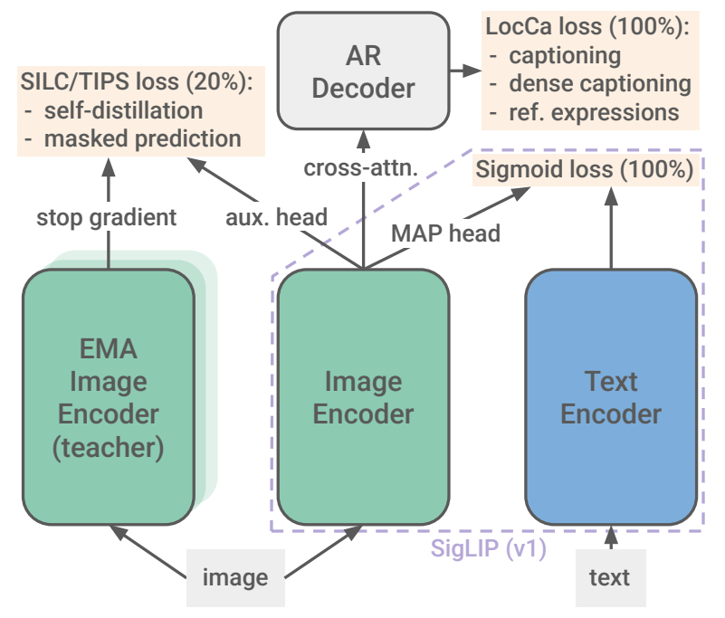

Figure 1. 전역 image–text 정렬, unpooled vision→AR decoder, student→EMA teacher의 세 경로. 출처: [PDF p.2, Fig.1](https://arxiv.org/pdf/2502.14786v1#page=2).

아래 image encoder에서 올라간 선을 따라 읽는다. MAP으로 간 branch는 전역 sigmoid loss, pooling 전 patch에서 decoder로 간 cross-attention branch는 LocCa, 별도 auxiliary head로 간 branch는 SSL이다. teacher에서 나오는 화살표에는 stop gradient가 있다. “100%/20%”는 논문이 정한 **학습 기간의 비율**이다. 이미지의 20%만 SSL을 적용한다거나 확률 20%로 매 batch에서 loss를 켠다는 뜻이 아니다.

### 4.3 CLIP의 softmax와 SigLIP의 binary classification

**R4. CLIP 비교를 위한 대칭 InfoNCE.** [선행 정의 대조: SigLIP 1 p.2, §3.1]

```math
\mathcal L_{\mathrm{CLIP}}=-\frac{1}{2B}\sum_{i=1}^{B}\left[\log\frac{\exp(\alpha\hat u_i^\top\hat v_i)}{\sum_{j=1}^{B}\exp(\alpha\hat u_i^\top\hat v_j)}+\log\frac{\exp(\alpha\hat u_i^\top\hat v_i)}{\sum_{j=1}^{B}\exp(\alpha\hat u_j^\top\hat v_i)}\right].
```

첫 항은 image i가 B개 text 중 정답 text i를 고르는 분류다. 둘째 항은 text i가 B개 image 중 정답 image i를 고르는 분류다. 분모가 후보 집합에 의존하므로 다른 후보의 logit이 바뀌면 나머지 후보의 정규화 확률도 바뀐다. 모든 후보에 같은 scalar bias를 더하면 softmax에서 상쇄된다.

SigLIP에서는 각각의 (image i, text j)를 “matching인가?”라는 binary problem으로 본다. 대응 pair는 +1, 나머지는 −1이다. image 하나에 대한 B개 sigmoid 결과의 합이 1일 필요가 없다.

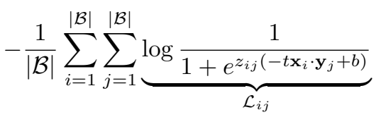

선행 원문 식. SigLIP 2가 §2.2에서 원 구현을 사용한다고 참조한 **SigLIP 1 v2 p.3, §3.2**의 비번호 식이다. [출처 PDF](https://arxiv.org/pdf/2303.15343v2#page=3). 이 이미지를 SigLIP 2의 Eq.(1)이라고 부르지 않는다.

원문 이미지의 편집 가능한 전사:

```math
-\frac{1}{|\mathcal B|}\sum_{i=1}^{|\mathcal B|}\sum_{j=1}^{|\mathcal B|}\underbrace{\log\frac{1}{1+e^{z_{ij}(-t\mathbf x_i\cdot\mathbf y_j+b)}}}_{\mathcal L_{ij}}.
```

**bias의 부호를 반드시 구분한다.** 위 display는 지수 안에 $`z_{ij}(-t x_i\cdot y_j+b)`$를 쓴다. 반면 같은 선행 논문의 Algorithm 1 및 현재 공식 trainer는 `logits=t*dot+b`를 쓴다. 동일한 b 기호로 두 표기를 동시에 대입하면 부호가 달라진다. 이 리뷰의 계산·gradient는 **공식 Algorithm/trainer의 plus-b logit convention**을 따른다. display를 맞추려면 그 display의 b를 code bias의 음수로 치환해야 한다. SigLIP 2 원문에는 새 수식이 없으므로 이 차이를 SigLIP 2의 수식 오류라고 부르지 않는다.

**R5. 구현에 대응하는 sigmoid loss.**

```math
\begin{aligned}\hat u_i&=u_i/(\|u_i\|_2+\epsilon),&\hat v_j&=v_j/(\|v_j\|_2+\epsilon),\\A_{ij}&=\alpha\hat u_i^\top\hat v_j+b,&Z_{ij}&=2\mathbf1[i=j]-1,\\\mathcal L_{\mathrm{sig}}&=-\frac1B\sum_{i=1}^{B}\sum_{j=1}^{B}\log\sigma(Z_{ij}A_{ij})& &=\frac1B\sum_{i,j}\mathrm{softplus}(-Z_{ij}A_{ij}).\end{aligned}
```

- 입력은 두 $`[B,d]`$ embedding matrix이고, dot product가 $`[B,B]`$ similarity를 만든다.
- L2 normalization은 feature dimension d 축이다. scale α는 음수가 될 수 없도록 log parameter a의 exponential이다.
- sigmoid는 각 scalar pair logit에 적용한다. **text 축이나 image 축에 softmax를 취하지 않는다.**
- positive는 $`\mathrm{softplus}(-A)`$, negative는 $`\mathrm{softplus}(A)`$가 된다.
- 모든 B² pair를 더하고 **B로 나눈다. B²로 평균내는 구현과 loss scale이 다르다.**
- 안정적인 구현은 `log_sigmoid`/`softplus`를 쓴다. 큰 음수 logit에 sigmoid→log를 따로 적용하면 underflow할 수 있다.

[공식 코드 확인] `two_towers.py`의 normalization epsilon은 $`10^{-8}`$다. `siglip.py`는 마지막 축 sum 후 batch mean을 취한다. 이는 R5와 일치한다. 이 파일은 기존 sigmoid trainer로, SigLIP 2의 전체 네-loss 학습 loop가 아니다.

### 4.4 작은 예제로 loss와 gradient 계산

**해설용 예제.** B=2이고 unit vector가 서로 직교해 정답 cosine=1, 오답 cosine=0이라고 하자. α=2, b=−1을 임의로 고른다. 실제 pretrained scalar 값이 아니다.

```math
S=\begin{bmatrix}1&0\\0&1\end{bmatrix},\quad A=\begin{bmatrix}1&-1\\-1&1\end{bmatrix},\quad Z=\begin{bmatrix}1&-1\\-1&1\end{bmatrix},\quad Z\odot A=\begin{bmatrix}1&1\\1&1\end{bmatrix}.
```

모든 pair loss가 $`\log(1+e^{-1})\approx0.313262`$다. R5의 합/B는 $`4\times0.313262/2\approx0.626523`$다. 전체 원소 평균 0.313262와 구별한다.

**R6. logit과 embedding으로 흐르는 gradient.**

```math
\begin{aligned}D_{ij}=\frac{\partial\mathcal L_{\mathrm{sig}}}{\partial A_{ij}}&=-\frac{Z_{ij}}B\sigma(-Z_{ij}A_{ij})=\frac{\sigma(A_{ij})-\mathbf1[i=j]}B,\\\frac{\partial\mathcal L}{\partial\hat u_i}&=\alpha\sum_jD_{ij}\hat v_j,&\frac{\partial\mathcal L}{\partial\hat v_j}&=\alpha\sum_iD_{ij}\hat u_i,\\\frac{\partial\mathcal L}{\partial b}&=\sum_{i,j}D_{ij},&\frac{\partial\mathcal L}{\partial a}&=\alpha\sum_{i,j}D_{ij}S_{ij}.\end{aligned}
```

positive pair의 D는 음수이므로 gradient descent는 그 logit을 올린다. negative pair의 D는 양수이므로 logit을 내린다. 예제에서 정답의 D=−0.134471, 오답의 D=+0.134471이다. 양 tower가 함께 gradient를 받으며, image backbone을 고정하는 LiT와 다르다. L2 정규화 전 u까지 미분하면, epsilon을 무시한 경우 Jacobian은 $`(I-\hat u\hat u^\top)/\|u\|_2`$다. 즉 방향을 바꾸는 성분이 핵심이다.

positive prior는 B² 중 B이므로 $`\pi=1/B`$다. 모든 similarity가 0인 단순 모델에서 최적 bias는 $`b_0=\log(\pi/(1-\pi))=-\log(B-1)`$이다. B=32768이라면 약 −10.397이다. 이는 음수 bias를 쓰는 이유를 설명하는 [리뷰어 유도]이지 SigLIP 2의 초기값을 직접 보고한 값이 아니다. 공식 demo의 `bias_init=-10`은 b parameter를 생성·load하기 위한 설정이기도 하므로 최종 learned b=−10이라고 해석하지 않는다.

**batch-independent라는 표현의 한계.** normalization을 전역 softmax로 하지 않을 뿐 negative의 수와 난이도는 batch 구성에 달려 있다. 중복 caption이나 동일 의미의 다른 image가 off-diagonal이면 false negative가 될 수 있다. sigmoid도 이 label noise에서 자유롭지 않다.

### 4.5 선행 Algorithm 1 행별 해설

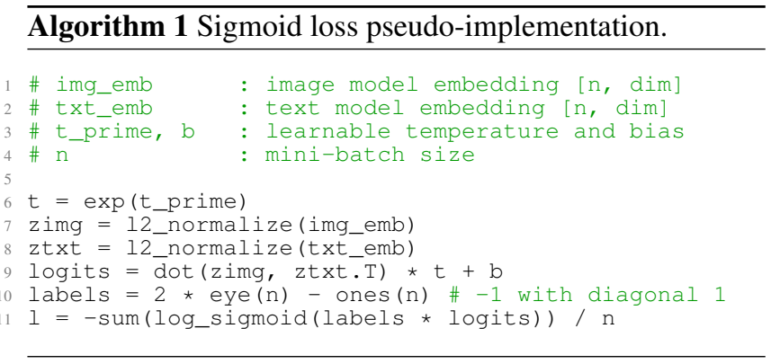

SigLIP 1 Algorithm 1. [선행 원문 p.2](https://arxiv.org/pdf/2303.15343v2#page=2). SigLIP 2에는 독립 Algorithm 블록이 없다.

| 행 | 수행 작업 | shape·주의 |
|---|---|---|
| 1–2 | image/text feature 입력 정의 | 각각 `[n,dim]` |
| 3 | learnable scale parameter와 bias 정의 | scalar |
| 4 | n을 mini-batch 크기로 정의 | negative 수와 normalization 분모 결정 |
| 5 | 빈 행 | 계산 없음 |
| 6 | `t=exp(t_prime)` | 양수 scale 확보 |
| 7 | image L2 normalize | 각 row의 dim 축 |
| 8 | text L2 normalize | 같은 embedding 공간 |
| 9 | dot(image,text.T), scale와 bias 적용 | `[n,n]` logit matrix |
| 10 | 대각선 +1, 나머지 −1 label | 수학적으로 `2*I_n-1_{n×n}`; 언어별 `ones(n)` broadcasting 모호성 대신 실제 `[n,n]`로 구현 |
| 11 | signed log-sigmoid 합을 n으로 나누기 | scalar, 두 tower로 backprop |

pair loss의 가산성 때문에 block 단위로 계산하고 합쳐도 같은 R5를 얻을 수 있다. 다만 negative embedding을 stop-gradient로 바꾸거나 특정 block을 누락하면 원래 objective의 gradient와 달라진다. SigLIP 1의 chunked pair-matrix 계산과, 다음 절의 **decoder vocabulary-loss chunking은 다른 메모리 최적화**다.

### 4.6 LocCa: 전역 caption뿐 아니라 영역과 좌표를 연결

[저자 보고] vision encoder의 **unpooled** feature에 cross-attention하는 Transformer decoder를 붙인다. decoder는 text encoder와 같은 계열의 shape를 사용하되 cross-attention을 추가하고 layer 수를 절반으로 줄인다. 각 example에 세 target을 학습하므로 decoder forward가 세 번 필요하다. [PDF p.3, §2.2]

| task | decoder가 조건으로 받는 정보 | 예측 target | 왜 localization에 도움이 되는가 |
|---|---|---|---|
| image captioning | image feature | 전체 caption | 전체 의미와 OCR 문자열을 language prediction에 활용 |
| automatic referring expression prediction | image와 특정 영역의 caption/표현 | bounding-box coordinates | 단어가 가리키는 공간 범위를 구별해야 loss를 줄임 |
| grounded captioning | image와 box coordinates | 해당 영역의 caption | 전체 장면과 특정 region의 의미를 구분 |

예를 들어 “왼쪽의 빨간 컵”을 입력받아 오른쪽 파란 컵의 box를 출력하면 첫 global caption은 비슷해도 referring target은 틀린다. 반대로 왼쪽 컵 box를 줬는데 “테이블”만 출력하면 grounded caption loss가 커진다. 이렇게 image-wide agreement만으로 만족할 수 없는 target이 생긴다. [해설용 예제]

region–caption pair는 alt-text에서 n-gram을 뽑고 [41]의 open-vocabulary detection recipe를 적용해 자동 주석화한다. 추가로 [10]의 fixed object-category set도 사용한다. **전 데이터에 사람이 dense box를 붙였다고 쓰면 안 된다.** pseudo box의 false positive, 애매한 n-gram, 언어별 detector 품질 차이가 supervision noise로 남을 수 있다.

### 4.7 LocCa의 연산과 loss를 식으로 전개

**R7. Decoder cross-attention.**

```math
Q_d=YW_Q\in\mathbb R^{B\times h\times L_d\times d_h},\quad K_d=XW_K,\quad V_d=XW_V,\quad C=\mathrm{softmax}_{n}(Q_dK_d^\top/\sqrt{d_h})V_d.
```

여기서 Y는 해당 decoder layer의 text hidden, X는 vision patch sequence다. query 길이는 decoder token 수 Ld, key/value 길이는 image patch 수 N이므로 score shape가 $`[B,h,L_d,N]`$다. decoder output의 오차는 K/V projection을 통하여 X와 image encoder까지 미분된다. sigmoid용 image MAP head를 통과하는 gradient는 아니다.

**R8. Teacher-forcing token cross-entropy의 해설식.**

```math
\mathcal L_r=-\frac{\sum_{i,t}m_{it}^{(r)}\log P_\psi(y_{it}^{(r)}\mid y_{i,\lt t}^{(r)},c_i^{(r)},X_i)}{\sum_{i,t}m_{it}^{(r)}},\qquad r\in\{\mathrm{cap},\mathrm{ref},\mathrm{ground}\}.
```

logits는 $`[B,L_d,V_d]`$, softmax는 decoder vocabulary 축 Vd에 적용된다. m은 학습할 target token mask이고 conditioning prefix/padding에 loss를 줄지 구분한다. 위 token-average 표기는 독자가 이해하기 위한 정규화 convention이다. **SigLIP 2 PDF는 세 task 내부 reduction·prefix 구문·좌표 tokenization/bin 수·각 task 길이·embedding 공유 여부를 완전하게 명시하지 않는다.** 원문이 보장하는 것은 sigmoid loss와 **LocCa 전체 loss를 같은 weight로 결합**한다는 것이다. 세 개 loss 각각이 sigmoid와 1:1 동일 계수라고 단정할 수 없다.

Captioning target은 **50% 확률로 parallel prediction**을 한다. 이 경우 이전 정답 caption token 대신 mask token들을 입력으로 주고 causal self-attention mask를 제거해 모든 caption 위치를 동시에 예측한다. 시각 cross-attention과 위치 부호화는 남는다. 나머지 captioning 및 다른 task를 모두 non-causal로 바꾼다는 설명은 원문과 다르다. 학습에서 parallel prediction을 쓰는 것과 공개 모델이 parallel caption generator라는 주장은 별개다.

**R9. Vocabulary CE chunking의 원리.**

```math
\ell_t=\log\sum_{v=1}^{V_d}\exp(o_{tv})-o_{t,y_t},\qquad \log\sum_v e^{o_{tv}}=\mathrm{logsumexp}_{c}\left(\mathrm{logsumexp}_{v\in\mathcal V_c}o_{tv}\right).
```

원문은 large vocabulary 때문에 decoder loss를 chunked version으로 구현했다고만 쓴다. 위 식은 vocabulary chunking이 전체 log-normalizer를 보존해야 한다는 [리뷰어 해석]이며 실제 구현이 반드시 vocabulary 축을 자른다고 확인한 것은 아니다. token/example 축으로 나누는 방식도 가능하다. 각 chunk에 독립 softmax를 쓰고 평균내면 full-vocabulary CE와 다른 objective가 된다. full logits materialization의 예로 B=32, Ld=64, Vd=256000이면 524,288,000 scalar이고 BF16로 약 0.98 GiB다. backward activation과 세 task의 추가 메모리는 별도다.

<a id="ssl"></a>

## 5. 원문 §2.3: self-distillation과 masked prediction

### 5.1 두 loss의 차이

| 항목 | local-to-global self-distillation | masked prediction |
|---|---|---|
| student 입력 | image의 local crop 8개 | global image의 embedded patch 중 50%를 mask token으로 대체 |
| teacher 입력 | global view 1개 | student와 같은 global view, masking 없음 |
| 비교 단위 | crop별 pooled representation | mask된 각 patch 위치의 representation |
| target의 shape | $`[B,K]`$ global prototype distribution | $`[B,N,K]`$ patch prototype distribution |
| 오차의 의미 | 부분을 보고 전체의 semantic target에 접근 | 주변 정보를 보고 가려진 위치의 의미에 접근 |
| teacher 갱신 | student의 EMA | 같은 EMA teacher 계열 |
| loss 직접 영향 | vision student와 auxiliary head | vision student, auxiliary patch head, mask token |
| text tower 직접 gradient | 없음 | 없음 |

[저자 보고; PDF pp.3–4, §2.3] **mask token은 patch를 삭제하는 것이 아니다.** sequence length를 유지한 채 patch embedding을 learned token으로 대체한다. loss도 pixel reconstruction MSE가 아니라 teacher의 feature/prototype prediction을 맞추는 consistency objective다.

### 5.2 EMA teacher와 stop-gradient

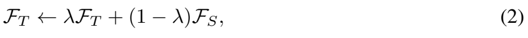

SILC Eq.(2). SigLIP 2가 참조하는 teacher 갱신의 선행 정의. [SILC v1 p.5](https://arxiv.org/pdf/2310.13355v1#page=5).

원문 전사와 parameter 수준의 해설:

```math
\mathcal F_T\leftarrow\lambda\mathcal F_T+(1-\lambda)\mathcal F_S\qquad\text{(SILC 2)}
```

**R10. EMA와 target 생성.**

```math
\bar\theta_{t+1}=\mu_t\bar\theta_t+(1-\mu_t)\theta_{t+1},\qquad a_t=h_{\bar\omega}(f_{\bar\theta}(I^{g})),\qquad q_t=\mathrm{sg}\left[\mathrm{softmax}_{k}\left((a_t-c)/\tau_t\right)\right].
```

θ는 student image encoder, barθ는 teacher, h는 auxiliary projection head다. teacher projection도 대응 student head의 EMA로 갱신하는 것이 SILC/TIPS의 정의다. `sg`는 forward에서 값을 그대로 쓰지만 backward에서는 gradient를 0으로 만드는 연산이다. 따라서 teacher는 target을 제공하되 optimizer가 teacher를 그 target에 맞추도록 역전파하지 않는다. EMA의 convex combination은 parameter tensor의 각 원소에 적용한다. θt 또는 θt+1 중 어떤 update 순서인지까지 SigLIP 2 PDF는 적지 않았으므로 위 식은 optimizer 뒤 EMA를 적용하는 명시적 해설 convention이다.

예를 들어 μ=0.99, teacher parameter 한 원소가 0.8, update 이후 student 값이 1.0이면 새 teacher는 0.802다. teacher가 student의 순간적 변동을 그대로 따라가지 않는 이유가 보인다. 이 μ=0.99는 **예제**이며 SigLIP 2의 실제 momentum schedule을 주장하지 않는다.

### 5.3 centering, sharpening, probability target

SILC에서 projection output은 아직 probability가 아닌 K차원 score다. teacher에 center c를 빼고 temperature τt로 나눈 뒤 softmax를 적용한다. student는 τs로 나눈다. centering은 특정 prototype 차원으로 output이 몰리는 것을 완화하고 sharpening은 지나치게 균일한 target을 완화한다. 둘의 균형을 통해 collapse를 막는 구조다. EMA만 둔다고 non-collapsing representation이 자동 보장되는 것은 아니다. [선행 정의: SILC v1 p.5, §3.2; TIPS v1 p.6, §3.2]

**R11. Center update와 student distribution.**

```math
c_{t+1}=m_c c_t+(1-m_c)\frac1B\sum_i a_{t,i},\qquad q_{s,i}^{(r)}=\mathrm{softmax}_{k}\left(a_{s,i}^{(r)}/\tau_s\right).
```

c의 shape는 [K], batch 평균은 image 축이다. τs/τt는 image–text logit scale α와 다른 값이다. softmax의 K는 **학습용 latent prototype 축**이며 Gemma tokenizer의 256k vocabulary가 아니다. SigLIP 2는 loss/augmentation/hyperparameter 세부를 SILC로 위임하므로 K, head MLP의 층수·너비, center momentum, teacher temperature schedule의 정확한 값은 이 PDF에 없다. 이 리뷰는 선행 버전에서 찾은 값을 임의로 현재 모든 SigLIP 2 모델 설정으로 옮기지 않는다.

### 5.4 local-to-global cross-entropy

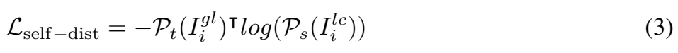

SILC Eq.(3). [SILC v1 p.5](https://arxiv.org/pdf/2310.13355v1#page=5). SigLIP 2의 local-to-global consistency에 대한 선행 식이다.

```math
\mathcal L_{\mathrm{self\text{-}dist}}=-P_t(I_i^{gl})^\top\log(P_s(I_i^{lc}))\qquad\text{(SILC 3)}
```

**R12. 8 local crop으로 확장한 해설식.**

```math
\mathcal L_{\mathrm{local}}=-\frac1{8B}\sum_{i=1}^{B}\sum_{r=1}^{8}\sum_{k=1}^{K}q_{t,ik}^{g}\log q_{s,ik}^{(r)}.
```

teacher는 한 global distribution을 만들고, student의 8 local distributions 각각에 같은 target을 제공한다. crop끼리 pixel 위치가 일치할 필요는 없다. pooled local/global 표현의 의미 일관성을 학습하기 때문이다. 단, 위 8B 평균은 해설용 reduction을 명시한 것이며 loss reduction까지 포함한 완전한 SigLIP 2 training config를 재현했다고 주장하지 않는다.

해설용 K=3에서 teacher q=[0.7,0.2,0.1], student p=[0.4,0.4,0.2]라면 CE는 약 0.985605이다. student가 teacher와 같아져도 CE는 teacher entropy 약 0.801819이므로 0이 되지 않는다. $`\mathrm{KL}(q\|p)=\mathrm{CE}(q,p)-H(q)\approx0.183787`$다. “loss가 0이 아니니 학습 실패”라는 판단은 이 soft target에 맞지 않는다.

prototype logit에 대한 gradient는 temperature를 포함해 $`(q_s-q_t)/\tau_s`$에 비례한다. 이 예제의 probability 차이는 [−0.3,0.2,0.1]이다. teacher 확률이 student보다 큰 prototype 방향을 키우는 압력이 생긴다. teacher q에는 stop-gradient가 걸린다.

### 5.5 masked prediction은 위치별 soft target

**R13. Masked patch 입력과 loss의 해설식.**

```math
\begin{aligned}\widetilde E_{in}&=\begin{cases}e_{\mathrm{mask}}+P_n,&n\in\mathcal M_i,\\E_{in},&n\notin\mathcal M_i,\end{cases}\\q^{\mathrm{patch}}_{t,in}&=\mathrm{sg}\left[\mathrm{softmax}_{k}((h_t^{p}(X^g_{t,in})-c_p)/\tau_t^p)\right],\\q^{\mathrm{patch}}_{s,in}&=\mathrm{softmax}_{k}(h_s^{p}(X^{g,\mathrm{masked}}_{s,in})/\tau_s^p),\\\mathcal L_{\mathrm{mask}}&=-\frac1{\sum_i|\mathcal M_i|}\sum_i\sum_{n\in\mathcal M_i}\sum_kq^{\mathrm{patch}}_{t,ink}\log q^{\mathrm{patch}}_{s,ink}.\end{aligned}
```

[리뷰어 재구성] E는 앞서 positional embedding을 포함한 입력이므로, mask branch는 content embedding만 mask token으로 바꾸고 위치를 남긴다는 convention으로 썼다. SigLIP 2 본문은 “embedded patches를 mask tokens로 대체”한다고만 기술하므로 position-add와 replacement의 정확한 코드 순서는 공개 full trainer 없이는 확정할 수 없다.

student와 teacher는 **동일 global view의 같은 n번째 위치**를 비교해야 한다. unrelated local crop의 n번째 토큰을 global n번째 토큰과 억지로 대응시키는 objective가 아니다. 예를 들어 patch grid가 4×4이고 8개가 mask되면 teacher는 16개 target distribution을 만들 수 있지만 loss reduction에는 선택한 8개 위치만 들어간다. student의 mask 위치 출력은 self-attention으로 visible patch 정보를 받기 때문에 visible patch와 encoder parameter에도 gradient가 흐른다.

50% masking은 입력 정보의 절반을 가릴 뿐, Transformer가 처리하는 token 수가 50%로 줄어드는 것은 아니다. masked-token reconstruction을 별도의 pixel decoder로 수행하는 MAE의 연산 그래프와도 구분해야 한다. [PDF p.4, §2.3; 선행 TIPS v1 p.6, Eq.(2)]

### 5.6 loss는 언제, 얼마만큼 추가되는가

**R14. 고정 해상도 기본 학습의 결합 objective.**

```math
\mathcal L=\mathcal L_{\mathrm{sig}}+\mathcal L_{\mathrm{LocCa}}+\mathbf1[r\ge0.8]\lambda_s\left(\mathcal L_{\mathrm{local}}+0.25\mathcal L_{\mathrm{mask}}\right).
```

r은 base training completion ratio, s는 model size다. R14는 §2.2–2.3의 loss weighting을 하나로 모은 리뷰 식이다. 이 weight는 각 구성 loss의 원 구현 reduction을 전제로 한다.

| model size | λs | local loss의 최종 계수 | mask loss의 최종 계수 |
|---|---:|---:|---:|
| B | 0.25 | 0.25 | 0.0625 |
| L | 0.5 | 0.5 | 0.125 |
| So400m | 1.0 | 1.0 | 0.25 |
| g | 0.5 | 0.5 | 0.125 |

[검산] mask 계수를 항상 0.25라고 쓰면 B/L/g의 추가 scale을 빠뜨린다. “equal weight”는 sigmoid와 LocCa에 대한 설명이며 SSL 모든 항의 동일 weight를 뜻하지 않는다.

80% 지점에서 teacher encoder를 student parameter로 초기화한다. 추가 head, mask token 및 대응 optimizer parameter/state는 새로 초기화한다고 원문은 설명한다. 이 시점 전에는 image–text와 LocCa로 기본적인 의미 표현을 학습하고, 뒤 20%에 SSL 비용을 집중한다. 원문 표현만으로 optimizer moment를 난수 값으로 채웠다고 세부 구현까지 단정하지 않는다.

sigmoid/LocCa에는 원래 이미지를 사용하고, SSL에는 **추가 augmented views**를 쓴다. crop 때문에 alt-text의 주 물체가 사라지면 image–text alignment가 손상될 수 있으므로 그 경로를 분리한다. 같은 image encoder parameter를 여러 view에서 공유하므로 backward에서 gradient가 합쳐진다. [PDF p.4, §2.3]

<a id="naflex"></a>

## 6. 원문 §2.4: 고정 해상도 적응과 NaFlex

### 6.1 fixed-resolution checkpoint의 마지막 5%

[저자 보고] 기본 p=16, sequence=256 모델의 **95% 지점 checkpoint**에서 target resolution으로 positional embedding을 resize하고 학습을 이어 간다. 일부 p=16→14 변환에는 FlexiViT의 pseudoinverse resize를 사용한다. 모든 loss를 계속 사용한다. 학습이 끝난 checkpoint를 낮은 LR/no-WD로 짧게 fine-tune하는 일반 전략은 모든 크기·해상도에서 잘 작동하지 않아 이 방식을 선택했다. [PDF p.4, §2.4.1]

**R15. Positional embedding resize와 PI-resize의 의미.**

```math
P'=\mathrm{Resize}(\mathrm{reshape}(P,[16,16,d_v]),[\lfloor H/p\rfloor,\lfloor W/p\rfloor,d_v]),\qquad w'=(R^\top)^+w.
```

첫 식은 learned positional grid를 target grid로 보간한다는 설명이다. 둘째 식은 patch pixel resize를 x′=Rx라고 쓸 때 $`(w')^\top x'\approx w^\top x`$가 되도록 $`R^\top w'\approx w`$를 푸는 선행 PI-resize의 선형대수적 직관이다. `+`는 Moore–Penrose pseudoinverse이며 단순 interpolation을 patch kernel에도 똑같이 적용하는 것과 다르다. 실제 다채널 kernel의 축 배열과 resize matrix는 FlexiViT 구현에 의존한다. p=16→32의 정확한 B/32 전환 절차는 이 SigLIP 2 본문에서 p=14 사례처럼 명시되지 않는다.

### 6.2 NaFlex의 입력은 정사각형 raster 하나로 끝나지 않는다

NaFlex는 **한 checkpoint에서 여러 sequence length와 aspect ratio**를 처리한다. p를 주면 입력을 p의 배수인 높이·너비로 resize하되 distortion을 작게 하고, patch 수를 target 이하로 만든다. 부족한 token은 padding하고 patch 좌표와 mask를 함께 넘긴다. 학습된 16×16 positional grid를 실제 non-square grid로 bilinear resize하며 anti-aliasing을 사용한다. self-attention과 MAP 모두 padding을 무시해야 한다. [PDF p.4, §2.4.2]

**R16. 원문 핵심 비번호 식: rounding distortion 상한.**

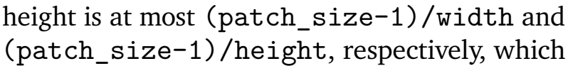

NaFlex의 폭·높이 rounding distortion 상한. [PDF p.4, §2.4.2](https://arxiv.org/pdf/2502.14786v1#page=4).

```math
\frac{\mathrm{patch\_size}-1}{\mathrm{width}},\qquad\frac{\mathrm{patch\_size}-1}{\mathrm{height}}.
```

원문은 width/height 분모를 별도 수학 기호로 정의하지 않는다. 이를 **등방 resize 이후 patch 배수로 맞추기 전의 해당 크기에 대한 rounding 오차**로 읽는 것이 자연스럽다. 각 변을 정수 pixel에서 p의 배수로 올림하면 추가 pixel이 최대 p−1이고, 이를 해당 변 길이로 나눈 값이 위 비율이다. 이는 최종 aspect ratio 오차에 대해 동일한 하나의 bound를 직접 증명한 식은 아니다. 코드에서는 실수 scale과 ceil을 쓰므로 “정수 pixel rounding” 유도와 실제 부동소수점 boundary도 구분해야 한다.

**R17. NaFlex 전처리와 attention mask의 재구성.**

```math
\begin{aligned}H'&=p\left\lceil sH/p\right\rceil,&W'&=p\left\lceil sW/p\right\rceil,&N'&=(H'/p)(W'/p)\le S_{\max},\\E&\in\mathbb R^{B\times S_{\max}\times3p^2},&C&\in\mathbb Z^{B\times S_{\max}\times2},&m&\in\{0,1\}^{B\times S_{\max}},\\M_{in n'}&=\begin{cases}0,&m_{in}=m_{in'}=1,\\-\infty,&\text{otherwise}.\end{cases}\end{aligned}
```

공식 `ops_naflex.py`는 가능한 scale s를 binary search하고 각 변을 ceil로 patch 배수에 맞춘다. 최소 한 patch 이상이 되도록 제한한다. `naflex_vit.py`의 self-attention mask는 query/key 양쪽 validity를 AND한 것이고, MAP head는 key 위치의 valid mask를 사용한다. padding output 자체를 downstream feature로 사용하지 않도록 validity를 유지해야 한다.

**해설용 shape 예제.** 512×1024 이미지를 p=16, target=128로 처리하면 128×256, grid 8×16=128 형태가 가능하고 aspect ratio를 정확히 보존한다. target=256, 입력 480×640의 코드식 ceil-budget search는 224×288, grid 14×18=252 형태가 가능해 4개 padding token을 만든다. 이때 입력 tensor는 [1,256,768], coords는 [1,256,2], mask는 [1,256]이며 valid token만 spatial reshape하면 [14,18,dv]다. 그냥 [16,16,dv]로 바꾸면 기하가 틀어진다.

NaFlex는 dynamic aspect를 지원하지만 가로/세로가 완벽하게 연속적으로 변하는 것이 아니다. patch grid의 이산화 오차와 padding이 남는다. 또한 target 길이가 같아도 valid patch 수가 다를 수 있다. 실제 compute가 padded length를 따르는지 valid length를 따라 줄어드는지는 kernel 구현과 packing 여부에 달려 있다. 이 release를 곧바로 NaViT의 multi-image sequence packing 구현이라고 간주하지 않는다.

### 6.3 NaFlex 학습 schedule과 본문·그림 차이

**R18. 원문 핵심 비번호 식: 학습 길이 집합.**

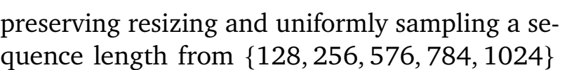

NaFlex의 mini-batch별 sampling 집합. [PDF p.5, §2.4.2](https://arxiv.org/pdf/2502.14786v1#page=5).

```math
S_{\max}\sim\mathrm{Uniform}\{128,256,576,784,1024\}.
```

원문은 §2.2 방식의 checkpoint에서 90% 시점에 NaFlex로 전환하고, 마지막 10%에 해당하는 LR schedule을 3.75배 늘린다고 설명한다. 가장 긴 sequence에서는 batch를 절반으로 낮추고 step 수를 두 배로 늘려 OOM을 피한다. **self-distillation과 masked prediction은 적용하지 않는다.** 그래서 “고정 모델의 SSL 포함 90% checkpoint를 그대로 가져와 SSL을 잠시 끈다”는 표현보다, §2.2 기반 별도 경로라는 본문 설명을 유지해야 한다. [PDF pp.4–5]

[검산/해석] 40B를 기준으로 단순 example budget을 재구성하면 36B 이후 마지막 4B 구간을 3.75배인 15B로 늘려 **약 51B** 노출이 된다. 이는 논문이 총량으로 직접 보고한 숫자가 아니며, sequence별 schedule/sample accounting의 정확한 구현은 공개되지 않았다. 긴 sequence에서 batch×steps를 보존하는 조정도 포함해야 하므로 actual FLOPs·wall time은 51/40 비율만으로 계산할 수 없다.

**내부 불일치.** Figure 3 caption은 x-axis에 표시한 sequence length가 NaFlex training length라고 말하지만, x-axis에는 **64**가 있고 본문 training set에는 **128**이 있다. Table 7은 64와 144 등 evaluation lengths를 보고한다. 따라서 리뷰는 학습 집합은 §2.4.2의 명시적 집합으로 쓰고, 64는 표에 존재하는 평가 길이로 구분한다. 어느 쪽이 실제 trainer 설정인지 raw config 없이는 확정할 수 없다. 저자는 훈련 길이 사이 interpolation은 비교적 좋지만 훈련 범위 밖 extrapolation은 좋지 않다고 설명한다. [PDF p.7, Fig.3; p.18, Table 7]

<a id="acid"></a>

## 7. 원문 §2.5: ACID, 큰 teacher가 고르는 작은 모델의 데이터

### 7.1 EMA self-distillation과 다른 종류의 teacher

앞 절의 EMA teacher는 현재 image student와 같은 계열이며 image-only auxiliary target을 만든다. **ACID teacher는 강한 pretrained SigLIP 2 So400m reference**이고, image–text example/batch의 learnability를 평가해 학습할 데이터를 고른다. target feature CE를 student에 직접 주는 단계가 아니다. [PDF pp.5–6, §2.5]

작은 fixed B/16, B/32 모델은 LR $`10^{-5}`$, weight decay 0, **추가 4B examples**, sigmoid image–text loss만으로 fine-tune한다. EMA consistency나 LocCa를 그대로 모두 유지하는 final stage가 아니다. 그래서 작은 모델의 최종 성능은 base pretraining뿐 아니라 이 추가 단계의 결과다.

### 7.2 learnability와 filtering ratio

**R19. ACID 선행 정의를 이용한 개념식.**

```math
s_{\mathrm{learn}}(\mathcal B)=\mathcal L(\mathcal B;\theta)-\mathcal L(\mathcal B;\theta_{\mathrm{ref}}),\qquad f=1-\frac{B}{S},\qquad S=\frac{B}{1-f}.
```

첫 식에서 student가 어려워하고 reference가 잘 푸는 batch는 점수가 높다. 둘 다 쉽게 푸는 예제는 이미 배운 내용일 수 있고, reference도 매우 어려워하는 것은 noise/비학습 가능 예제일 수 있다. 개별 example score의 단순 top-k로 동일하다고 쓰면 안 된다. image–text loss는 선택된 batch가 negative 집합을 결정하므로 **joint batch selection**이 중요하다. [선행 ACID v1 p.3, §3.2; p.5, filtering ratio 정의]

SigLIP 2 본문은 f=0.5에서 64k super-batch→32k training batch라고 쓴다. ACID의 f는 **유지율이 아니라 제거율**이다. B/32의 f=0.75는 75%를 남긴다는 뜻이 아니다. 같은 32k를 선택한다면 super-batch=128k가 된다. 이 값은 선행 정의와 SigLIP 2의 batch를 연결한 [검산]이다. [PDF p.6, §2.5]

해설용 batch loss가 (student,reference)=(4,1), (2,1.8), (7,6.8)이면 learnability 차이는 3,0.2,0.2다. 단순히 loss가 가장 큰 세 번째 batch만 학습하기보다 첫 번째에 높은 우선순위를 줄 수 있다. 실제 selector는 이 숫자 예제보다 복잡하며 선택 분포·temperature·joint optimization을 포함한다.

### 7.3 ACED를 그대로 쓰지 않은 이유

선행 연구의 ACED는 ACID와 explicit softmax distillation을 결합하고 더 다양한 데이터에서 학습한 두 번째 teacher를 쓰는 설정을 제안한다. SigLIP 2는 대신 다양한 데이터로 학습된 **하나의 So400m teacher를 high-quality curated dataset [16]으로 1B examples fine-tune**한 뒤 ACID reference로 쓴다. 다양성과 고품질 판단 능력을 같은 teacher에 담아 explicit distillation 없이 비슷한 이점을 얻겠다는 구성이다. [저자 보고; PDF p.6]

여기에서 teacher logits→student logits KL loss를 R14에 추가하면 논문 recipe와 달라진다. student optimizer는 선택된 batch에 대한 sigmoid loss로 업데이트된다. reference model과 선택 index는 gradient 대상이 아니다. 다만 선택되는 data distribution 자체가 teacher·현재 student에 의해 바뀌므로 **학습 과정에 대한 간접 영향**은 있다. 이것이 “implicit distillation”의 의미다.

### 7.4 데이터 통제에서 남는 문제

teacher를 한 개로 줄였다고 curation이 무료인 것은 아니다. super-batch에 teacher/student scoring을 하고 batch selection을 수행한다. f가 커지면 discarded sample도 평가 비용을 쓴다. 본문은 B/32에서 추가 비용이 가치 있었다고 보고하지만 throughput/TPU-hours 수치는 제공하지 않는다. 따라서 4B는 student가 실제 gradient를 받은 seen examples인지, selection에서 평가한 전체 pool인지 명확하게 accounting해야 한다. 문맥상 fine-tuning budget이지만 paper-only로 모든 compute 비용을 복원할 수는 없다.

<a id="forward"></a>

## 8. 한 샘플의 end-to-end 흐름, 학습 단계와 gradient

### 8.1 전체 단계표

| 경로·구간 | 입력/해상도 | active objectives | update 범위 |
|---|---|---|---|
| fixed base 0–80% | p16, 256px, original image/text | sigmoid + LocCa | image/text towers, scale/bias, LocCa decoder |
| fixed base 80–95% | original + additional SSL views | 위 둘 + local + mask | student, text, decoder, auxiliary heads, mask token; teacher는 EMA |
| fixed target branch 95–100% | target resolution/patch 설정 | 모든 base objectives | resize된 positional/patch embeddings 포함 trainable |
| fixed B 최종 추가 4B | 선택된 image–text batches | sigmoid만 | learner image/text 및 scalar; external reference는 fixed |
| NaFlex branch | §2.2 기반 90%→늘린 마지막 구간 | sigmoid + LocCa | NaFlex image/text/decoder; SSL 두 objective 없음 |

100%는 각 recipe의 nominal base completion을 뜻한다. NaFlex 확장·B의 추가 4B·teacher의 1B를 모두 같은 40B 안에 넣어 비용을 과소계산하지 않는다.

### 8.2 고정 B/16, 256px image 한 장의 추론

1. RGB image를 256×256으로 resize하고 float 범위를 [−1,1]로 맞춘다. shape [1,256,256,3]. 이는 공식 demo의 `resize|value_range` 경로다.
2. 16×16 patch Conv를 적용하면 [1,16,16,768], flatten하면 [1,256,768]이다.
3. learned [1,256,768] positional embedding을 더하고 12개 encoder block을 통과한다. 최종 unpooled X는 [1,256,768]이다.
4. retrieval이 목적이면 MAP probe가 X에서 [1,768]을 읽고 L2-normalize한다. dense/VLM이면 X를 별도로 보존한다.
5. candidate text를 lowercase→Gemma tokenization→64 tokens로 만든다. official demo는 BOS 없음, sticky EOS를 사용한다. M개 candidate라면 [M,64].
6. text encoder에서 [M,64,768]을 만들고 demo 기준 last token + output head로 [M,768], L2-normalize한다.
7. image/text matrix product와 learned scale/bias로 [1,M] logits를 얻는다. sigmoid는 independent match scores, argmax는 후보 중 가장 높은 label이다.
8. 이 경로에는 LocCa decoder, EMA teacher, mask token, ACID selector가 필요하지 않다. 사전 계산한 text embedding은 같은 model/tokenizer/prompt 설정에서 재사용할 수 있다.

sigmoid 값은 image–text pretraining의 negative distribution 아래 학습된 matching score다. “0.97이니 이 label의 실제 세상 확률이 97%”로 바로 calibration을 주장하지 않는다. candidate set을 바꿔도 각 pair sigmoid의 계산은 같지만, top-1 label과 threshold 기반 운용 성능은 candidate 구성·domain에 영향을 받는다.

### 8.3 한 training sample에서 확장되는 branch

original image forward로 얻은 X를 MAP sigmoid branch와 세 LocCa decoder pass가 공유할 수 있다. 추가 global/local augmentations는 원본과 다른 input tensor이므로 같은 parameter θ로 별도 forward한다. teacher는 global view를 no-grad로 처리하고, student는 8 local crop과 masked global을 처리한다. local crop의 image 크기·patch 수는 이 PDF에 명시되지 않았으므로 [B,8,Nlocal,dv]의 Nlocal을 256으로 고정하지 않는다.

각 branch에서 전달된 vision gradient는 같은 θ에 더해진다. 한 샘플을 처리한다는 말은 이미지 encoder를 단 한 번 호출한다는 뜻이 아니다. views를 batch에 합쳐 병렬화하거나 activation을 재사용하는 상세 schedule은 실제 trainer에 의존한다.

### 8.4 gradient 경로 표

| loss/update | image encoder θ | image MAP | text encoder φ | LocCa decoder ψ | SSL head/mask token | teacher/reference |
|---|---|---|---|---|---|---|
| sigmoid | gradient | gradient | gradient | 없음 | 없음 | 없음 |
| LocCa | gradient, unpooled X 경유 | 이 loss 경로에는 없음 | 별도 text tower라면 없음 | gradient | 없음 | 없음 |
| local consistency | student gradient | auxiliary pooled 경로의 실제 공유 방식에 따름 | 없음 | 없음 | head gradient | target stop-grad, teacher EMA |
| masked prediction | student gradient | patch loss의 직접 경로에는 없음 | 없음 | 없음 | patch head·mask token gradient | target stop-grad, teacher EMA |
| ACID final sigmoid | 선택된 batch에서 gradient | gradient | gradient | 없음 | 없음 | reference/scoring은 no-grad |

LocCa decoder와 text encoder의 embedding sharing 여부, SSL pooling/head가 MAP과 parameter를 공유하는지까지 SigLIP 2는 완전한 module tree로 공개하지 않았다. 따라서 conditional한 칸을 무조건 trainable/frozen이라고 단정하지 않았다. Figure 1은 별도 auxiliary head를 그리며, patch loss는 분명히 unpooled 위치별 특징을 사용한다.

### 8.5 원문 설명을 합친 학습 의사코드

아래는 **리뷰어 재구성**이며 executable official trainer나 원문 Algorithm이 아니다. 모듈 이름·reduction·optimizer update order는 위에서 정한 convention을 사용한다.

```python
01  for step, batch in training_stream:
02      image, text, locca_targets = preprocess_original(batch)
03      X, image_vector = image_encoder(image, params=theta)
04      text_vector = text_encoder(text, params=phi)
05      L_sig = sigmoid_pair_loss(image_vector, text_vector, scale, bias)
06      L_locca = locca_three_tasks(X, locca_targets, decoder=psi)
07      loss = L_sig + L_locca
08      if fixed_recipe and training_fraction >= 0.80:
09          global_view, local_views = make_ssl_views(image, n_local=8)
10          masked_global, mask_positions = mask_embeddings(global_view, ratio=0.50)
11          with no_grad():
12              teacher_global, teacher_patches = teacher(global_view)
13              targets = centered_sharpened_targets(teacher_global, teacher_patches)
14          student_local = student(local_views)
15          student_masked = student(masked_global)
16          L_local = cross_entropy_from_local_to_global(student_local, targets)
17          L_mask = masked_patch_cross_entropy(student_masked, targets, mask_positions)
18          loss += size_weight * (L_local + 0.25 * L_mask)
19      grads = backward(loss)
20      params = optimizer_update(params, clip_global_norm(grads, 1.0))
21      if ssl_active:
22          teacher_params = ema(teacher_params, student_params)
23          centers = update_centers(centers, teacher_scores)
```

1–2행은 sampling·original-view preparation이다. 3–5행은 normalized global embedding으로 B² binary problem을 만든다. 6행은 unpooled X를 읽는 세 decoder task이며 caption parallel probability가 여기 들어간다. 8행은 **fixed recipe에만** late SSL을 켠다. 9–10행은 crop과 mask의 입력 차이를 만든다. 11–13행은 teacher target을 고정하고, 14–17행은 student prediction을 미분 가능하게 계산한다. 18행의 size_weight는 B/L/So/g 표의 λ다. 19–20행은 모든 active trainable branch의 gradient를 합쳐 update하고, 21–23행은 optimizer와 별개의 EMA/state update를 한다. 실제 코드가 loss scaling 이전/이후 어디에서 norm을 집계하는지 등은 이 pseudocode의 재현 범위를 넘는다.

**ACID 추가 단계 의사코드.**

```python
01  for super_batch in stream:
02      with no_grad():
03          student_scores = learner.score(super_batch)
04          reference_scores = reference.score(super_batch)
05          selected = joint_acid_selection(student_scores, reference_scores, batch_size=32k)
06      train_batch = gather(super_batch, selected)
07      loss = learner.sigmoid_loss(train_batch)
08      update_learner(loss, learning_rate=1e-5, weight_decay=0)
```

3–5행의 scoring과 index selection에는 gradient를 흘리지 않는 것이 이 개념적 경로다. 7행에서 선택된 batch의 negative 관계를 사용해 다시 학습한다. 4행의 reference는 EMA teacher와 다른 모델이며 8행에서 갱신하지 않는다. feature target/KL을 추가하지 않는다는 점이 핵심이다.

<a id="experiments"></a>

## 9. 원문 §3와 Appendix A–C: 실험, 지표, 모든 표의 해석

### 9.1 먼저 어떤 능력을 측정하는지 구분하기

| 실험 | vision encoder | 추가 학습 | metric·방향 | 직접 증명하지 않는 것 |
|---|---|---|---|---|
| Table 1 zero-shot | pretrained fixed | target classifier 학습 없음 | accuracy ↑ | robot action grounding |
| Table 1 retrieval | pretrained fixed | query/gallery embedding | recall@1 ↑ | calibrated match probability |
| Table 1 10-shot | feature 기반 few-shot 평가 | 소수 labeled examples | validation accuracy ↑ | zero-shot 성능과 동일한 설정 |
| Table 2 dense probe | **frozen** | linear/DPT probe | mIoU ↑, depth RMSE ↓, angular RMSE ↓ | pretrained encoder가 직접 depth를 출력함 |
| Table 3 Cat-Seg | downstream framework로 전이 | COCO-Stuff segmentation training | mIoU ↑ | dense annotation 없는 완전 zero-shot segmentation |
| Table 4 OWL-ViT | fine-tuned detector backbone | detection adaptation | COCO/LVIS AP, rare AP ↑ | raw encoder 단독 detector |
| Table 5 RefCOCO | **frozen** | 새 6-layer decoder | Acc@0.5 ↑ | pretrained decoder 자체의 성능 |
| Table 6 VLM | stage 1 frozen vision | Gemma 2 + task별 transfer | 여러 task-specific metric ↑ | 통합 scalar accuracy 또는 VLA success |
| Tables 8–9 | 지정 zero/few-shot protocol | task별 상이 | acc ↑, disparity/bias ↓ | 모든 사회적 공정성 축의 해결 |

**R20. 주요 metric의 해설 정의.**

```math
\begin{aligned}\mathrm{R@1}&=\frac1Q\sum_{q=1}^{Q}\mathbf1[\text{top-ranked candidate is relevant}],\\\mathrm{mIoU}&=\frac1C\sum_{c=1}^{C}\frac{TP_c}{TP_c+FP_c+FN_c},\\\mathrm{RMSE}&=\sqrt{\frac1M\sum_{u=1}^{M}(\hat d_u-d_u)^2},\\\mathrm{Acc@0.5}&=\frac1Q\sum_q\mathbf1[\mathrm{IoU}(\hat b_q,b_q)\ge0.5].\end{aligned}
```

R@1의 relevant set은 데이터셋의 image–caption 대응에 따른다. image당 caption 여러 개가 있는 경우 반드시 단일 정답 index만 있다고 가정하면 안 된다. mIoU는 class별 IoU 평균이고 pixel accuracy가 아니다. depth RMSE는 depth의 평가 단위·normalization에 의존하므로 NYUv2 0.493과 NAVI 0.067을 그대로 크기 비교할 수 없다. surface normal angular RMSE는 각도 오차의 root mean square이며 낮을수록 좋다. detector AP는 confidence ranking과 IoU threshold 아래 precision–recall을 집계한 지표라 RefCOCO의 Acc@0.5와 다르다. 구체적인 split/filter는 원문이 인용한 evaluation protocol을 따라야 한다.

### 9.2 §3.1, Table 1: zero-shot, few-shot, retrieval

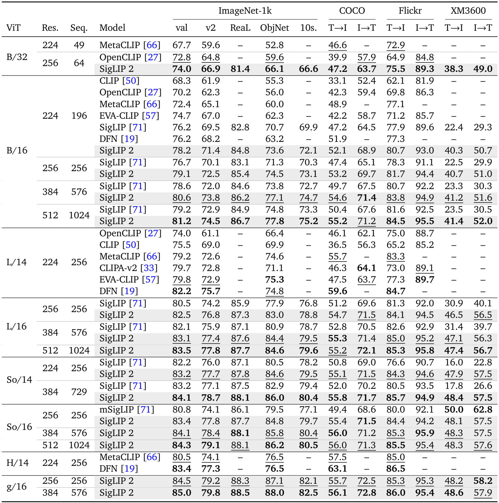

Table 1. 모든 model/해상도 행과 retrieval 방향을 보존했다. [PDF p.5](https://arxiv.org/pdf/2502.14786v1#page=5).

표의 `val/v2/ReaL/ObjNet`은 ImageNet validation, ImageNet-v2, ImageNet ReaL, ObjectNet이다. `10s.`는 ImageNet validation의 10-shot 분류다. `T→I`는 text query로 image 검색, `I→T`는 image query로 text 검색이다. baseline 표의 `–`는 미보고이지 0점이 아니다. [PDF pp.5–7, §3.1]

아래는 동일 model size·patch·해상도에서 SigLIP→SigLIP 2의 절대 차이다. accuracy와 R@1이 percent 단위로 주어지므로 차이의 단위는 pp다.

| 비교 | ImageNet val | ObjectNet | COCO T→I | COCO I→T | XM3600 T→I | XM3600 I→T |
|---|---:|---:|---:|---:|---:|---:|
| B/16 224 | 76.2→78.2 (+2.0) | 70.7→73.6 (+2.9) | 47.2→52.1 (+4.9) | 64.5→68.9 (+4.4) | 22.4→40.3 (+17.9) | 29.3→50.7 (+21.4) |
| B/16 256 | 76.7→79.1 (+2.4) | 71.3→74.5 (+3.2) | 47.4→53.2 (+5.8) | 65.1→69.7 (+4.6) | 22.5→40.7 (+18.2) | 29.9→51.0 (+21.1) |
| B/16 384 | 78.6→80.6 (+2.0) | 73.8→77.1 (+3.3) | 49.7→54.6 (+4.9) | 67.5→71.4 (+3.9) | 23.3→41.2 (+17.9) | 30.3→51.6 (+21.3) |
| B/16 512 | 79.2→81.2 (+2.0) | 74.8→77.8 (+3.0) | 50.4→55.2 (+4.8) | 67.6→71.2 (+3.6) | 23.5→41.4 (+17.9) | 30.5→52.0 (+21.5) |
| L/16 256 | 80.5→82.5 (+2.0) | 77.9→83.0 (+5.1) | 51.2→54.7 (+3.5) | 69.6→71.5 (+1.9) | 30.9→46.5 (+15.6) | 40.1→56.5 (+16.4) |
| L/16 384 | 82.1→83.1 (+1.0) | 80.9→84.4 (+3.5) | 52.8→55.3 (+2.5) | 70.5→71.4 (+0.9) | 31.4→47.1 (+15.7) | 39.7→56.3 (+16.6) |
| So/14 224 | 82.2→83.2 (+1.0) | 80.5→84.6 (+4.1) | 50.8→55.1 (+4.3) | 69.0→71.5 (+2.5) | 16.0→47.9 (+31.9) | 22.8→57.5 (+34.7) |
| So/14 384 | 83.2→84.1 (+0.9) | 82.9→86.0 (+3.1) | 52.0→55.8 (+3.8) | 70.2→71.7 (+1.5) | 17.8→48.4 (+30.6) | 26.6→57.5 (+30.9) |

[검산] 가장 작은 B/32 256은 ImageNet 74.0, COCO 47.2/63.7이다. OpenCLIP B/32 256의 72.8,39.9/57.9보다 각각 +1.2,+7.3/+5.8이다. 하지만 여기에는 data curation 및 학습 recipe 차이가 있어 patch size 효과만을 분리하지 못한다.

확장성이 모든 metric에서 단조 증가하는 것도 아니다. B/16은 384→512에서 ImageNet 80.6→81.2로 오르지만 COCO I→T는 71.4→71.2로 약간 내려간다. So/16은 256→384→512에서 ImageNet 83.4→84.1→84.3이고, COCO I→T는 71.5→71.2→71.3이다. g/16 384는 ImageNet 85.0, ObjectNet 88.0으로 강하지만 COCO T→I 56.1은 DFN H/14 224의 63.1보다 낮다.

**데이터 통제.** 저자는 DFN의 data-filtering network가 ImageNet/COCO/Flickr로 fine-tuned되었다고 명시한다. 이는 benchmark-aware filtering이라는 비교 조건 차이이며, 곧바로 “test label을 직접 학습한 cheating”을 입증한 것은 아니다. 반대로 SigLIP 2가 benchmark contamination이 완전히 없음을 이 표만으로 증명한 것도 아니다. 별도의 deduplication evidence와 동일-data ablation이 필요하다.

### 9.3 Figure 2: multilingual 평균과 언어별 차이

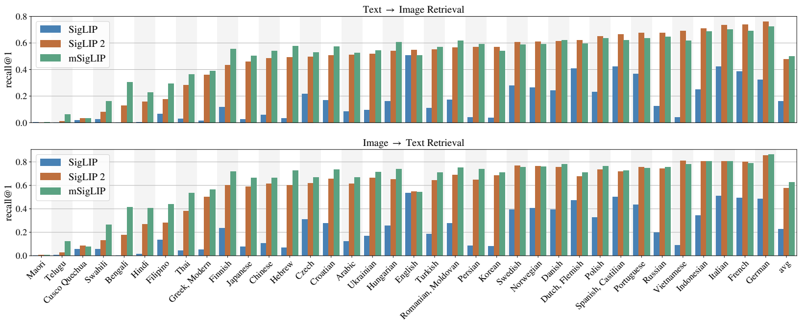

Figure 2. XM3600의 언어별 T→I와 I→T R@1. [PDF p.6](https://arxiv.org/pdf/2502.14786v1#page=6).

영어 중심 SigLIP의 낮은 multilingual recall을 SigLIP 2가 크게 개선한다. 그러나 mSigLIP는 multilingual 성능만 보면 강하다. 가장 직접적인 Table 1 So/16 256 비교는 다음과 같다.

| metric | mSigLIP | SigLIP 2 | 차이 |
|---|---:|---:|---:|
| ImageNet val | 80.8 | 83.4 | +2.6 pp |
| ObjectNet | 79.5 | 84.8 | +5.3 pp |
| COCO T→I / I→T | 49.4 / 68.6 | 55.4 / 71.5 | +6.0 / +2.9 pp |
| XM3600 T→I / I→T | 50.0 / 62.8 | 48.1 / 57.5 | **−1.9 / −5.3 pp** |

즉 연구의 성과는 모든 언어에서 mSigLIP를 이겼다는 주장보다 **영어 중심 성능을 크게 높이면서 multilingual 성능도 강하게 유지한 균형**으로 읽는 것이 정확하다. Figure 2에는 Korean도 포함되지만 언어별 원시 수치 표가 없다. 작은 막대 높이만 보고 소수점 한 자리의 한국어 성능을 만들어 적지 않았다. Māori/Telugu/Quechua 등에서 절대 성능이 여전히 낮은 모습도 평균에 가려지지 않아야 한다.

WebLI의 109 languages와 XM3600의 36 languages는 서로 다른 수다. 전자는 source dataset 범위, 후자는 evaluation 범위다. 이 논문이 109개 모든 언어에서 동일 품질을 보였다고 쓰면 안 된다.

### 9.4 §3.1.1, Figure 3, Appendix B/Table 7: NaFlex

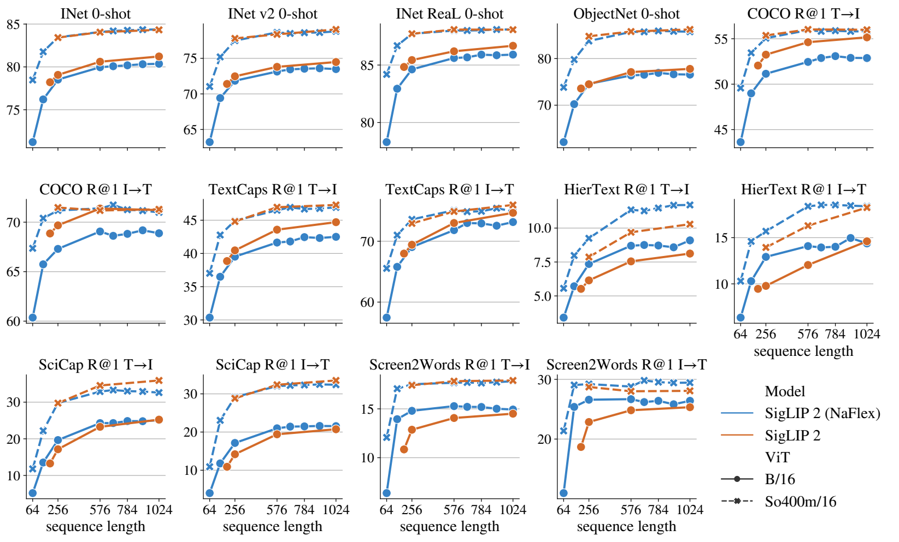

Figure 3. 자연 이미지와 OCR/document/screen retrieval의 sequence-length별 비교. [PDF p.7](https://arxiv.org/pdf/2502.14786v1#page=7).

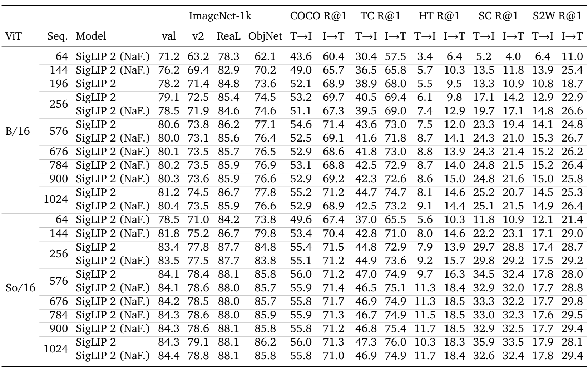

Table 7. Appendix B 전체. TC=TextCaps, HT=HierText, SC=SciCap, S2W=Screen2Words. [PDF p.18](https://arxiv.org/pdf/2502.14786v1#page=18).

| model·budget | metric | fixed | NaFlex | 차이 |
|---|---|---:|---:|---:|
| B/16, N=256 | ImageNet val | 79.1 | 78.5 | −0.6 pp |
| B/16, N=256 | COCO T→I / I→T | 53.2 / 69.7 | 51.1 / 67.3 | −2.1 / −2.4 |
| B/16, N=256 | HierText T→I / I→T | 6.1 / 9.8 | 7.4 / 12.9 | +1.3 / +3.1 |
| B/16, N=256 | SciCap T→I / I→T | 17.1 / 14.2 | 19.7 / 17.1 | +2.6 / +2.9 |
| B/16, N=256 | Screen2Words T→I / I→T | 12.9 / 22.9 | 14.8 / 26.6 | +1.9 / +3.7 |
| So/16, N=256 | ImageNet val | 83.4 | 83.5 | +0.1 |
| So/16, N=256 | HierText T→I / I→T | 7.9 / 13.9 | 9.2 / 15.7 | +1.3 / +1.8 |
| So/16, N=576 | SciCap T→I / I→T | 34.5 / 32.4 | 32.9 / 32.0 | **−1.6 / −0.4** |
| So/16, N=1024 | SciCap T→I / I→T | 35.9 / 33.5 | 32.6 / 32.4 | **−3.3 / −1.1** |

[검산] NaFlex B는 64→256 token에서 ImageNet 71.2→78.5, COCO T→I 43.6→51.1로 크게 회복한다. 하지만 256→1024는 ImageNet 78.5→80.4, COCO T→I 51.1→52.9로 이득이 작다. token 수를 4배 늘린 결과가 정확도 4배가 되는 것이 아니다. 676/900 같은 길이는 interpolation 평가를 보여 주며 모든 항목이 단조 증가하지 않는다.

“NaFlex가 문서에 좋다”는 요지는 aspect distortion에 민감한 retrieval에서 지지되지만, TextCaps 모든 설정이나 So/16 high-resolution SciCap까지 무조건 앞서는 것은 아니다. 같은 N이라도 fixed는 square, NaFlex는 여러 grid이고, fixed B에는 ACID, fixed 계열에는 SSL, NaFlex에는 더 긴 adaptation schedule이 있다. **native aspect만의 인과 효과와 sequence flexibility의 단독 이득은 이 비교에서 분리되지 않는다.** Appendix B는 새로운 algorithm이나 증명을 추가하지 않고 Figure 3의 숫자와 추가 길이 평가를 제공한다.

### 9.5 §3.2, Figure 4, Appendix A/Table 6: VLM visual encoder 평가

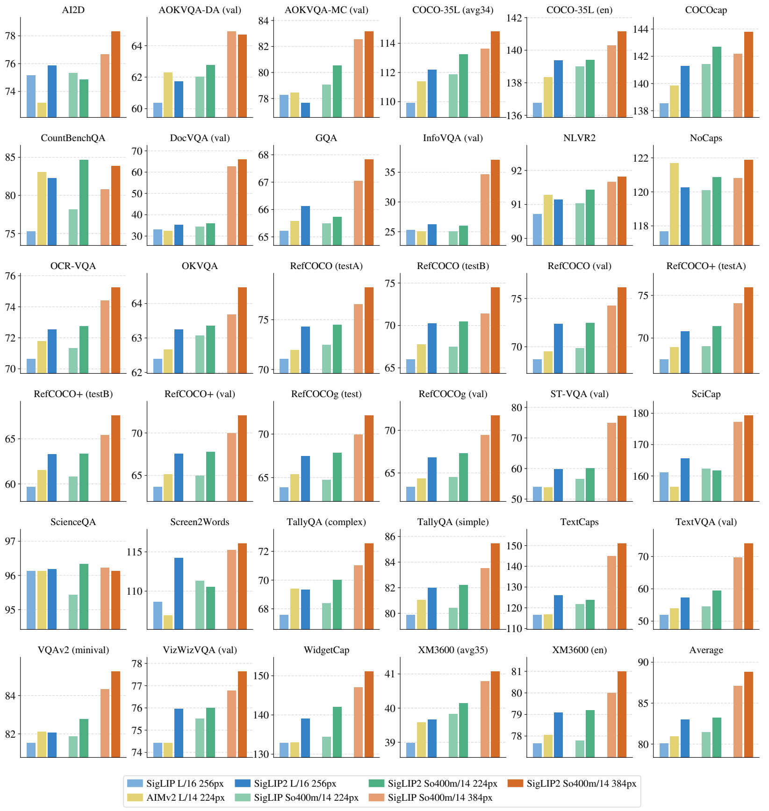

Figure 4. PaliGemma 유사 protocol의 task별 전이 결과. [PDF p.8](https://arxiv.org/pdf/2502.14786v1#page=8).

**실험 흐름.** vision encoder와 **Gemma 2 2B LLM**을 결합한다. PaliGemma/PaliGemma 2 Stage 1 mixture에서 captioning, OCR, grounded captioning, VQA, detection, instance segmentation을 학습하며 마지막 네 task annotation은 machine-generated라고 적는다. vision encoder는 이 stage에서 frozen이고 LLM을 50M **examples**로 학습한다. 그 후 각 downstream dataset에 맞춰 VLM을 fine-tune한다. high-resolution 실험은 224/256 모델을 이어 쓰는 방식 대신 Stage 1을 384px에서 다시 한다. [PDF pp.8–9]

**Figure 4 caption의 불일치.** caption에는 “50M steps”, 본문에는 “50M examples”라고 쓰여 있다. 본문이 sample budget을 구체적으로 설명하므로 리뷰의 protocol은 **50M examples**로 기록하고, 정확한 step 수는 batch 정보 없이 환산하지 않는다. 이미지를 수정해 이 불일치를 숨기지 않았다.

L 비교는 SigLIP L/16 256px, AIMv2 L/14 224px, SigLIP 2 L/16 256px로 **모두 256 image tokens**다. 따라서 pixel 수는 같지 않지만 LLM에 제공하는 token 길이는 맞춘 비교다. So/14는 224px에서 16²=256, 384px에서 27²=729 token이다. $`384/14`$를 반올림해 28²=784라고 하면 Table 5와 충돌한다. 공식 `VALID` Conv는 floor를 사용하며, 이 square 입력에서는 kernel coverage가 378px까지다. 논문 자체는 Table 1/5에 729를 보고한다.

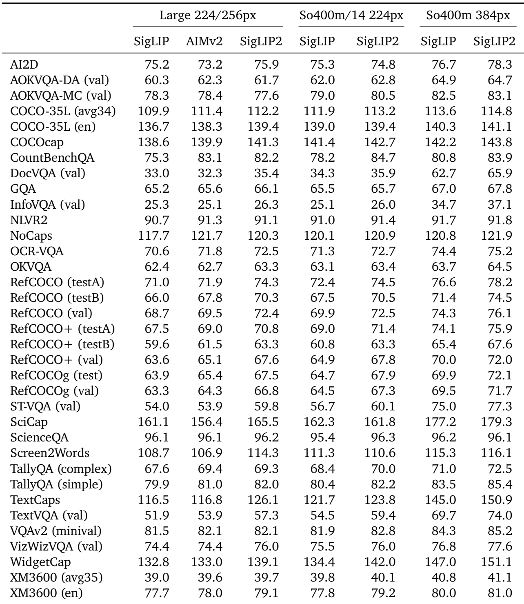

Table 6. Appendix A의 35개 task/split 결과. [PDF p.17](https://arxiv.org/pdf/2502.14786v1#page=17).

| 비교 | 35개 행에서 개선/동률/회귀 | raw metric 단순 평균 차이 |
|---|---:|---:|
| SigLIP L→SigLIP 2 L | 34 / 0 / 1 | +2.880 |
| AIMv2 L→SigLIP 2 L | 28 / 1 / 6 | +2.049 |
| SigLIP So224→SigLIP 2 So224 | 32 / 0 / 3 | +1.789 |
| SigLIP So384→SigLIP 2 So384 | 33 / 0 / 2 | +1.731 |

[검산] 35개 원문 행의 7열을 직접 추출해 비교했다. raw mean은 각각 SigLIP L 80.114, AIMv2 L 80.946, SigLIP 2 L 82.994, SigLIP So224 81.457, SigLIP 2 So224 83.246, SigLIP So384 87.114, SigLIP 2 So384 88.846이다. Figure 4의 Average 막대를 이해하는 산술적 집계일 뿐, **서로 다른 metric의 평균을 하나의 “정확도 %”로 해석하지 않는다.** 여러 RefCOCO split이 같은 가족을 여러 번 세고 captioning score도 섞인다.

| 대표 task | L: SigLIP→SigLIP 2 | So224 | So384 | 해석 |
|---|---:|---:|---:|---|
| RefCOCO testB | 66.0→70.3 | 67.5→70.5 | 71.4→74.5 | localization 전이 개선 |
| RefCOCO+ val | 63.6→67.6 | 64.9→67.8 | 70.0→72.0 | 언어로 region 구별 |
| TextVQA val | 51.9→57.3 | 54.5→59.4 | 69.7→74.0 | OCR 연계에서 꾸준한 개선 |
| TextCaps | 116.5→126.1 | 121.7→123.8 | 145.0→150.9 | caption metric 점수, percent accuracy 아님 |
| CountBenchQA | 75.3→82.2 | 78.2→84.7 | 80.8→83.9 | counting에 큰 개선 |
| AOKVQA-MC val | **78.3→77.6** | 79.0→80.5 | 82.5→83.1 | L에서 회귀 |
| AI2D | 75.2→75.9 | **75.3→74.8** | 76.7→78.3 | So224에서 회귀 |
| SciCap | 161.1→165.5 | **162.3→161.8** | 177.2→179.3 | So224에서 회귀 |
| Screen2Words | 108.7→114.3 | **111.3→110.6** | 115.3→116.1 | So224에서 회귀 |

AIMv2 대비 L의 회귀는 AOKVQA-DA, AOKVQA-MC, CountBenchQA, NLVR2, NoCaps, TallyQA complex다. VQAv2는 동률이다. So384의 회귀는 AOKVQA-DA 64.9→64.7, ScienceQA 96.2→96.1이다. 작은 차이에는 seed variation/CI가 없으므로 통계적 유의성을 주장할 수 없다.

Appendix A의 원문에는 task별 metric 이름과 모든 optimizer 설정을 다시 쓰지 않고 PaliGemma 2의 transfer settings에 위임한다. 표는 captioning·VQA·OCR·referring 등 서로 다른 evaluation 단위를 포함한다. 이 리뷰는 표 숫자를 원문 그대로 보존하되, 평가 script를 실행하지 않았고 35개의 exact metric implementation을 모두 재검증했다고 표현하지 않는다. 명시된 val/testA/testB/val-u/test-u/minival split을 섞지 않는 것이 우선이다.

### 9.6 §3.3.1, Table 2: frozen dense feature probe

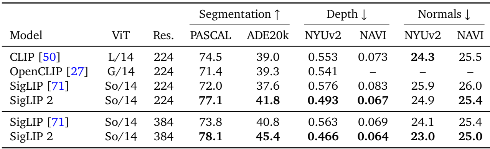

Table 2. frozen features의 segmentation, depth, normals. [PDF p.9](https://arxiv.org/pdf/2502.14786v1#page=9).

TIPS의 protocol을 따르며 원래 각 patch에 CLS를 붙이는 곳에서는 **MAP output vector를 대신 concatenate**한다. CLS token이 없는 SigLIP architecture에 맞춘 필요한 변경이다. 예를 들어 feature 차원이 d라면 patch/global을 concatenate한 vector는 [N,2d]가 된다. encoder는 frozen이어도 probe는 학습된다. [PDF p.9, §3.3.1]

선행 protocol을 대조하면 segmentation은 spatial linear probe, NYUv2 depth는 patch와 global feature를 이어 256개 quantized depth values를 분류하는 linear probe, NAVI depth는 DPT decoder를 사용한다. normal estimation도 해당 선행 평가 setup을 따른다. 이는 TIPS에서 위임된 평가의 보조 설명이며 SigLIP 2가 새 depth discretizer를 제안했다는 뜻은 아니다. [TIPS v1 p.7, §4.1]

| So/14 | PASCAL mIoU | ADE20k mIoU | NYUv2 depth RMSE | NAVI depth RMSE | NYUv2 normals | NAVI normals |
|---|---:|---:|---:|---:|---:|---:|
| 224: SigLIP | 72.0 | 37.6 | 0.576 | 0.083 | 25.9 | 26.0 |
| 224: SigLIP 2 | 77.1 | 41.8 | 0.493 | 0.067 | 24.9 | 25.4 |
| 절대 변화 | +5.1 | +4.2 | −0.083 | −0.016 | −1.0 | −0.6 |
| 384: SigLIP | 73.8 | 40.8 | 0.563 | 0.069 | 24.1 | 25.4 |
| 384: SigLIP 2 | 78.1 | 45.4 | 0.466 | 0.064 | 23.0 | 25.0 |
| 절대 변화 | +4.3 | +4.6 | −0.097 | −0.005 | −1.1 | −0.4 |

[검산] NYUv2 depth RMSE의 상대 감소는 224에서 $`(0.576-0.493)/0.576\approx14.41\%`$, 384에서 약 17.23%다. NAVI 224는 약 19.28% 감소다. 이 수치는 error reduction이고 “깊이 정확도 +19.28 pp”가 아니다.

CLIP L/14 224는 NYUv2 normals 24.3으로 SigLIP 2 So/14 224의 24.9보다 낮다. Table 2에서도 모든 기존 모델의 모든 항목을 이기는 것은 아니다. 또한 비교 대상을 CLIP 계열 중심으로 구성했으므로 이 표만으로 DINOv2 또는 최신 dense-specialist보다 낫다고 결론내리지 않는다.

### 9.7 §3.3.2, Table 3: open-vocabulary segmentation

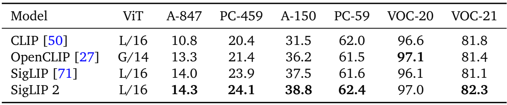

Table 3. Cat-Seg의 mIoU. [PDF p.10](https://arxiv.org/pdf/2502.14786v1#page=10).

COCO-Stuff-164k의 172 classes에서 Cat-Seg를 학습하고, 다른 vocabulary를 가진 ADE20k A-847/A-150, Pascal Context PC-459/PC-59, VOC-20/VOC-21에서 평가한다. train vocabulary 밖 class를 test text로 지정할 수 있다는 의미의 open vocabulary이며 **segmentation training data가 없다는 의미가 아니다**. [PDF p.9, §3.3.2]

| model | A-847 | PC-459 | A-150 | PC-59 | VOC-20 | VOC-21 |
|---|---:|---:|---:|---:|---:|---:|
| SigLIP L/16 | 14.0 | 23.9 | 37.5 | 61.6 | 96.1 | 81.1 |
| SigLIP 2 L/16 | 14.3 | 24.1 | 38.8 | 62.4 | 97.0 | 82.3 |
| 차이 | +0.3 | +0.2 | +1.3 | +0.8 | +0.9 | +1.2 |

OpenCLIP G/14보다 6개 중 5개에서 높고 VOC-20은 97.1 대 97.0으로 0.1 낮다. “훨씬 큰 모델도 모든 dataset에서 능가”는 과장이다. 원문 표의 CLIP row가 `L/16`으로 적혀 있는 점도 보존했다. Table 1/2의 CLIP L/14 표기와 다르므로 이를 조용히 L/14로 고쳐 동일 checkpoint라고 단정하지 않는다.

### 9.8 §3.4.1, Table 5: referring expression comprehension

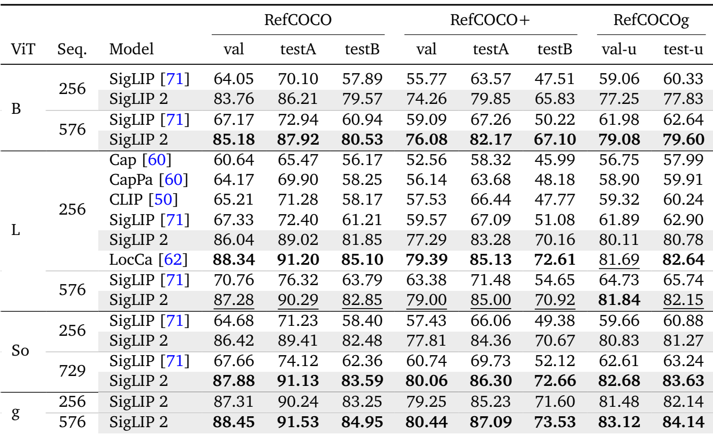

Table 5. frozen vision encoder에 새 decoder를 붙인 Acc@0.5. [PDF p.11](https://arxiv.org/pdf/2502.14786v1#page=11).

unpooled vision feature에 cross-attention하는 **6-layer Transformer decoder를 scratch부터** 학습한다. 모든 RefCOCO variant를 섞어 decoder를 훈련하며 image encoder는 frozen이다. pretrained LocCa decoder를 복원해 쓰는 것이 아니다. Acc@0.5는 예측 box가 정답 box와 IoU threshold 0.5를 만족하는 비율이다. [PDF pp.9–10, §3.4.1]

| matched size·sequence | RefCOCO val | RefCOCO+ val | RefCOCOg val-u |
|---|---:|---:|---:|
| B,256 | 64.05→83.76 (+19.71) | 55.77→74.26 (+18.49) | 59.06→77.25 (+18.19) |
| B,576 | 67.17→85.18 (+18.01) | 59.09→76.08 (+16.99) | 61.98→79.08 (+17.10) |
| L,256 | 67.33→86.04 (+18.71) | 59.57→77.29 (+17.72) | 61.89→80.11 (+18.22) |
| L,576 | 70.76→87.28 (+16.52) | 63.38→79.00 (+15.62) | 64.73→81.84 (+17.11) |
| So,256 | 64.68→86.42 (+21.74) | 57.43→77.81 (+20.38) | 59.66→80.83 (+21.17) |
| So,729 | 67.66→87.88 (+20.22) | 60.74→80.06 (+19.32) | 62.61→82.68 (+20.07) |

testA/testB/test-u 역시 원문 전체 표에서 확인했다. B256 RefCOCO testB는 57.89→79.57로 +21.68 pp이고, So256 RefCOCO+ testB는 49.38→70.67로 +21.29 pp다. 단순 전역 accuracy 개선보다 훨씬 큰 localization 개선이 관측된다는 점이 이 논문의 강한 실험적 결과다.

그러나 L256에서 **LocCa**는 RefCOCO val 88.34, RefCOCO+ val 79.39, RefCOCOg val-u 81.69로 SigLIP 2의 86.04/77.29/80.11보다 높다. 차이는 −2.30/−2.10/−1.58 pp다. 저자는 LocCa가 English-only captions으로 학습했기 때문일 수 있다고 가설을 제시하지만, 같은 데이터·언어 비율만 바꾼 ablation으로 입증하지는 않는다. “multilingual 자체가 localization을 해친다”는 확정적 결론으로 바꾸면 안 된다.

저자는 pretraining decoder를 재사용하면 더 좋아질 것으로 기대한다고 적지만 이는 본 표에 측정된 값이 아니다. 공개 encoder-only checkpoint 사용자에게 그 개선을 현재 제공되는 기능처럼 설명하지 않는다.

### 9.9 §3.4.2, Table 4: OWL-ViT detection

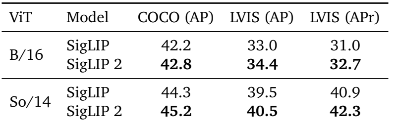

Table 4. OWL-ViT 방식으로 fine-tuned된 detection 성능. [PDF p.10](https://arxiv.org/pdf/2502.14786v1#page=10).

| backbone | COCO AP | LVIS AP | LVIS rare AP |
|---|---:|---:|---:|
| B/16: SigLIP→SigLIP 2 | 42.2→42.8 | 33.0→34.4 | 31.0→32.7 |
| 절대 변화 | +0.6 | +1.4 | +1.7 |
| So/14: SigLIP→SigLIP 2 | 44.3→45.2 | 39.5→40.5 | 40.9→42.3 |
| 절대 변화 | +0.9 | +1.0 | +1.4 |

B/16 rare AP의 상대 증가는 1.7/31.0≈5.48%, So/14는 1.4/40.9≈3.42%다. rare class에서 상대 개선이 크다는 저자 해석과 부합한다. 다만 absolute AP improvement는 Table 5의 referring accuracy +20 pp와 같은 지표가 아니다. table에 inference resolution, seed variance가 별도 상세히 나열되지는 않으며 data/optimizer는 OWL-ViT protocol로 위임한다. 본문이 방법 소개를 RefCOCO→detection 순으로 해도 Table 4가 먼저 인쇄되는 것은 floating table 배치 때문이다.

### 9.10 §3.5, Figure 5, Appendix C/Table 8: 문화·지리 다양성

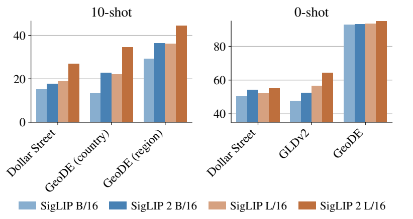

Figure 5. 일부 B/L 설정의 문화·지리 관련 평가. [PDF p.12](https://arxiv.org/pdf/2502.14786v1#page=12).

Dollar Street, GeoDE, GLDv2의 zero-shot classification과 Dollar Street/GeoDE의 10-shot geolocalization을 측정한다. Dollar Street zero-shot은 96 topics를 ImageNet classes에 대응시켜 약 **21k images**의 subset을 만든다. 따라서 전체 Dollar Street의 모든 label을 원본 그대로 평가했다는 뜻은 아니다. [PDF p.10, §3.5]

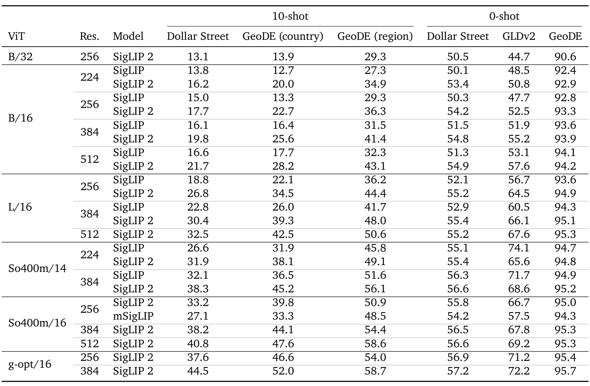

Table 8. Appendix C의 model/해상도별 전체 cultural 결과. [PDF p.19](https://arxiv.org/pdf/2502.14786v1#page=19).

| matched setting | 10-shot Dollar Street | GeoDE country | GeoDE region | 0-shot Dollar Street | GLDv2 | GeoDE |
|---|---:|---:|---:|---:|---:|---:|
| B/16 256, SigLIP→2 | 15.0→17.7 | 13.3→22.7 | 29.3→36.3 | 50.3→54.2 | 47.7→52.5 | 92.8→93.3 |
| L/16 256, SigLIP→2 | 18.8→26.8 | 22.1→34.5 | 36.2→44.4 | 52.1→55.2 | 56.7→64.5 | 93.6→94.9 |
| So/14 224, SigLIP→2 | 26.6→31.9 | 31.9→38.1 | 45.8→49.1 | 55.1→55.4 | **74.1→65.6** | 94.7→94.8 |
| So/14 384, SigLIP→2 | 32.1→38.3 | 36.5→45.2 | 51.6→56.1 | 56.3→56.6 | **71.7→68.6** | 94.9→95.2 |

[검산] 본문 예시 L256의 GeoDE region +8.2 pp, Dollar Street zero-shot +3.1 pp를 확인했다. 다만 Figure 5에 표시하지 않은 So/14의 GLDv2 회귀는 224에서 **−8.5 pp**, 384에서 **−3.1 pp**다. “geographically diverse benchmarks에서 일관되게 더 좋다”는 표현은 B/L의 대표 plot보다 Appendix 전체를 기준으로 제한해야 한다.

geolocalization accuracy는 이미지에서 지역 관련 신호를 예측하는 능력을 측정한다. 모든 문화 집단에 공정하게 작동한다는 보편적 사회적 품질 지표로 바로 바꿀 수 없다. 또한 0-shot GeoDE는 이미 90%대여서 10-shot geography와 개선 폭을 직접 비교하면 ceiling effect를 놓칠 수 있다.

### 9.11 Figure 6, Appendix C/Table 9: representation bias와 disparity

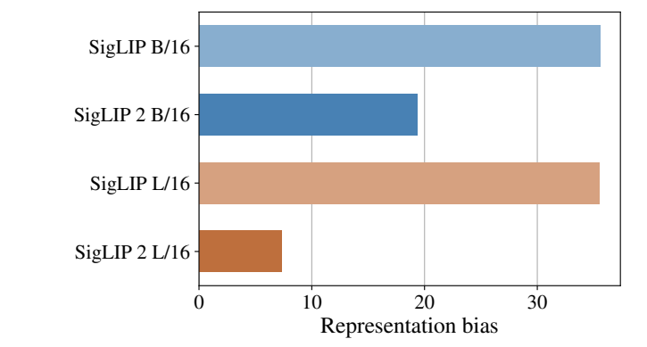

Figure 6. 무관한 물체와 gender의 연관에 관한 representation bias. [PDF p.12](https://arxiv.org/pdf/2502.14786v1#page=12).

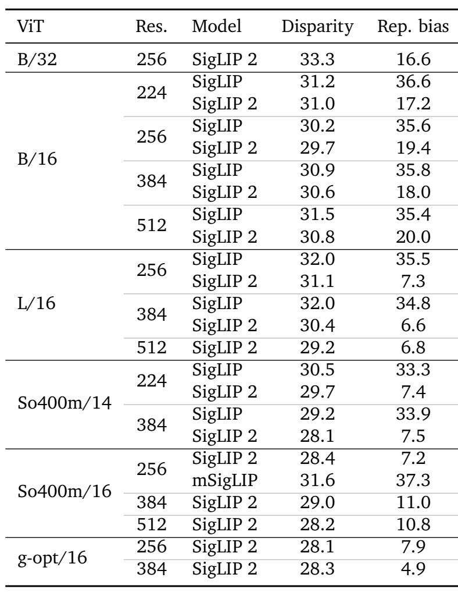

Table 9. income-group disparity와 representation bias. [PDF p.20](https://arxiv.org/pdf/2502.14786v1#page=20).

| setting | disparity: SigLIP→2 | representation bias: SigLIP→2 |
|---|---:|---:|
| B/16 224 | 31.2→31.0 | 36.6→17.2 |
| B/16 256 | 30.2→29.7 | 35.6→19.4 |
| L/16 256 | 32.0→31.1 | 35.5→7.3 |
| L/16 384 | 32.0→30.4 | 34.8→6.6 |
| So/14 224 | 30.5→29.7 | 33.3→7.4 |
| So/14 384 | 29.2→28.1 | 33.9→7.5 |

**R21. Table 9의 disparity 정의와 bias 예시 해석.**

```math
\mathrm{Disparity}=\max_g\mathrm{Accuracy}_g-\min_g\mathrm{Accuracy}_g,\qquad\mathrm{Bias}_{\mathrm{example}}=|P(\text{prefer men})-0.5|.
```

첫 식의 g는 Dollar Street income group이다. 원문 Table 9 caption의 maximum difference를 수학으로 썼다. 둘째 식은 본문이 representation bias 35.5%를 “random images를 men과 연결하는 선호가 85.5% 이상”이라고 설명한 **그 예시를 읽기 위한 식**이다. 전체 실험의 prompt set·aggregation·sensitive attribute protocol을 이것만으로 완전 정의한 것으로 간주하지 않는다. metric 상세는 원문 [2]로 위임된다.

L256의 representation bias는 −28.2 pp, 기존 수치 대비 약 **79.44% 감소**다. 반면 disparity는 −0.9 pp로 약 2.81% 감소다. 전자가 크게 개선되어도 후자의 income-group 격차는 대부분 남는다. 논문 본문도 소득·지역으로 분해하면 이득이 작거나 없다고 설명한다. [PDF p.11]

큰 모델이 항상 더 공정하거나 해상도가 높을수록 bias가 줄어드는 것도 아니다. SigLIP 2 So/16은 representation bias가 256px 7.2, 384px 11.0, 512px 10.8이다. g-opt 384의 4.9처럼 좋은 결과도 있지만 모델 크기와 모든 fairness 항목의 단조 관계를 증명하지 않는다. mSigLIP So/16 256은 representation bias 37.3으로 SigLIP 2의 7.2보다 크다. 언어 다양성 확보와 특정 association bias 완화는 별도 축임을 보여 주는 비교다.

### 9.12 실험 전반의 통계와 missing controls

표의 대부분은 단일 수치이며 seed별 결과, standard deviation, confidence interval, significance test가 제공되지 않는다. 그래서 큰 +18~22 pp RefCOCO 효과와 ±0.1 pp 차이를 같은 확신 수준으로 읽지 않는다. 또한 학습 data/filtering·SSL·decoder를 하나씩 분리한 **SigLIP 2 자체의 factorial ablation table은 없다**. 선행 SILC/TIPS/LocCa/ACID ablation은 각 기법의 배경 근거가 될 수 있지만, 이 네 기법과 multilingual/debiasing이 조합된 설정에서의 독립 기여를 직접 측정한 결과로 대체할 수 없다.

Table 1–9는 정확도·품질 평가다. GPU/NPU kernel time, encoder latency, VLM prefill/decode latency, TTFT/TTFA, memory, throughput, energy, policy refresh Hz를 측정한 표는 없다. sample 수나 patch 수의 변화로 해당 latency를 대신 계산하지 않는다.

<a id="related"></a>

## 10. 원문 §4–5: 관련 연구, 기여와 결론의 경계

### 10.1 기존 구성요소와 SigLIP 2의 결합

| 기존 연구 축 | SigLIP 2가 채택한 부분 | 채택했다고 단정하지 않을 부분 |
|---|---|---|
| CLIP/ALIGN | image–text 공동 embedding의 활용 | CLIP softmax loss를 그대로 사용 |
| SigLIP 1 | sigmoid pair loss, standard ViT 계열 compatibility | 모든 tokenizer/data setting이 동일 |
| Cap/CapPa, LocCa | decoder-based captioning, parallel caption prediction, region-caption/box tasks | 공개 captioning decoder 제공 |
| SILC | local-to-global self-distillation, EMA teacher, auxiliary distribution matching | 모든 선행 augmentation의 상세가 본문에 재기재됨 |
| TIPS | masked teacher-patch prediction | TIPS의 dual CLS나 synthetic recaptioning 전체 recipe |
| FlexiViT/NaViT | PI-resize, native aspect/variable sequence 아이디어 | 모든 patch size를 매 forward 자유롭게 변경, multi-image packing의 동일 구현 |
| ACID/ACED | active curation을 통한 implicit distillation | explicit softmax KD를 최종 B loss에 추가 |
| bias/data diversity 연구 | multilingual mixture, filtering | 모든 group의 정확도 격차 제거 |

[PDF pp.11–12, §4–5] 저자 스스로 independently developed techniques를 결합한다고 설명한다. 기여는 새로운 sigmoid 함수나 최초의 masked image modeling보다는 **호환되는 encoder family에 기술들을 통합하고 다양한 global/local/dense downstream에서 유용성을 보여 준 것**, 크기·해상도별 weight를 공개한 것에 있다.

Related Work는 data filtering, recaptioning, self-supervised loss, captioning auxiliary training의 계보를 나열한다. 여기에 recaptioning이 등장한다고 SigLIP 2가 모든 WebLI caption을 synthetic detailed caption으로 교체했다고 쓰면 안 된다. 실제 §2.2에서 구체적으로 설명한 것은 n-gram/category 기반 region annotation과 decoder objectives다. TIPS의 synthetic text와 dual CLS는 참조 계보이지 이 paper의 release architecture가 아니다.

Conclusion은 multilingual encoder, dense/localization improvement, NaFlex와 open-weight release를 다시 정리한다. 그러나 외부 task에서 반드시 이득을 얻거나 모든 bias가 해결된다는 보장은 제시하지 않는다. Appendix A–C도 full results이며 새로운 이론적 보장, convergence proof, latency evaluation을 추가하지 않는다. Acknowledgments와 References 전체는 source 확인 범위에 포함했으나 각 참고문헌에 대한 별도 리뷰로 확장하지 않았다.

<a id="code"></a>

## 11. 공식 코드 감사와 재현성

### 11.1 조회 commit과 실제 읽은 파일

공식 저장소는 [google-research/big_vision](https://github.com/google-research/big_vision)이며, 2026-09-09 조회 시 main을 다음 commit으로 고정했다.

`0127fb6b337ee2a27bf4e54dea79cff176527356`

| 파일·위치 | 확인한 내용 | 이 리뷰의 연결 |
|---|---|---|
| [README_siglip2.md](https://github.com/google-research/big_vision/blob/0127fb6b337ee2a27bf4e54dea79cff176527356/big_vision/configs/proj/image_text/README_siglip2.md) | fixed와 NaFlex checkpoint 목록, vocab/tokenizer 차이, 구현 링크 | §0/3/6 |
| [SigLIP2_demo.ipynb](https://github.com/google-research/big_vision/blob/0127fb6b337ee2a27bf4e54dea79cff176527356/big_vision/configs/proj/image_text/SigLIP2_demo.ipynb) | model config, lowercase/sticky EOS, image preprocessing, similarity→sigmoid | §3/8 |
| [two_towers.py](https://github.com/google-research/big_vision/blob/0127fb6b337ee2a27bf4e54dea79cff176527356/big_vision/models/proj/image_text/two_towers.py#L39) | optional image/text forward, L2 normalization, exp(t), optional b | R5–6 |
| [vit.py](https://github.com/google-research/big_vision/blob/0127fb6b337ee2a27bf4e54dea79cff176527356/big_vision/models/vit.py#L163) | MAP learned probe, patch Conv, unpooled output, model variant dimensions | R1–3 |
| [text_transformer.py](https://github.com/google-research/big_vision/blob/0127fb6b337ee2a27bf4e54dea79cff176527356/big_vision/models/proj/image_text/text_transformer.py#L50) | default last pooling, embedding/encoder/output projection | text pooling 문서 차이 |
| [siglip.py trainer](https://github.com/google-research/big_vision/blob/0127fb6b337ee2a27bf4e54dea79cff176527356/big_vision/trainers/proj/image_text/siglip.py#L287) | logits=t·dot+b, ±1 labels, log_sigmoid, pair sum/batch mean | R5와 선행 Algorithm |
| [naflex_vit.py](https://github.com/google-research/big_vision/blob/0127fb6b337ee2a27bf4e54dea79cff176527356/big_vision/models/proj/image_text/naflex_vit.py#L216) | patch/type/coords input, positional resize/gather, self-attention/MAP mask | R17 |
| [ops_naflex.py](https://github.com/google-research/big_vision/blob/0127fb6b337ee2a27bf4e54dea79cff176527356/big_vision/pp/proj/image_text/ops_naflex.py#L23) | scale binary search, ceil-to-patch, patchify/coordinates | NaFlex 전처리 |

다운로드한 파일의 SHA-256은 [검증 기록](assets/11_SigLIP2/validation_report.json)에 남겼다. 이 검증은 source inspection과 작은 CPU 산술 검산이다. checkpoint loading, JAX compilation, TPU/GPU execution을 수행하지 않았다.

### 11.2 확인된 구현상의 차이와 주의점

**Text pooling.** 논문 §2.1은 양 tower에 MAP을 쓰는 것으로 읽힌다. 그러나 official demo의 text dict에는 pool_type이 없고 실제 class default는 `last`다. text embedding 뒤에는 `vit.Encoder`가 호출되며 별도의 causal mask가 전달되지 않는다. 따라서 CLIP의 causal text Transformer 그림을 그대로 가져와 설명하면 공개 inference 코드와 달라진다. `last`는 sticky EOS를 전제로 마지막 위치를 읽는 것이지, 각 샘플의 first EOS를 검색하는 연산이 아니다. paper-only architecture를 설명할 때와 공개 demo를 재현할 때의 설정을 구분해야 한다.

**NaFlex demo의 variant 설정.** demo의 branch는 `model_cfg.image`를 다시 만들면서 `variant='B'`를 하드코딩한다. 위 선택 목록에는 So400m/16 NaFlex도 있다. 그러므로 So400m 옵션으로 바꿀 때 해당 branch의 variant가 weight shape와 맞는지 확인해야 한다. 이는 [정적 코드 확인]으로 발견한 consistency risk이며 실제 So400m checkpoint를 load해 failure를 재현한 것은 아니다. review에서 repository를 수정하지 않았다.

**NaFlex 극단 aspect의 positional resize 범위.** `_pos_emb_resize`는 temporary grid의 한 변 l=64를 기본으로 사용하며, 주석은 해당 한계를 넘으면 gather 결과와 model output에 NaN이 생길 수 있다고 밝힌다. 이 값은 설정으로 조정 가능하다. N≤1024라는 조건만으로 한 변이 64 이하라는 조건이 자동 보장되지는 않는다. 예를 들어 [1,128] grid는 N=128이지만 긴 변이 64를 넘는다. 이것은 이 commit의 구현 제약이지 “native aspect”의 수학적 개념 자체의 제약은 아니다.

**공개 trainer 범위.** 전체 repository tree와 관련 files를 확인했지만, SigLIP 2의 LocCa+SSL+NaFlex+ACID 전체 학습 run을 재현하는 단일 trainer/config·WebLI data manifest는 찾지 못했다. 공개 `siglip.py`만 실행하면 논문의 네-loss recipe가 자동 활성화된다고 쓰지 않는다. 다른 unrelated distillation trainer의 존재도 SigLIP 2 recipe 공개의 증거로 간주하지 않는다.

**공개 model card와 fixed architecture.** Google namespace의 [B/16 224 config](https://huggingface.co/google/siglip2-base-patch16-224/blob/main/config.json)는 `model_type: siglip`, text vocab 256000을 명시한다. [processor config](https://huggingface.co/google/siglip2-base-patch16-224/blob/main/preprocessor_config.json)는 224×224 resize, rescale 1/255, mean/std 0.5를 기록한다. “SigLIP 2”라고 불리는 모든 checkpoint가 NaFlex class를 사용하는 것은 아니다. 이 model-card 확인은 참고 read이며 big_vision commit 고정의 대체가 아니다.

### 11.3 원문과 구현에서 따로 기록할 불일치

| 항목 | 원문/공개 코드의 차이 | 리뷰에서 채택한 처리 |
|---|---|---|
| text pooling | 본문 MAP vs demo default last | paper claim과 demo forward를 병기 |
| VLM training budget | Fig.4 50M steps vs §3.2 50M examples | 본문 examples를 우선, step 환산하지 않음 |
| NaFlex training length | 본문 128 포함 vs Fig.3 caption/x-axis 64 | explicit training set과 evaluation grid를 구분 |
| Table 3 CLIP patch | L/16 표기, 다른 표의 L/14와 차이 | 원문 그대로 보존하고 동일 모델로 추정하지 않음 |
| SigLIP 1 bias sign | display exponent의 +b vs Algorithm/trainer logits의 +b | 두 식의 bias convention 차이를 설명, 구현 기준 R5 |
| NaFlex So variant | demo branch의 B 하드코딩 | weight-shape 확인 필요, 실행 결과로 주장하지 않음 |

### 11.4 원문만으로 완전히 채울 수 없는 재현 설정

| 범주 | 공개/기재된 것 | 추가로 필요한 것 |
|---|---|---|
| data | WebLI 규모, 언어 mixture, filtering 선행 인용 | exact records, dedup/split, language sampling, filtering thresholds |
| LocCa | 세 task, half-depth, parallel caption 50% | target grammar, coordinate vocab, sequence lengths, task weighting/reduction, pseudo-label files |
| SSL | 마지막 20%, 1 global+8 local, mask 50%, model별 coefficients | complete heads/pooling sharing, exact EMA/centering/temp/augmentation config |
| optimizer | Adam/LR/WD/norm/warmup/budget | beta/epsilon, dtype/loss-scale, complete optimizer-state resume semantics |
| adaptation | 95% fixed, 90% NaFlex, 3.75 schedule | B/32 conversion detail, sequence accounting, checkpoint selection |
| curation | reference So400m, curated 1B, learner 4B, filtering ratios | reference checkpoint, source pool, joint selection config, scoring compute |
| evaluation | dataset names, stated splits, Tables 1–9 | full evaluation commands, seed/CI, task별 exact hyperparameters |
| deployment | inference source와 pretrained checkpoints | target-device engine, accuracy parity, latency/energy measurements |

<a id="limitations"></a>

## 12. 비판적 검토와 더 강한 통제 실험

### 12.1 이 논문이 강한 부분

global classification/retrieval뿐 아니라 frozen dense probing, VLM transfer, referring expression, open-vocabulary segmentation/detection까지 비교한다. 특히 Table 5는 새로운 decoder를 학습하면서 vision encoder는 고정하므로 localization 정보가 encoder representation에 더 잘 남았다는 근거가 강하다. tokenizer와 fixed architecture compatibility를 유지하며 작은 모델부터 큰 모델까지 공개한 것도 실용적인 기여다.

반면 “모든 목표를 한 번에 새로 만든 통합 loss”의 효과를 엄밀히 분해한 논문은 아니다. contribution은 recipe engineering과 model family의 evidence에 가깝다. decoder·SSL·data의 상호작용과 compute 최적성은 별도로 검증해야 한다.

### 12.2 핵심 통제 변수

| 질문 | 필요한 통제 | 이 논문이 제공한 범위 |
|---|---|---|
| sigmoid 자체의 효과인가? | same data/compute에서 softmax↔sigmoid만 변경 | SigLIP 2 내부의 직접 ablation 없음; SigLIP 1 선행 결과 |
| LocCa가 localization 상승의 원인인가? | 동일 multilingual/filtering/SSL에서 LocCa on/off | 전이 결과와 선행 LocCa 근거, 직접 isolated ablation 없음 |
| SSL의 local과 mask 중 무엇이 중요한가? | local only / mask only / both, 같은 예제·compute | weight schedule은 공개, SigLIP 2 내 factorial 표 없음 |
| 90/10이 최적인가? | English 비율 sweep와 언어별 recall/worst-group | 선행 [49] 권고를 따름, 이 모델별 ratio sweep 없음 |
| debiasing만의 효과인가? | 같은 mixture·recipe에서 filter on/off | 최종 모델 비교만으로는 언어·loss 변화와 혼재 |
| NaFlex의 aspect 이득인가? | same budget에서 square/rect, same SSL/ACID | final family 비교로 여러 요인이 함께 바뀜 |
| ACID가 compute 효율적인가? | +4B IID vs +4B ACID, scoring 포함 TPU-hours | 최종 B 성능은 제공, complete cost curve 없음 |

### 12.3 대표적인 실패 조건

- caption이 장면의 일부만 설명하거나 잘못된 region pseudo-label을 포함하면 decoder supervision이 공간 표현을 잘못 유도할 수 있다.
- crop에 caption의 물체가 없을 수 있다. 원문이 original-view alignment를 분리한 이유다. local-to-global target도 배경 crop에 과한 전체 의미를 요구할 수 있다.
- 지나친 global consistency는 작은 물체나 드문 local structure에 충분한 구분력을 주지 못할 수 있다. masked objective는 이를 보완하는 방향이지만 완전한 해결 증명은 없다.
- 짧은 64-token text length, truncation, 낮은 자원 언어의 data 비율은 긴 지시/세밀한 표현에 한계가 될 수 있다.
- curation이 reference가 잘 아는 예제에 집중하면 reference의 편향과 coverage gap을 재생산할 수 있다. f를 높이는 것은 선택 품질과 다양성의 trade-off다.
- NaFlex는 aspect가 너무 극단적이거나 training-length 밖일 때 성능 및 구현 안정성을 별도로 확인해야 한다.
- feature shape가 같아도 기존 projector/policy가 학습한 feature distribution과 다르면 downstream inference를 그대로 교체했을 때 회귀할 수 있다.

위 항목은 관측된 failure table이 아니라 구조와 미공개 설정에서 도출한 [리뷰어 해석]이다. 실제로 논문에서 관측된 회귀는 §9의 구체적인 metric/행을 근거로 삼는다.

### 12.4 재현을 시작할 때의 순서

1. **출처·weight gate:** model name, checkpoint SHA, tokenizer hash, preprocessing, intended output layer/pooling을 고정한다.
2. **수치 parity gate:** 공식 reference에서 image/text embeddings와 scaled logits를 저장하고 별도 구현과 비교한다. NaFlex는 valid mask·coords·padded token 처리를 포함한다.
3. **작은 downstream gate:** 동일 frozen probe, 동일 train/test split, 동일 seed budget으로 SigLIP 1/2를 비교한다. raw global embedding과 patch feature를 혼동하지 않는다.
4. **recipe gate:** 데이터 접근이 가능할 때만 +LocCa, +local, +mask, mixture/filtering, +ACID를 분리한다. target reduction이 다르면 loss weight를 같은 숫자로 맞춘 것만으로 통제가 되지 않는다.
5. **full pretraining gate:** compute, data, code/config가 확보된 경우에만 40B 규모 재현을 주장한다. open weights 사용은 full training reproduction과 별도다.

<a id="deployment"></a>

## 13. VLM/VLA, OpenVLA, Jetson Thor와 연결

### 13.1 VLM에서 바로 활용 가능한 것과 재학습이 필요한 것

[저자 보고] SigLIP 2의 VLM evidence는 Gemma 2 2B를 이용한 Table 6이다. 이 사실은 patch representation을 LLM input으로 변환해 학습했을 때 전이 성능이 좋다는 근거다. 기존 임의의 VLM에 weight만 끼우면 projector까지 자동 호환된다는 증거는 아니다. input resolution, patch count, hidden dimension, feature layer, normalization, projector training distribution을 함께 확인해야 한다.

VLM이 image features만 사용하는 경우 SigLIP 2 text tower와 tokenizer를 inference에 함께 올릴 필요는 없다. 이때 사용자의 instruction은 LLM 자체 tokenizer로 처리한다. SigLIP 2의 multilingual text encoder가 좋아졌다는 결과와 기존 LLM의 한국어 instruction-following이 좋아진다는 결과는 동일하지 않다.

### 13.2 OpenVLA에 대한 구체적 의미

OpenVLA의 공식 설명은 **SigLIP+DINOv2 fused vision encoder→projector→Llama 2 7B→action tokens** 구조다. [OpenVLA 공식 프로젝트](https://openvla.github.io/). 따라서 SigLIP 2의 dense feature 향상을 근거로 DINOv2를 제거하는 것은 흥미로운 후속 가설이지만, 이 논문이 실험한 결과가 아니다.

[후속 연구 제안] 단일 로봇팔 tabletop manipulation에서는 다음을 비교할 수 있다. ① 기존 SigLIP+DINOv2, ② SigLIP 2+DINOv2, ③ SigLIP 2 단독. ②는 semantic encoder 교체 효과를, ③은 fusion 제거의 비용·표현 손실을 본다. 가능한 범위에서 projector 용량, visual token budget, demonstration dataset, seed, optimization budget을 맞춰야 한다. 단독 모델에서는 concatenated feature 너비가 달라질 수 있어 projector 수정·재학습이 필요하다.

평가는 clutter, small target, occlusion, spatial referring instruction과 한국어 지시를 분리하고, vision representation metric뿐 아니라 task success, wrong-object grasp, trajectory error를 본다. 이는 제안된 실험이며 이 작업에서는 GPU 학습·robot rollout을 실행하지 않았다.

### 13.3 Thor/TensorRT 포팅에서 실제 확인할 경계

SigLIP 2 논문은 TensorRT engine이나 Jetson Thor 성능을 보고하지 않는다. fixed p16 256/N256처럼 shape가 일정한 vision tower는 우선적인 포팅 대상이 될 수 있다. naive NaFlex 전체를 첫 단계에 넣으면 resize, positional interpolation/gather, validity masks, 여러 input tensors와 dynamic shape가 함께 변해 원인을 분리하기 어렵다. 이는 구현 복잡도를 줄이기 위한 [후속 연구 제안]이다.

TensorRT의 dynamic input은 지원 범위와 최적 shape를 지정하는 optimization profiles가 필요하다. 이를 NaFlex의 실제 valid grid와 padded sequence에 맞춰 설계해야 한다. [NVIDIA TensorRT 공식 dynamic-shape 문서](https://docs.nvidia.com/deeplearning/tensorrt/latest/inference-library/work-with-dynamic-shapes.html). 어떤 연산이 해당 Thor 소프트웨어 버전에서 native로 변환되는지, plugin이나 host preprocessing이 필요한지는 실제 export graph로 확인해야 한다. 이 리뷰는 지원되지 않는 연산이 반드시 무엇이라고 단정하지 않는다.

| 단계 | 구현·측정 대상 | 다음 단계로 넘어갈 근거 |
|---|---|---|
| reference | fixed encoder의 RGB→patch features | preprocessing/feature layer 고정, checkpoint별 golden tensors |
| export parity | target device에서 ONNX/TensorRT 등 변환 경로 | embedding 오차뿐 아니라 top-k/region probe quality 유지 |
| fixed-shape latency | resize/H2D/encoder/projector 분리 | warmup 이후 median·p95·p99, peak memory, batch/precision 보고 |
| NaFlex | 128/256/576 등 길이별 valid grid·padding·profiles | portrait/landscape/extreme aspect, masks, profile switch를 포함한 parity |
| quantization | 지원되는 precision별 calibration/accuracy | semantic뿐 아니라 small-object/localization 회귀 확인 |
| VLA end-to-end | sensor timestamp→action readiness | policy refresh, stale observation, deadline miss까지 측정 |

TensorRT engine은 대상 Thor의 실제 runtime/hardware에서 build·검증하는 계획으로 잡는다. RTX에서 얻은 speed 또는 engine binary를 그대로 Thor의 결과로 간주하지 않는다. TF/JAX reference의 tensor layout, resize/interpolation 방식과 target runtime의 수치 차이를 먼저 없앤 뒤 latency를 평가해야 한다.

### 13.4 token 수와 지연시간의 관계

**R22. ViT block 계산량의 설명용 분해.**

```math
\mathrm{cost}_{\mathrm{block}}\approx4Nd_v^2+2N^2d_v+2Nd_vd_{\mathrm{mlp}},\qquad t_{\mathrm{e2e}}=t_{\mathrm{preprocess}}+t_{\mathrm{vision}}+t_{\mathrm{projector}}+t_{\mathrm{LLM}}+t_{\mathrm{postprocess}}.
```

첫 식은 multiply-accumulate 관례의 대략적인 분해이며 실제 FLOPs counting rule, fusion, memory movement는 생략했다. N이 256→1024로 4배가 되면 attention pair term은 16배, linear/MLP term은 4배다. **전체 encoder가 정확히 16배 느려지는 것도, token을 반으로 줄이면 정확히 2배 빨라지는 것도 아니다.**

image encoder에는 autoregressive decode가 없다. VLM에서는 뒤의 LLM prefill과 text/action decode를 따로 측정해야 한다. TTFT/TTFA와 steady-state throughput, action chunk의 action-steps/s와 새로운 관측으로 policy를 다시 실행하는 refresh Hz도 분리해야 한다. depth/segmentation feature가 좋아졌다는 사실로 이러한 speedup을 약속할 수 없다.

<a id="qa"></a>

## 14. 자주 생기는 오해와 학습 순서

**Q1. SigLIP 2는 CLIP의 softmax를 sigmoid로 처음 바꾼 논문인가?**  
아니다. 그 변경은 SigLIP 1이다. SigLIP 2는 기존 sigmoid objective에 다른 감독 신호와 data recipe를 결합한다.

**Q2. image–text loss에 softmax가 없으니 모델 전체에 softmax가 없는가?**  
아니다. attention, decoder vocabulary CE, auxiliary prototype distributions에는 softmax가 있다. sigmoid는 image–text pair objective의 선택이다.

**Q3. 분모는 B인가 B²인가?**  
공식 sigmoid trainer는 pair sum/B다. 단순한 elementwise BCE 평균과 B배 scale이 다르다.

**Q4. EMA teacher는 매 step gradient descent로 학습하는가?**  
아니다. teacher output에는 stop-gradient가 걸리고 teacher parameter는 student의 EMA로 갱신한다. student가 teacher target에 맞춰 학습한다.

**Q5. masked prediction은 RGB pixel을 복원하는가?**  
아니다. 동일 global view의 masked location에 대해 teacher feature/prototype distribution을 맞춘다. patch를 제거하는 것도 아니다.

**Q6. SSL이 끝난 뒤에는 image–text alignment만 따로 학습하는가?**  
fixed base에서는 마지막 20%에 sigmoid/LocCa와 함께 SSL을 추가한다. 별도로 작은 fixed B의 마지막 ACID 4B 단계는 sigmoid만 사용한다.

**Q7. NaFlex는 모든 SigLIP 2 loss를 그대로 사용하고 resize만 바꾸는가?**  
아니다. self-distillation과 masked prediction을 사용하지 않는다. fixed B의 ACID와도 조건이 다르다.

**Q8. NaFlex는 어떤 aspect와 어떤 해상도든 동일하게 잘 되는가?**  
아니다. patch-grid rounding, 학습 범위 밖 extrapolation, 공개 구현의 temporary positional-grid 한계가 있다.

**Q9. ACID filtering ratio 0.75는 75%의 데이터를 쓰는가?**  
선행 정의상 75%를 제거한다. 32k를 남기려면 128k super-batch가 필요하다.

**Q10. LocCa decoder와 EMA teacher를 배포해야 하는가?**  
일반적인 encoder feature/retrieval inference에는 필요 없다. pretrained LocCa decoder는 공개 release에 포함되지 않는다.

**Q11. 86M B 모델은 전체 image+text 모델 크기인가?**  
초록의 숫자는 vision encoder 크기다. 256k vocab text embedding까지 포함한 전체는 훨씬 크다.

**Q12. “backward compatible”이면 기존 VLA weight를 그대로 연결해도 되는가?**  
architecture compatibility와 task accuracy 보장은 다르다. shape가 같아도 feature distribution이 바뀌므로 projector/policy 검증·재학습이 필요할 수 있다.

**Q13. SigLIP 2가 mSigLIP보다 모든 언어에서 좋은가?**  
아니다. multilingual 평균에서는 mSigLIP가 더 높은 비교가 있다. 영어 성능과 multilingual 성능의 균형이 핵심이다.

**Q14. “fairness improved”이면 소득별 격차도 거의 사라졌는가?**  
아니다. representation bias 개선과 income disparity 개선의 규모는 크게 다르다. Table 9를 분리해서 읽어야 한다.

**Q15. Fig.4는 50M optimizer steps를 사용했는가?**  
caption과 본문이 충돌한다. 이 리뷰는 본문의 50M examples를 채택하며 exact steps를 확정하지 않는다.

**Q16. 논문의 모든 번호 수식을 왜 찾을 수 없는가?**  
이 PDF에는 번호 수식 자체가 없다. 리뷰 R1–R22는 해설용이며, 이미지로 인용한 SILC Eq.(2),(3)과 SigLIP 1 Algorithm 1은 선행 논문의 항목이다.

**권장 학습 순서.** 먼저 §3의 pooled/unpooled 구분을 익히고 §4의 B=2 sigmoid 예제를 직접 계산한다. 다음 §4.6–4.7에서 decoder가 image feature에 gradient를 주는 경로를 따라간다. 그 뒤 §5의 EMA/stop-gradient·global/patch distribution을 비교하고 §8의 stage table로 합친다. 마지막으로 Tables 5→2→6→1→7→8–9 순서로 읽으면 local feature 개선과 global trade-off, data-control 한계를 연결하기 쉽다.

<a id="coverage"></a>

## 15. Coverage checklist와 검증 기록

### 15.1 원문 섹션·부록 coverage

| 원문 | 물리 페이지 | 리뷰 위치 | 처리 |
|---|---|---|---|
| Title/Abstract | 1 | §0–1 | 서지, release 범위, 핵심 주장 |
| §1 Introduction | 1–2 | §1–2 | motivation, backward compatibility, dense/local 목표 |
| §2 Training recipe | 2 | §4.2/§8 | Fig.1 및 단계별 결합 |
| §2.1 Architecture/data/optimizer | 2–3 | §3/§4.1 | tensors, data, optimizer, missing configs |
| §2.2 Sigmoid + decoder | 3 | §4 | loss·gradient·LocCa 세 task·chunking |
| §2.3 Self-distillation/masked prediction | 3–4 | §5/§8 | teacher, CE, mask, weights, stages |
| §2.4.1 Fixed-resolution | 4 | §6.1 | 95%, positional/PI-resize |
| §2.4.2 NaFlex | 4–5 | §6.2–6.3 | 90%, sequence set, 3.75, mask, SSL 제외 |
| §2.5 Curation | 5–6 | §7/§8.5 | ACID, ratio, reference 1B, learner 4B |
| §3.1 classification/retrieval | 6–7 | §9.2–9.3 | Tables/Figures, multilingual trade-off |
| §3.1.1 NaFlex | 7 | §9.4 | natural/document 비교, interpolation |
| §3.2 VLM | 7–9 | §9.5 | Gemma 2, examples/steps 차이, 35행 분석 |
| §3.3.1 dense | 9 | §9.6 | frozen probe, MAP concatenation, metrics |
| §3.3.2 open-vocabulary segmentation | 9 | §9.7 | Cat-Seg train/evaluation |
| §3.4.1 referring expression | 9–10 | §9.8 | frozen vision + fresh decoder, LocCa 반례 |
| §3.4.2 detection | 10 | §9.9 | OWL-ViT fine-tune, AP/APr |
| §3.5 cultural diversity/fairness | 10–11 | §9.10–9.11 | group/data mapping, bias와 disparity 구분 |
| §4 Related work | 11 | §10 | 구성요소별 선행 기여 |
| §5 Conclusion | 12 | §10 | 기여 범위·미검증 확장 |
| Acknowledgments, References | 12–16 | §0/§10/§15.4 | 전체 목록 확인, 핵심 참조 원문 일부 대조 |
| Appendix A | 17 | §9.5 | Table 6 전체 35개 행·평균·회귀 분석 |
| Appendix B | 18 | §9.4 | Table 7 전체와 추가 eval lengths |
| Appendix C | 19–20 | §9.10–9.11 | Tables 8–9 전체, GLDv2 반례 |

### 15.2 수식·알고리즘 coverage

| 원문/해설 항목 | 리뷰 위치 | 이미지/LaTeX 상태 |
|---|---|---|
| SigLIP 2 번호 수식 | §0 | **0개**, 임의 원문 번호 생성하지 않음 |
| SigLIP 2 Algorithm | §0/§8 | **0개**, 재구성 pseudocode를 명시 |
| NaFlex distortion 비번호 식 | R16, §6.2 | PDF PNG + LaTeX + 분모/rounding 해설 |
| NaFlex sequence set 비번호 식 | R18, §6.3 | PDF PNG + LaTeX + Fig.3 차이 |
| base shape·loss coefficients·training fractions | R1/R14, §3–8 | 원문 inline 숫자를 shape/stage표로 전개 |
| sigmoid 선행 display·Algorithm | R4–R6, §4.3–4.5 | SigLIP 1 source PNG 2개, 편집식·행별 설명 |
| EMA 선행 Eq.(2) | R10–R11, §5.2–5.3 | SILC PNG + 전사 + parameter/state 구분 |
| consistency 선행 Eq.(3) | R12, §5.4 | SILC PNG + 전사 + 8 crop 확장 |
| masked prediction | R13, §5.5 | SigLIP 2 prose + TIPS §3.2 기반 해설식; SigLIP 2 원문 PNG로 위장하지 않음 |
| LocCa CE/cross-attention | R7–R9, §4.7 | 해설식, reduction/target 세부 미기재 명시 |
| fixed resize, PI intuition | R15, §6.1 | 해설식, 선행 아이디어와 신규 기여 구분 |
| NaFlex tensors/mask | R17, §6.2 | code 기반 재구성 + 2개 shape 예제 |
| ACID learnability/filter ratio | R19, §7.2 | 선행 정의 대조 + 64k/128k 검산 |
| metric/fairness/cost | R20–R22, §9/13 | 해설식, metric 단위·계산 경계 명시 |

### 15.3 모든 Figure/Table coverage

| 원문 번호 | 원문 p. | 리뷰 위치 | PNG |
|---|---:|---|---|
| Figure 1 | 2 | §4.2, §8 | figure_01.png |
| Figure 2 | 6 | §9.3 | figure_02.png |
| Figure 3 | 7 | §6.3, §9.4 | figure_03.png |
| Figure 4 | 8 | §9.5 | figure_04.png |
| Figure 5 | 12 | §9.10 | figure_05.png |
| Figure 6 | 12 | §9.11 | figure_06.png |
| Table 1 | 5 | §9.2–9.3 | table_01.png |
| Table 2 | 9 | §9.6 | table_02.png |
| Table 3 | 10 | §9.7 | table_03.png |
| Table 4 | 10 | §9.9 | table_04.png |
| Table 5 | 11 | §9.8 | table_05.png |
| Table 6 | 17 | §9.5 | table_06.png |
| Table 7 | 18 | §9.4 | table_07.png |
| Table 8 | 19 | §9.10 | table_08.png |
| Table 9 | 20 | §9.11 | table_09.png |

### 15.4 주요 출처

- 본문·표·그림의 기준: [SigLIP 2 arXiv v1](https://arxiv.org/pdf/2502.14786v1), [공식 서지](https://arxiv.org/abs/2502.14786).
- inherited sigmoid objective/Algorithm: [SigLIP 1 v2](https://arxiv.org/pdf/2303.15343v2), §3.1–3.3, pp.2–3.
- inherited EMA/consistency: [SILC v1](https://arxiv.org/pdf/2310.13355v1), §3, pp.4–5. 이 early version을 SigLIP 2의 complete training config로 간주하지 않음.
- masked loss와 dense evaluation 보조 정의: [TIPS v1](https://arxiv.org/pdf/2410.16512v1), §3.2/§4.1, pp.5–7.
- learnability/filtering ratio: [Active Data Curation v1](https://arxiv.org/pdf/2411.18674v1), §3 및 p.5의 filtering 정의.
- 실제 inference/loss 코드: [고정 big_vision commit](https://github.com/google-research/big_vision/tree/0127fb6b337ee2a27bf4e54dea79cff176527356), 세부 파일은 §11.1.
- 후속 적용의 구조 근거: [OpenVLA 공식 프로젝트](https://openvla.github.io/), [TensorRT dynamic-shape 문서](https://docs.nvidia.com/deeplearning/tensorrt/latest/inference-library/work-with-dynamic-shapes.html). SigLIP 2의 실험 근거와 분리함.

### 15.5 완료 전 검증 범위와 남은 제한

검증 결과의 기계 판독 기록은 [validation_report.json](assets/11_SigLIP2/validation_report.json)에, source crop provenance는 [publication_assets.json](assets/11_SigLIP2/publication_assets.json)에 저장했다. UTF-8, fenced block/anchor/relative-image link, 21개 PNG와 manifest의 hash·크기 일치 검사를 통과했다. **블록 수식 26개·인라인 수식 62개, 합계 88개가 KaTeX·MathJax parse 오류 0건**이다. 작은 numerical examples와 Table 6의 35행 집계를 재계산했고, 원문 crop 전체와 블록 수식 26개를 렌더 이미지로 시각 검수했다. 로컬 headless browser에서는 이미지 21개가 모두 load되었고 블록 수식의 가로 overflow가 없었다. 이 로컬 HTML 렌더 검증을 GitHub 서버의 실제 렌더 검증과 혼동하지 않는다.

미처리한 원문 기술 섹션·Figure·Table은 없다. 다만 source가 제공하지 않은 training configs/data manifest/seed별 통계는 복원하지 않았으며, Figure 2 언어별 값의 소수점 digitization, pretrained checkpoint 실행, downstream 재학습, full pretraining, GPU/Thor latency 및 robot 실험은 수행하지 않았다. **본문의 번호 수식·Algorithm이 0개인 사실과 이러한 실행 제한을 coverage 완료와 구분한다.**
