# Meta CLIP 2 상세 해설: 전 세계 웹의 개념 분포를 선별하고 영어·비영어를 함께 학습하는 scaling recipe

> 저장소 원문: [주 PDF](papers/12_MetaCLIP2.pdf) · [NeurIPS 2025 proceedings](papers/12_MetaCLIP2_NeurIPS_2025.pdf) · [전체 목록](README.md)

대상 논문: **Meta CLIP 2: A Worldwide Scaling Recipe**. 이 문서는 지정된 arXiv v3 전체를 기준으로 하고, 별도로 확인한 NeurIPS 2025 출판본의 추가 실험·기술 부록까지 구분하여 설명하는 한국어 학습·비평 리뷰다. 수식 번호가 없는 논문에 임의의 원문 식 번호를 만들지 않았으며, 아래의 **C/F/G/A/P 표식은 리뷰의 설명용 식 식별자**다.

<a id="bibliography"></a>

## 1. 서지, 버전, 읽은 범위와 증거 규칙

### 1.1 확인한 원문

| 항목 | 확인 결과 |
|---|---|
| 정식 제목 | *Meta CLIP 2: A Worldwide Scaling Recipe* |
| PDF 저자 표기 | Yung-Sung Chuang, Yang Li, Dong Wang, Ching-Feng Yeh, Kehan Lyu, Ramya Raghavendra, James Glass, Lifei Huang, Jason Weston, Luke Zettlemoyer, Xinlei Chen, Zhuang Liu, Saining Xie, Wen-tau Yih, Shang-Wen Li, Hu Xu |
| 소속 | FAIR, Meta; MIT; Princeton University; New York University |
| 지정 arXiv | [2507.22062 공식 서지](https://arxiv.org/abs/2507.22062) |
| 고정한 arXiv 버전 | [2507.22062v3 PDF](https://arxiv.org/pdf/2507.22062v3), 최종 갱신 2025-08-01; v1은 2025-07-29, v2는 2025-07-30 |
| arXiv 물리 쪽수 | **16쪽**. 서지의 “10 pages”는 본문 길이에 해당하며 전체 다운로드 파일은 16쪽이다. |
| arXiv PDF SHA-256 | `2df42d8254eeb268136f5a6c0e5eec6dd6ff0e274c6c46891f2300e4091f3667` |
| 출판 | **NeurIPS 2025**, *Advances in Neural Information Processing Systems 38*, Main Conference Track. [공식 proceedings 서지](https://proceedings.neurips.cc/paper_files/paper/2025/hash/449fb670956a93b3d4d95167f72093e1-Abstract-Conference.html) |
| 추가 확인한 출판본 | [NeurIPS 2025 PDF](https://papers.neurips.cc/paper_files/paper/2025/file/449fb670956a93b3d4d95167f72093e1-Paper-Conference.pdf), **28쪽** |
| 출판본 PDF SHA-256 | `39ce469729c95de66fdbc259c177419ffd402d3612a8c70e0602bb3b46cf16d2` |
| 조회일 | 2026-09-09 |
| 공식 코드 | [facebookresearch/MetaCLIP](https://github.com/facebookresearch/MetaCLIP), 조회 commit `f47f7841f6a91cc5676729a3d125519393d87d1e` |

출판 사이트의 일부 저자 이름은 Jim Glass, Jason E Weston, Scott Yih로 표기된다. 위 저자 목록은 검토한 PDF 첫 장을 따른다. arXiv 첫 장에는 “Date: August 4, 2025”도 인쇄되어 있으나, 버전 식별에는 공식 v3 제출 이력인 2025-08-01과 파일 해시를 사용한다. 날짜 표기를 임의로 통일하지 않는다.

### 1.2 읽기 범위와 페이지 규칙

- **[A PDF p.N]**: arXiv v3의 1-based 물리 페이지. 본문 §1-5와 Acknowledgments pp.1-10, References pp.11-14, Appendix A-C pp.15-16 전체를 읽었다.
- **[N PDF p.N]**: NeurIPS 출판본의 1-based 물리 페이지. 본문 pp.1-10, Acknowledgments/References pp.11-15, Appendix A-H pp.16-21, Paper Checklist pp.21-28 전체를 확인했다.
- 두 PDF는 물리 페이지와 인쇄 쪽번호가 일치한다. 동일한 Table 번호라도 버전에 따라 내용이 달라질 수 있으므로 **A/N을 함께 적는다**.
- arXiv Figure 1-4, Table 1-6, Algorithm 1을 모두 다룬다. 출판본 Figure는 같은 1-4이며 Table 1-11, Algorithm 1과 추가된 비번호 PMI 식 2개를 다룬다.
- **원문 번호 수식은 두 버전 모두 0개**다. arXiv는 curation을 산문·코드로 기술하며, 출판본 Appendix A.2가 비번호 display 수식 2개를 추가한다. CLIP loss와 transformer 수식은 공식 구현을 바탕으로 재구성하여 원문 식과 구별한다.
- PDF 렌더링, crop 시각 검사, 표 산술 검산, 소스 정적 대조를 수행했다. GPU 학습·추론, 로봇 실험, 전체 데이터 재수집은 수행하지 않았다.

### 1.3 중요한 버전 차이

| 내용 | arXiv v3 | NeurIPS 출판본 |
|---|---|---|
| 본 실험 | §4.2.1-4.2.4, Table 1-4 | 핵심 수치는 유지, 문화 실험 §4.3·정렬 분석 §4.5로 이동 |
| 데이터 수 | §4.1은 공개 인터넷 pair 수를 숫자로 명시하지 않음 | §4.1에 수집한 **5B image-text pairs** 명시 |
| MLLM | 응용 가능성 언급 | §4.4, Table 5, Appendix E에 실제 frozen-vision 실험 추가 |
| 작은 모델 증류 | 해당 실험 없음 | §4.6, Table 6 추가 |
| metadata 부록 | A.1 tokenizer, A.2 scaling | A.2 PMI 보정 추가, scaling은 A.3 |
| 추가 진단 | 없음 | Appendix C gradient, D 언어별 성능, F cross-lingual probe |
| 특수 tokenizer/학습표 | Table 5/6 | Table 7/8 |
| benchmark 한계 | Appendix C | Appendix G |
| 라이선스/checklist | 독립 절 없음 | Appendix H 및 16항목 checklist |

### 1.4 증거 라벨과 이미지 출처

**[저자 보고]**는 논문 수치·주장, **[공식 코드 확인]**은 위 commit의 정적 구현, **[검산]**은 공개 숫자 또는 해설용 예제의 계산, **[리뷰어 해석]**은 그에 대한 해석, **[논문 미기재]**는 확인한 PDF에 없는 사항, **[후속 연구 제안]**은 아직 검증하지 않은 확장이다.

Figure 4개, 원문 수식 2개, Algorithm 1의 수식에 해당하는 helper 발췌 1개 및 본체 발췌 1개, 핵심 표 3개를 **PDF에서 직접 240 DPI PNG로 발췌**했다. 좌표는 왼쪽 위 원점의 PDF point이며 원본 SHA, bbox, 픽셀 크기, 이미지 SHA를 [publication_assets.json](assets/12_MetaCLIP2/publication_assets.json)에 기록했다. 모든 이미지는 이 Markdown 기준 상대 경로이므로 `assets/12_MetaCLIP2/`를 함께 보관해야 한다.

그림·수식·표의 권리는 원저자 및 원권리자에게 있다. 교육·연구를 위한 비평 발췌이며 새로운 라이선스를 부여하지 않는다. 지정 arXiv PDF 메타데이터는 CC BY-NC-SA 4.0을 가리킨다. 출판본·코드·훈련 데이터의 권리는 각각 별개이므로 하나의 이용 허락으로 간주하지 않는다.

### 1.5 목차

1. [핵심 결론](#summary)
2. [Motivation와 CLIP 계열 구분](#motivation)
3. [주장-근거 지도](#claims)
4. [Notation와 shape](#notation)
5. [Metadata와 curation, Algorithm 1](#curation)
6. [CLIP forward, loss, gradient](#forward)
7. [학습 데이터와 scaling](#training)
8. [원문 실험과 검산](#experiments)
9. [출판본 추가 부록·실험](#appendix)
10. [공식 코드와 재현성](#code)
11. [한계와 VLM/VLA·Thor 연결](#limits)
12. [Q&A와 학습 순서](#qa)
13. [Coverage와 검증](#coverage)

<a id="summary"></a>

## 2. 한눈에 보는 핵심 결론

**MetaCLIP 2는 CLIP의 contrastive 목적을 바꾸는 논문이 아니라, 영어 중심의 개념 선별·학습 예산·모델 용량을 전 세계 원어 image-alt-text 데이터에 맞추어 함께 확장한 논문이다.**

핵심 recipe는 다음 연쇄다. 329개 Wikipedia 언어와 31개 WordNet 언어에서 metadata를 모은다. LID로 alt-text 언어를 찾고 해당 언어의 metadata만 매칭한다. 영어에서 정한 head/tail 기준을 언어별 빈도 분포에 맞추어 변환한다. XLM-V tokenizer를 사용하고, 영어 표본 노출이 줄지 않도록 전체 seen pairs를 약 2.3배로 늘리며 ViT-H/14로 학습한다. [A PDF pp.4-7, §3; N PDF pp.4-7]

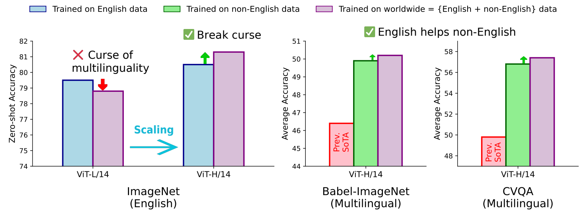

Figure 1. 왼쪽은 L/14에서는 남는 영어 성능 저하가 H/14에서는 뒤집히는 사례, 오른쪽은 영어를 함께 학습했을 때 비영어 지표도 오르는 사례다. 막대는 Table 1과 함께 읽어야 학습 예산 차이가 보인다. [A PDF p.2, Fig.1]

먼저 기억해야 할 결론과 제한은 다음과 같다.

1. **영어 성능 개선은 실재하지만 비교 기준이 두 가지다.** 기존 MetaCLIP H/14의 80.5→81.3은 +0.8 pp. 이 논문 내부 English H/14의 80.4→81.3은 +0.9 pp다. 두 baseline을 바꾸어 쓰지 않는다.
2. **학습량을 고정하면 trade-off가 남는다.** H/14 Worldwide 1.0×는 IN 79.5로 English 1.0× 80.4보다 낮다. Worldwide 2.3×에서 81.3으로 반전된다. “다국어를 넣으면 무료로 좋아진다”는 결과가 아니다.
3. **2.3×를 주어도 L/14에서는 해결되지 않았다.** IN 79.5→78.8이다. H/14는 이 연구가 시험한 규모 중 작동한 지점이지 모든 데이터·loss에 대한 보편적 임계 크기는 아니다.
4. **언어별 tail balancing은 언어별 균등 sampling이 아니다.** 영어가 약 44%를 차지하는 분포를 유지한다. 329개 언어를 각각 1/329 비율로 뽑지 않는다.
5. **“no-filter”는 어떤 샘플도 버리지 않는다는 뜻이 아니다.** 개념 미매칭, head downsampling, 안전성·얼굴 정보 처리, ImageNet 중복 제거가 존재한다. 영어 여부나 외부 CLIP confidence를 주된 개념 선별 기준으로 쓰지 않는다는 의미로 제한해야 한다.
6. **모델이 생성형 번역기나 VLA가 된 것은 아니다.** 기본 모델은 image/text embedding을 만든다. CVQA 57.4는 원문 Table 1에서 보기별 유사도 선택 성능이며, LLM이 문장을 생성하는 VQA는 출판본 별도 실험이다.
7. **최고 성능 주장은 논문 당시 비교 범위의 주장이다.** 2026-09 현재 전체 모델의 순위를 새로 검증한 리더보드가 아니다. SigLIP 2의 IN 83.2보다 MetaCLIP 2의 81.3은 낮다.
8. **공개 recipe와 완전한 실행 재현성은 구별한다.** 소스에는 loss와 forward를 확인할 수 있지만 curation 실행부의 미정의 변수·경로·CLI 불일치가 있다. 그대로 대규모 학습을 재현했다고 말할 수 없다.

<a id="motivation"></a>

## 3. Motivation: 왜 영어용 CLIP을 그대로 다국어로 늘리면 안 되는가

### 3.1 CLIP이 하는 일과 데이터가 개입하는 위치

CLIP은 이미지 encoder와 text encoder를 함께 학습하여, 같은 웹 pair의 두 embedding을 가깝게 하고 batch 내 다른 pair는 구분하도록 만든다. “개”라는 class label을 직접 회귀하는 대신 이미지와 원래의 alt-text가 supervision을 제공한다. 훈련 후에는 “a photo of a dog” 같은 후보 문장과 이미지의 유사도로 zero-shot 분류가 가능하다.

따라서 alt-text가 어떤 언어로 어떤 사물·장소·사건을 표현하는지가 visual encoder에도 영향을 준다. 영어 설명이 붙은 이미지로만 학습하면 text encoder의 어휘뿐 아니라 **이미지의 지역·문화·경제적 분포와 언어가 부각하는 시각 개념**도 제한된다. 영어-only bottleneck은 tokenizer를 교체하는 문제만으로 해결되지 않는다. [리뷰어 해석; A PDF pp.1-4, §1-2]

### 3.2 두 문제를 분리해야 한다

첫 번째 문제는 **데이터 curation**이다. 영어 metadata에 맞지 않는 다른 언어의 caption은 버려지거나, 문자열이 우연히 같은 영어 entry에 잘못 연결될 수 있다. 여러 언어의 metadata를 한 목록으로 합치면 동일 문자열의 의미와 빈도가 섞인다. 영어에서 적절했던 count threshold를 데이터가 적은 언어에 그대로 쓰면 해당 언어의 흔한 개념까지 모두 tail처럼 살아남는다.

두 번째 문제는 **학습 예산과 표현 용량**이다. 같은 수의 training step과 global batch를 유지한 채 영어·비영어를 섞으면 영어 샘플 노출이 줄어든다. 노출을 복구해도 작은 모델의 가중치가 더 많은 언어·개념을 함께 표현해야 하므로 간섭이 남을 수 있다. 이 두 문제를 함께 해결하려는 것이 “worldwide scaling recipe”다. [A PDF pp.2, 5-7]

### 3.3 MetaCLIP 1, MetaCLIP 2, CLIP, SigLIP 구분

| 계열 | 이 논문에서의 역할 | 데이터/학습상의 구별 |
|---|---|---|
| OpenAI CLIP | 원형 architecture·contrastive training·영어 data recipe의 출발점 | 400M pair, 500k 수준 영어 개념 metadata, head cutoff 20k라는 고수준 recipe |
| MetaCLIP 1, *Demystifying CLIP Data* | 영어 curation을 명시적 알고리즘으로 정리한 직접적 기반 | 2.5B 규모로 확장할 때 영어 threshold 170k, tail match 비율 약 6%를 유지 |
| MetaCLIP 1.2 / Altogether | 공식 저장소에 함께 있는 별도 연구 | synthetic caption 재정렬 연구다. MetaCLIP 2의 원어 alt-text recipe와 혼동하지 않는다. |
| MetaCLIP 2 | 본 리뷰 대상 | 언어별 metadata·LID routing·언어별 threshold, 다국어 tokenizer, seen-pair 및 capacity scaling |
| M-CLIP/mCLIP | 이전 다국어 접근의 비교 범주 | 영어 visual encoder 또는 외부 teacher에 의존하는 cross-lingual transfer/distillation |
| OpenCLIP | CLIP 학습·모델 구현 생태계 및 baseline | OpenCLIP이라는 라이브러리 자체와 LAION이라는 데이터·filter pipeline은 다른 대상 |
| mSigLIP / SigLIP 2 | 강한 다국어 시스템 baseline | WebLI, sigmoid objective, 해상도·architecture·학습 전략 등이 동시에 다르므로 단일 원인 ablation이 아님 |

저자는 외부 CLIP model로 데이터를 거르는 것을 “distillation과 유사하다”고 설명한다. 이는 teacher confidence가 학생의 훈련 분포를 제한한다는 비유다. 실제 logits를 맞추는 distillation loss와 데이터 필터링은 계산적으로 같은 연산이 아니다. 본 리뷰에서는 **분포가 teacher에 종속되는 효과**와 **학생-교사 loss**를 구분한다. [A PDF p.3, §2.1]

### 3.4 논문이 의도적으로 유지한 것

MetaCLIP 2는 vanilla dual encoder, transformer, QuickGELU, CLIP contrastive learning을 최대한 유지한다. 그래서 성능 차이를 data recipe와 scaling에 연결하기 쉽다. 다만 “최소 변경”이 “파라미터 수·FLOPs·학습 예산까지 모두 동일”이라는 뜻은 아니다. 900k급 vocabulary, H/14 encoder, 2.3배 batch는 모두 실질적인 자원 변화다. [A PDF §3-4; 공식 코드]

### 3.5 §2.2의 vision encoding 논의: CLIP과 SSL

저자는 CLIP의 언어 supervision이 사람이 표현한 의미에 정렬된 compact visual feature를 만드는 반면, SimCLR·DINOv2 같은 language-free SSL은 시각 신호 자체로 표현을 학습한다고 대비한다. SLIP은 언어/SSL supervision을 결합하고, LiT는 먼저 visual encoder를 학습한 뒤 언어를 정렬한다. Perception Encoder의 중간층 관찰과 MetaCLIP curated data에서 Web-DINO의 scaling 결과도 인용하여 두 방향의 상보성을 제안한다. [A PDF pp.3-4, §2.2]

이는 본 논문이 DINO auxiliary loss나 중간층 token loss를 새로 사용했다는 뜻이 아니다. 또한 “SSL은 모든 시각 정보를 보존한다”는 표현은 연구 방향의 대비로 읽어야 하며, finite-dimensional feature의 무손실 보존을 증명한 것은 아니다. VLM/VLA용 backbone 선택에서 의미적 정렬과 정밀 위치·접촉 정보를 각각 평가해야 하는 이유와 연결된다.

<a id="claims"></a>

## 4. 주장-근거-제한 지도

| 핵심 주장 | 직접 대응하는 근거 | 읽어야 할 제한/반례 |
|---|---|---|
| 영어 중심 curation을 worldwide로 확장했다 | Fig.2, Algorithm 1, §3.2-3.3; A App.A / N App.A | 원어·지역의 완전한 대표성을 보장하지 않음. LID와 metadata source의 편향이 남음 |
| 언어별 threshold가 필요하다 | Table 2 step 4→5: IN 61.1→64.7 | B/32, 1.0×, mT5 설정 결과. isolation만 넣은 step 3→4는 IN 하락 |
| XLM-V tokenizer가 적절하다 | Table 3: Babel 31.5→32.7, XM T→I 38.1→40.0 | mT5 대비 IN은 64.7로 동률. 어휘 규모·embedding parameter 차이 통제 없음 |
| 영어/비영어가 서로 이롭다 | H/14 Table 1 English/Non-English/Worldwide 1×/2.3× 비교 | 동일 total-seen-pair 또는 동일 FLOPs 비교에서 모든 이득이 유지되는 것은 아님 |
| H/14가 curse를 깬다 | Fig.1, Table 1; N Table 9 gradient cosine | 보편적 capacity threshold나 인과 증명은 아님 |
| 문화적 시각 표현이 개선된다 | Table 4, Fig.3 | GeoDE WW13→WW29는 94.3→93.4로 하락. 전 지표 개선 아님 |
| alignment/uniformity가 좋다 | Fig.4, 자체 5k holdout | 외부 baseline의 중복 여부 미통제. 두 metric 모두 각각 최소인 모델은 아님 |
| MLLM에 전이된다 | N §4.4, Table 5, App.E | 일부 항목 악화. frozen visual encoder 조건, VLA 조작 성공률 증거 없음 |
| 소형 모델로 압축 가능하다 | N §4.6, Table 6 | 증류 L/14 IN 79.2는 영어 L/14 79.5보다 낮아 curse 완전 해소 아님 |
| 300+ 언어 지원 | metadata 329 언어, LID mapping, Babel-IN 280 언어 | XM3600 mi 0.5/1.2, quz 2.5/6.5처럼 매우 낮은 언어가 존재 |

<a id="notation"></a>

## 5. 선수 지식과 notation/텐서 shape 사전

### 5.1 원문 데이터 기호와 리뷰 보조 기호

| 기호 | 의미와 자료형/shape | 주의 |
|---|---|---|
| $`D`$ | 원시 image-text pair pool, 가변 길이 목록 | 모든 raw 웹 문서와 동일한 집합이 아님 |
| $`D^*`$ | curation으로 수용한 pair 목록/확률 분포 | 반복 학습으로 같은 pair를 다시 볼 수 있음 |
| $`M`$ | 언어 code→metadata entry 목록인 dictionary | 원문 §3.1의 영어 목록에서 §3.3의 dictionary로 확장 |
| $`\ell_i`$ | pair i의 LID language code, categorical scalar | 리뷰 기호; text.lang에 대응 |
| $`K_\ell`$ | 언어별 entry 수 | 모든 언어에서 동일하지 않음 |
| $`J_i`$ | caption i에 매칭된 entry ID 집합 | 길이 $`m_i`$가 가변, 빈 집합 가능 |
| $`c_{\ell j}`$ | entry j가 매칭되는 raw pair 수, 비음수 정수 | token 총 등장 횟수와 구분 |
| $`t_{\mathrm{en}},t_\ell`$ | 영어/각 언어의 head-tail count cutoff, scalar | 비율이 아니라 count 단위 |
| $`p`$ | 영어에서 계산한 tail **match mass** 비율 | tail entry 수 비율·언어 sampling 확률 아님 |
| $`q_{\ell j}`$ | entry별 수용 확률, $`[0,1]`$ | pair 확률과 다름 |
| $`\pi_i`$ | pair i의 전체 수용 확률 | 여러 매칭의 OR 확률 |
| $`B,b,R`$ | global batch, local batch, rank 수; 균등하면 $`B=bR`$ | 원문 batch와 공개 config의 값 차이를 기록 |
| $`L`$ | tokenized text 길이, 공개 설정 77 | 원문 모델 이름 L/14의 L과 다른 의미 |
| $`d_v,d_t,d`$ | vision hidden, text hidden, 최종 joint embedding 차원 | H/14 공개 설정은 1280, 1024, 1024 |
| $`I,X`$ | 이미지 $`[B,3,224,224]`$, token ID $`[B,77]`$ | 정수 token ID에 직접 gradient가 흐르지 않음 |
| $`V,T`$ | L2-normalized image/text embeddings, 각각 $`[B,d]`$ | 두 encoder가 따로 만든 후 비교 |
| $`S`$ | 이미지×텍스트 logits, $`[B,B]`$ | attention matrix와 전혀 다른 행렬 |
| $`\alpha,\tau,s`$ | logit-scale parameter, temperature, scale | $`s=e^\alpha=1/\tau`$ |

### 5.2 세 종류의 tokenizer를 구별하기

1. **Wikipedia word tokenizer**: unigram/bigram metadata를 만들 때 단어를 나눈다. 공백 없는 문자는 언어별 segmenter를 사용한다.
2. **Substring matcher**: alt-text에서 이미 만든 metadata 문자열을 찾는다. Appendix A.1은 위 segmenter를 alt-text matching에 쓰는 것이 아니라고 명시한다.
3. **CLIP text tokenizer**: 선별을 통과한 alt-text를 XLM-V token ID로 바꾸어 neural text encoder에 넣는다. 메타데이터 ID와 neural vocabulary ID는 대응하지 않는다.

예컨대 “고양이”라는 metadata entry 하나가 매칭되어도 text tokenizer에서는 여러 subword가 나올 수 있다. curation이 loss에 “고양이 class ID”를 넘기는 것도 아니다. loss에 들어가는 것은 원래 caption의 token sequence 전체다.

<a id="curation"></a>

## 6. 원문 §3: Metadata, curation과 Algorithm 1

### 6.1 Figure 2의 세 축

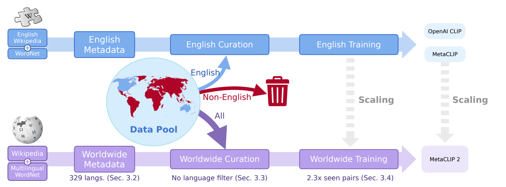

Figure 2. 위쪽 영어 경로에서 제외되던 비영어 데이터가 아래쪽 worldwide 경로로 들어간다. metadata 범위, curation 규칙, training budget을 모두 변경한다. 그림의 “No language filter”를 부록의 안전성·중복 제거까지 없다는 의미로 읽으면 안 된다. [A PDF p.4, Fig.2]

이 pipeline은 offline 전처리와 online neural training으로 나뉜다. metadata를 만드는 시점에는 이미지 encoder를 실행할 필요가 없다. curation에는 alt-text, LID, entry count를 사용한다. 선별한 pair가 비로소 image/text encoder를 통과한다. 따라서 Algorithm 1은 **CLIP forward 알고리즘이 아니라 CLIP이 보게 될 데이터 분포를 정하는 알고리즘**이다.

### 6.2 §3.1: 영어 MetaCLIP의 head-tail balancing 복습

500k 수준 영어 metadata는 WordNet synset, Wikipedia unigram, bigram, page title을 합쳐 중복을 제거한 목록이다. 각 caption에 매칭된 개념을 찾고 전체 pool에서 entry count를 집계한다. 매우 흔한 head는 확률적으로 덜 뽑고 희귀한 tail은 살린다. [A PDF pp.4-5]

원문의 `entry_count`, `t`, `entry_prob`를 리뷰 기호로 쓰면 다음과 같다. **C1은 원문 산문의 수학적 재표기**다.

```math
c_j=\sum_{i\in D}\mathbf{1}\{j\in J_i\},\qquad q_j=\begin{cases}1,&c_j\lt t,\\t/c_j,&c_j\ge t.\end{cases}\qquad\text{[C1]}
```

- 입력: entry별 count vector $`c\in\mathbb{N}_0^K`$, scalar cutoff $`t`$.
- 출력: entry 수와 같은 길이의 probability vector $`q\in[0,1]^K`$.
- 연산: count를 cutoff와 비교하고 element-wise division한다. softmax나 합이 1이 되도록 하는 정규화가 아니다.
- $`c_j=0`$은 매칭이 없는 entry다. 실제 코드의 max/clamp는 양의 t일 때 0으로 나누는 것을 방지한다. 그 entry는 관측 pair의 J에는 나오지 않는다.
- 단일 entry에만 독립적으로 연결된 pair라면 수용 횟수의 기대값은 $`c_jq_j=\min(c_j,t)`$다. 다중 entry pair에서는 이 해석을 그대로 전체 빈도 상한으로 확장할 수 없다.

원문의 OpenAI CLIP 20k, MetaCLIP 170k는 corpus 규모와 함께 해석해야 한다. “어떤 데이터에도 170k가 적정”이라는 hyperparameter 법칙이 아니다. 같은 단어 count가 pool 크기에 비례하여 커질 수 있으므로 threshold도 data 규모에 의존한다.

### 6.3 §3.2: Worldwide metadata를 만드는 네 source

| Source | 처리 | 얻는 정보와 취약점 |
|---|---|---|
| Multilingual WordNet | 31개 언어의 synset 포함 | 어휘·의미 개념을 제공하지만 모든 329개 언어를 덮지는 않음 |
| Wikipedia unigram | 2024년 5월 dump, WikiExtractor로 plain text, 언어별 token count | 빈도가 높은 단어. 기능어도 포함될 수 있음 |
| Wikipedia bigram | 단어 adjacency count와 PMI 계열 ranking | 인명·지명·복합 개념. raw PMI는 희귀 오탈자에 취약 |
| Wikipedia page title | 40개 무작위 날짜 snapshot의 title을 traffic으로 ranking | 개체·사건 등을 보완하지만 대중성·지역별 편집량 편향이 남음 |

특수 segmenter는 Tibetan/Botok(bo,dz), Japanese/MeCab(ja,ryu), Khmer CRF(km), LaoNLP(lo), Myanmar CRF(my), Thai segmenter(th), CKIP Chinese(zh,zh_classical,zh_yue)다. 이 목록은 A Table 5 / N Table 7이며 공식 코드에도 해당 언어 모듈이 있다. 한국어 `ko`는 이 특수 목록에 없으며, 이것이 한국어가 미지원이라는 뜻은 아니다. [A PDF p.15, App.A.1; N PDF p.16]

**[공식 코드 확인]** 공개 metadata builder에는 unigram 상위 10%, 영어 기준 상한 251,465; title 상위 76%, 상한 61,235 등의 cap이 있다. bigram cap은 source에서 최대 100,646을 사용한다. 문서에 있는 “동일 언어 unigram 수의 40%” 설명이 현재 함수에 그대로 구현되어 있지는 않으므로, README만으로 정확한 metadata 구성 비율을 확정해서는 안 된다. 자세한 대조는 §11에 둔다.

### 6.4 §3.3: LID routing과 language isolation

metadata source의 언어 code 집합과 LID의 출력 code 집합은 다르다. 저자는 LID 한 언어에 여러 Wikipedia 언어·변종을 연결하고, 같은 LID 그룹으로 가는 metadata를 합친다. 연결할 수 없는 metadata는 `other` 그룹을 둔다. 이후 alt-text마다 예측한 언어의 dictionary 값만 substring match한다.

```math
\ell_i=\mathrm{LID}(a_i),\qquad J_i=\mathrm{substr\_match}(a_i,M[\ell_i]),\qquad c_{\ell j}=\sum_{i:\ell_i=\ell}\mathbf{1}\{j\in J_i\}.\qquad\text{[C2]}
```

- $`a_i`$는 caption 문자열, LID 출력은 category 하나다. 이미지 입력을 보고 언어를 분류하는 식이 아니다.
- $`J_i`$는 integer ID의 가변 길이 집합이다. 같은 entry가 한 caption에 반복 등장해도 공식 matcher는 `set`으로 고유 ID를 만든다.
- 언어 그룹별 count vector를 독립 집계한다. 같은 철자의 entry라도 다른 언어 그룹이면 다른 count다.
- **가정**: LID가 충분히 정확하고 caption을 한 대표 언어로 routing해도 유효한 개념을 찾을 수 있다.
- **실패 조건**: 혼합 언어 caption, 짧은 product code, 로마자 표기, 방언·언어 변종의 부정확한 mapping은 엉뚱한 metadata 선택 또는 미매칭을 낳을 수 있다.

language isolation은 의미 disambiguation model을 새로 학습하는 방법은 아니다. 영어 caption에 등장한 외래어나 고유명사를 여전히 정확히 이해한다고 보장하지 않는다. 단지 다른 언어의 문자열·count가 불필요하게 섞이는 것을 줄인다.

### 6.5 영어 cutoff에서 tail match mass p를 계산

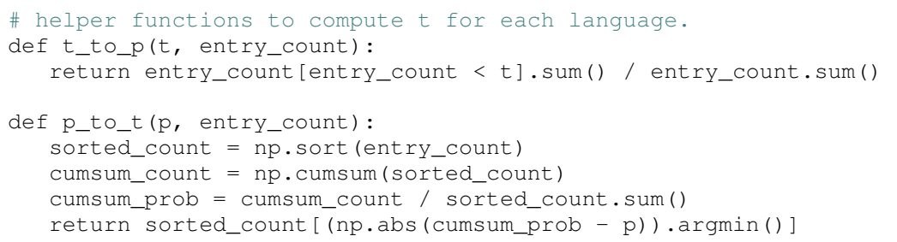

Algorithm 1의 helper 함수 발췌. 이 코드는 원문의 수식 역할을 하므로 편집 가능한 식 및 상세 해설을 함께 제공한다. [A PDF p.6]

**C3: 원문 `t_to_p`의 정확한 수학적 재표기.**

```math
p=\frac{\sum_{j=1}^{K_{\mathrm{en}}}c_{\mathrm{en},j}\,\mathbf{1}\{c_{\mathrm{en},j}\lt t_{\mathrm{en}}\}}{\sum_{j=1}^{K_{\mathrm{en}}}c_{\mathrm{en},j}}.\qquad\text{[C3]}
```

분자는 cutoff보다 count가 작은 entry들의 **count 합**, 분모는 모든 entry count 합이다. 따라서 이 p는 다음 셋과 다르다.

- tail entry가 metadata에서 차지하는 개수 비율.
- raw dataset에서 tail caption이 차지하는 비율.
- curation 이후 dataset에서 tail pair가 차지하는 비율.

한 caption이 여러 entry에 매칭되면 분모에 여러 번 기여한다. 원문의 약 6%는 이 **매칭 질량**의 비율이다. 코드에서 0.06을 무조건 대입하지 않고 현재 영어 corpus와 t로 계산한다. “언어마다 tail이 6%면 좋다”는 **invariance assumption**을 다른 언어에 전이한 것이며, 인간 언어의 보편적 법칙을 증명한 것은 아니다.

### 6.6 p에서 다른 언어의 cutoff로 역변환

**C4: 원문 `p_to_t`의 재표기.** 언어별 count를 작은 순서로 정렬한 값을 $`c_{\ell,(r)}`$라 하자.

```math
F_\ell(k)=\frac{\sum_{r=1}^{k}c_{\ell,(r)}}{\sum_{r=1}^{K_\ell}c_{\ell,(r)}},\qquad k^*=\mathop{\arg\min}_{1\le k\le K_\ell}|F_\ell(k)-p|,\qquad t_\ell=c_{\ell,(k^*)}.\qquad\text{[C4]}
```

1. `np.sort`는 entry frequency만 정렬한다. metadata의 의미 순위나 trainable embedding을 정렬하는 것이 아니다.
2. `np.cumsum`은 작은 count부터 매칭 질량을 누적한다.
3. 전체 count 합으로 나누어 cumulative match-mass 비율을 얻는다.
4. 목표 p에 가장 가까운 지점을 고른다.
5. 그 지점의 count를 cutoff로 사용한다. 반환값은 확률이 아니라 정수 빈도다.

**중요한 이산화 문제.** `t_to_p`는 엄격한 $`c\lt t`$를 사용하지만, `p_to_t`의 누적합은 선택된 위치의 count를 **포함**한다. 따라서 역변환이 원래 비율을 정확히 복원하는 함수는 아니다. 같은 count가 여러 개 있는 ties도 있다. 원문이 말하는 “같은 tail proportion”은 실제 코드에서는 근사적 의도다.

**[검산: 해설용 예제]** 영어 counts를 [1, 2, 7, 10], 영어 t를 5라 하면 tail mass는 (1+2)/20=0.15다. 다른 언어 counts [1, 3, 6, 10]의 누적 비율은 [0.05, 0.20, 0.50, 1.00]이다. 가장 가까운 0.20을 택하므로 t=3이다. 그러나 `t_to_p(t=3)`를 다시 계산하면 엄격한 `<3` 때문에 1/20=0.05다. 이는 부동소수점 오차가 아니라 경계 정의와 이산 count의 문제다. 실제 billion-scale 분포에서 차이가 얼마나 큰지는 언어별 count를 확인해야 한다.

또한 PDF pseudocode는 영어까지 `p_to_t`로 재계산하지만, 공식 `global_count()`는 영어에 원래 `t_en`을 유지한다. 이것은 의미 있는 구현 차이이며 §11에서 다시 정리한다.

### 6.7 entry 확률과 pair 확률의 차이

**C5: 언어별 entry sampling.**

```math
q_{\ell j}=\frac{t_\ell}{\max(c_{\ell j},t_\ell)}=\min\!\left(1,\frac{t_\ell}{c_{\ell j}}\right)\quad(c_{\ell j}\gt0).\qquad\text{[C5]}
```

분모의 clamp는 원문 `entry_counts[counts < t] = t`와 같다. 코드상 원래 count array를 덮어쓸 수 있으므로 진단용 원본 count는 따로 저장하는 것이 좋다. cutoff와 같은 entry는 head/tail 이름과 관계없이 확률 1이다.

Algorithm 1은 caption의 매칭 entry를 순서대로 검사하여 **하나라도 sampling에 성공하면 pair를 한 번 추가하고 break**한다. 각 난수를 독립으로 뽑는다는 가정 아래 pair 수용 확률은 다음이다.

```math
\pi_i=1-\prod_{j\in J_i}(1-q_{\ell_i j}),\qquad\pi_i=0\ \text{if }J_i=\varnothing.\qquad\text{[C6: 리뷰어 유도, 공식 코드와 일치]}
```

유도는 “한 번 이상 성공”의 여사건인 “모든 entry에서 실패”를 이용한다. 각 실패 확률을 곱한 뒤 1에서 뺀다. neural attention, noisy-OR network 학습, 중요도 softmax가 아니다. `break`는 한 caption을 여러 번 추가하는 중복을 막으며, 이상적인 독립 난수에서 entry 검사 순서는 수용 확률을 바꾸지 않는다.

**[검산: 해설용 예제]** t=3이고 매칭된 두 head의 count가 6, 10이면 q는 0.5, 0.3이다. pair 확률은 1−0.5×0.7=0.65다. `max(q)=0.5`, 평균 0.4, 합 0.8 중 어느 것도 아니다. tail entry 하나가 추가되어 q=1이면 pair 전체가 반드시 통과한다. 아무 entry도 없으면 통과하지 않는다.

**이로부터 나오는 제한**: count가 큰 “photo” entry가 tail concept와 자주 함께 나오면 그 pair는 tail 덕분에 살아남는다. 따라서 curation 후 “photo”의 총 빈도가 t 이하로 엄격히 제한되지는 않는다. 또한 수용 확률은 매칭 entry 수에 따라 커질 수 있어 긴 caption·metadata-rich caption을 더 선택할 가능성이 있다. 이것은 논문의 언어별 balancing이 독립 class별 균등 dataset을 생성하지 않는 이유다.

### 6.8 Algorithm 1 행별 해설

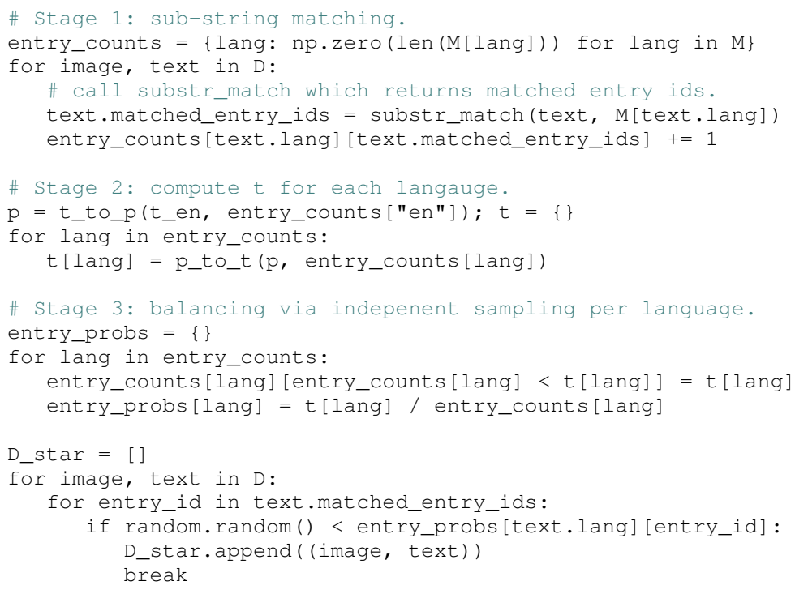

Algorithm 1 본체. 아래 행 번호는 원문에 없는 설명용 실행 번호다. 원문 `np.zero`는 NumPy에서 `np.zeros`여야 하는 pseudocode 오타이며 이미지에는 그대로 보존했다. [A PDF p.6; N PDF p.6]

| 실행 행 | 원문 연산 | 입력→출력, 목적 및 경계 조건 |
|---|---|---|
| 1 | `t_to_p(t, entry_count)` | count vector와 영어 cutoff를 받아 C3 scalar p 반환. total count가 0이면 정의 불가 |
| 2 | `entry_count[entry_count < t].sum()` | tail **entry 개수**가 아닌 tail count 합 |
| 3 | `p_to_t(p, entry_count)` | p와 한 언어 count vector로 threshold 추정 |
| 4 | `sorted_count = np.sort(...)` | 작은 count부터 순서화. 의미 ID는 이후 sampling을 위해 원래 배열에 유지 |
| 5 | `cumsum_count = np.cumsum(...)` | match mass 누적 |
| 6 | `cumsum_prob = ... / sum()` | 누적 mass를 전체 mass로 나눔 |
| 7 | `abs(... - p).argmin()` | 가장 가까운 비율 위치 선택, 그 count 반환; exact inverse 아님 |
| 8 | 언어별 zero vector 생성 | 각 언어 entry 수 K에 맞는 histogram 준비 |
| 9 | raw pair loop | 모든 caption의 LID 결과가 이미 주어진다는 입력 가정 |
| 10 | `substr_match(text, M[text.lang])` | 해당 언어 metadata와 매칭해 고유 entry ID 목록 기록 |
| 11 | matched counts `+= 1` | 각 매칭 entry에 pair당 1회 가산; sharding하면 이후 global sum 필요 |
| 12 | 영어 `t_to_p` 호출 | reference p 계산, threshold dictionary 초기화 |
| 13 | 각 언어 `p_to_t` | corpus별 t를 구함. 공개 구현은 영어 원 t 유지 |
| 14 | `entry_probs = {}` | probability dictionary 생성 |
| 15 | 낮은 count를 t로 clamp | tail의 수용 확률이 1이 되게 준비 |
| 16 | `t / clamped_count` | C5. 합이 1인 분포로 normalize하지 않음 |
| 17 | `D_star = []` | 수용된 pair 목록 초기화 |
| 18 | raw pair loop | 각 pair의 저장된 J를 재사용해 반복 substring scan을 피함 |
| 19 | entry ID loop | 각 매칭 entry가 해당 pair를 살릴 기회 제공 |
| 20 | uniform random < entry probability | 독립 Bernoulli 성공 검사 |
| 21 | append | pair를 D*에 추가, 원래 caption 내용 유지 |
| 22 | break | 다중 entry 성공에 따른 pair 중복 삽입 방지 |

`D*`는 LID로 언어만 균등 추출한 결과도 아니고, 이미지가 caption과 실제로 일치한다고 검증한 결과도 아니다. “cat”라는 문자열이 있다는 사실만으로 image-caption semantic match가 참인지 알 수 없다. 학습 단계에서는 이런 noisy pair의 영향까지 함께 흡수해야 한다.

### 6.9 Appendix A의 실제 확장 비용

**[저자 보고]** Aho-Corasick automaton을 사용하여 brute-force matching보다 약 2,000배 빠르게 매칭한다. 언어별 automaton을 미리 저장하고 새 언어를 만날 때만 lazy load한다. sampling 확률은 `mmap`으로 읽어 모든 언어 배열을 RAM에 한 번에 올리지 않는다. arXiv Appendix B는 800개의 병렬 job, 각 40GB CPU memory, substring match 및 count에 1시간을 보고한다. [A PDF pp.15-16]

**[리뷰어 해석]** Aho-Corasick은 여러 pattern을 trie와 failure link로 공유해 text를 한 번 훑으며 매칭을 출력한다. 전처리한 automaton이 있을 때 한 text의 실행은 통상 text 길이와 출력 match 수에 비례하는 형태가 된다. 위 2,000배는 **해당 matching 구현 구간**의 저자 보고다. 원본 crawling, 이미지 다운로드·decode, 안전성 처리, neural training, global communication 전체를 2,000배 줄였다는 결과가 아니다. 800×40GB=32,000GB는 job별 요청 memory의 합이며, 실제 동시에 점유한 RAM 측정값이라고 간주하지 않는다.

### 6.10 “no-filter”와 실제 선별을 일관되게 읽기

| 단계 | 실제로 제거/변형하는 것 | 원문 근거 |
|---|---|---|
| 영어-only gate | MetaCLIP 2에서는 제거 | §1, Fig.2 |
| pretrained CLIP confidence gate | 핵심 concept curation에 의존하지 않는 설계 | §2.1, §3 |
| metadata matching | J가 비면 Algorithm 1에서 수용되지 않음 | Algorithm 1 |
| head balancing | 흔한 entry pair의 일부를 확률적으로 제거 | Algorithm 1 |
| safety classifier | NSFW 등 유해 content 제거 | A App.A.2 / N App.A.3 |
| face detector | human biometric/PII를 제거한다고 보고 | 같은 부록; crop/blur/whole-image removal의 정확한 동작은 미기재 |
| benchmark deduplication | ImageNet 평가 overlap을 제거한다고 보고 | 64-bit similarity hash 설명 |

**결론적으로 model-free는 metadata 기반 분포 선별의 성격을 말한다.** pipeline 전체에는 LID, 언어 segmenter, safety classifier, face detector, similarity-search embedding 같은 모델 기반 구성요소가 들어갈 수 있다. “외부 teacher로 개념 품질을 재단하지 않는다”와 “어떠한 pretrained model도 사용하지 않는다”는 서로 다른 주장이다.

<a id="forward"></a>

## 7. 한 pair의 end-to-end forward와 contrastive loss

### 7.1 이 절의 출처와 적용 범위

원문은 vanilla CLIP을 계승한다고 서술하고 neural forward와 loss를 수식으로 다시 쓰지 않는다. 이 절의 **F1-F8, G1-G3은 공식 코드와 일반 미분을 연결한 리뷰어 재구성**이다. 원문 Eq.(1)로 인용하면 안 된다. 근거는 고정 commit의 `model.py`, `model_worldwide.py`, `loss.py`, `factory.py`, `train.py`, H/14 config다. [공식 코드 확인]

이미지 한 장의 alt-text가 “탁자 위의 빨간 찻잔”이라고 가정하자. 이 caption이 실제 모델에서 어떤 token ID가 되는지는 tokenizer를 실행하지 않았으므로 임의 ID를 제시하지 않는다. 여기서는 단계별 자료형과 shape를 추적한다.

### 7.2 curation에서 model input까지

1. LID가 caption을 `ko`로 routing한다. `M['ko']`의 metadata와 매칭하여 J를 만든다. 이 routing 결과는 설명용 가정이다.
2. C3-C5로 미리 계산한 언어별 확률에서 C6의 pair probability를 얻는다. sampling에 수용되면 이미지와 **원문 caption**이 학습 stream에 들어간다.
3. 공개 training dataset은 한 이미지에 caption 후보가 여러 개 있으면 `random.choice`로 하나를 고른 뒤 수용 확률을 검사한다. “같은 이미지의 모든 번역 caption을 한꺼번에 positives로 넣는 방식”은 아니다.
4. 이미지에 RandomResizedCrop 224, bicubic interpolation, RGB 변환, CLIP mean/std normalization을 적용한다. 공개 설정은 crop scale (0.9,1.0)이다. `gpu_trans` 설정에서는 CPU 단계가 byte tensor를 반환하고 device 단계에서 정규화한다.
5. caption은 `facebook/xlm-v-base` tokenizer의 **vocabulary와 segmentation**을 사용하여 최대 77 token으로 truncate/pad한다. 완성된 XLM-V 언어모델의 transformer 가중치를 가져와 고정하는 설정이 아니다.
6. 여러 언어의 pair를 섞은 local batch에서 images는 $`[b,3,224,224]`$, token IDs는 $`[b,77]`$가 된다.

### 7.3 Vision encoder: 256개 patch에서 하나의 embedding까지

공개 H/14 config는 patch 14, resolution 224, 32 blocks, width 1280, head width 80이다. 따라서 head 수는 1280/80=16, patch grid는 16×16=256이다. [공식 코드 확인]

```math
\begin{aligned}I&\in\mathbb{R}^{b\times3\times224\times224},\\Z_{\mathrm{patch}}&=\mathrm{Conv}_{14,14}(I)\in\mathbb{R}^{b\times1280\times16\times16},\\Z_0&=\mathrm{LN}\!\left([z_{\mathrm{CLS}};\mathrm{flatten}(Z_{\mathrm{patch}})]+P_v\right)\in\mathbb{R}^{b\times257\times1280}.\end{aligned}\qquad\text{[F1]}
```

Conv kernel/stride가 모두 14이므로 겹치지 않는 patch projection과 같다. flatten은 공간축 16×16을 token축 256으로 합친다. CLS 1개를 추가하고 $`P_v\in\mathbb{R}^{257\times1280}`$를 batch에 broadcast하여 더한다. LayerNorm은 각 token의 hidden feature축에 적용된다.

각 pre-norm transformer block의 공통 계산은 다음이다.

```math
\begin{aligned}Y&=Z+\mathrm{MHA}(\mathrm{LN}_1(Z)),\\Z'&=Y+\mathrm{MLP}(\mathrm{LN}_2(Y)),\\\mathrm{MLP}(x)&=W_2\,\mathrm{QuickGELU}(W_1x+b_1)+b_2,\\\mathrm{QuickGELU}(x)&=x\,\sigma(1.702x).\end{aligned}\qquad\text{[F2]}
```

MLP는 각 token에 독립적으로 적용되고 hidden width가 기본 4배로 확장되었다가 원래 width로 돌아온다. W 표기는 column-vector 관례이며 실제 PyTorch tensor가 저장한 weight transpose convention과 구분한다. residual은 동일 shape를 유지한다.

하나의 head를 설명하면 다음과 같다.

```math
Q=ZW_Q,\quad K=ZW_K,\quad V_h=ZW_V,\qquad A_h=\mathrm{softmax}_{\mathrm{key}}\!\left(\frac{QK^\top}{\sqrt{d_h}}+C\right),\qquad O_h=A_hV_h.\qquad\text{[F3]}
```

Vision에서는 각 head가 $`[b,257,80]`$이고 attention logits는 $`[b,16,257,257]`$로 생각할 수 있다. key token축에 softmax를 취하므로 query마다 가중치 합은 1이다. causal mask 없이 모든 vision token 간 상호작용을 허용한다. head 결과를 concat하고 output projection한다. 이 $`257\times257`$ attention과 CLIP loss의 $`B\times B`$ pair similarity는 다른 축이다.

32개 block 뒤 첫 CLS token만 뽑아 LN 후 $`W_v\in\mathbb{R}^{1280\times1024}`$로 projection한다. patch token 256개가 그대로 classification output이 되는 것이 아니다.

```math
u_i=\mathrm{LN}(Z_{32}[i,0,:])W_v\in\mathbb{R}^{1024},\qquad v_i=\frac{u_i}{\|u_i\|_2}.\qquad\text{[F4]}
```

L2 normalization은 마지막 feature축의 norm으로 나눈다. 실제 `F.normalize`에는 작은 norm에 대한 epsilon 보호가 있다. CLIP의 cosine geometry는 이 정규화 후 feature에 적용된다.

### 7.4 Text encoder: multilingual vocabulary와 EOS pooling

공개 config는 vocabulary **901,629**, context 77, hidden 1024, 16 heads, 24 blocks이다. text attention의 head dimension은 64다. tokenizer ID는 학습 가능한 $`E\in\mathbb{R}^{901629\times1024}`$의 row를 lookup한다.

```math
\begin{aligned}H_0&=E[X]+P_t\in\mathbb{R}^{b\times77\times1024},\\H_{24}&=\mathrm{Transformer}_{24}(H_0;C_{\mathrm{causal}}),\\w_i&=\mathrm{LN}(H_{24})[i,e_i,:]W_t,\quad t_i=\frac{w_i}{\|w_i\|_2}.\end{aligned}\qquad\text{[F5]}
```

- $`P_t\in\mathbb{R}^{77\times1024}`$는 position embedding이다.
- text sequence의 미래 위치를 보지 않도록 상삼각에 $`-\infty`$를 놓는 additive causal mask를 사용한다. text backbone이 XLM-V vocabulary를 써도 XLM-R의 bidirectional pretrained architecture로 바뀌는 것이 아니다.
- $`e_i`$는 EOS 위치다. `WorldWideCLIP.encode_text()`는 `text == 2`의 위치를 찾아 그 hidden state를 pooling한다.
- 기존 영어 CLIP의 “가장 큰 token ID가 EOT이므로 argmax로 위치를 선택”하는 규칙을 worldwide에 그대로 쓰면 잘못된 token을 뽑는다. 공식 subclass가 바뀐 이유가 이것이다.
- EOS가 각 sequence에 정확히 하나 포함된다는 계약이 필요하다. 이 구현은 `nonzero()` 결과 전체를 사용하므로 EOS가 0개/여러 개면 output row 수가 batch와 달라질 수 있다.
- padding은 EOS 뒤에 있으며 EOS의 causal receptive field에는 뒤쪽 padding이 들어가지 않는다. 77을 초과한 caption은 정보가 잘리므로 언어별 token 효율 차이가 실질적이다.

**[검산]** 이 text embedding table만 901,629×1,024=923,268,096 parameters다. 2-byte weight 저장만 가정하면 약 1.72 GiB이며 optimizer state·gradient·activation은 별도다. “H/14”는 vision scale 이름이므로 전체 dual encoder의 memory를 vision ViT 크기만으로 계산해서는 안 된다. vocabulary 증가는 main compute graph의 층 구조를 유지해도 parameter budget을 크게 바꿀 수 있다.

### 7.5 CLIP contrastive objective

L2-normalized image features V와 text features T를 얻고 global batch의 모든 후보를 비교한다.

```math
S=sVT^\top\in\mathbb{R}^{B\times B},\qquad S_{ij}=e^\alpha v_i^\top t_j=\frac{v_i^\top t_j}{\tau},\qquad\tau=e^{-\alpha}.\qquad\text{[F6]}
```

행 i는 이미지 i, 열 j는 text j다. diagonal i=j는 같은 원래 pair다. metadata concept ID나 language ID를 class label로 사용하는 식이 아니다. 이미지 i를 보고 정답 caption i를 찾는 loss와, caption i를 보고 정답 이미지 i를 찾는 loss를 평균한다.

```math
\begin{aligned}\mathcal{L}_{I\to T}&=-\frac1B\sum_{i=1}^{B}\log\frac{\exp S_{ii}}{\sum_{j=1}^{B}\exp S_{ij}},\\\mathcal{L}_{T\to I}&=-\frac1B\sum_{i=1}^{B}\log\frac{\exp S_{ii}}{\sum_{j=1}^{B}\exp S_{ji}},\\\mathcal{L}_{\mathrm{CLIP}}&=\frac12\left(\mathcal{L}_{I\to T}+\mathcal{L}_{T\to I}\right).\end{aligned}\qquad\text{[F7]}
```

첫째 식의 분모는 image i에 대해 text 후보 j를 합친다. 둘째 식은 text i에 대해 image 후보 j를 합친다. 코드에서는 transposed logits 두 개에 각각 `F.cross_entropy`를 적용하고 2로 나누므로 log-softmax의 안정적인 계산을 이용한다. 정답 label은 0부터 B−1이다.

**MetaCLIP 2가 새로 추가한 별도 multilingual loss는 확인되지 않는다.** 서로 다른 언어가 공유 visual space와 같은 neural parameters를 사용하면서 학습한다. 같은 사물을 여러 언어로 기술한 sample들이 분포 수준에서 연결될 수 있지만, 모든 번역 문장끼리 explicit alignment loss를 적용하는 것이 아니다.

**False negative 가능성.** 서로 다른 pair라도 같은 사진의 다른 caption 또는 같은 개념의 번역이라면 semantic positive일 수 있다. 그러나 F7에서 같은 diagonal pair가 아니면 negative 후보에 들어간다. 큰 batch가 제공하는 더 많은 negative와 이런 false negative의 증가를 함께 고려해야 한다. 본문에는 cross-lingual multi-positive loss나 이런 경우를 완전히 제거하는 증거가 없다.

### 7.6 작은 숫자로 loss를 직접 계산

**[검산: 해설용 예제, 실제 checkpoint 출력 아님]** 두 image와 두 caption을 다음처럼 정규화했다고 하자.

```math
V=\begin{bmatrix}1&0\\0&1\end{bmatrix},\quad T=\begin{bmatrix}0.8&0.6\\0&1\end{bmatrix},\quad s=2,\qquad S=\begin{bmatrix}1.6&0\\1.2&2.0\end{bmatrix}.\qquad\text{[F8]}
```

각 row의 image→text 정답 확률은 약 0.8320, 0.6900이다. 두 negative log probability는 0.1839, 0.3711이므로 방향 평균은 0.2775다. text→image는 S의 열을 비교하므로 정답 확률은 약 0.5987, 0.8808, 방향 평균은 약 0.3200이다. 최종 loss는 약 **0.2987**이다.

첫 image는 첫 text에 상당히 가깝지만, 첫 text는 둘째 image와도 cosine 0.6으로 가깝다. 그래서 text→image 방향이 더 모호하다. symmetric loss가 두 방향을 따로 평가하는 이유를 이 예제가 보여 준다.

### 7.7 gradient가 어디로 흐르는가

행/열 softmax 확률을 각각 $`P^{r}_{ij}`$, $`P^{c}_{ij}`$라 하면 full global objective의 logit gradient는 다음이다.

```math
G_{ij}=\frac{\partial\mathcal{L}}{\partial S_{ij}}=\frac{P^r_{ij}+P^c_{ij}-2\mathbf{1}\{i=j\}}{2B}.\qquad\text{[G1]}
```

diagonal에는 정답 확률이 1보다 작을 때 음의 gradient가 생겨 similarity를 높이는 방향으로 업데이트한다. off-diagonal에는 양의 gradient가 생겨 잘못 대응한 similarity를 낮춘다. 앞 예제의 image0/text0 logit gradient는 대략 −0.1423으로, 정답 쌍을 더 가깝게 하라는 신호다.

```math
\frac{\partial\mathcal{L}}{\partial V}=sGT,\qquad\frac{\partial\mathcal{L}}{\partial T}=sG^\top V,\qquad\frac{\partial\mathcal{L}}{\partial\alpha}=\sum_{i,j}G_{ij}S_{ij}.\qquad\text{[G2]}
```

이 gradient는 unit vector를 만든 정규화도 통과해야 한다. epsilon이 작동하지 않는 양의 norm 구간에서 $`v=u/\|u\|`$의 gradient는 다음이다.

```math
\nabla_u\mathcal{L}=\frac1{\|u\|_2}\left(I-vv^\top\right)\nabla_v\mathcal{L}.\qquad\text{[G3]}
```

$`I-vv^\top`$가 norm을 늘리는 radial 성분을 제거하여 주로 방향을 조정한다. 이 gradient가 projection→CLS/EOS hidden→각 transformer block→patch/word embedding으로 역전파된다. loss는 curation의 count, discrete LID, substring rule, random accept까지 역전파되지 않는다. 이들은 **비미분 전처리**다.

### 7.8 분산 학습: local loss와 global negatives

공개 config는 `local_loss=True`, `gather_with_grad=True`다. 각 rank는 local $`[b,d]`$ embeddings를 계산하고 differentiable all-gather로 $`[B,d]`$ 후보를 모은다. 각 rank의 image logits와 text logits는 각각 **[b,B]**다. local label은 `arange(b) + b*rank`로 global 정답 위치에 맞춘다. gradient를 포함한 gather와 분산 gradient aggregation이 두 encoder의 global negative 학습을 연결한다. [공식 코드 확인: `ClipLoss`, `gather_features`]

이는 rank마다 full $`[B,B]`$ 행렬을 저장할 필요를 줄인다. 그러나 batch 전체의 후보 수와 dot product량이 사라지는 것은 아니다. 서로 다른 언어의 pair가 같은 global candidate set에 들어간다는 점이 대형 batch 설명의 핵심이다. 단순 gradient accumulation으로 여러 작은 batch loss를 더하는 것은 **같은 전체 B의 negatives**를 쓰는 loss와 일반적으로 같지 않다.

### 7.9 추론 경로 세 가지

**Zero-shot 분류.** class 이름을 prompt template에 넣고 text embedding을 만든다. 여러 template이면 일반적으로 각 normalized text feature를 평균한 뒤 다시 normalize하여 class prototype을 구성한다. image feature와 class prototype의 similarity를 계산해 argmax한다. text prototype을 미리 저장하면 배포 때 image encoder만 실행할 수 있다. [공식 코드 확인: `clipeval/slip/eval_zeroshot.py`]

```math
\bar t_c=\frac1{K}\sum_{k=1}^{K}\mathrm{normalize}(g(a_{c,k})),\quad\hat t_c=\mathrm{normalize}(\bar t_c),\quad\hat y=\mathop{\arg\max}_c v^\top\hat t_c.\qquad\text{[I1: 코드 재구성]}
```

**Retrieval.** query를 image 또는 text encoder에 넣고 다른 modality의 후보 embedding과 dot product하여 rank한다. Recall@1은 정답이 맨 위에 온 query의 비율이다. gallery 크기·정답 수·언어 평균 방식이 바뀌면 수치도 바뀐다.

**Table 1의 CVQA.** 질문 문자열과 각 보기 4개를 연결해 4개의 text embedding을 만든다. image embedding $`[b,1,d]`$와 candidate text $`[b,4,d]`$를 batch matmul하여 $`[b,4]`$ similarity를 얻고 argmax한다. 별도 언어 decoder나 chain-of-thought 출력은 없다. 공식 evaluator는 전체 correct/전체 sample 수와 subset별 accuracy를 기록한다. 출판본의 generative MLLM CVQA와 점수를 직접 한 표로 섞지 않는다.

<a id="training"></a>

## 8. 학습 데이터, seen pairs, trainable 범위와 비용

### 8.1 unique pairs와 seen pairs

**[저자 보고]** 출판본 §4.1은 공개 인터넷에서 **5B image-text pairs를 수집**했다고 쓴다. arXiv §4.1에는 이 수치가 없다. 양쪽 모두 영어 alt-text가 약 44%라고 설명한다. 이는 자동으로 “중복 제거된 최종 curated unique image가 정확히 5B개”라는 뜻이 아니다. raw/curated/unique-image/multiple-caption별 정확한 cardinality는 분리하여 보고되지 않았다.

**Seen pairs**는 optimizer가 본 훈련 sample의 누적 수다. 같은 pair를 여러 epoch에 보아도 여러 번 센다. 기준은 OpenAI CLIP식 400M×32=12.8B다. Worldwide 2.3×는 nominal 29.44B, 표에는 대략 29B로 기재한다. “29B의 서로 다른 이미지를 모았다”가 아니다.

### 8.2 왜 2.3배인가

영어 비율을 $`r_{\mathrm{en}}=0.44`$, 기존 seen pairs를 $`S_0=12.8\mathrm{B}`$라 하자. 영어 노출을 유지하려면 다음 조건을 의도한다.

```math
r_{\mathrm{en}}S_{\mathrm{WW}}\approx S_0,\qquad S_{\mathrm{WW}}\approx\frac{S_0}{r_{\mathrm{en}}}=2.2727S_0\approx2.3S_0.\qquad\text{[S1: 원문 설명의 재구성]}
```

**[검산]** total budget을 12.8B로 고정하면 영어 노출은 5.632B로, 기존의 44% 수준이다. 2.3×12.8=29.44B로 늘리면 영어는 12.9536B, 비영어는 16.4864B로 추정된다. 44%와 2.3×는 반올림된 값이므로 Table 1의 “Non-English 17B(1.3×)”와 exact integer equality를 요구해서는 안 된다.

이 계산은 r이 실제 training stream에서 유지된다는 가정이다. curation 전의 44%가 확률적 curation 후에도 정확히 44%인지, caption 선택과 실패한 이미지 decode로 얼마나 바뀌는지는 실제 stream counter로 검증할 사항이다.

### 8.3 무엇을 늘리고 무엇을 유지했는가

| 항목 | 영어 기준 | Worldwide 주 설정 | 근거 |
|---|---:|---:|---|
| activation | QuickGELU | QuickGELU | A Table 6 / N Table 8 |
| nominal seen pairs | 12.8B | 약 29B, 2.3× | 같은 표 |
| global batch | 32,768 | **75,366** | 같은 표의 인쇄값 |
| learning rate | 4×10⁻⁴ L/H | 4×10⁻⁴ H | 같은 표 |
| warmup | 2,000 steps | 2,000 steps | 같은 표 |
| vision input | 224 | 224 | Table 1 |
| tokenizer | 영어용 또는 해당 ablation | XLM-V 주 설정 | Table 3 및 코드 |

batch를 2.3배 늘리고 training schedule을 유지해 seen pairs를 늘린다. 더 많은 영어 sample을 보게 하는 효과와 더 큰 contrastive candidate set을 얻는 효과가 동시에 생긴다. “노출 수만의 효과”와 “negative 수만의 효과”는 Table 1만으로 완전히 분리되지 않는다. [리뷰어 해석]

**[공식 코드 확인]** `h14_worldwide`는 local batch 196, 48 nodes×8 GPUs=384 ranks를 지정한다. 따라서 실제 configuration 곱은 **75,264**다. 논문 75,366과 102개 차이, 약 0.135%다. `train_num_samples=920,000,000`, `epochs=32`는 nominal 29.44B를 뜻한다. dataloader의 반올림·step 계산 때문에 실제 consumed sample count는 실행 로그로 확인해야 한다. 이것은 논문 결과를 뒤집는 큰 차이는 아니지만 그대로 재현할 때 기록해야 할 불일치다.

### 8.4 optimization과 frozen/trainable 범위

| 단계 | 학습되는 것 | 고정/비미분인 것 |
|---|---|---|
| metadata·curation | neural gradient 학습 없음 | corpus 통계, LID routing, dictionary, threshold, sampling rule |
| MetaCLIP 2 from-scratch pretraining | vision patch/position/CLS, vision blocks, image projection; text embedding/position/blocks/projection; logit scale | tokenizer의 vocabulary/segmentation rule, dataset preprocessing |
| standalone evaluation | 없음 | image/text encoder 전체, class prompt/gallery |
| N Table 5 connector alignment | vision-language connector | frozen vision encoder; 다른 backbone의 정확한 stage별 trainability는 원 recipe 대조 필요 |
| N Table 5 multilingual fine-tuning | MLLM의 vision 이외 부분, connector 및 language backbone을 적응시키는 recipe | vision encoder를 특별히 frozen으로 유지 |
| N Table 6 distillation | student | teacher feature 생성은 no-grad; 주 from-scratch recipe와 별도 |

공개 H/14 config와 optimizer 생성부는 AdamW, beta1=0.9, beta2=0.95, weight decay 0.1, warmup 이후 cosine LR, `amp_bf16`, gradient checkpointing을 지정한다. bias·norm 등 gain/bias parameter는 weight decay 0 group에 분리한다. logit scale은 ln(1/0.07)로 초기화하고 업데이트 뒤 [0,ln(100)]으로 clamp한다. 이 값들은 **현재 공개 코드** 근거이며 PDF의 간략 Table 6/8에 모두 인쇄된 것은 아니다.

### 8.5 train/validation/test와 leakage 범위

훈련 corpus는 일반 supervised benchmark처럼 고정된 80/10/10 split을 둔 것이 아니다. 공개 웹 pair로 pretraining하고, ImageNet 등 기존 benchmark의 evaluation split으로 zero-shot transfer를 측정한다. Fig.4의 alignment/uniformity에는 저자 corpus에서 학습에 쓰지 않은 5k holdout pair를 사용한다.

ImageNet 평가 overlap 제거는 similarity-search embedding에 random projection을 적용해 64차원으로 줄인 뒤 sign quantization으로 64-bit hash를 만드는 방식이라고 서술한다. [A p.15; N p.17] 검색 threshold, exact hash-match인지 Hamming neighborhood인지, 사용한 feature model, collision/near-duplicate recall은 미기재다. **ImageNet deduplication을 했다는 문장을 XM3600·CVQA·모든 downstream benchmark에 대한 완전한 decontamination으로 확대할 수 없다.**

### 8.6 효율 수치를 해석하는 올바른 단위

1. curation 2,000×는 substring matching speed 비교다.
2. 29B/40B≈72.5%는 mSigLIP 계열 대비 **seen pair 수** 비율이다. GPU-hours나 FLOPs 비율이 아니다.
3. H/14 224와 SO400M 256은 architecture·patch size·resolution이 다르다. seen pairs와 pixel 수만으로 학습 compute 절약량을 확정할 수 없다.
4. global logits를 단순 full materialize하면 B²에 비례한다. batch 2.3×는 이 행렬 원소 수를 약 5.29×로 늘린다. local loss/gather는 per-rank storage를 달리하지만 total arithmetic·communication을 0으로 만들지 않는다.
5. 논문에는 Jetson latency, TensorRT throughput, TTFT, TPOT, 로봇 policy refresh, actuator Hz를 보고한 표가 없다. standalone CLIP의 embedding inference와 autoregressive LLM generation의 latency 지표를 혼동하지 않는다.

<a id="experiments"></a>

## 9. 원문 §4의 실험: 무엇이 통제되었고 무엇이 좋아졌는가

### 9.1 benchmark가 측정하는 능력

| Benchmark | 설정과 metric | 평가 해석 |
|---|---|---|
| ImageNet val | 영어 prompt의 zero-shot top-1 accuracy | 영어 class label과 ImageNet 분포에서의 성능 |
| SLIP 26 | 26개 task metric 평균 | 하나의 대형 test set pooled accuracy가 아님. task마다 metric이 다를 수 있음 |
| DataComp 37 | 37개 task 평균 | SLIP26과 구성·가중 방식이 달라 평균 수치 직접 비교는 부적절 |
| Babel-ImageNet | IN class/prompt를 280개 언어로 번역한 평균 정확도 | 언어 범위는 넓지만 이미지 자체가 전 세계 문화의 독립 표본으로 바뀌는 것은 아님 |
| XM3600 | 36개 언어 T→I / I→T Recall@1 평균 | bidirectional retrieval, 두 방향을 반드시 구분 |
| CVQA | 영어 번역 EN, 원어 LOCAL 보기 선택 정확도 | Table 1은 embedding 선택, N Table 5는 MLLM generation 기반 |
| Flickr30k-200 | Flickr30k test의 200개 언어 번역 retrieval | 번역 품질·영어 기원 이미지 분포 영향을 받음 |
| XTD-10 | MSCOCO 기반 7개 언어 평균 R@1이라고 본문에 명시 | 이름에 10이 있어도 평가 평균 언어 수는 본문 설명을 따름 |
| XTD-200 | XTD10의 200개 언어 번역 retrieval | native caption benchmark와 구분 |
| Dollar Street / GeoDE / GLDv2 | 문화·지리 다양성의 zero-shot 분류 | 표는 object/landmark recognition, Fig.3은 few-shot geo-localization |

훈련에 번역을 쓰지 않는다는 주장은 평가 benchmark의 번역까지 금지한다는 뜻이 아니다. Babel-IN/Flickr30k-200/XTD-200은 번역 기반 평가라는 점이 비교의 중요한 한계다. [A PDF pp.8-9; N pp.8-9]

### 9.2 Table 1: 주 ablation 원문

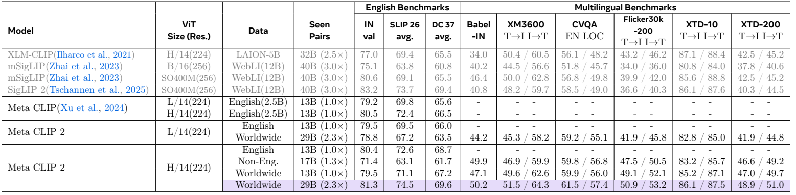

Table 1. 원문 전체를 발췌했다. 아래에는 영어·핵심 다국어 지표와 나머지 retrieval을 나누어 편집 가능한 표로 재구성한다. 수치는 모두 %, 차이는 percentage point(pp)다. 13/17/29B는 원문 반올림 표기다. [A PDF p.8; N PDF p.7]

| Model/data | Seen | IN | SLIP26 | DC37 | Babel-IN | XM3600 T→I / I→T | CVQA EN / LOCAL |
|---|---:|---:|---:|---:|---:|---:|---:|
| XLM-CLIP H/14 LAION | 32B | 77.0 | 69.4 | 65.5 | 34.0 | 50.4 / 60.5 | 56.1 / 48.2 |
| mSigLIP B/16 WebLI | 40B | 75.1 | 63.8 | 60.8 | 40.2 | 44.5 / 56.6 | 51.8 / 45.7 |
| mSigLIP SO400M WebLI | 40B | 80.6 | 69.1 | 65.5 | 46.4 | 50.0 / 62.8 | 56.8 / 49.8 |
| SigLIP 2 SO400M WebLI | 40B | **83.2** | 73.7 | 69.4 | 40.8 | 48.2 / 59.7 | 58.5 / 49.0 |
| MetaCLIP 1 L/14 English | 13B | 79.2 | 69.8 | 65.6 | — | — | — |
| MetaCLIP 1 H/14 English | 13B | 80.5 | 72.4 | 66.5 | — | — | — |
| MetaCLIP 2 L/14 English | 13B | 79.5 | 69.5 | 66.0 | — | — | — |
| MetaCLIP 2 L/14 Worldwide | 29B | 78.8 | 67.2 | 63.5 | 44.2 | 45.3 / 58.2 | 59.2 / 55.1 |
| MetaCLIP 2 H/14 English | 13B | 80.4 | 72.6 | 68.7 | — | — | — |
| MetaCLIP 2 H/14 Non-English | 17B | 71.4 | 63.1 | 61.7 | 49.9 | 46.9 / 59.9 | 59.8 / 56.8 |
| MetaCLIP 2 H/14 Worldwide | 13B | 79.5 | 71.1 | 67.2 | 47.1 | 49.6 / 62.6 | 59.9 / 56.0 |
| MetaCLIP 2 H/14 Worldwide | 29B | **81.3** | **74.5** | **69.6** | **50.2** | **51.5 / 64.3** | **61.5 / 57.4** |

| Model/data | Flickr30k-200 T→I / I→T | XTD-10 T→I / I→T | XTD-200 T→I / I→T |
|---|---:|---:|---:|
| XLM-CLIP H/14 | 43.2 / 46.2 | 87.1 / 88.4 | 42.5 / 45.2 |
| mSigLIP B/16 | 34.0 / 36.0 | 80.8 / 84.0 | 37.8 / 40.6 |
| mSigLIP SO400M | 39.9 / 42.0 | 85.6 / 88.8 | 42.5 / 45.2 |
| SigLIP 2 SO400M | 36.6 / 40.3 | 86.1 / 87.6 | 40.3 / 44.5 |
| MetaCLIP 2 L/14 WW29B | 41.9 / 45.8 | 82.8 / 85.0 | 41.9 / 44.8 |
| MetaCLIP 2 H/14 Non-English17B | 47.5 / 50.5 | 83.2 / 85.7 | 46.6 / 49.2 |
| MetaCLIP 2 H/14 WW13B | 49.1 / 52.1 | 85.2 / 87.1 | 47.0 / 49.7 |
| MetaCLIP 2 H/14 WW29B | **50.9 / 53.2** | 86.1 / 87.5 | **48.9 / 51.0** |

### 9.3 비교 1: H/14에서 영어를 유지하며 다국어를 추가

**[검산]** 내부 English13B→Worldwide29B는 IN +0.9, SLIP26 +1.9, DC37 +0.9 pp다. 영어의 총 노출을 비슷하게 유지한 상태에서 추가된 비영어 데이터까지 처리했을 때 영어 지표가 상승한다는 증거다. 외부 MetaCLIP 1 H/14 대비는 IN +0.8, SLIP26 +2.1, DC37 +3.1이지만 이 비교는 기존 dataset/config 차이도 포함한다. **가장 가까운 통제는 내부 English branch**다.

같은 H/14, 같은 13B budget에서 영어-only를 worldwide로 바꾸면 IN −0.9, SLIP26 −1.5, DC37 −1.5다. 이때 multilingual capability를 얻는 대가로 영어 평균 성능이 낮아진다. 따라서 사용자가 한정된 compute에서 다국어 모델을 만들 때는 본 논문의 성공 조건에 충분한 budget이 포함됨을 받아들여야 한다.

### 9.4 비교 2: 학습량만 늘리면 되는가

H/14 Worldwide13B→29B는 IN +1.8, SLIP26 +3.4, DC37 +2.4, Babel-IN +3.1, XM3600 +1.9/+1.7, CVQA +1.6/+1.4다. 전체 성능이 고르게 오른다. 그러나 L/14 English13B→Worldwide29B는 IN −0.7, SLIP26 −2.3, DC37 −2.5다. 데이터와 seen pairs scaling만으로 모든 용량에서 문제가 해결되지는 않는다.

**[리뷰어 해석]** 이를 “H/14에서만 다국어가 원리적으로 가능”이라고 해석하지 않는다. L/H에서 text tower와 embedding capacity도 다를 수 있고, 다른 loss·sampling·distillation·학습 기간으로 임계점이 이동할 수 있다. 이 연구는 제한된 규모 탐색에서 H/14가 성공했다는 실험적 답을 준다.

### 9.5 비교 3: 영어가 비영어에도 도움이 되는가

Non-English17B→Worldwide29B는 Babel 49.9→50.2(+0.3), XM T→I 46.9→51.5(+4.6), I→T 59.9→64.3(+4.4), CVQA LOCAL 56.8→57.4(+0.6)이다. 비영어의 sample 노출을 대략 유지하면서 영어를 추가한 결과로 해석할 수 있다. 영어 데이터가 공유 visual representation의 다양성과 품질을 높일 가능성을 지지한다.

다만 Worldwide13B의 CVQA LOCAL 56.0은 Non-English17B의 56.8보다 낮다. Babel도 47.1 대 49.9로 낮다. 두 데이터 집합을 단순히 섞는 것과 충분히 학습하는 것을 구분해야 한다. 영어-only row의 multilingual 칸이 `—`인 것은 평가값 미제시이지 정확도 0이라는 뜻은 아니다.

### 9.6 외부 baseline 비교의 공정성

MetaCLIP 2 H/14 WW29는 mSigLIP SO400M보다 IN +0.7, Babel +3.8, XM T→I +1.5, I→T +1.5, CVQA EN +4.7, LOCAL +7.6이다. SigLIP 2와 비교하면 IN은 **−1.9**, SLIP26은 +0.8, DC37은 +0.2다. XTD-10은 XLM-CLIP T→I 87.1, mSigLIP I→T 88.8보다 낮다. 따라서 “모든 benchmark SoTA”라고 쓰면 안 된다.

본문에 나오는 XM +1.1/+1.5, CVQA +3.0/+7.6 같은 숫자는 **각 column의 이전 최고 baseline**을 선택했을 때 맞는다. 예컨대 XM T→I 51.5−50.4=1.1은 XLM-CLIP 기준, I→T 64.3−62.8=1.5는 mSigLIP 기준이다. CVQA EN은 SigLIP 2의 58.5를 빼서 +3.0, LOCAL은 mSigLIP 49.8을 빼서 +7.6이다. 같은 한 baseline의 전 항목 개선량으로 인용해서는 안 된다.

### 9.7 Table 2: matching과 threshold의 ablation

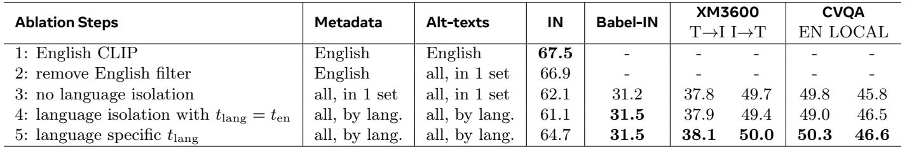

Table 2. ViT-B/32, mT5 tokenizer, English/Worldwide 각각 1.0× budget이다. 아래 변화는 작은 모델에서의 curation 실험이며 주 H/14 WW2.3× 결과와 조건을 섞지 않는다. [A PDF p.8; N p.8]

| Step | 변경 | IN | Babel | XM T→I / I→T | CVQA EN / LOCAL |
|---|---|---:|---:|---:|---:|
| 1 | 영어 metadata, 영어 text | 67.5 | — | — | — |
| 2 | 영어 metadata에 모든 언어 text 입력 | 66.9 | — | — | — |
| 3 | 모든 언어 metadata/text를 각각 한 집합으로 merge | 62.1 | 31.2 | 37.8 / 49.7 | 49.8 / 45.8 |
| 4 | 언어 isolation, 모든 언어에 영어 t | 61.1 | 31.5 | 37.9 / 49.4 | 49.0 / 46.5 |
| 5 | 언어마다 tail 비율 기반 t | 64.7 | 31.5 | 38.1 / 50.0 | 50.3 / 46.6 |

step1→2는 IN −0.6이다. 영어 metadata만으로 worldwide를 처리하면 영문과 우연히 맞는 비영어 문자열·외래어 등으로 분포가 왜곡될 수 있다. step2→3은 −4.8로 더 크게 낮아지고 다국어 지표가 생긴다.

**isolation의 효과를 과장하지 않기.** step3→4의 IN은 −1.0이다. 언어별로 분리했는데 공통 큰 t를 쓰면 작은 언어의 head가 과도하게 살아남는다는 것이 저자의 해석이다. 따라서 “언어 isolation 하나로 영어 성능이 오른다”는 독립 결론은 이 표가 지지하지 않는다. isolation과 적절한 threshold를 함께 쓰는 step4→5에서 IN +3.6, XM I→T +0.6, CVQA EN +1.3이 된다.

step5도 영어 기준 67.5에는 2.8 pp 못 미친다. Table 2는 curation 문제의 일부를 해결한 증거이지 B/32에서 multilingual curse까지 해결한 결과가 아니다.

### 9.8 Table 3: tokenizer 비교

| Tokenizer | Vocabulary | IN | Babel | XM T→I / I→T | CVQA EN / LOCAL |
|---|---:|---:|---:|---:|---:|
| mT5 | 250k | 64.7 | 31.5 | 38.1 / 50.0 | 50.3 / 46.6 |
| Gemma | 256k | 63.7 | 26.1 | 36.1 / 47.8 | 48.3 / 44.0 |
| XLM-Roberta | 250k | 64.0 | 31.1 | 38.0 / 49.8 | 49.8 / 46.1 |
| XLM-V | 900k | 64.7 | 32.7 | 40.0 / 51.4 | 50.4 / 47.4 |

XLM-V는 mT5와 영어 IN 동률이며 Babel +1.2, XM +1.9/+1.4, CVQA +0.1/+0.8이다. vocabulary가 크면 언어별 subword fragmentation을 줄일 수 있고 77-token 제한 안에서 더 긴 의미 단위를 담을 가능성이 있다. 그러나 논문은 언어별 평균 token 수나 동일 embedding parameter budget 비교를 제시하지 않는다. 따라서 vocabulary 크기 자체와 segmentation 품질 중 어느 요인이 얼마나 기여하는지는 미분리다. [A PDF p.9, Table 3]

### 9.9 Table 4와 Figure 3: 문화·지리 다양성

| Model/data | Dollar Street top-1 / top-5 | GLDv2 | GeoDE |
|---|---:|---:|---:|
| mSigLIP SO400M | 36.0 / 62.5 | 45.3 | 94.5 |
| SigLIP 2 SO400M | 36.7 / 61.9 | 48.5 | 95.2 |
| H/14 English13B | 37.2 / 63.3 | 52.8 | 93.4 |
| H/14 Non-English17B | 35.7 / 61.3 | 68.6 | 91.7 |
| H/14 Worldwide13B | 37.2 / 63.7 | 65.8 | 94.3 |
| H/14 Worldwide29B | 37.9 / 64.0 | 69.0 | 93.4 |

**[검산]** English13→WW13에서 GLDv2는 +13.0 pp다. 같은 seen budget에서도 geographic landmark 분포의 이득이 크다. Non-English17B GLDv2 68.6도 영어13B 52.8보다 높다. “모든 시각 지표가 영어 데이터 양에 지배된다”는 가설의 반례다.

반면 Dollar Street top-1은 E13→WW13에서 37.2로 동률이다. GeoDE는 WW13→WW29에서 **0.9 pp 떨어지고 영어13B와 93.4로 같다**. 저자는 saturation 가능성을 언급하지만, 그 원인을 입증하는 confidence interval이나 반복 측정은 없다. 논문 서술의 “향상”을 표의 동률·하락까지 덮는 말로 사용하지 않는다.

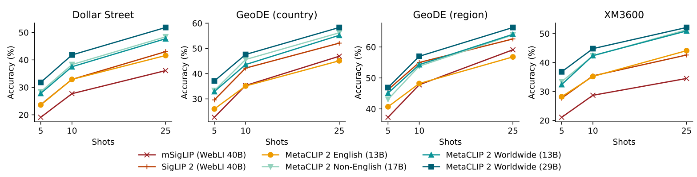

Figure 3. x축은 5/10/25 shots, y축은 accuracy이며 Dollar Street, GeoDE country/region, XM3600의 네 패널이다. Worldwide29B 곡선이 대체로 위에 있어 적은 위치 label로 지리 정보를 읽어내기 좋다는 패턴을 보인다. 표 4의 zero-shot object/landmark classification과 목표가 다르다. 정확한 point 좌표 수치·오차 막대는 공개되어 있지 않으므로 픽셀에서 읽은 근사치를 정밀한 측정값처럼 표로 만들지 않았다. [A PDF p.9]

### 9.10 Figure 4: alignment와 uniformity

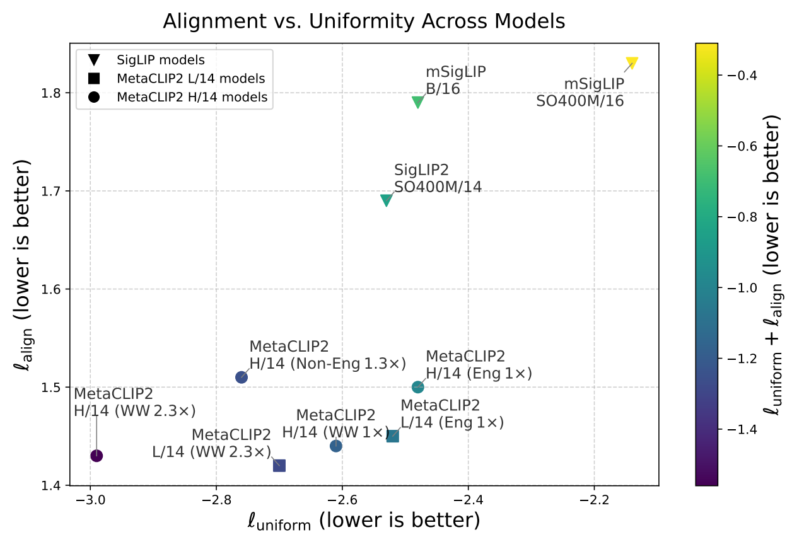

Figure 4. 아래·왼쪽이 좋은 방향이다. color는 두 metric의 합이다. H/14 WW2.3×가 uniformity와 합에서 좋지만 **alignment만 보면 L/14 WW2.3× 점이 더 아래**다. 따라서 두 metric 각각에서 모두 1위라고 말하지 않는다. [A PDF p.10; N p.10]

원문이 인용한 [Wang & Isola의 정의](https://proceedings.mlr.press/v119/wang20k.html)를 이해하기 위한 식은 다음과 같다. MetaCLIP 2 PDF가 직접 새 식으로 정의한 것이 아니며, gamma=2, beta=2를 두는 경우는 일반적인 설명 예다. 이 논문의 정확한 계산 상수·pair subsampling은 미기재다.

```math
\begin{aligned}\mathcal{L}_{\mathrm{align}}&=\mathbb{E}_{(I,a)\sim p_{\mathrm{pos}}}\|f(I)-g(a)\|_2^{\gamma},\quad\gamma\gt0,\\\mathcal{L}_{\mathrm{uniform}}&=\log\mathbb{E}_{I,I'\sim p_{\mathrm{data}}}\exp\!\left(-\beta\|f(I)-f(I')\|_2^2\right),\quad\beta\gt0.\end{aligned}\qquad\text{[A1]}
```

normalized pair의 squared distance는 2−2cosine이다. 예를 들어 정답 pair cosine 0.8이면 gamma=2 alignment 기여는 0.4다. uniformity는 다른 이미지가 넓게 퍼질수록 낮아지는 방향이다. 같은 embedding으로 모두 collapse하면 alignment가 좋아질 여지는 있어도 uniformity는 나빠진다. 두 측정값을 함께 보는 이유다.

이 그림은 저자의 5k holdout에 대한 진단이다. 외부 모델의 training overlap 여부를 모른다고 원문도 인정하며, 이 holdout의 언어·문화 비율, repeat draw와 error bar는 미기재다. 좋은 embedding geometry가 임의의 downstream task에서 우월함을 보증하지는 않는다.

<a id="appendix"></a>

## 10. NeurIPS 출판본의 추가 내용과 부록 전체

이 절은 **arXiv v3에는 없는 내용**을 포함한다. 추가 실험이 있다는 사실을 숨기거나 이를 arXiv p.16에 있는 결과처럼 인용하지 않는다. arXiv Appendix A/B/C의 기존 내용은 §6.3·6.9·6.10, §8, §10.7에서 함께 처리한다.

### 10.1 Appendix A.2: raw PMI가 희귀 bigram을 과대평가하는 문제

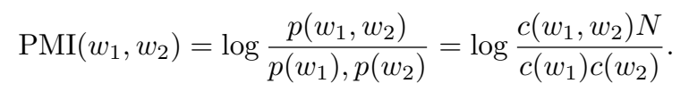

PMI 식 발췌. PDF의 첫 분모는 `p(w1),p(w2)`처럼 쉼표가 들어가 인쇄되어 있다. 뒤의 count 식은 곱을 분모에 둔다. 아래에서는 **인쇄 재현식과 수학적으로 의도된 곱**을 명시적으로 구분한다. [N PDF p.16, App.A.2]

```math
\mathrm{PMI}(w_1,w_2)=\log\frac{p(w_1,w_2)}{p(w_1),p(w_2)}=\log\frac{c(w_1,w_2)N}{c(w_1)c(w_2)}.\qquad\text{[P1: 원문 인쇄 표기]}
```

**[리뷰어 해석]** 첫 분모의 쉼표는 곱을 뜻하는 정상적인 확률 표기가 아니며, count 표현과 표준 PMI 정의를 보면 **$`p(w_1)p(w_2)`$**가 의도된 것이다. 이미지에서 고치지 않고 편집식과 해설에 교정 근거를 남겼다.

```math
\frac{p(w_1,w_2)}{p(w_1)p(w_2)}\approx\frac{c(w_1,w_2)/N}{(c(w_1)/N)(c(w_2)/N)}=\frac{c(w_1,w_2)N}{c(w_1)c(w_2)}.\qquad\text{[P1a: 의도된 정의와 리뷰어 유도]}
```

- 입력: unigram counts, 인접한 두 단어의 bigram count, corpus total token count N. 모두 scalar다.
- 확률비: 두 단어가 독립적으로 나올 때보다 함께 나오는 빈도가 얼마나 큰지 측정한다.
- log: 비율 1이면 PMI 0, 더 자주 함께 나오면 양수다. log 밑은 PDF에 명시되지 않는다.
- count 전환은 unigram/bigram 확률의 denominator를 N으로 근사하는 convention이다. 실제 adjacency 기회는 경계·문장 처리에 따라 달라질 수 있다.
- metadata를 ranking하는 값이며 CLIP loss나 differentiable neural parameter가 아니다.

**[검산: 해설용 예제]** N=1,000,000, c(w1)=c(w2)=1, c(w1,w2)=1이면 자연로그 PMI는 ln(1,000,000)=13.8155다. corpus에 한 번 나온 typo pair도 매우 높다. 반면 흔한 의미 단어 pair가 c1=c2=10,000, c12=1,000이면 PMI는 ln(10)=2.3026이다. raw PMI ranking만으로는 우연한 희귀 조합이 진짜 반복 개념을 이길 수 있다.

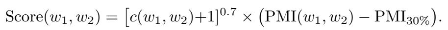

```math
\mathrm{Score}(w_1,w_2)=\left[c(w_1,w_2)+1\right]^{0.7}\times\left(\mathrm{PMI}(w_1,w_2)-\mathrm{PMI}_{30\%}\right).\qquad\text{[P2: 원문 비번호 식]}
```

각 기호와 역할은 다음과 같다.

1. $`\mathrm{PMI}_{30\%}`$는 **같은 언어의 관측된 bigram PMI 분포의 30번째 백분위 값**이다. PMI에 0.3을 곱하는 식이 아니다.
2. PMI에서 이 baseline을 빼면 약한 연관을 상대적으로 불리하게 만든다. baseline보다 낮으면 score는 음수다.
3. $`(c+1)^{0.7}`$는 count 보너스다. +1은 작은 count에서의 보정, 0.7은 선형보다 느린 증가를 뜻한다.
4. “rare를 downweight한다”는 표현은 raw PMI보다 count가 큰 의미 pair를 **상대적으로** 올려 ranking을 바꾼다는 뜻이다. count=1에서도 factor는 2^0.7≈1.6245로 1보다 크므로 rare score를 무조건 절댓값으로 줄이는 식은 아니다.
5. count factor가 있으므로 PMI baseline을 상수만큼 빼도 ranking이 유지되지 않는다. 고빈도지만 baseline 아래인 기능어 결합은 큰 음수가 될 수도 있다.

**[검산: 해설용 예제]** 위 rare/common 예제에 PMI30%=1을 가정하면 rare score는 약 20.82, common score는 약 164.10이 되어 순위가 바뀐다. 수치와 baseline은 실제 paper corpus가 아닌 동작 설명용이다.

저자가 제시한 보정 후 top-5는 “United States”, “of the”, “New York”, “such as”, “has been”이다. 지명과 문법적 표현이 함께 나온다. 따라서 이 score는 “시각적 개념성”을 직접 판정하는 classifier가 아니라 frequency/association에 따른 heuristic ranking이다. 보정 전후 downstream accuracy ablation은 별도 표로 제시되지 않았다.

### 10.2 §4.4, Table 5, Appendix E: 실제 MLLM 전이

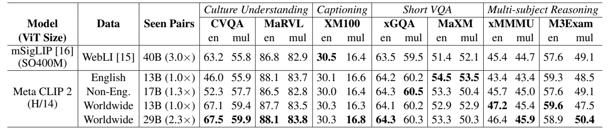

Table 5 (출판본). arXiv Table 5의 special tokenizer 목록과 다른 표다. 다음은 full WW29 모델과 mSigLIP·WW13 결과를 task별로 펼친 비교다. 값의 metric은 task별로 달라 이 열들을 평균해 임의의 “MLLM overall”을 만들지 않는다. [N PDF p.9]

| Task | mSigLIP EN / MUL | MetaCLIP 2 WW13 EN / MUL | MetaCLIP 2 WW29 EN / MUL |
|---|---:|---:|---:|
| CVQA | 63.2 / 55.8 | 67.1 / 59.4 | 67.5 / 59.9 |
| MaRVL | 86.8 / 82.9 | 87.7 / 83.5 | 88.1 / 83.8 |
| XM100 | 30.5 / 16.4 | 30.3 / 16.3 | 30.3 / 16.8 |
| xGQA | 63.5 / 59.5 | 64.1 / 60.2 | 64.3 / 60.3 |
| MaXM | 51.4 / 52.1 | 52.9 / 52.9 | 53.3 / 50.3 |
| xMMMU | 45.4 / 44.7 | 47.2 / 45.4 | 46.4 / 45.9 |
| M3Exam | 57.6 / 49.1 | 59.6 / 47.5 | 58.9 / 50.4 |

훈련은 Pangea의 공개 MLLM implementation을 따른다. 먼저 vision-language connector를 학습하고, 다음 39개 언어 6M sample로 fine-tuning한다. connector 단계는 LR 1e-3, batch128; fine-tuning은 LR 2e-5, batch512; 둘 다 cosine schedule, warmup ratio 0.03이다. 이 논문은 encoder quality 비교를 위해 fine-tuning에서도 **vision backbone을 frozen**으로 둔다. 원 Pangea가 모든 weight를 fine-tune하는 설정과 다르다. [N PDF pp.18-19, App.E]

논문에 수식은 없지만 이 downstream 구조의 역할은 다음처럼 이해한다. 이미지에서 visual token feature를 얻고 connector로 language hidden dimension에 맞춘 뒤, 질문 token과 함께 MLLM에 넣는다. teacher-forced autoregressive token loss로 connector/언어 모델을 적응시키는 일반적인 MLLM 설정이다. 정확한 feature layer, patch pooling, connector architecture, language-backbone ID는 이 PDF에 완전히 명시되지 않아 **CLIP의 final pooled 1024차원 vector를 그대로 썼다고 가정하지 않는다**.

**Task 해설.** CVQA는 31언어·13script의 문화적 시각 질문이다. 여기서는 output probability로 답을 선택한다. MaRVL은 문화적 맥락의 visual entailment, XM100은 XM3600의 100 image multilingual captioning, xGQA/MaXM은 multilingual short VQA, xMMMU/M3Exam은 여러 학문·시험 문제에 대한 reasoning을 측정한다.

**[검산과 비판]** WW29 vs mSigLIP은 CVQA +4.3/+4.1, MaRVL +1.3/+0.9, xGQA +0.8/+0.8로 좋아진다. 그러나 XM100 EN은 30.5→30.3으로 낮고 MaXM MUL은 52.1→50.3으로 낮다. WW13→WW29에서도 MaXM MUL −2.6, xMMMU EN −0.8, M3Exam EN −0.7이다. 원문의 “consistently improves”는 **모든 cell의 단조 증가**로 읽을 수 없다.

English-only MetaCLIP 2의 CVQA EN 46.0→WW29 67.5(+21.5)는 큰 차이다. 이는 영어 문장이라도 비영어 문화에서 온 이미지 내용을 이해하는 데 원어 data가 도움이 될 수 있다는 해석을 지지한다. 다만 그 한 cell의 큰 차이를 전체 language/vision reasoning 향상의 인과 증명으로 삼지는 않는다. N Table 5의 영어-only 다른 값들(예: MaXM 54.5/53.5)은 오히려 WW29보다 높다.

### 10.3 §4.6, Table 6: ViT-H/14→L/14 증류

| L/14 setting | IN | SLIP26 | DC37 | Babel | XM T→I / I→T | CVQA EN / LOCAL |
|---|---:|---:|---:|---:|---:|---:|
| English13B scratch | 79.5 | 69.5 | 66.0 | — | — | — |
| Worldwide29B scratch | 78.8 | 67.2 | 63.5 | 44.2 | 45.3 / 58.2 | 59.2 / 55.1 |
| Worldwide29B distilled | 79.2 | 70.9 | 67.4 | 45.7 | 47.5 / 60.2 | 59.8 / 56.5 |

증류 L/14의 나머지 retrieval은 Flickr30k-200 46.8/49.2, XTD-10 83.9/86.0, XTD-200 45.0/47.2다. worldwide scratch 대비 각각 +4.9/+3.4, +1.1/+1.0, +3.1/+2.4다. 증류는 small model의 representation에 도움이 되지만 IN79.2는 English79.5보다 여전히 **0.3 pp 낮다**. 원문도 이 curse가 남음을 인정한다. [N PDF p.10]

여기서 teacher는 **자체 학습한 MetaCLIP 2 H/14**다. 본 recipe의 “외부 teacher 없이 from scratch”와 모순되는 기본 방법 변경이 아니라, 학습을 마친 모델을 downstream deployment용으로 압축한 별도 단계다. 원문은 정확한 distillation objective·temperature·비중을 식으로 제시하지 않는다.

**[공식 코드 확인]** `apps/multi_distill/train.py`는 teacher를 eval/no-grad로 실행하고 `contrastive_loss + distill_loss`를 student에 역전파한다. 그러나 호출하는 `src.open_clip.loss`가 조회한 tree에서 해당 구현으로 확인되지 않으며 teacher logit scale 기본 branch에는 200.0이 등장한다. 이를 Table 6의 정확한 KL formulation이나 완결된 실행 recipe라고 단정하지 않는다. 임의로 conventional KL 식을 원문 수식인 것처럼 추가하지 않았다.

### 10.4 Appendix C, Table 9: gradient conflict 분석

Worldwide29B로 학습한 L/H checkpoints에서 XM3600의 영어 gradient와 각 비영어 gradient의 cosine을 측정하고 비영어 언어에 걸쳐 평균한다. epoch16(midway), epoch32(final)을 비교한다. [N PDF p.17]

```math
g_\ell=\nabla_\theta\mathcal{L}_\ell,\qquad\rho_\ell=\frac{g_{\mathrm{en}}^\top g_\ell}{\|g_{\mathrm{en}}\|_2\|g_\ell\|_2},\qquad\bar\rho=\frac1{|\mathcal{S}_{\mathrm{nonEN}}|}\sum_{\ell\in\mathcal{S}_{\mathrm{nonEN}}}\rho_\ell.\qquad\text{[G4]}
```

여기서 $`\mathcal{S}_{\mathrm{nonEN}}`$은 비영어 언어 집합이고 theta는 gradient를 측정하는 parameter vector다. 입력 batch를 encoder/loss에 통과시켜 gradient를 얻은 뒤, 같은 모델의 parameter coordinate끼리 inner product한다. L/H model parameter dimension이 다르더라도 각 모델 내부의 cosine을 계산한 후 scalar 결과를 비교할 수 있다. 어떤 layer·parameter를 포함했는지, 언어별 batch 구성·sample 수·loss reduction과 norm aggregation 방식은 PDF에 자세히 없다.

| Checkpoint | L/14 cosine | H/14 cosine | H−L |
|---|---:|---:|---:|
| Epoch 16 | 0.508 | 0.688 | +0.180 |
| Epoch 32 | 0.546 | 0.697 | +0.151 |

**[저자 보고]** 더 큰 모델은 언어 간 gradient가 더 잘 정렬되어 간섭이 작다는 capacity 가설을 지지한다. **[리뷰어 해석]** 네 평균값은 모두 양수다. 따라서 표는 평균 gradient가 정반대라는 증거가 아니며, individual negative-cosine pair의 비율을 보고하지도 않는다. PCGrad를 인용하지만 **실제 pretraining에 gradient surgery를 적용한 방법이 아니다**. gradient cosine 차이와 generalization 변화의 상관관계만으로 작은 모델의 실패 원인을 단일 인과로 확정할 수 없다.

### 10.5 Appendix D, Table 10: 평균 뒤에 숨은 언어 격차

| Training-volume 상위 10개 언어 | T→I / I→T R@1 |
|---|---:|
| en | 51.6 / 62.2 |
| es | 57.2 / 72.5 |
| fr | 67.1 / 78.5 |
| zh | 61.1 / 72.6 |
| ru | 67.8 / 79.9 |
| ja | 65.1 / 79.9 |
| id | 65.8 / 78.3 |
| pt | 60.4 / 72.6 |
| de | 69.2 / 83.6 |
| vi | 61.1 / 76.2 |
| 상위 10 평균 | **62.6 / 75.6** |

| 나머지 언어 | T→I / I→T | 나머지 언어 | T→I / I→T |
|---|---:|---|---:|
| ar | 47.4 / 60.8 | ko | 54.8 / 70.1 |
| bn | 39.4 / 47.1 | mi | 0.5 / 1.2 |
| cs | 51.0 / 66.1 | nl | 53.2 / 66.9 |
| da | 61.0 / 75.1 | no | 57.7 / 73.2 |
| el | 52.1 / 68.4 | pl | 61.4 / 75.9 |
| fa | 56.9 / 70.3 | quz | 2.5 / 6.5 |
| fi | 59.3 / 73.7 | ro | 64.8 / 77.8 |
| fil | 24.8 / 36.7 | sv | 57.6 / 73.8 |
| hi | 26.1 / 41.8 | sw | 10.0 / 16.6 |
| hr | 57.3 / 72.9 | te | 26.1 / 37.1 |
| hu | 63.9 / 76.5 | th | 57.7 / 71.4 |
| it | 64.0 / 78.2 | tr | 55.7 / 68.4 |
| he | 60.8 / 76.2 | uk | 60.0 / 74.7 |
| 나머지 26 평균 | **47.2 / 59.9** | | |

**[검산]** 10개와 26개 group mean을 언어 수로 가중하면 T→I≈51.48, I→T≈64.26으로 주 표의 51.5/64.3과 맞는다. 반올림된 group mean을 사용했으므로 마지막 소수점까지 원 raw metric과 일치하는 검사는 아니다.

영어는 데이터량이 가장 많아도 German보다 낮다. 26개 중 18개 언어는 두 방향 모두 50%를 넘지만 mi/quz/sw는 매우 낮다. 따라서 **metadata coverage와 실용적 성능 coverage가 다르다**. 한국어 54.8/70.1은 이 XM3600 평가에서 확인된 값이며, 한국어 로봇 지시·OCR·산업 검사 성능으로 일반화하지 않는다. 언어적·문화적 근접성, tokenizer 효율, domain overlap은 저자의 설명 가설이지 독립 ablation으로 분해된 효과가 아니다.

### 10.6 Appendix F, Table 11: cross-lingual translation probe

이미지에 중국어 글자 “狗”를 표시하고, 여러 언어의 후보 text와 cosine을 비교한다. [N PDF pp.19-20]

| 후보 | cosine | 후보 | cosine |
|---|---:|---|---:|
| 狗 | 0.54325 | dog | 0.08239 |
| 犬 | 0.04636 | diagram | 0.00143 |
| 猫 | 0.00025 | cat | 0.00005 |
| 豺 | 0.03427 | puppy | 0.02826 |
| 狼 | 0.01405 | hound | 0.05586 |
| いぬ | 0.19320 | ねこ | 0.00064 |

가장 큰 similarity는 이미지에 그대로 적힌 중국어 狗이고, 일본어 후보 중 개를 뜻하는 いぬ가 고양이 ねこ보다 훨씬 높다. 영어 dog도 cat보다 높다. 이는 visual text와 다국어 semantic alignment를 보여 주는 흥미로운 사례다.

그러나 0.54325는 “54.325% 확률”이 아니다. 단일 이미지와 제한된 candidate set의 cosine이다. 일본어 점수가 영어보다 높은 이유를 script proximity 하나로 확정하거나, 모든 문자·단어·문장 번역이 가능하다고 일반화할 수 없다. semantic object recognition과 exact glyph matching의 기여도 분리되지 않았다. 별도 원본 glyph 이미지가 번호 Figure로 제공된 것은 아니므로 임의로 재제작해 원문 이미지처럼 싣지 않았다.

### 10.7 Appendix G와 arXiv Appendix C: benchmark의 한계

기존 image benchmark는 북미·서유럽과 영어 중심의 source가 많다. XM3600은 GPS 기반으로 geographic diversity를 추구하지만 source Open Images 자체의 관광·서구 편향이 남을 수 있다. GeoDE의 crowdsourcing은 비용 효율적이지만 worker의 인구학적 배경·숙련도와 실제 문화적 대표성이 자동으로 보장되지 않는다. CVQA처럼 전문가와 다양한 지역 seed를 쓰는 접근을 저자는 긍정적으로 평가한다. [A PDF p.16; N PDF p.20]

**[리뷰어 해석]** 불완전한 benchmark에서 실제 worldwide 이득을 과소평가할 가능성과, 아직 입증되지 않은 우월성을 추정하는 것은 다른 일이다. 저자의 “더 좋은 benchmark가 true potential을 드러낼 것”은 미래 기대다. 현재 표에서 낮은 결과를 모두 benchmark 탓으로 돌릴 수는 없다.

### 10.8 Appendix H와 Paper Checklist의 읽기

Appendix H는 Wikipedia, WordNet, pretrained baselines, evaluation code와 datasets의 라이선스를 나열한다. code, metadata, checkpoint, 원본 웹 이미지에 동일 라이선스를 자동 적용할 수 없다는 점을 확인하는 목록으로 읽는다. 이 리뷰는 외부 asset의 법적 사용 가능성을 새로 판정하지 않는다. [N PDF pp.20-21]

Checklist에서 저자는 이론·proof 항목을 NA로 답한다. 따라서 본 논문은 새로운 convergence theorem이나 capacity lower bound를 증명한 논문이 아니다. 또한 큰 L/H 학습은 비용상 한 번만 했다고 명시한다. [N PDF pp.22,24]

**문서 내부의 누락도 있다.** Checklist 7은 B/32를 세 번 학습한 standard deviation을 Appendix B에 보고했다고 쓰지만, 실제 p.17 Appendix B에는 5행 hyperparameter 표만 있고 해당 표준편차 값이 없다. Checklist 8도 compute 상세가 Appendix B에 있다고 답하지만 출판본 Appendix B에는 GPU 종류·GPU-hours·학습 wall time이 제시되어 있지 않다. arXiv의 800 CPU jobs/1시간은 curation 정보이며 대형 모델 training compute를 대체하지 않는다. 이 불일치는 원문을 읽을 때 재현성의 한계로 기록해야 한다.

<a id="code"></a>

## 11. 공식 코드 대조와 재현성 감사

### 11.1 조회한 source map

아래 모든 링크는 움직이는 main 대신 조회 commit에 고정했다. 정적 읽기이며 실제 checkpoint loading·distributed training 성공을 검증한 것은 아니다. 로컬 사본의 git working tree가 수정되지 않은 것도 확인했다.

| 확인 대상 | 고정 source | 확인한 역할 |
|---|---|---|
| H/14 tensor shape | [ViT-H-14 worldwide config](https://github.com/facebookresearch/MetaCLIP/blob/f47f7841f6a91cc5676729a3d125519393d87d1e/src/mini_clip/model_configs/ViT-H-14-quickgelu-worldwide.json) | 224/14, 32×1280 vision, 24×1024 text, 901629 vocabulary, 1024 embedding |
| dual encoder | [model.py](https://github.com/facebookresearch/MetaCLIP/blob/f47f7841f6a91cc5676729a3d125519393d87d1e/src/mini_clip/model.py) | CLS pooling, QuickGELU, pre-norm, causal mask, normalization, learnable logit scale |
| worldwide EOS | [model_worldwide.py](https://github.com/facebookresearch/MetaCLIP/blob/f47f7841f6a91cc5676729a3d125519393d87d1e/src/mini_clip/model_worldwide.py#L10) | `text == 2` 위치 pooling, mT5 별도 경로 |
| tokenizer | [factory.py](https://github.com/facebookresearch/MetaCLIP/blob/f47f7841f6a91cc5676729a3d125519393d87d1e/src/mini_clip/factory.py#L164) | HF tokenizer 로드, pad/truncate/max_length77 |
| contrastive loss | [loss.py](https://github.com/facebookresearch/MetaCLIP/blob/f47f7841f6a91cc5676729a3d125519393d87d1e/src/mini_clip/loss.py) | two directional CE, differentiable gather, local/global label offset |
| training config | [metaclip_v2.py](https://github.com/facebookresearch/MetaCLIP/blob/f47f7841f6a91cc5676729a3d125519393d87d1e/configs/metaclip_v2.py) | nominal sample budget, optimizer settings, batch/ranks, precision |
| training loop | [train.py](https://github.com/facebookresearch/MetaCLIP/blob/f47f7841f6a91cc5676729a3d125519393d87d1e/src/training/train.py) | preprocessing→forward→loss→backward→optimizer, logit scale clamp |
| online sampling | [data_metaclip_v2.py](https://github.com/facebookresearch/MetaCLIP/blob/f47f7841f6a91cc5676729a3d125519393d87d1e/src/training/data_metaclip_v2.py#L120) | caption 하나 선택, C6 probability, mmap, tokenization |
| count/threshold | [curate.py](https://github.com/facebookresearch/MetaCLIP/blob/f47f7841f6a91cc5676729a3d125519393d87d1e/metaclip/curation/curate.py) | t↔p helpers, global aggregation, curation script |
| substring | [substr_matching.py](https://github.com/facebookresearch/MetaCLIP/blob/f47f7841f6a91cc5676729a3d125519393d87d1e/metaclip/curation/substr_matching.py#L136) | language map, spacing, automaton, matched-ID set |
| metadata | [build_metadata.py](https://github.com/facebookresearch/MetaCLIP/blob/f47f7841f6a91cc5676729a3d125519393d87d1e/metaclip/metadata/build_metadata.py) | source merge, caps, PMI ranking consumption |
| CVQA | [eval_cvqa.py](https://github.com/facebookresearch/MetaCLIP/blob/f47f7841f6a91cc5676729a3d125519393d87d1e/clipeval/cvqa/eval_cvqa.py) | question+option 4-way image-text similarity |
| zero-shot prompts | [eval_zeroshot.py](https://github.com/facebookresearch/MetaCLIP/blob/f47f7841f6a91cc5676729a3d125519393d87d1e/clipeval/slip/eval_zeroshot.py) | normalize→template mean→normalize→image similarity |
| distillation | [multi_distill/train.py](https://github.com/facebookresearch/MetaCLIP/blob/f47f7841f6a91cc5676729a3d125519393d87d1e/apps/multi_distill/train.py) | teacher no-grad, contrastive+distill loss 호출 |

### 11.2 논문과 구현이 일치하는 핵심

1. `count_to_prob`는 count를 t 이상으로 clamp한 뒤 t/count를 계산한다. C5와 같다.
2. `t_to_p`는 `<t`인 count 합/전체 count 합이다. C3와 같다.
3. `p_to_t`는 sorted cumulative mass에서 p와 가까운 위치의 count를 고른다. C4와 같다.
4. online dataset의 `1 - np.prod(1 - entry_probs[J])`는 원문 독립 Bernoulli loop의 OR 확률인 C6와 일치한다.
5. CLIP loss는 두 방향 cross-entropy 평균이다. sigmoid loss나 teacher distillation을 주 학습 목표로 바꾸지 않는다.
6. worldwide text encoder의 EOS pooling 수정은 multilingual vocabulary를 사용하면서 vanilla transformer를 유지한다는 설계와 연결된다.

### 11.3 실제 실행 전에 해결해야 할 공개 코드 문제

아래는 “논문 실험이 틀렸다”는 결론이 아니라 **현재 공개 스냅샷만으로 재현하려는 사용자에게 생길 수 있는 구체적 장애물**이다. 확인을 위해 코드를 고치거나 GPU를 실행하지 않았다.

| 위치/문제 | 정적 근거 | 재현에 미치는 영향 |
|---|---|---|
| PDF Algorithm 1의 `np.zero` | NumPy의 배열 초기화는 `np.zeros` | 인쇄 pseudocode를 그대로 실행하면 실패 |
| 영어 t 재계산 차이 | PDF는 모든 lang에 p_to_t; `global_count()`는 en이면 t_en 유지 | threshold inverse의 경계 차이가 영어에도 적용되는지 달라짐 |
| `curate.py` line125 | `_, txt, lang = rec` 이후 `lang_id`를 읽어 자신에게 mapping | 첫 처리에서 미정의 local variable 가능 |
| `substr_matching.py` line137 | 인자는 `automatons`인데 검사에 `automaton_ml` 사용 | 해당 이름이 module scope에 정의되어 있지 않아 matcher 진입 시 오류 가능 |
| `curate.py`의 sampling routine | `random.choice/random.random` 사용, 파일에 random import 없음 | sampling 함수 실행의 NameError 가능 |
| 같은 routine의 확률 경로 | 저장은 `per_lang_prob`, 읽기는 `per_lang_t`; `self.args.t`도 함수 내 self 없음 | 파일 경로·변수 계약 불일치 |
| `curate.py` CLI | list인 `sys.argv`를 문자열 `'curate'`와 직접 비교 | 일반 명령줄 호출이 intended branch로 들어가지 않음 |
| metadata bigram 작성 경로 | worldwide builder는 사전 계산 `data_ngram['pmi']`를 소비 | N App.A.2의 percentile·count^0.7 score 생성 과정을 그 파일에서 재현할 수 없음 |
| 공개 batch config | 196×48×8=75,264, PDF=75,366 | 실제 global batch·step/seen count를 별도 고정해야 함 |
| distillation import | caller가 `src.open_clip.loss`에 의존, 이 tree의 확인 loss는 `src.mini_clip.loss` | Table 6용 objective 구현·환경을 추가 확보해야 함 |

PMI의 구현이 확인되지 않았다는 것은 “논문에서 그 식을 사용하지 않았다”는 뜻이 아니다. 이미 계산된 metadata 파일이 별도로 만들어졌을 수 있다. 다만 **공개 경로가 완결되어 있다는 검증은 하지 못했다**. 공식 docs의 설명과 source가 다른 경우에는 어느 버전을 실행했는지 기록해야 한다.

### 11.4 재현의 세 수준

**수학·알고리즘 재현**은 접근 가능하다. 작은 count vector로 C3-C6를 계산하고, 여러 entry의 OR sampling 확률과 빈 집합 처리, cutoff 경계, ties를 확인할 수 있다. 본 리뷰가 실행한 것은 이런 scalar 계산과 loss 예제 검산이다.

**checkpoint 평가 재현**은 모델별 preprocessing·tokenizer·prompt·evaluation split을 고정하면 시도 가능하다. 공개 source의 syntax만 통과하는 것과 pretrained tensor shape가 실제 맞는지 검증하는 것은 다르다. 이 작업은 checkpoint를 내려받아 GPU forward를 실행하지 않았다.

**billion-scale pretraining 재현**은 원시 pool, mitigation, LID version, metadata snapshot, language mapping, unique pair 정의, 실제 curated stream 비율, distributed config, random seed와 시간·자원 기록까지 필요하다. 코드 공개만으로 동일한 5B pool을 회복할 수 있는 것은 아니다. 웹 링크 소실과 source 변화도 exact rerun을 어렵게 한다.

<a id="limits"></a>

## 12. 비판적 검토, VLM/VLA와 Jetson Thor 연결

### 12.1 논문을 통해 강하게 말할 수 있는 것

모든 언어에 하나의 count threshold를 쓰는 것보다 **언어별 frequency distribution에 맞춘 threshold**가 더 좋은 결과를 보였다. 영어를 포함한 multilingual pretraining에서 학습 노출과 충분한 모델 용량을 함께 확보하면, 영어·비영어를 동시에 개선하는 설정이 실제 존재한다. 기존 CLIP와 많은 구조를 공유하므로 recipe를 다른 CLIP 계열 실험의 출발점으로 삼기 쉽다. 출판본은 문화·지리 인식뿐 아니라 frozen vision MLLM 전이의 일부 이득까지 제시한다.

### 12.2 주장 강도를 낮추어야 하는 것

**통제 측면.** 같은 total FLOPs로 학습한 영어 baseline, 같은 total seen pairs이면서 영어 exposure도 같은 비교, 큰 batch와 긴 schedule의 분리, 동일 vocabulary parameter budget의 tokenizer 비교가 모두 있지는 않다. 주 성공 조건은 복수의 요인이 함께 바뀐 recipe다. 그 recipe의 유용성과 각 요인의 단독 causal effect는 다른 주장이다.

**통계 측면.** 대형 모델 한 번의 학습과 checkpoint를 비교했다. +0.2~0.9 pp 수준 차이를 reproducible mean gain이나 statistical significance로 확정하려면 multi-seed·paired evaluation 정보가 필요하다. L/H capacity 차이와 gradient cosine은 관련 있지만, representation bottleneck의 유일한 설명은 아니다.

**언어·문화 측면.** metadata source와 6% invariance는 인간 지식 기반이지만 모든 언어의 형태론·복합어·정보량에 동일하게 적합하다고 증명되지 않는다. Language isolation은 한 언어 내 다의성, code-switching, slang, low-resource metadata 부족을 없애지 못한다. Table 10의 낮은 언어 성능은 “worldwide”의 실제 한계다.

**분포 측면.** 원어 alt-text라고 해서 항상 인간이 정확히 쓴 description인 것은 아니다. 광고·SEO·자동 생성·맥락 의존 문장·이미지와 무관한 text가 있을 수 있다. safety model과 metadata cap도 training distribution을 바꾸며, 모든 문화적 편향이 제거되었다고 주장할 수 없다.

**출판·코드 측면.** arXiv/출판본의 추가 내용, checklist 참조 누락, 공개 curation script의 오류와 미완성 경로는 문헌·코드 reproduction을 구분해야 함을 보여 준다. 이 리뷰에서는 실행하지 않은 경로의 성능을 확인했다고 쓰지 않았다.

### 12.3 VLM에 바로 연결되는 것과 새로 해야 하는 것

**[저자 보고]** N Table 5는 multilingual MLLM에서 frozen visual backbone의 유효성을 실제 실험했다. 특히 CVQA처럼 문화적 시각 내용이 중요한 task가 개선된다. 이는 단순 image-text retrieval 점수 이상의 근거다.

**[후속 연구 제안]** 다른 VLM에서 MetaCLIP 2를 쓰려면 pooled class embedding뿐 아니라 적절한 visual token layer를 선택해야 한다. 공개 기본 `encode_image()`는 CLS projection 하나를 반환하므로 patch sequence를 필요로 하는 VLM connector에는 hidden feature interface를 추가·검증해야 한다. representation width, token 개수, positional encoding, image normalization을 맞추고 connector alignment를 다시 수행해야 한다.

언어 지시를 생성형 LLM이 처리하는 VLM에서는 MetaCLIP text encoder를 추론 때 쓰지 않을 수도 있다. 따라서 XLM-V vocabulary의 큰 memory 비용은 standalone multilingual retrieval에는 중요하지만, **image tower만 채택하는 VLM deployment에서는 전체적으로 상주할 필요가 없는 구성요소**일 수 있다. 이 선택은 checkpoint를 부분 로딩할 수 있는지와 모델 interface가 결정한다.

### 12.4 OpenVLA와 로봇 조작에 대한 적용 범위

이 논문에는 OpenVLA fine-tuning, LIBERO/CALVIN 성공률, proprioception fusion, action loss, gripper/contact 제어 실험이 없다. 영어·한국어 지시의 image understanding이 좋아질 가능성은 있으나, precision manipulation 성공률과 deadline 만족을 보장하지 않는다.

**[후속 연구 제안]** OpenVLA 계열에 적용할 때는 해당 checkpoint가 기대하는 vision backbone·patch feature·projector dimension을 먼저 확인하고, 같은 robot demonstrations와 action head를 고정한 backbone 교체 실험을 한다. MetaCLIP 2의 1024차원 pooled embedding을 기존의 patch-token stream에 단순 대입하는 것으로 끝나지 않는다. 기존 vision representation과 달라진 부분을 학습으로 정렬해야 한다.

검증 task는 같은 물체를 영어와 한국어로 지시하는 경우, 언어와 별개로 생소한 지역 물품을 가리키는 경우, 익숙한 물체지만 낯선 배경에 있는 경우로 나누는 것이 유용하다. 이 구분은 multilingual text comprehension과 visual domain transfer가 각각 어디에서 좋아졌는지 알려 준다. 정확도·성공률과 함께 wrong-object selection, small-object localization, collision/contact failure를 관찰해야 한다.

### 12.5 Jetson AGX Thor/TensorRT를 위한 실행 가능한 후속 gate

다음은 **논문에 없는 배포 제안**이며 실제 장치에서 실행하지 않았다. 현행 TensorRT 연산 지원이나 특정 precision speedup을 이 문서가 보증하지 않는다.

| Gate | 구체적인 작업 | 통과해야 다음 단계로 갈 기준 |
|---|---|---|
| 0. 인터페이스 고정 | H/14 image-only인지 dual encoder인지, patch feature인지 CLS인지, input224·preprocess·EOS·prompt를 고정 | CPU/PyTorch reference와 동일 tensor shape·의미 확인 |
| 1. 기준 정확도 | 영어/한국어 image-text retrieval, 지역 물품 분류, 필요한 로봇 dataset의 backbone feature 비교 | 사용 task에서 baseline 품질과 failure case 기록 |
| 2. 엔진 포팅 | target Thor 환경에서 engine 구성, LayerNorm·QuickGELU·attention·projection export 확인 | layerwise 및 final embedding cosine/최대 오차가 사전 허용치 이내 |
| 3. precision 비교 | FP32 reference→FP16/BF16/지원되는 저정밀도 순으로 비교 | language/task별 top-1, Recall@1, downstream 성공률 저하가 허용 예산 이내 |
| 4. 구간 latency | decode/preprocess, vision encoder, connector, LLM, action head 분리 측정 | batch1, warm/cold, p50/p95/p99, peak memory, fallback 기록 |
| 5. E2E | 센서 timestamp부터 action 사용 가능 시점까지 측정 | 정책 갱신 deadline과 miss rate 충족, actuator Hz와 별도 보고 |
| 6. 모델 선택 | H/14와 공식 distilled model 후보를 같은 조건으로 비교 | 정확도·memory·실제 latency의 Pareto trade-off로 선택 |

큰 H/14를 선택한 이유는 worldwide capacity이며 inference 경량화가 아니다. Table 6은 distillation의 정확도 측면만 보여 주며 Thor latency가 없다. vision tower를 빨리 만들었어도 VLM의 prefill이나 action head가 병목이면 sensor-to-action speedup은 작을 수 있다. batch75k는 pretraining 조건이지 robot deployment batch 설정이 아니다.

### 12.6 재현 실험을 새로 설계한다면 우선할 대조군

**[후속 연구 제안]** 먼저 L/14와 H/14 각각에서 (i) 영어-only, (ii) worldwide fixed seen, (iii) worldwide 영어-exposure 유지, (iv) worldwide 긴 schedule/작은 batch를 비교한다. 같은 데이터·tokenizer에서 (iii)와 (iv)의 총 seen pairs를 맞추면 큰 batch negatives의 이득과 노출량 이득을 더 잘 분리할 수 있다. 동일 compute 비교는 별도 축으로 둔다.

metadata 실험은 raw p 기준 6% 근처의 sweep, 언어별 t의 actual tail mass, raw→curated→consumed language 비율, metadata match count별 수용률을 함께 보고한다. 고정 t와 adaptive t의 정확도뿐 아니라 어떤 개념이 사라지고 살아나는지를 보아야 한다. source에 민감한 시행착오를 줄이려면 작은 검증 shard에서 deterministic seed와 exact counts를 먼저 대조한다.

<a id="qa"></a>

## 13. 자주 생기는 오해와 권장 학습 순서

### Q1. MetaCLIP 2는 CLIP보다 새로운 attention을 쓰는가?

그것이 핵심 기여가 아니다. vanilla CLIP의 dual encoder와 contrastive learning을 유지하면서 데이터·tokenizer·scale을 바꾼다. attention·gradient 수식은 모델 동작 이해를 위한 설명이며 새 논문 수식으로 꾸민 것이 아니다.

### Q2. 329개 언어를 같은 수로 훈련했는가?

아니다. 329는 Wikipedia metadata coverage다. LID 그룹 병합도 있고 언어별 양이 크게 다르며 영어가 약44%다. balancing은 각 언어 안의 개념 count를 다루고, 언어별 같은 샘플 수를 강제하지 않는다.

### Q3. tail 6%는 마지막 dataset의 6%가 희귀 이미지라는 뜻인가?

아니다. 영어 raw matching count에서 tail entry들의 count 합이 차지하는 비율이다. 다중 entry pair와 OR sampling 때문에 최종 image 비율과 같지 않다.

### Q4. 자주 나오는 개념은 정확히 t개만 남는가?

단일 entry의 독립 수용 경로만 보면 기대값이 t로 제한된다. 하지만 tail과 co-occurrence하는 pair는 다른 entry 때문에 수용된다. 전체 curated 데이터에서 그 head의 count는 t보다 많을 수 있다.

### Q5. p_to_t는 모든 언어에 정확히 같은 p를 보장하는가?

아니다. discrete count, ties, `<t`와 inclusive cumsum 경계 차이 때문에 근사다. 실제 language threshold를 계산한 뒤 실현된 tail mass를 재검사해야 한다.

### Q6. XLM-V를 썼으니 text tower는 이미 학습되어 있는가?

주 recipe는 from scratch다. XLM-V tokenizer/vocabulary를 쓰고 그 vocabulary 크기의 CLIP text embedding과 transformer를 학습한다. pretrained multilingual LM 전체를 가져와 증류하는 기존 접근과 다르다.

### Q7. no-filter인데 safety filter가 왜 있는가?

논문의 수사적 표현과 구체적인 pipeline 범위를 나누어야 한다. 영어 gate와 외부 semantic confidence 중심 filter를 제거하는 recipe이며, 부록의 mitigation·deduplication·metadata acceptance는 존재한다.

### Q8. 영어 성능도 올랐으니 fixed compute에서 무조건 worldwide가 좋은가?

아니다. 같은 H/14 13B에서는 영어 지표가 떨어졌다. 영어 노출을 복구하고 충분한 capacity를 주는 29B 조건에서 개선했다. 문화·지리 지표는 fixed-seen에서도 일부 개선되어 task별 trade-off가 다르다.

### Q9. CVQA57.4면 질문에 답을 생성하는가?

Table 1의 값은 image와 question+option embedding의 유사도로 4지선다를 고른 결과다. 출판본 Table5에는 별도로 생성형 MLLM 평가가 있고 model·training·metric setting이 다르다.

### Q10. 모델이 커서 inference가 느리면 연구 가치가 없는가?

이 논문은 data scaling이 성능에 미치는 조건을 찾는 연구다. 배포 모델 선택에는 그 뒤 distillation·image-only loading·precision·runtime 최적화를 검토할 수 있지만 이익을 실제 target hardware에서 확인해야 한다. 표6의 증류 L/14도 영어 IN gap은 남는다.

### Q11. 이 논문이 multilingual curse의 원인을 증명했는가?

아니다. capacity·seen-pair ablation과 gradient cosine 진단이 가설을 지지한다. 일반적인 theorem이나 negative transfer가 반드시 사라지는 보장은 없다. 좋은 평균 cosine도 individual conflicts가 0임을 뜻하지 않는다.

### Q12. 원문을 다시 읽는 가장 효율적인 순서는?

1. Figure2로 metadata→curation→training의 경계를 잡는다.
2. §3.1의 count→probability를 이해한 뒤 Algorithm1을 C3-C6와 함께 읽는다.
3. 실제 한 caption의 J를 가정해 tail p와 OR sampling 예제를 계산한다.
4. F1-F7로 neural forward를 따라가고 curation probability와 loss probability가 다름을 확인한다.
5. Table1의 E13/WW13/WW29/NonEN17을 따로 비교한다.
6. Table2/3으로 isolation·threshold·tokenizer의 제한된 기여를 확인한다.
7. Table4/Fig3/Fig4로 문화적 이득과 geometry 진단이 어디까지인지 읽는다.
8. N AppendixA.2/C/D/E/F로 PMI, gradient, 언어 격차, MLLM, probe를 보강한다.
9. 공식 source와 §11의 누락을 확인하고 재현 범위를 정한다.

<a id="coverage"></a>

## 14. Coverage checklist와 완료 검증

### 14.1 원문 기술 섹션 → 리뷰

| 원문 | 처리 위치 | 상태 |
|---|---|---|
| Abstract / §1 Introduction, Fig.1 | §2-4 | 주요 수치·curse·mutual benefit와 제한 설명 |
| §2.1 Evolution of CLIP/Data | §3.3-3.4 | CLIP/MetaCLIP/teacher filtering 차이 |
| §2.2 Vision Encoding | §3.1, §7, §12.3 | language-supervised visual feature와 MLLM 역할 설명 |
| §2.3 Multilingual CLIP | §3.2-3.3, §9.6 | 기존 multilingual transfer/번역/WebLI 비교 |
| §3 recipe, Fig.2 | §6.1 | 원문 이미지 포함 |
| §3.1 MetaCLIP algorithm | §6.2 | C1, head/tail 개념과 단일-entry 기대값 |
| §3.2 Worldwide Metadata | §6.3-6.4 | 네 source, 언어별 tokenizer, mapping |
| §3.3 Curation Algorithm | §6.4-6.8 | C2-C6, Algorithm1 전 실행행, 경계·예제 |
| §3.4 Training Framework | §7-8 | tokenizer·loss·model capacity·batch/seen pairs |
| §4.1 Dataset/Training | §8 | source 규모·hyperparameter·split·dedup |
| §4.2.1 Main Ablation, Table1 | §9.1-9.6 | 전체 table values와 통제별 비교 |
| §4.2.2, Table2/3 | §9.7-9.8 | 모든 row, 각 단계의 수치 및 한계 |
| A §4.2.3 / N §4.3, Table4/Fig3 | §9.9 | zero-shot/few-shot 구분, GeoDE 하락 포함 |
| A §4.2.4 / N §4.5, Fig4 | §9.10 | 양 축·색상·holdout·해설식 |
| N §4.4, Table5 | §10.2 | 실제 MLLM 결과, 개선·악화 cell 모두 설명 |
| N §4.6, Table6 | §10.3 | 증류 결과와 남는 IN gap |
| §5 Conclusion | §2, §12 | 원문 결론과 실험 범위 연결 |
| A App.A.1/Table5 / N App.A.1/Table7 | §6.3 | special tokenizer 전체 family 및 적용 위치 |
| N App.A.2 | §10.1 | PMI·Score 2개 원문 PNG, 인쇄 오류·유도·수치 예 |
| A App.A.2 / N App.A.3 | §6.9-6.10, §8.5 | Aho-Corasick/lazy/mmap/mitigation/dedup |
| A App.B/Table6 / N App.B/Table8 | §8.3-8.4, §10.8 | hyperparameter 및 부족한 compute/statistics |
| N App.C/Table9 | §10.4 | gradient cosine 정의·모든 값·인과 제한 |
| N App.D/Table10 | §10.5 | 36개 언어값·group mean 검산 |
| N App.E.1/E.2 | §10.2 | two-stage frozen-vision MLLM와 task별 설명 |
| N App.F/Table11 | §10.6 | 12개 cosine, single-example 한계 |
| A App.C / N App.G | §10.7 | worldwide benchmark 편향 |
| N App.H | §10.8 | asset 권리 범위, 개별 라이선스 표는 원문에 위임 |
| References / Acknowledgments | §1, 본문 출처 링크 | 전체 목록 확인, 인용 논문별 별도 리뷰는 범위 밖 |
| N Checklist 1-16 | §10.8, §11-12 | 이론 NA·대형 single-run·참조 누락 포함; 표준 guideline 문구를 반복 전재하지 않음 |

### 14.2 수식·알고리즘 coverage

| 원문 또는 보조 식 | 식별자 | 리뷰 위치 |
|---|---|---|
| 원문 numbered equations | **0개** | §1.2에서 명시 |
| 영어 entry count/threshold probability | C1 | §6.2 |
| LID/substring/per-language count | C2 | §6.4 |
| Algorithm1 t_to_p | C3 | §6.5, 원문 helper PNG |
| Algorithm1 p_to_t | C4 | §6.6, 같은 PNG |
| per-language probability | C5 | §6.7, 원문 algorithm PNG |
| independent trial→pair acceptance | C6 | §6.7, 리뷰어 유도와 공식 code 대조 |
| Algorithm1 전체 | 설명용 실행행1-22 | §6.8 |
| batch/seen scaling 산문 | S1 | §8.2 |
| N App.A.2 PMI | P1 / P1a | §10.1, 원문 식·의도된 교정 구분 |
| N App.A.2 bigram Score | P2 | §10.1, 원문 PNG+LaTeX |
| CLIP inherited forward/loss | F1-F8 | §7, 공식 code에서 재구성 |
| loss/normalization gradients | G1-G3 | §7.7, 리뷰어 유도 |
| zero-shot prompt ensemble | I1 | §7.9, code 재구성 |
| Fig4 관련 diagnostic 정의 | A1 | §9.10, 인용 정의 및 미기재 상수 구분 |
| App.C gradient cosine | G4 | §10.4, 산문 재구성 |

추가 증명이나 누락된 원문 Algorithm2는 없다. Alignment/uniformity의 원 인용 논문에 있는 모든 theorem을 별도 리뷰하지는 않는다. MetaCLIP 2를 이해하는 데 필요한 정의와 가정만 보조 설명으로 가져왔다.

### 14.3 원문 자산 inventory

| 분류 | 파일 수 | 포함 내용 |
|---|---:|---|
| Figure | 4 | A Figure1-4 전체 |
| 원문 비번호 display equation | 2 | N App.A.2 PMI와 Score |
| Algorithm/equation helper | 1 | t_to_p, p_to_t 함수 영역 |
| Algorithm body | 1 | matching, threshold, sampling 전 단계 |
| Table | 3 | A Table1, A Table2, N Table5 |
| 합계 | **11 PNG** | 240 DPI, 각 해시/bbox/페이지 manifest 기록 |

표3/4/6-11은 별도 이미지 없이 편집 가능한 표와 설명으로 커버한다. 특수 tokenizer 표는 기능별 목록으로 풀었다. 모든 수치표를 원본 이미지로 중복 삽입하여 분량을 늘리지는 않았다.

### 14.4 검사 범위

- [x] arXiv v3 16쪽과 NeurIPS 출판본 28쪽의 본문·기술 부록·참고문헌·checklist 확인.
- [x] 원본 PDF URL/version/SHA-256/물리 쪽수 고정.
- [x] Figure1-4, Algorithm1, 주요 표와 PMI 수식을 렌더링 이미지로 대조.
- [x] 11개 최종 PNG를 개별 시각 확인하여 crop 잘림·불필요 문단 혼입을 수정.
- [x] 핵심 delta, batch 곱, 영어 노출, loss 예제, PMI 예제, 언어별 평균 산술 검산.
- [x] 공식 commit의 curation·forward·loss·evaluation 정적 확인; 실행 결함과 미확인 경로 명시.
- [x] UTF-8, fence balance, 상대 이미지 경로, explicit anchor, manifest SHA/size 대응 확인.
- [x] inline 63개·block 24개 수식의 KaTeX·MathJax parse 검사: 오류 0, stray delimiter 0, 지나치게 긴 block 경고 0.
- [x] 로컬 HTML/Chrome에서 이미지 11개 정상 로드, 표 28개와 수식 87개 렌더링, JavaScript 오류·페이지 가로 넘침·수식 가로 넘침 0. 핵심 섹션의 screenshot을 시각 검수했고, GitHub 실제 게시 화면과 구별.

**남는 제한:** GPU training/inference, 원 데이터 curation, 대형 benchmark 재실행은 하지 않았다. GitHub에 게시·commit/push하지 않았으며 원격 GitHub 화면의 실제 표시도 검증하지 않았다. 학회 출판본이 arXiv v3보다 확장된 상태여서 버전별 내용과 페이지를 계속 구분해야 한다. 본 리뷰의 모든 성능은 저자 보고 또는 그 수치의 검산이며 새로운 모델 측정 결과가 아니다.
