# FAST 상세 해설: 행동 chunk를 주파수 계수와 BPE 토큰으로 바꾸면 VLA 학습이 왜 달라지는가

> 저장소 원문: [주 PDF](papers/13_FAST.pdf) · [전체 목록](README.md)

> **대상 논문:** *FAST: Efficient Action Tokenization for Vision-Language-Action Models*  
> **기준본:** arXiv:2501.09747v1, 19쪽, 본문 및 Appendix A–E 전체  
> **핵심 구분:** FAST는 DCT 기반 토큰화 방법, FAST+는 미리 학습한 범용 BPE 토크나이저, π₀-FAST는 이를 사용하는 autoregressive 정책이다. 기존 리뷰 08의 FASTer 및 arXiv:2603.19199 FASTER와 다른 논문이다.

<a id="scope"></a>

## 0. 서지, 출처, 읽기 범위와 검증 기준

| 항목 | 확인 결과 |
|---|---|
| 정식 제목 | FAST: Efficient Action Tokenization for Vision-Language-Action Models |
| 저자 | Karl Pertsch, Kyle Stachowicz, Brian Ichter, Danny Driess, Suraj Nair, Quan Vuong, Oier Mees, Chelsea Finn, Sergey Levine |
| 핵심 기여자 표기 | Karl Pertsch와 Kyle Stachowicz에 별표 |
| 소속 | Physical Intelligence, UC Berkeley, Stanford |
| 학회 | **Robotics: Science and Systems XXI, RSS 2025**, Los Angeles, 2025년 6월 |
| 학회 DOI | [10.15607/RSS.2025.XXI.012](https://doi.org/10.15607/RSS.2025.XXI.012) |
| 공식 서지 | [arXiv 서지 및 버전 이력](https://arxiv.org/abs/2501.09747), [RSS 공식 proceedings](https://www.roboticsproceedings.org/rss21/p012.html) |
| 고정 기준 PDF | [arXiv v1 PDF](https://arxiv.org/pdf/2501.09747v1), 2025-01-16 제출; 2026-09-09 조회에서 최신 등록 버전은 v1 |
| PDF SHA-256 | `3739b31f5fecdde371509ff5bb13619979734e894a255a9b264253f4cc53934a` |
| 물리 페이지 수 | 19쪽, 612 × 792 PDF point |
| 프로젝트 | [Physical Intelligence FAST](https://www.pi.website/research/fast) |
| 공식 토크나이저 | [physical-intelligence/fast](https://huggingface.co/physical-intelligence/fast), revision `ec4d7aa71691cac0b8bed6942be45684db2110f4` |
| 공식 정책 코드 | [Physical-Intelligence/openpi](https://github.com/Physical-Intelligence/openpi), 조회 commit `215abfb217dbac7d5f1273282331b9b1866c0479` |

학회 정보는 RSS 공식 서지로 확인하되, **이 리뷰의 페이지·그림·표 번호와 이미지는 모두 위 arXiv v1에 고정**한다. RSS PDF와 arXiv PDF가 바이트 단위로 동일하다고 가정하지 않는다. `PDF p.N`은 1부터 시작하는 물리 페이지다.

읽은 범위는 Abstract, §I–VII(pp.1–11), Acknowledgements와 References(pp.11–15), Appendix A–E(pp.16–19)다. Figure 1–15, §VI-D의 비번호 ablation 그림 2개, Table I–III, Appendix A 비번호 데이터 혼합표, Algorithm 1을 확인했다. 이 기준본에는 **Eq.(1)처럼 번호를 붙인 수식이 없다**. 따라서 아래의 E1–E10은 대응 관계를 설명하기 위한 **리뷰 내부 식별자**이며 원문의 수식 번호가 아니다. DCT의 cosine 전개식, 역변환식, CE loss, 오차 경계는 원문 설명과 코드로부터 재구성한 보조식으로 구분한다.

공식 코드에서는 토크나이저의 encode/decode/fit, 정책의 입력 결합·loss·AR sampling, 정규화·역정규화 구현을 정적으로 읽었다. CPU에서 작은 DCT 행렬 예제, 공개 `tokenizer.json`의 실제 BPE encode/decode, 표 산술을 검산했다. **정책 모델 학습, VLA GPU 추론, 로봇 실험은 실행하지 않았다.** 현재 openpi가 2025년 논문 실험과 완전히 같은 코드라는 보장은 없다.

증거 라벨은 **[저자 보고]**, **[공식 코드 확인]**, **[검산]**, **[리뷰어 해석]**, **[논문 미기재]**, **[후속 연구 제안]**으로 구분한다. 예를 들어 그래프에서 읽은 근삿값은 저자가 공개한 원시 CSV 값과 같지 않다.

**이미지와 권리.** Figure 1–15 전체, 비번호 그림 2개, 수식 발췌 4개, Algorithm 1 발췌 1개, 표 발췌 4개를 합쳐 **26개 PNG**를 포함한다. 원본 PDF를 Poppler로 240 DPI 렌더링한 뒤 직사각형 영역만 발췌했다. 각 설명 근처의 편집 가능한 수식은 PNG와 별도로 유지한다. [publication_assets.json](assets/13_FAST/publication_assets.json)에 원문 URL·버전·PDF SHA, 물리 페이지, 좌상단 기준 point 좌표, 출력 픽셀 크기·SHA를 기록했다. 원문 그림과 식의 권리는 원저자 및 해당 권리자에게 있으며, 이 교육·비평용 발췌가 새로운 이용 허락이나 별도 라이선스를 부여하는 것은 아니다. 배포할 때 `assets/13_FAST/`를 함께 보관해야 한다.

### 목차

1. [먼저 이해할 결론](#summary)
2. [문제의식과 주장–근거 지도](#motivation)
3. [선수 지식과 notation/shape](#notation)
4. [§I–IV: 기존 토큰화가 고주파 데이터에서 실패하는 이유](#problem)
5. [§V-A/B: 정규화, DCT, 양자화, 직렬화, BPE](#method)
6. [Algorithm 1의 행별 해설과 역변환](#algorithm)
7. [작은 수치 예제와 FAST+ BPE 실제 검산](#example)
8. [§V-C 및 Appendix A: FAST+ 학습](#fastplus)
9. [정책 end-to-end forward, loss, gradient](#forward)
10. [§VI 및 Appendix B–E: 모든 실험의 설계와 해석](#experiments)
11. [효율 지표와 5배 학습 가속의 정확한 의미](#efficiency)
12. [비판적 검토와 재현성](#critique)
13. [OpenVLA, Jetson Thor, TensorRT로 연결하기](#deployment)
14. [Q&A와 권장 학습 순서](#qa)
15. [원문 coverage 및 최종 검증](#coverage)

<a id="summary"></a>

## 1. 먼저 이해할 결론

FAST는 **미래 행동을 시간순으로 한 숫자씩 예측하는 대신, 전체 action chunk를 설명하는 압축된 주파수 계수 문자열을 예측하게 만드는 방법**이다. 고주파 제어 데이터는 이웃 시점의 값이 비슷하므로 단순한 scalar binning이 긴 반복 토큰열을 만든다. FAST는 시간축 DCT로 부드러운 행동을 소수의 큰 계수에 모으고, scale-and-round로 작은 계수를 0으로 만든 다음, BPE로 반복된 0과 자주 같이 나타나는 계수 조합을 짧은 토큰열로 바꾼다. [PDF pp.3–5, §III–V, Algorithm 1]

```math
A\ \xrightarrow{\text{quantile normalization}}\ X\ \xrightarrow{\text{time-axis DCT}}\ C\ \xrightarrow{\text{scale and round}}\ Q\ \xrightarrow{\text{frequency-first serialization}}\ q\ \xrightarrow{\text{BPE}_{\Phi}}\ z_{1:n}.
```

이 도식은 [리뷰어 해석]으로 정리한 전체 경로다. 정규화와 DCT만으로 원소 수가 줄지는 않는다. **실제로 VLA가 출력할 토큰 수를 줄이는 마지막 단계는 BPE**이며, 원래 연속 행동을 근사값으로 바꾸는 주된 손실 단계는 반올림이다.

중요한 결론은 다음과 같다.

- **FAST는 neural action autoencoder가 아니다.** 학습되는 토크나이저 구성요소는 BPE 어휘와 merge 규칙이다. DCT에는 학습 가중치가 없고, VQ codebook loss·commitment loss·STE도 사용하지 않는다.
- **FAST+의 1M은 약 100만 개의 1초 action chunk다.** 전체 로봇 episode 100만 개로 읽으면 데이터 규모를 잘못 이해한다. FAST+ 학습과 10k-hour π₀-FAST 정책 학습은 별개의 단계다.
- **단일 데이터셋 기본 설정과 공개 FAST+ 설정이 다르다.** 논문 §V-B는 scale 10·BPE vocab 1,024를 쓰고, 공개 FAST+ `processor_config.json`은 scale 10·vocab 2,048·`min_token=-354`다.
- **토큰 수가 줄었다고 diffusion보다 추론이 빠른 것은 아니다.** Table I에서 shirt folding은 700→53 token이지만, RTX 4090에서 π₀-FAST의 1초 chunk 추론은 약 750 ms, diffusion π₀는 약 100 ms라고 보고한다. 최대 5배 이점은 학습 compute에 대한 주장이다.
- **범용 토크나이저는 범용 정책과 다르다.** humanoid·dexterous hand·driving 등의 결과는 주로 오프라인 압축 평가다. 그 플랫폼을 실제 FAST 정책으로 제어한 성공률은 이 논문이 검증하지 않았다.
- **quantile normalization은 로봇의 물리적 의미를 통일하지 않는다.** 단위별 규모는 맞추지만 joint velocity와 end-effector position의 의미 차이, 그리퍼 convention, 좌표계는 정책·데이터 파이프라인에서 처리해야 한다.

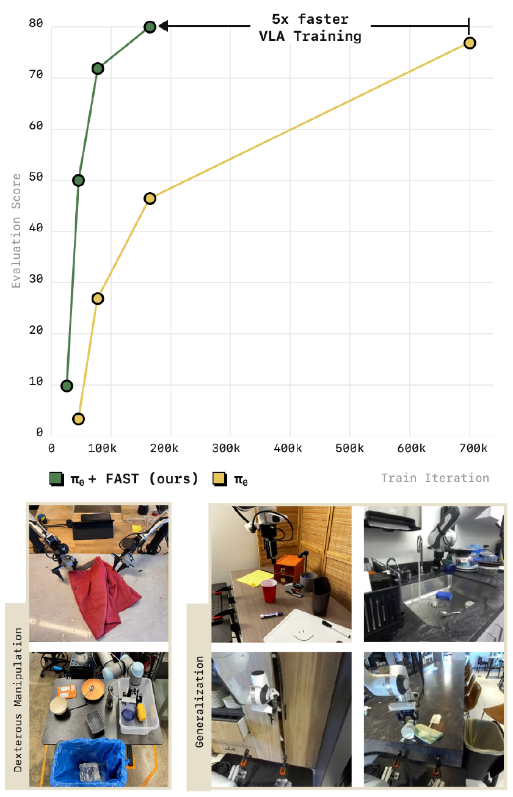

Figure 1. 두 대표 과제의 학습 진행과 실제 조작 예시. 위 곡선의 가로축은 `Train Iteration`이다. 도판의 “5x” 표시는 §VI-F의 GPU-hour 주장과 함께 읽어야 하며, 가로축 눈금 비율 자체가 정확한 GPU-hour 비율인 것은 아니다. [PDF p.1, Fig.1; p.10, §VI-F]

<a id="motivation"></a>

## 2. 문제의식과 주장–근거 지도

### 2.1 출발점: 행동을 무엇으로 예측하도록 가르칠 것인가

카메라와 언어 지시가 같아도 “50개 시점 × 14개 행동 차원을 700개 독립 bin ID로 표현”할지, “전체 궤적을 53개 내외의 압축 토큰으로 표현”할지에 따라 next-token 학습 문제가 달라진다. 토크나이저는 단순 입출력 형식이 아니라 **모델이 어느 조건부 분포를, 몇 번의 예측으로 학습하는지**를 결정한다.

기존 binning이 완전히 무의미한 방법은 아니다. 5 Hz, 7차원, 1초 chunk라면 35 token이고 변화량도 비교적 크다. 반면 50 Hz 양팔 데이터에서는 700 token이 생기며 같은 팔의 같은 차원 값이 시간에 따라 조금씩만 변한다. Teacher forcing에서 이전 정답을 볼 수 있으므로 모델은 관측에서 동작을 이해하기보다 이미 주어진 행동의 연장을 모사하는 쉬운 경로에 의존할 수 있다. [PDF pp.1–4, §I, III, IV]

### 2.2 저자의 주장과 실제 증거를 연결하기

| 핵심 주장 | 직접 근거 | 무엇을 지지하는가 | 남는 조건·한계 |
|---|---|---|---|
| 고주파 naive tokenization은 AR 학습을 어렵게 한다 | Fig.2–3, §IV의 spline 실험 | 같은 연속 함수에서 샘플링 수가 증가할 때 naive 모델 오차 증가 | 모든 AR 모델에 대한 수학적 불가능성 증명은 아님 |
| 행동을 압축하면 학습이 개선된다 | Fig.6, FAST·FSQ 대 naive | 압축된 두 방법 모두 naive보다 유리한 경향 | 압축률·표현·최적화 난이도의 인과 기여를 완전히 분리하지 않음 |
| DCT+BPE는 고정 binning보다 짧다 | Table I | 1초 chunk 기준 1.75–13.2배 토큰 수 압축 | byte 압축률·전체 latency 비율과 다름 |
| BPE 단계가 유효하다 | §VI-D 비번호 ablation | DCT만 쓰는 경우보다 더 나은 rollout 성능 | 원시 trial 결과·여러 seed의 상세 통계 미제공 |
| FAST는 다른 VLM backbone에도 적용된다 | OpenVLA T-shirt ablation | PaliGemma 이외 Prismatic 7B에서도 개선 | OpenVLA 입력을 다중 이미지 및 1초 chunk로 수정함 |
| FAST+가 범용 default로 유용하다 | Fig.6, Fig.8, Table III | 데이터별 FAST와 비슷한 정책 성능, 여러 미학습 데이터의 압축 | 정책 평가 데이터는 일부 tokenizer mixture에 포함; offline holdout과 구분 필요 |
| 고충실도 영역에서 FSQ보다 유리하다 | Fig.12, Appendix B | 정밀 복원을 요구할 때 DCT 기반 곡선이 유리 | 낮은 복원 충실도에서는 FSQ가 더 효율적인 구간도 존재 |
| π₀-FAST가 DROID의 새 환경에 일반화한다 | Fig.7, Fig.9, Table II, Appendix D/E | 별도 fine-tuning 없이 새 시점·배경·객체에서 조작 | 3개 캠퍼스 시연은 정성 결과; 정량 평가는 총 44 trial |
| generalist 성능에 필요한 학습 compute가 감소한다 | Fig.1, Fig.11, Fig.15 | 비교 대상과 유사한 평균 과제 성능에 최대 5배 적은 GPU 시간 | 모든 과제에서 동등하거나 더 좋은 것은 아님; 총 compute 세부 로그 부족 |
| FAST가 고주파 로봇 제어를 가능하게 한다 | 20/50 Hz 조작 데이터 및 Fig.10 | 고주파 action sequence를 학습·출력 가능 | policy가 20/50회/초 새 관측을 처리한다는 뜻은 아님 |

### 2.3 이 논문의 기여를 과장하지 않는 표현

[리뷰어 해석] 독창성의 중심은 DCT나 BPE라는 연산 자체의 발명이 아니다. **고주파 action chunk의 중복을 AR 최적화 문제로 진단하고, 간단하고 역변환 가능한 압축 표현을 큰 VLM 정책과 연결해 dexterous real-robot 학습으로 검증한 조합과 실증**이 기여다. 기존 semantic action이나 keypoint 접근처럼 별도의 수제 low-level controller를 요구하지 않고, 연속 low-level action을 직접 복원한다는 위치도 중요하다. [PDF pp.2–5, §II–V]

<a id="notation"></a>

## 3. 선수 지식과 notation/텐서 shape 사전

### 3.1 먼저 알아야 할 개념

**Action chunking.** 현재 관측으로 미래 여러 action vector를 한꺼번에 예측한다. 행동의 시간적 일관성과 긴 계획 표현에 유리하지만, 실제로 몇 step 실행한 뒤 다시 관측하는지에 따라 폐루프 반응성이 달라진다.

**DCT.** 길이 H의 시간 신호를 H개의 cosine basis 좌표로 표현하는 선형 변환이다. 차원 축 사이를 섞지 않고 각 action dimension의 시간축을 따로 변환한다. 평균 수준은 DC, 완만한 기울기는 저주파 AC, 갑작스러운 변화는 더 많은 고주파 성분에 대응한다.

**양자화.** 연속 계수를 정수 격자로 반올림한다. 한 격자 안의 서로 다른 실수가 같은 정수로 합쳐지므로 본질적으로 손실이 있다.

**BPE.** 많이 등장하는 인접 심볼 쌍을 하나의 새 심볼로 합치는 규칙을 데이터에서 얻는다. token ID는 숫자의 크기를 의미하지 않는다. ID가 100 큰 토큰이 100만큼 큰 행동을 뜻하지 않는다.

**Teacher forcing.** 학습 중 각 위치는 이전 정답 토큰을 본다. Causal mask 덕분에 모든 위치의 next-token loss를 한 번의 큰 forward에서 계산할 수 있다. 추론 중에는 이전 정답이 없으므로 모델 출력으로 한 위치씩 진행한다.

**FSQ.** learned encoder의 저차원 latent를 유한한 scalar level 조합으로 이산화하는 비교 방법이다. FAST 논문은 이를 학습형 압축 대안으로 사용한다. FAST 본체가 FSQ를 쓰는 것은 아니다.

### 3.2 shape를 먼저 고정하기

원문 Algorithm 1은 action dimension을 위첨자 i, 주파수 index를 아래첨자 j로 쓴다. 여기서는 실제 NumPy 구현과 맞춰 **시간/주파수 축을 먼저 두는 H × D 행렬**을 기본으로 사용한다. 그림의 D × H 표현과 서로 전치 관계이며 flatten 순서의 의미는 같다.

| 기호 | shape / 값의 영역 | 의미·주의 |
|---|---|---|
| B | 양의 정수 | batch size; BPE의 B와 무관 |
| H | 양의 정수 | 한 chunk의 시간 step 수. 1초 chunk면 대체로 데이터 Hz와 같음 |
| D | 양의 정수 | 실제 action dimension. 원문의 action-space 크기 표기와 대응 |
| o | 복합 입력 | 카메라들, 언어 지시, proprioceptive state |
| A | 실수 H × D, batch 포함 B × H × D | 원래 단위의 행동 chunk |
| q01, q99 | 실수 D | 훈련 데이터의 차원별 1%, 99% 분위수 |
| X | 실수 H × D | 정규화된 action. 모든 원소가 반드시 [-1,1]인 것은 아님 |
| F | 실수 H × H | 직교정규 DCT-II basis 행렬, 해설용 명시 표현 |
| C = FX | 실수 H × D | 행은 주파수 index, 열은 action dimension |
| γ | 양의 scalar | 반올림 전 곱하는 scale. 기본 10 |
| Q | 정수 H × D | round(γC) |
| q | 정수 HD | 낮은 주파수부터 모든 action dimension을 나열한 직렬화 결과 |
| Φ | 어휘·merge 규칙 | BPE를 데이터에서 fit한 결과 |
| z | 정수 n | BPE가 출력하는 action token IDs; n은 chunk마다 달라짐 |
| K | 어휘 크기 | dataset-specific FAST의 기본 1,024, 공개 FAST+ 2,048 |
| m | 정수 | 공개 tokenizer의 `min_token`; FAST+는 -354 |
| M | 이미지 개수 | 논문은 외부 1 + 팔별 wrist, 총 2 또는 3 |
| P | 이미지당 patch token 수 | 해설용 변수; 224/14 설정이면 16 × 16 = 256 |
| d_model | hidden width | action dimension D와 다름 |
| L_text, L_out | token 길이 | prompt/state text 길이와 action suffix 길이 |
| V_LM | VLM vocabulary size | BPE action vocabulary K보다 큼 |
| θ | 정책 파라미터 | 학습되는 VLM 가중치; Φ와 별개 |

원문 §III의 `T ∈ |V|`는 집합과 크기를 섞은 약식 표기다. 엄밀하게는 토큰이 어휘 집합에 속하거나, 구현에서 0부터 K−1 사이의 정수 ID를 가진다고 해석한다. Algorithm 1에서 마지막 action dimension에 쓰는 n과 §III에서 token 수로 쓰는 n도 혼동될 수 있으므로, 이 리뷰는 action dimension D와 압축 token 수 n을 분리한다.

<a id="problem"></a>

## 4. §I–IV를 따라가기: 기존 토큰화가 고주파 데이터에서 실패하는 이유

### 4.1 §I Introduction과 §II Related Work

저자는 VLM의 pretrained visual/language 지식과 큰 모델 capacity를 로봇 행동에 연결하려 한다. 이때 action을 이산 토큰으로 만들면 기존 next-token pipeline을 이용하기 쉽다. 그러나 기존 RT-1/RT-2/OpenVLA식 scalar binning은 저주파·단순 과제에서의 성공이 고주파·정밀 조작으로 이어지지 않는다는 문제를 제기한다. [PDF pp.1–3]

관련 연구는 세 흐름으로 정리된다. 첫째, 언어의 BPE, 이미지의 VQ autoencoder, 오디오의 spectrogram/codec처럼 입력 구조에 맞는 토큰화가 중요하다는 관점이다. 둘째, VLM을 로봇 데이터에 fine-tuning하여 언어 지시·객체 일반화를 얻는 VLA 계열이다. 셋째, semantic subtask/keypoint·직접 회귀·diffusion·VQ action representation 등 행동 표현의 대안이다. FAST는 세 번째 흐름 중 **기존 AR backbone에 이산 low-level action을 연결하면서 learned autoencoder의 학습 부담을 줄이는 위치**에 있다.

### 4.2 §III: 정책과 토크나이저의 입출력

**E1: 원문의 비번호 정책·토크나이저 정의.** [PDF p.3, §III]

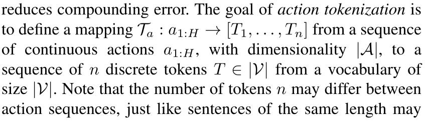

```math
\pi(a_{1:H}\mid o),\qquad \mathcal{T}_a:a_{1:H}\mapsto[T_1,\ldots,T_n].
```

첫 항은 관측 o로부터 미래 H개의 행동에 대한 조건부 정책 분포를 뜻한다. 두 번째 항은 연속 action chunk를 n개의 이산 ID로 변환한다. H가 같아도 n은 다를 수 있다. 같은 길이의 문장이라도 흔한 단어를 많이 포함하면 subword token 수가 달라지는 것과 비슷하다. 토크나이저가 환경 관측을 받아 동작을 결정하는 것은 아니며, **정답 행동을 어떤 표적 문자열로 표현할지를 결정**한다.

**E2: 원문의 naive action chunk 토큰열.** [PDF p.3, §III]

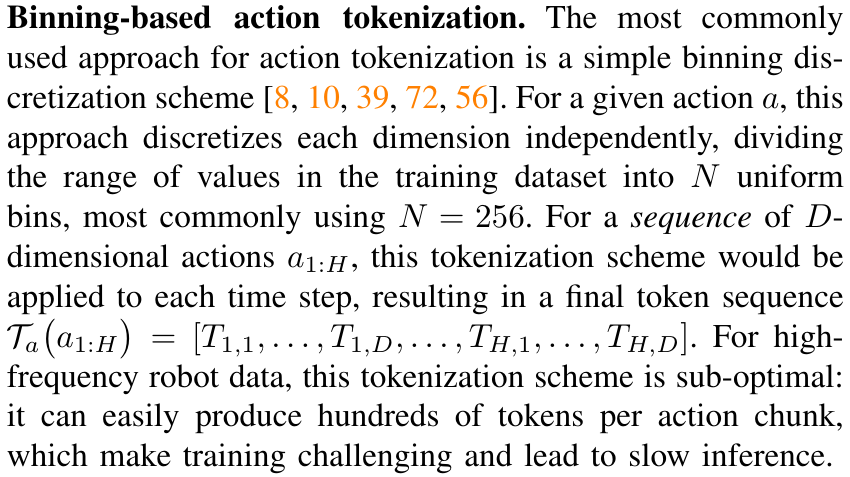

```math
\mathcal{T}_a(a_{1:H})=[T_{1,1},\ldots,T_{1,D},\ldots,T_{H,1},\ldots,T_{H,D}],\qquad n_{\mathrm{naive}}=HD.
```

시점 1의 D개 차원을 모두 나열한 뒤 시점 2로 간다. $`N=256`$개의 bin 중 하나를 차원별로 고르는 것이 전형적이다. $`H=50,\ D=14`$라면 700개의 출력 토큰을 순차 생성해야 한다. 원문의 약식은 bin edge나 clip 방식까지 정하지 않으므로, 아래는 작동을 이해하기 위한 **보조식**이다.

```math
b_{t,d}=\min\!\left(N-1,\max\!\left(0,\left\lfloor\frac{N(x_{t,d}+1)}{2}\right\rfloor\right)\right),\qquad N=256.
```

[-1,1] 구간을 N등분하고, 경계 밖과 오른쪽 끝은 유효 index로 제한하는 예시다. 논문의 모든 baseline이 이 줄과 바이트 단위로 일치한다고 주장하는 식이 아니다.

### 4.3 §IV: spline 실험의 통제와 관찰

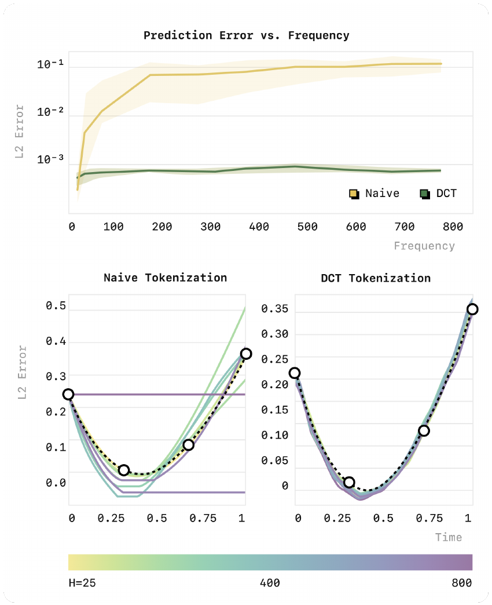

Figure 3. 네 conditioning point를 통과하는 cubic spline을 예측한다. 연속 곡선의 생성 분포는 유지하면서 샘플 수 H를 25–800으로 바꾼다. 위 패널은 예측 오차, 아래 패널은 같은 조건에서 복원한 곡선이다. [PDF pp.3–4, §IV]

실험 순서는 다음과 같다.

1. 네 점을 무작위 생성하고 그 점을 잇는 cubic spline을 정한다.
2. 같은 종류의 곡선을 서로 다른 시간 간격으로 샘플링한다.
3. naive 방식에서는 각 scalar를 256-bin token으로 변환한다.
4. 작은 AR Transformer에 네 점을 condition으로 주고 전체 token sequence를 예측하도록 학습한다.
5. 서로 다른 sampling rate에서 연속 신호 예측 MSE와 복원 모양을 비교한다.

[저자 보고] naive는 낮은 sampling rate에서 잘 맞추지만 샘플 수가 늘면 오차가 커지고, 가장 심한 경우 처음 값만 계속 복사한다. DCT 기반 표현은 넓은 sampling range에서 낮은 오차를 유지한다. 중요한 통제는 **관측해야 할 함수 자체가 더 복잡해진 것이 아니라 샘플 수가 증가했다**는 점이다.

### 4.4 “이전 값을 복사하면 loss가 낮다”를 수학적으로 이해하기

[리뷰어 보조식] 매끄러운 scalar 행동 a(t)에 대해 sampling interval이 Δt이면 다음과 같이 전개할 수 있다.

```math
a(t+\Delta t)-a(t)=a'(t)\Delta t+O(\Delta t^2).
```

시간 간격이 작아질수록 차이가 작아진다. 차이가 bin width보다 작으면 여러 시점이 같은 bin으로 들어갈 수 있다. 정답 이전 행동을 알려 주는 teacher forcing에서는 직전 값 또는 같은 차원의 과거 값을 기억하는 경로만으로 많은 토큰을 쉽게 맞출 수 있다.

```math
\mathcal{L}_{\mathrm{AR}}=-\sum_{j=1}^{n}\log p_{\theta}(z_j\mid o,z_{1:j-1}),\qquad \mathsf{H}(z_j\mid z_{1:j-1}).
```

오른쪽 조건부 entropy가 작아질수록 과거 토큰만으로 설명되는 부분이 커진다는 것이 직관이다.

CE와 조건부 entropy를 여기서 **같은 양으로 단정하면 안 된다**. CE는 모델 분포에도 의존하고, 실제 gradient 크기는 logits와 정답 간 차이에 의해 결정된다. 원문의 “학습 신호가 marginal information에 비례한다”는 문장은 직관적 설명이며 정리로 증명하지 않는다. 또한 다차원 시간순 문자열에서는 같은 차원의 직전 값이 바로 이전 token이 아니라 D개 전 token일 수 있다. 문제의 핵심은 문자 그대로 모든 인접 token 값이 같다는 데 있지 않고 **과거 action prefix가 현재 token을 너무 쉽게 예측한다는 데** 있다.

[논문 미기재] toy Transformer의 모든 층수·폭·optimizer·seed·학습 step 상세는 이 PDF만으로 재구성하기 어렵다. H가 바뀌면 출력 길이와 연산량도 바뀌므로 이 실험은 redundancy 설명을 강하게 지지하지만 유일한 원인만 분리한 증명은 아니다.

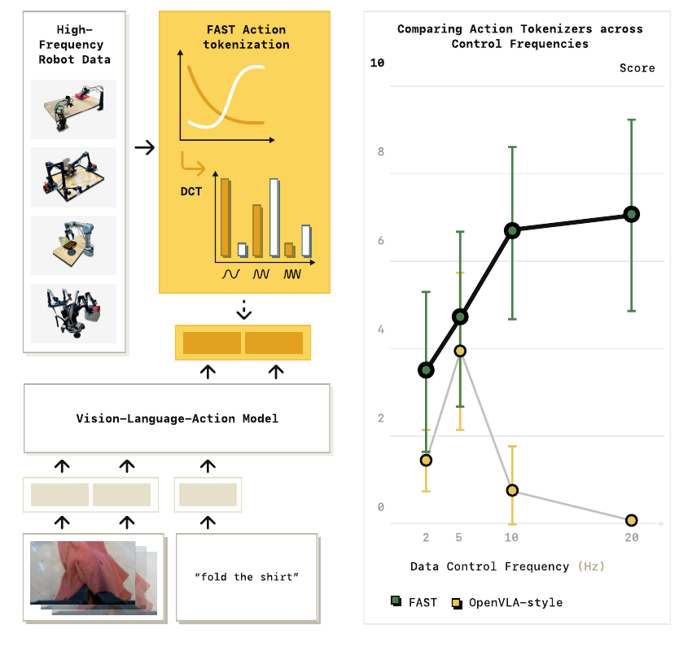

Figure 2. 2/5/10/20 Hz 데이터 조건에서 FAST와 OpenVLA-style binning의 과제 score를 비교한다. 고주파에서 격차가 커지는 방향은 Fig.3의 toy 결과와 맞지만, score를 모든 로봇의 성공률 %로 바꾸어 읽지 않는다. [PDF p.2, Fig.2]

<a id="method"></a>

## 5. §V-A/B: 정규화에서 BPE까지의 연산

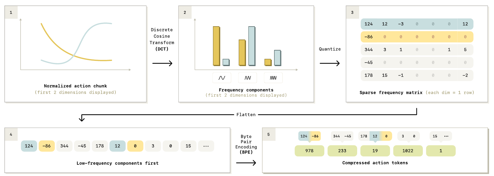

Figure 4. DCT, 양자화, 낮은 주파수 우선 flatten, BPE의 관계. 그림의 행렬은 action dimension이 행이고 frequency가 열인 D × H 배치다. 코드의 H × D 행렬을 C-order flatten하는 것과 같은 의미의 순서를 만든다. [PDF p.5, Fig.4]

### 5.1 Action normalization: 분위수를 범위 기준으로 사용한다

**E3: §V-B의 비번호 문장 정의를 수식화한 보조식.** 차원 d의 훈련 데이터 1%와 99% 분위수를 각각 q01,d와 q99,d라 하자.

```math
x_{t,d}=2\frac{a_{t,d}-q_{01,d}}{q_{99,d}-q_{01,d}}-1,\qquad q_{99,d}\gt q_{01,d}.
```

- 입력은 H × D action과 D차원 통계다. 통계를 시간축으로 broadcast한다.
- 먼저 아래 분위수를 빼고, 분위수 폭으로 나누고, 2를 곱한 뒤 1을 뺀다.
- q01은 −1, q99는 +1, 두 분위수의 중간값은 0으로 간다.
- 특정 unit의 큰 scale이 DCT·양자화를 지배하지 않도록 한다.
- 각 chunk의 최소·최대로 매번 정규화하는 것이 아니다. 그렇게 하면 chunk별 절대 크기·오프셋을 복원할 추가 정보가 필요해진다.
- 분위수 통계는 훈련 데이터에서 추정해야 한다. 평가 집합으로 통계를 다시 맞추면 공정한 holdout이 아니다.

[공식 코드 확인] FAST+ `UniversalActionProcessor.__call__` 내부에는 normalization이 없다. 입력을 미리 정규화해야 한다. 현재 openpi `Normalize._normalize_quantile`은 분모에 1e−6을 더하며 **[-1,1] clipping은 하지 않는다**. 따라서 “분위수 기준으로 범위를 맞춘다”와 “모든 값을 강제로 범위 안에 넣는다”는 서로 다른 연산이다. 분모가 거의 0인 constant dimension은 전처리 정책을 명확히 해야 한다. [PDF p.4, §V-B; 고정 openpi `transforms.py`]

예를 들어 q01=10, q99=30이면 action 20→0, 30→1, 40→2다. 40도 무조건 1이 되는 것이 아니다. clipped normalization을 추가하면 별도 손실이 생기므로 뒤의 순수 양자화 오차 경계가 그 추가 오차까지 설명하지 않는다.

### 5.2 DCT: 시간축의 좌표계를 바꾼다

**E4: Algorithm 1의 원문 DCT 행.**

```math
C_j^{i}\leftarrow\mathrm{DCT}(a_{1:H}^{i}).
```

원문은 여기서 a를 정규화된 입력으로 받아 사용하는 문맥이다. i는 action dimension, j는 DCT frequency index다. $`C_j^i`$는 한 coefficient지만 우변 DCT는 길이 H 벡터를 반환하므로, 모든 j에 해당하는 계수를 함께 계산한다는 약식으로 읽는다. 정확한 DCT type·정규화 상수는 원문의 이 한 줄에 없다. 공개 구현은 SciPy `dct(..., norm="ortho")`를 쓰며 기본 type II다. $`B\times H\times D`$에서 `axis=1`은 **시간축**이며, 단일 $`H\times D`$ chunk의 `fit`에서는 `axis=0`이다.

아래는 [공식 코드 확인 + 리뷰어 보조 유도]로 고정한 orthonormal DCT-II다. index는 t,k=0,…,H−1이다.

```math
C_{k,d}=\alpha_k\sum_{t=0}^{H-1}X_{t,d}\cos\!\left[\frac{\pi}{H}\left(t+\frac12\right)k\right],\qquad \alpha_k=\begin{cases}H^{-1/2},&k=0,\\(2/H)^{1/2},&1\le k\le H-1.\end{cases}
```

한 d를 고정하고 H개의 시간값에 cosine weight를 곱해 합한다. $`k=0`$이면 cosine이 모두 1이므로 DC 계수는 합을 $`\sqrt H`$로 나눈 값, 즉 평균의 $`\sqrt H`$배다. k가 증가하면 더 빨리 진동하는 패턴과의 일치 정도를 계산한다. $`H\times D`$의 출력 shape는 입력과 같다.

```math
F_{k,t}=\alpha_k\cos\!\left[\frac{\pi}{H}\left(t+\frac12\right)k\right],\qquad C=FX,\qquad F^{\mathsf T}F=I_H.
```

DCT는 deterministic linear map이다. 부드러운 신호에서 작은 수의 계수가 큰 에너지를 담는 경향을 이용하지만 **어떤 행동에서도 무조건 sparse가 된다는 보장**은 없다. 갑작스러운 gripper transition, 충격, 손가락의 빠른 교대 동작, noise가 많으면 상당한 고주파 계수가 필요하다. 또한 action axes 사이의 상관은 DCT가 직접 decorrelate하지 않는다. 그 부분은 뒤의 직렬화/BPE가 자주 등장하는 패턴 수준에서 이용한다.

### 5.3 Scale-and-round: 손실의 위치와 γ의 방향

**E5: Algorithm 1의 양자화 행.**

```math
\bar C_j^{i}\leftarrow\mathrm{round}(\gamma C_j^{i}).
```

리뷰의 H × D 표기로는 다음과 같다.

```math
Q_{k,d}=\mathrm{round}(\gamma C_{k,d}),\qquad \widehat C_{k,d}=Q_{k,d}/\gamma.
```

γ는 작은 계수를 얼마나 자세하게 보존할지 정한다. γ=10에서 계수 0.0317은 0.317을 반올림해 0이 되고, 계수 0.446은 4.46을 반올림해 4가 된다. 후자는 복원 시 0.4가 된다. γ가 커지면 원래 coefficient 단위의 quantization step 1/γ가 작아져 충실도가 높아지는 대신 0이 줄고 계수 alphabet이 넓어져 압축이 어려워질 수 있다.

```math
|C_{k,d}|\lt\frac{1}{2\gamma}\ \Longrightarrow\ Q_{k,d}=0,\qquad |\widehat C_{k,d}-C_{k,d}|\le\frac{1}{2\gamma}.
```

이는 무한한 정수 범위와 최근접 반올림, clipping 없음의 가정에서 성립한다. 0.5 tie에서 NumPy `around`는 ties-to-even을 사용하므로 구현 간 반올림 convention도 고정해야 한다. 원문은 “insignificant coefficients를 omit한다”고 설명하지만 코드가 계수 위치를 삭제하는 것은 아니다. **해당 위치에 정수 0을 유지하고, BPE가 반복된 0을 압축**한다. 이렇게 해야 원래 H × D 위치를 간단히 복원할 수 있다.

### 5.4 Frequency-first serialization: 축 이름보다 실제 순서가 중요하다

**E6: 원문 Algorithm 1의 flatten 행과 표기 주의.** 원본에는 처음 두 항에 overbar가 있고 뒤쪽 일부 C에는 overbar가 생략돼 있다. 마지막 위첨자 n은 여기서 action dimension 수를 나타내는 것으로 해석된다.

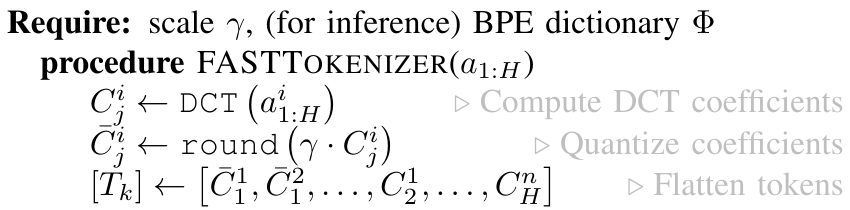

```math
[T_k]\leftarrow[\bar C_1^{1},\bar C_1^{2},\ldots,C_2^{1},\ldots,C_H^{n}].
```

위 줄은 인쇄 표기를 보존한 전사다. [리뷰어 해석] 이 단계의 입력은 앞에서 양자화한 정수행렬 전체이므로, 뒤쪽 항이 다시 양자화 전 실수로 바뀐다는 뜻으로 읽지 않는다. 의미를 명확히 하는 보조식은 다음과 같다.

```math
q_{kD+d}=Q_{k,d},\qquad 0\le k\lt H,\quad0\le d\lt D.
```

첫 D개 token 후보는 모든 action dimension의 DC, 다음 D개는 모든 dimension의 첫 번째 AC다. 즉 전체 동작의 거친 모양을 먼저 예측하고 더 세밀한 성분을 나중에 예측한다. 반대로 한 joint의 모든 frequency를 먼저 나열하면 다른 joint의 거친 계획이 아직 없는 동안 특정 joint의 미세 성분부터 생성한다.

[저자 보고] 낮은 주파수부터 각 차원을 교차시키는 순서가 더 안정적인 rollout을 만들었다. 다만 독립된 정량 flatten-order ablation 표는 없다. **코드의 `flatten()`은 H × D에 적용하므로 기본 C-order가 맞다.** 그림처럼 D × H로 저장한 뒤 같은 `flatten()`을 쓰면 잘못된 순서가 된다. [PDF p.5, §V-B]

### 5.5 BPE: 희소 행렬이 실제로 짧은 토큰열이 되는 단계

**E7/E8: Algorithm 1의 BPE fit과 tokenization.**

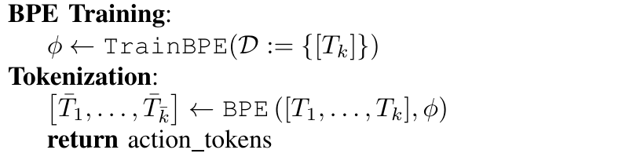

```math
\phi\leftarrow\mathrm{TrainBPE}(\mathcal{D}:=\{[T_k]\}),\qquad [\bar T_1,\ldots,\bar T_{\bar k}]\leftarrow\mathrm{BPE}([T_1,\ldots,T_k],\phi).
```

여기서 D 모양의 서체는 **전체 training corpus**이며 action dimension D와 다르다. Φ/φ는 원문 Require와 본문에서 대소문자가 달리 쓰이지만 같은 학습된 BPE dictionary로 이해한다. k는 압축 전 길이 HD, barred k는 압축 후 길이 n이다.

BPE fit은 자주 나오는 인접 symbol pair를 세어 merge vocabulary를 만든다. 이후 encode는 고정된 merge 규칙으로 각 입력 문자열을 변환한다. 같은 토큰이 여러 coefficient를 포함할 수도 있고, byte-level 구현에서는 처음에 하나의 Unicode coefficient가 여러 byte symbol로 나뉠 수도 있다. 따라서 “BPE token 1개 = DCT coefficient 1개”라는 대응은 없다.

**정수에서 문자열로 가는 구현 계층.** 공개 FAST+는 음수를 그대로 token ID로 쓰지 않는다. 계수 정수에서 `min_token`을 빼 Unicode codepoint를 만든 뒤 ByteLevel BPE에 넣는다.

```math
s_i=\mathrm{chr}\!\left(\max(q_i-m,0)\right),\qquad z=\mathrm{BPE}_{\Phi}(s_0s_1\cdots s_{HD-1}),\qquad m=-354\ \text{(공개 FAST+)}.
```

[공식 코드 확인] 음수 codepoint 방지를 위해 `maximum(...,0)`을 적용한다. 따라서 q가 m보다 작은 outlier면 모두 m으로 clamp되어 추가 손실이 생긴다. 상한은 코드에서 대칭적으로 clamp하지 않는다. “BPE가 lossless”라는 설명은 **이미 만들어진 유효 문자열을 BPE로 바꾸고 되돌리는 구간**에 대한 것이다. coefficient-to-character 단계의 out-of-range 처리와 원래 실수 양자화까지 lossless라는 뜻이 아니다.

어휘 크기 K가 고정이라는 사실도 출력 길이 n이 고정이라는 뜻은 아니다. 큰 K는 더 긴 패턴을 하나의 ID로 만들 여지를 주지만 VLM에서 사용할 action ID 범위를 더 많이 요구한다. 또한 같은 token 개수라도 256개 어휘와 2,048개 어휘의 정보량과 모델 softmax 비용은 다르다.

<a id="algorithm"></a>

## 6. Algorithm 1의 행별 해설과 역변환

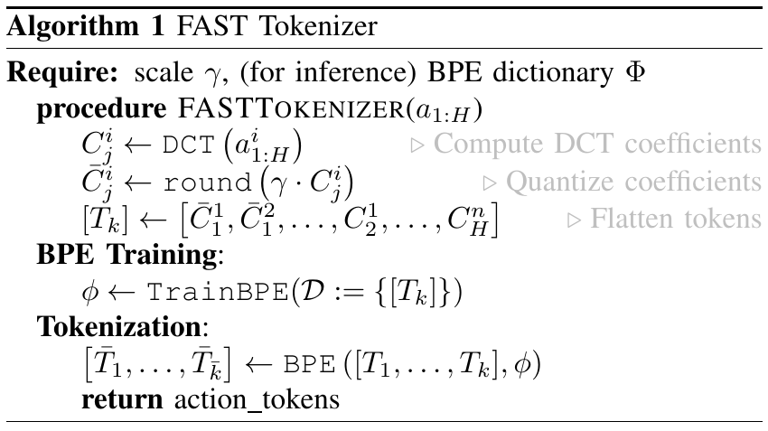

Algorithm 1. 원문은 encode와 BPE training을 한 상자에 요약한다. 이것을 inference마다 BPE를 재학습하라는 절차로 해석하면 안 된다. [PDF p.5]

| 원문 행·블록 | 실제 실행과 shape | 가정·연결 |
|---|---|---|
| Require: scale γ, inference에서 dictionary Φ | γ는 scalar, Φ는 미리 fit한 규칙 | 데이터 normalization 통계와 H,D metadata는 이 상자 밖에서 관리 |
| FASTTOKENIZER(a1:H) | 한 H × D action chunk를 받음 | 본문 문맥상 normalization 이후 입력 |
| C ← DCT(a) | 차원별 시간축 DCT, H × D 실수 유지 | action 차원축 DCT가 아님 |
| Cbar ← round(γC) | H × D 정수로 변환 | 유일한 핵심 손실 연산; small coefficients가 0이 됨 |
| [Tk] ← flatten(Cbar) | 길이 HD 정수열 | DC의 모든 차원부터 시작 |
| BPE Training: TrainBPE(corpus) | 여러 chunk의 정수열을 문자로 표현하고 merge 사전 학습 | tokenizer를 새로 만들 때 수행; VLA CE 학습과 다름 |
| Tokenization: BPE(sequence, φ) | 길이 n의 action token IDs 생성 | 이 단계만이 가변 길이의 압축 출력 |
| return action tokens | 보통 batch별 `list[list[int]]` | 각 n이 달라 tensor batch에서는 padding·mask 필요 |

### 6.1 역변환의 모든 단계

**E9: 논문의 “invertible” 설명과 공식 decode를 수식으로 펼친 보조식.**

```math
\begin{aligned} \widehat s&=\mathrm{BPE}^{-1}_{\Phi}(\widehat z),\\ \widehat q_i&=\mathrm{ord}(\widehat s_i)+m,\\ \widehat Q&=\mathrm{reshape}_{H\times D}(\widehat q),\\ \widehat C&=\widehat Q/\gamma,\\ \widehat X&=F^{\mathsf T}\widehat C,\\ \widehat A_{t,d}&=\frac{\widehat X_{t,d}+1}{2}(q_{99,d}-q_{01,d})+q_{01,d}. \end{aligned}
```

순서는 encode의 역순이다. 모델이 출력한 VLM vocabulary ID는 먼저 FAST BPE ID로 되돌려야 한다. 그 다음 BPE를 풀면 codepoint 문자열이 나오고, `ord`와 m으로 coefficient 정수를 얻는다. **문자열 길이가 정확히 HD인지 검사한 뒤** H × D reshape한다. γ로 나누지 않으면 행동 scale이 γ배 커진다. IDCT 후 마지막에 원래 단위로 unnormalize한다.

```math
\widehat X_{t,d}=\sum_{k=0}^{H-1}\alpha_k\widehat C_{k,d}\cos\!\left[\frac{\pi}{H}\left(t+\frac12\right)k\right].
```

이것이 orthonormal DCT-II의 수학적 역변환이다. SciPy의 `idct(..., norm="ortho")` API는 paired inverse를 수행한다. API type 이름만 보고 DCT-II를 다시 적용하면 역변환이라고 생각해서는 안 된다. 행렬 관점에서 정방 직교행렬 F의 **전치 Fᵀ**가 inverse다.

### 6.2 정확히 무엇이 invertible인가

[리뷰어 해석] 원문의 “all operations are easily invertible”는 실용적인 detokenization이 쉽다는 뜻으로 제한해 읽어야 한다. DCT와 유효 BPE 문자열의 encode/decode, reshape는 역연산이 있다. 하지만 `round`는 다대일이므로 원래 C를 정확히 복원할 수 없다. q=0에서 원래 coefficient가 0인지, 0.01인지, −0.04인지 구분되지 않는다. 복원 결과는 원래 행동 A가 아니라 근사 행동 Â다.

또한 예측 token열은 tokenizer가 생성한 유효 token열이라는 보장이 없다. [공식 코드 확인] `decode`는 문자 길이나 reshape가 맞지 않으면 예외를 잡고 **0 coefficient matrix**로 대체한 후 IDCT한다. 그 결과는 normalized zero action이다. 이를 물리 단위로 역정규화하면 분위수 중앙값이므로, **실제 로봇에서 “정지 명령”임을 보장하지 않는다**. 코드가 조용히 반환했다고 의미적으로 올바른 행동이 생성된 것은 아니다.

### 6.3 복원 오차의 유용한 경계

**E10: 리뷰어 보조 유도; 논문에 실린 정리가 아니다.** F가 직교정규이고 coefficient clamp·문자열 오류·추가 action clipping이 없으면 Parseval 관계가 성립한다.

```math
\|\widehat X-X\|_F^2=\|\widehat C-C\|_F^2\le\frac{HD}{4\gamma^2},\qquad \mathrm{MSE}(\widehat X,X)\le\frac{1}{4\gamma^2}.
```

각 coefficient 오차가 최대 1/(2γ)이므로 제곱오차를 HD개 더하고 HD로 나눈다. γ=10이면 normalized MSE의 보수적 상한은 0.0025다. 이것은 **tokenization roundtrip**에 대한 경계다. AR 모델이 다른 정수를 예측해서 생기는 policy error를 제한하지 않는다. 한 시점·한 관절의 최대 오차는 평균 MSE보다 클 수 있고, 원래 단위로 바꾸면 차원별 분위수 폭의 절반만큼 오차가 증폭된다.

```math
\widehat A_{t,d}-A_{t,d}=\frac{q_{99,d}-q_{01,d}}{2}(\widehat X_{t,d}-X_{t,d}).
```

따라서 normalized MSE가 낮아도 손가락 접촉, gripper state, 좁은 삽입 허용 오차가 충분히 보존된다는 결론은 별도의 downstream 평가가 필요하다.

<a id="example"></a>

## 7. 작은 수치 예제: normalization → DCT → BPE → 행동 복원

이 절은 **리뷰어가 만든 $`H=4,\ D=2`$의 해설용 예제**다. 4 Hz를 논문의 실제 task 설정이라고 주장하지 않는다. DCT 행렬을 NumPy로 직접 구성하고, 고정 revision의 `tokenizer.json`을 `tokenizers.Tokenizer.from_file`로 읽어 BPE를 실제 실행했다. SciPy·Transformers 전체 processor·VLA는 실행하지 않았다.

### 7.1 원래 단위와 normalization

첫 번째 dimension의 분위수는 [10,30], 두 번째는 [−2,2]라고 하자. 첫 축은 20→26으로 변하고 두 번째는 0.8로 일정하다.

```math
A=\begin{bmatrix}20&0.8\\22&0.8\\24&0.8\\26&0.8\end{bmatrix},\quad q_{01}=[10,-2],\quad q_{99}=[30,2],\quad X=\begin{bmatrix}0&0.4\\0.2&0.4\\0.4&0.4\\0.6&0.4\end{bmatrix}.
```

첫 값은 2(20−10)/(30−10)−1=0이고 마지막 값은 2(26−10)/20−1=0.6이다. 두 번째 축은 2(0.8+2)/4−1=0.4다. 이 통계는 tokenizer가 추측하는 값이 아니라 전처리에서 보관한 값이어야 한다.

### 7.2 길이 4 DCT를 직접 계산

```math
F\simeq\begin{bmatrix}0.5&0.5&0.5&0.5\\0.653281&0.270598&-0.270598&-0.653281\\0.5&-0.5&-0.5&0.5\\0.270598&-0.653281&0.653281&-0.270598\end{bmatrix}.
```

첫 action의 DC는 0.5×(0+0.2+0.4+0.6)=0.6이다. 첫 AC는 0.653281×0 + 0.270598×0.2 − 0.270598×0.4 − 0.653281×0.6 = −0.4460885다. 두 번째 action은 상수이므로 DC만 0.8이고 AC는 0이다.

```math
C=FX\simeq\begin{bmatrix}0.6&0.8\\-0.4460885&0\\0&0\\-0.0317025&0\end{bmatrix}.
```

첫 action이 선형 ramp라도 유한 구간 DCT에서 모든 고주파 계수가 정확히 0인 것은 아니다. 마지막 작은 AC −0.0317025가 남는다. 부드러운 신호와 정확히 몇 개 주파수만 가진 신호는 다르다.

### 7.3 γ=10 양자화와 직렬화

```math
Q=\mathrm{round}(10C)=\begin{bmatrix}6&8\\-4&0\\0&0\\0&0\end{bmatrix},\qquad q=[6,8,-4,0,0,0,0,0].
```

첫 AC −4.460885는 −4로, 마지막 AC −0.317025는 0으로 간다. 총 8개 scalar 중 5개가 0이지만 아직 길이는 8이다. 두 축의 DC `(6,8)` 다음 첫 AC `(−4,0)`을 나열한다. 반대로 flatten하면 `[6,−4,0,0,8,0,0,0]`이 되어 다른 BPE 문자열과 AR 문제가 된다.

### 7.4 BPE merge를 손으로 이해하기

가상의 toy corpus에서 `(0,0)`을 Z2로 merge하면 q는 `[6,8,−4,Z2,Z2,0]`이 된다. `(Z2,Z2)`를 Z4로 합치면 `[6,8,−4,Z4,0]`이고, `(6,8)`도 자주 등장하면 하나로 합칠 수 있다. 이것은 **원리 설명용 merge 순서**다. 실제 사전은 전체 corpus의 빈도·tie-breaking에 따라 결정되므로 한 chunk만 보고 전체 사전을 추론할 수 없다.

### 7.5 공개 FAST+의 실제 token IDs

공개 processor의 m=−354를 쓰면 q−m의 codepoint는 다음과 같다.

```math
[360,362,350,354,354,354,354,354]\ \xrightarrow{\mathrm{BPE}_{\Phi}}\ [294,1239,258,256].
```

[검산] CPU 실행에서 **실제로 이 네 ID가 나왔다**. 각 ID를 decode한 해당 예제의 coefficient group은 다음과 같다.

| FAST+ ID | 되돌린 계수 부분열 | 의미 |
|---|---|---|
| 294 | `[6]` | 첫 축 DC |
| 1239 | `[8, -4]` | 두 번째 축 DC와 첫 축 AC |
| 258 | `[0, 0, 0, 0]` | 반복 0 네 개 |
| 256 | `[0]` | 마지막 0 |

BPE token은 action axis나 frequency 경계를 반드시 지키지 않는다. 1239는 DC 블록 끝과 AC 블록 시작을 가로지른다. Coarse-to-fine은 기본 계수 문자열의 순서에 대한 성질이지, token 하나가 항상 한 frequency band라는 뜻은 아니다. 8→4 token이고 inverse BPE 후 q는 **정확히 같았다**.

### 7.6 inverse transform 계산

```math
\widehat C=Q/10=\begin{bmatrix}0.6&0.8\\-0.4&0\\0&0\\0&0\end{bmatrix},\qquad \widehat X=F^{\mathsf T}\widehat C\simeq\begin{bmatrix}0.0386874&0.4\\0.1917608&0.4\\0.4082392&0.4\\0.5613126&0.4\end{bmatrix}.
```

첫 축 첫 시점은 DC 기여 0.5×0.6=0.3에 첫 AC 기여 0.653281×(−0.4)=−0.2613126을 더한 0.0386874다. 원래 `[0,0.2,0.4,0.6]`과 조금 달라졌고 두 번째 상수 축은 유지된다.

```math
\widehat A\simeq\begin{bmatrix}20.3868741&0.8\\21.9176078&0.8\\24.0823922&0.8\\25.6131259&0.8\end{bmatrix}.
```

| 검산 항목 | 결과 | 해석 |
|---|---:|---|
| normalized MSE, 전체 8원소 | 0.0003911501 | coefficient 반올림 손실 |
| 첫 차원 MSE | 0.0007823001 | 두 번째 차원은 거의 정확히 복원 |
| normalized 최대 절대 오차 | 0.0386874070 | 평균과 maximum은 다름 |
| 첫 차원의 원래 단위 최대 오차 | 0.3868740702 | 분위수 폭/2=10배로 확대 |
| γ=10 MSE 상한 | 0.0025 | 실제 예제는 상한 이하 |
| BPE 정수열 roundtrip | exact | BPE 자체 손실 없음 |
| Parseval 제곱오차 | 수치 정밀도 내 일치 | DCT 축·정규화 검산 |

### 7.7 FAST+ training은 이 예제의 어디를 바꾸는가

정규화, F, γ=10, q 생성은 사전 없이도 가능하다. FAST+ 학습은 많은 q 문자열에서 **1239가 `[8,−4]` 조합을 표현하도록 하는 식의 vocabulary/merge를 정하는 단계**다. 실제 1239가 이 한 예제로 학습됐다는 뜻은 아니다. 정책 학습은 이미지·지시·상태를 보고 `[294,1239,258,256]`을 출력하도록 θ를 바꾸는 별도 문제다.

<a id="fastplus"></a>

## 8. §V-C 및 Appendix A: FAST+ 범용 토크나이저 학습

### 8.1 FAST와 FAST+의 관계

[저자 보고] 데이터별 FAST는 해당 action distribution에서 BPE를 새로 fit한다. 보통 몇 분이면 가능하지만 dataset마다 이 단계를 반복해야 한다. FAST+는 약 **100만 개의 1초 action chunk**로 한 번 사전을 만들어 재사용한다. 신경망 action decoder를 pretrain한 것이 아니다. [PDF pp.5–6, §V-C]

여러 embodiment와 action representation을 섞으면 특정 팔의 범위·반복 패턴에만 잘 맞는 사전이 되는 것을 줄일 수 있다. 하지만 BPE가 컵 집기 같은 의미를 학습하는 것은 아니다. 물리적 의미가 달라도 coefficient pattern이 비슷하면 token을 공유한다.

### 8.2 Appendix A의 전체 mixture

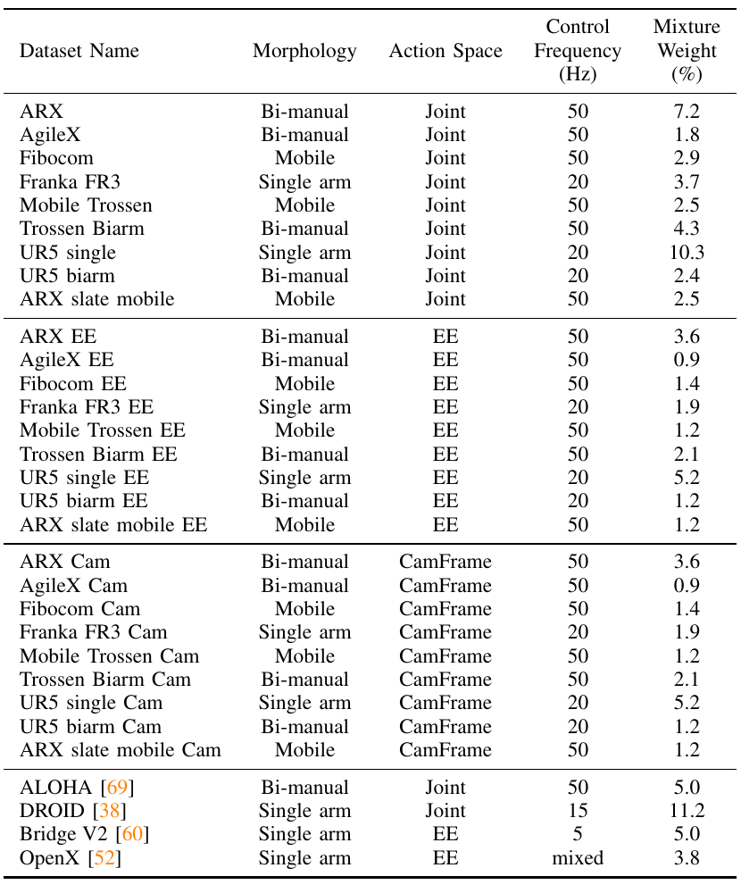

Appendix A 비번호 표. 아래는 원표의 31행을 보존하면서 같은 로봇의 joint/EE/CamFrame 항목을 묶었다. [PDF p.16]

| Robot | Morphology | Hz | Joint % | EE % | CamFrame % | 합계 % |
|---|---|---:|---:|---:|---:|---:|
| ARX | 양팔 | 50 | 7.2 | 3.6 | 3.6 | 14.4 |
| AgileX | 양팔 | 50 | 1.8 | 0.9 | 0.9 | 3.6 |
| Fibocom | mobile | 50 | 2.9 | 1.4 | 1.4 | 5.7 |
| Franka FR3 | 단일팔 | 20 | 3.7 | 1.9 | 1.9 | 7.5 |
| Mobile Trossen | mobile | 50 | 2.5 | 1.2 | 1.2 | 4.9 |
| Trossen Biarm | 양팔 | 50 | 4.3 | 2.1 | 2.1 | 8.5 |
| UR5 single | 단일팔 | 20 | 10.3 | 5.2 | 5.2 | 20.7 |
| UR5 biarm | 양팔 | 20 | 2.4 | 1.2 | 1.2 | 4.8 |
| ARX slate mobile | mobile | 50 | 2.5 | 1.2 | 1.2 | 4.9 |

| 기타 dataset | Morphology | Action space | Hz | 비중 % |
|---|---|---|---|---:|
| ALOHA | 양팔 | Joint | 50 | 5.0 |
| DROID | 단일팔 | Joint | 15 | 11.2 |
| BridgeV2 | 단일팔 | EE | 5 | 5.0 |
| OpenX | 단일팔 | EE | mixed | 3.8 |

[검산] 27개 robot/representation 행은 75.0%, 마지막 4개 dataset은 25.0%, 전체 **100.0%**다. 반올림 때문에 각 robot 비중이 완전히 2:1:1이 아니어도 오류로 단정하지 않는다.

[저자 보고] tokenizer 학습 전 서로 다른 action space를 **32차원으로 padding**한다. DCT를 action 차원축으로 수행한다는 뜻은 아니다. [논문 미기재] padding 값, normalization/padding 순서, 통계 산출 단위, chunk sampling seed는 PDF에서 충분히 지정하지 않는다. 공개 `.fit()` 자체는 자동으로 32차원 padding을 하지 않는다. Normalized zero padding을 사용한다면 반복 0이 BPE의 압축률에 영향을 주므로 native dimension과 padding 포함 수치를 구분해야 한다.

32차원 학습이 40차원 입력을 거부한다는 뜻도 아니다. DCT와 BPE는 새로운 H,D를 처리할 수 있고 Table III에는 D=40 HumanPlus가 있다. 다만 padding에서 배운 반복 패턴의 이득은 새 shape의 실제 token count로 평가해야 한다.

### 8.3 공식 `.fit()`의 행별 의미

고정 [공식 tokenizer 소스](https://huggingface.co/physical-intelligence/fast/blob/ec4d7aa71691cac0b8bed6942be45684db2110f4/processing_action_tokenizer.py)는 다음을 수행한다.

1. 각 H × D array에 시간축 DCT를 적용한다.
2. flatten하여 corpus의 계수열을 만든다.
3. γ를 곱하고 round한 전체 값의 `min_token`, `max_token`을 구한다.
4. 이 범위가 vocab 크기에 비해 넓으면 assertion/warning을 낸다. 이는 loss가 아닌 alphabet 범위 검사다.
5. 계수에서 `min_token`을 빼 `chr`로 문자열을 만든다.
6. ByteLevel BPE와 `BpeTrainer`를 설정한다. `min_frequency=2`, 빈 special token 목록, 전체 정수 범위 initial alphabet, `max_token_length=10000`이다.
7. 문자열 반복자로 corpus를 제공해 빈도 기반 merge를 fit한다.
8. 새 processor를 반환한다. 저장하면 새 dataset-specific FAST가 된다.

Gradient descent, reconstruction loss, optimizer를 사용하지 않는다. 다만 모든 DCT를 먼저 list로 만들고 min/max 계산에 concatenate하므로 큰 corpus의 CPU RAM 비용은 확인해야 한다. Tokenizer의 학습 속도가 빠르다는 주장과 대규모 데이터를 전처리·로딩하는 전체 비용은 같지 않다.

### 8.4 논문 기본값과 공개 release 설정

| 항목 | Dataset-specific FAST | 공개 FAST+ | 의미 |
|---|---|---|---|
| γ | 10 | 10 | coefficient step 0.1 |
| vocab | 1,024 | 2,048 | `.fit` default와 pretrained config가 다름 |
| min_token | dataset에서 추정 | −354 | 음수 coefficient의 문자 offset |
| duration | 주로 1초 | 1초 권장 | API가 duration을 자동 해석하지 않음 |
| H,D | dataset에 따름 | config에서 null | encode shape cache 또는 decode 인자 필요 |
| normalization | q01/q99 | 외부 전처리 | 로봇 unit 통계가 BPE 사전에 저장된 것이 아님 |
| neural weights | 없음 | 없음 | VLM checkpoint와 다름 |

여러 H,D를 한 서버에서 섞을 때 내부 `called_time_horizon`, `called_action_dim` cache에만 의존하면 마지막 encode의 shape가 다음 decode에 영향을 준다. [후속 연구 제안] decode에 H,D를 명시하고 tokenizer revision·통계·action schema를 함께 고정한다.

<a id="forward"></a>

## 9. 정책 end-to-end forward, loss와 gradient

### 9.1 tokenizer fit, VLA training, inference를 분리하기

| 단계 | 입력과 목표 | 바뀌는 것 | 고정된 것 |
|---|---|---|---|
| Tokenizer fit | normalized actions → 반복 계수 패턴 | Φ, min/max 범위 | DCT, 선택한 γ |
| Policy training | 이미지·지시·상태 → 정답 action tokens | θ: VLM 파라미터 | Φ, γ, 통계, target IDs |
| Policy inference | observation → tokens → 연속 chunk | 현재 KV cache·생성 prefix | θ, Φ, 전처리 |

본문 §VI-A는 **weight freezing 없이 fine-tuning**한다고 명시한다. Tokenizer에 neural weights를 추가하지 않는 것과 VLM을 학습하지 않는 것은 다르다. 현재 openpi에는 LoRA 변형도 있지만 이를 논문의 기본 recipe로 대체하지 않는다.

### 9.2 입력: 이미지·언어·상태

DROID에서는 외부 카메라 한 장, wrist 카메라 한 장, instruction, proprioceptive state를 입력한다. 이미지는 각 224 × 224다. 외부 카메라 2개 중 1개, episode당 language annotation 3개 중 1개를 학습 시 무작위 선택한다. Camera calibration을 condition으로 쓰지 않는다. [PDF pp.16–17, Appendix C/D]

```math
I\in\mathbb{R}^{B\times M\times224\times224\times3}\ \longrightarrow\ E_{\mathrm{vis}}\in\mathbb{R}^{B\times MP\times d_{\mathrm{model}}}.
```

각 이미지를 vision encoder로 처리하고 token을 concatenate한다. 공개 openpi는 SigLIP `So400m/14`와 PaliGemma를 사용한다. 해당 224/14 설정에서 P=256이라면 카메라 2장은 512, 3장은 768 visual token이다. 이는 **해당 코드 설정의 shape 예시**이며 모든 backbone에 동일한 P를 가정하지 않는다.

State는 256-bin 정수를 **문자열**로 만든 뒤 language tokenizer에 넣는다. 상태가 `[12,143,98]`이라도 그 문자열의 language token 수가 반드시 3은 아니다. Output action과 달리 state input에는 단순 binning을 유지한다. 저자는 state가 반복해서 예측할 target이 아니라 condition이라 이 표현이 충분하다고 설명한다.

[공식 코드 확인] 현재 openpi prefix는 `Task: {instruction}, State: {bin strings};`, suffix는 `Action: ` + remapped FAST tokens + `|` 및 EOS다. Instruction의 lowercase/strip, underscore를 공백으로 바꾸는 전처리도 있다. 이 문자열 convention은 논문이 직접 명시한 식이 아니라 현재 코드의 보충 증거다.

### 9.3 training forward

1. 정답 H × D 행동을 정규화하고 고정 FAST로 z1:n을 만든다.
2. FAST IDs를 VLM vocabulary의 예약된 IDs로 바꾼다.
3. 이미지 embeddings, prefix, 정답 suffix embeddings를 결합한다.
4. Prefix는 서로 볼 수 있고 suffix는 prefix와 이전 suffix만 보게 mask를 만든다.
5. 각 hidden state에서 다음 token logits를 계산한다.
6. Action suffix 및 종료 구문에 masked CE를 계산한다.

```math
E=[E_{\mathrm{vis}};E_{\mathrm{prefix}};E_{\mathrm{suffix}}]\in\mathbb{R}^{B\times(MP+L_{\mathrm{text}}+L_{\mathrm{out}})\times d_{\mathrm{model}}}.
```

공개 `ar_mask`는 prefix=0, postfix=1이다. Teacher forcing 덕분에 학습의 모든 next-token 위치를 한 번의 큰 forward에서 평가한다. 실제 inference를 한 번에 parallel 생성한다는 뜻은 아니다.

### 9.4 loss와 gradient

다음은 [공식 코드 확인]으로 재구성한 masked CE이며 원문의 번호 식이 아니다.

```math
p_{b,j,v}=\frac{\exp\ell_{b,j,v}}{\sum_{u=1}^{V_{\mathrm{LM}}}\exp\ell_{b,j,u}},\qquad \mathcal{L}_b=-\frac{\sum_j m_{b,j}\log p_{b,j,y_{b,j}}}{\max(1,\sum_jm_{b,j})}.
```

- Logits는 B × target-length × V_LM이고 softmax 축은 vocabulary다.
- y는 한 위치 오른쪽으로 shift한 정답 ID다. 입력 마지막 token은 다음 정답이 없으므로 제외한다.
- m은 loss mask다. Visual token과 condition prefix에 직접 CE를 걸지 않는다.
- 현재 wrapper는 suffix의 `Action:`과 종료 구문에도 mask=True이므로 BPE ID만 loss를 받는 것은 아니다.
- 각 샘플의 유효 suffix 길이로 나누므로 긴 chunk의 총 loss가 길이에 단순 비례하지 않는다.
- 예측 행동과 정답 행동 사이의 별도 MSE/L1 reconstruction loss는 기본 FAST policy objective에 없다.

```math
\frac{\partial\mathcal{L}_b}{\partial\ell_{b,j,v}}=\frac{m_{b,j}}{\max(1,\sum_r m_{b,r})}\left(p_{b,j,v}-\mathbf{1}[v=y_{b,j}]\right).
```

Gradient는 vocabulary projection, language transformer, embeddings, attention을 통해 image features까지 이어진다. Prefix에 직접 loss가 없다고 vision encoder gradient가 없는 것은 아니다. 실제 freeze 설정으로 막을 수 있지만 논문 기본은 freeze하지 않는다.

반대로 round·BPE·정답 action은 target 생성 전처리다. CE가 이 연산을 미분해 Φ를 갱신하지 않는다. **DCT가 미분 가능하더라도 이 방식에서는 DCT를 통과하는 reconstruction gradient가 필요하지 않다.**

### 9.5 inference forward

1. 새 카메라 이미지와 instruction/state를 같은 전처리로 만든다.
2. Vision encoder를 실행하고 prefix를 prefill해 layer별 KV cache를 만든다.
3. 첫 token logits에서 argmax 또는 temperature sampling한다.
4. 새 token embedding으로 decoder 한 step을 실행하고 cache를 갱신한다.
5. EOS 또는 generation cap까지 반복한다.
6. Action 영역을 추출하고 VLM ID를 FAST ID로 되돌린다.
7. Inverse BPE → 문자 해석 → reshape → γ 역변환 → IDCT → unnormalize한다.
8. Robot schema로 변환한 chunk의 정해진 앞부분을 실행한다.
9. 다음 관측으로 다시 계획한다.

[공식 코드 확인] 현재 token remapping은 다음과 같다.

```math
v=V_{\mathrm{LM}}-1-128-z.
```

끝의 128개 special token을 건너뛴다. 이 식을 두 번 적용하면 원래 z로 돌아간다. Vocabulary가 바뀌면 action ID 예약 범위와 충돌 여부를 다시 확인해야 한다. 원문의 least-used-token overwrite를 구현한 현재 방식이지 모든 VLA의 보편 상수는 아니다.

TTFT는 첫 token 시간, **TTFA는 실행할 action chunk가 준비되는 시간**이다. DCT 계수 하나는 전체 시간축에 영향을 주고 BPE는 여러 계수를 묶는다. 원래 코드가 token 하나마다 action 한 시점을 즉시 실행하는 streaming을 제공하는 것은 아니다.

### 9.6 정책 학습 설정

| 설정 | 원문 보고 | 주의 |
|---|---|---|
| Backbone | PaliGemma-3B 기반 π₀, 일부 Prismatic 7B/OpenVLA | 대부분 π₀ 기반 비교 |
| Freezing | 없음 | full fine-tuning 기본 |
| Image | 2/3장, 224 × 224 | 외부 한 장 + 팔별 wrist |
| Action | 기본 1초 chunk | Hz에 따라 H 변경 |
| State | 256-bin 후 문자열 | action FAST와 다름 |
| Optimizer | AdamW | weight decay=0 |
| Adam β1,β2 | 0.9,0.95 | sampling temperature와 무관 |
| LR | 1k warmup 후 5e−5 일정 | Appendix C |
| Gradient clipping | magnitude 1 | 세부 norm convention 미기재 |
| EMA | 0.999 | network weights |
| 기본 decoding | greedy AR | beam search 아님 |
| 양팔 decoding | temperature β=0.7 | shirt/toast/laundry의 정체 완화 |
| DROID | 240k iterations, batch 256, 약 3 epochs | 8×H100 약 4일 |
| LIBERO | 40k iterations, 약 40 epochs | 270k samples 합친 단일 policy |

양팔 데이터에는 episode 초반 home pose의 stationary chunk가 있어 greedy 정책이 머무를 수 있고 temperature가 이를 완화했다고 보고한다. FAST가 모든 정체 문제를 제거했다는 뜻은 아니다. [PDF pp.16–17, Appendix C]

<a id="experiments"></a>

## 10. §VI와 Appendix B–E: 실험 설계, 모든 Figure와 Table

### 10.1 §VI-A: 무엇을 비교했는가

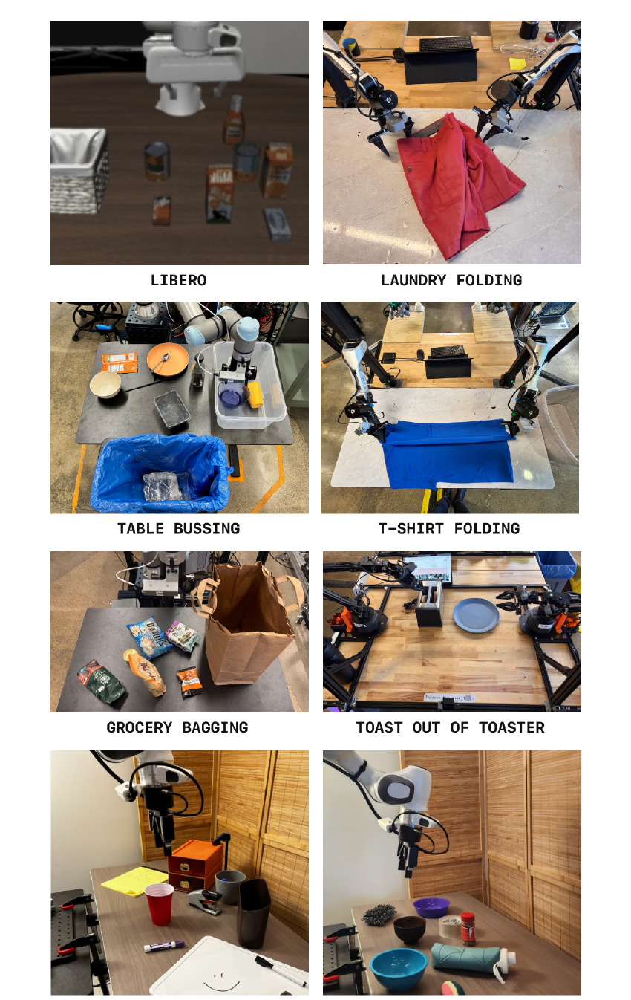

Figure 5. Simulation 1종과 real-robot task family 6종. 같은 막대그래프라도 task progress와 binary success가 섞여 있다. [PDF p.6]

비교 대상은 dataset-specific FAST, universal FAST+, naive scalar binning, learned FSQ다. Backbone과 정책 training framework를 공통화하여 토큰화 차이를 비교한다. OpenVLA ablation은 별도 backbone 확장이며 diffusion π₀ 비교는 tokenizer만 교체하는 비교보다 architecture 차이가 크다.

| 평가 | 로봇·Hz | 데이터·초기 조건 | metric | 비교 범위 |
|---|---|---|---|---|
| LIBERO | simulation | re-rendered Spatial/Object/Goal/Long 데이터 합침 | episode binary success | tokenizers, diffusion |
| Table bussing | UR5e 단일팔, 20 Hz | training 약 70종 객체, evaluation 12개 객체의 새 배치 | 정확히 분류·정리한 객체 비율 | tokenizer/BPE/diffusion/generalist |
| T-shirt folding | ARX 양팔, 50 Hz | 약 150종 shirt 학습, 평가 seen shirt 5종을 평평하게 배치 | human-rated fold success | tokenizer/OpenVLA/BPE/diffusion/generalist |
| Grocery bagging | UR5e 단일팔, 20 Hz | 7개 다양한 물건 + 종이봉투 | 봉투에 넣은 물건 비율 | full-mixture generalist |
| Toast out of toaster | Trossen Viper-X 양팔, 50 Hz | toast 두 장을 꺼내 plate로 옮김 | 제거/배치 각 1점, 총 4점 progress | full-mixture generalist |
| Laundry folding | ARX 양팔, 50 Hz | basket 속 옷 5개, 펼치기·접기·쌓기 | 올바르게 접고 쌓은 옷 비율 | full mixture + task fine-tuning |
| DROID | Franka 단일팔, 15 Hz | 75k 성공 episode, 새 배경·객체·시점 | task별 progress rubric | tokenizers/diffusion/generalization |

본문의 LIBERO-10과 Appendix E의 LIBERO-Long은 사용 명칭이 다르다. 여기서는 네 suite를 Spatial/Object/Goal/Long(본문의 10)으로 기록하며 재현 시 환경 config 이름을 확인해야 한다.

Grocery, toast, laundry는 모든 tokenizer를 해당 과제에서 처음부터 학습한 비교에 포함되지 않는다. §VI-F의 generalist 평가에 사용한다. 특히 laundry는 본문이 포괄적으로 zero-shot performance라 부르는 문장과 달리 Appendix E에서 **full mixture pretraining 후 고품질 task-specific 데이터 fine-tuning**을 명시한다.

### 10.2 Table I: 압축률 산술

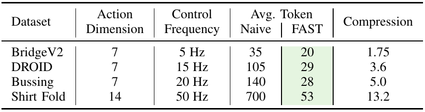

Table I. 모든 행은 1초 chunk이며 naive 수는 D×H다. [PDF p.7, §VI-B]

| Dataset | D | H / Hz | Naive | FAST 평균 | 원표 비율 | 재계산 | token 감소율 |
|---|---:|---:|---:|---:|---:|---:|---:|
| BridgeV2 | 7 | 5 | 35 | 20 | 1.75 | 1.7500 | 42.86% |
| DROID | 7 | 15 | 105 | 29 | 3.6 | 3.6207 | 72.38% |
| Bussing | 7 | 20 | 140 | 28 | 5.0 | 5.0000 | 80.00% |
| Shirt Fold | 14 | 50 | 700 | 53 | 13.2 | 13.2075 | 92.43% |

```math
R_{\mathrm{tokens}}=\frac{n_{\mathrm{naive}}}{n_{\mathrm{FAST}}},\qquad \text{감소율}=1-\frac{n_{\mathrm{FAST}}}{n_{\mathrm{naive}}}.
```

[검산] 원표의 반올림 비율과 일치한다. 저자는 비슷한 reconstruction accuracy에서 비교하고 Appendix B를 근거로 든다. 다만 Table I에 정확한 MSE·차원별 오차·scale sweep 지점이 함께 없으므로 각 조건의 오차가 완전히 동등한지는 표만으로 재검증하기 어렵다.

FAST가 거의 30 token/팔/초를 만든다는 관찰은 부드러운 행동의 중복을 제거한다는 해석을 지지한다. 그러나 Bridge는 20, shirt는 53이며 평균이다. **고정 30 token이라는 제약이나 최악 길이 보장은 없다.** Table III의 DROID-Joint와 π Table Bussing은 D=8, Table I는 D=7이므로 행별 action representation을 구분한다.

### 10.3 Figure 6: tokenizer별 정책 성능

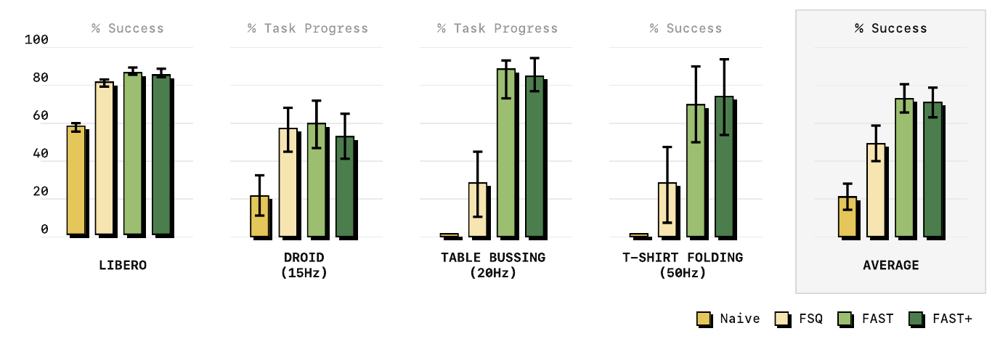

Figure 6. Mean 및 95% CI. LIBERO·shirt는 success, DROID·bussing은 task progress다. 평균 패널의 “% Success”를 모든 과제의 binary 성공률로 읽으면 안 된다. [PDF p.8]

핵심 관찰은 naive가 LIBERO에서는 어느 정도 학습되지만 bussing/shirt에서는 거의 진전이 없다는 것이다. FSQ와 FAST가 모두 개선하므로 압축이 유용하다는 근거가 된다. FAST는 정밀 real-robot task에서 FSQ보다 좋고, FAST+는 개별 FAST와 비슷해 dataset마다 BPE를 새로 학습하지 않아도 되는 근거가 된다.

아래 값은 **원시 표가 아닌 그래프 육안 근사**다. 정확한 CSV 수치처럼 사용하지 않는다.

| 과제 | Naive 대략 | FSQ 대략 | FAST 대략 | FAST+ 대략 | 해석 |
|---|---:|---:|---:|---:|---|
| LIBERO | 55% | 78% | 84% | 81% | 압축법 모두 개선 |
| DROID | 20% | 55% | 57% | 50% | task progress, CI 겹침 |
| Bussing | 약 0% | 30% | 89% | 85% | 고주파 정밀 task의 큰 개선 |
| Shirt | 약 0% | 30% | 70% | 75% | CI 넓지만 naive와 큰 차이 |

[논문 미기재] 각 실험의 모든 seed·원시 rollout outcome·CI 계산법이 PDF에 상세히 제공되지 않는다. 막대 차이만으로 pairwise 통계적 유의성을 단정하지 않는다.

### 10.4 Figure 7, Table II, Figure 14: DROID 일반화

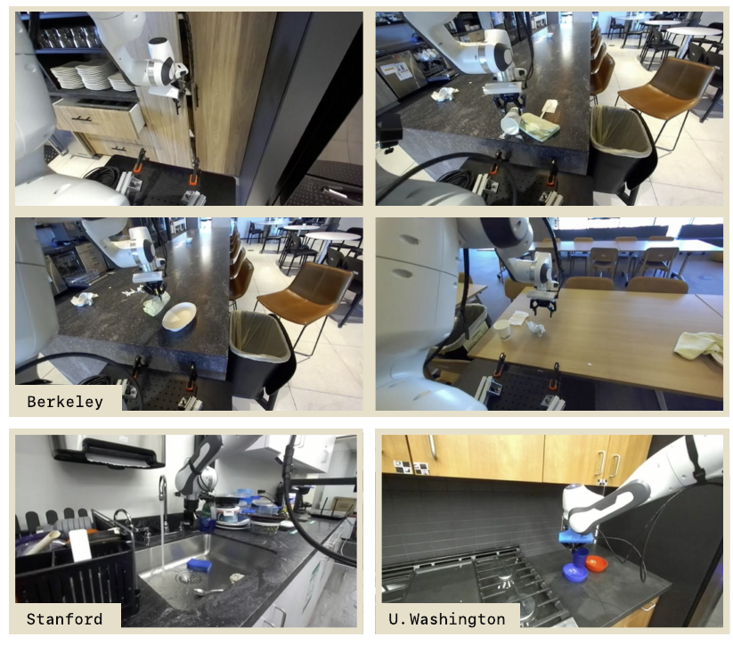

Figure 7. 같은 checkpoint를 Berkeley, Stanford, University of Washington의 다른 배경·시점·객체에서 평가한 정성 사례. 캠퍼스마다 성공률을 측정한 표는 아니다. [PDF p.8; p.18, Appendix E]

**Training.** 성공 episode 75k개, 약 21M samples를 사용한다. Joint velocity와 absolute gripper position을 출력하며 15-step chunk를 예측한다. All-zero action의 idle timestep을 제거하고, 외부 camera view와 annotation을 randomize한다. 240k iterations, batch 256, 약 3 epochs이며 8×H100에서 약 4일이다. [PDF p.17, Appendix D]

```math
240000\times256=61{,}440{,}000,\qquad 61.44\mathrm{M}/21\mathrm{M}=2.9257\ \text{epochs}.
```

[검산] 약 3 epochs와 일치한다. p.18의 `≈3 episodes`는 Appendix D와 이 산술에 비추어 **epochs의 오기**로 해석한다. 4일×24시간×8GPU=768 GPU-hours는 이 DROID training의 근삿값이며 generalist 총 compute가 아니다.

**Inference.** 15-step chunk에서 8 또는 15 step을 open-loop로 실행한다. 15 Hz에서 각각 약 0.533초·1초다. 15 Hz마다 새 observation을 처리한다는 뜻은 아니다.

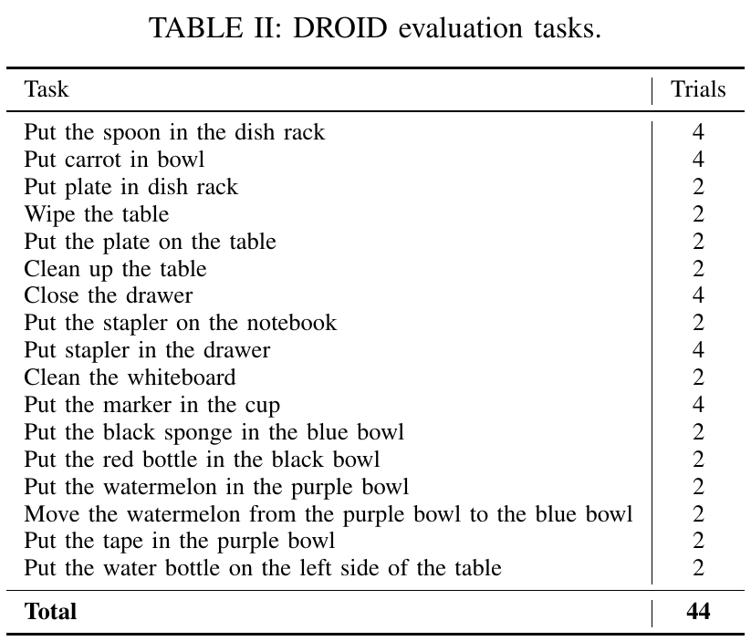

Table II. 본문은 16 tasks라 하지만 표에는 **17개 task 행**이 있다. Trial 합계는 원표대로 44다. [PDF p.18]

| Task | Trials |
|---|---:|
| Put the spoon in the dish rack | 4 |
| Put carrot in bowl | 4 |
| Put plate in dish rack | 2 |
| Wipe the table | 2 |
| Put the plate on the table | 2 |
| Clean up the table | 2 |
| Close the drawer | 4 |
| Put the stapler on the notebook | 2 |
| Put stapler in the drawer | 4 |
| Clean the whiteboard | 2 |
| Put the marker in the cup | 4 |
| Put the black sponge in the blue bowl | 2 |
| Put the red bottle in the black bowl | 2 |
| Put the watermelon in the purple bowl | 2 |
| Move the watermelon from the purple bowl to the blue bowl | 2 |
| Put the tape in the purple bowl | 2 |
| Put the water bottle on the left side of the table | 2 |
| **합계** | **44** |

[검산] 4-trial 과제 5개 + 2-trial 과제 12개 = 20+24=44다. 과제별로 집기 1점, 맞는 receptacle에 놓기 1점 같은 rubric을 사용하므로 **44개의 binary 성공/실패를 평균한 값이라고 읽을 수 없다**.

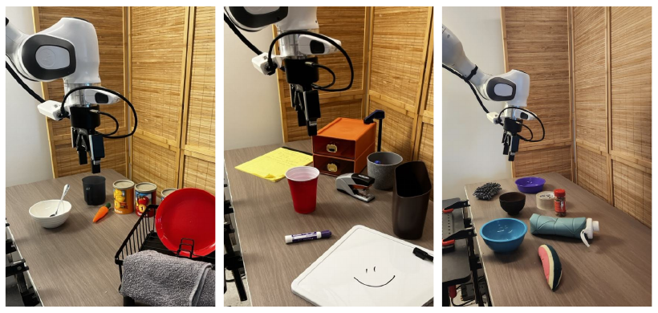

Figure 14. 정량 평가 setup 예시. Fig.7의 캠퍼스 시연 영상과 정량 44 trial을 구분한다. 저자는 실패 영상도 제공한다고 말하지만 이 리뷰가 웹사이트의 모든 영상을 재평가한 것은 아니다. [PDF p.18]

### 10.5 §VI-C, Figure 8, Table III: unseen 데이터의 압축

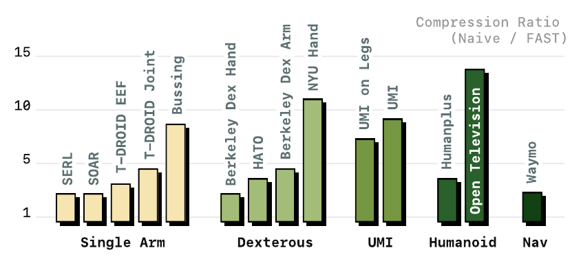

Figure 8. Tokenizer training에 포함되지 않은 평가 데이터에서 naive/FAST token count ratio를 본다. 대략 모든 dataset에서 2배 이상, 일부 humanoid·dexterous 데이터에서는 훨씬 크다. [PDF pp.8–9]

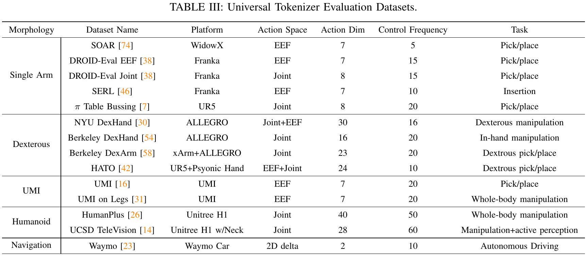

Table III. 14개 evaluation data entry. 로봇 형태의 다양성을 보여 주는 offline 평가다. [PDF p.19]

| 유형 | Dataset | Platform | Action space | D | Hz | 영역 |
|---|---|---|---|---:|---:|---|
| Single arm | SOAR | WidowX | EEF | 7 | 5 | pick/place |
| Single arm | DROID-Eval EEF | Franka | EEF | 7 | 15 | pick/place |
| Single arm | DROID-Eval Joint | Franka | Joint | 8 | 15 | pick/place |
| Single arm | SERL | Franka | EEF | 7 | 10 | insertion |
| Single arm | π Table Bussing | UR5 | Joint | 8 | 20 | pick/place |
| Dexterous | NYU DexHand | ALLEGRO | Joint+EEF | 30 | 16 | dexterous manipulation |
| Dexterous | Berkeley DexHand | ALLEGRO | Joint | 16 | 20 | in-hand manipulation |
| Dexterous | Berkeley DexArm | xArm+ALLEGRO | Joint | 23 | 20 | dexterous pick/place |
| Dexterous | HATO | UR5+Psyonic Hand | EEF+Joint | 24 | 10 | dexterous pick/place |
| UMI | UMI | UMI | EEF | 7 | 20 | pick/place |
| UMI | UMI on Legs | UMI | EEF | 7 | 20 | whole-body manipulation |
| Humanoid | HumanPlus | Unitree H1 | Joint | 40 | 50 | whole-body manipulation |
| Humanoid | UCSD TeleVision | Unitree H1 w/Neck | Joint | 28 | 60 | manipulation + active perception |
| Navigation | Waymo | Waymo Car | 2D delta | 2 | 10 | driving |

원문은 평가 데이터가 tokenizer training에 없다고 한다. 그러나 training mixture에는 DROID와 UR5가 포함되므로 **로봇이나 dataset family까지 전혀 보지 않았다**는 뜻으로 확대하면 안 된다. DROID-Eval 등의 trajectory-level 분리 목록이 있어야 leakage를 독립 검증할 수 있다. [논문 미기재] 정확한 split ID manifest는 PDF에 없다.

압축률은 정책 성능이 아니다. BPE는 관측과 언어 없이 action array만 처리한다. Humanoid balance나 손가락 접촉 안정성을 FAST policy로 검증한 실험은 이 표에 없다.

### 10.6 §VI-D: OpenVLA backbone과 BPE ablation

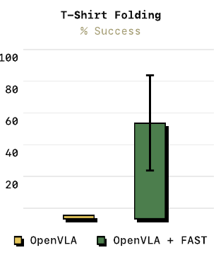

비번호 그림. Prismatic 7B 기반 OpenVLA의 shirt folding 비교. Original OpenVLA tokenization은 거의 실패하고 FAST+는 약 60% 수준의 성공 막대를 보이며 CI가 넓다. [PDF p.9, §VI-D]

저자는 OpenVLA를 그대로 실행한 것이 아니라 **다중 이미지를 받고 1초 action chunk를 예측하도록 수정**했다. 따라서 vanilla OpenVLA checkpoint에 tokenizer만 끼우면 바로 같은 결과가 나온다고 읽으면 안 된다. 같은 task를 학습하는 수정된 OpenVLA backbone에서 두 tokenization을 비교했다는 근거다.

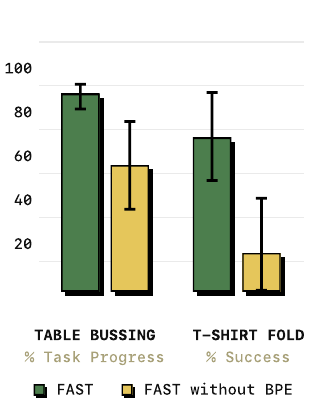

비번호 그림. BPE를 빼면 bussing은 대략 90→55% progress, shirt는 약 70→15% success로 내려간다. 값은 육안 근사다. DCT-only도 naive보다 낫지만 긴 0-token열이 남는다. [PDF p.9, §VI-D]

해석은 두 층이다. DCT는 정보가 많은 coefficient를 앞에 모아 표현을 개선한다. 그러나 round 후 행렬을 그대로 token으로 내면 zero-run도 수백 번 예측해야 한다. BPE는 이 반복을 줄여 AR 학습과 순차 decoding 부담을 함께 줄인다. BPE 제거는 길이뿐 아니라 vocabulary 분포도 바꾸므로 어느 한 요인만 원인이라고 단정할 수는 없다.

### 10.7 Appendix B, Figure 12: 압축–복원 trade-off

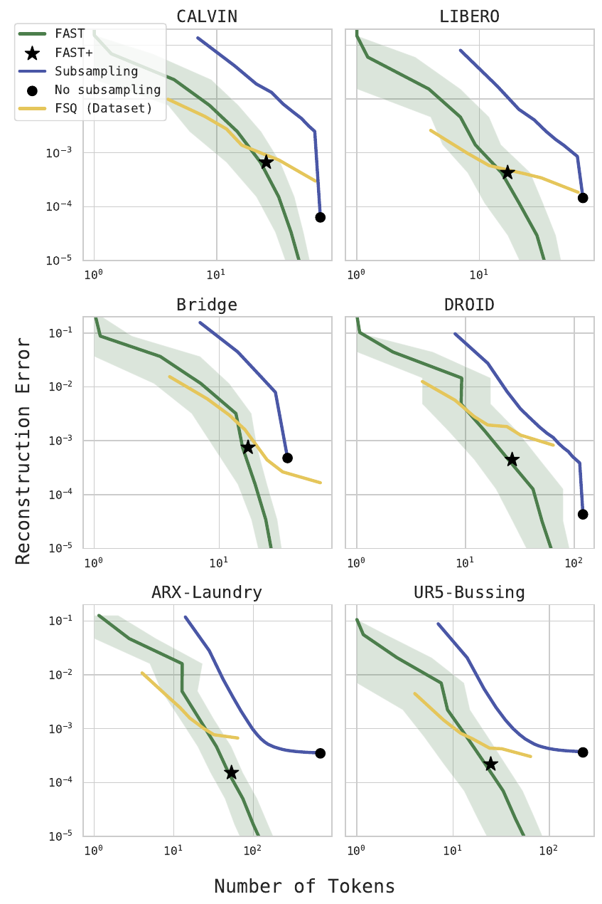

Figure 12. CALVIN, LIBERO, Bridge, DROID, ARX-Laundry, UR5-Bussing의 6개 curve panel. 가로축 token count, 세로축 reconstruction error이며 로그 눈금이다. [PDF p.16, Appendix B]

비교에서 vocabulary size를 고정하고 FAST는 γ, naive는 subsampling frequency, FSQ는 latent token 수를 sweep한다. 별표는 FAST+, 검은 점은 subsampling 없는 naive다. 작은 token 수의 저충실도 영역에서는 learned FSQ가 좋을 수 있지만, 더 낮은 error를 요구하면 FAST 곡선이 더 유리하게 내려간다.

이 결과의 기술적 의미는 **압축은 잘되지만 정밀 복원이 안 되는 tokenizer로는 dexterous policy가 어려울 수 있다**는 것이다. 단순히 한 점의 최고 compression을 선택하는 문제가 아니라 허용 복원 오차에서 필요한 token 수를 선택해야 한다. CALVIN·Bridge가 이 그림에 나온다고 해당 benchmark의 closed-loop policy success를 Fig.6과 똑같이 평가했다는 뜻은 아니다.

[논문 미기재] error의 정확한 reduction 축·채널 가중치, normalized/physical unit handling, 각 점의 raw value·seed, subsampling 후 interpolation recipe, FSQ encoder/decoder architecture와 training hyperparameter가 충분히 공개돼 있지 않다. 따라서 고정된 error tolerance에서 완전히 같은 조건의 tokenizer 비교를 하려면 재현 recipe가 더 필요하다.

### 10.8 §VI-E, Figure 9: diffusion π₀와 비교

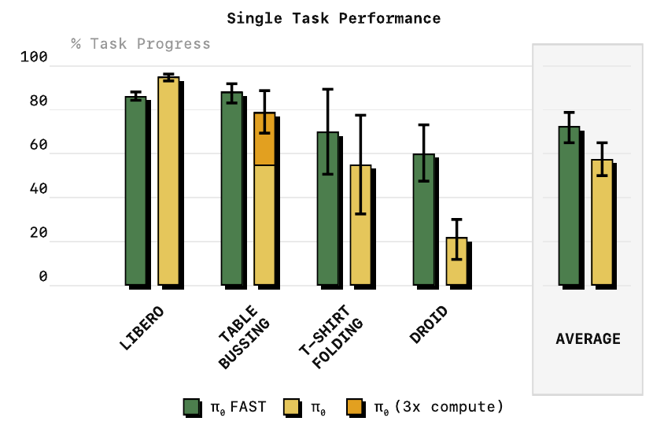

Figure 9. 작은 데이터와 큰 데이터의 수렴 특성이 다르다. Table bussing의 diffusion에는 3× compute bar가 함께 나온다. [PDF p.9]

[저자 보고] LIBERO·shirt처럼 50시간 미만의 작은 dataset에서는 두 방식 성능이 비슷하다. 큰 bussing dataset에서는 FAST가 높은 성능에 약 3배 적은 training step으로 도달한다. DROID에서는 diffusion 정책이 instruction을 무시하는 경우가 있어 FAST의 progress가 더 높다고 설명한다.

하지만 **AR objective가 본질적으로 항상 language grounding에 우월하다는 증명은 아니다**. 동일 언어 표현을 쓰더라도 action expert·gradient 경로·training recipe·capacity가 달라진다. 저자도 이 원인의 상세 분석을 미래 연구로 둔다. Fig.9에서 LIBERO는 diffusion 막대가 더 높으므로 모든 과제에서 FAST가 이긴다는 해석은 성립하지 않는다.

속도 비교는 오히려 inference 한계를 드러낸다. Diffusion π₀는 약 10번의 300M action expert denoising step을 쓰고, π₀-FAST는 약 30–60번 **전체 2B language backbone** AR decoding을 한다. 3B PaliGemma 전체 모델 크기와 2B language backbone 크기도 구분해야 한다. [PDF p.9, §VI-E]

### 10.9 §VI-F, Figure 10/11/15: 큰 mixture의 generalist

[저자 보고] π₀의 대규모 robot mixture로 π₀-FAST를 학습한다. 자체 데이터 903M timesteps와 공개 BRIDGE v2/DROID/OXE를 포함하며, 공개 데이터가 training mixture의 9.1%라고 한다. 초록은 이를 약 10k hours 규모로 설명한다. 다른 Hz와 sampling weight가 섞여 있으므로 **903M을 한 가지 Hz로 나누어 모든 시간량을 검산하는 것은 부적절**하다. 9.1%가 고유 frame 수 비중과 같다고도 단정하지 않는다. [PDF p.10]

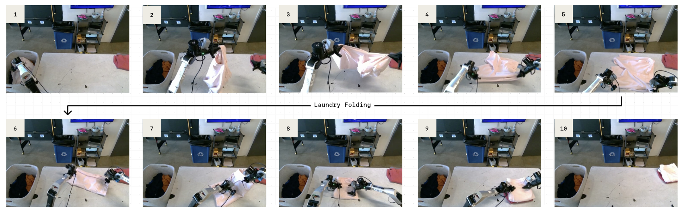

Figure 10. 바구니에서 옷을 꺼내 펼치고 접는 긴 sequence의 질적 예시. 이 10개 사진이 tokenizer의 10개 action token이라는 뜻은 아니다. [PDF p.10]

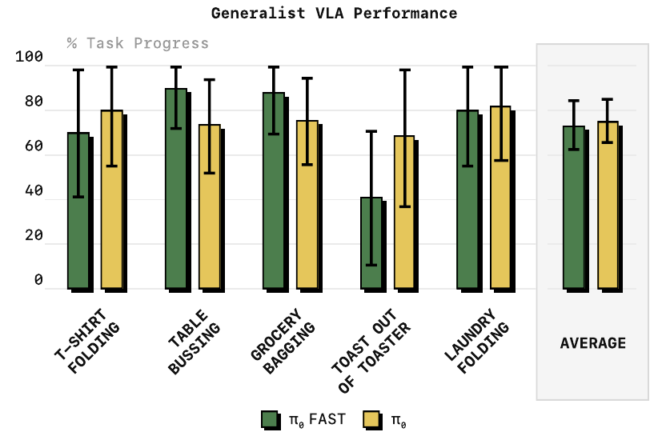

Figure 11. 평균적으로 diffusion π₀와 유사한 성능에 도달한다. 개별 task는 FAST의 bussing/grocery 막대가 더 높고 shirt/toast는 더 낮으며 laundry는 비슷한 패턴이다. [PDF p.10]

육안으로 FAST의 toast progress는 약 40%, diffusion은 약 65%여서 모든 task가 동등하다고 말할 수 없다. 평균값이 비슷하다는 주장은 task별 robustness가 동일하다는 주장이 아니다. Laundry fine-tuning 조건은 Appendix E를 함께 확인해야 한다.

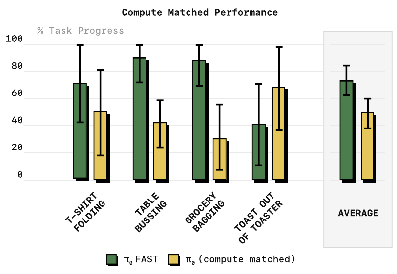

Figure 15. 동일 training compute의 diffusion checkpoint와 비교하면 FAST의 평균 task progress가 더 높다. 그림에는 shirt/bussing/grocery/toast 4개 task와 평균이 있으며 **laundry는 없다**. 본문의 모든 task 비교라는 포괄 표현보다 실제 panel 범위를 우선한다. [PDF p.18]

이 그림도 toast에서는 diffusion이 더 높다. 따라서 저자의 결론은 유용한 generalist policy에 도달하는 compute가 줄었다는 것으로 제한한다. 평균 score의 task weighting, checkpoint 선택 기준, 정확한 GPU-hour curve 원시값, 총 trainable parameter·step time 로그가 없으므로 5×를 독립적으로 완전히 재현하는 데는 추가 정보가 필요하다.

### 10.10 Appendix E, Figure 13: task scoring을 다시 확인

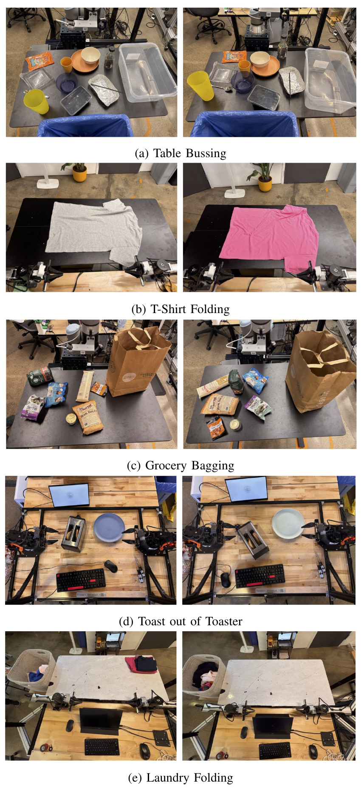

Figure 13. 각 실제 task의 초기 배치. 객체 다양성, cloth 상태, obstruction 등의 조건이 달라 score의 의미도 다르다. [PDF p.17]

- **Bussing:** 12개 객체에 utensils-on-trash, 가림, chopstick, 투명 플라스틱, 반사 용기 같은 어려운 조건이 포함된다. Training 객체 약 70종을 모두 unseen object라고 부르는 실험은 아니다. 새 배치가 핵심이다.
- **Shirt:** training 약 150종 중 seen shirt 5종을 평가에 돌려 사용한다. Human rater가 완성 여부를 판정한다. Unseen garment generalization으로 재명명하면 안 된다.
- **Grocery:** 7개 item을 봉투에 넣은 비율이다. 하나라도 실패하면 episode 전체 0점인 binary success와 다르다.
- **Toast:** toast 두 개 각각 제거/배치 2단계여서 4점 만점이다. Half-complete episode도 progress를 얻는다.
- **Laundry:** 바구니에 무작위 넣은 옷을 펼치고 접고 쌓는 전체 절차를 평가한다. Task-specific fine-tuning과 human rating이 포함된다.
- **LIBERO:** 270k samples를 합쳐 단일 policy로 40k iterations 학습한다. Batch 256을 가정하면 약 37.93 epochs로 약 40이라는 규모와 맞지만, 이 batch 가정은 DROID와 달리 해당 문장에서 직접 확정하지 않는다.

원문의 중요한 실험 정보는 caption에만 있는 경우가 많다. Fig.12는 Appendix B의 실질적인 내용이며, Fig.15의 task 범위도 본문 요약보다 좁다. 본문·caption·Appendix를 함께 읽어야 비교 대상과 metric을 정확히 복원할 수 있다.

<a id="efficiency"></a>

## 11. 효율 지표와 최대 5배 학습 가속의 정확한 의미

### 11.1 서로 다른 숫자 네 가지

| 지표 | 논문 근거 | 올바른 해석 | 잘못된 확대 |
|---|---|---|---|
| 13.2× | Table I, shirt 700/53 | action token count ratio | 전체 policy inference 13.2배 가속 |
| 약 3× | §VI-E, bussing convergence | 높은 성능에 필요한 training step 감소 | 모든 dataset의 step time 3배 감소 |
| 최대 5× | §VI-F, Fig.1/11/15 | 유사한 generalist 성능에 필요한 GPU-hours 감소 | inference 5배 가속 |
| 약 750 vs 100 ms | §VI-E, RTX 4090 | 1초 action chunk inference 비교 | FAST가 diffusion보다 빠름 |

[검산] reported latency의 단순 비율은 750/100=7.5다. 이 조건에서 FAST는 diffusion보다 약 7.5배 긴 추론 시간이 든다. 이는 현재 다른 serving engine·GPU·모델 버전에도 그대로 적용되는 상수가 아니다.

```math
T_{\mathrm{train\ to\ target}}=N_{\mathrm{steps\ to\ target}}\,T_{\mathrm{step}},\qquad G_{\mathrm{hours}}=T_{\mathrm{wall,hours}}\,N_{\mathrm{GPU}}.
```

Training acceleration은 step당 연산량 감소와 convergence step 감소를 모두 포함할 수 있다. Fig.1 가로축이 iteration이므로 그것만으로 GPU-hours를 정확히 복원하지 못한다. 논문이 보고한 5×를 자체 raw training log로 검증했다고 쓰지 않는다.

### 11.2 Token 수가 줄어도 고정 비용이 남는다

```math
T_{\mathrm{chunk}}=T_{\mathrm{capture/preprocess}}+T_{\mathrm{vision}}+T_{\mathrm{prefill}}+\sum_{j=1}^{n}T_{\mathrm{AR},j}+T_{\mathrm{detokenize}}+T_{\mathrm{postprocess/transfer}}.
```

이것은 배포 측정을 위한 보조 분해식이다. 논문 750 ms가 이 모든 항목을 어느 범위까지 포함하는지 세부 timing boundary가 완전히 공개되지 않았다. BPE로 n을 줄이면 순차 AR 합이 줄 가능성이 높지만 camera, vision, prefix prefill은 남는다. n 감소율을 곧 E2E 감소율로 쓰려면 원래 각 항의 비용을 먼저 알아야 한다.

Learned FSQ tokenizer는 encoder/decoder의 비용이 추가되고 FAST는 CPU DCT/BPE 비용이 추가된다. 빠른 analytical transform이라는 구조적 장점은 있지만 DCT/BPE 개별 latency나 CPU–GPU 동기화 비용은 논문에서 충분히 분리 측정하지 않는다.

### 11.3 Policy refresh와 actuator Hz

750 ms/chunk의 계산 역수는 약 1.33 calls/s다. 50-step chunk를 750 ms에 만들면 66.7 action-vectors/s라는 처리량을 계산할 수 있다. 그러나 이는 **모델이 초당 66.7번 새 관측에 반응한다는 뜻이 아니다**.

```math
f_{\mathrm{calls,compute}}=1/T_{\mathrm{infer}},\qquad r_{\mathrm{action\ vectors}}=H/T_{\mathrm{infer}},\qquad \tau_{\mathrm{execute}}=h_{\mathrm{exec}}/f_{\mathrm{actuator}}.
```

Inference와 execution을 직렬로 수행하는 단순 예시에서는 한 cycle이 inference+execution 시간이 된다. 두 구간을 overlap하는 시스템에서는 정책 refresh와 action staleness가 다르게 결정된다. 논문은 모든 task의 scheduling·asynchrony·통신 delay·worst-case deadline을 완전히 명시하지 않으므로 실제 loop Hz를 위 숫자만으로 확정할 수 없다.

정적 tabletop manipulation에서 잘 작동했다는 결과는 moving target이나 외란에 신속히 반응하는 dynamic control을 검증한 결과와 다르다. 저자도 §VII에서 추론 속도 개선을 남은 과제로 명시한다.

### 11.4 다음 측정에서 필요한 timing boundary

[후속 연구 제안] 새 hardware 결과에는 최소한 vision/prefill/decode/detokenize 시간, TTFT와 TTFA, output-token count 분포, policy refresh, action execution Hz를 따로 기록한다. Warm/cold startup, p50/p95/p99, max generation cap 도달, invalid decode, memory peak, CPU–GPU transfer를 함께 보고한다. Kernel 시간이나 평균 token 수만으로 로봇의 end-to-end 반응 속도를 대신하지 않는다.

<a id="critique"></a>

## 12. 비판적 검토와 재현성

### 12.1 강점

**문제와 해법이 직접 연결된다.** 고주파 redundant target 때문에 AR 학습이 어려워진다는 문제를 toy spline으로 분리해 보여 주고, 같은 해결 원리를 실제 manipulation에 적용한다. 단지 압축률 하나를 개선한 논문보다 주장–실험 연결이 분명하다.

**단순한 tokenizer다.** DCT, scalar quantization, BPE라는 비교적 이해하기 쉬운 구성으로 고충실도 복원과 practical policy 성능을 동시에 얻었다. Learned autoencoder의 codebook collapse나 decoder 학습을 다루지 않아도 된다.

**FAST+를 실제 사용 가능한 형태로 공개했다.** BPE vocab과 encode/decode/fit source를 고정 revision으로 확인할 수 있다. 별도의 vision-language 모델 없이 action array만으로 roundtrip을 확인할 수 있어 tokenizer 자체의 재현 장벽이 낮다.

**불리한 inference 결과를 숨기지 않는다.** Training efficiency와 inference latency를 분리해 약 750 ms의 한계를 명시한 점이 중요하다. 이는 배포 문제를 논문 성공에서 분리해 판단할 근거를 준다.

### 12.2 가정과 실패 조건

| 조건 | 예상 문제 | 확인할 지표 |
|---|---|---|
| 빠른 불연속 action, contact impulse | 많은 AC 보존 필요, token 길이 증가 | transition 전후 max error, n의 tail |
| gripper 열기/닫기 같은 임계 결정 | 낮은 MSE에도 threshold crossing 시점 변화 | transition timing, task success |
| 새 단위·잘못된 normalization | coefficient 범위 과대, min_token clamp | q 범위, clamp count, physical-unit error |
| action axis/시간축 혼동 | 잘못된 DCT·flatten·IDCT | 알려진 impulse/ramp/constant roundtrip |
| H 또는 D metadata 오류 | reshape 실패 또는 잘못된 행동 해석 | strict shape validation |
| generation truncation·EOS 오류 | 압축 문자열 길이 불일치 | valid coefficient count, invalid decode rate |
| 무작위/희귀 coefficient pattern | BPE 압축 감소 | 평균뿐 아니라 p95/p99/max token count |
| 긴 open-loop 실행 | 관측 stale, 외란 대응 지연 | policy refresh, deadline misses |
| multi-embodiment의 의미 차이 | 같은 normalized 수치가 다른 물리 동작 | schema/coordinate convention 검증 |

### 12.3 원문·코드 사이에서 발견한 주의점

| 항목 | 관찰한 사실 | 이 리뷰의 처리 |
|---|---|---|
| 수식 번호 | 독립 번호 식 없음 | E1–E10을 리뷰 내부 ID라고 명시 |
| Algorithm 1 flatten | 일부 overbar 생략, n의 뜻 재사용 | 인쇄식과 의미 정리식을 분리 |
| Invertible 표현 | round는 다대일 | inverse는 근사 action 복원이라고 명시 |
| Vocab | 논문 1,024, 공개 FAST+ 2,048 | 설정별 표 분리 |
| Normalization | 본문은 quantile mapping, API는 외부 입력 전제 | processor에 자동 정규화 있다고 쓰지 않음 |
| Outlier | encode가 q−min_token을 0으로 clamp | BPE lossless 주장의 적용 구간 제한 |
| Decode 실패 | 0 coefficient matrix 반환 | 물리 정지 명령으로 해석하지 않음 |
| DROID task 수 | 본문 16, Table II 17행 | 17행/44 trial 그대로 전사·검산 |
| DROID epochs | p.18에 episodes 오기 | p.17 및 2.9257 epochs 계산과 대조 |
| DROID/Bussing D | Table I 7, Table III 8 | 설정이 다르거나 미기재 차이로 표시 |
| Generalist zero-shot | laundry는 task fine-tuning 명시 | 모든 task를 zero-shot이라 묶지 않음 |
| Figure 15 범위 | laundry panel 없음 | 4개 task 비교라고 제한 |

또한 현재 processor 주석에는 마지막 `decode`에서 shape를 cache한다고 적혀 있지만 `__call__` encode에서도 shape를 갱신한다. 실제 동작 판단에는 구현 본문을 우선한다. 이것이 논문 결과를 무효화하는 큰 오류는 아니지만 다중 shape 서버에서 metadata 처리를 생략하면 문제가 될 수 있다.

### 12.4 FSQ 비교와 causal claim의 한계

Fig.12에서 FAST가 고충실도 영역에 유리한 것은 설득력 있지만 FSQ architecture·학습 budget·latent settings가 충분히 공개되지 않아 모든 learned tokenizer의 상한이라고 보기는 어렵다. “VQ는 고주파 로봇에 부적합”보다는 **이 연구의 FSQ baseline과 제시된 tuning 조건에서 FAST가 더 잘 작동했다**고 표현하는 것이 정확하다.

Naive의 문제도 정보 이론만으로 끝나지 않는다. 긴 sequence, teacher-forcing/rollout mismatch, token frequency imbalance, architecture capacity, training duration이 함께 작용할 수 있다. Low-frequency-first ordering의 안정성 주장은 qualitative explanation과 설계 선택으로 제시되며 exhaustive order ablation이 없다.

### 12.5 재현 가능한 것과 부족한 것

| 대상 | 현재 확인 가능성 | 추가로 필요한 정보 |
|---|---|---|
| DCT/round/BPE/IDCT | 소스·vocab 공개, CPU 예제 가능 | dataset normalization 통계 |
| Tokenizer fit | 구현 공개 | FAST+의 exact 1M chunk IDs와 sampling seed |
| Token count Table I | 숫자 산술 가능 | exact data split·shape·padding·γ |
| Reconstruction Fig.12 | 경향 읽기 가능 | raw curve와 error reduction definition, FSQ recipe |
| DROID | 상당한 training recipe 공개 | exact split, all-zero filtering convention, eval scoring sheet |
| Generalist 5× | 저자 report·figures 있음 | private dataset, checkpoint/compute logs, 동일 hardware recipe |
| Closed-loop robustness | 정적 조작 증거 있음 | dynamic tasks, tail latency, controller scheduling |

재현 순서는 (1) known array roundtrip, (2) 실제 normalized held-out actions의 오차·길이 분포, (3) 고정 VLM의 target/token mask 확인, (4) 동일 data/budget에서 정책 비교, (5) 새 hardware E2E timing 순서가 적절하다. 이번 작업은 (1)의 CPU 검산과 나머지 자료의 정적 검토까지 수행했다.

### 12.6 공식 구현 근거 링크

- [FAST+ processor 및 fit/encode/decode](https://huggingface.co/physical-intelligence/fast/blob/ec4d7aa71691cac0b8bed6942be45684db2110f4/processing_action_tokenizer.py)
- [FAST+ 저장된 scale/vocabulary/min_token](https://huggingface.co/physical-intelligence/fast/blob/ec4d7aa71691cac0b8bed6942be45684db2110f4/processor_config.json)
- [openpi FAST token wrapper와 ID mapping](https://github.com/Physical-Intelligence/openpi/blob/215abfb217dbac7d5f1273282331b9b1866c0479/src/openpi/models/tokenizer.py)
- [openpi Pi0FAST input/loss/AR sampling](https://github.com/Physical-Intelligence/openpi/blob/215abfb217dbac7d5f1273282331b9b1866c0479/src/openpi/models/pi0_fast.py)
- [openpi normalization 및 inverse](https://github.com/Physical-Intelligence/openpi/blob/215abfb217dbac7d5f1273282331b9b1866c0479/src/openpi/transforms.py)

<a id="deployment"></a>

## 13. OpenVLA, Jetson Thor, TensorRT에 연결하기

### 13.1 OpenVLA에 적용한다면 무엇을 바꾸는가

[저자 검증 범위] OpenVLA backbone의 multi-image·1초 chunk 학습에서 FAST+가 naive보다 개선됐다. 하지만 기존 OpenVLA weight는 원래 action token semantics에 맞춰 학습됐으므로, 새로운 BPE ID를 예전 action bin처럼 decode할 수 없다.

[후속 연구 제안] 새로운 policy를 만들 때는 다음을 함께 바꾼다.

1. Dataset transform에 normalized H × D chunk → FAST tokens를 넣는다.
2. VLM vocabulary에 충돌 없는 action ID 구간을 정한다.
3. Variable token length, EOS, padding, label shift, loss mask를 맞춘다.
4. Multi-camera 입력과 state representation을 task에 맞춘다.
5. 생성 tokens를 정확한 tokenizer revision과 H,D로 복원한다.
6. Action schema·단위·joint/EEF·gripper convention을 robot controller에 맞춘다.
7. Task data로 학습하고 tokenizer 변경 효과를 같은 backbone·data·budget에서 비교한다.

Tokenization만 바꾸어 checkpoint를 즉시 재사용하는 zero-training acceleration으로 분류하지 않는다. FASTer의 neural tokenizer나 별도 FASTER 논문에 이 절의 DCT+BPE 구현을 그대로 대입해서도 안 된다.

### 13.2 Thor/TensorRT 포팅에서 분리해야 할 구성요소

논문에는 **Jetson Thor 또는 TensorRT 실행 결과가 없다**. 현재 확인한 openpi 경로도 JAX/Flax 기반 source이므로 특정 TensorRT engine export를 검증했다는 뜻이 아니다. 아래는 배포 후속 작업 제안이다.

| 구성요소 | 가능한 구현 경로 | 먼저 확인할 것 |
|---|---|---|
| Quantile normalization | host 전처리 또는 tensor 연산 | 통계·epsilon·clip parity |
| DCT/IDCT | CPU FFT library 또는 작은 행렬 연산 | axis, type-II paired inverse, ortho scale |
| BPE | host의 고정 tokenizer | byte/Unicode 처리·revision·decode validity |
| Vision encoder | 별도 inference engine 후보 | multi-camera shape·preprocessing parity |
| Multimodal prefix/prefill | VLM engine integration | visual embeddings 입력, prefix mask, positional IDs |
| AR decode | KV cache와 token loop 지원 runtime | vocabulary mapping, EOS, variable n, cache correctness |
| Action postprocess | host/controller adapter | physical unit, padding 제거, gripper convention |

모든 단계를 한 TensorRT graph로 넣는 것이 선행 조건은 아니다. 우선 정확한 CPU detokenizer와 neural inference의 경계를 고정한 뒤, 실제 병목인 항목만 최적화해야 한다. DCT가 작은 H에서 빠르더라도 Python/BPE·동기화가 지연을 만들 수 있고, 반대로 가장 큰 비용은 full language backbone의 반복 decode일 수 있다. 측정 없이 어느 쪽을 단정하지 않는다.

### 13.3 검증 gate

| Gate | 통과 기준 | 다음 단계 |
|---|---|---|
| 표현 parity | 같은 action에 token IDs와 decoded coefficients 일치 | action-space roundtrip |
| 연속값 parity | native/TensorRT 전후 normalized·physical error가 허용 범위 | model token parity |
| 모델 parity | 같은 input의 logits/greedy sequence 차이 및 invalid rate 기록 | offline task replay |
| 지연 측정 | vision/prefill/decode/TTFA p50/p95/p99·memory·warmup 확인 | scheduling 설계 |
| 폐루프 검증 | 실제 camera-to-action tail, action age, deadline miss, task success | deployment 판단 |

이 수치들은 논문이 제공한 합격 기준이 아니다. 실제 robot와 task tolerance에 맞춰 **실험 전에 기준을 정해야 하는 후속 설계**다. 평균 success를 유지해도 tail latency가 길어지면 dynamic task에는 부적합할 수 있다. GPU architecture가 바뀌었다는 이유만으로 논문의 750 ms가 특정 목표 이하로 줄어든다고 약속할 수 없다.

### 13.4 연구로 확장할 만한 질문

- **Phase별 토큰 budget:** contact transition은 충실도를 유지하고 정지/이동 구간은 더 압축할 수 있는가? Token 수 감소와 transition timing error를 함께 평가해야 한다.
- **Fast AR serving:** prefix 비용과 action decode 비용을 분리하고 speculative decoding·quantization이 실제 TTFA를 낮추는지 검증한다. Sampling 분포·task success·invalid token rate도 통제한다.
- **Frequency representation과 다른 decoder:** 저자는 압축 표현과 diffusion 같은 non-AR decoding의 결합을 미래 방향으로 둔다. FAST token ID 자체에는 순서 있는 수치 거리가 없으므로 단순 scalar 회귀로 바꾸는 것은 별도 설계가 필요하다.
- **Tokenizer generality audit:** native dimension과 32-dimension padding 조건을 나누어 DCT-only/FAST/FAST+와 FSQ의 rate–distortion을 같은 데이터로 비교한다. Compression ratio의 계산 분모도 고정한다.

<a id="qa"></a>

## 14. 자주 생기는 오해 Q&A와 학습 순서

**Q1. FAST는 이미지 token을 줄이는 방법인가?**  
아니다. 미래 행동 chunk를 압축한다. Vision encoder와 visual token prefill은 그대로 필요한 경로다.

**Q2. FAST+는 FAST보다 큰 neural model인가?**  
아니다. 공개 FAST+는 더 다양한 robot action corpus에서 학습한 BPE tokenizer다. VLM policy의 parameter scale과 별개다.

**Q3. DCT하면 H가 줄어드는가?**  
아니다. H개 값이 H개 계수로 바뀐다. 작은 계수가 양자화로 0이 되고 BPE가 반복을 짧은 문자열로 바꾼다.

**Q4. FAST가 고주파 성분을 무조건 버리는가?**  
아니다. γ로 scale한 뒤 coefficient magnitude에 따라 round한다. 큰 고주파 계수는 남고 작은 저주파 계수는 0이 될 수 있다. 위치에 따른 고정 cutoff가 아니다.

**Q5. BPE를 왜 붙이는가?**  
DCT만으로 sparse해져도 0이 놓인 위치를 모두 출력하면 길이가 줄지 않는다. BPE가 0-run과 자주 나타나는 조합을 묶는다.

**Q6. Low-frequency-first라면 초반 token만 받고 즉시 실행할 수 있는가?**  
원래 방법은 전체 token sequence를 decode한다. 일부 계수만으로 복원하는 streaming/truncation은 추가 metadata·validity·오차 제어가 필요한 다른 방법이다.

**Q7. γ가 크면 더 압축되는가?**  
대체로 반대다. Quantization이 정밀해져 작은 계수가 남고 alphabet이 커진다. 실제 BPE 길이 변화는 분포와 merge에 따라 측정한다.

**Q8. Quantile normalization이 outlier를 모두 제거하는가?**  
아니다. 통계를 robust하게 잡는 것이며 코드의 mapping 자체는 clipping하지 않는다. 입력 범위 밖 값은 [-1,1] 밖으로 갈 수 있다.

**Q9. FAST+ training에 robot reward나 language label이 필요한가?**  
BPE fit 자체에는 action arrays만 필요하다. 관측과 언어를 보고 행동하는 정책 학습에는 paired demonstration data가 필요하다.

**Q10. 50 Hz 데이터에서 학습했으면 policy refresh도 50 Hz인가?**  
아니다. H=50인 1초 chunk를 생성하고 일부/전체를 실행한다. 새 관측으로 계획하는 주기와 actuator sampling 주기를 구분한다.

**Q11. Decoder가 0 array를 반환하면 안전한 정지인가?**  
아니다. Normalized zero는 물리 단위에서 분위수 중앙값이 될 수 있다. Invalid sequence를 검출하고 robot의 action convention에 맞게 처리해야 한다.

**Q12. Humanoid compression 결과는 humanoid control 성공을 뜻하는가?**  
아니다. Table III/Fig.8은 offline tokenizer 평가다. 실제 해당 플랫폼의 policy performance는 미래 연구다.

**Q13. FASTer·FASTER와 무엇이 다른가?**  
이 문서는 2501.09747의 DCT+quantization+BPE 논문만 다룬다. 기존 리뷰 08 FASTer의 learned neural action tokenizer와 이번 그룹의 FASTER(2603.19199)를 동일 방법·후속 버전으로 섞지 않는다.

권장 학습 순서는 (1) §3 shape와 §4 naive failure, (2) Fig.4 및 §5, (3) §7의 작은 계산, (4) Algorithm 1과 inverse error, (5) FAST+와 VLA loss 분리, (6) Table I/Fig.6/Fig.12, (7) diffusion 비교와 배포 한계다. 수식에 익숙하지 않다면 먼저 `[6,8,−4,0,0,0,0,0]`이 네 BPE ID로 바뀌었다가 다시 돌아오는 과정을 이해하고 DCT basis로 돌아오는 편이 쉽다.

<a id="coverage"></a>

## 15. Coverage checklist와 검증 기록

### 15.1 원문 section 대응

| 원문 | 페이지 | 리뷰 대응 | 처리 |
|---|---|---|---|
| Abstract / §I Introduction | 1–2 | §1–2, §4 | 주장과 가속 범위 해설 |
| §II Related Work | 2–3 | §3, §4.1, §12 | tokenization/VLA/action representation 세 흐름 |
| §III Preliminaries | 3 | §3, §4.2 | mapping, shape, naive flatten |
| §IV Case study | 3–4 | §4.3–4.4 | spline·entropy 직관·통제 한계 |
| §V-A Time-series DCT | 4 | §5.2, §6.3 | DCT-II와 error 보조 유도 |
| §V-B FAST algorithm | 4–5 | §5–7 | 모든 연산·Algorithm 행별·수치 예제 |
| §V-C Universal tokenizer/code release | 5–6 | §8 | FAST+ fit, 공개 config |
| §VI-A Setup | 6–7 | §9, §10.1 | backbone/입력/task/baseline |
| §VI-B Tokenizer comparison | 7–8 | §10.2–10.4 | Table I, Fig.6/7 |
| §VI-C Universal evaluation | 8–9 | §10.5 | offline holdout와 policy 구분 |
| §VI-D Ablations | 9 | §10.6 | OpenVLA/BPE 모두 |
| §VI-E Diffusion comparison | 9 | §10.8, §11 | convergence/language/inference |
| §VI-F Large-scale generalist | 10 | §10.9, §11 | dataset·5×·task별 차이 |
| §VII Discussion/Future work | 10–11 | §12–13 | static/dynamic·architecture·inference 한계 |
| Acknowledgements / References | 11–15 | §0, §4.1 | 전체 목록 확인, 인용 논문 75편 개별 서평은 범위 밖 |
| Appendix A | 16 | §8 | mixture 31행·padding |
| Appendix B | 16 | §10.7 | Fig.12 6개 panel |
| Appendix C | 16–17 | §9 | full fine-tuning·LR·optimizer·sampling |
| Appendix D | 17 | §10.4 | DROID data/compute/execution |
| Appendix E | 17–19 | §10.1, §10.4–10.5, §10.9–10.10 | 모든 task/표/초기조건 |

### 15.2 모든 원문 Figure/Table/Algorithm 대응

| 항목 | PDF p. | 리뷰 위치 | PNG |
|---|---:|---|---|
| Fig.1 | 1 | §1, §11 | fig01 |
| Fig.2 | 2 | §4.4 | fig02 |
| Fig.3 | 3 | §4.3 | fig03 |
| Fig.4 | 5 | §5 | fig04 |
| Fig.5 | 6 | §10.1 | fig05 |
| Fig.6 | 8 | §10.3 | fig06 |
| Fig.7 | 8 | §10.4 | fig07 |
| Fig.8 | 8 | §10.5 | fig08 |
| Fig.9 | 9 | §10.8 | fig09 |
| Fig.10 | 10 | §10.9 | fig10 |
| Fig.11 | 10 | §10.9 | fig11 |
| Fig.12 | 16 | §10.7 | fig12 |
| Fig.13 | 17 | §10.10 | fig13 |
| Fig.14 | 18 | §10.4 | fig14 |
| Fig.15 | 18 | §10.9 | fig15 |
| OpenVLA 비번호 그림 | 9 | §10.6 | ablation_openvla |
| BPE 비번호 그림 | 9 | §10.6 | ablation_bpe |
| Algorithm 1 | 5 | §6 | algorithm01 |
| Table I | 7 | §10.2 | table01 |
| Table II | 18 | §10.4 | table02 |
| Table III | 19 | §10.5 | table03 |
| Appendix A 비번호 표 | 16 | §8.2 | table_app_a |

### 15.3 수식 coverage

원문에는 번호 수식이 0개다. 아래 10개 E-ID는 **원문 비번호 표현/알고리즘과 리뷰어 보조식의 관계**를 위한 식별자다. DCT와 loss 등의 풀어 쓴 수학식을 원문에 그대로 있었다고 주장하지 않는다.

| ID | 원문 표현/대응 | 리뷰 | 원문과 보조식의 구분 |
|---|---|---|---|
| E1 | 정책 π 및 tokenizer mapping | §4.2 | 원문 비번호 식, PNG |
| E2 | naive time-major token열 | §4.2 | 원문 식 PNG + binning 보조식 |
| E3 | 1%/99% normalization 문장 | §5.1 | 문장 정의를 수식화; openpi epsilon 별도 |
| E4 | Algorithm DCT 행 | §5.2 | 원문 행 + orthonormal DCT-II 보조 전개 |
| E5 | Algorithm round(γC) | §5.3 | 원문 행 + quantization interval |
| E6 | Algorithm flatten | §5.4 | 인쇄 overbar 표기 보존 + 명확한 index식 |
| E7 | TrainBPE corpus | §5.5, §8.3 | 원문 행 + 실제 codepoint/fit 구현 |
| E8 | BPE tokenization | §5.5, §7.5 | 원문 행 + 공개 사전 CPU 예제 |
| E9 | 쉽게 역변환한다는 문장 | §6.1 | 공개 decode를 inverse 식으로 전개 |
| E10 | 복원 충실도 trade-off | §6.3 | 리뷰어 Parseval 오차 경계, 원문 theorem 아님 |

추가 핵심 보조식은 smooth-signal Taylor 전개와 AR CE(§4.4), 구체적인 DCT matrix·수치 복원(§7), masked CE/logit gradient/token remapping(§9), compression ratio·epoch 산술(§10), GPU-hours·E2E latency·Hz 분해(§11)다. 부록에는 별도 증명이나 추가 번호 알고리즘이 없으므로 존재하지 않는 proof를 만들지 않았다.

### 15.4 검증 범위와 남은 제한

- 원문 PDF 19쪽의 본문·부록과 모든 그림/표를 읽고, 주요 기술 페이지 및 발췌 이미지를 렌더링하여 확인했다.
- PDF와 PNG의 SHA-256, crop coordinates, image size를 manifest에 기록했다.
- 공개 BPE를 실제 실행한 toy example에서 정수열 exact roundtrip, DCT orthogonality, Parseval error, quantization bound를 CPU 검산했다.
- Table I의 네 ratio, Appendix A의 100.0% mixture, Table II의 17행·44 trials, DROID 약 2.93 epochs·768 GPU-hours 산술을 확인했다.
- Markdown UTF-8, fence balance, 상대 이미지·manifest·anchor, KaTeX/MathJax 구문 및 로컬 HTML 렌더 검사의 구체적 결과는 동봉 [검증 기록](assets/13_FAST/validation_report.json)에 기록한다.
- GitHub 실제 게시 페이지를 검증하거나 GitHub에 업로드하지 않았다. Local rendering 성공과 GitHub production rendering을 동일시하지 않는다.
- VLA GPU training/inference, 로봇 실험, private generalist dataset 재현, 논문의 raw rollout 통계 재계산은 수행하지 않았다. 이 한계는 논문 내용을 읽지 않았다는 뜻이 아니라 **실험을 독립 재실행하지 않았다는 범위 표시**다.

이 리뷰의 판단은 FAST가 행동 표현과 AR 학습 효율을 연결한 설득력 있는 방법이라는 것이다. 실제 배포에서는 그 이점과 별개로 autoregressive inference 지연, token validity, action normalization·shape·schema를 검증해야 한다.
