# OpenVLA-OFT 상세 해설: VLA의 사전학습 방식과 다른 방식으로 fine-tuning해도 되는가

> 저장소 원문: [주 PDF](papers/14_OpenVLA_OFT.pdf) · [전체 목록](README.md)

대상 논문: **Fine-Tuning Vision-Language-Action Models: Optimizing Speed and Success** — Moo Jin Kim, Chelsea Finn, Percy Liang, RSS 2025.

이 문서는 arXiv v2의 본문과 기술 부록 전체를 읽고, 원문 도판·실험표 및 공식 코드의 forward/loss/inference를 대조한 한국어 학습용 리뷰다. 핵심은 **사전학습된 OpenVLA 표현은 가져오되, 순차적인 discrete token 생성이라는 fine-tuning 형식까지 그대로 유지할 필요는 없다**는 경험적 결과다.

<a id="scope"></a>

## 0. 서지, 원문 고정, 읽은 범위

| 항목 | 검증 결과 |
|---|---|
| 정식 제목 | Fine-Tuning Vision-Language-Action Models: Optimizing Speed and Success |
| 저자·소속 | Moo Jin Kim, Chelsea Finn, Percy Liang; Stanford University |
| 공식 서지 | [arXiv:2502.19645](https://arxiv.org/abs/2502.19645) |
| 학회 | 공식 arXiv 서지에 Accepted to Robotics: Science and Systems (RSS) 2025 명시 |
| 분석 버전 | v2, 2025-04-28; v1은 2025-02-27 |
| 다운로드 원문 | [버전을 고정한 PDF](https://arxiv.org/pdf/2502.19645v2) |
| 확인 날짜 | 2026-09-09 |
| 파일 크기·쪽수 | 26,994,977 bytes; 24 physical PDF pages |
| SHA-256 | `b860aa1206b6cfb0ce8be177f961379dd6a133d52cc74ac346636e0f4952a596` |
| 프로젝트·코드 | [공식 프로젝트](https://openvla-oft.github.io/), [moojink/openvla-oft](https://github.com/moojink/openvla-oft) |
| 공식 코드 snapshot | `e4287e94541f459edc4feabc4e181f537cd569a8` |
| 필수 Transformers fork snapshot | `bc339d9ad707454c0c115970db43c260067c61ab`, [저자 fork](https://github.com/moojink/transformers-openvla-oft/tree/bc339d9ad707454c0c115970db43c260067c61ab) |

`[PDF p.N]`은 PDF 뷰어의 1-based 물리 쪽수다. 본문은 p.1-10, 참고문헌은 p.10-13, Appendix A-G는 p.14-24에 있다. Abstract, §I-VIII, Appendix A, B1-B3, C, D, E, F1-F2, G1-G4를 전부 읽었다. 참고문헌 59개는 문헌 연결을 확인했으며 각 인용 논문을 별도로 전부 리뷰했다는 뜻은 아니다. 같은 PDF에 포함된 부록 전체가 supplementary 분석 범위다. 별도 보충 PDF를 확인하거나 읽었다고 주장하지 않는다.

**원문의 번호 수식은 0개이고, 번호가 붙은 Algorithm/pseudocode도 0개다.** 본문 §IV-C에는 FiLM의 비번호 display 식 하나가 있다. Figure 8의 기호·연산, 본문의 normalization/binning·chunk 정의도 다룬다. 아래 R1-R15는 독자가 계산을 따라가도록 작성한 **리뷰어 보조식 식별자**이며 원문 Eq. 번호가 아니다. L1·cross-entropy·diffusion loss의 LaTeX 역시 원문의 설명과 공식 구현을 수학적으로 재구성한 것이다.

원문 Figure 1-13 PNG 13개, FiLM 수식 PNG 1개, Table I/II/III/XIV/XV/XVI PNG 6개를 수록했다. 216 DPI의 원문 PDF 발췌이며 생성형 이미지나 재도식화가 아니다. 원본은 Poppler로 전체 24쪽을 렌더링했고, 배포용 crop은 PDFium으로 추출했다. 좌표·물리 쪽수·원문 버전·원문 및 이미지 SHA-256·출력 크기는 [publication_assets.json](assets/14_OpenVLA_OFT/publication_assets.json)에 있다. 그림과 수식의 권리는 원 저자와 각 권리자에게 있으며, 이 문서는 연구·교육·비평을 위한 출처 표시를 제공한다. 새로운 라이선스나 재배포 허가를 주장하지 않는다.

공식 코드는 위 snapshot을 **정적으로 읽었다**. 현재 공개 코드가 논문 실험 당시와 완전히 같다는 가정은 하지 않았다. 모델 가중치 다운로드, GPU 학습·추론·벤치마크, 로봇 구동은 수행하지 않았다.

증거 표기는 다음과 같다.

- **[저자 보고]**: 논문 원문에 기록된 주장·설정·결과.
- **[공식 코드 확인]**: 고정한 공식 소스의 정적 확인.
- **[검산]**: 공개 수치나 shape에서 직접 계산한 결과.
- **[리뷰어 해석]**: 증거의 의미, 인과 해석의 한계, 보조 유도.
- **[논문 미기재]**: 원문에서 확인할 수 없는 재현 정보.
- **[후속 연구 제안]**: 논문이 실행한 실험과 구분되는 확장 계획.

### 목차

1. [먼저 읽을 결론](#summary)
2. [Motivation와 주장-근거 지도](#motivation)
3. [선수 지식과 shape 사전](#notation)
4. [원문 §I-IV와 Appendix A-B: 설계 변화](#method)
5. [모든 핵심 수식과 계산 예제](#equations)
6. [FiLM과 Appendix C: 언어가 시각 표현에 들어가는 위치](#film)
7. [한 샘플의 forward와 행별 추론 알고리즘](#forward)
8. [데이터·학습·gradient와 Appendix D-E](#training)
9. [LIBERO 결과와 ablation](#libero)
10. [ALOHA 결과·평가 rubric와 Appendix F](#aloha)
11. [추론 효율과 제어 시간축](#efficiency)
12. [Appendix G의 추가 실험](#additional)
13. [공식 코드 대조와 재현성](#code)
14. [비판적 검토와 Jetson Thor/TensorRT 연결](#critical)
15. [Q&A와 학습 순서](#qa)
16. [Coverage checklist와 검증 범위](#coverage)

<a id="summary"></a>

## 1. 먼저 읽을 결론

**OFT는 네 가지를 함께 바꾸는 fine-tuning recipe다.** (1) action scalar를 하나씩 생성하던 autoregressive decoding을 병렬 예측으로 바꾸고, (2) 미래 여러 시점의 action을 한 번에 예측하는 action chunking을 사용하며, (3) 256-bin discrete action을 연속 출력으로 바꾸고, (4) next-token cross-entropy 대신 평균 L1 regression으로 학습한다. ALOHA에서는 FiLM으로 언어 정보를 두 vision transformer에 주입하며 이를 **OFT+**라고 부른다. [저자 보고; PDF p.3-5, §IV; p.7, §V-E]

가장 의미 있는 비교는 동일한 단일 이미지 입력 범주에서 OpenVLA 76.5%, PD+AC 90.2%, 연속 L1 95.3%, 연속 diffusion 95.4%다. L1이 diffusion을 전면 대체한다고 증명한 논문은 아니다. 이 데이터와 모델 용량에서는 복잡한 확률 모델이 성공률에 큰 추가 이득을 주지 않았고, L1은 훨씬 짧은 추론 경로를 제공했다. [PDF p.6, Table I]

추가 wrist image와 proprio를 사용하는 최종 OFT는 LIBERO 평균 **97.1%**다. 그러나 초록의 **76.5% → 97.1%**에는 decoding·representation·loss 변화뿐 아니라 입력 정보 증가도 들어 있다. 한 이미지 OFT의 26배 throughput과 두 이미지 최종 OFT의 97.1%를 하나의 동일 설정 결과처럼 묶으면 안 된다. 두 이미지 OFT throughput은 71.4 action steps/s이고, 한 이미지 OFT는 109.7 action steps/s다. [PDF p.6, Tables I-II]

ALOHA에서 OFT+는 25-step chunk를 0.321초에 생성한다. **77.9는 생성한 action step 수/초이며 최신 관측을 반영하는 policy refresh Hz가 아니다.** controller의 목표 간격은 40 ms이지만, 공개 실행 루프는 queue가 비면 동기적으로 모델을 호출한다. 관측 갱신, chunk 내부 제어, chunk 경계 지연을 분리해야 실제 반응성을 설명할 수 있다. [PDF p.8-10, §VI, Table III; 공식 코드 확인]

또한 ALOHA Figure 4의 87.8은 **네 task의 평균 부분 완료 점수**다. 모든 rollout의 87.8%가 완전히 성공했다는 뜻이 아니다. 가장 강한 baseline인 π0의 83.9점과의 차이는 약 3.96점이며, “up to 15%”는 주로 ACT 72.3점과의 차이 15.5점을 요약한 표현이다. [검산; PDF p.8, Fig.4; p.23, Tables X-XIII]

<a id="motivation"></a>

## 2. Motivation와 주장-근거 지도

### 2.1 왜 원래 fine-tuning recipe를 그대로 쓰는 것이 문제가 되는가

OpenVLA는 웹 기반 VLM을 로봇 action token 예측에 적응시켜 얻은 VLA다. 자연어 autoregressive 모델의 head와 loss를 재사용하면 사전학습·학습 인프라를 유지하기 쉽다. 하지만 로봇은 텍스트를 사람이 읽는 속도와 다른 시간 제약을 갖는다. 한 step에 7개 scalar를 내보내려면 순차적으로 7개 action token을 생성한다. 양팔의 14차원 joint target이나 여러 시점의 chunk로 출력이 길어지면 순차 의존성도 길어진다. [PDF p.1, §I; p.3, §III]

저자가 대상으로 삼는 실패는 세 가지다. 첫째, 3-5 Hz 수준의 action 생성으로 25-50 Hz 양팔 조작 데이터를 따라가기 어렵다. 둘째, 새로운 camera/proprio/action space를 가진 로봇에 작은 demonstration dataset으로 적응할 때 기존 recipe의 task 성공률이 충분하지 않다. 셋째, 여러 카메라에 보이는 시각적 상관관계를 모델이 이용하면 실제 language command를 무시할 수 있다. FiLM은 세 번째 문제를 겨냥한다. [PDF p.1-4]

여기서 “사전학습 방식과 달라도 되는가”가 중요하다. 새로운 action head는 사전학습 head와 다르고, causal mask도 바뀌며, action의 의미도 delta end-effector pose에서 absolute joint target으로 바뀔 수 있다. 그럼에도 사전학습된 표현이 이 변화를 견디며 도움이 되는지를 실험한다. Table XV에서 robot pretraining을 제거했을 때 평균이 5.2 percentage points 떨어지는 결과가 이 질문에 대응한다.

### 2.2 Related Work가 설정하는 비교 축

[저자 보고; PDF p.2-3, §II] 기존 접근은 foundation model을 시각 표현·물체 위치·고수준 계획에 쓰는 방법, VLM을 저수준 action에 직접 연결하는 VLA, action tokenization을 압축하는 MiniVLA/FAST, diffusion/flow 기반 VLA, 별도 빠른 controller와 느린 VLA를 조합하는 방법, 온라인 RL 적응으로 나뉜다.

OFT의 위치는 **offline imitation learning으로 기존 VLA의 downstream recipe를 바꾸는 방법**이다. 새로운 로봇으로부터 온라인 interaction을 수집해 RL을 수행하는 논문이 아니고, 작은 별도 policy에 제어를 위임하는 계층형 방법도 아니다. FAST가 주로 autoregressive output sequence의 압축을 다룬다면, OFT는 action scalar의 discrete autoregressive factorization 자체를 바꾼다. 단, 양쪽의 서로 다른 모델·GPU·chunk 조건에서 나온 speedup을 숫자만으로 순위화하면 안 된다.

### 2.3 핵심 주장과 증거의 범위

| 핵심 주장 | 대응 증거 | 지지되는 결론 | 해석의 경계 |
|---|---|---|---|
| 병렬 decoding+chunking이 빠르고 task에도 유리하다 | Fig.2, Tables I-II, Appendix B1 | 76.5→90.2%; 4.2→108.8 action steps/s | task 성능표에서 PD와 AC의 독립 효과는 분리되지 않는다 |
| 연속 action이 discrete보다 낫다 | Table I, §IV-B | PD+AC discrete 90.2→L1 95.3 / diffusion 95.4 | precision만 바뀐 실험이 아니다. head와 objective도 달라진다 |
| L1이 diffusion과 유사한 task 성능을 낸다 | Tables I-II | 95.3 대 95.4%; 50-step diffusion보다 빠른 L1 | 모든 multimodal demonstration에 대한 우월성은 미검증 |
| richer input으로 성공률을 더 높일 수 있다 | Table I 하단, Table II 최종 행 | 두 이미지+proprio에서 97.1%, 112 ms | 추가 입력은 latency와 memory를 늘린다 |
| 단일팔 사전학습 표현이 양팔 적응에 유용하다 | Fig.4, §VI; robot representation ablation은 Table XV | single-arm pretrained OpenVLA의 양팔 적응 가능성 | ALOHA의 pretraining coverage 효과만 통제한 실험은 아니다 |
| FiLM이 ALOHA 언어 추종을 개선한다 | 원문 FiLM 식, Figs.5/8, Tables XII-XIII | 두 language task의 no-FiLM 약 33.3%→100%/79.2% | FiLM parameter 증가와 conditioning 구조 효과의 분리는 부족하다 |
| robot pretraining은 새 recipe에서도 도움이 된다 | Table XV | 97.1→91.9% | scratch는 random initialization이 아니라 pretrained Prismatic VLM에서 시작 |
| 더 큰 데이터에도 적용 가능하다 | Tables XIV/XVI, Appendix G | 40-task joint policy 96.8%; Bridge 평균 69.2점 | 수백만 episode 규모의 OFT pretraining 검증은 아니다 |

<a id="notation"></a>

## 3. 선수 지식과 notation/shape 사전

### 3.1 action token, action vector, action chunk

LIBERO의 한 action step은 7개 값으로 구성된다. 위치 이동 3개, 방향 변화 3개, gripper 1개다. ALOHA는 두 팔의 joint/gripper 상태를 포함하는 14차원 target을 출력한다. **한 scalar action token, 한 D차원 action step, K-step action chunk를 구별**해야 한다. 논문의 일부 문장은 KD scalar 출력을 “KD actions”라고 부르지만, throughput 표의 action은 D차원 step 단위다.

chunking은 미래 K개의 action vector를 예측한다. 이를 모두 실행한 뒤 새 관측으로 다시 계획하면 chunk 내부는 open-loop다. joint servo가 계속 폐루프 제어를 할 수 있다는 사실과, VLA가 카메라를 새로 보고 계획을 바꾸는 빈도는 별개의 층위다.

### 3.2 기호와 텐서

이 문서는 action dimension에는 $`D`$, LLM hidden width에는 $`d`$를 사용한다. 원문의 $`D_{ViT}`$는 vision hidden width이며 action dimension D와 다르다.

| 기호 | 의미 | shape / 대표 값 |
|---|---|---|
| $`B`$ | mini-batch 크기 | 학습 LIBERO total 64, ALOHA total 32; 예제 추론 1 |
| $`t`$ | 로봇 환경 시점 | diffusion step과 구별 |
| $`K`$ | 예측 chunk step 수 | LIBERO 8, ALOHA 25; 현재 Bridge 코드 5 |
| $`D`$ | action scalar dimension | LIBERO 7, ALOHA 14 |
| $`P`$ | proprio dimension | 현재 코드 LIBERO 8, ALOHA 14 |
| $`M`$ | camera view 수 | 단일 이미지 1, full LIBERO 2, ALOHA 3 |
| $`I_t^{(m)}`$ | m번째 camera RGB | 개념상 $`B\times3\times224\times224`$ |
| $`V_m`$ | 한 view의 fused patch representation | $`B\times256\times(d_S+d_D)`$ |
| $`Z_m`$ | LLM 공간으로 투영한 vision token | $`B\times256\times d`$ |
| $`s_t`$ | 현재 proprio | $`B\times P`$ |
| $`z_s`$ | proprio token | $`B\times1\times d`$ |
| $`X`$ | language token embeddings | $`B\times L\times d`$; L은 prompt 구성에 따라 변한다 |
| $`d`$ | Llama-2 7B hidden width | 공식 head 코드 4096 |
| $`E_A`$ | empty action input positions | 개념상 $`B\times KD\times d`$ |
| $`H_A`$ | action target과 정렬된 최종 hidden states | $`B\times KD\times d`$ |
| $`U`$ | D개 scalar 위치를 합친 step representation | $`B\times K\times(Dd)`$ |
| $`A_t,\widehat A_t`$ | 정답/예측 normalized action chunk | $`B\times K\times D`$ |
| $`F^{(\ell)}`$ | ViT block의 patch features | $`B\times N_v\times d_v`$ |
| $`\gamma^{(\ell)},\beta^{(\ell)}`$ | FiLM channel별 scale/shift | $`B\times d_v`$; patch 축에 broadcast |
| $`\tau`$ | diffusion timestep | train 중 sample별 하나, $`B`$ |
| $`\epsilon,\widehat\epsilon`$ | diffusion noise/예측 noise | $`B\times K\times D`$ |

표의 exact width d=4096과 P는 [공식 코드 확인]이다. 논문이 모든 내부 shape를 직접 인쇄했다는 뜻은 아니다. dual vision encoder는 두 image feature를 **hidden 축으로 합치고**, 여러 camera는 결과 patch를 **sequence 축으로 합친다**. 따라서 한 카메라는 512개가 아니라 fused token 256개를 만든다. 두 카메라일 때 512, 세 카메라일 때 768개다. [PDF p.4, §IV-B; p.14, Appendix A]

### 3.3 알아두면 좋은 네 개념

Teacher forcing은 학습에서 정답의 이전 token을 넣어 다음 token을 예측하는 방식이다. 학습에서는 causal mask를 둔 한 번의 병렬 계산으로 많은 위치의 loss를 구할 수 있어도, 추론에서는 아직 존재하지 않는 이전 출력이 필요하므로 token 생성이 순차적이다.

LoRA는 큰 pretrained weight를 고정한 상태로 저랭크 update를 학습하는 방법이다. 따라서 “end-to-end fine-tuning”은 loss가 전체 계산 그래프를 지나간다는 의미로 읽어야 하며, 모든 pretrained scalar parameter를 직접 업데이트한다는 뜻과 동일하지 않다.

L1 regression은 정답과 예측 간 절댓값 차이를 줄인다. 샘플이 여러 mode를 가질 때 scalar별 조건부 median을 선호한다. Diffusion은 noise에서 시작해 action 분포를 복원하므로 더 복잡한 분포를 표현할 수 있지만 반복적인 denoising 비용이 생긴다.

FiLM은 language에 따라 시각 hidden channel을 확대·축소하고 이동시키는 affine conditioning이다. patch별 중요도 하나를 곱하는 spatial attention과 다르다.

<a id="method"></a>

## 4. 원문 §I-IV와 Appendix A-B: 설계가 어떻게 바뀌는가

### 4.1 §III의 vanilla OpenVLA를 정확하게 복원하기

[저자 보고; PDF p.3, §III; p.14, Appendix A] 기반은 Prismatic VLM이며 SigLIP와 DINOv2 vision transformer, GELU를 사용하는 3-layer vision projector, Llama-2 7B를 결합한다. Open X-Embodiment의 약 1M episode로 로봇 action prediction을 사전학습했다. 기본 입력은 third-person 이미지 하나와 language instruction이다. 기본 출력은 single-step delta end-effector pose/gripper의 7개 discrete token이고, next-token cross-entropy로 학습한다.

이때 VLA pretraining과 downstream fine-tuning을 구분해야 한다. Table I의 vanilla 76.5%는 pretrained OpenVLA를 아무 적응 없이 적용한 zero-shot 결과가 아니다. 기존 fine-tuning recipe로 LIBERO에 적응시킨 baseline이다. 이 리뷰에서 “vanilla”는 OFT 변경을 도입하지 않은 recipe를 뜻한다.

| 요소 | vanilla fine-tuned OpenVLA | OpenVLA-OFT | OpenVLA-OFT+ ALOHA |
|---|---|---|---|
| pretrained representation | OpenVLA | 같은 OpenVLA | 같은 OpenVLA |
| action generation | autoregressive | parallel | parallel |
| action input | train: shifted GT; test: 이전 predicted token | empty action embeddings | empty action embeddings |
| decoder attention | causal | bidirectional, padding 제외 | bidirectional, padding 제외 |
| output representation | bin token | continuous vector | continuous absolute joint target |
| objective | token cross-entropy | mean L1 | mean L1 |
| output horizon | K=1 | LIBERO K=8 | K=25 |
| camera | 1 | 비교별 1 또는 2 | 3 |
| proprio | 기본 없음 | full recipe에 포함 | 14-D 입력 |
| FiLM | 없음 | LIBERO 기본 없음 | 두 ViT에 사용 |
| adaptation parameters | LoRA baseline | LoRA+새 head/projector | LoRA+head/projector+FiLM |

### 4.2 §IV-A/B: parallel decoding

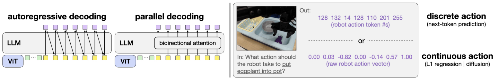

Figure 2. 왼쪽은 action 출력 사이의 순차 의존성, 오른쪽은 discrete token과 continuous value의 차이다. [PDF p.3, Fig.2]

원래는 첫 action scalar를 생성해야 두 번째 scalar의 입력이 정해진다. OFT는 정답 token embedding 대신 비어 있는 action 위치들을 붙이고, 현재 관측·언어·다른 action 위치의 중간 표현을 함께 처리한다. 출력 위치는 있어도 정답 action 내용은 들어 있지 않으므로 bidirectional mask가 미래 정답을 누설하는 구조는 아니다.

중요한 대비는 **autoregressive factorization 제거**와 **모델 내부 attention 제거**가 다르다는 점이다. OFT의 action 위치는 같은 transformer의 self-attention으로 상호작용한다. 따라서 각 action scalar를 완전히 독립된 작은 회귀기가 관측에서 따로 예측하는 구조는 아니다. 다만 stochastic autoregressive joint distribution을 표현하는 방식과는 달라진다. [리뷰어 해석]

### 4.3 action chunking이 parallel decoding과 결합되는 이유

한 시점 D개 scalar용 빈 위치를 K배로 늘려 KD개의 target 위치를 만든다. 예를 들어 LIBERO에서 K=8, D=7이면 56개다. autoregressive 방식이라면 이 56개 token을 순차적으로 생성해야 하지만 OFT는 한 번의 decoder forward로 처리한다.

추론 호출 수를 줄인다고 계산량 전체가 K와 무관해지는 것은 아니다. sequence length가 늘어나므로 attention·MLP·hidden state 저장 비용이 증가한다. Table II에서 PD single-step 62.9 ms가 PD+AC 73.5 ms가 되는 것은 그 비용이 작지만 0은 아님을 보여준다. 미래 행동을 여러 개 예측해도 future camera observations를 입력으로 주는 것은 아니다. 하나의 현재 관측으로 미래 행동을 예측한다. [PDF p.4, §IV-B; p.6, Table II]

### 4.4 discrete에서 continuous로

원문의 discrete representation은 normalized scalar를 256개 bin으로 나누는 방식이다. 유한 vocabulary로 action을 처리하므로 기존 LM head를 쓰기 쉽지만, 서로 가까운 두 target이 다른 bin에 걸리거나 같은 bin에 합쳐질 수 있다. bin을 늘리면 resolution은 좋아지지만 작은 데이터에서 bin별 관측 수가 줄어든다는 것이 Appendix B2의 논점이다.

Continuous head는 최종 decoder representation을 직접 real-valued normalized action으로 바꾼다. 원문은 4-layer ReLU MLP라고 설명한다. 실제 공개 구현은 입력 projection 1개, residual block 안 linear 2개, 출력 projection 1개인 MLPResNet이고 LayerNorm·residual을 포함한다. 단순히 기존 vocabulary matrix를 폭 7짜리 linear 한 장으로 교체했다고 이해하면 실제 151M/269M action head 크기를 설명할 수 없다. [PDF p.14, Appendix B2; 공식 코드 확인]

### 4.5 diffusion variant는 별도의 중요한 대조군이다

OFT의 최종 recipe는 L1이다. 그러나 연구 과정에서는 같은 parallel+chunking 기반에 conditional diffusion도 넣는다. 정답 action에 Gaussian noise를 추가하고, noise level timestep과 noisy action을 VLA에 제공해 noise를 예측한다. inference에서는 noise를 반복적으로 제거한다. 50-step train schedule, squared-cosine beta schedule, DDIM sampler, L1 head와 같은 계열의 4-layer noise predictor가 원문 설정이다. [PDF p.4, §IV-B; p.14, Appendix B2]

따라서 “OFT는 diffusion model”이라고 부르면 최종 방법과 ablation을 혼동한 것이다. 또 이 diffusion variant의 느린 속도를 π0 같은 모든 diffusion/flow VLA의 속도라고 일반화해서도 안 된다. condition 주입 위치·action expert·code backend·반복 횟수가 다르다.

### 4.6 추가 입력과 출력의 의미

각 view는 같은 dual vision backbone과 projector를 통과한다. model을 camera 수만큼 복제하는 것이 아니다. proprio는 2-layer GELU MLP를 통해 LLM width의 token 하나로 변환된다. 모든 관측은 sequence로 결합된다. [PDF p.4, §IV-B; p.14, Appendix A/B3]

Action space를 바꾸는 자유는 raw output 숫자만 바꾸는 자유가 아니다. 새 D에 맞는 head·normalization stats·demonstration action convention·controller interface를 함께 맞추고 다시 fine-tuning해야 한다. ALOHA의 absolute joint angles와 LIBERO의 delta end-effector pose를 서로 바꿔 전달할 수 없다.

<a id="equations"></a>

## 5. 핵심 수식과 계산 예제

이 절의 R1-R15는 원문 설명을 해부하기 위한 보조식이다. FiLM 원문 식은 다음 절에서 이미지와 함께 따로 제시한다. original numbered equation은 없으므로 가상의 Eq.(1) 등을 논문에 귀속시키지 않는다.

### 5.1 R1: action chunk와 scalar flatten 순서

```math
A_t=[a_t,a_{t+1},\ldots,a_{t+K-1}]\in\mathbb R^{K\times D},\qquad j=kD+r,\quad 0\leq k\lt K,\quad 0\leq r\lt D.
```

입력은 한 demonstration trajectory의 현재 index t다. 출력 A는 time 축 K와 action-coordinate 축 D를 가진다. j는 time-major로 펴 놓은 scalar 위치다. 즉 한 시점의 D개 scalar를 먼저 나열하고 다음 시점으로 간다. batch를 포함하면 B×K×D다. 원문 K-step chunk와 공식 head의 reshape에 대응한다. [PDF p.3-4; 공식 코드 확인]

**해설용 예제:** K=2, D=3이고 A의 두 행이 [0.1, 0.2, 0.3], [0.4, 0.5, 0.6]이면 flattened sequence는 [0.1, 0.2, 0.3, 0.4, 0.5, 0.6]이다. [0.1, 0.4, 0.2, 0.5, …]로 좌표 우선 flatten하면 head가 학습한 시간·좌표 대응이 깨진다.

### 5.2 R2: normalization과 역변환

```math
\widetilde a_r=\mathrm{clip}\!\left(2\frac{a_r-l_r}{u_r-l_r+\varepsilon}-1,-1,1\right),\qquad a_r^{\mathrm{out}}=\frac{\widehat a_r+1}{2}(u_r-l_r+\varepsilon)+l_r.
```

- $`a_r`$는 물리 단위의 coordinate r 값이고, $`\widetilde a_r`$는 학습 target이다.
- $`l_r,u_r`$는 dataset별 하한/상한 통계이며 shape D다. time·batch 축으로 broadcast한다.
- 현재 LIBERO/Bridge 코드는 q01/q99, ALOHA 코드는 min/max를 사용한다. mask가 false인 dimension은 transform에서 제외한다.
- $`\varepsilon=10^{-8}`$은 공개 구현의 작은 분모 보정이다. 상·하한이 같은 차원은 별도 처리도 확인해야 한다.
- 학습 target은 clip하지만, 공개 regression head 마지막은 linear이며 역변환 함수 자체가 모든 prediction을 [-1,1]로 clip하지는 않는다. “continuous normalized action”이 자동으로 물리적으로 유효한 joint limit을 보장하지 않는다.

**해설용 예제:** 어떤 좌표의 범위가 [-0.05, 0.05] m이고 raw target이 0.02 m면 normalized target은 0.4다. 예측이 0.3이면 역변환은 0.015 m다. normalized L1 0.1은 이 coordinate에서 5 mm error에 해당한다. 다른 coordinate의 범위·단위가 다르면 동일 normalized error의 물리적 의미도 달라진다. [공식 코드 확인: normalization utilities, constants, `_unnormalize_actions`]

### 5.3 R3: 256-bin quantization의 의미

```math
\Delta=\frac{2}{256},\qquad c_i=-1+\left(i+\frac12\right)\Delta,\qquad i\in\{0,\ldots,255\},\qquad |\widetilde a-c_{b(\widetilde a)}|\leq\frac{\Delta}{2}.
```

이 식은 **원문의 “256 uniform bins” 설명을 이상적인 equal-width bin으로 쓴 해설용 모델**이다. interval 내부·nearest-bin-center 복원을 가정하면 bin width는 0.0078125, 최대 quantization error는 약 0.00390625다. 위 0.1 m 물리 범위 예제에서는 최대 약 0.195 mm다. 이는 discretization만의 error이며 실제 policy error나 성공률을 예측하지 않는다.

공개 tokenizer는 `np.linspace(-1,1,n_bins)`를 boundary로 만들고 `np.digitize`·index clip·인접 boundary midpoint를 사용한다. n_bins=256이면 실제 center 배열 길이는 255가 된다. 그러므로 위 이상적 상계의 분모 256을 코드의 정확한 endpoint 처리와 동일하다고 주장하지 않는다. 재현에서는 설정의 bin 명칭과 실제 boundary/center 개수를 함께 확인해야 한다. OFT regression branch에서는 이 discrete 복원 자체가 최종 action 생성 경로에 사용되지 않는다. [PDF p.4, §IV-B; p.14, Appendix B2; 공식 코드 확인]

### 5.4 R4: autoregressive factorization과 teacher forcing

```math
p_\theta(z_{1:KD}\mid o_t,x)=\prod_{j=1}^{KD}p_\theta(z_j\mid o_t,x,z_{\lt j}),\qquad \mathcal L_{\mathrm{CE}}=-\frac1{BKD}\sum_{b=1}^{B}\sum_{j=1}^{KD}\log p_\theta(z_{b,j}^{*}\mid o_b,x_b,z_{b,\lt j}^{*}).
```

$`z_j`$는 bin token ID, $`o_t`$는 시각 관측과 선택적 state, $`x`$는 instruction, 별표는 expert target이다. 각 j의 logit vector는 vocabulary 축을 가지며 softmax는 그 축에서 정규화한다. KL이나 action 좌표 축 정규화가 아니다. 정답 이전 token을 입력하는 train과 자기 예측 token을 넣는 test의 차이가 teacher forcing의 핵심이다.

이 식은 action 위치만 쓰는 개념적 CE 평균이다. 공개 HF loss는 label의 IGNORE_INDEX와 stop-token 처리에 따라 유효 token 수를 분모로 사용하는 next-token loss다. 그러므로 KD가 정확한 실행 loss 분모라고 고정하지 않는다. OFT L1 branch에서는 계산된 HF CE가 반환되더라도 최종 backward objective는 별도의 L1이다.

### 5.5 R5: 병렬 attention에서 무엇이 동시에 계산되는가

```math
\begin{aligned}H^{(0)}&=[Z_{\mathrm{vision}};z_s;X;E_A],\qquad E_A=0\\Q&=H W_Q,\quad K_v=H W_K,\quad V=H W_V\\O&=\mathrm{softmax}_{\mathrm{key}}\!\left(\frac{QK_v^\top}{\sqrt{d_h}}+M_{\mathrm{attn}}\right)V.\end{aligned}
```

여기서는 이해를 위해 BOS/stop·prompt formatting을 생략했다. N개의 유효 token, h개 attention head를 사용하면 Q/K/V는 B×h×N×d_h, score는 B×h×N×N이다. key 축 softmax의 각 query row 합은 1이다. causal mask에서는 미래 key 위치에 큰 음수를 더하지만, OFT의 bidirectional mask는 모든 유효 key를 열고 padding만 막는다. d_h는 head width이며 action horizon K와 무관하다.

**해설용 mask 예제:** 관측 위치 두 개, 빈 action 위치 두 개가 있을 때 4×4 causal mask는 대각선 아래만 0이고 위쪽은 음의 무한대다. OFT의 nonpadding mask는 4×4 모두 0이다. 다섯 번째 token이 padding이면 모든 query에서 다섯 번째 key column만 막는다. 공개 Transformers fork의 SDPA branch는 기존 mask의 마지막 row를 복제하고 `is_causal=False`를 지정한다.

입력의 빈 action embedding이 모두 0이라도 각 위치가 시간/좌표의 역할을 가진다. 원문은 이를 positional encoding으로 구별한다고 설명한다. Llama 구현의 실제 위치 처리는 RoPE를 통한 Q/K 회전이므로, additive learned position vector를 action zero tensor에 단순히 더하는 구현이라고 단정하면 부정확하다. [PDF p.14, Appendix B1; 공식 코드 확인]

### 5.6 R6: 실제 continuous head의 축 변환

```math
H_A\in\mathbb R^{B\times KD\times d}\ \longrightarrow\ U=\mathrm{reshape}(H_A,B,K,Dd),\qquad \widehat A=g_\phi(U)\in\mathbb R^{B\times K\times D}.
```

한 step에 대응하는 D개 hidden vector를 feature 축으로 이어 붙인다. 이 연산은 평균 pooling이 아니고, transformer token을 실제로 D배 줄이는 연산도 아니다. decoder가 KD개 위치를 이미 계산한 다음 action head 입력만 재배열한다. head는 각 k에 같은 weight를 적용한다. 따라서 K는 head weight 크기를 늘리지 않지만, D는 첫 linear layer의 input width를 늘린다.

LIBERO: B×56×4096 → B×8×28672 → B×8×7. ALOHA: B×350×4096 → B×25×57344 → B×25×14. K를 8에서 25로 늘리는 것과 D를 7에서 14로 늘리는 효과가 다르다. ALOHA head가 커지는 주된 이유는 첫 projection의 Dd 입력 폭 증가다. [공식 코드 확인: `L1RegressionActionHead.predict_action`]

### 5.7 R7: 4-layer MLP의 구체적 연산

```math
\begin{aligned}u_0&=\mathrm{ReLU}(W_0\mathrm{LN}(U)+b_0)\\u_{i+1}&=u_i+\mathrm{ReLU}(W_{i+1}\mathrm{LN}(u_i)+b_{i+1}),\quad i=0,1\\\widehat A&=W_o\mathrm{LN}(u_2)+b_o.\end{aligned}
```

위 식의 i는 두 residual block을 가리키는 설명용 index다. 첫 projection은 Dd→d, 두 residual linear는 d→d, 마지막은 d→D다. LayerNorm은 마지막 feature 축을 정규화한다. residual 덧셈은 shape를 유지하며, 마지막 linear에는 tanh 같은 범위 제한 activation이 없다.

논문은 “4-layer ReLU MLP”로 요약하지만 재현 코드에는 세 곳 이상의 LayerNorm과 residual 연결이 있다. head의 정확한 구조를 이 단순 서술만 보고 새로 구현하면 checkpoint와 맞지 않을 수 있다.

### 5.8 R8: L1 objective와 gradient

```math
\mathcal L_1=\frac1{BKD}\sum_{b=1}^{B}\sum_{k=0}^{K-1}\sum_{r=1}^{D}|\widehat A_{bkr}-A^{*}_{bkr}|,\qquad \frac{\partial\mathcal L_1}{\partial\widehat A_{bkr}}=\frac{\mathrm{sign}(\widehat A_{bkr}-A^{*}_{bkr})}{BKD}.
```

입출력은 같은 B×K×D shape다. absolute difference를 모든 batch·time·coordinate 축에서 mean reduction한다. 현재 action과 future action의 loss를 따로 logging하지만 학습 목표는 전체 chunk의 평균이다. 0 error에서는 subgradient가 [-1,1]이고, 일반적인 autograd 선택은 0이다.

**해설용 예제:** B=1, K=2, D=2, 정답 [[0.2,-0.4],[0.8,0.0]], 예측 [[0.1,-0.1],[0.4,0.2]]이면 절댓값 error는 [[0.1,0.3],[0.4,0.2]], 합 1.0, mean L1은 0.25다. 출력 gradient는 [[-0.25,+0.25],[-0.25,+0.25]]다. 0.4짜리 error가 0.1짜리 error보다 네 배 큰 출력 gradient를 받는 L2와 다르다.

이 gradient는 head → 선택된 H_A → LLM LoRA → vision/proprio 경로로 chain rule을 따라간다. RGB 자체는 학습 parameter가 아니며, frozen backbone parameter에는 update가 적용되지 않는다. 그러나 frozen 연산도 downstream trainable module까지 gradient를 전달하는 계산의 일부일 수 있다.

### 5.9 R9: L1이 median을 선호한다는 말의 정확한 범위

```math
q^{*}(c)\in\underset{q}{\mathrm{arg\,min}}\ \mathbb E[|Y-q|\mid c],\qquad P(Y\leq q^{*}\mid c)\geq\tfrac12,\qquad P(Y\geq q^{*}\mid c)\geq\tfrac12.
```

조건 c는 관측과 language다. scalar L1 risk의 minimizer는 조건부 median이다. 여러 coordinate의 합을 최소화하면 제약이 없는 경우 coordinate-wise median이 된다. 이것이 joint trajectory distribution에서 가장 확률이 높은 mode를 선택한다는 뜻은 아니다.

**해설용 예제:** 같은 관측에서 장애물을 왼쪽으로 피하는 action -1과 오른쪽으로 피하는 action +1이 각각 절반이면 q∈[-1,1] 모두 같은 L1 risk를 갖는다. q=0도 minimizer이지만 실제로는 장애물로 직진할 수 있다. 따라서 “median mode라서 언제나 안전하고 valid하다”는 해석은 성립하지 않는다. 반대로 target이 [0.1,0.2,10]처럼 소수 outlier를 포함하면 median 0.2는 mean 약 3.43보다 outlier에 덜 끌린다. 원문의 noise smoothing 해석은 후자의 상황에서 직관적이다. [리뷰어 유도; PDF p.10, §VIII]

### 5.10 R10: diffusion의 forward noising

```math
A^{(\tau)}=\sqrt{\bar\alpha_\tau}A^{*}+\sqrt{1-\bar\alpha_\tau}\epsilon,\qquad \epsilon\sim\mathcal N(0,I),\qquad \bar\alpha_\tau=\prod_{s=1}^{\tau}(1-\beta_s).
```

이 식은 원문 §IV-B/Appendix B2의 denoising 설명과 공식 `sample_noisy_actions`를 풀어 쓴 표준 보조식이다. A*, noise, noisy action 모두 B×K×D이고, train 중 하나의 τ를 sample별로 뽑아 chunk의 모든 scalar에 같은 noise level을 적용한다. 원문의 β는 FiLM shift β와 이름만 같고, 여기서는 scalar noise variance schedule이다.

예를 들어 normalized action 0.6, 누적 α=0.64, noise=-0.5라면 noisy value는 0.8×0.6+0.6×(-0.5)=0.18이다. 이때 정답은 0.6을 직접 맞히는 것이 아니라 입력에 섞인 noise -0.5를 맞히는 것이다. 실제 학습은 noisy action을 scalar별 1→4096 projector로 투영하고 τ embedding token도 입력한다.

### 5.11 R11: diffusion loss와 reverse step

```math
\mathcal L_{\epsilon}=\mathbb E_{A^{*},c,\tau,\epsilon}\!\left[\frac1{KD}\|\epsilon_\theta(A^{(\tau)},\tau,c)-\epsilon\|_F^2\right],\qquad \widehat A^{(0)}=\frac{A^{(\tau)}-\sqrt{1-\bar\alpha_\tau}\widehat\epsilon}{\sqrt{\bar\alpha_\tau}}.
```

loss는 B까지 평균을 취한 noise MSE다. norm의 축은 chunk time과 action coordinate다. noisy action을 condition에 넣지 않고 관측만으로 무조건 noise를 예측하게 만들면 이 objective를 구현한 것이 아니다. train에서는 무작위 τ 하나를 뽑아 한 번의 noising·noise prediction으로 loss를 구할 수 있으므로, “50 diffusion train steps”가 각 sample마다 50회 full reverse sampling을 한다는 뜻은 아니다.

```math
A^{(\tau')}=\sqrt{\bar\alpha_{\tau'}}\widehat A^{(0)}+\sqrt{1-\bar\alpha_{\tau'}}\widehat\epsilon,\qquad \tau'\lt\tau.
```

두 번째 식은 stochastic noise 항을 생략한 deterministic DDIM의 설명용 형태다. 실제 scheduler의 clipping·timestep spacing·index convention을 생략했으므로 그대로 checkpoint sampler를 대체하는 pseudocode는 아니다. test에서 50→10→5→2→1 step으로 줄이면 모델이 학습한 vector field/noise estimate의 오차가 큰 간격에서 누적될 수 있다. Table II에서 one-step sampler 성공률이 0%가 된 것은 이 점을 보여준다. L1은 one-step denoiser로 줄인 diffusion 모델이 아니라 별도 objective로 학습한 모델이다.

### 5.12 R12: LoRA와 실제 trainable 범위

```math
W'=W_0+\frac{\alpha}{r_L}BA,\qquad W_0\in\mathbb R^{d_{\mathrm{out}}\times d_{\mathrm{in}}},\quad A\in\mathbb R^{r_L\times d_{\mathrm{in}}},\quad B\in\mathbb R^{d_{\mathrm{out}}\times r_L}.
```

여기서 B는 LoRA matrix이고 앞의 mini-batch B와 문맥이 다르다. 혼동을 피하려면 구현에서 adapter B라고 부르면 된다. W0는 frozen, A/B는 trainable이다. 원문 LoRA rank는 32이며 현재 code alpha는 min(rank,16), 즉 rank 32일 때 scale 1/2다. 새로운 action head·proprio projector·FiLM affine layers는 원래 pretrained W0가 아니므로 전체 weight를 학습한다. 따라서 “LoRA라서 trainable parameter가 전부 111M”이 아니다. full LIBERO는 279M, ALOHA OFT+는 853M이다.

### 5.13 R13-R15: metric과 시간축 식

```math
\mathrm{SR}_{\mathrm{suite}}=\frac{1}{N_{\mathrm{eval}}}\sum_i\mathbf1[\mathrm{success}_i],\qquad S_{\mathrm{ALOHA}}=\frac14\sum_{q=1}^{4}\left(\frac1{n_q}\sum_{i=1}^{n_q}s_{qi}\right).
```

R13. LIBERO의 SR은 episode 성공 indicator의 평균이고, ALOHA 대표 평균 score는 task별 staged score를 먼저 평균한 뒤 네 task를 같은 비중으로 평균한다. n_q가 10/10/12/24로 달라도 task weight는 각각 1/4다. trial별 pooled score와 다르다.

```math
R_{\mathrm{action}}=\frac{K_{\mathrm{counted}}}{T_{\mathrm{query}}},\qquad f_{\mathrm{query,max}}=\frac1{T_{\mathrm{query}}},\qquad T_{\mathrm{execute}}=\frac{K_{\mathrm{execute}}}{f_{\mathrm{command}}}.
```

R14. throughput의 분자는 scalar token 수 KD가 아니라 생성·계수 대상인 action vector step 수다. query 최대 빈도는 실행을 고려하지 않은 이론상 상한이다. 실제 VLA는 chunk를 실행하고 나서 query하므로 이것도 실제 refresh와 같지 않다.

```math
T_{\mathrm{cycle}}\approx T_{\mathrm{query}}+\frac{K}{f_{\mathrm{command}}},\qquad f_{\mathrm{refresh}}\approx\frac1{T_{\mathrm{cycle}}},\qquad R_{\mathrm{wall}}\approx\frac{K}{T_{\mathrm{cycle}}}.
```

R15. query와 chunk execution이 겹치지 않는 간단한 시간 모델이다. 실제 공개 ALOHA 루프에서는 첫 action step의 40 ms budget 안에 query도 들어가므로 더 정확한 이상화는 $`T_{\mathrm{cycle}}\approx\max(T_{\mathrm{query}},1/f_{\mathrm{command}})+(K-1)/f_{\mathrm{command}}`$다. §11에서 두 계산을 구별한다. 둘 다 실측 robot latency가 아니라 공개 latency와 loop 구조에서 만든 해설용 추정이다.

<a id="film"></a>

## 6. FiLM과 Appendix C: 언어가 시각 표현에 들어가는 위치

### 6.1 원문의 유일한 standalone 비번호 수식

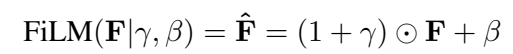

FiLM 식. [PDF p.4, §IV-C; 비번호]

```math
\mathrm{FiLM}(\mathbf F\mid\gamma,\beta)=\widehat{\mathbf F}=(1+\gamma)\odot\mathbf F+\beta.
```

원문의 bold F와 hat F를 보존했다. 이 식에서 feature는 개별 patch 하나가 아니라 **각 patch embedding의 hidden channel**이다. 각 channel마다 하나의 scale과 shift를 만들고 모든 patch 위치에 동일하게 적용한다. 따라서 image content의 공간 배치를 보존하면서 language에 따라 feature channel 해석을 바꾼다.

| 기호/연산 | 정의와 축 | forward에서의 역할 |
|---|---|---|
| $`\mathbf F`$ | ViT attention residual 이후 B×N_v×d_v | modulation 전 시각 표현 |
| $`\gamma`$ | language 평균 embedding의 affine projection, B×d_v | channel별 gain 변화량 |
| $`1+\gamma`$ | 1은 channel 축에 broadcast | γ가 0일 때 identity scaling |
| $`\odot`$ | elementwise product | matrix product나 attention weighted sum이 아님 |
| $`\beta`$ | 다른 affine projection, B×d_v | channel별 offset |
| $`\widehat{\mathbf F}`$ | B×N_v×d_v | 다음 norm/FFN으로 전달되는 시각 표현 |

FiLM에는 softmax나 합이 1이라는 제약이 없다. scale은 음수일 수도 있고 shift도 real-valued다. vision token 개수는 그대로다. transformer block별 projector가 다르고, SigLIP와 DINOv2 양쪽에 각각 삽입한다. 여러 camera에는 같은 모델의 projector를 공유한다. [PDF p.5, §IV-C; p.14-15, Appendix C]

### 6.2 Figure 8의 네 단계와 숨겨진 shape

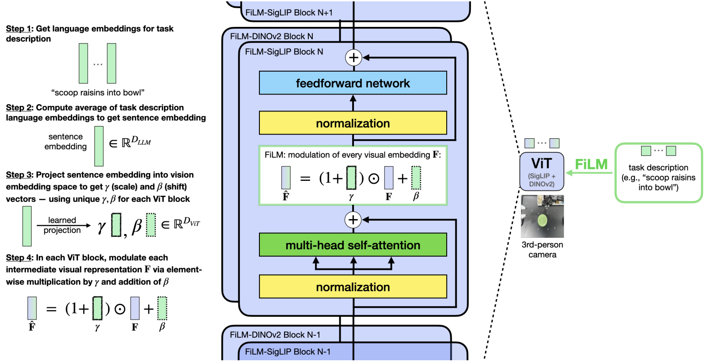

Figure 8. 언어 embedding 평균 → layer별 scale/shift → attention과 FFN 사이 modulation. 도판의 위·아래 block 반복 표시는 원문 그대로다. [PDF p.15, Fig.8]

그림의 Step 1은 task description을 LM tokenizer/embedding으로 변환한다. Step 2는 token sequence 축을 평균해 sentence representation을 만든다. Step 3은 각 ViT block의 두 affine projector로 gamma/beta를 얻는다. Step 4는 모든 patch의 같은 hidden channel에 같은 gain/shift를 적용한다.

아래는 Figure 8과 Appendix C의 f(x), h(x)를 풀어 쓴 보조식이다.

```math
\bar x_b=\frac1L\sum_{j=1}^{L}X_{bj:}\in\mathbb R^d,\qquad \gamma_b^{(\ell)}=W_\gamma^{(\ell)}\bar x_b+b_\gamma^{(\ell)},\qquad \beta_b^{(\ell)}=W_\beta^{(\ell)}\bar x_b+b_\beta^{(\ell)}.
```

projector matrix shape는 d_v×d다. layer마다 다른 γ/β가 생성되지만 같은 instruction sample 안에서는 patch 위치 p와 무관하다. 구현은 average_language_embedding을 B×d로 만든 뒤 gamma/beta를 B×1×d_v로 view하여 patch 축에 broadcast한다.

```math
\widehat F_{bpc}^{(\ell)}=(1+\gamma_{bc}^{(\ell)})F_{bpc}^{(\ell)}+\beta_{bc}^{(\ell)}.
```

**해설용 예제:** 두 patch feature가 [1,2,3], [4,5,6]이고 gamma=[0.1,-0.5,0], beta=[1,0,-1]이면 결과는 [2.1,1,2], [5.4,2.5,5]다. 같은 channel의 변환이 두 patch에 동일하다. patch마다 scalar 하나를 곱하면 이 계산과 다르다.

### 6.3 왜 1+gamma인가, 그리고 초기화 주장을 어디까지 믿는가

[저자 보고] gamma/beta가 초기화 직후 0 근처일 때 1+gamma를 쓰면 pretrained feature를 거의 유지한다. gamma×F만 쓰면 gamma≈0에서 feature가 거의 사라진다. [PDF p.14, Appendix C]

[공식 코드 확인] `scale`과 `shift`는 기본 `nn.Linear` 생성자로 만들어지며 해당 wrapper 안에 weight/bias를 정확히 0으로 초기화하는 명령은 없다. 따라서 **정확한 identity initialization**이라고 쓰면 안 된다. 1+gamma는 identity 주위의 parameterization을 제공하지만, 실제 첫 activation perturbation의 크기는 embedding과 초기 linear weight에 달렸다. 이를 별도 측정하지 않았다.

FiLM은 backbone을 통과하는 language 경로를 추가하므로 L1 gradient가 FiLM scale/shift를 직접 업데이트한다. vision backbone의 기존 weight가 frozen이어도 이 새 layer는 trainable이다. 원문 Table V의 FiLM parameter 456M은 작은 상수 몇 개를 더한 수준이 아님을 보여준다.

### 6.4 원문 §IV-C의 언어 shortcut 가설

예를 들어 bowl을 옮기고 spoon을 잡는 동안에는 어느 ingredient를 떠야 하는지 instruction이 중요하지 않을 수 있다. 그러다가 특정 순간에만 language가 결정적이다. dataset 전체의 평균 action loss는 language가 필요 없는 구간에서도 줄어들기 때문에, 모델이 시각적 우연 상관관계에 기대어 학습할 가능성이 있다. FiLM은 language를 visual feature에 반복 주입해 이 문제를 완화한다는 저자의 해석이다.

FiLM ablation은 실제 성능 개선을 지지하지만 “spurious correlation이 원인임을 완전히 규명했다”는 실험은 아니다. 원문 §VIII도 LIBERO와 ALOHA에서 grounding 문제가 다른 정확한 원인을 미해결로 남긴다. 또한 현재 평균 language embedding 구현이 prompt/BOS/stop·padding을 어떻게 포함하는지는 task description만 평균한다는 개념 설명보다 복잡하므로 §13의 구현 점검을 함께 보아야 한다.

<a id="forward"></a>

## 7. 한 샘플의 forward와 행별 추론 알고리즘

### 7.1 LIBERO full OFT: 이미지에서 8개 action까지

다음은 현재 코드 shape와 논문 설정을 결합한 reconstruction이다. B=1, M=2, K=8, D=7, P=8, d=4096을 사용한다. language 길이 L은 instruction과 tokenizer에 따라 달라지므로 실제 token count를 임의로 지정하지 않는다.

1. **관측 수집.** 현재 third-person RGB, wrist RGB, proprio, task instruction을 받는다. 이전 image history는 입력하지 않는다. 미래 8개 action target은 학습에서만 사용한다.
2. **이미지 전처리.** 각 RGB를 모델 image processor에 맞게 resize/crop/normalize한다. 한 camera의 SigLIP·DINOv2용 두 3-channel tensor를 합친 구현 representation은 B×6×224×224다. 두 camera면 channel packing 형태로 B×12×224×224가 된다. 12개의 RGB camera라는 뜻이 아니다.
3. **dual vision encoding.** camera마다 두 ViT가 256개의 대응 patch feature를 만든다. 두 feature stream은 hidden dimension으로 concat한다. 두 camera 결과는 patch sequence dimension으로 concat하여 B×512×(d_S+d_D)가 된다.
4. **vision projection.** 공유 3-layer GELU MLP가 B×512×4096으로 투영한다. 두 camera의 projector parameter를 따로 학습하지 않는다.
5. **proprio projection.** normalized state B×8을 B×4096으로 바꿔 token 축을 삽입한다. visual prefix 끝에 B×1×4096을 붙여 513개 observation token이 된다.
6. **language embedding.** prompt의 token ID를 embedding lookup한다. 구현의 BOS·prompt suffix와 special blank token(29871)을 학습 때와 맞춘다.
7. **action target 위치 예약.** K×D=56 placeholder token과 stop token을 붙인다. action 관련 input embedding은 0으로 지워 target 내용을 입력에서 제거한다. 학습에서는 label을 통해 action 위치를 찾아 같은 처리를 한다.
8. **multimodal sequence 조립.** 실제 code는 첫 text token 뒤에 visual/proprio token을 삽입한다. 개념 도식처럼 이미지·언어·action을 단순히 원하는 순서로 이어 붙이면 checkpoint가 본 위치와 달라질 수 있다.
9. **한 번의 bidirectional Llama forward.** padding을 제외한 유효 token 사이 attention을 허용한다. 새로운 camera observation을 바탕으로 action chunk 전체 representation을 동시에 만든다.
10. **target-aligned hidden states 선택.** 최종 layer의 hidden states에서 56개 action prediction 위치를 골라 1×56×4096으로 만든다. 코드에는 next-token convention을 이어받은 label/output shift가 있으므로, 그냥 마지막 56개 input 위치라고 단순화하지 않는다.
11. **continuous head.** 1×8×28672로 reshape하고 공유 MLPResNet을 적용해 1×8×7을 얻는다. softmax/argmax/bin-center decode는 L1 inference 경로에 없다.
12. **역정규화와 action adapter.** checkpoint의 dataset stats로 물리 action 범위를 복원한다. LIBERO gripper convention 및 controller 입력 형식에 맞춰 postprocess한다.
13. **queue 실행.** 8개의 action을 queue에 넣고 하나씩 `env.step`한다. queue가 빌 때 다시 관측을 policy에 제공한다. 매 `env.step`마다 새로운 모델 추론을 하는 것은 아니다.

[근거: PDF p.4, §IV-B; p.5, §V-A; p.14, Appendix A-B; 공식 `modeling_prismatic.py`, `action_heads.py`, `run_libero_eval.py`.]

### 7.2 ALOHA OFT+: 무엇이 추가되는가

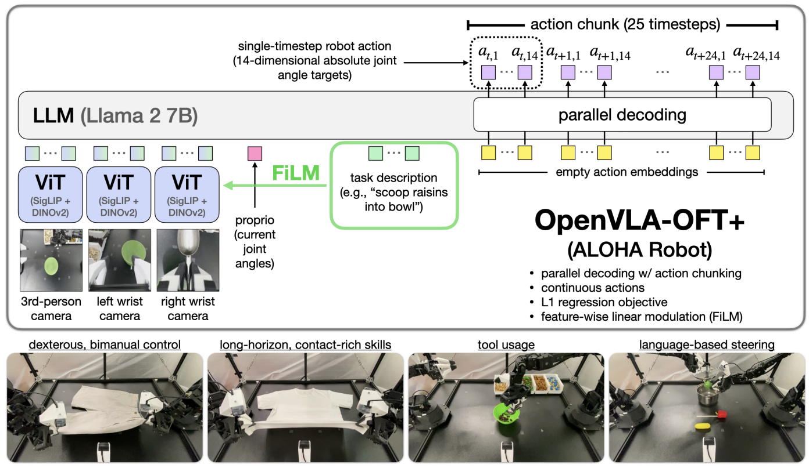

Figure 1. 세 camera·proprio·언어 입력에서 25-step 양팔 action chunk를 예측하는 구조. [PDF p.2, Fig.1]

M=3이므로 vision token은 768개다. proprio 1개를 더하면 observation prefix는 769개다. K=25, D=14이므로 action prediction 위치는 350개다. language/special token을 제외하고도 1,119개 위치를 다룬다. 한 이미지 LIBERO의 256+56=312개와 비교하면 훨씬 긴 decoder sequence다. 이 때문에 “둘 다 한 forward이므로 latency가 같다”는 주장은 성립하지 않는다.

또한 vision encoding 전에 language embeddings를 준비하고, 각 ViT block의 FiLM projector가 language를 visual computation에 전달한다. 따라서 OFT+의 vision token은 image만의 함수가 아니다. 같은 image라도 instruction이 바뀌면 vision features가 달라질 수 있다. 언어가 바뀌는데 이전 image feature를 무조건 cache해 재사용하면 OFT+의 조건부 표현을 보존하지 못한다.

최종 head는 1×350×4096 → 1×25×57344 → 1×25×14다. 출력은 normalized absolute joint target이며, 역변환 후 ALOHA joint controller에 전달한다. gripper coordinate와 joint angle의 범위·순서를 checkpoint metadata와 robot adapter에 맞춰야 한다.

### 7.3 원문에 없는 알고리즘을 만들어 귀속시키지 않기

아래는 **리뷰어가 원문과 공개 코드를 재구성한 Algorithm R**이다. 논문 자체에 Algorithm 1이 있다는 의미가 아니다. 목적은 실행 순서와 관측 갱신 시점을 명확히 하는 것이다.

```text
Algorithm R: 동기식 chunk policy 실행 (리뷰어 재구성)
01  checkpoint, action head, proprio projector, normalization stats를 읽는다.
02  camera order, action dimension D, chunk length K, robot convention을 맞춘다.
03  action_queue를 비운다.
04  episode가 끝날 때까지 반복한다.
05      현재 observation을 얻는다.
06      action_queue가 비어 있으면:
07          image/state/language를 preprocess한다.
08          empty action slots를 포함한 multimodal sequence를 만든다.
09          OFT+이면 vision block마다 language FiLM을 적용한다.
10          bidirectional VLA forward를 한 번 수행한다.
11          target-aligned hidden states를 MLP action head로 바꾼다.
12          action chunk를 역정규화하고 queue에 넣는다.
13      queue 맨 앞 action을 꺼낸다.
14      robot/environment action convention에 맞춰 실행한다.
15      실기기이면 이번 step이 목표 간격보다 빨리 끝났을 때만 남은 시간을 쉰다.
16      종료 조건과 step count를 갱신한다.
```

| 행 | 계산·상태 변화 | 놓치기 쉬운 점 |
|---|---|---|
| 01 | checkpoint별 weight와 scale 정보 결합 | head만 로드하거나 stats를 다른 dataset에서 가져오면 output 의미가 달라진다 |
| 02 | shape와 robot interface 확정 | camera 수·D·K는 model과 실행기 양쪽에서 일치해야 한다 |
| 03 | queue 초기화 | 이전 episode action이 남아 있으면 reset 직후 잘못된 행동이 나온다 |
| 04-05 | 현재 환경 상태 획득 | observation을 읽는 것과 policy가 그것을 이용하는 것은 다르다 |
| 06 | replan gate | chunk 내부에는 새 관측을 읽어도 이미 만든 action을 사용한다 |
| 07 | normalization과 image processing | train/test crop·proprio 범위·language template의 일치 필요 |
| 08 | query 위치 예약 | GT action 내용은 없고 output 위치만 존재한다 |
| 09 | conditional vision computation | OFT에서는 없고 OFT+에서만 수행 |
| 10 | 무거운 decoder forward | 실행 순서상 반복 token decoding이 사라지는 구간 |
| 11 | B×KD×d→B×K×Dd→B×K×D | head가 KD를 K로 reshape하는 이유 |
| 12 | physical action 반환 | continuous output이 곧 물리 단위는 아니다 |
| 13-14 | 하나의 D차원 target 실행 | K개 모두를 동일 시점에 robot에 보내는 방식이 아니다 |
| 15 | 남은 budget만 sleep | inference가 길어지면 40 ms period를 보장하지 않는다 |
| 16 | task/episode 종료 | 성공 후 남은 chunk를 실행할 필요는 없다 |

### 7.4 diffusion variant의 forward와 달라지는 부분

Diffusion에서는 08의 빈 slot 대신 noisy action scalar의 projected embedding을 넣고, noise timestep embedding을 observation prefix에 추가한다. 10-11에서 noise를 예측한 뒤 scheduler로 action sample을 갱신하는 과정을 T_test번 반복한다. 공개 inference code는 vision/proprio features를 먼저 계산한 뒤 denoising 동안 재사용하지만, language transformer와 noise head는 step마다 다시 호출한다.

이는 “vision encoder까지 50번 반드시 반복된다”는 해석을 바로잡는다. 그래도 7B transformer가 noise sample을 condition으로 처리하는 반복 비용은 크다. L1 경로는 noisy action, timestep token, scheduler가 필요 없다. train 중 diffusion quality를 평가하려고 추가 sampling을 수행하는 logging 경로와, 실제 gradient objective를 계산하는 단일 noising 경로도 구분해야 한다.

<a id="training"></a>

## 8. 데이터·학습·gradient와 Appendix D-E

### 8.1 학습 데이터의 계층

| 단계 | 데이터 | 역할 |
|---|---|---|
| Prismatic VLM pretraining | pretrained VLM 단계, 본 논문의 새 학습 대상 아님 | vision-language representation 출발점 |
| OpenVLA robot pretraining | Open X-Embodiment 약 1M episode | action 관련 robot representation 확보 |
| OFT LIBERO adaptation | 각 suite 10 tasks × 50 demos, 원본 기준 500 demos | suite마다 별도 policy fine-tuning |
| OFT+ ALOHA adaptation | task별 20/30/45/300 demonstrations | 새 양팔 action space·camera·proprio에 적응 |
| Appendix G joint LIBERO | 네 suite 합친 약 2,000 original demos | 하나의 policy로 40 tasks 학습 |
| Appendix G Bridge | BridgeData V2 50,365 demonstrations | 더 크고 다양한 실기기 데이터로 recipe 확장 |

LIBERO의 filtered setting은 실패 demonstration 및 near-zero/no-op action 제거를 포함하는 modified dataset 계열이다. Table I의 group label은 unsuccessful demonstrations filtered out으로 줄여 쓰지만 caption에는 near-zero action 제거도 설명한다. 따라서 500은 원본 suite demonstration 수이며, 필터링 후 유효 sample/transition 수와 동일하지 않다. 정확한 남은 개수는 본문 표에 없다.

LIBERO suite는 서로 다른 layout/object/goal/long-horizon 특성을 가진 task 모음이다. 각 suite 안 모든 task demonstration으로 fine-tuning한 뒤 해당 suite episode를 평가하므로 “보지 못한 새 task에 대한 zero-shot 성공률 97.1%”라고 읽으면 안 된다. generalization은 benchmark가 정한 variation과 rollout 평가 맥락에서 해석해야 한다.

### 8.2 전처리와 chunk target 생성

입력 image augmentation은 90% area random resized crop, ratio 1.0, brightness 0.2, contrast 0.8-1.2, saturation 0.8-1.2, hue 0.05다. 출력은 224×224다. Table IV/V의 `scale=[0.9,0.9]`는 두 endpoint가 같으므로 90-100%의 임의 크기 범위라고 번역하지 않는다. image history는 없으며 현재 frame만 사용한다. [PDF p.17]

[공식 코드 확인] trajectory에서 현재 action부터 K개를 모은다. `window_size=1`, `future_action_window_size=K-1`이다. 현재 `chunk_act_obs`는 effective trajectory length를 T-(K-1)로 줄여 full future chunk가 없는 뒤쪽 시작점을 제외한다. 단순히 episode 끝 action을 무조건 K개까지 복사 padding하는 구현이라고 가정하지 않는다. 변경된 version에서는 이 차이가 sample 수·gripper termination 학습에 영향을 줄 수 있다.

Continuous 학습에서도 data pipeline은 action token 문자열/labels를 만들 수 있다. 이 label은 위치 mask와 형식 정렬에 사용되고, 별도의 real-valued `batch['actions']`가 L1 target이다. GT discrete token embedding은 forward에서 zero로 지워지므로 target content를 보면서 action을 맞히는 leakage가 아니다.

### 8.3 train/validation/test와 checkpoint 선택

ALOHA split은 명확히 기록되어 있다. fold shorts 19 train/1 validation, fold shirt 29/1, scoop 42/3, pot 285/15다. 실기기 평가 rollout은 각각 10/10/12/24회로 별도 수행한다. LIBERO 본문은 50K step마다 checkpoint를 평가하고 run의 best를 보고한다고 설명한다. [PDF p.5, §V-A; p.16, Appendix F1]

[논문 미기재] 본문 결과와 완전히 분리된 LIBERO model-selection validation rollout set의 구성, seed별 결과, checkpoint 선택의 stochastic variation은 상세히 제시되지 않는다. test success를 보고 checkpoint를 선택했다면 낙관적 selection bias가 생길 수 있으므로, 독립 test 결과로 단정할 수 있는 근거와 없는 부분을 나눠야 한다. 현재 code의 validation option 존재만으로 논문에서 어떤 split을 썼는지 확정할 수 없다.

### 8.4 Table IV/V: OFT 설정 전체

| 설정 | full LIBERO OFT | ALOHA OFT+ |
|---|---|---|
| GPU | 8×A100 또는 H100, 각 80 GB | 8×A100 또는 H100, 각 80 GB |
| total/per-GPU batch | 64 / 8 | 32 / 4 |
| LR | 5e-4, 일부 task 100K 뒤 5e-5 | 5e-4, 일부 task 50K 뒤 5e-5 |
| 학습 step | Spatial 150K, Object 150K, Goal 50K, Long 150K | shorts 100K, shirt 70K, scoop 50K, pot 100K |
| 이미지 | third-person+wrist, 2개 | high+left wrist+right wrist, 3개 |
| resolution/history | 224×224 / 현재 frame만 | 224×224 / 현재 frame만 |
| proprio | 사용 | 사용 |
| LoRA rank | 32 | 32 |
| K / execute horizon | 8 / 8 | 25 / 25 |
| FiLM | 사용하지 않음 | 사용 |
| trainable total | 279M | 853M |
| LoRA | 111M | 111M |
| action head | 151M | 269M |
| proprio projector | 17M | 17M |
| FiLM projectors | 없음 | 456M |

[저자 보고; PDF p.17, Tables IV-V.] 표의 합은 LIBERO 111+151+17=279M, ALOHA 111+269+17+456=853M으로 일치한다. head의 D 증가와 FiLM이 전체 trainable 수를 크게 늘린다. 두 표는 full L1 recipe이며 diffusion 모든 variant의 정확한 설정표를 대체하지 않는다.

Appendix D는 normalized mean L1이 0.01 아래가 될 때까지 학습한다고 설명한다. 이 threshold는 하나의 training convergence 기준이지 rollout 성공률 인증 기준이 아니다. error 평균이 작아도 중요한 contact/gripper 시점 하나에서 큰 오차가 나면 task가 실패할 수 있다. non-diffusion 전체 실험은 50-150K steps, diffusion은 느린 수렴 때문에 100-250K steps라고 본문에 명시되어 있다. step budget을 동일하게 맞춘 결과가 아니다.

### 8.5 gradient가 실제로 업데이트하는 것

[공식 코드 확인] `LoraConfig(target_modules='all-linear')`를 통해 base VLA의 선택된 linear modules에 LoRA를 붙인다. 기존 large pretrained weights는 PEFT의 frozen base parameter로 유지되며 LoRA adapter가 trainable이다. FiLM은 LoRA setup 이후 vision wrapper로 추가되고 그 scale/shift weights를 학습한다. action head·proprio/noisy-action projector도 별도 trainable module이다.

학습은 BF16 autocast 아래 forward하고 real-valued target과 prediction의 L1Loss를 구한다. trainable parameter를 모아 AdamW로 업데이트하고 MultiStepLR로 LR을 10배 줄인다. gradient accumulation을 쓰면 loss를 accumulation step 수로 나누고 설정한 횟수마다 optimizer step을 수행한다. 정확한 optimizer defaults와 scheduler call timing은 snapshot의 code 의미이며 원문이 모두 명시한 하이퍼파라미터는 아니다.

L1 branch의 gradient 경로는 다음 순서다.

```text
mean absolute action error
→ continuous head 전체 weight
→ action target과 정렬된 최종 LLM hidden states
→ decoder LoRA와 trainable multimodal projection 경로
→ proprio projector, vision LoRA
→ OFT+이면 FiLM scale/shift
```

frozen/trainable은 “forward 계산 여부”와 다르다. frozen vision backbone도 매 관측 inference에 계산된다. LoRA 학습이 efficient하다는 사실은 inference에 vision tower를 생략한다는 뜻이 아니다.

### 8.6 Appendix E, Tables VI-IX: baseline training을 공정하게 읽기

| 항목 | ACT | Diffusion Policy | RDT-1B | π0 |
|---|---|---|---|---|
| 초기 상태 | scratch | scratch | pretrained 후 fine-tuning | pretrained 후 full fine-tuning |
| trainable parameter | 84M, language variant 80M | 157M | 1.2B | 3.3B |
| 학습 GPU | Titan RTX 24 GB | L40S 48 GB | H100 80 GB | A100/H100 80 GB |
| total batch | 64 | 128 | 32 | 32 |
| LR | 1e-5 | 1e-4 | 1e-4 | peak 2.5e-5 |
| history | 1 frame | 2 frames | 2 frames | 1 frame |
| resolution | 224 | 224 | 학습 Table VIII: 256 | 224 |
| 예측/실행 horizon | 25/25 | 24/24 | 64/25 | 25/25 |
| sampler/steps | 단일 pass L1 계열 | DDIM, train 100/test 10 | DDPM train 1000; DPM-Solver++ test 5 | flow integration 10 |

단일 행의 “각 25 actions”만 보고 모든 조건이 완전히 같다고 할 수 없다. Diffusion Policy는 horizon이 4의 배수여야 하므로 24를 사용한다. RDT는 64개를 예측하지만 실행은 25개만 한다. history·backbone·pretraining dataset·학습 step·GPU·framework가 다르다. 다만 저자는 동일 camera view와 task dataset, 비슷한 execute horizon을 맞추고 각 방법의 권장 recipe를 사용하려고 했다. [PDF p.8, §VI-B; p.18-19, Tables VI-IX]

Task별 training duration도 다음과 같이 공개되어 있다. 순서는 shorts/shirt/scoop/pot이다.

- ACT: 70K/30K/20K/10K **epochs**. 이 숫자를 gradient steps로 바꾸어 쓰지 않는다. 권장 최소 5K epochs보다 더 오래 학습했다.
- Diffusion Policy: 30K/120K/80K/40K gradient steps.
- RDT-1B: 86K/30K/18K/150K gradient steps. scoop은 18K checkpoint 73.3점이 40K checkpoint 70.0점보다 좋아 전자를 선택했다.
- π0: 115K/75K/80K/80K gradient steps. schedule은 1K warmup, 29K cosine decay, 최종 LR 2.5e-6으로 표기된다. 30K 이후의 장기 schedule 세부를 이 표만으로 완전히 복원할 수는 없다.

ACT의 옷 접기에는 ResNet-18을, language task에는 CLIP embedding으로 FiLM conditioning한 EfficientNet-B0를 사용했다. Diffusion Policy는 DistilBERT language conditioning을 가진 DROID implementation을 이용했다. “scratch baseline은 language를 전혀 보지 않았다”는 비판은 맞지 않는다. Augmentation도 다르다. Diffusion Policy는 80% crop과 color jitter, RDT는 color jitter와 image corruption, π0는 non-wrist crop/rotation과 color jitter다.

<a id="libero"></a>

## 9. LIBERO 결과와 fine-tuning ablation

### 9.1 §V-A: benchmark가 검증하는 것

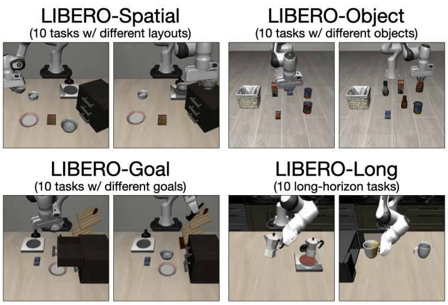

Figure 3. 각 suite 10 tasks 중 두 가지 예시. [PDF p.5, Fig.3]

Spatial은 물체 관계/배치 변화, Object는 대상 물체, Goal은 같은 계열 장면에서 다른 목표, Long은 더 긴 연속 조작을 강조한다. task당 50 episodes, suite당 500 trials라는 것이 Table I caption의 평가 설명이다. four-suite average는 suite 평균이다. 특히 Long은 이전 행동의 작은 오류가 이후 단계에 전파될 여지가 커 chunking과 temporally coherent action의 이득을 관찰하기 좋다.

### 9.2 Table I 전체 재구성

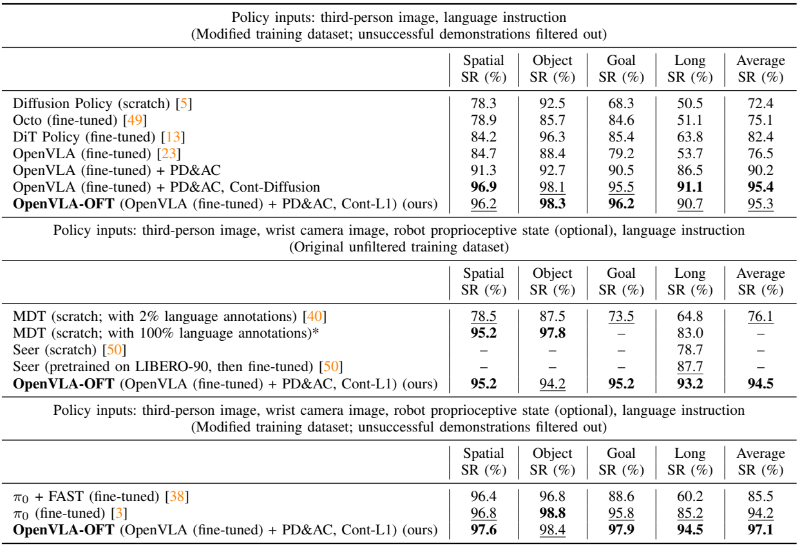

Table I. 입력·데이터 필터링 조건에 따라 세 그룹을 나눠 읽는다. [PDF p.6]

**그룹 A: third-person image + language, modified dataset.**

| 방법 | Spatial | Object | Goal | Long | 평균 |
|---|---:|---:|---:|---:|---:|
| Diffusion Policy scratch | 78.3 | 92.5 | 68.3 | 50.5 | 72.4 |
| Octo fine-tuned | 78.9 | 85.7 | 84.6 | 51.1 | 75.1 |
| DiT Policy fine-tuned | 84.2 | 96.3 | 85.4 | 63.8 | 82.4 |
| vanilla OpenVLA fine-tuned | 84.7 | 88.4 | 79.2 | 53.7 | 76.5 |
| OpenVLA + PD & AC | 91.3 | 92.7 | 90.5 | 86.5 | 90.2 |
| + PD & AC, continuous diffusion | 96.9 | 98.1 | 95.5 | 91.1 | 95.4 |
| OpenVLA-OFT, continuous L1 | 96.2 | 98.3 | 96.2 | 90.7 | 95.3 |

**그룹 B: third-person+wrist, optional proprio, language, original unfiltered dataset.**

| 방법 | Spatial | Object | Goal | Long | 평균 |
|---|---:|---:|---:|---:|---:|
| MDT scratch, 2% language annotations | 78.5 | 87.5 | 73.5 | 64.8 | 76.1 |
| MDT scratch, 100% language annotations | 95.2 | 97.8 | — | 83.0 | — |
| Seer scratch | — | — | — | 78.7 | — |
| Seer, LIBERO-90 pretraining→fine-tune | — | — | — | 87.7 | — |
| OpenVLA-OFT | 95.2 | 94.2 | 95.2 | 93.2 | 94.5 |

**그룹 C: richer inputs, modified dataset.**

| 방법 | Spatial | Object | Goal | Long | 평균 |
|---|---:|---:|---:|---:|---:|
| π0 + FAST fine-tuned | 96.4 | 96.8 | 88.6 | 60.2 | 85.5 |
| π0 fine-tuned | 96.8 | 98.8 | 95.8 | 85.2 | 94.2 |
| full OpenVLA-OFT | 97.6 | 98.4 | 97.9 | 94.5 | 97.1 |

각 값은 원문 percent다. `—`는 미보고 값이며 0이 아니다. MDT 100% annotation 결과는 저자가 해당 연구자와 직접 교신해 받은 값이다. 대부분 prior baseline은 기존 논문에서 가져왔고, Diffusion Policy/Octo/vanilla OpenVLA는 기존 OpenVLA 연구에서 보고한 결과다. 모든 baseline을 이번 논문에서 같은 seed·코드·학습 budget으로 재학습한 실험표는 아니다.

### 9.3 단계별 검산

- **PD+AC의 합동 변화:** 90.2−76.5=13.7 pp. Long은 86.5−53.7=32.8 pp. task 성능 이득이 긴 horizon에서 특히 크다.
- **continuous L1의 추가 변화:** 95.3−90.2=5.1 pp. Long은 90.7−86.5=4.2 pp.
- **L1 대 diffusion:** 평균 95.3 대 95.4로 0.1 pp 차이다. suite별로 Object/Goal은 L1이 높고 Spatial/Long은 diffusion이 높다. 한쪽의 일관된 전승이 아니다.
- **추가 입력:** full OFT 97.1−one-image OFT 95.3=1.8 pp. Long은 94.5−90.7=3.8 pp.
- **headline:** 97.1−76.5=20.6 pp. 상대 증가율은 약 26.93%지만 논문의 percent absolute는 pp로 읽는 것이 맞다.
- **π0 대비:** 97.1−94.2=2.9 pp. Object에서는 π0 98.8이 OFT 98.4보다 0.4 pp 높다.
- **필터링 조건:** richer-input OFT의 unfiltered 94.5 대 modified 97.1은 2.6 pp 차이다. preprocessing protocol 자체가 적지 않은 영향을 줄 수 있다.

원문 평균은 displayed suite 값의 평균과 대체로 일치하되 rounding이 있다. 예를 들어 L1은 (96.2+98.3+96.2+90.7)/4=95.35다. 원문 95.3을 임의로 95.4로 교정하지 않는다. underlying unrounded aggregation이나 rounding convention이 다를 수 있기 때문이다.

### 9.4 이 표만으로 분리되지 않는 인과 효과

PD와 AC는 성공률표에서 함께 들어가므로 13.7 pp 중 각각의 기여도를 따로 알 수 없다. Table II에 PD-only latency는 있지만 PD-only LIBERO success는 `—`다. “parallel attention 자체가 13.7 pp 개선했다”는 주장은 과도하다.

Discrete→continuous도 representation, head, objective가 함께 변한다. 이득을 “bin quantization error를 없앴기 때문에 정확히 5.1 pp 올랐다”고 원인 하나로 확정하기 어렵다. CE와 L1의 geometry, head capacity, training duration이 영향을 줄 수 있다. 이를 분리하려면 head capacity를 맞춘 discrete/continuous 실험이나 ordinal/distributional regression 대조가 더 필요하다.

통계적으로 Table I에 500 binary trials/suite가 제시되어 있어도 일부 수치 97.9% 등은 단일 500-trial count의 0.2 pp 단위와 맞지 않는다. 여러 run 평균·다른 aggregation이 개입했는지 자세히 기술되지 않는다. **정확한 성공 횟수를 소수점 표에서 역산하지 않으며**, seed별 variance와 aggregation denominator를 추가로 확보해야 confidence interval을 책임 있게 만들 수 있다. 작은 0.1-0.4 pp 차이는 통계적 우열의 강한 증거가 아니다.

<a id="aloha"></a>

## 10. ALOHA 결과·평가 rubric와 Appendix F

### 10.1 §VI-A: 새로운 embodiment의 변화

ALOHA는 두 ViperX 300 S arm, high camera 1개와 wrist camera 2개, 14-D joint state를 사용한다. demonstration의 원래 50 Hz를 25 Hz로 낮춰 training cost를 줄였으며 controller command target 간격은 40 ms다. actions는 target absolute joint angles다. OpenVLA pretraining의 single arm, 한 camera, proprio 없음, 3-10 Hz, relative end-effector pose와 다르다. [PDF p.7-8]

Vanilla autoregressive OpenVLA는 처리량이 낮다는 이유로 **ALOHA task-performance 비교에서 제외**되었다. 효율표에는 등장하지만 “vanilla가 같은 56 trials에서 몇 % 실패했다”는 직접 success 결과가 제시된 것은 아니다. 따라서 OFT+의 ALOHA improvement를 vanilla와의 동일 test-set 성공률 상승으로 쓰지 않는다.

| task | demonstration train/val | 평가 trial | episode step / nominal duration | 핵심 능력 |
|---|---:|---:|---|---|
| fold shorts | 19/1 | 10 | 1000 / 40 s | 두 번의 양팔 접기 |
| fold shirt | 29/1 | 10 | 1250 / 50 s | 여러 단계 접촉·fold sequence |
| scoop X into bowl | 42/3, target별 원본 15 | 12, target별 4 | 900 / 36 s | bowl 이동, tool use, language target |
| put X into pot | 285/15, target별 원본 100 | 24, ID 12+OOD 12 | 400 / 16 s | lid open/close, 정확한 object 선택 |

duration은 steps/25의 nominal 값이며 query stalls를 모두 포함한 실측 wall time이 아니다. pot의 300 demos는 필요 최소량을 입증한 sample-complexity 결과가 아니다. 저자는 초기에 grounding 문제가 data 부족 때문인지 살피려 많은 demonstration을 모았고, 단순 증량만으로 문제가 해결되지 않았다고 Appendix F footnote에서 설명한다.

### 10.2 Figure 4와 전체 점수

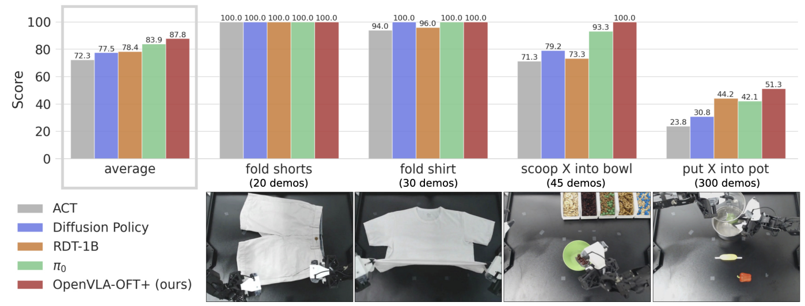

Figure 4. y축은 Score다. 마지막까지 성공한 episode 비율과 구분해야 한다. [PDF p.8]

| 방법 | shorts | shirt | scoop | pot | 네 task 단순 평균 |
|---|---:|---:|---:|---:|---:|
| ACT | 100 | 94 | 71.25 | 23.75 | 72.25 |
| Diffusion Policy | 100 | 100 | 79.17 | 30.83 | 77.50 |
| RDT-1B | 100 | 96 | 73.33 | 44.17 | 78.375 |
| π0 | 100 | 100 | 93.33 | 42.08 | 83.8525 |
| OpenVLA-OFT+ | 100 | 100 | 100 | 51.25 | 87.8125 |

[저자 보고+검산; PDF p.23, Tables X-XIII.] 표는 원문 상세 평균 점수로 계산했다. 그래프의 72.3/77.5/78.4/83.9/87.8은 이를 한 자리로 표시한 것이다. OFT+와 ACT의 차이는 15.5625점, π0와의 차이는 3.96점이다. 이 “up to 15% absolute”를 “π0보다 평균 15 pp 높은 이진 성공률”로 옮기면 잘못이다.

56 trials를 하나의 pooled population처럼 계산하는 것과도 다르다. task마다 trial 수가 다르고 rubric도 다르기 때문이다. 그래프가 clothes tasks 두 개에 각각 25% weight를 주므로 세 방법 이상이 만점인 easy task가 평균을 끌어올린다.

### 10.3 Tables X-XI: clothes task rubric

**Shorts, Table X:** bottom edge grasp, 첫 반접기, waistband grasp, 두 번째 반접기, forward 이동의 다섯 stage에 각각 20점이다. 이전 stage를 성공해야 다음 점수를 받는다. 다섯 방법 모두 각 stage 평균 20점, total 100점이다. 이 task는 이 실험 규모에서 ceiling에 도달했으므로 방법 간 세밀한 비교 근거가 약하다.

**Shirt, Table XI:** 아래 열 순서는 원문 10단계다. 각 단계 10점, final fold 후 큰 천 부분이 밖으로 튀어나오면 -10점 penalty다.

| 방법 | bottom grasp | half fold | sleeves grasp | sleeves fold | bottom grasp | half fold | right edge grasp | half fold | release | move | penalty | total |
|---|---:|---:|---:|---:|---:|---:|---:|---:|---:|---:|---:|---:|
| ACT | 10 | 10 | 10 | 10 | 9 | 9 | 9 | 9 | 9 | 9 | 0 | 94 |
| Diffusion Policy | 10 | 10 | 10 | 10 | 10 | 10 | 10 | 10 | 10 | 10 | 0 | 100 |
| RDT-1B | 10 | 10 | 10 | 10 | 10 | 10 | 10 | 10 | 10 | 10 | -4 | 96 |
| π0 | 10 | 10 | 10 | 10 | 10 | 10 | 10 | 10 | 10 | 10 | 0 | 100 |
| OFT+ | 10 | 10 | 10 | 10 | 10 | 10 | 10 | 10 | 10 | 10 | 0 | 100 |

ACT는 평균 6점이 빠졌고, RDT는 stage execution은 만점이지만 final shape penalty가 평균 4점이다. 어떤 방법이 어디서 실패하는지를 total score만으로 놓칠 수 있다는 예다. [PDF p.23]

### 10.4 Table XII: scoop rubric와 수치

점수는 bowl center 10, spoon grasp 10, correct container 접근 20, correct item scooping 20, bowl에 붓기 20, spoon을 bowl 옆에 놓기 20이다. food spill과 spoon을 완전히 비우지 못한 경우 각각 -5점 penalty다. 이전 stage 성공을 전제로 누적한다.

| 방법 | bowl 10 | spoon 10 | target 20 | scoop 20 | pour 20 | place 20 | spill -5 | nonempty -5 | total |
|---|---:|---:|---:|---:|---:|---:|---:|---:|---:|
| ACT | 9.17 | 9.17 | 18.33 | 15.00 | 15.00 | 5.00 | -0.42 | 0 | 71.25 |
| Diffusion Policy | 10 | 10 | 18.33 | 15.00 | 13.33 | 13.33 | -0.83 | 0 | 79.17 |
| RDT-1B | 7.50 | 7.50 | 15.00 | 15.00 | 15.00 | 13.33 | 0 | 0 | 73.33 |
| π0 | 10 | 10 | 20.00 | 20.00 | 16.67 | 16.67 | 0 | 0 | 93.33 |
| OFT no-FiLM | 10 | 9.17 | 6.67 | 5.00 | 3.33 | 1.67 | -0.83 | 0 | 35.00 |
| OFT+ | 10 | 10 | 20.00 | 20.00 | 20.00 | 20.00 | 0 | 0 | 100.00 |

숫자는 rounded mean stage score라서 열 합과 total에 0.01 정도 차이가 날 수 있다. OFT without FiLM은 bowl 이동은 잘하지만 target 관련 stage부터 급락한다. FiLM 개선이 단순 팔 움직임 성능만의 변화가 아니라 language-dependent 선택에 강하게 나타난다는 근거다. 다만 target score는 앞선 stage 성공에 조건부로 부여되는 누적 score이므로 독립적인 language metric과 같지 않다.

### 10.5 Table XIII: pot rubric와 결과

pot open 10, correct object approach 20, touch 10, grasp 20, 넣기 20, lid 닫기 20이다. 원문 마지막 열의 `Placed lit on pot`은 문맥상 lid를 뜻한다.

| 방법 | open 10 | approach 20 | touch 10 | grasp 20 | put 20 | lid 20 | total |
|---|---:|---:|---:|---:|---:|---:|---:|
| ACT | 10 | 6.67 | 2.08 | 1.67 | 1.67 | 1.67 | 23.75 |
| Diffusion Policy | 10 | 7.50 | 3.33 | 3.33 | 3.33 | 3.33 | 30.83 |
| RDT-1B | 10 | 11.67 | 5.00 | 5.83 | 5.83 | 5.83 | 44.17 |
| π0 | 10 | 10.83 | 4.58 | 6.67 | 5.00 | 5.00 | 42.08 |
| OFT no-FiLM | 10 | 6.67 | 3.33 | 5.00 | 3.33 | 3.33 | 31.67 |
| OFT+ | 10 | 15.83 | 6.25 | 8.33 | 5.83 | 5.00 | 51.25 |

OFT+ total이 가장 높지만 마지막 lid stage 평균은 π0와 같은 5점이고 RDT 5.83점보다 낮다. 누적·binary stage 점수라면 OFT+의 final-stage completion은 약 5/20=25%, 즉 24회 중 약 6회에 해당한다. **51.25점이 51.25%의 완전 성공률이라는 뜻은 아니다.** 이것이 부분 점수와 task completion의 가장 구체적인 차이다. [검산; PDF p.23]

ID와 OOD가 합쳐진 표이므로 이 숫자만으로 OOD distractor에 대한 drop을 구할 수 없다. distractor가 있어도 total average에서 우수했다는 관찰은 가능하지만, 독립적인 OOD robustness 곡선이나 confidence interval은 없다.

### 10.6 Figure 5: 별도의 language following metric

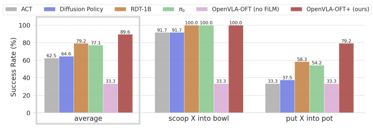

Figure 5. 언어가 지정한 target에 접근했는지를 측정한다. [PDF p.9]

| 방법 | scoop target 접근 (%) | pot target 접근 (%) | 두 task 평균 (%) |
|---|---:|---:|---:|
| ACT | 91.7 | 33.3 | 62.5 |
| Diffusion Policy | 91.7 | 37.5 | 64.6 |
| RDT-1B | 100.0 | 58.3 | 79.2 |
| π0 | 100.0 | 54.2 | 77.1 |
| OFT no-FiLM | 33.3 | 33.3 | 33.3 |
| OFT+ | 100.0 | 79.2 | 89.6 |

No-FiLM 33.3%는 target 3개 중 하나를 고르는 chance 수준이다. OFT+의 평균 증가는 약 56.3 pp다. 그러나 12회와 24회의 두 task를 단순 평균하므로 모든 language trials를 pooled한 비율과는 다르다.

RDT의 scoop language metric 100%와 Table XII target stage 15/20=75%는 모순이라고 단정할 수 없다. staged rubric은 앞선 bowl/spoon 성공을 요구하지만 language-only 접근 metric은 별도로 잰다. 정확한 target으로 향했어도 앞선 bowl 배치에 실패할 수 있다. 이 분리가 “언어를 따름”과 “task 전체를 성공함”을 구별한다.

### 10.7 Figures 6-7: qualitative 증거

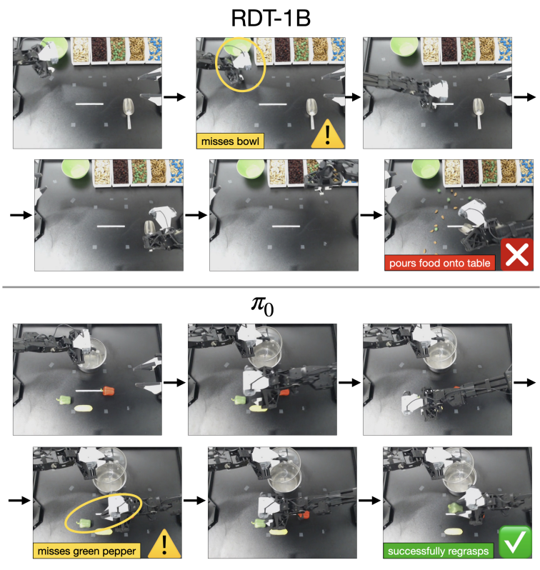

Figure 6. 위는 bowl placement 실패 뒤 빈 공간에 붓는 RDT 사례, 아래는 grasp 실패 후 재시도하는 π0 사례다. [PDF p.9]

저자는 RDT의 alternating condition injection이 language grounding에 유리하지만 visual feedback 활용에는 약점을 만들 수 있다고 해석한다. 이 영상 예시는 실패 유형을 보여주지만 architectural cause를 분리한 통제 실험은 아니다. proprio에 과도하게 의존한다는 설명도 직접적인 attribution/ablation으로 확정된 사실과 구분한다.

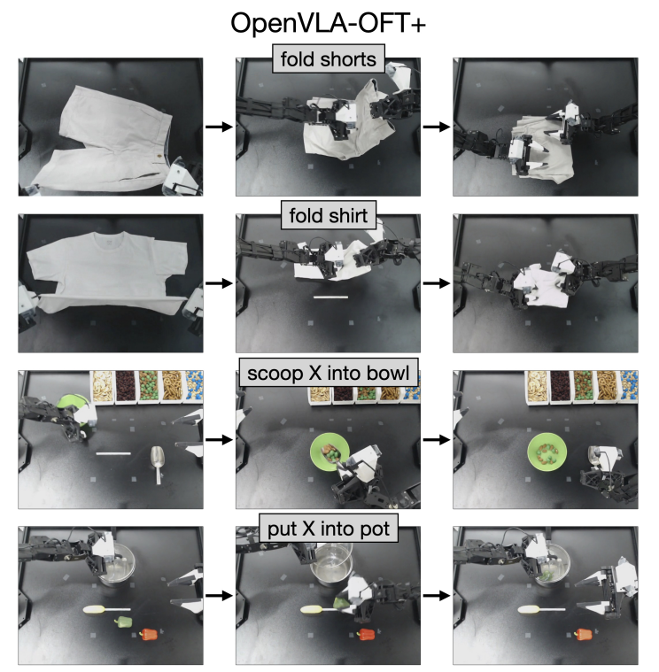

Figure 7. folding·scooping·object placement 성공 사례. [PDF p.9]

성공 rollout montage는 각 task를 수행할 수 있다는 질적 증거다. 실패 빈도, long-tail delay, 평균 성공률은 montage에서 추정하지 않고 앞의 수치표를 사용한다. 재시도 행동도 chunk 경계에서 새 관측으로 계획이 바뀌는 현상일 수 있으며, 25 Hz마다 language policy가 새로 추론한다는 뜻은 아니다.

### 10.8 Appendix F의 초기 상태와 generalization 범위

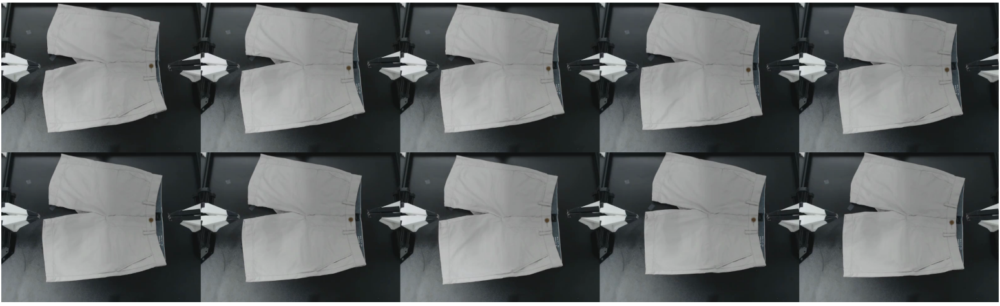

Figure 9. 8회는 tabletop 세로 방향 최대 3 cm 이동, 마지막 2회는 시계방향 10도 회전. demonstration 20개인 task라 variation을 작게 설정했다. [PDF p.19]

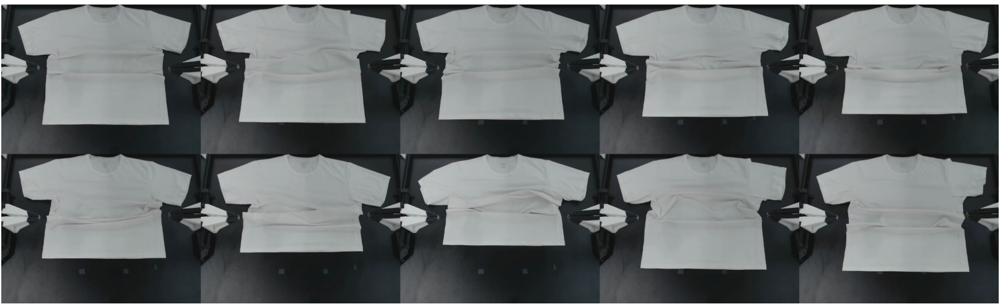

Figure 10. shirt bottom edge가 tabletop 세로 방향으로 15 cm 범위에서 달라진다. [PDF p.19]

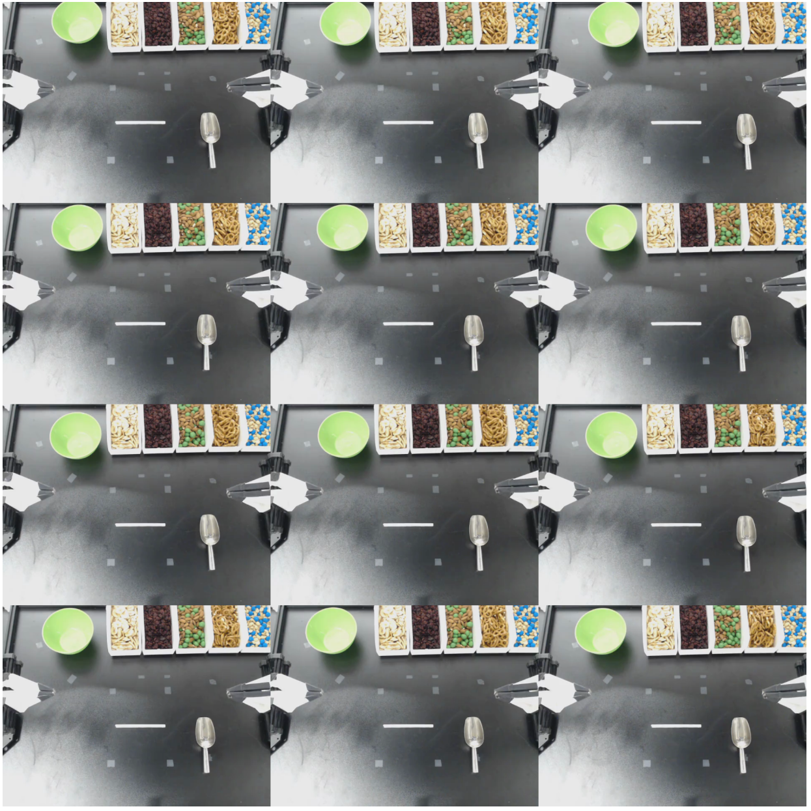

Figure 11. bowl은 두 tabletop 축에서 최대 10 cm, spoon은 가로 방향 3 cm 변한다. 각 row의 세 initial state는 같고 target instruction만 세 종류로 바꾼다. [PDF p.20]

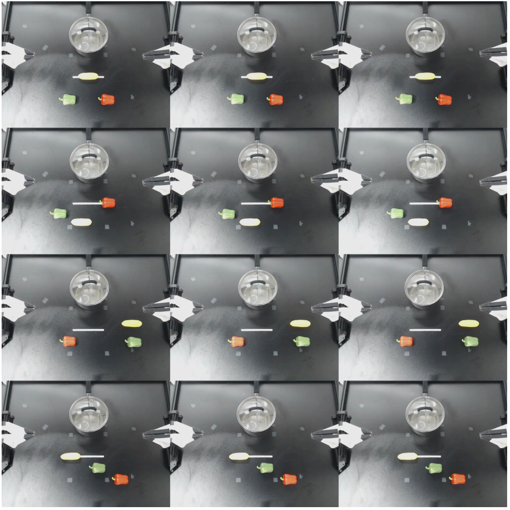

Figure 12. ID에서는 음식 위치가 세로 15 cm·가로 40 cm 범위에서 변하고 pot은 고정된다. 같은 배치에서 세 target을 번갈아 평가한다. [PDF p.21]

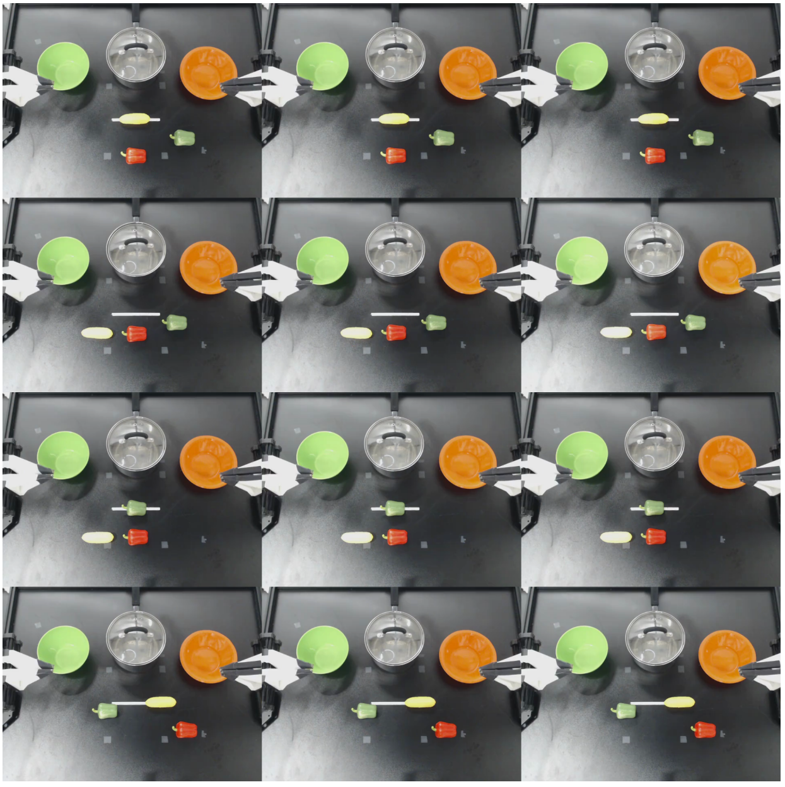

Figure 13. OOD에서는 보지 못한 green/orange bowl distractor를 넣고 음식 위치는 세로 15 cm·가로 30 cm 범위에서 바꾼다. [PDF p.22]

Appendix F의 training pot variation 45 cm×20 cm와 test ID 40 cm×15 cm, OOD 30 cm×15 cm는 서로 다른 조건이다. 이를 하나의 동일 범위로 합치지 않는다. OOD는 새로운 distractor appearance 중심이며, 새로운 robot dynamics·카메라 위치·unseen language task까지 모두 검증한 OOD는 아니다.

<a id="efficiency"></a>

## 11. 추론 효율과 제어 시간축

### 11.1 Table II: 한 이미지 LIBERO의 전체 결과

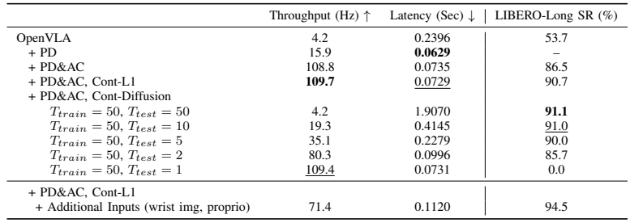

Table II. A100, 100 queries, 224×224 image와 고정 instruction 조건. [PDF p.6]

| 설정 | K | action steps/s | query latency (s) | Long SR (%) |
|---|---:|---:|---:|---:|
| OpenVLA | 1 | 4.2 | 0.2396 | 53.7 |
| + PD | 1 | 15.9 | 0.0629 | — |
| + PD & AC | 8 | 108.8 | 0.0735 | 86.5 |
| + PD & AC, continuous L1 | 8 | 109.7 | 0.0729 | 90.7 |
| diffusion, train 50 / test 50 | 8 | 4.2 | 1.9070 | 91.1 |
| diffusion, train 50 / test 10 | 8 | 19.3 | 0.4145 | 91.0 |
| diffusion, train 50 / test 5 | 8 | 35.1 | 0.2279 | 90.0 |
| diffusion, train 50 / test 2 | 8 | 80.3 | 0.0996 | 85.7 |
| diffusion, train 50 / test 1 | 8 | 109.4 | 0.0731 | 0.0 |
| full L1 + wrist/proprio | 8 | 71.4 | 0.1120 | 94.5 |

저자의 timing query는 instruction “pick up the alphabet soup and place it in the basket”를 사용한다. latency는 하나의 action 또는 action chunk를 생성하는 평균 시간이고, throughput은 시간당 action vector step 수다. 마지막 row만 input이 추가된다. 서로 다른 image count의 row를 같은 input workload로 취급하지 않는다.

### 11.2 26배의 산술

기본 1/0.2396≈4.174 step/s, L1 chunk 8/0.0729≈109.739 step/s다. 표의 반올림된 throughput 비율은 109.7/4.2≈26.12배다. query latency 비율은 0.2396/0.0729≈3.287배다. **약 3.3배 짧은 query latency와 8배의 chunk 산출량이 결합해 약 26배 action throughput**이 된다.

PD-only는 0.2396/0.0629≈3.81배 빠르다. 이론상 decoder 순차 호출이 D=7에서 1로 줄어도 total latency는 7배 개선되지 않는다. image encoding·projection·고정 overhead는 남고, 병렬 출력 sequence도 계산해야 하기 때문이다. 반면 PD에 K=8 chunking을 더하면 latency는 (0.0735/0.0629−1)×100≈16.85% 증가하는 동안 생성 step은 8배가 된다. throughput은 108.8/15.9≈6.84배 증가한다. [검산]

L1과 PD+AC discrete의 latency는 72.9 대 73.5 ms로 거의 같다. 0.6 ms의 작은 차이를 L1 head가 물리적으로 반드시 빠르다는 일반 결론으로 쓰기 어렵다. 측정 variance가 없으므로 저자의 해석처럼 head overhead가 전체 모델에 비해 작다는 정도가 적절하다.

### 11.3 중요한 headline 설정 차이

| 흔히 함께 인용되는 수치 | 실제 조건 |
|---|---|
| 평균 97.1% success | richer-input OFT, 두 이미지+proprio, modified dataset |
| throughput 109.7 / 약 26× | one-image OFT, 8-step chunk |
| full OFT throughput | 71.4 step/s, 112 ms |
| full OFT의 rounded throughput 비율 | 71.4/4.2=17.0×, 입력 정보는 더 많음 |

논문이 recipe 수준의 효율과 성능을 함께 강조하는 것은 타당하지만, deployment config 하나가 동시에 97.1%·109.7 step/s를 냈다는 표는 아니다. full input의 추가 비용은 112/72.9≈1.536배 latency, 약 34.9% throughput 감소다. 대신 success가 높아지는 trade-off다.

### 11.4 diffusion speed-quality frontier

50-step diffusion은 L1보다 latency가 1.907/0.0729≈26.16배 길지만 Long SR은 91.1 대 90.7로 0.4 pp 높다. 10-step은 91.0%로 거의 유지하면서 414.5 ms까지 줄인다. 5-step은 90.0%·227.9 ms다. 2-step은 85.7%·99.6 ms로 성능 손실이 커지고, one-step은 73.1 ms까지 빨라지지만 0%다.

여기서 “연속 action은 반드시 여러 denoising step이 필요하다”는 주장은 틀리다. L1도 continuous이고 단일 pass다. 반대로 “병렬 decoding이므로 diffusion도 one pass다”도 틀리다. 각 denoising step 안에서 K×D 위치를 병렬로 처리하되, denoising step 간에는 순차 의존성이 남는다.

50-step diffusion과 vanilla의 action throughput이 같은 4.2라고 해서 episode wall time이나 feedback quality가 같다는 보장도 없다. 1.907초의 chunk 경계 pause와 239.6 ms의 single-action pause는 시간 분포가 다르다. 실행 속도, chunk horizon, overlap에 따라 실제 elapsed time이 달라진다. 원문 p.6의 “같은 episode speed” 설명은 이 세부 시간축이 통제될 때 성립하는 해석이다.

### 11.5 Table III: ALOHA 효율

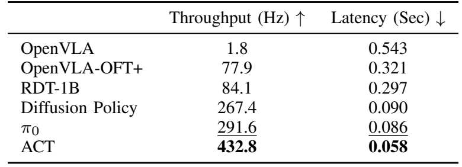

Table III. A100의 100 query 평균. [PDF p.10]

| 방법 | 예측/실행 horizon | reported action steps/s | latency (s) | raw generation량 해석 |
|---|---|---:|---:|---|
| OpenVLA | 1/1 | 1.8 | 0.543 | vanilla 기준 |
| OpenVLA-OFT+ | 25/25 | 77.9 | 0.321 | 25/0.321≈77.88 |
| RDT-1B | 64/25 | 84.1 | 0.297 | 표는 실제 사용할 25개 기준 |
| Diffusion Policy | 24/24 | 267.4 | 0.090 | horizon multiple-of-4 제약 |
| π0 | 25/25 | 291.6 | 0.086 | JAX implementation |
| ACT | 25/25 | 432.8 | 0.058 | 작은 L1 policy |

Caption은 three 224×224 images, 14-D state, “scoop raisins into bowl” query라고 설명한다. 다만 vanilla row는 본문에서 추가 wrist camera만 넣은 원래 formulation으로 기술되고, 기본 OpenVLA에는 proprio projector가 없으므로 모든 row의 실제 입력 경로가 완전히 동일하다고 단정할 수 없다. RDT 학습 resolution은 Table VIII에서 256으로 기술되어 있어 training과 timing 조건도 구별해야 한다.

43배는 77.9/1.8≈43.28배의 **반올림 throughput 비율**이다. latency 비율은 0.543/0.321≈1.69배다. 원래 수치의 precision이 낮아 latency에서 직접 계산한 throughput ratio 25×0.543/0.321≈42.29와 차이가 난다. 이를 수치 조작으로 해석할 이유는 없으며 반올림 때문에 비교 비율이 달라질 수 있음을 표시한다.

OFT+는 이 표에서 가장 빠른 방법이 아니다. ACT·π0·Diffusion Policy·RDT 모두 throughput이 높다. OFT+의 주장은 높은 task score와 기존 7B VLA의 adaptation을 함께 달성했다는 데 있다. π0는 JAX, 다른 방법은 PyTorch라는 implementation 차이도 있어 이 표만으로 architecture의 이론적 efficiency 순위를 정할 수 없다.

RDT의 84.1은 64/0.297≈215.5가 아니라 25/0.297≈84.18과 맞는다. 따라서 모든 model의 raw predicted vector를 세는 순수 generation throughput이라기보다 이 비교에서는 실행할 horizon으로 제한한 유효 throughput으로 읽어야 한다.

### 11.6 throughput, policy refresh, command Hz, servo Hz

| 지표 | 의미 | ALOHA OFT+ 예 |
|---|---|---|
| scalar output 수 | chunk 전체 real-valued coordinate 수 | 25×14=350 |
| action generation throughput | 생성한 D차원 target step 수/추론 시간 | 77.9 step/s |
| query-only upper frequency | robot 실행 없이 연속 호출할 때의 역수 | 1/0.321≈3.12 query/s |
| 목표 command rate | chunk 내부 목표 명령 간격 | 25 Hz, 40 ms |
| policy refresh | 새 관측이 새 chunk에 반영되는 빈도 | full chunk 실행 뒤 requery, 25 Hz가 아님 |
| motor/servo feedback | robot 내부 low-level loop | 이 논문에서 별도로 측정·보고하지 않음 |

R15의 단순한 비중첩 모델에서는 한 cycle이 0.321+25/25=1.321초여서 refresh≈0.757 Hz, 평균 action issue≈18.93 step/s다. 그러나 현재 공개 loop는 매 step 시작에 timer를 잡고 query+첫 action까지 그 step에 포함한다. 다른 overhead를 무시하면 0.321+24×0.04=1.281초여서 refresh≈0.781 Hz, command average≈19.52 step/s다.

이 두 수치는 **실측 성능이 아니다**. 정확한 schedule에 따른 차이를 보이는 계산 예제다. network, image acquisition, CPU transforms, logging, environment step이 추가되면 값이 달라진다. 공개 code는 queue가 비었을 때 server request를 동기 수행하며, 40 ms를 넘긴 step에서는 sleep하지 않는다. 따라서 “controller는 25 Hz target으로 설정됐다”와 “전체 episode에서 지연 없는 25 Hz closed-loop VLA를 보장한다”를 구별해야 한다.

또한 K=25 chunk는 nominal 1초의 action horizon이다. 첫 관측 이후 마지막 action까지는 관측이 점점 오래되어 외부 방해나 새로운 language command에 바로 대응하지 못할 수 있다. asynchronous chunk generation, horizon overlap, early interrupt는 가능한 후속 개선이지만 이 논문의 standard full-chunk execution에 원래 들어 있는 기능처럼 설명하면 안 된다.

### 11.7 논문이 측정하지 않은 것

저자는 A100에서 100 query 평균을 보고한다. p95/p99 latency, sensor-to-action end-to-end distribution, warmup/cold start, CPU preprocessing·network 포함 경계, power, peak memory, TensorRT kernel breakdown, deadline miss는 논문 표에 없다. FLOPs나 action token 수 변화만으로 이 값을 대신 추정하지 않는다.

특히 TTFA(time to first action)는 sensor capture부터 시작할지, GPU input-ready부터 시작할지에 따라 다르다. one-pass OFT는 chunk의 첫 action과 마지막 action prediction이 같은 forward 끝에 나온다. TTFT/TPOT 같은 text serving 지표를 그대로 적용하기보다 input processing, full-chunk inference, action queue wait를 따로 측정해야 한다.

### 11.8 원문 단위 오류

[PDF p.2, §II]에는 latency를 “0.07 ms”와 “0.321 ms”라고 썼다. 그러나 Table II는 0.0729 **Sec**, Table III는 0.321 **Sec**이고 throughput과도 초 단위가 일치한다. 따라서 올바른 크기는 약 73 ms와 321 ms다. 이 리뷰는 p.2 문구를 0.07 ms GPU 실측 기록으로 인용하지 않는다.

<a id="additional"></a>

## 12. Appendix G의 추가 실험

### 12.1 G1-G2, Table XIV: 하나의 40-task policy와 FiLM

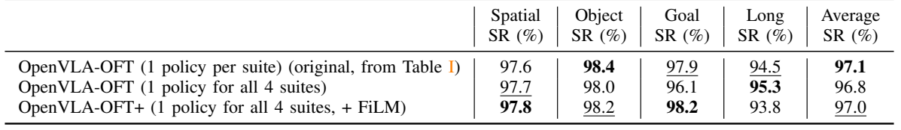

Table XIV. [PDF p.16, Appendix G1-G2; p.23]

| 방법 | Spatial | Object | Goal | Long | 평균 |
|---|---:|---:|---:|---:|---:|
| OFT, suite별 policy 4개 | 97.6 | 98.4 | 97.9 | 94.5 | 97.1 |
| OFT, 네 suite를 합친 policy 1개 | 97.7 | 98.0 | 96.1 | 95.3 | 96.8 |
| OFT+, joint policy+FiLM | 97.8 | 98.2 | 98.2 | 93.8 | 97.0 |

one policy 96.8%는 four specialized policies 97.1%와 0.3 pp 차이다. 동시에 Long은 오히려 0.8 pp 높다. 서로 다른 task를 하나의 모델로 학습할 때 성능이 크게 무너지지 않는다는 증거지만, task 수에 따른 scaling law를 그릴 만큼 많은 scale point는 아니다.

Joint policy에서 FiLM은 평균 0.2 pp 증가, Goal은 2.1 pp 증가, Long은 1.5 pp 감소다. ALOHA와 달리 LIBERO에서 FiLM이 강하게 필수라는 증거는 없다. language challenge와 camera shortcut의 영향이 benchmark마다 다를 수 있다. 서로 다른 task/scene 구조에서 FiLM 효과를 다시 검증해야 한다.

### 12.2 G3, Table XV: robot pretraining 제거

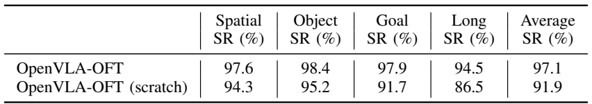

Table XV. caption의 scratch가 무엇을 뜻하는지 본문과 함께 읽는다. [PDF p.16, Appendix G3; p.23]

| 초기화 | Spatial | Object | Goal | Long | 평균 |
|---|---:|---:|---:|---:|---:|
| pretrained OpenVLA→OFT | 97.6 | 98.4 | 97.9 | 94.5 | 97.1 |
| pretrained Prismatic VLM→OFT | 94.3 | 95.2 | 91.7 | 86.5 | 91.9 |
| 차이 (pp) | 3.3 | 3.2 | 6.2 | 8.0 | 5.2 |

제거되는 것은 Open X-Embodiment의 robot pretraining 단계다. vision-language pretraining까지 모두 제거해 random 7B 모델을 작은 LIBERO 데이터로 학습한 결과가 아니다. Long의 8.0 pp drop이 가장 크다. 새로운 attention/head/loss로 바꿔도 robot representation이 유용한 inductive bias를 남긴다는 해석이 가능하다.

원문 §V-F는 이 내용을 Appendix G2라고 참조하지만 v2 실제 subsection은 G3다. G2는 LIBERO FiLM ablation이다. 숫자·그림 대응을 정확히 하기 위해 실제 부록 구조를 따른다. “scratch”라는 표 제목도 원문의 약식 표현을 그대로 확장하지 않고 pretrained VLM start라고 풀어 썼다.

### 12.3 G4, Table XVI: BridgeData V2

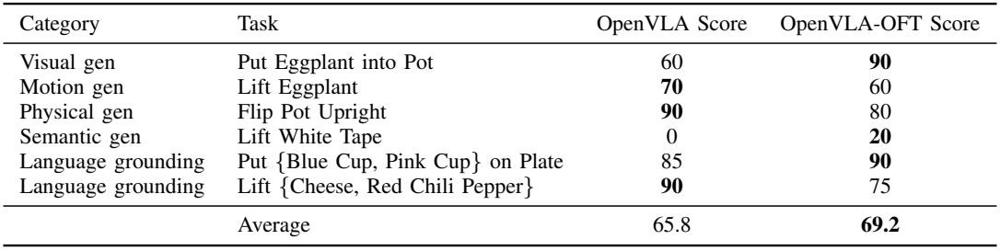

Table XVI. task당 10 trials의 score 평균. [PDF p.16, Appendix G4; p.24]

| 일반화 범주 | task | OpenVLA | OFT | 차이 |
|---|---|---:|---:|---:|
| visual | Put Eggplant into Pot | 60 | 90 | +30 |
| motion | Lift Eggplant | 70 | 60 | -10 |
| physical | Flip Pot Upright | 90 | 80 | -10 |
| semantic | Lift White Tape | 0 | 20 | +20 |
| language | Put Blue/Pink Cup on Plate | 85 | 90 | +5 |
| language | Lift Cheese/Red Chili Pepper | 90 | 75 | -15 |
| 평균 | 여섯 task | 65.8 | 69.2 | 약 +3.3 |

정확한 displayed row 평균은 OpenVLA 395/6=65.833…, OFT 415/6=69.166…이며 차이는 20/6=3.333…점이다. 반올림한 평균 69.2−65.8=3.4와 구별한다. 여섯 task 중 세 task는 개선되고 세 task는 하락한다. 평균 개선을 “모든 일반화 축이 개선되었다”로 확대하면 안 된다.

학습 데이터는 50,365 demonstrations로 네 LIBERO suite의 약 2,000 demos보다 25배 크다. 그러나 base OpenVLA가 BridgeData를 이미 robot pretraining에 포함했다. 따라서 이 결과는 완전히 처음 보는 robot dataset으로의 전이 실험이라기보다 **이미 본 robot domain의 큰 dataset으로 새로운 OFT output formulation을 학습한 실험**이다. 초기 normalized L1 약 0.5였다고 footnote에 설명하므로, pretrained model에 새 head만 붙이고 학습 없이 action을 낸 결과도 아니다.

FiLM 없이도 이 Bridge subset에서 language following이 가능했다. 이는 FiLM 필요성이 robot마다 다름을 보강한다. Bridge fine-tuning의 모든 hyperparameter와 평가 rubric 원문 전체는 이 논문에 다시 실리지 않으므로, 완전 재현에는 기존 OpenVLA evaluation protocol까지 추적해야 한다. 본 리뷰는 해당 별도 논문 전부를 추가로 리뷰한 것으로 주장하지 않는다.

<a id="code"></a>

## 13. 공식 코드 대조와 재현성

### 13.1 고정 소스 안내

모든 링크는 2026-09-09에 확인한 snapshot을 가리킨다. 아래 결과는 실행 로그가 아니라 코드 정적 분석이다.

| 소스 | 확인한 기능 |
|---|---|
| [modeling_prismatic.py](https://github.com/moojink/openvla-oft/blob/e4287e94541f459edc4feabc4e181f537cd569a8/prismatic/extern/hf/modeling_prismatic.py) | image/proprio fusion, zero action embeddings, target positions, regression/diffusion inference, unnormalization |
| [action_heads.py](https://github.com/moojink/openvla-oft/blob/e4287e94541f459edc4feabc4e181f537cd569a8/prismatic/models/action_heads.py) | D hidden vectors concat, MLPResNet, L1/diffusion head, noise schedule |
| [film_vit_wrapper.py](https://github.com/moojink/openvla-oft/blob/e4287e94541f459edc4feabc4e181f537cd569a8/prismatic/models/film_vit_wrapper.py) | language mean, per-block affine projections, channel broadcast, both ViTs |
| [projectors.py](https://github.com/moojink/openvla-oft/blob/e4287e94541f459edc4feabc4e181f537cd569a8/prismatic/models/projectors.py) | proprio/noisy scalar의 2-layer GELU projection |
| [finetune.py](https://github.com/moojink/openvla-oft/blob/e4287e94541f459edc4feabc4e181f537cd569a8/vla-scripts/finetune.py) | real-valued L1/MSE objective, LoRA, optimizer, DDP, checkpoint handling |
| [constants.py](https://github.com/moojink/openvla-oft/blob/e4287e94541f459edc4feabc4e181f537cd569a8/prismatic/vla/constants.py) | K/D/P, normalization, command-line-based platform detection |
| [traj_transforms.py](https://github.com/moojink/openvla-oft/blob/e4287e94541f459edc4feabc4e181f537cd569a8/prismatic/vla/datasets/rlds/traj_transforms.py) | future action chunk indexing와 trajectory tail 처리 |
| [normalization utilities](https://github.com/moojink/openvla-oft/blob/e4287e94541f459edc4feabc4e181f537cd569a8/prismatic/vla/datasets/rlds/utils/data_utils.py) | min/max·quantile clipping, unused dimension 처리 |
| [ActionTokenizer](https://github.com/moojink/openvla-oft/blob/e4287e94541f459edc4feabc4e181f537cd569a8/prismatic/vla/action_tokenizer.py) | bins/boundaries/centers와 vocabulary mapping |
| [LIBERO evaluation](https://github.com/moojink/openvla-oft/blob/e4287e94541f459edc4feabc4e181f537cd569a8/experiments/robot/libero/run_libero_eval.py) | action queue가 비면 requery, env.step, episode 성공 집계 |
| [ALOHA evaluation](https://github.com/moojink/openvla-oft/blob/e4287e94541f459edc4feabc4e181f537cd569a8/experiments/robot/aloha/run_aloha_eval.py) | 동기 server query, 25 Hz 목표 sleep, full-chunk execution |
| [Transformers Llama fork](https://github.com/moojink/transformers-openvla-oft/blob/bc339d9ad707454c0c115970db43c260067c61ab/src/transformers/models/llama/modeling_llama.py) | SDPA bidirectional mask, `is_causal=False` |

### 13.2 논문 설명과 구현의 대응·주의점

| 원문 설명 | 코드 확인 | 재현상 의미 |
|---|---|---|
| “empty action embeddings” | action mask 위치의 input embedding을 0으로 곱함 | learned action query embedding table을 임의로 추가하지 않는다 |
| “bidirectional attention” | 별도 Transformers fork의 SDPA branch에 구현 | stock Transformers/다른 backend로 바꿔도 같다고 가정하면 안 된다 |
| “4-layer MLP” | LayerNorm, ReLU, 2 residual blocks | 단순 4개 linear만의 순차 MLP와 다르다 |
| “continuous action output” | H_A를 B×K×Dd로 합쳐 head 적용 | scalar마다 독립 d→1 head가 아니다 |
| “L1 loss” | `torch.nn.L1Loss()`로 whole chunk mean | CE+L1의 weighted sum이 standard objective가 아니다 |
| “FiLM near identity” | 1+gamma, 기본 Linear 초기화 | 정확한 zero initialization은 확인되지 않는다 |
| “task description 평균” | non-action input embeddings를 모아 mean | prompt/special token/pad 처리까지 확인 필요 |
| “normalized [-1,1] output” | target clip; head final linear | prediction saturation/clipping 보장은 별도 확인 |
| “full chunk execution” | deque에서 하나씩 pop, 빈 queue에서 server query | latest frame마다 VLA가 다시 호출되지 않는다 |
| “multiple camera” | view별 forward 후 patch concat | 코드상 모든 camera encoder 연산이 자동 병렬 batch되는 것은 아니다 |

### 13.3 특히 backend가 중요하다

주 저장소 `pyproject.toml`은 bidirectional attention을 위해 저자 Transformers fork를 dependency로 지정한다. 확인한 fork의 `LlamaSdpaAttention`은 padding mask를 보존하면서 양방향으로 바꾸고 `scaled_dot_product_attention(..., is_causal=False)`를 호출한다. 반면 같은 파일의 eager/FlashAttention2 관련 경로에는 원래 causal 처리 코드가 남아 있다.

따라서 “FlashAttention2를 설치했다”만으로 OFT가 같은 semantics로 실행된다고 볼 수 없다. 실제 선택한 `attn_implementation`과 실행 branch를 확인해야 한다. 이는 특정 backend 전체가 불가능하다는 주장보다 **이 snapshot의 별도 구현 경로 사이 semantic parity를 검증해야 한다**는 지적이다. model export, TensorRT plugin, SDPA replacement에서도 같은 문제를 확인해야 한다.

또한 이 repository는 Transformers fork를 branch URL로 의존하므로 설치 시점에 다른 commit을 가져올 수 있다. 재현 환경에서는 parent repo SHA뿐 아니라 fork SHA도 고정해야 한다. 이번 리뷰는 두 SHA를 모두 기록했지만 전체 Python dependency lockfile을 새로 만들어 실행 검증한 것은 아니다.

### 13.4 action output index와 masking

훈련 loss 계산은 `labels[:,1:]`로 next-token target alignment를 만든 뒤 `last_hidden_states[:,num_patches:-1]`에서 action target mask에 해당하는 위치를 고른다. inference도 `NUM_PROMPT_TOKENS=input_ids.shape[-1]-1`을 사용한다. 이 -1은 BOS와 target alignment convention의 일부다.

따라서 zero input action token 위치와 최종 선택하는 target prediction hidden position이 단순히 1:1 같은 index라고 가정해 export code를 작성하면 one-position shift가 생길 수 있다. `last KD tokens` 같은 shortcut 대신 공식 selection 식과 stop token을 재현하고 작은 sample에서 tensor parity를 확인해야 한다. 이 리뷰에서는 의미적으로 “action target과 정렬된 H_A”라고 표현한 이유가 이것이다.

### 13.5 language pooling, camera naming, constant detection

FiLM code의 `language_embeddings.mean(dim=1)`은 padding attention mask를 직접 사용한 masked mean이 아니다. `modeling_prismatic`이 action token을 제외하고 만든 input sequence가 무엇을 포함하는지에 따라 BOS, prompt template, stop, padding의 영향이 달라진다. 논문 개념 설명의 task sentence 평균과 exact token-level pooling을 동일시하지 않는다. 서로 다른 batch 구성이나 prompt template을 사용할 때 parity 검증이 필요한 지점이다.

현재 constants는 Python command string에 `libero`, `aloha`, `bridge`가 들어 있는지로 platform을 추론하고, 불명확하면 LIBERO로 돌아간다. 사용자가 import만 해서 ALOHA head를 로드할 때 D=7/K=8 default가 섞이지 않게 확인해야 한다. 이 동작은 논문의 이론이 아니라 현재 실험 코드의 convenience mechanism이다.

### 13.6 재현에 필요한 기록

1. paper version/SHA, model checkpoint ID/revision, main repo/fork SHA, normalization stats를 묶어 고정한다.
2. camera order와 resize/crop, proprio 구성, action coordinate order, gripper sign, absolute/relative convention을 기록한다.
3. 실제 attention backend에서 noncausal mask와 padding 동작을 확인한다.
4. H_A target alignment, B×K×Dd reshape, full chunk output을 reference implementation과 비교한다.
5. dataset filtering 전후 trajectory/transition 수와 train/val/test split, action tail 처리 방식을 기록한다.
6. checkpoint selection에 사용한 rollout과 최종 평가 rollout을 분리하고 seed별 outcome을 남긴다.
7. 효율 측정에서 batch, image count, K, D, dtype, warmup, timing boundary, GPU sync, framework 버전을 명시한다.
8. action generation, policy refresh, command cadence, robot internal servo loop를 별도 metric으로 수집한다.

이 항목은 실행한 체크리스트가 아니라 앞으로 결과를 재현할 때 필요한 기록 목록이다. 이번 작업의 실제 검증 범위는 문서·원문·소스·산술에 한정한다.

<a id="critical"></a>

## 14. 비판적 검토와 Jetson Thor/TensorRT 연결

### 14.1 원문 §VII의 결론을 어떻게 평가할 것인가

이 연구의 강점은 새 구성요소 하나의 이론보다 **기존 VLA에 대한 실용적인 adaptation 설계 공간**을 실험한 데 있다. original pretraining recipe를 고수하지 않아도 robot representation을 활용할 수 있고, 단일 pass continuous regression이 작은 focused imitation dataset에서 강한 baseline이 된다는 결과가 설득력 있다.

특히 한 이미지 LIBERO에서 PD+AC, continuous-L1, continuous-diffusion을 나눠 비교하고, 추가 입력 효과를 따로 표기한 점이 유용하다. 실기기에서는 robot action space와 input modality가 크게 달라져도 adapting pretrained OpenVLA가 가능함을 보여준다. 부록에 task별 rubric·초기 scene을 공개한 점도 단순 평균보다 재현에 도움이 된다.

### 14.2 원문 §VIII의 세 가지 한계

**Multimodal demonstrations.** 이 연구의 주요 demonstration은 task마다 일관된 strategy를 갖는 focused dataset이다. 같은 관측에 서로 다른 valid action mode가 있을 때 L1이 이를 얼마나 보존하는지 검증하지 않았다. median이 항상 demonstration의 유효 trajectory 하나와 일치하는 것도 아니다. Appendix G의 Bridge 확장은 데이터 규모를 늘렸지만 동일 condition의 multimodal action mixture를 분리해 평가한 실험은 아니다.

**Pretraining으로의 확장.** downstream fine-tuning에서 효과적인 objective가 대규모 VLA pretraining에도 최적이라는 결론은 낼 수 없다. 많은 robot, camera convention, task distribution을 합칠 때 generative model의 표현력이 더 중요할 수 있다. 논문은 이를 open question으로 남긴다.

**Grounding inconsistency.** FiLM 없이 잘 되는 LIBERO와 그렇지 않은 ALOHA의 차이가 어느 원인에서 생기는지 확정하지 못했다. bimanual pretraining 부재, multi-view shortcut, instruction이 필요한 순간의 희소성 등이 가설이지만 각각의 인과 효과를 나누는 추가 실험이 필요하다.

### 14.3 추가로 남는 통제·통계 문제

- success table의 PD-only, AC-only 효과가 분리되지 않는다. coupled recipe 개선은 확인되지만 각 component 독립 효과의 합으로 분해할 수 없다.
- continuous representation과 objective/head가 함께 바뀌므로 precision 원인의 단독 입증은 아니다.
- 97.1%와 26×는 서로 다른 input configuration이다. 하나의 deployment point로 표시하면 과장된다.
- ALOHA rubric score, language-only SR, final-stage completion은 서로 다르다. 최고 평균 점수가 모든 세부 stage의 최고 성능을 뜻하지 않는다.
- ALOHA task별 10-24 trials는 작은 표본이다. confidence interval, seed 반복, independent evaluator agreement가 보고되지 않았다.
- best checkpoint 선택과 baseline별 다른 training budgets가 존재한다. sample efficiency·compute efficiency의 엄밀한 비교로 확대하기 어렵다.
- original OpenVLA와 최신 VLA의 pretraining datasets 및 architecture가 다르다. “fine-tuning이 pretraining보다 중요하다”는 해석은 유용한 관찰이지만 둘의 독립 인과 효과를 추정한 실험은 아니다.
- 평균 inference latency만으로 safety-critical deadline이나 실제 closed-loop reactivity를 판단할 수 없다.

### 14.4 Jetson AGX Thor에서 가져갈 수 있는 구조적 이점

[후속 연구 제안] OFT는 단일 decoder pass로 fixed-size chunk를 내므로 output loop가 단순하다. M/K/D가 고정된 model variant를 export하면 shape를 명시하기 쉽고 반복 sampling scheduler도 필요 없다. LoRA를 merge한 inference weight, vision backbone, projector, noncausal Llama, action head를 나눠 porting boundary를 정의할 수 있다.

하지만 이 논문은 Jetson Thor, TensorRT, NVFP4, INT8, edge power mode를 측정하지 않았다. A100의 72.9/112/321 ms를 Thor 값으로 환산하지 않는다. TensorRT conversion이 자동으로 지원된다는 주장도 하지 않는다. noncausal Llama attention, RoPE, padding, multi-view image processors, FiLM과 target-aligned hidden selection, MLPResNet의 정확한 semantics가 먼저 보존되어야 한다.

| 단계 | 수행할 작업 | 통과 기준 |
|---|---|---|
| 1. PyTorch reference | target M/K/D·camera·normalization·prompt로 fixed sample 확보 | normalized/physical action과 H_A 참조값 저장 |
| 2. export parity | vision/FiLM, decoder mask, head를 graph로 내보냄 | component별 max/mean error, final action error 측정 |
| 3. target engine | Thor의 실제 software/runtime 조합에서 build·profile | unsupported op/fallback 기록, shape·dtype 동일성 확인 |
| 4. timing | camera-ready→preprocess→vision→LLM→head→command boundary 측정 | warm/cold, p50/p95/p99, memory, thermal steady-state |
| 5. closed-loop | chunk boundary stall, observation age, command gaps 측정 | 목표 주기 deadline miss와 task outcome 함께 비교 |
| 6. optimization | 정밀도·camera batching·graph capture 등 한 요소씩 변경 | 동일 dataset/checkpoint/seed 조건의 quality-latency trade-off |

이것은 실행 계획이지 이미 통과한 gate가 아니다. GPU 실험/로봇 구동을 수행하지 않았고, 해당 하드웨어의 latency 목표를 근거 없이 약속하지 않는다.

### 14.5 합리적인 후속 연구 질문

**더 짧은 execute horizon.** K개를 예측하되 첫 H<K개만 실행하면 최신 관측을 빨리 반영할 수 있다. 다만 action generation amortization은 줄고 chunk 간 discontinuity가 생길 수 있다. 예측 K와 실행 H를 독립 sweep하며 성공률·contact error·observation age를 함께 봐야 한다.

**동기 queue에서 비동기로.** 다음 chunk를 현재 chunk 실행 중 만들면 경계 stall을 줄일 수 있다. 그러나 inference가 시작된 뒤 robot state가 움직이므로 새 chunk의 첫 action이 현재 시점과 어긋날 수 있다. stale prefix 처리, action stitching, interrupted instruction 처리까지 검증해야 한다. asynchronous 호출만 추가해 개선을 확정하지 않는다.

**FiLM의 비용과 grounding.** full FiLM 456M parameter와 더 작은 shared/low-rank projector, 특정 layer만 conditioning하는 variant를 비교하면 parameter 증가와 위치별 언어 conditioning을 분리할 수 있다. camera view 제거·instruction swap counterfactual을 함께 측정하면 shortcut 가설도 더 직접적으로 평가할 수 있다.

**L1과 multimodality.** 동일 image/state/instruction에 두 가지 valid future strategy가 있는 dataset을 만들고 L1, mixture head, diffusion을 비교해야 한다. 평균 score뿐 아니라 invalid-between-modes action 비율과 strategy consistency를 측정해야 “L1로 충분한 조건”을 정의할 수 있다.

**Quantization과 action geometry.** 동일 feature/head capacity에서 CE binning, continuous L1, distributional/ordinal objective를 비교하면 representation precision과 loss geometry의 기여를 분리할 수 있다. normalized error와 mm/radian error, gripper event timing, task success를 동시에 기록해야 한다.

<a id="qa"></a>

## 15. Q&A와 학습 순서

**Q1. OFT는 OpenVLA를 처음부터 다시 pretraining하는 방법인가?**  
아니다. pretrained OpenVLA를 새 robot/task에 적응시키는 recipe다. 큰 pretrained representation은 활용하고 downstream attention/output/objective를 바꾼다.

**Q2. parallel decoding이면 action dimension 간 상관관계가 사라지는가?**  
autoregressive output conditioning은 사라지지만 transformer self-attention과 step별 D hidden concatenation이 남는다. 완전히 독립된 scalar regressors와 같지 않다. 다만 autoregressive stochastic joint model과 표현 방식이 다르다.

**Q3. bidirectional mask는 미래 action 정답을 보는 leakage인가?**  
L1/parallel branch는 GT action input embedding을 zero로 지운다. 미래 위치의 latent는 있지만 GT content는 없다. diffusion branch는 규정된 noisy target을 condition으로 받는 denoising 학습이다.

**Q4. 한 action vector가 token 하나가 되었는가?**  
아니다. 공개 구현은 여전히 KD개의 action-related decoder 위치를 처리한다. head 직전에 D개 hidden을 합쳐 한 step의 vector를 회귀한다.

**Q5. 왜 action head가 151M이나 되는가?**  
LIBERO 첫 linear의 input width는 7×4096=28672, output width는 4096이다. 이 부분만 약 117M weights다. 두 residual linear가 약 33.6M를 더해 151M 규모가 된다. 작은 4096→7 projection만이 아니다.

**Q6. L1 loss 0.01이면 robot 오차도 0.01인가?**  
normalized 전체 coordinate·time 평균이다. 각 물리 범위에 따라 mm/radian error가 달라지고 중요한 소수 event의 error는 평균에 가려질 수 있다.

**Q7. L1이 diffusion보다 더 우수하다는 일반 결론인가?**  
focused demonstration과 high-capacity backbone의 이 설정에서 비슷한 성공률을 더 짧은 inference로 달성했다는 결론이다. true multimodal action distribution은 원문이 남긴 한계다.

**Q8. 109.7 Hz면 9.1 ms마다 새 camera 판단을 하는가?**  
아니다. 8개 action을 72.9 ms에 만든 비율이다. 한 action을 새 관측으로 9.1 ms마다 재계획하는 구조가 아니다.

**Q9. 97.1%와 26×가 같은 configuration인가?**  
97.1%는 두 이미지+proprio, 26×는 한 이미지 timing이다. 두 이미지의 action throughput은 71.4 step/s다.

**Q10. OFT+의 87.8은 ALOHA 완전 성공률인가?**  
네 task의 partial completion score 평균이다. pot의 final lid stage는 25%에 해당하는 평균 stage score이며 total 51.25점과 다르다.

**Q11. OFT+는 OFT보다 항상 좋은가?**  
ALOHA language task에서는 큰 효과가 있다. LIBERO joint training에서는 평균 +0.2 pp이고 Long은 오히려 하락했다. 조건별 평가가 필요하다.

**Q12. FiLM은 patch 중요도 attention인가?**  
channel별 affine modulation이다. 같은 channel scale/shift를 모든 patch에 broadcast하고 token 수를 유지한다. softmax attention weight가 아니다.

**Q13. scratch 91.9%는 7B 모델을 random init한 결과인가?**  
아니다. Prismatic VLM pretraining은 남기고 OpenVLA robot pretraining만 제외했다.

**Q14. vanilla OpenVLA의 0.33초와 Table II의 0.2396초가 왜 다른가?**  
§III는 기존 formulation의 예시 latency를 설명하고 Table II는 이 논문의 명시된 query 조건 측정이다. 같은 숫자라고 합치지 말고 성능 검산에는 Table II를 사용한다. 정확한 두 측정 환경의 차이는 논문에서 충분히 설명하지 않는다.

**Q15. fine-tuning 없이 mask/head만 바꿔도 바로 되는가?**  
아니다. Bridge에서도 새 recipe 초기 L1이 약 0.5였고 다시 학습했다. output head, target space, attention의 변화는 학습된 적응을 필요로 한다.

**권장 학습 순서.** 먼저 §3에서 step/token/chunk를 구별하고 Fig.2와 R4-R6으로 autoregressive와 parallel의 차이를 확인한다. 다음 R8-R11로 L1/diffusion의 목표를 비교하고 §7의 실제 forward를 따라간다. 이후 Fig.8과 FiLM 식을 읽은 뒤 Table I/II를 같은 입력 조건으로 비교한다. 마지막으로 ALOHA rubric과 §11의 시간축을 읽으면 headline 수치가 의미하는 것과 의미하지 않는 것이 분명해진다.

<a id="coverage"></a>

## 16. Coverage checklist와 검증 범위

### 16.1 원문 기술 섹션 대응

| 원문 | 물리 PDF 쪽 | 이 리뷰 | 처리 |
|---|---|---|---|
| Abstract / §I Introduction | 1-2 | §1-2 | motivation, headline 설정 차이 |
| §II Related Work | 2-3 | §2.2, §14 | prior-art 범주·recipe의 위치 |
| §III Preliminaries | 3 | §3-5 | vanilla, action chunk, AR factorization |
| §IV-A design decisions | 3-4 | §4 | generation/representation/objective |
| §IV-B implementation | 4 | §4-5, §7 | empty slots, continuous, diffusion, additional inputs |
| §IV-C FiLM | 4-5 | §6 | 원문 식, channel axis, language shortcut |
| §V-A LIBERO setup | 5 | §8-9 | data, filtered setting, checkpoint selection |
| §V-B performance | 5-6 | §9 | Table I 전체 |
| §V-C efficiency | 5-6 | §11.1-4 | Table II 전체, sampler ablation |
| §V-D input/output flexibility | 7 | §4.6, §7, §11.3 | richer inputs의 성능·latency 비용 |
| §V-E OFT recipe | 7 | §1, §4, §8 | 최종 recipe와 pretraining 구분 |
| §V-F additional experiments | 7 | §12 | v2 내부 appendix 참조 수정 안내 |
| §VI-A ALOHA setup | 7-8 | §10.1 | embodiment, split, K/Hz |
| §VI-B comparison methods | 8 | §8.6 | scratch/VLA, 언어 conditioning, training |
| §VI-C performance | 8-9 | §10 | partial scores, language, qualitative results |
| §VI-D efficiency | 9-10 | §11.5-8 | Table III, sync code, units |
| §VII Discussion | 10 | §14.1 | 경험적 기여와 claim 범위 |
| §VIII Limitations | 10 | §14.2-3 | multimodality, pretraining, grounding |
| Acknowledgments / References | 10-13 | §0, §2 | 범위 확인; 개별 참고문헌 추가 리뷰 없음 |
| Appendix A architecture | 14 | §3-4, §7 | dual vision, MLPs, 6개 구조 변경 |
| Appendix B1 parallel decoding | 14 | §4.2, §5.4-5, §13 | teacher forcing, zero slots, masks |
| Appendix B2 continuous | 14 | §5.3, §5.6-11 | bins, L1 head, diffusion schedule |
| Appendix B3 inputs | 14 | §3, §7-8 | vision/proprio projection |
| Appendix C FiLM | 14-15 | §6 | per-block projectors, axes, initialization |
| Appendix D OFT training | 14-15, 17 | §8.3-5 | LR/steps/parameters/augmentation |
| Appendix E baselines | 15, 18-19 | §8.6 | ACT/DP/RDT/π0 모든 표 |
| Appendix F1 tasks | 15-16, 19-22 | §10.1, §10.8 | splits, variation, initial states |
| Appendix F2 scoring | 16, 23 | §10.2-6 | 모든 stage·penalty·metric 구분 |
| Appendix G1 joint training | 16, 23 | §12.1 | 4 policy 대 1 policy |
| Appendix G2 FiLM LIBERO | 16, 23 | §12.1 | 평균·task별 효과 |
| Appendix G3 pretraining | 16, 23 | §12.2 | pretrained VLM start의 의미 |
| Appendix G4 Bridge | 16, 24 | §12.3 | 규모, task별 결과, seen-domain 한계 |

### 16.2 모든 Figure와 Table 대응

| 원문 항목 | 쪽 | 리뷰 위치 / 이미지 |
|---|---:|---|
| Figure 1 | 2 | §7.2, PNG |
| Figure 2 | 3 | §4.2, PNG |
| Figure 3 | 5 | §9.1, PNG |
| Figure 4 | 8 | §10.2, PNG와 재계산 표 |
| Figure 5 | 9 | §10.6, PNG와 metric 표 |
| Figure 6 | 9 | §10.7, PNG와 원인 해석 제한 |
| Figure 7 | 9 | §10.7, PNG |
| Figure 8 | 15 | §6.2, PNG와 단계별 수식 |
| Figures 9-10 | 19 | §10.8, 각각 PNG |
| Figure 11 | 20 | §10.8, PNG |
| Figure 12 | 21 | §10.8, PNG |
| Figure 13 | 22 | §10.8, PNG |
| Table I | 6 | §9.2-4, 전체 editable 표+PNG |
| Table II | 6 | §11.1-4, 전체 editable 표+PNG |
| Table III | 10 | §11.5, 전체 editable 표+PNG |
| Tables IV-V | 17 | §8.4, 설정·task별 steps·parameter·augmentation |
| Tables VI-VIII | 18 | §8.6, baseline 설정과 task별 duration |
| Table IX | 19 | §8.6, π0 설정·schedule·augmentation |
| Table X | 23 | §10.3, 다섯 stage·전 모델 만점 |
| Table XI | 23 | §10.3, 전체 stage/penalty 표 |
| Table XII | 23 | §10.4, 전체 stage/penalty 표 |
| Table XIII | 23 | §10.5, 전체 stage 표 |
| Table XIV | 23 | §12.1, 전체 editable 표+PNG |
| Table XV | 23 | §12.2, 전체 editable 표+PNG |
| Table XVI | 24 | §12.3, 전체 editable 표+PNG |

### 16.3 수식·알고리즘 대응

| 원문 수식 또는 수학적 설명 | 리뷰 대응 | 라벨의 성격 |
|---|---|---|
| §IV-C FiLM 비번호 display | §6.1, 원문 PNG+LaTeX | 실제 원문 식 |
| Fig.8 sentence embedding, γ/β, affine modulation | §6.2, shape·broadcast·예제 | 원문 도식+보조식 |
| normalized [-1,1], 256-bin 표현 | R2-R3 | 원문 prose+공식 코드+해설용 유도 |
| single action D, chunk K, KD forward | R1, R4-R6 | 원문 정의+보조식 |
| mean L1 difference | R8-R9 | 원문 objective 설명+공식 코드+median 유도 |
| conditional denoising, DDIM, squared-cosine | R10-R11 | 원문 설명+공식 코드+표준 보조식 |
| LoRA rank 32 | R12, §8.5 | 원문 hyperparameter+구현 해설 |
| partial score / success / throughput | R13-R15, §9-11 | metric을 명시적으로 쓴 보조식 |
| 번호 수식 | 해당 없음, 총 0개 | 누락이 아니라 원문에 없음 |
| 번호 Algorithm / pseudocode | 해당 없음, 총 0개 | Algorithm R은 리뷰어 재구성 |

### 16.4 실제 검증과 남은 제한

- 원문 PDF 24쪽과 Appendix A-G의 텍스트를 전부 확인했다. 핵심 diagram/수식/표 및 초기 상태 페이지를 렌더 이미지와 대조했다.
- Figure 13개·수식 crop 1개·table crop 6개, 총 PNG 20개를 원문에서 발췌하고 시각 검수했다. 모든 자산에 source/version/page/bbox/dimensions/hash를 기록했다.
- Table I-II-III 및 ALOHA rubric, pretraining/joint-policy/Bridge 결과를 수치로 재검산했다. 반올림과 denominator 미기재를 숨기지 않았다.
- 공식 main code와 Transformers fork를 SHA로 고정하고 head·loss·mask·FiLM·data chunking·normalization·동기 실행 루프를 정적으로 확인했다.
- Markdown UTF-8, code fence 균형, 상대 이미지·manifest·17개 명시적 anchor 연결을 검사해 오류 0건을 확인했다. 52개 inline 수식과 19개 display 수식은 KaTeX·MathJax parser를 모두 통과했고, 100ex 초과 display 식도 0개다. [validation_report.json](assets/14_OpenVLA_OFT/validation_report.json), [math_validation.json](assets/14_OpenVLA_OFT/math_validation.json)에 결과를 저장했다.
- 로컬 Marked+KaTeX HTML을 별도의 headless Edge에서 렌더링했다. 이미지 20개가 모두 로드되었고, body 및 display 수식의 가로 overflow는 0건이다. 첫 화면·수식·FiLM·attention·action head·효율표·coverage 등 7개 viewport screenshot을 직접 검수했다. 이는 전체 GitHub 화면의 시각 검수를 수행했다는 뜻은 아니다. [render_validation.json](assets/14_OpenVLA_OFT/render_validation.json)에 자동 검사 결과를 기록했다.
- GitHub 서버에서의 실제 수식 rendering과 로봇/GPU runtime parity는 별도 검증 대상이다. parser 통과나 소스 확인을 실제 GitHub 표시·실기기 실행 검증이라고 표현하지 않는다.

원문이 직접 답하지 않는 부분은 action distribution의 true multimodality, 독립 seed 분산, checkpoint-selection bias, 전체 sensor-to-action tail latency, edge deployment의 kernel/precision parity다. 이 리뷰의 보조식·계산 예제·후속 제안은 이러한 공백을 원문 실험으로 메우는 척하지 않고, 무엇을 추가로 확인해야 하는지 드러내기 위한 것이다.
