# BEAST 상세 논문 리뷰: B-spline으로 행동 시퀀스를 압축하고 예측하기

> 저장소 원문: [주 PDF](papers/15_BEAST.pdf) · [전체 목록](README.md)

> **BEAST: Efficient Tokenization of B-Splines Encoded Action Sequences for Imitation Learning**  
> Hongyi Zhou, Weiran Liao, Xi Huang, Yucheng Tang, Fabian Otto, Xiaogang Jia, Xinkai Jiang, Simon Hilber, Ge Li, Qian Wang, Ömer Erdinç Yağmurlu, Nils Blank, Moritz Reuss, Rudolf Lioutikov. NeurIPS 2025.  
> 검토 기준: **arXiv:2506.06072v3, 2025-10-24**, 조회일 2026-09-09.

## 0. 읽은 범위, 출처와 판독 규칙

이 리뷰는 BEAST 한 편의 본문 전체와 기술 부록 A–G를 직접 읽고 작성했다. 본문은 PDF pp.1–10, 참고문헌은 pp.10–14, 기술 부록은 pp.15–19다. **PDF p.N은 첫 페이지부터 세는 물리 페이지 번호**이며 이 파일에서는 인쇄 페이지 번호와 일치한다. 번호 수식은 **Eq.(1)–(4), 총 4개**다. 본문 안의 ridge 해, 초기조건 잔차식, tokenization 관련 비번호 표현도 별도로 해설한다. 원문에는 번호가 붙은 Algorithm/pseudocode가 없다. 아래의 알고리즘은 원문과 코드를 바탕으로 리뷰어가 재구성한 것이며 원문 Algorithm로 가장하지 않는다.

공식 서지는 v1(2025-06-06), v2(2025-06-10), v3(2025-10-24)를 구분하고 NeurIPS 2025 채택을 명시한다. v3의 §5.4 동일 backbone 비교, Appendix A의 basis 선택 지침, Appendix D의 flow matching 결과를 포함한다. 초기판의 절 번호를 최신판에 섞지 않는다. [공식 서지](https://arxiv.org/abs/2506.06072), [고정한 PDF v3](https://arxiv.org/pdf/2506.06072v3), [공식 프로젝트](https://intuitive-robots.github.io/beast_website/).

| 항목 | 고정한 증거 |
|---|---|
| 원문 파일 | [저장소의 원문 PDF](papers/15_BEAST.pdf) |
| 원문 크기 / 페이지 | 19,690,303 bytes / 19 pages / 612×792 PDF points |
| PDF SHA-256 | `12d4d277eab11786f770207c99b1064e688e36461567806920d8a8a0683b3f87` |
| 공식 실험 코드 | [intuitive-robots/beast_calvin](https://github.com/intuitive-robots/beast_calvin/tree/0eb9de2bbeb9839f0ba37aebcc3e9f1c8f47131a) |
| 코드 commit | `0eb9de2bbeb9839f0ba37aebcc3e9f1c8f47131a` |
| 공식 tokenizer | [zhouhongyi/beast의 beast.py](https://huggingface.co/zhouhongyi/beast/blob/ec3cb260baaa780d52785e3b64fdb2fb7690c1a9/beast.py) |
| tokenizer revision | `ec3cb260baaa780d52785e3b64fdb2fb7690c1a9` |
| 원문 발췌 | Figure 12개, Table 8개, 수식 이미지 5개, 모두 PDF에서 240 DPI로 직접 발췌 |
| 발췌 이력 | [publication_assets.json](assets/15_BEAST/publication_assets.json): URL, version, PDF SHA, 물리 페이지, bbox, 픽셀 크기, 개별 PNG SHA |
| 수치 검산 | [numerical_examples.json](assets/15_BEAST/numerical_examples.json): 독립 NumPy CPU 계산 |

증거 라벨은 [저자 보고], [공식 코드 확인], [검산], [리뷰어 해석], [논문 미기재], [후속 연구 제안]으로 나눈다. 공식 코드는 논문 발표 후 바뀐 공개 snapshot이므로, 코드의 현재 동작을 논문 당시 모든 실험에 소급하지 않는다. 정책 학습, GPU benchmark, 실제 로봇 rollout은 실행하지 않았다. 원문 Figure·Table·수식의 권리는 원저자와 해당 권리자에게 있으며, 본 파일의 발췌는 학술 해설을 위한 것이다. 발췌 이미지에 새로운 라이선스를 부여하지 않는다.

## 1. 핵심 결론과 주장–근거 대응

**BEAST의 핵심은 각 시각의 행동을 직접 토큰으로 만들기 전에, 전체 chunk를 설명하는 적은 수의 B-spline control point를 구한다는 것이다.** 이 control point를 그대로 연속 출력으로 예측하거나, 256개 bin으로 양자화한 뒤 이산 출력으로 예측한다. 시간축의 압축과 값축의 양자화는 다른 단계다. 모델이 출력한 control point를 고정 basis와 곱하면 다시 원하는 시각의 행동을 얻는다.

고정한 horizon, basis 수, DoF에서 출력 길이가 고정되므로 모든 action slot을 한 번에 예측하는 parallel decoding을 구성하기 쉽다. BEAST 자체는 tokenizer이고, Florence-2 기반 BEAST-F, 작은 Transformer 기반 BEAST-D, CVAE 기반 BEAST-ACT는 이 표현을 사용하는 서로 다른 정책이다. “토크나이저 학습 불필요”는 정책 학습 불필요라는 뜻이 아니다.

| 저자 주장 | 대응 증거 | 해석과 제한 |
|---|---|---|
| 별도 neural tokenizer 학습이 필요 없다 | Eq.(4), p.5 ridge 해, Fig.2 | 고정 basis에 대한 회귀다. action 통계, control-point 양자화 범위, basis 수 선택은 필요하다. |
| 고정 길이로 압축된다 | Fig.2, §4.1 | 이산 토큰 수는 일반적으로 $`J=DN`$. 압축률은 $`T/N`$이며 모든 설정이 4–8배는 아니다. |
| 한 번의 parallel decoding으로 생성한다 | Fig.3, Fig.10, §3·§4.3 | 고정 길이는 유리한 조건이다. mask, placeholder, 목적함수 변경까지 있어야 실제 병렬 생성이 된다. |
| smooth action chunk와 chunk 사이 연결을 얻는다 | Fig.1, Fig.5, §4.2 | 단순 내부 knot에서는 높은 연속성을 갖는다. 제시한 첫 control point 고정은 chunk 경계의 **C⁰ 연속성**을 보장한다. C¹/C² 보장은 추가 제약이 필요하다. |
| 강한 시뮬레이션 성능 | Table 1·2, Fig.6 | CALVIN ABC 평균 길이 4.42, ABCD 4.61; LIBERO 평균 92.5%. baseline의 사전학습·크기·평가 recipe가 다르다. |
| 빠른 추론 | Table 3 | RTX 4090, BF16, 평균 chunk latency 19 ms와 throughput 617.3 Hz를 보고한다. 두 수치는 caption의 horizon으로 직접 환산되지 않는다. |
| 데이터/학습 효율 | Fig.7, Fig.8 | 로봇 사전학습을 제거한 실험과 동일 Florence backbone 비교가 있다. optimizer step 대비 성능을 GPU-hour 대비 성능으로 읽으면 안 된다. |
| 현실 로봇에도 유효 | Fig.9, Appendix F | 8개 task, 3개 setup. 많은 막대는 전체 task 이진 성공률이 아닌 subtask 점수다. 작은 BEAST-D가 BEAST-F보다 좋다. |
| continuous generator에도 적용 가능 | BEAST-ACT, Fig.11 | flow 결과는 추가 예비 실험이다. 본문의 discrete BEAST-F 전체를 flow 모델로 재해석할 근거는 아니다. |

[리뷰어 해석] 이 논문의 설득력 있는 기여는 새로운 spline 수학 자체보다, **분석적으로 계산되는 행동 표현을 고정 길이 정책 출력으로 연결하고 여러 architecture에서 검증한 것**이다. 반대로 “모든 로봇에서 617 Hz”, “무조건 jerk-free”, “FAST보다 언제나 정확”이라는 일반화는 결과가 뒷받침하지 않는다.

## 2. 선수 지식과 notation/shape 사전

### 2.1 네 가지 서로 다른 시간 단위

**Action step**은 controller에 전달하는 한 벡터다. **Action chunk**는 앞으로의 여러 action step을 묶은 배열이다. **Control point**는 그 배열을 근사하는 곡선의 계수로, 일반적으로 실제로 지나가는 waypoint가 아니다. **Policy refresh**는 새 관측을 읽고 새 chunk를 예측하는 순간이다. 관측 없이 spline을 더 촘촘하게 평가하는 것은 action sampling 빈도를 높이는 일이지만 policy refresh를 높이는 일은 아니다.

예를 들어 20 Hz로 수집한 20-step chunk는 보통 약 1초의 제어 구간을 표현한다. 이를 100개 시점에서 spline 평가한다고 관측 기반 의사결정이 100 Hz가 되지는 않는다. 시작점과 끝점을 모두 포함하는 표본 관례에서는 첫 표본부터 마지막 표본까지의 시간은 19개 간격이며, 20개 command의 실행 구간과 구별해야 한다.

### 2.2 기호 표

| 기호 | 의미 | shape / 단위 / 주의점 |
|---|---|---|
| $`B`$ | batch size | 리뷰어가 shape를 명시하기 위해 추가한 batch 축 |
| $`T`$ | action sequence의 표본 수 | 정수. 주 시뮬레이션 Table 5는 20 |
| $`D`$ | action DoF 수 | CALVIN/LIBERO 공개 설정 7; 실제 Franka 8; ALOHA 14 |
| $`a_t`$, $`\mathbf a_{1:T}`$ | 한 행동 / 한 DoF의 행동열 | $`a_t\in\mathbb R`$, $`\mathbf a\in\mathbb R^{T}`$로 수학을 시작한다. 다차원에서는 한 행동이 $`D`$차원 |
| $`A`$ | 다차원 행동 chunk | 해설상 $`\mathbb R^{T\times D}`$; batch 포함 $`B\times T\times D`$ |
| $`s`$ | 정책의 관측 조건 | 이미지, 언어, 선택적 proprioception을 포괄하는 표기 |
| $`u`$ | spline의 정규화 시간 | 무차원, 보통 0부터 1. 환경 step index와 다름 |
| $`\tau`$ | 물리 duration | 초. 시간 미분을 설명하기 위한 보조 기호 |
| $`P`$ | 최종 spline polynomial degree | cubic은 3, quartic은 4. polynomial의 차수이며 basis 개수가 아님 |
| $`q`$ | Cox–de Boor 재귀의 현재 degree | 0부터 $`P`$까지 올라간다 |
| $`N`$ | control point 수 = 최종 basis 수 | 논문 수학의 정의. 초기조건을 제외한 free parameter 수로 사용하는 코드 변수와 혼동 금지 |
| $`M`$ | knot interval index의 최댓값 | $`M=N+P`$, knot 항목은 $`M+1=N+P+1`$개 |
| $`k_n`$ | knot 값 | basis 다항식이 바뀌는 시간 경계. 같은 값이 반복될 수 있음 |
| $`k_n^{q-1}`$ | Eq.(3)의 가중치 약칭 | $`(u-k_n)/(k_{n+q}-k_n)`$. knot의 거듭제곱이 아님 |
| $`\Phi_n^P(u)`$ | 한 basis 함수의 값 | scalar, 무차원. 일반적으로 음수가 아님 |
| $`\boldsymbol\Phi^P(u)`$ | 한 시점의 basis row | $`1\times N`$ |
| $`\Phi`$ | 모든 표본 시점의 design matrix | 해설상 $`T\times N`$, $`\Phi_{t,n}=\Phi_n^P(u_t)`$ |
| $`\mathbf c`$ | 한 DoF의 control point | $`N\times1`$; 행동과 같은 값의 단위 |
| $`C`$ | 전체 control point 행렬 | 원문 $`D\times N`$; 행이 DoF, 열이 basis index |
| $`\lambda`$ | ridge 계수 | 논문 값 미기재. 공개 HF solver 기본값은 $`10^{-4}`$ |
| $`\widehat{\mathbf a}`$, $`\widehat\Phi`$, $`\widehat{\mathbf c}`$ | 첫 control point를 제외한 잔차 회귀 | 각 $`T\times1`$, $`T\times(N-1)`$, $`(N-1)\times1`$ |
| $`\bar{\mathbf v}_{1:J}`$ | 이산 action token 열 | batch 포함 $`B\times J`$, 일반적으로 $`J=DN`$ |
| $`\lvert\bar{\mathcal V}\rvert`$ | action vocabulary size | 256. VLM 전체 vocabulary size와 별개 |
| $`L_{d,n},U_{d,n}`$ | control-point 양자화 하한/상한 | 코드의 position별 bound를 설명하기 위한 보조 표기 |
| $`Q_d^{.01},Q_d^{.99}`$ | action의 1%, 99% quantile | dataset normalization 통계. control-point bound와 다른 통계 |
| $`H`$, $`S`$ | 모델 hidden width / encoder token 수 | architecture 설명용 기호. 논문에 없는 정확한 수를 임의로 채우지 않음 |

### 2.3 학습되는 것과 계산되는 것

Spline degree, knot vector, basis matrix, scalar binning은 neural-network weight가 아니다. 각 demonstration의 control point는 회귀로 **추정**하지만 별도 tokenizer network를 SGD로 **학습**하지 않는다. VLM/Transformer가 관측에서 정답 control-point token을 예측하도록 학습되는 것은 별도 문제다. 데이터에서 min/max나 quantile을 계산하는 과정도 존재한다. 따라서 “training-free tokenizer”를 “data-free representation”이라고 번역하면 중요한 전처리를 숨기게 된다.

## 3. 원문 §1–2: Motivation과 관련 연구

### 3.1 한 행동당 한 토큰이라는 전제가 고주파에서 만드는 비용

[저자 보고, PDF pp.1–3, §1–2] 로봇의 행동은 연속값인데 언어모델은 이산 token 예측에 익숙하다. 가장 직접적인 방법은 각 시각·각 action 차원을 bin으로 치환하는 것이다. horizon을 길게 하거나 sampling rate를 높이면 같은 부드러운 운동을 표현하는 값이 매우 많이 반복된다. $`T\times D`$개의 scalar를 직렬 생성하면 AR 의존성 때문에 decoder 호출이 길어진다. 원문이 문제 삼는 것은 discrete representation 자체가 아니라 **시간축 구조를 충분히 활용하지 않는 discretization**이다.

[리뷰어 해석] 고주파 신호가 항상 압축 가능한 것은 아니다. 접촉, 빠른 방향전환, 미세 조정, 이진 gripper 전환은 짧은 구간에서도 높은 표현력이 필요하다. BEAST가 낮은 $`N`$으로 성공하려면 action trajectory가 spline subspace로 충분히 근사되어야 한다. 이 전제가 나중에 basis 수 ablation으로 돌아온다.

### 3.2 왜 VQ나 FAST 대신 B-spline인가

VQ 계열은 학습된 encoder, codebook, decoder를 통해 데이터에 맞는 표현을 얻지만 tokenizer 학습과 reconstruction 품질 관리가 추가된다. FAST는 DCT 계수와 BPE로 temporal redundancy를 압축하지만 입력에 따라 최종 길이가 달라진다. BEAST는 knot와 basis 수를 고정하면 **trajectory별 최적 control point 값은 달라도 출력 slot의 의미와 수는 일정**하게 만들 수 있다.

관련 연구에는 ACT의 CVAE action chunking, diffusion policy의 반복 denoising, DMP/ProDMP/BMP와 B-spline movement primitive가 등장한다. BEAST는 spline을 처음 발명하거나 처음 로봇에 적용한 논문이 아니다. 기존 movement primitive가 주로 연속 parameter와 RL 맥락에서 쓰였다는 위치 설정 위에, 이산 action token과 imitation learning/VLA를 연결한다. [PDF p.2, §2]

단일 L1/L2 회귀는 다봉 분포에서 서로 다른 행동의 중간값을 예측할 수 있다. 그러나 “continuous action이면 multimodality를 모델링할 수 없다”는 보편 명제는 성립하지 않는다. 원문 자체가 CVAE, diffusion, flow를 비교하고 BEAST-ACT/BEAST-Flow를 구성한다. representation이 continuous인지와 generator가 확률적인지는 분리해야 한다.

### 3.3 FAST와의 범위가 제한된 비교

| 차원 | BEAST | FAST: 이 논문에서 필요한 비교 범위 |
|---|---|---|
| temporal transform | B-spline fitting으로 $`N`$개 계수 | DCT frequency coefficient |
| discrete 변환 | control point의 uniform scalar quantization | 계수 양자화 후 BPE 압축 |
| tokenizer 준비 | basis/normalization/bounds 설정, 회귀 | BPE vocabulary 학습/사용 |
| 길이 | 고정 $`N,D`$에서 $`ND`$ | chunk에 따라 달라질 수 있음 |
| 복원 | dequantize 후 basis 곱 | BPE를 풀고 계수를 되돌려 inverse DCT |
| 경계 처리 | clamped endpoint와 명시적 초기조건 제약 | BEAST 논문은 FAST에 같은 경계 제약이 있다고 보고하지 않음 |
| 병렬 출력 | 고정 slot으로 쉽게 구성 | 가변 길이는 설계를 어렵게 하지만 논리적으로 모든 병렬화가 불가능한 것은 아님 |
| 직접 통제 결과 | Fig.8의 동일 Florence 비교 | LIBERO-Long에서 BEAST-AR와 FAST-AR가 84%로 같음 |

FAST, FASTer, FASTER는 서로 다른 이름의 연구다. 여기서는 BEAST의 비교 대상인 [FAST, arXiv:2501.09747](https://arxiv.org/abs/2501.09747)만을 지칭하며 별도 리뷰로 확장하지 않는다. Fig.7의 π₀-FAST와 Fig.8의 Florence+FAST-AR 또한 backbone이 다른 실험이다.

## 4. 원문 §3: B-spline의 모든 번호 식

### 4.1 문제 정의: 정책과 tokenizer는 다른 함수다

원문의 비번호 문제 정의를 shape가 드러나게 적으면 다음과 같다.

```math
\pi_\theta(\mathbf a_{1:T}\mid s),\qquad \mathtt{tokenizer}:A\in\mathbb R^{T\times D}\longmapsto\bar{\mathbf v}_{1:J}\in\{0,\ldots,255\}^{J}.
```

정책의 입력은 관측 $`s`$이고 출력은 행동이다. tokenizer의 입력은 **이미 존재하는 정답 행동 chunk**이고 출력은 그 chunk의 training label이다. 추론에서는 미래 정답 행동을 fitting하지 않는다. 관측으로 token을 예측한 뒤 detokenizer로 복원한다. 이 구분을 놓치면 BEAST가 미래 궤적을 미리 알고 수행되는 알고리즘처럼 보인다. [PDF p.3, §3]

### 4.2 Eq.(1): control point의 가중합으로 곡선 평가

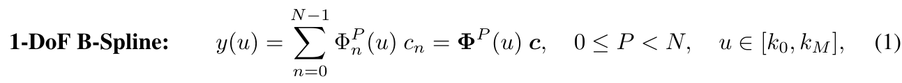

```math
y(u)=\sum_{n=0}^{N-1}\Phi_n^P(u)c_n=\boldsymbol\Phi^P(u)\mathbf c,\qquad 0\le P\lt N,\quad u\in[k_0,k_M].\qquad\text{(1)}
```

- **입력:** 한 시각 $`u`$, knot vector, degree $`P`$, control vector $`\mathbf c\in\mathbb R^N`$.
- **중간값:** $`N`$개 basis 값을 구해 $`1\times N`$ row로 만든다.
- **연산:** 각 basis 값에 해당 control point를 곱하고 **basis 축**으로 합한다. 시간축 평균이나 DoF 축 평균이 아니다.
- **출력:** 해당 시각의 한 DoF action 값 $`y(u)`$. 다차원에서는 같은 basis row를 각 DoF의 control vector에 적용한다.
- **가정:** knot는 비감소 순서이고 $`P\lt N`$이어야 한다. 논문에서 채택한 clamped 설정에서는 유효 영역을 0–1로 쓰기 쉽다. 일반 unclamped B-spline에서는 전체 knot 최솟값·최댓값과 표준적인 활성 parameter interval을 구분해야 한다.
- **직관:** 실제 행동 표본을 모두 저장하는 대신, 여러 국소 다항식의 부드러운 결합을 결정하는 계수만 저장한다. control point와 관측 waypoint를 일대일로 동일시하지 않는다.

원문은 $`M=N+P`$라고 정의하므로 knot vector 길이는 $`N+P+1`$이다. 예를 들어 $`N=5,P=3`$이면 **9개 knot 항목**을 갖는 clamped uniform vector의 한 예는 다음과 같다. [PDF pp.3–4, Eq.(1), Fig.1]

```math
\mathbf k=[0,0,0,0,\tfrac12,1,1,1,1],\qquad N=5,\quad P=3,\quad M=8.
```

처음·끝 값이 각각 $`P+1=4`$회 나온다. uniform은 내부의 비어 있지 않은 knot span이 균등하다는 뜻이다. 반복된 knot 사이에는 길이 0의 span이 있으므로 “모든 인접 knot 차이가 동일하다”는 뜻은 아니다. $`N=5,P=4`$이면 내부 knot 없이 양끝만 5회 반복되어 Bernstein/Bézier 형태가 된다. 이 경우 각 계수의 영향이 사실상 전체 구간에 걸칠 수 있으므로 local support도 degree와 knot 구성을 함께 봐야 한다.

### 4.3 Eq.(2): degree 0의 출발점

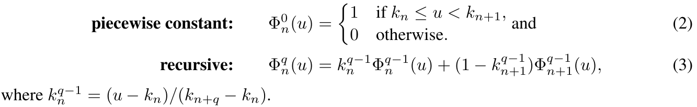

```math
\Phi_n^0(u)=\begin{cases}1&\text{if }k_n\le u\lt k_{n+1},\\0&\text{otherwise}.\end{cases}\qquad\text{(2)}
```

**기호/shape:** $`\Phi_n^0`$는 scalar indicator다. 입력 시각이 $`n`$번째 knot 구간에 있으면 1, 아니면 0이다. 모든 시각에 대해 평가하면 한 basis의 $`T`$차원 column이 된다. 동일한 knot가 반복되면 $`[k_n,k_{n+1})`$가 빈 구간이므로 0이다.

예를 들어 knot가 $`[0,.5,1]`$이고 $`u=.25`$이면 첫 basis는 1이고 둘째는 0이다. $`u=.75`$이면 반대다. 이때 Eq.(1)은 해당 구간의 control point 하나를 그대로 내보내며, zero-order hold와 같은 piecewise constant action을 만든다.

**오른쪽 끝점 주의:** Eq.(2)는 오른쪽 열린 구간을 쓴다. 모든 basis에 이 정의만 그대로 적용하면 $`u=1`$에서 문제가 생길 수 있다. clamped spline의 끝값을 마지막 control point로 만들려면 마지막 endpoint를 닫는 convention 또는 극한값을 사용해야 한다. 공개 HF 코드 `_basis_function`은 마지막 활성 degree-0 basis의 오른쪽 경계를 포함하고, 중복 knot 분모가 0인 항을 0으로 처리한다. [공식 코드 확인]

### 4.4 Eq.(3): 낮은 degree 두 개를 섞어 높은 degree를 만든다

```math
\Phi_n^q(u)=k_n^{q-1}\Phi_n^{q-1}(u)+\bigl(1-k_{n+1}^{q-1}\bigr)\Phi_{n+1}^{q-1}(u).\qquad\text{(3)}
```

원문의 바로 다음 비번호 정의는 다음과 같다.

```math
k_n^{q-1}=\frac{u-k_n}{k_{n+q}-k_n}.
```

이 $`k_n^{q-1}`$는 knot의 거듭제곱이 아니라 **시간에 따라 달라지는 혼합 가중치**다. 혼동을 줄이기 위해 약칭을 풀면 Eq.(3)은 다음과 동치다. 아래는 새로운 원문 번호 식이 아닌 [리뷰어 보조 전개]다.

```math
\Phi_n^q(u)=\frac{u-k_n}{k_{n+q}-k_n}\Phi_n^{q-1}(u)+\frac{k_{n+q+1}-u}{k_{n+q+1}-k_{n+1}}\Phi_{n+1}^{q-1}(u).
```

**연산 순서:** degree 0 값을 먼저 구한다. 각 $`q=1,2,\ldots,P`$에 대해 이웃한 낮은 degree basis 두 개를 각각 선형 가중하고 더한다. 결과는 이전보다 한 단계 높은 piecewise polynomial이다. **shape는 끝까지 scalar**이며 여러 시각·basis를 모은 뒤 행렬이 된다. 재귀의 중간 degree에는 최종 $`N`$개보다 더 많은 basis index가 필요할 수 있으므로 모든 degree를 무조건 같은 길이 배열로 구현하면 경계 index 오류를 만들기 쉽다.

**분모가 0인 경우:** clamped knot의 반복 때문에 실제로 발생한다. 해당 항의 기여를 0으로 정의해야 하며 IEEE NaN을 발생시켜 다음 행렬 곱으로 전달하면 안 된다. **local support:** 최종 $`\Phi_n^P`$가 0이 아닐 수 있는 영역은 $`[k_n,k_{n+P+1}]`$다. 내부의 일반적인 시각에는 최대 $`P+1`$개의 basis만 활성이다.

재귀를 직접 한 번 계산해 보자. 해설용 knot $`[0,0,.5,1,1]`$, $`u=.25`$에서 degree-0의 $`\Phi_1^0=1`$이고 다른 해당 basis는 0이다. $`\Phi_0^1`$의 첫 항은 중복 knot의 0분모 때문에 기여 0, 둘째 항은 $`(.5-.25)/(.5-0)\times1=.5`$다. $`\Phi_1^1`$은 $`(.25-0)/(.5-0)\times1+(1-.25)/(1-.5)\times0=.5`$다. $`\Phi_2^1=0`$이므로 최종 row는 $`[.5,.5,0]`$이다. 이 row가 §5.5의 design matrix 두 번째 행이 된다. 가중치 하나가 1보다 커 보이더라도 곱해지는 낮은 basis가 0이면 그 항의 기여는 0이라는 점도 확인된다.

**partition of unity:** 유효 영역에서 basis 합은 1이고 각 값은 비음수다. 따라서 곡선은 활성 control point들의 convex combination이다. 이 성질은 다음 quantization error bound를 이해하는 데 중요하다. 다만 “곡선이 control point 범위 안에 있다”는 사실과 “fitting한 control point가 원본 action 범위 안에 있다”는 사실은 다르다. 후자는 자동으로 성립하지 않는다.

### 4.5 작은 cubic 예제: 0.25초의 action 계산

[리뷰어 해설용 예제, 실제 실험 설정 아님] $`N=4,P=3`$, knot $`[0,0,0,0,1,1,1,1]`$의 basis는 다음과 같다.

```math
\boldsymbol\Phi^3(u)=\bigl[(1-u)^3,\;3u(1-u)^2,\;3u^2(1-u),\;u^3\bigr].
```

$`u=.25`$이면 basis row는 $`[.421875,.421875,.140625,.015625]`$이고 합은 1이다. control vector를 $`[0,1,1,0]^\top`$로 주면:

```math
y(.25)=.421875\cdot0+.421875\cdot1+.140625\cdot1+.015625\cdot0=.5625.
```

$`u=.5`$에서는 0.75, $`u=.75`$에서는 0.5625다. 가운데 control point 값은 1이지만 곡선이 반드시 그 값에 도달하지 않는다. 양끝에서는 첫/마지막 basis만 1이므로 $`y(0)=c_0=0`$, $`y(1)=c_3=0`$이다. 이는 clamped endpoint interpolation이며, 모든 control point interpolation이 아니다. [검산: 독립 NumPy 계산]

### 4.6 Figure 1을 읽는 방법과 continuity의 정확한 뜻

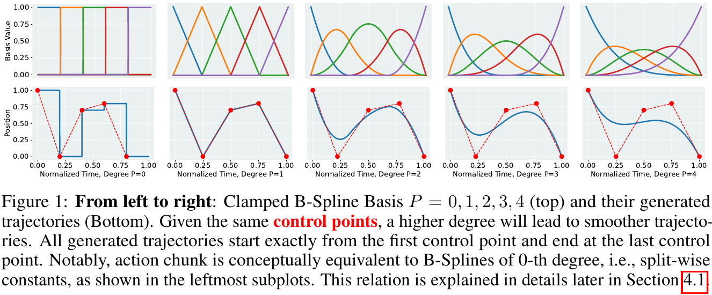

[PDF p.3, Fig.1] 위 행은 같은 개수의 basis를 degree 0–4로 그린 것이고, 아래 행은 같은 다섯 control point로 만든 곡선이다. degree 0은 계단, degree 1은 선분, 높은 degree는 더 높은 차수의 접합 연속성을 갖는다. 원문의 빨간 점은 control point의 도식적 배치다. knot나 반드시 통과해야 하는 관측점으로 읽으면 안 된다.

[리뷰어 보조 지식] 내부 knot의 multiplicity가 $`r`$인 degree-$`P`$ spline은 일반적으로 그 knot에서 $`C^{P-r}`$ 연속이다. 단순 내부 knot라면 cubic은 C²다. 이는 위치·속도·가속도가 이어질 수 있다는 뜻이며, jerk가 모든 knot에서 연속이라는 뜻은 아니다. 서로 **독립적으로 생성한 두 chunk의 경계**에는 이 내부 knot 성질을 그대로 적용할 수 없다. §4.2의 연결 제약이 별도로 필요하다.

### 4.7 Parallel decoding이라는 또 하나의 전제

[PDF p.4, §3] 원문은 길이 $`K`$의 AR 출력에 대해 $`K`$번의 순차적 token 생성이 필요하다고 설명한다. parallel decoding에서는 $`K`$개의 빈/placeholder embedding을 넣고 causal mask를 bidirectional mask로 바꾸어 모든 출력 slot을 한 번에 계산한다. 입력 관측의 encoder forward와 출력 decoder forward는 여전히 수행한다. “한 번”은 **action slot 사이에 순차 생성 반복을 하지 않는다**는 의미로 이해해야 한다.

고정 길이만으로 AR 모델의 학습 objective가 바뀌지는 않는다. 정답 이전 action token을 보던 teacher forcing을 그대로 두고 추론만 병렬화하면 입력 분포가 달라진다. BEAST의 PD 경로는 학습 때도 placeholder slot을 사용한다. slot 간 hidden state는 attention으로 상호작용하지만, 실제 샘플된 앞선 action token을 뒤 slot이 조건으로 보지는 않는다.

## 5. 원문 §4.1: Sequence fitting → quantization → tokenization → 복원

### 5.1 첫 normalization: action quantile과 control-point bound를 구분한다

[저자 보고, PDF p.4, §4.1] 각 action dimension의 dataset 1%, 99% quantile을 −1, 1로 보내도록 정규화한다. 아래 식은 원문의 문장 설명을 전개한 [리뷰어 보조 식]이며 원문 번호 식은 아니다.

```math
\widetilde A_{t,d}=2\frac{A_{t,d}-Q_d^{.01}}{Q_d^{.99}-Q_d^{.01}}-1,\qquad A_{t,d}=Q_d^{.01}+\frac{\widetilde A_{t,d}+1}{2}\bigl(Q_d^{.99}-Q_d^{.01}\bigr).
```

분모는 dimension별 scale이다. 예를 들어 1% quantile이 −0.2, 99%가 0.6이고 action이 0.2라면 정규화 값은 0이다. 원문은 quantile 밖 값을 어떻게 clip하는지까지 명시하지 않는다. affine mapping만 수행하면 outlier는 −1 또는 1 밖으로 나간다. quantile 차가 0인 상수 dimension의 예외 처리도 [논문 미기재]다.

**이 통계는 두 번째 양자화 통계와 다르다.** action을 정규화한 뒤에도 least-squares control point가 ±1 범위를 벗어날 수 있다. 따라서 “정규화 action이 ±1이므로 모든 control point를 무조건 ±1로 quantize한다”는 구현은 원문에서 도출되지 않는다. 공개 tokenizer는 fitting된 control point의 위치별 min/max buffer를 사용한다. 공개 caller의 quantile normalization 여부는 별도 확인이 필요하며, 이를 같은 단계로 섞지 않는다.

### 5.2 원문의 시간 매핑과 design matrix의 shape 정리

원문은 $`u=t/T`$를 적는다. $`t=1,\ldots,T`$로 읽으면 첫 표본이 0이 아니라 $`1/T`$다. 반면 공개 tokenizer는 `linspace(0,1,seq_len)`을 사용해 양끝을 포함한다. 리뷰의 수치 예제는 이를 명시하고 $`u_t=t/(T-1)`$, $`t=0,\ldots,T-1`$ 관례를 쓴다. 두 관례는 작은 $`T`$에서 실제 fitting이 다를 수 있다. [PDF p.4; 공식 코드 `BeastTokenizer.__init__`]

```math
\Phi=\begin{bmatrix}\Phi_0^P(u_0)&\cdots&\Phi_{N-1}^P(u_0)\\\vdots&&\vdots\\\Phi_0^P(u_{T-1})&\cdots&\Phi_{N-1}^P(u_{T-1})\end{bmatrix}\in\mathbb R^{T\times N},\qquad Y=\Phi C^\top\in\mathbb R^{T\times D}.
```

[리뷰어 표기 정리] p.5의 design matrix 설명은 basis index와 transpose를 혼용해 그대로는 shape가 명료하지 않다. 위처럼 **행은 표본 시간, 열은 basis**로 정의하면 Eq.(4)와 ridge 해가 모두 일관된다. $`\Phi`$는 동일 grid, degree, knot, basis 수라면 샘플마다 변하지 않는다. 관측 이미지나 언어에 따라 basis를 새로 학습하지 않는다.

### 5.3 Eq.(4): 관측 행동에 가장 잘 맞는 control point

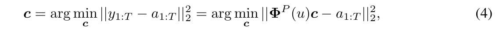

```math
\mathbf c=\arg\min_{\mathbf c}\lVert\mathbf y_{1:T}-\mathbf a_{1:T}\rVert_2^2=\arg\min_{\mathbf c}\lVert\Phi^P(u)\mathbf c-\mathbf a_{1:T}\rVert_2^2.\qquad\text{(4)}
```

**입력:** 정규화된 한 DoF의 정답 시계열 $`\mathbf a\in\mathbb R^T`$와 고정 $`\Phi\in\mathbb R^{T\times N}`$. **미지수:** $`N`$개의 control point. **연산 축:** 모든 시간 표본의 잔차를 제곱해 합한다. **출력:** $`\mathbf c`$. 원문은 $`N\le T`$를 상정하지만 이후 ablation에는 $`N=25,T=20`$도 포함되므로 이 조건이 논문 전체의 모든 설정에서 유지되는 것은 아니다.

이 목적함수는 **tokenizer가 demonstration 하나를 근사하는 회귀 목적**이다. VLM 전체의 policy training loss와 다르다. fitting은 다른 DoF에 독립적으로 적용하므로 다른 dimension 사이의 coupling은 이 계산에서 학습되지 않는다. 뒤의 정책이 관측과 모든 action slot을 통해 coupling을 모델링할 수는 있다.

### 5.4 비번호 ridge 해: Eq.(4)에 실제로 추가되는 항

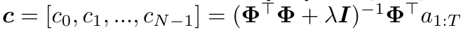

```math
\mathbf c=(\Phi^\top\Phi+\lambda I)^{-1}\Phi^\top\mathbf a_{1:T}.
```

[PDF p.5, §4.1] 이 식은 바로 앞 Eq.(4)의 무정규화 최소제곱에 $`\lambda\lVert\mathbf c\rVert_2^2`$를 더한 ridge 문제의 해다. 원문 Eq.(4) 자체에 그 항이 인쇄되어 있지는 않다. 아래 유도는 [리뷰어 보조 유도]다.

```math
\begin{aligned}L(\mathbf c)&=\lVert\Phi\mathbf c-\mathbf a\rVert_2^2+\lambda\lVert\mathbf c\rVert_2^2,\\\nabla_{\mathbf c}L&=2\Phi^\top(\Phi\mathbf c-\mathbf a)+2\lambda\mathbf c,\\(\Phi^\top\Phi+\lambda I)\mathbf c&=\Phi^\top\mathbf a.\end{aligned}
```

$`\Phi^\top\Phi`$는 $`N\times N`$, $`I`$도 $`N\times N`$, $`\Phi^\top\mathbf a`$는 $`N\times1`$이다. $`\lambda\gt 0`$이면 normal matrix의 양의 정부호성을 확보해 rank 부족에 대응할 수 있다. 반면 계수를 0 쪽으로 축소하므로 무정규화 해와 같은 값을 보장하지 않는다. 이것은 coefficient norm penalty이며 곡률이나 jerk를 직접 최소화하는 penalty가 아니다.

수학적으로 inverse를 적더라도 구현에서는 explicit inverse 대신 linear solve를 사용하는 편이 적절하다. 공개 HF 구현도 `torch.linalg.solve(A,B)`를 사용하며 기본 `reg=1e-4`다. 원문은 fitting overhead를 batch당 3–5 ms로 설명하지만 그 batch 크기, device, degree, cache 범위가 완전하지 않다. 이 수치를 추론의 필수 3–5 ms로 더해서는 안 된다. 추론의 주 경로는 이미 예측한 계수를 복원하는 과정이다.

고정 grid에서는 $`R=(\Phi^\top\Phi+\lambda I)^{-1}\Phi^\top`$를 재사용할 수 있고, 다차원 fitting은 $`C^\top=R\widetilde A`$다. 이는 [리뷰어 구현 제안]으로, 현재 공개 코드가 이 작은 행렬을 최대한 사전 계산한다는 뜻은 아니다.

### 5.5 끝까지 계산하는 5-step, 2-DoF fitting 예제

[리뷰어 해설용 예제] $`T=5,D=2,N=3,P=1`$, grid $`[0,.25,.5,.75,1]`$, knot $`[0,0,.5,1,1]`$를 쓴다. 실제 논문의 main model hyperparameter가 아니다.

```math
\Phi=\begin{bmatrix}1&0&0\\.5&.5&0\\0&1&0\\0&.5&.5\\0&0&1\end{bmatrix},\qquad \widetilde A=\begin{bmatrix}0&-1\\.5&-.5\\1&0\\.5&.5\\0&1\end{bmatrix},\qquad C=\begin{bmatrix}0&1&0\\-1&0&1\end{bmatrix}.
```

$`\Phi C^\top=\widetilde A`$이므로 이 예제는 fitting error가 0인 경우다. 첫 DoF는 산 모양, 둘째는 직선이다. 세 control point를 지정한다고 세 시점만 실행하는 것이 아니라, 다섯 시점에서 basis를 평가해 다섯 action을 만든다.

첫 DoF에 대해 normal equation을 실제로 쓰면 다음과 같다.

```math
\Phi^\top\Phi=\begin{bmatrix}1.25&.25&0\\.25&1.5&.25\\0&.25&1.25\end{bmatrix},\qquad\Phi^\top\mathbf a=\begin{bmatrix}.25\\1.5\\.25\end{bmatrix}.
```

$`\lambda=0`$의 해는 $`[0,1,0]^\top`$이다. regularization의 영향을 보이기 위해 일부러 큰 $`\lambda=.1`$을 넣으면 $`[.0122850,.9336609,.0122850]^\top`$가 된다. 즉 ridge는 “수치적으로 안정적인 동일 해”가 아니라 **조금 다른 목적함수의 해**다. 이 계산은 CPU NumPy로 검산했다.

### 5.6 Figure 2: control point quantization과 flatten 순서

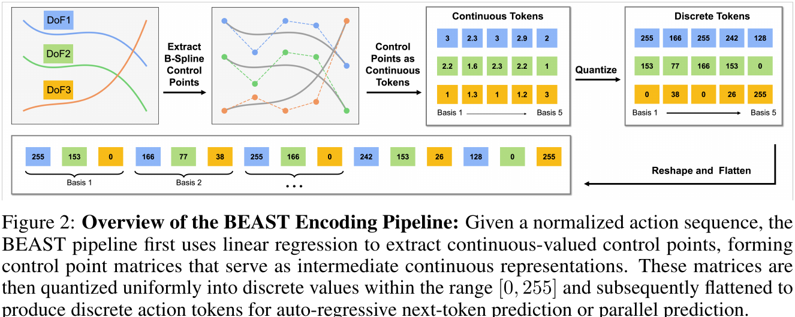

[PDF p.4, Fig.2; p.5, §4.1] 왼쪽부터 normalized action curves → continuous control-point matrix → discrete control-point matrix → basis별 DoF interleaving이다. 연속값 하나를 0–255의 scalar token으로 바꾼다. B-spline basis index 자체를 token ID로 출력하는 방식이 아니다.

아래는 공개 코드와 일치하는 **round-to-nearest uniform quantizer**의 전개다. 원문은 그림과 문장으로 uniform quantization을 설명하며 이 식에는 원문 번호가 없다.

```math
z_{d,n}=\mathrm{round}\!\left(255\,\mathrm{clip}\!\left(\frac{C_{d,n}-L_{d,n}}{U_{d,n}-L_{d,n}},0,1\right)\right),\qquad \widehat C_{d,n}=L_{d,n}+\frac{z_{d,n}}{255}(U_{d,n}-L_{d,n}).
```

**입력/출력:** 각 continuous coefficient scalar를 정수 1개로 바꾸고 다시 실수 1개로 복원한다. **정규화 축:** time axis 전체에 softmax하는 것이 아니라 coefficient마다 정해진 scalar range로 affine mapping한다. 공개 코드는 $`D\times N`$개의 위치마다 누적 bound를 갖는다. **가정:** 상·하한과 DoF/basis ordering이 encoder/decoder에서 동일해야 한다. 범위를 모르면 token ID만으로 물리 action을 복원할 수 없다.

**원문 그림의 수치 예:** Fig.2의 전체 continuous 표 범위는 1–3이며, 이 범위를 0–255로 보았을 때 3→255, 2→127.5→128, 2.3→165.75→166, 1.3→38.25→38이 된다. 첫 basis의 세 DoF는 3, 2.2, 1이므로 255, 153, 0으로 나열된다. 다음 basis의 2.3, 1.6, 1.3은 166, 77, 38이다. 그림의 도식적 global range와 공개 코드의 coefficient별 bound는 같은 설계 설명의 서로 다른 구체화이며, 실제 dataset bound를 그림의 1–3으로 대체하면 안 된다.

원문의 flatten 규칙은 다음과 같다. 아래 index는 설명을 위해 0부터 센다.

```math
\bar v_{nD+d}=z_{d,n},\qquad n=0,\ldots,N-1,\quad d=0,\ldots,D-1,\qquad J=ND.
```

한 DoF의 계수 전체를 먼저 쓰는 것이 아니라, **basis 0의 모든 DoF → basis 1의 모든 DoF → …** 순서다. 이 순서는 basis가 대략적으로 local trajectory segment와 대응하는 시간 구조를 유지한다. 하지만 overlap이 있는 basis를 단일 action 시각과 동일시해서는 안 된다. discrete token 하나의 의미는 “이 DoF의 이 basis coefficient가 어느 값 bin에 있는가”다.

### 5.7 2-DoF 예제를 토큰 6개로 만들고 다시 복원

앞의 $`C`$에 해설용 공통 범위 $`[-1,1]`$을 적용한다. 실제 코드의 누적 bound를 흉내 낸 값이 아니라 quantization 산술을 보여주기 위한 고정 범위다.

```math
Z=\begin{bmatrix}128&255&128\\0&128&255\end{bmatrix},\qquad\bar{\mathbf v}=[128,0,255,128,128,255].
```

DoF-major로 flatten하면 $`[128,255,128,0,128,255]`$가 되지만 이것은 원문의 순서가 아니다. decoder는 token을 basis-major에서 $`D\times N`$로 되돌려야 한다. 256개 endpoint grid는 0을 정확히 포함하지 않아 정규화값 0의 round-trip이 $`1/255\simeq.00392157`$가 되는 점도 확인할 수 있다.

```math
\widehat C=\begin{bmatrix}.00392157&1&.00392157\\-1&.00392157&1\end{bmatrix},\qquad \widehat A=\Phi\widehat C^\top=\begin{bmatrix}.00392157&-1\\.50196078&-.49803922\\1&.00392157\\.50196078&.50196078\\.00392157&1\end{bmatrix}.
```

10개의 scalar action을 6개의 discrete scalar로 표현한 예다. 양자화만으로 생긴 전체 $`5\times2`$ 평균 MSE는 $`6.1514802\times10^{-6}`$다. 이 예에는 policy prediction error가 없다. 실전에서는 fitting error, quantization error, 관측에서 coefficient를 잘못 예측한 error가 모두 더해진다. [검산]

### 5.8 복원 오차를 세 단계로 나누기

입력이 이미 정규화되어 있다고 할 때, 이상적인 fitted coefficient를 $`C^*`$, 그 양자화 복원을 $`C^Q`$, 정책의 예측 복원을 $`C^\theta`$라고 하자. 아래는 [리뷰어 보조 분해]다.

```math
\widetilde A-\Phi(C^\theta)^\top=\underbrace{\widetilde A-\Phi(C^*)^\top}_{\text{fitting error}}+\underbrace{\Phi(C^*-C^Q)^\top}_{\text{quantization error}}+\underbrace{\Phi(C^Q-C^\theta)^\top}_{\text{policy error}}.
```

이것은 error vector의 합이며 MSE가 교차항 없이 세 MSE의 합으로 분해된다는 뜻은 아니다. 원래 단위로 돌릴 때 dimension별 quantile scale이 다시 곱해진다. 같은 normalized MSE라도 translation, rotation, gripper에 미치는 물리적 영향은 다르다.

고정 bounds에서 clipping이 없고 coefficient별 quantization error가 $`\epsilon`$ 이하라면 partition of unity 덕분에 한 시각의 action error도 $`\epsilon`$ 이하이다.

```math
\left|\sum_n\Phi_n^P(u)\,\delta c_n\right|\le\sum_n\Phi_n^P(u)|\delta c_n|\le\epsilon\sum_n\Phi_n^P(u)=\epsilon.
```

단일 coefficient가 잘못 예측되었을 때 영향이 그 basis의 support에 제한된다는 해석도 가능하다. 그러나 clipping, 정책이 멀리 떨어진 bin을 선택하는 오류, derivative error는 이 간단한 bound로 제어되지 않는다. 특히 미분에는 knot 간격의 역수가 들어가므로 작은 위치 오차가 큰 속도·가속도 오차로 나타날 수 있다.

### 5.9 Remark 1: action chunking이 degree 0인 특수 경우

[PDF p.5, Remark 1] $`P=0,N=T`$이고 각 sample에 대응하는 구간을 정하면 basis는 각 구간에서 하나의 control point만 선택한다. 따라서 conventional action chunk 배열은 0차 spline의 control point 배열처럼 볼 수 있다. 원문의 $`a_0,\ldots,a_T`$ 나열은 총 $`T+1`$개처럼 읽혀 앞의 length-$`T`$ 정의와 index convention이 섞인다. 핵심은 index 시작값이 아니라 **sample 수와 control-point 수를 같게 두면 compression 없이 piecewise constant representation이 된다**는 대응이다.

반대로 $`P\gt 0`$으로 바꾸기만 하면 자동 압축되는 것은 아니다. $`N\lt T`$를 선택해 예측할 계수 수를 줄이는 것이 압축이다. Table 5의 $`T=20,N=10`$은 정확히 2배, Real Franka의 $`T=20,N=5`$는 4배, BEAST-ACT의 100→15는 약 6.67배다.

## 6. 원문 §4.2: Chunk 연결의 원리와 보장 범위

### 6.1 원문 비번호 잔차식과 constrained fitting

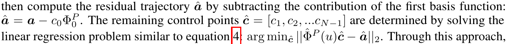

[PDF p.5, §4.2] clamped spline의 $`y(0)=c_0`$ 성질을 사용한다. 새 chunk의 첫 control point를 이전 chunk 마지막 action과 같게 정한 뒤, 첫 basis가 설명한 분량을 정답 trajectory에서 뺀다. 원문의 비번호 표현을 모두 옮기면 다음과 같다.

```math
c_0=a_{\mathrm{prev,last}},\qquad \widehat{\mathbf a}=\mathbf a-c_0\boldsymbol\Phi_0^P,\qquad \widehat{\mathbf c}=[c_1,c_2,\ldots,c_{N-1}],\qquad\arg\min_{\widehat{\mathbf c}}\lVert\widehat\Phi^P(u)\widehat{\mathbf c}-\widehat{\mathbf a}\rVert_2.
```

원문의 마지막 minimization은 norm에 제곱을 표시하지 않는다. 무정규화 minimizer는 norm 제곱을 최소화할 때와 같으므로 순수 least-squares argmin 해석에는 문제가 없다. 다만 ridge 항을 추가할 때는 목적함수 정의를 다시 명확히 해야 한다.

**한 줄씩 풀이:** 첫 control point는 예측할 자유변수가 아니다. $`\boldsymbol\Phi_0^P`$는 $`T`$개 시각에서 첫 basis를 평가한 column이다. 여기에 정한 $`c_0`$를 곱하면 이미 고정한 경계점이 전체 trajectory에 기여하는 부분을 얻는다. 이를 $`\mathbf a`$에서 뺀 residual이 새 회귀 target이다. $`\widehat\Phi`$는 첫 column을 제거한 $`T\times(N-1)`$ 행렬이다. 나머지 $`N-1`$개 coefficient만 fitting하고 마지막에 $`c_0`$를 다시 붙인다.

ridge로 확장한 [리뷰어 보조 식]은 다음과 같다.

```math
\widehat{\mathbf c}=(\widehat\Phi^\top\widehat\Phi+\lambda I_{N-1})^{-1}\widehat\Phi^\top\bigl(\mathbf a-\boldsymbol\Phi_0^P c_0\bigr),\qquad\mathbf y=\boldsymbol\Phi_0^P c_0+\widehat\Phi\widehat{\mathbf c}.
```

고정된 $`c_0`$에는 ridge shrinkage를 가하지 않으므로 시작값 제약을 그대로 유지할 수 있다. 추론에서도 고정 경계값은 양자화된 예측에 맡기지 않고 정확히 제공해야 수학적 equality가 보존된다. 논문은 전반적인 fixed-length token 수와 이 free-coefficient 선택의 관계를 모든 architecture마다 자세히 적지는 않는다.

**잔차 fitting의 수치 예:** §5.5의 첫 DoF 정답 $`[0,.5,1,.5,0]`$에 이전 chunk 끝값 $`c_0=.2`$를 강제로 맞춘다고 하자. 첫 basis column은 $`[1,.5,0,0,0]^\top`$이므로 잔차는 $`[-.2,.4,1,.5,0]^\top`$이다. $`\lambda=0`$으로 나머지 두 coefficient를 풀면 다음과 같다. [리뷰어 해설용 예제]

```math
\widehat\Phi^\top\widehat\Phi=\begin{bmatrix}1.5&.25\\.25&1.25\end{bmatrix},\qquad\widehat\Phi^\top\widehat{\mathbf a}=\begin{bmatrix}1.45\\.25\end{bmatrix},\qquad\widehat{\mathbf c}=\begin{bmatrix}.96551724\\.00689655\end{bmatrix}.
```

전체 control point는 $`[.2,.96551724,.00689655]`$이고 복원은 $`[.2,.58275862,.96551724,.48620690,.00689655]`$다. 첫 시각에서 정답 0과의 오차는 남지만 시작값 0.2를 정확히 지킨다. 경계 제약은 공짜로 더 정확한 fitting을 만드는 장치가 아니라, **허용되는 trajectory 집합을 바꾸어 연결 조건을 우선하는 장치**다.

### 6.2 C⁰는 보장하지만 C¹는 자동으로 보장하지 않는다

[리뷰어 검산] 같은 경계에서 앞 chunk의 마지막 control point와 뒤 chunk의 첫 control point가 같으면 두 곡선의 **값**은 같다. 속도는 다음처럼 인접 control point 차이에 의존한다. 물리 시간은 $`t=\tau u`$라고 둔다.

```math
\frac{dy}{dt}(0)=\frac{P(c_1-c_0)}{\tau(k_{P+1}-k_1)},\qquad \frac{dy}{dt}(\tau)=\frac{P(c_{N-1}-c_{N-2})}{\tau(k_{N+P-1}-k_{N-1})}.
```

예를 들어 duration이 각각 1초인 cubic Bézier chunk 두 개의 control point가 $`[0,1,1,0]`$와 $`[0,1,0,1]`$이면 연결 값은 0으로 같다. 앞쪽 끝속도는 −3, 뒤쪽 시작속도는 +3이므로 경계에서 속도가 뛰어오른다. **첫 control point 하나를 고정하는 것만으로 “위치·속도·가속도·jerk 모두 연속”이라고 할 수 없다는 직접 반례**다.

시작속도까지 맞추려면 다음과 같이 두 번째 control point도 정해야 한다. 이는 논문 본문이 실제로 제시한 제약이 아니라 [리뷰어 보조 유도]다.

```math
c_1=c_0+\frac{\tau(k_{P+1}-k_1)}{P}v_{\mathrm{prev,end}}.
```

가속도 연결에는 추가 coefficient 제약이 필요하다. 원문에서 사용하는 “smooth transitions”는 Fig.5의 위치 그래프와 초기값 고정을 근거로 읽되, 더 강한 동역학 보장으로 확장하지 않는다. absolute joint command, delta-EEF command, velocity command에서 곡선 값의 연속성이 실제 joint 위치의 연속성에 연결되는 방식도 다르다.

### 6.3 실행 경계와 예측 경계가 다를 때

receding horizon에서 20-step 예측 중 앞 10-step만 실행했다면 새 chunk는 실제 마지막으로 실행된 command나 현재 측정 상태를 기준으로 연결해야 한다. 이전 예측의 20번째 값을 무조건 사용하는 것은 “예측된 chunk끼리의 endpoint 연결”일 뿐 실제 실행 경계 연결이 아닐 수 있다. 또한 tracking error가 있으면 이전 command와 현재 robot state는 다르다. 논문은 이 차이를 다루는 closed-loop correction과 지연 보상까지 형식화하지 않는다. [리뷰어 해석]

## 7. 원문 §4.3과 Appendix B: 정책 architecture, loss, gradient, forward

### 7.1 BEAST-F: Florence-2 encoder–decoder에 고정 action slot 연결

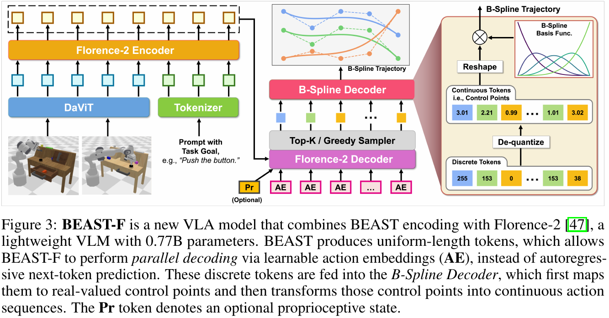

[저자 보고, PDF pp.5–6, §4.3; p.15, Appendix B] Florence-2-large 0.77B를 사용한다. 이미지 encoder는 DaViT이고 language model은 encoder–decoder 구조다. Appendix B는 이미지를 50개 token으로 압축한다고 설명한다. 이 수치를 모든 해상도·모든 공개 checkpoint에서 자동 보장되는 runtime shape로 보지 말고, 리뷰 대상 architecture의 설명으로 읽어야 한다.

Figure 3의 왼쪽은 이미지와 instruction을 context로 만드는 부분이다. DaViT image feature와 language token embedding을 Florence encoder에 넣는다. 아래의 AE는 action embedding slot이다. decoder는 context에 cross-attention하고 action slot들에 bidirectional self-attention하여 모든 coefficient token을 병렬 예측한다. 위의 top-k/greedy sampler가 이산 ID를 선택한다. B-spline decoder는 dequantize → reshape → basis evaluation을 수행한다. Pr는 optional proprioceptive input이다.

원문은 VLM vocabulary의 least-used 256개 token을 action token으로 덮어쓴다고 설명한다. 전체 language vocabulary softmax를 사용하는지 action subset에만 softmax하는지는 속도·invalid-token 동작에 중요하다. 공개 코드에서는 전체 vocabulary logits로 CE를 계산하고 greedy argmax하며, action ID와 language ID 사이에 뒤쪽 index를 이용한 역순 mapping을 사용한다. 아래 §11에서 논문 도식과 차이를 구체적으로 다룬다.

### 7.2 BEAST-D: 작은 decoder-only Transformer의 의미

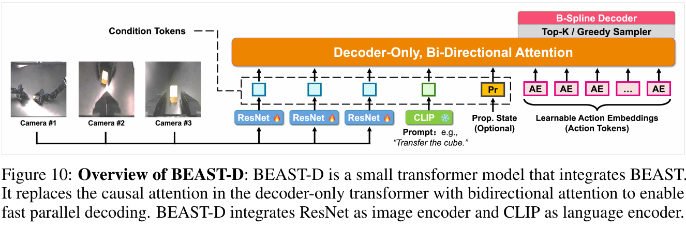

[PDF p.6, §4.3; p.15, Appendix B] 언어는 CLIP, 이미지는 FiLM-conditioned ResNet-18, proprioception은 2-layer MLP로 embedding을 만든다. Figure 10은 CLIP에 frozen 표시, ResNet에 trainable 표시를 붙인다. Transformer는 이름상 decoder-only지만 **causal language decoder 동작을 그대로 유지하지 않고 bidirectional attention으로 바꾼다**. 이미지·언어 condition slot과 learnable action slot을 한 구조에 넣는 작은 정책이다.

Table 7의 실제 로봇 설정은 6 layers, 8 attention heads, hidden width 256이다. 따라서 head dimension은 $`256/8=32`$로 해석할 수 있다. action slot의 정보는 동일 관측과 다른 slot의 hidden feature에 의존하지만 한 slot의 샘플 결과를 다음 slot에 넘기는 AR loop는 없다. FiLM은 언어 조건으로 visual feature를 scale/shift하는 역할이며 spline fitting의 일부가 아니다.

### 7.3 BEAST-ACT: 연속 coefficient를 예측하는 CVAE

[PDF p.6, §4.3] vanilla ACT는 conditional VAE로 action chunk를 예측한다. BEAST-ACT는 target을 실제 $`T`$개의 action에서 $`N`$개의 연속 control vector로 바꾼다. 각 vector는 $`D`$차원이므로 출력 shape는 $`B\times N\times D`$로 해석된다. discrete BEAST의 $`ND`$개 scalar token과 continuous BEAST의 $`N`$개 vector token을 같은 token counting으로 혼동하지 않는다.

원문은 100개에서 15개로 감소했다고 보고한다. vector slot 수와 scalar 출력 수 모두 비율은 $`100/15\simeq6.67`$이지만, discrete softmax 256-way head를 15번 쓴다는 뜻은 아니다. control point를 복원해 spline으로 평가하므로 temporal aggregation 없이도 곡선 내부 smoothness를 얻는다.

[논문 미기재] BEAST-ACT의 exact reconstruction loss 공간, KL weight, latent dimension, detailed optimizer 설정 전체는 이 논문에 제시되지 않는다. ACT 기반이라는 사실만으로 다른 논문의 default를 BEAST의 확정 설정으로 넣지 않는다. 이해를 위한 일반적 CVAE objective는 다음과 같으며 **원문의 번호 식 또는 확인한 BEAST-ACT 구현 식이 아니다**.

```math
\mathcal L_{\mathrm{CVAE}}=\mathbb E_{z\sim q_\psi(z\mid s,C)}\bigl[\ell(g_\theta(s,z),C)\bigr]+\beta\,\mathrm{KL}\bigl(q_\psi(z\mid s,C)\Vert p(z)\bigr).
```

여기서 encoder posterior와 policy decoder는 학습되고 spline basis는 고정이다. $`\ell`$이 coefficient 공간인지 reconstructed action 공간인지에 따라 gradient weighting이 달라진다. BEAST 논문만으로 그 세부를 확정하지 않는 것이 재현성상 정직하다.

### 7.4 Discrete training의 loss와 gradient

다음 식은 원문이 cross-entropy라고 서술한 objective를 공개 코드와 맞춰 표준식으로 적은 것이다. 별도의 원문 Eq.(5)가 아니다.

```math
\mathcal L_{\mathrm{PD}}=-\frac1{BJ}\sum_{b=1}^{B}\sum_{j=1}^{J}\log p_\theta\bigl(\bar v_{b,j}\mid s_b,E_{1:J}\bigr).
```

$`E_{1:J}`$는 placeholder action slot이다. logits가 $`B\times J\times V`$라면 **vocabulary 축**으로 softmax를 취하고 target ID의 log probability를 뽑아 batch와 slot 축으로 평균한다. 여기의 $`V`$는 head가 사용하는 실제 vocabulary size이며 conceptual action vocabulary 256과 같을 필요가 없다. 현재 BEAST-F 코드는 VLM 전체 vocabulary를 사용한다.

AR 비교 모델의 objective는 다음과 같이 앞선 **정답** action token을 조건으로 갖는다는 점이 다르다.

```math
\mathcal L_{\mathrm{AR}}=-\frac1{BJ}\sum_{b=1}^{B}\sum_{j=1}^{J}\log p_\theta\bigl(\bar v_{b,j}\mid s_b,\bar v_{b,\lt j}\bigr).
```

gradient는 CE → output projection → decoder hidden → self/cross-attention → encoder/vision trainable weight로 흐른다. target token을 만드는 ridge fitting, rounding, integer reshape에는 policy loss gradient를 보낼 필요가 없고 공개 `encode_discrete`는 `no_grad`다. codebook을 갱신하는 VQ loss나 straight-through estimator도 없다.

공개 코드의 action reconstruction MSE는 argmax와 `decode_discrete` 뒤 계산하는 **로그용 metric**이며 반환하는 학습 loss는 CE다. “CE+MSE joint training”으로 읽으면 틀린다. 반면 Appendix의 continuous ablation은 CE 대신 L1 regression을 사용한다고 명시한다. 해당 gradient는 continuous head로 흐르며 discrete bin 경계를 통과하지 않는다.

### 7.5 Parallel logits가 행동의 joint multimodality를 완전히 보장하는가

[리뷰어 해석] categorical output은 scalar별 여러 mode를 표현하기에 유리하다. 하지만 단일 PD forward에서 독립적으로 각 slot을 sampling하면 전체 action sequence의 joint distribution은 제한될 수 있다. 예를 들어 두 coherent grasp trajectory의 계수들이 각 slot에서 섞이면 어느 한 trajectory에도 속하지 않는 결과가 생길 수 있다. bidirectional hidden-state coupling은 도움이 되지만 AR conditioning, shared latent sampling, diffusion/flow의 iterative coupling과 같은 메커니즘은 아니다. Table 4의 discrete 우위는 그 특정 L1 regression 비교를 지지하며 모든 continuous generative model보다 우월함을 증명하지 않는다.

### 7.6 한 샘플의 end-to-end forward: $`T=20,D=7,N=10`$

다음은 Table 5의 action shape와 Figure 3의 model role을 결합한 재구성이다. 이미지 token 수는 Appendix B의 설명을 적용한 예이며 실제 forward의 정확한 token 수는 checkpoint·입력 전처리를 확인해야 한다.

| 순서 | 입력 → 출력 shape | 연산과 역할 |
|---|---|---|
| 1. 관측 수집 | 두 camera image + instruction (+ optional state) | 공개 config는 관측 시점 1, 두 view 사용 |
| 2. visual features | 각 이미지 → 대략 50 visual tokens → 두 view 약 100 tokens | DaViT 및 Florence image projection; 모든 token width는 text hidden width와 맞춤 |
| 3. instruction embedding | 문자열 → $`L`$ token → $`1\times L\times H`$ | vocabulary embedding; task prompt와 concatenate |
| 4. encoder | $`1\times S\times H`$ → 같은 token shape의 context | visual-language feature 결합 |
| 5. action slots | 고정 길이 $`J=7\times10=70`$ → $`1\times70\times H`$ | placeholder/position information 제공. 정답 행동을 입력하지 않음 |
| 6. decoder | 70 slots + context → $`1\times70\times H`$ | bidirectional self-attention, context cross-attention |
| 7. head / 선택 | $`1\times70\times V`$ → $`1\times70`$ | CE training 또는 greedy/top-k inference |
| 8. token 복원 | 70 IDs → $`1\times7\times10`$ coefficients | vocabulary mapping 역변환, basis-major reshape, dequantize |
| 9. spline 평가 | $`\Phi:20\times10`$, $`C^\top:10\times7`$ → $`1\times20\times7`$ | 고정 basis와 matmul/einsum |
| 10. action 변환 / 실행 | normalized sequence → original action units | 필요한 inverse normalization 및 controller convention 적용, 정해진 prefix 실행 |
| 11. 재계획 | 새 관측 → 새 70 tokens | 실제 실행 boundary에 맞는 초기조건을 제공할 때 C⁰ 연결 |

학습에서는 1–7에 더해 demonstration $`A:1\times20\times7`$를 fitting·quantization한 target 70개를 만든다. 추론에서는 target 생성  과정이 없다. spline decoder의 matmul은 이 예에서 output 하나당 10개 항을 합하며, 로봇 simulator나 neural decoder를 실행하는 과정이 아니다.

### 7.7 행별 알고리즘: 원문에 없는 pseudocode의 재구성

**알고리즘 A — training target 생성.** [리뷰어 재구성: §3–4, 공식 tokenizer]

```text
01  Read fixed configuration: T, D, N, P, knots, time_grid.
02  Load action normalization statistics and coefficient quantization bounds.
03  Normalize demonstration chunk A using the dataset's action convention.
04  Evaluate Phi[t,n] on time_grid with the Cox-de Boor recursion.
05  If a boundary is constrained, fix c0, subtract Phi[:,0] * c0,
    and remove the first column from the fitting system.
06  Solve the ridge linear system for each action dimension.
07  Assemble C[d,n]; preserve exact fixed boundary parameters separately.
08  Quantize each free coefficient using the fixed L/U bound at its slot.
09  Flatten as basis0_all_dofs, basis1_all_dofs, ... .
10  Map scalar action IDs to model vocabulary IDs if required.
11  Supply the IDs as labels for CE, or coefficients for continuous training.
```

01은 representation을 정의하므로 train/inference 양쪽에 고정해야 한다. 02는 token의 numerical meaning을 고정한다. 03은 action-unit mismatch를 막는다. 04는 동일 설정이면 cache 가능하다. 05는 unconstrained fitting과 constrained fitting의 차이이며 shape가 $`N`$에서 $`N-1`$로 바뀐다. 06의 solve는 coefficient target 계산이지 policy optimization이 아니다. 07은 fixed boundary가 quantization으로 흔들리지 않게 하는 설계 조건이다. 08은 clipping/rounding 오차가 발생하는 위치다. 09의 permutation을 바꾸면 같은 ID 목록도 다른 trajectory가 된다. 10은 Florence integration에만 필요한 vocabulary 대응이다. 11에서 비로소 policy 학습 target이 완성된다.

**알고리즘 B — 병렬 policy inference.** [리뷰어 재구성: Fig.3, Fig.10, §4.3]

```text
01  Acquire current images, language instruction, and configured robot state.
02  Encode visual and text context once.
03  Allocate the fixed number of action placeholder slots.
04  Predict all action slots using bidirectional self-attention.
05  Select discrete token IDs, or obtain continuous coefficient vectors.
06  Undo vocabulary mapping and the basis-major flattening.
07  Dequantize coefficients; impose the intended execution-boundary values.
08  Evaluate the spline at the desired action times.
09  Convert back to the controller's units and action convention.
10  Execute the configured prefix, then reacquire observations and replan.
```

02의 encoder cost는 token 압축으로 사라지지 않는다. 03–04가 fixed-length PD의 실제 이점이다. 05가 discrete mode 선택을 하므로 latency와 sampling policy가 여기에도 의존한다. 06–08은 deterministic detokenization이며 미래 정답 데이터가 필요 없다. 09의 coordinate/frame convention이 틀리면 spline 수학이 정확해도 robot command는 틀린다. 10에서 prefix 길이와 sensor update가 real-time responsiveness를 결정한다.

## 8. 원문 §5: 실험을 조건과 수치로 읽기

### 8.1 연구 질문, 데이터, split과 비교 조건

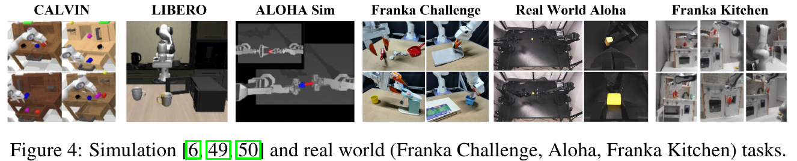

[PDF p.6, §5] 저자의 다섯 질문은 binning 대비 장점, imitation-learning benchmark 성능, 학습·추론 효율, 실제 로봇 일반화, 설계 선택의 영향이다. v3에는 동일 backbone tokenizer 비교가 별도 §5.4로 들어간다. 한 실험으로 이 질문을 모두 답하려고 하지 않고, toy/대규모 benchmark/동일 backbone/현실 로봇/ablation의 서로 다른 통제를 결합한다.

| 데이터/환경 | 학습·관측·action | 평가와 명시된 split | 제한 |
|---|---|---|---|
| Toy spline | 2,000개 1초 trajectory, 100 Hz, 작은 AR Transformer, 8k steps | 200개 test sequence | 3 context/control point로 cubic spline을 예측한다고 서술. 생성기의 정확한 coefficient/knot recipe는 미기재 |
| CALVIN | 34 tabletop tasks, Franka, delta-EEF, 언어 주석 demonstration 24,000개 | ABC→D와 ABCD→D, 1,000개 chain, chain당 최대 5 instructions | ABC는 scene generalization, ABCD는 D scene 포함 학습. VLM의 internet pretraining까지 제거한 것은 아님 |
| LIBERO | benchmark 전체 130 tasks라고 서술; Panda delta-EEF | Spatial/Object/Goal/Long 각 10 tasks, task당 50 trials | 본문 결과표는 네 suite를 보고. train/validation demonstration 분할 수와 모든 seed는 완전하지 않음 |
| ALOHA simulation | absolute joint action, bimanual cube transfer와 insertion | Figure 6은 500 evaluation episodes | exact training demo 수/BEAST-ACT 전체 recipe 미기재 |
| Real Franka | 4 tasks, 20 Hz 수집, 8D joint+gripper | task별 10 runs, 50 demos/task라고 설명 | 각 모델의 seed별 분산과 독립 test object split 미기재 |
| Real Kitchen | 3 tasks, 35 Hz, 8D joint+gripper | task별 10 runs라고 본문 서술 | Appendix F의 door 초기조건 시행 수는 4+1로 총 5라 서술상 불일치 |
| Real ALOHA | cube transfer, 60 Hz, 14D joint+gripper | 30 runs, stage score | full task 성공률인지 stage-normalized score인지 구분해야 함 |

**166개 simulation tasks라는 초록 표현:** 34+130+2의 benchmark inventory와 일치한다. 그러나 LIBERO의 보고 범위는 각 10개인 4개 suite이므로, “166개의 모든 task에 대한 per-task rollout 결과가 모두 공개되었다”는 뜻으로 확장하지 않는다. 초록의 총합과 실제 결과표의 평가 범위를 구분한다. [검산; PDF pp.1,7–8]

**사전학습 통제:** Table 1·2는 prior work가 보고한 baseline을 포함한다. BEAST-F는 Florence의 vision-language pretraining을 이용하지만 별도의 대규모 robot pretraining을 생략한다. Fig.7은 π₀/π₀-FAST의 robot pretraining도 제거한다. Fig.8은 backbone을 Florence로 맞춘다. 실제 로봇 baseline은 다시 공식 pretrained π₀/π₀-FAST checkpoint를 fine-tune한다. 이 네 조건을 하나의 “all from scratch” 조건으로 합치면 안 된다.

### 8.2 §5.1 / Figure 5: toy spline은 무엇을 입증하는가

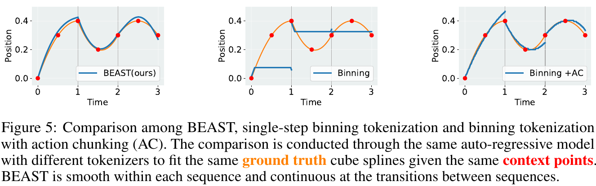

| 방법 | test MSE, 저자 보고 | 원문 설명 |
|---|---:|---|
| single-step binning | 0.0215 ± 0.0216 | 256개 bin으로 시각별 action 양자화 |
| binning + action chunking | 0.0009 ± 0.0013 | chunk 구조는 사용하지만 원시 action 값을 직접 토큰화 |
| BEAST | 0.0004 ± 0.0005 | 100-step sequence에 5 tokens |

[PDF p.7, §5.1] 같은 작은 AR backbone과 같은 context를 사용해 tokenizer의 효과를 보려는 실험이다. 세 chunk를 반복 예측해 연결 문제를 관찰한다. Figure 5의 orange/red는 target spline과 context, blue는 prediction이다. BEAST는 내부 곡선과 chunk boundary의 위치 연결에서 좋은 근사를 보인다.

[검산] single-step MSE / BEAST MSE는 $`.0215/.0004=53.75`$배이고 chunk binning / BEAST는 2.25배다. 저자의 “two orders of magnitude”라는 표현은 엄밀히 100배라는 수치가 아니라 대략적인 규모 표현이다. 100-step을 5개의 scalar coefficient token으로 바꾸면 $`100/5=20`$배의 AR output-step 축소다. 이는 **1D toy의 20배**이며 다차원 실제 모델이 모든 상황에서 20배 빨라진다는 뜻은 아니다.

[리뷰어 해석] target 자체가 spline이라는 toy distribution은 spline inductive bias에 유리하다. 그 대신 원리 확인에는 좋은 통제다. discontinuous contact signal, mixture trajectory, off-distribution high-frequency motion에 대한 tokenizer fidelity는 이 toy만으로 판단할 수 없다. “3 control points로 cubic spline을 예측”이라는 원문 문구는 spline target 생성 설명으로 읽으며, Eq.(1)의 cubic BEAST basis에 $`N=3,P=3`$을 넣으면 $`P\lt N`$에 어긋난다는 점도 구분한다.

### 8.3 §5.2 / Table 1: CALVIN sequential success

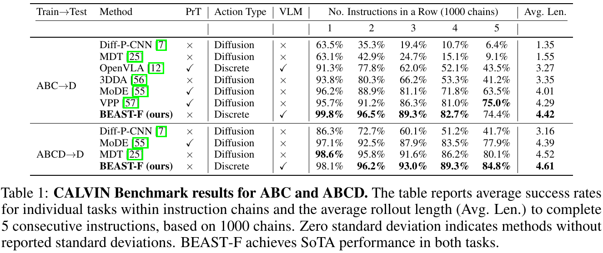

표의 1–5 열은 chain에서 **앞에서부터 적어도 k개를 연속 성공**할 확률이다. 서로 독립적인 task별 정확도가 아니다. 다음은 원문 핵심 수치의 전사다.

| Split | Method | ≥1 | ≥2 | ≥3 | ≥4 | ≥5 | Avg. Len. |
|---|---|---:|---:|---:|---:|---:|---:|
| ABC→D | Diff-P-CNN | 63.5 | 35.3 | 19.4 | 10.7 | 6.4 | 1.35 |
| ABC→D | MDT | 63.1 | 42.9 | 24.7 | 15.1 | 9.1 | 1.55 |
| ABC→D | OpenVLA | 91.3 | 77.8 | 62.0 | 52.1 | 43.5 | 3.27 |
| ABC→D | 3DDA | 93.8 | 80.3 | 66.2 | 53.3 | 41.2 | 3.35 |
| ABC→D | MoDE | 96.2 | 88.9 | 81.1 | 71.8 | 63.5 | 4.01 |
| ABC→D | VPP | 95.7 | 91.2 | 86.3 | 81.0 | 75.0 | 4.29 |
| ABC→D | BEAST-F | 99.8 | 96.5 | 89.3 | 82.7 | 74.4 | 4.42 |
| ABCD→D | Diff-P-CNN | 86.3 | 72.7 | 60.1 | 51.2 | 41.7 | 3.16 |
| ABCD→D | MoDE | 97.1 | 92.5 | 87.9 | 83.5 | 77.9 | 4.39 |
| ABCD→D | MDT | 98.6 | 95.8 | 91.6 | 86.2 | 80.1 | 4.52 |
| ABCD→D | BEAST-F | 98.1 | 96.2 | 93.0 | 89.3 | 84.8 | 4.61 |

1–5 열의 단위는 %다. BEAST-F는 ABC 평균 길이에서 VPP보다 0.13 높지만 **5개 모두 성공할 확률은 74.4%로 VPP 75.0%보다 0.6 percentage points 낮다**. ABCD에서도 첫 task 성공률은 MDT 98.6%가 BEAST-F 98.1%보다 높다. “모든 열에서 최고”가 아니라 평균 길이를 중심으로 한 우위다.

평균 길이와 누적 성공확률의 연결은 다음과 같다. 이는 분포의 tail-sum identity를 적용한 [리뷰어 검산]이다.

```math
\mathbb E[L]=\sum_{k=1}^{5}\Pr(L\ge k).
```

BEAST-F ABC는 $`.998+.965+.893+.827+.744=4.427`$, ABCD는 $`.981+.962+.930+.893+.848=4.614`$다. ABCD의 4.61은 반올림과 일치한다. ABC는 인쇄된 4.42와 소수 둘째 자리 반올림 기준에서 0.01 차이가 있다. Table 4는 4.43을 사용한다. underlying run·집계/절삭 차이를 원자료 없이 결정할 수 없으므로 인쇄값을 임의 수정하지 않는다.

[리뷰어 해석] 1,000 chains가 충분히 큰 rollout 수라는 점은 장점이다. 그러나 BEAST 결과의 seed별 표준편차·신뢰구간과 모든 baseline 재실행 조건이 없다. 0.1 수준 평균 길이 차이의 통계적 유의성을 이 표만으로 확정할 수 없다. PrT 열의 robot pretraining 유무와 VLM 열은 서로 다른 정보다.

### 8.4 Table 2: LIBERO 네 suite

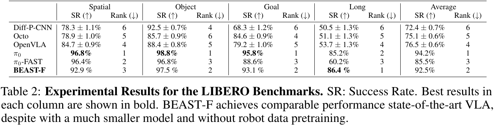

| Method | Spatial | Object | Goal | Long | Average |
|---|---:|---:|---:|---:|---:|
| Diff-P-CNN | 78.3 ± 1.1 | 92.5 ± 0.7 | 68.3 ± 1.2 | 50.5 ± 1.3 | 72.4 ± 0.7 |
| Octo | 78.9 ± 1.0 | 85.7 ± 0.9 | 84.6 ± 0.9 | 51.1 ± 1.3 | 75.1 ± 0.6 |
| OpenVLA | 84.7 ± 0.9 | 88.4 ± 0.8 | 79.2 ± 1.0 | 53.7 ± 1.3 | 76.5 ± 0.6 |
| π₀ | 96.8 | 98.8 | 95.8 | 85.2 | 94.2 |
| π₀-FAST | 96.4 | 96.8 | 88.6 | 60.2 | 85.5 |
| BEAST-F | 92.9 | 97.5 | 93.1 | 86.4 | 92.5 |

[PDF pp.7–8, Table 2] 단위는 %. 각 suite에서 10 tasks×50 trials라는 평가 설계를 설명한다. BEAST-F 평균은 $`(92.9+97.5+93.1+86.4)/4=92.475`$로 92.5와 일치한다. Long은 π₀ 대비 +1.2 pp, 평균은 π₀보다 −1.7 pp다. π₀-FAST보다 평균 +7.0 pp지만 이는 backbone 크기·사전학습·training recipe가 같은 tokenizer-only 비교가 아니다.

저자의 강점은 Florence의 0.77B 규모와 robot pretraining 없이도 좋은 성능을 얻었다는 점이다. **VLM pretraining을 활용한 0.77B가 완전한 from-scratch 학습보다 낫다**는 비교를 한 것은 아니다. 또한 Table 2의 일부 baseline에는 ±값이 있으나 BEAST-F에는 없어서 model-to-model uncertainty를 같은 방식으로 비교하기 어렵다.

### 8.5 Figure 6: ALOHA simulation과 본문 문장 대조

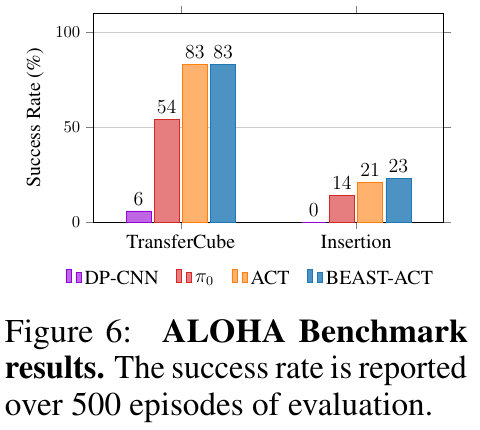

| Method | Transfer Cube | Insertion |
|---|---:|---:|
| DP-CNN | 6 | 0 |
| π₀ | 54 | 14 |
| ACT | 83 | 21 |
| BEAST-ACT | 83 | 23 |

[저자 보고, PDF p.7, Fig.6] 500 episodes 평가의 성공률 %다. BEAST-ACT는 transfer에서 ACT와 **표시값상 동률**이고 insertion에서 +2 pp다. p.8의 “both tasks에서 higher success” 문장은 이 반올림된 막대값만으로는 그대로 확인되지 않는다. 미표시 소수점 차이가 있었는지 원자료가 없으므로, 확인 가능한 결론은 **83%를 유지하며 100→15 vector slot으로 압축했고 insertion은 21→23%로 상승했다는 것**이다.

### 8.6 §5.3 / Table 3: inference throughput과 latency 검산

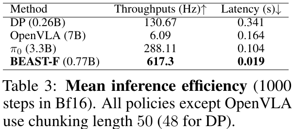

| Method | Parameters, 표 기재 | Throughput, actions/s로 저자 설명 | Chunk latency |
|---|---:|---:|---:|
| DP | 0.26B | 130.67 Hz | 0.341 s |
| OpenVLA | 7B | 6.09 Hz | 0.164 s |
| π₀ | 3.3B | 288.11 Hz | 0.104 s |
| BEAST-F | 0.77B | 617.3 Hz | 0.019 s |

[저자 보고, PDF p.8, §5.3] RTX 4090에서 BF16으로 1,000 steps의 평균을 측정했다고 설명한다. caption은 OpenVLA를 제외한 policy가 chunk length 50이고 DP는 48이라고 적는다. 본문에는 OpenVLA model size가 7.7B로도 적혀 있어 architecture 명칭·parameter counting의 표기 차이를 그대로 남긴다.

**보고된 throughput의 비율은 맞는다.** $`617.3/288.11=2.1426`$, $`617.3/130.67=4.7241`$, $`617.3/6.09=101.3629`$로 본문의 2.14×, 4.72×, 101.4×와 일치한다. latency 비율은 별도로 π₀ 대비 $`.104/.019\simeq5.47`$배이므로 throughput 비율과 동일하지 않다.

**그러나 chunk 길이와 latency를 곱셈/나눗셈으로 연결하면 일치하지 않는다.** 단일 chunk가 전부 useful action이고 같은 serial timing scope라면 $`\text{actions/s}=H_{\mathrm{chunk}}/L_{\mathrm{chunk}}`$여야 한다.

| Method | caption horizon / latency로 계산 | 원문 throughput | throughput × latency가 뜻하는 effective action 수 |
|---|---:|---:|---:|
| DP | 48 / .341 = 140.76 | 130.67 | 44.56 |
| OpenVLA | 1 / .164 = 6.10 | 6.09 | 약 1.00 |
| π₀ | 50 / .104 = 480.77 | 288.11 | 29.96 |
| BEAST-F | 50 / .019 = 2631.58 | 617.3 | 11.73 |

[검산] BEAST-F의 19 ms를 기준으로 단순 계산한 2,631.6 actions/s를 논문의 새 성과로 내세워서는 안 된다. **원문 측정의 timing scope, executed prefix, batch/concurrency, image preprocessing 포함 여부가 충분히 제시되지 않아 두 지표의 관계를 복원할 수 없다는 결론**이 타당하다. Table 5의 training horizon 20과 Table 3의 benchmark horizon 50도 다른 설정이다.

[논문 미기재] warm-up, CUDA synchronization, host/device copy, encoder/decoder 분리 시간, token sampling·detokenization 포함 여부, batch size, p50/p95/p99, cold start, JIT/compile, 메모리 peak가 충분히 나와 있지 않다. 따라서 이 표는 저자가 보고한 그 환경의 model inference 비교로 쓰고, sensor-to-action latency, actuator update rate, hard real-time deadline 보장으로 확장하지 않는다.

### 8.7 FLOPs·token 수·prefill·decode·TTFA를 연결하는 정확한 방법

[리뷰어 분석] 원시 token length $`TD`$를 spline token length $`ND`$로 바꾸면 decoder action self-attention의 dense score 항만 이상적으로 $`(N/T)^2`$ 비율이 될 수 있다. 그러나 cross-attention은 context 길이에 선형으로 의존하고 FFN/head는 action token 수에 대체로 선형이며, image encoder cost는 그대로 남는다. AR와 PD는 캐시·batching·memory access도 다르다. 따라서 이 비율은 전체 FLOPs 또는 latency 비율이 아니다.

```math
L_{\mathrm{sensor\rightarrow action}}=L_{\mathrm{capture}}+L_{\mathrm{preprocess}}+L_{\mathrm{vision/encoder}}+L_{\mathrm{action\ decoder}}+L_{\mathrm{detokenize}}+L_{\mathrm{transport/controller}}.
```

이 식은 [리뷰어 latency budget]이다. 일반 decoder-only AR VLA의 prefill은 prompt/context KV 생성, decode는 action token 반복 생성에 해당한다. BEAST-F는 encoder–decoder이므로 encoder context 생성과 parallel action decoder를 별도로 재야 한다. Table 3은 그 항별 시간이나 TTFT를 제공하지 않는다. TTFA(time to first actionable output)는 token 하나가 나온 시각이 아니라 controller에 보낼 action이 충분히 복원된 시각으로 정의해야 한다.

PD는 일반적으로 모든 slot이 준비된 뒤 전체 trajectory를 복원한다. AR BEAST에서 일부 local-support coefficient만 가지고 prefix를 조기 실행하는 방법은 구상할 수 있지만 논문이 측정한 기능은 아니다. 고정 horizon 전체를 생성해도 그중 일부만 실행한다면 action throughput을 effective executed actions/s와 generated actions/s로 구분해야 한다.

### 8.8 Figure 7: training efficiency의 의미와 범위

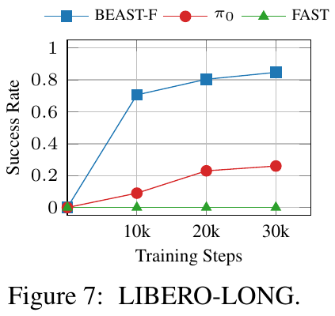

[PDF p.8, §5.3] robot dataset pretraining을 제외하고 BEAST-F, π₀, π₀-FAST를 학습한다. 20k steps에서 BEAST-F는 약 80%, π₀는 약 20%이고 π₀-FAST는 30k까지 성공이 거의 없다. 그래프에서 읽은 근사값이므로 10k·30k의 미표시 정확한 값을 표처럼 새로 만들어내지 않는다.

이 결과는 **이 training recipe에서 적은 optimizer steps로 높은 성능에 도달했다**는 주장에 직접 대응한다. 서로 다른 backbone, 크기, objective, batch/token 수를 가진 모델의 optimizer step을 동일 wall-clock training cost라고 할 수는 없다. 또한 π₀-FAST의 낮은 결과를 FAST tokenizer가 robot pretraining 없이 항상 실패한다는 증거로 읽으면 Fig.8의 Florence+FAST-AR 84%와 충돌한다. Fig.7은 policy/backbone/recipe를 함께 바꾼 비교다.

### 8.9 §5.4 / Figure 8: 가장 중요한 동일 backbone 비교

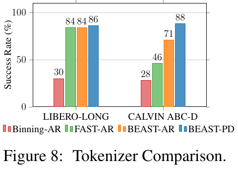

| Model configuration | LIBERO-Long | CALVIN ABC→D, Figure 8 축 |
|---|---:|---:|
| Binning-AR | 30 | 28 |
| FAST-AR | 84 | 46 |
| BEAST-AR | 84 | 71 |
| BEAST-PD | 86 | 88 |

[저자 보고, PDF pp.8–9, §5.4] 모든 방법을 Florence-2 backbone에 통합하고 robot pretraining을 하지 않는다. FAST/binning은 AR objective, BEAST는 AR와 PD를 모두 비교한다. 따라서 **BEAST-AR 대 FAST-AR**가 tokenizer representation 차이를 가장 직접적으로 비교하며, **BEAST-PD 대 BEAST-AR**는 decoding/학습 factorization 차이의 영향에 가깝다.

[검산] LIBERO-Long에서 BEAST-AR와 FAST-AR는 84%로 같다. BEAST-PD는 +2 pp다. CALVIN에서는 BEAST-AR가 FAST-AR보다 +25 pp, PD가 BEAST-AR보다 +17 pp다. 큰 차이가 나도 error bars와 모든 hyperparameter 상세가 없으므로 유의성 검정 결과라고 부르지 않는다.

**CALVIN metric 주의:** Fig.8은 y축을 success rate로 표시하고 본문은 task completion ratio라고 부른다. Table 1의 5-instruction chain 성공률 74.4%와 88을 같은 metric으로 놓으면 맞지 않는다. 평균 길이 $`4.42/5\times100=88.4`$와 가깝고 Binning $`1.41/5\times100=28.2`$도 Fig.8의 28과 가까워, normalized average completion일 가능성이 있다. 이는 [리뷰어 해석]에 따른 추론이며 원문이 정확한 변환식을 적지 않았으므로 확정하지 않는다. Figure 11의 CALVIN % 역시 Table 1 평균 길이와 직접 비교하지 않는다.

### 8.10 §5.5 / Figure 9: 실제 로봇 결과와 평균의 분모

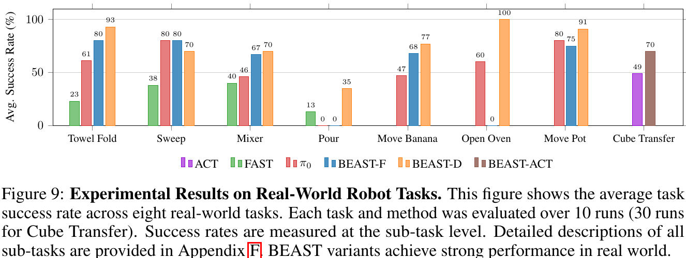

표는 그림에 인쇄된 값을 전사한다. “—”는 해당 막대가 보고되지 않은 것으로, 실패율 100% 또는 성공률 0%를 뜻하지 않는다.

| Task | FAST | π₀ | BEAST-F | BEAST-D | ACT | BEAST-ACT |
|---|---:|---:|---:|---:|---:|---:|
| Towel Fold | 23 | 61 | 80 | 93 | — | — |
| Sweep | 38 | 80 | 80 | 70 | — | — |
| Mixer | 40 | 46 | 67 | 70 | — | — |
| Pour | 13 | 0 | 0 | 35 | — | — |
| Move Banana | — | 47 | 68 | 77 | — | — |
| Open Oven | — | 60 | 0 | 100 | — | — |
| Move Pot | — | 80 | 75 | 91 | — | — |
| Cube Transfer | — | — | — | — | 49 | 70 |

[PDF p.9, §5.5; pp.17–18, Appendix F] Franka의 task별 10 runs, ALOHA의 30 runs를 보고한다. “success rate”라는 축 이름에도 불구하고 caption은 subtask-level 평가를 명시하며 Appendix F에는 partial credit와 stage별 점수가 있다. 예를 들어 10회 이진 성공률은 10% 단위여야 하지만 표에는 61%, 67%, 93% 같은 값이 있다. 이것은 여러 stage의 부분 성공 점수와 일관된다.

**평균 산술:** BEAST-F의 7개 Franka task는 $`370/7=52.857\%`$, BEAST-D는 $`536/7=76.571\%`$, π₀는 $`374/7=53.429\%`$로 본문의 52.86%, 76.57%, 53.43%와 일치한다. 그러나 FAST의 28.5%는 $`(23+38+40+13)/4=28.5`$로 **4개 Real Franka task 평균**이다. 따라서 이 문단의 네 평균은 완전히 같은 task 집합의 macro-average가 아니다. [검산]

BEAST-D가 작은 실제 dataset에서 더 좋은 것은 저자가 task당 50 demonstrations의 작은 데이터 크기와 연결해 해석한다. 가능한 설명이지만 원인을 확정하는 capacity/data-size controlled experiment는 없다. BEAST-F가 pour와 oven에서 0인 것은 “모든 real task에서 안정적”이라는 표현을 피해야 할 구체적 실패 사례다.

ALOHA 49→70은 **21 percentage points** 증가이고 상대 증가는 약 42.9%다. 원문의 “21% higher”를 상대 증가 21%로 번역하지 않는다. stage score이므로 70%를 곧바로 “30회 중 21회 완전 성공”으로 바꾸지 않는다. 실제 baseline π₀는 60k, π₀-FAST는 40k 추가 fine-tuning했다고 적혀 있어 학습 step도 같지 않다.

### 8.11 §5.6 / Table 4: basis 개수, output type, model size

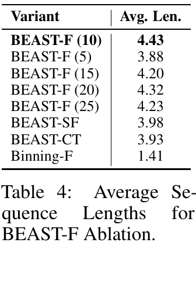

| Variant | CALVIN ABC 평균 길이 | 해석 |
|---|---:|---|
| BEAST-F, N=10 | 4.43 | 기준 |
| N=5 | 3.88 | 압축은 강하지만 표현력 손실 |
| N=15 | 4.20 | 계수 증가가 반드시 성능 증가가 아님 |
| N=20 | 4.32 | T=20이면 scalar 수 기준 압축 없음 |
| N=25 | 4.23 | T=20보다 계수가 많아 overcomplete; §4.1의 N≤T 가정 밖 |
| BEAST-SF | 3.98 | Florence-2-base 0.23B |
| BEAST-CT | 3.93 | continuous coefficient head + L1 |
| Binning-F | 1.41 | 같은 Florence backbone, AR binning |

[PDF pp.9–10, §5.6] $`N=5`$에서 10으로 늘리면 0.55 상승하지만 이후에는 비단조적이다. smoothing/compression bias와 target sequence modeling 부담 사이에 trade-off가 있다. representation reconstruction error가 낮을수록 closed-loop success가 반드시 높다는 실험은 아니다.

discrete의 continuous-L1 대비 이득은 $`(4.43-3.93)/3.93=12.72\%`$로 본문 12.7%와 일치한다. large의 base 대비 이득은 $`(4.43-3.98)/3.98=11.31\%`$로 11.3%와 일치한다. 이 상대비율은 평균 chain length의 변화다. success percentage point가 아니다. Binning 1.41→4.43에는 representation과 AR/PD 차이가 함께 들어가므로 Fig.8의 AR끼리 비교가 더 세밀한 근거다.

[논문 미기재] degree $`P`$ sweep, knot placement sweep, ridge strength sweep, quantization bit-depth, gripper treatment, basis-major vs DoF-major permutation, continuity constraint on/off의 full quantitative ablation은 없다. 토큰화 설계 전체를 모두 분리한 ablation이라고 할 수 없다.

## 9. 원문 §6–7 및 기술 부록 전체

### 9.1 §6 Conclusion과 limitations

[PDF p.10] 저자는 fixed-length spline representation, continuous/discrete 호환성, parallel decoding, benchmark 성능을 결론으로 정리한다. 스스로 인정한 주된 한계는 basis count에 대한 민감성이다. trajectory smoothness와 sampling frequency에 따라 좋은 $`N`$이 달라지고, 경험적으로 1초 trajectory에 5–10 basis가 잘 작동했다고 설명한다.

[리뷰어 해석] 같은 “1초”여도 실제 motion bandwidth와 contact frequency가 다르면 적절한 $`N`$이 달라진다. frequency만으로 $`N`$을 정하는 정리는 없다. 향후 연구로 large-scale robot pretraining과 continuous diffusion/flow objective를 제안하며, flow preliminary result는 Appendix D에 한정한다. §7은 연구비와 compute 지원의 감사문이며 새로운 기술·실험 주장은 없다.

### 9.2 Appendix A: 최소 basis 수를 찾는 heuristic

[PDF p.15, Appendix A] 우선 $`N\simeq T/2`$로 시작한다. dataset에서 대략 100개 이상의 trajectory를 뽑아 normalized action reconstruction MSE를 측정한다. $`10^{-2}`$ 미만이면 충분히 표현한다고 보고, 이 기준을 만족하는 최소 $`N`$을 찾는다. tokenizer network를 재학습하지 않아 몇 분 안에 탐색할 수 있다는 설명이다.

아래는 이 heuristic을 실행 순서로 바꾼 [리뷰어 재구성]이다.

```text
01  Select a representative calibration subset from training demonstrations.
02  Fix normalization, action units, degree, knots and reconstruction convention.
03  Start from N approximately T / 2, respecting P < N.
04  Fit coefficients and reconstruct all calibration chunks.
05  Measure normalized MSE; record per-dimension and transition errors too.
06  Search smaller/larger N until finding the smallest tested acceptable value.
07  Freeze N and all statistics before held-out policy evaluation.
```

01·05의 대표성/per-dimension 검사는 논문의 heuristic을 실무적으로 보완한 제안이다. MSE 기준이 $`10^{-2}`$라는 것은 RMSE 0.1 수준이다. 원래 range 폭이 $`r_d=Q_d^{.99}-Q_d^{.01}`$라면 normalized error 0.1은 affine scale상 약 $`.05r_d`$다. 평균값이 그 이하라도 순간적인 grasp/접촉 error는 클 수 있다. **MSE threshold는 task success나 안전성 certificate가 아니다.**

원문은 이 MSE가 discrete round-trip인지 continuous fitting만의 error인지 모든 설명에서 구분하지 않는다. 재현 시 둘을 함께 기록하면 fitting과 quantization 손실을 분리할 수 있다. 이것은 새 policy GPU 실험 제안이지 본 리뷰가 실행한 benchmark는 아니다.

### 9.3 Appendix B: Florence 선택 근거와 모델 구성

[PDF p.15, Appendix B] Florence-2의 image grounding, bounding box prediction, segmentation 관련 pretraining이 manipulation과 잘 맞는다는 것이 선택 이유다. 적은 image token 수와 작은 parameter 수로 consumer-grade hardware에서 실험하기 쉽다는 장점도 든다. 이 설명은 architecture 선택 동기이며 object grounding pretraining의 인과 효과를 분리한 ablation은 아니다.

BEAST-D의 Figure 10과 각 encoder의 역할은 §7.2에서 해설했다. 도식의 Pr와 AE를 별도 semantic slot으로 읽어야 한다. “decoder-only”라는 모델 구조 용어와 “autoregressive”라는 출력 factorization은 동일하지 않다. BEAST-ACT는 본문 §4.3에서 소개되지만 Appendix B에 상세 별도 표가 추가되어 있지는 않다.

### 9.4 Appendix C: baseline implementation에 실제로 적힌 범위

[PDF p.15, Appendix C] π₀의 VLM+action expert, cross-embodiment robot pretraining과 FAST의 DCT+BPE 방법을 요약한다. 제목이 implementation이지만 exact command, checkpoint hash, optimizer, data pipeline, token truncation/padding policy를 모두 주는 재현 문서는 아니다. 원문에 없는 baseline 하이퍼파라미터를 이 절에 있는 것처럼 보충하지 않는다. 실제 로봇 fine-tuning step은 본문 §5.5에서 따로 제시한다.

### 9.5 Appendix D / Figure 11: continuous BEAST + flow matching

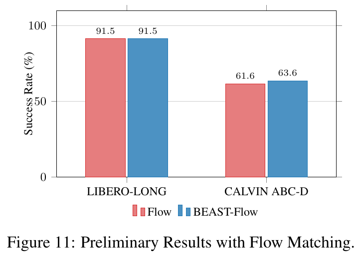

| Method | LIBERO-Long | CALVIN ABC→D, 그림의 % metric |
|---|---:|---:|
| Flow | 91.5 | 61.6 |
| BEAST-Flow | 91.5 | 63.6 |

[저자 보고, PDF p.16] mixture-of-expert backbone과 flow matching loss를 사용하며, 원시 action chunk를 예측하는 flow policy보다 절반의 token을 예측한다. LIBERO에서는 동률, CALVIN에서 +2 pp다. iteration 수와 exact objective, solver, endpoint convention, latency는 미기재다. token이 절반이라는 사실만으로 flow inference time도 절반이라고 계산할 수 없다.

이 실험의 학습 원리를 이해하기 위한 표준적인 [리뷰어 보조 설명]은 Gaussian coefficient noise에서 target coefficient로 이어지는 경로의 velocity를 학습하는 것이다. 아래 식은 **논문이 실제로 인쇄하거나 공개 BEAST-F 코드에서 확인한 exact flow objective가 아니다**.

```math
\epsilon\sim\mathcal N(0,I),\quad r\sim\mathcal U(0,1),\quad x_r=(1-r)\epsilon+rC,\quad\mathcal L_{\mathrm{FM}}=\mathbb E\bigl[\lVert v_\theta(x_r,r,s)-(C-\epsilon)\rVert_F^2\bigr].
```

여기서 $`r`$는 generative interpolation time으로, action trajectory time $`u`$와 다르다. 여러 flow integration step을 수행해 얻은 coefficient를 spline time grid에서 평가하는 두 단계가 존재한다. 이는 continuous representation 자체가 multimodal 생성에 부적합한 것이 아님을 보여주는 방향이지만 이 논문은 상세 flow ablation을 제공하지 않는다.

### 9.6 Appendix E / Tables 5–7: 보고된 hyperparameter 전체

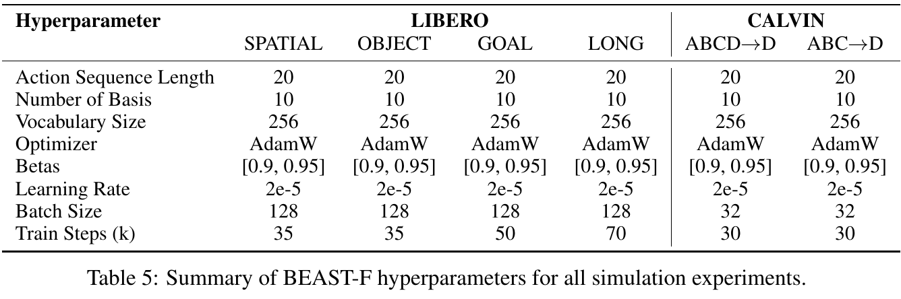

| Setting | T | N | Vocabulary | Batch | Train steps |
|---|---:|---:|---:|---:|---:|
| LIBERO Spatial | 20 | 10 | 256 | 128 | 35k |
| LIBERO Object | 20 | 10 | 256 | 128 | 35k |
| LIBERO Goal | 20 | 10 | 256 | 128 | 50k |
| LIBERO Long | 20 | 10 | 256 | 128 | 70k |
| CALVIN ABCD→D | 20 | 10 | 256 | 32 | 30k |
| CALVIN ABC→D | 20 | 10 | 256 | 32 | 30k |

공통 optimizer는 AdamW, betas $`[.9,.95]`$, learning rate $`2\times10^{-5}`$다. 표의 batch가 per-device인지 global인지 표만으로 완전히 명시되지는 않는다. 코드 README의 4 GPU×8 예시는 CALVIN global 32와 일관되지만 모든 표의 batch 정의를 확정하는 근거로 확장하지 않는다. spline degree와 regularization은 Table 5에 없다. [PDF p.16, Table 5]

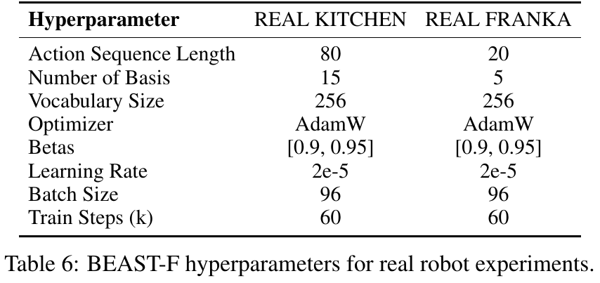

| BEAST-F | Real Kitchen | Real Franka |
|---|---:|---:|
| Action sequence length | 80 | 20 |
| Number of basis | 15 | 5 |
| Vocabulary size | 256 | 256 |
| Optimizer | AdamW | AdamW |
| Betas | [0.9, 0.95] | [0.9, 0.95] |
| Learning rate | 2e-5 | 2e-5 |
| Batch size | 96 | 96 |
| Training steps | 60k | 60k |

Real Kitchen의 $`T/N=80/15\simeq5.33`$, Real Franka는 $`20/5=4`$다. 8D action이면 이산 output은 각각 120개, 40개 coefficient token이다. 이 값은 camera/language context token을 포함하지 않는다. [검산]

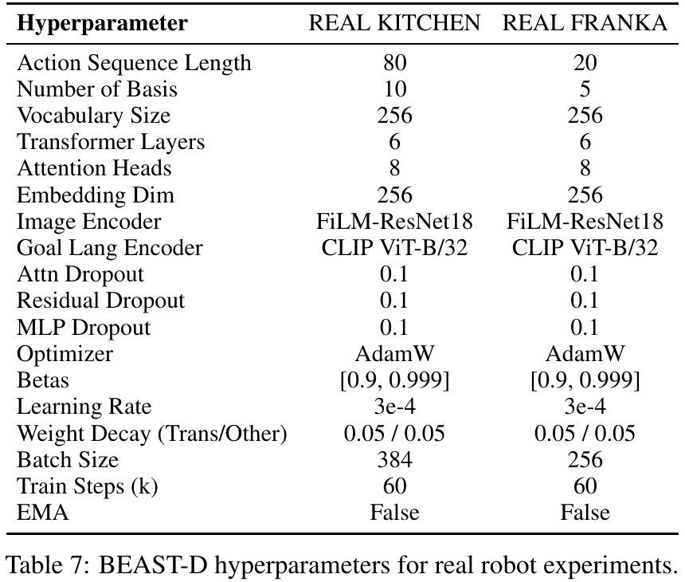

| BEAST-D | Real Kitchen | Real Franka |
|---|---:|---:|
| Action sequence length | 80 | 20 |
| Number of basis | 10 | 5 |
| Vocabulary size | 256 | 256 |
| Transformer layers | 6 | 6 |
| Attention heads | 8 | 8 |
| Embedding dimension | 256 | 256 |
| Image encoder | FiLM-ResNet18 | FiLM-ResNet18 |
| Goal language encoder | CLIP ViT-B/32 | CLIP ViT-B/32 |
| Attention / residual / MLP dropout | 0.1 / 0.1 / 0.1 | 0.1 / 0.1 / 0.1 |
| Optimizer | AdamW | AdamW |
| Betas | [0.9, 0.999] | [0.9, 0.999] |
| Learning rate | 3e-4 | 3e-4 |
| Weight decay, Transformer / other | 0.05 / 0.05 | 0.05 / 0.05 |
| Batch size | 384 | 256 |
| Train steps | 60k | 60k |
| EMA | False | False |

BEAST-D Kitchen은 80/10=8배 압축으로, BEAST-F Kitchen의 N=15와 다르다. 실제 결과에서 BEAST-D와 BEAST-F를 비교하면 backbone 크기뿐 아니라 output representation 세부와 optimizer/batch도 달라진다. N까지 동일한 model-size-only 비교로 보면 안 된다. [PDF p.17, Table 7]

### 9.7 Appendix F.1: 실제 하드웨어와 센서

| Setup | Robot / action | Camera 구성 | 이미지 크기, 부록 기재 | 수집 Hz, 본문 기재 |
|---|---|---|---|---:|
| Real Kitchen | Franka Emika, 7 joints+gripper=8D | OAK-D Lite 두 대, top-down/side | 250×250 | 35 |
| Real Franka / Challenge | Franka Emika, 8D | Orbbec Femto Bolt 두 대, left/right | 180×320 | 20 |
| ALOHA | Trossen ViperX 6-DoF arms 두 개, gripper 포함 14D | Logitech C920: wrist 두 개+top 한 개 | 미기재 | 60 |

[PDF pp.9,17, Appendix F.1] Real Kitchen은 실제 Franka가 toy/simulated kitchen 구조물에서 움직이는 설정이다. “simulated kitchen environment”라는 표현을 물리 시뮬레이터만 사용한 실험으로 번역하면 본문의 real robot setup과 맞지 않는다. 데이터 수집 Hz는 inference Hz나 actuator 내부 제어 주기와 같지 않다.

### 9.8 Appendix F.2 / Figure 12: 8개 task의 scoring rubric

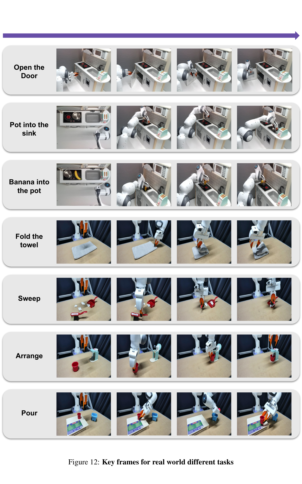

| Task | 평가 항목 | 점수 해석/주의 |
|---|---|---|
| Open the door / Open Oven | handle grasp 후 손가락으로 반대편을 밀어 완전히 열기 | 이진 성공/실패. 본문 10 runs와 달리 부록 초기조건은 빈 stove 4회+object 1회로 적음 |
| Banana into the pot / Move Banana | 손가락 사이 배치, lift, pot 위/안에 placement | 각 1점, 총 3점. 3회 초과 grasp 시도, jerky hand, pot displacement에 partial 0.5점 규정 |
| Pot into the sink / Move Pot | 안정 grasp, lift, sink placement | 총 3점. handle grasp는 불안정 grasp로 0.5점; jerky movement penalty |
| Towel folding | towel corner lift, fold 완료, 정확한 정렬 | 총 3점. 시작 towel orientation 변화 |
| Sweep | broom grasp, 한 번 sweep, 반복 sweep, 모든 쓰레기 dustpan으로 이동 | 총 4점. trash 네 조각, broom/dustpan/trash 위치 변화 |
| Mixer | mixer 열기, cup grasp, platform에 놓기, mixer 닫기 | 총 4점. 세 개 language sentences로 subtask 지시 |
| Pour | source cup grasp, target으로 pour, 전량 pour, source cup 복귀 | 총 4점. 액체 대신 plastic pellets 사용 |
| ALOHA cube transfer | 오른팔 pickup, 왼팔 contact로 transfer 시작, 왼팔이 잡고 오른팔 release | 세 단계 점수. 전체 task 성공률과 stage average를 혼동하지 않음 |

Figure 12는 실제 frame의 순서를 보여주는 질적 자료다. “Arrange”라는 행은 mixer/cup manipulation의 시각 예시와 연결해서 읽을 수 있으나 별도의 아홉 번째 정량 task로 세지 않는다. ALOHA의 cube transfer는 Figure 4/9와 본문 설명에 있으며 Figure 12의 일곱 행에 모두 따로 보이는 것은 아니다.

[리뷰어 해석] 단계별 scoring은 실패가 어느 정도 진행했는지 보여주는 장점이 있다. 동시에 smoothness에 대한 주관적 penalty와 terminal success가 섞일 수 있어, 전반적인 작업 완료·정량 jerk·안전성을 각각 독립 metric으로 비교하기 어렵다. evaluator blinding, inter-rater consistency, scoring 원본, randomized trial schedule은 [논문 미기재]다.

### 9.9 Appendix G / Table 8: training compute

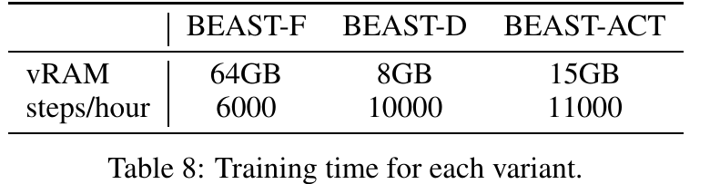

| Variant | 보고 vRAM | Steps/hour | Training GPU 수 |
|---|---:|---:|---:|
| BEAST-F | 64 GB | 6,000 | A100 4장 |
| BEAST-D | 8 GB | 10,000 | A100 1장 |
| BEAST-ACT | 15 GB | 11,000 | A100 1장 |

[PDF p.18, Appendix G] 각 cluster node는 A100 4장을 갖고 BEAST-F에 4장을 사용한다. vRAM 64GB가 per-device peak인지 전체 allocation 합인지 표에 명확하지 않다. 따라서 “BEAST-F 추론에 GPU 메모리 64GB가 필요” 또는 “4장 합계 64GB라 16GB 카드로 충분”이라는 결론을 도출하지 않는다. training memory와 inference memory는 다른 값이다.

한 모델 내부의 대략적인 wall-clock 환산 예로 30k steps / 6k steps per hour는 약 5시간이다. 그러나 표의 평균 속도가 특정 batch/dataset 설정과 같다는 추가 조건이 있어야 한다. 서로 다른 variant의 step 처리 sample/token 수와 GPU 수가 달라 steps/hour만으로 동일 비용 우열을 비교할 수 없다. CPU data loading, 파일 I/O, rollout evaluation 시간이 포함되는지도 미기재다.

## 10. 수학·실험에서 주의할 불일치와 미기재 사항

| 항목 | 원문 증거 | 리뷰의 처리 |
|---|---|---|
| “smooth transitions” | 첫 control point만 고정, §4.2 | C⁰ 보장으로 해석; C¹ 반례를 §6.2에 제시 |
| Eq.(4)와 ridge | Eq.(4)는 무정규화, p.5는 ridge 해 | 누락된 regularization 항을 보조 유도로 구분 |
| 시간 grid | 본문 u=t/T, 코드 linspace(0,1,T) | endpoint convention 차이를 명시 |
| matrix/index 표기 | p.5 design matrix transpose, action a₀…aT | shape를 T×N으로 정리하고 index 혼용 설명 |
| N≤T와 ablation | §4.1 조건; Table 4 N=25,T=20 | overcomplete setting을 압축으로 부르지 않음 |
| 4–8배 압축 | Introduction; Table 5 T=20,N=10 | 설정별 2×/4×/5.33×/6.67×/8×를 분리 |
| CALVIN 4.42/4.43 | Table 1 / Table 4, tail sum 4.427 | 인쇄값 보존, 미세 집계 차이 미해결 |
| ALOHA “both higher” | 본문; Fig.6 83 vs83 | 표시상 tie라고 기록 |
| 617.3 Hz와 19ms | Table 3, horizon50 | 서로 다른 timing/실행 범위 가능성, 정확한 원인 미확인 |
| task inventory166 | 초록; LIBERO 4×10 결과 | benchmark inventory와 보고 평가 범위 구분 |
| real-world 평균 | F/D/π₀는7 task, FAST는4 task와 일치 | 동일 분모의 완전한 비교로 해석하지 않음 |
| “21% higher” | ALOHA49→70 | 21 pp, 상대42.9%로 산술 구분 |
| oven trial 수 | 본문10 vs Appendix4+1 | 불일치 노출, 임의로 double trials 가정하지 않음 |
| output uncertainty | CE categorical vs L1 ablation | PD의 joint multimodality 보장으로 일반화하지 않음 |

이 표는 논문의 기여를 부정하기 위한 목록이 아니라 재현 가능한 주장으로 경계를 좁히기 위한 것이다. 특히 같은 backbone 비교에서 compression-based tokenization이 binning보다 나은 경향, 고정 길이에서 PD를 효율적으로 구성하는 방법, multiple architecture 적용성은 위 불일치가 있어도 별도로 지지되는 결과다.

## 11. 공식 코드 정적 대조: 논문을 그대로 재현한다고 말하기 전에

### 11.1 조회한 구현과 정확한 source 위치

이 절은 코드 실행 결과가 아닌 **조회 revision의 정적 확인**이다. CPU NumPy 예제는 독립적으로 작성했고 이 policy나 tokenizer module을 import하여 실행하지 않았다. 원문 PDF와 달리 아래 URL은 commit/revision을 고정한 실제 source다.

| Source | 확인 범위 |
|---|---|
| [HF beast.py](https://huggingface.co/zhouhongyi/beast/blob/ec3cb260baaa780d52785e3b64fdb2fb7690c1a9/beast.py) | `BSpline`, recursion, endpoint convention, least-squares solve, tokenization, bounds, reconstruction, initial condition guard |
| [beast_florence.py](https://github.com/intuitive-robots/beast_calvin/blob/0eb9de2bbeb9839f0ba37aebcc3e9f1c8f47131a/beast/models/beast_florence.py) | context encoding, placeholder/mask, full-vocab head, CE loss, forward, chunk execution |
| [beast_f.yaml](https://github.com/intuitive-robots/beast_calvin/blob/0eb9de2bbeb9839f0ba37aebcc3e9f1c8f47131a/conf/model/beast_f.yaml) | freeze flags, optimizer, gripper-zero-order, action tokenizer config |
| [config_calvin.yaml](https://github.com/intuitive-robots/beast_calvin/blob/0eb9de2bbeb9839f0ba37aebcc3e9f1c8f47131a/conf/config_calvin.yaml) / [config_libero.yaml](https://github.com/intuitive-robots/beast_calvin/blob/0eb9de2bbeb9839f0ba37aebcc3e9f1c8f47131a/conf/config_libero.yaml) | horizon, N, backbone, batch/devices, bound update and initial position flags |
| [libero_data_module.py](https://github.com/intuitive-robots/beast_calvin/blob/0eb9de2bbeb9839f0ba37aebcc3e9f1c8f47131a/beast/datasets/libero_data_module.py) | dataset loading, training/validation dataset assignment |
| [CALVIN transforms](https://github.com/intuitive-robots/beast_calvin/blob/0eb9de2bbeb9839f0ba37aebcc3e9f1c8f47131a/conf/datamodule/transforms/calvin_transforms.yaml) / [LIBERO transforms](https://github.com/intuitive-robots/beast_calvin/blob/0eb9de2bbeb9839f0ba37aebcc3e9f1c8f47131a/conf/datamodule/transforms/libero_transforms.yaml) | image resize, random shift augmentation, image normalization |

### 11.2 회귀와 flatten 순서는 수식과 부합한다

`_basis_multi_dofs`는 각 DoF의 basis를 block-diagonal matrix에 배치한다. $`\Phi\in\mathbb R^{T\times N}`$를 $`D`$번 배치한 큰 행렬의 shape는 $`DT\times DN`$다. `learn_mp_params_from_trajs`는 boundary contribution을 빼고 normal matrix에 `reg`를 더한 다음 linear solve한다. 도함수와 position/velocity boundary condition을 위한 lower-level API도 존재한다.

이는 각 DoF를 독립 회귀한다는 논문 설명과 일치한다. 다만 block-diagonal임을 이용해 $`N\times N`$ solve를 여러 right-hand side에 공유하면 더 작은 연산으로 같은 수학을 구현할 수 있다. 현재 코드가 큰 행렬을 구성하므로 “회귀가 최소 연산으로 완전히 최적화되어 있다”는 보장은 없다.

`encode_discrete`는 내부 coefficient order를 `(d t)`에서 `(t d)`로 바꾸고, `decode_discrete`는 반대로 되돌린다. 이때 코드의 `t`는 basis index를 나타내는 einops 이름이며 raw action timestep이 아니다. basis-major interleaving과 역 permutation이 서로 맞는다.

### 11.3 Degree, gripper, bounds는 추가적인 구현 조건이다

HF `BeastTokenizer`의 기본 `degree_p`는 **4**이며 내부 `BSpline` class의 default degree 3과 다르다. BEAST-F caller가 `degree_p`를 전달하지 않으므로 이 revision에서는 tokenizer default를 따른다. 본문 toy가 cubic이라는 설명을 근거로 모든 주 실험이 P=3이었다고 단정할 수 없다.

공개 BEAST-F config는 `gripper_zero_order: true`다. 따라서 joint/EEF continuous dimensions에는 높은 degree, gripper에는 degree 0 spline을 적용할 수 있다. 이 구현에서는 **전체 action dimension이 모두 smooth한 것은 아니다**. 이진 gripper를 의도치 않게 부드럽게 만들지 않는 방향으로 이해할 수 있지만, degree 0 fitting과 scalar quantization만으로 최종 binary command가 보장되는 것은 아니다. downstream threshold/controller convention 확인이 필요하다.

`w_min/w_max`는 총 $`DN`$개의 coefficient slot별 buffer다. 초기값은 −0.02, +0.02이고 `update_weights_bounds_per_batch`가 batch min/max를 이용해 범위를 넓힌다. 두 config 모두 `update_w_bound: True`다. 이는 별도 network 학습은 아니지만 **훈련이 진행되면서 같은 ID의 numerical meaning이 바뀔 수 있는 상태 업데이트**다. evaluation에서는 range를 freeze하고 model checkpoint와 함께 보존해야 같은 token을 재해석할 수 있다.

현재 `compute_llm_outputs`는 training과 validation 양쪽에서 `self.update_w_bound`를 사용한다. 따라서 flag가 True면 validation도 bounds를 갱신할 수 있다. 이것을 곧바로 논문 test leakage의 증거로 말할 수는 없다. 발표 당시 snapshot과 dataset/validation 운용이 확인되지 않았기 때문이다. 대신 이 공개 revision으로 재현할 때 checkpoint 상태·범위 업데이트를 검토할 사항으로 기록한다.

### 11.4 초기조건 적용 경로의 중요한 정적 문제

HF tokenizer의 `_apply_initial_position_constraint`는 `if not self.init_pos or init_pos is None: return params`로 시작한다. 그런데 `BeastTokenizer.__init__`는 `self.init_pos=None`으로 두고, 읽은 class 내에서 이를 true 상태로 갱신하는 경로가 없다. 따라서 **기본 객체 상태에서는 decode에 `init_pos`를 전달해도 이 함수가 바로 반환할 것으로 읽힌다**. 별도로 저장한 `enforce_init_pos` flag도 이 guard에서 사용하지 않는다. `self.init_pos`가 다원소 tensor로 바뀌면 boolean 변환 문제도 검토해야 한다. [공식 코드 확인, 정적 제어흐름]

BEAST-F `forward`는 `enforce_init_pos`일 때 이전 `pred_action_seq`의 마지막 row를 전달하지만, tokenizer의 위 guard 때문에 실제 overwrite가 보장되지 않는다. 또한 constructor는 tokenizer의 lower-level `init_cond_order`를 명시적으로 설정하지 않는다. 따라서 **현재 기본 wrapper를 호출하는 것과 논문 §4.2의 constrained fitting을 실제로 구현한 것은 동일하다고 확인되지 않는다**.

이 사실은 spline의 endpoint 수학을 반증하지 않는다. 논문 당시 사용한 코드와 이번 공개 revision의 구현 완성도·설정 연결 문제를 분리해야 한다. 본 리뷰에서는 원문을 수정하거나 repository를 patch하지 않았고, 해당 경로를 실행하여 로봇 연결 결과를 검증하지 않았다.

### 11.5 BEAST-F는 공개 source에서 CE + PD다

현재 README는 BEAST-F를 rectified flow와 연결하는 문구를 포함하지만, 실제 `compute_llm_outputs`는 `nn.CrossEntropyLoss`를 사용한다. `llm_generates`는 한 번의 bidirectional decoder forward와 argmax이며 iterative flow integration을 수행하지 않는다. 그러므로 이 리뷰는 **논문 본문의 BEAST-F와 실제 forward/loss 코드를 우선**하고, Appendix D의 BEAST-Flow를 별도 variant로 둔다.

learnable AE의 도식과 달리 공개 source는 모든 action slot을 **action ID 128에 대응하는 동일 vocabulary token**으로 초기화한다. decoder position representation이 slot을 구분하고 embedding parameter는 모델의 일부로 학습될 수 있다. 따라서 이 revision을 “70개의 독립 학습 query vector”라고 단정하면 안 된다.

`create_bidirectional_mask`는 $`B\times1\times J\times J`$의 zero additive mask를 만든다. 이는 intention상 모든 slot 간 attention을 허용한다. 실제 Florence implementation이 이 4D mask를 어떻게 처리하는지, SDPA/FlashAttention 경로로 전달하는지는 해당 dependency revision과 실행으로 더 확인해야 한다. 이 리뷰는 mask의 shape와 call을 정적으로 확인했다.

vocabulary mapping은 역순 offset이며 head는 full VLM vocabulary를 출력한다. 공개 `argmax` 앞에서 action subset으로 logits를 명시 mask하는 부분은 확인되지 않는다. action 영역 밖의 ID가 선택되면 역변환 값이 0–255를 벗어날 수 있고 HF dequantizer의 clamp로 포화될 수 있다. pretrained language capacity를 사용한다는 장점과 invalid-action token handling을 별도로 점검해야 한다.

### 11.6 Freeze와 데이터 전처리

공개 default config는 `freeze_florence: False`, `freeze_vision_tower: False`이므로 해당 경로에서 VLM과 visual tower를 학습시키는 의도다. CLIP frozen 표시가 있는 BEAST-D와 구분한다. 코드의 optimizer는 `requires_grad=True`인 parameter만 수집하고 CE를 반환한다. 단순히 BEAST가 training-free라는 이유로 vision tower가 frozen이라고 해석하면 틀린다.

CALVIN transform에는 resize 224, static image shift pad10, gripper image pad4가 있고 validation에는 random shift가 없다. LIBERO 공개 transform은 resize112다. RGB mean/std는 지정된 image normalization 값이다. 이 YAML에는 action 1%/99% quantile 변환이 명시되지 않으며 HF tokenizer도 입력 action의 dataset quantile normalization을 자동 수행하지 않는다. dataset 자체 convention 또는 별도 preprocessing과 결합되는지 확인해야 하므로 “공개 실행 경로가 논문의 quantile preprocessing까지 완전히 같음”이라고 하지 않는다.

### 11.7 공개 config와 논문 main results는 동일하지 않다

CALVIN config는 Florence-2-base, 1 GPU, batch8, T20/N10, initial constraint False다. LIBERO config는 Florence-2-base, 1 GPU, batch16, T10/N5, initial constraint True다. 논문 Table 5는 large 0.77B 중심, T20/N10, CALVIN batch32, LIBERO batch128을 보고한다. README는 4 GPUs/batch8와 약40k steps를 권장하지만 Table 5 CALVIN은30k다. 이 파일들은 출발점일 수 있으나 **현재 default 명령 하나가 main table을 그대로 재현한다는 증거는 아니다**.

LIBERO data module은 현재 `_initialize_datasets`에서 동일 `concat_train_datasets`를 training과 validation dictionary에 넣는다. held-out split 코드가 주석 처리된 부분도 있다. 따라서 그 validation loss는 독립 holdout generalization metric이라고 해석할 수 없다. 다만 separate environment rollout success와 training-set reconstruction validation은 다른 평가이므로, 이 코드 한 사실로 논문 rollout 평가 전체가 무효라고 단정하지 않는다.

### 11.8 재현 시 저장해야 하는 최소 구성

[후속 연구 제안] model checkpoint만이 아니라 tokenizer degree, total/free basis 수, initial/end condition order, knot vector, time grid, action normalization quantiles, per-slot bound, DoF ordering, gripper mode, flatten order, vocabulary mapping, actual executed horizon을 함께 고정해야 한다. BEAST는 learned codebook이 없어도 decoder convention이 바뀌면 같은 token sequence가 다른 action을 만든다. dependency 버전과 checkpoint revision도 pin해야 위의 static inspection이 재현 가능한 실행으로 이어진다.

## 12. 비판적 검토와 사용자 관심사에의 연결

### 12.1 어떤 신호에서 잘 맞고 어디서 실패할 수 있는가

**부드러운 저차원 trajectory:** 적은 계수로 표현하기 쉬워 token budget을 줄일 여지가 크다. basis가 고정이라 representation 준비가 간단하고, continuous와 discrete 모델 모두에서 같은 geometric decoder를 사용할 수 있다.

**짧은 이벤트·불연속 command:** action average MSE는 작아도 gripper close timing, contact onset, snap motion의 중요한 순간이 지워질 수 있다. degree를 올리면 모든 task가 좋아지는 것이 아니다. uniform knots는 이벤트 밀도와 무관하게 표현력을 배분한다. adaptive knots나 event-specific basis는 자연스러운 후속 방향이지만 fixed-length slot alignment와 양립하도록 별도 설계가 필요하다.

**회전 표현:** Euler angle wrap, quaternion sign, SE(3) group 구조는 scalar별 polynomial fitting만으로 처리되지 않는다. continuous coefficients가 수치적으로 smooth해도 실제 회전 경로가 물리적으로 적절하다는 보장이 없다. 본 논문은 benchmark의 기존 delta/action representation을 사용하며 모든 rotation manifold에 대한 일반 해법을 제시하지 않는다.

**동역학:** smooth command는 충돌 회피, torque/velocity limit, joint limit, contact force bound, closed-loop stability를 보장하지 않는다. spline convex hull 성질도 fitting coefficient가 제한된 feasible set 안에 있다는 조건 없이는 actuator constraint를 보증하지 않는다. 이러한 한계는 실제 task 실패 원인을 분리할 때 중요하다.

### 12.2 VLM/VLA와 OpenVLA에 적용하려면

[논문이 검증한 사실] BEAST-F는 Florence-2, BEAST-D는 작은 custom Transformer, BEAST-ACT는 CVAE 계열에 통합되었다. OpenVLA는 비교 baseline이며 OpenVLA backbone에 BEAST를 이식해 얻은 성공률/latency를 이 논문이 제공하지는 않는다. OpenVLA-OFT의 parallel decoding은 관련 연구로 인용한다.

[후속 연구 제안] OpenVLA에 붙이려면 action target을 spline coefficient ID로 바꾸고, vocabulary mapping과 fixed action slot 수를 정하며, PD를 쓸 경우 attention mask와 training input/label alignment를 함께 변경해야 한다. original action scaler, 7D convention, gripper 처리, controller frequency도 보존하거나 명시적으로 바꿔야 한다. tokenizer만 바꾸고 기존 weight를 그대로 사용하면 target semantics가 달라져 성능을 기대할 수 없다.

공정 비교는 동일 VLM checkpoint, demonstration split, image resolution, horizon, executed prefix, optimizer/sample budget에서 Binning-AR, FAST-AR, BEAST-AR, BEAST-PD를 놓는 것이다. 그 뒤 reconstruction fidelity와 closed-loop success, 실제 latency를 함께 측정해야 한다. 이 논문의 Fig.8이 그러한 통제에 가까운 출발점이다.

### 12.3 Jetson AGX Thor / TensorRT 배포에 연결되는 부분

[논문 미검증] 이 논문에는 Jetson AGX Thor, TensorRT engine, INT8/FP8/NVFP4 precision, NPU/DLA placement, ARM 배포 benchmark가 없다. RTX 4090 19 ms 또는 617.3 Hz를 Thor의 성능으로 옮겨 말할 수 없다. 다음은 논문의 원리를 활용하는 **포팅·검증 제안**이다.

| 배포 부분 | BEAST가 주는 구조적 이점 | 실제 확인해야 할 것 |
|---|---|---|
| action decoder | N/D 고정 시 출력 shape 고정 | bidirectional attention, cross-attention, position encoding, dynamic mask가 backend에서 지원되는지 |
| spline reconstruction | 고정 Phi와 작은 coefficient tensor의 곱 | reshape/permutation/scale 포함 비용, FP32/낮은 precision의 endpoint 오차 |
| target fitting | 대개 training/preprocessing 영역에서 수행 | on-device rollout inference에 불필요한 solve가 들어가지 않도록 경로 분리 |
| vision-language encoder | Florence의 작은 모델과 적은 visual tokens | 실제 입력 해상도·view별 token 수, unsupported operator/fallback, memory bandwidth |
| vocabulary head | 256 action ID만 필요 | full vocabulary logits 계산을 줄일 수 있는지와 학습된 mapping/softmax semantics 보존 |
| controller integration | 임의 grid에서 trajectory sampling 가능 | 실제 execution timestamp, measured state, gripper event, command unit/범위 정합 |

**실행 순서 제안:** 먼저 CPU reference와 배포 backend의 normalization → coefficient → token → reconstruction parity를 맞춘다. 다음으로 batch1에서 vision/encoder, action decoder, detokenizer 시간을 분리한다. 이후 실제 sensor capture부터 controller 전달까지 p50/p95/p99와 deadline miss를 잰다. accuracy 비교에서는 event frame·접촉·gripper timing을 별도 slice로 본다. engine build/precision 선택 후에는 target device에서 직접 검증해야 한다.

이 프로파일에는 generated actions/s, 실제 사용된 actions/s, policy refresh Hz, camera Hz, actuator Hz를 별도 열로 기록한다. “N을 절반으로 줄였다”는 representation 결과가 이 다섯 지표를 같은 비율로 개선할 것이라는 약속은 하지 않는다.

### 12.4 novelty와 후속 연구를 평가하는 기준

Spline coefficient tokenization, fixed-slot PD, boundary-conditioned movement primitive 각각에는 관련 선행 흐름이 있다. 새 연구를 구상한다면 단순히 BEAST에 quantization backend나 adaptive N을 붙인 조합명보다, **어떤 가정이 깨지는 상황을 해결하고 어떤 공정 통제에서 개선을 보이는지**를 주장해야 한다.

예를 들어 평균 MSE에 잘 드러나지 않는 event timing 손실, 위치 연속성과 derivative continuity의 차이, corpus-bound drift, same-architecture PD의 joint mode mixing이 구체적인 연구 질문이다. 그러나 여기서 제시한 방향은 실험으로 검증된 novelty나 성능 개선이 아니다. large-scale pretraining과 on-device latency까지 모두 한 번에 주장하기보다 representation parity → policy quality → timing scope 일치 순서로 근거를 쌓아야 한다.

## 13. 자주 생기는 오해 Q&A와 권장 학습 순서

**Q. BEAST token은 B-spline basis의 번호인가?**  
A. 아니다. basis slot은 위치로 정해져 있고 token ID는 그 slot의 control-point 값이 들어간 bin이다.

**Q. control point가 10개면 로봇은 10번 움직이는가?**  
A. 아니다. 10개 계수로 표현한 곡선을 20개, 50개 등 원하는 시각에서 평가해 action sequence를 만들 수 있다. 실제 controller update는 별도다.

**Q. knot와 control point는 같은가?**  
A. knot는 다항식 구간이 나뉘는 시간 좌표이고 control point는 값의 계수다. N개 control point의 degree-P spline은 N+P+1개 knot 항목을 사용한다.

**Q. clamped면 모든 control point를 통과하는가?**  
A. 첫·마지막 control point를 통과한다. 내부 control point는 일반적으로 곡선 위의 통과점이 아니다.

**Q. training-free면 trainable parameter가 없는가?**  
A. tokenizer network를 학습하지 않는다는 뜻이다. 관측에서 token을 예측하는 정책은 학습하며 데이터 통계와 coefficient bounds도 필요하다.

**Q. 고정 길이면 자동으로 병렬 생성되는가?**  
A. 아니다. action placeholders, mask, objective를 맞춰야 한다. 동일한 BEAST representation을 AR로 생성하는 실험도 있다.

**Q. 첫 coefficient만 고정하면 jerk-free인가?**  
A. 위치 값 연결만 보장한다. 속도·가속도·jerk는 추가 제약이 필요하다. §6.2의 두 cubic curve가 반례다.

**Q. degree가 높을수록 항상 더 정확한가?**  
A. 더 높은 knot continuity를 줄 수 있지만 데이터의 급격한 이벤트를 smoothing할 수 있다. N, knot 배치, regularization과 함께 결정된다.

**Q. FAST보다 항상 좋은가?**  
A. Fig.8에서 같은 Florence의 AR끼리 비교하면 LIBERO-Long은 둘 다 84%다. CALVIN의 표시 metric에서는 BEAST-AR가 좋다. 비교 조건을 붙여 답해야 한다.

**Q. 617.3 Hz는 로봇을 초당 617번 새 관측으로 제어한다는 뜻인가?**  
A. 아니다. 저자가 설명한 action generation throughput이다. Table 3의 horizon과 latency 사이의 환산 불일치도 있어 policy refresh나 actuator Hz로 치환할 수 없다.

**Q. 공개 코드를 실행하면 바로 Table 1이 재현되는가?**  
A. 확인되지 않았다. default backbone/batch/horizon이 다르고 초기조건 guard와 data/bound-state 문제도 있다. 본 리뷰는 실행 성능을 검증하지 않았다.

**권장 학습 순서:** 먼저 §4.5의 cubic 한 시각 계산으로 basis와 coefficient를 구분한다. 이어 §5.5–5.7의 5-step/2-DoF 예제를 손으로 따라가며 fitting, quantization, flatten, reconstruction을 연결한다. 다음 §6의 boundary residual과 C⁰/C¹ 차이를 확인한다. 마지막으로 §7의 policy loss/forward를 읽고 §8의 같은 backbone 비교와 timing caveat를 검토한다. 이렇게 읽으면 tokenizer 수학과 정책 성능 주장을 뒤섞지 않고 이해할 수 있다.

## 14. Coverage checklist와 최종 검증 범위

### 14.1 원문 섹션 coverage

| 원문 | PDF pages | 리뷰 대응 | 처리 |
|---|---|---|---|
| Abstract | 1 | §0–1, §8.1 | 서지, 주장, task 집계 범위 |
| §1 Introduction | 1–2 | §3.1–3.2 | temporal redundancy, tokenizer motivation |
| §2 Related Work | 2–3 | §3.2–3.3, §12.4 | ACT/diffusion/MP/VQ/FAST/OFT 위치 |
| §3 Preliminaries | 3–4 | §4 전체 | problem, Eq.1–3, clamped, PD |
| §4.1 Tokenization | 4–5 | §5 전체 | normalization, Eq.4, ridge, C shape, flatten, Remark1 |
| §4.2 Smooth Transition | 5 | §6 전체 | residual fitting, boundary, continuity 반례 |
| §4.3 Architectures | 6 | §7 전체 | discrete/continuous, loss, gradient, full forward |
| §5.1 Binning Comparison | 7 | §8.2 | toy 생성/평가/MSE와 bias |
| §5.2 Simulation | 7–8 | §8.1, §8.3–8.5 | CALVIN/LIBERO/ALOHA 수치와 통제 |
| §5.3 Efficiency | 8 | §8.6–8.8 | throughput/latency/training curve |
| §5.4 Unified Backbone | 8–9 | §8.9 | FAST/Binning/BEAST AR/PD |
| §5.5 Real World | 9 | §8.10, §9.7–9.8 | score, 평균 분모, setup |
| §5.6 Ablations | 9–10 | §8.11 | N, continuous/discrete, model size |
| §6 Conclusion | 10 | §9.1, §12 | limitations/future work |
| §7 Acknowledgment | 10 | §9.1 | 기술 주장이 아닌 funding 문단 |
| References 1–61 | 10–14 | §3, §9.4, §11 source links | 전체 목록 확인; 인용한 다른 논문을 별도 전체 리뷰하지 않음 |
| Appendix A | 15 | §9.2 | basis search heuristic와 threshold 한계 |
| Appendix B | 15 | §7.1–7.3, §9.3 | Florence/BEAST-D |
| Appendix C | 15 | §9.4 | baseline 구현 정보의 실제 범위 |
| Appendix D | 16 | §9.5 | Flow preliminary와 보조 objective 구분 |
| Appendix E | 16–17 | §9.6 | Tables5–7 모든 행 |
| Appendix F.1–F.2 | 17–19 | §9.7–9.8 | 센서, DoF, task8개, scoring, Fig12 |
| Appendix G | 18 | §9.9 | compute와 memory 정의 한계 |

### 14.2 수식 coverage

| 원문 식/표현 | 리뷰 | editable LaTeX | 원문 PNG |
|---|---|---|---|
| 정책 및 tokenizer mapping, 비번호 | §4.1 | 포함 | 별도 생략: 정의는 문장/기호 해설로 보존 |
| Eq.(1) | §4.2 | 포함 | eq01_spline |
| M=N+P, knot normalization, 비번호 | §4.2 | 포함 | Eq.(1) 근처 설명 + Fig1 |
| Eq.(2) | §4.3 | 포함 | eq02_03_recursion |
| Eq.(3)와 k-weight, 비번호 | §4.4 | 포함 | eq02_03_recursion |
| u=t/T, 비번호 | §5.2 | 포함 | 별도 생략: grid 차이 상세 해설 |
| Eq.(4) | §5.3 | 포함 | eq04_fitting |
| ridge closed form, 비번호 | §5.4 | 포함 | eq_ridge_unnumbered |
| C=[c1,…,cD]ᵀ, D×N 및 flatten, 비번호 | §2.2, §5.2, §5.6 | 포함 | Fig2 |
| c0 fixed, residual a-hat, c-hat, reduced argmin, 비번호 | §6.1 | 포함 | eq_boundary_unnumbered |
| continuous vector token, 비번호 | §7.3 | shape와 일반 objective 설명 | Fig3와 architecture 해설 |
| CE/L1 문장 objective | §7.4, §8.11 | 보조 전개로 포함 | 원문에 독립 수식/번호 없음 |
| 알고리즘 | §7.7, §9.2 | 재구성 pseudocode | 원문에 번호 Algorithm 없음 |

### 14.3 Figure/Table coverage

| 원문 항목 | 리뷰 위치 | 포함 방식 |
|---|---|---|
| Fig.1 | §4.6 | PNG + degree/support/continuity 해설 |
| Fig.2 | §5.6 | PNG + 원문 수치 quantization/flatten 예 |
| Fig.3 | §7.1 | PNG + block별 forward, §7.6 shape |
| Fig.4 | §8.1 | PNG + benchmark/setup table |
| Fig.5 | §8.2 | PNG + toy 수치/통제/한계 |
| Fig.6 | §8.5 | PNG + 막대값 전사/ACT 동률 확인 |
| Fig.7 | §8.8 | PNG + step/compute 차이 |
| Fig.8 | §8.9 | PNG + 모든 막대값/metric 주의 |
| Fig.9 | §8.10 | PNG + task별 값/평균 분모 검산 |
| Fig.10 | §7.2 | PNG + BEAST-D trainable/frozen roles |
| Fig.11 | §9.5 | PNG + flow 값/범위 |
| Fig.12 | §9.8 | PNG + task scoring과 대응 |
| Table1 | §8.3 | PNG + 전사/평균 길이 검산 |
| Table2 | §8.4 | PNG + 전사/average 검산 |
| Table3 | §8.6 | PNG + 전사/timing consistency 검산 |
| Table4 | §8.11 | PNG + 모든 variant와 상대비율 |
| Table5–7 | §9.6 | PNG 3개 + 모든 hyperparameter 행 |
| Table8 | §9.9 | PNG + compute/memory 정의 |

### 14.4 검증 결과의 의미

원문 19쪽의 본문·부록·참고문헌을 읽고 핵심 기술/실험 페이지를 렌더하여 판독했다. Figure·Table·수식 발췌는 원문 PDF에서 직접 생성하고, bbox·pixel dimension·SHA를 manifest에 기록했다. 작은 fitting/quantization 예제와 표의 평균·비율은 독립 CPU NumPy로 확인했다. Markdown에는 모든 번호 식과 핵심 비번호 식을 편집 가능한 수식으로 제공한다.

문서 검사는 UTF-8, fenced block 균형, 상대 asset 경로, manifest/hash 대응, KaTeX와 MathJax의 수식 parse를 대상으로 한다. 로컬 HTML 렌더 검사는 실제 GitHub 서비스의 최종 표시와 구분한다. **이 검증은 policy training/rollout, GPU latency, 실제 로봇 연결, TensorRT 배포를 실행 검증한 것이 아니다.** 원문·코드의 불일치와 missing hyperparameters는 §10–11에 남겼다.

최종 검사에서는 **인라인 수식 254개, 블록 수식 33개가 KaTeX/MathJax 두 parser를 모두 통과**했고 stray dollar, 금지 수식 명령, 여러 물리 행에 걸친 블록 TeX가 없었다. **PNG 25개의 상대 경로와 manifest SHA가 모두 일치**했으며 독립 headless Chrome의 로컬 HTML에서 25개 이미지가 모두 로드되고 수식의 가로 넘침이 없었다. 수식·수치 예·결과표·코드 한계·coverage를 포함한 9개 화면과 원문 발췌를 직접 시각 검수했다. 검사 기록은 [validation_report.json](assets/15_BEAST/validation_report.json)에 보관한다. GitHub 서버의 최종 rendering API/실서비스 화면까지 확인한 것은 아니다.
