# RTC 상세 한국어 논문 리뷰

> 저장소 원문: [주 PDF](papers/16_RTC.pdf) · [전체 목록](README.md)

> **Real-Time Execution of Action Chunking Flow Policies**  
> Kevin Black, Manuel Y. Galliker, Sergey Levine · NeurIPS 2025 · arXiv:2506.07339v2  
> 원문 전체의 기술 해설, 시간 인덱스 감사, 공식 코드 대조를 포함한 학습용 리뷰.

## 목차

1. [서지, 원문 고정, 읽기 범위](#s1)
2. [문제의식과 주장-근거 지도](#s2)
3. [선수 지식과 기호·shape 사전](#s3)
4. [§1–2: 실시간 제어와 action chunking의 충돌](#s4)
5. [§3.1–3.2: 모든 번호 수식의 계산과 유도](#s5)
6. [§3.3: Algorithm 1, 비동기 실행과 causality](#s6)
7. [학습 데이터, loss, gradient, 공식 forward](#s7)
8. [§4: 실험 설계와 결과](#s8)
9. [§5–7 및 기술 부록 A.1–A.7](#s9)
10. [실패 조건, 재현성, OpenVLA·Thor 적용](#s10)
11. [오해 Q&A와 학습 순서](#s11)
12. [Coverage checklist와 검증 기록](#s12)

<a id="s1"></a>
## 1. 서지, 원문 고정, 읽기 범위

### 1.1 확인한 문헌

| 항목 | 고정한 정보 |
|---|---|
| 제목 | Real-Time Execution of Action Chunking Flow Policies |
| 저자 | Kevin Black, Manuel Y. Galliker, Sergey Levine |
| 소속 | Physical Intelligence; Kevin Black·Sergey Levine은 UC Berkeley도 병기 |
| 공식 서지 | [arXiv abstract](https://arxiv.org/abs/2506.07339) |
| 검토 PDF | [2506.07339v2.pdf](https://arxiv.org/pdf/2506.07339v2) |
| 보조 HTML | [arXiv v2 HTML](https://arxiv.org/html/2506.07339v2) |
| 최초 제출 | 2025-06-09 |
| 검토 버전 | 2025-12-05 갱신 v2; 2026-09-09 조회 시 최신본 |
| 발표 | NeurIPS 2025. PDF p.1의 39th Conference 표기와 공식 서지에서 확인 |
| 물리 페이지 수 | 25쪽; 하단 인쇄 페이지와 물리 페이지가 일치 |
| PDF SHA-256 | `dd6d602be1f50b894d88517bf68916c4272885b2e29d96cffc426dacff41898f` |
| 공식 프로젝트 | [Physical Intelligence RTC 소개](https://www.pi.website/research/real_time_chunking) |
| 공식 시뮬레이션 코드 | [real-time-chunking-kinetix](https://github.com/Physical-Intelligence/real-time-chunking-kinetix) |

본문 인용의 `[PDF p.N]`은 **물리 PDF 페이지 번호**다. HTML의 Algorithm 행 번호는 PDF와 다르게 생성되므로 이 리뷰의 행 번호는 PDF pp.5–6을 따른다. 수식 번호는 원문 (1)–(5) 그대로 유지한다. 이후 추가하는 해설용 식에는 원문 번호를 부여하지 않는다.

### 1.2 읽은 범위와 검증의 의미

본문 pp.1–10, References pp.10–15, NeurIPS checklist pp.16–22, Appendix A.1–A.7 pp.23–25를 전체 읽었다. 본문 §3만 읽고 “전체 리뷰”로 표시한 문서가 아니다. 기술 부록에는 새로운 번호 수식이나 증명이 없고, guidance clipping·latency·추가 ablation·하이퍼파라미터·공개 코드·compute 정보가 있다. Checklist p.17도 이 논문에 이론적 결과가 없다고 명시한다.

PDF 전체를 텍스트 추출하고 페이지 렌더를 생성했으며, 수식·알고리즘·Figure·Table이 있는 pp.1, 3–8, 23–25는 렌더를 직접 읽어 첨자와 그림 범례를 확인했다. 원본 PDF와 코드 사본, 추출·검증 스크립트는 이 리뷰 전용 작업 디렉터리에 보관했다. GPU 모델 실행, 벤치마크 재실행, 로봇 실험은 하지 않았다.

이 문서는 다음 증거 라벨을 사용한다.

- **[저자 보고]**: 논문에 적힌 주장·수치·관찰.
- **[공식 코드 확인]**: 아래에 고정한 공개 소스를 정적으로 읽어 확인한 동작.
- **[검산]**: 공개 수치의 산술, 식의 대수 변형, 작은 수치 예제의 독립 계산.
- **[리뷰어 해석]**: 원문을 연결한 설명과 비판. 저자가 증명한 정리로 간주하지 않는다.
- **[논문 미기재]**: 검토한 원문에 필요한 세부가 없는 경우.
- **[후속 연구 제안]**: 이 논문이 실행·검증한 결과가 아닌 적용·실험 제안.

### 1.3 코드 버전 오염을 피하기 위한 고정

2026-09-09 조회한 저장소 HEAD는 `9296f31d62d5bfeb5779dcb2f9bcf71ca37f448b`다. 여기에는 2025-12-08의 `1ef051d79358fbe14d66d702cd92f4b890ae40b4`를 통해 **Training-Time Action Conditioning for Efficient Real-Time Chunking**의 변경이 이미 포함되어 있다. 후속 논문의 `simulated_delay` 학습 경로를 이 논문의 기여로 읽으면 안 된다.

따라서 상세 코드 대조는 그 변경 이전의 **`cc6c5f5d7126bd3a7e58f1a28a9699152f465eb9`**(2025-07-31)에 고정했다. 이는 공개된 원 RTC 구현을 확인하기 위한 선택이며, 논문 모든 실험을 생성한 정확한 내부 커밋이라는 주장은 아니다. 이 커밋의 Kinetix submodule pointer는 `cf7453ea103fa0b77348af1a39f689c658161613`이다. Python >=3.11, JAX CUDA12 0.4.35, NumPy 1.26.4가 `pyproject.toml`에 명시된다. [공식 코드 확인]

핵심 소스의 고정 링크:

- [model.py](https://github.com/Physical-Intelligence/real-time-chunking-kinetix/blob/cc6c5f5d7126bd3a7e58f1a28a9699152f465eb9/src/model.py): velocity network, flow loss, RTC guidance, BID.
- [train_flow.py](https://github.com/Physical-Intelligence/real-time-chunking-kinetix/blob/cc6c5f5d7126bd3a7e58f1a28a9699152f465eb9/src/train_flow.py): chunk 구성, terminal 처리, optimizer.
- [generate_data.py](https://github.com/Physical-Intelligence/real-time-chunking-kinetix/blob/cc6c5f5d7126bd3a7e58f1a28a9699152f465eb9/src/generate_data.py): expert 선택과 데이터 생성.
- [eval_flow.py](https://github.com/Physical-Intelligence/real-time-chunking-kinetix/blob/cc6c5f5d7126bd3a7e58f1a28a9699152f465eb9/src/eval_flow.py): delay를 모사하는 인덱스와 평가 sweep.
- [train_expert.py](https://github.com/Physical-Intelligence/real-time-chunking-kinetix/blob/cc6c5f5d7126bd3a7e58f1a28a9699152f465eb9/src/train_expert.py): RPO expert, 관측 history, actuator noise.

### 1.4 그림·수식 출처

Figure 1–8 **8개 전부**, 번호 수식 (1)–(5) **5개 전부**, Algorithm 1의 두 페이지 발췌 **2개**, Table 1–4 **4개**를 포함한다. 총 **19개 PNG**이며 모두 고정한 PDF에서 240 DPI로 직접 렌더·직사각형 발췌했다. 그림을 새로 그리거나 생성형 이미지로 대체하지 않았다. 수식은 원문 PNG와 편집 가능한 LaTeX를 함께 제공한다.

각 이미지의 페이지, 좌표, 픽셀 크기, SHA-256은 [publication_assets.json](assets/16_RTC/publication_assets.json)에 기록했다. 좌표계는 612×792 PDF point 페이지의 좌상단 원점이다. Markdown과 `assets/16_RTC/`를 함께 보관해야 한다.

공식 arXiv 기록은 이 원문에 [CC BY 4.0](https://creativecommons.org/licenses/by/4.0/)를 연결한다. 원문 저자와 각 권리자에게 권리가 있으며, 이 리뷰의 한국어 해설·발췌 범위는 원문과 구분한다. 원문에 없는 별도 재배포 라이선스를 새로 부여하지 않는다.

<a id="s2"></a>
## 2. 문제의식과 주장-근거 지도

### 2.1 먼저 이해할 핵심 결론

RTC는 **이미 학습된 flow/diffusion action policy의 추론 단계에 연속성 조건을 넣고, 행동 실행과 다음 추론을 겹치는 알고리즘**이다. 이전 청크가 앞으로 실행할 행동 일부를 새 청크의 조건으로 삼는다. 추론이 끝났을 때 이미 지나간 시점의 새 행동은 버리고, 아직 오지 않은 시점의 행동부터 실행한다.

이것은 모델 forward를 가속하는 기법이 아니다. 실제로 모델 latency는 76 ms에서 97 ms로 늘어난다. 그 대신 청크 사이 정지를 제거하고 청크 전환이 궤적을 망가뜨리는 문제를 줄여, 실물 작업의 완료 속도와 진행률을 높인다. 또한 **재학습이 없다는 말과 backward 계산이 없다는 말은 다르다**. 매 denoising step에서 noisy action 입력에 대한 vector-Jacobian product(VJP)가 필요하다. [PDF pp.4–6, 24, Eq.(2), Algorithm 1, Tables 1–3]

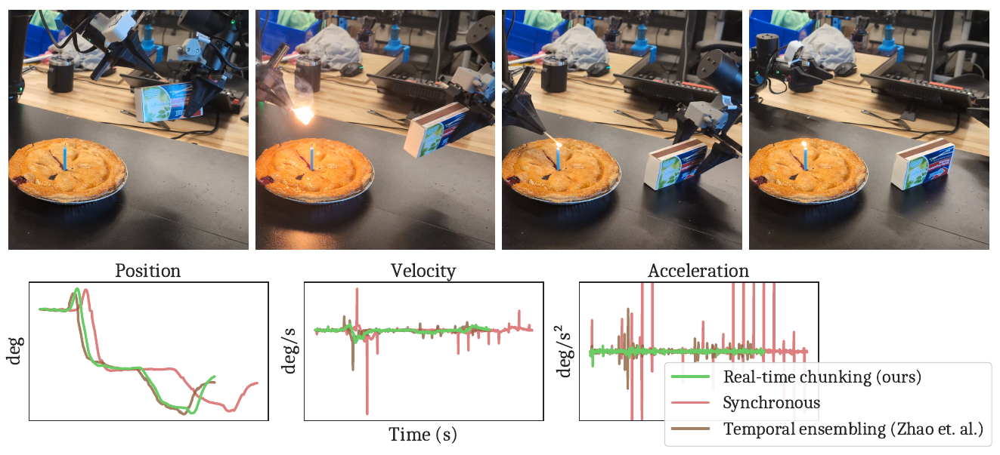

*Figure 1. 성냥으로 초에 불을 붙이는 작업과 한쪽 어깨 관절의 위치·속도·가속도. [PDF p.1, Fig.1]*

[저자 보고] Fig.1의 선택된 동작에서는 synchronous보다 20% 빠르며 TE보다 매끄럽다. 아래 파형은 실제 rollout 첫 10초의 한 관절에 대한 사례다. 이를 모든 관절·모든 작업의 평균 20% 향상이나 formal smoothness 보장으로 확대할 수 없다. 전체 결과의 주된 근거는 Fig.6이다.

### 2.2 왜 action chunk만으로 부족한가

정책이 1초치 행동을 한 번에 출력해도 그 계산에 0.1초 이상이 걸리면 다음 세 문제가 남는다.

1. **정지:** 이전 행동을 모두 실행한 뒤 다음 청크를 계산하면 매 경계에서 멈춘다. 학습 demonstration의 연속적인 운동과 실행 dynamics가 달라진다.
2. **지연된 관측:** 계산을 미리 시작하면 끊기지는 않지만, 새 청크가 사용한 관측은 이미 오래되었다. 그동안 실제 로봇은 이전 청크를 따라 이동했다.
3. **전략 전환:** 같은 관측에서 가능한 행동이 여러 mode일 수 있다. 이전 청크는 장애물 위로, 새 청크는 아래로 향하면 단순 연결·평균 모두 잘못된 행동을 낼 수 있다.

저자의 가설은 “이전 청크와 비슷한 행동을 사후 smoothing”하는 것보다, **새 행동을 생성하는 과정 자체에서 이전 청크와의 일관성을 조건화**하는 것이 타당한 분포 안에 머물기 쉽다는 것이다. 새 관측에 반응할 자유도는 미래일수록 더 많이 남긴다. [PDF pp.2–5]

### 2.3 주장과 직접 근거

| 주장 | 직접 근거 | 실제로 지지하는 범위 | 남는 한계 |
|---|---|---|---|
| 재학습 없이 적용 가능 | Eq.(2)–(5), Algorithm 1; 고정 policy를 쓰는 `realtime_action` | 미분 가능한 flow velocity에 접근할 수 있는 정책 | discrete AR action head에 그대로 적용 불가; diffusion 변환은 별도 필요 |
| 청크 경계의 불연속을 줄인다 | Fig.1, Fig.4, Fig.7 | 선택된 관절·청크 예제와 실물 task 진행률 | 위치·속도·가속도 연속성의 수학적 보장 없음 |
| 짧은 실행 horizon에서도 성능이 높다 | Fig.5 좌측, 고정 delay 1 | 12 Kinetix 환경의 평균 | 실물의 모든 horizon을 sweep하지 않음 |
| inference delay에 강하다 | Fig.5 우측, Fig.6 | Kinetix delay 0–4, 실물 추가 지연 0/100/200 ms | horizon을 초과하는 지연·jitter tail 보장 없음 |
| soft mask가 중요하다 | Eq.(5), Fig.4, Fig.5, Fig.8 좌측 | 특히 작은 delay에서 hard mask보다 유리 | linear decay와 성능 차이는 작음; exponential이 유일한 최적식이라는 증거 없음 |
| 작은 denoising step 수에는 clipping이 필요하다 | Fig.7, Appendix A.2 | 5-step flow, 비교한 guidance 범위 | 다른 solver·정밀도·action scaling까지 안정성을 증명하지 않음 |
| 실제 작업 throughput이 높다 | Fig.6, 480 episodes, 6 tasks | 해당 양팔·이동 조작과 pretrained/fine-tuned π0.5 | 원시 episode 로그·실물 runtime·학습 데이터 비공개 |
| BID보다 계산량 측면에서 실용적이다 | Fig.5, Table 1 | 비교된 sample 수와 π0.5 측정 | 실물 task 성능에서 BID를 직접 비교하지 않음 |
| real-time execution이 가능하다 | 시간 조건, Algorithm 1 | 충분한 버퍼와 적절한 delay 상한을 가정한 action 공급 | 센서 사건에 새 정책 판단이 20 ms 안에 반응한다는 뜻은 아님 |

<a id="s3"></a>
## 3. 선수 지식과 기호·shape 사전

### 3.1 세 가지 시간을 반드시 분리한다

**환경 시간**은 로봇이 실제로 행동하는 시간이다. 50 Hz controller라면 한 step이 20 ms다. **flow 시간**은 하나의 행동 청크를 Gaussian noise에서 생성하는 가상 적분 좌표다. 0에서 1까지 5번 적분해도 로봇에서 5 action step이 흐른다는 뜻이 아니다. **wall-clock 추론 시간**은 영상 처리, 네트워크, 모델 실행을 포함한 실제 밀리초다.

```math
tinmathbb{Z},\qquad \tau\in[0,1],\qquad \delta\in\mathbb{R}_{\geq0}\;\text{seconds}
```

위는 해설용 분류다. Flow의 velocity는 생성 상태가 flow 시간에 따라 변하는 속도이며 **관절의 물리 속도**와 다르다. action 자체가 관절 위치일 수도, 힘일 수도 있다.

### 3.2 기본 개념

- **Conditional flow matching:** noise와 데이터 사이를 잇는 경로의 vector field를 관측 조건부로 학습한다. 추론은 그 vector field를 적분한다.
- **Inpainting:** 일부 좌표의 목표값을 유지하면서 나머지를 생성한다. 이 논문에서는 image pixel이 아니라 action 시간축의 겹치는 부분을 조건으로 삼는다.
- **VJP:** 큰 Jacobian을 명시적으로 만들지 않고, 특정 오차 벡터를 Jacobian에 곱한 결과만 역전파로 구한다.
- **Receding horizon:** 길게 계획하되 그중 일부만 실행하고 다시 계획한다. RTC도 이전 계획의 끝부분을 다음 생성에 사용하지만 별도의 dynamics model이나 명시적 최적제어 cost를 요구하지 않는다.
- **Multi-modality:** 유효한 행동 경로가 여러 개 존재하는 것. 두 유효한 경로의 산술평균은 유효하지 않을 수 있다.
- **Asynchronous execution:** policy 추론 thread와 action 소비 thread가 동시에 진행된다. 실제 GPU parallel kernel 두 개를 뜻하는 표현이 아니다.

### 3.3 통합 notation/shape 사전

| 기호 | 의미 | shape 또는 단위 | 주의점 |
|---|---|---|---|
| $`t`$ | controller timestep | 정수 | Algorithm 1에서는 현재 청크 원점 기준으로 reset되는 counter |
| $`T_k`$ | k번째 추론 시작의 전역 시점 | 정수 | 시간 감사를 위해 리뷰어가 추가한 기호 |
| $`\Delta t`$ | controller sampling period | seconds/step | 실물 0.02 s |
| $`\delta`$ | 하나의 청크를 얻는 wall-clock latency | seconds | GPU-only latency와 전체 latency를 구별 |
| $`d`$ | inference delay | action step 수 | 논문 정의 $`\lfloor\delta/\Delta t\rfloor`$; Algorithm에서는 과거 최대값으로 예측 |
| $`\ell_k`$ | k번째 추론 중 실제 소비된 action 수 | 정수 | 예측 $`d`$와 구분하기 위한 리뷰어 기호 |
| $`H`$ | prediction/generation horizon | action step 수 | simulation 8, real 50 |
| $`s`$ | execution horizon | action step 수 | Fig.3/Algorithm 1에서는 연속 추론 시작 간 간격으로 읽어야 함 |
| $`s_{\min}`$ | 최소 희망 갱신 간격 | action step 수 | 실물 25 |
| $`M`$ | 한 action의 scalar 차원 | dimension | 시뮬레이션은 실제 env action space로 결정; 실물 padding 포함 정확한 차원은 미기재 |
| $`B`$ | batch size | 개수 | 리뷰의 구현 shape 설명용; 실물 제어 loop와 simulation 2048 rollout batch를 구분 |
| $`\mathbf o_t`$ | 관측 | simulation $`\mathbb R^{D_o}`$; VLA는 다중 modality | policy를 한 번 호출할 때 관측 snapshot을 고정 |
| $`\mathbf a_t`$ | 한 step의 행동 | $`\mathbb R^M`$ | 위치 제어와 힘 제어를 혼동하지 않음 |
| $`\mathbf A_t`$ | 시점 t에서 시작하는 H개 미래 행동 | $`\mathbb R^{H\times M}`$ | $`[\mathbf a_t,\ldots,\mathbf a_{t+H-1}]`$ |
| $`\mathbf a_{t'\mid t}`$ | 관측 t로 생성한 청크 중 절대시점 t'의 행동 | $`\mathbb R^M`$ | 청크 index는 $`t'-t`$, 0-based |
| $`\mathbf A_t^\tau`$ | flow 중간 상태 | $`H\times M`$; batch 포함 $`B\times H\times M`$ | superscript는 물리시간이 아님 |
| $`\mathbf v_\pi`$ | 학습된 conditional velocity | $`B\times H\times M`$ 출력 | 파라미터를 $`\theta`$로도 설명 |
| $`n`$ | denoising step 수 | 개수 | 기본 5; 적분 step $`1/n`$ |
| $`\widehat{\mathbf A_t^1}`$ | 현재 상태로부터 추정한 clean endpoint | $`H\times M`$ | 실제 최종 샘플과 반드시 같지 않음 |
| $`\mathbf Y`$ | 이전 청크의 겹치는 tail을 right-pad한 target | $`H\times M`$ | 새로 생성할 마지막 s개는 weight 0 |
| $`W_i`$ | action 시간 index i의 guidance mask | $`H`$ | 각 action 차원에 동일하게 broadcast |
| $`\mathbf W`$ | Eq.(2)의 펼친 mask | $`HM`$ | 원문은 Eq.(5)의 시간축 mask와 같은 기호 사용 |
| $`J`$ | clean endpoint의 noisy input Jacobian | $`HM\times HM`$ | 리뷰어 약칭; 보통 materialize하지 않음 |
| $`r_\tau^2`$ | guidance schedule의 scalar | 무차원 | 실제 관절 noise variance 측정치가 아님 |
| $`\beta`$ | guidance scalar 상한 | 기본 5 | gradient vector norm clip과 다름 |
| $`\mathcal M,\mathcal C`$ | mutex, condition variable | 동시성 primitive | action buffer와 counter의 일관성 유지 |
| $`\mathcal Q,b`$ | 최근 delay queue, 최대 길이 | 정수 queue, 실물 b=10 | 평균 대신 최대값을 사용 |
| $`N,K`$ | BID sample 수, mode 후보 수 | 개수 | 논문 simulation N=32/K=3; Table 1 N=16 |

### 3.4 “Attention”이라는 표현의 범위

Fig.3의 guidance weight가 이전 행동에 “attend”한다는 말은 transformer attention matrix를 조작한다는 뜻이 아니다. Eq.(5)는 endpoint 오차에 곱하는 **시간별 가중치**다. 시뮬레이션 공식 모델은 MLP-Mixer이며 self-attention 자체를 사용하지 않는다. 따라서 attention sparsity나 KV-cache pruning으로 분류하는 것은 잘못이다.

<a id="s4"></a>
## 4. §1–2: 실시간 제어와 action chunking의 충돌

### 4.1 Introduction의 논리

§1은 물리 세계에서는 모델이 계산하는 동안 환경이 계속 변한다는 사실에서 시작한다. 모델 크기 증가와 원격 추론 때문에 inference latency가 controller period보다 길어질 수 있으며, hardware 개선만으로 이 차이가 항상 사라진다고 기대하기 어렵다는 입장이다. Action chunking은 호출 빈도와 시간적 일관성 문제를 부분적으로 풀지만, 새 관측 반영 빈도를 낮추고 경계에서 서로 다른 strategy를 연결하게 만든다. [PDF p.2, §1]

저자의 기여는 세 부분으로 나뉜다. (i) inference-time guidance와 soft mask로 일관된 청크를 생성하는 방법, (ii) mutex·delay prediction을 포함한 비동기 실행 체계, (iii) 동적 Kinetix 12개와 실물 6개 작업에서의 평가다. 논문의 새 architecture는 대형 VLA backbone이 아니라 **생성·실행 방식**이다.

### 4.2 기본 청크와 실행 horizon: 핵심 비번호 식

```math
\pi(\mathbf A_t\mid\mathbf o_t),\qquad \mathbf A_t=[\mathbf a_t,\mathbf a_{t+1},\ldots,\mathbf a_{t+H-1}],\qquad s\leq H
```

[원문 비번호 식, PDF pp.2–3, §2] 입력은 관측, 출력은 앞으로 H step의 행동분포다. 표기상 시작은 t, 마지막은 t+H−1이다. 배열 길이가 H+1이 되지 않도록 주의한다. 일반적인 chunking 설명에서는 앞의 s개만 실행하고 뒤를 버린다. 그러나 RTC에서는 **추론 delay만큼 새 청크의 앞부분을 skip**하므로 “항상 새 청크의 첫 s개를 실행한다”는 초기 설명을 Algorithm 1에 그대로 적용하면 인덱스가 틀린다.

큰 s는 호출 빈도를 낮추고 같은 전략을 오래 유지한다. 작은 s는 새 관측을 더 자주 반영하지만, 독립적인 sampling의 mode 변화가 더 자주 드러난다. RTC는 작은 s에서도 이전 전략을 이어갈 수 있게 하려는 방법이다.

### 4.3 지연의 정의와 real-time의 의미

```math
d:=\left\lfloor\frac{\delta}{\Delta t}\right\rfloor,\qquad \mathbf a_{t'\mid t}=\mathbf A_t[t'-t]
```

[원문 비번호 식, PDF p.3, §2] $`\delta`$와 $`\Delta t`$가 같은 시간 단위여야 한다. 나눗셈은 몇 controller boundary가 지나가는지를 세는 데 쓰인다. 저자는 sub-timestep 동기화는 생략하고, $`\mathbf o_t`$ 제공과 $`\mathbf a_{t-1}`$ 소비가 같은 순간이라고 가정한다.

[리뷰어 해석] 실제 시스템에서는 capture timestamp, inference submit, GPU completion, controller deadline의 위상이 필요하다. 논문의 floor 정의를 원문 그대로 기록하되, 실제 deadline reserve를 단순 floor만으로 정하면 부족할 수 있다. 이 리뷰의 예제에서는 controller boundary에 정렬된 정수 delay를 가정한다. timestamp에 기반한 ceiling 또는 보수적 margin을 쓰는 설계는 후속 구현 선택이지 원문 식의 수정이 아니다.

§2는 RTX 4090의 π0 KV prefill 46 ms, 목표 period 20 ms 등을 인용해 “한 forward도 한 제어 주기에 들어가지 않는다”는 동기를 든다. 이 수치는 인용 선행연구의 설정이다. 실제 RTC 실험의 분해값은 Appendix Table 3의 SigLIP 18 ms, Gemma prefill 44 ms다. 서로 다른 표의 46 ms와 44 ms를 같은 profiler trace의 오차로 취급하지 않는다.

**핵심 구분:** 매 20 ms에 준비된 행동을 반환하는 것과, 새로 들어온 어떤 외부 사건을 20 ms 이내에 인지·판단해 행동에 반영하는 것은 다르다. RTC는 전자의 공급 연속성을 추구한다. 관측을 반영한 새 행동은 inference delay 뒤에 나온다. [리뷰어 해석]

### 4.4 Naive synchronous와 asynchronous

Synchronous는 s개 실행 후 inference 동안 멈춘다. 위치 제어 로봇에서는 일정 위치를 유지할 수 있어 비교 baseline으로 타당하지만, 멈추는 시간이 늘고 연속 demonstration과 dynamics가 달라진다. Force-control Kinetix에서는 “위치 고정”이 원래 행동공간의 자연스러운 대안이 아니므로 synchronous 비교를 쓰지 않는다.

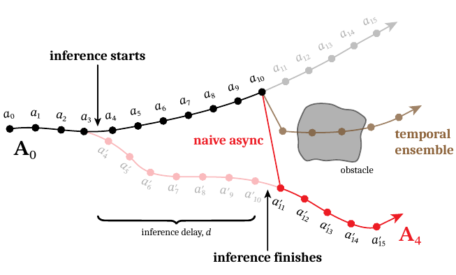

*Figure 2. 서로 다른 mode의 청크를 연결하거나 평균할 때 생기는 실패. [PDF p.3, Fig.2]*

Fig.2는 action 3과 4 사이에 추론을 시작하고 d=7 뒤에 새 결과를 받는 예다. 이미 이전 청크의 action 4–10을 실행했으므로 새 청크의 같은 시점 행동은 사용할 수 없다. old action 10에서 new action 11로 바로 바꾸면 큰 가속도가 생길 수 있다. 두 경로를 평균하면 장애물을 향하는 행동이 될 수 있다.

[해설용 예제] 동일한 종방향 위치에서 위 경로가 y=+1, 아래 경로가 y=−1이고 장애물이 y=0에 있다고 하자. 각 경로는 유효해도 평균 y=0은 충돌이다. 여기서 실패는 “평균 계산이 느려서”가 아니라 **유효 행동분포가 볼록하지 않아서** 발생한다.

§2에는 목표 전환 시점 s에 맞추어 s−d에서 추론을 시작한다는 설명이 있다. 뒤의 Fig.3/Algorithm 1에서는 s를 **연속 추론 시작 간 시간 이동량**으로 운용한다. 이 두 설명을 동일한 전역 시간 원점으로 한 도표에 옮기면 혼동된다. 아래 §6에서는 전역 시작시점 $`T_k`$와 실제 delay $`\ell_k`$를 추가해 모호함을 제거한다.

<a id="s5"></a>
## 5. §3.1–3.2: 모든 번호 수식의 계산과 유도

### 5.1 Eq.(1): 기본 flow Euler 적분

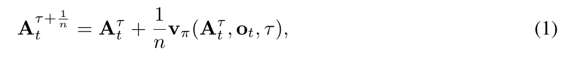

```math
\mathbf A_t^{\tau+1/n}=\mathbf A_t^\tau+\frac1n\mathbf v_\pi(\mathbf A_t^\tau,\mathbf o_t,\tau)\qquad\text{(1)}
```

[PDF p.3, §2, Eq.(1)]

| 풀이 항목 | 의미 |
|---|---|
| 입력 | noisy action $`\mathbf A_t^\tau`$, 관측 $`\mathbf o_t`$, flow time $`\tau`$ |
| 출력 | 다음 flow state $`\mathbf A_t^{\tau+1/n}`$ |
| shape | action과 velocity 모두 $`H\times M`$; batch에서는 $`B\times H\times M`$ |
| 연산 순서 | velocity forward → scalar 1/n 곱 → noisy state에 elementwise add |
| 축 | 모든 H개 미래 행동과 M개 차원을 한 번에 갱신 |
| 정규화 | 1/n은 적분 step size이며 확률 정규화나 action 평균이 아님 |
| 초기값 | $`\mathbf A_t^0\sim\mathcal N(\mathbf0,I)`$ |
| 시간 grid | $`\tau=0,1/n,\ldots,(n-1)/n`$에서 n번 평가 |
| 가정 | 학습된 velocity가 noise→data 방향이며 해당 time convention과 일치 |

원문은 Euler 적분을 쓴다. 아래 연속식은 Eq.(1)을 이해하기 위한 보조 표기다.

```math
\frac{\mathrm d\mathbf A_t^\tau}{\mathrm d\tau}=\mathbf v_\pi(\mathbf A_t^\tau,\mathbf o_t,\tau),\qquad \mathbf A_t^1\approx\text{EulerIntegrate}(\mathbf A_t^0)
```

한 denoising step은 action 하나만 출력하지 않는다. H×M 전체를 갱신한다. n=5이면 flow 좌표 0, 0.2, 0.4, 0.6, 0.8에서 velocity를 평가하고 마지막 update로 1에 도달한다. **τ=1에서 추가 velocity 평가를 하면 6-step이 되고 Eq.(4)의 분모도 문제가 된다.** 공식 코드는 `lax.scan(..., length=num_steps)`로 정확히 n번 반복한다.

### 5.2 Eq.(3)을 먼저 이해하기: 현재 상태에서 clean endpoint 추정

원문 번호 순서는 (2), (3), (4)다. 계산 의존성은 먼저 (3)으로 endpoint를 구한 뒤 (4)의 scalar와 함께 (2)를 적용하므로 여기서는 (3)을 먼저 설명한다.

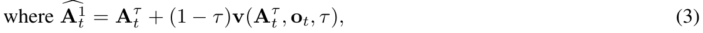

```math
\widehat{\mathbf A_t^1}=\mathbf A_t^\tau+(1-\tau)\mathbf v(\mathbf A_t^\tau,\mathbf o_t,\tau)\qquad\text{(3)}
```

[PDF p.4, §3.1, Eq.(3)] 현재 velocity를 남은 flow 시간 1−τ 동안 유지한다고 보고 최종 clean action을 추정한다. 출력 shape는 noisy input과 같다. 1−τ는 물리적으로 남은 실행시간이 아니다. 이 식은 앞으로의 velocity 변화까지 실제 적분한 최종 샘플이 아니며, learned nonlinear field의 endpoint를 근사한 것이다.

왜 noisy action 자체와 target을 비교하지 않는가? target Y는 clean action인데 $`\mathbf A^\tau`$는 아직 noise를 포함한다. 둘을 바로 같게 만들면 flow의 noise level과 조건이 충돌할 수 있다. Eq.(3)을 거친 **clean endpoint estimate**와 이전 행동을 비교해야 현재 생성이 어디에 도달하려는지 guidance할 수 있다.

[해설용 예제] action scalar가 0.2, 현재 flow velocity가 0.4, τ=0.5라면 endpoint 추정은 0.2+0.5×0.4=0.4다. 나중의 velocity가 달라지면 실제 최종 action은 0.4와 달라질 수 있다.

flattened noisy state를 x로 놓으면 보조 Jacobian은 다음과 같다.

```math
f_\tau(x)=x+(1-\tau)v(x,o,\tau),\qquad J_\tau=\frac{\partial f_\tau}{\partial x}=I+(1-\tau)\frac{\partial v}{\partial x}
```

미분할 때 관측 o, flow time τ, 모델 파라미터 θ는 고정한다. Identity 경로를 없애거나 v를 detach하면 다른 guidance가 된다. J의 temporal off-diagonal 성분 덕분에 prefix endpoint의 오차가 suffix noisy coordinate의 update에도 영향을 준다.

### 5.3 Eq.(4): guidance의 noise schedule

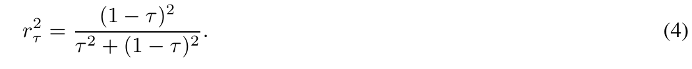

```math
r_\tau^2=\frac{(1-\tau)^2}{\tau^2+(1-\tau)^2}\qquad\text{(4)}
```

[PDF p.4, §3.1, Eq.(4)] τ만 입력받는 scalar다. 모든 시간·action 차원에 동일하게 사용한다. 저자는 기존 flow inverse-problem inpainting의 ΠGDM correction을 가져오며, RTC 논문 안에서 이 scalar의 확률적 유도 전체를 새로 증명하지 않는다. 실제 물리 상태의 uncertainty covariance나 실측 actuator noise를 Eq.(4)로 추정한다고 읽으면 안 된다.

τ=0이면 1, τ=0.5이면 0.5, τ가 1에 가까워지면 0에 가까워진다. 그러나 Eq.(2)에 들어가는 것은 단순 r²가 아니라 그 역수와 다른 τ factor의 곱이다. 따라서 r²가 작아진다는 이유만으로 guidance가 약해진다고 판단할 수 없다.

### 5.4 Eq.(2): endpoint 오차를 noisy action으로 역전파

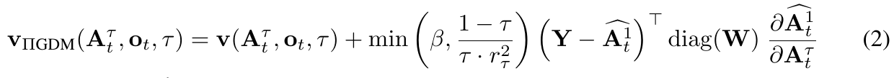

```math
\begin{aligned}\mathbf v_{\Pi\mathrm{GDM}}(\mathbf A_t^\tau,\mathbf o_t,\tau)&=\mathbf v(\mathbf A_t^\tau,\mathbf o_t,\tau)\\&\quad+\min\!\left(\beta,\frac{1-\tau}{\tau r_\tau^2}\right)\left(\mathbf Y-\widehat{\mathbf A_t^1}\right)^\top\mathrm{diag}(\mathbf W)\frac{\partial\widehat{\mathbf A_t^1}}{\partial\mathbf A_t^\tau}\qquad\text{(2)}\end{aligned}
```

[PDF p.4, §3.1, Eq.(2)] 이 식의 v와 vπ는 문맥상 동일한 base policy velocity다. ΠGDM은 원래 inverse-problem guidance이며 이 논문은 그것을 action chunk inpainting에 특화한다. **β clipping과 시간축 soft mask, 비동기 execution 통합**이 RTC에 필요한 수정이다.

계산을 정확히 펼치면 다음 순서다.

1. 현재 x=$`\mathbf A^\tau`$로 velocity v를 한 번 계산한다.
2. Eq.(3)으로 f(x)=clean endpoint estimate를 구한다.
3. 이전 청크의 남은 행동을 새 청크 시점에 정렬해 Y를 만든다.
4. residual Y−f(x)를 만든다. 각 원소는 동일 action 좌표계의 차이다.
5. residual에 W를 한 번 곱한다. 실제 구현은 diagonal matrix 대신 elementwise broadcast를 쓴다.
6. 이 오차를 f의 noisy input으로 VJP한다.
7. scalar guidance coefficient를 β로 제한한다.
8. base velocity에 correction을 더해 Eq.(1)의 velocity 자리를 대체한다.

**Shape 감사.** q=HM으로 flatten하면 residual row는 1×q, diagonal mask는 q×q, Jacobian은 q×q다. 그 곱은 1×q다. 원문은 vector를 row/column 구분 없이 더한다. column-vector convention으로 구현하면 아래와 같은 같은 좌표 update다.

```math
e=W\odot(Y-f(x)),\qquad g=J_\tau^\top e,\qquad v_{\mathrm{guided}}=v+\gamma_\tau g,\qquad \gamma_\tau=\min\!\left(\beta,\frac{1-\tau}{\tau r_\tau^2}\right)
```

여기서 e와 g는 q-vector이며 마지막에 H×M으로 되돌린다. batch 차원은 각 샘플에 독립적으로 vmap한다. q×q Jacobian을 저장할 필요가 없다. 다만 “Jacobian 저장을 안 한다”는 말이 backward 연산과 activation 비용도 없다는 뜻은 아니다.

**가중 오차 loss 관점의 보조 유도.** τ와 o를 고정하고 다음 에너지를 정의하자. 이는 논문이 별도 번호 loss로 제안한 식이 아니라 Eq.(2)의 방향을 확인하는 리뷰어 유도다.

```math
E_\tau(x)=\frac12\sum_{i=0}^{H-1}\sum_{m=1}^M W_i\bigl(f_\tau(x)_{i,m}-Y_{i,m}\bigr)^2,\qquad -\nabla_x E_\tau=J_\tau^\top\!\left(W\odot(Y-f_\tau(x))\right)=g
```

따라서 guidance는 현재 noisy action을 endpoint consistency energy가 낮아지는 방향으로 밀어준다. W 자체를 residual에 곱한 뒤 그 norm을 제곱한 loss를 쓰면 W²가 생겨 다른 식이다. 동일한 loss를 구현하려면 **weighted squared residual**, 또는 sqrt(W)를 곱한 residual의 제곱을 써야 한다.

VJP API에 e를 cotangent로 주는 구현은 정확하다. e를 f(x)와 다시 inner product한 surrogate를 만든 다음 e까지 미분하면 불필요한 항이 생길 수 있으므로 그 경우 cotangent를 고정해야 한다. 반면 위 weighted-square energy를 직접 미분하는 방식은 자연스럽게 올바른 gradient를 준다. 공식 코드는 `jax.vjp(denoiser, x_t, has_aux=True)`와 `vjp_fun(error)[0]`를 쓴다. [공식 코드 확인, model.py 227–248]

**Mask가 0인 suffix도 바뀌는 이유.** W_i=0은 그 endpoint 좌표에 직접 target을 부여하지 않는다는 뜻이다. prefix endpoint가 suffix noisy variable의 함수일 수 있으므로 J의 off-diagonal을 통해 suffix update는 0이 아닐 수 있다. 바로 이 coupling이 “남은 행동을 prefix와 양립하게 생성한다”는 목적에 필요하다.

### 5.5 Guidance 수치 예제: 실제 gradient가 어디로 흐르는가

다음은 **설명용 2차원 국소 affine 예제**이며 실제 모델 파라미터가 아니다. 첫 좌표만 조건화하지만 두 번째 좌표도 바뀌는 것을 보인다.

```math
x=\begin{bmatrix}0.2\\-0.1\end{bmatrix},\quad v(x)=\begin{bmatrix}0.5+x_2\\0.1+0.5x_1\end{bmatrix}=\begin{bmatrix}0.4\\0.2\end{bmatrix},\quad \tau=0.5,\quad Y=\begin{bmatrix}1\\0\end{bmatrix},\quad W=\begin{bmatrix}1\\0\end{bmatrix}
```

```math
f(x)=x+0.5v(x)=\begin{bmatrix}0.4\\0\end{bmatrix},\quad J=\begin{bmatrix}1&0.5\\0.25&1\end{bmatrix},\quad e=\begin{bmatrix}0.6\\0\end{bmatrix},\quad g=J^\top e=\begin{bmatrix}0.6\\0.3\end{bmatrix}
```

Eq.(4)에서 r²=0.5이고 β=5라면 γ=min(5,0.5/(0.5×0.5))=2다. 예를 들어 적분 간격 0.2를 적용하면 아래와 같다. τ=0.5는 일반적인 설명 좌표이며 원문의 5-step grid에는 포함되지 않는다.

```math
x_{\mathrm{next}}=x+0.2(v+2g)=\begin{bmatrix}0.52\\0.06\end{bmatrix}
```

[검산] 두 번째 endpoint의 weight가 0인데 두 번째 noisy coordinate도 −0.1에서 0.06으로 변한다. prefix 목표값을 만족시키는 데 두 번째 coordinate가 기여하기 때문이다. 이러한 역전파는 모델 학습이 아니라 **샘플 상태 x의 추론 update**다.

### 5.6 β clipping의 대수와 endpoint 문제

Eq.(4)를 Eq.(2)에 대입하면 다음 식을 얻는다. [검산, 원문 보조 유도]

```math
\frac{1-\tau}{\tau r_\tau^2}=\frac{\tau^2+(1-\tau)^2}{\tau(1-\tau)}=\frac{\tau}{1-\tau}+\frac{1-\tau}{\tau},\qquad 0\lt\tau\lt1
```

이 값은 τ=0과 τ=1에서 발산하고 가운데 τ=0.5에서 2다. τ=0에서 “min(β,∞)”를 계산한다는 수학적 의도와 실제 floating-point의 NaN/Inf 처리를 구분해야 한다. 공식 코드는 `(1-t)/t`의 positive infinity를 `nan_to_num(..., posinf=max_guidance_weight)`로 바꾸고 scalar minimum을 적용한다.

| 5-step 평가 τ | clipping 전 coefficient | β=5 적용 후 |
|---:|---:|---:|
| 0 | +∞, limit 관점 | 5 |
| 0.2 | 4.25 | 4.25 |
| 0.4 | 2.1666667 | 2.1666667 |
| 0.6 | 2.1666667 | 2.1666667 |
| 0.8 | 4.25 | 4.25 |

[검산] 따라서 n=5이고 β≥4.25이면 clipping 값은 τ=0의 첫 update만 바꾼다. 이것은 Fig.7 caption의 설명과 일치한다. β를 150으로 높이면 첫 update의 effective scale이 0.2×150=30이 되어 강한 overshoot를 일으킬 수 있다. 반대로 β=5는 첫 step에서 1이다. 이 단순 산술만으로 안정성이 증명되는 것은 아니지만 작은 step 수에서 큰 β가 위험한 이유를 설명한다.

β는 g의 norm을 제한하지 않는다. residual이나 Jacobian norm이 크면 β=5라도 correction 자체는 클 수 있다. 따라서 clipping이 유한한 action, 가속도 bound, collision avoidance를 보장하지 않는다.

### 5.7 Eq.(5): 세 구간으로 나뉘는 soft mask

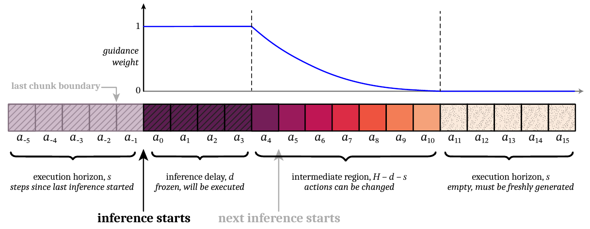

*Figure 3. H=16, d=4, s=5의 시간별 guidance. old tail과 겹치는 길이는 H−s=11이다. [PDF p.4, Fig.3]*

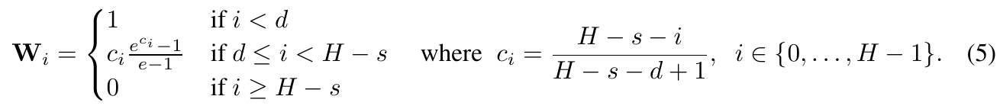

```math
\begin{aligned}W_i&=\begin{cases}1&i\lt d\\c_i\dfrac{e^{c_i}-1}{e-1}&d\leq i\lt H-s\\0&i\geq H-s\end{cases}\\c_i&=\frac{H-s-i}{H-s-d+1},\qquad i\in\{0,\ldots,H-1\}\qquad\text{(5)}\end{aligned}
```

[PDF p.5, §3.2, Eq.(5)]

| 구간 | 길이 | old target 존재 | 새 청크 도착 때 사용 가능 여부 | guidance 의미 |
|---|---:|---|---|---|
| $`0\leq i\lt d`$ | d | 존재 | 이미 실행되어 새 action은 사용 불가 | 알려진 실행 prefix에 weight 1 |
| $`d\leq i\lt H-s`$ | H−s−d | 존재 | 아직 변경 가능 | 미래일수록 약한 consistency |
| $`H-s\leq i\lt H`$ | s | 없음 | 미래 실행용 | target 없이 새로 생성 |

길이의 합은 d+(H−s−d)+s=H다. 마지막 s개는 **새로 생성해야 하는 tail 길이**이지, 추론이 끝난 직후 실행할 첫 s개라는 뜻이 아니다. 시간 정렬 때문에 동일 기호 s가 양쪽 역할에 나타난다.

ci는 중간 구간에서 1보다 작은 양수다. 분모의 **+1** 때문에 첫 중간 index에서 정확히 1을 재사용하지 않고, 마지막 중간 index에서는 0이 되지 않는다. 구간 경계 밖에서 별도로 1과 0을 지정한다. 원문은 exponentially decreasing이라고 설명하지만 식은 순수 exp(−ki)가 아니라 **linear ramp c와 exponential transform의 곱**이다.

[해설용·검산 예제] H=8, s=3, d=2라면 old tail은 길이 5다.

| i | ci 또는 구간 | Wi | 의미 |
|---:|---|---:|---|
| 0 | frozen | 1 | old action 실행 예정 |
| 1 | frozen | 1 | old action 실행 예정 |
| 2 | 3/4 | 약 0.487551 | 바꿀 수 있지만 강하게 연결 |
| 3 | 2/4 | 약 0.188770 | 중간 정도 연결 |
| 4 | 1/4 | 약 0.041324 | old tail 끝, 약하게 연결 |
| 5–7 | 새 tail | 0 | old target 없음 |

W를 총합 1로 normalize하지 않는다. 여기서는 probability distribution이 아니라 각 endpoint constraint의 strength다. M개의 action 차원이 있으면 W[:,None]으로 broadcast한다. zero-padding한 Y의 마지막 s개는 W=0이라 직접 guidance에 기여하지 않지만, padding 값이 NaN이면 0×NaN 문제를 일으킬 수 있으므로 유한값이 필요하다. [리뷰어 해석]

### 5.8 Hard masking, soft masking, literal overwrite를 구별하기

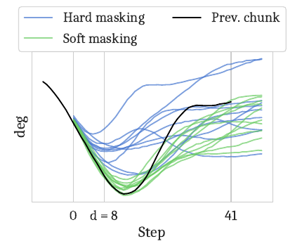

*Figure 4. hard mask와 soft mask로 생성한 관절 action 청크. 두 방식 모두 guidance를 사용하며, prefix의 정확한 동일값 투영을 의미하지 않는다. [PDF p.5, Fig.4]*

원문에서 **hard masking**은 W가 prefix에서 1, 나머지에서 0인 Eq.(2)의 mask를 뜻한다. noisy action의 prefix를 매 step 정확히 덮어쓰는 Diffuser식 inpainting은 Appendix Fig.8의 **별도 비교법**이다.

Fig.4가 보여주듯 hard mask도 “frozen” 영역을 완벽히 맞추지 못한다. 작은 d에서는 매우 짧은 prefix만으로 trajectory의 전략과 방향을 제한하기 어렵다. Soft mask는 더 긴 overlap에 약한 조건을 걸어 mode consistency를 강화한다. 그러나 새 관측이 요구하는 큰 경로 전환을 지나치게 억제할 가능성도 있으며, 이 trade-off에 대한 최적성 증명은 없다.

특수 경우도 중요하다. d=0일 때 hard mask는 전부 0이라 base sampler로 환원되지만 soft mask는 H−s개의 old tail에 여전히 guidance한다. d=H−s이면 중간 구간이 없어 soft와 hard가 같아진다. H=8, d=s=4의 극한에서 Fig.5의 두 RTC 곡선이 가까워지는 이유를 이 구조로 이해할 수 있다.

<a id="s6"></a>
## 6. §3.3: Algorithm 1, 비동기 실행과 causality

### 6.1 원문 알고리즘의 두 부분

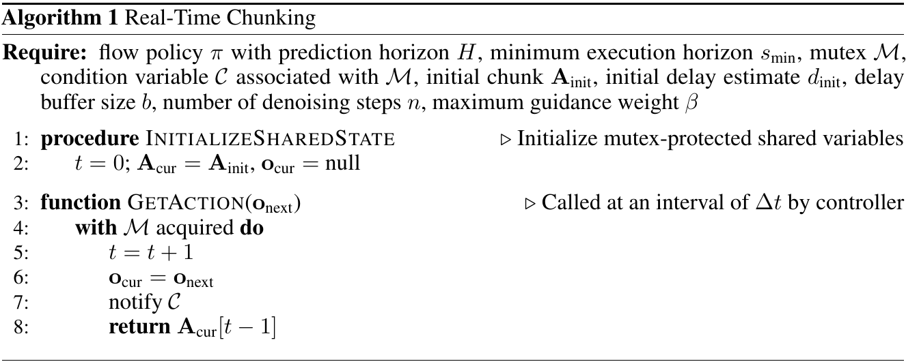

*Algorithm 1, Require와 행 1–8. [PDF p.5]*

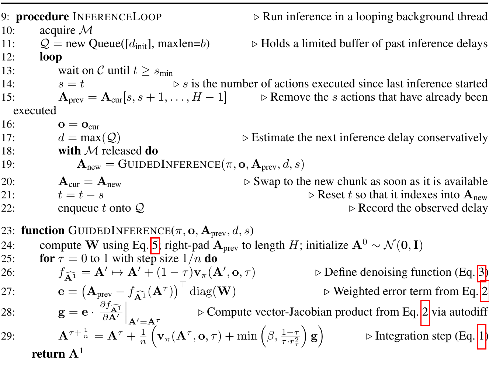

*Algorithm 1, 행 9–29와 최종 return. [PDF p.6]*

필수 입력은 policy, H, 최소 horizon, mutex, condition variable, 초기 청크, 초기 delay 추정, queue 길이, denoising step 수, β다. **A_init가 어떻게 준비되는지는 알고리즘의 전제**이며 초기 관측이 오기 전부터 무조건 적절한 행동을 생성해 준다는 뜻은 아니다. 실물 startup·homing·initial buffer fill의 전체 구현은 공개되지 않았다.

### 6.2 행별 해설: 공유 상태와 controller

| PDF 행 | 코드의 역할 | 시간/동시성 의미 |
|---:|---|---|
| 1 | `InitializeSharedState` | shared variables를 초기화하는 procedure 선언 |
| 2 | t=0, A_cur=A_init, o_cur=null | t는 현재 청크 원점에서 지난 tick 수; 첫 관측은 아직 없음 |
| 3 | `GetAction(o_next)` | controller가 Δt마다 호출하는 빠른 함수 |
| 4 | mutex 획득 | 청크 포인터와 index가 서로 다른 시점 상태로 읽히지 않게 보호 |
| 5 | t=t+1 | 한 action 소비 boundary가 지났음을 기록 |
| 6 | o_cur=o_next | background inference가 다음에 읽을 최신 관측을 저장 |
| 7 | condition variable notify | horizon 조건을 기다리는 inference thread를 깨움 |
| 8 | A_cur[t−1] 반환 | increment 이전 index의 행동을 반환; `t`를 그대로 쓰면 off-by-one |

논문 footnote의 경계 규약은 o_t 제공과 $`\mathbf a_{t-1}`$ 소비를 같은 순간으로 추상화한다. 실제 센서 capture·명령 enqueue 순서까지 이 pseudo-code에서 정해 주지는 않는다. controller adapter는 관측의 timestamp와 행동 소비 시점을 일관되게 매핑해야 한다. 이 호출은 inference completion을 기다리지 않아야 한다.

### 6.3 행별 해설: inference loop

| PDF 행 | 코드의 역할 | 왜 필요한가 |
|---:|---|---|
| 9 | `InferenceLoop` 선언 | 독립 background thread에서 지속 실행 |
| 10 | mutex 획득 | 처음 shared state 접근을 보호 |
| 11 | Q를 d_init로 시작, 최대 길이 b | 관측한 과거 delay의 유한 buffer |
| 12 | 무한 loop | 결과를 낸 뒤 계속 다음 청크 생성 |
| 13 | t≥s_min까지 condition wait | 너무 자주 replan하지 않음; wait는 잠든 동안 lock을 놓아 controller 진행을 허용해야 함 |
| 14 | s=t snapshot | 현재 청크 원점부터 다음 inference 시작까지 이동한 index 수 |
| 15 | A_prev=A_cur[s:H] | 이미 지나간 s개 timestamp를 제거; 길이는 H−s |
| 16 | o=o_cur snapshot | inference에 사용할 관측을 여기서 고정 |
| 17 | d=max(Q) | 최근 delay의 최댓값을 다음 delay의 보수적 추정으로 사용 |
| 18 | mutex를 놓은 구간 진입 | 긴 GPU 추론 동안 GetAction이 계속 실행되도록 함 |
| 19 | GuidedInference 수행 | 고정한 o, old tail, s, 예측 d로 새 H개 청크 생성 |
| 20 | A_cur=A_new | lock을 다시 확보한 뒤 새 결과로 교체; 지나간 action을 되돌리지 않음 |
| 21 | t=t−s | 새 청크의 원점은 이번 inference 시작 시점이므로 index를 재설정 |
| 22 | Q에 t enqueue | 이 t는 이번 inference 동안 실제 소비된 tick 수, 즉 관측된 delay |

중요한 구현 전제는 행 18의 `with M released` scope를 나올 때 lock을 다시 얻는다는 것이다. 행 20과 21은 같은 임계 구역에서 수행되어야 한다. 포인터만 새 청크로 교체하고 index를 나중에 바꾸면 다른 timestamp의 행동을 반환할 수 있다.

max(Q)는 직전 최대 delay보다 짧게 예측하는 일을 줄인다. 하지만 미래의 network spike가 과거 최대보다 클 가능성을 없애지는 못한다. **과거 최대값은 측정된 관찰이지 future WCET 증명은 아니다.** b=10이면 오래된 최대가 queue에서 제거된 후 예측이 다시 줄어들 수 있다.

### 6.4 행별 해설: GuidedInference

| PDF 행 | 연산 | 식·shape 연결 |
|---:|---|---|
| 23 | 함수 입력 선언 | policy, observation, old tail, delay, shift |
| 24 | W 계산, old tail right-pad, Gaussian 초기화 | Eq.(5); Y와 $`\mathbf A^0`$를 모두 H×M으로 만듦 |
| 25 | flow time 반복 | 실제 의미는 k=0,…,n−1의 n회; τ=1 추가 평가 아님 |
| 26 | clean endpoint 함수 f 정의 | Eq.(3), noisy input A′에 대해 미분 가능하게 유지 |
| 27 | e=(Y−f($`\mathbf A^\tau`$))ᵀdiag(W) | Eq.(2)의 weighted endpoint residual |
| 28 | g=e·∂f/∂A′ | reverse-mode VJP, 명시적 Jacobian 생성 불필요 |
| 29 | guided velocity로 Euler update | Eq.(1)+(2)+(4), step size 1/n |
| 번호 없는 return | $`\mathbf A^1`$ 반환 | endpoint estimate f가 아닌 n회 적분한 최종 state |

관측 snapshot은 반복 중 최신 o_cur로 바뀌지 않는다. 그렇게 바꾸면 하나의 ODE integration 안에서 conditional field가 비동기적으로 달라져 원문과 다른 sampler가 된다. 다음 observation은 다음 inference call에서 반영한다.

### 6.5 두 clock으로 시간 인덱스를 재구성한다

[리뷰어 해석·유도] k번째 inference의 시작시점을 $`T_k`$, 그때 이전 청크 원점에서 이동한 길이를 $`s_k=T_k-T_{k-1}`$, 이번 실제 delay를 $`\ell_k`$라 하자. 이전 청크는 시간 $`T_{k-1},\ldots,T_{k-1}+H-1`$에 대응한다. 이를 이번 시점에 정렬한 target은 다음과 같다.

```math
Y_k[i]=\begin{cases}\mathbf a_{T_k+i\mid T_{k-1}}&0\leq i\lt H-s_k\\0&H-s_k\leq i\lt H\end{cases}
```

이 Y의 첫 $`\ell_k`$개는 inference 동안 실제 old buffer에서 소비된다. 새 결과가 $`T_k+\ell_k`$에 도착하면 다음 사용 가능한 행동은 다음과 같다.

```math
u_{T_k+\ell_k}=\mathbf A_{T_k}[\ell_k]=\mathbf a_{T_k+\ell_k\mid T_k}
```

**새 청크 index 0으로 되돌아가면 안 된다.** 그 행동은 $`T_k`$를 위한 것이고 실제 시간은 이미 $`T_k+\ell_k`$이기 때문이다. 논문 행 21의 t=t−s가 그 정렬을 유지한다. inference 중 t는 $`s_k+\ell_k`$로 증가했으므로 subtraction 후 $`\ell_k`$가 남는다.

single inference thread와 경계 정렬을 가정하면 다음 시작 간격은 대략 다음과 같다.

```math
T_{k+1}-T_k=\max(s_{\min},\ell_k)
```

실제 CPU scheduling 지연이 있으면 더 길어질 수 있다. 원문의 “actual horizon=max(d,s_min)”은 이 관계를 설명한다. d가 이번 예측값인지 실제 다음 결과 지연인지 문장마다 혼동되지 않도록 구현에서는 actual $`\ell_k`$와 predicted $`d_k`$를 구분하는 편이 좋다.

지연이 변할 때, 청크 k에서 실제 실행되는 행동 수는 단순 s와 다를 수 있다. 다음 교체시점은 $`T_{k+1}+\ell_{k+1}`$이므로 다음처럼 된다.

```math
N_{\mathrm{executed},k}=(T_{k+1}-T_k)+\ell_{k+1}-\ell_k
```

constant delay에서만 이 값이 추론 시작 간격 s와 같아진다. Algorithm의 counter t는 “현재 청크에서 실제로 소비한 원소 개수”라기보다 **현재 청크의 timestamp 원점에서 경과한 tick 수**다. 새 청크 앞의 skip된 prefix도 그 timestamp 범위에 포함된다.

### 6.6 Fig.3을 전역 시점으로 옮긴 완전 예제

다음은 Fig.3의 H=16, d=4, s=5를 전역 시점 100에 배치한 **해설용 예제**다. 이전 inference는 95에서 시작했고 old chunk의 마지막 timestamp는 110이다. 실제 delay와 예측 delay는 모두 4로 가정한다.

| 전역 tick | 관측/추론 사건 | 실행할 action의 출처 | 새 $`\mathbf A_{100}`$ 관점 |
|---:|---|---|---|
| 95 | 이전 inference 시작 | 더 이전 buffer | old 청크 $`\mathbf A_{95}`$ 생성 시작 |
| 100 | $`\mathbf o_{100}`$을 snapshot, RTC 생성 시작 | $`\mathbf A_{95}[5]`$, 시간 100 | $`\mathbf A_{100}[0]`$은 계산 중 |
| 101–103 | $`\mathbf A_{100}`$ 생성 계속 | $`\mathbf A_{95}[6:9]`$, 시간 101–103 | 새 index 1–3은 사용 시점이 지나감 |
| 104 | inference 완료, index=4로 swap | $`\mathbf A_{100}[4]`$ | 처음 실제 사용하는 새 action |
| 105 | 다음 inference 시작, $`\mathbf o_{105}`$ snapshot | $`\mathbf A_{100}[5]`$ | 새 $`\mathbf A_{105}`$를 만들며 $`\mathbf A_{100}`$ tail 사용 |
| 106–108 | $`\mathbf A_{105}`$ 생성 계속 | $`\mathbf A_{100}[6:9]`$ | old buffer가 inference를 가림 |
| 109 | $`\mathbf A_{105}`$ 완료 | $`\mathbf A_{105}[4]`$ | 두 번째 swap |

행 15에서 Y=$`\mathbf A_{95}[5:16]`$은 실제 timestamp 100–110, 길이 11이다. $`\mathbf A_{100}`$의 index 0–3은 이미 실행할 old target으로 weight 1, index 4–10은 바꿀 수 있는 overlap, index 11–15는 timestamp 111–115라 새로 생성한다. $`\mathbf A_{100}`$ 중 실제 실행된 구간은 index 4–8의 5개이며, 남은 tail은 다음 guidance에 활용될 수 있다.

### 6.7 허용 horizon과 공급 실패 조건

Fig.3은 다음 제약을 명시한다. [원문 비번호 제약, PDF p.4]

```math
d\leq s\leq H-d
```

왼쪽은 한 inference가 끝나기 전에 같은 serial thread에서 다음 inference를 시작하지 않는 조건이다. 오른쪽은 다음 inference 동안 old chunk tail이 충분히 남아 있어야 한다는 조건이다. 고정 delay에서는 다음을 얻는다.

```math
2d\leq H,\qquad H-s-d\geq0
```

[검산] H=8이면 최대 d=4이고 그때 s=4만 가능하다. H=50, s=25이면 d≤25, 즉 controller tick 관점에서 대략 0.5초의 delay buffer 여유가 있다. 논문의 +200 ms 실물 조건은 d≈16으로 이 범위 안에 있다. 이 수치를 500 ms까지 어떤 환경에서나 성공한다는 성능 보장으로 바꿀 수 없다.

변동 delay에서는 이번 호출의 실제 버퍼 조건을 직접 확인해야 한다.

```math
\ell_k\leq H-s_k
```

이를 넘으면 새 결과가 오기 전에 old buffer가 고갈된다. 원문 Algorithm 1에는 bounds check, retry, buffer underrun fallback, outdated-result rejection이 없다. “항상 action이 있다”는 설명은 조건부다. predicted d보다 실제 ℓ가 크되 old tail은 충분한 경우, action 공급은 계속될 수 있으나 실제로 지나간 prefix의 일부가 weight 1이 아니라 soft weight로 guidance되었으므로 continuity 조건이 약해진다.

### 6.8 Causality 감사

1. **미래 관측을 보지 않는다.** $`\mathbf A_{T_k}`$는 $`\mathbf o_{T_k}`$와 이전에 생성된 target만 사용한다. 미래 timestamp의 action coordinate를 함께 계산하는 것은 미래 관측 유출이 아니다.
2. **이전 target은 실측 미래 궤적이 아니다.** 앞으로 내보낼 command의 계획값이다. actuation noise, contact, slip으로 실제 state는 계획에서 벗어날 수 있다.
3. **실행된 과거를 바꾸지 않는다.** 새 chunk의 이미 지난 prefix는 학습·생성 consistency용 latent 역할을 하고 controller에서 skip한다.
4. **오래된 정책 판단의 영향은 남는다.** frozen prefix를 조건화해도 delay 동안의 외란을 즉시 알 수 없다. emergency sensor reaction이나 fast low-level feedback을 대신하지 않는다.
5. **동일 관측 안의 action 축은 비인과적 mixing이 가능하다.** MLP-Mixer가 미래 action slot 전체를 섞는 것은 생성 모델 구조의 특성이고, 환경 관측의 인과성 위반이 아니다.
6. **sensor-frame consistency는 추가 전제다.** 이전·현재 action이 상대좌표이면 단순 배열 slice만으로 동일 물리 좌표가 된다고 보장할 수 없다. 좌표계 정렬과 normalization 확인이 필요하다.

<a id="s7"></a>
## 7. 학습 데이터, loss, gradient, 공식 forward

### 7.1 “Training-free”의 정확한 범위

RTC inference를 적용하기 위해 **새로 training할 필요가 없다**. 그렇다고 base flow policy가 학습되지 않았다는 뜻은 아니다. 실험에서는 Kinetix용 flow policy를 imitation learning으로 학습하고, 실물에서는 π0.5 base에서 fine-tune한 정책을 사용한다. RTC 비교는 이 정책에 inference 방식을 바꾸어 적용하는 것이다. [PDF pp.6–7, 25]

| 단계 | 데이터/입력 | 업데이트되는 것 | 출력 |
|---|---|---|---|
| Kinetix expert 학습 | simulator transition, binary success reward | RPO actor·critic | demonstration 생성용 expert |
| demonstration 생성 | expert rollout, action noise 포함 환경 | policy 파라미터 고정 | 관측·행동·done 등의 transition 데이터 |
| flow imitation learning | 현재 관측과 H-step action target | MLP-Mixer flow policy 전체 | pretrained action chunk policy |
| 실물 base fine-tuning | π0.5 기반 조작 데이터 | 정확한 frozen/trainable 범위 미기재 | 해당 실물 task policy |
| RTC inference | observation snapshot, old tail, Gaussian noise | **$`\mathbf A^\tau`$만 update**; θ는 고정 | 새로운 H-step 청크 |

RTC의 gradient는 real-world reward나 성공 score로부터 오지 않는다. 이전 계획과 endpoint estimate의 차이에서 온다. 환경을 differentiable simulator로 역전파하지도 않는다.

### 7.2 Kinetix expert와 데이터 생성

[저자 보고] 기존 10개 환경과 새 2개 환경, 합계 12개를 사용한다. 각 환경에 6개 seed의 RPO expert를 학습하고 episode마다 다른 expert를 선택해 약 1M transition dataset을 만든다. force-based control에 Gaussian action noise를 더해 feedback correction이 필요하게 한다. [PDF p.6, §4.1]

[공식 코드 확인] `train_expert.py`의 기본값은 **8 seeds**로 논문 6과 다르다. num_updates=1000, rollout num_steps=256, num_envs=256으로 seed·level당 65,536,000 environment transitions에 대응한다. RPO 설정은 아래와 같다. 실제 논문에 쓰인 모든 run의 config dump가 아니라 공개 기본값이다.

| 설정 | 공개 기본값 |
|---|---:|
| expert learning rate | 3e−4 |
| policy update epochs | 4 |
| minibatches/update | 8 |
| γ / GAE λ | 0.995 / 0.9 |
| PPO ratio clip | 0.2 |
| RPO mean perturbation α | 0.3 |
| value loss coefficient | 0.5 |
| network layer width | 256 |
| gradient global norm clip | 1.0 |
| action noise std | 0.1 |
| frame skip | 2 |

RPO는 actor의 Gaussian mean에 uniform perturbation을 더한 distribution으로 sampled action의 log probability를 평가한다. advantage는 minibatch 평균·표준편차로 normalize하며 clipped policy objective와 clipped value loss를 합한다. 이 과정은 **데이터 생성용 expert의 RL 학습**이고 RTC guidance와 별개다. 아래 식은 읽은 코드의 핵심을 정리한 것이며 RTC 원문 번호 수식이 아니다.

```math
\begin{aligned}z&\sim\mathcal U[-\alpha,\alpha],\qquad \rho=\exp(\log\pi_{\theta,z}(a\mid o)-\log\pi_{\mathrm{old}}(a\mid o))\\L_{\mathrm{actor}}&=\mathbb E\left[\max(-\bar A\rho,-\bar A\,\mathrm{clip}(\rho,1-\epsilon,1+\epsilon))\right]\end{aligned}
```

`generate_data.py`는 seed별 solve rate가 0.65 이상인 checkpoint 중 하나를 **무작위 선택**한다. 조건을 만족하는 checkpoint가 전혀 없는 seed는 policy mixture에서 제외한다. 코드 주석이나 README의 “best checkpoint”만 읽으면 이 실제 선택을 놓친다. 남은 expert를 episode 경계에서 다시 무작위 선택한다. step마다 expert를 바꾸지 않으므로 demonstration 내부의 전략을 유지한다.

데이터 생성은 128개 parallel env와 256-step batch를 쓰며 지정 transition 수를 block 단위로 올림한다. [검산] 기본 1,000,000 요청은 1,015,808 transitions/level이 된다. 저장 필드는 obs, action, done, solved, return_, length다. 학습에는 각 window 시작의 obs와 action sequence, done을 주로 사용한다.

Expert는 4-step observation history와 이전 action을 입력받는 wrapper를 사용하지만, 저장된 `obs`는 `get_original_obs(...)`로 꺼낸 현재 symbolic observation이다. Student flow policy는 RGB를 인코딩하는 VLA가 아니라 **symbolic observation을 입력받는 MLP-Mixer**다. simulation 성능에서 시각 backbone 지연이나 language grounding까지 검증했다고 말할 수 없다.

### 7.3 Chunk 전처리와 split

`train_flow.py`는 level×steps×env 배열을 level×(env·steps)로 재배열해 각 환경 stream의 시간을 연속으로 놓는다. 유효 window 수가 batch=512의 배수가 되도록 잘라낸다. 각 시작 index j에서 관측 o_j와 action[j:j+H]를 뽑는다.

episode 경계를 넘는 window는 첫 done index를 찾아 **그 index 이상**의 action target을 0으로 바꾼다. 코드 주석은 “after done”이지만 조건은 `>= done_idxs`이므로 done flag가 true인 transition의 action도 0에 포함된다. 이는 action과 done의 기록 convention에 민감한 경계 처리가 된다. 여기서는 해당 코드를 실행해 오류를 입증한 것이 아니라 정확한 연산을 명시한다.

직접 읽은 flow training script에는 별도 supervised train/validation/test split이나 image augmentation, action mean/std normalization 단계가 없다. 제공된 dataset window를 섞어 학습하고 simulator rollout으로 성능을 평가한다. Simulator 내부 symbolic observation scaling과 wrapper 처리까지 “어떤 normalization도 없다”고 확대하지 않는다.

checkpoint 선택도 주석과 실제를 구분해야 한다. `eval_flow.py`의 주석은 best checkpoint라고 하지만 실제로는 숫자 이름의 directory를 정렬한 뒤 `config.step`으로 선택한다. 기본 −1은 마지막 checkpoint다. 별도 solve rate 비교로 best를 계산하지 않는다. [공식 코드 확인]

### 7.4 Conditional flow matching loss: 원문 배경을 코드로 보완

아래는 공식 `FlowPolicy.loss`, model.py 256–267의 식이다. RTC 논문은 이 loss를 별도 번호식으로 제시하지 않았으므로 **공식 코드로 보완한 학습식**이라고 표시한다.

```math
\epsilon\sim\mathcal N(0,I),\qquad \tau\sim\mathcal U[0,1),\qquad X^\tau=(1-\tau)\epsilon+\tau A,\qquad U=A-\epsilon
```

```math
L_{\mathrm{CFM}}(\theta)=\frac{1}{BHM}\sum_{b=1}^B\sum_{i=0}^{H-1}\sum_{m=1}^M\left[v_\theta(X_b^\tau,o_b,\tau_b)_{i,m}-(A_{b,i,m}-\epsilon_{b,i,m})\right]^2
```

τ는 샘플당 하나를 뽑아 그 sample의 H×M 전체에 broadcast한다. noise는 action과 같은 B×H×M shape다. U는 straight-line interpolation의 정확한 derivative다. Dataset A와 ε, τ는 target 생성용이며 gradient는 predicted velocity를 통해 θ에 흐른다. 한 학습 batch에서 ODE를 끝까지 적분하지 않고 무작위 τ에서 velocity regression만 한다.

[해설용 예제] A=[1,2], ε=[−1,0], τ=0.25이면 X=[−0.5,0.5], U=[2,2]다. 모델이 [1.5,2.5]를 예측하면 scalar mean squared loss는 (0.25+0.25)/2=0.25다. 이것은 action reconstruction error가 아니라 **velocity target error**다.

이 loss에는 old action prefix나 RTC β가 들어가지 않는다. 즉 기본 model은 RTC deployment만을 위해 action conditioning을 training-time에 배운 것이 아니다. inference에서 이미 배운 joint action distribution의 미분 구조를 사용한다.

### 7.5 MLP-Mixer forward를 shape로 따라가기

고정 커밋의 ModelConfig는 channel_dim=256, channel_hidden_dim=512, token_hidden_dim=64, num_layers=4, action_chunk_size=8이다. 아래에서 observation dimension $`D_o`$와 action dimension M은 simulator가 반환하는 실제 공간에서 얻는다. environment binding 상수만으로 모든 observation scalar 순서를 확정하지 않는다.

| 단계 | 입력 → 출력 shape | 실제 연산 |
|---|---|---|
| 1 | o: $`B\times D_o`$, X: $`B\times8\times M`$ | 입력 검증 |
| 2 | τ: B → time embedding: $`B\times256`$ | sin/cos, period 범위 0.004–4.0 |
| 3 | $`B\times256`$ → $`B\times256`$ | Linear→swish→Linear→swish |
| 4 | $`B\times D_o`$ → $`B\times8\times D_o`$ | 현재 관측을 8 action slot에 반복 |
| 5 | $`B\times8\times M`$ + $`B\times8\times D_o`$ → $`B\times8\times(M+D_o)`$ | 마지막 channel 축 concat |
| 6 | $`B\times8\times(M+D_o)`$ → $`B\times8\times256`$ | input Linear |
| 7 | $`B\times8\times256`$ → 같은 shape | 4개의 AdaLN-conditioned Mixer block |
| 8 | $`B\times8\times256`$ → 같은 shape | final LayerNorm, time-conditioned scale·shift |
| 9 | $`B\times8\times256`$ → $`B\times8\times M`$ | output Linear로 velocity 출력 |

각 Mixer block의 첫 부분은 시간/action-slot 축을 섞는다. LayerNorm을 channel 축에 적용하고 time embedding에서 scale, shift, gate를 얻는다. $`B\times8\times256`$을 $`B\times256\times8`$로 transpose해 8→64→8 MLP를 적용한 뒤 원 shape로 돌아온다. 두 번째 부분은 channel 축의 256→512→256 MLP다. 두 부분 모두 GELU와 residual을 사용한다.

아래는 block의 동작을 정리한 보조식이다. T는 token-mixing branch, C는 channel-mixing branch이며 time-condition에서 얻는 scale α, shift η, gate g는 batch별 channel vector를 action-slot 축으로 broadcast한다.

```math
X_1=X+g_T\odot T\bigl((1+\alpha_T)\odot\mathrm{LN}(X)+\eta_T\bigr),\qquad X_2=X_1+g_C\odot C\bigl((1+\alpha_C)\odot\mathrm{LN}(X_1)+\eta_C\bigr)
```

AdaLN projection은 zero initialization을 사용한다. 시간 mixing의 Linear는 각 channel에서 H slot을 함께 보므로, prefix의 endpoint gradient가 suffix input에 전달되는 구조가 있다. RGB encoder, text tokenizer, transformer causal mask는 이 simulation model에 없다. 이 architecture 설명을 실물 π0.5의 action expert 구조로 바꾸어 읽으면 안 된다.

### 7.6 Optimizer와 학습 단계

Student는 환경마다 독립적인 policy를 32 epochs 학습한다. default batch=512, learning rate=3e−4, warmup=1000 optimizer steps, 이후 constant learning rate, AdamW weight decay=1e−2, global gradient norm clip=10이다. 매 epoch에 유효 window 시작 index를 permutation한다. Gradient는 `nnx.value_and_grad(loss_fn)(policy)`로 모든 policy parameters에 대해 계산하며 이 코드에서 frozen backbone은 없다.

training 중 evaluator는 각 execution horizon 1…8에서 rollout을 수행한다. 이 평가는 holdout task generalization과 다르다. 같은 12개 level에서 actuation randomness와 sampling을 바꾸는 rollout 성능을 본다. 모델 초기화 seed를 여러 개 반복한 분산과 2048 rollout의 sampling 불확실성도 서로 다르다.

실물은 π0.5에서 fine-tune했고 run마다 8×H100에서 약 24시간이 걸렸다고 보고한다. 그러나 task별 demonstration 수, train/val/test 분리, action normalization 통계, fine-tuning optimizer·freeze 범위·학습 step을 이 RTC PDF나 공개 simulation 코드에서 확인할 수 없다. 기반 π0.5 전체 recipe를 이 논문의 실물 fine-tune recipe로 간주하지 않는다. [PDF p.25, A.7; p.18, Checklist 5]

### 7.7 한 샘플의 end-to-end RTC forward

1. **초기 준비:** 관측과 맞는 A_init를 확보하고 control buffer를 채운다. 이후 GetAction은 20 ms마다 buffer의 timestamp에 맞는 action을 반환한다.
2. **새 관측 snapshot:** 최소 horizon에 도달하면 최신 카메라·로봇 상태 등의 o와 old tail을 같은 lock 구간에서 읽는다. simulation이라면 o는 symbolic state vector다.
3. **Target 정렬:** 이전 청크에서 s개 timestamp를 제거하고 H−s개를 남긴다. 뒤에 s개 zero를 넣어 Y를 H×M으로 만든다.
4. **Delay 조건화:** max(Q)로 predicted d를 얻고 Eq.(5)의 세 구간 mask를 만든다. actuation noise를 target action 값에 인위적으로 더하는 RTC 연산은 없다.
5. **Observation encoding:** 실물 π0.5에서는 SigLIP image encoder와 Gemma prefill이 관측 context를 처리한다. 동일한 관측 조건은 한 chunk의 denoising 동안 재사용된다. Table 3의 같은 encoder/prefill 비용이 이 구조와 일관된다.
6. **Noise 초기화:** $`\mathbf A^0`$를 Gaussian에서 뽑는다. 이전 chunk를 그대로 초기 latent로 복사하는 deterministic warm start가 아니다.
7. **5회 반복:** τ마다 velocity→endpoint estimate→weighted residual→VJP→clipped guided velocity→Euler update를 수행한다. 공식 코드는 endpoint forward에서 velocity를 auxiliary return으로 재사용한다.
8. **Action decoding/좌표 복원:** model action space의 최종 $`\mathbf A^1`$을 로봇 command 표현으로 바꾼다. 정확한 실물 normalization/adapter 구현은 비공개이므로 이 단계의 세부 tensor를 확정하지 않는다.
9. **버퍼 교체:** 실제 지나간 ℓ개 앞 원소를 재실행하지 않고, $`\mathbf A^1`$[ℓ]부터 현재 controller timestamp에 맞추어 소비한다.
10. **피드백:** 실제 관측 delay를 queue에 넣고 다음 관측으로 loop를 반복한다. 완성된 청크가 이후 여러 번의 guidance target이 되는 간접 영향은 있어도, 이 rollout 전체를 학습 역전파하는 것은 아니다.

### 7.8 Simulation delay와 진짜 비동기 thread의 차이

공개 `eval_flow.py`는 wall-clock으로 별도 inference thread와 simulator를 실제 동시에 돌려 deadline을 검증하는 코드는 아니다. 먼저 observation으로 next chunk를 계산한 후, 첫 d개의 환경 step은 **previous chunk**, 이후 s−d개는 **new chunk[d:s]**에서 가져와 실행하여 지정된 delay를 모사한다. 다음 iteration을 위해 new chunk를 s개 왼쪽으로 shift하고 s개 zero를 붙인다. [공식 코드 확인, eval_flow.py 119–139]

```math
A_{\mathrm{execute}}=\mathrm{concat}\bigl(A_{\mathrm{old}}[0:d],\;A_{\mathrm{new}}[d:s]\bigr),\qquad A_{\mathrm{next\;target}}=\mathrm{concat}\bigl(A_{\mathrm{new}}[s:H],\;0_{s\times M}\bigr)
```

이것은 관측 지연과 실행 인덱스의 **인과적 효과**를 시험하기에는 적절하다. 하지만 CPU thread scheduling, network jitter, action deadline miss를 측정하지 않는다. compute가 훨씬 큰 BID도 같은 simulated d로 비교되므로 Fig.5는 동일 hardware budget 하의 실시간 task rate 비교가 아니다.

특히 s=d이면 한 iteration에서 new[d:s]는 길이 0이다. 그렇다고 새 청크를 영원히 쓰지 않는 것이 아니다. shift된 새 tail이 다음 iteration의 previous chunk가 되어 그때 d개가 실행된다. 이 사례는 simulator의 loop iteration과 물리 청크의 실제 소비 구간이 같은 개념이 아님을 잘 보여준다.

<a id="s8"></a>
## 8. §4: 실험 설계와 결과

### 8.1 무엇을 시험했는가

§4는 세 질문을 던진다. 동적·확률적 환경에서 기존 inference 방법보다 나은가, soft masking이 필요한가, 실물 정밀 조작에서 속도와 성능을 동시에 개선하는가. 첫 두 질문은 통제된 Kinetix delay sweep, 마지막 질문은 양팔 로봇으로 검증한다. 두 실험은 observation modality와 action space가 다르므로 단일 동일 모델 benchmark로 묶으면 안 된다.

### 8.2 Kinetix 환경과 baseline

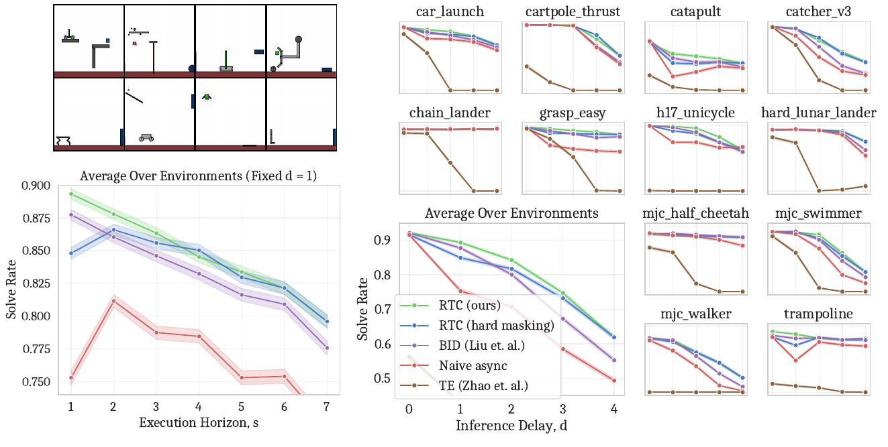

*Figure 5. 12개 동적 환경, execution horizon sweep, inference delay sweep. [PDF p.7, Fig.5]*

환경 이름은 `car_launch`, `cartpole_thrust`, `catapult`, `catcher_v3`, `chain_lander`, `grasp_easy`, `h17_unicycle`, `hard_lunar_lander`, `mjc_half_cheetah`, `mjc_swimmer`, `mjc_walker`, `trampoline`이다. 녹색 물체와 파란 물체가 접촉하는 성공 조건을 환경의 동적 제약 속에서 달성한다. 던지기, 잡기, 균형 유지, locomotion 등의 움직임을 포함한다. 원문은 기존 10개와 신규 2개라고 하지만, 각 두 신규 이름의 완전한 대응을 본문에서 명시하지 않는다.

| 방법 | 다음 청크를 만드는 방식 | 비교의 중요한 조건 |
|---|---|---|
| Naive async | old chunk와 독립 생성 후 즉시 연결 | latency alignment는 있으나 continuity guidance 없음 |
| Temporal ensembling | 같은 timestamp의 여러 예측을 평균 | multimodal action을 평균하면 유효 경로를 벗어날 수 있음 |
| BID | 여러 후보를 sample하고 과거 연결·미래 contrast 기준으로 선택 | 논문 N=32, K=3, weak model 8 epochs |
| RTC hard mask | 첫 d개에만 ΠGDM guidance | d=0이면 guidance가 전부 0 |
| RTC soft mask | H−s overlap 전체에 감소 가중치 | Eq.(5), β=5, n=5 |

BID의 rejection sampling은 무조건 새 action을 금지하는 safety filter가 아니다. 공개 구현은 candidate별 score를 계산해 **argmin 후보 하나를 선택**한다. 모든 후보가 threshold를 통과하지 못하면 정지한다는 rejection gate는 이 구현에 없다. 따라서 “RTC는 rejection을 한다” 또는 “BID는 반드시 안전한 후보만 통과한다”는 해석 모두 부정확하다.

코드의 BID는 strong candidate와 old target의 step별 L2 distance를 W로 가중해 backward consistency score를 만든다. full BID에서는 backward score가 좋은 strong/weak 후보 K개를 고른 뒤 전체 horizon의 거리 차로 forward contrast score를 더한다. weak보다 strong mode에 가까운 후보를 선호한다. 이때 score의 정규화와 sample 수를 맞추어야 한다. [공식 코드 확인, model.py 168–212]

### 8.3 Fig.5: execution horizon과 delay를 분리해 읽기

좌측 아래는 **d=1 고정**에서 s=1…7의 결과다. 큰 s는 더 오래 open-loop로 실행하므로 feedback가 약해진다. RTC와 BID는 s를 줄일수록 평균 solve rate가 높아지는 경향을 보이지만, naive async는 가장 짧은 s가 최선이 아니다. 독립 청크 간 mode jumping이 feedback 이점을 상쇄하는 것으로 해석할 수 있다.

우측은 **s=max(d,1)**로 두고 d=0…4를 늘린다. 따라서 delay만 바뀌는 실험이 아니라, d≥2에서는 최소 가능한 execution horizon도 함께 길어진다. 이 coupling은 실시간성을 만족시키기 위한 자연스러운 조건이지만, 순수한 observation delay만의 인과 효과와 같지는 않다.

[저자 보고] RTC가 평균적으로 baseline보다 강하고 delay 증가에 대한 성능 저하가 더 작다. soft mask는 작은 delay에서 hard mask보다 유리하다. Fig.5의 “robust”는 성능이 일정하다는 뜻이 아니다. RTC도 최대 delay로 가면 solve rate가 떨어진다.

그래프에서 읽을 수 있는 규모를 보수적으로 요약하면, 평균 RTC solve rate는 d=0에서 약 0.9대 초반, d=4에서 약 0.6대 초반이다. d=4에서 BID는 약 0.5대 중반, naive는 약 0.5 수준이다. **이는 PNG의 시각적 근삿값이며 raw CSV 기반 수치가 아니다.** 소수점 여러 자리의 차이·정확한 gain은 보고하지 않는다. 개별 환경마다 감소 양상이 크게 다르므로 평균만으로 모든 task가 동일하게 개선된다고 판단해서도 안 된다.

각 환경의 각 설정은 2048 rollouts이고 shaded interval은 95% Wilson score interval이다. 아래는 이를 이해하기 위한 표준 산식이다. 원문 번호식이 아니며 실제 raw success count를 이 리뷰에서 재계산한 것은 아니다.

```math
\mathrm{CI}_{\mathrm{Wilson}}=\frac{\hat p+z^2/(2N)\;\pm\;z\sqrt{\hat p(1-\hat p)/N+z^2/(4N^2)}}{1+z^2/N},\qquad z\approx1.96,\quad N=2048
```

이 interval은 binary rollout의 불확실성을 표현한다. training seed 분산이나 새로운 환경 분포의 불확실성을 모두 포함하지 않는다. 12개 환경 평균 곡선의 interval을 어떤 pooling 방식으로 만들었는지 공개 plotting script를 확인하지 못했으므로 독립 검증했다고 표시하지 않는다.

### 8.4 Simulation 비교의 공정성과 한계

같은 action-chunk policy에 sampling 방법을 바꾸고 H, n, 환경, delay를 통제한다는 점은 강점이다. 동시에 compute budget은 동일하지 않다. 논문 BID는 strong 32개와 weak 32개, 합계 64개 chunk sampling이 필요하지만 RTC는 한 noisy chunk와 VJP를 사용한다. 동일 d로 평가한 Fig.5는 BID에 높은 계산비용을 허용한 비교다. 실제 장치에서 그 비용이 더 큰 delay를 만들면 결과는 달라질 수 있다.

또한 논문에서 dynamic benchmark를 새로 설계한 것은 기존 quasi-static benchmark의 한계를 드러내지만, 해당 12개가 모든 로봇 동역학을 대표한다는 근거는 없다. vision/language ambiguity가 없는 symbolic observation, 단순화된 접촉과 force control, 데이터 mixture의 mode 수가 결과에 영향을 줄 수 있다.

### 8.5 실물 구성과 scoring

[저자 보고] π0.5, H=50, Δt=20 ms, n=5를 사용한다. 양팔은 각각 6-DoF와 parallel-jaw gripper를 가지며 position control로 실행한다. 6개 task 중 2개는 mobile manipulation이다. LAN remote inference로 계산하며, base latency를 포함한 RTC의 delay는 대략 6 controller steps다. +100 ms, +200 ms를 인위적으로 추가해 약 11, 16 step 조건도 평가한다. [PDF pp.7–8]

| Task | 최대 substep score | cutoff | 구체적 행동 | 재시도 |
|---|---:|---:|---|---|
| Light candle | 5 | 40 s | 성냥·상자 집기, 점화, 초에 불 옮기기, 성냥 내려놓기 | 다른 task와 달리 재시도를 허용하는 방식이 아님 |
| Plug ethernet | 6 | 120 s | 케이블 끝 집기·방향 맞추기·server rack 연결, 반대 끝 반복 | 가능 |
| Make bed | 3 | 200 s | 이불 모서리와 베개 2개를 침대 머리 방향으로 옮기기 | 가능; mobile |
| Shirt folding | 1 | 300 s | 펼친 셔츠 접기 | 가능 |
| Batch folding | 4 | 300 s | 구겨진 의류 꺼내기·펴기·접기·쌓기 | 가능 |
| Dishes in sink | 8 | 300 s | 다양한 물건 4개를 counter에서 sink로 옮기기 | 가능; mobile |

각 episode의 정수 score와 substep 완료 timestamp를 사후 annotation했다. 단순 binary success보다 중간 진척을 측정하지만, 서로 다른 substep의 난이도를 동일하게 세는 설계라는 점도 기억해야 한다.

### 8.6 실물 baseline의 horizon 차이

Synchronous는 25개 action을 실행한 뒤 새 inference 동안 정지한다. TE sparse도 s=25 간격으로 새 청크를 만들되 병렬 실행하고 겹치는 행동을 평균한다. TE dense는 가능한 자주 inference하여 s=d가 된다. RTC의 s_min=25와 dense TE의 서로 다른 policy refresh 빈도를 동일한 s의 통제 실험으로 소개하면 안 된다.

원문은 TE sparse에서 실제 ensemble할 수 있는 겹치는 길이를 다음 비번호 식으로 설명한다.

```math
L_{\mathrm{ensemble}}=H-s-2d
```

[PDF p.8] H=50, s=25라면 d=6일 때 13, d=11일 때 3이다. d=16이면 산술값 −7이므로 실제 유효 길이는 0이며 “음수 개 action”을 뜻하지 않는다. 긴 delay에서는 평균할 overlap 자체가 거의 사라진다. 이는 TE sparse가 delay에 특히 취약할 수 있는 구조적 이유다. TE dense는 더 많은 청크 중복을 유지하지만 multimodal 경로 평균의 문제까지 해결하지는 못한다.

실물 BID는 평가하지 않았다. 저자는 simulation 성능과 계산비용을 근거로 제외했고, π0.5에서 full BID N=16 latency가 RTC의 약 2.3배임을 Table 1에 제시한다. 이를 실물 task success에서 BID에 승리했다고 바꾸어 말할 수 없다.

### 8.7 Fig.6: 시간, controller steps, throughput

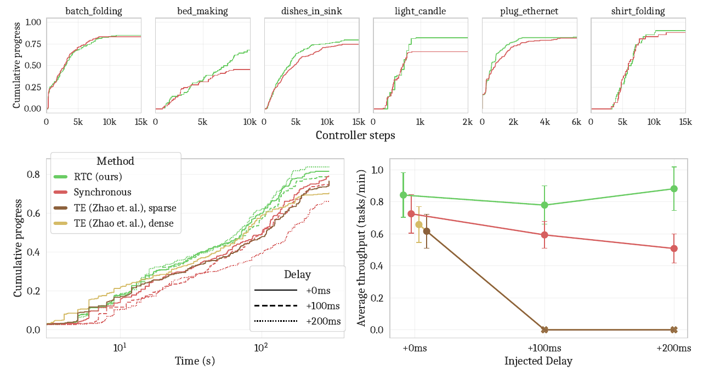

*Figure 6. task별 controller-step 진행률, 실제 시간 진행률, 지연별 평균 throughput. [PDF p.8, Fig.6]*

상단은 task별 cumulative progress를 controller steps에 대해 표시한다. 이것은 **inference 정지시간을 제거한 운동 시간×50 Hz**에 해당한다. synchronous의 pause 비용을 제거했는데도 RTC가 더 일찍 substep을 달성하면, 단순 정지 제거 외에 실수·재시도 감소가 있다는 간접 근거가 된다.

좌하단은 inference pause를 포함한 실제 elapsed time이다. x축은 logarithmic scale이며 short/long task를 함께 보이기 위한 것이다. curve 사이의 수평 거리나 면적을 선형시간 그래프처럼 해석하면 안 된다.

우하단의 throughput은 완료한 task fraction을 episode duration으로 나눈 값을 episode별로 구하고 평균한다. 아래는 원문 정의를 수식화한 리뷰어 표기다.

```math
p_e=\frac{c_e}{K_{\mathrm{task}(e)}},\qquad q_e=\frac{60p_e}{T_e},\qquad \bar q=\frac1E\sum_{e=1}^E q_e
```

c_e는 완료 substep 수, K는 그 task의 최대 score, T_e는 초 단위 episode duration이다. q의 단위는 tasks/min이다. full success만 세는 success/min이 아니라 **부분 진행률을 허용한 throughput**이다. 모든 episode의 score를 합한 뒤 전체 시간을 나누는 pooled rate와도 다르다.

[해설용 예제] 5개 substep 중 3개를 40초에 끝내면 q=60×(3/5)/40=0.9 tasks/min이다. 전부 성공하지 않았지만 0이 아니다. 아무것도 하지 않고 빠르게 종료하면 p=0이므로 throughput도 0이다. 빠른 실패 자체를 보상하는 metric은 아니지만, 어떤 partial progress를 의미 있게 인정할지는 task scoring 설계에 의존한다.

[저자 보고] RTC는 세 delay 조건 모두 평균 throughput이 가장 높고, +100/+200 ms에서 statistically significant하다고 기술한다. RTC에 별도의 성능 저하가 보이지 않는 반면 synchronous는 지연 증가에 따라 내려간다. 그래프의 대략적인 규모는 RTC 약 0.8–0.9 tasks/min, synchronous 약 0.7에서 0.5로 감소하는 수준이다. 정확한 raw 수치와 p-value는 원문에서 제공되지 않아 그래프 독해 이상의 정밀도를 주장하지 않는다.

Error bar는 **±1 SEM**이다. 95% CI가 아니며, 그림만 보고 특정 hypothesis test의 유의확률을 복원할 수 없다. 논문의 significance 문장은 저자 보고로 남긴다. 개별 condition/task당 10 trials이므로 task별 결론의 불확실성은 전체 480이라는 숫자만으로 작아지지 않는다.

### 8.8 TE failure와 480 episodes의 산술

[저자 보고] 두 TE variant는 +100/+200 ms에서 큰 oscillation 때문에 로봇 protective stop이 발생해 정상 실행되지 않는다. 이는 실험에서 관찰한 failure이며, RTC의 수식이 모든 물리적 위험을 배제한다는 증거는 아니다. 실패는 그래프의 0 throughput으로 나타나지만 동일한 의미의 정상 완료 episode 측정치로 혼동하지 않는다.

유효한 평가 조건 수는 RTC 3개 + synchronous 3개 + TE sparse 기본 delay 1개 + TE dense 기본 delay 1개 = 8개다. [검산]

```math
6\;\text{tasks}\times10\;\text{trials}\times(3+3+1+1)=480\;\text{episodes}
```

이것은 논문의 480과 일치한다. “4 methods×3 delays×6 tasks×10=720”이라고 계산하면 실행되지 않은 TE 조건을 포함하게 된다. 논문은 pure robot execution 28시간이라고 보고한다. 원시 실행 로그 없이 episode 조기 종료·cutoff 처리까지 재구성했다고 표시하지 않는다.

### 8.9 Task별 진행률을 해석할 때

Light candle에서는 RTC의 최종 progress가 높다. 이 task는 재시도에 의존하지 않고 정밀 접촉이 중요해 큰 차이가 보인다고 저자는 해석한다. Bed making에서도 RTC가 최종 score에서 유리하며, 특히 베개 조작이 어렵다고 보고한다. 다른 task에서는 synchronous가 최종 score를 따라잡을 수 있지만 RTC가 초기에 더 많이 진행한다. 이것이 “동일 최종 성공률이라도 실제 throughput이 다르다”는 이유다.

PDF p.9의 per-task 결과 설명은 “Figure 5, top”이라고 적지만, 문맥상 **Figure 6 top**의 실물 task별 plot을 가리킨다. Fig.5는 Kinetix 결과다. 이 리뷰는 해당 cross-reference 오류를 그대로 반복하지 않는다.

<a id="s9"></a>
## 9. §5–7 및 기술 부록 A.1–A.7

### 9.1 §5 Related Work: 새로 한 것과 가져온 것

Action chunking 자체는 기존 imitation learning의 방법이다. Diffusion/flow, VQ, BPE 등은 chunk 분포를 표현하는 서로 다른 방법이며, RTC는 이 모든 표현에 직접 적용되는 일반 scheduler만을 제안한 것은 아니다. 해당 식을 사용하려면 연속 생성 상태와 differentiable denoiser/velocity가 필요하다.

Cascaded control과의 관계도 제한적으로 설명한다. 실물의 learned policy가 joint target을 내고 더 빠른 PID 등이 hardware torque로 바꾸면 policy는 바깥 loop다. 하지만 Kinetix policy는 force/torque를 직접 출력하므로 같은 cascade 구조라고 부를 수 없다. 저자는 control-theoretic 분석을 future work로 남긴다. [PDF p.9]

추론 가속·distillation·parallel decoding은 RTC와 조합 가능한 방향이다. 그렇더라도 한 forward가 controller period보다 길면 실행 지연 문제는 남는다. Inpainting과 ΠGDM은 기존 image inverse-problem 연구에서 가져오며, Diffuser도 planning constraint를 diffusion으로 다룬다. RTC의 차별성은 이전 action chunk와 **delay 동안 실행될 prefix**를 연결한 inference-time 실시간 실행에 있다. 구성요소 하나씩을 모두 새로운 것으로 주장하지 않는다.

MPC와는 receding horizon, 계산·실행 overlap, 이전 계획 재사용을 공유한다. 논문은 hand-crafted dynamics와 cost가 필요한 MPC가 자신의 model-free imitation setting에 직접 맞지 않는다고 설명한다. 이 문장을 모든 learning MPC 또는 모든 model-free planning이 적용 불가능하다는 보편적 정리로 확대할 수 없다.

BID는 가장 가까운 action-chunk 선행연구다. 논문은 BID가 inference delay를 직접 고려하지 않았지만 continuity를 만드는 sampling 방식으로 확장할 수 있다고 인정하며 비교한다. System 1/2 계층형 VLA는 작은 fast action component와 큰 slow planner의 역할 분리로 latency를 줄인다. 이 접근은 RTC의 inference conditioning과 다르고, 상호 배타적이지 않다. [PDF pp.9–10]

### 9.2 §6 Discussion, §7 Acknowledgements

저자가 인정한 한계는 computational overhead, diffusion/flow만 지원, 실물에서 더 동적인 locomotion 등의 설정이 빠져 있다는 점이다. “모든 diffusion/flow VLA에 적용 가능”은 interface 차원의 적용 가능성 주장이지 모든 architecture에서 97 ms나 동일한 task gain이 나오는 결과가 아니다.

§7은 task 설계, 지표 제안, 데이터·로봇·평가 인프라 지원에 대한 감사다. 별도 알고리즘·실험 수식을 담고 있지 않다. References 71개는 논문의 위치를 이해하기 위해 확인했지만 그 71편을 별도로 전문 리뷰했다는 뜻은 아니다.

### 9.3 A.1 Broader Impacts

가정용 조작 개선이 위험·고된 노동의 자동화와 고령자·장애인 지원 등에 도움이 될 수 있으며, 군사적 사용이나 노동 대체의 부정적 영향도 있을 수 있다고 논의한다. 이 문단은 사회적 영향의 가능성에 대한 저자 의견이며, 실제 안전성 인증이나 배포 impact 연구 결과가 아니다. [PDF p.23]

### 9.4 A.2: β ablation 전체

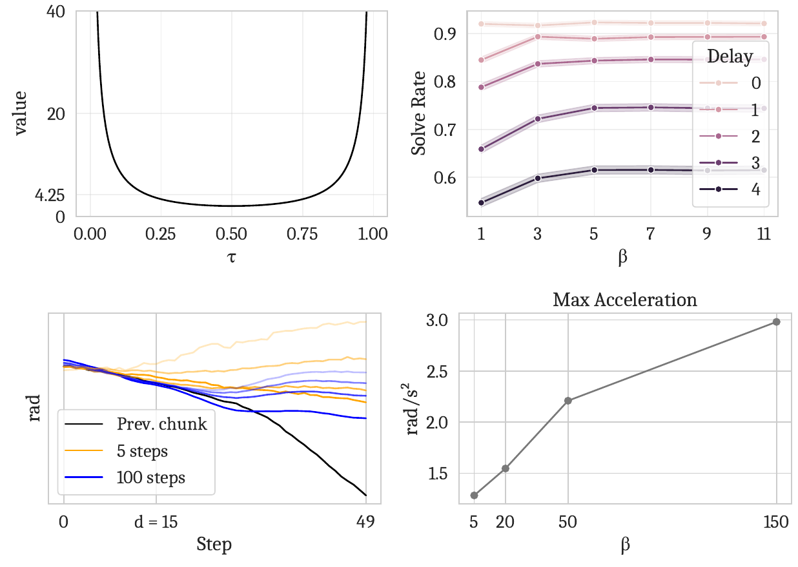

*Figure 7. guidance coefficient, β에 따른 solve rate, 5/100-step 궤적 비교, 최대 가속도. [PDF p.23, Fig.7]*

상좌는 Eq.(2)의 unclipped coefficient가 양 끝에서 커지는 것을 보여준다. 상우는 simulation에서 β를 키울 때 solve rate가 β≈5 이후 거의 추가 향상이 없음을 보여준다. 하좌는 같은 noise에서 β∈{5,20,50,150}와 n=5/100을 비교한다. 색의 opacity 차이는 guidance cap 차이이며, 단순 서로 다른 task를 비교한 그림이 아니다.

하우는 d=15, n=5에서 생성한 **325 action chunks**의 maximum acceleration을 본다. β가 클수록 second discrete difference가 커져 궤적의 거친 변화가 증가한다. 원문은 이를 jerkiness의 proxy라고 부르지만 **가속도는 jerk 자체가 아니다**. 위치 q에 대해 물리시간 단위로 쓰면 다음 보조 관계가 성립한다.

```math
\ddot q_i\approx\frac{q_{i+1}-2q_i+q_{i-1}}{(\Delta t)^2},\qquad \dddot q_i\approx\frac{q_{i+2}-3q_{i+1}+3q_i-q_{i-1}}{(\Delta t)^3}
```

Figure의 second difference에서 어떤 action dimensions를 aggregate했는지, exact normalization·max/mean 순서를 포함한 원시 계산 코드는 제공된 simulation 저장소만으로 확인할 수 없다. 그래프의 rad/s²와 설명을 바탕으로 가속도 proxy라는 수준으로 읽는다. 325개 생성 청크 분석을 325개의 물리 로봇 rollout으로 바꾸어 말하면 안 된다.

저자는 τ=0 대신 작은 양수에서 시작하는 기존 대안도 footnote로 언급하지만 **시도하지 않았다고 명시**한다. 이 논문이 initialization alternatives를 모두 비교한 것은 아니다.

### 9.5 A.3 Table 1: 방법별 GPU-only latency

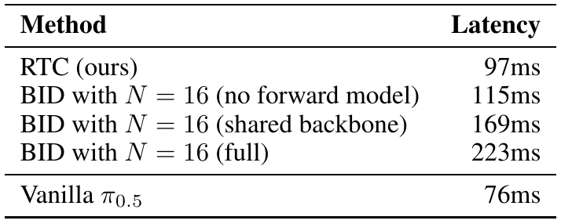

| 방법 | latency | RTC 대비 |
|---|---:|---:|
| RTC | 97 ms | 1.00× |
| BID N=16, forward contrast 없음 | 115 ms | 1.19× |
| BID N=16, shared backbone | 169 ms | 1.74× |
| BID N=16, full | 223 ms | 2.30× |
| Vanilla π0.5 | 76 ms | 0.78× |

[저자 보고: PDF p.24, Table 1. 비율은 검산.] RTX 4090, bfloat16, n=5, warmup 5번 후 inference 10번 평균이다. **on-GPU neural network inference만 포함**하고 network·CPU resize·controller 전달은 제외한다.

BID no-forward variant는 weak model을 생략한다. shared-backbone variant는 VLM backbone을 공유하고 action expert 두 개를 유지한다. full BID는 전체 model 두 개가 필요하다. Table caption은 backbone 약 3B, action expert 약 300M이라는 규모를 설명한다. 이것을 별도 source 없이 모든 π0.5 내부 layer specification으로 확장하지 않는다.

[검산] RTC 자체의 overhead는 97−76=21 ms, 비율 97/76=1.2763이므로 모델 추론은 **27.63% 느려진다**. 223/97=2.299로 본문의 full BID “2.3 times”와 일치한다. RTC의 장점을 model-latency speedup으로 소개하면 방향이 반대다.

### 9.6 A.3 Table 2: end-to-end latency 분해

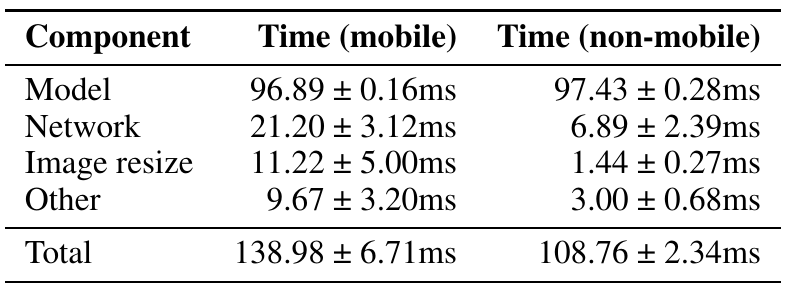

| Component | Mobile | Non-mobile |
|---|---:|---:|
| Model | 96.89 ± 0.16 ms | 97.43 ± 0.28 ms |
| Network | 21.20 ± 3.12 ms | 6.89 ± 2.39 ms |
| Image resize | 11.22 ± 5.00 ms | 1.44 ± 0.27 ms |
| Other | 9.67 ± 3.20 ms | 3.00 ± 0.68 ms |
| Total | 138.98 ± 6.71 ms | 108.76 ± 2.34 ms |

[PDF p.24, Table 2] ±는 **한 표준편차**, 50회 real episode inference call의 측정이다. Mobile robot computer는 Intel NUC i7-1260P, non-mobile은 AMD Ryzen 9 7950X desktop이며 모델은 별도 RTX 4090 workstation에서 실행된다. 둘 다 같은 LAN의 wired Ethernet, WebSocket이다. Mobile이라는 이름이 무선 네트워크 측정을 뜻하지 않는다.

[검산] Mobile mean 합은 96.89+21.20+11.22+9.67=138.98 ms, non-mobile은 97.43+6.89+1.44+3.00=108.76 ms로 정확히 일치한다. Total 차이는 30.22 ms이며 대부분 model 외부 비용에서 온다. 표준편차는 단순히 더하면 안 된다. component 간 covariance가 있어 raw paired trace 없이 total variance를 독립 검산할 수 없다.

본문의 d≈6은 여러 robot setup을 요약한 근삿값이다. Table 2의 평균을 원문 floor 정의에 넣으면 mobile floor(138.98/20)=6, non-mobile floor(108.76/20)=5다. +100/+200 ms는 5/10 controller tick을 더한다. 실제 scheduler와 capture/consumption 경계에 따라 discrete count가 달라질 수 있으므로 소수점 평균만으로 매 호출의 d를 확정하지 않는다.

### 9.7 A.3 Table 3: 어디에서 overhead가 생기는가

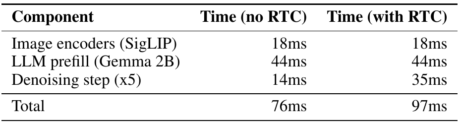

| Component | RTC 없음 | RTC 적용 | 해석 |
|---|---:|---:|---|
| SigLIP image encoders | 18 ms | 18 ms | observation encoding은 동일 |
| Gemma 2B LLM prefill | 44 ms | 44 ms | 같은 observation context 처리 |
| Denoising, 5회 합계 | 14 ms | 35 ms | action-input VJP가 추가됨 |
| Total | 76 ms | 97 ms | encoder/prefill 62 ms는 유지 |

[PDF p.24, Table 3] 각 방법 **single profiling trace**에서 얻은 값이다. `Denoising step (x5)` 행은 5회의 합계다. 35 ms를 한 step 비용으로 보고 다시 5를 곱하면 총합이 틀린다.

[검산] 35/14=2.5이므로 denoising 부분은 2.5배, step당 평균은 2.8→7.0 ms다. 모델 전체 2.5배 증가가 아니라 76→97 ms다. 전체 RTC model latency에서 vision+prefill이 차지하는 비중은 62/97≈63.92%다. 이 설정에서는 action expert의 추가 backward 비용만 줄여도 encoder/prefill lower bound는 남는다.

VJP는 action input에 대한 미분이다. context가 action input과 독립적으로 준비되면 미분은 주로 action-dependent denoiser 경로를 따라간다. 논문 Table 3의 동일 image/prefill 비용은 그 해석과 일치한다. 하지만 비공개 실물 runtime의 정확한 cache implementation이나 memory lifetime을 소스 확인했다고 주장하지 않는다.

### 9.8 A.4: soft-mask schedule과 Diffuser 비교

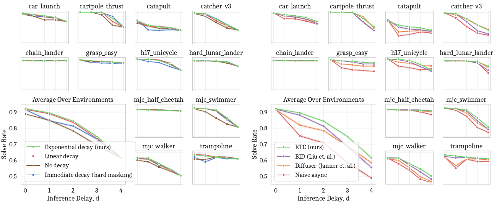

*Figure 8. 왼쪽은 mask schedule, 오른쪽은 guidance-based와 overwrite inpainting의 비교. [PDF p.25, Fig.8]*

왼쪽은 exponential, linear, no decay, immediate decay를 비교한다. 공개 `get_prefix_weights`에서 linear는 c ramp, exponential은 c·expm1(c)/(e−1), ones는 overlap 전체 1, zeros는 frozen prefix만 1을 뜻한다. 함수가 마지막에 i≥end 구간을 0으로 만들므로 “ones”라고 전체 H개에 target을 준다고 읽으면 안 된다.

[저자 보고] exponential이 전체적으로 가장 좋지만 linear가 매우 가깝다. 따라서 논문의 경험적 근거는 “soft overlap이 도움이 된다”에 더 강하고 “특정 exponential 수식이 모든 상황에서 필수”에는 약하다. No decay는 먼 미래 old plan까지 강하게 고정해 새 observation correction을 억제할 수 있고, hard mask는 continuity signal이 너무 짧아질 수 있다는 해석이 가능하다.

오른쪽은 Diffuser에서 가져온 매 denoising step의 일부 action overwrite 방식을 비교한다. 이 방법도 naive보다 이점이 있지만 RTC guidance보다 낮다고 보고한다. 장점은 더 싼 inpainting, 단점은 learned joint trajectory 전체를 gradient로 조정하는 방식보다 유연성이 부족할 수 있다는 것이다. 정확한 task별 raw 수치와 이 ablation을 생성한 complete runnable configuration은 현재 검토한 공개 sweep에 들어 있지 않다.

### 9.9 A.5 Table 4: 하이퍼파라미터

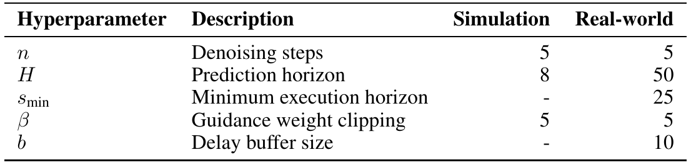

| Hyperparameter | Simulation | Real world |
|---|---:|---:|
| n, denoising steps | 5 | 5 |
| H, prediction horizon | 8 | 50 |
| s_min | 해당 없음 | 25 |
| β | 5 | 5 |
| b, delay queue length | 해당 없음 | 10 |

Simulation은 d를 experiment별 상수로 주므로 delay prediction queue가 필요 없다. s 자체는 Fig.5의 sweep/조건에 따라 변한다. s_min의 대시가 “simulation에서 execution horizon을 사용하지 않는다”는 뜻은 아니다.

### 9.10 A.6 Code release와 A.7 compute

공식 공개 범위는 Kinetix simulation 코드다. Checklist p.18은 실물 π0.5 학습 데이터와 robot runtime이 proprietary라 공개하지 않았다고 명시한다. 공개 알고리즘을 재구현할 수 있다는 주장과 같은 실물 성능을 완전히 재현할 수 있다는 주장은 구별해야 한다.

| 단계 | 저자 보고 compute | 읽을 때의 제한 |
|---|---|---|
| RPO expert 6 seeds×12 environments | 4×H100, 약 4시간 | 본 실험 구성의 비용; 공개 default 8 seeds와 다름 |
| 데이터 생성 | 6×H100, 약 20분 | 약 1M transitions/level |
| 환경별 flow imitation training | 2×H100, 약 1.5시간 | 본문은 환경별이라고 표현; 전체 sweep 총비용으로 임의 환산하지 않음 |
| 2048 rollouts/environment 평가 | 6×H100, 약 5분 | 전체 method×delay×s sweep 총비용 아님 |
| π0.5 fine-tuning 1회 | 8×H100, 약 24시간 | task별 총 run 수·실패 실험 비용 미기재 |
| 실물 inference | RTX 4090 1개 | 로봇과 같은 건물의 workstation |

[PDF p.25, A.7] 한 번에 최대 8 H100을 사용했고 cloud provider를 통해 사용했다고 설명한다. 이 리뷰에서 해당 학습이나 timing을 재실행하지 않았다.

<a id="s10"></a>
## 10. 실패 조건, 재현성, OpenVLA·Thor 적용

### 10.1 실시간성을 무엇으로 측정해야 하는가

| 지표 | RTC 문맥의 의미 | 논문 근거/미기재 |
|---|---|---|
| actuator/command rate | 준비된 action을 소비하는 주기 | 실물 50 Hz target; 더 낮은 hardware servo 내부 주기는 미기재 |
| policy refresh rate | 새 관측으로 청크 생성을 시작하는 빈도 | s_min=25, d≤25일 때 이상적으로 2 Hz |
| prediction coverage | 생성한 H개가 나타내는 물리시간 | 50×20 ms=1초 |
| generated action scalars/s | model의 전체 chunk 출력량 | 실행하지 않을 prefix/tail까지 포함하므로 제어 성능 지표로 부족 |
| first usable action latency | 관측 snapshot에서 사용 가능한 새 action까지 | total inference delay와 정렬에 의존 |
| model latency | image encoder+prefill+denoising | 97 ms GPU-only |
| observation-to-chunk latency | network·resize 포함 전체 | mobile 138.98, non-mobile 108.76 ms 평균 |
| task throughput | partial task completion fraction / episode time | Fig.6, tasks/min |
| p95/p99 latency, deadline misses | tail과 buffer 고갈의 직접 지표 | 원문에 충분한 측정 미기재 |
| token TTFT/TPOT | AR language decoding 지표 | 연속 flow action chunk에 직접 대응하지 않음 |
| FLOPs·token 감소 | 계산 절약 지표 | RTC 기여의 중심이 아님; VJP로 연산이 오히려 증가 |

H=50, s=25, Δt=0.02이면 1초치 계획을 0.5초마다 갱신해 action은 0.02초마다 소비한다. 이때 생성한 50개 중 일부는 실행되지 않고 다음 생성의 조건으로 쓰이거나 폐기된다. **50 Hz 제어가 50번/초의 VLA inference라는 뜻이 아니다.**

[해설용 이상화] 동일 행동을 수행하며 synchronous가 s개마다 δ만큼 멈춘다면 motion duty ratio는 다음과 같다.

```math
\eta_{\mathrm{sync}}=\frac{s\Delta t}{s\Delta t+\delta},\qquad \frac{T_{\mathrm{sync}}}{T_{\mathrm{async}}}\approx1+\frac{\delta}{s\Delta t}
```

sΔt=0.5초, δ=0.1초이면 이상적인 시간비는 1.2다. 이는 동일한 물리 action sequence를 가정한 산술 설명이며, 논문의 전체 task throughput이 정확히 1.2배라는 결과가 아니다. RTC의 추가 모델비용, retry, success fraction, cutoff가 실제 task 결과를 바꾼다.

### 10.2 연속성은 어떤 수준까지 성립하는가

Eq.(2)는 sample의 endpoint consistency를 **유도**한다. equality constraint projection이 아니고, optimizer convergence까지 반복하지도 않으며, finite n과 clipped scalar를 사용한다. 그러므로 다음 항목을 구별해야 한다.

- **Command consistency:** 이전 계획과 새 계획의 겹치는 action이 비슷해지는 경향. 직접 목표다.
- **Position continuity:** 새 위치 target이 old target과 정확히 같은 boundary를 갖는 성질. 보장하지 않는다.
- **Velocity/acceleration continuity:** 연속 미분 또는 finite-difference가 매끄러운 성질. loss에 명시적 derivative constraint가 없다.
- **State tracking:** 실제 로봇이 계획 command를 따라가는 성질. contact·slip·actuator error와 low-level controller에 의존한다.
- **Task feasibility/safety:** collision·joint limit·force threshold 등을 만족하는 성질. RTC에 별도 constraint checker가 없다.

따라서 “frozen prefix가 있으니 C0/C1/C2 continuity가 증명된다”는 주장은 원문과 맞지 않는다. 실험은 discontinuity와 task failure가 줄었다는 경험적 증거다.

### 10.3 Rejection/failure 조건 감사

| 조건/실패 | RTC 원문에서의 처리 | 해석 또는 필요한 후속 처리 |
|---|---|---|
| actual delay > old tail 길이 | Algorithm에 fallback 미기재 | 새 chunk 전 도착 deadline 실패, buffer underrun |
| actual delay > predicted d | 특별 rejection 없음 | 일부 실제 실행 prefix가 weight 1 대신 soft 조건이 되어 continuity 약화 가능 |
| predicted d가 지나치게 큼 | 더 긴 frozen 영역에 weight 1 | 가능한 반응성을 줄일 수 있으나 보수적으로 작동 |
| H−s−d < 0 | 원문 유효 horizon 밖 | 정상 mask/실행 구간을 구성할 수 없음 |
| NaN/Inf output | scalar τ=0 처리 외 general validity gate 없음 | 유한값 검증·범위 check는 별도 runtime 기능 |
| 큰 gradient/Jacobian | β는 scalar만 제한 | update norm이나 물리 limit 보장 없음 |
| 새 관측이 old strategy를 무효화 | old overlap guidance는 계속 작동 | consistency와 빠른 전략 교체 사이의 trade-off |
| relative action frame이 변경됨 | 구체적 처리 미기재 | old/new를 같은 frame으로 재표현해야 함 |
| 초기 buffer 미준비 | A_init 입력 가정 | startup 별도 설계 필요 |
| controller 또는 inference thread 종료 | 예외 처리 미기재 | 예외·liveness monitoring 별도 필요 |
| TE oscillation | 실물 protective stop 관측 | RTC algorithm의 rejection rule과 무관 |
| BID 후보 모두 나쁨 | 공개 구현은 argmin 후보 선택 | 명시적인 안전 threshold 또는 “전부 reject” 경로 없음 |

이 표는 실제 task 관련 한계를 드러내기 위한 것이다. 후속 validity gate를 추가하면 그것은 RTC 원문을 그대로 실행한 시스템과 달라지므로 성공률, fallback rate, latency를 별도로 보고해야 한다.

### 10.4 공개 코드와 논문 사이의 구체적 재현 차이

| 항목 | 논문 | 고정 공개 코드 | 재현 시 조치 |
|---|---|---|---|
| expert seed 수 | 6/environment | default 8 | paper condition을 원하면 config를 6으로 고정하고 기록 |
| data size | 약 1M | block 단위 올림, default 1,015,808 | 실제 저장 transition 수와 hash 기록 |
| expert checkpoint 선택 | 여러 expert mixture | threshold 0.65 이상 중 random | checkpoint path·seed·선택 기록 보존 |
| BID | N=32, K=3, weak 8 epochs | default N=16, K=None, weak_step=None | full BID branch와 weak checkpoint를 명시적으로 설정 |
| sweep의 BID config | full BID 비교 서술 | `BIDMethodConfig()`를 새로 생성 | 단순 top-level override만으로 반영되는지 확인; sweep 내부 구성도 조정 필요 |
| TE 실험 | Fig.5와 Fig.6 | 검토한 `eval_flow.py` 기본 sweep에 없음 | 별도 implementation/실험 script 필요 |
| Diffuser ablation | Fig.8 | `realtime_action`에 overwrite variant 없음 | 별도 구현·설정 필요 |
| weight schedule sweep | Fig.8 | helper는 지원, 기본 sweep은 exp/zeros만 | linear/ones sweep을 추가해야 함 |
| model checkpoint 선택 | 32-epoch policy, weak 8-epoch | numeric directories에서 index 선택 | zero-based 저장이면 8 epochs checkpoint와 index를 확인 |
| robot asynchronous loop | Algorithm 1 | simulation의 logical delay 모사 | 실물 runtime 직접 대조 불가 |
| 후속 training-time RTC | 이 논문의 범위 아님 | 최신 HEAD에 추가됨 | 원 RTC branch/설정을 분리해 고정 |

이 차이들은 논문 수치를 거짓이라고 판정하는 증거가 아니다. **현재 공개된 default code를 아무 변경 없이 실행하는 것과 paper recipe가 동일하지 않다**는 재현성 정보다. 해당 코드에서 raw result CSV를 생성할 수 있는 경로는 있지만 논문 Fig.5–8의 원시 결과 파일을 이 리뷰에서 내려받거나 재생성하지 않았다.

### 10.5 재현 순서와 통제 조건

다음은 [후속 연구 제안]이며 이번 리뷰에서 실행하지 않았다.

1. **문헌·코드 고정:** 이 리뷰의 v2 PDF hash, 코드 commit, Kinetix commit을 사용하고 paper/default 차이를 config로 기록한다.
2. **수학 parity:** 작은 deterministic action tensor에서 W, f, VJP와 finite-difference directional derivative가 맞는지 확인한다. τ=0과 마지막 τ, d=0, d=H−s를 포함한다.
3. **시간 parity:** 각 action에 global timestamp를 붙여 prefix skip과 chunk shift를 trace한다. fixed delay, variable delay, predicted/actual mismatch를 모두 검증한다.
4. **성능 비교:** 동일 checkpoint·noise seed·환경 seed·H·n으로 naive/hard/soft/BID/TE/Diffuser를 비교한다. paper-matched delay와 measured-delay 조건을 구별한다.
5. **실시간 측정:** observation capture, preprocess, submit, network, prefill, each denoise forward/VJP, completion, publish, first-consumption timestamp를 기록한다.
6. **실패 통계:** buffer underrun, nonfinite chunk, skipped stale chunk, protective stop, fallback 발생률을 성공률·throughput과 함께 보고한다.
7. **일반화 확인:** 평균 12-task score만 보지 말고 접촉 전환, 높은 multimodality, 큰 외란, relative action, 다른 robot embodiment를 별도 분류한다.

맞추어야 할 공정 조건은 모델 checkpoint, 데이터, solver step 수, action units, batch/sample 수, 동일 관측 주기, 실물 low-level gains, cutoff/scoring, warmup 조건이다. RTC는 backward로 latency가 늘기 때문에 “모든 방법에 같은 simulated d”와 “모든 방법을 같은 hardware에서 측정한 실제 d”는 다른 질문에 답한다.

### 10.6 OpenVLA, VLM/VLA와의 연결

**기본 discrete autoregressive OpenVLA에 Eq.(2)를 그대로 붙일 수 없다.** 필요한 것은 continuous action state $`\mathbf A^\tau`$와 그 상태에 대해 미분 가능한 clean endpoint map이다. action token을 categorical sampling한 뒤 scalar bin으로 decoding하는 경로는 이 continuous flow interface가 아니다. 해당 policy에 flow/diffusion action head를 학습·부착하거나 별도 연속 sampler를 만들면 논문이 말하는 “추가 학습 없이 바로 적용”의 범위를 벗어난다. [리뷰어 해석; PDF p.10, §6의 diffusion/flow 제한]

반면 이미 flow-based action expert를 가진 VLA는 observation encoding과 action generation을 분리하고 action-input VJP를 노출할 수 있으면 후보가 된다. 특정 모델 이름만 보고 호환된다고 판단하지 말고 다음을 확인해야 한다.

- noise→data time convention과 solver가 Eq.(1)/(3)/(4)와 일치하는가.
- action time grid가 실제 controller period와 일치하는가.
- padding action dimensions와 real action dimensions의 mask가 일관되는가.
- old target과 new output이 같은 normalization·coordinate frame인가.
- action expert의 custom/fused operation이 입력 VJP를 지원하는가.
- observation context가 chunk 안에서 고정되며 필요한 cache를 재사용할 수 있는가.

Visual token pruning이나 VLM prefill 가속은 RTC와 조합할 수 있지만, 정확도·지연 변화가 RTC guidance에도 영향을 줄 수 있다. “vision token을 줄이면 δ가 줄어든다”에서 끝내지 말고 task quality와 actual frozen-prefix length가 어떻게 바뀌었는지까지 측정해야 한다.

### 10.7 Jetson AGX Thor·TensorRT 배포 연결

**이 논문은 Jetson AGX Thor나 TensorRT에서 RTC를 측정하지 않았다.** 보고된 실물 inference는 RTX 4090의 bfloat16 실행이다. 따라서 97 ms를 Thor latency로 대체하거나 TOPS 비율로 speedup을 환산할 수 없다.

[후속 연구 제안] 가장 큰 포팅 문제는 TensorRT forward engine만 준비해서는 **Eq.(2)의 action-input VJP가 자동으로 생기지 않는다는 점**이다. JAX/PyTorch에서 denoiser를 미분하던 경로를 명시적인 derivative computation으로 export하거나, 별도 autodiff 경로를 유지하거나, 필요한 연산을 custom implementation으로 준비해야 한다. NVIDIA는 지원되지 않는 연산을 [TensorRT custom layers/plugins](https://docs.nvidia.com/deeplearning/tensorrt/latest/inference-library/extending-custom-layers.html)로 확장하는 경로를 문서화하지만, 그것이 RTC VJP를 자동 제공하거나 성능을 보장하는 것은 아니다. 이 문서만으로 특정 Thor/JetPack version의 지원 상태를 확정하지 않는다.

| 구성 요소 | 가능한 담당 경로 | 검증 gate |
|---|---|---|
| Camera preprocess, timestamp, controller queue | robot CPU의 짧고 예측 가능한 경로 | capture→consume 정렬, lock hold time, queue coverage |
| SigLIP / VLM prefill | 지원되는 GPU inference engine 후보 | 동일 관측 feature와 cached context parity |
| Action velocity forward | GPU flow expert | timestep별 velocity error, shape·dtype 일치 |
| Endpoint VJP | autodiff 유지 또는 명시 derivative graph/custom kernel | reference VJP와 수치 비교, backward latency·memory |
| W·γ·Euler update | 작은 GPU/CPU 연산, 이동 최소화 | τ=0 finite 처리, repeated broadcast, NaN 검사 |
| Async scheduler | CPU thread/queue | variable latency와 underrun handling |
| Lower-level controller | 기존 로봇 제어 계층 | 실제 tracking과 transition acceleration |

GPU/NPU/DLA 중 어디서 VJP를 수행할 수 있는지는 이 논문이 검증하지 않았다. 정책 forward가 어떤 accelerator에서 돌아간다는 사실만으로 reverse-mode derivative도 지원한다고 볼 수 없다. 이 때문에 첫 parity 기준은 native precision의 full RTC이며, mixed precision 또는 derivative approximation은 별도 ablation으로 다루는 것이 타당하다.

배포 실험에서 우선 보고할 것은 (i) one-chunk 전체 latency의 p50/p95/p99, (ii) 각 denoising forward/VJP의 분해, (iii) sensor-to-first-usable-action 지연, (iv) action deadline miss와 fallback 비율, (v) task throughput과 성공률이다. warmup, JIT/engine build 비용, sustained power·memory pressure, network 유무도 함께 고정한다. 기존 4090 결과를 실제 장치의 측정값으로 대체하기 전까지 “실시간 동작 검증 완료”라고 부르지 않는다.

### 10.8 논문에서 확인되지 않은 사항

원문의 기술 범위를 넘어 다음 항목은 미기재 또는 공개 자료로 대조하지 못했다: 모든 실물 joint/action scalar의 정확한 encoding·padding, image resolution/camera 수, 실물 task별 dataset 규모·split·fine-tuning freeze recipe, 실물 runtime source, latency tail/WCET, unexpected network outage, collision/force/joint constraint handling, action-frame 변환, 모든 plot의 raw values와 통계 코드, diffusion-to-flow 변환의 개별 모델 구현, real-world locomotion, Thor/TensorRT latency.

이 빈칸을 일반적인 π0.5 지식이나 다른 논문의 설정으로 채워 논문의 실험 사실처럼 쓰지 않았다.

<a id="s11"></a>
## 11. 오해 Q&A와 학습 순서

**Q1. RTC는 action chunk를 짧게 만들어 빨라지는 방법인가?**  
H를 줄이는 것이 핵심이 아니다. 같은 H의 chunk에서 previous plan과 새 observation을 결합하고 실행·추론을 겹친다. 실물 H=50을 유지한다.

**Q2. 이미 실행할 prefix라면 왜 새 청크에서도 생성하는가?**  
그 prefix는 실제로 다시 실행하려는 출력이 아니라 나머지 행동의 일관성을 만드는 조건이다. 그 prefix를 포함한 joint action distribution의 구조를 이용하고, 도착 시점에 지나간 slots는 skip한다.

**Q3. “Frozen”이면 최종 청크의 prefix가 old action과 완전히 같아야 하지 않는가?**  
의도상 유지할 target이지만 구현은 finite-step guidance다. Fig.4에서도 정확히 같지 않다. 실제로 실행 중인 old commands 자체는 새 결과로 바뀌지 않는다.

**Q4. Prefix를 아예 붙여 넣고 suffix만 생성하면 되지 않는가?**  
가능한 다른 inpainting 설계다. 원문은 Diffuser-style overwrite를 비교하며 RTC guidance가 더 좋다고 보고한다. 이 비교는 모든 모델에서 overwrite가 무효라는 증명은 아니다.

**Q5. W=0인 좌표는 guidance 영향을 전혀 안 받는가?**  
직접 endpoint target만 없다. Jacobian의 temporal coupling으로 해당 noisy coordinate는 바뀔 수 있다. §5.5의 2D 예제를 보라.

**Q6. Backpropagation을 하면 inference-time training 아닌가?**  
θ는 고정하고 noisy action x에 대한 derivative를 구한다. optimizer로 model weight를 갱신하지 않는다. 적절한 의미는 input-gradient-guided inference다.

**Q7. 로봇이 50 Hz라면 모델도 20 ms 안에 끝나는가?**  
아니다. 모델은 약 97 ms, 실제 전체 지연은 setup에 따라 약 109/139 ms다. 준비된 buffer로 50 Hz action 공급을 지속한다.

**Q8. RTC가 지연에 완전히 면역인가?**  
실물에서는 시험한 +200 ms까지 큰 degradation이 보이지 않았다는 결과다. Kinetix에서는 RTC도 delay 증가에 따라 solve rate가 낮아진다. horizon 밖의 지연은 지원 조건을 벗어난다.

**Q9. d가 커질수록 prefix가 길어지니 더 안전한가?**  
더 많은 old behavior를 조건화하지만 최신 관측에 반응할 수 있는 범위가 줄어든다. continuity와 reactivity는 다른 축이다.

**Q10. β=5가 gradient 크기와 가속도를 5로 제한하는가?**  
아니다. schedule scalar만 5로 제한한다. action 단위나 gradient norm의 상한과 다르다.

**Q11. RTC는 rejection sampling인가?**  
RTC는 단일 noisy chunk를 guidance한다. 여러 후보를 생성해 고르는 rejection-style 방식은 BID baseline이다. 둘 다 formal safe-action rejection certificate를 제시하지 않는다.

**Q12. 현재 GitHub README의 training-time RTC를 사용하면 같은 논문 재현인가?**  
후속 방법이 섞일 수 있다. 고정 커밋과 training/inference flag를 분리하고 loss가 단순 CFM인지 prefix-conditioned training인지 확인해야 한다.

**Q13. 원래 OpenVLA나 action-token language model에도 바로 적용할 수 있는가?**  
Eq.(2)에 필요한 continuous denoiser Jacobian interface가 없으면 바로 적용할 수 없다. flow head를 추가하면 별도 모델 변경이다.

**Q14. 논문은 formal real-time 또는 control stability 증명을 제공하는가?**  
제시한 horizon 조건과 알고리즘 설명은 있지만 general stability/WCET theorem은 없다. Checklist도 theoretical result가 없다고 명시한다.

권장 학습 순서는 다음과 같다.

1. Fig.2와 §4로 독립 청크 연결/평균의 실패를 이해한다.
2. §3의 t, τ, δ, d, H, s를 구별한다.
3. Eq.(1)→Eq.(3)→Eq.(4)→Eq.(2) 순으로 sampler를 계산한다.
4. Eq.(5)에서 frozen/intermediate/new tail의 길이를 손으로 센다.
5. Algorithm 1의 counter reset과 §6.6 timeline을 따라가며 실제 반환 index를 적는다.
6. 공식 `loss`와 `realtime_action`을 대조해 training gradient와 input gradient를 분리한다.
7. Fig.5/6과 Tables 1–3을 비교해 solve rate, throughput, GPU latency가 다른 결론을 내는 이유를 확인한다.
8. 재현성 차이와 실패 조건을 확인한 뒤 별도 배포 실험을 설계한다.

<a id="s12"></a>
## 12. Coverage checklist와 검증 기록

### 12.1 원문 섹션 대응

| 원문 구간 | PDF 페이지 | 리뷰 대응 | 처리 |
|---|---|---|---|
| Abstract, Fig.1 | 1 | §1–2 | 문제·기여·선택된 rollout evidence |
| §1 Introduction | 2 | §2, §4.1 | motivation과 architecture/scheduler 구별 |
| §2 Preliminaries | 2–3 | §3–4, §5.1 | chunk, horizon, τ, latency, floor 정의, footnote |
| §3 opening | 4 | §5.2–5.4 | overlap inpainting 문제 설정 |
| §3.1 | 4–5 | §5.2–5.6 | endpoint, VJP, shape, gradient sign, clipping |
| §3.2 | 5 | §5.7–5.8 | 모든 mask case, edge cases, 수치 예제 |
| §3.3 | 5–6 | §6 전체 | 모든 PDF algorithm 행, causality, dynamic delay |
| §4 opening | 6 | §8.1 | 연구 질문과 두 평가 설정 |
| §4.1 | 6–7 | §7.2–7.8, §8.2–8.4 | data/model/baseline, experiment caveat |
| §4.2 | 7–9 | §8.5–8.9 | 6 tasks, metrics, 480 trials, protective stop |
| §5 Related Work | 9–10 | §9.1 | chunking, cascade, speed, inpainting, MPC, hierarchy, BID |
| §6 Discussion | 10 | §9.2, §10 | author limitations와 critical review |
| §7 Acknowledgements | 10 | §9.2 | 비기술 문단임을 확인 |
| References 1–71 | 10–15 | §1, §9.1–9.2 | 관련 연구 맥락 확인; 인용 논문 71편 전문 독해 아님 |
| NeurIPS checklist 1–16 | 16–22 | §1.2, §7.6, §9.10, §10 | 전체 읽음; theory 부재·실물 데이터/runtime 비공개 확인 |
| A.1 Broader Impacts | 23 | §9.3 | 저자 의견과 검증 결과 구별 |
| A.2 Clipping | 23 | §5.6, §9.4 | beta ablation, 325 chunks, n=5/100, 미시도 대안 |
| A.3 Latency | 24 | §9.5–9.7 | 모든 table 숫자, 측정 범위·sample 수·통계 |
| A.4 Additional ablations | 25 | §9.8 | schedules와 Diffuser overwrite |
| A.5 Hyperparameters | 25 | §9.9 | 모든 파라미터 |
| A.6 Code release | 25 | §1.3, §9.10, §10.4 | commit 고정, 후속 변경과 default 차이 |
| A.7 Compute | 25 | §9.10 | 모든 compute 수치와 범위 |

### 12.2 모든 번호 수식과 핵심 비번호 식

| 식 | 원문 위치 | 리뷰 위치 | 이미지·편집식·해설 |
|---|---|---|---|
| (1) Euler flow | p.3 | §5.1 | PNG + LaTeX + shape·step·endpoint |
| (2) guided velocity | p.4 | §5.4–5.6 | PNG + LaTeX + VJP·부호·loss 보조 유도·예제 |
| (3) endpoint estimate | p.4 | §5.2 | PNG + LaTeX + Jacobian 보조식 |
| (4) r² schedule | p.4 | §5.3, §5.6 | PNG + LaTeX + coefficient 검산 |
| (5) soft mask | p.5 | §5.7–5.8 | PNG + LaTeX + 세 구간·수치·broadcast |
| policy와 action chunk 정의 | pp.2–3 | §3.3, §4.2 | editable + 시점 설명 |
| delay floor와 $`\mathbf a_{t\prime\mid t}`$ | p.3 | §4.3 | editable + sub-step 가정 |
| d≤s≤H−d / d≤H−s | pp.3–4 | §6.7 | editable + buffer/serial 조건 |
| s=max(d,s_min) | p.5 | §6.5 | global clock 재구성식과 연결 |
| Gaussian initialization | pp.3, 6 | §5.1, §6.4 | editable + actual sample path |
| Algorithm endpoint/error/VJP/Euler | p.6 | §6.4, §5 | 각 행과 번호식 1:1 연결 |
| TE sparse H−s−2d | p.8 | §8.6 | editable + 13/3/0 overlap 예제 |
| throughput 정의 | p.8 | §8.7 | 저자 문장 정의를 보조 수식으로 재구성 |
| CFM loss, Mixer, delay 실행 concat | 공개 코드 | §7.4–7.8 | 코드 기반 보조식으로 명확히 구분 |

Eq.(2)의 flatten된 vector와 Eq.(5)의 temporal mask 표기 차이, 원문의 행·열 vector 생략, Eq.(3)의 실제 endpoint와 추정값 차이를 해설했다. 부록에 추가 번호식/증명은 없다. 위 외의 보조식은 모두 리뷰어 유도 또는 코드 재구성이며 원문 수식 번호로 위장하지 않았다.

### 12.3 Figure, Table, Algorithm 대응

| 원문 항목 | 페이지 | 리뷰 위치 | 발췌 파일 |
|---|---:|---|---|
| Fig.1 | 1 | §2.1 | fig01.png |
| Fig.2 | 3 | §4.4 | fig02.png |
| Fig.3 | 4 | §5.7, §6.6 | fig03.png |
| Fig.4 | 5 | §5.8 | fig04.png |
| Fig.5 | 7 | §8.2–8.4 | fig05.png |
| Fig.6 | 8 | §8.7–8.9 | fig06.png |
| Fig.7 | 23 | §9.4 | fig07.png |
| Fig.8 | 25 | §9.8 | fig08.png |
| Algorithm 1 | 5–6 | §6.1–6.8 | algorithm01a.png, algorithm01b.png |
| Table 1 | 24 | §9.5 | table01.png |
| Table 2 | 24 | §9.6 | table02.png |
| Table 3 | 24 | §9.7 | table03.png |
| Table 4 | 25 | §9.9 | table04.png |

### 12.4 완료 전 검증 범위

원문 확인: 25쪽 전체 텍스트 독해, 핵심 기술 페이지의 PDF 렌더 대조, 원문 Figure 8개·번호 수식 5개·Algorithm 1·Table 4개 대응을 확인했다. 모든 발췌 이미지는 PDF 좌표와 파일 hash를 manifest에 기록했으며, 수식 (3)/(4) 사이의 가까운 경계는 개별 발췌를 조정해 이웃 수식 혼입과 분자 잘림을 제거했다.

검증 실행 결과는 [review_validation.json](assets/16_RTC/review_validation.json)에 기록했다. UTF-8, math/code fence 균형, protected-inline math, 모든 상대 이미지·manifest 항목·anchor, PNG 크기와 SHA-256 검사를 통과했다. **블록 수식 34개와 인라인 수식 128개 모두 KaTeX·MathJax 파싱 오류 0건**, stray delimiter 0건이다. 로컬 HTML을 독립 headless browser로 렌더해 19개 이미지 모두 로딩되고 문서 가로 넘침이 없음을 확인했으며, 핵심 수식·시간표·forward 표·실험·coverage의 8개 화면을 시각 검수했다. 이 검증은 **GitHub 실제 원격 페이지 렌더 검증과 동일하지 않다**.

수치 검산은 latency 합계·배율, β schedule, mask weight, 2D VJP 예제, horizon/episode count에 한정한다. CPU에서 공식 prefix-weight 함수만 독립 추출해 H=1–50의 유효한 (H,d,s) 조합 **12,000개**를 Eq.(5)의 직접 계산과 대조했고 최대 절대 오차는 약 3.33e−16이었다. 2D 예제의 해석적 VJP [0.6, 0.3]도 finite difference와 1e−9 이내로 일치했다. 이는 모델 output parity·시뮬레이터 solve rate·실물 throughput을 재실행한 결과가 아니다. Figures의 정밀 raw 수치, 비공개 실물 training/runtime, hardware deployment의 검증 한계는 각 절에 남겼다.
