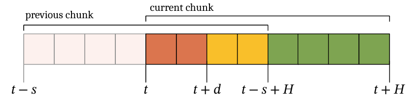
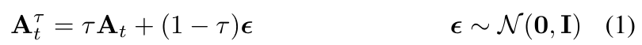
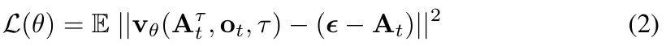
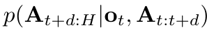
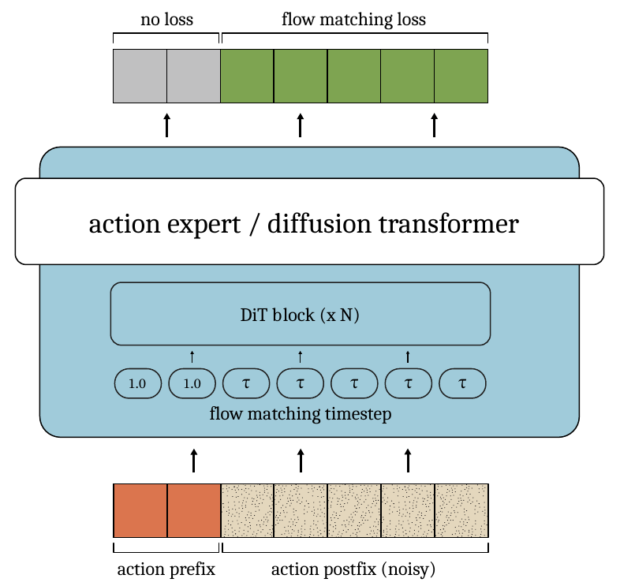
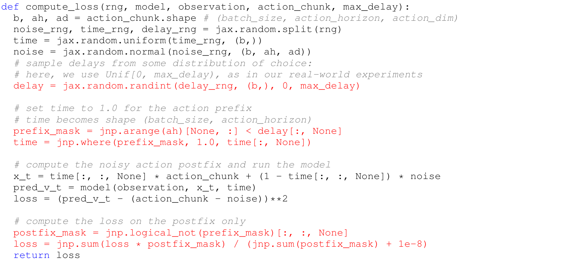
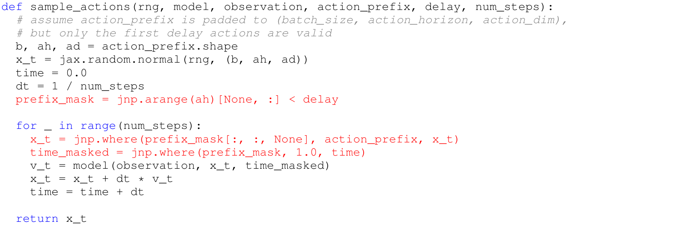
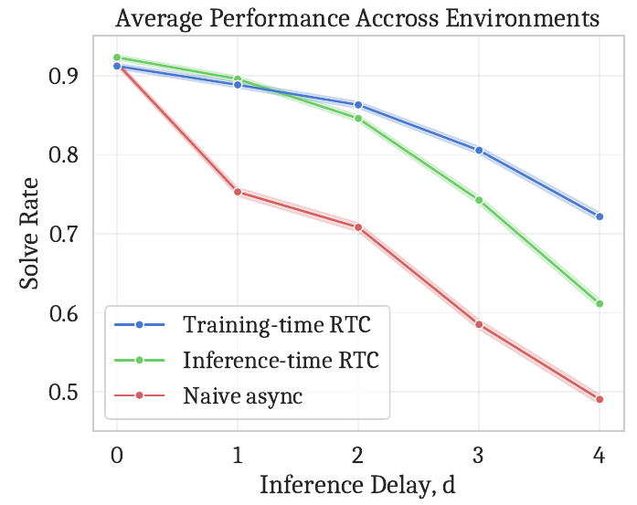
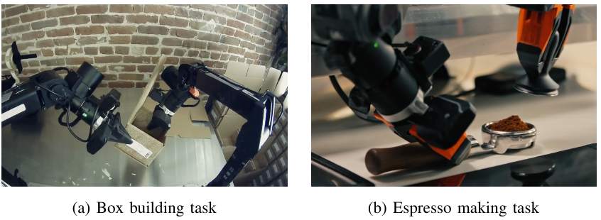
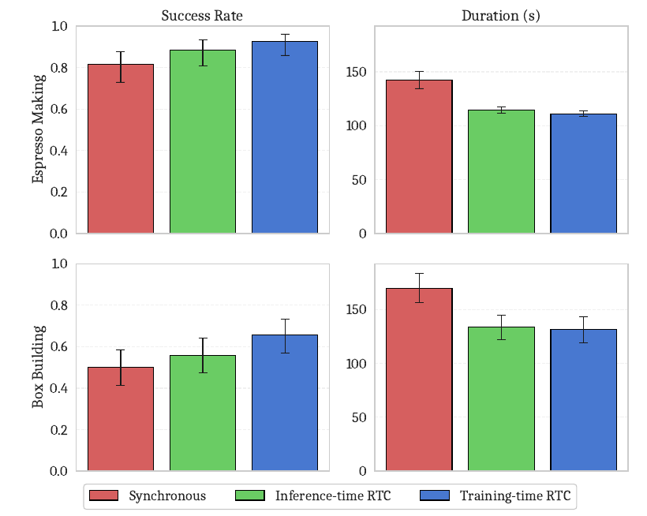

# Training-Time Action Conditioning 상세 리뷰: 이미 실행할 행동을 학습 때부터 조건으로 주기

> 저장소 원문: [주 PDF](papers/17_Training_Time_Action_Conditioning.pdf) · [전체 목록](README.md)

> Kevin Black, Allen Z. Ren, Michael Equi, Sergey Levine, **Training-Time Action Conditioning for Efficient Real-Time Chunking**, arXiv:2512.05964v2, Physical Intelligence.
>
> 핵심은 비동기 실행 자체를 새로 만드는 것이 아니라, 이전 chunk의 action prefix에 맞추어 다음 행동을 생성하는 일을 학습 objective에 넣는 것이다. 이로써 inference-time RTC가 매 denoising step에 수행하던 vector-Jacobian product를 없앤다. 이 문서는 본문·참고문헌·마지막 Algorithm 1, 공식 시뮬레이션 코드, 기반 모델 카드를 대조한 한국어 기술 해설이다.

<a id="contents"></a>
## 목차

1. [서지·버전·읽은 범위](#bibliography)
2. [핵심 결론과 주장-근거 표](#claims)
3. [§I-II: 문제의식과 관련 연구](#motivation)
4. [기호와 shape 사전](#notation)
5. [§III: chunk·지연·수식 (1), (2)](#preliminaries)
6. [§IV: training-time conditioning의 정확한 의미](#conditioning)
7. [loss, gradient, 지연 분포의 유도](#loss)
8. [Algorithm 1 행별 해설과 구현상 불일치](#algorithm)
9. [한 샘플의 학습·추론·실행 end-to-end 경로](#forward)
10. [공식 MLP-Mixer forward와 학습 데이터](#code)
11. [§V-A: 시뮬레이션 실험](#simulation)
12. [§V-B: 실물 실험](#realworld)
13. [효율·타이밍 지표와 공정성](#efficiency)
14. [§VI-VII, 한계와 재현성](#limitations)
15. [VLM/VLA·OpenVLA·Thor/TensorRT 적용](#deployment)
16. [Q&A와 학습 순서](#qa)
17. [Coverage checklist와 검증 범위](#coverage)
18. [출처](#references)

<a id="bibliography"></a>
## 1. 서지·버전·읽은 범위

| 항목 | 확인 결과 |
|---|---|
| 정식 제목 | Training-Time Action Conditioning for Efficient Real-Time Chunking |
| 저자·소속 | Kevin Black, Allen Z. Ren, Michael Equi, Sergey Levine / Physical Intelligence |
| 기준본 | [arXiv:2512.05964v2](https://arxiv.org/abs/2512.05964v2), 2025-12-09 개정 |
| 최초 공개 | v1, 2025-12-05 |
| 고정 PDF URL | [2512.05964v2.pdf](https://arxiv.org/pdf/2512.05964v2) |
| 접속·검증일 | 2026-09-09, 한국시간 |
| PDF | 물리 6쪽, 각 612 × 792 pt |
| SHA-256 | `02963d5ae4e060e2be3cc8299f5e63046cdeafcb72127242c79fcb3331fa0108` |
| DOI | [10.48550/arXiv.2512.05964](https://doi.org/10.48550/arXiv.2512.05964) |
| 학회 여부 | 확인한 공식 arXiv 서지와 PDF에는 채택 학회·proceedings가 명시되어 있지 않다. IEEEtran 조판을 학회 게재 증거로 삼지 않는다. |
| 공식 프로젝트 | [Physical Intelligence RTC 연구 페이지](https://www.pi.website/research/real_time_chunking), 2025-12-08 업데이트에서 이 논문을 후속 논문으로 연결 |
| 공식 시뮬레이션 코드 | [Physical-Intelligence/real-time-chunking-kinetix](https://github.com/Physical-Intelligence/real-time-chunking-kinetix) |
| 확인한 commit | `9296f31d62d5bfeb5779dcb2f9bcf71ca37f448b` |
| 기반 모델 보조자료 | [π0.6 Model Card](https://website.pi-asset.com/pi06star/PI06_model_card.pdf), 2025-11-17, 물리 4쪽 |
| 포팅 대조용 OpenPI commit | `215abfb217dbac7d5f1273282331b9b1866c0479` |

**읽은 범위.** 기준 PDF p.1-6 전체와 공식 TeX `main.tex`, 참고문헌 29개 항목을 읽었다. p.1-4는 §I-VII, p.4-5는 References, p.6은 두 함수로 구성된 Algorithm 1이다. **이 PDF에는 Appendix A 등의 별도 기술 부록, 정리·증명, Table이 없다.** 마지막 알고리즘이 뒤쪽에 배치되었을 뿐, TeX에서도 별도 Appendix로 선언되어 있지 않다. 따라서 “부록 전체” 요구는 마지막 알고리즘까지 빠짐없이 처리하는 것으로 적용했다. 별도 비공개 supplementary를 읽었다고 주장하지 않는다.

공식 저장소에서는 `model.py`의 forward/loss/realtime_action, `train_flow.py`의 데이터 chunk 생성·최적화·checkpoint 처리, `eval_flow.py`의 실행·평가·sweep, `generate_data.py`의 expert 혼합과 데이터 기록을 읽었다. OpenPI에서는 `pi0.py`의 flow time convention과 conditioning 경로를 대조했다. 기반 모델 카드는 전 4쪽을 읽되 본 논문에 필요한 architecture·gradient·데이터 설명만 사용한다. 코드 실행으로 학습 결과를 재현한 것은 아니다.

본문의 `[PDF p.N]`은 **기준 v2 PDF의 첫 장부터 센 물리 페이지**다. 다른 논문 RTC의 식 번호를 이 논문의 식 번호로 섞지 않는다. 아래의 `(1)`, `(2)`만 대상 논문의 번호 식이며, `해설식`, `코드식`, `보조 유도`는 리뷰에서 추가한 것이다.

근거는 **[저자 보고]**, **[공식 코드 확인]**, **[검산]**, **[리뷰어 해석]**, **[논문 미기재]**, **[후속 연구 제안]**으로 구분한다. 그림에서 읽은 값은 `[리뷰어 해석: 도표 판독, 근삿값]`으로 표시하며 원시 측정값과 구별한다.

원문 Figure 1-5 전부, 번호 식 (1)·(2), 핵심 비번호 조건부 분포, Algorithm 1의 학습·sampling 부분을 **240 dpi PNG 10개**로 직접 발췌했다. Figure와 수식의 기호·범례를 다시 그리거나 고치지 않았다. 아래 [자산 manifest](assets/17_Training_Time_Action_Conditioning/publication_assets.json)에 PDF 버전·SHA, 물리 페이지, 왼쪽 위 원점의 point 단위 bbox, 출력 픽셀 크기와 이미지 SHA를 기록했다. Markdown과 `assets/17_Training_Time_Action_Conditioning/`를 함께 보관해야 한다.

이미지와 원문 내용의 권리는 원저자 및 각 권리자에게 있다. [arXiv의 license 링크](https://arxiv.org/abs/2512.05964v2)와 PDF `/License` 메타데이터가 [CC BY 4.0](https://creativecommons.org/licenses/by/4.0/)을 표시하는 것을 확인했다. 여기서는 출처를 표시한 영역 발췌만 수행했으며, 아래 한국어 해설과 보조 유도는 리뷰어가 작성했다.

<a id="claims"></a>
## 2. 핵심 결론과 주장-근거 표

**이 논문이 학습하는 것은 “새 관측과 곧 실행될 기존 행동을 보고, 그 뒤를 이어갈 행동을 생성하는 조건부 정책”이다.** 학습 중에는 정답 chunk의 앞부분을 깨끗한 값으로 제공하고 뒷부분에만 flow matching loss를 건다. 추론 중에는 이전 예측 chunk에서 가져온 prefix를 매 step 입력에 고정하고, postfix를 ordinary forward만으로 생성한다. 비동기 executor가 이전 action을 소비하며 새 결과를 기다리는 구조는 RTC에서 가져온다. [PDF p.2, §IV, Fig.1-2; p.6, Algorithm 1; [원문](https://arxiv.org/pdf/2512.05964v2#page=2)]

먼저 알아둘 다섯 가지 결론은 다음과 같다.

1. 학습 prefix는 **정답 action**이다. 자신의 직전 예측을 학습 중 다시 입력하는 scheduled sampling이라고 설명하면 틀리다.
2. prefix mask는 **loss mask이자 입력 time 선택 기준**이다. attention을 차단하거나 prefix token의 계산을 제거하는 sparse mask가 아니다.
3. 사라지는 것은 inference-time guidance의 VJP다. VLM encoding, action expert forward, 여러 denoising step, 통신과 controller 지연은 남는다.
4. 보고된 실물 평균 지연은 **135 → 108ms**, 즉 **20% 감소**다. 논문은 두 RTC 방식의 작업 완료 시간과 성공률에 대해서는 대체로 parity를 주장한다.
5. 원문 식 (2)와 Algorithm 1에는 직접 구현할 때 넘어가면 안 되는 불일치가 있다. 특히 flow 부호, RNG split 개수, delay 상한, loss 정규화, 최종 prefix 반환을 확인해야 한다.

| 주장 | 근거 | 판정·제한 |
|---|---|---|
| 학습 시 prefix conditioning만으로 chunk 연속성을 학습할 수 있다 | §IV 세 변경, Fig.2, Algorithm 1 | 정답 prefix에서 배우고 예측 prefix에서 사용한다. 정확한 연속성·안정성 보장은 제시하지 않는다. |
| inference-time inpainting overhead를 제거한다 | `realtime_action`의 trained branch에는 VJP가 없음 | [공식 코드 확인] guidance 연산 제거. 모든 추론 비용 또는 mask 연산까지 0이라는 뜻은 아니다. |
| 높은 지연에서 inference-time RTC보다 좋다 | Fig.3, H=8, d=2-4 | [저자 보고] Kinetix 조건에서 지지. 더 큰 지연·다른 backbone에 대한 일반 정리는 아니다. |
| 실물에서 속도·성능 parity를 유지한다 | Fig.5, box/espresso, H100 | 표본 수·동등성 검정 미기재. 수치상 비슷하다는 보고와 통계적 동등성 증명은 구분한다. |
| 별도 pretraining 없이 fine-tuning으로 추가할 수 있다 | simulation 24+8 epochs; real 8,000 steps | 이미 학습된 정책에서 prefix conditioning을 도입했다. 무학습 plug-in은 아니다. |
| architecture나 runtime 변경이 필요 없다 | Abstract, §I, §VI | §IV는 token별 time conditioning을 지원하도록 변경하라고 명시한다. “새 parameter/module 증설 없이 같은 계열 구조와 runtime interface를 유지”하는 범위로 읽어야 한다. |
| 제안은 간단하다 | Algorithm 1의 붉은 부분 | 개념은 간단하지만 출판 의사코드를 그대로 실행할 수 있다는 증거는 아니다. §8의 오류·계약을 확인해야 한다. |
| 기존 RTC보다 유연성은 낮다 | §VI | trained 방식은 hard prefix만 조건으로 준다. 겹치는 미래 전체를 soft weight로 유도하는 기능은 제공하지 않는다. |

서론의 “improved performance”는 실물 전체에서 유의한 우월성을 증명했다는 뜻으로 확대하지 않는다. 초록, §V-B와 §VI는 parity에 무게를 두고 있으며 Fig.5에는 통계적 우월성 검정이 없다. [PDF p.1,3-4]

<a id="motivation"></a>
## 3. §I-II: 문제의식과 관련 연구

### 3.1 왜 action chunk만으로는 충분하지 않은가

로봇 controller는 일정 시간마다 command를 받아야 하지만 큰 VLA는 수십~수백 ms가 걸린다. 한 번에 H개의 미래 행동을 예측하면 매 제어 tick마다 큰 모델을 호출할 필요가 줄어든다. 그러나 그 chunk를 전부 실행한 뒤 다음 결과를 기다리는 동기식 방식에는 대기 구간이 생긴다. 작업이 느려질 뿐 아니라 학습 데이터에 없던 멈춤을 실행 궤적에 삽입한다. 물체가 움직이는 환경에서는 “모델이 생각할 때 세계도 멈춘다”는 가정이 성립하지 않는다. [PDF p.1, §I]

비동기 실행은 다음 chunk를 미리 계산한다. 하지만 관측 시점에서 새 chunk를 독립적으로 뽑으면 **계산이 끝날 때까지 이미 실행한 행동**과 새 chunk가 가정한 앞부분이 다를 수 있다. 두 chunk가 각각 유효해도 중간에서 붙인 결과가 유효하다는 보장은 없다. 예를 들어 한 샘플은 물체 왼쪽으로 돌아가고 다른 샘플은 오른쪽으로 돌아가려 한다면, 중간 splice나 평균 행동이 장애물을 향할 수 있다. 이 예시는 [리뷰어 해석]이며 논문 측정값은 아니다.

따라서 문제는 다음 세 조건을 함께 만족시키는 것이다. 행동 공급이 끊기지 않아야 하고, 새 관측을 반영해야 하며, 기존 계획의 불가역적으로 실행되는 부분과도 맞아야 한다. “과거 행동”은 여기서 이미 모두 끝난 history만을 뜻하지 않는다. 새 추론을 시작하는 시점에서 **앞으로 지연 d 동안 실행하기로 정한 행동**이 핵심 조건이다.

### 3.2 기존 RTC는 무엇을 했는가

Inference-time RTC는 base flow policy를 다시 학습하지 않고, 새 chunk를 denoise하면서 이전 chunk와 겹치는 부분을 맞추도록 guidance를 추가한다. 첫 d개에는 강한 제약을 주고, 그 뒤 겹치는 미래 action에는 점차 약해지는 soft weight를 준다. 각 denoising step에 예측된 clean action의 입력 Jacobian을 통한 vector-Jacobian product가 들어간다. 파라미터를 업데이트하지 않더라도 입력에 대한 reverse-mode differentiation이 필요하다. [PDF p.2, §IV; [RTC 선행 논문 §4](https://arxiv.org/html/2506.07339v1#S4)]

[리뷰어 해석] 한 번의 추론이 느려져 d가 커지면 더 긴 prefix와 맞추어야 한다. 그 대응을 비선형 모델의 국소 선형화 기반 guidance에 맡기는 대신, 직접 조건부 생성 문제로 학습하자는 것이 후속 논문의 동기다. 저자가 높은 지연에서 성능 차이를 설명할 때 사용하는 가설이며, Jacobian approximation error를 직접 계측한 결과는 아니다.

### 3.3 §II의 비교 축

| 연구 계열 | 줄이거나 해결하는 것 | 본 논문과의 관계 |
|---|---|---|
| Action chunking / Diffusion Policy / ACT | 한 번의 정책 호출로 여러 action 출력 | 기본 표현과 실행 단위 |
| 대형 VLA, π 계열·OpenVLA·RDT 등 | 영상·언어를 로봇 행동에 연결 | conditioning 적용 대상 계열. 모든 모델을 실험했다는 뜻은 아님 |
| Gemini Robotics·GR00T의 계층 구조 | 느린 고수준·빠른 저수준 계산 분리 | 직교적 접근. 본 논문은 새 System 1/2를 설계하지 않음 |
| MiniVLA·SmolVLA | 모델 크기·비용 감소 | 직접 비용 최적화. 본 논문은 기존 흐름의 guidance 비용 제거 |
| SmolVLA식 asynchronous inference | 계산·행동 실행 중첩 | §II는 chunk 사이 불연속 문제를 별도 해결해야 한다고 주장 |
| A2C2 | 가벼운 correction head | 별도 correction 구조와 구별 |
| VLASH | 단일 future action을 조건으로 사용 | 이 논문은 길이가 d인 전체 prefix를 사용한다고 대비 |
| Inference-time RTC | 학습 없이 overlap guidance | 가장 직접적인 baseline이며 runtime의 기반 |

위 비교는 **대상 논문 §II가 설정한 관계**를 설명한 것이다. 각 관련 연구의 모든 버전에서 상대 우위를 검증한 독립 survey로 읽어서는 안 된다. 본 논문에는 관련 기법 전부를 같은 조건으로 비교한 종합 실험이 없다.

<a id="notation"></a>
## 4. 기호와 shape 사전

이 문서는 물리 시간과 flow 시간을 분리한다. $`t`$는 controller의 정수 tick, $`\tau`$는 noise와 action 사이를 잇는 연속 flow time이다. $`d`$를 모델 차원으로 쓰지 않고 delay로 고정하며, action dimension은 $`D_a`$라고 쓴다.

| 기호 / 코드 이름 | shape 또는 단위 | 의미 |
|---|---|---|
| $`B`$ / `b` | 양의 정수 | batch 크기 |
| $`H`$ / `ah`, `action_chunk_size` | action timestep 수 | prediction horizon |
| $`D_a`$ / `ad` | action 좌표 수 | 한 tick의 command dimension |
| $`D_o`$ | feature 수 | 시뮬레이터의 symbolic observation dimension |
| $`\mathbf a_t`$ | $`\mathbb R^{D_a}`$ | 한 tick의 행동 |
| $`\mathbf A_t`$ | $`H\times D_a`$, batch 포함 $`B\times H\times D_a`$ | 관측 t에 대응하는 정답 chunk |
| $`\mathbf o_t`$ | MLP에서는 $`D_o`$; VLA에서는 images/text/state 구조체 | 관측 조건 |
| $`\epsilon`$ / `noise` | $`B\times H\times D_a`$ | 표준정규 noise |
| $`\tau_b`$ / 초기 `time` | $`B`$ | 샘플마다 뽑은 flow time |
| $`T_{b,i}`$ / 변경 후 `time` | $`B\times H`$ | prefix는 1, postfix는 샘플의 $`\tau_b`$ |
| $`X`$ / `x_t` | $`B\times H\times D_a`$ | clean prefix와 noisy postfix를 합친 입력 |
| $`v_\theta`$ / `pred_v_t` | 입력·출력 action shape 동일 | flow velocity 예측 신경망 |
| $`s`$ | controller tick 수 | 실행 horizon; Fig.1의 두 추론 시작점 간 간격 |
| $`d`$ / `delay` | controller tick 수; 학습에서는 $`B`$ | 한 번의 inference 중 지나가는 tick 수 |
| $`P_{b,i}`$ / `prefix_mask` | $`B\times H`$, bool | $`i\lt d_b`$인 위치 |
| $`M_{b,i}`$ / `postfix_mask` | $`B\times H`$, 코드에서는 뒤에 singleton axis | loss를 주는 $`i\ge d_b`$ 위치 |
| $`Y`$ / `action_prefix` | padded $`B\times H\times D_a`$ | 이전 chunk에서 꺼낸 실제 추론 조건; 앞 d개만 유효 |
| $`N`$ / `num_steps` | denoising 횟수 | action expert를 N번 평가 |
| $`\Delta\tau=1/N`$ / sampling의 `dt` | flow time 간격 | 물리 controller period와 다름 |
| $`\Delta_c=1/f_c`$ | 초 | controller 한 tick의 시간 |
| $`C`$ | hidden channel 수 | 공개 MLP-Mixer 기본값 256 |

**인덱스 규칙.** chunk 내부 index i는 0부터 H-1까지다. `[0:d]`는 d를 포함하지 않아 정확히 d개다. 물리 시간 범위는 $`[t,t+H)`$다. 따라서 정확한 postfix 표기는 $`\mathbf A_t[d:H]=[\mathbf a_{t+d},\ldots,\mathbf a_{t+H-1}]`$이다. 원문은 $`\mathbf A_{t+d:H}`$처럼 global 시작점과 horizon을 함께 쓰는 축약을 사용한다. 아래에서는 원문을 인용할 때만 보존하고, 유도에서는 local slice로 모호함을 없앤다.

<a id="preliminaries"></a>
## 5. §III: chunk·지연·수식 (1), (2)

### 5.1 Figure 1: 두 chunk가 겹치는 세 영역



*Figure 1. 빨강은 계산 중 실행이 확정된 d개, 노랑은 그 이후에도 이전 계획과 겹치는 부분, 초록은 새로 예측하는 나머지다. [PDF p.2, Fig.1; [원문](https://arxiv.org/pdf/2512.05964v2#page=2)]*

이전 chunk는 t-s에서 시작하여 t-s+H 직전까지 있다. 새 chunk는 t에서 t+H 직전까지를 다루지만 t+d에야 도착한다. 그러므로 새 결과의 첫 d개를 그 시각에 처음 실행할 수 없다. 지나간 d tick에는 이전 chunk에서 해당 물리 시각의 action을 공급해야 한다.

원문의 Fig.1 caption에 있는 핵심 비번호 부등식은 다음이다.

```math
t+d\le t-s+H\quad\Longrightarrow\quad d\le H-s.
```

표기: Fig.1의 조건.

왼쪽은 이전 buffer가 새 결과 도착 시각까지 유지된다는 조건이다. 양변에서 t를 빼면 d와 H-s의 비교가 된다. 모형 추론이 빠른지와 무관하게, 필요한 prefix가 buffer 길이를 넘으면 알고리즘 입력 자체를 만들 수 없다. 같을 때는 이전 chunk를 다 소비하는 경계이고 여유가 없다.

| 색 | 새 chunk local index | 길이 | Inference-time RTC | Training-time RTC |
|---|---|---:|---|---|
| 빨강 | $`0\le i\lt d`$ | d | 강한 guidance 대상 | clean 입력으로 매 step 고정 |
| 노랑 | $`d\le i\lt H-s`$ | H-s-d | soft guidance 대상 | 새로 denoise하는 postfix |
| 초록 | $`H-s\le i\lt H`$ | s | 기존 chunk 조건 없음 | 새로 denoise하는 postfix |

**같은 overlap을 전부 사용하지 않는다.** trained 방식은 빨강만 conditioning으로 삼는다. 노랑은 이전 chunk와 물리 시간이 겹치지만 새 관측과 빨강 prefix에 따라 다시 생성된다. loss mask는 빨강을 0, 노랑·초록을 1로 둔다. inference-time RTC의 soft weight와 의미가 다르다.

### 5.2 한 개의 inference worker와 최대 지연

논문 시뮬레이션은 $`s=\max(d,1)`$로 설정한다. 이 설정과 buffer 조건을 합치면 d가 1 이상일 때 다음이 성립한다.

```math
d\le s,\qquad s\le H-d\quad\Longrightarrow\quad 2d\le H.
```

표기: 해설 유도.

따라서 H=8에서 tested maximum d=4다. **H=8인 모든 상상 가능한 병렬 시스템에서 d의 절대 상한이 항상 4라는 뜻은 아니다.** 이 논문의 sequential worker와 실행 horizon 설정에서 나오는 조건이다. d를 늘려 얻은 Fig.3은 지연만 바뀌고 s가 모든 점에서 같은 실험도 아니다. d별로 s가 1,1,2,3,4로 함께 바뀌며, 각 d에서 세 방법은 동일한 s를 사용한다.

### 5.3 수식 (1): noise와 정답 action의 선형 interpolation



```math
\mathbf A_t^\tau=\tau\mathbf A_t+(1-\tau)\epsilon,\qquad\epsilon\sim\mathcal N(0,\mathbf I).\qquad\text{(1)}
```

**기호와 입력.** 정답 $`\mathbf A_t`$와 noise $`\epsilon`$는 모두 $`H\times D_a`$이며 batch에서는 $`B\times H\times D_a`$다. $`\mathbf I`$는 chunk를 펼친 $`HD_a`$차원 표준정규의 identity covariance를 뜻한다. 구현에서 거대한 identity 행렬을 만들지 않고 각 원소를 독립 표준정규로 뽑는다.

**연산 순서와 축.** 먼저 정답과 같은 shape의 noise를 샘플링한다. 샘플마다 하나의 scalar $`\tau_b`$를 뽑고 horizon·action 축으로 broadcast한다. 정답에 τ, noise에 1-τ를 곱하여 원소별로 더한다. 이 식 자체에는 softmax, token 간 평균, action dimension 정규화가 없다. action의 데이터 전처리 정규화와 구분해야 한다.

**끝점.** τ=0이면 완전한 noise, τ=1이면 clean action이다. flow training은 다양한 중간점에서 어느 방향으로 이동해야 정답 분포로 갈지 회귀한다. τ를 실제 로봇 시간처럼 증가시키는 것이 아니다. 동일한 관측 t에 대해 한 번의 chunk를 만드는 내부 solver 좌표다.

**핵심 보조 유도.** 정답과 noise를 고정하고 τ에 대해 미분하면 다음이다.

```math
\frac{\mathrm d\mathbf A_t^\tau}{\mathrm d\tau}=\mathbf A_t-\epsilon.
```

표기: 식 (1)의 직접 미분.

이 방향이 Algorithm 1과 공식 code의 target이다. 다음 식의 부호를 확인하는 기준이 된다.

### 5.4 수식 (2): 출판본 표기와 일관된 학습 target을 분리



**원문 Eq.(2)를 그대로 옮기면 다음과 같다.**

```math
\mathcal L(\theta)=\mathbb E\left\|v_\theta(\mathbf A_t^\tau,\mathbf o_t,\tau)-(\epsilon-\mathbf A_t)\right\|^2.\qquad\text{(2)}
```

**기호.** $`v_\theta`$는 학습 파라미터 θ를 가진 velocity predictor이며 출력은 action chunk와 같은 shape다. 기대값의 샘플링 대상은 본문에서 축약되어 있지만 정답/관측 쌍, noise, flow time이다. squared norm은 원소별 오차 제곱을 모으는 회귀 손실이다. 식 (2)만으로 batch·horizon·action 차원을 평균하는 정확한 convention은 알 수 없고 code로 확인해야 한다.

**원문 불일치.** Eq.(1)은 noise → action 방향의 τ를 쓰고 본문은 0→1 적분이라고 설명하지만, Eq.(2)는 반대 방향 $`\epsilon-\mathbf A_t`$를 target으로 적었다. PDF 이미지와 TeX 양쪽에 이 부호가 있다. OCR 오류가 아니다. 반면 Algorithm 1 p.6은 `action_chunk - noise`, 공식 Kinetix `model.py` L273도 `u_t = action - noise`를 사용한다. [공식 코드 확인: [target과 loss](https://github.com/Physical-Intelligence/real-time-chunking-kinetix/blob/9296f31d62d5bfeb5779dcb2f9bcf71ca37f448b/src/model.py#L267)]

따라서 이 리뷰의 forward와 유도는 **Algorithm 1·공식 구현과 일치하는 양의 방향**을 사용한다. 아래는 정정 제안/해설식이며 원문의 Eq.(2)를 몰래 고쳐 인용한 것이 아니다.

```math
u=\mathbf A_t-\epsilon,\qquad\mathcal L_{\mathrm{consistent}}=\mathbb E\left\|v_\theta(\mathbf A_t^\tau,\mathbf o_t,\tau)-u\right\|^2.
```

표기: 구현과 일관된 해설식.

**스칼라 검산.** 정답 a=2, noise=0이면 식 (1)은 $`x^\tau=2\tau`$다. target이 +2이고 τ=0에서 1까지 적분하면 2에 도달한다. target -2를 같은 적분 방향으로 쓰면 -2가 된다. “제곱하므로 부호가 상관없다”는 설명은 틀리다. 예측값과 target의 차이를 제곱하기 때문에 target 부호는 최적해를 바꾼다.

### 5.5 conditional flow matching이 조건부 분포를 학습하는 이유

[리뷰어 해석: 보조 유도] 입력을 z라고 고정하면 squared regression loss를 최소화하는 predictor는 $`\mathbb E[u\mid z]`$이다. 여기서 z에 관측·noisy action·flow time뿐 아니라 clean prefix를 포함하면, 해당 prefix를 가진 학습 trajectory들의 방향을 조건부 평균한다. 이것이 sampling 때 prefix에 맞는 postfix 분포를 생성하도록 유도하는 원리다. 개별 noise/정답 쌍의 u를 입력만으로 항상 정확히 복원해야 한다는 뜻은 아니다.

다만 데이터의 충분한 coverage, 모델 표현력, 최적화, solver 오차 등은 여전히 필요하다. 본 논문은 조건부 flow에 대한 새 수렴 정리나 로봇의 안정성 증명을 제시하지 않는다.

<a id="conditioning"></a>
## 6. §IV: training-time conditioning의 정확한 의미

### 6.1 목표 분포: 정답 prefix 뒤를 완성하기



```math
p(\mathbf A_{t+d:H}\mid\mathbf o_t,\mathbf A_{t:t+d}).
```

표기: §IV의 비번호 식, 원문 인덱스.

원문의 local slice 의미를 명확히 풀면 다음이다.

```math
p_\theta\bigl(\mathbf A_t[d:H]\mid\mathbf o_t,\mathbf A_t[0:d],d\bigr),\qquad\mathbf A_t[d:H]\in\mathbb R^{(H-d)\times D_a}.
```

표기: 해설 표기.

d는 prefix 길이와 time map에서 드러나며, 별도 새 learned delay token이 필요하다고 제안하지 않는다. d를 식에 적은 것은 conditioning 길이를 명시한 해설이다. 학습의 prefix와 postfix는 **동일한 ground-truth chunk에서** 잘라낸다. 아직 발생하지 않은 관측 $`\mathbf o_{t+d}`$를 입력으로 준다거나, 환경을 d step rollout하여 future state를 계산한다는 내용은 없다.

### 6.2 Figure 2: 세 변경이 함께 필요한 이유



*Figure 2. Prefix는 clean action과 time=1을 입력하고 출력 loss는 제거한다. Postfix는 noise를 섞고 flow loss로 학습한다. [PDF p.2, Fig.2; [원문](https://arxiv.org/pdf/2512.05964v2#page=2)]*

첫 변경은 action token마다 flow time을 줄 수 있게 만드는 것이다. 평범한 DiT가 sample당 time embedding 하나를 만들고 모든 action token에 같은 adaLN scale/shift/gate를 broadcast한다면, 이제 동일한 learned mapping을 각 token의 time 값에 적용한다. **파라미터 수는 유지할 수 있지만 입력 tensor와 broadcast 방식은 바뀐다.** “architecture modification이 전혀 없다”는 표현을 모든 구현의 source diff가 0이라는 뜻으로 받아들이면 안 된다.

둘째 변경은 prefix의 noisy interpolation을 없애는 것이다. prefix의 time을 clean endpoint 1로 놓으면 식 (1)에 의해 해당 위치 X는 정답 action 그대로가 된다. 모델은 time=1인 앞부분을 이미 확정된 conditioning으로 받고, time=τ인 뒷부분을 생성 대상으로 받는다. prefix 값을 주기만 하고 global time 하나로 “전체가 noisy”라고 표시하는 것과 다르다.

셋째 변경은 prefix output loss를 제거하는 것이다. prefix는 생성할 대상이 아니라 주어진 조건이다. 이 output에 원래 target $`A-\epsilon`$을 강요하면 prefix 입력에 더 이상 드러나지 않는 noise를 회귀하라는 불필요한 문제를 만든다. 하지만 그 위치를 모델 내부에서 처리하지 않는다는 뜻은 아니다. postfix가 prefix를 읽어야 하므로 token 간 mixing/attention은 살아 있어야 한다.

### 6.3 입력 mask, loss mask, attention mask는 다른 것

| 이름 | 작용 위치 | 본 논문의 역할 |
|---|---|---|
| Prefix 선택 mask P | 입력 action·time 구성 | 앞 d개를 clean condition으로 만들기 |
| Postfix loss mask M=1-P | 출력별 오차 집계 | 이미 주어진 prefix의 직접 회귀 loss 제거 |
| Attention mask | token 사이 연결 | 본 제안의 prefix mask가 이것을 대체하지 않음 |
| Inference-time RTC의 W | 기존 overlap과 denoised estimate 사이 guidance | 빨강뿐 아니라 노랑에도 soft weight 가능 |

VLA에서 visual/text “prefix”라고 부르는 context token과 여기의 action prefix도 구분해야 한다. OpenPI 소스의 `embed_prefix`는 영상·언어 context를 뜻할 수 있으며, 이것을 곧바로 논문의 committed action prefix 함수로 이해하면 오류가 난다.

### 6.4 Training-time과 inference-time의 대응·차이

| 구성요소 | 학습 시 | 실제 비동기 추론 시 |
|---|---|---|
| 관측 | 데이터의 $`\mathbf o_t`$ | 새로 획득한 $`\mathbf o_t`$ |
| delay | 정해진 분포에서 샘플링 | runtime이 알고 있거나 추정하는 지연 |
| prefix 값 | 정답 $`\mathbf A_t[0:d]`$ | 이전 예측 chunk의 $`[s:s+d]`$ |
| postfix 초기값 | τ에 따른 정답/noise interpolation | 표준정규 noise |
| prefix time | 1 | 모든 denoise step에서 1 |
| postfix time | 샘플별 τ | 0부터 1까지 solver가 증가 |
| prefix 출력 | 직접 loss 없음 | 실행용 postfix에서 제외하거나 최종 clamp 필요 |
| postfix 출력 | velocity target에 대해 학습 | 적분하여 최종 action 생성 |
| gradient | θ에 대해 ordinary training backprop | learned policy forward만 필요 |

**남아 있는 train-test gap.** 정답 prefix는 demonstration trajectory의 일부다. 실행 prefix는 모델 자신의 예측이고 actuator 오차·외란의 영향을 받을 수 있다. 본 논문은 이것을 직접 training roll-in으로 바꾸거나 prefix corruption을 넣는 방법을 검증하지 않는다. Prefix conditioning은 지연 상황을 학습에 모사하지만 모든 distribution shift를 제거하지는 않는다.

<a id="loss"></a>
## 7. Loss, gradient, 지연 분포의 유도

### 7.1 Algorithm 1을 수식으로 전개

다음 네 식은 원문에 새 번호로 인쇄된 수식이 아니라 **Algorithm 1의 tensor 연산을 옮긴 코드식**이다. i는 action time, j는 action dimension, b는 batch index다.

```math
P_{b,i}=\mathbf 1[i\lt d_b],\qquad M_{b,i}=1-P_{b,i}.
```

표기: 코드식: 두 mask.

```math
T_{b,i}=\begin{cases}1,&i\lt d_b\\ \tau_b,&i\ge d_b\end{cases},\qquad \tau_b\sim\mathrm{Uniform}[0,1).
```

표기: 코드식: token별 time.

```math
X_{b,i,j}=T_{b,i}A_{b,i,j}+(1-T_{b,i})\epsilon_{b,i,j},\qquad V=v_\theta(O,X,T).
```

표기: 코드식: forward.

```math
\mathcal L_{\mathrm{Alg1}}=\frac{\displaystyle\sum_{b=1}^{B}\sum_{i=0}^{H-1}\sum_{j=1}^{D_a}M_{b,i}\bigl(V_{b,i,j}-(A_{b,i,j}-\epsilon_{b,i,j})\bigr)^2}{\displaystyle\sum_{b=1}^{B}\sum_{i=0}^{H-1}M_{b,i}+10^{-8}}.
```

표기: 코드식: masked loss.

P와 T는 $`B\times H`$, X와 V는 $`B\times H\times D_a`$다. 마지막 식 분모에는 j 합이 없다. 코드의 `postfix_mask`는 $`B\times H\times1`$이고 분자에서만 action dimension으로 broadcast되기 때문이다. 따라서 이는 **유효 action timestep당 coordinate squared error의 합**이다. 유효 scalar coordinate 전체의 MSE보다 $`D_a`$배 크다.

예컨대 B=1, H=4, d=2, D_a=2이고 유효 네 scalar error가 모두 1이면, 분자는 4, 분모는 2라 loss는 2다. scalar MSE는 1이다. 어느 정규화든 선택할 수 있지만 같은 learning rate·gradient clip에서 완전히 동일한 학습이라고 단정하면 안 된다.

[공식 코드 확인] Kinetix의 일반 학습 branch는 `jnp.mean`으로 B·H·D_a 전부 평균한다. conditioning branch는 위 Algorithm 1처럼 D_a를 분모에 넣지 않는다. 따라서 **조건부 학습으로 바꿀 때 loss scale도 달라진다.** 이것은 source-level 차이이고, 실제 성능 차이에 얼마만큼 기여했는지를 검증한 ablation은 없다. AdamW가 있다고 상수 배율 차이가 언제나 완전히 상쇄된다고 말할 수 없다. gradient clipping, epsilon, weight decay, warmup/optimizer reset 등이 영향을 줄 수 있다.

### 7.2 Prefix loss가 0이라는 말과 gradient가 0이라는 말

출력 V에 대한 미분은 유효 mask만 남는다. 분모를 Z라 쓰면 다음이다.

```math
\frac{\partial\mathcal L}{\partial V_{b,i,j}}=\frac{2M_{b,i}}{Z}\bigl(V_{b,i,j}-u_{b,i,j}\bigr),\qquad Z=\sum_{b,i}M_{b,i}+10^{-8}.
```

표기: 보조 유도.

따라서 prefix **출력 node**에 걸리는 직접 loss gradient는 0이다. 반면 postfix output이 prefix representation을 통해 계산된다면, shared parameter θ의 미분은 그 경로를 포함한다.

```math
\nabla_\theta\mathcal L=\frac{2}{Z}\sum_{b,i,j}M_{b,i}(V_{b,i,j}-u_{b,i,j})\nabla_\theta V_{b,i,j}.
```

표기: 보조 유도.

DiT의 attention이나 MLP-Mixer의 token mixing 때문에 postfix output의 Jacobian에는 prefix 입력을 변환한 weight도 들어간다. 그러므로 “prefix branch는 frozen” 또는 “prefix encoder에는 stop-gradient를 건다”는 해석은 논문 방법과 다르다. Action data와 random d·τ는 최적화할 학습 파라미터가 아니지만, 이를 처리하는 network weight는 학습될 수 있다.

작은 해설 모델 $`v_{\mathrm{post}}=w x_{\mathrm{prefix}}+c x_{\mathrm{post}}`$에서 postfix loss만 사용해도 $`\partial\mathcal L/\partial w=2(v-u)x_{\mathrm{prefix}}`$다. prefix output을 supervise하지 않는 것과 prefix 정보가 학습에 기여하지 않는 것은 전혀 다르다.

이 구분은 기반 π0.6의 **Knowledge Insulation**과도 별개다. 모델 카드는 action expert loss의 gradient가 VLM backbone으로 흐르지 않는 구조를 설명한다. 이것은 모델의 branch 간 gradient 경계이지 action prefix loss mask의 효과가 아니다. 본 논문 fine-tuning에서 frozen parameter 목록을 별도로 공개하지 않았으므로 두 사실을 합쳐 전체 VLM이 항상 frozen이라고 단정하지 않는다. [모델 카드 p.1, §2]

### 7.3 지연 분포가 위치별 supervision 빈도를 바꾼다

원문의 시뮬레이션은 d=0,1,2,3,4를 지수적으로 감소하는 weight로 샘플링한다. 공식 code에서 `simulated_delay=5`이면 정확히 다음 분포가 된다.

```math
q(d=k)=\frac{e^{4-k}}{\sum_{r=0}^{4}e^{4-r}},\qquad k\in\{0,1,2,3,4\}.
```

표기: 공식 코드식.

| d | 0 | 1 | 2 | 3 | 4 |
|---|---:|---:|---:|---:|---:|
| [검산] 확률 | 0.636409 | 0.234122 | 0.086129 | 0.031685 | 0.011656 |
| 해당 prefix 길이 | 0 | 1 | 2 | 3 | 4 |

이 확률은 shape $`(5,)`$의 weight를 정규화한 뒤 각 sample에 대해 categorical sampling한 결과다. 순차적인 delay curriculum이나 τ와 d를 같게 놓는 방식이 아니다. [공식 코드 확인: [model.py L280-289](https://github.com/Physical-Intelligence/real-time-chunking-kinetix/blob/9296f31d62d5bfeb5779dcb2f9bcf71ca37f448b/src/model.py#L280)]

위치 i가 직접 loss를 받을 확률은 다음과 같다.

```math
\Pr(M_i=1)=\Pr(d\le i)=\sum_{k=0}^{\min(i,4)}q(k).
```

표기: 보조 유도.

첫 action은 약 63.64%, 둘째는 87.05%, 셋째는 95.67%, 넷째는 98.83%, 다섯째부터는 100%의 sample에서 supervise된다. 평균 d는 약 0.5481이며 H=8에서 평균 supervised timestep은 약 7.4519개다. **이것은 위치별 노출 빈도에 대한 검산**이다. loss의 batch 전체 분모가 d에 따라 달라지므로 이 확률만으로 정확한 기대 gradient magnitude까지 정해지지는 않는다.

저자는 d=0,1에서 trained RTC가 아주 조금 낮은 이유로 초기 action에 쓰는 supervision이 줄어든 점을 제안한다. 위 계산은 그 설명이 가리키는 기제를 구체화하지만, 그 인과를 단독으로 입증한 ablation은 아니다. [PDF p.3, §V-A]

실물 실험은 0-10 범위의 uniform delay라고 서술한다. d=10을 포함한다고 해석하면 각 값의 확률은 1/11이고 첫 action은 약 9.09%만 직접 supervise된다. 그러나 Algorithm 1의 `randint(...,0,max_delay)`는 상한 exclusive다. d=10까지 포함하려면 `max_delay=11`이 필요하다. 이 논문에 그 실제 호출 인수가 없다는 점을 §8에서 다시 다룬다.

### 7.4 학습 때 없는 것을 추론 때 기대하면 안 되는 이유

Conditional model은 prefix의 length pattern과 값 분포를 학습했다. 따라서 d가 학습 지원 범위를 넘어가거나 prefix가 정답 궤적과 크게 다른 경우는 분포 밖 입력이 될 수 있다. d를 늘릴수록 조건을 많이 준다는 이유만으로 성능이 좋아지는 것도 아니다. 실제 관측은 오래되고, 새로 반응할 수 있는 postfix는 짧아지며, 너무 긴 committed prefix는 이미 바꾸기 어려운 행동을 늘린다.

이 방법의 효용은 그 tradeoff를 없애는 것이 아니라, **예상하는 지연 범위 안에서 유효한 이어붙이기를 정책이 학습하게 하는 것**이다.

<a id="algorithm"></a>
## 8. Algorithm 1 행별 해설과 구현상 불일치

### 8.1 먼저 읽는 법

Algorithm 1은 p.6의 Python/JAX listing 하나이고, `compute_loss`와 `sample_actions` 두 함수로 구성된다. 원문에는 행 번호가 없다. 아래 T1-T14와 S1-S13은 **리뷰어가 의미 있는 실행 행에 부여한 참조 번호**다. import와 주석은 별도로 설명한다. 전체 학습 loop, optimizer, robot controller, thread synchronization까지 구현한 알고리즘은 아니다.



*Algorithm 1 학습 부분. 원문 RNG split 인수 누락과 loss 정규화를 수정하지 않은 발췌다. [PDF p.6; [원문](https://arxiv.org/pdf/2512.05964v2#page=6)]*

### 8.2 `compute_loss`: 각 실행 행의 의미

| 행 | 원문 연산 | 입력 → 출력·역할 |
|---|---|---|
| T1 | `def compute_loss(...)` | RNG, model, observation, 정답 action_chunk, delay 상한을 입력받는다. 함수는 loss scalar만 반환한다. |
| T2 | `b, ah, ad = action_chunk.shape` | batch, horizon, action dim을 읽는다. observation batch도 b와 맞아야 한다. |
| T3 | `noise_rng, time_rng, delay_rng = jax.random.split(rng)` | noise·time·delay 샘플용 key 분리 의도. **기본 num=2여서 원문 그대로는 3개 unpack이 안 된다.** 공식 구현은 `split(rng, 3)`이다. |
| T4 | `time = jax.random.uniform(time_rng, (b,))` | 각 sample의 τ를 뽑는다. postfix 내 token별 독립 τ가 아니라 sample별 공통 τ다. |
| T5 | `noise = jax.random.normal(noise_rng, (b, ah, ad))` | action과 같은 shape의 noise. prefix 위치에도 noise를 뽑지만 입력에서는 제거되고 loss에서도 제외된다. |
| T6 | `delay = jax.random.randint(..., (b,), 0, max_delay)` | 샘플마다 정수 d. 주석의 uniform 예시는 시뮬레이션의 지수분포와 다르다. `max_delay`는 exclusive endpoint다. |
| T7 | `prefix_mask = arange(ah)[None, :] < delay[:, None]` | `(1,H)`와 `(B,1)`를 비교하여 `(B,H)` bool mask를 만든다. |
| T8 | `time = where(prefix_mask, 1.0, time[:, None])` | time shape가 `(B,)`에서 `(B,H)`로 바뀐다. d개의 clean marker를 생성한다. |
| T9 | `x_t = time[:,:,None] * action_chunk + ... * noise` | time의 마지막 singleton axis가 action dimension으로 broadcast된다. prefix=정답, postfix=interpolation. |
| T10 | `pred_v_t = model(observation, x_t, time)` | observation·mixed action·token time에서 `(B,H,D_a)` velocity를 예측한다. d 자체의 별도 입력은 없다. |
| T11 | `loss = (pred_v_t - (action_chunk - noise))**2` | 원소별 squared error. **Eq.(2)의 부호와 반대이며 Eq.(1)의 방향과 일관된다.** |
| T12 | `postfix_mask = logical_not(prefix_mask)[:,:,None]` | `(B,H,1)` mask. 여기까지는 loss scalar가 아니다. |
| T13 | `sum(loss * postfix_mask) / (sum(postfix_mask) + 1e-8)` | prefix error를 제외하고 유효 time position 수로 나눈다. action coordinate 수로는 나누지 않는다. |
| T14 | `return loss` | scalar를 caller로 반환한다. θ gradient 계산과 optimizer step은 caller가 수행한다. |

T1-T14가 함수의 전체 실행 행이다. import 두 줄은 JAX와 NumPy-style API 이름을 준비한다. 주석의 `(batch_size, action_horizon, action_dim)`은 shape 안내이며, uniform delay 예시는 사용자가 선택한 delay distribution으로 바꿀 수 있다는 안내다.

T3의 판단은 [JAX `random.split` 공식 문서](https://docs.jax.dev/en/latest/_autosummary/jax.random.split.html)의 `num=2` 기본값과 [공식 code의 `split(rng, 3)`](https://github.com/Physical-Intelligence/real-time-chunking-kinetix/blob/9296f31d62d5bfeb5779dcb2f9bcf71ca37f448b/src/model.py#L270)을 대조한 결과다. GPU 실행으로 확인했다고 표현하지 않는다.

### 8.3 `sample_actions`: 매 denoising step에서 prefix를 다시 넣는 이유



*Algorithm 1 추론 부분. 최종 Euler update 이후 별도 prefix clamp 없이 전체 `x_t`를 반환한다. [PDF p.6; [원문](https://arxiv.org/pdf/2512.05964v2#page=6)]*

| 행 | 원문 연산 | 의미·shape |
|---|---|---|
| S1 | `def sample_actions(...)` | rng, model, observation, padded action_prefix, delay, num_steps 입력 |
| S2 | `b, ah, ad = action_prefix.shape` | 조건을 H 길이로 pad해 두어 고정 shape의 model을 사용한다. 앞 d개 외 값은 유효 조건으로 쓰지 않는다. |
| S3 | `x_t = random.normal(rng, (b, ah, ad))` | 전체 chunk를 noise로 초기화한다. 첫 model 호출 직전에 prefix를 덮어쓴다. |
| S4 | `time = 0.0` | noise endpoint에서 시작 |
| S5 | `dt = 1 / num_steps` | 물리 시간이 아닌 flow integration step. num_steps는 양의 정수여야 한다. |
| S6 | `prefix_mask = arange(ah)[None, :] < delay` | delay가 scalar면 `(1,H)` mask. 학습 함수의 `(B,)` delay와 자동으로 같은 계약이 되지 않는다. |
| S7 | `for _ in range(num_steps)` | 정해진 횟수만큼 model forward와 Euler update 반복 |
| S8 | `x_t = where(prefix_mask[:,:,None], action_prefix, x_t)` | **매 호출 전** 입력 prefix를 known action으로 복구 |
| S9 | `time_masked = where(prefix_mask, 1.0, time)` | prefix는 clean endpoint 1, postfix는 현재 solver time |
| S10 | `v_t = model(observation, x_t, time_masked)` | guidance용 VJP 없이 ordinary forward |
| S11 | `x_t = x_t + dt * v_t` | 모든 위치를 갱신한다. 이때 prefix output도 바뀔 수 있다. |
| S12 | `time = time + dt` | 다음 postfix time으로 이동 |
| S13 | `return x_t` | 최종 full chunk. 실행용으로 사용하는 유효 postfix 계약을 별도로 지켜야 한다. |

다음은 위 loop를 수식으로 옮긴 것이다. mask의 action dimension broadcast는 생략하여 쓴다.

```math
\widetilde X^{(k)}=P\odot Y+(1-P)\odot X^{(k)},\qquad T_i^{(k)}=\begin{cases}1,&i\lt d\\ k/N,&i\ge d\end{cases}.
```

표기: sampling 코드식.

```math
X^{(k+1)}=\widetilde X^{(k)}+\frac1N v_\theta(O,\widetilde X^{(k)},T^{(k)}),\qquad k=0,\ldots,N-1.
```

표기: sampling 코드식.

마지막 호출의 postfix time은 (N-1)/N이며 update로 1에 도달한다. N=5라면 postfix time은 0,0.2,0.4,0.6,0.8이고 최종 time=1에서 추가 forward를 하는 것이 아니다. prefix time은 다섯 호출 모두 1이다.

### 8.4 마지막 prefix 값은 반드시 보존되는가

[공식 코드 확인] **model에 들어가는 prefix는 매번 보존되지만, 반환된 전체 tensor의 prefix까지 보존되는 것은 아니다.** Prefix output에는 loss가 없고 S11에서 모든 위치를 갱신하기 때문이다. 다음 step의 S8이 복구하므로 intermediate prefix drift는 다음 model 입력에 누적되지 않는다. 그러나 마지막 step 뒤에는 다음 S8이 없다.

예를 들어 known prefix가 10, prefix velocity가 3, N=5이면 마지막 반환 prefix는 10.6이 될 수 있다. 이것은 이론적 가능성에 대한 산술 예시이며, 실제 checkpoint에서 10.6을 관측했다는 뜻은 아니다.

**정확한 d만큼 이미 실행한 후, returned chunk의 d 이후만 소비하는 caller**라면 그 앞 값은 무시되므로 의도한 postfix 동작에 문제가 없다. Kinetix evaluator는 실제로 `old[:d]`와 `new[d:s]`를 이어서 사용한다. 반면 “returned prefix까지 정확히 같음”을 요구하는 API, 혹은 예측 delay보다 실제 delay가 짧아 prefix 일부를 아직 미래 action으로 사용할 수 있는 runtime이라면 최종 clamp 또는 별도 prefix preservation을 명시해야 한다. [공식 코드 확인: [eval_flow.py L119-136](https://github.com/Physical-Intelligence/real-time-chunking-kinetix/blob/9296f31d62d5bfeb5779dcb2f9bcf71ca37f448b/src/eval_flow.py#L119)]

### 8.5 구현 전에 정해야 하는 여섯 가지

| 항목 | 원문/공식 구현의 실제 상태 | 일관된 구현 계약 |
|---|---|---|
| Flow 부호 | Eq.(2)는 noise-action, Alg.1/code는 action-noise | 식 (1), clean endpoint, update 방향을 한 세트로 맞춘다. |
| RNG split | Alg.1은 `split(rng)`의 두 key를 세 변수로 unpack | `split(rng, 3)`로 구현. 공식 code는 이미 3을 명시한다. |
| Delay 최대값 | prose 0-10, `randint` upper exclusive | `max_delay_exclusive`처럼 의미를 명확히 하고 10 포함 여부를 기록한다. |
| Loss 분모 | mask에 D_a가 없으므로 coordinate sum/time mean | 원문 재현이면 그대로; 공정 ablation이면 baseline과 loss scale도 통제한다. |
| Batch별 delay | training은 `(B,)`, sampling은 scalar 기준 | `(B,)`를 지원하려면 `delay[:,None]`로 batch axis 명시, time도 `(B,H)`로 보장한다. |
| 반환 prefix | 최종 update로 변할 수 있음 | postfix-only consumption 또는 final clamp를 API에 명시한다. |

delay가 `(B,)`일 때 `arange(H)[None,:] < delay`는 B와 H가 다르면 broadcasting error가 날 수 있고, 우연히 B=H면 batch가 아닌 horizon 축으로 비교되어 조용히 잘못될 수 있다. scalar delay를 금지해야 한다는 뜻은 아니다. **원문 sampling은 공통 scalar delay를 가정하는 간결한 예시**이고, per-sample 확장은 별도 작업이라는 뜻이다.

### 8.6 리뷰어 보정 pseudocode

다음은 위 조건을 명시하기 위한 **해설용 pseudocode**다. 논문 원문을 그대로 실행했다는 뜻도, 실로봇에서 검증한 라이브러리도 아니다. `delay_max_inclusive`는 inclusive, loss 정규화는 원문과 동일하게 유효 timestep 수로 정의했다.

```python
def training_objective(batch, rng, delay_max_inclusive):
    actions, observation = batch.actions, batch.observation
    B, H, Da = actions.shape
    noise_key, time_key, delay_key = split(rng, 3)
    eps = normal(noise_key, actions.shape)
    tau = uniform(time_key, shape=(B,))
    d = randint(delay_key, shape=(B,), low=0,
                high=delay_max_inclusive + 1)
    P = arange(H)[None, :] < d[:, None]
    T = where(P, 1.0, tau[:, None])
    X = T[..., None] * actions + (1 - T[..., None]) * eps
    V = model(observation, X, T)
    M = (~P)[..., None]
    return sum(M * (V - (actions - eps)) ** 2) / (sum(M) + 1e-8)

def conditioned_sample(observation, padded_prefix, d_batch, eps, N):
    B, H, Da = padded_prefix.shape
    P = arange(H)[None, :] < d_batch[:, None]
    X = eps
    for k in range(N):
        X = where(P[..., None], padded_prefix, X)
        T = where(P, 1.0, k / N)
        V = model(observation, X, T)
        X = X + V / N
    return where(P[..., None], padded_prefix, X)
```

호출 전 d가 정수이고 0≤d≤H인지, 실사용에서는 d≤H-s인지, N>0인지 확인해야 한다. 유효 postfix가 하나도 없으면 학습 신호가 없으므로 d=H인 sample을 만들지 않는 recipe가 자연스럽다. 마지막 `where`는 원문에 없는 리뷰어 보정이다. `num_steps`, action scale, runtime timing까지 이 pseudocode가 결정하지는 않는다.

<a id="forward"></a>
## 9. 한 샘플의 학습·추론·실행 end-to-end 경로

### 9.1 학습 한 샘플을 숫자로 끝까지 전개

**해설용 예시.** 실제 모델 설정과 구별하기 위해 B=1, H=4, D_a=2, d=2, τ=0.25, noise=0으로 정한다. 정규분포의 실제 무작위 sample을 재현하는 예제가 아니라 tensor 연산을 보이기 위한 결정론적 입력이다.

```math
A=\begin{bmatrix}1&2\\3&4\\5&6\\7&8\end{bmatrix},\quad\epsilon=\mathbf0,\quad P=[1,1,0,0],\quad T=[1,1,0.25,0.25].
```

1. dataset loader가 관측 O와 정답 A를 가져온다. 별도 미래 관측을 붙이지 않는다.
2. 첫 두 action은 prefix라 T=1, 나머지는 T=0.25로 설정한다.
3. 식 (1)의 tokenwise 버전을 적용한다.

```math
X=\begin{bmatrix}1&2\\3&4\\1.25&1.5\\1.75&2\end{bmatrix},\qquad u=A-\epsilon=A.
```

4. model은 O, X, T를 받아 V를 출력한다. 예를 들어 postfix prediction을 (4,8), (9,7)로 가정하자. prefix prediction은 어떤 값이어도 이 loss의 직접 supervision에서는 제외된다.
5. 유효 residual은 (-1,2), (2,-1)이다. 제곱합은 1+4+4+1=10이다.
6. 유효 action timestep은 2개이므로 Algorithm 1 loss는 10/2=5다. D_a까지 평균한 scalar MSE는 2.5지만 원문의 연산은 이것이 아니다.
7. 각 postfix prediction의 gradient는 residual과 같은 (-1,2), (2,-1)이다. 2/Z=1이기 때문이다. 이 gradient를 action head, mixing block, 조건 처리 weight로 chain rule에 따라 전파한다.
8. optimizer는 학습 대상 θ를 업데이트한다. d, τ, noise, 정답 action은 업데이트 대상이 아니다.

B=2인 경우도 mask가 sample마다 달라진다. 예를 들어 H=4, d=[1,3]이면 첫 sample은 3 action, 둘째는 1 action에 loss가 걸리고 분모는 총 4다. 각 sample의 loss를 먼저 별도로 평균한 뒤 B로 평균하는 것과 일반적으로 같지 않다. **원문은 유효 timestep을 batch 전체에서 pool한다.**

### 9.2 추론 한 chunk의 내부 solver

동일 shape에서 prefix Y의 첫 두 action이 (1,2), (3,4)이고 postfix noise=0이라고 하자. N=2로 두고, 설명용 oracle이 postfix velocity (5,6), (7,8)을 상수로 반환한다고 가정한다.

| solver k | postfix time | model 입력 prefix | model 입력 postfix | update 뒤 postfix |
|---|---:|---|---|---|
| 0 | 0 | (1,2), (3,4) | (0,0), (0,0) | (2.5,3), (3.5,4) |
| 1 | 0.5 | (1,2), (3,4)로 다시 고정 | (2.5,3), (3.5,4) | (5,6), (7,8) |

실제 v는 매 step X와 O에 따라 달라지는 신경망이므로 이처럼 직선 oracle이라고 가정하지 않는다. 이 예제의 목적은 clean prefix 입력, time map, velocity 출력, Euler update의 순서를 확인하는 것이다. N=2를 논문 실물의 N=5와 혼동하지 않는다.

### 9.3 VLA에서 observation부터 action까지

[저자 보고: 기반 모델 카드 p.1, §2] π0.6은 Gemma3 4B 기반 VLM과 약 860M parameter action expert를 쓴다. 최대 4개 448×448 영상, tokenized 언어와 proprioceptive state를 조건으로 처리한다. Image token끼리는 bidirectional, text는 causal, action expert의 action token은 bidirectional attention이라고 설명한다. 이는 기반 모델 설명이며 **본 논문 box/espresso 평가에서 카메라 수가 반드시 4라는 뜻은 아니다.**

그 위의 trained RTC forward는 다음처럼 재구성할 수 있다.

| 순서 | tensor·계산 | 결과 |
|---|---|---|
| 1 | camera·state·instruction을 관측 시각 t와 묶음 | O_t |
| 2 | vision encoder와 VLM context encoding | 이미지·언어·state 조건 표현 |
| 3 | 이전 chunk를 새 t 기준으로 shift | Y와 유효 prefix 길이 d |
| 4 | action noise `(B,H,D_a)`와 token별 time `(B,H)` 구성 | clean prefix + noisy postfix |
| 5 | action projection·time embedding·DiT blocks | observation과 prefix를 읽은 hidden action tokens |
| 6 | action output projection | `(B,H,D_a)` velocity |
| 7 | Euler update 후 4-6 반복 | 최종 postfix action |
| 8 | action 표현의 inverse transform과 queue 반영 | controller가 소비할 command |
| 9 | 새 결과 도착 때까지 기존 queue 소비, 도착 뒤 올바른 물리 index부터 교체 | 중복 실행·시간 역행 없는 splice |

[리뷰어 해석] context representation을 denoising loop 밖에서 cache할 수 있으면 매 step 다시 VLM 전체를 계산할 필요가 없다. 실제 OpenPI에는 context KV prefill과 suffix denoise 분리가 있지만, 본 논문은 π0.6 runtime의 모든 cache·통신 구현을 공개하지 않는다. 따라서 실제 실물 시스템에서 image encoding이 몇 번 호출되었는지 source 없이 단정하지 않는다.

### 9.4 controller 시간 예시: t=100, H=8, s=3, d=2

**해설용 일정.** 직전 inference의 기준 시각은 97이고 그 chunk는 물리 tick 97-104를 예측했다. 새 관측을 100에 얻고 다음 chunk를 생성한다. prefix는 이전 chunk의 local index 3,4, 즉 물리 tick 100,101의 action이다.

```math
Y[0:2]=\widehat A_{97}[3:5],\qquad\widehat A_{100}[2:8]\text{는 물리 tick }102\text{부터 }107\text{까지의 새 행동이다.}
```

| 물리 tick | model/queue 사건 | 실제 실행 command 출처 |
|---:|---|---|
| 100 | O_100 관측, 새 inference 시작 | 이전 chunk의 tick 100 action |
| 101 | 새 chunk 계산 중 | 이전 chunk의 tick 101 action |
| 102 | 새 chunk 사용 가능 | 새 chunk local index 2 |
| 103 | 최소 s=3을 채워 다음 inference 시작 가능 | 현재 chunk의 local index 3, 다음 prefix의 일부 |
| 104 | 다음 inference 계산 중일 수 있음 | 현재 queue가 제공하는 해당 시각 action |

tick 102에 새 chunk의 index 0부터 다시 실행하면 100,101에 대응하는 행동을 뒤늦게 재생하는 셈이다. **sampling 결과의 앞 d개를 소비하지 않는 계약**이 핵심이다. 반대로 새 chunk의 모든 action을 버리고 이전 chunk를 끝까지 실행하면 반응성을 불필요하게 낮춘다.

이전 계획과의 overlap은 100-104, 총 H-s=5개다. 그중 첫 2개(100,101)만 trained RTC의 조건이며, 나머지 3개(102-104)는 다시 생성한다. Inference-time RTC는 이 세 action에도 soft weight로 이전 계획을 참고한다.

### 9.5 `s=d`일 때 새 chunk가 즉시 실행되지 않는 것처럼 보이는 이유

[공식 코드 확인] simulator는 하나의 outer iteration에서 `old[:d] + new[d:s]`를 실행한 뒤 new를 s만큼 shift하여 다음 iteration의 old로 저장한다. 따라서 s=d이면 `new[d:s]`는 빈 slice다. **새 policy output을 영원히 실행하지 않는다는 뜻은 아니다.** 다음 iteration에서 shift된 그 new의 앞 d개가 old prefix로 소비된다. Pipeline을 한 iteration 기준으로 잘라 보아서 생기는 착시다.

실제 비동기 runtime에서는 controller thread와 inference thread가 동시에 돈다. Kinetix의 JAX evaluator는 inference delay를 action index 선택으로 모사하며, Python thread를 실제로 재우거나 GPU latency를 측정하는 코드가 아니다. 이 실험의 d=4를 “GPU가 네 배 느림을 측정했다”로 바꾸면 안 된다.

<a id="code"></a>
## 10. 공식 MLP-Mixer forward와 학습 데이터

### 10.1 Figure 2의 DiT와 simulation model은 다르다

Fig.2는 π0.6 같은 diffusion transformer에 적용하는 개념도다. 실제 시뮬레이션 정책은 4-layer MLP-Mixer다. 공개 `ModelConfig` 기본값은 C=256, channel hidden=512, token hidden=64, H=8이다. 입력은 영상·언어가 아니라 Kinetix symbolic observation이다. 따라서 시뮬레이션을 곧바로 거대 VLA의 vision backbone latency 실험으로 해석하면 안 된다. [PDF p.3, §V-A; [공식 model.py](https://github.com/Physical-Intelligence/real-time-chunking-kinetix/blob/9296f31d62d5bfeb5779dcb2f9bcf71ca37f448b/src/model.py#L11)]

### 10.2 `FlowPolicy.__call__` 전체 tensor 경로

| 단계 | shape | 실제 연산 |
|---|---|---|
| 입력 | O: `(B,D_o)`, X: `(B,8,D_a)`, T: `(B,8)` | X shape assertion. scalar 또는 sample time은 horizon에 broadcast 가능 |
| time sinusoid | `(B,8,256)` | 128개의 logarithmic period를 쓰는 sin/cos concat |
| time MLP | `(B,8,256)` | Linear 256→256, swish, Linear 256→256, swish |
| observation repeat | `(B,8,D_o)` | 같은 O를 모든 action time token에 반복 |
| concat·projection | `(B,8,D_a+D_o)` → `(B,8,256)` | action과 observation을 channel 축 concat 후 linear |
| Mixer block 4회 | `(B,8,256)` 유지 | token mixing과 channel mixing, 각각 adaLN+gate+residual |
| final norm·adaLN | `(B,8,256)` | time-conditioned scale/shift |
| output projection | `(B,8,D_a)` | velocity regression |

time sinusoid의 공식 코드 연산을 수식으로 적으면 다음과 같다. 원문 번호 식이 아니다.

```math
p_j=p_{\min}\left(\frac{p_{\max}}{p_{\min}}\right)^{j/(C/2-1)},\qquad e(T)=\left[\sin\left(\frac{2\pi T}{p_j}\right),\cos\left(\frac{2\pi T}{p_j}\right)\right]_{j=0}^{C/2-1}.
```

여기서는 $`p_{\min}=0.004`$, $`p_{\max}=4`$, C=256이다. 각 action token에 있는 scalar time 하나를 256차원 vector로 바꾼다. 이것은 robot timestep index i의 positional embedding과 같지 않다. i별 time이 달라지는 이유는 prefix와 postfix의 noise level을 표시하기 위해서다.

### 10.3 Mixer block에서 prefix가 postfix에 전달되는 경로

hidden X와 time embedding E를 입력받아 두 adaLN projection이 각각 scale α, shift β, gate g를 출력한다. 각 tensor는 `(B,H,C)`다. 핵심 구조를 코드에 맞추어 쓰면 다음과 같다.

```math
Z_1=\mathrm{LN}(X)\odot(1+\alpha_1(E))+\beta_1(E),\qquad X'=X+g_1(E)\odot\mathrm{TokenMLP}(Z_1).
```

```math
Z_2=\mathrm{LN}(X')\odot(1+\alpha_2(E))+\beta_2(E),\qquad X''=X'+g_2(E)\odot\mathrm{ChannelMLP}(Z_2).
```

LayerNorm은 channel C축을 정규화하며 자체 learned scale/bias를 쓰지 않는다. 대신 E에서 계산한 scale/shift를 사용한다. TokenMLP는 `(B,H,C)`를 `(B,C,H)`로 transpose하여 **H=8 → 64 → 8**을 GELU와 함께 적용하고 되돌린다. 이곳에서 prefix time 위치의 정보가 postfix time 위치로 전달된다. ChannelMLP는 각 token의 channel에 **256 → 512 → 256**을 적용한다. 각 결과는 gate를 곱해 residual에 더한다.

두 adaLN의 output projection은 zero initialization을 사용한다. 같은 time을 모든 위치에 넣던 네트워크라도 E를 token마다 다르게 계산할 수 있으면 parameter shape를 바꾸지 않고 prefix conditioning을 지원할 수 있다. 하지만 prefix token을 아예 제거하면 TokenMLP가 기대하는 H축 의미와 conditioning 정보가 달라진다. 이 논문은 token pruning을 하지 않는다.

### 10.4 공식 데이터 생성 경로

[공식 코드 확인] `generate_data.py`는 12개 level 각각에서 여러 expert policy를 사용한다. 기본 목표 transition 수는 1,000,000, 병렬 env 수는 128, scan batch는 env당 256 step이다. 목표보다 작지 않도록 batch 단위로 반올림한다. 현재 기본값을 계산하면 **1,015,808 transition/level**을 생성하도록 설정된다. 이는 코드 기본값의 검산이지 논문 figure에 사용한 파일의 실제 row count를 확인한 것이 아니다.

Expert는 episode 내에서는 유지되고 episode boundary에서 새 expert를 샘플링한다. solve-rate threshold 기본값은 0.65다. threshold를 통과한 checkpoint 중 하나를 고르는 코드가 있으며, README의 “best-performing checkpoint”라는 간략 설명과 완전히 같은 선택 규칙은 아니다. 입력 observation history를 보는 expert를 쓸 수 있지만, imitation dataset에는 `get_original_obs`를 통해 원래 symbolic observation을 기록한다. Action noise wrapper 아래에서 환경을 진행한다. [공식 source: [generate_data.py](https://github.com/Physical-Intelligence/real-time-chunking-kinetix/blob/9296f31d62d5bfeb5779dcb2f9bcf71ca37f448b/src/generate_data.py)]

저장 필드는 observation, action, done, solved, return, length다. 저장한 data array를 불러올 뿐 checkpoint pickle이나 외부 데이터 파일을 이 리뷰에서 실행·역직렬화하지 않았다. Dataset 전체와 모델 weight를 내려받아 내용 통계를 검증한 작업도 아니다.

### 10.5 학습 chunk의 전처리·split·학습 대상

`train_flow.py`는 level, step, env 축의 배열을 level별로 `env × step` 순서로 펼친다. minibatch index t에 대해 A[t:t+H]를 만든다. window 내부에 done이 있으면 **처음 done이 표시된 index부터** 이후 action을 zero로 바꾼다. 주석은 “after done”이라고 쓰지만 비교 연산은 `>= done_idxs`이므로 done 위치도 포함된다. 이 zero-filled action은 prefix loss mask와는 별도 처리다. padding을 loss에서 다시 빼는 validity mask가 여기에는 없다.

Observation/action을 별도로 z-score 또는 quantile normalize하는 연산은 이 training file의 chunk 생성 경로에서 확인되지 않는다. 따라서 실물 VLA의 action normalization을 시뮬레이션 코드에서 유추해서 채우지 않는다. 실제 action range는 환경·expert action transform의 일부이며, 실물 action 표현의 단위·좌표계는 대상 논문만으로 확정할 수 없다.

**Train/val/test.** 공식 training script는 불러온 demonstration windows를 섞어 학습하고 매 epoch 동일 level에서 rollout evaluation을 수행한다. 별도 supervised validation split이나 unseen-level held-out test split을 만드는 코드는 해당 경로에서 확인되지 않는다. 본 실험의 주된 축은 **새로운 level generalization이 아니라 동일 benchmark에서 delay와 chunk 실행법의 견고성**이다. 정확한 train data file hash·최종 평가 seed 목록은 논문에 없다.

시뮬레이션에서는 `nnx.value_and_grad(loss_fn)(policy)`로 policy 전체의 gradient를 얻고 optimizer에 전달한다. prefix 처리를 위해 작은 adapter만 학습하는 구성은 아니다. 기존 policy를 새로 만들고 loaded state를 넣은 후 optimizer를 구성한다.

| 항목 | 공식 code 기본값 또는 구현 | 논문과의 관계 |
|---|---|---|
| batch size | 512 | 시뮬레이션 본문에는 생략, source로 보완 |
| learning rate | 3e-4 | source 기본값 |
| optimizer | AdamW | source 기본값 |
| weight decay | 1e-2 | source 기본값 |
| warmup | 0→LR, 1,000 steps 후 constant | source 기본값 |
| global gradient clip | 10 | source 기본값 |
| baseline epochs | 32 | 논문과 code 기본값 일치 |
| trained RTC | epoch 24 checkpoint에서 8 epochs fine-tune | 논문 설명·README recipe |
| freeze | policy 전체 업데이트 | code에서 별도 frozen subset 미확인 |
| simulation sampler | 5 flow steps | EvalConfig 기본값 |
| guidance clipping | max weight 5.0 | inference-time RTC EvalConfig 기본값 |

**재현상의 작은 차이도 기록해야 한다.** loaded checkpoint로 fine-tune할 때 source는 policy state만 복원하고 optimizer를 새로 만든다. 32 epochs 연속 학습한 baseline과 optimizer history가 동일하지 않다. 또한 checkpoint directory는 `epoch_idx`를 저장하므로 0-based naming과 논문의 “24th epoch”를 연결할 때 실제 released checkpoint의 metadata가 필요하다. 이것만으로 논문의 matched-training-compute 주장을 부정할 수는 없지만, 똑같은 optimizer trajectory라는 뜻으로 확대할 수도 없다.

### 10.6 inference-time RTC의 VJP와 trained branch 대조

공식 `realtime_action`의 ordinary branch는 현재 X에서 최종 clean chunk를 추정하는 denoiser f를 만든다.

```math
f(X)=X+(1-\tau)v_\theta(O,X,\tau),\qquad e=W\odot(Y-f(X)),\qquad g=J_f(X)^\top e.
```

표기: RTC code를 요약한 보조식.

X,Y,f,e,g는 한 sample에서 H×D_a, 펼치면 HD_a vector다. $`J_f`$는 형식상 HD_a×HD_a지만 **code가 전체 Jacobian matrix를 물리적으로 만드는 것은 아니다.** `jax.vjp`로 cotangent e를 전달하여 g를 얻는다. 이어 weight를 clip한 guidance를 v에 더해 Euler update한다. 대상 논문 §IV가 없애려는 overhead는 이 VJP path다.

Trained branch는 `simulated_delay is not None`으로 선택한다. prefix `where`, token time `where`, model forward 이후 ordinary update만 한다. `prefix_attention_horizon`, `prefix_attention_schedule`, guidance maximum을 인자로 받더라도 이 branch에서는 soft guidance에 사용하지 않는다. Interface가 같다는 주장과 일치하지만 기능이 완전히 같지는 않다. [공식 source: [model.py L212-265](https://github.com/Physical-Intelligence/real-time-chunking-kinetix/blob/9296f31d62d5bfeb5779dcb2f9bcf71ca37f448b/src/model.py#L212)]

평가 script의 `realtime`과 `hard_masking`은 이 trained branch에서 같은 연산이 될 수 있다. 단지 label만 보고 별도 trained soft-mask ablation이 존재한다고 해석하면 안 된다. trained checkpoint와 naive sampler를 조합한 경우도 prefix를 주지 않는 d=0-style generation이지 일반 baseline checkpoint와 동등한 이름으로 묶어서는 안 된다.

<a id="simulation"></a>
## 11. §V-A: 시뮬레이션 실험

### 11.1 무엇을 통제하고 무엇을 바꾸었는가

본 논문은 RTC의 dynamic Kinetix benchmark를 사용한다. 핵심 질문은 **동일한 지연 조건에서 prefix를 학습한 정책이 inference-time guidance와 비교하여 얼마나 잘 이어서 행동하는가**다. 실제 hardware model inference latency를 측정하는 실험은 아니다.

| 항목 | 설정·근거 |
|---|---|
| benchmark | dynamic Kinetix; 공식 code의 기본 level 12개 |
| observation | symbolic continuous environment의 state feature |
| model | 4-layer MLP-Mixer flow policy |
| prediction horizon | H=8 |
| tested inference delay | d=0,1,2,3,4 |
| 실행 horizon 규칙 | s=max(d,1) |
| 일반 checkpoint | prefix conditioning 없이 32 epochs |
| trained RTC checkpoint | epoch 24부터 prefix conditioning으로 8 epochs 추가 |
| delay sampling | 0-4, 감소하는 exponential probability |
| metric | binary solve rate |
| 시행 수 | 본문·caption은 data point당 2,048; code는 level당 `num_evals=2048` |
| 표시 uncertainty | 95% Wilson score interval |

Naive async와 inference-time RTC는 같은 일반 checkpoint를 사용한다. 둘의 차이는 sampling/execution 방식이다. Trained RTC는 **다른 학습 recipe의 checkpoint**를 쓰되 총 epoch budget을 맞추려고 했다. 따라서 comparison은 세 실행법만 바꾼 동일-weight 실험이 아니라, training method를 포함한 system comparison이다. [PDF p.3, §V-A]

공식 code 기본 12 level은 grasp_easy, catapult, cartpole_thrust, hard_lunar_lander, mjc_half_cheetah, mjc_swimmer, mjc_walker, h17_unicycle, chain_lander, catcher_v3, trampoline, car_launch다. 이것을 12개 자연어 명령을 받는 범용 VLA 단일 모델로 혼동하면 안 된다. 학습·평가가 level별 policy state를 구성한다.

### 11.2 Figure 3의 수치와 읽을 수 있는 결론



*Figure 3. 가로축은 controller tick 단위 delay, 세로축은 환경 평균 solve rate. 음영은 저자가 제시한 95% Wilson interval이다. [PDF p.3, Fig.3; [원문](https://arxiv.org/pdf/2512.05964v2#page=3)]*

원문에는 이 Figure를 대체하는 수치 Table이나 raw CSV가 포함되어 있지 않다. 아래 값은 240 dpi 원문 graph의 점 위치를 읽은 **대략적인 값**이다. 소수점 셋째 자리의 원시 측정값처럼 인용하지 않는다.

| d | s | Trained RTC, 약 | Inference-time RTC, 약 | Naive async, 약 |
|---:|---:|---:|---:|---:|
| 0 | 1 | 0.91 | 0.92 | 0.91 |
| 1 | 1 | 0.89 | 0.89 | 0.75 |
| 2 | 2 | 0.86 | 0.85 | 0.71 |
| 3 | 3 | 0.81 | 0.74 | 0.59 |
| 4 | 4 | 0.72 | 0.61 | 0.49 |

**[저자 보고]** d≥2에서 trained RTC가 더 좋고, 높은 지연에서 차이가 벌어진다. d=0,1에서는 아주 조금 나쁘다. **[리뷰어 해석]** d=4에서는 약 11 percentage point의 gap으로 보이며 naive async와의 차이는 약 23 point다. 이것은 근삿값끼리의 뺄셈이므로 정확한 improvement percentage나 통계적 유의성을 보고하는 용도로 쓰지 않는다.

이 실험은 “지연이 있어도 solve rate가 유지된다”는 주장보다 **지연에 따른 하락이 비교군보다 작다**는 주장에 가깝다. Trained RTC도 약 0.91에서 0.72로 낮아진다. 지연을 무해하게 만든 결과는 아니다.

### 11.3 high delay에서 왜 유리할 수 있는가

저자는 긴 prefix가 inference-time inpainting의 consistency 요구를 어렵게 만들고, 모델 Jacobian의 선형화에 의존하는 방법보다 학습된 condition이 더 견고하다고 해석한다. [PDF p.3, §V-A]

[리뷰어 해석] d=4, s=4, H=8이면 H-s-d=0이라 노란 soft overlap이 사라지고, 기존 RTC도 첫 4개에 대한 guidance만 받는다. Trained 방법은 이미 그 조건에서 suffix를 생성하는 분포를 배웠다. **이것은 이해를 돕는 구조 해석**이며, guidance linearization만을 바꾼 통제 실험으로 causal contribution을 분리한 것은 아니다.

반대로 d=0에서는 학습 prefix가 없다. Trained RTC에는 이전 전략을 기억시키는 action condition도 없다. Inference-time RTC는 H-s개의 overlap을 soft하게 참고할 수 있다. 따라서 d=0의 작은 차이를 supervision 감소 하나로만 설명해서는 안 된다. 논문이 제시한 가설과 가능한 추가 요인을 분리해야 한다.

### 11.4 Wilson interval과 반복 시행 수의 한계

Wilson interval은 binary success probability의 불확실성을 표현한다. 표본 크기 n, success 비율 p, normal quantile z를 쓸 때 중심과 반폭은 다음과 같다. **원문 번호 식이 아니라 metric 해설식**이다.

```math
c=\frac{\hat p+z^2/(2n)}{1+z^2/n},\qquad h=\frac{z}{1+z^2/n}\sqrt{\frac{\hat p(1-\hat p)}{n}+\frac{z^2}{4n^2}},\qquad\mathrm{CI}=[c-h,c+h].
```

예를 들어 n=2048, p=0.75, z=1.96이라는 **해설용** 설정이면 95% interval은 대략 [0.7308,0.7683]이다. 이 값은 Fig.3 특정 점의 공식 error bar를 복원한 것이 아니다.

공식 evaluator는 level당 2,048 rollout을 수행한다. 기본 12 level을 모두 쓰면 한 method/d/s 설정에서 rollout 총수는 24,576이 된다. 다만 Fig.3은 환경 평균이고 caption은 point당 2,048이라고 쓴다. 원시 집계 script가 없으므로 **level별 interval 평균인지 pooled binomial인지**를 이 리뷰에서 확정하지 않는다. 여러 rollout의 binomial uncertainty는 여러 독립 training seed의 variance와도 다르다. 큰 n이 있다고 training recipe의 안정성까지 측정한 것은 아니다.

<a id="realworld"></a>
## 12. §V-B: 실물 실험

### 12.1 Task, checkpoint, hardware



*Figure 4. 왼쪽은 상자 조립, 오른쪽은 에스프레소 준비 과정이다. 두 실제 평가 task의 장면이다. [PDF p.3, Fig.4]*

상자 조립은 물체를 잡은 상태에서 접고 맞추는 contact-rich 작업이며, espresso는 grinding, tamping, extracting, pouring 등 여러 단계가 연결된다. 단순 reaching보다 chunk 경계의 흔들림과 부적절한 대기가 문제될 수 있는 사례다. 이 설명은 그림과 task description을 바탕으로 한 해설이며 각 substep의 독립 성공률은 이 논문에 없다.

| 항목 | [저자 보고] 설정 |
|---|---|
| 기반 정책 | π0.6 base model |
| 평가 task·setup | π*0.6 논문의 box building·espresso setup 참조 |
| checkpoint 비교 | synchronous와 inference-time RTC는 동일 checkpoint; trained RTC는 prefix-conditioning checkpoint |
| fine-tuning | 각 checkpoint를 target task에 8,000 gradient steps |
| batch size | 512 |
| train delay | 0-10 사이 uniform; endpoint 해석은 §8 참조 |
| controller | 50Hz |
| inference server | remote H100 |
| denoising steps | 5 |
| 평균 E2E inference latency | trained 108ms, inference-time 135ms |
| delay 환산 | 원문은 각각 d≈5, d≈7 |

**π0.6 base와 π*0.6를 구분한다.** 이 논문은 π*0.6의 task/setup을 사용하고 π0.6 base에서 fine-tuning했다고 쓴다. 그래서 RTC 방법에 자체 RL/value-learning loss가 추가되었다고 추론하면 안 된다. 본 논문 Algorithm 1에 보이는 objective는 masked flow regression이다.

8,000×512=**4,096,000 sample presentation**이다. 이는 optimizer에 제공된 샘플 수의 산술이며 unique demonstrations, 독립 episodes, 또는 데이터 수집 시간이 아니다. 실제 demonstration 수·전처리·split·optimizer/LR·frozen parameter 목록·task별 평가 trial count는 대상 논문에 충분히 명시되지 않았다.

### 12.2 Figure 5: 성공률과 작업 시간



*Figure 5. 위 행은 espresso, 아래 행은 box. 왼쪽은 success rate, 오른쪽은 duration(초). 성공률 error bar는 68% Wilson interval, duration은 ±1 SEM이다. [PDF p.3, Fig.5; [원문](https://arxiv.org/pdf/2512.05964v2#page=3)]*

아래 표도 **도표를 읽은 근삿값**이다. 정밀한 원시 데이터가 제공된 수치표가 아니다.

| Task | 방식 | 성공률, 약 | Duration, 약 |
|---|---|---:|---:|
| Espresso | Synchronous | 0.82 | 142s |
| Espresso | Inference-time RTC | 0.89 | 114s |
| Espresso | Training-time RTC | 0.93 | 111s |
| Box | Synchronous | 0.50 | 170s |
| Box | Inference-time RTC | 0.56 | 134s |
| Box | Training-time RTC | 0.66 | 132s |

**안전한 해석.** 두 RTC는 synchronous보다 pause를 줄여 더 빨리 task를 완료한다는 저자 설명과 figure가 부합한다. 두 RTC끼리는 duration이 비슷하고 trained 쪽 성공률 point estimate가 높아 보이지만, 논문의 주요 결론은 performance/speed parity다. 68% interval을 95% confidence evidence로 읽거나, error bar 겹침 여부만으로 significance·equivalence를 판정해서는 안 된다.

**[논문 미기재]** duration이 successful trial에만 조건부 평균인지, 실패·timeout을 어떻게 처리하는지, task별 n, task order randomization, operator intervention 처리, 모든 run의 timing distribution은 이 논문에 없다. 이 때문에 성공률/시간으로 tasks-per-hour를 정확히 재구성하거나 실물 통계 검정을 새로 할 수 없다. SEM도 latency tail 또는 개별 episode의 표준편차와 같지 않다.

### 12.3 50Hz와 108ms의 정확한 관계

50Hz controller의 한 tick은 20ms다. 본문 평균 latency를 연속 tick 수로 바꾸면 다음과 같다.

```math
108\,\mathrm{ms}/20\,\mathrm{ms}=5.4,\qquad135\,\mathrm{ms}/20\,\mathrm{ms}=6.75,\qquad10\times20\,\mathrm{ms}=200\,\mathrm{ms}.
```

원문의 d≈5, d≈7은 **평균 latency의 대략적인 환산**이다. 실제 runtime의 보수적 prefix 길이는 controller tick 경계의 위상과 delay predictor에 달려 있다. 같은 108ms라도 연속 시간 latency를 올림한다면 6 tick이 필요하다. 논문의 d≈5를 그대로 항상 5 action만 확보하라는 구현 지침으로 삼으면 안 된다.

delay를 10까지 학습했다고 해도 200ms 이상이 절대 발생하지 않는다는 보장은 없다. runtime에는 p95/p99 지연, 네트워크 jitter, queue 잔량과 예상보다 늦은 응답을 처리할 계약이 필요하다. 본 논문은 그 tail을 보고하지 않는다.

### 12.4 기반 모델의 63ms와 본문의 108ms는 다른 수치

π0.6 모델 카드는 H100, 3-camera input, 5 denoising steps에서 chunk 생성 63ms를 보고한다. 대상 논문은 **remote H100의 end-to-end 평균** 108ms를 보고한다. 모델 카드와 대상 논문은 조건과 측정 경계가 다르므로 108-63=45ms를 이 논문의 “순수 network overhead”라고 정의할 수 없다. 카메라·전처리·checkpoint·runtime 조건을 확인해야 한다. [모델 카드 p.1, §2; 대상 PDF p.3, §V-B]

<a id="efficiency"></a>
## 13. 효율·타이밍 지표와 공정성

### 13.1 20% 감소와 1.25배의 범위

원문이 본문에 숫자로 보고한 두 평균 latency만 사용하면 다음 검산은 가능하다.

```math
\Delta L=135-108=27\,\mathrm{ms},\qquad\frac{135-108}{135}=0.20,\qquad\frac{135}{108}=1.25.
```

따라서 **inference-time RTC 대비 평균 E2E inference latency 20% 감소**, 또는 그 latency의 reciprocal 기준 1.25배라는 표현은 근거가 있다. 분모를 trained 108ms로 두면 27/108=25%이므로 “기존 RTC가 trained보다 25% 더 오래 걸린다”도 산술상 맞지만, 20%와 25%를 같은 방향의 reduction으로 바꿔 쓰면 안 된다.

이 결과로 “로봇 작업 처리량 1.25배”라고 말할 수는 없다. 두 RTC의 task duration은 비슷하고, controller는 queue의 기존 action을 계속 실행한다. 단일 serial worker가 쉬지 않고 모델 호출만 한다는 이상적인 상한에서 1000/108≈9.26 chunk/s, 1000/135≈7.41 chunk/s지만 이것은 **실측 policy refresh rate가 아니라 평균의 역수**다. scheduling, observation rate, execution horizon, jitter가 실제 refresh를 제한한다.

### 13.2 반드시 분리할 여덟 개 지표

| 지표 | 의미 | 본 논문의 증거 |
|---|---|---|
| Action controller Hz | queue에서 actuator command를 소비하는 속도 | 실물 50Hz |
| Chunk generation latency | 하나의 model request 완료 시간 | remote E2E 평균 108/135ms |
| Policy refresh rate | 새 관측으로 업데이트된 chunk가 도착하는 빈도 | 직접 분포 미기재 |
| Denoising step latency | action expert forward 한 회와 update | 횟수 5만 기재; step별 ms 미기재 |
| VLM prefill / context encoding | 영상·언어 조건을 만드는 비용 | 별도 측정 미기재 |
| TTFA | 관측 이후 처음 새로 영향을 받는 실행 action까지 시간 | 독립된 metric/분포 미기재 |
| Task duration / success | 실제 작업을 얼마나 빨리·성공적으로 수행했는가 | Fig.5 |
| FLOPs·VRAM·energy·tails | 계산량, 메모리, 전력, p95/p99 | 미기재 |

LLM의 TTFT·TPOT를 그대로 flow action policy에 대입할 수 없다. 여러 coordinate를 가진 action chunk를 N번의 vector-field evaluation으로 만드는 경로이므로 “action token 하나당 decode time”도 output representation을 먼저 정의해야 한다.

### 13.3 사라지는 연산, 남는 연산

Inference-time RTC가 매 step에 계산하는 guidance를 학습된 조건부 velocity가 대신한다. 따라서 VJP가 제거되고 backward용 중간 activation을 유지·전파할 필요가 줄 수 있다. **메모리 감소량 자체는 논문에서 측정하지 않았다.**

남는 것은 observation encoding, H개 action token을 처리하는 model forward, N denoising iterations, prefix `where`, time embedding, action decoding/normalization, network transfer, queue synchronization이다. Prefix output에 loss가 없다는 사실은 dense forward의 H축이 줄어든다는 뜻이 아니므로 FLOPs를 (H-d)/H배로 계산하면 틀리다.

“no inference-time overhead”는 **guidance가 붙지 않은 ordinary conditioned model forward 대비 VJP overhead가 사라진다는 방법적 주장**으로 읽는 것이 정확하다. Tokenwise time embedding과 mask의 실제 kernel 비용까지 계측하여 0으로 증명한 결과는 아니다.

### 13.4 공정 비교에서 남은 분리 실험

| 비교 요소 | 현재 증거 | 추가로 분리할 실험 |
|---|---|---|
| 학습 budget | 총 epoch/step를 맞춤 | optimizer reset·loss scale·actual wall-clock compute 통제 |
| 지연 내성 | Kinetix에서 동일 d/s 비교 | delay trace replay, unseen jitter, per-task 결과 |
| native deployment 성능 | H100 실제 latency 자체가 방법별로 다름 | equal artificial delay와 native delay 두 protocol |
| soft/hard prefix 차이 | trained는 hard-only, inference-time은 soft 가능 | 동일 hard-mask inference baseline과 trained의 명확한 ablation |
| supervision 감소 | 저자 가설·위치별 빈도 검산 | d=0 mixture weight sweep·position-balanced loss |
| 토큰별 time의 효과 | 세 변경을 함께 적용 | clean prefix만/시간 표시만/loss mask만의 독립 ablation |

동일 실제 delay로 맞추는 실험과 자신의 native latency를 사용하는 실험은 서로 다른 질문을 답한다. 전자는 conditioning quality를, 후자는 배포 system의 효용을 본다. 어느 하나로 다른 결과를 대체하면 안 된다.

<a id="limitations"></a>
## 14. §VI-VII, 한계와 재현성

### 14.1 저자가 직접 인정한 한계

§VI는 두 가지를 명시한다. 첫째, training-time RTC는 delay에 해당하는 **hard prefix**만 condition으로 사용할 수 있어, inference-time RTC의 추가 overlapping action soft conditioning보다 유연성이 낮다. 둘째, 실제 추론 latency를 예상하여 학습 delay distribution을 잘 골라야 한다. 둘의 장점을 결합하는 것은 future work로 남긴다. [PDF p.4, §VI]

“추가 학습 compute가 조금 필요하다”는 discussion 표현과 “matched training compute”라는 실험 문장은 역할이 다르다. 이미 있는 배포 checkpoint에 추가 기능을 넣으려면 fine-tuning 비용이 든다. 논문 비교에서는 그 비용 때문에 epoch budget 자체가 더 많아지는 비교를 피하려고 baseline의 마지막 8 epochs를 conditioning 학습으로 대체했다. 새로운 inference-free adaptation을 제안한 것은 아니다.

§VII의 acknowledgments는 espresso task 개발·초기 평가와 데이터 수집/평가 operator의 도움을 기록한다. 이를 dataset 규모나 특정 평가 protocol의 근거로 사용하지 않는다. References 29개는 관련 연구의 출처이며, 그 논문들을 본 연구의 추가 실험으로 계산하지 않는다.

### 14.2 리뷰어가 보는 구조적 실패 조건

1. **Buffer 부족:** d>H-s이면 필요한 committed prefix가 없다. 더 좋은 생성 loss만으로 해결할 수 없다.
2. **예측한 delay와 실제 delay 차이:** actual delay가 길면 이미 지나간 postfix를 더 잘라야 하고 그동안 쓸 old action이 있어야 한다. actual delay가 짧으면 일부 conditioned prefix가 아직 미래일 수 있어 final preservation 계약이 중요해진다.
3. **학습 범위 밖 d:** 큰 tensor shape가 받아준다고 생성 품질이 검증되는 것은 아니다.
4. **부정확한 prefix:** 모델 예측·actuation error로 정답 prefix 분포를 벗어나면 그 뒤를 이어도 목표에 맞지 않을 수 있다.
5. **새로운 장애물이나 접촉 전이:** 이미 commit된 d action은 새 관측을 반영해 즉시 바꿀 수 없다. Continuity가 collision avoidance나 closed-loop stability를 보장하지 않는다.
6. **낮은 delay:** d=0 또는 아주 짧은 prefix는 이전 전략에 대한 정보가 적다. 기존 soft overlap의 이점이 남을 수 있다.
7. **Time convention 잘못 이식:** clean endpoint를 거꾸로 주면 학습과 inference가 다른 문제를 푼다.
8. **Action frame 오정렬:** 이전 chunk slice를 현재 관측 t에 맞추지 않거나 normalization이 다르면 “같은 prefix”가 같은 물리 action이 아니다.

이는 논문에 없는 위험 수치를 만들어 낸 경고가 아니라 식·mask·runtime 계약에서 직접 나오는 적용 한계다. 본문에는 Lyapunov 안정성, jerk bound, collision probability, closed-loop safety theorem이 없다.

### 14.3 무엇이 공개되었고 무엇이 비어 있는가

| 항목 | 상태 |
|---|---|
| 핵심 objective·sampling | Eq.(1)-(2), Fig.2, Algorithm 1과 공개 Kinetix 구현 |
| 시뮬레이션 forward·optimizer·eval | official source로 정적 대조 가능 |
| 모델/데이터 배포 안내 | official README가 expert/BC checkpoint·data 경로 안내 |
| 본 작업의 raw weight/data 실행 검증 | 수행하지 않음 |
| Fig.3/5를 만든 원시 figure CSV | PDF·TeX bundle에 없음; 본 작업에서 결과 CSV 확보 못함 |
| 실물 π0.6 trained RTC checkpoint 및 전용 runtime | 이 논문에 연결된 공개 source로 직접 재현 확인 못함 |
| 실물 learning rate·optimizer·freeze 목록 | 대상 논문 미기재 |
| 실물 trials·평가 split·duration conditioning | 대상 논문 미기재 |
| 지연 분포의 0-10 endpoint | prose와 Algorithm의 상한 의미를 실제 config로 확정 못함 |
| 지연 tail·network 분해·energy | 미기재 |
| 세 설계 변경의 개별 ablation | 미기재 |

Source가 공개되어 있다는 것과 논문 plot을 bitwise 재현할 모든 run artifact가 공개되어 있다는 것은 별개다. 공개 code의 현재 commit을 고정하여 읽었으며 이 commit이 논문의 실제 실험 당시 commit이라는 증거는 없다.

### 14.4 재현 계획을 세운다면 필요한 최소 기록

[후속 연구 제안] 실험을 시작하기 전에 model checkpoint hash, dataset 파일/episode split, action units·frame·normalization, time direction, d의 inclusive/exclusive 의미, H/s/N, masked-loss 분모, optimizer restore/reset 여부를 기록한다. d=0에서 ordinary branch와 trained branch의 loss scale을 맞추어 보는 비교가 특히 유용하다.

그다음 동일 seed·동일 noise·동일 observation·동일 committed prefix를 사용해 ordinary sampling, VJP RTC, trained RTC의 output alignment를 확인한다. 마지막으로 native latency protocol과 동일 artificial delay protocol을 구분하여 success, task duration, queue underrun, observation-to-first-new-action latency를 보고한다. 이것은 이 리뷰에서 새 GPU 실험을 수행했다는 뜻이 아니다.

<a id="deployment"></a>
## 15. VLM/VLA·OpenVLA·Thor/TensorRT 적용

### 15.1 어떤 모델에 직접 맞고, 어떤 모델에는 재설계가 필요한가

| 대상 | 적용 가능성 | 필요한 작업 |
|---|---|---|
| DiT/flow action expert | 논문과 가장 직접적으로 맞음 | token별 time, clean prefix, masked loss, sampling clamp와 runtime index |
| MLP-Mixer flow policy | 공식 simulation 구현 존재 | 공개 code의 delay/loss/run config 재현 |
| π0/π0.5 OpenPI 계열 | flow 구조는 관련 있지만 time convention 다름 | time mapping·embedding broadcast·학습 recipe 포팅 |
| 원래의 discrete autoregressive OpenVLA | Algorithm 1을 그대로 적용할 수 없음 | action token prefix 학습과 causal loss 설계를 별도로 만들거나 continuous flow action head 추가 |
| OpenVLA 기반 continuous head 변형 | head 구조에 따라 가능 | 해당 head의 clean/noise 정의와 action chunk 실행 계약 확인 |
| Visual token pruning·KV compression | 이 논문의 방법 자체는 아님 | observation encoding 비용 감소와 별도 결합 실험 |

원래 OpenVLA는 이산 action token 생성 계열이므로 continuous velocity, flow time, Euler solver가 없는 경로에 Algorithm 1을 그대로 붙일 수 없다. “OpenVLA에 delay mask 몇 줄만 넣으면 동일 기법”이라고 약속하면 안 된다. 관련 모델 이름을 언급한 §II와 실제로 검증한 model family를 구분해야 한다. [대상 PDF p.1, §II; [OpenVLA 공식 논문](https://arxiv.org/abs/2406.09246)]

### 15.2 OpenPI의 time direction은 반대다

[공식 코드 확인] 확인한 OpenPI `pi0.py`는 다음 convention을 사용한다.

```math
X^{t_{\mathrm{op}}}=t_{\mathrm{op}}\epsilon+(1-t_{\mathrm{op}})A,\qquad u_{\mathrm{op}}=\epsilon-A,\qquad t_{\mathrm{op}}:1\to0,\qquad\Delta t_{\mathrm{op}}=-1/N.
```

이는 **원문 Eq.(2)의 부호를 그대로 써도 되는 이유**가 아니라 다른 interpolation과 update 방향을 함께 쓰는 일관된 convention이다. 대상 논문의 τ와는 $`t_{\mathrm{op}}=1-\tau`$로 대응한다. 그러므로 이 OpenPI convention에서 clean prefix의 time은 **0**이어야 한다. 논문의 prefix time=1을 그대로 복사하면 noise endpoint를 표시하게 된다. [공식 source: [pi0.py L189-228](https://github.com/Physical-Intelligence/openpi/blob/215abfb217dbac7d5f1273282331b9b1866c0479/src/openpi/models/pi0.py#L189)]

OpenPI는 π0과 π0.5의 time conditioning 방식도 branch로 구별한다. π0 쪽은 time token을 action input에 결합하고, π0.5 쪽은 adaRMS conditioning을 사용한다. 현재 input rank와 broadcast가 sample time을 전제로 하는 곳을 tokenwise `(B,H)`에 맞게 검토해야 한다. π0.6 논문의 Fig.2를 근거로 기존 모든 API가 자동 지원한다고 가정하지 않는다.

### 15.3 Jetson Thor와 TensorRT: 이 논문에서 검증한 것의 경계

**[저자 보고] 실물 hardware evidence는 remote H100이다.** 이 논문에는 Jetson Thor, TensorRT, FP8/FP4/INT8, GPU kernel profile, onboard power budget 측정이 없다. 따라서 108ms를 Thor에 그대로 옮기거나 20%가 모든 device에서 재현된다고 말할 근거가 없다.

[후속 연구 제안] trained sampler는 inference-time autodiff가 없어 고정 forward graph를 다루기 쉬운 후보가 된다. 그러나 TensorRT가 이 특정 모델의 모든 연산을 지원하고 목표 속도를 달성한다는 검증은 별도다. 구현·검증을 다음 책임 단위로 나누는 것이 타당하다.

| 구성 | 역할 | 이 논문을 적용할 때 확인할 것 |
|---|---|---|
| 학습 GPU | prefix conditioning fine-tuning | device에서 예상하는 delay 분포, loss scale, d=0 성능 |
| Thor의 vision/VLM 경로 | 관측 context 처리 | 이미지 수·해상도·prefill 시간·cache 메모리 |
| Thor의 action expert | N회 flow forward | tokenwise time 지원, prefix 상태, dtype·quantization 오차 |
| Host runtime | 관측 timestamp, prefix slice, request·result 연결 | 실제 elapsed tick에 맞는 splice, 오래된 응답 처리 |
| Controller | 일정 rate로 command 소비 | queue 잔량, 경계 action, 실제 command deadline |

조건 d를 바꿀 때 H 자체를 줄이는 대신 fixed shape H를 유지하고 bool/time tensor로 표시하면 shape 관리가 단순할 수 있다. 하지만 실제 compiler가 어디를 fuse하고 어떤 kernel을 쓰는지는 profiling해야 한다. Prefix를 padding으로 지워 버리면 모델이 필요로 하는 condition이 사라지므로 비용 최적화 과정에서도 유효 action 값을 유지해야 한다.

검증 지표는 denoiser median만으로 끝내지 않는다. 관측 수집부터 새 command 실행까지 p50/p95/p99, action queue underrun, missed deadline, chunk boundary의 position/velocity 변화, task success·duration, allocated memory·전력을 함께 본다. 모델 최적화로 latency가 낮아졌다면 training delay distribution도 새 regime에 맞게 재점검해야 한다. 이 제안은 배포를 실행하거나 속도 향상을 보장한 결과가 아니다.

### 15.4 후속 연구 아이디어를 원논문의 성과와 구분하기

- **Prefix corruption / model roll-in:** predicted prefix의 오류를 학습에 모사하여 ground-truth conditioning과의 gap을 줄이는 실험. 본 논문은 하지 않았다.
- **Hard prefix + learned soft future conditioning:** 빨강은 보존하고 노랑은 confidence로 조건을 주는 확장. 원문의 future work와 이어지지만 새 model/training 설계가 필요하다.
- **Latency-distribution adaptation:** 실제 delay trace와 epoch별 mixture weight를 사용하되 d=0 supervision 저하도 함께 통제한다.
- **Loss scale 통제 ablation:** 일반/conditioned branch의 D_a 정규화를 통일한 뒤 high-delay 이득이 유지되는지 확인한다.
- **Contact-sensitive refresh:** 접촉 전이에서 더 짧은 s를 선택하는 방법. 실제 compute·buffer 제약 아래에서 검증해야 하며 mask만으로 더 빠른 반응을 보장하지 않는다.

<a id="qa"></a>
## 16. Q&A와 학습 순서

**Q1. Training-time이라는 말은 추론 때 prefix를 쓰지 않는다는 뜻인가?**  
아니다. 추론 때도 이전 chunk의 prefix를 입력한다. 그 condition에 대응하는 생성 능력을 학습 중 미리 배우고, 추론 시 VJP guidance를 없앤다는 뜻이다.

**Q2. Action conditioning은 이미 끝난 행동 history를 넣는 것인가?**  
주된 조건은 새 관측 시점부터 inference가 끝날 때까지 실행될 d개 action이다. 새 추론 시작 시각에는 미래지만 결과가 도착할 때는 이미 지나간 구간이다.

**Q3. 학습 prefix가 모델 자신의 예측인가?**  
아니다. 동일한 ground-truth chunk의 앞부분이다. rollout·self-distillation·scheduled sampling이 Algorithm 1에 없다.

**Q4. Prefix는 정답을 입력하니 label leakage 아닌가?**  
학습 목표를 prefix 조건부 postfix 생성으로 정의했고, deployment에도 이미 정한 prefix command가 존재한다. 따라서 의도된 conditioning이다. 다만 정답 prefix와 predicted prefix의 분포 차이는 남는다.

**Q5. Prefix output loss가 없으면 prefix token을 계산하지 않아도 되는가?**  
아니다. Postfix가 prefix representation을 사용한다. loss masking은 compute pruning이 아니다.

**Q6. Prefix time=1은 로봇의 1초를 뜻하는가?**  
아니다. 이 논문 flow convention의 clean endpoint다. 물리 time과 무관하며 반대 convention의 OpenPI에는 clean time=0으로 바꾸어야 한다.

**Q7. τ와 d를 따로 뽑는 이유는?**  
τ는 denoising 난이도의 연속 좌표, d는 조건으로 확정된 action 개수다. 서로 다른 축의 문제를 학습시키며 code는 별도 RNG key를 쓴다.

**Q8. 로봇이 50Hz면 VLA도 20ms마다 전체 forward를 하는가?**  
아니다. controller가 20ms마다 queue에서 command를 소비한다. 큰 모델은 더 느린 주기로 미래 chunk를 갱신할 수 있다.

**Q9. 20% latency 감소면 작업도 20% 빨라지는가?**  
아니다. 비동기 실행에서 model latency의 일부는 기존 action 실행 뒤에 가려진다. Fig.5는 두 RTC의 task speed가 비슷하다고 보고한다.

**Q10. 이 논문은 soft mask가 불필요함을 증명하는가?**  
아니다. trained hard-prefix policy가 특정 실험에서 잘 작동한 결과다. 저자는 soft future conditioning의 유연성 부족을 한계로 인정한다.

**Q11. Algorithm 1을 복사하면 바로 실행되는가?**  
원문의 `jax.random.split(rng)`는 3개 key unpack과 맞지 않는다. 부호·상한·batch shape·반환 계약도 확인해야 한다. 공개 Kinetix source는 split에 3을 명시한다.

**Q12. Eq.(2)의 부호가 다른데 loss 제곱이 해결하지 않는가?**  
아니다. target을 부호 반전하면 학습된 velocity 방향이 달라진다. interpolation과 integration 방향까지 함께 바꿔야 한다.

**Q13. Prefix를 매 step 고정하니 최종 출력도 반드시 같지 않은가?**  
원문은 update 전에만 고정하고 마지막 update 뒤 full tensor를 반환한다. 앞 d개를 무시하는 caller라면 충분하지만, 반환 prefix까지 고정하려면 마지막 clamp가 필요하다.

**Q14. d가 커지면 더 많은 정보가 주어지니 항상 유리한가?**  
아니다. 오래된 관측을 사용하고 이미 확정된 행동이 길어져 반응성이 줄어든다. buffer 제약과 학습 분포도 한계를 만든다.

**Q15. 시뮬레이션의 큰 rollout 수가 실물 동등성을 증명하는가?**  
아니다. 다른 model·환경·metric이며 실물의 trial 수와 equivalence test는 미기재다.

권장 학습 순서는 Fig.1로 물리 timeline을 먼저 이해한 뒤, 식 (1)의 양 끝점과 미분 방향을 확인하고, Fig.2의 time/loss mask를 읽는 것이다. 다음으로 §9의 작은 수치 예제를 계산한 뒤 Algorithm 1을 읽으면 shape와 suffix slicing이 자연스럽게 연결된다. 마지막으로 공식 code의 branch와 Fig.3/5를 대조해야 효율·성공률 주장의 범위를 혼동하지 않는다.

<a id="coverage"></a>
## 17. Coverage checklist와 검증 범위

### 17.1 기술 섹션 coverage

| 원문 범위 | 물리 PDF 페이지 | 이 리뷰의 대응 |
|---|---:|---|
| Abstract | 1 | [§2 주장과 결론](#claims) |
| §I Introduction | 1 | [§3 문제의식](#motivation) |
| §II Related Work | 1 | [§3.3 관련 연구 비교](#motivation) |
| §III Preliminaries | 1-2 | [§4 notation](#notation), [§5 전체](#preliminaries) |
| §IV Training-Time Action Conditioning | 2 | [§6 conditioning](#conditioning), [§7 loss](#loss) |
| §V Experiments 도입 | 2-3 | [§11](#simulation), [§12](#realworld) |
| §V-A Simulated Results | 3 | [§10 code/data](#code), [§11 simulation](#simulation) |
| §V-B Real-World Results | 3-4 | [§12 real-world](#realworld), [§13 efficiency](#efficiency) |
| §VI Discussion and Future Work | 4 | [§14 limitations](#limitations), [§15 extension](#deployment) |
| §VII Acknowledgments | 4 | [§14.1](#limitations) |
| References [1]-[29] | 4-5 | 서지·관련 연구 확인, [§18 핵심 출처](#references); 참고문헌 전체의 별도 리뷰는 범위 밖 |
| Algorithm 1 | 6 | [§8 행별 해설](#algorithm), [§9 forward](#forward) |
| 별도 Appendix/정리·증명 | 없음 | 존재하지 않는 부록·증명을 만들어 추가하지 않음 |

### 17.2 모든 Figure·번호 식·핵심 비번호 식 coverage

| 항목 | 이미지/편집식 | 해설 위치 |
|---|---|---|
| Figure 1 | 원문 PNG | §5.1 overlap 색·길이·mask, §9.4 timeline |
| Figure 2 | 원문 PNG | §6 세 변경, §7 gradient, §10 forward |
| Figure 3 | 원문 PNG·근삿값 표 | §11 실험·통계·한계 |
| Figure 4 | 원문 PNG | §12.1 두 task |
| Figure 5 | 원문 PNG·근삿값 표 | §12.2 성공률·duration·오차막대 |
| Eq.(1) | 원문 PNG + fenced LaTeX | §5.3 shape·끝점·미분·예제 |
| Eq.(2) | 원문 PNG + 원문 부호의 LaTeX | §5.4 부호 불일치, 공식 target과 비교 |
| 기본 chunk/정책 p(A_t\|o_t) | 편집 가능한 notation | §4-5 |
| d≤H-s | 편집 가능한 LaTeX + Figure 1 | §5.1-5.2 유도·한계 |
| 조건부 postfix 분포 | 원문 PNG + 두 표기의 LaTeX | §6.1 global/local 인덱스 정리 |
| tokenwise time·mixed action | Algorithm PNG + 코드식 | §7.1, §8.2 |
| masked squared loss·분모 | Algorithm PNG + 코드식 | §7.1-7.2 정규화·gradient |
| uniform/exponential delay | 편집 가능한 코드식·확률 표 | §7.3, §8.5 endpoint |
| Euler sampling·clamp | Algorithm PNG + 코드식 | §8.3-8.4, §9.2 |
| s=max(d,1) | 편집 가능한 본문 수식 | §5.2, §11.1 |
| Table | 원문에 없음 | 리뷰의 표는 해설용으로 구성 |

### 17.3 파일·수식·이미지 검증 기록

- 원문 PDF·TeX·공식 code의 버전과 hash/commit을 고정했다. PDF 전 6쪽을 text와 source로 읽었고 핵심 p.2·p.3·p.6은 page render로 직접 확인했다.
- Figure 5개, 수식 crop 3개, Algorithm crop 2개를 240 dpi로 발췌했다. 각 PNG의 글자·첨자·범례·축·경계를 직접 보며 확인했고 conditional distribution crop의 왼쪽 글자 잘림을 수정했다.
- 모든 번호 식 (1)-(2)를 원문 부호 그대로 LaTeX와 PNG로 수록했다. 일관된 velocity target은 원문 식과 분리하여 설명했다.
- UTF-8, fenced block 균형, inline math 보호 구문, 상대 이미지 경로·manifest·문서 anchor를 검사했다. **KaTeX와 MathJax에서 inline 75개·block 29개, 총 104개 수식을 검사하여 syntax error와 stray delimiter가 0건**이었다. 10개 이미지와 19개 명시적 anchor의 연결도 통과했다.
- 별도의 headless Chrome에서 로컬 Markdown→HTML preview를 열어 104개 수식, 10개 이미지, 27개 표의 DOM을 확인했다. 깨진 이미지·KaTeX error·페이지 가로 overflow가 없었고, 도입·식 (2)·masked loss·Algorithm 행별 표·실물 결과·coverage의 화면 6개를 직접 시각 검수했다. 로컬 HTML의 수식은 GitHub 보호 구문을 먼저 추출해 KaTeX로 변환했다는 점을 명시한다. 상세는 assets의 `validation_report.json`에 기록한다.
- 수치 검산은 CPU의 작은 array·산술 예제로 수행했다. 실제 JAX 모델 학습·추론, GPU benchmark, 로봇 제어는 수행하지 않았다.
- GitHub 서버에 이 파일을 게시하거나 GitHub UI에서 실제 rendering을 검증한 것은 아니다. 로컬 parser·HTML 표시와 GitHub production renderer를 동일시하지 않는다.

자동 검증의 구체적인 count와 결과는 [검증 report](assets/17_Training_Time_Action_Conditioning/validation_report.json), 발췌 provenance는 [publication assets](assets/17_Training_Time_Action_Conditioning/publication_assets.json)를 기준으로 확인할 수 있다. Plot 근삿값은 raw result 재현 범위에 포함하지 않는다.

<a id="references"></a>
## 18. 출처

1. Kevin Black, Allen Z. Ren, Michael Equi, Sergey Levine. [Training-Time Action Conditioning for Efficient Real-Time Chunking, arXiv:2512.05964v2](https://arxiv.org/abs/2512.05964v2), [고정 PDF](https://arxiv.org/pdf/2512.05964v2), [고정 TeX source](https://arxiv.org/src/2512.05964v2). 본 리뷰의 주 기준본.
2. Physical Intelligence. [Real-Time Action Chunking with Large Models](https://www.pi.website/research/real_time_chunking). 후속 논문으로의 공식 연결 확인.
3. Physical Intelligence. [real-time-chunking-kinetix, 고정 commit](https://github.com/Physical-Intelligence/real-time-chunking-kinetix/tree/9296f31d62d5bfeb5779dcb2f9bcf71ca37f448b). [Model/flow/loss](https://github.com/Physical-Intelligence/real-time-chunking-kinetix/blob/9296f31d62d5bfeb5779dcb2f9bcf71ca37f448b/src/model.py), [training](https://github.com/Physical-Intelligence/real-time-chunking-kinetix/blob/9296f31d62d5bfeb5779dcb2f9bcf71ca37f448b/src/train_flow.py), [evaluation](https://github.com/Physical-Intelligence/real-time-chunking-kinetix/blob/9296f31d62d5bfeb5779dcb2f9bcf71ca37f448b/src/eval_flow.py), [data generation](https://github.com/Physical-Intelligence/real-time-chunking-kinetix/blob/9296f31d62d5bfeb5779dcb2f9bcf71ca37f448b/src/generate_data.py).
4. Physical Intelligence. [π0.6 Model Card](https://website.pi-asset.com/pi06star/PI06_model_card.pdf), 2025-11-17. 기반 model의 architecture/Knowledge Insulation/data 설명. 대상 논문의 실물 run config를 대체하지 않는다.
5. Kevin Black, Manuel Y. Galliker, Sergey Levine. [Real-Time Execution of Action Chunking Flow Policies, v1](https://arxiv.org/html/2506.07339v1), §4와 Algorithm 1. runtime interface·VJP 비교를 위한 선행 방법 참조. 본 리뷰의 번호 식과 구분한다.
6. Physical Intelligence. [OpenPI `pi0.py`, 고정 commit](https://github.com/Physical-Intelligence/openpi/blob/215abfb217dbac7d5f1273282331b9b1866c0479/src/openpi/models/pi0.py). 반대 방향 flow time convention을 code로 확인.
7. JAX. [`jax.random.split`](https://docs.jax.dev/en/latest/_autosummary/jax.random.split.html), [`jax.random.randint`](https://docs.jax.dev/en/latest/_autosummary/jax.random.randint.html). 기본 key 수와 upper-exclusive API 확인.
8. Moo Jin Kim et al. [OpenVLA: An Open-Source Vision-Language-Action Model](https://arxiv.org/abs/2406.09246). discrete AR 계열과 continuous flow action head를 구별하기 위한 출처.
