# FASTER 상세 한국어 리뷰: Real-Time Flow VLA의 반응시간, Horizon-Aware Schedule, streaming 실행

> 저장소 원문: [주 PDF](papers/18_FASTER_RealTime_Flow.pdf) · [전체 목록](README.md)

> **대상:** Yuxiang Lu et al., *FASTER: Rethinking Real-Time Flow VLAs*, arXiv:2603.19199v3.
>
> **이 논문은 기존 FASTer neural action tokenizer 논문과 다르다.** FASTer는 autoregressive VLA의 neural action tokenization을 다루지만, 여기의 **FASTER**는 연속 flow action chunk의 horizon별 denoising schedule과 비동기 streaming 실행을 바꾼다. FAST(2501.09747), FASTer(2512.04952), FASTER(2603.19199)를 같은 방법·같은 후속 버전으로 읽으면 안 된다. 기존 리뷰는 구성 참고로만 사용했다.

<a id="bibliography"></a>

## 0. 서지, 원문 고정, 읽은 범위

| 항목 | 검증 결과 |
|---|---|
| 정식 제목 | FASTER: Rethinking Real-Time Flow VLAs |
| 저자 | Yuxiang Lu, Zhe Liu, Xianzhe Fan, Zhenya Yang, Jinghua Hou, Junyi Li, Kaixin Ding, Hengshuang Zhao |
| 소속 | The University of Hong Kong; ACE Robotics |
| 저자 역할 표기 | Zhe Liu: Project Leader; Hengshuang Zhao: Corresponding Author |
| 상태 | PDF p.1에 **Preprint**. 확인한 공식 arXiv 서지·프로젝트에는 이 논문의 학회 채택 표기가 없다. X-VLA의 ICLR 2026 표기를 FASTER의 학회로 옮기지 않는다. |
| 버전 | v1 2026-03-19, v2 2026-04-29, **v3 2026-05-16**; 조회일 2026-09-09 |
| 고정 PDF | [arXiv v3 PDF](https://arxiv.org/pdf/2603.19199v3) |
| 공식 서지 | [arXiv v3](https://arxiv.org/abs/2603.19199v3) |
| 파일 크기 | 25,005,447 bytes |
| SHA-256 | `926478f1e8ffb4fefdefdbeb4782f19310349a950af03fe8ba04a1ffaa850c3c` |
| 페이지 | **30쪽**. 아래 `PDF p.N`은 1-based 물리 페이지이며 인쇄 쪽번호와 일치한다. |
| 보조 출처 | [공식 프로젝트](https://innovator-zero.github.io/FASTER/), [공식 FASTER 저장소](https://github.com/innovator-zero/FASTER), 저자들이 연결한 [piper-aio](https://github.com/innovator-zero/piper-aio) |
| 코드 고정 | FASTER `851be7837b885fb4c96459e81aa946f97daac75f`; piper-aio `49f83278181f82b36fa4724d329f8a91e76ac605` |

본문 Abstract와 §1–5(p.1–10), References 1–121번(p.10–16), Appendix A–H(p.17–30) 전체를 읽었다. 기술 범위에는 Appendix F.5 Error Analysis까지 포함한다. Figure 1–13, Table 1–13, Algorithm 1–2, 번호 수식 (1)–(11)을 확인했다. 별도 supplementary 파일을 읽었다는 의미는 아니며, 이 PDF 내부의 부록 전체가 대상이다. 공식 코드의 forward/loss/HAS/streaming/server/client/config를 정적으로 검토했고 GPU 학습·추론·로봇 실행은 하지 않았다.

**원문 발췌:** Figure PNG 13개, 번호 수식 PNG 11개, Algorithm PNG 2개, 시간표 PNG 3개, 합계 **29개**. 원문 PDF를 216 DPI로 렌더링해 필요한 영역만 발췌했다. 원문 그림·수식의 권리는 저자 및 원 권리자에게 있으며, 독립적인 학습·비평 해설을 위한 발췌다. 별도 재배포 라이선스나 새로운 이용 허락을 주장하지 않는다. 좌표계, 물리 페이지, PNG 크기와 SHA-256은 [publication_assets.json](assets/18_FASTER_RealTime_Flow/publication_assets.json)에 기록했다.

증거 표기는 **[저자 보고]**, **[공식 코드 확인]**, **[검산]**, **[리뷰어 해석]**, **[논문 미기재]**, **[후속 연구 제안]**이다. 원문 식 번호가 없는 보조 유도는 “보조식”이라고 표시한다. 본문의 수치는 별도 표시가 없는 한 저자 보고값이며, 실험을 독립 재현한 결과가 아니다.

### 읽기 지도

1. [결론과 주장–근거](#claims)
2. [Motivation과 선수 지식·shape](#notation)
3. [§2: reaction time와 TTFA](#reaction)
4. [§3: flow matching, pilot, HAS와 모든 본문 수식](#method)
5. [Appendix B–D: prefix, loss, streaming, 알고리즘](#algorithms)
6. [한 샘플 end-to-end forward](#forward)
7. [학습 데이터·gradient·설정](#training)
8. [전체 실험·ablation·산술 검산](#experiments)
9. [공식 구현 대조](#code)
10. [한계·재현·OpenVLA·Thor](#critical)
11. [Q&A와 coverage](#coverage)

<a id="claims"></a>

## 1. 먼저 알아둘 결론과 주장–근거 지도

FASTER의 중심 주장은 **로봇의 첫 유효 행동을 멀리 있는 미래 행동과 함께 기다리게 할 필요가 없다**는 것이다. pretrained flow VLA를 fine-tuning할 때 각 행동 위치에 다른 noise time을 주고, 추론 시 앞 행동의 local time을 빠르게 0으로 보낸다. 완료된 앞 행동을 바로 전송하는 동안 뒤 행동은 동일 관측의 VLM feature를 사용해 계속 denoise한다. 실행할 앞부분이 모두 끝나면 남은 sampling을 중단할 수도 있다. [PDF p.5–8, §3; p.20–22, Appendix D]

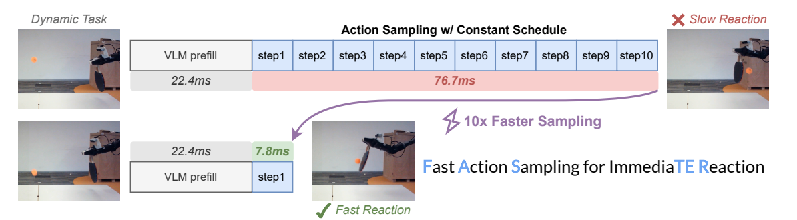

Figure 1. 전체 chunk를 같은 속도로 denoise하는 경로와 첫 행동을 먼저 만드는 경로. **그림의 10×는 첫 행동을 얻는 action-expert sampling 횟수 10→1을 가리킨다.** 그림 안의 VLM prefill 시간은 그대로 남는다. [PDF p.1]

실제로 Table 2에서 TTFA speedup은 모델·GPU에 따라 **1.27–3.09×**다. 가장 큰 X-VLA/RTX 4060의 399.5→129.2 ms는 3.092×, 67.66% 감소다. 같은 조건의 기대 반응시간은 599.5→229.2 ms로 2.616× 감소한다. 반면 π0.5/RTX 4090은 80.0→62.1 ms, 1.288×에 그친다. “VLA 전체가 10배 빨라졌다”는 결론은 표와 맞지 않는다. [PDF p.7–8, Tables 2–3; 검산]

| 주장 | 근거 | 실제로 지지하는 범위 / 제한 |
|---|---|---|
| 반응시간에는 추론 지연과 호출 간격이 모두 중요하다 | §2, Fig.2, Table 1, Appendix B, Table 7 | 고정 지연·주기적 호출·사건 위상 균등이라는 이상화 아래의 결과. 실측 reaction histogram이 아니다. |
| 앞쪽 action이 상대적으로 적은 sampling으로 예측 가능하다 | Eq.(3)–(4), Figs.3·8·13 | 특정 데이터·모델의 평균 추세. 모든 접촉·장애물 회피에서 성립하는 보장은 없다. Fig.3·8의 기준은 주로 최종 모델 출력이지 GT가 아니다. |
| HAS가 첫 유효 action을 한 AE step에 완성한다 | Eq.(5)–(6), Eq.(8)–(10), Algorithm 2 | local time을 1→0으로 보내는 설계상 성질. 한 step의 결과가 정확하다는 보장은 별도 학습·실험에 달린다. |
| 전체 미래 궤적 품질을 대체로 유지한다 | Table 10, Fig.13 | 작은 평균 저하가 실제 존재한다. X-VLA CALVIN 5-task 성공률은 70.2→64.5%. 완전 무손실 주장은 과도하다. |
| mixed schedule이 필요하다 | Table 13 | X-VLA/CALVIN에서 p=0.5가 p=1보다 좋다. 모든 모델의 최적 p가 증명된 것은 아니다. |
| streaming과 early stop이 reaction loop를 좁힌다 | Appendix D.2, Tables 2·4·7, Algorithm 2 | TTFA와 실행할 suffix 완료시간을 함께 줄여야 한다. 첫 packet이 빨라도 서버가 다음 요청을 못 받으면 호출 빈도는 올라가지 않는다. |
| 실기기 동적 task에서 이득이 있다 | Fig.5, Table 8 | π0.5 탁구 점수 4090: 0.533→0.800, 4060: 0.300→0.467(RTC 대비). 15 trials·부분점수이며 연속 rally 성공률이 아니다. |
| architecture와 학습 비용을 거의 늘리지 않는다 | §3.3, Appendix A·E.3 | 새로운 대형 module/teacher distillation stage를 요구하지 않는다. HAS에 맞춘 fine-tuning과 per-action timestep 처리 코드는 필요하다. |

<a id="notation"></a>

## 2. Motivation, 선수 지식, notation과 tensor shape

### 2.1 §1의 문제 정의: 부드러운 궤적과 빠른 반응은 다른 능력

Sync action chunking은 하나의 chunk 실행을 끝낸 다음 관측을 보내고, 새 chunk가 나올 때까지 멈춘다. Async는 그 기다림 동안 이전 chunk의 남은 행동을 실행해 inter-chunk pause를 없앤다. 하지만 **이미 확보한 관측 뒤에 발생한 사건은 다음 관측까지 보이지 않는다.** 긴 action chunk를 부드럽게 실행하더라도 갑자기 들어오는 탁구공에 대한 행동 갱신은 늦을 수 있다. [PDF p.1–4, §1–2]

또한 새 chunk는 현재가 아니라 관측 시점의 상태에 조건화된다. 추론 중 로봇이 움직이므로, 관측과 실행 사이에 perception–execution gap이 생긴다. Naive Async가 새 chunk 앞의 지연된 행동을 버리기만 하면, 이전 chunk와 새 chunk가 서로 다른 유효 운동 모드를 골라 경계가 불연속적일 수 있다. RTC 계열의 action conditioning은 이미 실행하기로 한 중첩 행동을 prefix로 주어 그 뒤를 자연스럽게 잇게 한다. FASTER는 이를 사용하면서 첫 새 행동이 나오는 시점도 앞당긴다.

### 2.2 네 가지 서로 다른 시간축

| 축 | 의미 | 혼동하면 생기는 오류 |
|---|---|---|
| 물리 시간 t | 카메라 관측·모터 동작의 wall clock | denoising timestep을 ms로 읽게 된다. |
| chunk index i | 한 관측이 예측한 H개 미래 행동의 위치 | H를 policy 호출 Hz로 오해한다. |
| sampling index j | AE forward를 몇 번째 하는가 | 한 AE step이 한 모터 step이라고 오해한다. |
| global ρ / local τ | noise→clean 경로의 무차원 좌표 | HAS에서 모든 i에 같은 Euler step을 적용하게 된다. |

원문은 $`a_{t+i}`$처럼 실시간 기호와 이산 index를 함께 쓴다. 엄밀한 물리 해석에서는 “관측 t로부터 i번째 미래 제어 slot”으로 읽는다. Appendix B의 controller 정렬에서는 0-based action i가 요청 후 $`(i+1)\Delta t_{\mathrm{ctrl}}`$에 필요하다. 절마다 time-origin을 확인해야 한다.

### 2.3 Shape 사전

아래 B는 batch size, D는 action 좌표 수이며 H는 prediction horizon이다. PDF가 모든 width를 명시하지 않으므로 일반식과 공식 π0.5 구현을 구분한다.

| 기호/텐서 | 일반 shape | 역할 및 구현상 의미 |
|---|---|---|
| $`o_t`$ | 구조화된 observation | 다중 RGB, 언어 instruction, proprioceptive state. 단일 벡터 하나가 아니다. |
| $`\hat A_t,A_t^\tau,\epsilon,v_\theta`$ | $`[B,H,D]`$ | GT chunk, noisy chunk, Gaussian noise, 예측 velocity. |
| $`a_{t+i}`$ | $`[D]`$ | 한 control slot의 행동 벡터. |
| H | 정수 | π0.5 실기기 50, simulation 10; X-VLA 30. |
| D | 정수 | 실기기 π0.5 외부 joint/gripper 14, 내부 padded dimension 32. X-VLA의 EE6D는 단순 “D=6”을 뜻하지 않는다. |
| d, s | $`[B]`$ / 배포 정수 | prefix 길이/추론 지연, 실제 실행할 유효 suffix 길이. $`d+s\le H`$ 필요. |
| $`\rho`$ | $`[B,1]`$ 또는 scalar | 학습에서 sample별 global time; 추론에서 공통 grid. |
| $`u,\tau,m`$ | $`[B,H]`$ | hit time, action별 noise level, suffix loss mask. D축에는 broadcast한다. |
| $`\Delta\tau`$ | $`[B,H]`$ | 다음 local time − 현재 local time. 비양수이며 action마다 다르다. |
| z | $`[B,1]`$ | HAS/constant schedule을 선택하는 Bernoulli sample. action별 독립 선택이 아니다. |
| image tokens | $`[B,P,2048]`$ | 공식 π0.5의 SigLIP→PaliGemma prefix. P는 여러 view와 prompt를 합친 길이. |
| action tokens / time embedding | $`[B,H,1024]`$ | 32D 행동 projection과 각 action별 sin/cos time embedding. |
| AE attention logits | $`[B,8,H,P+H]`$ | π0.5, 별도 state suffix token이 없는 경우. softmax는 마지막 key 축. |
| prefix KV cache | layer별 K,V | π0.5 구현 depth 18, KV head 1, head_dim 256. 의미상 layer별 $`[B,P,1,256]`$. |

**선수 지식:** conditional flow matching은 noise와 data를 연결하는 연속 경로의 속도를 회귀한다. Euler solver는 현재 속도에 시간 간격을 곱해 위치를 갱신한다. Action chunking은 미래 행동을 한 번에 예측하되 일부만 실행한다. KV cache는 이 논문에서 **한 chunk 내부 AE 반복 중 고정된 observation prefix를 재사용**하는 용도다. 새 관측에서도 과거 vision token을 재사용하는 방법이라고 읽으면 안 된다. [PDF p.5–8; 공식 코드 pi0_faster.py]

<a id="reaction"></a>

## 3. §2와 Appendix B: Reaction time를 처음부터 유도하기

### 3.1 기본 정의와 Table 1

원문의 핵심 비번호 정의를 편집 가능한 식으로 적는다. 편의상 이 절에서 $`L=\Delta t_{\mathrm{infer}}`$, $`c=\Delta t_{\mathrm{ctrl}}`$, $`E=\Delta t_{\mathrm{exec}}`$를 쓴다. E는 이 절의 시간 약칭이며 expectation 기호와 다르다.

```math
c=\Delta t_{\mathrm{ctrl}}=\frac1f,\qquad E=\Delta t_{\mathrm{exec}}=sc,\qquad d=\left\lfloor\frac{L}{c}\right\rfloor,\qquad s_{\min}=\left\lceil\frac{L}{c}\right\rceil.
```

L은 본문 정의상 client가 observation을 보낸 순간부터 action을 받는 순간까지로, 모델·네트워크·전후처리·memory I/O 등을 포함한다. 고정 상수로 간주하는 것이 분석 가정이다. f=30 Hz라면 c=33.333… ms다. d의 floor와 최소 실행 길이의 ceil은 용도가 다르다. [PDF p.3–4]

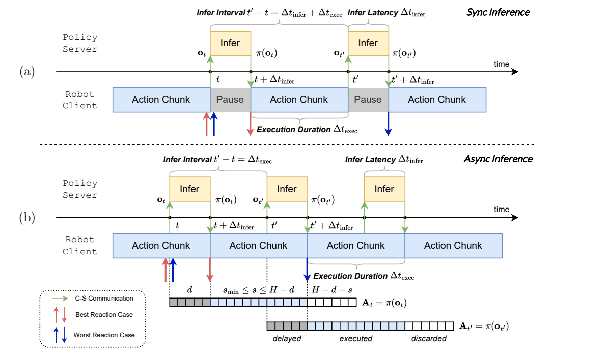

Figure 2. Sync의 다음 observation은 현재 inference와 execution을 모두 기다린 뒤 얻고, Async의 다음 observation은 이전 행동 실행과 겹쳐 얻는다. 아래 action chunk 분해는 delayed prefix, executed suffix, discarded tail을 분리한다. [PDF p.3]

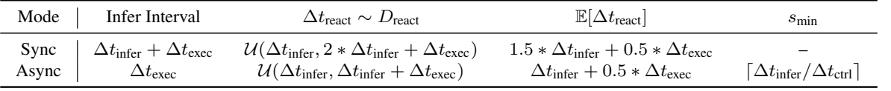

| 모드 | observation/추론 trigger 간격 I | 반응시간 R의 모형 | 기대값 |
|---|---:|---|---|
| Sync | L+E | $`\mathcal U(L,2L+E)`$ | 1.5L+0.5E |
| Async | E | $`\mathcal U(L,L+E)`$ | L+0.5E |

원문 Table 1의 sync s_min 칸은 “–”다. Table 2에 sync s_min 값이 들어간 것은 async와 비교하기 위해 선택한 s를 같이 보여주는 구성으로 읽어야 한다. Sync에도 async와 동일한 feasibility 정리가 적용된다는 의미가 아니다.

### 3.2 균등분포는 어떻게 나오는가

**[리뷰어 보조 유도]** trigger를 $`kI`$에서 주기적으로 발생시킨다고 하자. 사건은 현재 cycle 시작 후 U만큼 지난 순간 발생하고, 이 관측에는 포함되지 않는다. 다음 observation까지 대기시간은 W=I−U, 다음 action이 나오는 데 L이 더 걸린다.

```math
U\sim\mathcal U(0,I)\quad\Longrightarrow\quad W=I-U\sim\mathcal U(0,I),\qquad R=W+L\sim\mathcal U(L,L+I).
```

```math
\mathbb E[R]=L+\frac I2,\qquad \mathrm{Var}(R)=\frac{I^2}{12},\qquad Q_q(R)=L+qI\quad(0\le q\le1).
```

첫 식의 입력은 사건의 **cycle 내 위상 분포**와 두 scalar I,L, 출력은 반응시간의 분포다. 사건이 막 관측되기 전에 발생하면 W≈0이라 R≈L이다. 관측 직후 발생하면 다음 cycle까지 거의 I를 기다려 R≈L+I다. Sync에서 I=L+E, Async에서 I=E를 대입하면 Table 1이 나온다. 같은 L,E를 유지할 때 Sync→Async 기대값 개선은 **0.5L**이다. E까지 바꾸는 비교에서는 이 식만으로 이득을 제한할 수 없다.

### 3.3 이 분포의 전제와 실제 반응의 차이

**[리뷰어 해석]** “사건이 stochastic하다”는 말만으로 위상이 균등해지지 않는다. 고정 주기 controller와 독립적인 stationary event arrival을 random phase로 관찰할 때 유용한 모형이다. 로봇 동작·사람의 공 던지는 timing과 사건이 동기화되거나, 사건 발생 강도가 task phase에 따라 달라지면 위상 분포도 달라질 수 있다.

추가 전제는 (1) L이 일정함, (2) I가 일정함, (3) 사건을 다음 observation이 포착함, (4) 그 관측에 조건화된 첫 action이 실제 반응을 담음, (5) queue·통신 손실·camera frame age·actuator 응답을 effective L로 다룰 수 있음이다. 추론이 빨라도 공을 못 보거나 첫 행동이 hold라면 실제 반응은 늦다. 따라서 TTFA는 “반응 가능한 행동을 제공하는 가장 이른 시점”의 시스템 지표이고 의미 있는 물리 반응을 단독으로 보장하지 않는다. [PDF p.29–30, Appendix G와 연결]

지연이 랜덤 J라면 R=W+J이고 일반적으로 균등분포가 아니다. 독립이라고 추가 가정하면 분산은 $`I^2/12+\mathrm{Var}(J)`$가 된다. L과 I가 연동하거나 tail latency에 따라 trigger가 밀리면 독립 가정도 깨진다. Table 3의 “100% 우월”은 이 이상화된 분포 지지집합에서의 값이지 모든 실제 event에 대한 실측 보증이 아니다.

### 3.4 Eq.(7): floor와 ceil, 한 제어 tick의 차이

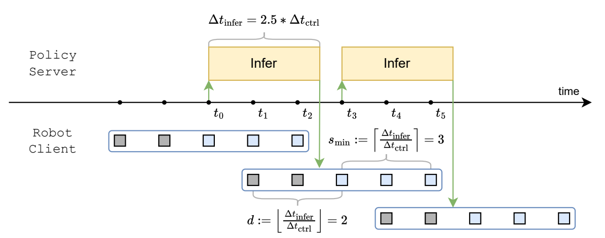

Figure 7. L=2.5c이면 결과는 t0+2.5c에 도착하지만 fixed-rate controller는 t0+3c에 실행한다. 의도한 첫 행동 시점 t0+c에서 두 slot 지연됐으므로 d=2, 다음 요청을 위한 최소 간격은 3 ticks다. [PDF p.18]

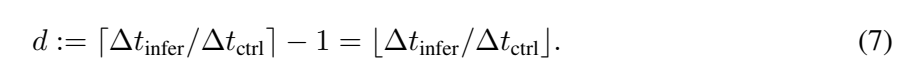

```math
d:=\left\lceil\frac{\Delta t_{\mathrm{infer}}}{\Delta t_{\mathrm{ctrl}}}\right\rceil-1=\left\lfloor\frac{\Delta t_{\mathrm{infer}}}{\Delta t_{\mathrm{ctrl}}}\right\rfloor.\qquad\text{(7)}
```

**기호·연산:** 두 시간의 비는 scalar, ceil은 첫 실행 가능한 tick, −1은 원래 첫 행동을 실행할 tick을 빼는 것이다. floor는 만료된 prefix 개수의 간편식이다. **가정:** 비가 정수가 아닐 때 두 표현이 같다. 예를 들어 L/c=3이면 ceil−1=2, floor=3으로 불일치한다. 저자도 latency가 정확히 경계에 걸리는 경우는 거의 없다고 명시한다. 이를 모든 실수에 대한 항등식으로 쓰면 안 된다.

또한 본문 Table 1은 R의 하한에 연속시간 L을 사용하지만 Appendix B는 실제 action 실행을 ceil(L/c)c에 정렬한다. 따라서 두 설명은 같은 정밀도의 모형이 아니다. 예컨대 L=44.8 ms는 결과 도착 시각이고 첫 controller tick은 66.7 ms일 수 있다. 반응시간의 정확한 센서·모터 timestamp 정의를 정하지 않으면 Table 2의 기대값을 물리 반응 실측값으로 사용할 수 없다.

### 3.5 TTFA, 전체 latency, policy refresh의 분리

원문 §3.3의 핵심 비번호 근사식이다. O는 설명을 위해 추가한 공통 overhead다.

```math
T_{\mathrm{first,base}}\approx T_{\mathrm{VLM}}+NT_{\mathrm{AE}}+O,\qquad T_{\mathrm{first,FASTER}}\approx T_{\mathrm{VLM}}+T_{\mathrm{AE}}+O.
```

```math
\mathrm{Speedup}_{\mathrm{TTFA}}\approx\frac{T_{\mathrm{VLM}}+NT_{\mathrm{AE}}+O}{T_{\mathrm{VLM}}+T_{\mathrm{AE}}+O}.
```

VLM prefill이나 O가 지배하면 N=10이어도 비율은 1에 가깝다. N배에 가까워지는 것은 AE 반복 비용이 지배하고 per-step·streaming overhead가 충분히 작을 때다. Appendix G는 JAX runtime이 반복 횟수에 선형 비례하지 않을 수 있다고 인정한다.

**[리뷰어 보조 정의]** streaming에서는 최소한 세 시간을 따로 측정해야 한다.

| 시간 | 종료 지점 | 역할 |
|---|---|---|
| T_first / TTFA | 첫 유효 action이 client에 도착 | 현재 관측이 움직임에 영향을 줄 가장 이른 기회 |
| T_s | 이번에 실행할 s개 suffix action이 준비됨 | early stop 가능 시점, 다음 inference를 처리할 서버 availability와 연결 |
| T_H | 전체 H개 chunk 완료 및 최종 메시지 처리 | throughput·full-chunk latency; streaming에서는 더 늘 수 있음 |

한 요청씩 처리하는 서버의 주기적 trigger에는 적어도 $`sc\ge T_s`$와 각 packet의 실행 deadline 충족이 필요하다. **TTFA만 ceil로 나누어 s_min을 정하면 불충분하다.** Table 2 자체가 이를 보여준다. π0.5/4090 TTFA 62.1 ms의 ceil은 2인데 보고 s_min은 3이고, X-VLA/4060 TTFA 129.2 ms의 ceil은 4인데 s_min은 6이다. 저자는 early stopping으로 줄인 유효 inference interval을 사용한다. 리뷰에서는 이를 오류로 단정하기보다 **본문의 단일 latency 기호가 streaming에서 첫 도착과 서버 완료라는 두 역할로 나뉜다**는 중요한 해석상 주의점으로 표시한다. [PDF p.7–8, Tables 2·4]

<a id="method"></a>

## 4. §3.1: Conditional flow matching과 Eq.(1)–(2)

### 4.1 핵심 비번호 보간식: noise 1, clean 0

```math
\epsilon\sim\mathcal N(0,I),\qquad A_t^\tau=\tau\epsilon+(1-\tau)\hat A_t,\qquad \tau\in(0,1).
```

GT와 noise는 같은 [B,H,D] shape다. 기본 schedule에서는 sample당 scalar τ를 H,D축으로 broadcast한다. τ=1이면 순수 noise, τ=0이면 GT다. noise는 모델 output을 perturb하는 사후 장치가 아니라 학습의 입력 상태를 구성한다. 조건 o_t는 보간하지 않는다. GT와 noise를 선형 연결한 path를 쓰는 것이며, 이 식만으로 데이터와 noise의 전역 optimal-transport pairing을 최적으로 구했다고 주장할 수는 없다.

τ에 대해 미분하면 target velocity는 $`\epsilon-\hat A_t`$다. 추론은 τ를 줄이는 방향이므로 이 velocity에 **음수 Δτ**를 곱해 clean 방향으로 움직인다. 다른 flow 논문은 clean=1, noise=0을 쓰므로 부호를 그대로 가져오면 반대로 움직일 수 있다. [PDF p.5; Appendix D.1 각주]

### 4.2 Eq.(1): velocity 회귀 loss

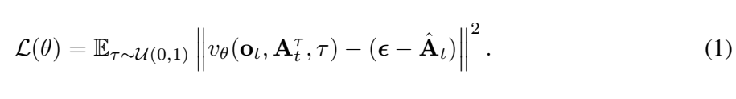

```math
\mathcal L(\theta)=\mathbb E_{\tau\sim\mathcal U(0,1)}\left\|v_\theta(o_t,A_t^\tau,\tau)-(\epsilon-\hat A_t)\right\|^2.\qquad\text{(1)}
```

입력은 observation, noisy action, noise time이다. 출력 velocity는 [B,H,D]. 같은 shape의 target을 빼고 제곱한 뒤 norm으로 scalar loss를 얻는다. 표기에는 τ의 expectation만 보이지만 학습 데이터와 noise도 sampling한다. 논문 식은 좌표 평균인지 합인지 상수를 완전히 풀지 않는다. 공식 코드는 D축 mean 후 suffix mask로 유효 좌표를 모은다. 이 reduction 차이는 뒤에서 구분한다.

**[리뷰어 보조 예제]** H=D=1, GT=2, noise=−1, τ=0.8이면 입력은 −0.4, target velocity는 −3이다. 모델이 −2.5를 출력하면 이 sample의 제곱오차는 0.25다. gradient는 output velocity에 대해 $`2(-2.5+3)=1`$이므로 gradient descent는 velocity를 더 음수로 움직여 target에 가까워지게 한다. “행동 GT=2를 곧바로 회귀한다”와 다르다.

학습은 각 training step에서 임의 time의 velocity를 한 번 평가한다. 보통 추론처럼 N번 ODE를 돌린 뒤 전체 trajectory loss로 backprop하는 구조가 아니다. FASTER는 이 표준 학습 cost 구조를 유지한다.

### 4.3 Eq.(2): Euler sampling

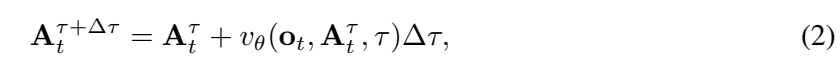

```math
A_t^{\tau+\Delta\tau}=A_t^\tau+v_\theta(o_t,A_t^\tau,\tau)\Delta\tau,\qquad\Delta\tau=-\frac1N.\qquad\text{(2)}
```

연산 순서는 현재 noisy A와 time을 embedding→VLM-conditioned AE forward→velocity projection→Δτ 곱→A에 더하기다. Δτ는 기본식에서 scalar이므로 H,D 전체에 broadcast된다. N=10이면 1,0.9,…,0에서 끝난다. 이 식의 Δτ를 action마다 벡터로 확장하는 것이 HAS inference의 핵심이다.

위 scalar 예제에서 정확한 velocity −3과 Δτ=−0.1을 쓰면 A는 −0.4에서 −0.1로 간다. 직선의 velocity가 모든 time에서 같으면 Δτ=−0.8 한 번으로도 2에 도달한다. 하지만 실제 모델의 조건부 vector field는 곡선이고 예측 오차도 있으므로 큰 step이 항상 정확하지는 않다.

## 5. §3.2와 Appendix C: 앞 행동이 더 쉬운가

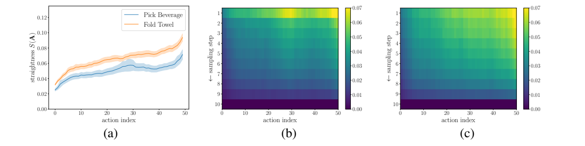

Figure 3. (a)는 action index별 straightness, (b,c)는 Pick Beverage/Fold Towel의 sampling time과 action index별 intermediate clean estimate 차이다. 앞 1–10 frame 부근에서 상대적으로 작은 값이 나타난다. [PDF p.5–6]

### 5.1 연속 straightness 정의와 Eq.(3)

원문의 핵심 비번호 정의다. 점은 물리 시간 derivative가 아니라 flow time derivative다.

```math
S(Z)=\int_0^1\mathbb E\left[\left\|(Z_1-Z_0)-\dot Z_\tau\right\|^2\right]d\tau,\qquad \dot Z_\tau=\frac{dZ_\tau}{d\tau}.
```

시작–끝 차이는 그 둘을 잇는 직선의 속도다. 실제 순간 velocity가 이 속도에서 얼마나 벗어나는지를 제곱·평균·적분한다. S=0은 완전히 직선이라는 뜻이다. 명칭 straightness와 달리 **작을수록 더 곧다**.

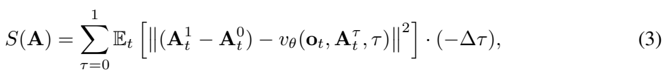

```math
S(A)=\sum_{\tau=0}^{1}\mathbb E_t\left[\left\|(A_t^1-A_t^0)-v_\theta(o_t,A_t^\tau,\tau)\right\|^2\right](-\Delta\tau).\qquad\text{(3)}
```

이산 grid 위 합을 원문과 같은 표기로 보존했다. 실제 계산은 τ=1,0.9,…,0.1에서 평가한 velocity에 양수 가중치 −Δτ=1/N를 곱한 quadrature로 이해한다. “τ=0부터 1까지 모든 실수에 대해 합한다”는 의미가 아니다. A¹−A⁰와 v는 [B,H,D]; action별 curve를 만들려면 i를 고정하고 D축 norm과 sample/time 평균을 취한다. 원문은 Eq.(3)에 i를 생략했으므로 figure의 index별 curve와 연결하려면 이 선택을 명시해야 한다.

**[리뷰어 보조 예제]** 두 step의 실제 velocity가 −2와 −4, 전체 평균 속도가 −3이면 S≈0.5×1+0.5×1=1이다. 둘 다 −3이면 0이다. S는 ground-truth prediction error가 아니다. 잘못된 목적지로 가는 직선 경로도 S=0일 수 있다.

### 5.2 Eq.(4): 현재 velocity로 clean endpoint를 외삽

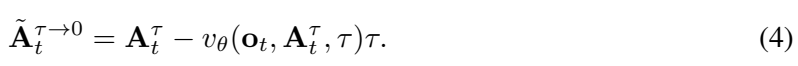

```math
\widetilde A_t^{\tau\to0}=A_t^\tau-v_\theta(o_t,A_t^\tau,\tau)\tau.\qquad\text{(4)}
```

τ에서 0까지 남은 간격 −τ에 현재 velocity를 고정해 곱한 **한 번의 큰 Euler step**이다. 입력·출력은 [B,H,D]. Eq.(2)의 Δτ를 −τ로 바꾸면 유도된다. GT를 알고 계산하는 식이 아니라 intermediate model output만으로 endpoint를 추정한다.

원문은 아래 비번호 deviation을 사용한다.

```math
e_i(\tau)=\left\|\widetilde A_{t,i}^{\tau\to0}-A_{t,i}^{0}\right\|_2.
```

여기서 A⁰는 N-step 모델 자신의 최종 출력이다. 따라서 낮은 e는 “앞 action을 덜 계산해도 원래 solver와 비슷함”의 근거이며 “정답 행동에 가까움”의 직접 증거가 아니다. 마지막 step τ=1/N의 외삽은 Euler 최종 update와 같아 deviation=0이 된다. 이는 마지막 행이 0이라고 새 정확성 보증이 생기는 것이 아님을 뜻한다.

위 scalar 예제에서 A=−0.4, τ=0.8, v=−2.5면 clean estimate=1.6이다. 최종 모델 출력이 2라면 deviation=0.4다. 실제 GT가 1.7이라면 GT 오차는 0.1로 다른 수량이다.

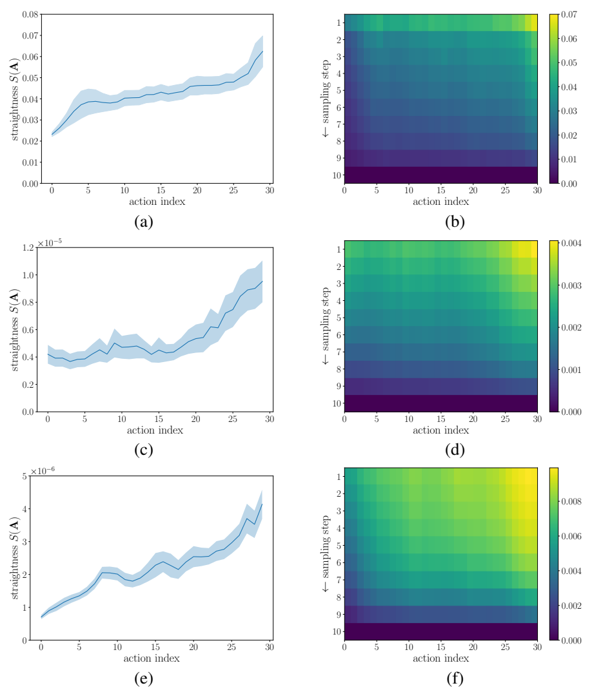

Figure 8. π0.5 Pick Beverage H=30, X-VLA LIBERO H=30, X-VLA CALVIN ABC H=30에서도 비균일한 난이도 추세를 조사한다. shaded area는 200 random samples의 ±2 SEM이다. SEM은 sample 간 표준편차가 아니며, 그림이 모든 action마다 단조 증가한다는 증명도 아니다. [PDF p.19, Appendix C]

**Pilot의 해석:** near-term action은 현재 state와 observation, 이미 정한 action prefix에 의해 강하게 제한된다. 긴 미래에는 접촉 결과·object motion·다중 행동 모드의 불확실성이 누적된다. 이 인과적 직관과 pilot이 HAS의 설계 근거다. 그러나 즉시 충돌 회피·급격한 contact transition처럼 바로 다음 행동부터 어려운 경우까지 일반화하는 정리는 없다.

## 6. §3.3: Horizon-Aware Schedule과 mixed fine-tuning

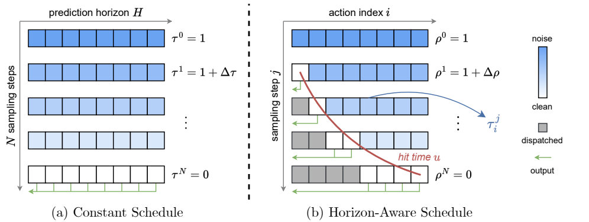

Figure 4. 가로축은 action index, 세로축은 sampling iteration이다. Constant schedule은 매 row의 모든 action이 동일 noise level이다. HAS는 왼쪽 action이 먼저 clean이 되어 전송되고 뒤쪽은 더 오래 refine된다. 회색 완료 action이 모델 token 계산에서도 제거된다는 뜻은 아니다. [PDF p.6]

### 6.1 Eq.(5): hit time는 완료할 global time

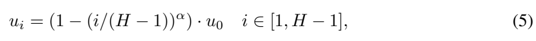

```math
u_i=\left(1-\left(\frac{i}{H-1}\right)^\alpha\right)u_0,\qquad i\in[1,H-1].\qquad\text{(5)}
```

u₀는 별도로 정하는 첫 action의 hit time다. 입력은 index i, horizon H, α와 u₀라는 scalar, 출력은 action별 u vector다. 먼저 index를 [0,1]에 정규화하고 α승, 1에서 빼고 u₀를 곱한다. H>1, $`0\lt\alpha\le1`$, $`0\le u_0\lt1`$이 정상 범위다. 마지막 action은 u=0, 첫 action은 u=u₀다.

**global time은 1→0으로 내려간다.** 따라서 u가 클수록 일찍 끝난다. α=1은 i에 따라 u가 선형 감소한다. α<1이면 0<x<1에서 x^α>x이므로 중간 action의 u가 더 작아져 **그 action들은 α=1보다 더 늦게 끝나며 더 많은 denoising을 받는다**. “α를 작게 하면 모든 앞 행동이 더 일찍 끝난다”는 독해는 틀린다. 첫 action 자체는 α와 무관하게 u₀에서 끝난다.

### 6.2 Eq.(6): global time→action별 local noise time

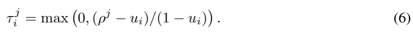

```math
\tau_i^j=\max\left(0,\frac{\rho^j-u_i}{1-u_i}\right).\qquad\text{(6)}
```

각 action의 [u_i,1] global 구간을 [0,1] local 구간으로 선형 rescale한다. ρ=1이면 모든 τ=1, ρ=u_i이면 그 action의 τ=0, 그 뒤에는 max로 0에 고정한다. shape는 ρ가 [B,1], u가 [B,H]이므로 τ=[B,H]. softmax나 확률 정규화가 아니라 **시간축 rescaling**이다.

첫 행동은 $`u_0=(N-1)/N`$로 두므로 첫 global update 1→1−1/N에서 local time이 1→0이 된다. 마지막 행동은 u=0이므로 τ=ρ이고 기본 N-step 경로를 유지한다. 중간 action은 global grid가 u를 정확히 밟지 않아도 **ρ가 u 아래로 넘어갈 때** 완료된다. 본문의 “ρ=u_i일 때 완료”는 연속 schedule 설명이며 discrete 구현은 crossing을 처리한다.

**[리뷰어 보조 유도]** global j=0,…,N grid를 쓴다면 action i의 완료 step 수는 다음과 같다. Algorithm 2는 1-based j 표기를 쓰므로 1 차이가 난다.

```math
k_i=\left\lceil N(1-u_i)\right\rceil,\qquad \Delta\tau_i^j=\tau_i^{j+1}-\tau_i^j,\qquad A_{t,i}\leftarrow A_{t,i}+v_{\theta,i}\Delta\tau_i^j.
```

local time에 대해 학습한 velocity에 local Δτ를 곱한다. global Δρ=−1/N를 모든 좌표에 그대로 곱하면 first action은 한 step에 clean으로 이동하지 않는다. 이는 단순 sampler time-label 변경 이상의 핵심이다.

### 6.3 작은 HAS 수치 예제

**[리뷰어 보조 예제, 실제 모델 설정 아님]** H=5, N=4, α=0.5, u₀=0.75, prefix 없음.

| i | i/(H−1) | u_i | 완료 k_i |
|---:|---:|---:|---:|
| 0 | 0 | 0.7500 | 1 |
| 1 | 0.25 | 0.3750 | 3 |
| 2 | 0.50 | 0.2197 | 4 |
| 3 | 0.75 | 0.1005 | 4 |
| 4 | 1.00 | 0 | 4 |

| global ρ | τ₀ | τ₁ | τ₂ | τ₃ | τ₄ |
|---:|---:|---:|---:|---:|---:|
| 1.00 | 1 | 1 | 1 | 1 | 1 |
| 0.75 | 0 | 0.6000 | 0.6796 | 0.7221 | 0.75 |
| 0.50 | 0 | 0.2000 | 0.3592 | 0.4441 | 0.50 |
| 0.25 | 0 | 0 | 0.0389 | 0.1662 | 0.25 |
| 0.00 | 0 | 0 | 0 | 0 | 0 |

첫 update에서 Δτ=[−1,−0.4,−0.3204,−0.2779,−0.25]다. 같은 AE forward가 모든 action의 velocity를 만들지만 action마다 이동량이 다르다. 두 번째 update에서 첫 좌표 Δτ=0이므로 더 이상 수치값이 변하지 않는다. s=2만 실행하려면 세 번째 global step까지 필요하다. **첫 행동이 한 step이라는 사실로 전체 s개가 한 step이라고 추론할 수 없다.**

### 6.4 Mixed schedule이 왜 필요한가

Pretrained model은 대부분 같은 τ를 가진 chunk에서 학습됐다. 모든 위치에 다른 τ를 넣으면 조건 분포가 바뀐다. 더구나 uniform ρ를 쓰는 HAS에서 action i는 $`P(\tau_i=0)=u_i`$ 확률로 GT 입력을 받는다. 첫 action u₀=0.9이면 90%의 training sample에서 그 좌표가 이미 clean이다. 즉 실제 추론 시작점인 noise에서 빠르게 복원하는 훈련 비중이 작아진다. [PDF p.7]

이를 줄이기 위해 sample별 z를 뽑는다. **핵심 비번호식, Algorithm 1의 분기 정리:**

```math
z\sim\mathrm{Bernoulli}(p),\qquad \tau_i=\begin{cases}\tau_i^{\mathrm{HAS}},&z=1,\\\rho,&z=0.\end{cases}
```

prefix가 있으면 어느 branch에서든 prefix τ=0을 우선 적용한다. p=0.5는 batch의 각 sample이 HAS를 쓸 확률이지 각 행동이 반반의 확률로 independent noise time을 갖는다는 의미가 아니다. Teacher model, consistency distillation loss, 새 auxiliary objective는 추가하지 않는다.

**[리뷰어 보조 검산]** uniform ρ에서 p=0.5면 첫 suffix action의 τ=0 확률은 0.5×0.9=0.45다. constant branch까지 섞어 noisy supervision을 확보한다. 공식 π0.5 코드는 ρ를 Beta 분포에서 뽑으므로 이 45%를 실제 구현의 정확한 빈도로 보고하면 안 된다.

<a id="algorithms"></a>

## 7. Appendix D.1: Action conditioning, Eq.(8)–(11), gradient

### 7.1 Prefix와 첫 유효 action

현재 관측을 보낸 뒤 d개 기존 행동은 이미 실행하기로 약속되어 있다. 새 chunk는 그 d개를 바꿔서 반응할 수 없다. 그러므로 FASTER의 첫 action은 보통 index 0이 아니라 **새로 생성해 실행할 수 있는 첫 suffix action i=d**다. 앞의 0,…,d−1은 condition이다. 학습에서는 GT prefix를 사용하고 추론에서는 이전 예측 chunk의 중첩 prefix를 사용한다. 이 teacher-forced prefix와 실제 예측 prefix의 차이는 남아 있는 distribution shift다. [PDF p.19–20]

### 7.2 Eq.(8): hit time의 기준점 이동

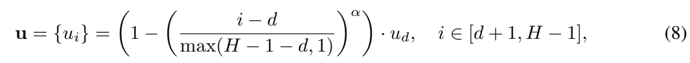

```math
\mathbf u=\{u_i\}=\left(1-\left(\frac{i-d}{\max(H-1-d,1)}\right)^\alpha\right)u_d,\qquad i\in[d+1,H-1].\qquad\text{(8)}
```

u_d는 첫 suffix action의 predefined hit time이며 N=10일 때 0.9다. i−d로 suffix 원점을 0으로 옮기고 H−1−d로 끝 index를 1에 맞춘다. 분모 max(…,1)는 suffix에 action이 하나만 남은 경우 0 나눗셈을 방지한다. 이 경우 식의 i≥d+1 구간이 비어 있으므로 i=d의 u_d만 사용한다.

입력 d는 batch별 정수일 수 있고, u는 [B,H]. d=0이면 Eq.(5)로 돌아간다. d가 커져도 최초 유효 행동을 한 step에 생성하는 성질이 유지된다. 단, d≥H이면 유효 suffix가 없으므로 허용해서는 안 된다. 원문은 d<H를 전제한다.

**[리뷰어 보조 예제]** H=6,d=2,α=1,u_d=0.9라면 suffix i=2,3,4,5의 u=[0.9,0.6,0.3,0]. prefix 둘은 hit time를 계산해 빨리 생성하는 대상이 아니라 항상 고정해 둘 condition이다.

### 7.3 Eq.(9): prefix를 loss에서 제외하는 mask

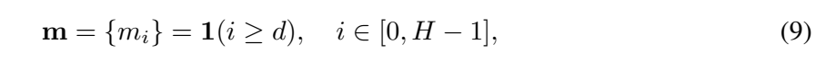

```math
\mathbf m=\{m_i\}=\mathbf1(i\ge d),\qquad i\in[0,H-1].\qquad\text{(9)}
```

m은 [B,H]의 0/1 mask다. prefix에서 0, suffix에서 1이다. 위 H=6,d=2 예제에서 m=[0,0,1,1,1,1], L1 norm은 4다. 이 mask는 **loss mask**이며 attention mask가 아니다. prefix action은 loss를 직접 받지 않더라도 suffix가 참고할 수 있다. 이를 attention에서 차단하면 action conditioning을 제거하는 셈이다.

### 7.4 Eq.(10): prefix를 clean으로 고정한 local time

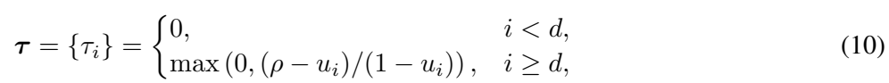

```math
\boldsymbol\tau=\{\tau_i\}=\begin{cases}0,&i\lt d,\\\max\left(0,\frac{\rho-u_i}{1-u_i}\right),&i\ge d.\end{cases}\qquad\text{(10)}
```

학습의 noisy input은 다음과 같이 vector τ를 D축으로 broadcast해서 만든다. **Algorithm 1의 핵심 비번호식**이다.

```math
A_t^{\boldsymbol\tau}=\boldsymbol\tau\odot\epsilon+(1-\boldsymbol\tau)\odot\hat A_t.
```

prefix τ=0이면 noisy input의 해당 부분은 GT와 정확히 같다. suffix에서도 hit time를 지난 action은 τ=0이 될 수 있다. **suffix τ=0과 prefix mask=0은 같은 의미가 아니다.** 원문 Eq.(9)는 i≥d인 모든 suffix에 loss를 주므로 이미 clean인 suffix도 target velocity를 회귀한다. Fine-tuning에서 HAS만 쓰면 clean input을 과하게 보게 된다는 설명이 여기와 연결된다.

### 7.5 Eq.(11): masked conditional flow loss

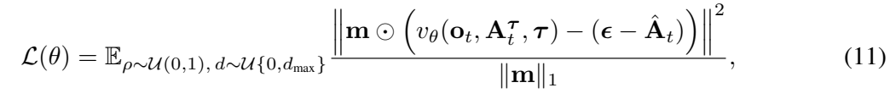

```math
\mathcal L(\theta)=\mathbb E_{\rho\sim\mathcal U(0,1),\,d\sim\mathcal U\{0,d_{\max}\}}\frac{\left\|\mathbf m\odot\left(v_\theta(o_t,A_t^{\boldsymbol\tau},\boldsymbol\tau)-(\epsilon-\hat A_t)\right)\right\|^2}{\|\mathbf m\|_1}.\qquad\text{(11)}
```

분자는 velocity residual [B,H,D]에 m[...,None]을 곱한 squared norm, 분모는 유효 action 개수 H−d다. 각 sample에서 d가 달라져도 유효 suffix가 짧다는 이유만으로 loss가 작아지는 것을 보정한다. 단, 원문 norm은 D축까지 합한다고 읽히므로 D축 mean을 쓰는 코드와는 constant factor가 다를 수 있다. 기대값 표기는 이산 d=0,…,d_max의 uniform을 뜻하며 mixed z branch는 Algorithm 1에서 추가된다.

**[리뷰어 보조 유도]** sample 하나, r_i=v_i−(ε_i−GT_i), D축 합 convention에서:

```math
\mathcal L_b=\frac1{H-d_b}\sum_{i=d_b}^{H-1}\sum_{k=1}^{D}r_{bik}^2,\qquad \frac{\partial\mathcal L_b}{\partial v_{bik}}=\frac{2m_{bi}r_{bik}}{H-d_b}.
```

prefix의 output residual gradient는 0이다. 하지만 prefix embedding과 AE shared weights는 suffix prediction을 통해 간접 gradient를 받을 수 있다. observation encoder/VLM도 frozen이 아니라면 suffix loss로 학습된다. “loss mask를 씌웠으니 prefix를 처리하는 모든 parameter가 frozen”은 틀리다. GT·noise·sampled d·α·u_d·random z는 이 방법에서 optimizer로 학습하는 파라미터가 아니다.

**[리뷰어 보조 예제]** D=1,H=6,d=2에서 suffix residual=[1,−1,2,0]이면 loss=(1+1+4+0)/4=1.5다. prefix residual이 아무리 커도 직접 loss에는 들어가지 않는다. d=6이면 분모 0이므로 d<H 제약을 먼저 만족해야 한다.

## 8. Appendix D.2: Streaming이 실제로 무엇을 겹치는가

서버는 VLM prefill을 한 번 수행하고 AE iteration마다 새로 완료된 action만 client에 보낸다. Client는 전체 chunk가 끝나기 전에 첫 packet을 받아 action buffer에서 순서대로 실행한다. 그동안 서버는 **같은 관측**으로 뒤 action을 refine한다. “streaming”은 여기서 새로운 camera 관측을 AE 매 step에 넣는 것을 뜻하지 않는다. 새로운 observation은 다음 policy request에서 들어온다. [PDF p.18, Appendix A; p.20–21, Appendix D.2]

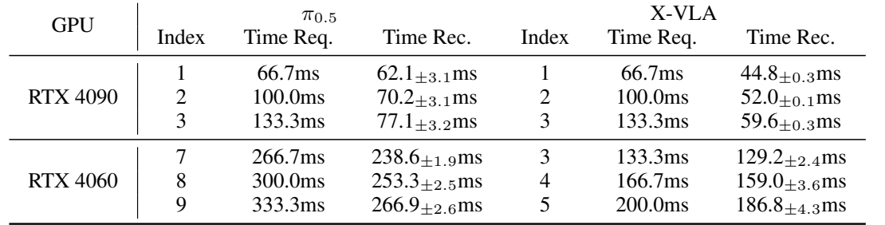

| GPU / 모델 | 원문 action index | 필요 시각 ms | 수신 시각 ms | 평균 deadline 여유 ms [검산] |
|---|---|---|---|---|
| 4090 / π0.5 | 1,2,3 | 66.7,100.0,133.3 | 62.1±3.1,70.2±3.1,77.1±3.2 | 4.6,29.8,56.2 |
| 4090 / X-VLA | 1,2,3 | 66.7,100.0,133.3 | 44.8±0.3,52.0±0.1,59.6±0.3 | 21.9,48.0,73.7 |
| 4060 / π0.5 | 7,8,9 | 266.7,300.0,333.3 | 238.6±1.9,253.3±2.5,266.9±2.6 | 28.1,46.7,66.4 |
| 4060 / X-VLA | 3,4,5 | 133.3,166.7,200.0 | 129.2±2.4,159.0±3.6,186.8±4.3 | 4.1,7.7,13.2 |

Table 4는 **20 trials의 mean±std**다. index는 delayed prefix를 제외하고 표에 남긴 원래 chunk 위치로 해석하면 필요 시각 $`(i+1)c`$와 맞는다. “항상 첫 유효 action을 1로 다시 번호 매겼다”로 읽으면 4060의 7·3을 설명할 수 없다. 논문 수치를 그대로 유지하고 이 time-origin을 밝혀 둔다.

평균 packet 간격은 π0.5/4090 8.1,6.9 ms, X-VLA/4060 29.8,27.8 ms로 33.3 ms control period보다 작다. 그러나 “평균 공급률>30 Hz”만으로 모든 순간의 buffer underflow가 없음을 보장하지 않는다. 관측된 첫 packet의 작은 margin, tail jitter, 초기 buffer, packet burst를 함께 봐야 한다.

**[리뷰어 보조식]** k번째 유효 action이 도착하는 시각 r_k와 그 실행 예정 시각 e_k가 있다면, 무중단 실행의 직접 조건은 $`r_k\le e_k`$가 모든 실행 action에 대해 성립하는 것이다. r_{k+1}−r_k<c는 유용한 충분조건의 일부지만 initial r_1≤e_1도 필요하다. 긴 평균 구간의 throughput만 높고 어느 packet 하나가 deadline을 넘으면 stall이 날 수 있다.

Appendix D.2는 작은 packet을 자주 보내면 **full chunk total completion time은 늘 수 있다**고 명시한다. 뒤 packet 전송이 앞 action 실행 시간 아래에 가려지는 것은 controller가 기다리지 않는다는 의미다. 네트워크 bandwidth·CPU copy·서버 GPU 시간이 물리적으로 사라진다는 뜻은 아니다.

## 9. Appendix D.3: Algorithm 1과 2의 모든 행

### 9.1 Algorithm 1: fine-tuning

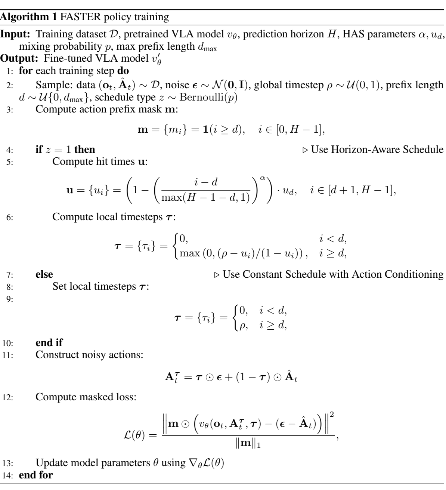

입력은 demonstration dataset D, pretrained velocity model, H, α,u_d,p,d_max다. 출력은 fine-tuned model이며 action tokenizer나 새로운 codebook이 아니다. [PDF p.21]

| 원문 행 | 실제 계산과 필요한 해석 |
|---:|---|
| 1 | training step 반복을 시작한다. 한 step에 whole ODE sampling을 학습하는 것이 아니다. |
| 2 | observation/GT chunk, 같은 shape의 noise, global ρ, discrete d, schedule z를 뽑는다. sample별 random choice이며 minibatch 적용은 vectorize할 수 있다. |
| 3 | Eq.(9)의 m 생성. mask가 1인 부분을 loss에서 쓴다. |
| 4 | z=1이면 HAS branch로 이동한다. |
| 5 | suffix index offset을 포함한 Eq.(8)로 u 계산. u_d 자체는 predefined 값이다. |
| 6 | Eq.(10)으로 각 위치 local time 계산. prefix는 0. |
| 7 | z=0이면 constant branch다. |
| 8 | 다음 행의 piecewise local time을 대입하는 실행 행이다. |
| 9 | prefix τ=0, suffix τ=ρ로 설정. action conditioning은 constant branch에서도 유지된다. |
| 10 | branch 종료. 이후 입력 shape와 loss는 공통이다. |
| 11 | vector τ를 action dimension에 broadcast해 noisy action을 만든다. prefix는 GT 상태로 남는다. |
| 12 | velocity forward와 Eq.(11)의 masked loss. 논문식은 per-sample suffix 길이로 normalize한다. |
| 13 | ∇θL로 optimizer update. α,u_d,p,d는 별도 학습하지 않는다. |
| 14 | 반복 종료. 훈련된 parameter를 배포한다. |

“추가 training cost 없음”은 기존 standard fine-tuning과 같은 데이터·step에서 schedule만 바꿀 수 있다는 저자의 주장이다. 사전학습 weight를 그대로 로딩하고 inference flag 하나만 바꾸면 Table 2–13의 정확도가 나온다는 뜻은 아니다. Table 13의 큰 p degradation은 fine-tuning recipe가 방법의 중요한 구성임을 보여준다.

### 9.2 Algorithm 2: prefix 고정, AE 반복, 즉시 발송, early stop

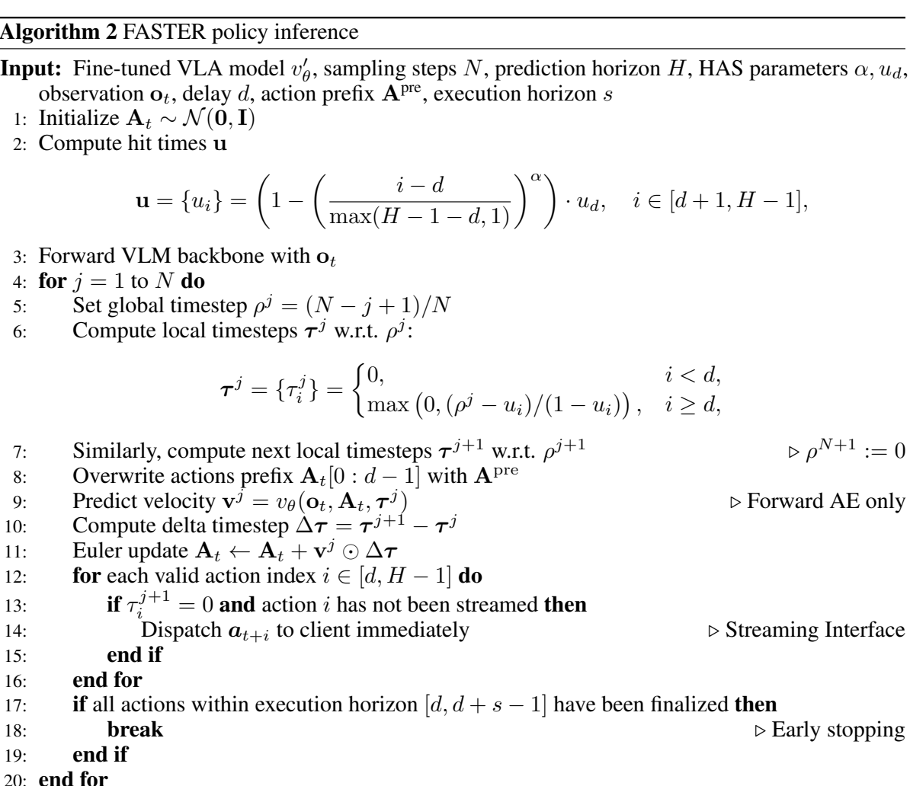

| 원문 행 | 실행 순서와 shape |
|---:|---|
| 1 | A∼N(0,I), [B,H,D]로 초기화한다. 아직 prefix도 noise여도 된다. 행 8에서 덮어쓴다. |
| 2 | d,H,α,u_d로 hit-time vector를 만든다. |
| 3 | o_t로 VLM backbone을 한 번 forward한다. 이미지·언어 prefix KV/features를 보관한다. |
| 4 | j=1,…,N sampling loop. |
| 5 | $`\rho^j=(N-j+1)/N`$. 첫 j=1에서 1이다. |
| 6 | 현재 local time vector τ^j를 계산한다. |
| 7 | 다음 global time에 대한 τ^{j+1}도 계산한다. 마지막 endpoint는 ρ^{N+1}=0이다. |
| 8 | A의 처음 d개 action을 이전 chunk의 중첩 prefix로 덮어쓴다. 원문 `[0:d−1]`는 inclusive index 표기다. Python에서는 `[:d]`에 대응하며 `[:d-1]`가 아니다. |
| 9 | cached observation과 현재 noisy chunk/τ를 사용해 **AE만** forward, velocity [B,H,D]를 만든다. |
| 10 | Δτ=τ^{j+1}−τ^j, shape [B,H]. 이미 끝난 action은 0이다. |
| 11 | Δτ[...,None]×velocity를 A에 더한다. global Δρ로 대신하지 않는다. |
| 12 | 유효 suffix index i=d,…,H−1을 확인한다. |
| 13 | 다음 local time=0이며 아직 보내지 않은 action인지 검사한다. |
| 14 | 그 action을 client에 즉시 dispatch한다. 새 action은 앞 index부터 완료하므로 실행 순서와 맞는다. |
| 15 | dispatch 조건문 종료. |
| 16 | index 순회 종료. 실제 구현은 boolean mask로 묶어서 vectorize한다. |
| 17 | 실행할 index d,…,d+s−1 전체가 끝났는지 확인한다. 모든 H개를 요구하지 않는다. |
| 18 | 완료했다면 나머지 AE iteration을 중단한다. |
| 19 | early-stop 조건문 종료. |
| 20 | 그렇지 않으면 다음 denoising iteration으로 간다. |

실행하지 않을 noisy tail을 중단 시 버려도 앞 action은 이미 출력됐다. 그러나 **tail token을 forward에서 처음부터 제거해도 된다는 결론은 아니다.** AE attention은 suffix 안에서 양방향 정보를 섞으므로 뒤 noisy action도 앞 prediction에 영향을 줄 수 있다. 이 방법은 action-dependent integration과 dispatch schedule이며, token-pruning 방법이 아니다.

<a id="forward"></a>

## 10. 한 샘플 end-to-end forward: 카메라에서 모터 buffer까지

이 절은 논문의 Algorithm 2와 공식 π0.5 구현을 연결한다. **[공식 코드 확인]** 기준 config는 `pi05_faster_agilex`, H=50,D_internal=32, α=0.6,u_d=0.9,N=10이다. 설명용 배포 값 d=3,s=4는 실제 Table 6의 4090 탁구 설정과 같다. 아래 계산 자체는 GPU 실행 결과가 아니다.

### 10.1 Observation과 이전 약속 행동

Client는 front/left-wrist/right-wrist RGB와 14D state, instruction을 가져온다. State는 left 6 joint+gripper, right 6 joint+gripper다. 이전 current execution buffer의 마지막 d개 action이 새 요청의 prefix가 된다. 논문은 이전 full predicted chunk 좌표에서 [s,s+d−1]를 쓰며, 실행용으로 잘라 보관하는 client buffer의 `cur_chunk[s-d:s]`는 그 buffer 원점에 대한 표기다. 서로 다른 원점을 같은 array slicing으로 비교하면 안 된다.

이미지는 224×224로 resize되고 [B,224,224,3]으로 변환된다. Agilex 경로는 joint 12개를 현재 proprioception에 상대적인 offset으로 바꾸되 두 gripper 좌표는 그대로 둔다. action prefix에도 동일 좌표변환·normalization을 적용한다. π0.5는 normalized state를 discretized prompt input에 넣고 language/image prefix를 구성한다. 14D state/action은 내부 32D로 padding한다. [공식 코드 agilex_policy.py, transforms.py, training/config.py]

### 10.2 VLM prefill

각 image를 SigLIP So400m/14에 통과시켜 PaliGemma width 2048의 image token을 만든다. Tokenized prompt를 붙여 prefix 길이 P를 얻는다. 기본 224×224/patch 14의 patch grid는 16×16=256이지만 실제 P에는 camera 수·prompt padding·image mask가 함께 들어간다. 세 view가 모두 유효하면 이미지 부분은 768 tokens이며, prompt max length 200 설정에서는 padded prefix 길이는 968이다. 이 수치는 공식 config를 전개한 shape 설명이고 논문 latency 실험에서 유효 token 수를 따로 측정한 값이 아니다.

Prefix attention은 image/language 입력 사이 full attention이며 action suffix는 prefix가 보지 못한다. 18-layer PaliGemma forward 후 각 layer K,V를 보관한다. 이 KV는 **현재 요청의 observation**에만 대응하고 이번 sampling loop에서 재사용한다.

### 10.3 첫 AE forward와 local step

Noise [1,50,32]를 생성하고 처음 3행을 normalized prefix로 덮어쓴다. suffix 첫 index i=3에서 u=0.9다. 다음 i=4는 $`0.9[1-(1/46)^{0.6}]\approx0.8095`$, i=5는 약 0.7628, i=6은 약 0.7251이다. 완료 step은 각각 1,2,3,3이다. i=49는 u=0이므로 10 step이 필요하다.

처음 τ는 prefix 0, suffix 1이다. Action projection은 [1,50,32]→[1,50,1024], timestep sin/cos embedding은 [1,50]→[1,50,1024]다. Time MLP 출력은 각 action token의 adaRMS conditioning으로 들어간다. 새 large architecture를 추가하지 않아도 scalar time의 broadcast를 **token별 conditioning**으로 바꾸는 코드가 필요하다.

AE 각 layer의 action query는 prefix KV와 현재 suffix K,V를 본다. π0.5 설정에서 attention logit의 의미상 shape는 [1,8,50,P+50]이고 softmax는 P+50 key축이다. action끼리는 temporal-causal mask가 아니라 같은 block 안 full attention이다. 이 구조가 앞 clean/prefix와 뒤 noisy action의 상호조건화를 허용한다.

Velocity [1,50,32]를 출력한다. 첫 local update에서 i=3의 Δτ는 −1이고, prefix Δτ는 0이다. i=3 값이 완성되면 output transform으로 역정규화·relative-to-absolute 변환을 하고 14D로 잘라 packet에 넣는다. **GT가 아닌 예측 action**이 client로 전송된다.

### 10.4 뒤 action 생성과 early stop

두 번째 AE iteration에서는 i=4가 완료되어 전송된다. 세 번째에는 i=5,6이 함께 끝날 수 있다. s=4를 채웠으므로 총 3 AE steps 이후 종료할 수 있다. d+s=7 뒤의 43개 action을 모두 clean으로 만들 필요가 없다. 다만 종료 전 세 번의 AE forward에서는 H=50 tokens를 계속 계산한다.

이 예제의 이론적 AE-call count는 first action 1, executed suffix 완료 3, full chunk 완료 10이다. 그러므로 TTFA≈T_VLM+T_AE, T_s≈T_VLM+3T_AE, T_H≈T_VLM+10T_AE이며 실제 시간에는 host synchronization과 packet 처리 overhead가 추가된다. 3-step total이 1-step TTFA와 같다고 주장하지 않는다.

### 10.5 Client 실행과 다음 관측

Client는 received partial actions를 현재 또는 다음 buffer에 append하고 ROS loop가 30 Hz로 하나씩 소비한다. 별도 inference thread가 관측을 요청한다. 공식 client는 RTC prefix가 필요할 때 current s개 action이 모두 채워져 있는지를 검사하고, 다음 chunk 생성용 prefix를 복사한다. 이것이 TTFA만 빨리 나온다고 무한히 자주 replan할 수 없는 실제 이유 중 하나다.

Streaming 요청의 마지막 `final` 메시지는 full tensor를 담을 수 있지만 early stop 뒤 tail은 여전히 noisy일 수 있다. 실행용은 callback으로 전달된 완료 action이며, final 결과의 H개를 모두 유효한 trajectory로 재사용해서는 안 된다. 첫 episode 초기화는 별도 초기 inference로 buffer를 채우므로 steady-state 반응시간 분석과 startup/JIT latency는 구분해야 한다.

<a id="training"></a>

## 11. Appendix E 전체: 데이터, 전처리, 학습 설정과 gradient 경계

### 11.1 E.1: 실기기 구성과 데이터

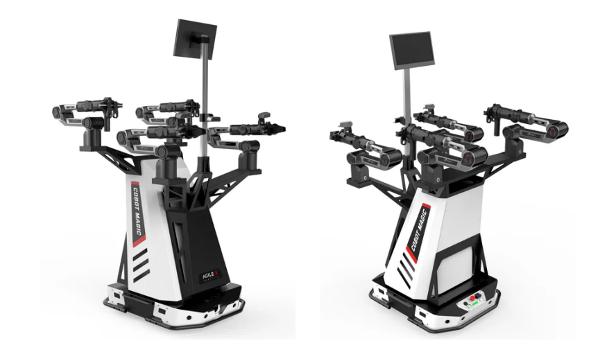

Figure 9. AgileX Cobot Magic의 4개 6-DoF Piper arm 중 두 개는 사람 teleoperation용 leader, 두 개는 follower다. Front RealSense D455 하나, follower wrist D435 둘의 multi-camera 구성이다. [PDF p.23]

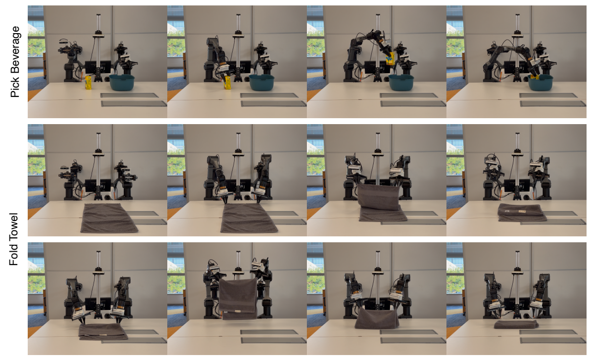

Figure 10. beverage grasp/place와 양팔 towel folding 단계. 두 task는 탁구보다 즉각적인 반응 요구가 작아 더 긴 execution horizon을 쓴다. [PDF p.23]

| Task | Demonstration | 평가 rollouts | 평가가 의미하는 것 |
|---|---|---:|---|
| Table Tennis | 335 episodes, 약 14분, 30 FPS | 15 | 들어오는 공을 맞혀 상대 쪽으로 보내는 단발 return task. |
| Pick Beverage | “다른 두 task에 150 episodes”로 기술 | 35 | 고정 object type/position/orientation test case로 grasp/place 능력 평가. |
| Fold Towel | 위와 같은 150 episodes 문장 | 10 | 양팔로 두 번 접는 deformable-object task. |

**[논문 미기재]** p.23의 “150 episodes for the other two tasks”는 문장만으로 task별 150인지 둘 합계 150인지 명확하지 않다. 이를 임의로 각각 150 또는 총 300이라고 확정하지 않는다. 실기기 demonstration의 train/val/test episode split, held-out validation 크기, 수집자별 분할, 최종 checkpoint 선택 기준, 세부 video/camera 동기화 지연, 공개 dataset hash는 PDF에서 확인되지 않는다.

**[검산]** 14분×60×30≈25,200 timestamp, episode당 평균 약 2.51초다. 이는 명목 recording duration으로 계산한 규모이며 실제 유효 학습 window 수와 다르다. H-window 중첩, episode 경계 padding, observation frame 처리에 따라 training sample 수는 달라진다.

Language instruction은 task별 고정된 지시다. 의미는 각각 “공을 상대에게 치기”, “음료를 플라스틱 basket에 넣기”, “수건 접기”다. 따라서 실기기 task 결과만으로 다양한 언어 paraphrase나 복잡한 instruction grounding 일반화를 검증했다고 보기는 어렵다.

### 11.2 E.2: simulation 데이터와 split

| Benchmark | 학습·평가 구조 | 주의점 |
|---|---|---|
| LIBERO | Spatial/Object/Goal/10(Long), suite당 10 tasks, task당 50 evaluation trials. 네 suite를 함께 학습하는 single policy. | suite당 500, 전체 2,000 rollouts. latency가 환경 dynamics에 반영되지 않는 일반 평가다. |
| π0.5 LIBERO | OpenVLA 제공 `openvla/modified_libero_rlds`를 openpi script로 LeRobot 변환. | OpenVLA dataset을 사용한다는 것이 OpenVLA architecture에 HAS를 적용했다는 뜻은 아니다. |
| X-VLA LIBERO | `2toINF/Libero-XVLA-format` HDF5, EE6D action space에 맞춤. | π0.5와 action representation/data transform이 다르다. 모델 간 절대 수치는 완전히 동일 pipeline 비교가 아니다. |
| CALVIN | 34 tasks, ABC→D split, `InternRobotics/InternData-Calvin_ABC`, 1,000 instruction chains, 각 5 tasks. | D 환경 일반화와 연속 task 수행 능력. Avg. Len은 task 수 기대값이다. |
| Kinetix | 12 dynamic tasks, **4-layer MLP policy**, H=8, training delay 0–4에 exponentially decreasing weights. | VLA가 아니므로 VLM prefill 비용이 없다. |

Kinetix는 기존 training의 epoch 24에서 이어 mixed schedule로 8 epochs fine-tune, sampling N=5와 u_d=0.8, 평가 2,048 rollouts를 사용한다. 이 training delay 분포는 VLA Appendix D.1의 discrete uniform recipe와 다르며 별도 benchmark recipe다. [PDF p.24–25]

### 11.3 E.3, Table 5: hyperparameter 전체

| 항목 | π0.5 AgileX | π0.5 Simulation | X-VLA AgileX | X-VLA Simulation |
|---|---:|---:|---:|---:|
| Prediction H | 50 | 10 | 30 | 30 |
| Action space | Relative Joint | Delta EEF | Abs EE6D | Abs EE6D |
| Global batch | 128 | 256 | 128 | 128 |
| Training steps | 50k | 30k | 50k | 60k |
| Optimizer | AdamW | AdamW | AdamW | AdamW |
| Weight decay | 0 | 0 | 0 | 0 |
| Betas | (0.9,0.95) | (0.9,0.95) | (0.9,0.95) | (0.9,0.95) |
| Base LR | 2.5e−5 | 5e−5 | 1e−4 | 1e−4 |
| Schedule | Cosine decay | Cosine decay | Constant | Constant |
| Warmup | 1k | 10k | 2k | 2k |
| Gradient norm clip | 1.0 | 1.0 | 1.0 | 1.0 |
| EMA decay | 0.99 | 0.999 | N/A | N/A |

Default HAS α=0.6,p=0.5,u₀=0.9; X-VLA의 LIBERO/CALVIN에서는 α=0.7. 실기기 d_max=10으로 설정한다. 두 VLA는 N=10 sampling을 사용한다. [PDF p.25–26]

모든 model training은 **8×A800 80GB**에서 이루어졌으며 π0.5는 1–2일, X-VLA는 6–7시간이라고 보고한다. 이 값은 RTX 4060에서 학습할 수 있다는 근거가 아니다. 논문은 4060의 **inference deployment**를 검증한다. GPU별 power, VRAM peak, multi-GPU 통신량, 정확한 seed별 학습 시간 분포는 미기재다.

### 11.4 전처리와 objective가 연결되는 방식

실기기 raw demonstration은 absolute joint space로 저장한다. π0.5는 observation의 state를 빼 relative joint로 바꾸고, X-VLA는 forward kinematics로 absolute EE6D로 변환한다. 논문은 FK의 좌표 convention과 모든 normalizer 통계를 숫자로 제공하지 않는다. 공개 π0.5 AgileX config는 `use_quantile_norm=False`여서 z-score normalization을 사용하며 epsilon=1e−6으로 나눗셈을 안정화한다.

**[공식 코드에서 정리한 보조식]** joint coordinate k가 relative mask에 포함된 경우:

```math
a^{\mathrm{rel}}_{i,k}=a^{\mathrm{abs}}_{i,k}-s_{t,k},\qquad a^{\mathrm{norm}}_{i,k}=\frac{a^{\mathrm{rel}}_{i,k}-\mu_k}{\sigma_k+10^{-6}}.
```

이후 noise를 섞고 velocity loss를 계산한다. 출력은 역정규화 후 s_t를 더해 controller action space로 되돌린다. absolute/relative prefix를 잘못 섞으면 shape는 맞아도 conditioning은 틀어진다. 특히 prefix는 **새 observation의 state를 기준으로** 모델 입력 표현에 변환해야 한다.

### 11.5 Frozen/trainable, gradient 흐름

**[저자 보고]** pretrained π0.5·X-VLA를 각 공식 codebase로 fine-tune한다. PDF는 각 parameter group의 frozen 목록을 완전하게 열거하지 않는다. **[공식 코드 확인]** 제공된 `pi05_faster_agilex`는 LoRA 변형을 지정하지 않고, `freeze_filter` 기본값 `nnx.Nothing`을 사용한다. `trainable_filter`는 Param 중 freeze_filter에 속하지 않는 것을 택한다. 따라서 이 공개 설정에서 VLM/SigLIP/AE/projection/time MLP를 단순히 frozen이라 단정할 근거는 없다. SigLIP 호출의 `train=False`는 forward의 학습 모드 동작과 관련된 값이며 그 자체로 `stop_gradient`가 아니다.

Gradient 흐름은 suffix velocity loss→action_out_proj→AE attention/MLP/adaRMS→action/time embeddings 및 conditioning VLM features→trainable VLM/vision parameters다. 학습에서는 prefix+suffix를 한 번의 큰 forward로 처리하며 inference KV cache를 gradient 절단점으로 쓰지 않는다. Inference는 optimizer update 없이 VLM prefix KV를 재사용한다.

α,u₀,p,d_max는 hyperparameter다. 학습 가능한 scheduler나 online uncertainty predictor가 없다. 별도 reward model, actor–critic objective, RL rollouts, teacher/student distillation gradient도 이 방법의 학습식에 없다.

### 11.6 E.4, Table 6: 실기기 설정은 latency 표와 다르다

| Task | Method | 4090 d,s | 4060 d,s |
|---|---|---|---|
| Table Tennis | Sync | 4,5 | 10,11 |
| Table Tennis | Naive Async / Training-time RTC | 4,5 | 10,11 |
| Table Tennis | FASTER | 3,4 | 8,10 |
| Pick Beverage / Fold Towel | Sync | 4,50 | 10,50 |
| Pick Beverage / Fold Towel | Naive Async / Training-time RTC | 4,46 | 10,40 |
| Pick Beverage / Fold Towel | FASTER | 3,47 | 8,42 |

LAN+WebSocket, ROS 30 Hz다. 위 설정은 **실제 로봇 overhead를 고려해 더 보수적으로 정한 deployment 값**으로, Table 2의 이상적인 s_min을 그대로 쓰지 않는다. 실기기 절의 underlying model은 π0.5다. X-VLA H=30인데 이 표의 s=47을 그대로 적용하면 d+s>H가 되므로 X-VLA의 모든 deployment config를 이 표에서 알 수 있다고 보면 안 된다. X-VLA 추가 실기기 결과의 별도 d,s 표는 미기재다.

정적 성격 task에서 FASTER s=47/42는 H−d를 모두 쓰는 설정이다. 여기서는 early stop으로 tail을 크게 버리는 실험이 아니다. 탁구 s=4/10은 자주 replan하도록 짧게 실행한다. 같은 알고리즘도 task에 따라 목표가 다르므로 “FASTER는 항상 shortest s를 쓴다”는 해석은 틀린다.

<a id="experiments"></a>

## 12. §4.1, Appendix F.1: 시간표 전체와 확률 검산

### 12.1 Table 2: TTFA·s_min·기대 반응시간

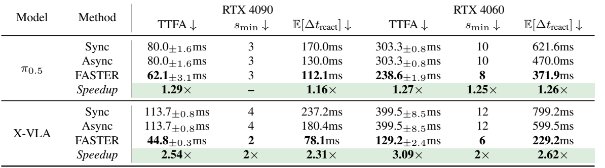

| 모델 | GPU | 모드 | TTFA ms | s_min | 기대 반응시간 ms |
|---|---|---|---:|---:|---:|
| π0.5 | 4090 | Sync | 80.0±1.6 | 3 | 170.0 |
| π0.5 | 4090 | Async | 80.0±1.6 | 3 | 130.0 |
| π0.5 | 4090 | FASTER | 62.1±3.1 | 3 | 112.1 |
| π0.5 | 4060 | Sync | 303.3±0.8 | 10 | 621.6 |
| π0.5 | 4060 | Async | 303.3±0.8 | 10 | 470.0 |
| π0.5 | 4060 | FASTER | 238.6±1.9 | 8 | 371.9 |
| X-VLA | 4090 | Sync | 113.7±0.8 | 4 | 237.2 |
| X-VLA | 4090 | Async | 113.7±0.8 | 4 | 180.4 |
| X-VLA | 4090 | FASTER | 44.8±0.3 | 2 | 78.1 |
| X-VLA | 4060 | Sync | 399.5±8.5 | 12 | 799.2 |
| X-VLA | 4060 | Async | 399.5±8.5 | 12 | 599.5 |
| X-VLA | 4060 | FASTER | 129.2±2.4 | 6 | 229.2 |

**[검산]** Table 2의 expected reaction은 TTFA의 empirical mean을 Table 1 모형에 대입한 값이다. 예를 들어 X-VLA/4060 FASTER는 129.2+(6×33.333…)/2=229.2 ms다. 독립적으로 측정한 event-to-racket-motion latency 229.2 ms가 아니다.

| Async 대비 FASTER | TTFA speedup | TTFA 감소율 | 기대 반응시간 speedup | s_min 개선 |
|---|---:|---:|---:|---:|
| π0.5 / 4090 | 1.288× | 22.38% | 1.160× | 3→3 |
| π0.5 / 4060 | 1.271× | 21.33% | 1.264× | 10→8 |
| X-VLA / 4090 | 2.538× | 60.60% | 2.308× | 4→2 |
| X-VLA / 4060 | 3.092× | 67.66% | 2.616× | 12→6 |

왜 X-VLA 이득이 큰가? 저자는 AE 비중이 더 크기 때문이라고 해석한다. 표에서 확인되는 것은 실제 TTFA 차이이고, 이 리뷰가 두 모델의 kernel-level latency breakdown을 직접 측정한 것은 아니다. π0.5처럼 VLM 또는 fixed overhead가 큰 경우 AE step 감소의 이득이 희석된다.

### 12.2 Table 7: uniform 모형의 interval

모든 interval 단위는 ms다. 원문 반올림값을 보존한다.

| 모델/GPU | Sync | Async | FASTER | E: baseline→FASTER |
|---|---|---|---|---|
| π0.5 / 4090 | U(80.0,260.0) | U(80.0,180.0) | U(62.1,162.1) | 100.0→100.0 |
| π0.5 / 4060 | U(303.3,939.9) | U(303.3,636.6) | U(238.6,505.3) | 333.3→266.7 |
| X-VLA / 4090 | U(113.7,360.7) | U(113.7,247.0) | U(44.8,111.5) | 133.3→66.7 |
| X-VLA / 4060 | U(399.5,1199.0) | U(399.5,799.5) | U(129.2,329.2) | 400.0→200.0 |

Table 7은 Table 2와 별도 hardware experiment가 아니라, 같은 TTFA와 s_min으로 만든 분포의 상세 표다. FASTER의 interval에는 TTFA를 하한으로 쓰고, width에는 early stop을 고려한 execution interval을 쓴다. 이 둘을 단일 L로 합쳐 다시 ceil(TTFA/c)만 계산하면 Table 2 s_min과 맞지 않는 경우가 생긴다.

### 12.3 Table 3: “더 빠를 확률”이 의미하는 것

| 모델/GPU | Async가 Sync보다 빠를 확률 | FASTER가 Sync보다 빠를 확률 | FASTER가 Async보다 빠를 확률 |
|---|---:|---:|---:|
| π0.5 / 4090 | 0.72 | 0.81 | 0.66 |
| π0.5 / 4060 | 0.74 | 0.88 | 0.77 |
| X-VLA / 4090 | 0.73 | 1.00 | 1.00 |
| X-VLA / 4060 | 0.75 | 1.00 | 1.00 |

Appendix F.1은 **각 method의 reaction distribution에서 독립적으로 하나씩 뽑아 비교한 확률**이라고 명시한다. 같은 event를 두 시스템이 같은 phase에서 동시에 본 paired probability가 아니다.

**[리뷰어 보조 유도]** X∼U(a,b), Y∼U(c,d)가 독립이면:

```math
P(X\lt Y)=\frac1{b-a}\int_a^b\mathrm{clip}\left(\frac{d-x}{d-c},0,1\right)dx.
```

여기서는 구간 upper bound d를 사용하는 보조식이며, prefix 길이 d와 무관하다. x가 c보다 작으면 Y가 항상 더 크고, c≤x≤d이면 선형으로 그 확률이 감소하며, x>d이면 0이다. 이를 X의 density로 적분한다.

**[검산]** π0.5/4090에서 위 순서 확률은 0.72222,0.81277,0.66298로 Table 3의 두 자리 반올림과 맞는다. π0.5/4060은 0.73821,0.87986,0.77055다. X-VLA는 FASTER upper bound 111.5<113.7,329.2<399.5이므로 이 모형에서는 P=1이다. 하지만 4090의 분리 margin은 약 2.2 ms에 불과하며 실제 controller alignment·jitter를 포함하면 strict dominance를 그대로 보장할 수 없다.

### 12.4 평가 통제와 측정 누락

서로 같은 backbone/default configuration과 GPU, control f=30 Hz에서 비교하고, 가능한 작은 s로 반응 capability를 분석한 점은 유용하다. 다만 이 수치들의 timestamp instrumentation, warmup/JIT 제외 기준, CPU·OS·CUDA/JAX 버전, 입력 camera count·resolution의 최종 timing configuration, GPU power/clock 상태, 반복 표본 수와 tail percentile은 Table 2만으로 완전히 복원되지 않는다. Table 4는 20 trials mean±std라고 명시하지만 모든 latency 표의 ± 통계를 거기에 근거 없이 동일시하지 않는다.

## 13. §4.2, Appendix F.2: 실기기 성능과 통계

### 13.1 Table Tennis: Fig.5와 Table 8

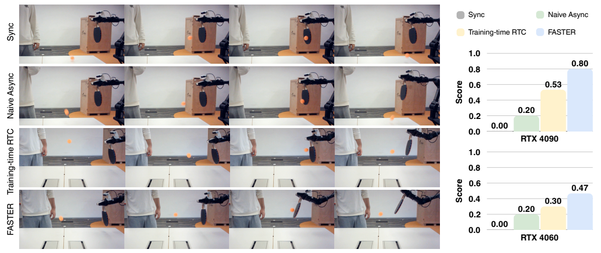

Figure 5. 왼쪽은 4090 rollout; 열 사이 간격은 166.7 ms(5 frames), 세 번째 열은 공 접촉 순간이다. 오른쪽은 두 GPU에서의 score다. 빠른 reaction이 적절한 racket angle과 swing velocity를 확보할 시간을 준다는 설명이다. 프레임 시각화만으로 정확한 reaction onset이나 ball dynamics를 역추정하지 않는다. [PDF p.9]

탁구 score는 binary success가 아니다. miss=0, 짧은 약한 return=0.5, 표식 line 기준 더 멀리 보낸 강한 return=1이다. 부록 Table 8은 **96% bootstrap confidence interval**을 제시한다. 95%가 아니며, below 결과는 rounding된 mean이다.

| Method | 4090 mean | 4090 96% CI | 4060 mean | 4060 96% CI |
|---|---:|---|---:|---|
| Sync | 0.000 | (0.000,0.000) | 0.000 | (0.000,0.000) |
| Naive Async | 0.200 | (0.075,0.325) | 0.200 | (0.067,0.333) |
| Training-time RTC | 0.533 | (0.300,0.767) | 0.300 | (0.133,0.500) |
| FASTER | 0.800 | (0.667,0.933) | 0.467 | (0.333,0.567) |

**[검산]** RTC→FASTER는 4090에서 +0.267 score point, 4060에서 +0.167이다. 평균을 100배 표시하면 +26.7/+16.7 percentage points처럼 읽을 수 있지만 **success rate 향상**으로 표현하면 partial score 정의를 잃는다. 15 trials에서 0.5점 단위이므로 0.800은 총점 12.0/15에 대응할 수 있지만 강한 hit 횟수가 반드시 12회라는 뜻은 아니다.

**[리뷰어 해석]** Sync score 0의 bootstrap CI가 (0,0)인 것은 관측 sample에 전부 0만 있어 resampling에도 0만 나오기 때문이다. 모집단 성공확률이 정확히 0임을 보증하지 않는다. FASTER와 RTC interval은 겹치며, interval 겹침 여부만으로 method difference의 paired significance를 결론내릴 수 없다. 원시 rollout별 score, paired design, bootstrap replicate 수·seed·CI 방식이 없으므로 별도 유의성 주장을 하지 않는다.

탁구공 속도는 “가능한 한 통제”했다고 기술하지만 정확한 속도·발사각·trajectory 분포, ball launcher 자동화, trial randomization 수치가 없다. 단발 반송 task를 generalist VLA의 지속 rally·경기 수준 탁구 능력으로 확대하지 않는다.

### 13.2 Pick Beverage/Fold Towel: Fig.6와 Table 9

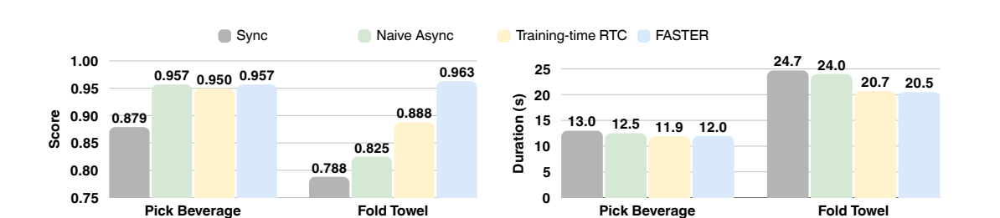

Figure 6. 왼쪽 completion score, 오른쪽 duration(s). beverage score의 y축은 0.75에서 시작하므로 막대 높이 차이를 전체 0–1 범위의 차이로 오해하지 않는다. [PDF p.9]

| Method | Beverage score (96% CI) | Beverage duration mean±std s | Towel score (96% CI) | Towel duration mean±std s |
|---|---|---|---|---|
| Sync | 0.879 (0.786,0.950) | 13.0±0.9 | 0.788 (0.600,0.925) | 24.7±0.5 |
| Naive Async | 0.957 (0.886,1.000) | 12.5±1.2 | 0.825 (0.613,0.988) | 24.0±2.4 |
| Training-time RTC | 0.950 (0.879,0.993) | 11.9±2.4 | 0.888 (0.700,1.000) | 20.7±0.4 |
| FASTER | 0.957 (0.886,1.000) | 12.0±0.9 | 0.963 (0.925,1.000) | 20.5±0.4 |

Beverage는 grasp와 place 두 substeps의 평균이다. 각 단계에서 실패=0, 여러 번 재시도 또는 collision을 동반한 수행=0.5, 첫 시도 정상 수행=1로 평가한다. Towel은 grasp→forward fold→regrasp→backward fold 네 substeps이며 재시도/정렬 불량에 0.5를 준다. 최대 다섯 번의 grasp 시도를 허용한다. 따라서 completion score가 0.963이라고 전체 towel episode의 96.3%가 완벽히 성공했다는 뜻은 아니다. [PDF p.24]

**[검산]** Towel Sync→FASTER duration은 24.7→20.5초, 17.00% 감소. RTC→FASTER는 20.7→20.5초, 0.97% 감소에 그친다. Beverage는 RTC보다 0.1초 길고 점수는 0.007 높다. 따라서 모든 task에서 RTC보다 유의미하게 빨라졌다는 설명은 과도하다. 주된 결과는 동적 task 반응과 긴 task의 score 유지/일부 개선이다.

### 13.3 Fig.11: X-VLA의 추가 실기기 실험

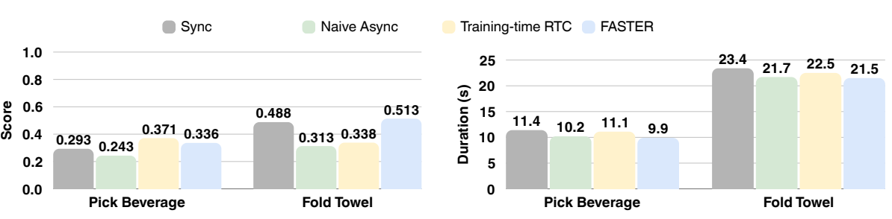

| Method | Beverage score | Beverage duration s | Towel score | Towel duration s |
|---|---:|---:|---:|---:|
| Sync | 0.293 | 11.4 | 0.488 | 23.4 |
| Naive Async | 0.243 | 10.2 | 0.313 | 21.7 |
| Training-time RTC | 0.371 | 11.1 | 0.338 | 22.5 |
| FASTER | 0.336 | 9.9 | 0.513 | 21.5 |

그림에서 직접 읽은 숫자다. FASTER Beverage score는 RTC보다 0.035 낮으며 Towel은 0.175 높다. Naive Async의 inter-chunk discontinuity가 성능 저하를 일으킨다는 저자 설명과 함께 읽는다. **Fig.11 duration은 successful rollouts만 사용**했다고 명시하므로 Fig.6과 직접 비교하면 안 된다. 성공 여부에 따라 표본이 바뀌는 selection bias가 있으며 빠른 실패를 포함한 전체 평균과도 다르다. Fig.6/Table 9의 duration 분모·실패 처리 세부는 충분히 명확하지 않다. [PDF p.27]

## 14. Appendix F.3: simulation 품질과 latency-sensitive control

### 14.1 Table 10: LIBERO 전체

| Method | Spatial % | Object % | Goal % | Long % | Avg. % |
|---|---:|---:|---:|---:|---:|
| π0.5 | 98.8 | 98.2 | 98.0 | 92.4 | 96.9 |
| π0.5+FASTER | 98.6 | 97.8 | 97.8 | 91.6 | 96.5 |
| X-VLA* | 97.8 | 99.4 | 97.8 | 96.8 | 98.0 |
| X-VLA+FASTER | 97.8 | 99.4 | 98.2 | 93.0 | 97.1 |

*는 official checkpoint를 저자 cluster에서 평가한 결과다. 평균 네 항목을 재계산하면 π0.5=96.85→96.9, FASTER=96.45→96.5, X-VLA=97.95→98.0, FASTER=97.10이다. π0.5는 평균 −0.4pp, X-VLA는 −0.9pp이고 X-VLA Long은 −3.8pp다. Saturated mean만 보면 긴 task의 저하를 놓칠 수 있다. [PDF p.28; 검산]

### 14.2 Table 10: CALVIN ABC→D 전체

| Method | ≥1 task % | ≥2 % | ≥3 % | ≥4 % | 5 % | Avg. Len |
|---|---:|---:|---:|---:|---:|---:|
| π0.5 | 94.2 | 88.7 | 85.7 | 83.2 | 79.5 | 4.313 |
| π0.5+FASTER | 95.1 | 89.1 | 85.0 | 81.9 | 78.1 | 4.292 |
| X-VLA* | 95.7 | 89.8 | 82.4 | 77.0 | 70.2 | 4.151 |
| X-VLA+FASTER | 98.1 | 91.4 | 82.4 | 72.9 | 64.5 | 4.093 |

Column k는 chain의 앞 k개를 연속으로 성공할 비율이다. **[리뷰어 보조식]** 길이 C∈{0,…,5}에서:

```math
\mathbb E[C]=\sum_{k=1}^{5}P(C\ge k).
```

**[검산]** X-VLA+FASTER는 0.981+0.914+0.824+0.729+0.645=4.093이다. π0.5 평균 길이 저하는 0.021(0.49%), X-VLA는 0.058(1.40%)다. 하지만 마지막 5-task 성공률은 각각 −1.4pp, −5.7pp다. 앞 task 소폭 개선과 뒤 task 저하가 평균에서 상쇄된다.

LIBERO/CALVIN의 일반 평가에서는 model이 계산하는 동안 환경 시간이 같은 방식으로 흐르지 않으므로 반응 지연 개선을 직접 검증하지 않는다. 이 표의 목적은 **schedule 변경이 정책 품질을 얼마나 유지하는가**다. 실제 지연 이득이 포함된 closed-loop 동적 실험은 실기기와 Kinetix에서 따로 봐야 한다.

### 14.3 Table 11: Kinetix의 동일 inference budget 비교

| Method | delay d | execution s | Solve Rate |
|---|---:|---:|---:|
| Naive Async | 4 | 4 | 0.492 |
| BID | 4 | 4 | 0.553 |
| Inference-time RTC | 4 | 4 | 0.614 |
| Training-time RTC | 4 | 4 | 0.726 |
| REMAC | 4 | 4 | 0.779 |
| VLASH | 4 | 4 | 0.813 |
| FASTER | 1 | 4 | 0.869 |

Kinetix는 iterative sampling이 MLP policy 전체에 적용되므로 first-action sampling 5→1에 따른 5× 이득을 가정할 수 있다. 저자는 같은 wall-clock budget을 반영해 baseline d=4, FASTER d=1로 비교한다. 같은 s=4에서 VLASH 대비 +0.056 solve rate다. [PDF p.27–29]

**[리뷰어 해석]** 이 비교는 delay 감소를 방법의 이득으로 포함하는 system-level 비교다. d가 같을 때 모델 자체의 행동 분포가 더 좋음을 증명하는 ablation은 아니다. 더욱이 4-layer MLP에는 VLM prefill이 없으므로 VLA에서 그대로 5×/10× wall-clock speedup을 기대할 근거로 사용하면 안 된다. 실측 플랫폼별 각 baseline compute-to-delay mapping, task별 score·분산·seed 결과는 표에 제공되지 않는다.

## 15. Appendix F.4–F.5: Schedule ablation과 error analysis

### 15.1 Fig.12와 Table 12: α

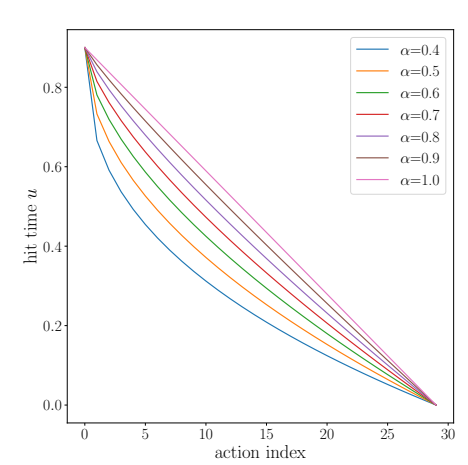

Figure 12. 더 작은 α의 곡선은 중간 index에서 u가 낮다. global time이 1→0이므로 이는 해당 action에 더 많은 sampling step을 주는 방향이다. [PDF p.29]

| α | ≥1 % | ≥2 % | ≥3 % | ≥4 % | 5 % | Avg. Len |
|---:|---:|---:|---:|---:|---:|---:|
| 0.4 | 96.7 | 91.3 | 82.5 | 73.1 | 63.5 | 4.071 |
| 0.5 | 95.1 | 88.4 | 79.3 | 69.6 | 58.7 | 3.911 |
| 0.6 | 97.5 | 89.5 | 80.2 | 71.2 | 60.7 | 3.991 |
| 0.7 | 98.1 | 91.4 | 82.4 | 72.9 | 64.5 | 4.093 |
| 0.8 | 95.9 | 88.7 | 79.7 | 71.2 | 61.5 | 3.970 |
| 0.9 | 99.0 | 88.1 | 75.2 | 70.3 | 59.4 | 3.921 |
| 1.0 | 94.7 | 84.0 | 71.7 | 61.3 | 51.8 | 3.635 |

X-VLA/CALVIN, p=0.5 고정이다. α=1.0을 제외한 max−min은 4.093−3.911=0.182로 본문의 “0.18”과 맞는다. α=1.0은 best보다 0.458 낮다. 단순히 선형 u를 쓰는 것보다 tail에 충분한 denoising을 주는 비선형 schedule이 유리하다는 근거다.

**[검산: 작은 수치 불일치]** α=0.9 row의 공개 성공률을 합하면 (99.0+88.1+75.2+70.3+59.4)/100=**3.920**인데 원문의 Avg.Len은 **3.921**이다. 원문 보고값을 임의로 수정하지 않고 보존했다. Raw 결과가 없어 반올림·집계 차이인지 오타인지 확정할 수 없다. Table 10·12·13의 나머지 16개 CALVIN row는 표시된 성공률 합과 Avg.Len이 일치한다.

α를 바꿔도 first action u_d=0.9는 같으므로 **첫 행동 sampling step 수는 같다**. 차이는 두 번째 이후 action 완료시각과 T_s, long-horizon accuracy다. 표는 completion accuracy를 보여주며 α별 TTFA·full latency·deadline miss를 보고하지 않으므로 “정확도 최적 α가 배포 최적 α”라고 단정하지 않는다.

### 15.2 Table 13: p와 independent time schedule

| Training schedule | ≥1 % | ≥2 % | ≥3 % | ≥4 % | 5 % | Avg. Len |
|---|---:|---:|---:|---:|---:|---:|
| Baseline | 95.7 | 89.8 | 82.4 | 77.0 | 70.2 | 4.151 |
| p=0.3 | 93.7 | 85.2 | 76.0 | 65.5 | 55.2 | 3.756 |
| p=0.5 | 98.1 | 91.4 | 82.4 | 72.9 | 64.5 | 4.093 |
| p=0.7 | 89.6 | 76.7 | 63.2 | 50.8 | 40.3 | 3.206 |
| p=1.0, mixed 없음 | 89.0 | 74.7 | 60.4 | 49.0 | 38.1 | 3.112 |
| Independent | 91.4 | 82.6 | 74.0 | 64.6 | 54.5 | 3.671 |

α=0.7 고정이다. Independent는 Diffusion Forcing처럼 각 action의 timestep을 독립 sample해 학습하되 HAS로 inference한다. HAS가 따르는 구조화된 noise configuration과 다른 training distribution이다. p=0.5→1.0에서 Avg.Len은 −0.981, 5-task 비율은 −26.4pp로 악화된다. Mixed schedule은 사소한 regularizer 정도로 취급하기 어렵다. [PDF p.28–30]

p가 작으면 inference용 HAS를 학습에서 덜 보고, p가 크면 pretrained distribution에서 더 멀어지고 clean suffix 입력이 과해진다는 설명과 맞는다. 그러나 각 요인의 기여를 완전히 분리한 실험은 없다. Baseline row는 원래 policy 결과이며 **“p=0으로 fine-tune한 뒤 HAS로 sampling”한 독립 row가 아니다**. 표에 없는 p=0 cross-schedule 성능을 만들어 넣지 않는다.

저자는 실기기에서 α를 바꿔도 명확한 차이를 보지 못했다고 서술하지만 모든 값별 real-robot table·rollout count는 없다. “task별 tuning이 전혀 필요 없다”는 보편적 결론보다는, 제한된 실험에서 default가 대체로 작동했다고 읽는 것이 적절하다.

### 15.3 Fig.13: 실제 GT에 대한 open-loop error

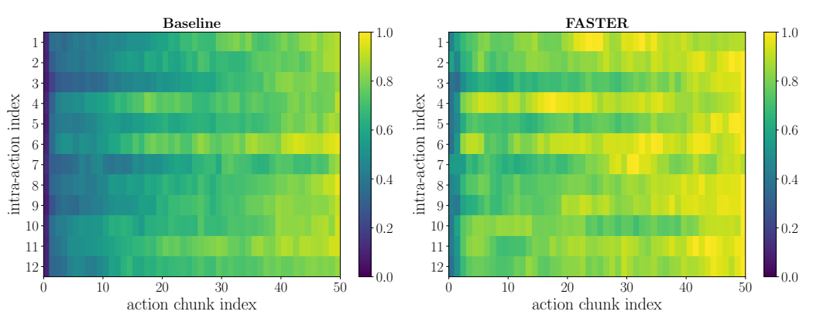

Figure 13. Fold Towel π0.5 baseline과 FASTER의 action dimension×chunk index error heatmap. 200 random samples를 사용하며, **dimension별 maximum error로 normalize하고 양 모델에 같은 scale을 공유**한다. [PDF p.29–30]

Fig.3·8이 모델 자신의 최종 endpoint를 기준으로 했다면, Fig.13은 **ground-truth demonstration**과의 mean absolute error다. 이 차이가 중요하다. 두 모델 모두 대체로 먼 index에서 error가 커지고, FASTER는 일부 action dimension에서 더 큰 error를 보인다. “without compromising” 같은 표현은 이 관측을 고려해 “일부 저하를 감수하면서 near-term 정밀도를 대체로 유지”로 제한해야 한다.

**[리뷰어 해설용 형식]** M=200 samples, 좌표 k별 error heatmap은 대략 아래 의미다. normalization maximum을 원시 error와 평균 error 중 어느 단계에서 잡는지의 완전한 계산 코드는 논문에 없다.

```math
\mathrm{MAE}_{i,k}=\frac1M\sum_{b=1}^{M}\left|A^{\mathrm{pred}}_{b,i,k}-\hat A_{b,i,k}\right|,\qquad \mathrm{NormalizedError}_{i,k}=\frac{\mathrm{MAE}_{i,k}}{M_k^{\mathrm{shared}}}.
```

각 k마다 분모가 달라 normalized color 0.8인 joint와 0.5인 joint의 물리 rad/mm 오차를 직접 비교할 수 없다. 그림은 12 intra-action index를 표시하지만 실제 AgileX interface는 14D다. gripper 제외 여부 등 12개 좌표의 완전한 대응표는 caption에 미기재다. 또한 이 error test의 200 samples가 training에서 완전히 held out인지 명확한 split 정보가 없으므로 “독립 test-set generalization error”라고 확정하지 않는다.

<a id="code"></a>

## 16. 공식 구현 대조: 논문과 같은 것, 다른 것, 아직 확인하지 못한 것

아래는 GPU를 실행한 결과가 아니라 **고정 commit의 정적 코드 확인**이다. FASTER 저장소는 openpi 기반 π0.5 implementation을 공개한다. 별도 X-VLA HAS 구현·모델 weight·benchmark raw log까지 동일하게 검증한 것은 아니다. 저장소에 원래 openpi의 `pi0_fast` 파일도 있지만 이것이 FASTER의 neural tokenizer라는 뜻은 아니다.

### 16.1 직접 읽은 핵심 파일

| 코드 | 읽은 내용 |
|---|---|
| [pi0_faster.py](https://github.com/innovator-zero/FASTER/blob/851be7837b885fb4c96459e81aa946f97daac75f/src/openpi/models/pi0_faster.py) | embed_prefix/suffix, compute_loss, compute_HAS, standard/HAS sampling, streaming init/step |
| [gemma.py](https://github.com/innovator-zero/FASTER/blob/851be7837b885fb4c96459e81aa946f97daac75f/src/openpi/models/gemma.py) | width/depth/head config, token별 adaRMS, AE attention과 prefix KV 경계 |
| [pi0_config.py](https://github.com/innovator-zero/FASTER/blob/851be7837b885fb4c96459e81aa946f97daac75f/src/openpi/models/pi0_config.py) | internal action dimension, horizon, timestep 관련 config |
| [policy.py](https://github.com/innovator-zero/FASTER/blob/851be7837b885fb4c96459e81aa946f97daac75f/src/openpi/policies/policy.py) | JIT init/step, host loop, callback, early stop, output transform, timing boundary |
| [websocket_policy_server.py](https://github.com/innovator-zero/FASTER/blob/851be7837b885fb4c96459e81aa946f97daac75f/src/openpi/serving/websocket_policy_server.py) | inference thread와 asyncio queue, partial/final 메시지 |
| [websocket_client_policy.py](https://github.com/innovator-zero/FASTER/blob/851be7837b885fb4c96459e81aa946f97daac75f/packages/openpi-client/src/openpi_client/websocket_client_policy.py) | first partial callback과 final까지의 recv loop |
| [training/config.py](https://github.com/innovator-zero/FASTER/blob/851be7837b885fb4c96459e81aa946f97daac75f/src/openpi/training/config.py) | AgileX data transform, model transform, pi05_faster_agilex와 freeze filter |
| [agilex_policy.py](https://github.com/innovator-zero/FASTER/blob/851be7837b885fb4c96459e81aa946f97daac75f/src/openpi/policies/agilex_policy.py), [transforms.py](https://github.com/innovator-zero/FASTER/blob/851be7837b885fb4c96459e81aa946f97daac75f/src/openpi/transforms.py) | 14D mapping, camera layout, relative joint, normalization과 inverse transform |
| [scripts/train.py](https://github.com/innovator-zero/FASTER/blob/851be7837b885fb4c96459e81aa946f97daac75f/scripts/train.py) | trainable_filter, value_and_grad, optimizer update |
| [piper-aio infer_async.py](https://github.com/innovator-zero/piper-aio/blob/49f83278181f82b36fa4724d329f8a91e76ac605/inference/infer_async.py) | StreamActionBuffer, launch 조건, prefix copying, partial integration, stale episode 제거, control loop |

### 16.2 중요한 일치점

`compute_HAS`는 i−delay를 0 이상으로 clamp하고 분모 max(H−1−delay,1), u=(1−normalized_index^α)u₀, τ=(time−u)/(1−u)를 [0,1]에 clip한다. 이후 prefix time을 0으로 덮어쓴다. 이는 Eq.(8)–(10)의 의도와 맞는다.

HAS sampling은 `(num_steps+1,B,H)` timestep table을 만들고 adjacent difference를 구해 `dt_curr[...,None]*v_t`를 적용한다. VLM prefix cache는 init에서 한 번 계산하고 AE step은 `[None,suffix_tokens]`와 cache를 사용한다. 논문의 “VLM once per chunk, AE iteratively”와 정확히 연결된다.

Streaming host loop는 처음부터 완료된 prefix를 `already_output`으로 표시해 중복 발송을 막는다. `newly_ready`만 골라 output transform과 callback을 실행하고 emitted valid action count가 `early_stop_actions`에 도달하면 종료한다. 서버는 WebSocket partial 메시지를 흘려보내며 client는 각 partial을 수신 즉시 callback에 전달한다.

### 16.3 핵심 차이와 재현 영향

| 항목 | 논문 | 공개 π0.5 코드 | 영향 |
|---|---|---|---|
| Global training time | ρ∼Uniform(0,1) | `Beta(1.5,1)*0.999+0.001` | noise 쪽 time의 비중이 더 크다. uniform 아래의 clean-input 확률 계산과 수치가 다르다. |
| Prefix 길이 | discrete 0,…,d_max inclusive | `jax.random.randint(...,0,self.max_delay)` | 기본 max_delay=10이면 상한 exclusive이므로 0–9. 논문 “0–10”과 하나 차이. |
| Loss reduction | sample별 suffix norm으로 normalize 후 expectation | D축 mean, batch 전체 suffix residual 합 / batch 전체 유효 mask 합 | D축 scale과 d별 sample weighting이 다르다. |
| 완료 조건 | τ_next=0 | `t_schedule[1:] < 0.01` | 작은 양수 τ에서도 dispatch 가능하다. 단순 floating-point equality 보정과 완전히 같다고 볼 수 없다. |
| Prefix/시간 인코딩 | architecture modification 없음 | [B,H] time와 [B,H,1024] adaRMS conditioning 지원 | 새 대형 layer는 없지만 일반 scalar-time 구현에 코드 포팅은 필요하다. |
| Sampling 토큰 수 | 앞 action을 조기 완료 | 매 step 여전히 H개 action token forward | 한 action이 끝나도 그 token의 attention/MLP 비용이 자동 제거되지 않는다. |
| Runtime 지원 | 일반 flow VLA framework | 제공 `infer_streaming`은 JAX model만 허용하는 assert | PyTorch/TensorRT/native server에서 그대로 작동하는 drop-in 기능이 아니다. |
| Final result | 실행할 앞부분만 끝나면 break | `actions=x_t` 전체 반환 | final tail이 미완료일 수 있다. completed partial만 실행해야 한다. |

**[공식 코드 확인: loss]** 코드의 scalar loss를 풀면:

```math
\mathcal L_{\mathrm{code}}=\frac{\sum_{b=1}^{B}\sum_{i=0}^{H-1}m_{bi}\left(\frac1D\sum_{k=1}^{D}r_{bik}^2\right)}{\sum_{b=1}^{B}\sum_{i=0}^{H-1}m_{bi}+10^{-8}}.
```

논문의 sample 평균 loss와 비교하면 valid suffix가 긴 sample에 더 큰 가중치가 붙는다. 예를 들어 suffix 길이가 2와 8인 두 sample의 per-action mean error가 10과 1이면 per-sample 평균은 5.5지만 코드 reduction은 (2×10+8×1)/10=2.8이다. 이것이 반드시 성능 오류라는 뜻은 아니며 **recipe를 정확히 재현하려면 어느 reduction을 쓰는지 기록해야 한다**는 의미다.

**[공식 코드 확인: dispatch]** threshold 0.01에서 action을 먼저 전송한 다음에도 해당 τ가 완전히 0이 아니면 후속 Δτ update로 server의 그 action 값이 조금 바뀔 수 있다. `already_output`은 재발송을 막는다. 따라서 “packet 값과 full-run 최종 action 값이 모든 좌표에서 bitwise 동일”은 코드만으로 보장되지 않는다. 기본 schedule에서 얼마만큼 발생하는지는 이 리뷰가 GPU rollout으로 측정하지 않았다.

### 16.4 통신·timing 경계에서 주의할 점

`Policy.infer_streaming`은 JAX device array에서 `np.asarray(newly_ready)`와 `np.asarray(ready_actions)`를 수행한다. 이는 host가 readiness·action 값을 얻는 지점이며, host/device synchronization 비용이 남아 있다. callback은 single-worker thread pool에서 output transform을 수행하고 server의 asyncio queue로 전달한다. 네트워크 send와 이후 AE 계산을 겹칠 수 있으나 “동기화 비용이 0”이라고 해석하지 않는다.

또한 코드의 `policy_timing.infer_ms`는 streaming init부터 loop/callback 완료까지이며 첫 packet의 client arrival TTFA가 아니다. input transform 등 앞단 일부도 이 timing 이전에 있다. Server의 streaming `start_time`은 `await websocket.recv()`보다 먼저 놓여 있어 request 대기시간이 포함될 가능성도 있다. 따라서 이 `server_timing.infer_ms`를 그대로 Table 2의 client-observed TTFA로 사용해서는 안 된다. Table 2를 재현하려면 client send timestamp와 first valid partial callback timestamp를 별도로 기록해야 한다.

서버 docstring은 partial packet에 step/action_indices가 있다고 설명하지만 실제 전송은 `type=partial`과 `actions`다. Client callback도 actions 하나를 받는다. 이 정보는 포팅 시 protocol 기준을 docstring이 아닌 현재 sender/receiver 구현으로 잡아야 함을 보여준다. Buffer의 순서는 monotonic completion과 동일 WebSocket의 메시지 순서에 의존한다.

### 16.5 Buffer를 읽고 확인한 실행 조건

`piper-aio`의 StreamActionBuffer는 current/next 두 배열과 cur_len,next_len,cur_step,stamp를 lock으로 보호한다. 새 partial이 현재 stamp라면 실행 중 current buffer를 늘리고, 다음 stamp라면 next buffer를 늘린다. 한 chunk의 s개가 소비되면 두 buffer를 swap한다. 해당 action이 아직 없으면 `get_next_action()`은 None을 반환한다. 즉 구조 자체가 deadline miss를 불가능하게 만들지는 않는다.

RTC request는 current buffer가 s개로 완성되었는지 확인하고 그 마지막 d개를 prefix로 보낸다. stale episode response는 episode id를 비교해 버린다. 이는 논문 pseudocode에 없는 실용적 세부이며, 새 request 빈도와 부정확한 episode 전환 결과를 제어한다. 실제 motor publish가 어느 tick에 반영되고 physical position이 언제 바뀌는지는 실행 trace 없이는 확인할 수 없다.

<a id="critical"></a>

## 17. Appendix A, §5, Appendix G–H: 위치, 한계, 해석의 경계

### 17.1 Related Work A를 구성요소별로 읽기

| 관련 방향 | 무엇을 바꾸는가 | FASTER와의 관계 |
|---|---|---|
| RT-2/OpenVLA의 AR action | 연속 행동을 token으로 변환하고 순차 decode | continuous flow time이 없어 HAS 식을 그대로 적용할 수 없다. |
| π0/GR00T 등 flow VLA | VLM feature에 조건화한 iterative action expert | HAS가 가정하는 적용 대상. 모든 family에서 성능을 검증했다는 뜻은 아니다. |
| 작은 VLM, pruning, quantization, caching | VLM/vision token과 kernel 비용 | T_VLM을 줄이는 방향으로 조합 가능하나 새 측정이 필요하다. |
| RTC/Training-time RTC/REMAC/VLASH | observation–execution gap과 chunk 연속성 | FASTER가 사용하는 prefix conditioning의 기반. 단순 async와 smoothness를 구분한다. |
| One-step distillation/MeanFlow/Shortcut | 전체 생성 자체의 step/학습 objective | FASTER는 기존 FM loss를 유지하며 horizon별 local schedule을 바꾼다. |
| Streaming diffusion/visuomotor policy | 부분 denoising과 관측 갱신 | 저자는 매 step VLM을 다시 돌리지 않는 chunk 단위 VLM reuse를 강조한다. |

Appendix A의 “first” 표현은 저자의 priority claim이다. 이 리뷰는 모든 2026년 이후 논문의 최초성까지 독립 판정하지 않는다. 근접 선행 아이디어에는 Diffusion Forcing의 action별 noise time, RTC의 clean prefix, iterative streaming policy가 이미 있으며, FASTER의 기여는 이를 **VLA의 비싼 prefill과 물리 반응 metric에 맞추어 HAS/mixed training/partial dispatch/early stop으로 결합하고 평가한 것**으로 이해하는 것이 정확하다. 논문이 G에서 스스로 “fundamental modeling advance보다 deployment-oriented scheduling/streaming framework”라고 위치시키는 점도 이 해석과 맞는다. [PDF p.17–18,29]

### 17.2 저자가 인정한 한계

Appendix G는 네 축을 명시한다. (1) iterative flow/diffusion policy에 주로 적용되며 hardware/runtime에 따라 실제 speedup이 달라진다. (2) underlying VLA의 perception/language/action error를 해결하지 않는다. (3) reaction analysis는 여러 지연을 하나의 effective term으로 묶은 first-order approximation이다. (4) aggressive sampling에는 정확도 trade-off가 있고 uncertainty/task phase/online feedback에 따른 adaptive schedule이 미래 방향이다. [PDF p.29–30]

§5의 결론을 이 제한 아래 읽으면 “일반적인 flow VLA에서 첫 유효 행동의 생성·전달 시점을 당겨 실제 반응을 개선할 수 있다”는 주장이다. “정확도 손실 없이 모든 VLA를 edge에서 실시간화한다”까지 확대하면 Table 10,13과 Appendix G를 무시하게 된다.

### 17.3 리뷰어가 추가로 확인한 핵심 제한

1. **Controller quantization:** 연속 TTFA와 fixed-rate physical actuation 시점 사이에 0–1 control tick 차이가 생긴다. Eq.(7)의 integer boundary 예외를 포함해 timestamp convention을 고정해야 한다.
2. **First action의 의미:** 사건을 반영하지 않은 hold/관성 동작이 먼저 나오면 packet은 빨라도 의미 있는 reaction은 늦다. 따라서 semantic action response와 first packet를 함께 측정해야 한다.
3. **Committed prefix:** prefix는 chunk boundary를 부드럽게 하지만 급박한 환경 변화 뒤에도 이미 정한 d개 행동을 따라야 한다. 긴 d를 근본적으로 줄이는 것과 prefix를 안전하게 취소하는 것은 다른 문제다.
4. **Tail의 영향:** 앞 action을 일찍 freeze하면 뒤 action이 나중에 reveal하는 정보를 다시 반영할 수 없다. AE가 양방향일수록 “앞이 확정된 뒤 뒤와의 일관성”은 실험적 특성이지 보장된 제약식이 아니다.
5. **통계:** 실기기 sample이 작고 task·seed 반복 표가 충분하지 않다. 96% bootstrap CI만으로 paired causal effect나 precise failure probability를 확정할 수 없다.
6. **통제:** 반응 비교에서 TTFA, s, conditioning, mixed fine-tuning이 함께 달라진다. HAS만의 효과를 실기기에서 완전히 분리하려면 조건별 control이 추가로 필요하다.
7. **Hardware 범위:** 4090/4060 실기기 결과는 Jetson/NPU/DLA 측정이 아니다. edge라는 단어를 모든 embedded chip의 검증으로 해석하지 않는다.

### 17.4 H Broader Impacts의 내용

저자는 저렴한 GPU에서 더 responsive한 로봇을 제공하는 접근성·신뢰성 이점을 기대한다. 동시에 잘못된 예측을 더 빠르게 실행하면 실패의 물리적 결과가 커질 수 있고 자동화의 오용·노동 영향도 고려해야 한다고 쓴다. 실험은 통제된 연구 환경이며 안전이 중요한 무감독 사람 주변 배포에는 별도 monitor와 물리적 safeguards가 필요하다는 것이 원문의 결론이다. 이 논문은 safety certification이나 collision-avoidance proof를 제시하지 않는다. [PDF p.30]

## 18. 재현 가능한 검증 계획: 무엇을 먼저 고정해야 하는가

아래는 **[후속 연구 제안]**이며 이 작업에서 수행한 GPU/로봇 실험이 아니다.

| 순서 | 구체적 검증 | 통과 기준 / 기록할 결과 |
|---|---|---|
| 1. Provenance | PDF v3, model weights, code commit, dataset 변환·norm stats, d/α/p/u₀/N/H 고정 | 논문식과 코드 recipe의 차이를 선택해 명시; seed·version·hash 재현 가능 |
| 2. Shape·numerical parity | 고정 observation/noise에서 scalar baseline, HAS step, vector Δτ, prefix overwrite 비교 | τ endpoints·monotonicity·prefix 불변·NaN 없음; dispatch 값과 full-run 값의 차이를 별도 측정 |
| 3. Quality control | 동일 data/split/training budget로 constant, RTC, mixed-HAS, HAS-only | open-loop GT error와 long-horizon rollout 저하를 함께 측정 |
| 4. Server latency | VLM, AE per-step, input/output transform, device→host, packet send 분리 | warmed/cold/JIT, mean/p50/p95/p99, TTFA/T_s/T_H, peak memory 각각 보고 |
| 5. Streaming control | first partial, all executed suffix, server idle, request 시작, control publish timestamp | s별 buffer occupancy·underflow·deadline miss·stale drop; 평균 공급률만으로 통과 처리하지 않기 |
| 6. Event reaction | 동일 event stream 또는 randomized paired trials | event→capture→request→first meaningful command→physical motion의 지연 분포 |
| 7. Fair comparisons | fixed s, fixed delay, matched wall-clock, fixed quality budget를 구분 | HAS/streaming/early stop/action conditioning 각각의 기여와 trade-off |

특히 TTFA와 reaction quantile을 같은 표에 적고, original controller tick에서 선택된 최초 행동을 trace로 검증해야 한다. Reaction distribution이 uniform과 얼마나 맞는지는 관측 histogram/CDF와 event phase 분포를 대조하면 된다. 이는 본 논문이 제공하지 않은 후속 검증이며, 이 리뷰는 이를 수행한 것처럼 표현하지 않는다.

## 19. VLM/VLA, OpenVLA, Jetson Thor/TensorRT로 이어서 생각하기

### 19.1 적용 가능성의 경계

FASTER는 VLM을 더 작게 만드는 알고리즘도 vision token을 줄이는 알고리즘도 아니다. Flow action expert가 있고 action별 timestep conditioning을 표현할 수 있는 VLA에서 가장 자연스럽다. Original OpenVLA의 AR discrete-token output에는 τ/u/velocity ODE가 없으므로 직접 포팅 대상이 아니다. OpenVLA-derived continuous/flow head를 별도로 설계·학습한다면 그 head를 대상으로 HAS를 연구할 수 있지만, 이는 논문이 OpenVLA에서 검증한 결과가 아니다.

VLM prefill 최적화와 HAS의 조합은 유망한 연구 방향이다. VLM 비용이 줄면 TTFA의 AE 비중이 상대적으로 커지지만, 전체 서버 비용·s_min은 early stop 및 dispatch overhead까지 함께 결정한다. Token pruning과 양자화는 o_t feature나 velocity의 오차를 바꾸므로, 두 개의 개별 speedup을 단순히 곱해 end-to-end speedup으로 제시할 수 없다.

### 19.2 Thor에서 필요한 실제 포팅

논문에는 Jetson AGX Thor, TensorRT engine, DLA/NPU, FP8/NVFP4의 실측 표가 없다. 아래는 hardware-specific 성능 약속이 아닌 **[후속 연구 제안]**이다.

| 구성요소 | 포팅할 내용 | 따로 검증할 것 |
|---|---|---|
| VLM prefill | vision+language prefix encoder와 reusable KV 출력을 분리 | 동일 observation의 feature/KV parity, time-to-prefill, memory |
| AE step | [B,H,D] action, [B,H] τ, prefix KV를 받는 한 step graph | token별 time/adaRMS broadcast, attention mask, Δτ update parity |
| Scheduler | 고정 H,d,α,N의 u/τ table 사전 계산 또는 작은 host 연산 | d 변경, endpoint, threshold 0.01 vs exact zero, early stop index |
| Dispatch | completed actions만 device→host, inverse transform, packet 생성 | 작은 copy의 overhead, host sync, callback queue, client TTFA |
| Robot loop | policy request thread와 fixed-rate actuator loop | 30 Hz 또는 목표 f에서 deadline miss·buffer underflow·jitter |

Engine은 목표 Thor 환경의 runtime·precision·memory configuration에서 빌드·검증하는 단계를 계획해야 한다. JAX streaming host loop를 TensorRT로 옮기려면 export 가능한 graph와 host orchestrator를 따로 구현해야 하며, “architecture change 없음”이 JAX checkpoint→TensorRT 자동변환을 보장하지 않는다. 이 리뷰는 해당 소프트웨어 지원 여부나 engine 생성 시간을 실측하지 않았다.

제안하는 초기 비교는 동일 학습 weight/입력에서 full 10-step constant, full 10-step HAS, HAS streaming, HAS streaming+early stop의 네 경로다. TTFA와 T_s를 분리하고, s=small/large 양쪽을 평가한다. Quantization을 추가할 때는 첫 action의 한 번 큰 update가 velocity 오차에 민감할 수 있으므로 near-term error와 physical deadline를 함께 통과해야 한다. 표의 RTX 4060 3.09×를 Thor에 재사용할 근거는 없다.

## 20. 자주 생기는 오해와 학습 순서

**Q1. 첫 행동을 한 step에 완성하면 사실상 one-step policy인가?** 첫 유효 action에 대해서는 한 step이다. 뒤 action은 여러 step이고, 실행할 s개를 만들려면 여러 AE step이 필요할 수 있다. Full-horizon one-step distillation과 다르다.

**Q2. HAS를 inference에만 켜면 되는가?** 저자는 mixed schedule fine-tuning을 방법에 포함한다. Pretrained constant schedule만 학습한 model의 분포와 다르므로 training-free 성능을 보장하지 않는다.

**Q3. α가 작으면 더 빠른가?** 첫 action의 완료시간은 고정이다. 중간 action의 u는 작아져 더 늦게 끝나고 더 많이 denoise된다. 정확도와 T_s의 균형을 바꾼다.

**Q4. 끝난 action은 GPU에서 더 이상 계산하지 않는가?** local Δτ가 0이 되므로 action 값의 update를 멈춘다. 공개 구현은 그 token을 AE attention/MLP에서 삭제하지 않는다.

**Q5. Streaming 중 공의 새 위치도 매번 보는가?** 한 chunk의 AE sampling 동안 observation feature는 고정이다. 새 위치는 다음 request의 VLM prefill에서 본다. Early stop이 그 다음 요청을 앞당기는 데 도움을 준다.

**Q6. d가 있는 경우 index 0을 출력해야 TTFA인가?** prefix 0,…,d−1은 이미 정한 행동이다. 새로운 반응은 보통 i=d부터 가능하므로 첫 유효 suffix packet을 측정해야 한다.

**Q7. Async가 더 부드러우면 reaction도 반드시 좋은가?** pause와 discontinuity를 줄이는 것, 새 환경 정보를 빨리 행동에 반영하는 것은 관련되지만 다른 지표다. 같은 긴 s로 실행하면 Async도 오래된 관측을 계속 따를 수 있다.

**Q8. 0.8 탁구 점수는 80% 성공률인가?** 원문 score에는 0.5점 weak hit가 포함된다. Mean score 0.8만으로 binary hit rate나 strong-return rate를 복원할 수 없다.

**Q9. 30 Hz control이면 VLA도 초당 30번 추론하는가?** 아니다. π0.5/4060 FASTER의 Table 2 s_min=8이면 trigger frequency는 이상적으로 30/8=3.75 Hz다. 그 사이 생성된 action을 controller가 30 Hz로 소비한다. Table 6 실기기 s=10에서는 약 3 Hz다.

**Q10. Reaction이 uniform임이 실험으로 증명됐는가?** 아니다. 고정 L과 I, event phase uniform 가정에서 유도한 analytical distribution이다. Table 3은 그 분포로 계산한 확률이다.

**Q11. 마지막 chunk completion이 느려져도 괜찮은가?** 각 실행 action의 deadline와 다음 inference availability가 만족되면 controller의 immediate waiting은 줄일 수 있다. 전체 network/GPU 비용이 무관해지는 것은 아니다.

권장 학습 순서는 Fig.2/Table 1로 physical time를 먼저 정리하고, Eq.(1)–(4)에서 velocity·Euler·endpoint를 손으로 계산한 뒤, Fig.4/Eq.(5)–(6)의 두 시간축을 이해하는 것이다. 이후 prefix offset과 masked loss, Algorithm 2의 local Δτ와 dispatch, 마지막으로 Table 2/4/7의 서로 다른 종료 시점을 대조한다. 성능표부터 읽으면 10× sampling을 10× control speed로 잘못 연결하기 쉽다.

<a id="coverage"></a>

## 21. Coverage checklist와 검증 범위

### 21.1 원문 섹션별 대응

| 원문 | PDF | 이 리뷰의 위치 | 처리 |
|---|---|---|---|
| Abstract, §1 Introduction | 1–3 | §1–2 | 문제 정의, contributions, novelty·10× 한계 |
| §2 Analysis on Action Chunking Policy Inference | 3–5 | §3,§12 | Sync/Async, reaction 분포·기대값·TTFA, hidden assumptions |
| §3.1 Preliminaries | 5 | §4 | CFM interpolation, objective, Euler |
| §3.2 Pilot Study | 5–6 | §5 | straightness, clean extrapolation, 지표 해석 |
| §3.3 FASTER | 6–8 | §6–10 | HAS, mixed training, conditioning, streaming, early stop |
| §4.1 Reaction speed | 8 | §12 | latency표, 분포표, 독립 확률 검산 |
| §4.2 Real-world experiments | 8–10 | §11,§13 | setup, score, duration, 대조군·제한 |
| §5 Conclusion | 10 | §1,§17 | 최종 주장과 검증 범위 |
| References [1]–[121] | 10–16 | §17.1 | 목록 전체 확인; 관련 기술의 위치를 설명. 각 참고문헌 자체의 full review는 범위 밖. |
| Appendix A Related Work | 17–18 | §17.1 | AR/flow, realtime, distillation, streaming 계열 비교 |
| Appendix B Async Pipeline | 18 | §3.4 | Eq.(7), controller tick, integer boundary |
| Appendix C Pilot | 19 | §5.2 | Fig.8 전체 패널과 SEM |
| Appendix D.1 HAS with Conditioning | 19–20 | §7 | Eq.(8)–(11), mask·gradient·offset |
| Appendix D.2 Streaming Interface | 20–21 | §8,§16 | packet deadline·total time·구현 |
| Appendix D.3 Algorithms | 21–22 | §9 | Algorithm 1의 1–14행, Algorithm 2의 1–20행 |
| Appendix E.1 Real-world | 23–24 | §11.1,§13 | robot, data, instructions, scoring 전 단계 |
| Appendix E.2 Simulation | 24–25 | §11.2,§14 | LIBERO, CALVIN, Kinetix와 splits |
| Appendix E.3 Training | 25–26 | §11.3–5 | Table 5, action space, GPU, hyperparameters |
| Appendix E.4 Deployment | 26 | §11.6 | Table 6, f,d,s, network |
| Appendix F.1 Reaction analysis | 27 | §12 | Table 7·독립 probability |
| Appendix F.2 Real-world | 27 | §13 | Fig.11, Tables 8–9 |
| Appendix F.3 Simulation | 27–28 | §14 | Tables 10–11 |
| Appendix F.4 Ablations | 28–30 | §15.1–2 | Fig.12, Tables 12–13 |
| Appendix F.5 Error Analysis | 28–30 | §15.3 | GT MAE, Fig.13, normalization |
| Appendix G Limitations | 29–30 | §17–19 | 가정·accuracy·hardware 한계·후속 연구 |
| Appendix H Broader Impacts | 30 | §17.4 | 원문 사회적 영향과 제한 |

### 21.2 모든 번호 수식과 핵심 비번호식

| 원문 식 | PDF | 해설 위치 | PNG / editable LaTeX |
|---|---:|---|---|
| (1) CFM loss | 5 | §4.2 | 둘 다 포함 |
| (2) Euler | 5 | §4.3 | 둘 다 포함 |
| (3) discrete straightness | 6 | §5.1 | 둘 다 포함 |
| (4) clean endpoint extrapolation | 6 | §5.2 | 둘 다 포함 |
| (5) hit time | 6 | §6.1 | 둘 다 포함 |
| (6) local schedule | 7 | §6.2 | 둘 다 포함 |
| (7) discretized delay | 18 | §3.4 | 둘 다 포함; integer boundary 예외 설명 |
| (8) prefix-offset hit time | 20 | §7.2 | 둘 다 포함 |
| (9) loss mask | 20 | §7.3 | 둘 다 포함 |
| (10) prefix-local schedule | 20 | §7.4 | 둘 다 포함 |
| (11) masked loss | 20 | §7.5 | 둘 다 포함 |
| chunk / c,L,d,s,E 정의 | 3–4 | §2.3,§3.1 | notation·LaTeX·Table 1 PNG |
| Table 1 uniform / expectations | 4 | §3.1–3 | editable 표·유도·PNG |
| interpolation, ε distribution | 5 | §4.1 | LaTeX·shape·예제 |
| continuous straightness | 5 | §5.1 | LaTeX·풀이 |
| intermediate error norm | 6 | §5.2 | LaTeX·GT와 차이 |
| u₀=(N−1)/N | 7 | §6.2 | LaTeX·first-step proof |
| mixed Bernoulli / constant branch | 7,21 | §6.4,§9.1 | LaTeX·알고리즘 PNG |
| TTFA≈VLM+N×AE / VLM+AE | 7–8 | §3.5 | LaTeX·Amdahl형 해석 |
| vector noisy action, Δτ, update | 21–22 | §7.4,§6.2,§9–10 | LaTeX·알고리즘 PNG·수치 예제 |
| reviewer 보조 유도 | 해당 없음 | §3,§4–8,§12,§14–16 | 원문 식 번호를 부여하지 않고 별도 표시 |

### 21.3 Figure/Table 전수 대응

| 원문 도표 | PDF | 리뷰 위치 |
|---|---:|---|
| Fig.1 overview | 1 | §1, 원문 PNG |
| Fig.2 Sync/Async | 3 | §3.1, 원문 PNG |
| Fig.3 pilot | 5 | §5, 원문 PNG |
| Fig.4 HAS | 6 | §6, 원문 PNG |
| Fig.5 table tennis | 9 | §13.1, 원문 PNG |
| Fig.6 π0.5 extra tasks | 9 | §13.2, 원문 PNG |
| Fig.7 controller ticks | 18 | §3.4, 원문 PNG |
| Fig.8 additional pilot | 19 | §5.2, 원문 PNG |
| Fig.9 hardware | 23 | §11.1, 원문 PNG |
| Fig.10 tasks | 23 | §11.1, 원문 PNG |
| Fig.11 X-VLA tasks | 27 | §13.3, 원문 PNG·수치 표 |
| Fig.12 α | 29 | §15.1, 원문 PNG |
| Fig.13 GT error | 30 | §15.3, 원문 PNG |
| Table 1 reaction definitions | 4 | §3.1–3, PNG·editable 표 |
| Table 2 timing | 7 | §12.1, PNG·전체 수치 |
| Table 3 probabilities | 8 | §12.3, 전체 수치·검산 |
| Table 4 streaming arrivals | 20 | §8, PNG·전체 수치·deadline 검산 |
| Table 5 training | 25 | §11.3, 전체 설정 |
| Table 6 deployment | 25 | §11.6, 전체 설정 |
| Table 7 distributions | 26 | §12.2, 전체 interval |
| Table 8 table tennis CI | 27 | §13.1, 전체 수치 |
| Table 9 tasks CI/duration | 28 | §13.2, 전체 수치 |
| Table 10 LIBERO/CALVIN | 28 | §14.1–2, 전체 수치·검산 |
| Table 11 Kinetix | 29 | §14.3, 전체 수치 |
| Table 12 α ablation | 29 | §15.1, 전체 수치 |
| Table 13 p ablation | 30 | §15.2, 전체 수치 |

### 21.4 완료 전 검증 기록

- 원문 30쪽을 텍스트 추출해 읽고, 수식·핵심 도표 페이지를 직접 렌더링해 기호·축·숫자를 대조했다. 텍스트 추출 중 회전 글자 경고가 있어 figure 축은 이미지에서 확인했다.
- PNG 29개를 원문 영역에서 발췌하고 전수 contact-sheet/필요시 개별 이미지로 검수했다. 잘린 기호·범례·불필요한 주변 본문을 수정한 뒤 재확인했다.
- UTF-8, fenced block 짝, protected inline math, 전체 image/link 상대경로, 명시적 목차 anchor, manifest의 PNG SHA/크기/source PDF SHA 대응을 검사했다.
- 수식 **66개(블록 28, inline 38)**를 KaTeX와 MathJax parser로 점검해 오류 0건을 확인했다. 독립 headless Edge의 로컬 Markdown 렌더에서 이미지 29개 로딩, 블록 수식 가로 넘침 0건, 문서 가로 넘침 0건을 확인하고 대표 8개 구간을 시각 검수했다. GitHub 실제 게시 페이지를 검증한 것은 아니다.
- Table 2의 speedup/기대값, Table 3의 독립 확률, Table 4의 deadline margin, Table 10·12·13의 CALVIN Avg.Len과 주요 차이, HAS 예제의 hit time를 산술 검산했다. CALVIN 17개 row 중 Table 12 α=0.9의 Avg.Len 0.001 불일치는 §15.1에 명시했다.
- 학습·GPU 추론·로봇 동작·TensorRT build는 실행하지 않았다. 실기기 raw score와 latency traces, 완전한 dataset split, 별도 X-VLA HAS 구현의 일치성은 확인 범위 밖이다.

이 문서는 논문의 기술 섹션·번호 수식·알고리즘·Figure·Table를 모두 다뤘다. 확인되지 않은 사항은 각 절에서 [논문 미기재] 또는 코드 검증 범위의 제한으로 표시했으며, 독립 재현 성능으로 대체하지 않았다.
