# SmolVLA 상세 한국어 리뷰: 작은 VLM의 층별 특징으로 연속 행동을 생성하고 비동기로 실행하는 방법

> 저장소 원문: [주 PDF](papers/19_SmolVLA.pdf) · [전체 목록](README.md)

> **대상 논문:** *SmolVLA: A Vision-Language-Action Model for Affordable and Efficient Robotics*  
> **기준본:** arXiv:2506.01844v1, 2025-06-02, PDF 24쪽. 확인일 2026-09-09.  
> **읽기 범위:** 본문 전체, References, Appendix A.1 전체, Figure 1–5, Table 1–13, Algorithm 1, 모든 핵심 비번호 수식. 원문에는 번호가 붙은 수식이 없다.  
> **검증 성격:** 원문 직접 읽기, PDF 렌더·이미지 발췌, 표 산술 검산, 공식 PyTorch/LeRobot 소스 정적 대조. 모델 학습·GPU 추론·로봇 실험을 재실행한 결과가 아니다.

<a id="toc"></a>

## 목차

1. [서지, 버전, 출처와 읽기 범위](#bibliography)
2. [먼저 이해할 핵심 결론](#summary)
3. [Motivation과 관련 연구의 위치](#motivation)
4. [주장과 근거 지도](#claims)
5. [선수 지식과 notation·shape 사전](#notation)
6. [§3.1 아키텍처와 feature routing](#architecture)
7. [Flow matching의 모든 핵심 식과 시간 방향](#flow)
8. [§3.2·Appendix A.1 데이터와 학습 경로](#training)
9. [한 관측의 end-to-end forward pass](#forward)
10. [§3.3 비동기 실행, 수식과 Algorithm 1 행별 해설](#async)
11. [§4.1–4.5 평가 설계와 주요 결과](#experiments)
12. [§4.6 비동기 성능의 정확한 해석](#async-results)
13. [§4.7 모든 ablation 표](#ablations)
14. [공식 구현 대조와 논문 내부 불일치](#code-audit)
15. [§5–6 논의, 한계와 재현성](#limitations)
16. [OpenVLA·Jetson Thor·TensorRT와의 연결](#deployment)
17. [Q&A와 권장 학습 순서](#qa)
18. [Coverage checklist와 검증 기록](#coverage)

<a id="bibliography"></a>

## 1. 서지, 버전, 출처와 읽기 범위

### 1.1 확인된 서지

| 항목 | 확인 결과 |
|---|---|
| 공식 제목 | SmolVLA: A Vision-Language-Action Model for Affordable and Efficient Robotics |
| 저자 | Mustafa Shukor, Dana Aubakirova, Francesco Capuano, Pepijn Kooijmans, Steven Palma, Adil Zouitine, Michel Aractingi, Caroline Pascal, Martino Russi, Andres Marafioti, Simon Alibert, Matthieu Cord, Thomas Wolf, Remi Cadene |
| 소속 표기 | Hugging Face, Sorbonne University, valeo.ai, École Normale Supérieure Paris-Saclay |
| 최초 제출 | 2025-06-02 16:30:19 UTC |
| 확인한 최신 arXiv 버전 | v1. 확인일 공식 서지의 submission history에는 v1만 있음 |
| 학회 여부 | 이 PDF와 공식 arXiv 서지에는 확정 학회 출판 정보가 없다. 본 리뷰는 arXiv 기술논문으로 표기한다 |
| 공식 서지 | [arXiv abstract](https://arxiv.org/abs/2506.01844) |
| 버전 고정 PDF | [2506.01844v1 PDF](https://arxiv.org/pdf/2506.01844v1) |
| DOI | [10.48550/arXiv.2506.01844](https://doi.org/10.48550/arXiv.2506.01844) |
| PDF 크기·페이지 규칙 | 612×792 pt, 물리 24쪽. 인쇄 쪽수 1–24와 일치. 아래 `PDF p.N`은 물리 쪽수 |
| 실제 다운로드 PDF SHA-256 | `CB1BB9A8F824187FCDC32AF8C290214487C524F139A3C2DEF1C6D97ADB1FA40C` |
| 공식 코드 | [huggingface/lerobot](https://github.com/huggingface/lerobot) |
| 코드 고정 commit | `2774d9bddcbbda50e697e162e89e7eaada8d7105`, commit author date 2026-09-07 |
| 공개 base checkpoint | [lerobot/smolvla_base](https://huggingface.co/lerobot/smolvla_base), revision `c83c3163b8ca9b7e67c509fffd9121e66cb96205` |
| VLM config | [SmolVLM2-500M-Video-Instruct config](https://huggingface.co/HuggingFaceTB/SmolVLM2-500M-Video-Instruct/blob/7b375e1b73b11138ff12fe22c8f2822d8fe03467/config.json) |

LeRobot 저장소의 별도 ICLR 2026 논문 정보는 SmolVLA의 학회 정보로 옮겨 적지 않는다. 현재 코드와 checkpoint 설정도 2025년 논문 실험을 그대로 재현한다는 증거가 아니므로 출처를 분리한다.

### 1.2 원문 전체의 구조

| 물리 페이지 | 원문 내용 | 리뷰에서의 처리 |
|---|---|---|
| 1 | 제목, 초록, Figure 1 | 서지와 전체 구조 |
| 2–3 | §1 Introduction, §2 Related work, §3 개요 | 문제 정의와 구성 요소별 관련 연구 |
| 3–5 | §3.1 Model architecture | 토큰 생성, 층 삭제, CA/SA, flow matching |
| 5 | §3.2 Community data, Table 1 | 수집·정제·카메라 표준화 |
| 5–8 | §3.3 Asynchronous inference, Figure 2–3, Algorithm 1 | 큐·통신·관측 필터·시간식 |
| 8–10 | §4.1–4.4 환경·로봇·학습·baseline | 평가와 recipe 분리 |
| 10–12 | §4.5 Main results, Table 2–5 | 모든 주요 결과와 검산 |
| 12 | §4.6, Figure 5 | 비동기 완료시간·점수·고정시간 작업 수 |
| 12–14 | §4.7, Table 6–13 | 모든 ablation |
| 14–15 | §5 Discussion, §5.1 Limitations, §6 Aknowledgements | 한계·지원·실험 범위 |
| 15–20 | References | 전체 목록 확인. 인용된 각 논문을 별도 리뷰하지 않음 |
| 20–24 | Appendix A, A.1 Community datasets | annotation prompt와 데이터 ID 목록 전부 확인 |

별도 supplementary PDF를 읽었다는 주장은 하지 않는다. 이 기준본의 기술 부록은 **A.1 한 절**이며, 추가 정리·증명·알고리즘이 숨어 있는 부록은 없다. 본문의 핵심 수식은 모두 비번호 식이다. 아래 U1–U10은 대응을 쉽게 하기 위한 **리뷰 내부 식 식별자**이며 원문 Eq.(1)–(10)이 아니다.

### 1.3 증거 라벨

- **[저자 보고]**: 본문·표·그림에 적힌 주장과 결과.
- **[공식 코드 확인]**: 위 commit의 실제 소스 또는 revision 고정 모델 config에서 확인한 내용. 실행 성공을 뜻하지 않는다.
- **[검산]**: 공개 수치·수식·목록으로 수행한 산술 또는 구조 확인.
- **[리뷰어 해석]**: 원문과 구현을 이해하기 위한 유도, 인과 가설, 한계 해석.
- **[논문 미기재]**: 원문에 없는 재현 정보. 현재 코드 기본값으로 소급해서 채우지 않는다.
- **[후속 연구 제안]**: 이 논문에서 실험하지 않은 개선·배포 계획.

### 1.4 이미지 출처와 보관 규칙

Figure 1–5 전부, Table 1–13 전부, 핵심 수식 영역 5개, Algorithm 1을 **원문에서 직접 240 DPI PNG로 발췌**했다. 총 24개 이미지이며 생성형 재작성이나 원문 숫자 수정은 하지 않았다. 원문 식의 표기 불일치도 이미지에서는 그대로 유지했다. 수식 이미지 옆에는 편집 가능한 LaTeX와 독립적인 한국어 해설을 배치했다.

[publication_assets.json](assets/19_SmolVLA/publication_assets.json)은 원문 URL·버전·SHA-256, 물리 페이지, PDF 왼쪽 위 원점의 `[x0, top, x1, bottom]` point 좌표, DPI, 출력 픽셀 크기와 PNG SHA-256을 기록한다. 이 Markdown을 옮길 때 `assets/19_SmolVLA/`를 함께 보관해야 한다.

원문 그림과 수식의 권리는 저자 및 각 권리자에게 있다. PDF 메타데이터는 arXiv nonexclusive distribution license를 표시하며, 본 리뷰는 이를 CC-BY 등의 자유 재배포 허가로 바꾸어 주장하지 않는다. 발췌는 출처를 표시한 연구·학습·비평용이며 새로운 이용 허락을 부여하지 않는다.

<a id="summary"></a>

## 2. 먼저 이해할 핵심 결론

**SmolVLA는 작은 사전학습 VLM의 앞 16층을 관측 특징 추출기로 사용하고, 그 층별 K/V를 폭이 작은 action expert에 연결하여 50개 연속 행동을 flow matching으로 생성하는 VLA다. 비동기 client/server는 이 정책을 실행하는 별도의 시스템 설계다.**

논문의 강점은 단일한 새 attention 식보다는 **작은 VLM, 시각 토큰 감소, 고정 깊이 축소, 층별 action expert 연결, 공개 커뮤니티 데이터, chunk 실행 스케줄**을 실제 저가 로봇 파이프라인으로 묶고 비교했다는 데 있다. [리뷰어 해석; PDF pp.3–7, §3]

먼저 다섯 가지 구분을 유지해야 한다.

1. **0.45B는 전체 모델 크기**이고, 약 0.10B는 action expert다. “500M VLM + 100M expert = 600M”으로 단순 합산하면 뒤쪽 VLM 층을 제거한 사실을 놓친다. 공개 checkpoint의 Hub 메타데이터는 저장 tensor 원소 총합 450,046,176개를 보고한다. 이것은 현재 checkpoint의 저장 수량이며 trainable parameter 수의 직접 실측은 아니다.
2. **시뮬레이션 주 결과는 robotics pretraining 없이 VLM에서 시작**한다. 커뮤니티 데이터 사전학습의 이득은 주로 실제 SO100 평가와 Table 5에서 확인한다. LIBERO 87.3을 “23K robot trajectory pretraining의 효과”로 설명하면 실험 조건이 바뀐다.
3. **VLM frozen과 입력에 대한 gradient 차단은 다르다.** VLM 가중치는 고정하지만 state projector가 trainable이면 loss gradient가 VLM 연산을 통과해 projector에 도달할 수 있다.
4. **causal SA가 있어도 50 action을 autoregressive하게 하나씩 생성하지 않는다.** 한 denoising step에서 50개 noisy action을 병렬 처리하고, 이런 step을 10번 수행한다.
5. **비동기 29.5% 완료시간 감소는 neural network 추론 지연 29.5% 감소가 아니다.** 큐 실행과 추론을 겹쳐 로봇의 대기를 줄인 결과다. 동시에 sorting 점수는 70→50으로 하락했다.

전체적으로 이 논문은 저가 단일 팔의 반복적인 tabletop manipulation과 작은 VLA 연구에 설득력 있는 출발점을 제공한다. 그러나 광범위한 미지 task의 zero-shot 성공, 정밀한 안전 보증, CPU의 일정한 실시간 deadline, Jetson/TensorRT 가속을 검증한 논문은 아니다. [저자 보고·리뷰어 해석; PDF pp.10–15]

<a id="motivation"></a>

## 3. Motivation과 관련 연구의 위치

### 3.1 §1: 왜 로봇용 foundation model을 작게 만들어야 하는가

로봇의 관측은 단순한 이미지 분류 입력과 다르다. 물체를 식별하더라도 현재 관절 위치, gripper 상태, 도달 가능한 자세, 다음 몇 초의 움직임을 함께 결정해야 한다. 저자는 사전학습 VLM의 시각·언어 지식을 활용하면 소수의 로봇 demonstration만으로 학습할 때 부족한 일반 지식을 보완할 수 있다고 본다. 하지만 VLM을 그대로 대형 VLA로 사용하면 학습 비용과 관측당 추론 비용이 커져 참여 가능한 연구자와 로봇 플랫폼이 제한된다. [저자 보고; PDF p.2, §1]

그 문제는 세 층으로 나뉜다.

| 병목 | 구체적인 발생 조건 | 논문의 대응 |
|---|---|---|
| 모델 규모 | 수십억 parameter를 매 관측과 행동 생성에 사용 | 작은 SmolVLM2, 뒤쪽 LLM 층 삭제, 작은 expert |
| 관측 sequence | multi-view 및 tiling으로 image token이 증가 | global image만 사용, shuffle 후 64 token/frame |
| 실행 대기 | chunk를 전부 실행한 뒤 새 추론을 시작 | 큐가 남았을 때 다음 관측을 처리하는 비동기 실행 |
| 데이터 접근성 | 고가 로봇·기관별 데이터 형식에 의존 | LeRobot/Hugging Face 커뮤니티 demonstration 활용 |

이 네 문제를 하나의 “FLOPs 감소”로 환원할 수 없다. 모델 폭·깊이는 연산 구조, token 수는 sequence 길이, 비동기는 실행 스케줄, 커뮤니티 데이터는 학습 분포를 바꾼다. 각각을 다른 실험으로 검증해야 한다. [리뷰어 해석]

### 3.2 §2: 구성 요소별 선행 연구와 SmolVLA의 위치

§2는 VLM의 vision encoder–language decoder 결합, multimodal pretraining, 소형화와 parameter-efficient adaptation을 먼저 설명하고, 이어 Octo/RT 계열·OpenVLA·π0·diffusion expert·FAST·TinyVLA를 논의한다. SmolVLA의 위치는 다음과 같다. 이 표는 해당 원문이 소개한 관계를 설명한 것이며 선행 연구 전체에 대한 독립적인 재현 비교가 아니다. [PDF pp.2–3, §2]

| 구성 요소 | 이미 존재한 아이디어 | SmolVLA에서의 구체화 |
|---|---|---|
| pretrained VLM → robot policy | 시각·언어 지식의 로봇 전이 | SmolVLM2의 작은 checkpoint 사용 |
| continuous action expert | π0 등에서 flow/diffusion 기반 chunk 생성 | expert 폭 축소와 CA/SA 교대 |
| chunking | ACT/Diffusion Policy 등의 미래 행동 묶음 예측 | 50개 예측과 비동기 큐 관리 |
| 층 축소 | early exit·layer skipping·중간 특징 활용 | 학습 전 뒤쪽 층을 고정적으로 제거 |
| 토큰 축소 | tiling 제어와 spatial token shuffle | frame당 64 token으로 제한 |
| 공개 robot pretraining | 기관·학술 공개 데이터 활용 | 저가 SO100 커뮤니티 데이터 정제 |

“작은 VLM을 썼다”만으로 독립적인 새 학습 원리가 생기지는 않는다. 이 논문을 평가할 핵심은 어느 연결 구조와 데이터 recipe가 실제 성능을 유지하는지, 작은 모델의 이점이 로봇 실행에서 드러나는지다. Table 6–13은 그 설계 판단의 근거지만, 일부 표와 설명이 불일치하므로 숫자를 우선 읽어야 한다.

### 3.3 문제 설정에 깔린 전제

학습은 demonstration의 상태·관측에서 미래 행동을 모방하는 imitation learning이다. 정책이 생성한 행동을 실행하면 세계와 로봇 상태가 변하지만, 학습 시 실제 로봇 dynamics를 통해 loss gradient를 되돌리지 않는다. 실패 이후 exploration이나 reward optimization도 주 학습 경로에 없다.

작은 모델이라도 관측과 실제 환경의 대응이 안정적이어야 한다. 카메라 순서, action 단위, 관절 순서, 정규화 통계가 틀리면 모델 크기와 무관하게 제어가 깨진다. 커뮤니티 데이터의 다양성은 도움이 될 수 있지만 그 다양성이 정렬되지 않으면 상충된 supervision이 된다. 논문이 annotation과 camera naming을 별도 절로 다루는 이유다.

<a id="claims"></a>

## 4. 주장과 근거 지도

| 핵심 주장 | 직접 근거 | 관찰 가능한 수치·동작 | 주장 범위를 제한하는 사항 |
|---|---|---|---|
| 작은 VLA도 큰 모델과 경쟁 가능 | Table 2–4, PDF p.11 | 0.45B LIBERO 87.3, Meta-World 57.3; SO100 78.3 | benchmark·pretraining·single/multi-task 조건이 다름; 모든 task에서 우월하지 않음 |
| CA와 SA를 교대하면 유리 | Table 6, p.13 | CA 79.0, SA 74.5, CA+SA 85.5 | latency 수치가 이 표에 없음; 최종 87.3과 동일 run 아님 |
| 앞 절반의 VLM 층이 비용·성능 타협 | Table 8, p.13 | N=16 78.5, N=32 80.3 | 전체 sensor-to-action 시간이 절반이라는 증거 없음 |
| 작은 expert 폭이 효율적 | Table 9, p.13 | 폭 0.75는 77.5 | 폭 0.50은 80.3으로 더 높음; 0.75 Pareto 최적은 표만으로 입증 안 됨 |
| 커뮤니티 pretraining이 도움 | Table 5, p.12 | 동일 multi-task 조건 51.7→78.3 | pick-place는 80→75; task별 변화가 비균일 |
| 비동기는 작업을 빠르게 완료 | Figure 5, p.12 | 13.75→9.70초, 고정시간 총 9→19개 | sorting 70→50; 시작 측정은 로봇이 움직일 때라 initial TTFA 제외 |
| 저비용·단일 GPU 학습 가능 | §4.3, p.10 | VLM frozen, 약100M expert, bf16 | 실제 pretraining 4 GPU; 프로젝트 약30k GPU-hour; GPU 기종·단일-run wall time 미기재 |
| causal action attention이 유리 | Table 7, p.13 | 67.5→74.5 | noisy future token 접근과 실제 정답 leakage는 구별 필요 |
| state는 VLM에 넣는 것이 좋음 | Table 11, p.14 | CA: prefix 80.3, suffix 73.3 | SA에서는 prefix 53.3, suffix 74.8로 정반대 |
| 데이터 규모는 481개 dataset | Table 1, p.5 | 22.9K episodes, 10.6M frames | Appendix 목록은 독립 추출·검산 시 532 고유 ID; 필터링 관계 미기재 |

이 표의 우측 열은 주장을 폐기한다는 뜻이 아니다. 성공한 설정과 아직 검증되지 않은 일반화를 구분하여 다음 실험의 출발점을 정확하게 만드는 장치다.

<a id="notation"></a>

## 5. 선수 지식과 notation·shape 사전

### 5.1 반드시 구별해야 하는 세 개의 시간 축

- **환경 시간** $`t`$: 30 Hz 제어를 예로 들면 약 33.3 ms마다 증가하는 로봇의 step index.
- **chunk 내부 시간** $`j=0,\ldots,n-1`$: 한 번 예측하는 미래 행동의 위치. 일반적으로 $`n=50`$.
- **flow 시간** $`\tau`$ 또는 아래 코드 해설의 $`r`$: Gaussian noise와 action 사이의 보간 위치. 0–1의 무차원 값이며 실제 로봇 시간 초가 아니다.

환경의 50개 행동과 flow의 10회 업데이트는 서로 다른 루프다. 따라서 “10 steps”가 Table 13에서 보이면 실행한 action 개수, §4.3의 “flow matching 10 steps”이면 denoising 횟수를 뜻한다.

### 5.2 기호 사전

| 기호 | 의미 | shape 또는 단위 | 근거/주의 |
|---|---|---|---|
| $`B`$ | batch size | 정수 | 해설 표기 |
| $`V`$ | camera view 수 | 보통 2 또는 3 | 실험 SO100 top/wrist, SO101 top/side |
| $`I_t^{(v)}`$ | v번째 RGB 관측 | $`[B,3,512,512]`$ | resize 이후 |
| $`s_t`$ | 실제 proprioceptive state | $`[B,D_s]`$ | base checkpoint $`D_s=6`$ |
| $`\bar s_t`$ | 정규화·padding한 state | $`[B,32]`$ | 현재 config |
| $`l`$ | 자연어 instruction | 문자열 → token ID $`[B,T_l]`$ | base config 최대 길이48 |
| $`o_t`$ | 실제 관측 | image, state, instruction의 묶음 | 원문은 추출 특징에도 같은 기호 사용 |
| $`C^{(k)}`$ | k번째 깊이의 prefix 표현 | $`[B,P,d]`$ | 리뷰가 혼동을 피하려고 도입 |
| $`P`$ | prefix token 수 | $`64V+T_l+1`$ | image special token과 추가 pad 없는 경우 |
| $`L,N`$ | 원래 LLM 깊이, 유지 깊이 | 32,16 | main model 및 config |
| $`d,d_e`$ | VLM/expert hidden width | 960,720 | $`d_e=0.75d`$ |
| $`h_q,h_{kv},d_h`$ | Q head 수, KV head 수, head width | 15,5,64 | GQA. expert가 이 설정을 상속 |
| $`D_a`$ | 물리적 action dimension | base checkpoint6 | 자유도와 action representation 구별 |
| $`A_t`$ | clean action chunk | $`[B,n,D_a]`$ | 계산 내부는 마지막 축32로 pad |
| $`\epsilon`$ | Gaussian noise | $`[B,n,32]`$ | flow matching용 |
| $`A_t^\tau`$ | 논문 보간 action | $`[B,n,D_a]`$ | 원문 time convention에 불일치 존재 |
| $`X_r`$ | 코드 convention의 noisy action | $`[B,n,32]`$ | $`r\epsilon+(1-r)A`$ |
| $`v_\theta`$ | 학습할 velocity predictor | noisy chunk → 같은 shape | 물리적 관절 속도 명령과 동일하지 않음 |
| $`u`$ | supervision용 conditional vector field | $`\epsilon-A`$ | 논문·코드 target |
| $`Q_t`$ | 실행 대기 action queue | 가변 길이 timed action list | 원문의 $`A_t`$와 구분하려는 해설 표기 |
| $`g`$ | 큐 재요청 threshold 비율 | [0,1], 무차원 | 0.7은 이해용 그림 설정; 최종 유일 설정 아님 |
| $`\ell_S,\ell`$ | server 추론, round-trip 지연 | 초 | 분포를 가진 값 |
| $`\Delta t`$ | 환경 제어 주기 | 초/action | 예: 1/30초 |
| $`\varepsilon_q`$ | joint similarity threshold | state 거리의 단위 | flow noise와 다른 의미 |

shape 사전의 구체적인 960/720/15/5/64/32는 [공식 코드 확인]이다. PDF가 이 모든 숫자를 직접 제시하는 것은 아니다. [base config](https://huggingface.co/lerobot/smolvla_base/blob/c83c3163b8ca9b7e67c509fffd9121e66cb96205/config.json), [VLM config](https://huggingface.co/HuggingFaceTB/SmolVLM2-500M-Video-Instruct/blob/7b375e1b73b11138ff12fe22c8f2822d8fe03467/config.json).

### 5.3 필요한 선수 지식

**Attention**은 각 query가 어느 key/value를 참고할지를 정한다. **Cross-attention**에서는 query와 key/value의 출처가 다르다. **GQA**는 여러 query head가 더 적은 KV head를 공유한다. 따라서 15 Q head와 5 KV head라면 KV 하나를 Q head 세 개가 공유한다.

**Flow matching**은 clean action을 직접 한 번 회귀하는 대신, noise가 섞인 action이 어느 방향으로 움직여야 하는지 학습한다. 학습 시에는 임의의 flow 시간 한 점을 뽑아 target vector field를 맞추고, 추론 시에는 여러 점을 순서대로 적분한다.

**Action chunking**은 현재 관측에서 미래 행동을 여러 개 예측하는 것이다. 이때 예측 길이, 실제 실행 길이, 다음 관측 시점은 독립적인 설정이다. **KV cache**는 같은 관측에 대한 prefix K/V를 denoising 동안 재사용한다. 카메라가 갱신된 다음 관측의 VLM forward까지 자동으로 생략하는 캐시는 아니다.

<a id="architecture"></a>

## 6. §3.1 아키텍처와 feature routing

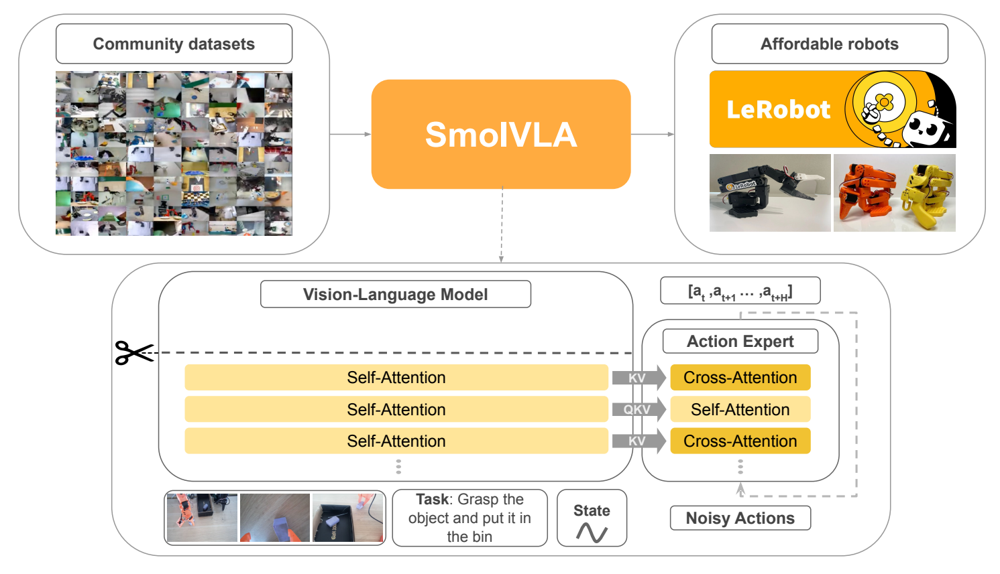

**Figure 1.** 작은 VLM의 층별 특징을 action expert에 전달하고 뒤쪽 VLM 층을 제거하는 구조. 그림의 가위는 token별 동적 routing이 아니라 사용할 깊이를 제한하는 설계다. [PDF p.1, Fig.1; 상세 §3.1 pp.3–5; [원문](https://arxiv.org/pdf/2506.01844v1#page=1)]

### 6.1 관측을 prefix token으로 만드는 순서

[저자 보고] VLM은 SigLIP vision encoder와 SmolLM2 계열 language decoder를 갖는 SmolVLM2를 기반으로 한다. 이미지·언어·state를 같은 hidden dimension의 token sequence로 합친다. state는 연속값을 문자열로 변환하지 않고 선형 projection으로 **한 token**이 된다. [PDF p.4, §3.1]

[공식 코드 확인] 실제 호출 순서는 `prepare_images` → `embed_image`의 vision encoder·connector, `embed_language_tokens`, `state_proj`, `torch.cat`이다. image와 language embedding에는 hidden width의 제곱근을 곱하고, state embedding에는 같은 곱셈이 없다. 코드 comment의 “Normalize embeddings”를 L2 normalization이라고 해석해서는 안 된다. [modeling_smolvla.py L552–644](https://github.com/huggingface/lerobot/blob/2774d9bddcbbda50e697e162e89e7eaada8d7105/src/lerobot/policies/smolvla/modeling_smolvla.py#L552)

다음은 코드 구조를 표현한 **리뷰 보조식**이다.

```math
C^{(0)}=\mathrm{Concat}_{\mathrm{seq}}\!\left(\sqrt d\,E_I^{(1)},\ldots,\sqrt d\,E_I^{(V)},\sqrt d\,E_l,\bar s_tW_s+b_s\right)\in\mathbb R^{B\times P\times d}.
```

- 입력의 camera별 feature는 $`[B,64,960]`$, text embedding은 $`[B,T_l,960]`$다.
- state의 $`[B,32]`$를 선형층으로 $`[B,960]`$로 바꾼 뒤 길이1의 sequence 축을 추가한다.
- `Concat`은 feature/channel 축이 아니라 **token sequence 축**이다. camera 두 개면 image token은 128개다.
- text 길이를48로 pad한 base config, image special token 없음, state1개라면 $`P=128+48+1=177`$이다.
- language padding과 camera padding mask는 feature의 숫자와 별도로 유지한다. padding token의 embedding이 0이 아니어도 attention에서 제외할 수 있다.
- 해당 base checkpoint는 camera1/2/3 feature schema를 저장하지만 실제 real-world 실험은 두 view를 사용한다. 입력 camera 개수와 missing-view 처리를 명시적으로 고정해야 한다.

### 6.2 64 visual token의 실제 의미

[저자 보고] SmolVLM2에서 사용하던 여러 local crop의 tiling을 제거하고 global image만 넣는다. 여기에 pixel/token shuffle을 사용해 frame당64개 visual token으로 제한한다. [PDF p.4]

[공식 코드 확인·검산] 확인한 config는 image512, patch16, scale factor4다. 따라서 regular grid 기준 계산은 다음과 같다.

```math
512/16=32,\qquad 32\times32=1024,\qquad (32/4)\times(32/4)=8\times8=64.
```

원래 vision grid의 인접4×4 위치를 묶으면 token 수는16분의1이 된다. 해설용 shape로 표현하면 다음과 같다.

```math
[B,32,32,768]\longrightarrow[B,8,8,16\cdot768]\longrightarrow[B,64,960].
```

첫 화살표는 공간 위치를 channel 쪽으로 재배열하는 shuffle이고, 두 번째는 VLM connector의 projection을 나타낸다. 단순히16개 중1개 patch만 남긴다는 뜻이 아니다. 그렇지만 16개 위치의 정보를 작은 공통 feature로 압축하므로 작은 물체의 세부 표현에 어떤 손실이 생기는지는 후속 평가 대상이다.

**중요한 계산 경계:** 64개는 **language decoder에 전달되는 token 수**다. `embed_image`는 먼저 vision encoder를 실행한 후 connector를 호출한다. 따라서 vision encoder가 처음부터64개 patch만 계산한다거나 고해상도 visual 계산 전체가16배 줄어든다고 주장할 수 없다. [smolvlm_with_expert.py L202–215](https://github.com/huggingface/lerobot/blob/2774d9bddcbbda50e697e162e89e7eaada8d7105/src/lerobot/policies/smolvla/smolvlm_with_expert.py#L202)

tiling 제거는 별도의 추가 crop forward와 그 crop token을 줄인다. 반면 shuffle은 global view의 grid를 줄인다. 두 절약을 혼동하거나 토큰 감소율을 전체 latency 감소율로 치환하지 않아야 한다.

### 6.3 layer skipping은 학습 전의 고정된 truncation

[저자 보고] 원래 $`L`$개 층에서 앞 $`N=L/2`$개만 사용한다. main model은32층 중16층이다. 최종 feature만 쓸 필요가 없다는 사전 연구를 근거로 이 선택을 실험한다. [PDF p.4; p.13, Table 8]

[공식 코드 확인] `text_model.layers[:num_vlm_layers]`로 module list를 잘라낸다. 입력별 난도 판단, token importance score, 조건부 early exit gate, mixture-of-experts router는 없다. 기본 expert 깊이도 남은 VLM 깊이에 맞춘다. 더 적은 expert layer를 쓰는 옵션은 있지만 기본 checkpoint는16층을 사용한다. [smolvlm_with_expert.py L102–120, L396–408](https://github.com/huggingface/lerobot/blob/2774d9bddcbbda50e697e162e89e7eaada8d7105/src/lerobot/policies/smolvla/smolvlm_with_expert.py#L102)

“모든 특징에 접근”한다는 말도 16개 layer output을 sequence 방향으로 한꺼번에 이어 붙여 $`16P`$ token으로 만든다는 뜻이 아니다. 기본 연결은 **같은 깊이의 VLM K/V를 그 깊이의 expert가 읽는 층별 연결**이다. 실제 K/V는 해당 layer에 들어온 hidden state를 input RMSNorm한 뒤 projection해서 얻으므로, 표준적으로 layer 이후 hidden state를 저장한 `hidden_states[k]`와 무조건 동일시하면 안 된다.

### 6.4 작은 expert의 hidden width와 attention width

[저자 보고] expert의 residual hidden width는 VLM의0.75배다. [공식 코드 확인] VLM960에서 expert720으로 만들지만, text config의 head 수15·KV head 수5·head dimension64는 상속한다. 따라서 다음 두 폭이 다르다.

```math
d_e=720,\qquad h_qd_h=15\cdot64=960,\qquad h_{kv}d_h=5\cdot64=320.
```

expert의 Q projection은720→960, ordinary SA K/V projection은720→320, attention 결과의 output projection은960→720이 된다. **720/15=48을 곧바로 head dimension으로 사용하면 현재 코드의 shape와 맞지 않는다.** CA용 K/V adapter는 이미 VLM에서 얻은320차원 K/V를 다시320차원으로 project한다.

expert MLP intermediate width도 단순히 $`4\times720=2880`$이 아니다. 코드의 `get_intermediate_size`는 gated MLP를 위한 폭 보정 후256의 배수로 올림하므로720에서는2048이다. 이런 세부 때문에 “폭0.75이니 모든 비용0.75²”라는 추정은 정확하지 않다. [smolvlm_with_expert.py L67–71, L108–136](https://github.com/huggingface/lerobot/blob/2774d9bddcbbda50e697e162e89e7eaada8d7105/src/lerobot/policies/smolvla/smolvlm_with_expert.py#L67)

### 6.5 Cross-attention: noisy action query가 관측 K/V를 읽는다

다음은 원문을 구현과 연결하기 위한 **리뷰 보조식**이다. $`Z^{(k)}`$는 expert의 $`[B,n,d_e]`$ token, $`K_C,V_C`$는 해당 VLM layer의 KV다.

```math
Q_A=\mathrm{RoPE}\!\left(\mathrm{RMSNorm}(Z)W_Q^A\right),\qquad \widetilde K_C=\mathrm{reshape}(K_C)W_K^{CA},\qquad \widetilde V_C=\mathrm{reshape}(V_C)W_V^{CA}.
```

```math
O_A=\mathrm{softmax}_{\mathrm{key}}\!\left(\frac{Q_A\widetilde K_C^{\mathsf T}}{\sqrt{d_h}}+M_{A,C}\right)\widetilde V_C.
```

이 식의 mask는 score에 더하는 **additive mask**다. 허용 위치는 0, 차단 위치는 개념적으로 음의 무한대다. 다음 §6.6의 0/1 행렬은 이 허용 관계를 표시하는 별도의 **binary mask**이며, 0/1 값을 score에 그대로 더하지 않는다. 현재 eager 구현은 binary mask를 `torch.where`에 넣어 차단 score를 해당 dtype의 가장 작은 유한값으로 치환한다.

계산을 순서대로 풀면 다음과 같다.

1. action token을 RMSNorm하고 Q projection한다. Q의 shape는 head 축을 분리하면 $`[B,15,n,64]`$다.
2. VLM K/V는 저장 시 $`[B,5,P,64]`$다. 코드 내부 배치에서 $`[B,P,320]`$으로 flatten하고 CA용 선형층으로 바꾼다.
3. GQA를 위해 KV head5개가 각각 Q head3개에 대응한다.
4. QK 내적은 $`[B,15,n,P]`$ score를 만든다. scaling 분모는 $`\sqrt{64}=8`$이다.
5. mask는 존재하지 않는 camera/token 같은 invalid key를 제외한다. softmax는 마지막 key 축 P에 대해 정규화한다. action 시간축 n이나 head축에 정규화하지 않는다.
6. 확률과 V를 곱해 head별64차원 출력을 얻고15head를 합친960차원을 output projection으로720차원에 되돌린다.
7. residual, post-attention RMSNorm, gated MLP, residual을 적용한다.

현재 구현은 **RoPE를 적용한 VLM key를 읽어 CA adapter에 넣는다**. expert query position은 CA 경로에서 최솟값을 빼0부터 시작한다. 따라서 논문 도식만 보고 표준 decoder의 마지막 hidden state 하나를 plain CA에 넣는 구현으로 바꾸면 동등하지 않다. [smolvlm_with_expert.py L290–389](https://github.com/huggingface/lerobot/blob/2774d9bddcbbda50e697e162e89e7eaada8d7105/src/lerobot/policies/smolvla/smolvlm_with_expert.py#L290)

### 6.6 Self-attention: action 간 causal 관계와 prefix 접근

[저자 보고] SA는 action token끼리 정보를 교환하여 chunk를 매끄럽게 만들고 causal mask를 사용한다. [PDF pp.4–5]

[공식 코드 확인] SA layer의 실제 연산은 VLM prefix의 Q/K/V와 expert action의 Q/K/V를 **token 축으로 결합**한 후 block mask로 attention을 수행한다. action query는 앞쪽 prefix도 볼 수 있다. 따라서 코드의 SA를 “외부 관측과 끊긴 action-only attention”으로 그리면 부정확하다. inference에서는 prefix KV가 이미 cache에 있어 suffix Q와 `[prefix KV; suffix KV]`만 이용한다. [smolvlm_with_expert.py L220–288](https://github.com/huggingface/lerobot/blob/2774d9bddcbbda50e697e162e89e7eaada8d7105/src/lerobot/policies/smolvla/smolvlm_with_expert.py#L220)

mask를 가장 작은 예로 보자. image/text token 두 개 $`c_0,c_1`$, state 한 개 $`s`$, action 세 개 $`a_0,a_1,a_2`$를 가정한다. 이는 이해를 위한 예시이며 실제 모델 sequence 길이가6이라는 뜻은 아니다.

```math
\mathrm{mask\_ar}=[0,0,1,1,1,1],\qquad \mathrm{cumsum}=[0,0,1,2,3,4].
```

```math
M_{ij}=\mathbf1\!\left[c_j\leq c_i\right]\,p_i p_j,\qquad M=\begin{bmatrix}1&1&0&0&0&0\\1&1&0&0&0&0\\1&1&1&0&0&0\\1&1&1&1&0&0\\1&1&1&1&1&0\\1&1&1&1&1&1\end{bmatrix}.
```

여기서 두 번째 식의 $`c_i`$는 누적 mask 값, $`p_i`$는 padding-valid flag다. 문맥 token 이름 $`c_0,c_1`$과 구별해서 읽는다. 행은 query, 열은 key다.

- image/text 행은 image/text만 보며 state나 action을 보지 못한다.
- state 행은 image/text와 자기 자신을 본다.
- action j는 prefix와 자기 자신을 포함한 action0…j를 본다.
- 그 결과 frozen VLM의 모든 image/text token이 state에 조건화되는 것은 아니다. state token의 표현이 관측을 읽고, action expert가 그 state token의 K/V를 읽는다.
- 이 mask는 **관측→행동 정보 방향**과 **chunk 내부 방향**을 정한다. 그 자체가 Python에서50회 순차 action generation을 요구하지는 않는다.

[공식 코드 확인] `self_attn_every_n_layers=2`이면 zero-based index0,2,…,14가 SA,1,3,…,15가 CA다. 양쪽 모두 MLP와 residual을 포함하는16개 block이며, 한 block에 SA와 CA를 두 번 연속 넣는 구조가 아니다. [smolvlm_with_expert.py L438–499](https://github.com/huggingface/lerobot/blob/2774d9bddcbbda50e697e162e89e7eaada8d7105/src/lerobot/policies/smolvla/smolvlm_with_expert.py#L438)

### 6.7 attention 수치 예제와 비용 해석

**[리뷰어 해석: 실제 weight가 아닌 설명용 숫자]** query가 $`q=[1,0]`$, 두 key가 $`[1,0],[0,1]`$이면 scaled score는 $`[1/\sqrt2,0]`$이다. softmax 확률은 약 $`[0.6698,0.3302]`$다. 두 value가 $`[2,0],[0,4]`$이면 attention 출력은 다음과 같다.

```math
O=0.6698[2,0]+0.3302[0,4]\simeq[1.3396,1.3208].
```

미래 token에 해당하는 두 번째 key를 causal mask로 가리면 확률은 $`[1,0]`$이 된다. zero score를 주는 것과 key를 제외하는 것은 다르다. zero score는 여전히 softmax 분모에 들어간다.

실제 두-camera 예에서 P177, n50이면 CA의 score 원소는 head당 $`50\times177=8,850`$, cache를 쓰는 SA의 action query score는 $`50\times227=11,350`$이다. 차이는 action 간50² 상호작용2,500개다. 전체 layer 비용에는 Q/K/V 및 output projection, MLP, norm, memory movement가 더해진다. 작은 n에서는 MLP나 projection이 큰 비중일 수 있으므로 score 원소 비율만으로 CA의 latency 이득을 정할 수 없다.

<a id="flow"></a>

## 7. Flow matching의 모든 핵심 식과 시간 방향

### 7.1 U1: 원문 conditional flow-matching loss

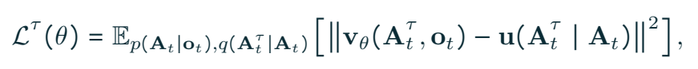

**U1.** 원문에는 식 번호가 없다. 그림과 식의 $`\mathcal L^\tau`$는 특정 flow 시간의 손실을 나타낸다. [PDF p.4, §3.1; [원문](https://arxiv.org/pdf/2506.01844v1#page=4)]

```math
\mathcal L^\tau(\theta)=\mathbb E_{p(\mathbf A_t\mid\mathbf o_t),\,q(\mathbf A_t^\tau\mid\mathbf A_t)}\!\left[\left\|\mathbf v_\theta(\mathbf A_t^\tau,\mathbf o_t)-\mathbf u(\mathbf A_t^\tau\mid\mathbf A_t)\right\|^2\right].
```

식의 각 부분은 다음을 뜻한다.

| 항 | 입력·shape·역할 |
|---|---|
| $`p(\mathbf A_t\mid\mathbf o_t)`$ | observation에 대응하는 demonstration action 분포. 실제로는 dataset에서 observation–action chunk 쌍을 뽑음 |
| $`q(\mathbf A_t^\tau\mid\mathbf A_t)`$ | clean chunk에 Gaussian noise를 섞어 얻는 conditional noisy distribution |
| $`\mathbf v_\theta`$ | noisy chunk와 관측 특징으로 velocity를 예측. 출력은 chunk와 동일한 시간·행동 축 |
| $`\mathbf u`$ | 각 clean/noise pair로 직접 계산할 수 있는 target velocity |
| $`\lVert\cdot\rVert^2`$ | 시간×action dimension의 제곱 오차를 합하는 Euclidean/Frobenius 관점의 표기 |
| $`\mathbb E`$ | 관측·행동 pair와 noise sample에 대한 평균. 전체 학습에서는 별도로 τ도 sampling |
| $`\theta`$ | expert·projector 등 학습할 parameter. 모든 VLM parameter를 뜻하지 않음 |

원문 함수 표기에는 τ 인자가 생략되어 있지만 코드에서는 **time embedding이 명시적으로 입력**된다. 관측 기호도 raw observation과 VLM feature에 겹쳐 사용되므로 아래에서는 특징을 C, noisy action을 X로 구별한다.

loss는 “예측 action과 실제 action의 MSE”가 아니다. **예측 vector field와 target vector field의 MSE**다. 최종 action은 이 vector field를 적분한 결과다. vector field의 단위는 정규화 action/flow-time이며 SO100에 보내는 물리적인 관절 속도와 곧바로 같지 않다.

### 7.2 U2·U3: 원문 보간과 target의 부호 불일치

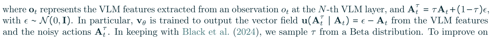

**U2·U3.** 원문에 적힌 보간·noise·target을 수정 없이 전사한다. 같은 영역에 τ의 Beta sampling 설명도 있다. [PDF p.4, §3.1]

```math
\mathbf A_t^\tau=\tau\mathbf A_t+(1-\tau)\boldsymbol\epsilon,\qquad \boldsymbol\epsilon\sim\mathcal N(0,I),\qquad \mathbf u(\mathbf A_t^\tau\mid\mathbf A_t)=\boldsymbol\epsilon-\mathbf A_t.
```

이 식에서 τ0은 noise, τ1은 action이다. 따라서 인쇄된 경로를 τ로 미분하면 아래처럼 된다.

```math
\frac{\mathrm d\mathbf A_t^\tau}{\mathrm d\tau}=\mathbf A_t-\boldsymbol\epsilon.
```

[검산] 이는 원문 target $`\boldsymbol\epsilon-\mathbf A_t`$의 반대 부호다. 따라서 인쇄된 보간과 target을 **같은 시간 방향의 derivative**라고 설명하면 수학적으로 맞지 않는다. reverse-time vector field로 읽으려면 시간 변수 변환과 적분 방향을 함께 설명해야 한다. PDF에는 이를 명시한 ODE나 sampling update 식이 없다.

[공식 코드 확인] 실제 `VLAFlowMatching.forward`는 다음 convention을 사용한다. 환경 step t와 구별하려고 code variable `time`을 r로 쓴다.

```math
X_r=r\epsilon+(1-r)A,\qquad U_r=\epsilon-A,\qquad \frac{\mathrm dX_r}{\mathrm dr}=\epsilon-A.
```

코드는 r1에서 noise, r0에서 action이므로 target과 경로의 derivative가 일치한다. 표기상 $`r=1-\tau`$에 해당한다. 이 관계로 원문의 직관을 이해할 수 있지만, 논문 식 자체를 조용히 다른 식으로 고쳐 쓰지는 않는다. [modeling_smolvla.py L689–723](https://github.com/huggingface/lerobot/blob/2774d9bddcbbda50e697e162e89e7eaada8d7105/src/lerobot/policies/smolvla/modeling_smolvla.py#L689)

### 7.3 U4: Beta time sampling과 학습 분포

[저자 보고] τ는 Beta distribution에서 sampling하며 구체적인 shape parameter는 PDF에 없다. [공식 코드 확인] 현재 sampler는 다음과 같다.

```math
b\sim\mathrm{Beta}(1.5,1.0),\qquad r=0.999b+0.001.
```

$`r`$의 shape는 $`[B]`$이고 $`r[:,None,None]`$로 $`[B,1,1]`$을 만들어 각 sample의50×32 전체에 broadcast한다. action token마다 독립적인 flow time을 뽑는 기본 경로가 아니다. noise는 $`[B,50,32]`$의 각 원소에 표준 정규 sampling한다.

Beta(1.5,1)의 평균은0.6이므로 r평균은0.6004다. uniform sampling보다 noise 쪽에 다소 더 무게를 두는 현재 구현이다. 이것을 논문의 τ convention에 그대로 대입하면 sampling 방향도 뒤집히므로, 수식의 보간계수만 고치고 시간분포를 무시하면 동일한 학습을 재현한 것이 아니다. [modeling_smolvla.py L546–550](https://github.com/huggingface/lerobot/blob/2774d9bddcbbda50e697e162e89e7eaada8d7105/src/lerobot/policies/smolvla/modeling_smolvla.py#L546)

### 7.4 time와 action을 expert token으로 결합하는 식

다음은 **코드에 대응하는 리뷰 보조식**이다. sinusoidal time embedding 차원은 expert width720이다.

```math
p_i=p_{\min}\!\left(\frac{p_{\max}}{p_{\min}}\right)^{i/(d_e/2-1)},\qquad e_r=\left[\sin(2\pi r/p_i),\cos(2\pi r/p_i)\right]_{i=0}^{d_e/2-1}.
```

```math
E_A=X_rW_{\mathrm{in}}+b_{\mathrm{in}},\qquad Z^{(0)}=W_2\,\mathrm{SiLU}\!\left(W_1[E_A;e_r]+b_1\right)+b_2.
```

두 번째 식은 vector당 선형 연산을 나타내며, 구현의 row-vector convention에서는 W를 오른쪽에서 곱해도 같은 의미다. 실제 입력은 action projection $`[B,50,720]`$와50위치에 반복한 time embedding $`[B,50,720]`$를 마지막 축으로 합친 $`[B,50,1440]`$이다. 두 선형층은1440→720→720이다. 시간은 별도의51번째 token으로 들어가지 않고 모든 action token의 channel에 결합된다. 기본 period 범위는0.004–4.0이다. [modeling_smolvla.py L646–687](https://github.com/huggingface/lerobot/blob/2774d9bddcbbda50e697e162e89e7eaada8d7105/src/lerobot/policies/smolvla/modeling_smolvla.py#L646)

sinusoidal time embedding과 RoPE는 역할이 다르다. 전자는 **denoising 진행 정도**, 후자는 **sequence상의 위치**를 나타낸다. 두 신호를 같은 “positional embedding”으로 묶으면 flow의 시간과 chunk 시간축을 혼동한다.

### 7.5 loss 계산과 padding 축

[공식 코드 확인] model의 raw loss는 `F.mse_loss(U,V,reduction="none")`으로 $`[B,50,32]`$를 반환한다. policy wrapper는 실제 action dimension까지만 slice하고 episode 경계 밖의 action time을 mask한다. 현재 기본 mean reduction은 유효한 시간×action 원소 수로 나눈다.

```math
\mathcal L=\frac{\sum_{b=1}^{B}\sum_{j=0}^{n-1}\sum_{d=1}^{D_a}m_{bj}(V_{bjd}-U_{bjd})^2}{\max\!\left(1,D_a\sum_{b=1}^{B}\sum_{j=0}^{n-1}m_{bj}\right)}.
```

위 식은 batch와 chunk index 전체에 대해 합하고, action 축은 실제 $`D_a`$까지만 합한다. dimension을 32로 맞추는 padding과 episode-time padding은 별개다. time padding의 false/true convention도 주의해야 한다. `action_is_pad=True`는 무효이므로 $`m=\neg\mathrm{action\_is\_pad}`$다.

현재 `reduction="none"`은 raw50×D행렬이 아니라 sample별 유효 평균 loss $`[B]`$를 돌려준다. 이것은 policy wrapper API의 동작이며 원문에 없는 현재 구현 세부다. [modeling_smolvla.py L277–332](https://github.com/huggingface/lerobot/blob/2774d9bddcbbda50e697e162e89e7eaada8d7105/src/lerobot/policies/smolvla/modeling_smolvla.py#L277)

### 7.6 작은 수치 예제: 보간 → velocity loss → gradient

**[리뷰어 해석: 실제 로봇 데이터가 아닌 계산 예시]** chunk길이2, action차원2, clean action과 noise를 다음으로 둔다.

```math
A=\begin{bmatrix}1&-1\\2&0\end{bmatrix},\qquad \epsilon=\begin{bmatrix}0&1\\-1&2\end{bmatrix},\qquad r=0.75.
```

```math
X_{0.75}=0.75\epsilon+0.25A=\begin{bmatrix}0.25&0.5\\-0.25&1.5\end{bmatrix},\qquad U=\epsilon-A=\begin{bmatrix}-1&2\\-3&2\end{bmatrix}.
```

예측이 $`V=[[-0.8,1.5],[-2.5,2.2]]`$라면 오차는 $`[[0.2,-0.5],[0.5,0.2]]`$다. squared sum은0.58, 모든4원소의 MSE는0.145다.

```math
\frac{\partial\mathcal L}{\partial V}=\frac{2}{4}(V-U)=\begin{bmatrix}0.1&-0.25\\0.25&0.1\end{bmatrix}.
```

gradient는 먼저 action output projection, expert16층, action/time input projection을 갱신한다. state projector를 학습한다면 관측 K/V 경로의 미분도 필요하다. 단, U의 clean action과 noise는 supervision이므로 모델 parameter처럼 최적화하지 않는다.

### 7.7 inference ODE와 Euler update

원문은10 flow step만 명시하고 Euler 식을 인쇄하지 않는다. 다음은 **공식 코드에 대응하는 보조식**이다.

```math
X_1\sim\mathcal N(0,I),\qquad \Delta r=-\frac1K,\qquad r_k=1+k\Delta r,\qquad X_{r_{k+1}}=X_{r_k}+\Delta r\,v_\theta(X_{r_k},C,r_k).
```

$`K=10`$이면 r은1.0,0.9,…,0.1에서 velocity를 평가하고 최종 r0의 chunk를 얻는다. 각 step에서 VLM을10번 새로 호출하는 것이 아니라 동일 prefix KV를 재사용한다. actual output50개는 각 적분 단계에서 동시에 갱신된다. [flow_matching.py L60–147](https://github.com/huggingface/lerobot/blob/2774d9bddcbbda50e697e162e89e7eaada8d7105/src/lerobot/policies/common/flow_matching.py#L60)

앞 예시에서 oracle velocity U를 정확히 알고 K2로 적분하면 $`X_1=\epsilon`$에서 $`X_{0.5}=\epsilon-0.5U`$, 다시 $`X_0=\epsilon-U=A`$다. 이는 직선 conditional path에 대한 설명용 검산이다. 실제 학습 모델은 clean A를 입력받지 못하고 조건부 평균 vector field를 근사하므로2step만으로 정확히 복원된다는 뜻이 아니다.

제곱손실의 최적 predictor는 주어진 noisy action·관측·시간에서 target velocity의 conditional expectation이다. 하나의 관측이 여러 성공 궤적을 허용해도 초기 noise에 따라 다른 최종 궤적을 만들 여지가 있다. 반면 L1 direct regression은 좌표별 conditional median 쪽으로 수렴하여 상충하는 경로를 섞을 수 있다. 이것은 flow matching에 대한 일반적 직관이며, Table 10의5%p 차이만으로 모든 multimodal action 분포에서의 우월성을 증명하지는 않는다.

<a id="training"></a>

## 8. §3.2·Appendix A.1 데이터와 학습 경로

### 8.1 Table 1: 22.9K episodes와10.6M frames

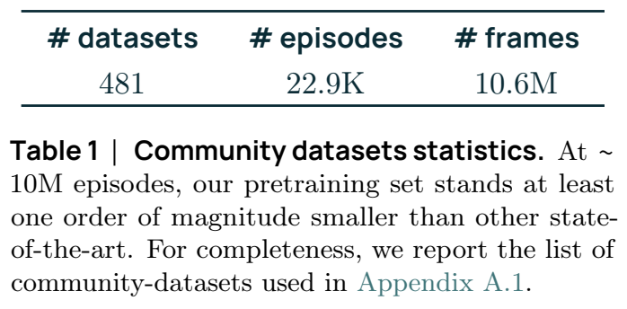

**Table 1.** 표의 episode·frame 단위를 보존했다. 캡션의 “10M episodes”는 표의10.6M **frames**와 모순된다. [PDF p.5, §3.2; [원문](https://arxiv.org/pdf/2506.01844v1#page=5)]

| dataset 수 | episode 수 | frame 수 |
|---:|---:|---:|
| 481 | 22.9K | 10.6M |

[저자 보고] embodiment, episode 수, 전반적인 데이터 품질과 frame coverage를 보고 subset을 고른다. §5.1은 pretraining robot type을 SO100으로 설명한다. 이름에 bimanual·dual-arm 등이 있는 dataset이 있어도 여러 종류의 robot embodiment에 걸친 사전학습을 입증하지는 않는다.

[검산] 표시값 기준 평균은 $`10.6\mathrm M/22.9\mathrm K\simeq463`$ frames/episode다. 만약 모두30Hz였다면 약15.4초/episode지만 **서로 다른 dataset의 실제 fps를 확인한 결과가 아니다.** 데이터마다 fps가 다른데 frame 수를 하나의 robot-hour로 환산하면 잘못된 비용 비교가 된다.

“10배 적은 데이터”도 기준 단위가 필요하다. 논문은 episode 수가 대형 VLA보다 훨씬 적음을 강조하지만 실제 유효 frame, 길이, task 다양성, 중복 trajectory, 인간 수집 비용이 동등하게 통제된 sample-efficiency 실험을 제공하지 않는다.

### 8.2 annotation 정제: 로봇 학습 이전의 별도 VLM 단계

원래 community dataset에는 설명이 없거나 `task desc`, `Hold`, `Up`처럼 모호한 instruction이 있다. 저자는 representative frame과 기존 task description을 Qwen2.5-VL-3B-Instruct에 주어 동작 중심의 짧은 instruction을 생성한다. 이는 **오프라인 데이터 정제**다. robot action을 예측할 때마다 Qwen2.5-VL을 호출하거나 SmolVLA와 두 VLM을 ensemble한다는 뜻이 아니다. [PDF p.5; p.20, Appendix A.1]

Appendix prompt의 요구를 한국어로 재구성하면 다음과 같다.

1. 현재 task description을 참고한다.
2. 로봇 팔이 수행한 주요 행동을 짧고 명확한 한 문장으로 쓴다.
3. 불필요한 말을 빼고 행동 동사로 시작한다.
4. 최대30characters라는 제약을 준다.
5. pick/place/open 형태의 예시를 제공한다.

[리뷰어 해석] 실제 prompt의 예시 문장 중에는30characters를 초과하는 것이 있어 길이 제약이 일관되게 강제되었다고 보기는 어렵다. 어떤 frame을 대표로 선택했는지, sampling 간격·개수, generated text 검수 비율, 오류율과 annotation model 호출 비용은 원문에 없다.

이 정제는 빈 instruction을 보완하지만 영상으로 관측되지 않는 의도, 실패 demonstration의 원래 목표, 색상/좌우 관계를 잘못 설명할 수 있다. 특히 같은 동작의 중간 frame만 보면 “놓기”와 “집기”를 혼동할 수 있다. 데이터 품질 향상을 주장하려면 annotation 전후의 held-out instruction 정확도나 동일 학습 예산 ablation이 추가로 필요하다. 원문에는 해당 독립 ablation이 없다.

### 8.3 카메라 표준화

데이터 key가 `images.laptop`이라고 해서 항상 top view인 것은 아니다. 논문은 수동으로 viewpoint를 정렬하여 top→`OBS_IMAGE_1`, wrist→`OBS_IMAGE_2`, side→`OBS_IMAGE_3`를 우선한다. 더 많은 view는 순서를 유지하되 학습에서 사용하지 않는 view를 제외한다. [PDF p.5]

이 작업은 camera pose를 수치적으로 보정하거나 모든 영상을 동일한 좌표계로 warping하는 calibration이 아니다. **token sequence에서의 의미상 slot을 일관되게 맞추는 naming/order 정규화**다. camera intrinsic/extrinsic이 같아지거나 시점 변화가 사라지는 것은 아니다.

새 deployment에서 두 view를 쓸 때 단순히 `camera1`, `camera2`라는 이름만 맞추기보다 해당 checkpoint 학습에 대응하는 viewpoint 순서를 유지해야 한다. `camera1`이 top에서 wrist로 바뀌면 token 위치에 암묵적으로 학습한 역할이 달라질 수 있다. 이것은 새 사용자 데이터에서도 바로 검증할 수 있는 재현 조건이다.

### 8.4 Appendix A.1 전체 목록의 검산

부록 p.20–24의 **List of datasets** 이후를 읽고 Hugging Face `owner/repo` 형식의 ID를 추출했다. `pdfplumber`와 `pypdf`의 독립 텍스트 추출에서 모두 **532개 entry, 532개 고유 ID**가 나왔고 두 집합의 차이는0개였다. 페이지별 개수는72,150,132,150,28이다. 이는 텍스트 ID 개수 검산이며 각 Hub dataset의 내용·접근 가능성을532개 모두 다운로드 검증한 것이 아니다.

| 항목 | 원문/검산 값 | 판단 |
|---|---:|---|
| §3.2·Table 1의 사용 dataset 수 | 481 | 저자 보고 |
| Appendix A.1 인쇄 ID 목록 | 532 | 두 추출기 동일 결과 |
| 차이 | 51 | filtering 전후 목록인지, 편집 잔재인지 미기재 |

따라서 **532개를 실제 학습 사용량으로 새롭게 확정하지 않는다.** 논문 main recipe의 통계는481로 기록하고, appendix가 그481개를 정확히 식별하는 immutable manifest 역할을 하는지에는 한계를 남긴다.

목록에는 `cropped_resized` 변형, 비슷한 이름의 재수집본, `error`·`anomaly`·`val` 문자열이 포함된 ID들이 있다. 이름만으로 data leakage나 실패 데이터 학습을 단정할 수 없다. 다만 원본과 변형의 중복 여부, training/evaluation split, 실제 포함 episode를 명시한 revision·hash manifest가 필요하다는 근거는 된다.

### 8.5 학습 단계의 구분

| 단계 | 시작점 | robotics data | 업데이트/용도 |
|---|---|---|---|
| 기존 VLM pretraining | SmolVLM2 자체 학습 | 본 논문의 community robot data 이전 | 외부에서 이미 학습한 visual/language 표현 |
| SmolVLA community pretraining | pretrained VLM + 새 expert | 약22.9K episode | 실제 robot task 전이를 위한 action expert 학습 |
| real-world target fine-tuning | community-pretrained SmolVLA 또는 ablation 초기화 | target task demonstration | SO100 multitask, SO101 single-task |
| simulation benchmark 학습 | pretrained VLM + 새 expert | LIBERO/Meta-World target demonstration | **Table 2의 SmolVLA는 community pretraining 없음** |

시뮬레이션의 “trained from scratch”라는 표현은 **expert의 robotics 학습 초기화**를 가리키며 VLM까지 random initialization했다는 뜻이 아니다. 반대로 robotics-pretrained π0는 upstream robot pretraining을 수행한 모델이므로 pretraining column을 반드시 함께 읽어야 한다. [PDF pp.10–12]

### 8.6 §4.3 하이퍼파라미터와 실제 비용

| 항목 | 논문 설정 | 현재 코드/공개 checkpoint와의 관계 |
|---|---|---|
| pretraining steps | 200,000 | 논문 recipe |
| pretraining global batch | 256 | 실제 사용은4 GPU |
| image size | 512×512 | config도 resize512; input feature metadata는256일 수 있음 |
| optimizer | AdamW, β1=0.9, β2=0.95 | 현재 config 동일 |
| peak/min LR | 1e-4 / 2.5e-6 | 현재 config 동일 |
| warmup | **100 steps** | 현재 class 및 base checkpoint는 **1,000** |
| schedule | cosine decay | 현재 preset decay_steps=30,000; 논문200K recipe와 별개 |
| precision/compile | bf16, torch.compile | 현재 compile_model은 기본 false. 논문과 현재 default 구분 |
| expert depth/width | VLM 앞16층 사용, expert폭0.75d | code 기본16/720 |
| predicted chunk | 50 actions | chunk_size=50 |
| flow sampling | 10 steps | num_steps=10 |
| simulation fine-tuning | 100,000 steps, batch64 | original paper 값 |
| real-world fine-tuning | 200,000 steps | 해당 문단은 real-world batch를 별도 확정하지 않음 |
| trainable | action expert, VLM frozen | code에서는 state/action/time/CA projector도 포함 |
| 실제 pretraining GPU 수 | 4 | 단일 GPU 가능성과 실제 사용을 구분 |
| 프로젝트 총 계산량 | 약30,000 GPU-hours | 단일 model pretraining 시간으로 해석하지 않음 |

[PDF p.10, §4.3; [configuration_smolvla.py](https://github.com/huggingface/lerobot/blob/2774d9bddcbbda50e697e162e89e7eaada8d7105/src/lerobot/policies/smolvla/configuration_smolvla.py), [checkpoint config](https://huggingface.co/lerobot/smolvla_base/blob/c83c3163b8ca9b7e67c509fffd9121e66cb96205/config.json)]

[검산] pretraining의 sampled observation 수는 $`200000\times256=51.2\mathrm M`$이다.10.6M frame으로 단순 나누면 약4.83배다. 그러나 dataset별 sampling 가중치·episode tail drop·chunk overlap이 있어 이것을 정확한4.83epochs라고 부르지 않는다. 로봇 demonstration의 chunk50은 인접 sample과 겹칠 수 있어51.2M개의 독립 궤적을 새로 수집한 것이 아니다.

논문은 fixed sequence length·batch size로 compilation을 안정화하고 full batch에 맞지 않는 episode excess frame을 버린다고 적는다. 재현 시 실제 sampler/loader가 어느 tail을 버리는지 확인해야 하며, 이 문장을 곧바로 모든 짧은 episode를 제거한다는 규칙으로 바꾸면 안 된다.

### 8.7 frozen/trainable와 gradient 흐름

| 모듈 | 기본 학습 상태 | 설명 |
|---|---|---|
| SigLIP vision encoder | frozen | train_expert_only 및 freeze_vision_encoder |
| VLM connector·text embedding·남은 LLM층 | frozen | VLM parameter의 requires_grad=False |
| state_proj | trainable | train_state_proj=True |
| action_in_proj / action_out_proj | trainable | noisy action↔expert 폭 변환 |
| action_time_mlp_in/out | trainable | flow time 조건화 |
| expert SA/CA·norm·MLP | trainable | CA용 K/V adapter 포함 |
| language-generation lm_head | 정책 생성 경로에서 미사용 | 텍스트 답변 생성 loss 없음 |

gradient 경로를 간단히 쓰면 다음과 같다. 이는 **리뷰 보조식**이다.

```math
\frac{\partial\mathcal L}{\partial W_s}=\frac{\partial\mathcal L}{\partial C}\frac{\partial C}{\partial E_s}\frac{\partial E_s}{\partial W_s},\qquad E_s=\bar s_tW_s+b_s,\qquad \Delta W_{\mathrm{VLM}}=0.
```

VLM weight를 업데이트하지 않아도 C가 state embedding에 의존하므로 중간 미분은 필요할 수 있다. 현재 training forward는 전체 VLM을 `torch.no_grad()`로 감싸거나 prefix 전체를 detach하지 않는다. 따라서 frozen이란 이유로 training graph를 무조건 끊는 최적화는 state projector 학습을 바꿀 수 있다. 추론의 `predict_action_chunk`·`select_action`은 별도로 no_grad 경로다. [smolvlm_with_expert.py L152–200](https://github.com/huggingface/lerobot/blob/2774d9bddcbbda50e697e162e89e7eaada8d7105/src/lerobot/policies/smolvla/smolvlm_with_expert.py#L152)

loss는 action velocity regression 하나가 중심이다. token-level language CE, image reconstruction, reward learning, differentiable simulator loss가 원문의 학습 objective에 함께 들어가지는 않는다. intro의 “end-to-end”라는 말보다 frozen/trainable를 명시한 §4.3과 실제 graph를 우선한다.

### 8.8 데이터 split에서 확인한 것과 확인하지 못한 것

LIBERO 1,693episodes, Meta-World2,500episodes, 실제 task별50demonstrations라는 학습량과 evaluation trial protocol은 제시된다. 그러나 모든 episode의 train/validation ID, community dataset별 exact revision, 생성 annotation 결과물, camera remap 완성표, 통계 계산 split, model-selection criterion은 PDF만으로 확정되지 않는다.

SO101에 pretraining data가 없다는 말은 SO101 target demonstration fine-tuning도 없다는 뜻이 아니다. Table4는 **SO101 task의 single-task training 후** 평가다. 새로운 robot의 zero-shot 성공률로 소개하면 일반화 조건이 크게 바뀐다.

<a id="forward"></a>

## 9. 한 관측의 end-to-end forward pass

### 9.1 고정된 예제 설정

다음은 코드의 main checkpoint 크기에 맞춘 **한 sample의 shape walkthrough**다. 두 camera, batch1, text48tokens, state/action6차원, chunk50,10 Euler steps를 가정한다. camera 순서와 실제 action 단위는 dataset/robot adapter에 의해 정의되어야 한다.

| 순서 | 입력→출력 shape | 처리와 역할 |
|---:|---|---|
| 1 | camera별 raw RGB→`[1,3,512,512]` | channel-first tensor, aspect-ratio 유지 resize+pad; 영상값을[0,1]에서[-1,1]로 변경 |
| 2 | `[1,3,512,512]`→`[1,1024,768]` | patch16의 vision encoder grid에 대한 config 기반 재구성 |
| 3 | `[1,1024,768]`→`[1,64,960]` | connector shuffle와 projection; 두 camera 각각 수행 |
| 4 | instruction→`[1,48]`→`[1,48,960]` | newline 처리, tokenizer, padding mask, embedding |
| 5 | state`[1,6]`→`[1,32]`→`[1,1,960]` | dataset mean/std 정규화, zero padding, state projector |
| 6 | image128+text48+state1→`[1,177,960]` | prefix concatenate; image/text scaling은√960 |
| 7 | `[1,177,960]`→16개 layer KV | prefix mask로 VLM forward 한 번; cache는 layer당 K/V 각각`[1,5,177,64]` |
| 8 | Gaussian→`[1,50,32]` | r1에서 action noise 초기화 |
| 9 | noisy action→`[1,50,720]` | action projection, time embedding concat, MLP |
| 10 | `177 prefix KV + 50 action tokens` | expert16층의 SA/CA 교대. r값 하나에 대한 vector field 계산 |
| 11 | `[1,50,720]`→`[1,50,32]` | final norm 후 output projection; velocity |
| 12 | X←X−0.1V |50×32모든 원소를 동시 갱신. 9–12를10회 |
| 13 | `[1,50,32]`→`[1,50,6]` | 실제 physical action dimension만 보존 |
| 14 | normalized action→원래 action 단위 | postprocessor inverse mean/std; 필요시 robot-specific 변환 |
| 15 | chunk→1개씩 command | sync queue 또는 async client에 전달하여 실행 |

2단계는 config와 vision grid 구조의 정적 shape 계산이며 full checkpoint를 load하여 runtime tensor를 계측한 결과는 아니다. 현재 checkpoint config의 input feature256×256과 실제 resize512×512는 **저장된 데이터 feature schema**와 **모델 전처리 해상도**의 차이다.

### 9.2 prefix cache가 절약하는 정확한 범위

두-camera 예에서 K/V가 모두 bf16이라고 가정한 cache의 순수 tensor 용량은 다음과 같다.

```math
2\times16\times1\times5\times177\times64\times2\ \mathrm{bytes}=3{,}624{,}960\ \mathrm{bytes}\simeq3.46\ \mathrm{MiB}.
```

첫2는 K/V,16은 layer,1은 batch,5는 KV head,177은 prefix길이,64는 head dimension,마지막2는 bf16 bytes다. 세 camera라면 P241로 증가한다. 이것은 **순수 prefix KV 하한 성격의 shape 산술**이며 tensor allocator reserve, vision activation, attention score, weight, runtime workspace를 포함한 GPU 메모리 측정이 아니다.

[공식 코드 확인] 현재 `DynamicCache`는 SA step에서 suffix KV를 append한 후 `crop(prefix_len)`으로 다시 prefix길이로 되돌린다. 이를 하지 않으면 다음 denoising step의 noisy action이 이전 step suffix에 이어 붙어 cache가 계속 자라는 다른 모델이 된다. CA에서는 fixed prefix KV를 읽고 action끼리 연결하지 않는다. [modeling_smolvla.py L775–810](https://github.com/huggingface/lerobot/blob/2774d9bddcbbda50e697e162e89e7eaada8d7105/src/lerobot/policies/smolvla/modeling_smolvla.py#L775)

기본적으로 cache하는 것은 VLM K/V다. CA adapter 적용 이후의 expert K/V를 모든 step에 걸쳐 별도로 사전 계산하는 최적화가 이 경로에 구현되어 있다고 주장하지 않는다. 현재 CA projection은 denoising마다 실행된다. 후속 구현에서 hoist하려면 RoPE·dtype·compiled graph와 출력 동등성을 확인해야 한다.

### 9.3 training forward와 inference forward의 차이

training에서는 clean chunk A가 존재하므로 random r와 noise를 뽑아 X와 U를 만들고 **expert forward 한 번**으로 loss를 계산한다. 일반적인 한 training sample에서 inference용10step ODE를 unroll하여 모두 backprop하는 방식이 아니다.

inference에서는 A가 없으므로 random noise에서 시작하여10번 vector field를 평가한다. 관측이 고정된 이 루프에는 prefix KV를 재사용할 수 있다. 새로운 camera/state가 들어온 policy refresh에서는 prefix를 다시 계산한다. action chunk의 나머지를 실행하는 동안 세계가 변할 수 있다는 문제는 이 neural network forward만으로 해결되지 않으며, 다음 절의 실행 스케줄이 담당한다.

### 9.4 policy API가 반환하는 것

`predict_action_chunk`는 새 chunk를 반환한다. `select_action`은 내부 deque가 비었을 때만 chunk를 생성하고, `n_action_steps`개를 보관한 뒤 매 호출 하나씩 pop한다. 기본값50이면50회 호출 중1회만 새 관측으로 neural policy를 호출한다. 따라서 `select_action` 호출률을 VLM inference Hz로 기록하면 잘못된 속도 보고가 된다.

현재 RTC가 켜진 경우 `select_action`은 assertion으로 거부하고 `predict_action_chunk` 사용을 요구한다. RTC는 논문의 Algorithm1과 동일한 기능 이름이 아니며 뒤에서 별도로 구분한다. [modeling_smolvla.py L231–275](https://github.com/huggingface/lerobot/blob/2774d9bddcbbda50e697e162e89e7eaada8d7105/src/lerobot/policies/smolvla/modeling_smolvla.py#L231)

<a id="async"></a>

## 10. §3.3 비동기 실행, 수식과 Algorithm 1 행별 해설

### 10.1 U5: action chunk와 queue를 구별한다

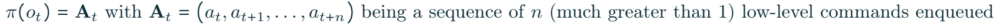

**U5.** 원문의 chunk 표기는 양 끝을 포함하면 n+1개지만 설명은 n개라고 쓴다. 코드와 본 리뷰의 shape는 chunk_size=n개를 기준으로 한다. [PDF p.5, §3.3]

```math
\pi(o_t)=A_t,\qquad A_t=(a_t,a_{t+1},\ldots,a_{t+n}).
```

원문에 나온 마지막 index를 그대로 보존한 식이다. 실제 코드의 action index는0…n−1이다. 이후 queue 예제에서는 off-by-one 혼동을 피하려고 $`(a_t,\ldots,a_{t+n-1})`$의 n개로 설명한다. predicted chunk A는 길이가 고정된 tensor이고, 실행 queue Q는 pop과 merge 때문에 길이가 계속 변한다. 원문은 두 객체에 A 기호를 함께 사용한다.

### 10.2 동기와 비동기가 바꾸는 것

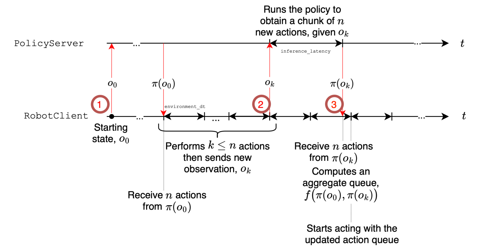

**Figure 2.** client는 이미 받은 action을 실행하는 동안 다음 observation의 추론을 server에 맡긴다. server는 remote GPU일 수도 있지만 같은 기기에서 실행하는 구성도 개념적으로 가능하다. [PDF p.6, Fig.2; [원문](https://arxiv.org/pdf/2506.01844v1#page=6)]

동기는 큐를 모두 소비하고 새 observation을 처리한다. 다음 chunk가 완성될 때까지 action 공급에 공백이 생긴다. 비동기는 큐가 아직 남아 있을 때 요청하므로 일부 추론 시간을 기존 action 실행 뒤에 숨긴다. 이것은 neural network를 더 적은 연산으로 바꾸는 최적화가 아니라 **시간상 겹치게 실행하는 최적화**다.

초기화 때는 아직 실행할 action이 없으므로 첫 추론을 기다려야 한다. 또한 다음 관측을 더 자주 보더라도 camera capture→전송→추론→수신의 age가 남는다. async는 관측을 즉시 행동으로 바꾸는 zero-latency feedback이 아니다.

### 10.3 U6: 큐 threshold와 관측 similarity filter

원문 재요청 조건은 다음과 같다.

```math
\frac{|Q_t|}{n}\lt g,\qquad g\in[0,1].
```

$`|Q_t|`$는 남은 command 개수이므로 n으로 나눈 값과 g는 무차원이다. g가 클수록 큐가 더 많이 남았을 때 요청한다. 예를 들어 n50,g0.7이면35개보다 적게 남는 시점에 새 요청이 시작된다. 조건이 strict inequality이므로34개일 때 처음 통과할 수 있고 실제 discrete trigger는 구현 순서에 따라 한 tick 차이가 난다.

원문은 joint-space의 가까운 observation을 필터링한다. 이를 풀어 쓴 **리뷰 보조식**은 다음과 같다.

```math
\mathrm{similar}(o,o')=\mathbf1\!\left[\|s(o)-s(o')\|_2\lt\varepsilon_q\right].
```

joint state가 거의 같을 때 매번 비슷한 chunk의 초반부로 계획을 되돌리면 진행이 정체될 수 있다. 필터는 이런 반복 재계획과 중복 server 계산을 줄인다. 큐가 비면 유사하더라도 최신 observation을 강제 처리한다. [PDF p.7]

[공식 코드 확인] 현재 client threshold는 **`<=`**다. 따라서 g0에서도 empty queue는 통과한다. 원문의 literal `<0`은 empty queue에서0<0이 거짓이므로, g0을 sequential limit으로 설명하려면 별도 empty-queue 처리가 필요하다. 이 차이는 Algorithm1을 그대로 runnable 코드로 옮길 때 중요하다.

현재 similarity helper는 raw state의 L2 norm을 `atol=1`과 비교한다. camera pixel은 직접 비교하지 않는다. 관절 각도 단위·normalization에 따라 같은1의 의미가 달라지고, 팔이 멈춘 상태에서 물체만 움직이면 관측 변화가 필터에 걸릴 수 있다. [helpers.py L276–298](https://github.com/huggingface/lerobot/blob/2774d9bddcbbda50e697e162e89e7eaada8d7105/src/lerobot/async_inference/helpers.py#L276), [robot_client.py L416–450](https://github.com/huggingface/lerobot/blob/2774d9bddcbbda50e697e162e89e7eaada8d7105/src/lerobot/async_inference/robot_client.py#L416)

### 10.4 U7: round-trip latency의 분해

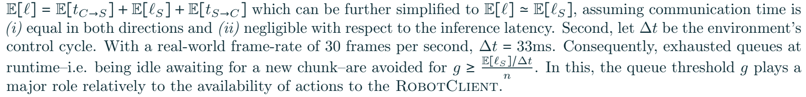

**U7·U8.** 원문 기대 지연 분해와 threshold 근사를 보존한 발췌. 이것은 tail-latency deadline의 확률 보증이 아니다. [PDF p.7, §3.3]

```math
\ell=t_{C\to S}+\ell_S+t_{S\to C},\qquad \mathbb E[\ell]=\mathbb E[t_{C\to S}]+\mathbb E[\ell_S]+\mathbb E[t_{S\to C}]\simeq\mathbb E[\ell_S].
```

- $`t_{C\to S}`$는 관측을 client에서 server로 보내는 시간이다. image serialization과 payload 크기의 영향을 받을 수 있다.
- $`\ell_S`$는 server inference 지연이다. 실제 계측에서는 queue wait와 preprocessing 포함 여부를 고정해야 한다.
- $`t_{S\to C}`$는 생성 chunk를 돌려보내는 시간이다.
- 관측은 image이고 결과는 작은 action tensor라면 양방향 payload가 같지 않을 수 있다.
- 첫 기대값 등식은 기대값의 선형성에서 나오므로 **독립성 가정이 필요 없다**. 원문은 independence를 언급하지만 그 가정은 이 등식의 필수조건이 아니다.
- 마지막 근사는 양쪽 통신이 inference에 비해 충분히 작을 때 가능하다. 양방향 시간이 같다는 것만으로 통신을 무시할 수 없다.

remote edge deployment에서는 네트워크 변동, 직렬화, server queue, CPU 전처리를 포함한 end-to-end round trip을 따로 측정해야 한다. 코드에 `inference_latency`라는 설정값이 있다고 해서 그 값이 측정된 모델 latency는 아니다. 현재 server는 처리 시간이 목표보다 짧을 때 sleep으로 pacing한다. [policy_server.py L254–256](https://github.com/huggingface/lerobot/blob/2774d9bddcbbda50e697e162e89e7eaada8d7105/src/lerobot/async_inference/policy_server.py#L254)

### 10.5 U8: queue underflow를 피하는 근사 조건의 유도

원문은 30 fps에서 $`\Delta t=33\mathrm{ms}`$로 두고 다음 조건을 제시한다.

```math
g\geq\frac{\mathbb E[\ell_S]/\Delta t}{n}=\frac{\mathbb E[\ell_S]}{n\Delta t}.
```

직관은 간단하다. 요청 시 남은 action 약gn개를 실행하는 데 gnΔt초가 걸린다. 그 사이 평균 inference가 끝나면 다음 chunk를 받을 수 있다. 양변에 nΔt를 곱하면 다음의 **해설용 동치식**을 얻는다.

```math
gn\Delta t\geq\mathbb E[\ell_S].
```

예를 들어 n50,Δt1/30초, inference 평균0.20초이면 g하한은0.12다. g0.7은 이상적인 계산에서 약1.17초 분량의 buffer를 남긴다. 그러나 이 값은 설명용 가정이고 논문이 측정한 inference0.20초라는 뜻은 아니다.

이 조건에는 다음 한계가 있다.

1. 평균0.20초라도 일부 요청이2초 걸리면 queue는 비어진다. 평균 조건은 underflow의 부재를 보증하지 않는다.
2. similarity filter가 요청을 막으면 gn개의 buffer가 있을 때 추론을 시작한다는 전제가 깨진다.
3. 정수 action 개수, strict threshold, capture·통신·merge 비용이 생략되어 있다.
4. g≤1이므로 end-to-end 지연이 chunk horizon nΔt보다 크면 threshold 조정만으로 처리할 수 없다.
5. g를 높여 요청을 자주 보내도 server 처리량이 부족하면 여러 새 관측이 모두 inference되는 것이 아니라 backlog 또는 drop이 생긴다.

[후속 연구 제안] 실제 배포 설계에는 average 대신 측정한 round-trip 지연의 상위 quantile을 넣고 margin을 더한 조건을 사용해 보는 것이 합리적이다. 다음은 논문의 정리가 아닌 설계 후보식이다.

```math
gn\Delta t\geq q_{1-\alpha}(\ell_{\mathrm{total}})+\delta_{\mathrm{margin}}.
```

이 조건도 sampling·filter·server backlog·actuator 통신을 포함한 closed-loop 평가를 대체하지 않는다. 여기서 quantile은 설정한 α에 대한 실제 측정 통계여야 한다.

### 10.6 U9·U10: 관측 요청 간격, 결과 도착과 g의 세 극한

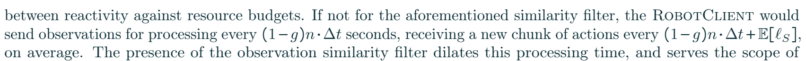

**U9·U10.** similarity filter가 없는 단순화된 설명의 cadence 식. [PDF p.8, §3.3]

```math
T_{\mathrm{send}}\simeq(1-g)n\Delta t,\qquad T_{\mathrm{receive}}\simeq(1-g)n\Delta t+\mathbb E[\ell_S].
```

여기서 첫 항은 chunk 중1−g의 비율을 소비하는 시간이다. 두 번째는 그 시점에서 요청해 결과를 받을 때까지의 시간을 더한 설명이다. **파이프라인이 충분히 겹친 정상상태에서 연속 응답 사이의 간격이 항상 이 합이라는 일반 법칙은 아니다.** 어떤 시점을 기준으로 측정하는지, 여러 요청의 동시 진행을 허용하는지에 따라 달라진다.

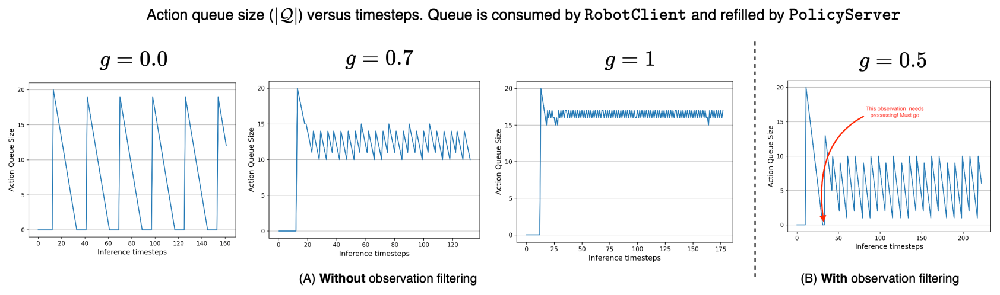

**Figure 3.** (A)는 joint-state 유사도 필터가 없는 세 가지 g, (B)는 필터가 있는 예시다. 빨간 화살표는 큐가 비었기 때문에 유사한 관측도 강제 처리하는 시점을 가리킨다. [PDF p.7, Fig.3; [원문](https://arxiv.org/pdf/2506.01844v1#page=7)]

| 설정 | 이상적인 동작 | 실제 구현·해석의 주의점 |
|---|---|---|
| g0 | chunk를 모두 실행한 뒤 요청, idle gap 발생 | literal `<`와 empty bypass 문제; current code는`<=` |
| g0.7 | 약30% 소비 후 다음 chunk 요청 | 기존/새 chunk overlap을 target timestep으로 맞춰야 함 |
| g1 | 가능한 한 자주 새 observation을 요청 | 요청률과 inference 완료율은 다름 |
| similarity filter 있음 | 거의 동일 state의 재요청 생략 | 물체만 움직이는 변화를 놓칠 수 있음; empty queue에서 강제 처리 |

Figure3은 queue의 작동을 설명하는 그림이다. 그 그림의 small horizon이나 saw-tooth 모양을 모든 실제50-action run의 latency measurement로 읽지 않는다. 본문에서 g1을 “control tick마다 forward”라고 서술하지만, 현재 server는 observation queue maxsize1로 최신 후보를 남기고 이미 처리한 timestep과 유사 observation을 제거한다. 따라서30Hz observation 송신이30Hz completed inference를 뜻하지 않는다. [policy_server.py L98–105, L268–310](https://github.com/huggingface/lerobot/blob/2774d9bddcbbda50e697e162e89e7eaada8d7105/src/lerobot/async_inference/policy_server.py#L98)

원문 g=1 설명에는 아래 비번호 비율도 등장한다.

```math
\frac{\Delta t}{\mathbb E[\ell_S]}\lt1.
```

이 부등식은 평균 inference가 control tick보다 오래 걸리는 상황을 뜻한다. 단일 요청을 순차 처리하는 server라면 매 tick의 요청을 모두 같은 빈도로 완료할 수 없으므로, 요청률·처리율·동시성·drop policy를 함께 기록해야 한다. 작은 saw-tooth라는 그림 설명만으로 처리량 조건이 해결되지는 않는다.

### 10.7 Algorithm 1의17개 행을 실행 의미로 풀기

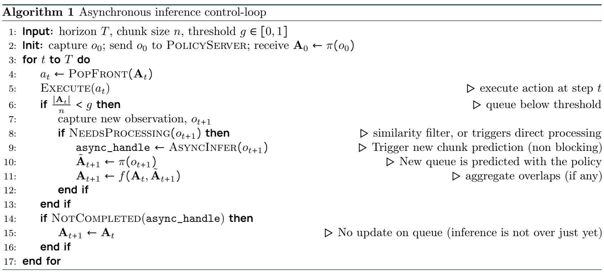

**Algorithm 1.** 원문 pseudocode를 발췌했다. 비동기 completion과 state handoff를 이해하기 위한 추상 알고리즘으로 읽어야 한다. [PDF p.6, Algorithm1]

| 행 | 원문 동작 | 입력→출력, 해설과 구현 시 주의점 |
|---:|---|---|
| 1 | T,n,g 입력 | T는 실행 horizon, n은 한 예측의 길이, g는 잔여 비율 threshold |
| 2 | o0획득·전송·A0수신 | 최초 chunk가 없으므로 초기 추론을 기다린다. async도 이 startup 대기를 없애지 못함 |
| 3 | t에 대해 반복 | 논문은 `for t to T`로 시작 index를 생략. 제어 tick마다 반복한다고 해석 |
| 4 | PopFront | 가장 앞의 action을 꺼내면서 queue길이1감소. 빈 큐의 별도 처리가 필요 |
| 5 | Execute | 꺼낸 action을 로봇에 전달. 완료 후 새 관측 state가 달라질 수 있음 |
| 6 | 잔여 비율 검사 | inference를 시작할 buffer가 충분한 시점에 요청하기 위한 조건 |
| 7 | 새 observation | 이번 action 이후의 camera/state를 포착. capture 자체에도 지연이 있음 |
| 8 | NeedsProcessing | joint similarity 검사 또는 empty queue 강제 처리; 실제 새롭고 유효한 요청인지 결정 |
| 9 | AsyncInfer handle | blocking하지 않고 추론 작업을 제출. client는 기존 queue 소비를 계속해야 함 |
| 10 | 새 chunk 예측 | server 측 작업 또는 미래 completion 결과.9행 직후 즉시 값이 준비됐다고 실행할 수 없음 |
| 11 | f로 큐 결합 | 동일한 target timestep의 overlap을 정렬하여 새 queue 구성; 이미 실행한 action은 제외 |
| 12 | 내부 if 종료 | observation 처리 여부 분기 종료 |
| 13 | threshold if 종료 | queue가 충분하면 새 요청 없이 기존 queue 유지 |
| 14 | async 미완료 검사 | 아직 결과가 없으면 새 queue로 교체하지 않음. handle 미정의 상태도 실제 구현에서 다뤄야 함 |
| 15 | 이전 queue 유지 | 여기서 “이전”은4행에서 이미 한 action을 pop한 queue다. pop 이전 chunk를 복원하면 중복 실행됨 |
| 16 | completion 분기 종료 | callback/future/receiver thread가 대신 표현할 수 있음 |
| 17 | 다음 tick | 해당 환경의 control rate에 맞춰 반복 |

원문만 literal하게 구현하면0threshold, 빈 queue, 아직 없는 `async_handle`,9–11행의 비동기 completion, 동시에 여러 요청이 도착한 경우가 불명확하다. 현재 LeRobot은 control loop와 receive thread, lock, timed action, server queue로 이를 구체화한다. 이 차이는 원문의 설계 가치를 깎기보다 pseudocode와 runnable implementation의 추상화 수준이 다르다는 뜻이다.

### 10.8 overlap aggregation의 실제 예

**[리뷰어 해석: timestep 설명용]** 기존 chunk가 target step0…49이고 step30에서 새 observation을 보냈다고 가정한다. 새 chunk는30…79를 예측하지만 계산하는 동안 client가39까지 이미 실행했다면 수신 시 다음과 같이 처리한다.

1. 새 chunk의30…39는 이미 지나간 action이므로 버린다.
2.40…49는 기존 queue와 새 chunk가 겹치므로 f를 적용한다.
3.50…79는 새 chunk만 있으므로 그대로 추가한다.
4. 따라서 갱신 queue는40…79의40개이며 반드시50개로 다시 채워지는 것은 아니다.

[공식 코드 확인] `_aggregate_action_queues`는 실행한 timestep 이하를 제외하고 동일 timestep을 결합한다. 현재 weighted-average 선택지는 $`0.3a_{old}+0.7a_{new}`$이며 latest-only, 평균, conservative 선택지도 있다. 다만 **논문 Figure5 실험이 정확히 이 현재 기본 weight로 수행되었다는 근거는 PDF에 없다.** [robot_client.py L237–280](https://github.com/huggingface/lerobot/blob/2774d9bddcbbda50e697e162e89e7eaada8d7105/src/lerobot/async_inference/robot_client.py#L237), [configs.py L28–34](https://github.com/huggingface/lerobot/blob/2774d9bddcbbda50e697e162e89e7eaada8d7105/src/lerobot/async_inference/configs.py#L28)

scalar joint target의 old0.2,new0.8을 이 weight로 합치면0.62다. 이는 출력 trajectory를 완만하게 이어 줄 수 있지만, 단단한 접촉·gripper open/close 전환·안전 경계를 일반적으로 보존한다는 보장은 없다. 서로 다른 coordinate convention의 action을 평균해서도 안 된다.

### 10.9 model-agnostic이라는 주장의 조건

비동기 client/server는 fixed-format action chunk를 반환하는 정책에 적용할 수 있다. 그러나 policy가 생성한 action의 시간 기준과 robot control period를 맞추고, 이전 action과 새로운 action의 physical 의미가 동일해야 한다. 이미지 전처리와 inverse action normalization도 server/client 어느 쪽에서 수행하는지 정해야 한다.

현재 구현은 server에서 preprocessing→`predict_action_chunk`→postprocessing→TimedAction으로 변환한다. 각 action에 observation timestamp와 environment period를 이용한 timestamp를 붙이고 client는 timestep으로 정렬한다. 따라서 “네트워크 latency”라고 출력되는 일부 timestamp 차이는 capture 이후 추론까지 포함할 수 있다. 명칭만 보고 wire 전송시간이라고 믿지 말고 시작·끝 위치를 확인해야 한다.

<a id="experiments"></a>

## 11. §4.1–4.5 평가 설계와 주요 결과

### 11.1 simulator와 실제 로봇의 평가 조건

| 환경 | 학습 데이터 | 평가 | action refresh 조건 |
|---|---|---|---|
| LIBERO | 1,693episodes,4suite×10tasks | task당10trials, binary success | 기본적으로 action1개 실행마다 새 observation·chunk |
| Meta-World |50tasks×50demos=2,500episodes | task당10trials, binary success | LIBERO와 같은 빈번한 refresh |
| SO100 | pick-place/stacking/sorting 각각50demos | 부분 성공 점수, task별 보고 | 주 결과는 chunk50개 전체 실행 후 refresh |
| SO101 | Lego pick-place50demos | ID/OOD 위치 평가, single-task training | 실제 로봇 주 결과의 sync 방식 |

[저자 보고; PDF pp.8–10, §4.1–4.3]

simulator에서 action1개마다50개를 예측해도 simulation step이 wall-clock deadline을 강제하지 않으면 정상 평가할 수 있다. 따라서 simulator의 성공률이 곧 실제30Hz environment에서1action마다 inference할 수 있다는 증거는 아니다.

§4.2는 SO100/SO101의 저가 servo position command, LIBERO의 Panda, Meta-World의 “Swayer”를 소개한다. 마지막 명칭은 Sawyer의 표기 오류로 보이며, 같은 문단의 “4-DOF”는 position+gripper를 제어하는 policy interface와 물리적 팔 관절 자유도를 혼동할 여지가 있다. 본 리뷰는 그 문장을 하드웨어의 관절 수를 확정하는 근거로 사용하지 않는다. [리뷰어 해석; PDF p.9]

### 11.2 Figure 4: 실제 task와 점수 정의

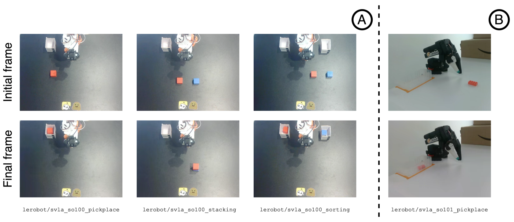

**Figure 4.** SO100의 pick-place, stacking, sorting과 SO101의 Lego pick-place. SO100은 top/wrist, SO101은 top/side view를 사용한다. [PDF p.9, Fig.4; [원문](https://arxiv.org/pdf/2506.01844v1#page=9)]

| task | 입력 조건·변화 | 성공 점수 |
|---|---|---|
| Pick-place | 작은 고정 box, cube 시작 위치5종 | cube잡기0.5 + box에놓기0.5 |
| Stacking | red cube를 blue cube 위로, 두 위치 변화 | 위 cube잡기0.5 + 올려놓기0.5 |
| Sorting | red는오른쪽 box, blue는왼쪽 box; 시작 위치·색 배치 변화 | 각 cube의잡기0.25 + 올바른 box 배치0.25, 총4항 |
| SO101 Lego | pink Lego를 transparent box에 배치; 새 위치 OOD | pick-place 맥락의 fine-grained 평가; Table4로 ID/OOD 보고 |

각 target dataset은5시작 조건×10trajectories의50demonstrations로 설명된다. sorting은 각 위치에서 두 color configuration을5episodes씩 수집한다. box의 위치는 고정이므로 완전히 새로운 배치·새 물체·새 task에 대한 일반화 실험은 아니다.

**실제 로봇 “SR”은 binary completion과 다르다.** 예를 들어10trials에서5번 완전 성공하고5번 잡기까지만 성공하면 평균score는75다. 완전 완료율은50이지만 표에는75가 될 수 있다. 따라서 SO100 78.3을 “78.3%의 trial을 전부 완료”라고 바꿔 말하지 않는다.

### 11.3 §4.4 baseline을 어떻게 학습했는가

[저자 보고] π0는 PaliGemma 기반 VLM과 flow-matching expert를 가진 대형 정책이며, 로봇 pretraining 여부가 다른 초기화도 비교한다. ACT는 ResNet image encoder와 CVAE 형태의 transformer policy로 연속 chunk를 회귀하며, 본 연구의 실제 task별 학습에서는 single-task baseline이다. [PDF p.10]

ACT와 SmolVLA의 차이는 parameter 수만이 아니다. pretrained language model 유무, task conditioning, robotics pretraining, single/multi-task 학습이 함께 달라진다. 따라서 Table3은 해당 training protocol에서의 실용 비교로 유용하지만 architecture의 인과 효과를 완전히 분리한 비교는 아니다.

π0의 parameter 표기는 본문/표에서3.3B와3.5B가 혼용된다. 본 리뷰는 각각의 표에서 원문 숫자를 유지한다. 범용 “7배 작음” 정도의 근사 비교는 가능하지만, exact parameter matched 실험처럼 취급하지 않는다.

### 11.4 Table 2: LIBERO

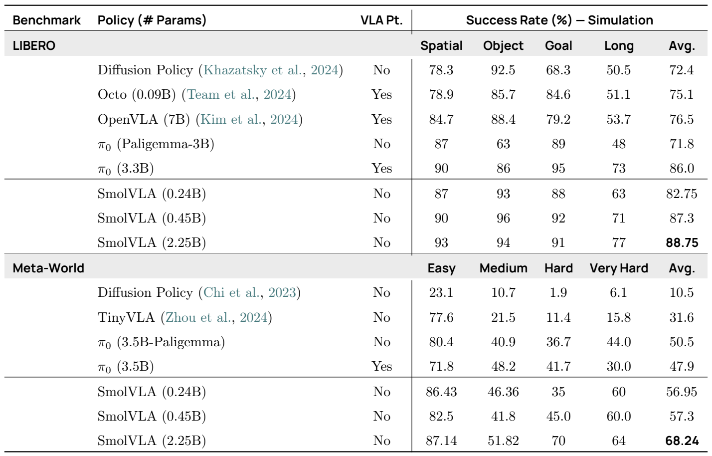

**Table 2.** `VLA Pt.`는 robotics pretraining 여부다. SmolVLA 행은 모두 No이며 pretrained VLM에서 초기화한다. [PDF p.11, Table2; [원문](https://arxiv.org/pdf/2506.01844v1#page=11)]

| 정책 | Robotics PT | Spatial | Object | Goal | Long | Avg. |
|---|---|---:|---:|---:|---:|---:|
| Diffusion Policy | No |78.3|92.5|68.3|50.5|72.4|
| Octo0.09B | Yes |78.9|85.7|84.6|51.1|75.1|
| OpenVLA7B | Yes |84.7|88.4|79.2|53.7|76.5|
| π0(PaliGemma3B) | No |87|63|89|48|71.8|
| π0(3.3B) | Yes |90|86|95|73|86.0|
| SmolVLA0.24B | No |87|93|88|63|82.75|
| SmolVLA0.45B | No |90|96|92|71|87.3|
| SmolVLA2.25B | No |93|94|91|77|88.75|

[검산] main model의 평균은 $`(90+96+92+71)/4=87.25`$로 소수1자리87.3과 맞는다. robotics-pretrained π0 대비 표시 평균으로+1.3%p, VLM-only π0 대비+15.5%p다. OpenVLA 대비+10.8%p다.

이 차이를 해석할 때 다음을 동시에 봐야 한다.

- π0 robotics-pretrained 대비 Spatial은동일90, Object는+10, Goal은−3, Long은−2다. main model이 모든 suite에서 더 좋은 것은 아니다.
- SmolVLA2.25B는 main0.45B보다5배 parameter지만 평균은정밀값 기준+1.50%p다. 다만 Long은71→77로6%p 높다.
- 작은0.24B→0.45B는 평균+4.5%p이므로 size scaling의 효과가 모든 구간에서 일정하지 않다.
- baseline 일부 값은 기존 연구에서 인용한 값이다. 동일 seed·동일 code commit·동일 evaluation rollout을 전부 새로 맞춘 비교라고 쓰지 않는다.

원문이 “10배 큰 VLA와 경쟁”이라고 요약한 근거는 이러한 benchmark 평균과 실제 task 결과다. SmolVLA가 VLM의 범용 reasoning 능력까지 대형 VLM과 같다는 주장은 여기서 도출되지 않는다.

### 11.5 Table 2: Meta-World

| 정책 | Robotics PT | Easy | Medium | Hard | Very Hard | Avg. |
|---|---|---:|---:|---:|---:|---:|
| Diffusion Policy | No |23.1|10.7|1.9|6.1|10.5|
| TinyVLA | No |77.6|21.5|11.4|15.8|31.6|
| π0(3.5B-PaliGemma) | No |80.4|40.9|36.7|44.0|50.5|
| π0(3.5B) | Yes |71.8|48.2|41.7|30.0|47.9|
| SmolVLA0.24B | No |86.43|46.36|35|60|56.95|
| SmolVLA0.45B | No |82.5|41.8|45.0|60.0|57.3|
| SmolVLA2.25B | No |87.14|51.82|70|64|68.24|

[검산] main model은4difficulty 열의 산술평균57.325→57.3이다.0.24B는56.9475→56.95,2.25B는68.24와 일치한다. 즉 표의 Avg는 표시된 difficulty별 점수를 같은 가중치로 평균한 값과 일치한다. difficulty별 task 수가 같다는 정보가 없으므로 이를 곧바로50task 전체 trial의 micro-average로 동일시하지 않는다.

main0.45B는 VLM-only π0 대비+6.8%p, robotics-pretrained π0 대비+9.4%p다. 이 환경에서는π0 robot-pretrained 값이 VLM-only보다2.6%p 낮다. 이를 “robot pretraining은 해롭다”라고 일반화하기보다는 target task 분포와 fine-tuning 조건에 따라 전이 결과가 달라진다는 관찰로 읽는다.

0.45B→2.25B의 차이는10.94%p로 LIBERO보다 훨씬 크다. size-efficiency 타협은 benchmark 의존적이다. 따라서0.45B를 모든 task 난도에서 충분한 고정 capacity로 판단하기 어렵다.

### 11.6 Table 3: SO100의 multi-task 성능

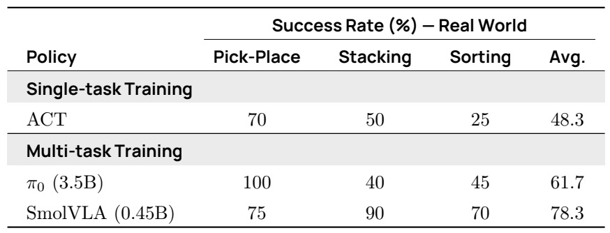

**Table 3.** ACT는 single-task, π0와 SmolVLA는 multi-task 설정이다. 숫자는 원문의 fine-grained success score다. [PDF p.11]

| 정책 | 학습 설정 | Pick-place | Stacking | Sorting | Avg. |
|---|---|---:|---:|---:|---:|
| ACT |single-task|70|50|25|48.3|
| π0 3.5B |multi-task|100|40|45|61.7|
| SmolVLA0.45B |multi-task|75|90|70|78.3|

[검산] SmolVLA 평균은235/3=78.333…, π0는185/3=61.666…다. 원래 task 값으로 계산한 차이는16.667%p이며 표시 평균끼리 빼면16.6%p다. 반올림 방식의 차이이지 새로운 측정은 아니다.

SmolVLA의 강점은 stacking+50, sorting+25다. 반면 pick-place는π0보다25%p 낮다. “세 task 모두 우월”이라는 설명은 틀리다. ACT와의 평균+30%p도 single-task/multi-task 및 robotics pretraining 차이가 섞인 비교다.

본문 p.11은 Table3를 설명하면서 SO101이라고 쓰지만, Table3 caption은SO100이며 세 task가 Figure4(A)의 SO100 task다. 본 리뷰는 **Table3=SO100, Table4=SO101**로 구분한다.

### 11.7 Table 4: SO101과 OOD 위치

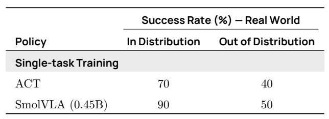

| 정책 | In distribution | Out of distribution |
|---|---:|---:|
| ACT |70|40|
| SmolVLA0.45B |90|50|

[저자 보고] OOD는 Lego의 시작 위치가 학습 중 보지 못한 곳에 놓이는 설정이다. 새 object category, 새 instruction semantics, 완전히 새로운 환경 조합을 모두 테스트한 OOD가 아니다. SO101 데이터로 single-task fine-tuning한 후 평가한 결과이며, pretraining embodiment와 다르다는 의미의 전이 사례다.

[검산] ID에서ACT 대비+20%p, OOD에서+10%p지만, SmolVLA 내부에서도90→50으로40%p 떨어진다. 이는 전이가 가능하다는 근거와 동시에 position generalization의 한계다.

### 11.8 Table 5: community pretraining과 multitask의 기여

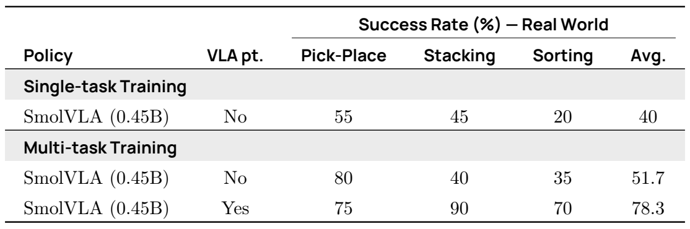

| 학습 | Robotics PT | Pick-place | Stacking | Sorting | Avg. |
|---|---|---:|---:|---:|---:|
| Single-task |No|55|45|20|40|
| Multi-task |No|80|40|35|51.7|
| Multi-task |Yes|75|90|70|78.3|

이 표는 실제 성능 향상을 분해해서 읽는 가장 좋은 근거다. [PDF pp.11–12]

- robotics pretraining 없이 single→multi는 평균+11.7%p다. pick-place+25, sorting+15, stacking−5로 task마다 다르다.
- multi-task를 유지하고 pretraining을 추가하면 평균+26.7%p 정도다. stacking+50, sorting+35, pick-place−5다.
- single/no-pretraining에서 multi/pretraining으로의 총 변화는+38.3%p지만, 이를 전부 pretraining 효과로 묶으면 multitask의 영향을 놓친다.
- **single-task+pretraining 행이 없다.** 따라서 pretraining×multitask의2×2 factorial 효과와 interaction을 완전히 분리할 수 없다.

### 11.9 성공률 비교에서 남는 통제 문제

simulation은task당10trial로 설명되지만 training seed 반복의 평균·표준편차가 main table에 없다. real-world main success score의 정확한 trial denominator와 episode별 raw score도 표에 없다. 작은 점수 차이의 통계적 유의성을 자동으로 주장할 수 없는 이유다.

또한 pretrained data 양, target training steps, action representation, observation camera, control refresh가 모델 간 모두 동일하게 맞춰졌는지는 표만으로 충분히 확인되지 않는다. 실험은 “이 구현과 recipe의 성공 사례”로 강하지만, 모든 요인을 통제한 architecture-only 비교로는 제한적이다.

<a id="async-results"></a>

## 12. §4.6 비동기 성능의 정확한 해석

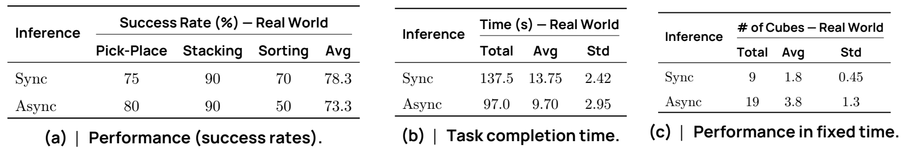

**Figure 5.** (a) task별 score, (b) pick-place 완료시간, (c) 고정시간 pick-place 수. 세 패널은 서로 다른 지표다. [PDF p.12, §4.6; [원문](https://arxiv.org/pdf/2506.01844v1#page=12)]

### 12.1 성공 점수는 모든 task에서 보존되지 않는다

| 모드 | Pick-place | Stacking | Sorting | Avg. |
|---|---:|---:|---:|---:|
| Sync |75|90|70|78.3|
| Async |80|90|50|73.3|
| 차이 |+5|0|−20|−5.0|

논문은 두 모드의 성능이 비슷하다고 표현한다. 그러나 task별로는 **sorting의20%p 하락**이 크며, 평균도5%p 낮다. 비동기가 자동으로 accuracy-neutral하다는 결론은 성립하지 않는다. hyperparameter는pick-place에 맞춰 최적화한 뒤 다른 task에 재사용했으므로, sorting 저하는 task별 tuning의 필요성 또는 long-horizon chunk transition 문제를 시사한다. 어느 원인이 실제인지 raw rollout이나 독립 ablation으로 입증되지는 않았다.

### 12.2 완료시간: 13.75초에서 9.70초

| 모드 |10trial 총시간(s)|평균(s)|표준편차(s)|
|---|---:|---:|---:|
| Sync |137.5|13.75|2.42|
| Async |97.0|9.70|2.95|

원문은 5가지 cube 위치와 10 trials로 pick-place 완료시간을 측정한다. total/mean도 10 trials에 맞는다. 시간 측정은 **로봇이 움직이기 시작할 때부터**다. 최초 image를 받은 뒤 첫 action을 얻을 때까지의 startup TTFA를 포함한다고 볼 수 없다.

```math
\text{시간 감소율}=\frac{13.75-9.70}{13.75}\times100\simeq29.45\%,\qquad \text{완료 속도비}=\frac{13.75}{9.70}\simeq1.418.
```

29.5% **시간 감소**와41.8% **작업 완료 속도 증가**는 분모가 다르다. 논문의 “약30% faster”를 기술 문서에서는 완료시간29.5% 감소로 쓰는 편이 명확하다. 이 숫자는 expert10step latency, VLM prefill latency, GPU kernel throughput에 관한 직접 측정이 아니다.

async 표준편차는2.95로sync2.42보다 크다. 평균이 좋아졌다고 tail 또는 worst case가 좋아졌다고 결론낼 수 없다. latency percentile이나 반복 task의 deadline miss는 보고되지 않는다.

### 12.3 고정시간 작업 수: 9개에서 19개

| 모드 |총 cube 수|평균|표준편차|
|---|---:|---:|---:|
| Sync |9|1.8|0.45|
| Async |19|3.8|1.3|

[검산]19/9≈2.111이므로 총 작업 수는약111.1% 증가했다. 평균1.8/3.8과 총9/19는5개 집계 단위에 대응한다. 원문은60초 같은 고정시간 제한을 예로 들지만 각 trial의 exact reset/재배치 처리와 시간 예산 적용 세부를 모두 명시하지 않는다. 따라서 “단일60초 trial에서19개 성공”이라고 단정하지 않고 **보고된 고정시간 평가의 총합19개**로 표현한다.

완료시간 속도비1.418과 작업 수비2.111이 다르더라도 바로 계산 오류가 아니다. 둘은 다른 protocol이고 reset·물체 재배치·실패·대기·replanning 등의 영향을 다르게 받는다. 같은 값이어야 한다는 전제가 없다.

### 12.4 정성적 반응성 주장

[저자 보고] 물체 이동과 외란에 더 빠르게 적응하는 모습을 관찰했다고 한다. 이 주장은 영상/정성적 관찰에 해당한다. Figure5는 외란 크기, 발생 시점, recovery latency 분포를 통제한 disturbance benchmark를 제공하지 않는다. 따라서 그 문장을 강건성 보증이나 장애물 회피 성능으로 확장하지 않는다.

### 12.5 효율 지표를 구분하는 표

| 지표 | 무엇을 측정하는가 | 이 논문으로 확정할 수 있는 범위 |
|---|---|---|
| parameter 수 | 저장/학습 모델 규모 |main약450M, expert약100M |
| visual token 수 | VLM에 전달되는 sequence |global frame당64 |
| FLOPs·layer count | neural 계산 구조 |32→16LLM층, 작은 expert; 전체 FLOPs 실측표 없음 |
| VLM prefill | 한 관측의 prefix KV 생성 |코드에서1회 수행·cache 재사용 확인, 장치별 latency 미보고 |
| action denoising | expert10회 평가 |코드 경로 확인, 독립 per-step latency 미보고 |
| TTFA | 관측 수신→첫 실행 가능 action |직접 latency distribution 없음 |
| policy refresh Hz | 새 관측으로 정책 결과가 갱신되는 비율 |sync/async·실행step에 따라 달라짐 |
| actuator command Hz | hardware command 전달률 |예시 환경30Hz; VLM30Hz를 의미하지 않음 |
| task completion time | 로봇 동작 시작→task 완료 |pick-place13.75→9.70초 |
| completed-task throughput | 제한시간 내 완료 작업 수 |집계9→19 |
| training speed/memory | optimizer step 및 peak allocation |π0대비40%faster·6배 적은memory라는 본문 주장; 장치·batch·프로파일 상세 없음 |

“single GPU에 들어감”, “추론이 빠름”, “로봇이 일을 빨리 끝냄”은 관련되지만 서로 대체 가능한 증거가 아니다.

<a id="ablations"></a>

## 13. §4.7 모든 ablation 표

공통 조건은LIBERO, robotics pretraining 없음, frozen VLM, 새 expert 학습이다. 원문 표의 S/O/G/10은Spatial/Object/Goal/Long(LIBERO-10)을 나타내는 열로 읽는다. 아래의 “차이”는 success percentage point다. 각 표의 baseline 평균이80.3,74.5,85.5 등으로 다르므로 표 사이를 아무 설명 없이 이어 붙여 하나의 누적 ablation으로 만들지 않는다. [PDF pp.12–14, §4.7]

### 13.1 Table 6: CA, SA, 교대형 CA+SA

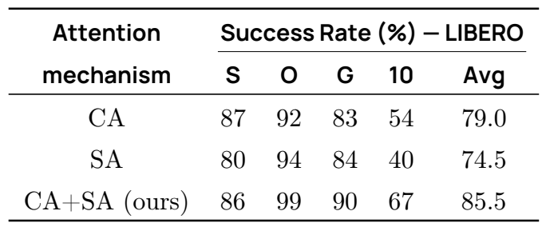

| 방식 |S|O|G|10|Avg.|
|---|---:|---:|---:|---:|---:|
|CA|87|92|83|54|79.0|
|SA|80|94|84|40|74.5|
|CA+SA|86|99|90|67|85.5|

교대형은 CA보다 +6.5, SA보다 +11.0이다. 특히 Long은 CA 54→67, SA 40→67로 증가한다. 관측 특징을 읽는 CA와 action 간 관계를 만드는 SA가 보완적이라는 저자 해석과 맞는다.

다만 CA+SA가 Spatial에서는 CA보다 1 낮고, latency 수치가 이 표에 없으므로 “교대형이 모든 영역에서 더 정확하고 수치상 더 빠르다”까지 직접 증명하지 않는다. 성공률 개선과 효율 추정은 별도의 근거다.

### 13.2 Table 7: bidirectional과 causal action mask

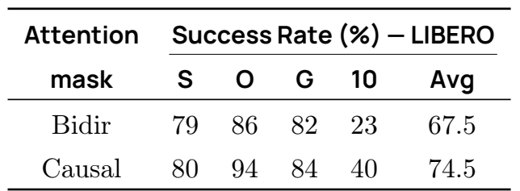

| Mask |S|O|G|10|Avg.|
|---|---:|---:|---:|---:|---:|
|Bidirectional|79|86|82|23|67.5|
|Causal|80|94|84|40|74.5|

causal은 평균 +7.0, Long +17이다. 현재 이 조건에서는 action의 미래 위치를 가리는 inductive bias가 유리했다는 결과다.

caption의 “future action leakage 방지”는 신중하게 읽는다. flow matching training에서는 모든 action 위치에 noisy target이 있고 inference에서도 모든 noisy position을 동시에 갖는다. bidirectional attention이라는 이유만으로 test-time의 정답 행동을 부정하게 본다고 할 수 없다. **ground-truth leakage**와 **noisy future action dependency**는 다르다. 이 표는 causal 구조의 경험적 이득을 보여주지만, bidirectional flow matching이 원리적으로 잘못된 방법이라는 정리는 아니다.

### 13.3 Table 8: VLM depth와 작은 backbone

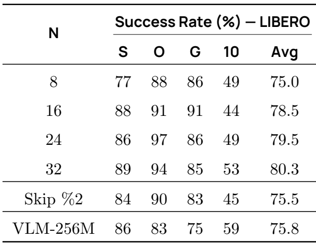

| 구성 |S|O|G|10|Avg.|
|---|---:|---:|---:|---:|---:|
|N8|77|88|86|49|75.0|
|N16|88|91|91|44|78.5|
|N24|86|97|86|49|79.5|
|N32|89|94|85|53|80.3|
|매2번째 layer skip|84|90|83|45|75.5|
|VLM256M|86|83|75|59|75.8|

N=16은 N=32 대비 평균 −1.8 정도로, VLM/expert depth를 절반으로 줄이는 타협점이 된다. N=8은 75.0으로 손실이 더 크다. N=16의 Goal 91은 N=32의 85보다 높으므로 깊을수록 모든 task가 좋아지는 것도 아니다.

본문은 every-second skip이 smaller VLM보다 좋다고 쓰지만, **표에서는 75.5 < 75.8**이다. 반대로 앞 16층의 78.5가 VLM256M의 75.8보다 높은 결과는 확인된다. 어떤 방법이 좋은지는 이 두 비교를 분리해야 한다.

layer를 절반으로 줄여도 vision encoder, tokenization, projector, 10-step loop overhead, client/server 비용은 남는다. 논문의 “LLM/expert 계산 절반”을 “전체 robot latency 절반”으로 확대하지 않는다.

### 13.4 Table 9: expert width

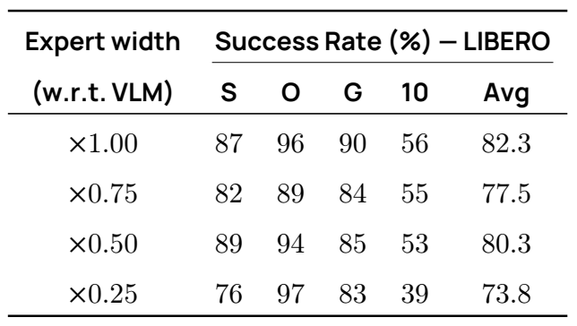

| VLM대비 폭 |S|O|G|10|Avg.|
|---|---:|---:|---:|---:|---:|
|1.00|87|96|90|56|82.3|
|0.75|82|89|84|55|77.5|
|0.50|89|94|85|53|80.3|
|0.25|76|97|83|39|73.8|

전체적으로 아주 작은 0.25는 불리하지만 0.50이 0.75보다 2.8%p 높다. 따라서 “capacity가 커질수록 단조 증가”와 “0.75가 표에서 최적 타협”은 그대로 입증되지 않는다. 정확한 latency·memory·seed 분산을 함께 보고 width를 선택해야 한다.

0.75와 0.50의 차이가 random seed 변동, recipe 차이, architecture 상호작용 때문인지 원문은 밝히지 않는다. 동일한 latency budget에서 n·N·width·K를 함께 비교하는 후속 실험이 더 설득력 있다.

### 13.5 Table 10: flow matching과 L1 regression

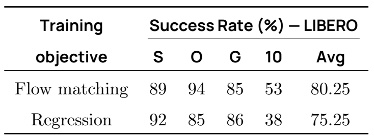

| Objective |S|O|G|10|Avg.|
|---|---:|---:|---:|---:|---:|
|Flow matching|89|94|85|53|80.25|
|L1 regression|92|85|86|38|75.25|

평균 +5.00이고 Long +15, Object +9다. 반면 Spatial −3, Goal −1이다. multimodal trajectory를 vector field로 모델링하는 장점이라는 저자 설명과 일부 맞지만, direct regression의 추론 비용은 더 낮을 수 있으므로 **accuracy와 cost를 동시에 비교**해야 실용 판단이 된다. Table 10은 동일 지연 예산에서의 Pareto curve를 제공하지 않는다.

비번호 L1 대조 objective를 풀어 쓰면 다음과 같다. 이는 본문 설명에 대응하는 **리뷰 보조식**이다.

```math
\mathcal L_{L1}=\mathbb E\!\left[\|\widehat A(o_t)-A_t\|_1\right].
```

flow loss는 v와 u를 비교하고, L1은 예측 clean chunk와 정답 chunk를 비교한다. 두 loss의 raw 숫자를 서로 같은 척도로 해석하면 안 된다.

### 13.6 Table 11: state의 prefix/suffix 위치

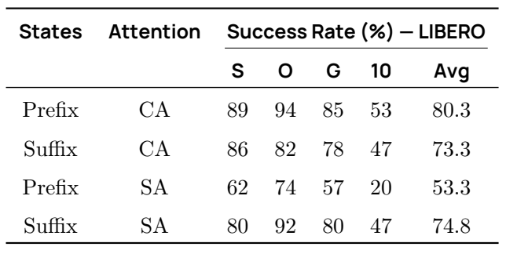

| State위치 |Attention|S|O|G|10|Avg.|
|---|---|---:|---:|---:|---:|---:|
|Prefix|CA|89|94|85|53|80.3|
|Suffix|CA|86|82|78|47|73.3|
|Prefix|SA|62|74|57|20|53.3|
|Suffix|SA|80|92|80|47|74.8|

**본문과 caption은 state를 VLM에 넣는 prefix가 낫다고 일반화하지만, 표의 SA 행은 반대다.**

- CA에서는 prefix−suffix가 +7.0%p다.
- SA에서는 prefix−suffix가 −21.5%p다.
- 따라서 state 위치는 attention 방식과 상호작용한다. “CA 기반에서는 prefix가 좋았다”는 읽기는 맞지만 “CA와 SA 둘 다 prefix가 좋았다”는 문장은 표와 일치하지 않는다.
- 표에는 main CA+SA의 prefix/suffix 직접 비교 행이 없다. main 선택의 효과를 이 표만으로 완전히 분리할 수 없다.

현재 코드는 state를 prefix에 넣으며 image/text가 state를 보지 못하는 mask를 사용한다. 이러한 mask 세부가 성능 차이에 영향을 줄 수 있지만, 구체적인 실패 원인을 실험 없이 확정하지 않는다.

### 13.7 Table 12: 예측 chunk 길이n

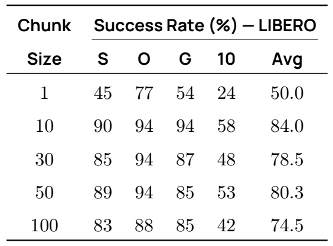

| n |S|O|G|10|Avg.|
|---|---:|---:|---:|---:|---:|
|1|45|77|54|24|50.0|
|10|90|94|94|58|84.0|
|30|85|94|87|48|78.5|
|50|89|94|85|53|80.3|
|100|83|88|85|42|74.5|

n=1은 미래 sequence supervision을 거의 잃고, n=100은 긴 미래에 대한 불확실성과 계산량이 커진다. n=10–50이 타협 영역이라는 해석은 가능하지만, 최고 평균은 n=10의 84.0이다. default 50이 정확도 최고라서 선택되었다고 설명하지 않는다.

주요 효과는 **학습 목표와 prediction horizon**의 변화다. simulator에서는 통상 1 action마다 새 관측을 보므로 n=50이라고 반드시 50 action을 모두 실행한 것은 아니다. 이 구분이 다음 표와의 핵심 차이다.

### 13.8 Table 13: 새 observation 전에 실행한 action 수m

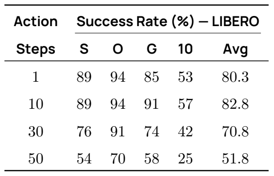

| m |S|O|G|10|Avg.|
|---|---:|---:|---:|---:|---:|
|1|89|94|85|53|80.3|
|10|89|94|91|57|82.8|
|30|76|91|74|42|70.8|
|50|54|70|58|25|51.8|

m=50→m=1은 +28.5%p이며 Long 25→53이다. 전체 chunk를 open-loop 실행할수록 관측이 지금 상태에서 멀어지고 오차를 정정할 기회가 줄어드는 문제를 잘 보여준다.

그렇다고 m=1이 항상 최고인 것은 아니다. m=10은 m=1보다 +2.5%p다. 빈번한 재계획의 부정확성, chunk 초반 bias, seed 변동 등이 가능한 설명이지만 원문으로 원인을 확정할 수 없다. 따라서 “더 자주 관측할수록 단조적으로 성공률 증가”보다 “m=30/50처럼 긴 open-loop 실행은 크게 불리했다”가 정확하다.

### 13.9 ablation에서 실제로 얻을 수 있는 설계 원칙

1. 관측 특징을 읽는 CA와 action 사이 관계를 만드는 SA의 결합을 우선 검토할 만하다.
2. VLM 앞부분만으로도 많은 task 성능을 유지하므로 target별 depth 실험 가치가 있다.
3. state 위치와 attention은 독립적인 설정 변수가 아니다.
4. 예측 n, 실행 m, flow step K, async threshold g를 서로 다른 변수로 기록해야 한다.
5. 모든 ablation의 정확도 차이를 최종 87.3에서 더하고 빼면 안 된다. experiment별 기준 설정과 seed가 필요하다.

<a id="code-audit"></a>

## 14. 공식 구현 대조와 논문 내부 불일치

### 14.1 정적 검사한 소스 범위

모든 코드 링크는 commit `2774d9bddcbbda50e697e162e89e7eaada8d7105`에 고정했다. 코드 파일은 독립 작업 디렉터리에 읽기 전용 snapshot으로 내려받아 조사했으며 기존 GitHub 작업 폴더를 수정하지 않았다.

| 공식 파일·함수 | 확인한 핵심 동작 |
|---|---|
| [configuration_smolvla.py](https://github.com/huggingface/lerobot/blob/2774d9bddcbbda50e697e162e89e7eaada8d7105/src/lerobot/policies/smolvla/configuration_smolvla.py) |n50,m50,K10,N16,폭0.75,32차원pad,학습flag,optimizer/scheduler preset |
| [processor_smolvla.py](https://github.com/huggingface/lerobot/blob/2774d9bddcbbda50e697e162e89e7eaada8d7105/src/lerobot/policies/smolvla/processor_smolvla.py) |feature rename, batch, newline, tokenizer,device,normalization,action inverse transform |
| [SmolVLAPolicy.forward](https://github.com/huggingface/lerobot/blob/2774d9bddcbbda50e697e162e89e7eaada8d7105/src/lerobot/policies/smolvla/modeling_smolvla.py#L277) |actual action dim slice,episode mask,valid-count loss reduction |
| [VLAFlowMatching](https://github.com/huggingface/lerobot/blob/2774d9bddcbbda50e697e162e89e7eaada8d7105/src/lerobot/policies/smolvla/modeling_smolvla.py#L466) |state/action/time projection,prefix/suffix,noise interpolation,flow loss,cache와sampling |
| [SmolVLMWithExpertModel](https://github.com/huggingface/lerobot/blob/2774d9bddcbbda50e697e162e89e7eaada8d7105/src/lerobot/policies/smolvla/smolvlm_with_expert.py#L74) |LLM truncation,expert config,layer별SA/CA,GQA,RoPE,parameter freeze |
| [flow_matching.py](https://github.com/huggingface/lerobot/blob/2774d9bddcbbda50e697e162e89e7eaada8d7105/src/lerobot/policies/common/flow_matching.py) |Beta sampling과음의dt Euler loop,RTC hook |
| [vla_utils.py](https://github.com/huggingface/lerobot/blob/2774d9bddcbbda50e697e162e89e7eaada8d7105/src/lerobot/policies/common/vla_utils.py) |sinusoidal time,masks,zero padding,resize+pad |
| [robot_client.py](https://github.com/huggingface/lerobot/blob/2774d9bddcbbda50e697e162e89e7eaada8d7105/src/lerobot/async_inference/robot_client.py) |queue,lock,receive thread,timestep별merge,threshold,control pacing |
| [policy_server.py](https://github.com/huggingface/lerobot/blob/2774d9bddcbbda50e697e162e89e7eaada8d7105/src/lerobot/async_inference/policy_server.py) |최신observation queue,predict_action_chunk,pre/postprocessor,timed actions |
| [helpers.py](https://github.com/huggingface/lerobot/blob/2774d9bddcbbda50e697e162e89e7eaada8d7105/src/lerobot/async_inference/helpers.py)·[configs.py](https://github.com/huggingface/lerobot/blob/2774d9bddcbbda50e697e162e89e7eaada8d7105/src/lerobot/async_inference/configs.py) |joint-space L2 filter,TimedObservation/TimedAction,aggregation registry |

### 14.2 논문과 코드의 차이를 한곳에 모으면

| 쟁점 | 원문 | 현재 공식 구현/검산 | 리뷰의 처리 |
|---|---|---|---|
| Flow 시간 방향 |τA+(1−τ)ε, target ε−A|rε+(1−r)A, target ε−A, r=1→0|인쇄식과 코드식을 분리하고 부호를 미분으로 설명 |
| VLM features |N번째 표현과 “앞 N층 전체”가 혼재|각 layer의 K/V를 expert가 읽음|final hidden 하나로 축약하지 않음 |
| SA의 참조 범위 |action끼리 SA한다고 설명|action이 prefix와 과거 action에도 attention|block mask를 직접 표시 |
| Frozen VLM |expert만 학습|state projector 등도 trainable|parameter와 input gradient 경계를 구분 |
| warmup |100|현재 config/checkpoint는 1000|현재 default를 논문 recipe로 소급하지 않음 |
| sequence 고정 |fixed length로 compile 최적화|class는 pad_language_to=longest, checkpoint는 max_length 48|사용 config를 명시적으로 고정 |
| pretrained VLM 초기화 |작은 pretrained VLM 활용|class는 load_vlm_weights=False, checkpoint는 True|fresh config와 whole-checkpoint loading 구분 |
| Attention backend |속도를 고려한 설계|eager matmul+softmax, GQA expand, Q/K float32|FlashAttention 실행으로 오인하지 않음 |
| 큐 trigger |잔여/n<g|현재는 <=g|g=0의 literal pseudocode 문제 명시 |
| 관측 필터 위치 |client/server 개념 설명|server에서 joint state·timestep 필터|송신률과 실제 추론률 구분 |
| RTC |원문 Algorithm 1은 queue async|현재 policy에 별도 RTC option|2025년 논문의 기여로 합치지 않음 |

fresh `SmolVLAConfig()`를 이용해 expert를 처음 학습할 때 `load_vlm_weights=False`이면 `SmolVLMForConditionalGeneration(config=...)`로 VLM을 생성하는 branch가 선택된다. `train_expert_only=True`도 유지한다면 random VLM을 frozen하는 구성이 될 수 있다. 반면 완성된 SmolVLA checkpoint를 `from_pretrained`로 불러올 때는 전체 state dict가 채워지는 별도 경로다. **기본값만 복사해 논문의 pretrained-VLM 초기화를 재현했다고 가정하지 말아야 한다.** 실제 학습 config와 checkpoint load 로그를 점검해야 한다.

현재 `get_attention_interface()`는 명시적으로 `eager_attention_forward`를 반환한다. VLM config에 FlashAttention 관련 field가 남아 있어도 이 custom expert 경로의 backend를 증명하지 않는다. 코드가 Q/K를float32로 올리고 score matrix를 materialize하는 점도 성능 예측에 중요하다. [smolvlm_with_expert.py L511–560](https://github.com/huggingface/lerobot/blob/2774d9bddcbbda50e697e162e89e7eaada8d7105/src/lerobot/policies/smolvla/smolvlm_with_expert.py#L511)

### 14.3 숫자·문구 불일치의 심각도

| 불일치 | 위치 | 영향 |
|---|---|---|
|10M episodes라는 caption |Table 1 p.5|frame 수를 episode 수로 읽으면 규모가 약 463배 달라지는 단위 오류 |
|481 datasets 대 532개 인쇄 ID |§3.2와 Appendix|실제 training subset 식별이 불확실 |
|τ 보간과 velocity 부호 |§3.1 p.4|독립 재구현의 sampling 방향을 잘못 정할 수 있음 |
|SO101이라고 설명한 Table 3 문단 |p.11|SO100/SO101 실험 혼동 |
|skip-every-second가 작은 VLM보다 낫다는 문장 |Table 8 p.13|75.5<75.8이라는 표와 반대 |
|큰 폭이 항상 더 좋다는 해석 |Table 9 p.13|폭 0.50의 점수가 0.75보다 높다는 사실을 놓침 |
|prefix가 CA/SA 모두 우월하다는 설명 |Table 11 p.14|SA의 53.3<74.8과 반대 |
|n개라면서 t…t+n 표기 |§3.1·3.3|action 축의 off-by-one 위험 |
|g=0과 strict < |Algorithm 1·§3.3|empty queue에서 재요청할 수 없는 literal edge case |

이 항목들은 직접 원문 이미지와 소스에 근거한다. 논문이 틀렸다는 포괄적인 평가보다, 재현할 때 어느 문장을 기준으로 무엇을 고정해야 하는지를 알려 준다. 현재 코드가 모두 검증된 정답이라 가정하는 것도 피한다. runtime numerical parity와 robot 결과는 별도의 검증이다.

### 14.4 공개 checkpoint 크기와 메모리의 의미

Hub의 safetensors 메타데이터는F32 3,273,552개, BF16 446,772,624개를 보고한다. 저장 tensor가 보고 dtype대로 존재한다고 가정하면 순수 weight bytes는 다음과 같다.

```math
4\cdot3{,}273{,}552+2\cdot446{,}772{,}624=906{,}639{,}456\ \mathrm{bytes}\simeq864.64\ \mathrm{MiB}.
```

[검산] 이 수치는 inference VRAM 요구량이 아니다. checkpoint loader의 cast, allocator, vision activation, attention score, cache, CUDA context와 workspace가 추가된다. training에는 gradient·Adam moments·가능한 master weights·autograd graph가 더 필요하다. 작은 weight size만으로 특정 소비자 GPU에서 논문의 global batch 256을 그대로 학습할 수 있다고 단정하지 않는다.

### 14.5 실행 검증의 경계

본 작업은 소스의 호출·mask·shape·수식·값을 정적으로 대조하고, 문서에 들어가는 산술 예제와 표 평균을 계산했다. full model weight를 load하거나 PyTorch에서 로봇 batch의loss/backward를 실행하지 않았고, GPU kernel profiling이나 hardware-in-loop 평가도 수행하지 않았다. source-level 확인에 “공식코드확인” label을 붙였으며 “실험재현완료”라고 표현하지 않는다.

<a id="limitations"></a>

## 15. §5–6 논의, 한계와 재현성

### 15.1 저자가 인정한 한계

§5.1은 다음 일곱 방향을 명시한다. [PDF pp.14–15]

1. **Embodiment 다양성:** pretraining이 SO100에 한정되며, 여러 robot의 행동 표현을 공동 학습하는 확장이 필요하다.
2. **Dataset 규모:** 약 23K trajectory는 대형 VLA의 데이터보다 작다. 더 많은 데이터가 일반화를 도울 가능성이 있다.
3. **Model 규모와 효율:** 작은 모델의 접근성을 유지하며 capacity를 확장하는 문제가 남는다.
4. **VLM backbone 적합성:** document/OCR 등에 강한 사전학습이 로봇 접촉·공간 관계·운동 추정에 최적인지 불명확하다.
5. **Multimodal/robotics 공동학습:** 일반 VL 데이터와 robot 데이터를 함께 학습하는 방향을 제안한다.
6. **Task 복잡도:** 비교적 짧고 단순한 task를 넘어 long-horizon·hierarchical control로 확장해야 한다.
7. **학습 패러다임:** imitation을 넘어 RL을 활용한 복잡 task·미세조작 적응 가능성을 논의한다.

이 일곱 항목은 현재 성능의 실험적 확장을 위한 연구 방향이다. 공동학습·RL·계층 정책이 이 checkpoint에 이미 구현되어 주 결과를 만들었다는 뜻은 아니다.

§6 acknowledgements는 community/simulation data 기여, 초기 비동기 작업, Hugging Face 팀 지원과 IDRIS/GENCI·PostGenAI@Paris 지원을 밝힌다. 이 지원 정보를 근거로 GPU 기종이나 개별 run의 시간을 추정하지 않는다. References 전체는 관련 연구의 출처를 확인하는 데 사용했으며 별도의 기술 부록으로 간주하지 않았다.

### 15.2 리뷰어가 추가로 보는 실패 조건

| 실패 조건 | 왜 생길 수 있는가 | 관찰할 신호 |
|---|---|---|
|작은 물체·얇은 도구·투명 물체|global view+64 token의 공간 압축, robot-specific 시각 학습 부족|grasp 오차, 대상 혼동, OOD 점수 |
|새 camera 순서·새 calibration|token slot과 state/action 정렬 불일치|동일 scene에서 camera 순서만 바꿔도 성능 변화 |
|긴 open-loop 실행|관측 age 증가와 누적 오차|m=30/50에서 성공률 하락, contact 전환 실패 |
|stationary arm에서 환경만 변화|joint-space 필터는 image 변화에 둔감|cube 이동 후 replan 누락·empty queue 대기 |
|chunk 전환의 동작 불연속|새 observation의 계획이 이전 계획과 불일치|joint target jump, gripper toggle, jitter |
|server 부하·network tail|평균 latency 기준의 g가 tail을 흡수하지 못함|queue underflow, p99 age, deadline miss |
|instruction 미세 차이|noisy annotation·짧은 task template에 과적합|색상·좌우·순서를 바꾼 instruction에서 오류 |
|중복 trajectory·변형 dataset|상관 높은 sample이 유효 다양성을 부풀림|dataset-ID 분할과 원본 group 분할 간 gap |

위 항목은 failure mechanism의 후보이지 본 작업에서 관찰한 robot 실패 로그가 아니다. 이미 보고된 Table 13·Figure 5와 일관된 부분도 있지만 구체적인 원인은 추가 실험으로 구별해야 한다.

### 15.3 재현 가능한 후속 검증의 순서

**Gate 1: 입력과 학습 설정 고정.** arXiv 버전, code commit, transformers 버전, base checkpoint revision, 실제 load한 parameter의 hash, action 단위와 순서, camera mapping, normalization stats를 확정한다. 현재 LeRobot의 dependency 범위는 원래 논문 시점과 다를 수 있다.

**Gate 2: 연산 동등성 확인.** 고정된 CPU/GPU sample의 image tensor, 177-token prefix mask, time embedding, layer별 K/V, velocity를 확인한다. cache-on/off 또는 새 attention backend 비교는 noise/time을 고정하고 one-step velocity부터 비교한다. 여기는 실제 robot 실행 전의 offline 단계다.

**Gate 3: 동일 조건의 benchmark.** 동일 split·seed·camera·n/m/K·training step·pretraining을 유지한다. CA/SA, m, N, width 같은 변수를 한 번에 하나씩 바꾸고, 각 run의 success와 latency를 함께 기록한다. 가능한 경우 seed를 반복해 변동성을 제시한다.

**Gate 4: 시스템 시간 측정.** capture, preprocess, H2D, vision, prefix, expert 10-step, D2H, merge, command 전송을 구분하고 warmup·JIT을 따로 측정한다. GPU 부분은 비동기 launch 때문에 명시적인 동기화나 GPU event가 필요하다.

**Gate 5: closed-loop task 평가.** 기본 sync를 먼저 고정한 뒤 async를 추가한다. 같은 task·위치·시간 예산에서 완료율, 부분 점수, 완료시간, queue underflow, 관측 age, 동작 전환을 모두 비교한다. 이 단계의 실행은 본 작업에서 수행하지 않았다.

### 15.4 논문에서 빠진 재현 자료

실제 481개 dataset의 revision 및 episode 선택, 532-ID 목록과의 관계, 전체 annotation 출력, camera remap 표, 모든 run config·seed·best checkpoint 선정, 시뮬레이터 commit, real-world denominator/raw score, async g·similarity threshold·aggregation weight와 hardware/network 설정이 필요하다. 이 자료가 없으면 표의 숫자를 정밀하게 재현하거나 일부 작은 차이를 원인별로 분해하기 어렵다.

접근성의 정확한 평가에는 단일 GPU에서의 batch·peak memory·step/s·wall time·실제 성공률이 필요하다. 논문의 프로젝트 총 30k GPU-hour를 한 모델의 학습시간으로 나눠 소비자 GPU 소요시간을 계산하는 것은 타당하지 않다.

<a id="deployment"></a>

## 16. OpenVLA·Jetson Thor·TensorRT와의 연결

### 16.1 OpenVLA와 연결해서 공부할 때

| 비교 축 | SmolVLA | 이 논문이 소개한 OpenVLA |
|---|---|---|
|행동표현|continuous action chunk|discrete action token |
|생성루프|고정noise chunk에10회vector-field update|action token의autoregressive생성 |
|VLM역할|관측prefix와층별K/V제공|시각·언어조건의action token생성 |
|main규모|약0.45B|Table2의7B |
|LIBERO robotics PT|No|Yes |
|Table2평균|87.3|76.5 |

[PDF p.3, §2; p.11, Table2]

이 비교에서 학습할 핵심은 **행동을 무엇으로 표현하고 어디에서 반복 계산하는가**다. autoregressive policy의 action token decode loop를 줄이는 기법을 SmolVLA에 그대로 적용할 수는 없다. SmolVLA에서는 prefix를 새로 계산하는 cost와 expert를 K회 반복하는 cost가 분리되어 있다.

반대로 관측의 시간적 중복을 활용하는 아이디어는 SmolVLA의 새 prefix 계산에도 연결할 수 있다. 단, 현재 prefix KV cache는 동일 observation의 denoising 내 재사용이다. **서로 다른 camera frame 간 VLM 표현을 안전하게 재사용하는 기능은 이 논문에서 검증하지 않았다.** 접촉 전환과 작은 물체 움직임에서 stale feature의 영향을 분리해 검증해야 한다.

### 16.2 Thor 배포에서 먼저 분리할 실행 단위

이 절은 전부 **[후속 연구 제안]**이다. 논문과 검사한 SmolVLA 코드는 Jetson AGX Thor용 TensorRT engine의 성능표나 실시간 보증을 제공하지 않는다.

| 실행 단위 | 예상 입력/출력 | 포팅·검증 초점 |
|---|---|---|
|image preprocessor|camera RGB→512×512 tensor|resize·padding 위치·색상 범위 동등성 |
|vision encoder+connector|image→64×960 tokens|camera 수, batch 1, shuffle 정확성 |
|prefix 16층|image/text/state tokens→layerwise KV|block mask, RMSNorm, RoPE, GQA, key dtype |
|one expert step|X 50×32, time, prefix KV→V 50×32|residual 폭 720/attention 폭 960, CA adapter, cache 쓰기 범위 |
|flow integrator|noise+10 expert steps→action chunk|time 1→0, dt −0.1, FP32 accumulation 기준 |
|queue controller|timed chunk→robot command|timestep drop, overlap merge, 관측 age, underflow |

첫 구현은 이 단위별로 reference PyTorch와 입출력 parity를 비교하는 것이 좋다. expert loop를 한 번에 export할지 one-step engine을 10회 호출할지는 실제 launch 오버헤드·KV 전달 비용·그래프 지원에 따라 정한다. tensor shape 고정은 최적화 기회를 주지만 padding 및 missing-camera 상태를 맞춰야 한다.

### 16.3 성능 최적화 후보와 주의할 연산

1. **VLM prefix와 expert를 분리한 profiling:** 어느 쪽이 병목인지 확인한 뒤 N·K·camera 수 최적화를 선택한다.
2. **eager attention의 대체:** 현재 score를 materialize하므로 지원되는 fused attention 경로의 가능성을 검토한다. 단, block mask, GQA, CA의 post-RoPE K projection, FP32 upcast를 맞춰야 한다.
3. **CA adapter의 중복 계산:** 한 observation 내 동일 prefix K/V에 대한 projection을 미리 계산할 수 있는지 검토한다. 출력 동등성 확인 후 latency를 측정한다.
4. **고정 shape와 buffer 재사용:** B=1, n=50, P 고정 조건에서 allocator와 transfer를 줄일 수 있는지 실측한다.
5. **precision별 검증:** FP16/BF16 기준을 먼저 맞추고 필요시 더 낮은 precision을 검토한다. 작은 velocity 오차가 10-step 적분과 contact 동작에서 어떻게 누적되는지 평가한다.

TensorRT로 export 가능한 module이 있다는 것과 전체 정책이 같은 성공률·tail deadline을 만족한다는 것은 다른 판정이다. 여기서는 특정 TensorRT 버전의 operator 지원이나 NVFP4 속도를 확정하지 않는다. 실제 Thor의 software stack에 맞춰 지원과 build를 검증해야 한다.

### 16.4 공정한 배포 실험의 최소 행렬

| 비교 | 고정할 조건 | 보고할 결과 |
|---|---|---|
|PyTorch→TensorRT|checkpoint, noise, images, state, n, m, K, precision|one-step velocity 오차, chunk 오차, 단계별 latency |
|bf16/fp16→낮은 precision|같은 checkpoint와 calibration/eval 분리|오차 분포, task score, contact 구간 실패 |
|K=10→작은 K|나머지 architecture와 execution 동일|TTFA·expert 시간·성공률 trade-off |
|N=16→작은 N|별도 재학습 조건·데이터·예산 명시|quality/time 곡선; inference에서 층만 삭제하는 것과 재학습 구분 |
|sync→async|동일 neural policy, n, K, hardware|완료시간·점수·queue age·underflow |
|local→remote inference|동일 policy와 task|network를 포함한 round trip, p95/p99, drop과 stall |

단일 팔 tabletop 실험에서는 두 camera·작은 gripper action·짧은 pick/stack/sort에 맞춰 위 실험을 시작할 수 있다. 다만 SO100 공개 checkpoint의 action 단위를 다른 팔의 joint나 Cartesian command로 바꾸려면 robot-specific data·normalization·adapter 검증이 필요하며 단순 reshape는 해결책이 아니다.

<a id="qa"></a>

## 17. Q&A와 권장 학습 순서

**Q1. SmolVLA의 언어모델이 로봇 행동을 말로 생성하나?**  
아니다. pretrained VLM의 표현을 action expert에 전달하고 연속값 chunk를 생성한다. 공개 정책 경로에서 자연어 답변을 decode하지 않는다.

**Q2. Action expert가 100M이면 VLM은 학습에 전혀 관여하지 않나?**  
관측 표현을 제공하므로 중요하다. 가중치를 freeze하더라도 trainable state projector로 이어지는 input gradient는 VLM 연산을 통과할 수 있다.

**Q3. 왜 500M VLM으로 450M VLA를 만들 수 있나?**  
뒤쪽 LLM 층을 삭제한 뒤 expert를 붙인다. backbone 명목 크기와 최종 활성 모듈의 크기가 다르기 때문이다.

**Q4. 64 token은 vision encoder까지 64 patch만 계산한다는 뜻인가?**  
아니다. global image의 vision encoder 이후 connector에서 token을 줄여 language decoder로 보내는 길이다.

**Q5. SA가 causal이면 chunk 50개를 50번 forward하나?**  
아니다. 50개 noisy action을 동시에 처리하며 attention의 허용 관계만 causal하다. 10번 반복되는 축은 flow 적분이다.

**Q6. 원문 flow 식을 그대로 구현하면 되나?**  
보간과 velocity 부호가 같은 시간 방향에서 맞지 않는다. 원문 표기를 보존해 읽되 구현은 rε+(1−r)A, velocity ε−A, r=1→0이라는 공식 코드 convention을 함께 확인해야 한다.

**Q7. LIBERO 87.3은 community data의 효과인가?**  
Table 2의 SmolVLA는 robotics pretraining이 없다. community pretraining 효과는 Table 5의 실제 SO100 비교에서 확인한다.

**Q8. SO101은 zero-shot 새 로봇 평가인가?**  
SO101 pretraining이 없지만 target task로 single-task training을 한 후 평가한다. zero-shot으로 표현하지 않는다.

**Q9. async가 inference 자체를 30% 빠르게 하나?**  
보고한 29.5%는 pick-place 작업 완료시간 감소다. neural network forward 지연 감소 측정이 아니다.

**Q10. g=1이면 항상 가장 좋나?**  
요청이 늘고 관측 필터·server 처리량·비슷한 chunk 재계획이 문제가 될 수 있다. g·aggregation·task를 함께 평가해야 한다.

**Q11. 평균 지연 조건을 맞추면 queue가 절대 비지 않나?**  
아니다. latency tail, filter, 통신, 정수 tick 때문에 underflow가 남을 수 있다. 실제 end-to-end 분포를 측정해야 한다.

**Q12. 논문 데이터가 481개인가 532개인가?**  
저자 통계는 481개이고 부록의 인쇄 ID는 532개다. filtering 관계가 없어 실제 사용 subset을 목록만으로 확정할 수 없다.

**Q13. 현재 LeRobot의 RTC가 Algorithm 1 그 자체인가?**  
아니다. Algorithm 1은 큐 기반 비동기 실행 설계이고 현재 RTC는 별도 옵션·denoising hook을 갖는다. 이후 추가된 기능을 원문 결과에 합치지 않는다.

**Q14. 이 논문이 단일 소비자 GPU에서 얼마나 걸린다고 알려주나?**  
단일 GPU 학습 가능성을 말하지만 실제 pretraining은 4 GPU다. 기종별 batch·wall time이 없고 프로젝트 총 30k GPU-hour는 단일 run 시간이 아니다.

**권장 학습 순서:** Figure 1과 shape 사전 → prefix/SA/CA mask → U1–U4의 flow 방향과 작은 예제 → end-to-end forward → Figure 2와 Algorithm 1 → Table 5와 Figure 5 → Table 6–13의 반례 → 공식 code commit과 재현 gate 순으로 읽으면 좋다. 특히 n(예측 길이), m(실행 길이), K(flow step), g(queue threshold)를 종이에 따로 적고 실험표를 읽는 것이 도움이 된다.

<a id="coverage"></a>

## 18. Coverage checklist와 검증 기록

### 18.1 원문 section coverage

| 원문 | 위치 | 대응 리뷰 |
|---|---|---|
|Abstract·Fig.1|p.1|§1–2,§6 |
|§1 Introduction|p.2|§3.1,§4 |
|§2 Related work|pp.2–3|§3.2,§16.1 |
|§3 Overview|p.3|§2,§6,§9 |
|§3.1 VLM·projectors·token reduction|pp.3–4|§5,§6.1–6.4 |
|§3.1 layer skipping|p.4|§6.3,§13.3 |
|§3.1 flow matching|p.4|§7전체 |
|§3.1 interleaved CA/SA|pp.4–5|§6.5–6.7,§13.1–13.2 |
|§3.2 community data|p.5|§8.1–8.4 |
|§3.3 asynchronous inference|pp.5–8|§10전체 |
|§4.1 experimental setup|pp.8–9|§11.1–11.2 |
|§4.2 robots|p.9|§11.1 |
|§4.3 implementation details|p.10|§8.5–8.8,§9,§14 |
|§4.4 baselines|p.10|§11.3 |
|§4.5 main results|pp.10–12|§11.4–11.9 |
|§4.6 async evaluation|p.12|§12전체 |
|§4.7 ablation|pp.12–14|§13전체 |
|§5 Discussion·§5.1 Limitations|pp.14–15|§15–16 |
|§6 Aknowledgements|p.15|§15.1 |
|References|pp.15–20|전체목록확인,§3관련연구의서지원천 |
|Appendix A·A.1 annotation prompt|p.20|§8.2 |
|Appendix A.1 dataset list전체|pp.20–24|§8.4,§14.3;532ID검산 |

### 18.2 수식·알고리즘 coverage

**원문 번호 수식: 0개.** 아래 U번호는 이 리뷰 내부의 편의를 위한 것이며 논문 식 번호가 아니다.

| 식/연산 | 원문 | 대응 리뷰 | PNG |
|---|---|---|---|
|U1 flow-matching expected squared loss|p.4|§7.1|math01 |
|U2 noisy interpolation·Gaussian noise|p.4|§7.2|math02 |
|U3 target velocity ε−A|p.4|§7.2,§7.6|math02 |
|U4 Beta time sampling|p.4|§7.3;parameter는code와구분|math02영역 |
|N=L/2,expert폭0.75d|p.4|§6.3–6.4|Fig.1및본문LaTeX |
|U5 policy/chunk notation|p.5|§10.1|math03 |
|PopFront·Execute·aggregate f|pp.5–6|§10.7–10.8|Algorithm1 |
|U6 잔여/n<g|pp.6–7|§10.3|Algorithm1 |
|joint-space유사도·thresholdε|p.7|§10.3;norm은code·보조식|별도PNG없음,원문정의해설 |
|U7 expected latency sum·approximation|p.7|§10.4|math04 |
|U8 g하한·Δt|p.7|§10.5|math04 |
|g0/0.7/1,1−g,Δt/E[ℓS]<1|p.7|§10.6|Fig.3 |
|U9 관측송신간격|p.8|§10.6|math05 |
|U10 결과수신까지의간격|p.8|§10.6|math05 |
|L1 comparison objective|p.13|§13.5|Table10설명·LaTeX |
|Algorithm1 1–17행|p.6|§10.7전체|algorithm01 |
|attention·mask·RoPE·time embedding·Euler·gradient|code/리뷰보조유도|§6–9|원문식으로오인하지않도록구분 |

### 18.3 Figure와Table coverage

| 도표 | 원문 | 대응 리뷰 | 원문 PNG |
|---|---|---|---|
|Figure1 architecture|p.1|§6|포함 |
|Figure2 async timeline|p.6|§10.2|포함 |
|Figure3 queue evolution|p.7|§10.6|포함 |
|Figure4 robot tasks|p.9|§11.2|포함 |
|Figure5 async results|p.12|§12|포함 |
|Table1 community statistics|p.5|§8.1|포함 |
|Table2 simulation|p.11|§11.4–11.5|전체포함 |
|Table3 SO100|p.11|§11.6|포함 |
|Table4 SO101|p.11|§11.7|포함 |
|Table5 pretraining/multitask|p.12|§11.8|포함 |
|Table6 CA/SA|p.13|§13.1|포함 |
|Table7 causal/bidirectional|p.13|§13.2|포함 |
|Table8 layer skipping|p.13|§13.3|포함 |
|Table9 expert capacity|p.13|§13.4|포함 |
|Table10 training loss|p.14|§13.5|포함 |
|Table11 state placement|p.14|§13.6|포함 |
|Table12 chunk length|p.14|§13.7|포함 |
|Table13 executed actions|p.14|§13.8|포함 |

### 18.4 검증 범위와 남은 제한

원문 24쪽과 부록을 읽고 핵심 그림·수식·모든 실험표 페이지를 렌더링하여 대조했다. 최종 문서에는 Figure 5개, Table 13개, 핵심 수식 영역 5개, Algorithm 1개를 담은 원문 PNG 총 24개가 있다. 모든 이미지의 상대 경로, 원문 페이지·발췌 bbox, 출력 크기와 SHA-256이 manifest와 일치한다.

편집 가능한 수식은 **블록 35개와 inline 113개, 총 148개**다. KaTeX와 MathJax parser에서 모두 오류 없이 처리됐으며 fence 균형, GitHub 보호 구문, 목차 anchor를 검사했다. 로컬 Chrome에서는 24개 이미지 로드, 수식의 가로 넘침과 끊어진 anchor를 확인하고 주요 12개 구간의 screenshot을 직접 검수했다. **이는 로컬 렌더 검증이며 실제 GitHub 웹 화면이나 GitHub render API를 통한 검증은 아니다.**

표의 평균 53개 행을 다시 계산했으며, 반올림된 원문 표기와 0.1%p 이내에서 일치했다. Figure 5의 완료시간 감소율·완료 속도비·고정시간 작업 수 비율도 별도로 계산했다. Appendix의 dataset ID는 532개 고유 항목을 확인했으나, 저자가 보고한 481개 학습 dataset과의 포함 관계는 확인되지 않았다.

동봉한 기록에서 확인 범위와 수치를 재검토할 수 있다.

- [최종 검증 기록](assets/19_SmolVLA/validation_report.json): 문서·이미지·수식·브라우저 검사 결과와 실행하지 않은 범위.
- [원문 발췌 manifest](assets/19_SmolVLA/publication_assets.json): PDF 버전·SHA-256, 24개 이미지의 페이지·bbox·해시.
- [공식 소스 대조 기록](assets/19_SmolVLA/source_audit.json): 고정 code commit, 읽은 source snapshot과 checkpoint revision.
- [산술 검산 기록](assets/19_SmolVLA/numeric_audit.json): 표 평균, 시간·작업 수 비율, shape·메모리 예제.
- [부록 dataset ID 목록](assets/19_SmolVLA/appendix_dataset_ids.csv): 인쇄 페이지별 ID 532개. 실제 학습 subset의 확정 목록은 아니다.

이번 작업의 완료는 **상세 리뷰 문서와 원문 발췌 자료의 완성**이다. 학습·모델 inference·GPU/Thor 벤치마크·로봇 제어 성공을 새로 확인했다는 뜻이 아니다. 또한 현재 공식 코드의 동작과 2025년 논문 실험의 완전한 동일성은 입증하지 않았다.
