# Teaching Tiny VLA Models Where to Look and How to Move 상세 한국어 리뷰

> 저장소 원문: [주 PDF](papers/20_Teaching_Tiny_VLA.pdf) · [전체 목록](README.md)

> **XS-VLA의 공간 pseudo-label 사전학습과 CVAE 조건부 flow action policy를 계산 단위로 읽기.** 기준은 arXiv:2607.04171v3 전체 19쪽이다. 본문 §1–7, References, Appendix A–D, Figure 1–7, Table 1–13 및 비번호 수식을 직접 확인했다. 원문에 번호 수식과 Algorithm 박스는 없다. 아래 U01–U18은 대응 관계를 위한 **리뷰용 식별자**이며, R로 표시한 식과 의사코드는 원문을 설명하기 위한 보조 재구성이다.

## 목차

1. [서지·버전·읽기 범위](#bibliography)
2. [먼저 알아둘 결론과 주장–근거](#claims)
3. [Motivation과 관련 연구](#motivation)
4. [Notation·tensor shape 사전](#notation)
5. [Stage 1: Coarse-Grained Spatial Distillation](#csd)
6. [Stage 2: Latent Flow Matching](#lfm)
7. [학습 단계·gradient 경로](#gradient)
8. [알고리즘 행별 해설과 end-to-end forward](#forward)
9. [LIBERO 실험과 ablation](#libero)
10. [공간 distillation 진단: Appendix B](#spatial-evaluation)
11. [실물 로봇: Appendix C·D](#real-world)
12. [효율 주장과 실시간 제어의 의미](#efficiency)
13. [재현성·원문 불일치·한계](#limitations)
14. [OpenVLA·Jetson Thor·TensorRT와의 연결](#deployment)
15. [Q&A와 학습 순서](#qa)
16. [Coverage와 검증 기록](#coverage)

<a id="bibliography"></a>

## 1. 서지·버전·읽기 범위

| 항목 | 확인 결과 |
|---|---|
| 정식 제목 | *Teaching Tiny VLA Models Where to Look and How to Move* |
| 모델명 | XS-VLA |
| 공식 서지 저자 | Iok Tong Lei, Ying Jie Yap, Wei Huang, Qingchen Xie, Qianzhi Li, Yujie Zhang, Xiaolong Liu, Zhidong Deng |
| 소속 | Tsinghua University; Beihang University; Wuxi Dexteroushands Robotic Technology Co.; Independent Researcher |
| 교신저자 표시 | Xiaolong Liu, Zhidong Deng. PDF 첫 쪽은 이름을 `Xialong Liu`로 표기하나 공식 서지와 PDF 메타데이터는 `Xiaolong Liu`다. |
| 공식 서지 | [arXiv abs v3](https://arxiv.org/abs/2607.04171v3) |
| 고정 원문 | [arXiv PDF v3](https://arxiv.org/pdf/2607.04171v3) |
| DOI | [10.48550/arXiv.2607.04171](https://doi.org/10.48550/arXiv.2607.04171) |
| 버전 이력 | v1: 2026-07-05; v2: 2026-07-25; v3: 2026-07-29 07:52:59 UTC |
| 게재 상태 | 공식 서지의 Comments는 `Preprint`. 확인한 공식 기록에 학회 채택·출판 정보 없음. |
| 분류 | cs.RO, cs.LG |
| 확인일 | 2026-09-09 |
| 파일 | `2607.04171v3.pdf`, 3,547,000 bytes, PDF 1.7, Letter 612×792 pt, 물리 19쪽 |
| PDF SHA-256 | `4fffed6c86f4e93fbe5ed7dbd8ed819809d978f548cc93c9ff66243ad9b9fd16` |
| 공식 구현 확인 | PDF·공식 서지의 링크 및 제목/모델명/arXiv ID 검색 범위에서 저자가 연결한 XS-VLA 저장소·모델카드·실행 설정을 확인하지 못함. 조회 commit은 해당 없음. |

검색 색인 일부는 이전 제목 *XS-VLA: Coupling Coarse-grained Spatial Distillation with Latent Flow Matching for Lightweight Robotic Control*과 이전 수치를 반환한다. 이 리뷰의 제목·결과는 **실제 다운로드한 v3**에 고정한다. 이전 색인의 “3.2× mission execution speedup”을 현재 본문의 근거로 가져오지 않는다.

### 1.1 페이지와 증거 라벨

`[PDF p.N]`은 PDF 파일의 첫 쪽부터 세는 1-based 물리 쪽이다. 본문은 pp.1–8, 참고문헌은 pp.8–9, Appendix A는 pp.10–12, B는 pp.12–16, C는 pp.15–18, D는 pp.18–19다. 부록의 float 표가 앞뒤 절과 같은 페이지에 놓이므로 페이지와 Table 번호를 함께 확인한다.

**[저자 보고]**는 원문 주장·설정·결과, **[검산]**은 공개 숫자의 재계산, **[리뷰어 해석]**은 수식과 설명으로부터 도출한 판단, **[논문 미기재]**는 재현에 필요한 미공개 정보, **[후속 연구 제안]**은 원문이 검증하지 않은 실험·배포 방향이다. **[공식 코드 확인]**은 확인한 저자 코드가 있을 때만 쓰며 이번 문서에는 그런 실행·정적 구현 증거가 없다.

본 리뷰는 PDF 읽기, 원문 발췌·시각 검수, 수식 parser 검사, 산술 검산을 수행했다. GPU 학습·모델 추론·로봇 구동을 재현한 결과가 아니다.

### 1.2 원문 이미지와 권리

Figure 1–7 전부, 핵심 비번호 수식 발췌 11개, Table 1–3 발췌 3개를 포함한다. 총 21 PNG는 고정 PDF의 해당 영역을 Poppler로 240 DPI 렌더한 뒤 잘라낸 것이다. 그림을 생성형 모델로 재작성하지 않았다. [publication_assets.json](assets/20_Teaching_Tiny_VLA/publication_assets.json)에 출처 URL, PDF 버전·SHA, 물리 쪽, 좌상단 원점 point 좌표 `[x0, top, x1, bottom]`, 출력 크기와 이미지 SHA를 기록했다.

그림·표·수식 이미지의 권리는 원저자 및 원권리자에게 있다. 비평과 해설에 필요한 발췌이며 새로운 라이선스를 부여하지 않는다. 문서 이동 시 `assets/20_Teaching_Tiny_VLA/`를 함께 보존해야 한다.

<a id="claims"></a>

## 2. 먼저 알아둘 결론과 주장–근거

**XS-VLA는 큰 action teacher의 행동을 작은 student에 복사하는 방식이 아니다.** Qwen3-VL-4B로부터 받는 것은 **현재 지시에서 다음에 조작할 물체의 거친 2D 위치 라벨**이다. 작은 SmolVLM2는 그 라벨의 텍스트 생성 loss로 먼저 학습한다. 이후 이 backbone을 16개 Transformer 층으로 구성한 VLA에 이식하고, **사람 시연의 state와 미래 action chunk를 보는 CVAE posterior** 및 **연속 flow action expert**를 함께 학습한다. 추론에서는 Qwen 교사·위치 라벨 생성·CVAE encoder를 제거하고 latent를 0으로 둔다. `[PDF pp.3–5, §3; pp.10–12, Appendix A]`

세 가지 해석 경계를 먼저 고정해야 한다.

1. **Where-to-look은 attention map distillation이나 token pruning이 아니다.** 9개 위치 표현의 autoregressive label prediction으로 VLM을 초기화한다. attention 정답, bounding-box loss, depth loss를 사용하지 않는다.
2. **How-to-move는 latent를 포함한 시연 학습이다.** Qwen의 action output이나 teacher velocity field를 따라가는 loss가 없다. 학습 중 미래 행동을 본 latent를 추론에서는 prior mean으로 대체한다.
3. **작은 모델·짧은 episode와 낮은 sensor-to-action latency는 서로 다른 주장이다.** 성공률과 environment step은 보고하지만 action expert의 ms, solver step 수, policy Hz, tail latency, Jetson 성능은 보고하지 않는다.

| 핵심 주장 | 대응 설계·증거 | 실제로 지지하는 범위 | 제한·반증 가능성 |
|---|---|---|---|
| 작은 VLM의 task grounding을 개선 | CSD 텍스트 CE, Fig.1; Table 7/10 | teacher label 일치율 53.4%/58.6%, majority보다 높음 | human GT에 대한 3D 위치 정확도 아님; lower-center 편향 잔존 |
| CSD가 downstream 조작에 유용 | Table 2: baseline 82.8→CSD only 88.8 | 동일 작은 backbone 계열의 초기화 개선 | 정밀 localization 인과 기여와 다른 representation 변화는 분리 안 됨 |
| LFM이 action generation을 개선 | CVAE+Huber FM+KL; Table 2: 82.8→87.4 | LFM 묶음 설계의 평균 성공률 개선 | CVAE·Huber·KL warmup·attention 각각의 독립 ablation 없음 |
| 두 구성요소 결합이 가장 좋음 | Table 2: full 90.3 | 보고한 5개 variant 중 최고 | 가산적·초가산적 synergy 증명 아님; CI 미보고 |
| 작은 모델도 긴 작업에서 강함 | Table 1: Long 63.0→89.0 | 통제한 SmolVLA-0.25B 대비 +26.0 pp | Object는 93.0→91.0; 모든 suite 개선 아님 |
| 실물에서도 이익 | Table 3: 21.7→65.0 | Mobile ALOHA 3 task, 각 20회 | 블록 full success는 30%; 범용·안전 보장 아님 |
| 배포 비용을 늘리지 않음 | teacher·CVAE encoder 제거, Fig.2 | 큰 교사와 posterior encoder 실행 불필요 | latent projection 등 잔존; 전체 파라미터·동일 조건 latency 표 없음 |
| 더 일관된 motion intent | latent 설계, 다중 작업자 시연 | plausible mechanism과 성공률 증거 | latent 해석·mode coverage·jerk 측정·prior-mean 보장 없음 |

<a id="motivation"></a>

## 3. Motivation과 관련 연구를 원문 순서로 읽기

### 3.1 §1 Introduction: 작은 VLA의 두 병목

**첫째, 객체 인식과 조작 대상을 짚는 능력은 다르다.** “컵이 있다”는 feature만으로는 여러 컵 중 흰 컵, 현재 단계에서 아직 옮기지 않은 컵, 집어야 하는 실제 위치를 action expert에 제공하기 어렵다. 저자는 작은 backbone이 continuous action loss 하나로 물체 정체성·언어 grounding·공간·motion을 동시에 배우는 부담을 문제 삼는다. CSD는 그중 “이번에 필요한 물체가 이미지 어느 영역에 있는가”를 먼저 직접 지도한다. `[PDF pp.1–3, §1, §3]`

**둘째, 같은 일을 하는 유효 행동이 여러 개다.** 같은 물체를 다른 각도로 잡거나, 두 팔의 동작 순서를 조금 다르게 하거나, 다른 속도로 운반할 수 있다. 서로 맞지 않는 시연을 단순 회귀로 평균하면 실제 시연 어디에도 없는 중간 행동이 생길 수 있다. CVAE의 posterior는 시연 chunk의 방식 차이를 latent에 담고, flow decoder는 그 condition을 받아 chunk 전체를 생성하도록 한다.

**[리뷰어 해석]** 여기서 baseline SmolVLA도 이미 standard flow matching policy다. 따라서 “baseline은 deterministic L1 회귀라 multimodality를 표현할 수 없다”는 설명은 잘못이다. 원문 motivation과 Appendix C의 일부 deterministic-policy 대비 문장은 일반적 배경이다. 실제 핵심 비교는 **standard FM 대 latent-conditioned robust FM**이며, latent가 없는 flow도 원리적으로 multimodal distribution을 표현할 수 있다. LFM이 그 조직을 작은 모델에서 더 쉽게 만들었다는 경험적 가설로 읽어야 한다.

Introduction의 10–50 Hz는 접촉 조작에 대한 동기·인용값이다. XS-VLA가 그 범위의 policy inference를 실측했다는 결과는 아니다.

### 3.2 §2 Related Work: 무엇을 조합했는가

| 원문 관련 연구 묶음 | 이 논문에서의 역할 | XS-VLA가 실제로 추가하는 부분 |
|---|---|---|
| Large VLM: Flamingo, LLaVA, InstructBLIP, Qwen3-VL | 큰 VLM이 이미지와 언어에서 grounding 정보를 만들 수 있음 | Qwen3-VL-4B를 offline 좌표 pseudo-labeler로 사용 |
| Lightweight/edge VLM: SmolVLM2, MobileVLM, TinyLLaVA | 작은 모델의 계산 이익과 공간 능력 약화 | 256M student에 task-specific coarse spatial tuning |
| VLA: RT-2, OpenVLA, Octo, ThinkAct, TraceVLA, SpatialVLA, FPC-VLA, SmolVLA | 의미 표현을 행동으로 옮기는 선행 계열 | SmolVLA식 action expert에 CSD 초기화와 latent condition 결합 |
| Generative policy: diffusion, flow matching, ACT | action distribution과 시연 스타일 처리 | ACT의 CVAE 개념과 FM decoder 결합, Huber 및 KL warmup |
| Knowledge distillation | 큰 모델의 정보를 작은 모델로 전달 | soft logits 대신 9종 symbolic spatial target의 supervised learning |

**[리뷰어 해석]** novelty는 CVAE, flow matching, distillation 각각의 발명이 아니라, 작은 VLA에서 spatial initialization과 latent action structure를 두 단계로 결합하고 이를 진단·조작 결과로 보이는 데 있다. 논문이 언급한 다른 모델에 대한 이 표는 해당 논문의 Related Work 역할 설명이며, 별도의 코드·전수 선행연구 novelty audit 결과가 아니다. `[PDF pp.2–3, §2]`

### 3.3 전체 논리의 연결

원문 §3은 두 학습 단계를, §4는 LIBERO와 baseline 구성·평가 질문을, §5는 Table 1–3과 ablation을 설명한다. §6은 coarse 2D·teacher noise·latent 비해석성을 한계로 명시하고, §7은 작은 모델의 개선을 정리한다. Appendix A는 그 설계를 재현할 때 필요한 sampling·augmentation·CVAE·attention을 풀고, B는 “정말 공간 라벨을 배웠는가”, C는 Mobile ALOHA 평가 절차, D는 XLerobot/OpenARM/PiPER 사례를 보탠다. References는 이 연결의 출처 목록이며 추가 모델 연산이나 증명은 포함하지 않는다.

<a id="notation"></a>

## 4. Notation·tensor shape 사전

아래 **숫자 256은 CVAE encoder embedding dimension의 저자 설정**이다. 나머지 $`B,H,W,V,T_v,T_\ell,d_v,d_p,d_z,D_a,D_c,K,h`$는 누락된 크기를 사실처럼 채우지 않기 위한 리뷰용 symbolic dimension이다.

| 기호 | 의미 | 한 batch의 shape 또는 범위 | 주의 |
|---|---|---|---|
| $`t`$ | 환경 observation 시점 | 정수 index | flow time과 다름 |
| $`I_t`$ | 현재 RGB observation | CSD: $`B\times3\times H\times W`$ | 정확한 resize/crop 미기재 |
| $`I_t^{(v)}`$ | action policy의 v번째 시점별 카메라 영상 | $`B\times V\times3\times H\times W`$ | Fig.2는 3개 시야 예시; 모든 실험의 고정 입력 개수라고 단정하지 않음 |
| $`\ell`$ | task instruction | token ID: $`B\times T_\ell`$ | Appendix B에서는 instruction을 $`x`$로도 표기 |
| $`\hat p_t=(\hat x_t,\hat y_t)`$ | 교사가 예측한 정규화 물체 중심 | $`B\times2`$, 좌표별 [0,1000] | pixel 또는 robot XYZ 아님 |
| $`c_t^{\mathrm{conf}}`$ | teacher confidence | $`B`$, [0,1] | 원문의 CSD $`c_t`$를 명확하게 다시 씀 |
| $`c_t^{\mathrm{robot}}`$ | proprioception | $`B\times D_c`$ | 원문의 LFM $`c_t`$와 동일; confidence와 전혀 다른 변수 |
| $`r_t,q_t`$ | grid row, column | 각 $`B`$, {0,1,2} | $`q_t`$와 posterior $`q_\phi`$를 구분 |
| $`\mathcal S,s_t`$ | 9종 위치 라벨 집합, target label | class별 문자열 | 9개의 새 single token을 추가했다는 뜻 아님 |
| $`s_{t,1:L}`$ | 라벨 tokenizer 결과 | $`B\times L`$ (padding 가능) | L은 문자열별 token 수 |
| $`A_t`$ | ground-truth future action chunk | $`B\times K\times D_a`$ | K 및 action semantics 미기재 |
| $`A_t^\tau,\epsilon_a,u,v_\theta`$ | noised action, action noise, target/predicted velocity | 모두 $`B\times K\times D_a`$ | latent noise와 다른 공간 |
| $`\tau`$ | noise→data interpolation time | batch별 scalar 또는 broadcast | [0,1], Beta sampling; shape parameters 미기재 |
| $`E_\phi`$ | CVAE posterior encoder | sequence→Gaussian parameters | 학습 전용 |
| $`\mu,\log\sigma^2,z,\epsilon_z`$ | latent mean, log-variance, latent, noise | $`B\times d_z`$ | $`d_z=256`$이라 쓰면 안 됨: 256은 encoder width |
| $`X_E`$ | CVAE time-major input | $`(K+2)\times B\times256`$ | [CLS], state, K action token 구성에서 유도 |
| $`P`$ | multimodal prefix hidden states | $`B\times T_p\times d_p`$ | image/text/state/z 결합, 정확한 projection mapping 미기재 |
| $`S_A`$ | noisy-action suffix hidden states | $`B\times K\times d_p`$ | prefix와 head dimension은 projection으로 맞춤 |
| $`\theta,\phi`$ | action/VLM 쪽, CVAE 쪽 trainable parameters | parameter 집합 | 원문 $`\theta`$가 CSD와 policy 양쪽에 재사용됨 |
| $`\delta,\lambda_{\mathrm{FM}},\lambda_{\mathrm{KL}}`$ | Huber threshold, loss weights | scalar | 최종 값 미기재 |

선수 지식으로는 autoregressive teacher forcing, cross entropy, diagonal Gaussian CVAE, reparameterization, KL regularization, flow matching, attention의 Q/K/V가 필요하다. 아래에서 각각의 역할을 계산과 함께 설명한다.

<a id="csd"></a>

## 5. Stage 1: Coarse-Grained Spatial Distillation

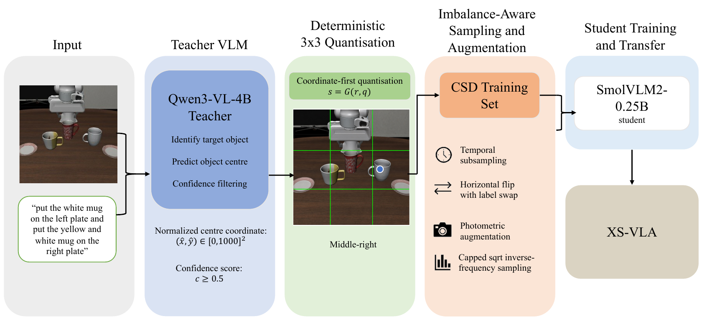

**Figure 1.** 원본 영상+지시 → Qwen 교사의 target 중심·confidence → 결정적 3×3 양자화 → sampling·augmentation → SmolVLM2 student → XS-VLA 초기화. 격자가 그려진 중간 그림은 설명용 시각화다. 교사와 student에 격자·bounding box·marker가 그려진 입력을 준다는 뜻이 아니다. `[PDF p.4, Fig.1; pp.3,10–11]`

### 5.1 U01: 무엇을 라벨링하는가

**원문 비번호 식, pp.3,10.**

```math
\hat p_t=(\hat x_t,\hat y_t),\qquad \hat x_t,\hat y_t\in[0,1000],\qquad c_t\in[0,1],\qquad \text{accept if }c_t\geq0.5.
```

입력은 원래 RGB와 task instruction이다. 교사 Qwen3-VL-4B는 **다음에 조작할 실제 물체**를 선택한다. robot arm, gripper, destination container는 그것 자체가 target인 경우를 제외하고 무시하라는 지시를 받는다. 순차 작업에서는 현 프레임에 보이는 “가장 먼저 남아 있는 미완료 operation”의 물체를 고른다. 교사 output은 좌표와 confidence를 갖는 정해진 JSON schema로 제한한다. temperature 0 및 고정 seed를 사용한다. 정확한 JSON field schema 전체와 교사 seed 값은 공개하지 않는다.

좌표는 이미지 평면을 0–1000으로 정규화한 위치다. camera calibration이나 실제 로봇좌표를 요구하지 않는다. confidence 0.5 미만의 sample은 제거하며 이 selection과 다음 quantization은 offline discrete 처리다. student gradient가 교사에 역전파되는 구조가 아니다.

**[리뷰어 해석]** 단일 frame에서 완료 여부를 파악하기 어려운 순차 지시는 잘못된 target을 고를 수 있다. temperature 0은 출력 variability를 낮추지만 target correctness를 보장하지 않고, 교사가 생성한 confidence의 calibration도 검증하지 않았다. filtered label의 human agreement가 72%라는 사실이 이를 제한한다.

### 5.2 U02: 좌표를 3×3 grid로 양자화

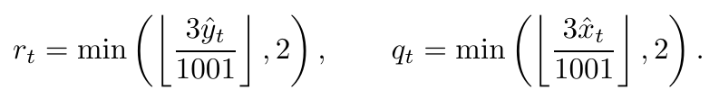

```math
r_t=\min\!\left(\left\lfloor\frac{3\hat y_t}{1001}\right\rfloor,2\right),\qquad q_t=\min\!\left(\left\lfloor\frac{3\hat x_t}{1001}\right\rfloor,2\right).
```

연산 순서는 좌표를 3배 → 1001로 나눔 → floor → 상한 2로 제한이다. row에는 y, column에는 x를 쓴다. 원점이 위쪽이면 작은 y는 top, 큰 y는 bottom이다. 분모를 임의로 1000으로 “수정”하지 않아야 한다. 원문의 [0,1000] 범위에서 1001 분모는 endpoint 1000도 세 번째 bin 안에 넣는다. 입력 범위가 보장되면 `min(...,2)`는 추가적인 상한 보호다. 음수 좌표를 다루는 하한 clamp는 이 식에 없다.

**[검산·해설용 예제]** 교사 중심이 (800,500)이면 column은 floor(2400/1001)=2, row는 floor(1500/1001)=1이므로 `middle right`다. (1000,1000)은 (2,2)인 `bottom right`다. 좌표가 정수라면 0–333, 334–667, 668–1000으로 나뉜다. 연속 좌표의 경계는 약 333.667, 667.333이다.

**가정과 한계.** 같은 cell 안의 작은 localization error는 label을 바꾸지 않는다. 그러나 grid 경계를 아주 조금만 넘으면 label이 바뀌고, 같은 cell에 여러 물체가 있으면 label 자체로 그들을 분리할 수 없다. 따라서 “coarse라서 noise에 robust”는 cell 내부에서 성립하는 설계 직관이지 모든 noise에 대한 보장은 아니다. `[PDF pp.3,10]`

### 5.3 U03: 문자열 vocabulary의 의미

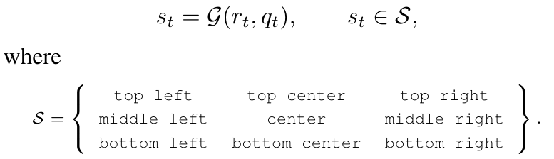

```math
s_t=\mathcal G(r_t,q_t),\quad s_t\in\mathcal S,\qquad \mathcal S=\left\{\begin{array}{ccc}\text{top left}&\text{top center}&\text{top right}\\\text{middle left}&\text{center}&\text{middle right}\\\text{bottom left}&\text{bottom center}&\text{bottom right}\end{array}\right\}.
```

Appendix A는 같은 집합을 아래처럼 쓴다.

```math
\mathcal S=\{s_{r,q}\mid r,q\in\{0,1,2\}\},\qquad s_{1,1}=\text{center}.
```

교사는 좌표를 예측하고, 고정 mapping이 문자열을 만든다. 따라서 `upper-right`, `right upper`, `top-right area`처럼 자유 문장 표현이 바뀌는 문제를 피한다. 그래도 student의 tokenizer가 `middle right`를 몇 token으로 나눌지는 별개다. **9개 라벨은 9-class semantic target이며, loss가 9차원 classification head에서 계산된다는 뜻은 아니다.** `[PDF pp.3,10–11]`

### 5.4 U04: CSD의 autoregressive loss

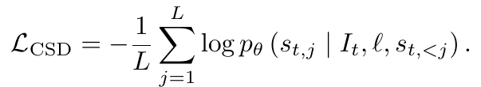

```math
\mathcal L_{\mathrm{CSD}}=-\frac{1}{L}\sum_{j=1}^{L}\log p_\theta(s_{t,j}\mid I_t,\ell,s_{t,\lt j}).
```

각 sample에서 목표 위치 문자열을 token sequence로 만든다. j번째 token을 예측할 때 image·instruction과 **정답 앞부분**을 condition으로 넣는다. 이것이 teacher forcing이다. log probability의 음수를 token 축으로 합한 뒤 길이 L로 평균한다. 실제 batch에서는 padding 위치를 제외한 평균이 필요하지만, batch reduction·special token masking 구현은 원문에 없다.

logit tensor를 $`Z\in\mathbb R^{B\times L\times V_{\mathrm{tok}}}`$라고 두면, vocabulary 축 softmax로 각 위치의 token probability를 얻고 정답 token 값을 선택한다. $`V_{\mathrm{tok}}`$는 전체 언어 tokenizer vocabulary 크기이며 9가 아니다. 새로운 detector head 없이 기존 VLM 텍스트 interface를 유지한다.

**[해설용 예제]** 라벨이 두 token으로 분리되고 정답 token probability가 0.8, 0.5라면 unsmoothed loss는 약 0.4581 nat다. 모델이 첫 단어를 틀리더라도 학습 중 두 번째 위치는 정답 첫 단어를 받는다. 따라서 teacher-forced loss와 자유 생성 시 instruction-following은 다르다. Appendix B의 “위치 라벨 뒤에 prompt 조각이 덧붙는 출력”이 이 차이를 실제로 보여 준다.

**Label smoothing.** 본문 식은 one-hot NLL이지만 Appendix A는 smoothing 0.1을 사용한다고 명시한다. 아래는 **R01, 일반적인 uniform smoothing 설명식**이며 원문이 어떤 vocabulary와 special token에 smoothing했는지까지 보장하지 않는다.

```math
\tilde y_v=(1-\varepsilon)\mathbf1[v=y]+\frac{\varepsilon}{V_{\mathrm{tok}}},\qquad \varepsilon=0.1,\qquad \mathcal L_{\mathrm{smooth}}=-\sum_v\tilde y_v\log p_v.
```

이 방식은 정답 token 확률을 1로 몰아가는 압력을 완화한다. **인접 grid cell에 더 큰 probability를 주는 spatially aware smoothing을 정의한 것은 아니다.** 경계 근처 overconfidence를 줄인다는 저자 설명과 실제 smoothing의 기하학적 범위를 구분해야 한다. `[PDF p.3; p.11, Appendix A]`

### 5.5 U15·U16: 데이터 sampling과 augmentation

원문의 소개 순서에 맞추어 여기서 Appendix A sampling 식도 함께 설명한다.

| 데이터 단계 | 저자 보고 수치·절차 |
|---|---|
| 원 annotation pool | LIBERO 100 demonstration episodes, confidence 통과 frame label 27,721개 |
| CSD train episode | 0–79 |
| held-out episode | 80–99, label 5,313개 |
| temporal subsampling | train에서 매 5번째 frame 유지, 실제 학습 example 4,510개 |
| 접근 방식 | label은 episode/frame index로 저장; RGB와 instruction은 원 LeRobot 데이터에서 조회 |
| CSD optimization | 10,000 steps, batch 4, AdamW, LR $`10^{-4}`$, weight decay $`10^{-2}`$, max grad norm 10 |
| 저장 주기 | 2,000 optimization step마다; 공간 진단은 step 10,000 사용 |

**[검산]** 10,000×4=40,000 sample presentations이며 4,510개로 나누면 약 8.87배다. weighted sampling과 augmentation이 있으므로 이를 엄밀한 8.87 epoch 순회라고 부르면 안 된다. 같은 trajectory의 인접 frame을 train/validation에 나누지 않은 것은 좋은 통제지만, 이것만으로 task·scene identity까지 완전히 분리됐다고 결론낼 수는 없다.

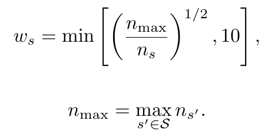

**U15, p.10.**

```math
w_s=\min\!\left[\left(\frac{n_{\max}}{n_s}\right)^{1/2},10\right],\qquad n_{\max}=\max_{s'\in\mathcal S}n_{s'}.
```

클래스 s의 잔존 example 수가 $`n_s`$다. 가장 많은 클래스는 weight 1, 드문 클래스는 제곱근 역빈도만큼 가중하되 10에서 제한한다. 원문은 이를 sampling weight라 부른다. **[리뷰어 해석]** 이를 각 example의 draw weight로 적용한다면 class 전체 probability는 $`n_sw_s`$에 비례한다. cap이 활성화되지 않은 구간에서는 class mass가 $`\sqrt{n_s}`$에 비례하므로 완전 균등화가 아니라 imbalance 완화다. 실제 sampler 코드가 없어 class 먼저 뽑는 구현인지 example별 weighted sampler인지 직접 확인하지 못했다.

**[해설용 예제]** 최대 count 1,600이고 비교 class count가 100이면 weight 4다. 원래 16:1인 example count ratio가 총 draw mass 1600:400=4:1로 완화된다. count 1은 원래 weight 40이지만 cap 때문에 10이다. count 0은 이 식으로 sampling할 수 없으므로 실제 retained class에 한정해야 한다.

**U16, p.10의 horizontal reflection 규칙.**

```math
\text{top left}\leftrightarrow\text{top right},\qquad \text{middle left}\leftrightarrow\text{middle right},\qquad \text{bottom left}\leftrightarrow\text{bottom right}.
```

probability 0.5로 이미지를 좌우 반사하고 label도 바꾼다. center column은 그대로다. row/column 표현으로는 **R02** $`(r,q)\mapsto(r,2-q)`$다. brightness, contrast, saturation, hue, sharpness perturbation을 적용하며 translation·rotation 같은 affine geometry 변환은 배제한다. coarse label만으로 변환 후 정확한 cell을 알기 어렵기 때문이다.

**[논문 미기재·리뷰어 해석]** 지시에 `left cup`처럼 시각적 방향을 통한 target 식별이 포함되면 이미지 반사만으로 instruction semantics가 달라질 수 있다. 원문은 label swap은 명시하지만 instruction의 left/right 변환이나 그런 sample 제외는 설명하지 않는다. 광학 augmentation의 수치 범위도 미기재다. CSD flip recipe를 action training에 그대로 적용했다는 근거도 없다. 행동좌표·팔 의미까지 바꿔야 하는 policy augmentation과 혼동하지 않아야 한다.

### 5.6 U05: CSD가 action policy로 전달되는 방식

```math
\theta_{\mathrm{VLM}}^{(0)}\leftarrow\theta_{\mathrm{CSD}}.
```

가중치를 복사하는 초기화 연산이다. CSD 단계에서는 vision encoder를 freeze하고 language·cross-modal trainable parameter를 학습한다. CSD checkpoint에서 vision encoder, cross-modal component, downstream에 유지되는 compatible Transformer parameter를 가져온다. 이후 compact configuration의 16개 Transformer 층을 사용한다. **어떤 원래 layer index 16개를 고르는지와 strict loading key mapping은 미기재**다. 단순히 “첫 16개”라고 추정하면 안 된다.

이식 후 language modeling head를 버리고 action expert를 붙인다. downstream action 학습·추론에서 teacher와 explicit spatial label은 사용하지 않는다. 즉 `image → center라는 답 생성 → 그 답을 action head prompt로 넣기`가 아니다. 지식 전달 수단은 **초기화된 VLM parameter와 그 feature**다. vision encoder를 CSD에서 고정했어도 cross-modal·language parameter가 바뀌어 image-language 표현을 바꿀 수 있다. 그리고 Stage 2에서는 vision encoder까지 학습한다. `[PDF pp.3–4,11]`

<a id="lfm"></a>

## 6. Stage 2: Latent Flow Matching

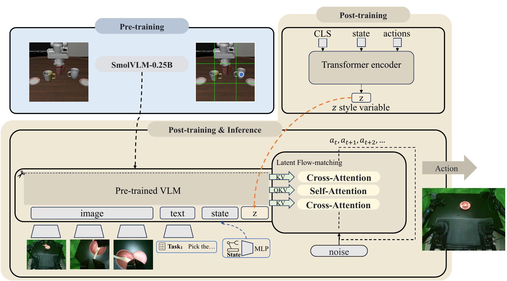

**Figure 2.** 아래 action path는 이미지·텍스트·state·latent prefix를 조건으로 noise에서 action chunk를 생성한다. 오른쪽 위 posterior encoder는 학습 때만 state와 **ground-truth action**을 입력받는다. 점선은 CSD checkpoint 전달, 주황 연결은 latent condition이다. Figure의 `Post-training & Inference` 상자에 z가 그려져 있어도 추론에서는 encoder output이 아니라 0이다. `[PDF p.5, Fig.2]`

### 6.1 U06: action chunk와 시간축

```math
A_t=a_{t:t+k}.
```

원문은 k를 chunk size라 부른다. 수학의 양끝 포함 표기라면 k+1개, Python식 half-open slice라면 k개이므로 그대로 count를 단정하기 어렵다. 이 리뷰에서는 실제 action 개수를 **K**로 두어 $`A_t\in\mathbb R^{B\times K\times D_a}`$로 설명한다. K 값, gripper encoding, end-effector delta인지 joint target인지, normalization, padding·mask는 명시하지 않는다. Figure에 $`a_t,a_{t+1},a_{t+2},\ldots`$가 보인다는 것만으로 horizon을 정할 수 없다. `[PDF pp.4,11]`

chunk는 한 번의 policy call이 미래 여러 action vector를 생성한다는 뜻이다. 그 모두를 open-loop 실행하는지 일부만 실행하고 관측하는지는 별도 제어 설계이며 원문 미기재다.

### 6.2 U07: CVAE posterior는 미래 행동의 무엇을 보는가

```math
q_\phi(z\mid A_t,c_t).
```

posterior encoder $`E_\phi`$ 입력은 [CLS], proprioceptive state, 정답 action chunk다. 이미지·instruction을 직접 posterior 입력으로 명시하지 않는다. 따라서 latent는 visual teacher의 hidden state가 아니라 시연 trajectory와 state로부터 학습하는 code다. prior는 아래 U09처럼 standard Gaussian이다.

**Appendix A의 연산을 shape로 재구성한 R03.** state·action을 각각 detach하고, 독립 linear projection으로 width 256에 맞춘다. state는 한 token, action은 timestep당 한 token으로 설명한다.

```math
\begin{aligned}e_c&=W_c\,\mathrm{stopgrad}(c_t)+b_c\in\mathbb R^{B\times256},\\e_{a,j}&=W_a\,\mathrm{stopgrad}(a_{t+j})+b_a\in\mathbb R^{B\times256},\\X_E&=\mathrm{transpose}_{B,T}\!\left([e_{\mathrm{CLS}};e_c;e_{a,0};\ldots;e_{a,K-1}]+\mathrm{PE}\right)\\&\in\mathbb R^{(K+2)\times B\times256}.\end{aligned}
```

배치·시퀀스 두 축을 바꿔 time-major Transformer에 넣는다. fixed sinusoidal position encoding은 action 순서를 구분한다. time-major의 time은 **CVAE token sequence index**이며 flow time $`\tau`$가 아니다. pre-LayerNorm self-attention, FFN, residual, dropout을 거친 뒤 [CLS] hidden state를 뽑고 linear head로 $`2d_z`$개 scalar를 출력하여 mean과 log-variance로 나눈다.

```math
[\mu;\rho]=W_z h_{\mathrm{CLS}}+b_z,\qquad \rho=\log\sigma^2,\qquad q_\phi(z\mid A_t,c_t)=\mathcal N\!\left(\mu,\mathrm{diag}(e^\rho)\right).\qquad\text{(R04)}
```

여기서 256은 hidden width이고 latent dimension $`d_z`$는 별도다. encoder layer 수, head 수, FFN expansion, dropout 값, log-variance clamp, sequence pad mask는 공개하지 않는다. `[PDF pp.11–12, Appendix A]`

### 6.3 U08: reparameterization

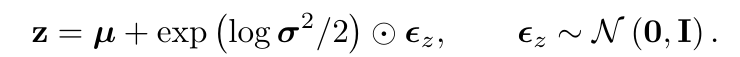

```math
z=\mu+\exp\!\left(\frac{\log\sigma^2}{2}\right)\odot\epsilon_z,\qquad\epsilon_z\sim\mathcal N(0,I).
```

log-variance에 1/2을 곱하고 exp하면 표준편차 $`\sigma`$가 된다. 원소별 Gaussian noise를 scale하고 mean을 더한다. mean·log-variance·noise·z의 shape는 모두 $`B\times d_z`$이며 $`\odot`$는 elementwise 곱이다. covariance matrix 전체를 학습하지 않으므로 latent 축 간 posterior 공분산은 diagonal assumption이다.

**[해설용 예제]** $`\mu=(1,-1)`$, variance $`(4,0.25)`$, noise $`(0.5,-2)`$라면 표준편차는 (2,0.5), z는 (2,-2)다. Gaussian sampling을 별도 비미분 연산으로 posterior output에서 뽑는 대신 noise를 parameter와 무관한 입력으로 두어 decoder loss에서 mean과 variance 쪽으로 미분할 수 있다. 이 성질이 [gradient 절](#gradient)의 핵심이다.

### 6.4 U09: prior와 deployment latent

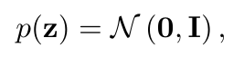

```math
p(z)=\mathcal N(0,I),\qquad z_{\mathrm{inference}}=0.
```

학습 posterior는 시연 action을 알아야 하므로 deployment에서 쓸 수 없다. prior mean을 선택하면 CVAE encoder forward와 latent random sampling을 없앤다. posterior mean $`\mu(A_t,c_t)`$를 추론에서 예측하는 것도 아니며, 별도의 learned visual conditional prior network를 정의한 것도 아니다. Appendix A p.11의 “features condition the latent prior”라는 문장은 이 고정 prior 식과 맞지 않아 **고정 standard prior를 기준으로 읽는다**.

**[리뷰어 해석]** $`z=0`$이 유효한 하나의 mode를 자동으로 선택한다는 증명은 없다. 예를 들어 latent +1과 -1에 두 유효 행동이 대응하고 decoder가 latent를 선형 보간한다면 z=0에서 두 행동 사이를 만들 수도 있다. KL regularization이 posterior를 prior 근처에 두게 하지만, 평균 code의 행동이 모든 task에서 일관되다는 보장은 아니다. 또한 action noise $`\epsilon_a`$가 별도로 있으므로 **latent 결정성과 전체 action 결정성은 다르다**. `[PDF pp.4,12]`

### 6.5 interleaved attention: 어디에서 image·language·state·z를 읽는가

Appendix A는 action expert를 SmolVLA식 conditional flow Transformer라 설명한다. 다수 layer는 prefix self-attention 뒤 suffix-to-prefix cross-attention을 하고, 매 N layer마다 joint self-attention을 삽입한다. N의 실제 값은 미기재다.

prefix는 distilled VLM의 image-language feature, MLP로 projected state, projected latent로 구성한다. suffix는 noised action token과 flow time embedding이다. 서로 다른 source의 width를 맞추는 projection을 전제로 하되 exact shared weight 구조를 추정하지 않는다.

아래는 **R05, 설명용 한 head의 cross-attention**이다.

```math
Q=S_AW_Q\in\mathbb R^{B\times K\times d_h},\qquad K_P=PW_K\in\mathbb R^{B\times T_p\times d_h},\qquad V_P=PW_V\in\mathbb R^{B\times T_p\times d_h}.
```

```math
O=\mathrm{softmax}_{T_p}\!\left(\frac{QK_P^{\mathsf T}}{\sqrt{d_h}}+M\right)V_P\in\mathbb R^{B\times K\times d_h}.\qquad\text{(R06)}
```

query는 “이 noisy action timestep을 개선하는 데 어떤 context가 필요한가”, key/value는 “image·language·state·latent가 제공하는 정보” 역할이다. score shape는 $`B\times K\times T_p`$이고 softmax는 prefix token 축이다. action timestep 축을 softmax하는 것이 아니다. multihead라면 head 축 h가 추가된다. projected latent를 token으로 넣었다고 해서 image patch를 hard mask하거나 삭제하지 않는다.

joint layer는 $`[P;S_A]`$를 합쳐 self-attention한다. 저자는 “causal masking 아래 symmetric interaction”이라 표현한다. **[논문 미기재]** 실제 mask 행렬이 없어서 양방향 정보 경로를 확정할 수 없다. 순서가 prefix→suffix인 일반 triangular causal mask라면 prefix는 미래 suffix를 볼 수 없다. block mask로 특정 양방향 interaction을 허용하는지 확인해야 한다. 이 차이는 [배포 절](#deployment)의 prefix cache 가능성과도 직결된다. `[PDF pp.4,12]`

### 6.6 U10·U11: noise에서 action으로 가는 선형 경로

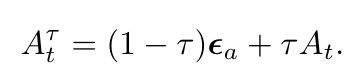

```math
\epsilon_a\sim\mathcal N(0,I),\qquad A_t^\tau=(1-\tau)\epsilon_a+\tau A_t,\qquad\tau\in[0,1].
```

latent noise $`\epsilon_z`$는 $`B\times d_z`$, action noise $`\epsilon_a`$는 $`B\times K\times D_a`$다. 두 Gaussian을 혼동하면 shape부터 맞지 않는다. $`\tau`$는 보통 sample별로 뽑아 K·action 축에 broadcast하는 설명이 가능하지만 actual sampling granularity는 미기재다. Appendix A는 Beta distribution에서 time을 뽑는다고만 쓰며 alpha·beta 값은 주지 않는다.

tau=0이면 순수 action noise, tau=1이면 demonstration chunk다. 학습 sample마다 두 endpoint를 만들고 중간점 하나에서 이동 방향을 배우므로, 학습 forward마다 전체 ODE를 적분할 필요는 없다.

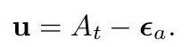

```math
u=A_t-\epsilon_a.
```

이 u는 로봇의 물리 속도 단위를 자동으로 뜻하는 것이 아니라, **flow time에 대한 action tensor의 변화율**이다. 정답 action을 어떻게 정규화했는지에 따라 성분의 단위도 달라진다. action expert는 $`v_\theta(A_t^\tau,o_t,z,\tau)`$를 출력한다. output shape가 chunk와 같으므로 token별 linear projection 뒤 원 action 차원으로 돌아와야 한다.

**R07, 원문 U10을 미분한 유도.**

```math
\frac{\partial A_t^\tau}{\partial\tau}=\frac{\partial((1-\tau)\epsilon_a+\tau A_t)}{\partial\tau}=-\epsilon_a+A_t=u.
```

**[해설용 계산]** K=2, action dimension=2인 한 샘플을 생각하자. 이 숫자는 실제 논문 설정이 아니다.

```math
A_t=\begin{bmatrix}2&0\\0&2\end{bmatrix},\quad\epsilon_a=\begin{bmatrix}0&2\\2&0\end{bmatrix},\quad\tau=\tfrac14\quad\Longrightarrow\quad A_t^\tau=\begin{bmatrix}0.5&1.5\\1.5&0.5\end{bmatrix},\quad u=\begin{bmatrix}2&-2\\-2&2\end{bmatrix}.\qquad\text{(R08)}
```

decoder는 현재 noisy chunk만으로 endpoint를 알아내는 것이 아니라 observation·instruction·state·latent·tau를 함께 이용한다. 이것이 conditional flow다. `[PDF pp.4,12]`

### 6.7 U12: Huber flow matching objective

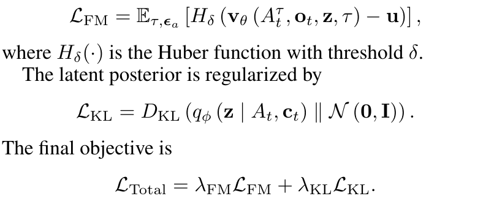

```math
\mathcal L_{\mathrm{FM}}=\mathbb E_{\tau,\epsilon_a}\!\left[H_\delta\!\left(v_\theta(A_t^\tau,o_t,z,\tau)-u\right)\right].
```

먼저 model velocity와 target velocity를 빼 residual tensor를 만들고 Huber를 적용한다. 논문 식의 expectation은 tau와 action noise만 적지만 실제 학습은 데이터 sample 및 posterior latent sampling도 포함한다. 이는 식의 생략으로 읽되 논문이 명시하지 않은 reduction을 채워 넣지는 않는다.

**R09, 표준 scalar Huber와 derivative.** 원문은 Huber라는 이름과 threshold만 주며 piecewise 식·delta 수치는 쓰지 않는다.

```math
H_\delta(e)=\begin{cases}\frac12e^2,&|e|\leq\delta,\\\delta\left(|e|-\frac12\delta\right),&|e|\gt\delta,\end{cases}\qquad H'_\delta(e)=\begin{cases}e,&|e|\leq\delta,\\\delta\,\mathrm{sign}(e),&|e|\gt\delta.\end{cases}
```

작은 오차에서는 quadratic, 큰 오차에서는 linear다. 큰 시연 outlier의 gradient를 무한히 키우지 않아 센서 noise·teleoperation inconsistency에 덜 민감하게 하려는 설계다. threshold는 residual/action normalization에 의존하므로 delta와 action scaling이 함께 필요하다. PyTorch HuberLoss와 SmoothL1Loss처럼 상수 scaling이 다른 구현도 있어 loss 함수 이름만으로 coefficient를 확정할 수 없다.

**[해설용 예제]** delta=1, residual=(0.2,2)라면 각 loss는 0.02와 1.5, element mean이면 0.76이다. gradient는 (0.2,1)에서 평균 계수만 추가된다. 실제 논문이 element mean인지 sum인지와 delta=1인지 여부는 미기재다.

**[리뷰어 해석]** squared FM의 최적 회귀 field는 조건부 평균과 연결된다. Huber로 바꾸면 conditional robust estimator가 되어 outlier에는 유리할 수 있지만, squared loss의 모든 theoretical transport 성질을 그대로 보장한다고 말할 수 없다. 논문은 이 변경의 분포 일치 정리를 제시하지 않고 downstream 결과로 평가한다. `[PDF pp.5,12]`

### 6.8 U13: KL로 posterior를 standard prior 근처에 두기

```math
\mathcal L_{\mathrm{KL}}=D_{\mathrm{KL}}\!\left(q_\phi(z\mid A_t,c_t)\,\Vert\,\mathcal N(0,I)\right).
```

KL 방향은 posterior q에서 prior p다. z space의 두 분포를 비교하고, image-language feature나 teacher probability를 비교하는 distillation KL이 아니다. q가 지나치게 sample-specific한 code로 멀어지면 추론의 z=0과 차이가 커질 수 있으므로 regularize한다.

**R10, diagonal Gaussian을 대입한 보조 유도식.**

```math
D_{\mathrm{KL}}\!\left(\mathcal N(\mu,\mathrm{diag}(\sigma^2))\Vert\mathcal N(0,I)\right)=\frac12\sum_{j=1}^{d_z}\left(\mu_j^2+\sigma_j^2-1-\log\sigma_j^2\right).
```

일반 Gaussian KL의 trace 항은 variance 합, quadratic mean 항은 mean 제곱합, log determinant 항은 음의 log-variance 합, dimension 항은 -$`d_z`$가 된다. 이 네 부분을 축별로 모은 것이 위 식이다. q=p이면 mean 0, variance 1이므로 각 축이 0이다.

**[해설용 검산]** mean=1, variance=4인 한 latent 축의 KL은 $`(1+4-1-\log4)/2\approx1.3069`$ nat다. mean=0이어도 variance가 1과 다르면 penalty가 남는다. 실제 모델은 batch와 latent 축에서 어떤 reduction을 하는지 공개하지 않아 loss weight와 함께 확인해야 한다.

KL을 너무 강하게 일찍 주면 posterior가 prior와 같아지고 decoder가 z를 무시하는 posterior collapse가 생길 수 있다. 반대로 너무 약하면 posterior가 학습 action 정보를 과하게 담아 prior-mean 추론과 차이가 커질 수 있다. KL warmup은 그 균형을 위한 경험적 장치이며 latent가 의미 있는 style별 mode로 분리됐다는 증거는 아니다. `[PDF pp.5,12]`

### 6.9 U14: total objective와 KL warmup

```math
\mathcal L_{\mathrm{Total}}=\lambda_{\mathrm{FM}}\mathcal L_{\mathrm{FM}}+\lambda_{\mathrm{KL}}\mathcal L_{\mathrm{KL}}.
```

flow loss는 action field fit, KL은 posterior distribution regularization이다. CSD CE는 Stage 1 objective이며 **Stage 2 total에 CSD loss를 동시에 더한다고 쓰지 않는다.** 이후 spatial representation은 action learning을 통해 바뀔 수 있다.

Appendix A는 KL weight를 첫 10,000 training steps 동안 linear warmup한다고 명시한다. **R11은 0에서 시작해 최종 weight까지 증가한다고 해석한 전형적 재구성**이다. 최종 weight, 정확한 시작값·step indexing은 미기재다.

```math
\lambda_{\mathrm{KL}}(s)=\lambda_{\mathrm{KL}}^{\max}\min\!\left(\frac{s}{10000},1\right).\qquad\text{(R11: zero-start interpretation)}
```

이 해석에서 step 2,500은 최종 weight의 25%, 10,000 이후에는 100%다. main LIBERO policy 학습은 160,000 steps라 초기 6.25%가 warmup 구간이다. CVAE를 먼저 따로 완성한 뒤 action decoder를 freeze한 채 훈련하는 세 단계를 제시한 것은 아니다. Stage 2에서는 전체를 jointly optimize한다고 명시한다.

<a id="gradient"></a>

## 7. 학습 단계·gradient 경로

### 7.1 어떤 모듈이 언제 학습되고 언제 남는가

| 모듈·신호 | offline annotation | Stage 1 CSD | Stage 2 action training | 학생 deployment |
|---|---|---|---|---|
| Qwen3-VL-4B | inference로 중심·confidence 생성 | 저장 label만 사용 | 사용 안 함 | 사용 안 함 |
| confidence filter·grid mapping | 실행 | 생성된 target 사용 | 사용 안 함 | 사용 안 함 |
| SmolVLM vision encoder | 무관 | frozen | trainable | 유지 |
| SmolVLM language·cross-modal | 무관 | trainable | compatible 16 layers 및 연결부 trainable | 유지 |
| language modeling head | 무관 | 위치 텍스트 loss 계산 | 제거 | 없음 |
| 위치 라벨 출력 | 생성·저장 | teacher-forced 정답 | 별도 input/aux loss 없음 | 출력·전달 안 함 |
| action expert·state projection | 무관 | 사용 안 함 | trainable | 유지 |
| CVAE encoder·Gaussian head | 무관 | 사용 안 함 | trainable, state+GT chunk 사용 | bypass |
| latent z | 무관 | 사용 안 함 | posterior sample | 0 vector |
| latent projection | 무관 | 사용 안 함 | trainable condition 경로 | z=0을 받는 경로가 개념상 유지 |
| action noise·flow time | 무관 | 사용 안 함 | random interpolation | solver 경로에 필요; exact sampling·solver 미공개 |

**[저자 보고]** Stage 2는 vision encoder·language backbone·action expert·CVAE를 포함한 전체 pipeline을 joint optimize한다. CSD의 frozen vision 상태를 Stage 2까지 지속한다고 해석하면 원문과 다르다. full fine-tuning에 LoRA를 쓰는지, parameter group별 LR이 다른지 같은 구현은 주지 않는다. `[PDF pp.3–5,11–12]`

### 7.2 CSD gradient는 어디로 흐르는가

label CE → LM head의 token logits → language·cross-modal hidden state → trainable parameter로 흐른다. vision feature는 forward에는 사용되지만 vision parameter update는 막힌다. Qwen label은 저장된 discrete target이므로 Qwen·confidence·floor mapping에 대한 gradient 경로는 없다. cross-modal projection을 학습하면 frozen image features를 task-grounding에 맞게 다시 해석할 수 있다.

일반 cross entropy에서 token logit에 대한 derivative는 $`p_v-\tilde y_v`$다. label smoothing을 쓰면 one-hot 대신 smoothed target을 빼는 것으로 바뀐다. 여기에는 teacher logits를 받아 temperature-scaled KL을 계산하는 classical soft distillation이 없다. **이 논문의 공간 distillation은 teacher-derived hard label supervised training**이다.

### 7.3 CVAE 입력 detach가 CVAE 학습까지 차단하는가

**아니다. 원문 부록의 목적 설명과 명시된 연산은 구분해야 한다.** p.11은 flow matching loss가 VAE를 직접 drive하지 않게 하려고 state와 target actions를 detach한다고 설명한다. 하지만 input을 detach하는 것은 **입력 이전 graph로 향하는 gradient**를 차단한다. 그 입력을 소비하는 trainable encoder parameter에 대한 gradient를 차단하지 않는다.

**R12, 명시된 연산을 따른 chain rule.**

```math
x'=\mathrm{stopgrad}([c_t,A_t]),\qquad (\mu,\rho)=E_\phi(x'),\qquad z=\mu+e^{\rho/2}\odot\epsilon_z,\qquad\mathcal L_{\mathrm{FM}}=\ell(v_\theta(\cdots,z),u).
```

```math
\frac{\partial\mathcal L_{\mathrm{FM}}}{\partial\phi}=\frac{\partial\mathcal L_{\mathrm{FM}}}{\partial v_\theta}\frac{\partial v_\theta}{\partial z}\left(\frac{\partial\mu}{\partial\phi}+\frac12e^{\rho/2}\odot\epsilon_z\odot\frac{\partial\rho}{\partial\phi}\right).\qquad\text{(R13)}
```

위 식은 elementwise 항을 Jacobian chain rule의 축약으로 쓴 것이다. latent가 decoder output에 영향을 주고 posterior parameters가 phi에 의존하면 보통 0이 아니다. 대신 $`\partial x'/\partial x=0`$이어서 state/action을 생성한 upstream graph로 돌아가지 않는다. dataset tensor가 원래 `requires_grad=False`라면 input detach는 사실상 추가 효과가 없을 수 있다.

**[해설용 최소 예제]** $`z=\phi\,\mathrm{stopgrad}(x)`$, x=2, phi=1, loss=$`\tfrac12(z-3)^2`$라면 $`\partial L/\partial\phi=(z-3)x=-2`$다. input이 detach돼도 parameter는 학습된다. decoder에 `stopgrad(z)`를 넘기면 FM→CVAE 경로가 끊기지만 **그 연산은 논문에 명시되어 있지 않다**.

따라서 재현할 때 가능한 두 구현은 서로 다른 알고리즘이다. 표면상 문장을 맞추려고 z까지 detach했다고 추가하면, FM과 무관한 CVAE가 KL만 최소화하며 prior로 collapse할 수 있고 intended intent learning이 바뀐다. 이 리뷰의 재구성은 **input detach만 적용하고 latent gradient는 연결**하되, 실제 코드 부재로 저자 구현과의 일치를 보장하지 않는다.

### 7.4 각 loss와 parameter의 연결

| Loss | 직접 업데이트하는 경로 | 근거와 제한 |
|---|---|---|
| CSD CE | LM head·language·cross-modal trainables | Stage 1 vision frozen |
| FM | action expert, state·latent projection, VLM 전체 | Stage 2 end-to-end 명시 |
| FM → CVAE | reparameterized z를 통한 posterior encoder·head | input detach만 있다면 chain rule상 존재; 코드 미확인 |
| KL | posterior mean·variance 및 encoder | prior는 고정 standard Gaussian |
| KL → VLM | 명시 구조에서는 직접 경로 없음 | posterior 입력에 image-language feature 없음; parameter sharing은 미기재 |

**R14, KL gradient의 직관.** log-variance rho를 parameter로 쓴다면 한 축의 derivative는 아래와 같다.

```math
\frac{\partial\mathcal L_{\mathrm{KL}}}{\partial\mu_j}=\mu_j,\qquad\frac{\partial\mathcal L_{\mathrm{KL}}}{\partial\rho_j}=\frac12(e^{\rho_j}-1).
```

mean을 0으로, variance를 1로 끌어간다. FM은 시연을 구분할 수 있는 code를 요구하고 KL은 code를 과도하게 분산·특화하지 못하게 하는 압력이다. 두 항의 실제 strength는 reduction과 lambda에 달려 있다. 따라서 미공개 lambda가 재현에 중요한 이유가 단순 설정 누락을 넘어 gradient scale의 문제다.

<a id="forward"></a>

## 8. 알고리즘 행별 해설과 end-to-end forward

원문에는 line-numbered Algorithm이나 executable pseudocode가 없다. 아래 세 알고리즘의 번호는 독자의 실행 순서 이해를 위해 붙인 **리뷰어 재구성**이다. 미기재 설정을 `unspecified`로 남겨 실행 가능한 공식 코드처럼 제시하지 않는다.

### 8.1 Algorithm R-A: offline label 생성과 CSD

```text
01  LIBERO frame에서 (RGB, instruction, episode_id, frame_id)를 읽는다.
02  Qwen3-VL-4B에 다음 조작 대상의 center와 confidence를 요청한다.
03  JSON을 parse하고 confidence >= 0.5인 annotation을 유지한다.
04  normalized (x,y)를 floor(3*coordinate/1001)와 cap 2로 변환한다.
05  grid index를 고정 9종 문자열로 mapping하고 episode/frame ID와 저장한다.
06  episodes 0..79를 CSD train, 80..99를 held-out으로 분리한다.
07  train frame을 5-frame cadence로 줄이고 class count에서 sampling weight를 구한다.
08  minibatch를 뽑아 flip와 label swap, photometric augmentation을 적용한다.
09  SmolVLM2에 원영상+지시+위치질문을 넣고 target label을 teacher forcing한다.
10  label-smoothed token CE를 계산한다. vision encoder는 고정한다.
11  language/cross-modal trainables를 AdamW로 update한다. 총 10,000 steps.
12  checkpoint의 compatible backbone parameters를 16-layer policy에 이식한다.
```

| 행 | 입력→출력·실행 의미 | 재현 시 확인점 |
|---|---|---|
| 01 | raw 데이터→정합된 frame와 instruction | episode ID의 dataset revision, camera key |
| 02 | image-language→continuous center·confidence | next unfinished object를 한 frame에서 판정 |
| 03 | 후보→accepted label | JSON 실패·범위 외 좌표 처리 미공개 |
| 04 | continuous coordinate→discrete row/column | x/y 축 혼동, 1001 분모 보존 |
| 05 | row/column→정해진 문자열 | 자유형 caption이 아님 |
| 06 | episode 단위 split | CSD train/held-out 간 trajectory 중복 차단 |
| 07 | 시간 중복·class imbalance 감소 | 정확한 cadence phase, sample draw normalization 미기재 |
| 08 | augmentation된 input과 일치하는 label | instruction 방향 의미도 실제로 일치하는지 확인 필요 |
| 09 | teacher-forced VLM logits | 이미지에 marker를 덧그리지 않음 |
| 10 | vocabulary/token loss | attention·box regression loss 없음 |
| 11 | 작은 VLM 업데이트 | batch 4, LR 1e-4, WD 1e-2, clipping 10 |
| 12 | perceptual initialization | LM head 제거와 실제 layer selection은 별도 작업 |

### 8.2 Algorithm R-B: 한 policy training step

```text
01  robot demonstration에서 multi-view images, language, state, target action chunk를 읽는다.
02  transferred VLM으로 image-language features를 계산한다.
03  detach(state), detach(target actions)를 각각 width 256으로 project한다.
04  [CLS], state token, action tokens에 fixed position encoding을 더해 CVAE에 넣는다.
05  final [CLS]에서 mean와 log-variance를 얻고 Gaussian latent noise로 z를 sample한다.
06  VLM feature, projected state, projected z를 multimodal prefix로 구성한다.
07  action-shaped Gaussian noise epsilon_a와 Beta-distributed tau를 sample한다.
08  A_tau = (1-tau)*epsilon_a + tau*A_target, u = A_target-epsilon_a를 만든다.
09  noisy actions와 time embedding을 suffix로 만들어 interleaved action expert를 실행한다.
10  predicted velocity와 u의 Huber loss, posterior와 standard normal의 KL을 계산한다.
11  warmup 중인 lambda_KL로 가중합한다.
12  backward 후 VLM·action expert·CVAE와 관련 projections를 함께 update한다.
```

1–2행에서는 Stage 1의 localization prompt나 position label이 필요 없다. 3–5행은 미래 GT action 정보를 training-only posterior에 넣는 경로다. 6행은 teacher token이나 generated spatial answer를 prefix로 추가하는 단계가 아니다. 7행의 두 random variable은 latent noise와 별개이며, 8행에서 하나의 training interpolation point를 만든다. 9행은 action을 직접 회귀하는 대신 velocity field를 출력한다. 10–12행은 coupled training이며 CSD CE를 더하지 않는다. `[PDF pp.4–5,11–12]`

**[논문 미기재]** action data의 normalization·padding mask, policy LR·batch·optimizer·scheduler, Beta parameters, Huber delta, lambda 값, CVAE shape, interleaving N을 알 수 없어 이 절차만으로 exact reproduction config가 완성되지는 않는다.

### 8.3 한 샘플의 shape를 끝까지 추적

**해설용 가정**으로 B=1, camera V=3, action K=4, action dimension 7, state dimension 8, latent dimension 16을 잡는다. 실제 paper 값은 CVAE width 256과 compact VLM 16 layers뿐이며, 이 숫자들을 실험 설정으로 읽지 않는다.

| 순서 | tensor 또는 연산 | 이 예제의 shape | 다음 단계 역할 |
|---|---|---|---|
| 관측 | RGB, tokenized instruction, state | $`1\times3\times3\times H\times W`$, $`1\times T_\ell`$, $`1\times8`$ | normal observation |
| VLM | vision→cross-modal→language features | $`1\times T_{\mathrm{VL}}\times d_v`$ | spatially initialized context |
| GT chunk | future action target | $`1\times4\times7`$ | training target·posterior input |
| CVAE projection | [CLS], state, 4 actions | $`1\times6\times256`$ | token sequence |
| time-major | transpose batch/sequence | $`6\times1\times256`$ | encoder input |
| posterior head | final [CLS]→2×latent width | $`1\times32`$ | split mean/logvar each 1×16 |
| sample z | mean+std×noise | $`1\times16`$ | prefix condition |
| prefix | projected context+state+z | $`1\times T_p\times d_p`$ | attention K/V source |
| noisy actions | interpolation of target and noise | $`1\times4\times7`$ | flow suffix input |
| suffix projection | action/time embeddings | $`1\times4\times d_p`$ | cross-attention Q source |
| action output | hidden→velocity projection | $`1\times4\times7`$ | Huber vs target field |
| final objective | aggregate FM+KL | scalar | backward |

time embedding을 action token에 더하는지 concat 후 MLP로 섞는지, prefix 토큰 수가 정확히 얼마인지, action expert가 VLM layer와 어떤 weight를 공유하는지는 원문 미기재다. 이 표는 feature 종류·필수 shape 정합을 보여 준다.

### 8.4 Algorithm R-C: deployment forward와 ODE

deployment에는 미래 GT chunk가 없으므로 R-B의 3–5행을 실행하지 않는다. normal images·language·state로 context를 만들고 z=0을 넣는다. action expert가 learned field인 만큼 noise에서 data endpoint로 이동시키는 numerical integration이 필요하다. **논문은 실제 solver와 integration step 수를 명시하지 않는다.** 아래는 수식을 연결하는 **R15, 일반적인 continuous-time 재구성**이다.

```math
\frac{dX(\tau)}{d\tau}=v_\theta(X(\tau),o_t,0,\tau),\qquad X(0)=\epsilon_a,\qquad\widehat A_t=X(1).
```

예를 들어 forward Euler를 택한다면 다음과 같다. 이것은 paper의 공식 inference algorithm이 아니다.

```math
X_{j+1}=X_j+(\tau_{j+1}-\tau_j)v_\theta(X_j,o_t,0,\tau_j),\quad\tau_0=0,\quad\tau_M=1.\qquad\text{(R16: illustrative Euler)}
```

```text
01  최신 camera images·instruction·robot state를 가져온다.
02  distilled compact VLM에서 multimodal context를 계산한다.
03  z = zeros(batch, latent_dim)로 두고 state/z prefix를 구성한다.
04  action-shaped initial noise와 integration schedule을 준비한다. [actual policy unspecified]
05  각 integration step에서 action expert의 velocity를 읽고 noisy chunk를 갱신한다.
06  tau=1의 predicted action chunk를 얻는다.
07  action scaling·robot interface를 통해 선택한 chunk prefix를 실행한다. [details unspecified]
08  새 observation으로 재계획한다. [refresh cadence unspecified]
```

02행의 VLM feature를 한 번 계산해 05행에서 재사용할 수 있는지는 mask·layer coupling에 달려 있다. teacher와 CVAE의 제거만으로 prefix KV caching 구현까지 입증하지 않는다. 04행에서 noise를 매번 다시 뽑으면 동일 observation과 z=0에도 action이 달라질 수 있다. exact deterministic inference를 검증하려면 noise seed/state, dropout disable, solver, numerical determinism을 함께 확인해야 한다.

<a id="libero"></a>

## 9. LIBERO 실험과 ablation

### 9.1 §4 Experimental Setup: 무엇을 통제했는가

**[저자 보고]** MuJoCo 기반 LIBERO, SmolVLA에서 사용한 동일 LeRobot-LIBERO 데이터로 XS-VLA를 160,000 step 학습한다. 평가에는 task당 10 episode와 fixed seed를 사용한다. 주요 통제 비교는 SmolVLA 0.25B/0.5B/2.25B이며 외부 VLA는 reference로 포함한다. Diffusion Policy와 Octo는 SmolVLA 논문의 수치를, 그 밖의 외부 모델은 각 original publication 수치를 가져온다. `[PDF pp.5–6, §4–5]`

**[논문 미기재]** policy 학습 dataset revision·모든 baseline의 exact training recipe, 평가 seed 값, 학습 seed 반복 수, validation checkpoint selection, rollout termination·timeout, confidence interval·standard deviation, raw per-task rollout 결과는 없다. “같은 protocol”은 저자 보고로 인정하되 모든 외부 행이 같은 input·data·compute budget으로 재실행됐다고 해석하지 않는다. CSD를 위한 추가 data pass와 교사 annotation 비용도 XS-VLA만의 학습 비용이다.

### 9.2 Table 1: 전체 결과

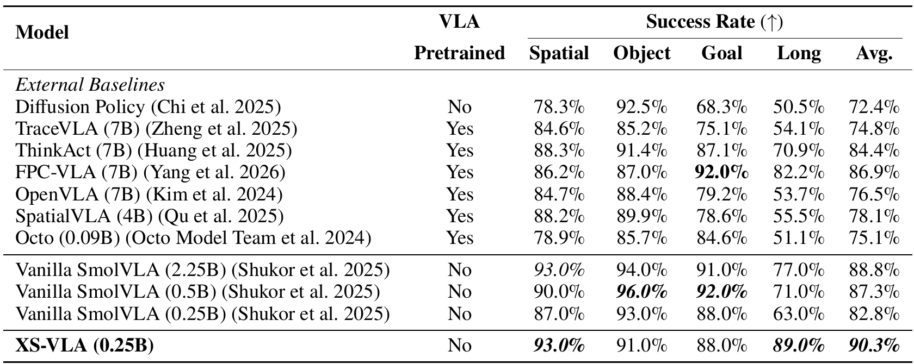

| 모델 | action-trajectory 사전학습 | Spatial | Object | Goal | Long | Avg. |
|---|---|---:|---:|---:|---:|---:|
| Diffusion Policy | No | 78.3 | 92.5 | 68.3 | 50.5 | 72.4 |
| TraceVLA 7B | Yes | 84.6 | 85.2 | 75.1 | 54.1 | 74.8 |
| ThinkAct 7B | Yes | 88.3 | 91.4 | 87.1 | 70.9 | 84.4 |
| FPC-VLA 7B | Yes | 86.2 | 87.0 | 92.0 | 82.2 | 86.9 |
| OpenVLA 7B | Yes | 84.7 | 88.4 | 79.2 | 53.7 | 76.5 |
| SpatialVLA 4B | Yes | 88.2 | 89.9 | 78.6 | 55.5 | 78.1 |
| Octo 0.09B | Yes | 78.9 | 85.7 | 84.6 | 51.1 | 75.1 |
| Vanilla SmolVLA 2.25B | No | 93.0 | 94.0 | 91.0 | 77.0 | 88.8 |
| Vanilla SmolVLA 0.5B | No | 90.0 | 96.0 | 92.0 | 71.0 | 87.3 |
| Vanilla SmolVLA 0.25B | No | 87.0 | 93.0 | 88.0 | 63.0 | 82.8 |
| XS-VLA 0.25B | No | 93.0 | 91.0 | 88.0 | 89.0 | 90.3 |

단위는 success %. `VLA Pretrained=No`는 별도 **action trajectory pretraining**이 없다는 표 정의다. pretrained SmolVLM2와 Qwen-generated CSD data를 쓰지 않았다는 뜻은 아니며 downstream robot demonstration 학습도 당연히 수행한다. `[PDF p.6, Table 1]`

**[검산]** XS-VLA suite 평균은 (93+91+88+89)/4=90.25%, 표는 90.3%로 표시한다. 0.25B baseline 평균은 82.75%→82.8%다. unrounded 평균 차이도 +7.50 pp다. suite별 변화는 Spatial +6, Object -2, Goal 0, Long +26 pp다. 총 +30 pp의 suite 합에서 +26 pp가 Long에서 왔으므로 평균 개선의 대부분은 긴 시퀀스 쪽이다.

0.5B 대비는 평균 +3.0 pp, Long +18 pp이고 2.25B 대비는 평균 +1.5 pp, Long +12 pp다. 2.25/0.25=9라는 backbone scale ratio는 산술로 맞지만 inference latency 9배 개선을 뜻하지 않는다. XS-VLA가 모든 suite에서 가장 좋은 것도 아니다. Object는 0.5B의 96.0%, Goal은 92.0%가 더 높다.

**해석.** 긴 task에서 초반 잘못된 target 선택·action 흔들림이 누적되므로 두 구성요소가 유리하다는 것은 저자 가설과 일치한다. 하지만 stage별 error attribution이나 trajectory jerk/oscillation 분석 없이 Table 1만으로 “Long 이득 전부가 올바른 공간 attention 때문이다”라고 식별할 수는 없다. 7B reference보다 평균이 높다는 결과도 외부 평가조건 차이가 있다.

### 9.3 Table 2: 구성요소 ablation과 산술

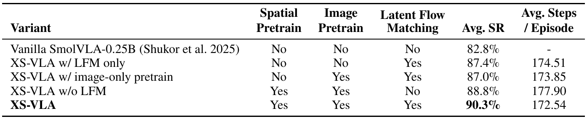

| Variant | spatial pretrain | image pretrain | LFM | Avg. SR | Avg. steps/episode |
|---|---|---|---|---:|---:|
| Vanilla SmolVLA-0.25B | No | No | No | 82.8% | 미보고 |
| XS-VLA, LFM only | No | No | Yes | 87.4% | 174.51 |
| XS-VLA, image-only pretrain | No | Yes | Yes | 87.0% | 173.85 |
| XS-VLA w/o LFM | Yes | Yes | No | 88.8% | 177.90 |
| full XS-VLA | Yes | Yes | Yes | 90.3% | 172.54 |

**[검산]** LFM only는 baseline보다 +4.6 pp, CSD only는 +6.0 pp다. full은 LFM only보다 +2.9 pp, CSD only보다 +1.5 pp, image-only+LFM보다 +3.3 pp다. image-only+LFM은 LFM only보다 -0.4 pp라, 원이미지를 봤다는 것만으로 CSD 이득을 설명하기 어렵다는 저자 해석을 지지한다.

단, image-only pretrain의 exact text target·loss·학습 budget은 충분히 공개하지 않는다. Appendix C는 LIBERO 이미지가 robot manipulation task라는 정보만 주고 explicit position annotation은 주지 않았다고 설명한다. 따라서 동일 compute·token count·regularization까지 맞춘 counterfactual로 검증됐는지는 확인할 수 없다.

**“Complementary”와 synergy를 구분하기.** 조합이 각 단일 구성보다 높다는 의미의 상보성은 표가 지지한다. 그러나 가산적 이득은 아니다. **R17, 단순 factorial difference**를 계산하면 다음과 같다.

```math
90.3-88.8-87.4+82.8=-3.1\ \text{pp}.\qquad\text{(R17)}
```

이는 +6.0과 +4.6을 그대로 더한 +10.6 pp보다 실제 full gain +7.5 pp가 작다는 뜻이다. 포화·공통 failure 해결·측정 variability 등이 가능하고 raw 반복 결과가 없어 mechanism을 확정할 수 없다. full model이 최고라는 사실은 유지되지만 “두 모듈이 초가산적으로 시너지를 낸다”는 표현은 피해야 한다.

**component attribution의 해상도.** `LFM`은 CVAE, latent conditioning, Huber objective, KL warmup 등을 묶은 variant다. posterior latent만 켜고 Huber는 고정한 비교, warmup on/off, z=0 대 prior sample 대 posterior sample, latent dimension sweep, teacher size·grid size·noise threshold ablation은 없다. 따라서 +4.6 pp를 CVAE 하나의 순수 이득으로 특정할 수 없다.

**step 수 검산.** 177.90→172.54는 5.36 step, 약 3.013% 감소다. step ratio는 약 1.0311×다. 174.51→172.54는 1.97 step, 약 1.129% 감소다. 성공·실패 episode를 어떤 방식으로 평균했는지, timeout이 평균에 어떻게 들어가는지 미기재라 “성공한 동일 경로를 3% 빠르게 수행”으로 직접 환산할 수 없다. [효율 절](#efficiency)에서 timing과 분리한다.

### 9.4 Table 4: architecture comparison의 정확한 의미

| Component | Vanilla SmolVLA | ACT | XS-VLA |
|---|---|---|---|
| Vision backbone | Vanilla SmolVLM2 | VLM 없음, ResNet | Distilled SmolVLM2-0.25B |
| Action policy | Standard FM | Deterministic L1 | Latent FM |
| Intent modeling | 없음 | CVAE latent z | CVAE latent z + flow |
| Objective | Standard FM loss | L1 + KL | Huber FM + KL warmup |

이는 원문 Appendix A의 기능 비교표이며 parameter·latency의 측정표가 아니다. ACT의 “deterministic L1”은 latent를 쓰지 않는다는 뜻도 아니다. 표 자체가 ACT에 CVAE latent를 표시한다. XS-VLA의 method를 정확히 말하려면 **ACT식 training posterior + SmolVLA식 action expert + CSD initialization**을 함께 말해야 한다. `[PDF p.11, Table 4]`

<a id="spatial-evaluation"></a>

## 10. 공간 distillation 진단: Appendix B 전체

### 10.1 Table 5: teacher label은 얼마나 맞는가

teacher-labeled pool에서 image-instruction pair 50개를 무작위 audit한다. 사람은 지정 cell이 task object 또는 그 visually dominant region에 맞는지 확인한다. 경계·다음 target이 애매한 경우 명확하게 일치하지 않으면 오답으로 친다. 36/50=72.0% agreement다. `[PDF p.13, Table 5]`

이는 teacher confidence 평균, student accuracy, action success 어느 것도 아니다. **[리뷰어 해석]** 14/50이 불일치이므로 label noise를 무시할 수 없다. sample 50의 작은 audit이며 annotator 수·inter-rater agreement·전 class별 오류·raw annotation은 주지 않는다. coarse region에 대한 human check라 정확한 중심 좌표 오차를 나타내지도 않는다. 이후 student evaluation은 이런 teacher label을 reference로 쓰므로 절대적 ground truth localization benchmark로 읽을 수 없다.

### 10.2 Table 6·9: held-out sample이 어떤 분포인가

training episode 0–79와 겹치지 않는 episode 80–99에서 5,313 labeled frame을 만든다. natural evaluation은 seed 42로 500 unique frame을 복원 없이 균일 추출하며 20 held-out episode가 모두 포함된다. balanced evaluation은 seed 43으로 count가 충분한 5개 class 각각 100개를 뽑는다. **natural과 balanced set 간 mutual overlap은 금지했다고 쓰지 않는다.** 서로 다른 population weighting의 두 diagnostic으로 읽는다.

| Reference label | 전체 held-out pool: Table 9 | natural 500: Table 6 | balanced 500에 포함 |
|---|---:|---:|---|
| center | 2,129 | 195 | 100 |
| middle left | 1,107 | 98 | 100 |
| bottom center | 1,029 | 96 | 100 |
| middle right | 631 | 62 | 100 |
| bottom right | 350 | 43 | 100 |
| top center | 28 | 2 | 0 |
| top right | 24 | 2 | 0 |
| bottom left | 14 | 2 | 0 |
| top left | 1 | 0 | 0 |
| 합 | 5,313 | 500 | 500 |

natural set은 center 39%에 집중되어 있다. top left는 full pool에도 1개뿐이라 unique sample만으로 9개 class를 각 100개 평가할 수 없다. balanced의 “균등”은 **지원되는 5개 class 내부에서만** 성립한다. 드문 4개 class에 대한 일반화 증거는 되지 않는다. `[PDF pp.13–15, Tables 6,9]`

### 10.3 inference와 output parser

비교 모델은 untouched `SmolVLM2-256M-Video-Instruct`, step-10,000 CSD checkpoint, majority baseline이다. 두 VLM에는 동일 image·instruction·coarse-label prompt를 주고 greedy decoding, max new tokens 16, batch 8, test-time augmentation 없음으로 평가한다. prompt는 task가 요구하는 물체의 위치 라벨 하나를 9개 중에서 고르라는 뜻이며 robot arm·gripper·destination container를 제외하도록 한다.

fine-tuned model이 올바른 leading label 뒤에 prompt 조각을 복사하는 출력도 만든다. 따라서 문자열 전체 exact equality 대신 **정규화된 출력이 유효 라벨로 시작하면 그 leading label을 예측으로 취하는 deterministic parser**를 두 모델에 동일 적용한다. 두 모델 각각 500개 출력 모두 recognized label로 시작했다고 보고한다. `[PDF pp.13–14]`

**[리뷰어 해석]** 동일 parser는 paired comparison의 일관성을 지키지만, 그 metric은 “출력 형식까지 정확한 답”이 아니라 **파싱 후 class correctness**다. extra text 문제가 남았으므로 100% strict instruction-following을 주장할 수 없다. 모델이 항상 top left를 생성한다는 baseline 현상도 이 particular constrained prompt·robot images에서의 interface failure를 보여 주며 모델의 모든 공간 능력을 0으로 정량화하지 않는다.

### 10.4 U17·U18: micro와 macro를 직접 계산

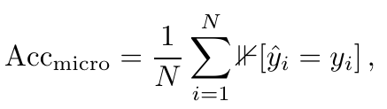

```math
\mathrm{Acc}_{\mathrm{micro}}=\frac1N\sum_{i=1}^{N}\mathbf1[\hat y_i=y_i],\qquad N=500.
```

sample i의 teacher reference가 $`y_i`$, parsed prediction이 $`\hat y_i`$다. 맞으면 1, 틀리면 0을 더하고 sample count로 나눈다. 각 sample을 같은 weight로 보므로 빈도가 높은 center가 더 큰 영향을 준다. percent로 표시할 때 100을 곱한다.

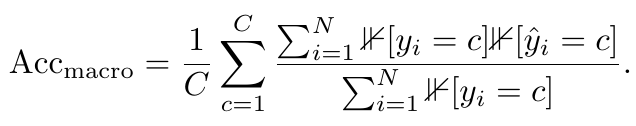

```math
\mathrm{Acc}_{\mathrm{macro}}=\frac1C\sum_{c=1}^{C}\frac{\sum_{i=1}^{N}\mathbf1[y_i=c]\mathbf1[\hat y_i=c]}{\sum_{i=1}^{N}\mathbf1[y_i=c]}.
```

분모는 **reference class c의 sample 수**, 분자는 그 class에서 맞춘 수다. 그래서 이 식은 class별 recall 평균, 흔히 balanced accuracy와 같은 형태다. precision처럼 predicted class count로 나누는 것이 아니다. natural set은 실제 등장한 C=8만 평균하며 absent top left를 0점으로 끼워 넣지 않는다. balanced set은 C=5, 각 분모=100이다. 원문의 indicator glyph는 편집 가능한 식에서 동등한 $`\mathbf1`$로 표기했다. `[PDF p.14]`

**[해설용 예제]** A class 90개 중 81개, B class 10개 중 1개를 맞히면 micro는 82%, macro는 (90%+10%)/2=50%다. 두 metric의 차이는 데이터 빈도와 rare-class weighting에서 생기며 계산 오류가 아니다.

### 10.5 Table 7·8: natural distribution 결과

| Model/baseline | Correct | Micro | Macro (8 class) |
|---|---:|---:|---:|
| Default SmolVLM2-256M | 0/500 | 0.0% | 0.0% |
| Majority: 항상 center | 195/500 | 39.0% | 12.5% |
| CSD step 10,000 | 267/500 | 53.4% | 60.7% |

| Reference label | Samples | Correct | Table 8 accuracy |
|---|---:|---:|---:|
| center | 195 | 82 | 42.1% |
| middle left | 98 | 52 | 53.1% |
| bottom center | 96 | 71 | 74.0% |
| middle right | 62 | 26 | 41.9% |
| bottom right | 43 | 32 | 74.4% |
| bottom left | 2 | 1 | 50.0% |
| top center | 2 | 1 | 50.0% |
| top right | 2 | 2 | 100.0% |

**[검산]** class별 정답 합은 267이며 micro 53.4%다. 원 count로 계산한 recall 평균은 약 60.6781%로 표 60.7%와 맞는다. majority baseline은 center에서 recall 100%, 나머지 7개 class 0%이므로 macro=100/8=12.5%다. CSD의 majority 대비 이득은 +14.4 pp다.

**오류 구조.** center reference 195개 중 85개를 bottom center로 예측한다. 정답 center 82개보다 이 혼동 수가 더 많다. 2개밖에 없는 top right에서 100%를 받았다고 upper-region grounding이 안정적이라고 말할 수 없다. 각 class를 똑같이 평균하는 macro에서 작은 3개 class가 큰 weight를 차지하므로 60.7%만 단독 인용하지 않는 것이 좋다.

train episodes의 처음 500 label sample에서는 70.8%를 보고한다. 그러나 이는 순차 sample·4개 reference class이고 held-out은 random sample·8개 class다. 70.8−53.4=17.4 pp를 순수 overfitting gap으로 해석하면 distribution 차이를 누락한다. 저자도 held-out을 primary generalization estimate로 삼는다. `[PDF pp.14–15, Tables 7–8]`

### 10.6 Table 10–12: 5-class balanced 결과

| Model/baseline | Correct | Micro | Macro |
|---|---:|---:|---:|
| Default | 0/500 | 0.0% | 0.0% |
| Majority: 포함 class 하나 고정 | 100/500 | 20.0% | 20.0% |
| CSD | 293/500 | 58.6% | 58.6% |

| Reference class | Correct/100 | Accuracy |
|---|---:|---:|
| bottom center | 78 | 78.0% |
| bottom right | 72 | 72.0% |
| middle left | 52 | 52.0% |
| middle right | 50 | 50.0% |
| center | 41 | 41.0% |

**[검산]** 정답 합 293, 293/500=58.6%. denominator가 class마다 100이라 macro도 (78+72+52+50+41)/5=58.6%다. majority보다 +38.6 pp다. default가 0이므로 paired outcomes는 fine-tuned만 정답인 293개, 둘 다 오답 207개, default만 정답 0개다. 이것이 다른 task나 prompt에 대한 paired superiority까지 확장되지는 않는다.

| Predicted label | Table 12 count |
|---|---:|
| bottom center | 173 |
| bottom right | 88 |
| center | 88 |
| middle left | 72 |
| middle right | 58 |
| bottom left | 19 |
| top right | 2 |
| 합 | 500 |

reference는 각 100개인데 bottom center 예측은 173개다. center 100개 중 40개와 middle right 100개 중 20개가 bottom center로 간다. natural set의 편향을 균등 reference로만 해결하지 못했다는 증거다. reference에 없는 bottom left/top right를 예측한 21개도 존재한다. 따라서 이 balanced evaluation은 output을 5개 class로 강제 제한한 classification이 아니라 **9개 vocabulary로 예측하고 5개 reference class에서 평가**한 것이다. `[PDF pp.14–16, Tables 10–12]`

### 10.7 diagnostic이 답하는 것과 답하지 않는 것

이 진단은 image-language를 coarse teacher label로 연결하는 능력이 CSD로 증가했는지 확인한다. label fit과 downstream success를 함께 보인 점은 단순 “공간 능력이 좋아졌다”는 주장보다 강하다. 그러나 teacher GT noise, 5-class balanced support 제한, top-left 출력으로 붕괴한 default, lowercase/leading-label parser, camera-region bias 때문에 high-precision geometry benchmark로 볼 수 없다.

또한 human audit 72%와 student teacher agreement 53.4%를 곱해 “student의 human 정확도는 38.4%”라고 계산하면 안 된다. 두 평가의 표본·오류 상관이 다르고 teacher와 불일치하는 student가 오히려 human target에 맞을 가능성도 있다. human-labeled 동일 sample에서 직접 비교해야 한다.

<a id="real-world"></a>

## 11. 실물 로봇: 본문 Table 3과 Appendix C·D

### 11.1 Mobile ALOHA task·data·평가

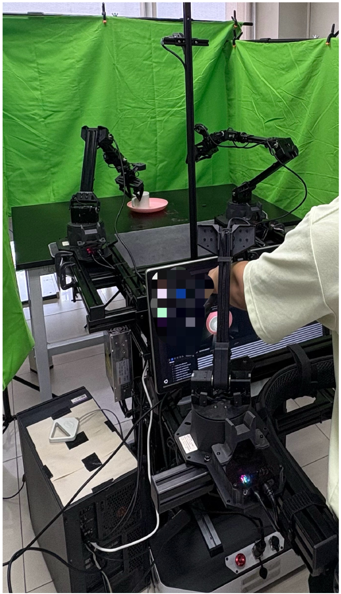

**Figure 3.** 실험 workstation과 로봇 구성. 논문은 단일 NVIDIA RTX 3090에서 학습·실시간 추론했다고 보고한다. 사진만으로 전체 camera resolution·serial bus·control frequency를 정할 수 없다. `[PDF p.17, Fig.3]`

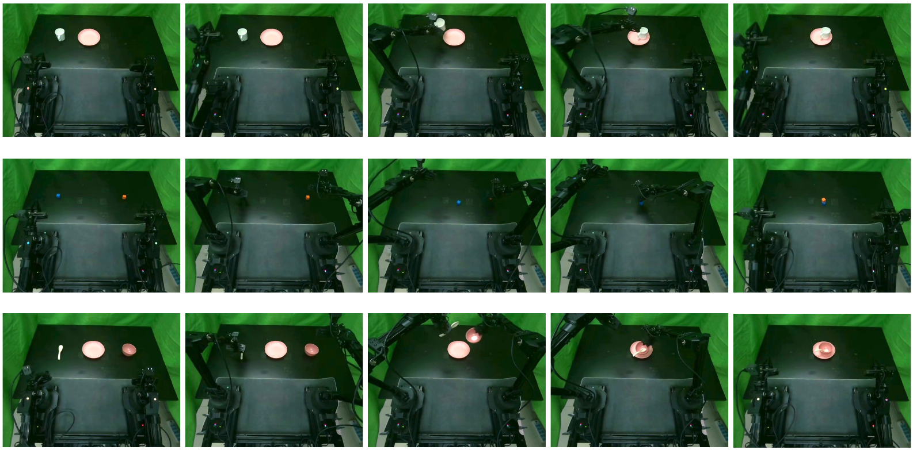

**Figure 4.** 위부터 cup placing, dual-arm block stacking, sequential bimanual coordination의 대표 프레임이다. 연속 timestamp와 failure trial이 제공되지 않으므로 속도·안정성 분포를 이 장면만으로 평가하지 않는다. `[PDF p.18, Fig.4]`

| Task | 조작 순서 | 평가 기준 | 학습·평가 규모 |
|---|---|---|---|
| Cup placing | 한 팔로 cup grasp→lift→transport→plate 위 안정 배치 | 떨어뜨리지 않고 안정적으로 plate에 놓으면 1 | task당 100 demos, 3 operators; model별 20 trials |
| Block stacking | 두 팔로 25 mm×25 mm 작은 wooden block 정렬·stack | 두 block을 함께 가져오면 1점; 떨어뜨리지 않은 완전한 안정 stack은 총 2점 | 20 trials, partial score 최대 40, full success 별도 |
| Sequential coordination | 왼팔이 spoon을 집어 오른팔이 든 bowl에 놓고, 오른팔이 bowl+spoon을 plate로 운반 | 전체 순차 동작 완수하면 1 | 20 trials, 최대 20점 |

3명의 사람은 reaching, grasp pose, 속도, approach 방향, 양팔 coordination 스타일의 variation을 만든다. 100 demos는 세 작업 합이 아니라 **task당 100개**, Mobile ALOHA 총 300개다. 다만 operator별 trajectory 수·operator-held-out split은 명시하지 않는다. 따라서 “unseen operator generalization” 실험으로 말할 수 없다.

baseline과 XS-VLA는 같은 instructions·hardware·camera configuration·reset procedure를 사용한다. trial 사이 robot을 reset하고 초기 object 배치를 가능한 한 맞춘다고 적는다. 실물 특성상 모든 초기 pose가 수학적으로 동일하다는 paired seed protocol은 아니다. CSD를 real-world camera 이미지로 다시 수행했는지, 실물 policy training step·optimizer·validation split은 명확하게 공개하지 않는다. `[PDF pp.7,15–17, Appendix C]`

### 11.2 Table 3: 성공률과 partial credit을 분리하기

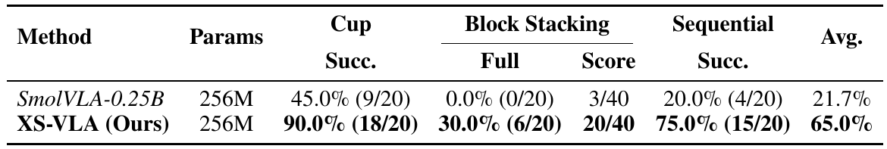

| 모델 | Params 표기 | Cup success | Block full success | Block partial score | Sequential success | Avg. full success |
|---|---:|---:|---:|---:|---:|---:|
| SmolVLA-0.25B | 256M | 45.0% (9/20) | 0.0% (0/20) | 3/40 | 20.0% (4/20) | 21.7% |
| XS-VLA | 256M | 90.0% (18/20) | 30.0% (6/20) | 20/40 | 75.0% (15/20) | 65.0% |

**[검산]** baseline full successes는 9+0+4=13/60=21.6667%, XS-VLA는 18+6+15=39/60=65.0%다. unrounded 절대 차이는 43.3333 pp, 성공 건수 ratio는 39/13=3배다. 이는 **성공 건수/확률 비율이며 execution speedup이 아니다**. 반올림된 65.0/21.7≈2.995를 근거로 다른 속도 주장을 만들지 않는다.

task별 이득은 Cup +45 pp, Block full +30 pp, Sequential +55 pp다. full average의 block 항에 partial score 20/40=50%를 대신 넣으면 평균을 과대평가한다. Table 3의 65%는 strict full-success 평균이다.

partial score의 규칙이 0/1/2점이며 full stack 6회가 각각 2점이라고 읽으면, XS-VLA의 20점은 full 12점+partial-only 8점으로 분해된다. 즉 **[검산·조건부]** 6 full, 8 partial, 6 zero trial과 일치한다. baseline은 0 full, 3 partial, 17 zero와 일치한다. 이는 aggregate에서 복원 가능한 score count일 뿐 각 trial 행동을 관찰한 데이터는 아니다.

**제한.** 20 trials에서는 성공 한 번이 5 pp다. 블록에서 30% full success는 baseline보다 개선이지만 14/20 trial은 완전한 stack을 달성하지 못했다. CI, 여러 training seed, blind evaluator 여부, failure taxonomy가 없으므로 broad deployment reliability까지 결론내리지 않는다.

### 11.3 Appendix C의 상세 ablation 해석

pp.17–18은 Table 2를 다시 설명하며 LFM+4.6 pp, CSD+6.0 pp, full+7.5 pp를 강조한다. 이는 새로운 독립 실물 ablation 표가 아니라 **앞의 LIBERO ablation에 대한 추가 설명**이다. 실물 Table 3은 baseline과 full XS-VLA 두 모델만 비교하므로 real-world gain에서 CSD와 LFM 각각의 기여율을 분리할 수 없다.

p.18의 “training-time profile”, “lower measured episode time”, “computational efficiency” 표현은 표의 environment steps와 함께 등장한다. 그러나 table에 ms·GPU utilization·steps/second가 없어 timing claim의 정량 근거로는 제한적이다. 성공적인 짧은 행동을 학습한 것과 한 forward를 더 적은 계산으로 실행한 것은 다른 현상이다.

### 11.4 Appendix D: XLerobot carrot transfer와 Table 13

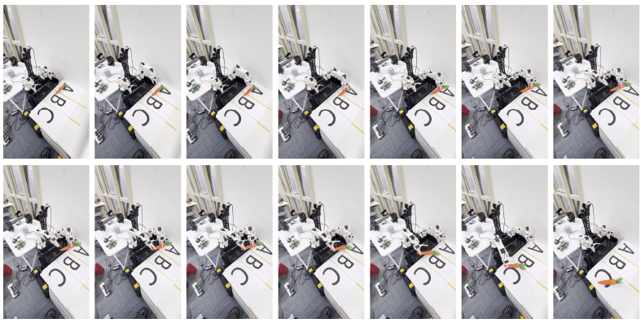

**Figure 5.** 왼손으로 carrot을 잡고 오른손으로 넘긴 뒤 지정 위치에 놓는 XLerobot 사례. 세 작업자의 teleoperation 100 demos로 motion style variation을 만들었다. `[PDF pp.18–19, Fig.5]`

| 모델 | training steps | Trials | Score / 10 |
|---|---:|---:|---:|
| SmolVLA 0.5B | 60,000 | 10 | 6.5 |
| ACT | 80,000 | 10 | 7.0 |
| XS-VLA | 20,000 | 10 | 7.5 |

grasp 성공 0.5점, transfer+placement 성공 추가 0.5점으로 trial당 최대 1점이다. 따라서 7.5/10은 75% strict task success라고 자동 변환할 수 없다. 예를 들어 5 full+5 grasp-only도 7.5점이며 7 full+1 grasp-only+2 failure도 7.5점이다.

**[저자 보고]** 이 결과를 qualitative demonstration으로 제시하며 latent가 행동 스타일을 조직해 coherence를 높였다는 가설을 제시한다. **[리뷰어 해석]** 훈련 step이 20k/60k/80k로 다르고 모델·objective도 달라 sample efficiency나 optimizer efficiency를 통제해 비교한 결과가 아니다. 10회에서 score 차이는 0.5–1.0점이며 통계 반복도 없다. Table 3보다 증거 강도를 낮춰 읽는 것이 맞다. `[PDF p.18, Table 13]`

### 11.5 OpenARM·PiPER 및 Figure 6·7

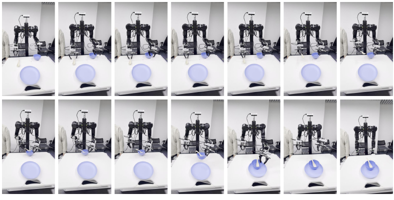

**Figure 6.** OpenARM의 `Tidy the table` 사례. `[PDF p.19]`

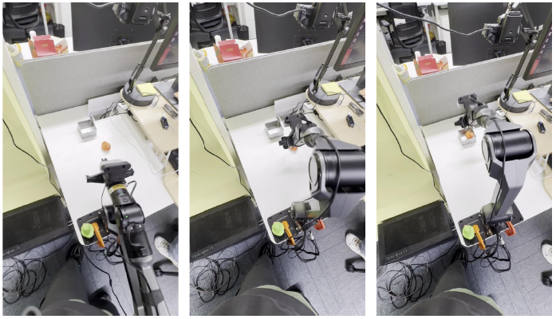

**Figure 7.** PiPER의 `Pick the orange duck` 사례. `[PDF p.19]`

Appendix D는 이 하드웨어에도 deploy했고 inference에 `1600M GPU memory`가 필요하다고 적는다. **[논문 미기재]** 이 memory가 어느 platform·dtype·batch·camera/horizon·solver step에서 측정됐는지, M의 MB/MiB 구분, framework allocated/reserved인지 NVML process memory인지, peak인지 steady state인지 알 수 없다. 각 플랫폼 성공률·반복 횟수·동일 baseline·action mapping·training data와 step도 없다. 따라서 multi-platform 포팅 가능성의 정성 사례이며 generalized zero-shot embodiment transfer를 입증하지 않는다.

<a id="efficiency"></a>

## 12. 효율 주장과 실시간 제어의 의미

### 12.1 논문이 측정한 것과 측정하지 않은 것

| 항목 | 원문 보고 | 해석 가능 범위 |
|---|---|---|
| backbone/model scale | 0.25B, 실물 표 256M | 저자 명목 scale; 전체 구성별 parameter inventory 없음 |
| teacher 비용 | Qwen3-VL-4B offline annotation | deployment에서 실행 안 함; annotation 시간·비용 미보고 |
| CVAE 제거 | inference bypass, z=0 | posterior encoder 연산 제거 |
| GPU | real-world single RTX 3090 | Jetson Thor·TensorRT 측정 아님 |
| inference memory | Appendix D `1600M` | 측정 정의·설정 미공개 |
| environment steps | full 172.54/episode | task interaction horizon 결과 |
| FLOPs/MACs | 미보고 | 0.25B로 직접 환산 불가 |
| visual/text token count·KV cache | 미보고 | token pruning·cache speedup 없음 |
| single forward, chunk latency, TTFA | 미보고 | ms 단위 실시간 정책 성능 미확인 |
| flow solver·NFE | 미보고 | action expert 반복 비용 미확인 |
| policy refresh·actuator Hz | 미보고 | Introduction 10–50 Hz와 구분 |
| p50/p95/p99·deadline miss·power | 미보고 | tail latency·edge energy 결론 불가 |

“without increasing deployment-time model cost”의 가장 확실한 설계 근거는 **추가 teacher와 training posterior encoder가 추론에 필요 없다는 점**이다. 그렇다고 baseline 대비 bitwise 동일 module count·FLOPs·latency라는 뜻은 아니다. z projection은 zero input에서도 bias가 있으면 상수 nonzero token이 된다. constant folding 가능성과 precision·attention 구현은 실제 코드로 확인해야 한다.

### 12.2 chunk throughput과 policy refresh를 분리

**R18, 일반적인 측정 정의.** 한 chunk의 action 수가 K, 생성 시간이 T초라면 다음을 구분한다.

```math
f_{\mathrm{refresh}}=\frac1T,\qquad R_{\mathrm{action}}=\frac KT.
```

첫째는 초당 새 관측에 기초한 policy call 수, 둘째는 초당 생성되는 action vector 수다. 실제 servo update rate는 queue·control loop에 의해 별도로 정해진다. 이 논문은 K와 T를 모두 충분히 공개하지 않아 어느 값도 검산할 수 없다.

sensor-to-action 시간은 camera acquisition, preprocess/transfer, VLM, 반복 action expert, postprocess, command transport·queue까지 포함한다. **R19는 배포를 위한 분해 제안**이며 저자 측정값이 아니다.

```math
T_{\mathrm{sensor\to action}}=T_{\mathrm{capture}}+T_{\mathrm{preprocess}}+T_{\mathrm{VLM}}+\sum_{j=1}^{M}T_{\mathrm{expert},j}+T_{\mathrm{postprocess}}+T_{\mathrm{queue/transport}}.
```

평균 episode steps가 3% 낮아도 $`T_{\mathrm{expert}}`$가 증가하면 wall-clock 완료 시간은 늘 수 있다. inverse하게 모델 forward가 빨라져도 더 흔들리는 policy가 더 많은 environment steps를 쓰면 task completion은 느릴 수 있다. paper의 step 결과를 E2E model speedup으로 다시 이름 붙이면 안 된다.

<a id="limitations"></a>

## 13. 재현성·원문 불일치·한계

### 13.1 원문 안에서 조심해서 해석할 부분

| 원문 설명 | 문제 | 이 리뷰의 처리 |
|---|---|---|
| input detach로 FM이 VAE를 직접 drive하지 않게 함, p.11 | input detach는 parameter gradient를 차단하지 않음 | chain rule 제시; z detach를 임의 추가하지 않음 |
| prior mean으로 deterministic action, pp.4,12 | flow action noise는 별도로 존재 | latent만 결정적임을 확정; action seed policy 미기재 |
| feature가 latent prior를 condition, p.11 | 명시 prior는 unconditional standard normal | learned conditional prior를 구성에 추가하지 않음 |
| causal mask 아래 symmetric interaction, p.12 | full triangular mask라면 prefix→suffix 역방향 불가능 | exact mask 미확정, 양방향·KV reuse 단정 보류 |
| k가 chunk size, $`a_{t:t+k}`$ | inclusive index 해석이면 k+1 | 실제 count를 K로 재정의 |
| CSD에서는 vision frozen, policy는 end-to-end | 서로 다른 stage의 경계 | Stage 2는 vision도 trainable로 기록 |
| CSD smoothing으로 경계 overconfidence 완화, p.11 | smoothing 0.1은 위치 인접성을 정의하지 않음 | CSD CE와 action Huber를 분리하고 smoothing scope 미공개 명시 |
| steps/episode로 computational efficiency 해석, p.18 | per-forward/초 단위 runtime 정보 없음 | environment interaction 효율로 제한 |
| 0.25B/256M과 cost 유지 | train-only·inference 전체 parameter 산출표 없음 | 명목 scale과 exact parameter equality 구분 |

### 13.2 재현 가능한 부분과 추가 자료가 필요한 부분

| 영역 | 원문으로 확보한 recipe | 부족한 정보 |
|---|---|---|
| teacher annotation | Qwen3-VL-4B, temp 0, normalized center, confidence≥0.5, 3×3 | exact checkpoint revision, prompt JSON schema, seed, failures/occlusion policy, full annotation manifest |
| CSD data | 100 episodes, 27,721 labels, train0–79/held-out80–99, subsample4,510 | dataset revision·task mapping·frame cadence phase·camera 선택 |
| CSD optimizer | AdamW, 10k, batch4, LR1e-4, WD1e-2, clip10, smoothing0.1 | betas·scheduler·precision·gradient accumulation·mask implementation |
| augmentation | horizontal flip0.5+label swap, photometric, affine 제외 | 수치 범위·instruction transformation·sampling code |
| transfer | compatible weights, 16 retained Transformer layers | layer indices·weight keys·총 inference parameter count |
| CVAE | CLS+state+actions, width256, sinusoidal PE, pre-LN, Gaussian reparam | latent dim·layers·heads·FFN·dropout·padding·clamp |
| action expert | interleaved cross/joint attention, prefix image/text/state/z | interleaving N·exact mask·weight sharing·hidden sizes |
| objective | Huber FM+KL, Beta tau, KL 10k warmup | delta·lambda·Beta α/β·reduction·optimizer·noise convention |
| policy data | same LeRobot-LIBERO, 160k steps | action representation·normalization·horizon·image preprocessing·state padding |
| inference | posterior bypass, z=0 | solver·NFE·tau schedule·epsilon seed·action execution length·latency |
| closed-loop eval | task당10, fixed seed; real task당20 | seed 값·multiple runs·raw rollout logs·CI·checkpoint selection |
| real-world | ALOHA3 tasks×100 demos×3 operators, RTX3090 | operator allocation·split·train steps·real camera CSD 재학습 여부 |

원문 PDF와 공식 서지를 확인하고 제목·XS-VLA·arXiv ID의 GitHub/Hugging Face 검색을 수행했지만 저자 연결의 공개 구현을 식별하지 못했다. 검색에 잡히는 paper list나 제3자 요약을 official source로 쓰지 않았다. 따라서 코드 commit·forward parity·checkpoint integrity·실행 재현을 검증했다고 주장하지 않는다. **공식 코드 부재는 공개 코드가 절대로 없다는 증명이 아니라 이번 확인 범위의 결과**다.

### 13.3 저자 한계와 리뷰어가 추가로 보는 검증 공백

**[저자 보고]** §6은 3×3 label의 2D coarse 성격, depth·orientation·precise 3D geometry 미포함, teacher noise 취약성, latent variable의 해석 불가능성을 인정한다. 향후 lightweight world-model-style supervision으로 더 풍부한 공간 정보를 넣는 방향을 제시한다. Appendix B는 human reference 부재, 5-class 지원 제한, lower-center bias를 따로 지적한다. `[PDF pp.7,15]`

**[리뷰어 해석]** 추가로 확인할 것은 다음과 같다.

- **객체 정체성과 cell의 분리.** 같은 cell의 distractor가 많으면 coarse supervision만으로 target instance를 선택할 수 없다. text semantics와 downstream action이 그 차이를 배우는지 object-level audit가 필요하다.
- **카메라 배치 변화.** image-plane label은 robot-centric geometry가 아니다. camera pose·FOV가 바뀌면 같은 action과 cell의 관계가 달라진다. LIBERO의 lower-center prior가 다른 camera에서 실패할 수 있다.
- **순차 지시의 progress ambiguity.** 한 frame에서 숨겨진 완료 상태를 알 수 없는 경우 잘못된 “다음 물체”를 label할 수 있다. state/history를 annotation에 넣는 확장은 이 논문 방식과 다르다.
- **posterior–prior gap.** 학습 z는 미래 GT action을 압축할 수 있지만 deployment z=0은 그런 정보를 갖지 않는다. zero latent가 잘 되는 범위와 prior sampling 비교가 필요하다.
- **mode structure의 직접 증거 부족.** latent interpolation·operator classification·mode coverage·posterior collapse statistic·jerk/acceleration은 보고하지 않는다. “스타일을 조직한다”는 설계 해석과 실제 success 증가를 구분해야 한다.
- **평가 추정의 불확실성.** task당 소수 rollout, training seed 반복·CI 부재로 작은 +1.5 pp incremental gain이 얼마나 안정적인지 알 수 없다. 실물의 큰 gain과도 evidence strength가 다르다.
- **기존 FM과의 공정한 원인 분리.** LFM 묶음의 성능 개선은 관찰되지만 pure latent contribution과 Huber의 robust regression 효과는 분리되지 않았다.

**평가.** 이 논문의 가장 설득력 있는 결과는 “작은 VLM에 noisy한 coarse label만 먼저 가르쳐도 downstream baseline 82.8→88.8이 되고, latent action 학습을 더한 full model이 90.3이 된다”는 통제된 구성 비교다. 가장 약한 부분은 exact inference implementation과 실제 latency·multimodal latent mechanism의 직접 증거다. 이 강약을 함께 유지하면 실용적 아이디어를 과장 없이 사용할 수 있다.

<a id="deployment"></a>

## 14. OpenVLA·Jetson Thor·TensorRT와의 연결

이 절은 **[후속 연구 제안]**이다. XS-VLA 논문은 Jetson Thor, TensorRT, TensorRT-LLM, ONNX export, FP8/NVFP4 quantization, target edge power·latency를 검증하지 않는다. 아래는 논문의 모듈 경계로부터 만드는 실험 계획이며 지원 여부를 확인한 제품별 호환성 안내가 아니다.

### 14.1 OpenVLA에 무엇을 가져올 수 있는가

Table 1에는 OpenVLA 7B가 reference로 있지만 **OpenVLA backbone에 CSD·LFM을 이식한 실험은 없다**. 공간 라벨 tuning은 VLM이 image-language→text 인터페이스를 제공한다면 개념적으로 적용 가능하다. 그러나 해당 action training이 사용하는 layer·visual token·projection과 label tuning으로 바뀐 parameter를 맞춰야 한다. tokenizer prompt와 pretrained spatial ability가 다르므로 같은 3×3 loss가 같은 이득을 준다고 보장하지 않는다.

action-token autoregressive 경로에 LFM을 붙이려면 continuous action expert, noisy action representation, time embedding, state·latent conditioning, CVAE training branch를 새로 구현해야 한다. 단순 checkpoint 교체가 아니다. 사용자 관심의 OpenVLA 최적화에 즉시 재사용하기 쉬운 부분은 **offline teacher label 및 stagewise initialization 아이디어**, 어려운 부분은 **action head 재구성과 exact inference port**다.

### 14.2 학생 inference graph를 export할 때의 경계

| 구성 | deployment graph에서 해야 할 일 | 검증 기준 |
|---|---|---|
| Qwen teacher·grid JSON | offline dataset job로 분리 | inference graph에 teacher load가 없는지 |
| language head·spatial text decode | 제거된 action policy path 유지 | inference에 label generation loop가 없는지 |
| CVAE encoder | training artifact로 보관, deployment forward bypass | GT action input이 inference signature에 없는지 |
| z condition | zero latent와 projection을 보존; 가능하면 검증 후 constant fold | bias·normalization을 포함해 원 output parity |
| VLM feature path | 실제 compatible16-layer selection·preprocessing을 고정 | raw RGB부터 hidden feature parity |
| action expert | Q/K/V layout·mask·time embedding·solver를 정확히 이식 | solver 각 step의 velocity·final chunk 오차 |
| robot interface | action scaling·chunk execution·refresh 정의 확보 | sensor timestamp부터 command까지 E2E 기록 |

### 14.3 Thor에서 검증할 순서

1. **Recipe 확정 gate.** official config 또는 저자 확인을 통해 K, action semantics, normalization, latent dimension, interleaving mask, solver/NFE, noise policy를 확보한다. 이 상태가 아니면 “XS-VLA 재현”이 아니라 “XS-VLA-inspired implementation”이다.
2. **기준 inference gate.** 동일 input·noise로 기준 framework의 VLM hidden, velocity, 최종 action chunk를 저장한다. z=0 경로에 posterior 입력이 누수되지 않는지 확인한다.
3. **Target build gate.** 실제 Thor 소프트웨어·runtime 조합에 맞춰 engine/export 경로를 확인하고 target에서 build·검증한다. 다른 GPU의 engine이나 RTX 3090 memory 수치가 그대로 적용된다고 가정하지 않는다.
4. **정확도 gate.** 먼저 원 precision과 fixed shape로 parity를 맞추고, 이후 reduced precision은 작은 물체·gripper/contact·Long task에서 반복 rollout으로 검증한다. weight error가 작아도 행동 임계값에서 성공률이 달라질 수 있다.
5. **시간 gate.** preprocessing, VLM, action-expert step별, solver loop, postprocess, command queue를 분리해 warm/cold latency, p50/p95/p99, deadline miss, memory, power를 잰다.
6. **Closed-loop gate.** 동일 demonstration·seed·camera·horizon·solver budget으로 baseline과 비교한다. success와 sensor-to-action tails를 함께 통과해야 deployment benefit을 주장한다.

**유력한 최적화 후보와 조건.** z=0의 projected token은 상수화할 수 있을 가능성이 있다. context가 solver step에 의존하지 않는 mask라면 VLM/prefix cache가 가능할 수 있다. fixed camera·horizon bucket은 graph capture에 유리할 수 있다. 그러나 정확한 mask·normalization·shared attention update가 없으면 모두 **가능성**이다. 이 논문은 token pruning을 하지 않으므로 label이 알려 준 cell 바깥 patch를 버리는 확장은 별도 정확도 연구가 필요하다.

### 14.4 후속 연구를 공정하게 설계하기

핵심 비교는 같은 작은 backbone과 action expert에서 CSD on/off × latent on/off를 먼저 고정하는 것이다. Huber/MSE, KL warmup, z policy는 각 한 변수씩 바꾼다. spatial label의 cell size 3×3보다 정밀한 supervision이 정말 이익인지, teacher confidence와 human agreement의 관계, flip instruction consistency, camera transfer도 검사할 수 있다. teacher 생성 비용과 추가 CSD optimization을 total training budget에 포함해야 한다.

효율 실험에서 성공률을 맞춘 채 solver step을 줄이는 실험은 가능하지만, 성공률이 달라진 상태에서 최고 FPS만 비교하면 원래 논문의 목적을 놓친다. tiny VLA의 실용 가치는 **동일 제어 조건에서 충분한 성공률과 deadline 만족을 함께 달성하는지**로 판단해야 한다.

<a id="qa"></a>

## 15. 자주 생기는 오해와 학습 순서

**Q1. Where-to-look은 교사의 attention map을 모방한다는 뜻인가?** 아니다. normalized center→3×3 cell→문자열 label의 supervised CE다. teacher hidden state·attention matrix를 loss에 직접 맞추지 않는다.

**Q2. Qwen이 어떻게 팔을 움직일지도 알려 주는가?** 아니다. Qwen의 역할은 offline 공간 target 생성이다. motion은 사람의 state/action demonstrations와 CVAE-conditioned FM으로 배운다.

**Q3. 추론할 때 “middle right”를 생성해서 움직이는가?** 아니다. 위치 knowledge는 backbone parameter로 전달되고, explicit label과 LM head는 policy inference 경로에 없다.

**Q4. CVAE가 future action을 보면 cheating 아닌가?** posterior는 training-only라 target action을 관찰할 수 있다. deployment에서 그 경로를 없애고 z=0을 쓰는 것이 핵심이다. 다만 train–inference gap이 생기므로 prior-mean behavior를 검증해야 한다.

**Q5. z=0이면 CVAE 학습은 무의미하지 않은가?** 학습 중 decoder의 action distribution을 조직하고 KL로 prior 부근을 정규화할 수 있다는 설계다. 하지만 zero latent에서 좋은 mode가 나온다는 보편적 보장은 없어, 이득은 ablation의 경험적 증거로 읽는다.

**Q6. state/action detach이면 CVAE는 KL만 학습하는가?** input detach만으로는 그렇지 않다. z가 decoder에 연결돼 있으면 FM gradient가 posterior parameter에 간다. z detach와 input detach를 구분해야 한다.

**Q7. width256이 latent dimension256인가?** 아니다. 논문이 준 256은 CVAE token embedding width다. latent dimension은 미기재다.

**Q8. 학생의 공간 정확도 53.4%는 human GT 기준인가?** 아니다. held-out teacher labels와 parsed output의 일치율이다. human audit 72%는 teacher label 50개에 대한 별도 측정이다.

**Q9. baseline 공간 점수가 0%면 pretrained VLM이 아무것도 못 보는가?** 아니다. 이 prompt·robot-image evaluation에서 top left만 출력한 결과다. 일반 시각 이해, 다른 prompt, downstream action success까지 0이라는 뜻은 아니다.

**Q10. full XS-VLA가 모든 LIBERO suite에서 우수한가?** 아니다. 0.25B 대비 Long+26·Spatial+6, Object−2, Goal 동일이다. 평균 이득은 Long에 크게 의존한다.

**Q11. 65% 실물 success와 block20/40을 함께 평균했는가?** 아니다. strict task success 39/60=65%다. block partial score는 별도 diagnostic이다.

**Q12. 172.54 steps나 1600M memory로 Thor에서 실시간이라고 판단할 수 있나?** 안 된다. horizon·solver·latency·camera·precision·measurement 정의가 필요하다. environment steps와 inference milliseconds는 다른 축이다.

**추천 학습 순서.** 먼저 Figure 1과 U01–U05로 hard-label distillation 경로를 이해한다. 다음 Figure 2와 shape 표, U07–U09로 posterior와 prior를 구분한다. U10–U14에서 flow derivative·Huber·KL을 계산하고, input detach의 chain rule을 확인한다. 그다음 Table 2로 구성요소 기여를 읽고 Appendix B로 “공간을 배웠다”는 말의 measurement 범위를 제한한다. 마지막으로 Table 3·13과 효율 절을 읽으면 실물 success, partial credit, model runtime을 혼동하지 않을 수 있다.

<a id="coverage"></a>

## 16. Coverage와 검증 기록

### 16.1 원문 section→리뷰 위치

| 원문 범위 | 읽은 내용 | 리뷰 대응 | 처리 |
|---|---|---|---|
| Abstract, p.1 | two-stage·주요 수치 | §2, §9, §11 | 완료 |
| §1 Introduction, pp.1–2 | spatial/motion 병목·contributions | §2–3 | 완료 |
| §2 Related Work, pp.2–3 | 5개 선행연구 묶음 | §3.2 | 완료 |
| §3 CSD, pp.3–4 | teacher·quantization·vocab·CE·transfer | §5, §7–8 | 완료 |
| §3 LFM, pp.4–5 | posterior·latent·flow·loss | §6–8 | 완료 |
| §4 Experiments, pp.5–6 | datasets·baselines·protocol | §9.1 | 완료 |
| §5 Main Results, pp.6–7 | LIBERO·ablation·real-world | §9, §11 | 완료 |
| §6 Discussion and Limitations, p.7 | 2D·teacher·latent limitations | §13 | 완료 |
| §7 Conclusion, pp.7–8 | claim scope | §2, §13.3 | 완료 |
| References, pp.8–9 | prior-work linkage·서지 목록 | §1, §3.2 | 읽음; 각 인용논문 별도 전수 리뷰는 범위 밖 |
| Appendix A CSD, pp.10–11 | dataset·sampling·flip·optimizer·transfer | §5, §7–8 | 완료 |
| Appendix A LFM, pp.11–12 | CVAE width·input detach·attention·warmup | §6–8, §13 | 완료 |
| Appendix B, pp.12–16 | human audit·natural/balanced·parsing·metrics | §10 전체 | 완료 |
| Appendix C, pp.15–18 | task·data·hardware·scoring·ablation 해석 | §11.1–3, §12 | 완료 |
| Appendix D, pp.18–19 | XLerobot·OpenARM·PiPER·memory | §11.4–5 | 완료 |

### 16.2 모든 원문 수식과 핵심 inline 정의의 대응

원문 전체를 확인한 결과 **번호가 매겨진 수식 0개, formal Algorithm 0개**다. 반복 게재된 동일 식은 한 번 상세히 설명하고 모든 출현 쪽을 아래에 연결했다. U01–U18은 논문 번호가 아니다. R01–R19와 R-A/B/C는 리뷰어 보조 식·절차다.

| ID | 원문 비번호 식·정의 | 원문 쪽 | 상세 설명 |
|---|---|---|---|
| U01 | normalized center, [0,1000], confidence[0,1]와 cutoff | 3,10 | §5.1 |
| U02 | row/column floor·min quantization | 3,10 | §5.2 + PNG |
| U03 | grid mapping, 9종 S, indexed S 및 center | 3,10,12 | §5.3 + PNG; §10 |
| U04 | autoregressive CSD NLL | 3,11 | §5.4 + PNG |
| U05 | CSD→VLM initialization assignment | 3,11 | §5.6 |
| U06 | action chunk $`A_t=a_{t:t+k}`$ | 4,11 | §6.1 |
| U07 | posterior $`q_\phi(z\mid A_t,c_t)`$ | 4,11 | §6.2 |
| U08 | reparameterization 및 latent Gaussian noise | 4,12 | §6.3 + PNG |
| U09 | standard prior·inference zero latent | 4,12 | §6.4 + PNG |
| U10 | action noise, time[0,1], linear interpolation | 4,12 | §6.6 + PNG |
| U11 | target field $`u=A_t-\epsilon_a`$ | 4,12 | §6.6 + PNG·미분 예제 |
| U12 | Huber FM expectation | 5,12 | §6.7 + PNG |
| U13 | posterior-to-prior KL | 5,12 | §6.8 + PNG·Gaussian 유도 |
| U14 | weighted total objective | 5,12 | §6.9 + PNG |
| U15 | capped sqrt inverse-frequency, nmax | 10 | §5.5 + PNG |
| U16 | horizontal label swaps | 10 | §5.5 |
| U17 | parser output in S, N=500, micro exact match | 14 | §10.3–4 + PNG |
| U18 | C=8, classwise macro | 14 | §10.4 + PNG |
| 기술 inline 설정 | smoothing0.1, dmodel256, 10k warmup, Beta time | 11–12 | §5.4–5, §6.2·6.6·6.9 |
| 보조 notation | shape·PE·Q/K/V·pre-LN 설명 | 본문/부록의 연산 설명 | §4, §6.2·6.5, §8.3 |

### 16.3 Figure·Table coverage

| 항목 | PDF 쪽 | 리뷰 대응 | 원문 이미지 |
|---|---:|---|---|
| Figure 1 CSD | 4 | §5 | 포함 |
| Figure 2 Pipeline | 5 | §6 | 포함 |
| Figure 3 Workstation | 17 | §11.1 | 포함 |
| Figure 4 ALOHA task frames | 18 | §11.1 | 포함 |
| Figure 5 XLerobot | 19 | §11.4 | 포함 |
| Figure 6 OpenARM | 19 | §11.5 | 포함 |
| Figure 7 PiPER | 19 | §11.5 | 포함 |
| Table 1 LIBERO | 6 | §9.2 | 포함 + 모든 행 재구성 |
| Table 2 Ablation | 6 | §9.3 | 포함 + 모든 행 검산 |
| Table 3 ALOHA | 7 | §11.2 | 포함 + 성공 수·score 검산 |
| Table 4 Architecture | 11 | §9.4 | Markdown 전체 재구성 |
| Table 5 Human audit | 13 | §10.1 | 단일 행 수치·기준 설명 |
| Table 6 Natural distribution | 13 | §10.2 | 전체 class count 재구성 |
| Table 7 Natural results | 15 | §10.5 | 전체 행·micro/macro 검산 |
| Table 8 Natural class results | 15 | §10.5 | 전체 class result 재구성 |
| Table 9 Held-out availability | 15 | §10.2 | 전체 class count 재구성 |
| Table 10 Balanced results | 16 | §10.6 | 전체 행·검산 |
| Table 11 Balanced class results | 16 | §10.6 | 전체 행·검산 |
| Table 12 Prediction distribution | 16 | §10.6 | 전체 count·혼동 설명 |
| Table 13 XLerobot scores | 18 | §11.4 | 전체 행·다른 train budget 설명 |

### 16.4 검증 범위와 남은 제한

- **원문 확인:** 공식 arXiv 서지와 v3 PDF title·version·19 physical pages·SHA-256을 고정했다. pypdf/pdfplumber 텍스트와 Poppler page render를 대조해 수식 부호·축·표 수치를 읽었다.
- **자산 검수:** Figure 7개, 수식 crop 11개, 표 crop 3개를 직접 시각 검수했다. 잘린 기호·주변 문장 경계가 있는 crop은 수정하고 다시 생성했다. 총 21 PNG의 file/hash/page/bbox가 manifest와 대응한다.
- **산술 검산:** LIBERO 평균·suite delta, ablation delta·steps ratio, human36/50, natural/balanced sample 합·micro/macro, ALOHA13/60·39/60, block scoring 관계를 확인했다.
- **문서 검사:** UTF-8, fenced-block 균형, GitHub 보호 inline math와 최상위 fenced math, 상대 이미지·manifest 경로, explicit anchor 16개와 내부 링크 19개를 검사했다. 보조식을 포함한 display math 37개·inline math 101개, 총 138개 수식 표현은 KaTeX와 MathJax에서 parser error 0건이다.
- **렌더링 범위:** 로컬 HTML을 headless Edge의 1440×1120 viewport에서 열어 이미지 21개 로딩, 수식 overflow 0건, page error 0건을 확인하고 대표 화면 9개를 시각 검수했다. GitHub 서버의 실제 페이지, 모든 모바일 viewport, GitHub 전용 rendering pipeline은 검증하지 않았다.
- **실행 제한:** official XS-VLA code/commit·checkpoint·raw trial log를 확인하지 못했다. GPU 학습·추론·로봇 평가·TensorRT/Thor 배포를 수행하지 않았다. 그 한계는 위 각 설정표에 구체적으로 남겼다.

리뷰의 결론은 **coarse spatial supervision과 latent-conditioned action training이 작은 VLA의 조작 성능을 높였다는 경험적 결과**다. exact latent mechanism, inference determinism, deployment latency는 공개 자료만으로 확정할 수 없는 별도 검증 항목이다.
