# FlashVLA 상세 해설: streaming action buffer, chunk별 flow schedule, 비동기 실행의 원리와 검증 범위

> 저장소 원문: [주 PDF](papers/21_FlashVLA.pdf) · [전체 목록](README.md)

> **대상:** *FlashVLA: Streaming Action Decoding for Fast and Asynchronous VLA Inference*  
> **성격:** 본문과 기술 부록 전체, 수식·알고리즘·실험 및 공식 코드의 정적 대조를 포함하는 한국어 학습·비평 해설서.  
> **기준:** arXiv:2608.27384v1, 조회일 2026-09-09. 측정 수치는 저자 결과이며, 이 리뷰에서 GPU 추론·학습·로봇 실험을 수행하지 않았다.

<a id="toc"></a>

## 목차

1. [서지, 원문 고정, 읽은 범위](#source)
2. [핵심 결론과 주장-근거 지도](#claims)
3. [§1-2: motivation과 선행연구](#motivation)
4. [선수 지식과 notation/shape 사전](#notation)
5. [§3.1: flow matching, noise staircase, causal attention](#method)
6. [§3.2: cold start와 streaming 알고리즘](#streaming)
7. [§3.3·A.4: multi-buffer 학습과 loss](#training)
8. [한 관측의 end-to-end forward와 공식 코드](#forward)
9. [§4·A.1: 시뮬레이션 실험과 수치 검산](#experiments)
10. [FASTER·RTC 비교와 반응 시간](#comparison)
11. [§5·A.2: 실제 Franka 배포](#realworld)
12. [A.3: ablation을 정확히 읽기](#ablation)
13. [§6: 한계, 불일치, 재현성](#limitations)
14. [OpenVLA·Jetson Thor·TensorRT와의 연결](#deployment)
15. [Q&A와 학습 순서](#qa)
16. [Coverage checklist와 검증 기록](#coverage)

<a id="source"></a>

## 1. 서지, 원문 고정, 읽은 범위

| 항목 | 확인 결과 |
|---|---|
| 제목 | FlashVLA: Streaming Action Decoding for Fast and Asynchronous VLA Inference |
| 저자 | Zekai Li, Jiaming Tang, Zhijian Liu |
| 소속 | Zekai Li·Zhijian Liu: UC San Diego; Jiaming Tang: MIT. [PDF p.1] |
| arXiv | [2608.27384v1 공식 서지](https://arxiv.org/abs/2608.27384v1), 2026-08-27 17:19:29 UTC 제출. 조회 시 공식 이력에는 v1만 있었다. |
| 게재 상태 | PDF와 arXiv 서지에는 학회 출판 표기가 없다. [저자 보고] [Z Lab 프로젝트](https://z-lab.ai/projects/flashvla/)는 CoRL 2026으로 표시한다. 이 작업에서 별도 학회 proceedings의 채택·출판 레코드를 검증하지 않았으므로, 리뷰의 고정 출처는 arXiv v1이다. |
| 다운로드 URL | [버전을 고정한 PDF](https://arxiv.org/pdf/2608.27384v1) |
| 물리 페이지 | 17쪽. 아래 `PDF p.N`은 1-based 물리 페이지이며 p.2-17의 인쇄 번호와 일치한다. |
| 파일 크기 | 4,875,032 bytes. arXiv submission history의 표시 용량과 별개로 실제 내려받은 PDF의 크기를 기록했다. |
| SHA-256 | `74d35658a10c7a57fdf06a59e4bc021bb8de1bb4ea9b882f38f45e94b3abfa66` |
| 저장소 원문 | [고정한 v1 PDF](papers/21_FlashVLA.pdf) |
| 공식 코드 | [z-lab/flashvla](https://github.com/z-lab/flashvla), 정적 조회 commit `3270b9d1a825da84b62f4afb396e4a204a3a72db` |

실제로 읽은 범위는 Abstract, §1 Introduction, §2 Related Work, §3.1-3.3 Method, §4.1-4.5 Simulated Experiments, §5 Real-World Deployment, §6 Conclusion/Limitations, Acknowledgment, References [1]-[30], Appendix A.1-A.4 전체다. 본문은 pp.1-10, 참고문헌은 pp.11-13, 기술 부록은 pp.14-17이다. **번호 수식은 Eq. (1)-(3) 세 개뿐**이며, 추가 증명이나 별도 번호 loss가 있는 것으로 꾸며서 설명하지 않는다. 부록의 비번호 buffer 구성식, 본문의 비번호 TTR 식, Algorithm 1의 12개 행도 다룬다. 별도 supplementary 파일은 확인하지 못했고, 여기서 부록 전체란 동일 PDF의 A.1-A.4를 뜻한다.

Figure 1-8 전부를 PNG로 발췌했다. 번호 수식 PNG 3개, 부록 비번호 수식 PNG 1개, Algorithm 1 PNG 1개를 더해 **총 13개 원문 발췌 이미지**다. Poppler로 240 DPI 렌더링 후 사각형으로 잘랐으며, 도판을 생성형 이미지로 다시 그리지 않았다. 모든 crop을 직접 시각 검수했고, 논문 그림의 축·범례·식 번호를 보존했다. 이미지 경로는 이 파일 기준 `assets/21_FlashVLA/`다. [출처 및 crop manifest](assets/21_FlashVLA/publication_assets.json)에 PDF 해시, 페이지, top-left 기준 PDF point bbox, 픽셀 크기, 이미지 해시를 기록했다.

원문 도판·수식의 권리는 저자 및 각 권리자에게 있다. 원문 PDF 메타데이터의 License 필드는 [CC BY 4.0](https://creativecommons.org/licenses/by/4.0/)을 가리킨다. 이 리뷰는 출처를 표시한 연구·교육 해설이며, crop 이외의 원문 변형은 하지 않았다. 공개 코드의 Apache-2.0 표기와 논문 도판의 출처·권리를 혼동하지 않는다.

증거 라벨은 다음처럼 사용한다.

- **[저자 보고]**: 원문 논문·공식 프로젝트가 보고한 방법 또는 결과.
- **[공식 코드 확인]**: 위 commit의 소스를 읽어 확인한 구현. 실행 검증과 다르다.
- **[검산]**: 원문에 표시된 숫자를 산술적으로 재계산한 결과.
- **[리뷰어 해석]**: 원문을 이해하기 위한 유도, tensor 표현, 비판적 해석.
- **[논문 미기재]**: PDF에 필요한 세부정보가 없거나 충분히 정의되지 않은 부분.
- **[후속 연구 제안]**: 이 논문이 실제 수행한 결과가 아닌 적용·실험 제안.

<a id="claims"></a>

## 2. 핵심 결론과 주장-근거 지도

FlashVLA의 핵심은 **denoising 중인 여러 미래 action chunk를 하나의 queue에 유지하고, 한 번의 action-expert 호출에서 모두를 한 단계씩 갱신하는 것**이다. 가장 앞의 chunk는 noise가 거의 제거되어 곧 출력되고, 뒤쪽 chunk일수록 noise가 많다. 뒷 chunk가 앞 chunk의 표현을 attention으로 참조하므로, 새 행동은 이미 계획한 궤적의 문맥 속에서 정제된다. [PDF pp.3-5, §3]

이 방식은 “모든 chunk를 pure noise에서 한 번만 계산해 완성한다”는 one-step 생성과 다르다. **steady state에서는 호출당 한 chunk가 나오지만, 개별 chunk는 buffer 길이 N만큼의 denoising update를 거친다.** π0.5 baseline의 10회와 FlashVLA 기본 N=4회도 구분해야 한다. 논문의 “모든 N 단계를 보존한다”는 문장은 FlashVLA가 선택한 N에 관한 것이며 baseline의 10회를 반드시 그대로 유지한다는 뜻은 아니다.

가장 설득력 있는 결과는 선택한 benchmark에서 속도와 성공률을 함께 개선했다는 점이다. 가장 조심할 주장은 causal mask가 부드러움을 보장한다는 해석, long-horizon 향상이 오직 memory 때문이라는 인과 해석, steady-state TTFA를 episode 최초 응답 시간으로 읽는 해석이다. 이들에는 별도 가정과 미검증 영역이 남아 있다.

| 핵심 주장 | 직접 근거 | 지지되는 범위와 제한 |
|---|---|---|
| action decoding 지연을 최대 약 20배 줄인다 | Fig.1b, p.2 각주 | 97.4→4.9 ms의 action 부분. 시스템 최적화 전 프로파일이며 전체 policy는 128.9→36.6 ms, 약 3.52배다. |
| 최적화된 baseline보다 policy 호출이 빠르다 | Table 2 | 4090/5090, 2/3 camera view, 양쪽 CUDA Graph·fusion 적용을 저자가 명시. speedup은 1.51-1.82배다. |
| 비동기 성공률과 실행 시간을 함께 개선한다 | Table 1, Fig.3 | LIBERO d=1: 96.9→97.8%, 53.8→22.1 ms/action. 같은 숫자를 robot inference latency로 바꾸면 안 된다. |
| 별도 future-state predictor 없이 continuity를 얻는다 | §3.1, Fig.6 | inter-chunk attention을 차단하면 평균 성공률이 약 10 pp 감소. jerk·가속도·접촉 안정성의 수학적 보장은 없다. |
| causal direction이 핵심이다 | Fig.6, A.3 | 실제 ablation은 **양방향 attention이 아니라 inter-chunk attention 없음**과 비교한다. 연결 자체의 이득과 방향성의 이득을 완전히 분리하지 못한다. |
| buffer memory가 long-horizon을 돕는다 | Table 3-4, Fig.6 | RoboTwin long subset +36.6 pp. 유력한 해석이나 action-horizon·conditioning·학습 변경까지 모두 제거한 순수 memory 인과실험은 아니다. |
| 아키텍처를 넘어 적용된다 | Table 5, A.4 | π0.5, SmolVLA, LingBot-VLA. SmolVLA async는 80.1→79.5%로 0.6 pp 하락한다. 모든 조건의 무손실을 뜻하지 않는다. |
| FASTER보다 TTFA/TTR이 작다 | Fig.4, §4.3 | 62.1→37.1 ms, 기대 TTR 112.1→70.4 ms. FlashVLA는 buffer가 찬 뒤를 사용하고 TTR은 모델 기반 계산이다. |
| A4000 한 장으로 30 Hz 제어가 가능하다 | §5, Fig.5, A.2 | inference 67.3 ms, E=16, d=2의 chunk 실행 중 추론 겹치기. 매 33.3 ms마다 새 관측에서 전체 policy를 호출한다는 뜻이 아니다. |
| 적용이 가볍다 | §3, A.4 | 기존 flow action expert를 활용하지만 fine-tuning 필요. RoboTwin에서는 norm 재초기화도 사용한다. training-free runtime patch는 아니다. |

<a id="motivation"></a>

## 3. §1-2: motivation과 선행연구

### 3.1 한 chunk씩 따로 생성할 때 생기는 두 비용

flow 기반 VLA는 카메라·언어·상태를 해석하는 VLM과, continuous action을 정제하는 action expert로 나눌 수 있다. baseline은 관측을 한 번 encode/prefill한 뒤 동일 context에 대해 action expert를 여러 차례 호출한다. 한 chunk의 NFE(number of function evaluations)가 끝나야 움직일 수 있다. [PDF pp.1-3]

**동기 실행:** 이전 행동을 다 실행한 뒤 새 관측을 얻고, 다음 chunk를 생성한다. 관측-행동의 시간적 대응은 단순하지만 매 chunk 경계에서 policy 계산이 끝날 때까지 기다린다. 액추에이터가 명령을 유지하는 동안 task 진행이 늦어질 수 있다.

**비동기 실행:** 이전 chunk의 일부가 남아 있을 때 다음 추론을 시작한다. 기다리는 시간을 숨길 수 있지만, 추론에 사용한 상태와 새 행동이 적용되는 상태가 다르다. 예를 들어 물체를 향해 계속 움직이는 도중 예측한 새 행동은 이미 도달한 위치를 다시 목표로 삼을 수 있다. 추론 지연, 실행 중인 경로, 외부 물체 움직임이 모두 mismatch에 영향을 준다.

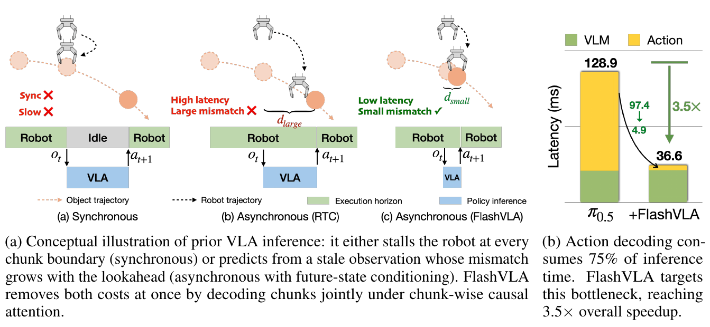

*Figure 1. 실행 중인 궤적과 새 예측의 시간 관계, 시스템 최적화 전 policy latency 분해. [PDF p.2, Fig.1]*

[저자 보고] 두 문제를 만드는 공통 구조는 chunk를 서로 독립적으로 생성하는 것이다. 따라서 단일 chunk의 연산만 줄이는 대신 여러 chunk의 denoising을 시간축으로 엮는다. 이 논리에서 “joint”는 관측 여러 개를 동시에 batch로 넣는다는 뜻보다 **하나의 observation context 아래 진행도가 다른 action들을 함께 정제한다**는 뜻이 강하다.

[리뷰어 해석] 독립 chunk 생성이 중요한 원인이지만 모든 mismatch의 유일한 원인은 아니다. 카메라 지연, 통신, actuator tracking error, 접촉으로 인한 예상 경로 이탈은 buffer attention만으로 사라지지 않는다. 논문의 “두 비용을 한 번에 해결”은 제시된 실험에서의 설계 효과로 읽어야 한다.

### 3.2 §2의 세 선행연구 축

| 계열 | 줄이거나 바꾸는 대상 | FlashVLA와의 관계 |
|---|---|---|
| 경량 backbone, 양자화, visual pruning, kernel 최적화 | 각 forward의 시간·메모리 | 결합 가능한 방향이다. 단, 결합 speedup을 곱해서 예측할 근거는 없다. |
| consistency/shortcut 등 few-step 생성 | 하나의 sample에 필요한 평가 횟수 | FlashVLA는 step-count distillation을 요구하지 않지만 downstream 학습은 요구한다. |
| VLASH·RTC·training-time RTC 등 async 처리 | 실행 중인 행동과 다음 예측의 연결 | FlashVLA는 decoder 내부 inter-chunk dependency로 연결을 학습한다. RTC 자체도 이미 action conditioning을 하므로 prior가 모두 “완전히 독립”이라고 단정하면 과도하다. |
| Diffusion Forcing·StreamDiT·MAGI-1 등 streaming diffusion | noise level이 다른 순차 segment 공동 정제 | buffer/staggered timestep/causal mask의 직접적인 구조적 영감이다. VLA에 맞는 제어·학습·실행 설계가 논문의 기여다. |

논문은 “이 formulation을 VLA에 적용한 최초”라는 주장을 한다. 이 리뷰는 관련 reference를 확인했지만 전체 VLA 선행연구에 대한 완전한 우선권 조사를 수행하지 않았다. 특히 **FASTER(2603.19199)**, **FAST(2501.09747)**, **FASTer neural action tokenizer(2512.04952)**는 서로 다른 논문이다. 여기서 직접 반응 시간 비교 대상은 첫 번째 FASTER다. [PDF pp.2-3,12, §2, References 12-14,21-22]

<a id="notation"></a>

## 4. 선수 지식과 notation/shape 사전

### 4.1 세 개의 시간축을 먼저 분리하기

1. **환경 시간 t:** 로봇·카메라의 물리적 진행. action 하나의 tick과 policy 호출 index는 같지 않을 수 있다.
2. **flow time τ:** clean=0, pure noise=1인 인공적인 생성 좌표. 단위는 초가 아니다.
3. **buffer slot i:** 언제 실행될 chunk인지를 나타내는 queue 위치. steady state에서 i가 작을수록 clean에 가깝고 먼저 출력된다.

이 리뷰는 원문의 혼용을 피하려고 **C=FlashVLA chunk 길이**, **N=buffer chunk 수**, **H₀=baseline 출력 길이**, **E=실제로 실행할 action 수**로 구분한다. 원문 §3.1의 H는 일반 action chunk 길이이고 코드의 지역변수 H는 종종 NC다. 이 둘을 같은 상수로 읽으면 학습 tensor가 틀어진다.

| 기호/이름 | 뜻 | shape 또는 값 | 주의 |
|---|---|---|---|
| $`b`$ | batch 크기 | 추론 예시 1 | 원문 buffer B와 구분 |
| $`o_t`$ | image, instruction, proprioception 조건 | 여러 modality의 묶음 | 단일 벡터가 아니다 |
| $`a_t`$ | 한 action | $`\mathbb R^{D_a}`$ | chunk 전체는 굵은 기호로 구분 |
| $`\mathbf a_t`$ | action chunk | $`\mathbb R^{C\times D_a}`$ 또는 원문 $`H\times D_a`$ | 원문 Eq.(1)의 target |
| $`C`$ | slot 하나의 action 수 | LIBERO 10, RoboTwin·실기 20 | actuator Hz와 다름 |
| $`N`$ | slot 수·chunk당 update 수 | 기본 4, SmolVLA 5 | ablation 4/5/6 |
| $`H_0`$ | π0.5 baseline chunk | 50 actions | baseline NFE=10과 별개 |
| $`E`$ | execution horizon | PDF: LIBERO 5, RoboTwin·실기 16 | C보다 짧을 수 있음 |
| $`d`$ | 미리 추론을 시작하는 action tick 수 | sweep 1-4, 실기 2 | 고정 ms가 아님 |
| $`\mathbf B_t`$ | inference buffer | $`[b,N,C,D_a]`$, 보통 $`[b,NC,D_a]`$로 flatten | action token 수 NC |
| $`\mathbf x^{(i)}_{\tau_i}`$ | slot i의 noisy action chunk | $`[b,C,D_a]`$ | 위치와 noise level 둘 다 중요 |
| $`\mathbf z_i`$ | Gaussian noise | target과 같은 shape | identity covariance는 flattened action 좌표에 해당 |
| $`\tau_i,u_i`$ | noise level, Beta sample | 각 configuration/slot당 scalar | C개의 token에 broadcast |
| $`v_\theta`$ | flow velocity predictor | buffer와 같은 출력 shape | robot velocity 단위라는 뜻이 아님 |
| $`\mathbf B_t^{(j)}`$ | j개 real chunk가 있는 학습 상태 | $`[b,N,C,D_a]`$ | j=N이 full buffer |
| $`L_o`$ | observation prefix token 수 | image tokens+text tokens | view 수에 따라 달라짐 |
| $`L_a`$ | inference suffix 길이 | $`NC`$ | LIBERO 기본 40 |
| $`L_{a,train}`$ | N개 buffer를 pack한 suffix 길이 | $`N^2C`$ | LIBERO 기본 160 |
| $`D_v,D_h`$ | VLM/action expert hidden 폭 | 코드 π0.5: 2048/1024 | 같지 않아도 attention head shape는 맞출 수 있음 |
| heads/head dim | attention shape | Q head 8, KV head 1, head dim 256 | 코드 기준, PDF에 상세 architecture 표는 없음 |
| max_action_dim | 모델 내부 action padding 차원 | 코드 32 | 실제 Franka의 7 DoF와 동일하지 않음 |
| $`P`$ 또는 pad | 빈 slot | 0 tensor와 validity mask | 정답 0 action으로 학습시키면 안 됨 |

### 4.2 flow matching과 chunk autoregression

flow matching은 noise와 data 사이의 연속 경로에서 vector field를 regression하는 방식이다. action을 이산 code로 바꾸거나 next-token softmax를 계산할 필요가 없다. 추론은 학습한 vector field를 Euler 등의 수치적분으로 따라가며 clean action을 만든다.

여기서 chunk-wise autoregressive란 action scalar를 하나씩 순차 출력한다는 뜻이 아니다. **한 chunk 내부 action token은 서로 볼 수 있고, 미래 chunk는 과거 chunk를 볼 수 있지만 역방향은 막는 attention 구조**를 말한다. 전체 buffer의 각 slot 출력은 한 forward 안에서 병렬 계산된다. 이전 layer의 cleaner-chunk hidden state가 다음 layer의 future-chunk 계산에 영향을 준다.

### 4.3 normalized action과 물리 action

[리뷰어 해석] flow 식은 서로 다른 물리 단위를 직접 섞는 공간보다 정규화된 action 공간에서 이해해야 한다. mean/std 정규화의 설명용 식은 다음과 같다.

```math
\widetilde a_k=\frac{a_k-\mu_k}{\sigma_k},\qquad a_k=\sigma_k\widetilde a_k+\mu_k.
```

여기서 k는 action channel이다. 실제 0 displacement를 보내려면 normalized action이 $`-\mu_k/\sigma_k`$여야 한다. normalized 0은 원래 공간의 평균 action이다. 이 차이는 cold start에서 매우 중요하며 공식 코드도 이를 별도 함수로 처리한다. [공식 코드 확인: `pi05/utils.py`, `compute_normalized_zero_action`]

<a id="method"></a>

## 5. §3.1: flow matching, noise staircase, causal attention

### 5.1 Eq. (1): noise-data 경로와 velocity target

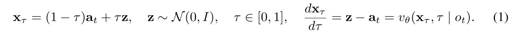

*Eq. (1). clean action과 Gaussian noise를 잇는 선형 경로. [PDF p.3, §3.1]*

```math
\begin{aligned}\mathbf x_\tau&=(1-\tau)\mathbf a_t+\tau\mathbf z,\quad \mathbf z\sim\mathcal N(0,I),\quad \tau\in[0,1],\\ \frac{d\mathbf x_\tau}{d\tau}&=\mathbf z-\mathbf a_t=v_\theta(\mathbf x_\tau,\tau\mid o_t).\qquad\text{(1)}\end{aligned}
```

**입력과 shape.** 정답 chunk와 noise는 둘 다 $`C\times D_a`$다. τ는 이 chunk 전체에 공유하는 scalar이고 두 항에 broadcast한다. 덧셈은 시간축·action channel축의 elementwise 연산이다. 합하거나 정규화하는 축은 없다.

**경계 조건.** τ=0이면 x는 정답 action, τ=1이면 noise다. τ가 커지는 방향의 미분은 z−a다. 생성은 반대로 τ를 1에서 0으로 줄이므로, 양의 step 크기 Δτ를 정의하면 update에서 velocity를 **뺀다**.

**유도.** 고정된 data-noise 쌍에 대해 선형 interpolation을 미분하면 a의 계수는 −1, z의 계수는 +1이다. 따라서 target z−a는 τ와 무관하다. 그러나 실제 network가 보는 x에는 여러 data-noise 쌍이 대응할 수 있으므로 learned field 자체가 τ에 무관하다는 뜻은 아니다.

**등호의 정확한 의미.** 원문은 target과 network 출력을 등호로 쓰지만, 학습된 v가 모든 sample에서 z−a와 정확히 같다고 보장하지 않는다. MSE의 최적해는 조건부 평균 velocity다. 다음은 이 점을 분명히 한 [리뷰어 해석] 보조식이다.

```math
v^*(\mathbf x,\tau,o)=\mathbb E[\mathbf z-\mathbf a\mid\mathbf x_\tau=\mathbf x,\tau,o].
```

**추론 연결.** 정답 action은 inference 시 없다. 시작 noise와 관측, v만 사용한다. [공식 코드 확인] uniform Euler update는 아래와 같다. 원문에 새로운 Eq.(4)가 있는 것은 아니므로 번호를 부여하지 않는다.

```math
\mathbf x_{\tau-\Delta\tau}\approx\mathbf x_\tau-\Delta\tau\,v_\theta(\mathbf x_\tau,\tau\mid o_t),\qquad \Delta\tau=1/N.
```

**작은 수치 예제.** [리뷰어 해석·설명용] C=2, Dₐ=1, a=[0.2,0.6], z=[1.0,−0.2], τ=0.5이면 x=[0.6,0.2], target=[0.8,−0.8]이다. 정확한 target field를 가정하고 Δτ=0.25로 update하면 x=[0.4,0.4]가 되고, 다시 update하면 a=[0.2,0.6]가 된다. 실제 network 오차, 다차원 분포, 관측 변화가 없는 이상적인 검산 예제다.

### 5.2 Eq. (2): buffer의 noise level을 계단처럼 배치하기

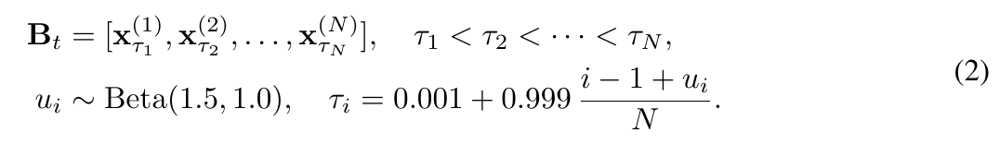

*Eq. (2). ordered buffer와 학습 noise sampling. [PDF p.3, §3.1]*

```math
\begin{aligned}\mathbf B_t&=[\mathbf x^{(1)}_{\tau_1},\mathbf x^{(2)}_{\tau_2},\ldots,\mathbf x^{(N)}_{\tau_N}],\quad\tau_1\lt\tau_2\lt\cdots\lt\tau_N,\\ u_i&\sim\mathrm{Beta}(1.5,1.0),\quad\tau_i=0.001+0.999\frac{i-1+u_i}{N}.\qquad\text{(2)}\end{aligned}
```

**첫 행의 의미.** B는 독립 sample들의 mini-batch가 아니라 **서로 이어질 미래 행동들의 queue**다. slot i는 $`C\times D_a`$이고, 전체를 action 시간축으로 펼치면 $`NC\times D_a`$다. slot 1은 낮은 noise, slot N은 높은 noise다.

**두 번째 행의 연산 순서.** i−1로 해당 slot의 구간 시작을 정하고, [0,1]의 Beta sample을 더한다. N으로 나누어 noise 좌표의 한 구간에 넣고, 0.999를 곱해 scale한 다음 0.001을 더한다. 따라서 학습에서는 대략 다음 구간을 사용한다.

```math
\tau_i\in\left[0.001+0.999\frac{i-1}{N},\ 0.001+0.999\frac{i}{N}\right],\qquad \mathbb E[u_i]=\frac{1.5}{2.5}=0.6.
```

인접 구간은 경계만 공유하고 연속 분포에서 같은 값을 뽑을 확률은 0이므로 τ의 순서가 유지된다. Beta(1.5,1.0)는 구간 상단 쪽에 더 무게를 준다. 코드에서는 configuration/slot마다 독립 sampling을 하고, 같은 slot의 C개 action token은 동일 τ를 공유한다.

**학습과 추론을 구분할 것.** Eq.(2)의 Beta sampling은 학습 경로에서 사용한다. [공식 코드 확인] `_steady_streaming`은 **고정 grid τᵢ=i/N, Δτ=1/N**을 쓴다. tail에 삽입하는 noise도 정확히 τ=1이다. 따라서 본문 설명의 “마지막 slot은 pure noise”는 inference에는 맞지만, Eq.(2)의 무작위 학습 sample이 항상 정확히 pure noise인 것은 아니다.

**N=4 예제.** [리뷰어 해석·설명용] u=[0.2,0.6,0.8,0.4]를 뽑으면 학습 τ는 [0.05095,0.40060,0.70030,0.85015]다. 실제 추론 grid는 [0.25,0.5,0.75,1.0]이다. 학습 sampling을 inference에서 매번 다시 뽑으면 slot 간 고정 Δτ 이동과 noise level의 대응이 깨질 수 있다.

**왜 모두 같은 τ이면 안 되는가.** 모든 chunk를 같은 noise level에서 출발시켜 같은 횟수만큼 갱신하면 여러 chunk가 동시에 완성된다. 이는 대량 batch 출력이지 매 호출마다 하나씩 나오는 pipeline이 아니다. staircase는 slot 위치, 실행 순서, denoising 진척도를 한 축으로 맞춘다.

### 5.3 Figure 2: 연결은 chunk 사이에, 병렬성은 chunk 안에

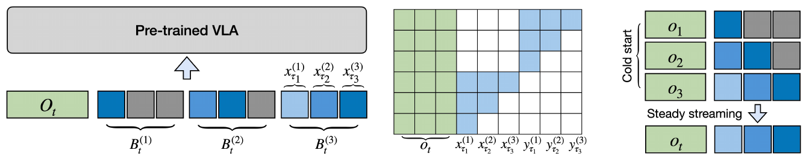

*Figure 2. 왼쪽은 한 관측에 연결된 여러 학습 buffer, 가운데는 attention 허용 관계, 오른쪽은 cold start와 steady streaming이다. [PDF p.4, Fig.2]*

[리뷰어 해석] 본문의 causal 규칙을 실행 가능한 additive mask로 쓰면 다음과 같다. r은 query token, s는 key token이며 c(r)는 token r이 속한 chunk index다.

```math
M_{r,s}=\begin{cases}0,&c(s)\le c(r)\text{이고 두 token이 유효할 때},\\-\infty,&\text{그 외}.\end{cases}
```

chunk 1의 query는 chunk 1의 모든 token을 본다. chunk 2 query는 chunk 1·2를 본다. chunk 3 query는 chunk 1·2·3을 본다. 따라서 같은 chunk 내부에는 token-wise lower triangle을 추가하지 않는다. 한 action token보다 뒤에 있는 **같은 chunk** token을 볼 수 있다.

C=2, N=3인 suffix의 허용 행렬을 1/0으로 표현한 [리뷰어 해석] 예제다. 행=query, 열=key다.

```math
\begin{bmatrix}1&1&0&0&0&0\\1&1&0&0&0&0\\1&1&1&1&0&0\\1&1&1&1&0&0\\1&1&1&1&1&1\\1&1&1&1&1&1\end{bmatrix}.
```

attention의 실제 수치 계산을 연결한 보조식은 다음과 같다.

```math
P_{r,s}=\frac{\exp(q_r^\top k_s/\sqrt{d_h}+M_{r,s})}{\sum_{s'}\exp(q_r^\top k_{s'}/\sqrt{d_h}+M_{r,s'})},\qquad y_r=\sum_sP_{r,s}v_s.
```

softmax 정규화 축은 query마다 **key token축**이다. vₛ는 attention value이며 flow predictor vθ와 다른 기호다. 실제 코드의 KV head 수는 1이므로 Q의 8개 head에 KV가 공유된다. 각 branch의 다른 hidden 폭은 projection을 거쳐 head dimension 256으로 맞춘다.

**간단한 attention 수치 예제.** [리뷰어 해석·설명용] chunk 2의 query가 허용된 두 scalar value [1,3]에 동일 logit 0을 갖고, future key의 logit은 mask로 −∞가 되었다고 하자. weight는 [0.5,0.5,0]이며 출력은 2다. future value가 아무리 커도 직접 반영되지 않는다. 하지만 앞 chunk의 정보가 물리적으로 정확한지는 mask가 검사해 주지 않는다.

### 5.4 continuity와 memory의 정확한 의미

한 noisy future chunk는 여러 업데이트에 걸쳐 앞쪽의 더 구체적인 action 표현을 읽는다. 실행 전에 갑자기 완전히 새로운 독립 경로를 고르는 경향을 줄일 수 있다. 이것이 논문의 implicit asynchronous conditioning이다. 별도 future-state predictor 없이도 이미 진행 중인 **계획**을 조건으로 삼는다는 뜻이다.

다만 buffer는 실제 과거 카메라 영상이나 실제 실행된 모든 action의 데이터베이스가 아니다. 현재 buffer 안의 최근 정제된 latent가 과거 계산의 흔적을 유지한다. head로 이동한 chunk는 이전 호출에서 cleaner predecessor를 본 결과를 자신의 noisy action에 간접적으로 담을 수 있지만, 이미 pop된 predecessor를 현재 forward에서 다시 attention하는 것은 아니다.

[리뷰어 해석] causal attention은 정보 접근 구조다. 속도·가속도·jerk의 상한, joint limit, 충돌 회피, 수치적 안정성의 증명은 제공하지 않는다. §3.1의 “continuity”는 downstream 성공률과 관찰된 실행 품질을 뒷받침으로 한 주장으로 한정한다.

<a id="streaming"></a>

## 6. §3.2: cold start와 streaming 알고리즘

### 6.1 steady streaming의 state transition

[공식 코드 확인] 현재 buffer의 각 slot에 고정 τᵢ=i/N을 붙이고, observation을 encode/prefill한 뒤 action expert를 한 번 호출한다. 모든 slot을 동시에 Euler update한다. 가장 앞 C개 action을 출력하고, 나머지 (N−1)C개 action을 앞으로 옮기며, 마지막 C개 자리에 새 Gaussian noise를 넣는다.

```math
\begin{aligned}\widetilde{\mathbf B}_t^{(i)}&=\mathbf B_t^{(i)}-\frac1N v_\theta^{(i)}(\mathbf B_t,\boldsymbol\tau\mid o_t),\\\widehat{\mathbf a}_t&=\widetilde{\mathbf B}_t^{(1)},\\\mathbf B_{t+1}&=[\widetilde{\mathbf B}_t^{(2)},\ldots,\widetilde{\mathbf B}_t^{(N)},\mathbf z_{\mathrm{new}}].\end{aligned}
```

이는 [리뷰어 해석·코드 대응식]이며 원문의 번호 식을 추가한 것이 아니다. 기존 slot i+1의 time은 update 후 i/N이 되므로 다음 호출의 slot i time과 일치한다. head의 time은 1/N에서 0이 되어 executable chunk가 된다. queue shift는 denoising과 별개인 index 이동이다.

**매 호출의 관측은 갱신된다.** 코드는 `_steady_streaming`마다 image encoding과 VLM prefix prefill을 다시 하고 layer cache를 reset한다. buffer latent가 호출 사이 유지되는 것과 observation KV가 호출 사이 재사용되는 것은 다르다. 이 논문을 VLA-Cache류의 temporal vision KV reuse로 설명하면 틀리다.

### 6.2 N=4 cold start를 한 줄씩 추적하기

아래는 **공식 코드의 left-aligned active layout**을 따른 설명용 trace다. A/B/C/D는 action chunk의 개체 이름이고, 괄호 속 숫자는 noise level이다. P는 padding이다. 값은 noise/data의 실제 샘플이 아니라 schedule을 표시한다.

| 호출 | update 직전 | 이번 forward의 update | 호출 후 buffer/행동 |
|---|---|---|---|
| 초기화 | A(1), P, P, P | 아직 없음 | 아직 예측 행동 없음 |
| 1 | A(1), P, P, P | A: 1→0.75 | A(.75), B(1), P, P; hold action |
| 2 | A(.75), B(1), P, P | A: .75→.5; B: 1→.75 | A(.5), B(.75), C(1), P; hold action |
| 3 | A(.5), B(.75), C(1), P | A→.25; B→.5; C→.75 | A(.25), B(.5), C(.75), D(1); hold action |
| 4 | A(.25), B(.5), C(.75), D(1) | A→0; B→.25; C→.5; D→.75 | A를 출력; B(.25), C(.5), D(.75), E(1) |
| 5 | B(.25), C(.5), D(.75), E(1) | B→0; 나머지도 .25 감소 | B를 출력; 다음 noise 삽입 |

**N−1 warm-up과 N번째 첫 출력.** “cold start가 N−1회”는 예측을 실행하지 않는 호출 수다. 최초 실제 예측 chunk는 그 다음 호출, 즉 처음 noise가 N번 update된 뒤 나온다. steady-state TTFA는 이 최초 buffer 구축 시간을 포함하지 않는다.

코드 manager는 cold start 때 hold chunk를 만들어 E개 control tick에 걸쳐 실행한다. 그러므로 wall-clock cold-start overhead를 무조건 (N−1)×GPU forward 시간으로만 계산하면 안 된다. 실제 scheduler, hold 기간, async overlap, graph 사전 warmup 여부를 함께 기록해야 한다. [공식 코드 확인: `async_manager.py`, `_launch_inference`, `warmup`]

### 6.3 Algorithm 1의 모든 행

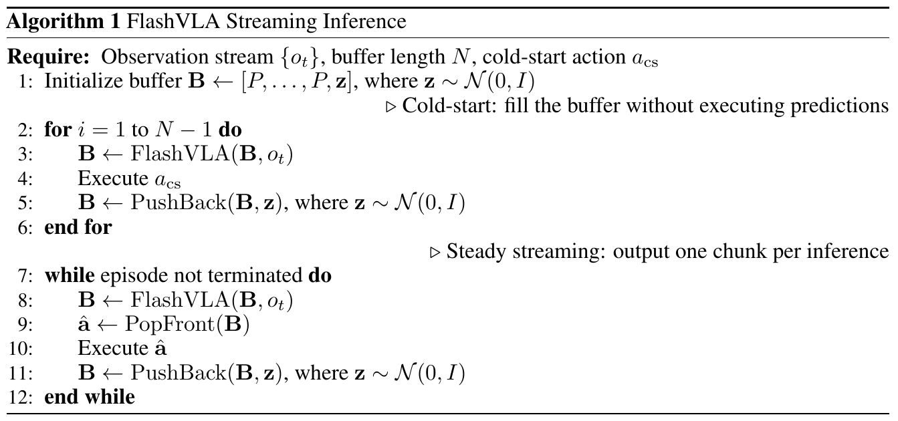

*Algorithm 1. 원문은 실행 순서를 요약한 pseudocode이며, 실제 CPU/GPU 비동기 orchestration 세부는 생략되어 있다. [PDF p.17, A.4]*

| 행 | 원문의 연산 | 의미·입출력·구현상 주의 |
|---|---|---|
| Require | observation stream, N, cold-start action | 관측 stream과 buffer depth, hold 명령의 정의가 외부에서 주어진다. C·E·d·normalization은 표기상 생략되어 있다. |
| 1 | B←[P,…,P,z] | N−1 padding과 noise 하나로 초기화. PDF 본문·Alg.1은 왼쪽 padding, Fig.2와 코드는 오른쪽 padding으로 표현한다. 아래 6.4 참고. |
| 2 | i=1,…,N−1 | 예측 행동을 내보내지 않는 warm-up loop다. |
| 3 | B←FlashVLA(B,oₜ) | 현재 유효 slot의 time을 붙이고 관측 조건 아래 한 번 denoise한다. P는 attention/loss에서 제외한다. |
| 4 | Execute a_cs | 예측 대신 hold action을 보낸다. joint-space absolute action이면 현재 상태 유지, delta action이면 실제 0 displacement가 되도록 정규화한다. |
| 5 | PushBack(B,z) | 새 noise를 추가해 유효 chunk 수를 1 늘린다. 고정 크기 buffer에서 빈 slot을 채우는 것으로 해석해야 한다. 단순 append만 하면 길이가 늘어나므로 원문 pseudocode만으로 구현하면 불완전하다. |
| 6 | end for | N개 유효 chunk가 들어 있는 staircase buffer 완성. |
| 7 | episode 종료까지 loop | 종료/reset 조건은 task controller가 결정한다. |
| 8 | B←FlashVLA(B,oₜ) | 고정 [1/N,…,1] grid로 buffer 전체를 한 단계 정제한다. |
| 9 | â←PopFront(B) | τ=0에 도달한 첫 chunk를 꺼낸다. 출력 shape는 C×Dₐ다. |
| 10 | Execute â | 논문 pseudocode는 chunk 실행으로 축약한다. 실제 평가는 첫 E개만 실행할 수 있다. |
| 11 | PushBack(B,z) | 남은 slot을 shift하고 tail에 새 noise를 넣어 길이를 N으로 유지한다. |
| 12 | end while | episode 종료 후 buffer와 queue 상태를 reset해야 다른 episode 계획이 섞이지 않는다. |

### 6.4 원문 padding 배치와 코드의 차이

PDF §3.3·A.4·Algorithm 1은 `padding → real chunks` 순서를 기술한다. Figure 2는 반대로 `real chunks → padding`으로 그린다. [공식 코드 확인] `FlashVLADataset.__getitem__`는 앞쪽에 real action, 뒤쪽에 zeros를 두고, `reset()`도 첫 C개만 noise로 채운다. cold start에서는 real slot r의 timestep을 단순 (r+1)/N이 아니라 현재 real chunk 수 j에 따라 (N−j+1+r)/N으로 배정한다.

즉 코드가 active chunk를 왼쪽에 둔다고 해서 그 첫 chunk가 처음부터 낮은 noise인 것은 아니다. **배열상의 위치와 logical noise slot 위치를 구분**한다. active 순서·mask·time·position을 일관되게 바꾸면 같은 conceptual schedule을 표현할 수 있지만, 두 표기를 섞으면 학습-추론 mismatch가 생긴다. 원문 수식을 고쳐서 전재하지 않고 차이를 명시한다.

### 6.5 실제 asynchronous launch는 어떻게 이루어지는가

논문은 E개 실행 중 E−d개가 끝나면 다음 관측으로 inference를 시작하고, 현재 segment가 끝난 뒤 새 결과를 사용한다고 정의한다. [PDF p.7, §4.2]

```math
t_{\mathrm{launch}}=t_{\mathrm{segment\ start}}+(E-d)\Delta t_{\mathrm{ctrl}},\qquad T_{\mathrm{overlap}}=d\Delta t_{\mathrm{ctrl}}.
```

위 식은 일정한 control tick을 가정한 [리뷰어 해석]이다. 코드의 `AsyncStreamingActionManager`는 현재 chunk를 CPU 배열에 저장한다. 다음 inference는 GPU tensor를 반환한 상태로 두고, 현재 chunk action은 CPU에서 계속 꺼낸다. 다음 chunk로 승격할 때 `.cpu().numpy()`가 필요한 GPU 동기화를 수행한다. `torch.compile`과 CUDA Graph가 host dispatch를 짧게 만들어야 이 overlap이 효과적으로 작동한다.

따라서 async라고 해서 무조건 별도 Python thread, 별도 GPU, 별도 CUDA stream이 필요한 것은 아니다. 반대로 Python이 즉시 tensor handle을 받았다고 GPU 계산까지 끝났다는 뜻도 아니다. 실행 경계에서 결과가 준비되지 않았으면 결국 기다린다.

### 6.6 C와 E가 다를 때 남는 정렬 문제

[저자 보고] LIBERO는 C=10이지만 E=5, RoboTwin·실기는 C=20이지만 E=16이다. [공식 코드 확인] model은 buffer를 **C개 action만큼 shift**하고 manager는 **E개 action만 실행**한다. 학습은 미래 data를 C 간격으로 chunking한다.

[리뷰어 해석] 그러므로 “buffer index가 실제 실행된 물리 시간과 정확히 1:1 대응한다”는 설명은 E=C에서 가장 직접적이다. E<C에서는 버린 action prefix/tail, 관측 갱신, latent 재정제에 의해 계획이 적응해야 하며, 별도의 E 기반 buffer 재표본화는 읽은 π0.5 핵심 경로에 없다. 이는 바로 성능 실패를 증명하는 것은 아니지만, implicit future-state conditioning의 물리적 정렬을 엄밀히 주장하려면 확인해야 할 공백이다.

<a id="training"></a>

## 7. §3.3·A.4: multi-buffer 학습과 loss

### 7.1 왜 pretrained 모델을 그대로 호출할 수 없는가

기존 flow action expert는 한 chunk의 모든 action이 같은 time을 가진 입력에 익숙하다. FlashVLA는 동일 sequence에 여러 time을 넣고, inter-chunk causal mask와 cold-start padding도 도입한다. architecture와 입력 분포가 바뀌므로 downstream fine-tuning으로 적응시킨다. “drop-in”은 작은 변경으로 기존 weight를 활용한다는 뜻이며 training-free를 의미하지 않는다. [PDF pp.5,16]

### 7.2 A.4 비번호 식: 한 관측으로 N개 buffer 상태 만들기

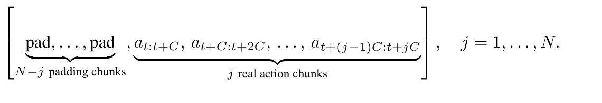

*A.4의 비번호 buffer 구성식. 원문은 padding을 왼쪽에 표시한다. [PDF p.16, A.4]*

```math
\left[\underbrace{\mathrm{pad},\ldots,\mathrm{pad}}_{N-j\ \text{padding chunks}},\underbrace{\mathbf a_{t:t+C},\mathbf a_{t+C:t+2C},\ldots,\mathbf a_{t+(j-1)C:t+jC}}_{j\ \text{real action chunks}}\right],\qquad j=1,\ldots,N.
```

**데이터 slice.** 반열린 구간 표기로 t:t+C는 C개 행동이다. observation은 oₜ 하나이며, 각 configuration에서 첫 번째 real chunk는 동일한 aₜ:ₜ₊C다. configuration j가 늘어날 때마다 더 먼 미래 chunk를 하나 추가한다. padding은 데이터가 없는 부분이고 “행동이 0이어야 한다”는 target이 아니다.

**구성 순서.** observation t에서 앞으로 NC개 action을 가져온다. j=1이면 첫 C개만 real, j=2이면 앞 2C개만 real, j=N이면 전부 real로 둔다. configuration마다 noisy interpolation을 만들고, N개 buffer를 sequence에 pack한다. 공유 observation prefix는 한 번 encode한다. 서로 다른 configuration의 action token끼리는 attention을 금지한다.

**partial configuration의 time indexing.** 원문 Eq.(2)의 i는 full buffer slot처럼 보이지만 Eq.(3)의 i=1,…,j는 real chunk를 센다. [공식 코드 확인] real chunk i에 대한 j-configuration time은 다음 대응으로 이해할 수 있다.

```math
\tau_i^{(j)}=0.001+0.999\frac{N-j+i-1+u_{j,i}}{N},\qquad 1\le i\le j.
```

이는 원문의 식을 대신하는 새 번호 식이 아니라 코드의 index mapping을 드러낸 보조식이다. j=1이면 첫 action chunk를 가장 높은 noise 구간에서 학습한다. j=N이면 Eq.(2)의 i번째 구간과 같아진다. 따라서 같은 정답 첫 chunk를 여러 configuration에서 서로 다른 denoising 진행도로 보게 된다.

### 7.3 Eq. (3): 모든 valid action의 flow error를 학습한다

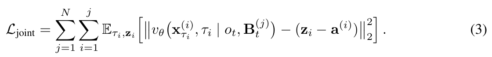

*Eq. (3). 모든 buffer configuration과 그 안의 real chunk에 대한 flow-matching loss. [PDF p.5, §3.3]*

```math
\mathcal L_{\mathrm{joint}}=\sum_{j=1}^{N}\sum_{i=1}^{j}\mathbb E_{\tau_i,\mathbf z_i}\left[\left\|v_\theta\left(\mathbf x^{(i)}_{\tau_i},\tau_i\mid o_t,\mathbf B_t^{(j)}\right)-(\mathbf z_i-\mathbf a^{(i)})\right\|_2^2\right].\qquad\text{(3)}
```

**어떤 출력인가.** vθ의 표기는 해당 chunk의 출력을 나타내지만 실제 forward는 buffer 전체를 함께 계산한다. observation과 앞쪽 real chunk들이 mask를 통해 조건으로 제공된다. 각 velocity target은 Eq.(1)의 zᵢ−a⁽ⁱ⁾다.

**어떤 축에서 error를 합하는가.** norm은 chunk의 C개 시간과 Dₐ개 action channel을 flatten한 L2 squared로 읽을 수 있다. 바깥 합은 j configuration, 안쪽 합은 그 configuration의 valid chunk다. 기대값은 noise와 time sampling에 대한 것이다. 데이터 sample·batch 평균은 이 간결한 수식에서 생략되어 있다.

**어떤 항이 없는가.** 별도 future-state prediction loss, explicit smoothness/jerk loss, collision loss, distillation teacher loss는 제시되지 않는다. training-time RTC처럼 committed prefix를 별도 supervised action conditioning 대상으로 명시하는 formulation도 아니다. continuity는 이 MSE와 구조적 attention을 통해 간접적으로 학습한다.

**합과 평균의 구현 차이.** [공식 코드 확인] `forward_shared_observation`은 reduction 없는 MSE를 계산하고 `~action_is_pad`로 valid token만 선택한다. policy `forward`는 선택된 scalar error 전체에 `.mean()`을 적용한다. 따라서 원문의 합은 구현에서 valid scalar 평균으로 정규화된다. N·C·valid 길이가 바뀌면 합과 평균의 scale도 달라지므로 loss 수치를 원문 표기만으로 맞추면 안 된다.

```math
\mathcal L_{\mathrm{code}}=\frac{\sum_{b,j,r,k}m_{b,j,r}(v_{b,j,r,k}-u_{b,j,r,k})^2}{D_{\mathrm{pad}}\sum_{b,j,r}m_{b,j,r}},\qquad u=\mathbf z-\mathbf a.
```

위 식은 [공식 코드 확인·리뷰어 재표현]이다. r은 action token, k는 내부 action channel이다. 읽은 π0.5 경로는 `max_action_dim=32` 범위까지 loss를 유지한다. **시간 padding을 제외하는 mask와 action channel padding을 제외하는 mask는 별개**이며, 코드가 실제 action dimension만으로 loss를 잘랐다고 말할 수 없다.

**loss 수치 예제.** [리뷰어 해석·설명용] N=2, C=1, action channel=1이면 configuration 1에 real error 하나, configuration 2에 real error 둘이 있다. 이 세 prediction-minus-target error가 0.1, 0.2, −0.3이면 Eq.(3)의 sample 합은 0.01+0.04+0.09=0.14이고, valid scalar 평균은 0.14/3≈0.04667이다. padding error를 평균 분모에 넣지 않는다. 같은 N·C라도 episode 끝에서 valid action이 줄면 분모를 validity에 따라 바꿔야 한다.

### 7.4 tensor 크기와 학습 가중치의 숨은 구조

N=4, C=10인 기본 LIBERO 예를 보자. observation prefix를 제외한 shape는 다음과 같다.

| 단계 | shape/개수 | 의미 |
|---|---|---|
| 앞으로 읽는 정답 | [40,Dₐ] | unique future action 40개 |
| config 1 | real 10, pad 30 | 첫 chunk만 존재 |
| config 2 | real 20, pad 20 | 앞 두 chunk |
| config 3 | real 30, pad 10 | 앞 세 chunk |
| config 4 | real 40, pad 0 | full buffer |
| pack | [160,Dₐ], validity [160] | allocated action token 160개 |
| valid supervision | 10+20+30+40=100 tokens | batch와 channel축 제외 |
| action projection 뒤 | [b,160,1024] | π0.5 공식 코드 |
| velocity 출력 | [b,160,32] | 내부 action padding 포함 |

일반적으로 allocated token은 N²C, valid token은 $`CN(N+1)/2`$다. 첫 정답 chunk는 N개 configuration에, 두 번째는 N−1개에, 마지막은 한 configuration에 나타난다. 다만 각각의 noise level·조건이 달라 같은 loss를 단순 중복 복제한 것은 아니다. 근거리 chunk에 여러 denoising 상태의 supervision이 모인다는 특성이 있다.

**공유 prefix의 이득과 비용.** 비싼 vision/VLM observation을 N번 반복하는 일을 줄인다. 하지만 action branch는 더 길어지고 dense mask 구현에서는 허용하지 않는 attention 영역도 메모리 또는 kernel 비용을 만들 수 있다. “N configurations를 한 sample에 넣었다”는 사실만으로 총 train FLOPs, activation memory, training wall time이 N배 줄었다고 결론낼 수 없다. 논문은 packed-vs-separate training 비용의 정량표를 제공하지 않는다.

### 7.5 gradient가 흐르는 곳

[공식 코드 확인] gradient 경로는 velocity MSE → action output projection → action expert의 FFN/attention/FiLM → action/time projection 및 shared observation 표현 → VLM/vision encoder로 이어진다. configuration 간 직접 attention은 막혔지만, 동일 prefix와 동일 network weight를 쓰므로 여러 loss의 gradient는 shared parameter에서 합쳐진다.

정답 action과 Gaussian noise는 target/input data이고 optimizer parameter가 아니다. Beta sampling과 discrete padding mask를 학습하지 않는다. 이 학습 forward는 생성된 streaming trajectory를 N번 unroll해 backpropagation through time하는 방식이 아니라, **정답 future action에서 합성한 각 noise configuration을 병렬 supervision하는 방식**이다. inference buffer는 `no_grad` 경로에서 갱신된다.

π0.5 공식 training config의 `freeze_vision_encoder=false`, optimizer의 `self.parameters()` 경로, training loop의 선택적 vision freeze 처리를 확인했다. 따라서 기본 recipe는 action expert만 학습한다고 설명할 수 없다. 다만 구조에 등록된 모든 parameter가 실제 loss에 사용된다는 뜻도 아니다. action expert token embedding은 제거되고 LM head들은 이 continuous action 경로에 사용되지 않는다.

### 7.6 FiLM timestep conditioning과 안정성

[저자 보고] time embedding에서 scale·shift·gate를 만들어 action expert의 여러 normalization/residual 경로를 조절한다. π0.5의 기존 FiLM/adaRMS 계열 conditioning을 활용하고, SmolVLA에는 time MLP와 FiLM을 추가한다. state embedding을 명시적으로 쓰는 모델에서는 time/state embedding을 더해 condition을 만든다. [PDF p.16, A.4]

다음은 개념을 설명하는 보조식이며 원문의 번호 수식이나 모든 backbone의 정확한 구현식이 아니다.

```math
\begin{aligned}e_{i}&=\mathrm{MLP}(\mathrm{TimeEmbed}(\tau_i)),\\(\gamma_i,\beta_i,g_i)&=W e_i+b,\\h'_r&=(1+\gamma_i)\odot\mathrm{Norm}(h_r)+\beta_i,\\h_r^{\mathrm{out}}&=h_r+g_i\odot F(h'_r),\qquad r\in\text{chunk }i.\end{aligned}
```

각 γ·β·g는 hidden channel축 벡터이며 해당 chunk의 C개 token에 대응한다. Norm은 token의 hidden channel축을 정규화한다. π0.5 code의 condition tensor는 [b,Lₐ,1024]이며, 학습 pack에서는 [b,N,NC,1024]로 reshape해 configuration마다 처리한다. state_cond=false일 때 state가 완전히 제거되는 것은 아니고, 아래 forward 절처럼 text prompt로 들어간다.

[저자 보고] pretrained action expert의 norm layer에서 출력 불안정과 gradient explosion이 발생할 수 있어 RoboTwin 50-task 학습에서는 normalization layer를 재초기화한다. [공식 코드 확인] 공개 YAML은 `ae-norm-zero`, `include_final_norm=true`와 함께 `reset_time_mlp=true`, `time_mlp_init=random`도 지정한다. 따라서 공개 recipe는 norm만의 변경보다 넓다. 논문에는 instability 발생 빈도·gradient 수치·norm reset ablation·수렴 분산이 없다.

<a id="forward"></a>

## 8. 한 관측의 end-to-end forward와 공식 코드

### 8.1 입력 → executable chunk: π0.5 경로

아래는 원문 개념과 고정 commit의 π0.5 코드를 연결한 경로다. 예시 b=1, N=4, C=10, 내부 action dim 32이며, 실제 학습·평가의 모든 sample이 이 설정이라는 뜻은 아니다.

1. **관측 준비:** camera별 RGB와 robot state, task instruction을 받는다. code image resolution은 224×224이며 prepare_images에서 필요하면 resize/pad 후 값 범위를 조정한다. state/action은 dataset 통계로 정규화한다.
2. **state를 prompt에 넣기:** 기본 `state_cond=false`는 normalized state를 256-bin 방식으로 이산화해 task와 함께 text prompt에 넣는다. 따라서 별도 state FiLM을 끈 상태에서도 proprioception 조건은 남아 있다. tokenizer는 `google/paligemma-3b-pt-224`, max text length 200을 사용한다.
3. **vision prefix:** 각 image의 vision embedding→encoder→post-layernorm→multimodal projector를 통과시켜 hidden 폭 2048의 image token을 만든다. text embedding은 √2048 scale 후 image token과 concat한다. 최종 prefix는 [1,Lₒ,2048]이다.
4. **VLM prefill:** prefix만 18개 joint layer의 VLM branch로 처리하고 각 layer의 K/V를 만든다. 현재 호출의 action expert가 이 K/V를 참조한다. 다음 observation 호출에서는 cache를 reset하고 다시 만든다.
5. **buffer/time 준비:** persistent buffer [1,40,32]와 slot별 [0.25,0.5,0.75,1]을 준비한다. time은 slot당 10개 action에 반복하여 [1,40]이 된다.
6. **action/time projection:** noisy actions를 32→1024로 투영한다. sinusoidal time embedding을 time MLP와 SiLU로 처리해 [1,40,1024] FiLM condition을 만든다.
7. **action-expert 18 layers:** action Q/K/V와 observation K/V를 사용해 prefix visibility 및 chunk causal mask를 적용한다. 같은 chunk 내부는 bidirectional이다. norm의 time condition, gated residual, FFN을 거친다.
8. **velocity 출력:** 최종 action norm과 1024→32 projection으로 [1,40,32] velocity를 얻는다. 이것은 robot 명령 자체가 아니라 normalized action flow의 vector field다.
9. **Euler update:** buffer−0.25×velocity를 계산한다. 첫 10개 action을 가져오고 나머지 30개를 앞으로 옮긴다. 새 Gaussian [1,10,32]를 tail에 삽입한다.
10. **action 차원 복원:** `predict_action_chunk`는 실제 action feature 차원까지 잘라 반환한다. postprocessor가 정규화를 풀어 물리 명령을 만든다.
11. **controller 적용:** manager가 E개 action을 CPU에서 실행하고 E−d 경계에서 다음 관측을 요구한다. 다음 관측의 추론이 진행되는 동안 남은 d개를 실행한다.

**shape가 맞는 이유.** VLM hidden 2048과 action hidden 1024를 raw concat하는 것이 아니다. 서로 다른 Q/K/V projection이 같은 head 차원으로 변환하고 sequence축에서 attention에 합류한다. attention 출력은 각 branch의 output projection을 통해 원래 hidden 폭으로 돌아간다.

### 8.2 학습 forward는 추론 forward와 어디가 다른가

학습은 이미 완성된 정답 action을 가지고 N개의 cold/full configuration을 한꺼번에 만든다. time은 random Beta 구간 sampling이고 suffix는 [b,N²C,32]다. observation prefix는 공유되며 configuration 간 action attention은 금지한다. velocity를 예측한 뒤 MSE만 계산하고, Euler로 만든 action을 로봇에 보내지 않는다.

추론은 정답이 없고 persistent noisy buffer가 있다. time은 fixed grid이며 suffix 길이는 NC다. chunk를 출력한 후 state를 유지한다. 학습 중 clean data에서 만든 noisy prefix와 추론 중 model이 스스로 만든 noisy prefix의 차이는 exposure mismatch로 남는다. 논문은 이를 정량 측정하거나 training rollout unroll로 해소한 결과를 제시하지 않는다.

### 8.3 정적으로 대조한 공식 코드 지도

다음 링크는 모두 조회 commit에 고정되어 있다. 명령을 실행한 결과가 아니라 소스의 구조를 확인한 기록이다.

| 역할 | 확인한 소스와 함수 | 핵심 확인 |
|---|---|---|
| 설정/shape | [configuration_pi05.py](https://github.com/z-lab/flashvla/blob/3270b9d1a825da84b62f4afb396e4a204a3a72db/flashvla/policies/pi05/configuration_pi05.py) | 18 layers, hidden 2048/1024, head 8/1, dim 256, action dim 32, time 분포, total horizon NC |
| 데이터 pack | [flashvla_dataset.py](https://github.com/z-lab/flashvla/blob/3270b9d1a825da84b62f4afb396e4a204a3a72db/flashvla/datasets/flashvla_dataset.py) `__getitem__` | real prefix+padding tail, N개 config concat, episode padding 전파 |
| 학습/추론 핵심 | [modeling_pi05_flashvla.py](https://github.com/z-lab/flashvla/blob/3270b9d1a825da84b62f4afb396e4a204a3a72db/flashvla/policies/pi05/modeling_pi05_flashvla.py) | `_build_per_chunk_time`, `_build_shared_obs_mask`, `forward_shared_observation`, `_cold_start`, `_steady_streaming` |
| 정규화/prompt | [processor.py](https://github.com/z-lab/flashvla/blob/3270b9d1a825da84b62f4afb396e4a204a3a72db/flashvla/policies/pi05/processor.py) | state_cond=false에서도 state prompt 삽입, normalizer/tokenizer/device 순서 |
| hold 명령 | [utils.py](https://github.com/z-lab/flashvla/blob/3270b9d1a825da84b62f4afb396e4a204a3a72db/flashvla/policies/pi05/utils.py) | normalized 0과 physical 0 구분, state/action normalization 간 재변환 |
| 비동기 manager | [async_manager.py](https://github.com/z-lab/flashvla/blob/3270b9d1a825da84b62f4afb396e4a204a3a72db/flashvla/async_manager.py) | E−d launch, CPU action queue, promotion 시 GPU sync, graph warmup 후 buffer reset |
| optimizer/초기화 | [train.py](https://github.com/z-lab/flashvla/blob/3270b9d1a825da84b62f4afb396e4a204a3a72db/flashvla/train.py) | optional vision freeze, grad accumulation, backward/clip/optimizer step, action norm/time MLP 초기화 |
| latency 측정 | [benchmark_latency.py](https://github.com/z-lab/flashvla/blob/3270b9d1a825da84b62f4afb396e4a204a3a72db/benchmarks/benchmark_latency.py) | input batch 준비는 timer 밖, 전후 cuda synchronize, cold-start None 제외, compile 시 내부 Event profiling 비활성 |

### 8.4 kernel/system 최적화를 알고리즘과 구분하기

[저자 보고] CUDA Graph로 반복 dispatch를 줄이고, linear layer를 pack하고, PyTorch `max-autotune` compile을 사용한다. 공개 코드는 QKV projection fusion과 gate/up MLP projection fusion 경로를 제공한다. 구조가 일정한 buffer는 이 최적화를 적용하기에 유리하다. [PDF p.5]

그러나 mask에서 금지한 attention 영역이 실제로 skip되는 sparse kernel을 쓴다는 증거는 별개다. [공식 코드 확인] `layers/attention.py`의 `_forward_sdpa`라는 이름과 달리, 조회 snapshot은 PyTorch fused SDPA API를 호출하지 않고 **Q/K를 float32로 변환해 score matmul→mask→softmax→value matmul을 명시적으로 수행**한다. 따라서 이름만 보고 FlashAttention의 중간 score 비저장 특성이나 sparse FLOP 감소를 가정하면 안 된다. 모든 key가 padding인 query는 masked probability를 다시 0으로 만들어 NaN을 피한다. 이 구현 역시 paper-run backend와의 대응을 확인할 부분이다.

또한 compilation·capture 시간은 steady-state model latency와 다른 비용이며, manager는 사전 warmup을 수행하고 reset한 뒤 평가하는 경로를 제공한다. 이 코드 관찰은 최신 공개 snapshot에 관한 것이며, Fig.1/Table2에 사용한 kernel trace를 직접 재현한 결과가 아니다.

<a id="experiments"></a>

## 9. §4·A.1: 시뮬레이션 실험과 수치 검산

### 9.1 §4.1와 A.1의 학습·평가 recipe

| 항목 | π0.5/FlashVLA LIBERO | π0.5/FlashVLA RoboTwin 2.0 | SmolVLA LIBERO | LingBot-VLA RoboTwin |
|---|---|---|---|---|
| 데이터 | HuggingFaceVLA의 merged LIBERO training data | 50 tasks의 clean+randomized union, official scripts로 생성 후 LeRobot 변환 | LIBERO | 50 tasks clean+randomized union |
| 초기 weight | pretrained π0.5 | pretrained π0.5 | `lerobot/smolvla_base` | LingBot-VLA 4B |
| 정규화 | action mean/std | 99th-percentile 기반; 코드 QUANTILES/q01·q99 | 공식 YAML: state/action mean/std | PDF는 전체 세부 통계를 제시하지 않음 |
| LR | 1e−4 | 5e−5 | 1e−4 | 5e−5 |
| scheduler | cosine, warmup 1,000 | cosine | cosine, warmup 1,000 | cosine, warmup 5,000 |
| 학습 steps | 50,000 | 100,000, 약 4.5 epochs | 20,000 | 100,000 |
| batch | GPU당 32, 8 H200 | GPU당 8×8 H200×accum 4=256 | GPU당 64, accumulation 없음 | GPU당 8×8 GPU×accum 4=256 |
| baseline output | 50 actions | 50 actions | 본문 상세 길이 미기재 | 본문 상세 길이 미기재 |
| FlashVLA C,N | 10,4 | 20,4 | 10,5 | 20,4 |
| 실행 E | 5 | 16 | 5 | 16 |
| 평가 장치 | RTX 4090 | RTX 4090 | RTX 4090 | RTX 4090 |
| 평가 방식 | Spatial/Object/Goal/Long, Table 1·3은 five runs 평균 | official evaluation, clean/random 평균 및 horizon grouping | four LIBERO suites | clean/random 평균 |

[저자 보고: PDF pp.6,14, §4.1, A.1] 본문은 “모든 학습은 8 H200”이라고 명시한다. 위 SmolVLA batch도 이를 적용하면 nominal global batch 512가 되지만, PDF의 SmolVLA 문단 자체에는 global 숫자를 따로 적지 않았다. optimizer AdamW를 명시한 cross-architecture recipe와 공개 π0.5 YAML의 AdamW를 구분해서 확인했다.

**재현에 부족한 정보.** 데이터 revision, 실제 trajectory 수와 frame 수, train/validation 분리·checkpoint 선택 기준, 평가 seed별 raw 결과, RoboTwin horizon별 task 목록과 개수, camera configuration·software version의 모든 조합은 PDF에 완전하게 없다. 공개 코드가 보완하지만 paper run과 정확히 같은 snapshot임을 보장하지 않는다.

**공정 통제.** 저자는 RoboTwin에서 같은 50-task union, 같은 optimizer steps/global batch, 같은 E=16을 사용하고 synchronous 비교에서는 overlap을 없앴다고 설명한다. 이는 중요한 통제다. 그러나 같은 optimizer step 수라도 multi-buffer의 action token 수·gradient supervision 수·norm 초기화가 다르므로 **같은 train compute 또는 완전히 같은 learning problem**을 뜻하지 않는다.

### 9.2 Table 1: 비동기 LIBERO의 품질과 실행 비용

아래는 원문 Table 1의 숫자다. SR 단위는 %, Time/Step 단위는 ms/action이다. [PDF p.5, Table 1]

| Method | Spatial | Object | Goal | Long | 평균 SR | Steps | episode Time(s) | Time/Step |
|---|---:|---:|---:|---:|---:|---:|---:|---:|
| π0.5 | 98.8 | 98.2 | 98.0 | 92.4 | 96.9 | 156.0 | 8.4 | 53.8 |
| +VLASH d=1 | 98.8 | 99.2 | 96.7 | 94.4 | 97.2 | 153.9 | 7.2 | 46.8 |
| +VLASH d=4 | 92.5 | 96.9 | 93.3 | 89.6 | 93.1 | 176.7 | 5.8 | 32.8 |
| +StreamingVLA d=1 | 96.6 | 96.6 | 95.4 | 91.0 | 94.9 | n/a | n/a | 31.6 |
| +FlashVLA d=1 | 98.8 | 99.6 | 97.6 | 95.4 | 97.8 | 158.0 | 3.5 | 22.1 |

[검산] 53.8/22.1=2.434배, 성공률 차이는 +0.9 **percentage point**다. 8.4/3.5=2.40배로 episode 시간의 배수와 action당 배수는 조금 다르다. FlashVLA가 실행한 평균 action 수는 158.0으로 baseline 156.0보다 약 1.28% 많다. “행동 횟수를 줄여서만 빨라졌다”는 설명은 표와 맞지 않는다.

[검산] 원문 Time/Step 정의를 반영하면 8.4 s/156=53.846 ms, 3.5 s/158=22.152 ms로 표시값과 반올림 범위에서 맞는다. 표의 각 suite SR를 이미 반올림한 값으로 다시 평균하면 baseline 96.85, FlashVLA 97.85가 나온다. 원문 평균 96.9/97.8과의 마지막 자리 차이는 raw 평균·반올림 순서 가능성이 있어 오류로 단정하지 않는다.

**분모를 읽을 것.** A.1은 Time/Step을 average episode wall time / average executed low-level action count로 정의하며 rendering을 포함한다. 이것은 각 episode의 T/S를 평균한 값과 항상 같지 않다. GPU inference latency도 아니다. 표는 2,000 episodes를 언급하고 A.1은 five runs 평균을 명시하지만, 반복별 총 episode 처리·집계 상세는 raw logs로 확인해야 한다. 코드 기본값은 40 tasks×50 episodes×5 seeds에 해당하도록 구성할 수 있으나, 이것만으로 실제 원문 실행 총수를 확정하지 않는다.

### 9.3 Figure 3: d=1-4에서의 robustness

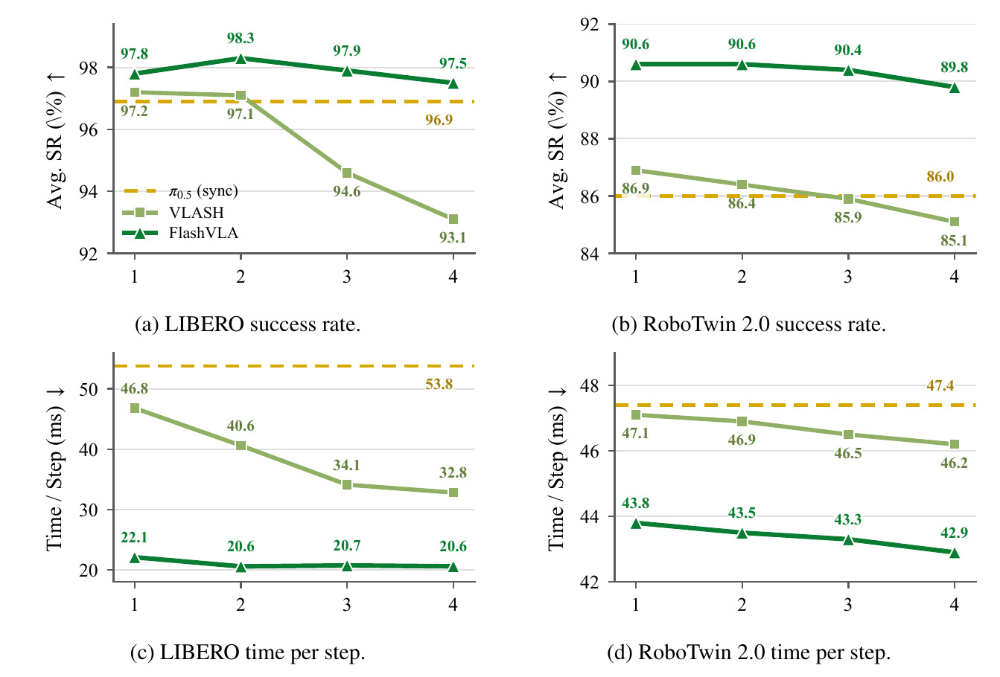

*Figure 3. d는 추론을 미리 시작하는 low-level action tick 수이며 ms 지연 값이 아니다. [PDF p.6, Fig.3]*

| Benchmark/방법 | d=1 | d=2 | d=3 | d=4 |
|---|---:|---:|---:|---:|
| LIBERO VLASH SR | 97.2 | 97.1 | 94.6 | 93.1 |
| LIBERO FlashVLA SR | 97.8 | 98.3 | 97.9 | 97.5 |
| LIBERO VLASH ms/action | 46.8 | 40.6 | 34.1 | 32.8 |
| LIBERO FlashVLA ms/action | 22.1 | 20.6 | 20.7 | 20.6 |
| RoboTwin VLASH SR | 86.9 | 86.4 | 85.9 | 85.1 |
| RoboTwin FlashVLA SR | 90.6 | 90.6 | 90.4 | 89.8 |
| RoboTwin VLASH ms/action | 47.1 | 46.9 | 46.5 | 46.2 |
| RoboTwin FlashVLA ms/action | 43.8 | 43.5 | 43.3 | 42.9 |

동기 기준은 LIBERO SR 96.9%, 53.8 ms/action이고 RoboTwin SR 86.0%, 47.4 ms/action이다. FlashVLA는 보고된 d 범위에서 두 benchmark 모두 동기 baseline보다 높은 SR을 유지한다. 그러나 d가 커질수록 언제나 좋아지는 것은 아니다. RoboTwin은 d=1/2의 90.6에서 d=4의 89.8로 내려간다.

[검산] LIBERO 최소 Time/Step 20.6에서는 53.8/20.6=2.612배다. 본문 2.62배는 더 정밀한 raw 수치에서 반올림했을 수 있다. RoboTwin d=1은 47.4/43.8=1.082배, d=4는 47.4/42.9=1.105배다.

**RoboTwin이 더 조금 빨라지는 이유.** §4.2는 baseline action당 47.4 ms를 policy 8.1+rendering 36.8+communication 2.5 ms로 나눈다. 합이 정확히 47.4다. policy 비중은 17.1%다. 나머지가 고정이라고 단순 가정하면 policy 시간을 완전히 제거해도 최대 speedup은 47.4/39.3=1.206배다. [검산·리뷰어 해석] 이는 시뮬레이터 E2E의 Amdahl 상한이지 실제 배포의 보편 상한은 아니다.

### 9.4 Table 2와 Figure 1: 같은 latency로 섞으면 안 되는 두 프로파일

| Method | RTX 4090 2 views | RTX 4090 3 views | RTX 5090 2 views | RTX 5090 3 views |
|---|---:|---:|---:|---:|
| π0.5 | 45.8 | 55.4 | 37.0 | 44.8 |
| +Realtime-VLA | 29.2 | 38.9 | 26.6 | 34.2 |
| +FlashVLA | 26.7 | 36.8 | 20.3 | 27.1 |
| [검산] π0.5/FlashVLA | 1.715× | 1.505× | 1.823× | 1.653× |
| [검산] Realtime-VLA/FlashVLA | 1.094× | 1.057× | 1.310× | 1.262× |

단위 ms/policy invocation. [저자 보고] 한 view당 frame 하나, 10 warmup 뒤 100 samples 평균이며 π0.5와 FlashVLA 양쪽에 동일 CUDA Graph·kernel fusion을 적용한다. [PDF p.7, Table 2; p.8, §4.3]

**Figure 1의 다른 조건.** Fig.1은 4090, 2 views, system optimization 이전에 전체 128.9→36.6 ms, action decoding 97.4→4.9 ms다. [검산] action만 19.878배, 전체 3.522배다. action 비중은 97.4/128.9=75.56%다. 남은 VLM 부분은 약 31.5→31.7 ms로 사실상 같다. action 부분을 무한히 빠르게 해도 이 프로파일의 전체 가속 상한은 약 4.09배다.

p.2 각주는 10→1 pass가 GPU work 9.3배 감소를 만들고 inter-pass launch serialization 제거가 wall time 19.9배를 만든다고 설명한다. **GPU work의 정확한 집계 정의·kernel trace·raw GPU duration은 이 PDF에 없다.** 그러므로 이를 직접 검증한 FLOP 9.3배 감소나 일반 하드웨어의 20배 가속으로 옮기지 않는다.

**Table 2의 20.3 ms와 50 Hz.** 1000/20.3=49.26이므로 model 호출 처리 능력을 약 50 Hz라고 표현한 산술은 타당하다. 하지만 camera acquisition·pre/postprocess·통신·실제 execution horizon·deadline misses를 포함한 센서→action 정책 갱신을 50 Hz로 측정했다는 뜻은 아니다. real robot control rate와는 별도다.

**코드와 paper-run 연결의 한계.** 공개 latency YAML은 FlashVLA `compile_model=true`, baseline `compile_model=false`로 되어 있고, FlashVLA의 N도 기본 5다. paper Table 2처럼 양쪽 최적화를 맞추려면 override가 필요하다. code의 benchmark timer는 batch 준비 이후에 시작하므로 text/state preprocessing 등이 timer 밖일 수 있다. 이 사실이 Table 2의 저자 측정이 잘못됐음을 증명하지는 않지만, 기본 YAML 그대로 재현된다고 보장할 수는 없다.

### 9.5 Table 3: synchronous quality

| Method | Spatial | Object | Goal | Long | LIBERO Avg | RoboTwin Clean | Random | Avg |
|---|---:|---:|---:|---:|---:|---:|---:|---:|
| π0.5 | 98.8 | 98.2 | 98.0 | 92.4 | 96.9 | 86.1 | 85.8 | 86.0 |
| +FlashVLA | 98.6 | 99.0 | 97.8 | 96.2 | 97.9 | 90.8 | 90.2 | 90.5 |

[PDF p.7, Table 3] LIBERO 평균 +1.0 pp, Long +3.8 pp이며 Spatial/Goal은 각각 −0.2 pp다. RoboTwin 평균은 +4.5 pp다. 따라서 “동기에서도 평균 성능이 좋다”는 결론은 지지되지만 모든 suite가 좋아진다는 뜻은 아니다.

동기 비교는 async overlap의 이득을 제거한다. 하지만 joint decoding 외에 multi-buffer 학습, timestep conditioning, horizon 구조가 함께 달라진다. 논문 §4.4의 “joint chunk decoding을 isolate”는 방법 전체에 대한 비교로 읽고, 개별 부품 하나의 독립 효과로 확대하지 않는다.

### 9.6 Table 4: long-horizon 이득과 해석의 경계

| Method | Short Clean | Short Random | Avg | Medium Clean | Medium Random | Avg | Long Clean | Long Random | Avg |
|---|---:|---:|---:|---:|---:|---:|---:|---:|---:|
| π0.5 | 93.5 | 94.2 | 93.9 | 81.9 | 80.4 | 81.1 | 54.2 | 51.8 | 53.0 |
| +FlashVLA | 93.2 | 93.3 | 93.2 | 86.0 | 84.8 | 85.4 | 90.8 | 88.4 | 89.6 |
| 표시 평균 차이 | | | −0.7 | | | +4.3 | | | +36.6 |

[PDF p.8, Table 4] long subset은 clean과 random 모두 정확히 +36.6 pp다. 저자는 더 많은 chunk transition이 필요한 task일수록 buffer의 short structured memory 이득이 누적된다고 해석한다. 이 설명은 LIBERO-Long 이득과도 정성적으로 연결된다.

[리뷰어 해석] 다만 temporal memory를 직접 측정하는 hidden-state 분석, memory 길이별 통제 실험, 동일 학습·동일 receptive field에서 memory만 제거한 실험은 부족하다. Fig.6도 inter-chunk 연결 자체를 차단한다. long subset task 수·목록·seed 분산을 모르면 +36.6 pp의 안정성과 task 구성 효과를 충분히 평가하기 어렵다. 세 horizon 그룹의 평균을 단순히 1/3씩 합해 전체 50-task 평균을 검산할 수도 없다.

### 9.7 Table 5: 다른 flow VLA에도 적용되는가

| Backbone/benchmark | Method | Avg SR | Time/Step(ms) | Inference(ms) |
|---|---|---:|---:|---:|
| SmolVLA / LIBERO | baseline | 80.1 | 41.2 | 19.7 |
| | FlashVLA d=0 | 80.1 | 29.7 | 10.1 |
| | FlashVLA d=1 | 79.5 | 28.7 | – |
| LingBot-VLA / RoboTwin | baseline | 85.2 | 56.7 | 70.6 |
| | FlashVLA d=0 | 88.6 | 49.5 | 25.1 |
| | FlashVLA d=1 | 89.3 | 46.6 | – |

이 표는 **PDF Table 5의 값**이다. [PDF p.9] inference latency는 d와 독립이므로 d=0 행에 한 번만 적은 것이며, d=1에서 inference 시간이 0이라는 뜻이 아니다.

[검산] SmolVLA policy latency 19.7/10.1=1.9505배, E2E 41.2/29.7=1.387배 또는 41.2/28.7=1.436배다. LingBot policy latency 70.6/25.1=2.813배, E2E 56.7/49.5=1.145배 또는 56.7/46.6=1.217배다. 논문 표시 1.95/2.81 및 1.39/1.44/1.15/1.22와 일치한다.

**공식 README와의 차이.** 조회 commit README는 LingBot baseline SR 85.8, Time/Step 46.7을 쓰고 FlashVLA d=0/1 Time/Step도 43.5/40.5로 제시한다. PDF는 85.2, 56.7, 49.5/46.6이다. inference 70.6/25.1은 같다. 이 리뷰는 PDF 버전 review이므로 본 표를 README 값으로 덮어쓰지 않았다. 변경 경위·동일 실험인지 여부는 공개된 정보만으로 확정하지 못했다.

<a id="comparison"></a>

## 10. FASTER·RTC 비교와 반응 시간

### 10.1 Figure 4: TTFA와 TTR의 원문 정의

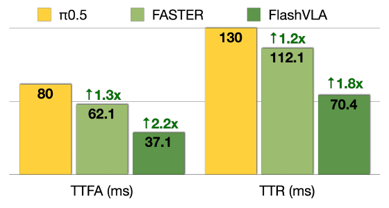

*Figure 4. 표시된 bar의 배수는 π0.5 기준이고, caption의 1.7×/1.6×는 FASTER 기준이다. [PDF p.7, Fig.4; p.8, §4.3]*

| Method | TTFA(ms) | expected TTR(ms) | TTR−TTFA(ms) |
|---|---:|---:|---:|
| π0.5 | 80.0 | 130.0 | 50.0 |
| FASTER | 62.1 | 112.1 | 50.0 |
| FlashVLA | 37.1 | 70.4 | 33.3 |

[저자 보고] TTFA는 observation 하나에 대한 policy response latency다. FlashVLA는 buffer가 찬 뒤의 steady-state latency를 보고한다. cold-start 비용은 episode completion time에 포함한다고 설명한다. **여기서 first action은 새 observation에 대한 첫 출력이지 episode를 켠 직후의 첫 움직임이 아니다.**

원문 §4.3의 핵심 비번호 식은 다음과 같다.

```math
\Delta t_{\mathrm{react}}\sim\mathcal U\left(\Delta t_{\mathrm{infer}},\Delta t_{\mathrm{infer}}+\Delta t_{\mathrm{exec}}\right),\qquad\mathbb E[\Delta t_{\mathrm{react}}]=\Delta t_{\mathrm{infer}}+\tfrac12\Delta t_{\mathrm{exec}}.
```

**기호와 단위.** Δt_infer는 observation에서 첫 usable action까지의 시간, Δt_exec는 새 policy 관측/실행 cycle 사이 간격이다. 둘 다 ms 또는 s 단위를 일관되게 써야 한다. Δt_react는 외부 변화가 생긴 뒤 새 반응이 적용될 때까지의 확률변수다.

**유도와 가정.** [리뷰어 해석] 외부 사건이 주기적 observation cycle의 어느 위치에 발생할지 균일하고, 다음 observation까지 기다리는 residual W가 U(0,Δt_exec)라고 하자. 추론 지연이 상수라면 react=W+infer이므로 위 uniform 분포가 나오고 평균 대기시간은 exec/2다. 이 식은 사건 발생이 uniform하고 주기가 일정하며, 관측 이후 새로운 계획이 실제 반응을 포함한다는 가정에 의존한다.

```math
\Delta t_{\mathrm{react}}=W+\Delta t_{\mathrm{infer}},\quad W\sim\mathcal U(0,\Delta t_{\mathrm{exec}}),\quad \mathrm{Var}(\Delta t_{\mathrm{react}})=\frac{\Delta t_{\mathrm{exec}}^2}{12}.
```

마지막 분산 식은 [리뷰어 해석] 보조 유도다. 실제 network latency jitter, observation dropout, 계속 유지되는 plan inertia, actuator response가 있으면 이 단순 uniform 모델의 설명력은 제한된다. **논문 Fig.4는 이러한 물리적 event-to-response 분포를 직접 계측한 결과표가 아니다.**

[검산] FASTER 대비 TTFA는 62.1/37.1=1.674배, TTR은 112.1/70.4=1.592배로 1.7/1.6과 맞는다. baseline 대비는 각각 2.156/1.847배이므로 그림의 2.2/1.8과도 맞는다. 식을 역산하면 baseline/FASTER의 exec는 100 ms, FlashVLA는 약 66.6 ms다. 따라서 TTR 개선에는 TTFA 단축뿐 아니라 **더 짧은 실행/관측 cycle**도 들어 있다. 동일 30 Hz 목표가 동일 execution horizon을 뜻하지 않는다.

### 10.2 FASTER와 FlashVLA의 차이

FASTER는 near-term action에 더 공격적인 horizon-aware schedule을 부여해 먼저 사용할 action을 빨리 내고, 나머지 future action은 계속 정제하며 client buffer를 채운다. FlashVLA는 서로 다른 progress의 chunk를 persistent queue에 유지하고, 매 호출마다 전체 queue를 한 단계씩 정제한다. [FASTER 공식 서지 v3](https://arxiv.org/abs/2603.19199v3), [공식 프로젝트](https://innovator-zero.github.io/FASTER/)

| 비교 축 | FASTER | FlashVLA |
|---|---|---|
| 중심 목표 | 외부 변화에 대한 즉각적인 반응, near-term TTFA | 저지연 chunk 출력과 async continuity를 같은 buffer 구조로 달성 |
| 시간 배분 | 가까운 action을 먼저 clean하게 만드는 horizon-aware schedule | N개 chunk의 noise staircase와 slot 이동 |
| 한 번의 출력 | chunk 전체 completion을 기다리지 않고 early action 전송 | warmup 뒤 각 action-expert 호출마다 한 clean chunk |
| 지속되는 상태 | streaming client-server action buffer | model 내부에서 여러 observation 호출에 걸쳐 남는 noisy action buffer |
| 연결 구조 | 우선 생성·전송하는 action schedule이 핵심 | cleaner→noisier chunk causal attention을 명시적으로 학습 |
| 이번 논문의 직접 비교 | Fig.4 TTFA/TTR | 37.1/70.4 ms, steady state |
| 이 비교로 알 수 없는 것 | 동일 task·동일 checkpoint·동일 모든 backend에서의 완전한 승패 | FASTER의 table-tennis 동적 성능보다 FlashVLA가 좋다는 결론 |

FASTER 프로젝트의 π0.5 RTX 4090 async 80.0/130.0, FASTER 62.1/112.1 ms가 FlashVLA Fig.4의 비교 숫자와 일치한다. 그러나 FlashVLA PDF는 Fig.4의 세부 하드웨어·checkpoint·backend·warmup·재측정 여부를 Table 2 수준으로 밝히지 않는다. 숫자의 일치는 출처 대응을 보여 주지만, 모든 실행 조건의 완전한 통제를 입증하지 않는다. 또한 FlashVLA Fig.4의 π0.5 130 ms는 FASTER 공식 표의 **async** 기대 TTR과 맞고, sync 기대 TTR 170 ms와는 다르다. Fig.1의 sync/async 개념 비교와 Fig.4 기준선을 혼합해서는 안 된다.

### 10.3 RTC 및 training-time RTC와의 차이

[RTC 공식 논문](https://arxiv.org/abs/2506.07339v2)은 재학습 없이 flow/diffusion policy에 inference-time inpainting을 적용한다. 이미 실행될 action을 고정하고 나머지를 이어 생성하는 것이 핵심이다. [Training-time RTC](https://arxiv.org/abs/2512.05964v2)는 delay를 학습 중 모사하고 action prefix에 직접 조건화해 inference-time inpainting 비용을 없애는 방향이다.

| 방법 | continuity를 만드는 조건 | 학습 요구/추론 특성 | FlashVLA에서 실제 비교한 범위 |
|---|---|---|---|
| inference-time RTC | committed action prefix를 freeze/inpaint | 기존 모델을 재학습 없이 사용할 수 있으나 guidance 연산 비용 존재 | §5 실기 3개 task, d=2, score/성공 trial completion time |
| training-time RTC | delay를 모사한 action-prefix conditioning | fine-tuning, inference-time guidance overhead 회피 | related work에 인용되지만 별도 정량 baseline 행은 없음 |
| VLASH | future-state-aware conditioning | 추론/실행 상태 mismatch를 다룸 | LIBERO/RoboTwin d sweep |
| StreamingVLA | action flow matching/adaptive early observation 계열 | 별도 streaming formulation | Table 1의 LIBERO 한 행, episode Steps/Time은 n/a |
| FlashVLA | noisy chunk buffer 안의 causal dependency | multi-buffer fine-tuning+fixed-step queue update | 본 논문의 중심 방법 |

**공정한 판독.** RTC도 이전 action을 이용하므로 “과거 방법은 모두 이전 chunk에 대한 정보가 없다”는 문장은 엄밀한 분류가 아니다. FlashVLA의 차별점은 그러한 정보를 action decoder의 여러 noise-level chunk 사이 dependency로 지속적으로 통합한다는 것이다. 단순 runtime patch인 RTC와 fine-tuned FlashVLA의 차이를 비교할 때는 추가 학습 데이터·compute를 비용에 포함해야 한다.

### 10.4 이 리뷰에서 구분하는 효율 metric

| metric | 분자/분모·범위 | 해당 증거 |
|---|---|---|
| NFE | action expert 평가 횟수 | baseline 10; FlashVLA steady call 1, 개별 chunk N |
| action decoding ms | VLM 이후 action stage wall time | Fig.1b 97.4→4.9 |
| policy invocation ms | observation encoding/prefill+action path | Table 2; benchmark preprocessing 경계 주의 |
| TTFA | 새 observation의 first usable action latency | Fig.4, FlashVLA steady state |
| TTR | 사건 발생에서 반응까지, 논문은 uniform 기대값 | §4.3 비번호 식 |
| action Time/Step | closed-loop episode wall time / executed actions | Table 1, Fig.3, Table 5 |
| policy refresh Hz | 새 observation을 반영한 policy invocation 빈도 | E·control tick·async schedule에 의존 |
| actuator/control Hz | low-level action 명령을 보낼 빈도 | 실기 30 Hz |
| task completion time | task 종료까지 시간 | 실기는 successful trials만 |
| training cost | 학습 wall time, GPU-hours, samples/tokens | GPU/steps/batch는 제시, full matched-compute 비용표는 없음 |

<a id="realworld"></a>

## 11. §5·A.2: 실제 Franka 배포

### 11.1 환경과 task data

[저자 보고] 7-DoF Franka arm, RTX A4000 한 장, 30 Hz control을 사용한다. Gello로 task당 50개 teleoperation demonstration을 수집한다. task는 각각 짧은/중간/긴 horizon을 대표하도록 고른 것이다. [PDF pp.9-10,14-15]

| Task | Table 6 instruction의 의미 | demos/frames | fine-tuning |
|---|---|---|---|
| Pick and Place | 과일을 집어 바구니에 넣기 | 50 / 22K | 10K steps |
| Whiteboard Wiping | 보드의 글씨를 모두 지우기 | 50 / 30K | 30K steps |
| Table Cleaning | 테이블 물체들을 모두 바구니로 치우기 | 50 / 68K | 30K steps |

Table 6은 task와 instruction의 대응표이며 성능표가 아니다. 각 task에 별도 human-collected data로 fine-tune하고, mean/std normalization, LR 5e−5, cosine scheduler, warmup 1K, GPU당 batch 16, 8 H200을 사용한다. baseline chunk는 50, FlashVLA C=20/N=4, 모든 method E=16, async method d=2다. [PDF p.14, A.2]

### 11.2 Figure 5 결과와 score의 분모

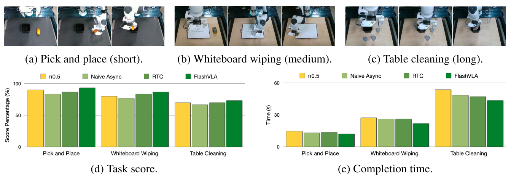

*Figure 5. 위는 세 실제 task, 아래는 task score와 성공 trial만의 completion time이다. [PDF p.10, Fig.5]*

비교하는 네 구성은 π0.5 synchronous, π0.5 naive async, π0.5 async+RTC, FlashVLA async다. 모든 구성에 동일 CUDA Graph·fusion을 사용했다고 저자가 밝힌다. task·method당 15 trials이며 full completion=2, partial=1, failure=0의 score를 사용한다.

```math
\mathrm{TaskScore}(\%)=100\frac{\sum_{r=1}^{15}s_r}{2\cdot15},\qquad s_r\in\{0,1,2\}.
```

이는 [리뷰어 해석]으로 분모를 명시한 score식이다. 논문에서 별도 번호 식으로 제시한 것은 아니다. 따라서 84.4%를 “45 trials 중 84.4%가 완전 성공”으로 바꿀 수 없다. partial completion도 numerator에 기여한다.

| Cross-task 결과 | Sync π0.5 | Naive Async | RTC | FlashVLA |
|---|---:|---:|---:|---:|
| 평균 score(%) | 80.0 | 75.6 | 80.0 | 84.4 |
| FlashVLA score 차이(pp) | +4.4 | +8.8 | +4.4 | – |

[저자 보고] 모든 task에서 FlashVLA의 score와 성공 trial completion time이 세 baseline보다 좋으며, completion-time speedup은 sync 대비 task 평균 약 1.3배, RTC 대비 약 1.2배다. task별 bar에는 정확한 숫자 label이 없으므로 pixel에서 추정한 값을 정밀한 원문 숫자로 전사하지 않는다. task별 성공/부분 성공/실패 count와 error bar도 제공되지 않는다.

성공 trial만 시간 평균에 넣으면 실패의 조기 종료가 빠른 시간으로 계산되는 문제는 줄어든다. 그러나 method마다 성공한 trial 집합이 다를 수 있어 survivor selection이 남는다. 동일 초기조건의 paired completion time, 성공률·score의 confidence interval, 실패 포함 time-to-success 또는 throughput은 별도로 필요하다.

### 11.3 67.3 ms 추론으로 30 Hz 제어가 되는 이유

[저자 보고] A4000 inference latency는 67.3 ms다. low-level tick은 1000/30=33.333 ms이므로 약 두 tick에 해당한다. E=16개 action이 담긴 실행 segment를 약 533.3 ms 동안 실행하며, 끝나기 두 action 전부터 다음 inference를 시작한다. 명령은 기존 chunk에서 계속 꺼내므로 매 tick 새 전체 policy 결과를 기다리지 않아도 된다.

[검산·리뷰어 해석] 67.3 ms의 inverse는 약 14.86 policy calls/s다. E=16, 30 Hz에서 이상적인 segment당 replan 빈도는 약 1.875 Hz다. 이는 model의 최대 호출 처리율과 실제 controller의 선택한 refresh 빈도가 다르다는 예다. 모든 action tick에 관측이 새로 반영된다고 해석하면 안 된다.

또한 두 tick의 정확한 overlap budget 66.667 ms보다 평균 67.3 ms가 약 0.633 ms 길다. 따라서 평균 수치만으로 엄격한 매 tick deadline 충족을 증명하지는 못한다. 논문은 30 Hz 실행을 보고하지만 p95/p99 latency, scheduler jitter, deadline miss count, sensor-to-actuator timestamp trace를 제공하지 않는다. 작은 차이를 근거로 실험 자체를 부정하지도 않고, strict hard-real-time 보장으로 확대하지도 않는다.

### 11.4 cold-start hold에서 특히 확인할 부분

joint-space absolute command는 실제 현재 qpos와 같은 값을 보내야 한다. normalized state와 normalized action이 서로 다른 통계를 쓰면 normalized state를 그대로 action으로 복사하면 안 된다. 공식 `compute_normalized_current_state_action`은 state를 원래 값으로 되돌린 뒤 action 통계로 다시 정규화한다.

delta control은 실제 0 displacement가 되도록 action mean/std 또는 quantile inverse를 풀어야 한다. code의 통계 누락 fallback은 zeros를 반환할 수 있으나 그때는 mean action이 될 수 있다는 경고를 포함한다. 이 리뷰에서 로봇을 구동하지 않았으므로 실제 gripper command·joint mapping·controller hold 동작은 검증하지 않았다.

<a id="ablation"></a>

## 12. A.3: ablation을 정확히 읽기

### 12.1 Figure 6: causal attention 제거라는 이름의 실험

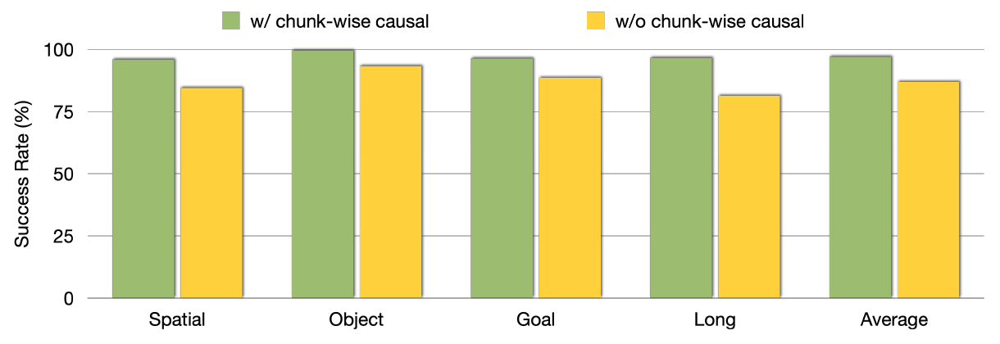

*Figure 6. 초록은 chunk-wise causal, 노랑은 inter-chunk interaction을 모두 차단한 variant다. [PDF p.15, A.3]*

[저자 보고] buffer, C, N, training pipeline, inference loop를 유지하면서 chunk끼리 어느 방향으로도 attention하지 못하게 만든다. 평균 asynchronous SR이 약 10 pp 낮아지고 Long의 저하가 특히 크다.

**강하게 지지하는 결론:** streaming buffer만으로 충분하지 않고, chunk들 사이에 정보를 전달하는 것이 유용하다. C·N과 queue 구조가 같으므로 단순 buffering 효과와 정보 연결 효과를 일부 분리한다.

**이 실험이 직접 답하지 않는 질문:** 미래→과거 방향을 추가한 bidirectional buffer는 어떠한가, cleaner→noisier 순서가 반대 방향보다 얼마나 좋은가, immediate predecessor만 보는 것과 모든 이전 chunk를 보는 것의 차이는 무엇인가. no-causal라는 이름을 “mask를 제거해서 full attention을 허용했다”로 읽으면 실험을 반대로 이해하게 된다.

정확한 bar별 numeric value·오차막대·seed별 결과는 인쇄되지 않았다. 이 리뷰는 그림에서 읽은 근사값을 소수점 한 자리 정확도로 재구성하지 않는다. 논문 본문의 “roughly 10 points”를 그대로 범위 있는 보고로 취급한다.

### 12.2 Figure 7: C sweep

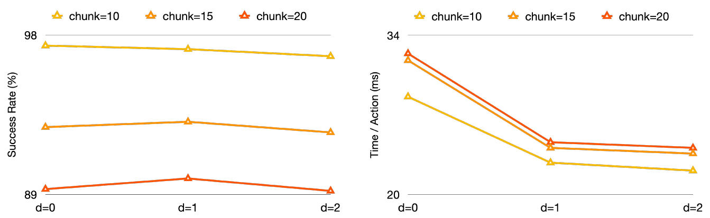

*Figure 7. C=10/15/20, N=5, d=0/1/2의 성공률과 action당 시간. [PDF p.15, Fig.7]*

[저자 보고] C=10이 가장 좋은 품질을 보이고 큰 C에서 SR이 떨어진다. N=5일 때 total action span은 50/75/100이다. pretrained π0.5 native chunk 50에 가까운 50이 유리하다는 설계 지침을 제안한다. C=15/20에서 d=1은 d=0보다 SR이 조금 높아, 적절한 async가 큰 chunk에서도 작동할 수 있음을 보여 준다.

[리뷰어 해석] C를 바꾸면 denoising sequence length, forecast span, task에서 실제 배운 행동 범위, 경우에 따라 execution/runtime 처리까지 바뀐다. 따라서 이 실험 하나로 “native horizon과 정확히 같은 span이 보편 최적”이라고 증명되지는 않는다. 본문 default LIBERO N=4,C=10의 span은 40이고 RoboTwin N=4,C=20은 80이므로 50이라는 규칙을 엄격한 등식으로 사용하지도 않는다.

**도표-본문 불일치.** Fig.7b caption과 A.3은 larger C에서 보이는 latency improvement가 낮은 성공률에 따른 reset artifact라고 설명한다. 그러나 인쇄된 curve에서는 같은 d에서 C=10 곡선이 C=15/20보다 아래에 있어 **더 큰 C가 더 빠른 것으로 보이지 않는다**. d가 커질 때 모든 curve가 낮아지는 현상과 C 증가를 섞지 않아야 한다. reset이 latency metric을 왜곡할 수 있다는 원칙은 타당하지만, 이 그림에서 그 구체적인 인과를 검산할 raw data는 없다.

### 12.3 Figure 8: N sweep

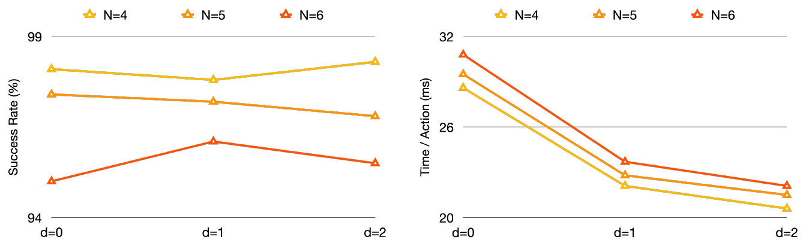

*Figure 8. N=4/5/6과 d 변화. [PDF p.16, Fig.8]*

[저자 보고] N에 대해 비교적 robust하고 action당 지연이 비슷하며 N=4를 stable default로 택한다. N이 커지면 chunk당 denoising update 수, 유지하는 미래 action span, train pack 길이가 함께 늘어난다. inference action token 수는 NC, training allocated action token 수는 N²C이므로 N 증가의 비용은 학습에서 특히 주의해야 한다.

**도표-문장 불일치.** caption과 A.3은 d=1에서 N=4/5/6 모두 π0.5 baseline과 같거나 높다고 말한다. 하지만 Fig.8a의 N=6, d=1 점은 약 96%대 초반으로 보이고, 본문의 LIBERO baseline은 96.9%다. 인쇄 plot을 기준으로 “모든 N이 baseline 이상”을 확인할 수 없다. 별도 baseline·실험 recipe를 썼다면 그 정보가 필요하다. 이 리뷰는 해당 문장을 검증된 사실로 반복하지 않는다.

또한 ablation caption의 평균 1.8배와 Table 1/Fig.3의 2.43배 이상은 같은 수치가 아니다. 조건·baseline·집계 차이를 밝히지 않고 대체하면 안 된다. figures에 seed error bar가 없으므로 robust라는 표현도 제한된 N 범위의 관찰로 읽는다.

<a id="limitations"></a>

## 13. §6: 한계, 불일치, 재현성

### 13.1 저자가 직접 인정한 한계

§6은 pretrained VLA의 independent-chunk pretraining objective를 물려받았다는 점과 episode마다 N−1회 cold start가 필요하다는 점을 든다. 처음부터 chunk-causal formulation으로 pretraining하는 것을 후속 방향으로 제시한다. 이는 실험으로 이미 개선을 입증한 결과가 아니라 future work다. 아주 짧은 task나 buffer reset이 잦은 deployment에서는 amortization이 약해질 수 있다. [PDF p.10]

### 13.2 재현을 위해 보존해야 할 원문/코드 차이

| 항목 | PDF/그림 | 고정 commit 또는 검산 결과 | 영향 |
|---|---|---|---|
| cold-start 배열 | text/Alg.1/A.4는 pad-left | Fig.2/code는 real-left | time·position·mask mapping을 함께 이식해야 함 |
| training/inference time | Eq.2에 Beta random sampling | inference는 τᵢ=i/N 고정 | 학습 noise sampling을 그대로 inference에 쓰면 안 됨 |
| baseline denoising vs N | baseline 10회, FlashVLA N회 | default N=4/5 | baseline의 10회 quality를 동일하게 보존했다는 표현 금지 |
| LIBERO batch | GPU당 32 | YAML microbatch 8×accum4 | nominal effective batch는 같아도 memory·optimizer accumulation 구현은 다름 |
| LIBERO E | A.1: 5 | `sim_eval/libero/eval.sh` default `N_ACTION_STEPS=10` | 기본 스크립트 그대로 PDF의 E=5 통제 재현을 보장 못함 |
| latency compile | Table 2 양쪽 같은 최적화 | baseline YAML false, FlashVLA true | fair comparison에는 명시 override 필요 |
| latency N | 본문 default 4 | benchmark YAML 5 | 표에 대응하는 실제 config/log 필요 |
| RoboTwin 초기화 | norm reinitialization 강조 | YAML은 time MLP reset도 지정 | 학습 변경 요인이 하나 더 있음 |
| loss scale | Eq.3 sum | code valid scalar mean | N·C 변화에서 loss scale 해석 차이 |
| LingBot 결과 | Table 5 85.2%,56.7ms baseline | README 85.8%,46.7ms | 서로 다른 snapshot 숫자를 섞지 말 것 |
| Fig.7 설명 | larger C의 apparent speedup | plot은 C=10이 가장 낮은 시간 | reset artifact 설명의 직접 확인 불가 |
| Fig.8 설명 | d=1에서 모든 N≥baseline | N=6 점은 96.9보다 낮아 보임 | robust/no-loss 문구 과도함 |

이 차이들은 **원문 결과를 자동으로 무효화하는 판정이 아니다**. 공개 실행 entrypoint, manuscript, figure가 완전히 일치하지 않는 상태이므로, 재현자는 paper run에 사용한 config와 raw result provenance를 추가로 확보해야 한다는 뜻이다.

### 13.3 방법의 실패 조건과 아직 없는 근거

- **급격한 외부 변화:** 뒤쪽 chunk는 이전 관측 아래 정제한 latent를 갖고 있다. 새로운 observation은 최종 update에 반영되지만 강한 prior plan을 충분히 바꾸는지 별도 event-based 검증이 필요하다.
- **C/E 시간 정렬:** forecast chunk 길이와 실제 실행 길이가 다르면 latent가 표현하는 미래 index와 실제 로봇 tick이 어긋날 수 있다. 코드가 기본적으로 C shift를 쓰는 점을 확인해야 한다.
- **접촉·tracking error:** 앞 chunk의 계획이 실제로 실행되지 않으면 미래 chunk가 참조하는 정보도 부정확하다. 로봇 동역학의 future-state predictor를 대체하는 정확한 상태 추정기로 보기는 어렵다.
- **학습의 exposure mismatch:** GT에서 합성한 noisy buffer와 model-generated buffer의 분포가 다르다. flow regression만으로 이 mismatch가 사라진다는 증명은 없다.
- **changing-condition ODE:** 하나의 chunk는 여러 oₜ를 거쳐 update된다. 고정 observation 아래 정의한 Eq.(1)의 하나의 ODE를 그대로 적분한다고 볼 수 없으며, 이 변경된 생성 과정의 distributional equivalence나 likelihood 보장은 제시되지 않는다.
- **jitter·overrun:** d개의 action 시간보다 실제 inference가 늦으면 promotion 시 기다려야 한다. 평균 latency만으로 tail latency·hard deadline 성능을 알 수 없다.
- **cold start/reset:** episode가 짧거나 자주 reset되면 hold 기간과 compile/cache 비용이 중요해진다. 급작스런 instruction 변경 시 buffer를 유지할지 reset할지의 정책은 별도 정의가 필요하다.
- **학습 비용:** H200 8장과 수만~수십만 optimization step의 적응을 요구한다. “slight architecture change”가 “가벼운 총 비용”과 같은 말은 아니다.
- **정량적 smoothness 부재:** action difference, velocity/acceleration continuity, jerk, oscillation, 접촉 force 지표가 주요 표에 없다. SR만으로 모든 종류의 smoothness를 대표할 수 없다.
- **통계적 불확실성:** high SR에서 0.x pp 차이와 real-world 15-trial score 차이에는 uncertainty가 중요하지만 주요 표는 confidence interval과 raw run distribution을 보여 주지 않는다.

### 13.4 재현 체크리스트: 실행하기 전에 고정할 것

| Gate | 필요한 기록 | 이 리뷰의 확인 상태 |
|---|---|---|
| 출처 고정 | PDF version/hash, code commit, dataset/model revision | PDF/code 고정 완료, full dataset/model revision은 별도 필요 |
| 학습 동등성 | pretrained weight, normalization, C/N, train steps/batch/accum, init 변경 | PDF+YAML 대조 완료, 실제 training log 미확보 |
| mask 검증 | real/pad validity, per-config isolation, chunk 내부 bidirectional, cleaner 방향 | 코드 정적 확인, tensor 실행 검증 미수행 |
| schedule 검증 | 학습 τ 구간, inference fixed grid, Euler 부호, reset 시 첫 clean 출력 시점 | 수식/코드/설명 예제 대조 완료 |
| horizon 정렬 | C/E/d, skipped stale actions, chunk timestamp mapping | 차이 확인, physical rollout trace 미확보 |
| 시스템 통제 | CUDA Graph, fusion, precision, view 수, image size, timer 경계 | 일부 default 차이 확인, 장치 실행 미수행 |
| 결과 검산 | raw score·seed·episode length·reset time·실패 처리 | 공개 표시값 산술 검산, raw log 재집계 미수행 |
| 배포 | sensor→policy→queue→actuator timestamps, p50/p95/p99, miss rate | 논문에 전체 지표 없음, 이번 작업에서 로봇 미구동 |

<a id="deployment"></a>

## 14. OpenVLA·Jetson Thor·TensorRT와의 연결

### 14.1 OpenVLA에 어디까지 바로 적용할 수 있는가

FlashVLA는 **continuous flow action expert**를 전제로 한다. 원래 OpenVLA의 이산 action-token autoregression에 buffer와 time embedding을 그대로 붙이는 것으로 같은 방법이 되지는 않는다. 토큰 확률 생성과 연속 velocity field는 objective와 inference state가 다르다. OpenVLA 계열에 적용하려면 flow head가 있는 변형을 사용하거나 head/objective를 바꾸는 추가 학습이 필요하다. 원문의 cross-architecture Table 5가 original OpenVLA를 직접 검증한 것은 아니다. [PDF §3, §4.5; Reference 1]

VLM 측에서는 observation encoder와 action expert가 분리된 모델이 이식하기 쉽다. 핵심은 action 시간 embedding을 token/slot별로 받아들이고, attention mask를 chunk-causal로 구성하며, persistent action tensor를 외부 state로 유지할 수 있느냐다. GR00T 등 다른 flow head와의 결합은 후속 가능성이지 이 논문의 측정 결과가 아니다.

### 14.2 Thor/TensorRT로 옮긴다면 나눌 책임

아래는 전부 **[후속 연구 제안]**이다. FlashVLA 논문은 Jetson Thor, TensorRT, INT8/FP8/NVFP4, 전력·열 안정성 benchmark를 보고하지 않는다. 따라서 4090/A4000 수치를 Thor에 그대로 적용하지 않는다.

| 구성요소 | 배포 책임 | 필요한 확인 |
|---|---|---|
| 학습 workstation | multi-buffer fine-tuning, norm/time conditioning 안정성, 모델/통계 export | eager reference와 loss/forward 수치 parity |
| Thor observation 경로 | camera capture, timestamp, normalization, resize, image/VLM inference | sensor age, 전처리 CPU cost, view별 latency |
| TensorRT 후보 engine | vision/VLM prefill과 action expert의 고정 shape 계산 | 지원 operator, attention mask 의미, FiLM broadcast, precision parity |
| runtime buffer | [1,NC,Dₐ] persistent tensor, fixed time grid, Euler update, shift/noise append | 정적 주소 관리, race 없는 state handoff, reset 정확성 |
| controller queue | E−d launch, 기존 CPU/실시간 경로의 action 실행, 다음 chunk 승격 | deadline, timestamp 정렬, overrun 시 동작 |
| validation harness | eager/compiled/export 경로를 같은 observation으로 비교 | action 차이뿐 아니라 closed-loop SR·score·jerk·deadline miss |

TensorRT 엔진은 대상 Thor 환경에서 지원되는 build/runtime 조합을 고정해 구축하고, 먼저 floating-point reference parity를 검증하는 것이 적절하다. layer가 정적 shape여도 모든 PyTorch 연산이 자동 변환된다고 가정하지 않는다. Gaussian random 생성, padding/mask, per-token adaptive norm, KV state, asynchronous queue는 engine 안/밖의 경계를 정해야 한다.

### 14.3 실제 연구로 발전시키는 최소 실험

1. **기준 경로:** 같은 checkpoint/precision/view/E/d로 eager와 CUDA Graph 결과를 비교하고 compile/capture를 steady-state timing에서 분리한다.
2. **장치 지연:** vision, VLM prefill, action expert, buffer update, host dispatch, normalization/transfer의 p50/p95/p99와 전력을 따로 기록한다.
3. **관측 반응:** 외부 물체 이동·instruction 변경 시점부터 처음 유효하게 바뀐 action까지 timestamp로 재고, buffer reset/유지 전략을 비교한다.
4. **구조 ablation:** causal, no-inter-chunk, bidirectional, immediate-predecessor-only를 같은 training budget과 action span에서 비교한다.
5. **실행 정렬:** E=C와 E<C를 동일 control frequency에서 비교하고, 실제 실행된 action timestamp와 latent target timestamp를 로그로 남긴다.
6. **최종 배포:** SR/score와 completion time뿐 아니라 jerk와 deadline miss가 허용 범위인지 함께 판단한다. kernel latency가 줄었다고 E2E speedup을 미리 약속하지 않는다.

이 설계의 실용적인 장점은 fixed buffer가 graph/engine state로 다루기 쉽다는 점이다. 후속 배포에서 가장 먼저 해결해야 할 것은 theoretical sparsity보다 **실제 관측·계획·실행 timestamp의 정렬과 tail latency**다.

<a id="qa"></a>

## 15. Q&A와 학습 순서

**Q1. FlashVLA는 one-step diffusion인가?**  
호출당 clean chunk 하나가 나오지만 개별 chunk는 N회의 update를 받는다. distillation으로 sample을 pure noise에서 단 한 번에 완성하는 것과 구분해야 한다.

**Q2. 모든 chunk를 함께 계산하면 계산량이 N배 늘지 않는가?**  
buffer action token이 NC개인 한 forward를 한다. baseline은 H₀개 action에 여러 forward를 한다. 실제 비율은 NC/H₀, hidden width, prefix cost, attention kernel, launch overhead에 달렸다. 하나의 forward라는 말만으로 FLOP 비율을 정할 수 없다.

**Q3. causal인데 어떻게 병렬로 출력하는가?**  
causal mask는 layer 내 허용 정보 경로를 정한다. autoregressive token sampling처럼 방금 출력한 token을 다음 forward 입력으로 넣어야 하는 구조가 아니다. 각 layer에서 모든 token의 hidden state를 한 번에 계산한다.

**Q4. cleaner chunk가 future chunk를 보면 왜 안 되는가?**  
저자는 곧 실행할 계획을 더 불확실한 미래 noise에 의존시키지 않으려 한다. 그 직관은 합리적이지만 causal vs bidirectional의 직접 실험은 Fig.6에 없다. Fig.6은 inter-chunk 정보 연결의 존재를 주로 검증한다.

**Q5. buffer는 실행된 과거 action을 저장하는가?**  
주로 아직 출력되지 않은 action chunk의 noisy/refined state다. 지난 호출에서 얻은 정보가 latent에 남지만, 모든 실제 executed action을 명시적으로 기록한 memory는 아니다.

**Q6. 새 카메라 관측은 매 denoising step에 들어가는가?**  
streaming policy 호출마다 새 observation으로 encode/prefill한다. 같은 chunk는 queue를 지나며 여러 관측 조건 아래 업데이트될 수 있다. actuator tick마다 전체 모델을 호출한다는 뜻은 아니다.

**Q7. 30 Hz니까 TTFA가 33 ms 이하인가?**  
아니다. 실기 inference 67.3 ms를 chunk 실행과 겹친다. 30 Hz는 low-level 명령 실행률이고, E=16이면 replan cycle은 훨씬 길다.

**Q8. fine-tuning 없이 기존 π0.5 weight로 빠르게 돌리면 되는가?**  
streaming input/mask/time conditioning에 맞춘 multi-buffer fine-tuning이 방법의 일부다. baseline weight를 benchmark config에 지정할 수 있다는 사실이 quality가 검증된 FlashVLA checkpoint라는 뜻은 아니다.

**Q9. Eq.(2)의 time을 매 inference마다 random으로 뽑는가?**  
코드 inference는 i/N grid다. Beta sampling은 training에 사용한다.

**Q10. cold start에서 normalized zero를 보내면 항상 안전하게 정지하는가?**  
normalized 0은 mean action일 수 있다. physical zero delta 또는 current qpos를 올바른 action normalization으로 표현해야 한다. 논문의 hold 개념과 실제 controller의 명령 의미를 대조해야 한다.

**Q11. real-world 84.4%는 success rate인가?**  
full/partial/failure를 2/1/0으로 점수화한 평균이다. 완전 성공 비율과 같지 않다.

**Q12. FASTER보다 실시간 반응이 무조건 좋은가?**  
Fig.4의 steady TTFA와 modeled expected TTR에서는 좋다. cold start, 다른 GPU·task·backend, event-to-actuation tail에 대한 보편 비교를 제공한 것은 아니다.

**권장 학습 순서:** 먼저 4절에서 t/τ/i와 C/N/E/d를 구분한다. 5절 Eq.(1)의 Euler 부호를 직접 계산하고, 6.2의 N=4 queue를 손으로 한 번 이동시킨다. 다음 7절에서 같은 observation에 대한 N개 training configurations를 만들어 본다. 마지막으로 Table 1의 ms/action과 Table 2의 ms/invocation, 실기 30 Hz를 서로 다른 분모로 계산한 뒤 ablation과 코드 차이를 읽으면 전체 논리가 연결된다.

<a id="coverage"></a>

## 16. Coverage checklist와 검증 기록

### 16.1 원문 섹션 대응

| 원문 범위 | PDF | 리뷰 위치 | 처리 |
|---|---|---|---|
| Abstract·§1 Introduction | 1-2 | 2-3절 | 문제 정의, profiler, 주장과 제한 |
| §2 Related Work | 2-3 | 3.2·10절 | efficient inference, async, streaming diffusion, FASTER/RTC 구분 |
| §3.1 Chunk-wise AR | 3-4 | 4-5절 | Eq.1-2, tensor, mask, FiLM, memory |
| §3.2 Streaming Inference | 4-5 | 6·8절 | cold start, queue, system optimization, 실제 async |
| §3.3 Multi-Buffer Joint FT | 5 | 7절 | Eq.3, packed sample, loss/gradient |
| §4.1 Setup | 6 | 9.1절 | benchmark/backbone/budget/E |
| §4.2 Async Execution | 7 | 9.2-9.3절 | SR/d/time, simulator composition |
| §4.3 Latency/Reaction | 8 | 9.4·10절 | Table2, TTFA/TTR, source와 timer 경계 |
| §4.4 Sync/Long-Horizon | 8 | 9.5-9.6절 | Table3-4, causal 해석의 제한 |
| §4.5 Cross Architecture | 9 | 9.7절 | Table5, Smol/LingBot, README 차이 |
| §5 Real-World | 9-10 | 11절 | task/data/score, RTC, A4000/30Hz |
| §6 Conclusion·Limitations | 10 | 13.1절 | pretrained objective, cold start, future work |
| Acknowledgment·References | 10-13 | 1·3·10절 | 전체 확인, 방법 비교에 관련 reference만 활용 |
| A.1 Simulated Settings | 14 | 9.1·13.2절 | normalization, train/eval recipe |
| A.2 Real-World Settings | 14 | 11절 | 50 demos, optimization, E/d, score |
| A.3 Ablations | 15-16 | 12절 | Fig.6-8와 본문 불일치까지 처리 |
| A.4 Implementation | 16-17 | 6-8절 | norm/time, buffer 구성, Algorithm1 |

### 16.2 모든 수식·도판·표 대응

| 원문 항목 | PDF | 리뷰 위치 | 제공 형태 |
|---|---|---|---|
| Eq.(1) | 3 | 5.1절 | PNG+LaTeX+shape/미분/Euler/수치 예제 |
| Eq.(2) | 3 | 5.2절 | PNG+LaTeX+구간/Beta/학습·추론 구분 |
| Eq.(3) | 5 | 7.3절 | PNG+LaTeX+축·mask·sum/mean·gradient |
| action chunk 정의 비번호 | 3 | 4절 | notation/shape, C/H₀ 구분 |
| TTR 분포·기대값 비번호 | 8 | 10.1절 | LaTeX+가정/유도/수치 역산 |
| future action slices·buffer 구성 비번호 | 16 | 7.2절 | PNG+LaTeX+config/time index mapping |
| Algorithm 1 전체 1-12행 | 17 | 6.3절 | PNG+행별 해설+실제 queue trace |
| Figure 1 | 2 | 3.1·9.4절 | PNG+motivation+profile 검산 |
| Figure 2 | 4 | 5.3·6.4·7절 | PNG+mask+train/inference 연결 |
| Figure 3 | 6 | 9.3절 | PNG+표시 숫자 전체 전사/검산 |
| Figure 4 | 7 | 10.1절 | PNG+TTFA/TTR 전사/유도 |
| Figure 5 | 10 | 11절 | PNG+score/성공 trial 시간 해설 |
| Figure 6 | 15 | 12.1절 | PNG+ablation 통제와 부족한 비교 |
| Figure 7 | 15 | 12.2절 | PNG+C sweep+본문 차이 |
| Figure 8 | 16 | 12.3절 | PNG+N sweep+본문 차이 |
| Table 1 | 5 | 9.2절 | 모든 숫자 Markdown 표+검산 |
| Table 2 | 7 | 9.4절 | 모든 숫자 Markdown 표+배수 |
| Table 3 | 7 | 9.5절 | 전체 숫자+sync 해석 |
| Table 4 | 8 | 9.6절 | 전체 숫자+horizon 해석 |
| Table 5 | 9 | 9.7절 | 전체 숫자+공식 README 대조 |
| Table 6 | 15 | 11.1절 | task/instruction 의미 대응 |

원문에 번호가 있는 수식·Figure·Table·Algorithm 중 누락한 항목은 없다. 편집 가능한 모든 보조식은 리뷰어 유도 또는 코드 재표현으로 구분했고, 원문 번호를 임의로 추가하지 않았다. Figure 5-8의 인쇄되지 않은 정밀 raw 수치는 만들어 넣지 않았다.

### 16.3 검증 범위와 남은 제한

- 원문 PDF 17쪽의 전체 텍스트를 읽었고, 수식·알고리즘·모든 도판/표가 있는 페이지를 Poppler 렌더로 대조했다.
- 원문 발췌 PNG 13개를 시각 검수했다. 상대 image 경로, manifest의 파일·페이지·bbox·픽셀 크기·해시 대응을 검사했다.
- Markdown은 UTF-8이며 block 수식은 최상위 fenced `math`, inline 수식은 GitHub 보호 구문을 사용한다. fence 균형·내부 anchor·금지된 수식 명령 검사를 통과했다. **블록 19개·인라인 34개 수식이 KaTeX와 MathJax parser에서 오류 0건**이었다. 상세 자동 검사 결과는 `assets/21_FlashVLA/validation_report.json`에 기록했다.
- 실험표의 주요 평균/차이/배수를 재계산했고, 표의 반올림과 원문 내 불일치를 구분했다.
- 공식 π0.5 핵심 forward/loss/schedule/buffer 및 training/evaluation entrypoint를 정적으로 대조했다. 코드의 GPU 실행, checkpoint quality 검증, training 재현, robot rollout은 수행하지 않았다.
- Marked+KaTeX로 로컬 HTML을 렌더하고 headless browser에서 전체 이미지 13개의 로딩, document 가로 넘침 0건, block 수식 가로 넘침 0건, runtime error 0건을 확인했다. 주요 7개 화면도 직접 시각 검수했다. 이 결과는 **GitHub 서버 자체의 렌더 검증은 아니다**.
- 공식 README가 연결한 `z-lab/flashvla-pi05-libero` 모델카드는 공개 읽기 요청에서 인증 오류가 반환되어 본문·revision을 확인하지 못했다. 비공개 여부나 누락 여부를 단정하지 않으며, model weight를 다운로드하거나 실행하지 않았다.
- 원문에서 제공하지 않는 raw 실험·tail latency·물리적 smoothness를 검증했다고 주장하지 않는다. 수식 parser·로컬 렌더·정적 코드 대조와 실제 학습/robot 실험은 분리한다.

작성 원칙과 검토 형식은 지정된 공통 brief 및 기존 한국어 리뷰를 읽기 전용으로 참고했다. 기존 리뷰, 다른 논문의 산출물, 공통 manifest/brief, GitHub 저장소는 수정하지 않았다.
