# LAC 상세 한국어 논문 리뷰

> 저장소 원문: [주 PDF](papers/22_Learnable_VLA_Caching.pdf) · [전체 목록](README.md)

**Learning to Accelerate Vision-Language-Action Models through Adaptive Visual Token Caching**  
**대상:** arXiv:2602.00686v2 · **검토일:** 2026-09-09 · **약칭:** LAC (Learnable Adaptive Caching)

이 리뷰는 본문과 기술 부록을 원문 순서로 설명하고, 모든 번호 수식을 편집 가능한 LaTeX·원문 PNG·기호와 연산 해설에 대응시킨 학습 자료다. 이 논문은 **VLA-Cache(arXiv:2502.02175)와 별개**다. LAC는 캐싱을 결정하는 두 모듈을 학습한다. 기존 VLA-Cache 리뷰는 형식만 참고했으며, 새 논문의 사실은 아래에 고정한 원문으로 확인했다.

## 목차

1. [서지·버전·증거 범위](#provenance)
2. [핵심 결론과 주장–근거 지도](#summary)
3. [Motivation과 관련 연구](#motivation)
4. [선수 지식·notation·tensor shape](#notation)
5. [§3 방법: Eq. (1)–(11) 상세 해설](#method)
6. [한 샘플의 end-to-end forward와 행별 알고리즘](#forward)
7. [학습 데이터·loss·gradient·frozen 경로](#training)
8. [§4 실험: Table 1–5, Figure 3–8](#experiments)
9. [§5와 Appendix A–D: 구현·복잡도, Eq. (12)–(16)](#appendix)
10. [비판적 검토와 재현성](#critique)
11. [OpenVLA·VLM·Jetson Thor/TensorRT 연결](#deployment)
12. [Q&A와 권장 학습 순서](#qa)
13. [Coverage checklist와 검증 기록](#coverage)
14. [공식 출처](#sources)

<a id="provenance"></a>

## 1. 서지·버전·증거 범위

### 1.1 고정한 원문

| 항목 | 확인한 정보 |
|---|---|
| 정식 제목 | Learning to Accelerate Vision-Language-Action Models through Adaptive Visual Token Caching |
| 저자 | Yujie Wei, Jiahan Fan, Jiyu Guo, Ruichen Zhen, Rui Shao, Xiu Su, Zeke Xie, Hongxun Yao, Shuo Yang |
| 기여·연락 | Yujie Wei/Jiahan Fan 공동 제1저자, Shuo Yang 교신저자 표기 |
| 소속 | Harbin Institute of Technology; Harbin Institute of Technology, Shenzhen; Meituan Academy of Robotics Shenzhen, Meituan; Central South University; HKUST(GZ) |
| 최초 제출 | 2026-01-31 12:12:51 UTC, v1 |
| 검토 기준본 | **v2, 2026-08-26 04:24:45 UTC**. 조회일의 최신 버전 |
| 학회 여부 | 확인한 공식 arXiv 서지와 PDF에 게재 학회 확정 표기가 없다. 이 리뷰에서는 arXiv preprint로 지칭한다 |
| 공식 서지 | [arXiv v2](https://arxiv.org/abs/2602.00686v2) |
| 버전 고정 다운로드 URL | [PDF v2](https://arxiv.org/pdf/2602.00686v2) |
| DOI | [10.48550/arXiv.2602.00686](https://doi.org/10.48550/arXiv.2602.00686) |
| 물리 페이지 | 15쪽, 각 612×792 pt. 인쇄 쪽수와 물리 쪽수 1–15 일치 |
| PDF SHA-256 | `891c33c439def12b48b564056067236fcc83b37452c2748ec3cb71196201bf49` |
| 공식 코드 링크 | PDF p.1에서 연결하는 [JiahanFan/LAC](https://github.com/JiahanFan/LAC) |
| 조회한 코드 commit | `fd191e0566944a3368be44909d36b535079e474b` |
| 실제 코드 공개 상태 | 조회 commit의 재귀 파일 트리는 **98-byte README.md 한 파일**. forward/loss/training/evaluation 코드·체크포인트를 확인할 수 없다 |

v1 기반 검색 인덱스에는 저자 8명으로 나타나는 항목도 있지만, 이 리뷰는 **v2 PDF와 공식 v2 서지의 9명**을 따른다. 제목에 “Adaptive Visual Token Caching”이 있다는 이유로 다른 캐시 논문의 학회·저자·실험 설정을 가져오지 않는다. [PDF p.1; 공식 arXiv v2 서지]

### 1.2 실제로 읽은 범위

본문 Abstract, §1 Introduction, §2 Related Work, §3.1–3.6 Method, §4.1–4.4 Experiments, §5 Conclusion을 읽었다. References [1]–[57]의 목록도 확인했으며, 부록 **A Limitations, B Implementation Details, C Formal Efficiency Analysis, D.1–D.3 Additional Experiment Results**를 전부 읽었다. 본문/결론은 pp.1–9, 참고문헌은 pp.9–11, 기술 부록은 pp.12–15에 있다.

**수식 Eq. (1)–(16), Figure 1–8, Table 1–5가 전체 번호 대상**이다. 원문에 번호가 붙은 Algorithm이나 별도 pseudocode는 없다. 따라서 아래 알고리즘은 본문·부록을 연결한 **[리뷰어 해석] 재구성**이며 “원문 Algorithm 1”이라고 부르지 않는다. 별도 supplementary 코드/파일은 공식 저장소에서 확인되지 않았으므로 부록 포함은 이 15쪽 PDF에 포함된 범위다.

### 1.3 증거 라벨과 페이지 규칙

- **[저자 보고]**: 원문에 쓰인 주장·수치·설정. 독립 재현을 의미하지 않는다.
- **[공식 코드 확인]**: 조회한 저장소에서 직접 확인한 사실. 이 논문에서는 README만 존재한다는 공개 상태 확인에 한정한다.
- **[검산]**: 공개 표나 원문 식으로 수행한 산술·대수 계산.
- **[리뷰어 해석]**: 원문을 이해하기 위한 shape 복원·유도·예시·비판. 실제 저자 구현과 구분한다.
- **[논문 미기재]**: 원문·부록에서 확인할 수 없는 설정이나 연결.
- **[후속 연구 제안]**: 논문 결과로 입증되지 않은 확장·실험·배포 방법.

`[PDF p.N, §X, Eq.(Y), Fig./Table Z]`는 위 해시의 **v2 물리 PDF 쪽수**를 뜻한다. HTML의 참고문헌 번호나 검색 결과의 버전 혼입을 피하기 위해 수식·페이지 판단은 PDF를 우선했다.

### 1.4 이미지 출처와 권리

원문 **Figure 8개와 번호 수식 16개, 총 24개 PNG**를 Poppler로 240 dpi 렌더링한 원본에서 직접 발췌했다. 생성형 그림이나 다시 그린 도표로 바꾸지 않았으며, 식 번호·기호·축·범례를 보존했다. 영문 caption 전체를 반복 삽입하는 대신 한국어 분석을 붙였다.

상대 이미지 경로는 `assets/22_Learnable_VLA_Caching/`다. [publication_assets.json](assets/22_Learnable_VLA_Caching/publication_assets.json)에 PDF URL/버전/SHA-256, 물리 페이지, 왼쪽 위 원점의 `[x0, top, x1, bottom]` point 좌표, DPI, 픽셀 크기, 각 PNG SHA-256을 기록했다. 배포할 때 Markdown과 이 폴더를 함께 보관해야 한다.

원문 그림·수식의 권리는 원저자와 해당 권리자에게 있다. 이 리뷰는 해설·비평을 위한 출처 표시를 하며, 원문이나 발췌 이미지에 새로운 이용 허락을 부여하지 않는다. 원본 PDF의 arXiv 메타데이터는 non-exclusive distribution license를 가리키므로 CC-BY라고 표시하지 않았다.

<a id="summary"></a>

## 2. 핵심 결론과 주장–근거 지도

**LAC는 현재 RGB와 인접 프레임의 optical flow를 보고, 작은 Selector가 “어디를 새로 계산할지”의 순위를, Predictor가 “얼마나 재사용할지”의 비율을 정한 뒤, frozen VLA decoder의 이전 프레임 KV 일부를 그대로 재사용하는 학습 기반 계산 배분 방법이다.**

두 모듈은 처음에는 VLA attention을 따라 배우고, 이후 VLA task loss와 캐시 비율 보상을 함께 사용해 학습한다. 학습 중에는 discrete 선택의 backward를 soft surrogate로 근사한다. 추론 중에는 ratio 선택에서 Gumbel noise를 제거하고 argmax를 사용하되, stochastic recovery는 별도로 남긴다.

먼저 다음 여덟 가지를 기억하면 해석 오류가 줄어든다.

1. **training-free가 아니다.** VLA 본체를 고정하고 새 캐싱 모듈을 학습한다. 실물로봇 실험의 OpenVLA LoRA 적응과 LAC의 frozen-backbone 정책 학습은 구분해야 한다.
2. **saliency 점수가 높으면 재계산한다.** 이름이 Cached Token Selector라고 해서 높은 점수가 “캐시 적합도”인 것은 아니다. 낮은 점수 토큰이 캐시 대상이다.
3. **cache ratio는 재사용 비율이다.** 40%라면 recovery 전 활성 토큰은 60%다. Fig.2의 40/60/80% 예시를 전체 후보 집합·최종 평균 비율로 단정할 수 없다.
4. **task loss는 성공률 자체와 동일하다고 정의되지 않았다.** 원문은 구체적인 action CE/MSE/diffusion objective를 쓰지 않고 기호로 남긴다. “정책 최적화”를 로봇 환경 reward 기반 RL로 읽으면 안 된다.
5. **1.76배는 CUDA time 51.91/29.51의 비율이다.** 카메라·RAFT·CPU·행동 전달·actuator를 포함한 sensor-to-action 지연 측정으로 확장할 근거가 없다.
6. **배경 KV를 보존해도 정확한 현재-frame KV와 같지는 않다.** 이전 frame의 문맥이 섞인 표현을 사용하는 근사이며, recovery는 오차를 완전히 없애는 증명이 아니다.
7. **공식 구현으로 gradient 연결을 확인할 수 없다.** hard ratio → 정수 k → top-k/mask까지 task gradient가 전달되는 정확한 구현은 중요한 재현 공백이다.
8. **이 논문은 기존 VLA-Cache를 “정적”이라고 단순화한다.** 기존 방법도 변화 토큰 판정·task-relevant 재계산·layer별 비율 적응을 포함한다. LAC의 실제 차별점은 그 계산 정책을 task loss로 학습한다는 점이다.

### 주장과 근거의 대응

| 주장 | 원문 근거 | 직접 확인 가능한 범위 | 반증·유보 조건 |
|---|---|---|---|
| attention proxy보다 task-driven 캐싱이 낫다 | Eq. (6)–(11), Fig.1–3, Table 2/5 | attention 초기화 후 task 최적화라는 구조; 일부 성능 차이 | 동등 학습 데이터/고정 캐시 예산 비교·정책 진단 부족 |
| 어떤 토큰/몇 개를 나눠 학습하는 것이 유효하다 | Eq. (4)/(5), Table 2 | Selector only 82.2 → Predictor 추가 83.4% | Predictor 추가 시 비용도 증가하여 동일 예산 인과 분리 아님 |
| 속도와 성공률을 동시에 개선한다 | Table 1 | 75.0 → 76.9%, 51.91 → 29.51 ms | hardware/timing 경계·seed·분산 미기재 |
| action decoder 유형이 달라도 적용된다 | Table 3, CogAct | SIMPLER VM/VA에서 개선 | 두 모델의 증거이며 모든 VLA에 대한 무수정 호환 증명 아님 |
| 실물 환경에도 효과가 있다 | Table 4, Fig.5/6 | 평균 33 → 38%, CUDA 37.38 → 32.47 ms | PickMango는 악화, 낮은 절대 성공률, trial 수 미기재 |
| recovery가 안정성을 높인다 | Table 2, §3.6 | 83.4 → 85.6%, 비용 증가 | recovery probability/fraction/장기 최악 지연·최대 캐시 나이 미기재 |
| warm-up이 필요하다 | Table 5 | 79.2% 대 85.6% | 수렴 곡선·seed 반복·같은 총 학습량 통제 불명확 |
| policy overhead는 작다 | Eq. (12), Appendix C | backbone 깊이에 무관한 별도 모듈이라는 구조 | RAFT 실측 시간 없음; 엄밀한 해상도 선형 비용으로 보기는 어려움 |

<a id="motivation"></a>

## 3. Motivation과 관련 연구 — 원문 §1–2

### 3.1 VLA의 반복 계산은 어느 축에서 중복되는가

로봇이 “물체를 바구니에 넣어라”를 수행할 때, 매 제어 관측마다 그리퍼와 물체 일부만 움직이고 배경은 상당 부분 유지될 수 있다. 일반 VLA는 새 관측을 별도 입력으로 받아 모든 image token의 decoder 상태를 다시 계산한다. 한 관측의 action token들을 생성하는 동안 사용하는 일반 autoregressive KV cache는, **다음 카메라 관측에서 비슷한 시각 토큰을 다시 처리하는 중복**까지 자동으로 제거해 주지 않는다. [PDF pp.1–2, §1; p.4, §3.2]

따라서 해결하려는 것은 두 종류의 선택이다. 토큰 수만 정하면 어떤 토큰이 중요한지 모르고, 순위만 정하면 그때그때 어느 정도 계산할지 알 수 없다. Selector는 공간적 선택을, Predictor는 한 frame의 예산을 담당한다.

### 3.2 “안 움직임”과 “업데이트가 필요 없음”은 다르다

Fig.3의 예에서는 바구니가 처음에는 정지해 있어 rule-based 정책이 캐시하지만, 로봇이 접근할 때 바구니 가장자리의 최신 정보가 중요해진다. 접촉·가림·그리퍼 위치 변화가 작은 영역의 의미를 바꿀 수 있다. saliency/attention은 유용한 특징이지만 캐시로 인한 action 손실과 직접 동일하지 않다. [저자 보고] 원문은 이런 proxy와 task objective의 어긋남을 핵심 동기로 제시한다.

[리뷰어 해석] 여기서 “캐시한다”는 정보를 완전히 버린다는 뜻은 아니다. 바구니의 **오래된 KV가 남아 있고 새 관측으로 갱신되지 않는 것**이다. 따라서 저자의 “critical context를 잃는다”는 표현은 현재 상태에 맞는 업데이트가 막힌다는 의미로 읽는 편이 정확하다.

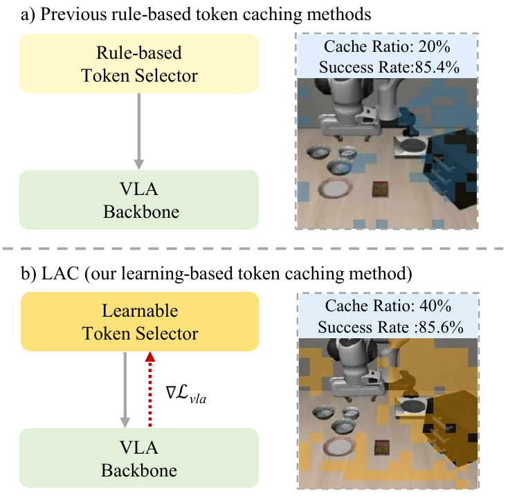

**Figure 1.** 상단 selector에는 task loss의 feedback 화살표가 없고, 하단에는 gradient가 돌아온다. 삽화에는 rule-based 20%/85.4%, LAC 40%/85.6%가 적혀 있다. 이는 동기 도식의 조건이며, Table 1의 VLA-Cache LIBERO-Spatial 83.8%와 같은 숫자로 취급해서는 안 된다. 해당 도식의 비율·성공률과 전체 실험 설정의 세부 연결은 미기재다. [PDF p.1, Fig.1]

### 3.3 기존 VLA-Cache와 구분

| 비교 축 | 기존 VLA-Cache | 이 논문의 LAC |
|---|---|---|
| 논문 ID | 2502.02175, 최초 2025-02-04 | 2602.00686, 최초 2026-01-31 |
| 공식 제목 | VLA-Cache: Efficient Vision-Language-Action Manipulation via Adaptive Token Caching | Learning to Accelerate Vision-Language-Action Models through Adaptive Visual Token Caching |
| 기본 성격 | training-free 캐시 결정 | Selector/Predictor를 학습하는 캐시 결정 |
| 변경·중요도 처리 | 인접 frame에서 적게 바뀐 토큰 재사용, task-relevant 토큰 재계산 | RGB+optical flow로 saliency를 예측하고 task loss로 조정 |
| 비율 적응 | attention concentration에 따른 layer adaptive reuse도 포함 | 입력 장면으로 discrete cache ratio를 예측 |
| task objective의 역할 | 학습 gradient로 새 selector를 최적화하지 않음 | Stage II에서 loss gradient를 두 모듈에 전달한다고 제안 |
| 공통점 | 이전 frame의 visual KV를 재사용하고 필요한 영역을 갱신 | 같은 캐시 기반 계산 중복 제거 축을 사용 |

기존 VLA-Cache에 적응성이 전혀 없다는 주장은 그 논문의 공식 초록과 맞지 않는다. **“규칙으로 적응한다”와 “task loss로 적응 정책을 학습한다”**가 적절한 구분이다. 기존 논문의 NeurIPS 2025 수락 표기를 LAC의 학회 정보로 옮기면 안 된다. [기존 논문 공식 서지](https://arxiv.org/abs/2502.02175v2)

### 3.4 §2의 관련 연구 논리

원문은 VLA를 큰 VLM에 action modality를 결합하는 계열로 정리하며, autoregressive action token, diffusion, flow 형태의 행동 생성을 언급한다. 이 논문의 실증 backbone은 OpenVLA와 CogAct다. 관련 연구에서 이름을 언급한 모든 모델에 LAC를 구현한 것은 아니다.

가속 방법은 token pruning/merging, 구조 변경, layer scheduling, quantization, 고주파 action 생성 등으로 나눈다. pruning은 토큰을 없애는 반면 caching은 이전 표현을 남긴다는 차이가 있다. 짧은 action sequence에서는 pruning 결정/인덱싱 비용이 절약량을 넘어설 수 있다는 문제를 Table 1의 SparseVLM 결과와 연결한다. 다만 이 실험만으로 모든 pruning이 로봇에 부적절하다고 일반화할 수 없다. [PDF p.2, §2; p.6, Table 1]

<a id="notation"></a>

## 4. 선수 지식·notation·tensor shape

### 4.1 서로 다른 시간·차원 기호

원문은 일반 AR cache 설명과 frame 간 재사용 설명에서 모두 t를 사용한다. 아래 해설에서는 **t = 카메라/policy 관측 시점**, **u = 한 관측 안의 AR decoding step**, **l = decoder layer**로 나눈다. 원문 식을 전사할 때만 원래 기호를 유지한다.

원문에서 일반 글꼴 $`V_t=[I_t;O_t]`$는 motion-aware 입력이지만, 굵은 $`\mathbf V_t`$는 attention value cache다. $`L_t`$는 Predictor logits, $`L`$은 layer 수, $`\mathcal L`$은 loss다. 또한 Appendix C의 $`M`$은 FFN 중간 폭이며 binary mask $`M_t`$와 다르다.

### 4.2 통합 shape 사전

다음은 원문 기능을 만족하는 **[리뷰어 해석] 일반적인 batch-first shape**다. 논문은 실제 image resolution·token 수·head 수·hidden width를 제시하지 않으므로 이 표를 저자 config로 오해하면 안 된다.

| 기호 | 의미 | 해설용 shape/범위 | 주의 |
|---|---|---|---|
| B, H, W | batch, image height/width | 정수 | 실제 값 미기재 |
| $`I_t`$ | 현재 RGB frame | $`B\times3\times H\times W`$ | 정규화·crop 미기재 |
| $`O_t`$ | optical flow | 통상 $`B\times2\times H\times W`$ | 원문은 채널 수·방향·resize 규칙을 특정하지 않음 |
| $`V_t`$ | RGB와 flow 결합 | 위 convention에서는 $`B\times5\times H\times W`$ | 채널 concatenate 해석; 저자 실제 5채널 config 확정 아님 |
| $`X_t`$ | visual token sequence | $`B\times N\times D`$ | image patch/encoder 출력과 decoder 입력 연결 |
| $`S_t`$ | 중요도 점수 | $`B\times N`$, 각 원소 [0,1] | softmax 합 1 조건은 원문에 없음 |
| $`\mathcal R`$ | 후보 cache ratio | C개의 [0,1] 비율 | 실제 후보 리스트 미기재 |
| $`L_t`$ | ratio logits | $`B\times C`$, 실수 | token별 출력이 아니라 frame별 C-way 선택 |
| $`\tilde p_t,p_t`$ | soft probability, hard one-hot | $`B\times C`$ | C축 합 1 |
| $`r_t, k_t`$ | 선택한 비율, 캐시 개수 | sample별 scalar | $`k_t=Nr_t`$의 정수화 규칙 필요 |
| $`M_t,\tilde M_t`$ | hard/soft 재계산 마스크 convention | $`B\times N`$ | 이 리뷰에서는 1=active, 0=cached |
| $`C_t=1-M_t`$ | 보조 캐시 마스크 | $`B\times N`$ | **리뷰어 도입 기호** |
| $`Q,K,V`$ | 한 attention head의 projection | Q: $`B\times N_q\times d`$, K/V: $`B\times N_k\times d`$ | Eq.(1)/(2)의 단순화 형태 |
| $`K_t^l,V_t^l`$ | layer별 visual KV | 통상 $`B\times h_{kv}\times N\times d`$ | 실제 grouped-query 구조·layout 미기재 |
| $`N_{\mathrm{act}}`$ | active visual token 개수 | $`N-k_t`$, recovery 후 증가 가능 | 다른 modality token 수와 구별 |
| $`S_{\mathrm{VLA}}`$ | Stage I attention teacher target | 점수 비교를 위해 $`B\times N`$로 집계되어야 함 | 어떤 layer/head/query를 평균하는지 미기재 |
| $`\theta_{\mathrm{sel}},\theta_{\mathrm{pred}}`$ | 학습 모듈 parameters | CNN 등의 weights | 정확한 구조·파라미터 수 미기재 |
| $`\theta_k,\tau_s,\tau,\lambda`$ | score threshold, 두 온도, loss weight | scalar | threshold는 model weight θ와 다른 의미 |

### 4.3 학습 가능한 선택과 실제 연산 생략

binary mask를 곱했다고 계산이 저절로 줄지는 않는다. 길이 N 전체로 dense QKV·FFN을 실행한 뒤 결과를 0으로 만들면 대부분 연산은 이미 수행됐다. 부록 B/C가 의도하는 가속은 **active row를 모아 실제 projection/FFN/query 개수를 줄이는 것**이다. 반대로 backward에서는 버린 선택의 영향을 근사하기 위해 soft 값과 계산 경로가 필요하다. 빠른 hard forward와 유효한 soft backward는 각각 별도로 구현해야 하는 요구사항이다.

<a id="method"></a>

## 5. §3 방법 — 번호 식 (1)–(11)

### 5.1 §3.1 전체 framework와 두 단계

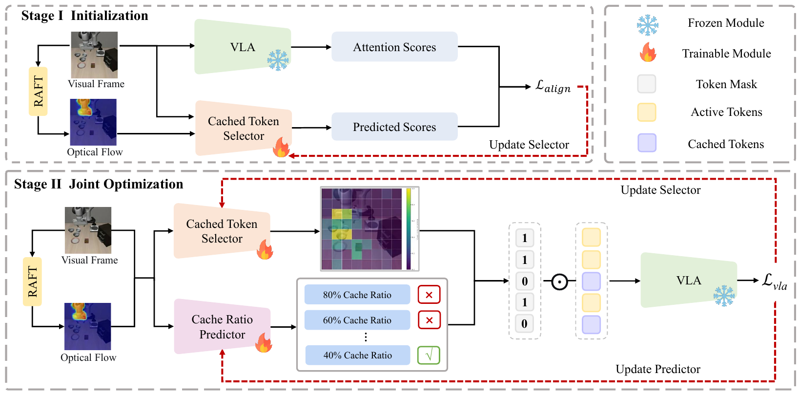

**Figure 2.** Stage I에서 frozen VLA attention과 Selector 점수를 정렬한다. Stage II에서 Selector와 Predictor를 함께 학습하고 VLA는 고정한다. 우측 legend의 불꽃은 trainable, 눈송이는 frozen이다. 도식의 1은 active, 0은 cached token과 연결된다. RAFT 상자에는 별도의 frozen/trainable 표식이 없으므로 RAFT 가중치 상태까지 이 그림으로 단정하지 않는다. [PDF p.3, §3.1, Fig.2]

원문 순서는 ① 전체 구조, ② 일반 KV caching, ③ 두 모듈, ④ two-stage loss, ⑤ discrete relaxation, ⑥ inference다. 손실에 쓰인 soft probability의 정의가 다음 절에 나오므로 아래도 먼저 objective를 이해하고 이어 relaxation을 연결한다.

### 5.2 §3.2 일반 KV cache: Eq. (1)–(3)

#### 식 (1): Q/K/V projection

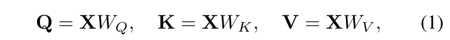

```math
\mathbf Q=\mathbf XW_Q,\qquad \mathbf K=\mathbf XW_K,\qquad \mathbf V=\mathbf XW_V.\qquad\text{(1)}
```

- **입력:** 한 sample의 token matrix $`\mathbf X\in\mathbb R^{T\times D}`$. 원문 $`[x_1,\ldots,x_T]`$를 row stacking으로 해석한다.
- **가중치/shape:** 단일 head 설명에서는 $`W_Q,W_K,W_V\in\mathbb R^{D\times d}`$이므로 세 출력은 $`T\times d`$다. 실제 multi-head 구현은 먼저 여러 head 폭으로 투영하고 reshape한다.
- **연산:** token마다 hidden dimension D에 대해 선형 결합한다. 서로 다른 token을 혼합하는 연산은 아직 없다.
- **역할:** Q는 참조 요청, K는 매칭 기준, V는 모아올 내용이다. 이 세 값은 동일 X에서 나오지만 서로 다른 weights를 사용한다.
- **정규화/가정:** bias, layer norm, RoPE, head split 등은 식에서 생략되어 있다. 생략을 “실제 모델에 없음”으로 읽지 않는다.
- **다음 식 연결:** Q와 K로 token 간 weight를 만들고 V를 가중합한다.

#### 식 (2): scaled dot-product attention

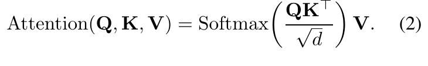

```math
\mathrm{Attention}(\mathbf Q,\mathbf K,\mathbf V)=\mathrm{Softmax}\!\left(\frac{\mathbf Q\mathbf K^{\mathsf T}}{\sqrt d}\right)\mathbf V.\qquad\text{(2)}
```

- **곱의 축:** Q가 $`N_q\times d`$, K가 $`N_k\times d`$라면 QK transpose는 $`N_q\times N_k`$다. full prefill에서는 양쪽 token 수가 같지만 LAC에서는 query 수만 줄일 수 있다.
- **scale:** dot product가 d개 성분의 합이므로 $`\sqrt d`$로 나눠 dimension 증가에 따른 logit 크기 확대를 완화한다. d는 image token 수가 아니다.
- **softmax:** 각 query row에서 **key/token 축**으로 정규화한다. 각 행 합이 1이며 batch/head/query를 한꺼번에 정규화하지 않는다.
- **출력:** attention probability $`N_q\times N_k`$와 V $`N_k\times d`$를 곱해 $`N_q\times d`$를 얻는다.
- **mask:** 식에는 causal mask가 생략되어 있다. 실제 decoder에서는 원래 position에 맞는 attention mask가 필요하다. [Appendix B]
- **캐시와 연결:** Q가 현재 정보여도 K/V의 일부는 이전 frame에서 가져올 수 있다. 그 경우 행렬곱은 정의되지만 값은 현재 frame 전체 재계산 결과의 근사다.

**[리뷰어 해석] 작은 attention 예제.** d=2, Q=(1,0), 두 key가 (1,0),(0,1), 두 value가 (10,0),(0,20)이면 scaled logits는 (0.7071,0)이다. softmax는 약 (0.6698,0.3302), 출력은 (6.698,6.605)다. 두 번째 KV를 캐시했더라도 두 번째 weight와 value contribution은 사라지지 않는다.

#### 식 (3): 한 AR sequence 안의 append

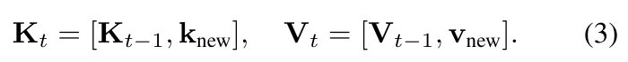

```math
\mathbf K_t=[\mathbf K_{t-1},\mathbf k_{\mathrm{new}}],\qquad \mathbf V_t=[\mathbf V_{t-1},\mathbf v_{\mathrm{new}}].\qquad\text{(3)}
```

- **입력/출력:** 기존 $`(T-1)\times d`$ cache에 새 $`1\times d`$ row를 붙여 $`T\times d`$로 만든다. 대괄호는 token 축 concatenate다.
- **이 식의 t:** 일반적인 decoding 단계다. 새로운 camera frame 전체를 기존 이미지 뒤에 계속 붙인다는 LAC 구현식이 아니다.
- **절약:** 이전 token의 K/V projection을 반복하지 않는다. 새 query의 기존 모든 key에 대한 attention 계산까지 없어지는 것은 아니다.
- **LAC와의 차이:** LAC의 visual cache는 다음 frame에서 **같은 slot의 일부를 교체**한다. action 생성 중의 AR cache append와 visual slot update는 함께 사용할 수 있지만 서로 다른 갱신이다.

### 5.3 §3.3 motion-aware 입력: 핵심 비번호 식

```math
V_t=[I_t;O_t],\qquad X_t=\{x_t^{(1)},\ldots,x_t^{(N)}\},\qquad M_t\in\{0,1\}^{N}.\qquad\text{(원문 비번호)}
```

RGB는 “무엇이 어디 있는지”, flow는 “어디가 얼마나 이동하는지”를 제공한다. 원문은 **RAFT-small**로 O를 얻는다고 명시한다. 최소한 두 관측의 대응이 필요하지만 이전/현재 frame의 순서, flow 좌표를 현재 frame token에 정렬하는 법, flow resize 시 벡터 크기 보정, 첫 frame 처리법은 설명하지 않는다. 본 리뷰의 forward 예제는 인접 frame pair와 현재 token grid로 정렬된 flow를 가정한다. [PDF p.4, §3.3]

[리뷰어 해석] channel concat을 택하면 RGB 3채널+2D flow 2채널=5채널이다. 원문 그림의 flow 색상 시각화를 실제 네트워크가 3채널 color-flow로 받는다고 추측해서는 안 된다. 텐서 전처리가 공개되지 않아 5채널은 설명용 convention이다.

원문 contribution에서 “scene-level motion entropy”를 언급하지만, §3.3.2에는 entropy를 계산하는 식이나 histogram/bin/normalization이 없다. Predictor는 V를 받아 C개 logits를 낸다는 수준으로 정의된다. 따라서 entropy estimator가 실제 구현된 필수 모듈이라고 추가하지 않는다.

### 5.4 §3.3.1 Cached Token Selector: 식 (4)

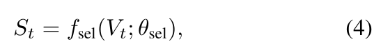

```math
S_t=f_{\mathrm{sel}}(V_t;\theta_{\mathrm{sel}}).\qquad\text{(4)}
```

- **입력:** motion-aware frame tensor V. 언어 지시를 Selector의 직접 입력으로 쓰는 것이 기본 설계는 아니다.
- **출력:** $`S_t=\{s_t^{(1)},\ldots,s_t^{(N)}\}`$, 각 값은 [0,1]. CNN feature map을 token grid의 N개 score로 맞추는 연결이 필요하다.
- **연산:** 작은 CNN으로 visual/motion pattern을 token saliency로 변환한다. 정확한 층 수·kernel·stride·pooling·최종 activation은 미기재다. [저자 보고] 출력 range만 명시되어 있다.
- **의미:** 높을수록 현재 상태에 중요하므로 다시 계산한다. 낮을수록 이전 KV 재사용 후보가 된다.
- **정규화:** N개 점수 합=1 조건은 없다. [0,1] 범위가 있다고 token-axis softmax를 임의로 넣으면 MSE/threshold 성질이 달라질 수 있다.
- **한계/다음 연결:** 이 단계만으로 재계산할 개수는 결정되지 않는다. Predictor가 정한 cache 개수 k에 대해 가장 낮은 k개를 선택해야 한다.

정지한 물체가 높은 score를 받을 수 있는 이유는 RGB feature와 학습 중 task gradient가 함께 사용되기 때문이다. 반대로 움직이는 모든 배경이 중요하다는 제약도 없다. 다만 **동일한 V를 가진 서로 다른 언어 지시에는 직접적인 instruction-conditioned 선택을 할 수 없다**. 학습 데이터에서 task relevance를 배웠다는 의미와 현재 instruction을 읽는다는 의미는 다르다.

### 5.5 §3.3.2 Cache Ratio Predictor: 식 (5)

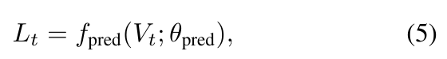

```math
L_t=f_{\mathrm{pred}}(V_t;\theta_{\mathrm{pred}}).\qquad\text{(5)}
```

- **입력:** Selector와 동일한 V. 두 모듈이 같은 CNN stem을 공유하는지, 별개 CNN인지 정확한 구현은 미기재다.
- **출력:** $`L_t=\{l_t^{(1)},\ldots,l_t^{(C)}\}`$. logit j는 cache 비율 $`r_j`$의 선택 점수다.
- **범위/축:** logits는 실수 C개이고 [0,1] 확률이 아니다. Eq.(9)에서 C축 softmax로 확률이 된다.
- **추론:** 가장 큰 logit에 해당하는 비율을 선택한다. 최종 선택 비율은 sample별 scalar다. token별로 C개 class를 출력하는 설계가 아니다.
- **직관:** 쉬운/정적인 관측에서 높은 비율을 택해 계산을 줄이고, 어려운/동적인 관측에서 낮은 비율을 택해 정보를 갱신하도록 학습한다.
- **예산 연결:** $`k_t=Nr_t`$개를 캐시하고 나머지를 활성화한다. rounding/tie breaking, 0/100% 허용 여부, 후보 집합의 전체 값은 미기재다.

**[리뷰어 해석] 예시:** 후보가 (0.25,0.5,0.75), logits가 (0.2,1.7,0.9)라면 inference는 0.5를 선택한다. N=8이면 cache 4개, active 4개다. 이는 원문 hyperparameter를 복원한 것이 아니라 ratio와 cardinality의 관계를 보여 주는 예제다.

### 5.6 §3.4 Stage I: attention alignment, 식 (6)

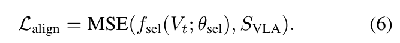

```math
\mathcal L_{\mathrm{align}}=\mathrm{MSE}\!\left(f_{\mathrm{sel}}(V_t;\theta_{\mathrm{sel}}),S_{\mathrm{VLA}}\right).\qquad\text{(6)}
```

- **teacher:** pretrained/frozen VLA에서 뽑은 attention map $`S_{\mathrm{VLA}}`$.
- **student:** Selector의 $`B\times N`$ 점수. CNN이 teacher의 시각 중요도 패턴을 모사한다.
- **shape 정합:** attention의 원래 shape는 통상 batch×head×query×key다. MSE를 적용하려면 visual key slice를 뽑고 head/layer/query 축을 집계해 N개 target으로 만들어야 한다. **어느 축을 어떻게 집계하는지는 미기재**다.
- **loss 연산:** 대응 원소의 차이를 제곱하고 평균한다. 원문 MSE의 실제 reduction 축/normalization은 미기재이므로 아래 B,N 평균은 설명용이다.
- **gradient:** teacher target에는 업데이트를 하지 않고 Selector weights를 갱신한다. Predictor는 이 단계의 loss에 등장하지 않는다.
- **목적:** random score로 시작하면 hard selection 때문에 유용한 정보가 초기부터 사라질 수 있다. attention을 안정적인 출발점으로 사용한 뒤 Stage II에서 task에 맞게 벗어난다.

**[리뷰어 보조 전개]** B,N 평균을 택하면 다음과 같다.

```math
\mathcal L_{\mathrm{align}}=\frac1{BN}\sum_{b=1}^{B}\sum_{i=1}^{N}\left(S_{b,i}-S^{\mathrm{teacher}}_{b,i}\right)^2,\qquad \frac{\partial\mathcal L_{\mathrm{align}}}{\partial S_{b,i}}=\frac2{BN}\left(S_{b,i}-S^{\mathrm{teacher}}_{b,i}\right).
```

예를 들어 student=(0.2,0.8), teacher=(0.4,0.6)이면 MSE=0.04, score gradient=(-0.2,+0.2)다. gradient descent는 첫 점수를 올리고 둘째를 내린다. 원문 실제 attention target이 합 1인지, min–max로 정규화되는지에 따라 의미가 달라지므로 이 값은 학습 설정을 대체하지 않는다.

**attention을 비판하면서 attention을 왜 다시 쓰는가?** Eq.(6)은 최종 policy의 정답을 정의하지 않고 초기화만 제공한다. Stage II에서 task loss로 업데이트한다는 점이 논리의 핵심이다. Table 5의 warm-up 제거 성능 저하는 이 역할의 경험적 근거지만, attention initialization의 유일성을 증명하지는 않는다.

### 5.7 §3.4 Stage II: task와 efficiency, 식 (7)–(8)

#### 식 (7): 공동 목적함수

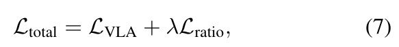

```math
\mathcal L_{\mathrm{total}}=\mathcal L_{\mathrm{VLA}}+\lambda\mathcal L_{\mathrm{ratio}}.\qquad\text{(7)}
```

각 loss는 scalar다. $`\lambda`$는 두 목적의 scale과 trade-off를 조절하는 coefficient다. 본체는 frozen이어도, 변경된 token computation이 VLA 출력에 미치는 영향으로 Selector/Predictor를 업데이트하려는 목적이다. 원문은 Stage II에 Eq.(6)의 alignment loss를 계속 더한다고 쓰지 않는다. 그러므로 임의로 alignment regularizer를 유지한 objective로 바꾸지 않는다. [PDF p.5, §3.4]

**[논문 미기재] $`\mathcal L_{\mathrm{VLA}}`$의 정확한 정의:** action token cross-entropy인지, 연속 action L1/L2인지, teacher distillation인지, CogAct noise prediction loss인지, 또는 각 backbone의 native objective를 어떻게 채택했는지 설명이 없다. label, temporal horizon, teacher forcing, normalization도 확인되지 않는다. “final task performance”라는 문장만으로 평가 성공률을 직접 미분했다고 해석할 수 없다.

#### 식 (8): 높은 캐시 비율을 장려하는 항

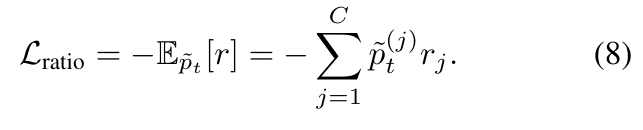

```math
\mathcal L_{\mathrm{ratio}}=-\mathbb E_{\tilde p_t}[r]=-\sum_{j=1}^{C}\tilde p_t^{(j)}r_j.\qquad\text{(8)}
```

- **입력:** C개 후보 $`r_j`$와 Eq.(9)의 soft probability $`\tilde p_t^{(j)}`$.
- **축:** j는 후보 비율 축이다. token index i에 대해 loss를 합하는 식이 아니다.
- **계산:** 각 비율에 확률을 곱해 평균 재사용 비율을 구한 뒤 음수를 붙인다.
- **부호:** loss를 최소화하므로 더 큰 expected ratio가 유리하다. 예를 들어 -0.7은 -0.4보다 작다.
- **범위:** 최소/최대 후보가 $`r_{\min},r_{\max}`$이면 loss는 $`[-r_{\max},-r_{\min}]`$ 범위다.
- **의미:** 계산량/latency 자체를 측정하는 loss가 아니라 **캐시 비율 surrogate reward**다. 후보별 실제 runtime과 linear 관계라는 보장은 없다.
- **정규화:** probability는 C축 합 1이다. sample/time 평균 방식은 원문에 없다.

**“cache budget”은 hard constraint인가?** 아니다. 원문 목적은 특정 $`\bar r`$에 맞추는 budget equality/inequality가 아니다. 높은 r을 선호하는 soft regularization이고, L_VLA와 λ가 이를 억제한다. λ를 높이면 task를 희생해 cache ratio가 커질 수 있다. r=최대값으로 쏠리는 collapse를 막는 것은 식에 별도로 명시된 constraint가 아니라 유효한 task gradient다.

**[검산·해설용 수치]** 후보 (0.25,0.5,0.75), 확률 (0.2,0.5,0.3)이면 expected ratio=0.525, ratio loss=-0.525다. task loss=0.8, λ=0.1이면 total=0.7475다. 다른 선택으로 task loss가 0.82, expected ratio가 0.70이 되면 total=0.75다. 따라서 캐시를 많이 했어도 첫 선택이 더 좋은 목적값을 가진다.

Eq.(9)의 noise를 고정하고 미분하면 다음 gradient를 얻는다. **원문에 없는 리뷰어 보조 유도식**이다.

```math
\bar r=\sum_j\tilde p_t^{(j)}r_j,\qquad \frac{\partial\mathcal L_{\mathrm{ratio}}}{\partial l_t^{(j)}}=-\frac1\tau\tilde p_t^{(j)}(r_j-\bar r).
```

평균보다 높은 비율의 logit에는 음의 gradient가 생겨 gradient descent에서 logit이 증가한다. 평균보다 낮은 비율의 logit은 반대로 감소한다. 이 gradient는 task loss 경로가 끊겨도 존재하기 때문에, “Predictor gradient가 0이 아니다”만으로 task-aware joint training을 검증할 수는 없다.

### 5.8 §3.5 이산 결정 완화: 식 (9)–(10)

#### 식 (9): Gumbel-Softmax

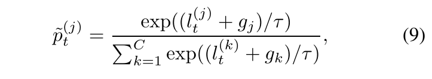

```math
\tilde p_t^{(j)}=\frac{\exp((l_t^{(j)}+g_j)/\tau)}{\sum_{k=1}^{C}\exp((l_t^{(k)}+g_k)/\tau)},\qquad g_j\sim\mathrm{Gumbel}(0,1).\qquad\text{(9)}
```

- **입력:** real logits C개와 후보별 Gumbel noise. τ는 양수 temperature다.
- **연산 순서:** logit에 noise를 더한다 → τ로 나눈다 → exp → C축 합으로 나눈다. 구현 시 numerical stability를 위해 최대 logit을 빼도 같은 확률이다.
- **출력/축:** [0,1] C개, 합 1. one-hot이 아니라 연속 probability simplex 위의 벡터다.
- **τ의 효과:** 작은 τ는 분포를 뾰족하게 만든다. 매우 작으면 거의 선택되지 않은 후보의 gradient가 작아지고 안정성 문제가 생길 수 있다. 큰 τ는 smooth하지만 hard inference와 더 다를 수 있다.
- **noise의 역할:** 후보 간 탐색을 제공한다. 동일 입력이어도 noise가 달라지면 hard winner가 달라질 수 있다.
- **학습 연결:** Eq.(8)은 이 soft 확률을 직접 쓰고, task 경로에서는 Eq.(10)의 hard 선택과 STE를 연결한다.

**[리뷰어 보조식]** uniform random U에서 Gumbel noise를 만드는 표준 재매개화와 softmax Jacobian은 다음과 같다.

```math
g_j=-\log(-\log U_j),\quad U_j\sim\mathrm{Uniform}(0,1),\qquad \frac{\partial\tilde p_j}{\partial l_k}=\frac1\tau\tilde p_j(\mathbf1[j=k]-\tilde p_k).
```

noise sampling은 parameter gradient의 대상이 아니라 reparameterization의 외부 random input으로 취급한다. τ를 anneal하는 schedule과 clipping은 논문에 없다.

#### 식 (10): forward의 hard one-hot

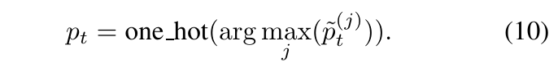

```math
p_t=\mathrm{one\_hot}\!\left(\mathop{\mathrm{arg\,max}}_j\tilde p_t^{(j)}\right).\qquad\text{(10)}
```

soft probability에서 winner 하나만 1로 만든다. shape는 여전히 C지만 discrete vector가 된다. hard ratio는 $`r_t=\sum_jp_t^{(j)}r_j`$로 읽을 수 있다. 원문은 이 weighted sum을 독립 번호식으로 적지는 않는다.

**deterministic이라는 표현의 범위:** Eq.(10)은 주어진 noise/확률에 대해 결정적 argmax지만, Eq.(9)의 Gumbel noise 때문에 **training policy 전체는 stochastic**이다. τ가 양수라면 동일 noise에서 argmax는 τ와 무관하지만 backward 확률/gradient는 τ에 따라 바뀐다. 추론에서 noise를 빼고 raw logits에 argmax하는 것이 §3.6의 deterministic selection이다.

**[리뷰어 보조식] STE를 코드의 stop-gradient 의미로 쓰면** 다음과 같다.

```math
p^{\mathrm{ST}}=\mathrm{sg}(p^{\mathrm{hard}}-\tilde p)+\tilde p.
```

sg는 forward 값은 그대로 주고 backward derivative를 0으로 처리한다. forward 값은 hard one-hot이며 backward는 soft probability의 derivative를 받는다. 이는 **hard argmax의 정확한 미분이 아니라 biased surrogate**다. 원문은 STE 원리를 설명하지만 이 코드 표현 자체를 제시하지 않는다.

### 5.9 §3.5 Selector의 soft mask: 식 (11)

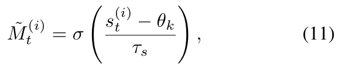

```math
\tilde M_t^{(i)}=\sigma\!\left(\frac{s_t^{(i)}-\theta_k}{\tau_s}\right).\qquad\text{(11)}
```

- **입력:** token i의 saliency, k번째 선택 경계 score $`\theta_k`$, 양수 온도 $`\tau_s`$.
- **연산:** score에서 threshold를 뺀다 → 온도로 나눈다 → sigmoid를 취한다.
- **출력/shape:** 각 token의 연속 mask [0,1], 전체 $`B\times N`$. token축 확률합이 1이 되는 정규화가 아니다.
- **부호와 convention:** score가 threshold보다 높을수록 mask가 1에 가까우므로 Eq.(11)은 **재계산/active mask**로 읽는 것이 Eq.(4) 및 Fig.2와 일관된다. 캐시 mask를 1로 정의하는 구현이라면 complement가 필요하다.
- **경계:** threshold와 같으면 0.5다. soft mask의 합이 정확히 $`N-k`$가 된다는 보장은 없다. hard top-k만 정확한 개수를 정한다.
- **threshold:** k번째 score를 의미하지만 오름차순/동률 처리/threshold detach 여부를 코드 수준에서 특정하지 않는다.

**[리뷰어 보조 전개] threshold를 상수로 두었을 때**

```math
\frac{\partial\tilde M_i}{\partial s_i}=\frac1{\tau_s}\tilde M_i(1-\tilde M_i),\qquad \frac{\partial\tilde M_i}{\partial\theta_k}=-\frac1{\tau_s}\tilde M_i(1-\tilde M_i).
```

threshold 근처에서 gradient가 크고 멀어지면 작다. τ_s=0.1일 때 score−threshold가 -0.2,0,+0.2이면 soft mask는 약 0.1192,0.5,0.8808이다. 이 값은 token을 11.92%만 물리적으로 계산한다는 의미가 아니라 backward surrogate다.

만약 $`\theta_k`$가 S의 함수라면 **추가 chain rule이 필요**하다.

```math
\frac{\partial\tilde M_i}{\partial s_j}=\frac{\tilde M_i(1-\tilde M_i)}{\tau_s}\left(\mathbf1[i=j]-\frac{\partial\theta_k}{\partial s_j}\right).
```

threshold를 detach했는지에 따라 gradient coupling이 달라진다. Eq.(11)만 전사해서는 이 차이를 재현할 수 없다.

### 5.10 두 discrete 선택을 연결할 때 남는 공백

원문 주장대로라면 task loss가 Predictor로 돌아가는 경로는 다음과 같아야 한다.

```math
\mathcal L_{\mathrm{VLA}}\longrightarrow \text{VLA output}\longrightarrow \text{merged KV/active computation}\longrightarrow M_t\longrightarrow r_t\longrightarrow L_t\longrightarrow\theta_{\mathrm{pred}}.
```

문제는 $`r_t\to k_t=Nr_t\to\mathrm{topk}`$에서 k를 정수나 Python scalar로 바꾸면 일반적인 autograd 경로가 끊긴다는 점이다. **ratio one-hot에 STE를 붙이는 것만으로 discrete cardinality를 인자로 받는 top-k가 자동으로 미분 가능해지지 않는다.** Eq.(11)은 score에 대한 surrogate를 제시하지만, ratio에 따라 threshold가 어떻게 연속적으로 변하고 task gradient가 어떻게 Predictor로 가는지는 명시하지 않는다.

[리뷰어 해석] 구현 가능성 자체를 부정하는 것은 아니다. 후보 ratio마다 만든 mask를 soft 확률로 결합하거나, budget에 대해 differentiable한 threshold를 쓰거나, custom backward를 정의하면 연결할 수 있다. 그러나 **어떤 방식을 저자가 사용했는지는 미기재이며 공식 구현도 없다**. 아래는 가능한 연결을 보여 주는 보조 예시다.

```math
\tilde M=\sum_{j=1}^{C}\tilde p_j\tilde M^{[j]}(S),\qquad M^{\mathrm{ST}}=\mathrm{sg}(M^{\mathrm{hard}}-\tilde M)+\tilde M.
```

이 예시를 채택하면 ratio와 selector에 대한 gradient를 정의할 수 있지만, 실제 출력에 M을 적용하는 방법과 생략한 token 연산에 대한 surrogate도 필요하다. 여러 후보 forward를 전부 계산하면 train-time 비용이 달라진다. 그러므로 이를 “논문 구현 코드”로 제시하지 않는다.

### 5.11 §3.6 추론 절차와 recovery

추론에서 Predictor는 raw logits의 argmax를 사용하고 Selector는 낮은 score k개를 캐시한다. active token의 K/V를 새로 계산하고 cached token은 이전 layer별 K/V를 읽어 병합한다. 그 상태로 action decoder가 행동을 생성한다. [PDF p.5, §3.6]

**stochastic recovery**는 캐시 예정 token 일부를 무작위로 active로 돌리는 추가 장치다. 원문은 “작은 확률 $`p_{\mathrm{recover}}`$로, 캐시 토큰의 일부를 강제 재계산”한다고만 설명한다. 확률값·복구 비율·token별 독립 샘플인지 frame별 사건인지 상세한 규칙은 미기재다. 아래는 문장 그대로 frame별 사건으로 해석한 보조 모델이다.

```math
z_t\sim\mathrm{Bernoulli}(p_{\mathrm{recover}}),\quad R_t\subseteq\mathcal C_t,\qquad \mathcal A'_t=\mathcal A_t\cup R_t,\qquad \mathcal C'_t=\mathcal C_t\setminus R_t.
```

여기서 R은 z=1일 때만 추출하는 subset, A는 active index set, C는 cache index set이다. 원문 수식 번호를 새로 부여한 것이 아니다. recovery는 r로 정한 **명목 캐시 비율을 낮춘다**. 따라서 Predictor output ratio와 실제 재사용 비율을 각각 로그에 남겨야 한다.

**[리뷰어 보조 기대값]** 회복 사건마다 cache의 비율 α를 균등 복구한다면, 초기 r이 고정된 조건에서 기대 active 수는 $`N(1-r+p_{\mathrm{recover}}\alpha r)`$, 기대 reuse ratio는 $`r(1-p_{\mathrm{recover}}\alpha)`$다. 실제 방식이 token별 Bernoulli이면 세부 분포는 달라진다. 어느 경우에도 “ratio 결정은 deterministic”과 “전체 추론에는 random recovery가 존재”는 양립한다.

<a id="forward"></a>

## 6. 한 샘플의 end-to-end forward와 행별 알고리즘

### 6.1 시작 상태와 layer별 캐시

필요한 상태는 이전 RGB frame, 이전 관측의 layer별 visual K/V, 각 visual slot의 원래 position, cache 유효 여부다. 원문은 cache 전체 초기화 규칙을 쓰지 않는다. 아래에서는 **[리뷰어 해석] 새 episode 첫 관측은 full computation으로 cache를 채운다**고 가정한다. instruction/카메라 geometry/episode가 바뀔 때 cache invalidation도 구현에 필요하지만 저자 절차로 확인되지는 않는다.

가속 지점은 부록 B에 따르면 **VLA decoder forward와 initial action token generation**이다. 현재 RGB로부터 어떤 vision encoder 계산까지 실제로 생략하는지는 구체적으로 설명하지 않는다. 따라서 “RAFT만 돌리고 vision tower 전체를 건너뛴다” 또는 “patch embedding부터 전체 vision encoder를 sparsify했다”라고 주장할 수 없다.

### 6.2 N=8인 한 관측의 토큰 예제

모든 값은 해설용이다. N=8, saliency=(0.1,0.9,0.2,0.8,0.3,0.7,0.4,0.6), chosen ratio=0.5라고 하자.

| 원래 token index | 1 | 2 | 3 | 4 | 5 | 6 | 7 | 8 |
|---|---|---|---|---|---|---|---|---|
| saliency | .1 | .9 | .2 | .8 | .3 | .7 | .4 | .6 |
| recovery 전 active M | 0 | 1 | 0 | 1 | 0 | 1 | 0 | 1 |
| 캐시 여부 C=1−M | 1 | 0 | 1 | 0 | 1 | 0 | 1 | 0 |
| token 5를 recovery한 뒤 M | 0 | 1 | 0 | 1 | 1 | 1 | 0 | 1 |

recovery 전 active indices는 {2,4,6,8}, cached indices는 {1,3,5,7}다. recovery가 token 5를 돌리면 active는 5개, 실제 reuse ratio는 3/8=37.5%다. Predictor의 명목 50%와 다르다.

각 decoder layer에서 새로 계산할 Q/K/V row는 5개지만, active query가 보는 visual K/V 문맥은 8개다. shape는 단일 head 기준 Q=5×d, full K/V=8×d, attention logits=5×8, active output=5×d다. action/text token은 원문 단순화의 N에서 제외되어 있으므로 실제 구현의 전체 key 길이는 더 길 수 있다.

### 6.3 KV 갱신을 명시한 보조식

```math
K_t^l[i]=\begin{cases}K_{t,\mathrm{new}}^l[i],&i\in\mathcal A'_t,\\K_{t-1}^l[i],&i\in\mathcal C'_t,\end{cases}\qquad V_t^l[i]=\begin{cases}V_{t,\mathrm{new}}^l[i],&i\in\mathcal A'_t,\\V_{t-1}^l[i],&i\in\mathcal C'_t.\end{cases}
```

이 식은 Appendix B의 문장을 옮긴 **리뷰어 재구성**이다. slot i의 위치를 바꾸지 않고 값을 갱신한다. cached row는 projection/FFN의 현재 계산 대상이 아니지만 attention의 key/value 문맥에서는 남는다.

```math
H_{t,\mathrm{act}}^{l,\mathrm{attn}}=\mathrm{Softmax}\!\left(\frac{Q_{t,\mathrm{act}}^l(K_t^l)^{\mathsf T}}{\sqrt d}+B_{\mathrm{pos,act}}^l\right)V_t^l.
```

보조식 B_pos는 원래 position과 attention visibility를 반영한 additive mask다. active indices만으로 row를 줄이되 key column 전체를 유지한다. **active끼리만 5×5 attention을 하면 Appendix C가 분석한 LAC와 다른 연산**이 된다.

### 6.4 재구성 pseudocode

원문에는 algorithm block이 없다. 아래는 §3.6+Appendix B/C로부터 파악되는 **추론 의미를 기술한 pseudocode**이며 실행 가능한 공식 구현이 아니다.

```text
01  Receive current RGB frame I_t, instruction, previous frame and cache state.
02  If visual cache is invalid: run the full baseline path and initialize it.
03  Otherwise compute optical flow from the adjacent frame pair; align its grid.
04  Form motion-aware input V_t from RGB and optical flow.
05  S_t <- Selector(V_t); L_t <- Predictor(V_t).
06  j <- argmax(L_t); r_t <- candidate_ratio[j].
07  k_t <- integerize(N * r_t) using a declared rounding policy.
08  cached_indices <- k_t lowest-scoring visual token indices.
09  active_indices <- remaining visual token indices.
10  Apply stochastic recovery and move recovered indices into the active set.
11  Prepare current visual embeddings and unchanged text/action interfaces.
12  For each VLA decoder layer l:
13      Gather active hidden rows while retaining their original position IDs.
14      Compute active Q/K/V; apply the model's position transform where required.
15      Update active KV slots; preserve cached visual KV slots.
16      Attend with active queries to all allowed active+cached context KV.
17      Apply output projection, residual/norm and FFN to active rows as required.
18  Generate the first action output from the assembled context.
19  Continue native AR action decoding or the model's native action head.
20  Decode/postprocess the action and retain visual cache state for the next frame.
```

| 행 | 해설과 확인 범위 |
|---|---|
| 01–02 | stateful policy 호출의 조건. initial full pass/cache invalidation은 작동 가능한 구현에 필요한 리뷰어 보완 |
| 03–04 | RAFT-small과 RGB-flow concat은 본문 명시. alignment/normalization 규칙은 미기재 |
| 05 | 어느 토큰과 몇 개인지를 독립 출력. 모듈 사이 직접 feature 전달은 원문에 없음 |
| 06–07 | inference에서 noise 없는 argmax. integerize 함수는 원문이 정하지 않음 |
| 08–09 | 낮은 k개를 캐시하고 높은 나머지를 계산. 원래 spatial/token index 보존 |
| 10 | random recovery로 stale KV 일부를 갱신. sample seed·fraction은 미기재 |
| 11 | decoder 앞 vision encoder 비용 범위가 명시되지 않아 포괄적 interface로 남김 |
| 12–13 | layer마다 cache가 있어야 함. N 전체 FFN 후 mask하는 구현과 달리 active row gather 필요 |
| 14 | conditional rotary 처리. key는 위치 변환된 상태로 보존하며 value까지 임의로 RoPE 적용하지 않음 |
| 15 | append가 아닌 해당 visual slot 교체. text/action KV와 lifetime이 다름 |
| 16 | active query × full allowed key. causal mask/position consistency 필요 |
| 17 | 원래 backbone의 residual/norm/FFN 순서를 유지해야 함. 정확한 block layout은 논문이 재정의하지 않음 |
| 18–19 | OpenVLA의 AR cache와 병용. CogAct 내부 diffusion head 연결 세부는 별도 미기재 |
| 20 | action denormalization·command 형식·실행 horizon은 baseline interface에 의존하며 원문 상세 없음 |

### 6.5 layer별 의미와 정확성의 한계

각 layer에서 cached token의 K/V는 그 token의 이전 frame hidden state에서 계산됐다. 이전 frame의 active/cached 혼합이 여러 번 지속됐다면 cache의 값이 실제로는 더 오래된 관측에서 유래했을 수도 있다. frame t−1 cache를 읽는다는 문장과 정보의 나이가 1 frame이라는 주장은 다르다.

또한 token i의 픽셀이 같아도 deep hidden state는 다른 token과의 attention 때문에 달라질 수 있다. 따라서 캐시 정확도를 pixel change만으로 증명할 수 없다. LAC가 배운 task-aware 선택과 recovery는 이 근사 오차를 관리하려는 방법이지, dense forward와의 수치 동일성을 보장하는 방법은 아니다.

<a id="training"></a>

## 7. 학습 데이터·loss·gradient·frozen 경로

### 7.1 단계별 학습 대상

| 단계 | 입력/감독 | trainable | frozen 또는 외부 경로 | 확인 한계 |
|---|---|---|---|---|
| baseline 준비 | OpenVLA 공식 benchmark weights; 실물로봇은 LoRA fine-tune | 실물 baseline LoRA | 초기 pretrained weights의 범위는 원문 세부 없음 | 실물 데이터 규모·rank·steps 미기재 |
| Stage I | RGB+flow, VLA attention target | Selector | teacher VLA | RAFT fine-tune 여부 및 teacher aggregation 미기재 |
| Stage II | RGB+flow, 최종 VLA task supervision | Selector+Predictor | VLA backbone 명시적으로 frozen | action head와 LoRA의 개별 상태를 나눈 parameter list 없음 |
| inference | 현재/이전 frame, instruction, KV state | gradient update 없음 | 학습된 모듈과 VLA forward | random recovery는 남음 |

Fig.2와 §3.1/3.4는 pretrained VLA를 frozen으로 유지한다고 설명한다. 이를 표준적으로 읽으면 policy 학습 중 VLA weights를 업데이트하지 않는다는 뜻이다. 그러나 “backbone”과 별도 head의 파라미터 경계를 소스 없이 임의로 세분해 확정하지 않는다. 실물 실험의 LoRA 적응은 frozen LAC 훈련과 상충하는 주장이 아니라, base policy를 준비하는 학습과 캐시 policy를 학습하는 단계가 구분될 수 있다는 의미다. 정확한 순서/LoRA merge 여부는 미기재다.

### 7.2 frozen weight와 gradient 통과는 다른 속성

**[리뷰어 해석]** frozen VLA를 통과하는 task gradient의 개념적 chain rule은 다음과 같다. $`Z`$는 캐싱 결정으로 달라지는 hidden/KV 입력이고 $`W`$는 고정된 VLA parameter다.

```math
\frac{\partial\mathcal L_{\mathrm{VLA}}}{\partial\theta_{\mathrm{sel}}}=\frac{\partial\mathcal L_{\mathrm{VLA}}}{\partial a}\frac{\partial a}{\partial Z}\frac{\partial Z}{\partial\tilde M}\frac{\partial\tilde M}{\partial S}\frac{\partial S}{\partial\theta_{\mathrm{sel}}},\qquad W\text{는 업데이트하지 않는다}.
```

`requires_grad=False`로 **weights만 동결**해도 입력 Z에 대한 derivative는 계산할 수 있다. 반면 VLA 전체 forward를 `no_grad`로 감싸 출력 graph를 끊으면 이 task gradient 경로를 잃는다. teacher target을 만드는 Stage I의 no-grad와 Stage II downstream derivative를 같은 방식으로 처리하면 안 된다.

Selector가 active computation을 어떻게 바꾸는지에 대한 derivative도 필요하다. mask를 boolean index로만 쓰고 그 뒤 float mask surrogate를 출력에 연결하지 않으면 Eq.(11)의 값을 계산해 놓아도 task loss는 그것을 사용하지 않는다. 이것이 inference code만으로 학습 가능성을 검증할 수 없는 이유다.

### 7.3 Predictor gradient를 분리해서 검증해야 하는 이유

```math
\nabla_{\theta_{\mathrm{pred}}}\mathcal L_{\mathrm{total}}=\nabla_{\theta_{\mathrm{pred}}}\mathcal L_{\mathrm{VLA}}+\lambda\nabla_{\theta_{\mathrm{pred}}}\mathcal L_{\mathrm{ratio}}.
```

ratio regularizer만으로도 Predictor는 최대 r을 택하도록 학습할 수 있다. 따라서 LAC의 핵심 주장을 구현으로 검증하려면 λ=0인 진단에서 task loss만으로 Predictor parameter gradient가 생기는지 확인해야 한다. 단순 gradient norm 외에 mask/ratio 개입으로 task loss가 바뀌는지도 확인해야 한다. STE는 surrogate이므로 hard function finite difference와 일치하지 않는 것이 일반적이다. 이 문서에서 그런 실험을 실행한 것은 아니다.

### 7.4 논문에서 확인되는 데이터와 확인되지 않는 데이터

| 항목 | 논문에 있는 내용 | 빠진 정보 |
|---|---|---|
| LIBERO 평가 | Spatial/Object/Goal/Long 4 suite, 각 10 subtask, OpenVLA 표준 setup과 공식 weights | 각 task trial 수, seed, evaluation init set, 정책 학습 train/val/test 분리 |
| SIMPLER 평가 | Google robot arm, VM/VA, 4 task, CogAct base | task별 rollout 수, VM/VA 세부 config, task weighting, source checkpoint hash |
| 실물로봇 평가 | Franka, KnockCrisp/PickMango/CoverBanana/KnockBottle, OpenVLA LoRA | demonstration 수, train/test 물체·위치 분리, camera setup, 평가 반복 수 |
| Stage I 데이터 | VLA attention을 감독 신호로 사용 | dataset 이름·개수·sampling·augmentation·attention extraction |
| Stage II 데이터 | task objective로 공동 최적화 | dataset, action label format, sequential cache rollout 구성, episode split |
| flow 전처리 | RAFT-small 사용 | weights, resolution, iterations, 방향, normalization, augmentation coherence |
| stateful 훈련 | 현재 frame와 이전 cache가 필요하다는 구조 | history 길이, teacher cache/자기 cache, teacher forcing, truncated BPTT, cache detach |

**benchmark 이름을 학습 데이터 명세로 대체할 수 없다.** “LIBERO에서 평가했다”는 사실은 “Selector를 어떤 LIBERO demonstration split으로 몇 epoch 학습했다”를 설명하지 않는다. 독립 평가 sequence의 frame을 무작위 train/validation으로 나누면 temporal leakage가 생길 수 있으므로 episode 단위 split이 재현 검토의 핵심이다. 논문이 leakage를 일으켰다고 주장하는 것은 아니며 확인할 자료가 없다는 뜻이다.

### 7.5 하이퍼파라미터 공개 수준

후보 ratio 집합과 C, λ, τ/τ_s와 schedule, p_recover와 회복 fraction, optimizer, learning rate, batch size, training steps/epochs, random seed, Selector/Predictor architecture, parameter count, RAFT runtime 설정, actual token count N, precision, CUDA/framework 버전은 본문·부록에서 찾을 수 없다.

특히 현재 cache tensor를 이전 frame graph에 연결하는지 detach하는지에 따라 memory·temporal credit assignment가 달라진다. 원문은 “이전 cache를 재사용”한다고만 설명하므로 장기 BPTT를 했다고 적지 않는다. 학습 시간이나 경량 모듈의 parameter overhead도 숫자로 확정할 수 없다.

<a id="experiments"></a>

## 8. §4 실험 — 전체 Table 1–5와 Figure 3–8

### 8.1 §4.1–4.2 평가 setup과 metric

OpenVLA에는 SparseVLM, FastV, VLA-Cache를 비교하고, CogAct에서는 VLA-Cache를 비교한다. 주요 metric은 task success rate, FLOPs, CUDA time 세 가지다. 성공률은 평가 task 완수 비율, FLOPs는 이론적 계산량, CUDA time은 GPU runtime 지표로 소개된다. [PDF pp.5–6, §4.1–4.2]

LIBERO는 4 suite×10 task로 구성되고, SIMPLER는 Google robot arm의 PickCan, MoveNear, Drawer, DrawerApple을 VM(Visual Matching)과 VA(Variant Aggregation)에서 평가한다. 실물 Franka에서는 4개 별도 task를 사용한다. 같은 수치 범위에 있더라도 suite 평균, task 평균, 실물 평균은 서로 다른 모집단이다.

**[논문 미기재] 측정 경계:** CUDA event 사용 여부, synchronization, warm-up 수, 반복 횟수, mean/median, hardware/clock/power mode, batch, precision, vision encoder와 RAFT 포함 여부, CPU routing/transfer 포함 여부가 명시되어 있지 않다. 논문은 wall-clock이라는 표현도 쓰지만 여기서는 실제 표의 명칭인 CUDA time을 함께 표시한다.

### 8.2 Table 1: LIBERO 전체 수치

| 방법 | Spatial | Object | Goal | Long | 평균 | FLOPs (T) ↓ | CUDA (ms) ↓ |
|---|---:|---:|---:|---:|---:|---:|---:|
| OpenVLA | 84.4 | 86.6 | 75.6 | 53.2 | 75.0 | 1.864 | 51.91 |
| SparseVLM | 79.8 | 67.0 | 72.6 | 39.4 | 64.7 | 1.407 | 83.39 |
| FastV | 83.4 | 84.0 | 74.2 | 51.6 | 73.3 | 1.864 | 53.28 |
| VLA-Cache | 83.8 | 85.8 | 76.4 | 52.8 | 74.7 | 1.355 | 31.83 |
| LAC | **85.6** | 86.2 | **76.6** | **59.2** | **76.9** | 1.392 | **29.51** |

성공률 단위는 %. [저자 보고, PDF p.6, Table 1]

**[검산] headline:**

```math
\begin{aligned}\mathrm{speedup}&=\frac{51.91}{29.51}=1.7591,\\\mathrm{time\ reduction}&=1-\frac{29.51}{51.91}=43.15\%,\\\mathrm{FLOPs\ reduction}&=1-\frac{1.392}{1.864}=25.32\%.\end{aligned}
```

표의 표시 평균으로는 76.9−75.0=**+1.9 pp**다. 네 suite의 표시값을 직접 산술평균하면 baseline=74.95, LAC=76.9, 차이=1.95 pp다. **평균을 반올림한 후 차이를 계산한 값과 반올림 전 차이는 다를 수 있다.** 원문 +1.9 pp를 오류라고 단정할 사유가 아니다.

suite별 변화는 Spatial +1.2, Object **−0.4**, Goal +1.0, Long +6.0 pp다. 평균 이득은 특히 Long에서 크며 모든 suite에서 baseline보다 높지는 않다. 반면 Table 1의 VLA-Cache 대비는 네 suite 모두 높다.

VLA-Cache와 직접 비교하면 LAC는 31.83/29.51=**1.079배**, 시간 7.29% 감소, 평균 +2.2 pp다. 그러나 FLOPs는 **1.355→1.392 T로 2.73% 증가**한다. 즉 headline 1.76배는 VLA-Cache 대비가 아니라 OpenVLA 대비다. 이 결과는 계산량 최소화와 latency 최소화가 같지 않음을 보여 주지만, 그 원인이 정확히 어느 kernel인지 profiling 없이 확정할 수는 없다.

SparseVLM은 FLOPs를 약 24.52% 줄이지만 CUDA time은 51.91→83.39 ms로 약 60.64% 늘어난다. 원문은 pruning logic overhead와 spatial fidelity 손실로 설명한다. FastV는 Table 1에서 baseline과 같은 1.864 T로 기록된다. 그 설정에서 실효 FLOPs가 왜 같게 집계되는지 구현·counter가 공개되지 않아 보완 설명이 필요하다. 이 표를 다른 FastV 설정의 보편적 속도 결론으로 확장하지 않는다.

### 8.3 Figure 3: 정량 결과를 설명하는 시각 사례

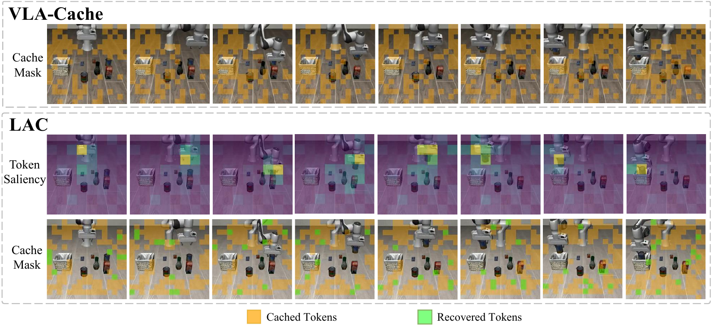

**Figure 3.** 주황색은 cached, 초록색은 recovered다. LAC 행에서는 그리퍼 및 상호작용 주변의 saliency가 커지고 그 부분이 다시 계산된다. 기존 method의 top row에는 saliency heatmap이 없으므로 두 방법의 연속 score 분포를 직접 비교하는 그림은 아니다. 원문은 정지한 basket을 오래 캐시해 가장자리에 걸리는 실패를 설명한다. [PDF p.6, §4.3; p.7, Fig.3]

[리뷰어 해석] 이 그림은 사례 선택된 qualitative evidence다. heatmap의 절대 numerical scale/colorbar, token age, 접촉 직전 causal intervention은 제공되지 않는다. 보기 좋은 saliency만으로 task relevance를 독립적으로 입증했다고 보기는 어렵다. “해당 mask를 바꿨을 때 action loss/성공률이 어떻게 달라지는가”라는 개입 비교가 더 직접적인 증거가 된다.

### 8.4 Figure 4: reuse/pruning 비율의 영향

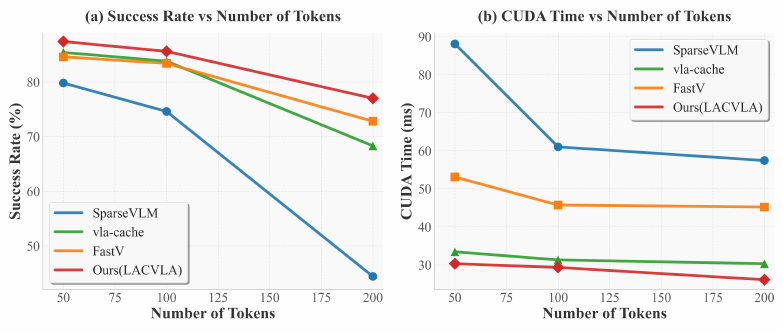

**Figure 4.** 좌측은 성공률, 우측은 CUDA time이다. caption은 reuse/pruning ratio 변화라고 설명하지만 **실제 x축 표기는 Number of Tokens**이며 표시 점은 50,100,200이다. 전체 N과 이 수를 r로 변환하는 정확한 설명 없이 이를 50%/100%/200%로 읽으면 안 된다. 문맥상 재사용/제거되는 token 수에 대한 비교로 해석되지만, raw array는 공개되지 않았다. [PDF p.7, Fig.4]

LAC는 이 범위에서 높은 성공률과 낮은 CUDA time 곡선을 보인다. 그렇다고 reuse를 높여도 성공률이 완전히 일정한 것은 아니다. LAC의 붉은 곡선 역시 오른쪽에서 내려가고, 특히 SparseVLM의 감소폭이 더 크다. 본 리뷰는 그래프의 픽셀을 정밀 숫자로 위장해 전사하지 않고 **상대적인 trade-off 패턴**을 읽는다.

pruning 개수와 caching 개수를 같게 둬도 attention key가 남는가, layer마다 계산량이 얼마나 남는가, 정책 overhead가 얼마인가가 다르다. 따라서 “같은 x=같은 FLOPs/latency budget”이라는 뜻은 아니다.

### 8.5 Table 2: 모듈별 ablation

| 방법 | 성공률 (%) | FLOPs (T) | Time (ms) |
|---|---:|---:|---:|
| Selector only | 82.20 | 1.283 | 28.48 |
| + Reuse Predictor | 83.40 | 1.325 | 29.04 |
| + Recovery (Full) | 85.60 | 1.377 | 29.32 |

[저자 보고, PDF p.7, Table 2]

Predictor 추가는 +1.2 pp와 +0.56 ms, Recovery 추가는 +2.2 pp와 +0.28 ms다. full은 Selector only보다 +3.4 pp, +0.84 ms, +0.094 T다. 구성요소가 추가되면서 **더 계산하고 더 잘 성공하는 trade-off**도 포함한다. 동일 runtime/cache budget에서 각 모듈의 순수 정책 품질 효과를 분리한 표는 아니다.

원문은 Predictor가 중요한 순간에 캐시를 줄이기 때문에 비용이 소폭 증가한다고 해석한다. recovery는 의도적으로 일부 cached token을 되살리므로 비용 증가 방향이 맞다. Table 2의 full=85.6%는 Table 1 Spatial과 일치하고 근처 Fig.4도 LIBERO-Spatial이지만, **Table 2 caption 자체는 suite를 명확히 쓰지 않는다**. 이 표를 4-suite 평균이라고 적지 않는다. Table 1 전체의 1.392/29.51과 Table 2의 1.377/29.32도 다른 평가 범위의 값으로 보존한다.

### 8.6 Table 3: CogAct/SIMPLER

| 설정 | 방법 | PickCan | MoveNear | Drawer | DrawerApple | 평균 | FLOPs (T) | CUDA (ms) |
|---|---|---:|---:|---:|---:|---:|---:|---:|
| VM | CogAct | 91.3 | **85.0** | 71.8 | 50.9 | 74.8 | 1.847 | 54.29 |
| VM | VLA-Cache | 92.0 | 83.3 | 70.5 | 51.6 | 74.4 | **1.496** | 39.63 |
| VM | LAC | **92.3** | 84.2 | **72.7** | **52.8** | **75.5** | 1.511 | **37.82** |
| VA | CogAct | 89.6 | 80.8 | 28.3 | 46.6 | 61.3 | 1.807 | 53.54 |
| VA | VLA-Cache | 91.7 | 79.3 | **32.5** | 45.8 | 62.3 | **1.493** | 39.11 |
| VA | LAC | **92.1** | **81.5** | 31.2 | **47.1** | **63.0** | 1.506 | **37.90** |

성공률 단위 %. [저자 보고, PDF p.8, Table 3]

VM에서 표시 평균 +0.7 pp, VA에서 +1.7 pp다. VM MoveNear는 baseline 대비 −0.8 pp이며, VA Drawer는 VLA-Cache 대비 −1.3 pp다. 따라서 “평균 개선”과 “모든 task/baseline 우위”는 구분해야 한다.

**[검산]** VM speedup은 54.29/37.82=1.435배, FLOPs 감소는 18.19%다. VA는 53.54/37.90=1.413배, FLOPs 감소 16.66%다.

본문 p.7은 1.827→1.509 T, 53.92→37.86 ms, 약 17.4%, 1.42배를 쓴다. 이 숫자는 Table 3 두 설정의 **단순평균**으로 재구성된다.

```math
\begin{aligned}\frac{1.847+1.807}{2}&=1.827,&\frac{1.511+1.506}{2}&=1.5085,\\\frac{54.29+53.54}{2}&=53.915,&\frac{37.82+37.90}{2}&=37.86.\end{aligned}
```

따라서 본문과 표의 값이 다른 것은 서로 다른 experiment라고 단정할 문제가 아니라 averaging 범위를 표시하면 해결된다. 두 설정을 합친 trial-weighted latency 평균인지까지는 원문이 쓰지 않는다.

CogAct의 diffusion-based action head에서도 효과가 있다는 것은 architectural portability의 제한된 실증이다. 그러나 LAC가 diffusion denoising step을 줄였다는 설명은 없다. caching이 conditioning/VLA decoder 경로를 줄이는 것과 action diffusion 자체를 가속하는 것은 별개다.

### 8.7 Table 4: 실물 Franka 결과

| 방법 | KnockCrisp | PickMango | CoverBanana | KnockBottle | 평균 | FLOPs (T) | CUDA (ms) |
|---|---:|---:|---:|---:|---:|---:|---:|
| OpenVLA | 48.0 | **16.0** | **24.0** | 44.0 | 33.0 | 1.893 | 37.38 |
| VLA-Cache | 48.0 | 12.0 | 20.0 | 40.0 | 30.0 | **1.534** | 33.36 |
| LAC | **52.0** | 12.0 | **24.0** | **64.0** | **38.0** | 1.569 | **32.47** |

성공률 단위 %. [저자 보고, PDF p.8, §4.4, Table 4]

**[검산]** task 변화는 +4,−4,0,+20 pp이며 평균 +5 pp다. +5%라는 본문의 표현은 **33→38%의 5 percentage point**로 읽는다. 상대 성공률 증가는 약 15.15%다. 개선의 상당 부분은 KnockBottle에서 나오고, PickMango는 16→12%로 악화한다.

CUDA speedup은 37.38/32.47=**1.151배**, 시간 감소는 13.14%, FLOPs 감소는 17.12%다. 실물 실험에 LIBERO의 1.76배를 붙여서는 안 된다. baseline 실물 latency가 LIBERO보다 작은 이유도 hardware/config가 공개되지 않아 설명할 수 없다.

모든 성공률이 4% 단위라고 해서 25회 trial을 했다고 확정할 수 없다. 25회의 배수 또는 집계 결과일 수도 있다. 표본 수와 raw outcome이 없으므로 통계적 유의성·confidence interval·실패 확률 감소를 새로 계산하지 않는다. 절대 평균 38%는 넓은 환경에서 높은 신뢰도를 달성했다는 수치도 아니다.

### 8.8 Figure 5–6: 실물 정책의 공간 선택

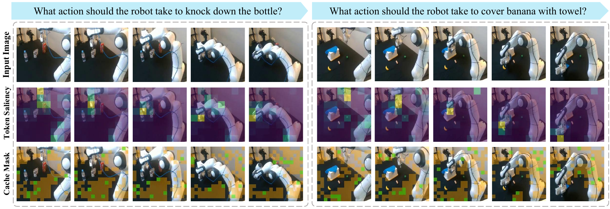

**Figure 5.** 좌측은 bottle knock-down, 우측은 banana cover 지시다. 입력 영상, token saliency, cache mask의 세 행으로 구성된다. 중요도가 그리퍼와 가까운 상호작용 영역에 모이고, 넓은 배경은 주황색으로 캐시된다. [PDF p.8, Fig.5]

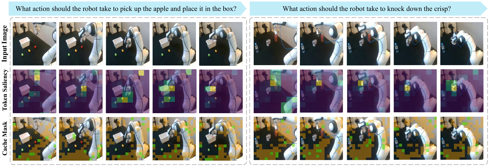

**Figure 6.** 부록은 apple pick-and-place와 crisp knock-down의 추가 사례를 보여 준다. 초록색 token은 배경 전체를 영구 고정하지 않고 간헐적으로 갱신한다는 recovery 개념을 시각화한다. [PDF p.13, Appendix D.1, Fig.6]

Fig.6의 **apple** 사례는 Table 4의 **PickMango**와 이름이 다르다. 추가 qualitative task로 읽고, Table 4에서 apple 성공률을 측정했다고 바꾸지 않는다. 이 그림들에는 flow 자체의 정확도나 상태 변화에 따른 latency trace가 없으므로 “더 정확한 flow가 반드시 더 좋은 cache policy”라는 인과 주장은 확인되지 않는다.

### 8.9 Figure 7–8: LIBERO 추가 사례

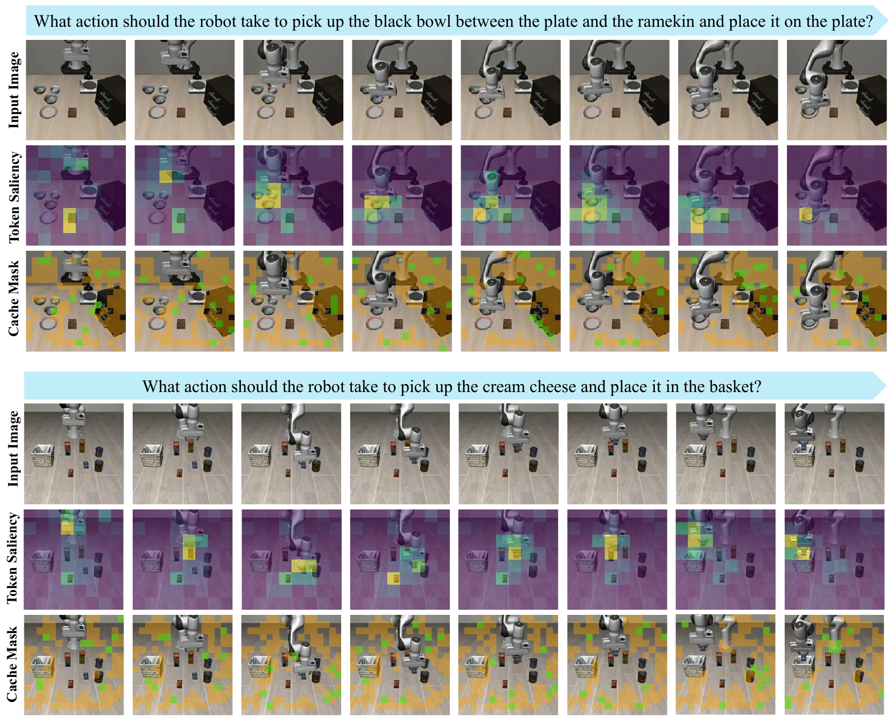

**Figure 7.** 첫 task는 plate와 ramekin 사이 black bowl을 plate에 놓는 것, 둘째는 cream cheese를 basket에 넣는 것이다. 그리퍼 이동과 target 접근에 따라 saliency가 달라지는 모습을 보여 준다. [PDF p.14, Appendix D.2, Fig.7]

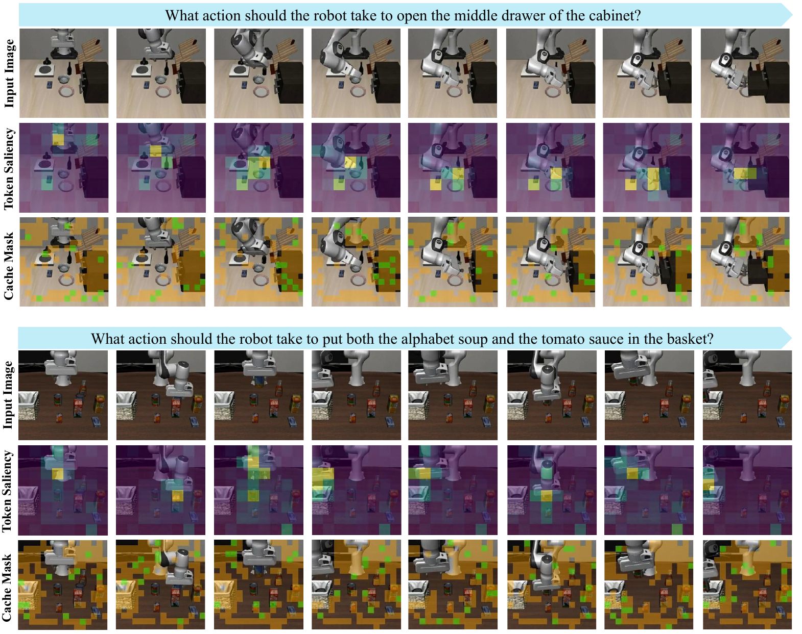

**Figure 8.** middle drawer를 여는 task와 alphabet soup·tomato sauce를 basket에 넣는 task다. cached/recovered/active의 색 의미는 앞선 그림과 같다. [PDF p.15, Appendix D.2, Fig.8]

[리뷰어 해석] task가 바뀌어도 공간적 saliency의 유사 패턴이 나온다는 qualitative evidence지만, no-instruction Selector가 모든 언어 조건을 구분할 수 있음을 입증하는 그림은 아니다. 동일 영상에 서로 다른 지시를 준 counterfactual 비교는 없다.

### 8.10 Table 5: 초기화와 입력 modality

| variant | 성공률 (%) |
|---|---:|
| w/o Stage I Initialization | 79.2 |
| Language-guided Policy | 83.0 |
| LAC | 85.6 |

[저자 보고, PDF p.13, Table 5; pp.13–14, Appendix D.3]

Stage I 제거는 full보다 **−6.4 pp**, language-guided variant는 **−2.6 pp**다. 초기 saliency prior의 실효성을 보여 준다. 그러나 같은 총 step/compute/data 양으로 초기화 외 변수까지 통제했는지, 수렴 속도/분산이 어떻게 달랐는지는 없다. “random init은 원리적으로 학습 불가능하다”는 결론은 과하다.

language variant는 inference speed를 맞추기 위해 작은 language conditioning module을 사용했다고 부록에서 밝힌다. 저자는 작은 module의 semantic alignment capacity 한계를 이유로 든다. **비슷한 속도를 의도했다는 설명만 있고 해당 variant의 FLOPs/latency/parameter 수는 Table 5에 없다.** 따라서 대형·소형 모든 언어 guidance가 motion보다 열등하다는 결론이 아니라, 이 구현 variant의 결과다. Table 5도 caption은 LIBERO라 쓰지만 suite 명칭이 없어 85.6을 4-suite 평균으로 해석하지 않는다.

<a id="appendix"></a>

## 9. §5와 Appendix A–D — 구현 및 복잡도

### 9.1 §5 Conclusion

저자는 learned task-aware computation allocation이 heuristic보다 좋은 efficiency/accuracy trade-off를 낼 수 있다는 가설을 실험으로 뒷받침했다고 결론짓는다. 두 모듈, differentiable training, frame 간 visual reuse가 결합된 것이 기여다. [PDF pp.8–9, §5]

결론의 “up to 1.76×”는 이 논문에서 가장 큰 대표 speedup이며 다른 robot·hardware·backbone에 동일하게 적용되는 보장은 아니다. 성능 이득도 평균과 task별 결과를 함께 봐야 한다.

### 9.2 Appendix A: 저자가 인정한 한계

저자가 직접 적은 주요 한계는 두 가지다. 첫째, optical flow prior에 의존하므로 극단적인 시각 조건에서 selector 정확도가 나빠질 수 있다. 둘째, 빠른 global visual change나 camera ego-motion에서는 많은 토큰을 재계산해야 하므로 static scene보다 efficiency gain이 줄어든다. [PDF p.12, Appendix A]

[리뷰어 해석] “그 경우 policy가 지능적으로 거의 전부 재계산한다”는 설명에는 최고 동작 속도별 stress test나 worst-case bound가 붙어 있지 않다. 또한 후보 집합에 r=0이 없다면 설계상 full recomputation이 가능한지도 확인해야 한다. 논문이 “dynamic하면 항상 안전한 full fallback”을 보장한다고 쓰면 안 된다.

### 9.3 Appendix B: 세 가지 decoder 수정

**(1) Position management와 attention mask.** 내부 state array로 재계산 대상을 관리하고 cached token의 position을 보존한다. active token만 계산하도록 mask를 줄인다. 이 문장을 key를 전부 잘라낸다는 뜻으로 읽으면 Appendix C와 충돌한다. C에는 active query가 full active+cached key를 본다고 쓰여 있으므로 **query/active row scope를 줄이되 필요한 key column을 보존하는 것**으로 연결해야 한다.

**(2) Conditional rotary embedding.** 새로 계산하는 token에만 position 변환을 적용하고 cached token은 기존 encoded state를 보존한다. 보통 RoPE를 적용하는 대상은 query/key이며 value까지 회전한다고 가정하지 않는다. 이미 회전한 cached key에 같은 변환을 두 번 적용하면 잘못된 위치가 된다. 또한 rotary position은 일반적으로 sequence/token 위치를 뜻하므로, 원문의 “current timestep positional information”을 frame timestamp가 추가된다는 명세로 확대하지 않는다.

**(3) Dynamic KV updates.** decoder의 각 layer에서 active token의 KV를 해당 slot에 쓰고 cached token은 이전 값을 유지한다. 행의 순서를 gather/scatter해도 원래 position과 mask를 함께 보존해야 한다. 이 partial update가 Eq.(14)의 projection/FFN 절약을 가능하게 한다.

원문은 이를 Transformer의 permutation-invariant nature로 설명한다. 엄밀히는 **position이 없는 self-attention은 permutation-equivariant**, joint key/value 순열은 query 출력에서 상쇄되는 성질이다. RoPE/causal mask가 있는 decoder는 위치 정보를 임의로 바꿔도 invariant한 모델이 아니다. 또한 permutation 성질은 stale KV가 최신 KV와 같다는 주장을 뒷받침하지 않는다. 이 두 점을 분리해야 한다. [PDF p.12, Appendix B]

**[리뷰어 보조 확인]** permutation matrix P로 K와 V, mask column을 함께 바꾸면 다음과 같은 성질이 성립한다.

```math
\mathrm{Softmax}(Q(PK)^{\mathsf T}+BP^{\mathsf T})(PV)=\mathrm{Softmax}(QK^{\mathsf T}+B)V.
```

이는 column permutation consistency에 관한 항등식이다. K에 다른 frame 값이 들어가는 시간적 근사를 정당화하는 항등식은 아니다.

부록 B 마지막 문장은 가장 큰 이득이 첫 action token 생성에서 나타나고 이후 token은 일반 AR decoding으로 이어진다고 설명한다. “without incurring additional cost”는 이후 token의 모델 계산이 0이라는 뜻이 아니라 **이 캐시 정책 때문에 추가적인 반복 선택 비용을 부과하지 않는다는 취지**로 읽어야 한다. 이후 AR query-attention/MLP 계산은 남는다.

### 9.4 Appendix C: policy overhead, 식 (12)

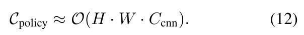

```math
\mathcal C_{\mathrm{policy}}\approx\mathcal O(H\cdot W\cdot C_{\mathrm{cnn}}).\qquad\text{(12)}
```

- **입력 기호:** H,W는 image resolution, C_cnn은 CNN computation을 요약한 계수다. 식 (5)의 후보 수 C와 구별한다.
- **출력:** frame당 policy 연산 비용의 점근적 추정이다. millisecond나 trainable parameter 수가 아니다.
- **저자 가정:** RAFT와 경량 CNN 비용은 frame당 한 번 발생하고 VLA decoder depth L에 비례해 반복되지 않는다고 본다.
- **정규화/shape:** scalar cost다. policy는 image grid를 처리하고 decoder는 N token을 처리한다.
- **다음 식 연결:** backbone의 L개 layer 절약량에서 frame당 overhead를 한 번 뺀다.

**[리뷰어 해석] 유효한 부분:** 같은 입력 해상도에서 decoder를 깊게 늘리면 정책 모듈을 layer마다 다시 실행할 필요는 없다는 구조적 이점이 있다.

**[리뷰어 해석] 한계:** RAFT는 원래 all-pairs correlation volume과 반복 flow update를 사용하는 방법이다. 고정 반복 수·feature resolution·correlation 구현을 명시하지 않고 전체 RAFT-small 비용을 H×W에 선형이라고 일반화하기는 어렵다. 고정 stride의 feature pixel 수 n에서 dense all-pairs correlation은 n² 크기를 가질 수 있다. 또한 Predictor, top-k, gather/scatter, cache traffic은 Eq.(12)에 별도 분해되어 있지 않다. **depth-independent는 negligible과 동의어가 아니다.** [RAFT 공식 논문](https://arxiv.org/abs/2003.12039v3)

### 9.5 baseline layer 비용: 식 (13)

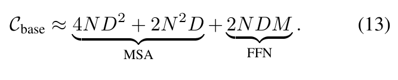

```math
\mathcal C_{\mathrm{base}}\approx\underbrace{4ND^2+2N^2D}_{\text{MSA}}+\underbrace{2NDM}_{\text{FFN}}.\qquad\text{(13)}
```

N은 visual token 수, D는 embedding width, M은 FFN intermediate width다. scalar cost를 한 layer에 대해 계산한다. MSA는 multi-head self-attention이다.

| 항 | 연산 순서·shape | 단순화한 비용 |
|---|---|---:|
| Q,K,V projections | 각각 $`N\times D`$와 $`D\times D`$ 곱 | $`3ND^2`$ |
| output projection | concatenated attention output을 D로 투영 | $`ND^2`$ |
| QK transpose | $`N\times D`$ 대 $`D\times N`$ | $`N^2D`$ |
| attention-weighted V | $`N\times N`$ 대 $`N\times D`$ | $`N^2D`$ |
| FFN up/down | $`D\to M\to D`$, N개 row | $`2NDM`$ |

원문은 이를 FLOPs라고 부른다. 계수는 multiply-accumulate를 한 단위처럼 세는 단순 모델에 대응하며, multiply와 add를 각각 1 FLOP으로 세면 주요 GEMM 항에 공통 2배 계수가 붙는다. Table 1의 FLOPs counter와 같은 convention인지 명시되지 않았다.

식은 softmax, normalization, activation, bias, RoPE, memory traffic를 생략한다. 또한 두 linear FFN을 가정하므로 gate/up/down 3개 projection의 gated FFN이면 FFN 계수가 달라진다. text/action token도 N에 들어 있지 않은 간략화다. 실제 OpenVLA checkpoint의 총 FLOPs를 이 식에 임의 D,N만 넣어 정확히 복원할 수는 없다.

### 9.6 LAC layer 비용: 식 (14)

핵심 비번호 정의는 다음과 같다.

```math
N_{\mathrm{act}}=(1-\rho)N.\qquad\text{(원문 비번호; }\rho\text{는 cache ratio)}
```

rho는 본문 r과 같은 재사용 비율 역할이다. recovery가 있다면 실제 active 수를 반영한 유효 rho로 해석해야 한다. 부록은 recovery를 별도의 overhead 식으로 다루지 않는다.

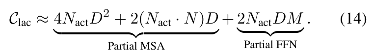

```math
\mathcal C_{\mathrm{lac}}\approx\underbrace{4N_{\mathrm{act}}D^2+2(N_{\mathrm{act}}\cdot N)D}_{\text{Partial MSA}}+\underbrace{2N_{\mathrm{act}}DM}_{\text{Partial FFN}}.\qquad\text{(14)}
```

- **projection/FFN:** active row만 계산하므로 Eq.(13)의 N이 N_act로 바뀐다.
- **attention:** Q는 $`N_{\mathrm{act}}\times D`$, full K/V는 $`N\times D`$다. score matrix는 $`N_{\mathrm{act}}\times N`$이므로 $`2N_{\mathrm{act}}ND`$다.
- **중요한 차이:** $`2N_{\mathrm{act}}^2D`$가 아니다. cached key도 reference context에 남는다.
- **출력/가정:** 한 layer의 scalar compute model이며, 캐시를 읽고 갱신하는 bandwidth와 index overhead를 생략한다.
- **계층적 처리:** 각 layer의 active hidden만 다음 layer로 전달하고, 각 layer의 cached KV는 해당 layer의 이전 state에서 읽는다.

**[검산] N=8,D=4,M=8,rho=0.5**면 baseline은 512+512+512=1536, LAC는 256+256+256=768이다. active query는 4개, key는 8개라 score matrix는 4×8이다. active-key만 계산하는 4×4로 바꾸면 attention 비용은 128이 되어 LAC식과 다른 계산을 하게 된다.

### 9.7 layer 절약량: 식 (15)

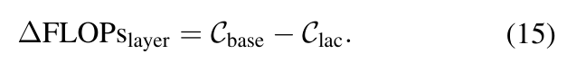

```math
\Delta\mathrm{FLOPs}_{\mathrm{layer}}=\mathcal C_{\mathrm{base}}-\mathcal C_{\mathrm{lac}}.\qquad\text{(15)}
```

기호 Δ는 절감량이라 baseline−LAC 순서다. 모든 항이 active row 수에 선형인 이 단순 모델에서는 다음이 성립한다. **원문에 전개되어 있지 않은 리뷰어 유도**다.

```math
\mathcal C_{\mathrm{lac}}=(1-\rho)\mathcal C_{\mathrm{base}},\qquad \Delta\mathrm{FLOPs}_{\mathrm{layer}}=\rho\mathcal C_{\mathrm{base}}.
```

rho=0이면 layer 절약은 0, rho=0.5이면 이 모델의 layer 비용 절반을 아낀다. rho=1에서는 visual active cost가 0으로 계산되지만 **영상 처리·policy·text/action·cache read·recovery 전체 비용이 0인 것은 아니다**. 또한 stale context로 task가 가능한지와 계산량 식은 별개다.

### 9.8 전체 비용 절약: 식 (16)

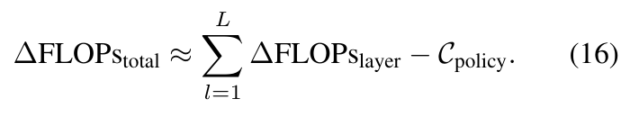

```math
\Delta\mathrm{FLOPs}_{\mathrm{total}}\approx\sum_{l=1}^{L}\Delta\mathrm{FLOPs}_{\mathrm{layer}}-\mathcal C_{\mathrm{policy}}.\qquad\text{(16)}
```

- **합의 축:** layer l=1…L이다. frame/time 평균이나 token별 합이 아니다.
- **overhead:** policy 비용은 한 frame에서 한 번 발생하므로 한 번 뺀다.
- **출력:** 전체 모델 compute 절약량의 근사. 실제 CUDA speedup을 반환하는 식은 아니다.
- **가정:** layer별 D/M/N/rho가 다르면 각 layer 값을 따로 대입해야 한다. Eq.(16)은 그 차이를 자세히 다루지 않는다.

동일 layer라면 다음 break-even 조건을 얻는다.

```math
\Delta\mathrm{FLOPs}_{\mathrm{total}}\approx L\rho\mathcal C_{\mathrm{base}}-\mathcal C_{\mathrm{policy}},\qquad \rho\gt\frac{\mathcal C_{\mathrm{policy}}}{L\mathcal C_{\mathrm{base}}}\ \Longrightarrow\ \text{이 모델에서 순 compute 절감}.
```

해설용 L=2, 위 예제 C_base=1536, rho=0.5, C_policy=200이면 총 baseline=3072, LAC+policy=1736, 절약=1336이다. **이 단순 compute model의 비용 비율**은 3072/1736≈1.770배지만, 이는 논문 Table 1의 1.76배를 재현한 실험이 아니다. 우연히 비슷한 산술 예제에 의미를 부여하면 안 된다.

latency에는 다음과 같이 시간 단위의 별도 식이 필요하다.

```math
T_{\mathrm{LAC}}=T_{\mathrm{fixed}}+T_{\mathrm{flow}}+T_{\mathrm{policy}}+T_{\mathrm{routing}}+T_{\mathrm{cache}}+T_{\mathrm{active\ decoder}}+T_{\mathrm{action}},\qquad S_{\mathrm{E2E}}=\frac{T_{\mathrm{baseline}}}{T_{\mathrm{LAC}}}.
```

이는 후속 측정을 위한 리뷰어 분해이며 Table 1에서 각 항을 측정한 것은 아니다. FLOPs 모델에서 손익분기점을 넘겨도 작은 GEMM의 낮은 효율·kernel launch·cache traffic 때문에 latency 이득이 사라질 수 있다.

### 9.9 Appendix D의 처리 범위

D.1의 real-world Fig.6은 §8.8, D.2의 LIBERO Fig.7/8은 §8.9, D.3의 Table 5 및 language conditioning 설명은 §8.10에서 수치와 한계를 함께 해설했다. 부록에는 추가 번호 수식이나 알고리즘이 없다. A–D 어디에도 training recipe를 복원할 만큼 상세한 optimizer/config 표는 없다.

<a id="critique"></a>

## 10. 비판적 검토와 재현성

### 10.1 이 논문에서 설득력 있는 부분

**task loss로 computation allocation을 학습한다는 문제 설정**은 명확하다. 토큰 중요도와 cache budget을 분리하면, 같은 token ranking에서도 frame 난이도에 따라 다른 계산량을 선택할 수 있다. attention 초기화 → task 최적화라는 절차도 proxy의 장점과 한계를 한 training pipeline에 반영한다.

**FLOPs와 CUDA time을 함께 보고한 점**은 실제 효율을 판단하는 데 도움이 된다. SparseVLM은 FLOPs가 줄면서 시간은 증가하고, LAC는 VLA-Cache보다 FLOPs가 더 많지만 시간이 적다. 이 패턴은 token 수 감소를 곧바로 latency 이득으로 간주하는 해석을 경계하게 한다.

**두 action model과 실물 환경을 포함한 점**은 단일 synthetic forward 결과보다 넓은 경험적 근거다. 특히 LIBERO-Long과 recovery ablation은 시간적 안정성의 중요성을 드러낸다. 다만 mean success 자체가 긴 sequence에서의 cache error를 직접 측정하는 metric은 아니다.

### 10.2 해소가 필요한 핵심 쟁점

| 쟁점 | 원문 근거와 공백 | 결론에 미치는 영향 |
|---|---|---|
| task loss의 정의 | Eq.(7)에 L_VLA만 존재 | 어떤 감독을 통해 task-awareness를 배웠는지 재현 불가 |
| ratio→top-k gradient | Eq.(9)/(10)의 STE와 Eq.(11)이 별도로 설명됨 | cardinality까지 연결되는 custom/surrogate 경로 확인 필요 |
| sparse forward의 backward | 실제 생략된 연산과 soft mask의 결합 미기재 | soft score를 만들었다고 end-to-end gradient가 자동 성립하지 않음 |
| mask 부호 | 낮은 score 캐시, sigmoid는 높은 score에서 큼 | 1=active convention으로 정합해야 하며 구현 부호 점검 필요 |
| cache lifetime | “previous cache”와 recovery만 설명 | 정보가 얼마나 오래 남는지, episode/instruction change 처리 불명확 |
| input modality | 기본 Selector/Predictor는 RGB+flow | task-aware는 훈련 supervision 의미; 현재 instruction 직접 조건부 아님 |
| layer/position consistency | Appendix B의 positional preservation | RoPE/causal mask를 보존하지 않으면 다른 forward가 됨 |
| 추론 비용 범위 | CUDA time과 “wall-clock” 병용 | 1.76배를 camera-to-action E2E로 확장 불가 |
| RAFT 비용 단순화 | Eq.(12) image-area 선형 근사 | 전체 flow runtime/메모리를 실측해야 negligible 주장 확인 가능 |
| 공정한 비교 | LAC는 추가 policy 학습, baseline은 기존 weights/규칙 | 동일 데이터·훈련 compute·runtime budget 통제 필요 |
| 통계 | trial 수·seed·CI 부재 | +0.7/+1.9/+5 pp의 통계적 신뢰도 판단 제한 |
| 코드 | README 한 파일 | task loss/gradient/cache update/timing counter의 정적 대조 불가 |

### 10.3 cached KV는 왜 stale해지는가

**[리뷰어 해석]** 두 종류의 변화가 있다. 하나는 token에 대응하는 픽셀/물체가 변하는 local change다. 다른 하나는 그 픽셀은 같아도 다른 영역과의 attention·언어 문맥 변화 때문에 deep feature가 변하는 contextual change다. optical flow는 첫 변화의 중요한 cue지만 두 번째를 완전히 대표하지 못한다.

camera ego-motion에서는 전체 grid의 대응이 바뀐다. flow는 이 움직임을 알려 줄 수 있지만 논문은 cached KV를 flow로 **warp하여 다른 spatial slot으로 이동**한다고 설명하지 않는다. flow를 decision input으로 쓰는 것과 cache feature를 motion compensation하는 것은 다른 설계다.

장기 재사용에서는 cache value가 업데이트되지 않을 확률이 누적된다. 매 step 특정 cached token의 회복 확률이 q로 고정되고 독립이라고 단순화하면, a번 연속 회복되지 않을 확률은 다음과 같다.

```math
P(\text{a회 연속 미회복})=(1-q)^a.\qquad\text{(리뷰어 보조 모델)}
```

random recovery에는 일반적으로 deterministic maximum age bound가 없다. 따라서 safety나 worst-case stale state가 중요하면 age limit 또는 deterministic refresh 규칙을 별도 검증해야 한다. 이것은 논문에 구현된 safeguard가 아니라 후속 제안이다.

### 10.4 표와 그림의 미세한 주의점

Fig.1의 rule baseline success=85.4%는 Table 1 VLA-Cache Spatial=83.8%와 다르다. Fig.4 caption은 ratio를 말하지만 x축은 Number of Tokens다. Table 2/5는 suite 수준을 완전히 특정하지 않는다. Fig.6에는 정량 Table 4와 다른 apple task가 나온다. 이 차이들은 각 자료를 같은 조건의 하나의 결과로 합치지 말아야 할 이유다.

Table 1과 Table 3의 success 평균은 반올림으로 ±0.05 pp 정도의 차이가 생긴다. 원문 평균을 임의로 “수정”하지 않고, 표시 수치를 보존하고 검산 방법을 별도로 밝혔다. Table 3 본문 평균 비용은 두 setting 단순평균으로 설명된다.

### 10.5 재현을 시작하기 전에 받아야 할 최소 정보

다음은 **논문의 누락을 채우기 위한 요청 목록**이며, 현재 리뷰에서 실험을 실행하거나 저자에게 연락한 것은 아니다.

1. 정확한 base checkpoint, Selector/Predictor/RAFT architecture 및 weights, 후보 ratio 집합.
2. Stage I attention target의 layer/head/query 집계와 normalization, Stage II action loss 정의.
3. ratio/top-k/mask의 hard forward 및 backward 코드, threshold detach 여부, cache detach/sequence rollout 구성.
4. dataset/split/episode 목록, preprocessing/flow alignment/augmentation, optimizer/schedule/seed.
5. cache position/state schema, 첫 frame/episode/instruction change 처리, recovery 확률·fraction·RNG seed.
6. GPU/precision/batch/runtime/library 버전, timing 구간과 synchronization, RAFT/CPU/transfer 포함 범위.
7. per-episode 성공/실패, trial 수, per-frame chosen/effective ratio·cache age·latency log.

**현재 재현성 판단:** 방법의 의도와 sparse inference 의미는 논문 수준에서 설명 가능하지만, **동일 training recipe와 task-gradient 연결, 동일 CUDA runtime 결과를 재현할 만큼 정보가 공개되지는 않았다**. 이는 “논문 결과가 틀렸다”는 단정이 아니라 확인 범위의 한계다.

<a id="deployment"></a>

## 11. OpenVLA·VLM·Jetson Thor/TensorRT와 연결

### 11.1 논문이 검증한 적용 범위

| 대상 | 논문 증거 | 아직 검증되지 않은 부분 |
|---|---|---|
| OpenVLA | LIBERO, 실물 Franka Table 1/4 | 다른 checkpoint/카메라/환경, 상세 reproducible recipe |
| CogAct | SIMPLER Table 3 | action head 내부 캐시 integration, 다른 diffusion setting |
| 일반 video VLM | 직접 실험 없음 | instruction-conditioned QA, 긴 video context, hallucination/정보 보존 |
| π 계열/다른 VLA | 관련 연구 언급 | token/layout/cache semantics 및 head integration |
| Jetson AGX Thor | 측정 없음 | engine/kernel/precision/thermal 조건의 E2E 효과 |
| TensorRT | export/engine/latency 결과 없음 | dynamic token count, stateful KV, routing/plugin 포팅 |

LAC는 **프레임마다 RGB와 flow를 처리하는 방법**이다. compressed video bitstream을 직접 소비하거나 P-frame에서 vision tower를 확실히 건너뛰는 codec 연구로 바꾸어 설명할 수 없다. 해당 방향과 결합하려면 motion cue, image feature generation, downstream task supervision 각각을 새로 검증해야 한다.

### 11.2 OpenVLA에 포팅할 때 핵심 interface

첫째, image patch/vision-encoder token과 decoder의 visual slot index를 명확히 매핑해야 한다. image resize/crop/camera ordering이 바뀌면 같은 index의 의미가 달라질 수 있다. 둘째, visual token의 layer별 KV와 current action autoregressive cache를 구분해야 한다. 셋째, gathered active token을 packed index로 새로 번호 붙이기보다 원래 position ID와 visibility를 유지해야 한다.

넷째, decoder 전 vision encoder 비용이 얼마나 남는지 측정해야 한다. 이 논문에서 확실히 서술된 sparse 연산은 decoder QKV/attention query/FFN이다. vision tower를 full로 실행한다면 계산 절약이 E2E에서 차지하는 비율에 상한이 생긴다.

다섯째, base action interface는 그대로 확인해야 한다. autoregressive action-token 수·continuous decoder·action chunk horizon이 다르면 첫 토큰 가속의 전체 비중이 달라진다. visual token cache를 넣는다고 action tokenizer가 바뀌거나 action step 수가 줄지는 않는다.

### 11.3 TensorRT 포팅 제안

**[후속 연구 제안]** ratio 후보가 이산 집합이므로 각 후보에 대응하는 active length bucket을 정의하는 것이 출발점이 될 수 있다. TensorRT의 dynamic shape는 build-time optimization profile로 허용 shape 범위와 최적화 지점을 지정한다. 그러나 그 기능만으로 이 논문의 stateful cache update와 active-row gather/scatter가 구현되지는 않는다. [NVIDIA 공식 dynamic-shape 문서](https://docs.nvidia.com/deeplearning/tensorrt/latest/inference-library/work-with-dynamic-shapes.html)

포팅 시 비교할 선택은 다음과 같다.

| 구현 선택 | 기대 목적 | 실제 확인할 비용/정확성 |
|---|---|---|
| ratio별 active-length bucket | 반복되는 shape로 kernel 선택/메모리 계획 단순화 | recovery 때문에 길이가 변할 때 padding 또는 bucket 전환 비용 |
| dense full-N baseline | 정확성·성능 기준 | 같은 precision/batch/camera/action 설정 유지 |
| gathered active Q/FFN + full KV | Eq.(14)의 실제 연산 생략 | gather/scatter, smaller GEMM 효율, cache read bandwidth |
| preallocated layer KV buffers | 할당 jitter 감소 | original index 관리, reset, cache dtype/scale consistency |
| separate flow/policy timing | 정책 overhead 공개 | GPU/CPU 실행 경계, stream synchronization, transfer |
| age-limited refresh/full recompute | 긴 stale state 억제 | 평균·p95/p99 latency, deadline miss 증가 여부 |

동적 shape·TopK·scatter·RoPE·attention이 선택 runtime에서 지원되는 방식은 실제 engine build로 확인해야 한다. unsupported 구간의 fallback이 생기면 CUDA time 이득을 상쇄할 수 있다. **이 리뷰에서는 engine을 만들거나 latency를 측정하지 않았다.**

### 11.4 RTX PRO 6000와 Jetson Thor를 나누어 검증한다면

사용자 관심 환경에 대한 아래 역할 분담은 논문 결과가 아니라 후속 연구 계획이다.

| 장비/단계 | 구체적 역할 | 통과 기준 |
|---|---|---|
| RTX PRO 6000 측 | sequence dataset 전처리, teacher attention 추출, policy training, gradient 진단 | loss 정의·split·seed 고정, λ=0 task-gradient 경로 확인 |
| 데스크톱 reference inference | full/reused forward의 의미 확인, 캐시 비율별 simulation 평가 | dense no-cache 경로 일치, original position·mask 유효성, task 성능 보고 |
| Jetson Thor 측 | 대상 소프트웨어 환경에서 engine build/port, batch-1 stateful inference | unsupported fallback 공개, flow 포함 전체 추론 p50/p95/p99 측정 |
| tabletop single-arm loop | camera capture→action delivery→실행 경계 계측 | policy refresh와 actuator Hz 구분, 성공률·deadline miss 동시 평가 |

다른 장비에서 얻은 1.76배나 다른 VLA의 공개 median latency를 Thor에서의 sensor-to-action 결과로 대신 쓰지 않는다. 기대 이득은 실제 bottleneck 분해와 테스트를 통과한 뒤에만 수치로 주장할 수 있다.

### 11.5 실행 가능한 검증 순서

1. **학습 의미 확인:** 모듈을 미분 가능하게 연결한 최소 sequence 구현에서 L_VLA만으로 Selector/Predictor gradient를 분리 측정한다. STE surrogate가 사용되는 지점을 문서화한다. candidate별 mask 효과를 확인한다.
2. **forward 의미 확인:** 모든 token active 조건에서 baseline과 layer/output을 비교한다. sparse 조건에서는 full-context key 유지·position/reset/캐시 나이 오류를 확인한다. stale KV가 있는 결과에 full recompute와의 exact equality를 요구하지 않는다.
3. **정책 비교:** 같은 base weights/data/splits와 비슷한 latency budget으로 VLA-Cache, fixed-r learned selector, dynamic-r, random recovery를 비교한다. 추가 training의 효과를 분리한다.
4. **시간 측정:** image preprocessing, RAFT, two modules, top-k, gather/scatter, vision tower, decoder prefill, AR/diffusion head, transfer의 boundary를 기록한다. steady-state와 first-frame/reset 지연을 나눈다.
5. **상태 변화 평가:** camera motion, 조명 변화, 정적 target 접근, occlusion, episode/instruction 전환, 장기 caching에서 success·latency tail·cache age를 같이 본다.

같은 input sequence로 가속 유무를 비교하는 replay는 runtime 통제에는 좋지만 closed-loop 성공률을 대신하지 못한다. 행동이 바뀌면 다음 관측도 바뀌기 때문이다. 따라서 open-loop timing과 closed-loop task evaluation을 모두 분리 보고해야 한다.

### 11.6 서로 섞으면 안 되는 속도 지표

| 지표 | 정의/해석 | 이 논문의 공개 여부 |
|---|---|---|
| nominal cache ratio | Predictor가 선택한 r | 후보·분포 상세 미기재 |
| effective cache ratio | recovery/예외 후 실제 재사용 수/N | 별도 보고 없음 |
| FLOPs | operation count | Table 1–4 보고; counter/config 미기재 |
| kernel/phase latency | 개별 kernel, flow, prefill, decode 비용 | 별도 breakdown 없음 |
| CUDA time | 표의 GPU runtime | Table 1–4 보고 |
| TTFT | 첫 autoregressive token까지의 시간 | 수치로 별도 보고하지 않음 |
| TTFA | 사용 가능한 첫 action까지의 시간 | 별도 보고 없음; 첫 token과 다를 수 있음 |
| policy refresh rate | 새 관측 기반 policy call 수/초 | E2E 기준으로 보고 없음 |
| action throughput | 생성한 action vector 수/초 | horizon을 알아야 계산 가능 |
| actuator/servo Hz | 저수준 제어기 실행 주기 | 별도 보고 없음 |
| sensor-to-action p95/p99 | capture부터 명령 전달까지 tail latency | 보고 없음 |

29.51 ms의 역수 약 33.89/s는 **표의 시간 구간만 연속 수행한다는 가정의 역수**다. 이를 로봇 33.89 Hz 제어라고 쓰지 않는다. action chunk당 여러 벡터를 출력한다면 action throughput은 policy refresh와도 다르다.

<a id="qa"></a>

## 12. Q&A와 권장 학습 순서

**Q1. LAC가 VLA-Cache의 다른 이름인가?**  
아니다. 저자·ID·학습 방식이 다른 논문이다. 기존 VLA-Cache는 training-free adaptive caching이며 LAC는 새 caching policy 모듈을 학습한다.

**Q2. Cached Token Selector의 점수가 높으면 cache하는가?**  
아니다. 높을수록 active/recompute다. Eq.(11)의 sigmoid 부호와 Fig.2의 1=active 연결이 이 해석을 뒷받침한다.

**Q3. Selector가 token 수까지 바로 예측하는가?**  
아니다. Selector는 N개 saliency를, Predictor는 C개 ratio logits를 낸다. ratio로 k를 정하고 낮은 k개를 선택한다.

**Q4. 학습의 task loss는 robot success reward인가?**  
정확한 정의가 없다. 논문은 differentiable task loss로 설명하며 reinforcement learning rollout/reward algorithm을 제시하지 않는다. success metric을 미분했다고 해석하면 안 된다.

**Q5. VLA가 frozen인데 왜 gradient가 돌아오는가?**  
weight update를 하지 않는 것과 입력에 대한 derivative를 계산하지 않는 것은 다르다. loss가 mask/representation을 지나 Selector/Predictor까지 연결되면 frozen network도 gradient 전달 경로가 된다.

**Q6. Gumbel-Softmax만 사용하면 top-k 문제까지 해결되는가?**  
자동으로 해결되지 않는다. ratio→integer k→mask 연결과 soft backward가 필요하다. 원문에 그 구현 상세가 없다는 점이 핵심 재현성 한계다.

**Q7. train-time soft mask를 inference에서도 쓰는가?**  
원문 inference는 hard argmax/top-k다. soft probability/mask는 주로 training surrogate다. 동시에 random recovery는 별도로 남는다.

**Q8. cache ratio loss가 latency budget을 만족시켜 주는가?**  
아니다. 높은 expected reuse ratio를 장려하는 soft objective다. 실제 runtime constraint나 deadline certificate는 없다.

**Q9. cached token을 attention에서 제거하는가?**  
아니다. Appendix C에서 active query는 active+cached 전체 KV를 본다. cached token 자신의 새 Q/FFN 등을 생략하는 것이다.

**Q10. optical flow로 cache 위치를 warp하는가?**  
그런 구현은 설명되어 있지 않다. flow는 Selector/Predictor의 입력이며, cached KV의 spatial motion compensation을 명시하지 않는다.

**Q11. language가 input에 없는데 task-aware라고 할 수 있는가?**  
task loss가 학습을 감독한다는 의미로는 가능하다. 그러나 동일 RGB/flow에 대한 실시간 instruction-conditioned 선택 능력은 기본 정책 입력만으로 보장되지 않는다.

**Q12. stochastic recovery가 캐시 오차를 항상 막는가?**  
일부 오래된 token을 갱신하는 휴리스틱이다. 최대 age나 안전 보장이 없다. Table 2는 유효성의 경험적 근거다.

**Q13. 코드가 공개됐다는 초록을 믿고 재현하면 되는가?**  
조회한 공식 commit에는 README만 있다. 따라서 이 리뷰의 forward/gradient 해설은 논문과 리뷰어의 명시적 보조 유도이며 실행 검증된 공식 코드가 아니다.

**Q14. “성공률도 오른다”는 주장은 모든 task에 해당하는가?**  
아니다. Table 1 Object, Table 3 VM MoveNear, Table 4 PickMango 등의 반례가 있다. 평균 이득과 개별 task를 함께 보아야 한다.

**Q15. Jetson Thor에서 바로 1.76배를 기대할 수 있는가?**  
논문에 Thor 실험이 없다. flow/routing/engine 지원과 실제 inference bottleneck을 측정해야 한다. 실물 표 자체의 speedup도 약 1.15배다.

### 권장 학습 순서

처음에는 §4와 Eq.(1)–(3)으로 “cache는 K/V의 저장·재사용이며 attention 전체 제거가 아니다”를 이해한다. 이어 Fig.2, Eq.(4)/(5), §6의 N=8 예제로 “어떤 토큰”과 “몇 개”를 분리한다. 다음에는 Eq.(6)–(11)과 §7에서 frozen weight·STE·task-gradient 연결을 공부한다. 마지막으로 Table 1–5와 Eq.(12)–(16)을 대조해 이론적 연산량과 실제 시간의 차이를 확인하면 된다.

연구 관점에서는 가장 먼저 구현을 요청할 부분이 **ratio/top-k의 differentiable bridge와 L_VLA의 정의**다. 속도 최적화는 그 training semantics를 확인하고 sparse forward의 수치 의미를 검증한 다음에 진행해야 한다.

<a id="coverage"></a>

## 13. Coverage checklist와 검증 기록

### 13.1 원문 섹션 대응

| 원문 위치 | 원문 내용 | 이 리뷰 위치 | 처리 |
|---|---|---|---|
| p.1 Abstract | 제목·주장·1.76배/+1.9pp/+5pp | §1–2, §8 | 완료 |
| pp.1–2 §1 | temporal redundancy, task-proxy mismatch | §3.1–3.2 | 완료 |
| pp.2–3 §2 | VLA/가속 관련 연구 | §3.3–3.4 | 완료; 별도 논문 리뷰로 확장하지 않음 |
| pp.3–4 §3.1 | 전체 모듈과 two-stage | §5.1 | 완료 |
| p.4 §3.2 | QKV, attention, AR cache | §5.2 | 완료 |
| p.4 §3.3/3.3.1/3.3.2 | RGB+flow, Selector/Predictor | §5.3–5.5 | 완료 |
| pp.4–5 §3.4 | alignment와 공동 loss | §5.6–5.7, §7 | 완료 |
| p.5 §3.5 | Gumbel, STE, sigmoid mask | §5.8–5.10 | 완료; gradient 공백 명시 |
| p.5 §3.6 | deterministic selection, recovery | §5.11, §6 | 완료 |
| pp.5–6 §4.1 | 비교법·metric | §8.1 | 완료 |
| p.6 §4.2 | LIBERO/SIMPLER/real robot | §7.4, §8.1 | 완료 |
| pp.6–7 §4.3 | simulation 결과/ablation | §8.2–8.6 | 완료 |
| p.8 §4.4 | real robot | §8.7–8.8 | 완료 |
| pp.8–9 §5 | 결론 | §9.1 | 완료 |
| pp.9–11 References | 57개 참고문헌 목록 | §3, §14 | 전 목록 확인; 인용 논문별 상세 리뷰는 범위 밖 |
| p.12 Appendix A | 한계 | §9.2, §10 | 완료 |
| p.12 Appendix B | position/RoPE/cache implementation | §6, §9.3 | 완료 |
| p.12 Appendix C | compute 분석 | §9.4–9.8 | 완료 |
| p.13 Appendix D.1 | 실물 추가 그림 | §8.8 | 완료 |
| pp.13–15 Appendix D.2 | LIBERO 추가 그림 | §8.9 | 완료 |
| pp.13–14 Appendix D.3 | 초기화/언어 ablation | §8.10 | 완료 |

### 13.2 모든 번호 수식 대응

| 식 | PDF | 핵심 내용 | 리뷰 위치 | editable LaTeX | 원문 PNG |
|---|---:|---|---|---|---|
| (1) | 4 | QKV projection | §5.2 | 있음 | eq01 |
| (2) | 4 | attention | §5.2 | 있음 | eq02 |
| (3) | 4 | AR cache append | §5.2 | 있음 | eq03 |
| (4) | 4 | Selector | §5.4 | 있음 | eq04 |
| (5) | 4 | Predictor | §5.5 | 있음 | eq05 |
| (6) | 4 | attention alignment MSE | §5.6 | 있음 | eq06 |
| (7) | 5 | total loss | §5.7 | 있음 | eq07 |
| (8) | 5 | expected ratio reward | §5.7 | 있음 | eq08 |
| (9) | 5 | Gumbel-Softmax | §5.8 | 있음 | eq09 |
| (10) | 5 | hard one-hot | §5.8 | 있음 | eq10 |
| (11) | 5 | soft active mask | §5.9 | 있음 | eq11 |
| (12) | 12 | policy overhead | §9.4 | 있음 | eq12 |
| (13) | 12 | full layer cost | §9.5 | 있음 | eq13 |
| (14) | 12 | sparse-active layer cost | §9.6 | 있음 | eq14 |
| (15) | 12 | layer saving | §9.7 | 있음 | eq15 |
| (16) | 12 | total saving | §9.8 | 있음 | eq16 |

핵심 비번호 식도 처리했다. V=[I;O], X와 binary mask 정의는 §5.3; score/logit vector·candidate set은 §4/§5.4–5.5; k=Nr은 §5.5/§6; per-layer current/previous KV는 §6.3; N_act=(1−rho)N은 §9.6에 있다. MSE 전개, STE stop-gradient, gradient/Jacobian, recovery 기대값, 비용 손익분기점, permutation 항등식은 모두 **리뷰어 보조식**으로 원문 번호식과 구분했다.

### 13.3 Figure/Table/Algorithm 대응

| 대상 | PDF | 리뷰 위치 | 처리 |
|---|---:|---|---|
| Fig.1 | 1 | §3.2 | 원문 발췌·수치 조건 주의 |
| Fig.2 | 3 | §5.1 | 원문 발췌·training/frozen/mask 해설 |
| Fig.3 | 7 | §8.3 | 원문 발췌·실패 사례/qualitative 한계 |
| Fig.4 | 7 | §8.4 | 원문 발췌·축/범례/추세 해설 |
| Fig.5 | 8 | §8.8 | 원문 발췌·실물 task |
| Fig.6 | 13 | §8.8 | 원문 발췌·apple task 구분 |
| Fig.7 | 14 | §8.9 | 원문 발췌·두 LIBERO task |
| Fig.8 | 15 | §8.9 | 원문 발췌·두 LIBERO task |
| Table 1 | 6 | §8.2 | 전체 수치 전사·평균/속도/FLOPs 검산 |
| Table 2 | 7 | §8.5 | 전체 수치 전사·비용 증가/조건 제한 |
| Table 3 | 8 | §8.6 | 전체 수치 전사·VM/VA 및 본문 평균 검산 |
| Table 4 | 8 | §8.7 | 전체 수치 전사·실물 speedup/pp 검산 |
| Table 5 | 13 | §8.10 | 전체 수치 전사·학습/언어 통제 한계 |
| 번호 Algorithm | 없음 | §6.4 | 원문에 없음; 재구성 20행과 행별 설명 제공 |

### 13.4 검증 범위

원문 PDF의 p.1–15를 읽고, 기술 수식 페이지 p.4/5/12와 모든 Figure/Table의 원문 렌더를 직접 대조했다. Table 1/3/4의 평균, latency ratio, FLOPs 감소와 Table 2/5의 변화량을 검산했다. 모든 원문 PNG의 영역·번호·첨자·범례와 manifest의 출처 좌표/해시를 확인했다.

최종 파일의 UTF-8 읽기, fenced block 균형, protected inline math, 이미지 상대경로/명시적 anchor, manifest와 PNG의 1:1 대응 검사를 통과했다. **수식 133개(블록 38개, 인라인 95개)**가 KaTeX와 MathJax parser를 모두 통과했으며 parser 오류·stray dollar·100ex 초과 블록은 0개다. 로컬 Chromium 계열 headless browser에서 24개 이미지가 모두 로드되고, 수식 오류·깨진 목차 anchor·문서 가로 overflow가 0개임을 확인했다. 표지/목차, Fig.2, Gumbel 수식, Table 3, 복잡도 수식의 렌더 화면도 시각 검수했다. 결과는 [검증 보고서](assets/22_Learnable_VLA_Caching/review_validation.json)에 기록했다. **로컬 렌더 검증은 GitHub 서버 또는 모든 Markdown viewer의 실제 표시를 보장하지 않는다.**

실행하지 않은 검증은 GPU 학습/추론, official forward/loss 코드 실행, 로봇 평가, TensorRT export/build, 실제 E2E timing이다. 공식 저장소가 README만 포함하므로 “공식 코드 검증 완료”라고 주장하지 않는다. 본문에 미기재로 표시한 학습·측정 설정은 리뷰가 누락한 설명이 아니라 원문 공개 정보의 한계다.

<a id="sources"></a>

## 14. 공식 출처

- [LAC 공식 arXiv v2 서지](https://arxiv.org/abs/2602.00686v2): 제목·9명 저자·버전·날짜 확인.
- [LAC 원문 PDF v2](https://arxiv.org/pdf/2602.00686v2): 모든 주된 기술·실험 분석과 24개 PNG의 원출처.
- [LAC HTML v2](https://arxiv.org/html/2602.00686v2): 수식 TeX 보조 대조. 페이지·수식 판단은 PDF 우선.
- [LAC 공식 저장소의 조회 commit](https://github.com/JiahanFan/LAC/tree/fd191e0566944a3368be44909d36b535079e474b): README-only 공개 상태 확인.
- [기존 VLA-Cache v2 공식 서지](https://arxiv.org/abs/2502.02175v2): 서로 다른 논문임과 기존 방법의 training-free/layer-adaptive 성격 확인.
- [RAFT v3 공식 서지](https://arxiv.org/abs/2003.12039v3): flow의 all-pairs correlation 및 반복 추정 구조에 대한 외부 기술 근거.
- [NVIDIA TensorRT dynamic shapes 공식 문서](https://docs.nvidia.com/deeplearning/tensorrt/latest/inference-library/work-with-dynamic-shapes.html): 후속 배포 제안의 optimization profile 개념 근거. LAC 포팅 성공 사례가 아님.

이 리뷰의 기술적 판단은 **학습 가능한 캐시 정책이라는 아이디어는 명확하고 보고된 효율·성공률 trade-off는 유망하지만, task-loss 정의와 discrete budget gradient, 실행 경계 공개가 부족해 재현 및 배포 주장을 별도로 검증해야 한다**는 것이다.
