# Fast Inference from Transformers via Speculative Decoding 상세 리뷰

> 저장소 원문: [주 PDF](papers/23_Speculative_Decoding.pdf) · [전체 목록](README.md)

> Yaniv Leviathan, Matan Kalman, Yossi Matias, ICML 2023. 작은 모델이 제안한 토큰을 큰 모델로 한꺼번에 검증하면서, 큰 모델의 조건부 출력분포를 정확히 보존하는 방법을 수학과 실행 흐름으로 해설한다.
>
> 기준본은 arXiv:2211.17192v2의 물리 PDF 13쪽 전체다. 본문 §1–6, Appendix A.1–A.5, Figure 1–5, Table 1–5, Algorithm 1, 유일한 번호 수식 (1), 번호가 붙은 정의·보조정리·정리·따름정리 3.1–3.11과 핵심 비번호 수식을 다룬다. 수치 예제와 추가 유도는 원문 결과와 구분한다.

<a id="toc"></a>

## 목차

1. [서지·버전·출처·검증 범위](#bibliography)
2. [핵심 결론과 주장–근거 지도](#claims)
3. [Motivation과 원문 전체 논리](#motivation)
4. [선수 지식과 notation·tensor shape](#notation)
5. [§2.1–2.3: 분포 표준화와 speculative sampling](#sampling)
6. [Appendix A.1: 정확성 증명의 모든 단계](#correctness)
7. [Algorithm 1 행별 풀이와 실행 예제](#algorithm)
8. [한 샘플의 end-to-end forward와 KV cache](#forward)
9. [§3.1–3.2: 기대 토큰 수와 수락률](#acceptance-analysis)
10. [§3.3–3.6: latency·연산량·draft 선택](#speed-analysis)
11. [학습·데이터·loss·gradient 경계](#training)
12. [§4와 Appendix A.3: 모든 실험표·산술 검산](#experiments)
13. [§5–6: 관련 연구·논의·주장의 범위](#discussion)
14. [Appendix A.2/A.4/A.5: rejection sampling·beam·lenience](#appendix)
15. [공식 코드 정적 대조와 재현성](#code)
16. [VLM/VLA·OpenVLA·Jetson Thor/TensorRT 후속 제안](#vla)
17. [오해 Q&A와 학습 순서](#qa)
18. [Coverage checklist와 최종 검증](#coverage)

<a id="bibliography"></a>

## 1. 서지·버전·출처·검증 범위

| 항목 | 확인 결과 |
|---|---|
| 정식 제목 | *Fast Inference from Transformers via Speculative Decoding* |
| 저자 | Yaniv Leviathan, Matan Kalman, Yossi Matias. 앞의 두 저자 equal contribution |
| 소속 | Google Research, Mountain View, CA, USA |
| 출판 | ICML 2023, Proceedings of the 40th International Conference on Machine Learning, PMLR 202:19274–19286 |
| 발표 구분 | arXiv 공식 서지의 Comments: ICML 2023 Oral |
| 최초 공개 | arXiv v1, 2022-11-30 |
| 기준 버전 | arXiv v2, 2023-05-18. 2026-09-09 확인 시 공식 서지의 최신 버전 |
| 고정 PDF URL | [arXiv v2 PDF](https://arxiv.org/pdf/2211.17192v2) |
| 공식 서지 | [arXiv](https://arxiv.org/abs/2211.17192), [PMLR](https://proceedings.mlr.press/v202/leviathan23a.html) |
| 다운로드 파일 | [저장소의 v2 PDF](papers/23_Speculative_Decoding.pdf), 574,982 bytes |
| SHA-256 | `8967e2daab74178b8a73a6f0b0780c5cbb40f9f6dcbd5c456b24a89c128c52ed` |
| 물리 페이지 수 | 13. 기준 PDF의 인쇄 쪽도 1–13 |
| PDF 생성 메타데이터 | `CreationDate=D:20230522002613Z`. 파일 생성일이며 arXiv 개정일과 다른 개념 |
| 참고 구현 | 공식 baseline 저장소 `google-research/t5x`; 조회 commit `2045b332cf19887885a74ef1bd6b2adb2a7ca634` |

이하 `[PDF p.N]`은 위 해시의 **물리 페이지**다. PMLR 서지상의 19274–19286을 이 PDF 인용의 페이지로 사용하지 않는다. 원문은 본문 pp.1–8, References pp.8–10, Appendix pp.11–13으로 구성된다. 별도로 분리된 supplementary를 전제로 누락한 것이 아니라, 이 PDF 안의 부록 A.1–A.5를 끝까지 읽었다.

[리뷰어 해석] Google Research의 [출판 소개 페이지](https://research.google/pubs/fast-inference-from-transformers-via-speculative-execution/)는 제목 마지막을 “Speculative Execution”으로 표시하지만, 연결된 논문과 공식 arXiv/PMLR 제목은 “Speculative Decoding”이다. 본 리뷰는 후자를 사용한다. 검색된 제3자 구현을 저자 공식 구현이라고 부르지 않는다.

### 1.1 증거 라벨

| 라벨 | 의미 |
|---|---|
| [저자 보고] | 기준 PDF에 적힌 방법·실험·주장 |
| [공식 코드 확인] | 조회 commit에서 직접 읽은 소스. 논문 시점 구현의 실행 재현은 아님 |
| [검산] | 공개 수치·확률식을 CPU 산술로 재계산한 결과 |
| [리뷰어 해석] | 원문을 설명하기 위한 보충 유도·구현 해석 |
| [논문 미기재] | 기준 논문으로는 확인할 수 없는 설정·결과 |
| [후속 연구 제안] | 이 논문에서 검증하지 않은 확장·배포 계획 |

### 1.2 원문 이미지와 권리

원문 PDF에서 Figure 5개, 수식 영역 9개, Algorithm 1개, Table 2개를 **240 DPI PNG로 직접 발췌**했다. 그림 내부의 토큰·축·범례·수학 기호를 고치거나 생성형 이미지로 대체하지 않았다. 모든 이미지의 물리 페이지, point 좌표, 픽셀 크기, 원문·이미지 SHA-256은 [publication_assets.json](assets/23_Speculative_Decoding/publication_assets.json)에 기록했다. 좌표계는 PDF 왼쪽 위 원점의 `[x0, top, x1, bottom]`, 단위는 1/72 inch다.

그림·표·수식의 권리는 원저자 및 권리자에게 있다. 연구·교육 목적의 비평과 해설을 위한 발췌이며, 이 문서가 원문 이미지에 별도 라이선스를 부여하지 않는다. 원출처는 [고정 v2 PDF](https://arxiv.org/pdf/2211.17192v2)다. 배포할 때 이 Markdown과 `assets/23_Speculative_Decoding/`를 함께 유지해야 한다.

### 1.3 실행하지 않은 것

학습, TPU/GPU 모델 추론, 실제 서비스 latency 측정, 로봇 실험은 실행하지 않았다. PDF 전체 텍스트 읽기, 핵심 페이지·17개 발췌 이미지의 시각 검사, 수학적 항등식과 표 산술 검산, 공식 T5X 일부 소스의 정적 대조를 수행했다. 본 리뷰의 예제 검증은 T5-XXL의 속도 재현 결과가 아니다.

<a id="claims"></a>

## 2. 핵심 결론과 주장–근거 지도

**핵심은 작은 모델이 큰 모델을 대체하는 것이 아니라, 작은 모델이 제안한 경로를 큰 모델이 미리 계산한 뒤 확률적으로 채택하는 것이다.** 거절하면 단순히 큰 모델에서 다시 뽑지 않고, 이미 채택 경로가 담당한 확률질량을 뺀 residual distribution에서 뽑는다. 이 보정이 출력분포 보존의 핵심이다.

1. **정확성은 분포에 관한 명제다.** stochastic sampling에서 같은 seed로 baseline과 동일한 문장을 내거나 동일한 난수 소비 순서를 유지한다는 명제가 아니다. 동일한 greedy 정책·동점 처리·수치 연산이 주어지면 결정적 출력 경로도 같게 만들 수 있다.
2. **직렬 target 호출 수와 실제 시간은 다르다.** 한 round는 1개에서 최대 $`\gamma+1`$개 토큰을 확정하지만 draft 호출, target의 여러 위치 검증, residual 계산, cache 정리 비용이 추가된다.
3. **정확성에는 높은 수락률이나 i.i.d.가 필요 없다.** 이 조건들은 속도 예측에 필요하다. 아주 나쁜 draft도 올바른 correction을 사용하면 분포는 보존하지만 느릴 수 있다.
4. **주요 실측은 T5-XXL, batch 1, single TPU-v4다.** GPT-like 97M과 LaMDA 137B에는 수락률 분석이 있으며, 같은 범위의 실제 walltime 벤치마크를 보고하지 않는다.
5. **Appendix A.5의 lenience는 별도 방법이다.** 수락을 느슨하게 하면 분포를 바꾸므로 기본 알고리즘의 exactness와 함께 묶어 속도를 주장하면 안 된다.

| 핵심 주장 | 직접 근거 | 유효한 해석 | 한계·반증 가능 조건 |
|---|---|---|---|
| target의 조건부 분포 보존 | §2.3, Algorithm 1, A.1 | 확률질량 보정에 대한 수학적 보장 | 잘못된 logits 처리, residual, cache, 수치 오차에는 자동 적용되지 않음 |
| 한 target round로 여러 토큰 생성 | Fig.1, Algorithm 1 | 첫 reject 전 draft들과 correction/bonus 1개 | 첫 토큰 거절이면 1개만 생성 |
| 평균 생성 수를 닫힌식으로 예측 | Eq.(1), §3.1 | 수락률 i.i.d. 근사하에서 capped geometric | 어려운 구간이 연속되면 평균 수락률만으로는 부족 |
| 작은 기존 모델로 재학습 없이 가속 | §3.6, §4.1, Table 2 | task용 checkpoint가 이미 있다는 조건 | checkpoint 학습 자체가 없었다는 뜻은 아님 |
| T5-XXL 실측 가속 | Table 2, Table 4 | 선택된 Small 조합 2.3–3.4× | 모든 draft·하드웨어·batch에서 2–3×는 아님 |
| draft가 좋아질수록 유리 | Theorem 3.8 | 비용이 같으면 높은 수락률이 유리 | Table 2의 Large는 더 잘 맞지만 더 느림 |
| FLOPs 증가와 latency 감소가 공존 | §3.4, Table 1, Fig.4 | 메모리 이동을 여러 위치가 공유할 여지 | 이미 compute가 포화됐으면 오히려 손해 |
| n-gram으로도 이득 가능 | §3.6, Table 3 | 낮은 비용이라는 조건 아래 이론적 여지 | Table 3 자체는 n-gram walltime 측정표가 아님 |
| beam search·다른 모달리티 확장 | A.4, §6 | 후속 방향 또는 개략적 조건 | 완성된 VLM/VLA·로봇 평가 없음 |

<a id="motivation"></a>

## 3. Motivation과 원문 전체 논리

### 3.1 왜 한 토큰씩 생성하는 것이 느린가 [PDF pp.1–2, §1]

autoregressive 모델은 다음 토큰 분포를 만들 때 이미 생성한 토큰을 조건으로 사용한다. 아직 모르는 다음 토큰이 그다음 입력이 되므로 순차 샘플링은 본질적으로 직렬 의존성을 갖는다. 큰 Transformer의 token decode는 작은 batch에서 큰 가중치를 읽지만 각 가중치로 수행하는 계산은 적을 수 있다. 이런 경우 산술 유닛의 일부가 놀아도 메모리 bandwidth 때문에 다음 token을 빨리 낼 수 없다.

저자가 이용하는 두 관찰은 연결되어 있다. 첫째, 문장 전체의 어려움과 매 위치의 어려움은 같지 않다. 관용 표현이나 직전에 나온 이름의 반복은 작은 모델도 큰 모델과 비슷하게 예측한다. 둘째, 정답일 가능성이 높은 토큰을 미리 알고 있다면, Transformer는 그 토큰들을 입력으로 받은 여러 위치의 조건부 확률을 병렬 계산할 수 있다. 따라서 작은 모델에 순차적인 추측을 맡기고, 큰 모델에 여러 추측의 병렬 평가를 맡긴다.

[리뷰어 해석] 모든 위치에서 큰 모델의 계산을 없애는 방법은 아니다. **여러 위치에 필요한 계산을 같은 실행 구간으로 묶어 직렬 대기와 반복적인 데이터 이동을 줄이려는 방법**이다. 정확한 총 FLOPs 감소를 목적함수로 삼는 pruning·distillation과 성공 조건이 다르다.

### 3.2 Figure 1: 38개 토큰과 9회 target 실행

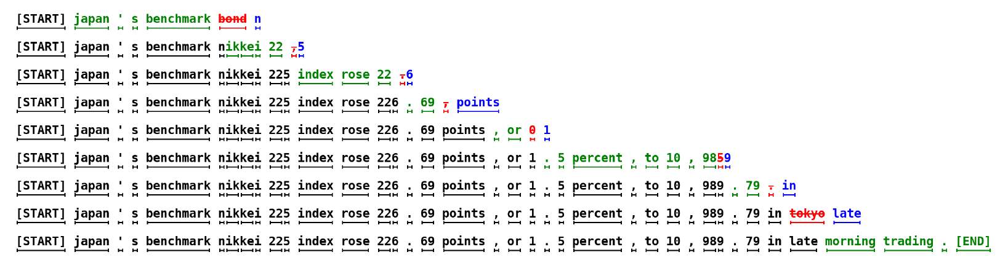

Figure 1. 녹색은 해당 round에서 수락한 draft, 빨간색은 거절한 draft, 파란색은 보정 또는 추가 생성 토큰이다. 검은색은 이전에 확정된 prefix다. [PDF p.2, Fig.1](https://arxiv.org/pdf/2211.17192v2#page=2)

[저자 보고] 6M draft와 97M target의 무조건 언어 생성 예시에서 38개 토큰을 target의 직렬 실행 9회로 만들었다. 첫 줄은 target 1회로 5개 토큰을 생성했다. [검산] $`38/9\approx4.22`$는 이 예시의 **round당 확정 토큰 수**다. 전체 시간이 4.22배 빨랐다는 측정이 아니다. 작은 모델의 실행 시간과 초기화 비용을 이 비율만으로 알 수 없기 때문이다.

빨간 토큰이 나온 뒤의 draft가 문법적으로 그럴듯해도 그대로 살릴 수 없다. 그 뒤 target의 예측은 거절된 토큰을 조건으로 계산되었으므로, 보정 토큰으로 바뀐 실제 prefix의 예측과 달라진다. 이 dependency가 Algorithm 1의 “첫 거절에서 멈추기”를 결정한다.

### 3.3 원문 순서의 논리 지도

| 원문 위치 | 질문 | 이 리뷰에서 자세히 푸는 곳 |
|---|---|---|
| Abstract, §1 | 모델·학습·분포를 유지하면서 직렬 지연을 줄일 수 있는가 | §2–3 |
| §2.1 | 작은 모델과 큰 모델을 어떤 순서로 호출하는가 | §5, §7–8 |
| §2.2 | greedy/top-k/nucleus를 한 수학적 틀로 다룰 수 있는가 | §5.1 |
| §2.3 | 거절 뒤 어떤 분포에서 다시 뽑아야 하는가 | §5.2, §6 |
| §3.1 | round당 평균 몇 토큰을 만드는가 | §9.1–9.3 |
| §3.2 | 수락률을 분포 간 차이로 표현할 수 있는가 | §9.4 |
| §3.3 | 호출 수 감소가 언제 walltime 감소가 되는가 | §10.1–10.3 |
| §3.4 | 산술 연산과 메모리 이동은 어떻게 달라지는가 | §10.4 |
| §3.5 | draft 길이는 얼마나 길어야 하는가 | §10.5 |
| §3.6 | 어떤 작은 모델·휴리스틱을 사용할 수 있는가 | §10.6 |
| §4.1–4.2 | 실측 속도와 수락률의 근거는 무엇인가 | §11–12 |
| §5–6 | 기존 연구와 차이·한계·후속 방향은 무엇인가 | §13 |
| A.1–A.5 | 증명·기존 rejection sampling·예측 오차·beam·lenience | §6, §12, §14 |

<a id="notation"></a>

## 4. 선수 지식과 notation·tensor shape

### 4.1 조건부 확률과 병렬 teacher forcing

생성 시퀀스의 확률은 다음과 같이 분해된다. 아래는 이해를 위한 보조식이며 원문에 새 수식 번호를 붙이지 않는다.

```math
p(y_{1:K}\mid s)=\prod_{t=1}^{K}p(y_t\mid s,y_{1:t-1}).
```

$`s`$는 source 문장 또는 prompt, $`K`$는 생성 길이다. 각 factor는 스칼라다. 확률을 계산할 **후보 시퀀스가 이미 주어져 있다면** causal mask를 사용해 여러 factor를 한 forward에서 계산할 수 있다. 확률 계산을 병렬화하는 것과, 서로 독립적인 다음 토큰들을 뽑는 것은 다르다. 이 논문은 후보를 draft로 먼저 만든다.

### 4.2 기호와 shape 사전

| 기호 | 의미·범위 | shape/단위와 주의점 |
|---|---|---|
| $`M_p,M_q`$ | target, approximation/draft 모델 | 파라미터가 별개인 함수. 같은 hidden width일 필요 없음 |
| $`\theta_p,\theta_q`$ | 각 모델의 가중치 | 리뷰어 보조 기호. 추론 중 frozen |
| $`\mathcal V,V`$ | 공통 토큰 공간과 크기 | 유한 vocabulary, $`V=\lvert\mathcal V\rvert`$ |
| $`h`$ | 현재 확정 prefix와 고정 condition | token ID 배열 및 source 조건 |
| $`x_i`$ | 이번 round의 i번째 draft | 정수 스칼라. 최종 전체 시퀀스 위치와 구별 |
| $`p_i,q_i`$ | $`h,x_{1:i-1}`$에서 다음 토큰 분포 | 각각 $`\mathbb R^V`$, 비음수, vocabulary 축 합 1 |
| $`p_i(x_i),q_i(x_i)`$ | 후보 token ID를 gather한 확률 | 스칼라. 분포 전체와 다름 |
| $`z_i^p,z_i^q`$ | 모델의 raw logits | $`\mathbb R^V`$. accept ratio에 직접 쓰지 않음 |
| $`\gamma`$ | round당 draft 개수 | 양의 정수. analysis에서 baseline은 0으로 확장 가능 |
| $`n`$ | 첫 거절 전까지 수락한 draft 수 | 정수, $`0\le n\le\gamma`$ |
| $`L=n+1`$ | 이번 round의 확정 토큰 수 | 스칼라. EOS·길이 제한 처리 전 |
| $`r_i`$ | 수락 검사 난수 | 서로 독립인 uniform 스칼라 |
| $`p'`$ | correction 또는 bonus 분포 | $`\mathbb R^V`$ |
| $`\beta_h`$ | 특정 prefix에서 제안 하나의 수락 확률 | $`[0,1]`$ 스칼라 |
| $`\alpha`$ | prefix에 대해 평균한 수락률 | $`\mathbb E_h[\beta_h]`$; 정확한 평균 대상 중요 |
| $`M(x)`$ | 두 확률벡터의 중점 | Definition 3.2에만 사용. 신경망 모델 기호와 별개 |
| $`D_{LK}`$ | 원문이 정의한 분포 차이 | $`\tfrac12\lVert p-q\rVert_1`$와 같음. KL divergence 아님 |
| $`T,c`$ | target 한 step 시간, draft/target 시간비 | 각각 시간, 무차원 |
| $`\widehat T,\widehat c`$ | target 한 step 연산량, draft/target 연산량비 | 각각 연산 수, 무차원 |
| $`B,m,d,H,d_h`$ | batch, prefix 길이, hidden width, head 수, head width | forward 설명을 위한 일반 기호 |
| $`l`$ | Appendix A.5 lenience | 원문 소문자 엘. $`0\lt l\le1`$일 때 나눗셈 식 정의 |

용어 “acceptance rate”는 샘플의 정답률이나 BLEU·ROUGE가 아니다. 실제 정답과 비교하지 않고 두 모델이 만든 확률분포를 비교한다. draft가 target과 똑같이 잘못된 답을 선호해도 수락률은 높을 수 있다.

### 4.3 한 round의 주요 배열

```math
X\in\mathbb Z^{B\times\gamma},\quad Q\in\mathbb R^{B\times\gamma\times V},\quad P\in\mathbb R^{B\times(\gamma+1)\times V},\quad R\in[0,1]^{B\times\gamma}.
```

vocabulary 축에서 softmax·최솟값·잔차 정규화를 수행한다. 위치 축에서 “첫 실패 위치”를 찾는다. 이 두 축을 바꾸면 알고리즘이 달라진다. $`Q`$ 전체를 항상 저장해야 한다는 뜻은 아니다. 후보 확률만 저장하고 rejection 위치의 draft 분포를 복구하는 구현도 생각할 수 있지만, residual 계산에는 그 위치의 **전체 vocabulary 확률**이 필요하다.

target과 draft는 같은 토큰 ID의 의미를 공유해야 위 식을 바로 사용할 수 있다. “아무 draft나 가능”이라는 명제는 동일한 표본 공간에 정의된 임의의 proposal distribution을 뜻한다. 서로 다른 tokenizer의 ID를 그대로 나누어도 된다는 뜻은 아니다.

<a id="sampling"></a>

## 5. §2.1–2.3: 분포 표준화와 speculative sampling

### 5.1 Standardized sampling [PDF pp.2–3, §2.2]

원문은 sampling 정책을 적용한 뒤의 분포를 $`p,q`$로 정의한다. 이것을 놓치면 temperature=0에서도 raw softmax 확률비를 사용해 target greedy와 다른 토큰을 받아들이는 오류가 생긴다.

[리뷰어 해석] temperature와 vocabulary mask를 합친 일반적인 표현은 다음과 같다. $`m(v)\in\{0,1\}`$는 top-k/nucleus/허용 토큰 mask다.

```math
p(v\mid h)=\frac{m_p(v,h)\exp(z_p(v,h)/\tau_p)}{\sum_{u\in\mathcal V}m_p(u,h)\exp(z_p(u,h)/\tau_p)},\qquad \tau_p\gt0.
```

- **입력**: 한 prefix의 logits $`z_p\in\mathbb R^V`$, scalar temperature, vocabulary mask.
- **연산 순서**: 정책에 따른 logits 변환·mask를 정하고, vocabulary 전체에서 정규화한다. 실제 baseline의 변환 순서까지 맞춰야 한다.
- **출력**: 합이 1인 확률벡터 $`p`$. $`q`$도 실제 draft를 샘플링한 최종 분포여야 한다.
- **가정**: 허용 토큰 집합이 비어 있지 않다. top-p 집합 계산의 동점 처리 등은 별도 구현 규칙이다.
- **연결**: 이 확률벡터를 아래 accept ratio와 residual에 같은 방식으로 넣는다.

greedy는 일반적인 $`\tau=0`$ 나눗셈으로 구현하지 않는다. 동일한 tie-breaking을 가진 argmax 토큰 $`v_p^*`$에 질량 1을 둔다.

```math
v_p^*=\mathop{\mathrm{argmax}}_{v\in\mathcal V}z_p(v\mid h),\qquad p(v\mid h)=\mathbf 1\{v=v_p^*\}.
```

[저자 보고] 실험에서는 주로 두 모델에 같은 표준화를 사용한다. [리뷰어 해석] 정확성 증명은 $`q`$의 temperature나 필터가 $`p`$와 반드시 같아야 한다고 요구하지 않는다. 대신 proposal이 **실제로 사용한 분포**를 정확히 알고 있어야 한다. top-k 이후 샘플링한 token에 top-k 이전의 $`q`$ 값을 쓰면 증명의 전제가 깨진다.

### 5.2 수락 확률: 후보가 target에 비해 과대표집됐는가

하나의 고정 prefix를 생각하고 $`x\sim q`$를 뽑는다. 원문의 조건문을 하나의 식으로 쓰면 다음과 같다.

```math
a(x)=\min\left(1,\frac{p(x)}{q(x)}\right),\qquad \mathrm{accept}\ \Longleftrightarrow\ r\le a(x),\quad r\sim\mathrm U(0,1).
```

$`p(x),q(x),a(x),r`$는 모두 스칼라다. $`q(x)\le p(x)`$이면 제안된 token을 전부 받아도 target이 필요한 질량을 넘지 않는다. $`q(x)\gt p(x)`$이면 그 후보가 draft에서 너무 자주 나오므로 $`p(x)/q(x)`$ 비율만 남긴다. **target에서 별도로 token을 샘플링해 두 ID가 일치하는지 비교하는 방법이 아니다.**

정확한 수학에서는 $`q(x)=0`$인 token이 $`x\sim q`$에서 제안될 수 없으므로 실제 후보의 분모는 양수다. 구현에서는 확률 underflow와 0/0을 피하도록 처리해야 한다. $`r q(x)\le p(x)`$ 비교는 나눗셈을 피할 수 있지만, 낮은 정밀도의 확률 계산 자체까지 해결하지는 않는다.

### 5.3 residual distribution: 채택 경로가 채우지 못한 질량

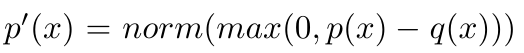

§2.3의 비번호 residual 식을 다시 명시한 Appendix A.1의 발췌. [PDF p.11, A.1](https://arxiv.org/pdf/2211.17192v2#page=11)

```math
p'(v)=\mathrm{norm}\bigl(\max(0,p(v)-q(v))\bigr)=\frac{[p(v)-q(v)]_+}{\sum_{u\in\mathcal V}[p(u)-q(u)]_+}.
```

- **기호·입력**: $`p,q\in\mathbb R^V`$. $`[z]_+=\max(0,z)`$는 원소별 양수 부분이다.
- **shape·축**: 뺄셈과 clamp 후에도 shape는 $`[V]`$다. 분모는 vocabulary 축의 합으로 scalar다.
- **연산 순서**: 확률벡터를 뺀다 → 음수를 0으로 자른다 → 남은 양의 질량으로 나눈다. logits의 차이나 softmax를 다시 적용하는 식이 아니다.
- **정규화 이유**: 채택된 token의 무조건 질량은 $`\min(p(v),q(v))`$다. target이 더 필요로 하는 부분은 $`p(v)-\min(p(v),q(v))=[p(v)-q(v)]_+`$다.
- **입출력 역할**: 거절이 발생한 위치에서 correction token을 뽑는 분포다. 다음 위치의 분포가 아니다.
- **경계조건**: $`p=q`$이면 분모는 0이지만 거절 확률도 0이다. 이 분포를 계산·샘플링하는 경로에 들어가지 않아야 한다.

### 5.4 손으로 계산하는 3-token 예제

[리뷰어 해석: 원문에 없는 해설용 수치] vocabulary가 A/B/C이고 다음과 같다고 하자.

| token | target $`p`$ | draft $`q`$ | 수락 확률 $`a`$ | 채택 경로 질량 $`qa`$ | 양의 잔차 |
|---|---:|---:|---:|---:|---:|
| A | 0.10 | 0.50 | 0.20 | 0.10 | 0 |
| B | 0.60 | 0.30 | 1 | 0.30 | 0.30 |
| C | 0.30 | 0.20 | 1 | 0.20 | 0.10 |
| 합 | 1 | 1 | — | 0.60 | 0.40 |

총 수락률은 0.60, 거절 확률은 0.40, 거절 후 분포는 $`p'=(0,0.75,0.25)`$다.

```math
\begin{aligned}\Pr(Y=\mathrm A)&=0.10+0.40\cdot0=0.10,\\\Pr(Y=\mathrm B)&=0.30+0.40\cdot0.75=0.60,\\\Pr(Y=\mathrm C)&=0.20+0.40\cdot0.25=0.30.\end{aligned}
```

만약 거절 뒤 원래 target $`p`$에서 그냥 뽑으면 $`(0.14,0.54,0.32)`$가 된다. 이미 채택 경로에서 충분히 들어온 A에 다시 질량을 추가하기 때문이다. “실패하면 큰 모델로 fallback한다”는 직관만으로 구현하면 이 오류가 생긴다.

<a id="correctness"></a>

## 6. Appendix A.1: 정확성 증명의 모든 단계

### 6.1 residual의 정규화 상수 [PDF p.11, A.1]

고정 prefix에서 proposal token을 $`X`$, 최종 반환 token을 $`Y`$, 수락 사건을 $`A`$로 구분한다. 원문은 이들 일부를 같은 $`x`$로 쓰지만, 분해해서 읽으면 거절 후 새 token이 무엇인지 명확해진다.

```math
\beta=\sum_{v\in\mathcal V}\min(p(v),q(v)),\qquad Z=\sum_{v\in\mathcal V}[p(v)-q(v)]_+=1-\beta.
```

각 항은 확률이며 $`Z`$와 $`\beta`$는 scalar다. $`[p-q]_+=p-\min(p,q)`$를 원소별로 적용한 뒤 합하고, $`\sum_vp(v)=1`$을 사용했다. 따라서 $`\beta\lt1`$일 때 원문의 식은 다음과 같다.

```math
p'(v)=\frac{p(v)-\min(q(v),p(v))}{\sum_u\bigl(p(u)-\min(q(u),p(u))\bigr)}=\frac{p(v)-\min(q(v),p(v))}{1-\beta}.
```

여기서 분자는 target이 더 필요로 하는 질량이고 분모는 거절이라는 사건 전체가 가진 질량이다. 거절 경로를 조건부 분포로 바꾸기 위해 바로 그 양으로 나눈다.

### 6.2 전체 확률을 두 경로로 나누기

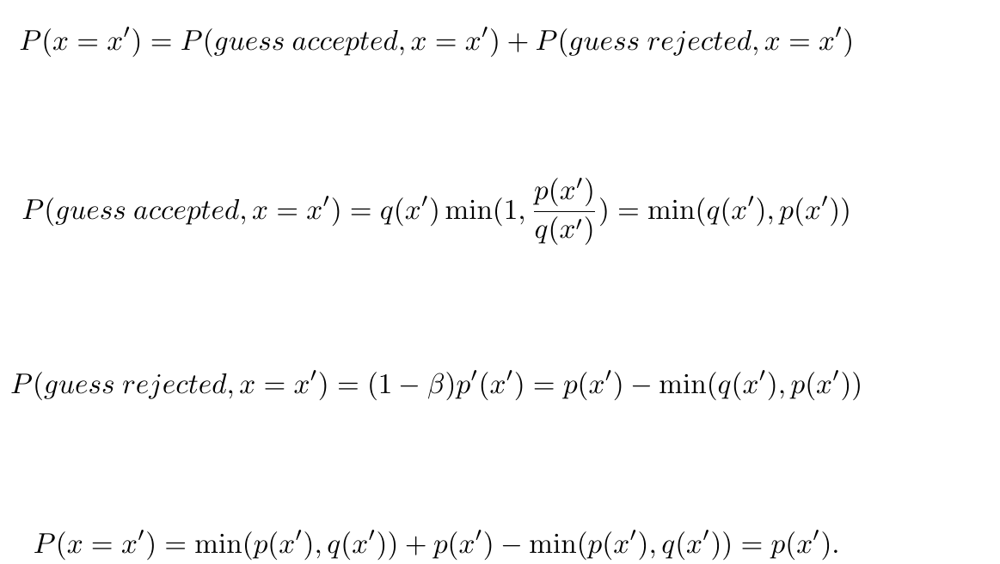

Appendix A.1의 확률 분해 4개 식. [PDF p.11](https://arxiv.org/pdf/2211.17192v2#page=11)

원문의 네 식을 $`Y=v`$ 표기로 명확하게 다시 쓴다. 모두 **고정한 한 token의 scalar 확률**이며 vocabulary에 걸친 vector 등식으로도 읽을 수 있다.

```math
\Pr(Y=v)=\Pr(A,Y=v)+\Pr(A^{\mathrm c},Y=v).
```

수락·거절은 서로 겹치지 않고 전체 경우를 덮으므로 더한다. 이 단계에는 모델 품질이나 독립적인 prefix 가정이 없다.

```math
\Pr(A,Y=v)=q(v)\min\left(1,\frac{p(v)}{q(v)}\right)=\min(q(v),p(v)).
```

proposal이 $`v`$를 선택할 확률과 그 선택을 수락할 조건부 확률을 곱한다. $`q(v)=0`$일 때 이 질량은 0으로 정의하면 된다.

```math
\Pr(A^{\mathrm c},Y=v)=(1-\beta)p'(v)=p(v)-\min(q(v),p(v)).
```

거절할 총 확률에 거절 후 $`v`$를 선택할 확률을 곱한다. 잔차 정규화 상수와 거절 확률이 정확히 상쇄된다.

```math
\Pr(Y=v)=\min(p(v),q(v))+p(v)-\min(p(v),q(v))=p(v).
```

따라서 모든 token $`v`$에 대해 target의 확률과 일치한다. 이것이 A.1 증명의 전부이며, “draft가 대부분 맞으니 품질 차이가 작다”는 근사 논리가 아니다.

### 6.3 한 token에서 전체 시퀀스로

[리뷰어 보조 유도] 매번 확정된 prefix $`h`$에서 위 보정 규칙으로 다음 token의 조건부 법칙을 유지하면, chain rule에 의해 시퀀스의 joint distribution도 유지된다.

```math
\Pr_{\mathrm{spec}}(Y_{1:K}=y_{1:K}\mid s)=\prod_{t=1}^{K}p(y_t\mid s,y_{1:t-1})=\Pr_{\mathrm{target}}(Y_{1:K}=y_{1:K}\mid s).
```

여러 draft를 묶어 계산해도 첫 거절 이후의 잘못된 조건부 결과를 폐기하기 때문에 이 논리를 적용할 수 있다. 모든 draft를 수락했다면 $`p_{\gamma+1}`$는 실제 확정된 prefix에 대한 정당한 다음-token 분포다. EOS와 최대 길이 규칙도 baseline과 동일한 위치에서 적용해야 종료된 문자열의 분포까지 같은 기준으로 비교할 수 있다.

**여기에는 $`\beta`$들의 i.i.d. 가정이 없다.** 그 가정은 §3.1의 평균 처리량 모델에 등장한다. input 난이도가 바뀌거나 draft를 prefix에 따라 선택해도 실제 proposal 분포를 알고 correction을 정확히 적용하는 한 한-token 증명의 구조는 그대로다.

### 6.4 동일 출력분포와 동일 sample path

| 표현 | 보장 여부 | 구체적 의미 |
|---|---|---|
| 동일한 조건부 출력분포 | 기본 알고리즘의 수학적 보장 | 각 prefix에서 다음 token의 모든 확률이 같음 |
| 동일한 전체 문자열 분포 | 동일 condition·종료 규칙하에서 도출 | 문자열의 joint probability가 같음 |
| 같은 seed → 같은 문자열 | 일반적으로 보장하지 않음 | draft·수락 검사·residual에 추가 난수를 소비함 |
| 각 실행에서 target-only와 같은 token | stochastic에서는 보장하지 않음 | 서로 다른 coupling으로 같은 분포를 만들 수 있음 |
| greedy 출력 일치 | 일관된 argmax·tie-breaking·수치 연산 아래 가능 | target point mass에서 벗어나는 후보는 거절됨 |
| 실수 연산 결과의 bitwise identity | 논문 증명 범위 밖 | batch·kernel·정밀도가 달라지면 logits가 미세하게 달라질 수 있음 |

분포 검증을 하면서 seed 하나로 문자열이 다르다는 이유만으로 실패라고 판정하면 잘못이다. 반대로 seed 하나에서 같은 문자열이 나왔다는 이유만으로 정확성 증명을 대체할 수도 없다.

### 6.5 수락률의 의미에서 최적인 이유

[리뷰어 보조 유도] proposal token을 **그대로 재사용**하는 사건에 한정하면, token $`v`$로 수락한 질량은 proposal의 $`q(v)`$보다 클 수 없고 최종 target 질량 $`p(v)`$보다 클 수도 없다. 따라서 $`\min(p(v),q(v))`$가 token별 상한이다. 이 알고리즘은 모든 token에서 그 상한을 채운다.

이것은 한 후보의 재사용 확률에 대한 성질이다. 가능한 모든 다중 후보·tree·block 알고리즘 가운데 end-to-end latency가 최적이라는 주장으로 확장하지 않는다.

<a id="algorithm"></a>

## 7. Algorithm 1 행별 풀이와 실행 예제

### 7.1 원문 알고리즘 [PDF p.3]

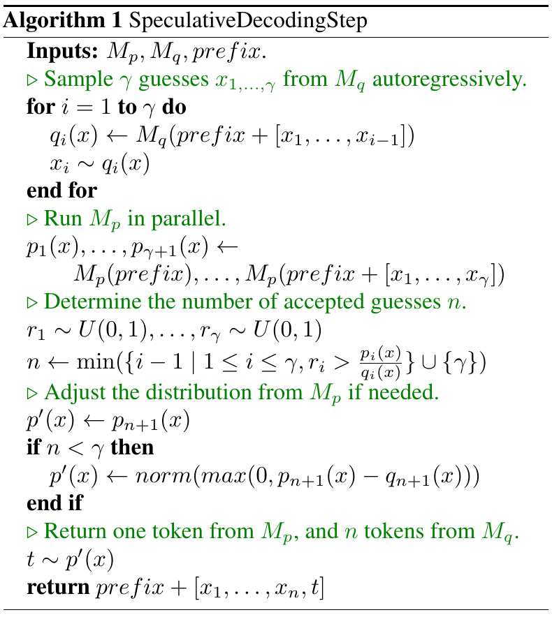

Algorithm 1. SpeculativeDecodingStep. 원문에는 개별 행 번호가 없으므로 아래 1–16은 해설용 번호다. [PDF p.3](https://arxiv.org/pdf/2211.17192v2#page=3)

| 해설 행 | 원문 동작 | 입력 → 출력·실행 이유 |
|---|---|---|
| 1 | Inputs | $`M_p,M_q,h`$를 받음. $`\gamma`$는 알고리즘 설정값으로 주어졌다고 읽어야 함 |
| 2 | for i=1 to γ | draft autoregressive loop를 시작. 이 loop의 token 생성은 직렬 |
| 3 | $`q_i\leftarrow M_q(h+[x_1,\ldots,x_{i-1}])`$ | 현재 draft prefix → vocabulary 분포 $`[V]`$ |
| 4 | $`x_i\sim q_i`$ | 분포 → token ID 하나. 실제 사용한 $`q_i`$와 후보 확률을 보관 |
| 5 | end for | $`\gamma`$개 후보와 각 후보 직전의 분포가 준비됨 |
| 6 | Run Mp in parallel | 원래 prefix부터 모든 draft를 붙인 prefix까지 평가. 서로 다른 길이의 조건부 분포 $`p_1,\ldots,p_{\gamma+1}`$ 확보 |
| 7 | $`r_1,\ldots,r_\gamma\sim\mathrm U(0,1)`$ | 각 후보 수락 검사에 독립 난수 사용 |
| 8 | 첫 실패 앞의 n 계산 | 후보 확률비를 검사해 첫 reject 위치에서 중단. 실패가 없으면 $`n=\gamma`$ |
| 9 | $`p'\leftarrow p_{n+1}`$ | 기본값은 다음 위치의 target 분포. 전부 수락된 경우 bonus용 |
| 10 | if n < γ | 실제 거절이 있었는지 분기 |
| 11 | $`p'\leftarrow\mathrm{norm}([p_{n+1}-q_{n+1}]_+)`$ | 첫 거절 위치의 두 전체 분포를 이용해 residual 계산 |
| 12 | end if | 분기 후 $`p'`$는 항상 이번에 추가할 한 token의 분포 |
| 13 | $`t\sim p'`$ | correction 또는 bonus token을 하나 뽑음 |
| 14 | $`h+[x_1,\ldots,x_n,t]`$ 반환 | draft $`n`$개와 새 token 1개가 확정됨 |
| 15 | 다음 round 준비 | 원문 코드 밖의 반복 관리. 종료 검사와 prefix 갱신 필요 |
| 16 | cache 정합성 관리 | 원문에 구현 세부가 없음. 거절 suffix 폐기·새 token 반영은 실제 구현의 필수 사항 |

원문 행 8의 확률비에는 $`p_i(x)/q_i(x)`$라고 적혀 있다. 구현 가능한 의미는 **후보 $`x_i`$에서 평가한** $`p_i(x_i)/q_i(x_i)`$다. $`x`$를 별도의 새 샘플로 해석하면 안 된다.

```math
n=\min\left(\left\{i-1\;\middle|\;1\le i\le\gamma,\ r_i\gt\frac{p_i(x_i)}{q_i(x_i)}\right\}\cup\{\gamma\}\right).
```

$`\min`$은 token vocabulary가 아니라 **실패 위치의 집합**에 적용된다. 첫 후보 실패면 $`i=1`$이므로 $`n=0`$. 후보 3이 처음 실패하면 $`n=2`$. 실패 집합이 비어 있어도 $`\{\gamma\}`$를 합쳐 두었으므로 $`\min\varnothing`$ 문제가 생기지 않는다. ratio가 1보다 크면 $`r_i\in[0,1]`$이 이를 넘지 못하므로 명시적인 clamp 없이도 항상 수락된다.

### 7.2 읽기 쉬운 재구성 pseudocode

아래는 [리뷰어 해석]에 따른 표기 정리이며 저자의 공개 실행 코드가 아니다. `normalize_positive`는 모든 vocabulary에 걸친 합으로 정규화한다.

```python
def speculative_step(target, draft, prefix, gamma):
    guesses, q = [], []
    for i in range(gamma):
        qi = draft.distribution(prefix + guesses)
        q.append(qi)
        guesses.append(categorical(qi))

    # p[i] predicts guesses[i]; p[gamma] predicts the bonus token.
    p = target.score_prefixes_in_one_verification(prefix, guesses)
    n = gamma
    for i in range(gamma):
        xi = guesses[i]
        if uniform() * q[i][xi] > p[i][xi]:
            n = i
            break

    if n < gamma:
        final_distribution = normalize_positive(p[n] - q[n])
    else:
        final_distribution = p[gamma]
    new_token = categorical(final_distribution)
    return prefix + guesses[:n] + [new_token]
```

실제 엔진은 별도의 cache 반환, EOS, generation budget, RNG state, distribution processor state도 처리해야 한다. `score_prefixes_in_one_verification`라는 이름은 요청한 연산 의미를 설명하기 위한 추상 함수다. 기존 target API에 이 함수가 구현되어 있다는 주장이 아니다.

### 7.3 첫 거절이 중간에서 발생하는 예제

[리뷰어 해설용 예제] $`\gamma=3`$, draft가 A → B → C를 냈다고 하자. 각 행은 **서로 다른 prefix에서 얻은 분포**다.

| i | prefix | $`q_i(A,B,C)`$ | $`p_i(A,B,C)`$ | 제안 | r | 판정 |
|---|---|---|---|---|---:|---|
| 1 | h | (0.50,0.30,0.20) | (0.10,0.60,0.30) | A | 0.10 | 0.10 ≤ 0.20, 수락 |
| 2 | h,A | (0.20,0.60,0.20) | (0.20,0.30,0.50) | B | 0.80 | 0.80 > 0.50, 거절 |
| 3 | h,A,B | (0.20,0.20,0.60) | (0.10,0.20,0.70) | C | 0.20 | 앞에서 거절되어 사용하지 않음 |

$`n=1`$이고 correction은 **두 번째 위치**에서 계산한다.

```math
[p_2-q_2]_+=(0,0,0.30),\qquad p'=(0,0,1),\qquad h_{\mathrm{new}}=h+[\mathrm A,\mathrm C].
```

세 번째 draft C가 correction C와 ID가 같아도, 세 번째 위치의 계산을 이동해 재활용할 수는 없다. 하나는 $`h,A,B`$ 뒤의 C이고 다른 하나는 $`h,A`$ 뒤의 C다. 위치와 조건부 prefix가 다르기 때문이다.

### 7.4 전부 수락되면 왜 한 token을 더 얻는가

위 예제에서 두 번째 검사 난수가 0.20이고 세 번째도 수락된다면 $`n=3`$이다. target은 이미 $`h,A,B,C`$를 조건으로 하는 $`p_4`$까지 계산했다. 예를 들어 $`p_4=(0.20,0.50,0.30)`$이라면 그 분포에서 bonus를 뽑아 총 4개를 확정한다. $`q_4`$는 필요 없다. 이 bonus가 기대 길이 식의 상한을 $`\gamma`$가 아니라 $`\gamma+1`$로 만든다.

### 7.5 EOS와 출력 길이

원문 Algorithm 1은 EOS와 generation cap을 생략한 한 step 설명이다. 실용 구현은 반환 후보들 중 첫 EOS까지만 사용자에게 출력하고 종료해야 한다. EOS 뒤의 speculative token은 미래 출력으로 보내면 안 된다. 최대 길이가 몇 token 남지 않았다면 그 예산에 맞추어 draft 길이를 줄이거나 반환을 잘라야 한다. 따라서 논문의 무한·긴 생성 평균을 짧은 응답의 정확한 평균이라고 간주할 수 없다.

<a id="forward"></a>

## 8. 한 샘플의 end-to-end forward와 KV cache

### 8.1 T5 encoder–decoder 경로

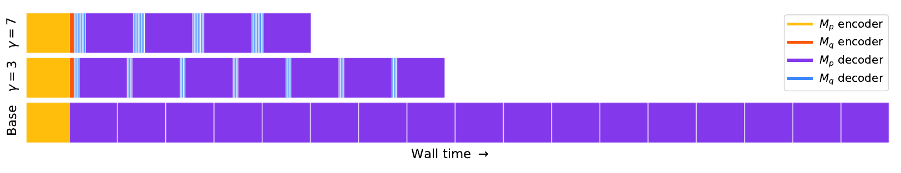

Figure 5. 노란색/주황색은 target/draft encoder, 보라색/파란색은 target/draft decoder다. 위·가운데·아래 행은 각각 $`\gamma=7`$, $`\gamma=3`$, baseline을 표시하는 **단순화된 trace 도식**이다. 측정된 profiler 캡처의 절대 시간축으로 읽지 않는다. [PDF p.6, Fig.5](https://arxiv.org/pdf/2211.17192v2#page=6)

[리뷰어 해석] T5 실험을 실행 가능한 연산 단위로 재구성하면 다음과 같다. 구체적인 tensor 배치는 엔진에 따라 다르며 아래는 논리 shape다.

1. **입력 처리**: source 문장을 token ID $`S\in\mathbb Z^{1\times m_s}`$로 만든다. tokenizer·padding·source truncation을 두 모델의 입력 규칙에 맞춘다.
2. **encoder 실행**: target encoder는 $`E_p\in\mathbb R^{1\times m_s\times d_p}`$, draft encoder는 $`E_q\in\mathbb R^{1\times m_s\times d_q}`$를 만든다. 서로 다른 encoder의 hidden state를 별도 adapter 없이 교환하는 방법이 아니다.
3. **decoder 시작·prefill**: BOS 또는 decoder start token과 기존 output prefix를 각 decoder에 반영한다. self-attention cache와 source cross-attention용 정보를 준비한다.
4. **draft loop**: 각 step은 $`[1,1,d_q]`$ hidden에서 $`[1,V]`$ logits를 만들고 정책을 적용한다. $`\gamma`$번 순차 실행해 후보 $`[1,\gamma]`$와 분포 $`[1,\gamma,V]`$를 얻는다.
5. **target 검증**: 동일 source condition과 draft prefix를 사용하여 $`\gamma+1`$개의 다음-token 분포를 계산한다. 최종 logits의 논리 shape는 $`[1,\gamma+1,V]`$다.
6. **수락 계산**: draft ID를 gather해 두 scalar 확률 배열 $`[1,\gamma]`$를 만든다. 첫 실패 위치를 찾는다.
7. **보정·추가 생성**: 거절 시 해당 행의 두 $`[V]`$ 분포에서 residual을 만들고, 전부 수락 시 마지막 target 행을 그대로 사용한다.
8. **출력 확정**: draft $`n`$개와 correction/bonus 1개를 생성 결과에 붙인다. EOS와 길이 제한을 검사한다.
9. **cache 정리**: 확정 prefix와 일치하는 KV만 유지한다. 다음 round는 같은 source encoder 결과와 갱신된 prefix로 시작한다.
10. **문자열 반환**: 종료되면 token ID를 tokenizer로 문자열화한다. 논문 실험에서 로봇 action detokenizer는 없다.

### 8.2 여러 prefix 평가가 한 forward가 되는 이유

decoder-only 관점에서 이미 확정된 prefix 길이가 $`m`$이라고 하자. 입력이 $`[h,x_1,\ldots,x_\gamma]`$로 알려져 있으면 각 위치의 hidden state는 causal mask 덕분에 자기보다 오른쪽의 token을 보지 않는다. 따라서 prefix 끝의 출력이 $`p_1`$, $`x_1`$ 위치의 출력이 $`p_2`$, 마지막 draft 위치의 출력이 $`p_{\gamma+1}`$가 된다.

```math
H_p\in\mathbb R^{B\times(\gamma+1)\times d_p},\qquad Z_p=H_pW_{\mathrm{vocab}}\in\mathbb R^{B\times(\gamma+1)\times V}.
```

이것은 cache를 활용해 새로 처리할 구간만 표시한 shape다. 전체 prefix를 매번 다시 계산하면 같은 수학적 분포는 만들 수 있어도 논문이 기대한 효율을 잃는다. 논문의 “$`\gamma+1`$ evaluations in parallel”은 물리적으로 모델 가중치를 $`\gamma+1`$벌 복제하라는 지시도 아니다. 공통 prefix와 weights를 재사용하도록 구현해야 한다.

attention의 일반적인 논리 shape를 적으면, 새 query 구간과 기존 cache를 합친 key/value 사이에서 다음 계산이 일어난다. $`s_k`$는 볼 수 있는 전체 key 길이다.

```math
Q\in\mathbb R^{B\times H\times(\gamma+1)\times d_h},\quad K,V_{\mathrm{attn}}\in\mathbb R^{B\times H\times s_k\times d_h},\quad O=\mathrm{softmax}\left(\frac{QK^{\mathsf T}}{\sqrt{d_h}}+\mathcal M\right)V_{\mathrm{attn}}.
```

여기서 $`K^{\mathsf T}`$는 마지막 두 축의 전치이며 attention softmax는 key 축에 적용한다. $`\mathcal M`$은 causal/padding mask다. 이 보조식의 attention 확률은 **vocabulary 분포 $`p,q`$가 아니다.** speculative sampling의 ratio는 최종 LM head 이후의 token 확률에 적용한다.

### 8.3 cache의 마지막 token은 종종 아직 처리되지 않았다

[리뷰어 구현 해석] 설명을 위해 “현재 prefix의 마지막 token은 pending이고, KV는 그 직전까지 존재”하는 관례를 택하자. 길이 $`m`$의 prefix에 대해 target KV 길이는 $`m-1`$이다.

| 시점 | target에서 새로 처리하는 입력 | 결과 |
|---|---|---|
| 검증 시작 | pending prefix token + draft $`\gamma`$개 | query 길이 $`\gamma+1`$ |
| 검증 직후 | prefix와 모든 draft의 KV | cache 길이 $`m+\gamma`$, logits $`\gamma+1`$행 |
| n개 draft 수락 | prefix + 수락된 draft까지만 유지 | target cache 길이 $`m+n`$ |
| correction/bonus t 생성 | t는 샘플링되었지만 아직 입력으로 처리되지 않음 | 새 prefix 길이 $`m+n+1`$, t가 다음 pending token |

draft 모델은 마지막 후보 $`x_\gamma`$를 **샘플링하는 것**과 그 후보를 **다음 입력으로 처리하는 것**이 다르다. 모든 draft가 수락되었을 때 draft KV가 마지막 후보 직전까지만 있다면, 다음 round 전에 $`x_\gamma`$를 추가로 반영해야 한다. correction/bonus token 역시 각 모델의 cache에 알맞은 순서로 반영해야 한다. 이 누락은 한 round에서는 그럴듯하지만 두 번째 round부터 다른 prefix를 조건으로 만드는 전형적인 오류다.

엔진이 이미 마지막 token까지 cache에 반영하는 관례를 쓴다면 위 길이가 달라진다. 불변식은 하나다. **각 logits 행에 사용한 위치·mask·cache가 그 행이 주장하는 조건부 prefix와 일치해야 한다.** 서로 다른 cache 관례의 길이 숫자를 그대로 섞지 않는다.

### 8.4 분포·성능에 영향을 주는 실용 비용

residual을 계산하려면 적어도 거절 위치의 전체 vocabulary logits 또는 확률이 필요하다. top-1 ID만 반환하는 target backend로는 일반 stochastic Algorithm 1을 그대로 구현할 수 없다. 후보 점수만 아는 경우에도 full residual의 다른 token 질량을 복원할 수 없기 때문이다.

또한 분포 정규화, token gather, 첫 실패 탐색, cache truncate, host/device 동기화는 신경망 FLOPs보다 작아 보일 수 있지만 짧은 decode에서는 실시간 비용이 된다. “수락 판정은 간단한 식”이라는 사실이 엔진에서 비용이 0임을 뜻하지 않는다.

<a id="acceptance-analysis"></a>

## 9. §3.1–3.2: 기대 토큰 수와 수락률

### 9.1 Definition 3.1과 원문 유일한 번호 수식 (1)

Definition 3.1은 prefix $`h`$가 주어졌을 때 $`x\sim q(\cdot\mid h)`$를 수락할 확률을 $`\beta_h`$로 정의한다. 이후 $`\alpha=\mathbb E[\beta]`$라고 두고 **$`\beta`$들이 i.i.d.라는 단순화 가정**을 사용한다. [PDF p.3, §3.1]

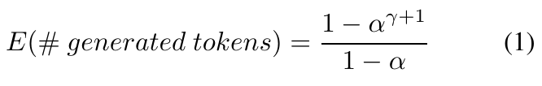

```math
\mathbb E[\#\mathrm{generated\ tokens}]=\frac{1-\alpha^{\gamma+1}}{1-\alpha}\qquad\text{(1)}.
```

- **입력**: scalar 평균 수락률 $`\alpha`$, 정수 draft 길이 $`\gamma`$.
- **출력·단위**: round당 확정 token 수의 기대값. 시간도, 총 FLOPs도 아니다.
- **연산**: 거듭제곱 후 1에서 빼고 $`1-\alpha`$로 나눈다. $`\alpha=1`$에서는 직접 나누지 않고 극한 $`\gamma+1`$을 사용한다.
- **가정**: 수락이 연속해서 일어날 확률을 $`\alpha^i`$로 근사할 수 있어야 한다. 긴 생성 분석과 별개로 한 round의 EOS에 의한 조기 종료도 생략한다.
- **직관**: 첫 token 하나는 항상 보장된다. 두 번째를 얻으려면 첫 draft가 수락되어야 하고, 세 번째를 얻으려면 앞의 두 draft가 모두 수락되어야 한다.

### 9.2 capped geometric의 유도

[리뷰어 보조 유도] $`L=n+1`$이라고 두면, 최대 길이 전에는 첫 거절이 발생해 길이가 정해지고, 상한에서는 전부 수락된다.

```math
\Pr(L=\ell)=\begin{cases}\alpha^{\ell-1}(1-\alpha),&1\le\ell\le\gamma,\\\alpha^\gamma,&\ell=\gamma+1.\end{cases}
```

마지막 행에 $`1-\alpha`$가 붙지 않는 이유는 상한에 도달하려고 마지막에 거절할 필요가 없기 때문이다. 기대값은 tail-sum으로 가장 간단히 계산된다.

```math
\mathbb E[L]=\sum_{k=1}^{\gamma+1}\Pr(L\ge k)=\sum_{i=0}^{\gamma}\alpha^i=1+\alpha+\alpha^2+\cdots+\alpha^\gamma.
```

유한 등비수열의 합이 원문 Eq.(1)이다. 예를 들어 $`\alpha=0.6,\gamma=2`$이면 길이 1/2/3의 확률은 0.4/0.24/0.36이고 기대값은 $`0.4+2(0.24)+3(0.36)=1.96`$이다. 원문 Table 1의 첫 행과 연결된다.

```math
\alpha=0\Rightarrow\mathbb E[L]=1,\qquad \alpha=1\Rightarrow\mathbb E[L]=\gamma+1,\qquad \lim_{\gamma\to\infty}\mathbb E[L]=\frac1{1-\alpha}\quad(0\le\alpha\lt1).
```

첫 식은 draft가 항상 거절되는 극단, 둘째는 항상 수락되는 극단, 셋째는 draft 길이를 무한히 늘려도 수락률이 고정되면 얻을 수 있는 기대 길이에 한계가 있다는 뜻이다.

### 9.3 Figure 2와 i.i.d. 가정의 한계

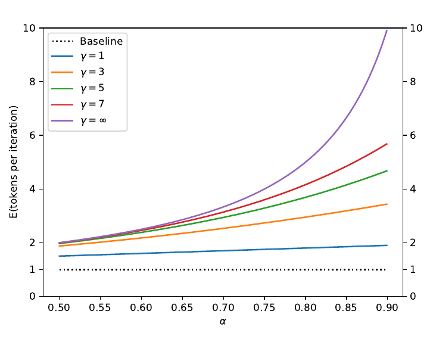

Figure 2. x축은 $`\alpha`$, y축은 round당 기대 token 수이며 색은 $`\gamma`$다. 무한 길이 곡선은 $`1/(1-\alpha)`$다. 실측 latency 그래프가 아니라 Eq.(1)의 이론 곡선이다. [PDF p.3, Fig.2](https://arxiv.org/pdf/2211.17192v2#page=3)

평균 수락률 하나만 같아도 실패가 뭉치는 정도가 다르면 평균 길이는 달라질 수 있다. 가정 없이 성립하는 표현은 다음과 같다. $`A_i`$는 i번째 후보 수락 사건이다.

```math
\mathbb E[L]=1+\sum_{i=1}^{\gamma}\Pr(A_1\cap A_2\cap\cdots\cap A_i).
```

[리뷰어 해설용 반례] round마다 절반은 모든 위치에서 수락 확률 1, 절반은 모든 위치에서 수락 확률 0인 환경을 상상하자. 각 위치의 평균은 0.5이지만 $`\gamma=4`$에서 실제 평균 길이는 $`(5+1)/2=3`$이다. Eq.(1)에 평균 0.5만 대입한 값은 1.9375다. 이것은 실제 논문 데이터의 수치가 아니라 상관구조를 생략할 수 없는 이유다.

더구나 accepted prefix를 따라간다는 사건 자체가 prefix 분포를 선택한다. target-only에서 모은 token 평균과 실제 speculative round 시작점·생존 경로의 분포가 항상 같다고 가정해서는 안 된다. Table 3의 평균 수락률은 유용한 성질이지만 exact walltime 공식의 충분통계라고 볼 수 없다.

### 9.4 Definition 3.2, Lemma 3.3: D_LK는 total variation과 같다

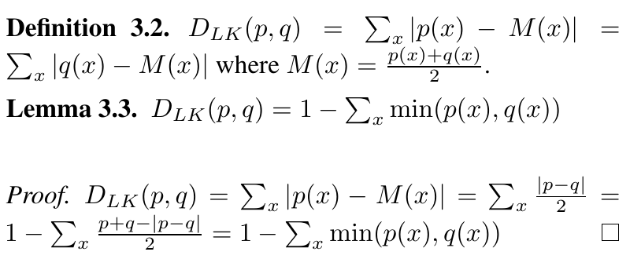

원문 정의·보조정리와 증명. [PDF p.3, §3.2](https://arxiv.org/pdf/2211.17192v2#page=3)

```math
M(v)=\frac{p(v)+q(v)}2,\qquad D_{LK}(p,q)=\sum_v|p(v)-M(v)|=\sum_v|q(v)-M(v)|.
```

$`M`$은 vocabulary 크기의 중점 확률벡터, $`D_{LK}`$는 scalar다. $`p-M=(p-q)/2`$이므로 다음의 보조 표현이 나온다.

```math
D_{LK}(p,q)=\frac12\sum_v|p(v)-q(v)|=1-\sum_v\min(p(v),q(v)).
```

두 번째 등식이 Lemma 3.3이다. 원문의 증명은 $`\min(a,b)=(a+b-|a-b|)/2`$와 두 분포의 합이 각각 1이라는 사실을 사용한다. 따라서 원문 표기 $`D_{LK}`$는 KL을 뒤집어 쓴 표준 명칭이 아니라, 수학적으로 **total variation distance**와 같은 양이다. 로그나 ratio를 합산하는 KL divergence와 혼동하지 않는다.

Corollary 3.4의 세 성질도 이 식에서 바로 읽힌다.

```math
0\le D_{LK}(p,q)\le1,\qquad D_{LK}(p,q)=0\Longleftrightarrow p=q,\qquad D_{LK}(p,q)=1\Longleftrightarrow\mathrm{supp}(p)\cap\mathrm{supp}(q)=\varnothing.
```

첫째는 겹치는 확률질량의 합이 0–1이기 때문이고, 둘째는 L1 차이가 0이라는 뜻이다. 셋째는 모든 vocabulary 원소에서 둘 중 적어도 한 분포가 0이어야 overlap이 0이 되기 때문이다. 대칭성은 $`|p-q|=|q-p|`$에서 나온다.

### 9.5 Theorem 3.5와 Corollary 3.6: overlap이 수락률

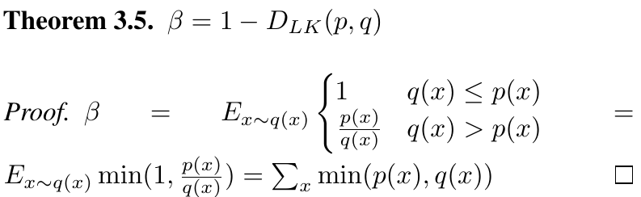

```math
\beta_h=\mathbb E_{X\sim q(\cdot\mid h)}\left[\min\left(1,\frac{p(X\mid h)}{q(X\mid h)}\right)\right]=\sum_v\min(p(v\mid h),q(v\mid h))=1-D_{LK}(p_h,q_h).
```

기댓값의 sampling 축은 **$`X\sim q`$인 vocabulary token**이다. $`q`$를 가중치로 곱하면 ratio 분모가 상쇄되어 overlap의 합이 된다. 이 식은 고정 prefix에서 정확하다. prefix들 사이의 독립성은 필요 없다.

```math
\alpha=\mathbb E_h[\beta_h]=1-\mathbb E_h[D_{LK}(p_h,q_h)]=\mathbb E_h\left[\sum_v\min(p(v\mid h),q(v\mid h))\right].
```

원문 Corollary 3.6의 마지막 $`E(\min(p,q))`$는 overlap 전체를 축약한 표기다. 구현할 때는 위 식처럼 vocabulary 합과 prefix 평균을 분리해야 한다. token 원소별 최솟값의 **vocabulary 평균**을 취하면 수락률에 $`1/V`$가 잘못 들어간다.

앞의 A/B/C 예제에서는 L1 차이가 $`0.4+0.3+0.1=0.8`$이고 total variation은 0.4다. 따라서 $`\beta=1-0.4=0.6`$으로 직접 계산한 수락률과 같다. greedy에서는 두 point mass의 argmax ID가 같으면 $`\beta=1`$, 다르면 0이다.

<a id="speed-analysis"></a>

## 10. §3.3–3.6: latency·연산량·draft 선택

### 10.1 Definition 3.7: 비용비 c

```math
c=\frac{T_q}{T_p},\qquad T_p=T.
```

$`T_q`$와 $`T_p`$는 같은 환경에서 draft/target을 한 token 진행하는 시간이다. 단위가 상쇄되어 $`c`$는 무차원 scalar다. 파라미터 수 비율이나 FLOPs 비율을 그대로 넣는 값이 아니다. 모델 크기 외에 memory layout, batching, precision, compilation, kernel 효율 등이 영향을 준다.

### 10.2 Theorem 3.8: 이상화한 walltime 개선식

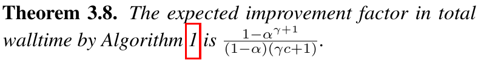

```math
S(\alpha,\gamma,c)=\frac{1-\alpha^{\gamma+1}}{(1-\alpha)(1+\gamma c)}=\frac{\mathbb E[L]}{1+\gamma c}.
```

[PDF p.4, Theorem 3.8](https://arxiv.org/pdf/2211.17192v2#page=4). 이 식은 번호 수식 (2)가 아니다. 원문은 **Theorem 3.8 안의 비번호 식**으로 제시한다.

| 요소 | 의미·가정 |
|---|---|
| $`\gamma cT`$ | draft를 $`\gamma`$번 직렬 호출하는 비용 |
| $`T`$ | target의 $`\gamma+1`$개 조건부 평가를 병렬화해도 한 step만큼 걸린다는 가정 |
| $`(1+\gamma c)T`$ | 한 speculative round의 총 시간. 부가 overhead를 별도로 세지 않음 |
| $`\mathbb E[L]`$ | i.i.d. 근사의 round당 출력 token 수 |
| $`T_{\mathrm{spec/token}}`$ | 총 시간/총 token의 장기 비율 |
| $`S`$ | baseline의 token당 시간 $`T`$를 개선 후 시간으로 나눈 배수 |

원문의 유도를 한 단계씩 쓰면 다음과 같다.

```math
T_{\mathrm{round}}=\gamma cT+T,\qquad T_{\mathrm{spec/token}}\approx\frac{T_{\mathrm{round}}}{\mathbb E[L]}=\frac{(1+\gamma c)(1-\alpha)T}{1-\alpha^{\gamma+1}},\qquad S=\frac{T}{T_{\mathrm{spec/token}}}.
```

이 장기 비율은 각 round에서 $`T_{\mathrm{round}}/L`$를 계산한 뒤 단순 평균한 값과 일반적으로 다르다. 처리량을 볼 때는 실제 소요 시간의 합을 실제 생성 token 수의 합으로 나눠야 한다. 짧은 생성에서는 마지막 round가 남는 길이를 초과할 수 있고 초기 encoder/prefill 비용도 상대적으로 커진다.

### 10.3 Corollary 3.9와 실제 비용을 넣은 식

$`\gamma=1`$을 대입하면 다음과 같다.

```math
S(\alpha,1,c)=\frac{1+\alpha}{1+c},\qquad \alpha\gt c\Longrightarrow S(\alpha,1,c)\gt1.
```

즉 이 이상화한 모델에서는 평균 수락으로 얻는 이득이 draft 비용비보다 크면 적어도 한 가지 draft 길이가 가속을 준다. [리뷰어 보조 유도] 반대로 $`0\le\alpha\le c`$이면 $`\sum_{i=1}^\gamma\alpha^i\le\gamma\alpha\le\gamma c`$이므로 어떤 양의 정수 $`\gamma`$에도 이 식의 speedup은 1을 넘지 못한다.

실제 target 검증 시간이 길이에 따라 늘어나면 다음처럼 측정 가능한 식으로 바꾸는 편이 안전하다. 아래는 원문 식이 아닌 [리뷰어 보조 모델]이다.

```math
S_{\mathrm{decode}}\approx\frac{\mathbb E[L]\,T_p}{\gamma T_q+T_{\mathrm{verify}}(\gamma,m,B)+T_{\mathrm{sample}}+T_{\mathrm{cache}}+T_{\mathrm{sync}}}.
```

이 식은 target verification의 shape 의존성과 sampling/cache 비용을 명시한다. 이미 많은 request를 batch로 처리해 compute가 포화됐다면 $`T_{\mathrm{verify}}`$가 커져 손해가 될 수 있다. 그래서 $`\alpha\gt c`$만 실제 시스템의 충분조건으로 사용할 수 없다.

request 전체를 보려면 양쪽 encoder·prefill·출력 후처리 비용도 포함해야 한다. [리뷰어 보조식]

```math
S_{\mathrm{request}}\approx\frac{T_{\mathrm{pre},p}+K T_p}{T_{\mathrm{pre},p}+T_{\mathrm{pre},q}+(K/\mathbb E[L])T_{\mathrm{round}}+T_{\mathrm{post}}}.
```

서로 다른 setup을 대입하기 위한 개념식이며 실제 Table 2의 시간을 역산하는 공식은 아니다. 최초 출력까지 draft 준비를 기다리므로 decode 처리량이 좋아져도 TTFT가 자동 개선된다고 할 수 없다.

### 10.4 Definition 3.10과 Theorem 3.11: FLOPs가 늘 수 있다

```math
\widehat c=\frac{\text{draft operations per token}}{\text{target operations per token}}.
```

이 값은 시간비 $`c`$와 구별된다. 원문의 회계 모델에서 target은 $`\gamma+1`$개 token 위치를 평가하고 draft는 $`\gamma`$번 실행한다.

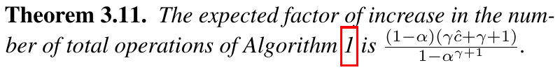

```math
F_{\mathrm{ops}}=\frac{\widehat T\bigl(\gamma\widehat c+\gamma+1\bigr)}{\mathbb E[L]\widehat T}=\frac{(1-\alpha)(\gamma\widehat c+\gamma+1)}{1-\alpha^{\gamma+1}}.
```

[PDF p.4, Theorem 3.11](https://arxiv.org/pdf/2211.17192v2#page=4). 출력은 baseline 대비 token당 연산 수의 배수다. 분자에서 첫 항은 draft, 나머지는 target의 speculative 계산이다. 거절된 suffix에 사용한 계산은 최종 token 수에는 포함되지 않으므로 낭비된다.

예를 들어 $`\alpha=0.8,\gamma=5,c=\widehat c=0`$이면 이론 속도는 3.68928×, 연산량은 $`6/3.68928=1.62633`$배다. 이 조건에서는 **약 62.6% 더 많은 연산으로 직렬 지연을 줄인다.** 연산량 감소율과 latency 감소율을 같은 효율 지표로 부를 수 없다.

[저자 보고] target weights와 KV cache를 한 round에서 공유해 읽으면 읽기 횟수는 평균 확정 token 수에 비례해 줄일 수 있다고 설명한다. [리뷰어 해석] 이것은 전체 메모리 traffic을 byte 단위로 측정한 결과가 아니다. draft weight·별도 KV, 새 KV 쓰기, 임시 logits, layout 변환, kernel별 재읽기까지 자동으로 같은 비율로 줄지는 않는다. 총 산술량을 같은 크기의 encoder 1회로 상계한다는 본문 설명도 speculative decoder 구간의 병렬 계산 관점으로 읽어야 한다. 실제 source encoder 실행의 비용·shape와 동일하다는 뜻은 아니다.

### 10.5 §3.5: 최적 draft 길이와 oracle 논의

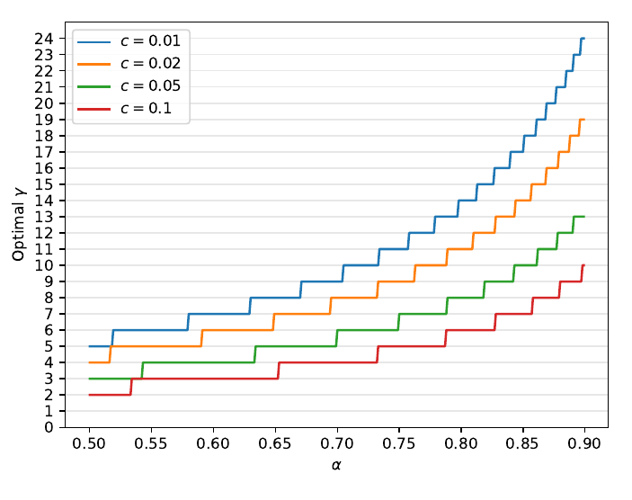

Figure 3. $`\alpha`$와 시간비 $`c`$에 따른 최적 정수 $`\gamma`$. 수락률이 높고 draft가 저렴할수록 긴 추측이 유리하다. [PDF p.5, Fig.3](https://arxiv.org/pdf/2211.17192v2#page=5)

```math
\gamma^*=\mathop{\mathrm{argmax}}_{\gamma\in\mathbb Z_{\ge1}}\frac{1-\alpha^{\gamma+1}}{(1-\alpha)(1+\gamma c)}.
```

원문은 정수 후보를 수치적으로 검색하면 된다고 한다. $`\alpha\lt1,c\gt0`$이면 $`\gamma`$를 무한히 늘릴 때 기대 길이는 포화되지만 draft 비용은 계속 증가하므로 긴 draft가 항상 좋지 않다. $`c=0`$이고 compute가 무한하다면 길이를 늘려 $`1/(1-\alpha)`$에 접근하는 방향이 된다.

[리뷰어 보조 유도] 현재 길이의 합을 $`A_\gamma=\sum_{i=0}^{\gamma}\alpha^i`$라 두면, 한 후보를 더 만드는 것이 유리한 조건을 다음처럼 비교할 수 있다.

```math
S_{\gamma+1}\gt S_\gamma\Longleftrightarrow\alpha^{\gamma+1}(1+c\gamma)\gt cA_\gamma.
```

왼쪽 새 이득은 연속 수락을 끝까지 살아남을 확률에 의해 빠르게 작아진다. 오른쪽은 추가 draft 비용과 현재 처리량의 비교다. 실제 구현에서는 이 식에 맞춘 길이조차 memory budget과 verification shape의 한계로 제한된다.

[저자 보고] 미래의 적절한 길이를 아는 oracle을 가정하면 round당 기대 길이가 $`1/(1-\alpha)`$에 접근하고, 대표적인 비용·수락률 조건에서 고정 길이 대비 추가 이득이 약 60%까지 가능할 수 있다고 논의한다. [논문 미기재] 실행 가능한 oracle predictor, 추가 계산비용, 평가 결과는 없다. 무한 compute·검증을 계속 수행한다는 조건이 붙은 상한 논의이며 동적 길이 구현의 실측 결과가 아니다. 원문의 footnote 4도 target 검증 자체를 생략하면 이 상한 논의가 달라진다고 구분한다.

### 10.6 §3.6: draft 선택의 범위

| proposal 종류 | 원문에서의 지위 | 구현에 필요한 조건·비용 |
|---|---|---|
| 작은 기존 Transformer | 주요 실제 실험 | 같은 task checkpoint, 실제 $`q`$의 확률, 추가 weights/KV |
| unigram/bigram | 수락률 실험과 저비용 이론 사례 | token ID 공간에 맞춘 확률표. lookup·메모리 비용이 완전한 0인 것은 아님 |
| context-copy 휴리스틱 | 제안 | deterministic proposal은 point mass로 표현 가능. 복사 탐색 비용 포함 |
| non-autoregressive predictor | 제안 | 실제 proposal의 확률 구조와 conditional을 정의. draft loop 비용 모델 수정 필요 |
| uniform random proposal | 이론적 극단 사례 | 겹치는 support가 있으면 수락률 양수. 비용이 작아야 실제 speedup 가능 |
| 계층적 draft | §6 후속 방향 | draft 자체를 더 작은 모델로 가속. 별도 성능 분석 필요 |

어떤 $`q`$여도 exactness는 유지되지만, 어느 $`q`$가 가장 빠른지는 $`\alpha`$와 실제 비용의 균형으로 정해진다. 모델의 파라미터 수를 약 두 자릿수 규모 작게 하는 것이 실험에서 좋았다는 관찰을 보편적인 최적 비율로 외우면 안 된다.

원문의 bigram EnDe 예제는 $`\alpha\approx0.2,c\approx0,\gamma=3`$으로 $`1+0.2+0.04+0.008=1.248\approx1.25`$다. 이는 수락률을 speedup 모델에 넣은 값이며 실제 n-gram 구현의 1.25× walltime 벤치마크로 읽지 않는다.

<a id="training"></a>

## 11. 학습·데이터·loss·gradient 경계

### 11.1 speculative decoding 자체는 학습 알고리즘이 아니다

[저자 보고] 이미 있는 target와 작은 task 모델을 사용하며 speculative decoding을 적용하려고 새로 학습하지 않는다. Algorithm 1에는 optimizer, backward, trainable acceptance module이 없다. $`\gamma`$와 sampling 설정은 학습 가중치가 아니라 추론 hyperparameter다.

```math
\theta_p,\theta_q\ \text{fixed during decoding},\qquad \text{no backward pass through accept/reject or residual sampling}.
```

분포 $`q`$를 잘 만드는 모델은 원래 데이터로 학습되어 있다. “재학습 불필요”를 “학습 데이터·기존 checkpoint가 필요 없음”으로 바꾸어 읽으면 안 된다. 기존 모델의 학습과 decoding 알고리즘의 도입을 분리해야 한다.

### 11.2 논문에서 확인 가능한 데이터와 모델

| 실험군 | task·데이터 | target | draft | 이 논문에서 확인 가능한 학습 정보 |
|---|---|---|---|---|
| T5 EnDe | WMT English→German 번역 | T5 v1.1 XXL 11B | Small 77M, Base 250M, Large 800M | task fine-tuning된 기존 checkpoint 사용 |
| T5 CNNDM | CNN/Daily Mail 요약 | T5 v1.1 XXL 11B | 같은 세 T5 크기 | task fine-tuning된 기존 checkpoint 사용 |
| GPT-like | lm1b 무조건 언어 생성 | 97M decoder | 6M decoder, unigram, bigram | lm1b에 학습; GELU, BERT tokenization, vocabulary 8k |
| LaMDA | dialog task | LaMDA 137B | 100M, 2B, 8B | 기존 checkpoint 사용. 평가 분포에 top-40 필터 |

[PDF pp.6–8, §4.1–4.2 및 footnote 6]. 본문 “CCN/DM” 표기는 문맥상 CNN/DM 요약 task를 가리키는 철자 오류로 읽되, 새로운 데이터셋 이름으로 해석하지 않는다.

GPT-like 모델은 다음 architecture 정보를 준다.

| 항목 | target | draft |
|---|---:|---:|
| 파라미터 수 | 97M | 6M |
| hidden width | 768 | 256 |
| FFN width | 3072 | 1024 |
| layers | 12 | 2 |
| attention heads | 12 | 4 |
| head width [검산] | 64 | 64 |
| vocabulary | 8k | 8k |

두 모델의 hidden width가 다른 것은 문제가 아니다. 비교하는 것은 hidden feature가 아니라 동일 token 공간의 확률벡터다.

### 11.3 학습 목적과 gradient를 어디까지 말할 수 있는가

[리뷰어 선수 지식] autoregressive LM과 sequence-to-sequence 모델의 일반적인 token cross-entropy는 아래와 같이 설명할 수 있다. **이 논문이 새로 제안하거나 실제 사용 설정을 완전히 명시한 loss가 아니다.**

```math
\mathcal L_{\mathrm{CE}}(\theta)=-\sum_{b,t}w_{b,t}\log p_\theta(y_{b,t}\mid s_b,y_{b,\lt t}).
```

logits의 일반 shape는 $`[B,T,V]`$, 정답 ID와 loss mask는 $`[B,T]`$다. 정답 token의 log probability를 vocabulary 축에서 gather한 뒤 token·batch 축에서 합하거나 normalization factor로 나눈다. 학습 시 gradient는 LM head와 Transformer 및 학습 대상 encoder로 흐르지만, frozen 여부는 checkpoint 학습 recipe에 따라 달라진다.

[공식 코드 확인] 조회한 T5X `models.py`의 `loss_fn`은 `_compute_logits` 뒤 `compute_weighted_cross_entropy`를 호출하며, label smoothing·z-loss·loss normalization 설정을 받는다. 이것은 현재 baseline framework의 구조를 확인한 것이다. 본 논문의 모든 checkpoint에 어떤 값이 쓰였는지 이 코드만으로 확정하지 않는다.

§6은 target soft label로 draft를 distill하거나 $`\alpha`$를 직접 최적화하는 방향을 제안한다. 해당 제안의 gradient 경로를 이해하기 위한 보조식은 다음처럼 쓸 수 있다.

```math
\mathcal L_{\mathrm{distill}}(\theta_q)=-\mathbb E_h\sum_v p_{\theta_p}(v\mid h)\log q_{\theta_q}(v\mid h),\qquad \nabla_{\theta_p}\mathcal L_{\mathrm{distill}}=0\ \text{when the teacher is frozen}.
```

[후속 연구 제안] 이 경우 gradient는 draft 쪽으로만 흐르게 설정할 수 있다. 그러나 이 손실이 논문의 실험 recipe였다는 뜻도, KL 감소가 실제 walltime 최적화와 같다는 뜻도 아니다. 수락률은 overlap이고, latency는 draft 비용과 검증 비용까지 포함한다.

### 11.4 미기재 항목을 임의로 채우지 않기

| 항목 | 이 논문만으로 확인 가능한가 |
|---|---|
| speculative 알고리즘의 추가 training data/loss | 추가 학습 없음 |
| T5 task 이름·모델 크기·checkpoint 재사용 | 확인 가능 |
| WMT의 정확한 연도·release·train/val/test 문장 수 | 미기재 |
| CNN/DM의 정확한 version·split index·평가 문서 수 | 미기재 |
| lm1b optimizer·batch·learning rate·학습 step·seed | 미기재 |
| lm1b BERT tokenizer의 정확한 vocab 파일·normalization | 8k 사용 외 세부 미기재 |
| LaMDA 평가 dialog 목록·checkpoint identifier | 미기재 |
| 모든 모델의 checkpoint hash | 미기재 |
| alpha 측정량 | 설정마다 target가 생성한 10K tokens |
| alpha 측정 데이터와 γ 선택 데이터의 분리 | 구체적 protocol 미기재 |
| walltime 반복 횟수·warmup·분산·error bar | 미기재 |

<a id="experiments"></a>

## 12. §4와 Appendix A.3: 모든 실험표·산술 검산

### 12.1 baseline과 측정 조건

[저자 보고] T5X의 표준 구현에 대해 T5-XXL 추론 walltime을 비교했다. target는 11B T5 v1.1, batch size는 1, 하드웨어는 single TPU-v4다. greedy인 temperature 0과 표준 sampling인 temperature 1을 평가했다. 작은 모델별로 draft 길이를 다르게 사용한 행이 있다. [PDF p.6, §4.1]

[논문 미기재] single TPU-v4의 세부 topology·메모리 설정, precision, XLA/T5X 버전, exact checkpoint, input/output length 분포, timing scope의 엄밀한 경계, 반복 측정 통계는 논문에 충분히 적혀 있지 않다. Figure 5에는 두 encoder가 포함되지만 이것만으로 Table 2에서 compilation·tokenization·encoder·전송 등을 각각 어디까지 계측했는지 확정하지 않는다.

exact distribution은 서로 다른 quality–speed tradeoff를 비교하는 문제를 줄여 준다. 그러나 구현 최적화가 baseline과 같다는 보장은 별개다. A.3은 실제로 구현과 baseline의 optimization 차이를 예측–측정 차이의 원인 중 하나로 인정한다.

### 12.2 Table 1과 Figure 4: 이론적인 속도–연산량 교환

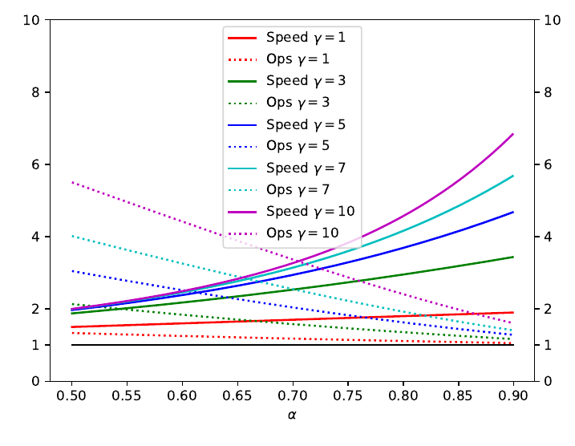

Figure 4. 실선은 속도배수, 점선은 산술 연산량 배수이며 $`c=\widehat c=0`$을 가정한다. $`\gamma`$가 크고 수락률이 낮으면 폐기하는 작업량이 늘어난다. [PDF p.5, Fig.4](https://arxiv.org/pdf/2211.17192v2#page=5)

| α | γ | 원문 operations | [검산] operations | 원문 speed | [검산] speed |
|---:|---:|---:|---:|---:|---:|
| 0.6 | 2 | 1.53× | 1.530612× | 1.96× | 1.960000× |
| 0.7 | 3 | 1.58× | 1.579155× | 2.53× | 2.533000× |
| 0.8 | 2 | 1.23× | 1.229508× | 2.44× | 2.440000× |
| 0.8 | 5 | 1.63× | 1.626334× | 3.69× | 3.689280× |
| 0.9 | 2 | 1.11× | 1.107011× | 2.71× | 2.710000× |
| 0.9 | 10 | 1.60× | 1.603056× | 6.86× | 6.861894× |

Table 1의 6개 행은 표시 정밀도에서 재계산과 일치한다. 최고 6.86×는 이론 표의 조건부 값이다. T5 walltime 실측 최고값과 혼동하지 않는다.

### 12.3 Table 2: T5-XXL 실제 walltime

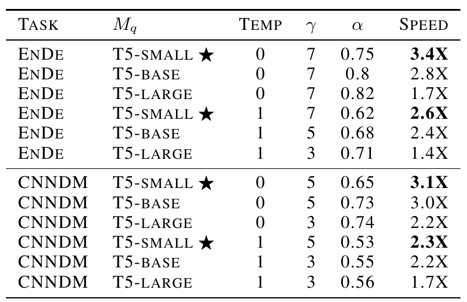

Table 2. 원문 실측 walltime 결과. 별표는 저자가 강조한 Small 조합이다. [PDF p.6, Table 2](https://arxiv.org/pdf/2211.17192v2#page=6)

| task | draft | temp | γ | α | speed [저자 보고] |
|---|---|---:|---:|---:|---:|
| EnDe | T5-Small 77M | 0 | 7 | 0.75 | 3.4× |
| EnDe | T5-Base 250M | 0 | 7 | 0.80 | 2.8× |
| EnDe | T5-Large 800M | 0 | 7 | 0.82 | 1.7× |
| EnDe | T5-Small 77M | 1 | 7 | 0.62 | 2.6× |
| EnDe | T5-Base 250M | 1 | 5 | 0.68 | 2.4× |
| EnDe | T5-Large 800M | 1 | 3 | 0.71 | 1.4× |
| CNNDM | T5-Small 77M | 0 | 5 | 0.65 | 3.1× |
| CNNDM | T5-Base 250M | 0 | 5 | 0.73 | 3.0× |
| CNNDM | T5-Large 800M | 0 | 3 | 0.74 | 2.2× |
| CNNDM | T5-Small 77M | 1 | 5 | 0.53 | 2.3× |
| CNNDM | T5-Base 250M | 1 | 3 | 0.55 | 2.2× |
| CNNDM | T5-Large 800M | 1 | 3 | 0.56 | 1.7× |

이 표의 중요한 비교는 다음과 같다.

- **더 큰 draft가 반드시 빠르지 않다.** EnDe greedy에서 수락률은 Small 0.75 → Large 0.82로 좋아지지만 speedup은 3.4× → 1.7×로 떨어진다. 더 좋은 approximation의 비용이 이득을 넘는다.
- **최고 속도의 주장은 선택된 조합에 대한 것이다.** 전체 표 범위는 1.4–3.4×이고, Small의 네 조합은 2.3–3.4×다. 모든 셀을 “2–3×”로 요약하면 범위를 놓친다.
- **temperature 비교는 target 정책 자체가 다르다.** 각 temperature 안에서는 같은 target sampling 정책을 비교한다. temperature 0과 1의 출력분포까지 같다는 주장이 아니다.
- **α만으로 task간 속도를 순위화할 수 없다.** CNNDM Small greedy는 α=0.65인데 3.1×, EnDe Small stochastic은 α=0.62인데 2.6×다. 길이·구현·수락률 상관구조 등의 영향이 남는다.

[검산] speedup 3.4×는 시간이 baseline의 $`1/3.4\approx29.4\%`$가 됨, 즉 약 70.6% 감소를 뜻한다. 340%의 latency 감소라는 표현은 잘못이다. Table 2에는 절대 ms/token 수치가 없으므로 이를 이용해 특정 TPS나 TTFT를 계산할 수 없다.

### 12.4 Table 3: 모든 α 값

원문은 설정마다 **target가 생성한 10K token**에서 Corollary 3.6의 expectation을 평가했다고 설명한다. 아래는 두 temperature를 나란히 놓아 재배열한 동일 수치다. [PDF pp.6–8, Table 3]

| target/task | draft | α, T=0 | α, T=1 |
|---|---|---:|---:|
| GPT-like 97M/lm1b | unigram | 0.03 | 0.03 |
| GPT-like 97M/lm1b | bigram | 0.05 | 0.05 |
| GPT-like 97M/lm1b | GPT-like 6M | 0.88 | 0.89 |
| T5-XXL/EnDe | unigram | 0.08 | 0.07 |
| T5-XXL/EnDe | bigram | 0.20 | 0.19 |
| T5-XXL/EnDe | T5-Small | 0.75 | 0.62 |
| T5-XXL/EnDe | T5-Base | 0.80 | 0.68 |
| T5-XXL/EnDe | T5-Large | 0.82 | 0.71 |
| T5-XXL/CNNDM | unigram | 0.13 | 0.08 |
| T5-XXL/CNNDM | bigram | 0.23 | 0.16 |
| T5-XXL/CNNDM | T5-Small | 0.65 | 0.53 |
| T5-XXL/CNNDM | T5-Base | 0.73 | 0.55 |
| T5-XXL/CNNDM | T5-Large | 0.74 | 0.56 |
| LaMDA 137B/dialog | LaMDA 100M | 0.61 | 0.57 |
| LaMDA 137B/dialog | LaMDA 2B | 0.71 | 0.71 |
| LaMDA 137B/dialog | LaMDA 8B | 0.75 | 0.74 |

[저자 보고] LaMDA는 항상 top-40 필터를 적용한다. 따라서 LaMDA의 T=1은 무필터 전체 vocabulary sampling과 동일한 조건이 아니다. argmax에는 해당 필터가 결과를 바꾸지 않는다고 footnote 6이 설명한다.

[리뷰어 검토] 본문은 더 sharp한 분포가 모든 모델에서 더 높은 α를 준다는 취지로 서술하지만, GPT-like 6M 행은 T=0의 0.88보다 T=1의 0.89가 높다. 차이는 작고 오차막대도 없지만, **표가 보편적인 단조 증가 명제를 지지하지는 않는다.** LaMDA 2B와 n-gram 일부는 동률이다.

[논문 미기재] α를 10K token에서 계산했다는 것은 10K개의 독립 관측을 확보했다는 뜻이 아니다. 같은 시퀀스의 prefix들은 상관될 수 있다. 모델별 분포·표준오차·반복 seed·길이별 breakdown이 없어 신뢰구간을 임의로 붙이지 않았다.

### 12.5 Table 4: 예측값과 실측값의 차이

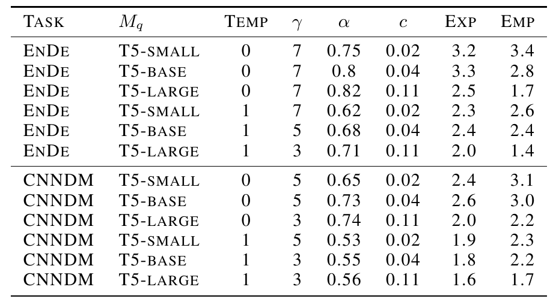

Table 4. EXP는 저자 이론값, EMP는 실측값. $`c`$는 profiler trace로 추정했다. [PDF pp.11–12, A.3](https://arxiv.org/pdf/2211.17192v2#page=12)

| task | draft | T | γ | α | c | 원문 EXP | 공개값 재계산 | EMP |
|---|---|---:|---:|---:|---:|---:|---:|---:|
| EnDe | Small | 0 | 7 | 0.75 | 0.02 | 3.2 | 3.1575 | 3.4 |
| EnDe | Base | 0 | 7 | 0.80 | 0.04 | 3.3 | 3.2509 | 2.8 |
| EnDe | Large | 0 | 7 | 0.82 | 0.11 | 2.5 | 2.4971 | 1.7 |
| EnDe | Small | 1 | 7 | 0.62 | 0.02 | 2.3 | 2.2580 | 2.6 |
| EnDe | Base | 1 | 5 | 0.68 | 0.04 | 2.4 | 2.3467 | 2.4 |
| EnDe | Large | 1 | 3 | 0.71 | 0.11 | 2.0 | 1.9338 | 1.4 |
| CNNDM | Small | 0 | 5 | 0.65 | 0.02 | 2.4 | 2.4015 | 3.1 |
| CNNDM | Base | 0 | 5 | 0.73 | 0.04 | 2.6 | 2.6193 | 3.0 |
| CNNDM | Large | 0 | 3 | 0.74 | 0.11 | 2.0 | 2.0247 | 2.2 |
| CNNDM | Small | 1 | 5 | 0.53 | 0.02 | 1.9 | 1.8914 | 2.3 |
| CNNDM | Base | 1 | 3 | 0.55 | 0.04 | 1.8 | 1.8026 | 2.2 |
| CNNDM | Large | 1 | 3 | 0.56 | 0.11 | 1.6 | 1.5408 | 1.7 |

재계산과 EXP의 작은 차이는 입력 α/c의 공개 정밀도가 낮다는 점을 고려해야 한다. 예를 들어 2.3467이 표의 2.4와 단순 반올림 규칙에서 일치하지 않는다고 바로 잘못된 수식을 썼다고 확정할 수 없다. 반올림 전 α/c는 제공되지 않는다.

반면 EXP와 EMP의 차이는 일부 조합에서 크다. EnDe Large greedy는 2.5→1.7로 -32%, stochastic은 2.0→1.4로 -30%다. CNNDM Small greedy는 2.4→3.1로 +29.2%다. 원문은 이를 baseline과 speculative 구현의 최적화 차이, β i.i.d. 근사의 부정확성으로 설명한다. 각 원인의 기여도를 분리한 ablation은 없다.

**본문과 부록의 비용비 서술도 구별해야 한다.** §3.3은 자신의 실험에서 c가 항상 0.05 미만이었다고 쓰지만, Table 4는 T5-Large에 c=0.11을 명시한다. 이 리뷰는 표의 값을 그대로 사용하고 이 내부 불일치를 숨기지 않는다.

### 12.6 어떤 ablation이 있고 무엇이 없는가

| 비교 축 | 원문 증거 | 해석 한계 |
|---|---|---|
| draft 크기 | Table 2–4 | 여러 행에서 γ도 달라 순수한 크기 단독 효과는 아님 |
| temperature | Table 2–3 | target 정책도 바뀜. 같은 task·정책 안의 가속으로 비교 |
| γ 변화 | Fig.2–4의 이론 곡선, Table 2의 선택값 | 광범위한 γ별 실측 sweep 없음 |
| task 변화 | EnDe/CNNDM, lm1b/dialog α | 모든 task에 동일 수준의 runtime 측정 없음 |
| n-gram vs neural draft | Table 3 | 비교는 α이며 전체 serving latency가 아님 |
| lenience | Table 5, A.5 | exactness를 완화한 별도 변형 |
| batch size·context length·hardware | 주요 실측은 batch 1 TPU-v4 | batch/긴 context/GPU·edge device sweep 없음 |
| tail·에너지·메모리 | 직접 결과 없음 | 평균 speedup으로 p99/energy/peak memory를 추정하지 않음 |

<a id="discussion"></a>

## 13. §5–6: 관련 연구·논의·주장의 범위

### 13.1 §5 Related work [PDF pp.7–8]

원문은 관련 접근을 세 층으로 비교한다. distillation, sparsification, quantization, architecture 변경은 전반적인 모델 계산을 줄인다. adaptive computation이나 early exit는 입력 난이도에 따라 일부 계산을 건너뛰지만 일반적으로 출력의 동일성을 보장하지 않는다. speculative execution 계열은 후보 경로를 미리 계산한다는 점이 더 가깝다.

| 원문이 비교한 방법 | 공유하는 생각 | 이 논문이 강조한 차이 |
|---|---|---|
| distillation·quantization 등 | 더 효율적인 추론 | target 자체를 유지하는 sampling layer의 추가 |
| Wisdom of Committees·early exit | 쉬운 token에 작은 모델 사용 | heuristic 종료 대신 확률질량 보정으로 target 분포 유지 |
| Blockwise Parallel Decoding, Stern et al. 2018 | 여러 token 후보의 병렬 평가 | 원문은 기존 방식의 greedy 중심·추가 모델 학습 제약과 대비 |
| Shallow Aggressive Decoding, Sun et al. 2021 | speculative 검증 | 입력 복사가 잘 되는 task·greedy 제약에 비해 일반 proposal과 stochastic sampling 지원 |
| Chen et al. 2023 speculative sampling | 독립적으로 개발된 유사한 핵심 방법 | 본 논문 §5는 Chinchilla 70B의 2–2.5× 결과를 관련 연구로 인용 |

이 표는 **대상 논문이 서술한 관련 연구 비교**다. 각 선행 논문 전체를 별도로 재리뷰했다는 뜻이 아니다. 특히 Chen et al.의 다른 모델·하드웨어 speedup을 이 논문의 자체 측정으로 합산하지 않는다.

### 13.2 §6 Discussion [PDF p.8]

[저자 보고] 강점은 기존 모델과 학습을 유지하면서도 출력분포를 보존하고, 여유 compute가 있는 상황에서 latency를 줄인다는 점이다. 제약은 그 여유 compute가 필요하고 총 연산량은 증가할 수 있다는 것이다. 제안한 후속 방향은 custom draft, distillation, α 직접 최적화, 계층적 가속, 동적 γ·draft 교체, 서로 다른 sampling transform, 다른 modality, stochastic speculative execution의 일반화다.

본문 마지막에는 느린 함수 $`f`$가 $`g`$의 입력을 고르는 분포를 만들 때 두 함수를 추측을 통해 병렬화하는 상황을 예로 든다. world simulation이나 reinforcement learning을 예시로 언급한다. 이는 **실제 로봇 actuator가 검증 전 행동을 실행해도 된다는 주장과 다르다.** 논문은 text modality만 실험했다고 직접 밝힌다.

Acknowledgments는 LaMDA 수치 계산과 XLA 관련 도움을 기록한다. References는 선행 모델·데이터·실행 엔진을 추적하는 서지이며 추가 실험·수식은 없다. 독립 Ethics/Impact 섹션은 이 기준 PDF에 없다.

### 13.3 비판적 평가

이 논문의 강한 부분은 정확성과 속도의 요구조건을 분리할 수 있다는 점이다. draft가 약해져도 확률 보정의 정확성은 남고, 성능은 비용·overlap의 문제로 따로 분석할 수 있다. 이는 sample quality의 작은 차이를 허용하는 가속보다 비교 기준이 명확하다.

반면 성능 모델은 구현을 완성해 주지 않는다. target 검증을 동일 시간에 끝내는 가정, β의 독립성, 긴 생성, compilation과 memory 비용의 생략은 실제 시스템에서 검증해야 한다. 여러 모델에서 높은 α를 측정했다는 사실이 실제 walltime을 모두 검증했다는 뜻도 아니다.

exact distribution 또한 target 자체의 사실성·안전성·로봇 성공률을 개선하는 보장이 아니다. target의 오류분포도 그대로 유지한다. 별도의 task metric은 “기본 정책을 바꾸지 않았다”는 구현 검증과 함께 해석해야 한다.

<a id="appendix"></a>

## 14. Appendix A.2/A.4/A.5: rejection sampling·beam·lenience

### 14.1 A.2: 전통적인 rejection sampling과의 차이

원문 A.2는 다음 반복 과정을 비교한다. 여기의 $`M`$은 Definition 3.2의 중점 분포가 아니라 **상계 scalar**다.

```math
M=\max_v\frac{p(v)}{q(v)},\qquad X\sim q,\quad R\sim\mathrm U(0,1),\qquad \mathrm{accept}\Longleftrightarrow R\lt\frac{p(X)}{Mq(X)}.
```

1. $`q`$에서 token을 뽑고 uniform 난수를 뽑는다.
2. $`p/(Mq)`$에 따라 수락한다.
3. 거절하면 다시 proposal sampling부터 반복한다.

유한한 $`M`$이 존재하려면 target support를 draft가 덮어야 한다. 고전적 rejection sampling은 proposal을 반복 평가하는 상황에서 $`q`$를 감싸는 상계 $`M`$을 사용한다. speculative sampling은 target의 **전체 분포를 이미 구한** 상황을 이용해, 재시도 대신 residual에서 바로 끝낸다.

원문은 고전적 방식을 한 번만 시도하고 실패하면 $`p`$에서 뽑는 비반복 버전도 생각할 수 있지만 수락률이 낮다고 설명한다. 이 경우에는 accept된 질량이 $`p(v)/M`$여서 수락 조건부 분포 자체가 $`p`$다. 그래서 fallback으로 $`p`$를 사용해도 맞는다. §5.4에서 잘못이라고 지적한 $`\min(1,p/q)`$ rule의 unadjusted fallback과 다른 상황이다.

```math
\Pr(\mathrm{accept}_{\mathrm{RS}})=\sum_vq(v)\frac{p(v)}{Mq(v)}=\frac1M=\min_v\frac{q(v)}{p(v)}\le\sum_v\min(p(v),q(v))=\beta.
```

유효 support 위에서 계산하고, $`p(v)=0`$인 원소의 불필요한 나눗셈은 생략한다. 원문의 마지막 비교는 α라고 쓰지만, **고정 prefix에서는 β**, prefix 평균을 취한 뒤에는 α로 구분하는 것이 정확하다.

[리뷰어 해설용 예제] 앞의 $`p=(0.1,0.6,0.3),q=(0.5,0.3,0.2)`$에서는 $`M=\max(0.2,2,1.5)=2`$다. 고전적 수락률은 0.5, speculative 수락률은 0.6이다. support가 일부 빠진 proposal에도 residual은 target의 누락 질량을 채울 수 있지만 고전적 방식의 유한 상계는 성립하지 않을 수 있다.

### 14.2 A.4: beam search는 별도의 후보 집합 검증

원문은 target beam width가 $`w`$일 때 draft beam width를 $`u\ge w`$로 하여 $`\gamma`$ step을 진행하는 방안을 제시한다.

```math
u\ge w,\qquad \text{target evaluation budget}=w+u\gamma,\qquad \mathrm{top}_w(M_p)\subseteq\mathrm{top}_u(M_q).
```

- **기호**: $`w,u,\gamma`$는 정수. $`\mathrm{top}`$은 beam search 후보의 누적 score 순위에 따른 집합을 뜻하며 단일 token vocabulary의 argmax와 다르다.
- **계산**: draft가 넓은 후보 집합을 제안하고 target이 병렬로 평가한다.
- **수락**: 각 step에서 target가 선택할 상위 w개가 draft의 상위 u개 안에 포함되면 정규 beam의 결과를 보존할 수 있다.
- **비용**: 원문의 $`w+u\gamma`$는 target evaluation에 관한 compute budget이다. $`\gamma+1`$ sampling 검증과 같은 비용이라고 대입하면 안 된다.
- **가정**: beam score 정의, length penalty, EOS 처리, tie-breaking, pruning이 baseline과 일치해야 실제 동일 결과를 주장할 수 있다.

[논문 미기재] 완성된 beam pseudocode, 충분한 속도 분석, 실측 beam 결과는 제시하지 않는다. 원문은 더 정교하게 추가 후보를 수락할 수도 있다고 언급하고 분석을 후속 과제로 남긴다. 따라서 Algorithm 1을 token별로 그대로 beam에 적용하면 완성된다는 해설은 부정확하다.

### 14.3 A.5: lenience는 정확한 분포 보존을 포기한 변형

[저자 보고] lenience $`l\in[0,1]`$로 비교 시 draft 확률을 낮추어 후보를 더 쉽게 수락한다. 아래 식은 나눗셈이 정의되는 $`0\lt l\le1`$ 구간에 대해 쓴다. 모든 본문 실험은 이 완화가 없는 기본 버전이다.

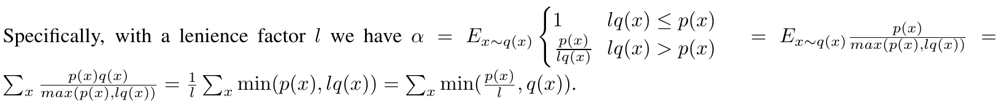

```math
a_l(v)=\begin{cases}1,&lq(v)\le p(v),\\p(v)/(lq(v)),&lq(v)\gt p(v),\end{cases}\qquad \alpha_l=\mathbb E_{v\sim q}[a_l(v)].
```

원문이 α로 표기한 것을 여기서는 기본 수락률과 구별하기 위해 $`\alpha_l`$로 쓴다. 엄밀히 한 prefix에서는 $`\beta_{h,l}`$, prefix 평균에서는 $`\alpha_l`$로 읽는다. 다음은 원문 전개를 편집 가능하게 옮긴 식이다.

```math
\begin{aligned}\alpha_l&=\mathbb E_{v\sim q}\left[\frac{p(v)}{\max(p(v),lq(v))}\right]=\sum_v\frac{p(v)q(v)}{\max(p(v),lq(v))}\\&=\frac1l\sum_v\min(p(v),lq(v))=\sum_v\min\left(\frac{p(v)}l,q(v)\right).\end{aligned}
```

각 항은 scalar다. $`q`$를 곱해 expectation을 vocabulary 합으로 바꾸고, 분모가 p/lq 중 어느 쪽인지 두 경우로 나누면 최소값 표현을 얻는다. $`p=q=0`$인 원소의 중간 ratio는 기여량 0으로 정의한다. $`l=0`$은 $`p/l`$도 정의되지 않고 상한도 유한하지 않아 별도 극한·support 처리가 필요하다.

### 14.4 “token 확률이 p/l 이하”라는 보장의 범위

원문은 최종 token의 확률이 $`p(v)/l`$보다 커지지 않는다는 성질을 설명한다. 이것은 원래 분포와 같다는 보장도, 양방향 상대오차 보장도 아니다. 작은 질량의 token이 덜 나올 수 있어 diversity를 해칠 수 있다고 원문도 인정한다.

[리뷰어 보조 유도] 원문의 “비교할 때 q에 l을 곱한다”를 **수락 판정만 완화하고 거절 분포는 원래 residual을 유지한다**고 읽으면 이 상한을 다음처럼 확인할 수 있다. 이 해석을 명시하는 이유는 원문이 lenience용 완전한 별도 pseudocode를 제공하지 않기 때문이다.

```math
\widetilde p_l(v)=\min\left(q(v),\frac{p(v)}l\right)+\frac{1-\beta_l}{1-\beta_1}[p(v)-q(v)]_+\quad(\beta_1\lt1).
```

$`\beta_l\ge\beta_1`$이므로 residual 앞 계수는 0–1이다. $`p(v)\ge q(v)`$인 곳에서는 첫 항이 $`q(v)`$이고 둘째가 최대 $`p(v)-q(v)`$라서 합은 p 이하이다. $`p(v)\lt q(v)`$인 곳에서는 residual이 0이고 첫 항이 $`p(v)/l`$ 이하이다. 따라서 전체에서 원문의 상한이 나온다. $`p=q`$는 언제나 proposal을 수락하는 별도 경계조건이다.

위 예제에 $`l=0.5`$를 넣으면 수락 질량은 $`(0.2,0.3,0.2)`$, 거절 확률은 0.3, 최종 분포는 $`(0.2,0.525,0.275)`$다. 원래 $`p=(0.1,0.6,0.3)`$와 명백히 다르다. A의 확률은 정확히 2배다.

여러 token 시퀀스에 이 조건부 상한을 곱하면 길이 K에 대해 최대 $`l^{-K}`$의 비율 상한이 생길 수 있다. token마다 2배 이하라는 말이 긴 문자열이나 행동 trajectory 전체도 2배 이하라는 뜻은 아니다. 또한 여기의 p는 **target model 확률**이지 실제 세계의 정답 확률이 아니다.

### 14.5 Table 5와 lenience 속도 수치

| draft, EnDe T=1 | l=1 | l=0.5 | l=0.3 | l=0.1 |
|---|---:|---:|---:|---:|
| unigram | 0.07 | 0.10 | 0.11 | 0.16 |
| bigram | 0.19 | 0.23 | 0.25 | 0.32 |
| T5-Small 77M | 0.62 | 0.71 | 0.76 | 0.84 |
| T5-Base 250M | 0.68 | 0.80 | 0.83 | 0.90 |

[PDF p.12, Table 5]의 α 전체다. 낮은 l은 더 큰 수락률을 주지만 기본 방법과 달리 target 분포를 바꾼다. BLEU·ROUGE·diversity의 실측 비교표는 없다.

[저자 보고] Small, c=0.015에서 l=1/0.5/0.3/0.1에 대해 2.5/3.1/3.6/5× 개선을 서술한다. [검산] Table 5의 α=0.62/0.71/0.76/0.84와 c=0.015를 Theorem 3.8에 넣어 양의 정수 γ를 1–999에서 탐색하면 최고값은 다음과 같다.

| l | 공개 α | 최적 γ [검산] | 최고 S [검산] | 원문 서술 |
|---:|---:|---:|---:|---:|
| 1 | 0.62 | 7 | 2.3295× | 2.5× |
| 0.5 | 0.71 | 9 | 2.9392× | 3.1× |
| 0.3 | 0.76 | 10 | 3.4462× | 3.6× |
| 0.1 | 0.84 | 15 | 4.7886× | 5× |

따라서 **표시된 입력값과 위 이론식만으로 원문 서술 배수를 정확히 재현할 수 없다.** 이 차이가 미공개 정밀도, 다른 γ/비용 설정, 측정값 혼용 중 무엇 때문인지는 확정할 정보가 없다. 원문은 이 네 배수의 구체적인 timing protocol을 별도로 주지 않는다. 검산값을 저자의 실측 대체값으로 제시하지도 않는다.

추가로 l=0.3의 상한 $`1/l`$은 약 3.333이지 정확히 3이 아니다. 원문 문장의 “3X”는 대략적인 서술로 읽어야 한다.

### 14.6 마지막 쪽의 greedy lenience 부등호

원문은 greedy를 point mass로 만든 **뒤**에는 같은 lenience 방식이 효과가 없다고 설명한다. 다른 argmax token은 target 확률이 0이라 양의 l로 비교해도 수락할 수 없기 때문이다. 그래서 표준화 전 확률을 이용하는 별도 완화를 제안한다.

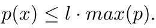

원문에 인쇄된 식은 다음과 같다. [PDF p.13, A.5](https://arxiv.org/pdf/2211.17192v2#page=13)

```math
p(x)\le l\cdot\max(p)\qquad\text{(원문 표기)}.
```

[리뷰어 검토] 이 방향대로라면 l=1에서 모든 token이 최댓값 이하이므로 전부 수락해야 한다. 그런데 원문은 그때 α=0.75라고 보고한다. 또한 l을 낮출수록 낮은 확률 token만 수락하는 방향이 되어 설명과 반대다. **높은 확률 후보를 받아들이려는 의도라면** 다음 방향이 자연스럽다.

```math
p(x)\ge l\cdot\max_v p(v)\qquad\text{(리뷰어의 의도 추정; 원문 수정본 아님)}.
```

확인한 공식 정오표나 해당 저자 구현 없이 이것을 “검증된 정정”이라고 단정하지 않는다. 원문 이미지와 원래 부등호를 보존하고 논리적 모순을 설명한다.

이 문단이 제시한 α=0.75/0.75/0.80/0.87에 c=0.015, γ=8을 넣으면 각각 3.3033/3.3033/3.8651/4.9070×다. 원문의 3.3/3.3/3.9/4.9×와 반올림에서 일치한다. footnote 7이 말하듯 l=0.5는 이 greedy 예제에서 추가 이득이 없다. **이 산술 일치는 앞의 부등호가 옳다는 검증과는 별개**다.

<a id="code"></a>

## 15. 공식 코드 정적 대조와 재현성

### 15.1 무엇을 공식 구현으로 확인했는가

기준 PDF·arXiv·PMLR·Google Research의 논문 소개에서 저자의 원래 speculative T5X 패치로 명확히 연결되는 공개 저장소를 확인하지 못했다. 이것을 “인터넷 어디에도 코드가 없다”는 단정으로 확대하지 않는다. 검색되는 제3자 `Speculative-Decoding` 구현은 원저자 코드의 증거로 사용하지 않았다.

대신 논문이 baseline으로 명시한 **공식 `google-research/t5x`**의 다음 파일을 정적으로 읽었다. 확인 날짜는 2026-09-09, commit은 `2045b332cf19887885a74ef1bd6b2adb2a7ca634`다. 이 commit은 논문 시점의 재현 commit이라고 주장하지 않는다.

| 위치 | [공식 코드 확인] | 논문 해설과의 연결 |
|---|---|---|
| [`decoding.py` L518–585](https://github.com/google-research/t5x/blob/2045b332cf19887885a74ef1bd6b2adb2a7ca634/t5x/decoding.py#L518) | loop에서 RNG split, `tokens_to_logits`, temperature scaling, top-k/top-p mask, categorical/argmax | baseline의 sampling 정책을 확률분포로 표준화해야 하는 이유 |
| [`models.py` L456–482](https://github.com/google-research/t5x/blob/2045b332cf19887885a74ef1bd6b2adb2a7ca634/t5x/models.py#L456) | encoder/decoder tokens를 받아 logits 계산; 학습·추론 dropout 구분 | 학습 forward와 decode 경계 |
| [`models.py` L484–519](https://github.com/google-research/t5x/blob/2045b332cf19887885a74ef1bd6b2adb2a7ca634/t5x/models.py#L484) | 단일 token slice, `decode=True`, mutable cache, seq_len=1 squeeze | 기존 한-token callback을 그대로 둔 채 다중 token 검증이 된다고 가정하면 안 됨 |
| [`models.py` L672–750](https://github.com/google-research/t5x/blob/2045b332cf19887885a74ef1bd6b2adb2a7ca634/t5x/models.py#L672) | cache·prefill 준비, encoded input을 closure에 전달, decode function 호출 | source encoder 재사용과 decoder 반복 구조 |
| [`models.py` L287–314](https://github.com/google-research/t5x/blob/2045b332cf19887885a74ef1bd6b2adb2a7ca634/t5x/models.py#L287) | weighted cross-entropy, label smoothing, z-loss 설정 | 모델 학습 framework의 구조이며 speculative loss가 아님 |

여기에는 논문의 exact speculative accept/residual이 구현되어 있다고 보고하지 않는다. 읽은 기본 경로는 한 token을 생성하는 baseline을 설명한다. 이 구조 위에 Algorithm 1을 넣으려면 multi-position verification, 각 위치의 transformed distribution 확보, draft state와 target state의 동기화가 필요하다.

### 15.2 확률 정확성을 깨뜨리는 구현 조건

| 실패 조건 | 왜 틀리는가 | 확인할 불변식 |
|---|---|---|
| raw logits 비율 사용 | logits는 확률이 아니고 음수일 수 있음 | 실제 sampling 후 정규화 분포의 확률비 사용 |
| top-p 전 q와 top-p 후 샘플 혼용 | proposal law가 분모 q와 다름 | sample을 만든 q를 저장·복구 |
| reject 후 p에서 직접 샘플 | 수락 경로에서 이미 배정한 질량을 중복 사용 | positive residual 사용 |
| p−q에 softmax 적용 | 음의 잔차 token에도 양의 질량 부여 | clamp 후 합으로 나눔 |
| 거절 suffix의 token/KV 유지 | 실제와 다른 prefix를 condition으로 삼음 | 첫 reject 이후 suffix 폐기 |
| bonus에 residual 적용 | 전부 수락 시 correction할 거절 사건이 없음 | $`p_{\gamma+1}`$에서 직접 샘플 |
| 전 vocabulary 합 대신 평균 | 정규화·overlap에 잘못된 V 배수 | vocabulary 합, prefix 평균 분리 |
| q=0/β=1 경계를 무시 | 불가능한 분기에서 0/0·NaN 발생 | support와 rejection 가능성 확인 |
| 두 모델의 position·mask 불일치 | p와 q가 의도한 같은 prefix를 뜻하지 않음 | token ID·absolute position·causal mask 정합성 |
| dropout·수치 차이 무시 | 검증한 p가 baseline의 p와 달라질 수 있음 | evaluation mode·precision·kernel 비교 기준 명시 |

### 15.3 재현 단계와 현재 검증 범위

실제 재현은 다음 순서가 적절하다. 아래는 실험을 실행했다는 보고가 아니라 [리뷰어 제안]이다.

1. **분포 수준 검증**: 작은 유한 vocabulary에서 accepted mass와 residual을 전수 계산한다. p=q, disjoint support, top-k로 생긴 0, 모든 후보 수락과 첫 후보 거절을 포함한다.
2. **시퀀스 수준 검증**: prefix마다 p/q가 다른 작은 모델에서 짧은 모든 문자열의 확률을 target-only와 비교한다. IID 한-token 검증만으로 prefix 인덱스 오류를 놓치지 않도록 한다.
3. **모델 수준 검증**: baseline과 multi-position target logits의 조건부 정합성, cache truncate, EOS, 반복 penalty·processor state를 점검한다.
4. **정책 수준 검증**: greedy는 tie-breaking 기준의 경로 일치, stochastic은 분포·통계 검증으로 분리한다.
5. **성능 수준 검증**: compile/warmup 이후 실제 α, 확정 길이 분포, Tq, target verify, sampling/cache 비용을 측정한다. 평균·p95·p99와 memory도 기록한다.

이 리뷰에서는 1의 확률벡터 1,003쌍에서 수락·잔차 합이 p가 되는지 검산했고, 최대 절대 오차는 약 1.67×10⁻¹⁶이었다. 2에서는 prefix에 따라 p/q가 변하는 vocabulary 3개·문자열 길이 3의 예제에서 γ=1/2/3 각각 27개 문자열을 전수 비교했다. 수락·거절·residual·bonus·반복 round를 유리수로 열거했으며 81개 비교 모두 target의 joint probability와 정확히 일치했다. 이는 CPU 해설용 예제이며 TPU 모델 실행 재현이 아니다.

<a id="vla"></a>

## 16. VLM/VLA·OpenVLA·Jetson Thor/TensorRT 후속 제안

### 16.1 본 논문이 검증한 것과 연결 가능한 것

**이 절의 VLM/VLA·로봇 적용은 모두 후속 연구 제안이다.** 원문 §6은 text만 실험했다고 명시한다. 다음 표의 “가능성”은 수학적 형식의 적합성을 뜻하며 배포 지원이나 실측 speedup을 뜻하지 않는다.

| 대상 | 알고리즘을 옮길 수 있는 부분 | 직접 적용하기 어려운 부분 |
|---|---|---|
| autoregressive text VLM | 고정된 image/text condition 아래 다음 text-token 분포 | vision encoder·multimodal prefill 비용은 이 방법이 직접 제거하지 않음 |
| discrete action-token VLA | 동일 observation과 action tokenizer 아래 autoregressive categorical generation | action vocabulary mask·detokenization·짧은 생성·draft 구축 |
| OpenVLA 계열의 원래 discrete decode | target와 compatible draft의 token 검증 | 별도 vision 경로·학습 checkpoint·custom forward·engine 포팅 |
| regression action head | 그대로 대응하는 token proposal/분포가 없음 | p/q 평가와 tractable residual이 없으면 Algorithm 1을 그대로 적용 불가 |
| diffusion/flow action generator | speculative execution이라는 발상은 연구 가능 | denoising step을 token처럼 취급해도 이 증명이 자동으로 성립하지 않음 |

공식 [OpenVLA README](https://github.com/openvla/openvla)는 discrete action 표현과 기본 `predict_action(..., do_sample=False)` 사용 예를 제공하고, 원래 방식과 continuous-action OFT를 구분한다. 그러므로 “OpenVLA에 적용”이라고 할 때도 정확히 어느 head와 decoding path를 대상으로 하는지 먼저 고정해야 한다. 이 저장소를 speculative decoding 구현으로 실행·검증한 것은 아니다.

### 16.2 고정 observation에서의 조건부 action 분포

[후속 연구 제안] 이미지 $`o`$, 언어 지시 $`s`$, proprioception $`r`$를 이번 policy 호출 동안 고정하고, action token sequence를 다음처럼 정의할 수 있다면 원래 알고리즘의 형태를 검토할 수 있다.

```math
p(a_{1:K}\mid o,s,r)=\prod_{t=1}^{K}p(a_t\mid o,s,r,a_{1:t-1}).
```

draft는 같은 token 공간에 q를 제공해야 한다. target는 여러 action-token 위치를 한꺼번에 score할 수 있어야 한다. action mask나 제한 규칙이 baseline에 있다면 이를 적용한 p가 보존 대상이다. 평가 도중 관측을 새 frame으로 바꾸면 같은 condition의 분포를 비교하는 문제가 아니므로, 한 round 내 관측 동결·갱신 정책을 명시해야 한다.

추측 token은 검증 전 actuator로 보내지 않는다. 제어 시스템에서 이미 실행한 동작은 text token처럼 폐기할 수 없다. 원문 마지막의 world simulation 예시는 시뮬레이션 계산의 speculative 실행이지, 물리적 행동의 rollback을 제안한 실험이 아니다.

또한 같은 관측에서 같은 조건부 action 분포를 얻는 것과, 실제 closed-loop trajectory가 같은 것은 다르다. policy가 빨라지면 다음 관측 시점이 바뀌고 환경도 그동안 변하므로 전체 closed-loop 결과를 별도로 평가해야 한다.

### 16.3 Thor/TensorRT에서 확인할 기능 경계

2026-09-09 확인한 NVIDIA의 [TensorRT-LLM Speculative Sampling 문서](https://nvidia.github.io/TensorRT-LLM/advanced/speculative-decoding.html)는 같은 vocabulary를 쓰는 draft/target 모델과 두 Executor의 조정, 최대 K개 draft와 K+1개 반환을 설명한다. **이 일반적인 기능 문서는 OpenVLA의 multimodal custom forward가 Jetson Thor에서 그대로 지원된다는 증거가 아니다.** TensorRT와 TensorRT-LLM의 역할도 구별해야 한다.

[후속 연구 제안] 포팅 feasibility를 판단할 때 다음 인터페이스부터 확인한다.

| 기능 | 통과 조건 | 실패 시 의미 |
|---|---|---|
| target multi-position logits | 같은 prefix의 baseline logits와 정합한 $`[B,\gamma+1,V]`$ 반환 | one-token wrapper만으로는 병렬 검증 불가 |
| draft probability | 실제 sampling policy 후 q와 candidate ID 확보 | 정확한 accept ratio 계산 불가 |
| residual | 거절 위치의 full vocabulary 분포 접근·정규화 | stochastic exact correction 구현 불가 |
| cache commit/rollback | 각 모델에서 수락 prefix의 KV·position 일치 | 다음 round 분포가 잘못됨 |
| multimodal condition | vision/projector·language 경로의 입력·dtype·mask 지원 | 별도 변환·plugin·fallback 비용 필요 |
| 두 모델 memory | weight·KV·logits·workspace 동시 상주 가능 | swap/offload가 이득을 없앨 수 있음 |
| dynamic γ | 허용된 shape/profile 및 적절한 graph 실행 | shape 변경·재컴파일 비용이 생길 수 있음 |

구체적인 SDK·JetPack·TensorRT-LLM release, 지원 모델 경로, 정밀도, 장치에서의 엔진 생성 절차는 실제 배포 프로젝트에서 고정해야 한다. 이 리뷰는 Thor 엔진을 생성하거나 호환성을 실행 검증하지 않았다.

### 16.4 실제 성능 평가의 최소 단위

[후속 연구 제안] 동일 checkpoint·precision·observation·action representation·생성 길이를 고정한 baseline부터 비교한다. draft, verification, rejection 처리를 쪼개서 profile한 뒤 policy 전체 시간을 측정한다. 높은 α만 보고 다음 단계를 건너뛰지 않는다.

```math
T_{\mathrm{policy}}=T_{\mathrm{vision}}+T_{\mathrm{multimodal\ prefill}}+T_{\mathrm{draft+verify}}+T_{\mathrm{action\ decode}}+T_{\mathrm{transfer}}.
```

원래 decoder 비중이 $`f`$, decoder speedup이 $`S_d`$라면 추가 overhead가 없는 낙관적인 전체 상한조차 다음과 같다.

```math
S_{\mathrm{policy}}\le\frac1{(1-f)+f/S_d}.
```

[리뷰어 해설용 수치] decoder가 40%이고 3배 빨라져도 이 상한은 1.364×다. 실제로는 draft encoder·memory·sampling overhead로 더 작아질 수 있다. 이것은 Thor 측정치가 아니다.

| 지표 | 필요한 구분 |
|---|---|
| token throughput | action token/s와 text token/s, accepted draft 수와 최종 token 수 |
| TTFT/TTFA | 첫 token과 실행 가능한 첫 완성 action이 나오는 시점 |
| 전체 policy latency | 이미지 입력부터 action postprocess·전송까지 |
| action chunk throughput | horizon H개의 action을 만드는 속도 |
| policy refresh | 새 observation을 넣어 재계획하는 호출 빈도 |
| actuator Hz | 저수준 제어기가 명령을 적용하는 빈도 |
| deadline miss | 제어 deadline을 넘긴 호출 비율과 p95/p99 |
| closed-loop quality | 동일 평가 protocol의 성공률·안정성·trajectory 결과 |

H개 action을 t초에 만든다면 $`H/t`$는 action-vectors/s이고 $`1/t`$는 최대 policy calls/s의 한 지표다. 두 값 모두 자동으로 actuator Hz가 되지 않는다. 짧은 action sequence에서는 최대 생성 수 K 자체가 작아, 긴 text에서의 이득을 그대로 기대할 수 없다.

### 16.5 후속 연구의 중단·진행 기준

| 단계 | 진행 근거 | 결과가 부족할 때 |
|---|---|---|
| 조건부 분포 검증 | 수락·잔차·EOS·cache 논리가 baseline 정책과 일치 | 속도보다 correctness를 먼저 수정 |
| offline token 평가 | task별 α와 round 길이 분포 확보 | draft 또는 관측 조건·tokenizer 적합성을 재검토 |
| 장치 microbenchmark | 실제 draft+verify 시간이 단독 decode보다 유리 | 모델 크기·γ·engine shape를 조정하거나 적용 중단 |
| policy E2E | vision/pre/post 포함 이득과 메모리 여유 | token-only speedup 주장으로 범위를 제한 |
| simulation/robot 검증 | 별도 승인된 실험에서 deadline·task quality 확인 | latency를 success/safety 보장으로 대체하지 않음 |

이 표는 추후 연구를 구체화하기 위한 기준이다. 이번 작업에서 GPU benchmark나 로봇 구동은 수행하지 않았다.

<a id="qa"></a>

## 17. 오해 Q&A와 학습 순서

**Q1. 큰 모델의 정답과 작은 모델의 token을 비교하는가?**

greedy라면 그렇게 이해할 수 있다. stochastic sampling에서는 별도로 target token을 하나 뽑아 ID를 맞추는 방식이 아니라, 후보 token의 확률비와 uniform 난수를 사용한다.

**Q2. 왜 큰 모델의 확률이 더 낮아도 후보를 가끔 수락하는가?**

그 token을 완전히 배제할 필요는 없다. draft가 제안하는 질량 중 target이 허용하는 p만 남기면 되므로 p/q 비율로 수락한다.

**Q3. 거절한 token만 바꾸고 뒤의 후보는 남겨도 되는가?**

뒤의 후보는 거절된 prefix를 조건으로 평가했다. 새 correction을 넣은 prefix의 조건부 분포가 아니므로 첫 reject 뒤 결과를 폐기해야 한다.

**Q4. n개를 수락했는데 왜 n+1개를 반환하는가?**

거절 시 correction 하나, 전부 수락 시 bonus 하나를 target 기반 분포에서 추가하기 때문이다.

**Q5. q가 target support를 덮지 못하면 실패하는가?**

그 자체로는 실패하지 않는다. q가 0인데 p가 양수인 token은 residual에서 채운다. 고전적 rejection sampling의 유한 상계 조건과 다르다.

**Q6. α가 0이면 정확성도 깨지는가?**

아니다. 매번 residual로 보정해 target 분포를 보존할 수 있다. 하지만 draft와 불필요한 검증 계산 때문에 walltime은 나빠질 수 있다.

**Q7. 모델을 수정하지 않는다면 왜 엔진 수정이 필요한가?**

가중치·architecture를 유지하는 것과, 실행 scheduler·sampling·cache API를 유지하는 것은 다르다. multi-position verification과 rollback은 실행 경로의 변경이다.

**Q8. 더 큰 draft를 쓰면 항상 빨라지는가?**

아니다. Table 2에서 Large는 α가 높아도 Small보다 느리다. draft latency까지 포함해야 한다.

**Q9. 모든 수식에 번호가 있는가?**

기준 v2에는 독립적인 번호 수식이 (1) 하나다. 나머지 중요한 식은 Theorem 3.8/3.11, Definition 3.2, Appendix A.1/A.5 등의 본문·정리 안에 있다. 이 리뷰는 원문에 없는 Eq.(2), Eq.(3)를 만들어 대응시키지 않는다.

**Q10. lenience 결과도 lossless speedup이라고 해도 되는가?**

안 된다. A.5는 출력분포가 바뀌는 별도 설정이다. token별 상한이 있어도 동일 분포는 아니다.

**Q11. 같은 seed로 출력이 달라지면 버그인가?**

stochastic에서는 그 사실만으로 판단할 수 없다. 난수 소비 경로가 다르다. greedy 경로와 stochastic 분포 검증을 분리해야 한다.

**Q12. VLA에 적용하면 로봇이 논문처럼 2–3배 빨라지는가?**

이 논문은 그 실험을 하지 않았다. 짧은 action decode, vision/prefill, draft 비용, 장치 지원, 제어 주기를 포함해 별도 측정해야 한다.

권장 학습 순서는 §5.4의 확률표 → §6의 증명 → §7의 한 round → §8의 tensor/cache → §9의 geometric 유도 → §10의 시간·연산량 구분 → §12의 실험 → §14의 예외·변형이다. 구현 전에 residual과 첫 reject 뒤 prefix 조건을 손으로 설명할 수 있으면 핵심을 이해한 것이다.

<a id="coverage"></a>

## 18. Coverage checklist와 최종 검증

### 18.1 원문 기술 섹션 전체

| 원문 | 물리 PDF | 리뷰 위치 | 처리 |
|---|---|---|---|
| Abstract, §1 Introduction | 1–2 | §2–3 | 주장·motivation·38/9 예제 |
| §2.1 Overview | 2 | §5, §7–8 | draft/target 순서·1~γ+1 반환 |
| §2.2 Standardized Sampling | 2–3 | §5.1 | temperature·argmax·mask·확률 정규화 |
| §2.3 Speculative Sampling | 3 | §5–7 | accept/residual·알고리즘·수치 예제 |
| §3.1 Number of Generated Tokens | 3 | §9.1–9.3 | i.i.d.·capped geometric·비독립 반례 |
| §3.2 Calculating α | 3–4 | §9.4–9.5 | D_LK·overlap·축과 평균 |
| §3.3 Walltime Improvement | 4 | §10.1–10.3 | 비용비·유도·긴 생성·현실 비용 |
| §3.4 Number of Arithmetic Operations | 4 | §10.4 | 연산량·메모리 구분 |
| §3.5 Choosing γ | 4–5 | §10.5 | 정수 최적화·oracle 한계 |
| §3.6 Approximation Models | 5–6 | §10.6 | neural/n-gram/copy/non-AR/random |
| §4.1 Empirical Walltime Improvement | 6 | §11–12 | task·baseline·12개 행 |
| §4.2 Empirical α Values | 6–7 | §11, §12.4 | 10K 측정·32개 α 값·top-40 각주 |
| §5 Related work | 7–8 | §13.1 | 비교의 범위·독립 연구 구별 |
| §6 Discussion | 8 | §13.2–13.3 | compute 한계·후속 방향·text-only |
| Acknowledgments, References | 8–10 | §13.2 | 읽음. 새로운 기술 식·실험 없음 |
| A.1 Correctness | 11 | §6 | 정규화·네 확률식·시퀀스 확장 |
| A.2 Rejection Sampling | 11 | §14.1 | 절차·M·수락률·support |
| A.3 Predictions vs Runtimes | 11–12 | §12.5 | 12개 행 재계산·오차 원인 |
| A.4 Beam Search | 12 | §14.2 | 후보 포함·compute budget·미검증 |
| A.5 Lenience | 12–13 | §14.3–14.6 | 모든 주요 식·Table 5·부등호·산술 불일치 |

### 18.2 수식·정리와 알고리즘 대응

| 원문 식·정리 | 원문 위치 | 리뷰 위치·처리 |
|---|---|---|
| p/q 조건부 분포 | §2.1 p.2 | §4–5, shape와 prefix 정의 |
| accept probability, norm(max(0,p−q)) | §2.3 p.3 | §5.2–5.4, residual PNG |
| Algorithm 1의 q_i/p_i/n/p′/return | p.3 | §7, 원문 PNG+16행 풀이+pseudocode |
| Definition 3.1 β | p.3 | §9.1, 조건부 확률과 평균 구별 |
| **Eq.(1)** | p.3 | §9.1–9.2, PNG+LaTeX+유도+경계값 |
| Definition 3.2 D_LK·M | p.3 | §9.4, PNG+TV 동치 |
| Lemma 3.3 및 증명 | p.3 | §9.4, minimum 항등식 |
| Corollary 3.4 | p.4 | §9.4, 범위·같은 분포·disjoint support |
| Theorem 3.5 및 증명 | p.4 | §9.5, PNG+token expectation |
| Corollary 3.6 | p.4 | §9.5, vocabulary 합과 prefix 평균 명시 |
| Definition 3.7 c | p.4 | §10.1, 시간비 정의 |
| Theorem 3.8 및 증명 | p.4 | §10.2, PNG+round/token 시간 유도 |
| Corollary 3.9 | p.4 | §10.3, α>c 조건과 보조 역방향 |
| Definition 3.10 ĉ | p.4 | §10.4, 연산량비 정의 |
| Theorem 3.11 및 증명 | p.4 | §10.4, PNG+작업 회계 |
| γ 최적화·oracle·c≈0 상한 | pp.5–6 | §10.5–10.6 |
| A.1 residual 정규화와 확률 분해 4식 | p.11 | §6.1–6.2, 증명 PNG |
| A.2 M·rejection acceptance·상계 | p.11 | §14.1 |
| A.4 w+uγ, top 집합 포함 | p.12 | §14.2 |
| A.5 piecewise acceptance·α 등가식·p/l | p.12 | §14.3–14.4, 원문 PNG+보조 상한 유도 |
| A.5 greedy lenience 부등호 | p.13 | §14.6, 원문 PNG와 원문/추정 방향 분리 |

리뷰어가 추가한 chain rule, tensor attention 식, general survival 식, 실측 비용 모델, distillation 예시, VLA 식에는 원문의 새로운 번호를 부여하지 않았다. **모든 번호 수식 처리 완료: 원문 Eq.(1) 1개**다.

### 18.3 Figure·Table 전체

| 원문 시각 자료 | 물리 PDF | 리뷰 위치 | 원문 PNG 포함 |
|---|---:|---|---|
| Figure 1 | 2 | §3.2 | 예 |
| Figure 2 | 3 | §9.3 | 예 |
| Figure 3 | 5 | §10.5 | 예 |
| Figure 4 | 5 | §12.2 | 예 |
| Figure 5 | 6 | §8.1 | 예 |
| Table 1 | 5 | §12.2 | 모든 행을 편집 가능한 표로 재기록·검산 |
| Table 2 | 6 | §12.3 | 예, 모든 행 편집 가능한 표 병기 |
| Table 3 | 7 | §12.4 | 모든 32개 값을 편집 가능한 표로 재배열 |
| Table 4 | 12 | §12.5 | 예, 모든 행 편집 가능한 표·검산 병기 |
| Table 5 | 12 | §14.5 | 모든 16개 값을 편집 가능한 표로 재기록 |

### 18.4 남은 제한과 검증 기록

확률분포 보존 증명, 기대값 유도, 원문 수치 전사, 전체 기술 섹션 해설은 완료했다. 원문에 없는 checkpoint·data split·precision·timing protocol은 만들어 넣지 않았다. 저자의 원래 speculative 구현 commit을 확인하지 못했으므로 그 코드의 재현 검증도 완료했다고 주장하지 않는다.

최종 문서의 UTF-8·fence·이미지·anchor·manifest를 검사했고 누락·불균형을 발견하지 않았다. **블록 수식 52개와 inline 수식 302개, 총 354개 표현이 KaTeX와 MathJax 양쪽에서 오류 없이 파싱**되었다. 긴 수식 두 곳은 aligned로 정리했다. 17개 원문 이미지와 32개 Markdown 표를 로컬 HTML에서 확인했으며, 독립 headless Edge의 전체 DOM 검사에서 이미지 로딩 실패·표 열 수 불일치·가로 넘침·browser error가 없었다. 대표 7개 구간의 브라우저 캡처와 원문 발췌 이미지를 직접 시각 검사했다.

검증 수치와 출처·파일 무결성 확인은 [검증 보고서](assets/23_Speculative_Decoding/verification_report.json)에 기록했다. GitHub 웹 서비스의 실제 렌더 API·게시 화면은 사용하지 않았다. 따라서 **로컬 KaTeX/MathJax·브라우저 검증 완료**와 **GitHub 게시 후 시각 확인 미수행**을 구별한다.

원문에서 별도로 확인한 주의점은 §3.3의 c<0.05와 Table 4의 c=0.11 충돌, Table 3의 sharpness 일반화 예외, Corollary 3.6의 축약 표기, Algorithm 1 후보 인덱스 표기, A.2의 α/β 맥락, A.5의 lenience 배수·1/0.3·greedy 부등호다. 핵심 exact sampling 증명을 무너뜨리는 반례와 원문의 설명·실험 보고상 제한을 구분했다.
