# CLIP 상세 리뷰: 자연어 감독으로 시각 표현과 분류기를 함께 배우는 방법

> 저장소 원문: [주 PDF](papers/24_CLIP.pdf) · [ICML 2021 supplementary](papers/24_CLIP_Supplement.pdf) · [전체 목록](README.md)

> **Learning Transferable Visual Models From Natural Language Supervision** — Alec Radford, Jong Wook Kim et al., ICML 2021.  
> 이 문서는 원문 본문·기술 부록, 공식 보충자료, 공식 추론 코드를 대조한 한국어 해설이다. 핵심은 이미지·텍스트의 전역 표현을 같은 공간에 정렬하고, 텍스트 encoder가 새로운 분류기의 가중치를 생성하게 만드는 학습 방식이다.

## 목차

1. [출처·버전·읽은 범위](#sources)
2. [핵심 결론과 주장–근거 지도](#claims)
3. [Motivation과 선행 연구](#motivation)
4. [기호와 텐서 shape](#notation)
5. [원문 §2: 데이터와 모델 설계](#approach)
6. [Figure 3: 모든 행과 핵심 수식](#loss)
7. [Backward와 작은 수치 예제](#backward)
8. [학습 recipe와 end-to-end forward](#training)
9. [원문 §3.1: zero-shot·prompt·few-shot](#zeroshot)
10. [원문 §3.2: representation transfer](#transfer)
11. [원문 §3.3: 자연 분포 이동](#robustness)
12. [원문 §4–9: 사람·중복·한계·영향](#later-sections)
13. [Appendix A–F 상세 해설](#appendix)
14. [공식 코드 대조와 재현성](#code)
15. [VLM/VLA·OpenVLA·Jetson Thor 연결](#deployment)
16. [Q&A와 권장 학습 순서](#qa)
17. [Coverage와 검증 기록](#coverage)

<a id="sources"></a>

## 1. 출처·버전·읽은 범위

| 항목 | 검증 결과 |
|---|---|
| 제목 | Learning Transferable Visual Models From Natural Language Supervision |
| 저자 | Alec Radford, Jong Wook Kim, Chris Hallacy, Aditya Ramesh, Gabriel Goh, Sandhini Agarwal, Girish Sastry, Amanda Askell, Pamela Mishkin, Jack Clark, Gretchen Krueger, Ilya Sutskever |
| 공동 1저자 | Alec Radford, Jong Wook Kim |
| 공식 발표 | ICML 2021, PMLR 139, 8748–8763 |
| 공식 서지 | [arXiv:2103.00020](https://arxiv.org/abs/2103.00020), [PMLR 출판 기록](https://proceedings.mlr.press/v139/radford21a.html) |
| 기준본 | [arXiv v1 PDF](https://arxiv.org/pdf/2103.00020v1), 2021-02-26 제출, 확인일 2026-09-09 |
| PDF 물리 페이지 | 48쪽; 이 리뷰의 `PDF p.N`은 이 기준본의 물리 페이지이며 인쇄 쪽수와 일치 |
| 기준본 SHA-256 | `6478b6e571a7d6fcd846d8ef77bfd60c285f1986abb8f475eedc43de403074f5` |
| 추가 확보 자료 | [PMLR supplementary](https://proceedings.mlr.press/v139/radford21a/radford21a-supp.pdf), 물리 25쪽 |
| supplementary SHA-256 | `08808d533b937ee966b8e5af532f6fbe426a5492d8b83ace8d4f75c8215ce41c` |
| 공식 코드 | [openai/CLIP](https://github.com/openai/CLIP), 조회 commit `d05afc436d78f1c48dc0dbf8e5980a9d471f35f6` |

arXiv 서지에는 v1 하나가 표시되어 이를 고정했다. PDF 내부 metadata의 Subject에는 ICML 2020이라는 템플릿 흔적이 있으나, 발표 학회는 공식 PMLR 기록의 **ICML 2021**을 따른다. PDF 생성 시각, arXiv 제출일, 학회 출판일은 서로 다른 정보다.

본문 §1–9(pp.1–27), Appendix A–F(pp.37–48)를 읽고, Figure 1–22와 Table 1–20을 대조했다. References(pp.27–36)는 인용 목록으로 확인했으며 그 목록에 있는 모든 별도 논문까지 읽었다는 의미는 아니다. 추가 PMLR supplementary는 A–I로 재배열되어 있어 번호를 섞지 않는다. 특히 arXiv의 Appendix D는 supplementary G, Appendix E는 H, Appendix F는 I에 해당한다. 출판본 supplementary에만 더 명시된 작은 데이터 ablation의 batch/weight decay도 별도로 표시한다.

**수식 범위:** 기준본에는 `Eq. (1)`처럼 번호를 단 독립 수식이 없다. `Algorithm 1`도 없으며, 알고리즘은 **Figure 3의 Numpy-like pseudocode**다. 따라서 아래 U1–U5는 원문 코드·산문을 수학으로 전개한 **리뷰 대응 ID**, D1 이후는 이해를 돕는 **리뷰어 보조 유도**다. 원문에 존재하지 않는 수식 번호를 저자 번호처럼 붙이지 않는다.

근거 라벨은 다음과 같이 사용한다.

- **[저자 보고]**: 원문·부록의 설정, 주장, 측정값.
- **[공식 코드 확인]**: 위 commit의 정적 소스 확인. 학습 실행 증거가 아니다.
- **[검산]**: 공개 수치 산술 또는 NumPy 해설 예제의 수치 검증.
- **[리뷰어 해석]**: 원문에서 도출한 해석·수식화.
- **[논문 미기재]**: 재현에 필요하지만 공개 자료가 확정하지 못하는 내용.
- **[후속 연구 제안]**: CLIP 논문이 직접 검증하지 않은 적용·실험.

이미지는 **원문 Figure 22개, Figure 3의 핵심 연산 영역 3개, 하이퍼파라미터 표 3개**를 240 dpi로 직접 발췌한 28개 PNG다. 원문 이미지의 축·범례·기호를 보존하고 각 해설 옆에 배치한다. [publication_assets.json](assets/24_CLIP/publication_assets.json)에 원문 URL·버전·해시·물리 페이지·좌상단 원점의 point 좌표·출력 크기·PNG 해시를 기록했다. 그림과 발췌의 권리는 저자 및 각 권리자에게 있으며, 여기서 새로운 재배포 라이선스를 부여하지 않는다.

<a id="claims"></a>

## 2. 핵심 결론과 주장–근거 지도

**CLIP은 이미지 설명을 생성하는 모델이 아니라, 이미지와 후보 텍스트의 적합도를 학습하는 dual encoder다.** 이미지 encoder와 텍스트 encoder는 각각 독립적으로 전역 벡터를 만들고, 정규화된 벡터의 내적 한 번으로 두 modality가 만난다. 학습에는 배치에서 실제로 연결된 이미지–텍스트 pair를 맞히는 양방향 cross entropy를 사용한다. 추론에는 클래스별 문장을 text encoder에 넣어 만든 벡터를 선형 분류기의 가중치로 쓴다. [PDF pp.4–6, Fig.1/3; §8 p.27]

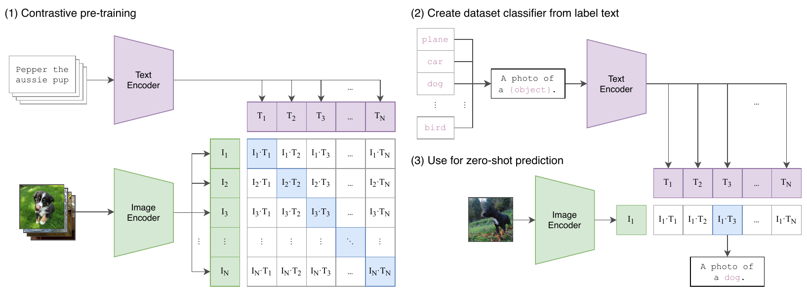

Figure 1. 왼쪽은 배치 pair matching, 오른쪽 위는 클래스 문장으로 분류기 가중치를 만드는 단계, 오른쪽 아래는 새 이미지의 분류다. 사전학습의 정답은 클래스 ID가 아니라 같은 데이터 record의 pair index다. [PDF p.2, Fig.1](https://arxiv.org/pdf/2103.00020v1#page=2)

먼저 구분해야 할 결론은 여섯 가지다.

1. **Zero-shot 76.2%와 linear probe 85.4%는 다른 프로토콜이다.** 전자는 텍스트로 만든 ImageNet 분류기이고, 후자는 ImageNet label로 학습한 분류기다. 기본 최고 모델은 ViT-L/14@336px다.
2. **CLIP은 하나의 ViT 구조명이 아니다.** 5개 ResNet과 3개 ViT를 같은 목적함수로 학습했으며, L/14의 336px 추가 학습본이 더 있다.
3. **배치 negative는 의미론적 오답을 보장하지 않는다.** 다른 record의 문장도 실제로 해당 이미지를 잘 설명할 수 있다.
4. **Temperature는 학습하는 스칼라다.** 코드의 `exp(t)`는 inverse temperature인 logit scale이다. 실제 temperature와 역수 관계를 구분해야 한다.
5. **Prompt ensemble은 텍스트 embedding 공간에서 합친다.** 클래스 가중치를 미리 만들면 매 이미지마다 80번 text encoder를 실행하지 않는다.
6. **큰 데이터·좋은 objective·architecture·평가법이 함께 달라졌다.** 오래된 baseline 대비 향상을 전부 contrastive loss 하나의 인과 효과로 볼 수 없다.

| 핵심 주장 | 원문 근거 | 읽어야 할 조건·한계 | 리뷰 위치 |
|---|---|---|---|
| 자연어로 광범위한 시각 개념을 감독할 수 있다 | §1–2, Fig.1, WIT 400M | 데이터는 공개되지 않았고 영어·웹 분포에 치우침 | §3, §5 |
| matching objective가 빠르게 전이 성능을 배운다 | Fig.2; Fig.3 | Fig.2 x축은 처리 이미지 수. 배포 latency 실험이 아님 | §5.2, §6 |
| 학습된 text encoder로 새 분류기를 만들 수 있다 | §3.1.2, Fig.1 | 후보 label·prompt가 필요, 자유로운 문장 생성은 아님 | §9 |
| Prompt engineering/ensembling이 이득을 준다 | Fig.4, ImageNet +1.3 pp와 추가 +3.5 pp | template 선택 자체에 개발자 feedback이 개입 | §9.3 |
| Zero-shot이 supervised RN50 feature baseline과 경쟁한다 | Fig.5, Table 1/11 | 27개 중 16개 승리. 동일 backbone 대결이 아님 | §9.4 |
| CLIP representation의 전이가 좋다 | Fig.10–12, Table 10 | linear probe·forward GFLOPs 기준, 12개와 27개 suite의 결론 차이 | §10 |
| 모델 compute 증가에 따라 평균 zero-shot error가 줄어든다 | Fig.9, Fig.22 | 같은 WIT에서 모델 규모 변화; 독립 data scaling law가 아님 | §9.5 |
| Zero-shot은 자연 분포 이동에 상대적으로 강하다 | Fig.13–15, Table 16 | 인과 분리 불충분; label mapping 자체도 변경 | §11 |
| 검출한 데이터 중복의 전체 점수 영향은 작다 | Fig.17, Appendix C | detector recall·부분집합 난이도 교란, 재학습 대조 아님 | §12.2 |
| 데이터 출처를 바꿔도 평균 성능은 비슷할 수 있다 | Appendix D, Table 12 | 같은 약 15M 규모. 개별 task 차이는 매우 큼 | §13.4 |
| 분류 체계 선택이 편향과 오류를 바꾼다 | Table 3–8, Fig.18 | 해당 데이터·label set의 탐색적 결과 | §12.4 |

<a id="motivation"></a>

## 3. Motivation: 왜 고정된 label supervision을 벗어나는가

### 3.1 원문 §1: supervision의 형식이 transfer 범위를 제한한다

ImageNet의 1,000-way classifier는 한 이미지에 미리 정한 정답 category를 준다. 이 방식은 목표 category에 필요한 정보를 잘 학습하지만, 같은 클래스 내부의 다른 속성을 보존하도록 직접 요구하지 않는다. 예를 들어 모든 표지판을 한 범주로 묶으면 표지판 종류를 세밀하게 구분하는 정보가 학습 목표에서 덜 중요해질 수 있다. 반면 웹의 설명은 물체뿐 아니라 색·행동·장소·글자·관계 등을 언급한다. 저자는 이 풍부하고 대규모인 감독으로 전이 가능한 visual representation을 만들 수 있는지 묻는다. [PDF pp.1–3; p.12]

여기서 자연어 감독은 '아무 label도 없다'는 뜻이 아니다. 이미지와 텍스트의 **동시 등장**이 label 역할을 한다. supervised, self-supervised, weakly supervised라는 용어를 택하는 것보다, 어떤 관측 관계를 학습 목표로 썼는지가 중요하다는 것이 §2.1의 설명이다.

고정 classifier의 두 제약은 구분해야 한다. 첫째, 감독에서 표현하는 개념이 제한된다. 둘째, 학습 후 출력 head가 정해진 category 수에 묶인다. CLIP은 첫째를 웹 text로, 둘째를 text-conditioned classifier로 해결하려 한다. 다만 실제 추론 한 번에서는 여전히 유한한 후보 집합에서 고른다.

### 3.2 Caption prediction은 왜 비효율적일 수 있는가

같은 개 사진에도 '개', '잔디에서 뛰는 강아지', '우리 집 반려견과 보낸 주말' 등 많은 문장이 붙을 수 있다. 이미지 전체가 알려져도 특정 작성자의 정확한 단어열을 예측하는 것은 어렵다. 언어 decoder가 문법·문체·이미지와 무관한 text까지 설명하느라 compute를 쓸 수 있다. CLIP은 목표를 '이 배치의 어떤 문장이 이 이미지와 실제로 묶여 있었는가'로 줄인다. [PDF p.4, §2.3]

[리뷰어 해석] Captioning을 이해하기 위한 보조식 D1:

```math
\mathcal L_{\mathrm{AR}}=-\sum_{i=1}^{N}\sum_{\ell=1}^{L_i}\log p_\theta(y_{i,\ell}\mid y_{i,1:\ell-1},x_i)
```

이미지 입력 $`x_i`$, 길이 $`L_i`$의 token열 $`y_i`$가 주어지고, 각 위치에서 어휘 크기만큼의 분포를 맞힌다. 이는 token 축과 어휘 축을 가진 목표다. CLIP의 정답은 이에 비해 $`N\times N`$ pair matrix의 대각선이다. **목표가 간단해진다고 정보가 반드시 더 많아지는 것은 아니며**, 언어 생성 능력을 직접 훈련하지 않는 대가가 있다. CLIP의 효율은 이 trade-off에서 이해해야 한다.

### 3.3 원문 §8과 연결되는 신규성의 정확한 위치

CLIP은 처음으로 이미지–문장 embedding을 만든 연구도, InfoNCE를 만든 연구도 아니다. 원문은 N-pair loss, InfoNCE, ConVIRT를 직접 연결하고 자신을 간소화한 대규모 ConVIRT 계열로 설명한다. Visual N-Grams, VirTex, ICMLM도 선행 접근으로 다룬다. 차별점은 웹 규모 이미지–text pair, 효율적인 dual-encoder objective, 규모 확장, text-based zero-shot 평가를 한 시스템에서 결합하고 광범위하게 조사했다는 데 있다. [PDF pp.2–4, pp.25–27]

당시 cross-modal VQA 계열은 region detector·시각 model·BERT 등 사전학습 하위 시스템을 결합하고 token 수준 상호작용을 많이 사용했다. CLIP은 두 encoder를 scratch에서 학습하며 최종 내적만 연결한다. 따라서 CLIP의 성과를 곧바로 정밀한 spatial grounding이나 compositional reasoning의 검증으로 읽으면 안 된다.

<a id="notation"></a>

## 4. 기호·텐서 shape 사전

이 리뷰는 **행 하나가 sample**인 row-vector convention을 쓴다. PyTorch 입력은 NCHW, Figure 3은 NHWC로 적혀 있다는 점을 분리한다.

| 기호 | Shape / 형식 | 의미 |
|---|---|---|
| $`N`$ | scalar integer | 학습에 쓰는 전체 pair batch 크기 |
| $`X`$ | $`N\times3\times H\times W`$ | PyTorch의 image batch |
| $`Y`$ | $`N\times L`$ integer | token IDs. 공식 기본 context length는 77 |
| $`f_\theta,g_\phi`$ | neural networks | image/text encoder |
| $`F_I,F_T`$ | $`N\times d_i,\ N\times d_t`$ | projection 전 전역 feature; Figure 3의 `I_f`, `T_f` |
| $`W_I,W_T`$ | $`d_i\times d,\ d_t\times d`$ | common embedding 공간으로 가는 projection |
| $`A,B`$ | 각각 $`N\times d`$ | 정규화 전 projection 출력 |
| $`U,V`$ | 각각 $`N\times d`$ | 행별 L2-normalized embedding; `I_e`, `T_e` |
| $`u_i,v_j`$ | row vectors $`1\times d`$ | 이미지 i와 텍스트 j의 embedding |
| $`t,\alpha,\tau`$ | scalars | logit scale의 log, inverse temperature, temperature |
| $`S=UV^\top`$ | $`N\times N`$ | cosine similarity matrix |
| $`Z=\alpha S`$ | $`N\times N`$ | softmax에 넣는 logits |
| $`P_{ij}`$ | $`N\times N`$의 entry | 이미지 i가 텍스트 j를 고를 확률; 행 합 1 |
| $`Q_{ij}`$ | $`N\times N`$의 entry | 텍스트 j가 이미지 i를 고를 확률; 열 합 1 |
| $`K,M`$ | integers | 추론 class 수, class당 prompt template 수 |
| $`w_k`$ | $`1\times d`$ | 텍스트로 생성한 class k의 normalized weight |
| $`W_{\mathrm{cls}}`$ | $`K\times d`$ | class weight를 행으로 쌓은 행렬 |
| $`P_v=(H/p)(W/p)`$ | integer | patch 크기 p인 ViT의 image patch 수 |

선수 지식은 행렬 곱, softmax와 cross entropy, chain rule, L2 normalization, Transformer의 self-attention 정도면 충분하다. **Transformer 내부 attention matrix**와 **배치의 이미지–텍스트 similarity matrix**는 전혀 다른 축을 가진다. 전자는 한 입력의 token 간 관계이고, 후자는 서로 다른 sample 간 전역 feature의 관계다.

<a id="approach"></a>

## 5. 원문 §2: 데이터, 목적함수 선택, architecture

### 5.1 §2.1–2.2: WIT 400M의 구성과 가정

[저자 보고] WIT(WebImageText)는 공개 인터넷 출처의 이미지–텍스트 **4억 pair**다. text에 약 50만 query 중 하나가 포함되는지를 이용해 자료를 찾고, query당 최대 2만 pair로 대략 균형을 맞춘다. Query 목록은 영어 Wikipedia에서 100회 이상 나타나는 단어, 높은 PMI의 bigram, 검색량 기준 Wikipedia 문서명, 추가 WordNet synset 등으로 구성했다. [PDF pp.3–4, §2.2와 각주 1]

이는 '50만 정답 class에 대한 완벽한 균형 데이터'가 아니다. Query는 **수집을 유도하는 장치**이며 실제 loss에는 query ID 대신 co-occurring full text를 쓴다. 하나의 pair가 여러 query와 맞을 수도 있고, 대조학습의 class 역할은 매 batch의 문장이 맡는다. 클래스별 균등 sampling이나 독립 task별 데이터량은 논문에서 확정할 수 없다.

기존 YFCC100M은 명목 1억 이미지라도 filename·카메라 설정 같은 metadata를 제외하고 영어 자연어 title/description을 남기면 약 1,500만으로 줄었다. 데이터 숫자는 raw 이미지 수와 **사용 가능한 자연어 pair 수**를 구분해야 한다. WIT의 정확한 URL 목록, 전체 수집 코드, 개별 source 비율, 각 task에 해당하는 example 수는 공개되어 있지 않다. [PDF p.3; 공식 model card]

### 5.2 §2.3: Figure 2가 실제로 비교한 것

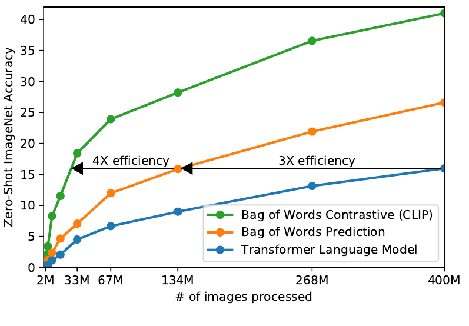

Figure 2. 가로축은 `# of images processed`, 세로축은 zero-shot ImageNet accuracy다. BoW 예측 baseline과 autoregressive Transformer, BoW contrastive objective를 비교한다. [PDF p.3, Fig.2](https://arxiv.org/pdf/2103.00020v1#page=3)

[저자 보고] 63M text Transformer로 caption을 예측하는 baseline은 BoW 예측보다 약 3배 느리게 ImageNet 개념을 배웠고, BoW에서 contrastive objective로 바꾸면 또 약 4배 개선되었다. **이 그림의 초록색 curve는 최종 text Transformer의 모든 장점을 분리한 ablation이 아니라 BoW contrastive baseline**이라는 점이 범례에 드러난다.

[리뷰어 해석] '3×, 4×'는 표시된 성능에 도달하는 학습 진행 효율이다. 이를 곱해 최종 CLIP이 임의 GPU에서 12배 빠르게 inference한다고 말할 수 없다. AR language model은 이미지 encoder보다 compute가 크다는 설명까지 있어 wall time·image exposure·FLOPs를 따로 보아야 한다.

원문은 nonlinear projection을 제거하고 linear projection을 사용했으며, training efficiency 차이를 관찰하지 못했다고 적는다. 이는 모든 데이터·loss에서 nonlinear head가 쓸모없다는 주장이 아니다. Text augmentation의 random sentence sampling도 제거했다. 이미지 augmentation은 resize된 이미지의 random square crop만 사용했다. [PDF p.4]

### 5.3 §2.4: 이미지 encoder — Modified ResNet

[저자 보고/공식 코드 확인] 원래 ResNet에 ResNet-D 계열 변경, anti-aliased downsampling, attention pooling을 적용한다. 공식 코드는 3개의 stem convolution과 average pool, downsample 앞의 average pool을 구현한다. 마지막 feature map에서 spatial mean을 만들어 query로 사용하고, mean token과 spatial token 전체에서 key/value를 얻는다. [PDF pp.4–5; `clip/model.py`, `ModifiedResNet`, `AttentionPool2d`]

[리뷰어 해석] D2, 한 attention head의 pooling 구조:

```math
\begin{aligned} R&\in\mathbb R^{N\times P_s\times c},\quad r_0=\frac1{P_s}\sum_{s=1}^{P_s}R_{:,s,:}\\ \widetilde R&=[r_0;R]+E_{\mathrm{pos}},\quad q=\widetilde R_{:,0,:}W_Q,\quad K=\widetilde R W_K,\quad V_a=\widetilde R W_V\\ o&=\mathrm{softmax}\!\left(\frac{qK^\top}{\sqrt{d_h}}\right)V_a \end{aligned}
```

배치별 곱을 생략 표기했다. $`q`$는 $`N\times1\times d_h`$, $`K,V_a`$는 $`N\times(P_s+1)\times d_h`$, attention weight는 $`N\times1\times(P_s+1)`$다. Softmax는 spatial/token 축에 적용한다. 여러 head의 출력을 합쳐 output projection으로 공통 차원 d에 도달한다. 코드의 `c_proj`가 이 최종 mapping을 수행하므로 ResNet 구현 밖에 별도 `visual_projection` 행렬이 하나 더 있을 것이라고 가정하면 안 된다. QKV linear layer에는 코드상 bias도 있다.

RN50의 224px 예에서는 마지막 feature map이 $`N\times2048\times7\times7`$, spatial token은 49개, mean을 더하면 50개다. 이 50개는 **대조학습 negative 수와 무관**하며 한 이미지 안의 spatial 위치다. Output은 RN50에서 $`N\times1024`$다. RN101의 공통 차원은 512이므로 모델명만 보고 전 모델을 512차원으로 취급하면 안 된다.

### 5.4 §2.4: 이미지 encoder — ViT

[공식 코드 확인] Patch embedding 뒤 class token을 붙이고 positional embedding을 더한 다음 **추가 layer normalization**인 `ln_pre`를 적용한다. Transformer 종료 후 class token만 `ln_post`에 넣고 `proj`로 공통 차원에 보낸다. [PDF p.5; `VisionTransformer.forward`]

[리뷰어 해석] D3, 패치부터 전역 벡터까지:

```math
\begin{aligned} Z_0&=\mathrm{LN}_{\mathrm{pre}}\!\left([c_{\mathrm{cls}};\mathrm{PatchEmbed}(X)]+E_{\mathrm{pos}}\right)\\ Z_{\ell+1}&=\mathrm{TransformerBlock}_\ell(Z_\ell)\\ F_I&=\mathrm{LN}_{\mathrm{post}}(Z_{L_v,:,0,:}),\qquad A=F_IW_I \end{aligned}
```

ViT-B/32의 224px 입력은 $`7\times7=49`$ patch, class token 포함 50 token, hidden width 768, 12층, 12 heads다. $`F_I`$는 $`N\times768`$, $`W_I`$는 $`768\times512`$, $`A`$는 $`N\times512`$다. ViT-B/16은 196+1=197 token이며 width와 depth는 같다. ViT-L/14는 256+1=257 token, width 1024, 24층, 공통 차원 768이다. 336px 버전은 576+1=577 token이다. [Table 20, PDF p.48]

[리뷰어 해석] D4, 두 encoder에서 쓰이는 pre-norm residual block의 계산:

```math
\begin{aligned} H'&=H+\mathrm{MHA}(\mathrm{LN}_1(H))\\ H''&=H'+\mathrm{QuickGELU}\!\left(\mathrm{LN}_2(H')W_1+b_1\right)W_2+b_2\\ \mathrm{QuickGELU}(z)&=z\,\sigma(1.702z) \end{aligned}
```

마지막 hidden 축에 linear layer를 적용하며 $`W_1\in\mathbb R^{w\times4w}`$, $`W_2\in\mathbb R^{4w\times w}`$다. 입출력 shape는 동일한 $`N\times L\times w`$이고 MLP 중간 width는 4w다. Bias는 마지막 축에 broadcast한다. Image self-attention에는 text의 causal mask가 없다. ViT class token은 모든 patch에서 정보를 모으지만, 원래 CLIP objective가 개별 patch마다 독립 언어 정렬을 직접 요구하지는 않는다.

### 5.5 §2.4: text encoder와 EOS 선택

Text는 lower-case byte-level BPE로 token화한다. 기본 text Transformer는 12층, width 512, 8 heads의 약 63M model이다. 최종 **EOS/EOT 위치의 feature**에 LayerNorm과 linear projection을 적용한다. 평균 pooling이나 첫 SOS token pooling이 아니다. [PDF p.5]

[리뷰어 해석/공식 코드 확인] D5:

```math
\begin{aligned} H_0&=E_{\mathrm{tok}}[Y]+E_{\mathrm{pos}},\qquad H_0\in\mathbb R^{N\times77\times d_t}\\ H_{12}&=\mathrm{CausalTransformer}(H_0)\\ F_{T,i}&=\mathrm{LN}(H_{12,i,e_i,:}),\qquad B_i=F_{T,i}W_T \\ M_{ab}&=\begin{cases}0,&b\le a\\-\infty,&b\gt a\end{cases} \end{aligned}
```

$`e_i`$는 EOS 위치다. Mask는 $`77\times77`$이며 key index가 query index보다 뒤면 logits에 음의 무한대를 더한다. EOS는 앞선 모든 실제 token을 볼 수 있으므로 전체 문장의 feature로 쓸 수 있다. EOS 이후 padding은 EOS를 바꾸지 않는다. 모든 token을 한 번의 병렬 forward로 처리하며, causal attention을 쓴다고 순차 문장 생성이 필요한 것은 아니다. 원문은 향후 LM initialization/auxiliary LM loss를 가능하게 하려 causal mask를 유지했다고 설명하지만, **본 실험은 scratch 학습이며 LM loss는 추가하지 않았다.**

공식 `encode_text`는 `text.argmax(dim=-1)`로 EOT 위치를 찾는다. EOT ID가 어휘에서 가장 크다는 tokenizer 규약에 기대는 구현이며, arbitrary tokenizer로 교체하면 이 규약을 다시 확인해야 한다. 문장 길이의 argmax가 아니다.

**원문 내부 불일치:** p.5는 vocabulary 49,152와 maximum sequence length 76을 적지만, Table 18은 vocabulary **49,408**, 공식 `tokenize`는 context length **77**을 쓴다. 공식 tokenizer가 만든 총 어휘와 inference input shape는 후자를 따른다. 이를 단순한 'special token 2개 차이'로 설명하면 256개 vocabulary 차이를 설명하지 못한다. Special token을 포함한 77칸에서 일반 내용에 쓸 수 있는 최대 token은 75개이며, 긴 입력은 기본적으로 오류, `truncate=True`이면 마지막을 EOT로 바꾼다. 이 리뷰는 논문 표기를 이미지에서 수정하지 않고 코드 재현값을 분리한다.

<a id="loss"></a>

## 6. Figure 3의 모든 행과 핵심 수식

### 6.1 알고리즘 원문과 축 규칙

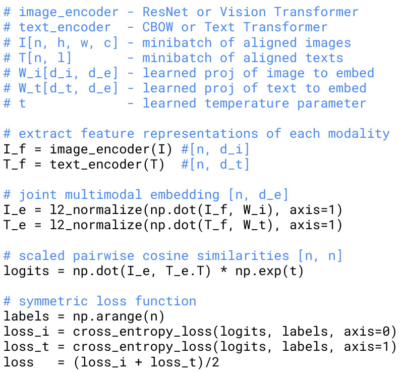

Figure 3. 별도 번호 Algorithm이 없는 논문의 핵심 알고리즘. 아래 U1–U3은 이 코드를 algebra로 전개한다. [PDF p.5, Fig.3](https://arxiv.org/pdf/2103.00020v1#page=5)

| 원문 행/주석 | 입력 → 출력 | 행별 의미와 주의점 |
|---|---|---|
| `image_encoder`, `text_encoder` | neural networks | ResNet/ViT와 CBOW/Text Transformer라는 일반화된 pseudocode. 최종 주요 모델은 text Transformer |
| `I[n,h,w,c]`, `T[n,l]` | image, text batches | 같은 n번째 row가 같은 데이터 pair. PyTorch 이미지는 NCHW |
| `W_i[d_i,d_e]`, `W_t[d_t,d_e]` | trainable matrices | encoder 차원은 달라도 projection 후 공통 차원은 같음 |
| `t` | trainable scalar | 코드에서 exp를 취하므로 log inverse temperature에 해당 |
| `I_f = image_encoder(I)` | $`N\times d_i`$ | 이미지별 전역 feature 추출 |
| `T_f = text_encoder(T)` | $`N\times d_t`$ | 텍스트별 전역 feature 추출 |
| `I_e = l2_normalize(dot(I_f,W_i),axis=1)` | $`N\times d`$ | projection 후 feature 축 normalization |
| `T_e = l2_normalize(dot(T_f,W_t),axis=1)` | $`N\times d`$ | 같은 규칙으로 text embedding 생성 |
| `logits = dot(I_e,T_e.T) * exp(t)` | $`N\times N`$ | 행=image, 열=text; 모든 cross-modal pair 내적 |
| `labels = arange(n)` | $`N`$ integer vector | 정답 row/column index는 대각선 0,…,N−1 |
| `loss_i = cross_entropy_loss(...,axis=0)` | scalar | 각 text column에서 이미지 후보 축으로 CE |
| `loss_t = cross_entropy_loss(...,axis=1)` | scalar | 각 image row에서 텍스트 후보 축으로 CE |
| `loss = (loss_i + loss_t)/2` | scalar | 두 방향을 동등 가중 평균 |

원문 변수 `loss_i`는 **이미지 후보 축**을 normalize하는 term이다. 'image-to-text'라고 이름 붙이는 관습과 반대로 느껴질 수 있으므로 본 리뷰는 방향을 화살표로 명시한다. NumPy `axis=0`/`axis=1`을 PyTorch `F.cross_entropy`의 keyword로 그대로 복사할 수 없다. PyTorch에는 $`Z`$와 $`Z^\top`$를 각각 넣어 class dimension을 일치시킨다.

### 6.2 U1: encoder, projection, 행별 L2 normalization

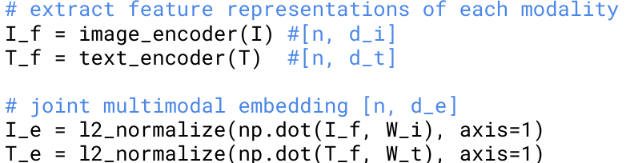

U1은 Figure 3에서 네 feature 생성 행에 대응하는 수학화다.

```math
\begin{aligned} F_I&=f_\theta(X)\in\mathbb R^{N\times d_i},\quad F_T=g_\phi(Y)\in\mathbb R^{N\times d_t}\\ A&=F_IW_I,\quad B=F_TW_T\in\mathbb R^{N\times d}\\ u_i&=\frac{A_i}{\|A_i\|_2},\quad v_i=\frac{B_i}{\|B_i\|_2} \end{aligned}
```

연산 순서는 encoder → linear map → row norm → broadcast division이다. Norm의 입력 축은 마지막 d차원, 출력은 구현상 $`N\times1`$로 유지해 $`N\times d`$에 broadcast한다. 배치 전체 norm으로 나누면 sample끼리 scale이 얽히므로 다른 연산이다. 가정은 각 projection 벡터의 norm이 0보다 크다는 것이다. 수치적으로 0 근처를 다룰 epsilon 정책은 별도 구현 선택이며, 공개 `forward`는 직접 norm division을 한다.

Projection은 두 modality가 같지 않은 feature basis를 공통 공간으로 학습해 옮긴다. L2 normalization은 벡터 크기 대신 방향으로 비교하게 만든다. 예를 들어 $`A_i=(3,4)`$이면 norm은 5, $`u_i=(0.6,0.8)`$이다. 이를 10배 한 (30,40)도 같은 embedding이다. 따라서 모델은 norm을 무한히 키워 classification confidence를 올리는 대신 학습 가능한 scale $`\alpha`$를 사용한다.

### 6.3 U2: scaled cosine logits와 temperature

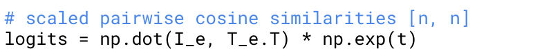

```math
S=UV^\top,\qquad S_{ij}=\sum_{r=1}^{d}U_{ir}V_{jr},\qquad Z=\alpha S,\qquad\alpha=e^t=\frac1\tau
```

$`U`$의 i행과 $`V`$의 j행을 feature 축 r에 대해 곱해 합하면 스칼라 $`S_{ij}`$다. 두 행이 unit norm이므로 $`-1\le S_{ij}\le1`$이다. $`\alpha`$는 모든 entry에 같은 scalar로 곱하며, $`Z`$는 $`N\times N`$이다. Text 길이 L이나 image patch 수가 이 matrix의 축이 되지 않는다.

[저자 보고] 초기 실제 temperature는 0.07에 해당한다. 따라서 $`\alpha_0\approx14.2857`$, $`t_0=\log(1/0.07)\approx2.6593`$다. Logit scale이 100을 넘지 않게 제한했다고 적는다. Table 18의 'Maximum temperature 100.0'이라는 명칭은 이 설명과 함께 읽어 **최대 multiplicative scale**로 해석해야 한다. 실제 $`\tau=100`$이라는 뜻으로 구현하면 방향이 뒤집힌다. [PDF p.5; p.48]

두 후보의 cosine이 0.8, 0.6이라면 정답 후보 확률은 $`1/(1+e^{-0.2\alpha})`$다. $`\alpha=1`$이면 약 0.550, $`\alpha=10`$이면 약 0.881이다. 양의 scale은 **고정된 candidate의 top-1 순서**를 바꾸지 않지만, probability·loss·gradient·confidence threshold를 크게 바꾼다. 높은 scale이 항상 좋은 것은 아니며, 잘못된 pair나 false negative에 더 날카로운 penalty를 줄 수 있다.

### 6.4 U3: 배치의 positive/negative와 symmetric cross entropy

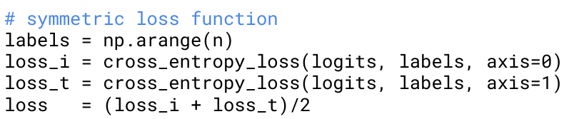

```math
P_{ij}=\frac{e^{Z_{ij}}}{\sum_{k=1}^{N}e^{Z_{ik}}},\qquad Q_{ij}=\frac{e^{Z_{ij}}}{\sum_{k=1}^{N}e^{Z_{kj}}}
```

```math
\begin{aligned}\mathcal L_{I\to T}&=-\frac1N\sum_{i=1}^{N}\log P_{ii}=-\frac1N\sum_i\left(Z_{ii}-\log\sum_j e^{Z_{ij}}\right)\\ \mathcal L_{T\to I}&=-\frac1N\sum_{j=1}^{N}\log Q_{jj}=-\frac1N\sum_j\left(Z_{jj}-\log\sum_i e^{Z_{ij}}\right)\\ \mathcal L&=\frac12\left(\mathcal L_{I\to T}+\mathcal L_{T\to I}\right)\end{aligned}
```

1. i번째 image의 positive text는 i번째 text다. i행의 나머지 N−1개는 loss상 negative다.
2. j번째 text의 positive image는 j번째 image다. j열의 나머지 N−1개는 loss상 negative다.
3. $`P`$는 **row** 합이 1이고 $`Q`$는 **column** 합이 1이다. 둘 다 같은 logits로부터 계산하지만 일반적으로 같은 값이 아니다.
4. 각 방향의 N개 CE를 평균한 후 두 평균을 다시 1/2로 합친다. 총 normalization은 2N이다.
5. Positive N개와 고유한 ordered off-diagonal pair $`N^2-N`$개가 있다. 두 loss에서 같은 entry가 다시 쓰이므로 '두 배 더 많은 독립 negative sample'이 생기지는 않는다.

이 목적함수는 similarity matrix를 대칭으로 만들라는 제약이 아니다. $`Z_{ij}`$와 $`Z_{ji}`$는 서로 다른 이미지–text pair이고 같을 필요가 없다. 대칭이라는 말은 **두 검색 방향을 동등하게 최적화**한다는 뜻이다.

InfoNCE로 해석할 때 batch의 나머지 문장들이 대략 text marginal에서 온 negative라는 가정이 도움이 된다. 실제 웹 데이터에는 동일 이미지, 유사 caption, 동일 object의 다른 촬영이 있어 독립성과 의미적 배타성이 깨진다. 원문 objective는 multi-positive mask나 semantic deduplication으로 이를 해결하지 않는다. 같은 의미인 두 문장이 있더라도 pair ID가 다르면 negative로 취급하는 구조적 한계다.

### 6.5 수치 안정성과 극단적 경우

[리뷰어 해석] D6, row log-sum-exp를 안정적으로 계산하는 항등식:

```math
\log\sum_j e^{Z_{ij}}=m_i+\log\sum_j e^{Z_{ij}-m_i},\qquad m_i=\max_j Z_{ij}
```

$`m_i`$는 row당 scalar이며 이를 빼도 softmax 비율은 바뀌지 않는다. 코드에서는 안정적인 cross entropy/log-softmax를 쓰고, 이미 softmax한 probability를 다시 logits로 넘기지 않아야 한다. 모든 score가 같으면 각 방향 loss는 $`\log N`$이다. N=1이면 positive만 있으므로 loss는 0이고 이 objective만으로는 정렬을 배울 signal이 없다. 큰 batch가 정보량을 늘리지만 그것이 무한히 유리하다는 증명은 아니다.

<a id="backward"></a>

## 7. Backward: 어느 parameter가 어떤 signal을 받는가

이 절의 gradient는 **원문에 실린 증명이 아니라 U1–U3을 미분한 리뷰어 보조 유도**다. 비영벡터 normalization과 아직 scale clipping이 활성화되지 않은 구간을 가정한다.

### 7.1 D7: logits에 대한 gradient

```math
G_{ij}:=\frac{\partial\mathcal L}{\partial Z_{ij}}=\frac{P_{ij}+Q_{ij}-2\delta_{ij}}{2N},\qquad G\in\mathbb R^{N\times N}
```

한 방향 CE의 미분은 predicted probability에서 one-hot target을 뺀 값이다. Row loss에서 $`(P_{ij}-\delta_{ij})/N`$, column loss에서 $`(Q_{ij}-\delta_{ij})/N`$가 나오고, 두 term을 1/2로 평균한다. $`\delta_{ij}`$는 i=j일 때 1이다.

대각선 gradient는 보통 음수이므로 gradient descent는 positive logit을 키운다. 비대각선은 양수이므로 그 logit을 낮추는 방향으로 움직인다. 다만 encoder parameter가 공유되어 있으므로 모든 pair의 score를 독립적으로 원하는 만큼 바꿀 수는 없다. 또한 이미 잘 구분하는 쉬운 negative의 probability는 작아서 기여가 작고, 헷갈리는 negative의 기여가 크다.

### 7.2 D8: 양쪽 embedding과 scale

```math
\frac{\partial\mathcal L}{\partial U}=\alpha GV,\qquad\frac{\partial\mathcal L}{\partial V}=\alpha G^\top U,\qquad\frac{\partial\mathcal L}{\partial t}=\sum_{i,j}G_{ij}Z_{ij}
```

첫 식은 $`(N\times N)(N\times d)`$이므로 $`N\times d`$다. i번째 image의 gradient는 **모든 text embedding**의 가중합이다. 두 번째는 반대로 각 text가 모든 image에서 signal을 받는다. 어느 한 encoder도 고정하지 않으며, text는 image의 label처럼 사용되면서도 자체 parameter가 학습된다. Teacher–student stop-gradient 구조는 없다.

마지막 식은 $`\partial Z_{ij}/\partial t=e^tS_{ij}=Z_{ij}`$를 chain rule에 넣은 것이다. Temperature를 학습하면 similarity의 분리도와 confidence sharpness를 함께 조절할 수 있다. $`\alpha=\min(e^t,100)`$ 같은 forward clamp를 구현하면 포화 구간의 미분은 달라진다. 원문은 clipping을 보고하지만 optimizer step 이후 parameter clamp인지 forward clamp인지까지의 공개 training 구현은 제공하지 않으므로 이를 확정하지 않는다.

### 7.3 D9: L2 normalization을 통과하는 gradient

Row i에 대해 $`r_i=\|A_i\|_2`$, $`u_i=A_i/r_i`$, upstream gradient를 $`h_i=\partial\mathcal L/\partial u_i`$라고 두면:

```math
\frac{\partial\mathcal L}{\partial A_i}=\frac{h_i-(h_i u_i^\top)u_i}{r_i}
```

모든 벡터는 $`1\times d`$, 내적 $`h_i u_i^\top`$는 scalar다. Identity Jacobian에서 unit-vector 방향 성분을 제거하는 것이다. 즉 norm만 키우는 radial 변화는 similarity를 바꾸지 않으므로 그 방향의 gradient가 제거된다. 남는 signal은 unit sphere의 접선 방향이다. $`B_i,v_i`$도 동일하다. 작은 norm은 분모 때문에 큰 gradient를 만들 수 있으므로 수치 안정성 점검에서 중요하다.

### 7.4 D10: projection과 encoder로의 전달

```math
\begin{aligned}\frac{\partial\mathcal L}{\partial W_I}&=F_I^\top\frac{\partial\mathcal L}{\partial A},&\frac{\partial\mathcal L}{\partial F_I}&=\frac{\partial\mathcal L}{\partial A}W_I^\top\\ \frac{\partial\mathcal L}{\partial W_T}&=F_T^\top\frac{\partial\mathcal L}{\partial B},&\frac{\partial\mathcal L}{\partial F_T}&=\frac{\partial\mathcal L}{\partial B}W_T^\top\end{aligned}
```

Image projection gradient는 $`(d_i\times N)(N\times d)=d_i\times d`$, encoder output gradient는 $`(N\times d)(d\times d_i)=N\times d_i`$다. Text도 d_t를 대입하면 같다. 이후 image Transformer/ResNet, text Transformer, token embedding과 positional embedding으로 chain rule이 이어진다. BPE의 정수 token ID나 이미지 sample 선택 자체에는 gradient를 주지 않는다. EOT feature를 통해 EOT에 영향을 준 이전 token의 attention/MLP 경로가 학습된다.

### 7.5 해설용 N=3, d=2 예제: forward 전체

다음 값은 실제 CLIP checkpoint에서 추출한 embedding이 아니다. **손으로 따라가기 위한 구성 예제**다. Projection과 normalization을 마친 unit row를 다음과 같이 둔다.

```math
U=\begin{bmatrix}1&0\\0&1\\-1&0\end{bmatrix},\quad V=\begin{bmatrix}0.8&0.6\\0&1\\-0.8&0.6\end{bmatrix},\quad\alpha=2
```

```math
S=\begin{bmatrix}0.8&0&-0.8\\0.6&1&0.6\\-0.8&0&0.8\end{bmatrix},\qquad Z=\begin{bmatrix}1.6&0&-1.6\\1.2&2&1.2\\-1.6&0&1.6\end{bmatrix}
```

행은 image 1,2,3이고 열은 text 1,2,3이다. $`S_{12}=0`$과 $`S_{21}=0.6`$은 다르다. 모든 pair의 cosine을 계산했을 뿐 symmetry를 강제하지 않았다.

```math
P\approx\begin{bmatrix}0.804726&0.162471&0.032802\\0.236656&0.526688&0.236656\\0.032802&0.162471&0.804726\end{bmatrix},\quad Q\approx\begin{bmatrix}0.584425&0.106507&0.023822\\0.391752&0.786986&0.391752\\0.023822&0.106507&0.584425\end{bmatrix}
```

예를 들어 image 1이 정답 text 1을 고를 확률은 $`e^{1.6}/(e^{1.6}+1+e^{-1.6})\approx0.804726`$이다. Text 1에서 정답 image 1을 고를 때에는 column의 다른 score 1.2가 경쟁하므로 확률이 약 0.584425로 내려간다. 방향 두 개를 평균하는 이유를 이 차이에서 볼 수 있다.

```math
\mathcal L_{I\to T}\approx0.358551,\qquad\mathcal L_{T\to I}\approx0.437932,\qquad\mathcal L\approx0.398242
```

모든 anchor의 top-1은 이미 맞지만 loss는 0이 아니다. Cross entropy는 정답 순위만이 아니라 분포가 얼마나 정답에 집중되는지를 본다. Uniform 분포일 때의 $`\log3\approx1.098612`$보다 작다는 점도 검산할 수 있다.

### 7.6 같은 예제의 backward와 실제 검산

```math
G\approx\begin{bmatrix}-0.101808&0.044830&0.009437\\0.104735&-0.114388&0.104735\\0.009437&0.044830&-0.101808\end{bmatrix},\qquad\frac{\partial\mathcal L}{\partial t}\approx-0.333398
```

$`G_{21}`$은 $`G_{31}`$보다 크다. Text 1에 대해 image 2가 더 헷갈리는 negative이기 때문이다. Scale gradient가 음수이므로 작은 gradient descent step은 t를 증가시키고 이 예제의 분포를 더 뾰족하게 만든다.

정규화 전 image 1의 vector도 (1,0)으로 놓으면 upstream $`\partial\mathcal L/\partial u_1\approx(-0.177993,-0.021185)`$에서 radial 성분이 제거되어 $`\partial\mathcal L/\partial A_1\approx(0,-0.021185)`$가 된다. Text 1에서는 $`\partial\mathcal L/\partial B_1\approx(-0.180642,0.240856)`$다. Negative pressure까지 합친 gradient이므로 단순히 positive vector만 향해 움직인다고 설명하면 부정확하다.

[검산] NumPy float64로 위 forward/loss를 계산하고 A·B의 모든 12개 좌표와 scalar t를 central finite difference로 점검했다. Perturbation은 $`10^{-6}`$, analytic gradient와 최대 절대 차이는 약 **5.55×10⁻¹¹**이다. 이는 해설 수식의 국소 미분 검증이며, CLIP training을 실행한 결과가 아니다.

<a id="training"></a>

## 8. 원문 §2.5와 Appendix F: 학습·forward·추론 경계

### 8.1 학습 recipe

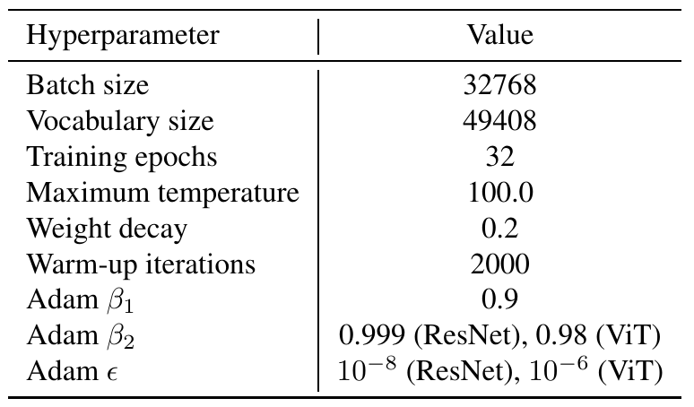

Table 18. 원문 표의 'Maximum temperature' 명칭은 §6.3의 logit scale 설명과 함께 읽는다. [PDF p.48](https://arxiv.org/pdf/2103.00020v1#page=48)

| 설정 | 저자 보고 값 | 실행 의미 |
|---|---|---|
| Pretraining 데이터 | WIT 400M pairs | downstream ImageNet label training과 다름 |
| 초기화 | 두 encoder scratch | pretrained ImageNet/GPT weight로 시작하지 않음 |
| Epoch | 32 | 약 12.8B image presentations |
| Global batch | 32,768 | 분산 배치 전체의 negative pool |
| Optimizer | Adam + decoupled weight decay | weight decay 0.2; gain/bias 제외 |
| Warmup | 2,000 iterations | 초반 learning rate 증가 |
| LR schedule | cosine decay | model별 peak LR는 Table 19/20 |
| Adam β₁ | 0.9 | first moment |
| Adam β₂ | ResNet 0.999, ViT 0.98 | second moment |
| Adam ε | ResNet 10⁻⁸, ViT 10⁻⁶ | optimizer denominator 안정화 |
| Temperature | 초기 τ=0.07, 최대 scale 100 | log-parameterized scalar 학습 |
| Image augmentation | resized image의 random square crop | 강한 color jitter/다중 view는 본 CLIP recipe에 없음 |
| Memory/precision | mixed precision, checkpointing, half Adam statistics 등 | 연산·저장 dtype이 단순한 전 모델 FP16과 같지 않음 |

ImageNet 등의 validation performance를 보며 baseline RN50을 1 epoch 학습해 grid/random/manual tuning을 수행하고, 큰 모델의 hyperparameter는 비용 때문에 heuristic으로 옮겼다. 완전한 자동 tuning recipe나 모든 random seed를 보고한 연구는 아니다. [PDF p.5]

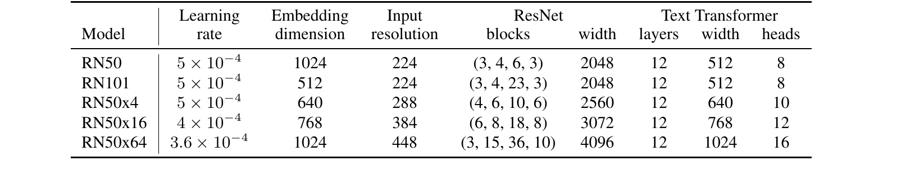

Table 19. `ResNet width`는 stem width가 아니라 표에 표시된 큰 feature width임을 주의한다. [PDF p.48](https://arxiv.org/pdf/2103.00020v1#page=48)

| Image encoder | LR | 공통 d | 해상도 | ResNet blocks | 최종 feature width | Text width/heads |
|---|---:|---:|---:|---|---:|---|
| RN50 | 5×10⁻⁴ | 1024 | 224 | (3,4,6,3) | 2048 | 512 / 8 |
| RN101 | 5×10⁻⁴ | 512 | 224 | (3,4,23,3) | 2048 | 512 / 8 |
| RN50x4 | 5×10⁻⁴ | 640 | 288 | (4,6,10,6) | 2560 | 640 / 10 |
| RN50x16 | 4×10⁻⁴ | 768 | 384 | (6,8,18,8) | 3072 | 768 / 12 |
| RN50x64 | 3.6×10⁻⁴ | 1024 | 448 | (3,15,36,10) | 4096 | 1024 / 16 |

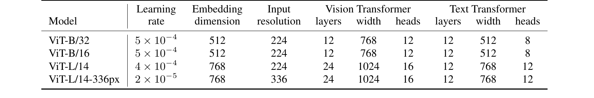

Table 20. L/14@336px는 224px L/14 학습 후 1 epoch 추가 고해상도 학습이다. [PDF p.48](https://arxiv.org/pdf/2103.00020v1#page=48)

| Image encoder | LR | d | 해상도 | Vision 층/width/heads | Text 층/width/heads |
|---|---:|---:|---:|---|---|
| ViT-B/32 | 5×10⁻⁴ | 512 | 224 | 12 / 768 / 12 | 12 / 512 / 8 |
| ViT-B/16 | 5×10⁻⁴ | 512 | 224 | 12 / 768 / 12 | 12 / 512 / 8 |
| ViT-L/14 | 4×10⁻⁴ | 768 | 224 | 24 / 1024 / 16 | 12 / 768 / 12 |
| ViT-L/14@336px 추가 단계 | 2×10⁻⁵ | 768 | 336 | 24 / 1024 / 16 | 12 / 768 / 12 |

Text depth는 모든 model에서 12로 유지했다. ResNet은 width/depth/resolution을 함께 늘렸고 text width만 image width 증가에 맞춰 늘렸다. 따라서 RN50x64는 단순히 RN50의 feature 차원을 64배로 만든 것이 아니다.

### 8.2 실제 batch를 따라가는 forward

ViT-B/32를 예로 global N개의 pair를 처리하는 흐름은 다음과 같다.

1. 같은 record의 image와 caption을 함께 sampling한다. Augmentation 후 image는 $`N\times3\times224\times224`$, text token은 $`N\times77`$이다.
2. Image patch embedding은 $`N\times49\times768`$, class token 추가 후 $`N\times50\times768`$이다. 12층 뒤 global feature는 $`N\times768`$이다.
3. Image projection $`768\times512`$ 후 $`N\times512`$를 row normalize한다.
4. Text embedding은 $`N\times77\times512`$, causal Transformer와 final LN 뒤 EOS를 gather하여 $`N\times512`$를 얻는다. $`512\times512`$ projection 후 normalize한다.
5. 각 GPU의 local embedding을 global candidate pool과 연결해 logits를 계산한다. 논문은 필요한 similarity subset만 GPU별로 계산해 sharding한다고 명시한다.
6. Label은 global pair index를 가리킨다. 로컬 row가 global batch의 256번째 pair라면 정답 index도 256이어야 한다.
7. 두 방향 CE를 평균하고 backward하여 image/text encoder·projection·scale을 함께 갱신한다.

공식 공개 저장소의 `forward`는 **이미 전달받은** image/text tensor로 logits를 만든다. Distributed all-gather나 cross-GPU gradient semantics를 구현한 공개 training loop가 아니다. 각 GPU가 local batch만으로 CE를 하면 N과 negative pool이 작아져 원래 objective와 달라진다. Detached remote feature를 사용할 때에는 global loss의 전체 gradient가 보존되는지도 따로 확인해야 한다. [공식 코드 확인/리뷰어 해석]

### 8.3 Compute·메모리의 규모 검산

[검산] N=32,768이면 전체 logits는 **1,073,741,824개**, off-diagonal pair는 **1,073,709,056개**다. FP16 logits 한 장은 정확히 2 GiB, FP32 한 장은 4 GiB다. Softmax buffers, gradient, encoder activation, optimizer state는 여기에 포함되지 않는다. 이것이 logits sharding과 mixed precision이 실용적으로 중요한 이유다.

```math
\mathrm{PairwiseCost}=O(N^2d),\qquad\mathrm{LogitStorage}=O(N^2),\qquad\frac{400\times10^6\times32}{32768}=390625
```

마지막 값은 정확히 400M pair와 매번 full global batch를 가정한 nominal update 수다. 실제 data loader의 remainder·shuffle·resume 등을 검증한 step count가 아니다. 원문은 RN50x64 학습에 **592 V100 × 18일**, 큰 ViT에 **256 V100 × 12일**이 들었다고 보고한다. 곱하면 각각 10,656과 3,072 GPU-days지만 실제 이용률, GPU-hour당 비용, model latency를 이 숫자만으로 알 수는 없다. [PDF p.5]

### 8.4 학습되는 parameter와 freeze 경계

| 단계 | 업데이트되는 것 | 고정되는 것 |
|---|---|---|
| CLIP pretraining | 양쪽 encoder, image/text projection, token/position embeddings, scale | 데이터와 tokenization 규칙 |
| Zero-shot class weight 생성 | 없음; inference only | 전체 CLIP |
| Zero-shot image 예측 | 없음 | 전체 CLIP와 cached class weights |
| Linear probe | 별도 logistic regression weights/bias | CLIP feature extractor |
| 본문의 ImageNet adaptation | ImageNet classifier | image representation은 고정 |

L/14@336px의 추가 pretraining과 downstream ImageNet linear probe는 구분해야 한다. 전자는 WIT에서 해상도를 올린 학습 단계, 후자는 benchmark label로 새 classifier를 학습하는 평가 단계다.

<a id="zeroshot"></a>

## 9. 원문 §3.1: zero-shot classifier, prompt ensembling, few-shot

### 9.1 §3.1.1: '보지 않은 것'의 의미

전통적 zero-shot category recognition은 특정 class의 학습 example을 의도적으로 제외한다. CLIP 논문은 더 넓게 **dataset/task별 label training 없이 새 평가에 적용**한다는 뜻으로 zero-shot을 사용한다. 웹 pretraining에 해당 concept나 비슷한 이미지가 한 번도 없었다는 뜻은 아니다. Dataset-level zero-shot, class-level unseen, pretraining contamination-free는 서로 다른 조건이다. [PDF p.6]

### 9.2 §3.1.2, U4: text encoder가 classifier를 생성한다

Class 이름 $`c_k`$에 template $`\pi`$를 적용한 문자열을 text encoder에 넣는다. U4는 원문 p.6의 산문 정의를 수식화한 것이다.

```math
w_k=\frac{g_\phi(\pi(c_k))W_T}{\|g_\phi(\pi(c_k))W_T\|_2},\qquad W_{\mathrm{cls}}=\begin{bmatrix}w_1\\\vdots\\w_K\end{bmatrix}\in\mathbb R^{K\times d}
```

```math
z(x)=\alpha u(x)W_{\mathrm{cls}}^\top\in\mathbb R^{1\times K},\qquad p(k\mid x)=\frac{e^{z_k(x)}}{\sum_{c=1}^{K}e^{z_c(x)}},\qquad\widehat k=\mathop{\mathrm{argmax}}_k z_k(x)
```

입력은 이미지 하나와 K개 class description이다. 출력은 K개 logit 또는 probability와 class index다. Softmax 축은 **candidate class K**다. 학습의 batch N축과 다른 용도지만 같은 내적 구조를 재사용한다. Classifier의 weight는 L2-normalized, input도 normalized, bias는 없고 scale은 공유한다. 이 의미에서 text encoder는 weight를 생성하는 hypernetwork다. 비선형 image encoder 전체까지 선형이라는 의미는 아니다.

예를 들어 cat/dog/bird 세 class라면 3개의 문장 vector를 먼저 생성해 저장한다. 새 이미지가 들어오면 image tower 한 번과 $`1\times d`$–$`d\times3`$ matrix multiplication만 필요하다. K=1이면 softmax 값이 반드시 1이므로 '유일한 후보가 확실히 맞는다'는 신뢰도 증거가 될 수 없다. Candidate 밖 개념을 자동으로 거부하는 open-set detector도 기본 CLIP에는 없다.

### 9.3 §3.1.4, U5: prompt engineering과 embedding ensemble

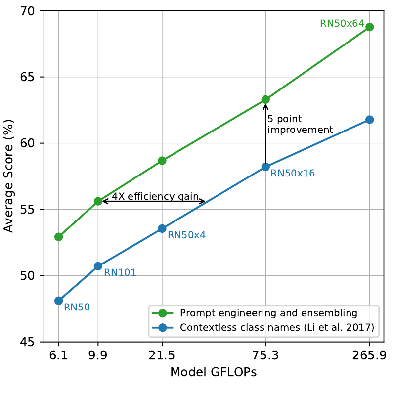

Figure 4. 이름만 넣는 baseline과 prompt engineering/ensemble의 차이. 같은 forward compute에서 class weight 생성 방식을 바꾼 효과다. [PDF p.7, Fig.4](https://arxiv.org/pdf/2103.00020v1#page=7)

이름만 주면 'crane'이 새인지 건설 장비인지, 'boxer'가 개 품종인지 운동선수인지 모호하다. 또한 학습 caption은 문장인데 inference text가 한 단어뿐이면 text distribution도 달라진다. 일반 photo template, pet/food/aircraft를 명시하는 문장, satellite를 밝히는 문장, OCR 문자열의 따옴표 등이 이 문제를 줄인다. [PDF pp.7–8]

[저자 보고] 기본 photo template은 ImageNet을 약 **1.3 percentage points** 높였고, 80개 context prompt ensemble은 그 위에 **3.5 pp**를 더했다. 합은 약 4.8 pp이며 '정확도가 4.8% 상대 증가했다'와 다르다. 36개 dataset 평균에서도 거의 5점 개선이 나타난다. Template 목록은 학습해야 할 soft prompt parameter가 아니라 사람이 고른 문자열이다.

[공식 코드 확인] U5, normalize → mean → normalize 순서:

```math
v_{k,m}=\frac{b_{k,m}}{\|b_{k,m}\|_2},\quad b_{k,m}=g_\phi(\pi_m(c_k))W_T,\quad\overline v_k=\frac1M\sum_{m=1}^{M}v_{k,m},\quad w_k=\frac{\overline v_k}{\|\overline v_k\|_2}
```

M개 text feature를 $`M\times d`$로 만든 후 feature 축 d를 normalize하고, template 축 M을 평균해 d벡터 하나로 줄인 다음 다시 normalize한다. 모든 class에 적용하면 $`K\times d`$다. 공식 notebook은 이를 column으로 stack해 $`d\times K`$로 저장한다. 본 리뷰의 row convention과 transpose 관계다. [공식 `Prompt_Engineering_for_ImageNet.ipynb`]

해설용으로 두 unit text vector가 (1,0), (0.6,0.8)이면 평균은 (0.8,0.4), norm은 약 0.894427이다. 최종 class weight는 약 (0.894427,0.447214)다. Image vector (1,0)과 cosine은 0.894427이다. 평균을 그대로 쓰면 0.8이 되어 class별 prompt 일치도에 따른 norm 차이가 confidence에 섞인다. 두 벡터가 정확히 반대여서 평균 norm이 0이면 이 정의가 불가능하므로 처리 정책이 필요하다.

**Embedding ensemble과 probability ensemble은 일반적으로 다르다.** 개별 classifier probability를 평균하려면 template마다 normalization denominator가 달라진다. Softmax는 비선형이므로 '평균한 weight로 한 번 softmax'와 같지 않다. 원문이 embedding ensemble을 사용한 이유 중 하나는 **class weight 한 세트로 cache**할 수 있어서다. M=80, K=1000이면 최초 text encoding은 80,000개 prompt지만 이후 image당 classifier matmul은 K=1000에 대해서 한 번이다.

Template 작성 역시 평가 프로토콜의 일부다. 저자는 개발 중 validation set을 반복 조회했다고 §6에서 인정하고, 공식 notebook은 ImageNet training set을 바탕으로 직관적 trial-and-error를 거쳤다고 설명한다. 따라서 downstream gradient update가 없다는 zero-shot 주장과 **아무 dataset feedback도 없는 완전 blind evaluation**은 구분한다.

### 9.4 §3.1.3/3.1.5: 무엇을 얼마나 잘하는가

| Table 1 dataset | Visual N-Grams | CLIP | 절대 차이 |
|---|---:|---:|---:|
| aYahoo | 72.4 | 98.4 | +26.0 pp |
| ImageNet | 11.5 | 76.2 | +64.7 pp |
| SUN | 23.0 | 58.5 | +35.5 pp |

이 Table 1의 SUN은 27-task suite에서 보고하는 SUN397 수치와 무심코 합치지 않는다. Table 11의 SUN397 최고 모델 수치는 68.4다. Table 1 비교는 선행 평가 맥락의 결과이며, 서로 다른 table의 dataset 표기와 protocol을 구분해야 한다. [PDF pp.6–7, p.43]

저자는 데이터 약 10배, prediction당 vision compute 거의 100배, training compute 추정 1000배 이상, 새로운 text architecture 등 여러 차이가 있다고 경고한다. 따라서 Table 1은 과거 가능성 증명에서 어느 수준까지 발전했는지 보여주는 자료이며 단일 방법의 공정 ablation은 아니다. aYahoo의 오류 감소율은 표시값으로 계산하면 $`(27.6-1.6)/27.6\approx94.2\%`$이며 본문의 '95%'는 근사적 서술이다.

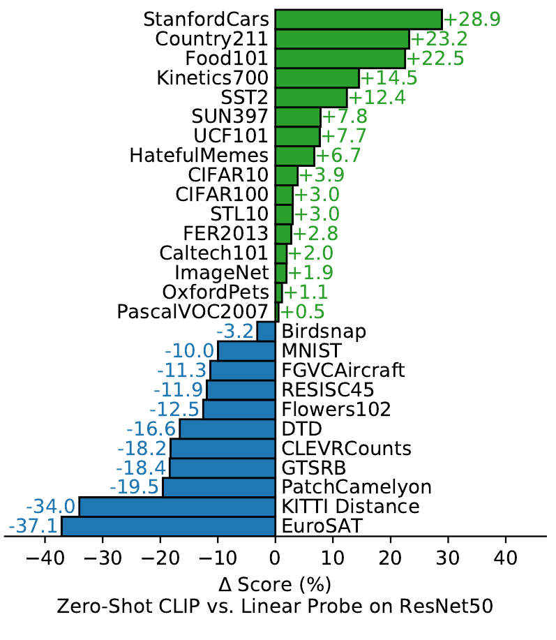

Figure 5. 27개 dataset 중 16개에서 zero-shot CLIP이 supervised RN50 feature classifier를 이긴다. 양수·음수의 폭이 task마다 크게 다르다. [PDF p.8, Fig.5](https://arxiv.org/pdf/2103.00020v1#page=8)

ImageNet·일반 물체에서는 경쟁력이 있고 Stanford Cars, Food101, Country211 등에서는 큰 차이를 낸다. 그러나 EuroSAT, CLEVR count, KITTI distance, PatchCamelyon, GTSRB에서는 부진하다. ImageNet baseline이 약하다고 전문 task model도 이긴다는 뜻은 아니다. 의료·위성·거리 판단처럼 pretraining에서 해당 감독이 얼마나 있었는지 알 수 없는 과제는 특히 조심해야 한다.

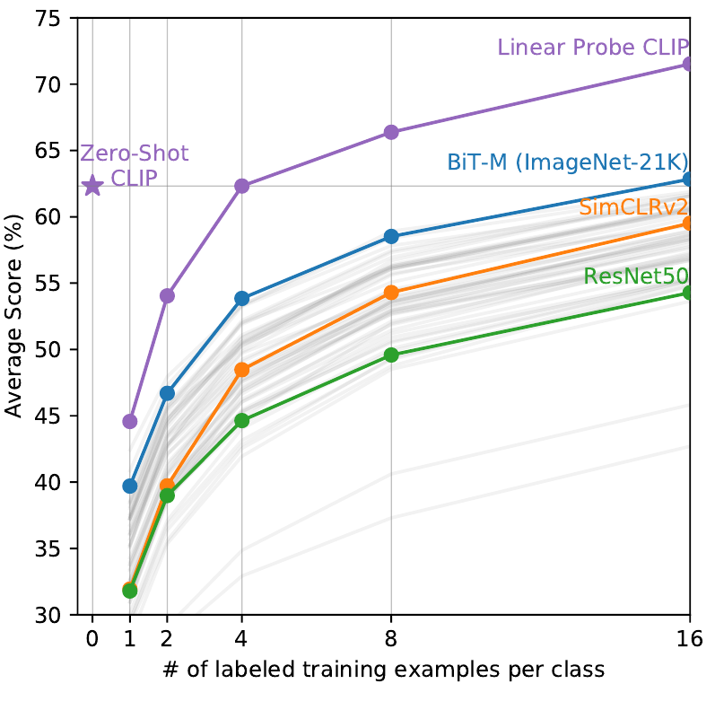

Figure 6. 최소 16 example/class가 있는 20개 dataset 평균. Zero-shot CLIP은 자기 feature의 4-shot classifier와 비슷하고, 다른 공개 feature에서 가장 좋은 16-shot 결과에 가깝다. [PDF p.9, Fig.6](https://arxiv.org/pdf/2103.00020v1#page=9)

이는 zero-shot에 '정보가 아예 없기' 때문이 아니라 **class 이름이라는 강한 prior**가 있기 때문이다. 반면 one-shot linear probe는 sample과 label ID에서 구분 기준을 추정한다. 같은 이미지에 개·잔디·울타리가 있으면 한 example만으로 어떤 개념을 분류해야 하는지 모호하다. 저자도 zero-shot weight에 가까워지는 regularizer를 탐색했지만, 큰 regularization을 골라 사실상 zero-shot classifier만 남는 경우를 보고했다. 적은 label이 본질적으로 해롭다는 결론은 아니다. [PDF p.9]

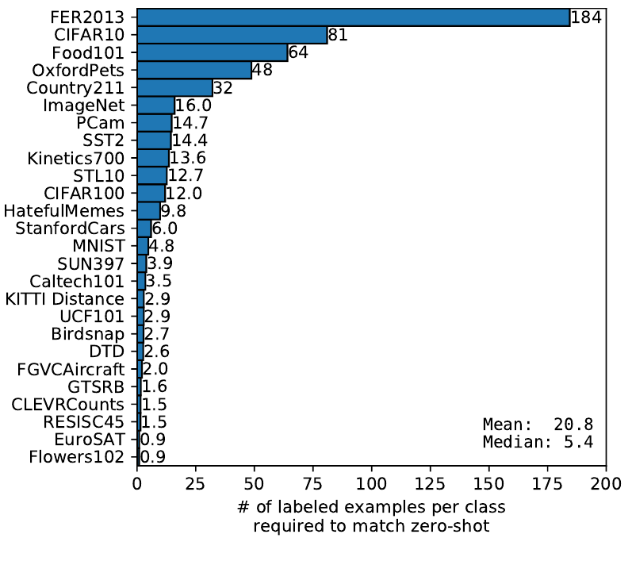

Figure 7. 추정된 equivalence는 평균 20.8, 중앙값 5.4 example/class이고 FER2013은 184까지 간다. 이 수치는 직접 그 모든 shot count에서 학습한 결과가 아니라 interpolation이다. [PDF p.10, Fig.7](https://arxiv.org/pdf/2103.00020v1#page=10)

[리뷰어 해석] D11, 인접 두 few-shot point 사이에서 log-linear interpolation을 쓴다면:

```math
\log k_*=\log k_a+\frac{a_{\mathrm{ZS}}-a_a}{a_b-a_a}(\log k_b-\log k_a)
```

$`a_a,a_b`$는 $`k_a,k_b`$ shot의 성능이고 $`a_{\mathrm{ZS}}`$는 zero-shot score다. 분모가 0이 아니고 두 점 사이에서 성능이 단조라는 구간 가정이 필요하다. 예를 들어 4-shot 60점, 8-shot 68점, zero-shot 64점이면 $`k_*=\sqrt{32}\approx5.66`$이다. 원문은 1/2/4/8/16-shot과 full-data classifier로 추정했다고 설명하며, 모든 task의 learning curve가 정확히 이 식을 따른다는 법칙은 아니다.

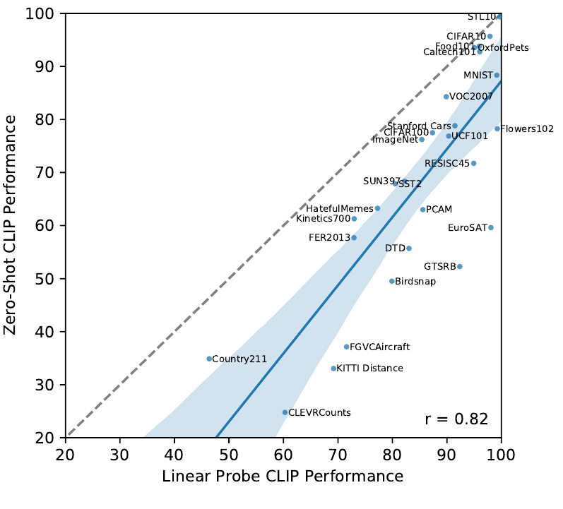

Figure 8. 둘의 correlation은 0.82지만 많은 task에서 zero-shot은 10–25 pp 낮다. [PDF p.10, Fig.8](https://arxiv.org/pdf/2103.00020v1#page=10)

Linear probe가 충분한 label로 잘 최적화되었다면 feature가 제공하는 분류 정보를 어느 정도 활용할 수 있는지 보여준다. 그러나 이를 수학적으로 엄밀한 zero-shot upper bound라고 할 수는 없다. Probe의 regularization·feature 위치·bias·norm 제약이 다르고 유한 표본 오차도 있다. 특히 Appendix A는 ViT에서 **projection 전** feature를 probe에 쓰므로 zero-shot embedding과 동일한 모델 family의 classifier라는 가정도 완전히 일치하지 않는다.

### 9.5 Model scaling과 data scaling을 구분하기

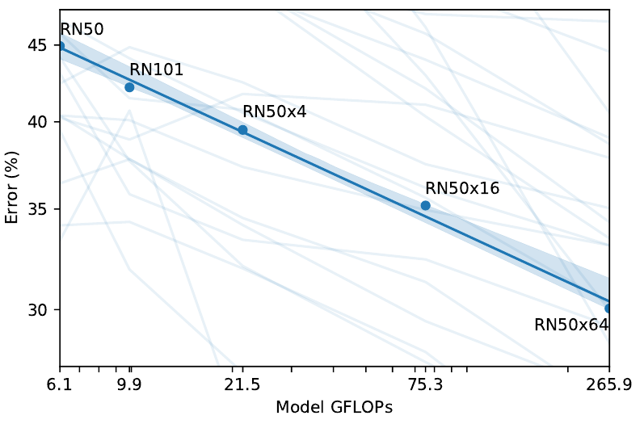

Figure 9. 5개 ResNet, 36 dataset의 39 evaluation에 대해 model GFLOPs가 6.1에서 265.9로 증가한다. 약 43.6배, 본문에서 반올림해 44배다. [PDF p.11, Fig.9](https://arxiv.org/pdf/2103.00020v1#page=11)

[리뷰어 해석] D12, log-log 직선을 표현하는 일반형은:

```math
\log e(C)=a+b\log C,\qquad e(C)=e^a C^b
```

$`e(C)`$는 evaluation 평균 error, C는 그림에서 model compute다. 음의 b라면 compute 증가에 따라 error가 감소한다. 원문은 모든 범위에 유효한 지수나 독립 data-size scaling exponent를 이 식으로 명시하지 않는다. Dataset별 가는 선은 훨씬 시끄럽고 일부 task는 더 큰 model에서도 감소한다. 평균 smooth scaling을 단일 task의 단조 개선 보장으로 읽을 수 없다.

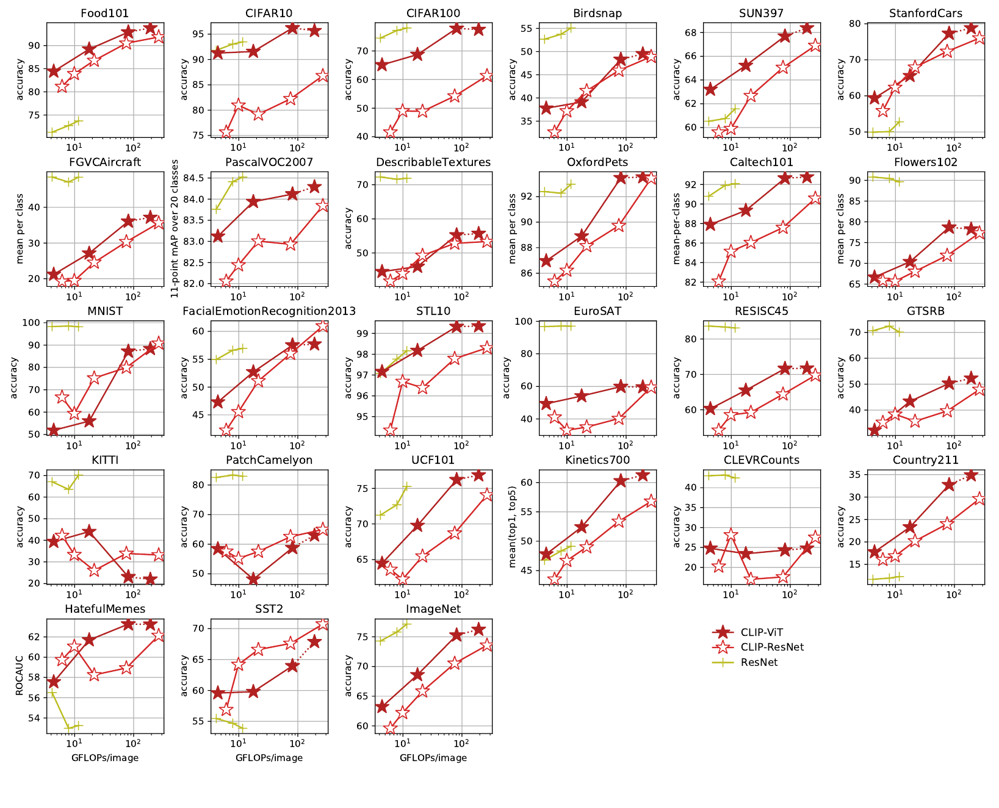

Figure 22. KITTI, CLEVR count 등에서는 model scale과 score가 단순히 함께 증가하지 않는다. RN50 linear probe의 기준선과 CLIP 계열을 구분해서 읽는다. [PDF p.43, Fig.22](https://arxiv.org/pdf/2103.00020v1#page=43)

**인과 분리:** Fig.9는 WIT를 고정하고 여러 model을 비교한다. Fig.2는 objective와 학습 진행을 비교한다. Appendix D는 같은 작은 data size에서 source 구성을 비교한다. Table 20의 224→336은 해상도뿐 아니라 추가 1 epoch 학습도 달라진다. 이 네 실험은 '데이터가 많아서만 좋다' 또는 'ViT라서만 좋다'라는 단일 설명을 입증하지 않는다.

<a id="transfer"></a>

## 10. 원문 §3.2: representation learning과 linear probe

### 10.1 왜 fine-tuning 대신 linear probe인가

저자는 end-to-end fine-tuning이 실용 성능을 더 높일 수 있다는 점을 인정한다. 그러나 본 연구는 pretraining representation의 범용성을 보려 하므로, downstream 전체 재학습이 representation의 결함을 덮는 것을 피하고 비교의 hyperparameter 공간을 줄이기 위해 linear probe를 선택한다. 66 model × 27 dataset은 1,782 평가 조합이다. 모델별 full fine-tuning까지 허용하면 공정한 search budget을 맞추기 어렵다. [PDF p.11]

[리뷰어 해석] D13, multi-class logistic probe의 개념적 목적함수:

```math
\min_{W,b}\;-\frac1n\sum_{i=1}^{n}\log\frac{\exp(h_iW_{:,y_i}+b_{y_i})}{\sum_{k=1}^{K}\exp(h_iW_{:,k}+b_k)}+\frac\lambda2\|W\|_F^2
```

$`h_i`$는 frozen feature $`1\times d_i`$, W는 $`d_i\times K`$, b는 K-vector, y는 supervised class label이다. 이 식은 원문이 말한 L2-regularized logistic regression의 설명이며, scikit-learn solver의 sum/mean normalization 및 `C`와 λ의 수치 convention까지 동일하다고 주장하지 않는다. VOC의 multi-label 평가 등에는 task에 맞는 classifier 구성이 필요하다.

### 10.2 Figure 10–12가 보여주는 평가 범위 효과

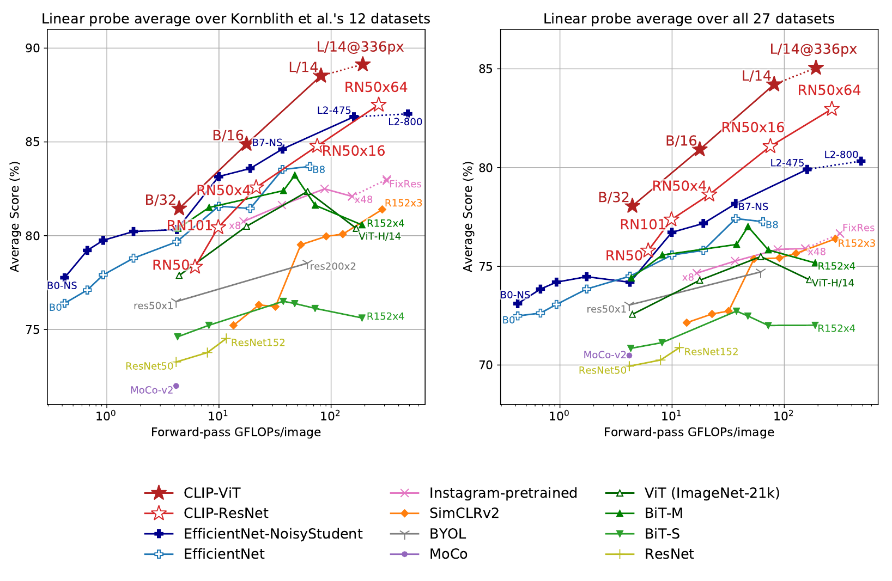

Figure 10. 왼쪽은 기존 12 dataset suite, 오른쪽은 27 dataset suite. 가로축은 **forward-pass GFLOPs/image**이며 training time이나 Jetson latency가 아니다. [PDF p.12, Fig.10](https://arxiv.org/pdf/2103.00020v1#page=12)

[저자 보고] 12-task suite에서는 작은 CLIP RN50/RN101이 모든 경쟁 모델보다 우수하지 않다. ImageNet-21K의 BiT-M과 비슷한 compute의 EfficientNet 등에 뒤처진다. 모델을 키우면 개선되며, CLIP ViT는 CLIP ResNet 대비 약 3배의 compute efficiency로 해석되는 frontier를 보인다. 최고 CLIP은 기존 최고 대비 평균 **2.6 pp** 앞선다.

27-task suite로 확장하면 OCR, geolocation, activity 등 ImageNet object label만으로는 덜 감독되는 과제가 추가되어 최고 model의 이점이 약 **5 pp**로 커진다. 이것은 suite 선택이 결과를 크게 바꾸는 증거다. 반대로 CLIP 개발자가 자신의 model이 잘하는 task를 추가했을 가능성도 원문의 §6이 인정하는 평가 선택 편향이다. 12-task 결과도 함께 제시한 이유를 놓치지 말아야 한다.

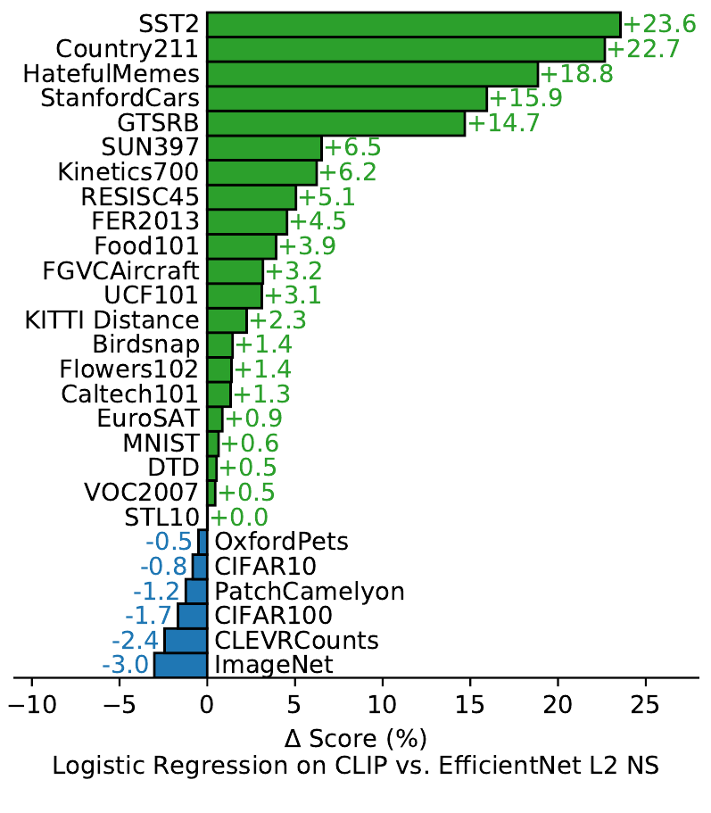

Figure 11. CLIP과 Noisy Student EfficientNet-L2 feature에 각각 logistic regression을 학습한 비교. 27개 중 21개에서 CLIP이 앞선다. [PDF p.13, Fig.11](https://arxiv.org/pdf/2103.00020v1#page=13)

GTSRB는 92.4−77.7=**14.7 pp**, Rendered SST2는 80.5−56.9=**23.6 pp**, Country211은 46.4−23.7=**22.7 pp**다. ImageNet에서는 85.4−88.4=**−3.0 pp**다. 즉 ImageNet 성능 하나로 전체 representation을 순위 매기는 것은 task-dependent한 판단이다. 이 비교는 pretraining 데이터량·구성·loss·architecture가 함께 달라져 언어 감독만의 causal effect로 해석할 수 없다.

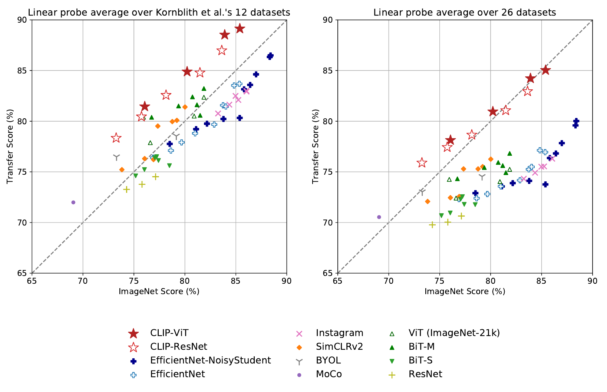

Figure 12. 동일한 ImageNet score 수준에서 CLIP이 더 높은 평균 transfer를 보이는 경향. 오른쪽은 ImageNet 자신을 제외한 **26 dataset 평균**이다. Fig.10의 27개 평균과 구별한다. [PDF p.14, Fig.12](https://arxiv.org/pdf/2103.00020v1#page=14)

### 10.3 Table 10/11의 27개 task를 같은 행에서 읽기

아래는 기준 arXiv Table 10과 Table 11에서 **ViT-L/14@336px**의 값을 옮겨 비교한 것이다. Gap은 linear−zero의 pp다. Metric은 Table 9 기준이며 서로 다른 metric을 평균한 suite score를 단일 population accuracy로 해석하지 않는다. Video 항목은 이 표에서 **center-frame 평가**다.

| Dataset | Metric | Zero-shot | Linear probe | Gap |
|---|---|---:|---:|---:|
| Food101 | accuracy | 93.8 | 95.9 | 2.1 |
| CIFAR10 | accuracy | 95.7 | 97.9 | 2.2 |
| CIFAR100 | accuracy | 77.5 | 87.4 | 9.9 |
| Birdsnap | accuracy | 49.5 | 79.9 | 30.4 |
| SUN397 | accuracy | 68.4 | 82.2 | 13.8 |
| Stanford Cars | accuracy | 78.8 | 91.5 | 12.7 |
| FGVC Aircraft | mean per class | 37.2 | 71.6 | 34.4 |
| VOC2007 | 11-point mAP | 84.3 | 89.9 | 5.6 |
| DTD | accuracy | 55.7 | 83.0 | 27.3 |
| Oxford Pets | mean per class | 93.5 | 95.1 | 1.6 |
| Caltech101 | mean per class | 92.8 | 96.0 | 3.2 |
| Flowers102 | mean per class | 78.3 | 99.2 | 20.9 |
| MNIST | accuracy | 88.3 | 99.2 | 10.9 |
| FER2013 | accuracy | 57.7 | 72.9 | 15.2 |
| STL10 | accuracy | 99.4 | 99.7 | 0.3 |
| EuroSAT | accuracy | 59.6 | 98.1 | 38.5 |
| RESISC45 | accuracy | 71.7 | 94.9 | 23.2 |
| GTSRB | accuracy | 52.3 | 92.4 | 40.1 |
| KITTI distance | accuracy | 21.9 | 69.2 | 47.3 |
| Country211 | accuracy | 34.9 | 46.4 | 11.5 |
| PatchCamelyon | accuracy | 63.0 | 85.6 | 22.6 |
| UCF101 | accuracy, center frame | 76.9 | 92.0 | 15.1 |
| Kinetics700 | mean(top1,top5), center frame | 61.3 | 73.0 | 11.7 |
| CLEVR Counts | accuracy | 24.8 | 60.3 | 35.5 |
| Hateful Memes | ROC AUC | 63.3 | 77.3 | 14.0 |
| Rendered SST2 | accuracy | 67.9 | 80.5 | 12.6 |
| ImageNet | accuracy | 76.2 | 85.4 | 9.2 |

[검산] Linear 27개 표시값의 단순 평균은 약 **85.056**이다. 이 평균은 dataset마다 같은 가중치를 준 macro average이며 전체 test image를 합쳐 정확도를 계산한 값이 아니다. 표의 rounded score만으로 계산했으므로 내부 원시값 평균과 마지막 자리 차이는 가능하다.

[원문 불일치 기록] Table 14의 MNIST zero-shot은 **88.4**, Table 11은 **88.3**이다. p.8 본문은 STL10 **99.3**이라고 쓰고, Table 11의 L/14@336px는 **99.4**다. Table 10은 이전 STL10의 CUDA 관련 bug를 수정했다고 각주로 알린다. PMLR supplementary Table 3은 일부 model의 STL10 값이 기준 arXiv Table 10과 다르다. 모든 결과를 하나의 '정답 수치'로 통합하지 않고 표별 출처를 유지한다.

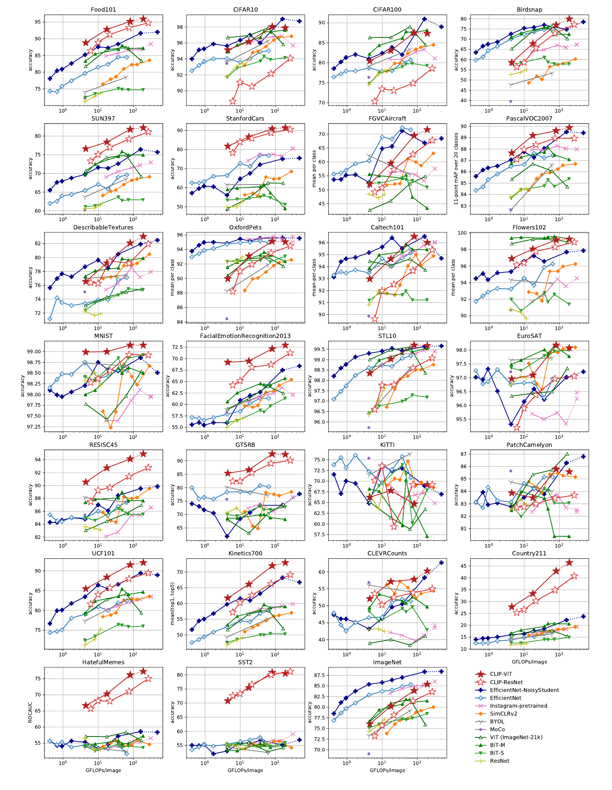

Figure 20. 전체 task curve는 평균에 가려진 실패를 보여준다. KITTI, CLEVR, PatchCamelyon에서는 큰 model이나 더 나은 평균 score가 자동으로 좋은 결과를 보장하지 않는다. 범례는 마지막 panel에 있다. [PDF p.41, Fig.20](https://arxiv.org/pdf/2103.00020v1#page=41)

<a id="robustness"></a>

## 11. 원문 §3.3: 자연 분포 이동에서의 robustness

### 11.1 Relative와 effective robustness

원문은 7종의 자연 이미지 분포 이동을 평가한다: ImageNetV2, Sketch, Youtube-BB, ImageNet-Vid, ObjectNet, ImageNet-A, ImageNet-R. 인위적 corruption/attack으로 원본 이미지를 변형한 실험과 구별한다. 원래 ImageNet에 잘 맞는 model이 shifted dataset에서도 어느 정도 더 잘하는 경향이 있으므로, OOD accuracy 증가 자체와 그 예상치를 넘어서는 개선을 구분한다. [PDF pp.13–16]

[리뷰어 해석] D14, 설명용 baseline 관계:

```math
\ell(a)=\log\frac{a}{1-a},\quad \widehat a_{\mathrm{OOD}}=\sigma\!\left(\beta_0+\beta_1\ell(a_{\mathrm{ID}})\right),\quad\rho=a_{\mathrm{OOD}}-\widehat a_{\mathrm{OOD}}
```

Accuracy a는 0–1 범위이고 endpoints 0,1에서는 logit이 발산한다. $`\beta_0,\beta_1`$는 표준 model들의 ID/OOD 관계를 fitting한 값이다. Effective robustness ρ는 그 baseline 기대치에서 얼마나 위에 있는지 나타낸다. Relative robustness는 reference에 대한 OOD score의 증가다. 이 식은 원문의 논의를 설명하기 위한 수학화이며 CLIP training loss에 추가되는 항이 아니다.

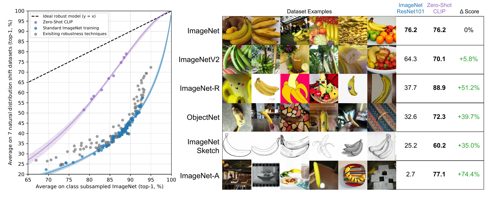

Figure 13. 왼쪽은 class-subset을 맞춘 ImageNet과 natural-shift 평균, 오른쪽은 banana 사례다. Zero-shot CLIP은 robustness gap을 최대 75% 줄였다는 저자 보고가 있다. 이것은 모든 dataset에서 75 pp 향상이라는 뜻이 아니다. [PDF p.15, Fig.13](https://arxiv.org/pdf/2103.00020v1#page=15)

### 11.2 ImageNet에 맞추면 ID가 좋아져도 OOD가 따라오지 않는다

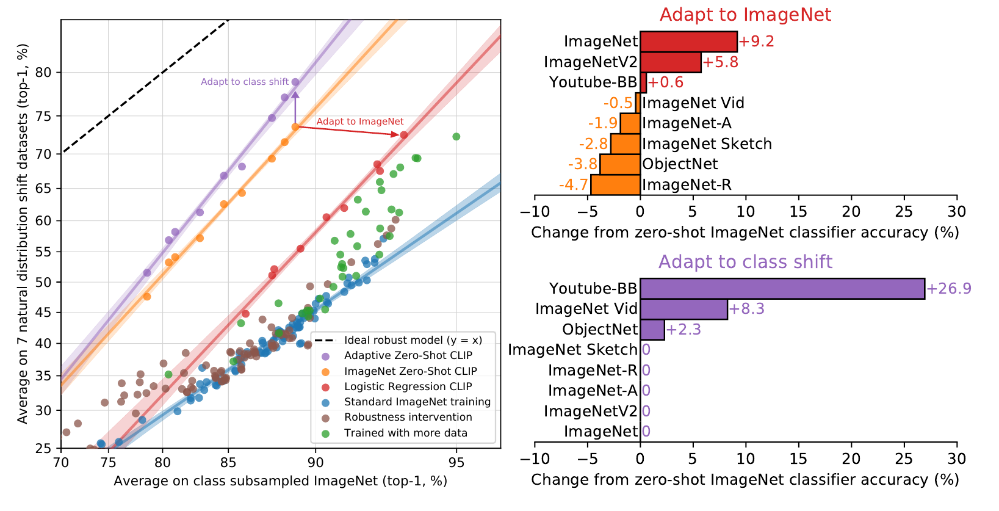

Figure 14. Frozen CLIP feature에 ImageNet linear classifier를 학습하는 intervention과, dataset별 class text를 새로 만드는 intervention을 분리한다. [PDF p.16, Fig.14](https://arxiv.org/pdf/2103.00020v1#page=16)

[저자 보고] ImageNet linear adaptation으로 76.2→85.4, **+9.2 pp** 개선했지만 shifted distribution의 평균 성능은 약간 떨어졌다. 오른쪽 위 plot은 ImageNet-R −4.7, ObjectNet −3.8, Sketch −2.8, ImageNet-A −1.9 pp를 보여준다. 이 intervention은 **end-to-end backbone fine-tuning이 아니라 classifier fitting**이다.

Class mapping도 별도 변수다. 고정 ImageNet classifier에서 Youtube-BB의 person을 만들려면 baseball player·bridegroom·scuba diver 등 일부 subclass의 score를 pooling하는 불완전한 mapping을 쓰게 된다. CLIP은 해당 dataset의 class 이름으로 바로 weight를 만들 수 있다. Fig.14의 아래 plot에서 Youtube-BB +26.9, ImageNet-Vid +8.3 등의 큰 이점은 이러한 flexible label interface 효과를 포함한다. 순수 시각 representation robustness만의 비교가 아니다.

| Table 16 설정 | ImageNet | V2 | A | R | ObjectNet | Sketch | Vid PM0/PM10 | YTBB PM0/PM10 |
|---|---:|---:|---:|---:|---:|---:|---|---|
| Linear CLIP | 85.4 | 75.9 | 75.3 | 84.2 | 66.2 | 57.4 | 89.1 / 77.2 | 68.7 / 63.1 |
| Zero-shot CLIP | 76.2 | 70.1 | 77.2 | 88.9 | 72.3 | 60.2 | 95.3 / 89.2 | 95.2 / 88.5 |

[PDF p.47, Table 16] 이 표에서 ObjectNet의 두 행 차이는 6.1 pp인데 Fig.14의 ImageNet-adapt intervention은 3.8 pp다. 표의 zero-shot은 dataset-specific class adaptation 이점까지 포함하므로, **같은 intervention의 동일 비교라고 놓고 숫자를 뺄 수 없다.** 나머지 차이 2.3 pp는 Fig.14에 따로 표시된 ObjectNet class-name adaptation 이득과 맞는다. Youtube-BB/Vid의 큰 표 차이도 같은 주의가 필요하다.

PM0/PM10은 자연 video consistency 평가의 서로 다른 setting이다. 원문은 각 dataset에 대해 두 점수의 평균을 요약에 쓴다고 명시하지만 이것을 0/10 frame의 단순 평균 추론이나 model FPS로 해석하면 안 된다. 모든 ImageNet class가 각 shift dataset에 있는 것도 아니므로 class subset을 맞춰 비교한다.

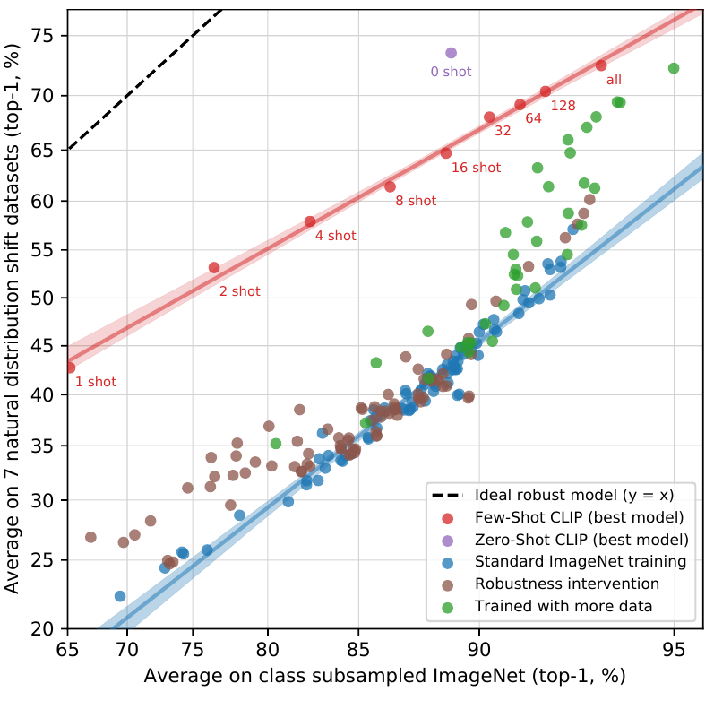

Figure 15. 0,1,2,4,…,128-shot 및 full-label classifier 사이에서 ID accuracy와 effective robustness의 관계를 조사한다. 16-shot과 zero-shot이 비슷한 ImageNet score여도 zero-shot이 더 robust한 경향이 있다. [PDF p.17, Fig.15](https://arxiv.org/pdf/2103.00020v1#page=17)

[리뷰어 해석] 이 결과는 supervised adaptation과 robustness 감소의 관계를 뒷받침하지만 'ImageNet supervised learning이 robustness gap의 유일한 원인'을 증명하지 않는다. Pretraining 다양성·웹과 평가의 분포 중첩·자연어 감독·label design 등이 함께 작용한다. 실제로 MNIST 같은 CLIP의 웹 분포 밖 task에서는 성능이 크게 떨어진다.

<a id="later-sections"></a>

## 12. 원문 §4–9: 사람 비교·데이터 중복·한계·사회적 영향

### 12.1 §4: 사람의 few-shot learning과 같다고 볼 수 있는가

Oxford Pets test의 3,669 image마다 5명의 사람이 37개 품종 중 하나 또는 '모르겠다'를 골랐다. Zero-shot에서는 품종 예시 없이, one/two-shot에서는 품종당 1/2 example을 제공했다. [PDF pp.16–18, Table 2]

| Table 2 조건 | Full dataset 정확도 | Majority vote 정확도 |
|---|---:|---:|
| Human zero-shot | 53.7 | 57.0 |
| CLIP zero-shot | 93.5 | 93.5 |
| Human one-shot | 75.7 | 80.3 |
| Human two-shot | 75.7 | 85.0 |

Metric은 mean per-class accuracy다. '모르겠다'를 제외한 guesses-only column은 분모가 달라진다. 사람은 불확실한 category에서 example 하나로 크게 개선했지만, 단순 CLIP linear probe는 zero-shot prior를 잘 활용하지 못했다. 사람과 model의 lifetime training data, sample 활용 방식, reference image를 다시 보는 능력이 같지 않으므로 보편적인 인간 초월 주장으로 일반화할 수 없다. [저자 보고/리뷰어 해석]

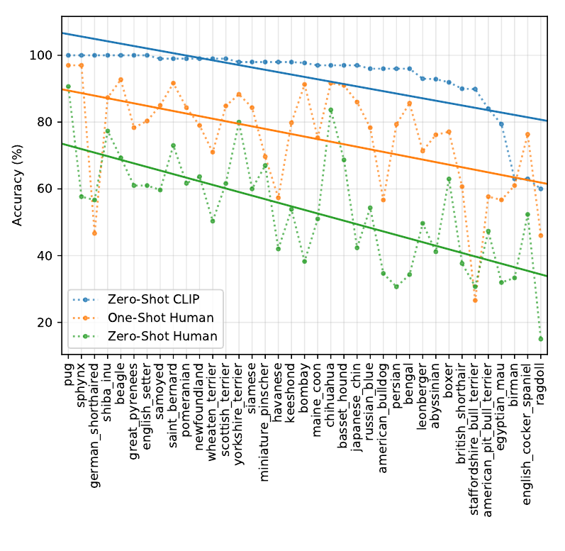

Figure 16. CLIP이 어려워하는 category는 사람에게도 어려운 경향이 있다. 원문은 label noise와 OOD example을 가설로 든다. 이는 모든 sample의 원인을 규명한 분석이 아니다. [PDF p.18, Fig.16](https://arxiv.org/pdf/2103.00020v1#page=18)

### 12.2 §5와 Appendix C: 중복 검출 절차·통계·한계

원문 절차는 (1) 별도 near-duplicate detector로 평가 이미지의 pretraining nearest neighbor를 찾고 사람이 dataset별 threshold를 고름, (2) Overlap/Clean으로 분할, (3) RN50x64의 성능을 각 subset에 측정, (4) All−Clean 및 통계적 유의성을 보고하는 순서다. CLIP 최고 ViT만의 분석이 아니라 **RN50x64 사용**임을 기록해야 한다. [PDF pp.17–19]

[리뷰어 해석] D15, contamination과 점수 변화의 관계:

```math
r=\frac{n_O}{n_A},\qquad a_A=(1-r)a_C+ra_O,\qquad\Delta=a_A-a_C=r(a_O-a_C)
```

n은 example count, O/C/A는 Overlap/Clean/All, a는 sample-weighted accuracy다. 이 항등식은 같은 sample-weighted metric에 대한 설명이며, class 평균이나 ROC AUC에서는 그대로 적용할 수 없다. 예를 들어 overlap 3%, clean 70%, overlap 90%면 전체 증가량은 **0.6 pp**다. Overlap subset에서 20 pp 차이가 나도 전체에서는 작을 수 있다. 반대로 전체 영향이 작다는 사실만으로 overlapping image를 전혀 외우지 않았다고 결론 낼 수 없다.

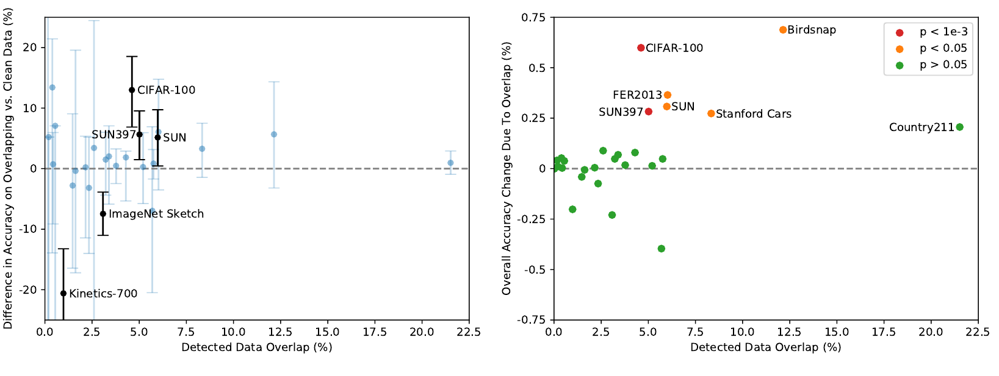

Figure 17. 왼쪽은 Overlap−Clean, 오른쪽은 전체 score 영향이다. Confidence interval과 test의 종류를 구분한다. [PDF p.19, Fig.17](https://arxiv.org/pdf/2103.00020v1#page=19)

[저자 보고] 35 dataset 중 9개는 검출된 overlap이 없었다. Median overlap은 2.2%, mean은 3.2%. Birdsnap은 overlap 12.1%, 가장 큰 검출 score 증가 +0.6 pp였고 Country211은 overlap 21.5%이지만 +0.2 pp였다. Country211 원본 YFCC 일부가 WIT에 포함되어 있다는 점과, caption에 위치 정보가 꼭 없다는 점이 해석에 중요하다.

[리뷰어 해석] D16, 원문이 사용한 one-sided binomial test를 적으면:

```math
p_{\mathrm{one-sided}}=\sum_{k=c_O}^{n_O}\binom{n_O}{k}a_C^k(1-a_C)^{n_O-k}
```

$`c_O`$는 overlap subset에서 맞힌 개수이며, clean accuracy를 null probability로 놓고 그 이상 정답이 관측될 확률을 본다. 독립 Bernoulli 근사, clean rate를 고정한 plug-in null이라는 전제가 있다. Clean 자체의 추정 오차와 class difficulty shift를 이 계산만으로 없애지는 못한다.

[리뷰어 해석] D17, 양측 99.5% Clopper–Pearson 구간의 표준 형태:

```math
\left[\mathrm{Beta}^{-1}(\gamma/2;c,n-c+1),\ \mathrm{Beta}^{-1}(1-\gamma/2;c+1,n-c)\right],\qquad\gamma=0.005
```

Beta inverse는 beta distribution의 quantile이며 c=0일 때 lower=0, c=n일 때 upper=1로 처리한다. 원문은 interval과 one-sided test를 병행한다. Fig.17 caption의 one-sided 유의 dataset 6개, CI가 0을 제외한 5개, 본문의 **Bonferroni 이후 2개**는 기준이 다르므로 같은 count가 아니다. 원문에서 `Dirty`라는 명칭이 한 번 나오지만 정의된 subset은 Overlap/Clean이며 별도 네 번째 split로 만들지 않는다.

원래 CLIP embedding을 duplicate detector로 쓰면 의미적으로 같은 다른 꽃·공을 false positive로 잡고, 다른 interpolation으로 resize한 진짜 near-duplicate를 놓칠 수 있다. Appendix C는 crop/zoom/aspect distortion/resize/rotation/JPEG/HSV jitter와 interpolation 변화로 synthetic duplicate pair를 만든 별도 ResNet50을 설명한다. 고정 τ=0.07의 InfoNCE, anti-alias, **weight norm**, GELU, batch 1,712, 약 30M image로 학습했다. BatchNorm을 피한 이유는 동일 이미지의 두 view가 batch statistics로 정보를 누출하는 것을 막으려는 것이다. 이것은 CLIP 본체 학습 recipe와 다르다. [PDF p.44]

검출 proxy에서 거의 100%라 해도 400M 검색 전체 recall을 입증하지 못한다. Kinetics의 검은 transition frame, CIFAR의 낮은 해상도 false positive 등은 subset difficulty를 바꾼다. 또한 중복 제거 후 retraining을 한 counterfactual이 아니므로 **중복의 인과적 영향을 완전히 제거한 실험**으로 해석할 수 없다.

### 12.3 §6: 저자가 인정한 한계

- **성능의 절대 수준:** zero-shot이 RN50 feature baseline에 비슷하더라도 많은 전문 dataset의 SOTA에는 못 미친다.
- **추상적·체계적 task:** count, distance, fine-grained recognition이 약하다. Frame의 주요 object를 알아도 관계·수량·정밀 위치를 이해한다고 볼 수 없다.
- **진짜 OOD:** MNIST처럼 웹 pretraining에 드문 image distribution에서는 단순 raw-pixel logistic regression에도 진다.
- **출력 제한:** 선택 후보 밖의 새 설명을 생성하지 않는다. Captioning과 contrastive loss의 결합은 원문에서 후속 아이디어다.
- **데이터 효율:** 400M을 32번 봐 12.8B presentation을 사용한다. 자연어가 싸게 얻어진다고 learning algorithm 자체가 인간처럼 sample-efficient한 것은 아니다.
- **평가 feedback:** 전체 validation set을 반복 관찰하며 모델과 prompt를 개발했다. Dataset collection 자체도 model 개발과 공동 적응했다.
- **배포 일반성:** bias·언어·domain·candidate taxonomy가 바뀌면 behavior가 달라진다.

원문의 '전체 SOTA에 도달하려면 약 1000배 compute' 추정은 관찰 scaling의 외삽이지 실제 학습 결과도, 2026년 최적법의 필요 비용도 아니다. 후속 기술의 존재와 무관하게 **2021년 논문 내 한계 추정**으로 읽어야 한다. [PDF pp.19–20]

### 12.4 §7.1: label design이 model behavior의 일부다

Table 3/4는 FairFace의 정의된 demographic label에 대한 성능을 비교하고 Table 5는 교차 group별 결과를 세분화한다. 예를 들어 Table 3의 White subset에서 race accuracy는 zero-shot 58.3, linear CLIP 93.4로 차이가 크다. Table 4의 집계 범주에서는 zero-shot 91.3이다. Task 정의·집계법 자체가 같지 않은 비교가 섞여 있으므로 하나의 평균 fairness score로 요약할 수 없다. 저자는 해당 분류 체계를 자연적·본질적 집단 정의로 endorsing하지 않는다고 명시한다. [PDF pp.21–23]

Table 6/7의 목적은 유해한 class를 추가했을 때 생기는 오분류를 **모델의 결함으로 감사**하는 것이다. 예를 들어 아동 class를 후보에 추가하자 0–2세 image에 대한 해당 부정적 category 오분류가 30.3%에서 2.3%로 바뀐다. 이는 후보집합 변화가 ranking과 denominator 모두에 영향을 준다는 §9의 수식과 연결된다. 학습 weight가 고정되어도 classifier를 구성하는 문장 때문에 시스템의 결과가 크게 달라진다.

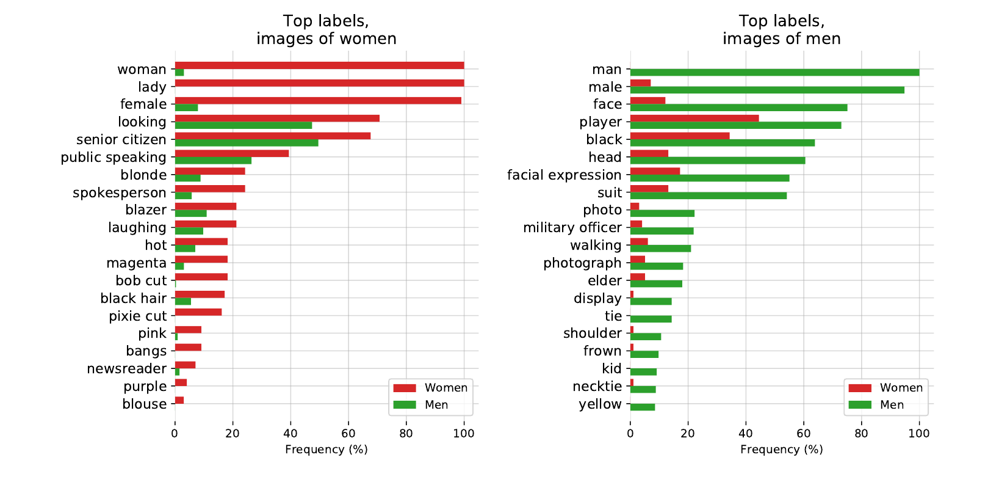

Figure 18. 원문이 탐색한 Congress image label 분포와 gender-associated output의 비대칭이다. Model score를 인간 속성의 사실 판정으로 취급하는 근거가 아니며, category·threshold 선택에 민감한 오류와 편향의 분석이다. [PDF p.24, Fig.18](https://arxiv.org/pdf/2103.00020v1#page=24)

### 12.5 §7.2–7.3, §8–9

Surveillance 관련 탐색에서 coarse caption 선택은 91.8%였지만 비슷한 distractor를 추가하면 51.1%로 떨어졌다. 작은 물체의 presence/absence는 거의 random이었다. Table 8의 celebrity identity 실험은 100→1000→2000 candidate에서 L/14 top-1이 59.2→43.3→42.2로 변한다. 이는 데이터 노출과 후보집합에 의존하는 capability/limitation 연구이며 일반인의 신원 식별 신뢰성을 보장하지 않는다. [PDF pp.24–25]

§7.3은 유용한 task와 부적합한 task, bias, failure mode를 구분하는 community evaluation을 제안한다. §8의 관련 연구는 자연어 감독·image-text retrieval·web supervision·joint multimodal modeling을 연결한다. §9는 scalable task-agnostic pretraining으로 여러 task가 나타났다는 실험적 결론을 내리며, 완성된 general visual intelligence라고 선언하지 않는다. [PDF pp.25–27]

<a id="appendix"></a>

## 13. Appendix A–F: 평가 프로토콜과 task별 세부 결과

### 13.1 Appendix A.1–A.2: dataset과 model inventory

Appendix A는 기존 12개 transfer task에 15개를 추가한 구성, feature extraction, logistic regression fitting을 명시한다. 모든 공개 baseline을 같은 data로 사전학습한 것은 아니다. BiT-S는 ImageNet1K, BiT-M은 ImageNet21K, Instagram ResNeXt·Noisy Student·self-supervised model 등은 서로 다른 사전학습 조건을 가진다. BiT-L/JFT 모델처럼 weight가 공개되지 않아 비교하지 못한 경우도 있으므로 '가능한 모든 model 중 최고'라고 읽지 않는다. [PDF pp.37–38]

LM RN50 baseline은 image CNN 출력을 **4개 token**으로 projection해 autoregressive language model의 prefix로 넣고 caption을 예측한다. 같은 WIT와 같은 epoch로 학습했으므로 objective 비교의 중요한 근거다. VirTex는 유사한 caption 기반 접근이지만 약 1000배 작은 MSCOCO caption data로 학습했다고 원문은 구별한다.

Table 9의 split 숫자를 아래처럼 보존한다. Download 가능 여부 때문에 Birdsnap/Kinetics는 논문 시점에 확보된 자료 수에 의존한다. Train column은 논문의 표시값이며, hyperparameter 선택 단계의 별도 validation 분할은 다음 절과 함께 읽는다.

| Dataset | Train / Test 표기 | 평가 시 중요한 조건 |
|---|---|---|
| Food101 | 75,750 / 25,250 | Table 9의 class 수 102 표기는 dataset 이름과 불일치; 그대로 재현 설정으로 쓰지 말 것 |
| CIFAR10 / CIFAR100 | 각 50,000 / 10,000 | 저해상도 image를 encoder 해상도로 전처리 |
| Birdsnap | 42,283 / 2,149 | 확보된 온라인 image 기준 |
| SUN397 | 19,850 / 19,850 | 397 classes |
| Stanford Cars | 8,144 / 8,041 | 196 classes |
| Aircraft | 6,667 / 3,333 | class 평균 metric |
| VOC2007 | 5,011 / 4,952 | 20 multi-label classes, 11-point mAP |
| DTD | 3,760 / 1,880 | 47 classes |
| Oxford Pets | 3,680 / 3,669 | 37 classes, class 평균 |
| Caltech101 | 3,060 / 6,085 | 원문 표는 102 classes; background 포함 여부 확인 필요 |
| Flowers102 | 2,040 / 6,149 | 102 classes, class 평균 |
| MNIST | 60,000 / 10,000 | handwriting domain shift |
| FER2013 | 32,140 / 3,574 | Table 9의 class 표기 8, protocol 확인 필요 |
| STL10 | 1,000 / 8,000 | 10 predefined splits 평균 |
| EuroSAT | 10,000 / 5,000 | satellite imagery |
| RESISC45 | 3,150 / 25,200 | 45 classes |
| GTSRB | 26,640 / 12,630 | 43 classes |
| KITTI | 6,770 / 711 | 4 distance classes |
| Country211 | 43,200 / 21,100 | 본문 construction과 train 산술 불일치, 아래 설명 |
| PatchCamelyon | 294,912 / 32,768 | 2 classes |
| UCF101 | 9,537 / 1,794 | center frame, 3 predefined splits 평균 |
| Kinetics700 | 494,801 / 31,669 | center frame; metric mean(top1,top5) |
| CLEVR Counts | 2,000 / 500 | 전체 2,500 random sample, 8 count classes |
| Hateful Memes | 8,500 / 500 | dev split ROC AUC |
| Rendered SST2 | 7,792 / 1,821 | rendered sentence sentiment classification |
| ImageNet | 1,281,167 / 50,000 | standard 1K classification |

Country211은 GPS가 있는 YFCC 사진에서 211개 국가에 대해 train 200장/class, test 100장/class로 구성했다고 설명한다. 따라서 train은 **211×200=42,200**이어야 하지만 Table 9에는 **43,200**이다. [검산] 이 1,000장 차이는 단순히 rounding으로 설명되지 않으므로 재현 시 공개 dataset metadata를 확인해야 한다. 이 리뷰는 원문 표의 수를 임의 수정해 저자 보고처럼 제시하지 않는다.

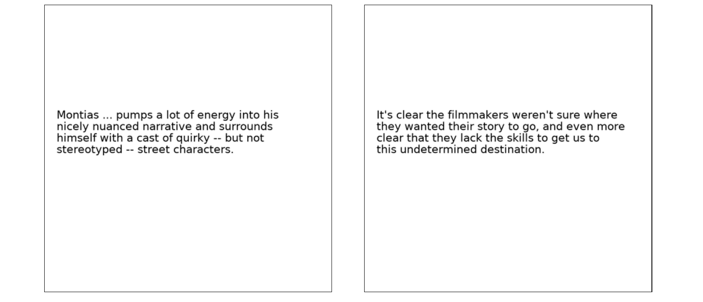

Figure 19. 448×448 흰 바탕에 검은 글자로 SST2 문장을 렌더링한 입력 예. CLIP image encoder가 픽셀에서 읽은 정보를 sentiment 판단에 사용할 수 있는지를 본다. [PDF p.38, Fig.19](https://arxiv.org/pdf/2103.00020v1#page=38)

### 13.2 Appendix A.3–A.4: feature 위치와 regularization 선택

Class head를 제외한 penultimate feature를 추출한다. 특히 **CLIP-ViT는 common embedding projection 전 feature**를 사용한다고 명시한다. 따라서 `model.encode_image()`의 반환값을 그대로 probe에 쓰면 Table 10의 ViT protocol과 같지 않다. 공개 함수는 projection을 이미 적용한다. L/14에서 원문 probe feature는 1024차원, contrastive embedding은 768차원이라는 차이가 있다. [PDF p.38; 공식 코드]

Classifier는 scikit-learn L-BFGS, 최대 1,000 iterations. L2 strength를 10⁻⁶부터 10⁶까지 96 log-spaced 후보 수준으로 탐색하되, 처음 10⁻⁶,10⁻⁴,10⁻²,1,10²,10⁴,10⁶을 평가하고 peak 근처 interval을 반복 세분화해 계산을 아낀다. Validation split이 있으면 이를 사용하고 없거나 test label이 비공개이면 train을 나눈다. 기준 arXiv는 최종 결과에서 validation을 train과 다시 합쳐 남은 split을 평가한다고 적는다. PMLR supplementary A.3은 이 마지막 문구가 덜 구체적이므로 재현 계획은 기준본 문구를 명시해 고정해야 한다.

Table 10의 bold는 각 dataset 최고 score 주위 99.5% Clopper–Pearson interval 안의 score다. 통계적으로 동일한 model을 완전히 증명하는 equivalence test는 아니다. VOC mAP, Hateful Memes AUC 같은 metric에 Bernoulli 정확도용 구간을 어떻게 적용했는지는 원문 설명만으로 충분히 명확하지 않다. 따라서 모든 bold를 엄밀한 pairwise 유의성 결론으로 확대하지 않는다.

### 13.3 Appendix B: qualitative zero-shot 예측

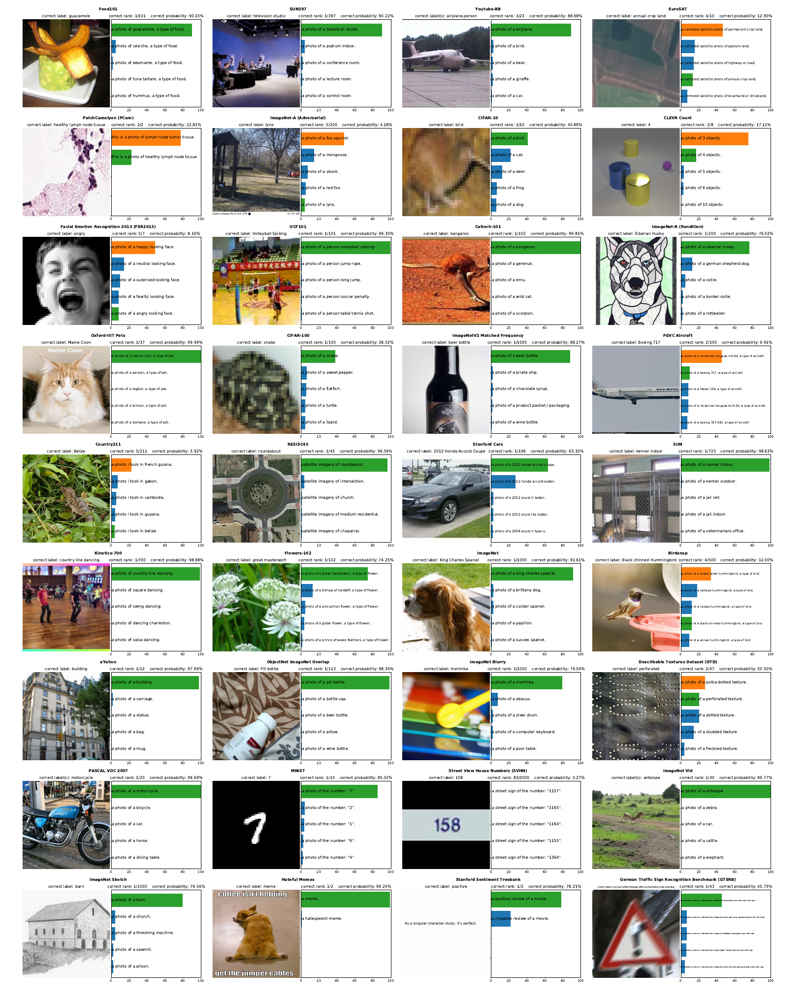

Figure 21. 36개 task의 image·text prompt·상위 5개 prediction을 보여준다. Green은 ground truth, orange는 틀린 prediction이며 ensemble이면 첫 template만 나타낸다. [PDF p.42, Fig.21](https://arxiv.org/pdf/2103.00020v1#page=42)

원문은 Hateful Memes만 불쾌한 내용을 피하도록 재선택했으며 그 외는 random example이라고 설명한다. 이 montage는 가능/실패 유형을 설명하지만 대표성이나 평균 성능을 정량적으로 보장하지 않는다. 높은 softmax score도 candidate가 부적절하거나 정답이 밖에 있으면 신뢰도를 보장하지 않는다. Table 11의 정량값과 같이 읽어야 한다. Appendix C의 duplicate detector는 §12.2에서, Appendix D는 아래에서 자세히 다룬다.

### 13.4 Appendix D: YFCC와 WIT source ablation

같은 RN50을 filtered YFCC 약 15M과 **동일한 크기의 WIT subset**에 32 epoch 학습해 비교한다. [추가 공식 supplementary 확인] PMLR supplementary G(p.20)는 이 ablation에서 **batch 2,048, weight decay 0.1**, 나머지는 Table 18/19 설정을 사용했다고 더 명시한다. WIT 400M 본학습의 32,768/0.2를 그대로 넣는 재현은 이 실험과 다르다.

| Table 12 항목 | YFCC linear | WIT linear | YFCC zero | WIT zero |
|---|---:|---:|---:|---:|
| Birdsnap | 47.4 | 35.3 | 19.9 | 4.5 |
| Flowers102 | 94.4 | 89.8 | 48.6 | 21.7 |
| Stanford Cars | 31.4 | 50.3 | 3.8 | 10.9 |
| Country211 | 23.1 | 17.3 | 5.2 | 5.3 |
| GTSRB | 66.8 | 72.5 | 6.9 | 7.0 |
| UCF101 | 69.2 | 74.9 | 22.9 | 32.0 |
| ImageNet | 62.0 | 60.8 | 31.3 | 27.6 |
| Dataset average | 65.5 | 66.6 | 29.6 | 30.0 |

평균은 비슷해도 flower/bird와 car/action 같은 개별 task 차이는 크다. 저자는 수집 source별 관련 image density 차이를 가설로 든다. WIT가 YFCC subset을 포함하고 그 비율이 약 3.7%이므로 두 source가 완전히 disjoint하지도 않다. [PDF pp.44–45]

[검산] Table 12는 Δ를 YFCC−WIT로 쓰는데 Country211 zero의 5.2−5.3은 **−0.1**이다. 원문 Δ cell의 +0.1은 부호 불일치다. 나머지 비교에서 부호 규칙을 추론한 검산이며 원문 숫자를 이미지에서 고치지 않는다.

이 실험은 **같은 규모에서 source quality/composition을 비교**한다. '400M vs 15M을 통제해 data scaling만 측정했다'고 할 수 없다. 400M 본학습과 비교하면 batch·regularization·overfitting 상태도 달라지기 때문에 데이터 규모의 효과를 독립적으로 추정하기 어렵다.

### 13.5 Appendix E.1: image/text retrieval

Text retrieval은 image query로 caption을 찾고, image retrieval은 caption query로 image를 찾는다. Same embedding matrix를 방향만 바꿔 정렬하면 되므로 CLIP pretraining과 가장 직접적인 평가다. 후보 수, positive caption 수, test split이 metric에 영향을 준다. MSCOCO는 **5K test** 설정이다. [PDF pp.45–46, Table 13]

| CLIP zero-shot | Text R@1 / R@5 / R@10 | Image R@1 / R@5 / R@10 |
|---|---|---|
| Flickr30K | 88.0 / 98.7 / 99.4 | 68.7 / 90.6 / 95.2 |
| MSCOCO 5K | 58.4 / 81.5 / 88.1 | 37.8 / 62.4 / 72.2 |

[리뷰어 해석] D18, retrieval recall의 의미:

```math
R@k=\frac1{n_q}\sum_{q=1}^{n_q}\mathbf1\!\left[\mathcal G_q\cap\mathrm{TopK}_k(q)\ne\varnothing\right]
```

$`\mathcal G_q`$는 query q의 정답 candidate 집합이다. Query마다 top-k 중 정답 하나라도 있으면 1이며 query 평균을 낸다. Text generation exact-match나 모든 관련 caption을 얼마나 회수했는지의 일반 IR recall과 구분한다. 예를 들어 100 query 중 88개가 top-1 정답을 찾으면 R@1=88%다.

Flickr text retrieval에서는 fine-tuned state-of-the-art에 경쟁력이 있지만 MSCOCO의 강한 fine-tuned 모델에는 못 미친다. Table 13은 baseline별 최대 성능을 model scale에 관계없이 가져왔으므로 공정 compute-matched 비교가 아니다. Caption 앞의 photo 문구가 zero-shot R@1을 1–2 pp 높였다는 점도 inference protocol에 포함된다.

### 13.6 Appendix E.2: OCR을 어떤 의미로 수행하는가

| Table 14 | MNIST | SVHN full number | IIIT5K 1K | Hateful Memes | Rendered SST2 |
|---|---:|---:|---:|---:|---:|
| Zero-shot CLIP | 88.4 | 51.0 | 90.0 | 63.3 | 67.9 |
| Linear CLIP | 99.2 | 미보고 | 미보고 | 77.3 | 80.5 |
| 비교 참고 | raw pixels LR 92.5 | task-specific 96.4 | task-specific 98.9 | single-model 78.0 | NLP task-specific 97.5 |

Hateful Memes는 ROC AUC, 다른 항목은 표가 보고한 accuracy다. Model이 글자를 **autoregressive string으로 출력**하는 일반 OCR engine이라고 해석하면 안 된다. 여기서는 label/candidate text에 대한 matching 또는 frozen feature의 classifier를 평가한다. `IIIT5K 1k`는 제한된 후보 lexicon 설정이라는 점도 보존해야 한다.

Rendered SST2에서 image input만으로 sentiment 정보를 얻은 점은 의미 있으나, 저해상도·반복 문자·손글씨에는 약하다. SVHN의 51.0과 MNIST에서 raw-pixel LR보다 낮은 결과는 CLIP의 robust semantic representation이 모든 시각 domain에 전이되는 것이 아님을 보여준다. Hateful Memes/SST2 비교 model은 ground-truth text를 사용하는 경우가 있지만 CLIP image feature는 이를 별도로 제공받지 않는다는 입력 차이도 원문이 지적한다. [PDF pp.45–46]

### 13.7 Appendix E.3: video action recognition

| Table 15 설정 | UCF101 top-1 | Kinetics700 mean(top1,top5) | RareAct mWAP / mWSAP |
|---|---:|---:|---|
| Linear CLIP, center-frame | 92.0 | 73.0 | 미보고 |
| Zero-shot CLIP, all-frame prediction averaging | 80.3 | 69.6 | 40.7 / 44.8 |
| 비교: linear NS ENet-L2, center-frame | 89.4 | 68.2 | 미보고 |
| 비교: HT100M S3D, RareAct | 해당 비교 아님 | 해당 비교 아님 | 30.5 / 34.8 |

**Table 11의 zero-shot UCF101 76.9, K700 61.3은 이 Table 15의 80.3,69.6과 다르다.** Appendix A의 단일 center frame 평가와 E.3의 모든 frame 예측 평균 평가를 구분해야 한다. Linear probe는 CPU solver 비용 때문에 한 frame으로 강하게 subsample했다고 설명한다. Zero-shot all-frame averaging도 frame order를 직접 model에 넣는 temporal encoder는 아니다. [PDF pp.46–47]

K700의 score 69.6은 top-1 accuracy만이 아니다. 예를 들어 top1=60, top5=80이면 AVG=70이 된다. RareAct의 mWAP/mWSAP는 데이터셋 고유 metric이므로 일반 accuracy와 같은 열에 평균내지 않는다. 원문은 두 metric의 내부 weighting 세부 수식까지 제공하지 않아 이 리뷰에서도 독립 재현을 완료했다고 주장하지 않는다. 40.7−30.5=10.2, 44.8−34.8=10.0 pp는 검산 가능하다.

이미지와 함께 등장하는 text가 동사를 포함할 수 있다는 것이 저자의 동기다. 하지만 motion·temporal order·action causality를 잘 배웠다는 증명은 아니며 architecture, source, size, compute가 다른 video 모델과의 비교라는 한계도 원문이 적는다.

### 13.8 Appendix E.4–E.5: 위치와 robustness

IM2GPS에서는 reference image 약 1M에서 CLIP feature의 nearest neighbor를 찾아 그 GPS를 반환한다. 이는 **reference label을 쓰는 nearest-neighbor regression**이므로 zero-shot text classifier와 다르다. Table 17의 CLIP은 1/25/200/750/2500 km 반경 안에 들어간 비율이 각각 **13.9/32.9/43.0/62.0/79.3%다**. 가장 넓은 반경에서 점수가 높아도 정확한 위치 추정이 가능하다고 말할 수 없다. [PDF p.47]

[리뷰어 해석] D19:

```math
j^*(x)=\mathop{\mathrm{argmax}}_j u(x)u(x_j)^\top,\qquad\widehat g(x)=g_{j^*(x)},\qquad A_R=\frac1n\sum_i\mathbf1[d_{\mathrm{geo}}(\widehat g_i,g_i)\le R]
```

$`g_j`$는 reference GPS이며 앞에서 text encoder를 뜻하던 $`g_\phi`$와 구별되는 좌표 기호다. Input은 query image·reference embeddings/coordinates, output은 한 GPS pair다. $`d_{\mathrm{geo}}`$는 지리적 거리, R은 km 단위 반경이다. 학습 가능한 회귀 head나 image–text contrastive loss의 새 term이 아니다. Appendix E.5는 §11의 Table 16과 같은 robustness 수치를 제공하며 7 dataset 중 5개에서 당시 비교 suite 최고를 개선했다고 보고한다.

### 13.9 Appendix F와 공식 supplementary의 대응

Appendix F Table 18–20은 §8에 원문 이미지와 editable 표로 모두 옮겼다. 별도 증명 부록은 없다. PMLR supplementary의 배치 설정 보강, STL10 숫자 차이, section/figure 재배열은 다음 coverage에 반영한다. 같은 제목의 서로 다른 PDF를 한 page numbering으로 인용하지 않는 것이 재현 기록의 기본 조건이다.

<a id="code"></a>

## 14. 공식 코드 대조와 재현성

### 14.1 고정 commit에서 확인한 구현

다음 링크는 모두 조회 commit에 고정되어 있다. 이 코드는 **정적 검사했으며 weight 다운로드·GPU inference·training은 실행하지 않았다.**

| 파일·함수 | 확인한 동작 | 논문과 연결 |
|---|---|---|
| [`model.py: AttentionPool2d`](https://github.com/openai/CLIP/blob/d05afc436d78f1c48dc0dbf8e5980a9d471f35f6/clip/model.py#L58) | spatial mean을 앞에 붙여 single query attention pooling | Modified ResNet 설명 구체화 |
| [`VisionTransformer.forward`](https://github.com/openai/CLIP/blob/d05afc436d78f1c48dc0dbf8e5980a9d471f35f6/clip/model.py#L223) | patch, class token, position, ln_pre, transformer, class LN, projection | §5.4 shape 흐름 |
| [`encode_text`](https://github.com/openai/CLIP/blob/d05afc436d78f1c48dc0dbf8e5980a9d471f35f6/clip/model.py#L343) | EOT argmax gather와 text_projection | EOS pooling과 projection |
| [`forward`](https://github.com/openai/CLIP/blob/d05afc436d78f1c48dc0dbf8e5980a9d471f35f6/clip/model.py#L358) | 양쪽 normalize, exp(logit_scale), image/text logits 반환 | U1/U2와 일치; loss 계산은 없음 |
| [`_transform`](https://github.com/openai/CLIP/blob/d05afc436d78f1c48dc0dbf8e5980a9d471f35f6/clip/clip.py#L79) | bicubic resize, center crop, RGB, tensor, fixed normalization | eval 전처리; random crop training과 다름 |
| [`tokenize`](https://github.com/openai/CLIP/blob/d05afc436d78f1c48dc0dbf8e5980a9d471f35f6/clip/clip.py#L205) | 77 context, SOS/EOS, zero padding, optional truncation | p.5 텍스트 표기와 차이 |
| [`SimpleTokenizer`](https://github.com/openai/CLIP/blob/d05afc436d78f1c48dc0dbf8e5980a9d471f35f6/clip/simple_tokenizer.py) | byte/BPE vocabulary 구성과 special tokens | Table 18의 49,408과 부합 |
| [`Prompt Engineering notebook`](https://github.com/openai/CLIP/blob/d05afc436d78f1c48dc0dbf8e5980a9d471f35f6/notebooks/Prompt_Engineering_for_ImageNet.ipynb) | normalize-mean-normalize, class당 한 weight, inference scale 100 | prompt caching과 실제 사용례 |

공식 eval normalization의 RGB mean은 (0.48145466, 0.4578275, 0.40821073), std는 (0.26862954, 0.26130258, 0.27577711)이다. 0–1 RGB tensor에 channel별로 적용한다. 일반 ImageNet mean/std로 바꾸는 것은 model parity 변경이다. Non-square image의 resize/center crop 정책도 중요한 입력 차이다.

**API 의미:** `encode_image`/`encode_text`는 projection을 마친 **비정규화 feature**를 반환한다. `forward`가 normalization을 수행한다. 따라서 encode 함수만 직접 불러 cosine을 계산하려면 normalization을 호출자가 해주어야 한다. API가 반환한 값이 항상 cosine이라고 가정하면 vector norm이 결과에 섞인다.

**Temperature 코드 차이:** `logit_scale`은 log(1/0.07)로 초기화하지만 공개 `forward`에는 `.clamp(max=100)`이 없다. 이 저장소가 원문 training clamp를 완전히 구현한다고 주장할 수 없다. 그렇다고 이미 학습된 checkpoint가 잘못되었다는 증거도 아니다. Training-only 처리와 inference API의 책임을 구분한다.

**Notebook의 100배:** 고정 양의 scale 100을 쓰는 ImageNet notebook은 top-1/top-5 순위를 보존한다. 확률이나 calibration을 분석하려면 checkpoint의 learned scale과 같은지 확인해야 한다. 원문 pseudocode의 exp(t)와 '공식 예제가 무조건 100을 곱한다'를 혼동하지 않는다.

### 14.2 재구현을 위한 단일 batch 코드

아래는 Fig.3과 동일한 loss 축을 보여주는 **리뷰어 설명 코드**다. 분산 all-gather, mixed precision, optimizer, training augmentation은 생략했으며 원저자의 완전한 training script가 아니다.

```python
import torch
import torch.nn.functional as F

def clip_loss(model, images, token_ids):
    # inputs: images [N, 3, H, W], token_ids [N, 77]
    image = model.encode_image(images)       # [N, d], already projected
    text = model.encode_text(token_ids)      # [N, d], already projected
    image = image / image.norm(dim=-1, keepdim=True)
    text = text / text.norm(dim=-1, keepdim=True)
    logits = model.logit_scale.exp() * image @ text.T  # [N, N]
    targets = torch.arange(images.shape[0], device=images.device)
    loss_image_to_text = F.cross_entropy(logits, targets)
    loss_text_to_image = F.cross_entropy(logits.T, targets)
    return (loss_image_to_text + loss_text_to_image) / 2
```

이 코드는 원문 public forward처럼 clipping을 추가하지 않았다. 완전한 pretraining 재현에는 보고된 scale 제한을 어느 위치에 적용할지 명시하고 그 구현 의미를 기록해야 한다. Score가 동일한 caption이 여러 개일 때 label ID만으로 강제로 구별하는 문제도 그대로 남는다.

### 14.3 재현 가능성의 수준

| 수준 | 공개 근거로 가능한 일 | 남는 제한 |
|---|---|---|
| 수식 재현 | loss·gradient·normalization·prompt averaging의 작은 수치 검증 | 본 리뷰가 수행한 범위 |
| 공개 checkpoint inference | official weights/code로 image/text embedding과 ranking 재현 | 이 작업에서는 실행하지 않음 |
| 논문 zero-shot benchmark | label list, template, preprocessing, split 고정 후 평가 | 모든 원본 evaluation artifact/seed가 완결된 training repo는 아님 |
| Linear probe 재현 | pre-projection feature, L-BFGS, validation λ search | task별 raw split·feature normalization details를 확인해야 함 |
| Original pretraining 재현 | 구조와 일부 recipe는 공개 | WIT dataset·수집 원본·distributed training code 부재 |
| Hardware 성능 재현 | 별도 profiling 설계 가능 | 논문은 Thor/TensorRT latency를 보고하지 않음 |

재현 시 먼저 image/text 순서와 label diagonal, context overflow, EOS gather, projection feature 위치, row norm, transpose 방향, temperature convention, class prompt와 class ID ordering을 고정해야 한다. 이들은 checkpoint가 정상이어도 성능을 크게 바꿀 수 있는 경계다. WIT 대신 LAION 등 다른 data를 쓰면 CLIP **방법의 재현**이지 원래 학습 run의 exact reproduction이 아니다.

<a id="deployment"></a>

## 15. VLM/VLA·OpenVLA·Jetson Thor와 연결하기

### 15.1 원문이 검증한 것과 후속 용도를 구분

CLIP은 이미지–text 전역 matching과 representation transfer를 검증했다. Action chunk, robot demonstration, proprioception, control stability, grasp pose, tactile feedback, actuator interface는 정의하지 않았다. 'action recognition'은 video label을 맞히는 평가이며 **로봇 행동 생성**과 다르다.

[후속 연구 제안] VLM에 visual backbone을 붙일 때 CLIP의 patch hidden state를 LLM projector로 전달할 수는 있다. 그러나 원래 CLIP의 image/text projection은 d차원 **전역 contrastive space**를 위한 것이고, VLM projector는 visual token을 LLM hidden width로 보내는 별도 module이다. 동일한 'projection'이라는 이름으로 대체 가능하다고 생각하면 안 된다.

| 구성 요소 | CLIP 원래 역할 | VLM/VLA로 옮길 때 추가로 필요한 것 |
|---|---|---|
| Global image embedding | class/retrieval score | spatial token·geometry가 필요한지 선택 |
| Text encoder | prompt → class weights | LLM instruction encoder와 역할 구분 |
| Contrastive projection | 이미지·text d차원 정렬 | LLM width projector 별도 학습 |
| Similarity score | candidate ranking | action correctness·safety score와의 calibration |
| Image-only action evidence | category transfer | 시간 순서·로봇 상태·demonstration supervision |

**OpenVLA 연결 시 실제 backbone 확인:** 원래 OpenVLA는 DINOv2와 SigLIP의 시각 feature를 융합하는 구성을 설명하며, 공식 `DinoSigLIPViTBackbone`도 두 feature를 concat한다. 따라서 이 CLIP 논문의 ViT-L/14 weight나 temperature를 OpenVLA의 내부 module에 그대로 적용한다고 말하면 틀린다. Contrastive visual pretraining이라는 연구 흐름의 연결과 구체적 checkpoint/API의 동일성을 구별해야 한다. [OpenVLA 공식 프로젝트](https://openvla.github.io/), [공식 vision backbone](https://github.com/openvla/openvla/blob/main/prismatic/models/backbones/vision/dinosiglip_vit.py)

### 15.2 텍스트 cache가 실제로 절약하는 것

고정 K개 candidate를 오래 쓰면 text embedding 계산을 최초 1회로 amortize할 수 있다. [리뷰어 해석] d=768, K=1000, FP16 weight cache는 약 **1.536 MB**이며, image 한 장의 class scoring은 **768,000 MACs**다. 곱셈과 덧셈을 각 1 FLOP로 세면 약 1.536 MFLOPs이지만 normalization·softmax·launch overhead는 별도다. 이 산술은 vision tower 시간이나 실제 bandwidth를 측정한 것이 아니다.

Prompt가 자주 바뀌거나 retrieval candidate가 대규모이면 cache 생성·갱신과 search가 비용이 된다. 반대로 VLA의 LLM이 매번 instruction을 처리하는 구조라면 CLIP text classifier cache를 붙였다고 LLM prefill이 사라지는 것은 아니다.

### 15.3 Thor/TensorRT 평가를 위한 후속 실험안

다음은 **논문 미실험의 후속 계획**이며 이 작업에서 GPU나 로봇을 실행하지 않았다.

| 단계 | 구체적 작업 | 판단 기준 |
|---|---|---|
| 입력 parity | 같은 resize/crop/RGB/mean/std, model hash, text template 고정 | framework별 입력 차이 제거 |
| FP32/FP16 기준 | image tower + projection + L2 norm + cached classifier export | embedding cosine 오차, logit/rank, task score 비교 |
| Runtime 포팅 | target Thor 환경에서 engine 작성·검증; LayerNorm/QuickGELU/attention/EOS gather 확인 | unsupported op·fallback·dtype 경계를 기록 |
| 후보 축 고정 | class cache를 고정/가변으로 각각 측정 | cache 생성시간과 steady-state 분리 |
| Quantization | calibration data에 실제 카메라/작은 물체/문자/조명 포함 | 평균 accuracy뿐 아니라 중요 class recall·ranking stability |
| VLA 연결 | CLIP 기반 semantic signal을 보조 입력으로 넣는 통제 ablation | 성공률·state-transition 실패·deadline miss |
| End-to-end timing | sensor timestamp부터 preprocessing, transfer, encoder, decision, action ready까지 측정 | p50/p95/p99, warm/cold, memory, fallback frequency |

Temperature가 크면 작은 embedding 오차가 confidence에 크게 반영되므로 quantization 후 단순 cosine average만 보지 않고 probability calibration과 class 경계 사례도 봐야 한다. Global cosine이 비슷해도 작은 물체·거리·count task 정보가 훼손될 수 있다.

CLIP에는 autoregressive generation이 없어 독립 classifier의 TPOT/ITL은 정의되지 않는다. VLM/VLA에 결합할 때는 vision encoding, LLM prefill/TTFT, decoding TPOT, action decode, sensor-to-action latency를 따로 측정한다. Action-vector throughput, policy 호출 주파수, 실제 actuator Hz 역시 서로 다르다. **Fig.10의 GFLOPs frontier로 Thor의 E2E speedup을 약속할 근거는 없다.**

<a id="qa"></a>

## 16. 자주 생기는 오해와 학습 순서

| 질문 | 답 |
|---|---|
| CLIP은 caption을 생성하는가? | 본 모델은 embedding을 비교한다. Captioning은 효율 비교 baseline이며 원문 CLIP에 decoder output이 없다. |
| 이미지·텍스트 token이 서로 cross-attention하는가? | 원래 CLIP은 전역 내적으로 만난다. 각 encoder 내부 self-attention과 구분한다. |
| Loss가 대칭이면 similarity matrix도 대칭인가? | 아니다. 두 검색 방향을 평균할 뿐이다. §7의 비대칭 예제가 이를 보여준다. |
| Batch size 32768은 class가 32768개라는 뜻인가? | 매 step의 pair retrieval 후보 수다. 고정 taxonomy class 수가 아니다. |
| Negative는 이미지와 의미가 반드시 다른가? | 다른 pair index일 뿐이라 false negative가 가능하다. |
| Text encoder는 frozen language model인가? | 원래 실험은 scratch에서 image encoder와 함께 학습한다. |
| Causal text Transformer는 문장을 한 token씩 실행해야 하는가? | 인코딩할 입력이 모두 주어져 있으므로 한 번의 masked parallel forward가 가능하다. |
| `encode_image` output은 normalized인가? | 공식 API는 projected feature를 반환한다. normalization은 `forward` 또는 호출자가 수행한다. |
| 76.2%는 RN50 CLIP의 ImageNet 성능인가? | 최고 ViT-L/14@336px다. RN50 zero-shot은 Table 11에서 59.6이다. |
| Zero-shot이면 benchmark와 관련된 data를 한 번도 안 봤는가? | dataset-specific label training을 하지 않는다는 의미다. 웹 concept 노출과 중복은 별도다. |
| Prompt 80개면 매 image마다 text encoder를 80번 쓰는가? | 최초 weight 생성 때 여러 prompt를 encode하고 평균해 cache한다. |
| 양의 temperature scale을 바꾸면 top-1도 바뀌는가? | 같은 후보 logit 전체에 동일 양수를 곱하면 순위는 유지된다. 확률·threshold는 바뀐다. |
| CLIP linear probe는 projection output에 붙이면 되는가? | 원문 ViT probe는 projection 전 feature다. 일반 API 출력과 다르다. |
| Zero-shot이 one-shot보다 좋으니 example은 불필요한가? | few-shot classifier가 text prior를 활용하지 못한 결과일 수 있다. 원문에서도 개선 방향으로 남긴다. |
| 행동 인식이 되므로 로봇팔 policy로 바로 쓸 수 있는가? | action label matching과 continuous control은 다른 문제다. 원문은 제어를 검증하지 않았다. |

권장 학습 순서는 Fig.1 → §4 shape 사전 → Fig.3/U1–U3 → §7의 3×3 예제 → U4/U5 prompt classifier → Table 10/11과 feature 위치 → robustness·overlap 분석 → 코드·재현성 순이다. 이 순서대로 읽으면 **학습 목표, 추론 인터페이스, 평가 주장**을 분리하면서 연결할 수 있다.

<a id="coverage"></a>

## 17. Coverage checklist와 검증 기록

### 17.1 본문·부록 section 대응

| 기준 arXiv section / PDF page | 리뷰 위치 | 처리 내용 |
|---|---|---|
| §1 pp.1–3 | §2–3 | motivation, 자연어 감독, 선행 접근·규모 |
| §2.1–2.2 pp.3–4 | §5.1 | WIT 수집·query·filter·비공개 범위 |
| §2.3 pp.4–5 | §5.2, §6–7 | objective 선택, pseudocode, 모든 핵심 연산·gradient |
| §2.4 pp.4–5 | §5.3–5.5 | ResNet/ViT/text architecture, shape, projection |
| §2.5 p.5 | §8 | optimizer·batch·precision·scale·compute |
| §3.1.1–3.1.3 pp.6–7 | §9.1–9.2, §9.4 | zero-shot 정의, classifier, Visual N-Grams 비교 |
| §3.1.4 pp.7–8 | §9.3 | prompt engineering, ensemble, caching |
| §3.1.5 pp.8–11 | §9.4–9.5 | few-shot, log interpolation, scaling |
| §3.2 pp.11–13 | §10, §13.1–13.2 | linear representation evaluation·통제·score |
| §3.3 pp.13–16 | §11 | natural shift, adaptation, class mapping |
| §4 pp.16–18 | §12.1 | human zero/few-shot와 해석 한계 |
| §5 pp.17–19 | §12.2 | overlap 절차·CI·test·detector 한계 |
| §6 pp.18–20 | §12.3, §14 | 실패 조건·데이터/평가 한계 |
| §7.1–7.3 pp.20–25 | §12.4–12.5 | bias·class design·surveillance·후속 평가 |
| §8 pp.25–27 | §3.3, §12.5 | 자연어·retrieval·joint model의 선행 맥락 |
| §9 p.27 | §12.5 | 결론과 주장 범위 |
| Appendix A.1–A.4 pp.37–41 | §10, §13.1–13.2 | 전체 dataset/metric, model suite, solver·feature 위치 |
| Appendix B pp.42–44 | §9.5, §10.3, §13.3 | qualitative와 Table 11/Fig.22 |
| Appendix C p.44 | §12.2 | detector architecture·augmentation·training |
| Appendix D pp.44–45 | §13.4 | source ablation과 작은 data recipe |
| Appendix E.1–E.5 pp.45–47 | §13.5–13.8, §11 | retrieval, OCR, video, geolocation, robustness |
| Appendix F p.48 | §8 | Table 18–20 전체 설정 |

### 17.2 원문 Figure 전체 대응

| Figure | PDF p. | 리뷰 위치 | PNG |
|---|---:|---|---|
| 1 | 2 | §2 | 포함 |
| 2 | 3 | §5.2 | 포함 |
| 3 | 5 | §6.1–6.4 | 전체+연산 발췌 3개 |
| 4 | 7 | §9.3 | 포함 |
| 5 | 8 | §9.4 | 포함 |
| 6 | 9 | §9.4 | 포함 |
| 7–8 | 10 | §9.4 | 각각 포함 |
| 9 | 11 | §9.5 | 포함 |
| 10 | 12 | §10.2 | 포함 |
| 11 | 13 | §10.2 | 포함 |
| 12 | 14 | §10.2 | 포함 |
| 13 | 15 | §11.1 | 포함 |
| 14 | 16 | §11.2 | 포함 |
| 15 | 17 | §11.2 | 포함 |
| 16 | 18 | §12.1 | 포함 |
| 17 | 19 | §12.2 | 포함 |
| 18 | 24 | §12.4 | 포함 |
| 19 | 38 | §13.1 | 포함 |
| 20 | 41 | §10.3 | 포함 |
| 21 | 42 | §13.3 | 포함 |
| 22 | 43 | §9.5 | 포함 |

### 17.3 Table·수식·알고리즘 전체 대응

| 원문 항목 | PDF p. | 리뷰 위치·처리 |
|---|---:|---|
| Table 1 | 7 | §9.4, 전체 값과 비통제 비교 한계 |
| Table 2 | 17 | §12.1, 핵심 full/majority 수치; guesses의 분모 차이 |
| Table 3–5 | 21 | §12.4, group metric와 비교 정의·한계 |
| Table 6–7 | 22 | §12.4, 유해 category 감사와 label 추가 효과 |
| Table 8 | 25 | §12.5, identity candidate count에 따른 한계 |
| Table 9 | 39 | §13.1, 전체 split·metric 및 오기 가능성 |
| Table 10 | 40 | §10.3, §13.2, 최고 CLIP의 27 score·baseline 비교·probe protocol |
| Table 11 | 43 | §10.3, 전체 27 최고 CLIP score; 다른 scale은 Fig.22 |
| Table 12 | 44 | §13.4, 전체 선택 dataset·평균·부호 검산 |
| Table 13 | 46 | §13.5, CLIP의 모든 recall@k와 baseline 범위 |
| Table 14 | 46 | §13.6, CLIP 모든 task score와 주요 reference |
| Table 15 | 46 | §13.7, center/all-frame과 metric 분리 |
| Table 16 | 47 | §11.2, CLIP 양쪽 모든 score·mapping 차이 |
| Table 17 | 47 | §13.8, CLIP 모든 반경 score·regression 설명 |
| Table 18–20 | 48 | §8, 원문 PNG 3개와 editable 전체 setting |
| 번호 수식 | 전체 | **0개**. 존재하지 않는 Eq.(1) 등을 만들지 않음 |
| 핵심 비번호 연산 U1 | Fig.3 p.5 | §6.2, feature/projection/normalization, 원문 PNG |
| 핵심 비번호 연산 U2 | Fig.3 p.5 | §6.3, similarity/scale, 원문 PNG |
| 핵심 비번호 연산 U3 | Fig.3 p.5 | §6.4, CE·label·symmetry, 원문 PNG |
| 산문 classifier U4 | §3.1.2 p.6 | §9.2, class weights·softmax·argmax |
| 산문 ensemble U5 | §3.1.4 p.8 + 공식 notebook | §9.3, normalize-mean-normalize |
| 원문 비번호 통계/scale 관계 | pp.9–19, Appendix A/E | D11–D19로 명시적 보조 수학화 |
| Figure 3 pseudocode | p.5 | §6.1 전체 행 해설, §8.2 forward, §14.2 설명 코드 |
| 보조 유도 D1–D10 | 원문에 독립 수식 없음 | AR baseline, encoder 구조, 안정성, 전체 backward |
| 보조 유도 D11–D19 | 원문에 독립 수식 없음 | interpolation, scaling, probe, robustness, overlap 통계, retrieval, geolocation |

Table 10의 66 model × 27 dataset 숫자를 전부 다시 타이핑하거나, 모든 demographic subgroup 숫자를 반복 전재하지는 않았다. 원문 전체 표를 확인하고 이 리뷰의 주장에 필요한 값·protocol·한계를 추렸다. 모든 번호 Table은 위에서 연결했으며, 별도 proof나 numbered algorithm은 원문에 없기 때문에 누락 항목으로 가장하지 않는다.

### 17.4 PMLR supplementary A–I 대응과 버전 차이

| Supplementary section / physical page | 기준 arXiv 대응 | 이 리뷰 |
|---|---|---|
| A.1–A.4 pp.1–6 | Appendix A | §10, §13.1–13.2; STL10 차이 기록 |
| B pp.7–11 | §3.1.4–3.1.5 + Appendix B | §9, §13.3 |
| C pp.11–12 | §5 + Appendix C | §12.2 |
| D pp.12–14 | §3.3 | §11 |
| E.1–E.3 pp.14–20 | §7 | §12.4–12.5 |
| F pp.20–21 | §4 | §12.1 |
| G pp.20–21 | Appendix D | §13.4; 추가 batch 2048 / WD 0.1 반영 |
| H.1–H.5 pp.21–24 | Appendix E | §13.5–13.8 |
| I p.25 | Appendix F | §8 |

Supplementary Figure 8/9/10/11/12는 arXiv Figure 19/11/20/21/22, supplementary Figure 13–16은 arXiv Figure 4/7/8/9, supplementary Figure 17–21은 arXiv Figure 17/14/15/18/16에 대응한다. Supplementary Table 2/3/4는 arXiv Table 9/10/11, supplementary Table 5–11은 arXiv Table 3/4/5/6/7/8/2이며 Table 12–20은 같은 번호다. 이 리뷰의 모든 발췌 PNG는 **arXiv 기준본**에서 만들었다.

### 17.5 검증 결과와 한계

- 원문 PDF의 48쪽 페이지 렌더를 확인하고, Figure·수식·표 발췌 28개를 시각 검수했다. 잘린 Table 18 좌측과 Figure 22 제목 영역은 crop을 수정했다.
- PDF/PNG SHA-256, 물리 페이지, clip coordinate, pixel size를 manifest에 기록했다.
- 해설 예제의 symmetric loss와 normalization·temperature gradient를 NumPy 및 central finite difference로 검산했다. 최대 gradient 차이는 약 5.55×10⁻¹¹이다.
- Markdown UTF-8, code fence 균형, 보호 inline math, 최상위 single-line fenced math, 상대 이미지·anchor·manifest 연결을 자동 점검했고 오류가 없었다.
- 편집 가능한 수식 **176개**(본문 내 144개, 독립 수식 32개)가 KaTeX와 MathJax 양쪽 parser를 통과했다. 별도 headless Chrome에서 로컬 HTML을 열어 이미지 28개가 모두 로드되고 수식 오류·수식 가로 넘침·페이지 가로 넘침이 없음을 확인했다. 대표 화면 10개에서 수식·한글·이미지·표를 시각 확인했으며, 검사 범위는 [검증 보고서](assets/24_CLIP/validation_report.json)에 기록했다.
- GitHub 서버에 게시하거나 commit/push하지 않았으므로 **실제 게시된 GitHub 페이지의 브라우저 표시를 확인했다는 뜻은 아니다.** 로컬 렌더와 GitHub 권장 수식 문법 검사를 구분한다.
- GPU 실험·모델 inference·원본 WIT 재학습·로봇 구동은 수행하지 않았다. 원문 전이 score는 저자 보고값이며, 후속 VLA/Thor 적용은 검증 제안이다.

원문 링크: [arXiv v1 PDF](https://arxiv.org/pdf/2103.00020v1), [공식 서지](https://arxiv.org/abs/2103.00020), [PMLR](https://proceedings.mlr.press/v139/radford21a.html), [공식 supplementary](https://proceedings.mlr.press/v139/radford21a/radford21a-supp.pdf), [고정 commit의 CLIP 코드](https://github.com/openai/CLIP/tree/d05afc436d78f1c48dc0dbf8e5980a9d471f35f6).
