# FlashAttention-2 상세 해설: exact attention을 GPU에서 더 잘 나누어 계산하기

> 저장소 원문: [주 PDF](papers/25_FlashAttention_2.pdf) · [ICLR 2024 proceedings](papers/25_FlashAttention_2_ICLR_2024.pdf) · [전체 목록](README.md)

> **대상 논문:** Tri Dao, *FlashAttention-2: Faster Attention with Better Parallelism and Work Partitioning*.
>
> arXiv:2307.08691v1을 기준으로 수식·알고리즘·그림을 직접 읽고, ICLR 2024 출판본의 추가 decode 실험과 Appendix A/B, 공식 코드를 대조한 한국어 학습용 리뷰다. 원문의 잘못 인쇄된 수식은 이미지에 보존하고, 구현에 사용할 올바른 식과 명확히 구분한다.

<a id="scope"></a>

## 0. 서지, 버전, 증거와 읽은 범위

### 0.1 두 PDF를 구분하는 규칙

| 항목 | 확인 결과 |
|---|---|
| 정식 제목 | FlashAttention-2: Faster Attention with Better Parallelism and Work Partitioning |
| 저자 | Tri Dao, 단독 저자 |
| 기준 preprint | [arXiv:2307.08691v1](https://arxiv.org/abs/2307.08691v1), 제출 2023-07-17. 첫 페이지 본문 날짜는 July 18, 2023 |
| 다운로드한 기준 PDF | [버전 고정 arXiv PDF](https://arxiv.org/pdf/2307.08691v1), 1,660,578 bytes, 물리 14쪽 |
| arXiv PDF SHA-256 | `4aa8935dfacaf6ae8c68f772ca92f730154a0dd0e1bceeb59c7bc56c512d5868` |
| 발표 학회 | [ICLR 2024 공식 proceedings](https://proceedings.iclr.cc/paper_files/paper/2024/hash/98ed250b203d1ac6b24bbcf263e3d4a7-Abstract-Conference.html)에서 제목·저자·학회 확인 |
| 대조한 출판본 | [ICLR 2024 PDF](https://proceedings.iclr.cc/paper_files/paper/2024/file/98ed250b203d1ac6b24bbcf263e3d4a7-Paper-Conference.pdf), 1,197,098 bytes, 물리 14쪽 |
| ICLR PDF SHA-256 | `bc43c98e82d353f344d8a6bdc1ff7931e09fb43e27309f2039c587d164da511f` |
| 공식 supplementary | [ICLR supplementary ZIP](https://proceedings.iclr.cc/paper_files/paper/2024/file/98ed250b203d1ac6b24bbcf263e3d4a7-Supplementary-Conference.zip), 5,292,200 bytes, 파일 157개. 별도 기술 PDF가 아니라 코드·예제·자산 묶음 |
| ZIP SHA-256 | `885c460d3e6449b3e528e089e5f06d2c8984de753f8f9f186d96bd39cada1295` |
| 공식 저장소 | [Dao-AILab/flash-attention](https://github.com/Dao-AILab/flash-attention) |
| 고정한 코드 | 공식 `v2.0.0` tag가 가리키는 commit `4f285b354796fb17df8636485b9a04df3ebbb7dc`. 현재 main이나 모든 논문 실험의 정확한 실행 commit이라고 주장하지 않는다 |
| 조회일 | 2026-09-09 |

이 문서의 **`[PDF p.N]`은 arXiv v1의 1-based 물리 페이지**다. 인쇄 페이지와 일치한다. 출판본은 반드시 **`[ICLR PDF p.N]`**으로 구분한다. 두 PDF가 모두 14쪽이어도 내용 배치와 Figure 번호는 다르다. arXiv의 최신 등록 버전은 조회 시점에 v1이며, ICLR 출판본을 존재하지 않는 “arXiv v2”라고 부르지 않는다.

arXiv v1은 §1-5, Acknowledgments, References로 끝나며 **Appendix가 없다**. ICLR 출판본에는 §3.2의 Decoding 문단, §4.2의 inference kernel benchmark, Figure 5가 추가됐고, Algorithm 2는 Appendix A로, 기존 성능 그림 일부는 Appendix B로 이동했다. 그래서 이 리뷰는 arXiv 본문 전체뿐 아니라 출판본 전체와 Appendix A/B도 읽고 그 차이를 포함한다. supplementary는 목록 전체를 확인하고 핵심 forward/backward·KV-cache·benchmark 소스를 정적으로 읽었다. 157개 파일을 모두 실행하거나 모든 줄을 감사했다는 뜻은 아니다.

### 0.2 수식 번호, 이미지, 권리

**두 PDF 모두 독립적인 번호 수식 Eq. (1), Eq. (2), …가 없다.** 번호는 Algorithm의 행과 Figure/Table에 붙는다. 이 리뷰의 **U1-U11은 원문의 주요 비번호 수식 묶음을 찾기 위한 리뷰 식별자**이며 논문이 붙인 식 번호가 아니다. 추가로 Algorithm 1의 17개 행, Algorithm 2의 20개 행에 들어 있는 수식과 Figure 1의 단순화된 지수합을 해설한다. 리뷰어의 증명·실용 확장·수치 예제는 별도 라벨을 붙인다.

원문 **그림 8개**를 수록했다: arXiv Figure 1-7 전부, 출판본에서 추가된 ICLR Figure 5. **수식 PNG 12개**, **Algorithm PNG 2개**, **Table PNG 1개**를 합쳐 총 **23개**다. 모두 원본 PDF 영역을 Poppler로 240 DPI 렌더링한 뒤 직사각형으로 발췌했다. 원문 수식을 이미지 안에서 고치거나 도표를 생성형 이미지로 재작성하지 않았다. 편집 가능한 LaTeX를 함께 제공한다.

이미지의 원문 URL·버전·PDF SHA-256·물리 페이지·좌표·픽셀 크기·이미지 SHA-256은 [publication_assets.json](assets/25_FlashAttention_2/publication_assets.json)에 기록했다. 이미지 상대경로를 유지하려면 이 Markdown과 `assets/25_FlashAttention_2/`를 함께 보관한다. 그림·수식·알고리즘의 권리는 Tri Dao 및 각 원 권리자에게 있으며, 교육·연구 해설과 비평을 위한 발췌에 별도 재배포 라이선스를 부여하지 않는다.

### 0.3 증거 라벨과 목차

- **[저자 보고]**: 해당 버전의 논문에 적힌 주장·환경·수치.
- **[공식 코드 확인]**: 위 고정 commit 또는 해시로 고정한 supplementary에서 읽은 구현. GPU 실행 결과가 아니다.
- **[검산]**: 표·그래프 표기 숫자의 산술 또는 이 리뷰의 CPU NumPy 계산.
- **[리뷰어 해석]**: 수식의 유도, 구현의 의미와 비판.
- **[논문 미기재]**: 논문에서 확인할 수 없는 조건·통계·recipe.
- **[후속 연구 제안]**: VLM/VLA 및 실제 배포를 위한 미검증 제안.

1. [핵심 결론과 motivation](#motivation)
2. [주장-근거 지도](#claims)
3. [Notation과 GPU 선수 지식](#notation)
4. [표준 attention의 forward/backward: U1-U3](#standard)
5. [FlashAttention과 online softmax: U4-U5](#online)
6. [FA2 알고리즘과 Algorithm 1: U6-U9](#fa2-forward)
7. [Backward와 Algorithm 2](#backward)
8. [Thread block, warp, memory, occupancy](#partition)
9. [한 샘플의 forward와 gradient 수치 예제](#numerical)
10. [학습·추론·ICLR decode 추가분](#training-inference)
11. [실험, FLOPs와 표 검산: U10-U11](#experiments)
12. [공식 코드와 supplementary 대조](#code)
13. [오탈자·한계·재현성](#critical)
14. [VLM/VLA와 Jetson Thor/TensorRT 연결](#deployment)
15. [오해 Q&A와 학습 순서](#qa)
16. [Coverage와 완료 검증](#coverage)

<a id="motivation"></a>

## 1. 핵심 결론과 motivation [PDF pp.1-2, §1]

### 1.1 무엇을 바꾸는 논문인가

**FlashAttention-2는 같은 dense attention 함수를 GPU에서 더 효율적으로 계산하는 구현·알고리즘 공동 설계다.** query-key 쌍을 중요도에 따라 버리거나 softmax를 다른 함수로 근사하지 않는다. 원래의 FlashAttention이 큰 score/probability 행렬을 HBM에 저장하지 않도록 계산을 타일로 묶었다면, FA2는 그 타일 계산을 thread block과 warp에 더 잘 배분하고 반복적인 스칼라 연산을 줄인다.

[저자 보고] arXiv v1은 FA1 대비 attention 커널 약 2배 가속, A100 forward 최대 약 230 TFLOPs/s, GPT 학습 최대 225 TFLOPs/s/GPU를 보고한다. 그러나 Table 1의 **FA1 대비 실제 전체 학습 개선은 설정별 1.037-1.294배**다. 출판본에는 MQA decode attention 커널이 FasterTransformer 대비 최대 7배 빠르다는 추가 실험이 있지만, 이 역시 전체 LLM 생성 속도나 로봇 반응 시간의 배수가 아니다. [PDF pp.10-12; ICLR PDF pp.8-9]

### 1.2 긴 context가 만드는 두 가지 부담

sequence 길이가 늘면 attention의 query-key 비교 횟수와 표준 구현의 중간 행렬 크기가 제곱으로 증가한다. hidden dimension과 head 수를 고정한 상태에서 8k를 16k로 늘리면 **한 sequence**의 score 원소 수는 4배다. 반면 Q/K/V 자체는 token마다 벡터 하나이므로 선형으로 커진다.

따라서 “attention을 계산하려면 제곱 크기의 score 행렬을 저장해야 한다”는 구현 습관과 “dense attention은 제곱 개의 비교를 한다”는 수학적 사실을 분리해야 한다. FlashAttention 계열은 전자를 제거한다. 후자의 총 산술량은 기본적으로 유지한다. 논문에서 말하는 linear memory는 linear-time attention이라는 뜻이 아니다.

해설용 메모리 예를 보자. batch 1, head 32개, 길이 8,192, head dimension 64, FP16일 때 score 행렬 **하나**는 약 4 GiB다. Q/K/V/O 각각은 32 MiB다. 16,384 token이면 score 하나가 16 GiB로 커지지만 각 Q/K/V/O는 64 MiB다. score와 probability를 둘 다 보존하는 구현은 여기에 추가 부담이 생긴다. 이 수치는 tensor 원소 수만 센 **[검산]**이며 프레임워크 allocator, gradient, optimizer, mask, workspace를 포함한 peak VRAM 측정치가 아니다.

```math
M_S=BHN^2b,\qquad M_Q=BHNd\,b,\qquad \frac{M_S}{M_Q}=\frac{N}{d}
```

여기서 $`b`$는 원소당 byte이고 batch $`B`$와 다른 기호다. 위 예에서 $`N/d=128`$이므로 score 하나가 Q 하나보다 128배 크다. 이 차이를 이용하는 것이 IO-aware attention의 출발점이다.

### 1.3 FA1이 이미 빨라도 남는 병목

[저자 보고] FA1 forward는 A100 이론 최대 처리량의 30-50%, backward는 25-35% 정도에 머문다. 최적화된 GEMM이 80-90%에 도달할 수 있다는 비교를 통해 저자는 “HBM 왕복을 줄였는데도 Tensor Core가 충분히 일하지 못하는 이유”를 묻는다. [PDF p.2]

원인은 세 가지다.

| 조건 | FA1에 남는 비효율 | FA2의 대응 |
|---|---|---|
| matmul은 매우 빠르고 softmax 주변 스칼라 연산은 상대적으로 느림 | 결과를 반복 정규화하면서 row별 나눗셈·곱셈이 누적됨 | 미정규화 numerator를 유지하고 최종 단계에서 한 번 나눔 |
| 긴 sequence 때문에 batch를 줄이고 head 수도 작음 | batch×head 수만큼 block을 만들면 GPU 전체에 일이 부족함 | query row block 또는 key column block 방향으로 추가 병렬화 |
| 한 block의 여러 warp가 동일 output에 기여 | 부분합을 shared memory에 쓰고 barrier 이후 다시 더함 | forward에서 Q 행을 warp별로 나누어 output 소유권을 분리 |

단순히 연산 수를 줄인다고 성능이 설명되지 않는다. **어떤 종류의 연산인지, 어느 메모리에 접근하는지, 몇 개의 독립 작업이 동시에 실행 가능한지**가 함께 결정한다. 이는 토큰을 줄여 FLOPs를 낮췄지만 실제 gather/scatter나 작은 GEMM 때문에 빨라지지 않는 VLM 최적화를 평가할 때도 유용한 관점이다. [리뷰어 해석]

### 1.4 새로움의 범위

online softmax, tiling, recomputation 자체는 FA2가 처음 발명한 것이 아니다. arXiv p.8은 row/column loop 순서 교환과 sequence 방향 병렬화 아이디어를 Phil Tillet의 Triton 구현에 명시적으로 귀속한다. 논문의 기여는 이를 포함한 개선을 **정확한 attention의 forward/backward 커널로 결합하여 높은 처리량을 실증한 것**이다. 기존 기술의 이름을 바꾸어 전부 새로운 알고리즘이라고 읽지 않아야 한다. [PDF pp.3-5, p.8]

<a id="claims"></a>

## 2. 주장-근거 지도

| 핵심 주장 | 직접 근거 | 성립 조건·반증 가능성 | 이 리뷰 위치 |
|---|---|---|---|
| dense softmax attention과 같은 출력을 낸다 | U1, U4-U9, Algorithm 1; p.7 correctness 설명 | 실수 산술에서 동치. arXiv 인쇄 오류는 고쳐야 하며 저정밀 연산의 bitwise 동일성은 별개 | §4-7, §9 |
| score/probability의 제곱 크기 HBM 저장을 없앤다 | Fig.1, Algorithm 1-2의 tile 계산과 backward 재계산 | 전체 Q/K/V, gradient, workspace, KV cache가 없어지는 것은 아님 | §5, §7-8 |
| non-matmul 작업을 줄여 처리량을 높인다 | U6-U9, A100 312 대 19.5 TFLOPs/s 비교 | 총 attention matmul FLOPs는 그대로. 개별 개선만 떼어낸 독립 ablation은 없음 | §6, §11.7 |
| sequence 병렬화가 작은 batch에서 GPU 활용을 높인다 | Fig.2, §3.2, launch grid 코드 | block 수가 늘어도 register·shared-memory 제한 때문에 resident occupancy가 낮을 수 있음 | §8 |
| sliced-Q가 warp 사이 output 합산을 줄인다 | Fig.3, §3.3, MMA layout 코드 | cooperative load와 barrier까지 모두 사라진다는 뜻은 아님 | §8.3 |
| FA1보다 attention 커널이 대체로 빠르다 | Fig.4-6, A100 80GB SXM4 | dtype, head dimension, causal, sequence, baseline 버전을 맞춰야 함. 모든 설정이 정확히 2배는 아님 | §11 |
| 실제 모델 학습도 빨라진다 | Table 1, 8×A100, GPT 1.3B/2.7B | 2k에서는 FA1 대비 약 4-8% 수준. 데이터 품질·수렴·로봇 제어 실험 아님 | §10-11 |
| decode에서도 병렬화가 도움 된다 | **ICLR 추가분** §3.2, §4.2, Fig.5 | MQA, 짧은 query, KV loading 커널 비교. whole-model TTFT/TPOT 미제시 | §10.3 |
| H100 전용 기능을 쓰면 더 좋아질 수 있다 | arXiv p.11/p.12의 future work | 1.5-2배 추가 가속은 해당 논문의 측정 결과가 아닌 예상 | §11.5, §14 |

<a id="notation"></a>

## 3. Notation과 GPU 선수 지식 [PDF p.2, §2.1]

### 3.1 텐서 shape 사전

논문 기본 표기는 **한 샘플의 한 head**, self-attention, Q/K/V의 같은 길이와 같은 feature dimension을 가정한다. 이 리뷰는 batch와 head를 설명할 때만 명시적으로 복원한다.

| 기호 | shape / 타입 | 의미·축 |
|---|---|---|
| $`B,H,N,d`$ | 정수 | batch, query head 수, sequence 길이, head dimension |
| $`Q,K,V`$ | $`N\times d`$ | 행은 token, 열은 head 내 feature |
| 실제 API의 Q/K/V | $`B\times N\times H\times d`$ | 내부 커널 논의의 $`B,H`$ 축은 독립 실행 축. 문서 설명을 위해 $`B,H,N,d`$ 순서로 논리적으로 바라볼 수도 있음 |
| $`S=QK^\top`$ | $`N\times N`$ | 행은 query token, 열은 key token |
| $`P`$ | $`N\times N`$ | row-wise probability; 각 행의 합이 1 |
| $`O`$ | $`N\times d`$ | query별 value의 가중합 |
| $`B_r,B_c`$ | 정수 | query row tile 크기, key/value sequence tile 크기. batch B와 구분 |
| $`T_r=\lceil N/B_r\rceil,T_c=\lceil N/B_c\rceil`$ | 정수 | row tile 수, column tile 수 |
| $`Q_i,O_i`$ | $`B_r\times d`$ | i번째 query/output tile |
| $`K_j,V_j`$ | $`B_c\times d`$ | j번째 key/value tile |
| $`S_i^{(j)},\widetilde P_i^{(j)}`$ | $`B_r\times B_c`$ | 해당 tile의 score와 미정규화 지수값. $`\widetilde P`$의 뜻은 원문 §2.3과 Algorithm 1에서 다르므로 주의 |
| $`m_i,\ell_i,L_i`$ | $`B_r`$ | row별 running maximum, 지수합, logsumexp |
| $`A_i`$ | $`B_r\times d`$ | 이 리뷰의 미정규화 output accumulator. 원문 Algorithm 1의 중간 $`O_i^{(j)}`$에 해당 |
| $`\mathrm dO,\mathrm dQ,\mathrm dK,\mathrm dV`$ | $`N\times d`$ | scalar loss에 대한 각 텐서의 gradient. differential 표기의 d와 head dimension d를 문맥으로 구분 |
| $`\mathrm dP,\mathrm dS`$ | $`N\times N`$ | 논리적 gradient. FA2는 전체를 HBM에 만들지 않음 |
| $`D=\mathrm{rowsum}(\mathrm dO\circ O)`$ | **$`N`$** | feature d축을 합친 query row별 값. Algorithm 2의 $`\mathbb R^d`$는 오기 |
| $`H_q,H_{kv},g=H_q/H_{kv}`$ | 정수 | GQA의 query head, KV head, 공유 비율 |

마지막 tile의 실제 크기는 $`N`$이 나누어떨어지지 않으면 더 작다. 구현에서는 padding/범위 predicate를 사용하지만 의미적으로 가짜 key에는 probability 0을 부여해야 한다. 단순히 K를 0으로 채우면 score 0에 양의 확률이 생기므로 masking을 대신하지 못한다.

### 3.2 행 연산과 broadcast

행 최대·행 합은 **마지막 key 축**을 축약한다. 행 벡터를 score에서 뺄 때는 각 query row의 모든 key에 같은 값을 적용한다.

```math
[\mathrm{rowmax}(S)]_r=\max_c S_{rc},\qquad [\mathrm{rowsum}(S)]_r=\sum_c S_{rc},\qquad [S-m]_{rc}=S_{rc}-m_r
```

논문에서 $`\mathrm{diag}(x)Y`$라고 쓰면 실제 대각행렬을 만들라는 뜻이 아니다. $`x\in\mathbb R^{B_r}`$, $`Y\in\mathbb R^{B_r\times d}`$일 때 $`x[:,\mathrm{None}]*Y`$에 해당하는 행별 곱이다. 역수 대각행렬도 각 행을 스칼라로 나누면 된다. exp는 원소별 지수이고, 두 벡터의 max·곱·나눗셈 역시 원소별 연산이다.

### 3.3 HBM, shared memory, register

| 위치 | 누가 접근하는가 | attention에서의 역할 | 피해야 할 해석 |
|---|---|---|---|
| HBM/global memory | GPU 전역에서 주소 접근 | Q/K/V/O/L, gradient, KV cache와 일부 workspace 저장 | “FlashAttention은 HBM을 쓰지 않는다” |
| L2 cache | 여러 SM의 global 접근을 중간에서 완충 | 서로 다른 query block의 K/V 재읽기가 cache hit할 수 있음 | 반복 load 명령 수를 곧바로 실제 HBM 트래픽으로 동일시 |
| Shared memory / on-chip SRAM | 같은 thread block의 thread들 | Q/K/V tile staging, layout 전환, 필요한 warp 협업 | 전체 attention 행렬을 shared memory에 올린다고 생각 |
| Register | 기본적으로 thread의 값; warp 명령으로 협력 | MMA accumulator, score fragment, running max/sum/output | register는 무제한이고 큰 tile이 항상 좋다고 생각 |

[저자 보고] A100의 HBM은 40-80GB, 대역폭은 약 1.5-2.0TB/s이며, p.2는 SM당 192KB on-chip SRAM과 약 19TB/s SRAM 대역폭 추정치를 언급한다. **[리뷰어 해석] 192KB를 사용자에게 모두 할당 가능한 shared memory라고 읽으면 안 된다.** NVIDIA 문서는 A100의 통합 L1/texture/shared 영역 192KB와, shared memory 최대 164KB/SM·163KB/block을 구분한다. 이 구별은 tile을 실제로 launch할 수 있는지 결정한다. [NVIDIA Ampere tuning guide](https://docs.nvidia.com/cuda/ampere-tuning-guide/index.html#occupancy)

thread block은 SM에 배치되고 warp는 32 thread다. FA2는 보통 block당 4 또는 8 warp를 쓴다. warp 내부 shuffle/reduction과 warp 사이 shared-memory reduction은 비용·동기화 범위가 다르다. Tensor Core MMA는 행렬 곱을 가속하지만 exp, row max, row sum, 주소 계산, masking, accumulator rescale의 모든 부분을 대신하지 않는다. [PDF pp.2,5,9]

<a id="standard"></a>

## 4. 표준 attention과 미분 [PDF p.3, §2.2]

### 4.1 U1: forward 식

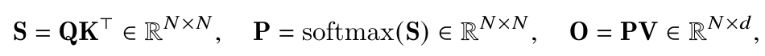

원문 비번호 정의 U1이다. [PDF p.3, §2.2; [원문](https://arxiv.org/pdf/2307.08691v1#page=3)]

```math
S=QK^\top\in\mathbb R^{N\times N},\qquad P=\mathrm{softmax}(S)\in\mathbb R^{N\times N},\qquad O=PV\in\mathbb R^{N\times d}
```

계산 순서는 다음과 같다.

1. Q의 한 행과 K의 모든 행을 내적한다. $`S_{rc}=\sum_{a=1}^d Q_{ra}K_{ca}`$는 query r가 key c에 주는 logit이다.
2. query r를 고정하고 모든 key c를 대상으로 softmax를 한다. 정규화 축을 query 축으로 바꾸면 다른 모델이 된다.
3. value의 feature a마다 $`O_{ra}=\sum_c P_{rc}V_{ca}`$를 계산한다. 출력의 row 수는 key 수가 아니라 query 수다.

**[리뷰어 보충]** 실제 scaled dot-product attention에서는 다음과 같이 scale과 mask를 넣는다. 원문은 해설을 위해 이를 생략한다.

```math
S=\tau QK^\top+M,\qquad \tau=d^{-1/2},\qquad M_{rc}=\begin{cases}0&c\le r\\-\infty&c\gt r\end{cases}
```

원문 p.3 각주에는 일반적 scale을 $`1/d`$라고 인쇄했지만, 표준 Transformer scale 및 확인한 공식 API의 기본값은 $`1/\sqrt d`$다. 두 scale은 softmax의 온도를 다르게 하므로 무심코 바꿀 수 없다. 커널의 exactness는 **입력 scale·mask·dropout까지 같은 attention**을 비교할 때의 동치다. [공식 코드 확인: `flash_attn_interface.py`, v2.0.0, lines 247-256]

mask의 $`-\infty`$는 exp 후 0이 된다. 각 row에 유효한 key가 적어도 하나 있다는 가정에서 row 확률합은 1이다. 모든 key가 mask된 row는 분모 0이므로 별도 출력 규약과 구현 분기가 필요하다. 이 edge case를 일반 softmax 식만으로 자동 해결했다고 보면 안 된다.

### 4.2 U2: backward의 다섯 식과 전치 오류

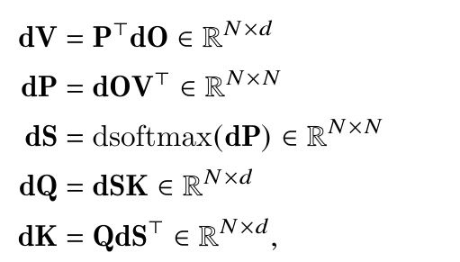

원문 비번호 정의 U2. 마지막 줄은 arXiv v1의 인쇄 그대로이며 아래 구현용 식과 다르다. [PDF p.3, §2.2]

원문 마지막 줄의 문제 부분을 편집 가능한 식으로 보존한다.

```math
\mathrm dK=Q\,\mathrm dS^\top\in\mathbb R^{N\times d}\qquad\text{(arXiv U2 printed; dimensionally inconsistent)}
```

Q가 $`N\times d`$이고 $`\mathrm dS^\top`$가 $`N\times N`$이므로 일반적으로 이 곱은 정의되지 않는다. **올바른 식은 $`\mathrm dK=\mathrm dS^\top Q`$**다. 같은 arXiv Algorithm 2 line 16, 그리고 ICLR p.3에서는 이 순서를 사용한다.

**[리뷰어 유도·교정]** dropout과 scale을 생략한 U1의 gradient는 다음과 같다.

```math
\begin{aligned}\mathrm dV&=P^\top\mathrm dO\in\mathbb R^{N\times d}\\\mathrm dP&=\mathrm dO V^\top\in\mathbb R^{N\times N}\\\mathrm dS&=P\circ\left(\mathrm dP-D\mathbf1_N^\top\right)\in\mathbb R^{N\times N}\\\mathrm dQ&=\mathrm dS K\in\mathbb R^{N\times d}\\\mathrm dK&=\mathrm dS^\top Q\in\mathbb R^{N\times d}\end{aligned}
```

| 연산 | 축과 shape 전개 | 직관 |
|---|---|---|
| $`P^\top\mathrm dO`$ | $`(N_k\times N_q)(N_q\times d)`$ | 하나의 value가 여러 query 출력에 기여한 정도를 모음 |
| $`\mathrm dOV^\top`$ | $`(N_q\times d)(d\times N_k)`$ | 특정 attention 확률을 조금 바꾸면 loss가 얼마나 달라지는가 |
| softmax backward | row별 $`N_k`$ key 축에서 center를 빼고 P와 원소곱 | 확률의 합이 1이라는 결합 제약을 반영 |
| $`\mathrm dSK`$ | $`(N_q\times N_k)(N_k\times d)`$ | 각 key가 query gradient에 주는 기여를 합침 |
| $`\mathrm dS^\top Q`$ | $`(N_k\times N_q)(N_q\times d)`$ | 각 query가 key gradient에 주는 기여를 합침 |

이 표는 전치의 의미를 드러내려고 $`N_q,N_k`$를 구분했다. 원문 self-attention에서는 둘 다 N이다. scaled logit $`S=\tau QK^\top+M`$을 썼다면 마지막 두 식에는 각각 $`\tau`$를 곱한다. $`\mathrm dV`$와 $`\mathrm dP`$에는 그 scale을 다시 곱하지 않는다.

### 4.3 U3: softmax Jacobian을 행렬로 만들지 않는 법

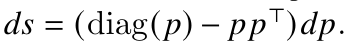

원문 p.3 문장 안의 핵심 식 U3이다. 단일 row를 column vector로 바라본 표기다.

```math
p=\mathrm{softmax}(s),\qquad \mathrm ds=\left(\mathrm{diag}(p)-pp^\top\right)\mathrm dp
```

기호는 $`s,p,\mathrm dp,\mathrm ds\in\mathbb R^N`$, Jacobian은 $`N\times N`$다. 출력 확률 $`p_c=e^{s_c}/\sum_j e^{s_j}`$를 입력 $`s_k`$로 미분하면 다음 결과를 얻는다. 이는 **리뷰어가 원문 식을 풀어 쓴 유도**다.

```math
\frac{\partial p_c}{\partial s_k}=p_c(\delta_{ck}-p_k),\qquad \mathrm ds_k=p_k\left(\mathrm dp_k-\sum_c p_c\mathrm dp_c\right)
```

첫 항은 자기 logit이 자기 확률을 높이는 효과, 두 번째 항은 분모 증가로 다른 확률들이 낮아지는 효과다. 실제 구현에서는 Jacobian을 만들지 않고 **내적 한 번과 원소별 연산**으로 계산한다.

특히 다음 항등식이 backward IO 절감의 핵심이다.

```math
\begin{aligned}D_r&=\sum_c P_{rc}\mathrm dP_{rc}=\sum_c P_{rc}\sum_a\mathrm dO_{ra}V_{ca}\\&=\sum_a\mathrm dO_{ra}\sum_cP_{rc}V_{ca}=\sum_a\mathrm dO_{ra}O_{ra}\end{aligned}
```

$`D_r`$는 scalar, D 전체는 $`N`$개다. 이미 가지고 있는 O와 dO를 feature 축으로 dot product하면 구할 수 있어, D 계산을 위해 P나 dP 전체를 HBM에서 읽을 필요가 없다. 그리고 dS 각 row의 합은 이론적으로 0이다. 모든 logit에 같은 상수를 더해도 softmax가 변하지 않는 성질과 대응한다.

<a id="online"></a>

## 5. FlashAttention과 online softmax [PDF pp.3-5, §2.3]

### 5.1 Figure 1: 큰 중간 행렬을 HBM에 남기지 않는다

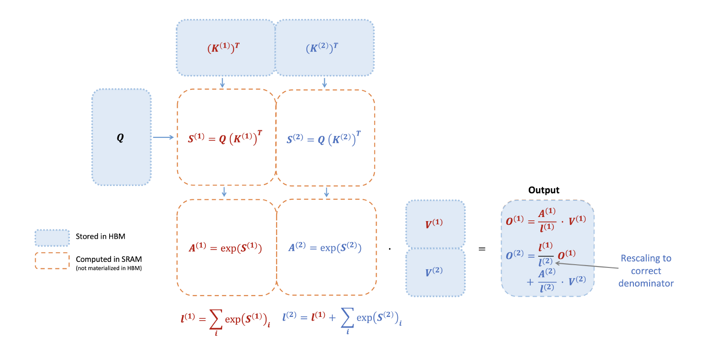

Figure 1. Q와 두 K/V block으로 score와 numerator를 만들고 누적하는 흐름. 원문의 그림은 max subtraction을 생략해 exp와 분모 재조정만 보여준다. [PDF p.4, Fig.1; [원문](https://arxiv.org/pdf/2307.08691v1#page=4)]

파란 영역은 HBM 저장 데이터, 주황 점선은 on-chip에서 계산하는 중간값이다. 첫 key tile에서 score를 만들고 exp를 취한 뒤 value와 곱한다. 두 번째 key tile을 처리하면서 **첫 tile 출력의 정규화 기준을 전체 분모로 바꾼다**. 그림 속 단순화 식의 뜻은 다음과 같다.

```math
A^{(j)}=\exp(S^{(j)}),\qquad \ell^{(1)}=\mathrm{rowsum}(A^{(1)}),\qquad \ell^{(2)}=\ell^{(1)}+\mathrm{rowsum}(A^{(2)})
```

```math
O^{(1)}=\mathrm{diag}(\ell^{(1)})^{-1}A^{(1)}V^{(1)},\qquad O^{(2)}=\mathrm{diag}\!\left(\frac{\ell^{(1)}}{\ell^{(2)}}\right)O^{(1)}+\mathrm{diag}(\ell^{(2)})^{-1}A^{(2)}V^{(2)}
```

이 그림용 A는 **지수 score 행렬**이며, 이후 이 리뷰가 FA2 numerator에 사용하는 $`A_i`$와 다르다. 원문 그림의 단순화를 그대로 실행하면 큰 logit에서 overflow가 날 수 있다. 실제 online softmax에는 다음의 running maximum 갱신이 필요하다.

### 5.2 U4: 두 block을 동시에 볼 수 있을 때의 정규화

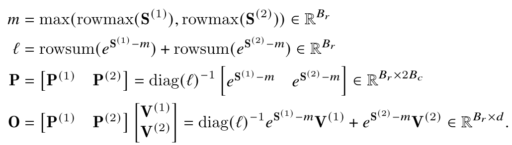

원문 비번호 묶음 U4. 마지막 식의 두 번째 value 항 앞에는 정규화 인자가 빠져 있다. [PDF p.4, §2.3.1]

첫 세 줄은 다음과 같다.

```math
\begin{aligned}m&=\max\!\left(\mathrm{rowmax}(S^{(1)}),\mathrm{rowmax}(S^{(2)})\right)\in\mathbb R^{B_r}\\\ell&=\mathrm{rowsum}(e^{S^{(1)}-m})+\mathrm{rowsum}(e^{S^{(2)}-m})\in\mathbb R^{B_r}\\P&=[P^{(1)}\ P^{(2)}]=\mathrm{diag}(\ell)^{-1}[e^{S^{(1)}-m}\ e^{S^{(2)}-m}]\in\mathbb R^{B_r\times2B_c}\end{aligned}
```

S의 각 block은 $`B_r\times B_c`$다. 먼저 두 block 전체에서 row 최대를 구하고, 두 exp 행렬을 동일한 m 기준으로 만든 다음, 양쪽 지수합을 합친다. $`P^{(1)}`$과 $`P^{(2)}`$는 각각 따로 합이 1인 확률이 아니라 **전체 행 확률의 부분집합**이다.

원문 마지막 줄을 문자 그대로 읽은 우변은 다음과 같다.

```math
O=\mathrm{diag}(\ell)^{-1}e^{S^{(1)}-m}V^{(1)}+e^{S^{(2)}-m}V^{(2)}\qquad\text{(U4 printed RHS)}
```

**[리뷰어 교정]** 정규화는 두 항을 합친 numerator 전체에 적용해야 한다.

```math
O=[P^{(1)}\ P^{(2)}]\begin{bmatrix}V^{(1)}\\V^{(2)}\end{bmatrix}=\mathrm{diag}(\ell)^{-1}\left(e^{S^{(1)}-m}V^{(1)}+e^{S^{(2)}-m}V^{(2)}\right)\in\mathbb R^{B_r\times d}
```

이렇게 쓰면 shape도 명확하다. 각 지수행렬 $`B_r\times B_c`$에 value $`B_c\times d`$를 곱해 $`B_r\times d`$를 얻고, query row별 분모로 나눈다. 대각행렬은 설명용 표기이며 실제 구현에서 생성하지 않는다.

### 5.3 U5: 첫 block의 요약만 가지고 다음 block을 합친다

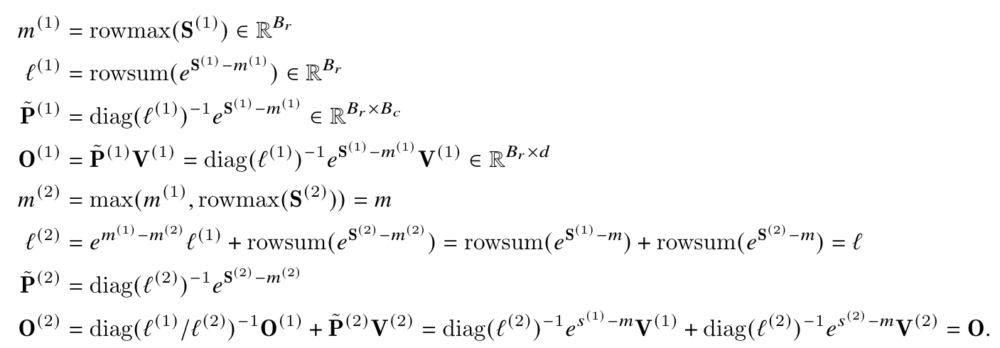

원문 비번호 묶음 U5. 마지막 줄의 rescale 인자에 오기가 있다. [PDF p.4]

첫 block에 대해서는 다음 네 줄이 직접 성립한다.

```math
\begin{aligned}m^{(1)}&=\mathrm{rowmax}(S^{(1)})\\\ell^{(1)}&=\mathrm{rowsum}(e^{S^{(1)}-m^{(1)}})\\\widetilde P^{(1)}&=\mathrm{diag}(\ell^{(1)})^{-1}e^{S^{(1)}-m^{(1)}}\\O^{(1)}&=\widetilde P^{(1)}V^{(1)}\end{aligned}
```

m과 ell은 row별 $`B_r`$개, $`\widetilde P^{(1)}`$는 $`B_r\times B_c`$, $`O^{(1)}`$는 $`B_r\times d`$다. 여기의 $`\widetilde P^{(1)}`$는 첫 block 안에서 정규화한 local probability다. Algorithm 1에서 같은 tilde 기호를 미정규화 exp에 쓰는 것과 혼동하지 않는다.

둘째 block을 읽으면 새로운 row maximum과 지수합을 갱신한다.

```math
\begin{aligned}m^{(2)}&=\max\!\left(m^{(1)},\mathrm{rowmax}(S^{(2)})\right)\\\alpha&=e^{m^{(1)}-m^{(2)}}\\\ell^{(2)}&=\alpha\circ\ell^{(1)}+\mathrm{rowsum}(e^{S^{(2)}-m^{(2)}})\\\widetilde P^{(2)}&=\mathrm{diag}(\ell^{(2)})^{-1}e^{S^{(2)}-m^{(2)}}\end{aligned}
```

$`\alpha`$는 이 리뷰가 재사용을 위해 붙인 이름이다. 새로운 최대가 더 커지면 기존 지수값이 표현된 단위를 바꿔야 한다. $`e^{s-m^{(2)}}=e^{m^{(1)}-m^{(2)}}e^{s-m^{(1)}}`$이므로 old sum에 alpha를 곱한다. $`m^{(2)}\ge m^{(1)}`$라서 $`0\le\alpha\le1`$이다. 새로운 큰 maximum을 발견할수록 이전 기여는 **작아져야** 한다.

원문 U5 마지막 줄의 첫 등식은 아래처럼 인쇄되어 있다.

```math
O^{(2)}=\mathrm{diag}(\ell^{(1)}/\ell^{(2)})^{-1}O^{(1)}+\widetilde P^{(2)}V^{(2)}\qquad\text{(arXiv U5 printed)}
```

역수가 잘못 붙고 maximum 변경에 따른 alpha가 빠졌다. **올바른 normalized-output 갱신**은 다음과 같다.

```math
\begin{aligned}O^{(2)}&=\mathrm{diag}\!\left(\frac{\alpha\circ\ell^{(1)}}{\ell^{(2)}}\right)O^{(1)}+\widetilde P^{(2)}V^{(2)}\\&=\mathrm{diag}(\ell^{(2)})^{-1}\left(e^{S^{(1)}-m^{(2)}}V^{(1)}+e^{S^{(2)}-m^{(2)}}V^{(2)}\right)=O\end{aligned}
```

첫 항은 old output에 들어 있던 local denominator를 풀고, 최대값 기준을 새로 맞추고, 전체 denominator로 다시 나눈 것이다. 두 번째 항은 새 block이 전체 output에 기여하는 몫이다. 따라서 처음 계산한 $`O^{(1)}`$을 그대로 더하거나 두 local output을 단순 평균하면 일반적으로 틀린다. ICLR p.3은 잘못된 역수는 제거했지만 이 normalized 설명식의 alpha 누락은 남아 있다. FA2의 Algorithm 1을 기준으로 동치를 확인하는 편이 안전하다.

### 5.4 Backward recomputation이 메모리와 시간을 모두 줄일 수 있는 이유

[저자 보고] FA1은 backward에서 S와 P를 다시 계산한다. 저장하면 산술은 줄지만 제곱 크기 P를 HBM에 보관하고 다시 가져와야 한다. 반대로 Q/K/V tile을 on-chip에 올린 상태에서 score GEMM과 exp를 재계산하면 저장 비용을 피한다. 논문은 조건에 따라 10-20배 memory saving과 2-4배 가속이라는 FA1 결과를 배경으로 인용한다. 이를 **FA2가 FA1보다 다시 10-20배 메모리를 줄인 결과**로 읽으면 안 된다. [PDF p.5, §2.3.2]

forward에는 score와 output의 두 matmul이 있다. 재계산을 포함한 backward에는 score 재계산, dV, dP, dQ, dK의 다섯 matmul이 있다. 유지할 tile과 gradient가 더 많아 backward는 register·shared memory pressure와 동기화가 더 복잡하다. 이것이 “backward의 수식은 깔끔한데 성능 최적화는 더 어려운” 이유다.

<a id="fa2-forward"></a>

## 6. FA2 forward: 정규화를 마지막으로 미룬다 [PDF pp.5-7, §3.1.1]

### 6.1 U6-U7: normalized output 대신 numerator를 유지

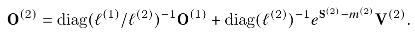

U6. p.5가 최적화의 출발점으로 다시 적은 normalized-output 식이다. U5와 같은 rescale 오류가 반복된다.

```math
O^{(2)}=\mathrm{diag}(\ell^{(1)}/\ell^{(2)})^{-1}O^{(1)}+\mathrm{diag}(\ell^{(2)})^{-1}e^{S^{(2)}-m^{(2)}}V^{(2)}\qquad\text{(U6 printed)}
```

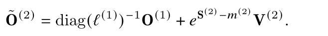

U7. 정규화를 미루자는 동기는 맞지만, 첫 항의 대각행렬 역수와 maximum 보정이 잘못 적혀 있다. 이 식을 구현으로 복사하면 안 된다. [PDF p.5]

```math
\widetilde O^{(2)}=\mathrm{diag}(\ell^{(1)})^{-1}O^{(1)}+e^{S^{(2)}-m^{(2)}}V^{(2)}\qquad\text{(U7 printed)}
```

**[리뷰어 유도]** 먼저 $`A^{(1)}=\mathrm{diag}(\ell^{(1)})O^{(1)}`$라고 정의한다. 이미 정규화된 O에 denominator를 **곱해야** numerator가 복원된다. 다음 block으로 넘어가면 다음처럼 계산한다.

```math
\begin{aligned}A^{(2)}&=\mathrm{diag}(\alpha)A^{(1)}+e^{S^{(2)}-m^{(2)}}V^{(2)}\\&=\mathrm{diag}(\alpha\circ\ell^{(1)})O^{(1)}+e^{S^{(2)}-m^{(2)}}V^{(2)}\\O^{(2)}&=\mathrm{diag}(\ell^{(2)})^{-1}A^{(2)}\end{aligned}
```

진짜 계산에서는 O를 매 iteration 만들지 않고 A만 계속 갱신한다. running max가 바뀔 때 alpha를 곱하는 작업은 여전히 필요하다. 줄이는 것은 **각 단계에서 확률/output을 완전히 정규화하는 반복 작업**이다. exp, max, sum과 모든 rescale을 없애는 것이 아니다.

### 6.2 U8: backward를 위해 L 하나만 저장

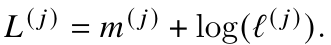

U8. row별 m과 ell을 둘 다 HBM에 남기는 대신 logsumexp로 합친다. [PDF p.5]

```math
L^{(j)}=m^{(j)}+\log\ell^{(j)}
```

한 query row에서 $`\ell=\sum_c e^{S_c-m}`$이므로 $`L=\log\sum_c e^{S_c}`$다. 재계산한 score에서 L을 빼면 softmax 확률을 직접 복원할 수 있다.

```math
P_{rc}=e^{S_{rc}-L_r}=\frac{e^{S_{rc}-m_r}}{\ell_r}
```

forward 중에는 m과 ell이 필요하고, **forward 종료 후 backward용 HBM 저장 상태**를 줄이는 것이다. L 하나로 O나 Q/K/V까지 복원할 수 있다는 뜻은 아니다. $`L_i`$의 shape은 $`B_r`$, 전체 L은 $`N`$이다. 학습용 extra statistic은 row당 scalar 하나로 충분하지만 실제 backward 구현의 gradient workspace는 이보다 크다.

### 6.3 U9: FA2 두-block recurrence

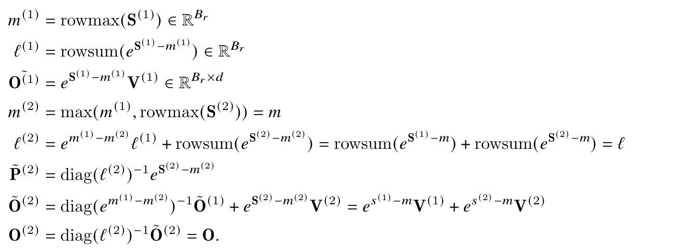

U9. arXiv p.6의 전체 비번호 묶음이다. tilde-P 정의는 normalized 형태가 남아 있고, tilde-O 갱신에는 잘못된 역수가 있다.

원문의 핵심 오류 항은 다음과 같다.

```math
\widetilde O^{(2)}=\mathrm{diag}(e^{m^{(1)}-m^{(2)}})^{-1}\widetilde O^{(1)}+e^{S^{(2)}-m^{(2)}}V^{(2)}\qquad\text{(arXiv U9 printed update)}
```

**[리뷰어 교정]** 이 리뷰의 A 표기로 모든 줄을 일관되게 다시 쓰면 아래와 같다.

```math
\begin{aligned}m^{(1)}&=\mathrm{rowmax}(S^{(1)}),&\ell^{(1)}&=\mathrm{rowsum}(e^{S^{(1)}-m^{(1)}})\\A^{(1)}&=e^{S^{(1)}-m^{(1)}}V^{(1)},&m^{(2)}&=\max(m^{(1)},\mathrm{rowmax}(S^{(2)}))\\\alpha&=e^{m^{(1)}-m^{(2)}},&E^{(2)}&=e^{S^{(2)}-m^{(2)}}\\\ell^{(2)}&=\alpha\circ\ell^{(1)}+\mathrm{rowsum}(E^{(2)}),&A^{(2)}&=\mathrm{diag}(\alpha)A^{(1)}+E^{(2)}V^{(2)}\\O&=\mathrm{diag}(\ell^{(2)})^{-1}A^{(2)},&L&=m^{(2)}+\log\ell^{(2)}\end{aligned}
```

E는 numerator용 $`B_r\times B_c`$ 지수 tile이고 row 합 1을 요구하지 않는다. m, ell, alpha, L은 $`B_r`$ vector다. A와 O는 $`B_r\times d`$다. 원문 U9의 $`\widetilde P^{(2)}=\mathrm{diag}(\ell^{(2)})^{-1}e^{S^{(2)}-m^{(2)}}`$는 U5에서 쓰던 normalized 기호가 남은 줄이며, FA2의 Algorithm 1 line 9는 $`\widetilde P=\exp(S-m)`$를 쓴다. 둘을 섞어 이미 정규화된 P에 마지막 나눗셈을 한 번 더 적용하지 않아야 한다.

### 6.4 Algorithm 1: 17개 행을 실행 순서대로 읽기

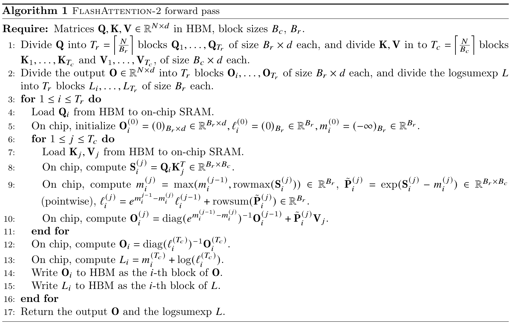

Algorithm 1. 원문 arXiv p.6 전체. line 10의 inverse 오류는 아래에서 교정한다. [PDF p.6; [원문](https://arxiv.org/pdf/2307.08691v1#page=6)]

| 행 | 수행하는 일 | shape·실행 의미 |
|---|---|---|
| Require | HBM의 Q/K/V와 tile 크기를 받음 | 논문은 scale, mask, dropout 없는 기본 attention을 먼저 정의 |
| 1 | Q를 row tile, K/V를 sequence tile로 분할 | $`T_r=\lceil N/B_r\rceil`$, $`T_c=\lceil N/B_c\rceil`$. Q tile $`B_r\times d`$, K/V tile $`B_c\times d`$ |
| 2 | O와 L의 출력 영역을 row tile로 나눔 | O는 $`N\times d`$, L은 N. 물리적으로 전체 tensor를 복사해 쪼갤 필요는 없음 |
| 3 | query tile i에 대한 바깥 loop | 다른 i의 output 영역과 겹치지 않아 별도 thread block으로 병렬화 가능 |
| 4 | Q_i를 on-chip으로 가져옴 | 해당 i의 K/V loop 내내 재사용할 입력 |
| 5 | accumulator=0, ell=0, m=-infinity | 원문의 중간 O는 아직 정규화되지 않은 A. 처음 유효 tile의 alpha는 0 |
| 6 | key/value tile j를 순회 | softmax 정규화가 전체 key에 의존하므로 row별 누적 상태 유지 |
| 7 | K_j, V_j를 on-chip으로 load | 서로 다른 i block은 같은 K/V를 다시 읽을 수 있음 |
| 8 | score tile $`S_i^{(j)}=Q_iK_j^\top`$ | $`(B_r\times d)(d\times B_c)`$, 첫 Tensor Core matmul |
| 9 | m 갱신, exp tile 계산, ell 갱신 | key 축 max/sum. old ell에는 alpha를 곱하고 새 exp 합을 더함 |
| 10 | old numerator rescale 후 exp×V 누적 | $`A_i\leftarrow\mathrm{diag}(\alpha)A_i+E_i^{(j)}V_j`$. **inverse 없음**. 두 번째 matmul |
| 11 | j loop 종료 | 아직 A는 전체 key에 대한 미정규화 numerator |
| 12 | A의 각 row를 최종 ell로 나눔 | 최초이자 최종적인 full-row output normalization |
| 13 | $`L_i=m_i+\log\ell_i`$ | backward 재계산용 row statistic |
| 14 | O_i를 HBM에 기록 | score와 exp tile은 전체 행렬로 저장하지 않음 |
| 15 | L_i를 HBM에 기록 | 전체 N scalar |
| 16 | i loop 종료 | 실제 GPU grid의 query tile 작업 종료 |
| 17 | O, L 반환 | 상위 layer에 O, autograd 저장 상태에 L 사용 |

ICLR 출판본 Algorithm 1 line 10을 직접 대조하면 잘못된 역수가 제거되어 있다.

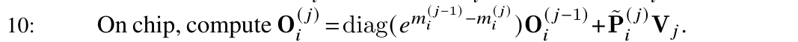

ICLR p.5 line 10. 공식 v2.0.0 코드 역시 old accumulator에 alpha를 **곱한다**. 따라서 arXiv 오탈자 지적은 구현이 잘못됐다는 주장이 아니다.

행 8-13의 구현용 수식만 모으면 다음과 같다. 이것은 원문 알고리즘의 교정·통합 표기다.

```math
\begin{aligned}S_{ij}&=Q_iK_j^\top\\m_i^{\mathrm{new}}&=\max(m_i,\mathrm{rowmax}(S_{ij}))\\\alpha_i&=\exp(m_i-m_i^{\mathrm{new}}),\qquad E_{ij}=\exp(S_{ij}-m_i^{\mathrm{new}})\\\ell_i&\leftarrow\alpha_i\circ\ell_i+\mathrm{rowsum}(E_{ij})\\A_i&\leftarrow\mathrm{diag}(\alpha_i)A_i+E_{ij}V_j,\qquad m_i\leftarrow m_i^{\mathrm{new}}\\O_i&=\mathrm{diag}(\ell_i)^{-1}A_i,\qquad L_i=m_i+\log\ell_i\end{aligned}
```

여기서 마지막 O/L 계산은 j loop **밖**에서 실행한다. code의 K/V 순회가 역방향이어도 같은 recurrence를 쓰면 실수 산술에서 결과는 같다. mask 경계와 first-iteration 처리는 순회 순서에 맞춰 구현해야 한다.

### 6.5 Exactness의 불변식 증명

원문은 correctness proof를 FA1의 정리와 거의 같다는 이유로 생략한다. 다음은 그 논리를 이 리뷰가 재구성한 증명이다. 한 query row r에 대해 지금까지 처리한 key 집합을 $`\mathcal C_j`$라고 하자.

```math
m_r^{(j)}=\max_{c\in\mathcal C_j}S_{rc},\qquad \ell_r^{(j)}=\sum_{c\in\mathcal C_j}e^{S_{rc}-m_r^{(j)}},\qquad A_r^{(j)}=\sum_{c\in\mathcal C_j}e^{S_{rc}-m_r^{(j)}}V_c
```

첫 유효 tile에서는 세 식이 직접 성립한다. 다음 tile에서 m이 커지면 이전 ell과 A의 각 항에 $`e^{m^{(j-1)}-m^{(j)}}`$를 곱한다. 그러면 old key의 모든 항이 새 maximum 기준으로 바뀐다. 여기에 새 tile의 지수합·가중합을 더하므로 위 불변식이 유지된다. 마지막으로 numerator와 denominator를 나누면 공통 $`e^{-m}`$가 소거되어 U1의 softmax output을 얻는다.

이 증명에서 어느 key도 근사·누락하지 않는다. causal attention에서는 허용 key만 집합에 포함하면 된다. 다만 부동소수점은 덧셈 결합법칙이 정확히 성립하지 않아, tile 순서나 atomic accumulation 순서가 다르면 끝자리 오차가 달라질 수 있다. **Exact attention은 함수의 동치이며 모든 dtype에서 bitwise equality를 보장한다는 표현이 아니다.**

### 6.6 실제로 줄어드는 non-matmul 연산

[저자 보고] A100의 FP16/BF16 Tensor Core matmul peak 312 TFLOPs/s와 일반 FP32 연산 peak 19.5 TFLOPs/s를 비교하면 16배 차이다. 이는 모든 scalar instruction의 latency가 matmul instruction의 정확히 16배라는 측정이 아니라 **처리량 비대칭을 보여주는 비용 모델**이다. exp, reciprocal, memory stall은 이 단순 비율로 모두 설명되지 않는다. [PDF p.5]

normalized output 갱신에서는 old output의 계수 계산과 row rescale, 새 확률의 denominator 적용 등 반복 작업이 발생한다. FA2는 미정규화 exp tile을 두 번째 GEMM에 넘기고, output row의 최종 reciprocal multiplication을 key tile loop 뒤로 미룬다. 또한 backward용 m/ell 두 배열을 L 한 배열로 줄이고, causal block 중 완전히 유효한 영역에는 elementwise causal mask를 적용하지 않는다.

**[리뷰어 해석]** 반복 output 정규화는 query당 key tile 수만큼 발생할 수 있지만 최종 정규화는 한 번이다. 그 주변 elementwise 작업의 크기는 대략 $`T_rT_cB_rd`$와 $`T_rB_rd`$의 차이를 보인다. 반면 alpha를 곱하는 numerator 보정 자체는 loop에 남는다. 특정 연산이 몇 개 줄었는지는 실제 fusion·layout에 따라 달라지므로 이 식을 전체 커널 FLOPs 절감률이라고 제시하지 않는다.

### 6.7 Causal mask의 세 영역

query의 전역 row가 r, key의 전역 column이 c라면 허용 조건은 $`c\le r`$다.

| tile 위치 | 처리 | 이유 |
|---|---|---|
| 모든 key index가 모든 query index보다 큼 | score·softmax·PV tile 자체를 건너뜀 | 미래 key만 있는 완전 masked tile |
| 모든 key index가 모든 query index보다 작거나 같음 | elementwise causal mask를 생략하고 dense tile 계산 | 전 원소가 허용됨 |
| 대각 경계와 교차함 | 원소별 $`c\gt r`$ mask를 적용 | 한 tile 안에 허용·비허용 쌍이 섞임 |

원문 p.6 두 번째 bullet은 masking 불필요 조건을 row가 column보다 “strictly less”라고 적었지만 방향이 뒤집혀 있다. 올바른 완전 유효 조건은 **column이 row보다 작음**이다. 같은 크기로 정렬한 square tile에서는 각 query tile에 대각선 tile 하나만 경계 mask가 필요하지만, rectangular tile에서는 여러 경계 tile이 필요할 수 있다. 공식 코드도 $`\lceil B_r/B_c\rceil`$를 사용한다.

논문이 보고한 causal의 약 1.7-1.8배 가속은 비causal attention 대비 계산을 거의 절반 건너뛰는 효과다. FA2 대 FA1의 가속비와 별개이며, 같은 입력의 causal output과 noncausal output은 서로 다른 attention 함수다.

<a id="backward"></a>

## 7. FA2 backward와 Algorithm 2 [PDF p.7, §3.1.2; ICLR Appendix A]

### 7.1 무엇을 저장하고 무엇을 다시 계산하는가

forward에서 Q/K/V, 최종 O, row logsumexp L을 확보한다. 상위 loss가 dO를 내려주면 D를 먼저 계산하고, 각 K/V tile에 대해 모든 query tile을 순회한다. 매번 S와 P를 복원하지만 **이미 최종 L을 알고 있으므로 forward식 running maximum 병합은 필요 없다**. [PDF p.7]

```math
D=\mathrm{rowsum}(\mathrm dO\circ O)\in\mathbb R^N,\qquad S_{ij}=Q_iK_j^\top,\qquad P_{ij}=\exp(S_{ij}-L_i)
```

D는 feature d축을 축약하고, L은 key N축을 정규화한 결과다. 두 벡터 모두 query별 값이지만 **축약한 축과 역할이 다르다**. L은 확률을 복원하고 D는 softmax gradient의 공통 center다.

### 7.2 Algorithm 2: 20개 행 해설

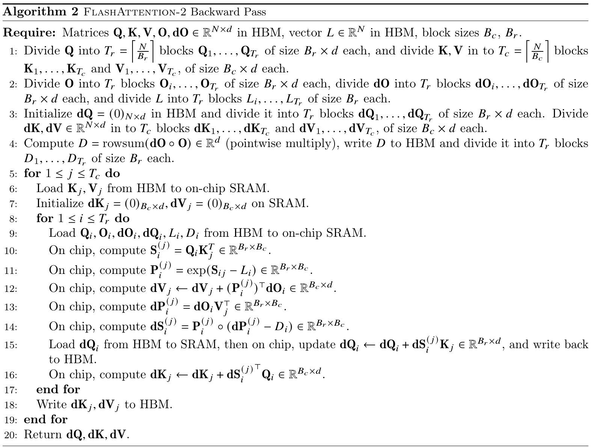

Algorithm 2. arXiv p.7 전체. 동일 알고리즘이 ICLR p.12 Appendix A에 있다. 두 버전 모두 line 4의 D shape에는 $`\mathbb R^d`$ 오기가 남아 있다. [PDF p.7; [원문](https://arxiv.org/pdf/2307.08691v1#page=7)]

| 행 | 연산과 실행 순서 | 왜 필요한가 |
|---|---|---|
| Require | Q/K/V/O/dO, L, tile 크기 입력 | O와 L은 forward 결과. gradient를 받을 새 loss parameter는 없음 |
| 1 | Q와 K/V를 tile로 나눔 | forward와 같은 논리적 row/column 좌표 |
| 2 | O/dO/L을 query tile로 나눔 | $`O_i,\mathrm dO_i:B_r\times d`$, $`L_i:B_r`$ |
| 3 | 전체 dQ를 0으로 초기화, dK/dV output 영역 준비 | dQ는 여러 key block에서 기여를 누적하므로 zero가 필요 |
| 4 | $`D_r=\sum_a\mathrm dO_{ra}O_{ra}`$를 미리 계산 | P/dP 전체를 만들지 않고 softmax gradient용 내적을 얻음. 출력은 N scalar |
| 5 | key/value tile j의 바깥 loop | dK_j, dV_j의 소유권을 하나의 block에 모으기 쉬움 |
| 6 | K_j/V_j on-chip load | 모든 query tile과의 상호작용에서 재사용 |
| 7 | dK_j/dV_j accumulator 0 | shape $`B_c\times d`$ |
| 8 | query tile i의 안쪽 loop | 해당 key tile이 모든 query에 기여한 gradient를 합침 |
| 9 | Q_i/O_i/dO_i/dQ_i/L_i/D_i load | 의사코드는 필요한 상태를 포괄적으로 열거. 실제 코드는 live range와 별도 preprocessing으로 일부 load를 줄일 수 있음 |
| 10 | score $`Q_iK_j^\top`$ 재계산 | 저장했던 N×N S를 읽지 않음 |
| 11 | $`P_{ij}=\exp(S_{ij}-L_i)`$ | L_i를 key 축으로 broadcast. 전체 key에 대해 정규화된 probability tile |
| 12 | $`\mathrm dV_j\mathrel{+}=P_{ij}^\top\mathrm dO_i`$ | $`(B_c\times B_r)(B_r\times d)`$ |
| 13 | $`\mathrm dP_{ij}=\mathrm dO_iV_j^\top`$ | $`(B_r\times d)(d\times B_c)`$ |
| 14 | $`\mathrm dS_{ij}=P_{ij}\circ(\mathrm dP_{ij}-D_i)`$ | row scalar D_i를 각 key column에 broadcast |
| 15 | $`\mathrm dQ_i\mathrel{+}=\mathrm dS_{ij}K_j`$를 HBM에 반영 | 다른 j와 같은 dQ_i를 갱신하므로 병렬화 시 atomic/reduction 필요 |
| 16 | $`\mathrm dK_j\mathrel{+}=\mathrm dS_{ij}^\top Q_i`$ | $`(B_c\times B_r)(B_r\times d)`$. 본문의 잘못된 전치 순서를 바로잡는 근거 |
| 17 | i loop 종료 | j에 대한 모든 query 기여가 모임 |
| 18 | 최종 dK_j/dV_j를 HBM으로 write | 중간마다 write하는 일을 줄임 |
| 19 | j loop 종료 | 실제 GPU에서는 서로 다른 j를 병렬 처리 |
| 20 | dQ/dK/dV 반환 | QKV projection과 이전 layer로 backpropagation 진행 |

line 9와 15가 dQ load를 반복해 적었다고 해서 실제 구현이 매번 두 번 load한다는 결론은 낼 수 없다. 의사코드의 data dependency와 compiled kernel의 실제 memory instruction은 구분해야 한다. 또한 원문의 순차 $`\leftarrow`$ 갱신을 여러 block에 그대로 실행하면 data race다. §3.2의 atomic add 설명까지 읽어야 병렬 backward가 완성된다.

### 7.3 Gradient 흐름과 다섯 matmul

```math
\begin{aligned}\mathrm dV_j&\mathrel{+}=P_{ij}^\top\mathrm dO_i\\\mathrm dP_{ij}&=\mathrm dO_iV_j^\top\\\mathrm dS_{ij}&=P_{ij}\circ(\mathrm dP_{ij}-D_i\mathbf1_{B_c}^\top)\\\mathrm dQ_i&\mathrel{+}=\tau\,\mathrm dS_{ij}K_j\\\mathrm dK_j&\mathrel{+}=\tau\,\mathrm dS_{ij}^\top Q_i\end{aligned}
```

이는 실용 scale $`\tau`$를 복원한 보조 표기다. S 재계산에도 같은 scale과 mask가 들어가야 한다. dV와 dP, dQ, dK에 사용되는 네 matmul과 score 재계산 하나를 합쳐 다섯 matmul이다. softmax gradient는 추가 GEMM이 아니라 원소별 연산이다.

forward와 backward를 대조하면 무엇을 recompute하고 저장하지 않는지 분명해진다. **저장하지 않는 것은 제곱 크기 P이고, 저장하는 작은 L이 P 재계산을 가능하게 한다.** 그러나 backward는 QKV와 dQKV 전체가 필요하므로 모델 학습 총 memory가 단순 N scalar로 바뀌는 것은 아니다.

### 7.4 Dropout을 복원할 때의 주의

원문의 핵심 알고리즘은 dropout을 생략한다. 다음은 일반 attention을 위한 **리뷰어 보충 유도**이며, 공식 API는 dropout을 지원한다.

```math
R_{rc}\sim\mathrm{Bernoulli}(1-p_{\mathrm{drop}}),\qquad \widehat P=\frac{R\circ P}{1-p_{\mathrm{drop}}},\qquad O=\widehat P V
```

```math
\mathrm dV=\widehat P^\top\mathrm dO,\qquad \mathrm dP=\frac{R\circ(\mathrm dO V^\top)}{1-p_{\mathrm{drop}}},\qquad \mathrm dS=P\circ\left(\mathrm dP-\mathrm{rowsum}(\mathrm dP\circ P)\mathbf1_N^\top\right)
```

dropout 뒤 행 확률합은 각 realization에서 1이 아닐 수 있지만, softmax의 denominator L은 dropout **전** P를 위한 값이다. 기대값 보정은 keep probability로 나눈다. backward에서 같은 R을 재생성해야 forward와 같은 함수의 gradient가 된다. 이때도 $`\sum_cP_{rc}\mathrm dP_{rc}=\sum_aO_{ra}\mathrm dO_{ra}`$ 항등식은 위 dropout 경로를 일관되게 적용하면 성립한다. 확인한 v2.0.0 Python autograd wrapper는 이를 위해 CUDA RNG 상태를 저장·복구한다. evaluation에서는 dropout 확률을 0으로 설정한다.

<a id="partition"></a>

## 8. Thread block과 warp를 어떻게 나누는가 [PDF pp.7-9, §3.2-3.3]

### 8.1 Figure 2: forward는 query row, backward는 key column

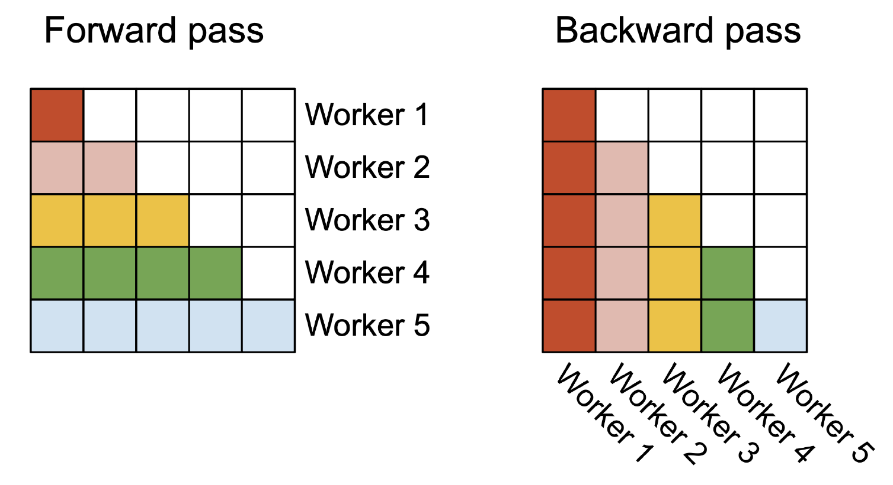

Figure 2. 색은 worker가 소유하는 attention tile 집합이다. causal 그림에서 앞 query는 적은 key를, 뒤 query는 많은 key를 본다. [PDF p.8, Fig.2]

FA1이 batch와 head만 병렬화하면 thread block 수는 대략 $`BH`$다. FA2의 training/prefill forward에서는 다음처럼 늘어난다.

```math
G_{\mathrm{FA1}}\approx BH,\qquad G_{\mathrm{FA2,fwd}}=BH\left\lceil\frac{N}{B_r}\right\rceil,\qquad G_{\mathrm{FA2,bwd}}\approx BH\left\lceil\frac{N}{B_c}\right\rceil
```

이 식은 grid의 work item 수이며, SM에 **동시에 상주 가능한 block 수**는 아니다. 해설용으로 B=1, H=16, N=16,384, B_r=128이면 FA1은 16개, FA2 forward는 2,048개 block이다. A100의 108 SM에 배분할 일이 훨씬 많아진다. 같은 block이 특정 SM에 영구 고정된다는 의미도 아니다. GPU scheduler가 남은 작업을 계속 배치한다.

forward의 각 i는 O_i와 L_i만 쓰므로 다른 row block과 output 합산을 할 필요가 없다. K/V는 서로 읽기만 하므로 공유 input의 동기화가 필요하지 않다. 대신 각 query block이 K/V를 다시 load하는 tradeoff가 있다. L2 hit와 parallel memory service를 포함해 실제 이익을 판단해야 한다.

backward에서는 각 j가 dK_j와 dV_j를 소유한다. 여러 j가 동일 query의 dQ_i에 기여하므로 dQ는 atomic add로 모은다. 합 순서가 비결정적일 수 있어 tolerance 기반 수치 검증이 필요하다. 이 atomic 경로의 추가 workspace와 전후처리 kernel도 backward 시간에 포함해야 한다.

### 8.2 Causal 작업량 불균형과 occupancy의 정확한 뜻

Figure 2의 forward 첫 worker는 tile 하나, 마지막 worker는 더 많은 tile을 처리한다. backward도 column 위치에 따라 작업량이 다르다. sequence 병렬화가 **동일한 크기의 일감으로 완벽히 균등 분배한다**는 뜻은 아니다. 많은 block을 만들어 scheduler가 빈 SM을 채울 여지를 주는 것이다.

논문은 occupancy를 GPU 자원 활용이라는 넓은 의미로 설명한다. 성능 분석에서는 아래를 분리하는 편이 정확하다.

- **Grid 병렬성:** 전체 GPU를 채울 독립 block이 충분한가.
- **SM resident warp occupancy:** 하드웨어 한도 대비 현재 SM에 상주하는 warp 비율이 얼마인가.
- **실제 issue/compute 활용:** 상주 warp가 memory/barrier 때문에 기다리지 않고 유용한 instruction을 발행하는가.

NVIDIA 문서상 A100 SM의 register file은 64K개의 32-bit register이고 최대 concurrent warp는 64개다. register와 shared memory가 block당 많이 필요하면, grid가 커도 SM당 한두 block만 올라갈 수 있다. [NVIDIA Ampere tuning guide](https://docs.nvidia.com/cuda/ampere-tuning-guide/index.html#occupancy)

### 8.3 Figure 3: sliced-K에서 sliced-Q로

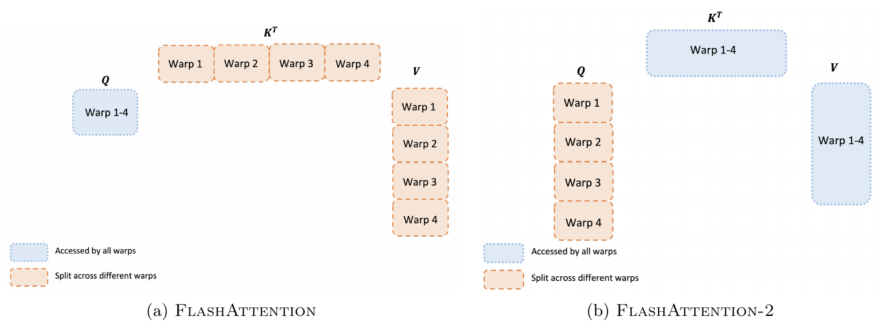

Figure 3. 파란 영역은 여러 warp가 접근하는 operand, 주황 영역은 warp별 분할이다. [PDF p.9, Fig.3]

원문은 기존 방식을 “split-K”라고 부른다. 여기서는 혼동을 줄이기 위해 **한 thread block 내부의 sliced-K**라고 부른다. attention의 key sequence tile을 warp들에 나누는 것이고, GEMM 축 표기에서 흔히 쓰는 reduction-dimension K나, decode에서 여러 thread block에 KV를 나누는 방식과 반드시 같은 의미는 아니다.

**Sliced-K의 의존성.** 각 warp가 Q의 같은 row들에 대해 서로 다른 key subset을 계산한다. softmax의 row denominator와 output은 전체 key의 기여를 모아야 하므로 warp들 간 reduction/통신이 필요하다. 이미 전체 row normalization이 알려졌다고 가정해도 output은 다음처럼 partial sum들의 합이다.

```math
O_i=\sum_{w=1}^{W}P_{i,\mathcal C_w}V_{\mathcal C_w}
```

부분합 하나의 shape은 $`B_r\times d`$다. W개 warp가 동일 output 원소를 만들므로 각 partial 결과를 shared memory에 기록하고 barrier 후 더하는 비용이 발생한다. online softmax에서는 maximum과 sum의 조정도 맞아야 하므로 단순한 partial output 덧셈만으로 끝나지 않는다.

**Sliced-Q의 소유권.** 각 warp가 서로 다른 query row subset을 맡고 K/V tile에는 함께 접근한다. 각 warp의 output은 다음과 같다.

```math
O_{\mathcal R_w}=P_{\mathcal R_w,:}V,\qquad O_i=\mathrm{concat}_{\mathrm{rows}}(O_{\mathcal R_1},\ldots,O_{\mathcal R_W})
```

softmax는 query row끼리 결합하지 않으므로 warp별 m/ell/A와 output이 독립이다. 결과를 합산할 필요 없이 서로 다른 row 위치에 쓰면 된다. 예를 들어 B_r=128, B_c=64, d=64, W=4라는 해설용 tile에서는 각 warp가 논리적으로 Q의 32개 row, score 32×64, output 32×64를 맡는다. 실제 register fragment 배치는 MMA layout에 따라 interleave되므로 물리 주소가 연속된 32행 한 덩어리라고 단정하지 않는다.

**중요한 한정:** 제거되는 것은 warp 사이의 불필요한 **output partial reduction**이다. K/V cooperative load, shared-memory buffer 재사용, MMA operand 전달을 위한 barrier는 남는다. 공식 forward 소스에도 `cp_async_wait`와 `__syncthreads()`가 존재한다. backward는 dQ/dK/dV dependency가 더 복잡해 동기화가 더 남는다. [공식 코드 확인]

### 8.4 한 tile의 HBM → shared → register → HBM 경로

| 순서 | 데이터 이동·연산 | 유지되는 상태 |
|---|---|---|
| 1 | HBM Q_i를 shared memory로 load, 필요한 layout으로 register operand 구성 | Q_i 또는 그 fragment를 재사용 |
| 2 | K_j/V_j를 HBM에서 shared memory로 가져옴 | 현재/다음 tile staging. 구현에서 async copy와 compute를 겹칠 수 있음 |
| 3 | QK^T MMA | FP32 accumulator의 score fragment |
| 4 | mask, row max, exp, sum, old output rescale | m/ell과 numerator A. score fragment를 지수 fragment로 바꾸어 재사용 가능 |
| 5 | exp fragment를 FP16/BF16 operand로 변환하고 PV MMA | FP32 output accumulator 누적 |
| 6 | 다음 K/V tile로 반복 | N×N score/P를 global memory에 저장하지 않음 |
| 7 | 최종 ell로 나누고 output dtype으로 변환 | O와 FP32 L을 HBM에 기록 |

이 경로는 논문의 “on-chip”을 실제 구현의 register와 shared memory로 풀어 쓴 것이다. P tile이 수학적으로 존재해도 독립적인 full matrix allocation이 필요하지 않다. 일부 dtype conversion은 Tensor Core 입력 제약 때문에 들어간다. 따라서 exact 알고리즘이라도 floating-point rounding이 dense PyTorch의 연산 순서와 다를 수 있다.

### 8.5 Tile 크기의 tradeoff

[저자 보고] B_r, B_c는 보통 64 또는 128을 선택하고 head dimension과 device shared memory에 맞춰 수동 조정한다. 큰 tile은 operand reuse를 늘릴 수 있지만 register와 shared memory를 많이 요구하며, register spilling이나 launch 불가까지 초래할 수 있다. 논문은 자동 tuning을 future work로 남긴다. [PDF p.9]

해설용으로 FP16/BF16 입력, B_r=B_c=128, d=64일 때 Q/K/V를 한 벌씩 staging하는 단순 합계는 48 KiB다. d=128이면 96 KiB다. 미정규화 O accumulator는 FP32 기준 각각 32 KiB 또는 64 KiB의 **논리적 원소량**이다. 이것은 block 전체 thread에 분산되며, score fragment·index·pipeline 상태와 compiler allocation도 추가된다.

```math
M_{\mathrm{QKV,staging}}\approx 2d(B_r+2B_c)\ \mathrm{bytes},\qquad M_{\mathrm{A,logical}}=4B_rd\ \mathrm{bytes}
```

register 안의 데이터를 shared-memory budget에 단순 합산하지 않는다. 코드가 Q/K shared buffer를 재사용하거나 Q를 register에 유지하면 staging 합계도 달라진다. 이 수치는 설계 감각을 위한 **리뷰어 메모리 계산**이지 해당 binary의 ptxas register report가 아니다.

### 8.6 MQA/GQA의 forward와 backward

논문 p.7은 여러 query head가 같은 K/V head를 공유하는 MQA/GQA를 지원한다고 설명한다. Q와 KV를 물리적으로 복제하기보다 head index를 대응시킨다.

```math
g=H_q/H_{kv},\qquad h_{kv}(h_q)=\left\lfloor h_q/g\right\rfloor,\qquad O^{h_q}=\mathrm{softmax}\!\left(\tau Q^{h_q}(K^{h_{kv}(h_q)})^\top\right)V^{h_{kv}(h_q)}
```

이 보조 식에서 Q는 $`B\times N_q\times H_q\times d`$, K/V는 $`B\times N_k\times H_{kv}\times d`$이고 $`H_q`$가 $`H_{kv}`$로 나누어떨어져야 한다. H_q=6, H_kv=2라면 query head 0-2가 KV head 0, query head 3-5가 KV head 1을 사용한다. MQA는 H_kv=1인 특수한 경우다.

```math
\mathrm dK^{h_{kv}}=\sum_{h_q:h_{kv}(h_q)=h_{kv}}\mathrm dK^{(h_q\to h_{kv})},\qquad \mathrm dV^{h_{kv}}=\sum_{h_q:h_{kv}(h_q)=h_{kv}}\mathrm dV^{(h_q\to h_{kv})}
```

공유된 원본에 대한 gradient는 query head별 기여의 **합**이다. 평균하면 다른 gradient다. KV cache 크기가 줄어드는 것은 MQA/GQA의 구조적 특성이며 FA2가 임의의 MHA checkpoint를 정확히 같은 함수인 채 MQA로 바꿔준다는 뜻은 아니다. FA2는 이미 주어진 MQA/GQA 함수를 효율적으로 실행한다.

<a id="numerical"></a>

## 9. 한 샘플의 forward와 gradient 수치 예제

### 9.1 완전한 4-token 입력

다음은 **리뷰어가 만든 계산 예제**다. 논문 모델 설정이 아니며, 먼저 원문의 unscaled convention $`\tau=1`$, dropout 없음, noncausal을 사용한다. B=H=1, N=4, d=2다.

```math
Q=\begin{bmatrix}1&0\\0&1\\1&1\\-1&0\end{bmatrix},\qquad K=\begin{bmatrix}0&0\\\log2&0\\\log4&0\\\log8&0\end{bmatrix},\qquad V=\begin{bmatrix}1&0\\0&2\\3&1\\1&4\end{bmatrix}
```

첫 query의 score는 $`[0,\log2,\log4,\log8]`$이고, exp의 비율은 1:2:4:8이다. 전체 score를 설명용으로 펼치면 다음과 같다. 실제 커널은 이 전체 행렬을 HBM에 만들지 않는다.

```math
S=\begin{bmatrix}0&\log2&\log4&\log8\\0&0&0&0\\0&\log2&\log4&\log8\\0&-\log2&-\log4&-\log8\end{bmatrix}
```

### 9.2 첫 row를 B_c=2의 두 tile로 처리

| 단계 | 첫 tile (key 1-2) | 둘째 tile (key 3-4) |
|---|---|---|
| 현재 score | $`[0,\log2]`$ | $`[\log4,\log8]`$ |
| running m | $`\log2`$ | $`\log8`$ |
| current exp tile | $`[1/2,1]`$ | $`[1/2,1]`$ |
| old state scale | 초기 old state=0 | $`\alpha=e^{\log2-\log8}=1/4`$ |
| ell | $`1/2+1=1.5`$ | $`(1/4)(1.5)+1.5=1.875`$ |
| current exp×V | $`[0.5,2]`$ | $`[2.5,4.5]`$ |
| 누적 A | $`[0.5,2]`$ | $`(1/4)[0.5,2]+[2.5,4.5]=[2.625,5]`$ |

```math
O_1=\frac{[2.625,5]}{1.875}=\left[\frac75,\frac83\right],\qquad L_1=\log8+\log1.875=\log15
```

dense softmax의 $`P_1=[1,2,4,8]/15`$를 V에 곱해도 첫 feature는 $`(1+12+8)/15=7/5`$, 둘째는 $`(4+4+32)/15=8/3`$다. 이 예에서 두 local normalized output을 평균하면 $`[1,13/6]`$가 되어 틀린다.

arXiv Algorithm 1의 잘못 인쇄된 inverse를 그대로 써서 old A를 1/alpha=4배로 키우면 최종 output은 **$`[2.4,20/3]`$**가 된다. 정답과 큰 차이를 보인다. 이 반례는 인쇄 오류가 단순 스타일 차이가 아니라 실제 수치 계산을 깨뜨린다는 것을 보여준다.

### 9.3 모든 row의 최종 output

```math
O=\begin{bmatrix}7/5&8/3\\5/4&7/4\\7/5&8/3\\1&14/15\end{bmatrix},\qquad L=\begin{bmatrix}\log15\\\log4\\\log15\\\log(15/8)\end{bmatrix}
```

둘째 query는 모든 score가 0이어서 V의 평균이다. 넷째 query의 exp 비율은 $`1:1/2:1/4:1/8`$이라 probability가 $`[8,4,2,1]/15`$다. 첫 두 query를 하나의 B_r=2 tile로 처리해도 **m/ell/A가 row별로 따로 유지**되므로 이 두 분포가 섞이지 않는다.

causal mask를 적용하면 query 1은 value 1만 보고 $`[1,0]`$, query 2는 첫 두 value의 평균 $`[1/2,1]`$, query 3은 확률 1:2:4로 $`[13/7,8/7]`$를 낸다. 마지막 query는 모든 key를 볼 수 있어 위 결과와 같다. 이는 tiling 때문에 output이 바뀐 것이 아니라 mask에 따른 의도된 함수 변화다.

### 9.4 같은 row의 backward

첫 row 출력에 loss $`\mathcal L=O_{1,1}-O_{1,2}`$를 놓으면 $`\mathrm dO_1=[1,-1]`$다. 다른 row의 dO는 0이다.

```math
\mathrm dP_1=\mathrm dO_1V^\top=[1,-2,2,-3],\qquad D_1=\mathrm dO_1\cdot O_1=\frac75-\frac83=-\frac{19}{15}
```

```math
\mathrm dS_1=P_1\circ(\mathrm dP_1-D_1)=\frac{1}{225}[34,-22,196,-208]
```

성분의 합은 0이다. dV는 각 key의 확률만큼 $`[1,-1]`$을 분배한다. dK는 dS의 각 원소에 Q_1을 곱한다. dQ는 dS 가중합으로 K를 합친다.

```math
\mathrm dV=\frac1{15}\begin{bmatrix}1&-1\\2&-2\\4&-4\\8&-8\end{bmatrix},\qquad \mathrm dK=\frac1{225}\begin{bmatrix}34&0\\-22&0\\196&0\\-208&0\end{bmatrix},\qquad \mathrm dQ_1=\left[-\frac{254\log2}{225},0\right]
```

K/V tile별로 이 gradient 기여를 계산해 더하면 동일한 결과다. D는 두 feature의 dot product 한 번으로 계산됐고, 각 P tile은 $`\exp(S_{1,j}-\log15)`$로 복원할 수 있었다. 이로써 Algorithm 2의 모든 핵심 계산이 단일 수치 예제에 연결된다.

### 9.5 실제 실행한 CPU 검산

**[검산]** NumPy float64로 dense attention과 교정한 tiled forward/backward를 비교했다. seed는 230708691이다. (N,d,B_r,B_c)는 (3,2,2,2), (7,3,3,2), (9,4,4,3), (16,8,4,5)이며 각각 causal/noncausal 총 8개 조건이다. 표준 scale d^(-1/2), 마지막 불완전 tile, K/V 역순 순회도 확인했다.

| 항목 | 관찰한 최대 절대 오차 |
|---|---:|
| tiled forward 대 dense | 4.45e-16 미만 |
| row L 대 dense logsumexp | 1.78e-15 미만 |
| 역순 tile forward 대 dense | 4.45e-16 미만 |
| tiled dQ/dK/dV 대 dense 미분식 | 8.89e-16 미만 |
| 중앙 유한차분 대 dQ | 3.93e-10 미만 |
| 중앙 유한차분 대 dK | 2.26e-10 미만 |
| 중앙 유한차분 대 dV | 3.02e-10 미만 |

유한차분은 3×2 Q/K/V의 각 원소, step 1e-6으로 수행했다. 이는 **리뷰의 수학을 확인한 CPU 검산**이다. 공식 CUDA 커널 실행, FP16/BF16 정확도 실험, throughput 측정, race detector 검사는 수행하지 않았다.

<a id="training-inference"></a>

## 10. 학습, 추론과 ICLR 출판본의 decode 추가분

### 10.1 학습 대상과 데이터의 범위

FA2 자체는 새로운 trainable network가 아니다. attention 계산 커널에 학습할 parameter, 별도 pretraining dataset, 새로운 loss가 없다. 기존 Transformer의 Q/K/V projection과 나머지 parameter를 그대로 학습하면서 attention의 forward/backward 구현을 교체한다.

| 항목 | 논문이 제공한 정보와 한계 |
|---|---|
| attention microbenchmark 데이터 | 논문은 tensor shape를 명시. supplementary script는 random QKV tensor를 생성하며 train/val/test split이 없음 |
| objective | FA2 자체 objective 없음. GPT 학습 throughput 실험은 기존 모델 학습 경로를 사용하지만 구체적인 data/loss recipe를 완전히 공개하지 않음 |
| 학습 대상 | GPT-style 1.3B, 2.7B; context 2k, 8k |
| hardware | 모델 실험은 8×A100 80GB SXM; ICLR 본문은 SXM4로 명시 |
| frozen/trainable | FA2가 parameter를 freeze하거나 adapter를 추가하지 않음. 원래 모델의 학습 설정을 따름 |
| 학습 corpus, preprocessing, tokenizer, split | 해당 논문 본문·Appendix에 세부 미기재 |
| optimizer, LR, schedule, steps, global batch, accumulation | Table 1을 완전히 재현할 구체적 recipe는 미기재 |
| 품질 평가 | loss convergence, perplexity, downstream task accuracy를 비교한 별도 표 없음 |
| 주장할 수 있는 결론 | 기존 attention의 함수와 gradient를 효율적으로 계산하고 지정 모델의 학습 처리량을 높였다는 것 |

일반적인 next-token 학습은 아래 cross-entropy 경로를 쓰지만, 이는 **리뷰어가 상위 모델과 gradient 연결을 설명하는 보조 식**이다. 논문에 새 loss로 등장한 번호 수식이 아니다.

```math
\mathcal L_{\mathrm{LM}}=-\sum_t\log p_\theta(x_{t+1}\mid x_{\le t})
```

loss의 gradient가 vocabulary projection, MLP/normalization 등을 거쳐 attention output O로 도착하면 Algorithm 2가 dQ/dK/dV를 반환한다. 예를 들어 $`Q=XW_Q`$일 때 다음 chain rule로 이어진다.

```math
\mathrm dW_Q=X^\top\mathrm dQ,\qquad \mathrm dX_Q=\mathrm dQW_Q^\top,\qquad \mathrm dX=\mathrm dX_Q+\mathrm dX_K+\mathrm dX_V+\text{other paths}
```

FA2는 이 projection을 없애지 않는다. multi-head output의 concat과 W_O projection도 attention core 밖에 남는다. 따라서 kernel 단위의 가속이 model 전체에서 줄어드는 것은 자연스러운 결과다.

### 10.2 Prefill과 decode의 서로 다른 shape

prefill에서는 입력 prompt의 많은 query를 동시에 계산한다. self-attention의 N_q와 N_k가 모두 크므로 score/P를 저장하지 않는 이점과 query tile 병렬성이 크다. training은 여기에 backward와 activation 저장 문제가 더해진다.

decode에서는 보통 새 token 하나가 과거 KV cache 전체를 본다.

```math
Q_{\mathrm{new}}\in\mathbb R^{B\times1\times H_q\times d},\qquad K_{\mathrm{cache}},V_{\mathrm{cache}}\in\mathbb R^{B\times N_k\times H_{kv}\times d}
```

이때 score는 head당 $`1\times N_k`$다. 큰 정사각형 N×N 중간 행렬의 HBM 왕복이 핵심 병목인 training과 다르다. 긴 KV cache를 빨리 읽고, 작은 batch/head 수에서도 충분한 memory-level parallelism을 만드는 일이 더 중요하다. **arXiv v1의 query-row 병렬화만으로 query 길이 1을 여러 row tile로 나눌 수는 없다.** [ICLR PDF pp.6-7, §3.2 Decoding]

### 10.3 ICLR 추가분: KV를 여러 block에 나누어 읽고 별도 kernel로 합침

ICLR 출판본은 decode를 위해 KV cache loading을 여러 thread block으로 분할하고, 각 block의 intermediate output을 HBM에 쓴 다음 별도 reduction kernel로 합친다고 명시한다. arXiv v1의 training/prefill forward와는 다른 tradeoff다. 충분한 parallelism을 얻기 위해 작은 추가 intermediate와 kernel launch를 허용한다.

**[리뷰어 유도]** split s가 담당한 key 집합에 대한 normalized local output O_s와 local logsumexp L_s를 저장했다고 하자. 최종 결과는 local output의 단순 평균이 아니라 다음과 같이 구한다.

```math
M=\max_s L_s,\qquad Z=\sum_s e^{L_s-M},\qquad w_s=\frac{e^{L_s-M}}{Z},\qquad O=\sum_s w_sO_s,\qquad L=M+\log Z
```

한 query/head에서 각 L_s와 w_s는 scalar, O_s와 O는 d-vector다. 여러 query/head에서는 동일 연산을 독립적으로 broadcast한다. weight는 해당 split의 전체 exp mass가 차지하는 비율이다. §9의 예에서 첫 split의 분모는 3, 둘째는 12여서 weight는 1/5와 4/5다. local output $`[1/3,4/3]`$와 $`[5/3,3]`$를 그 비율로 합치면 $`[7/5,8/3]`$가 나온다.

이 decoding split과 §8의 warp sliced-K는 분할 축이 비슷하게 보이지만 **실행 단위와 병목이 다르다**. training forward에서는 output partial reduction을 피하는 sliced-Q가 유리했고, decode에서는 query가 너무 짧아 KV를 여러 block으로 나누는 것이 유리할 수 있다. “FA2는 K를 절대로 나누지 않는다”는 설명은 출판본 decode까지 포괄하지 못한다.

### 10.4 ICLR Figure 5: decode 커널 성능의 범위

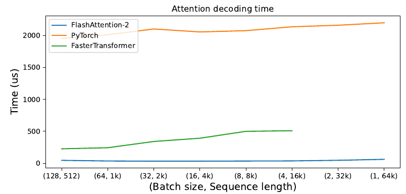

ICLR Figure 5. A100 80GB, hidden dimension 2048, MQA의 decode attention kernel 시간. 세로축은 **microsecond**, 가로축은 (batch, KV sequence length) 쌍이다. arXiv Figure 5인 forward TFLOPs/s 그림과 다르다. [ICLR PDF p.9, §4.2; [출판본](https://proceedings.iclr.cc/paper_files/paper/2024/file/98ed250b203d1ac6b24bbcf263e3d4a7-Paper-Conference.pdf#page=9)]

가로축은 (128,512), (64,1k), (32,2k), (16,4k), (8,8k), (4,16k), (2,32k), (1,64k)로, batch×KV 길이는 65,536으로 고정되어 있다. batch를 고정한 채 context만 늘린 실험이 아니다. 뒤로 갈수록 개별 query가 읽는 cache는 길어지고, batch 방향 병렬성은 줄어든다.

[저자 보고] naive PyTorch 대비 최대 28배, FasterTransformer attention kernel 대비 최대 7배 가속이다. 그래프에는 정밀한 point label이 없고 raw timing table도 없으므로 곡선을 보고 소수점 단위 microsecond를 만들어내지 않는다. FasterTransformer 선은 16k 이후 두 점에 표시되지 않지만 이 그림만으로 미지원/OOM/미측정 중 원인을 확정할 수 없다.

**[논문 미기재]** 해당 그림의 정확한 각 시점 timing, 측정 반복 분포, 모든 baseline commit, 상세 head 구성과 decode benchmark script의 완전한 실행 recipe는 제공된 자료만으로 모두 고정되지 않았다. supplementary에는 KV-cache kernel과 API는 있으나 이 그림의 FasterTransformer 비교를 그대로 재생하는 전용 script는 확인하지 못했다.

또한 이 결과는 attention kernel의 latency다. embedding·projection·MLP·sampling·scheduler·CPU 통신, 전체 모델의 TTFT나 token 간 간격을 전부 포함하지 않는다. MQA cache loading 가속을 모델 전체 또는 로봇 제어 loop의 최대 7배 개선으로 옮길 수 없다.

### 10.5 Inference API는 학습 API와 계약도 다르다

[공식 코드 확인] supplementary 내부 `flash_attn/__init__.py`의 버전은 2.3.0이다. `flash_attn_with_kvcache`는 cache를 새 K/V로 in-place 갱신할 수 있고, `num_splits=0`은 heuristic 선택, 1은 분할 없음, 1보다 크면 KV sequence split 수를 의미한다. 해당 함수는 backward를 지원하지 않는다고 명시한다.

이 snapshot에서 Q와 KV 길이가 다를 때 causal mask는 오른쪽 아래에 정렬된다. 예를 들어 N_q=2, N_k=5라면 첫 query는 앞 4개 key, 둘째는 5개 모두를 본다. 일반 self-attention에서 사용하던 왼쪽 위 기준 triangular mask를 그대로 넣으면 과거 cache 대부분을 잘못 가릴 수 있다. 이 세부는 **supplementary v2.3.0의 API 확인**이며 v2.0.0이나 미래 버전과 자동으로 동일하다고 가정하지 않는다.

<a id="experiments"></a>

## 11. 실험, FLOPs 해석과 수치 검산 [PDF pp.9-13, §4]

### 11.1 공통 microbenchmark 조건과 U10

| 변수 | 논문·supplementary에서 확인한 조건 |
|---|---|
| A100 | 80GB SXM4, attention 단위 비교 |
| N | 512, 1,024, 2,048, 4,096, 8,192, 16,384 |
| B | 각각 32, 16, 8, 4, 2, 1; B×N=16,384 |
| model hidden dimension | 2,048 |
| head dimension d | 64 또는 128; H는 각각 32 또는 16 |
| mask | noncausal/causal 각각 별도 |
| 측정 경로 | forward, backward, forward+backward |
| baseline | 명시적으로 S/P를 만드는 PyTorch, FA1, xformers CUTLASS, Triton 구현 |
| dtype·dropout | supplementary benchmark는 FP16, dropout=0.0. 지원 BF16과 모든 실험의 dtype를 동일시하지 않음 |
| 반복 | supplementary 주요 FA2/PyTorch/Triton 호출은 repeats=30. xformers 호출은 이 인자를 넘기지 않아 helper 기본 10 사용 |
| 통계 | supplementary는 mean을 취하고, 그림은 error bar 없이 정수 TFLOPs/s 표기 |

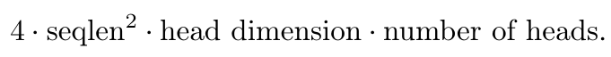

U10. 원문은 batch 인자 없이 sequence 한 개에 대한 식을 인쇄한다. [PDF p.10, §4.1]

```math
F_{\mathrm{fwd,per\ sequence}}=4N^2dH
```

QK^T는 N×N개의 내적에 각각 약 2d FLOPs, PV도 같은 2N²d를 쓰므로 두 GEMM 합이 4N²d/head다. multiply-add를 2 FLOPs로 세는 관례다. exp/max/sum·mask·data movement는 이 식에 없다.

실제 batch kernel에 대한 계산은 다음과 같다. **[공식 코드 확인]** supplementary `flops()`에는 batch 인자가 명시적으로 포함되어 있어 논문 텍스트의 누락을 보완한다.

```math
F_{\mathrm{fwd}}=\frac{4BN^2dH}{c},\qquad F_{\mathrm{bwd}}=2.5F_{\mathrm{fwd}},\qquad F_{\mathrm{fwd+bwd}}=3.5F_{\mathrm{fwd}},\qquad c=\begin{cases}1&\text{noncausal}\\2&\text{causal}\end{cases}
```

causal에서 정확한 허용 원소 수는 $`N(N+1)/2`$이지만 큰 N에서는 절반으로 근사한다. diagonal tile padding, boundary mask, exp 등의 실제 instruction 수를 반영한 정확한 hardware FLOPs counter가 아니다. backward의 2.5배는 score 재계산을 포함한 5개 GEMM 대 forward의 2개 GEMM에서 나온다.

이 convention을 모든 baseline에 공통 적용하면 **같은 설정에서 TFLOPs/s의 비는 latency의 역비와 같다**. 그러나 표준 구현의 backward는 P를 저장해 재계산 GEMM이 없을 수 있다. 따라서 서로 다른 알고리즘에 동일한 nominal FLOPs를 부여한 막대 높이를 각 구현의 실제 연산 instruction 처리량으로 읽으면 부정확하다.

```math
R=\frac{F_{\mathrm{reported}}}{t},\qquad \frac{R_{\mathrm{FA2}}}{R_{\mathrm{base}}}=\frac{t_{\mathrm{base}}}{t_{\mathrm{FA2}}}\quad\text{(same configuration and FLOPs convention)}
```

### 11.2 Figure 4: A100 forward+backward

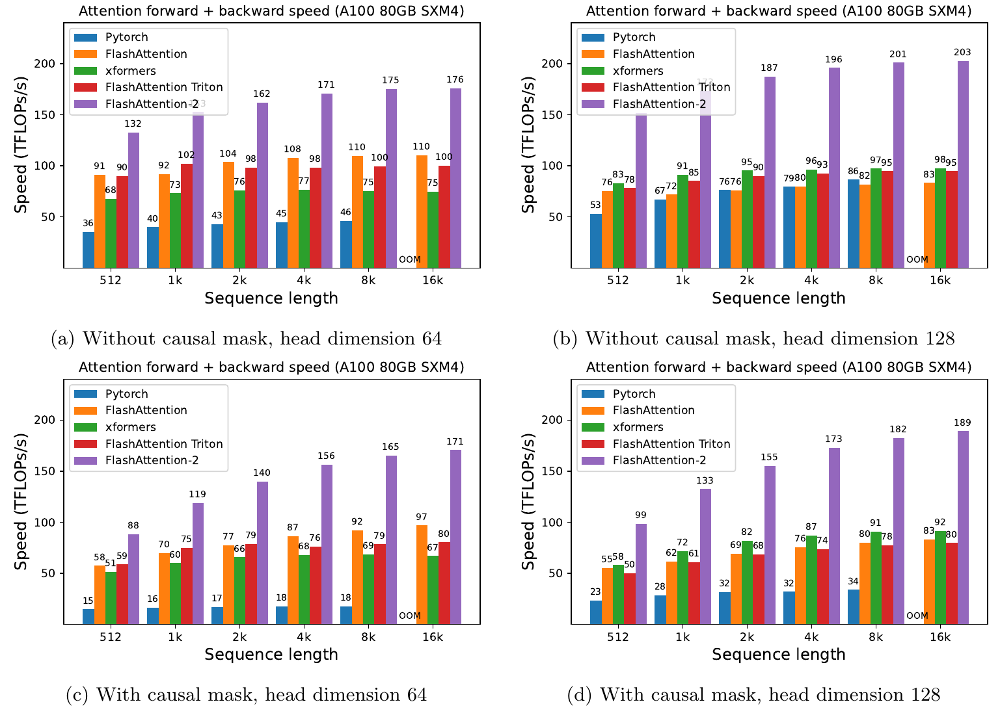

Figure 4. 네 panel은 noncausal d=64/128, causal d=64/128이다. 세로축은 TFLOPs/s이므로 높을수록 빠르다. [PDF p.10; [원문](https://arxiv.org/pdf/2307.08691v1#page=10)]

대표적으로 8k 설정의 막대 숫자를 옮기고 산술을 확인했다. 순서는 PyTorch / FA1 / xformers / Triton / FA2다.

| mask, d, N=8k | 원문 처리량 TFLOPs/s | FA2/FA1 | FA2/Triton | FA2/PyTorch |
|---|---|---:|---:|---:|
| noncausal, 64 | 46 / 110 / 75 / 100 / 175 | 1.591배 | 1.750배 | 3.804배 |
| noncausal, 128 | 86 / 82 / 97 / 95 / 201 | 2.451배 | 2.116배 | 2.337배 |
| causal, 64 | 18 / 92 / 69 / 79 / 165 | 1.793배 | 2.089배 | 9.167배 |
| causal, 128 | 34 / 80 / 91 / 78 / 182 | 2.275배 | 2.333배 | 5.353배 |

**[검산]** “FA1 대비 1.7-3.0배”라는 본문 범위가 모든 막대의 엄밀한 최소·최대라는 뜻은 아니다. 예를 들어 이 표의 noncausal d=64는 1.591배이며 Fig.4(a)의 512 설정은 132/91≈1.451배다. 대표 조건 전반에서 개선되었다는 주장과 일관되지만 universal lower bound로 인용하면 과장이다. 16k의 PyTorch OOM은 시간 0이나 무한대 speedup이 아니라 **해당 조건에서 측정 불가**다.

### 11.3 Figure 5: A100 forward

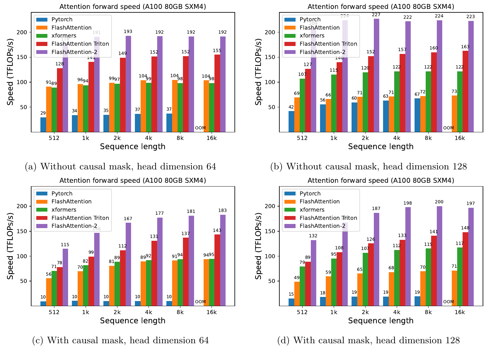

Figure 5. arXiv의 Figure 5는 forward benchmark다. 출판본 Appendix B의 Figure 6과 대응한다. [PDF p.11]

대표적인 결과는 다음과 같다.

- noncausal d=128, 2k: FA2 **227 TFLOPs/s**. 312를 분모로 하면 약 **72.76%**다. 본문의 “230, 73%”는 이 수준의 요약이다.
- noncausal d=64, 8k: FA1 104, Triton 152, FA2 192. FA1 대비 **1.846배**, Triton 대비 **1.263배**다.
- causal d=128, 8k: FA1 70, Triton 141, FA2 200. FA1 대비 **2.857배**, Triton 대비 **1.418배**다.

**[검산]** causal d=128, 8k, B=2의 forward nominal FLOPs는 549,755,813,888이다. 그림의 정수 표기 200 TFLOPs/s를 사용하면 시간은 약 **2.749 ms**로 역산된다. 이것은 반올림된 그래프에서 복원한 수치이며 새로 측정한 latency가 아니다.

```math
t_{\mathrm{derived}}=\frac{4\cdot2\cdot8192^2\cdot2048/2}{200\times10^{12}}\approx2.749\ \mathrm{ms}
```

이와 같은 역산은 **같은 B,N,H,d,mask**를 사용할 때만 유효하다. context가 다른 막대에서 TFLOPs/s가 비슷하다고 latency도 비슷한 것이 아니다. 고정 총 token B×N에서 attention 연산량은 N에 비례해 증가한다.

### 11.4 Figure 6: A100 backward

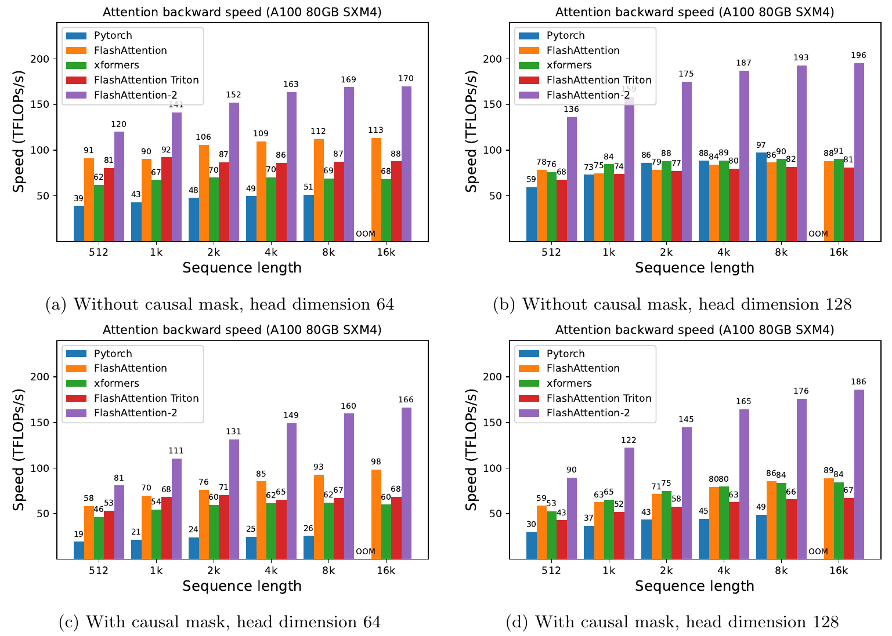

Figure 6. 원문 backward benchmark. ICLR Appendix B Figure 7과 대응한다. [PDF p.12]

noncausal d=128, 16k에서 FA2는 **196 TFLOPs/s**로, 312 대비 약 **62.82%**다. 본문의 최대 63%와 대응한다. 같은 d=128, 8k에서는 FA1 86, Triton 82, FA2 193이므로 각각 **2.244배**, **2.354배**다. 반면 noncausal d=64, 8k에서는 FA1 112 대비 FA2 169로 **1.509배**다. backward 역시 모든 head dimension에서 동일한 배수가 아니다.

forward는 두 matmul, backward는 다섯 matmul이라는 차이 외에, dQ atomic accumulation과 여러 operand의 live range 때문에 하드웨어 활용이 다르다. Fig.5의 forward peak와 Fig.6의 backward peak를 더해서 Fig.4의 속도를 구하면 안 된다. 시간은 더해지지만 처리량은 다음 가중 관계를 따른다.

```math
R_{\mathrm{fwd+bwd}}=\frac{F_f+F_b}{F_f/R_f+F_b/R_b}=\frac{3.5}{1/R_f+2.5/R_b}
```

### 11.5 Figure 7: H100에서의 같은 구현

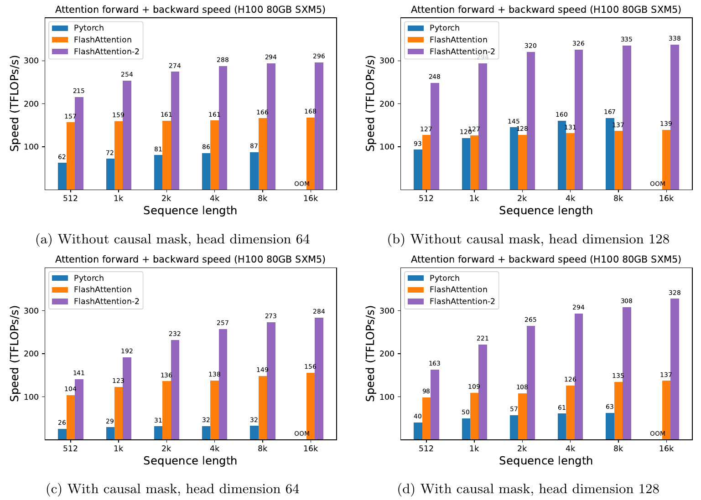

Figure 7. H100 80GB SXM5의 forward+backward benchmark. ICLR Appendix B Figure 8과 대응한다. [PDF p.13]

[저자 보고] p.11은 H100 전용 TMA나 새로운 Tensor Core 기능을 특별히 활용하지 않은 동일 계열 구현으로 최대 **335 TFLOPs/s**를 얻었다고 설명한다. 그래프 noncausal d=128, 8k에는 335, 16k에는 **338**이 인쇄되어 있다. 따라서 본문의 335와 그래프의 최고점 338을 구분한다. 16k에서는 FA1 139 대비 338으로 약 **2.432배**다.

335 또는 338을 A100 peak 312로 나누어 H100 utilization이라고 부를 수 없다. GPU와 precision별 peak가 다르다. 논문이 예상한 “H100 특화로 추가 1.5-2배”는 이 실험의 실측값이 아니고 당시 future work다. 후속 FlashAttention 버전의 성능을 이 논문의 결과로 소급해서 섞지 않는다.

### 11.6 Table 1과 U11: 전체 모델 학습 처리량

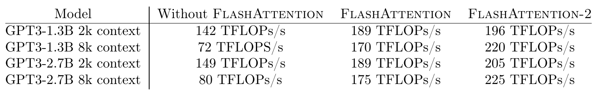

Table 1. 8×A100의 GPT-style 학습 처리량이며 단위는 TFLOPs/s/**GPU**다. 모델당 총 처리량이 아니다. [PDF p.12; ICLR PDF p.9]

| 모델·context | FA 없음 | FA1 | FA2 | FA2/FA 없음 | FA2/FA1 | FA2 MFU, 분모 312 |
|---|---:|---:|---:|---:|---:|---:|
| GPT3-1.3B, 2k | 142 | 189 | 196 | 1.380배 | 1.037배 | 62.82% |
| GPT3-1.3B, 8k | 72 | 170 | 220 | **3.056배** | 1.294배 | 70.51% |
| GPT3-2.7B, 2k | 149 | 189 | 205 | 1.376배 | 1.085배 | 65.71% |
| GPT3-2.7B, 8k | 80 | 175 | 225 | 2.813배 | 1.286배 | 72.12% |

**[검산]** 본문 “up to 2.8×”는 마지막 행의 225/80≈2.8125와 맞지만, 표 전체의 최대 비율은 220/72≈**3.0556**이다. 반올림만으로 3.06이 2.8이 되지는 않는다. 어떤 별도 집계 기준이 있었는지 논문은 설명하지 않는다. 또 arXiv p.11에는 FA2를 FA2와 비교해 1.3배라고 적은 문장 오기가 있으며, ICLR p.9에서는 FA1 비교로 수정됐다.

FA1 대비 시간을 줄인 비율은 speedup에서 1을 뺀 수치와 다르다. 예를 들어 1.3B 8k의 처리량 증가는 약 29.41%지만, 동일 작업의 시간 감소율은 $`1-170/220\approx22.73\%`$다. 1.3B 2k의 시간 감소율은 약 3.57%에 그친다. attention 이외 계산과 통신이 남기 때문이다.

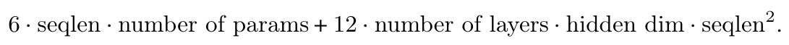

U11. 모델 학습 처리량을 계산하는 원문 비번호 식이다. [PDF p.11, §4.2]

```math
F_{\mathrm{model,per\ sequence}}=6NP_\theta+12L_{\mathrm{layers}}D_{\mathrm{model}}N^2
```

기호 P_theta는 model parameter 수, L_layers는 Transformer layer 수, D_model은 hidden width다. **확률행렬 P와 row logsumexp L과 다른 기호**다. 첫 항은 weight와 input 곱의 forward/backward를 대략 6NP로 세고, 두 번째는 attention QK/PV의 layer별 학습 연산량을 센다. batch 시간으로 처리량을 구하려면 해당 device가 처리한 sequence/token 수로 맞춰야 한다.

원문은 비교 관례를 따르기 위해 **causal attention의 두 번째 항을 절반으로 줄이지 않았다**고 직접 설명한다. 그래서 Table 1의 MFU는 이 모델 FLOPs convention에 의존한다. Fig.4-7에서는 causal attention FLOPs를 절반으로 세었으므로 두 종류의 utilization 숫자를 정의 확인 없이 직접 비교하면 안 된다.

또한 이 식은 모델이 요구하는 명목 연산량이다. backward의 score recomputation이나 activation checkpointing의 추가 실제 연산을 모두 model FLOPs에 다시 넣는다고 설명하지 않는다. MFU는 GPU의 instruction counter 기반 hardware FLOPs utilization과 구분해야 한다. 72%는 논문 convention과 A100 312 TFLOPs/s를 사용하는 model-level 지표다.

### 11.7 Ablation과 공정성: 무엇을 분리해서 증명하지 않았는가

두 PDF에는 **non-matmul 감소만 켜기 → sequence 병렬화 추가 → sliced-Q 추가**를 같은 코드·tile·설정으로 비교한 독립적인 ablation table이 없다. Fig.4-7은 완성된 구현끼리의 비교이며, head dimension·mask·sequence sweep은 민감도 실험이다. 각 개선의 독립적 speedup 기여율을 이 그림들만으로 추정할 수 없다.

supplementary 코드를 통해 공정성의 일부는 확인할 수 있다. 동일 tensor shape, FP16, dropout 0, causal 조건을 맞추고, Triton backward는 sequence_parallel의 두 옵션을 시험해 더 빠른 것을 선택한다. 그러나 다음 한계가 남는다.

- PyTorch baseline은 S/P를 만드는 명시적 구현이다. 최신 PyTorch의 모든 SDPA backend보다 10배 빠르다는 결론으로 일반화할 수 없다.
- supplementary benchmark는 xformers 경로에 repeats를 명시하지 않아 helper 기본 10, 주요 다른 경로는 30이다. 이것만으로 결과가 무효는 아니지만 반복 protocol이 완전히 같은 것은 아니다.
- 일부 baseline은 broad exception을 잡고 timing을 NaN으로 바꾼다. raw error log 없이는 모든 실패를 OOM이라고 단정하지 못한다.
- 실제 dependency 버전, CUDA compiler 옵션, clock, 전력 제한, warm-up/JIT 조건, 반복 분산이 완전히 고정된 archived result bundle은 확인되지 않았다.
- 공개 코드가 있다는 사실과 논문 그래프의 모든 점이 자동 재현된다는 사실은 다르다. 이번 리뷰는 GPU 실험을 실행하지 않았다.

### 11.8 §5 Discussion의 “8k 가격으로 16k”를 수식으로 읽기

arXiv p.11-12는 FA2의 2배 attention 가속을 긴 context 학습 가능성과 연결한다. ICLR p.9는 **같은 총 token 수**라는 조건을 추가해 표현을 명확히 했다.

```math
T_{\mathrm{tokens}}=BN,\qquad F_{\mathrm{attn,batch}}\propto BN^2=T_{\mathrm{tokens}}N
```

총 token 수를 고정하면 N을 2배로 늘릴 때 B는 절반이고 attention 연산량은 2배다. 해당 조건에서 kernel 처리 효율도 2배라면 attention 구간 비용을 상쇄할 수 있다. 그러나 한 sequence의 길이를 두 배로 늘리는 경우의 연산량은 4배이고, 전체 학습에는 다른 연산·memory·통신이 있어 동일 가격이 자동 보장되지는 않는다. tokenizer, optimization dynamics, batch 크기 변화에 따른 학습 품질도 이 산술만으로 동일하다고 할 수 없다.

<a id="code"></a>

## 12. 공식 코드와 supplementary의 근거

### 12.1 v2.0.0: 논문 발표 시기 코드로 핵심 경로 확인

조회한 [공식 commit](https://github.com/Dao-AILab/flash-attention/commit/4f285b354796fb17df8636485b9a04df3ebbb7dc)은 2023-07-17의 “FlashAttention-2 release”다. source를 정적으로 읽고 다음 경로를 확인했다. 확인하지 않은 CUDA binary 동작을 실행 결과처럼 표현하지 않는다.

| 확인 항목 | 고정 코드 위치 | 논문과의 연결 |
|---|---|---|
| API 입력·기본 scale | [flash_attn_interface.py, L244](https://github.com/Dao-AILab/flash-attention/blob/4f285b354796fb17df8636485b9a04df3ebbb7dc/flash_attn/flash_attn_interface.py#L244) | Q의 마지막 dimension에 -0.5 제곱; Q/K/V/out/LSE와 dropout RNG 상태 저장 |
| online rescale | [flash_fwd_kernel.h, L71](https://github.com/Dao-AILab/flash-attention/blob/4f285b354796fb17df8636485b9a04df3ebbb7dc/csrc/flash_attn/src/flash_fwd_kernel.h#L71) | scores_scale를 old sum과 acc_o에 곱함. arXiv의 inverse 사용 안 함 |
| 실제 exp 계산 | [softmax.h, L67](https://github.com/Dao-AILab/flash-attention/blob/4f285b354796fb17df8636485b9a04df3ebbb7dc/csrc/flash_attn/src/softmax.h#L67) | exp2와 log2(e) scale을 사용해 exp를 계산 |
| causal/경계 tile 분리 | [flash_fwd_kernel.h, L313](https://github.com/Dao-AILab/flash-attention/blob/4f285b354796fb17df8636485b9a04df3ebbb7dc/csrc/flash_attn/src/flash_fwd_kernel.h#L313) | masking iteration과 mask 불필요 iteration 분리, rectangular tile 경계도 고려 |
| 최종 정규화와 LSE | [flash_fwd_kernel.h, L473](https://github.com/Dao-AILab/flash-attention/blob/4f285b354796fb17df8636485b9a04df3ebbb7dc/csrc/flash_attn/src/flash_fwd_kernel.h#L473) | 마지막에 inv_sum 적용, scaled max+log(sum)을 LSE로 저장 |
| forward grid | [flash_fwd_launch_template.h, L27](https://github.com/Dao-AILab/flash-attention/blob/4f285b354796fb17df8636485b9a04df3ebbb7dc/csrc/flash_attn/src/flash_fwd_launch_template.h#L27) | grid가 (query block 수, batch, query head) |
| MMA·register·shared layout | [kernel_traits.h, L15](https://github.com/Dao-AILab/flash-attention/blob/4f285b354796fb17df8636485b9a04df3ebbb7dc/csrc/flash_attn/src/kernel_traits.h#L15) | FP32 ElementAccum, FP16/BF16 MMA, warp를 M축으로 배치, shared-memory swizzle과 cp.async |
| backward 여러 kernel | [flash_bwd_launch_template.h, L47](https://github.com/Dao-AILab/flash-attention/blob/4f285b354796fb17df8636485b9a04df3ebbb7dc/csrc/flash_attn/src/flash_bwd_launch_template.h#L47) | D/dQ preprocessing, key-block main kernel, dQ conversion 경로 |
| dQ atomic | [flash_bwd_kernel.h, L943](https://github.com/Dao-AILab/flash-attention/blob/4f285b354796fb17df8636485b9a04df3ebbb7dc/csrc/flash_attn/src/flash_bwd_kernel.h#L943) | 여러 key block의 FP32 dQ 기여를 atomicAdd로 누적 |
| 정확도 테스트의 의도 | [test_flash_attn.py, L350](https://github.com/Dao-AILab/flash-attention/blob/4f285b354796fb17df8636485b9a04df3ebbb7dc/tests/test_flash_attn.py#L350) | FP32 reference와 비교, ordinary PyTorch 오차의 2배 이내인지 검사. bitwise 동일성 아님 |

exp2 사용은 다음 항등식으로 설명된다. **[리뷰어 보충]** 구현은 raw QK^T score와 scaled maximum을 어느 단계에서 곱할지 선택한다.

```math
e^x=2^{x\log_2e},\qquad e^{\tau(s-m)}=2^{\tau(s-m)\log_2e}
```

이 때문에 코드의 `scale_softmax_log2`를 원문 softmax 온도 변경으로 오해하면 안 된다. 밑 변환을 접은 상수다. 단, floating-point exp2 근사와 cast는 실제 수치 오차에 영향을 준다.

### 12.2 Supplementary v2.3.0은 별도 snapshot

official ZIP은 `__version__ = "2.3.0"`을 포함한다. **v2.0.0 commit과 같은 코드로 취급하지 않는다.** ZIP 자체의 hash와 내부 파일 hash로 고정했으며 git commit metadata는 확인되지 않았다. 따라서 임의의 commit을 붙이지 않는다.

고정 commit에서 내려받은 파일과 supplementary의 전체 파일 목록·hash는 [source_code_manifest.json](assets/25_FlashAttention_2/source_code_manifest.json)에 별도로 보존했다. 목록에 있다는 사실과 정적 분석한 범위는 다르며, 실제로 대조한 핵심 파일은 아래와 같다.

| supplementary 파일 | 정적으로 확인한 내용 |
|---|---|
| `benchmarks/benchmark_flash_attention.py` | batch 포함 FLOPs, FP16, dropout 0, 총 token 16k sweep, Triton 두 옵션 중 빠른 backward 선택 |
| `flash_attn/utils/benchmark.py` | PyTorch benchmark Timer와 mean timing; helper 기본 repeats=10 |
| `flash_attn/flash_attn_interface.py` | `flash_attn_with_kvcache`, num_splits, cache in-place 갱신, MQA/GQA, causal 정렬, backward 미지원 계약 |
| `csrc/flash_attn/src/flash_fwd_kernel.h` | split KV 계산 및 split output 결합 kernel 경로 |
| `csrc/flash_attn/src/softmax.h` | row normalization과 output rescale 구현 |
| `csrc/flash_attn/flash_api.cpp` | Python 요청을 CUDA kernel 설정으로 전달하는 API 경로 |
| `examples/inference/README.md` | 제목만 있는 짧은 안내. 완전한 Fig.5 재현 절차로 볼 수 없음 |

arXiv의 공개 시점 코드와 ICLR supplementary를 함께 읽으면 training/prefill FA2와 이후 decode 지원을 분리할 수 있다. 지원 범위를 검토할 때 README의 현재 main만 보고 2023 논문에 모든 기능이 있었다고 추정하지 않는 것이 중요하다.

### 12.3 이 리뷰가 검증한 것과 실행하지 않은 것

확인한 것은 원문 및 출판본의 수식, 구조, 그래프·표 숫자, 고정 source의 dataflow, CPU 수학 예제다. 실행한 것은 PDF 렌더와 crop, 파일 무결성, CPU 계산, Markdown·수식 문법 검사다. 공식 CUDA unit test, GPU profiler, 학습 loop, TensorRT build와 로봇 실행은 수행하지 않았다. 따라서 “FA2 재현 성공” 대신 **“리뷰 수식과 원문·코드 대응을 검증했다”**가 정확한 완료 표현이다.

<a id="critical"></a>

## 13. 비판적 검토, 오탈자와 재현 조건

### 13.1 원문 오류를 한곳에 모아 보기

다음 항목은 추출 텍스트만 보고 추정한 것이 아니라 해당 PDF의 렌더 이미지와 shape·식·코드를 대조했다. 수학적 교정과 출판본의 실제 수정 여부를 구분한다.

| 위치 | 인쇄된 문제 | 구현에 사용할 해석·교정 | ICLR에서의 상태 |
|---|---|---|---|
| arXiv p.3 각주, ICLR p.2 각주 | 일반 scale을 1/d로 표기 | 기본 scaled attention은 1/sqrt(d). 공식 API도 -0.5 제곱 | 같은 표기가 남음 |
| arXiv p.3 U2 | dK=Q dS^T | dK=dS^T Q | ICLR p.3에서 수정 |
| arXiv p.4 U4 | output 둘째 항의 denominator 누락 | 두 numerator 합 전체를 ell로 나눔 | ICLR p.3에도 같은 괄호/인자 누락 |
| arXiv p.4 U5, p.5 U6 | old output 계수에 inverse, alpha 누락 | alpha×ell_old/ell_new를 곱함 | inverse는 제거했으나 alpha 누락은 남음 |
| arXiv p.5 U7 | normalized old output에 ell의 역수를 곱함 | alpha×ell_old를 곱해 numerator로 복원 | ICLR p.5에도 남음 |
| arXiv p.6 U9 | old numerator rescale에 inverse | exp(m_old-m_new)를 곱함 | ICLR p.5에서 수정 |
| arXiv Algorithm 1 line 10 | 위와 같은 inverse | alpha 곱 | ICLR Algorithm 1 line 10에서 수정 |
| arXiv p.6 U9의 tilde-P | normalized 정의가 남아 Algorithm 1과 의미가 다름 | FA2 accumulation에 쓰는 E는 exp(S-m), normalization 없음 | 출판본에도 기호 혼용이 남음 |
| arXiv p.6 causal bullet 2 | row가 column보다 작으면 mask 불필요라는 방향 오류 | 완전 유효 tile은 key column≤query row | ICLR p.5에도 남음 |
| Algorithm 2 line 4 | D의 shape를 R^d로 표기 | feature 축 합이므로 R^N | ICLR Appendix A에도 남음 |
| arXiv p.10 U10 | batch 전체 FLOPs에 필요한 B가 텍스트 식에 없음 | per-sequence 식으로 읽고 batch timing에는 B를 곱함 | supplementary flops()에서 B 확인 |
| arXiv p.11 §4.2 | FA2를 FA2와 비교해 1.3배라고 표기 | FA1 대비 비교 | ICLR §4.3에서 수정 |
| Table 1과 본문 | 최대 2.8배 요약 대 220/72≈3.056 | 표별 비율을 그대로 보고, 집계 불일치 명시 | 표와 요약 모두 그대로 |
| H100 본문·Fig.7 | 본문 최대335, 그래프 최대338 | 두 숫자와 해당 조건을 구분 | ICLR 본문/Fig.8도 동일 |

이 오류들은 논문의 구현 성과를 부정하지 않는다. 오히려 source와 수학의 동치가 인쇄된 의사코드보다 강한 근거가 될 수 있음을 보여준다. 학습용 리뷰에서는 오류를 조용히 고친 식만 제시하는 것보다, 원문과 수정 이유를 함께 보존해야 독자가 잘못된 구현을 피할 수 있다.

### 13.2 정확도와 재현성의 강점

새로운 근사 모델을 학습하는 방법이 아니므로 reference attention과 direct numerical comparison이 가능하다. 중간 상태 (m,ell,A)의 불변식, logsumexp를 이용한 P 복원, row-softmax Jacobian으로 forward와 backward의 동치를 설명할 수 있다. 공개 CUDA/CUTLASS/CuTe source는 소프트웨어 수준의 실제 실행 구조를 확인할 수 있게 한다. 별도의 learned gating threshold나 데이터 분포별 calibrator 없이 기존 dense attention semantics를 보존한다는 점도 강점이다.

실험 역시 attention microbenchmark에만 머무르지 않고 8 GPU의 GPT 학습 throughput까지 제시한다. 커널 가속이 실제 모델에서 얼마만큼 줄어드는지 Table 1이 드러내며, 출판본은 training/prefill과 다른 decode 병목을 별도로 다룬다.

### 13.3 범위와 실패 조건

| 조건 | 왜 문제인가 | 필요한 확인 |
|---|---|---|
| 짧은 sequence, 작은 head dimension | launch·conversion·동기화 비중이 커짐 | 같은 shape에서 사용 중인 backend와 실제 latency 비교 |
| 작은 batch의 single-token decode | query-row parallelism이 부족 | KV split과 merge 비용까지 포함한 decode 경로 확인 |
| 큰 d 또는 큰 tile | register pressure, shared-memory capacity, spill 증가 | compiler register/spill report, Nsight occupancy와 memory traffic |
| 임의의 dense attention bias/mask | 기본 causal보다 복잡하고 추가 materialization이 생길 수 있음 | mask semantics와 fused kernel 지원·fallback 확인 |
| N_q와 N_k가 다름 | causal alignment를 잘못 적용하기 쉬움 | right/bottom alignment, cache 길이, position index 검증 |
| 전부 mask된 row | softmax 분모가 0 | 출력 0 등 API 규약 확인 및 NaN 테스트 |
| dropout 상태가 다름 | 같은 sample 함수의 gradient가 아님 | forward/backward RNG 일치, eval dropout=0 |
| GQA head mapping 실수 | 다른 head의 K/V에 attention | H_q/H_kv divisibility, gradient sum 확인 |
| attention probability 전체 반환 | N×N tensor가 다시 필요할 수 있음 | 디버그 출력이 성능·memory 계약을 바꾸는지 확인 |
| 저정밀·atomic accumulation | 수학적 exact와 bitwise repeatability가 다름 | reference 대비 forward/gradient 오차와 허용 범위 |
| 다른 GPU/engine | tile 최적점과 kernel 지원이 달라짐 | 실제 build·dispatch·fallback 및 E2E 측정 |

전체 attention matrix를 시각화해야 하는 분석 코드에서는 O와 L만 반환하는 fused API로 그대로 대체할 수 없을 수 있다. 이 역시 output 계약의 차이다. 또한 FA2는 quantization, token pruning, KV paging, cross-frame caching을 자동으로 수행하지 않는다. 그런 기법과 결합한다면 각각의 정확성·비용을 별도로 평가해야 한다.

### 13.4 재현 실험을 설계한다면

다음은 **후속 실행 계획**이며 이번에 수행한 GPU 실험이 아니다.

1. **Provenance 고정:** GPU 모델·VRAM·driver·CUDA·PyTorch·compiler·FA commit·Triton/xformers commit, power/clock 설정, input dtype·shape·stride·mask·dropout·KV layout을 기록한다.
2. **수학과 API parity:** 작은 tensor부터 FP32 reference와 O/dQ/dK/dV를 비교한다. unequal lengths, 끝 tile, GQA, mask boundary, 큰 logit, dropout seed, all-masked row를 포함한다. 기본 scale과 causal alignment가 같은지 먼저 확인한다.
3. **커널 단위 timing:** forward, backward preprocessing/main/postprocessing, decode split/merge를 모두 포함한다. warm-up과 JIT를 분리하고 CUDA synchronization 또는 event timing의 범위를 명시한다. median·p95·p99와 반복 수를 남긴다.
4. **component ablation:** 가능한 동일 source에서 normalized/unnormalized, row-grid on/off, warp layout을 하나씩 바꾼다. tile과 warp 수를 맞춘 비교와 각 방식의 최적 tuning 비교를 따로 기록한다. 불가능한 조합을 억지로 동일 조건이라 하지 않는다.
5. **하드웨어 원인 확인:** DRAM byte, shared load/store, register spill, eligible warp, stall reason, Tensor Core utilization을 profiler에서 본다. FLOPs만으로 원인을 추정하지 않는다.
6. **모델 E2E:** 동일 checkpoint·batch·prompt/output 길이에서 training step time, tokens/s, TTFT, TPOT/ITL, peak memory를 측정한다. 최초 compile/build와 steady state를 분리한다.
7. **품질·운영 검증:** 학습 loss/gradient가 tolerance 범위에 있는지, inference 출력과 task 성공률이 유지되는지 확인한다. memory 부족이나 미지원 shape로 fallback한 요청도 숨기지 않는다.

이 계획은 step마다 실패 원인을 좁힐 수 있게 한다. GPU에서 빨리 나왔다는 결과 이전에 semantics가 달라져 계산량이 줄어든 것은 아닌지 확인하는 것이 가장 중요하다.

<a id="deployment"></a>

## 14. VLM/VLA, OpenVLA와 Jetson Thor/TensorRT 연결

### 14.1 논문이 검증한 범위와 적용 가설

논문이 직접 검증한 것은 A100/H100의 attention, GPT-style 모델 학습, ICLR 추가분의 MQA decode kernel이다. **OpenVLA, 특정 VLM의 visual token 처리, Jetson Thor, TensorRT engine, 실제 로봇 success rate나 sensor-to-action latency는 이 논문에서 측정하지 않았다.** 아래는 원리의 적용 가능성을 검토하는 후속 제안이다.

| 적용 위치 | FA2 원리가 도움이 될 수 있는 이유 | 별도로 검증해야 할 조건 |
|---|---|---|
| ViT 내부 self-attention | 많은 patch query가 동시에 있어 tiling·sliced-Q에 맞는 형태 | 실제 image token 수·d, noncausal mask, 사용 backend |
| VLM의 이미지+언어 prefill | 긴 mixed-token sequence의 S/P materialization을 피할 수 있음 | vision tower·projector 비용은 별도, multi-modal mask·position 유지 |
| OpenVLA 계열 decoder attention | Transformer attention core를 같은 함수로 교체할 여지 | 해당 checkpoint의 MHA/GQA, cache, position, action token decode 경로, 이미 fused backend 사용 여부 |
| autoregressive action token decode | query가 짧고 KV loading이 중요할 수 있음 | ICLR식 KV split 필요성, action token 수, sample/CPU loop, per-token overhead |
| diffusion/flow action head의 attention | head 안에 compatible dense attention이 있으면 적용 가능 | 전체 denoising step·MLP·cross-attention 및 query/key unequal lengths |

FA2는 image token을 삭제하지 않고, 행동을 더 적은 token으로 표현하지 않으며, observation을 건너뛰지 않는다. 따라서 다른 token-reduction/caching 연구의 성과와 비교할 때 **동일한 입력·정밀도·attention semantics를 유지하는 강한 baseline**으로 사용할 수 있다. 새 방법이 unfused PyTorch만 이겼다면 그 이득이 모델 아이디어 때문인지 attention implementation 때문인지 분리되지 않는다.

### 14.2 Kernel speedup에서 로봇 반응 시간으로 바로 갈 수 없는 이유

전체 시간의 attention 비중을 f, 그 구간의 speedup을 s라 하면, 다른 부분이 동일하고 새 overhead가 없다는 이상적인 조건에서 Amdahl 관계는 다음과 같다. **리뷰어 보조 식**이다.

```math
S_{\mathrm{E2E}}=\frac{1}{(1-f)+f/s}
```

attention이 전체 시간의 30%이고 그 부분만 2배 빨라지면 E2E는 약 **1.176배**다. 이것도 overhead=0이라는 가정이다. 이미지 획득·전처리·vision encoder·projector·MLP·sampling·action decode·통신이 차지하는 시간을 알아야 전체 개선을 추정할 수 있다.

```math
T_{\mathrm{sensor\to action}}=T_{\mathrm{capture}}+T_{\mathrm{preprocess}}+T_{\mathrm{vision}}+T_{\mathrm{policy}}+T_{\mathrm{action\ decode}}+T_{\mathrm{queue/comm}}
```

위 합은 직렬 critical path를 단순화한 식이다. 실제 비동기 pipeline에서는 단순 합보다 overlap과 queueing을 직접 추적해야 한다. 로봇의 actuator control Hz, 새 observation을 반영하는 policy refresh Hz, action chunk의 action/s는 서로 다른 지표다. attention TFLOPs/s에서 이들 Hz를 계산할 수 없다.

### 14.3 Thor와 TensorRT를 위한 실행 가능한 단계

이 논문의 CUDA extension을 설치하거나 PyTorch 함수를 선택했다고 TensorRT engine에 동일 kernel이 들어가는 것은 아니다. engine의 attention fusion 또는 plugin 경로가 실제로 무엇을 실행하는지 확인해야 한다. 아래 단계는 특정 TensorRT 버전이 FA2를 자동 지원한다는 주장이 아니다.

| 단계 | 구체적인 산출물 | 진행 기준 |
|---|---|---|
| A. 대상 계산 고정 | 모델 attention layer별 B/N_q/N_k/H_q/H_kv/d, dtype, mask, cache shape 목록 | prefill·decode·action head 경로가 분리되어 있음 |
| B. semantic reference | 작은 실제 input의 PyTorch output과 gradient/추론 output 기준값 | scale, causal alignment, position과 mask가 동일 |
| C. Thor용 build·engine 조사 | 대상 장치의 software stack에서 engine/plugin build, layer·kernel 목록 | 요청 shape가 supported path로 실행되고 fallback 여부가 기록됨 |
| D. kernel 비교 | 기존 engine attention 대 후보 kernel의 median/tail/memory, split/merge 포함 | compile/JIT와 steady state를 구분하고 실제 ms 개선 확인 |
| E. 모델 비교 | 동일 observation/prompt의 TTFA 또는 TTFT, decode ITL, 전체 policy latency | vision·CPU·action decode를 포함한 E2E 개선이 있음 |
| F. 제어 loop 검증 | sensor timestamp→action publish/apply timestamp, p95/p99, deadline miss, task success | 허용 오차와 task 품질 유지, 실시간 deadline 기준 충족 |

정적 shape의 desktop A100 최적 tile을 Thor에 그대로 고정하기보다, 실제 장치의 memory/SM/register 제한과 workload를 기준으로 검토한다. TensorRT engine도 대상 환경에서 build·검증한다. FP16/BF16 exact attention 검증과 FP8/NVFP4 등의 quantization 품질 검증은 별개다. 이 논문은 FP8 최적화를 당시 future work로 두었으므로 FA2 논문을 NVFP4 정확도나 Thor의 처리량 근거로 사용할 수 없다.

후속 연구의 좋은 첫 질문은 “attention kernel을 바꾸면 로봇이 몇 배 빨라지는가”보다 **“현재 policy의 critical path에서 어떤 attention shape가 몇 ms를 쓰며, 지원되는 구현으로 바꿨을 때 그 구간과 전체 tail이 함께 줄어드는가”**다.

<a id="qa"></a>

## 15. 자주 생기는 오해와 학습 순서

**Q1. Exact면 dense PyTorch와 모든 숫자가 같아야 하나?**  
실수 산술에서는 같은 함수다. FP16/BF16 cast, exp 근사, reduction 순서 때문에 floating-point 오차는 달라질 수 있다. official test도 tolerance와 reference 대비 오차를 사용한다.

**Q2. Softmax를 tile별로 계산하고 평균하면 되나?**  
안 된다. tile마다 exp mass가 다르다. global denominator 또는 equivalent local logsumexp weight로 합쳐야 한다. §9의 예에서 두 tile의 올바른 weight는 1/5와 4/5다.

**Q3. FA2는 attention FLOPs를 선형으로 바꾸나?**  
아니다. dense core는 계속 N²d다. 제곱 크기 중간 행렬의 HBM 저장을 피하고 부수 연산과 실행 비효율을 줄인다.

**Q4. 미정규화 numerator를 저장하면 overflow하지 않나?**  
running maximum을 빼서 각 exp를 안정화하고, maximum이 바뀔 때 old numerator를 alpha로 줄인다. 최종 denominator를 미루는 것이 max subtraction을 없애는 것은 아니다.

**Q5. L만 저장하면 backward에 충분한가?**  
softmax의 정규화 상태로는 충분하다. 하지만 Q/K/V/O와 dO, gradient/workspace는 여전히 필요하다. L 하나로 모든 input을 복원하지 않는다.

**Q6. Forward가 row split이면 backward도 같은 방식이어야 하나?**  
그럴 필요 없다. 논문 backward는 dK/dV의 local accumulation을 위해 key column을 나누고 dQ를 atomic으로 모은다. 최적 분할은 출력 소유권과 dependency에 따라 달라진다.

**Q7. Sliced-Q는 shared memory와 synchronization을 모두 없애나?**  
아니다. 불필요한 warp 간 output 합산을 줄인다. cooperative memory load와 operand 재사용의 barrier는 남아 있다.

**Q8. FA2가 sliced-K를 피한다면서 decode에서는 왜 KV를 나누나?**  
training/prefill의 warp 분할과 decode의 thread-block 분할은 다른 조건이다. decode는 query 수가 너무 작아 KV loading을 나누고 별도 merge를 하는 편이 유리할 수 있다. 이 설명은 ICLR 출판본 추가분이다.

**Q9. Context가 길어지면 occupancy가 자동으로 높아지나?**  
FA1의 grid가 B×H에만 의존하면 N이 커져도 block 수는 늘지 않을 수 있다. FA2가 N 방향 tile을 별도 block으로 만들어 이 문제를 완화한다. resident warp occupancy는 register/shared-memory 제한도 받는다.

**Q10. MQA의 KV cache 절감이 FA2의 compression인가?**  
아니다. KV head 수 감소는 MQA/GQA 구조의 특성이다. FA2는 head mapping을 효율적으로 구현하며 backward에서 공유 head gradient를 합친다.

**Q11. A100 73%와 GPT 학습 72%는 같은 지표인가?**  
둘 다 312 TFLOPs/s를 비교 분모로 쓰지만 numerator convention과 측정 범위가 다르다. 커널 benchmark의 causal FLOPs는 절반으로 세고 model MFU 식은 그렇지 않다.

**Q12. “최대 7배 decode”를 LLM throughput 개선이라고 써도 되나?**  
ICLR Figure 5는 MQA attention kernel 비교다. full-model projection/MLP, sampling, scheduler가 포함된 token throughput이나 로봇 TTFA 수치는 아니다.

**Q13. 이 논문의 Algorithm 1을 그대로 옮기면 되나?**  
arXiv v1 line 10에는 inverse 오기가 있다. ICLR의 수정 행, 불변식 증명, 공식 코드의 alpha 곱을 함께 봐야 한다. scale·mask·padding·dropout도 실제 요구에 맞게 넣어야 한다.

**Q14. 논문에 기술 Appendix와 학습 recipe가 모두 있나?**  
arXiv v1에는 Appendix가 없다. ICLR Appendix A/B에는 backward와 추가 benchmark 그림이 있지만 Table 1의 완전한 dataset·optimizer·training schedule recipe는 없다. supplementary는 코드 묶음이다.

학습 순서는 **U1의 shape → U3 softmax 미분 → §9의 두-tile 숫자 계산 → m/ell/A 불변식 → Algorithm 1 → D 항등식과 Algorithm 2 → Fig.2/3의 output 소유권 → 실험 FLOPs convention → ICLR decode split/merge**를 권한다. CUDA 코드부터 읽기 전에 각 intermediate가 어느 축으로 축약되는지와 누가 최종 output을 쓰는지 이해하면 layout 최적화의 이유를 따라가기 쉽다.

<a id="coverage"></a>

## 16. Coverage와 완료 검증

### 16.1 arXiv v1 섹션 coverage

| 원문 | 위치 | 이 리뷰의 대응 | 상태 |
|---|---|---|---|
| Abstract, §1 Introduction | pp.1-2 | §1-2, §11의 수치 범위 | 완료 |
| §2.1 Hardware characteristics | p.2 | §3.3, §8.2-8.5 | 완료, 192KB와 shared capacity 구분 |
| §2.2 Standard Attention | p.3 | §4, U1-U3 | 완료, dK/scale 오기 명시 |
| §2.3.1 FA1 Forward | pp.3-4 | §5.1-5.3, U4-U5, Fig.1 | 완료 |
| §2.3.2 FA1 Backward | p.5 | §5.4, §7 | 완료 |
| §3, §3.1 Algorithm | p.5 | §6, U6-U8 | 완료 |
| §3.1.1 Forward, causal, correctness | pp.5-7 | §6.3-6.7, U9, Algorithm 1, 보조 증명 | 완료 |
| §3.1.2 Backward와 MQA/GQA | p.7 | §7, §8.6, Algorithm 2 | 완료 |
| §3.2 Parallelism | pp.7-8 | §8.1-8.2, Fig.2 | 완료 |
| §3.3 Work partitioning, tuning | p.9 | §8.3-8.5, Fig.3 | 완료 |
| §4 / §4.1 Benchmarking | pp.9-11, 성능그림 pp.10-13 | §11.1-11.5, U10 | 완료 |
| §4.2 End-to-end performance | pp.11-12 | §10.1, §11.6, U11, Table 1 | 완료 |
| §5 Discussion/future directions | pp.11-12 | §11.8, §13-14 | 완료, 기대와 실측 구분 |
| Acknowledgments | p.13 | §1.4, §12의 구현 계보 | 확인, 별도 번역 전재 생략 |
| References | pp.13-14 | online softmax, FA1, Triton, GQA 등 인용 관계 확인 | 목록 전체 확인, 20편의 개별 리뷰는 범위 밖 |
| Appendix | 해당 없음 | §0.1에서 부재 명시 | 누락 아님 |

### 16.2 ICLR 출판본의 추가·이동 coverage

| 출판본 항목 | 위치 | arXiv와의 관계 및 이 리뷰 |
|---|---|---|
| §1-3 기본 내용 | pp.1-7 | 전체 텍스트 대조, 수정 수식과 잔존 오기 §13.1 |
| §3.2 Decoding | pp.6-7 | 추가 내용, §10.2-10.3의 KV split/merge |
| §4.1 Training attention benchmark | p.8 | arXiv §4.1/Fig.4와 대응, §11.1-11.4 |
| §4.2 Inference attention benchmark | pp.8-9 | 추가 내용, §10.4 및 ICLR Figure 5 PNG |
| §4.3 End-to-end | p.9 | arXiv §4.2와 대응, §11.6 |
| §5 Discussion | p.9 | 동일 총 token 조건이 추가, §11.8 |
| Acknowledgments/References | pp.10-11 | 전체 확인, 외부 참고문헌별 상세 리뷰는 미포함 |
| Appendix A | p.12 | Algorithm 2, §7의 모든 20행 해설; D shape 오류도 대조 |
| Appendix B | pp.12-14 | Fig.6/7/8이 arXiv Fig.5/6/7과 대응, §11.3-11.5 |
| 공식 supplementary ZIP | 별도 코드 묶음 | 파일 목록 전체, core source와 benchmark의 정적 확인, §12.2 |

### 16.3 수식 1:1 coverage

| 원문 비번호 식·묶음 | 포함하는 식 | 이미지·편집 가능한 식·해설 |
|---|---|---|
| U1, p.3 | S=QK^T, P=softmax(S), O=PV | §4.1 |
| U2, p.3 | dV,dP,dS,dQ,dK | §4.2, 원문 오류와 교정식 모두 |
| U3, p.3 inline | softmax Jacobian | §4.3, 성분별 미분과 D 항등식 추가 |
| U4, p.4 | 두-block global m/ell/P/O | §5.2, 누락 denominator 교정 |
| U5, p.4 | local m/ell/P/O와 두 번째 block 병합 | §5.3, 전체 recurrence 해설 |
| U6, p.5 | normalized output update | §6.1, 원문식 보존 |
| U7, p.5 | unnormalized output motivation | §6.1, denominator/alpha 유도 |
| U8, p.5 inline | L=m+log(ell) | §6.2, backward P 복원 |
| U9, p.6 | FA2 two-block recurrence 전체 | §6.3, tilde-P 의미와 inverse 오류 |
| U10, p.10 | attention FLOPs | §11.1, batch/causal/backward 복원 |
| U11, p.11 | model FLOPs convention | §11.6, MFU·causal convention 차이 |
| Algorithm 1의 식 | 분할 수, 초기화, score, m/exp/ell/A, O/L | §6.4-6.5, 17행 모두 |
| Algorithm 2의 식 | D, score/P, dV/dP/dS/dQ/dK | §7.1-7.3, 20행 모두 |
| Figure 1 내부 식 | max subtraction을 생략한 exp/ell/output | §5.1 |
| 본문 복잡도 | O(N²d) 산술, O(N) additional row statistic | §1.2, §6.2, §7.3 |
| 핵심 보조 유도 | scale/mask, Jacobian, 불변식, GQA, dropout, decode merge, Amdahl | 원문 식과 구분해 관련 절에 배치 |

**번호 수식 누락: 0개.** 대상 PDF에 독립적인 Eq. 번호가 없기 때문에 임의의 논문 수식 번호를 만들지 않았다. 문헌의 일반 수식을 전부 FA2가 새로 제안한 식이라고 부르지도 않는다.

### 16.4 그림·표·알고리즘 coverage

| 기준본의 항목 | 원문 페이지 | 이 리뷰 |
|---|---:|---|
| arXiv Figure 1 | 4 | §5.1 PNG·dataflow·내부 수식 |
| arXiv Figure 2 | 8 | §8.1 PNG·thread block 소유권 |
| arXiv Figure 3 | 9 | §8.3 PNG·sliced-K/Q·shape |
| arXiv Figure 4 | 10 | §11.2 PNG·대표 숫자 표·검산 |
| arXiv Figure 5 | 11 | §11.3 PNG·peak·ms 역산 |
| arXiv Figure 6 | 12 | §11.4 PNG·backward·가중 처리량 |
| arXiv Figure 7 | 13 | §11.5 PNG·H100 수치 차이 |
| ICLR Figure 5 | 9 | §10.4 PNG·MQA decode 조건·한계 |
| Table 1 | arXiv 12 / ICLR 9 | §11.6 전체 PNG·12개 원 수치·비율·MFU |
| Algorithm 1 | arXiv 6 / ICLR 5 | §6.4 전체 PNG·행별 해설·출판본 교정행 PNG |
| Algorithm 2 | arXiv 7 / ICLR 12 | §7.2 전체 PNG·행별 해설 |

ICLR Figure 1-4는 기본 구조/학습 비교에 해당하며 위 arXiv 그림과 대응한다. ICLR Figure 6-8은 arXiv Figure 5-7의 부록 재배치다. 같은 도표의 중복 PNG는 만들지 않고 대응 관계를 명시했다.

### 16.5 완료 검증과 남은 제한

- arXiv v1 전 14쪽과 ICLR 출판본 전 14쪽을 읽고, 기술 페이지와 Appendix의 원문 렌더를 확인했다.
- 원문 그림·수식·알고리즘·표 발췌 23개를 240 DPI PNG로 저장하고, 원문 내용·축·범례·행번호 보존 및 crop 경계를 검수했다.
- U1-U11, Algorithm 1/2, 핵심 비번호 inline 식을 GitHub fenced math/보호 inline 문법으로 작성했다. 수식은 원문 또는 리뷰어 교정·유도인지 표시했다.
- UTF-8, fenced block 균형, 상대 이미지 경로, explicit anchor, manifest entry·image hash를 검증했다.
- KaTeX와 MathJax parser로 **블록 수식 58개와 inline 수식 177개, 총 235개**를 검사해 오류 0개를 확인했다. 로컬 Markdown 브라우저 렌더에서 수식 235개와 이미지 23개가 표시되고 수식 넘침·깨진 목차 링크가 없음을 확인했으며, 대표 수식·그림·표를 직접 검수했다. **GitHub 서버의 실제 페이지를 게시해 검증한 것은 아니다.**
- CPU float64 수학 검산과 finite-difference gradient check를 통과했다. GPU benchmark나 모델 학습 재현은 수행하지 않았다.

파일·렌더·수식 검증 기록은 [review_validation.json](assets/25_FlashAttention_2/review_validation.json), CPU 계산 결과는 [numerical_validation.json](assets/25_FlashAttention_2/numerical_validation.json)에 담았다.

논문에 없는 학습 recipe, raw timing 분산, 각 최적화의 독립 ablation, Thor/TensorRT 포팅·실기기 성능은 채워 넣지 않았다. 이 제한은 리뷰의 미완성 내용을 숨긴 것이 아니라 원자료의 증거 범위를 표시한 것이다.
