# PagedAttention 상세 리뷰: KV cache의 주소 배치가 LLM 서빙 처리량을 바꾸는 과정

> 저장소 원문: [주 PDF](papers/26_PagedAttention.pdf) · [전체 목록](README.md)

> **대상 논문:** Woosuk Kwon et al., *Efficient Memory Management for Large Language Model Serving with PagedAttention*, SOSP 2023, arXiv:2309.06180v1.  
> **핵심 결론:** PagedAttention은 dense causal attention의 유효 토큰을 줄이지 않는다. KV cache를 고정 크기 block으로 나누고 논리 주소와 물리 주소를 분리하여, 낭비와 중복을 줄인 메모리에 더 많은 요청을 배치한다. 성능 주장은 이 메모리 관리, attention kernel, scheduler를 결합한 **vLLM 서빙 시스템**에 관한 것이다.

이 문서는 원문 전 16쪽을 읽고, Figure 1–19, Table 1, 번호 수식 (1)–(4)를 원본 PDF와 대조한 한국어 학습·비평 해설이다. **원문에는 Appendix와 번호 붙은 Algorithm이 없다.** 아래의 추가 유도식, 수치 예제와 의사코드는 별도로 표시한 리뷰어 해설이다. 학습·GPU 벤치마크는 실행하지 않았다.

증거 표시는 **[저자 보고]**, **[공식 코드 확인]**, **[검산]**, **[리뷰어 해석]**, **[논문 미기재]**, **[후속 연구 제안]** 여섯 종류를 사용한다. `[PDF p.N]`은 아래에서 고정한 v1의 물리 페이지이며 인쇄 쪽수 1–16과 일치한다.

## 목차

1. [서지, 버전, 출처와 검토 범위](#bibliography)
2. [먼저 이해할 결론과 주장–근거 지도](#claims)
3. [Motivation과 메모리 병목](#motivation)
4. [Notation과 텐서 shape 사전](#notation)
5. [원문 §2: autoregression, attention, batching](#background)
6. [원문 §3: 세 가지 낭비와 작은 할당 예제](#fragmentation)
7. [원문 §4.1: block attention과 수식 (4)의 검증](#paged-math)
8. [원문 §4.2–4.3: block table, allocation, decode](#mapping)
9. [원문 §4.4: sharing, copy-on-write, sampling, beam](#sharing)
10. [원문 §4.5–4.6: scheduling, preemption, 분산 실행](#scheduling)
11. [원문 §5: 구현과 알고리즘 행별 해설](#implementation)
12. [한 요청의 forward와 학습·backward 경계](#forward)
13. [원문 §6: 실험 조건, 결과, 수치 검산](#evaluation)
14. [원문 §7: ablation과 커널·서버 성능의 차이](#ablation)
15. [원문 §8–10: 논의, 관련 연구, 비판적 평가](#discussion)
16. [공식 코드 대조와 재현성](#code)
17. [VLM/VLA, OpenVLA, Jetson Thor/TensorRT 연결](#applications)
18. [Q&A와 학습 순서](#qa)
19. [Coverage와 산출물 검증](#coverage)

<a id="bibliography"></a>

## 1. 서지, 버전, 출처와 검토 범위

| 항목 | 검증 결과 |
|---|---|
| 정식 제목 | *Efficient Memory Management for Large Language Model Serving with PagedAttention* |
| 저자 | Woosuk Kwon, Zhuohan Li, Siyuan Zhuang, Ying Sheng, Lianmin Zheng, Cody Hao Yu, Joseph E. Gonzalez, Hao Zhang, Ion Stoica |
| 공동 제1저자 | Woosuk Kwon, Zhuohan Li; PDF 첫 쪽의 별표 확인 |
| 소속 | UC Berkeley, Stanford University, Independent Researcher, UC San Diego |
| 발표 | SOSP ’23, 2023-10-23–26, Koblenz, Germany; PDF p.1과 공식 arXiv comments에서 확인 |
| 학회 DOI | [10.1145/3600006.3613165](https://doi.org/10.1145/3600006.3613165) |
| 공식 서지 | [arXiv:2309.06180](https://arxiv.org/abs/2309.06180) |
| 고정한 PDF | [2309.06180v1 PDF](https://arxiv.org/pdf/2309.06180v1) |
| 버전 | 2026-09-09 조회 시 공식 서지의 최신이자 유일한 버전 v1; 제출 시각 2023-09-12 12:50:04 UTC |
| 실제 파일 | `2309.06180v1.pdf`, 1,459,631 bytes, 16 pages, 612 × 792 pt |
| SHA-256 | `55b3b324d779a67c59dac2519445e3b07c14e6ff5c656fadb47a3d7b5997469e` |
| 공식 코드 | [vllm-project/vllm](https://github.com/vllm-project/vllm) |
| 대조한 코드 | 역사적 release `v0.2.0`, commit `e2fb71ec9f2c3168ba8614408fa807a5f65707c5`, 2023-09-28 UTC |

**[공식 코드 확인]** 코드 선택은 논문의 공개 직후 구현을 살펴보기 위한 것이다. 이 commit이 논문 모든 실험을 생성한 정확한 commit이라는 증거는 없다. 오늘의 vLLM main이나 최신 기능 목록으로 2023년 논문의 내용을 소급해 설명하지 않는다. 날짜·버전이 고정된 [코드 트리](https://github.com/vllm-project/vllm/tree/e2fb71ec9f2c3168ba8614408fa807a5f65707c5)를 기준으로 한다.

### 1.1 실제로 읽은 범위

본문 Abstract, §1–10 전체는 pp.1–14, Acknowledgement와 References는 pp.14–16에 있다. §4.1–4.6, §5.1–5.2, §6.1–6.5, §7.1–7.3을 모두 검토했다. 별도 기술 부록이나 번호 붙은 알고리즘은 이 PDF에 없으며, 공식 arXiv 항목에서 별도 supplementary 문서를 확인하지 못했다. References의 64개 항목을 확인했으나 인용된 64편을 각각 정독했다는 뜻은 아니다.

**[논문 미기재]** 새 모델 훈련, loss, optimizer, learning rate, train/val/test split, backpropagation algorithm은 제시되지 않는다. 사전학습된 모델을 동일한 attention 의미로 효율적으로 서빙하는 시스템 논문이므로 해당 항목이 없는 이유를 §12에서 설명한다.

### 1.2 원본 이미지와 권리

본문에는 **원문 Figure 19개, Table 1개, 번호 수식 이미지 4개, 총 24개 PNG**를 각 해설 옆에 배치했다. 전 16쪽을 Poppler 100 DPI로 렌더해 시각 확인했고, 발췌 이미지는 동일 원본을 PDFium으로 240 DPI 렌더한 것이다. 크롭 좌표는 612 × 792 pt 페이지의 **좌상단 원점, 오른쪽 +x, 아래쪽 +y** 기준이다.

각 파일의 원문 URL, 버전, PDF SHA-256, 물리 페이지, clip bbox, 출력 픽셀 크기와 PNG SHA-256은 [publication_assets.json](assets/26_PagedAttention/publication_assets.json)에 기록한다. 원문 그림·수식의 저작권은 저자와 해당 권리자에게 있다. 이 발췌는 출처를 밝힌 독립적인 학습·비평 해설을 위한 것으로, 원문에 별도의 새로운 라이선스를 부여하지 않는다. 원문 전체 페이지를 리뷰에 반복 삽입하지 않았고, 이미지를 생성형 그림으로 대체하지 않았다.

<a id="claims"></a>

## 2. 먼저 이해할 결론과 주장–근거 지도

### 2.1 무엇이 새롭고 무엇이 유지되는가

**[리뷰어 해석]** 하나의 요청만 실행할 때 GPU가 과거 KV를 읽어 attention을 계산하는 양은 paging만으로 줄지 않는다. 개선의 출발점은 ‘현재 살아 있는 KV를 얼마나 적은 공간에 보관하는가’다. 공간이 확보되면 scheduler가 더 많은 요청을 같은 iteration에 넣을 수 있고, 모델 weight를 읽는 비용을 여러 요청이 나누어 부담할 수 있다.

논문의 논리 사슬은 다음과 같다.

1. 출력 길이가 미리 알려지지 않아 연속 KV tensor를 크게 예약한다.
2. 예약·단편화·복제로 GPU 메모리의 실제 token-state 비율이 낮아진다.
3. 메모리에 들어가는 요청 수가 줄어 GPU의 연산 능력을 활용하지 못한다.
4. 고정 크기 block, 요청별 block table, 필요 시 할당으로 낭비를 줄인다.
5. 공유 prefix는 같은 physical block을 가리키고, 쓰는 순간에만 분리한다.
6. 비연속 KV를 직접 읽는 kernel과 iteration 단위 scheduler를 결합한다.
7. 저자 환경에서는 같은 수준의 normalized latency로 더 높은 요청 도착률을 감당한다.

이 과정은 수학적으로 exact dense attention을 유지하는 메모리·실행 최적화다. token pruning, sparse attention, KV quantization, 모델 재학습과는 변경하는 대상이 다르다. 부동소수점 연산 순서까지 동일하다는 주장으로 확대하면 안 된다. [PDF pp.1–2, §1; pp.5–9, §4–5; p.12, §7.1]

### 2.2 주장–근거 지도

| 핵심 주장 | 직접 근거 | 근거가 지지하는 범위 | 반증 가능성·한계 |
|---|---|---|---|
| 기존 KV 메모리 사용은 비효율적이다 | Fig.2, Fig.3, §3.1 | 비교한 allocator/reservation 구성의 token-state 비율 20.4–38.2% | 모든 연속 allocator·현대 서빙 엔진의 보편적 수치가 아니다 |
| 비연속 KV에서도 attention을 계산할 수 있다 | Eq.(3)–(4), Fig.5, §4.1 | 논리적 토큰 순서와 전역 softmax를 보존한 주소 간접화 | Eq.(4)의 인쇄 분모 표기는 정규화와 불일치; §7에서 명시적으로 교정해 해석 |
| block 단위 할당으로 낭비를 거의 없앤다 | Fig.6–7, §4.2–4.3, Fig.2의 96.3% | 마지막 block의 빈 slot로 낭비를 제한 | 메타데이터, watermark, pool slack, COW 순간 복제까지 0이라는 뜻은 아니다 |
| 다양한 decoding에서 KV를 공유할 수 있다 | Fig.8–10, §4.4; Fig.14–16 | 동일한 prefix 상태를 공유, 분기 시 COW | 같은 token 문자열만으로 공유할 수 없고 prefix 전체·위치·모델 상태가 같아야 한다 |
| 서빙 처리량이 증가한다 | Fig.12, 14, 16–17 | 특정 GPU·모델·길이 분포·Poisson trace·평균 normalized latency 조건 | p99 TTFT/ITL SLO, batch=1 latency, 현대 baseline 우위를 입증하지 않는다 |
| paging overhead는 시스템 이득보다 작다 | Fig.18(a), §7.1 | attention kernel은 FT 대비 20–26% 느려도 평가 서버는 더 많은 부하 수용 | 메모리 여유가 있거나 compute-bound라면 이득이 줄거나 사라질 수 있다 |
| block size 16은 실용적 절충이다 | Fig.18(b), §7.2 | 당시 A100·ShareGPT/Alpaca 조건 | 모든 dtype·head shape·GPU·VLM 길이에 대한 최적값이 아니다 |
| swap과 recompute를 상황별로 선택할 수 있다 | Fig.19, §4.5, §7.3 | 작은 전송의 비용과 prompt 재계산의 효율 비교 | 원문 20% 문장이 그래프와 충돌; bandwidth·shape·cache 길이에 의존 |

### 2.3 세 가지 특히 중요한 읽기 주의점

- **[검산]** Eq.(4) 인쇄본의 분모를 그대로 계산하면 attention weight의 합이 1이 되지 않는 반례가 있다. 원문 식과 리뷰어의 올바른 해석식을 구분한다.
- **[저자 보고]** 본문의 2–4×는 전체 결과를 압축한 대표 주장이다. 상세 결과에는 1.3×, 1.7–2.7×, 특정 FT 비교의 최대 22× 등 서로 다른 조건의 수치가 있다. 가장 큰 값만 일반적인 speedup으로 뽑으면 안 된다.
- **[공식 코드 확인]** v0.2.0은 prompt run과 decode run을 한 번의 attention forward에서 섞지 않는 assertion을 둔다. ‘continuous batching 지원’이 곧 ‘모든 phase를 하나의 kernel로 동시 처리’라는 뜻은 아니다.

<a id="motivation"></a>

## 3. Motivation과 메모리 병목 — 원문 §1

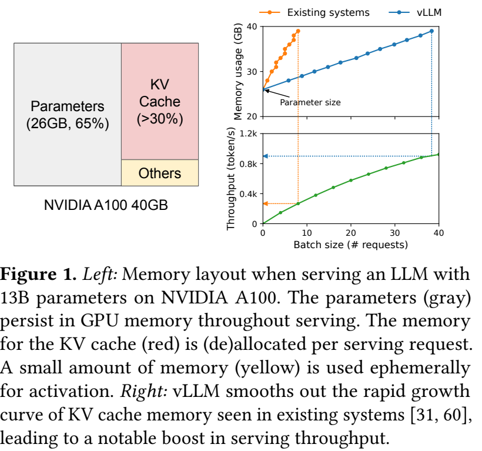

**[저자 보고]** Figure 1은 A100 40GB에서 13B 파라미터 모델을 서빙할 때 weight가 약 26GB, KV cache가 30% 이상을 차지하는 예시다. weight는 요청 수와 무관하게 상주하지만 KV는 요청마다 생성·증가·해제된다. 따라서 같은 모델과 GPU라도 KV 관리 방식에 따라 동시 실행 가능한 요청 수가 달라진다. [PDF p.1, Fig.1]

### 3.1 두 종류의 memory-bound를 분리해야 한다

**[리뷰어 해석]** 이 논문의 ‘memory-bound’에는 **대역폭 병목**과 **용량 병목**이 함께 등장한다.

| 병목 | 질문 | paging과의 관계 |
|---|---|---|
| 메모리 대역폭 | 한 iteration에서 weight와 KV를 얼마나 빨리 읽는가? | paging 자체는 모든 KV 읽기를 없애지 않는다. batch 확대가 weight 읽기 비용의 상각에 기여한다 |
| 메모리 용량 | 현재 요청들의 KV가 GPU에 모두 들어가는가? | 예약과 단편화·중복을 줄여 직접 개선한다 |
| 연산량 | batch가 충분히 커졌을 때 GEMM/attention 계산을 얼마나 빨리 하는가? | 용량 문제가 풀려도 compute 한계에 도달하면 이득이 포화한다 |

예를 들어 weight 읽기량을 요청별로 따로 지불하는 작은 batch에서는 GPU의 연산기가 기다릴 수 있다. 하지만 요청을 더 넣으려 해도 KV 때문에 메모리가 부족하면 batch 확대가 막힌다. PagedAttention은 이 연결 고리를 풀어 주는 수단이다. ‘GPU 사용량이 낮으니 무조건 KV가 원인’이라는 진단까지 제공하는 것은 아니다.

### 3.2 KV cache가 왜 큰가

원문의 주요 비번호 산식은 OPT-13B 한 token의 KV 크기다. [PDF p.4, §3]

```math
m_{\mathrm{token}}=2\times5120\times40\times2=819{,}200\ \mathrm{bytes}=800\ \mathrm{KiB}.
```

각 인수의 역할은 다음과 같다.

- 첫 2: key와 value 두 배열을 저장한다.
- 5120: OPT-13B의 모든 attention head를 합친 hidden width다.
- 40: 모든 transformer layer에 KV가 필요하다.
- 마지막 2: FP16 원소 하나의 bytes다.

**[검산]** 원문은 800 KB, 2048 token에 1.6 GB라고 쓴다. 정확한 이진 단위로는 한 token 800 KiB, 2048 token 1,677,721,600 bytes = 1.5625 GiB다. 십진 단위로는 1.678 GB이므로, 여기서는 논문의 근사 표기와 정확한 byte 계산을 구분한다.

일반화한 아래 식은 리뷰어 보조식이다. 한 GPU가 모든 layer와 KV head를 보관하는 경우다.

```math
M_{\mathrm{KV}}=2LH_{\mathrm{kv}}d_hs\sum_{r=1}^{R}n_r.
```

$`L`$은 layer 수, $`H_{\mathrm{kv}}`$는 KV head 수, $`d_h`$는 head dimension, $`s`$는 원소당 bytes, $`n_r`$는 요청 r에서 이미 KV가 생성된 token 수다. MHA에서는 $`H_{\mathrm{kv}}d_h=D`$지만 GQA/MQA에서는 query head 수를 그대로 대입하면 KV 크기를 과대평가한다. 공유된 block이 있다면 위 합은 논리적 크기이고, 물리적 크기는 distinct physical block 수로 따로 계산해야 한다.

**[리뷰어 해석]** 모델 weight만 보고 ‘13B가 26GB이니 40GB GPU에 여유 있게 들어간다’고 끝내면 serving capacity를 설명할 수 없다. 요청 수, 입력 길이, 현재 출력 길이, branch 수가 나머지 메모리를 빠르게 소비한다.

<a id="notation"></a>

## 4. Notation과 텐서 shape 사전

원문은 설명을 위해 head/layer 축을 생략하고, token ID와 hidden vector에 모두 x를 사용한다. 아래에서는 이를 구분한다. 원문 식 (2)–(4)의 d는 단일 head 설명의 feature dimension으로 해석하고, 실제 multi-head 모델의 전체 hidden width에는 D를 쓴다.

| 기호 | 뜻 | shape / 단위 |
|---|---|---|
| $`x_i`$ in Eq.(1) | i번째 token | vocabulary의 정수 ID 또는 이산 확률변수 |
| $`x_i`$ in Eq.(2) | i번째 위치의 hidden state | 단순화된 열벡터 $`\mathbb R^d`$ |
| $`h_i`$ | 이 리뷰에서 구분한 실제 hidden state | $`\mathbb R^D`$ |
| $`q_i,k_i,v_i,o_i`$ | 한 head의 query/key/value/output | $`\mathbb R^{d_h}`$; 원문에서는 $`d_h=d`$ |
| $`W_q,W_k,W_v`$ | 원문의 선형 투영 행렬 | 단일 head 단순화 $`d\times d`$; 일반형은 $`d_h\times D`$ |
| $`a_{ij}`$ | query i가 token j에 주는 정규화 weight | scalar, $`j\le i`$ |
| $`B`$ | KV block의 token capacity | token/block; batch 크기와 구별 |
| $`K_j,V_j`$ | 논리 block j의 K/V 열벡터 묶음 | $`d_h\times B`$ |
| $`A_{ij}`$ | query i의 block j attention weights | $`1\times B`$ |
| $`\mathbf1_B`$ | B개 원소가 모두 1인 열벡터 | $`B\times1`$ |
| $`n_r`$, $`P_r`$, $`T_r`$ | 현재 cached length, prompt length, 생성 길이 | token; 마지막 sampled token의 KV는 아직 없을 수 있음 |
| $`R`$ | 요청 수 | request |
| $`N`$ | 실제 실행 sequence 수 | parallel samples/beam이 있으면 $`N\ge R`$ |
| $`H_q,H_{\mathrm{kv}}`$ | query head 수와 KV head 수 | MHA에서는 같음 |
| $`L,D,d_h`$ | layer 수, model width, head width | positive integers |
| $`P_{\mathrm{phys}}`$ | physical pool의 block 수 | block |
| $`\mathcal T_r[b]`$ | 요청/sequence r의 논리 block b가 가리키는 physical ID | integer; 구현의 b는 0-based |
| $`\rho(p)`$ | physical block p의 reference count | 해당 block을 참조하는 live sequence 등의 수 |
| $`\lambda`$ | workload 도착률 | requests/s |
| $`\ell_r`$ | 요청 r의 end-to-end latency | seconds, queue 포함 |

### 4.1 논문 수학과 구현 tensor가 다른 모양인 이유

논문에서는 $`K_j\in\mathbb R^{d_h\times B}`$로 쓰지만, GPU kernel은 coalesced read를 위해 feature 축을 더 쪼갠다. v0.2.0의 **layer 하나, GPU worker 하나**에 대한 shape는 다음과 같다. [공식 코드: [attention.py](https://github.com/vllm-project/vllm/blob/e2fb71ec9f2c3168ba8614408fa807a5f65707c5/vllm/model_executor/layers/attention.py), [cache_engine.py](https://github.com/vllm-project/vllm/blob/e2fb71ec9f2c3168ba8614408fa807a5f65707c5/vllm/worker/cache_engine.py)]

| 데이터 | 실제 shape | 의미 |
|---|---|---|
| Decode Q | `[N, H_q_local, d_h]` | sequence마다 이번 iteration의 query 하나 |
| New K/V | `[N, H_kv_local, d_h]` | 이번에 입력으로 처리한 token의 KV |
| Key pool | `[P_phys, H_kv_local, d_h/x, B, x]` | x는 16-byte vector 단위; FP16이면 x=8 |
| Value pool | `[P_phys, H_kv_local, d_h, B]` | value 가중합에 맞춘 다른 물리 layout |
| Block tables | `[N, max_blocks_per_sequence]`, int32 | 짧은 table은 metadata 배열에서 padding |
| Context lengths | `[N]`, int32 | 유효 token 수; 마지막 block의 mask 결정 |
| Slot mapping | `[num_valid_tokens]`, int64 | 새 K/V를 쓸 `physical_block_id * B + offset` |
| Layer output | `[N, H_q_local * d_h]` | 다음 output projection으로 전달 |

같은 의미의 tensor라도 stride와 축 순서가 다르다. ‘비연속’은 각 요청의 **논리적으로 이웃한 block이 pool 안에서 떨어져 있음**을 말한다. 각 physical block 내부의 원소까지 무작위 byte 순서로 흩어진 것은 아니다. CPU의 table이 Python list라는 사실과 GPU에서 읽는 int32 table이라는 사실도 구분해야 한다.

<a id="background"></a>

## 5. 원문 §2: autoregression, attention, batching

### 5.1 §2.1, 수식 (1): 확률의 연쇄 분해

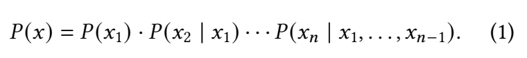

```math
P(x)=P(x_1)\cdot P(x_2\mid x_1)\cdots P(x_n\mid x_1,\ldots,x_{n-1})\qquad\text{(1)}.
```

**기호와 축.** 각 항은 실제로 선택된 token에 해당하는 scalar probability다. 모델이 먼저 생성하는 vocabulary 확률벡터는 길이 $`|\mathcal V|`$이고, 그중 target token index의 확률을 가져온다. softmax 축은 vocabulary다. 전체 sequence probability는 scalar다.

**가정과 유도.** 순서를 가진 이산변수에 확률 chain rule을 적용한다. 독립성 가정을 추가한 식이 아니다. 모델이 조건부 분포를 근사하고, 실제 생성에서는 이전에 선택한 token을 다음 조건에 넣는다.

**작은 예.** 선택된 세 token의 조건부 확률이 0.5, 0.2, 0.1이면 sequence probability는 0.01이다. 두 번째 token이 다른 것으로 선택되면 세 번째 분포 자체가 달라지므로 세 generation iteration을 단순히 한꺼번에 독립 계산할 수 없다.

**앞뒤 연결.** Eq.(1)은 왜 generation이 순차적인지를 설명한다. KV cache는 이미 처리한 prefix의 내부 상태를 재사용하여 이 순차 반복의 비용을 줄인다. PagedAttention은 순차 의존성 자체를 제거하지 않는다. [PDF p.3, §2.1–2.2, Eq.(1)]

### 5.2 수식 (2): token hidden state를 Q/K/V로 투영

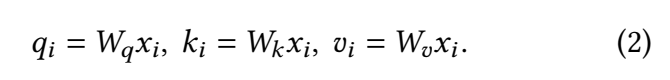

```math
q_i=W_qx_i,\qquad k_i=W_kx_i,\qquad v_i=W_vx_i\qquad\text{(2)}.
```

**입출력.** 여기의 x는 Eq.(1)의 integer token ID가 아니라 embedding과 이전 layer 처리를 거친 hidden vector다. 단일 head 단순화에서 $`W_q,W_k,W_v\in\mathbb R^{d\times d}`$, $`x_i\in\mathbb R^d`$이므로 출력은 모두 d차원 열벡터다. bias, position 처리는 이 간단한 식에서 생략되어 있다.

**연산 순서.** hidden vector를 읽고 세 선형 투영을 수행한다. 실제 구현은 QKV를 합친 하나의 GEMM으로 만들고 slice할 수 있다. 원문 수식의 열벡터 관례를 row-major batch 코드로 옮기면 weight 전치가 등장할 수 있으며, 다른 알고리즘이라는 뜻이 아니다.

**해설용 수치 예.** $`x_i=(1,2)^\top`$, $`W_q=I`$이고 다음과 같이 두 투영 행렬을 두자.

```math
W_k=\begin{pmatrix}2&0\\0&1\end{pmatrix},\qquad W_v=\begin{pmatrix}1&1\\0&1\end{pmatrix}.
```

그러면 $`q_i=(1,2)^\top`$, $`k_i=(2,2)^\top`$, $`v_i=(3,2)^\top`$이다. Q/K/V가 같은 입력에서 왔다고 값이 같은 것은 아니다.

**cache의 역할.** 미래 token들은 현재 token의 K/V를 참조하므로 K/V를 저장한다. 현재 Q는 현재 attention을 계산하는 데 쓰고, 표준 causal decode에서 과거 Q 전체를 미래용으로 저장할 필요는 없다. 각 layer의 x는 그보다 아래 layer의 prefix 계산에 영향을 받으므로 같은 단어의 K/V도 문맥에 따라 달라진다. [PDF p.3, Eq.(2), §2.2]

### 5.3 수식 (3): 전체 유효 prefix 위의 softmax와 value 가중합

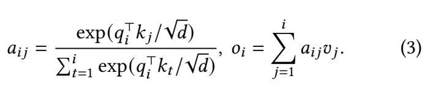

```math
a_{ij}=\frac{\exp(q_i^\top k_j/\sqrt d)}{\sum_{t=1}^{i}\exp(q_i^\top k_t/\sqrt d)},\qquad o_i=\sum_{j=1}^{i}a_{ij}v_j\qquad\text{(3)}.
```

| 단계 | 연산과 shape | 의미 |
|---|---|---|
| 1 | $`q_i^\top k_j`$: `(1,d) @ (d,1)` → scalar | 현재 query와 과거/현재 key의 유사도 |
| 2 | $`z_j=q_i^\top k_j/\sqrt d`$ | feature dimension에 따른 score scale 조정 |
| 3 | 모든 $`t=1,\ldots,i`$에 대해 exp 후 합 | 같은 query의 전체 유효 prefix가 하나의 분모를 공유 |
| 4 | $`a_{ij}`$: scalar | weight는 음수가 아니며 전체 합은 1 |
| 5 | $`a_{ij}v_j`$를 j축으로 합 | d차원 output, V의 feature 축은 남음 |

**가정.** causal mask로 $`j\gt i`$를 제외한다. decode에는 query가 한 위치뿐이라 현재까지 cache한 모든 key가 유효하다. prefill에서는 여러 query마다 다른 삼각 mask가 필요하다. padding slot은 score 0으로 넣는 것이 아니라 정규화 대상에서 제외해야 한다. score 0의 exp는 1이라 확률을 빼앗기 때문이다.

**직관.** key는 ‘어디를 볼지’를 정하고 value는 ‘어떤 내용을 가져올지’를 제공한다. Attention weight 자체가 저장할 KV 데이터의 중요도에 따른 삭제 결정을 의미하지 않는다. PagedAttention은 작은 weight의 token도 남겨두고 읽는다.

**수치 안정화.** 아래는 원문 번호 식이 아닌 동일 연산의 안정적 표현이다.

```math
m_i=\max_{1\le t\le i}z_t,\qquad a_{ij}=\frac{\exp(z_j-m_i)}{\sum_{t=1}^{i}\exp(z_t-m_i)}.
```

분자와 분모에서 공통 $`\exp(-m_i)`$가 약분되므로 정확한 실수 연산에서는 결과가 같다. 실제 CUDA 구현도 전체 context의 max와 exp 합을 구한다. 다만 코드에는 분모에 작은 epsilon이 추가되므로 bitwise exact를 주장하지 않는다. [PDF p.3, Eq.(3); [CUDA 구현](https://github.com/vllm-project/vllm/blob/e2fb71ec9f2c3168ba8614408fa807a5f65707c5/csrc/attention/attention_kernels.cu#L195)]

### 5.4 핵심 비번호 식과 position-wise 연산

원문은 attention 외의 embedding, FFN, layer normalization, residual, logits, QKV projection을 위치별 함수로 설명한다.

```math
y_i=f(x_i).
```

이 말은 해당 layer의 x가 주어졌을 때 다른 위치의 입력을 다시 조회하지 않는다는 뜻이다. **x 자체가 이전 attention에서 다른 위치 정보를 받은 사실까지 부정하지 않는다.** token별 연산들은 여러 요청의 token을 이어 붙여 큰 GEMM으로 처리할 수 있다. Attention만은 요청별 유효 prefix와 block table을 사용해야 하며, 서로 다른 요청의 token이 서로 attend하면 잘못된 모델이 된다. [PDF p.3, §2.1]

**[검산]** p.3의 Eq.(3) 다음 문장과 p.5의 block 식 도입에서 기존 attention 계산을 ‘Eq.4’로 지칭한다. 문맥상 기존 scalar attention인 Eq.(3)을 가리키는 교차참조 오류로 읽는 것이 타당하다. 아래 리뷰에서는 실제 인쇄 수식 번호를 유지한다.

### 5.5 §2.2: prompt phase와 generation phase

원문에 등장하는 주요 조건부 분포는 다음과 같다.

```math
\begin{aligned} \text{prompt:}\quad&P(x_{n+1}\mid x_1,\ldots,x_n),\\ \text{decode iteration }t:\quad&P(x_{n+t+1}\mid x_1,\ldots,x_{n+t}).\end{aligned}
```

prefill은 알려진 prompt n개를 병렬로 처리해 n개의 K/V와 **첫 출력 token의 분포**를 만든다. 첫 출력 token을 샘플링했다고 그 token의 K/V까지 만들어진 것은 아니다. 다음 decode에서 그 token을 입력으로 넣어야 해당 K/V가 생성된다.

예를 들어 prompt가 7 token이면 prefill 직후 cache 길이는 7이다. 여덟 번째 token을 샘플링했어도 cache는 7개다. 다음 forward가 token 8을 입력으로 받아 cache 길이를 8로 늘리고 token 9를 샘플링한다. 이 한 iteration 차이를 놓치면 block boundary나 copy-on-write 시점을 잘못 설명하게 된다.

### 5.6 §2.3: iteration-level scheduling

기존 static batch는 긴 요청이 끝날 때까지 batch 구성 변경을 기다리거나, 짧은 요청에 padding을 계속 붙일 수 있다. Iteration-level scheduling은 한 번의 생성 iteration 후 종료 요청을 제거하고 새 요청을 넣는다. 논문은 Orca 등의 선행 접근을 활용하며 continuous batching의 발명 자체를 자신들의 기여로 주장하지 않는다. [PDF p.3, §2.3; p.13, §9]

**[리뷰어 해석]** 논문의 ‘새 요청이 한 iteration만 기다리면 된다’는 설명은 batch 변경 시점의 단위에 관한 것이다. 메모리가 모자라고 앞선 요청이 대기 중이면 새 요청이 한 iteration 내에 무조건 서비스를 받는다는 latency 보장은 성립하지 않는다. Prefill iteration 자체가 길 수도 있다.

<a id="fragmentation"></a>

## 6. 원문 §3: 세 가지 낭비와 작은 할당 예제

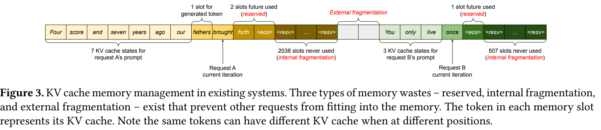

### 6.1 ‘아직 안 쓴 공간’도 둘로 구분한다

| 분류 | 논문에서의 정의 | 최종적으로 token state에 쓰이는가? |
|---|---|---|
| Token states | 현재까지 실제 생성한 KV | 이미 사용 중 |
| Reservation | 미래에 생성될 token을 위해 지금부터 확보한 공간 | 나중에 사용하지만 현재 다른 요청이 쓸 수 없음 |
| Internal fragmentation | 최종 길이보다 과하게 할당한 요청 내부 공간 | 요청 종료까지 사용하지 않음 |
| External fragmentation | allocation 사이에 남아 원하는 contiguous chunk를 만들지 못하는 공간 | 해당 요청에 사용할 수 없음 |

**[리뷰어 해석]** 결과 길이를 사전에 아는 Oracle도 reservation을 제거하지 못한다. 최종 출력 길이만 알면 최초부터 마지막 token의 자리를 확보할 수는 있지만, 그 자리는 generation 대부분의 시간 동안 비어 있다. **미래 길이 예측 정확도와 on-demand allocation은 다른 문제**다. [PDF p.4, §3.1]

### 6.2 해설용 수치 예: 최대 16 token, 실제 최종 7 token

한 요청의 현재 cached length가 3, 실제 최종 cached length가 7, 최대 예약 길이가 16이라고 하자. 연속 16 slot을 선할당하면 현재 상태는 다음과 같다.

```math
16=3\ \text{actual states}+4\ \text{future reservation}+9\ \text{internal waste}.
```

이는 결과를 이미 아는 리뷰어의 사후 분류다. 온라인 시스템은 현재 시점에 최종 길이 7을 모를 수 있다. Oracle로 7 slot만 할당하더라도 현재 4 slot을 다른 요청이 사용하지 못한다. 반면 $`B=4`$ paging이면 현재 4 slot만 할당하여 빈 slot은 1개다. 길이 5에 도달하는 시점에 두 번째 block을 추가한다.

External fragmentation의 별도 예를 보자. 16 slot 영역을 `[A:4][free:3][B:5][free:4]`처럼 사용하고 있을 때 전체 free는 7이지만 연속 6 slot 요청은 들어가지 못한다. 고정 block pool에서는 임의의 free block ID들을 모아 요청을 구성하므로 ‘이웃해야 한다’는 제약이 사라진다. 이 설명은 pool 내부의 block allocator에 관한 것이다. GPU 전체의 다른 allocation까지 모두 단편화가 사라진다는 뜻은 아니다.

### 6.3 Figure 2의 실제 수치

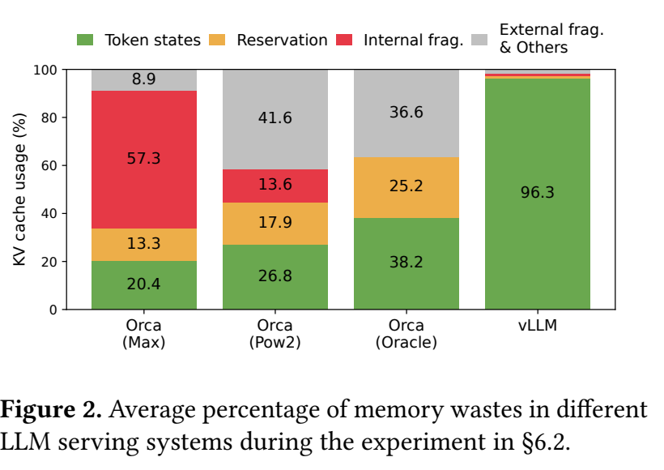

| 구성 | Token states | Reservation | Internal frag. | External frag. & Others |
|---|---:|---:|---:|---:|
| Orca (Max) | 20.4% | 13.3% | 57.3% | 8.9% |
| Orca (Pow2) | 26.8% | 17.9% | 13.6% | 41.6% |
| Orca (Oracle) | 38.2% | 25.2% | 0% 표시 | 36.6% |
| vLLM | 96.3% | 나머지 구성의 개별 숫자는 미표기 | 개별 숫자 미표기 | 개별 숫자 미표기 |

**[검산]** 첫 두 행의 합은 99.9%로, 표시 자리수의 반올림 차이다. vLLM의 token-state 외 비율은 3.7%다. 단순 비율로 96.3/20.4=4.72, 96.3/38.2=2.52지만, 이것은 **effective memory fraction의 비율**이지 E2E throughput ratio의 자동 계산법이 아니다. 실제 batch의 길이, 연산량, scheduler, KV sharing에 따라 throughput은 달라진다. [PDF p.2, Fig.2; p.4, §3.1]

Pow2에서 external waste가 Max보다 큰 것 역시 이상한 합산 오류는 아니다. chunk 크기 다양성이 커지면 internal over-allocation이 줄어드는 대신 allocator 바깥의 조각난 공간이 늘 수 있다. 다만 그림의 회색 범례는 ‘External frag. & Others’이므로 회색 전체를 순수 external fragmentation으로 단정해서는 안 된다.

### 6.4 compaction만으로 해결하기 어려운 이유

**[저자 보고]** 큰 KV cache를 자주 이동해 연속 공간을 합치는 compaction은 latency-sensitive serving에 부담스럽다. 한 요청 안에서 연속 공간을 유지하는 방식은 prefix 공유에도 불편하다. [PDF p.5, §3.1 끝]

**[리뷰어 해석]** Copy-on-write도 복사가 있지만 크기 단위가 다르다. compaction은 이미 존재하는 큰 KV 영역을 이동할 수 있는 반면, append-only sequence가 마지막 shared block을 수정할 때 COW는 그 block 하나를 복사한다. ‘복사를 완전히 제거’하는 기법이라기보다 필요한 복사의 범위를 제한하는 설계다.

<a id="paged-math"></a>

## 7. 원문 §4.1: block attention과 수식 (4)의 검증

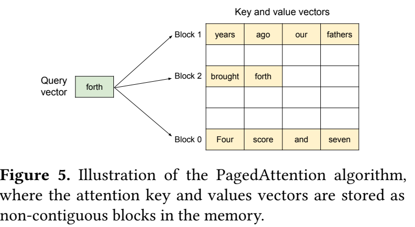

Figure 5의 query는 ‘forth’이고, 논리적인 prefix의 K/V가 physical memory의 서로 떨어진 block에 놓여 있다. **화살표가 block 단위라는 사실이 block별 독립 softmax를 뜻하지 않는다.** 주소를 나누어 읽되 attention 정규화는 같은 query의 전체 유효 token에 대해 수행해야 한다. [PDF p.5, §4.1, Fig.5]

### 7.1 원문의 핵심 비번호 정의: K/V block

```math
K_j=(k_{(j-1)B+1},\ldots,k_{jB}),\qquad V_j=(v_{(j-1)B+1},\ldots,v_{jB}).
```

```math
A_{ij}=(a_{i,(j-1)B+1},\ldots,a_{i,jB}).
```

원문 수식의 block j는 **1-based**다. 그림과 코드의 `Block 0`은 **0-based**다. 같은 예를 옮길 때 1을 더하거나 빼야 한다.

- $`K_j,V_j`$는 d차원 열벡터 B개를 가로로 묶어 $`d\times B`$ 행렬로 만든다.
- $`q_i^\top K_j`$는 `(1,d) @ (d,B)`이므로 B개 score의 행벡터다.
- $`A_{ij}`$ 역시 $`1\times B`$ 행벡터다.
- $`V_jA_{ij}^\top`$는 `(d,B) @ (B,1)`로 d차원 output contribution을 만든다.
- 마지막 block에는 아직 생성되지 않은 token의 빈 slot이 있을 수 있으므로, 유효 길이나 mask를 따로 적용해야 한다.

### 7.2 수식 (4): 인쇄본을 그대로 기록

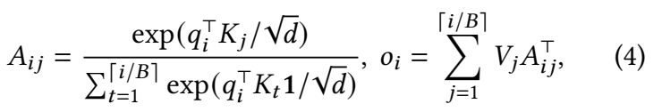

**원문 인쇄 그대로의 LaTeX 전사**다. 아래 식을 올바른 softmax 구현식으로 사용하면 안 된다.

```math
A_{ij}=\frac{\exp(q_i^\top K_j/\sqrt d)}{\sum_{t=1}^{\lceil i/B\rceil}\exp(q_i^\top K_t\mathbf1/\sqrt d)},\qquad o_i=\sum_{j=1}^{\lceil i/B\rceil}V_jA_{ij}^\top\qquad\text{(4)}.
```

**[검산]** 원본 PNG에서 분모의 1은 exp의 괄호 안에 있다. 원문에는 이 1에 차원 첨자가 없으며, 리뷰의 shape 사전에서는 B차원 all-ones vector로 풀어 설명했다. 이를 all-ones column vector로 해석하면 먼저 block 내 score를 더한 후 exp를 취하게 된다. Eq.(3)이 요구하는 것은 **각 token score에 exp를 먼저 취하고, 그 결과를 더하는 것**이다. 일반적으로 두 값은 다르다.

```math
\exp\!\left(\sum_b z_b\right)\ne\sum_b\exp(z_b).
```

**가장 작은 반례.** $`i=B=2`$, 두 score가 모두 0이면 원문 인쇄 분모는 $`\exp(0+0)=1`$이다. 분자는 `[1,1]`이므로 weight가 `[1,1]`, 합이 2가 된다. Eq.(3)의 정답은 `[1/2,1/2]`다. 따라서 원문 식 (4)의 표기를 무비판적으로 ‘Eq.(3)을 정확히 재배열한 식’이라고 설명할 수 없다.

**[리뷰어 해석]** 전후 문맥과 실제 CUDA의 exp-sum 연산을 함께 보면, **의도는 exact attention이며 괄호/벡터합 위치의 표기 오류**로 보는 것이 타당하다. 이것이 실제 vLLM이 비정규화 attention을 계산했다는 증거는 아니다. 저자의 공식 erratum을 확인한 것은 아니므로 ‘저자가 인정한 오탈자’라고 단정하지 않는다.

### 7.3 올바른 해석식: 전역 분모와 마지막 block mask

아래는 **리뷰어 보조식**으로, 원문에 새 번호가 있는 것이 아니다.

```math
\begin{aligned} Z_{ij}&=q_i^\top K_j/\sqrt d+M_{ij},\\ E_{ij}&=\exp(Z_{ij}),\\ Z_i^{\mathrm{sum}}&=\sum_{t=1}^{\lceil i/B\rceil}E_{it}\mathbf1_B,\\ A_{ij}&=E_{ij}/Z_i^{\mathrm{sum}},\qquad o_i=\sum_{j=1}^{\lceil i/B\rceil}V_jA_{ij}^\top.\end{aligned}
```

$`M_{ij}\in\mathbb R^{1\times B}`$의 유효 token 위치는 0, 미사용/미래 slot은 $`-\infty`$다. 따라서 E의 무효 위치는 0이다. $`E_{it}\mathbf1_B`$가 **exp 이후의 block 내부 합**이고, t에 대한 합이 **block 사이의 합**이다. 최종 분모는 scalar 하나이며 모든 block이 이 값을 공유한다.

**차원 검산.** `Z, E, A`는 모두 `[1,B]`; `E @ ones`는 `[1,1]`; V contribution은 `[d,1]`이다. 정규화 축을 feature d축으로 잡으면 안 된다. 각 query/head별로 **token 축 전체**를 정규화한다.

### 7.4 Eq.(3)에서 block 식으로의 유도

토큰 index를 $`u=(j-1)B+b`$로 치환한다. 각 유효 u는 단 하나의 block j와 offset b에 속한다.

```math
\sum_{u=1}^{i}\exp(z_u)=\sum_{j=1}^{\lceil i/B\rceil}\sum_{b=1}^{B}\mathbf1[(j-1)B+b\le i]\exp(z_{(j-1)B+b}).
```

위 식에서 지시함수는 유효 범위만 더한다는 수학적 표현이다. 구현에서는 무효 score를 실제로 exp한 후 0과 곱하기보다, mask 또는 context length로 접근·정규화를 제어한다. 출력도 동일하게 묶는다.

```math
o_i=\sum_{u=1}^{i}a_{iu}v_u=\sum_{j=1}^{\lceil i/B\rceil}V_jA_{ij}^\top.
```

합의 묶음만 달라졌으므로 실수 연산의 값은 같다. Physical block의 순서가 `[7,1,3]`이든 `[2,9,0]`이든 table이 동일한 논리 token을 올바르게 가리키면 결과가 같아야 한다. **K와 V의 대응을 함께 보존**해야 하며, K만 재배열하고 V를 그대로 두면 결과가 바뀐다.

### 7.5 작은 수치 예: B=2, 유효 token 3개, physical block [5,1]

이 예제는 이해를 위한 값이며 OPT 실험의 실제 hidden state가 아니다. $`d=2`$, $`q=(\sqrt2,0)^\top`$라 하고 아래 K/V를 사용한다.

| 논리 token | Key | Value | scaled score | exp(score) |
|---:|---|---|---:|---:|
| 1 | $`(0,1)^\top`$ | $`(1,0)^\top`$ | 0 | 1 |
| 2 | $`(\ln2,0)^\top`$ | $`(0,2)^\top`$ | $`\ln2`$ | 2 |
| 3 | $`(\ln4,-1)^\top`$ | $`(3,1)^\top`$ | $`\ln4`$ | 4 |
| 마지막 빈 slot | 무효 | 무효 | mask | 0 |

논리 block 0은 physical 5에, 논리 block 1은 physical 1에 있다. 현재 query는 table `[5,1]`을 따라 K를 읽어 `[0, ln2, ln4]`를 얻는다. 전역 분모는 7이다.

```math
A_{i1}=(1/7,2/7),\qquad A_{i2}=(4/7,0).
```

```math
o_i=(1/7)(1,0)^\top+(2/7)(0,2)^\top+(4/7)(3,1)^\top=(13/7,8/7)^\top.
```

**[검산]** output은 약 `(1.857143,1.142857)`이다. 각 block을 독립적으로 softmax하면 첫 block의 output은 `(1/3,4/3)`, 두 번째는 `(3,1)`이다. 두 block output을 단순 평균하면 `(5/3,7/6)`으로 틀린다. 올바른 결합에는 block 확률질량 3/7과 4/7이 필요하다.

무효 slot을 score 0으로 정규화에 포함하면 exp가 1 추가되어 분모가 8이 된다. invalid V를 0으로 해도 output은 `(13/8,1)`로 달라진다. 따라서 **빈 slot의 V를 0으로 만드는 것만으로는 mask를 대체하지 못한다.** 실제 코드는 context length보다 작은 token들에 대해서만 exp-sum을 구하고, tail V의 NaN이 오염시키지 않도록 값을 처리한다.

### 7.6 paging으로 바뀌지 않는 계산량

한 head, 한 decode query의 score 계산과 value 가중합은 각각 대략 $`2id_h`$ FLOPs이므로 합쳐 약 $`4id_h`$다. softmax·주소 연산은 별도다. 전체 prefix를 보존하는 한 cache read량도 대략 $`2id_hs`$ bytes다. 이것들은 리뷰어의 차수·근사 산식이며 논문의 측정 결과가 아니다.

**[리뷰어 해석]** 공유된 prefix의 KV는 메모리에 한 번 저장할 수 있지만, 분기 후 서로 다른 query가 각자 읽어야 할 수 있다. 따라서 **저장 공간 절감률 = attention FLOPs 절감률 = HBM 트래픽 절감률**로 놓으면 안 된다. 시스템의 cache hit와 kernel 실행 계획에 따라 읽기 재사용량은 별도로 달라진다.

<a id="mapping"></a>

## 8. 원문 §4.2–4.3: block table, allocation, decode

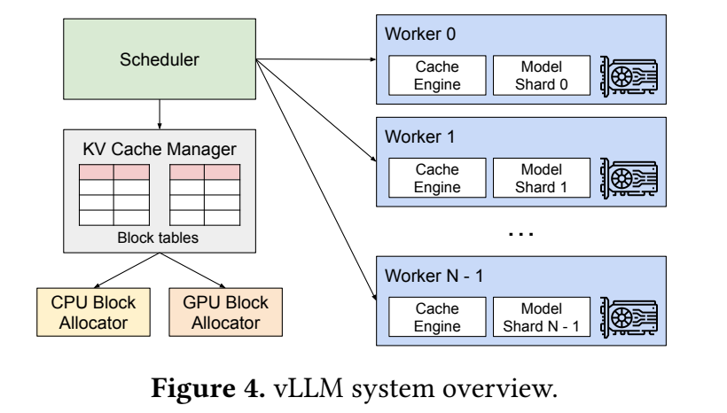

### 8.1 OS paging과의 대응, 그리고 차이

| OS 개념 | vLLM의 대응 | 주의할 차이 |
|---|---|---|
| process | request/sequence | sampling 한 요청에 sequence가 여러 개일 수 있음 |
| byte | token의 K/V state | 한 token state는 많은 layer·head의 tensor로 구성 |
| virtual page | logical KV block | 논리 token 순서를 표현 |
| physical page | GPU pool의 physical KV block | 고정 크기로 미리 만든 pool의 단위 |
| page table | block table | kernel이 직접 ID를 읽는 application-level mapping |
| copy-on-write | shared tail block 수정 시 복사 | append-only 생성에서는 주로 마지막 block |
| swap space | CPU RAM의 KV block pool | 논문에서는 disk swap이 아님 |

**[리뷰어 해석]** PagedAttention을 CPU MMU가 수행하는 page-table walk나 CUDA Unified Memory의 자동 page fault와 동일시하면 안 된다. GPU kernel과 scheduler가 명시적으로 관리하는 논리 table이다. ‘필요할 때 할당’도 kernel 실행 중 host allocator를 매 token마다 호출한다는 뜻이 아니라, 준비된 pool의 free block을 mapping에 추가한다는 의미다.

### 8.2 주소 변환을 계산하는 보조식

아래는 0-based token index u에 대한 리뷰어 해설식이다.

```math
b=\lfloor u/B\rfloor,\qquad o=u\bmod B,\qquad p=\mathcal T_r[b],\qquad \mathrm{slot}(r,u)=pB+o.
```

1. u를 B로 나눈 몫 b가 논리 block index다.
2. 나머지 o가 block 내부 offset이다.
3. table에서 physical block p를 읽는다.
4. p와 o를 조합해 new K/V를 쓸 slot을 정한다.

실제 byte address는 여기에 layer/head/feature stride가 추가된다. 예를 들어 $`B=4`$, table `[7,1,3]`, `u=8`이면 `b=2`, `o=0`, `p=3`, `slot=12`다. **physical ID 3은 세 번째 token이나 세 번째 layer를 뜻하지 않는다.**

### 8.3 Figure 6을 시간 순서로 따라가기

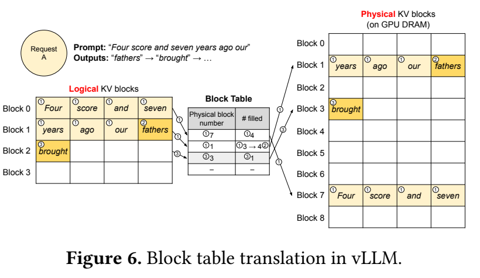

원문 prompt는 ‘Four score and seven years ago our’, 7 token으로 그려져 있고 B=4다. 그림의 단어 단위 token은 설명용이며 실제 tokenizer의 분절을 보장하는 예가 아니다. [PDF p.6, §4.3, Fig.6]

| 시점 | 이번 forward 입력 | forward 후 cache | table / filled | 새로 샘플링한 출력 |
|---|---|---|---|---|
| Prefill | prompt 7개 | prompt KV 7개 | logical 0→physical 7, filled 4; logical 1→physical 1, filled 3 | `fathers` |
| Decode 1 | `fathers` | KV 8개 | `[7,1]`, filled `[4,4]` | `brought` |
| Decode 2 | `brought` | KV 9개 | 새 block 3 할당; `[7,1,3]`, filled `[4,4,1]` | 그다음 token |

**[리뷰어 해석]** token을 ‘생성했다’는 말을 sampling과 KV 생성에 동시에 쓰면 헷갈린다. Table의 filled count는 실제 KV가 기록된 위치를 기준으로 읽는다. EOS를 샘플링하여 바로 종료하면 EOS 자체의 K/V를 다시 계산할 필요가 없는 경우도 있다.

### 8.4 요청 두 개가 같은 pool을 사용하는 경우

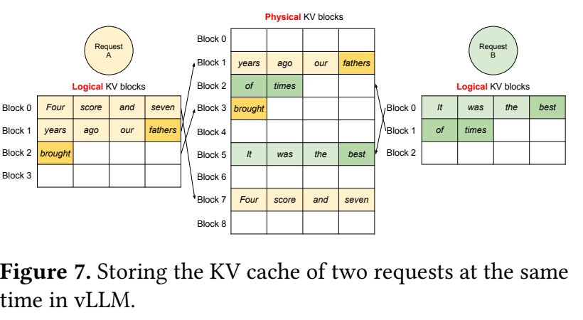

Figure 7에서 A는 `[7,1,3]`, B는 `[5,2]`라는 서로 다른 physical ID들을 쓸 수 있다. 물리적으로 A의 block 사이에 B의 block이 있어도 상관없다. Kernel은 A에 대해 A의 table만 읽으므로 B의 token을 A의 문맥으로 혼합하지 않는다. A가 종료하면 참조가 없는 `[7,1,3]`을 free list로 돌려주어 새 요청 C가 재사용한다.

**주의.** 이 그림의 두 요청은 prefix sharing 사례가 아니다. 두 요청이 같은 pool을 효율적으로 사용한다는 것과 **같은 physical block을 함께 가리킨다**는 것은 다른 상황이다.

### 8.5 낭비 상한의 정확한 범위

공유·preemption이 없는 하나의 append-only sequence에 대해 다음이 성립한다.

```math
N_{\mathrm{blocks}}(n)=\lceil n/B\rceil,\qquad W_{\mathrm{slots}}(n)=B\lceil n/B\rceil-n,\qquad 0\le W_{\mathrm{slots}}\le B-1.
```

빈 slot은 마지막 block에만 있다. B=16, n=100이면 7 block=112 slot을 할당하므로 빈 slot은 12다. n=112이면 빈 slot은 0이고, n=113에 이르면 새 block을 받아 빈 slot 15가 된다. 낭비가 token 수와 무관한 상한을 가지지만 **0은 아니다**.

길이의 나머지가 0–B−1에 균등하다는 추가 가정을 두면 평균 빈 slot은 `(B−1)/2`다. 이는 원문에서 증명한 분포적 사실이 아닌 리뷰어의 계산이다. 짧은 sequence가 많으면 relative waste가 커지고, sharing/COW·watermark·metadata도 실제 메모리에 포함해야 한다.

### 8.6 미리 할당한 GPU pool과 on-demand allocation은 모순이 아니다

**[공식 코드 확인]** `cache_engine.py`는 layer별 K/V pool tensor를 `torch.empty`로 만든다. `BlockAllocator.allocate`는 여기서 쓸 block ID 하나를 free list에서 꺼낸다. 따라서 GPU driver가 보는 allocated VRAM은 요청이 없어도 높게 유지될 수 있지만, pool 내부에서 어떤 요청이 사용하는지는 동적으로 변한다. Fig.2의 활용률과 `nvidia-smi`의 프로세스 VRAM 수치를 같은 것으로 읽으면 안 된다.

원문 p.5 각주 1은 token의 모든 layer/head K/V를 함께 관리하는 방식과, head/layer별 block을 별도로 두는 방식을 모두 설명하고 구현 편의 때문에 후자를 선택했다고 밝힌다. 별도의 physical tensor를 갖는다는 것과 scheduler가 동일한 token-range mapping을 worker들에게 전달한다는 것은 양립한다. Layer/head 축을 생략한 그림 하나를 실제 모든 bytes가 하나의 contiguous tensor에 저장된다는 증거로 읽지 않는다.

<a id="sharing"></a>

## 9. 원문 §4.4: sharing, copy-on-write, sampling, beam

### 9.1 먼저 정의할 불변식

**[리뷰어 해석]** 공유 메모리를 올바르게 사용하려면 다음 불변식이 필요하다.

1. 같은 physical block을 가리키는 sequence들은 그 위치의 K/V 내용이 같아야 한다.
2. 읽기 전용 shared block에는 여러 reference가 있어도 된다.
3. shared block을 한 sequence만 다르게 바꾸려면 먼저 복사하거나 새 block으로 분리한다.
4. reference count가 0이 될 때만 block을 free list로 돌린다.
5. 새 자식의 reference를 등록하기 전에 유일한 부모 reference를 제거하여 block을 조기 해제하면 안 된다.

이는 cache 데이터가 모델의 수학적 입력과 일치하도록 유지하는 조건이다. 불변식이 깨지면 단순 latency 문제가 아니라 다른 요청의 KV를 잘못 읽는 correctness 문제가 된다.

### 9.2 Parallel sampling과 Figure 8의 COW

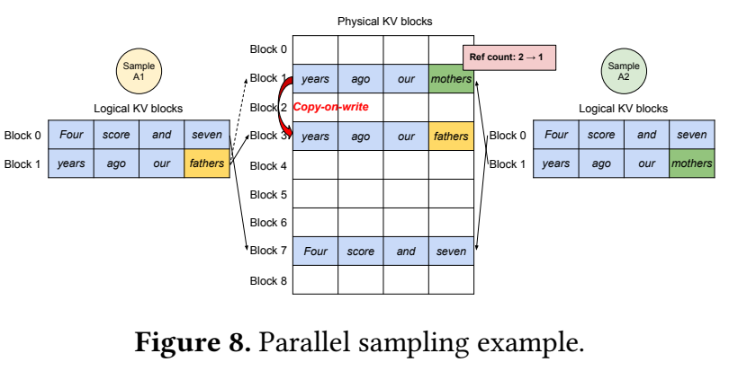

위의 7-token prompt, B=4 예를 두 sample A1/A2로 분기한다.

| 단계 | A1 table | A2 table | physical 7 / 1 / 3의 ref count | 실제 작업 |
|---|---|---|---|---|
| Prefill 후 단일 sequence | `[7,1]` | 없음 | 1 / 1 / 없음 | prompt KV는 한 사본 |
| Fork | `[7,1]` | `[7,1]` | 2 / 2 / 없음 | table을 복제하고 refs만 증가 |
| A1이 다른 token의 KV를 쓸 준비 | `[7,3]` | `[7,1]` | 2 / 1 / 1 | block 1→3 복사, A1의 마지막 mapping 변경 |
| A1/A2 write | `[7,3]` | `[7,1]` | 2 / 1 / 1 | physical 3에 `fathers`, physical 1에 `mothers`의 KV 기록 |
| A1 종료 | 해제 | `[7,1]` | 1 / 1 / 0 | block 3만 즉시 free 가능 |

A2가 쓸 때 physical 1의 ref count는 이미 1이므로 추가 복사 없이 덮어쓸 수 있다. **원래 두 branch라고 매번 두 번 복사하는 것이 아니다.** Full prefix block 7은 계속 공유한다. [PDF p.7, §4.4, Fig.8]

공유 전 두 sequence를 모두 복제하면 4 physical block이 필요하다. Fork 직후에는 2개, 다른 tail KV를 쓴 후에는 3개다. 이 순간 block 저장량 절감은 25%다. prompt 길이가 B의 배수라면 full prompt blocks는 전부 공유하고 각각의 새 tail block만 할당할 수 있다.

### 9.3 공유 절감률의 작은 일반화

prompt P가 B로 나누어떨어지고, sample S개가 각각 G개 token의 KV를 새로 저장했다고 하자. 모든 G가 같다는 해설용 가정 아래:

```math
N_{\mathrm{unshared}}=S\left(P/B+\lceil G/B\rceil\right),\qquad N_{\mathrm{shared}}=P/B+S\lceil G/B\rceil.
```

```math
\eta=1-\frac{N_{\mathrm{shared}}}{N_{\mathrm{unshared}}}.
```

예를 들어 P=8, B=4, S=3, G=4이면 unshared는 9 block, shared는 5 block이다. 절감은 4/9=44.44%다. G가 길어질수록 각 sample의 private suffix가 커져 상대 절감률이 줄어든다. 논문의 Alpaca parallel sampling 절감이 beam search보다 작게 나오는 이유를 이해할 수 있다. 이 계산에는 shared prefix를 만드는 일회성 prefill 비용을 포함하지 않는다.

### 9.4 Beam search: 값 선택과 메모리 선택을 나누어 이해하기

beam width k, vocabulary size $`|\mathcal V|`$라면 한 step에 후보 score는 논문 설명상 $`k|\mathcal V|`$개다. 원문의 핵심 비번호 계산량 표현이다. [PDF p.7, §4.4]

리뷰어 보조식으로 beam score를 나타내면:

```math
S(b,u)=\log P(x_{1:t}^{(b)})+\log P(u\mid x_{1:t}^{(b)}),\qquad (b,u)\in\{1,\ldots,k\}\times\mathcal V.
```

상위 k개의 `(parent beam, next token)` 조합을 유지한다. 길이 보정·EOS 처리·finished 후보 관리는 구현에서 더 복잡하지만, block manager는 어떤 후보가 의미적으로 우수한지 판단하지 않는다. Sampler/engine이 선택한 부모–자식 관계에 따라 `fork`, `append`, `free`만 수행한다.

**해설용 k=2 수치 예.** 기존 beam A의 누적 확률이 0.8, B가 0.2라고 하자. A의 다음 token 확률 `[0.50,0.40,0.10]`, B의 확률 `[0.60,0.25,0.15]`이면 전체 후보 확률은 A에서 `[0.40,0.32,0.08]`, B에서 `[0.12,0.05,0.03]`이다. Top-2는 모두 A에서 나온다. 다음 iteration의 두 sequence는 A의 prefix를 공유하고, 이전 B의 exclusive blocks는 해제할 수 있다. 이전 beam을 일대일로 연장하는 방식만으로는 이 동작을 구현할 수 없다.

### 9.5 Figure 9의 k=4 reference 변화

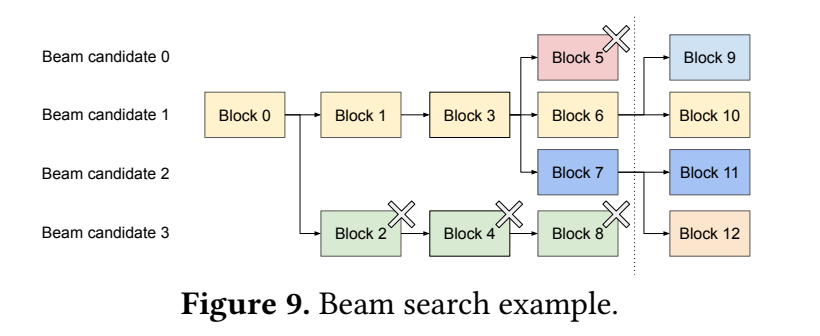

분기 전 logical block table은 다음과 같이 읽을 수 있다.

| 후보 | physical block 경로 |
|---|---|
| 0 | `[0,1,3,5]` |
| 1 | `[0,1,3,6]` |
| 2 | `[0,1,3,7]` |
| 3 | `[0,2,4,8]` |

처음에는 block 0의 ref count=4, block 1과 3은 각각 3, 나머지 tail blocks는 1이다. 다음 top-4가 후보 1과 2의 자식 두 개씩이면 최종 경로는 `[0,1,3,6,9]`, `[0,1,3,6,10]`, `[0,1,3,7,11]`, `[0,1,3,7,12]`가 된다. 최종 refs는 0/1/3이 각각 4, 6/7이 각각 2, 9–12는 1이다. 2/4/5/8은 ref count가 0이라 해제한다.

**[검산]** 분기 전 logical block references는 16개지만 distinct physical blocks는 9개다. 분기 후 references는 20개, distinct blocks는 여전히 9개다. 그림의 full-block boundary에서는 새 block을 append하여 기존 큰 prefix를 복사하지 않는다. 분기 지점이 partial shared block 내부라면 COW가 필요하다. [PDF p.7, Fig.9]

### 9.6 서로 다른 요청의 shared prefix

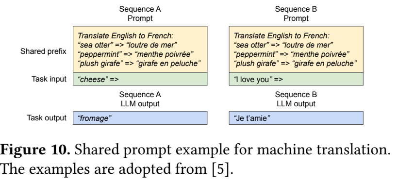

**[저자 보고]** 서비스 제공자가 미리 정의한 공통 prefix의 KV를 계산해 physical blocks에 보관한다. 새 요청은 해당 block들을 자기 logical table에 연결하고 task-specific suffix만 처리할 수 있다. 마지막 partial block은 COW 대상이다. [PDF pp.7–8, §4.4, Fig.10]

**해설용 예.** B=4, shared prefix 8 token을 `[10,11]`에 보관하고, 서로 다른 suffix 3 token씩을 갖는 요청 A/B/C가 온다고 하자. Table은 A=`[10,11,2]`, B=`[10,11,5]`, C=`[10,11,8]`이 될 수 있다. 공유하지 않으면 9 block, 공유하면 5 block이다. 세 요청을 위해 반복 계산할 공통 8-token prefix prefill도 한 번으로 줄일 기회가 있다.

그러나 suffix query는 공통 prefix의 K/V를 계속 참조해야 한다. ‘prefix prefill을 생략한다’는 것은 이후 모든 attention에서 prefix를 무시한다는 뜻이 아니다.

**[리뷰어 해석]** 공유 key는 최소한 model/checkpoint, adapter, tokenizer 결과, token 위치와 앞선 prefix 상태를 구별해야 한다. 뒤에 같은 문자열이 나타났다는 것만으로 해당 K/V를 공유할 수 없다. 학습된 soft prompt가 다른 경우에도 같은 physical state라고 볼 수 없다. 원문은 서비스 제공자가 준비한 prefix 예를 제시하며, 오늘의 자동 prefix hashing·eviction 구현 전체를 명세하지 않는다.

### 9.7 Mixed decoding methods

Basic sampling, parallel sampling, beam search는 공유 패턴이 다르지만 kernel이 읽는 인터페이스는 sequence별 block ID 목록과 context length다. Sharing 복잡성을 memory manager에 모아 같은 모델의 다른 sampling 요구를 함께 다룰 수 있다. [PDF p.8, §4.4]

**[공식 코드 확인]** 역사적 코드의 prefix cache 완성도를 논문 설계와 혼동하면 안 된다. 검토한 `BlockSpaceManager._get_physical_blocks`에는 공유를 같은 sequence group 내부로 가정하는 주석이 있고, attention prefill 경로는 기존 paged prefix KV를 받아 suffix-only attention을 수행하는 일반 경로가 아니다. 따라서 이 파일들만 보고 논문의 cross-request prefix-sharing 실험까지 즉시 재현된다고 주장할 수 없다.

<a id="scheduling"></a>

## 10. 원문 §4.5–4.6: scheduling, preemption, 분산 실행

### 10.1 continuous batching의 작은 시간 예

이 예는 논문 개념을 풀어쓴 것으로, 각 행이 같은 실행 시간을 가진다는 뜻은 아니다.

| iteration | 실행 대상 | 끝에서 발생하는 일 | memory 효과 |
|---:|---|---|---|
| 0 | A와 B prompt | 첫 output을 각각 sampling | A/B prompt blocks 할당 |
| 1 | A/B decode | A는 EOS로 종료 | A의 refs를 낮춰 free blocks 회수 |
| 2 | 새 C prefill | C의 첫 output sampling | A가 반환한 block을 C에 재사용 |
| 3 | B/C decode | 두 요청 계속 생성 | 경계에 도달한 sequence만 새 block 추가 |

Continuous batching은 ‘iteration마다 멤버를 바꿀 수 있음’을 뜻한다. 위 표처럼 prefill iteration과 decode iteration을 분리해도 성립한다. 당시 v0.2.0은 새 prompt들을 admit하면 prompt run을 반환하고, 해당 iteration에서 기존 decode를 함께 수행하지 않는 경로가 확인된다. 긴 C의 prefill이 B의 다음 token을 늦출 수 있으므로, 이 개념만으로 ITL tail을 보장할 수 없다.

### 10.2 메모리 부족은 paging 후에도 생긴다

Paging은 필요한 KV의 실제 크기를 없애지 않는다. 동시 요청과 출력이 계속 늘면 free block을 다 쓸 수 있다. 원문 정책은 먼저 도착한 요청을 우선하는 FCFS이고, preemption이 필요하면 늦게 도착한 요청부터 선점한다. [PDF p.8, §4.5]

**해설용 allocation 예.** Pool에 6 block이 있다고 하자. A가 3, B가 2개를 써서 free=1이다. 다음 iteration에 A/B가 각자 block boundary를 넘어 1개씩 더 필요하면 2개가 필요하다. 무조건 계속 실행할 수 없다. 늦게 온 B를 선점해 2 block을 CPU로 옮기거나 KV를 버리고, A의 다음 block을 할당한다. 이후 A가 끝나거나 공간이 생기면 B를 복구한다.

**[공식 코드 확인]** v0.2.0의 `can_append_slot`은 running sequence 수만큼 free blocks가 있는지 보는 보수적 heuristic이다. 실제로 모든 sequence가 다음 step에 새 block을 요구하지 않아도, COW나 boundary 증가를 안전하게 다룰 공간을 확보하려고 더 일찍 preempt할 수 있다. ‘마지막 block에 여유가 있으니 scheduler는 절대 선점하지 않는다’는 설명은 이 코드와 맞지 않는다.

### 10.3 all-or-nothing eviction과 gang scheduling

한 decode query는 자기 sequence의 모든 유효 K/V를 참조한다. 그래서 일반 OS의 특정 page만 evict하는 정책을 그대로 가져오지 않고, **sequence의 KV 전체를 함께 evict**하는 정책을 채택한다. Beam이나 parallel samples처럼 한 request에서 나온 sequence group은 공유가 있으므로 함께 preempt/resume한다. [PDF p.8, §4.5]

여기서 ‘전체’는 model weight를 포함한 프로세스 전체가 아니라 해당 sequence/group의 KV 상태다. Shared physical block은 각 참조를 고려해야 하고, group 내부 여러 table이 가리키는 같은 block을 중복 swap하지 않도록 distinct block을 기준으로 다룰 수 있다.

### 10.4 CPU swapping과 recomputation

| 복구 전략 | 선점 때 | 재개 때 | 비용을 좌우하는 요인 |
|---|---|---|---|
| Swapping | GPU KV를 CPU RAM block으로 복사 | CPU→GPU 복사 후 table 재매핑 | 전송 bytes, PCIe 등 link bandwidth, 작은 copy의 횟수 |
| Recomputation | KV를 해제하고 token sequence는 보존 | 이미 생성한 token까지 prompt처럼 묶어 KV 재생성 | prefix 길이, GPU prefill 성능, 모델 계산량 |

**[리뷰어 해석]** Recomputation은 이미 샘플링했던 text를 다시 무작위로 생성하는 일이 아니다. 과거에 선택된 token 목록을 입력으로 다시 forward하여 KV만 복원한다. Generation 때 한 token씩 계산했던 상태를 여러 token의 parallel prefill로 만들 수 있어, 처음 그 text를 순차 생성한 총 시간보다 짧을 수 있다.

리뷰어의 거친 비용 모델은 다음과 같다.

```math
T_{\mathrm{swap}}\approx\frac{M_{\mathrm{KV}}}{\beta_{\mathrm{D2H}}}+\frac{M_{\mathrm{KV}}}{\beta_{\mathrm{H2D}}}+n_{\mathrm{copies}}\tau_{\mathrm{copy}},\qquad T_{\mathrm{recompute}}\approx T_{\mathrm{prefill}}(n).
```

이는 실측 공식이 아니다. transfer overlap, pinned memory, per-layer event, launch overhead에 따라 달라진다. $`\beta`$는 유효 bandwidth, $`\tau`$는 copy 하나의 고정 비용이다. 작은 B는 동일 bytes를 더 많은 조각으로 보내 유효 bandwidth를 낮출 수 있다.

원문은 swap이 발생하면 preempted sequence가 완료될 때까지 새 요청을 받지 않는 정책을 설명하고, CPU swap 용량이 GPU KV pool 크기를 넘지 않는다고 논의한다. **[공식 코드 확인]** v0.2.0은 `if not self.swapped`일 때 새 waiting 요청의 admission을 시도한다. Swapped queue가 비면 이미 복구되어 running인 요청이 남아 있어도 이 조건은 다시 참이 될 수 있다. 본문의 서술과 코드를 같은 엄밀한 scheduling guarantee로 취급하지 않는다.

### 10.5 §4.6: tensor parallel GPU들이 같은 table을 사용

각 GPU가 attention head의 서로 다른 부분을 맡는 tensor parallelism에서는 모든 worker가 같은 token 위치를 처리한다. 따라서 scheduler가 논리 block→physical ID mapping을 하나로 정하고 모든 worker에 전달할 수 있다. 각 GPU의 ‘physical block 7’은 같은 token 범위의 **서로 다른 head shard**를 보관한다. GPU들이 같은 메모리 주소나 전체 KV 사본을 공유하는 것은 아니다. [PDF pp.8–9, §4.6]

**해설용 shape 예.** $`H_{\mathrm{kv}}=40`$, tensor parallel degree=4, $`d_h=128`$, B=16, FP16이면 각 worker의 KV head는 10개다. Layer 하나의 block payload는 `2 × 16 × 10 × 128 × 2 = 81,920 bytes = 80 KiB`다. 40 layer이면 worker당 logical block 범위 하나에 3.125 MiB를 저장하고, 4 worker 합은 12.5 MiB다. 이는 all-layer OPT-13B의 16-token KV 크기와 일치한다.

한 iteration은 (1) scheduler가 token ID와 block tables/copy 명령 준비, (2) worker에 제어 정보 전달, (3) 각 worker가 자기 head shard로 모델 forward, (4) tensor parallel all-reduce, (5) sampling 결과 반환 순서다. Memory management를 위한 별도의 worker 간 합의는 줄이지만, 모델 계산에 필요한 all-reduce는 남는다. ‘분산 실행에 synchronization이 없다’고 읽으면 안 된다.

<a id="implementation"></a>

## 11. 원문 §5: 구현과 알고리즘 행별 해설

### 11.1 구현의 분업

**[저자 보고]** vLLM은 FastAPI frontend와 GPU inference engine을 포함한다. 당시 구현 규모는 Python 약 8.5K lines, C++/CUDA 약 2K lines이며, scheduler/block manager는 Python, PagedAttention 등은 CUDA로 작성했다. 모델 실행에는 PyTorch/Transformers, 분산 tensor 통신에는 NCCL을 사용한다. 이는 논문 시점의 구현 설명으로 최신 코드 규모가 아니다. [PDF p.9, §5]

### 11.2 §5.1의 세 가지 kernel 최적화

| kernel 최적화 | 입력→출력 | fusion의 이유 | 남는 비용 |
|---|---|---|---|
| Fused reshape and block write | new K/V + slot mapping → paged pools | split, layout reshape, block write의 launch를 줄임 | KV 쓰기 bytes와 layout arithmetic |
| Fused block read and attention | Q + tables + K/V pools → O | 전체 KV를 contiguous 임시 tensor로 먼저 gather하지 않고 직접 계산 | table read, branch, variable length 처리 |
| Fused block copy | source→destination block 쌍들 → 복제된 K/V | COW의 많은 작은 `cudaMemcpyAsync` 호출을 합침 | 실제 복제 bytes, 동기화 및 관리 |

원문은 warp가 block을 읽도록 배치해 coalesced access를 확보한다고 설명한다. **KV storage block과 CUDA thread block은 다른 개념**이다. 하나는 token storage 단위, 다른 하나는 실행 thread 그룹 단위다. [PDF p.9, §5.1]

### 11.3 원문에는 Algorithm 1이 없다

아래 의사코드는 §4.2–4.5, §5.2와 공식 구현의 연산을 설명하기 위해 리뷰어가 재구성했다. 실제 스케줄러의 모든 예외·watermark·finished-beam 처리를 복제한 실행 코드가 아니다. 원문 알고리즘으로 오인하지 않도록 A/B/C라는 해설 이름을 붙인다.

### 11.4 해설 알고리즘 A: append를 위한 mapping 준비

```text
A1  u := 이번 forward가 KV를 생성할 token의 0-based 위치
A2  b := u // B, offset := u % B
A3  if table에 logical block b가 없다:
A4      p := free pool에서 새 physical block 할당; table[b] := p
A5  else:
A6      p := table[b]
A7      if ref_count[p] > 1:
A8          q := 새 physical block 할당; COPY(p -> q) 명령 기록
A9          table[b] := q; ref_count[p] -= 1; p := q
A10 slot := p * B + offset
A11 COPY가 완료된 뒤 new K/V를 slot에 기록
A12 context length와 table을 사용하여 attention 수행
```

| 행 | 상세 의미 |
|---|---|
| A1 | sampled output 수와 이미 cache한 token 수를 구별한다. 일반 decode에서는 마지막 sampled token이 이번 입력 |
| A2 | 논리적 주소만 계산하며 아직 물리 주소는 모른다 |
| A3–A4 | block boundary를 넘어 새 block이 필요하면 빈 것을 할당. 기존 full prefix를 이동하지 않음 |
| A5–A6 | 이미 할당한 partial tail block을 이어 쓰는 경로 |
| A7 | 유일한 참조이면 그대로 써도 되지만 shared면 다른 sequence의 prefix를 손상시킬 수 있음 |
| A8 | 복사 대상을 먼저 확보한다. 실제 GPU 복사는 scheduler가 모아 실행할 수 있음 |
| A9 | 이 sequence만 새 block으로 mapping을 바꾸고 이전 reference 하나를 내려놓음 |
| A10 | `slot_mapping`은 model이 만든 K/V를 어느 physical 위치에 쓸지 정함 |
| A11 | copy보다 먼저 새 token을 쓰면 copy가 새 값을 덮어쓸 수 있으므로 순서가 중요 |
| A12 | 새 token 자신도 causal attention의 유효 prefix에 포함된다 |

### 11.5 해설 알고리즘 B: 한 serving iteration

```text
B1  완료/취소된 sequence의 reference를 해제
B2  waiting, running, swapped 상태와 FCFS 우선순위 확인
B3  이번 run의 prompt 또는 decode sequence들을 선택
B4  필요한 block 수를 검사하고, 부족하면 낮은 우선순위 group 선점
B5  allocate/append/COW/swap 명령과 block tables를 확정
B6  token IDs, positions, slot mapping, context lengths를 worker에 전달
B7  worker가 필요한 cache 이동을 시작하고 layer별 선행 관계를 지킴
B8  model forward로 logits 생성
B9  sampler가 next tokens와 parent-child 후보 관계 선택
B10 살아남을 자식들의 fork reference를 등록
B11 EOS/길이 제한/탈락 후보의 free 처리
B12 다음 iteration 또는 전체 종료
```

B1/B11은 수명 종료 시점이다. B2–B5는 **control plane**으로 GPU attention 값을 직접 계산하지 않는다. B6–B8은 **data execution**이며, B9는 모델 분포를 실제 생성 정책으로 바꾼다. B10을 B11보다 먼저 하는 이유는 부모 block을 자식이 계속 쓸 수 있기 때문이다. Finished sequence의 payload를 사용자에게 반환하는 시점과 GPU KV 해제 시점은 개념적으로 분리할 수 있다.

**[공식 코드 확인]** 실제 v0.2.0 `_schedule`은 새 prompt admission 경로와 decode 경로를 구분한다. Beam sampler는 finished/EOS 처리에 대비해 일단 `2 * beam_width` 후보를 뽑고 engine에서 running/finished 후보를 나누어 정리한다. 따라서 원문의 간단한 ‘top-k 선택’을 그대로 `torch.topk(..., k)` 한 줄짜리 전체 알고리즘으로 옮기면 구현과 차이가 난다. [공식 [sampler.py](https://github.com/vllm-project/vllm/blob/e2fb71ec9f2c3168ba8614408fa807a5f65707c5/vllm/model_executor/layers/sampler.py#L368), [llm_engine.py](https://github.com/vllm-project/vllm/blob/e2fb71ec9f2c3168ba8614408fa807a5f65707c5/vllm/engine/llm_engine.py#L351)]

### 11.6 해설 알고리즘 C: single-query paged attention

```text
C1  sequence/head의 Q와 context length를 읽음
C2  각 논리 block b에 대해 p := block_table[b]
C3  physical p에서 유효 K를 읽고 QK / sqrt(d_h) 계산
C4  모든 유효 token의 score 최대값 m을 reduction
C5  exp(score - m)을 구하고 전체 context의 합 z를 reduction
C6  각 score의 exp를 z로 나누어 attention weights 생성
C7  table을 따라 V를 읽고 해당 weights로 가중합
C8  warp/thread group의 부분합을 합쳐 O를 기록
```

C2가 PagedAttention의 address indirection이고 C4–C6이 **전역** normalization이다. C7에서 마지막 block의 무효 V가 NaN일 수 있으므로 단순히 ‘weight 0이니 아무 값이어도 된다’고 생각하면 안 된다. IEEE 부동소수점에서는 `0 * NaN`도 NaN이 될 수 있다. 읽은 코드가 tail V를 명시적으로 처리하는 이유다. C4–C8의 reduction 순서는 contiguous reference와 다를 수 있다.

### 11.7 §5.2의 fork, append, free

`fork`는 sequence 내용과 table reference를 복제한다. `append`는 token ID를 추가하고 필요할 때 slot을 준비한다. `free`는 reference를 줄이고 0이 된 physical block을 반환한다. 세 메서드는 memory life cycle을 표현하는 최소 인터페이스다. Beam의 scoring rule을 block allocator에 넣을 필요 없이 decoding 정책을 확장할 수 있다는 것이 설계상의 장점이다. [PDF p.9, §5.2]

<a id="forward"></a>

## 12. 한 요청의 forward와 학습·backward 경계

### 12.1 end-to-end forward: 텍스트 한 요청의 전체 경로

| 단계 | 입출력과 역할 | cache 관련 동작 |
|---|---|---|
| 1. 요청 접수 | prompt text, sampling parameters | request/sequence group 생성 |
| 2. Tokenize | text → `[P]` integer IDs | tokenizer 결과와 prefix 상태가 공유 가능성을 결정 |
| 3. Admission | waiting → scheduled | 필요한 prompt blocks 확보 |
| 4. Embedding/position | IDs → `[P,D]` | 아직 layer KV가 아님 |
| 5. 각 layer의 QKV | hidden → Q `[P,H_q,d_h]`, K/V `[P,H_kv,d_h]` | K/V를 해당 layer pool에 기록 |
| 6. Prefill attention | causal attention → `[P,H_q,d_h]` | prompt 계산은 conventional efficient attention 사용 가능 |
| 7. Residual/norm/MLP | layer hidden 갱신 | transient activation, 다음 layer로 전달 |
| 8. Vocabulary projection | 마지막 prompt 위치 → `[|V|]` logits | 첫 output token sampling |
| 9. Decode input | 첫 output ID 하나 → `[1,D]` | sampled token의 KV는 여기서 처음 생성 |
| 10. Paged decode attention | query 하나 + old/new paged KV → O | 전역 context length에 대해 Eq.(3) 계산 |
| 11. 다음 output | logits → token | block boundary/COW 필요에 따라 다음 iteration 준비 |
| 12. 종료 | EOS 또는 길이 제한 | 참조를 해제하고 block을 재사용 |

**[공식 코드 확인]** RoPE 계열 경로에서는 Q/K에 position rotation을 적용한 뒤 기본 `PagedAttention.forward`로 넘긴다. 따라서 shared prefix의 ‘위치 동일성’은 추상적 주의사항만이 아니라 cached K 내용에 직접 영향을 준다. OPT와 LLaMA의 normalization/MLP/position 구현은 서로 다를 수 있고, 논문의 단일 head 식이 모든 architecture detail을 동일하게 만든 것은 아니다.

### 12.2 실제 layer cache shape의 작은 예

해설용으로 layer 2개, head 2개, $`d_h=8`$, B=4, FP16, physical blocks 6개를 생각하자. x=8이므로 layer별 key pool은 `[6,2,1,4,8]`, value pool은 `[6,2,8,4]`다. 각 pool은 384개 FP16 원소=768 bytes이고, K+V와 2 layer를 합치면 3,072 bytes다.

prompt length 7이면 logical blocks 2개를 쓰고, 각 layer에 7 token × 2 heads × 8 dims의 K와 V를 기록한다. **이 d_h=8 예는 shape 설명용으로, 읽은 역사적 CUDA kernel이 지원하는 head size 목록의 실제 실행 사례가 아니다.** 실제 support 목록은 코드 대조에서 따로 기록한다.

### 12.3 학습 데이터·objective·gradient 항목이 없는 이유

| 항목 | 이 논문에서의 상태 |
|---|---|
| Trainable parameters | PagedAttention에 새 학습 parameter가 없음 |
| 사용 모델 | 사전학습된 OPT/LLaMA weight를 추론에 사용 |
| Training data | 새 training dataset 없음; ShareGPT/Alpaca/WMT16은 serving workload 구성에 사용 |
| Train/validation/test split | 새로운 모델 학습 평가 split을 제시하지 않음 |
| Loss/optimizer/LR/epochs | 해당하지 않음; 원문에 훈련 recipe가 없음 |
| Forward | 기존 모델의 attention 의미를 유지하며 memory access/실행 순서를 변경 |
| Backward | 논문에서 제시하거나 평가하지 않음 |
| Cache lifetime | 요청/sequence의 추론 수명과 연동; 학습 graph 저장 목적이 아님 |

**[공식 코드 확인]** `Worker.execute_model`에는 `@torch.inference_mode()`가 붙어 있다. 읽은 serving 경로에서 parameter gradient를 계산하지 않으며 optimizer step도 수행하지 않는다. ‘frozen’은 별도의 fine-tuning 실험에서 일부 layer를 고정했다는 뜻이 아니라 추론 실행 중 weight를 갱신하지 않는다는 뜻으로 사용해야 한다. [공식 [worker.py](https://github.com/vllm-project/vllm/blob/e2fb71ec9f2c3168ba8614408fa807a5f65707c5/vllm/worker/worker.py#L284)]

### 12.4 이론적 backward와 실제 지원 범위를 구분

수학의 이해를 위해서만 한 query의 gradient를 적어 보자. 이는 **리뷰어 보조 유도**이며 PagedAttention 논문의 추가 알고리즘이나 지원 기능이 아니다. upstream $`g=\partial\mathcal L/\partial o\in\mathbb R^{d_h}`$에 대해:

```math
\frac{\partial\mathcal L}{\partial v_j}=a_jg,\qquad \frac{\partial\mathcal L}{\partial a_j}=g^\top v_j,\qquad \frac{\partial\mathcal L}{\partial z_j}=a_j\left(g^\top v_j-\sum_t a_tg^\top v_t\right).
```

```math
\frac{\partial\mathcal L}{\partial q}=\frac{1}{\sqrt{d_h}}\sum_j\frac{\partial\mathcal L}{\partial z_j}k_j,\qquad \frac{\partial\mathcal L}{\partial k_j}=\frac{1}{\sqrt{d_h}}\frac{\partial\mathcal L}{\partial z_j}q.
```

올바른 index mapping을 유지하면 이런 미분의 수학적 값도 block 순서와 독립적이다. 그러나 shared physical KV에 대해 여러 logical 사용자의 gradient를 어떻게 합칠지, overwrite와 autograd 수명을 어떻게 관리할지, backward kernel을 어떻게 만들지는 별도 문제다. **Forward 식이 같다는 사실만으로 vLLM serving cache를 training autograd에 그대로 쓸 수 있다고 결론내릴 수 없다.**

### 12.5 정확도 보존 주장의 실제 의미

**[저자 보고]** 메모리 레이아웃을 바꾸므로 모델 정확도를 훼손하지 않는다고 주장한다. **[검산]** Eq.(3)의 모든 유효 K/V와 전역 normalization을 유지하면 실수 연산의 attention 값은 같다. **[공식 코드 확인]** kernel은 FP32 reduction과 softmax 분모의 `1e-6`을 사용하고 일부 내부 값을 dtype에 맞게 변환한다. 따라서 독립 구현과 bitwise 동일한 logits나 모든 random sampling 결과의 동일성을 자동 보장하지 않는다.

실제 재현에서는 동일 token prefix의 attention output/logits를 tolerance로 비교하고, COW 이후 branch가 서로 오염되지 않는지 검사해야 한다. 이 작업에서는 GPU를 실행하지 않았으므로 이런 모델 수준의 수치 일치 검증을 완료했다고 보고하지 않는다.

<a id="evaluation"></a>

## 13. 원문 §6: 실험 조건, 결과, 수치 검산

### 13.1 §6.1: 모델과 하드웨어

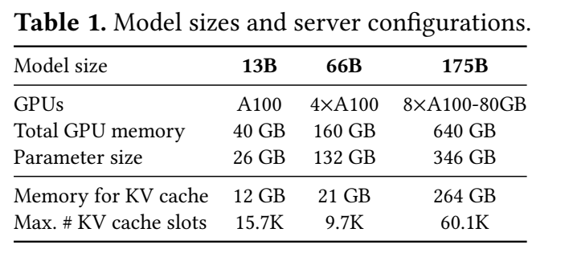

| 항목 | 13B | 66B | 175B |
|---|---:|---:|---:|
| GPU | A100 40GB ×1 | A100 40GB ×4 | A100 80GB ×8 |
| 총 GPU memory | 40GB | 160GB | 640GB |
| 논문 표의 parameter size | 26GB | 132GB | 346GB |
| KV cache용 memory | 12GB | 21GB | 264GB |
| 최대 KV cache slots | 15.7K | 9.7K | 60.1K |

**[저자 보고]** GCP A2 인스턴스의 NVIDIA A100을 사용한다. 기본 실험은 OPT-13B/66B/175B, shared-prefix 번역 실험은 LLaMA-13B다. Model size ‘175B’와 표의 실제 weight memory 346GB를 그대로 기록하며, 이름에 2 bytes를 곱한 350GB로 표를 임의 수정하지 않는다. [PDF pp.9–10, Table 1, §6.1]

**[검산]** 13B의 표기 12GB를 이진 메모리 12GiB로 해석하면 `12 × 2^30 / 819200 = 15,728.64 slots`로 표의 15.7K와 잘 맞는다. 반대로 12×10^9 bytes라면 약 14.65K slots다. 원문은 GB/GiB를 엄밀히 구별해 쓰지 않으므로 표의 숫자는 유지하고 byte 계산은 별도로 한다. 전체 GPU memory에서 weight와 KV를 뺀 나머지는 activation/workspace 등이며 전부 free KV capacity로 가정하면 안 된다.

66B는 GPU가 4개여도 weight가 차지하는 비중 때문에 13B보다 총 KV slot 수가 작다. 175B 구성은 GPU 총 메모리가 매우 커서 60.1K slots를 제공한다. 따라서 model size가 커지면 항상 paging 이득이 단조 증가한다고 설명할 수 없다. 실제로 short-sequence Alpaca에서 175B의 이득이 줄어든다.

### 13.2 workload는 학습 데이터가 아니라 길이·도착률 분포다

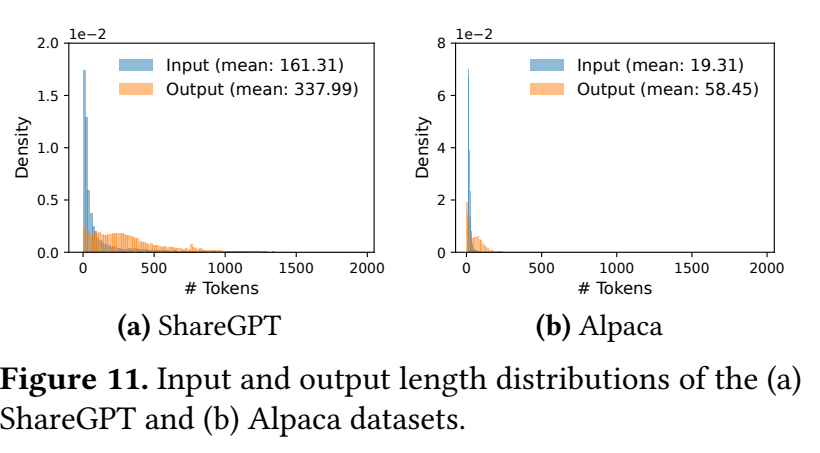

| 데이터 | 평균 입력 길이 | 평균 출력 길이 | 사용 의미 |
|---|---:|---:|---|
| ShareGPT | 161.31 | 337.99 | 긴 대화와 높은 길이 변동성을 반영한 serving trace |
| Alpaca | 19.31 | 58.45 | 상대적으로 짧은 instruction-response workload |

**[검산]** 입력 길이 비는 `161.31/19.31 = 8.3537`, 출력 길이 비는 `337.99/58.45 = 5.7825`이다. 저자의 ‘8.4×, 5.8×’ 설명과 일치한다. 위 수치는 Figure 11 범례의 인쇄 값을 직접 읽은 것이다. [PDF p.9, Fig.11; p.10, §6.1]

데이터에는 도착 timestamp가 없으므로 저자들이 Poisson 도착 과정을 합성한다. 이를 명확히 쓰면 단위 시간의 요청 수는 Poisson, 요청 사이 간격은 exponential이다. 아래는 원문 문장을 풀어쓴 보조식이다.

```math
N(\Delta t)\sim\mathrm{Poisson}(\lambda\Delta t),\qquad \Delta t_{\mathrm{arrival}}\sim\mathrm{Exponential}(\lambda),\qquad E[\Delta t_{\mathrm{arrival}}]=1/\lambda.
```

**[공식 코드 확인]** v0.2.0의 `benchmark_serving.py`도 요청 간격을 `np.random.exponential(1.0 / request_rate)`로 생성한다. 다만 이 공개 benchmark 파일이 논문 모든 trace의 정확한 생성기라는 근거는 없다.

보통 1시간 trace를 평가하고, 비용 때문에 OPT-175B는 15분 trace를 사용한다. 이는 같은 wall-clock 길이로 모든 모델을 평가한 것이 아님을 뜻한다. **[논문 미기재]** 모든 그림을 정확히 생성하는 dataset revision/hash, 모든 trace seed, 원시 per-request timing, error bars와 반복 run의 분산은 논문에 충분히 제공되지 않는다.

### 13.3 baseline은 어떻게 구성했는가

| Baseline | 저자 평가에서의 구성 | 공정성 해석 |
|---|---|---|
| FasterTransformer | 자체 serving scheduler가 없어 저자들이 dynamic batching scheduler 추가, 메모리에 맞는 최대 batch 설정 | attention kernel만의 우열 비교가 아닌 scheduler와 allocation을 포함한 서버 비교 |
| Orca (Oracle) | 실제 최종 output length를 안다고 가정, buddy allocator | 현실에서 얻을 수 없는 정보 이점을 준 baseline; 그래도 reservation/external fragmentation은 존재 |
| Orca (Pow2) | 실제 output length를 다음 2의 거듭제곱으로 올려 예약; 25→32 예 | 미래 실제 길이에 의존하는 평가 구성. 실행 가능한 완전한 length predictor를 제시한 것이 아님 |
| Orca (Max) | 모델 최대 sequence length 2048까지 예약 | 단순하지만 메모리 낭비가 큼 |

**[저자 보고]** Orca가 공개되어 있지 않아 저자들이 자체 버전을 구현했고, KV allocator로 buddy allocation을 가정했다. 따라서 ‘Orca 공식 artifact를 동일 설정으로 실행했다’고 서술하면 틀리다. [PDF p.10, §6.1]

**[리뷰어 해석]** Oracle은 paging의 이득이 단순 length predictor 교체만으로 설명되지 않는다는 데 유용하다. 그러나 저자 재구현이라는 한계와 scheduler/kernel 최적화의 대등성은 별도로 검토해야 한다. FT와의 큰 배율을 곧바로 PagedAttention kernel의 순수 기여로 돌릴 수도 없다.

### 13.4 주 metric: mean normalized latency

원문 정의를 수식으로 옮긴 **비번호 지표 해설식**이다.

```math
\overline{\ell}_{\mathrm{norm}}=\frac1R\sum_{r=1}^{R}\frac{\ell_r}{T_r}.
```

각 요청의 end-to-end latency $`\ell_r`$를 그 요청의 output token 수 $`T_r`$로 나누고, **요청별 비율을 평균**한다. 단위는 s/token이다. Queueing, prefill, decode를 포함한 end-to-end latency를 output 길이로 정규화하므로 decode kernel latency도, 순수 TPOT도 아니다. [PDF p.10, §6.1]

**해설용 산술 예.** 요청 A가 5초에 10 output token, B가 10초에 100 token이면 normalized latency 평균은 `(0.5+0.1)/2=0.3 s/token`이다. 전체 시간을 전체 token 수로 나눈 `15/110=0.1364`와 다르다. 짧은 출력 요청도 긴 출력 요청과 같은 요청 가중치를 받는다.

Streaming을 하는 서비스에서 다음 관계로 차이를 볼 수 있다. 이는 리뷰어 보조식이다.

```math
\ell_r=\mathrm{TTFT}_r+\sum_{j=2}^{T_r}\mathrm{ITL}_{r,j},\qquad \frac{\ell_r}{T_r}=\frac{\mathrm{TTFT}_r}{T_r}+\frac1{T_r}\sum_{j=2}^{T_r}\mathrm{ITL}_{r,j}.
```

긴 T에서는 TTFT가 희석된다. 같은 mean normalized latency라도 첫 token을 오래 기다리거나 드물게 매우 긴 token gap이 생길 수 있다. 논문 그래프의 낮은 평균값을 p99 TTFT/ITL SLO 만족으로 번역하면 안 된다.

### 13.5 ‘같은 latency에서 처리량 증가’를 읽는 법

Figure 12 등의 x축은 offered **request arrival rate**, y축은 mean normalized latency다. 높은 도착률에서 queue가 계속 쌓이면 latency가 급격히 증가한다. 저자는 곡선이 낮게 유지되는 도착률 범위를 비교한다.

리뷰어가 재현 시 정의할 수 있는 기준은 다음과 같다.

```math
\lambda^*(\tau)=\sup\{\lambda:\overline{\ell}_{\mathrm{norm}}(\lambda)\le\tau\ \text{and the queue is stable}\}.
```

원문이 모든 결과에 공통된 하나의 $`\tau`$를 고정하고 해당 SLO로 표를 낸 것은 아니다. 정확한 배율을 재현하려면 threshold, interpolation, run 종료 후 drain 여부, completed/unfinished 요청 처리까지 명시해야 한다. 부하가 처리 능력을 넘으면 무한한 시간에서 queue가 발산한다는 설명은 타당하지만, 1시간 또는 15분 유한 trace가 실제 무한 발산을 직접 측정한 것은 아니다.

### 13.6 §6.2: basic sampling, Figure 12 전체 해석

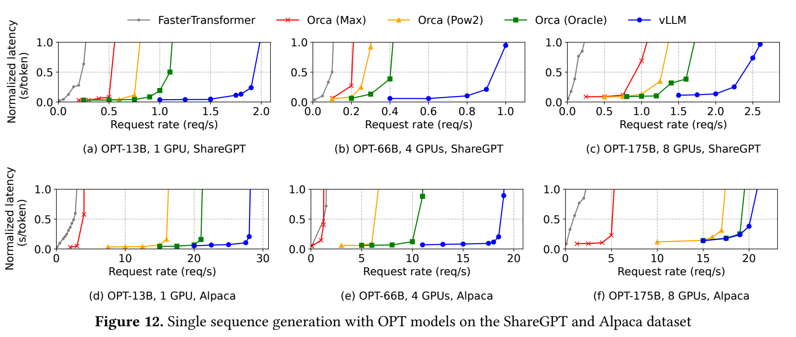

상단 (a)–(c)는 ShareGPT의 OPT-13B/66B/175B, 하단 (d)–(f)는 같은 모델의 Alpaca다. 모든 panel은 sequence 한 개를 생성하는 기본 sampling이다. [PDF pp.10–11, §6.2, Fig.12]

| 원문 결과 | 비교 조건 | 해석 |
|---|---|---|
| 1.7–2.7× 높은 요청률 | ShareGPT, vLLM 대 Orca (Oracle), 비슷한 latency | 최종 길이를 아는 baseline보다 on-demand memory가 유리 |
| 2.7–8× 높은 요청률 | ShareGPT, vLLM 대 Orca (Max) | 큰 선예약과 단편화의 영향 포함 |
| 최대 22× 높은 요청률 | ShareGPT, vLLM 대 FT | FT scheduler의 fine-grained batching 부재까지 포함하는 시스템 차이 |
| 이득 축소 | OPT-175B + Alpaca, Fig.12(f) | 충분한 KV capacity와 짧은 sequence로 baseline도 큰 batch를 만들 수 있음 |

**[리뷰어 해석]** Fig.12(f)는 논문의 주장을 약화시키기만 하는 예외가 아니라, 제안 기법이 왜 작동하는지 보여 주는 중요한 조건부 결과다. 용량 병목이 약해지면 paging만으로 연산 한계를 넘을 수 없다는 해석과 맞는다. 논문 제목의 ‘efficient memory management’가 실험적으로 어떤 상황에서 성능으로 연결되는지 드러낸다.

### 13.7 Figure 13: batch 크기가 실제로 증가했는가

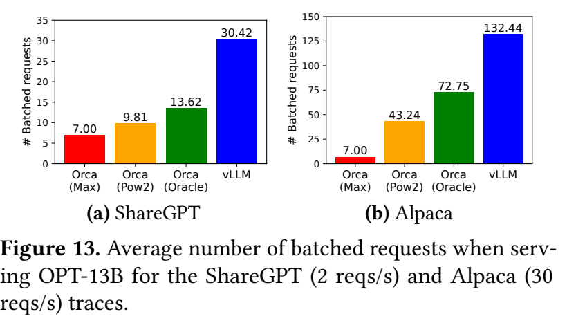

| OPT-13B trace | Orca Max | Orca Pow2 | Orca Oracle | vLLM |
|---|---:|---:|---:|---:|
| ShareGPT, 2 req/s | 7.00 | 9.81 | 13.62 | 30.42 |
| Alpaca, 30 req/s | 7.00 | 43.24 | 72.75 | 132.44 |

**[검산]** ShareGPT에서 `30.42/13.62=2.2335`, `30.42/7=4.3457`로 본문의 2.2×, 4.3×와 일치한다. Alpaca에서는 Oracle 대비 `132.44/72.75=1.8205`다. [PDF p.10, Fig.13; p.11, §6.2]

이 그림은 ‘메모리 절감 → 더 많은 요청을 배치’라는 중간 메커니즘을 직접 지지한다. 다만 평균 active requests가 4.3배라고 throughput이 꼭 4.3배라는 등식은 아니다. Batch가 커지면 iteration당 시간과 요청별 체류 시간도 달라진다. Overload에서 queue가 계속 쌓인 baseline과의 비교는 평균 batch count만으로 유효 SLO throughput을 완전히 설명하지 못한다.

### 13.8 §6.3: parallel sampling과 beam search

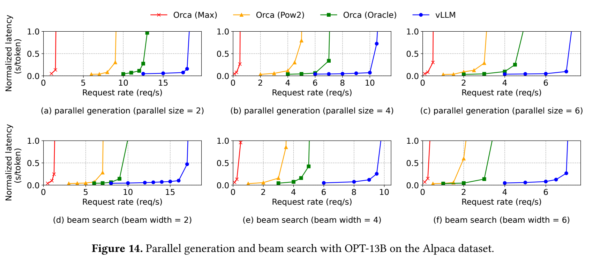

Figure 14는 OPT-13B, Alpaca에서 상단 parallel samples=2/4/6, 하단 beam width=2/4/6을 비교한다. 출력 branch가 늘면 sequence 수가 증가하고 공유 기회도 변한다. 모든 ‘request’를 한 sequence라고 생각하면 x축을 잘못 읽게 된다. [PDF p.11, §6.3]

**[저자 보고]** OPT-13B/Alpaca에서 Oracle 대비 이득은 basic sampling 약 1.3×에서 beam width 6일 때 2.3×로 커진다. Parallel sampling은 주로 prompt를 공유하고, beam은 생성 중인 suffix의 일부도 공유할 수 있어 memory benefit이 더 크다.

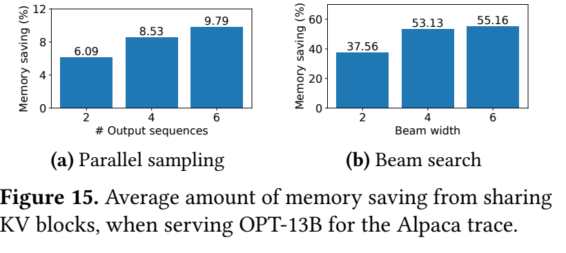

원문의 비번호 지표 정의는 다음과 같다.

```math
\mathrm{memory\ saving}=\frac{N_{\mathrm{blocks,without\ sharing}}-N_{\mathrm{blocks,with\ sharing}}}{N_{\mathrm{blocks,without\ sharing}}}.
```

| Alpaca 조건 | 2 branches | 4 branches | 6 branches |
|---|---:|---:|---:|
| Parallel sampling | 6.09% | 8.53% | 9.79% |
| Beam search | 37.56% | 53.13% | 55.16% |

본문은 이를 각각 6.1–9.8%, 37.6–55.2%로 반올림한다. ShareGPT의 별도 본문 보고는 parallel 16.2–30.5%, beam 44.3–66.3%다. ShareGPT 결과의 모든 개별 branch 막대는 이 PDF에 그려져 있지 않으므로, 중간 width별 숫자를 추정해 표를 채우지 않는다.

**[검산]** 55.16% memory saving은 shared 상태가 baseline의 44.84%라는 뜻이고 동일 block budget의 역수 비는 `1/0.4484=2.2302`다. 이 숫자도 throughput 2.2302×를 수학적으로 보장하지 않는다. 동일하게 sample 6의 9.79% 저장 절감만으로 더 큰 throughput 변화 전부를 설명할 수 없으며, reservation/fragmentation과 scheduler 개선이 같이 작용한다.

### 13.9 §6.4: shared-prefix translation

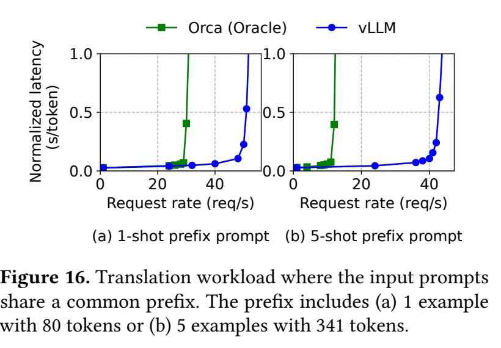

**[저자 보고]** LLaMA-13B, WMT16 English→German translation workload에서 공유 instruction+example prefix를 사용한다. One-shot prefix는 80 token, 5-shot prefix는 341 token이다. Oracle 대비 throughput은 각각 1.67×, 3.58× 높게 보고된다. [PDF pp.11–12, §6.4, Fig.16]

여기에는 **중복 KV 저장 제거와 공통 prefix prefill 재계산 제거**가 동시에 들어간다. 따라서 pure allocation policy만 바꾸는 실험으로 해석하면 안 된다. Fig.10의 시각 예는 English→French지만 Fig.16의 실제 평가 dataset은 English→German이다. 그림의 예시 언어와 평가 언어를 구분해야 한다.

**[논문 미기재]** 이 실험만으로 다양한 tenant의 자동 prefix discovery, cache hit rate 변화, prefix eviction, warm-up 비용 상각, adapter별 cache key 설계를 일반적으로 검증했다고 볼 수 없다. 공통 prefix가 얼마나 자주 재사용되는지에 따라 이득이 달라진다.

### 13.10 §6.5: chatbot

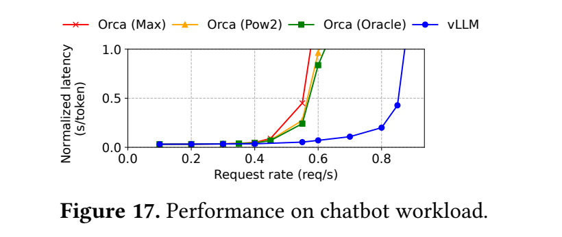

ShareGPT에서 history와 query를 구성하고 OPT-13B의 context 한계에 맞춰 prompt의 마지막 1024 token만 유지, 최대 1024 output token을 생성한다. **대화 라운드 사이에는 KV를 보존하지 않는다.** 라운드 사이 긴 대기 동안 다른 요청의 메모리를 점유하지 않게 하기 위한 조건이다. [PDF p.12, §6.5]

**[저자 보고]** vLLM은 세 Orca 구성보다 약 2× 높은 요청률을 감당한다. 긴 prompt 때문에 buddy allocation을 쓰는 Orca 세 구성이 비슷한 큰 chunk를 예약하여 결과가 유사해진다.

**[리뷰어 해석]** 이 결과를 ‘vLLM은 항상 모든 채팅 세션의 KV를 영구 보존해 빨라진다’는 근거로 인용하면 정반대로 읽는 것이다. 원문의 해당 실험은 cross-turn persistent cache를 사용하지 않는다.

<a id="ablation"></a>

## 14. 원문 §7: ablation과 커널·서버 성능의 차이

### 14.1 §7.1: kernel microbenchmark는 느려졌다

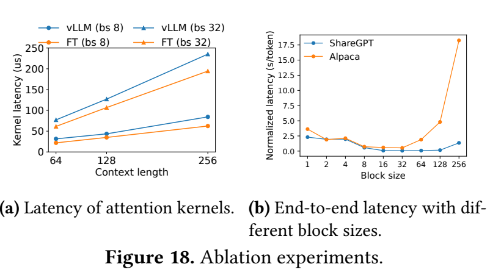

**[저자 보고]** PagedAttention kernel은 FT의 최적화된 attention kernel보다 20–26% 높은 latency를 보인다. Table 조회, branch, 가변 길이 처리의 overhead 때문이다. 이 추가 비용은 attention에 영향을 주지만 Linear 등 다른 operator를 모두 느리게 만들지는 않는다. [PDF p.12, §7.1, Fig.18(a)]

Figure 18(a)의 x축은 context length 64/128/256, y축은 kernel latency μs다. FT와 vLLM 두 종류의 커널, 범례 `bs 8`, `bs 32`가 비교된다. 여기의 bs 비교는 batch 크기 조건으로 읽어야 하며, 오른쪽의 **KV block size sweep**과 같은 x축이 아니다. Raw microbenchmark configuration 전체가 본문에 세밀하게 표로 명시되지는 않는다.

**해설용 수치 예.** 기존 iteration이 10ms이고 그중 attention이 2ms라면, attention만 25% 느려졌을 때 나머지가 같으면 전체는 10.5ms다. 같은 상황에서 유효 batch가 16→32로 늘면 대략적인 output throughput 비는 `32/10.5 ÷ (16/10) = 1.905`다. **이 예는 원문 실측이 아니라 ‘더 느린 kernel과 더 빠른 서버가 공존하는 이유’의 산술 설명**이다. 실제 batch 증가가 다른 연산 시간을 바꾸므로 그대로 예측식으로 사용할 수 없다.

### 14.2 §7.2: B가 너무 작아도, 너무 커도 손해

원문 sweep은 B=1,2,4,8,16,32,64,128,256이다. ShareGPT는 대체로 16–128에서 좋고, Alpaca는 16/32가 좋으며 큰 block에서 성능이 크게 떨어진다. 당시 기본값 B=16을 선택한다. [PDF p.12, §7.2, Fig.18(b)]

| 작은 B | 큰 B |
|---|---|
| tail waste와 공유 경계 손실이 작음 | token들을 더 병렬로 읽고 table entry 수를 줄일 여지 |
| block/table/copy 횟수가 증가 | tail waste가 커지고 short sequence보다 block이 커질 수 있음 |
| 짧은 read/copy의 고정 overhead 비중이 커짐 | partial prefix의 COW 복제 bytes가 커질 수 있음 |

**해설용 수치 예.** 현재 cache length 20이면 B=16에서 32 slot, B=128에서 128 slot을 차지한다. 각각 12와 108 slot이 비며, allocated 대비 빈 비율은 37.5%, 84.375%다. 긴 sequence에서는 상대적 차이가 줄지만 짧은 sequence가 많은 Alpaca에서는 큰 B가 특히 불리하다.

**[리뷰어 해석]** B=16은 실험적으로 유용한 기본값이지 수식에서 유일하게 도출된 최적해가 아니다. Head size, dtype, GPU, sequence length, sharing pattern, kernel backend가 바뀌면 다시 평가해야 한다.

### 14.3 §7.3: recomputation과 swapping

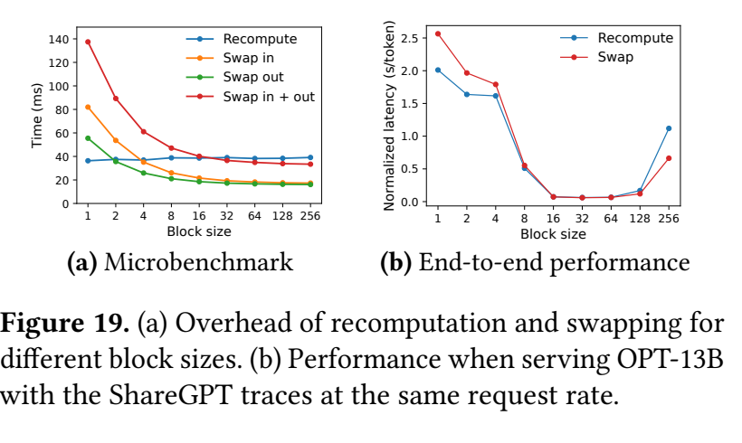

Figure 19(a)의 microbenchmark에서는 recomputation이 block size와 크게 관계없이 약 40ms 주변인 반면, swap in/out 합은 B가 작을 때 크고 B가 커지면 줄어든다. (b)는 같은 offered request rate의 ShareGPT/OPT-13B E2E normalized latency다. B=16–64에서는 두 정책의 E2E 성능이 유사하다. [PDF p.13, §7.3]

**[검산] 원문 문장의 불일치.** 본문은 큰 B에서 swap이 유리하다고 설명한 뒤, recomputation overhead가 swapping latency의 20%보다 높지 않다는 취지의 문장을 쓴다. 이 문장을 문자 그대로 받아들이면 recompute가 swap의 1/5 이하인데 swap이 더 빠르다는 모순이 생긴다. 그림의 큰 B 구간은 recompute 약 40ms, swap 왕복 약 33–36ms이므로 recompute/swap은 대략 1.1–1.2이지 0.2 이하가 아니다.

**[리뷰어 해석]** ‘swap보다 20% 이상 더 느리지는 않다’는 취지의 표현 누락 가능성이 있지만 공식 정정은 확인하지 못했다. 이 리뷰는 그림이 보여 주는 **작은 B의 swap 불리함, 큰 B의 근접한 비용, 16–64의 E2E 유사성**만 확실한 결론으로 취한다. 그래프를 눈으로 읽은 약 40ms 등은 raw data의 정확한 숫자로 제시하지 않는다.

### 14.4 이 논문으로 입증되지 않은 SLO

| 지표 | 논문의 직접 증거 | 추가 측정이 필요한 이유 |
|---|---|---|
| 평균 normalized latency 대 requests/s | 주 그래프에 있음 | 특정 offered load에서 평균 응답 효율 평가 |
| Kernel μs | Fig.18(a)에 있음 | 모델 전체·scheduler·network 비용은 빠져 있음 |
| KV 사용률 / 공유 절감률 | Fig.2, Fig.15에 있음 | weight/workspace까지 포함한 전체 VRAM 절감률이 아님 |
| TTFT p50/p95/p99 | 명시적 별도 분포 없음 | prompt admission·long prefill 영향 확인 필요 |
| ITL/TPOT tail | 명시적 별도 분포 없음 | preemption, 긴 prefill, swap이 token gap에 미치는 영향 |
| SLO goodput | 고정 p99 SLO 아래 완료율로 제시하지 않음 | 평균 latency로는 tail 조건을 판단할 수 없음 |
| Cold start/JIT/warm-up | 통합적으로 분해한 결과 없음 | 짧은 배포 세션과 장시간 serving의 비용 상각 차이 |
| 로봇 sensor-to-action latency | 실험 없음 | vision/action decoder/controller 비용이 포함되지 않음 |

‘SLO goodput’은 리뷰어가 제안하는 후속 metric으로, 지정한 latency 조건을 만족하며 완료된 요청 수/초를 뜻한다. 논문의 reported throughput을 이 정의의 goodput으로 바꿔 부르지 않는다.

<a id="discussion"></a>

## 15. 원문 §8–10: 논의, 관련 연구, 비판적 평가

### 15.1 §8: 모든 GPU workload에 paging이 유리한 것은 아니다

**[저자 보고]** 정적 tensor shape와 lifetime을 미리 최적화할 수 있는 DNN training, 계산이 주된 한계인 일반 DNN serving에는 같은 이득이 보장되지 않는다. 오히려 memory indirection과 비연속 접근의 overhead로 느려질 수 있다고 논의한다. [PDF p.13, §8]

LLM-specific 설계는 단순 OS 비유를 넘어선다. Sequence의 모든 token을 함께 읽는다는 성질을 이용한 all-or-nothing eviction, token 목록으로 KV를 다시 만드는 recomputation, block access를 attention과 합치는 fusion이 그 예다. CPU OS의 임의 page contents는 일반적으로 model forward로 재생성할 수 없으므로 recomputation은 LLM의 연산 구조에서 나온다.

### 15.2 §9: 관련 연구와 기여의 경계

| 선행 방향 | 줄이는 주요 비용 | PagedAttention과의 관계 |
|---|---|---|
| General serving: Clipper, TF Serving, Nexus, InferLine, Clockwork 등 | batching, placement, scheduling, caching | token-by-token 성장하는 KV와 evolving sharing을 중심으로 설계한 것은 아님 |
| Orca / iteration-level scheduling | 요청 단위 기다림과 padding, 낮은 compute utilization | vLLM의 memory packing과 상보적 |
| FT 및 Transformer kernel 최적화 | 개별 operator의 GPU 실행시간 | paged access 지원과 전체 serving 효율은 별도 축 |
| FlashAttention | attention 중간 행렬의 HBM materialization과 IO | transient attention workspace와 operator execution을 개선; paged persistent KV 관리와 결합 가능 |
| Swapping/recomputation 기반 training memory 최적화 | activation/weight 등의 capacity 문제 | 관련 아이디어를 LLM request-state에 맞게 재해석 |
| FlexGen | 제한된 GPU memory에서 weight/token-state offloading | 원문은 online low-latency serving이라는 목표 차이를 강조 |
| OLLA | tensor lifetime/location 최적화 | fine-grained online KV block sharing과 구별 |

위 표는 이 논문의 §9에 등장하는 비교를 요약한 것이다. 각 선행 시스템의 오늘 버전 전체를 평가한 결과가 아니다. [PDF pp.13–14, §9]

### 15.3 §10: 논문의 기여를 정확히 평가하면

**[리뷰어 해석]** 큰 기여는 attention 확률 공식을 새로 발명한 데 있지 않다. LLM KV state의 동적 수명과 공유 패턴을 paging에 연결하고, 이를 kernel·allocator·scheduler·distributed worker까지 일관된 시스템으로 만든 데 있다. 메모리 활용률, batch count, sharing ratio, E2E 부하–지연 곡선을 함께 보여 주어 메커니즘을 지지한다.

한계 역시 분명하다. 2023년 baseline과 A100/OPT/LLaMA workload 결과이지, 현대의 모든 inference backend보다 우월하다는 결과가 아니다. E2E 평가에는 여러 설계 변화가 결합되어 있으므로 ‘이 한 kernel 교체의 독립 효과’로 읽을 수 없다. [PDF p.14, §10]

### 15.4 근거별 비판적 검토

| 쟁점 | 확인한 사실 | 실무적 의미 |
|---|---|---|
| Eq.(4) 표기 | exp 전 token 합으로 인쇄되어 정규화 반례 존재 | 원문 전사와 수학적으로 일관된 구현식을 분리해야 함 |
| Eq. 교차참조 | 기존 scalar attention을 Eq.4로 잘못 지칭 | 본문 번호만 따라가기보다 식 자체를 대조해야 함 |
| §7.3 20% 문장 | Fig.19의 방향과 문자적 의미가 충돌 | ratio를 잘못 인용해 recompute가 5× 빠르다고 주장하면 안 됨 |
| Orca baseline | 저자 재구현, buddy allocator 가정 | 공식 Orca 구현과 완전 일치 여부는 미확인 |
| FT 비교 | batching granularity도 다름 | 최대 22×를 attention kernel speedup으로 전환 불가 |
| 평균 지표 | queue 포함 E2E/output 길이 평균 | tail latency 또는 interactive quality를 완전히 대변하지 않음 |
| Near-zero waste | 96.3% token states, 마지막 block 빈 공간 | 물리 VRAM 사용량·allocator metadata·실제 KV bytes가 0으로 감소하는 것 아님 |
| Prefix sharing | 공통 prefix의 동일한 상태를 재사용 | 임의의 닮은 문장·다른 observation·다른 adapter에는 직접 적용 불가 |
| FCFS 공정성 | 본문 정책과 코드의 group별 복구 전략 차이 | starvation-free 또는 deadline guarantee를 형식적으로 증명하지 않음 |
| Long context | 실제 실험은 OPT context 등 당시 설정 | 수십만 token의 안정성·kernel scaling 검증으로 확대 불가 |

### 15.5 실패하거나 이득이 작아질 조건

**[리뷰어 해석]** 다음은 위 메커니즘에서 도출한 조건부 예상이며 새 측정 결과가 아니다.

- Batch=1이고 메모리가 충분하면 batch 확대로 얻는 이득이 없어 kernel indirection이 더 두드러질 수 있다.
- 짧은 prompt/output과 큰 B는 마지막 block의 상대 낭비를 키운다.
- 모든 요청이 다른 prefix이고 branch도 없으면 sharing 이득은 없다. 그럼에도 reservation/fragmentation 개선은 남을 수 있다.
- 충분히 큰 batch로 이미 compute-bound라면 메모리 효율 개선이 throughput을 더 높이지 못할 수 있다.
- 메모리 압박으로 선점과 복구가 반복되면 tail latency가 악화할 수 있다.
- Shared prefix를 장기간 pin하면 재사용이 낮은 prefix가 pool을 점유하여 다른 요청을 밀어낼 수 있다.
- Block table/length/COW 동기화가 틀리면 성능 저하를 넘어 잘못된 output이 나온다.

<a id="code"></a>

## 16. 공식 코드 대조와 재현성

### 16.1 조회 commit과 조사 범위

검토한 코드는 `v0.2.0`의 commit `e2fb71ec9f2c3168ba8614408fa807a5f65707c5`다. 공식 GitHub API의 tag ref와 commit metadata로 확인했다. 주요 source 파일 11개를 작업 디렉터리에 저장하고 정적으로 읽었다. 논문 결과를 이 checkout에서 다시 실행하지 않았다.

| 공식 source | 확인한 동작 | 논문과 연결 |
|---|---|---|
| [block_manager.py](https://github.com/vllm-project/vllm/blob/e2fb71ec9f2c3168ba8614408fa807a5f65707c5/vllm/core/block_manager.py) | free list, ref count, table copy, `append_slot`의 COW, swap mapping | §4.2–4.5, Fig.6–9 |
| [scheduler.py](https://github.com/vllm-project/vllm/blob/e2fb71ec9f2c3168ba8614408fa807a5f65707c5/vllm/core/scheduler.py) | prompt run/decode run 분리, admission limits, preemption, single-seq recompute/multi-seq swap | §4.5, §5.2 |
| [attention.py](https://github.com/vllm-project/vllm/blob/e2fb71ec9f2c3168ba8614408fa807a5f65707c5/vllm/model_executor/layers/attention.py) | QKV reshape, prompt efficient attention, cache event wait, reshape-and-cache, paged decode | Eq.(2)–(4), §5.1 |
| [attention_kernels.cu](https://github.com/vllm-project/vllm/blob/e2fb71ec9f2c3168ba8614408fa807a5f65707c5/csrc/attention/attention_kernels.cu) | block table index, global max/exp sum, V weighted reduction | Eq.(3)과 정합, Eq.(4) 인쇄 오류 해석 근거 |
| [cache_kernels.cu](https://github.com/vllm-project/vllm/blob/e2fb71ec9f2c3168ba8614408fa807a5f65707c5/csrc/cache_kernels.cu) | slot 기반 write, block copy/swap helper | §5.1의 세 fusion 구성 |
| [cache_engine.py](https://github.com/vllm-project/vllm/blob/e2fb71ec9f2c3168ba8614408fa807a5f65707c5/vllm/worker/cache_engine.py) | layer별 K/V pool layout, CPU pool, streams/events | §4.2, §4.5, §5.1 |
| [worker.py](https://github.com/vllm-project/vllm/blob/e2fb71ec9f2c3168ba8614408fa807a5f65707c5/vllm/worker/worker.py) | token/position/slot/table metadata 구성, inference mode | Fig.4, §4.6 |
| [sampler.py](https://github.com/vllm-project/vllm/blob/e2fb71ec9f2c3168ba8614408fa807a5f65707c5/vllm/model_executor/layers/sampler.py) | log_softmax, multinomial, beam candidates | §4.4, §5.2 |
| [llm_engine.py](https://github.com/vllm-project/vllm/blob/e2fb71ec9f2c3168ba8614408fa807a5f65707c5/vllm/engine/llm_engine.py) | fork-before-free, finished/running beam 관리 | Fig.9, §5.2 |
| [benchmark_serving.py](https://github.com/vllm-project/vllm/blob/e2fb71ec9f2c3168ba8614408fa807a5f65707c5/benchmarks/benchmark_serving.py) | conversation filtering, tokenization, exponential arrival | §6.1에 관련된 공개 benchmark |
| [test_attention.py](https://github.com/vllm-project/vllm/blob/e2fb71ec9f2c3168ba8614408fa807a5f65707c5/tests/kernels/test_attention.py) | table로 contiguous K/V를 재구성하여 reference masked attention과 비교하는 test 정의 | correctness 검증 방법의 예; 이 작업에서는 미실행 |

### 16.2 핵심 논문–코드 차이

**1. Eq.(4)와 softmax.** CUDA L217–228은 유효 context 전체에서 `exp(logit - qk_max)`를 합하고 정규화한다. Block score를 합한 뒤 exp하는 인쇄 식을 실행하지 않는다. 작은 epsilon과 dtype 변환은 있으므로 이론적 exact attention과 bitwise output의 동일성은 구별한다.

**2. Block table entry의 filled count.** 본문은 각 entry에 physical mapping과 filled count를 저장한다고 설명한다. 읽은 GPU 경로는 physical ID table과 sequence 전체의 `context_lens`를 전달하여 tail의 유효 범위를 계산한다. ‘원문 block table의 각 column이 그대로 GPU tensor field’라고 설명하면 구현을 과도하게 단순화한다.

**3. Prefill과 decode batching.** `attention.forward`에는 prompt가 있을 때 generation token 수가 0이라는 assertion과 반대 조건이 있다. `_schedule` 역시 prompt admission 후 별도 prompt run을 반환한다. 논문 p.6의 개념적 token concatenation 설명은 이 역사적 구현에서 모든 phase가 같은 forward에 섞인다는 증거가 아니다.

**4. 복구 정책과 공정성.** Single-sequence group은 기본 recompute, multi-sequence group은 swap이다. 코드 주석은 swapped requests가 waiting보다 우선되어 multi-sequence group이 사실상 우대될 수 있음을 명시한다. 논문의 FCFS 설명만으로 엄밀한 모든 그룹 간 공정성 보장을 추론하면 안 된다.

**5. Cross-request prefix cache.** 논문은 미리 준비한 shared prefix와 suffix-only prompt execution을 평가하지만, 검토한 v0.2.0 기본 경로만으로 이를 완결적으로 재현할 수 있다는 증거는 확보하지 못했다. Group-internal sharing 구현은 직접 확인했으며, 현대 automatic prefix caching 구현을 추가 조사한 것으로 쓰지 않는다.

**6. 지원 shape의 시점.** 당시 `attention.py`의 지원 head sizes는 64,80,96,112,128,256이다. 테스트 파일은 FP16/BF16/FP32와 일부 MHA/GQA 조합을 정의한다. 이는 테스트 정의의 존재이지 이 작업에서 해당 모든 조합을 성공 실행했다는 결과가 아니다. 이후 version의 지원 범위로도 일반화하지 않는다.

### 16.3 공개 benchmark에서 추가로 보이는 전처리

**[공식 코드 확인]** `benchmark_serving.py`는 대화가 최소 2 turn인지 확인하고 첫 두 turn을 prompt/completion으로 사용한다. Tokenize한 뒤 input/output이 4 token 미만이면 제외하며, prompt >1024 또는 prompt+output >2048인 예를 제외한다. 이후 `random.sample`로 요청을 고른다.

**[논문 미기재]** 이 필터가 논문 Figure 11의 정확한 모든 데이터 전처리와 일치한다는 연결 정보는 확인하지 못했다. 그러므로 위 코드 필터를 논문의 공식 dataset recipe로 단정하지 않는다. 동일한 ShareGPT 이름만으로는 정확한 길이 분포를 재현할 수 없다.

### 16.4 재현을 위한 단계와 통제

아래는 **후속 실행 계획**이며 이번 작업에서 수행한 GPU 실험이 아니다.

| 단계 | 고정할 항목 | 통과 조건 |
|---|---|---|
| A. Source freeze | 논문 PDF hash, code commit, model/tokenizer revision, dataset hash | 동일 artifact로 다시 시작할 수 있음 |
| B. Correctness | dtype, scale, causal mask, position, random seed | 작은/큰 context 및 tail block에서 reference attention/logits tolerance 충족 |
| C. COW lifetime | fork, shared tail write, branch 종료, repeated allocation | 자식 출력이 서로 오염되지 않고 refs/free count가 회복 |
| D. Kernel microbench | head dims, batch, context, B, warm-up, CUDA event timing | contiguous와 paged의 입력·출력이 같고 비용을 독립 측정 |
| E. Workload freeze | input/output token trace, Poisson seed, arrival rates, EOS/max length | 모든 시스템에 동일 workload와 timing 투입 |
| F. Server control | 동일 GPU, model parallelism, precision, max tokens/seqs, memory budget | allocator/scheduler 변화 외 불공정한 차이를 기록·제어 |
| G. E2E | completed/failed/unfinished 수, queue, TTFT/ITL/E2E tails, request/token throughput | 명시한 SLO와 queue stability 조건으로 capacity 비교 |
| H. Recovery | swap/recompute 횟수, bytes, time, longest stall | overload의 tail 증가와 failure mode를 설명할 수 있음 |

**재현 보고에 꼭 남길 미기재 사항.** Exact paper commit, baseline 구현과 patches, 입력/출력 길이를 강제했는지와 EOS 정책, trace 생성 seed, GPU clock/power mode, CUDA/framework/compiler 버전, tensor parallel topology, run 수와 confidence intervals, queue drain 방식, prefix-cache warm-up/hit ratio가 필요하다. 원문에 충분히 없는 항목을 ‘기본값일 것’이라고 채운 뒤 논문 재현이라고 주장하면 안 된다.

### 16.5 이 작업에서 실제 실행한 검증의 범위

원문 다운로드·hash 기록, text extraction, 16쪽 시각 검토, PNG crop/manifest 검사, 수식 parser와 Markdown 구조 검사, 해설 산술 계산을 수행했다. GPU correctness, latency benchmark, 서버 부하 테스트, 학습은 실행 범위에 없다. 구체적인 정적 검증 결과는 마지막 §19에 기록한다.

<a id="applications"></a>

## 17. VLM/VLA, OpenVLA, Jetson Thor/TensorRT 연결

이 절은 **논문이 검증한 사실과 후속 적용 제안**을 분리한다. PagedAttention 논문은 text LLM serving을 평가했고 VLM/VLA나 Jetson Thor의 robot latency를 측정하지 않았다. 오늘의 도구 문서가 원 논문의 실험 증거가 되는 것도 아니다.

### 17.1 VLM에서 적용할 위치

VLM의 한 경로를 `image → vision encoder → projector → language-model tokens → autoregressive decoder`로 생각하면, paged KV 관리가 직접 다루는 곳은 주로 **언어 decoder의 persistent K/V**다. Vision encoder forward, 이미지 resize/normalize, projector 비용을 이 기법 하나로 제거할 수 없다.

**[후속 연구 제안]** 같은 이미지와 질문 prefix에서 여러 답변을 sampling하거나, 여러 요청이 완전히 같은 multimodal prefix를 재사용하는 경우 KV 공유를 검토할 수 있다. 다만 이미지 내용·시각 embedding이 다르면 token ID가 같은 placeholder여도 K/V는 같지 않을 수 있다. Cache key에 실제 이미지/embedding identity를 포함하고 model/adapter/position까지 맞추어야 한다.

이 구분은 구현 문서에서도 확인할 수 있다. TensorRT-LLM의 KV reuse 문서는 일반 token ID만으로 구별되지 않는 p-tuning의 extra IDs 같은 추가 식별 정보를 설명한다. 따라서 ‘같은 text prefix’와 ‘같은 model input state’를 동일시하지 않는 것이 중요하다. [2026-09-09 확인, 공식 [KV cache reuse 문서](https://nvidia.github.io/TensorRT-LLM/advanced/kv-cache-reuse.html)]

### 17.2 OpenVLA에 그대로 2–4×를 약속할 수 없는 이유

공식 OpenVLA 저장소는 이미지와 instruction을 processor에 넣고 `predict_action`을 호출하는 경로와, flagship 모델의 DINOv2/SigLIP vision backbone 및 Llama-2 기반 구성을 설명한다. 이 정보는 OpenVLA 구조의 확인이며 PagedAttention 적용 성능 결과가 아니다. [공식 [OpenVLA repository](https://github.com/openvla/openvla#pretrained-vlas), 2026-09-09 조회]

**[리뷰어 해석]** 단일 로봇에서 batch=1로 새 observation마다 행동을 예측한다면, 다중 요청을 큰 batch로 묶어 얻는 PagedAttention의 주요 이득이 작을 수 있다. 특히 vision input이 바뀌면 그 영향을 받은 decoder prefix KV도 바뀔 수 있다. 이전 control step의 KV를 무조건 재사용하면 현재 관측과 맞지 않는 행동이 생성될 수 있다.

반대로 여러 simulated environments나 여러 robot clients가 같은 server를 쓰거나, 같은 observation에서 여러 action candidates를 생성한다면 memory packing과 branch sharing이 유용할 가능성이 있다. 이 경우에도 **candidate 생성량 증가**와 **한 로봇이 새 행동을 받기까지의 지연 감소**는 별개의 결과다.

### 17.3 action token, action chunk, 제어 주기

| 값 | 단위 | PagedAttention과의 연결 |
|---|---|---|
| LLM output throughput | tokens/s | 여러 sequence를 한꺼번에 처리하면 개선될 여지 |
| Policy response latency | ms/policy call | prefill/decode뿐 아니라 vision/action 변환·queue 포함 |
| Action chunk horizon | actions/chunk 또는 seconds/chunk | 모델 출력 표현과 controller 실행 정책이 결정 |
| Policy refresh rate | calls/s | 새 observation으로 policy를 다시 평가하는 빈도 |
| Actuator control rate | commands/s | 하위 controller가 actuator를 구동하는 빈도 |

**[리뷰어 해석]** 초당 생성 token이 늘었다고 actuator Hz가 같은 배율로 늘지 않는다. Chunk의 여러 action을 controller가 높은 주파수로 실행하는 동안 policy는 더 낮은 빈도로 갱신될 수 있다. 원문 throughput을 robot control frequency로 환산하려면 action representation, chunk 실행 범위, deadline을 알아야 한다.

### 17.4 Thor/TensorRT 배포에서 확인할 구체적인 경계

TensorRT-LLM 공식 attention 문서는 contiguous/paged KV cache 및 generation attention 실행을 설명한다. **Paged cache 설계가 존재한다는 것과 선택한 VLA 모델을 Thor에서 완전 지원한다는 것은 다른 확인 항목**이다. [공식 [GPT attention 문서](https://nvidia.github.io/TensorRT-LLM/advanced/gpt-attention.html), 2026-09-09 조회]

**[후속 연구 제안]** 다음 순서로 적용 가능성을 검증한다.

| 단계 | 실제 확인 대상 | 필요한 산출물 |
|---|---|---|
| 모델 경로 | vision encoder/projector, decoder attention, action decoder, custom code | 어느 연산이 TensorRT/LLM backend로 가고 어디가 fallback인지 도식 |
| 플랫폼 호환 | Thor의 설치된 OS/JetPack/CUDA/TensorRT와 대상 backend release | 실행 가능한 version matrix; x86용 artifact의 단순 재사용 여부를 추측하지 않음 |
| Engine 생성 | 실제 target에서 지원되는 precision/shape/profile | build log, engine config, warm-up과 fallback 기록 |
| KV 관리 | context length, KV heads, dtype, B, memory pool, prefix identity | allocated/reserved/실제 used blocks와 byte 단위 기록 |
| Correctness | 동일 observation/instruction/action decoding | attention/logit 및 최종 action 오차, 성공률 통제 |
| Timing | sensor capture부터 action 전달까지 | vision, prefill, decode, action conversion, queue, communication의 분해 |
| Deadline | robot controller의 허용 지연 | p95/p99, 최대 stall, deadline miss ratio |

엔진·플러그인을 target 환경에서 생성·검증하는 계획을 기본으로 잡고, 호환성을 확인하기 전 다른 GPU용 serialized engine을 재사용 가능한 것으로 가정하지 않는다. 이 문서는 Thor 지원 여부를 실기기로 확인한 보고서가 아니다.

### 17.5 최소한의 공정한 적용 실험

**[후속 연구 제안]** 우선 동일 checkpoint/dtype와 동일 kernel family에서 contiguous KV 대 paged KV를 비교한다. 그다음 `shared prefix off/on`, `B=8/16/32`, `동시 요청 1/소수/다수`를 분리한다. Actual model support에 맞춰 범위를 조정하고 unsupported shape를 억지로 비교하지 않는다.

Single robot benchmark에서는 batch=1 sensor-to-action latency를 우선하고, multi-client server benchmark에서는 동일 TTFT/ITL SLO 아래 goodput을 측정한다. RTX급 개발 GPU에서 한꺼번에 여러 simulation 요청을 처리한 결과와 Thor의 단일 policy deadline 결과를 같은 speedup 열로 합치지 않는다. 이 실험을 수행하기 전에는 ‘OpenVLA가 2–4× 빨라진다’는 약속을 하지 않는다.

<a id="qa"></a>

## 18. Q&A와 학습 순서

### Q1. PagedAttention은 attention approximation인가?

아니다. 의도된 연산은 모든 유효 prefix token을 사용하는 dense causal attention이다. 메모리 주소와 계산 배치가 바뀌며, 실수 수학의 결과를 유지한다. Eq.(4)의 인쇄 오류는 원문 표기와 구현을 대조해 별도로 다뤘다.

### Q2. FlashAttention과 둘 중 하나만 선택해야 하나?

그렇게 일반화할 수 없다. 원문은 prefill에서 conventional efficient attention을 쓰고 decode에서 paged KV를 이용하는 경로를 설명한다. Persistent cache의 배치와 attention 중간 tensor의 IO 최적화는 서로 다른 층위여서 호환되는 backend라면 결합할 수 있다. 실제 조합은 implementation/version에 달려 있다.

### Q3. KV cache를 저장했는데 왜 다음 token 때 또 전체 prefix를 읽나?

Cache는 과거 K/V **계산**을 반복하지 않도록 한다. 새 query와 과거 key의 score, value의 가중합은 query가 바뀔 때 다시 필요하다. 과거 attention output 하나로 모든 미래 query의 output을 복원할 수 없다.

### Q4. 논리 block이 연속이면 물리 block도 연속이어야 하나?

아니다. Table `[7,1,3]`이 logical order를 보존한다. Physical memory의 간격은 kernel이 table lookup과 stride로 처리한다. 이것이 compaction 없이 성장할 수 있는 핵심이다.

### Q5. Block마다 softmax한 뒤 output을 더하면 되는가?

안 된다. 각 block의 weight 합을 1로 만들면 block마다 동일한 총 질량을 부여하게 된다. 올바른 분모는 모든 유효 token에 대한 exp 합이다. §7.5의 B=2 예제에서 결과가 실제로 달라진다.

### Q6. 같은 단어면 KV를 공유할 수 있나?

대개 그렇지 않다. 같은 token ID라도 position과 prefix가 다르면 K/V가 달라진다. 공유 가능한 것은 동일 모델 상태에서 동일 입력 prefix를 처리해 얻은 동일 KV다. VLM에서는 이미지 embedding identity까지 고려해야 한다.

### Q7. COW는 모든 block을 복제하나?

읽기 전용 full prefix는 공유한다. Append가 필요한 마지막 shared partial block만 분리하면 되는 경우가 일반적이다. Table metadata 복제와 GPU KV payload 복제를 구분해야 한다.

### Q8. ‘메모리 낭비가 거의 0’이면 GPU memory가 줄어드나?

Pool 내부에서 useful state 비율이 높아지는 것이 핵심이다. vLLM이 GPU cache pool을 미리 할당하면 프로세스 allocated memory는 여전히 높을 수 있다. 더 많은 요청이 같은 pool에 들어갈 수 있다는 결과다.

### Q9. Beam width 6이면 request rate를 6배로 표시하나?

원문의 x축 request는 user request다. 한 요청이 6개 sequence를 만들 수 있다. Request throughput, sequence throughput, output token throughput을 구별하고, 여러 후보를 반환하는 조건을 맞춰 비교해야 한다.

### Q10. Kernel이 느린데 왜 논문이 빠르다고 하나?

Attention operator의 microsecond 비용은 늘어도 memory 활용률이 좋아져 batch가 커질 수 있다. E2E server는 높은 arrival rate를 낮은 normalized latency로 감당할 수 있다. 단일 kernel 시간과 서버 capacity는 다른 측정이다.

### Q11. Oracle은 미래 길이를 아는데 왜 여전히 느린가?

미래 길이를 정확히 안다는 것과 지금 필요한 token만 할당한다는 것은 다르다. Oracle도 미래의 모든 slot을 미리 예약하고 contiguous allocator의 외부 단편화를 겪는다.

### Q12. 원문 recompute ‘20%’를 어떻게 인용해야 하나?

문자적 문장이 그래프와 모순되므로 ‘recompute가 swap의 20% 시간’이라고 인용하지 않는다. Figure 19가 지지하는 범위, 즉 작은 B의 swap overhead와 중간 B의 유사한 E2E 성능을 설명하고 문장의 문제를 함께 기록한다.

### Q13. PagedAttention을 쓰면 multi-turn conversation KV가 자동 보존되나?

원문 chatbot 실험에서는 라운드 사이 KV를 보존하지 않았다. 세션 cache retention은 별도 정책이다. 어느 prefix를 얼마 동안 pin할지는 memory budget과 reuse pattern에 따라 정해야 한다.

### Q14. 이 논문을 OpenVLA 학습 속도 개선 근거로 써도 되나?

직접적인 근거가 아니다. 논문은 inference serving의 KV state를 다루며 training backward나 optimizer를 평가하지 않는다. OpenVLA의 weight 학습, vision encoder 최적화, 단일 robot policy latency는 각기 별도 실험이 필요하다.

### 권장 학습 순서

1. Eq.(1)–(3)을 이해하고 ‘sampling 직후 token’과 ‘이미 K/V를 가진 token’을 구분한다.
2. §6의 16-slot 예로 reservation/internal/external waste를 손으로 계산한다.
3. §7.5에서 contiguous와 paged attention output이 같은지 계산한다.
4. Figure 6을 따라 `[7,1,3]` table과 filled count를 갱신한다.
5. Figure 8의 두 sample reference를 적고 COW 후 free 가능한 block을 찾는다.
6. Figure 9의 parent-child beam 관계와 distinct physical block 수를 센다.
7. Figure 12/13/18을 함께 보며 ‘memory→batch→throughput’과 kernel overhead를 연결한다.
8. 마지막으로 공식 코드와 SLO 재현 조건을 읽고 자신의 serving workload에 맞는 평가를 설계한다.

<a id="coverage"></a>

## 19. Coverage와 산출물 검증

### 19.1 원문 기술 섹션 coverage

| 원문 | PDF 페이지 | 이 리뷰의 위치 | 처리 범위 |
|---|---|---|---|
| Abstract, §1 Introduction | 1–2 | [§2](#claims), [§3](#motivation) | 핵심 주장, 동적 KV, batch와 memory 병목 |
| §2.1 Transformer-Based LLMs | 3 | [§5.1–5.4](#background) | Eq.(1)–(3), shape, position-wise 함수 |
| §2.2 LLM Service & AR Generation | 3 | [§5.5](#background), [§12](#forward) | prefill/decode, cache 시점, E2E 경로 |
| §2.3 Batching Techniques | 3 | [§5.6](#background), [§10.1](#scheduling) | iteration scheduling, padding과 latency 의미 |
| §3 Memory Challenges, §3.1 Existing Systems | 4–5 | [§3](#motivation), [§6](#fragmentation) | KV bytes, 세 가지 낭비, Oracle, compaction |
| §4 Method overview | 5 | [§8](#mapping), [§11](#implementation) | Fig.4 architecture와 역할 분담 |
| §4.1 PagedAttention | 5 | [§7](#paged-math) | block 정의, Eq.(4) 원문·정정 해석·유도·반례 |
| §4.2 KV Cache Manager | 5–6 | [§8.1–8.2](#mapping) | pool, table, logical/physical addressing |
| §4.3 Decoding with PagedAttention and vLLM | 6 | [§8.3–8.6](#mapping) | allocation, filled count, 두 요청, 낭비 상한 |
| §4.4 Other Decoding Scenarios | 6–8 | [§9](#sharing) | parallel sampling, beam, prefix, mixed methods |
| §4.5 Scheduling and Preemption | 8 | [§10.1–10.4](#scheduling) | FCFS, group 선점, all-or-nothing, swap/recompute |
| §4.6 Distributed Execution | 8–9 | [§10.5](#scheduling) | SPMD, head partition, table 공유, all-reduce |
| §5 Implementation, §5.1 Kernels | 9 | [§11.1–11.2](#implementation), [§16](#code) | Python/CUDA 분업, reshape/read/copy fusion |
| §5.2 Decoding Algorithms | 9 | [§11.3–11.7](#implementation) | fork/append/free, 리뷰어 의사코드 행별 해설 |
| §6.1 Experimental Setup | 10 | [§13.1–13.5](#evaluation) | hardware, data, baseline, normalized latency |
| §6.2 Basic Sampling | 11 | [§13.6–13.7](#evaluation) | 6개 panel, batch count, 예외 조건 |
| §6.3 Parallel Sampling/Beam | 11 | [§13.8](#evaluation) | branch별 곡선과 memory saving |
| §6.4 Shared Prefix | 11–12 | [§13.9](#evaluation) | LLaMA/WMT16, 80/341-token prefixes |
| §6.5 Chatbot | 12 | [§13.10](#evaluation) | 1024+1024, cross-turn cache 미보존 |
| §7.1 Kernel Microbenchmark | 12 | [§14.1](#ablation) | 20–26% overhead와 E2E 구분 |
| §7.2 Block Size | 12 | [§14.2](#ablation) | B=1–256, workload별 절충 |
| §7.3 Recompute/Swap | 13 | [§14.3](#ablation) | Figure 19, 20% 문장 불일치 |
| §8 Discussion | 13 | [§15.1](#discussion) | 적용 조건과 일반 GPU workload의 한계 |
| §9 Related Work | 13–14 | [§15.2](#discussion) | general serving, Orca, memory optimization |
| §10 Conclusion | 14 | [§15.3](#discussion) | 기여와 평가 범위 |
| Acknowledgement, References | 14–16 | [§1](#bibliography), [§15](#discussion) | 서지·인용 맥락 확인; 개별 64편의 상세 리뷰는 범위 밖 |
| Appendix/Supplementary, numbered Algorithm | 없음 | [§1.1](#bibliography), [§11.3](#implementation) | 해당 PDF에 없음; 누락된 부록을 읽었다고 주장하지 않음 |

### 19.2 수식 coverage

| 원문 식 / 표현 | 종류 | 처리 위치 |
|---|---|---|
| Eq.(1), AR factorization | 번호 식, p.3 | §5.1: 원문 PNG, LaTeX, 확률 의미, 수치 예 |
| Eq.(2), QKV projections | 번호 식, p.3 | §5.2: 원문 PNG, LaTeX, shape, projection 예 |
| Eq.(3), scalar causal attention | 번호 식, p.3 | §5.3: 원문 PNG, LaTeX, 모든 축과 연산; §7.5 수치 검산 |
| Eq.(4), block attention | 번호 식, p.5 | §7.2–7.5: 원문 PNG, 인쇄 전사, 오류 반례, 올바른 정규화 유도 |
| $`(x_1,\ldots,x_n)\in\mathbb R^{n\times d}`$ | hidden sequence shape, p.3 | §4, §5.2: token ID와 hidden vector 표기 분리 |
| $`y_i=f(x_i)`$ | 비번호 식, p.3 | §5.4: position-wise 의미와 요청별 attention 경계 |
| $`P(x_{n+1}\mid x_{1:n})`$, $`P(x_{n+t+1}\mid x_{1:n+t})`$ | 비번호 조건부 분포, p.3 | §5.5: prompt/generation 입력과 KV 시점 |
| $`2\times5120\times40\times2`$ | 비번호 memory 산식, p.4 | §3.2: byte/KiB/GiB 계산 |
| $`K_j,V_j,A_{ij}`$ block 정의 | 비번호 식, p.5 | §7.1: 열/행 방향, B축, 마지막 mask |
| $`k\lvert\mathcal V\rvert`$ 후보 수 | 비번호 표현, p.7 | §9.4: beam score/수치 예, §11.5 실제 2k 후보 처리 |
| 요청별 E2E/output의 평균 | 지표의 서술형 정의, p.10 | §13.4: 편집 가능한 수식과 가중 평균 차이 |
| 공유한 block / 공유 없는 총 block | 지표의 서술형 정의, p.11 | §13.8: 편집 가능한 수식과 산술 검산 |

위 표 외의 주소 변환, waste bound, 안정 softmax, backward, swap 비용, SLO, 공유 비율 예제는 리뷰어가 도입한 보조식이다. 원문에 임의의 추가 equation number를 붙이지 않았다.

### 19.3 Figure와 Table coverage

| 원문 자료 | PDF p. | 이 리뷰 위치 | 이미지 |
|---|---:|---|---|
| Fig.1 memory/batch | 1 | §3 | 포함 |
| Fig.2 memory waste | 2 | §6.3 | 포함, 모든 표시 수치 검산 |
| Fig.3 fragmentation | 4 | §6 | 포함 |
| Fig.4 system | 5 | §8 | 포함 |
| Fig.5 PagedAttention | 5 | §7 | 포함 |
| Fig.6 block table | 6 | §8.3 | 포함, iteration별 재구성 |
| Fig.7 two requests | 6 | §8.4 | 포함 |
| Fig.8 COW | 7 | §9.2 | 포함, ref count 변화 |
| Fig.9 beam search | 7 | §9.5 | 포함, distinct blocks 검산 |
| Fig.10 shared prefix | 8 | §9.6 | 포함 |
| Fig.11 lengths | 9 | §13.2 | 포함, 평균 비율 검산 |
| Fig.12 basic sampling | 10 | §13.6 | 6개 panel 모두 포함 |
| Fig.13 mean batch | 10 | §13.7 | 포함, 8개 값 전사 |
| Fig.14 parallel/beam | 11 | §13.8 | 6개 panel 모두 포함 |
| Fig.15 memory saving | 11 | §13.8 | 포함, 6개 값 전사 |
| Fig.16 prefix translation | 12 | §13.9 | 두 panel 포함 |
| Fig.17 chatbot | 12 | §13.10 | 포함 |
| Fig.18 ablation | 12 | §14.1–14.2 | 두 panel 포함 |
| Fig.19 recovery | 13 | §14.3 | 두 panel 포함, 문장 불일치 설명 |
| Table 1 model/server | 9 | §13.1 | 원문 이미지와 Markdown 표 포함 |

### 19.4 검증 결과와 남은 제한

검증 보고는 [review_validation.json](assets/26_PagedAttention/review_validation.json)에 기록한다. 수식은 GitHub의 fenced `math`와 보호된 inline math 문법을 사용하며, 번호에는 `tag`를 사용하지 않았다. 모든 수식 block의 TeX 본문은 한 물리 행이고, 필요한 줄바꿈은 `aligned` 안의 LaTeX 줄바꿈으로 표현했다.

- 원문: 버전 고정, SHA-256, 16 physical pages 확인. Poppler의 font 경고가 있었지만 페이지의 수식/범례를 시각 확인하고 원문 asset은 PDFium 240 DPI 렌더로 검수했다.
- 이미지: Figure 19개, Table 1개, 식 4개를 각 해설 옆에 배치. 24/24 상대 경로, manifest 파일명·SHA-256·픽셀 크기 검증을 통과했다. Fig.13/15/17의 crop을 조정한 후 다시 시각 검수했다.
- 수학: 번호 식 (1)–(4) 전체와 핵심 비번호 표현을 coverage 표로 대응. Eq.(4)의 인쇄 전사와 올바른 해석을 분리했다.
- 문서: UTF-8, fenced block 균형, 명시적 anchor 19개와 내부 링크 54개를 검사했고 오류가 없었다. 블록 수식 31개와 인라인 수식 102개, 총 133개가 KaTeX와 MathJax parser를 모두 통과했다. 금지 macro, stray dollar, 잘못된 math fence가 없었다.
- 로컬 렌더: 별도의 headless Chrome 프로세스에서 GFM 전처리 + KaTeX HTML을 열었다. 이미지 24개가 모두 로드되고 수식 overflow, 페이지 가로 overflow, JavaScript 오류가 없었다. 표지, 식 (4), 수치 예제, block mapping, batch 실험, swap ablation의 6개 화면을 직접 시각 확인했다.
- 제한: GitHub에 업로드하거나 commit/push하지 않았다. 로컬 미리보기는 GitHub 서비스 자체에서 실제 표시를 확인한 것과 구분한다. GPU 실험·모델 학습·로봇 구동은 수행하지 않았다.

원문에 없는 Appendix/Algorithm/training recipe는 해당 없음으로 명시했으며, 별도의 논문 artifact 전체나 현대 vLLM 기능 전부를 검증했다고 주장하지 않는다. 이 리뷰의 실험 수치는 저자 보고와 원문 도표의 산술 검산이고, 새로운 측정 성능이 아니다.
